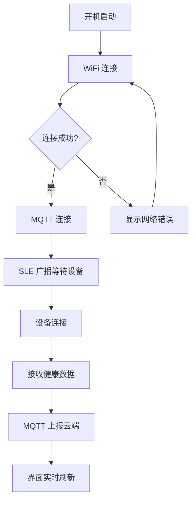

## 1. 产品概述

WatchControl 智能健康网关控制面板是一个 320×480 像素的嵌入式显示屏界面，用于实时监控和管理基于星闪(SLE)协议的智能健康手表系统。该网关接收手表端采集的健康体征数据，通过 WiFi 转发至 MQTT 云端。

- 目标用户：医护人员、养老院管理员、家庭照护者
- 核心价值：一屏掌控所有连接设备的健康数据与系统状态

## 2. 核心功能

### 2.1 功能模块

1. **状态总览页**：系统连接状态、设备数量、网络信息
2. **设备数据页**：已连接手表的实时健康体征数据展示
3. **系统日志页**：SLE/MQTT/WiFi 通信日志与告警

### 2.2 页面详情

| 页面名称 | 模块名称 | 功能描述 |
|----------|----------|----------|
| 状态总览页 | 系统状态卡片 | 显示 WiFi 连接状态、IP 地址、MQTT 连接状态、SLE 广播状态 |
| 状态总览页 | 设备计数 | 显示当前星闪连接的设备数量，在线/离线指示 |
| 状态总览页 | 网络信息 | WiFi SSID、信号强度、MQTT Broker 地址 |
| 设备数据页 | 设备列表 | 横向滑动切换已连接的设备卡片 |
| 设备数据页 | 健康数据面板 | 显示姓名、血压、血糖、身高、体重、BMI 等体征数据 |
| 设备数据页 | 数据上报状态 | 最近一次 MQTT 上报时间与状态 |
| 系统日志页 | 通信日志 | SLE 连接/断开事件、MQTT 发布/订阅日志 |
| 系统日志页 | 告警信息 | 网络断开、设备离线等异常告警 |

## 3. 核心流程

用户打开网关面板后，首先看到系统状态总览，确认 WiFi/MQTT/SLE 均正常连接。然后切换到设备数据页查看各手表端上报的健康体征数据。如有异常，系统日志页会显示告警信息。

## 4. 用户界面设计

### 4.1 设计风格

- 主色调：深色科技风（#0A0E1A 深蓝黑底色），搭配 #00E5A0 翡翠绿作为状态指示色
- 辅助色：#FF6B6B 告警红、#4ECDC4 信息青、#FFE664 警告黄
- 按钮风格：圆角胶囊按钮，微光晕效果
- 字体：数字用等宽字体（JetBrains Mono），中文用思源黑体
- 布局风格：卡片式布局，底部 Tab 导航栏
- 图标风格：线性描边图标，2px 线宽

### 4.2 页面设计概览

| 页面名称 | 模块名称 | UI 元素 |
|----------|----------|----------|
| 状态总览页 | 系统状态卡片 | 圆角卡片，状态指示灯（绿/红），渐变背景 |
| 状态总览页 | 设备计数 | 大号数字 + 环形进度指示器 |
| 状态总览页 | 网络信息 | 信息行列表，图标+文字+值 |
| 设备数据页 | 设备切换 | 横向滑动指示器（圆点） |
| 设备数据页 | 健康数据面板 | 体征数据卡片网格，图标+标签+数值 |
| 设备数据页 | 上报状态 | 底部状态栏，时间戳+状态图标 |
| 系统日志页 | 日志列表 | 时间轴样式，彩色标签区分类型 |
| 系统日志页 | 告警横幅 | 顶部滑入式告警横幅，红色背景 |

### 4.3 响应式设计

- 固定 320×480 像素，适配嵌入式 LCD 显示屏
- 触摸优化：最小触摸目标 44×44px
- 底部导航栏固定，内容区域可滚动

### 4.4 动画效果

- 状态变化时的脉冲呼吸动画
- 页面切换时的滑动过渡
- 数据刷新时的数字滚动效果
- 告警时的闪烁提示
