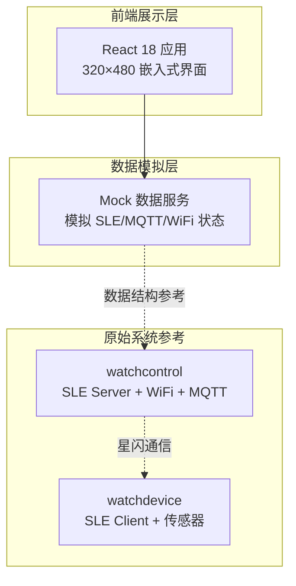
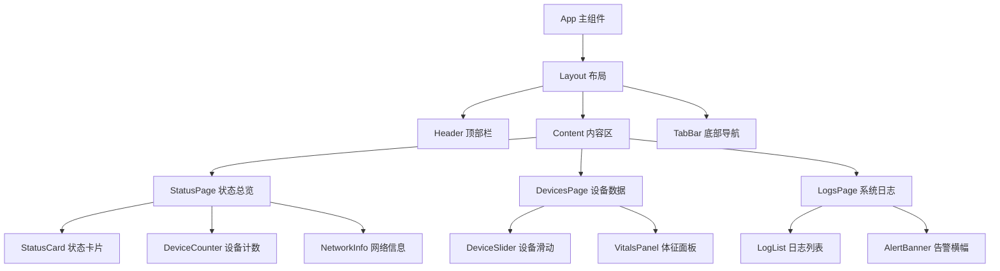

## 1. 架构设计



## 2. 技术说明

- 前端：React@18 + Tailwind CSS@3 + Vite
- 初始化工具：Vite
- 后端：无（纯前端展示，使用 Mock 数据模拟设备状态）
- 数据库：无（使用内存中的 Mock 数据）

## 3. 路由定义

| 路由 | 用途 |
|------|------|
| / | 状态总览页 - 系统连接状态、设备计数、网络信息 |
| /devices | 设备数据页 - 已连接设备的健康体征数据 |
| /logs | 系统日志页 - 通信日志与告警信息 |

## 4. 数据模型

### 4.1 设备数据结构

```typescript
interface WatchDevice {
  deviceId: string;
  mac: string;
  name: string;
  phone: string;
  idCard: string;
  connected: boolean;
  lastUpdate: number;
  vitals: {
    height: string;
    weight: string;
    bmi: string;
    bloodPressure: string;
    fastingBloodGlucose: string;
  };
}
```

### 4.2 系统状态结构

```typescript
interface SystemStatus {
  wifi: {
    connected: boolean;
    ssid: string;
    ip: string;
    signalStrength: number;
  };
  mqtt: {
    connected: boolean;
    broker: string;
    lastPublish: number;
    topic: string;
  };
  sle: {
    broadcasting: boolean;
    connectedDevices: number;
    serverName: string;
  };
}
```

### 4.3 日志条目结构

```typescript
interface LogEntry {
  id: string;
  timestamp: number;
  type: 'sle' | 'mqtt' | 'wifi' | 'alert';
  level: 'info' | 'warn' | 'error';
  message: string;
}
```

## 5. 组件架构


