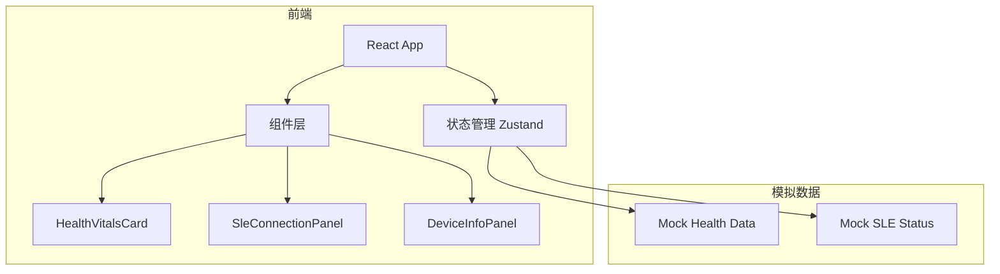

## 1. 架构设计



## 2. 技术说明

- 前端：React@18 + TailwindCSS@3 + Vite
- 初始化工具：vite-init
- 后端：无
- 数据库：无，使用 Zustand 管理模拟数据

## 3. 路由定义

| 路由 | 用途 |
|------|------|
| / | 主界面 - 健康体征 + SLE状态 + 设备信息 |

## 4. 数据模型

### 4.1 健康体征数据

```typescript
interface HealthVitals {
  name: string;        // 姓名
  phone: string;       // 电话
  idCard: string;      // 身份证
  height: string;      // 身高 cm
  weight: string;      // 体重 kg
  bmi: string;         // BMI
  bloodPressure: string; // 血压 mmHg
  fastingBloodGlucose: string; // 空腹血糖 mmol/L
}
```

### 4.2 SLE 连接状态

```typescript
interface SleStatus {
  connected: boolean;    // 是否已连接
  gatewayMac: string;    // 网关 MAC
  rssi: number;          // 信号强度 dBm
  lastSendTime: string;  // 最近发送时间
  lastSendSuccess: boolean; // 最近发送是否成功
}
```

### 4.3 设备信息

```typescript
interface DeviceInfo {
  deviceId: string;      // 设备 ID
  mac: string;           // 本机 MAC
  uptime: number;        // 运行时间(秒)
}
```
