# 前言<a name="ZH-CN_TOPIC_0000002543394395"></a>

**概述<a name="section1556345714215"></a>**

本文档介绍LiteOS的体系结构，并介绍如何进行LiteOS的开发和调试。

**读者对象<a name="section436220614215"></a>**

本文档主要适用于LiteOS的开发者。

本文档主要适用于以下对象：

-   物联网端侧软件开发工程师
-   物联网架构设计师

**符号约定<a name="section1970558814215"></a>**

在本文中可能出现下列标志，它们所代表的含义如下。

<a name="table2622507016410"></a>
<table><thead align="left"><tr id="row1530720816410"><th class="cellrowborder" valign="top" width="20.580000000000002%" id="mcps1.1.3.1.1"><p id="p6450074116410"><a name="p6450074116410"></a><a name="p6450074116410"></a><strong id="b2136615816410"><a name="b2136615816410"></a><a name="b2136615816410"></a>符号</strong></p>
</th>
<th class="cellrowborder" valign="top" width="79.42%" id="mcps1.1.3.1.2"><p id="p5435366816410"><a name="p5435366816410"></a><a name="p5435366816410"></a><strong id="b5941558116410"><a name="b5941558116410"></a><a name="b5941558116410"></a>说明</strong></p>
</th>
</tr>
</thead>
<tbody><tr id="row1372280416410"><td class="cellrowborder" valign="top" width="20.580000000000002%" headers="mcps1.1.3.1.1 "><p id="p3734547016410"><a name="p3734547016410"></a><a name="p3734547016410"></a><a name="image2670064316410"></a><a name="image2670064316410"></a><span></span></p>
</td>
<td class="cellrowborder" valign="top" width="79.42%" headers="mcps1.1.3.1.2 "><p id="p1757432116410"><a name="p1757432116410"></a><a name="p1757432116410"></a>表示如不避免则将会导致死亡或严重伤害的具有高等级风险的危害。</p>
</td>
</tr>
<tr id="row466863216410"><td class="cellrowborder" valign="top" width="20.580000000000002%" headers="mcps1.1.3.1.1 "><p id="p1432579516410"><a name="p1432579516410"></a><a name="p1432579516410"></a><a name="image4895582316410"></a><a name="image4895582316410"></a><span></span></p>
</td>
<td class="cellrowborder" valign="top" width="79.42%" headers="mcps1.1.3.1.2 "><p id="p959197916410"><a name="p959197916410"></a><a name="p959197916410"></a>表示如不避免则可能导致死亡或严重伤害的具有中等级风险的危害。</p>
</td>
</tr>
<tr id="row123863216410"><td class="cellrowborder" valign="top" width="20.580000000000002%" headers="mcps1.1.3.1.1 "><p id="p1232579516410"><a name="p1232579516410"></a><a name="p1232579516410"></a><a name="image1235582316410"></a><a name="image1235582316410"></a><span></span></p>
</td>
<td class="cellrowborder" valign="top" width="79.42%" headers="mcps1.1.3.1.2 "><p id="p123197916410"><a name="p123197916410"></a><a name="p123197916410"></a>表示如不避免则可能导致轻微或中度伤害的具有低等级风险的危害。</p>
</td>
</tr>
<tr id="row5786682116410"><td class="cellrowborder" valign="top" width="20.580000000000002%" headers="mcps1.1.3.1.1 "><p id="p2204984716410"><a name="p2204984716410"></a><a name="p2204984716410"></a><a name="image4504446716410"></a><a name="image4504446716410"></a><span></span></p>
</td>
<td class="cellrowborder" valign="top" width="79.42%" headers="mcps1.1.3.1.2 "><p id="p4388861916410"><a name="p4388861916410"></a><a name="p4388861916410"></a>用于传递设备或环境安全警示信息。如不避免则可能会导致设备损坏、数据丢失、设备性能降低或其它不可预知的结果。</p>
<p id="p1238861916410"><a name="p1238861916410"></a><a name="p1238861916410"></a>“须知”不涉及人身伤害。</p>
</td>
</tr>
<tr id="row2856923116410"><td class="cellrowborder" valign="top" width="20.580000000000002%" headers="mcps1.1.3.1.1 "><p id="p5555360116410"><a name="p5555360116410"></a><a name="p5555360116410"></a><a name="image799324016410"></a><a name="image799324016410"></a><span></span></p>
</td>
<td class="cellrowborder" valign="top" width="79.42%" headers="mcps1.1.3.1.2 "><p id="p4612588116410"><a name="p4612588116410"></a><a name="p4612588116410"></a>对正文中重点信息的补充说明。</p>
<p id="p1232588116410"><a name="p1232588116410"></a><a name="p1232588116410"></a>“说明”不是安全警示信息，不涉及人身、设备及环境伤害信息。</p>
</td>
</tr>
</tbody>
</table>

**修订记录<a name="section3731806114215"></a>**

<a name="table1557726816410"></a>
<table><thead align="left"><tr id="row2942532716410"><th class="cellrowborder" valign="top" width="20.72%" id="mcps1.1.4.1.1"><p id="p3778275416410"><a name="p3778275416410"></a><a name="p3778275416410"></a><strong id="b5687322716410"><a name="b5687322716410"></a><a name="b5687322716410"></a>文档版本</strong></p>
</th>
<th class="cellrowborder" valign="top" width="26.119999999999997%" id="mcps1.1.4.1.2"><p id="p5627845516410"><a name="p5627845516410"></a><a name="p5627845516410"></a><strong id="b5800814916410"><a name="b5800814916410"></a><a name="b5800814916410"></a>发布日期</strong></p>
</th>
<th class="cellrowborder" valign="top" width="53.16%" id="mcps1.1.4.1.3"><p id="p2382284816410"><a name="p2382284816410"></a><a name="p2382284816410"></a><strong id="b3316380216410"><a name="b3316380216410"></a><a name="b3316380216410"></a>修改说明</strong></p>
</th>
</tr>
</thead>
<tbody><tr id="row5947359616410"><td class="cellrowborder" valign="top" width="20.72%" headers="mcps1.1.4.1.1 "><p id="p2149706016410"><a name="p2149706016410"></a><a name="p2149706016410"></a>01</p>
</td>
<td class="cellrowborder" valign="top" width="26.119999999999997%" headers="mcps1.1.4.1.2 "><p id="p17709349593"><a name="p17709349593"></a><a name="p17709349593"></a>2026-03-17</p>
</td>
<td class="cellrowborder" valign="top" width="53.16%" headers="mcps1.1.4.1.3 "><p id="p1946537916410"><a name="p1946537916410"></a><a name="p1946537916410"></a>第一次正式版本发布</p>
</td>
</tr>
</tbody>
</table>

# 概述<a name="ZH-CN_TOPIC_0000002543354183"></a>


## 背景介绍<a name="ZH-CN_TOPIC_0000002543394193"></a>

LiteOS是轻量级的实时操作系统，具备轻量级、低功耗、快速启动、组件丰富等关键能力。

**图 1**  LiteOS的基本框架图<a name="fig5318103119570"></a>  
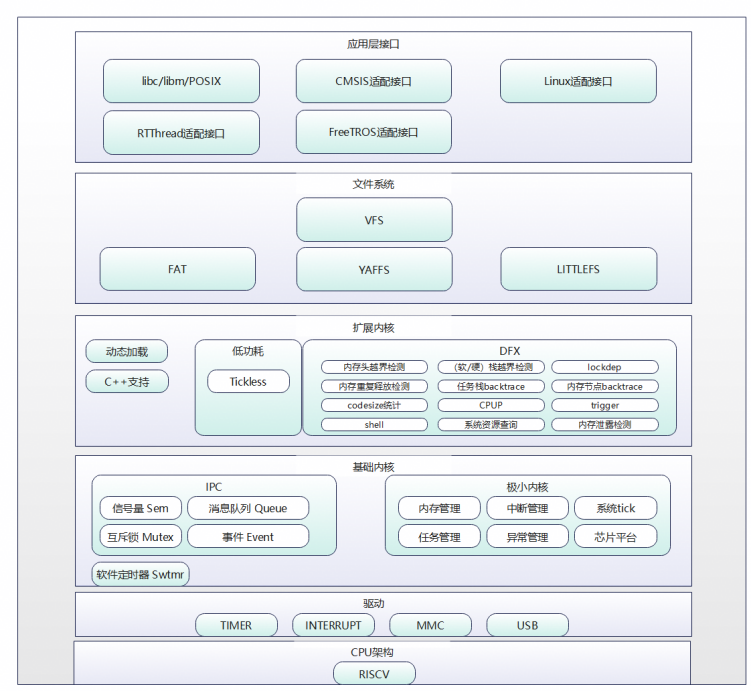

LiteOS的基础内核包括不可裁剪的极小内核和可裁剪的其他模块。极小内核只包含任务管理和调度相关的基本功能。可裁剪的模块包括信号量、互斥锁、队列管理、事件管理、软件定时器、内存管理、中断管理、异常管理和系统时钟Tick。

LiteOS支持在单核环境上运行。

**LiteOS的优势<a name="s6e0aa4faed9041bb807479a04ddebdab"></a>**

-   高实时性，高稳定性。
-   低功耗。支持动态加载、分散加载。
-   支持功能静态裁剪。
-   快速启动。

**内核各模块简介<a name="s0796b68eb2334c48b6b259a344d24636"></a>**

-   任务管理

    提供任务的创建、删除、延迟、挂起、恢复等功能，支持锁定和解锁任务调度，支持任务按优先级高低的抢占调度以及同优先级时间片轮转调度。

-   内存管理
    -   提供静态内存和动态内存两种算法，支持内存的申请与释放。目前支持的内存管理算法包括固定大小的BOX算法、动态申请的bestfit算法和bestfit\_little算法。
    -   提供内存统计、内存越界检测功能。

-   硬件相关

    提供中断管理、异常管理、系统时钟Tick等功能。

    -   中断管理：提供中断的创建、删除、使能、禁止及请求位清除功能。
    -   异常管理：系统运行过程中发生异常后，跳转至异常处理模块，打印当前异常的函数调用栈信息或保存当前系统状态。
    -   Tick：Tick是操作系统调度的基本时间单位，其时长由每秒的Tick数决定，由用户配置。

-   IPC通信

    提供消息队列、事件、信号量和互斥锁功能。

    -   消息队列：支持消息队列的创建、删除、发送和接收功能。
    -   事件：支持读事件和写事件功能。
    -   信号量：支持信号量的创建、删除、申请和释放功能。
    -   互斥锁：支持互斥锁的创建、删除、申请和释放功能。

-   软件定时器

    软件定时器提供了定时器的创建、删除、启动、停止功能。

-   低功耗

    Tickless：Tickless机制是通过计算下一次有意义的时钟中断的时间，来减少不必要的时钟中断，从而降低系统功耗。打开Tickless功能后，系统会在CPU空闲时启动Tickless机制。

-   扩展内核/维测
    -   CPU占用率：可以获取系统或者指定任务的CPU占用率。
    -   Trace事件监测：实时获取事件发生的上下文，并写入缓冲区。支持自定义缓冲区，监测指定模块的事件，开启/停止Trace，清除/输出trace缓冲区数据等。
    -   Perf：一款性能分析工具，可以通过Perf查找性能瓶颈、定位热点代码。LiteOS支持配置采样数据缓冲区、配置采样事件、启动/停止Perf、输出采样数据等功能。
    -   Shell：LiteOS Shell使用串口或Telnet工具接收用户输入的命令，通过命令的方式调用、执行相应的应用程序。LiteOS Shell支持常用的基本调试功能，包含系统、文件、网络和动态加载等相关命令，同时支持用户添加自定义命令。

-   C++支持

    LiteOS支持部分STL特性、异常和RTTI特性，其他特性由编译器支持。

## 支持的核<a name="ZH-CN_TOPIC_0000002543394345"></a>

<a name="table37599927114623"></a>
<table><thead align="left"><tr id="row9045213114623"><th class="cellrowborder" valign="top" width="42.730000000000004%" id="mcps1.1.3.1.1"><p id="p17292119114623"><a name="p17292119114623"></a><a name="p17292119114623"></a>支持的核</p>
</th>
<th class="cellrowborder" valign="top" width="57.269999999999996%" id="mcps1.1.3.1.2"><p id="p58484359114623"><a name="p58484359114623"></a><a name="p58484359114623"></a>芯片</p>
</th>
</tr>
</thead>
<tbody><tr id="row56597184114623"><td class="cellrowborder" valign="top" width="42.730000000000004%" headers="mcps1.1.3.1.1 "><p id="p20969186114623"><a name="p20969186114623"></a><a name="p20969186114623"></a>LinxCore131、LinxCore132、LinxCore170</p>
</td>
<td class="cellrowborder" valign="top" width="57.269999999999996%" headers="mcps1.1.3.1.2 "><p id="p20782492114623"><a name="p20782492114623"></a><a name="p20782492114623"></a>Hi3863、Hi3853</p>
</td>
</tr>
</tbody>
</table>

## 使用约束<a name="ZH-CN_TOPIC_0000002511954398"></a>

-   LiteOS提供一套自有OS接口，同时也支持POSIX和CMSIS接口。请勿混用这些接口。混用接口可能导致不可预知的错误，例如：用POSIX接口申请信号量，但用LiteOS接口释放信号量。
-   开发驱动程序只能用LiteOS的接口，上层APP建议用POSIX接口。

# 基础内核<a name="ZH-CN_TOPIC_0000002543394197"></a>


## 任务<a name="ZH-CN_TOPIC_0000002543394247"></a>


### 概述<a name="ZH-CN_TOPIC_0000002511794444"></a>

**基本概念<a name="section734172610531"></a>**

从系统角度看，任务是竞争系统资源的最小运行单元。任务可以使用或等待CPU、使用内存空间等系统资源，并独立于其它任务运行。

LiteOS的任务模块可以给用户提供多个任务，实现任务间的切换，帮助用户管理业务程序流程。LiteOS的任务模块具有如下特性：

-   支持多任务。
-   一个任务表示一个线程。
-   抢占式调度机制，高优先级的任务可打断低优先级任务，低优先级任务必须在高优先级任务阻塞或结束后才能得到调度。
-   相同优先级任务支持时间片轮转调度方式。
-   共有32个优先级\[0, 31\]，最高优先级为0，最低优先级为31。
-   任务存在两种属性（detached、joinable）。默认情况下任务创建的属性为detached。

**任务相关概念<a name="section5879050715587"></a>**

-   任务状态

    LiteOS系统中的任务有多种运行状态。系统初始化完成后，创建的任务就可以在系统中竞争一定的资源，由内核进行调度。

    任务状态通常分为以下四种：

    -   就绪（Ready）：该任务在就绪队列中，只等待CPU。
    -   运行（Running）：该任务正在执行。
    -   阻塞（Blocked）：该任务不在就绪队列中，包含任务被挂起（suspend状态）、任务被延时（delay状态）、任务正在等待信号量、读写队列或者等待事件等。
    -   退出态（Dead）：该任务运行结束，等待系统回收资源，包含任务处于僵尸状态（zombie状态）、任务已经被回收（unused状态）。

-   任务状态迁移

    **图 1**  任务状态示意图<a name="fig183501322820"></a>  
    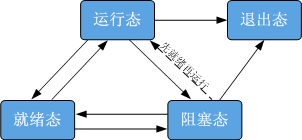

    任务状态迁移说明：

    -   就绪态→运行态

        任务创建后进入就绪态，发生任务切换时，就绪队列中最高优先级的任务被执行，从而进入运行态，同时该任务从就绪队列中移出。

    -   运行态→阻塞态

        正在运行的任务发生阻塞（挂起、延时、读信号量等）时，任务状态由运行态变成阻塞态，然后发生任务切换，取出并运行就绪队列中最高优先级任务。

    -   阻塞态→就绪态（阻塞态→运行态）

        阻塞的任务被恢复后（任务恢复、延时时间超时、读信号量超时或读到信号量等），此时被恢复的任务会被加入就绪队列，从而由阻塞态变成就绪态；此时如果被恢复任务的优先级高于正在运行任务的优先级，则会发生任务切换，该任务由就绪态变成运行态。

    -   就绪态→阻塞态

        任务也有可能在就绪态时被阻塞（挂起），此时任务状态由就绪态变为阻塞态，该任务从就绪队列中删除，不会参与任务调度，直到该任务被恢复。

    -   运行态→就绪态

        有更高优先级任务创建或者恢复后，会发生任务调度，此刻就绪队列中最高优先级任务会被取出并切换到运行态，那么原先运行的任务由运行态变为就绪态，并插入到就绪队列中。

    -   运行态→退出态

        运行中的任务运行结束，任务状态由运行态变为退出态。退出态包含任务运行结束的正常退出状态以及僵尸状态。例如，joinable属性的任务运行结束但是没有被回收资源，对外呈现的就是僵尸状态，即退出态。

    -   阻塞态→退出态

        阻塞的任务调用删除接口，任务状态由阻塞态变为退出态。

-   任务ID

    任务ID在任务创建时通过参数返回给用户，是任务的重要标识。系统中的ID号是唯一的。用户可以通过任务ID对指定任务进行任务挂起、任务恢复、查询任务名等操作。

-   任务优先级

    优先级表示任务执行的优先顺序。任务的优先级决定了在发生任务切换时即将要执行的任务，就绪队列中最高优先级的任务将得到执行。

-   任务入口函数

    新任务得到调度后将执行的函数。该函数由用户实现，在任务创建时通过任务创建结构体设置。

-   任务栈

    每个任务都拥有一个独立的栈空间，我们称为任务栈。栈空间里保存的信息包含局部变量、寄存器、函数参数、函数返回地址等。

-   任务上下文

    任务在运行过程中使用的一些资源如寄存器等，称为任务上下文。当这个任务挂起时，其他任务继续执行，可能会修改寄存器等资源中的值。如果任务切换时没有保存任务上下文，可能会导致任务恢复后出现未知错误。

    因此，LiteOS在任务切换时会将切出任务的任务上下文信息，保存在自身的任务栈中，以便任务恢复后从栈空间中恢复挂起时的上下文信息，从而继续执行挂起时被打断的代码。

-   任务控制块TCB

    每个任务都含有一个任务控制块（TCB）。TCB包含了任务上下文栈指针（stack pointer）、任务状态、任务优先级、任务ID、任务名、任务栈大小等信息，可以反映出每个任务运行情况。

-   任务切换

    任务切换包含获取就绪队列中最高优先级任务、切出任务上下文保存、切入任务上下文恢复等动作。

-   任务属性

    任务存在两种属性（detached、joinable），任务的不同属性可以决定任务的终止方式。joinable属性即为非分离状态，这种状态的任务退出后，不会自动释放资源，需要被其他任务通过调用LOS\_TaskJoin接口等待获取其返回值，才能被释放资源。detached属性即为分离状态，这种状态的任务退出后将自动回收资源，并且这个任务不能被等待，等待是没有意义的。

**调度器相关概念<a name="section36661640105416"></a>**

LiteOS包含两种调度模式，即全局队列调度器模式和多队列调度器模式，在不同场景下各有优势，当前系统默认使用全局调度器模式。

-   全局队列调度器模式：系统仅使用一个优先级队列保存准备运行的任务，所有核使用同一优先级队列调度，所有任务抢占同一个优先级队列，因此全局队列调度器模式拥有更高的实时性。
-   多队列调度器模式：仅多核使用，系统按照核数为每个核创建一个优先级队列，每个核仅使用自己的优先级队列进行调度，系统通过负载均衡算法将任务在不同的优先级队列上进行迁移，相比全局队列调度模式可以有效减少频繁的核间迁移。

**运作机制<a name="section1786939515524"></a>**

用户创建任务时，系统会初始化任务栈，预置上下文。此外，系统还会将“任务入口函数”地址放在相应位置。这样在任务第一次启动进入运行态时，将会执行“任务入口函数”。

### 开发指导<a name="ZH-CN_TOPIC_0000002511954396"></a>

**使用场景<a name="section5224652316715"></a>**

任务创建后，内核可以执行锁定任务调度、解锁任务调度、挂起、恢复、延时等操作，同时也可以设置任务优先级，获取任务优先级。

**功能<a name="section21906860141415"></a>**

LiteOS的任务管理模块提供下面几种功能，接口详细信息请参见API参考。

<a name="table4179158561"></a>
<table><thead align="left"><tr id="row8216185185618"><th class="cellrowborder" valign="top" width="19.39%" id="mcps1.1.4.1.1"><p id="p1221612517569"><a name="p1221612517569"></a><a name="p1221612517569"></a>功能分类</p>
</th>
<th class="cellrowborder" valign="top" width="28.57%" id="mcps1.1.4.1.2"><p id="p112160513563"><a name="p112160513563"></a><a name="p112160513563"></a>接口名</p>
</th>
<th class="cellrowborder" valign="top" width="52.04%" id="mcps1.1.4.1.3"><p id="p92161755561"><a name="p92161755561"></a><a name="p92161755561"></a>描述</p>
</th>
</tr>
</thead>
<tbody><tr id="row19216758565"><td class="cellrowborder" rowspan="6" valign="top" width="19.39%" headers="mcps1.1.4.1.1 "><p id="p421614525612"><a name="p421614525612"></a><a name="p421614525612"></a>创建和删除任务</p>
</td>
<td class="cellrowborder" valign="top" width="28.57%" headers="mcps1.1.4.1.2 "><p id="p621615525618"><a name="p621615525618"></a><a name="p621615525618"></a>LOS_TaskCreateOnly</p>
</td>
<td class="cellrowborder" valign="top" width="52.04%" headers="mcps1.1.4.1.3 "><p id="p221645165613"><a name="p221645165613"></a><a name="p221645165613"></a>创建任务，并使该任务进入suspend状态，不对该任务进行调度。如果需要调度，可以调用LOS_TaskResume使该任务进入ready状态。</p>
</td>
</tr>
<tr id="row12216959560"><td class="cellrowborder" valign="top" headers="mcps1.1.4.1.1 "><p id="p132169512563"><a name="p132169512563"></a><a name="p132169512563"></a>LOS_TaskCreate</p>
</td>
<td class="cellrowborder" valign="top" headers="mcps1.1.4.1.2 "><p id="p17216195205619"><a name="p17216195205619"></a><a name="p17216195205619"></a>创建任务，并使该任务进入ready状态，如果就绪队列中没有更高优先级的任务，则运行该任务。</p>
</td>
</tr>
<tr id="row92160515569"><td class="cellrowborder" valign="top" headers="mcps1.1.4.1.1 "><p id="p02162545614"><a name="p02162545614"></a><a name="p02162545614"></a>LOS_TaskCreateOnlyStatic</p>
</td>
<td class="cellrowborder" valign="top" headers="mcps1.1.4.1.2 "><p id="p121616575618"><a name="p121616575618"></a><a name="p121616575618"></a>创建任务，任务栈由用户传入并使该任务进入suspend状态，不对该任务进行调度。如果需要调度，可以调用LOS_TaskResume使该任务进入ready状态。</p>
</td>
</tr>
<tr id="row92165585613"><td class="cellrowborder" valign="top" headers="mcps1.1.4.1.1 "><p id="p1821613545618"><a name="p1821613545618"></a><a name="p1821613545618"></a>LOS_TaskCreateStatic</p>
</td>
<td class="cellrowborder" valign="top" headers="mcps1.1.4.1.2 "><p id="p32161595611"><a name="p32161595611"></a><a name="p32161595611"></a>创建任务，任务栈由用户传入并使该任务进入ready状态，如果就绪队列中没有更高优先级的任务，则运行该任务。</p>
</td>
</tr>
<tr id="row5216551563"><td class="cellrowborder" valign="top" headers="mcps1.1.4.1.1 "><p id="p821613565618"><a name="p821613565618"></a><a name="p821613565618"></a>LOS_TaskDelete</p>
</td>
<td class="cellrowborder" valign="top" headers="mcps1.1.4.1.2 "><p id="p621619595619"><a name="p621619595619"></a><a name="p621619595619"></a>删除指定的任务。</p>
</td>
</tr>
<tr id="row721635175617"><td class="cellrowborder" valign="top" headers="mcps1.1.4.1.1 "><p id="p72161756568"><a name="p72161756568"></a><a name="p72161756568"></a>LOS_TaskJoin</p>
</td>
<td class="cellrowborder" valign="top" headers="mcps1.1.4.1.2 "><p id="p1121612555614"><a name="p1121612555614"></a><a name="p1121612555614"></a>以阻塞的方式等待指定的任务并回收任务资源。</p>
</td>
</tr>
<tr id="row7216175125614"><td class="cellrowborder" rowspan="5" valign="top" width="19.39%" headers="mcps1.1.4.1.1 "><p id="p152161451567"><a name="p152161451567"></a><a name="p152161451567"></a>控制任务状态</p>
</td>
<td class="cellrowborder" valign="top" width="28.57%" headers="mcps1.1.4.1.2 "><p id="p132162515561"><a name="p132162515561"></a><a name="p132162515561"></a>LOS_TaskResume</p>
</td>
<td class="cellrowborder" valign="top" width="52.04%" headers="mcps1.1.4.1.3 "><p id="p2216175185615"><a name="p2216175185615"></a><a name="p2216175185615"></a>恢复挂起的任务，使该任务进入ready状态。</p>
</td>
</tr>
<tr id="row172161058566"><td class="cellrowborder" valign="top" headers="mcps1.1.4.1.1 "><p id="p921610514562"><a name="p921610514562"></a><a name="p921610514562"></a>LOS_TaskSuspend</p>
</td>
<td class="cellrowborder" valign="top" headers="mcps1.1.4.1.2 "><p id="p921618510562"><a name="p921618510562"></a><a name="p921618510562"></a>挂起指定的任务，然后切换任务。</p>
</td>
</tr>
<tr id="row15216185135612"><td class="cellrowborder" valign="top" headers="mcps1.1.4.1.1 "><p id="p112161456569"><a name="p112161456569"></a><a name="p112161456569"></a>LOS_TaskDelay</p>
</td>
<td class="cellrowborder" valign="top" headers="mcps1.1.4.1.2 "><p id="p1721695105619"><a name="p1721695105619"></a><a name="p1721695105619"></a>任务延时等待，释放CPU，等待时间到期后该任务会重新进入ready状态。</p>
</td>
</tr>
<tr id="row921645155616"><td class="cellrowborder" valign="top" headers="mcps1.1.4.1.1 "><p id="p1721616545618"><a name="p1721616545618"></a><a name="p1721616545618"></a>LOS_TaskYield</p>
</td>
<td class="cellrowborder" valign="top" headers="mcps1.1.4.1.2 "><p id="p5216185145612"><a name="p5216185145612"></a><a name="p5216185145612"></a>当前任务释放CPU，并将其移到具有相同优先级的就绪任务队列的末尾。</p>
</td>
</tr>
<tr id="row1221614555612"><td class="cellrowborder" valign="top" headers="mcps1.1.4.1.1 "><p id="p1321665115610"><a name="p1321665115610"></a><a name="p1321665115610"></a>LOS_TaskDetach</p>
</td>
<td class="cellrowborder" valign="top" headers="mcps1.1.4.1.2 "><p id="p1021610545619"><a name="p1021610545619"></a><a name="p1021610545619"></a>将任务属性设置为detached。</p>
</td>
</tr>
<tr id="row102165516564"><td class="cellrowborder" rowspan="3" valign="top" width="19.39%" headers="mcps1.1.4.1.1 "><p id="p1821695185611"><a name="p1821695185611"></a><a name="p1821695185611"></a>控制任务调度</p>
</td>
<td class="cellrowborder" valign="top" width="28.57%" headers="mcps1.1.4.1.2 "><p id="p18216135165615"><a name="p18216135165615"></a><a name="p18216135165615"></a>LOS_TaskLock</p>
</td>
<td class="cellrowborder" valign="top" width="52.04%" headers="mcps1.1.4.1.3 "><p id="p19216135115620"><a name="p19216135115620"></a><a name="p19216135115620"></a>锁定任务调度，但任务仍可被中断打断。</p>
</td>
</tr>
<tr id="row321614516562"><td class="cellrowborder" valign="top" headers="mcps1.1.4.1.1 "><p id="p821611515565"><a name="p821611515565"></a><a name="p821611515565"></a>LOS_TaskUnlock</p>
</td>
<td class="cellrowborder" valign="top" headers="mcps1.1.4.1.2 "><p id="p921617545610"><a name="p921617545610"></a><a name="p921617545610"></a>解锁任务调度。</p>
</td>
</tr>
<tr id="row2021614519564"><td class="cellrowborder" valign="top" headers="mcps1.1.4.1.1 "><p id="p1521715185618"><a name="p1521715185618"></a><a name="p1521715185618"></a>LOS_TaskUnlockNoSched</p>
</td>
<td class="cellrowborder" valign="top" headers="mcps1.1.4.1.2 "><p id="p821735175614"><a name="p821735175614"></a><a name="p821735175614"></a>解锁任务调度，并继续执行本任务。</p>
</td>
</tr>
<tr id="row62177585616"><td class="cellrowborder" rowspan="3" valign="top" width="19.39%" headers="mcps1.1.4.1.1 "><p id="p42172535620"><a name="p42172535620"></a><a name="p42172535620"></a>控制任务优先级</p>
</td>
<td class="cellrowborder" valign="top" width="28.57%" headers="mcps1.1.4.1.2 "><p id="p16217165185620"><a name="p16217165185620"></a><a name="p16217165185620"></a>LOS_CurTaskPriSet</p>
</td>
<td class="cellrowborder" valign="top" width="52.04%" headers="mcps1.1.4.1.3 "><p id="p15217850561"><a name="p15217850561"></a><a name="p15217850561"></a>设置当前任务的优先级。</p>
</td>
</tr>
<tr id="row1217255564"><td class="cellrowborder" valign="top" headers="mcps1.1.4.1.1 "><p id="p721710519562"><a name="p721710519562"></a><a name="p721710519562"></a>LOS_TaskPriSet</p>
</td>
<td class="cellrowborder" valign="top" headers="mcps1.1.4.1.2 "><p id="p1121717555618"><a name="p1121717555618"></a><a name="p1121717555618"></a>设置指定任务的优先级。</p>
</td>
</tr>
<tr id="row1721716514561"><td class="cellrowborder" valign="top" headers="mcps1.1.4.1.1 "><p id="p1621775145610"><a name="p1621775145610"></a><a name="p1621775145610"></a>LOS_TaskPriGet</p>
</td>
<td class="cellrowborder" valign="top" headers="mcps1.1.4.1.2 "><p id="p8217552561"><a name="p8217552561"></a><a name="p8217552561"></a>获取指定任务的优先级。</p>
</td>
</tr>
<tr id="row821710519567"><td class="cellrowborder" valign="top" width="19.39%" headers="mcps1.1.4.1.1 "><p id="p9217115195610"><a name="p9217115195610"></a><a name="p9217115195610"></a>回收任务栈资源</p>
</td>
<td class="cellrowborder" valign="top" width="28.57%" headers="mcps1.1.4.1.2 "><p id="p18217165165610"><a name="p18217165165610"></a><a name="p18217165165610"></a>LOS_TaskResRecycle</p>
</td>
<td class="cellrowborder" valign="top" width="52.04%" headers="mcps1.1.4.1.3 "><p id="p1421712505619"><a name="p1421712505619"></a><a name="p1421712505619"></a>回收所有待回收的任务栈资源。</p>
</td>
</tr>
<tr id="row1217554562"><td class="cellrowborder" rowspan="3" valign="top" width="19.39%" headers="mcps1.1.4.1.1 "><p id="p1921718520569"><a name="p1921718520569"></a><a name="p1921718520569"></a>获取任务信息</p>
</td>
<td class="cellrowborder" valign="top" width="28.57%" headers="mcps1.1.4.1.2 "><p id="p17217755561"><a name="p17217755561"></a><a name="p17217755561"></a>LOS_CurTaskIDGet</p>
</td>
<td class="cellrowborder" valign="top" width="52.04%" headers="mcps1.1.4.1.3 "><p id="p112171052563"><a name="p112171052563"></a><a name="p112171052563"></a>获取当前任务的ID。</p>
</td>
</tr>
<tr id="row221717511563"><td class="cellrowborder" valign="top" headers="mcps1.1.4.1.1 "><p id="p1821720512563"><a name="p1821720512563"></a><a name="p1821720512563"></a>LOS_TaskInfoGet</p>
</td>
<td class="cellrowborder" valign="top" headers="mcps1.1.4.1.2 "><p id="p321712515619"><a name="p321712515619"></a><a name="p321712515619"></a>获取指定任务的信息，包括任务状态、优先级、任务栈大小、栈顶指针SP、任务入口函数和已使用的任务栈大小等。</p>
</td>
</tr>
<tr id="row621718515614"><td class="cellrowborder" valign="top" headers="mcps1.1.4.1.1 "><p id="p182171751561"><a name="p182171751561"></a><a name="p182171751561"></a>LOS_TaskIsScheduled</p>
</td>
<td class="cellrowborder" valign="top" headers="mcps1.1.4.1.2 "><p id="p202176565612"><a name="p202176565612"></a><a name="p202176565612"></a>查询当前核是否已经开始任务调度。</p>
</td>
</tr>
<tr id="row5217165155611"><td class="cellrowborder" valign="top" width="19.39%" headers="mcps1.1.4.1.1 "><p id="p82178518561"><a name="p82178518561"></a><a name="p82178518561"></a>任务信息维测</p>
</td>
<td class="cellrowborder" valign="top" width="28.57%" headers="mcps1.1.4.1.2 "><p id="p1217855567"><a name="p1217855567"></a><a name="p1217855567"></a>LOS_TaskSwitchHookReg</p>
</td>
<td class="cellrowborder" valign="top" width="52.04%" headers="mcps1.1.4.1.3 "><p id="p152171250569"><a name="p152171250569"></a><a name="p152171250569"></a>注册任务上下文切换的钩子函数。只有开启LOSCFG_BASE_CORE_TSK_MONITOR宏开关后，这个钩子函数才会在任务发生上下文切换时被调用。</p>
</td>
</tr>
<tr id="row162171535615"><td class="cellrowborder" valign="top" width="19.39%" headers="mcps1.1.4.1.1 "><p id="p421716555615"><a name="p421716555615"></a><a name="p421716555615"></a>任务空闲处理回调</p>
</td>
<td class="cellrowborder" valign="top" width="28.57%" headers="mcps1.1.4.1.2 "><p id="p1721785105610"><a name="p1721785105610"></a><a name="p1721785105610"></a>LOS_IdleHandlerHookReg</p>
</td>
<td class="cellrowborder" valign="top" width="52.04%" headers="mcps1.1.4.1.3 "><p id="p32175519569"><a name="p32175519569"></a><a name="p32175519569"></a>注册空闲任务钩子函数，当系统空闲时调用。</p>
</td>
</tr>
<tr id="row7217125195619"><td class="cellrowborder" valign="top" width="19.39%" headers="mcps1.1.4.1.1 "><p id="p112170555610"><a name="p112170555610"></a><a name="p112170555610"></a>申请任务的安全栈</p>
</td>
<td class="cellrowborder" valign="top" width="28.57%" headers="mcps1.1.4.1.2 "><p id="p1221713555617"><a name="p1221713555617"></a><a name="p1221713555617"></a>LOS_TaskAllocSecureContext</p>
</td>
<td class="cellrowborder" valign="top" width="52.04%" headers="mcps1.1.4.1.3 "><p id="p202171851565"><a name="p202171851565"></a><a name="p202171851565"></a>申请任务的安全栈。只有开启LOSCFG_TRUSTZONE宏开关后，该函数才可使用。</p>
</td>
</tr>
</tbody>
</table>

> **须知：** 
>各个任务的任务栈大小可以在创建任务时进行针对性的设置，若设置为0，则使用默认任务栈大小（LOSCFG\_BASE\_CORE\_TSK\_DEFAULT\_STACK\_SIZE）作为任务栈大小。

**配置项<a name="section4504031135613"></a>**

-   共享栈特性

    -   共享栈特性说明：在原生系统中，每个任务都拥有自己的独立栈区，引入共享栈后，将会有部分任务共用同一片任务栈，称为共享栈，任务发生调度时，老任务的栈数据从共享栈拷出到堆，新任务的栈数据从堆拷回到共享栈。
    -   共享栈使用说明：

        LOSCFG\_SHARED\_STACK：共享栈总开关，开启后才能使用共享栈特性。

        LOSCFG\_SHARED\_STACK\_SIZE：配置共享栈的大小（Byte），宏默认值为16384，使用时可以根据实际情况调整，调整范围为：3072到65536，且需要能够整除16，建议配置为“参与共享的任务中任务栈的最大值”。

        目前共享栈特性使用白名单策略，在名单内的任务为共享任务。配置方式如下（以hiwing为例）：

        在文件“Huawei\_LiteOS/self\_src/targets/hiwing/board.c”的g\_taskBlackList数组中进行配置，一共3个字段，分别表示“任务名称”、“是否参与共享”、“是否在栈数据拷贝时进行压缩”。

        示例如下：

        ```
        /*
        在此处设置共享栈白名单，名单内的任务参与共享
        只有参与共享的任务才能参与压缩
        */
        const TaskBlackList g_sharedTask[LOSCFG_BASE_CORE_TSK_LIMIT + 1] = {
            //              taskName               加入共享？                            加入压缩？
            {"app_Task",                            TRUE,                               FALSE},
            {"SerialShellTask",                     TRUE,                               FALSE},
            {"SerialEntryTask",                     TRUE,                               FALSE},
            {"TskInSharedBlackLits",                TRUE,                               FALSE},
        };
        ```

    > **须知：** 
    >-   如果任务创建时，指定任务使用创建时传入的栈，则该任务无法参与共享。
    >-   共享栈开启后，还可以开启LOSCFG\_SHARED\_TASK\_STAT宏增加任务信息显示功能，但会增加内存开销约0.6KB。

    <a name="table98267209577"></a>
    <table><thead align="left"><tr id="row5835152014574"><th class="cellrowborder" valign="top" width="19.39%" id="mcps1.1.4.1.1"><p id="p783514208575"><a name="p783514208575"></a><a name="p783514208575"></a>功能分类</p>
    </th>
    <th class="cellrowborder" valign="top" width="15.010000000000002%" id="mcps1.1.4.1.2"><p id="p158351320185719"><a name="p158351320185719"></a><a name="p158351320185719"></a>接口名</p>
    </th>
    <th class="cellrowborder" valign="top" width="65.60000000000001%" id="mcps1.1.4.1.3"><p id="p198361720205716"><a name="p198361720205716"></a><a name="p198361720205716"></a>描述</p>
    </th>
    </tr>
    </thead>
    <tbody><tr id="row128361420125718"><td class="cellrowborder" valign="top" width="19.39%" headers="mcps1.1.4.1.1 "><p id="p17836102055711"><a name="p17836102055711"></a><a name="p17836102055711"></a>显示任务的调度性能信息</p>
    </td>
    <td class="cellrowborder" valign="top" width="15.010000000000002%" headers="mcps1.1.4.1.2 "><p id="p1683642020575"><a name="p1683642020575"></a><a name="p1683642020575"></a>SharedTaskStatPrint</p>
    </td>
    <td class="cellrowborder" valign="top" width="65.60000000000001%" headers="mcps1.1.4.1.3 "><p id="p67361334183917"><a name="p67361334183917"></a><a name="p67361334183917"></a>打印任务性能信息：</p>
    <p id="p108362020155719"><a name="p108362020155719"></a><a name="p108362020155719"></a>第一组为总体性能数据，包括任务调度最大耗时、平均耗时以及调度耗时超过8000 cycleTime的次数。</p>
    <p id="p1683692020578"><a name="p1683692020578"></a><a name="p1683692020578"></a>第二组为单任务性能数据，包括任务名称、ID、调度次数、参与压缩拷贝次数（未参与或未开启压缩则为0）、压缩成功次数、压缩成功率、拷出到堆的最大耗时、拷入共享栈的最大耗时，以及拷贝耗时超过8000 cycleTime的次数。</p>
    </td>
    </tr>
    </tbody>
    </table>

-   加权公平调度特性
    -   加权公平调度（后文简称WCFS）特性说明：

        无WCFS的系统下，系统中存在一组优先级队列PriQueue，任务根据自己的优先级插入到不同的队列中，任务调度时，拿取优先级最高的队列的队首。

        引入WCFS之后，任务将根据自己的优先级以及运行时间，加权计算得到一个虚拟运行时间，根据虚拟运行时间进行优先级排序，达到相对公平的状态。任务调度时，先从CFS队列中获取一个优先级最高的CFS任务CFSTask，然后获取优先级最高的RT任务（非CFS任务）RTTask，比较CFSTask与RTTask的优先级，选择其中优先级更高的执行，如果CFSTask与RTTask的优先级相同，则执行RTTask。RTTask任务和CFS任务都执行完时，CPU才会去执行Idle任务。

    -   使用说明：

        打开宏LOSCFG\_WCFS\_SCHEDULER即可使用CFS特性。目前加权公平调度特性使用黑名单策略，在名单内的任务不参与加权公平调度。配置方式如下（以hiwing为例）：

        在文件“LiteOS/Huawei\_LiteOS/self\_src/targets/hiwing/board.c”中的g\_rtTaskName数组中进行配置，将不参与加权公平调度的线程名加入数组即可。

        示例如下：

        ```
        CHAR *g_rtTaskName[CFS_TASK_LIST_NUM] = {
            "app_Task",
            "SerialShellTask",
            "SerialEntryTask",
        };
        ```

    -   其他：

        目前LiteOS还提供UINT32 LOS\_RemoveTaskFromCFS\(UINT32 taskid\);接口，该接口传入线程id，对应id的线程将被加入WCFS黑名单，成功则返回OK。

        > **说明：** 
        >注意：如果该线程已经不参与WCFS，或者该线程为IdleTask，也返回OK。

**TASK状态<a name="section752424385712"></a>**

LiteOS任务的大多数状态由内核维护，唯有自删除状态对用户可见，需要用户在创建任务时传入如下定义内容：

<a name="table1052614315578"></a>
<table><thead align="left"><tr id="row7542104319575"><th class="cellrowborder" valign="top" width="31.313131313131308%" id="mcps1.1.4.1.1"><p id="p15542843165714"><a name="p15542843165714"></a><a name="p15542843165714"></a>定义</p>
</th>
<th class="cellrowborder" valign="top" width="21.002100210021002%" id="mcps1.1.4.1.2"><p id="p7542743175711"><a name="p7542743175711"></a><a name="p7542743175711"></a>实际数值</p>
</th>
<th class="cellrowborder" valign="top" width="47.68476847684768%" id="mcps1.1.4.1.3"><p id="p45424431573"><a name="p45424431573"></a><a name="p45424431573"></a>描述</p>
</th>
</tr>
</thead>
<tbody><tr id="row15542164335718"><td class="cellrowborder" valign="top" width="31.313131313131308%" headers="mcps1.1.4.1.1 "><p id="p6542124325712"><a name="p6542124325712"></a><a name="p6542124325712"></a>LOS_TASK_STATUS_JOINABLE</p>
</td>
<td class="cellrowborder" valign="top" width="21.002100210021002%" headers="mcps1.1.4.1.2 "><p id="p6542174385710"><a name="p6542174385710"></a><a name="p6542174385710"></a>0x0080</p>
</td>
<td class="cellrowborder" valign="top" width="47.68476847684768%" headers="mcps1.1.4.1.3 "><p id="p185421043155720"><a name="p185421043155720"></a><a name="p185421043155720"></a>任务不会自动释放资源，需要被其他任务等待获取其返回值，才能被释放资源</p>
</td>
</tr>
<tr id="row954219430572"><td class="cellrowborder" valign="top" width="31.313131313131308%" headers="mcps1.1.4.1.1 "><p id="p1854244312574"><a name="p1854244312574"></a><a name="p1854244312574"></a>LOS_TASK_STATUS_DETACHED</p>
</td>
<td class="cellrowborder" valign="top" width="21.002100210021002%" headers="mcps1.1.4.1.2 "><p id="p45421443175712"><a name="p45421443175712"></a><a name="p45421443175712"></a>0x0100</p>
</td>
<td class="cellrowborder" valign="top" width="47.68476847684768%" headers="mcps1.1.4.1.3 "><p id="p11542114375712"><a name="p11542114375712"></a><a name="p11542114375712"></a>任务是自删除的</p>
</td>
</tr>
</tbody>
</table>

用户在调用创建任务接口时，可以将创建任务的TSK\_INIT\_PARAM\_S参数的uwResved域设置为LOS\_TASK\_STATUS\_DETACHED（detached属性）或者LOS\_TASK\_STATUS\_JOINABLE（joinable属性）。

> **须知：** 
>任务joinable属性受LOSCFG\_TASK\_JOINABLE开关影响。
>-   打开菜单（如何打开请参见“[打开menuconfig菜单](打开menuconfig菜单.md)”），LOSCFG\_TASK\_JOINABLE配置位于Kernel ---\> Basic Config ---\> Task ---\>Enable Join/Detach mechanism。
>-   LOSCFG\_TASK\_JOINABLE打开，只有将任务状态设置为LOS\_TASK\_STATUS\_JOINABLE才能设置为joinable属性的任务，joinable属性的任务不会自删除，需要用户通过调用LOS\_TaskJoin函数去回收joinable属性任务的资源，或者通过调用LOS\_TaskDetach接口设置任务为detached属性，detached属性的任务运行完成之后会自动回收资源。
>-   LOSCFG\_TASK\_JOINABLE关闭，任务只有detached属性，不管TSK\_INIT\_PARAM\_S参数的uwResved域是否设置为LOS\_TASK\_STATUS\_JOINABLE。
>-   LOS\_TaskDelete接口无法回收joinable属性的任务资源，只能通过LOS\_TaskJoin接口。

**TASK优先级<a name="section67131625816"></a>**

LiteOS任务的优先级当前支持范围为（LOS\_TASK\_PRIORITY\_HIGHEST \~ LOS\_TASK\_PRIORITY\_LOWEST），数值越小，优先级越高。

<a name="table1596141625815"></a>
<table><thead align="left"><tr id="row1919681675815"><th class="cellrowborder" valign="top" width="36.19361936193619%" id="mcps1.1.4.1.1"><p id="p319618168584"><a name="p319618168584"></a><a name="p319618168584"></a>定义</p>
</th>
<th class="cellrowborder" valign="top" width="25.48254825482548%" id="mcps1.1.4.1.2"><p id="p419611611586"><a name="p419611611586"></a><a name="p419611611586"></a>实际数值</p>
</th>
<th class="cellrowborder" valign="top" width="38.32383238323832%" id="mcps1.1.4.1.3"><p id="p519613162586"><a name="p519613162586"></a><a name="p519613162586"></a>描述</p>
</th>
</tr>
</thead>
<tbody><tr id="row619611167582"><td class="cellrowborder" valign="top" width="36.19361936193619%" headers="mcps1.1.4.1.1 "><p id="p21961616115811"><a name="p21961616115811"></a><a name="p21961616115811"></a>LOS_TASK_PRIORITY_HIGHEST</p>
</td>
<td class="cellrowborder" valign="top" width="25.48254825482548%" headers="mcps1.1.4.1.2 "><p id="p1619611169586"><a name="p1619611169586"></a><a name="p1619611169586"></a>0</p>
</td>
<td class="cellrowborder" valign="top" width="38.32383238323832%" headers="mcps1.1.4.1.3 "><p id="p1219601619583"><a name="p1219601619583"></a><a name="p1219601619583"></a>任务最高优先级。</p>
</td>
</tr>
<tr id="row7196616135810"><td class="cellrowborder" valign="top" width="36.19361936193619%" headers="mcps1.1.4.1.1 "><p id="p619651685815"><a name="p619651685815"></a><a name="p619651685815"></a>LOS_TASK_PRIORITY_LOWEST</p>
</td>
<td class="cellrowborder" valign="top" width="25.48254825482548%" headers="mcps1.1.4.1.2 "><p id="p121966169589"><a name="p121966169589"></a><a name="p121966169589"></a>31</p>
</td>
<td class="cellrowborder" valign="top" width="38.32383238323832%" headers="mcps1.1.4.1.3 "><p id="p4196016135814"><a name="p4196016135814"></a><a name="p4196016135814"></a>任务最低优先级。</p>
</td>
</tr>
</tbody>
</table>

**TASK错误码<a name="section147241611587"></a>**

创建任务、删除任务、挂起任务、恢复任务、延时任务等操作存在失败的可能，失败时会返回对应的错误码，以便快速定位错误原因。

<a name="table20987165581"></a>
<table><thead align="left"><tr id="row1419661695820"><th class="cellrowborder" valign="top" width="23.662366236623665%" id="mcps1.1.5.1.1"><p id="p10196161617588"><a name="p10196161617588"></a><a name="p10196161617588"></a>定义</p>
</th>
<th class="cellrowborder" valign="top" width="11.821182118211821%" id="mcps1.1.5.1.2"><p id="p15196616205812"><a name="p15196616205812"></a><a name="p15196616205812"></a>实际数值</p>
</th>
<th class="cellrowborder" valign="top" width="31.183118311831187%" id="mcps1.1.5.1.3"><p id="p15196216195815"><a name="p15196216195815"></a><a name="p15196216195815"></a>描述</p>
</th>
<th class="cellrowborder" valign="top" width="33.33333333333333%" id="mcps1.1.5.1.4"><p id="p17196316165812"><a name="p17196316165812"></a><a name="p17196316165812"></a>参考解决方案</p>
</th>
</tr>
</thead>
<tbody><tr id="row141962165586"><td class="cellrowborder" valign="top" width="23.662366236623665%" headers="mcps1.1.5.1.1 "><p id="p3196181617583"><a name="p3196181617583"></a><a name="p3196181617583"></a>LOS_ERRNO_TSK_NO_MEMORY</p>
</td>
<td class="cellrowborder" valign="top" width="11.821182118211821%" headers="mcps1.1.5.1.2 "><p id="p7196111625818"><a name="p7196111625818"></a><a name="p7196111625818"></a>0x03000200</p>
</td>
<td class="cellrowborder" valign="top" width="31.183118311831187%" headers="mcps1.1.5.1.3 "><p id="p51961916145810"><a name="p51961916145810"></a><a name="p51961916145810"></a>内存空间不足。</p>
</td>
<td class="cellrowborder" valign="top" width="33.33333333333333%" headers="mcps1.1.5.1.4 "><p id="p111962160582"><a name="p111962160582"></a><a name="p111962160582"></a>增大动态内存空间，有两种方式可以实现：</p>
<a name="ul1019612162585"></a><a name="ul1019612162585"></a><ul id="ul1019612162585"><li>设置更大的系统动态内存池，配置项为OS_SYS_MEM_SIZE。</li><li>释放一部分动态内存。<p id="p19196111635819"><a name="p19196111635819"></a><a name="p19196111635819"></a>如果错误发生在LiteOS启动过程中的任务初始化，还可以通过减少系统支持的最大任务数来解决；如果错误发生在任务创建过程中，也可以减小任务栈大小来解决。</p>
</li></ul>
</td>
</tr>
<tr id="row5196191605815"><td class="cellrowborder" valign="top" width="23.662366236623665%" headers="mcps1.1.5.1.1 "><p id="p619611617588"><a name="p619611617588"></a><a name="p619611617588"></a>LOS_ERRNO_TSK_PTR_NULL</p>
</td>
<td class="cellrowborder" valign="top" width="11.821182118211821%" headers="mcps1.1.5.1.2 "><p id="p141970161584"><a name="p141970161584"></a><a name="p141970161584"></a>0x02000201</p>
</td>
<td class="cellrowborder" valign="top" width="31.183118311831187%" headers="mcps1.1.5.1.3 "><p id="p18197111619583"><a name="p18197111619583"></a><a name="p18197111619583"></a>传递给任务创建接口的任务参数initParam为空指针，或者传递给任务信息获取的接口的参数为空指针。</p>
</td>
<td class="cellrowborder" valign="top" width="33.33333333333333%" headers="mcps1.1.5.1.4 "><p id="p7197181619584"><a name="p7197181619584"></a><a name="p7197181619584"></a>确保传入的参数不为空指针。</p>
</td>
</tr>
<tr id="row111971716125812"><td class="cellrowborder" valign="top" width="23.662366236623665%" headers="mcps1.1.5.1.1 "><p id="p41971616185810"><a name="p41971616185810"></a><a name="p41971616185810"></a>LOS_ERRNO_TSK_STKSZ_NOT_ALIGN</p>
</td>
<td class="cellrowborder" valign="top" width="11.821182118211821%" headers="mcps1.1.5.1.2 "><p id="p2019791665812"><a name="p2019791665812"></a><a name="p2019791665812"></a>0x02000202</p>
</td>
<td class="cellrowborder" valign="top" width="31.183118311831187%" headers="mcps1.1.5.1.3 "><p id="p619716162582"><a name="p619716162582"></a><a name="p619716162582"></a>创建一个由用户自行传入任务栈的任务时，任务栈起始地址或任务栈大小没有按照LOSCFG_STACK_POINT_ALIGN_SIZE对齐。</p>
</td>
<td class="cellrowborder" valign="top" width="33.33333333333333%" headers="mcps1.1.5.1.4 "><p id="p1019771611582"><a name="p1019771611582"></a><a name="p1019771611582"></a>任务栈起始地址和任务栈大小按照LOSCFG_STACK_POINT_ALIGN_SIZE对齐。</p>
</td>
</tr>
<tr id="row51971916205813"><td class="cellrowborder" valign="top" width="23.662366236623665%" headers="mcps1.1.5.1.1 "><p id="p8197201612589"><a name="p8197201612589"></a><a name="p8197201612589"></a>LOS_ERRNO_TSK_PRIOR_ERROR</p>
</td>
<td class="cellrowborder" valign="top" width="11.821182118211821%" headers="mcps1.1.5.1.2 "><p id="p019711635813"><a name="p019711635813"></a><a name="p019711635813"></a>0x02000203</p>
</td>
<td class="cellrowborder" valign="top" width="31.183118311831187%" headers="mcps1.1.5.1.3 "><p id="p1519716166582"><a name="p1519716166582"></a><a name="p1519716166582"></a>创建任务或者设置任务优先级时，传入的优先级参数不正确。</p>
</td>
<td class="cellrowborder" valign="top" width="33.33333333333333%" headers="mcps1.1.5.1.4 "><p id="p219771611583"><a name="p219771611583"></a><a name="p219771611583"></a>检查任务优先级，必须在[0, 31]的范围内。</p>
</td>
</tr>
<tr id="row161971162584"><td class="cellrowborder" valign="top" width="23.662366236623665%" headers="mcps1.1.5.1.1 "><p id="p1219720162586"><a name="p1219720162586"></a><a name="p1219720162586"></a>LOS_ERRNO_TSK_ENTRY_NULL</p>
</td>
<td class="cellrowborder" valign="top" width="11.821182118211821%" headers="mcps1.1.5.1.2 "><p id="p10197171619582"><a name="p10197171619582"></a><a name="p10197171619582"></a>0x02000204</p>
</td>
<td class="cellrowborder" valign="top" width="31.183118311831187%" headers="mcps1.1.5.1.3 "><p id="p2019710166582"><a name="p2019710166582"></a><a name="p2019710166582"></a>创建任务时传入的任务入口函数为空指针。</p>
</td>
<td class="cellrowborder" valign="top" width="33.33333333333333%" headers="mcps1.1.5.1.4 "><p id="p71971916135816"><a name="p71971916135816"></a><a name="p71971916135816"></a>定义任务入口函数。</p>
</td>
</tr>
<tr id="row181971716185818"><td class="cellrowborder" valign="top" width="23.662366236623665%" headers="mcps1.1.5.1.1 "><p id="p619717161584"><a name="p619717161584"></a><a name="p619717161584"></a>LOS_ERRNO_TSK_NAME_EMPTY</p>
</td>
<td class="cellrowborder" valign="top" width="11.821182118211821%" headers="mcps1.1.5.1.2 "><p id="p319771635819"><a name="p319771635819"></a><a name="p319771635819"></a>0x02000205</p>
</td>
<td class="cellrowborder" valign="top" width="31.183118311831187%" headers="mcps1.1.5.1.3 "><p id="p16197141645816"><a name="p16197141645816"></a><a name="p16197141645816"></a>创建任务时传入的任务名为空指针。</p>
</td>
<td class="cellrowborder" valign="top" width="33.33333333333333%" headers="mcps1.1.5.1.4 "><p id="p1519751675812"><a name="p1519751675812"></a><a name="p1519751675812"></a>设置任务名。</p>
</td>
</tr>
<tr id="row161971416125817"><td class="cellrowborder" valign="top" width="23.662366236623665%" headers="mcps1.1.5.1.1 "><p id="p1619711655815"><a name="p1619711655815"></a><a name="p1619711655815"></a>LOS_ERRNO_TSK_STKSZ_TOO_SMALL</p>
</td>
<td class="cellrowborder" valign="top" width="11.821182118211821%" headers="mcps1.1.5.1.2 "><p id="p15197181695815"><a name="p15197181695815"></a><a name="p15197181695815"></a>0x02000206</p>
</td>
<td class="cellrowborder" valign="top" width="31.183118311831187%" headers="mcps1.1.5.1.3 "><p id="p519720167583"><a name="p519720167583"></a><a name="p519720167583"></a>创建任务时传入的任务栈太小。</p>
</td>
<td class="cellrowborder" valign="top" width="33.33333333333333%" headers="mcps1.1.5.1.4 "><p id="p1419761614587"><a name="p1419761614587"></a><a name="p1419761614587"></a>增大任务的任务栈大小使之不小于系统设置最小任务栈大小（配置项为LOS_TASK_MIN_STACK_SIZE）。</p>
</td>
</tr>
<tr id="row1519741645815"><td class="cellrowborder" valign="top" width="23.662366236623665%" headers="mcps1.1.5.1.1 "><p id="p1419761615818"><a name="p1419761615818"></a><a name="p1419761615818"></a>LOS_ERRNO_TSK_ID_INVALID</p>
</td>
<td class="cellrowborder" valign="top" width="11.821182118211821%" headers="mcps1.1.5.1.2 "><p id="p31977169581"><a name="p31977169581"></a><a name="p31977169581"></a>0x02000207</p>
</td>
<td class="cellrowborder" valign="top" width="31.183118311831187%" headers="mcps1.1.5.1.3 "><p id="p419710161586"><a name="p419710161586"></a><a name="p419710161586"></a>超出OS支持范围内的无效的任务ID。</p>
</td>
<td class="cellrowborder" valign="top" width="33.33333333333333%" headers="mcps1.1.5.1.4 "><p id="p10197101614584"><a name="p10197101614584"></a><a name="p10197101614584"></a>检查任务ID。</p>
</td>
</tr>
<tr id="row219751619586"><td class="cellrowborder" valign="top" width="23.662366236623665%" headers="mcps1.1.5.1.1 "><p id="p219717161581"><a name="p219717161581"></a><a name="p219717161581"></a>LOS_ERRNO_TSK_ALREADY_SUSPENDED</p>
</td>
<td class="cellrowborder" valign="top" width="11.821182118211821%" headers="mcps1.1.5.1.2 "><p id="p12197816105810"><a name="p12197816105810"></a><a name="p12197816105810"></a>0x02000208</p>
</td>
<td class="cellrowborder" valign="top" width="31.183118311831187%" headers="mcps1.1.5.1.3 "><p id="p17197131635811"><a name="p17197131635811"></a><a name="p17197131635811"></a>挂起任务时，发现任务已经被挂起。</p>
</td>
<td class="cellrowborder" valign="top" width="33.33333333333333%" headers="mcps1.1.5.1.4 "><p id="p11197131616588"><a name="p11197131616588"></a><a name="p11197131616588"></a>等待这个任务被恢复后，再去尝试挂起这个任务。</p>
</td>
</tr>
<tr id="row20197516175814"><td class="cellrowborder" valign="top" width="23.662366236623665%" headers="mcps1.1.5.1.1 "><p id="p619711645815"><a name="p619711645815"></a><a name="p619711645815"></a>LOS_ERRNO_TSK_NOT_SUSPENDED</p>
</td>
<td class="cellrowborder" valign="top" width="11.821182118211821%" headers="mcps1.1.5.1.2 "><p id="p919761619585"><a name="p919761619585"></a><a name="p919761619585"></a>0x02000209</p>
</td>
<td class="cellrowborder" valign="top" width="31.183118311831187%" headers="mcps1.1.5.1.3 "><p id="p4197616135811"><a name="p4197616135811"></a><a name="p4197616135811"></a>恢复任务时，发现任务未被挂起。</p>
</td>
<td class="cellrowborder" valign="top" width="33.33333333333333%" headers="mcps1.1.5.1.4 "><p id="p1219721665815"><a name="p1219721665815"></a><a name="p1219721665815"></a>挂起这个任务后，再去尝试恢复这个任务。</p>
</td>
</tr>
<tr id="row16197101625814"><td class="cellrowborder" valign="top" width="23.662366236623665%" headers="mcps1.1.5.1.1 "><p id="p1019741695818"><a name="p1019741695818"></a><a name="p1019741695818"></a>LOS_ERRNO_TSK_NOT_CREATED</p>
</td>
<td class="cellrowborder" valign="top" width="11.821182118211821%" headers="mcps1.1.5.1.2 "><p id="p1419710161582"><a name="p1419710161582"></a><a name="p1419710161582"></a>0x0200020A</p>
</td>
<td class="cellrowborder" valign="top" width="31.183118311831187%" headers="mcps1.1.5.1.3 "><p id="p019771655813"><a name="p019771655813"></a><a name="p019771655813"></a>未创建任务。</p>
</td>
<td class="cellrowborder" valign="top" width="33.33333333333333%" headers="mcps1.1.5.1.4 "><p id="p319716168582"><a name="p319716168582"></a><a name="p319716168582"></a>创建这个任务，这个错误可能会发生在以下操作中：</p>
<a name="ul11197116145816"></a><a name="ul11197116145816"></a><ul id="ul11197116145816"><li>删除任务</li><li>恢复/挂起任务</li><li>设置指定任务的优先级</li><li>获取指定任务的信息</li><li>设置指定任务的运行CPU集合</li></ul>
</td>
</tr>
<tr id="row419713161589"><td class="cellrowborder" valign="top" width="23.662366236623665%" headers="mcps1.1.5.1.1 "><p id="p1719713167589"><a name="p1719713167589"></a><a name="p1719713167589"></a>LOS_ERRNO_TSK_DELETE_LOCKED</p>
</td>
<td class="cellrowborder" valign="top" width="11.821182118211821%" headers="mcps1.1.5.1.2 "><p id="p121971516105812"><a name="p121971516105812"></a><a name="p121971516105812"></a>0x0300020B</p>
</td>
<td class="cellrowborder" valign="top" width="31.183118311831187%" headers="mcps1.1.5.1.3 "><p id="p10197151685819"><a name="p10197151685819"></a><a name="p10197151685819"></a>删除任务时，任务处于锁定状态。</p>
</td>
<td class="cellrowborder" valign="top" width="33.33333333333333%" headers="mcps1.1.5.1.4 "><p id="p201971016115817"><a name="p201971016115817"></a><a name="p201971016115817"></a>解锁任务之后再删除任务。</p>
</td>
</tr>
<tr id="row9197121619587"><td class="cellrowborder" valign="top" width="23.662366236623665%" headers="mcps1.1.5.1.1 "><p id="p3198181618582"><a name="p3198181618582"></a><a name="p3198181618582"></a>LOS_ERRNO_TSK_DELAY_IN_INT</p>
</td>
<td class="cellrowborder" valign="top" width="11.821182118211821%" headers="mcps1.1.5.1.2 "><p id="p151982166583"><a name="p151982166583"></a><a name="p151982166583"></a>0x0300020D</p>
</td>
<td class="cellrowborder" valign="top" width="31.183118311831187%" headers="mcps1.1.5.1.3 "><p id="p14198191625813"><a name="p14198191625813"></a><a name="p14198191625813"></a>中断期间，进行任务延时。</p>
</td>
<td class="cellrowborder" valign="top" width="33.33333333333333%" headers="mcps1.1.5.1.4 "><p id="p14198111620586"><a name="p14198111620586"></a><a name="p14198111620586"></a>等待退出中断后再进行延时操作。</p>
</td>
</tr>
<tr id="row7198516175810"><td class="cellrowborder" valign="top" width="23.662366236623665%" headers="mcps1.1.5.1.1 "><p id="p8198316125816"><a name="p8198316125816"></a><a name="p8198316125816"></a>LOS_ERRNO_TSK_DELAY_IN_LOCK</p>
</td>
<td class="cellrowborder" valign="top" width="11.821182118211821%" headers="mcps1.1.5.1.2 "><p id="p6198116155812"><a name="p6198116155812"></a><a name="p6198116155812"></a>0x0200020E</p>
</td>
<td class="cellrowborder" valign="top" width="31.183118311831187%" headers="mcps1.1.5.1.3 "><p id="p719861611582"><a name="p719861611582"></a><a name="p719861611582"></a>在任务锁定状态下，延时该任务。</p>
</td>
<td class="cellrowborder" valign="top" width="33.33333333333333%" headers="mcps1.1.5.1.4 "><p id="p9198111612583"><a name="p9198111612583"></a><a name="p9198111612583"></a>解锁任务之后再延时任务。</p>
</td>
</tr>
<tr id="row1219831645815"><td class="cellrowborder" valign="top" width="23.662366236623665%" headers="mcps1.1.5.1.1 "><p id="p17198616195817"><a name="p17198616195817"></a><a name="p17198616195817"></a>LOS_ERRNO_TSK_YIELD_IN_LOCK</p>
</td>
<td class="cellrowborder" valign="top" width="11.821182118211821%" headers="mcps1.1.5.1.2 "><p id="p3198201616582"><a name="p3198201616582"></a><a name="p3198201616582"></a>0x0200020F</p>
</td>
<td class="cellrowborder" valign="top" width="31.183118311831187%" headers="mcps1.1.5.1.3 "><p id="p141981616105819"><a name="p141981616105819"></a><a name="p141981616105819"></a>在任务锁定状态下，进行Yield操作。</p>
</td>
<td class="cellrowborder" valign="top" width="33.33333333333333%" headers="mcps1.1.5.1.4 "><p id="p619812169589"><a name="p619812169589"></a><a name="p619812169589"></a>任务解锁后再进行Yield操作。</p>
</td>
</tr>
<tr id="row10198121695816"><td class="cellrowborder" valign="top" width="23.662366236623665%" headers="mcps1.1.5.1.1 "><p id="p1019851615817"><a name="p1019851615817"></a><a name="p1019851615817"></a>LOS_ERRNO_TSK_YIELD_NOT_ENOUGH_TASK</p>
</td>
<td class="cellrowborder" valign="top" width="11.821182118211821%" headers="mcps1.1.5.1.2 "><p id="p919881645816"><a name="p919881645816"></a><a name="p919881645816"></a>0x02000210</p>
</td>
<td class="cellrowborder" valign="top" width="31.183118311831187%" headers="mcps1.1.5.1.3 "><p id="p13198201675816"><a name="p13198201675816"></a><a name="p13198201675816"></a>执行Yield操作时，发现具有相同优先级的就绪任务队列中没有其他任务。</p>
</td>
<td class="cellrowborder" valign="top" width="33.33333333333333%" headers="mcps1.1.5.1.4 "><p id="p1519811615813"><a name="p1519811615813"></a><a name="p1519811615813"></a>增加与当前任务具有相同优先级的任务数。</p>
</td>
</tr>
<tr id="row71981516185817"><td class="cellrowborder" valign="top" width="23.662366236623665%" headers="mcps1.1.5.1.1 "><p id="p919831655820"><a name="p919831655820"></a><a name="p919831655820"></a>LOS_ERRNO_TSK_TCB_UNAVAILABLE</p>
</td>
<td class="cellrowborder" valign="top" width="11.821182118211821%" headers="mcps1.1.5.1.2 "><p id="p8198121655816"><a name="p8198121655816"></a><a name="p8198121655816"></a>0x02000211</p>
</td>
<td class="cellrowborder" valign="top" width="31.183118311831187%" headers="mcps1.1.5.1.3 "><p id="p1419841610584"><a name="p1419841610584"></a><a name="p1419841610584"></a>创建任务时，发现没有空闲的任务控制块可以使用。</p>
</td>
<td class="cellrowborder" valign="top" width="33.33333333333333%" headers="mcps1.1.5.1.4 "><p id="p14198101614582"><a name="p14198101614582"></a><a name="p14198101614582"></a>调用LOS_TaskResRecyle接口回收空闲的任务控制块，如果回收后依然创建失败，再增加系统的任务控制块数量。</p>
</td>
</tr>
<tr id="row18198416165816"><td class="cellrowborder" valign="top" width="23.662366236623665%" headers="mcps1.1.5.1.1 "><p id="p31988165583"><a name="p31988165583"></a><a name="p31988165583"></a>LOS_ERRNO_TSK_OPERATE_SYSTEM_TASK</p>
</td>
<td class="cellrowborder" valign="top" width="11.821182118211821%" headers="mcps1.1.5.1.2 "><p id="p111989168584"><a name="p111989168584"></a><a name="p111989168584"></a>0x02000214</p>
</td>
<td class="cellrowborder" valign="top" width="31.183118311831187%" headers="mcps1.1.5.1.3 "><p id="p16198191655816"><a name="p16198191655816"></a><a name="p16198191655816"></a>不允许删除、挂起、延时系统级别的任务，例如idle任务、软件定时器任务，也不允许修改系统级别的任务优先级。</p>
</td>
<td class="cellrowborder" valign="top" width="33.33333333333333%" headers="mcps1.1.5.1.4 "><p id="p161981416185819"><a name="p161981416185819"></a><a name="p161981416185819"></a>检查任务ID，不要操作系统任务。</p>
</td>
</tr>
<tr id="row14198151612589"><td class="cellrowborder" valign="top" width="23.662366236623665%" headers="mcps1.1.5.1.1 "><p id="p141987165586"><a name="p141987165586"></a><a name="p141987165586"></a>LOS_ERRNO_TSK_SUSPEND_LOCKED</p>
</td>
<td class="cellrowborder" valign="top" width="11.821182118211821%" headers="mcps1.1.5.1.2 "><p id="p31981316145817"><a name="p31981316145817"></a><a name="p31981316145817"></a>0x03000215</p>
</td>
<td class="cellrowborder" valign="top" width="31.183118311831187%" headers="mcps1.1.5.1.3 "><p id="p12198141605817"><a name="p12198141605817"></a><a name="p12198141605817"></a>不允许将处于锁定状态的任务挂起。</p>
</td>
<td class="cellrowborder" valign="top" width="33.33333333333333%" headers="mcps1.1.5.1.4 "><p id="p51981216195814"><a name="p51981216195814"></a><a name="p51981216195814"></a>任务解锁后，再尝试挂起任务。</p>
</td>
</tr>
<tr id="row9198191615814"><td class="cellrowborder" valign="top" width="23.662366236623665%" headers="mcps1.1.5.1.1 "><p id="p1319871619580"><a name="p1319871619580"></a><a name="p1319871619580"></a>LOS_ERRNO_TSK_STKSZ_TOO_LARGE</p>
</td>
<td class="cellrowborder" valign="top" width="11.821182118211821%" headers="mcps1.1.5.1.2 "><p id="p319841614585"><a name="p319841614585"></a><a name="p319841614585"></a>0x02000220</p>
</td>
<td class="cellrowborder" valign="top" width="31.183118311831187%" headers="mcps1.1.5.1.3 "><p id="p1198016105814"><a name="p1198016105814"></a><a name="p1198016105814"></a>创建任务时，设置了过大的任务栈。</p>
</td>
<td class="cellrowborder" valign="top" width="33.33333333333333%" headers="mcps1.1.5.1.4 "><p id="p1119821685818"><a name="p1119821685818"></a><a name="p1119821685818"></a>减小任务栈大小。</p>
</td>
</tr>
<tr id="row719817163589"><td class="cellrowborder" valign="top" width="23.662366236623665%" headers="mcps1.1.5.1.1 "><p id="p519861611580"><a name="p519861611580"></a><a name="p519861611580"></a>LOS_ERRNO_TSK_CPU_AFFINITY_MASK_ERR</p>
</td>
<td class="cellrowborder" valign="top" width="11.821182118211821%" headers="mcps1.1.5.1.2 "><p id="p2019831685813"><a name="p2019831685813"></a><a name="p2019831685813"></a>0x03000223</p>
</td>
<td class="cellrowborder" valign="top" width="31.183118311831187%" headers="mcps1.1.5.1.3 "><p id="p10198161612585"><a name="p10198161612585"></a><a name="p10198161612585"></a>设置指定任务的运行CPU集合时，传入了错误的CPU集合。</p>
</td>
<td class="cellrowborder" valign="top" width="33.33333333333333%" headers="mcps1.1.5.1.4 "><p id="p619821614584"><a name="p619821614584"></a><a name="p619821614584"></a>检查传入的CPU掩码。</p>
</td>
</tr>
<tr id="row519881611583"><td class="cellrowborder" valign="top" width="23.662366236623665%" headers="mcps1.1.5.1.1 "><p id="p13198316185819"><a name="p13198316185819"></a><a name="p13198316185819"></a>LOS_ERRNO_TSK_YIELD_IN_INT</p>
</td>
<td class="cellrowborder" valign="top" width="11.821182118211821%" headers="mcps1.1.5.1.2 "><p id="p1019861610585"><a name="p1019861610585"></a><a name="p1019861610585"></a>0x02000224</p>
</td>
<td class="cellrowborder" valign="top" width="31.183118311831187%" headers="mcps1.1.5.1.3 "><p id="p1198151625812"><a name="p1198151625812"></a><a name="p1198151625812"></a>不允许在中断中对任务进行Yield操作。</p>
</td>
<td class="cellrowborder" valign="top" width="33.33333333333333%" headers="mcps1.1.5.1.4 "><p id="p4199151611585"><a name="p4199151611585"></a><a name="p4199151611585"></a>不要在中断中进行Yield操作。</p>
</td>
</tr>
<tr id="row10199316145812"><td class="cellrowborder" valign="top" width="23.662366236623665%" headers="mcps1.1.5.1.1 "><p id="p1419921615586"><a name="p1419921615586"></a><a name="p1419921615586"></a>LOS_ERRNO_TSK_MP_SYNC_RESOURCE</p>
</td>
<td class="cellrowborder" valign="top" width="11.821182118211821%" headers="mcps1.1.5.1.2 "><p id="p201991516185815"><a name="p201991516185815"></a><a name="p201991516185815"></a>0x02000225</p>
</td>
<td class="cellrowborder" valign="top" width="31.183118311831187%" headers="mcps1.1.5.1.3 "><p id="p13199131695810"><a name="p13199131695810"></a><a name="p13199131695810"></a>跨核任务删除同步功能，资源申请失败。</p>
</td>
<td class="cellrowborder" valign="top" width="33.33333333333333%" headers="mcps1.1.5.1.4 "><p id="p131991016185814"><a name="p131991016185814"></a><a name="p131991016185814"></a>通过设置更大的LOSCFG_BASE_IPC_SEM_LIMIT的值，增加系统支持的信号量个数。</p>
</td>
</tr>
<tr id="row1919920161589"><td class="cellrowborder" valign="top" width="23.662366236623665%" headers="mcps1.1.5.1.1 "><p id="p191991416115818"><a name="p191991416115818"></a><a name="p191991416115818"></a>LOS_ERRNO_TSK_MP_SYNC_FAILED</p>
</td>
<td class="cellrowborder" valign="top" width="11.821182118211821%" headers="mcps1.1.5.1.2 "><p id="p15199116155817"><a name="p15199116155817"></a><a name="p15199116155817"></a>0x02000226</p>
</td>
<td class="cellrowborder" valign="top" width="31.183118311831187%" headers="mcps1.1.5.1.3 "><p id="p181991016175814"><a name="p181991016175814"></a><a name="p181991016175814"></a>跨核任务删除同步功能，任务未及时删除。</p>
</td>
<td class="cellrowborder" valign="top" width="33.33333333333333%" headers="mcps1.1.5.1.4 "><p id="p219918166588"><a name="p219918166588"></a><a name="p219918166588"></a>需要检查目标删除任务是否存在频繁的状态切换，导致系统无法在规定的时间内完成删除的动作。</p>
</td>
</tr>
<tr id="row8199111614588"><td class="cellrowborder" valign="top" width="23.662366236623665%" headers="mcps1.1.5.1.1 "><p id="p141997162583"><a name="p141997162583"></a><a name="p141997162583"></a>LOS_ERRNO_TSK_ALLOC_SECURE_INT</p>
</td>
<td class="cellrowborder" valign="top" width="11.821182118211821%" headers="mcps1.1.5.1.2 "><p id="p919971685813"><a name="p919971685813"></a><a name="p919971685813"></a>0x02000227</p>
</td>
<td class="cellrowborder" valign="top" width="31.183118311831187%" headers="mcps1.1.5.1.3 "><p id="p21991116145819"><a name="p21991116145819"></a><a name="p21991116145819"></a>不允许在中断中申请任务安全栈。</p>
</td>
<td class="cellrowborder" valign="top" width="33.33333333333333%" headers="mcps1.1.5.1.4 "><p id="p1719910169588"><a name="p1719910169588"></a><a name="p1719910169588"></a>不要在中断中申请任务安全栈。</p>
</td>
</tr>
<tr id="row1819941611582"><td class="cellrowborder" valign="top" width="23.662366236623665%" headers="mcps1.1.5.1.1 "><p id="p1119971695813"><a name="p1119971695813"></a><a name="p1119971695813"></a>LOS_ERRNO_TSK_SECURE_ALREADY_ALLOC</p>
</td>
<td class="cellrowborder" valign="top" width="11.821182118211821%" headers="mcps1.1.5.1.2 "><p id="p151991916135819"><a name="p151991916135819"></a><a name="p151991916135819"></a>0x02000228</p>
</td>
<td class="cellrowborder" valign="top" width="31.183118311831187%" headers="mcps1.1.5.1.3 "><p id="p1219961618589"><a name="p1219961618589"></a><a name="p1219961618589"></a>任务的安全栈已经申请过。</p>
</td>
<td class="cellrowborder" valign="top" width="33.33333333333333%" headers="mcps1.1.5.1.4 "><p id="p8199816175811"><a name="p8199816175811"></a><a name="p8199816175811"></a>不要重复为同一个任务申请安全栈。</p>
</td>
</tr>
<tr id="row151991716125815"><td class="cellrowborder" valign="top" width="23.662366236623665%" headers="mcps1.1.5.1.1 "><p id="p12199151695815"><a name="p12199151695815"></a><a name="p12199151695815"></a>LOS_ERRNO_TSK_ALLOC_SECURE_FAILED</p>
</td>
<td class="cellrowborder" valign="top" width="11.821182118211821%" headers="mcps1.1.5.1.2 "><p id="p3199121625811"><a name="p3199121625811"></a><a name="p3199121625811"></a>0x02000229</p>
</td>
<td class="cellrowborder" valign="top" width="31.183118311831187%" headers="mcps1.1.5.1.3 "><p id="p11199181618586"><a name="p11199181618586"></a><a name="p11199181618586"></a>申请安全栈失败。</p>
</td>
<td class="cellrowborder" valign="top" width="33.33333333333333%" headers="mcps1.1.5.1.4 "><p id="p1619913163582"><a name="p1619913163582"></a><a name="p1619913163582"></a>安全世界的内存不足，建议释放部分安全世界的内存。</p>
</td>
</tr>
<tr id="row11199101655810"><td class="cellrowborder" valign="top" width="23.662366236623665%" headers="mcps1.1.5.1.1 "><p id="p8199916175813"><a name="p8199916175813"></a><a name="p8199916175813"></a>LOS_ERRNO_TSK_FREE_SECURE_FAILED</p>
</td>
<td class="cellrowborder" valign="top" width="11.821182118211821%" headers="mcps1.1.5.1.2 "><p id="p319915160585"><a name="p319915160585"></a><a name="p319915160585"></a>0x0200022A</p>
</td>
<td class="cellrowborder" valign="top" width="31.183118311831187%" headers="mcps1.1.5.1.3 "><p id="p1919921625811"><a name="p1919921625811"></a><a name="p1919921625811"></a>释放安全栈失败。</p>
</td>
<td class="cellrowborder" valign="top" width="33.33333333333333%" headers="mcps1.1.5.1.4 "><p id="p4199161625811"><a name="p4199161625811"></a><a name="p4199161625811"></a>当前未使用。</p>
</td>
</tr>
<tr id="row3199141615817"><td class="cellrowborder" valign="top" width="23.662366236623665%" headers="mcps1.1.5.1.1 "><p id="p13199111617583"><a name="p13199111617583"></a><a name="p13199111617583"></a>LOS_ERRNO_TSK_NOT_ALLOW_IN_INT</p>
</td>
<td class="cellrowborder" valign="top" width="11.821182118211821%" headers="mcps1.1.5.1.2 "><p id="p81991164582"><a name="p81991164582"></a><a name="p81991164582"></a>0x0200022B</p>
</td>
<td class="cellrowborder" valign="top" width="31.183118311831187%" headers="mcps1.1.5.1.3 "><p id="p1819961619589"><a name="p1819961619589"></a><a name="p1819961619589"></a>此接口不允许在中断上下文中。</p>
</td>
<td class="cellrowborder" valign="top" width="33.33333333333333%" headers="mcps1.1.5.1.4 "><p id="p111992016145819"><a name="p111992016145819"></a><a name="p111992016145819"></a>不要在中断中调用对应接口。</p>
</td>
</tr>
<tr id="row1519917168583"><td class="cellrowborder" valign="top" width="23.662366236623665%" headers="mcps1.1.5.1.1 "><p id="p18199016115817"><a name="p18199016115817"></a><a name="p18199016115817"></a>LOS_ERRNO_TSK_SCHED_LOCKED</p>
</td>
<td class="cellrowborder" valign="top" width="11.821182118211821%" headers="mcps1.1.5.1.2 "><p id="p719910167582"><a name="p719910167582"></a><a name="p719910167582"></a>0x0200022C</p>
</td>
<td class="cellrowborder" valign="top" width="31.183118311831187%" headers="mcps1.1.5.1.3 "><p id="p1419931616588"><a name="p1419931616588"></a><a name="p1419931616588"></a>此接口可能存在阻塞，不允许关闭调度。</p>
</td>
<td class="cellrowborder" valign="top" width="33.33333333333333%" headers="mcps1.1.5.1.4 "><p id="p18199616185817"><a name="p18199616185817"></a><a name="p18199616185817"></a>检查调度锁逻辑。</p>
</td>
</tr>
<tr id="row9199161695816"><td class="cellrowborder" valign="top" width="23.662366236623665%" headers="mcps1.1.5.1.1 "><p id="p919911655811"><a name="p919911655811"></a><a name="p919911655811"></a>LOS_ERRNO_TSK_ALREADY_JOIN</p>
</td>
<td class="cellrowborder" valign="top" width="11.821182118211821%" headers="mcps1.1.5.1.2 "><p id="p719912162581"><a name="p719912162581"></a><a name="p719912162581"></a>0x0200022D</p>
</td>
<td class="cellrowborder" valign="top" width="31.183118311831187%" headers="mcps1.1.5.1.3 "><p id="p2199131618583"><a name="p2199131618583"></a><a name="p2199131618583"></a>joinable的任务不能被多个任务同时等待。</p>
</td>
<td class="cellrowborder" valign="top" width="33.33333333333333%" headers="mcps1.1.5.1.4 "><p id="p161991216165820"><a name="p161991216165820"></a><a name="p161991216165820"></a>检查是否已经存在其他任务正在等待。</p>
</td>
</tr>
<tr id="row21991116145818"><td class="cellrowborder" valign="top" width="23.662366236623665%" headers="mcps1.1.5.1.1 "><p id="p191994169582"><a name="p191994169582"></a><a name="p191994169582"></a>LOS_ERRNO_TSK_IS_DETACHED</p>
</td>
<td class="cellrowborder" valign="top" width="11.821182118211821%" headers="mcps1.1.5.1.2 "><p id="p01991016155815"><a name="p01991016155815"></a><a name="p01991016155815"></a>0x0200022E</p>
</td>
<td class="cellrowborder" valign="top" width="31.183118311831187%" headers="mcps1.1.5.1.3 "><p id="p1519971615812"><a name="p1519971615812"></a><a name="p1519971615812"></a>当前任务属性为detached。</p>
</td>
<td class="cellrowborder" valign="top" width="33.33333333333333%" headers="mcps1.1.5.1.4 "><p id="p3199131615586"><a name="p3199131615586"></a><a name="p3199131615586"></a>检查是否join一个detached属性的任务或者重复设置任务为detached属性。</p>
</td>
</tr>
<tr id="row7199181655817"><td class="cellrowborder" valign="top" width="23.662366236623665%" headers="mcps1.1.5.1.1 "><p id="p201991716135817"><a name="p201991716135817"></a><a name="p201991716135817"></a>LOS_ERRNO_TSK_NOT_JOIN_SELF</p>
</td>
<td class="cellrowborder" valign="top" width="11.821182118211821%" headers="mcps1.1.5.1.2 "><p id="p19199111615816"><a name="p19199111615816"></a><a name="p19199111615816"></a>0x0200022F</p>
</td>
<td class="cellrowborder" valign="top" width="31.183118311831187%" headers="mcps1.1.5.1.3 "><p id="p1619971615816"><a name="p1619971615816"></a><a name="p1619971615816"></a>任务不能join自己。</p>
</td>
<td class="cellrowborder" valign="top" width="33.33333333333333%" headers="mcps1.1.5.1.4 "><p id="p51997168588"><a name="p51997168588"></a><a name="p51997168588"></a>检查taskid是否传入正确。</p>
</td>
</tr>
<tr id="row1199111655820"><td class="cellrowborder" valign="top" width="23.662366236623665%" headers="mcps1.1.5.1.1 "><p id="p1019981685820"><a name="p1019981685820"></a><a name="p1019981685820"></a>LOS_ERRNO_TSK_IS_ZOMBIE</p>
</td>
<td class="cellrowborder" valign="top" width="11.821182118211821%" headers="mcps1.1.5.1.2 "><p id="p219981613586"><a name="p219981613586"></a><a name="p219981613586"></a>0x02000230</p>
</td>
<td class="cellrowborder" valign="top" width="31.183118311831187%" headers="mcps1.1.5.1.3 "><p id="p119941620587"><a name="p119941620587"></a><a name="p119941620587"></a>不允许操作一个处于僵尸状态的任务。</p>
</td>
<td class="cellrowborder" valign="top" width="33.33333333333333%" headers="mcps1.1.5.1.4 "><p id="p61992169584"><a name="p61992169584"></a><a name="p61992169584"></a>检查是否对一个处于僵尸状态的任务进行删除、设置优先级/属性/CPU亲和性、suspend、resume，不要去操作一个僵尸状态的任务。</p>
</td>
</tr>
</tbody>
</table>

> **须知：** 
>-   错误码定义见“[错误码简介](开发指导-17.md#section29852515161)”错误码简介。8～15位代表的所属模块为任务模块，值为0x02。
>-   任务模块中的错误码序号 0x16、0x1C，未被定义，不可用。

**开发流程<a name="section191474365819"></a>**

本部分以创建任务为例，讲解开发流程。

1.  打开菜单，进入Kernel ---\> Basic Config ---\> Task菜单，完成任务模块的配置。

    <a name="table41184435587"></a>
    <table><thead align="left"><tr id="row326764313585"><th class="cellrowborder" valign="top" width="26.8%" id="mcps1.1.6.1.1"><p id="p226711438581"><a name="p226711438581"></a><a name="p226711438581"></a>配置项</p>
    </th>
    <th class="cellrowborder" valign="top" width="40.21%" id="mcps1.1.6.1.2"><p id="p12671143125818"><a name="p12671143125818"></a><a name="p12671143125818"></a>含义</p>
    </th>
    <th class="cellrowborder" valign="top" width="15.459999999999999%" id="mcps1.1.6.1.3"><p id="p826714355812"><a name="p826714355812"></a><a name="p826714355812"></a>取值范围</p>
    </th>
    <th class="cellrowborder" valign="top" width="10.31%" id="mcps1.1.6.1.4"><p id="p12267543125818"><a name="p12267543125818"></a><a name="p12267543125818"></a>默认值</p>
    </th>
    <th class="cellrowborder" valign="top" width="7.22%" id="mcps1.1.6.1.5"><p id="p10267343145814"><a name="p10267343145814"></a><a name="p10267343145814"></a>依赖</p>
    </th>
    </tr>
    </thead>
    <tbody><tr id="row1526718435586"><td class="cellrowborder" valign="top" width="26.8%" headers="mcps1.1.6.1.1 "><p id="p22672432589"><a name="p22672432589"></a><a name="p22672432589"></a>LOSCFG_BASE_CORE_TSK_LIMIT</p>
    </td>
    <td class="cellrowborder" valign="top" width="40.21%" headers="mcps1.1.6.1.2 "><p id="p326718434585"><a name="p326718434585"></a><a name="p326718434585"></a>系统支持的最大任务数。</p>
    </td>
    <td class="cellrowborder" valign="top" width="15.459999999999999%" headers="mcps1.1.6.1.3 "><p id="p14267124395819"><a name="p14267124395819"></a><a name="p14267124395819"></a>(0，256]</p>
    </td>
    <td class="cellrowborder" valign="top" width="10.31%" headers="mcps1.1.6.1.4 "><p id="p13267164335816"><a name="p13267164335816"></a><a name="p13267164335816"></a>不同平台默认值不一样</p>
    </td>
    <td class="cellrowborder" valign="top" width="7.22%" headers="mcps1.1.6.1.5 "><p id="p32673435586"><a name="p32673435586"></a><a name="p32673435586"></a>无</p>
    </td>
    </tr>
    <tr id="row626718433582"><td class="cellrowborder" valign="top" width="26.8%" headers="mcps1.1.6.1.1 "><p id="p9267164312589"><a name="p9267164312589"></a><a name="p9267164312589"></a>LOSCFG_BASE_CORE_TSK_MIN_STACK_SIZE</p>
    </td>
    <td class="cellrowborder" valign="top" width="40.21%" headers="mcps1.1.6.1.2 "><p id="p102671643105818"><a name="p102671643105818"></a><a name="p102671643105818"></a>最小任务栈大小，一般使用默认值即可。</p>
    </td>
    <td class="cellrowborder" valign="top" width="15.459999999999999%" headers="mcps1.1.6.1.3 "><p id="p526717438582"><a name="p526717438582"></a><a name="p526717438582"></a>(0，OS_SYS_MEM_SIZE)</p>
    </td>
    <td class="cellrowborder" valign="top" width="10.31%" headers="mcps1.1.6.1.4 "><p id="p1026734316583"><a name="p1026734316583"></a><a name="p1026734316583"></a>不同平台默认值不一样</p>
    </td>
    <td class="cellrowborder" valign="top" width="7.22%" headers="mcps1.1.6.1.5 "><p id="p112671843165811"><a name="p112671843165811"></a><a name="p112671843165811"></a>无</p>
    </td>
    </tr>
    <tr id="row2267154325817"><td class="cellrowborder" valign="top" width="26.8%" headers="mcps1.1.6.1.1 "><p id="p19267194325811"><a name="p19267194325811"></a><a name="p19267194325811"></a>LOSCFG_BASE_CORE_TSK_DEFAULT_STACK_SIZE</p>
    </td>
    <td class="cellrowborder" valign="top" width="40.21%" headers="mcps1.1.6.1.2 "><p id="p12674431582"><a name="p12674431582"></a><a name="p12674431582"></a>默认任务栈大小。</p>
    </td>
    <td class="cellrowborder" valign="top" width="15.459999999999999%" headers="mcps1.1.6.1.3 "><p id="p2267114395820"><a name="p2267114395820"></a><a name="p2267114395820"></a>(0，OS_SYS_MEM_SIZE)</p>
    </td>
    <td class="cellrowborder" valign="top" width="10.31%" headers="mcps1.1.6.1.4 "><p id="p8267114312583"><a name="p8267114312583"></a><a name="p8267114312583"></a>不同平台默认值不一样</p>
    </td>
    <td class="cellrowborder" valign="top" width="7.22%" headers="mcps1.1.6.1.5 "><p id="p6267134320585"><a name="p6267134320585"></a><a name="p6267134320585"></a>无</p>
    </td>
    </tr>
    <tr id="row6267164311589"><td class="cellrowborder" valign="top" width="26.8%" headers="mcps1.1.6.1.1 "><p id="p11267164355818"><a name="p11267164355818"></a><a name="p11267164355818"></a>LOSCFG_BASE_CORE_TSK_IDLE_STACK_SIZE</p>
    </td>
    <td class="cellrowborder" valign="top" width="40.21%" headers="mcps1.1.6.1.2 "><p id="p62671543175816"><a name="p62671543175816"></a><a name="p62671543175816"></a>idle任务栈大小，一般使用默认值即可。</p>
    </td>
    <td class="cellrowborder" valign="top" width="15.459999999999999%" headers="mcps1.1.6.1.3 "><p id="p2267114345816"><a name="p2267114345816"></a><a name="p2267114345816"></a>(0，OS_SYS_MEM_SIZE)</p>
    </td>
    <td class="cellrowborder" valign="top" width="10.31%" headers="mcps1.1.6.1.4 "><p id="p18267043135814"><a name="p18267043135814"></a><a name="p18267043135814"></a>不同平台默认值不一样</p>
    </td>
    <td class="cellrowborder" valign="top" width="7.22%" headers="mcps1.1.6.1.5 "><p id="p19267184312586"><a name="p19267184312586"></a><a name="p19267184312586"></a>无</p>
    </td>
    </tr>
    <tr id="row6267164319586"><td class="cellrowborder" valign="top" width="26.8%" headers="mcps1.1.6.1.1 "><p id="p5267154315586"><a name="p5267154315586"></a><a name="p5267154315586"></a>LOSCFG_BASE_CORE_TSK_DEFAULT_PRIO</p>
    </td>
    <td class="cellrowborder" valign="top" width="40.21%" headers="mcps1.1.6.1.2 "><p id="p1826713433583"><a name="p1826713433583"></a><a name="p1826713433583"></a>默认任务优先级，一般使用默认配置即可。</p>
    </td>
    <td class="cellrowborder" valign="top" width="15.459999999999999%" headers="mcps1.1.6.1.3 "><p id="p22671943185817"><a name="p22671943185817"></a><a name="p22671943185817"></a>[0,31]</p>
    </td>
    <td class="cellrowborder" valign="top" width="10.31%" headers="mcps1.1.6.1.4 "><p id="p526711431587"><a name="p526711431587"></a><a name="p526711431587"></a>10</p>
    </td>
    <td class="cellrowborder" valign="top" width="7.22%" headers="mcps1.1.6.1.5 "><p id="p1626774310583"><a name="p1626774310583"></a><a name="p1626774310583"></a>无</p>
    </td>
    </tr>
    <tr id="row7267043185818"><td class="cellrowborder" valign="top" width="26.8%" headers="mcps1.1.6.1.1 "><p id="p18267343135812"><a name="p18267343135812"></a><a name="p18267343135812"></a>LOSCFG_BASE_CORE_TIMESLICE</p>
    </td>
    <td class="cellrowborder" valign="top" width="40.21%" headers="mcps1.1.6.1.2 "><p id="p22671543135814"><a name="p22671543135814"></a><a name="p22671543135814"></a>任务时间片调度开关。</p>
    </td>
    <td class="cellrowborder" valign="top" width="15.459999999999999%" headers="mcps1.1.6.1.3 "><p id="p926711439580"><a name="p926711439580"></a><a name="p926711439580"></a>YES/NO</p>
    </td>
    <td class="cellrowborder" valign="top" width="10.31%" headers="mcps1.1.6.1.4 "><p id="p526774313585"><a name="p526774313585"></a><a name="p526774313585"></a>YES</p>
    </td>
    <td class="cellrowborder" valign="top" width="7.22%" headers="mcps1.1.6.1.5 "><p id="p10267174315582"><a name="p10267174315582"></a><a name="p10267174315582"></a>无</p>
    </td>
    </tr>
    <tr id="row02671343105819"><td class="cellrowborder" valign="top" width="26.8%" headers="mcps1.1.6.1.1 "><p id="p13267164385819"><a name="p13267164385819"></a><a name="p13267164385819"></a>LOSCFG_BASE_CORE_TIMESLICE_TIMEOUT</p>
    </td>
    <td class="cellrowborder" valign="top" width="40.21%" headers="mcps1.1.6.1.2 "><p id="p1226754355815"><a name="p1226754355815"></a><a name="p1226754355815"></a>同优先级任务最长执行时间。（单位：Tick）</p>
    </td>
    <td class="cellrowborder" valign="top" width="15.459999999999999%" headers="mcps1.1.6.1.3 "><p id="p426719432587"><a name="p426719432587"></a><a name="p426719432587"></a>(0，65535]</p>
    </td>
    <td class="cellrowborder" valign="top" width="10.31%" headers="mcps1.1.6.1.4 "><p id="p626754315811"><a name="p626754315811"></a><a name="p626754315811"></a>不同平台默认值不一样</p>
    </td>
    <td class="cellrowborder" valign="top" width="7.22%" headers="mcps1.1.6.1.5 "><p id="p12267164395819"><a name="p12267164395819"></a><a name="p12267164395819"></a>无</p>
    </td>
    </tr>
    <tr id="row6267143155812"><td class="cellrowborder" valign="top" width="26.8%" headers="mcps1.1.6.1.1 "><p id="p19267043185812"><a name="p19267043185812"></a><a name="p19267043185812"></a>LOSCFG_OBSOLETE_API</p>
    </td>
    <td class="cellrowborder" valign="top" width="40.21%" headers="mcps1.1.6.1.2 "><p id="p426794314585"><a name="p426794314585"></a><a name="p426794314585"></a>使能后，任务参数使用旧方式UINTPTR auwArgs[4]，否则使用新的任务参数VOID *pArgs。建议关闭此开关，使用新的任务参数。</p>
    </td>
    <td class="cellrowborder" valign="top" width="15.459999999999999%" headers="mcps1.1.6.1.3 "><p id="p4267204395813"><a name="p4267204395813"></a><a name="p4267204395813"></a>YES/NO</p>
    </td>
    <td class="cellrowborder" valign="top" width="10.31%" headers="mcps1.1.6.1.4 "><p id="p3267114319587"><a name="p3267114319587"></a><a name="p3267114319587"></a>不同平台默认值不一样</p>
    </td>
    <td class="cellrowborder" valign="top" width="7.22%" headers="mcps1.1.6.1.5 "><p id="p22671643145816"><a name="p22671643145816"></a><a name="p22671643145816"></a>无</p>
    </td>
    </tr>
    <tr id="row1226794319584"><td class="cellrowborder" valign="top" width="26.8%" headers="mcps1.1.6.1.1 "><p id="p826710437589"><a name="p826710437589"></a><a name="p826710437589"></a>LOSCFG_BASE_CORE_TSK_MONITOR</p>
    </td>
    <td class="cellrowborder" valign="top" width="40.21%" headers="mcps1.1.6.1.2 "><p id="p19267154311581"><a name="p19267154311581"></a><a name="p19267154311581"></a>任务栈溢出检查和监测开关。</p>
    </td>
    <td class="cellrowborder" valign="top" width="15.459999999999999%" headers="mcps1.1.6.1.3 "><p id="p5267134311588"><a name="p5267134311588"></a><a name="p5267134311588"></a>YES/NO</p>
    </td>
    <td class="cellrowborder" valign="top" width="10.31%" headers="mcps1.1.6.1.4 "><p id="p182671243125817"><a name="p182671243125817"></a><a name="p182671243125817"></a>YES</p>
    </td>
    <td class="cellrowborder" valign="top" width="7.22%" headers="mcps1.1.6.1.5 "><p id="p6267104395810"><a name="p6267104395810"></a><a name="p6267104395810"></a>无</p>
    </td>
    </tr>
    <tr id="row1926704335813"><td class="cellrowborder" valign="top" width="26.8%" headers="mcps1.1.6.1.1 "><p id="p226744318583"><a name="p226744318583"></a><a name="p226744318583"></a>LOSCFG_TASK_STACK_STATIC_ALLOCATION</p>
    </td>
    <td class="cellrowborder" valign="top" width="40.21%" headers="mcps1.1.6.1.2 "><p id="p1026704305812"><a name="p1026704305812"></a><a name="p1026704305812"></a>支持创建任务时，由用户传入任务栈。</p>
    </td>
    <td class="cellrowborder" valign="top" width="15.459999999999999%" headers="mcps1.1.6.1.3 "><p id="p1826874313584"><a name="p1826874313584"></a><a name="p1826874313584"></a>YES/NO</p>
    </td>
    <td class="cellrowborder" valign="top" width="10.31%" headers="mcps1.1.6.1.4 "><p id="p32689433583"><a name="p32689433583"></a><a name="p32689433583"></a>NO</p>
    </td>
    <td class="cellrowborder" valign="top" width="7.22%" headers="mcps1.1.6.1.5 "><p id="p13268194355811"><a name="p13268194355811"></a><a name="p13268194355811"></a>无</p>
    </td>
    </tr>
    <tr id="row12687439587"><td class="cellrowborder" valign="top" width="26.8%" headers="mcps1.1.6.1.1 "><p id="p12681843165811"><a name="p12681843165811"></a><a name="p12681843165811"></a>LOSCFG_TASK_JOINABLE</p>
    </td>
    <td class="cellrowborder" valign="top" width="40.21%" headers="mcps1.1.6.1.2 "><p id="p32681243195819"><a name="p32681243195819"></a><a name="p32681243195819"></a>开启内核join/detach机制。</p>
    </td>
    <td class="cellrowborder" valign="top" width="15.459999999999999%" headers="mcps1.1.6.1.3 "><p id="p12268243135813"><a name="p12268243135813"></a><a name="p12268243135813"></a>YES/NO</p>
    </td>
    <td class="cellrowborder" valign="top" width="10.31%" headers="mcps1.1.6.1.4 "><p id="p1126894335810"><a name="p1126894335810"></a><a name="p1126894335810"></a>NO</p>
    </td>
    <td class="cellrowborder" valign="top" width="7.22%" headers="mcps1.1.6.1.5 "><p id="p5268743115811"><a name="p5268743115811"></a><a name="p5268743115811"></a>无</p>
    </td>
    </tr>
    <tr id="row426884311588"><td class="cellrowborder" valign="top" width="26.8%" headers="mcps1.1.6.1.1 "><p id="p132681043155819"><a name="p132681043155819"></a><a name="p132681043155819"></a>LOSCFG_TASK_STACK_DYNAMIC_ALLOCATION</p>
    </td>
    <td class="cellrowborder" valign="top" width="40.21%" headers="mcps1.1.6.1.2 "><p id="p32686435582"><a name="p32686435582"></a><a name="p32686435582"></a>支持创建任务时，给任务栈动态分配内存。</p>
    </td>
    <td class="cellrowborder" valign="top" width="15.459999999999999%" headers="mcps1.1.6.1.3 "><p id="p1268114325814"><a name="p1268114325814"></a><a name="p1268114325814"></a>YES/NO</p>
    </td>
    <td class="cellrowborder" valign="top" width="10.31%" headers="mcps1.1.6.1.4 "><p id="p1926854325820"><a name="p1926854325820"></a><a name="p1926854325820"></a>YES</p>
    </td>
    <td class="cellrowborder" valign="top" width="7.22%" headers="mcps1.1.6.1.5 "><p id="p526819439588"><a name="p526819439588"></a><a name="p526819439588"></a>无</p>
    </td>
    </tr>
    </tbody>
    </table>

2.  打开菜单，进入Kernel ---\> Basic Config ---\> Enable Scheduler菜单，完成任务调度相关配置。

    <a name="table131321043125816"></a>
    <table><thead align="left"><tr id="row62681443185810"><th class="cellrowborder" valign="top" width="26.800000000000008%" id="mcps1.1.6.1.1"><p id="p6268114313583"><a name="p6268114313583"></a><a name="p6268114313583"></a>配置项</p>
    </th>
    <th class="cellrowborder" valign="top" width="29.900000000000006%" id="mcps1.1.6.1.2"><p id="p1626816439584"><a name="p1626816439584"></a><a name="p1626816439584"></a>含义</p>
    </th>
    <th class="cellrowborder" valign="top" width="11.340000000000002%" id="mcps1.1.6.1.3"><p id="p112687435583"><a name="p112687435583"></a><a name="p112687435583"></a>取值范围</p>
    </th>
    <th class="cellrowborder" valign="top" width="8.250000000000002%" id="mcps1.1.6.1.4"><p id="p19268114315586"><a name="p19268114315586"></a><a name="p19268114315586"></a>默认值</p>
    </th>
    <th class="cellrowborder" valign="top" width="23.710000000000004%" id="mcps1.1.6.1.5"><p id="p326810430583"><a name="p326810430583"></a><a name="p326810430583"></a>依赖</p>
    </th>
    </tr>
    </thead>
    <tbody><tr id="row82682434588"><td class="cellrowborder" valign="top" width="26.800000000000008%" headers="mcps1.1.6.1.1 "><p id="p926894375812"><a name="p926894375812"></a><a name="p926894375812"></a>LOSCFG_SCHED_SQ</p>
    </td>
    <td class="cellrowborder" valign="top" width="29.900000000000006%" headers="mcps1.1.6.1.2 "><p id="p42687433581"><a name="p42687433581"></a><a name="p42687433581"></a>全局队列调度器模式。</p>
    </td>
    <td class="cellrowborder" valign="top" width="11.340000000000002%" headers="mcps1.1.6.1.3 "><p id="p22681543105820"><a name="p22681543105820"></a><a name="p22681543105820"></a>YES/NO</p>
    </td>
    <td class="cellrowborder" valign="top" width="8.250000000000002%" headers="mcps1.1.6.1.4 "><p id="p132681243125818"><a name="p132681243125818"></a><a name="p132681243125818"></a>YES</p>
    </td>
    <td class="cellrowborder" valign="top" width="23.710000000000004%" headers="mcps1.1.6.1.5 "><p id="p142684436581"><a name="p142684436581"></a><a name="p142684436581"></a>无</p>
    </td>
    </tr>
    <tr id="row32688437588"><td class="cellrowborder" valign="top" width="26.800000000000008%" headers="mcps1.1.6.1.1 "><p id="p1326824313583"><a name="p1326824313583"></a><a name="p1326824313583"></a>LOSCFG_SCHED_MQ</p>
    </td>
    <td class="cellrowborder" valign="top" width="29.900000000000006%" headers="mcps1.1.6.1.2 "><p id="p42681043165813"><a name="p42681043165813"></a><a name="p42681043165813"></a>多队列调度器模式。</p>
    </td>
    <td class="cellrowborder" valign="top" width="11.340000000000002%" headers="mcps1.1.6.1.3 "><p id="p20268104395817"><a name="p20268104395817"></a><a name="p20268104395817"></a>YES/NO</p>
    </td>
    <td class="cellrowborder" valign="top" width="8.250000000000002%" headers="mcps1.1.6.1.4 "><p id="p19268124313584"><a name="p19268124313584"></a><a name="p19268124313584"></a>NO</p>
    </td>
    <td class="cellrowborder" valign="top" width="23.710000000000004%" headers="mcps1.1.6.1.5 "><p id="p426864335818"><a name="p426864335818"></a><a name="p426864335818"></a>LOSCFG_KERNEL_SMP</p>
    </td>
    </tr>
    <tr id="row112681943125819"><td class="cellrowborder" valign="top" width="26.800000000000008%" headers="mcps1.1.6.1.1 "><p id="p0268943135814"><a name="p0268943135814"></a><a name="p0268943135814"></a>LOSCFG_SCHED_LOAD_BALANCE_SIMPLE</p>
    </td>
    <td class="cellrowborder" valign="top" width="29.900000000000006%" headers="mcps1.1.6.1.2 "><p id="p15268134310585"><a name="p15268134310585"></a><a name="p15268134310585"></a>Simple均衡算法。</p>
    </td>
    <td class="cellrowborder" valign="top" width="11.340000000000002%" headers="mcps1.1.6.1.3 "><p id="p1126819436582"><a name="p1126819436582"></a><a name="p1126819436582"></a>YES/NO</p>
    </td>
    <td class="cellrowborder" valign="top" width="8.250000000000002%" headers="mcps1.1.6.1.4 "><p id="p82681843105815"><a name="p82681843105815"></a><a name="p82681843105815"></a>NO</p>
    </td>
    <td class="cellrowborder" valign="top" width="23.710000000000004%" headers="mcps1.1.6.1.5 "><p id="p1626874317586"><a name="p1626874317586"></a><a name="p1626874317586"></a>LOSCFG_SCHED_MQ</p>
    </td>
    </tr>
    <tr id="row326819439585"><td class="cellrowborder" valign="top" width="26.800000000000008%" headers="mcps1.1.6.1.1 "><p id="p12268104317587"><a name="p12268104317587"></a><a name="p12268104317587"></a>LOSCFG_SCHED_LOAD_BALANCE_CPUP</p>
    </td>
    <td class="cellrowborder" valign="top" width="29.900000000000006%" headers="mcps1.1.6.1.2 "><p id="p19268124325814"><a name="p19268124325814"></a><a name="p19268124325814"></a>基于CPUP均衡算法。</p>
    </td>
    <td class="cellrowborder" valign="top" width="11.340000000000002%" headers="mcps1.1.6.1.3 "><p id="p7268174316583"><a name="p7268174316583"></a><a name="p7268174316583"></a>YES/NO</p>
    </td>
    <td class="cellrowborder" valign="top" width="8.250000000000002%" headers="mcps1.1.6.1.4 "><p id="p1826820437581"><a name="p1826820437581"></a><a name="p1826820437581"></a>NO</p>
    </td>
    <td class="cellrowborder" valign="top" width="23.710000000000004%" headers="mcps1.1.6.1.5 "><p id="p19268124315811"><a name="p19268124315811"></a><a name="p19268124315811"></a>LOSCFG_SCHED_MQ</p>
    <p id="p11268144345816"><a name="p11268144345816"></a><a name="p11268144345816"></a>LOSCFG_KERNEL_CPUP</p>
    </td>
    </tr>
    </tbody>
    </table>

3.  锁任务调度LOS\_TaskLock，防止高优先级任务调度。
4.  创建任务LOS\_TaskCreate，或静态创建任务LOS\_TaskCreateStatic\(需要打开LOSCFG\_TASK\_STACK\_STATIC\_ALLOCATION宏\)。
5.  解锁任务LOS\_TaskUnlock，让任务按照优先级进行调度。
6.  延时任务LOS\_TaskDelay，任务延时等待。
7.  挂起指定的任务LOS\_TaskSuspend，任务挂起等待恢复操作。
8.  恢复挂起的任务LOS\_TaskResume。

**平台差异性<a name="section19116643155813"></a>**

无。

**DFX<a name="section43216539154246"></a>**

OsDbgTskInfoGet函数：调用OsDbgTskInfoGet函数，传参为taskId，将展示该任务的任务名、入口函数、taskId、优先级、当前状态、栈大小、使用峰值、sp指针位置、栈顶、CPUP状态（启用CPUP特性时打印）等。传参为0xFFFFFFFF，将展示所有任务的信息。

开启加权公平调度特性时，参与公平调度的任务优先级后，会带有\[CFS\]标志。

开启共享栈特性时，参与共享栈的任务的栈大小、栈顶、峰值相同。

### 注意事项<a name="ZH-CN_TOPIC_0000002511954448"></a>

-   任务创建：
    -   任务名是指针，并没有分配空间，在设置任务名时，禁止将局部变量的地址赋值给任务名指针。
    -   创建任务时，会按照16Byte大小或者sizeof\(UINTPTR\) \* 2对齐的方式为任务栈分配内存。确定任务栈大小的原则是：够用就行，多了浪费，少了任务栈溢出。

-   锁任务：
    -   锁任务调度，并不关中断，因此任务仍可被中断打断。
    -   锁任务调度必须和解锁任务调度配合使用。

-   任务优先级：
    -   设置任务优先级时可能会发生任务调度。
    -   LOS\_CurTaskPriSet和LOS\_TaskPriSet接口不能在中断中使用，也不能用于修改软件定时器任务的优先级。
    -   LOS\_TaskPriGet接口传入的task ID对应的任务未创建或者超过最大任务数，统一返回0xffff。

-   禁止操作：
    -   挂起当前任务时，如果任务已经被锁定，则无法挂起。
    -   idle任务及软件定时器任务不能被挂起或者删除。
    -   在中断处理函数中或者在锁任务的情况下，执行LOS\_TaskDelay会失败。

-   任务资源：
    -   执行Idle任务时，会对之前已删除任务的任务控制块和任务栈进行回收。
    -   可配置的系统最大任务数是指整个系统的任务总个数，而非用户能使用的任务个数。例如：系统软件定时器多占用一个任务资源，那么用户能使用的任务资源就会减少一个。
    -   在删除任务时要保证任务申请的资源（如互斥锁、信号量等）已被释放。

### 编程实例<a name="ZH-CN_TOPIC_0000002511794390"></a>

**实例描述<a name="section43216539154246"></a>**

本实例介绍基本的任务操作方法，包含2个不同优先级任务的创建、任务延时、任务锁与解锁调度、挂起和恢复等操作，并阐述任务优先级调度的机制以及各接口的应用。

**编程示例<a name="section4467667154434"></a>**

前提条件：在menuconfig菜单中完成任务模块的配置。

```
UINT32 g_taskHiId;
UINT32 g_taskLoId;
#define TSK_PRIOR_HI 4
#define TSK_PRIOR_LO 5

UINT32 Example_TaskHi(VOID)
{
    UINT32 ret;

    printf("Enter TaskHi Handler.\r\n");

    /* 延时2个Tick，延时后该任务会挂起，执行剩余任务中最高优先级的任务(g_taskLoId任务) */
    ret = LOS_TaskDelay(2);
    if (ret != LOS_OK) {
        printf("Delay Task Failed.\r\n");
        return LOS_NOK;
    }

    /* 2个Tick时间到了后，该任务恢复，继续执行 */
    printf("TaskHi LOS_TaskDelay Done.\r\n");

    /* 挂起自身任务 */
    ret = LOS_TaskSuspend(g_taskHiId);
    if (ret != LOS_OK) {
        printf("Suspend TaskHi Failed.\r\n");
        return LOS_NOK;
    }
    printf("TaskHi LOS_TaskResume Success.\r\n");

    return ret;
}

/* 低优先级任务入口函数 */
UINT32 Example_TaskLo(VOID)
{
    UINT32 ret;

    printf("Enter TaskLo Handler.\r\n");

    /* 延时2个Tick，延时后该任务会挂起，执行剩余任务中最高优先级的任务(背景任务) */
    ret = LOS_TaskDelay(2);
    if (ret != LOS_OK) {
        printf("Delay TaskLo Failed.\r\n");
        return LOS_NOK;
    }

    printf("TaskHi LOS_TaskSuspend Success.\r\n");

    /* 恢复被挂起的任务g_taskHiId */
    ret = LOS_TaskResume(g_taskHiId);
    if (ret != LOS_OK) {
        printf("Resume TaskHi Failed.\r\n");
        return LOS_NOK;
    }

    printf("TaskHi LOS_TaskDelete Success.\r\n");

    return ret;
}

/* 任务测试入口函数，创建两个不同优先级的任务 */
UINT32 Example_TskCaseEntry(VOID)
{
    UINT32 ret;
    TSK_INIT_PARAM_S initParam;

    /* 锁任务调度，防止新创建的任务比本任务高而发生调度 */
    LOS_TaskLock();

    printf("LOS_TaskLock() Success!\r\n");

    initParam.pfnTaskEntry = (TSK_ENTRY_FUNC)Example_TaskHi;
    initParam.usTaskPrio = TSK_PRIOR_HI;
    initParam.pcName = "TaskHi";
    initParam.uwStackSize = LOSCFG_BASE_CORE_TSK_MIN_STACK_SIZE;
    initParam.uwResved   = LOS_TASK_STATUS_DETACHED;
    /* 创建高优先级任务，由于锁任务调度，任务创建成功后不会马上执行 */
    ret = LOS_TaskCreate(&g_taskHiId, &initParam);
    if (ret != LOS_OK) {
        LOS_TaskUnlock();

        printf("Example_TaskHi create Failed!\r\n");
        return LOS_NOK;
    }

    printf("Example_TaskHi create Success!\r\n");

    initParam.pfnTaskEntry = (TSK_ENTRY_FUNC)Example_TaskLo;
    initParam.usTaskPrio = TSK_PRIOR_LO;
    initParam.pcName = "TaskLo";
    initParam.uwStackSize = LOSCFG_BASE_CORE_TSK_MIN_STACK_SIZE;
    initParam.uwResved   = LOS_TASK_STATUS_DETACHED;

    /* 创建低优先级任务，由于锁任务调度，任务创建成功后不会马上执行 */
    ret = LOS_TaskCreate(&g_taskLoId, &initParam);
    if (ret != LOS_OK) {
        LOS_TaskUnlock();

        printf("Example_TaskLo create Failed!\r\n");
        return LOS_NOK;
    }

    printf("Example_TaskLo create Success!\r\n");

    /* 解锁任务调度，此时会发生任务调度，执行就绪队列中最高优先级任务 */
    LOS_TaskUnlock();

    return LOS_OK;
}
```

**结果验证<a name="section28642348111041"></a>**

编译运行得到的结果为：

```
LOS_TaskLock() Success!
Example_TaskHi create Success!
Example_TaskLo create Success!
Enter TaskHi Handler.
Enter TaskLo Handler.
TaskHi LOS_TaskDelay Done.
TaskHi LOS_TaskSuspend Success.
TaskHi LOS_TaskResume Success.
TaskHi LOS_TaskDelete Success.
```

## 内存<a name="ZH-CN_TOPIC_0000002543354351"></a>


### 概述<a name="ZH-CN_TOPIC_0000002511794206"></a>

**基本概念<a name="section29816331307"></a>**

内存管理模块用于管理系统的内存资源，它是操作系统的核心模块之一，主要包括内存的初始化、分配以及释放。

在系统运行过程中，内存管理模块通过对内存的申请/释放来管理用户和OS对内存的使用，使内存的利用率和使用效率达到最优，同时最大限度地解决系统的内存碎片问题。

LiteOS的内存管理分为静态内存管理和动态内存管理。

-   动态内存管理：在动态内存池中分配用户指定大小的内存块，支持bestfit（也称为dlink）和bestfit\_little两种内存管理算法。
    -   优点：按需分配。
    -   缺点：内存池中可能出现碎片。

-   静态内存管理：在静态内存池中分配用户初始化时预设（固定）大小的内存块。
    -   优点：分配和释放效率高，静态内存池中无碎片。
    -   缺点：只能申请到初始化预设大小的内存块，不能按需申请。

**动态内存运作机制——bestfit<a name="section09973313011"></a>**

动态内存管理，即在内存资源充足的情况下，根据用户需求从系统配置的一块比较大的连续内存（内存池，也是堆内存）中分配任意大小的内存块。当用户不需要该内存块时，又可以释放回系统供下一次使用。

与静态内存相比，动态内存管理的优点是按需分配，缺点是内存池中容易出现碎片。

bestfit内存管理结构如[图1](#fig210817337012)所示。

**图 1**  bestfit动态内存管理结构图<a name="fig210817337012"></a>  
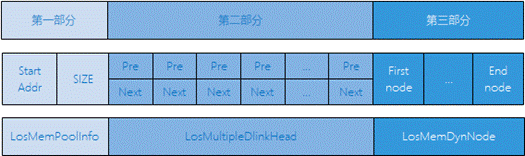

-   第一部分

    堆内存（也称内存池）的起始地址  及堆区域总大小。

-   第二部分

    本身是一个数组，每个元素是一个双向链表，所有free节点的控制头都会被分类挂在这个数组的双向链表中。

    假设内存允许的最小节点为2<sup>min</sup>字节，则数组的第一个双向链表存储的是所有size为2<sup>min</sup><=size< 2<sup>min+1</sup>的free节点，第二个双向链表存储的是所有size为2<sup>min+1</sup><=size< 2<sup>min+2</sup>的free节点，依次类推第n个双向链表存储的是所有size为2<sup>min+n-1</sup><=size< 2<sup>min+n</sup>的free节点。每次申请内存的时候，会从这个数组检索最合适大小的free节点以分配内存。每次释放内存时，会将该内存作为free节点存储至这个数组以便下次再使用。

-   第三部分

    占用内存池极大部分的空间，是用于存放各节点的实际区域。以下是LosMemDynNode节点结构体申明以及简单介绍：

    ```
    typedef struct { 
         union { 
             LOS_DL_LIST freeNodeInfo;         /* Free memory node */ 
             struct { 
                 UINT32 magic; 
                 UINT32 taskId   : 16; 
             }; 
         }; 
         struct tagLosMemDynNode *preNode; 
         UINT32 sizeAndFlag; 
     } LosMemCtlNode; 
      
     typedef struct tagLosMemDynNode { 
         LosMemCtlNode selfNode; 
     } LosMemDynNode;
    ```

    **图 2**  LosMemDynNode结构体介绍图<a name="fig058314220317"></a>  
    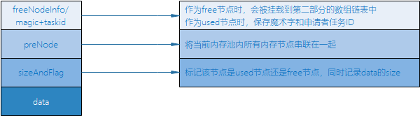

    **图 3**  对齐方式申请内存结果示意<a name="fig16147103315316"></a>  
    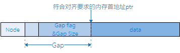

    当申请到的节点包含的数据空间首地址不符合对齐要求时，需要进行对齐，可以通过增加Gap域确保返回的指针符合对齐要求。

**动态内存运作机制——bestfit\_little<a name="section114106571361"></a>**

bestfit\_little算法也是一种最佳适配算法，相比于bestfit算法，少掉了[图1](#fig210817337012)中的第二部分，因此体积更小，但是申请释放性能不如bestfit。一般建议在内存空间充裕的情况下，选择bestfit算法。

**slab运作机制<a name="section19410135711610"></a>**

最佳适配算法使得每次分配内存时，都会选择内存池中最小最适合的内存块进行分配，而slab机制可以用于分配固定大小的内存块，从而减小产生内存碎片的可能性。

LiteOS内存管理中的slab机制支持配置slab class数目及每个class的最大空间。

现以内存池中共有4个slab class，每个slab class的最大空间为512Byte为例说明slab机制。这4个slab class是从内存池中按照最佳适配算法分配出来的。第一个slab class被分为32个16Byte的slab块，第二个slab class被分为16个32Byte的slab块，第三个slab class被分为8个64Byte的slab块，第四个slab class被分为4个128Byte的slab块。

初始化内存模块时，首先初始化内存池，然后在初始化后的内存池中按照最佳适配算法申请4个slab class，再逐个按照slab内存管理机制初始化4个slab class。

每次申请内存时，先在满足申请大小的最佳slab class中申请（比如用户申请20Byte内存，就在slab块大小为32Byte的slab class中申请），如果申请成功，就将slab内存块整块返回给用户，释放时整块回收。需要注意的是，如果满足条件的slab class中已无可以分配的内存块，则从内存池中按照最佳适配算法申请，而不会继续从有着更大slab块空间的slab class中申请。释放内存时，先检查释放的内存块是否属于slab class，如果是则还回对应的slab class中，否则还回内存池中。

**图 4**  内存数据结构概览<a name="fig9601249193110"></a>  
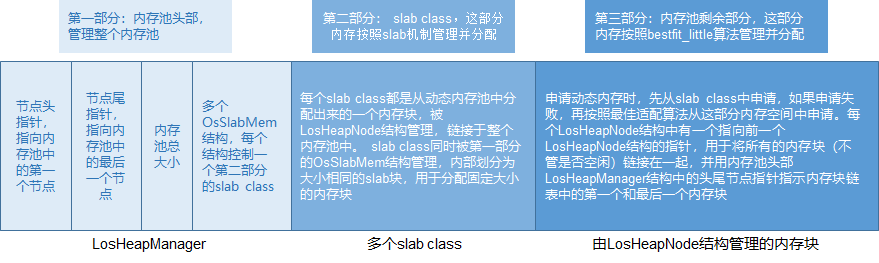

**静态内存运作机制<a name="section204112571462"></a>**

静态内存实质上是一个静态数组，静态内存池内的块大小在初始化时设定，初始化后块大小不可变更。

静态内存池由一个控制块和若干相同大小的内存块构成。控制块位于内存池头部，用于内存块管理。内存块的申请和释放以块大小为粒度。

**图 5**  静态内存示意图<a name="fig726071013325"></a>  
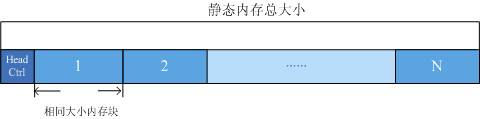

### 动态内存<a name="ZH-CN_TOPIC_0000002511954228"></a>


#### 开发指导<a name="ZH-CN_TOPIC_0000002543394279"></a>

**使用场景<a name="section85001821793"></a>**

动态内存管理的主要工作是动态分配并管理用户申请到的内存区间。

动态内存管理主要用于用户需要使用大小不等的内存块的场景。当用户需要使用内存时，可以通过操作系统的动态内存申请函数索取指定大小的内存块，一旦使用完毕，通过动态内存释放函数归还所占用内存，使之可以重复使用。

**功能<a name="section205001826915"></a>**

LiteOS系统中的动态内存管理模块为用户提供下面几种功能，接口详细信息可以查看API参考。

<a name="table85121521299"></a>
<table><thead align="left"><tr id="row1955622195"><th class="cellrowborder" valign="top" width="22.6%" id="mcps1.1.4.1.1"><p id="p12556621196"><a name="p12556621196"></a><a name="p12556621196"></a>功能分类</p>
</th>
<th class="cellrowborder" valign="top" width="24.18%" id="mcps1.1.4.1.2"><p id="p185561225910"><a name="p185561225910"></a><a name="p185561225910"></a>接口名</p>
</th>
<th class="cellrowborder" valign="top" width="53.22%" id="mcps1.1.4.1.3"><p id="p13556621891"><a name="p13556621891"></a><a name="p13556621891"></a>描述</p>
</th>
</tr>
</thead>
<tbody><tr id="row75561229916"><td class="cellrowborder" rowspan="3" valign="top" width="22.6%" headers="mcps1.1.4.1.1 "><p id="p3556162899"><a name="p3556162899"></a><a name="p3556162899"></a>初始化和删除内存池</p>
</td>
<td class="cellrowborder" valign="top" width="24.18%" headers="mcps1.1.4.1.2 "><p id="p105564213912"><a name="p105564213912"></a><a name="p105564213912"></a>LOS_MemInit</p>
</td>
<td class="cellrowborder" valign="top" width="53.22%" headers="mcps1.1.4.1.3 "><p id="p10556529911"><a name="p10556529911"></a><a name="p10556529911"></a>初始化一块指定的动态内存池，大小为size（开启LOSCFG_MEM_MUL_POOL_ALLOC时该接口需谨慎使用，初始化后需要主动申请内存避免内存池被错误释放）。</p>
</td>
</tr>
<tr id="row35564219912"><td class="cellrowborder" valign="top" headers="mcps1.1.4.1.1 "><p id="p75569210914"><a name="p75569210914"></a><a name="p75569210914"></a>LOS_MemDeInit</p>
</td>
<td class="cellrowborder" valign="top" headers="mcps1.1.4.1.2 "><p id="p8556021191"><a name="p8556021191"></a><a name="p8556021191"></a>删除指定内存池，仅打开LOSCFG_MEM_MUL_POOL时有效。</p>
</td>
</tr>
<tr id="row125561321792"><td class="cellrowborder" valign="top" headers="mcps1.1.4.1.1 "><p id="p125561921390"><a name="p125561921390"></a><a name="p125561921390"></a>LOS_MemPoolInit</p>
</td>
<td class="cellrowborder" valign="top" headers="mcps1.1.4.1.2 "><p id="p0556112996"><a name="p0556112996"></a><a name="p0556112996"></a>初始化一块指定的动态内存池，大小为size，属性为attr（表示是否开启slab功能）。</p>
</td>
</tr>
<tr id="row0556524913"><td class="cellrowborder" rowspan="4" valign="top" width="22.6%" headers="mcps1.1.4.1.1 "><p id="p17556124913"><a name="p17556124913"></a><a name="p17556124913"></a>申请、释放动态内存</p>
</td>
<td class="cellrowborder" valign="top" width="24.18%" headers="mcps1.1.4.1.2 "><p id="p11556324911"><a name="p11556324911"></a><a name="p11556324911"></a>LOS_MemAlloc</p>
</td>
<td class="cellrowborder" valign="top" width="53.22%" headers="mcps1.1.4.1.3 "><p id="p13556152897"><a name="p13556152897"></a><a name="p13556152897"></a>从指定动态内存池中申请size长度的内存。</p>
</td>
</tr>
<tr id="row0556112198"><td class="cellrowborder" valign="top" headers="mcps1.1.4.1.1 "><p id="p855613216912"><a name="p855613216912"></a><a name="p855613216912"></a>LOS_MemFree</p>
</td>
<td class="cellrowborder" valign="top" headers="mcps1.1.4.1.2 "><p id="p5556421599"><a name="p5556421599"></a><a name="p5556421599"></a>释放已申请的内存。</p>
</td>
</tr>
<tr id="row1755622498"><td class="cellrowborder" valign="top" headers="mcps1.1.4.1.1 "><p id="p175561219920"><a name="p175561219920"></a><a name="p175561219920"></a>LOS_MemRealloc</p>
</td>
<td class="cellrowborder" valign="top" headers="mcps1.1.4.1.2 "><p id="p8556921390"><a name="p8556921390"></a><a name="p8556921390"></a>按size大小重新分配内存块，并将原内存块内容拷贝到新内存块。如果新内存块申请成功，则释放原内存块。</p>
</td>
</tr>
<tr id="row955632491"><td class="cellrowborder" valign="top" headers="mcps1.1.4.1.1 "><p id="p1556122795"><a name="p1556122795"></a><a name="p1556122795"></a>LOS_MemAllocAlign</p>
</td>
<td class="cellrowborder" valign="top" headers="mcps1.1.4.1.2 "><p id="p14556721698"><a name="p14556721698"></a><a name="p14556721698"></a>从指定动态内存池中申请长度为size且地址按boundary字节对齐的内存。</p>
</td>
</tr>
<tr id="row105561421918"><td class="cellrowborder" rowspan="5" valign="top" width="22.6%" headers="mcps1.1.4.1.1 "><p id="p1355614219910"><a name="p1355614219910"></a><a name="p1355614219910"></a>多内存池申请、释放内存</p>
</td>
<td class="cellrowborder" valign="top" width="24.18%" headers="mcps1.1.4.1.2 "><p id="p555614213917"><a name="p555614213917"></a><a name="p555614213917"></a>LOS_MulPoolRegister</p>
</td>
<td class="cellrowborder" valign="top" width="53.22%" headers="mcps1.1.4.1.3 "><p id="p125564218910"><a name="p125564218910"></a><a name="p125564218910"></a>内存池地址获取和释放钩子注册，从钩子中获取内存池的地址和大小，仅LOSCFG_MEM_MUL_POOL_ALLOC时生效。（不支持重复注册）</p>
</td>
</tr>
<tr id="row1555662294"><td class="cellrowborder" valign="top" headers="mcps1.1.4.1.1 "><p id="p17556102590"><a name="p17556102590"></a><a name="p17556102590"></a>LOS_MulPoolAlloc</p>
</td>
<td class="cellrowborder" valign="top" headers="mcps1.1.4.1.2 "><p id="p7556821597"><a name="p7556821597"></a><a name="p7556821597"></a>从非系统池子中申请size长度的内存，内存不够时自动创建新内存池，仅LOSCFG_MEM_MUL_POOL_ALLOC时生效。</p>
</td>
</tr>
<tr id="row205561526913"><td class="cellrowborder" valign="top" headers="mcps1.1.4.1.1 "><p id="p1055614214917"><a name="p1055614214917"></a><a name="p1055614214917"></a>LOS_MulPoolRealloc</p>
</td>
<td class="cellrowborder" valign="top" headers="mcps1.1.4.1.2 "><p id="p7556821098"><a name="p7556821098"></a><a name="p7556821098"></a>从非系统池子中重申请size长度的内存，内存不够时自动创建新内存池，仅LOSCFG_MEM_MUL_POOL_ALLOC时生效。</p>
</td>
</tr>
<tr id="row35562211911"><td class="cellrowborder" valign="top" headers="mcps1.1.4.1.1 "><p id="p7556152992"><a name="p7556152992"></a><a name="p7556152992"></a>LOS_MulPoolFree</p>
</td>
<td class="cellrowborder" valign="top" headers="mcps1.1.4.1.2 "><p id="p5556626914"><a name="p5556626914"></a><a name="p5556626914"></a>从非系统池子中释放已申请的内存，仅LOSCFG_MEM_MUL_POOL_ALLOC时生效。</p>
</td>
</tr>
<tr id="row255619211916"><td class="cellrowborder" valign="top" headers="mcps1.1.4.1.1 "><p id="p19556521897"><a name="p19556521897"></a><a name="p19556521897"></a>LOS_MulPoolShrink</p>
</td>
<td class="cellrowborder" valign="top" headers="mcps1.1.4.1.2 "><p id="p1555652795"><a name="p1555652795"></a><a name="p1555652795"></a>释放没有使用的内存池，仅LOSCFG_MEM_MUL_POOL_ALLOC时生效。</p>
</td>
</tr>
<tr id="row195565211919"><td class="cellrowborder" rowspan="4" valign="top" width="22.6%" headers="mcps1.1.4.1.1 "><p id="p655617218911"><a name="p655617218911"></a><a name="p655617218911"></a>获取内存池信息</p>
</td>
<td class="cellrowborder" valign="top" width="24.18%" headers="mcps1.1.4.1.2 "><p id="p4556721794"><a name="p4556721794"></a><a name="p4556721794"></a>LOS_MemPoolSizeGet</p>
</td>
<td class="cellrowborder" valign="top" width="53.22%" headers="mcps1.1.4.1.3 "><p id="p18556721496"><a name="p18556721496"></a><a name="p18556721496"></a>获取指定动态内存池的总大小。</p>
</td>
</tr>
<tr id="row135561121894"><td class="cellrowborder" valign="top" headers="mcps1.1.4.1.1 "><p id="p85566210918"><a name="p85566210918"></a><a name="p85566210918"></a>LOS_MemTotalUsedGet</p>
</td>
<td class="cellrowborder" valign="top" headers="mcps1.1.4.1.2 "><p id="p12556102797"><a name="p12556102797"></a><a name="p12556102797"></a>获取指定动态内存池的总使用量大小。</p>
</td>
</tr>
<tr id="row17556192991"><td class="cellrowborder" valign="top" headers="mcps1.1.4.1.1 "><p id="p1955617210912"><a name="p1955617210912"></a><a name="p1955617210912"></a>LOS_MemInfoGet</p>
</td>
<td class="cellrowborder" valign="top" headers="mcps1.1.4.1.2 "><p id="p8556123914"><a name="p8556123914"></a><a name="p8556123914"></a>获取指定内存池的内存结构信息，包括空闲内存大小、已使用内存大小、空闲内存块数量、已使用的内存块数量、最大的空闲内存块大小。</p>
</td>
</tr>
<tr id="row155561727918"><td class="cellrowborder" valign="top" headers="mcps1.1.4.1.1 "><p id="p175562021599"><a name="p175562021599"></a><a name="p175562021599"></a>LOS_MemPoolList</p>
</td>
<td class="cellrowborder" valign="top" headers="mcps1.1.4.1.2 "><p id="p35561222917"><a name="p35561222917"></a><a name="p35561222917"></a>打印系统中已初始化的所有内存池，包括内存池的起始地址、内存池大小、空闲内存总大小、已使用内存总大小、最大的空闲内存块大小、空闲内存块数量、已使用的内存块数量。仅打开LOSCFG_MEM_MUL_POOL时有效。</p>
</td>
</tr>
<tr id="row145572219918"><td class="cellrowborder" rowspan="8" valign="top" width="22.6%" headers="mcps1.1.4.1.1 "><p id="p1455712214920"><a name="p1455712214920"></a><a name="p1455712214920"></a>获取内存块信息</p>
</td>
<td class="cellrowborder" valign="top" width="24.18%" headers="mcps1.1.4.1.2 "><p id="p15557122095"><a name="p15557122095"></a><a name="p15557122095"></a>LOS_MemFreeBlksGet</p>
</td>
<td class="cellrowborder" valign="top" width="53.22%" headers="mcps1.1.4.1.3 "><p id="p9557022919"><a name="p9557022919"></a><a name="p9557022919"></a>获取指定内存池的空闲内存块数量。</p>
</td>
</tr>
<tr id="row755713213916"><td class="cellrowborder" valign="top" headers="mcps1.1.4.1.1 "><p id="p85571217919"><a name="p85571217919"></a><a name="p85571217919"></a>LOS_MemTotalPeakUsedGet</p>
</td>
<td class="cellrowborder" valign="top" headers="mcps1.1.4.1.2 "><p id="p1555713214916"><a name="p1555713214916"></a><a name="p1555713214916"></a>返回内存池的最大使用峰值（依赖LOSCFG_MEM_TASK_STAT宏)</p>
</td>
</tr>
<tr id="row95571026915"><td class="cellrowborder" valign="top" headers="mcps1.1.4.1.1 "><p id="p1855732994"><a name="p1855732994"></a><a name="p1855732994"></a>LOS_MemTotalUsedCostGet</p>
</td>
<td class="cellrowborder" valign="top" headers="mcps1.1.4.1.2 "><p id="p2557162599"><a name="p2557162599"></a><a name="p2557162599"></a>返回内存池中使用的内存实际占用大小（包括内存管理部分）</p>
</td>
</tr>
<tr id="row1255711217920"><td class="cellrowborder" valign="top" headers="mcps1.1.4.1.1 "><p id="p155571321191"><a name="p155571321191"></a><a name="p155571321191"></a>LOS_MemUsedBlksGet</p>
</td>
<td class="cellrowborder" valign="top" headers="mcps1.1.4.1.2 "><p id="p855719214919"><a name="p855719214919"></a><a name="p855719214919"></a>获取指定内存池已使用的内存块数量。</p>
</td>
</tr>
<tr id="row3557924910"><td class="cellrowborder" valign="top" headers="mcps1.1.4.1.1 "><p id="p1155714211918"><a name="p1155714211918"></a><a name="p1155714211918"></a>LOS_MemTaskIdGet</p>
</td>
<td class="cellrowborder" valign="top" headers="mcps1.1.4.1.2 "><p id="p10557182993"><a name="p10557182993"></a><a name="p10557182993"></a>获取申请了指定内存块的任务ID，仅LOSCFG_MEM_DEBUG或 LOSCFG_MEM_TASK_STAT时生效。</p>
</td>
</tr>
<tr id="row65571923915"><td class="cellrowborder" valign="top" headers="mcps1.1.4.1.1 "><p id="p755714218911"><a name="p755714218911"></a><a name="p755714218911"></a>LOS_MemLastUsedGet</p>
</td>
<td class="cellrowborder" valign="top" headers="mcps1.1.4.1.2 "><p id="p135575215919"><a name="p135575215919"></a><a name="p135575215919"></a>获取内存池尾节点使用的最后一个字节后的第一个字节的地址。</p>
<p id="p5557132293"><a name="p5557132293"></a><a name="p5557132293"></a>如果尾节点是已使用节点，则尾节点使用的最后一个字节为节点尾部。</p>
<p id="p105576219918"><a name="p105576219918"></a><a name="p105576219918"></a>如果尾节点是空节点，则尾节点使用的最后一个字节为节点头结构体。</p>
</td>
</tr>
<tr id="row3557829915"><td class="cellrowborder" valign="top" headers="mcps1.1.4.1.1 "><p id="p1557028913"><a name="p1557028913"></a><a name="p1557028913"></a>LOS_MemNodeSizeCheck</p>
</td>
<td class="cellrowborder" valign="top" headers="mcps1.1.4.1.2 "><p id="p145572219913"><a name="p145572219913"></a><a name="p145572219913"></a>获取指定内存块的总大小和可用大小，仅打开LOSCFG_BASE_MEM_NODE_SIZE_CHECK时有效。</p>
</td>
</tr>
<tr id="row25578215920"><td class="cellrowborder" valign="top" headers="mcps1.1.4.1.1 "><p id="p1155712220919"><a name="p1155712220919"></a><a name="p1155712220919"></a>LOS_MemFreeNodeShow</p>
</td>
<td class="cellrowborder" valign="top" headers="mcps1.1.4.1.2 "><p id="p15557929913"><a name="p15557929913"></a><a name="p15557929913"></a>打印指定内存池的空闲内存块的大小及数量。</p>
</td>
</tr>
<tr id="row55571328916"><td class="cellrowborder" valign="top" width="22.6%" headers="mcps1.1.4.1.1 "><p id="p55570214914"><a name="p55570214914"></a><a name="p55570214914"></a>检查指定内存池的完整性</p>
</td>
<td class="cellrowborder" valign="top" width="24.18%" headers="mcps1.1.4.1.2 "><p id="p12557725911"><a name="p12557725911"></a><a name="p12557725911"></a>LOS_MemIntegrityCheck</p>
</td>
<td class="cellrowborder" valign="top" width="53.22%" headers="mcps1.1.4.1.3 "><p id="p3557182898"><a name="p3557182898"></a><a name="p3557182898"></a>对指定内存池做完整性检查，仅打开LOSCFG_BASE_MEM_NODE_INTEGRITY_CHECK时有效。</p>
</td>
</tr>
<tr id="row125579212911"><td class="cellrowborder" rowspan="2" valign="top" width="22.6%" headers="mcps1.1.4.1.1 "><p id="p7557152691"><a name="p7557152691"></a><a name="p7557152691"></a>设置、获取内存检查级别（仅打开LOSCFG_BASE_MEM_NODE_SIZE_CHECK时有效）</p>
</td>
<td class="cellrowborder" valign="top" width="24.18%" headers="mcps1.1.4.1.2 "><p id="p19557122595"><a name="p19557122595"></a><a name="p19557122595"></a>LOS_MemCheckLevelSet</p>
</td>
<td class="cellrowborder" valign="top" width="53.22%" headers="mcps1.1.4.1.3 "><p id="p35574213915"><a name="p35574213915"></a><a name="p35574213915"></a>设置内存检查级别。</p>
</td>
</tr>
<tr id="row10557928914"><td class="cellrowborder" valign="top" headers="mcps1.1.4.1.1 "><p id="p15571521694"><a name="p15571521694"></a><a name="p15571521694"></a>LOS_MemCheckLevelGet</p>
</td>
<td class="cellrowborder" valign="top" headers="mcps1.1.4.1.2 "><p id="p1557142495"><a name="p1557142495"></a><a name="p1557142495"></a>获取内存检查级别。</p>
</td>
</tr>
<tr id="row1655762596"><td class="cellrowborder" rowspan="4" valign="top" width="22.6%" headers="mcps1.1.4.1.1 "><p id="p105571521193"><a name="p105571521193"></a><a name="p105571521193"></a>为指定模块申请、释放动态内存（仅打开LOSCFG_MEM_MUL_MODULE时有效）</p>
</td>
<td class="cellrowborder" valign="top" width="24.18%" headers="mcps1.1.4.1.2 "><p id="p11557521594"><a name="p11557521594"></a><a name="p11557521594"></a>LOS_MemMalloc</p>
</td>
<td class="cellrowborder" valign="top" width="53.22%" headers="mcps1.1.4.1.3 "><p id="p1055720219910"><a name="p1055720219910"></a><a name="p1055720219910"></a>从指定动态内存池分配size长度的内存给指定模块，并纳入模块统计。</p>
</td>
</tr>
<tr id="row125571021093"><td class="cellrowborder" valign="top" headers="mcps1.1.4.1.1 "><p id="p165577216919"><a name="p165577216919"></a><a name="p165577216919"></a>LOS_MemMfree</p>
</td>
<td class="cellrowborder" valign="top" headers="mcps1.1.4.1.2 "><p id="p2557142398"><a name="p2557142398"></a><a name="p2557142398"></a>释放已经申请的内存块，并纳入模块统计。</p>
</td>
</tr>
<tr id="row11557129915"><td class="cellrowborder" valign="top" headers="mcps1.1.4.1.1 "><p id="p35571921497"><a name="p35571921497"></a><a name="p35571921497"></a>LOS_MemMallocAlign</p>
</td>
<td class="cellrowborder" valign="top" headers="mcps1.1.4.1.2 "><p id="p155715213914"><a name="p155715213914"></a><a name="p155715213914"></a>从指定动态内存池中申请长度为size且地址按boundary字节对齐的内存给指定模块，并纳入模块统计。</p>
</td>
</tr>
<tr id="row13557329912"><td class="cellrowborder" valign="top" headers="mcps1.1.4.1.1 "><p id="p355712695"><a name="p355712695"></a><a name="p355712695"></a>LOS_MemMrealloc</p>
</td>
<td class="cellrowborder" valign="top" headers="mcps1.1.4.1.2 "><p id="p65571921792"><a name="p65571921792"></a><a name="p65571921792"></a>按size大小重新分配内存块给指定模块，并将原内存块内容拷贝到新内存块，同时纳入模块统计。如果新内存块申请成功，则释放原内存块。</p>
</td>
</tr>
<tr id="row185571321499"><td class="cellrowborder" valign="top" width="22.6%" headers="mcps1.1.4.1.1 "><p id="p25578214911"><a name="p25578214911"></a><a name="p25578214911"></a>获取指定模块的内存使用量（仅打开LOSCFG_MEM_MUL_MODULE时有效）</p>
</td>
<td class="cellrowborder" valign="top" width="24.18%" headers="mcps1.1.4.1.2 "><p id="p1055782799"><a name="p1055782799"></a><a name="p1055782799"></a>LOS_MemMusedGet</p>
</td>
<td class="cellrowborder" valign="top" width="53.22%" headers="mcps1.1.4.1.3 "><p id="p6557624918"><a name="p6557624918"></a><a name="p6557624918"></a>获取指定模块的内存使用量，单位：Byte。</p>
</td>
</tr>
<tr id="row16557421192"><td class="cellrowborder" valign="top" width="22.6%" headers="mcps1.1.4.1.1 "><p id="p185571129910"><a name="p185571129910"></a><a name="p185571129910"></a>配置slab size</p>
</td>
<td class="cellrowborder" valign="top" width="24.18%" headers="mcps1.1.4.1.2 "><p id="p20557129913"><a name="p20557129913"></a><a name="p20557129913"></a>LOS_SlabSizeCfg</p>
</td>
<td class="cellrowborder" valign="top" width="53.22%" headers="mcps1.1.4.1.3 "><p id="p165571321394"><a name="p165571321394"></a><a name="p165571321394"></a>用来配置slab class size，必须在LOS_MemInit之前调用。</p>
</td>
</tr>
<tr id="row1355712214914"><td class="cellrowborder" valign="top" width="22.6%" headers="mcps1.1.4.1.1 "><p id="p195574213920"><a name="p195574213920"></a><a name="p195574213920"></a>获取任务使用内存</p>
</td>
<td class="cellrowborder" valign="top" width="24.18%" headers="mcps1.1.4.1.2 "><p id="p1622285511114"><a name="p1622285511114"></a><a name="p1622285511114"></a>LOS_MemTaskHeapInfoGet</p>
</td>
<td class="cellrowborder" valign="top" width="53.22%" headers="mcps1.1.4.1.3 "><p id="p16557521197"><a name="p16557521197"></a><a name="p16557521197"></a>打印指定任务使用的内存信息。</p>
</td>
</tr>
<tr id="row19557424918"><td class="cellrowborder" rowspan="9" valign="top" width="22.6%" headers="mcps1.1.4.1.1 "><p id="p155571217919"><a name="p155571217919"></a><a name="p155571217919"></a>dfx功能</p>
</td>
<td class="cellrowborder" valign="top" width="24.18%" headers="mcps1.1.4.1.2 "><p id="p12474800122"><a name="p12474800122"></a><a name="p12474800122"></a>LOS_SaveCallerRa</p>
</td>
<td class="cellrowborder" valign="top" width="53.22%" headers="mcps1.1.4.1.3 "><p id="p955714215911"><a name="p955714215911"></a><a name="p955714215911"></a>保存当前任务的调用者。</p>
</td>
</tr>
<tr id="row2557620917"><td class="cellrowborder" valign="top" headers="mcps1.1.4.1.1 "><p id="p6969710111219"><a name="p6969710111219"></a><a name="p6969710111219"></a>LOS_IsSetCallerRa</p>
</td>
<td class="cellrowborder" valign="top" headers="mcps1.1.4.1.2 "><p id="p18557172893"><a name="p18557172893"></a><a name="p18557172893"></a>判断当前任务是否已经保存调用者。</p>
</td>
</tr>
<tr id="row13557921295"><td class="cellrowborder" valign="top" headers="mcps1.1.4.1.1 "><p id="p1049171691214"><a name="p1049171691214"></a><a name="p1049171691214"></a>LOS_ResetCallerRa</p>
</td>
<td class="cellrowborder" valign="top" headers="mcps1.1.4.1.2 "><p id="p9557192597"><a name="p9557192597"></a><a name="p9557192597"></a>重置当前任务的调用者。</p>
</td>
</tr>
<tr id="row1155792595"><td class="cellrowborder" valign="top" headers="mcps1.1.4.1.1 "><p id="p102871821191218"><a name="p102871821191218"></a><a name="p102871821191218"></a>LOS_MemDfxOpsReg</p>
</td>
<td class="cellrowborder" valign="top" headers="mcps1.1.4.1.2 "><p id="p555722792"><a name="p555722792"></a><a name="p555722792"></a>注册一个DFX操作集，使系统能够记录内存操作信息。</p>
</td>
</tr>
<tr id="row5557322098"><td class="cellrowborder" valign="top" headers="mcps1.1.4.1.1 "><p id="p147922741218"><a name="p147922741218"></a><a name="p147922741218"></a>LOS_MemAllocDfxHook</p>
</td>
<td class="cellrowborder" valign="top" headers="mcps1.1.4.1.2 "><p id="p165571821892"><a name="p165571821892"></a><a name="p165571821892"></a>在内存分配操作后被调用，记录分配的相关信息。</p>
</td>
</tr>
<tr id="row85571221397"><td class="cellrowborder" valign="top" headers="mcps1.1.4.1.1 "><p id="p92483171216"><a name="p92483171216"></a><a name="p92483171216"></a>LOS_MemFreeDfxHook</p>
</td>
<td class="cellrowborder" valign="top" headers="mcps1.1.4.1.2 "><p id="p35571029913"><a name="p35571029913"></a><a name="p35571029913"></a><span>在内存释放操作后被调用，记录释放的相关信息。</span></p>
</td>
</tr>
<tr id="row125581027917"><td class="cellrowborder" valign="top" headers="mcps1.1.4.1.1 "><p id="p1027316367121"><a name="p1027316367121"></a><a name="p1027316367121"></a>LOS_MemPoolOpsReg</p>
</td>
<td class="cellrowborder" valign="top" headers="mcps1.1.4.1.2 "><p id="p205588216912"><a name="p205588216912"></a><a name="p205588216912"></a>注册一个DFX操作集，使系统能够记录内存池操作信息。</p>
</td>
</tr>
<tr id="row20558021092"><td class="cellrowborder" valign="top" headers="mcps1.1.4.1.1 "><p id="p4567240121212"><a name="p4567240121212"></a><a name="p4567240121212"></a>LOS_MemPoolMemAllocHook</p>
</td>
<td class="cellrowborder" valign="top" headers="mcps1.1.4.1.2 "><p id="p18558112991"><a name="p18558112991"></a><a name="p18558112991"></a>在内存池分配操作后被调用，记录分配的相关信息。</p>
</td>
</tr>
<tr id="row95581026920"><td class="cellrowborder" valign="top" headers="mcps1.1.4.1.1 "><p id="p1462819443129"><a name="p1462819443129"></a><a name="p1462819443129"></a>LOS_MemPoolMemFreeHook</p>
</td>
<td class="cellrowborder" valign="top" headers="mcps1.1.4.1.2 "><p id="p2558724919"><a name="p2558724919"></a><a name="p2558724919"></a><span>在内存池释放操作后被调用，记录释放的相关信息。</span></p>
</td>
</tr>
</tbody>
</table>

> **须知：** 
>-   动态内存提供了内存调测功能，具体使用方法见“[内存调测方法](内存调测方法.md)”。
>-   对于bestfit\_little算法，只支持“[多内存池机制](多内存池机制.md)”和“[内存合法性检查](内存合法性检查.md)”，不支持其他内存调测功能。
>-   上述接口中，通过宏开关控制的都是内存调测功能相关的接口。
>-   通过LOS\_MemAllocAlign/LOS\_MemMallocAlign申请的内存进行LOS\_MemRealloc/LOS\_MemMrealloc操作后，不能保障新的内存首地址保持对齐。
>-   对于bestfit\_little算法，不支持对LOS\_MemAllocAlign申请的内存进行LOS\_MemRealloc操作，否则将返回失败。
>-   对于多内存池申请、释放功能仅支持在bestfit算法下使用。

> **说明：** 
>LiteOS提供了多模块内存统计功能，该功能基于普通内存接口的封装接口，增加模块ID作为入参。不同业务模块进行内存操作时，调用对应封装接口，可统计各模块的内存使用情况，并通过模块ID获取指定模块的内存使用情况。
>应用场景：系统业务模块化清晰，用户需统计各模块的内存占用情况。
>依赖：目前只有bestfit内存管理算法支持该功能，需要使能LOSCFG\_KERNEL\_MEM\_BESTFIT。
>使用方法：
>1.  该功能配置项为LOSCFG\_MEM\_MUL\_MODULE，配置路径是Kernel ---\> Memory Management ---\> Dynamic Memory Management ---\> Enable Memory module statistics；
>2.  每个业务模块配置唯一module ID，模块代码中在内存操作时调用对应接口，并传入相应模块ID；
>3.  通过LOS\_MemMusedGet接口获取指定模块的内存使用情况，可用于模块内存占用优化分析。
>注意事项：
>1.  模块ID由宏MEM\_MODULE\_MAX限定，当系统模块个数超过该值时，需通过配置LOSCFG\_MEM\_MODULE\_MAX来修改MEM\_MODULE\_MAX的大小，配置路径：Kernel ---\> Memory Management ---\>Enable Memory module statistics  ---\> Max Memory Module Number。
>2.  模块中所有内存操作都需调用LOS\_MemM开头的接口，否则可能导致统计不准确。

**开发流程<a name="section1104112417132"></a>**

本节介绍使用动态内存的典型场景开发流程。

1.  在“los\_config.h”文件中配置项动态内存池起始地址与大小。

    <a name="table20118182441320"></a>
    <table><thead align="left"><tr id="row151581724181319"><th class="cellrowborder" valign="top" width="19.588041195880415%" id="mcps1.1.6.1.1"><p id="p14158202416137"><a name="p14158202416137"></a><a name="p14158202416137"></a>配置项</p>
    </th>
    <th class="cellrowborder" valign="top" width="27.837216278372168%" id="mcps1.1.6.1.2"><p id="p1115818246133"><a name="p1115818246133"></a><a name="p1115818246133"></a>含义</p>
    </th>
    <th class="cellrowborder" valign="top" width="11.338866113388663%" id="mcps1.1.6.1.3"><p id="p12158824151312"><a name="p12158824151312"></a><a name="p12158824151312"></a>取值范围</p>
    </th>
    <th class="cellrowborder" valign="top" width="27.837216278372168%" id="mcps1.1.6.1.4"><p id="p71581824101312"><a name="p71581824101312"></a><a name="p71581824101312"></a>默认值</p>
    </th>
    <th class="cellrowborder" valign="top" width="13.398660133986606%" id="mcps1.1.6.1.5"><p id="p4158172451311"><a name="p4158172451311"></a><a name="p4158172451311"></a>依赖</p>
    </th>
    </tr>
    </thead>
    <tbody><tr id="row41588249135"><td class="cellrowborder" valign="top" width="19.588041195880415%" headers="mcps1.1.6.1.1 "><p id="p1715814247132"><a name="p1715814247132"></a><a name="p1715814247132"></a>OS_SYS_MEM_ADDR</p>
    </td>
    <td class="cellrowborder" valign="top" width="27.837216278372168%" headers="mcps1.1.6.1.2 "><p id="p181588247132"><a name="p181588247132"></a><a name="p181588247132"></a>系统动态内存起始地址</p>
    </td>
    <td class="cellrowborder" valign="top" width="11.338866113388663%" headers="mcps1.1.6.1.3 "><p id="p1115815243136"><a name="p1115815243136"></a><a name="p1115815243136"></a>[0，n)</p>
    </td>
    <td class="cellrowborder" valign="top" width="27.837216278372168%" headers="mcps1.1.6.1.4 "><p id="p815815243134"><a name="p815815243134"></a><a name="p815815243134"></a>__heap_start</p>
    </td>
    <td class="cellrowborder" valign="top" width="13.398660133986606%" headers="mcps1.1.6.1.5 "><p id="p115892421312"><a name="p115892421312"></a><a name="p115892421312"></a>无</p>
    </td>
    </tr>
    <tr id="row151584242135"><td class="cellrowborder" valign="top" width="19.588041195880415%" headers="mcps1.1.6.1.1 "><p id="p41585241136"><a name="p41585241136"></a><a name="p41585241136"></a>OS_SYS_MEM_SIZE</p>
    </td>
    <td class="cellrowborder" valign="top" width="27.837216278372168%" headers="mcps1.1.6.1.2 "><p id="p14158192416137"><a name="p14158192416137"></a><a name="p14158192416137"></a>系统动态内存池的大小（DDR自适应配置），以byte为单位</p>
    </td>
    <td class="cellrowborder" valign="top" width="11.338866113388663%" headers="mcps1.1.6.1.3 "><p id="p61581324171319"><a name="p61581324171319"></a><a name="p61581324171319"></a>[0，n)</p>
    </td>
    <td class="cellrowborder" valign="top" width="27.837216278372168%" headers="mcps1.1.6.1.4 "><p id="p1158182471318"><a name="p1158182471318"></a><a name="p1158182471318"></a>从bss段末尾至系统DDR末尾</p>
    </td>
    <td class="cellrowborder" valign="top" width="13.398660133986606%" headers="mcps1.1.6.1.5 "><p id="p171581324101319"><a name="p171581324101319"></a><a name="p171581324101319"></a>无</p>
    </td>
    </tr>
    </tbody>
    </table>

    -   OS\_SYS\_MEM\_ADDR：一般使用默认值即可。
    -   OS\_SYS\_MEM\_SIZE：一般使用默认值即可。

2.  打开菜单，进入Kernel ---\> Memory Management菜单，完成动态内存管理模块的配置。

    <a name="table6120122461315"></a>
    <table><thead align="left"><tr id="row12159122415131"><th class="cellrowborder" valign="top" width="20.62206220622062%" id="mcps1.1.6.1.1"><p id="p615920247133"><a name="p615920247133"></a><a name="p615920247133"></a>配置项</p>
    </th>
    <th class="cellrowborder" valign="top" width="26.8026802680268%" id="mcps1.1.6.1.2"><p id="p415972491315"><a name="p415972491315"></a><a name="p415972491315"></a>含义</p>
    </th>
    <th class="cellrowborder" valign="top" width="13.4013401340134%" id="mcps1.1.6.1.3"><p id="p13159142451314"><a name="p13159142451314"></a><a name="p13159142451314"></a>取值范围</p>
    </th>
    <th class="cellrowborder" valign="top" width="16.49164916491649%" id="mcps1.1.6.1.4"><p id="p41591524171313"><a name="p41591524171313"></a><a name="p41591524171313"></a>默认值</p>
    </th>
    <th class="cellrowborder" valign="top" width="22.68226822682268%" id="mcps1.1.6.1.5"><p id="p11591324111311"><a name="p11591324111311"></a><a name="p11591324111311"></a>依赖</p>
    </th>
    </tr>
    </thead>
    <tbody><tr id="row151598242136"><td class="cellrowborder" valign="top" width="20.62206220622062%" headers="mcps1.1.6.1.1 "><p id="p151591024171312"><a name="p151591024171312"></a><a name="p151591024171312"></a>LOSCFG_KERNEL_MEM_BESTFIT</p>
    </td>
    <td class="cellrowborder" valign="top" width="26.8026802680268%" headers="mcps1.1.6.1.2 "><p id="p9159924151313"><a name="p9159924151313"></a><a name="p9159924151313"></a>选择bestfit内存管理算法</p>
    </td>
    <td class="cellrowborder" valign="top" width="13.4013401340134%" headers="mcps1.1.6.1.3 "><p id="p5159162415130"><a name="p5159162415130"></a><a name="p5159162415130"></a>YES/NO</p>
    </td>
    <td class="cellrowborder" valign="top" width="16.49164916491649%" headers="mcps1.1.6.1.4 "><p id="p16159192441312"><a name="p16159192441312"></a><a name="p16159192441312"></a>YES</p>
    </td>
    <td class="cellrowborder" valign="top" width="22.68226822682268%" headers="mcps1.1.6.1.5 "><p id="p215972417134"><a name="p215972417134"></a><a name="p215972417134"></a>无</p>
    </td>
    </tr>
    <tr id="row615942431319"><td class="cellrowborder" valign="top" width="20.62206220622062%" headers="mcps1.1.6.1.1 "><p id="p11159724101317"><a name="p11159724101317"></a><a name="p11159724101317"></a>LOSCFG_KERNEL_MEM_BESTFIT_LITTLE</p>
    </td>
    <td class="cellrowborder" valign="top" width="26.8026802680268%" headers="mcps1.1.6.1.2 "><p id="p161592241138"><a name="p161592241138"></a><a name="p161592241138"></a>选择bestfit_little内存管理算法</p>
    </td>
    <td class="cellrowborder" valign="top" width="13.4013401340134%" headers="mcps1.1.6.1.3 "><p id="p131597248133"><a name="p131597248133"></a><a name="p131597248133"></a>YES/NO</p>
    </td>
    <td class="cellrowborder" valign="top" width="16.49164916491649%" headers="mcps1.1.6.1.4 "><p id="p81599243134"><a name="p81599243134"></a><a name="p81599243134"></a>NO</p>
    </td>
    <td class="cellrowborder" valign="top" width="22.68226822682268%" headers="mcps1.1.6.1.5 "><p id="p315922415132"><a name="p315922415132"></a><a name="p315922415132"></a>无</p>
    </td>
    </tr>
    <tr id="row515902420134"><td class="cellrowborder" valign="top" width="20.62206220622062%" headers="mcps1.1.6.1.1 "><p id="p815916246139"><a name="p815916246139"></a><a name="p815916246139"></a>LOSCFG_KERNEL_MEM_SLAB_EXTENTION</p>
    </td>
    <td class="cellrowborder" valign="top" width="26.8026802680268%" headers="mcps1.1.6.1.2 "><p id="p915992421311"><a name="p915992421311"></a><a name="p915992421311"></a>使能slab功能，可以降低系统持续运行过程中内存碎片化的程度</p>
    </td>
    <td class="cellrowborder" valign="top" width="13.4013401340134%" headers="mcps1.1.6.1.3 "><p id="p101591924141313"><a name="p101591924141313"></a><a name="p101591924141313"></a>YES/NO</p>
    </td>
    <td class="cellrowborder" valign="top" width="16.49164916491649%" headers="mcps1.1.6.1.4 "><p id="p51595247134"><a name="p51595247134"></a><a name="p51595247134"></a>NO</p>
    </td>
    <td class="cellrowborder" valign="top" width="22.68226822682268%" headers="mcps1.1.6.1.5 "><p id="p3159224171312"><a name="p3159224171312"></a><a name="p3159224171312"></a>无</p>
    </td>
    </tr>
    <tr id="row515942411139"><td class="cellrowborder" valign="top" width="20.62206220622062%" headers="mcps1.1.6.1.1 "><p id="p14159324101319"><a name="p14159324101319"></a><a name="p14159324101319"></a>LOSCFG_KERNEL_MEM_SLAB_AUTO_EXPANSION_MODE</p>
    </td>
    <td class="cellrowborder" valign="top" width="26.8026802680268%" headers="mcps1.1.6.1.2 "><p id="p19159192481312"><a name="p19159192481312"></a><a name="p19159192481312"></a>slab自动扩展，当分配给slab的内存不足时，能够自动从系统内存池中申请新的空间进行扩展</p>
    </td>
    <td class="cellrowborder" valign="top" width="13.4013401340134%" headers="mcps1.1.6.1.3 "><p id="p12159152421310"><a name="p12159152421310"></a><a name="p12159152421310"></a>YES/NO</p>
    </td>
    <td class="cellrowborder" valign="top" width="16.49164916491649%" headers="mcps1.1.6.1.4 "><p id="p4159112418133"><a name="p4159112418133"></a><a name="p4159112418133"></a>NO</p>
    </td>
    <td class="cellrowborder" valign="top" width="22.68226822682268%" headers="mcps1.1.6.1.5 "><p id="p181591324101315"><a name="p181591324101315"></a><a name="p181591324101315"></a>LOSCFG_KERNEL_MEM_SLAB_EXTENTION</p>
    </td>
    </tr>
    <tr id="row18159162421312"><td class="cellrowborder" valign="top" width="20.62206220622062%" headers="mcps1.1.6.1.1 "><p id="p615922410137"><a name="p615922410137"></a><a name="p615922410137"></a>LOSCFG_MEM_TASK_STAT</p>
    </td>
    <td class="cellrowborder" valign="top" width="26.8026802680268%" headers="mcps1.1.6.1.2 "><p id="p715942421311"><a name="p715942421311"></a><a name="p715942421311"></a>使能任务内存统计</p>
    </td>
    <td class="cellrowborder" valign="top" width="13.4013401340134%" headers="mcps1.1.6.1.3 "><p id="p51591824101318"><a name="p51591824101318"></a><a name="p51591824101318"></a>YES/NO</p>
    </td>
    <td class="cellrowborder" valign="top" width="16.49164916491649%" headers="mcps1.1.6.1.4 "><p id="p1115912242132"><a name="p1115912242132"></a><a name="p1115912242132"></a>YES</p>
    </td>
    <td class="cellrowborder" valign="top" width="22.68226822682268%" headers="mcps1.1.6.1.5 "><p id="p1615982491314"><a name="p1615982491314"></a><a name="p1615982491314"></a>LOSCFG_KERNEL_MEM_BESTFIT或LOSCFG_KERNEL_MEM_BESTFIT_LITTLE</p>
    </td>
    </tr>
    <tr id="row1159172418131"><td class="cellrowborder" valign="top" width="20.62206220622062%" headers="mcps1.1.6.1.1 "><p id="p181591524111313"><a name="p181591524111313"></a><a name="p181591524111313"></a>LOSCFG_MEM_MUL_MODULE</p>
    </td>
    <td class="cellrowborder" valign="top" width="26.8026802680268%" headers="mcps1.1.6.1.2 "><p id="p1215952491314"><a name="p1215952491314"></a><a name="p1215952491314"></a>多模块内存统计</p>
    </td>
    <td class="cellrowborder" valign="top" width="13.4013401340134%" headers="mcps1.1.6.1.3 "><p id="p14159724131318"><a name="p14159724131318"></a><a name="p14159724131318"></a>YES/NO</p>
    </td>
    <td class="cellrowborder" valign="top" width="16.49164916491649%" headers="mcps1.1.6.1.4 "><p id="p1015962414139"><a name="p1015962414139"></a><a name="p1015962414139"></a>NO</p>
    </td>
    <td class="cellrowborder" valign="top" width="22.68226822682268%" headers="mcps1.1.6.1.5 "><p id="p515982401313"><a name="p515982401313"></a><a name="p515982401313"></a>LOSCFG_KERNEL_MEM_BESTFIT</p>
    </td>
    </tr>
    <tr id="row1515952421319"><td class="cellrowborder" valign="top" width="20.62206220622062%" headers="mcps1.1.6.1.1 "><p id="p015992420136"><a name="p015992420136"></a><a name="p015992420136"></a>LOSCFG_MEM_MODULE_MAX</p>
    </td>
    <td class="cellrowborder" valign="top" width="26.8026802680268%" headers="mcps1.1.6.1.2 "><p id="p101591624161313"><a name="p101591624161313"></a><a name="p101591624161313"></a>多模块内存统计最大模块数量</p>
    </td>
    <td class="cellrowborder" valign="top" width="13.4013401340134%" headers="mcps1.1.6.1.3 "><p id="p111591624191317"><a name="p111591624191317"></a><a name="p111591624191317"></a>8-1024</p>
    </td>
    <td class="cellrowborder" valign="top" width="16.49164916491649%" headers="mcps1.1.6.1.4 "><p id="p16159102491311"><a name="p16159102491311"></a><a name="p16159102491311"></a>32</p>
    </td>
    <td class="cellrowborder" valign="top" width="22.68226822682268%" headers="mcps1.1.6.1.5 "><p id="p1915902410136"><a name="p1915902410136"></a><a name="p1915902410136"></a>LOSCFG_MEM_MUL_MODULE</p>
    </td>
    </tr>
    <tr id="row31591240138"><td class="cellrowborder" valign="top" width="20.62206220622062%" headers="mcps1.1.6.1.1 "><p id="p141591124121315"><a name="p141591124121315"></a><a name="p141591124121315"></a>LOSCFG_MEM_MUL_POOL</p>
    </td>
    <td class="cellrowborder" valign="top" width="26.8026802680268%" headers="mcps1.1.6.1.2 "><p id="p0159324191312"><a name="p0159324191312"></a><a name="p0159324191312"></a>多内存池链接统计功能</p>
    </td>
    <td class="cellrowborder" valign="top" width="13.4013401340134%" headers="mcps1.1.6.1.3 "><p id="p12159102471315"><a name="p12159102471315"></a><a name="p12159102471315"></a>YES/NO</p>
    </td>
    <td class="cellrowborder" valign="top" width="16.49164916491649%" headers="mcps1.1.6.1.4 "><p id="p11159162431317"><a name="p11159162431317"></a><a name="p11159162431317"></a>NO</p>
    </td>
    <td class="cellrowborder" valign="top" width="22.68226822682268%" headers="mcps1.1.6.1.5 "><p id="p9159162413139"><a name="p9159162413139"></a><a name="p9159162413139"></a>LOSCFG_KERNEL_MEM_BESTFIT或LOSCFG_KERNEL_MEM_BESTFIT_LITTLE</p>
    </td>
    </tr>
    <tr id="row14159102411131"><td class="cellrowborder" valign="top" width="20.62206220622062%" headers="mcps1.1.6.1.1 "><p id="p8159142412138"><a name="p8159142412138"></a><a name="p8159142412138"></a>LOSCFG_MEM_MUL_POOL_ALLOC</p>
    </td>
    <td class="cellrowborder" valign="top" width="26.8026802680268%" headers="mcps1.1.6.1.2 "><p id="p21591024121317"><a name="p21591024121317"></a><a name="p21591024121317"></a>多内存池弹性扩展功能</p>
    </td>
    <td class="cellrowborder" valign="top" width="13.4013401340134%" headers="mcps1.1.6.1.3 "><p id="p41591524191318"><a name="p41591524191318"></a><a name="p41591524191318"></a>YES/NO</p>
    </td>
    <td class="cellrowborder" valign="top" width="16.49164916491649%" headers="mcps1.1.6.1.4 "><p id="p215932461316"><a name="p215932461316"></a><a name="p215932461316"></a>NO</p>
    </td>
    <td class="cellrowborder" valign="top" width="22.68226822682268%" headers="mcps1.1.6.1.5 "><p id="p1159824121314"><a name="p1159824121314"></a><a name="p1159824121314"></a>LOSCFG_MEM_MUL_POOL和LOSCFG_KERNEL_MEM_BESTFIT且关闭LOSCFG_EXC_INTERACTION</p>
    </td>
    </tr>
    </tbody>
    </table>

3.  初始化LOS\_MemInit。

    初始一个内存池后如图，生成一个EndNode，并且剩余的内存全部被标记为FreeNode节点。

    > **说明：** 
    >EndNode作为内存池末尾的节点，size为0。

    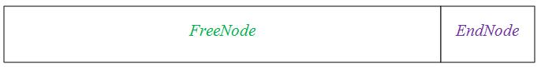

4.  申请任意大小的动态内存LOS\_MemAlloc。

    判断动态内存池中是否存在申请量大小的空间，若存在，则划出一块内存块，以指针形式返回；若不存在，返回NULL。

    调用三次LOS\_MemAlloc函数可以创建三个节点，假设分别为UsedA、UsedB、UsedC，大小分别为sizeA、sizeB、sizeC。因为刚初始化内存池的时候只有一个大的FreeNode，所以这些内存块是从这个FreeNode中切割出来的。

    

    当内存池中存在多个FreeNode的时候进行malloc，将会适配最合适大小的FreeNode用来新建内存块，减少内存碎片。若新建的内存块不等于被使用的FreeNode的大小，则在新建内存块后，多余的内存又会被标记为一个新的FreeNode。

5.  释放动态内存LOS\_MemFree。回收内存块，供下一次使用。

    假设调用LOS\_MemFree释放内存块UsedB，则会回收内存块UsedB，并且将其标记为FreeNode。在回收内存块时，相邻的FreeNode会自动合并。

    

**平台差异性<a name="section12118152471315"></a>**

无。

#### 注意事项<a name="ZH-CN_TOPIC_0000002511954400"></a>

-   内存分配：
    -   对齐分配内存接口LOS\_MemAllocAlign/LOS\_MemMallocAlign由于需要进行地址对齐，可能会额外消耗部分内存，因此存在一些遗失内存。当系统释放该对齐内存时，会同时回收因对齐导致的遗失内存。
    -   重新分配内存接口LOS\_MemRealloc/LOS\_MemMrealloc如果分配成功，系统会自己判定是否需要释放原来申请的内存，并返回重新分配的内存地址。如果重新分配失败，原来的内存保持不变，并返回NULL。禁止使用pPtr = LOS\_MemRealloc\(pool, pPtr, uwSize\)，即：不能使用原来的旧内存地址pPtr变量来接收返回值。

-   内存释放：

    对同一块内存多次调用LOS\_MemFree/LOS\_MemMfree时，第一次会返回成功，但对同一块内存多次重复释放会导致非法指针操作，结果不可预知。

-   其他限制：
    -   由于动态内存管理需要管理控制块数据结构来管理内存，这些数据结构会额外消耗内存，故实际用户可使用内存总量小于配置项OS\_SYS\_MEM\_SIZE的大小。
    -   由于动态内存管理的内存节点控制块结构体LosMemDynNode中，成员sizeAndFlag的数据类型为UINT32，高两位为标志位，余下的30位表示内存结点大小，因此用户初始化内存池的大小不能超过1G，否则会出现不可预知的结果。

#### 编程实例<a name="ZH-CN_TOPIC_0000002543394165"></a>


##### 普通内存使用实例<a name="ZH-CN_TOPIC_0000002543354139"></a>

**实例描述<a name="section5049564511595"></a>**

前提条件：在menuconfig菜单中完成动态内存的配置。

本实例执行以下步骤：

1.  初始化一个动态内存池。
2.  从动态内存池中申请一个内存块。
3.  在内存块中存放一个数据。
4.  打印出内存块中的数据。
5.  释放该内存块。

**编程示例<a name="section60752912413"></a>**

```
#define TEST_POOL_SIZE (2*1024*1024)
UINT8 g_testPool[TEST_POOL_SIZE];

VOID Example_DynMem(VOID)
{
    UINT32 *mem = NULL;
    UINT32 ret;

    ret = LOS_MemInit(g_testPool, TEST_POOL_SIZE);
    if (LOS_OK  == ret) {
        dprintf("内存池初始化成功!\n");
    } else {
        dprintf("内存池初始化失败!\n");
        return;
    }

    /*分配内存*/
    mem = (UINT32 *)LOS_MemAlloc(g_testPool, 4);
    if (NULL == mem) {
        dprintf("内存分配失败!\n");
        return;
    }
    dprintf("内存分配成功\n");

    /*赋值*/
    *mem = 828;
    dprintf("*mem = %d\n", *mem);

    /*释放内存*/
    ret = LOS_MemFree(g_testPool, mem);
    if (LOS_OK == ret) {
        dprintf("内存释放成功!\n");
    } else {
        dprintf("内存释放失败!\n");
    }

    return;
}
```

**结果验证<a name="section3983848912449"></a>**

编译运行得到的结果为：

```
内存池初始化成功!
内存分配成功
*mem = 828
内存释放成功!
```

##### 多模块内存使用实例<a name="ZH-CN_TOPIC_0000002543354353"></a>

**实例描述<a name="section44812027817"></a>**

前提条件：在menuconfig菜单中完成多模块内存统计的配置。

本实例执行以下步骤：

1.  从动态内存池中为模块0申请一个内存块。
2.  获取模块0的内存使用量。
3.  从动态内存池中为模块1申请一个内存块。
4.  获取模块1的内存使用量。
5.  释放模块0和模块1的内存。

**编程示例<a name="section44812215812"></a>**

```
void test(void)
{
    void *ptr = NULL;
    void *ptrTmp = NULL;
    UINT32 size = 0x10;
    UINT32 module = 0;
    UINT32 memUsed = 0;

    ptr = LOS_MemMalloc(OS_SYS_MEM_ADDR, size, module);
    if (ptr == NULL) {
        PRINTK("module %d malloc failed\n", module);
    } else {
        PRINTK("module %d malloc successed\n", module);
    }

    memUsed = LOS_MemMusedGet(module);
    PRINTK("module %d mem used size %d\n", module, memUsed);

    module = 1;
    ptrTmp = LOS_MemMalloc(OS_SYS_MEM_ADDR, size, module);
    if (ptrTmp == NULL) {
        PRINTK("module %d malloc failed\n", module);
    } else {
        PRINTK("module %d malloc successed\n", module);
    }

    memUsed = LOS_MemMusedGet(module);
    PRINTK("module %d mem used size %d\n", module, memUsed);

    module = 0;
    (VOID)LOS_MemMfree(OS_SYS_MEM_ADDR, ptr, module);
    module = 1;
    (VOID)LOS_MemMfree(OS_SYS_MEM_ADDR, ptrTmp, module);
}
```

**结果验证<a name="section17482221481"></a>**

编译运行得到的结果为：

```
module 0 malloc successed
module 0 mem used size 32
module 1 malloc successed
module 1 mem used size 32
```

### 静态内存<a name="ZH-CN_TOPIC_0000002511794218"></a>


#### 开发指导<a name="ZH-CN_TOPIC_0000002511794370"></a>

**使用场景<a name="section18537875142955"></a>**

当用户需要使用固定长度的内存时，可以通过静态内存分配的方式获取内存，一旦使用完毕，通过静态内存释放函数归还所占用内存，使之可以重复使用。

**功能<a name="section46614967194125"></a>**

LiteOS的静态内存管理主要为用户提供以下功能，接口详细信息可以查看API参考。

<a name="table959344221518"></a>
<table><thead align="left"><tr id="row7608942191516"><th class="cellrowborder" valign="top" width="24.240000000000002%" id="mcps1.1.4.1.1"><p id="p1608114211159"><a name="p1608114211159"></a><a name="p1608114211159"></a>功能分类</p>
</th>
<th class="cellrowborder" valign="top" width="23.23%" id="mcps1.1.4.1.2"><p id="p1960824251516"><a name="p1960824251516"></a><a name="p1960824251516"></a>接口名</p>
</th>
<th class="cellrowborder" valign="top" width="52.53%" id="mcps1.1.4.1.3"><p id="p9608042121518"><a name="p9608042121518"></a><a name="p9608042121518"></a>描述</p>
</th>
</tr>
</thead>
<tbody><tr id="row560824217159"><td class="cellrowborder" valign="top" width="24.240000000000002%" headers="mcps1.1.4.1.1 "><p id="p560864210158"><a name="p560864210158"></a><a name="p560864210158"></a>初始化静态内存池</p>
</td>
<td class="cellrowborder" valign="top" width="23.23%" headers="mcps1.1.4.1.2 "><p id="p176081142161513"><a name="p176081142161513"></a><a name="p176081142161513"></a>LOS_MemboxInit</p>
</td>
<td class="cellrowborder" valign="top" width="52.53%" headers="mcps1.1.4.1.3 "><p id="p16608134210157"><a name="p16608134210157"></a><a name="p16608134210157"></a>初始化一个静态内存池，根据入参设定其起始地址、总大小及每个内存块大小。</p>
</td>
</tr>
<tr id="row660817429159"><td class="cellrowborder" valign="top" width="24.240000000000002%" headers="mcps1.1.4.1.1 "><p id="p460894212158"><a name="p460894212158"></a><a name="p460894212158"></a>清除静态内存块内容</p>
</td>
<td class="cellrowborder" valign="top" width="23.23%" headers="mcps1.1.4.1.2 "><p id="p1560810427159"><a name="p1560810427159"></a><a name="p1560810427159"></a>LOS_MemboxClr</p>
</td>
<td class="cellrowborder" valign="top" width="52.53%" headers="mcps1.1.4.1.3 "><p id="p16608542151512"><a name="p16608542151512"></a><a name="p16608542151512"></a>清零指定静态内存块的内容。</p>
</td>
</tr>
<tr id="row18608742151518"><td class="cellrowborder" rowspan="2" valign="top" width="24.240000000000002%" headers="mcps1.1.4.1.1 "><p id="p166081542131519"><a name="p166081542131519"></a><a name="p166081542131519"></a>申请、释放静态内存</p>
</td>
<td class="cellrowborder" valign="top" width="23.23%" headers="mcps1.1.4.1.2 "><p id="p136081742181513"><a name="p136081742181513"></a><a name="p136081742181513"></a>LOS_MemboxAlloc</p>
</td>
<td class="cellrowborder" valign="top" width="52.53%" headers="mcps1.1.4.1.3 "><p id="p1460874221519"><a name="p1460874221519"></a><a name="p1460874221519"></a>从指定的静态内存池中申请一块静态内存块。</p>
</td>
</tr>
<tr id="row19608134251516"><td class="cellrowborder" valign="top" headers="mcps1.1.4.1.1 "><p id="p8608542121517"><a name="p8608542121517"></a><a name="p8608542121517"></a>LOS_MemboxFree</p>
</td>
<td class="cellrowborder" valign="top" headers="mcps1.1.4.1.2 "><p id="p17608142111514"><a name="p17608142111514"></a><a name="p17608142111514"></a>释放指定的一块静态内存块。</p>
</td>
</tr>
<tr id="row2608104261515"><td class="cellrowborder" rowspan="2" valign="top" width="24.240000000000002%" headers="mcps1.1.4.1.1 "><p id="p166088425153"><a name="p166088425153"></a><a name="p166088425153"></a>获取、打印静态内存池信息</p>
</td>
<td class="cellrowborder" valign="top" width="23.23%" headers="mcps1.1.4.1.2 "><p id="p46088422151"><a name="p46088422151"></a><a name="p46088422151"></a>LOS_MemboxStatisticsGet</p>
</td>
<td class="cellrowborder" valign="top" width="52.53%" headers="mcps1.1.4.1.3 "><p id="p1660834213154"><a name="p1660834213154"></a><a name="p1660834213154"></a>获取指定静态内存池的信息，包括内存池中总内存块数量、已经分配出去的内存块数量、每个内存块的大小。</p>
</td>
</tr>
<tr id="row66081042121510"><td class="cellrowborder" valign="top" headers="mcps1.1.4.1.1 "><p id="p1960884215152"><a name="p1960884215152"></a><a name="p1960884215152"></a>LOS_ShowBox</p>
</td>
<td class="cellrowborder" valign="top" headers="mcps1.1.4.1.2 "><p id="p36086428151"><a name="p36086428151"></a><a name="p36086428151"></a>打印指定静态内存池所有节点信息（打印等级是LOS_INFO_LEVEL），包括内存池起始地址、内存块大小、总内存块数量、每个空闲内存块的起始地址、所有内存块的起始地址。</p>
</td>
</tr>
</tbody>
</table>

**开发流程<a name="section37525629143945"></a>**

本节介绍使用静态内存的典型场景开发流程。

1.  打开菜单，进入Kernel ---\> Memory Management菜单，完成静态内存管理模块的配置。

    <a name="table1124543155750"></a>
    <table><thead align="left"><tr id="row1056095314712"><th class="cellrowborder" valign="top" width="24.062406240624064%" id="mcps1.1.6.1.1"><p id="p15912448155750"><a name="p15912448155750"></a><a name="p15912448155750"></a>配置项</p>
    </th>
    <th class="cellrowborder" valign="top" width="30.8030803080308%" id="mcps1.1.6.1.2"><p id="p13839897155750"><a name="p13839897155750"></a><a name="p13839897155750"></a>含义</p>
    </th>
    <th class="cellrowborder" valign="top" width="13.16131613161316%" id="mcps1.1.6.1.3"><p id="p47289871155750"><a name="p47289871155750"></a><a name="p47289871155750"></a>取值范围</p>
    </th>
    <th class="cellrowborder" valign="top" width="11.97119711971197%" id="mcps1.1.6.1.4"><p id="p5274313155750"><a name="p5274313155750"></a><a name="p5274313155750"></a>默认值</p>
    </th>
    <th class="cellrowborder" valign="top" width="20.002000200020003%" id="mcps1.1.6.1.5"><p id="p24566191155750"><a name="p24566191155750"></a><a name="p24566191155750"></a>依赖</p>
    </th>
    </tr>
    </thead>
    <tbody><tr id="row1285895105110"><td class="cellrowborder" valign="top" width="24.062406240624064%" headers="mcps1.1.6.1.1 "><p id="p385820511514"><a name="p385820511514"></a><a name="p385820511514"></a>LOSCFG_KERNEL_MEMBOX</p>
    </td>
    <td class="cellrowborder" valign="top" width="30.8030803080308%" headers="mcps1.1.6.1.2 "><p id="p1285865185120"><a name="p1285865185120"></a><a name="p1285865185120"></a>使能membox内存管理</p>
    </td>
    <td class="cellrowborder" valign="top" width="13.16131613161316%" headers="mcps1.1.6.1.3 "><p id="p98588575113"><a name="p98588575113"></a><a name="p98588575113"></a>YES/NO</p>
    </td>
    <td class="cellrowborder" valign="top" width="11.97119711971197%" headers="mcps1.1.6.1.4 "><p id="p4858165175114"><a name="p4858165175114"></a><a name="p4858165175114"></a>YES</p>
    </td>
    <td class="cellrowborder" valign="top" width="20.002000200020003%" headers="mcps1.1.6.1.5 "><p id="p138583585110"><a name="p138583585110"></a><a name="p138583585110"></a>无</p>
    </td>
    </tr>
    <tr id="row171786312512"><td class="cellrowborder" valign="top" width="24.062406240624064%" headers="mcps1.1.6.1.1 "><p id="p517823135115"><a name="p517823135115"></a><a name="p517823135115"></a>LOSCFG_KERNEL_MEMBOX_STATIC</p>
    </td>
    <td class="cellrowborder" valign="top" width="30.8030803080308%" headers="mcps1.1.6.1.2 "><p id="p19178036516"><a name="p19178036516"></a><a name="p19178036516"></a>选择静态内存方式实现membox</p>
    </td>
    <td class="cellrowborder" valign="top" width="13.16131613161316%" headers="mcps1.1.6.1.3 "><p id="p16178739511"><a name="p16178739511"></a><a name="p16178739511"></a>YES/NO</p>
    </td>
    <td class="cellrowborder" valign="top" width="11.97119711971197%" headers="mcps1.1.6.1.4 "><p id="p017843125114"><a name="p017843125114"></a><a name="p017843125114"></a>YES</p>
    </td>
    <td class="cellrowborder" valign="top" width="20.002000200020003%" headers="mcps1.1.6.1.5 "><p id="p19178163195111"><a name="p19178163195111"></a><a name="p19178163195111"></a>LOSCFG_KERNEL_MEMBOX</p>
    </td>
    </tr>
    <tr id="row817517013516"><td class="cellrowborder" valign="top" width="24.062406240624064%" headers="mcps1.1.6.1.1 "><p id="p1117516016516"><a name="p1117516016516"></a><a name="p1117516016516"></a>LOSCFG_KERNEL_MEMBOX_DYNAMIC</p>
    </td>
    <td class="cellrowborder" valign="top" width="30.8030803080308%" headers="mcps1.1.6.1.2 "><p id="p11754020514"><a name="p11754020514"></a><a name="p11754020514"></a>选择动态内存方式实现membox</p>
    </td>
    <td class="cellrowborder" valign="top" width="13.16131613161316%" headers="mcps1.1.6.1.3 "><p id="p1817513013516"><a name="p1817513013516"></a><a name="p1817513013516"></a>YES/NO</p>
    </td>
    <td class="cellrowborder" valign="top" width="11.97119711971197%" headers="mcps1.1.6.1.4 "><p id="p17175003512"><a name="p17175003512"></a><a name="p17175003512"></a>NO</p>
    </td>
    <td class="cellrowborder" valign="top" width="20.002000200020003%" headers="mcps1.1.6.1.5 "><p id="p20176201511"><a name="p20176201511"></a><a name="p20176201511"></a>LOSCFG_KERNEL_MEMBOX</p>
    </td>
    </tr>
    </tbody>
    </table>

1.  规划一片内存区域作为静态内存池。
2.  调用LOS\_MemboxInit初始化静态内存池。

    初始化会将入参指定的内存区域分割为N块（N值取决于静态内存总大小和块大小），将所有内存块挂到空闲链表，在内存起始处放置控制头。

3.  调用LOS\_MemboxAlloc接口分配静态内存。

    系统将会从空闲链表中获取第一个空闲块，并返回该内存块的起始地址。

4.  调用LOS\_MemboxClr接口。

    将入参地址对应的内存块清零。

5.  调用LOS\_MemboxFree接口。

    将该内存块加入空闲链表。

**平台差异性<a name="section22783633165217"></a>**

无。

#### 注意事项<a name="ZH-CN_TOPIC_0000002543354211"></a>

如果静态内存池区域是通过动态内存分配方式获得的，在不需要该静态内存池时，应释放该段内存，以避免内存泄露。

#### 编程实例<a name="ZH-CN_TOPIC_0000002511794250"></a>

**实例描述<a name="section21541389142037"></a>**

前提条件：在menuconfig菜单中完成静态内存的配置。

本实例执行以下步骤：

1.  初始化一个静态内存池。
2.  从静态内存池中申请一块静态内存。
3.  在内存块存放一个数据。
4.  打印出内存块中的数据。
5.  清除内存块中的数据。
6.  释放该内存块。

**编程示例<a name="section47408530142115"></a>**

```
VOID Example_StaticMem(VOID)
{
    UINT32 *mem = NULL;
    UINT32 blkSize = 10;
    UINT32 boxSize = 100;
    UINT32 boxMem[1000];
    UINT32 ret;

    ret = LOS_MemboxInit(&boxMem[0], boxSize, blkSize);
    if(ret != LOS_OK) {
        printf("内存池初始化失败!\n");
        return;
    } else {
        printf("内存池初始化成功!\n");
    }

    /*申请内存块*/
    mem = (UINT32 *)LOS_MemboxAlloc(boxMem);
    if (NULL == mem) {
        printf("内存分配失败!\n");
        return;
    }
    printf("内存分配成功\n");

    /*赋值*/
    *mem = 828;
    printf("*mem = %d\n", *mem);

     /*清除内存内容*/
     LOS_MemboxClr(boxMem, mem);
     printf("清除内存内容成功\n *mem = %d\n", *mem);

    /*释放内存*/
    ret = LOS_MemboxFree(boxMem, mem);
    if (LOS_OK == ret) {
        printf("内存释放成功!\n");
    } else {
        printf("内存释放失败!\n");
    }

    return;
}
```

**结果验证<a name="section45784923142519"></a>**

编译运行得到的结果为：

```
内存池初始化成功!
内存分配成功
*mem = 828
清除内存内容成功
*mem = 0
内存释放成功!
```

## 中断<a name="ZH-CN_TOPIC_0000002543394313"></a>


### 概述<a name="ZH-CN_TOPIC_0000002543354263"></a>

**基本概念<a name="section6092055115413"></a>**

中断是指出现需要时，CPU暂停执行当前程序转而执行新程序的过程。即在程序运行过程中，出现了一个必须由CPU立即处理的事务。此时，CPU暂时中止当前程序的执行转而处理这个事务，这个过程就叫做中断。

外设可以在没有CPU介入的情况下完成一定的工作，但某些情况下也需要CPU为其执行一定的工作。通过中断机制，在外设不需要CPU介入时，CPU可以执行其它任务；而当外设需要CPU时，将通过产生中断信号使CPU立即中断当前任务来响应中断请求。这样可以使CPU避免把大量时间耗费在等待、查询外设状态的操作上，有效提高系统实时性以及执行效率。

LiteOS的中断特性：

-   中断嵌套，即高优先级的中断可抢占低优先级的中断，且可配置。
-   使用独立中断栈，可配置。
-   可配置支持的中断优先级个数。
-   可配置支持的中断数。
-   中断底半部，且可配置。

**中断相关的硬件介绍<a name="section835914496338"></a>**

与中断相关的硬件可以划分为三类：设备、中断控制器、CPU本身。

-   设备

    发起中断的源，当设备需要请求CPU时，产生一个中断信号，该信号连接至中断控制器。

-   中断控制器

    中断控制器是CPU众多外设中的一个，它一方面接收其它外设中断引脚的输入，另一方面，它会发出中断信号给CPU。可以通过对中断控制器编程来打开和关闭中断源、设置中断源的优先级和触发方式。常用的中断控制器有VIC（Vector Interrupt Controller）、GIC（General Interrupt Controller）、PLIC（Platform-Level Interrupt Controller）和CLIC（Core-Local Interrupt Controller）。在RISC-V中使用的中断控制器是PLIC和CLIC。

-   CPU

    CPU会响应中断源的请求，中断当前正在执行的任务，转而执行中断处理程序。

**中断相关概念<a name="section53711673346"></a>**

-   中断号：

    每个中断请求信号都会有特定的标志，使得计算机能够判断是哪个设备提出的中断请求，这个标志就是中断号。

-   中断请求：

    “紧急事件”需向CPU提出申请（发一个电脉冲信号），要求中断，及要求CPU暂停当前执行的任务，转而处理该“紧急事件”，这一申请过程称为中断请求。

-   中断优先级：

    为使系统能够及时响应并处理所有中断，系统根据中断时间的重要性和紧迫程度，将中断源分为若干个级别，称作中断优先级。

-   中断处理程序：

    当外设产生中断请求后，CPU暂停当前的任务，转而响应中断申请，即执行中断处理程序。产生中断的每个设备都有相应的中断处理程序。

-   中断嵌套：

    中断嵌套也称为中断抢占，指的是正在执行一个中断处理程序时，如果有另一个优先级更高的中断源提出中断请求，这时会暂时终止当前正在执行的优先级较低的中断源的中断处理程序，转而去处理更高优先级的中断请求，待处理完毕，再返回到之前被中断的处理程序中继续执行。

-   中断触发：

    中断源向中断控制器发送中断信号，中断控制器对中断进行仲裁，确定优先级，将中断信号送给CPU。中断源产生中断信号的时候，会将中断触发器置“1”，表明该中断源产生了中断，要求CPU去响应该中断。

-   中断触发类型：

    外部中断申请通过一个物理信号发送到NVIC/GIC，可以是电平触发或边沿触发。

-   中断向量：

    中断服务程序的入口地址。

-   中断向量表：

    存储中断向量的存储区，中断向量与中断号对应，中断向量在中断向量表中按照中断号顺序存储。

-   中断共享：

    当外设较少时，可以实现一个外设对应一个中断号，但为了支持更多的硬件设备，可以让多个设备共享一个中断号，共享同一个中断号的中断处理程序形成一个链表。当外部设备产生中断申请时，系统会遍历执行中断号对应的中断处理程序链表直到找到对应设备的中断处理程序。在遍历执行过程中，各中断处理程序可以通过检测设备ID，判断是否是这个中断处理程序对应的设备产生的中断。

-   核间中断：

    对于多核系统，中断控制器允许一个CPU的硬件线程去中断其他CPU的硬件线程，这种方式被称为核间中断。核间中断的实现基础是多CPU内存共享，采用核间中断可以减少某个CPU负荷过大，有效提升系统效率。目前只有GIC中断控制器与LingLong中断控制器支持核间中断。

-   中断底半部：

    区别于中断处理程序，中断底半部运行在任务上下文，用户可在中断处理程序中，将实时性要求不高，非紧急的业务添加到中断底半部执行。

**运作机制<a name="section66198724155629"></a>**

-   LiteOS的中断嵌套：

    GIC与NVIC的中断嵌套由硬件实现。

    RISC-V的中断嵌套实现机制：中断嵌套下，中断A触发后会将当前的操作进行压栈，调用中断处理程序前，将MIE设置为1，允许新的中断被响应。在A执行中断处理程序的过程中，如果有更高优先级的中断B被触发，B会将当前的操作即中断A相关的操作进行压栈，然后执行B的中断处理程序。待B的中断处理程序执行完后，会暂时的将mstatus寄存器中的MIE域置为0，关闭中断响应，将中断A相关的操作进行出栈，将MIE设置为1，允许处理器再次响应中断，中断B结束，继续执行中断A。

-   LiteOS的中断底半部：

    中断底半部依赖链表、任务与事件机制。

    在中断处理程序中，用户添加底半部处理函数到队列中，待中断退出后，在中断底半部任务中逐个执行用户添加的底半部处理函数。

### 开发指导<a name="ZH-CN_TOPIC_0000002511954372"></a>

**使用场景<a name="section47834271164120"></a>**

当有中断请求产生时，CPU暂停当前的任务转而去响应外设请求。根据需要，用户通过中断申请，注册中断处理程序，可以指定CPU响应中断请求时所执行的具体操作。

**功能<a name="section1659236113710"></a>**

LiteOS的中断模块为用户提供下面几种功能，接口详细信息可以查看API参考。

<a name="table2065084711711"></a>
<table><thead align="left"><tr id="row156711247151716"><th class="cellrowborder" valign="top" width="19.39%" id="mcps1.1.4.1.1"><p id="p12671144751711"><a name="p12671144751711"></a><a name="p12671144751711"></a>功能分类</p>
</th>
<th class="cellrowborder" valign="top" width="18.37%" id="mcps1.1.4.1.2"><p id="p13671247111710"><a name="p13671247111710"></a><a name="p13671247111710"></a>接口名</p>
</th>
<th class="cellrowborder" valign="top" width="62.239999999999995%" id="mcps1.1.4.1.3"><p id="p56711747101717"><a name="p56711747101717"></a><a name="p56711747101717"></a>描述</p>
</th>
</tr>
</thead>
<tbody><tr id="row567114781713"><td class="cellrowborder" rowspan="2" valign="top" width="19.39%" headers="mcps1.1.4.1.1 "><p id="p6671144718179"><a name="p6671144718179"></a><a name="p6671144718179"></a>创建和删除中断</p>
</td>
<td class="cellrowborder" valign="top" width="18.37%" headers="mcps1.1.4.1.2 "><p id="p1167104751716"><a name="p1167104751716"></a><a name="p1167104751716"></a>LOS_HwiCreate</p>
</td>
<td class="cellrowborder" valign="top" width="62.239999999999995%" headers="mcps1.1.4.1.3 "><p id="p767164716173"><a name="p767164716173"></a><a name="p767164716173"></a>中断创建，注册中断号、中断触发模式、中断优先级、中断处理程序。中断被触发时，handleIrq会调用该中断处理程序。</p>
</td>
</tr>
<tr id="row1867113475172"><td class="cellrowborder" valign="top" headers="mcps1.1.4.1.1 "><p id="p12671134710177"><a name="p12671134710177"></a><a name="p12671134710177"></a>LOS_HwiDelete</p>
</td>
<td class="cellrowborder" valign="top" headers="mcps1.1.4.1.2 "><p id="p14671247191713"><a name="p14671247191713"></a><a name="p14671247191713"></a>删除中断，请注意不要在注册的中断 handler中调用此接口，共享模式下，可能会访问非法内存。</p>
</td>
</tr>
<tr id="row5671174714171"><td class="cellrowborder" rowspan="3" valign="top" width="19.39%" headers="mcps1.1.4.1.1 "><p id="p1567124761719"><a name="p1567124761719"></a><a name="p1567124761719"></a>打开和关闭所有中断</p>
</td>
<td class="cellrowborder" valign="top" width="18.37%" headers="mcps1.1.4.1.2 "><p id="p567114781712"><a name="p567114781712"></a><a name="p567114781712"></a>LOS_IntUnLock</p>
</td>
<td class="cellrowborder" valign="top" width="62.239999999999995%" headers="mcps1.1.4.1.3 "><p id="p367119478175"><a name="p367119478175"></a><a name="p367119478175"></a>打开当前处理器所有中断响应。</p>
</td>
</tr>
<tr id="row1067164715173"><td class="cellrowborder" valign="top" headers="mcps1.1.4.1.1 "><p id="p3671747131719"><a name="p3671747131719"></a><a name="p3671747131719"></a>LOS_IntLock</p>
</td>
<td class="cellrowborder" valign="top" headers="mcps1.1.4.1.2 "><p id="p11671194712171"><a name="p11671194712171"></a><a name="p11671194712171"></a>关闭当前处理器所有中断响应。</p>
</td>
</tr>
<tr id="row15671144731714"><td class="cellrowborder" valign="top" headers="mcps1.1.4.1.1 "><p id="p1867154717177"><a name="p1867154717177"></a><a name="p1867154717177"></a>LOS_IntRestore</p>
</td>
<td class="cellrowborder" valign="top" headers="mcps1.1.4.1.2 "><p id="p17671174720176"><a name="p17671174720176"></a><a name="p17671174720176"></a>恢复到使用LOS_IntLock关闭所有中断之前的状态。</p>
</td>
</tr>
<tr id="row1671647171711"><td class="cellrowborder" rowspan="2" valign="top" width="19.39%" headers="mcps1.1.4.1.1 "><p id="p1267117473171"><a name="p1267117473171"></a><a name="p1267117473171"></a>使能和屏蔽指定中断</p>
</td>
<td class="cellrowborder" valign="top" width="18.37%" headers="mcps1.1.4.1.2 "><p id="p6671164714175"><a name="p6671164714175"></a><a name="p6671164714175"></a>LOS_HwiDisable</p>
</td>
<td class="cellrowborder" valign="top" width="62.239999999999995%" headers="mcps1.1.4.1.3 "><p id="p667116472173"><a name="p667116472173"></a><a name="p667116472173"></a>中断屏蔽（通过设置寄存器，禁止CPU响应该中断）。</p>
</td>
</tr>
<tr id="row7671134751717"><td class="cellrowborder" valign="top" headers="mcps1.1.4.1.1 "><p id="p7671647181713"><a name="p7671647181713"></a><a name="p7671647181713"></a>LOS_HwiEnable</p>
</td>
<td class="cellrowborder" valign="top" headers="mcps1.1.4.1.2 "><p id="p1167174771718"><a name="p1167174771718"></a><a name="p1167174771718"></a>中断使能（通过设置寄存器，允许CPU响应该中断）。</p>
</td>
</tr>
<tr id="row067164718179"><td class="cellrowborder" valign="top" width="19.39%" headers="mcps1.1.4.1.1 "><p id="p1467154751711"><a name="p1467154751711"></a><a name="p1467154751711"></a>设置中断优先级</p>
</td>
<td class="cellrowborder" valign="top" width="18.37%" headers="mcps1.1.4.1.2 "><p id="p1067112479174"><a name="p1067112479174"></a><a name="p1067112479174"></a>LOS_HwiSetPriority</p>
</td>
<td class="cellrowborder" valign="top" width="62.239999999999995%" headers="mcps1.1.4.1.3 "><p id="p66711471179"><a name="p66711471179"></a><a name="p66711471179"></a>设置中断优先级。</p>
</td>
</tr>
<tr id="row1467115479179"><td class="cellrowborder" valign="top" width="19.39%" headers="mcps1.1.4.1.1 "><p id="p16711447151715"><a name="p16711447151715"></a><a name="p16711447151715"></a>触发中断</p>
</td>
<td class="cellrowborder" valign="top" width="18.37%" headers="mcps1.1.4.1.2 "><p id="p156710478170"><a name="p156710478170"></a><a name="p156710478170"></a>LOS_HwiTrigger</p>
</td>
<td class="cellrowborder" valign="top" width="62.239999999999995%" headers="mcps1.1.4.1.3 "><p id="p196711147181715"><a name="p196711147181715"></a><a name="p196711147181715"></a>触发中断（通过写中断控制器的相关寄存器模拟外部中断）。</p>
</td>
</tr>
<tr id="row1067174761716"><td class="cellrowborder" valign="top" width="19.39%" headers="mcps1.1.4.1.1 "><p id="p46712047171715"><a name="p46712047171715"></a><a name="p46712047171715"></a>清除中断寄存器状态</p>
</td>
<td class="cellrowborder" valign="top" width="18.37%" headers="mcps1.1.4.1.2 "><p id="p96716479178"><a name="p96716479178"></a><a name="p96716479178"></a>LOS_HwiClear</p>
</td>
<td class="cellrowborder" valign="top" width="62.239999999999995%" headers="mcps1.1.4.1.3 "><p id="p9671134791717"><a name="p9671134791717"></a><a name="p9671134791717"></a>清除中断号对应的中断寄存器的状态位，此接口依赖中断控制器版本，非必需。</p>
</td>
</tr>
<tr id="row567114479171"><td class="cellrowborder" valign="top" width="19.39%" headers="mcps1.1.4.1.1 "><p id="p1267116473178"><a name="p1267116473178"></a><a name="p1267116473178"></a>设置中断前处理钩子函数</p>
</td>
<td class="cellrowborder" valign="top" width="18.37%" headers="mcps1.1.4.1.2 "><p id="p267117476173"><a name="p267117476173"></a><a name="p267117476173"></a>LOS_HwiPreHookReg</p>
</td>
<td class="cellrowborder" valign="top" width="62.239999999999995%" headers="mcps1.1.4.1.3 "><p id="p1267134731719"><a name="p1267134731719"></a><a name="p1267134731719"></a>设置中断前处理钩子函数。</p>
</td>
</tr>
<tr id="row96712474177"><td class="cellrowborder" valign="top" width="19.39%" headers="mcps1.1.4.1.1 "><p id="p15671184710172"><a name="p15671184710172"></a><a name="p15671184710172"></a>设置中断后处理钩子函数</p>
</td>
<td class="cellrowborder" valign="top" width="18.37%" headers="mcps1.1.4.1.2 "><p id="p46711447191712"><a name="p46711447191712"></a><a name="p46711447191712"></a>LOS_HwiPostHookReg</p>
</td>
<td class="cellrowborder" valign="top" width="62.239999999999995%" headers="mcps1.1.4.1.3 "><p id="p16671247201713"><a name="p16671247201713"></a><a name="p16671247201713"></a>设置中断后处理钩子函数。</p>
</td>
</tr>
<tr id="row1467116479176"><td class="cellrowborder" valign="top" width="19.39%" headers="mcps1.1.4.1.1 "><p id="p1867204716170"><a name="p1867204716170"></a><a name="p1867204716170"></a>获取中断响应次数</p>
</td>
<td class="cellrowborder" valign="top" width="18.37%" headers="mcps1.1.4.1.2 "><p id="p116721247201714"><a name="p116721247201714"></a><a name="p116721247201714"></a>LOS_HwiRespCntGet</p>
</td>
<td class="cellrowborder" valign="top" width="62.239999999999995%" headers="mcps1.1.4.1.3 "><p id="p1167234721714"><a name="p1167234721714"></a><a name="p1167234721714"></a>获取中断的响应次数。</p>
</td>
</tr>
<tr id="row1672124771715"><td class="cellrowborder" valign="top" width="19.39%" headers="mcps1.1.4.1.1 "><p id="p19672164711710"><a name="p19672164711710"></a><a name="p19672164711710"></a>添加中断底半部函数</p>
</td>
<td class="cellrowborder" valign="top" width="18.37%" headers="mcps1.1.4.1.2 "><p id="p106729479177"><a name="p106729479177"></a><a name="p106729479177"></a>LOS_HwiBhworkAdd</p>
</td>
<td class="cellrowborder" valign="top" width="62.239999999999995%" headers="mcps1.1.4.1.3 "><p id="p1667214710172"><a name="p1667214710172"></a><a name="p1667214710172"></a>添加中断底半部函数。</p>
</td>
</tr>
</tbody>
</table>

**HWI错误码<a name="section15699448173937"></a>**

对存在失败可能性的操作返回对应的错误码，以便快速定位错误原因。

<a name="table379813141814"></a>
<table><thead align="left"><tr id="row3107101313187"><th class="cellrowborder" valign="top" width="6.09%" id="mcps1.1.6.1.1"><p id="p1610741313185"><a name="p1610741313185"></a><a name="p1610741313185"></a>序号</p>
</th>
<th class="cellrowborder" valign="top" width="17.380000000000003%" id="mcps1.1.6.1.2"><p id="p910791315182"><a name="p910791315182"></a><a name="p910791315182"></a>定义</p>
</th>
<th class="cellrowborder" valign="top" width="13.270000000000001%" id="mcps1.1.6.1.3"><p id="p191071113181815"><a name="p191071113181815"></a><a name="p191071113181815"></a>实际数值</p>
</th>
<th class="cellrowborder" valign="top" width="31.630000000000003%" id="mcps1.1.6.1.4"><p id="p1210716130185"><a name="p1210716130185"></a><a name="p1210716130185"></a>描述</p>
</th>
<th class="cellrowborder" valign="top" width="31.630000000000003%" id="mcps1.1.6.1.5"><p id="p910717136183"><a name="p910717136183"></a><a name="p910717136183"></a>参考解决方案</p>
</th>
</tr>
</thead>
<tbody><tr id="row01071913101818"><td class="cellrowborder" valign="top" width="6.09%" headers="mcps1.1.6.1.1 "><p id="p20107413191811"><a name="p20107413191811"></a><a name="p20107413191811"></a>1</p>
</td>
<td class="cellrowborder" valign="top" width="17.380000000000003%" headers="mcps1.1.6.1.2 "><p id="p16107191351819"><a name="p16107191351819"></a><a name="p16107191351819"></a>LOS_ERRNO_HWI_NUM_INVALID</p>
<p id="p161072134182"><a name="p161072134182"></a><a name="p161072134182"></a>（OS_ERRNO_HWI_NUM_INVALID）</p>
</td>
<td class="cellrowborder" valign="top" width="13.270000000000001%" headers="mcps1.1.6.1.3 "><p id="p16107181311184"><a name="p16107181311184"></a><a name="p16107181311184"></a>0x02000900</p>
</td>
<td class="cellrowborder" valign="top" width="31.630000000000003%" headers="mcps1.1.6.1.4 "><p id="p510781312184"><a name="p510781312184"></a><a name="p510781312184"></a>创建或删除中断时，传入了无效中断号。老版本的错误码OS_ERRNO_HWI_NUM_INVALID后续不再支持。</p>
</td>
<td class="cellrowborder" valign="top" width="31.630000000000003%" headers="mcps1.1.6.1.5 "><p id="p21073135185"><a name="p21073135185"></a><a name="p21073135185"></a>检查中断号，给定有效中断号。</p>
</td>
</tr>
<tr id="row9107201341812"><td class="cellrowborder" valign="top" width="6.09%" headers="mcps1.1.6.1.1 "><p id="p610811311812"><a name="p610811311812"></a><a name="p610811311812"></a>2</p>
</td>
<td class="cellrowborder" valign="top" width="17.380000000000003%" headers="mcps1.1.6.1.2 "><p id="p1810811136187"><a name="p1810811136187"></a><a name="p1810811136187"></a>LOS_ERRNO_HWI_PROC_FUNC_NULL</p>
<p id="p201081113111819"><a name="p201081113111819"></a><a name="p201081113111819"></a>（OS_ERRNO_HWI_PROC_FUNC_NULL）</p>
</td>
<td class="cellrowborder" valign="top" width="13.270000000000001%" headers="mcps1.1.6.1.3 "><p id="p1110821351816"><a name="p1110821351816"></a><a name="p1110821351816"></a>0x02000901</p>
</td>
<td class="cellrowborder" valign="top" width="31.630000000000003%" headers="mcps1.1.6.1.4 "><p id="p4108713191812"><a name="p4108713191812"></a><a name="p4108713191812"></a>创建中断时，传入的中断处理程序指针为空；如果调用其他接口返回此错误码则表示该接口功能不支持。老版本的错误码OS_ERRNO_HWI_PROC_FUNC_NULL后续不再支持。</p>
</td>
<td class="cellrowborder" valign="top" width="31.630000000000003%" headers="mcps1.1.6.1.5 "><p id="p2108111315189"><a name="p2108111315189"></a><a name="p2108111315189"></a>传入非空中断处理程序指针。</p>
</td>
</tr>
<tr id="row1610820139182"><td class="cellrowborder" valign="top" width="6.09%" headers="mcps1.1.6.1.1 "><p id="p610819132189"><a name="p610819132189"></a><a name="p610819132189"></a>3</p>
</td>
<td class="cellrowborder" valign="top" width="17.380000000000003%" headers="mcps1.1.6.1.2 "><p id="p1710816136183"><a name="p1710816136183"></a><a name="p1710816136183"></a>LOS_ERRNO_HWI_NO_MEMORY</p>
<p id="p110819134189"><a name="p110819134189"></a><a name="p110819134189"></a>（OS_ERRNO_HWI_NO_MEMORY）</p>
</td>
<td class="cellrowborder" valign="top" width="13.270000000000001%" headers="mcps1.1.6.1.3 "><p id="p9108713111814"><a name="p9108713111814"></a><a name="p9108713111814"></a>0x02000903</p>
</td>
<td class="cellrowborder" valign="top" width="31.630000000000003%" headers="mcps1.1.6.1.4 "><p id="p151081013111812"><a name="p151081013111812"></a><a name="p151081013111812"></a>创建中断时，出现内存不足的情况。老版本的错误码OS_ERRNO_HWI_NO_MEMORY后续不再支持。</p>
</td>
<td class="cellrowborder" valign="top" width="31.630000000000003%" headers="mcps1.1.6.1.5 "><p id="p81089131184"><a name="p81089131184"></a><a name="p81089131184"></a>增大动态内存空间，有两种方式可以实现：</p>
<a name="ul18108161310189"></a><a name="ul18108161310189"></a><ul id="ul18108161310189"><li>设置更大的系统动态内存池，配置项为OS_SYS_MEM_SIZE；</li><li>释放一部分动态内存。</li></ul>
</td>
</tr>
<tr id="row13108201321813"><td class="cellrowborder" valign="top" width="6.09%" headers="mcps1.1.6.1.1 "><p id="p111081213131810"><a name="p111081213131810"></a><a name="p111081213131810"></a>4</p>
</td>
<td class="cellrowborder" valign="top" width="17.380000000000003%" headers="mcps1.1.6.1.2 "><p id="p210841351817"><a name="p210841351817"></a><a name="p210841351817"></a>LOS_ERRNO_HWI_ALREADY_CREATED</p>
<p id="p131082136187"><a name="p131082136187"></a><a name="p131082136187"></a>（OS_ERRNO_HWI_ALREADY_CREATED）</p>
</td>
<td class="cellrowborder" valign="top" width="13.270000000000001%" headers="mcps1.1.6.1.3 "><p id="p1210841313185"><a name="p1210841313185"></a><a name="p1210841313185"></a>0x02000904</p>
</td>
<td class="cellrowborder" valign="top" width="31.630000000000003%" headers="mcps1.1.6.1.4 "><p id="p710831314187"><a name="p710831314187"></a><a name="p710831314187"></a>创建中断时，发现要注册的中断号已经创建。老版本的错误码OS_ERRNO_HWI_ALREADY_CREATED后续不再支持。</p>
</td>
<td class="cellrowborder" valign="top" width="31.630000000000003%" headers="mcps1.1.6.1.5 "><p id="p16108101321815"><a name="p16108101321815"></a><a name="p16108101321815"></a>对于非共享中断号的情况，检查传入的中断号是否已经被创建；对于共享中断号的情况，检查传入中断号的链表中是否已经有匹配函数参数的设备ID。</p>
</td>
</tr>
<tr id="row19108171317184"><td class="cellrowborder" valign="top" width="6.09%" headers="mcps1.1.6.1.1 "><p id="p6108213131817"><a name="p6108213131817"></a><a name="p6108213131817"></a>5</p>
</td>
<td class="cellrowborder" valign="top" width="17.380000000000003%" headers="mcps1.1.6.1.2 "><p id="p51082013141817"><a name="p51082013141817"></a><a name="p51082013141817"></a>LOS_ERRNO_HWI_PRIO_INVALID</p>
<p id="p0108201381810"><a name="p0108201381810"></a><a name="p0108201381810"></a>（OS_ERRNO_HWI_PRIO_INVALID）</p>
</td>
<td class="cellrowborder" valign="top" width="13.270000000000001%" headers="mcps1.1.6.1.3 "><p id="p1710831316184"><a name="p1710831316184"></a><a name="p1710831316184"></a>0x02000905</p>
</td>
<td class="cellrowborder" valign="top" width="31.630000000000003%" headers="mcps1.1.6.1.4 "><p id="p14108111316182"><a name="p14108111316182"></a><a name="p14108111316182"></a>创建中断时，传入的中断优先级无效。老版本的错误码OS_ERRNO_HWI_PRIO_INVALID后续不再支持。</p>
</td>
<td class="cellrowborder" valign="top" width="31.630000000000003%" headers="mcps1.1.6.1.5 "><p id="p161081913171814"><a name="p161081913171814"></a><a name="p161081913171814"></a>传入有效中断优先级。优先级有效范围依赖于硬件，外部可配。</p>
</td>
</tr>
<tr id="row8108161310189"><td class="cellrowborder" valign="top" width="6.09%" headers="mcps1.1.6.1.1 "><p id="p14108111351812"><a name="p14108111351812"></a><a name="p14108111351812"></a>6</p>
</td>
<td class="cellrowborder" valign="top" width="17.380000000000003%" headers="mcps1.1.6.1.2 "><p id="p310815132189"><a name="p310815132189"></a><a name="p310815132189"></a>LOS_ERRNO_HWI_INTERR</p>
<p id="p11108101321813"><a name="p11108101321813"></a><a name="p11108101321813"></a>（OS_ERRNO_HWI_INTERR）</p>
</td>
<td class="cellrowborder" valign="top" width="13.270000000000001%" headers="mcps1.1.6.1.3 "><p id="p71081513191816"><a name="p71081513191816"></a><a name="p71081513191816"></a>0x02000908</p>
</td>
<td class="cellrowborder" valign="top" width="31.630000000000003%" headers="mcps1.1.6.1.4 "><p id="p111081513141810"><a name="p111081513141810"></a><a name="p111081513141810"></a>在中断中调用request_irq接口或bus_request_intr接口。老版本的错误码OS_ERRNO_HWI_INTERR后续不再支持。注意开源版本中没有这两个接口。</p>
</td>
<td class="cellrowborder" valign="top" width="31.630000000000003%" headers="mcps1.1.6.1.5 "><p id="p1610812130183"><a name="p1610812130183"></a><a name="p1610812130183"></a>查看request_irq、bus_request_intr接口的使用是否正确。</p>
</td>
</tr>
<tr id="row2010810132189"><td class="cellrowborder" valign="top" width="6.09%" headers="mcps1.1.6.1.1 "><p id="p141081813121819"><a name="p141081813121819"></a><a name="p141081813121819"></a>7</p>
</td>
<td class="cellrowborder" valign="top" width="17.380000000000003%" headers="mcps1.1.6.1.2 "><p id="p121082139189"><a name="p121082139189"></a><a name="p121082139189"></a>LOS_ERRNO_HWI_SHARED_ERROR</p>
<p id="p81084133188"><a name="p81084133188"></a><a name="p81084133188"></a>（OS_ERRNO_HWI_SHARED_ERROR）</p>
</td>
<td class="cellrowborder" valign="top" width="13.270000000000001%" headers="mcps1.1.6.1.3 "><p id="p0108713191812"><a name="p0108713191812"></a><a name="p0108713191812"></a>0x02000909</p>
</td>
<td class="cellrowborder" valign="top" width="31.630000000000003%" headers="mcps1.1.6.1.4 "><p id="p18108713151818"><a name="p18108713151818"></a><a name="p18108713151818"></a>创建中断时：发现hwiMode指定创建共享中断，但是未设置设备ID；或hwiMode指定创建非共享中断，但是该中断号之前已创建为共享中断；或配置LOSCFG_SHARED_IRQ为NO，但是创建中断时，入参指定创建共享中断。</p>
<p id="p6108191351820"><a name="p6108191351820"></a><a name="p6108191351820"></a>删除中断时：设备号创建时指定为共享中断，删除时未设置设备ID，删除错误。老版本的错误码OS_ERRNO_HWI_SHARED_ERROR后续不再支持。</p>
</td>
<td class="cellrowborder" valign="top" width="31.630000000000003%" headers="mcps1.1.6.1.5 "><p id="p1910816130182"><a name="p1910816130182"></a><a name="p1910816130182"></a>检查入参，创建时参数hwiMode与irqParam保持一致，hwiMode为0，表示不共享，此时irqParam应为NULL；当hwiMode为IRQF_SHARD时表示共享，irqParam需设置设备ID；LOSCFG_SHARED_IRQ为NO时，即非共享中断模式下，只能创建非共享中断。删除中断时irqParam要与创建中断时的参数一样。</p>
</td>
</tr>
<tr id="row210891313183"><td class="cellrowborder" valign="top" width="6.09%" headers="mcps1.1.6.1.1 "><p id="p8108213101810"><a name="p8108213101810"></a><a name="p8108213101810"></a>9</p>
</td>
<td class="cellrowborder" valign="top" width="17.380000000000003%" headers="mcps1.1.6.1.2 "><p id="p151081113101811"><a name="p151081113101811"></a><a name="p151081113101811"></a>LOS_ERRNO_HWI_NO_CPUP_MEMORY</p>
</td>
<td class="cellrowborder" valign="top" width="13.270000000000001%" headers="mcps1.1.6.1.3 "><p id="p12108171391815"><a name="p12108171391815"></a><a name="p12108171391815"></a>0x0200090C</p>
</td>
<td class="cellrowborder" valign="top" width="31.630000000000003%" headers="mcps1.1.6.1.4 "><p id="p610831361810"><a name="p610831361810"></a><a name="p610831361810"></a>使能CPUP开关LOSCFG_CPUP_CB_NUM_CONFIGURABLE后，创建中断时，如果CPUP的中断相关控制块数目不够，会返回此错误。</p>
</td>
<td class="cellrowborder" valign="top" width="31.630000000000003%" headers="mcps1.1.6.1.5 "><p id="p131081813131819"><a name="p131081813131819"></a><a name="p131081813131819"></a>根据实际的中断个数，而非中断最大标号，确定配置宏LOSCFG_CPUP_IRQ_CB_NUM，最大不超过LOSCFG_PLATFORM_HWI_LIMIT。</p>
</td>
</tr>
<tr id="row1110810132181"><td class="cellrowborder" valign="top" width="6.09%" headers="mcps1.1.6.1.1 "><p id="p16108313181814"><a name="p16108313181814"></a><a name="p16108313181814"></a>10</p>
</td>
<td class="cellrowborder" valign="top" width="17.380000000000003%" headers="mcps1.1.6.1.2 "><p id="p3108131317185"><a name="p3108131317185"></a><a name="p3108131317185"></a>LOS_ERRNO_HWI_NOT_INTERRUPT_CONTEXT</p>
</td>
<td class="cellrowborder" valign="top" width="13.270000000000001%" headers="mcps1.1.6.1.3 "><p id="p610891331811"><a name="p610891331811"></a><a name="p610891331811"></a>0x0200090D</p>
</td>
<td class="cellrowborder" valign="top" width="31.630000000000003%" headers="mcps1.1.6.1.4 "><p id="p1510861331815"><a name="p1510861331815"></a><a name="p1510861331815"></a>调用LOS_HwiBhworkAdd时不在中断上下文。</p>
</td>
<td class="cellrowborder" valign="top" width="31.630000000000003%" headers="mcps1.1.6.1.5 "><p id="p14108513181810"><a name="p14108513181810"></a><a name="p14108513181810"></a>在中断上下文中调用LOS_HwiBhworkAdd。</p>
</td>
</tr>
<tr id="row9108181311187"><td class="cellrowborder" valign="top" width="6.09%" headers="mcps1.1.6.1.1 "><p id="p0108513141817"><a name="p0108513141817"></a><a name="p0108513141817"></a>11</p>
</td>
<td class="cellrowborder" valign="top" width="17.380000000000003%" headers="mcps1.1.6.1.2 "><p id="p310891371814"><a name="p310891371814"></a><a name="p310891371814"></a>LOS_ERRNO_HWI_PTR_NULL</p>
</td>
<td class="cellrowborder" valign="top" width="13.270000000000001%" headers="mcps1.1.6.1.3 "><p id="p2108161315185"><a name="p2108161315185"></a><a name="p2108161315185"></a>0x0200090E</p>
</td>
<td class="cellrowborder" valign="top" width="31.630000000000003%" headers="mcps1.1.6.1.4 "><p id="p111082136187"><a name="p111082136187"></a><a name="p111082136187"></a>函数入参指针为空。</p>
</td>
<td class="cellrowborder" valign="top" width="31.630000000000003%" headers="mcps1.1.6.1.5 "><p id="p11081013101812"><a name="p11081013101812"></a><a name="p11081013101812"></a>入参传入有效的非空指针。</p>
</td>
</tr>
<tr id="row1810819136185"><td class="cellrowborder" valign="top" width="6.09%" headers="mcps1.1.6.1.1 "><p id="p14108121321818"><a name="p14108121321818"></a><a name="p14108121321818"></a>12</p>
</td>
<td class="cellrowborder" valign="top" width="17.380000000000003%" headers="mcps1.1.6.1.2 "><p id="p61081113121816"><a name="p61081113121816"></a><a name="p61081113121816"></a>LOS_ERRNO_HWI_ARG_NOT_ENABLED</p>
</td>
<td class="cellrowborder" valign="top" width="13.270000000000001%" headers="mcps1.1.6.1.3 "><p id="p101082132181"><a name="p101082132181"></a><a name="p101082132181"></a>0x0200090F</p>
</td>
<td class="cellrowborder" valign="top" width="31.630000000000003%" headers="mcps1.1.6.1.4 "><p id="p10108213131815"><a name="p10108213131815"></a><a name="p10108213131815"></a>没有开启LOSCFG_HWI_WITH_ARG时，LOS_HwiCreate最后一个参数传入了非空指针。</p>
</td>
<td class="cellrowborder" valign="top" width="31.630000000000003%" headers="mcps1.1.6.1.5 "><p id="p161081013121817"><a name="p161081013121817"></a><a name="p161081013121817"></a>LOS_HwiCreate最后一参数传入NULL或者开启LOSCFG_HWI_WITH_ARG。</p>
</td>
</tr>
<tr id="row131081413141820"><td class="cellrowborder" valign="top" width="6.09%" headers="mcps1.1.6.1.1 "><p id="p210816135188"><a name="p210816135188"></a><a name="p210816135188"></a>13</p>
</td>
<td class="cellrowborder" valign="top" width="17.380000000000003%" headers="mcps1.1.6.1.2 "><p id="p9108151361814"><a name="p9108151361814"></a><a name="p9108151361814"></a>LOS_ERRNO_HWI_AFFI_INVALID</p>
</td>
<td class="cellrowborder" valign="top" width="13.270000000000001%" headers="mcps1.1.6.1.3 "><p id="p10108111351812"><a name="p10108111351812"></a><a name="p10108111351812"></a>0x02000910</p>
</td>
<td class="cellrowborder" valign="top" width="31.630000000000003%" headers="mcps1.1.6.1.4 "><p id="p010881361812"><a name="p010881361812"></a><a name="p010881361812"></a>传入LOS_HwiSetAffinity时传入了不非法的cpuMask。</p>
</td>
<td class="cellrowborder" valign="top" width="31.630000000000003%" headers="mcps1.1.6.1.5 "><p id="p15108111311188"><a name="p15108111311188"></a><a name="p15108111311188"></a>入参传入有效的cpuMask。</p>
</td>
</tr>
</tbody>
</table>

> **须知：** 
>错误码定义见“[错误码简介](开发指导-17.md#section29852515161)”。8～15位代表的所属模块为中断模块，值为0x09。

**开发流程<a name="section53273340143412"></a>**

1.  打开菜单，进入Kernel ---\> Interrupt Management菜单，完成中断模块的配置。

    <a name="table19885144191918"></a>
    <table><thead align="left"><tr id="row1890984161918"><th class="cellrowborder" valign="top" width="22.447755224477554%" id="mcps1.1.6.1.1"><p id="p490917411920"><a name="p490917411920"></a><a name="p490917411920"></a>配置项</p>
    </th>
    <th class="cellrowborder" valign="top" width="28.56714328567143%" id="mcps1.1.6.1.2"><p id="p190910417198"><a name="p190910417198"></a><a name="p190910417198"></a>含义</p>
    </th>
    <th class="cellrowborder" valign="top" width="14.288571142885711%" id="mcps1.1.6.1.3"><p id="p390944171913"><a name="p390944171913"></a><a name="p390944171913"></a>取值范围</p>
    </th>
    <th class="cellrowborder" valign="top" width="14.288571142885711%" id="mcps1.1.6.1.4"><p id="p1090915418194"><a name="p1090915418194"></a><a name="p1090915418194"></a>默认值</p>
    </th>
    <th class="cellrowborder" valign="top" width="20.407959204079592%" id="mcps1.1.6.1.5"><p id="p990974181913"><a name="p990974181913"></a><a name="p990974181913"></a>依赖</p>
    </th>
    </tr>
    </thead>
    <tbody><tr id="row1190924171910"><td class="cellrowborder" valign="top" width="22.447755224477554%" headers="mcps1.1.6.1.1 "><p id="p16909184181915"><a name="p16909184181915"></a><a name="p16909184181915"></a>LOSCFG_ARCH_INTERRUPT_PREEMPTION</p>
    </td>
    <td class="cellrowborder" valign="top" width="28.56714328567143%" headers="mcps1.1.6.1.2 "><p id="p15909154111916"><a name="p15909154111916"></a><a name="p15909154111916"></a>使能中断嵌套</p>
    </td>
    <td class="cellrowborder" valign="top" width="14.288571142885711%" headers="mcps1.1.6.1.3 "><p id="p390984121920"><a name="p390984121920"></a><a name="p390984121920"></a>YES/NO</p>
    </td>
    <td class="cellrowborder" valign="top" width="14.288571142885711%" headers="mcps1.1.6.1.4 "><p id="p1590913401910"><a name="p1590913401910"></a><a name="p1590913401910"></a>NO</p>
    </td>
    <td class="cellrowborder" valign="top" width="20.407959204079592%" headers="mcps1.1.6.1.5 "><p id="p1909164191918"><a name="p1909164191918"></a><a name="p1909164191918"></a>GICv3、RISC-V</p>
    </td>
    </tr>
    <tr id="row179096461918"><td class="cellrowborder" valign="top" width="22.447755224477554%" headers="mcps1.1.6.1.1 "><p id="p12909174121918"><a name="p12909174121918"></a><a name="p12909174121918"></a>LOSCFG_IRQ_USE_STANDALONE_STACK</p>
    </td>
    <td class="cellrowborder" valign="top" width="28.56714328567143%" headers="mcps1.1.6.1.2 "><p id="p09091749196"><a name="p09091749196"></a><a name="p09091749196"></a>使用独立中断栈</p>
    </td>
    <td class="cellrowborder" valign="top" width="14.288571142885711%" headers="mcps1.1.6.1.3 "><p id="p1690916415191"><a name="p1690916415191"></a><a name="p1690916415191"></a>YES/NO</p>
    </td>
    <td class="cellrowborder" valign="top" width="14.288571142885711%" headers="mcps1.1.6.1.4 "><p id="p2090914151915"><a name="p2090914151915"></a><a name="p2090914151915"></a>YES</p>
    </td>
    <td class="cellrowborder" valign="top" width="20.407959204079592%" headers="mcps1.1.6.1.5 "><p id="p11910104121916"><a name="p11910104121916"></a><a name="p11910104121916"></a>依赖CPU架构，目前Cortex-A、Cortex-R、ARM64、LingLong支持可选，RISC-V默认使用独立中断栈</p>
    </td>
    </tr>
    <tr id="row1191014441913"><td class="cellrowborder" valign="top" width="22.447755224477554%" headers="mcps1.1.6.1.1 "><p id="p1391019461911"><a name="p1391019461911"></a><a name="p1391019461911"></a>LOSCFG_PLATFORM_HWI_LIMIT</p>
    </td>
    <td class="cellrowborder" valign="top" width="28.56714328567143%" headers="mcps1.1.6.1.2 "><p id="p1991012419192"><a name="p1991012419192"></a><a name="p1991012419192"></a>最大中断使用数</p>
    </td>
    <td class="cellrowborder" valign="top" width="14.288571142885711%" headers="mcps1.1.6.1.3 "><p id="p1291011491918"><a name="p1291011491918"></a><a name="p1291011491918"></a>根据芯片手册适配</p>
    </td>
    <td class="cellrowborder" valign="top" width="14.288571142885711%" headers="mcps1.1.6.1.4 "><p id="p12910443196"><a name="p12910443196"></a><a name="p12910443196"></a>根据芯片手册适配</p>
    </td>
    <td class="cellrowborder" valign="top" width="20.407959204079592%" headers="mcps1.1.6.1.5 "><p id="p199101243193"><a name="p199101243193"></a><a name="p199101243193"></a>无</p>
    </td>
    </tr>
    <tr id="row4910348198"><td class="cellrowborder" valign="top" width="22.447755224477554%" headers="mcps1.1.6.1.1 "><p id="p391010421913"><a name="p391010421913"></a><a name="p391010421913"></a>LOSCFG_HWI_PRIO_LIMIT</p>
    </td>
    <td class="cellrowborder" valign="top" width="28.56714328567143%" headers="mcps1.1.6.1.2 "><p id="p179102417195"><a name="p179102417195"></a><a name="p179102417195"></a>可设置的中断优先级个数</p>
    </td>
    <td class="cellrowborder" valign="top" width="14.288571142885711%" headers="mcps1.1.6.1.3 "><p id="p3910045194"><a name="p3910045194"></a><a name="p3910045194"></a>根据芯片手册适配</p>
    </td>
    <td class="cellrowborder" valign="top" width="14.288571142885711%" headers="mcps1.1.6.1.4 "><p id="p17910240194"><a name="p17910240194"></a><a name="p17910240194"></a>根据芯片手册适配</p>
    </td>
    <td class="cellrowborder" valign="top" width="20.407959204079592%" headers="mcps1.1.6.1.5 "><p id="p99105414196"><a name="p99105414196"></a><a name="p99105414196"></a>无</p>
    </td>
    </tr>
    <tr id="row14910194181917"><td class="cellrowborder" valign="top" width="22.447755224477554%" headers="mcps1.1.6.1.1 "><p id="p1791011401913"><a name="p1791011401913"></a><a name="p1791011401913"></a>LOSCFG_IRQ_STACK_SIZE</p>
    </td>
    <td class="cellrowborder" valign="top" width="28.56714328567143%" headers="mcps1.1.6.1.2 "><p id="p18910048197"><a name="p18910048197"></a><a name="p18910048197"></a>中断栈大小</p>
    </td>
    <td class="cellrowborder" valign="top" width="14.288571142885711%" headers="mcps1.1.6.1.3 "><p id="p11910124161910"><a name="p11910124161910"></a><a name="p11910124161910"></a>根据板子自适配</p>
    </td>
    <td class="cellrowborder" valign="top" width="14.288571142885711%" headers="mcps1.1.6.1.4 "><p id="p1191064111914"><a name="p1191064111914"></a><a name="p1191064111914"></a>0x2000</p>
    </td>
    <td class="cellrowborder" valign="top" width="20.407959204079592%" headers="mcps1.1.6.1.5 "><p id="p1691074121911"><a name="p1691074121911"></a><a name="p1691074121911"></a>目前只有RISC-V/ARM64可配置</p>
    </td>
    </tr>
    <tr id="row12910184161914"><td class="cellrowborder" valign="top" width="22.447755224477554%" headers="mcps1.1.6.1.1 "><p id="p9910545193"><a name="p9910545193"></a><a name="p9910545193"></a>LOSCFG_NMI_STACK_SIZE</p>
    </td>
    <td class="cellrowborder" valign="top" width="28.56714328567143%" headers="mcps1.1.6.1.2 "><p id="p69101415195"><a name="p69101415195"></a><a name="p69101415195"></a>不可屏蔽中断栈大小</p>
    </td>
    <td class="cellrowborder" valign="top" width="14.288571142885711%" headers="mcps1.1.6.1.3 "><p id="p4910442193"><a name="p4910442193"></a><a name="p4910442193"></a>根据板子自适配</p>
    </td>
    <td class="cellrowborder" valign="top" width="14.288571142885711%" headers="mcps1.1.6.1.4 "><p id="p13910194201915"><a name="p13910194201915"></a><a name="p13910194201915"></a>0x800</p>
    </td>
    <td class="cellrowborder" valign="top" width="20.407959204079592%" headers="mcps1.1.6.1.5 "><p id="p39107431919"><a name="p39107431919"></a><a name="p39107431919"></a>目前只有RISC-V可配置</p>
    </td>
    </tr>
    <tr id="row691044131917"><td class="cellrowborder" valign="top" width="22.447755224477554%" headers="mcps1.1.6.1.1 "><p id="p2091024151910"><a name="p2091024151910"></a><a name="p2091024151910"></a>LOSCFG_HWI_PRE_POST_PROCESS</p>
    </td>
    <td class="cellrowborder" valign="top" width="28.56714328567143%" headers="mcps1.1.6.1.2 "><p id="p18910124141916"><a name="p18910124141916"></a><a name="p18910124141916"></a>中断前后处理钩子函数</p>
    </td>
    <td class="cellrowborder" valign="top" width="14.288571142885711%" headers="mcps1.1.6.1.3 "><p id="p159104411193"><a name="p159104411193"></a><a name="p159104411193"></a>YES/NO</p>
    </td>
    <td class="cellrowborder" valign="top" width="14.288571142885711%" headers="mcps1.1.6.1.4 "><p id="p15910645191"><a name="p15910645191"></a><a name="p15910645191"></a>NO</p>
    </td>
    <td class="cellrowborder" valign="top" width="20.407959204079592%" headers="mcps1.1.6.1.5 "><p id="p17910124161916"><a name="p17910124161916"></a><a name="p17910124161916"></a>无</p>
    </td>
    </tr>
    <tr id="row8910184201918"><td class="cellrowborder" valign="top" width="22.447755224477554%" headers="mcps1.1.6.1.1 "><p id="p1591084121920"><a name="p1591084121920"></a><a name="p1591084121920"></a>LOSCFG_HWI_BOTTOM_HALF</p>
    </td>
    <td class="cellrowborder" valign="top" width="28.56714328567143%" headers="mcps1.1.6.1.2 "><p id="p159107421920"><a name="p159107421920"></a><a name="p159107421920"></a>使能中断底半部</p>
    </td>
    <td class="cellrowborder" valign="top" width="14.288571142885711%" headers="mcps1.1.6.1.3 "><p id="p7910194141910"><a name="p7910194141910"></a><a name="p7910194141910"></a>YES/NO</p>
    </td>
    <td class="cellrowborder" valign="top" width="14.288571142885711%" headers="mcps1.1.6.1.4 "><p id="p69101042193"><a name="p69101042193"></a><a name="p69101042193"></a>NO</p>
    </td>
    <td class="cellrowborder" valign="top" width="20.407959204079592%" headers="mcps1.1.6.1.5 "><p id="p9910184131910"><a name="p9910184131910"></a><a name="p9910184131910"></a>LOSCFG_BASE_IPC_EVENT</p>
    </td>
    </tr>
    <tr id="row199106418192"><td class="cellrowborder" valign="top" width="22.447755224477554%" headers="mcps1.1.6.1.1 "><p id="p591044141911"><a name="p591044141911"></a><a name="p591044141911"></a>LOSCFG_HWI_BOTTOM_HALF_WORK_LIMIT</p>
    </td>
    <td class="cellrowborder" valign="top" width="28.56714328567143%" headers="mcps1.1.6.1.2 "><p id="p9910194191911"><a name="p9910194191911"></a><a name="p9910194191911"></a>中断底半部队列最多缓存的个数</p>
    </td>
    <td class="cellrowborder" valign="top" width="14.288571142885711%" headers="mcps1.1.6.1.3 "><p id="p1491017410191"><a name="p1491017410191"></a><a name="p1491017410191"></a>根据板子自适配</p>
    </td>
    <td class="cellrowborder" valign="top" width="14.288571142885711%" headers="mcps1.1.6.1.4 "><p id="p89101543197"><a name="p89101543197"></a><a name="p89101543197"></a>16</p>
    </td>
    <td class="cellrowborder" valign="top" width="20.407959204079592%" headers="mcps1.1.6.1.5 "><p id="p139102431914"><a name="p139102431914"></a><a name="p139102431914"></a>LOSCFG_HWI_BOTTOM_HALF</p>
    </td>
    </tr>
    <tr id="row3910942193"><td class="cellrowborder" valign="top" width="22.447755224477554%" headers="mcps1.1.6.1.1 "><p id="p79101414197"><a name="p79101414197"></a><a name="p79101414197"></a>LOSCFG_HWI_WITH_ARG</p>
    </td>
    <td class="cellrowborder" valign="top" width="28.56714328567143%" headers="mcps1.1.6.1.2 "><p id="p119108461919"><a name="p119108461919"></a><a name="p119108461919"></a>使用带参数的中断创建</p>
    </td>
    <td class="cellrowborder" valign="top" width="14.288571142885711%" headers="mcps1.1.6.1.3 "><p id="p1391019415195"><a name="p1391019415195"></a><a name="p1391019415195"></a>YES/NO</p>
    </td>
    <td class="cellrowborder" valign="top" width="14.288571142885711%" headers="mcps1.1.6.1.4 "><p id="p991013421914"><a name="p991013421914"></a><a name="p991013421914"></a>YES</p>
    </td>
    <td class="cellrowborder" valign="top" width="20.407959204079592%" headers="mcps1.1.6.1.5 "><p id="p10910248197"><a name="p10910248197"></a><a name="p10910248197"></a>LOSCFG_KERNEL_MEM_ALLOC</p>
    </td>
    </tr>
    <tr id="row15910641196"><td class="cellrowborder" valign="top" width="22.447755224477554%" headers="mcps1.1.6.1.1 "><p id="p691024131913"><a name="p691024131913"></a><a name="p691024131913"></a>LOSCFG_ARCH_INTERRUPT_TAKEOVER</p>
    </td>
    <td class="cellrowborder" valign="top" width="28.56714328567143%" headers="mcps1.1.6.1.2 "><p id="p139105414197"><a name="p139105414197"></a><a name="p139105414197"></a>开启中断接管</p>
    </td>
    <td class="cellrowborder" valign="top" width="14.288571142885711%" headers="mcps1.1.6.1.3 "><p id="p59105413192"><a name="p59105413192"></a><a name="p59105413192"></a>YES/NO</p>
    </td>
    <td class="cellrowborder" valign="top" width="14.288571142885711%" headers="mcps1.1.6.1.4 "><p id="p189106412197"><a name="p189106412197"></a><a name="p189106412197"></a>YES</p>
    </td>
    <td class="cellrowborder" valign="top" width="20.407959204079592%" headers="mcps1.1.6.1.5 "><p id="p591011411915"><a name="p591011411915"></a><a name="p591011411915"></a>无</p>
    </td>
    </tr>
    </tbody>
    </table>

2.  调用中断创建接口LOS\_HwiCreate创建中断。
3.  调用LOS\_HwiEnable接口使能指定中断。
4.  调用LOS\_HwiTrigger接口触发指定中断（该接口通过写中断控制器的相关寄存器模拟外部中断，一般的外设设备，不需要执行这一步）。
5.  在中断处理函数中，调用LOS\_HwiBhworkAdd接口添加中断底半部处理函数（如果无底半部处理函数，则可以不执行这一步）。
6.  调用LOS\_HwiDisable接口屏蔽指定中断，此接口根据实际情况使用，判断是否需要屏蔽中断。
7.  调用LOS\_HwiDelete接口删除指定中断，此接口根据实际情况使用，判断是否需要删除中断。

### 注意事项<a name="ZH-CN_TOPIC_0000002511954270"></a>

-   中断处理：
    -   中断处理程序耗时不能过长，否则会影响CPU对中断的及时响应。
    -   中断响应过程中不能执行引起调度的函数。

-   中断共享：

    中断共享机制，支持不同的设备使用相同的中断号注册同一中断处理程序，但中断处理程序的入参pDevId（设备号）必须唯一，代表不同的设备。即同一中断号，同一dev只能挂载一次；但同一中断号，同一中断处理程序，dev不同则可以重复挂载。

-   中断触发：

    RISC-V himideerV200不支持LOS\_HwiTrigger接口，因为RISC-V himideerV200中断控制器pending寄存器不可写；用户需要模拟中断触发进行测试，请使用软中断或外设中断验证中断触发流程。

-   中断寄存器状态清除：

    RISC-V himideerV200开启中断嵌套时，对于电平触发方式，需要在中断处理程序结束时调用LOS\_HwiClear接口，主动清除中断寄存器状态。即对于RISC-V himideerV200，LOS\_HwiClear接口只有在中断嵌套场景生效；非嵌套场景用户无需清除中断控制器状态，LOS\_HwiClear接口无清除中断状态效果。

-   中断底半部：

    中断底半部用户处理函数中禁止调用延时接口，避免调用阻塞类接口。中断底半部任务运行时机具有不确定性，只有当中断底半部任务优先级最高，才会运行。

-   兼容接口：

    LiteOS有兼容Linux的中断接口，request\_irq、disable\_irq、enable\_irq、free\_irq，详见“[中断](中断-134.md)”。开发者可根据自身需要，选择适合的接口。

-   其他限制：
    -   根据具体硬件，配置支持的最大中断数及可设置的中断优先级个数。
    -   中断恢复LOS\_IntRestore\(\)的入参必须是与之对应的LOS\_IntLock\(\)的返回值（即关中断之前的CPSR值）。
    -   Cortex-M系列处理器中0-15中断为内部使用，Cortex-A7中0-31中断为内部使用，因此不建议用户去申请和创建。

### 编程实例<a name="ZH-CN_TOPIC_0000002511954412"></a>

**实例描述<a name="section1288182415417"></a>**

本实例实现如下功能：

1.  创建中断。
2.  设置中断亲和性。
3.  使能中断。
4.  触发中断。
5.  屏蔽中断。
6.  删除中断。

**编程示例<a name="section47263443154123"></a>**

前提条件：menuconfig菜单中配置中断使用最大数、配置可设置的中断优先级个数。

代码实现如下：

```
#include "los_hwi.h"
#include "los_typedef.h"
#include "los_task.h"

STATIC UINT32 g_BhworkCnt = 0;

STATIC VOID HwiBhfunc(VOID *data)
{
    UINT32 *count = (UINT32 *data);
    (*count)++;
}

STATIC VOID HwiUsrIrq(VOID)
{
    UINT32 ret;
    ret = LOS_HwiBhworkAdd(HwiBhfunc, &g_BhworkCnt);
    if (ret != LOS_OK) {
        printf("\n hwi bhwork add failed, %x \n", ret);
    }
    printf("\n in the func HwiUsrIrq \n"); 
}

/* cpu0 trigger, cpu0 response */
UINT32 It_Hwi_001(VOID)
{
    UINT32 ret;
    HWI_HANDLE_T irqNum = 26;
    HWI_PRIOR_T  irqPri = 0x3;

    ret = LOS_HwiCreate(irqNum, irqPri, 0, (HWI_PROC_FUNC)HwiUsrIrq, 0);
    if (ret != LOS_OK) {
        return LOS_NOK;
    }

#ifdef LOSCFG_KERNEL_SMP
    ret = LOS_HwiSetAffinity(irqNum, CPUID_TO_AFFI_MASK(ArchCurrCpuid()));
    if (ret != LOS_OK) {
        return LOS_NOK;
    }
#endif
    ret = LOS_HwiEnable(irqNum);
    if (ret != LOS_OK) {
        return LOS_NOK;
    }

    ret = LOS_HwiTrigger(irqNum);
    if (ret != LOS_OK) {
        return LOS_NOK;
    }

    LOS_TaskDelay(1);

    ret = LOS_HwiDisable(irqNum);
    if (ret != LOS_OK) {
        return LOS_NOK;
    }

    ret = LOS_HwiDelete(irqNum, NULL);
    if (ret != LOS_OK) {
        return LOS_NOK;
    }

    return LOS_OK;
}
```

## 异常接管<a name="ZH-CN_TOPIC_0000002543394391"></a>


### 概述<a name="ZH-CN_TOPIC_0000002543394267"></a>

**基本概念<a name="section87327719588"></a>**

异常接管是操作系统对运行期间发生的异常情况（芯片硬件异常）进行处理的一系列动作，例如打印异常发生时当前函数的调用栈信息、CPU现场信息、任务的堆栈情况等。

异常接管作为一种调测手段，可以在系统发生异常时给用户提供有用的异常信息，譬如异常类型、发生异常时的系统状态等，方便用户定位分析问题。

LiteOS的异常接管，在系统发生异常时的处理动作为：显示异常发生时正在运行的任务信息（包括任务名、任务号、堆栈大小等）以及CPU现场等信息。针对某些RISC-V架构的芯片，对内存size要求较高的场景，LiteOS提供了极小特性宏LOSCFG\_EXC\_SIMPLE\_INFO（menuconfig菜单项为：Kernel ---\> Exception Management ---\> Enable Exception Simple Info），用于裁剪多余的异常提示字符串信息，但是仍然保留发生异常时的CPU执行环境的所有信息。

**运作机制<a name="section30766000195929"></a>**

每个函数都有自己的栈空间，称为栈帧。调用函数时，会创建子函数的栈帧，同时将函数入参、局部变量、寄存器入栈。栈帧从高地址向低地址生长。

以RISC-V 32位架构为例，每个栈帧中通常保存了返回地址（RA）、栈指针（SP）和帧指针（FP）的历史值，用于回溯函数调用关系。

堆栈分析：

-   RA寄存器（x1）：返回地址寄存器，指向当前函数返回后要执行的下一条指令地址。
-   SP寄存器（x2）：栈指针寄存器，指向当前栈帧的栈顶。
-   FP寄存器（x8）：可用作帧指针寄存器（frame pointer），在编译时开启特定选项后，它指向当前函数的父函数栈帧的起始地址。RISC-V中x8也被称为s0或fp。

    默认情况下，GCC编译器可能会将x8作为通用寄存器使用（例如用于保存局部变量），此时无法直接通过FP回溯栈帧。为了支持调用栈解析，需要在编译参数中添加“-fno-omit-frame-pointer”，强制编译器将x8用作帧指针。这样，每个函数入口会保存上一帧的FP和RA，形成链式结构。

    当系统发生异常时，CPU会打印异常现场的寄存器值（包括ra、sp、fp 等）。通过当前栈帧中保存的fp可以找到父函数的栈帧，进而从父栈帧中取出其保存的ra（即父函数的返回地址）以及它的fp，如此迭代，即可追溯出完整的函数调用栈，帮助开发者快速定位异常原因。

    堆栈分析原理如下所示，实际堆栈信息根据不同CPU架构有所差异，此处仅做示意。

    1.  假设函数调用链：main函数调用func1，func1又调用func2。此时正在执行func2，其栈帧如下（地址从高到低，每格4字节）：

        **图 1**  堆栈分析原理示意图<a name="fig17819675511"></a>  
        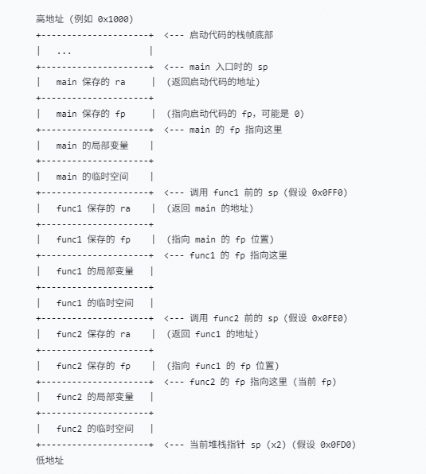

    1.  关键点说明：

        sp（栈指针）：始终指向当前栈帧的最低地址（即最后分配的空间）。在func2执行时，sp指向func2局部变量下方的空闲区域（或已占用的底部）。

        fp（帧指针）：指向当前栈帧中保存上一帧fp的位置。例如，func2的fp指向的地址存放着func1的fp值，而 func1的fp又指向main的fp位置，从而形成链表。

        返回地址ra：每个函数在调用子函数前，会将当前的ra保存到自己的栈帧中（通常位于保存的fp上方4字节处，如[图1](#fig17819675511)中func2的ra在fp+4位置）。这样，当函数返回时，可以从栈帧中恢复ra。

    2.  异常回溯过程：

        当发生异常时，CPU会保存当前寄存器值（包括sp、fp、ra 等）。假设当前在func2中发生异常，我们可以通过以下步骤回溯调用栈：

        1.  <a name="li1729972117216"></a>从当前fp指向的地址读取内容，得到上一帧的fp（即func1的fp值）。
        2.  <a name="li157721425132114"></a>从当前fp + 4地址读取内容，得到当前函数func2的返回地址（即func1中调用func2的下一条指令地址）。
        3.  将上一步得到的fp作为新的当前fp，重复步骤[3.a](#li1729972117216)和[3.b](#li157721425132114)，即可依次获得func1的返回地址（即main中调用func1的下一条指令）和main的fp，直到fp为0或无效值。

        这种链式结构让调试器和异常处理程序能够精确还原函数调用序列，快速定位问题发生的上下文。

### 开发指导<a name="ZH-CN_TOPIC_0000002511954422"></a>

**使用场景<a name="section185414131459"></a>**

异常接管对系统运行期间发生的芯片硬件异常进行处理，不同芯片的异常类型存在差异，具体异常类型可以查看芯片手册。

**功能<a name="section1659236113710"></a>**

LiteOS的异常模块为用户提供下面几种功能，接口详细信息可以查看API参考。

<a name="table1194515532475"></a>
<table><thead align="left"><tr id="row16946153174710"><th class="cellrowborder" valign="top" width="16.57%" id="mcps1.1.4.1.1"><p id="p19946175304711"><a name="p19946175304711"></a><a name="p19946175304711"></a>功能分类</p>
</th>
<th class="cellrowborder" valign="top" width="32.28%" id="mcps1.1.4.1.2"><p id="p49461953174712"><a name="p49461953174712"></a><a name="p49461953174712"></a>接口名</p>
</th>
<th class="cellrowborder" valign="top" width="51.150000000000006%" id="mcps1.1.4.1.3"><p id="p16946165311479"><a name="p16946165311479"></a><a name="p16946165311479"></a>描述</p>
</th>
</tr>
</thead>
<tbody><tr id="row2628719163410"><td class="cellrowborder" valign="top" width="16.57%" headers="mcps1.1.4.1.1 "><p id="p1332120172135"><a name="p1332120172135"></a><a name="p1332120172135"></a>暂停核</p>
</td>
<td class="cellrowborder" valign="top" width="32.28%" headers="mcps1.1.4.1.2 "><p id="p462814196347"><a name="p462814196347"></a><a name="p462814196347"></a>LOS_Panic</p>
</td>
<td class="cellrowborder" valign="top" width="51.150000000000006%" headers="mcps1.1.4.1.3 "><p id="p15494261155"><a name="p15494261155"></a><a name="p15494261155"></a>暂停当前核运行并打印信息。</p>
</td>
</tr>
<tr id="row81191347135013"><td class="cellrowborder" rowspan="2" valign="top" width="16.57%" headers="mcps1.1.4.1.1 "><p id="p171191747135016"><a name="p171191747135016"></a><a name="p171191747135016"></a>栈回溯</p>
<p id="p2036512411711"><a name="p2036512411711"></a><a name="p2036512411711"></a></p>
</td>
<td class="cellrowborder" valign="top" width="32.28%" headers="mcps1.1.4.1.2 "><p id="p1811934715012"><a name="p1811934715012"></a><a name="p1811934715012"></a>LOS_BackTrace</p>
</td>
<td class="cellrowborder" valign="top" width="51.150000000000006%" headers="mcps1.1.4.1.3 "><p id="p17119547125020"><a name="p17119547125020"></a><a name="p17119547125020"></a>打印当前任务的栈回溯信息。</p>
</td>
</tr>
<tr id="row18364644177"><td class="cellrowborder" valign="top" headers="mcps1.1.4.1.1 "><p id="p1736534111717"><a name="p1736534111717"></a><a name="p1736534111717"></a>LOS_TaskBackTrace</p>
</td>
<td class="cellrowborder" valign="top" headers="mcps1.1.4.1.2 "><p id="p133658491717"><a name="p133658491717"></a><a name="p133658491717"></a>打印指定任务的栈回溯信息。</p>
</td>
</tr>
</tbody>
</table>

**定位流程<a name="section4760051492346"></a>**

异常接管一般的定位步骤如下：

1.  打开编译后生成的镜像反汇编（asm）文件。
2.  搜索PC指针（指向当前正在执行的指令）在asm中的位置，找到发生异常的函数。
3.  <a name="li1979153992612"></a>根据LR值查找异常函数的父函数。
4.  重复[3](#li1979153992612)，得到函数间的调用关系，找到异常原因。

具体的定位方法会在实例中举例说明。

**配置项<a name="section277562653518"></a>**

打开菜单，进入Kernel ---\> Exception Management菜单，完成异常接管模块的配置。

<a name="table307549115016"></a>
<table><thead align="left"><tr id="row6708500315016"><th class="cellrowborder" valign="top" width="22.81771822817718%" id="mcps1.1.6.1.1"><p id="p1839509215016"><a name="p1839509215016"></a><a name="p1839509215016"></a>配置项</p>
</th>
<th class="cellrowborder" valign="top" width="27.997200279972006%" id="mcps1.1.6.1.2"><p id="p1360747715016"><a name="p1360747715016"></a><a name="p1360747715016"></a>含义</p>
</th>
<th class="cellrowborder" valign="top" width="14.138586141385861%" id="mcps1.1.6.1.3"><p id="p2846381815016"><a name="p2846381815016"></a><a name="p2846381815016"></a>取值范围</p>
</th>
<th class="cellrowborder" valign="top" width="14.308569143085691%" id="mcps1.1.6.1.4"><p id="p2386789915016"><a name="p2386789915016"></a><a name="p2386789915016"></a>默认值</p>
</th>
<th class="cellrowborder" valign="top" width="20.73792620737926%" id="mcps1.1.6.1.5"><p id="p5425169815016"><a name="p5425169815016"></a><a name="p5425169815016"></a>依赖</p>
</th>
</tr>
</thead>
<tbody><tr id="row1345014211687"><td class="cellrowborder" valign="top" width="22.81771822817718%" headers="mcps1.1.6.1.1 "><p id="p645115211811"><a name="p645115211811"></a><a name="p645115211811"></a>LOSCFG_EXC_SIMPLE_INFO</p>
</td>
<td class="cellrowborder" valign="top" width="27.997200279972006%" headers="mcps1.1.6.1.2 "><p id="p174513211880"><a name="p174513211880"></a><a name="p174513211880"></a>使能后将减少异常输出的信息</p>
</td>
<td class="cellrowborder" valign="top" width="14.138586141385861%" headers="mcps1.1.6.1.3 "><p id="p1245110219812"><a name="p1245110219812"></a><a name="p1245110219812"></a>YES/NO</p>
</td>
<td class="cellrowborder" valign="top" width="14.308569143085691%" headers="mcps1.1.6.1.4 "><p id="p1645119211387"><a name="p1645119211387"></a><a name="p1645119211387"></a>NO</p>
</td>
<td class="cellrowborder" valign="top" width="20.73792620737926%" headers="mcps1.1.6.1.5 "><p id="p245192110814"><a name="p245192110814"></a><a name="p245192110814"></a>无</p>
</td>
</tr>
<tr id="row16428109124"><td class="cellrowborder" valign="top" width="22.81771822817718%" headers="mcps1.1.6.1.1 "><p id="p1542813010120"><a name="p1542813010120"></a><a name="p1542813010120"></a>LOSCFG_EXC_STACK_SIZE</p>
</td>
<td class="cellrowborder" valign="top" width="27.997200279972006%" headers="mcps1.1.6.1.2 "><p id="p5428100201212"><a name="p5428100201212"></a><a name="p5428100201212"></a>异常栈大小</p>
</td>
<td class="cellrowborder" valign="top" width="14.138586141385861%" headers="mcps1.1.6.1.3 "><p id="p44281904126"><a name="p44281904126"></a><a name="p44281904126"></a>根据板子自适配</p>
</td>
<td class="cellrowborder" valign="top" width="14.308569143085691%" headers="mcps1.1.6.1.4 "><p id="p104281706127"><a name="p104281706127"></a><a name="p104281706127"></a>0x800</p>
</td>
<td class="cellrowborder" valign="top" width="20.73792620737926%" headers="mcps1.1.6.1.5 "><p id="p442820111211"><a name="p442820111211"></a><a name="p442820111211"></a>目前只有RISC-V可配置</p>
</td>
</tr>
<tr id="row17861750123411"><td class="cellrowborder" valign="top" width="22.81771822817718%" headers="mcps1.1.6.1.1 "><p id="p11786125013410"><a name="p11786125013410"></a><a name="p11786125013410"></a>LOSCFG_SVC_STACK_SIZE</p>
</td>
<td class="cellrowborder" valign="top" width="27.997200279972006%" headers="mcps1.1.6.1.2 "><p id="p578655013341"><a name="p578655013341"></a><a name="p578655013341"></a>系统调用（SVC）栈大小</p>
</td>
<td class="cellrowborder" valign="top" width="14.138586141385861%" headers="mcps1.1.6.1.3 "><p id="p778695017349"><a name="p778695017349"></a><a name="p778695017349"></a>根据板子自适配</p>
</td>
<td class="cellrowborder" valign="top" width="14.308569143085691%" headers="mcps1.1.6.1.4 "><p id="p9786185011344"><a name="p9786185011344"></a><a name="p9786185011344"></a>0x2000</p>
</td>
<td class="cellrowborder" valign="top" width="20.73792620737926%" headers="mcps1.1.6.1.5 "><p id="p46151068395"><a name="p46151068395"></a><a name="p46151068395"></a>LOSCFG_ARCH_ARM_CORTEX_A 或 LOSCFG_ARCH_ARM_CORTEX_R 或 LOSCFG_ARCH_ARM_926</p>
</td>
</tr>
</tbody>
</table>

### 注意事项<a name="ZH-CN_TOPIC_0000002511794216"></a>

要查看调用栈信息，必须添加编译选项宏“-fno-omit-frame-pointer”支持stack frame，否则编译时FP寄存器是关闭的。

用户可通过调用ArchSetExcHook和ArchSetNMIHook接口来设定自定义的异常处理函数。然而，在异常处理函数内部必须使用LOS\_TaskLock锁定任务调度机制，以避免因触发调度而导致二次异常或其他潜在问题的发生。

### 编程实例<a name="ZH-CN_TOPIC_0000002511954280"></a>

通过错误释放内存，触发系统异常。系统异常被挂起后，能在串口中看到异常调用栈打印信息和关键寄存器信息，如下所示，其中Type表示异常类型，此处值为0x2表示非法指令 ，其它数值可以查看芯片手册。通过这些信息可以定位到异常所在函数和其调用栈关系。

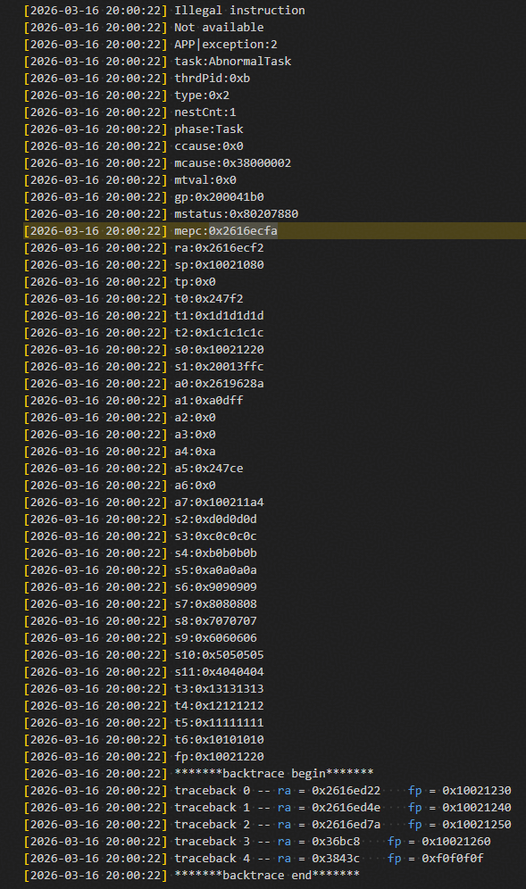

定位步骤如下：

1.  打开编译后生成的.asm 反汇编文件（默认生成在“LiteOS/out/<platform\>“”目录下，其中的platform为具体的平台名）。
2.  搜索mepc指针2616ecfa在.asm文件中的位置（去掉0x）。

    mepc地址指向发生异常时程序正在执行的指令。在当前执行的二进制文件对应的asm文件中，查找mepc值2616ecfa，找到当前发生异常的文件，得到如下图所示结果。

    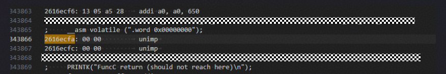

    从图中可以看到：

    1.  异常时CPU正在执行的指令unimp。
    2.  异常发生在“It\_los\_task\_045.c”文件的“\_\_asm volatile \(".word 0x00000000"\)”语句。

    接下来，需要查找谁调用了这个语句。

3.  根据ra返回寄存器值查找调用栈。

    从异常信息的backtrace begin开始，打印的是调用栈信息。在asm文件中查找traceback 0\~2对应的ra，如下图所示。

    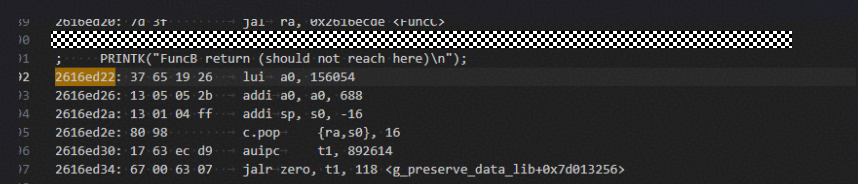

    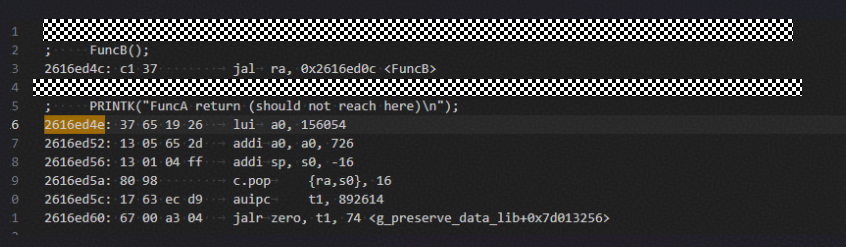

    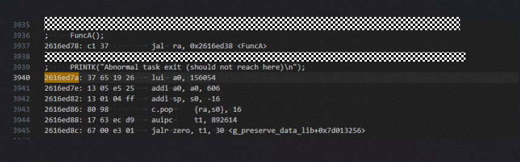

    可见，是FuncC调用了“\_\_asm volatile \(".word 0x00000000"\)”语句发生异常。依此方法，可得到异常时函数调用关系如下：FuncA\(业务函数\) ---\> FuncB---\> FuncC ---\> \_\_asm volatile \(".word 0x00000000"\)。

    最终，可以通过该方法排查出整个异常调用栈的信息。

## 错误处理<a name="ZH-CN_TOPIC_0000002543354257"></a>


### 概述<a name="ZH-CN_TOPIC_0000002511954302"></a>

**基本概念<a name="section62024452101623"></a>**

错误处理指程序运行错误时，调用错误处理模块的接口函数，上报错误信息，并调用注册的钩子函数进行特定处理，保存现场以便定位问题。

通过错误处理，可以控制和提示程序中的非法输入，防止程序崩溃。

**运作机制<a name="section3026392017222"></a>**

错误处理是一种机制，用于处理异常状况。当程序出现错误时，会显示相应的错误码。此外，如果注册了相应的错误处理函数，则会执行这个函数。

**图 1**  错误处理示意图<a name="fig1551272917226"></a>  
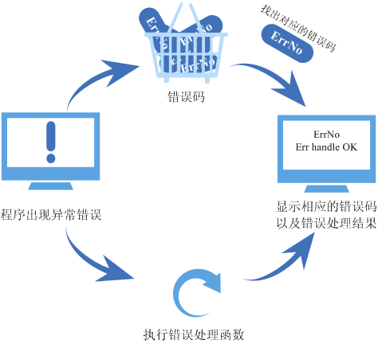

### 开发指导<a name="ZH-CN_TOPIC_0000002511954294"></a>

**错误码简介<a name="section29852515161"></a>**

调用API接口时可能会出现错误，此时接口会返回对应的错误码，以便快速定位错误原因。

错误码是一个32位的无符号整型数，31～24位表示错误等级，23～16位表示错误码标志（当前该标志值为0），15～8位代表错误码所属模块，7～0位表示错误码序号。

例如将任务模块中的错误码LOS\_ERRNO\_TSK\_NO\_MEMORY定义为致命级别的错误，模块ID为LOS\_MOD\_TSK，错误码序号为0，其定义如下：

```
#define LOS_ERRNO_TSK_NO_MEMORY  LOS_ERRNO_OS_FATAL(LOS_MOD_TSK, 0x00)
```

```
#define LOS_ERRNO_OS_FATAL(MID, ERRNO)  \
    (LOS_ERRTYPE_FATAL | LOS_ERRNO_OS_ID | ((UINT32)(MID) << 8) | ((UINT32)(ERRNO)))
```

> **说明：** 
>-   LOS\_ERRTYPE\_FATAL：错误等级为致命，值为0x03000000。
>-   LOS\_ERRNO\_OS\_ID：错误码标志，值为0x000000。
>-   MID：所属模块，LOS\_MOD\_TSK的值为0x2。
>-   ERRNO：错误码序号。
>所以LOS\_ERRNO\_TSK\_NO\_MEMORY的值为0x03000200。

**错误码接管<a name="section4791065162858"></a>**

有时只靠错误码不能快速准确的定位问题，为方便用户分析错误，错误处理模块支持注册错误处理的钩子函数，发生错误时，用户可以调用LOS\_ErrHandle接口以执行错误处理函数。

LiteOS的错误处理模块为用户提供下面几个接口，接口详细信息请参见API参考。

<a name="table3025663162858"></a>
<table><thead align="left"><tr id="row33230790162858"><th class="cellrowborder" valign="top" width="16.22837716228377%" id="mcps1.1.5.1.1"><p id="p57624058162858"><a name="p57624058162858"></a><a name="p57624058162858"></a>接口名</p>
</th>
<th class="cellrowborder" valign="top" width="21.32786721327867%" id="mcps1.1.5.1.2"><p id="p37037121162858"><a name="p37037121162858"></a><a name="p37037121162858"></a>描述</p>
</th>
<th class="cellrowborder" valign="top" width="29.137086291370863%" id="mcps1.1.5.1.3"><p id="p10255125316586"><a name="p10255125316586"></a><a name="p10255125316586"></a>参数</p>
</th>
<th class="cellrowborder" valign="top" width="33.306669333066694%" id="mcps1.1.5.1.4"><p id="p817653416591"><a name="p817653416591"></a><a name="p817653416591"></a>备注</p>
</th>
</tr>
</thead>
<tbody><tr id="row19886134212579"><td class="cellrowborder" valign="top" width="16.22837716228377%" headers="mcps1.1.5.1.1 "><p id="p3886204219573"><a name="p3886204219573"></a><a name="p3886204219573"></a>LOS_RegErrHandle</p>
</td>
<td class="cellrowborder" valign="top" width="21.32786721327867%" headers="mcps1.1.5.1.2 "><p id="p8887142155718"><a name="p8887142155718"></a><a name="p8887142155718"></a>注册错误处理钩子函数。</p>
</td>
<td class="cellrowborder" valign="top" width="29.137086291370863%" headers="mcps1.1.5.1.3 "><p id="p182558531589"><a name="p182558531589"></a><a name="p182558531589"></a>func：错误处理钩子函数</p>
</td>
<td class="cellrowborder" valign="top" width="33.306669333066694%" headers="mcps1.1.5.1.4 "><p id="p17176143414596"><a name="p17176143414596"></a><a name="p17176143414596"></a>-</p>
</td>
</tr>
<tr id="row65700953153913"><td class="cellrowborder" rowspan="5" valign="top" width="16.22837716228377%" headers="mcps1.1.5.1.1 "><p id="p23722761153913"><a name="p23722761153913"></a><a name="p23722761153913"></a>LOS_ErrHandle</p>
</td>
<td class="cellrowborder" rowspan="5" valign="top" width="21.32786721327867%" headers="mcps1.1.5.1.2 "><p id="p42495518153913"><a name="p42495518153913"></a><a name="p42495518153913"></a>调用钩子函数，处理错误。</p>
</td>
<td class="cellrowborder" valign="top" width="29.137086291370863%" headers="mcps1.1.5.1.3 "><p id="p1125515536588"><a name="p1125515536588"></a><a name="p1125515536588"></a>fileName：存放错误日志的文件名</p>
</td>
<td class="cellrowborder" valign="top" width="33.306669333066694%" headers="mcps1.1.5.1.4 "><p id="p10176183455917"><a name="p10176183455917"></a><a name="p10176183455917"></a>系统内部调用时，入参为“os_unspecific_file”。</p>
</td>
</tr>
<tr id="row147465137018"><td class="cellrowborder" valign="top" headers="mcps1.1.5.1.1 "><p id="p1874711319013"><a name="p1874711319013"></a><a name="p1874711319013"></a>lineNo：发生错误的代码行号</p>
</td>
<td class="cellrowborder" valign="top" headers="mcps1.1.5.1.2 "><p id="p37471513301"><a name="p37471513301"></a><a name="p37471513301"></a>系统内部调用时，若值为0xA1B2C3F8，表示未传递行号。</p>
</td>
</tr>
<tr id="row853242816018"><td class="cellrowborder" valign="top" headers="mcps1.1.5.1.1 "><p id="p16532328904"><a name="p16532328904"></a><a name="p16532328904"></a>errnoNo：错误码</p>
</td>
<td class="cellrowborder" valign="top" headers="mcps1.1.5.1.2 "><p id="p653219281502"><a name="p653219281502"></a><a name="p653219281502"></a>-</p>
</td>
</tr>
<tr id="row158973181308"><td class="cellrowborder" valign="top" headers="mcps1.1.5.1.1 "><p id="p689771819017"><a name="p689771819017"></a><a name="p689771819017"></a>paraLen：入参para的长度</p>
</td>
<td class="cellrowborder" valign="top" headers="mcps1.1.5.1.2 "><p id="p128975181707"><a name="p128975181707"></a><a name="p128975181707"></a>系统内部调用时，入参为0。</p>
</td>
</tr>
<tr id="row8697181313"><td class="cellrowborder" valign="top" headers="mcps1.1.5.1.1 "><p id="p36914188113"><a name="p36914188113"></a><a name="p36914188113"></a>para：错误标签</p>
</td>
<td class="cellrowborder" valign="top" headers="mcps1.1.5.1.2 "><p id="p1469121814119"><a name="p1469121814119"></a><a name="p1469121814119"></a>系统内部调用时，入参为NULL。</p>
</td>
</tr>
</tbody>
</table>

> **须知：** 
>系统内部会在某些难以定位的错误处，主动调用注册的钩子函数（目前只在互斥锁模块和信号量模块中主动调用了钩子函数）。

### 注意事项<a name="ZH-CN_TOPIC_0000002511954356"></a>

系统中有且仅有一个错误处理的钩子函数。当多次注册钩子函数时，最后一次注册的钩子函数会覆盖前一次注册的函数。

### 编程实例<a name="ZH-CN_TOPIC_0000002543354231"></a>

**实例描述<a name="section12652506102830"></a>**

本实例演示功能如下：

1.  注册错误处理钩子函数。
2.  执行错误处理函数。

**编程示例<a name="section15395384102858"></a>**

代码实现如下：

```
#include "los_err.h"
#include "los_typedef.h"
#include <stdio.h>

void Test_ErrHandle(CHAR *fileName, UINT32 lineNo, UINT32 errorNo, UINT32 paraLen, VOID  *para)
{
    printf("err handle ok\n");
}

static UINT32 TestCase(VOID)
{
    UINT32 errNo = 0;
    UINT32 ret;
    UINT32 errLine = 16;

    LOS_RegErrHandle(Test_ErrHandle);

    ret = LOS_ErrHandle("os_unspecific_file", errLine, errNo, 0, NULL);
    if (ret != LOS_OK) {
        return LOS_NOK;
    }

    return LOS_OK;
}
```

**结果验证<a name="section12568740144737"></a>**

编译运行得到的结果为：

```
HuaWei LiteOS # err handle ok
```

## 队列<a name="ZH-CN_TOPIC_0000002543394261"></a>


### 概述<a name="ZH-CN_TOPIC_0000002543394171"></a>

**基本概念<a name="section6310708215125"></a>**

队列又称消息队列，是一种常用于任务间通信的数据结构。队列接收来自任务或中断的不固定长度消息，并根据不同的接口确定传递的消息是否存放在队列空间中。

任务能够从队列里面读取消息，当队列中的消息为空时，挂起读取任务；当队列中有新消息时，挂起的读取任务被唤醒并处理新消息。任务也能够往队列里写入消息，当队列已经写满消息时，挂起写入任务；当队列中有空闲消息节点时，挂起的写入任务被唤醒并写入消息。如果将读队列和写队列的超时时间设置为0，则不会挂起任务，接口会直接返回，这就是非阻塞模式。

消息队列提供了异步处理机制，允许将一个消息放入队列，但不立即处理。同时队列还有缓冲消息的作用。

LiteOS中使用队列实现任务异步通信，具有如下特性：

-   消息以先进先出的方式排队，支持异步读写。
-   读队列和写队列都支持超时机制。
-   每读取一条消息，就会将该消息节点设置为空闲。
-   发送消息类型由通信双方约定，可以允许不同长度（不超过队列的消息节点大小）的消息。
-   一个任务能够从任意一个消息队列接收和发送消息。
-   多个任务能够从同一个消息队列接收和发送消息。
-   创建队列时所需的队列空间，默认支持接口内系统自行动态申请内存的方式，同时也支持将用户分配的队列空间作为接口入参传入的方式。

**运作机制<a name="section4442771013118"></a>**

队列控制块：

```
typedef enum {
    OS_QUEUE_READ =0,
    OS_QUEUE_WRITE =1,
    OS_QUEUE_N_RW =2
} QueueReadWrite;

/**
  * Queue information block structure
  */
typedef struct 
{
    UINT8       *queueHandle;                    /* 队列指针 */
    UINT8       queueState;                      /* 队列状态 */
    UINT8       queueMemType;                    /* 创建队列时内存分配的方式 */
    UINT16      queueLen;                        /* 队列中消息节点个数，即队列长度 */
    UINT16      queueSize;                       /* 消息节点大小 */
    UINT32      queueId;                         /* 队列ID */
    UINT16      queueHead;                       /* 消息头节点位置（数组下标）*/
    UINT16      queueTail;                       /* 消息尾节点位置（数组下标）*/
    UINT16      readWriteableCnt[OS_QUEUE_N_RW]; /* 数组下标0的元素表示队列中可读消息数，                              
                                                    数组下标1的元素表示队列中可写消息数 */
    LOS_DL_LIST readWriteList[OS_QUEUE_N_RW];    /* 读取或写入消息的任务等待链表， 
                                                    下标0：读取链表，下标1：写入链表 */
    LOS_DL_LIST memList;                         /* CMSIS-RTOS中的MailBox模块使用的内存块链表 */
} LosQueueCB;
```

每个队列控制块中都含有队列状态，表示该队列的使用情况：

-   OS\_QUEUE\_UNUSED：队列没有被使用。
-   OS\_QUEUE\_INUSED：队列被使用中。

每个队列控制块中都含有创建队列时的内存分配方式：

-   OS\_QUEUE\_ALLOC\_DYNAMIC：创建队列时所需的队列空间，由系统自行动态申请内存获取。
-   OS\_QUEUE\_ALLOC\_STATIC：创建队列时所需的队列空间，由接口调用者自行申请后传入接口。

**队列运作原理<a name="section7733141312315"></a>**

**表 1**  队列运作原理描述表

<a name="table11733413163114"></a>
<table><thead align="left"><tr id="row13732101313113"><th class="cellrowborder" valign="top" width="16.24%" id="mcps1.2.3.1.1"><p id="p11732131333118"><a name="p11732131333118"></a><a name="p11732131333118"></a>功能</p>
</th>
<th class="cellrowborder" valign="top" width="83.76%" id="mcps1.2.3.1.2"><p id="p873214133311"><a name="p873214133311"></a><a name="p873214133311"></a>运作原理描述</p>
</th>
</tr>
</thead>
<tbody><tr id="row573211315311"><td class="cellrowborder" valign="top" width="16.24%" headers="mcps1.2.3.1.1 "><p id="p16732813123118"><a name="p16732813123118"></a><a name="p16732813123118"></a>创建队列</p>
</td>
<td class="cellrowborder" valign="top" width="83.76%" headers="mcps1.2.3.1.2 "><p id="p15732413113116"><a name="p15732413113116"></a><a name="p15732413113116"></a>创建队列成功会返回队列ID。</p>
<p id="p6732131333117"><a name="p6732131333117"></a><a name="p6732131333117"></a>在队列控制块中维护着一个消息头节点位置Head和一个消息尾节点位置Tail，用于表示当前队列中消息的存储情况。</p>
<a name="ul187321913163119"></a><a name="ul187321913163119"></a><ul id="ul187321913163119"><li>Head表示队列中被占用的消息节点的起始位置。</li><li>Tail表示被占用的消息节点的结束位置，也是空闲消息节点的起始位置。</li></ul>
<p id="p2732181333118"><a name="p2732181333118"></a><a name="p2732181333118"></a>（注：队列刚创建时，Head和Tail均指向队列起始位置。）</p>
</td>
</tr>
<tr id="row2732111314314"><td class="cellrowborder" valign="top" width="16.24%" headers="mcps1.2.3.1.1 "><p id="p97321413103115"><a name="p97321413103115"></a><a name="p97321413103115"></a>写队列</p>
</td>
<td class="cellrowborder" valign="top" width="83.76%" headers="mcps1.2.3.1.2 "><p id="p77326139319"><a name="p77326139319"></a><a name="p77326139319"></a>根据readWriteableCnt[1]判断队列是否可以写入，不能对已满（readWriteableCnt[1]为0）队列进行写操作。</p>
<p id="p0732191353112"><a name="p0732191353112"></a><a name="p0732191353112"></a>写队列支持以下2种写入方式。</p>
<a name="ul7732213173115"></a><a name="ul7732213173115"></a><ul id="ul7732213173115"><li>向队列尾节点写入：尾节点写入时，根据Tail找到起始空闲消息节点作为数据写入对象，如果Tail已经指向队列尾部则采用回卷方式。</li><li>向队列头节点写入：头节点写入时，将Head的前一个节点作为数据写入对象，如果Head指向队列起始位置则采用回卷方式。</li></ul>
</td>
</tr>
<tr id="row127328139316"><td class="cellrowborder" valign="top" width="16.24%" headers="mcps1.2.3.1.1 "><p id="p4732213123115"><a name="p4732213123115"></a><a name="p4732213123115"></a>读队列</p>
</td>
<td class="cellrowborder" valign="top" width="83.76%" headers="mcps1.2.3.1.2 "><p id="p273221323114"><a name="p273221323114"></a><a name="p273221323114"></a>根据readWriteableCnt[0]判断队列是否有消息需要读取，对全部空闲（readWriteableCnt[0]为0）队列进行读操作会引起任务挂起。</p>
<a name="ul14732913183112"></a><a name="ul14732913183112"></a><ul id="ul14732913183112"><li>如果队列可以读取消息，则根据Head找到最先写入队列的消息节点进行读取。</li><li>如果Head已经指向队列尾部则采用回卷方式。</li></ul>
</td>
</tr>
<tr id="row1573313136311"><td class="cellrowborder" valign="top" width="16.24%" headers="mcps1.2.3.1.1 "><p id="p3732913143118"><a name="p3732913143118"></a><a name="p3732913143118"></a>删除队列</p>
</td>
<td class="cellrowborder" valign="top" width="83.76%" headers="mcps1.2.3.1.2 "><p id="p18732101313317"><a name="p18732101313317"></a><a name="p18732101313317"></a>根据队列ID找到对应队列，把队列状态置为未使用，把队列控制块置为初始状态。如果是通过系统动态申请内存方式创建的队列，还会释放队列所占内存。</p>
</td>
</tr>
</tbody>
</table>

**图 1**  队列读写数据操作示意图<a name="fig1673391333119"></a>  
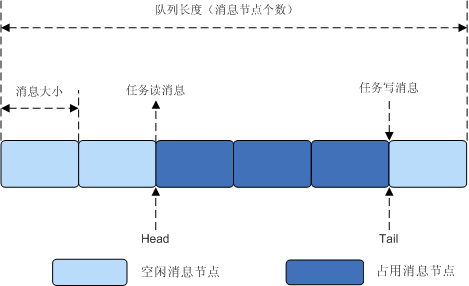

[图1](#fig1673391333119)对读写队列做了示意，图中只画了尾节点写入方式，没有画头节点写入，但是两者是类似的。

### 开发指导<a name="ZH-CN_TOPIC_0000002543394379"></a>

**使用场景<a name="section1521963620410"></a>**

队列用于任务间通信，可以实现消息的异步处理。同时消息的发送方和接收方不需要彼此联系，两者间是解耦的。

**功能<a name="section267785513432"></a>**

LiteOS中的队列模块提供下面几种功能，接口详细信息可以查看API参考。

<a name="table23667517184354"></a>
<table><thead align="left"><tr id="row23800586184354"><th class="cellrowborder" valign="top" width="21.66%" id="mcps1.1.4.1.1"><p id="p5651424118443"><a name="p5651424118443"></a><a name="p5651424118443"></a>功能分类</p>
</th>
<th class="cellrowborder" valign="top" width="25.78%" id="mcps1.1.4.1.2"><p id="p1425081918443"><a name="p1425081918443"></a><a name="p1425081918443"></a>接口名</p>
</th>
<th class="cellrowborder" valign="top" width="52.56000000000001%" id="mcps1.1.4.1.3"><p id="p1346571418443"><a name="p1346571418443"></a><a name="p1346571418443"></a>描述</p>
</th>
</tr>
</thead>
<tbody><tr id="row62888924184354"><td class="cellrowborder" rowspan="3" valign="top" width="21.66%" headers="mcps1.1.4.1.1 "><p id="p3328741318443"><a name="p3328741318443"></a><a name="p3328741318443"></a>创建/删除消息队列</p>
</td>
<td class="cellrowborder" valign="top" width="25.78%" headers="mcps1.1.4.1.2 "><p id="p1192591318443"><a name="p1192591318443"></a><a name="p1192591318443"></a>LOS_QueueCreate</p>
</td>
<td class="cellrowborder" valign="top" width="52.56000000000001%" headers="mcps1.1.4.1.3 "><p id="p2647489018443"><a name="p2647489018443"></a><a name="p2647489018443"></a>创建一个消息队列，由系统动态申请队列空间。</p>
</td>
</tr>
<tr id="row4459241419"><td class="cellrowborder" valign="top" headers="mcps1.1.4.1.1 "><p id="p123598451144"><a name="p123598451144"></a><a name="p123598451144"></a>LOS_QueueCreateStatic</p>
</td>
<td class="cellrowborder" valign="top" headers="mcps1.1.4.1.2 "><p id="p1345192141410"><a name="p1345192141410"></a><a name="p1345192141410"></a>创建一个消息队列，由用户分配队列内存空间传入接口。</p>
</td>
</tr>
<tr id="row151398386345"><td class="cellrowborder" valign="top" headers="mcps1.1.4.1.1 "><p id="p17568143915340"><a name="p17568143915340"></a><a name="p17568143915340"></a>LOS_QueueDelete</p>
</td>
<td class="cellrowborder" valign="top" headers="mcps1.1.4.1.2 "><p id="p11568153963413"><a name="p11568153963413"></a><a name="p11568153963413"></a>根据队列ID删除一个指定队列。</p>
</td>
</tr>
<tr id="row25480013184354"><td class="cellrowborder" rowspan="3" valign="top" width="21.66%" headers="mcps1.1.4.1.1 "><p id="p3995088818443"><a name="p3995088818443"></a><a name="p3995088818443"></a>读/写队列（不带拷贝）</p>
</td>
<td class="cellrowborder" valign="top" width="25.78%" headers="mcps1.1.4.1.2 "><p id="p1479653518443"><a name="p1479653518443"></a><a name="p1479653518443"></a>LOS_QueueRead</p>
</td>
<td class="cellrowborder" valign="top" width="52.56000000000001%" headers="mcps1.1.4.1.3 "><p id="p5766871918443"><a name="p5766871918443"></a><a name="p5766871918443"></a>读取指定队列头节点中的数据（队列节点中的数据实际上是一个地址）。</p>
</td>
</tr>
<tr id="row13975964184354"><td class="cellrowborder" valign="top" headers="mcps1.1.4.1.1 "><p id="p4222878818443"><a name="p4222878818443"></a><a name="p4222878818443"></a>LOS_QueueWrite</p>
</td>
<td class="cellrowborder" valign="top" headers="mcps1.1.4.1.2 "><p id="p6508866818443"><a name="p6508866818443"></a><a name="p6508866818443"></a>向指定队列尾节点中写入入参bufferAddr的值（即buffer的地址）。</p>
</td>
</tr>
<tr id="row147410295355"><td class="cellrowborder" valign="top" headers="mcps1.1.4.1.1 "><p id="p23501231123510"><a name="p23501231123510"></a><a name="p23501231123510"></a>LOS_QueueWriteHead</p>
</td>
<td class="cellrowborder" valign="top" headers="mcps1.1.4.1.2 "><p id="p13503312359"><a name="p13503312359"></a><a name="p13503312359"></a>向指定队列头节点中写入入参bufferAddr的值（即buffer的地址）。</p>
</td>
</tr>
<tr id="row49536790111815"><td class="cellrowborder" rowspan="3" valign="top" width="21.66%" headers="mcps1.1.4.1.1 "><p id="p53057044111815"><a name="p53057044111815"></a><a name="p53057044111815"></a>读/写队列（带拷贝）</p>
</td>
<td class="cellrowborder" valign="top" width="25.78%" headers="mcps1.1.4.1.2 "><p id="p2653311111815"><a name="p2653311111815"></a><a name="p2653311111815"></a>LOS_QueueReadCopy</p>
</td>
<td class="cellrowborder" valign="top" width="52.56000000000001%" headers="mcps1.1.4.1.3 "><p id="p13591614111815"><a name="p13591614111815"></a><a name="p13591614111815"></a>读取指定队列头节点中的数据。</p>
</td>
</tr>
<tr id="row43811731111820"><td class="cellrowborder" valign="top" headers="mcps1.1.4.1.1 "><p id="p21507820111820"><a name="p21507820111820"></a><a name="p21507820111820"></a>LOS_QueueWriteCopy</p>
</td>
<td class="cellrowborder" valign="top" headers="mcps1.1.4.1.2 "><p id="p64411829111820"><a name="p64411829111820"></a><a name="p64411829111820"></a>向指定队列尾节点中写入入参bufferAddr中保存的数据。</p>
</td>
</tr>
<tr id="row53214216105859"><td class="cellrowborder" valign="top" headers="mcps1.1.4.1.1 "><p id="p38164146105859"><a name="p38164146105859"></a><a name="p38164146105859"></a>LOS_QueueWriteHeadCopy</p>
</td>
<td class="cellrowborder" valign="top" headers="mcps1.1.4.1.2 "><p id="p4288110105859"><a name="p4288110105859"></a><a name="p4288110105859"></a>向指定队列头节点中写入入参bufferAddr中保存的数据。</p>
</td>
</tr>
<tr id="row16299901184354"><td class="cellrowborder" valign="top" width="21.66%" headers="mcps1.1.4.1.1 "><p id="p378995218443"><a name="p378995218443"></a><a name="p378995218443"></a>获取队列信息</p>
</td>
<td class="cellrowborder" valign="top" width="25.78%" headers="mcps1.1.4.1.2 "><p id="p3855073218443"><a name="p3855073218443"></a><a name="p3855073218443"></a>LOS_QueueInfoGet</p>
</td>
<td class="cellrowborder" valign="top" width="52.56000000000001%" headers="mcps1.1.4.1.3 "><p id="p3560155518443"><a name="p3560155518443"></a><a name="p3560155518443"></a>获取指定队列的信息，包括队列ID、队列长度、消息节点大小、头节点、尾节点、可读节点数量、可写节点数量、等待读操作的任务、等待写操作的任务、等待mail操作的任务。</p>
</td>
</tr>
<tr id="row39901647982"><td class="cellrowborder" valign="top" width="21.66%" headers="mcps1.1.4.1.1 "><p id="p399154719811"><a name="p399154719811"></a><a name="p399154719811"></a>获取全量队列信息</p>
</td>
<td class="cellrowborder" valign="top" width="25.78%" headers="mcps1.1.4.1.2 "><p id="p899124719818"><a name="p899124719818"></a><a name="p899124719818"></a>LOS_QueueInfoAllGet</p>
</td>
<td class="cellrowborder" valign="top" width="52.56000000000001%" headers="mcps1.1.4.1.3 "><p id="p699118471881"><a name="p699118471881"></a><a name="p699118471881"></a>功能与LOS_QueueInfoGet相同，相比与LOS_QueueInfoGet接口，支持任务数大于64的场景。</p>
</td>
</tr>
</tbody>
</table>

**队列错误码<a name="section58399290191416"></a>**

对存在失败可能性的操作返回对应的错误码，以便快速定位错误原因。

<a name="table66521465191749"></a>
<table><thead align="left"><tr id="row66647056191749"><th class="cellrowborder" valign="top" width="5.41%" id="mcps1.1.6.1.1"><p id="p65995609191749"><a name="p65995609191749"></a><a name="p65995609191749"></a>序号</p>
</th>
<th class="cellrowborder" valign="top" width="20.02%" id="mcps1.1.6.1.2"><p id="p44044076191749"><a name="p44044076191749"></a><a name="p44044076191749"></a>定义</p>
</th>
<th class="cellrowborder" valign="top" width="14.05%" id="mcps1.1.6.1.3"><p id="p10800441191749"><a name="p10800441191749"></a><a name="p10800441191749"></a>实际数值</p>
</th>
<th class="cellrowborder" valign="top" width="24.610000000000003%" id="mcps1.1.6.1.4"><p id="p39597633191844"><a name="p39597633191844"></a><a name="p39597633191844"></a>描述</p>
</th>
<th class="cellrowborder" valign="top" width="35.91%" id="mcps1.1.6.1.5"><p id="p61844251191749"><a name="p61844251191749"></a><a name="p61844251191749"></a>参考解决方案</p>
</th>
</tr>
</thead>
<tbody><tr id="row33366968191749"><td class="cellrowborder" valign="top" width="5.41%" headers="mcps1.1.6.1.1 "><p id="p18369922191749"><a name="p18369922191749"></a><a name="p18369922191749"></a>1</p>
</td>
<td class="cellrowborder" valign="top" width="20.02%" headers="mcps1.1.6.1.2 "><p id="p11568741191749"><a name="p11568741191749"></a><a name="p11568741191749"></a>LOS_ERRNO_QUEUE_NO_MEMORY</p>
</td>
<td class="cellrowborder" valign="top" width="14.05%" headers="mcps1.1.6.1.3 "><p id="p64652808191749"><a name="p64652808191749"></a><a name="p64652808191749"></a>0x02000601</p>
</td>
<td class="cellrowborder" valign="top" width="24.610000000000003%" headers="mcps1.1.6.1.4 "><p id="p787615154915"><a name="p787615154915"></a><a name="p787615154915"></a>队列初始化时，从动态内存池申请内存失败。</p>
</td>
<td class="cellrowborder" valign="top" width="35.91%" headers="mcps1.1.6.1.5 "><p id="p1687611564915"><a name="p1687611564915"></a><a name="p1687611564915"></a>设置更大的系统动态内存池，配置项为OS_SYS_MEM_SIZE，或减少系统支持的最大队列数。</p>
</td>
</tr>
<tr id="row33397154191749"><td class="cellrowborder" valign="top" width="5.41%" headers="mcps1.1.6.1.1 "><p id="p20814974191749"><a name="p20814974191749"></a><a name="p20814974191749"></a>2</p>
</td>
<td class="cellrowborder" valign="top" width="20.02%" headers="mcps1.1.6.1.2 "><p id="p8291367191749"><a name="p8291367191749"></a><a name="p8291367191749"></a>LOS_ERRNO_QUEUE_CREATE_NO_MEMORY</p>
</td>
<td class="cellrowborder" valign="top" width="14.05%" headers="mcps1.1.6.1.3 "><p id="p512132191749"><a name="p512132191749"></a><a name="p512132191749"></a>0x02000602</p>
</td>
<td class="cellrowborder" valign="top" width="24.610000000000003%" headers="mcps1.1.6.1.4 "><p id="p181431132184915"><a name="p181431132184915"></a><a name="p181431132184915"></a>创建队列时，从动态内存池申请内存失败</p>
</td>
<td class="cellrowborder" valign="top" width="35.91%" headers="mcps1.1.6.1.5 "><p id="p614312322497"><a name="p614312322497"></a><a name="p614312322497"></a>设置更大的系统动态内存池，配置项为OS_SYS_MEM_SIZE，或减少要创建队列的队列长度和消息节点大小。</p>
</td>
</tr>
<tr id="row41391008191749"><td class="cellrowborder" valign="top" width="5.41%" headers="mcps1.1.6.1.1 "><p id="p64337369191749"><a name="p64337369191749"></a><a name="p64337369191749"></a>3</p>
</td>
<td class="cellrowborder" valign="top" width="20.02%" headers="mcps1.1.6.1.2 "><p id="p43944370191749"><a name="p43944370191749"></a><a name="p43944370191749"></a>LOS_ERRNO_QUEUE_SIZE_TOO_BIG</p>
</td>
<td class="cellrowborder" valign="top" width="14.05%" headers="mcps1.1.6.1.3 "><p id="p2724179191749"><a name="p2724179191749"></a><a name="p2724179191749"></a>0x02000603</p>
</td>
<td class="cellrowborder" valign="top" width="24.610000000000003%" headers="mcps1.1.6.1.4 "><p id="p197252184910"><a name="p197252184910"></a><a name="p197252184910"></a>创建队列时消息节点大小超过上限。</p>
</td>
<td class="cellrowborder" valign="top" width="35.91%" headers="mcps1.1.6.1.5 "><p id="p49735213493"><a name="p49735213493"></a><a name="p49735213493"></a>更改入参消息节点大小，使之不超过上限。</p>
</td>
</tr>
<tr id="row10026959191749"><td class="cellrowborder" valign="top" width="5.41%" headers="mcps1.1.6.1.1 "><p id="p6877374191749"><a name="p6877374191749"></a><a name="p6877374191749"></a>4</p>
</td>
<td class="cellrowborder" valign="top" width="20.02%" headers="mcps1.1.6.1.2 "><p id="p20196417191749"><a name="p20196417191749"></a><a name="p20196417191749"></a>LOS_ERRNO_QUEUE_CB_UNAVAILABLE</p>
</td>
<td class="cellrowborder" valign="top" width="14.05%" headers="mcps1.1.6.1.3 "><p id="p25297089191749"><a name="p25297089191749"></a><a name="p25297089191749"></a>0x02000604</p>
</td>
<td class="cellrowborder" valign="top" width="24.610000000000003%" headers="mcps1.1.6.1.4 "><p id="p1732013725019"><a name="p1732013725019"></a><a name="p1732013725019"></a>创建队列时，系统中已经没有空闲队列。</p>
</td>
<td class="cellrowborder" valign="top" width="35.91%" headers="mcps1.1.6.1.5 "><p id="p232020755019"><a name="p232020755019"></a><a name="p232020755019"></a>增加系统支持的最大队列数。</p>
</td>
</tr>
<tr id="row59373972191749"><td class="cellrowborder" valign="top" width="5.41%" headers="mcps1.1.6.1.1 "><p id="p44562467191749"><a name="p44562467191749"></a><a name="p44562467191749"></a>5</p>
</td>
<td class="cellrowborder" valign="top" width="20.02%" headers="mcps1.1.6.1.2 "><p id="p52790107191749"><a name="p52790107191749"></a><a name="p52790107191749"></a>LOS_ERRNO_QUEUE_NOT_FOUND</p>
</td>
<td class="cellrowborder" valign="top" width="14.05%" headers="mcps1.1.6.1.3 "><p id="p48140259191749"><a name="p48140259191749"></a><a name="p48140259191749"></a>0x02000605</p>
</td>
<td class="cellrowborder" valign="top" width="24.610000000000003%" headers="mcps1.1.6.1.4 "><p id="p60420222193129"><a name="p60420222193129"></a><a name="p60420222193129"></a>传递给删除队列接口的队列ID大于等于系统支持的最大队列数。</p>
</td>
<td class="cellrowborder" valign="top" width="35.91%" headers="mcps1.1.6.1.5 "><p id="p49643405193152"><a name="p49643405193152"></a><a name="p49643405193152"></a>确保队列ID是有效的。</p>
</td>
</tr>
<tr id="row36473565191749"><td class="cellrowborder" valign="top" width="5.41%" headers="mcps1.1.6.1.1 "><p id="p1568774191749"><a name="p1568774191749"></a><a name="p1568774191749"></a>6</p>
</td>
<td class="cellrowborder" valign="top" width="20.02%" headers="mcps1.1.6.1.2 "><p id="p59961868191749"><a name="p59961868191749"></a><a name="p59961868191749"></a>LOS_ERRNO_QUEUE_PEND_IN_LOCK</p>
</td>
<td class="cellrowborder" valign="top" width="14.05%" headers="mcps1.1.6.1.3 "><p id="p25073110191749"><a name="p25073110191749"></a><a name="p25073110191749"></a>0x02000606</p>
</td>
<td class="cellrowborder" valign="top" width="24.610000000000003%" headers="mcps1.1.6.1.4 "><p id="p19045334193230"><a name="p19045334193230"></a><a name="p19045334193230"></a>当任务被锁定时，禁止在队列中阻塞等待写消息或读消息。</p>
</td>
<td class="cellrowborder" valign="top" width="35.91%" headers="mcps1.1.6.1.5 "><p id="p20051835193257"><a name="p20051835193257"></a><a name="p20051835193257"></a>使用队列前解锁任务。</p>
</td>
</tr>
<tr id="row51263497192010"><td class="cellrowborder" valign="top" width="5.41%" headers="mcps1.1.6.1.1 "><p id="p58702556192010"><a name="p58702556192010"></a><a name="p58702556192010"></a>7</p>
</td>
<td class="cellrowborder" valign="top" width="20.02%" headers="mcps1.1.6.1.2 "><p id="p57286633192010"><a name="p57286633192010"></a><a name="p57286633192010"></a>LOS_ERRNO_QUEUE_TIMEOUT</p>
</td>
<td class="cellrowborder" valign="top" width="14.05%" headers="mcps1.1.6.1.3 "><p id="p9705686192010"><a name="p9705686192010"></a><a name="p9705686192010"></a>0x02000607</p>
</td>
<td class="cellrowborder" valign="top" width="24.610000000000003%" headers="mcps1.1.6.1.4 "><p id="p53994389193449"><a name="p53994389193449"></a><a name="p53994389193449"></a>等待处理队列超时。</p>
</td>
<td class="cellrowborder" valign="top" width="35.91%" headers="mcps1.1.6.1.5 "><p id="p51382338193520"><a name="p51382338193520"></a><a name="p51382338193520"></a>检查设置的超时时间是否合适。</p>
</td>
</tr>
<tr id="row36402998193312"><td class="cellrowborder" valign="top" width="5.41%" headers="mcps1.1.6.1.1 "><p id="p62961745193312"><a name="p62961745193312"></a><a name="p62961745193312"></a>8</p>
</td>
<td class="cellrowborder" valign="top" width="20.02%" headers="mcps1.1.6.1.2 "><p id="p66736597193312"><a name="p66736597193312"></a><a name="p66736597193312"></a>LOS_ERRNO_QUEUE_IN_TSKUSE</p>
</td>
<td class="cellrowborder" valign="top" width="14.05%" headers="mcps1.1.6.1.3 "><p id="p36955240193312"><a name="p36955240193312"></a><a name="p36955240193312"></a>0x02000608</p>
</td>
<td class="cellrowborder" valign="top" width="24.610000000000003%" headers="mcps1.1.6.1.4 "><p id="p3637555120413"><a name="p3637555120413"></a><a name="p3637555120413"></a>队列存在阻塞任务而不能被删除。</p>
</td>
<td class="cellrowborder" valign="top" width="35.91%" headers="mcps1.1.6.1.5 "><p id="p66119138193312"><a name="p66119138193312"></a><a name="p66119138193312"></a>使任务能够获得资源而不是在队列中被阻塞。</p>
</td>
</tr>
<tr id="row51203889193321"><td class="cellrowborder" valign="top" width="5.41%" headers="mcps1.1.6.1.1 "><p id="p53874317193321"><a name="p53874317193321"></a><a name="p53874317193321"></a>9</p>
</td>
<td class="cellrowborder" valign="top" width="20.02%" headers="mcps1.1.6.1.2 "><p id="p1743582193321"><a name="p1743582193321"></a><a name="p1743582193321"></a>LOS_ERRNO_QUEUE_WRITE_IN_INTERRUPT</p>
</td>
<td class="cellrowborder" valign="top" width="14.05%" headers="mcps1.1.6.1.3 "><p id="p7012492193321"><a name="p7012492193321"></a><a name="p7012492193321"></a>0x02000609</p>
</td>
<td class="cellrowborder" valign="top" width="24.610000000000003%" headers="mcps1.1.6.1.4 "><p id="p31140990193321"><a name="p31140990193321"></a><a name="p31140990193321"></a>在中断处理程序中不能以阻塞模式写队列。</p>
</td>
<td class="cellrowborder" valign="top" width="35.91%" headers="mcps1.1.6.1.5 "><p id="p51817932193749"><a name="p51817932193749"></a><a name="p51817932193749"></a>将写队列设为非阻塞模式，即将写队列的超时时间设置为0。</p>
</td>
</tr>
<tr id="row58997007193325"><td class="cellrowborder" valign="top" width="5.41%" headers="mcps1.1.6.1.1 "><p id="p14028263193325"><a name="p14028263193325"></a><a name="p14028263193325"></a>10</p>
</td>
<td class="cellrowborder" valign="top" width="20.02%" headers="mcps1.1.6.1.2 "><p id="p62547532193325"><a name="p62547532193325"></a><a name="p62547532193325"></a>LOS_ERRNO_QUEUE_NOT_CREATE</p>
</td>
<td class="cellrowborder" valign="top" width="14.05%" headers="mcps1.1.6.1.3 "><p id="p33185317193325"><a name="p33185317193325"></a><a name="p33185317193325"></a>0x0200060A</p>
</td>
<td class="cellrowborder" valign="top" width="24.610000000000003%" headers="mcps1.1.6.1.4 "><p id="p3656155193325"><a name="p3656155193325"></a><a name="p3656155193325"></a>队列未创建。</p>
</td>
<td class="cellrowborder" valign="top" width="35.91%" headers="mcps1.1.6.1.5 "><p id="p14251707193839"><a name="p14251707193839"></a><a name="p14251707193839"></a>创建该队列，或更换为一个已经创建的队列。</p>
</td>
</tr>
<tr id="row23132180193345"><td class="cellrowborder" valign="top" width="5.41%" headers="mcps1.1.6.1.1 "><p id="p61767288193345"><a name="p61767288193345"></a><a name="p61767288193345"></a>11</p>
</td>
<td class="cellrowborder" valign="top" width="20.02%" headers="mcps1.1.6.1.2 "><p id="p37094461193345"><a name="p37094461193345"></a><a name="p37094461193345"></a>LOS_ERRNO_QUEUE_IN_TSKWRITE</p>
</td>
<td class="cellrowborder" valign="top" width="14.05%" headers="mcps1.1.6.1.3 "><p id="p51861387193345"><a name="p51861387193345"></a><a name="p51861387193345"></a>0x0200060B</p>
</td>
<td class="cellrowborder" valign="top" width="24.610000000000003%" headers="mcps1.1.6.1.4 "><p id="p6555415519399"><a name="p6555415519399"></a><a name="p6555415519399"></a>队列读写不同步。</p>
</td>
<td class="cellrowborder" valign="top" width="35.91%" headers="mcps1.1.6.1.5 "><p id="p20620767193345"><a name="p20620767193345"></a><a name="p20620767193345"></a>同步队列的读写，即多个任务不能并发读写同一个队列。</p>
</td>
</tr>
<tr id="row21687970193352"><td class="cellrowborder" valign="top" width="5.41%" headers="mcps1.1.6.1.1 "><p id="p11895156193352"><a name="p11895156193352"></a><a name="p11895156193352"></a>12</p>
</td>
<td class="cellrowborder" valign="top" width="20.02%" headers="mcps1.1.6.1.2 "><p id="p23983603193352"><a name="p23983603193352"></a><a name="p23983603193352"></a>LOS_ERRNO_QUEUE_CREAT_PTR_NULL</p>
</td>
<td class="cellrowborder" valign="top" width="14.05%" headers="mcps1.1.6.1.3 "><p id="p63623686193352"><a name="p63623686193352"></a><a name="p63623686193352"></a>0x0200060C</p>
</td>
<td class="cellrowborder" valign="top" width="24.610000000000003%" headers="mcps1.1.6.1.4 "><p id="p3279290519404"><a name="p3279290519404"></a><a name="p3279290519404"></a>对于创建队列接口，保存队列ID的入参为空指针。</p>
</td>
<td class="cellrowborder" valign="top" width="35.91%" headers="mcps1.1.6.1.5 "><p id="p17873674193352"><a name="p17873674193352"></a><a name="p17873674193352"></a>确保传入的参数不为空指针。</p>
</td>
</tr>
<tr id="row32251036193358"><td class="cellrowborder" valign="top" width="5.41%" headers="mcps1.1.6.1.1 "><p id="p62197112193358"><a name="p62197112193358"></a><a name="p62197112193358"></a>13</p>
</td>
<td class="cellrowborder" valign="top" width="20.02%" headers="mcps1.1.6.1.2 "><p id="p4801272193358"><a name="p4801272193358"></a><a name="p4801272193358"></a>LOS_ERRNO_QUEUE_PARA_ISZERO</p>
</td>
<td class="cellrowborder" valign="top" width="14.05%" headers="mcps1.1.6.1.3 "><p id="p53358724193358"><a name="p53358724193358"></a><a name="p53358724193358"></a>0x0200060D</p>
</td>
<td class="cellrowborder" valign="top" width="24.610000000000003%" headers="mcps1.1.6.1.4 "><p id="p27309930194051"><a name="p27309930194051"></a><a name="p27309930194051"></a>对于创建队列接口，入参队列长度或消息节点大小为0。</p>
</td>
<td class="cellrowborder" valign="top" width="35.91%" headers="mcps1.1.6.1.5 "><p id="p46758883193358"><a name="p46758883193358"></a><a name="p46758883193358"></a>传入正确的队列长度和消息节点大小。</p>
</td>
</tr>
<tr id="row6471318219343"><td class="cellrowborder" valign="top" width="5.41%" headers="mcps1.1.6.1.1 "><p id="p727640719343"><a name="p727640719343"></a><a name="p727640719343"></a>14</p>
</td>
<td class="cellrowborder" valign="top" width="20.02%" headers="mcps1.1.6.1.2 "><p id="p5251806419343"><a name="p5251806419343"></a><a name="p5251806419343"></a>LOS_ERRNO_QUEUE_INVALID</p>
</td>
<td class="cellrowborder" valign="top" width="14.05%" headers="mcps1.1.6.1.3 "><p id="p2610475319343"><a name="p2610475319343"></a><a name="p2610475319343"></a>0x0200060E</p>
</td>
<td class="cellrowborder" valign="top" width="24.610000000000003%" headers="mcps1.1.6.1.4 "><p id="p5223249920528"><a name="p5223249920528"></a><a name="p5223249920528"></a>传递给读队列或写队列或获取队列信息接口的队列ID大于等于系统支持的最大队列数。</p>
</td>
<td class="cellrowborder" valign="top" width="35.91%" headers="mcps1.1.6.1.5 "><p id="p329454442063"><a name="p329454442063"></a><a name="p329454442063"></a>确保队列ID有效。</p>
</td>
</tr>
<tr id="row3895023819348"><td class="cellrowborder" valign="top" width="5.41%" headers="mcps1.1.6.1.1 "><p id="p85270419348"><a name="p85270419348"></a><a name="p85270419348"></a>15</p>
</td>
<td class="cellrowborder" valign="top" width="20.02%" headers="mcps1.1.6.1.2 "><p id="p196018619348"><a name="p196018619348"></a><a name="p196018619348"></a>LOS_ERRNO_QUEUE_READ_PTR_NULL</p>
</td>
<td class="cellrowborder" valign="top" width="14.05%" headers="mcps1.1.6.1.3 "><p id="p2455739719348"><a name="p2455739719348"></a><a name="p2455739719348"></a>0x0200060F</p>
</td>
<td class="cellrowborder" valign="top" width="24.610000000000003%" headers="mcps1.1.6.1.4 "><p id="p5676363194253"><a name="p5676363194253"></a><a name="p5676363194253"></a>传递给读队列接口的指针为空。</p>
</td>
<td class="cellrowborder" valign="top" width="35.91%" headers="mcps1.1.6.1.5 "><p id="p37131993194325"><a name="p37131993194325"></a><a name="p37131993194325"></a>确保传入的参数不为空指针。</p>
</td>
</tr>
<tr id="row15616099193413"><td class="cellrowborder" valign="top" width="5.41%" headers="mcps1.1.6.1.1 "><p id="p56944481193413"><a name="p56944481193413"></a><a name="p56944481193413"></a>16</p>
</td>
<td class="cellrowborder" valign="top" width="20.02%" headers="mcps1.1.6.1.2 "><p id="p49100215193413"><a name="p49100215193413"></a><a name="p49100215193413"></a>LOS_ERRNO_QUEUE_READSIZE_IS_INVALID</p>
</td>
<td class="cellrowborder" valign="top" width="14.05%" headers="mcps1.1.6.1.3 "><p id="p17694478193413"><a name="p17694478193413"></a><a name="p17694478193413"></a>0x02000610</p>
</td>
<td class="cellrowborder" valign="top" width="24.610000000000003%" headers="mcps1.1.6.1.4 "><p id="p23966605193413"><a name="p23966605193413"></a><a name="p23966605193413"></a>传递给读队列接口的缓冲区大小为0或者大于0xFFFB。</p>
</td>
<td class="cellrowborder" valign="top" width="35.91%" headers="mcps1.1.6.1.5 "><p id="p62246877193413"><a name="p62246877193413"></a><a name="p62246877193413"></a>传入的一个正确的缓冲区大小需要大于0且小于0xFFFC。</p>
</td>
</tr>
<tr id="row24056666194424"><td class="cellrowborder" valign="top" width="5.41%" headers="mcps1.1.6.1.1 "><p id="p2432890194424"><a name="p2432890194424"></a><a name="p2432890194424"></a>17</p>
</td>
<td class="cellrowborder" valign="top" width="20.02%" headers="mcps1.1.6.1.2 "><p id="p62846374194424"><a name="p62846374194424"></a><a name="p62846374194424"></a>LOS_ERRNO_QUEUE_WRITE_PTR_NULL</p>
</td>
<td class="cellrowborder" valign="top" width="14.05%" headers="mcps1.1.6.1.3 "><p id="p57391559194424"><a name="p57391559194424"></a><a name="p57391559194424"></a>0x02000612</p>
</td>
<td class="cellrowborder" valign="top" width="24.610000000000003%" headers="mcps1.1.6.1.4 "><p id="p2160612619463"><a name="p2160612619463"></a><a name="p2160612619463"></a>传递给写队列接口的缓冲区指针为空</p>
</td>
<td class="cellrowborder" valign="top" width="35.91%" headers="mcps1.1.6.1.5 "><p id="p65297927194424"><a name="p65297927194424"></a><a name="p65297927194424"></a>确保传入的参数不为空指针</p>
</td>
</tr>
<tr id="row23479934194430"><td class="cellrowborder" valign="top" width="5.41%" headers="mcps1.1.6.1.1 "><p id="p22826525194430"><a name="p22826525194430"></a><a name="p22826525194430"></a>18</p>
</td>
<td class="cellrowborder" valign="top" width="20.02%" headers="mcps1.1.6.1.2 "><p id="p37009232194430"><a name="p37009232194430"></a><a name="p37009232194430"></a>LOS_ERRNO_QUEUE_WRITESIZE_ISZERO</p>
</td>
<td class="cellrowborder" valign="top" width="14.05%" headers="mcps1.1.6.1.3 "><p id="p44957824194430"><a name="p44957824194430"></a><a name="p44957824194430"></a>0x02000613</p>
</td>
<td class="cellrowborder" valign="top" width="24.610000000000003%" headers="mcps1.1.6.1.4 "><p id="p28691532194638"><a name="p28691532194638"></a><a name="p28691532194638"></a>传递给写队列接口的缓冲区大小为0。</p>
</td>
<td class="cellrowborder" valign="top" width="35.91%" headers="mcps1.1.6.1.5 "><p id="p24827637194430"><a name="p24827637194430"></a><a name="p24827637194430"></a>传入正确的缓冲区大小。</p>
</td>
</tr>
<tr id="row2499390194657"><td class="cellrowborder" valign="top" width="5.41%" headers="mcps1.1.6.1.1 "><p id="p1124069194657"><a name="p1124069194657"></a><a name="p1124069194657"></a>19</p>
</td>
<td class="cellrowborder" valign="top" width="20.02%" headers="mcps1.1.6.1.2 "><p id="p23940727194657"><a name="p23940727194657"></a><a name="p23940727194657"></a>LOS_ERRNO_QUEUE_WRITE_SIZE_TOO_BIG</p>
</td>
<td class="cellrowborder" valign="top" width="14.05%" headers="mcps1.1.6.1.3 "><p id="p60150750194657"><a name="p60150750194657"></a><a name="p60150750194657"></a>0x02000615</p>
</td>
<td class="cellrowborder" valign="top" width="24.610000000000003%" headers="mcps1.1.6.1.4 "><p id="p40372610194657"><a name="p40372610194657"></a><a name="p40372610194657"></a>传递给写队列接口的缓冲区大小比队列的消息节点大小要大。</p>
</td>
<td class="cellrowborder" valign="top" width="35.91%" headers="mcps1.1.6.1.5 "><p id="p7860434194847"><a name="p7860434194847"></a><a name="p7860434194847"></a>减小缓冲区大小，或增大队列的消息节点大小。</p>
</td>
</tr>
<tr id="row4823728219471"><td class="cellrowborder" valign="top" width="5.41%" headers="mcps1.1.6.1.1 "><p id="p1490580719471"><a name="p1490580719471"></a><a name="p1490580719471"></a>20</p>
</td>
<td class="cellrowborder" valign="top" width="20.02%" headers="mcps1.1.6.1.2 "><p id="p6651970819471"><a name="p6651970819471"></a><a name="p6651970819471"></a>LOS_ERRNO_QUEUE_ISFULL</p>
</td>
<td class="cellrowborder" valign="top" width="14.05%" headers="mcps1.1.6.1.3 "><p id="p1938724919471"><a name="p1938724919471"></a><a name="p1938724919471"></a>0x02000616</p>
</td>
<td class="cellrowborder" valign="top" width="24.610000000000003%" headers="mcps1.1.6.1.4 "><p id="p15921102185619"><a name="p15921102185619"></a><a name="p15921102185619"></a>写队列时没有可用的空闲节点。</p>
</td>
<td class="cellrowborder" valign="top" width="35.91%" headers="mcps1.1.6.1.5 "><p id="p892182115562"><a name="p892182115562"></a><a name="p892182115562"></a>写队列之前，确保在队列中存在可用的空闲节点，或者使用阻塞模式写队列，即设置大于0的写队列超时时间。</p>
</td>
</tr>
<tr id="row33549139194916"><td class="cellrowborder" valign="top" width="5.41%" headers="mcps1.1.6.1.1 "><p id="p33125773194917"><a name="p33125773194917"></a><a name="p33125773194917"></a>21</p>
</td>
<td class="cellrowborder" valign="top" width="20.02%" headers="mcps1.1.6.1.2 "><p id="p65941984194917"><a name="p65941984194917"></a><a name="p65941984194917"></a>LOS_ERRNO_QUEUE_PTR_NULL</p>
</td>
<td class="cellrowborder" valign="top" width="14.05%" headers="mcps1.1.6.1.3 "><p id="p39700467194917"><a name="p39700467194917"></a><a name="p39700467194917"></a>0x02000617</p>
</td>
<td class="cellrowborder" valign="top" width="24.610000000000003%" headers="mcps1.1.6.1.4 "><p id="p1581313369567"><a name="p1581313369567"></a><a name="p1581313369567"></a>传递给获取队列信息接口的指针为空。</p>
</td>
<td class="cellrowborder" valign="top" width="35.91%" headers="mcps1.1.6.1.5 "><p id="p1981333617564"><a name="p1981333617564"></a><a name="p1981333617564"></a>确保传入的参数不为空指针。</p>
</td>
</tr>
<tr id="row39947507194923"><td class="cellrowborder" valign="top" width="5.41%" headers="mcps1.1.6.1.1 "><p id="p14522634194923"><a name="p14522634194923"></a><a name="p14522634194923"></a>22</p>
</td>
<td class="cellrowborder" valign="top" width="20.02%" headers="mcps1.1.6.1.2 "><p id="p35482697194923"><a name="p35482697194923"></a><a name="p35482697194923"></a>LOS_ERRNO_QUEUE_READ_IN_INTERRUPT</p>
</td>
<td class="cellrowborder" valign="top" width="14.05%" headers="mcps1.1.6.1.3 "><p id="p55526233194923"><a name="p55526233194923"></a><a name="p55526233194923"></a>0x02000618</p>
</td>
<td class="cellrowborder" valign="top" width="24.610000000000003%" headers="mcps1.1.6.1.4 "><p id="p719617491561"><a name="p719617491561"></a><a name="p719617491561"></a>在中断处理程序中不能以阻塞模式读队列。</p>
</td>
<td class="cellrowborder" valign="top" width="35.91%" headers="mcps1.1.6.1.5 "><p id="p4196154910564"><a name="p4196154910564"></a><a name="p4196154910564"></a>将读队列设为非阻塞模式，即将读队列的超时时间设置为0。</p>
</td>
</tr>
<tr id="row50011219194929"><td class="cellrowborder" valign="top" width="5.41%" headers="mcps1.1.6.1.1 "><p id="p24376929194929"><a name="p24376929194929"></a><a name="p24376929194929"></a>23</p>
</td>
<td class="cellrowborder" valign="top" width="20.02%" headers="mcps1.1.6.1.2 "><p id="p28374236194929"><a name="p28374236194929"></a><a name="p28374236194929"></a>LOS_ERRNO_QUEUE_MAIL_HANDLE_INVALID</p>
</td>
<td class="cellrowborder" valign="top" width="14.05%" headers="mcps1.1.6.1.3 "><p id="p16611755194929"><a name="p16611755194929"></a><a name="p16611755194929"></a>0x02000619</p>
</td>
<td class="cellrowborder" valign="top" width="24.610000000000003%" headers="mcps1.1.6.1.4 "><p id="p419411103577"><a name="p419411103577"></a><a name="p419411103577"></a>CMSIS-RTOS 1.0中的mail队列，释放内存块时，发现传入的mail队列ID无效。</p>
</td>
<td class="cellrowborder" valign="top" width="35.91%" headers="mcps1.1.6.1.5 "><p id="p55981730143813"><a name="p55981730143813"></a><a name="p55981730143813"></a>确保传入的mail队列ID是正确的。</p>
</td>
</tr>
<tr id="row41671503194933"><td class="cellrowborder" valign="top" width="5.41%" headers="mcps1.1.6.1.1 "><p id="p19948548194933"><a name="p19948548194933"></a><a name="p19948548194933"></a>24</p>
</td>
<td class="cellrowborder" valign="top" width="20.02%" headers="mcps1.1.6.1.2 "><p id="p5219669194933"><a name="p5219669194933"></a><a name="p5219669194933"></a>LOS_ERRNO_QUEUE_MAIL_PTR_INVALID</p>
</td>
<td class="cellrowborder" valign="top" width="14.05%" headers="mcps1.1.6.1.3 "><p id="p20140076194933"><a name="p20140076194933"></a><a name="p20140076194933"></a>0x0200061A</p>
</td>
<td class="cellrowborder" valign="top" width="24.610000000000003%" headers="mcps1.1.6.1.4 "><p id="p128852235715"><a name="p128852235715"></a><a name="p128852235715"></a>CMSIS-RTOS 1.0中的mail队列，释放内存块时，发现传入的mail内存池指针为空。</p>
</td>
<td class="cellrowborder" valign="top" width="35.91%" headers="mcps1.1.6.1.5 "><p id="p828862235714"><a name="p828862235714"></a><a name="p828862235714"></a>传入非空的mail内存池指针。</p>
</td>
</tr>
<tr id="row24094539194938"><td class="cellrowborder" valign="top" width="5.41%" headers="mcps1.1.6.1.1 "><p id="p5500604194938"><a name="p5500604194938"></a><a name="p5500604194938"></a>25</p>
</td>
<td class="cellrowborder" valign="top" width="20.02%" headers="mcps1.1.6.1.2 "><p id="p42895774194938"><a name="p42895774194938"></a><a name="p42895774194938"></a>LOS_ERRNO_QUEUE_MAIL_FREE_ERROR</p>
</td>
<td class="cellrowborder" valign="top" width="14.05%" headers="mcps1.1.6.1.3 "><p id="p52005656194938"><a name="p52005656194938"></a><a name="p52005656194938"></a>0x0200061B</p>
</td>
<td class="cellrowborder" valign="top" width="24.610000000000003%" headers="mcps1.1.6.1.4 "><p id="p1834033520578"><a name="p1834033520578"></a><a name="p1834033520578"></a>CMSIS-RTOS 1.0中的mail队列，释放内存块失败。</p>
</td>
<td class="cellrowborder" valign="top" width="35.91%" headers="mcps1.1.6.1.5 "><p id="p834011351571"><a name="p834011351571"></a><a name="p834011351571"></a>传入非空的mail队列内存块指针。</p>
</td>
</tr>
<tr id="row32525342195533"><td class="cellrowborder" valign="top" width="5.41%" headers="mcps1.1.6.1.1 "><p id="p17307058195533"><a name="p17307058195533"></a><a name="p17307058195533"></a>26</p>
</td>
<td class="cellrowborder" valign="top" width="20.02%" headers="mcps1.1.6.1.2 "><p id="p59694421195533"><a name="p59694421195533"></a><a name="p59694421195533"></a>LOS_ERRNO_QUEUE_ISEMPTY</p>
</td>
<td class="cellrowborder" valign="top" width="14.05%" headers="mcps1.1.6.1.3 "><p id="p3409970195533"><a name="p3409970195533"></a><a name="p3409970195533"></a>0x0200061D</p>
</td>
<td class="cellrowborder" valign="top" width="24.610000000000003%" headers="mcps1.1.6.1.4 "><p id="p7772143195533"><a name="p7772143195533"></a><a name="p7772143195533"></a>队列已空。</p>
</td>
<td class="cellrowborder" valign="top" width="35.91%" headers="mcps1.1.6.1.5 "><p id="p65865508195654"><a name="p65865508195654"></a><a name="p65865508195654"></a>读队列之前，确保队列中存在未读的消息，或者使用阻塞模式读队列，即设置大于0的读队列超时时间。</p>
</td>
</tr>
<tr id="row14065892195540"><td class="cellrowborder" valign="top" width="5.41%" headers="mcps1.1.6.1.1 "><p id="p65595428195540"><a name="p65595428195540"></a><a name="p65595428195540"></a>27</p>
</td>
<td class="cellrowborder" valign="top" width="20.02%" headers="mcps1.1.6.1.2 "><p id="p11629424195540"><a name="p11629424195540"></a><a name="p11629424195540"></a>LOS_ERRNO_QUEUE_READ_SIZE_TOO_SMALL</p>
</td>
<td class="cellrowborder" valign="top" width="14.05%" headers="mcps1.1.6.1.3 "><p id="p2459313195540"><a name="p2459313195540"></a><a name="p2459313195540"></a>0x0200061F</p>
</td>
<td class="cellrowborder" valign="top" width="24.610000000000003%" headers="mcps1.1.6.1.4 "><p id="p910254135819"><a name="p910254135819"></a><a name="p910254135819"></a>传递给读队列接口的读缓冲区大小小于队列消息节点大小。</p>
</td>
<td class="cellrowborder" valign="top" width="35.91%" headers="mcps1.1.6.1.5 "><p id="p4713788520034"><a name="p4713788520034"></a><a name="p4713788520034"></a>增加缓冲区大小，或减小队列消息节点大小。</p>
</td>
</tr>
<tr id="row4229205320167"><td class="cellrowborder" valign="top" width="5.41%" headers="mcps1.1.6.1.1 "><p id="p1230553161611"><a name="p1230553161611"></a><a name="p1230553161611"></a>28</p>
</td>
<td class="cellrowborder" valign="top" width="20.02%" headers="mcps1.1.6.1.2 "><p id="p4895152161819"><a name="p4895152161819"></a><a name="p4895152161819"></a>LOS_ERRNO_QUEUE_INFO_SIZE_TOO_SMALL</p>
</td>
<td class="cellrowborder" valign="top" width="14.05%" headers="mcps1.1.6.1.3 "><p id="p5230653121618"><a name="p5230653121618"></a><a name="p5230653121618"></a>0x02000620</p>
</td>
<td class="cellrowborder" valign="top" width="24.610000000000003%" headers="mcps1.1.6.1.4 "><p id="p823013539169"><a name="p823013539169"></a><a name="p823013539169"></a>读取队列信息时传入的缓冲区大小小于要存储的信息大小。</p>
</td>
<td class="cellrowborder" valign="top" width="35.91%" headers="mcps1.1.6.1.5 "><p id="p523065301615"><a name="p523065301615"></a><a name="p523065301615"></a>增加缓冲区大小，或减少要获取的任务数量。</p>
</td>
</tr>
</tbody>
</table>

> **须知：** 
>-   错误码定义见“[错误码简介](开发指导-17.md#section29852515161)”。8～15位代表的所属模块为队列模块，值为0x06。
>-   队列模块中的错误码序号0x11、0x14未被定义，不可用。

**开发流程<a name="section3269044813432"></a>**

使用队列模块的典型流程如下：

1.  打开菜单，进入Kernel ---\> Enable Queue菜单，完成队列模块的配置。

    <a name="table32617244171025"></a>
    <table><thead align="left"><tr id="row41225896171025"><th class="cellrowborder" valign="top" width="23.25%" id="mcps1.1.6.1.1"><p id="p50963290171025"><a name="p50963290171025"></a><a name="p50963290171025"></a>配置项</p>
    </th>
    <th class="cellrowborder" valign="top" width="31.22%" id="mcps1.1.6.1.2"><p id="p34385849171025"><a name="p34385849171025"></a><a name="p34385849171025"></a>含义</p>
    </th>
    <th class="cellrowborder" valign="top" width="12.770000000000001%" id="mcps1.1.6.1.3"><p id="p19411171414538"><a name="p19411171414538"></a><a name="p19411171414538"></a>取值范围</p>
    </th>
    <th class="cellrowborder" valign="top" width="11.15%" id="mcps1.1.6.1.4"><p id="p52666268171025"><a name="p52666268171025"></a><a name="p52666268171025"></a>默认值</p>
    </th>
    <th class="cellrowborder" valign="top" width="21.61%" id="mcps1.1.6.1.5"><p id="p38109296171025"><a name="p38109296171025"></a><a name="p38109296171025"></a>依赖</p>
    </th>
    </tr>
    </thead>
    <tbody><tr id="row1811644317012"><td class="cellrowborder" valign="top" width="23.25%" headers="mcps1.1.6.1.1 "><p id="p1510306017"><a name="p1510306017"></a><a name="p1510306017"></a>LOSCFG_BASE_IPC_QUEUE</p>
    </td>
    <td class="cellrowborder" valign="top" width="31.22%" headers="mcps1.1.6.1.2 "><p id="p7309049162730"><a name="p7309049162730"></a><a name="p7309049162730"></a>队列模块裁剪开关</p>
    </td>
    <td class="cellrowborder" valign="top" width="12.770000000000001%" headers="mcps1.1.6.1.3 "><p id="p55162128162730"><a name="p55162128162730"></a><a name="p55162128162730"></a>YES/NO</p>
    </td>
    <td class="cellrowborder" valign="top" width="11.15%" headers="mcps1.1.6.1.4 "><p id="p38947346162730"><a name="p38947346162730"></a><a name="p38947346162730"></a>YES</p>
    </td>
    <td class="cellrowborder" valign="top" width="21.61%" headers="mcps1.1.6.1.5 "><p id="p618473162730"><a name="p618473162730"></a><a name="p618473162730"></a>无</p>
    </td>
    </tr>
    <tr id="row54575334171025"><td class="cellrowborder" valign="top" width="23.25%" headers="mcps1.1.6.1.1 "><p id="p58525911171025"><a name="p58525911171025"></a><a name="p58525911171025"></a>LOSCFG_QUEUE_STATIC_ALLOCATION</p>
    </td>
    <td class="cellrowborder" valign="top" width="31.22%" headers="mcps1.1.6.1.2 "><p id="p11216088171057"><a name="p11216088171057"></a><a name="p11216088171057"></a>支持以用户分配内存的方式创建队列</p>
    </td>
    <td class="cellrowborder" valign="top" width="12.770000000000001%" headers="mcps1.1.6.1.3 "><p id="p1319010382532"><a name="p1319010382532"></a><a name="p1319010382532"></a>YES/NO</p>
    </td>
    <td class="cellrowborder" valign="top" width="11.15%" headers="mcps1.1.6.1.4 "><p id="p123251518512"><a name="p123251518512"></a><a name="p123251518512"></a>NO</p>
    </td>
    <td class="cellrowborder" valign="top" width="21.61%" headers="mcps1.1.6.1.5 "><p id="p39572571171025"><a name="p39572571171025"></a><a name="p39572571171025"></a>LOSCFG_BASE_IPC_QUEUE</p>
    </td>
    </tr>
    <tr id="row58701968171025"><td class="cellrowborder" valign="top" width="23.25%" headers="mcps1.1.6.1.1 "><p id="p57239002171025"><a name="p57239002171025"></a><a name="p57239002171025"></a>LOSCFG_BASE_IPC_QUEUE_LIMIT</p>
    </td>
    <td class="cellrowborder" valign="top" width="31.22%" headers="mcps1.1.6.1.2 "><p id="p5847613171025"><a name="p5847613171025"></a><a name="p5847613171025"></a>系统支持的最大队列数</p>
    </td>
    <td class="cellrowborder" valign="top" width="12.770000000000001%" headers="mcps1.1.6.1.3 "><p id="p13411111415537"><a name="p13411111415537"></a><a name="p13411111415537"></a>&lt;65535&gt;</p>
    </td>
    <td class="cellrowborder" valign="top" width="11.15%" headers="mcps1.1.6.1.4 "><p id="p47029099171025"><a name="p47029099171025"></a><a name="p47029099171025"></a>1024</p>
    </td>
    <td class="cellrowborder" valign="top" width="21.61%" headers="mcps1.1.6.1.5 "><p id="p51260679171025"><a name="p51260679171025"></a><a name="p51260679171025"></a>LOSCFG_BASE_IPC_QUEUE</p>
    </td>
    </tr>
    <tr id="row18541323432"><td class="cellrowborder" valign="top" width="23.25%" headers="mcps1.1.6.1.1 "><p id="p145443210431"><a name="p145443210431"></a><a name="p145443210431"></a>LOSCFG_QUEUE_DYNAMIC_ALLOCATION</p>
    </td>
    <td class="cellrowborder" valign="top" width="31.22%" headers="mcps1.1.6.1.2 "><p id="p15548321433"><a name="p15548321433"></a><a name="p15548321433"></a>支持创建队列时，动态分配内存</p>
    </td>
    <td class="cellrowborder" valign="top" width="12.770000000000001%" headers="mcps1.1.6.1.3 "><p id="p115410325439"><a name="p115410325439"></a><a name="p115410325439"></a>YES/NO</p>
    </td>
    <td class="cellrowborder" valign="top" width="11.15%" headers="mcps1.1.6.1.4 "><p id="p1054143213438"><a name="p1054143213438"></a><a name="p1054143213438"></a>YES</p>
    </td>
    <td class="cellrowborder" valign="top" width="21.61%" headers="mcps1.1.6.1.5 "><p id="p13947531114414"><a name="p13947531114414"></a><a name="p13947531114414"></a>LOSCFG_KERNEL_MEM_ALLOC</p>
    </td>
    </tr>
    <tr id="row019713592444"><td class="cellrowborder" valign="top" width="23.25%" headers="mcps1.1.6.1.1 "><p id="p1198135984417"><a name="p1198135984417"></a><a name="p1198135984417"></a>LOSCFG_QUEUE_PEAK_STAT</p>
    </td>
    <td class="cellrowborder" valign="top" width="31.22%" headers="mcps1.1.6.1.2 "><p id="p219815591445"><a name="p219815591445"></a><a name="p219815591445"></a>支持队列峰值统计</p>
    </td>
    <td class="cellrowborder" valign="top" width="12.770000000000001%" headers="mcps1.1.6.1.3 "><p id="p101981059114410"><a name="p101981059114410"></a><a name="p101981059114410"></a>YES/NO</p>
    </td>
    <td class="cellrowborder" valign="top" width="11.15%" headers="mcps1.1.6.1.4 "><p id="p13198155914448"><a name="p13198155914448"></a><a name="p13198155914448"></a>NO</p>
    </td>
    <td class="cellrowborder" valign="top" width="21.61%" headers="mcps1.1.6.1.5 "><p id="p1619815924416"><a name="p1619815924416"></a><a name="p1619815924416"></a>无</p>
    </td>
    </tr>
    </tbody>
    </table>

2.  创建队列。创建成功后，可以得到队列ID。
3.  写队列。
4.  读队列。
5.  获取队列信息。
6.  删除队列。

### 注意事项<a name="ZH-CN_TOPIC_0000002543394205"></a>

-   队列创建：
    -   系统支持的最大队列数是指：整个系统的队列资源总个数，而非用户能使用的个数。例如：系统软件定时器多占用一个队列资源，那么用户能使用的队列资源就会减少一个。
    -   创建队列时传入的队列名和flags暂时未使用，作为以后的预留参数。

-   队列读写：
    -   LOS\_QueueReadCopy和LOS\_QueueWriteCopy及LOS\_QueueWriteHeadCopy是一组接口，LOS\_QueueRead和LOS\_QueueWrite及LOS\_QueueWriteHead是一组接口，两组接口需要配套使用。
    -   鉴于LOS\_QueueWrite和LOS\_QueueWriteHead和LOS\_QueueRead这组接口实际操作的是数据地址，用户必须保证调用LOS\_QueueRead获取到的指针所指向的内存区域在读队列期间没有被异常修改或释放，否则可能导致不可预知的后果。
    -   鉴于LOS\_QueueWrite和LOS\_QueueWriteHead和LOS\_QueueRead这组接口实际操作的是数据地址，也就意味着实际写和读的消息长度仅仅是一个指针数据，因此用户使用这组接口之前，需确保创建队列时的消息节点大小为一个指针的长度，避免不必要的浪费和读取失败。

-   其他：
    -   队列接口函数中的入参timeout是相对时间。
    -   当队列使用结束后，如果存在动态申请的内存，需要及时释放这些内存。

### 编程实例<a name="ZH-CN_TOPIC_0000002543354265"></a>

**实例描述<a name="section44682154155854"></a>**

创建一个队列，两个任务。任务1调用写队列接口发送消息，任务2通过读队列接口接收消息。

1.  通过LOS\_TaskCreate创建任务1和任务2。
2.  通过LOS\_QueueCreate创建一个消息队列。
3.  在任务1 send\_Entry中发送消息。
4.  在任务2 recv\_Entry中接收消息。
5.  通过LOS\_QueueDelete删除队列。

**编程示例<a name="section49256164155854"></a>**

前提条件：在menuconfig菜单中完成队列模块的配置。

```
#include "los_task.h"
#include "los_queue.h"

static UINT32 g_queue;
#define BUFFER_LEN 50

VOID send_Entry(VOID)
{
    UINT32 i = 0;
    UINT32 ret = 0;
    CHAR abuf[] = "test is message x";
    UINT32 len = sizeof(abuf);

    while (i < 5) {
        abuf[len -2] = '0' + i;
        i++;

        ret = LOS_QueueWriteCopy(g_queue, abuf, len, 0);
        if(ret != LOS_OK) {
            dprintf("send message failure, error: %x\n", ret);
        }

        LOS_TaskDelay(5);
    }
}

VOID recv_Entry(VOID)
{
    UINT32 ret = 0;
    CHAR readBuf[BUFFER_LEN] = {0};
    UINT32 readLen = BUFFER_LEN;

    while (1) {
        ret = LOS_QueueReadCopy(g_queue, readBuf, &readLen, 0);
        if(ret != LOS_OK) {
            dprintf("recv message failure, error: %x\n", ret);
            break;
        }

        dprintf("recv message: %s\n", readBuf);
        LOS_TaskDelay(5);
    }

    while (LOS_OK != LOS_QueueDelete(g_queue)) {
        LOS_TaskDelay(1);
    }

    dprintf("delete the queue success!\n");
}

UINT32 Example_CreateTask(VOID)
{
    UINT32 ret = 0; 
    UINT32 task1, task2;
    TSK_INIT_PARAM_S initParam;

    initParam.pfnTaskEntry = (TSK_ENTRY_FUNC)send_Entry;
    initParam.usTaskPrio = 9;
    initParam.uwStackSize = LOS_TASK_MIN_STACK_SIZE;
    initParam.pcName = "sendQueue";
#ifdef LOSCFG_KERNEL_SMP
    initParam.usCpuAffiMask = CPUID_TO_AFFI_MASK(ArchCurrCpuid());
#endif
    initParam.uwResved = LOS_TASK_STATUS_DETACHED;

    LOS_TaskLock();
    ret = LOS_TaskCreate(&task1, &initParam);
    if(ret != LOS_OK) {
        dprintf("create task1 failed, error: %x\n", ret);
        return ret;
    }

    initParam.pcName = "recvQueue";
    initParam.pfnTaskEntry = (TSK_ENTRY_FUNC)recv_Entry;
    ret = LOS_TaskCreate(&task2, &initParam);
    if(ret != LOS_OK) {
        dprintf("create task2 failed, error: %x\n", ret);
        return ret;
    }

    ret = LOS_QueueCreate("queue", 5, &g_queue, 0, BUFFER_LEN);
    if(ret != LOS_OK) {
        dprintf("create queue failure, error: %x\n", ret);
    }

    dprintf("create the queue success!\n");
    LOS_TaskUnlock();
    return ret;
}
```

**结果验证<a name="section1053838416953"></a>**

编译运行得到的结果为：

```
create the queue success!
recv message: test is message 0
recv message: test is message 1
recv message: test is message 2
recv message: test is message 3
recv message: test is message 4
recv message failure, error: 200061d
delete the queue success!
```

## 事件<a name="ZH-CN_TOPIC_0000002543394341"></a>


### 概述<a name="ZH-CN_TOPIC_0000002543394315"></a>

**基本概念<a name="section3529299142920"></a>**

事件（Event）是一种任务间通信的机制，可用于任务间的同步。

多任务环境下，任务之间往往需要同步操作，一个等待即是一个同步。事件可以提供一对多、多对多的同步操作。

-   一对多同步模型：一个任务等待多个事件的触发。可以是任意一个事件发生时唤醒任务处理事件，也可以是几个事件都发生后才唤醒任务处理事件。
-   多对多同步模型：多个任务等待多个事件的触发。

LiteOS提供的事件具有如下特点：

-   任务通过创建事件控制块来触发事件或等待事件。
-   事件间相互独立，内部通过一个32位无符号整型来实现，每一位标识一种事件类型。第25位不可用，因此最多可支持31种事件类型。
-   事件仅用于任务间的同步，不支持数据传输。
-   若多次向事件控制块写入同一事件类型，在被清零前等效于只写入一次。
-   多个任务可以对同一事件进行读写操作。
-   支持事件读写超时机制。

**事件控制块**

```
/**
 * Event control structure
 */
typedef struct tagEvent {
    UINT32 uwEventID;            /* 事件ID，每一位标识一种事件类型 */
    LOS_DL_LIST    stEventList;  /* 读取事件的任务链表 */
} EVENT_CB_S, *PEVENT_CB_S;
```

uwEventID：用于标识该任务发生的事件类型，其中每一位表示一种事件类型（0表示该事件类型未发生、1表示该事件类型已经发生），一共31种事件类型。（第25位系统保留。）

**事件读取模式**

在读事件时，可以选择读取模式。读取模式如下：

-   所有事件（LOS\_WAITMODE\_AND）：逻辑与，基于接口传入的事件类型掩码eventMask，只有这些事件都已经发生才能读取成功，否则该任务将阻塞等待或者返回错误码。
-   任一事件（LOS\_WAITMODE\_OR）：逻辑或，基于接口传入的事件类型掩码eventMask，只要这些事件中有任一种事件发生就可以读取成功，否则该任务将阻塞等待或者返回错误码。
-   清除事件（LOS\_WAITMODE\_CLR）：这是一种附加读取模式，需要与所有事件模式或任一事件模式结合使用（LOS\_WAITMODE\_AND | LOS\_WAITMODE\_CLR或 LOS\_WAITMODE\_OR | LOS\_WAITMODE\_CLR）。在这种模式下，当设置的所有事件模式或任一事件模式读取成功后，会自动清除事件控制块中对应的事件类型位。

**运作机制<a name="section6083898817632"></a>**

任务在调用LOS\_EventRead接口读事件时，可以根据入参事件掩码类型eventMask读取事件的单个或者多个事件类型。事件读取成功后，如果设置LOS\_WAITMODE\_CLR会清除已读取到的事件类型，反之不会清除已读到的事件类型，需显式清除。可以通过入参选择读取模式，读取事件掩码类型中所有事件还是读取事件掩码类型中任意事件。

任务在调用LOS\_EventWrite接口写事件时，对指定事件控制块写入指定的事件类型，可以一次同时写多个事件类型。写事件会触发任务调度。

任务在调用LOS\_EventClear接口清除事件时，根据入参事件和待清除的事件类型，对事件对应位进行清零操作。

**图 1**  事件唤醒任务示意图<a name="fig5480864217647"></a>  
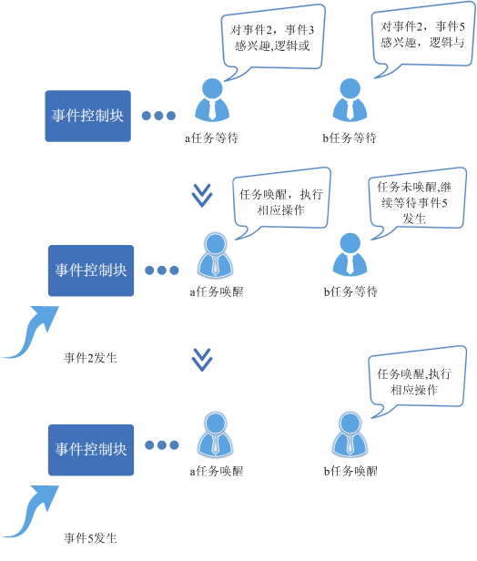

### 开发指导<a name="ZH-CN_TOPIC_0000002511954308"></a>

**使用场景<a name="section4635261117538"></a>**

事件可应用于多种任务同步场景，在某些同步场景下可替代信号量。

**功能<a name="section1976906162710"></a>**

LiteOS的事件模块为用户提供下面几种功能，接口详细信息可以查看API参考。

<a name="table31878844162710"></a>
<table><thead align="left"><tr id="row24909577162710"><th class="cellrowborder" valign="top" width="17.7%" id="mcps1.1.4.1.1"><p id="p4409895162710"><a name="p4409895162710"></a><a name="p4409895162710"></a>功能分类</p>
</th>
<th class="cellrowborder" valign="top" width="18.18%" id="mcps1.1.4.1.2"><p id="p21657225162710"><a name="p21657225162710"></a><a name="p21657225162710"></a>接口名</p>
</th>
<th class="cellrowborder" valign="top" width="64.12%" id="mcps1.1.4.1.3"><p id="p9404824162710"><a name="p9404824162710"></a><a name="p9404824162710"></a>描述</p>
</th>
</tr>
</thead>
<tbody><tr id="row24183005155142"><td class="cellrowborder" valign="top" width="17.7%" headers="mcps1.1.4.1.1 "><p id="p34065167155340"><a name="p34065167155340"></a><a name="p34065167155340"></a>初始化事件</p>
</td>
<td class="cellrowborder" valign="top" width="18.18%" headers="mcps1.1.4.1.2 "><p id="p19341936155142"><a name="p19341936155142"></a><a name="p19341936155142"></a>LOS_EventInit</p>
</td>
<td class="cellrowborder" valign="top" width="64.12%" headers="mcps1.1.4.1.3 "><p id="p23193017155142"><a name="p23193017155142"></a><a name="p23193017155142"></a>初始化一个事件控制块。</p>
</td>
</tr>
<tr id="row23593275162710"><td class="cellrowborder" rowspan="4" valign="top" width="17.7%" headers="mcps1.1.4.1.1 "><p id="p32007131162710"><a name="p32007131162710"></a><a name="p32007131162710"></a>读/写事件</p>
</td>
<td class="cellrowborder" valign="top" width="18.18%" headers="mcps1.1.4.1.2 "><p id="p42440799162710"><a name="p42440799162710"></a><a name="p42440799162710"></a>LOS_EventRead</p>
</td>
<td class="cellrowborder" valign="top" width="64.12%" headers="mcps1.1.4.1.3 "><p id="p15152688162710"><a name="p15152688162710"></a><a name="p15152688162710"></a>读取指定事件类型，超时时间为相对时间：单位为Tick。</p>
</td>
</tr>
<tr id="row2156464162710"><td class="cellrowborder" valign="top" headers="mcps1.1.4.1.1 "><p id="p55702669162710"><a name="p55702669162710"></a><a name="p55702669162710"></a>LOS_EventWrite</p>
</td>
<td class="cellrowborder" valign="top" headers="mcps1.1.4.1.2 "><p id="p15622373162710"><a name="p15622373162710"></a><a name="p15622373162710"></a>写指定的事件类型。</p>
</td>
</tr>
<tr id="row2032714020360"><td class="cellrowborder" valign="top" headers="mcps1.1.4.1.1 "><p id="p1832710018365"><a name="p1832710018365"></a><a name="p1832710018365"></a>LOS_EventCondRead</p>
</td>
<td class="cellrowborder" valign="top" headers="mcps1.1.4.1.2 "><p id="p16327809362"><a name="p16327809362"></a><a name="p16327809362"></a>读取满足指定条件的事件，超时时间为相对时间：单位为Tick，与LOS_EventCondWrite成对使用。</p>
</td>
</tr>
<tr id="row157561646366"><td class="cellrowborder" valign="top" headers="mcps1.1.4.1.1 "><p id="p157569410362"><a name="p157569410362"></a><a name="p157569410362"></a>LOS_EventCondWrite</p>
</td>
<td class="cellrowborder" valign="top" headers="mcps1.1.4.1.2 "><p id="p1475604103614"><a name="p1475604103614"></a><a name="p1475604103614"></a>写指定的事件，与LOS_EventCondRead成对使用。</p>
</td>
</tr>
<tr id="row6383631162710"><td class="cellrowborder" valign="top" width="17.7%" headers="mcps1.1.4.1.1 "><p id="p47312118162710"><a name="p47312118162710"></a><a name="p47312118162710"></a>清除事件</p>
</td>
<td class="cellrowborder" valign="top" width="18.18%" headers="mcps1.1.4.1.2 "><p id="p7076378162710"><a name="p7076378162710"></a><a name="p7076378162710"></a>LOS_EventClear</p>
</td>
<td class="cellrowborder" valign="top" width="64.12%" headers="mcps1.1.4.1.3 "><p id="p36315746162710"><a name="p36315746162710"></a><a name="p36315746162710"></a>清除指定的事件类型。</p>
</td>
</tr>
<tr id="row13860287164240"><td class="cellrowborder" valign="top" width="17.7%" headers="mcps1.1.4.1.1 "><p id="p48941496164240"><a name="p48941496164240"></a><a name="p48941496164240"></a>校验事件掩码</p>
</td>
<td class="cellrowborder" valign="top" width="18.18%" headers="mcps1.1.4.1.2 "><p id="p4838245164240"><a name="p4838245164240"></a><a name="p4838245164240"></a>LOS_EventPoll</p>
</td>
<td class="cellrowborder" valign="top" width="64.12%" headers="mcps1.1.4.1.3 "><p id="p56353583164240"><a name="p56353583164240"></a><a name="p56353583164240"></a>根据用户传入的事件ID、事件掩码及读取模式，返回用户传入的事件是否符合预期。</p>
</td>
</tr>
<tr id="row5784255164347"><td class="cellrowborder" valign="top" width="17.7%" headers="mcps1.1.4.1.1 "><p id="p65871477164347"><a name="p65871477164347"></a><a name="p65871477164347"></a>销毁事件</p>
</td>
<td class="cellrowborder" valign="top" width="18.18%" headers="mcps1.1.4.1.2 "><p id="p33989420164347"><a name="p33989420164347"></a><a name="p33989420164347"></a>LOS_EventDestroy</p>
</td>
<td class="cellrowborder" valign="top" width="64.12%" headers="mcps1.1.4.1.3 "><p id="p1679627164347"><a name="p1679627164347"></a><a name="p1679627164347"></a>销毁指定的事件控制块。</p>
</td>
</tr>
</tbody>
</table>

**Event错误码<a name="section40811079115428"></a>**

对存在失败可能性的操作返回对应的错误码，以便快速定位错误原因。

<a name="table874491812737"></a>
<table><thead align="left"><tr id="row2830196712737"><th class="cellrowborder" valign="top" width="5.45%" id="mcps1.1.6.1.1"><p id="p2971281012737"><a name="p2971281012737"></a><a name="p2971281012737"></a>序号</p>
</th>
<th class="cellrowborder" valign="top" width="21.990000000000002%" id="mcps1.1.6.1.2"><p id="p5792739612737"><a name="p5792739612737"></a><a name="p5792739612737"></a>定义</p>
</th>
<th class="cellrowborder" valign="top" width="12.879999999999999%" id="mcps1.1.6.1.3"><p id="p6160751912737"><a name="p6160751912737"></a><a name="p6160751912737"></a>实际值</p>
</th>
<th class="cellrowborder" valign="top" width="30.78%" id="mcps1.1.6.1.4"><p id="p2415315512737"><a name="p2415315512737"></a><a name="p2415315512737"></a>描述</p>
</th>
<th class="cellrowborder" valign="top" width="28.9%" id="mcps1.1.6.1.5"><p id="p1024850212737"><a name="p1024850212737"></a><a name="p1024850212737"></a>参考解决方案</p>
</th>
</tr>
</thead>
<tbody><tr id="row35955500121027"><td class="cellrowborder" valign="top" width="5.45%" headers="mcps1.1.6.1.1 "><p id="p26714373121027"><a name="p26714373121027"></a><a name="p26714373121027"></a>1</p>
</td>
<td class="cellrowborder" valign="top" width="21.990000000000002%" headers="mcps1.1.6.1.2 "><p id="p16380603121027"><a name="p16380603121027"></a><a name="p16380603121027"></a>LOS_ERRNO_EVENT_SETBIT_INVALID</p>
</td>
<td class="cellrowborder" valign="top" width="12.879999999999999%" headers="mcps1.1.6.1.3 "><p id="p12580778121054"><a name="p12580778121054"></a><a name="p12580778121054"></a>0x02001C00</p>
</td>
<td class="cellrowborder" valign="top" width="30.78%" headers="mcps1.1.6.1.4 "><p id="p31845851121027"><a name="p31845851121027"></a><a name="p31845851121027"></a>写事件时，将事件ID的第25个bit设置为1。这个比特位OS内部保留，不允许设置为1。</p>
</td>
<td class="cellrowborder" valign="top" width="28.9%" headers="mcps1.1.6.1.5 "><p id="p29377175121027"><a name="p29377175121027"></a><a name="p29377175121027"></a>事件ID的第25bit置为0。</p>
</td>
</tr>
<tr id="row2512766212737"><td class="cellrowborder" valign="top" width="5.45%" headers="mcps1.1.6.1.1 "><p id="p2207475012737"><a name="p2207475012737"></a><a name="p2207475012737"></a>2</p>
</td>
<td class="cellrowborder" valign="top" width="21.990000000000002%" headers="mcps1.1.6.1.2 "><p id="p4322430612737"><a name="p4322430612737"></a><a name="p4322430612737"></a>LOS_ERRNO_EVENT_READ_TIMEOUT</p>
</td>
<td class="cellrowborder" valign="top" width="12.879999999999999%" headers="mcps1.1.6.1.3 "><p id="p1150789112737"><a name="p1150789112737"></a><a name="p1150789112737"></a>0x02001C01</p>
</td>
<td class="cellrowborder" valign="top" width="30.78%" headers="mcps1.1.6.1.4 "><p id="p5972394412737"><a name="p5972394412737"></a><a name="p5972394412737"></a>读事件超时。</p>
</td>
<td class="cellrowborder" valign="top" width="28.9%" headers="mcps1.1.6.1.5 "><p id="p580127312737"><a name="p580127312737"></a><a name="p580127312737"></a>增加等待时间或者重新读取。</p>
</td>
</tr>
<tr id="row5221146412737"><td class="cellrowborder" valign="top" width="5.45%" headers="mcps1.1.6.1.1 "><p id="p127022412737"><a name="p127022412737"></a><a name="p127022412737"></a>3</p>
</td>
<td class="cellrowborder" valign="top" width="21.990000000000002%" headers="mcps1.1.6.1.2 "><p id="p3577930412737"><a name="p3577930412737"></a><a name="p3577930412737"></a>LOS_ERRNO_EVENT_EVENTMASK_INVALID</p>
</td>
<td class="cellrowborder" valign="top" width="12.879999999999999%" headers="mcps1.1.6.1.3 "><p id="p1244248812737"><a name="p1244248812737"></a><a name="p1244248812737"></a>0x02001C02</p>
</td>
<td class="cellrowborder" valign="top" width="30.78%" headers="mcps1.1.6.1.4 "><p id="p120861712737"><a name="p120861712737"></a><a name="p120861712737"></a>入参的事件ID是无效的。</p>
</td>
<td class="cellrowborder" valign="top" width="28.9%" headers="mcps1.1.6.1.5 "><p id="p3078915412737"><a name="p3078915412737"></a><a name="p3078915412737"></a>传入有效的事件ID参数。</p>
</td>
</tr>
<tr id="row866693812737"><td class="cellrowborder" valign="top" width="5.45%" headers="mcps1.1.6.1.1 "><p id="p3093336312737"><a name="p3093336312737"></a><a name="p3093336312737"></a>4</p>
</td>
<td class="cellrowborder" valign="top" width="21.990000000000002%" headers="mcps1.1.6.1.2 "><p id="p2257447312737"><a name="p2257447312737"></a><a name="p2257447312737"></a>LOS_ERRNO_EVENT_READ_IN_INTERRUPT</p>
</td>
<td class="cellrowborder" valign="top" width="12.879999999999999%" headers="mcps1.1.6.1.3 "><p id="p1659299512737"><a name="p1659299512737"></a><a name="p1659299512737"></a>0x02001C03</p>
</td>
<td class="cellrowborder" valign="top" width="30.78%" headers="mcps1.1.6.1.4 "><p id="p185533712737"><a name="p185533712737"></a><a name="p185533712737"></a>在中断中读取事件。</p>
</td>
<td class="cellrowborder" valign="top" width="28.9%" headers="mcps1.1.6.1.5 "><p id="p1606464512737"><a name="p1606464512737"></a><a name="p1606464512737"></a>启动新的任务来获取事件。</p>
</td>
</tr>
<tr id="row1036407712737"><td class="cellrowborder" valign="top" width="5.45%" headers="mcps1.1.6.1.1 "><p id="p3418393812737"><a name="p3418393812737"></a><a name="p3418393812737"></a>5</p>
</td>
<td class="cellrowborder" valign="top" width="21.990000000000002%" headers="mcps1.1.6.1.2 "><p id="p1743561612737"><a name="p1743561612737"></a><a name="p1743561612737"></a>LOS_ERRNO_EVENT_FLAGS_INVALID</p>
</td>
<td class="cellrowborder" valign="top" width="12.879999999999999%" headers="mcps1.1.6.1.3 "><p id="p299876612737"><a name="p299876612737"></a><a name="p299876612737"></a>0x02001C04</p>
</td>
<td class="cellrowborder" valign="top" width="30.78%" headers="mcps1.1.6.1.4 "><p id="p4157346012737"><a name="p4157346012737"></a><a name="p4157346012737"></a>读取事件的mode无效。</p>
</td>
<td class="cellrowborder" valign="top" width="28.9%" headers="mcps1.1.6.1.5 "><p id="p1200709912737"><a name="p1200709912737"></a><a name="p1200709912737"></a>传入有效的mode参数。</p>
</td>
</tr>
<tr id="row4095503012737"><td class="cellrowborder" valign="top" width="5.45%" headers="mcps1.1.6.1.1 "><p id="p2902313712737"><a name="p2902313712737"></a><a name="p2902313712737"></a>6</p>
</td>
<td class="cellrowborder" valign="top" width="21.990000000000002%" headers="mcps1.1.6.1.2 "><p id="p206387212737"><a name="p206387212737"></a><a name="p206387212737"></a>LOS_ERRNO_EVENT_READ_IN_LOCK</p>
</td>
<td class="cellrowborder" valign="top" width="12.879999999999999%" headers="mcps1.1.6.1.3 "><p id="p3295593212737"><a name="p3295593212737"></a><a name="p3295593212737"></a>0x02001C05</p>
</td>
<td class="cellrowborder" valign="top" width="30.78%" headers="mcps1.1.6.1.4 "><p id="p5218479612737"><a name="p5218479612737"></a><a name="p5218479612737"></a>任务锁住，不能读取事件。</p>
</td>
<td class="cellrowborder" valign="top" width="28.9%" headers="mcps1.1.6.1.5 "><p id="p6621892012737"><a name="p6621892012737"></a><a name="p6621892012737"></a>解锁任务，再读取事件。</p>
</td>
</tr>
<tr id="row3924015812752"><td class="cellrowborder" valign="top" width="5.45%" headers="mcps1.1.6.1.1 "><p id="p2433626212752"><a name="p2433626212752"></a><a name="p2433626212752"></a>7</p>
</td>
<td class="cellrowborder" valign="top" width="21.990000000000002%" headers="mcps1.1.6.1.2 "><p id="p2508019012752"><a name="p2508019012752"></a><a name="p2508019012752"></a>LOS_ERRNO_EVENT_PTR_NULL</p>
</td>
<td class="cellrowborder" valign="top" width="12.879999999999999%" headers="mcps1.1.6.1.3 "><p id="p1822948612752"><a name="p1822948612752"></a><a name="p1822948612752"></a>0x02001C06</p>
</td>
<td class="cellrowborder" valign="top" width="30.78%" headers="mcps1.1.6.1.4 "><p id="p19340712752"><a name="p19340712752"></a><a name="p19340712752"></a>传入的参数为空指针。</p>
</td>
<td class="cellrowborder" valign="top" width="28.9%" headers="mcps1.1.6.1.5 "><p id="p1566600812752"><a name="p1566600812752"></a><a name="p1566600812752"></a>传入非空入参。</p>
</td>
</tr>
<tr id="row1787264972819"><td class="cellrowborder" valign="top" width="5.45%" headers="mcps1.1.6.1.1 "><p id="p11872249152818"><a name="p11872249152818"></a><a name="p11872249152818"></a>8</p>
</td>
<td class="cellrowborder" valign="top" width="21.990000000000002%" headers="mcps1.1.6.1.2 "><p id="p15873849132813"><a name="p15873849132813"></a><a name="p15873849132813"></a>LOS_ERRNO_EVENT_SHOULD_NOT_DESTORY</p>
</td>
<td class="cellrowborder" valign="top" width="12.879999999999999%" headers="mcps1.1.6.1.3 "><p id="p1387374910289"><a name="p1387374910289"></a><a name="p1387374910289"></a>0x02001C08</p>
</td>
<td class="cellrowborder" valign="top" width="30.78%" headers="mcps1.1.6.1.4 "><p id="p1987324952817"><a name="p1987324952817"></a><a name="p1987324952817"></a>事件链表上仍有任务，无法被销毁。</p>
</td>
<td class="cellrowborder" valign="top" width="28.9%" headers="mcps1.1.6.1.5 "><p id="p187310492283"><a name="p187310492283"></a><a name="p187310492283"></a>先检查事件链表是否为空。</p>
</td>
</tr>
</tbody>
</table>

> **须知：** 
>错误码定义见“[错误码简介](开发指导-17.md#section29852515161)”。8～15位代表的所属模块为事件模块，值为0x1C。

**开发流程<a name="section64718916162724"></a>**

使用事件模块的典型流程如下：

1.  打开菜单，进入Kernel ---\> Enable Event菜单，完成事件模块的配置。

    <a name="table32617244171025"></a>
    <table><thead align="left"><tr id="row41225896171025"><th class="cellrowborder" valign="top" width="22.380000000000003%" id="mcps1.1.6.1.1"><p id="p50963290171025"><a name="p50963290171025"></a><a name="p50963290171025"></a>配置项</p>
    </th>
    <th class="cellrowborder" valign="top" width="29.67000000000001%" id="mcps1.1.6.1.2"><p id="p34385849171025"><a name="p34385849171025"></a><a name="p34385849171025"></a>含义</p>
    </th>
    <th class="cellrowborder" valign="top" width="13.970000000000002%" id="mcps1.1.6.1.3"><p id="p1469319211502"><a name="p1469319211502"></a><a name="p1469319211502"></a>取值范围</p>
    </th>
    <th class="cellrowborder" valign="top" width="14.3%" id="mcps1.1.6.1.4"><p id="p52666268171025"><a name="p52666268171025"></a><a name="p52666268171025"></a>默认值</p>
    </th>
    <th class="cellrowborder" valign="top" width="19.680000000000003%" id="mcps1.1.6.1.5"><p id="p38109296171025"><a name="p38109296171025"></a><a name="p38109296171025"></a>依赖</p>
    </th>
    </tr>
    </thead>
    <tbody><tr id="row54575334171025"><td class="cellrowborder" valign="top" width="22.380000000000003%" headers="mcps1.1.6.1.1 "><p id="p58525911171025"><a name="p58525911171025"></a><a name="p58525911171025"></a>LOSCFG_BASE_IPC_EVENT</p>
    </td>
    <td class="cellrowborder" valign="top" width="29.67000000000001%" headers="mcps1.1.6.1.2 "><p id="p11216088171057"><a name="p11216088171057"></a><a name="p11216088171057"></a>事件功能的裁剪开关</p>
    </td>
    <td class="cellrowborder" valign="top" width="13.970000000000002%" headers="mcps1.1.6.1.3 "><p id="p10693142185017"><a name="p10693142185017"></a><a name="p10693142185017"></a>YES/NO</p>
    </td>
    <td class="cellrowborder" valign="top" width="14.3%" headers="mcps1.1.6.1.4 "><p id="p56826855171025"><a name="p56826855171025"></a><a name="p56826855171025"></a>YES</p>
    </td>
    <td class="cellrowborder" valign="top" width="19.680000000000003%" headers="mcps1.1.6.1.5 "><p id="p39572571171025"><a name="p39572571171025"></a><a name="p39572571171025"></a>无</p>
    </td>
    </tr>
    </tbody>
    </table>

2.  调用事件初始化LOS\_EventInit接口，初始化事件等待队列。
3.  写事件LOS\_EventWrite或LOS\_EventCondWrite，写入指定的事件类型或事件。
4.  读事件LOS\_EventRead或LOS\_EventCondRead，读取指定的事件类型或条件事件。
5.  清除事件LOS\_EventClear，清除指定的事件类型，该接口只适用于事件类型的事件。
6.  销毁事件LOS\_EventDestroy。

**平台差异性<a name="section62116636104633"></a>**

无。

### 注意事项<a name="ZH-CN_TOPIC_0000002543394221"></a>

-   在系统初始化之前不能调用读写事件接口。如果调用，系统会运行异常。
-   在中断中，可以对事件对象进行写操作，但不能进行读操作。
-   在锁定任务调度状态下，禁止任务阻塞于读事件。
-   为了区别LOS\_EventRead接口返回的是事件还是错误码，事件掩码的第25位不能使用。
-   LOS\_EventClear入参值是要清除的指定事件类型的反码（\~events）。
-   LOS\_EventWrite和LOS\_EventRead成对使用，LOS\_EventCondWrite和LOS\_EventCondRead成对使用，这两组接口的区别在于，前面的用于读取或写入指定事件类型的事件；而后面的一组接口，用于读取或写入指定事件条件的事件，事件条件由用户实现，写事件任务不用关心事件条件，而是广播式告知读事件任务，即唤醒读任务，读任务判断读取的事件条件是否成功，这样可能会带来一定的性能开销，但是可简化写事件任务。

### 编程实例<a name="ZH-CN_TOPIC_0000002511794388"></a>


#### 基于事件类型的读写<a name="ZH-CN_TOPIC_0000002543354369"></a>

**实例描述<a name="section57243849151319"></a>**

示例中，任务Example\_TaskEntry创建一个任务Example\_Event，Example\_Event读事件阻塞，Example\_TaskEntry向该任务写事件。可以通过示例日志中打印的先后顺序理解事件操作时伴随的任务切换。

1.  在任务Example\_TaskEntry创建任务Example\_Event，其中任务Example\_Event优先级高于Example\_TaskEntry。
2.  在任务Example\_Event中读事件0x00000001，阻塞，发生任务切换，执行任务Example\_TaskEntry。
3.  在任务Example\_TaskEntry向任务Example\_Event写事件0x00000001，发生任务切换，执行任务Example\_Event。
4.  Example\_Event得以执行，直到任务结束。
5.  Example\_TaskEntry得以执行，直到任务结束。

**编程示例<a name="section31107981151351"></a>**

前提条件：在menuconfig菜单中完成事件模块的配置。

代码实现如下：

```
#include "los_event.h"
#include "los_task.h"
#include "securec.h"

/* 任务ID */
UINT32 g_testTaskId;

/* 事件控制结构体 */
EVENT_CB_S g_exampleEvent;

/* 等待的事件类型 */
#define EVENT_WAIT 0x00000001

/* 用例任务入口函数 */
VOID Example_Event(VOID)
{
    UINT32 ret;
    UINT32 event;

    /* 超时等待方式读事件,超时时间为100 ticks, 若100 ticks后未读取到指定事件，读事件超时，任务直接唤醒 */
    printf("Example_Event wait event 0x%x \n", EVENT_WAIT);

    event = LOS_EventRead(&g_exampleEvent, EVENT_WAIT, LOS_WAITMODE_AND, 100);
    if (event == EVENT_WAIT) {
        printf("Example_Event,read event :0x%x\n", event);
    } else {
        printf("Example_Event,read event timeout\n");
    }
}

UINT32 Example_TaskEntry(VOID)
{
    UINT32 ret;
    TSK_INIT_PARAM_S task1;

    /* 事件初始化 */
    ret = LOS_EventInit(&g_exampleEvent);
    if (ret != LOS_OK) {
        printf("init event failed .\n");
        return -1;
    }

    /* 创建任务 */
    (VOID)memset_s(&task1, sizeof(TSK_INIT_PARAM_S), 0, sizeof(TSK_INIT_PARAM_S));
    task1.pfnTaskEntry = (TSK_ENTRY_FUNC)Example_Event;
    task1.pcName       = "EventTsk1";
    task1.uwStackSize  = OS_TSK_DEFAULT_STACK_SIZE;
    task1.usTaskPrio   = 5;
    ret = LOS_TaskCreate(&g_testTaskId, &task1);
    if (ret != LOS_OK) {
        printf("task create failed .\n");
        return LOS_NOK;
    }

    /* 写g_testTaskId 等待事件 */
    printf("Example_TaskEntry write event .\n");

    ret = LOS_EventWrite(&g_exampleEvent, EVENT_WAIT);
    if (ret != LOS_OK) {
        printf("event write failed .\n");
        return LOS_NOK;
    }

    /* 清标志位 */
    printf("EventMask:%d\n", g_exampleEvent.uwEventID);
    LOS_EventClear(&g_exampleEvent, ~g_exampleEvent.uwEventID);
    printf("EventMask:%d\n", g_exampleEvent.uwEventID);

    /* 删除任务 */
    ret = LOS_TaskDelete(g_testTaskId);
    if (ret != LOS_OK) {
        printf("task delete failed .\n");
        return LOS_NOK;
    }

    return LOS_OK;
}
```

**结果验证<a name="section9844937144850"></a>**

编译运行结果如下：

```
Example_Event wait event 0x1 
Example_TaskEntry write event .
Example_Event,read event :0x1
EventMask:1
EventMask:0
```

#### 基于事件条件的读写<a name="ZH-CN_TOPIC_0000002511954382"></a>

**实例描述<a name="section1373097007"></a>**

示例中，任务ExampleTaskEntry中创建两个读事件任务readTask1和readTask2和一个写事件任务writeTask，由writeTask依次将readTask1和readTask2等待的条件置为真，并写事件，readTask1和readTask2读取的事件符合预期，结束阻塞。可以通过示例日志中打印的先后顺序理解事件操作时伴随的任务切换。

1.  在任务ExampleTaskEntry中创建两个读事件任务readTask1和readTask2；
2.  任务readTask1等待的条件EventCondition1当前为假，当前未读取到目的事件，且未超时，任务阻塞；
3.  任务readTask2等待的条件EventCondition2当前为假，当前未读取到目的事件，且未超时，任务阻塞；
4.  在任务ExampleTaskEntry中创建写事件任务writeTask；
5.  writeTask将readTask1等待的条件置为真，写事件；
6.  readTask1和readTask2都得到唤醒，但因只有readTask1的条件为真，所以readTask1读事件成功，向下执行，readTask2读事件失败，继续阻塞；
7.  writeTask将readTask2等待的条件置为真，写事件；
8.  readTask2得到唤醒，条件为真，所以readTask2读事件成功，向下执行。

**编程示例<a name="section97311678014"></a>**

前提条件：在menuconfig菜单中完成事件模块的配置。

代码实现如下：

```
#include "los_event.h"
#include "los_task.h"
#include "securec.h"

/* 任务ID */
static UINT32 g_readTskId1;
static UINT32 g_readTskId2;
static UINT32 g_writeTskId;

/* g_readTskId1和g_readTskId2等待的条件 */
static int g_testData1 = 0;
static int g_testData2 = 0;

/* 事件控制结构体 */
static EVENT_CB_S g_event;

/* 写事件任务入口函数 */
static VOID WriteTaskFunc(VOID)
{
    UINT32 ret;

    g_testData1 = 1;
    printf("\nWriteTaskFunc: write for ReadTaskFunc1\n\n");
    ret = LOS_EventCondWrite(&g_event);
    if (ret != LOS_OK) {
        printf("WriteTaskFunc failed: ret = %u\n", ret);
        return;
    }
    LOS_TaskDelay(2);    /* 2: delay 2 ticks */

    printf("\nWriteTaskFunc: write for ReadTaskFunc2\n\n");
    g_testData2 = 1;
    ret = LOS_EventCondWrite(&g_event);
    if (ret != LOS_OK) {
        printf("WriteTaskFunc failed: ret = %u\n", ret);
        return;
    }
    LOS_TaskDelay(2);    /* 2: delay 2 ticks */

    return;
}

/* 读事件任务1预期想读取的事件条件 */
static BOOL EventCondition1(VOID)
{
    BOOL ret;

    ret = (g_testData1 == 1) ? TRUE : FALSE;
    printf("EventCondition1: ret = %s\n", (ret ? "TRUE" : "FALSE"));
    return ret;
}

/* 读事件任务1入口函数 */
static VOID ReadTaskFunc1(VOID)
{
    UINT32 ret;

    ret = LOS_EventCondRead(&g_event, EventCondition1(), LOS_WAIT_FOREVER);
    if (ret != LOS_OK) {
        printf("ReadTaskFunc1 read failed!\n");
        return;
    }

    printf("ReadTaskFunc1 read succeeded!\n");
    return;
}

/* 读事件任务2预期想读取的事件条件 */
static BOOL EventCondition2(VOID)
{
    BOOL ret;

    ret = (g_testData2 == 1) ? TRUE : FALSE;
    printf("EventCondition2: ret = %s\n", (ret ? "TRUE" : "FALSE"));
    return ret;
}

/* 读事件任务2入口函数 */
static VOID ReadTaskFunc2(VOID)
{
    UINT32 ret;

    ret = LOS_EventCondRead(&g_event, EventCondition2(), LOS_WAIT_FOREVER);
    if (ret != LOS_OK) {
        printf("ReadTaskFunc2 read failed!\n");
        return;
    }

    printf("ReadTaskFunc2 read succeeded!\n");
    return;
}

static VOID InitTaskParam(TSK_INIT_PARAM_S *task, char *taskName, TSK_ENTRY_FUNC entry, UINT16 prio, UINT16 affi)
{
    task->pcName        = taskName;
    task->pfnTaskEntry  = entry;
    task->usTaskPrio    = prio;
    task->uwStackSize   = LOSCFG_BASE_CORE_TSK_DEFAULT_STACK_SIZE;
    task->uwResved      = LOS_TASK_STATUS_DETACHED;

#ifdef LOSCFG_KERNEL_SMP
    task->usCpuAffiMask = affi;
#endif
}

static UINT32 ExampleTaskEntry(VOID)
{
    UINT32 ret;
    TSK_INIT_PARAM_S readTask1 = {0};
    TSK_INIT_PARAM_S readTask2 = {0};
    TSK_INIT_PARAM_S writeTask = {0};

    ret = LOS_EventInit(&g_event);
    if (ret != LOS_OK) {
        return ret;
    }

    InitTaskParam(&readTask1, "EventReadTsk1", (TSK_ENTRY_FUNC)ReadTaskFunc1, 5, CPUID_TO_AFFI_MASK(ArchCurrCpuid()));
    ret = LOS_TaskCreate(&g_readTskId1, &readTask1);
    if (ret != LOS_OK) {
        return ret;
    }

    InitTaskParam(&readTask2, "EventReadTsk2", (TSK_ENTRY_FUNC)ReadTaskFunc2, 5, CPUID_TO_AFFI_MASK(ArchCurrCpuid()));
    ret = LOS_TaskCreate(&g_readTskId2, &readTask2);
    if (ret != LOS_OK) {
        return ret;
    }

    InitTaskParam(&writeTask, "EventWriteTsk45", (TSK_ENTRY_FUNC)WriteTaskFunc, 5, CPUID_TO_AFFI_MASK(ArchCurrCpuid()));
    ret = LOS_TaskCreate(&g_writeTskId, &writeTask);
    if (ret != LOS_OK) {
        return ret;
    }

    (VOID)LOS_TaskDelay(6);   /* 6: delay 6 ticks */

    (VOID)LOS_EventDestroy(&g_event);
    return LOS_OK;
}
```

**结果验证<a name="section1173218711018"></a>**

编译运行得到的结果为：

```
EventCondition1: ret = FALSE
EventCondition2: ret = FALSE

WriteTaskFunc: write for ReadTaskFunc1

EventCondition1: ret = TRUE
ReadTaskFunc1 read succeeded!
EventCondition2: ret = FALSE

WriteTaskFunc: write for ReadTaskFunc2

EventCondition2: ret = TRUE
EventCondition2: ret = TRUE
ReadTaskFunc2 read succeeded!
```

## 信号量<a name="ZH-CN_TOPIC_0000002543394271"></a>


### 概述<a name="ZH-CN_TOPIC_0000002543354321"></a>

**基本概念<a name="section6092055115413"></a>**

信号量（Semaphore）是一种实现任务间通信的机制，可以实现任务间同步或共享资源的互斥访问。

一个信号量的数据结构中，通常有一个计数值，用于对有效资源数的计数，表示剩下的可被使用的共享资源数，其值的含义分两种情况：

-   0，表示该信号量当前不可获取，因此可能存在正在等待该信号量的任务。
-   正值，表示该信号量当前可被获取。

以同步为目的的信号量和以互斥为目的的信号量在使用上有如下不同：

-   用作互斥时，初始信号量计数值不为0，表示可用的共享资源个数。在需要使用共享资源前，先获取信号量，然后使用一个共享资源，使用完毕后释放信号量。这样在共享资源被取完，即信号量计数减至0时，其他需要获取信号量的任务将被阻塞，从而保证了共享资源的互斥访问。另外，当共享资源数为1时，建议使用二值信号量。二值信号量的计数值最大为1，是一种类似于互斥锁的机制。
-   用作同步时，初始信号量计数值为0。任务1获取信号量而阻塞，直到任务2或者某中断释放信号量，任务1才得以进入Ready或Running态，从而达到了任务间的同步。

**运作机制<a name="section63875252163942"></a>**

信号量控制块：

```
/**
 * Semaphore control structure.
 */
typedef struct {
    UINT8           semStat;          /* 是否使用标志位 */
    UINT8           semType;          /* 信号量类型 */
    UINT16          semCount;         /* 信号量计数 */
    UINT32          semId;            /* 信号量索引号 */
    LOS_DL_LIST     semList;          /* 挂接阻塞于该信号量的任务 */
} LosSemCB;
```

**信号量运作原理<a name="section1058110135616"></a>**

-   信号量初始化：为配置的N个信号量申请内存（N值可以由用户自行配置，通过LOSCFG\_BASE\_IPC\_SEM\_LIMIT宏实现），并把所有信号量初始化成未使用，加入到未使用链表中供系统使用。
-   信号量创建：从未使用的信号量链表中获取一个信号量，并设定初值。
-   信号量申请：若其计数器值大于0，则直接减1返回成功。否则任务阻塞，等待其它任务释放该信号量，等待的超时时间可设定。当任务被一个信号量阻塞时，将该任务挂到信号量等待任务队列的队尾。
-   信号量释放：若没有任务等待该信号量，则直接将计数器加1返回。否则唤醒该信号量等待任务队列上的第一个任务。
-   信号量删除：将正在使用的信号量置为未使用信号量，并挂回到未使用链表。
-   信号量允许多个任务在同一时刻访问共享资源，但会限制同一时刻访问此资源的最大任务数目。当访问资源的任务数达到该资源允许的最大数量时，会阻塞其他试图获取该资源的任务，直到有任务释放该信号量。

**图 1**  信号量运作示意图<a name="fig5558667216401"></a>  
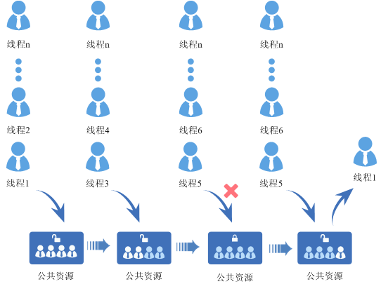

### 开发指导<a name="ZH-CN_TOPIC_0000002511794364"></a>

**使用场景<a name="section61127176164034"></a>**

在多任务系统中，信号量是一种非常灵活的同步方式，可以运用在多种场合中，实现锁、同步、资源计数等功能，也能方便的用于任务与任务，中断与任务的同步中。信号量常用于协助一组相互竞争的任务访问共享资源。

**功能<a name="section49492823145823"></a>**

LiteOS的信号量模块为用户提供下面几种功能，接口详细信息可以查看API参考。

<a name="table42808011145823"></a>
<table><thead align="left"><tr id="row27710684145823"><th class="cellrowborder" valign="top" width="20.102010201020104%" id="mcps1.1.4.1.1"><p id="p29972955145823"><a name="p29972955145823"></a><a name="p29972955145823"></a>功能分类</p>
</th>
<th class="cellrowborder" valign="top" width="26.862686268626863%" id="mcps1.1.4.1.2"><p id="p11890286145823"><a name="p11890286145823"></a><a name="p11890286145823"></a>接口名</p>
</th>
<th class="cellrowborder" valign="top" width="53.03530353035304%" id="mcps1.1.4.1.3"><p id="p23589118145823"><a name="p23589118145823"></a><a name="p23589118145823"></a>描述</p>
</th>
</tr>
</thead>
<tbody><tr id="row31670386145823"><td class="cellrowborder" rowspan="3" valign="top" width="20.102010201020104%" headers="mcps1.1.4.1.1 "><p id="p15164467145823"><a name="p15164467145823"></a><a name="p15164467145823"></a>创建/删除信号量</p>
</td>
<td class="cellrowborder" valign="top" width="26.862686268626863%" headers="mcps1.1.4.1.2 "><p id="p20362280145823"><a name="p20362280145823"></a><a name="p20362280145823"></a>LOS_SemCreate</p>
</td>
<td class="cellrowborder" valign="top" width="53.03530353035304%" headers="mcps1.1.4.1.3 "><p id="p38731961145823"><a name="p38731961145823"></a><a name="p38731961145823"></a>创建信号量，返回信号量ID。</p>
</td>
</tr>
<tr id="row11854496016"><td class="cellrowborder" valign="top" headers="mcps1.1.4.1.1 "><p id="p1851149602"><a name="p1851149602"></a><a name="p1851149602"></a>LOS_BinarySemCreate</p>
</td>
<td class="cellrowborder" valign="top" headers="mcps1.1.4.1.2 "><p id="p108544917020"><a name="p108544917020"></a><a name="p108544917020"></a>创建二值信号量，其计数值最大为1。</p>
</td>
</tr>
<tr id="row13043336145823"><td class="cellrowborder" valign="top" headers="mcps1.1.4.1.1 "><p id="p161317214406"><a name="p161317214406"></a><a name="p161317214406"></a>LOS_SemDelete</p>
</td>
<td class="cellrowborder" valign="top" headers="mcps1.1.4.1.2 "><p id="p13531752145823"><a name="p13531752145823"></a><a name="p13531752145823"></a>删除指定的信号量。</p>
</td>
</tr>
<tr id="row54676905145823"><td class="cellrowborder" rowspan="2" valign="top" width="20.102010201020104%" headers="mcps1.1.4.1.1 "><p id="p66753213145823"><a name="p66753213145823"></a><a name="p66753213145823"></a>申请/释放信号量</p>
</td>
<td class="cellrowborder" valign="top" width="26.862686268626863%" headers="mcps1.1.4.1.2 "><p id="p29675167144037"><a name="p29675167144037"></a><a name="p29675167144037"></a>LOS_SemPend</p>
</td>
<td class="cellrowborder" valign="top" width="53.03530353035304%" headers="mcps1.1.4.1.3 "><p id="p15387322145823"><a name="p15387322145823"></a><a name="p15387322145823"></a>申请指定的信号量，并设置超时时间。</p>
</td>
</tr>
<tr id="row4268172145823"><td class="cellrowborder" valign="top" headers="mcps1.1.4.1.1 "><p id="p33315591144148"><a name="p33315591144148"></a><a name="p33315591144148"></a>LOS_SemPost</p>
</td>
<td class="cellrowborder" valign="top" headers="mcps1.1.4.1.2 "><p id="p19085650145823"><a name="p19085650145823"></a><a name="p19085650145823"></a>释放指定的信号量。</p>
</td>
</tr>
</tbody>
</table>

> **说明：** 
>信号量有三种申请模式：无阻塞模式、永久阻塞模式、定时阻塞模式。
>-   无阻塞模式：即任务申请信号量时，入参timeout等于0。若当前信号量计数值不为0，则申请成功，否则立即返回申请失败。
>-   永久阻塞模式：即任务申请信号量时，入参timeout等于0xFFFFFFFF。若当前信号量计数值不为0，则申请成功。否则该任务进入阻塞态，系统切换到就绪任务中优先级最高者继续执行。任务进入阻塞态后，直到有其他任务释放该信号量，阻塞任务才会重新得以执行。
>-   定时阻塞模式：即任务申请信号量时，0<timeout<0xFFFFFFFF。若当前信号量计数值不为0，则申请成功。否则，该任务进入阻塞态，系统切换到就绪任务中优先级最高者继续执行。任务进入阻塞态后，超时前如果有其他任务释放该信号量，则该任务可成功获取信号量继续执行，若超时前未获取到信号量，接口将返回超时错误码。

**信号量错误码<a name="section868101994847"></a>**

对存在失败可能性的操作返回对应的错误码，以便快速定位错误原因。

<a name="table6015294495642"></a>
<table><thead align="left"><tr id="row2267197395642"><th class="cellrowborder" valign="top" width="5.65%" id="mcps1.1.6.1.1"><p id="p1908783195642"><a name="p1908783195642"></a><a name="p1908783195642"></a>序号</p>
</th>
<th class="cellrowborder" valign="top" width="21.19%" id="mcps1.1.6.1.2"><p id="p261046995642"><a name="p261046995642"></a><a name="p261046995642"></a>定义</p>
</th>
<th class="cellrowborder" valign="top" width="13.05%" id="mcps1.1.6.1.3"><p id="p1012144095642"><a name="p1012144095642"></a><a name="p1012144095642"></a>实际数值</p>
</th>
<th class="cellrowborder" valign="top" width="26.91%" id="mcps1.1.6.1.4"><p id="p1453028795642"><a name="p1453028795642"></a><a name="p1453028795642"></a>描述</p>
</th>
<th class="cellrowborder" valign="top" width="33.2%" id="mcps1.1.6.1.5"><p id="p2753561710026"><a name="p2753561710026"></a><a name="p2753561710026"></a>参考解决方案</p>
</th>
</tr>
</thead>
<tbody><tr id="row6366372295642"><td class="cellrowborder" valign="top" width="5.65%" headers="mcps1.1.6.1.1 "><p id="p5648782795642"><a name="p5648782795642"></a><a name="p5648782795642"></a>1</p>
</td>
<td class="cellrowborder" valign="top" width="21.19%" headers="mcps1.1.6.1.2 "><p id="p1211123695642"><a name="p1211123695642"></a><a name="p1211123695642"></a>LOS_ERRNO_SEM_NO_MEMORY</p>
</td>
<td class="cellrowborder" valign="top" width="13.05%" headers="mcps1.1.6.1.3 "><p id="p4148605495642"><a name="p4148605495642"></a><a name="p4148605495642"></a>0x02000700</p>
</td>
<td class="cellrowborder" valign="top" width="26.91%" headers="mcps1.1.6.1.4 "><p id="p492720095642"><a name="p492720095642"></a><a name="p492720095642"></a>初始化信号量时，内存空间不足。</p>
</td>
<td class="cellrowborder" valign="top" width="33.2%" headers="mcps1.1.6.1.5 "><p id="p145551278485"><a name="p145551278485"></a><a name="p145551278485"></a>调整OS_SYS_MEM_SIZE以确保有足够的内存供信号量使用，或减小系统支持的最大信号量数LOSCFG_BASE_IPC_SEM_LIMIT。</p>
</td>
</tr>
<tr id="row4434480695642"><td class="cellrowborder" valign="top" width="5.65%" headers="mcps1.1.6.1.1 "><p id="p3515954495642"><a name="p3515954495642"></a><a name="p3515954495642"></a>2</p>
</td>
<td class="cellrowborder" valign="top" width="21.19%" headers="mcps1.1.6.1.2 "><p id="p2935083995642"><a name="p2935083995642"></a><a name="p2935083995642"></a>LOS_ERRNO_SEM_INVALID</p>
</td>
<td class="cellrowborder" valign="top" width="13.05%" headers="mcps1.1.6.1.3 "><p id="p2860775495642"><a name="p2860775495642"></a><a name="p2860775495642"></a>0x02000701</p>
</td>
<td class="cellrowborder" valign="top" width="26.91%" headers="mcps1.1.6.1.4 "><p id="p3552674695642"><a name="p3552674695642"></a><a name="p3552674695642"></a>信号量ID不正确或信号量未创建。</p>
</td>
<td class="cellrowborder" valign="top" width="33.2%" headers="mcps1.1.6.1.5 "><p id="p412423410026"><a name="p412423410026"></a><a name="p412423410026"></a>传入正确的信号量ID或创建信号量后再使用。</p>
</td>
</tr>
<tr id="row5130526095642"><td class="cellrowborder" valign="top" width="5.65%" headers="mcps1.1.6.1.1 "><p id="p6208537795642"><a name="p6208537795642"></a><a name="p6208537795642"></a>3</p>
</td>
<td class="cellrowborder" valign="top" width="21.19%" headers="mcps1.1.6.1.2 "><p id="p6285965595642"><a name="p6285965595642"></a><a name="p6285965595642"></a>LOS_ERRNO_SEM_PTR_NULL</p>
</td>
<td class="cellrowborder" valign="top" width="13.05%" headers="mcps1.1.6.1.3 "><p id="p5846730195642"><a name="p5846730195642"></a><a name="p5846730195642"></a>0x02000702</p>
</td>
<td class="cellrowborder" valign="top" width="26.91%" headers="mcps1.1.6.1.4 "><p id="p3823098095642"><a name="p3823098095642"></a><a name="p3823098095642"></a>传入空指针。</p>
</td>
<td class="cellrowborder" valign="top" width="33.2%" headers="mcps1.1.6.1.5 "><p id="p6562756010026"><a name="p6562756010026"></a><a name="p6562756010026"></a>传入合法指针。</p>
</td>
</tr>
<tr id="row853450895642"><td class="cellrowborder" valign="top" width="5.65%" headers="mcps1.1.6.1.1 "><p id="p2020651095642"><a name="p2020651095642"></a><a name="p2020651095642"></a>4</p>
</td>
<td class="cellrowborder" valign="top" width="21.19%" headers="mcps1.1.6.1.2 "><p id="p2611462995642"><a name="p2611462995642"></a><a name="p2611462995642"></a>LOS_ERRNO_SEM_ALL_BUSY</p>
</td>
<td class="cellrowborder" valign="top" width="13.05%" headers="mcps1.1.6.1.3 "><p id="p3491023395642"><a name="p3491023395642"></a><a name="p3491023395642"></a>0x02000703</p>
</td>
<td class="cellrowborder" valign="top" width="26.91%" headers="mcps1.1.6.1.4 "><p id="p915662595642"><a name="p915662595642"></a><a name="p915662595642"></a>创建信号量时，系统中已经没有未使用的信号量。</p>
</td>
<td class="cellrowborder" valign="top" width="33.2%" headers="mcps1.1.6.1.5 "><p id="p1423211810026"><a name="p1423211810026"></a><a name="p1423211810026"></a>及时删除无用的信号量或增加系统支持的最大信号量数LOSCFG_BASE_IPC_SEM_LIMIT。</p>
</td>
</tr>
<tr id="row1530076695642"><td class="cellrowborder" valign="top" width="5.65%" headers="mcps1.1.6.1.1 "><p id="p3140256895642"><a name="p3140256895642"></a><a name="p3140256895642"></a>5</p>
</td>
<td class="cellrowborder" valign="top" width="21.19%" headers="mcps1.1.6.1.2 "><p id="p6058010795642"><a name="p6058010795642"></a><a name="p6058010795642"></a>LOS_ERRNO_SEM_UNAVAILABLE</p>
</td>
<td class="cellrowborder" valign="top" width="13.05%" headers="mcps1.1.6.1.3 "><p id="p804161495642"><a name="p804161495642"></a><a name="p804161495642"></a>0x02000704</p>
</td>
<td class="cellrowborder" valign="top" width="26.91%" headers="mcps1.1.6.1.4 "><p id="p10819081152943"><a name="p10819081152943"></a><a name="p10819081152943"></a>无阻塞模式下未获取到信号量。</p>
</td>
<td class="cellrowborder" valign="top" width="33.2%" headers="mcps1.1.6.1.5 "><p id="p42669253153017"><a name="p42669253153017"></a><a name="p42669253153017"></a>选择阻塞等待或根据该错误码适当处理。</p>
</td>
</tr>
<tr id="row2386554195642"><td class="cellrowborder" valign="top" width="5.65%" headers="mcps1.1.6.1.1 "><p id="p5406070595642"><a name="p5406070595642"></a><a name="p5406070595642"></a>6</p>
</td>
<td class="cellrowborder" valign="top" width="21.19%" headers="mcps1.1.6.1.2 "><p id="p1684095295642"><a name="p1684095295642"></a><a name="p1684095295642"></a>LOS_ERRNO_SEM_PEND_INTERR</p>
</td>
<td class="cellrowborder" valign="top" width="13.05%" headers="mcps1.1.6.1.3 "><p id="p2193989295642"><a name="p2193989295642"></a><a name="p2193989295642"></a>0x02000705</p>
</td>
<td class="cellrowborder" valign="top" width="26.91%" headers="mcps1.1.6.1.4 "><p id="p63490793152953"><a name="p63490793152953"></a><a name="p63490793152953"></a>中断期间非法调用LOS_SemPend申请信号量。</p>
</td>
<td class="cellrowborder" valign="top" width="33.2%" headers="mcps1.1.6.1.5 "><p id="p43375472153017"><a name="p43375472153017"></a><a name="p43375472153017"></a>中断期间禁止调用LOS_SemPend。</p>
</td>
</tr>
<tr id="row2227229895642"><td class="cellrowborder" valign="top" width="5.65%" headers="mcps1.1.6.1.1 "><p id="p5922568095642"><a name="p5922568095642"></a><a name="p5922568095642"></a>7</p>
</td>
<td class="cellrowborder" valign="top" width="21.19%" headers="mcps1.1.6.1.2 "><p id="p3255077595642"><a name="p3255077595642"></a><a name="p3255077595642"></a>LOS_ERRNO_SEM_PEND_IN_LOCK</p>
</td>
<td class="cellrowborder" valign="top" width="13.05%" headers="mcps1.1.6.1.3 "><p id="p1936711095642"><a name="p1936711095642"></a><a name="p1936711095642"></a>0x02000706</p>
</td>
<td class="cellrowborder" valign="top" width="26.91%" headers="mcps1.1.6.1.4 "><p id="p52085876152953"><a name="p52085876152953"></a><a name="p52085876152953"></a>任务被锁，无法获得信号量。</p>
</td>
<td class="cellrowborder" valign="top" width="33.2%" headers="mcps1.1.6.1.5 "><p id="p36140674153017"><a name="p36140674153017"></a><a name="p36140674153017"></a>在任务被锁时，不能调用LOS_SemPend申请信号量。</p>
</td>
</tr>
<tr id="row43458669101114"><td class="cellrowborder" valign="top" width="5.65%" headers="mcps1.1.6.1.1 "><p id="p30491270101114"><a name="p30491270101114"></a><a name="p30491270101114"></a>8</p>
</td>
<td class="cellrowborder" valign="top" width="21.19%" headers="mcps1.1.6.1.2 "><p id="p53873767101114"><a name="p53873767101114"></a><a name="p53873767101114"></a>LOS_ERRNO_SEM_TIMEOUT</p>
</td>
<td class="cellrowborder" valign="top" width="13.05%" headers="mcps1.1.6.1.3 "><p id="p1699001101114"><a name="p1699001101114"></a><a name="p1699001101114"></a>0x02000707</p>
</td>
<td class="cellrowborder" valign="top" width="26.91%" headers="mcps1.1.6.1.4 "><p id="p28760934152953"><a name="p28760934152953"></a><a name="p28760934152953"></a>获取信号量超时。</p>
</td>
<td class="cellrowborder" valign="top" width="33.2%" headers="mcps1.1.6.1.5 "><p id="p48623836153017"><a name="p48623836153017"></a><a name="p48623836153017"></a>将时间设置在合理范围内。</p>
</td>
</tr>
<tr id="row12143904101125"><td class="cellrowborder" valign="top" width="5.65%" headers="mcps1.1.6.1.1 "><p id="p44132204101125"><a name="p44132204101125"></a><a name="p44132204101125"></a>9</p>
</td>
<td class="cellrowborder" valign="top" width="21.19%" headers="mcps1.1.6.1.2 "><p id="p17938739101125"><a name="p17938739101125"></a><a name="p17938739101125"></a>LOS_ERRNO_SEM_OVERFLOW</p>
</td>
<td class="cellrowborder" valign="top" width="13.05%" headers="mcps1.1.6.1.3 "><p id="p43751775101125"><a name="p43751775101125"></a><a name="p43751775101125"></a>0x02000708</p>
</td>
<td class="cellrowborder" valign="top" width="26.91%" headers="mcps1.1.6.1.4 "><p id="p35771040152953"><a name="p35771040152953"></a><a name="p35771040152953"></a>信号量计数值已达到最大值，无法再继续释放该信号量。</p>
</td>
<td class="cellrowborder" valign="top" width="33.2%" headers="mcps1.1.6.1.5 "><p id="p7712100153017"><a name="p7712100153017"></a><a name="p7712100153017"></a>根据该错误码适当处理。</p>
</td>
</tr>
<tr id="row44185939101121"><td class="cellrowborder" valign="top" width="5.65%" headers="mcps1.1.6.1.1 "><p id="p22291345101121"><a name="p22291345101121"></a><a name="p22291345101121"></a>10</p>
</td>
<td class="cellrowborder" valign="top" width="21.19%" headers="mcps1.1.6.1.2 "><p id="p60768531101121"><a name="p60768531101121"></a><a name="p60768531101121"></a>LOS_ERRNO_SEM_PENDED</p>
</td>
<td class="cellrowborder" valign="top" width="13.05%" headers="mcps1.1.6.1.3 "><p id="p23304002101121"><a name="p23304002101121"></a><a name="p23304002101121"></a>0x02000709</p>
</td>
<td class="cellrowborder" valign="top" width="26.91%" headers="mcps1.1.6.1.4 "><p id="p52495624152953"><a name="p52495624152953"></a><a name="p52495624152953"></a>等待信号量的任务队列不为空。</p>
</td>
<td class="cellrowborder" valign="top" width="33.2%" headers="mcps1.1.6.1.5 "><p id="p9449161153017"><a name="p9449161153017"></a><a name="p9449161153017"></a>唤醒所有等待该信号量的任务后，再删除该信号量。</p>
</td>
</tr>
</tbody>
</table>

> **须知：** 
>错误码定义见“[错误码简介](开发指导-17.md#section29852515161)”。8～15位代表的所属模块为信号量模块，值为0x07。

**开发流程<a name="section486548315050"></a>**

信号量的开发典型流程：

1.  打开菜单，进入Kernel ---\> Enable Sem菜单，完成信号量的配置。

    <a name="table34659900162615"></a>
    <table><thead align="left"><tr id="row3414390162615"><th class="cellrowborder" valign="top" width="25.757424257574236%" id="mcps1.1.6.1.1"><p id="p8130151162615"><a name="p8130151162615"></a><a name="p8130151162615"></a>配置项</p>
    </th>
    <th class="cellrowborder" valign="top" width="30.456954304569532%" id="mcps1.1.6.1.2"><p id="p54562526162615"><a name="p54562526162615"></a><a name="p54562526162615"></a>含义</p>
    </th>
    <th class="cellrowborder" valign="top" width="16.6983301669833%" id="mcps1.1.6.1.3"><p id="p57488448162615"><a name="p57488448162615"></a><a name="p57488448162615"></a>取值范围</p>
    </th>
    <th class="cellrowborder" valign="top" width="13.85861413858614%" id="mcps1.1.6.1.4"><p id="p26052727162615"><a name="p26052727162615"></a><a name="p26052727162615"></a>默认值</p>
    </th>
    <th class="cellrowborder" valign="top" width="13.228677132286768%" id="mcps1.1.6.1.5"><p id="p29896171162615"><a name="p29896171162615"></a><a name="p29896171162615"></a>依赖</p>
    </th>
    </tr>
    </thead>
    <tbody><tr id="row5670787162615"><td class="cellrowborder" valign="top" width="25.757424257574236%" headers="mcps1.1.6.1.1 "><p id="p56680616162615"><a name="p56680616162615"></a><a name="p56680616162615"></a>LOSCFG_BASE_IPC_SEM</p>
    </td>
    <td class="cellrowborder" valign="top" width="30.456954304569532%" headers="mcps1.1.6.1.2 "><p id="p27727169162615"><a name="p27727169162615"></a><a name="p27727169162615"></a>信号量模块裁剪开关</p>
    </td>
    <td class="cellrowborder" valign="top" width="16.6983301669833%" headers="mcps1.1.6.1.3 "><p id="p31308215162615"><a name="p31308215162615"></a><a name="p31308215162615"></a>YES/NO</p>
    </td>
    <td class="cellrowborder" valign="top" width="13.85861413858614%" headers="mcps1.1.6.1.4 "><p id="p52937457162615"><a name="p52937457162615"></a><a name="p52937457162615"></a>YES</p>
    </td>
    <td class="cellrowborder" valign="top" width="13.228677132286768%" headers="mcps1.1.6.1.5 "><p id="p60075607162615"><a name="p60075607162615"></a><a name="p60075607162615"></a>无</p>
    </td>
    </tr>
    <tr id="row3809559162615"><td class="cellrowborder" valign="top" width="25.757424257574236%" headers="mcps1.1.6.1.1 "><p id="p40138859162615"><a name="p40138859162615"></a><a name="p40138859162615"></a>LOSCFG_BASE_IPC_SEM_LIMIT</p>
    </td>
    <td class="cellrowborder" valign="top" width="30.456954304569532%" headers="mcps1.1.6.1.2 "><p id="p30022176162615"><a name="p30022176162615"></a><a name="p30022176162615"></a>系统支持的信号量最大数</p>
    </td>
    <td class="cellrowborder" valign="top" width="16.6983301669833%" headers="mcps1.1.6.1.3 "><p id="p15877214162615"><a name="p15877214162615"></a><a name="p15877214162615"></a>[0, 65535]</p>
    </td>
    <td class="cellrowborder" valign="top" width="13.85861413858614%" headers="mcps1.1.6.1.4 "><p id="p10985932162615"><a name="p10985932162615"></a><a name="p10985932162615"></a>1024</p>
    </td>
    <td class="cellrowborder" valign="top" width="13.228677132286768%" headers="mcps1.1.6.1.5 "><p id="p17445266162615"><a name="p17445266162615"></a><a name="p17445266162615"></a>无</p>
    </td>
    </tr>
    </tbody>
    </table>

2.  创建信号量LOS\_SemCreate，若要创建二值信号量则调用LOS\_BinarySemCreate。
3.  申请信号量LOS\_SemPend。
4.  释放信号量LOS\_SemPost。
5.  删除信号量LOS\_SemDelete。

**平台差异性<a name="section28221686151840"></a>**

无。

### 注意事项<a name="ZH-CN_TOPIC_0000002543394329"></a>

由于中断不能被阻塞，因此不能在中断中使用阻塞模式申请信号量。

### 编程实例<a name="ZH-CN_TOPIC_0000002511954346"></a>

**实例描述<a name="section1288182415417"></a>**

本实例实现如下功能：

1.  测试任务Example\_TaskEntry创建一个信号量，锁任务调度，创建两个任务Example\_SemTask1、Example\_SemTask2，Example\_SemTask2优先级高于Example\_SemTask1，两个任务中申请同一信号量，解锁任务调度后两任务阻塞，测试任务Example\_TaskEntry释放信号量。
2.  Example\_SemTask2得到信号量，被调度，然后任务休眠20Tick，Example\_SemTask2延迟，Example\_SemTask1被唤醒。
3.  Example\_SemTask1定时阻塞模式申请信号量，等待时间为10Tick，因信号量仍被Example\_SemTask2持有，Example\_SemTask1挂起，10Tick后仍未得到信号量，Example\_SemTask1被唤醒，试图以永久阻塞模式申请信号量，Example\_SemTask1挂起。
4.  20Tick后Example\_SemTask2唤醒， 释放信号量后，Example\_SemTask1得到信号量被调度运行，最后释放信号量。
5.  Example\_SemTask1执行完，40Tick后任务Example\_TaskEntry被唤醒，执行删除信号量，删除两个任务。

**编程示例<a name="section47263443154123"></a>**

前提条件：在menuconfig菜单中完成信号量的配置。

代码实现如下：

```
#include "los_sem.h"
#include "securec.h"

/* 任务ID */
static UINT32 g_testTaskId01;
static UINT32 g_testTaskId02;
/* 测试任务优先级 */
#define TASK_PRIO_TEST  5
/* 信号量结构体id */
static UINT32 g_semId;

VOID Example_SemTask1(VOID)
{
    UINT32 ret;

    printf("Example_SemTask1 try get sem g_semId ,timeout 10 ticks.\n");
    /* 定时阻塞模式申请信号量，定时时间为10ticks */
    ret = LOS_SemPend(g_semId, 10);

    /* 申请到信号量 */
    if (ret == LOS_OK) {
         LOS_SemPost(g_semId);
         return;
    }
    /* 定时时间到，未申请到信号量 */
    if (ret == LOS_ERRNO_SEM_TIMEOUT) {
        printf("Example_SemTask1 timeout and try get sem g_semId wait forever.\n");
        /*永久阻塞模式申请信号量*/
        ret = LOS_SemPend(g_semId, LOS_WAIT_FOREVER);
        printf("Example_SemTask1 wait_forever and get sem g_semId .\n");
        if (ret == LOS_OK) {
            LOS_SemPost(g_semId);
            return;
        }
    }
}

VOID Example_SemTask2(VOID)
{
    UINT32 ret;
    printf("Example_SemTask2 try get sem g_semId wait forever.\n");
    /* 永久阻塞模式申请信号量 */
    ret = LOS_SemPend(g_semId, LOS_WAIT_FOREVER);

    if (ret == LOS_OK) {
        printf("Example_SemTask2 get sem g_semId and then delay 20ticks .\n");
    }

    /* 任务休眠20 ticks */
    LOS_TaskDelay(20);

    printf("Example_SemTask2 post sem g_semId .\n");
    /* 释放信号量 */
    LOS_SemPost(g_semId);
    return;
}

UINT32 ExampleTaskEntry(VOID)
{
    UINT32 ret;
    TSK_INIT_PARAM_S task1;
    TSK_INIT_PARAM_S task2;

   /* 创建信号量 */
    LOS_SemCreate(0,&g_semId);

    /* 锁任务调度 */
    LOS_TaskLock();

    /* 创建任务1 */
    (VOID)memset_s(&task1, sizeof(TSK_INIT_PARAM_S), 0, sizeof(TSK_INIT_PARAM_S));
    task1.pfnTaskEntry = (TSK_ENTRY_FUNC)Example_SemTask1;
    task1.pcName       = "TestTsk1";
    task1.uwStackSize  = OS_TSK_DEFAULT_STACK_SIZE;
    task1.usTaskPrio   = TASK_PRIO_TEST;
    ret = LOS_TaskCreate(&g_testTaskId01, &task1);
    if (ret != LOS_OK) {
        printf("task1 create failed .\n");
        return LOS_NOK;
    }

    /* 创建任务2 */
    (VOID)memset_s(&task2, sizeof(TSK_INIT_PARAM_S), 0, sizeof(TSK_INIT_PARAM_S));
    task2.pfnTaskEntry = (TSK_ENTRY_FUNC)Example_SemTask2;
    task2.pcName       = "TestTsk2";
    task2.uwStackSize  = OS_TSK_DEFAULT_STACK_SIZE;
    task2.usTaskPrio   = (TASK_PRIO_TEST - 1);
    ret = LOS_TaskCreate(&g_testTaskId02, &task2);
    if (ret != LOS_OK) {
        printf("task2 create failed .\n");
        return LOS_NOK;
    }

    /* 解锁任务调度 */
    LOS_TaskUnlock();

    ret = LOS_SemPost(g_semId);

    /* 任务休眠40 ticks */
    LOS_TaskDelay(40);

    /* 删除信号量 */
    LOS_SemDelete(g_semId);

    /* 删除任务1 */
    ret = LOS_TaskDelete(g_testTaskId01);
    if (ret != LOS_OK) {
        printf("task1 delete failed .\n");
        return LOS_NOK;
    }
    /* 删除任务2 */
    ret = LOS_TaskDelete(g_testTaskId02);
    if (ret != LOS_OK) {
        printf("task2 delete failed .\n");
        return LOS_NOK;
    }

    return LOS_OK;
}
```

**结果验证<a name="section60141895113933"></a>**

编译运行得到的结果为：

```
Example_SemTask2 try get sem g_semId wait forever.
Example_SemTask1 try get sem g_semId ,timeout 10 ticks.
Example_SemTask2 get sem g_semId and then delay 20ticks .
Example_SemTask1 timeout and try get sem g_semId wait forever.
Example_SemTask2 post sem g_semId .
Example_SemTask1 wait_forever and get sem g_semId .
```

## 读写信号量<a name="ZH-CN_TOPIC_0000002511954268"></a>


### 概述<a name="ZH-CN_TOPIC_0000002543394243"></a>

**基本概念<a name="section310017301523"></a>**

读写信号量（rwsem）与普通信号量的功能相似，常用于共享资源的互斥访问和任务同步。读写信号量将持有者分为读者和写者，如果一个持有者需要对该信号量保护的共享资源进行写操作，那么将这类持有者定义为写者；如果持有者只是访问共享资源，而不修改，那么将这类持有者定义为读者。

读写信号量支持一个读写信号量同时拥有不受上限的读者数，即读者不排他可并发；但是一个读写信号量同时只能有一个写者，写者是排他性的、独占性的，写写互斥、读写互斥。

**运作机制<a name="section348137523"></a>**

读写信号量控制块：

```
typedef struct {
    UINT8       rwsemState;      /* 是否使用标志位 */
    INT16       rwsemCount;      /* 读写信号量拥有者的数量 */
    UINT32      rwsemId;         /* 读写信号量索引号 */
    LOS_DL_LIST waitList;        /* 等待队列，用于记录阻塞于该读写信号量的任务 */
} OsRwsemCB;
```

**读写信号量运作原理<a name="section18288946126"></a>**

-   读写信号量资源初始化：为配置的N个读写信号量申请内存（N值可以由用户自行配置，通过LOSCFG\_BASE\_IPC\_RWSEM\_LIMIT宏实现），并把所有读写信号量初始化成未使用，加入到未使用链表中供系统使用。
-   创建读写信号量：从未使用链表中获取一个读写信号量。
-   申请读信号量：若该信号量还未被持有，或者正在被其他读者持有，返回成功；否则任务阻塞，等待其它任务释放该信号量，等待的超时时间可设定。当任务被一个读写信号量阻塞时，该任务会被挂到读写信号量等待队列的队尾。
-   申请写信号量：若该信号量还未被持有，返回成功；否则任务阻塞，等待其它任务释放该信号量，等待的超时时间可设定。当任务被一个读写信号量阻塞时，该任务会被挂到读写信号量等待队列的队尾。
-   释放读信号量：若没有任务等待该读写信号量，则直接返回；当信号量处于读状态，等待队列中的队首任务只能是写者，唤醒这一个写者，然后返回。
-   释放写信号量：若没有任务等待该读写信号量，则直接返回；如果等待队列的队首任务是写者，则唤醒这一个写者，然后返回；如果等待队列的队首任务是读者，则唤醒这个读者及后面连续的多个读者，直到等待队列为空，或者遇到写者停止。
-   降级写信号量为读信号量：信号量变更为读信号量，若没有任务等待该读写信号量或者等待队列的队首任务是写者，则直接返回；否则唤醒等待队列的队首读者及后面连续的多个读者，直到等待队列为空，或者遇到写者停止。
-   删除读写信号量：将正在使用的读写信号量设置为未使用的状态，并挂回到未使用链表。

    > **说明：** 
    >读写信号量允许多个任务在同一时刻访问共享资源，但同一时刻只能有一个任务可修改共享资源，这样对于读任务多于写任务的场景，可有效提高系统的整体性能。

### 开发指导<a name="ZH-CN_TOPIC_0000002543394173"></a>

**使用场景<a name="section114035201319"></a>**

读写信号量是基于普通信号量优化的一种多任务同步互斥机制，可以运用在多种场合中，实现锁、同步、资源计数等功能，也能方便的用于任务与任务同步中，适用于读任务多于写任务的场景。

**功能<a name="section98336261439"></a>**

LiteOS的读写信号量模块为用户提供下面几种功能，接口详细信息可以查看API参考。

<a name="table03581826517"></a>
<table><thead align="left"><tr id="row33581923516"><th class="cellrowborder" valign="top" width="22.38223822382238%" id="mcps1.1.4.1.1"><p id="p11358221651"><a name="p11358221651"></a><a name="p11358221651"></a>功能分类</p>
</th>
<th class="cellrowborder" valign="top" width="28.572857285728574%" id="mcps1.1.4.1.2"><p id="p143589214512"><a name="p143589214512"></a><a name="p143589214512"></a>接口名</p>
</th>
<th class="cellrowborder" valign="top" width="49.04490449044904%" id="mcps1.1.4.1.3"><p id="p133585211513"><a name="p133585211513"></a><a name="p133585211513"></a>描述</p>
</th>
</tr>
</thead>
<tbody><tr id="row15358421458"><td class="cellrowborder" rowspan="2" valign="top" width="22.38223822382238%" headers="mcps1.1.4.1.1 "><p id="p9358628520"><a name="p9358628520"></a><a name="p9358628520"></a>创建/删除读写信号量</p>
<p id="p12358222511"><a name="p12358222511"></a><a name="p12358222511"></a></p>
</td>
<td class="cellrowborder" valign="top" width="28.572857285728574%" headers="mcps1.1.4.1.2 "><p id="p63581721256"><a name="p63581721256"></a><a name="p63581721256"></a>LOS_RwsemCreate</p>
</td>
<td class="cellrowborder" valign="top" width="49.04490449044904%" headers="mcps1.1.4.1.3 "><p id="p93581321652"><a name="p93581321652"></a><a name="p93581321652"></a>创建读写信号量，返回读写信号量ID。</p>
</td>
</tr>
<tr id="row635817216519"><td class="cellrowborder" valign="top" headers="mcps1.1.4.1.1 "><p id="p2035813214512"><a name="p2035813214512"></a><a name="p2035813214512"></a>LOS_RwsemDelete</p>
</td>
<td class="cellrowborder" valign="top" headers="mcps1.1.4.1.2 "><p id="p15358172354"><a name="p15358172354"></a><a name="p15358172354"></a>删除指定的读写信号量。</p>
</td>
</tr>
<tr id="row935810212513"><td class="cellrowborder" rowspan="5" valign="top" width="22.38223822382238%" headers="mcps1.1.4.1.1 "><p id="p104715451112"><a name="p104715451112"></a><a name="p104715451112"></a>申请/释放读写信号量</p>
</td>
<td class="cellrowborder" valign="top" width="28.572857285728574%" headers="mcps1.1.4.1.2 "><p id="p1435816218513"><a name="p1435816218513"></a><a name="p1435816218513"></a>LOS_RwsemPendRead</p>
</td>
<td class="cellrowborder" valign="top" width="49.04490449044904%" headers="mcps1.1.4.1.3 "><p id="p173583219512"><a name="p173583219512"></a><a name="p173583219512"></a>申请指定的读写信号量为读信号量，支持超时等待获取。</p>
</td>
</tr>
<tr id="row1835817210514"><td class="cellrowborder" valign="top" headers="mcps1.1.4.1.1 "><p id="p63581825515"><a name="p63581825515"></a><a name="p63581825515"></a>LOS_RwsemPostRead</p>
</td>
<td class="cellrowborder" valign="top" headers="mcps1.1.4.1.2 "><p id="p17358182458"><a name="p17358182458"></a><a name="p17358182458"></a>释放指定的读信号量。</p>
</td>
</tr>
<tr id="row186612161987"><td class="cellrowborder" valign="top" headers="mcps1.1.4.1.1 "><p id="p866121612819"><a name="p866121612819"></a><a name="p866121612819"></a>LOS_RwsemPendWrite</p>
</td>
<td class="cellrowborder" valign="top" headers="mcps1.1.4.1.2 "><p id="p5661616683"><a name="p5661616683"></a><a name="p5661616683"></a>申请指定的读写信号量为写信号量，支持超时等待获取。</p>
</td>
</tr>
<tr id="row1841622018814"><td class="cellrowborder" valign="top" headers="mcps1.1.4.1.1 "><p id="p34169201589"><a name="p34169201589"></a><a name="p34169201589"></a>LOS_RwsemPostWrite</p>
</td>
<td class="cellrowborder" valign="top" headers="mcps1.1.4.1.2 "><p id="p12416192017813"><a name="p12416192017813"></a><a name="p12416192017813"></a>释放指定的写信号量。</p>
</td>
</tr>
<tr id="row1937116592917"><td class="cellrowborder" valign="top" headers="mcps1.1.4.1.1 "><p id="p03713595918"><a name="p03713595918"></a><a name="p03713595918"></a>LOS_RwsemDowngradeWrite</p>
</td>
<td class="cellrowborder" valign="top" headers="mcps1.1.4.1.2 "><p id="p13371135910916"><a name="p13371135910916"></a><a name="p13371135910916"></a>将指定的写信号量降级为读信号量。</p>
</td>
</tr>
</tbody>
</table>

> **说明：** 
>读写信号量支持三种申请模式：无阻塞模式、永久阻塞模式、定时阻塞模式。
>-   无阻塞模式：即任务申请读写信号量时，入参timeout等于0。若当前读写信号量可获取，则申请成功，否则立即返回申请失败。
>-   永久阻塞模式：即任务申请读写信号量时，入参timeout等于0xFFFFFFFF。若当前读写信号量可获取，则申请成功。否则该任务进入阻塞态，系统切换到就绪任务中优先级最高者继续执行。任务进入阻塞态后，直到其他任务释放该读写信号量，使得该读写信号量可重新被获取，阻塞任务才会重新得以执行。
>-   定时阻塞模式：即任务申请读写信号量时，0<timeout<0xFFFFFFFF。若当前读写信号量可获取，则申请成功。否则，该任务进入阻塞态，系统切换到就绪任务中优先级最高者继续执行。任务进入阻塞态后，如果超时前其他任务释放该信号量，使得该读写信号量可重新被获取，则该任务可成功获取读写信号量继续执行，若超时前未获取到读写信号量，接口将返回超时错误码。

**读写信号量错误码<a name="section511418333317"></a>**

对于存在失败可能性的操作系统会返回对应的错误码，以便快速定位错误原因。

<a name="table206421660270"></a>
<table><thead align="left"><tr id="row10643106122719"><th class="cellrowborder" valign="top" width="5.84%" id="mcps1.1.6.1.1"><p id="p36438617278"><a name="p36438617278"></a><a name="p36438617278"></a>序号</p>
</th>
<th class="cellrowborder" valign="top" width="20.16%" id="mcps1.1.6.1.2"><p id="p26431613272"><a name="p26431613272"></a><a name="p26431613272"></a>定义</p>
</th>
<th class="cellrowborder" valign="top" width="9.21%" id="mcps1.1.6.1.3"><p id="p86433672716"><a name="p86433672716"></a><a name="p86433672716"></a>实际数值</p>
</th>
<th class="cellrowborder" valign="top" width="31.630000000000003%" id="mcps1.1.6.1.4"><p id="p1764376142713"><a name="p1764376142713"></a><a name="p1764376142713"></a>描述</p>
</th>
<th class="cellrowborder" valign="top" width="33.160000000000004%" id="mcps1.1.6.1.5"><p id="p1764326202718"><a name="p1764326202718"></a><a name="p1764326202718"></a>参考解决方案</p>
</th>
</tr>
</thead>
<tbody><tr id="row5643264273"><td class="cellrowborder" valign="top" width="5.84%" headers="mcps1.1.6.1.1 "><p id="p4643664275"><a name="p4643664275"></a><a name="p4643664275"></a>1</p>
</td>
<td class="cellrowborder" valign="top" width="20.16%" headers="mcps1.1.6.1.2 "><p id="p136434652717"><a name="p136434652717"></a><a name="p136434652717"></a>LOS_ERRNO_RWSEM_INVALID</p>
</td>
<td class="cellrowborder" valign="top" width="9.21%" headers="mcps1.1.6.1.3 "><p id="p964346122710"><a name="p964346122710"></a><a name="p964346122710"></a>0x02002200</p>
</td>
<td class="cellrowborder" valign="top" width="31.630000000000003%" headers="mcps1.1.6.1.4 "><p id="p1643206122714"><a name="p1643206122714"></a><a name="p1643206122714"></a>读写信号量ID不正确或读写信号量未创建。</p>
</td>
<td class="cellrowborder" valign="top" width="33.160000000000004%" headers="mcps1.1.6.1.5 "><p id="p15643136162718"><a name="p15643136162718"></a><a name="p15643136162718"></a>传入正确的读写信号量ID或创建读写信号量后再使用。</p>
</td>
</tr>
<tr id="row116432620275"><td class="cellrowborder" valign="top" width="5.84%" headers="mcps1.1.6.1.1 "><p id="p56438652720"><a name="p56438652720"></a><a name="p56438652720"></a>2</p>
</td>
<td class="cellrowborder" valign="top" width="20.16%" headers="mcps1.1.6.1.2 "><p id="p20643106172714"><a name="p20643106172714"></a><a name="p20643106172714"></a>LOS_ERRNO_RWSEM_PTR_NULL</p>
</td>
<td class="cellrowborder" valign="top" width="9.21%" headers="mcps1.1.6.1.3 "><p id="p1764313613275"><a name="p1764313613275"></a><a name="p1764313613275"></a>0x02002201</p>
</td>
<td class="cellrowborder" valign="top" width="31.630000000000003%" headers="mcps1.1.6.1.4 "><p id="p76436612274"><a name="p76436612274"></a><a name="p76436612274"></a>传入空指针。</p>
</td>
<td class="cellrowborder" valign="top" width="33.160000000000004%" headers="mcps1.1.6.1.5 "><p id="p156438662715"><a name="p156438662715"></a><a name="p156438662715"></a>传入合法指针。</p>
</td>
</tr>
<tr id="row7643106102717"><td class="cellrowborder" valign="top" width="5.84%" headers="mcps1.1.6.1.1 "><p id="p106430632717"><a name="p106430632717"></a><a name="p106430632717"></a>3</p>
</td>
<td class="cellrowborder" valign="top" width="20.16%" headers="mcps1.1.6.1.2 "><p id="p664311672717"><a name="p664311672717"></a><a name="p664311672717"></a>LOS_ERRNO_RWSEM_ALL_BUSY</p>
</td>
<td class="cellrowborder" valign="top" width="9.21%" headers="mcps1.1.6.1.3 "><p id="p26434612272"><a name="p26434612272"></a><a name="p26434612272"></a>0x02002202</p>
</td>
<td class="cellrowborder" valign="top" width="31.630000000000003%" headers="mcps1.1.6.1.4 "><p id="p46431602711"><a name="p46431602711"></a><a name="p46431602711"></a>创建读写信号量时，系统中已经没有未使用的读写信号量。</p>
</td>
<td class="cellrowborder" valign="top" width="33.160000000000004%" headers="mcps1.1.6.1.5 "><p id="p0643196172719"><a name="p0643196172719"></a><a name="p0643196172719"></a>及时删除无用的读写信号量或增加系统支持的最大读写信号量数LOSCFG_BASE_IPC_RWSEM_LIMIT。</p>
</td>
</tr>
<tr id="row2064313632718"><td class="cellrowborder" valign="top" width="5.84%" headers="mcps1.1.6.1.1 "><p id="p6643116142717"><a name="p6643116142717"></a><a name="p6643116142717"></a>4</p>
</td>
<td class="cellrowborder" valign="top" width="20.16%" headers="mcps1.1.6.1.2 "><p id="p1164396132717"><a name="p1164396132717"></a><a name="p1164396132717"></a>LOS_ERRNO_RWSEM_PEND_INTERR</p>
</td>
<td class="cellrowborder" valign="top" width="9.21%" headers="mcps1.1.6.1.3 "><p id="p176433616276"><a name="p176433616276"></a><a name="p176433616276"></a>0x02002203</p>
</td>
<td class="cellrowborder" valign="top" width="31.630000000000003%" headers="mcps1.1.6.1.4 "><p id="p164318610273"><a name="p164318610273"></a><a name="p164318610273"></a>中断期间非法调用API，例如以阻塞的方式申请读写信号量。</p>
</td>
<td class="cellrowborder" valign="top" width="33.160000000000004%" headers="mcps1.1.6.1.5 "><p id="p66432652712"><a name="p66432652712"></a><a name="p66432652712"></a>合理调用API，不要在中断期间以阻塞方式获取读写信号量。</p>
</td>
</tr>
<tr id="row1423612506300"><td class="cellrowborder" valign="top" width="5.84%" headers="mcps1.1.6.1.1 "><p id="p15237105023011"><a name="p15237105023011"></a><a name="p15237105023011"></a>5</p>
</td>
<td class="cellrowborder" valign="top" width="20.16%" headers="mcps1.1.6.1.2 "><p id="p1923711509308"><a name="p1923711509308"></a><a name="p1923711509308"></a>LOS_ERRNO_RWSEM_PEND_IN_LOCK</p>
</td>
<td class="cellrowborder" valign="top" width="9.21%" headers="mcps1.1.6.1.3 "><p id="p17237195011307"><a name="p17237195011307"></a><a name="p17237195011307"></a>0x02002204</p>
</td>
<td class="cellrowborder" valign="top" width="31.630000000000003%" headers="mcps1.1.6.1.4 "><p id="p3237350193013"><a name="p3237350193013"></a><a name="p3237350193013"></a>任务被锁，无法获得读写信号量。</p>
</td>
<td class="cellrowborder" valign="top" width="33.160000000000004%" headers="mcps1.1.6.1.5 "><p id="p1723735010302"><a name="p1723735010302"></a><a name="p1723735010302"></a>在任务被锁时，不要调用API获取读写信号量。</p>
</td>
</tr>
<tr id="row1851322183119"><td class="cellrowborder" valign="top" width="5.84%" headers="mcps1.1.6.1.1 "><p id="p85131211318"><a name="p85131211318"></a><a name="p85131211318"></a>6</p>
</td>
<td class="cellrowborder" valign="top" width="20.16%" headers="mcps1.1.6.1.2 "><p id="p4513142163113"><a name="p4513142163113"></a><a name="p4513142163113"></a>LOS_ERRNO_RWSEM_TIMEOUT</p>
</td>
<td class="cellrowborder" valign="top" width="9.21%" headers="mcps1.1.6.1.3 "><p id="p1551315263116"><a name="p1551315263116"></a><a name="p1551315263116"></a>0x02002205</p>
</td>
<td class="cellrowborder" valign="top" width="31.630000000000003%" headers="mcps1.1.6.1.4 "><p id="p45134215316"><a name="p45134215316"></a><a name="p45134215316"></a>获取读写信号量超时。</p>
</td>
<td class="cellrowborder" valign="top" width="33.160000000000004%" headers="mcps1.1.6.1.5 "><p id="p751362193112"><a name="p751362193112"></a><a name="p751362193112"></a>将时间设置在合理范围内。</p>
</td>
</tr>
<tr id="row22851618153111"><td class="cellrowborder" valign="top" width="5.84%" headers="mcps1.1.6.1.1 "><p id="p42851718143112"><a name="p42851718143112"></a><a name="p42851718143112"></a>7</p>
</td>
<td class="cellrowborder" valign="top" width="20.16%" headers="mcps1.1.6.1.2 "><p id="p028581863115"><a name="p028581863115"></a><a name="p028581863115"></a>LOS_ERRNO_RWSEM_PENDED</p>
</td>
<td class="cellrowborder" valign="top" width="9.21%" headers="mcps1.1.6.1.3 "><p id="p1128531883118"><a name="p1128531883118"></a><a name="p1128531883118"></a>0x02002206</p>
</td>
<td class="cellrowborder" valign="top" width="31.630000000000003%" headers="mcps1.1.6.1.4 "><p id="p0285111810310"><a name="p0285111810310"></a><a name="p0285111810310"></a>等待读写信号量的任务队列不为空。</p>
</td>
<td class="cellrowborder" valign="top" width="33.160000000000004%" headers="mcps1.1.6.1.5 "><p id="p62851118103115"><a name="p62851118103115"></a><a name="p62851118103115"></a>唤醒所有等待该读写信号量的任务后，再删除该读写信号量。</p>
</td>
</tr>
<tr id="row817683415313"><td class="cellrowborder" valign="top" width="5.84%" headers="mcps1.1.6.1.1 "><p id="p18176133453115"><a name="p18176133453115"></a><a name="p18176133453115"></a>8</p>
</td>
<td class="cellrowborder" valign="top" width="20.16%" headers="mcps1.1.6.1.2 "><p id="p517619345316"><a name="p517619345316"></a><a name="p517619345316"></a>LOS_ERRNO_RWSEM_INVALID_STATUS</p>
</td>
<td class="cellrowborder" valign="top" width="9.21%" headers="mcps1.1.6.1.3 "><p id="p15176163416319"><a name="p15176163416319"></a><a name="p15176163416319"></a>0x02002207</p>
</td>
<td class="cellrowborder" valign="top" width="31.630000000000003%" headers="mcps1.1.6.1.4 "><p id="p21761834123118"><a name="p21761834123118"></a><a name="p21761834123118"></a>释放或降级读写信号量时，信号量的状态不正确。</p>
</td>
<td class="cellrowborder" valign="top" width="33.160000000000004%" headers="mcps1.1.6.1.5 "><p id="p13176134183115"><a name="p13176134183115"></a><a name="p13176134183115"></a>请正确释放和降级读写信号量。</p>
</td>
</tr>
<tr id="row744124583116"><td class="cellrowborder" valign="top" width="5.84%" headers="mcps1.1.6.1.1 "><p id="p544213451319"><a name="p544213451319"></a><a name="p544213451319"></a>9</p>
</td>
<td class="cellrowborder" valign="top" width="20.16%" headers="mcps1.1.6.1.2 "><p id="p1444224510315"><a name="p1444224510315"></a><a name="p1444224510315"></a>LOS_ERRNO_RWSEM_UNAVAILABLE</p>
</td>
<td class="cellrowborder" valign="top" width="9.21%" headers="mcps1.1.6.1.3 "><p id="p14442124517315"><a name="p14442124517315"></a><a name="p14442124517315"></a>0x02002208</p>
</td>
<td class="cellrowborder" valign="top" width="31.630000000000003%" headers="mcps1.1.6.1.4 "><p id="p944284512314"><a name="p944284512314"></a><a name="p944284512314"></a>无阻塞模式下未获取到读写信号量。</p>
</td>
<td class="cellrowborder" valign="top" width="33.160000000000004%" headers="mcps1.1.6.1.5 "><p id="p3442645113117"><a name="p3442645113117"></a><a name="p3442645113117"></a>选择阻塞等待或根据该错误码适当处理。</p>
</td>
</tr>
</tbody>
</table>

> **须知：** 
>错误码定义见“[错误码简介](开发指导-17.md#section29852515161)”。8～15位代表的所属模块为信号量模块，值为0x22。

**开发流程<a name="section11442163912318"></a>**

读写信号量的典型开发流程如下：

1.  打开菜单，进入Kernel ---\> Enable Rwsem菜单，完成读写信号量的配置。

    <a name="table13597832204619"></a>
    <table><thead align="left"><tr id="row9598132154620"><th class="cellrowborder" valign="top" width="24.59%" id="mcps1.1.6.1.1"><p id="p20598173211462"><a name="p20598173211462"></a><a name="p20598173211462"></a>配置项</p>
    </th>
    <th class="cellrowborder" valign="top" width="20.630000000000003%" id="mcps1.1.6.1.2"><p id="p5598103224620"><a name="p5598103224620"></a><a name="p5598103224620"></a>含义</p>
    </th>
    <th class="cellrowborder" valign="top" width="14.78%" id="mcps1.1.6.1.3"><p id="p65981321463"><a name="p65981321463"></a><a name="p65981321463"></a>取值范围</p>
    </th>
    <th class="cellrowborder" valign="top" width="20%" id="mcps1.1.6.1.4"><p id="p13598113210461"><a name="p13598113210461"></a><a name="p13598113210461"></a>默认值</p>
    </th>
    <th class="cellrowborder" valign="top" width="20%" id="mcps1.1.6.1.5"><p id="p165985323461"><a name="p165985323461"></a><a name="p165985323461"></a>依赖</p>
    </th>
    </tr>
    </thead>
    <tbody><tr id="row1259853219463"><td class="cellrowborder" valign="top" width="24.59%" headers="mcps1.1.6.1.1 "><p id="p20598832144613"><a name="p20598832144613"></a><a name="p20598832144613"></a>LOSCFG_BASE_IPC_RWSEM</p>
    </td>
    <td class="cellrowborder" valign="top" width="20.630000000000003%" headers="mcps1.1.6.1.2 "><p id="p20598193218462"><a name="p20598193218462"></a><a name="p20598193218462"></a>读写信号量模块裁剪开关</p>
    </td>
    <td class="cellrowborder" valign="top" width="14.78%" headers="mcps1.1.6.1.3 "><p id="p1859843214614"><a name="p1859843214614"></a><a name="p1859843214614"></a>YES/NO</p>
    </td>
    <td class="cellrowborder" valign="top" width="20%" headers="mcps1.1.6.1.4 "><p id="p1959820325464"><a name="p1959820325464"></a><a name="p1959820325464"></a>YES</p>
    </td>
    <td class="cellrowborder" valign="top" width="20%" headers="mcps1.1.6.1.5 "><p id="p1159810321462"><a name="p1159810321462"></a><a name="p1159810321462"></a>无</p>
    </td>
    </tr>
    <tr id="row2598432164614"><td class="cellrowborder" valign="top" width="24.59%" headers="mcps1.1.6.1.1 "><p id="p8598143294615"><a name="p8598143294615"></a><a name="p8598143294615"></a>LOSCFG_BASE_IPC_RWSEM_LIMIT</p>
    </td>
    <td class="cellrowborder" valign="top" width="20.630000000000003%" headers="mcps1.1.6.1.2 "><p id="p1759853294611"><a name="p1759853294611"></a><a name="p1759853294611"></a>系统支持的读写信号量最大数</p>
    </td>
    <td class="cellrowborder" valign="top" width="14.78%" headers="mcps1.1.6.1.3 "><p id="p1459883204619"><a name="p1459883204619"></a><a name="p1459883204619"></a>[0，65535]</p>
    </td>
    <td class="cellrowborder" valign="top" width="20%" headers="mcps1.1.6.1.4 "><p id="p125981532144614"><a name="p125981532144614"></a><a name="p125981532144614"></a>1024</p>
    </td>
    <td class="cellrowborder" valign="top" width="20%" headers="mcps1.1.6.1.5 "><p id="p75981932204618"><a name="p75981932204618"></a><a name="p75981932204618"></a>LOSCFG_BASE_IPC_RWSEM</p>
    </td>
    </tr>
    </tbody>
    </table>

2.  创建读写信号量LOS\_RwsemCreate。
3.  申请读信号量LOS\_RwsemPendRead。
4.  释放读信号量LOS\_RwsemPostRead。
5.  删除读写信号量LOS\_RwsemDelete。

**平台差异性<a name="section481710455319"></a>**

无。

### 注意事项<a name="ZH-CN_TOPIC_0000002511954458"></a>

由于中断不能被阻塞，因此不能在中断中使用阻塞模式申请读写信号量。

### 编程实例<a name="ZH-CN_TOPIC_0000002511794374"></a>

**实例描述<a name="section46667411846"></a>**

本实例实现如下功能：

1.  测试任务ExampleTaskEntry创建一个读写信号量，并申请写信号量，锁任务调度，创建三个任务ExampleReadTask1、ExampleReadTask2和ExampleWriteTask2；ExampleReadTask1和ExampleReadTask2的优先级高于ExampleWriteTask2任务，并申请读信号量；ExampleWriteTask2申请写信号量。
2.  ExampleTaskEntry解锁任务调度后，ExampleReadTask1、ExampleReadTask2获取读信号量失败，永久阻塞等待，ExampleWriteTask2等待1tick获取写信号量失败，改为永久阻塞等待获取写信号量。
3.  ExampleTaskEntry降级写信号量为读信号量，ExampleReadTask1和ExampleReadTask2获取读信号量成功，ExampleWriteTask2继续阻塞。
4.  在ExampleReadTask1、ExampleReadTask2和ExampleTaskEntry释放读信号量之后，ExampleWriteTask2获取写信号量成功。
5.  ExampleWriteTask2释放写信号量。

**编程示例<a name="section195581247182018"></a>**

前提条件：在menuconfig菜单中完成读写信号量的配置。

代码实现如下：

```
#include "los_rwsem.h"
#include "securec.h"

static UINT32 g_rwsemId; /* 读写信号量结构体id */

VOID ExampleReadTask1(VOID)
{
    UINT32 ret;

    /* 定时时间到，未申请到读信号量 */
    printf("[ExampleReadTask1] try get rwsem as read, wait forever.\n");
    /* 永久阻塞模式申请读信号量 */
    ret = LOS_RwsemPendRead(g_rwsemId, LOS_WAIT_FOREVER);
    if (ret == LOS_OK) {
        printf("[ExampleReadTask1] get rwsem success.\n");
        LOS_TaskDelay(3);
        printf("[ExampleReadTask1] post rwsem.\n");
        LOS_RwsemPostRead(g_rwsemId);
        return;
    }
}

VOID ExampleReadTask2(VOID)
{
    UINT32 ret;

    /* 定时时间到，未申请到读信号量 */
    printf("[ExampleReadTask2] try get rwsem as read, wait forever.\n");
    /* 永久阻塞模式申请读信号量 */
    ret = LOS_RwsemPendRead(g_rwsemId, LOS_WAIT_FOREVER);
    if (ret == LOS_OK) {
        printf("[ExampleReadTask2] get rwsem success.\n");
        LOS_TaskDelay(3);
        printf("[ExampleReadTask2] post rwsem.\n");
        LOS_RwsemPostRead(g_rwsemId);
        return;
    }
}

VOID ExampleWriteTask2(VOID)
{
    UINT32 ret;

    printf("[ExampleWriteTask2] try get rwsem as write, timeout 1 tick.\n");
    /* 定时阻塞模式申请写信号量，定时时间为1tick */
    ret = LOS_RwsemPendWrite(g_rwsemId, 1);

    /* 申请到写信号量 */
    if (ret == LOS_OK) {
         LOS_RwsemPostWrite(g_rwsemId);
         return;
    }
    /* 定时时间到，未申请到写信号量 */
    if (ret == LOS_ERRNO_RWSEM_TIMEOUT) {
        printf("[ExampleWriteTask2] timeout and try get rwsem as write, wait forever.\n");
        /* 永久阻塞模式申请写信号量 */
        ret = LOS_RwsemPendWrite(g_rwsemId, LOS_WAIT_FOREVER);
        if (ret == LOS_OK) {
            printf("[ExampleWriteTask2] get rwsem success.\n");
            LOS_TaskDelay(3);
            printf("[ExampleWriteTask2] post rwsem.\n");
            LOS_RwsemPostWrite(g_rwsemId);
            return;
        }
    }
    return;
}

static VOID InitTaskParam(TSK_INIT_PARAM_S *task, char *taskName, TSK_ENTRY_FUNC entry, UINT16 prio, UINT16 affi)
{
    task->pcName        = taskName;
    task->pfnTaskEntry  = entry;
    task->usTaskPrio    = prio;
    task->uwStackSize   = LOSCFG_BASE_CORE_TSK_DEFAULT_STACK_SIZE;
    task->uwResved      = LOS_TASK_STATUS_DETACHED;

#ifdef LOSCFG_KERNEL_SMP
    task->usCpuAffiMask = affi;
#endif
}

UINT32 ExampleTaskEntry(VOID)
{
    UINT32 ret;
    UINT32 readTsk1Id, readTsk2Id, writeTsk2Id;
    TSK_INIT_PARAM_S readTask1 = {0};
    TSK_INIT_PARAM_S readTask2 = {0};
    TSK_INIT_PARAM_S writeTask2 = {0};

   /* 创建读写信号量 */
    ret = LOS_RwsemCreate(&g_rwsemId);
    if (ret != LOS_OK) {
        printf("[ExampleTaskEntry] create rwsem failed.\n");
        return LOS_NOK;
    }

    ret = LOS_RwsemPendWrite(g_rwsemId, 0);
    if (ret != LOS_OK) {
        printf("[ExampleTaskEntry] get rwsem failed.\n");
        return LOS_NOK;
    }
    printf("[ExampleTaskEntry] get rwsem success.\n");

    /* 锁任务调度 */
    LOS_TaskLock();

    /* 创建读任务1 */
    InitTaskParam(&readTask1, "resemReadTsk1", (TSK_ENTRY_FUNC)ExampleReadTask1, 5, CPUID_TO_AFFI_MASK(ArchCurrCpuid()));
    ret = LOS_TaskCreate(&readTsk1Id, &readTask1);
    if (ret != LOS_OK) {
        printf("[ExampleTaskEntry] readTask1 create failed.\n");
        return LOS_NOK;
    }

    /* 创建读任务2 */
    InitTaskParam(&readTask2, "resemReadTsk2", (TSK_ENTRY_FUNC)ExampleReadTask2, 5, CPUID_TO_AFFI_MASK(ArchCurrCpuid()));
    ret = LOS_TaskCreate(&readTsk2Id, &readTask2);
    if (ret != LOS_OK) {
        printf("[ExampleTaskEntry] readTask2 create failed.\n");
        return LOS_NOK;
    }

    /* 创建写任务2 */
    InitTaskParam(&writeTask2, "resemWriteTsk2", (TSK_ENTRY_FUNC)ExampleWriteTask2, 9, CPUID_TO_AFFI_MASK(ArchCurrCpuid()));
    ret = LOS_TaskCreate(&writeTsk2Id, &writeTask2);
    if (ret != LOS_OK) {
        printf("[ExampleTaskEntry] writeTask2 create failed.\n");
        return LOS_NOK;
    }

    /* 解锁任务调度 */
    LOS_TaskUnlock();

    /* 让出CPU 5tick,等待readTask1、readTask2、writeTask2先执行并阻塞 */
    LOS_TaskDelay(5);

    /* 写信号量降级为读信号量 */
    printf("[ExampleTaskEntry] downgrade rwsem.\n");
    LOS_RwsemDowngradeWrite(g_rwsemId);

    /* 任务休眠5ticks */
    LOS_TaskDelay(5);

    LOS_RwsemPostRead(g_rwsemId);

    /* 任务休眠10ticks */
    LOS_TaskDelay(10);

    /* 删除读写信号量 */
    LOS_RwsemDelete(g_rwsemId);

    return LOS_OK;
}
```

**结果验证<a name="section4231162132110"></a>**

编译运行所得结果如下：

```
[ExampleTaskEntry] get rwsem success.
[ExampleReadTask1] try get rwsem as read, wait forever.
[ExampleReadTask2] try get rwsem as read, wait forever.
[ExampleWriteTask2] try get rwsem as write, timeout 1 tick.
[ExampleWriteTask2] timeout and try get rwsem as write, wait forever.
[ExampleTaskEntry] downgrade rwsem.
[ExampleReadTask1] get rwsem success.
[ExampleReadTask2] get rwsem success.
[ExampleReadTask1] post rwsem.
[ExampleReadTask2] post rwsem.
[ExampleWriteTask2] get rwsem success.
[ExampleWriteTask2] post rwsem.
```

## 互斥锁<a name="ZH-CN_TOPIC_0000002543354169"></a>


### 概述<a name="ZH-CN_TOPIC_0000002511794368"></a>

**基本概念<a name="section46769130155416"></a>**

互斥锁又称互斥型信号量，是一种特殊的二值性信号量，用于实现对临界资源的独占式处理。另外，互斥锁可以解决信号量存在的优先级翻转问题。

任意时刻互斥锁只有两种状态，开锁或闭锁。当任务持有时，这个任务获得该互斥锁的所有权，互斥锁处于闭锁状态。当该任务释放锁后，任务失去该互斥锁的所有权，互斥锁处于开锁状态。当一个任务持有互斥锁时，其他任务不能再对该互斥锁进行开锁或持有。

LiteOS提供的互斥锁具有如下特点：

-   通过优先级继承算法，解决优先级翻转问题。
-   多任务阻塞等待同一个锁的场景，支持基于任务优先级等待和FIFO两种模式。

**运作机制<a name="section5106159142616"></a>**

多任务环境下会存在多个任务访问同一公共资源的场景，而有些公共资源是非共享的临界资源，只能被独占使用。互斥锁怎样来避免这种冲突呢？

用互斥锁处理临界资源的同步访问时，如果有任务访问该资源，则互斥锁为加锁状态。此时其他任务如果想访问这个临界资源则会被阻塞，直到互斥锁被持有该锁的任务释放后，其他任务才能重新访问该公共资源，此时互斥锁再次上锁，如此确保同一时刻只有一个任务正在访问这个临界资源，保证了临界资源操作的完整性。

**图 1**  互斥锁运作示意图<a name="fig25049494142655"></a>  


### 开发指导<a name="ZH-CN_TOPIC_0000002511954364"></a>

**使用场景<a name="section10746131142833"></a>**

多任务环境下往往存在多个任务竞争同一临界资源的应用场景，互斥锁可以提供任务间的互斥机制，防止两个任务在同一时刻访问相同的临界资源，从而实现独占式访问。

**功能<a name="section34540545162410"></a>**

LiteOS的互斥锁模块为用户提供下面几种功能，接口详细信息可以查看API参考。

<a name="table14234001162410"></a>
<table><thead align="left"><tr id="row20709259162410"><th class="cellrowborder" valign="top" width="22.122212221222124%" id="mcps1.1.4.1.1"><p id="p66837260162410"><a name="p66837260162410"></a><a name="p66837260162410"></a>功能分类</p>
</th>
<th class="cellrowborder" valign="top" width="26.36263626362636%" id="mcps1.1.4.1.2"><p id="p45109011162410"><a name="p45109011162410"></a><a name="p45109011162410"></a>接口名</p>
</th>
<th class="cellrowborder" valign="top" width="51.515151515151516%" id="mcps1.1.4.1.3"><p id="p29951237162410"><a name="p29951237162410"></a><a name="p29951237162410"></a>描述</p>
</th>
</tr>
</thead>
<tbody><tr id="row10131148162410"><td class="cellrowborder" rowspan="2" valign="top" width="22.122212221222124%" headers="mcps1.1.4.1.1 "><p id="p15316688162410"><a name="p15316688162410"></a><a name="p15316688162410"></a>创建/删除互斥锁</p>
</td>
<td class="cellrowborder" valign="top" width="26.36263626362636%" headers="mcps1.1.4.1.2 "><p id="p32692216162410"><a name="p32692216162410"></a><a name="p32692216162410"></a>LOS_MuxCreate</p>
</td>
<td class="cellrowborder" valign="top" width="51.515151515151516%" headers="mcps1.1.4.1.3 "><p id="p30823853162410"><a name="p30823853162410"></a><a name="p30823853162410"></a>创建互斥锁。</p>
</td>
</tr>
<tr id="row8979223162410"><td class="cellrowborder" valign="top" headers="mcps1.1.4.1.1 "><p id="p56228490162410"><a name="p56228490162410"></a><a name="p56228490162410"></a>LOS_MuxDelete</p>
</td>
<td class="cellrowborder" valign="top" headers="mcps1.1.4.1.2 "><p id="p58213821162410"><a name="p58213821162410"></a><a name="p58213821162410"></a>删除指定互斥锁。</p>
</td>
</tr>
<tr id="row54162342162410"><td class="cellrowborder" rowspan="2" valign="top" width="22.122212221222124%" headers="mcps1.1.4.1.1 "><p id="p25073564162410"><a name="p25073564162410"></a><a name="p25073564162410"></a>申请/释放互斥锁</p>
</td>
<td class="cellrowborder" valign="top" width="26.36263626362636%" headers="mcps1.1.4.1.2 "><p id="p17692840162410"><a name="p17692840162410"></a><a name="p17692840162410"></a>LOS_MuxPend</p>
</td>
<td class="cellrowborder" valign="top" width="51.515151515151516%" headers="mcps1.1.4.1.3 "><p id="p23833903162410"><a name="p23833903162410"></a><a name="p23833903162410"></a>申请指定互斥锁。</p>
</td>
</tr>
<tr id="row13178541162410"><td class="cellrowborder" valign="top" headers="mcps1.1.4.1.1 "><p id="p60828923162410"><a name="p60828923162410"></a><a name="p60828923162410"></a>LOS_MuxPost</p>
</td>
<td class="cellrowborder" valign="top" headers="mcps1.1.4.1.2 "><p id="p28195705162410"><a name="p28195705162410"></a><a name="p28195705162410"></a>释放指定互斥锁。</p>
</td>
</tr>
</tbody>
</table>

> **说明：** 
>申请互斥锁有三种模式：无阻塞模式、永久阻塞模式、定时阻塞模式。
>-   无阻塞模式：即任务申请互斥锁时，入参timeout等于0。若当前没有任务持有该互斥锁，或者持有该互斥锁的任务和申请该互斥锁的任务为同一个任务，则申请成功，否则立即返回申请失败。
>-   永久阻塞模式：即任务申请互斥锁时，入参timeout等于0xFFFFFFFF。若当前没有任务持有该互斥锁，则申请成功。否则，任务进入阻塞态，系统切换到就绪任务中优先级最高者继续执行。任务进入阻塞态后，直到有其他任务释放该互斥锁，阻塞任务才会重新得以执行。
>-   定时阻塞模式：即任务申请互斥锁时，0<timeout<0xFFFFFFFF。若当前没有任务持有该互斥锁，则申请成功。否则该任务进入阻塞态，系统切换到就绪任务中优先级最高者继续执行。任务进入阻塞态后，超时前如果有其他任务释放该互斥锁，则该任务可成功获取互斥锁继续执行，若超时前未获取到该互斥锁，接口将返回超时错误码。
>释放互斥锁：
>-   如果有任务阻塞于该互斥锁，则唤醒被阻塞任务中优先级最高的，该任务进入就绪态，并进行任务调度。
>-   如果没有任务阻塞于该互斥锁，则互斥锁释放成功。

**互斥锁错误码<a name="section5167218318523"></a>**

对存在失败可能性的操作返回对应的错误码，以便快速定位错误原因。

<a name="table1155510185440"></a>
<table><thead align="left"><tr id="row30398401185440"><th class="cellrowborder" valign="top" width="6.18%" id="mcps1.1.6.1.1"><p id="p14509506185440"><a name="p14509506185440"></a><a name="p14509506185440"></a>序号</p>
</th>
<th class="cellrowborder" valign="top" width="21.05%" id="mcps1.1.6.1.2"><p id="p34419344185440"><a name="p34419344185440"></a><a name="p34419344185440"></a>定义</p>
</th>
<th class="cellrowborder" valign="top" width="12.25%" id="mcps1.1.6.1.3"><p id="p36503519185440"><a name="p36503519185440"></a><a name="p36503519185440"></a>实际数值</p>
</th>
<th class="cellrowborder" valign="top" width="27.02%" id="mcps1.1.6.1.4"><p id="p3995095185440"><a name="p3995095185440"></a><a name="p3995095185440"></a>描述</p>
</th>
<th class="cellrowborder" valign="top" width="33.5%" id="mcps1.1.6.1.5"><p id="p55167263185440"><a name="p55167263185440"></a><a name="p55167263185440"></a>参考解决方案</p>
</th>
</tr>
</thead>
<tbody><tr id="row26743320185440"><td class="cellrowborder" valign="top" width="6.18%" headers="mcps1.1.6.1.1 "><p id="p18725340185440"><a name="p18725340185440"></a><a name="p18725340185440"></a>1</p>
</td>
<td class="cellrowborder" valign="top" width="21.05%" headers="mcps1.1.6.1.2 "><p id="p40357572185440"><a name="p40357572185440"></a><a name="p40357572185440"></a>LOS_ERRNO_MUX_NO_MEMORY</p>
</td>
<td class="cellrowborder" valign="top" width="12.25%" headers="mcps1.1.6.1.3 "><p id="p47737913185440"><a name="p47737913185440"></a><a name="p47737913185440"></a>0x02001D 00</p>
</td>
<td class="cellrowborder" valign="top" width="27.02%" headers="mcps1.1.6.1.4 "><p id="p41565730185440"><a name="p41565730185440"></a><a name="p41565730185440"></a>初始化互斥锁模块时，内存不足。</p>
</td>
<td class="cellrowborder" valign="top" width="33.5%" headers="mcps1.1.6.1.5 "><p id="p829261710818"><a name="p829261710818"></a><a name="p829261710818"></a>设置更大的系统动态内存池，配置项为OS_SYS_MEM_SIZE，或减少系统支持的最大互斥锁个数。</p>
</td>
</tr>
<tr id="row35319849185440"><td class="cellrowborder" valign="top" width="6.18%" headers="mcps1.1.6.1.1 "><p id="p42335492185440"><a name="p42335492185440"></a><a name="p42335492185440"></a>2</p>
</td>
<td class="cellrowborder" valign="top" width="21.05%" headers="mcps1.1.6.1.2 "><p id="p6622832185440"><a name="p6622832185440"></a><a name="p6622832185440"></a>LOS_ERRNO_MUX_INVALID</p>
</td>
<td class="cellrowborder" valign="top" width="12.25%" headers="mcps1.1.6.1.3 "><p id="p66687380185440"><a name="p66687380185440"></a><a name="p66687380185440"></a>0x02001D01</p>
</td>
<td class="cellrowborder" valign="top" width="27.02%" headers="mcps1.1.6.1.4 "><p id="p32968729185440"><a name="p32968729185440"></a><a name="p32968729185440"></a>互斥锁不可用。</p>
</td>
<td class="cellrowborder" valign="top" width="33.5%" headers="mcps1.1.6.1.5 "><p id="p53221415185440"><a name="p53221415185440"></a><a name="p53221415185440"></a>传入有效的互斥锁ID。</p>
</td>
</tr>
<tr id="row9230688185440"><td class="cellrowborder" valign="top" width="6.18%" headers="mcps1.1.6.1.1 "><p id="p9488269185440"><a name="p9488269185440"></a><a name="p9488269185440"></a>3</p>
</td>
<td class="cellrowborder" valign="top" width="21.05%" headers="mcps1.1.6.1.2 "><p id="p30352343185440"><a name="p30352343185440"></a><a name="p30352343185440"></a>LOS_ERRNO_MUX_PTR_NULL</p>
</td>
<td class="cellrowborder" valign="top" width="12.25%" headers="mcps1.1.6.1.3 "><p id="p42620709185440"><a name="p42620709185440"></a><a name="p42620709185440"></a>0x02001D02</p>
</td>
<td class="cellrowborder" valign="top" width="27.02%" headers="mcps1.1.6.1.4 "><p id="p29725408185440"><a name="p29725408185440"></a><a name="p29725408185440"></a>创建互斥锁时，入参为空指针。</p>
</td>
<td class="cellrowborder" valign="top" width="33.5%" headers="mcps1.1.6.1.5 "><p id="p58947823185440"><a name="p58947823185440"></a><a name="p58947823185440"></a>传入有效指针。</p>
</td>
</tr>
<tr id="row60768362185440"><td class="cellrowborder" valign="top" width="6.18%" headers="mcps1.1.6.1.1 "><p id="p23290259185440"><a name="p23290259185440"></a><a name="p23290259185440"></a>4</p>
</td>
<td class="cellrowborder" valign="top" width="21.05%" headers="mcps1.1.6.1.2 "><p id="p7462788185440"><a name="p7462788185440"></a><a name="p7462788185440"></a>LOS_ERRNO_MUX_ALL_BUSY</p>
</td>
<td class="cellrowborder" valign="top" width="12.25%" headers="mcps1.1.6.1.3 "><p id="p506086185440"><a name="p506086185440"></a><a name="p506086185440"></a>0x02001D03</p>
</td>
<td class="cellrowborder" valign="top" width="27.02%" headers="mcps1.1.6.1.4 "><p id="p40992992185440"><a name="p40992992185440"></a><a name="p40992992185440"></a>创建互斥锁时，系统中已经没有可用的互斥锁。</p>
</td>
<td class="cellrowborder" valign="top" width="33.5%" headers="mcps1.1.6.1.5 "><p id="p32098075185440"><a name="p32098075185440"></a><a name="p32098075185440"></a>增加系统支持的最大互斥锁个数。</p>
</td>
</tr>
<tr id="row20447224185440"><td class="cellrowborder" valign="top" width="6.18%" headers="mcps1.1.6.1.1 "><p id="p45612471185440"><a name="p45612471185440"></a><a name="p45612471185440"></a>5</p>
</td>
<td class="cellrowborder" valign="top" width="21.05%" headers="mcps1.1.6.1.2 "><p id="p3622666185440"><a name="p3622666185440"></a><a name="p3622666185440"></a>LOS_ERRNO_MUX_UNAVAILABLE</p>
</td>
<td class="cellrowborder" valign="top" width="12.25%" headers="mcps1.1.6.1.3 "><p id="p25000538185440"><a name="p25000538185440"></a><a name="p25000538185440"></a>0x02001D04</p>
</td>
<td class="cellrowborder" valign="top" width="27.02%" headers="mcps1.1.6.1.4 "><p id="p11777678185440"><a name="p11777678185440"></a><a name="p11777678185440"></a>申请互斥锁失败，因为锁已经被其他线程持有。</p>
</td>
<td class="cellrowborder" valign="top" width="33.5%" headers="mcps1.1.6.1.5 "><p id="p14467855185440"><a name="p14467855185440"></a><a name="p14467855185440"></a>等待其他线程解锁或者设置等待时间。</p>
</td>
</tr>
<tr id="row63101831185440"><td class="cellrowborder" valign="top" width="6.18%" headers="mcps1.1.6.1.1 "><p id="p10974693185440"><a name="p10974693185440"></a><a name="p10974693185440"></a>6</p>
</td>
<td class="cellrowborder" valign="top" width="21.05%" headers="mcps1.1.6.1.2 "><p id="p16534980185440"><a name="p16534980185440"></a><a name="p16534980185440"></a>LOS_ERRNO_MUX_PEND_INTERR</p>
</td>
<td class="cellrowborder" valign="top" width="12.25%" headers="mcps1.1.6.1.3 "><p id="p64265036185440"><a name="p64265036185440"></a><a name="p64265036185440"></a>0x02001D05</p>
</td>
<td class="cellrowborder" valign="top" width="27.02%" headers="mcps1.1.6.1.4 "><p id="p38085412185440"><a name="p38085412185440"></a><a name="p38085412185440"></a>在中断中使用互斥锁。</p>
</td>
<td class="cellrowborder" valign="top" width="33.5%" headers="mcps1.1.6.1.5 "><p id="p65019508185440"><a name="p65019508185440"></a><a name="p65019508185440"></a>禁止在中断中申请/释放互斥锁。</p>
</td>
</tr>
<tr id="row48304665185440"><td class="cellrowborder" valign="top" width="6.18%" headers="mcps1.1.6.1.1 "><p id="p20363793185440"><a name="p20363793185440"></a><a name="p20363793185440"></a>7</p>
</td>
<td class="cellrowborder" valign="top" width="21.05%" headers="mcps1.1.6.1.2 "><p id="p38854550185440"><a name="p38854550185440"></a><a name="p38854550185440"></a>LOS_ERRNO_MUX_PEND_IN_LOCK</p>
</td>
<td class="cellrowborder" valign="top" width="12.25%" headers="mcps1.1.6.1.3 "><p id="p60210831185440"><a name="p60210831185440"></a><a name="p60210831185440"></a>0x02001D06</p>
</td>
<td class="cellrowborder" valign="top" width="27.02%" headers="mcps1.1.6.1.4 "><p id="p45239141185440"><a name="p45239141185440"></a><a name="p45239141185440"></a>锁任务调度时，不允许以阻塞模式申请互斥锁。</p>
</td>
<td class="cellrowborder" valign="top" width="33.5%" headers="mcps1.1.6.1.5 "><p id="p40491775185440"><a name="p40491775185440"></a><a name="p40491775185440"></a>以非阻塞模式申请互斥锁，或使能任务调度后再阻塞申请互斥锁。</p>
</td>
</tr>
<tr id="row28881657185440"><td class="cellrowborder" valign="top" width="6.18%" headers="mcps1.1.6.1.1 "><p id="p57712885185440"><a name="p57712885185440"></a><a name="p57712885185440"></a>8</p>
</td>
<td class="cellrowborder" valign="top" width="21.05%" headers="mcps1.1.6.1.2 "><p id="p44232105185440"><a name="p44232105185440"></a><a name="p44232105185440"></a>LOS_ERRNO_MUX_TIMEOUT</p>
</td>
<td class="cellrowborder" valign="top" width="12.25%" headers="mcps1.1.6.1.3 "><p id="p26030782185440"><a name="p26030782185440"></a><a name="p26030782185440"></a>0x02001D07</p>
</td>
<td class="cellrowborder" valign="top" width="27.02%" headers="mcps1.1.6.1.4 "><p id="p28118620185440"><a name="p28118620185440"></a><a name="p28118620185440"></a>申请互斥锁超时。</p>
</td>
<td class="cellrowborder" valign="top" width="33.5%" headers="mcps1.1.6.1.5 "><p id="p63015722185440"><a name="p63015722185440"></a><a name="p63015722185440"></a>增加等待时间，或采用一直等待模式。</p>
</td>
</tr>
<tr id="row29674680185440"><td class="cellrowborder" valign="top" width="6.18%" headers="mcps1.1.6.1.1 "><p id="p54838841185440"><a name="p54838841185440"></a><a name="p54838841185440"></a>9</p>
</td>
<td class="cellrowborder" valign="top" width="21.05%" headers="mcps1.1.6.1.2 "><p id="p12761131185440"><a name="p12761131185440"></a><a name="p12761131185440"></a>LOS_ERRNO_MUX_PENDED</p>
</td>
<td class="cellrowborder" valign="top" width="12.25%" headers="mcps1.1.6.1.3 "><p id="p27018677185440"><a name="p27018677185440"></a><a name="p27018677185440"></a>0x02001D09</p>
</td>
<td class="cellrowborder" valign="top" width="27.02%" headers="mcps1.1.6.1.4 "><p id="p41029248185440"><a name="p41029248185440"></a><a name="p41029248185440"></a>删除正在使用的互斥锁。</p>
</td>
<td class="cellrowborder" valign="top" width="33.5%" headers="mcps1.1.6.1.5 "><p id="p35034804185440"><a name="p35034804185440"></a><a name="p35034804185440"></a>等待解锁后再删除该互斥锁。</p>
</td>
</tr>
</tbody>
</table>

> **须知：** 
>错误码定义见“[错误码简介](开发指导-17.md#section29852515161)”。8～15位代表的所属模块为互斥锁模块，值为0x1D。

**开发流程<a name="section9569749113453"></a>**

互斥锁典型场景的开发流程：

1.  打开菜单，进入Kernel ---\> Enable Mutex菜单，完成互斥锁的配置。

    <a name="table1016571215273"></a>
    <table><thead align="left"><tr id="row716519123275"><th class="cellrowborder" valign="top" width="20.96%" id="mcps1.1.6.1.1"><p id="p50963290171025"><a name="p50963290171025"></a><a name="p50963290171025"></a>配置项</p>
    </th>
    <th class="cellrowborder" valign="top" width="33.95%" id="mcps1.1.6.1.2"><p id="p34385849171025"><a name="p34385849171025"></a><a name="p34385849171025"></a>含义</p>
    </th>
    <th class="cellrowborder" valign="top" width="12.770000000000001%" id="mcps1.1.6.1.3"><p id="p19411171414538"><a name="p19411171414538"></a><a name="p19411171414538"></a>取值范围</p>
    </th>
    <th class="cellrowborder" valign="top" width="11.25%" id="mcps1.1.6.1.4"><p id="p52666268171025"><a name="p52666268171025"></a><a name="p52666268171025"></a>默认值</p>
    </th>
    <th class="cellrowborder" valign="top" width="21.07%" id="mcps1.1.6.1.5"><p id="p38109296171025"><a name="p38109296171025"></a><a name="p38109296171025"></a>依赖</p>
    </th>
    </tr>
    </thead>
    <tbody><tr id="row4836101282912"><td class="cellrowborder" valign="top" width="20.96%" headers="mcps1.1.6.1.1 "><p id="p58229317162733"><a name="p58229317162733"></a><a name="p58229317162733"></a>LOSCFG_BASE_IPC_MUX</p>
    </td>
    <td class="cellrowborder" valign="top" width="33.95%" headers="mcps1.1.6.1.2 "><p id="p18954268162733"><a name="p18954268162733"></a><a name="p18954268162733"></a>互斥锁模块裁剪开关</p>
    </td>
    <td class="cellrowborder" valign="top" width="12.770000000000001%" headers="mcps1.1.6.1.3 "><p id="p58900702162733"><a name="p58900702162733"></a><a name="p58900702162733"></a>YES/NO</p>
    </td>
    <td class="cellrowborder" valign="top" width="11.25%" headers="mcps1.1.6.1.4 "><p id="p6227573162733"><a name="p6227573162733"></a><a name="p6227573162733"></a>YES</p>
    </td>
    <td class="cellrowborder" valign="top" width="21.07%" headers="mcps1.1.6.1.5 "><p id="p34671433162733"><a name="p34671433162733"></a><a name="p34671433162733"></a>无</p>
    </td>
    </tr>
    <tr id="row4165181211278"><td class="cellrowborder" valign="top" width="20.96%" headers="mcps1.1.6.1.1 "><p id="p123891942105715"><a name="p123891942105715"></a><a name="p123891942105715"></a>LOSCFG_MUTEX_WAITMODE_PRIO</p>
    </td>
    <td class="cellrowborder" valign="top" width="33.95%" headers="mcps1.1.6.1.2 "><p id="p11216088171057"><a name="p11216088171057"></a><a name="p11216088171057"></a>互斥锁基于任务优先级的等待模式</p>
    </td>
    <td class="cellrowborder" valign="top" width="12.770000000000001%" headers="mcps1.1.6.1.3 "><p id="p1319010382532"><a name="p1319010382532"></a><a name="p1319010382532"></a>YES/NO</p>
    </td>
    <td class="cellrowborder" valign="top" width="11.25%" headers="mcps1.1.6.1.4 "><p id="p56826855171025"><a name="p56826855171025"></a><a name="p56826855171025"></a>YES</p>
    </td>
    <td class="cellrowborder" valign="top" width="21.07%" headers="mcps1.1.6.1.5 "><p id="p39572571171025"><a name="p39572571171025"></a><a name="p39572571171025"></a>LOSCFG_BASE_IPC_MUX</p>
    </td>
    </tr>
    <tr id="row41651012172712"><td class="cellrowborder" valign="top" width="20.96%" headers="mcps1.1.6.1.1 "><p id="p17335125112573"><a name="p17335125112573"></a><a name="p17335125112573"></a>LOSCFG_MUTEX_WAITMODE_FIFO</p>
    </td>
    <td class="cellrowborder" valign="top" width="33.95%" headers="mcps1.1.6.1.2 "><p id="p6335105115711"><a name="p6335105115711"></a><a name="p6335105115711"></a>互斥锁基于FIFO的等待模式</p>
    </td>
    <td class="cellrowborder" valign="top" width="12.770000000000001%" headers="mcps1.1.6.1.3 "><p id="p5335135195717"><a name="p5335135195717"></a><a name="p5335135195717"></a>YES/NO</p>
    </td>
    <td class="cellrowborder" valign="top" width="11.25%" headers="mcps1.1.6.1.4 "><p id="p14335251155712"><a name="p14335251155712"></a><a name="p14335251155712"></a>NO</p>
    </td>
    <td class="cellrowborder" valign="top" width="21.07%" headers="mcps1.1.6.1.5 "><p id="p13335135115579"><a name="p13335135115579"></a><a name="p13335135115579"></a>LOSCFG_BASE_IPC_MUX</p>
    </td>
    </tr>
    <tr id="row1716511232718"><td class="cellrowborder" valign="top" width="20.96%" headers="mcps1.1.6.1.1 "><p id="p57239002171025"><a name="p57239002171025"></a><a name="p57239002171025"></a>LOSCFG_BASE_IPC_MUX_LIMIT</p>
    </td>
    <td class="cellrowborder" valign="top" width="33.95%" headers="mcps1.1.6.1.2 "><p id="p15841531294"><a name="p15841531294"></a><a name="p15841531294"></a>系统支持的最大互斥锁个数</p>
    </td>
    <td class="cellrowborder" valign="top" width="12.770000000000001%" headers="mcps1.1.6.1.3 "><p id="p13411111415537"><a name="p13411111415537"></a><a name="p13411111415537"></a>&lt;65535</p>
    </td>
    <td class="cellrowborder" valign="top" width="11.25%" headers="mcps1.1.6.1.4 "><p id="p47029099171025"><a name="p47029099171025"></a><a name="p47029099171025"></a>1024</p>
    </td>
    <td class="cellrowborder" valign="top" width="21.07%" headers="mcps1.1.6.1.5 "><p id="p51260679171025"><a name="p51260679171025"></a><a name="p51260679171025"></a>LOSCFG_BASE_IPC_MUX</p>
    </td>
    </tr>
    <tr id="row613873719319"><td class="cellrowborder" valign="top" width="20.96%" headers="mcps1.1.6.1.1 "><p id="p114611939133111"><a name="p114611939133111"></a><a name="p114611939133111"></a>LOSCFG_BASE_IPC_MUX_CREATOR</p>
    </td>
    <td class="cellrowborder" valign="top" width="33.95%" headers="mcps1.1.6.1.2 "><p id="p5138637123119"><a name="p5138637123119"></a><a name="p5138637123119"></a>记录锁的创建者信息</p>
    </td>
    <td class="cellrowborder" valign="top" width="12.770000000000001%" headers="mcps1.1.6.1.3 "><p id="p51381637173112"><a name="p51381637173112"></a><a name="p51381637173112"></a>YES/NO</p>
    </td>
    <td class="cellrowborder" valign="top" width="11.25%" headers="mcps1.1.6.1.4 "><p id="p1013893718312"><a name="p1013893718312"></a><a name="p1013893718312"></a>NO</p>
    </td>
    <td class="cellrowborder" valign="top" width="21.07%" headers="mcps1.1.6.1.5 "><p id="p319991143313"><a name="p319991143313"></a><a name="p319991143313"></a>LOSCFG_BASE_IPC_MUX</p>
    </td>
    </tr>
    </tbody>
    </table>

2.  创建互斥锁LOS\_MuxCreate。
3.  申请互斥锁LOS\_MuxPend。
4.  释放互斥锁LOS\_MuxPost。
5.  删除互斥锁LOS\_MuxDelete。

**平台差异性<a name="section32521403144937"></a>**

无。

### 注意事项<a name="ZH-CN_TOPIC_0000002543394275"></a>

-   互斥锁不能在中断服务程序中使用。
-   LiteOS作为实时操作系统需要保证任务调度的实时性，尽量避免任务的长时间阻塞，因此在获得互斥锁之后，应该尽快释放互斥锁。
-   持有互斥锁的过程中，不得再调用LOS\_TaskPriSet等接口更改持有互斥锁任务的优先级。
-   互斥锁不支持多个相同优先级任务翻转的场景。

### 编程实例<a name="ZH-CN_TOPIC_0000002511794410"></a>

**实例描述<a name="section1814955816725"></a>**

本实例实现如下流程。

1.  任务Example\_TaskEntry创建一个互斥锁，锁任务调度，创建两个任务Example\_MutexTask1、Example\_MutexTask2。Example\_MutexTask2优先级高于Example\_MutexTask1，解锁任务调度，然后Example\_TaskEntry任务休眠300Tick。
2.  Example\_MutexTask2被调度，以永久阻塞模式申请互斥锁，并成功获取到该互斥锁，然后任务休眠100Tick，Example\_MutexTask2挂起，Example\_MutexTask1被唤醒。
3.  Example\_MutexTask1以定时阻塞模式申请互斥锁，等待时间为10Tick，因互斥锁仍被Example\_MutexTask2持有，Example\_MutexTask1挂起。10Tick超时时间到达后，Example\_MutexTask1被唤醒，以永久阻塞模式申请互斥锁，因互斥锁仍被Example\_MutexTask2持有，Example\_MutexTask1挂起。
4.  100Tick休眠时间到达后，Example\_MutexTask2被唤醒， 释放互斥锁，唤醒Example\_MutexTask1。Example\_MutexTask1成功获取到互斥锁后，释放锁。
5.  300Tick休眠时间到达后，任务Example\_TaskEntry被调度运行，删除互斥锁，删除两个任务。

**编程示例<a name="section35197262142848"></a>**

前提条件：打开菜单完成互斥锁的配置。

代码实现如下：

```
/* 互斥锁句柄id */
UINT32 g_testMux;
/* 任务ID */
UINT32 g_testTaskId01;
UINT32 g_testTaskId02;

VOID Example_MutexTask1(VOID)
{
    UINT32 ret;

    printf("task1 try to get  mutex, wait 10 ticks.\n");
    /* 申请互斥锁 */
    ret = LOS_MuxPend(g_testMux, 10);

    if (ret == LOS_OK) {
        printf("task1 get mutex g_testMux.\n");
        /* 释放互斥锁 */
        LOS_MuxPost(g_testMux);
        return;
    } else if (ret == LOS_ERRNO_MUX_TIMEOUT ) {
            printf("task1 timeout and try to get mutex, wait forever.\n");
            /* 申请互斥锁 */
            ret = LOS_MuxPend(g_testMux, LOS_WAIT_FOREVER);
            if (ret == LOS_OK) {
                printf("task1 wait forever, get mutex g_testMux.\n");
                /* 释放互斥锁 */
                LOS_MuxPost(g_testMux);
                return;
            }
    }
    return;
}

VOID Example_MutexTask2(VOID)
{
    printf("task2 try to get  mutex, wait forever.\n");
    /* 申请互斥锁 */
    (VOID)LOS_MuxPend(g_testMux, LOS_WAIT_FOREVER);

    printf("task2 get mutex g_testMux and suspend 100 ticks.\n");

    /* 任务休眠100Ticks */
    LOS_TaskDelay(100);

    printf("task2 resumed and post the g_testMux\n");
    /* 释放互斥锁 */
    LOS_MuxPost(g_testMux);
    return;
}

UINT32 Example_TaskEntry(VOID)
{
    UINT32 ret;
    TSK_INIT_PARAM_S task1;
    TSK_INIT_PARAM_S task2;

    /* 创建互斥锁 */
    LOS_MuxCreate(&g_testMux);

    /* 锁任务调度 */
    LOS_TaskLock();

    /* 创建任务1 */
    memset(&task1, 0, sizeof(TSK_INIT_PARAM_S));
    task1.pfnTaskEntry = (TSK_ENTRY_FUNC)Example_MutexTask1;
    task1.pcName       = "MutexTsk1";
    task1.uwStackSize  = LOSCFG_BASE_CORE_TSK_DEFAULT_STACK_SIZE;
    task1.usTaskPrio   = 5;
    ret = LOS_TaskCreate(&g_testTaskId01, &task1);
    if (ret != LOS_OK) {
        printf("task1 create failed.\n");
        return LOS_NOK;
    }

    /* 创建任务2 */
    memset(&task2, 0, sizeof(TSK_INIT_PARAM_S));
    task2.pfnTaskEntry = (TSK_ENTRY_FUNC)Example_MutexTask2;
    task2.pcName       = "MutexTsk2";
    task2.uwStackSize  = LOSCFG_BASE_CORE_TSK_DEFAULT_STACK_SIZE;
    task2.usTaskPrio   = 4;
    ret = LOS_TaskCreate(&g_testTaskId02, &task2);
    if (ret != LOS_OK) {
        printf("task2 create failed.\n");
        return LOS_NOK;
    }

    /* 解锁任务调度 */
    LOS_TaskUnlock();
    /* 休眠300Ticks */
    LOS_TaskDelay(300);

    /* 删除互斥锁 */
    LOS_MuxDelete(g_testMux);

    /* 删除任务1 */
    ret = LOS_TaskDelete(g_testTaskId01);
    if (ret != LOS_OK) {
        printf("task1 delete failed .\n");
        return LOS_NOK;
    }
    /* 删除任务2 */
    ret = LOS_TaskDelete(g_testTaskId02);
    if (ret != LOS_OK) {
        printf("task2 delete failed .\n");
        return LOS_NOK;
    }

    return LOS_OK;
}
```

**结果验证<a name="section5949313217435"></a>**

编译运行得到的结果为：

```
task2 try to get  mutex, wait forever.
task2 get mutex g_testMux and suspend 100 ticks.
task1 try to get  mutex, wait 10 ticks.
task1 timeout and try to get mutex, wait forever.
task2 resumed and post the g_testMux
task1 wait forever,get mutex g_testMux.
```

## 软件定时器<a name="ZH-CN_TOPIC_0000002543354177"></a>


### 概述<a name="ZH-CN_TOPIC_0000002543354327"></a>

**基本概念<a name="section50571083144137"></a>**

软件定时器，是基于系统Tick时钟中断且由软件来模拟的定时器。当经过设定的Tick数后，会触发用户自定义的回调函数。

硬件定时器受硬件的限制，数量上不足以满足用户的实际需求。因此为了满足用户需求，提供更多的定时器，LiteOS提供了软件定时器功能，支持如下特性：

-   创建软件定时器。
-   启动软件定时器。
-   停止软件定时器。
-   删除软件定时器。
-   获取软件定时器剩余Tick数。
-   可配置支持的软件定时器个数。

**运作机制<a name="section2437362619634"></a>**

软件定时器是系统资源，在模块初始化的时候已经分配了一块连续内存。

软件定时器使用了系统的一个队列和一个任务资源，软件定时器的触发遵循队列规则，先进先出。定时时间短的定时器总是比定时时间长的靠近队列头，满足优先触发的准则。

软件定时器以Tick为基本计时单位，当创建并启动一个软件定时器时，LiteOS会根据当前系统Tick时间及设置的定时时长确定该定时器的到期Tick时间，并将该定时器控制结构挂入计时全局链表。

当Tick中断到来时，在Tick中断处理函数中扫描软件定时器的计时全局链表，检查是否有定时器超时，若有则将超时的定时器记录下来。Tick中断处理函数结束后，软件定时器任务（优先级为最高）被唤醒，在该任务中调用已经记录下来的定时器的回调函数。

-   定时器状态：
    -   OS\_SWTMR\_STATUS\_UNUSED（定时器未使用）

        系统在定时器模块初始化时，会将系统中所有定时器资源初始化成该状态。

    -   OS\_SWTMR\_STATUS\_TICKING（定时器处于计数状态）

        在定时器创建后调用LOS\_SwtmrStart接口启动，定时器将变成该状态，是定时器运行时的状态。

    -   OS\_SWTMR\_STATUS\_CREATED（定时器创建后未启动，或已停止）

        定时器创建后，不处于计数状态时，定时器将变成该状态。

    -   OS\_SWTMR\_STATUS\_DELETING （定时器被删除了）

        定时器类型是单次触发类型，在定时器超时后，定时器将变成该状态。

-   定时器模式：

    软件定时器提供了三类模式：

    -   单次触发定时器，这类定时器在启动后只会触发一次定时器事件，然后定时器自动删除。
    -   周期触发定时器，这类定时器会周期性的触发定时器事件，直到用户手动停止定时器，否则将永远持续执行下去。
    -   单次触发定时器，但这类定时器超时触发后不会自动删除，需要调用定时器删除接口删除定时器。

### 开发指导<a name="ZH-CN_TOPIC_0000002543354325"></a>

**使用场景<a name="section13436514165422"></a>**

-   创建一个单次触发的定时器，超时后执行用户自定义的回调函数。
-   创建一个周期性触发的定时器，超时后执行用户自定义的回调函数。

**功能<a name="section56429059144646"></a>**

LiteOS的软件定时器模块为用户提供下面几种功能，接口详细信息可以查看API参考。

<a name="table40995251191116"></a>
<table><thead align="left"><tr id="row4794074191116"><th class="cellrowborder" valign="top" width="21.272127212721273%" id="mcps1.1.4.1.1"><p id="p62695608191128"><a name="p62695608191128"></a><a name="p62695608191128"></a>功能分类</p>
</th>
<th class="cellrowborder" valign="top" width="21.362136213621362%" id="mcps1.1.4.1.2"><p id="p45179468191128"><a name="p45179468191128"></a><a name="p45179468191128"></a>接口名</p>
</th>
<th class="cellrowborder" valign="top" width="57.365736573657365%" id="mcps1.1.4.1.3"><p id="p35658285191128"><a name="p35658285191128"></a><a name="p35658285191128"></a>描述</p>
</th>
</tr>
</thead>
<tbody><tr id="row21373124191116"><td class="cellrowborder" rowspan="3" valign="top" width="21.272127212721273%" headers="mcps1.1.4.1.1 "><p id="p58786840191814"><a name="p58786840191814"></a><a name="p58786840191814"></a>创建/删除定时器</p>
<p id="p189016529291"><a name="p189016529291"></a><a name="p189016529291"></a></p>
</td>
<td class="cellrowborder" valign="top" width="21.362136213621362%" headers="mcps1.1.4.1.2 "><p id="p38654909191116"><a name="p38654909191116"></a><a name="p38654909191116"></a>LOS_SwtmrCreate</p>
</td>
<td class="cellrowborder" valign="top" width="57.365736573657365%" headers="mcps1.1.4.1.3 "><p id="p44039894191116"><a name="p44039894191116"></a><a name="p44039894191116"></a>创建定时器，设置定时器的定时时长、定时器模式、回调函数，并返回定时器ID。</p>
</td>
</tr>
<tr id="row60814726191116"><td class="cellrowborder" valign="top" headers="mcps1.1.4.1.1 "><p id="p43221843191116"><a name="p43221843191116"></a><a name="p43221843191116"></a>LOS_SwtmrDelete</p>
</td>
<td class="cellrowborder" valign="top" headers="mcps1.1.4.1.2 "><p id="p11308433191116"><a name="p11308433191116"></a><a name="p11308433191116"></a>异步删除定时器，接口在入参检测后立即返回，不保障接口返回时软件定时器资源已经被释放，软件定时器资源将在目标定时器所有回调执行完毕后释放。</p>
</td>
</tr>
<tr id="row1090025216291"><td class="cellrowborder" valign="top" headers="mcps1.1.4.1.1 "><p id="p1490115220291"><a name="p1490115220291"></a><a name="p1490115220291"></a>LOS_SwtmrSyncDelete</p>
</td>
<td class="cellrowborder" valign="top" headers="mcps1.1.4.1.2 "><p id="p890195242912"><a name="p890195242912"></a><a name="p890195242912"></a>同步删除定时器，接口在入参检测后，会等待目标定时器的所有回调执行完毕，而后删除定时器，释放软件定时器资源。</p>
</td>
</tr>
<tr id="row34667038191116"><td class="cellrowborder" rowspan="2" valign="top" width="21.272127212721273%" headers="mcps1.1.4.1.1 "><p id="p17418294192043"><a name="p17418294192043"></a><a name="p17418294192043"></a>启动/停止定时器</p>
</td>
<td class="cellrowborder" valign="top" width="21.362136213621362%" headers="mcps1.1.4.1.2 "><p id="p18500437191116"><a name="p18500437191116"></a><a name="p18500437191116"></a>LOS_SwtmrStart</p>
</td>
<td class="cellrowborder" valign="top" width="57.365736573657365%" headers="mcps1.1.4.1.3 "><p id="p22140466191116"><a name="p22140466191116"></a><a name="p22140466191116"></a>启动定时器。</p>
</td>
</tr>
<tr id="row65046469191116"><td class="cellrowborder" valign="top" headers="mcps1.1.4.1.1 "><p id="p24618586191116"><a name="p24618586191116"></a><a name="p24618586191116"></a>LOS_SwtmrStop</p>
</td>
<td class="cellrowborder" valign="top" headers="mcps1.1.4.1.2 "><p id="p47948415191116"><a name="p47948415191116"></a><a name="p47948415191116"></a>停止定时器。</p>
</td>
</tr>
<tr id="row2588454612258"><td class="cellrowborder" valign="top" width="21.272127212721273%" headers="mcps1.1.4.1.1 "><p id="p1627345912258"><a name="p1627345912258"></a><a name="p1627345912258"></a>获得软件定时器剩余Tick数</p>
</td>
<td class="cellrowborder" valign="top" width="21.362136213621362%" headers="mcps1.1.4.1.2 "><p id="p4308183412258"><a name="p4308183412258"></a><a name="p4308183412258"></a>LOS_SwtmrTimeGet</p>
</td>
<td class="cellrowborder" valign="top" width="57.365736573657365%" headers="mcps1.1.4.1.3 "><p id="p6707649212258"><a name="p6707649212258"></a><a name="p6707649212258"></a>获得软件定时器剩余Tick数。</p>
</td>
</tr>
</tbody>
</table>

**软件定时器错误码<a name="section49465627194043"></a>**

对存在失败可能性的操作返回对应的错误码，以便快速定位错误原因。

<a name="table6015294495642"></a>
<table><thead align="left"><tr id="row2267197395642"><th class="cellrowborder" valign="top" width="5.36%" id="mcps1.1.6.1.1"><p id="p1908783195642"><a name="p1908783195642"></a><a name="p1908783195642"></a>序号</p>
</th>
<th class="cellrowborder" valign="top" width="24.8%" id="mcps1.1.6.1.2"><p id="p261046995642"><a name="p261046995642"></a><a name="p261046995642"></a>定义</p>
</th>
<th class="cellrowborder" valign="top" width="13.3%" id="mcps1.1.6.1.3"><p id="p1012144095642"><a name="p1012144095642"></a><a name="p1012144095642"></a>实际数值</p>
</th>
<th class="cellrowborder" valign="top" width="27.01%" id="mcps1.1.6.1.4"><p id="p1453028795642"><a name="p1453028795642"></a><a name="p1453028795642"></a>描述</p>
</th>
<th class="cellrowborder" valign="top" width="29.53%" id="mcps1.1.6.1.5"><p id="p2753561710026"><a name="p2753561710026"></a><a name="p2753561710026"></a>参考解决方案</p>
</th>
</tr>
</thead>
<tbody><tr id="row6366372295642"><td class="cellrowborder" valign="top" width="5.36%" headers="mcps1.1.6.1.1 "><p id="p5648782795642"><a name="p5648782795642"></a><a name="p5648782795642"></a>1</p>
</td>
<td class="cellrowborder" valign="top" width="24.8%" headers="mcps1.1.6.1.2 "><p id="p1211123695642"><a name="p1211123695642"></a><a name="p1211123695642"></a>LOS_ERRNO_SWTMR_PTR_NULL</p>
</td>
<td class="cellrowborder" valign="top" width="13.3%" headers="mcps1.1.6.1.3 "><p id="p4148605495642"><a name="p4148605495642"></a><a name="p4148605495642"></a>0x02000300</p>
</td>
<td class="cellrowborder" valign="top" width="27.01%" headers="mcps1.1.6.1.4 "><p id="p492720095642"><a name="p492720095642"></a><a name="p492720095642"></a>软件定时器回调函数为空。</p>
</td>
<td class="cellrowborder" valign="top" width="29.53%" headers="mcps1.1.6.1.5 "><p id="p1579250110026"><a name="p1579250110026"></a><a name="p1579250110026"></a>定义软件定时器回调函数。</p>
</td>
</tr>
<tr id="row4434480695642"><td class="cellrowborder" valign="top" width="5.36%" headers="mcps1.1.6.1.1 "><p id="p3515954495642"><a name="p3515954495642"></a><a name="p3515954495642"></a>2</p>
</td>
<td class="cellrowborder" valign="top" width="24.8%" headers="mcps1.1.6.1.2 "><p id="p2935083995642"><a name="p2935083995642"></a><a name="p2935083995642"></a>LOS_ERRNO_SWTMR_INTERVAL_NOT_SUITED</p>
</td>
<td class="cellrowborder" valign="top" width="13.3%" headers="mcps1.1.6.1.3 "><p id="p2860775495642"><a name="p2860775495642"></a><a name="p2860775495642"></a>0x02000301</p>
</td>
<td class="cellrowborder" valign="top" width="27.01%" headers="mcps1.1.6.1.4 "><p id="p3552674695642"><a name="p3552674695642"></a><a name="p3552674695642"></a>软件定时器的定时时长为0。</p>
</td>
<td class="cellrowborder" valign="top" width="29.53%" headers="mcps1.1.6.1.5 "><p id="p412423410026"><a name="p412423410026"></a><a name="p412423410026"></a>重新定义定时器的定时时长。</p>
</td>
</tr>
<tr id="row5130526095642"><td class="cellrowborder" valign="top" width="5.36%" headers="mcps1.1.6.1.1 "><p id="p6208537795642"><a name="p6208537795642"></a><a name="p6208537795642"></a>3</p>
</td>
<td class="cellrowborder" valign="top" width="24.8%" headers="mcps1.1.6.1.2 "><p id="p14395618185923"><a name="p14395618185923"></a><a name="p14395618185923"></a>LOS_ERRNO_SWTMR_MODE_INVALID</p>
</td>
<td class="cellrowborder" valign="top" width="13.3%" headers="mcps1.1.6.1.3 "><p id="p5846730195642"><a name="p5846730195642"></a><a name="p5846730195642"></a>0x02000302</p>
</td>
<td class="cellrowborder" valign="top" width="27.01%" headers="mcps1.1.6.1.4 "><p id="p3823098095642"><a name="p3823098095642"></a><a name="p3823098095642"></a>不正确的软件定时器模式。</p>
</td>
<td class="cellrowborder" valign="top" width="29.53%" headers="mcps1.1.6.1.5 "><p id="p6562756010026"><a name="p6562756010026"></a><a name="p6562756010026"></a>可选范围为[0，2]，暂不支持软件定时器模式设为3。</p>
</td>
</tr>
<tr id="row853450895642"><td class="cellrowborder" valign="top" width="5.36%" headers="mcps1.1.6.1.1 "><p id="p2020651095642"><a name="p2020651095642"></a><a name="p2020651095642"></a>4</p>
</td>
<td class="cellrowborder" valign="top" width="24.8%" headers="mcps1.1.6.1.2 "><p id="p2611462995642"><a name="p2611462995642"></a><a name="p2611462995642"></a>LOS_ERRNO_SWTMR_RET_PTR_NULL</p>
</td>
<td class="cellrowborder" valign="top" width="13.3%" headers="mcps1.1.6.1.3 "><p id="p3491023395642"><a name="p3491023395642"></a><a name="p3491023395642"></a>0x02000303</p>
</td>
<td class="cellrowborder" valign="top" width="27.01%" headers="mcps1.1.6.1.4 "><p id="p915662595642"><a name="p915662595642"></a><a name="p915662595642"></a>入参的软件定时器ID指针为NULL。</p>
</td>
<td class="cellrowborder" valign="top" width="29.53%" headers="mcps1.1.6.1.5 "><p id="p1423211810026"><a name="p1423211810026"></a><a name="p1423211810026"></a>定义ID变量，传入有效指针。</p>
</td>
</tr>
<tr id="row1530076695642"><td class="cellrowborder" valign="top" width="5.36%" headers="mcps1.1.6.1.1 "><p id="p3140256895642"><a name="p3140256895642"></a><a name="p3140256895642"></a>5</p>
</td>
<td class="cellrowborder" valign="top" width="24.8%" headers="mcps1.1.6.1.2 "><p id="p6058010795642"><a name="p6058010795642"></a><a name="p6058010795642"></a>LOS_ERRNO_SWTMR_MAXSIZE</p>
</td>
<td class="cellrowborder" valign="top" width="13.3%" headers="mcps1.1.6.1.3 "><p id="p804161495642"><a name="p804161495642"></a><a name="p804161495642"></a>0x02000304</p>
</td>
<td class="cellrowborder" valign="top" width="27.01%" headers="mcps1.1.6.1.4 "><p id="p4739096995642"><a name="p4739096995642"></a><a name="p4739096995642"></a>软件定时器个数超过最大值。</p>
</td>
<td class="cellrowborder" valign="top" width="29.53%" headers="mcps1.1.6.1.5 "><p id="p1195087610026"><a name="p1195087610026"></a><a name="p1195087610026"></a>重新设置软件定时器最大个数，或者等待一个软件定时器释放资源。</p>
</td>
</tr>
<tr id="row2386554195642"><td class="cellrowborder" valign="top" width="5.36%" headers="mcps1.1.6.1.1 "><p id="p5406070595642"><a name="p5406070595642"></a><a name="p5406070595642"></a>6</p>
</td>
<td class="cellrowborder" valign="top" width="24.8%" headers="mcps1.1.6.1.2 "><p id="p1684095295642"><a name="p1684095295642"></a><a name="p1684095295642"></a>LOS_ERRNO_SWTMR_ID_INVALID</p>
</td>
<td class="cellrowborder" valign="top" width="13.3%" headers="mcps1.1.6.1.3 "><p id="p2193989295642"><a name="p2193989295642"></a><a name="p2193989295642"></a>0x02000305</p>
</td>
<td class="cellrowborder" valign="top" width="27.01%" headers="mcps1.1.6.1.4 "><p id="p3230086195642"><a name="p3230086195642"></a><a name="p3230086195642"></a>入参的软件定时器ID不正确。</p>
</td>
<td class="cellrowborder" valign="top" width="29.53%" headers="mcps1.1.6.1.5 "><p id="p2849689910026"><a name="p2849689910026"></a><a name="p2849689910026"></a>确保入参合法。</p>
</td>
</tr>
<tr id="row2227229895642"><td class="cellrowborder" valign="top" width="5.36%" headers="mcps1.1.6.1.1 "><p id="p5922568095642"><a name="p5922568095642"></a><a name="p5922568095642"></a>7</p>
</td>
<td class="cellrowborder" valign="top" width="24.8%" headers="mcps1.1.6.1.2 "><p id="p3255077595642"><a name="p3255077595642"></a><a name="p3255077595642"></a>LOS_ERRNO_SWTMR_NOT_CREATED</p>
</td>
<td class="cellrowborder" valign="top" width="13.3%" headers="mcps1.1.6.1.3 "><p id="p1936711095642"><a name="p1936711095642"></a><a name="p1936711095642"></a>0x02000306</p>
</td>
<td class="cellrowborder" valign="top" width="27.01%" headers="mcps1.1.6.1.4 "><p id="p2523210295642"><a name="p2523210295642"></a><a name="p2523210295642"></a>软件定时器未创建。</p>
</td>
<td class="cellrowborder" valign="top" width="29.53%" headers="mcps1.1.6.1.5 "><p id="p62917066101048"><a name="p62917066101048"></a><a name="p62917066101048"></a>创建软件定时器。</p>
</td>
</tr>
<tr id="row43458669101114"><td class="cellrowborder" valign="top" width="5.36%" headers="mcps1.1.6.1.1 "><p id="p30491270101114"><a name="p30491270101114"></a><a name="p30491270101114"></a>8</p>
</td>
<td class="cellrowborder" valign="top" width="24.8%" headers="mcps1.1.6.1.2 "><p id="p53873767101114"><a name="p53873767101114"></a><a name="p53873767101114"></a>LOS_ERRNO_SWTMR_NO_MEMORY</p>
</td>
<td class="cellrowborder" valign="top" width="13.3%" headers="mcps1.1.6.1.3 "><p id="p1699001101114"><a name="p1699001101114"></a><a name="p1699001101114"></a>0x02000307</p>
</td>
<td class="cellrowborder" valign="top" width="27.01%" headers="mcps1.1.6.1.4 "><p id="p3955882919926"><a name="p3955882919926"></a><a name="p3955882919926"></a>初始化软件定时器模块时，内存不足。</p>
</td>
<td class="cellrowborder" valign="top" width="29.53%" headers="mcps1.1.6.1.5 "><p id="p60375397191252"><a name="p60375397191252"></a><a name="p60375397191252"></a>调整OS_SYS_MEM_SIZE，以确保有足够的内存供软件定时器使用。</p>
</td>
</tr>
<tr id="row44185939101121"><td class="cellrowborder" valign="top" width="5.36%" headers="mcps1.1.6.1.1 "><p id="p22291345101121"><a name="p22291345101121"></a><a name="p22291345101121"></a>9</p>
</td>
<td class="cellrowborder" valign="top" width="24.8%" headers="mcps1.1.6.1.2 "><p id="p60768531101121"><a name="p60768531101121"></a><a name="p60768531101121"></a>LOS_ERRNO_SWTMR_HWI_ACTIVE</p>
</td>
<td class="cellrowborder" valign="top" width="13.3%" headers="mcps1.1.6.1.3 "><p id="p23304002101121"><a name="p23304002101121"></a><a name="p23304002101121"></a>0x02000309</p>
</td>
<td class="cellrowborder" valign="top" width="27.01%" headers="mcps1.1.6.1.4 "><p id="p8576005101121"><a name="p8576005101121"></a><a name="p8576005101121"></a>在中断中使用定时器。</p>
</td>
<td class="cellrowborder" valign="top" width="29.53%" headers="mcps1.1.6.1.5 "><p id="p23567813101121"><a name="p23567813101121"></a><a name="p23567813101121"></a>修改源代码确保不在中断中使用。</p>
</td>
</tr>
<tr id="row61184987101143"><td class="cellrowborder" valign="top" width="5.36%" headers="mcps1.1.6.1.1 "><p id="p57036951101143"><a name="p57036951101143"></a><a name="p57036951101143"></a>10</p>
</td>
<td class="cellrowborder" valign="top" width="24.8%" headers="mcps1.1.6.1.2 "><p id="p56590286101143"><a name="p56590286101143"></a><a name="p56590286101143"></a>LOS_ERRNO_SWTMR_QUEUE_CREATE_FAILED</p>
</td>
<td class="cellrowborder" valign="top" width="13.3%" headers="mcps1.1.6.1.3 "><p id="p20410474101143"><a name="p20410474101143"></a><a name="p20410474101143"></a>0x0200030b</p>
</td>
<td class="cellrowborder" valign="top" width="27.01%" headers="mcps1.1.6.1.4 "><p id="p42635731101143"><a name="p42635731101143"></a><a name="p42635731101143"></a>在软件定时器初始化时，创建定时器队列失败。</p>
</td>
<td class="cellrowborder" valign="top" width="29.53%" headers="mcps1.1.6.1.5 "><p id="p17562130104812"><a name="p17562130104812"></a><a name="p17562130104812"></a>调整OS_SYS_MEM_SIZE，以确保有足够的内存供软件定时器创建队列。</p>
</td>
</tr>
<tr id="row55331775101146"><td class="cellrowborder" valign="top" width="5.36%" headers="mcps1.1.6.1.1 "><p id="p52688791101146"><a name="p52688791101146"></a><a name="p52688791101146"></a>11</p>
</td>
<td class="cellrowborder" valign="top" width="24.8%" headers="mcps1.1.6.1.2 "><p id="p39933692101146"><a name="p39933692101146"></a><a name="p39933692101146"></a>LOS_ERRNO_SWTMR_TASK_CREATE_FAILED</p>
</td>
<td class="cellrowborder" valign="top" width="13.3%" headers="mcps1.1.6.1.3 "><p id="p39289074192041"><a name="p39289074192041"></a><a name="p39289074192041"></a>0x0200030c</p>
</td>
<td class="cellrowborder" valign="top" width="27.01%" headers="mcps1.1.6.1.4 "><p id="p11950219101146"><a name="p11950219101146"></a><a name="p11950219101146"></a>在软件定时器初始化时，创建定时器任务失败。</p>
</td>
<td class="cellrowborder" valign="top" width="29.53%" headers="mcps1.1.6.1.5 "><p id="p47151913492"><a name="p47151913492"></a><a name="p47151913492"></a>调整OS_SYS_MEM_SIZE，以确保有足够的内存供软件定时器创建任务。</p>
</td>
</tr>
<tr id="row2857798210120"><td class="cellrowborder" valign="top" width="5.36%" headers="mcps1.1.6.1.1 "><p id="p3311521410120"><a name="p3311521410120"></a><a name="p3311521410120"></a>12</p>
</td>
<td class="cellrowborder" valign="top" width="24.8%" headers="mcps1.1.6.1.2 "><p id="p6508665810120"><a name="p6508665810120"></a><a name="p6508665810120"></a>LOS_ERRNO_SWTMR_NOT_STARTED</p>
</td>
<td class="cellrowborder" valign="top" width="13.3%" headers="mcps1.1.6.1.3 "><p id="p3752793910120"><a name="p3752793910120"></a><a name="p3752793910120"></a>0x0200030d</p>
</td>
<td class="cellrowborder" valign="top" width="27.01%" headers="mcps1.1.6.1.4 "><p id="p59973912192254"><a name="p59973912192254"></a><a name="p59973912192254"></a>未启动软件定时器。</p>
</td>
<td class="cellrowborder" valign="top" width="29.53%" headers="mcps1.1.6.1.5 "><p id="p5265929219236"><a name="p5265929219236"></a><a name="p5265929219236"></a>启动软件定时器。</p>
</td>
</tr>
<tr id="row4447897810129"><td class="cellrowborder" valign="top" width="5.36%" headers="mcps1.1.6.1.1 "><p id="p4602745410129"><a name="p4602745410129"></a><a name="p4602745410129"></a>13</p>
</td>
<td class="cellrowborder" valign="top" width="24.8%" headers="mcps1.1.6.1.2 "><p id="p3723625410129"><a name="p3723625410129"></a><a name="p3723625410129"></a>LOS_ERRNO_SWTMR_STATUS_INVALID</p>
</td>
<td class="cellrowborder" valign="top" width="13.3%" headers="mcps1.1.6.1.3 "><p id="p6334657010129"><a name="p6334657010129"></a><a name="p6334657010129"></a>0x0200030e</p>
</td>
<td class="cellrowborder" valign="top" width="27.01%" headers="mcps1.1.6.1.4 "><p id="p6695266119244"><a name="p6695266119244"></a><a name="p6695266119244"></a>不正确的软件定时器状态。</p>
</td>
<td class="cellrowborder" valign="top" width="29.53%" headers="mcps1.1.6.1.5 "><p id="p61350282192418"><a name="p61350282192418"></a><a name="p61350282192418"></a>检查确认软件定时器状态。</p>
</td>
</tr>
<tr id="row4160002610127"><td class="cellrowborder" valign="top" width="5.36%" headers="mcps1.1.6.1.1 "><p id="p1415891810127"><a name="p1415891810127"></a><a name="p1415891810127"></a>14</p>
</td>
<td class="cellrowborder" valign="top" width="24.8%" headers="mcps1.1.6.1.2 "><p id="p602173510127"><a name="p602173510127"></a><a name="p602173510127"></a>LOS_ERRNO_SWTMR_TICK_PTR_NULL</p>
</td>
<td class="cellrowborder" valign="top" width="13.3%" headers="mcps1.1.6.1.3 "><p id="p1799856510127"><a name="p1799856510127"></a><a name="p1799856510127"></a>0x02000310</p>
</td>
<td class="cellrowborder" valign="top" width="27.01%" headers="mcps1.1.6.1.4 "><p id="p401190419321"><a name="p401190419321"></a><a name="p401190419321"></a>用以获取软件定时器剩余Tick数的入参指针为NULL。</p>
</td>
<td class="cellrowborder" valign="top" width="29.53%" headers="mcps1.1.6.1.5 "><p id="p4409730210127"><a name="p4409730210127"></a><a name="p4409730210127"></a>定义有效变量以传入有效指针。</p>
</td>
</tr>
<tr id="row4522121517596"><td class="cellrowborder" valign="top" width="5.36%" headers="mcps1.1.6.1.1 "><p id="p8522915125913"><a name="p8522915125913"></a><a name="p8522915125913"></a>15</p>
</td>
<td class="cellrowborder" valign="top" width="24.8%" headers="mcps1.1.6.1.2 "><p id="p4522111595915"><a name="p4522111595915"></a><a name="p4522111595915"></a>LOS_ERRNO_SWTMR_SORTLINK_CREATE_FAILED</p>
</td>
<td class="cellrowborder" valign="top" width="13.3%" headers="mcps1.1.6.1.3 "><p id="p452271525919"><a name="p452271525919"></a><a name="p452271525919"></a>0x02000311</p>
</td>
<td class="cellrowborder" valign="top" width="27.01%" headers="mcps1.1.6.1.4 "><p id="p1522191517594"><a name="p1522191517594"></a><a name="p1522191517594"></a>在软件定时器初始化时，创建定时器链表失败。</p>
</td>
<td class="cellrowborder" valign="top" width="29.53%" headers="mcps1.1.6.1.5 "><p id="p12161145652119"><a name="p12161145652119"></a><a name="p12161145652119"></a>调整OS_SYS_MEM_SIZE，以确保有足够的内存供软件定时器创建链表。</p>
</td>
</tr>
<tr id="row1292833142516"><td class="cellrowborder" valign="top" width="5.36%" headers="mcps1.1.6.1.1 "><p id="p189285372516"><a name="p189285372516"></a><a name="p189285372516"></a>16</p>
</td>
<td class="cellrowborder" valign="top" width="24.8%" headers="mcps1.1.6.1.2 "><p id="p69283372512"><a name="p69283372512"></a><a name="p69283372512"></a>LOS_ERRNO_SWTMR_INVALID_SYNCDEL</p>
</td>
<td class="cellrowborder" valign="top" width="13.3%" headers="mcps1.1.6.1.3 "><p id="p2092815315257"><a name="p2092815315257"></a><a name="p2092815315257"></a>0x02000312</p>
</td>
<td class="cellrowborder" valign="top" width="27.01%" headers="mcps1.1.6.1.4 "><p id="p189280312253"><a name="p189280312253"></a><a name="p189280312253"></a>在中断或软件定时器回调中尝试同步删除定时器，删除失败。</p>
</td>
<td class="cellrowborder" valign="top" width="29.53%" headers="mcps1.1.6.1.5 "><p id="p99282038253"><a name="p99282038253"></a><a name="p99282038253"></a>调整代码逻辑，避免在中断或软件定时器回调中同步删除软件定时器。</p>
</td>
</tr>
</tbody>
</table>

> **须知：** 
>错误码定义见“[错误码简介](开发指导-17.md#section29852515161)”。8～15位代表的所属模块为软件定时器模块，值为0x03。

**开发流程<a name="section9158190144721"></a>**

软件定时器的典型开发流程：

1.  打开菜单，进入Kernel ---\> Enable Software Timer菜单，完成软件定时器的配置。

    <a name="table32617244171025"></a>
    <table><thead align="left"><tr id="row41225896171025"><th class="cellrowborder" valign="top" width="19.1%" id="mcps1.1.6.1.1"><p id="p50963290171025"><a name="p50963290171025"></a><a name="p50963290171025"></a>配置项</p>
    </th>
    <th class="cellrowborder" valign="top" width="25.66%" id="mcps1.1.6.1.2"><p id="p34385849171025"><a name="p34385849171025"></a><a name="p34385849171025"></a>含义</p>
    </th>
    <th class="cellrowborder" valign="top" width="23.52%" id="mcps1.1.6.1.3"><p id="p19411171414538"><a name="p19411171414538"></a><a name="p19411171414538"></a>取值范围</p>
    </th>
    <th class="cellrowborder" valign="top" width="12.22%" id="mcps1.1.6.1.4"><p id="p52666268171025"><a name="p52666268171025"></a><a name="p52666268171025"></a>默认值</p>
    </th>
    <th class="cellrowborder" valign="top" width="19.5%" id="mcps1.1.6.1.5"><p id="p38109296171025"><a name="p38109296171025"></a><a name="p38109296171025"></a>依赖</p>
    </th>
    </tr>
    </thead>
    <tbody><tr id="row54575334171025"><td class="cellrowborder" valign="top" width="19.1%" headers="mcps1.1.6.1.1 "><p id="p58525911171025"><a name="p58525911171025"></a><a name="p58525911171025"></a>LOSCFG_BASE_CORE_SWTMR</p>
    </td>
    <td class="cellrowborder" valign="top" width="25.66%" headers="mcps1.1.6.1.2 "><p id="p11216088171057"><a name="p11216088171057"></a><a name="p11216088171057"></a>软件定时器裁剪开关</p>
    </td>
    <td class="cellrowborder" valign="top" width="23.52%" headers="mcps1.1.6.1.3 "><p id="p1319010382532"><a name="p1319010382532"></a><a name="p1319010382532"></a>YES/NO</p>
    </td>
    <td class="cellrowborder" valign="top" width="12.22%" headers="mcps1.1.6.1.4 "><p id="p56826855171025"><a name="p56826855171025"></a><a name="p56826855171025"></a>YES</p>
    </td>
    <td class="cellrowborder" valign="top" width="19.5%" headers="mcps1.1.6.1.5 "><p id="p39572571171025"><a name="p39572571171025"></a><a name="p39572571171025"></a>LOSCFG_BASE_IPC_QUEUE</p>
    </td>
    </tr>
    <tr id="row58701968171025"><td class="cellrowborder" valign="top" width="19.1%" headers="mcps1.1.6.1.1 "><p id="p57239002171025"><a name="p57239002171025"></a><a name="p57239002171025"></a>LOSCFG_BASE_CORE_SWTMR_LIMIT</p>
    </td>
    <td class="cellrowborder" valign="top" width="25.66%" headers="mcps1.1.6.1.2 "><p id="p5847613171025"><a name="p5847613171025"></a><a name="p5847613171025"></a>最大支持的软件定时器数</p>
    </td>
    <td class="cellrowborder" valign="top" width="23.52%" headers="mcps1.1.6.1.3 "><p id="p13411111415537"><a name="p13411111415537"></a><a name="p13411111415537"></a>&lt;65535</p>
    </td>
    <td class="cellrowborder" valign="top" width="12.22%" headers="mcps1.1.6.1.4 "><p id="p47029099171025"><a name="p47029099171025"></a><a name="p47029099171025"></a>1024</p>
    </td>
    <td class="cellrowborder" valign="top" width="19.5%" headers="mcps1.1.6.1.5 "><p id="p51260679171025"><a name="p51260679171025"></a><a name="p51260679171025"></a>LOSCFG_BASE_CORE_SWTMR</p>
    </td>
    </tr>
    <tr id="row83501594558"><td class="cellrowborder" valign="top" width="19.1%" headers="mcps1.1.6.1.1 "><p id="p33501690553"><a name="p33501690553"></a><a name="p33501690553"></a>LOSCFG_BASE_CORE_SWTMR_IN_ISR</p>
    </td>
    <td class="cellrowborder" valign="top" width="25.66%" headers="mcps1.1.6.1.2 "><p id="p163506915514"><a name="p163506915514"></a><a name="p163506915514"></a>在中断中直接执行回调函数</p>
    </td>
    <td class="cellrowborder" valign="top" width="23.52%" headers="mcps1.1.6.1.3 "><p id="p1435016955514"><a name="p1435016955514"></a><a name="p1435016955514"></a>YES/NO</p>
    </td>
    <td class="cellrowborder" valign="top" width="12.22%" headers="mcps1.1.6.1.4 "><p id="p5350139115520"><a name="p5350139115520"></a><a name="p5350139115520"></a>NO</p>
    </td>
    <td class="cellrowborder" valign="top" width="19.5%" headers="mcps1.1.6.1.5 "><p id="p63502095557"><a name="p63502095557"></a><a name="p63502095557"></a>LOSCFG_BASE_CORE_SWTMR</p>
    </td>
    </tr>
    <tr id="row2631049132410"><td class="cellrowborder" valign="top" width="19.1%" headers="mcps1.1.6.1.1 "><p id="p9632749192412"><a name="p9632749192412"></a><a name="p9632749192412"></a>LOSCFG_BASE_CORE_TSK_SWTMR_STACK_SIZE</p>
    <p id="p1713150204114"><a name="p1713150204114"></a><a name="p1713150204114"></a>（菜单路径为：Kernel ---&gt; Basic Config ---&gt; Task）</p>
    </td>
    <td class="cellrowborder" valign="top" width="25.66%" headers="mcps1.1.6.1.2 "><p id="p1263216496241"><a name="p1263216496241"></a><a name="p1263216496241"></a>软件定时器任务栈大小</p>
    </td>
    <td class="cellrowborder" valign="top" width="23.52%" headers="mcps1.1.6.1.3 "><p id="p15632154922412"><a name="p15632154922412"></a><a name="p15632154922412"></a>[LOSCFG_BASE_CORE_TSK_MIN_STACK_SIZE，OS_SYS_MEM_SIZE)</p>
    </td>
    <td class="cellrowborder" valign="top" width="12.22%" headers="mcps1.1.6.1.4 "><p id="p4632164962419"><a name="p4632164962419"></a><a name="p4632164962419"></a>24576</p>
    </td>
    <td class="cellrowborder" valign="top" width="19.5%" headers="mcps1.1.6.1.5 "><p id="p1063219494249"><a name="p1063219494249"></a><a name="p1063219494249"></a>LOSCFG_BASE_CORE_SWTMR</p>
    </td>
    </tr>
    <tr id="row69934590462"><td class="cellrowborder" valign="top" width="19.1%" headers="mcps1.1.6.1.1 "><p id="p1699311593468"><a name="p1699311593468"></a><a name="p1699311593468"></a>LOSCFG_SWTMR_SYNC_DELETE</p>
    </td>
    <td class="cellrowborder" valign="top" width="25.66%" headers="mcps1.1.6.1.2 "><p id="p49931259134618"><a name="p49931259134618"></a><a name="p49931259134618"></a>支持软件定时器同步删除</p>
    </td>
    <td class="cellrowborder" valign="top" width="23.52%" headers="mcps1.1.6.1.3 "><p id="p59939593468"><a name="p59939593468"></a><a name="p59939593468"></a>YES/NO</p>
    </td>
    <td class="cellrowborder" valign="top" width="12.22%" headers="mcps1.1.6.1.4 "><p id="p2099315595469"><a name="p2099315595469"></a><a name="p2099315595469"></a>NO</p>
    </td>
    <td class="cellrowborder" valign="top" width="19.5%" headers="mcps1.1.6.1.5 "><p id="p1393220388475"><a name="p1393220388475"></a><a name="p1393220388475"></a>LOSCFG_BASE_CORE_SYS_RES_CHECK</p>
    </td>
    </tr>
    <tr id="row86584814487"><td class="cellrowborder" valign="top" width="19.1%" headers="mcps1.1.6.1.1 "><p id="p56591587487"><a name="p56591587487"></a><a name="p56591587487"></a>LOSCFG_BASE_CORE_SWTMR_ALIGN</p>
    </td>
    <td class="cellrowborder" valign="top" width="25.66%" headers="mcps1.1.6.1.2 "><p id="p1365919816482"><a name="p1365919816482"></a><a name="p1365919816482"></a>支持软件定时器对齐</p>
    </td>
    <td class="cellrowborder" valign="top" width="23.52%" headers="mcps1.1.6.1.3 "><p id="p0659168164816"><a name="p0659168164816"></a><a name="p0659168164816"></a>YES/NO</p>
    </td>
    <td class="cellrowborder" valign="top" width="12.22%" headers="mcps1.1.6.1.4 "><p id="p186591981489"><a name="p186591981489"></a><a name="p186591981489"></a>NO</p>
    </td>
    <td class="cellrowborder" valign="top" width="19.5%" headers="mcps1.1.6.1.5 "><p id="p189521913125016"><a name="p189521913125016"></a><a name="p189521913125016"></a>LOSCFG_BASE_CORE_USE_MULTI_LIST</p>
    </td>
    </tr>
    </tbody>
    </table>

2.  创建定时器LOS\_SwtmrCreate，设置定时器的定时时长、定时器模式、超时后的回调函数。
3.  启动定时器LOS\_SwtmrStart。
4.  获得软件定时器剩余Tick数LOS\_SwtmrTimeGet。
5.  停止定时器LOS\_SwtmrStop。
6.  删除定时器LOS\_SwtmrDelete。

### 注意事项<a name="ZH-CN_TOPIC_0000002511954202"></a>

-   软件定时器的回调函数中不应执行过多操作，不建议使用可能引起任务挂起或者阻塞的接口或操作，如果使用会导致软件定时器响应不及时，可能会影响正常业务功能。
-   如果没有使能LOSCFG\_BASE\_CORE\_SWTMR\_IN\_ISR宏，软件定时器将使用系统的一个任务资源。软件定时器任务的优先级设定为0，且不允许修改 。
-   系统可配置的软件定时器个数是指：整个系统可使用的软件定时器总个数，并非用户可使用的软件定时器个数。例如：系统多占用一个软件定时器，那么用户能使用的软件定时器资源就会减少一个。
-   创建单次不自删除属性的定时器，用户需要自行调用定时器删除接口删除定时器，回收定时器资源，避免资源泄露。
-   软件定时器的定时精度与系统Tick时钟的周期有关。

### 编程实例<a name="ZH-CN_TOPIC_0000002543354377"></a>

**实例描述<a name="section19202902143129"></a>**

在下面的例子中，演示如下功能：

1.  软件定时器创建、启动、停止、删除操作。
2.  单次软件定时器，周期软件定时器使用方法。

**编程示例<a name="section3113546143129"></a>**

前提条件：在menuconfig菜单中完成软件定时器的配置。

代码实现如下：

```
UINT32 g_timerCount1 = 0;
UINT32 g_timerCount2 = 0;

VOID Timer1_CallBack(UINT32 arg)
{
    UINT64 lastTick;

    g_timerCount1++;
    lastTick=(UINT32)LOS_TickCountGet();
    dprintf("g_timerCount1=%d\n", g_timerCount1);
    dprintf("tick_last1=%d\n", lastTick);
}

VOID Timer2_CallBack(UINT32 arg)
{
    UINT64 lastTick;

    lastTick=(UINT32)LOS_TickCountGet();
    g_timerCount2++;
    dprintf("g_timerCount2=%d\n", g_timerCount2);
    dprintf("tick_last2=%d\n", lastTick);
}

VOID Timer_example(VOID)
{
    UINT16 id1;     // Timer1 id
    UINT16 id2;     // Timer2 id
    UINT32 tick;

    LOS_SwtmrCreate(1000, LOS_SWTMR_MODE_ONCE, Timer1_CallBack, &id1, 1);
    LOS_SwtmrCreate(100, LOS_SWTMR_MODE_PERIOD, Timer2_CallBack, &id2, 1);
    dprintf("create Timer1 success\n");

    LOS_SwtmrStart(id1);
    dprintf("start Timer1 sucess\n");
    LOS_TaskDelay(200);
    LOS_SwtmrTimeGet(id1, &tick);
    dprintf("tick =%d\n", tick);
    LOS_SwtmrStop(id1);
    dprintf("stop Timer1 sucess\n");

    LOS_SwtmrStart(id1);
    LOS_TaskDelay(1000);
    LOS_SwtmrDelete(id1);
    dprintf("delete Timer1 sucess\n");

    LOS_SwtmrStart(id2);
    dprintf("start Timer2\n");
    LOS_TaskDelay(1000);
    LOS_SwtmrStop(id2);
    LOS_SwtmrDelete(id2); 
}
```

**结果验证<a name="section3992572012944"></a>**

得到的结果为：

```
Create Timer1 success
start Timer1 sucess
tick =800
Stop Timer1 sucess
g_timerCount1=1201
tick_last1=1201
delete Timer1 success
Start Timer2
g_timerCount2=1
tick_last2=1301
g_timerCount2=2
tick_last2=1401
g_timerCount2=3
tick_last2=1501
g_timerCount2=4
tick_last2=1601
g_timerCount2=5
tick_last2=1701
g_timerCount2=6
tick_last2=1801
g_timerCount2=7
tick_last2=1901
g_timerCount2=8
tick_last2=2001
g_timerCount2=9
tick_last2=2101
g_timerCount2=10
tick_last2=2201
```

## 自旋锁<a name="ZH-CN_TOPIC_0000002511794380"></a>


### 概述<a name="ZH-CN_TOPIC_0000002511954324"></a>

在多核环境中，由于使用相同的内存空间，存在对同一资源进行访问的情况，所以需要互斥访问机制来保证同一时刻只有一个核进行操作。自旋锁就是这样的一种机制。

自旋锁是指当一个线程在获取锁时，如果锁已经被其它线程获取，那么该线程将循环等待，并不断判断是否能够成功获取锁，直到获取到锁才会退出循环。因此建议保护耗时较短的操作，防止对系统整体性能有明显的影响。

自旋锁与互斥锁比较类似，它们都是为了解决对共享资源的互斥使用问题。无论是互斥锁，还是自旋锁，在任何时刻，最多只能有一个持有者。但是两者在调度机制上略有不同，对于互斥锁，如果锁已经被占用，锁申请者会被阻塞；但是自旋锁不会引起调用者阻塞，会一直循环检测自旋锁是否已经被释放。

### 开发指导<a name="ZH-CN_TOPIC_0000002543354217"></a>

**使用场景<a name="section10746131142833"></a>**

自旋锁可以提供任务之间的互斥访问机制，用来防止两个任务在同一时刻访问相同的共享资源。

**功能<a name="section335816715456"></a>**

LiteOS的自旋锁模块为用户提供下面几种功能，接口详细信息可以查看API参考。

<a name="table14234001162410"></a>
<table><thead align="left"><tr id="row20709259162410"><th class="cellrowborder" valign="top" width="21.922192219221923%" id="mcps1.1.5.1.1"><p id="p66837260162410"><a name="p66837260162410"></a><a name="p66837260162410"></a>功能分类</p>
</th>
<th class="cellrowborder" valign="top" width="16.521652165216523%" id="mcps1.1.5.1.2"><p id="p45109011162410"><a name="p45109011162410"></a><a name="p45109011162410"></a>接口名</p>
</th>
<th class="cellrowborder" valign="top" width="41.824182418241826%" id="mcps1.1.5.1.3"><p id="p29951237162410"><a name="p29951237162410"></a><a name="p29951237162410"></a>描述</p>
</th>
<th class="cellrowborder" valign="top" width="19.731973197319732%" id="mcps1.1.5.1.4"><p id="p15665113415"><a name="p15665113415"></a><a name="p15665113415"></a>注意事项</p>
</th>
</tr>
</thead>
<tbody><tr id="row10131148162410"><td class="cellrowborder" rowspan="2" valign="top" width="21.922192219221923%" headers="mcps1.1.5.1.1 "><p id="p15316688162410"><a name="p15316688162410"></a><a name="p15316688162410"></a>初始化自旋锁</p>
</td>
<td class="cellrowborder" valign="top" width="16.521652165216523%" headers="mcps1.1.5.1.2 "><p id="p32692216162410"><a name="p32692216162410"></a><a name="p32692216162410"></a>LOS_SpinInit</p>
</td>
<td class="cellrowborder" valign="top" width="41.824182418241826%" headers="mcps1.1.5.1.3 "><p id="p30823853162410"><a name="p30823853162410"></a><a name="p30823853162410"></a>动态初始化自旋锁。</p>
</td>
<td class="cellrowborder" valign="top" width="19.731973197319732%" headers="mcps1.1.5.1.4 "><p id="p105663111416"><a name="p105663111416"></a><a name="p105663111416"></a>由调用者保证入参合法。</p>
</td>
</tr>
<tr id="row185813332337"><td class="cellrowborder" valign="top" headers="mcps1.1.5.1.1 "><p id="p9582173353317"><a name="p9582173353317"></a><a name="p9582173353317"></a>SPIN_LOCK_INIT</p>
</td>
<td class="cellrowborder" valign="top" headers="mcps1.1.5.1.2 "><p id="p15582103317339"><a name="p15582103317339"></a><a name="p15582103317339"></a>静态初始化自旋锁。</p>
</td>
<td class="cellrowborder" valign="top" headers="mcps1.1.5.1.3 "><p id="p45672154114"><a name="p45672154114"></a><a name="p45672154114"></a>不涉及。</p>
</td>
</tr>
<tr id="row54162342162410"><td class="cellrowborder" rowspan="4" valign="top" width="21.922192219221923%" headers="mcps1.1.5.1.1 "><p id="p25073564162410"><a name="p25073564162410"></a><a name="p25073564162410"></a>申请/释放自旋锁</p>
</td>
<td class="cellrowborder" valign="top" width="16.521652165216523%" headers="mcps1.1.5.1.2 "><p id="p17692840162410"><a name="p17692840162410"></a><a name="p17692840162410"></a>LOS_SpinLock</p>
</td>
<td class="cellrowborder" valign="top" width="41.824182418241826%" headers="mcps1.1.5.1.3 "><p id="p23833903162410"><a name="p23833903162410"></a><a name="p23833903162410"></a>申请指定的自旋锁，如果无法获取锁，会一直循环等待。</p>
</td>
<td class="cellrowborder" valign="top" width="19.731973197319732%" headers="mcps1.1.5.1.4 "><p id="p756717194115"><a name="p756717194115"></a><a name="p756717194115"></a>由调用者保证入参合法。</p>
</td>
</tr>
<tr id="row6130742123610"><td class="cellrowborder" valign="top" headers="mcps1.1.5.1.1 "><p id="p41301442183610"><a name="p41301442183610"></a><a name="p41301442183610"></a>LOS_SpinTrylock</p>
</td>
<td class="cellrowborder" valign="top" headers="mcps1.1.5.1.2 "><p id="p16130442103610"><a name="p16130442103610"></a><a name="p16130442103610"></a>尝试申请指定的自旋锁，如果无法获取锁，直接返回失败，而不会一直循环等待。</p>
</td>
<td class="cellrowborder" valign="top" headers="mcps1.1.5.1.3 "><p id="p1856715110419"><a name="p1856715110419"></a><a name="p1856715110419"></a>由调用者保证入参合法。</p>
</td>
</tr>
<tr id="row13178541162410"><td class="cellrowborder" valign="top" headers="mcps1.1.5.1.1 "><p id="p60828923162410"><a name="p60828923162410"></a><a name="p60828923162410"></a>LOS_SpinUnlock</p>
</td>
<td class="cellrowborder" valign="top" headers="mcps1.1.5.1.2 "><p id="p28195705162410"><a name="p28195705162410"></a><a name="p28195705162410"></a>释放指定的自旋锁。</p>
</td>
<td class="cellrowborder" valign="top" headers="mcps1.1.5.1.3 "><p id="p156718134116"><a name="p156718134116"></a><a name="p156718134116"></a>由调用者保证入参合法。</p>
</td>
</tr>
<tr id="row2334213165219"><td class="cellrowborder" valign="top" headers="mcps1.1.5.1.1 "><p id="p933416137528"><a name="p933416137528"></a><a name="p933416137528"></a>LOS_SpinUnlockNoSched</p>
</td>
<td class="cellrowborder" valign="top" headers="mcps1.1.5.1.2 "><p id="p13334111317526"><a name="p13334111317526"></a><a name="p13334111317526"></a>释放指定的自旋锁，并继续执行本任务（建议参考注释使用在特殊场景，错误使用会导致调度时序错乱）。</p>
</td>
<td class="cellrowborder" valign="top" headers="mcps1.1.5.1.3 "><p id="p135671144113"><a name="p135671144113"></a><a name="p135671144113"></a>由调用者保证入参合法。</p>
</td>
</tr>
<tr id="row829833285118"><td class="cellrowborder" rowspan="2" valign="top" width="21.922192219221923%" headers="mcps1.1.5.1.1 "><p id="p1826134717516"><a name="p1826134717516"></a><a name="p1826134717516"></a>申请/释放自旋锁（同时进行关中断保护）</p>
</td>
<td class="cellrowborder" valign="top" width="16.521652165216523%" headers="mcps1.1.5.1.2 "><p id="p6298132165119"><a name="p6298132165119"></a><a name="p6298132165119"></a>LOS_SpinLockSave</p>
</td>
<td class="cellrowborder" valign="top" width="41.824182418241826%" headers="mcps1.1.5.1.3 "><p id="p329873275110"><a name="p329873275110"></a><a name="p329873275110"></a>关中断后，再申请指定的自旋锁。</p>
</td>
<td class="cellrowborder" valign="top" width="19.731973197319732%" headers="mcps1.1.5.1.4 "><p id="p6567171154110"><a name="p6567171154110"></a><a name="p6567171154110"></a>由调用者保证入参合法。</p>
</td>
</tr>
<tr id="row2474173655120"><td class="cellrowborder" valign="top" headers="mcps1.1.5.1.1 "><p id="p3474123617518"><a name="p3474123617518"></a><a name="p3474123617518"></a>LOS_SpinUnlockRestore</p>
</td>
<td class="cellrowborder" valign="top" headers="mcps1.1.5.1.2 "><p id="p1347433685113"><a name="p1347433685113"></a><a name="p1347433685113"></a>先释放指定的自旋锁，再恢复中断状态。</p>
</td>
<td class="cellrowborder" valign="top" headers="mcps1.1.5.1.3 "><p id="p6567151204118"><a name="p6567151204118"></a><a name="p6567151204118"></a>由调用者保证入参合法。</p>
</td>
</tr>
<tr id="row13315131215318"><td class="cellrowborder" valign="top" width="21.922192219221923%" headers="mcps1.1.5.1.1 "><p id="p0315812115318"><a name="p0315812115318"></a><a name="p0315812115318"></a>获取自旋锁持有状态</p>
</td>
<td class="cellrowborder" valign="top" width="16.521652165216523%" headers="mcps1.1.5.1.2 "><p id="p133153129534"><a name="p133153129534"></a><a name="p133153129534"></a>LOS_SpinHeld</p>
</td>
<td class="cellrowborder" valign="top" width="41.824182418241826%" headers="mcps1.1.5.1.3 "><p id="p123154125539"><a name="p123154125539"></a><a name="p123154125539"></a>检查自旋锁是否已经被持有。</p>
</td>
<td class="cellrowborder" valign="top" width="19.731973197319732%" headers="mcps1.1.5.1.4 "><p id="p25679164112"><a name="p25679164112"></a><a name="p25679164112"></a>由调用者保证入参合法。</p>
</td>
</tr>
</tbody>
</table>

**开发流程<a name="section1137085411376"></a>**

自旋锁的开发典型流程：

1.  自旋锁依赖于SMP，打开菜单，配置项的菜单路径为：Kernel ---\> Enable Kernel SMP。

    <a name="table34659900162615"></a>
    <table><thead align="left"><tr id="row3414390162615"><th class="cellrowborder" valign="top" width="27.477252274772525%" id="mcps1.1.6.1.1"><p id="p8130151162615"><a name="p8130151162615"></a><a name="p8130151162615"></a>配置项</p>
    </th>
    <th class="cellrowborder" valign="top" width="29.277072292770722%" id="mcps1.1.6.1.2"><p id="p54562526162615"><a name="p54562526162615"></a><a name="p54562526162615"></a>含义</p>
    </th>
    <th class="cellrowborder" valign="top" width="15.608439156084392%" id="mcps1.1.6.1.3"><p id="p57488448162615"><a name="p57488448162615"></a><a name="p57488448162615"></a>取值范围</p>
    </th>
    <th class="cellrowborder" valign="top" width="12.768723127687231%" id="mcps1.1.6.1.4"><p id="p26052727162615"><a name="p26052727162615"></a><a name="p26052727162615"></a>默认值</p>
    </th>
    <th class="cellrowborder" valign="top" width="14.86851314868513%" id="mcps1.1.6.1.5"><p id="p29896171162615"><a name="p29896171162615"></a><a name="p29896171162615"></a>依赖</p>
    </th>
    </tr>
    </thead>
    <tbody><tr id="row5670787162615"><td class="cellrowborder" valign="top" width="27.477252274772525%" headers="mcps1.1.6.1.1 "><p id="p767075542311"><a name="p767075542311"></a><a name="p767075542311"></a>LOSCFG_KERNEL_SMP</p>
    </td>
    <td class="cellrowborder" valign="top" width="29.277072292770722%" headers="mcps1.1.6.1.2 "><p id="p27727169162615"><a name="p27727169162615"></a><a name="p27727169162615"></a>SMP控制开关</p>
    </td>
    <td class="cellrowborder" valign="top" width="15.608439156084392%" headers="mcps1.1.6.1.3 "><p id="p31308215162615"><a name="p31308215162615"></a><a name="p31308215162615"></a>YES/NO</p>
    </td>
    <td class="cellrowborder" valign="top" width="12.768723127687231%" headers="mcps1.1.6.1.4 "><p id="p52937457162615"><a name="p52937457162615"></a><a name="p52937457162615"></a>YES</p>
    </td>
    <td class="cellrowborder" valign="top" width="14.86851314868513%" headers="mcps1.1.6.1.5 "><p id="p60075607162615"><a name="p60075607162615"></a><a name="p60075607162615"></a>硬件支持多核</p>
    </td>
    </tr>
    <tr id="row3809559162615"><td class="cellrowborder" valign="top" width="27.477252274772525%" headers="mcps1.1.6.1.1 "><p id="p131131669249"><a name="p131131669249"></a><a name="p131131669249"></a>LOSCFG_KERNEL_SMP_CORE_NUM</p>
    </td>
    <td class="cellrowborder" valign="top" width="29.277072292770722%" headers="mcps1.1.6.1.2 "><p id="p30022176162615"><a name="p30022176162615"></a><a name="p30022176162615"></a>多核core数量</p>
    </td>
    <td class="cellrowborder" valign="top" width="15.608439156084392%" headers="mcps1.1.6.1.3 "><p id="p15877214162615"><a name="p15877214162615"></a><a name="p15877214162615"></a>与架构相关</p>
    </td>
    <td class="cellrowborder" valign="top" width="12.768723127687231%" headers="mcps1.1.6.1.4 "><p id="p10985932162615"><a name="p10985932162615"></a><a name="p10985932162615"></a>2</p>
    </td>
    <td class="cellrowborder" valign="top" width="14.86851314868513%" headers="mcps1.1.6.1.5 "><p id="p17445266162615"><a name="p17445266162615"></a><a name="p17445266162615"></a>无</p>
    </td>
    </tr>
    </tbody>
    </table>

2.  创建自旋锁：使用LOS\_SpinInit初始化自旋锁，或者使用SPIN\_LOCK\_INIT初始化静态内存的自旋锁。
3.  申请自旋锁：使用接口LOS\_SpinLock/LOS\_SpinTrylock/LOS\_SpinLockSave申请指定的自旋锁，申请成功就继续往后执行锁保护的代码；申请失败在自旋锁申请中忙等，直到申请到自旋锁为止。
4.  释放自旋锁：使用LOS\_SpinUnlock/LOS\_SpinUnlockRestore接口释放自旋锁。锁保护代码执行完毕后，释放对应的自旋锁，以便其他核申请自旋锁。

### 注意事项<a name="ZH-CN_TOPIC_0000002511794324"></a>

-   主要注意函数入参的合法性由调用者保证。
-   同一个任务不能对同一把自旋锁进行多次加锁，否则会导致死锁。
-   自旋锁中会执行本核的锁任务操作，因此需要等到最外层完成解锁后本核才会进行任务调度。
-   LOS\_SpinLock与LOS\_SpinUnlock允许单独使用，即可以不进行关中断，但是用户需要保证使用的接口只会在任务或中断中使用。如果接口同时会在任务和中断中被调用，请使用LOS\_SpinLockSave与LOS\_SpinUnlockRestore，因为在未关中断的情况下使用LOS\_SpinLock可能会导致死锁。
-   耗时的操作谨慎选用自旋锁，可使用互斥锁进行保护。
-   未开启SMP的单核场景下，自旋锁功能无效，只有LOS\_SpinLockSave与LOS\_SpinUnlockRestore接口有关闭恢复中断功能。
-   建议LOS\_SpinLock和LOS\_SpinUnlock、LOS\_SpinLockSave和LOS\_SpinUnlockRestore配对使用，避免出错。

### 编程实例<a name="ZH-CN_TOPIC_0000002543394335"></a>

**实例描述<a name="section1814955816725"></a>**

本实例实现如下流程。

1.  任务Example\_TaskEntry初始化自旋锁，创建两个任务Example\_SpinTask1、Example\_SpinTask2，分别运行于两个核。
2.  Example\_SpinTask1、Example\_SpinTask2中均执行申请自旋锁的操作，同时为了模拟实际操作，在持有自旋锁后进行延迟操作，最后释放自旋锁。
3.  300Tick后任务Example\_TaskEntry被调度运行，删除任务Example\_SpinTask1和Example\_SpinTask2。

> **须知：** 
>多核的运行时序不是固定的，因此也存在任务执行顺序不同的情况。

**编程示例<a name="section35197262142848"></a>**

前提条件：在menuconfig中，将LOSCFG\_KERNEL\_SMP配置项打开，并设置多核core数量。

代码实现如下：

```
#include "los_spinlock.h"
#include "los_task.h"

/* 自旋锁句柄id */
SPIN_LOCK_S g_testSpinlock;
/* 任务ID */
UINT32 g_testTaskId01;
UINT32 g_testTaskId02;

VOID Example_SpinTask1(VOID)
{
    UINT32 i;
    UINTPTR intSave;

    /* 申请自旋锁 */
    dprintf("task1 try to get spinlock\n");
    LOS_SpinLockSave(&g_testSpinlock, &intSave);
    dprintf("task1 got spinlock\n");
    for(i = 0; i < 5000; i++) {
        asm volatile("nop");
    }

    /* 释放自旋锁 */
    dprintf("task1 release spinlock\n");
    LOS_SpinUnlockRestore(&g_testSpinlock, intSave);

    return;
}

VOID Example_SpinTask2(VOID)
{
    UINT32 i;
    UINTPTR intSave;

    /* 申请自旋锁 */
    dprintf("task2 try to get spinlock\n");
    LOS_SpinLockSave(&g_testSpinlock, &intSave);
    dprintf("task2 got spinlock\n");
    for(i = 0; i < 5000; i++) {
        asm volatile("nop");
    }

    /* 释放自旋锁 */
    dprintf("task2 release spinlock\n");
    LOS_SpinUnlockRestore(&g_testSpinlock, intSave);

    return;
}

UINT32 Example_TaskEntry(VOID)
{
    UINT32 ret;
    TSK_INIT_PARAM_S stTask1;
    TSK_INIT_PARAM_S stTask2;

    /* 初始化自旋锁 */
    LOS_SpinInit(&g_testSpinlock);

    /* 创建任务1 */
    memset(&stTask1, 0, sizeof(TSK_INIT_PARAM_S));
    stTask1.pfnTaskEntry  = (TSK_ENTRY_FUNC)Example_SpinTask1;
    stTask1.pcName        = "SpinTsk1";
    stTask1.uwStackSize   = LOSCFG_BASE_CORE_TSK_MIN_STACK_SIZE;
    stTask1.usTaskPrio    = 5;
#ifdef LOSCFG_KERNEL_SMP
    /* 绑定任务到CPU0运行 */
    stTask1.usCpuAffiMask = CPUID_TO_AFFI_MASK(0);
#endif
    ret = LOS_TaskCreate(&g_testTaskId01, &stTask1);
    if(ret != LOS_OK) {
        dprintf("task1 create failed .\n");
        return LOS_NOK;
    }

    /* 创建任务2 */
    memset(&stTask2, 0, sizeof(TSK_INIT_PARAM_S));
    stTask2.pfnTaskEntry = (TSK_ENTRY_FUNC)Example_SpinTask2;
    stTask2.pcName       = "SpinTsk2";
    stTask2.uwStackSize  = LOSCFG_BASE_CORE_TSK_MIN_STACK_SIZE;
    stTask2.usTaskPrio   = 5;
#ifdef LOSCFG_KERNEL_SMP
    /* 绑定任务到CPU1运行 */
    stTask1.usCpuAffiMask = CPUID_TO_AFFI_MASK(1);
#endif
    ret = LOS_TaskCreate(&g_testTaskId02, &stTask2);
    if(ret != LOS_OK) {
        dprintf("task2 create failed .\n");
        return LOS_NOK;
    }

    /* 任务休眠300Ticks */
    LOS_TaskDelay(300);

    /* 删除任务1 */
    ret = LOS_TaskDelete(g_testTaskId01);
    if(ret != LOS_OK) {
        dprintf("task1 delete failed .\n");
        return LOS_NOK;
    }
    /* 删除任务2 */
    ret = LOS_TaskDelete(g_testTaskId02);
    if(ret != LOS_OK) {
        dprintf("task2 delete failed .\n");
        return LOS_NOK;
    }

    return LOS_OK;
}
```

**结果验证<a name="section5949313217435"></a>**

编译运行得到的结果为：

```
task2 try to get spinlock
task2 got spinlock
task1 try to get spinlock
task2 release spinlock
task1 got spinlock
task1 release spinlock
```

## 分级初始化<a name="ZH-CN_TOPIC_0000002543394215"></a>


### 概述<a name="ZH-CN_TOPIC_0000002543354335"></a>

**基本概念<a name="section1035061383619"></a>**

分级初始化将Kernel的启动过程分成多个阶段，阶段之间存在依赖关系，后初始化的阶段可能会依赖前初始化阶段的接口。对于Kernel启动过程新增的调用接口，不再需要修改启动代码添加函数调用，可通过分级初始化注册宏进行接口注册，Kernel在启动时，按照顺序自动执行所有注册的初始化接口。

**运作机制<a name="section228681993810"></a>**

-   每一个需要在Kernel初始化时执行的函数，通过使用分级启动宏都会生成一个函数指针变量，指向该函数。
-   编译生成镜像时，链接脚本将上述的函数指针变量冠段。
-   Kernel初始化，从冠段地址取出所有函数指针，依次执行所有初始化函数。

### 开发指导<a name="ZH-CN_TOPIC_0000002511954402"></a>

**使用场景<a name="section940762643818"></a>**

分级初始化，可以实现Kernel初始化模块与其他模块的充分解耦。Kernel初始化模块不再感知具体模块的初始化接口，初始化接口也不用关心如何被调用。

**功能<a name="section12159032113819"></a>**

LiteOS中的分级初始化模块提供下面几种功能，接口详细信息可以查看API参考。

<a name="table23667517184354"></a>
<table><thead align="left"><tr id="row23800586184354"><th class="cellrowborder" valign="top" width="31.78%" id="mcps1.1.3.1.1"><p id="p1425081918443"><a name="p1425081918443"></a><a name="p1425081918443"></a>接口名</p>
</th>
<th class="cellrowborder" valign="top" width="68.22%" id="mcps1.1.3.1.2"><p id="p1346571418443"><a name="p1346571418443"></a><a name="p1346571418443"></a>描述</p>
</th>
</tr>
</thead>
<tbody><tr id="row62888924184354"><td class="cellrowborder" valign="top" width="31.78%" headers="mcps1.1.3.1.1 "><p id="p1849391973311"><a name="p1849391973311"></a><a name="p1849391973311"></a>LOS_SYS_INIT</p>
</td>
<td class="cellrowborder" valign="top" width="68.22%" headers="mcps1.1.3.1.2 "><p id="p2647489018443"><a name="p2647489018443"></a><a name="p2647489018443"></a>注册一个初始化函数，在Kernel阶段会运行该函数。</p>
</td>
</tr>
</tbody>
</table>

层级划分：分级初始化时，下表中越靠前的层级，优先级越高，越先得到执行。

<a name="table759224743412"></a>
<table><thead align="left"><tr id="row35921147123410"><th class="cellrowborder" valign="top" width="31.78%" id="mcps1.1.3.1.1"><p id="p659234716343"><a name="p659234716343"></a><a name="p659234716343"></a>启动层级宏</p>
</th>
<th class="cellrowborder" valign="top" width="68.22%" id="mcps1.1.3.1.2"><p id="p55921947143418"><a name="p55921947143418"></a><a name="p55921947143418"></a>描述</p>
</th>
</tr>
</thead>
<tbody><tr id="row115921747113416"><td class="cellrowborder" valign="top" width="31.78%" headers="mcps1.1.3.1.1 "><p id="p1984711318351"><a name="p1984711318351"></a><a name="p1984711318351"></a>SYS_INIT_LEVEL_EARLY</p>
</td>
<td class="cellrowborder" valign="top" width="68.22%" headers="mcps1.1.3.1.2 "><p id="p18849161811365"><a name="p18849161811365"></a><a name="p18849161811365"></a>Kernel启动早期阶段，该阶段仅供用户使用，并且注册到该阶段的初始化函数不可依赖Kernel资源。</p>
</td>
</tr>
<tr id="row18246195410344"><td class="cellrowborder" valign="top" width="31.78%" headers="mcps1.1.3.1.1 "><p id="p179733486354"><a name="p179733486354"></a><a name="p179733486354"></a>SYS_INIT_LEVEL_AHEAD</p>
</td>
<td class="cellrowborder" valign="top" width="68.22%" headers="mcps1.1.3.1.2 "><p id="p9246145412345"><a name="p9246145412345"></a><a name="p9246145412345"></a>Kernel启动预备阶段，该阶段仅供系统模块使用，为内核初始化做准备。</p>
</td>
</tr>
<tr id="row333134113513"><td class="cellrowborder" valign="top" width="31.78%" headers="mcps1.1.3.1.1 "><p id="p122195233513"><a name="p122195233513"></a><a name="p122195233513"></a>SYS_INIT_LEVEL_ARCH</p>
</td>
<td class="cellrowborder" valign="top" width="68.22%" headers="mcps1.1.3.1.2 "><p id="p53311046354"><a name="p53311046354"></a><a name="p53311046354"></a>该阶段仅供系统模块使用，架构相关初始化。</p>
</td>
</tr>
<tr id="row1666771359"><td class="cellrowborder" valign="top" width="31.78%" headers="mcps1.1.3.1.1 "><p id="p16377165417351"><a name="p16377165417351"></a><a name="p16377165417351"></a>SYS_INIT_LEVEL_KERNEL</p>
</td>
<td class="cellrowborder" valign="top" width="68.22%" headers="mcps1.1.3.1.2 "><p id="p46664753513"><a name="p46664753513"></a><a name="p46664753513"></a>该阶段仅供系统模块使用，内核基础子模块初始化。</p>
</td>
</tr>
<tr id="row78505114359"><td class="cellrowborder" valign="top" width="31.78%" headers="mcps1.1.3.1.1 "><p id="p158731156203517"><a name="p158731156203517"></a><a name="p158731156203517"></a>SYS_INIT_LEVEL_KERNEL_ADDITION</p>
</td>
<td class="cellrowborder" valign="top" width="68.22%" headers="mcps1.1.3.1.2 "><p id="p1785061163520"><a name="p1785061163520"></a><a name="p1785061163520"></a>该阶段仅供系统模块使用，扩展内核模块初始化。</p>
</td>
</tr>
<tr id="row1373016251358"><td class="cellrowborder" valign="top" width="31.78%" headers="mcps1.1.3.1.1 "><p id="p19406125913520"><a name="p19406125913520"></a><a name="p19406125913520"></a>SYS_INIT_LEVEL_COMPONENT</p>
</td>
<td class="cellrowborder" valign="top" width="68.22%" headers="mcps1.1.3.1.2 "><p id="p1073022516359"><a name="p1073022516359"></a><a name="p1073022516359"></a>该阶段仅供系统模块使用，组件相关初始化。</p>
</td>
</tr>
<tr id="row24751729365"><td class="cellrowborder" valign="top" width="31.78%" headers="mcps1.1.3.1.1 "><p id="p1966015818365"><a name="p1966015818365"></a><a name="p1966015818365"></a>SYS_INIT_LEVEL_APP</p>
</td>
<td class="cellrowborder" valign="top" width="68.22%" headers="mcps1.1.3.1.2 "><p id="p194750243612"><a name="p194750243612"></a><a name="p194750243612"></a>应用程序初始化。</p>
</td>
</tr>
<tr id="row2291206183614"><td class="cellrowborder" valign="top" width="31.78%" headers="mcps1.1.3.1.1 "><p id="p17928171019367"><a name="p17928171019367"></a><a name="p17928171019367"></a>SYS_INIT_LEVEL_RESERVE</p>
</td>
<td class="cellrowborder" valign="top" width="68.22%" headers="mcps1.1.3.1.2 "><p id="p12915653619"><a name="p12915653619"></a><a name="p12915653619"></a>Kernel启动后期阶段，该阶段供用户使用，注册到该阶段的初始化函数可依赖Kernel资源。</p>
</td>
</tr>
</tbody>
</table>

优先级划分：同一层级的初始化函数之间，可能存在依赖关系。sync优先级只能用于设置同一层级内的函数优先级。sync值越小，优先级越高，越先执行。

<a name="table825613503466"></a>
<table><thead align="left"><tr id="row0256175020469"><th class="cellrowborder" valign="top" width="31.78%" id="mcps1.1.3.1.1"><p id="p112567503462"><a name="p112567503462"></a><a name="p112567503462"></a>优先级宏</p>
</th>
<th class="cellrowborder" valign="top" width="68.22%" id="mcps1.1.3.1.2"><p id="p82563501468"><a name="p82563501468"></a><a name="p82563501468"></a>描述</p>
</th>
</tr>
</thead>
<tbody><tr id="row0256850194611"><td class="cellrowborder" valign="top" width="31.78%" headers="mcps1.1.3.1.1 "><p id="p10646816144720"><a name="p10646816144720"></a><a name="p10646816144720"></a>SYS_INIT_SYNC_0</p>
</td>
<td class="cellrowborder" valign="top" width="68.22%" headers="mcps1.1.3.1.2 "><p id="p167581018490"><a name="p167581018490"></a><a name="p167581018490"></a>sync 0优先级，在同一层级内最先执行。</p>
</td>
</tr>
<tr id="row1325655019465"><td class="cellrowborder" valign="top" width="31.78%" headers="mcps1.1.3.1.1 "><p id="p249112315474"><a name="p249112315474"></a><a name="p249112315474"></a>SYS_INIT_SYNC_1</p>
</td>
<td class="cellrowborder" valign="top" width="68.22%" headers="mcps1.1.3.1.2 "><p id="p17256115054615"><a name="p17256115054615"></a><a name="p17256115054615"></a>sync 1优先级。</p>
</td>
</tr>
<tr id="row824116911"><td class="cellrowborder" valign="top" width="31.78%" headers="mcps1.1.3.1.1 "><p id="p20261115915"><a name="p20261115915"></a><a name="p20261115915"></a>SYS_INIT_SYNC_2</p>
</td>
<td class="cellrowborder" valign="top" width="68.22%" headers="mcps1.1.3.1.2 "><p id="p1421211195"><a name="p1421211195"></a><a name="p1421211195"></a>sync 2优先级。</p>
</td>
</tr>
<tr id="row1779110146920"><td class="cellrowborder" valign="top" width="31.78%" headers="mcps1.1.3.1.1 "><p id="p107912146914"><a name="p107912146914"></a><a name="p107912146914"></a>SYS_INIT_SYNC_3</p>
</td>
<td class="cellrowborder" valign="top" width="68.22%" headers="mcps1.1.3.1.2 "><p id="p1179110141394"><a name="p1179110141394"></a><a name="p1179110141394"></a>sync 3优先级。</p>
</td>
</tr>
<tr id="row96862183914"><td class="cellrowborder" valign="top" width="31.78%" headers="mcps1.1.3.1.1 "><p id="p168671813912"><a name="p168671813912"></a><a name="p168671813912"></a>SYS_INIT_SYNC_4</p>
</td>
<td class="cellrowborder" valign="top" width="68.22%" headers="mcps1.1.3.1.2 "><p id="p1468616181795"><a name="p1468616181795"></a><a name="p1468616181795"></a>sync 4优先级。</p>
</td>
</tr>
</tbody>
</table>

**开发流程<a name="section24119526389"></a>**

1.  确定初始化接口的依赖关系，进而确定层级及优先级。
2.  调用LOS\_SYS\_INIT注册初始化接口。

### 注意事项<a name="ZH-CN_TOPIC_0000002511794222"></a>

-   分级初始化适用于类型为typedef unsigned int \(\*SysInitcallFunc\)\(void\)的初始化函数。
-   由于不会在代码中直接调用初始化函数，一些编译器可能会因此优化掉初始化函数，导致注册失败，建议使用-u链接选项。
-   同一个层级、sync优先级内，可以注册多个初始化接口，但这些接口之间不能存在依赖关系。

### 编程实例<a name="ZH-CN_TOPIC_0000002543394175"></a>

**实例描述<a name="section29991417399"></a>**

在下面的实例中，描述了分级初始化注册接口的使用方法：

1.  确定初始化接口的依赖关系、层级及优先级。
2.  注册初始化接口。

**编程示例<a name="section1523919163918"></a>**

```
#include "stdio.h"
#include "los_init.h"
#include "los_list.h"
#include "los_hwi.h"

#ifdef __cplusplus
#if __cplusplus
extern "C" {
#endif /* __cpluscplus */
#endif /* __cpluscplus */

UINT32 g_count;
LOS_DL_LIST g_DLlist;

UINT32 InitLevelTest1(VOID)
{
    dprintf("InitLevelTest1 init\n");
    g_count = 10;
    LOS_ListInit(&g_DLlist);

    return LOS_OK;
}
/* InitLevelTest1 has no dependence, set SYS_INIT_LEVEL_EARLY level */
LOS_SYS_INIT(InitLevelTest1, SYS_INIT_LEVEL_EARLY, SYS_INIT_SYNC_0);

STATIC VOID HwiUsrIrq(VOID)
{
    g_count++;
}

UINT32 InitLevelTest2(VOID)
{
    UINT32 ret;
    HWI_HANDLE_T irqNum = 26;
    HWI_PRIOR_T  irqPri = 0x3;

    dprintf("InitLevelTest2 init\n");
    ret = LOS_HwiCreate(irqNum, irqPri, 0, (HWI_PROC_FUNC)HwiUsrIrq, 0);
    if (ret != LOS_OK) {
        return LOS_NOK;
    }
    return ret ;
}
/* InitLevelTest2 rely on hwi module, set SYS_INIT_LEVEL_RESERVE level */
LOS_SYS_INIT(InitLevelTest2, SYS_INIT_LEVEL_RESERVE, SYS_INIT_SYNC_0);

#ifdef __cplusplus
#if __cplusplus
}
#endif /* __cpluscplus */
#endif /* __cpluscplus */
```

**结果验证<a name="section9807161719392"></a>**

编译运行得到的结果为：

```
InitLevelTest1 init
InitLevelTest2 init
```

## 其他<a name="ZH-CN_TOPIC_0000002543354291"></a>


### 时间管理<a name="ZH-CN_TOPIC_0000002543394375"></a>


#### 概述<a name="ZH-CN_TOPIC_0000002511954316"></a>

**基本概念<a name="section6609263414935"></a>**

时间管理以系统时钟为基础，给应用程序提供所有和时间有关的服务。

系统时钟是由定时器/计数器产生的输出脉冲触发中断产生的，一般定义为整数或长整数。输出脉冲的周期叫做一个“时钟滴答”。系统时钟也称为时标或者Tick。

用户以秒、毫秒为单位计时，而操作系统以Tick为单位计时，当用户需要对系统进行操作时，例如任务挂起、延时等，此时需要时间管理模块对Tick和秒/毫秒进行转换。

LiteOS的时间管理模块提供时间转换、统计、延迟功能。

**相关概念<a name="section12490545164852"></a>**

-   Cycle

    系统最小的计时单位。Cycle的时长由系统主时钟频率决定，系统主时钟频率就是每秒钟的Cycle数。

-   Tick

    Tick是操作系统的基本时间单位，由用户配置的每秒Tick数决定。

#### 开发指导<a name="ZH-CN_TOPIC_0000002511954352"></a>

**使用场景<a name="section25528897165014"></a>**

用户需要了解当前系统运行的时间以及Tick与秒、毫秒之间的转换关系等。

**功能<a name="section5599199614853"></a>**

LiteOS的时间管理提供下面几种功能，接口详细信息可以查看API参考。

<a name="table1597633114853"></a>
<table><thead align="left"><tr id="row6547625614853"><th class="cellrowborder" valign="top" width="17.07%" id="mcps1.1.4.1.1"><p id="p197652314853"><a name="p197652314853"></a><a name="p197652314853"></a>功能分类</p>
</th>
<th class="cellrowborder" valign="top" width="18.66%" id="mcps1.1.4.1.2"><p id="p3159926114853"><a name="p3159926114853"></a><a name="p3159926114853"></a>接口名</p>
</th>
<th class="cellrowborder" valign="top" width="64.27000000000001%" id="mcps1.1.4.1.3"><p id="p1752099814853"><a name="p1752099814853"></a><a name="p1752099814853"></a>描述</p>
</th>
</tr>
</thead>
<tbody><tr id="row37761567115936"><td class="cellrowborder" rowspan="2" valign="top" width="17.07%" headers="mcps1.1.4.1.1 "><p id="p66321365112810"><a name="p66321365112810"></a><a name="p66321365112810"></a>时间转换</p>
</td>
<td class="cellrowborder" valign="top" width="18.66%" headers="mcps1.1.4.1.2 "><p id="p38788111115936"><a name="p38788111115936"></a><a name="p38788111115936"></a>LOS_MS2Tick</p>
</td>
<td class="cellrowborder" valign="top" width="64.27000000000001%" headers="mcps1.1.4.1.3 "><p id="p54829304115936"><a name="p54829304115936"></a><a name="p54829304115936"></a>采用向上取整的计算方法将毫秒转换成Tick。</p>
</td>
</tr>
<tr id="row2021456214853"><td class="cellrowborder" valign="top" headers="mcps1.1.4.1.1 "><p id="p2676682114853"><a name="p2676682114853"></a><a name="p2676682114853"></a>LOS_Tick2MS</p>
</td>
<td class="cellrowborder" valign="top" headers="mcps1.1.4.1.2 "><p id="p2062890114853"><a name="p2062890114853"></a><a name="p2062890114853"></a>Tick转化为毫秒。</p>
</td>
</tr>
<tr id="row4646930012230"><td class="cellrowborder" rowspan="4" valign="top" width="17.07%" headers="mcps1.1.4.1.1 "><p id="p54265225145715"><a name="p54265225145715"></a><a name="p54265225145715"></a>时间统计</p>
</td>
<td class="cellrowborder" valign="top" width="18.66%" headers="mcps1.1.4.1.2 "><p id="p951174812230"><a name="p951174812230"></a><a name="p951174812230"></a>LOS_CyclePerTickGet</p>
</td>
<td class="cellrowborder" valign="top" width="64.27000000000001%" headers="mcps1.1.4.1.3 "><p id="p3225415312230"><a name="p3225415312230"></a><a name="p3225415312230"></a>每个Tick多少Cycle数。</p>
</td>
</tr>
<tr id="row5082319714571"><td class="cellrowborder" valign="top" headers="mcps1.1.4.1.1 "><p id="p33407133145715"><a name="p33407133145715"></a><a name="p33407133145715"></a>LOS_TickCountGet</p>
</td>
<td class="cellrowborder" valign="top" headers="mcps1.1.4.1.2 "><p id="p21623253145715"><a name="p21623253145715"></a><a name="p21623253145715"></a>获取自系统启动以来的Tick数。</p>
</td>
</tr>
<tr id="row155873165506"><td class="cellrowborder" valign="top" headers="mcps1.1.4.1.1 "><p id="p16587171610509"><a name="p16587171610509"></a><a name="p16587171610509"></a>LOS_GetCpuCycle</p>
</td>
<td class="cellrowborder" valign="top" headers="mcps1.1.4.1.2 "><p id="p1758741635020"><a name="p1758741635020"></a><a name="p1758741635020"></a>获取自系统启动以来的Cycle数。</p>
</td>
</tr>
<tr id="row01423075018"><td class="cellrowborder" valign="top" headers="mcps1.1.4.1.1 "><p id="p15146306504"><a name="p15146306504"></a><a name="p15146306504"></a>LOS_CurrNanosec</p>
</td>
<td class="cellrowborder" valign="top" headers="mcps1.1.4.1.2 "><p id="p1314173035019"><a name="p1314173035019"></a><a name="p1314173035019"></a>获取自系统启动以来的纳秒数。</p>
</td>
</tr>
<tr id="row39991813135113"><td class="cellrowborder" rowspan="2" valign="top" width="17.07%" headers="mcps1.1.4.1.1 "><p id="p164791723145114"><a name="p164791723145114"></a><a name="p164791723145114"></a>延时管理</p>
</td>
<td class="cellrowborder" valign="top" width="18.66%" headers="mcps1.1.4.1.2 "><p id="p12999113115113"><a name="p12999113115113"></a><a name="p12999113115113"></a>LOS_Udelay</p>
</td>
<td class="cellrowborder" valign="top" width="64.27000000000001%" headers="mcps1.1.4.1.3 "><p id="p7999111315513"><a name="p7999111315513"></a><a name="p7999111315513"></a>以μs为单位的忙等，但可以被优先级更高的任务抢占。</p>
</td>
</tr>
<tr id="row1195310175513"><td class="cellrowborder" valign="top" headers="mcps1.1.4.1.1 "><p id="p12953417125120"><a name="p12953417125120"></a><a name="p12953417125120"></a>LOS_Mdelay</p>
</td>
<td class="cellrowborder" valign="top" headers="mcps1.1.4.1.2 "><p id="p1195351765110"><a name="p1195351765110"></a><a name="p1195351765110"></a>以ms为单位的忙等，但可以被优先级更高的任务抢占。</p>
</td>
</tr>
</tbody>
</table>

**时间管理错误码<a name="section1387861718220"></a>**

时间转换存在出错的可能性，需要返回对应的错误码，以便快速定位错误原因。

<a name="table6015294495642"></a>
<table><thead align="left"><tr id="row2267197395642"><th class="cellrowborder" valign="top" width="5.65%" id="mcps1.1.6.1.1"><p id="p1908783195642"><a name="p1908783195642"></a><a name="p1908783195642"></a>序号</p>
</th>
<th class="cellrowborder" valign="top" width="22.41%" id="mcps1.1.6.1.2"><p id="p261046995642"><a name="p261046995642"></a><a name="p261046995642"></a>定义</p>
</th>
<th class="cellrowborder" valign="top" width="12.15%" id="mcps1.1.6.1.3"><p id="p1012144095642"><a name="p1012144095642"></a><a name="p1012144095642"></a>实际数值</p>
</th>
<th class="cellrowborder" valign="top" width="19.07%" id="mcps1.1.6.1.4"><p id="p1453028795642"><a name="p1453028795642"></a><a name="p1453028795642"></a>描述</p>
</th>
<th class="cellrowborder" valign="top" width="40.72%" id="mcps1.1.6.1.5"><p id="p2753561710026"><a name="p2753561710026"></a><a name="p2753561710026"></a>参考解决方案</p>
</th>
</tr>
</thead>
<tbody><tr id="row6366372295642"><td class="cellrowborder" valign="top" width="5.65%" headers="mcps1.1.6.1.1 "><p id="p5648782795642"><a name="p5648782795642"></a><a name="p5648782795642"></a>1</p>
</td>
<td class="cellrowborder" valign="top" width="22.41%" headers="mcps1.1.6.1.2 "><p id="p1211123695642"><a name="p1211123695642"></a><a name="p1211123695642"></a>LOS_ERRNO_TICK_CFG_INVALID</p>
</td>
<td class="cellrowborder" valign="top" width="12.15%" headers="mcps1.1.6.1.3 "><p id="p74295235817"><a name="p74295235817"></a><a name="p74295235817"></a>0x02000400</p>
</td>
<td class="cellrowborder" valign="top" width="19.07%" headers="mcps1.1.6.1.4 "><p id="p492720095642"><a name="p492720095642"></a><a name="p492720095642"></a>无效的系统Tick配置。</p>
</td>
<td class="cellrowborder" valign="top" width="40.72%" headers="mcps1.1.6.1.5 "><p id="p1579250110026"><a name="p1579250110026"></a><a name="p1579250110026"></a>在板级配置适配时配置有效的系统主时钟频率OS_SYS_CLOCK，打开菜单配置有效的LOSCFG_BASE_CORE_TICK_PER_SECOND。</p>
</td>
</tr>
</tbody>
</table>

**开发流程<a name="section51115536141116"></a>**

时间管理的典型开发流程：

1.  根据实际需求，在板级配置适配时确认是否使能LOSCFG\_BASE\_CORE\_TICK\_HW\_TIME宏选择外部定时器，并配置系统主时钟频率OS\_SYS\_CLOCK（单位Hz）。OS\_SYS\_CLOCK的默认值基于硬件平台配置。
2.  打开菜单配置LOSCFG\_BASE\_CORE\_TICK\_PER\_SECOND，配置项的菜单路径为：Kernel ---\>Basic Config ---\>Task。

    <a name="table1124543155750"></a>
    <table><thead align="left"><tr id="row32017475155750"><th class="cellrowborder" valign="top" width="27.400000000000002%" id="mcps1.1.6.1.1"><p id="p15912448155750"><a name="p15912448155750"></a><a name="p15912448155750"></a>配置项</p>
    </th>
    <th class="cellrowborder" valign="top" width="27.12%" id="mcps1.1.6.1.2"><p id="p13839897155750"><a name="p13839897155750"></a><a name="p13839897155750"></a>含义</p>
    </th>
    <th class="cellrowborder" valign="top" width="17.02%" id="mcps1.1.6.1.3"><p id="p47289871155750"><a name="p47289871155750"></a><a name="p47289871155750"></a>取值范围</p>
    </th>
    <th class="cellrowborder" valign="top" width="14.96%" id="mcps1.1.6.1.4"><p id="p5274313155750"><a name="p5274313155750"></a><a name="p5274313155750"></a>默认值</p>
    </th>
    <th class="cellrowborder" valign="top" width="13.5%" id="mcps1.1.6.1.5"><p id="p24566191155750"><a name="p24566191155750"></a><a name="p24566191155750"></a>依赖</p>
    </th>
    </tr>
    </thead>
    <tbody><tr id="row58661230155951"><td class="cellrowborder" valign="top" width="27.400000000000002%" headers="mcps1.1.6.1.1 "><p id="p53939171155951"><a name="p53939171155951"></a><a name="p53939171155951"></a>LOSCFG_BASE_CORE_TICK_PER_SECOND</p>
    </td>
    <td class="cellrowborder" valign="top" width="27.12%" headers="mcps1.1.6.1.2 "><p id="p6996745155951"><a name="p6996745155951"></a><a name="p6996745155951"></a>每秒Tick数</p>
    </td>
    <td class="cellrowborder" valign="top" width="17.02%" headers="mcps1.1.6.1.3 "><p id="p7058646112722"><a name="p7058646112722"></a><a name="p7058646112722"></a>(0，1000]</p>
    </td>
    <td class="cellrowborder" valign="top" width="14.96%" headers="mcps1.1.6.1.4 "><p id="p3184774155951"><a name="p3184774155951"></a><a name="p3184774155951"></a>100</p>
    </td>
    <td class="cellrowborder" valign="top" width="13.5%" headers="mcps1.1.6.1.5 "><p id="p56640174155951"><a name="p56640174155951"></a><a name="p56640174155951"></a>无</p>
    </td>
    </tr>
    </tbody>
    </table>

3.  调用时钟转换/统计接口。

#### 注意事项<a name="ZH-CN_TOPIC_0000002511954236"></a>

-   时间管理不是单独的功能模块，依赖于OS\_SYS\_CLOCK和LOSCFG\_BASE\_CORE\_TICK\_PER\_SECOND两个配置选项。
-   系统的Tick数在关中断的情况下不进行计数，故系统Tick数不能作为准确时间使用。

#### 编程实例<a name="ZH-CN_TOPIC_0000002543354343"></a>

**实例描述<a name="section662833410449"></a>**

在下面的例子中，介绍了时间管理的基本方法，包括：

1.  时间转换：将毫秒数转换为Tick数，或将Tick数转换为毫秒数。
2.  时间统计：每Tick的Cycle数、自系统启动以来的Tick数和延迟后的Tick数。

**编程示例<a name="section4101244910522"></a>**

前提条件：

-   使用每秒的Tick数LOSCFG\_BASE\_CORE\_TICK\_PER\_SECOND的默认值100。
-   配好OS\_SYS\_CLOCK系统主时钟频率。

时间转换：

```
VOID Example_TransformTime(VOID)
{
    UINT32 ms;
    UINT32 tick;

    tick = LOS_MS2Tick(10000);    // 10000ms转换为tick
    dprintf("tick = %d \n",tick);
    ms = LOS_Tick2MS(100);        // 100tick转换为ms
    dprintf("ms = %d \n",ms);
}
```

时间统计和时间延迟：

```
VOID Example_GetTime(VOID)
{
    UINT32 cyclePerTick;
    UINT64 tickCount;

    cyclePerTick  = LOS_CyclePerTickGet();
    if(0 != cyclePerTick) {
        dprintf("LOS_CyclePerTickGet = %d \n", cyclePerTick);
    }

    tickCount = LOS_TickCountGet();
    if(0 != tickCount) {
        dprintf("LOS_TickCountGet = %d \n", (UINT32)tickCount);
    }

    LOS_TaskDelay(200);
    tickCount = LOS_TickCountGet();
    if(0 != tickCount) {
        dprintf("LOS_TickCountGet after delay = %d \n", (UINT32)tickCount);
    }
}
```

**结果验证<a name="section183091759378"></a>**

编译运行得到的结果为：

时间转换：

```
tick = 1000
ms = 1000
```

时间统计和时间延迟：

```
LOS_CyclePerTickGet = 495000 
LOS_TickCountGet = 1 
LOS_TickCountGet after delay = 201
```

### 双向链表<a name="ZH-CN_TOPIC_0000002543354147"></a>


#### 概述<a name="ZH-CN_TOPIC_0000002511794448"></a>

**基本概念<a name="section3529299142920"></a>**

双向链表是指含有往前和往后两个方向的链表，即每个结点中除存放下一个节点指针外，还增加一个指向前一个节点的指针。其头指针head是唯一确定的。

从双向链表中的任意一个结点开始，都可以很方便地访问它的前驱结点和后继结点，这种数据结构形式使得双向链表在查找时更加方便，特别是大量数据的遍历。由于双向链表具有对称性，能方便地完成各种插入、删除等操作，但需要注意前后方向的操作。

#### 开发指导<a name="ZH-CN_TOPIC_0000002511794372"></a>

**功能<a name="section1976906162710"></a>**

LiteOS的双向链表模块为用户提供下面几种功能，接口详细信息可以查看API参考。

<a name="table31878844162710"></a>
<table><thead align="left"><tr id="row24909577162710"><th class="cellrowborder" valign="top" width="19.271927192719275%" id="mcps1.1.5.1.1"><p id="p4409895162710"><a name="p4409895162710"></a><a name="p4409895162710"></a>功能分类</p>
</th>
<th class="cellrowborder" valign="top" width="16.67166716671667%" id="mcps1.1.5.1.2"><p id="p21657225162710"><a name="p21657225162710"></a><a name="p21657225162710"></a>接口名</p>
</th>
<th class="cellrowborder" valign="top" width="43.824382438243816%" id="mcps1.1.5.1.3"><p id="p9404824162710"><a name="p9404824162710"></a><a name="p9404824162710"></a>描述</p>
</th>
<th class="cellrowborder" valign="top" width="20.23202320232023%" id="mcps1.1.5.1.4"><p id="p1737143964210"><a name="p1737143964210"></a><a name="p1737143964210"></a>注意事项</p>
</th>
</tr>
</thead>
<tbody><tr id="row3332575162537"><td class="cellrowborder" rowspan="2" valign="top" width="19.271927192719275%" headers="mcps1.1.5.1.1 "><p id="p1503143162537"><a name="p1503143162537"></a><a name="p1503143162537"></a>初始化链表</p>
</td>
<td class="cellrowborder" valign="top" width="16.67166716671667%" headers="mcps1.1.5.1.2 "><p id="p54645735162537"><a name="p54645735162537"></a><a name="p54645735162537"></a>LOS_ListInit</p>
</td>
<td class="cellrowborder" valign="top" width="43.824382438243816%" headers="mcps1.1.5.1.3 "><p id="p64228424162537"><a name="p64228424162537"></a><a name="p64228424162537"></a>将指定节点初始化为双向链表节点。</p>
</td>
<td class="cellrowborder" valign="top" width="20.23202320232023%" headers="mcps1.1.5.1.4 "><p id="p1371639204210"><a name="p1371639204210"></a><a name="p1371639204210"></a>由调用者保证入参合法。</p>
</td>
</tr>
<tr id="row63311156131410"><td class="cellrowborder" valign="top" headers="mcps1.1.5.1.1 "><p id="p833117569148"><a name="p833117569148"></a><a name="p833117569148"></a>LOS_DL_LIST_HEAD</p>
</td>
<td class="cellrowborder" valign="top" headers="mcps1.1.5.1.2 "><p id="p833111569142"><a name="p833111569142"></a><a name="p833111569142"></a>定义一个节点并初始化为双向链表节点。</p>
</td>
<td class="cellrowborder" valign="top" headers="mcps1.1.5.1.3 "><p id="p1637183994218"><a name="p1637183994218"></a><a name="p1637183994218"></a>不涉及。</p>
</td>
</tr>
<tr id="row23593275162710"><td class="cellrowborder" rowspan="3" valign="top" width="19.271927192719275%" headers="mcps1.1.5.1.1 "><p id="p20608486161731"><a name="p20608486161731"></a><a name="p20608486161731"></a>增加节点</p>
</td>
<td class="cellrowborder" valign="top" width="16.67166716671667%" headers="mcps1.1.5.1.2 "><p id="p42440799162710"><a name="p42440799162710"></a><a name="p42440799162710"></a>LOS_ListAdd</p>
</td>
<td class="cellrowborder" valign="top" width="43.824382438243816%" headers="mcps1.1.5.1.3 "><p id="p15152688162710"><a name="p15152688162710"></a><a name="p15152688162710"></a>将指定节点插入到双向链表头端。</p>
</td>
<td class="cellrowborder" valign="top" width="20.23202320232023%" headers="mcps1.1.5.1.4 "><p id="p637203914425"><a name="p637203914425"></a><a name="p637203914425"></a>由调用者保证入参合法。</p>
</td>
</tr>
<tr id="row56015283114519"><td class="cellrowborder" valign="top" headers="mcps1.1.5.1.1 "><p id="p28138252114519"><a name="p28138252114519"></a><a name="p28138252114519"></a>LOS_ListHeadInsert</p>
</td>
<td class="cellrowborder" valign="top" headers="mcps1.1.5.1.2 "><p id="p64605955114519"><a name="p64605955114519"></a><a name="p64605955114519"></a>将指定节点插入到双向链表头端，同LOS_ListAdd。</p>
</td>
<td class="cellrowborder" valign="top" headers="mcps1.1.5.1.3 "><p id="p2371739174219"><a name="p2371739174219"></a><a name="p2371739174219"></a>由调用者保证入参合法。</p>
</td>
</tr>
<tr id="row9935195212551"><td class="cellrowborder" valign="top" headers="mcps1.1.5.1.1 "><p id="p55702669162710"><a name="p55702669162710"></a><a name="p55702669162710"></a>LOS_ListTailInsert</p>
</td>
<td class="cellrowborder" valign="top" headers="mcps1.1.5.1.2 "><p id="p15622373162710"><a name="p15622373162710"></a><a name="p15622373162710"></a>将指定节点插入到双向链表尾端。</p>
</td>
<td class="cellrowborder" valign="top" headers="mcps1.1.5.1.3 "><p id="p1737239154215"><a name="p1737239154215"></a><a name="p1737239154215"></a>由调用者保证入参合法。</p>
</td>
</tr>
<tr id="row448985511526"><td class="cellrowborder" rowspan="2" valign="top" width="19.271927192719275%" headers="mcps1.1.5.1.1 "><p id="p49686117162150"><a name="p49686117162150"></a><a name="p49686117162150"></a>删除节点</p>
</td>
<td class="cellrowborder" valign="top" width="16.67166716671667%" headers="mcps1.1.5.1.2 "><p id="p6426197611526"><a name="p6426197611526"></a><a name="p6426197611526"></a>LOS_ListDelete</p>
</td>
<td class="cellrowborder" valign="top" width="43.824382438243816%" headers="mcps1.1.5.1.3 "><p id="p52712195115237"><a name="p52712195115237"></a><a name="p52712195115237"></a>将指定节点从链表中删除。</p>
</td>
<td class="cellrowborder" valign="top" width="20.23202320232023%" headers="mcps1.1.5.1.4 "><p id="p1737939134219"><a name="p1737939134219"></a><a name="p1737939134219"></a>由调用者保证入参合法。</p>
</td>
</tr>
<tr id="row1023610324012"><td class="cellrowborder" valign="top" headers="mcps1.1.5.1.1 "><p id="p307431620736"><a name="p307431620736"></a><a name="p307431620736"></a>LOS_ListDelInit</p>
</td>
<td class="cellrowborder" valign="top" headers="mcps1.1.5.1.2 "><p id="p2658453620736"><a name="p2658453620736"></a><a name="p2658453620736"></a>将指定节点从链表中删除，并使用该节点初始化链表。</p>
</td>
<td class="cellrowborder" valign="top" headers="mcps1.1.5.1.3 "><p id="p1738193910428"><a name="p1738193910428"></a><a name="p1738193910428"></a>由调用者保证入参合法。</p>
</td>
</tr>
<tr id="row20058016115551"><td class="cellrowborder" valign="top" width="19.271927192719275%" headers="mcps1.1.5.1.1 "><p id="p14086595115551"><a name="p14086595115551"></a><a name="p14086595115551"></a>判断双向链表是否为空</p>
</td>
<td class="cellrowborder" valign="top" width="16.67166716671667%" headers="mcps1.1.5.1.2 "><p id="p163555115551"><a name="p163555115551"></a><a name="p163555115551"></a>LOS_ListEmpty</p>
</td>
<td class="cellrowborder" valign="top" width="43.824382438243816%" headers="mcps1.1.5.1.3 "><p id="p13247975115551"><a name="p13247975115551"></a><a name="p13247975115551"></a>判断链表是否为空。</p>
</td>
<td class="cellrowborder" valign="top" width="20.23202320232023%" headers="mcps1.1.5.1.4 "><p id="p103813904219"><a name="p103813904219"></a><a name="p103813904219"></a>由调用者保证入参合法。</p>
</td>
</tr>
<tr id="row247318308166"><td class="cellrowborder" rowspan="2" valign="top" width="19.271927192719275%" headers="mcps1.1.5.1.1 "><p id="p1547433061614"><a name="p1547433061614"></a><a name="p1547433061614"></a>获取节点</p>
</td>
<td class="cellrowborder" valign="top" width="16.67166716671667%" headers="mcps1.1.5.1.2 "><p id="p147463071610"><a name="p147463071610"></a><a name="p147463071610"></a>LOS_DL_LIST_LAST</p>
</td>
<td class="cellrowborder" valign="top" width="43.824382438243816%" headers="mcps1.1.5.1.3 "><p id="p11474330171618"><a name="p11474330171618"></a><a name="p11474330171618"></a>获取指定节点的前驱结点。</p>
</td>
<td class="cellrowborder" valign="top" width="20.23202320232023%" headers="mcps1.1.5.1.4 "><p id="p43893994213"><a name="p43893994213"></a><a name="p43893994213"></a>不涉及。</p>
</td>
</tr>
<tr id="row8121720112211"><td class="cellrowborder" valign="top" headers="mcps1.1.5.1.1 "><p id="p14121172052216"><a name="p14121172052216"></a><a name="p14121172052216"></a>LOS_DL_LIST_FIRST</p>
</td>
<td class="cellrowborder" valign="top" headers="mcps1.1.5.1.2 "><p id="p26938427224"><a name="p26938427224"></a><a name="p26938427224"></a>获取指定节点的后继结点。</p>
</td>
<td class="cellrowborder" valign="top" headers="mcps1.1.5.1.3 "><p id="p1680034212436"><a name="p1680034212436"></a><a name="p1680034212436"></a>不涉及。</p>
</td>
</tr>
<tr id="row4549184416612"><td class="cellrowborder" rowspan="2" valign="top" width="19.271927192719275%" headers="mcps1.1.5.1.1 "><p id="p354934420619"><a name="p354934420619"></a><a name="p354934420619"></a>获取结构体信息</p>
</td>
<td class="cellrowborder" valign="top" width="16.67166716671667%" headers="mcps1.1.5.1.2 "><p id="p135494441562"><a name="p135494441562"></a><a name="p135494441562"></a>LOS_DL_LIST_ENTRY</p>
</td>
<td class="cellrowborder" valign="top" width="43.824382438243816%" headers="mcps1.1.5.1.3 "><p id="p1764811219106"><a name="p1764811219106"></a><a name="p1764811219106"></a>获取包含链表的结构体地址，接口的第一个入参表示的是链表中的某个节点，第二个入参是要获取的结构体名称，第三个入参是链表在该结构体中的名称。</p>
</td>
<td class="cellrowborder" valign="top" width="20.23202320232023%" headers="mcps1.1.5.1.4 "><p id="p13804124217430"><a name="p13804124217430"></a><a name="p13804124217430"></a>不涉及。</p>
</td>
</tr>
<tr id="row15765744192214"><td class="cellrowborder" valign="top" headers="mcps1.1.5.1.1 "><p id="p5765124418226"><a name="p5765124418226"></a><a name="p5765124418226"></a>LOS_OFF_SET_OF</p>
</td>
<td class="cellrowborder" valign="top" headers="mcps1.1.5.1.2 "><p id="p67652044152220"><a name="p67652044152220"></a><a name="p67652044152220"></a>获取指定结构体内的成员相对于结构体起始地址的偏移量。</p>
</td>
<td class="cellrowborder" valign="top" headers="mcps1.1.5.1.3 "><p id="p280634204312"><a name="p280634204312"></a><a name="p280634204312"></a>不涉及。</p>
</td>
</tr>
<tr id="row16797171711230"><td class="cellrowborder" rowspan="2" valign="top" width="19.271927192719275%" headers="mcps1.1.5.1.1 "><p id="p3797151712318"><a name="p3797151712318"></a><a name="p3797151712318"></a>遍历双向链表</p>
</td>
<td class="cellrowborder" valign="top" width="16.67166716671667%" headers="mcps1.1.5.1.2 "><p id="p10797141711235"><a name="p10797141711235"></a><a name="p10797141711235"></a>LOS_DL_LIST_FOR_EACH</p>
</td>
<td class="cellrowborder" valign="top" width="43.824382438243816%" headers="mcps1.1.5.1.3 "><p id="p157971517122317"><a name="p157971517122317"></a><a name="p157971517122317"></a>遍历双向链表。</p>
</td>
<td class="cellrowborder" valign="top" width="20.23202320232023%" headers="mcps1.1.5.1.4 "><p id="p178081542154319"><a name="p178081542154319"></a><a name="p178081542154319"></a>不涉及。</p>
</td>
</tr>
<tr id="row163687110268"><td class="cellrowborder" valign="top" headers="mcps1.1.5.1.1 "><p id="p153686172620"><a name="p153686172620"></a><a name="p153686172620"></a>LOS_DL_LIST_FOR_EACH_SAFE</p>
</td>
<td class="cellrowborder" valign="top" headers="mcps1.1.5.1.2 "><p id="p236812162616"><a name="p236812162616"></a><a name="p236812162616"></a>遍历双向链表，并存储当前节点的后继节点用于安全校验。</p>
</td>
<td class="cellrowborder" valign="top" headers="mcps1.1.5.1.3 "><p id="p14810184214311"><a name="p14810184214311"></a><a name="p14810184214311"></a>不涉及。</p>
</td>
</tr>
<tr id="row522163914275"><td class="cellrowborder" rowspan="3" valign="top" width="19.271927192719275%" headers="mcps1.1.5.1.1 "><p id="p9221183932712"><a name="p9221183932712"></a><a name="p9221183932712"></a>遍历包含双向链表的结构体</p>
</td>
<td class="cellrowborder" valign="top" width="16.67166716671667%" headers="mcps1.1.5.1.2 "><p id="p422114390274"><a name="p422114390274"></a><a name="p422114390274"></a>LOS_DL_LIST_FOR_EACH_ENTRY</p>
</td>
<td class="cellrowborder" valign="top" width="43.824382438243816%" headers="mcps1.1.5.1.3 "><p id="p322153910274"><a name="p322153910274"></a><a name="p322153910274"></a>遍历指定双向链表，获取包含该链表节点的结构体地址。</p>
</td>
<td class="cellrowborder" valign="top" width="20.23202320232023%" headers="mcps1.1.5.1.4 "><p id="p1081213420435"><a name="p1081213420435"></a><a name="p1081213420435"></a>不涉及。</p>
</td>
</tr>
<tr id="row1433317199289"><td class="cellrowborder" valign="top" headers="mcps1.1.5.1.1 "><p id="p933319196285"><a name="p933319196285"></a><a name="p933319196285"></a>LOS_DL_LIST_FOR_EACH_ENTRY_SAFE</p>
</td>
<td class="cellrowborder" valign="top" headers="mcps1.1.5.1.2 "><p id="p1833341992818"><a name="p1833341992818"></a><a name="p1833341992818"></a>遍历指定双向链表，获取包含该链表节点的结构体地址，并存储包含当前节点的后继节点的结构体地址。</p>
</td>
<td class="cellrowborder" valign="top" headers="mcps1.1.5.1.3 "><p id="p48138429436"><a name="p48138429436"></a><a name="p48138429436"></a>不涉及。</p>
</td>
</tr>
<tr id="row27341222192815"><td class="cellrowborder" valign="top" headers="mcps1.1.5.1.1 "><p id="p3734222162811"><a name="p3734222162811"></a><a name="p3734222162811"></a>LOS_DL_LIST_FOR_EACH_ENTRY_HOOK</p>
</td>
<td class="cellrowborder" valign="top" headers="mcps1.1.5.1.2 "><p id="p12734722182811"><a name="p12734722182811"></a><a name="p12734722182811"></a>遍历指定双向链表，获取包含该链表节点的结构体地址，并在每次循环中调用钩子函数。</p>
</td>
<td class="cellrowborder" valign="top" headers="mcps1.1.5.1.3 "><p id="p1781516429431"><a name="p1781516429431"></a><a name="p1781516429431"></a>不涉及。</p>
</td>
</tr>
</tbody>
</table>

**开发流程<a name="section64718916162724"></a>**

双向链表的典型开发流程：

1.  调用LOS\_ListInit/LOS\_DL\_LIST\_HEAD初始双向链表。
2.  调用LOS\_ListAdd/LOS\_ListHeadInsert向链表头部插入节点。
3.  调用LOS\_ListTailInsert向链表尾部插入节点。
4.  调用LOS\_ListDelete删除指定节点。
5.  调用LOS\_ListEmpty判断链表是否为空。
6.  调用LOS\_ListDelInit删除指定节点并以此节点初始化链表。

#### 注意事项<a name="ZH-CN_TOPIC_0000002511954232"></a>

-   需要注意函数入参的合法性由调用者保证。
-   需要注意节点指针前后方向的操作。
-   链表操作接口为底层接口，不对入参进行判空，需要使用者确保传参合法。
-   如果链表节点的内存是动态申请的，删除节点时，要注意释放内存。

#### 编程实例<a name="ZH-CN_TOPIC_0000002543354163"></a>

**实例描述<a name="section57243849151319"></a>**

本实例实现如下功能：

1.  初始化双向链表。
2.  增加节点。
3.  删除节点。
4.  测试操作是否成功。

**编程示例<a name="section31107981151351"></a>**

代码实现如下：

```
#include "stdio.h"
#include "los_list.h"

#ifdef __cplusplus
#if __cplusplus
extern "C" {
#endif /* __cpluscplus */
#endif /* __cpluscplus */

static UINT32 DLlist_sample(VOID)
{
    LOS_DL_LIST DLlist = {NULL,NULL};
    LOS_DL_LIST DLlistNode01 = {NULL,NULL};
    LOS_DL_LIST DLlistNode02 = {NULL,NULL};
    LOS_DL_LIST DLlistNode03 = {NULL,NULL};

    dprintf("Initial head\n");
    LOS_ListInit(&DLlist);

    LOS_ListAdd(&DLlist, &DLlistNode01);
    if (DLlistNode01.pstNext == &DLlist && DLlistNode01.pstPrev == &DLlist) {
        dprintf("Add DLlistNode01 success \n");
    }

    LOS_ListTailInsert(&DLlist, &DLlistNode02);
    if (DLlistNode02.pstNext == &DLlist && DLlistNode02.pstPrev == &DLlistNode01) {
        dprintf("Tail insert DLlistNode02 success \n");
    }

    LOS_ListHeadInsert(&DLlistNode02, &DLlistNode03);
    if (DLlistNode03.pstNext == &DLlist && DLlistNode03.pstPrev == &DLlistNode02) {
        dprintf("Head insert DLlistNode03 success \n");
    }

    LOS_ListDelInit(&DLlistNode03);
    LOS_ListDelete(&DLlistNode01);
    LOS_ListDelete(&DLlistNode02);

    if (LOS_ListEmpty(&DLlist)) {
        dprintf("Delete success \n");
    }

    return LOS_OK;
}

#ifdef __cplusplus
#if __cplusplus
}
#endif /* __cpluscplus */
#endif /* __cpluscplus */
```

**结果验证<a name="section9844937144850"></a>**

编译运行得到的结果为：

```
Initial head 
Add DLlistNode01 success 
Tail insert DLlistNode02 success 
Head insert DLlistNode03 success 
Delete success 
```

### 原子操作<a name="ZH-CN_TOPIC_0000002543354337"></a>


#### 概述<a name="ZH-CN_TOPIC_0000002511794200"></a>

**基本概念<a name="section64131474101014"></a>**

在支持多任务的操作系统中，修改一块内存区域的数据需要“读取-修改-写入”三个步骤。然而同一内存区域的数据可能同时被多个任务访问，如果在修改数据的过程中被其他任务打断，就会造成该操作的执行结果无法预知。

使用开关中断的方法固然可以保证多任务执行结果符合预期，但这种方法显然会影响系统性能。

ARMv6架构引入了LDREX和STREX指令，以支持对共享存储器更缜密的非阻塞同步。由此实现的原子操作能确保对同一数据的“读取-修改-写入”操作在它的执行期间不会被打断，即操作的原子性。

**运作机制<a name="section1775887101044"></a>**

LiteOS通过对ARMv6架构中的LDREX和STREX进行封装，向用户提供了一套原子操作接口。

-   LDREX Rx, \[Ry\]

    读取内存中的值，并标记对该段内存为独占访问：

    -   读取寄存器Ry指向的4Byte内存数据，保存到Rx寄存器中。
    -   对Ry指向的内存区域添加独占访问标记。

-   STREX Rf, Rx, \[Ry\]

    检查内存是否有独占访问标记，如果有则更新内存值并清空标记，否则不更新内存：

    -   有独占访问标记
        1.  将寄存器Rx中的值更新到寄存器Ry指向的内存。
        2.  标志寄存器Rf置为0。

    -   没有独占访问标记
        1.  不更新内存。
        2.  标志寄存器Rf置为1。

-   判断标志寄存器
    -   标志寄存器为0时，退出循环，原子操作结束。
    -   标志寄存器为1时，继续循环，重新进行原子操作。

#### 开发指导<a name="ZH-CN_TOPIC_0000002543354279"></a>

**使用场景<a name="section2421510815955"></a>**

有多个任务对同一个内存数据进行加减或交换操作时，使用原子操作保证结果的可预知性。

**功能<a name="section585006715106"></a>**

LiteOS的原子数据包含两种类型Atomic（有符号32位数）与 Atomic64（有符号64位数）。原子操作模块为用户提供下面几种功能，接口详细信息可以查看API参考。

<a name="table423153820811"></a>
<table><thead align="left"><tr id="row1872972720811"><th class="cellrowborder" valign="top" width="16.27%" id="mcps1.1.5.1.1"><p id="p2197741720811"><a name="p2197741720811"></a><a name="p2197741720811"></a>功能分类</p>
</th>
<th class="cellrowborder" valign="top" width="21.11%" id="mcps1.1.5.1.2"><p id="p1280752020811"><a name="p1280752020811"></a><a name="p1280752020811"></a>接口名</p>
</th>
<th class="cellrowborder" valign="top" width="35.21%" id="mcps1.1.5.1.3"><p id="p3595409320811"><a name="p3595409320811"></a><a name="p3595409320811"></a>描述</p>
</th>
<th class="cellrowborder" valign="top" width="27.41%" id="mcps1.1.5.1.4"><p id="p18443104441"><a name="p18443104441"></a><a name="p18443104441"></a>注意事项</p>
</th>
</tr>
</thead>
<tbody><tr id="row8821422144017"><td class="cellrowborder" valign="top" width="16.27%" headers="mcps1.1.5.1.1 "><p id="p1082116226408"><a name="p1082116226408"></a><a name="p1082116226408"></a>读</p>
</td>
<td class="cellrowborder" valign="top" width="21.11%" headers="mcps1.1.5.1.2 "><p id="p118211822134019"><a name="p118211822134019"></a><a name="p118211822134019"></a>LOS_AtomicRead</p>
</td>
<td class="cellrowborder" valign="top" width="35.21%" headers="mcps1.1.5.1.3 "><p id="p3821172210403"><a name="p3821172210403"></a><a name="p3821172210403"></a>读取内存数据。</p>
</td>
<td class="cellrowborder" valign="top" width="27.41%" headers="mcps1.1.5.1.4 "><p id="p18210122316449"><a name="p18210122316449"></a><a name="p18210122316449"></a>由调用者保证入参合法。</p>
</td>
</tr>
<tr id="row12907201494015"><td class="cellrowborder" valign="top" width="16.27%" headers="mcps1.1.5.1.1 "><p id="p1790851494014"><a name="p1790851494014"></a><a name="p1790851494014"></a>写</p>
</td>
<td class="cellrowborder" valign="top" width="21.11%" headers="mcps1.1.5.1.2 "><p id="p79081214184016"><a name="p79081214184016"></a><a name="p79081214184016"></a>LOS_AtomicSet</p>
</td>
<td class="cellrowborder" valign="top" width="35.21%" headers="mcps1.1.5.1.3 "><p id="p1908314114017"><a name="p1908314114017"></a><a name="p1908314114017"></a>写入内存数据。</p>
</td>
<td class="cellrowborder" valign="top" width="27.41%" headers="mcps1.1.5.1.4 "><p id="p5222023194419"><a name="p5222023194419"></a><a name="p5222023194419"></a>由调用者保证入参合法。</p>
</td>
</tr>
<tr id="row3711131920811"><td class="cellrowborder" rowspan="4" valign="top" width="16.27%" headers="mcps1.1.5.1.1 "><p id="p1464320720811"><a name="p1464320720811"></a><a name="p1464320720811"></a>加</p>
</td>
<td class="cellrowborder" valign="top" width="21.11%" headers="mcps1.1.5.1.2 "><p id="p5788323720811"><a name="p5788323720811"></a><a name="p5788323720811"></a>LOS_AtomicAdd</p>
</td>
<td class="cellrowborder" valign="top" width="35.21%" headers="mcps1.1.5.1.3 "><p id="p6073589620811"><a name="p6073589620811"></a><a name="p6073589620811"></a>对内存数据做加法。</p>
</td>
<td class="cellrowborder" valign="top" width="27.41%" headers="mcps1.1.5.1.4 "><p id="p1023482318443"><a name="p1023482318443"></a><a name="p1023482318443"></a>由调用者保证入参合法。</p>
</td>
</tr>
<tr id="row15982181955512"><td class="cellrowborder" valign="top" headers="mcps1.1.5.1.1 "><p id="p159821019205512"><a name="p159821019205512"></a><a name="p159821019205512"></a>LOS_AtomicSub</p>
</td>
<td class="cellrowborder" valign="top" headers="mcps1.1.5.1.2 "><p id="p189821319125516"><a name="p189821319125516"></a><a name="p189821319125516"></a>对内存数据做减法。</p>
</td>
<td class="cellrowborder" valign="top" headers="mcps1.1.5.1.3 "><p id="p1423617234443"><a name="p1423617234443"></a><a name="p1423617234443"></a>由调用者保证入参合法。</p>
</td>
</tr>
<tr id="row3156887520811"><td class="cellrowborder" valign="top" headers="mcps1.1.5.1.1 "><p id="p6009666520811"><a name="p6009666520811"></a><a name="p6009666520811"></a>LOS_AtomicInc</p>
</td>
<td class="cellrowborder" valign="top" headers="mcps1.1.5.1.2 "><p id="p6683076820811"><a name="p6683076820811"></a><a name="p6683076820811"></a>对内存数据加1。</p>
</td>
<td class="cellrowborder" valign="top" headers="mcps1.1.5.1.3 "><p id="p223832354410"><a name="p223832354410"></a><a name="p223832354410"></a>由调用者保证入参合法。</p>
</td>
</tr>
<tr id="row152478191611"><td class="cellrowborder" valign="top" headers="mcps1.1.5.1.1 "><p id="p487389551611"><a name="p487389551611"></a><a name="p487389551611"></a>LOS_AtomicIncRet</p>
</td>
<td class="cellrowborder" valign="top" headers="mcps1.1.5.1.2 "><p id="p4737212173750"><a name="p4737212173750"></a><a name="p4737212173750"></a>对内存数据加1并返回运算结果。</p>
</td>
<td class="cellrowborder" valign="top" headers="mcps1.1.5.1.3 "><p id="p924015237446"><a name="p924015237446"></a><a name="p924015237446"></a>由调用者保证入参合法。</p>
</td>
</tr>
<tr id="row551826141617"><td class="cellrowborder" rowspan="2" valign="top" width="16.27%" headers="mcps1.1.5.1.1 "><p id="p1025291220215"><a name="p1025291220215"></a><a name="p1025291220215"></a>减</p>
</td>
<td class="cellrowborder" valign="top" width="21.11%" headers="mcps1.1.5.1.2 "><p id="p8139021617"><a name="p8139021617"></a><a name="p8139021617"></a>LOS_AtomicDec</p>
</td>
<td class="cellrowborder" valign="top" width="35.21%" headers="mcps1.1.5.1.3 "><p id="p659261051617"><a name="p659261051617"></a><a name="p659261051617"></a>对内存数据减1。</p>
</td>
<td class="cellrowborder" valign="top" width="27.41%" headers="mcps1.1.5.1.4 "><p id="p3242923104410"><a name="p3242923104410"></a><a name="p3242923104410"></a>由调用者保证入参合法。</p>
</td>
</tr>
<tr id="row5082721316112"><td class="cellrowborder" valign="top" headers="mcps1.1.5.1.1 "><p id="p1340185216112"><a name="p1340185216112"></a><a name="p1340185216112"></a>LOS_AtomicDecRet</p>
</td>
<td class="cellrowborder" valign="top" headers="mcps1.1.5.1.2 "><p id="p1180824516112"><a name="p1180824516112"></a><a name="p1180824516112"></a>对内存数据减1并返回运算结果。</p>
</td>
<td class="cellrowborder" valign="top" headers="mcps1.1.5.1.3 "><p id="p224472316444"><a name="p224472316444"></a><a name="p224472316444"></a>由调用者保证入参合法。</p>
</td>
</tr>
<tr id="row11187400233110"><td class="cellrowborder" rowspan="2" valign="top" width="16.27%" headers="mcps1.1.5.1.1 "><p id="p1353275352817"><a name="p1353275352817"></a><a name="p1353275352817"></a>交换</p>
</td>
<td class="cellrowborder" valign="top" width="21.11%" headers="mcps1.1.5.1.2 "><p id="p50546033233110"><a name="p50546033233110"></a><a name="p50546033233110"></a>LOS_AtomicXchg32bits</p>
</td>
<td class="cellrowborder" valign="top" width="35.21%" headers="mcps1.1.5.1.3 "><p id="p588031233110"><a name="p588031233110"></a><a name="p588031233110"></a>交换内存数据，原内存中的值以返回值的方式返回。</p>
</td>
<td class="cellrowborder" valign="top" width="27.41%" headers="mcps1.1.5.1.4 "><p id="p12245112384416"><a name="p12245112384416"></a><a name="p12245112384416"></a>由调用者保证入参合法。</p>
</td>
</tr>
<tr id="row4980729516444"><td class="cellrowborder" valign="top" headers="mcps1.1.5.1.1 "><p id="p3260399916444"><a name="p3260399916444"></a><a name="p3260399916444"></a>LOS_AtomicCmpXchg32bits</p>
</td>
<td class="cellrowborder" valign="top" headers="mcps1.1.5.1.2 "><p id="p2367825216444"><a name="p2367825216444"></a><a name="p2367825216444"></a>比较并交换内存数据，返回比较结果。</p>
</td>
<td class="cellrowborder" valign="top" headers="mcps1.1.5.1.3 "><p id="p1124752310449"><a name="p1124752310449"></a><a name="p1124752310449"></a>由调用者保证入参合法。</p>
</td>
</tr>
</tbody>
</table>

<a name="table14459125365612"></a>
<table><thead align="left"><tr id="row11459105325613"><th class="cellrowborder" valign="top" width="16.171617161716174%" id="mcps1.1.5.1.1"><p id="p15459185355610"><a name="p15459185355610"></a><a name="p15459185355610"></a>功能分类</p>
</th>
<th class="cellrowborder" valign="top" width="21.202120212021203%" id="mcps1.1.5.1.2"><p id="p44591453115611"><a name="p44591453115611"></a><a name="p44591453115611"></a>接口名</p>
</th>
<th class="cellrowborder" valign="top" width="34.85348534853485%" id="mcps1.1.5.1.3"><p id="p24591253165610"><a name="p24591253165610"></a><a name="p24591253165610"></a>描述</p>
</th>
<th class="cellrowborder" valign="top" width="27.772777277727773%" id="mcps1.1.5.1.4"><p id="p886213347460"><a name="p886213347460"></a><a name="p886213347460"></a>注意事项</p>
</th>
</tr>
</thead>
<tbody><tr id="row184591853145610"><td class="cellrowborder" valign="top" width="16.171617161716174%" headers="mcps1.1.5.1.1 "><p id="p17459195315612"><a name="p17459195315612"></a><a name="p17459195315612"></a>读</p>
</td>
<td class="cellrowborder" valign="top" width="21.202120212021203%" headers="mcps1.1.5.1.2 "><p id="p134591653155613"><a name="p134591653155613"></a><a name="p134591653155613"></a>LOS_Atomic64Read</p>
</td>
<td class="cellrowborder" valign="top" width="34.85348534853485%" headers="mcps1.1.5.1.3 "><p id="p545915531560"><a name="p545915531560"></a><a name="p545915531560"></a>读取64位内存数据。</p>
</td>
<td class="cellrowborder" valign="top" width="27.772777277727773%" headers="mcps1.1.5.1.4 "><p id="p791764664611"><a name="p791764664611"></a><a name="p791764664611"></a>由调用者保证入参合法。</p>
</td>
</tr>
<tr id="row2459195325618"><td class="cellrowborder" valign="top" width="16.171617161716174%" headers="mcps1.1.5.1.1 "><p id="p44592053105614"><a name="p44592053105614"></a><a name="p44592053105614"></a>写</p>
</td>
<td class="cellrowborder" valign="top" width="21.202120212021203%" headers="mcps1.1.5.1.2 "><p id="p594319452578"><a name="p594319452578"></a><a name="p594319452578"></a>LOS_Atomic64Set</p>
</td>
<td class="cellrowborder" valign="top" width="34.85348534853485%" headers="mcps1.1.5.1.3 "><p id="p14596533569"><a name="p14596533569"></a><a name="p14596533569"></a>写入64位内存数据。</p>
</td>
<td class="cellrowborder" valign="top" width="27.772777277727773%" headers="mcps1.1.5.1.4 "><p id="p209291546164616"><a name="p209291546164616"></a><a name="p209291546164616"></a>由调用者保证入参合法。</p>
</td>
</tr>
<tr id="row8459195313562"><td class="cellrowborder" rowspan="4" valign="top" width="16.171617161716174%" headers="mcps1.1.5.1.1 "><p id="p1459753145613"><a name="p1459753145613"></a><a name="p1459753145613"></a>加</p>
</td>
<td class="cellrowborder" valign="top" width="21.202120212021203%" headers="mcps1.1.5.1.2 "><p id="p134591253195618"><a name="p134591253195618"></a><a name="p134591253195618"></a>LOS_Atomic64Add</p>
</td>
<td class="cellrowborder" valign="top" width="34.85348534853485%" headers="mcps1.1.5.1.3 "><p id="p5459165318568"><a name="p5459165318568"></a><a name="p5459165318568"></a>对64位内存数据做加法。</p>
</td>
<td class="cellrowborder" valign="top" width="27.772777277727773%" headers="mcps1.1.5.1.4 "><p id="p493274624615"><a name="p493274624615"></a><a name="p493274624615"></a>由调用者保证入参合法。</p>
</td>
</tr>
<tr id="row345965325611"><td class="cellrowborder" valign="top" headers="mcps1.1.5.1.1 "><p id="p17459753165610"><a name="p17459753165610"></a><a name="p17459753165610"></a>LOS_Atomic64Sub</p>
</td>
<td class="cellrowborder" valign="top" headers="mcps1.1.5.1.2 "><p id="p194591053165610"><a name="p194591053165610"></a><a name="p194591053165610"></a>对64位内存数据做减法。</p>
</td>
<td class="cellrowborder" valign="top" headers="mcps1.1.5.1.3 "><p id="p1493414469468"><a name="p1493414469468"></a><a name="p1493414469468"></a>由调用者保证入参合法。</p>
</td>
</tr>
<tr id="row144591153135611"><td class="cellrowborder" valign="top" headers="mcps1.1.5.1.1 "><p id="p2459125317562"><a name="p2459125317562"></a><a name="p2459125317562"></a>LOS_Atomic64Inc</p>
</td>
<td class="cellrowborder" valign="top" headers="mcps1.1.5.1.2 "><p id="p04591153165619"><a name="p04591153165619"></a><a name="p04591153165619"></a>对64位内存数据加1。</p>
</td>
<td class="cellrowborder" valign="top" headers="mcps1.1.5.1.3 "><p id="p8936164684619"><a name="p8936164684619"></a><a name="p8936164684619"></a>由调用者保证入参合法。</p>
</td>
</tr>
<tr id="row114591653145617"><td class="cellrowborder" valign="top" headers="mcps1.1.5.1.1 "><p id="p645955317563"><a name="p645955317563"></a><a name="p645955317563"></a>LOS_Atomic64IncRet</p>
</td>
<td class="cellrowborder" valign="top" headers="mcps1.1.5.1.2 "><p id="p16459953185614"><a name="p16459953185614"></a><a name="p16459953185614"></a>对64位内存数据加1并返回运算结果。</p>
</td>
<td class="cellrowborder" valign="top" headers="mcps1.1.5.1.3 "><p id="p793812460469"><a name="p793812460469"></a><a name="p793812460469"></a>由调用者保证入参合法。</p>
</td>
</tr>
<tr id="row745995310561"><td class="cellrowborder" rowspan="2" valign="top" width="16.171617161716174%" headers="mcps1.1.5.1.1 "><p id="p1645935315612"><a name="p1645935315612"></a><a name="p1645935315612"></a>减</p>
</td>
<td class="cellrowborder" valign="top" width="21.202120212021203%" headers="mcps1.1.5.1.2 "><p id="p1045955365615"><a name="p1045955365615"></a><a name="p1045955365615"></a>LOS_Atomic64Dec</p>
</td>
<td class="cellrowborder" valign="top" width="34.85348534853485%" headers="mcps1.1.5.1.3 "><p id="p84596533569"><a name="p84596533569"></a><a name="p84596533569"></a>对64位内存数据减1。</p>
</td>
<td class="cellrowborder" valign="top" width="27.772777277727773%" headers="mcps1.1.5.1.4 "><p id="p189419469460"><a name="p189419469460"></a><a name="p189419469460"></a>由调用者保证入参合法。</p>
</td>
</tr>
<tr id="row18459195365617"><td class="cellrowborder" valign="top" headers="mcps1.1.5.1.1 "><p id="p645975315561"><a name="p645975315561"></a><a name="p645975315561"></a>LOS_Atomic64DecRet</p>
</td>
<td class="cellrowborder" valign="top" headers="mcps1.1.5.1.2 "><p id="p124599539568"><a name="p124599539568"></a><a name="p124599539568"></a>对64位内存数据减1并返回运算结果。</p>
</td>
<td class="cellrowborder" valign="top" headers="mcps1.1.5.1.3 "><p id="p119431846104617"><a name="p119431846104617"></a><a name="p119431846104617"></a>由调用者保证入参合法。</p>
</td>
</tr>
<tr id="row1645905355610"><td class="cellrowborder" rowspan="2" valign="top" width="16.171617161716174%" headers="mcps1.1.5.1.1 "><p id="p945914530567"><a name="p945914530567"></a><a name="p945914530567"></a>交换</p>
</td>
<td class="cellrowborder" valign="top" width="21.202120212021203%" headers="mcps1.1.5.1.2 "><p id="p194915482214"><a name="p194915482214"></a><a name="p194915482214"></a>LOS_AtomicXchg64bits</p>
</td>
<td class="cellrowborder" valign="top" width="34.85348534853485%" headers="mcps1.1.5.1.3 "><p id="p13459175315562"><a name="p13459175315562"></a><a name="p13459175315562"></a>交换64位内存数据，原内存中的值以返回值的方式返回。</p>
</td>
<td class="cellrowborder" valign="top" width="27.772777277727773%" headers="mcps1.1.5.1.4 "><p id="p1945134664619"><a name="p1945134664619"></a><a name="p1945134664619"></a>由调用者保证入参合法。</p>
</td>
</tr>
<tr id="row17459115345618"><td class="cellrowborder" valign="top" headers="mcps1.1.5.1.1 "><p id="p10459195312568"><a name="p10459195312568"></a><a name="p10459195312568"></a>LOS_AtomicCmpXchg64bits</p>
</td>
<td class="cellrowborder" valign="top" headers="mcps1.1.5.1.2 "><p id="p1445925315614"><a name="p1445925315614"></a><a name="p1445925315614"></a>比较并交换64位内存数据，返回比较结果。</p>
</td>
<td class="cellrowborder" valign="top" headers="mcps1.1.5.1.3 "><p id="p14947134618462"><a name="p14947134618462"></a><a name="p14947134618462"></a>由调用者保证入参合法。</p>
</td>
</tr>
</tbody>
</table>

> **须知：** 
>原子操作中，操作数及其结果不能超过函数所支持位数的最大值。

**平台差异性<a name="section22034412151019"></a>**

无。

#### 注意事项<a name="ZH-CN_TOPIC_0000002543354195"></a>

-   需注意函数入参的合法性由调用者保证。
-   目前原子操作接口只支持整型数据。
-   原子操作只能保证操作的原子性，不能保证操作不会出现翻转溢出。

#### 编程实例<a name="ZH-CN_TOPIC_0000002543394405"></a>

**实例描述<a name="section3463876395722"></a>**

调用原子操作相关接口，观察结果：

1.  创建两个任务。
    1.  任务一用LOS\_AtomicInc对全局变量加100次。
    2.  任务二用LOS\_AtomicDec对全局变量减100次。

2.  子任务结束后在主任务中打印全局变量的值。

**编程示例<a name="section29406291185759"></a>**

```
#include "los_hwi.h"
#include "los_atomic.h"
#include "los_task.h"

UINT32 g_testTaskId01;
UINT32 g_testTaskId02;
Atomic g_sum;
Atomic g_count;

UINT32 Example_Atomic01(VOID)
{
    int i = 0;
    for(i = 0; i < 100; ++i) {
        LOS_AtomicInc(&g_sum);
    }

    LOS_AtomicInc(&g_count);
    return LOS_OK;
}

UINT32 Example_Atomic02(VOID)
{
    int i = 0;
    for(i = 0; i < 100; ++i) {
        LOS_AtomicDec(&g_sum);
    }

    LOS_AtomicInc(&g_count);
    return LOS_OK;
}

UINT32 Example_TaskEntry(VOID)
{
    TSK_INIT_PARAM_S stTask1={0};
    stTask1.pfnTaskEntry = (TSK_ENTRY_FUNC)Example_Atomic01;
    stTask1.pcName       = "TestAtomicTsk1";
    stTask1.uwStackSize  = LOSCFG_BASE_CORE_TSK_DEFAULT_STACK_SIZE;
    stTask1.usTaskPrio   = 4;
    stTask1.uwResved     = LOS_TASK_STATUS_DETACHED;

    TSK_INIT_PARAM_S stTask2={0};
    stTask2.pfnTaskEntry = (TSK_ENTRY_FUNC)Example_Atomic02;
    stTask2.pcName       = "TestAtomicTsk2";
    stTask2.uwStackSize  = LOSCFG_BASE_CORE_TSK_DEFAULT_STACK_SIZE;
    stTask2.usTaskPrio   = 4;
    stTask2.uwResved     = LOS_TASK_STATUS_DETACHED;

    LOS_TaskLock();
    LOS_TaskCreate(&g_testTaskId01, &stTask1);
    LOS_TaskCreate(&g_testTaskId02, &stTask2);
    LOS_TaskUnlock();

    while(LOS_AtomicRead(&g_count) != 2);
    dprintf("g_sum = %d\n", g_sum);

    return LOS_OK;
}
```

**结果验证<a name="section345551352065"></a>**

编译运行得到的结果为：

```
g_sum = 0
```

### 位操作<a name="ZH-CN_TOPIC_0000002543394333"></a>


#### 概述<a name="ZH-CN_TOPIC_0000002511954368"></a>

**基本概念<a name="section19060819115120"></a>**

位操作是指对二进制数的bit位进行操作。程序可以设置某一变量为状态字，状态字中的每一bit位（标志位）可以具有自定义的含义。

#### 开发指导<a name="ZH-CN_TOPIC_0000002511954334"></a>

**使用场景<a name="section3383949133619"></a>**

系统提供标志位的置1和清0操作，可以改变标志位的内容，同时还提供获取状态字中标志位为1的最高位和最低位的功能。用户也可以对系统的寄存器进行位操作。

**功能<a name="section30372907115550"></a>**

LiteOS的位操作模块为用户提供下面几种功能，接口详细信息可以查看API参考。

<a name="table43157872115614"></a>
<table><thead align="left"><tr id="row61966233115614"><th class="cellrowborder" valign="top" width="23.87238723872387%" id="mcps1.1.4.1.1"><p id="p9118648115614"><a name="p9118648115614"></a><a name="p9118648115614"></a>功能分类</p>
</th>
<th class="cellrowborder" valign="top" width="22.94229422942294%" id="mcps1.1.4.1.2"><p id="p413017115614"><a name="p413017115614"></a><a name="p413017115614"></a>接口名</p>
</th>
<th class="cellrowborder" valign="top" width="53.185318531853184%" id="mcps1.1.4.1.3"><p id="p33454382115614"><a name="p33454382115614"></a><a name="p33454382115614"></a>描述</p>
</th>
</tr>
</thead>
<tbody><tr id="row32653983115614"><td class="cellrowborder" rowspan="2" valign="top" width="23.87238723872387%" headers="mcps1.1.4.1.1 "><p id="p27727006115614"><a name="p27727006115614"></a><a name="p27727006115614"></a>置1/清0标志位</p>
</td>
<td class="cellrowborder" valign="top" width="22.94229422942294%" headers="mcps1.1.4.1.2 "><p id="p6665151352510"><a name="p6665151352510"></a><a name="p6665151352510"></a>LOS_BitmapSet</p>
</td>
<td class="cellrowborder" valign="top" width="53.185318531853184%" headers="mcps1.1.4.1.3 "><p id="p51870782115614"><a name="p51870782115614"></a><a name="p51870782115614"></a>对状态字的某一标志位进行置1操作。</p>
</td>
</tr>
<tr id="row64183855115614"><td class="cellrowborder" valign="top" headers="mcps1.1.4.1.1 "><p id="p2156603115614"><a name="p2156603115614"></a><a name="p2156603115614"></a>LOS_BitmapClr</p>
</td>
<td class="cellrowborder" valign="top" headers="mcps1.1.4.1.2 "><p id="p40467168115614"><a name="p40467168115614"></a><a name="p40467168115614"></a>对状态字的某一标志位进行清0操作。</p>
</td>
</tr>
<tr id="row28660194115614"><td class="cellrowborder" rowspan="2" valign="top" width="23.87238723872387%" headers="mcps1.1.4.1.1 "><p id="p39774405115614"><a name="p39774405115614"></a><a name="p39774405115614"></a>获取标志位为1的bit位</p>
</td>
<td class="cellrowborder" valign="top" width="22.94229422942294%" headers="mcps1.1.4.1.2 "><p id="p501352115614"><a name="p501352115614"></a><a name="p501352115614"></a>LOS_HighBitGet</p>
</td>
<td class="cellrowborder" valign="top" width="53.185318531853184%" headers="mcps1.1.4.1.3 "><p id="p40609523115614"><a name="p40609523115614"></a><a name="p40609523115614"></a>获取状态字中为1的最高位。</p>
</td>
</tr>
<tr id="row29941391115614"><td class="cellrowborder" valign="top" headers="mcps1.1.4.1.1 "><p id="p17827586115614"><a name="p17827586115614"></a><a name="p17827586115614"></a>LOS_LowBitGet</p>
</td>
<td class="cellrowborder" valign="top" headers="mcps1.1.4.1.2 "><p id="p34748382115614"><a name="p34748382115614"></a><a name="p34748382115614"></a>获取状态字中为1的最低位。</p>
</td>
</tr>
</tbody>
</table>

#### 注意事项<a name="ZH-CN_TOPIC_0000002511794204"></a>

无。

#### 编程实例<a name="ZH-CN_TOPIC_0000002543394273"></a>

**实例描述<a name="section5521988115849"></a>**

对数据实现位操作，本实例实现如下功能：

1.  某一标志位置1。
2.  获取标志位为1的最高bit位。
3.  某一标志位清0。
4.  获取标志位为1的最低bit位。

**编程示例<a name="section61591980115921"></a>**

```
#include "los_bitmap.h"
#include "los_printf.h"

static UINT32 Bit_Sample(VOID)
{
  UINT32 flag = 0x10101010;
  UINT16 pos;

  dprintf("\nBitmap Sample!\n");
  dprintf("The flag is 0x%8x\n", flag);

  pos = 8;
  LOS_BitmapSet(&flag, pos);
  dprintf("LOS_BitmapSet:\t pos : %d, the flag is 0x%0+8x\n", pos, flag);

  pos = LOS_HighBitGet(flag);
  dprintf("LOS_HighBitGet:\t The highest one bit is %d, the flag is 0x%0+8x\n", pos, flag);

  LOS_BitmapClr(&flag, pos);
  dprintf("LOS_BitmapClr:\t pos : %d, the flag is 0x%0+8x\n", pos, flag);

  pos = LOS_LowBitGet(flag);
  dprintf("LOS_LowBitGet:\t The lowest one bit is %d, the flag is 0x%0+8x\n\n", pos, flag);

  return LOS_OK;
}
```

**结果验证<a name="section3936152212125"></a>**

编译运行得到结果：

```
Bitmap Sample!
The flag is 0x10101010
LOS_BitmapSet: pos : 8,  the flag is 0x10101110
LOS_HighBitGet:The highest one bit is 28, the flag is 0x10101110
LOS_BitmapClr: pos : 28, the flag is 0x00101110
LOS_LowBitGet: The lowest one bit is 4, the flag is 0x00101110
```

### 环形缓冲（ringbuf）<a name="ZH-CN_TOPIC_0000002543354347"></a>


#### 概述<a name="ZH-CN_TOPIC_0000002543394169"></a>

**基本概念<a name="section1332883117423"></a>**

环形缓冲（ringbuf）作为数据的环形缓冲机制，可以实现数据流以先入先出的方式进行缓存。

**ringbuf控制块<a name="section132710420424"></a>**

```
typedef struct {
    UINT32 startIdx;                       /* ringbuf读下标 */
    UINT32 endIdx;                         /* ringbuf写下标 */
    UINT32 size;                           /* ringbuf总大小，单位为字节 */
    UINT32 remain;                         /* ringbuf剩余可用大小，单位为字节 */
    SPIN_LOCK_S lock;                      /* ringbuf自旋锁 */
    RingbufStatus status                   /* ringbuf状态 */
    RingbufFlag flag;                      /* Ringbuf flag */
    CHAR *fifo;                            /* ringbuf缓冲区起始地址 */
} Ringbuf;
```

每个ringbuf有两种状态：

-   RBUF\_UNINIT：ringbuf未初始化。
-   RBUF\_INITED：ringbuf已初始化。

每个ringbuf有两种模式：

-   RBUF\_NORMAL：ringbuf正常模式。
-   RBUF\_OVERWRITE：ringbuf可覆盖写模式。

**运作机制<a name="section1771014914435"></a>**

**图 1**  环形缓冲运作示意图<a name="fig888011218413"></a>  
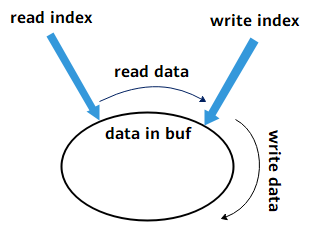

ringbuf控制块中维护着缓冲区的起始地址，和读/写指针的相对偏移。startIdx是读指针相对于ringbuf缓冲区起始地址的偏移，endIdx是写指针的相对偏移。startIdx与endIdx之间为缓冲的数据。ringbuf刚创建时，读写指针偏移均为0。

-   写入数据到ringbuf时，先判断ringbuf标志。标志为RBUF\_NORMAL时，处于正常模式；标志为RBUF\_OVERWRITE时，处于覆盖写模式。
    -   正常模式：写入数据到ringbuf时，先判断ringbuf是否还有剩余可用内存。当还有可用内存时才会继续写入，endIdx增长，并减少ringbuf的剩余可用内存；否则丢弃写入数据，可根据LOS\_RingbufWrite\(\)的返回值判断写入的数据量。如果ringbuf已经存满数据，因为不会覆盖旧数据，所以无法继续写入。
    -   可覆盖写模式：写入数据到ringbuf时，先判断ringbuf要写入的数据。当要写入数据大于size时，清空ringbuf，仅写入size长度数据；当要写入数据小于size且大于剩余内存remain时，清理一部分最早缓存的数据，再写入数据；当要写入数据小于剩余内存remain时，直接写入；最后均返回实际写入长度。

-   读取数据时，会按照先入先出的方式，读取最早缓存的数据，startIdx增长，并增加ringbuf的剩余可用内存。读取数据后，因为读指针向后移动，所以无法再次读取相同的数据。

    endIdx增长到等于startIdx时，表示ringbuf已经写满，所以无法继续写入，需要读取出数据才能继续写数据到ringbuf。

#### 开发指导<a name="ZH-CN_TOPIC_0000002543394325"></a>

**使用场景<a name="section13465143134317"></a>**

ringbuf用于数据缓冲，遵循先入先出的原则。

**功能<a name="section6112145484310"></a>**

LiteOS中的ringbuf模块提供下面几种功能，接口详细信息可以查看API参考。

<a name="table157mcpsimp"></a>
<table><thead align="left"><tr id="row163mcpsimp"><th class="cellrowborder" valign="top" width="21.862186218621858%" id="mcps1.1.4.1.1"><p id="p165mcpsimp"><a name="p165mcpsimp"></a><a name="p165mcpsimp"></a>功能分类</p>
</th>
<th class="cellrowborder" valign="top" width="21.14211421142114%" id="mcps1.1.4.1.2"><p id="p167mcpsimp"><a name="p167mcpsimp"></a><a name="p167mcpsimp"></a>接口名</p>
</th>
<th class="cellrowborder" valign="top" width="56.99569956995699%" id="mcps1.1.4.1.3"><p id="p169mcpsimp"><a name="p169mcpsimp"></a><a name="p169mcpsimp"></a>描述</p>
</th>
</tr>
</thead>
<tbody><tr id="row170mcpsimp"><td class="cellrowborder" rowspan="2" valign="top" width="21.862186218621858%" headers="mcps1.1.4.1.1 "><p id="p172mcpsimp"><a name="p172mcpsimp"></a><a name="p172mcpsimp"></a>初始化/重置环形缓冲</p>
</td>
<td class="cellrowborder" valign="top" width="21.14211421142114%" headers="mcps1.1.4.1.2 "><p id="p174mcpsimp"><a name="p174mcpsimp"></a><a name="p174mcpsimp"></a>LOS_RingbufInit</p>
</td>
<td class="cellrowborder" valign="top" width="56.99569956995699%" headers="mcps1.1.4.1.3 "><p id="p176mcpsimp"><a name="p176mcpsimp"></a><a name="p176mcpsimp"></a>初始化环形缓冲区，缓冲区内存、大小和标志通过入参传入。</p>
</td>
</tr>
<tr id="row177mcpsimp"><td class="cellrowborder" valign="top" headers="mcps1.1.4.1.1 "><p id="p180mcpsimp"><a name="p180mcpsimp"></a><a name="p180mcpsimp"></a>LOS_RingbufReset</p>
</td>
<td class="cellrowborder" valign="top" headers="mcps1.1.4.1.2 "><p id="p182mcpsimp"><a name="p182mcpsimp"></a><a name="p182mcpsimp"></a>重置缓冲区的状态，读写偏移重置为0，且清除缓冲区的数据。</p>
</td>
</tr>
<tr id="row183mcpsimp"><td class="cellrowborder" rowspan="3" valign="top" width="21.862186218621858%" headers="mcps1.1.4.1.1 "><p id="p185mcpsimp"><a name="p185mcpsimp"></a><a name="p185mcpsimp"></a>读/写环形缓冲</p>
</td>
<td class="cellrowborder" valign="top" width="21.14211421142114%" headers="mcps1.1.4.1.2 "><p id="p187mcpsimp"><a name="p187mcpsimp"></a><a name="p187mcpsimp"></a>LOS_RingbufRead</p>
</td>
<td class="cellrowborder" valign="top" width="56.99569956995699%" headers="mcps1.1.4.1.3 "><p id="p189mcpsimp"><a name="p189mcpsimp"></a><a name="p189mcpsimp"></a>从环形缓冲区中读取指定大小的数据到指定地址空间，并返回读取到的数据量。</p>
</td>
</tr>
<tr id="row111261639185112"><td class="cellrowborder" valign="top" headers="mcps1.1.4.1.1 "><p id="p1283155512518"><a name="p1283155512518"></a><a name="p1283155512518"></a>LOS_RingbufPeek</p>
</td>
<td class="cellrowborder" valign="top" headers="mcps1.1.4.1.2 "><p id="p8640141445218"><a name="p8640141445218"></a><a name="p8640141445218"></a>从环形缓冲区中预读指定大小的数据到指定地址空间，并返回读取到的数据量。</p>
</td>
</tr>
<tr id="row190mcpsimp"><td class="cellrowborder" valign="top" headers="mcps1.1.4.1.1 "><p id="p193mcpsimp"><a name="p193mcpsimp"></a><a name="p193mcpsimp"></a>LOS_RingbufWrite</p>
</td>
<td class="cellrowborder" valign="top" headers="mcps1.1.4.1.2 "><p id="p195mcpsimp"><a name="p195mcpsimp"></a><a name="p195mcpsimp"></a>写入指定大小的数据到环形缓冲区，并返回成功写入到缓冲区的数据量。</p>
</td>
</tr>
<tr id="row196mcpsimp"><td class="cellrowborder" valign="top" width="21.862186218621858%" headers="mcps1.1.4.1.1 "><p id="p198mcpsimp"><a name="p198mcpsimp"></a><a name="p198mcpsimp"></a>获取缓冲数据量</p>
</td>
<td class="cellrowborder" valign="top" width="21.14211421142114%" headers="mcps1.1.4.1.2 "><p id="p200mcpsimp"><a name="p200mcpsimp"></a><a name="p200mcpsimp"></a>LOS_RingbufUsedSize</p>
</td>
<td class="cellrowborder" valign="top" width="56.99569956995699%" headers="mcps1.1.4.1.3 "><p id="p202mcpsimp"><a name="p202mcpsimp"></a><a name="p202mcpsimp"></a>获取环形缓冲区中已缓存的数据量。</p>
</td>
</tr>
</tbody>
</table>

**开发流程<a name="section29082323441"></a>**

使用ringbuf模块开发的典型流程如下：

1.  打开菜单，进入Kernel ---\> Enable Ringbuf菜单，完成ringbuf模块的配置。

    <a name="table116mcpsimp"></a>
    <table><thead align="left"><tr id="row124mcpsimp"><th class="cellrowborder" valign="top" width="22.64226422642264%" id="mcps1.1.6.1.1"><p id="p126mcpsimp"><a name="p126mcpsimp"></a><a name="p126mcpsimp"></a>配置项</p>
    </th>
    <th class="cellrowborder" valign="top" width="33.64336433643364%" id="mcps1.1.6.1.2"><p id="p128mcpsimp"><a name="p128mcpsimp"></a><a name="p128mcpsimp"></a>含义</p>
    </th>
    <th class="cellrowborder" valign="top" width="13.09130913091309%" id="mcps1.1.6.1.3"><p id="p130mcpsimp"><a name="p130mcpsimp"></a><a name="p130mcpsimp"></a>取值范围</p>
    </th>
    <th class="cellrowborder" valign="top" width="13.09130913091309%" id="mcps1.1.6.1.4"><p id="p132mcpsimp"><a name="p132mcpsimp"></a><a name="p132mcpsimp"></a>默认值</p>
    </th>
    <th class="cellrowborder" valign="top" width="17.531753175317533%" id="mcps1.1.6.1.5"><p id="p134mcpsimp"><a name="p134mcpsimp"></a><a name="p134mcpsimp"></a>依赖</p>
    </th>
    </tr>
    </thead>
    <tbody><tr id="row135mcpsimp"><td class="cellrowborder" valign="top" width="22.64226422642264%" headers="mcps1.1.6.1.1 "><p id="p137mcpsimp"><a name="p137mcpsimp"></a><a name="p137mcpsimp"></a>LOSCFG_KERNEL_RINGBUF</p>
    </td>
    <td class="cellrowborder" valign="top" width="33.64336433643364%" headers="mcps1.1.6.1.2 "><p id="p139mcpsimp"><a name="p139mcpsimp"></a><a name="p139mcpsimp"></a>ringbuf裁剪开关</p>
    </td>
    <td class="cellrowborder" valign="top" width="13.09130913091309%" headers="mcps1.1.6.1.3 "><p id="p141mcpsimp"><a name="p141mcpsimp"></a><a name="p141mcpsimp"></a>YES/NO</p>
    </td>
    <td class="cellrowborder" valign="top" width="13.09130913091309%" headers="mcps1.1.6.1.4 "><p id="p143mcpsimp"><a name="p143mcpsimp"></a><a name="p143mcpsimp"></a>NO</p>
    </td>
    <td class="cellrowborder" valign="top" width="17.531753175317533%" headers="mcps1.1.6.1.5 "><p id="p145mcpsimp"><a name="p145mcpsimp"></a><a name="p145mcpsimp"></a>无</p>
    </td>
    </tr>
    </tbody>
    </table>

2.  为ringbuf申请一块内存；
3.  通过LOS\_RingbufInit初始化ringbuf。
4.  写ringbuf。
5.  在合适时机读ringbuf。

#### 注意事项<a name="ZH-CN_TOPIC_0000002543354385"></a>

-   ringbuf写接口行为由LOS\_RingbufInit接口在初始化时决定。
-   通过LOS\_RingbufRead接口读取缓冲区的数据后，该数据无法被再次读取。
-   LOS\_RingbufPeek接口仅预读缓冲区数据，未消费该数据，该数据仍然可以被读取。
-   正常模式下，缓冲区写满时，无法继续写入，请检查LOS\_RingbufWrite的返回值以确认实际写入的数据量。
-   使用完ringbuf后，需要用户自己释放申请的内存。

#### 编程实例<a name="ZH-CN_TOPIC_0000002543394319"></a>

**实例描述<a name="section12506115818444"></a>**

创建一个ringbuf，两个任务。任务1定时写入数据到ringbuf，任务2在ringbuf数据达到一定量时，取出数据。

1.  锁任务调度，通过LOS\_TaskCreate创建任务1和任务2。
2.  申请一块内存用作环形缓冲区。
3.  通过LOS\_RingbufInit初始化一个缓冲区。
4.  解锁任务调度。
5.  任务1往环形缓冲区中写入数据。
6.  任务2判断数据达到水线后，读取数据。

**编程示例<a name="section513085444714"></a>**

```
static Ringbuf g_Ringbuf = {0};
#define READ_TRIGGER_THRESHOLD 32
#define RINGBUF_SIZE 128

VOID WriteTask(VOID)
{
    UINT32 i = 0;
    UINT32 ret = 0;
    CHAR data[READ_TRIGGER_THRESHOLD * 2 + 1] = "LiteOS test data, send in WriteTask, receive & check in ReadTask";
    for (;;) {
        ret = LOS_RingbufWrite(&g_Ringbuf, data + i, READ_TRIGGER_THRESHOLD / 2);
        if (ret != READ_TRIGGER_THRESHOLD / 2) {
            PRINT_ERR("real write count is %u\n", ret);
        }
        i += ret;
        if (i >= strlen(data)) {
            break;
        } else {
            LOS_Msleep(1000); /* 1000: sleep 1000ms */
        }
    }
}

VOID ReadTask(VOID)
{
    UINT32 i = 0;
    UINT32 ret = 0;
    UINT32 count = 0;
    CHAR data[READ_TRIGGER_THRESHOLD * 2 + 1] = {0};
    for (;;) {
        count = LOS_RingbufUsedSize(&g_Ringbuf);
        if (count >= READ_TRIGGER_THRESHOLD) {
            ret = LOS_RingbufRead(&g_Ringbuf, data + i, count);
            i += ret;
            PRINTK("read data count %u \n", i);
            if (i == READ_TRIGGER_THRESHOLD * 2) {
                PRINTK("data receive done: %s\n", data);
                break;
            }
        } else {
            PRINTK("info: data count %u < %u\n", count, READ_TRIGGER_THRESHOLD);
        }
        LOS_Msleep(1000); /* 1000: sleep 1000ms */
    }
}

UINT32 SampleTaskCreat(VOID)
{
    UINT32 ret = 0;
    UINT32 task1, task2;
    CHAR *buff = NULL;
    TSK_INIT_PARAM_S initParam;

    initParam.pfnTaskEntry = (TSK_ENTRY_FUNC)WriteTask;
    initParam.usTaskPrio = LOSCFG_BASE_CORE_TSK_DEFAULT_PRIO;
    initParam.uwStackSize = LOSCFG_BASE_CORE_TSK_DEFAULT_STACK_SIZE;
    initParam.pcName = "WriteTask";
#ifdef LOSCFG_KERNEL_SMP
    initParam.usCpuAffiMask = CPUID_TO_AFFI_MASK(ArchCurrCpuid());
#endif
    initParam.uwResved = LOS_TASK_STATUS_DETACHED;

    LOS_TaskLock();
    ret = LOS_TaskCreate(&task1, &initParam);
    if(ret != LOS_OK) {
        PRINT_ERR("create WriteTask failed, error: %x\n", ret);
        return ret;
    }

    initParam.pcName = "ReadTask";
    initParam.pfnTaskEntry = (TSK_ENTRY_FUNC)ReadTask;
    ret = LOS_TaskCreate(&task2, &initParam);
    if(ret != LOS_OK) {
        PRINT_ERR("create ReadTask failed, error: %x\n", ret);
        return ret;
    }

    buff = (CHAR *)LOS_MemAlloc(m_aucSysMem0, RINGBUF_SIZE);
    if (buff == NULL) {
        PRINT_ERR("malloc falied");
        return LOS_NOK;
    }
    ret = LOS_RingbufInit(&g_Ringbuf, buff, RINGBUF_SIZE, RBUF_NORMAL);
    if (ret != LOS_OK) {
        PRINT_ERR("ringbuf init falied");
        return LOS_NOK;
    }

    PRINTK("create the ringbuf success!\n");
    LOS_TaskUnlock();
    return ret;
}
```

**结果验证<a name="section2084111313455"></a>**

编译运行得到的结果为：

```
create the ringbuf success!
info: data count 16 < 32
read data count 32
info: data count 16 < 32
read data count 64
data receive done: LiteOS test data, send in WriteTask, receive & check in ReadTask
```

### 通用内存访问<a name="ZH-CN_TOPIC_0000002511794328"></a>


#### 概述<a name="ZH-CN_TOPIC_0000002543354171"></a>

**基本概念<a name="section19060819115120"></a>**

当寄存器或内存位于内存空间时，称为IO内存。LiteOS提供了一组通用接口来操作I/O内存。

#### 开发指导<a name="ZH-CN_TOPIC_0000002511794454"></a>

**使用场景<a name="section3383949133619"></a>**

系统提供读写（1、2、4、8）字节寄存器操作，方便编写驱动代码。

**功能<a name="section30372907115550"></a>**

LiteOS为用户提供下面几种功能，接口详细信息可以查看API参考。

<a name="table43157872115614"></a>
<table><thead align="left"><tr id="row61966233115614"><th class="cellrowborder" valign="top" width="20.22202220222022%" id="mcps1.1.4.1.1"><p id="p9118648115614"><a name="p9118648115614"></a><a name="p9118648115614"></a>功能分类</p>
</th>
<th class="cellrowborder" valign="top" width="27.962796279627966%" id="mcps1.1.4.1.2"><p id="p413017115614"><a name="p413017115614"></a><a name="p413017115614"></a>接口名</p>
</th>
<th class="cellrowborder" valign="top" width="51.81518151815182%" id="mcps1.1.4.1.3"><p id="p33454382115614"><a name="p33454382115614"></a><a name="p33454382115614"></a>描述</p>
</th>
</tr>
</thead>
<tbody><tr id="row32653983115614"><td class="cellrowborder" rowspan="4" valign="top" width="20.22202220222022%" headers="mcps1.1.4.1.1 "><p id="p27727006115614"><a name="p27727006115614"></a><a name="p27727006115614"></a>读/写64位数据</p>
</td>
<td class="cellrowborder" valign="top" width="27.962796279627966%" headers="mcps1.1.4.1.2 "><p id="p6665151352510"><a name="p6665151352510"></a><a name="p6665151352510"></a>WRITE64(addr，value)</p>
</td>
<td class="cellrowborder" valign="top" width="51.81518151815182%" headers="mcps1.1.4.1.3 "><p id="p51870782115614"><a name="p51870782115614"></a><a name="p51870782115614"></a>将64位数据（value）写入64位寄存器（addr）。</p>
</td>
</tr>
<tr id="row64183855115614"><td class="cellrowborder" valign="top" headers="mcps1.1.4.1.1 "><p id="p2156603115614"><a name="p2156603115614"></a><a name="p2156603115614"></a>READ64(addr，value)</p>
</td>
<td class="cellrowborder" valign="top" headers="mcps1.1.4.1.2 "><p id="p159611816145818"><a name="p159611816145818"></a><a name="p159611816145818"></a>读取64位寄存器（addr）。</p>
</td>
</tr>
<tr id="row19475164210583"><td class="cellrowborder" valign="top" headers="mcps1.1.4.1.1 "><p id="p1647504205815"><a name="p1647504205815"></a><a name="p1647504205815"></a>WRITE64_MB(addr，value)</p>
</td>
<td class="cellrowborder" valign="top" headers="mcps1.1.4.1.2 "><p id="p1447594285814"><a name="p1447594285814"></a><a name="p1447594285814"></a>将64位数据（value）写入64位寄存器（addr），写入前使用数据同步屏障同步。</p>
</td>
</tr>
<tr id="row18475194215815"><td class="cellrowborder" valign="top" headers="mcps1.1.4.1.1 "><p id="p1947564210586"><a name="p1947564210586"></a><a name="p1947564210586"></a>READ64_MB(addr，value)</p>
</td>
<td class="cellrowborder" valign="top" headers="mcps1.1.4.1.2 "><p id="p171063362036"><a name="p171063362036"></a><a name="p171063362036"></a>读取64位寄存器（addr），读取前使用数据同步屏障同步。</p>
</td>
</tr>
<tr id="row97101224174512"><td class="cellrowborder" rowspan="4" valign="top" width="20.22202220222022%" headers="mcps1.1.4.1.1 "><p id="p1136262014510"><a name="p1136262014510"></a><a name="p1136262014510"></a>读/写32位数据</p>
</td>
<td class="cellrowborder" valign="top" width="27.962796279627966%" headers="mcps1.1.4.1.2 "><p id="p93621720194512"><a name="p93621720194512"></a><a name="p93621720194512"></a>WRITE32(addr，value)</p>
</td>
<td class="cellrowborder" valign="top" width="51.81518151815182%" headers="mcps1.1.4.1.3 "><p id="p636212209451"><a name="p636212209451"></a><a name="p636212209451"></a>将32位数据（value）写入32位寄存器（addr）。</p>
</td>
</tr>
<tr id="row5710102417454"><td class="cellrowborder" valign="top" headers="mcps1.1.4.1.1 "><p id="p43621220134515"><a name="p43621220134515"></a><a name="p43621220134515"></a>READ32(addr，value)</p>
</td>
<td class="cellrowborder" valign="top" headers="mcps1.1.4.1.2 "><p id="p53621120194515"><a name="p53621120194515"></a><a name="p53621120194515"></a>读取32位寄存器（addr）。</p>
</td>
</tr>
<tr id="row971072444513"><td class="cellrowborder" valign="top" headers="mcps1.1.4.1.1 "><p id="p20362132084520"><a name="p20362132084520"></a><a name="p20362132084520"></a>WRITE32_MB(addr，value)</p>
</td>
<td class="cellrowborder" valign="top" headers="mcps1.1.4.1.2 "><p id="p123621620124512"><a name="p123621620124512"></a><a name="p123621620124512"></a>将32位数据（value）写入32位寄存器（addr），写入前使用数据同步屏障同步。</p>
</td>
</tr>
<tr id="row197101324104517"><td class="cellrowborder" valign="top" headers="mcps1.1.4.1.1 "><p id="p123632020104513"><a name="p123632020104513"></a><a name="p123632020104513"></a>READ32_MB(addr，value)</p>
</td>
<td class="cellrowborder" valign="top" headers="mcps1.1.4.1.2 "><p id="p11363182064511"><a name="p11363182064511"></a><a name="p11363182064511"></a>读取32位寄存器（addr），读取前使用数据同步屏障同步。</p>
</td>
</tr>
<tr id="row3417528164512"><td class="cellrowborder" rowspan="4" valign="top" width="20.22202220222022%" headers="mcps1.1.4.1.1 "><p id="p125695278452"><a name="p125695278452"></a><a name="p125695278452"></a>读/写16位数据</p>
</td>
<td class="cellrowborder" valign="top" width="27.962796279627966%" headers="mcps1.1.4.1.2 "><p id="p10569142704510"><a name="p10569142704510"></a><a name="p10569142704510"></a>WRITE16(addr，value)</p>
</td>
<td class="cellrowborder" valign="top" width="51.81518151815182%" headers="mcps1.1.4.1.3 "><p id="p20569142764520"><a name="p20569142764520"></a><a name="p20569142764520"></a>将16位数据（value）写入16位寄存器（addr）。</p>
</td>
</tr>
<tr id="row441712813454"><td class="cellrowborder" valign="top" headers="mcps1.1.4.1.1 "><p id="p556914279458"><a name="p556914279458"></a><a name="p556914279458"></a>READ16(addr，value)</p>
</td>
<td class="cellrowborder" valign="top" headers="mcps1.1.4.1.2 "><p id="p1569142764512"><a name="p1569142764512"></a><a name="p1569142764512"></a>读取16位寄存器（addr）。</p>
</td>
</tr>
<tr id="row641782864516"><td class="cellrowborder" valign="top" headers="mcps1.1.4.1.1 "><p id="p1756952719451"><a name="p1756952719451"></a><a name="p1756952719451"></a>WRITE16_MB(addr，value)</p>
</td>
<td class="cellrowborder" valign="top" headers="mcps1.1.4.1.2 "><p id="p756952744515"><a name="p756952744515"></a><a name="p756952744515"></a>将16位数据（value）写入16位寄存器（addr），写入前使用数据同步屏障同步。</p>
</td>
</tr>
<tr id="row144178288454"><td class="cellrowborder" valign="top" headers="mcps1.1.4.1.1 "><p id="p656942704518"><a name="p656942704518"></a><a name="p656942704518"></a>READ16_MB(addr，value)</p>
</td>
<td class="cellrowborder" valign="top" headers="mcps1.1.4.1.2 "><p id="p356912724514"><a name="p356912724514"></a><a name="p356912724514"></a>读取16位寄存器（addr），读取前使用数据同步屏障同步。</p>
</td>
</tr>
<tr id="row125743119452"><td class="cellrowborder" rowspan="4" valign="top" width="20.22202220222022%" headers="mcps1.1.4.1.1 "><p id="p1136683014450"><a name="p1136683014450"></a><a name="p1136683014450"></a>读/写8位数据</p>
</td>
<td class="cellrowborder" valign="top" width="27.962796279627966%" headers="mcps1.1.4.1.2 "><p id="p133667305455"><a name="p133667305455"></a><a name="p133667305455"></a>WRITE8(addr，value)</p>
</td>
<td class="cellrowborder" valign="top" width="51.81518151815182%" headers="mcps1.1.4.1.3 "><p id="p6366163034517"><a name="p6366163034517"></a><a name="p6366163034517"></a>将8位数据（value）写入8位寄存器（addr）。</p>
</td>
</tr>
<tr id="row8576316451"><td class="cellrowborder" valign="top" headers="mcps1.1.4.1.1 "><p id="p143666307453"><a name="p143666307453"></a><a name="p143666307453"></a>READ8(addr，value)</p>
</td>
<td class="cellrowborder" valign="top" headers="mcps1.1.4.1.2 "><p id="p17366203044520"><a name="p17366203044520"></a><a name="p17366203044520"></a>读取8位寄存器（addr）。</p>
</td>
</tr>
<tr id="row175753134510"><td class="cellrowborder" valign="top" headers="mcps1.1.4.1.1 "><p id="p33664304457"><a name="p33664304457"></a><a name="p33664304457"></a>WRITE8_MB(addr，value)</p>
</td>
<td class="cellrowborder" valign="top" headers="mcps1.1.4.1.2 "><p id="p536703074513"><a name="p536703074513"></a><a name="p536703074513"></a>将8位数据（value）写入8位寄存器（addr），写入前使用数据同步屏障同步。</p>
</td>
</tr>
<tr id="row45713118458"><td class="cellrowborder" valign="top" headers="mcps1.1.4.1.1 "><p id="p11367113013455"><a name="p11367113013455"></a><a name="p11367113013455"></a>READ8_MB(addr，value)</p>
</td>
<td class="cellrowborder" valign="top" headers="mcps1.1.4.1.2 "><p id="p193672030114513"><a name="p193672030114513"></a><a name="p193672030114513"></a>读取8位寄存器（addr），读取前使用数据同步屏障同步。</p>
</td>
</tr>
</tbody>
</table>

> **须知：** 
>如果32位ARM架构写64位寄存器通过str指令访问，会导致高32位寄存器地址和低32位寄存器地址的数据不能同时生效，因此通过strd指令实现。

#### 注意事项<a name="ZH-CN_TOPIC_0000002543354251"></a>

无。

# 扩展内核<a name="ZH-CN_TOPIC_0000002511794264"></a>


## 动态加载<a name="ZH-CN_TOPIC_0000002532922710"></a>


### 概述<a name="ZH-CN_TOPIC_0000002533083474"></a>

**基本概念<a name="section18886111610113"></a>**

动态加载是一种程序加载技术。

静态链接是在链接阶段将程序各模块文件链接成一个完整的可执行文件，运行时作为整体一次性加载进内存。动态加载允许用户将程序各模块编译成独立的.o文件和.so文件，而不将它们链接成一个可执行文件，在需要使用某模块时再动态地将其加载进内存。

LiteOS支持动态加载OBJ目标文件（.o文件）和SO共享目标文件（.so文件），需要目标文件、系统二进制镜像文件配合使用。

**图 1**  动态加载示意图<a name="fig339213331310"></a>  
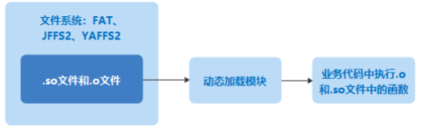

**动态加载相关概念<a name="section163715271925"></a>**

符号表在表现形式上是记录了符号名及其所在内存地址的数组。符号表在动态加载模块初始化时被载入到动态加载模块的符号管理结构中。在加载用户模块进行符号重定位时，动态加载模块通过查找符号管理结构得到相应符号所在地址。

**运作机制<a name="section15891125417212"></a>**

对于so文件，可能以ZIP（压缩）或者NOZIP（非压缩）的形式存放在存储介质中，相应的有两种加载策略。

-   NOZIP策略：普通的so文件可以通过多次lseek与read获取相应的文件信息。首先根据so文件的 SegmentHeader信息，计算出对应的可Load段的大小，然后分配出相应的空间，将相应的可Load段加载到内存并完成动态加载工作。因为每次仅仅读取文件的一小部分，不存在内存浪费问题。
-   ZIP策略：读取ZIP压缩文件时，必须一次性将文件全部读取到内存中（mem1），但是第一次读取时并不知道对应的so文件中可Load段的大小，所以需要二次分配内存（mem2）。因为mem2中已经具备了本次动态加载所需的所有信息，如果让mem1和mem2并存就会造成内存浪费并导致内存峰值过高。解决办法是分两次读取ZIP文件，第一次读取的目的仅仅是计算最终所需的内存大小（计算完毕，立刻释放相应内存），第二次读取的目的才是根据相应信息完成动态加载工作。可见，ZIP加载策略是以牺牲指令为代价来避免内存峰值过高的一种策略。

### 开发指导<a name="ZH-CN_TOPIC_0000002532923528"></a>

**使用场景<a name="section18886111610113"></a>**

静态链接将程序各模块文件链接成一个整体，运行时一次性加载进内存，具有代码装载速度快等优点。但当程序规模较大，模块变更升级较为频繁时，会存在内存和磁盘空间浪费、模块更新困难等问题。

动态加载技术可以较好地解决上述静态链接中存在的问题，在程序需要执行外部模块中的代码时，动态地将外部模块加载进内存，不需要该模块时再卸载，可以实现公共代码的共享以及模块的平滑升级等功能。

**功能<a name="section421118358518"></a>**

LiteOS 的动态加载模块为用户提供下面几种功能，接口详细信息可以查看API参考。

<a name="table0930132467"></a>
<table><thead align="left"><tr id="row29471215613"><th class="cellrowborder" valign="top" width="23.44%" id="mcps1.1.4.1.1"><p id="p694714214613"><a name="p694714214613"></a><a name="p694714214613"></a>功能分类</p>
</th>
<th class="cellrowborder" valign="top" width="20.79%" id="mcps1.1.4.1.2"><p id="p1194792961"><a name="p1194792961"></a><a name="p1194792961"></a>接口名</p>
</th>
<th class="cellrowborder" valign="top" width="55.769999999999996%" id="mcps1.1.4.1.3"><p id="p13947626620"><a name="p13947626620"></a><a name="p13947626620"></a>描述</p>
</th>
</tr>
</thead>
<tbody><tr id="row1794718213619"><td class="cellrowborder" valign="top" width="23.44%" headers="mcps1.1.4.1.1 "><p id="p4947723619"><a name="p4947723619"></a><a name="p4947723619"></a>销毁动态加载</p>
</td>
<td class="cellrowborder" valign="top" width="20.79%" headers="mcps1.1.4.1.2 "><p id="p10947322614"><a name="p10947322614"></a><a name="p10947322614"></a>LOS_LdDestroy</p>
</td>
<td class="cellrowborder" valign="top" width="55.769999999999996%" headers="mcps1.1.4.1.3 "><p id="p1947182964"><a name="p1947182964"></a><a name="p1947182964"></a>销毁动态加载模块。</p>
</td>
</tr>
<tr id="row1694716213615"><td class="cellrowborder" rowspan="3" valign="top" width="23.44%" headers="mcps1.1.4.1.1 "><p id="p199473212615"><a name="p199473212615"></a><a name="p199473212615"></a>动态加载模块文件</p>
</td>
<td class="cellrowborder" valign="top" width="20.79%" headers="mcps1.1.4.1.2 "><p id="p159474211610"><a name="p159474211610"></a><a name="p159474211610"></a>LOS_SoLoad</p>
</td>
<td class="cellrowborder" valign="top" width="55.769999999999996%" headers="mcps1.1.4.1.3 "><p id="p179471421568"><a name="p179471421568"></a><a name="p179471421568"></a>动态加载一个so模块（依赖文件系统）。</p>
</td>
</tr>
<tr id="row7947121169"><td class="cellrowborder" valign="top" headers="mcps1.1.4.1.1 "><p id="p13947142562"><a name="p13947142562"></a><a name="p13947142562"></a>LOS_MemLoad</p>
</td>
<td class="cellrowborder" valign="top" headers="mcps1.1.4.1.2 "><p id="p1094782968"><a name="p1094782968"></a><a name="p1094782968"></a>动态加载一个so或obj模块（不依赖文件系统，从指定内存空间加载）。</p>
</td>
</tr>
<tr id="row5947920614"><td class="cellrowborder" valign="top" headers="mcps1.1.4.1.1 "><p id="p1294714212617"><a name="p1294714212617"></a><a name="p1294714212617"></a>LOS_ObjLoad</p>
</td>
<td class="cellrowborder" valign="top" headers="mcps1.1.4.1.2 "><p id="p1947112765"><a name="p1947112765"></a><a name="p1947112765"></a>动态加载一个obj模块（依赖文件系统）。</p>
</td>
</tr>
<tr id="row11947172660"><td class="cellrowborder" rowspan="2" valign="top" width="23.44%" headers="mcps1.1.4.1.1 "><p id="p1794719217616"><a name="p1794719217616"></a><a name="p1794719217616"></a>动态加载模块文件到静态空间</p>
</td>
<td class="cellrowborder" valign="top" width="20.79%" headers="mcps1.1.4.1.2 "><p id="p179471024616"><a name="p179471024616"></a><a name="p179471024616"></a>LOS_MemLoadStatic</p>
</td>
<td class="cellrowborder" valign="top" width="55.769999999999996%" headers="mcps1.1.4.1.3 "><p id="p29471529617"><a name="p29471529617"></a><a name="p29471529617"></a>动态加载一个so或obj模块到指定的静态空间（不依赖文件系统，从指定内存空间加载）。</p>
</td>
</tr>
<tr id="row7947925615"><td class="cellrowborder" valign="top" headers="mcps1.1.4.1.1 "><p id="p169471120613"><a name="p169471120613"></a><a name="p169471120613"></a>LOS_SoLoadStatic</p>
</td>
<td class="cellrowborder" valign="top" headers="mcps1.1.4.1.2 "><p id="p159471621611"><a name="p159471621611"></a><a name="p159471621611"></a>动态加载一个so模块（依赖文件系统）到指定的静态空间。</p>
</td>
</tr>
<tr id="row129471225616"><td class="cellrowborder" rowspan="2" valign="top" width="23.44%" headers="mcps1.1.4.1.1 "><p id="p3947162864"><a name="p3947162864"></a><a name="p3947162864"></a>获取运行视图下模块需要的空间大小</p>
</td>
<td class="cellrowborder" valign="top" width="20.79%" headers="mcps1.1.4.1.2 "><p id="p69478219614"><a name="p69478219614"></a><a name="p69478219614"></a>LOS_ModuleSizeGet</p>
</td>
<td class="cellrowborder" valign="top" width="55.769999999999996%" headers="mcps1.1.4.1.3 "><p id="p109471329619"><a name="p109471329619"></a><a name="p109471329619"></a>计算加载并运行一个so或obj模块所需要的静态空间大小。</p>
</td>
</tr>
<tr id="row189479212610"><td class="cellrowborder" valign="top" headers="mcps1.1.4.1.1 "><p id="p69476218611"><a name="p69476218611"></a><a name="p69476218611"></a>LOS_DynSizeGetFromFS</p>
</td>
<td class="cellrowborder" valign="top" headers="mcps1.1.4.1.2 "><p id="p2947152867"><a name="p2947152867"></a><a name="p2947152867"></a>计算加载并运行一个so模块所需要的静态空间大小（依赖文件系统）。</p>
</td>
</tr>
<tr id="row0947421269"><td class="cellrowborder" valign="top" width="23.44%" headers="mcps1.1.4.1.1 "><p id="p394792963"><a name="p394792963"></a><a name="p394792963"></a>查找符号地址</p>
</td>
<td class="cellrowborder" valign="top" width="20.79%" headers="mcps1.1.4.1.2 "><p id="p189471522616"><a name="p189471522616"></a><a name="p189471522616"></a>LOS_FindSymByName</p>
</td>
<td class="cellrowborder" valign="top" width="55.769999999999996%" headers="mcps1.1.4.1.3 "><p id="p0947421969"><a name="p0947421969"></a><a name="p0947421969"></a>在模块或系统符号表中查找符号地址。</p>
</td>
</tr>
<tr id="row9947822613"><td class="cellrowborder" valign="top" width="23.44%" headers="mcps1.1.4.1.1 "><p id="p694772563"><a name="p694772563"></a><a name="p694772563"></a>卸载模块</p>
</td>
<td class="cellrowborder" valign="top" width="20.79%" headers="mcps1.1.4.1.2 "><p id="p794710215616"><a name="p794710215616"></a><a name="p794710215616"></a>LOS_ModuleUnload</p>
</td>
<td class="cellrowborder" valign="top" width="55.769999999999996%" headers="mcps1.1.4.1.3 "><p id="p129471327616"><a name="p129471327616"></a><a name="p129471327616"></a>卸载一个模块。</p>
</td>
</tr>
<tr id="row1894710217615"><td class="cellrowborder" rowspan="3" valign="top" width="23.44%" headers="mcps1.1.4.1.1 "><p id="p13947225613"><a name="p13947225613"></a><a name="p13947225613"></a>设置动态加载的搜索路径/参数/内存池地址</p>
</td>
<td class="cellrowborder" valign="top" width="20.79%" headers="mcps1.1.4.1.2 "><p id="p794717214613"><a name="p794717214613"></a><a name="p794717214613"></a>LOS_PathAdd</p>
</td>
<td class="cellrowborder" valign="top" width="55.769999999999996%" headers="mcps1.1.4.1.3 "><p id="p13947325616"><a name="p13947325616"></a><a name="p13947325616"></a>添加模块的搜索路径。</p>
</td>
</tr>
<tr id="row194752663"><td class="cellrowborder" valign="top" headers="mcps1.1.4.1.1 "><p id="p139471423613"><a name="p139471423613"></a><a name="p139471423613"></a>LOS_DynParamReg</p>
</td>
<td class="cellrowborder" valign="top" headers="mcps1.1.4.1.2 "><p id="p69471323616"><a name="p69471323616"></a><a name="p69471323616"></a>设置so模块的动态加载参数，使用该接口需要打开LOSCFG_DYNLOAD_DYN_FROM_FS宏开关，即只支持从文件系统中加载so模块时才能设置其动态加载参数。</p>
</td>
</tr>
<tr id="row16947821768"><td class="cellrowborder" valign="top" headers="mcps1.1.4.1.1 "><p id="p15947621363"><a name="p15947621363"></a><a name="p15947621363"></a>LOS_DynMemPoolSet</p>
</td>
<td class="cellrowborder" valign="top" headers="mcps1.1.4.1.2 "><p id="p139471223614"><a name="p139471223614"></a><a name="p139471223614"></a>设置动态加载使用的内存池地址。</p>
</td>
</tr>
</tbody>
</table>

> **说明：** 
>LOS\_DynMemPoolSet接口入参必须是经过LOS\_MemInit初始化的内存池地址，即通过LiteOS内存管理算法管理，并且保证该内存池与系统内存池不重合。该接口需在加载.so或者.o文件前使用。

> **须知：** 
>不同目标平台的内存保护/内存管理单元设计可能存在差异，在使用本章节提供的接口前，请务必阅读目标平台的相关文档以理解平台硬件能力和使用限制。

**DYNLOAD错误码<a name="section916114818910"></a>**

对存在失败可能性的操作返回对应的错误码，以便快速定位错误原因。

<a name="table2012212305915"></a>
<table><thead align="left"><tr id="row61421300913"><th class="cellrowborder" valign="top" width="8.41%" id="mcps1.1.6.1.1"><p id="p1314215301895"><a name="p1314215301895"></a><a name="p1314215301895"></a>序号</p>
</th>
<th class="cellrowborder" valign="top" width="26%" id="mcps1.1.6.1.2"><p id="p71426301492"><a name="p71426301492"></a><a name="p71426301492"></a>定义</p>
</th>
<th class="cellrowborder" valign="top" width="13.98%" id="mcps1.1.6.1.3"><p id="p114213301398"><a name="p114213301398"></a><a name="p114213301398"></a>实际数值</p>
</th>
<th class="cellrowborder" valign="top" width="29.67%" id="mcps1.1.6.1.4"><p id="p7142123018912"><a name="p7142123018912"></a><a name="p7142123018912"></a>描述</p>
</th>
<th class="cellrowborder" valign="top" width="21.94%" id="mcps1.1.6.1.5"><p id="p31425301198"><a name="p31425301198"></a><a name="p31425301198"></a>参考解决方案</p>
</th>
</tr>
</thead>
<tbody><tr id="row1114283011912"><td class="cellrowborder" valign="top" width="8.41%" headers="mcps1.1.6.1.1 "><p id="p414220301194"><a name="p414220301194"></a><a name="p414220301194"></a>1</p>
</td>
<td class="cellrowborder" valign="top" width="26%" headers="mcps1.1.6.1.2 "><p id="p3142103019912"><a name="p3142103019912"></a><a name="p3142103019912"></a>LOS_ERRNO_LD_INVALID_ARG</p>
</td>
<td class="cellrowborder" valign="top" width="13.98%" headers="mcps1.1.6.1.3 "><p id="p7142133012918"><a name="p7142133012918"></a><a name="p7142133012918"></a>0x02002600</p>
</td>
<td class="cellrowborder" valign="top" width="29.67%" headers="mcps1.1.6.1.4 "><p id="p14142183010910"><a name="p14142183010910"></a><a name="p14142183010910"></a>传入的参数中含有NULL，0等非法值。</p>
</td>
<td class="cellrowborder" valign="top" width="21.94%" headers="mcps1.1.6.1.5 "><p id="p1714210301297"><a name="p1714210301297"></a><a name="p1714210301297"></a>传入正确的参数</p>
</td>
</tr>
<tr id="row314219301191"><td class="cellrowborder" valign="top" width="8.41%" headers="mcps1.1.6.1.1 "><p id="p10142930094"><a name="p10142930094"></a><a name="p10142930094"></a>2</p>
</td>
<td class="cellrowborder" valign="top" width="26%" headers="mcps1.1.6.1.2 "><p id="p121421306912"><a name="p121421306912"></a><a name="p121421306912"></a>LOS_ERRNO_LD_INVALID_ELF</p>
</td>
<td class="cellrowborder" valign="top" width="13.98%" headers="mcps1.1.6.1.3 "><p id="p14142430594"><a name="p14142430594"></a><a name="p14142430594"></a>0x02002601</p>
</td>
<td class="cellrowborder" valign="top" width="29.67%" headers="mcps1.1.6.1.4 "><p id="p51428305915"><a name="p51428305915"></a><a name="p51428305915"></a>传入的ELF不正确或者是不支持的类型。</p>
</td>
<td class="cellrowborder" valign="top" width="21.94%" headers="mcps1.1.6.1.5 "><p id="p1514214301299"><a name="p1514214301299"></a><a name="p1514214301299"></a>传入正确的ELF文件</p>
</td>
</tr>
</tbody>
</table>

**开发流程<a name="section104548121012"></a>**

动态加载主要有以下几个步骤：

1.  准备编译环境
2.  编译待加载的模块文件
3.  编写动态加载的业务代码
4.  编译系统镜像
5.  准备系统环境

**准备编译环境<a name="section8962143881011"></a>**

1.  添加.o和.so模块编译选项。

    -   .o模块的编译选项中需要添加“-nostdlib -fno-PIC”选项。
    -   .so模块的编译选项中需要添加“-nostdlib -fPIC -shared”选项。

    > **说明：** 
    >以下列出的编译选项，可以根据实际需要自行选择。
    >**-z max-page-size=value**
    >设置.o和.so模块可加载的program segment的对齐参数为value值，添加该选项，可以有效减少各相邻可加载的segment的虚拟地址之间由于对齐需要而产生的空白区域。如果不添加该选项，默认对齐参数为0x10000。

    > **须知：** 
    >-   IPC的动态加载需要用户保证所提供的模块文件中所有LD\_SHT\_PROGBITS、LD\_SHT\_NOBITS类型的section起始地址都是4字节对齐，否则拒绝加载该模块。
    >-   生成.o和.so模块时禁止链接编译器中的标准库（即不允许使用-ldl、-lpthread、-lc等），且务必使用编译选项“-nostdlib”。

    .o和.so模块编译选项添加示例如下：

    ```
    RM = -rm -rf
     
    CC = arm-himix100-linux-gcc
     
     
    SRCS = $(wildcard *.c)
    OBJS = $(patsubst %.c,%.o,$(SRCS))
    SOS = $(patsubst %.c,%.so,$(SRCS))
     
    all: $(SOS)
     
    $(OBJS): %.o : %.c
       @$(CC) -nostdlib -c $< -fno-PIC -o $@ 
     
    $(SOS): %.so : %.c
        @$(CC) -nostdlib $< -fPIC -shared -o $@ 
     
    clean:
        @$(RM) $(SOS) $(OBJS)
     
    .PHONY: all clean
    ```

2.  修改系统的Makefile。

    编译系统镜像的Makefile必须include根目录下的“config.mk”文件，并使用“config.mk”中的“LITEOS\_CFLAGS”或“LITEOS\_CXXFLAGS”编译选项，示例如下：

    ```
    LITEOSTOPDIR ?= ../..
     
    SAMPLE_OUT = .
     
    include $(LITEOSTOPDIR)/config.mk 
    RM = -rm -rf
     
    LITEOS_LIBDEPS := --start-group $(LITEOS_LIBDEP) --end-group
     
    SRCS = $(wildcard sample.c)
     
    OBJS = $(patsubst %.c,$(SAMPLE_OUT)/%.o,$(SRCS))
     
    all: $(OBJS)
     
    clean:
        @$(RM) *.o  sample *.bin *.map *.asm
     
    $(OBJS): $(SAMPLE_OUT)/%.o : %.c
        $(CC) $(LITEOS_CFLAGS) -c $< -o $@
     
        $(LD) $(LITEOS_LDFLAGS) -uinit_jffspar_param --gc-sections -Map=$(SAMPLE_OUT)/sample.map -o $
        (SAMPLE_OUT)/sample ./$@ $(LITEOS_LIBDEPS) $(LITEOS_TABLES_LDFLAGS) $(LITEOS_DYNLDFLAGS)
        $(OBJCOPY) -O binary $(SAMPLE_OUT)/sample $(SAMPLE_OUT)/sample.bin
        $(OBJDUMP) -d $(SAMPLE_OUT)/sample >$(SAMPLE_OUT)/sample.asm
    ```

**编译待加载的模块文件<a name="section528153613185"></a>**

请严格按如下步骤进行编译。以makefile为例介绍。

1.  编译.o和.so模块，并将运行所需的所有.o和.so文件拷贝到同一目录下。

    > **说明：** 
    >以下列出的编译选项，可以根据实际需要自行选择。
    >**-z max-page-size=value**
    >设置.o和.so模块可加载的program segment的对齐参数为value值，添加该选项，可以有效减少各相邻可加载的segment的虚拟地址之间由于对齐需要而产生的空白区域。如果不添加该选项，默认对齐参数为0x10000。

2.  进入“RTOS\_Lite/build/scripts/dynload\_tools”目录执行“sym.sh”脚本，示例如下：

    ```
    LITEOSTOPDIR ?= ../..
    ```

    > **说明：** 
    >-   sym.sh脚本的入参“/home/wmin/customer/out”，是.o和.so文件所在的目录的绝对路径。“out/dynload\_sym”为指定“los\_dynload\_gsymbol.c”生成目录的绝对路径，建议指定路径为工程的编译生成目录。
    >-   注意如果所需加载的.o或.so被更新了，需要重新执行该脚本。该脚本会提取.o和.so文件中的所有系统符号（非用户定义的符号），以便在编译系统镜像时由编译器计算出对应符号的地址。
    >-   必须要在“RTOS\_Lite/build/scripts/dynload\_tools”目录下执行该脚本。
    >-   执行完“sym.sh”脚本后，确保“out/dynload\_sym”目录下生成了“los\_dynload\_gsymbol.c”，并且保证该文件在编译阶段参与编译，以及生成的目标文件参与链接。否则，在加载.o和.so过程中会出现符号不能定位的问题。

3.  （可选）进入“RTOS\_Lite/build/scripts/dynload\_tools”执行litesym生成小型化可加载的文件：

    例如需要加载的文件为a.o, 当使能LOSCFG\_DYNLOAD\_LITE\_SYMTAB时，需要将原始文件处理成自定义格式才能正确加载，可以用如下的命令生成。

    ```
    $ python3 litesym /home/wmin/customer/out/a.o -o 
    /home/wmin/customer/out/a_litesym.o
    ```

    > **说明：** 
    >-   使能LOSCFG\_DYNLOAD\_LITE\_SYMTAB时，加载的文件必须是经过symtab脚本处理过的，否则加载会失败。
    >-   如果不需要使用LOSCFG\_DYNLOAD\_LITE\_SYMTAB，不需要执行此脚本

**编写动态加载的业务代码<a name="section107436407244"></a>**

1.  打开菜单，进入Kernel ---\> Enable Extend Kernel ---\> Enable Dynamic Load Feature菜单，完成动态加载模块的配置。

    <a name="table747491532510"></a>
    <table><thead align="left"><tr id="row10505121552520"><th class="cellrowborder" valign="top" width="22.009999999999998%" id="mcps1.1.6.1.1"><p id="p65051156251"><a name="p65051156251"></a><a name="p65051156251"></a>配置项</p>
    </th>
    <th class="cellrowborder" valign="top" width="29.03%" id="mcps1.1.6.1.2"><p id="p7505121542514"><a name="p7505121542514"></a><a name="p7505121542514"></a>含义</p>
    </th>
    <th class="cellrowborder" valign="top" width="17.080000000000002%" id="mcps1.1.6.1.3"><p id="p6505201514255"><a name="p6505201514255"></a><a name="p6505201514255"></a>取值范围</p>
    </th>
    <th class="cellrowborder" valign="top" width="8.92%" id="mcps1.1.6.1.4"><p id="p185053155251"><a name="p185053155251"></a><a name="p185053155251"></a>默认值</p>
    </th>
    <th class="cellrowborder" valign="top" width="22.96%" id="mcps1.1.6.1.5"><p id="p45054159254"><a name="p45054159254"></a><a name="p45054159254"></a>依赖</p>
    </th>
    </tr>
    </thead>
    <tbody><tr id="row950581514259"><td class="cellrowborder" valign="top" width="22.009999999999998%" headers="mcps1.1.6.1.1 "><p id="p1505715132516"><a name="p1505715132516"></a><a name="p1505715132516"></a>LOSCFG_KERNEL_DYNLOAD</p>
    </td>
    <td class="cellrowborder" valign="top" width="29.03%" headers="mcps1.1.6.1.2 "><p id="p17505101552519"><a name="p17505101552519"></a><a name="p17505101552519"></a>动态加载模块的裁剪开关</p>
    </td>
    <td class="cellrowborder" valign="top" width="17.080000000000002%" headers="mcps1.1.6.1.3 "><p id="p2505215182514"><a name="p2505215182514"></a><a name="p2505215182514"></a>YES/NO</p>
    </td>
    <td class="cellrowborder" valign="top" width="8.92%" headers="mcps1.1.6.1.4 "><p id="p155051715152516"><a name="p155051715152516"></a><a name="p155051715152516"></a>YES</p>
    </td>
    <td class="cellrowborder" valign="top" width="22.96%" headers="mcps1.1.6.1.5 "><p id="p1950551502514"><a name="p1950551502514"></a><a name="p1950551502514"></a>LOSCFG_KERNEL_EXTKERNEL</p>
    </td>
    </tr>
    <tr id="row85059150253"><td class="cellrowborder" valign="top" width="22.009999999999998%" headers="mcps1.1.6.1.1 "><p id="p1505815202516"><a name="p1505815202516"></a><a name="p1505815202516"></a>LOSCFG_KERNEL_DYNLOAD_DYN</p>
    </td>
    <td class="cellrowborder" valign="top" width="29.03%" headers="mcps1.1.6.1.2 "><p id="p9505815192510"><a name="p9505815192510"></a><a name="p9505815192510"></a>使能so文件加载</p>
    </td>
    <td class="cellrowborder" valign="top" width="17.080000000000002%" headers="mcps1.1.6.1.3 "><p id="p6505191582518"><a name="p6505191582518"></a><a name="p6505191582518"></a>YES/NO</p>
    </td>
    <td class="cellrowborder" valign="top" width="8.92%" headers="mcps1.1.6.1.4 "><p id="p12505151516258"><a name="p12505151516258"></a><a name="p12505151516258"></a>YES</p>
    </td>
    <td class="cellrowborder" valign="top" width="22.96%" headers="mcps1.1.6.1.5 "><p id="p1350571515256"><a name="p1350571515256"></a><a name="p1350571515256"></a>LOSCFG_KERNEL_DYNLOAD</p>
    </td>
    </tr>
    <tr id="row1505101552516"><td class="cellrowborder" valign="top" width="22.009999999999998%" headers="mcps1.1.6.1.1 "><p id="p0505115142518"><a name="p0505115142518"></a><a name="p0505115142518"></a>LOSCFG_DYNLOAD_DYN_FROM_FS</p>
    </td>
    <td class="cellrowborder" valign="top" width="29.03%" headers="mcps1.1.6.1.2 "><p id="p18505515102516"><a name="p18505515102516"></a><a name="p18505515102516"></a>使能so文件从文件系统加载</p>
    </td>
    <td class="cellrowborder" valign="top" width="17.080000000000002%" headers="mcps1.1.6.1.3 "><p id="p850571518259"><a name="p850571518259"></a><a name="p850571518259"></a>YES/NO</p>
    </td>
    <td class="cellrowborder" valign="top" width="8.92%" headers="mcps1.1.6.1.4 "><p id="p65056157253"><a name="p65056157253"></a><a name="p65056157253"></a>YES</p>
    </td>
    <td class="cellrowborder" valign="top" width="22.96%" headers="mcps1.1.6.1.5 "><p id="p55054154251"><a name="p55054154251"></a><a name="p55054154251"></a>LOSCFG_KERNEL_DYNLOAD_DYN</p>
    </td>
    </tr>
    <tr id="row850561502517"><td class="cellrowborder" valign="top" width="22.009999999999998%" headers="mcps1.1.6.1.1 "><p id="p1450521572516"><a name="p1450521572516"></a><a name="p1450521572516"></a>LOSCFG_DYNLOAD_DYN_FROM_MEM</p>
    </td>
    <td class="cellrowborder" valign="top" width="29.03%" headers="mcps1.1.6.1.2 "><p id="p1350516156258"><a name="p1350516156258"></a><a name="p1350516156258"></a>使能so文件从指定内存中加载</p>
    </td>
    <td class="cellrowborder" valign="top" width="17.080000000000002%" headers="mcps1.1.6.1.3 "><p id="p450551519252"><a name="p450551519252"></a><a name="p450551519252"></a>YES/NO</p>
    </td>
    <td class="cellrowborder" valign="top" width="8.92%" headers="mcps1.1.6.1.4 "><p id="p9505111515252"><a name="p9505111515252"></a><a name="p9505111515252"></a>YES</p>
    </td>
    <td class="cellrowborder" valign="top" width="22.96%" headers="mcps1.1.6.1.5 "><p id="p165058154252"><a name="p165058154252"></a><a name="p165058154252"></a>LOSCFG_KERNEL_DYNLOAD_DYN</p>
    </td>
    </tr>
    <tr id="row16505121542513"><td class="cellrowborder" valign="top" width="22.009999999999998%" headers="mcps1.1.6.1.1 "><p id="p18505181532519"><a name="p18505181532519"></a><a name="p18505181532519"></a>LOSCFG_KERNEL_DYNLOAD_REL</p>
    </td>
    <td class="cellrowborder" valign="top" width="29.03%" headers="mcps1.1.6.1.2 "><p id="p5505161510256"><a name="p5505161510256"></a><a name="p5505161510256"></a>使能obj文件加载</p>
    </td>
    <td class="cellrowborder" valign="top" width="17.080000000000002%" headers="mcps1.1.6.1.3 "><p id="p9505151562514"><a name="p9505151562514"></a><a name="p9505151562514"></a>YES/NO</p>
    </td>
    <td class="cellrowborder" valign="top" width="8.92%" headers="mcps1.1.6.1.4 "><p id="p35054150258"><a name="p35054150258"></a><a name="p35054150258"></a>YES</p>
    </td>
    <td class="cellrowborder" valign="top" width="22.96%" headers="mcps1.1.6.1.5 "><p id="p8505315142517"><a name="p8505315142517"></a><a name="p8505315142517"></a>LOSCFG_KERNEL_DYNLOAD</p>
    </td>
    </tr>
    <tr id="row050541510254"><td class="cellrowborder" valign="top" width="22.009999999999998%" headers="mcps1.1.6.1.1 "><p id="p1650551502514"><a name="p1650551502514"></a><a name="p1650551502514"></a>LOSCFG_DYNLOAD_DYN_FROM_MEM_STATIC</p>
    </td>
    <td class="cellrowborder" valign="top" width="29.03%" headers="mcps1.1.6.1.2 "><p id="p8505111518252"><a name="p8505111518252"></a><a name="p8505111518252"></a>使能so文件从内存中加载到指定内存的功能</p>
    </td>
    <td class="cellrowborder" valign="top" width="17.080000000000002%" headers="mcps1.1.6.1.3 "><p id="p15051153252"><a name="p15051153252"></a><a name="p15051153252"></a>YES/NO</p>
    </td>
    <td class="cellrowborder" valign="top" width="8.92%" headers="mcps1.1.6.1.4 "><p id="p195051115112511"><a name="p195051115112511"></a><a name="p195051115112511"></a>NO</p>
    </td>
    <td class="cellrowborder" valign="top" width="22.96%" headers="mcps1.1.6.1.5 "><p id="p13505715182516"><a name="p13505715182516"></a><a name="p13505715182516"></a>LOSCFG_KERNEL_DYNLOAD_DYN</p>
    </td>
    </tr>
    <tr id="row850571510252"><td class="cellrowborder" valign="top" width="22.009999999999998%" headers="mcps1.1.6.1.1 "><p id="p450551522514"><a name="p450551522514"></a><a name="p450551522514"></a>LOSCFG_DYNLOAD_DYN_FROM_FS_STATIC</p>
    </td>
    <td class="cellrowborder" valign="top" width="29.03%" headers="mcps1.1.6.1.2 "><p id="p16505015132518"><a name="p16505015132518"></a><a name="p16505015132518"></a>使能so文件从文件系统中加载到指定内存的功能</p>
    </td>
    <td class="cellrowborder" valign="top" width="17.080000000000002%" headers="mcps1.1.6.1.3 "><p id="p195058152256"><a name="p195058152256"></a><a name="p195058152256"></a>YES/NO</p>
    </td>
    <td class="cellrowborder" valign="top" width="8.92%" headers="mcps1.1.6.1.4 "><p id="p12505131512258"><a name="p12505131512258"></a><a name="p12505131512258"></a>NO</p>
    </td>
    <td class="cellrowborder" valign="top" width="22.96%" headers="mcps1.1.6.1.5 "><p id="p65051815132516"><a name="p65051815132516"></a><a name="p65051815132516"></a>LOSCFG_KERNEL_DYNLOAD_DYN</p>
    </td>
    </tr>
    <tr id="row135051215152511"><td class="cellrowborder" valign="top" width="22.009999999999998%" headers="mcps1.1.6.1.1 "><p id="p185062015192517"><a name="p185062015192517"></a><a name="p185062015192517"></a>LOSCFG_DYNLOAD_REL_FROM_FS</p>
    </td>
    <td class="cellrowborder" valign="top" width="29.03%" headers="mcps1.1.6.1.2 "><p id="p1850611155251"><a name="p1850611155251"></a><a name="p1850611155251"></a>使能obj文件从文件系统加载</p>
    </td>
    <td class="cellrowborder" valign="top" width="17.080000000000002%" headers="mcps1.1.6.1.3 "><p id="p15506315122510"><a name="p15506315122510"></a><a name="p15506315122510"></a>YES/NO</p>
    </td>
    <td class="cellrowborder" valign="top" width="8.92%" headers="mcps1.1.6.1.4 "><p id="p1850611582515"><a name="p1850611582515"></a><a name="p1850611582515"></a>YES</p>
    </td>
    <td class="cellrowborder" valign="top" width="22.96%" headers="mcps1.1.6.1.5 "><p id="p15506171512516"><a name="p15506171512516"></a><a name="p15506171512516"></a>LOSCFG_KERNEL_DYNLOAD_REL</p>
    </td>
    </tr>
    <tr id="row150615155257"><td class="cellrowborder" valign="top" width="22.009999999999998%" headers="mcps1.1.6.1.1 "><p id="p165068159256"><a name="p165068159256"></a><a name="p165068159256"></a>LOSCFG_DYNLOAD_REL_FROM_MEM</p>
    </td>
    <td class="cellrowborder" valign="top" width="29.03%" headers="mcps1.1.6.1.2 "><p id="p1650651542514"><a name="p1650651542514"></a><a name="p1650651542514"></a>使能obj文件从指定内存中加载</p>
    </td>
    <td class="cellrowborder" valign="top" width="17.080000000000002%" headers="mcps1.1.6.1.3 "><p id="p85061515162517"><a name="p85061515162517"></a><a name="p85061515162517"></a>YES/NO</p>
    </td>
    <td class="cellrowborder" valign="top" width="8.92%" headers="mcps1.1.6.1.4 "><p id="p35061715142518"><a name="p35061715142518"></a><a name="p35061715142518"></a>YES</p>
    </td>
    <td class="cellrowborder" valign="top" width="22.96%" headers="mcps1.1.6.1.5 "><p id="p125061015132519"><a name="p125061015132519"></a><a name="p125061015132519"></a>LOSCFG_KERNEL_DYNLOAD_REL</p>
    </td>
    </tr>
    <tr id="row105067157259"><td class="cellrowborder" valign="top" width="22.009999999999998%" headers="mcps1.1.6.1.1 "><p id="p4506161562512"><a name="p4506161562512"></a><a name="p4506161562512"></a>LOSCFG_DYNLOAD_REL_FROM_MEM_STATIC</p>
    </td>
    <td class="cellrowborder" valign="top" width="29.03%" headers="mcps1.1.6.1.2 "><p id="p750619152255"><a name="p750619152255"></a><a name="p750619152255"></a>使能obj文件从指定内存中加载到指定静态空间中的功能</p>
    </td>
    <td class="cellrowborder" valign="top" width="17.080000000000002%" headers="mcps1.1.6.1.3 "><p id="p15061915102512"><a name="p15061915102512"></a><a name="p15061915102512"></a>YES/NO</p>
    </td>
    <td class="cellrowborder" valign="top" width="8.92%" headers="mcps1.1.6.1.4 "><p id="p950615154254"><a name="p950615154254"></a><a name="p950615154254"></a>NO</p>
    </td>
    <td class="cellrowborder" valign="top" width="22.96%" headers="mcps1.1.6.1.5 "><p id="p145061115152519"><a name="p145061115152519"></a><a name="p145061115152519"></a>LOSCFG_KERNEL_DYNLOAD_REL</p>
    </td>
    </tr>
    <tr id="row1650631512518"><td class="cellrowborder" valign="top" width="22.009999999999998%" headers="mcps1.1.6.1.1 "><p id="p550661520256"><a name="p550661520256"></a><a name="p550661520256"></a>LOSCFG_DYNLOAD_LITE_SYMTAB</p>
    </td>
    <td class="cellrowborder" valign="top" width="29.03%" headers="mcps1.1.6.1.2 "><p id="p250601518256"><a name="p250601518256"></a><a name="p250601518256"></a>使能自定义符号表，用于简化符号表建立过程，从而可以减少OS动态加载器大小</p>
    </td>
    <td class="cellrowborder" valign="top" width="17.080000000000002%" headers="mcps1.1.6.1.3 "><p id="p8506615122512"><a name="p8506615122512"></a><a name="p8506615122512"></a>YES/NO</p>
    </td>
    <td class="cellrowborder" valign="top" width="8.92%" headers="mcps1.1.6.1.4 "><p id="p1250618156257"><a name="p1250618156257"></a><a name="p1250618156257"></a>NO</p>
    </td>
    <td class="cellrowborder" valign="top" width="22.96%" headers="mcps1.1.6.1.5 "><p id="p850631542513"><a name="p850631542513"></a><a name="p850631542513"></a>LOSCFG_DYNLOAD_REL_FROM_MEM &amp;&amp; !LOSCFG_DYNLOAD_REL_FROM_FS &amp;&amp;</p>
    <p id="p250661516250"><a name="p250661516250"></a><a name="p250661516250"></a>!LOSCFG_DYNLOAD_REL_FROM_MEM_STATIC</p>
    </td>
    </tr>
    <tr id="row14506171532516"><td class="cellrowborder" valign="top" width="22.009999999999998%" headers="mcps1.1.6.1.1 "><p id="p15506215162510"><a name="p15506215162510"></a><a name="p15506215162510"></a>LOSCFG_KERNEL_DYNLOAD_MODULE_NUM</p>
    </td>
    <td class="cellrowborder" valign="top" width="29.03%" headers="mcps1.1.6.1.2 "><p id="p195061315122515"><a name="p195061315122515"></a><a name="p195061315122515"></a>配置用户能够同时加载的模块数量</p>
    </td>
    <td class="cellrowborder" valign="top" width="17.080000000000002%" headers="mcps1.1.6.1.3 "><p id="p35061315182518"><a name="p35061315182518"></a><a name="p35061315182518"></a>1-65535</p>
    </td>
    <td class="cellrowborder" valign="top" width="8.92%" headers="mcps1.1.6.1.4 "><p id="p105061415102518"><a name="p105061415102518"></a><a name="p105061415102518"></a>10</p>
    </td>
    <td class="cellrowborder" valign="top" width="22.96%" headers="mcps1.1.6.1.5 "><p id="p2506151502512"><a name="p2506151502512"></a><a name="p2506151502512"></a>LOSCFG_KERNEL_DYNLOAD</p>
    </td>
    </tr>
    <tr id="row650621542518"><td class="cellrowborder" valign="top" width="22.009999999999998%" headers="mcps1.1.6.1.1 "><p id="p125061915112516"><a name="p125061915112516"></a><a name="p125061915112516"></a>LOSCFG_DYNLOAD_CPP_LIBRARY</p>
    </td>
    <td class="cellrowborder" valign="top" width="29.03%" headers="mcps1.1.6.1.2 "><p id="p18506131522512"><a name="p18506131522512"></a><a name="p18506131522512"></a>支持cpp动态库的动态加载</p>
    </td>
    <td class="cellrowborder" valign="top" width="17.080000000000002%" headers="mcps1.1.6.1.3 "><p id="p05061415132511"><a name="p05061415132511"></a><a name="p05061415132511"></a>YES/NO</p>
    </td>
    <td class="cellrowborder" valign="top" width="8.92%" headers="mcps1.1.6.1.4 "><p id="p1950671552519"><a name="p1950671552519"></a><a name="p1950671552519"></a>NO</p>
    </td>
    <td class="cellrowborder" valign="top" width="22.96%" headers="mcps1.1.6.1.5 "><p id="p1250610150252"><a name="p1250610150252"></a><a name="p1250610150252"></a>LOSCFG_KERNEL_EXTKERNEL</p>
    </td>
    </tr>
    </tbody>
    </table>

    > **须知：** 
    >如果同时使能LOSCFG\_KERNEL\_NX（数据段不可执行，依赖Cortex-A芯片，其在menuconfig中对应的菜单项为：Kernel ---\> Enable Data Sec NX Feature）和动态加载模块，则只支持动态加载.so文件，其他形式的加载可能会有异常，同时需要配置动态加载使用的堆大小（位于系统动态内存池的尾部）

2.  设置动态加载使用的内存池地址（可选）。

    调用LOS\_DynMemPoolSet接口可以设置动态加载使用的内存池。如果不设置，默认使用系统内存池。

3.  设置so文件的动态加载策略。

    在不同的应用场景下，so文件可能以ZIP或者NOZIP的形式存放于存储介质中。如果需要从文件系统中加载so文件，由于压缩文件与非压缩文件读写操作的差异性，在初始化动态加载模块之前需要指明具体的加载策略。

    ```
    DYNLOAD_PARAM_S dynloadParam = {ZIP}; // 设置ZIP或NOZIP策略
    LOS_DynParamReg(&dynloadParam);       // 设置具体的加载策略
    ```

    > **说明：** 
    >以ZIP格式存储的so文件必须采用ZIP加载策略，而普通的so文件使用上述两种策略都可以加载成功，建议使用NOZIP策略。如果没有设置，默认采用NOZIP加载策略。

4.  使用相对路径（可选）。

    如果在动态加载模块时想使用相对路径，可以通过LOS\_PathAdd接口添加.so和.o文件所在的绝对路径：

    ```
    ret = LOS_PathAdd("/yaffs/bin/dynload");
    if (ret != LOS_OK) {
        printf("add relative path failed");
        return 1;
    }
    ```

    添加路径后，调用LOS\_SoLoad、LOS\_ObjLoad、LOS\_MemLoad接口时传入文件名即可，动态加载会在添加的路径下查找指定文件。

    > **说明：** 
    >-   只有在调用LOS\_PathAdd接口添加路径后，才能在调用动态加载模块接口时使用相对路径。
    >-   可以多次调用LOS\_PathAdd接口添加多个相对路径。
    >-   如果添加的多个路径下有相同文件名的模块，则在加载模块时按照添加的先后依次在所有路径中查找，且只加载第一个查找到的文件。

5.  加载用户模块。

    动态加载模块支持加载.o和.so模块。

    -   使用LOS\_ObjLoad接口动态加载obj文件（注意只能从文件系统中加载obj模块）：

        ```
        if ((handle = LOS_ObjLoad("/yaffs/bin/dynload/foo.o")) == NULL) {
            printf("load module ERROR!!!!!!\n");
            return 1;
        }
        ```

    -   使用LOS\_SoLoad接口动态加载so文件：

        ```
        if ((handle = LOS_SoLoad("/yaffs/bin/dynload/foo.so")) == NULL) {
            printf("load module ERROR!!!!!!\n");
            return 1;
        }
        ```

    > **说明：** 
    >对于so文件的动态加载：
    >-   如果模块A需要模块B，即模块A依赖模块B，如果明确指明了A.so依赖B.so（编译A.so时将B.so作为编译参数），那么加载A模块时会自动将B模块也加载进来。如果没有明确指明A模块与B模块的依赖关系，那么在加载A模块之前，必须保证B模块已经被成功加载。
    >-   对于不支持文件系统的平台，支持直接从指定内存空间动态加载so，可以调用LOS\_MemLoad接口实现。

6.  获取用户模块中的符号地址。
    -   在特定用户模块中查找符号、

        需要在某个特定用户模块中查找符号地址时，调用LOS\_FindSymByName接口，并将LOS\_FindSymByName的第一个参数置为需要查找的用户模块的句柄。

        ```
        if ((magic = LOS_FindSymByName(handle, "os_symbol_table")) == NULL) {
            printf("symbol not found\n");
            return 1;
        }
        ```

    -   在全局符号表中查找符号

        需要在全局符号表（即OS模块，包括本模块和所有其他用户模块）中查找某个符号地址时，调用LOS\_FindSymByName接口，并将LOS\_FindSymByName的第一个参数置**NULL**。

        ```
        if ((funTestCase0 = LOS_FindSymByName(NULL, "printf")) == NULL) {
            printf("symbol not found\n");
            return 1;
        }
        ```

7.  使用获取到的符号地址。

    LOS\_FindSymByName返回符号地址（VOID \*指针），对该符号地址转换类型后，可以使用该符号。下面针对数据类型符号和函数类型符号举例说明。

    -   整数类型符号

        现有待加载的test.c，有一全局变量UINT32 g\_test = 0，可以通过如下代码获取g\_test的地址。

        ```
        const char *g_pscOsOSSymtblFilePath = "/yaffs/bin/dynload/test.so";
        UINT32 * g_testPtr = NULL;
        INT8 *ptr = (INT8 *)NULL;
        if ((pOSSymtblHandler = LOS_SoLoad(g_pscOsOSSymtblFilePath)) == NULL) {
            return LOS_NOK;
        }
        if ((ptr = LOS_FindSymByName(pOSSymtblHandler, "g_test")) == NULL) {
            printf("g_uwTest not found\n");
            return LOS_NOK;
        }
        g_testPtr = (UINT32 *)ptr; /* 强制类型转换成真实的指针类型 */
        ```

    -   函数类型符号

        foo.c中定义了一个无参的函数test\_0和一个有两个参数的函数test\_2，编译生成foo.o。

        ```
        foo.c：
        int test_0(void)
        {  
            return 0;
        }
        int test_2(int i, int j)
        {
            return 0;
        }
        ```

        以下代码演示在demo.c中获取foo.o模块中的函数并调用。

        ```
        demo.c：
        typedef int (* TST_CASE_FUNC)();                /* 无形参函数指针类型声明 */
        typedef int (* TST_CASE_FUNC1)(UINT32);         /* 单形参函数指针类型声明 */
        typedef int (* TST_CASE_FUNC2)(UINT32, UINT32); /* 双形参函数指针类型声明 */
         
        TST_CASE_FUNC funTestCase0 = NULL;              /* 函数指针定义 */
        TST_CASE_FUNC2 funTestCase2 = NULL;
        int ret;
         
        handle = LOS_ObjLoad("/yaffs/bin/dynload/foo.o");
        funTestCase0 = LOS_FindSymByName(handle, "test_0")；
        if (funTestCase0 == NULL) {
            printf("can not find the function name\n");
            return 1;
        }
        ret = funTestCase0();
         
        funTestCase2 = LOS_FindSymByName(NULL, "test_2");
        if (funTestCase2 == NULL){
            printf("can not find the function name\n");
            return 1;
        }
        ret = funTestCase2(42, 57);
        ```

8.  卸载模块。

    调用LOS\_ModuleUnload接口卸载某个模块，将需要卸载的模块句柄作为参数传入该接口。对于已被加载过的obj或so文件的句柄，卸载时统一使用LOS\_ModuleUnload接口。

    ```
    ret = LOS_ModuleUnload(handle);
    if (ret != LOS_OK) {
        printf("unload module failed");
        return 1;
    }
    ```

9.  销毁动态加载模块。

    不再需要动态加载功能时，调用LOS\_LdDestroy接口，销毁动态加载模块。

    > **须知：** 
    >-   销毁动态加载模块时会自动卸载所有已被加载的模块，销毁后模块不能再使用。
    >-   销毁动态加载模块前需确认模块不再使用。

**编译系统镜像<a name="section3109122184520"></a>**

在RTOS\_Lite源码根目录下执行make，编译系统镜像。

编译完成后，在根目录out/平台名的目录下，可以看到生成的系统镜像“vs\_server.bin”文件。

> **说明：** 
>如果待加载的.o和.so中包含了未定义的外部符号（既没有定义在这些.o和.so文件中，也不是一个合法的系统全局符号），在编译系统镜像文件时会提示相应错误，需排查错误信息，确保系统镜像编译正确。

**准备系统环境<a name="section197318815467"></a>**

.so文件（或.o文件）需要和系统镜像文件配合使用。

-   如果选择从文件系统加载模块，则模块文件必须放置在文件系统中，例如YAFFS、FAT等文件系统。
-   如果选择从指定内存空间加载，则忽略下文的[2](#li56071746204613)，只需要将模块文件烧写到指定内存空间即可。

建议操作顺序：

1.  烧写系统镜像文件到开发板的flash中。
2.  <a name="li56071746204613"></a>将.so文件（或.o文件）存储到开发板的flash中，这里分为两种情况：
    -   如果模块文件保存在可热拔插的SD卡设备上，直接将SD卡插到开发板上即可。如果需要更新.so文件（或.o文件），可将SD卡插到电脑上更新。
    -   如果模块文件保存在不可热插拔的存储设备上，可通过如下两种方式更新文件：
        1.  将模块文件编译进文件系统镜像，然后烧写文件系统镜像到开发板的flash中。
        2.  启动LiteOS系统后，通过tftp命令下载.so文件（或.o文件），示例命令如下：

            ```
            tftp -g -l /yaffs/bin/dynload/foo.so -r foo.so 10.67.211.235
            ```

3.  启动系统进行验证

### 注意事项<a name="ZH-CN_TOPIC_0000002563883379"></a>

-   编译选项：
    -   .o模块的编译选项中需要添加“-nostdlib -fno-PIC”选项。
    -   .so模块的编译选项中需要添加“-nostdlib -fPIC -shared”选项。

-   安全性：
    -   对于加载的模块文件，需要提供者保证它的来源可靠并且安全。强烈建议禁止应用系统从SD卡/U盘等外部高风险介质加载文件，如果确实需要，则由提供者/应用层保证文件的可靠性，如果由此产生损失或者问题，华为不承担任何责任。
    -   如果被加载的文件有问题，可能导致包括但不限于设备损坏、数据泄露/被篡改等一系列的问题，对此华为不承担任何责任。

-   其他限制：
    -   在编译系统镜像之前必须确保所需加载的.o与.so已经就绪，这样才能保证后续在编译系统镜像文件时，这些.o和.so所调用到的外部符号信息已经集成到最终的系统镜像中。
    -   在加载.o和.so模块时，一旦发现该模块引用的外部符号被重复定义在其它没有依赖关系的模块中时，会拒绝对本次引用做重定位，导致加载该模块失败。为了避免使用异常，用户应该事先确保所有待加载的模块内部没有重复定义的符号（变量或函数接口）。

### 编程实例<a name="ZH-CN_TOPIC_0000002563803413"></a>

实例描述

示例中，sample\_foo.c中定义了一个无参的函数test\_0和一个有两个参数的函数test\_2，编译生成foo.o。在sample\_Dynamic\_loading.c中演示获取foo.o模块中的函数并调用。 sample\_Dynamic\_loading.c代码实现如下：

编程示例

```
typedefint (* TST_CASE_FUNC)(VOID);                 /* 无形参函数指针类型声明 */
typedefint (* TST_CASE_FUNC2)(UINT32, UINT32);     /* 双形参函数指针类型声明 */
TST_CASE_FUNC funTestCase0 = NULL;                /* 函数指针定义 */
TST_CASE_FUNC2 funTestCase2 = NULL;
int ret;
void *handle = NULL;
handle = LOS_ObjLoad("/jffs0/bin/dynload/dynload_test.o");
funTestCase0 = LOS_FindSymByName(handle, "test_0");
if (funTestCase0 == NULL) {
    printf("can not find the function name\n");
    return;
}
ret = funTestCase0();                            /* 调用该函数指针 */
funTestCase2 = LOS_FindSymByName(NULL, "test_2");
if (funTestCase2 == NULL){
    printf("can not find the function name\n");
    return;
}
ret = funTestCase2(42, 57);                      /* 调用该函数指针 */
ret = LOS_ModuleUnload(handle);
if (ret != LOS_OK) {
    printf("unload module failed");
    return;
}
LOS_LdDestroy();
```

编译运行得到的结果为：

```
Huawei LiteOS#
test_0
test_2: 42 57
```

## 低功耗框架<a name="ZH-CN_TOPIC_0000002543394389"></a>


### 概述<a name="ZH-CN_TOPIC_0000002511954212"></a>

低功耗框架是低功耗模块的统一管理框架，提供对Tickless、系统休眠、休眠唤醒等多种低功耗能力的支持。

低功耗框架默认使能Tickless。此外，由于低功耗特性与具体业务和硬件有较强的相关性，为了更好地适配硬件、扩展功能，低功耗框架开放了相关功能接口方便开发者适配。同时，在默认的低功耗框架中也可以自定义具体策略。

<a name="t3143b9cb85b443fc9dca5935928558e4"></a>
<table><thead align="left"><tr id="r47d5a65f29b64fe38df70ad2b51dc4e3"><th class="cellrowborder" valign="top" width="27.68%" id="mcps1.1.3.1.1"><p id="a5a6f64800ddc4de4846c2336cb5be38f"><a name="a5a6f64800ddc4de4846c2336cb5be38f"></a><a name="a5a6f64800ddc4de4846c2336cb5be38f"></a>接口名</p>
</th>
<th class="cellrowborder" valign="top" width="72.32%" id="mcps1.1.3.1.2"><p id="a4ef010b1e56e42388175d1f6e7f7bd95"><a name="a4ef010b1e56e42388175d1f6e7f7bd95"></a><a name="a4ef010b1e56e42388175d1f6e7f7bd95"></a>描述</p>
</th>
</tr>
</thead>
<tbody><tr id="r9e39454d094e4fb294b97e3f8670b9b2"><td class="cellrowborder" valign="top" width="27.68%" headers="mcps1.1.3.1.1 "><p id="ad4d4fb4d97b8447cb2c2f815474cab1f"><a name="ad4d4fb4d97b8447cb2c2f815474cab1f"></a><a name="ad4d4fb4d97b8447cb2c2f815474cab1f"></a>LOS_PowerMgrInit</p>
</td>
<td class="cellrowborder" valign="top" width="72.32%" headers="mcps1.1.3.1.2 "><p id="p12880456165815"><a name="p12880456165815"></a><a name="p12880456165815"></a>初始化低功耗框架，入参为框架参数指针，可以自定义低功耗策略及具体休眠动作。注意入参不能为空，否则将注册失败。</p>
</td>
</tr>
<tr id="row11666232154916"><td class="cellrowborder" valign="top" width="27.68%" headers="mcps1.1.3.1.1 "><p id="p666610328493"><a name="p666610328493"></a><a name="p666610328493"></a>LOS_LowpowerHookReg</p>
</td>
<td class="cellrowborder" valign="top" width="72.32%" headers="mcps1.1.3.1.2 "><p id="p1866673284920"><a name="p1866673284920"></a><a name="p1866673284920"></a>注册低功耗框架休眠入口函数，系统idle时调用该休眠函数（可不注册，LOS_PowerMgrInit初始化时会注册默认入口，使用系统自带的低功耗框架）。</p>
</td>
</tr>
</tbody>
</table>

**低功耗框架错误码<a name="section9779184716173"></a>**

<a name="table6015294495642"></a>
<table><thead align="left"><tr id="row2267197395642"><th class="cellrowborder" valign="top" width="7.37%" id="mcps1.1.6.1.1"><p id="p1908783195642"><a name="p1908783195642"></a><a name="p1908783195642"></a>序号</p>
</th>
<th class="cellrowborder" valign="top" width="19.84%" id="mcps1.1.6.1.2"><p id="p261046995642"><a name="p261046995642"></a><a name="p261046995642"></a>定义</p>
</th>
<th class="cellrowborder" valign="top" width="11.85%" id="mcps1.1.6.1.3"><p id="p1012144095642"><a name="p1012144095642"></a><a name="p1012144095642"></a>实际数值</p>
</th>
<th class="cellrowborder" valign="top" width="30.380000000000003%" id="mcps1.1.6.1.4"><p id="p1453028795642"><a name="p1453028795642"></a><a name="p1453028795642"></a>描述</p>
</th>
<th class="cellrowborder" valign="top" width="30.56%" id="mcps1.1.6.1.5"><p id="p2753561710026"><a name="p2753561710026"></a><a name="p2753561710026"></a>参考解决方案</p>
</th>
</tr>
</thead>
<tbody><tr id="row6366372295642"><td class="cellrowborder" valign="top" width="7.37%" headers="mcps1.1.6.1.1 "><p id="p5648782795642"><a name="p5648782795642"></a><a name="p5648782795642"></a>1</p>
</td>
<td class="cellrowborder" valign="top" width="19.84%" headers="mcps1.1.6.1.2 "><p id="p1777962771812"><a name="p1777962771812"></a><a name="p1777962771812"></a>LOS_ERRNO_LPM_INIT_NULL</p>
</td>
<td class="cellrowborder" valign="top" width="11.85%" headers="mcps1.1.6.1.3 "><p id="p79731158420"><a name="p79731158420"></a><a name="p79731158420"></a>0x02002100</p>
</td>
<td class="cellrowborder" valign="top" width="30.380000000000003%" headers="mcps1.1.6.1.4 "><p id="p2042213307197"><a name="p2042213307197"></a><a name="p2042213307197"></a>传递给低功耗框架初始化接口的参数为空。</p>
</td>
<td class="cellrowborder" valign="top" width="30.56%" headers="mcps1.1.6.1.5 "><p id="p13421530101913"><a name="p13421530101913"></a><a name="p13421530101913"></a>确保传入的参数不为空。</p>
</td>
</tr>
</tbody>
</table>

> **须知：** 
>错误码定义见“[错误码简介](开发指导-17.md#section29852515161)”。8～15位代表的所属模块为低功耗模块，值为0x21。

### Tickless<a name="ZH-CN_TOPIC_0000002511954340"></a>


#### 概述<a name="ZH-CN_TOPIC_0000002543354165"></a>

**基本概念<a name="section7842986141442"></a>**

Tickless机制是一种新的定时机制，它使用动态时钟中断替代周期性时钟定时。

任务调度通常通过时钟中断触发。在周期性定时机制下，每一次时钟中断都会检测当前调度条件是否满足，但能触发任务调度的时钟中断往往只占很小一部分。软件定时器任务必须通过时钟中断触发才能实现，每一次时钟中断也会检测软件定时器是否到期，若到期则调度该定时器的回调函数，而大部分时钟中断发生时并没有软件定时器到期。Tickless机制是通过预期省略不必要的时钟中断，确定下一次“有意义”的时钟中断的产生时刻，而不让“无意义”的时钟中断产生。通过省去CPU空闲时期无意义的时钟中断，可以有效降低系统的功耗。

**运作机制<a name="section4198546414140"></a>**

LiteOS的Tickless机制，采用的是“idle模式”，即在CPU空闲时期（idle任务中）开启Tickless机制。通过计算下一次任务调度的时间和下一次软件定时器到期的时间，将两者中的较小值设定为下一次时钟中断到来的时间，从而减少无意义的时钟中断。

#### 开发指导<a name="ZH-CN_TOPIC_0000002511794282"></a>

**使用场景<a name="section42689600142443"></a>**

系统CPU长时间处于空闲状态，且系统对功耗要求较高。

**开发流程<a name="section35077543142535"></a>**

Tickless的典型开发流程：

1.  打开菜单，进入Kernel ---\> Enable Extend Kernel ---\> Enable Low Power Management Framework ---\> Low Power Management Configure 菜单，使能Tickless。

    <a name="table353863617421"></a>
    <table><thead align="left"><tr id="row10538636174213"><th class="cellrowborder" valign="top" width="20.18%" id="mcps1.1.6.1.1"><p id="p15912448155750"><a name="p15912448155750"></a><a name="p15912448155750"></a>配置项</p>
    </th>
    <th class="cellrowborder" valign="top" width="28.49%" id="mcps1.1.6.1.2"><p id="p13839897155750"><a name="p13839897155750"></a><a name="p13839897155750"></a>含义</p>
    </th>
    <th class="cellrowborder" valign="top" width="15.18%" id="mcps1.1.6.1.3"><p id="p47289871155750"><a name="p47289871155750"></a><a name="p47289871155750"></a>取值范围</p>
    </th>
    <th class="cellrowborder" valign="top" width="14.09%" id="mcps1.1.6.1.4"><p id="p5274313155750"><a name="p5274313155750"></a><a name="p5274313155750"></a>默认值</p>
    </th>
    <th class="cellrowborder" valign="top" width="22.06%" id="mcps1.1.6.1.5"><p id="p24566191155750"><a name="p24566191155750"></a><a name="p24566191155750"></a>依赖</p>
    </th>
    </tr>
    </thead>
    <tbody><tr id="row17538163664214"><td class="cellrowborder" valign="top" width="20.18%" headers="mcps1.1.6.1.1 "><p id="p11538123619429"><a name="p11538123619429"></a><a name="p11538123619429"></a>LOSCFG_KERNEL_TICKLESS</p>
    </td>
    <td class="cellrowborder" valign="top" width="28.49%" headers="mcps1.1.6.1.2 "><p id="p15381136104211"><a name="p15381136104211"></a><a name="p15381136104211"></a>Tickless的裁剪开关</p>
    </td>
    <td class="cellrowborder" valign="top" width="15.18%" headers="mcps1.1.6.1.3 "><p id="p8538113614426"><a name="p8538113614426"></a><a name="p8538113614426"></a>YES/NO</p>
    </td>
    <td class="cellrowborder" valign="top" width="14.09%" headers="mcps1.1.6.1.4 "><p id="p18538183684219"><a name="p18538183684219"></a><a name="p18538183684219"></a>YES</p>
    </td>
    <td class="cellrowborder" valign="top" width="22.06%" headers="mcps1.1.6.1.5 "><p id="p0538173604215"><a name="p0538173604215"></a><a name="p0538173604215"></a>LOSCFG_KERNEL_LOWPOWER</p>
    </td>
    </tr>
    </tbody>
    </table>

2.  当系统长时间不运行业务时，进入idle任务后根据可休眠时间自动进入tickless模式。

**平台差异性<a name="section3447472142537"></a>**

无。

#### 注意事项<a name="ZH-CN_TOPIC_0000002543354273"></a>

由于Tickless机制与系统时间都通过Tick中断定时器计时，因此在时间精度要求极高的场景下不建议使用。

各平台由于Systick寄存器位数差异，为避免寄存器溢出，在配置tickless休眠时间时，需要根据寄存器可接受最大数值、系统时钟频率、LOSCFG\_BASE\_CORE\_TICK\_PER\_SECOND计算tickless可正常运行的最大tick数。例如cortex-m4平台由于SysTick-\>LOAD寄存器为24位，系统时钟频率为120M，配置LOSCFG\_BASE\_CORE\_TICK\_PER\_SECOND为1000，则配置tickless休眠时间应不超过对应阈值：\(2^24 - 1\) / \(120000000 / 1000\) = 139 ticks。

### 系统休眠<a name="ZH-CN_TOPIC_0000002543394257"></a>


#### 概述<a name="ZH-CN_TOPIC_0000002511954278"></a>

**基本概念<a name="section10194551201518"></a>**

系统休眠是一种兼顾系统性能和能耗的低功耗机制，用户可通过自行配置休眠策略，在待机场景下调整系统时钟频率、调整外设工作模式或下电等，从而节省功耗，提升续航能力。

系统休眠的低功耗管控主要支持：

-   睡眠模式。
-   睡眠投票机制。
-   系统调频。

**低功耗流程注册结构体<a name="section938813535280"></a>**

目前，系统休眠支持浅睡、深睡两种模式。系统休眠默认包含浅睡逻辑，若用户有自定义休眠逻辑或深睡的需求，可以注册低功耗流程结构体struct PowerMgrParameter。

```
typedef struct {
    PowerMgrRunOps runOps;                  /* power manager run operations */
} PowerMgrParameter; 

typedef struct {
#ifdef LOSCFG_KERNEL_DYN_FREQ
    UINT32 (*changeFreq)(LosFreqMode freq); /**< Tune system frequency */
#endif
#if defined (LOSCFG_KERNEL_LIGHTSLEEP) || defined (LOSCFG_KERNEL_DEEPSLEEP)
    LosSleepMode (*getSleepMode)(VOID);     /**< GetSleepMode, provided for special needs before entering sleep */
#endif
#ifdef LOSCFG_KERNEL_LIGHTSLEEP
    VOID (*enterLightSleep)(VOID);    /**< Enter light sleep */
#endif
#ifdef LOSCFG_KERNEL_DEEPSLEEP
#ifdef LOSCFG_LOWPOWER_SLEEP_USERCONFIG
    VOID (*userPreConfig)(VOID);      /**< UserPreconfig, provided for special needs before entering sleep */
    VOID (*userPostConfig)(VOID);     /**< UserPostconfig, provided for special needs after wakeup */
#endif
    VOID (*systemWakeup)(VOID);       /**< System wakeup */
    VOID (*suspendConfig)(VOID);      /**< Supend device before entering deep sleep */
    VOID (*resumeConfig)(VOID);       /**< Resume device after wakeup from deep sleep */
#ifdef LOSCFG_KERNEL_SMP
    VOID (*otherCoreResume)(VOID);    /**< Other core Resume for multi-core scenes */
#endif
    VOID (*enterDeepSleep)(VOID);     /**< Enter deep sleep */
    VOID (*setWakeUpTimer)(UINT32 timeout);   /**< Set wakeup timer */
    UINT32 (*withdrawWakeUpTimer)(VOID);      /**< Withdraw wakeup timer */
#ifdef LOSCFG_KERNEL_RAM_SAVE
    VOID (*contextSave)(VOID);        /**< Context save */
    VOID (*contextRestore)(VOID);     /**< Context restore */
#endif
#endif
#ifdef LOSCFG_LOWPOWER_SLEEP_WFI
    VOID (*enterWFI)(VOID);     /**< Enter WFI mode */
#endif
} PowerMgrRunOps;
```

#### 开发指导<a name="ZH-CN_TOPIC_0000002511954314"></a>

用户可根据具体业务场景制定休眠策略，定义禁止/允许进入的睡眠模式、选择不同的睡眠模式。由于深睡等模式可能涉及到具体硬件和时钟，所以用户需自行实现相应函数以适配硬件。同时系统休眠模块在流程初始和结束阶段均有预留接口，对于有特殊需求的场景，可以进行睡眠流程的扩展。

系统休眠模块为用户提供如下功能，接口详细信息可以查看API参考。

<a name="t3143b9cb85b443fc9dca5935928558e4"></a>
<table><thead align="left"><tr id="r47d5a65f29b64fe38df70ad2b51dc4e3"><th class="cellrowborder" valign="top" width="18.310000000000002%" id="mcps1.1.4.1.1"><p id="p4124916122310"><a name="p4124916122310"></a><a name="p4124916122310"></a>功能分类</p>
</th>
<th class="cellrowborder" valign="top" width="30.73%" id="mcps1.1.4.1.2"><p id="a5a6f64800ddc4de4846c2336cb5be38f"><a name="a5a6f64800ddc4de4846c2336cb5be38f"></a><a name="a5a6f64800ddc4de4846c2336cb5be38f"></a>接口名</p>
</th>
<th class="cellrowborder" valign="top" width="50.96000000000001%" id="mcps1.1.4.1.3"><p id="a4ef010b1e56e42388175d1f6e7f7bd95"><a name="a4ef010b1e56e42388175d1f6e7f7bd95"></a><a name="a4ef010b1e56e42388175d1f6e7f7bd95"></a>描述</p>
</th>
</tr>
</thead>
<tbody><tr id="row1560203514237"><td class="cellrowborder" rowspan="3" valign="top" width="18.310000000000002%" headers="mcps1.1.4.1.1 "><p id="p35606351237"><a name="p35606351237"></a><a name="p35606351237"></a>系统休眠开关</p>
</td>
<td class="cellrowborder" valign="top" width="30.73%" headers="mcps1.1.4.1.2 "><p id="p3404145962311"><a name="p3404145962311"></a><a name="p3404145962311"></a>LOS_EnableLowPower</p>
</td>
<td class="cellrowborder" valign="top" width="50.96000000000001%" headers="mcps1.1.4.1.3 "><p id="p85611535152311"><a name="p85611535152311"></a><a name="p85611535152311"></a>开启系统休眠，仅在debug模式生效。</p>
</td>
</tr>
<tr id="row3208519103413"><td class="cellrowborder" valign="top" headers="mcps1.1.4.1.1 "><p id="p132098191345"><a name="p132098191345"></a><a name="p132098191345"></a>LOS_DisableLowPower</p>
</td>
<td class="cellrowborder" valign="top" headers="mcps1.1.4.1.2 "><p id="p1920991963420"><a name="p1920991963420"></a><a name="p1920991963420"></a>关闭系统休眠，仅在debug模式生效。</p>
</td>
</tr>
<tr id="row524894542610"><td class="cellrowborder" valign="top" headers="mcps1.1.4.1.1 "><p id="p20196134617267"><a name="p20196134617267"></a><a name="p20196134617267"></a>LOS_GetLowPowerStatus</p>
</td>
<td class="cellrowborder" valign="top" headers="mcps1.1.4.1.2 "><p id="p41961946192611"><a name="p41961946192611"></a><a name="p41961946192611"></a>获取系统休眠开关状态，仅在debug模式生效。</p>
</td>
</tr>
<tr id="row5178339141920"><td class="cellrowborder" valign="top" width="18.310000000000002%" headers="mcps1.1.4.1.1 "><p id="p1886151019279"><a name="p1886151019279"></a><a name="p1886151019279"></a>系统休眠时间</p>
</td>
<td class="cellrowborder" valign="top" width="30.73%" headers="mcps1.1.4.1.2 "><p id="p201781439111912"><a name="p201781439111912"></a><a name="p201781439111912"></a>LOS_SleepTicksGet</p>
</td>
<td class="cellrowborder" valign="top" width="50.96000000000001%" headers="mcps1.1.4.1.3 "><p id="p10178339141915"><a name="p10178339141915"></a><a name="p10178339141915"></a>获取系统休眠时间。</p>
</td>
</tr>
<tr id="row21141550142313"><td class="cellrowborder" rowspan="2" valign="top" width="18.310000000000002%" headers="mcps1.1.4.1.1 "><p id="p12561115632317"><a name="p12561115632317"></a><a name="p12561115632317"></a>系统投票</p>
</td>
<td class="cellrowborder" valign="top" width="30.73%" headers="mcps1.1.4.1.2 "><p id="p870135612218"><a name="p870135612218"></a><a name="p870135612218"></a>LOS_PowerMgrSleepLock</p>
</td>
<td class="cellrowborder" valign="top" width="50.96000000000001%" headers="mcps1.1.4.1.3 "><p id="p13561195652319"><a name="p13561195652319"></a><a name="p13561195652319"></a>禁止进入指定的睡眠模式。</p>
</td>
</tr>
<tr id="row834154722318"><td class="cellrowborder" valign="top" headers="mcps1.1.4.1.1 "><p id="p19636101119232"><a name="p19636101119232"></a><a name="p19636101119232"></a>LOS_PowerMgrSleepUnLock</p>
</td>
<td class="cellrowborder" valign="top" headers="mcps1.1.4.1.2 "><p id="p12561135615237"><a name="p12561135615237"></a><a name="p12561135615237"></a>允许进入指定的睡眠模式。</p>
</td>
</tr>
<tr id="row14310203613230"><td class="cellrowborder" valign="top" width="18.310000000000002%" headers="mcps1.1.4.1.1 "><p id="p156195642315"><a name="p156195642315"></a><a name="p156195642315"></a>系统调频</p>
</td>
<td class="cellrowborder" valign="top" width="30.73%" headers="mcps1.1.4.1.2 "><p id="p55611356142317"><a name="p55611356142317"></a><a name="p55611356142317"></a>LOS_PowerMgrChangeFreq</p>
</td>
<td class="cellrowborder" valign="top" width="50.96000000000001%" headers="mcps1.1.4.1.3 "><p id="p1156195611235"><a name="p1156195611235"></a><a name="p1156195611235"></a>系统调频。</p>
</td>
</tr>
</tbody>
</table>

默认的系统休眠流程如[图1](#fig1146175912314)所示。

**图 1**  系统休眠流程图<a name="fig1146175912314"></a>  
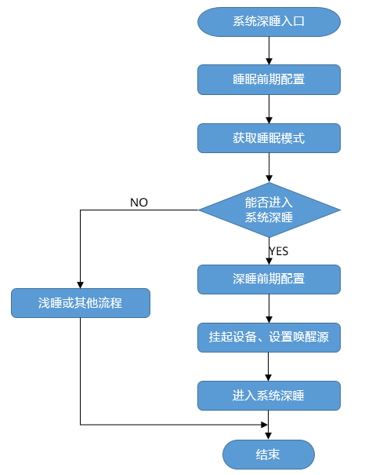

在进入系统休眠时，首先进行睡眠前期的配置，根据系统可睡眠时间及用户定义的休眠策略，获取睡眠模式。

-   若为深睡模式，则会执行深睡前期的配置，例如屏蔽中断、保存设备状态等。随后将挂起设备并设置唤醒源，系统进入深睡模式。
-   若为浅睡或其他模式，则执行对应流程。通常情况下，Tickless将配合系统休眠浅睡共同使用，以屏蔽Tick中断。用户也可使用自定义的Tick屏蔽和恢复机制。默认浅睡仅进入Tickless+WFI模式。

**开发流程<a name="section35077543142535"></a>**

系统休眠的典型开发流程：

1.  打开菜单，进入Kernel ---\> Enable Extend Kernel ---\> Enable Low Power Management Framework ---\> Low Power Management Configure菜单。

    <a name="table840413411435"></a>
    <table><thead align="left"><tr id="row12404740437"><th class="cellrowborder" valign="top" width="22.74%" id="mcps1.1.6.1.1"><p id="p2404104144315"><a name="p2404104144315"></a><a name="p2404104144315"></a>配置项</p>
    </th>
    <th class="cellrowborder" valign="top" width="32.49%" id="mcps1.1.6.1.2"><p id="p2040412414439"><a name="p2040412414439"></a><a name="p2040412414439"></a>含义</p>
    </th>
    <th class="cellrowborder" valign="top" width="12.1%" id="mcps1.1.6.1.3"><p id="p3404134194319"><a name="p3404134194319"></a><a name="p3404134194319"></a>取值范围</p>
    </th>
    <th class="cellrowborder" valign="top" width="10.61%" id="mcps1.1.6.1.4"><p id="p13404942439"><a name="p13404942439"></a><a name="p13404942439"></a>默认值</p>
    </th>
    <th class="cellrowborder" valign="top" width="22.06%" id="mcps1.1.6.1.5"><p id="p7404104154316"><a name="p7404104154316"></a><a name="p7404104154316"></a>依赖</p>
    </th>
    </tr>
    </thead>
    <tbody><tr id="row174041446436"><td class="cellrowborder" valign="top" width="22.74%" headers="mcps1.1.6.1.1 "><p id="p1680514441201"><a name="p1680514441201"></a><a name="p1680514441201"></a>LOSCFG_KERNEL_LIGHTSLEEP</p>
    </td>
    <td class="cellrowborder" valign="top" width="32.49%" headers="mcps1.1.6.1.2 "><p id="p18805844202"><a name="p18805844202"></a><a name="p18805844202"></a>系统休眠的浅睡模式裁剪开关</p>
    </td>
    <td class="cellrowborder" valign="top" width="12.1%" headers="mcps1.1.6.1.3 "><p id="p158042441505"><a name="p158042441505"></a><a name="p158042441505"></a>YES/NO</p>
    </td>
    <td class="cellrowborder" valign="top" width="10.61%" headers="mcps1.1.6.1.4 "><p id="p380414414018"><a name="p380414414018"></a><a name="p380414414018"></a>NO</p>
    </td>
    <td class="cellrowborder" valign="top" width="22.06%" headers="mcps1.1.6.1.5 "><p id="p177821844207"><a name="p177821844207"></a><a name="p177821844207"></a>LOSCFG_KERNEL_LOWPOWER</p>
    </td>
    </tr>
    <tr id="row1640317674419"><td class="cellrowborder" valign="top" width="22.74%" headers="mcps1.1.6.1.1 "><p id="p164032634418"><a name="p164032634418"></a><a name="p164032634418"></a>LOSCFG_KERNEL_DEEPSLEEP</p>
    </td>
    <td class="cellrowborder" valign="top" width="32.49%" headers="mcps1.1.6.1.2 "><p id="p04048615445"><a name="p04048615445"></a><a name="p04048615445"></a>系统休眠的深睡模式裁剪开关</p>
    </td>
    <td class="cellrowborder" valign="top" width="12.1%" headers="mcps1.1.6.1.3 "><p id="p1040426114416"><a name="p1040426114416"></a><a name="p1040426114416"></a>YES/NO</p>
    </td>
    <td class="cellrowborder" valign="top" width="10.61%" headers="mcps1.1.6.1.4 "><p id="p340414613443"><a name="p340414613443"></a><a name="p340414613443"></a>NO</p>
    </td>
    <td class="cellrowborder" valign="top" width="22.06%" headers="mcps1.1.6.1.5 "><p id="p1140412617446"><a name="p1140412617446"></a><a name="p1140412617446"></a>LOSCFG_KERNEL_LOWPOWER，且需要硬件平台支持</p>
    </td>
    </tr>
    <tr id="row1656522343511"><td class="cellrowborder" valign="top" width="22.74%" headers="mcps1.1.6.1.1 "><p id="p3565102317351"><a name="p3565102317351"></a><a name="p3565102317351"></a>LOSCFG_KERNEL_WAKEUPTIMER_CALIBRATION</p>
    </td>
    <td class="cellrowborder" valign="top" width="32.49%" headers="mcps1.1.6.1.2 "><p id="p35651223143511"><a name="p35651223143511"></a><a name="p35651223143511"></a>系统休眠深睡模式外部定时器校准tick开关</p>
    </td>
    <td class="cellrowborder" valign="top" width="12.1%" headers="mcps1.1.6.1.3 "><p id="p17122162023610"><a name="p17122162023610"></a><a name="p17122162023610"></a>YES/NO</p>
    </td>
    <td class="cellrowborder" valign="top" width="10.61%" headers="mcps1.1.6.1.4 "><p id="p9654133183614"><a name="p9654133183614"></a><a name="p9654133183614"></a>YES</p>
    </td>
    <td class="cellrowborder" valign="top" width="22.06%" headers="mcps1.1.6.1.5 "><p id="p95651823193518"><a name="p95651823193518"></a><a name="p95651823193518"></a>LOSCFG_KERNEL_DEEPSLEEP &amp;&amp; LOSCFG_KERNEL_LOWPOWER，且需要硬件平台支持</p>
    </td>
    </tr>
    <tr id="row83561620162718"><td class="cellrowborder" valign="top" width="22.74%" headers="mcps1.1.6.1.1 "><p id="p1935682012719"><a name="p1935682012719"></a><a name="p1935682012719"></a>LOSCFG_KERNEL_RAM_SAVE</p>
    </td>
    <td class="cellrowborder" valign="top" width="32.49%" headers="mcps1.1.6.1.2 "><p id="p1235719201279"><a name="p1235719201279"></a><a name="p1235719201279"></a>系统休眠时深睡模式下的内存保存开关</p>
    </td>
    <td class="cellrowborder" valign="top" width="12.1%" headers="mcps1.1.6.1.3 "><p id="p197751913284"><a name="p197751913284"></a><a name="p197751913284"></a>YES/NO</p>
    </td>
    <td class="cellrowborder" valign="top" width="10.61%" headers="mcps1.1.6.1.4 "><p id="p49777193282"><a name="p49777193282"></a><a name="p49777193282"></a>NO</p>
    </td>
    <td class="cellrowborder" valign="top" width="22.06%" headers="mcps1.1.6.1.5 "><p id="p103571620142717"><a name="p103571620142717"></a><a name="p103571620142717"></a>LOSCFG_KERNEL_DEEPSLEEP，且需要硬件平台支持</p>
    </td>
    </tr>
    <tr id="row182451518194115"><td class="cellrowborder" valign="top" width="22.74%" headers="mcps1.1.6.1.1 "><p id="p724519189415"><a name="p724519189415"></a><a name="p724519189415"></a>LOSCFG_LOWPOWER_SLEEP_USERCONFIG</p>
    </td>
    <td class="cellrowborder" valign="top" width="32.49%" headers="mcps1.1.6.1.2 "><p id="p152451918184117"><a name="p152451918184117"></a><a name="p152451918184117"></a>系统休眠时前/后处理开关</p>
    </td>
    <td class="cellrowborder" valign="top" width="12.1%" headers="mcps1.1.6.1.3 "><p id="p924531804113"><a name="p924531804113"></a><a name="p924531804113"></a>YES/NO</p>
    </td>
    <td class="cellrowborder" valign="top" width="10.61%" headers="mcps1.1.6.1.4 "><p id="p172451184419"><a name="p172451184419"></a><a name="p172451184419"></a>NO</p>
    </td>
    <td class="cellrowborder" valign="top" width="22.06%" headers="mcps1.1.6.1.5 "><p id="p624571815419"><a name="p624571815419"></a><a name="p624571815419"></a>LOSCFG_KERNEL_DEEPSLEEP</p>
    </td>
    </tr>
    <tr id="row853164104719"><td class="cellrowborder" valign="top" width="22.74%" headers="mcps1.1.6.1.1 "><p id="p183391020286"><a name="p183391020286"></a><a name="p183391020286"></a>LOSCFG_KERNEL_DYN_FREQ</p>
    </td>
    <td class="cellrowborder" valign="top" width="32.49%" headers="mcps1.1.6.1.2 "><p id="p13533414720"><a name="p13533414720"></a><a name="p13533414720"></a>系统休眠的调频裁剪开关</p>
    </td>
    <td class="cellrowborder" valign="top" width="12.1%" headers="mcps1.1.6.1.3 "><p id="p1533454717"><a name="p1533454717"></a><a name="p1533454717"></a>YES/NO</p>
    </td>
    <td class="cellrowborder" valign="top" width="10.61%" headers="mcps1.1.6.1.4 "><p id="p155334154715"><a name="p155334154715"></a><a name="p155334154715"></a>NO</p>
    </td>
    <td class="cellrowborder" valign="top" width="22.06%" headers="mcps1.1.6.1.5 "><p id="p15324144719"><a name="p15324144719"></a><a name="p15324144719"></a>LOSCFG_KERNEL_LOWPOWER，且需要硬件平台支持</p>
    </td>
    </tr>
    <tr id="row12104741333"><td class="cellrowborder" valign="top" width="22.74%" headers="mcps1.1.6.1.1 "><p id="p1104041437"><a name="p1104041437"></a><a name="p1104041437"></a>LOSCFG_LOWPOWER_SLEEP_VETO</p>
    </td>
    <td class="cellrowborder" valign="top" width="32.49%" headers="mcps1.1.6.1.2 "><p id="p13104141337"><a name="p13104141337"></a><a name="p13104141337"></a>系统休眠的投票裁剪开关</p>
    </td>
    <td class="cellrowborder" valign="top" width="12.1%" headers="mcps1.1.6.1.3 "><p id="p13104194539"><a name="p13104194539"></a><a name="p13104194539"></a>YES/NO</p>
    </td>
    <td class="cellrowborder" valign="top" width="10.61%" headers="mcps1.1.6.1.4 "><p id="p1110412415315"><a name="p1110412415315"></a><a name="p1110412415315"></a>NO</p>
    </td>
    <td class="cellrowborder" valign="top" width="22.06%" headers="mcps1.1.6.1.5 "><p id="p1410494932"><a name="p1410494932"></a><a name="p1410494932"></a>LOSCFG_KERNEL_LOWPOWER</p>
    </td>
    </tr>
    <tr id="row6643183333415"><td class="cellrowborder" valign="top" width="22.74%" headers="mcps1.1.6.1.1 "><p id="p271033893413"><a name="p271033893413"></a><a name="p271033893413"></a>LOSCFG_LOWPOWER_SLEEP_BY_TICK</p>
    </td>
    <td class="cellrowborder" valign="top" width="32.49%" headers="mcps1.1.6.1.2 "><p id="p164303314346"><a name="p164303314346"></a><a name="p164303314346"></a>系统休眠模式依照就绪时间自动识别开关</p>
    </td>
    <td class="cellrowborder" valign="top" width="12.1%" headers="mcps1.1.6.1.3 "><p id="p186431133123415"><a name="p186431133123415"></a><a name="p186431133123415"></a>YES/NO</p>
    </td>
    <td class="cellrowborder" valign="top" width="10.61%" headers="mcps1.1.6.1.4 "><p id="p176431233153416"><a name="p176431233153416"></a><a name="p176431233153416"></a>YES</p>
    </td>
    <td class="cellrowborder" valign="top" width="22.06%" headers="mcps1.1.6.1.5 "><p id="p0528424352"><a name="p0528424352"></a><a name="p0528424352"></a>LOSCFG_KERNEL_LOWPOWER</p>
    </td>
    </tr>
    <tr id="row241819314447"><td class="cellrowborder" valign="top" width="22.74%" headers="mcps1.1.6.1.1 "><p id="p741816313446"><a name="p741816313446"></a><a name="p741816313446"></a>LOSCFG_LOWPOWER_SLEEP_WFI</p>
    </td>
    <td class="cellrowborder" valign="top" width="32.49%" headers="mcps1.1.6.1.2 "><p id="p18418113119444"><a name="p18418113119444"></a><a name="p18418113119444"></a>系统休眠WFI模式自定义配置开关</p>
    </td>
    <td class="cellrowborder" valign="top" width="12.1%" headers="mcps1.1.6.1.3 "><p id="p94181731114418"><a name="p94181731114418"></a><a name="p94181731114418"></a>YES/NO</p>
    </td>
    <td class="cellrowborder" valign="top" width="10.61%" headers="mcps1.1.6.1.4 "><p id="p1141853134415"><a name="p1141853134415"></a><a name="p1141853134415"></a>NO</p>
    </td>
    <td class="cellrowborder" valign="top" width="22.06%" headers="mcps1.1.6.1.5 "><p id="p54185319442"><a name="p54185319442"></a><a name="p54185319442"></a>LOSCFG_KERNEL_LOWPOWER</p>
    </td>
    </tr>
    <tr id="row0697163175212"><td class="cellrowborder" valign="top" width="22.74%" headers="mcps1.1.6.1.1 "><p id="p17697173195212"><a name="p17697173195212"></a><a name="p17697173195212"></a>LOSCFG_MAX_SLEEP_TIME</p>
    </td>
    <td class="cellrowborder" valign="top" width="32.49%" headers="mcps1.1.6.1.2 "><p id="p1469743205213"><a name="p1469743205213"></a><a name="p1469743205213"></a>系统休眠最大睡眠阈值配置</p>
    </td>
    <td class="cellrowborder" valign="top" width="12.1%" headers="mcps1.1.6.1.3 "><p id="p96971837523"><a name="p96971837523"></a><a name="p96971837523"></a>INT</p>
    </td>
    <td class="cellrowborder" valign="top" width="10.61%" headers="mcps1.1.6.1.4 "><p id="p26972316526"><a name="p26972316526"></a><a name="p26972316526"></a>10000</p>
    </td>
    <td class="cellrowborder" valign="top" width="22.06%" headers="mcps1.1.6.1.5 "><p id="p66972313522"><a name="p66972313522"></a><a name="p66972313522"></a>LOSCFG_KERNEL_LOWPOWER</p>
    </td>
    </tr>
    <tr id="row677772211587"><td class="cellrowborder" valign="top" width="22.74%" headers="mcps1.1.6.1.1 "><p id="p47771922105814"><a name="p47771922105814"></a><a name="p47771922105814"></a>LOSCFG_MIN_LIGHT_SLEEP_TIME</p>
    </td>
    <td class="cellrowborder" valign="top" width="32.49%" headers="mcps1.1.6.1.2 "><p id="p37771722175819"><a name="p37771722175819"></a><a name="p37771722175819"></a>系统休眠最小浅睡阈值配置</p>
    </td>
    <td class="cellrowborder" valign="top" width="12.1%" headers="mcps1.1.6.1.3 "><p id="p18777152214582"><a name="p18777152214582"></a><a name="p18777152214582"></a>INT</p>
    </td>
    <td class="cellrowborder" valign="top" width="10.61%" headers="mcps1.1.6.1.4 "><p id="p47771522145819"><a name="p47771522145819"></a><a name="p47771522145819"></a>50</p>
    </td>
    <td class="cellrowborder" valign="top" width="22.06%" headers="mcps1.1.6.1.5 "><p id="p11777142213583"><a name="p11777142213583"></a><a name="p11777142213583"></a>LOSCFG_KERNEL_LIGHTSLEEP</p>
    </td>
    </tr>
    <tr id="row158011627115918"><td class="cellrowborder" valign="top" width="22.74%" headers="mcps1.1.6.1.1 "><p id="p108011827115910"><a name="p108011827115910"></a><a name="p108011827115910"></a>LOSCFG_MIN_DEEP_SLEEP_TIME</p>
    </td>
    <td class="cellrowborder" valign="top" width="32.49%" headers="mcps1.1.6.1.2 "><p id="p2080172717595"><a name="p2080172717595"></a><a name="p2080172717595"></a>系统休眠最小深睡阈值配置</p>
    </td>
    <td class="cellrowborder" valign="top" width="12.1%" headers="mcps1.1.6.1.3 "><p id="p1880118271597"><a name="p1880118271597"></a><a name="p1880118271597"></a>INT</p>
    </td>
    <td class="cellrowborder" valign="top" width="10.61%" headers="mcps1.1.6.1.4 "><p id="p118015270593"><a name="p118015270593"></a><a name="p118015270593"></a>2000</p>
    </td>
    <td class="cellrowborder" valign="top" width="22.06%" headers="mcps1.1.6.1.5 "><p id="p19801152725917"><a name="p19801152725917"></a><a name="p19801152725917"></a>LOSCFG_KERNEL_DEEPSLEEP</p>
    </td>
    </tr>
    <tr id="row843214111017"><td class="cellrowborder" valign="top" width="22.74%" headers="mcps1.1.6.1.1 "><p id="p143215111604"><a name="p143215111604"></a><a name="p143215111604"></a>LOSCFG_DELTA_TICKS</p>
    </td>
    <td class="cellrowborder" valign="top" width="32.49%" headers="mcps1.1.6.1.2 "><p id="p19432811909"><a name="p19432811909"></a><a name="p19432811909"></a>系统休眠深睡tick补偿配置</p>
    </td>
    <td class="cellrowborder" valign="top" width="12.1%" headers="mcps1.1.6.1.3 "><p id="p1543251116014"><a name="p1543251116014"></a><a name="p1543251116014"></a>INT</p>
    </td>
    <td class="cellrowborder" valign="top" width="10.61%" headers="mcps1.1.6.1.4 "><p id="p64323116015"><a name="p64323116015"></a><a name="p64323116015"></a>1</p>
    </td>
    <td class="cellrowborder" valign="top" width="22.06%" headers="mcps1.1.6.1.5 "><p id="p44321111807"><a name="p44321111807"></a><a name="p44321111807"></a>LOSCFG_KERNEL_DEEPSLEEP</p>
    </td>
    </tr>
    <tr id="row1804103111710"><td class="cellrowborder" valign="top" width="22.74%" headers="mcps1.1.6.1.1 "><p id="p78042311074"><a name="p78042311074"></a><a name="p78042311074"></a>LOSCFG_EXT_TIMER_FREQ</p>
    </td>
    <td class="cellrowborder" valign="top" width="32.49%" headers="mcps1.1.6.1.2 "><p id="p480412318720"><a name="p480412318720"></a><a name="p480412318720"></a>系统休眠深睡外部时钟频率配置</p>
    </td>
    <td class="cellrowborder" valign="top" width="12.1%" headers="mcps1.1.6.1.3 "><p id="p1780403117718"><a name="p1780403117718"></a><a name="p1780403117718"></a>INT</p>
    </td>
    <td class="cellrowborder" valign="top" width="10.61%" headers="mcps1.1.6.1.4 "><p id="p18804231774"><a name="p18804231774"></a><a name="p18804231774"></a>1</p>
    </td>
    <td class="cellrowborder" valign="top" width="22.06%" headers="mcps1.1.6.1.5 "><p id="p980414311718"><a name="p980414311718"></a><a name="p980414311718"></a>LOSCFG_KERNEL_DEEPSLEEP</p>
    </td>
    </tr>
    </tbody>
    </table>

2.  在Menuconfig中配置系统休眠唤醒策略，包括最小浅睡/深睡阈值、最大睡眠阈值；如果开启深睡模式，根据需要选择是否开启自定义WFI、休眠前后处理、深睡tick补偿以及外部时钟频率等。
3.  适配对应睡眠模式的休眠接口，详见“[低功耗流程注册结构体](概述-83.md#section938813535280)”。
4.  当系统业务繁忙时，调用LOS\_PowerMgrSleepLock接口禁止进入指定的睡眠模式（深睡、浅睡）；当系统业务空闲时，调用LOS\_PowerMgrSleepUnLock接口允许进入指定的睡眠模式。注意这两接口应该是配套使用的。
5.  系统待机时，根据业务投票及系统实际可休眠时长，自动进入相应休眠模式进行休眠。

#### 注意事项<a name="ZH-CN_TOPIC_0000002543354315"></a>

-   开启系统深睡模式时，建议在”[低功耗流程注册结构体](概述-83.md#section938813535280)”的子结构体成员struct PowerMgrRunOps的enterDeepSleep钩子函数中将cache写回内存。
-   低功耗提供的调频机制，如果在系统启动之后和业务首次调频之前进入空闲状态，系统会默认把频率调到最高。

#### 编程实例<a name="ZH-CN_TOPIC_0000002543354299"></a>

**实例描述<a name="section3463876395722"></a>**

本实例在cortex-M架构的CPU下实现如下功能：

1.  注册低功耗流程框架，适配深睡、RTC使能等功能接口；
2.  创建用户任务，并在任务中延时5000Ticks，使系统进入深睡模式。

**编程示例<a name="section768121154111"></a>**

前提条件：在menuconfig菜单中完成系统休眠深睡的配置，同时配置用户休眠阈值：LOSCFG\_MIN\_SLEEP\_TIME、LOSCFG\_MAX\_SLEEP\_TIME以及LOSCFG\_MIN\_DEEP\_SLEEP\_TIME。

部分代码实现如下：

1.  注册低功耗框架

    ```
    #ifdef LOSCFG_KERNEL_LOWPOWER
    #include "los_lowpower.h"
    #endif
    const PowerMgrParameter gPowerMgrParameter = {       // 用户自定义系统休眠配置，成员函数用户自行按需实现
        .runOps = {
    #ifdefLOSCFG_KERNEL_LIGHTSLEEP
            .enterLightSleep = EnterLightSleep,          // 浅睡动作，此处设置为进入WFI模式
            .getSleepMode = GetSleepMode,                // 获取用户休眠模式
    #endif
    #ifdefLOSCFG_KERNEL_DEEPSLEEP
            .suspendConfig = SuspendDevice,              // 关闭外设动作
            .resumeConfig = ResumeDevice,                // 恢复外设
            .enterDeepSleep = EnterDeepSleep,            // 深睡动作，此处设置为STM32的standby模式
            .setWakeUpTimer = SetWakeUpTimer,            // 设置唤醒源，此处设置为根据入参（休眠时间）使能外部RTC
            .withdrawWakeUpTimer = WithdrawWakeUpTimer,  // 取消唤醒源，此处设置为停止RTC计时
    #endif
        }
    };
    INT32 main(VOID)
    {
        UINT32 ret;
    #ifdef LOSCFG_KERNEL_LOWPOWER
        // 注册低功耗流程框架，若仅需默认的Tickless及浅睡模式，可调用LOS_PowerMgrInit(NULL)注册系统默认框架。
        LOS_PowerMgrInit(gPowerMgrParameter);
    #endif
        HardwareInit();
        printf("[main]: Hello, welcome to liteos !\n");
        PRINT_RELEASE("********Hello LiteOS ********\n"
                      "\nversion : %s\nopen-version : %s %u.%u.%u\n"
                      "build data : %s %s\n\n"
                      "**********************************\n",
            HW_LITEOS_VER, HW_LITEOS_SYSNAME, MAJ_V, MIN_V, REL_V, __DATE__,
            __TIME__);
        OsSetMainTask();
        OsCurrTaskSet(OsGetMainTask());
        ret = OsMain();
        if (ret != LOS_OK) {
            return LOS_NOK;
        }
        RTC_Start();
        g_kernelInit = 1;
        OsStart();
        return LOS_OK;
    }
    ```

2.  创建任务，并在任务入口函数中执行延时操作：

    ```
    STATIC VOID task_demo1(VOID)
    {
        while (1) {
            osDelay(5000); // 任务延时5000Ticks
        }
    }
    ```

**结果验证<a name="section556751395722"></a>**

由于设置的深睡阈值为2000，任务延时5000Ticks，所以系统会进入深睡模式：

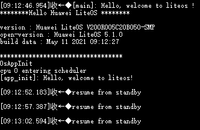

如上图所示，系统每隔5s将会从standby模式唤醒。

### 休眠唤醒<a name="ZH-CN_TOPIC_0000002511954220"></a>


#### 概述<a name="ZH-CN_TOPIC_0000002543394403"></a>

**基本概念<a name="s47879e50880744a2b55503c4af0f770c"></a>**

休眠唤醒（RunStop）是一套保存系统现场镜像以及从现场镜像中快速恢复运行的机制。

用户在系统运行的某一时刻调用休眠唤醒接口，可以将系统此时的状态快照（CPU现场及内存）保存到Flash上。系统重启后，可以通过快照恢复系统，使系统从快照保存的状态处继续运行。

**运作机制<a name="section11193183881413"></a>**

业务模块初始化并保持稳定运行后，调用休眠唤醒接口保存系统快照，这份快照包含了业务模块所需的所有CPU现场及内存状态。系统运行一段时间后，业务模块空闲时，主核主动下电进入低功耗模式。当有业务需要处理时，MCU发送特定数据包唤醒主核上电，硬件状态恢复后，系统从Flash快照处恢复运行，这样系统重新上电后无需重新初始化业务模块，从而实现业务模块的快速唤醒。

#### 开发指导<a name="ZH-CN_TOPIC_0000002511794284"></a>

**使用场景<a name="s92d232002be74e1e8dc9b2a1183ff365"></a>**

如果希望系统运行一段时间后进入低功耗模式，当有业务到来时，系统能够快速恢复到低功耗模式前的状态，从而快速恢复业务处理能力。对于这种应用场景，可以通过休眠唤醒实现。

在某项目中，休眠唤醒被用于实现芯片的休眠唤醒：系统业务运行稳定后，保存当前系统状态的快照。当系统进入空闲状态时，主核主动下电进入低功耗模式，当业务消息到来时MMU对主核上电，系统从快照处快速启动，恢复执行。以WIFI芯片为例，RunStop可以实现主核在低功耗模式下WIFI状态不断连，以及WIFI状态的快速唤醒。

**功能<a name="sfa0a25ee8bad4bdd93695c770e70d719"></a>**

休眠唤醒模块为用户提供如下功能，接口详细信息可以查看API参考。

<a name="t3143b9cb85b443fc9dca5935928558e4"></a>
<table><thead align="left"><tr id="r47d5a65f29b64fe38df70ad2b51dc4e3"><th class="cellrowborder" valign="top" width="32.29%" id="mcps1.1.3.1.1"><p id="a5a6f64800ddc4de4846c2336cb5be38f"><a name="a5a6f64800ddc4de4846c2336cb5be38f"></a><a name="a5a6f64800ddc4de4846c2336cb5be38f"></a>接口名</p>
</th>
<th class="cellrowborder" valign="top" width="67.71000000000001%" id="mcps1.1.3.1.2"><p id="a4ef010b1e56e42388175d1f6e7f7bd95"><a name="a4ef010b1e56e42388175d1f6e7f7bd95"></a><a name="a4ef010b1e56e42388175d1f6e7f7bd95"></a>描述</p>
</th>
</tr>
</thead>
<tbody><tr id="r9e39454d094e4fb294b97e3f8670b9b2"><td class="cellrowborder" valign="top" width="32.29%" headers="mcps1.1.3.1.1 "><p id="ad4d4fb4d97b8447cb2c2f815474cab1f"><a name="ad4d4fb4d97b8447cb2c2f815474cab1f"></a><a name="ad4d4fb4d97b8447cb2c2f815474cab1f"></a>LOS_MakeImage</p>
</td>
<td class="cellrowborder" valign="top" width="67.71000000000001%" headers="mcps1.1.3.1.2 "><p id="a97e086c521514b7f98cf8c9e7c5bdf77"><a name="a97e086c521514b7f98cf8c9e7c5bdf77"></a><a name="a97e086c521514b7f98cf8c9e7c5bdf77"></a>将系统状态快照保存到指定介质中</p>
</td>
</tr>
</tbody>
</table>

**开发流程<a name="sd10543a441614c43b1256290d0996f88"></a>**

**图 1**  休眠唤醒流程图<a name="fig126065711337"></a>  
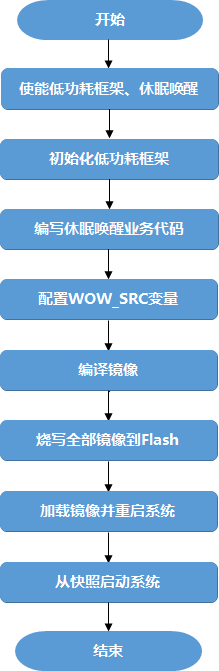

1.  使能低功耗框架和休眠唤醒。

    打开菜单，相关配置项的菜单路径为：Kernel ---\> Enable Extend Kernel ---\> Enable Low Power Management Framework ---\> Low Power Management Configure。

    <a name="table11799131714460"></a>
    <table><thead align="left"><tr id="row16800121713464"><th class="cellrowborder" valign="top" width="24.37%" id="mcps1.1.6.1.1"><p id="p15912448155750"><a name="p15912448155750"></a><a name="p15912448155750"></a>配置项</p>
    </th>
    <th class="cellrowborder" valign="top" width="21.17%" id="mcps1.1.6.1.2"><p id="p13839897155750"><a name="p13839897155750"></a><a name="p13839897155750"></a>含义</p>
    </th>
    <th class="cellrowborder" valign="top" width="13.18%" id="mcps1.1.6.1.3"><p id="p47289871155750"><a name="p47289871155750"></a><a name="p47289871155750"></a>取值范围</p>
    </th>
    <th class="cellrowborder" valign="top" width="11.43%" id="mcps1.1.6.1.4"><p id="p5274313155750"><a name="p5274313155750"></a><a name="p5274313155750"></a>默认值</p>
    </th>
    <th class="cellrowborder" valign="top" width="29.849999999999998%" id="mcps1.1.6.1.5"><p id="p24566191155750"><a name="p24566191155750"></a><a name="p24566191155750"></a>依赖</p>
    </th>
    </tr>
    </thead>
    <tbody><tr id="row138007177462"><td class="cellrowborder" valign="top" width="24.37%" headers="mcps1.1.6.1.1 "><p id="p9800131794619"><a name="p9800131794619"></a><a name="p9800131794619"></a>LOSCFG_KERNEL_LOWPOWER</p>
    </td>
    <td class="cellrowborder" valign="top" width="21.17%" headers="mcps1.1.6.1.2 "><p id="p38006174461"><a name="p38006174461"></a><a name="p38006174461"></a>低功耗框架裁剪开关</p>
    </td>
    <td class="cellrowborder" valign="top" width="13.18%" headers="mcps1.1.6.1.3 "><p id="p480020179467"><a name="p480020179467"></a><a name="p480020179467"></a>YES/NO</p>
    </td>
    <td class="cellrowborder" valign="top" width="11.43%" headers="mcps1.1.6.1.4 "><p id="p1546223317491"><a name="p1546223317491"></a><a name="p1546223317491"></a>YES</p>
    </td>
    <td class="cellrowborder" valign="top" width="29.849999999999998%" headers="mcps1.1.6.1.5 "><p id="p1980081794615"><a name="p1980081794615"></a><a name="p1980081794615"></a>LOSCFG_KERNEL_EXTKERNEL</p>
    </td>
    </tr>
    <tr id="row1132133114478"><td class="cellrowborder" valign="top" width="24.37%" headers="mcps1.1.6.1.1 "><p id="p41321731204714"><a name="p41321731204714"></a><a name="p41321731204714"></a>LOSCFG_KERNEL_RUNSTOP</p>
    </td>
    <td class="cellrowborder" valign="top" width="21.17%" headers="mcps1.1.6.1.2 "><p id="p213217316474"><a name="p213217316474"></a><a name="p213217316474"></a>休眠唤醒开关</p>
    </td>
    <td class="cellrowborder" valign="top" width="13.18%" headers="mcps1.1.6.1.3 "><p id="p81321031194717"><a name="p81321031194717"></a><a name="p81321031194717"></a>YES/NO</p>
    </td>
    <td class="cellrowborder" valign="top" width="11.43%" headers="mcps1.1.6.1.4 "><p id="p15132331184710"><a name="p15132331184710"></a><a name="p15132331184710"></a>NO</p>
    </td>
    <td class="cellrowborder" valign="top" width="29.849999999999998%" headers="mcps1.1.6.1.5 "><p id="p19501401014"><a name="p19501401014"></a><a name="p19501401014"></a>休眠唤醒依赖Flash、Uboot和bestfit内存管理算法。Nand Flash的宏开关为LOSCFG_DRIVERS_MTD_NAND，spi_nor flash的宏开关为LOSCFG_DRIVERS_MTD_SPI_NOR</p>
    </td>
    </tr>
    </tbody>
    </table>

2.  初始化低功耗框架。

    入口函数main中，在OsStart前调用 LOS\_PowerMgrInit 初始化低功耗框架为系统默认框架，示例代码如下：

    ```
    #ifdef LOSCFG_KERNEL_LOWPOWER
    #include "los_lowpower.h"
    const PowerMgrRunOps runOps = {
        .getSleepMode = NULL,
    };
    
    UINT32 OsPreSystemConfig(VOID)
    {
        PowerMgrParameter param;
        param.runOps = runOps;
        return LOS_PowerMgrInit(&param);
    }
    
    #endif
    LITE_OS_SEC_TEXT_INIT int main(void)
    {
        ......
    #ifdef LOSCFG_KERNEL_LOWPOWER
        ret = OsPreSystemConfig();
        if (ret != LOS_OK) {
            return LOS_NOK;
        }
    #endif
        OsStart();
        ......
    }
    ```

3.  <a name="lba71c2142af140a9a7f53c2b33f72fda"></a>编写快照业务代码。

    业务代码入口函数为app\_init，该函数位于源码根目录的“self\_src/targets/board/$\(LITEOS\_PLATFORM\)/os\_adapt/os\_adapt.c“文件中。

    在快照业务代码后调用LOS\_MakeImage将系统当前的状态快照保存到指定介质中，并通过MAKE\_WOW\_IMAGE宏控制非快照业务代码的编译，以实现快照镜像和全部镜像的编译，示例代码如下。

    ```
    void wakeup_callback(void)
    {
    #ifdef LOSCFG_KERNEL_CPUP
        LOS_CpupReset();
    #endif
        (VOID)LOS_HwiEnable(83);
    }
    #define NOR_ERASE_ALIGN_SIZE    (64 * 1024)
    #define NOR_READ_ALIGN_SIZE     1
    #define NOR_WRITE_ALIGN_SIZE    1
    int flash_read(void *memaddr, size_t start, size_t size)
    {
        return spiflash_read(memaddr, start, size);
    }
    int flash_write(void *memaddr, size_t start, size_t size)
    {
        spiflash_erase(start, size);
        return spiflash_write(memaddr, start, size);
    }
    void app_init(void)
    {
    #ifdef LOSCFG_KERNEL_RUNSTOP
        RUNSTOP_PARAM_S stRunstopParam;       // 定义一个LOS_MakeImage的参数变量
    #endif
    #ifdef LOSCFG_DRIVERS_MTD_SPI_NOR
        (void)spinor_init();
        mtd = get_mtd("spinor");
    #endif
    #if defined(LOSCFG_KERNEL_RUNSTOP) && defined(LOSCFG_DRIVERS_MTD_SPI_NOR)
        memset(&stRunstopParam, 0, sizeof(RUNSTOP_PARAM_S));
        /* LOS_MakeImage参数配置 */
        stRunstopParam.pfFlashReadFunc          = flash_read;             // 指定介质读函数
        stRunstopParam.pfFlashWriteFunc         = flash_write;            // 指定介质写函数
        stRunstopParam.pfIdleWakeupCallback     = idle_wakeup_callback;   // 指定从快照恢复后在idle任务中需要执行的回调函数
        stRunstopParam.pfImageDoneCallback      = NULL;                   // 指定快照镜像生成后的回调函数,此处为NULL
        stRunstopParam.pfWakeupCallback         = wakeup_callback;        // 指定从快照恢复后需要执行的回调函数       
        stRunstopParam.uwFlashEraseAlignSize    = NOR_ERASE_ALIGN_SIZE;   // 介质的擦除对齐参数
        stRunstopParam.uwFlashWriteAlignSize    = NOR_WRITE_ALIGN_SIZE;   // 介质的写对齐参数
        stRunstopParam.uwFlashReadAlignSize     = NOR_READ_ALIGN_SIZE;    // 介质的读对齐参数
        stRunstopParam.uwImageFlashAddr         = 0x100000;               // 烧写系统全镜像的介质起始地址
        stRunstopParam.uwWowFlashAddr           = 0x800000;               // 保存快照的介质起始地址
        LOS_MakeImage(&stRunstopParam);
    #endif
    #ifndef MAKE_WOW_IMAGE
    #ifdef LOSCFG_KERNEL_RUNSTOP
        PRINTK("Image length 0x%x\n", OsWowImageSizeGet());
    #endif
    #endif /* MAKE_WOW_IMAGE */
    }
    ```

4.  配置WOW\_SRC变量。

    在源码根目录“build/make/wow\_scatter.mk”文件中配置WOW\_SRC变量，将变量定义为调用休眠唤醒函数的业务源文件路径，如下所示，其中LITEOSTOPDIR指代“RTOS\_Lite/self\_src”源码目录。

    ```
    WOW_SRC := $(LITEOSTOPDIR)/targets/$(LITEOS_PLATFORM)/os_adapt/os_adapt.c
    ```

5.  编译系统镜像。
    1.  在根目录下执行make命令，编译全部业务代码。

        ```
        RTOS_Lite$ make
        ```

    2.  编译完成后，查看镜像段的排布，以验证快照镜像是否生成成功。进入系统镜像生成目录（例如Hi3556V200平台的镜像生成目录为“out/hi3556v200”，其他类推），可以看到生成的系统ELF文件vs\_server，执行“readelf -S vs\_server”命令查看section头信息，结果如[图2](#f9b0ebe192bdc45ecbb7905814b234902)所示。

        **图 2**  系统ELF文件vs\_server readelf结果<a name="f9b0ebe192bdc45ecbb7905814b234902"></a>  
        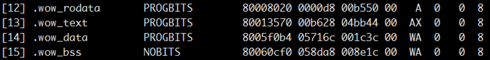

        [图2](#f9b0ebe192bdc45ecbb7905814b234902)中显示了与休眠唤醒有关的段信息（包括段的名称、起始地址及偏移大小）。其中.wow\_rodata为休眠唤醒镜像的只读数据段，.wow\_text为代码段，.wow\_data为数据段，.wow\_bss为bss段。

    3.  查看休眠唤醒链接脚本“RTOS\_Lite/self\_src/tools/scripts/ld/wow.ld”的.text段，可以看到新增了wow.O\(\*.text\*\)，它实现了将休眠唤醒的快照部分代码相关符号整合到同一个段中，如[图3](#fd7546a5c1b3e41fc9a0e3677f7161dd4)所示。

        **图 3**  链接脚本.text段<a name="fd7546a5c1b3e41fc9a0e3677f7161dd4"></a>  
        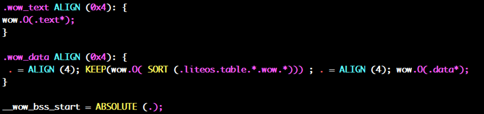

6.  将全部镜像烧写到Flash。

    进入串口工具界面，可以参考如下命令，将全部镜像烧写到Flash的0x100000地址位。

    ```
    tftp 0x81000000 vs_server.bin;sf probe 0;sf erase 0x100000 0x300000;sf write 0x81000000 0x100000 0x300000;
    ```

    其中，“vs\_server.bin”为系统镜像文件名，先将其烧写到内存中一段高地址位0x81000000。然后烧写到Flash，起始地址为0x100000，烧写长度为0x300000，即烧写的镜像文件大小不能超过3M，请根据实际的镜像大小调整长度值。

    > **说明：** 
    >用户可以根据实际环境自主选择镜像烧写工具及烧写方法。

7.  加载全部镜像。

    可以参考如下命令，从Flash的0x100000地址处读取全部镜像，加载到内存地址0x80200000处。

    ```
    sf probe 0;sf read 0x80200000 0x100000 0x300000;
    ```

    执行如下命令，从内存地址0x80200000处启动系统。

    ```
    go 0x80200000;
    ```

8.  根据系统反馈的快照镜像大小，从快照处恢复运行。

    **图 4**  系统启动时的打印信息<a name="fig0166121312444"></a>  
    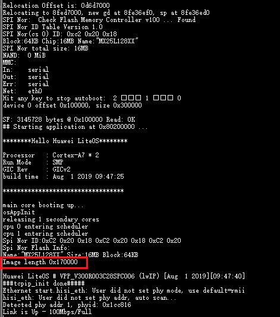

    根据系统启动时打印的信息，可以获取休眠唤醒快照镜像大小，如[图4](#fig0166121312444)红框中所示，本示例中快照大小为0x170000。快照被写到介质的0x800000地址处（从[3](#lba71c2142af140a9a7f53c2b33f72fda)中可以获得保存快照的介质的起始地址为0x800000）。

    重启系统，可以参考如下命令在uboot中执行，从保存快照的介质的0x800000地址处读取0x170000大小的快照镜像，加载到内存地址0x80200000处，然后执行“go 0x80200000”从快照启动系统。

    ```
    sf probe 0;sf read 0x80200000 0x800000 0x170000;
    go 0x80200000;
    ```

    启动效果如[图5](#fig21388201444)所示。

    **图 5**  uboot执行命令后的打印信息<a name="fig21388201444"></a>  
    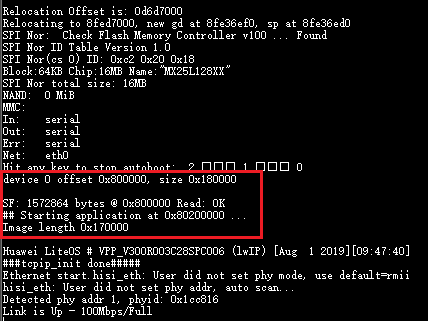

    系统成功从快照启动。

#### 注意事项<a name="ZH-CN_TOPIC_0000002511794348"></a>

-   用户在编写休眠唤醒业务时，需要保证“\#ifndef MAKE\_WOW\_IMAGE”前涵盖了快照的所有代码和数据，否则从快照恢复后的系统中不会包含所有休眠唤醒的业务。
-   休眠唤醒依赖于存储介质，当前LiteOS依赖Flash，因此该功能依赖Flash，如果关闭Flash支持，休眠唤醒功能也会关闭。如果需要在其他存储介质上使能休眠唤醒，请参考当前Flash的配置进行适配。

## CPU占用率<a name="ZH-CN_TOPIC_0000002511794416"></a>


### 概述<a name="ZH-CN_TOPIC_0000002543354201"></a>

**基本概念<a name="section58658659128"></a>**

LiteOS的CPUP（Central Processing Unit Percent，CPU占用率）分为系统CPU占用率、任务CPU占用率和中断CPU占用率。

系统CPU占用率是指周期时间内系统的CPU占用率，用于表示系统一段时间内的闲忙程度，也表示CPU的负载情况。

任务CPU占用率指单个任务的CPU占用率，用于表示单个任务在一段时间内的闲忙程度。

中断CPU占用率指周期时间内的中断占用率，用于表示系统一段时间内的中断处理时间。

**运作机制<a name="section64191838171416"></a>**

LiteOS的CPUP采用任务级记录的方式，在任务切换时，记录任务的切入时间，在下一次任务切换时，记录任务的切出时间，以此计算出任务本次的运行时间，累加到任务的总占用时间上。

CPU占用率的计算方法：

系统CPU占用率＝系统中除idle任务外其他任务运行总时间/系统运行总时间。

任务CPU占用率＝任务运行总时间/系统运行总时间。

中断CPU占用率＝中断运行总时间/系统运行总时间

### 开发指导<a name="ZH-CN_TOPIC_0000002511794350"></a>

**使用场景<a name="section42233910171524"></a>**

通过系统CPU占用率，判断当前系统负载是否超出设计规格。

通过系统中各个任务的CPU占用率，判断各个任务的CPU占用率是否符合设计的预期。

**功能<a name="section3382358420811"></a>**

LiteOS的CPU占用率模块为用户提供下面几种功能，接口详细信息可以查看API参考。

<a name="table423153820811"></a>
<table><thead align="left"><tr id="row1872972720811"><th class="cellrowborder" valign="top" width="21.32786721327867%" id="mcps1.1.4.1.1"><p id="p2197741720811"><a name="p2197741720811"></a><a name="p2197741720811"></a>功能分类</p>
</th>
<th class="cellrowborder" valign="top" width="21.767823217678234%" id="mcps1.1.4.1.2"><p id="p1280752020811"><a name="p1280752020811"></a><a name="p1280752020811"></a>接口名</p>
</th>
<th class="cellrowborder" valign="top" width="56.9043095690431%" id="mcps1.1.4.1.3"><p id="p3595409320811"><a name="p3595409320811"></a><a name="p3595409320811"></a>描述</p>
</th>
</tr>
</thead>
<tbody><tr id="row3156887520811"><td class="cellrowborder" valign="top" width="21.32786721327867%" headers="mcps1.1.4.1.1 "><p id="p534411020433"><a name="p534411020433"></a><a name="p534411020433"></a>获取系统CPU占用率</p>
</td>
<td class="cellrowborder" valign="top" width="21.767823217678234%" headers="mcps1.1.4.1.2 "><p id="p6009666520811"><a name="p6009666520811"></a><a name="p6009666520811"></a>LOS_HistorySysCpuUsage</p>
</td>
<td class="cellrowborder" valign="top" width="56.9043095690431%" headers="mcps1.1.4.1.3 "><p id="p6683076820811"><a name="p6683076820811"></a><a name="p6683076820811"></a>获取系统CPU占用率，不包含idle任务。</p>
</td>
</tr>
<tr id="row749511820811"><td class="cellrowborder" rowspan="2" valign="top" width="21.32786721327867%" headers="mcps1.1.4.1.1 "><p id="p157261813435"><a name="p157261813435"></a><a name="p157261813435"></a>获取任务CPU占用率</p>
</td>
<td class="cellrowborder" valign="top" width="21.767823217678234%" headers="mcps1.1.4.1.2 "><p id="p30313106201548"><a name="p30313106201548"></a><a name="p30313106201548"></a>LOS_HistoryTaskCpuUsage</p>
</td>
<td class="cellrowborder" valign="top" width="56.9043095690431%" headers="mcps1.1.4.1.3 "><p id="p6481168620811"><a name="p6481168620811"></a><a name="p6481168620811"></a>获取指定任务的CPU占用率。</p>
</td>
</tr>
<tr id="row11187400233110"><td class="cellrowborder" valign="top" headers="mcps1.1.4.1.1 "><p id="p50546033233110"><a name="p50546033233110"></a><a name="p50546033233110"></a>LOS_AllCpuUsage</p>
</td>
<td class="cellrowborder" valign="top" headers="mcps1.1.4.1.2 "><p id="p1551115616178"><a name="p1551115616178"></a><a name="p1551115616178"></a>使能LOSCFG_CPUP_INCLUDE_IRQ且设置入参flag为0时，获取所有中断的CPU占用率。设置入参flag为非0，或者关闭LOSCFG_CPUP_INCLUDE_IRQ后，获取所有任务的CPU占用率，这里的任务也包含了idle任务。</p>
</td>
</tr>
<tr id="row56789172171319"><td class="cellrowborder" valign="top" width="21.32786721327867%" headers="mcps1.1.4.1.1 "><p id="p36520229171319"><a name="p36520229171319"></a><a name="p36520229171319"></a>重置CPU占用率</p>
</td>
<td class="cellrowborder" valign="top" width="21.767823217678234%" headers="mcps1.1.4.1.2 "><p id="p5348574171319"><a name="p5348574171319"></a><a name="p5348574171319"></a>LOS_CpupReset</p>
</td>
<td class="cellrowborder" valign="top" width="56.9043095690431%" headers="mcps1.1.4.1.3 "><p id="p30581384171319"><a name="p30581384171319"></a><a name="p30581384171319"></a>重置CPU占用率数据，包含系统和任务的CPU占用率。</p>
</td>
</tr>
<tr id="row1141240145811"><td class="cellrowborder" valign="top" width="21.32786721327867%" headers="mcps1.1.4.1.1 "><p id="p10141134013586"><a name="p10141134013586"></a><a name="p10141134013586"></a>暂停CPU占用率统计</p>
</td>
<td class="cellrowborder" valign="top" width="21.767823217678234%" headers="mcps1.1.4.1.2 "><p id="p171619218016"><a name="p171619218016"></a><a name="p171619218016"></a>LOS_CpupStop</p>
</td>
<td class="cellrowborder" valign="top" width="56.9043095690431%" headers="mcps1.1.4.1.3 "><p id="p6141164010581"><a name="p6141164010581"></a><a name="p6141164010581"></a>暂停CPU占用率统计，包含中断和任务的CPU占用率不再更新。</p>
<p id="p138819359120"><a name="p138819359120"></a><a name="p138819359120"></a></p>
</td>
</tr>
<tr id="row811117419112"><td class="cellrowborder" valign="top" width="21.32786721327867%" headers="mcps1.1.4.1.1 "><p id="p41111041918"><a name="p41111041918"></a><a name="p41111041918"></a>开启CPU占用率统计</p>
</td>
<td class="cellrowborder" valign="top" width="21.767823217678234%" headers="mcps1.1.4.1.2 "><p id="p06861224322"><a name="p06861224322"></a><a name="p06861224322"></a>LOS_CpupStart</p>
</td>
<td class="cellrowborder" valign="top" width="56.9043095690431%" headers="mcps1.1.4.1.3 "><p id="p1211117414113"><a name="p1211117414113"></a><a name="p1211117414113"></a>开启CPU占用率统计，包含中断和任务的CPU占用率将先清0，然后以此为起点，重新统计。</p>
</td>
</tr>
</tbody>
</table>

> **说明：** 
>-   通过上述接口获取到的CPU占用率是千分比，所以CPU占用率的有效表示范围为0～1000。系统CPU占用率为1000，表示系统满负荷运转。任务CPU占用率为1000，表示在一段时间内系统一直在运行该任务。
>-   获取CPU占用率有三种模式，通过入参mode设置：
>    -   CPUP\_LAST\_MULIT\_RECORD（值为0，原为CPUP\_LAST\_TEN\_SECONDS）：表示获取最近多次采样记录内的CPU占用率，默认为10s。
>    -   CPUP\_LAST\_ONE\_RECORD（值为1，原为CPUP\_LAST\_ONE\_SECONDS）： 表示获取最近1次采样记录的CPU占用率，默认为1s。
>    -   CPUP\_ALL\_TIME（值为0xffff），或除0和1之外的其他值：表示获取自系统启动以来的CPU占用率。

**CPUP错误码<a name="section560718304572"></a>**

<a name="table66521465191749"></a>
<table><thead align="left"><tr id="row66647056191749"><th class="cellrowborder" valign="top" width="6.827936012485369%" id="mcps1.1.6.1.1"><p id="p65995609191749"><a name="p65995609191749"></a><a name="p65995609191749"></a>序号</p>
</th>
<th class="cellrowborder" valign="top" width="21.2348809988295%" id="mcps1.1.6.1.2"><p id="p44044076191749"><a name="p44044076191749"></a><a name="p44044076191749"></a>定义</p>
</th>
<th class="cellrowborder" valign="top" width="10.280920795942256%" id="mcps1.1.6.1.3"><p id="p10800441191749"><a name="p10800441191749"></a><a name="p10800441191749"></a>实际数值</p>
</th>
<th class="cellrowborder" valign="top" width="29.545454545454547%" id="mcps1.1.6.1.4"><p id="p39597633191844"><a name="p39597633191844"></a><a name="p39597633191844"></a>描述</p>
</th>
<th class="cellrowborder" valign="top" width="32.11080764728834%" id="mcps1.1.6.1.5"><p id="p61844251191749"><a name="p61844251191749"></a><a name="p61844251191749"></a>参考解决方案</p>
</th>
</tr>
</thead>
<tbody><tr id="row134571758181017"><td class="cellrowborder" valign="top" width="6.827936012485369%" headers="mcps1.1.6.1.1 "><p id="p4487040819218"><a name="p4487040819218"></a><a name="p4487040819218"></a>1</p>
</td>
<td class="cellrowborder" valign="top" width="21.2348809988295%" headers="mcps1.1.6.1.2 "><p id="p951161311811"><a name="p951161311811"></a><a name="p951161311811"></a>LOS_ERRNO_CPUP_NO_MEMORY</p>
</td>
<td class="cellrowborder" valign="top" width="10.280920795942256%" headers="mcps1.1.6.1.3 "><p id="p16806186191017"><a name="p16806186191017"></a><a name="p16806186191017"></a>0x02001E00</p>
</td>
<td class="cellrowborder" valign="top" width="29.545454545454547%" headers="mcps1.1.6.1.4 "><p id="p3955882919926"><a name="p3955882919926"></a><a name="p3955882919926"></a>初始化CPU占用率模块时，内存不足。</p>
</td>
<td class="cellrowborder" valign="top" width="32.11080764728834%" headers="mcps1.1.6.1.5 "><p id="p60375397191252"><a name="p60375397191252"></a><a name="p60375397191252"></a>调整OS_SYS_MEM_SIZE，以确保有足够的内存供CPU占用率模块使用。</p>
</td>
</tr>
<tr id="row151402056115819"><td class="cellrowborder" valign="top" width="6.827936012485369%" headers="mcps1.1.6.1.1 "><p id="p18369922191749"><a name="p18369922191749"></a><a name="p18369922191749"></a>2</p>
</td>
<td class="cellrowborder" valign="top" width="21.2348809988295%" headers="mcps1.1.6.1.2 "><p id="p1332621616820"><a name="p1332621616820"></a><a name="p1332621616820"></a>LOS_ERRNO_CPUP_TASK_PTR_NULL</p>
</td>
<td class="cellrowborder" valign="top" width="10.280920795942256%" headers="mcps1.1.6.1.3 "><p id="p6826106121015"><a name="p6826106121015"></a><a name="p6826106121015"></a>0x02001E01</p>
</td>
<td class="cellrowborder" valign="top" width="29.545454545454547%" headers="mcps1.1.6.1.4 "><p id="p1732013725019"><a name="p1732013725019"></a><a name="p1732013725019"></a>入参存在空指针。</p>
</td>
<td class="cellrowborder" valign="top" width="32.11080764728834%" headers="mcps1.1.6.1.5 "><p id="p1314075613583"><a name="p1314075613583"></a><a name="p1314075613583"></a>传入正确的指针。</p>
</td>
</tr>
<tr id="row6482175315584"><td class="cellrowborder" valign="top" width="6.827936012485369%" headers="mcps1.1.6.1.1 "><p id="p20814974191749"><a name="p20814974191749"></a><a name="p20814974191749"></a>3</p>
</td>
<td class="cellrowborder" valign="top" width="21.2348809988295%" headers="mcps1.1.6.1.2 "><p id="p1353114131819"><a name="p1353114131819"></a><a name="p1353114131819"></a>LOS_ERRNO_CPUP_NO_INIT</p>
</td>
<td class="cellrowborder" valign="top" width="10.280920795942256%" headers="mcps1.1.6.1.3 "><p id="p98261367102"><a name="p98261367102"></a><a name="p98261367102"></a>0x02001E02</p>
</td>
<td class="cellrowborder" valign="top" width="29.545454545454547%" headers="mcps1.1.6.1.4 "><p id="p14547152614018"><a name="p14547152614018"></a><a name="p14547152614018"></a>CPU占用率模块没有初始化。</p>
</td>
<td class="cellrowborder" valign="top" width="32.11080764728834%" headers="mcps1.1.6.1.5 "><p id="p11482135313584"><a name="p11482135313584"></a><a name="p11482135313584"></a>初始化CPU占用率模块后，再使用该模块。</p>
</td>
</tr>
<tr id="row193514965819"><td class="cellrowborder" valign="top" width="6.827936012485369%" headers="mcps1.1.6.1.1 "><p id="p64337369191749"><a name="p64337369191749"></a><a name="p64337369191749"></a>4</p>
</td>
<td class="cellrowborder" valign="top" width="21.2348809988295%" headers="mcps1.1.6.1.2 "><p id="p1853111137813"><a name="p1853111137813"></a><a name="p1853111137813"></a>LOS_ERRNO_CPUP_MAXNUM_INVALID</p>
</td>
<td class="cellrowborder" valign="top" width="10.280920795942256%" headers="mcps1.1.6.1.3 "><p id="p682520620109"><a name="p682520620109"></a><a name="p682520620109"></a>0x02001E03</p>
</td>
<td class="cellrowborder" valign="top" width="29.545454545454547%" headers="mcps1.1.6.1.4 "><p id="p181431132184915"><a name="p181431132184915"></a><a name="p181431132184915"></a>传入LOS_AllCpuUsage接口的入参（最大线程数或中断数）是一个无效值。</p>
</td>
<td class="cellrowborder" valign="top" width="32.11080764728834%" headers="mcps1.1.6.1.5 "><p id="p2744733101114"><a name="p2744733101114"></a><a name="p2744733101114"></a>传入正确的最大线程数或中断数。</p>
</td>
</tr>
<tr id="row6517730619218"><td class="cellrowborder" valign="top" width="6.827936012485369%" headers="mcps1.1.6.1.1 "><p id="p6877374191749"><a name="p6877374191749"></a><a name="p6877374191749"></a>5</p>
</td>
<td class="cellrowborder" valign="top" width="21.2348809988295%" headers="mcps1.1.6.1.2 "><p id="p25313131813"><a name="p25313131813"></a><a name="p25313131813"></a>LOS_ERRNO_CPUP_THREAD_NO_CREATED</p>
</td>
<td class="cellrowborder" valign="top" width="10.280920795942256%" headers="mcps1.1.6.1.3 "><p id="p1082517610102"><a name="p1082517610102"></a><a name="p1082517610102"></a>0x02001E04</p>
</td>
<td class="cellrowborder" valign="top" width="29.545454545454547%" headers="mcps1.1.6.1.4 "><p id="p1677174015619"><a name="p1677174015619"></a><a name="p1677174015619"></a>获取指定任务的CPU占用率时，发现该任务未创建。</p>
</td>
<td class="cellrowborder" valign="top" width="32.11080764728834%" headers="mcps1.1.6.1.5 "><p id="p1372919138224"><a name="p1372919138224"></a><a name="p1372919138224"></a>系统只能统计已经被创建的任务的CPU占用率，检查传入的任务ID对应的任务是否已经创建。</p>
</td>
</tr>
<tr id="row33366968191749"><td class="cellrowborder" valign="top" width="6.827936012485369%" headers="mcps1.1.6.1.1 "><p id="p44562467191749"><a name="p44562467191749"></a><a name="p44562467191749"></a>6</p>
</td>
<td class="cellrowborder" valign="top" width="21.2348809988295%" headers="mcps1.1.6.1.2 "><p id="p1353051315819"><a name="p1353051315819"></a><a name="p1353051315819"></a>LOS_ERRNO_CPUP_TSK_ID_INVALID</p>
</td>
<td class="cellrowborder" valign="top" width="10.280920795942256%" headers="mcps1.1.6.1.3 "><p id="p178242614103"><a name="p178242614103"></a><a name="p178242614103"></a>0x02001E05</p>
</td>
<td class="cellrowborder" valign="top" width="29.545454545454547%" headers="mcps1.1.6.1.4 "><p id="p9238164164714"><a name="p9238164164714"></a><a name="p9238164164714"></a>调用获取指定任务的CPU占用率的接口时，传入了无效的任务ID。</p>
</td>
<td class="cellrowborder" valign="top" width="32.11080764728834%" headers="mcps1.1.6.1.5 "><p id="p5424607519267"><a name="p5424607519267"></a><a name="p5424607519267"></a>检查传入的任务ID的正确性。</p>
</td>
</tr>
</tbody>
</table>

> **须知：** 
>错误码定义见“[错误码简介](开发指导-17.md#section29852515161)”。8～15位代表的所属模块为CPUP模块，值为0x1E。

**开发流程<a name="section5280239320811"></a>**

CPU占用率的典型开发流程：

1.  打开菜单，进入Kernel ---\> Enable Extend Kernel ---\> Enable Cpup菜单，完成CPU占用率模块的配置。

    <a name="table06655375130"></a>
    <table><thead align="left"><tr id="row8665203751318"><th class="cellrowborder" valign="top" width="20.910000000000004%" id="mcps1.1.6.1.1"><p id="p61687296155221"><a name="p61687296155221"></a><a name="p61687296155221"></a>配置项</p>
    </th>
    <th class="cellrowborder" valign="top" width="37.82%" id="mcps1.1.6.1.2"><p id="p25007692155221"><a name="p25007692155221"></a><a name="p25007692155221"></a>含义</p>
    </th>
    <th class="cellrowborder" valign="top" width="10.730000000000002%" id="mcps1.1.6.1.3"><p id="p47081329204415"><a name="p47081329204415"></a><a name="p47081329204415"></a>取值范围</p>
    </th>
    <th class="cellrowborder" valign="top" width="9.280000000000001%" id="mcps1.1.6.1.4"><p id="p7383544155221"><a name="p7383544155221"></a><a name="p7383544155221"></a>默认值</p>
    </th>
    <th class="cellrowborder" valign="top" width="21.260000000000005%" id="mcps1.1.6.1.5"><p id="p34917797155221"><a name="p34917797155221"></a><a name="p34917797155221"></a>依赖</p>
    </th>
    </tr>
    </thead>
    <tbody><tr id="row9665837161320"><td class="cellrowborder" valign="top" width="20.910000000000004%" headers="mcps1.1.6.1.1 "><p id="p3665143710130"><a name="p3665143710130"></a><a name="p3665143710130"></a>LOSCFG_KERNEL_CPUP</p>
    </td>
    <td class="cellrowborder" valign="top" width="37.82%" headers="mcps1.1.6.1.2 "><p id="p13665737191318"><a name="p13665737191318"></a><a name="p13665737191318"></a>CPUP模块的裁剪开关。</p>
    </td>
    <td class="cellrowborder" valign="top" width="10.730000000000002%" headers="mcps1.1.6.1.3 "><p id="p19665193721319"><a name="p19665193721319"></a><a name="p19665193721319"></a>YES/NO</p>
    </td>
    <td class="cellrowborder" valign="top" width="9.280000000000001%" headers="mcps1.1.6.1.4 "><p id="p1866573713131"><a name="p1866573713131"></a><a name="p1866573713131"></a>YES</p>
    </td>
    <td class="cellrowborder" valign="top" width="21.260000000000005%" headers="mcps1.1.6.1.5 "><p id="p1266519378138"><a name="p1266519378138"></a><a name="p1266519378138"></a>LOSCFG_KERNEL_EXTKERNEL</p>
    </td>
    </tr>
    <tr id="row11788122121713"><td class="cellrowborder" valign="top" width="20.910000000000004%" headers="mcps1.1.6.1.1 "><p id="p14789112219173"><a name="p14789112219173"></a><a name="p14789112219173"></a>LOSCFG_CPUP_START_STOP</p>
    </td>
    <td class="cellrowborder" valign="top" width="37.82%" headers="mcps1.1.6.1.2 "><p id="p157896222178"><a name="p157896222178"></a><a name="p157896222178"></a>CPUP动态启停开关。</p>
    </td>
    <td class="cellrowborder" valign="top" width="10.730000000000002%" headers="mcps1.1.6.1.3 "><p id="p1486013445174"><a name="p1486013445174"></a><a name="p1486013445174"></a>YES/NO</p>
    </td>
    <td class="cellrowborder" valign="top" width="9.280000000000001%" headers="mcps1.1.6.1.4 "><p id="p10789172221715"><a name="p10789172221715"></a><a name="p10789172221715"></a>NO</p>
    </td>
    <td class="cellrowborder" valign="top" width="21.260000000000005%" headers="mcps1.1.6.1.5 "><p id="p117891922181710"><a name="p117891922181710"></a><a name="p117891922181710"></a>LOSCFG_KERNEL_CPUP &amp;&amp; !LOSCFG_SCHED_LOAD_BALANCE_CPUP</p>
    </td>
    </tr>
    <tr id="row7665183761312"><td class="cellrowborder" valign="top" width="20.910000000000004%" headers="mcps1.1.6.1.1 "><p id="p666523715137"><a name="p666523715137"></a><a name="p666523715137"></a>LOSCFG_CPUP_INCLUDE_IRQ</p>
    </td>
    <td class="cellrowborder" valign="top" width="37.82%" headers="mcps1.1.6.1.2 "><p id="p766543721311"><a name="p766543721311"></a><a name="p766543721311"></a>使能该配置项后，可以在LOS_HistoryTaskCpuUsage和LOS_AllCpuUsage接口中获取中断的CPU占用率。关闭该配置项后，只能获取任务的CPU占用率。</p>
    </td>
    <td class="cellrowborder" valign="top" width="10.730000000000002%" headers="mcps1.1.6.1.3 "><p id="p9665183731312"><a name="p9665183731312"></a><a name="p9665183731312"></a>YES/NO</p>
    </td>
    <td class="cellrowborder" valign="top" width="9.280000000000001%" headers="mcps1.1.6.1.4 "><p id="p116651837181311"><a name="p116651837181311"></a><a name="p116651837181311"></a>YES</p>
    </td>
    <td class="cellrowborder" valign="top" width="21.260000000000005%" headers="mcps1.1.6.1.5 "><p id="p1066517373133"><a name="p1066517373133"></a><a name="p1066517373133"></a>LOSCFG_KERNEL_CPUP &amp;&amp; LOSCFG_ARCH_INTERRUPT_TAKEOVER</p>
    </td>
    </tr>
    <tr id="row174184215814"><td class="cellrowborder" valign="top" width="20.910000000000004%" headers="mcps1.1.6.1.1 "><p id="p16418121584"><a name="p16418121584"></a><a name="p16418121584"></a>LOSCFG_CPUP_CB_NUM_CONFIGURABLE</p>
    </td>
    <td class="cellrowborder" valign="top" width="37.82%" headers="mcps1.1.6.1.2 "><p id="p2041912217819"><a name="p2041912217819"></a><a name="p2041912217819"></a>使能该配置项，CPUP的中断相关控制块的资源数量可单独配置，不再依赖LOSCFG_PLATFORM_HWI_LIMIT，可优化CPUP的size。</p>
    </td>
    <td class="cellrowborder" valign="top" width="10.730000000000002%" headers="mcps1.1.6.1.3 "><p id="p3133151393"><a name="p3133151393"></a><a name="p3133151393"></a>YES/NO</p>
    </td>
    <td class="cellrowborder" valign="top" width="9.280000000000001%" headers="mcps1.1.6.1.4 "><p id="p154190217814"><a name="p154190217814"></a><a name="p154190217814"></a>NO</p>
    </td>
    <td class="cellrowborder" valign="top" width="21.260000000000005%" headers="mcps1.1.6.1.5 "><p id="p14419521581"><a name="p14419521581"></a><a name="p14419521581"></a>LOSCFG_CPUP_INCLUDE_IRQ</p>
    </td>
    </tr>
    <tr id="row664710421493"><td class="cellrowborder" valign="top" width="20.910000000000004%" headers="mcps1.1.6.1.1 "><p id="p7647742896"><a name="p7647742896"></a><a name="p7647742896"></a>LOSCFG_CPUP_IRQ_CB_NUM</p>
    </td>
    <td class="cellrowborder" valign="top" width="37.82%" headers="mcps1.1.6.1.2 "><p id="p17648042391"><a name="p17648042391"></a><a name="p17648042391"></a>CPUP的中断相关控制块的资源数量，根据实际的中断个数来配置，最大不超过LOSCFG_PLATFORM_HWI_LIMIT。</p>
    </td>
    <td class="cellrowborder" valign="top" width="10.730000000000002%" headers="mcps1.1.6.1.3 "><p id="p2064810421398"><a name="p2064810421398"></a><a name="p2064810421398"></a>[1，LOSCFG_PLATFORM_HWI_LIMIT]</p>
    </td>
    <td class="cellrowborder" valign="top" width="9.280000000000001%" headers="mcps1.1.6.1.4 "><p id="p1064814428914"><a name="p1064814428914"></a><a name="p1064814428914"></a>LOSCFG_PLATFORM_HWI_LIMIT</p>
    </td>
    <td class="cellrowborder" valign="top" width="21.260000000000005%" headers="mcps1.1.6.1.5 "><p id="p664815422912"><a name="p664815422912"></a><a name="p664815422912"></a>LOSCFG_CPUP_CB_NUM_CONFIGURABLE</p>
    </td>
    </tr>
    <tr id="row618850141312"><td class="cellrowborder" valign="top" width="20.910000000000004%" headers="mcps1.1.6.1.1 "><p id="p7188170181314"><a name="p7188170181314"></a><a name="p7188170181314"></a>LOSCFG_CPUP_SAMPLE_PERIOD</p>
    </td>
    <td class="cellrowborder" valign="top" width="37.82%" headers="mcps1.1.6.1.2 "><p id="p1518860181315"><a name="p1518860181315"></a><a name="p1518860181315"></a>CPUP的采样周期，时间单位是tick，表示CPUP软件定时器的周期运行时间间隔。</p>
    </td>
    <td class="cellrowborder" valign="top" width="10.730000000000002%" headers="mcps1.1.6.1.3 "><p id="p1718820021317"><a name="p1718820021317"></a><a name="p1718820021317"></a>[10，1000]，实际还会限制时间[100ms,10s]</p>
    </td>
    <td class="cellrowborder" valign="top" width="9.280000000000001%" headers="mcps1.1.6.1.4 "><p id="p181886021316"><a name="p181886021316"></a><a name="p181886021316"></a>LOSCFG_BASE_CORE_TICK_PER_SECOND</p>
    </td>
    <td class="cellrowborder" valign="top" width="21.260000000000005%" headers="mcps1.1.6.1.5 "><p id="p8188190181311"><a name="p8188190181311"></a><a name="p8188190181311"></a>LOSCFG_KERNEL_CPUP &amp;&amp; !LOSCFG_SCHED_LOAD_BALANCE_CPUP</p>
    </td>
    </tr>
    <tr id="row1439391417132"><td class="cellrowborder" valign="top" width="20.910000000000004%" headers="mcps1.1.6.1.1 "><p id="p1439313142133"><a name="p1439313142133"></a><a name="p1439313142133"></a>LOSCFG_CPUP_HISTORY_RECORD_NUM</p>
    </td>
    <td class="cellrowborder" valign="top" width="37.82%" headers="mcps1.1.6.1.2 "><p id="p163931814141316"><a name="p163931814141316"></a><a name="p163931814141316"></a>CPUP的最大采样记录数目，实际为环形缓冲buffer，表示用户最多可查看最近几次采样记录的CPU占用率信息。</p>
    </td>
    <td class="cellrowborder" valign="top" width="10.730000000000002%" headers="mcps1.1.6.1.3 "><p id="p1139471441315"><a name="p1139471441315"></a><a name="p1139471441315"></a>[1,10]</p>
    </td>
    <td class="cellrowborder" valign="top" width="9.280000000000001%" headers="mcps1.1.6.1.4 "><p id="p0394121412134"><a name="p0394121412134"></a><a name="p0394121412134"></a>10</p>
    </td>
    <td class="cellrowborder" valign="top" width="21.260000000000005%" headers="mcps1.1.6.1.5 "><p id="p1739471414138"><a name="p1739471414138"></a><a name="p1739471414138"></a>LOSCFG_KERNEL_CPUP &amp;&amp; !LOSCFG_SCHED_LOAD_BALANCE_CPUP</p>
    </td>
    </tr>
    </tbody>
    </table>

2.  获取系统CPU使用率LOS\_HistorySysCpuUsage。
3.  获取指定任务或中断的CPU使用率LOS\_HistoryTaskCpuUsage。
4.  获取所有任务或所有中断的CPU使用率LOS\_AllCpuUsage。

**平台差异性<a name="section3340376820811"></a>**

无。

### 注意事项<a name="ZH-CN_TOPIC_0000002543354293"></a>

-   CPU占用率对性能有一定影响，而一般只有在产品开发时需要了解各个任务的占用率，因此建议在发布产品时，关闭CPU占用率。
-   关闭配置项LOSCFG\_CPUP\_INCLUDE\_IRQ后，系统中的中断耗时会被统计到中断发生的任务中，即被中断打断的任务中。

### 编程实例<a name="ZH-CN_TOPIC_0000002511954320"></a>

**实例描述<a name="section3463876395722"></a>**

本实例实现如下功能：

1.  创建一个测试CPUP的任务。
2.  获取系统最近1s内所有任务或中断的CPUP。
3.  获取系统（除idle任务外）最近10s内的总CPU占用率。
4.  获取CPUP测试任务的CPUP。

**编程示例<a name="section2811476595722"></a>**

前提条件：打开菜单配置好CPU占用率模块。

代码实现如下：

```
#include <unistd.h >
#include "los_task.h"
#include "los_cpup.h"

#define MAXTASKNUM  32

UINT32 cpupUse;
UINT32 g_cpuTestTaskId;

VOID Example_CPUP(VOID)
{
    printf("entry cpup test example\n");
    while(1) {
        usleep(100);
    }
}

UINT32 Example_CPUP_Test(VOID)
{
    UINT32 ret;
    TSK_INIT_PARAM_S cpupTestTask;
    CPUP_INFO_S cpupInfo[MAXTASKNUM];

    /* 创建测试CPUP的任务 */
    memset(&cpupTestTask, 0, sizeof(TSK_INIT_PARAM_S));
    cpupTestTask.pfnTaskEntry = (TSK_ENTRY_FUNC)Example_CPUP;
    cpupTestTask.pcName       = "TestCpupTsk";                           /* 测试任务名称 */
    cpupTestTask.uwStackSize  = LOSCFG_BASE_CORE_TSK_DEFAULT_STACK_SIZE;
    cpupTestTask.usTaskPrio   = 5;
    cpupTestTask.uwResved   = LOS_TASK_STATUS_DETACHED;

    ret = LOS_TaskCreate(&g_cpuTestTaskId, &cpupTestTask);
    if(ret != LOS_OK) {
        printf("cpupTestTask create failed.\n");
        return LOS_NOK;
    }
    usleep(100);

    /* 系统中运行的任务或者中断数量 */
    UINT16 maxNum = MAXTASKNUM; 

    /* 获取系统所有任务或中断最近1s的CPU占用率 */
    cpupUse = LOS_AllCpuUsage(maxNum, cpupInfo, CPUP_LAST_ONE_SECONDS, 0);
    printf("the system cpu usage in last 1s: %d\n", cpupUse);

    /* 获取最近10s内系统（除idle任务外）总CPU占用率 */
    cpupUse = LOS_HistorySysCpuUsage(CPUP_LAST_TEN_SECONDS);
    printf("the history system cpu usage in last 10s: %d\n", cpupUse);

    /* 获取指定任务在最近1s的CPU占用率，该测试例程中指定的任务为上面创建的CPUP测试任务 */
    cpupUse = LOS_HistoryTaskCpuUsage(g_cpuTestTaskId, CPUP_LAST_ONE_SECONDS);
    printf("cpu usage of the cpupTestTask in last 1s:\n TaskID: %d\n usage: %d\n", g_cpuTestTaskId, cpupUse);

    return LOS_OK;
}
```

**结果验证<a name="section556751395722"></a>**

编译运行得到的结果为：

```
the system cpu usage in last 1s: 15
the history system cpu usage in last 10s: 3
cpu usage of the cpupTestTask in last 1s:
TaskID: 10
usage: 0
```

## Trace<a name="ZH-CN_TOPIC_0000002511954370"></a>


### 概述<a name="ZH-CN_TOPIC_0000002543354253"></a>

**基本概念<a name="section7842986141442"></a>**

Trace实时记录系统行为，类似系统“录像”功能。在系统发生异常后，能辅助用户查看历史事件，定位问题。

**运作机制<a name="section4198546414140"></a>**

LiteOS的Trace采用静态代码打桩和缓冲区记录方式，在桩被执行时，获取事件发生的上下文，并写入到缓冲区。

在插桩函数的入参中需要提供监测的事件类型、事件操作的主体对象和事件的参数，这些信息会被写入缓冲区，同时缓冲区中也会记录事件发生的时间、系统中的任务信息等事件上下文信息。

### 开发指导<a name="ZH-CN_TOPIC_0000002511954446"></a>

**使用场景<a name="section4198546414140"></a>**

-   通过Trace了解系统运转的路径，理解系统运行机制。

-   通过Trace分析系统发生异常前的操作，定位死机问题。

**功能<a name="section513220500441"></a>**

LiteOS的Trace模块为用户提供下面几种功能，接口详细信息可以查看API参考。

<a name="table826553194917"></a>
<table><thead align="left"><tr id="row19261653124916"><th class="cellrowborder" valign="top" width="23.13231323132313%" id="mcps1.1.4.1.1"><p id="p137061421145020"><a name="p137061421145020"></a><a name="p137061421145020"></a>功能分类</p>
</th>
<th class="cellrowborder" valign="top" width="29.91299129912991%" id="mcps1.1.4.1.2"><p id="p197061221105017"><a name="p197061221105017"></a><a name="p197061221105017"></a>接口名</p>
</th>
<th class="cellrowborder" valign="top" width="46.954695469546955%" id="mcps1.1.4.1.3"><p id="p117060212502"><a name="p117060212502"></a><a name="p117060212502"></a>描述</p>
</th>
</tr>
</thead>
<tbody><tr id="row62615354910"><td class="cellrowborder" valign="top" width="23.13231323132313%" headers="mcps1.1.4.1.1 "><p id="p1570622110504"><a name="p1570622110504"></a><a name="p1570622110504"></a>配置Trace缓冲区</p>
</td>
<td class="cellrowborder" valign="top" width="29.91299129912991%" headers="mcps1.1.4.1.2 "><p id="p77061021175013"><a name="p77061021175013"></a><a name="p77061021175013"></a>LOS_TraceInit</p>
</td>
<td class="cellrowborder" valign="top" width="46.954695469546955%" headers="mcps1.1.4.1.3 "><p id="p15706102115017"><a name="p15706102115017"></a><a name="p15706102115017"></a>配置Trace缓冲区的地址和大小。</p>
</td>
</tr>
<tr id="row7277531490"><td class="cellrowborder" rowspan="2" valign="top" width="23.13231323132313%" headers="mcps1.1.4.1.1 "><p id="p1070622117508"><a name="p1070622117508"></a><a name="p1070622117508"></a>开启/停止Trace事件记录</p>
</td>
<td class="cellrowborder" valign="top" width="29.91299129912991%" headers="mcps1.1.4.1.2 "><p id="p1070652116503"><a name="p1070652116503"></a><a name="p1070652116503"></a>LOS_TraceStart</p>
</td>
<td class="cellrowborder" valign="top" width="46.954695469546955%" headers="mcps1.1.4.1.3 "><p id="p870672112506"><a name="p870672112506"></a><a name="p870672112506"></a>开启事件记录。</p>
</td>
</tr>
<tr id="row52705319498"><td class="cellrowborder" valign="top" headers="mcps1.1.4.1.1 "><p id="p167067218506"><a name="p167067218506"></a><a name="p167067218506"></a>LOS_TraceStop</p>
</td>
<td class="cellrowborder" valign="top" headers="mcps1.1.4.1.2 "><p id="p137061321135015"><a name="p137061321135015"></a><a name="p137061321135015"></a>停止事件记录。</p>
</td>
</tr>
<tr id="row1218417320179"><td class="cellrowborder" rowspan="3" valign="top" width="23.13231323132313%" headers="mcps1.1.4.1.1 "><p id="p74971212111717"><a name="p74971212111717"></a><a name="p74971212111717"></a>操作Trace记录的数据</p>
</td>
<td class="cellrowborder" valign="top" width="29.91299129912991%" headers="mcps1.1.4.1.2 "><p id="p20497121231712"><a name="p20497121231712"></a><a name="p20497121231712"></a>LOS_TraceRecordDump</p>
</td>
<td class="cellrowborder" valign="top" width="46.954695469546955%" headers="mcps1.1.4.1.3 "><p id="p184971112191712"><a name="p184971112191712"></a><a name="p184971112191712"></a>输出Trace缓冲区数据。</p>
</td>
</tr>
<tr id="row627175314920"><td class="cellrowborder" valign="top" headers="mcps1.1.4.1.1 "><p id="p13706421145011"><a name="p13706421145011"></a><a name="p13706421145011"></a>LOS_TraceRecordGet</p>
</td>
<td class="cellrowborder" valign="top" headers="mcps1.1.4.1.2 "><p id="p15706421145019"><a name="p15706421145019"></a><a name="p15706421145019"></a>获取Trace缓冲区的首地址。</p>
</td>
</tr>
<tr id="row727153194910"><td class="cellrowborder" valign="top" headers="mcps1.1.4.1.1 "><p id="p57061421145010"><a name="p57061421145010"></a><a name="p57061421145010"></a>LOS_TraceReset</p>
</td>
<td class="cellrowborder" valign="top" headers="mcps1.1.4.1.2 "><p id="p1170617214502"><a name="p1170617214502"></a><a name="p1170617214502"></a>清除Trace缓冲区中的事件。</p>
</td>
</tr>
<tr id="row18271153114920"><td class="cellrowborder" valign="top" width="23.13231323132313%" headers="mcps1.1.4.1.1 "><p id="p1270672112501"><a name="p1270672112501"></a><a name="p1270672112501"></a>过滤Trace记录的模块</p>
</td>
<td class="cellrowborder" valign="top" width="29.91299129912991%" headers="mcps1.1.4.1.2 "><p id="p570617212502"><a name="p570617212502"></a><a name="p570617212502"></a>LOS_TraceEventMaskSet</p>
</td>
<td class="cellrowborder" valign="top" width="46.954695469546955%" headers="mcps1.1.4.1.3 "><p id="p10706172110508"><a name="p10706172110508"></a><a name="p10706172110508"></a>设置事件掩码，仅记录某些模块的事件。</p>
</td>
</tr>
<tr id="row1767361119506"><td class="cellrowborder" valign="top" width="23.13231323132313%" headers="mcps1.1.4.1.1 "><p id="p197061021155019"><a name="p197061021155019"></a><a name="p197061021155019"></a>屏蔽特定中断号事件</p>
</td>
<td class="cellrowborder" valign="top" width="29.91299129912991%" headers="mcps1.1.4.1.2 "><p id="p1670642185010"><a name="p1670642185010"></a><a name="p1670642185010"></a>LOS_TraceHwiFilterHookReg</p>
</td>
<td class="cellrowborder" valign="top" width="46.954695469546955%" headers="mcps1.1.4.1.3 "><p id="p10706321125012"><a name="p10706321125012"></a><a name="p10706321125012"></a>注册过滤特定中断号事件的钩子函数。</p>
</td>
</tr>
<tr id="row9700201318364"><td class="cellrowborder" rowspan="2" valign="top" width="23.13231323132313%" headers="mcps1.1.4.1.1 "><p id="p148201139133610"><a name="p148201139133610"></a><a name="p148201139133610"></a>插桩函数</p>
</td>
<td class="cellrowborder" valign="top" width="29.91299129912991%" headers="mcps1.1.4.1.2 "><p id="p970111134363"><a name="p970111134363"></a><a name="p970111134363"></a>LOS_TRACE_EASY</p>
</td>
<td class="cellrowborder" valign="top" width="46.954695469546955%" headers="mcps1.1.4.1.3 "><p id="p167011613133619"><a name="p167011613133619"></a><a name="p167011613133619"></a>简易插桩。</p>
</td>
</tr>
<tr id="row140992673615"><td class="cellrowborder" valign="top" headers="mcps1.1.4.1.1 "><p id="p12410526133613"><a name="p12410526133613"></a><a name="p12410526133613"></a>LOS_TRACE</p>
</td>
<td class="cellrowborder" valign="top" headers="mcps1.1.4.1.2 "><p id="p24103265361"><a name="p24103265361"></a><a name="p24103265361"></a>标准插桩。</p>
</td>
</tr>
</tbody>
</table>

> **说明：** 
>1.  LOS\_TRACE\_EASY\(TYPE, IDENTITY, params...\) 简易插桩。
>    -   一句话插桩，用户在目标源代码中插入该接口即可。
>    -   TYPE有效取值范围为\[0, 0xF\]，表示不同的事件类型。
>    -   IDENTITY类型UINTPTR，表示事件操作的主体对象。
>    -   Params类型UINTPTR，表示事件的参数。
>    示例：
>    ```
>    LOS_TRACE_EASY(1, userId0, userParam1, userParam2);
>    LOS_TRACE_EASY(2, userId0);
>    LOS_TRACE_EASY(1, userId1, userParam1);
>    LOS_TRACE_EASY(2, userId1);
>    LOS_TRACE_EASY(3, userParma1, userParam2, userParam3); // parmas 可复用IDENTITY字段（当IDENTITY不必要时）
>    ```
>1.  LOS\_TRACE\(TYPE, IDENTITY, params...\) 标准插桩。
>    -   相比简易插桩，支持动态过滤事件和参数裁剪，但使用上需要用户按规则来扩展。
>    -   TYPE用于设置具体的事件类型，可以在头文件los\_trace.h中的enum LOS\_TRACE\_TYPE中自定义事件类型。定义方法和规则可以参考其他事件类型。
>    -   IDENTITY和Params的类型及含义同简易插桩。
>    示例：
>    ```
>    1.在enum LOS_TRACE_MASK中定义事件掩码，即模块级别的事件类型。定义规范为TRACE_#MOD#_FLAG，#MOD#表示模块名，例如：
>      TRACE_FS_FLAG = 0x2000
>    2.在enum LOS_TRACE_TYPE中定义具体事件类型。定义规范为#TYPE# = TRACE_#MOD#_FLAG | NUMBER，例如：
>      FS_READ  = TRACE_FS_FLAG | 0; // 读文件
>      FS_WRITE = TRACE_FS_FLAG | 1; // 写文件
>    3.定义事件参数。定义规范为#TYPE#_PARAMS(IDENTITY, parma1...) IDENTITY, ...
>      其中的#TYPE#就是上面2中的#TYPE#，例如：
>      #define FS_READ_PARAMS(fp, fd, flag, size)    fp, fd, flag, size
>      宏定义的参数对应于Trace缓冲区中记录的事件参数，用户可对任意参数字段进行裁剪；
>      当定义为空时，表示不监测该类型事件：
>      #define FS_READ_PARAMS(fp, fd, flag, size) // 不监测文件读事件
>    4.在适当位置插入代码桩。定义规范为LOS_TRACE(#TYPE#, #TYPE#_PARAMS(IDENTITY, parma1...))
>      LOS_TRACE(FS_READ, fp, fd, flag, size); // 读文件的代码桩，#TYPE#之后的入参就是上面3中的FS_READ_PARAMS函数的入参。
>    ```
>1.  LiteOS预置的Trace事件及参数均可以通过上述方式进行裁剪，参数详见“kernel\_lite/include/los\_trace.h”。
>2.  Trace Mask事件过滤接口LOS\_TraceEventMaskSet\(UINT32 mask\)，其入参mask仅高28位生效（对应LOS\_TRACE\_MASK中某模块的使能位），仅用于模块的过滤，暂不支持针对某个特定事件的细粒度过滤。例如：LOS\_TraceEventMaskSet\(0x202\)，则实际设置生效的mask为0x200（TRACE\_QUE\_FLAG），QUE模块的所有事件均会被采集。一般建议使用的方法为：
>    LOS\_TraceEventMaskSet\(TRACE\_EVENT\_FLAG | TRACE\_MUX\_FLAG | TRACE\_SEM\_FLAG | TRACE\_QUE\_FLAG\);
>3.  如果仅需要过滤简易插桩事件，通过设置Trace Mask为TRACE\_MAX\_FLAG即可。
>4.  Trace缓冲区大小有限，事件写满之后会覆盖写，用户可通过LOS\_TraceRecordDump中打印的CurEvtIndex识别最新事件。

**Trace错误码<a name="section13844216355"></a>**

为快速定位可能导致Trace操作失败的原因，初始化Trace和启动Trace均需要返回对应的错误码。其他无返回值的接口如停止Trace、清除与Dump Trace 数据，错误原因均为Trace状态不合法，系统会直接打印错误原因。

<a name="table6015294495642"></a>
<table><thead align="left"><tr id="row2267197395642"><th class="cellrowborder" valign="top" width="6.845296303539997%" id="mcps1.1.6.1.1"><p id="p1908783195642"><a name="p1908783195642"></a><a name="p1908783195642"></a>序号</p>
</th>
<th class="cellrowborder" valign="top" width="24.124779972618814%" id="mcps1.1.6.1.2"><p id="p261046995642"><a name="p261046995642"></a><a name="p261046995642"></a>定义</p>
</th>
<th class="cellrowborder" valign="top" width="10.219049481713279%" id="mcps1.1.6.1.3"><p id="p1012144095642"><a name="p1012144095642"></a><a name="p1012144095642"></a>实际数值</p>
</th>
<th class="cellrowborder" valign="top" width="26.276158810874247%" id="mcps1.1.6.1.4"><p id="p1453028795642"><a name="p1453028795642"></a><a name="p1453028795642"></a>描述</p>
</th>
<th class="cellrowborder" valign="top" width="32.534715431253666%" id="mcps1.1.6.1.5"><p id="p2753561710026"><a name="p2753561710026"></a><a name="p2753561710026"></a>参考解决方案</p>
</th>
</tr>
</thead>
<tbody><tr id="row6366372295642"><td class="cellrowborder" valign="top" width="6.845296303539997%" headers="mcps1.1.6.1.1 "><p id="p5648782795642"><a name="p5648782795642"></a><a name="p5648782795642"></a>1</p>
</td>
<td class="cellrowborder" valign="top" width="24.124779972618814%" headers="mcps1.1.6.1.2 "><p id="p1211123695642"><a name="p1211123695642"></a><a name="p1211123695642"></a>LOS_ERRNO_TRACE_ERROR_STATUS</p>
</td>
<td class="cellrowborder" valign="top" width="10.219049481713279%" headers="mcps1.1.6.1.3 "><p id="p4148605495642"><a name="p4148605495642"></a><a name="p4148605495642"></a>0x02001400</p>
</td>
<td class="cellrowborder" valign="top" width="26.276158810874247%" headers="mcps1.1.6.1.4 "><p id="p492720095642"><a name="p492720095642"></a><a name="p492720095642"></a>初始化Trace或启动Trace时状态不正确。</p>
</td>
<td class="cellrowborder" valign="top" width="32.534715431253666%" headers="mcps1.1.6.1.5 "><a name="ul5833554505"></a><a name="ul5833554505"></a><ul id="ul5833554505"><li>删除重复的Trace初始化。</li><li>启动Trace前先初始化Trace。</li></ul>
</td>
</tr>
<tr id="row112091915183814"><td class="cellrowborder" valign="top" width="6.845296303539997%" headers="mcps1.1.6.1.1 "><p id="p2020918159388"><a name="p2020918159388"></a><a name="p2020918159388"></a>2</p>
</td>
<td class="cellrowborder" valign="top" width="24.124779972618814%" headers="mcps1.1.6.1.2 "><p id="p8209171516380"><a name="p8209171516380"></a><a name="p8209171516380"></a>LOS_ERRNO_TRACE_NO_MEMORY</p>
</td>
<td class="cellrowborder" valign="top" width="10.219049481713279%" headers="mcps1.1.6.1.3 "><p id="p182092153388"><a name="p182092153388"></a><a name="p182092153388"></a>0x02001401</p>
</td>
<td class="cellrowborder" valign="top" width="26.276158810874247%" headers="mcps1.1.6.1.4 "><p id="p20209111510381"><a name="p20209111510381"></a><a name="p20209111510381"></a>初始化Trace时，缓冲区申请失败。</p>
</td>
<td class="cellrowborder" valign="top" width="32.534715431253666%" headers="mcps1.1.6.1.5 "><p id="p14525105518557"><a name="p14525105518557"></a><a name="p14525105518557"></a>解决方案有两个：</p>
<a name="ul17711443556"></a><a name="ul17711443556"></a><ul id="ul17711443556"><li>配置LOSCFG_TRACE_BUFFER_SIZE减小Trace缓冲区的大小，可以通过menuconfig菜单项修改：Kernel ---&gt; Enable Extend Kernel ---&gt; Enable Trace Feature ---&gt; Trace work mode (Offline mode) ---&gt; Trace record buffer size。</li><li>配置LOSCFG_BASE_CORE_TSK_LIMIT减少最大任务数，可以通过menuconfig菜单项修改：Kernel ---&gt; Basic Config ---&gt; Task Max Task Number。</li></ul>
</td>
</tr>
<tr id="row1698417245383"><td class="cellrowborder" valign="top" width="6.845296303539997%" headers="mcps1.1.6.1.1 "><p id="p149841024163810"><a name="p149841024163810"></a><a name="p149841024163810"></a>3</p>
</td>
<td class="cellrowborder" valign="top" width="24.124779972618814%" headers="mcps1.1.6.1.2 "><p id="p2098432413813"><a name="p2098432413813"></a><a name="p2098432413813"></a>LOS_ERRNO_TRACE_BUF_TOO_SMALL</p>
</td>
<td class="cellrowborder" valign="top" width="10.219049481713279%" headers="mcps1.1.6.1.3 "><p id="p19984162443818"><a name="p19984162443818"></a><a name="p19984162443818"></a>0x02001402</p>
</td>
<td class="cellrowborder" valign="top" width="26.276158810874247%" headers="mcps1.1.6.1.4 "><p id="p6984202473819"><a name="p6984202473819"></a><a name="p6984202473819"></a>初始化Trace时，缓冲区size设置过小。</p>
</td>
<td class="cellrowborder" valign="top" width="32.534715431253666%" headers="mcps1.1.6.1.5 "><p id="p1098419242384"><a name="p1098419242384"></a><a name="p1098419242384"></a>配置LOSCFG_TRACE_BUFFER_SIZE增大Trace缓冲区的大小，menuconfig菜单项为：Kernel ---&gt; Enable Extend Kernel ---&gt; Enable Trace Feature ---&gt; Trace work mode (Offline mode) ---&gt; Trace record buffer size。</p>
</td>
</tr>
<tr id="row152783232719"><td class="cellrowborder" valign="top" width="6.845296303539997%" headers="mcps1.1.6.1.1 "><p id="p1727193242712"><a name="p1727193242712"></a><a name="p1727193242712"></a>4</p>
</td>
<td class="cellrowborder" valign="top" width="24.124779972618814%" headers="mcps1.1.6.1.2 "><p id="p42710324277"><a name="p42710324277"></a><a name="p42710324277"></a>LOS_ERRNO_TRACE_BUF_IS_NULL</p>
</td>
<td class="cellrowborder" valign="top" width="10.219049481713279%" headers="mcps1.1.6.1.3 "><p id="p7271932182712"><a name="p7271932182712"></a><a name="p7271932182712"></a>0x02001403</p>
</td>
<td class="cellrowborder" valign="top" width="26.276158810874247%" headers="mcps1.1.6.1.4 "><p id="p1227732142710"><a name="p1227732142710"></a><a name="p1227732142710"></a>在离线模式下初始化Trace，且动态内存关闭，指定缓冲区为NULL。</p>
</td>
<td class="cellrowborder" valign="top" width="32.534715431253666%" headers="mcps1.1.6.1.5 "><p id="p027103212720"><a name="p027103212720"></a><a name="p027103212720"></a>有如下解决方案：</p>
<a name="ul2703122953316"></a><a name="ul2703122953316"></a><ul id="ul2703122953316"><li>初始化Trace时传入有效的缓冲区地址。</li><li>开启动态内存。</li><li>使用在线模式。</li></ul>
</td>
</tr>
</tbody>
</table>

> **须知：** 
>错误码定义见“[错误码简介](开发指导-17.md#section29852515161)”。8～15位代表的所属模块为Trace模块，值为0x14。

**开发流程<a name="section15585181011559"></a>**

Trace的典型开发流程：

1.  打开菜单，进入Kernel ---\> Enable Extend Kernel ---\> Enable Trace Feature菜单，完成Trace的配置。

    <a name="table06655375130"></a>
    <table><thead align="left"><tr id="row8665203751318"><th class="cellrowborder" valign="top" width="24.36%" id="mcps1.1.6.1.1"><p id="p61687296155221"><a name="p61687296155221"></a><a name="p61687296155221"></a>配置项</p>
    </th>
    <th class="cellrowborder" valign="top" width="32.05%" id="mcps1.1.6.1.2"><p id="p25007692155221"><a name="p25007692155221"></a><a name="p25007692155221"></a>含义</p>
    </th>
    <th class="cellrowborder" valign="top" width="10.31%" id="mcps1.1.6.1.3"><p id="p47081329204415"><a name="p47081329204415"></a><a name="p47081329204415"></a>取值范围</p>
    </th>
    <th class="cellrowborder" valign="top" width="8.64%" id="mcps1.1.6.1.4"><p id="p7383544155221"><a name="p7383544155221"></a><a name="p7383544155221"></a>默认值</p>
    </th>
    <th class="cellrowborder" valign="top" width="24.64%" id="mcps1.1.6.1.5"><p id="p34917797155221"><a name="p34917797155221"></a><a name="p34917797155221"></a>依赖</p>
    </th>
    </tr>
    </thead>
    <tbody><tr id="row9665837161320"><td class="cellrowborder" valign="top" width="24.36%" headers="mcps1.1.6.1.1 "><p id="p3665143710130"><a name="p3665143710130"></a><a name="p3665143710130"></a>LOSCFG_KERNEL_TRACE</p>
    </td>
    <td class="cellrowborder" valign="top" width="32.05%" headers="mcps1.1.6.1.2 "><p id="p13665737191318"><a name="p13665737191318"></a><a name="p13665737191318"></a>Trace模块的裁剪开关。</p>
    </td>
    <td class="cellrowborder" valign="top" width="10.31%" headers="mcps1.1.6.1.3 "><p id="p19665193721319"><a name="p19665193721319"></a><a name="p19665193721319"></a>YES/NO</p>
    </td>
    <td class="cellrowborder" valign="top" width="8.64%" headers="mcps1.1.6.1.4 "><p id="p1866573713131"><a name="p1866573713131"></a><a name="p1866573713131"></a>NO</p>
    </td>
    <td class="cellrowborder" valign="top" width="24.64%" headers="mcps1.1.6.1.5 "><p id="p1266519378138"><a name="p1266519378138"></a><a name="p1266519378138"></a>LOSCFG_KERNEL_EXTKERNEL</p>
    </td>
    </tr>
    <tr id="row1193311701712"><td class="cellrowborder" valign="top" width="24.36%" headers="mcps1.1.6.1.1 "><p id="p565351111510"><a name="p565351111510"></a><a name="p565351111510"></a>LOSCFG_RECORDER_MODE_OFFLINE</p>
    </td>
    <td class="cellrowborder" valign="top" width="32.05%" headers="mcps1.1.6.1.2 "><p id="p9933111721714"><a name="p9933111721714"></a><a name="p9933111721714"></a>Trace工作模式为离线模式。</p>
    </td>
    <td class="cellrowborder" valign="top" width="10.31%" headers="mcps1.1.6.1.3 "><p id="p6933141711719"><a name="p6933141711719"></a><a name="p6933141711719"></a>YES/NO</p>
    </td>
    <td class="cellrowborder" valign="top" width="8.64%" headers="mcps1.1.6.1.4 "><p id="p13933131712173"><a name="p13933131712173"></a><a name="p13933131712173"></a>YES</p>
    </td>
    <td class="cellrowborder" valign="top" width="24.64%" headers="mcps1.1.6.1.5 "><p id="p79331717111713"><a name="p79331717111713"></a><a name="p79331717111713"></a>LOSCFG_KERNEL_TRACE</p>
    </td>
    </tr>
    <tr id="row1363216235172"><td class="cellrowborder" valign="top" width="24.36%" headers="mcps1.1.6.1.1 "><p id="p164432221258"><a name="p164432221258"></a><a name="p164432221258"></a>LOSCFG_RECORDER_MODE_ONLINE</p>
    </td>
    <td class="cellrowborder" valign="top" width="32.05%" headers="mcps1.1.6.1.2 "><p id="p463216237171"><a name="p463216237171"></a><a name="p463216237171"></a>Trace工作模式为在线模式。</p>
    </td>
    <td class="cellrowborder" valign="top" width="10.31%" headers="mcps1.1.6.1.3 "><p id="p063232310177"><a name="p063232310177"></a><a name="p063232310177"></a>YES/NO</p>
    </td>
    <td class="cellrowborder" valign="top" width="8.64%" headers="mcps1.1.6.1.4 "><p id="p136321523141717"><a name="p136321523141717"></a><a name="p136321523141717"></a>NO</p>
    </td>
    <td class="cellrowborder" valign="top" width="24.64%" headers="mcps1.1.6.1.5 "><p id="p13632623151714"><a name="p13632623151714"></a><a name="p13632623151714"></a>LOSCFG_KERNEL_TRACE</p>
    </td>
    </tr>
    <tr id="row866021191717"><td class="cellrowborder" valign="top" width="24.36%" headers="mcps1.1.6.1.1 "><p id="p176602181713"><a name="p176602181713"></a><a name="p176602181713"></a>LOSCFG_TRACE_CLIENT_INTERACT</p>
    </td>
    <td class="cellrowborder" valign="top" width="32.05%" headers="mcps1.1.6.1.2 "><p id="p66612114174"><a name="p66612114174"></a><a name="p66612114174"></a>使能与Trace IDE（LiteOS Studio）的交互，包括数据可视化和流程控制。</p>
    </td>
    <td class="cellrowborder" valign="top" width="10.31%" headers="mcps1.1.6.1.3 "><p id="p136610216173"><a name="p136610216173"></a><a name="p136610216173"></a>YES/NO</p>
    </td>
    <td class="cellrowborder" valign="top" width="8.64%" headers="mcps1.1.6.1.4 "><p id="p8666214175"><a name="p8666214175"></a><a name="p8666214175"></a>NO</p>
    </td>
    <td class="cellrowborder" valign="top" width="24.64%" headers="mcps1.1.6.1.5 "><p id="p4662021201717"><a name="p4662021201717"></a><a name="p4662021201717"></a>LOSCFG_KERNEL_TRACE</p>
    </td>
    </tr>
    <tr id="row1985044712205"><td class="cellrowborder" valign="top" width="24.36%" headers="mcps1.1.6.1.1 "><p id="p1685054715202"><a name="p1685054715202"></a><a name="p1685054715202"></a>LOSCFG_TRACE_PIPELINE_SERIAL</p>
    </td>
    <td class="cellrowborder" valign="top" width="32.05%" headers="mcps1.1.6.1.2 "><p id="p13850147192010"><a name="p13850147192010"></a><a name="p13850147192010"></a>选择串口作为IDE数据可视化通道。</p>
    </td>
    <td class="cellrowborder" valign="top" width="10.31%" headers="mcps1.1.6.1.3 "><p id="p1985024716201"><a name="p1985024716201"></a><a name="p1985024716201"></a>YES/NO</p>
    </td>
    <td class="cellrowborder" valign="top" width="8.64%" headers="mcps1.1.6.1.4 "><p id="p1685024712012"><a name="p1685024712012"></a><a name="p1685024712012"></a>YES</p>
    </td>
    <td class="cellrowborder" valign="top" width="24.64%" headers="mcps1.1.6.1.5 "><p id="p53475337916"><a name="p53475337916"></a><a name="p53475337916"></a>LOSCFG_TRACE_CLIENT_INTERACT</p>
    </td>
    </tr>
    <tr id="row38211350172019"><td class="cellrowborder" valign="top" width="24.36%" headers="mcps1.1.6.1.1 "><p id="p48221509207"><a name="p48221509207"></a><a name="p48221509207"></a>LOSCFG_TRACE_CONTROL_VIA_SHELL</p>
    </td>
    <td class="cellrowborder" valign="top" width="32.05%" headers="mcps1.1.6.1.2 "><p id="p482235020204"><a name="p482235020204"></a><a name="p482235020204"></a>选择shell作为IDE流程控制的方式。</p>
    </td>
    <td class="cellrowborder" valign="top" width="10.31%" headers="mcps1.1.6.1.3 "><p id="p12822750132015"><a name="p12822750132015"></a><a name="p12822750132015"></a>YES/NO</p>
    </td>
    <td class="cellrowborder" valign="top" width="8.64%" headers="mcps1.1.6.1.4 "><p id="p13822105012014"><a name="p13822105012014"></a><a name="p13822105012014"></a>YES</p>
    </td>
    <td class="cellrowborder" valign="top" width="24.64%" headers="mcps1.1.6.1.5 "><p id="p12551133151117"><a name="p12551133151117"></a><a name="p12551133151117"></a>LOSCFG_TRACE_CLIENT_INTERACT &amp;&amp; LOSCFG_SHELL</p>
    </td>
    </tr>
    <tr id="row20489356191111"><td class="cellrowborder" valign="top" width="24.36%" headers="mcps1.1.6.1.1 "><p id="p548925610113"><a name="p548925610113"></a><a name="p548925610113"></a>LOSCFG_TRACE_CONTROL_AGENT</p>
    </td>
    <td class="cellrowborder" valign="top" width="32.05%" headers="mcps1.1.6.1.2 "><p id="p748975617115"><a name="p748975617115"></a><a name="p748975617115"></a>选择agent作为IDE流程控制的方式。</p>
    </td>
    <td class="cellrowborder" valign="top" width="10.31%" headers="mcps1.1.6.1.3 "><p id="p245718577126"><a name="p245718577126"></a><a name="p245718577126"></a>YES/NO</p>
    </td>
    <td class="cellrowborder" valign="top" width="8.64%" headers="mcps1.1.6.1.4 "><p id="p5489956171118"><a name="p5489956171118"></a><a name="p5489956171118"></a>NO</p>
    </td>
    <td class="cellrowborder" valign="top" width="24.64%" headers="mcps1.1.6.1.5 "><p id="p7489115613117"><a name="p7489115613117"></a><a name="p7489115613117"></a>LOSCFG_TRACE_CLIENT_INTERACT</p>
    </td>
    </tr>
    <tr id="row10858152718144"><td class="cellrowborder" valign="top" width="24.36%" headers="mcps1.1.6.1.1 "><p id="p685952717142"><a name="p685952717142"></a><a name="p685952717142"></a>LOSCFG_TRACE_NO_CONTROL</p>
    </td>
    <td class="cellrowborder" valign="top" width="32.05%" headers="mcps1.1.6.1.2 "><p id="p68591027191416"><a name="p68591027191416"></a><a name="p68591027191416"></a>不启用IDE的流程控制。</p>
    </td>
    <td class="cellrowborder" valign="top" width="10.31%" headers="mcps1.1.6.1.3 "><p id="p1540675816140"><a name="p1540675816140"></a><a name="p1540675816140"></a>YES/NO</p>
    </td>
    <td class="cellrowborder" valign="top" width="8.64%" headers="mcps1.1.6.1.4 "><p id="p188591827141416"><a name="p188591827141416"></a><a name="p188591827141416"></a>NO</p>
    </td>
    <td class="cellrowborder" valign="top" width="24.64%" headers="mcps1.1.6.1.5 "><p id="p10859152716147"><a name="p10859152716147"></a><a name="p10859152716147"></a>LOSCFG_TRACE_CLIENT_INTERACT</p>
    </td>
    </tr>
    <tr id="row1570885312571"><td class="cellrowborder" valign="top" width="24.36%" headers="mcps1.1.6.1.1 "><p id="p17708135316579"><a name="p17708135316579"></a><a name="p17708135316579"></a>LOSCFG_TRACE_MSG_EXTEND</p>
    </td>
    <td class="cellrowborder" valign="top" width="32.05%" headers="mcps1.1.6.1.2 "><p id="p167081053105716"><a name="p167081053105716"></a><a name="p167081053105716"></a>记录系统更多的扩展信息。</p>
    </td>
    <td class="cellrowborder" valign="top" width="10.31%" headers="mcps1.1.6.1.3 "><p id="p8708115375713"><a name="p8708115375713"></a><a name="p8708115375713"></a>YES/NO</p>
    </td>
    <td class="cellrowborder" valign="top" width="8.64%" headers="mcps1.1.6.1.4 "><p id="p14708853165710"><a name="p14708853165710"></a><a name="p14708853165710"></a>NO</p>
    </td>
    <td class="cellrowborder" valign="top" width="24.64%" headers="mcps1.1.6.1.5 "><p id="p27081353125712"><a name="p27081353125712"></a><a name="p27081353125712"></a>LOSCFG_KERNEL_TRACE</p>
    </td>
    </tr>
    <tr id="row1512904610571"><td class="cellrowborder" valign="top" width="24.36%" headers="mcps1.1.6.1.1 "><p id="p71291246205712"><a name="p71291246205712"></a><a name="p71291246205712"></a>LOSCFG_TRACE_FRAME_CORE_MSG</p>
    </td>
    <td class="cellrowborder" valign="top" width="32.05%" headers="mcps1.1.6.1.2 "><p id="p1213074616572"><a name="p1213074616572"></a><a name="p1213074616572"></a>记录CPUID、中断状态、锁任务状态。</p>
    </td>
    <td class="cellrowborder" valign="top" width="10.31%" headers="mcps1.1.6.1.3 "><p id="p191301046105713"><a name="p191301046105713"></a><a name="p191301046105713"></a>YES/NO</p>
    </td>
    <td class="cellrowborder" valign="top" width="8.64%" headers="mcps1.1.6.1.4 "><p id="p13130144620575"><a name="p13130144620575"></a><a name="p13130144620575"></a>NO</p>
    </td>
    <td class="cellrowborder" valign="top" width="24.64%" headers="mcps1.1.6.1.5 "><p id="p6130846195713"><a name="p6130846195713"></a><a name="p6130846195713"></a>LOSCFG_TRACE_MSG_EXTEND</p>
    </td>
    </tr>
    <tr id="row195211119585"><td class="cellrowborder" valign="top" width="24.36%" headers="mcps1.1.6.1.1 "><p id="p75214120589"><a name="p75214120589"></a><a name="p75214120589"></a>LOSCFG_TRACE_FRAME_EVENT_COUNT</p>
    </td>
    <td class="cellrowborder" valign="top" width="32.05%" headers="mcps1.1.6.1.2 "><p id="p352913586"><a name="p352913586"></a><a name="p352913586"></a>记录事件的次序编号。</p>
    </td>
    <td class="cellrowborder" valign="top" width="10.31%" headers="mcps1.1.6.1.3 "><p id="p252618587"><a name="p252618587"></a><a name="p252618587"></a>YES/NO</p>
    </td>
    <td class="cellrowborder" valign="top" width="8.64%" headers="mcps1.1.6.1.4 "><p id="p16521115581"><a name="p16521115581"></a><a name="p16521115581"></a>NO</p>
    </td>
    <td class="cellrowborder" valign="top" width="24.64%" headers="mcps1.1.6.1.5 "><p id="p0525175819"><a name="p0525175819"></a><a name="p0525175819"></a>LOSCFG_TRACE_MSG_EXTEND</p>
    </td>
    </tr>
    <tr id="row153901512105817"><td class="cellrowborder" valign="top" width="24.36%" headers="mcps1.1.6.1.1 "><p id="p1439081219584"><a name="p1439081219584"></a><a name="p1439081219584"></a>LOSCFG_TRACE_FRAME_MAX_PARAMS</p>
    </td>
    <td class="cellrowborder" valign="top" width="32.05%" headers="mcps1.1.6.1.2 "><p id="p13390212185820"><a name="p13390212185820"></a><a name="p13390212185820"></a>配置记录事件的最大参数个数。</p>
    </td>
    <td class="cellrowborder" valign="top" width="10.31%" headers="mcps1.1.6.1.3 "><p id="p2039071255819"><a name="p2039071255819"></a><a name="p2039071255819"></a>INT</p>
    </td>
    <td class="cellrowborder" valign="top" width="8.64%" headers="mcps1.1.6.1.4 "><p id="p33907126585"><a name="p33907126585"></a><a name="p33907126585"></a>3</p>
    </td>
    <td class="cellrowborder" valign="top" width="24.64%" headers="mcps1.1.6.1.5 "><p id="p239081217587"><a name="p239081217587"></a><a name="p239081217587"></a>LOSCFG_KERNEL_TRACE</p>
    </td>
    </tr>
    <tr id="row196924201912"><td class="cellrowborder" valign="top" width="24.36%" headers="mcps1.1.6.1.1 "><p id="p1169315202015"><a name="p1169315202015"></a><a name="p1169315202015"></a>LOSCFG_TRACE_BUFFER_SIZE</p>
    </td>
    <td class="cellrowborder" valign="top" width="32.05%" headers="mcps1.1.6.1.2 "><p id="p969314205116"><a name="p969314205116"></a><a name="p969314205116"></a>配置Trace的缓冲区大小。</p>
    </td>
    <td class="cellrowborder" valign="top" width="10.31%" headers="mcps1.1.6.1.3 "><p id="p206938204114"><a name="p206938204114"></a><a name="p206938204114"></a>INT</p>
    </td>
    <td class="cellrowborder" valign="top" width="8.64%" headers="mcps1.1.6.1.4 "><p id="p26932208112"><a name="p26932208112"></a><a name="p26932208112"></a>2048</p>
    </td>
    <td class="cellrowborder" valign="top" width="24.64%" headers="mcps1.1.6.1.5 "><p id="p10693182019115"><a name="p10693182019115"></a><a name="p10693182019115"></a>LOSCFG_RECORDER_MODE_OFFLINE</p>
    </td>
    </tr>
    </tbody>
    </table>

2.  \(可选\)预置事件参数和事件桩（或使用系统默认的事件参数配置和事件桩）。
3.  \(可选\)调用LOS\_TraceStop停止Trace后，清除缓冲区LOS\_TraceReset（系统默认已启动trace）。
4.  <a name="li9675154015213"></a>\(可选\)调用LOS\_TraceEventMaskSet设置需要监测的事件掩码（系统默认的事件掩码仅使能中断与任务切换），事件掩码参见“los\_trace.h”中的LOS\_TRACE\_MASK定义。
5.  在需要记录事件的代码起始点调用LOS\_TraceStart。
6.  在需要记录事件的代码结束点调用LOS\_TraceStop。
7.  <a name="li6676134085219"></a>调用LOS\_TraceRecordDump输出缓冲区数据（函数的入参为布尔型，FALSE表示格式化输出，TRUE表示输出到Windows客户端）。

> **说明：** 
>上述[4](#li9675154015213)～[7](#li6676134085219)中的接口，均封装有对应的shell命令，对应关系如下，命令介绍参见“[Trace命令参考](Trace命令参考.md)”：
>-   LOS\_TraceEventMaskSet —— trace\_mask
>-   LOS\_TraceStart —— trace\_start
>-   LOS\_TraceStop —— trace\_stop
>-   LOS\_TraceRecordDump —— trace\_dump

**平台差异性<a name="section15592521317"></a>**

无。

### 注意事项<a name="ZH-CN_TOPIC_0000002543354167"></a>

由于Trace会影响系统性能，同时考虑到一般只有在产品开发时才需要了解系统发生的事件，因此建议在产品发布时关闭Trace。

### 编程实例<a name="ZH-CN_TOPIC_0000002543394229"></a>

**实例描述<a name="section1259791613416"></a>**

本实例实现如下功能：

1.  创建一个用于Trace测试的任务。
2.  设置事件掩码。
3.  启动Trace。
4.  停止Trace。
5.  格式化输出Trace数据。

**编程示例<a name="section183663491786"></a>**

前提条件：在menuconfig菜单中完成Trace模块的配置。

代码实现如下：

```
#include "los_trace.h"

UINT32 g_traceTestTaskId;
VOID Example_Trace(VOID)
{
    UINT32 ret;

    LOS_TaskDelay(10);

    /* 开启trace */
    ret = LOS_TraceStart();
    if (ret != LOS_OK) {
        dprintf("trace start error\n");
        return;
    }

    /* 触发任务切换的事件 */
    LOS_TaskDelay(1);

    LOS_TaskDelay(1);

    LOS_TaskDelay(1);

    /* 停止trace */
    LOS_TraceStop();

    LOS_TraceRecordDump(FALSE);
}

UINT32 Example_Trace_test(VOID)
{
    UINT32 ret;
    TSK_INIT_PARAM_S traceTestTask;

    /* 创建用于trace测试的任务 */
    memset(&traceTestTask, 0, sizeof(TSK_INIT_PARAM_S));
    traceTestTask.pfnTaskEntry = (TSK_ENTRY_FUNC)Example_Trace;
    traceTestTask.pcName       = "TestTraceTsk";    /* 测试任务名称 */
    traceTestTask.uwStackSize  = 0x800;
    traceTestTask.usTaskPrio   = 5;
    traceTestTask.uwResved   = LOS_TASK_STATUS_DETACHED;
    ret = LOS_TaskCreate(&g_traceTestTaskId, &traceTestTask);
    if(ret != LOS_OK){
        dprintf("TraceTestTask create failed .\n");
        return LOS_NOK;
    }

    /* 系统默认情况下已启动trace, 因此可先关闭trace,然后清除缓存区后，再重启trace */
    LOS_TraceStop();
    LOS_TraceReset();

    /* 开启任务模块事件记录 */
    LOS_TraceEventMaskSet(TRACE_TASK_FLAG);

    return LOS_OK;
}
```

**结果验证<a name="section375141581110"></a>**

编译运行得到的结果为：

```
*******TraceInfo begin*******
clockFreq = 50000000
CurEvtIndex = 7
Index   Time(cycles)      EventType      CurTask   Identity      params    
0       0x366d5e88        0x45           0x1       0x0           0x1f         0x4          0x0
1       0x366d74ae        0x45           0x0       0x1           0x0          0x8          0x1f
2       0x36940da6        0x45           0x1       0xc           0x1f         0x4          0x9
3       0x3694337c        0x45           0xc       0x1           0x9          0x8          0x1f
4       0x36eea56e        0x45           0x1       0xc           0x1f         0x4          0x9
5       0x36eec810        0x45           0xc       0x1           0x9          0x8          0x1f
6       0x3706f804        0x45           0x1       0x0           0x1f         0x4          0x0
7       0x37070e59        0x45           0x0       0x1           0x0          0x8          0x1f
*******TraceInfo end*******
```

输出的事件信息包括：发生时间、事件类型、事件发生在哪个任务中、事件操作的主体对象、事件的其他参数。

-   Time\(cycles\)：表示事件发生的时间，值是时钟的cycle数。
-   EventType：表示的具体事件可查阅头文件“los\_trace.h”中的enum LOS\_TRACE\_TYPE。
-   CurTask：表示当前运行在哪个任务中，值为taskId。
-   Identity：表示事件操作的主体对象，可查阅头文件“los\_trace.h”中的\#TYPE\#\_PARAMS。
-   params：表示的事件参数可查阅头文件“los\_trace.h“中的\#TYPE\#\_PARAMS。

下面以序号为0的输出项为例，进行说明。

```
Index   Time(cycles)      EventType      CurTask   Identity      params 
0       0x366d5e88        0x45           0x1       0x0           0x1f         0x4          0x0
```

-   Time\(cycles\)可换算成时间，换算公式为cycles/clockFreq，单位为s。
-   0x45为TASK\_SWITCH事件，即任务切换事件，当前运行任务的taskId为0x1。
-   Identity和params的含义需要查看TASK\_SWITCH\_PARAMS宏定义：

    ```
    #define TASK_SWITCH_PARAMS(taskId, oldPriority, oldTaskStatus, newPriority, newTaskStatus) \
    taskId, oldPriority, oldTaskStatus, newPriority, newTaskStatus
    ```

    因为\#TYPE\#\_PARAMS\(IDENTITY, parma1...\) IDENTITY, ...，所以Identity为taskId（0x0），第一个参数为oldPriority（0x1f）...

    > **说明：** 
    >params的个数由menuconfig中Enable Trace Feature ---\> Record max params配置，默认为3，超出的参数不会被记录，用户应自行合理配置该值。

综上所述，任务由0x1切换到0x0，0x1任务的优先级为0x1f，状态为0x4，0x0任务的优先级为0x0。

## Perf<a name="ZH-CN_TOPIC_0000002511954264"></a>


### 概述<a name="ZH-CN_TOPIC_0000002543354243"></a>

**基本概念<a name="section7842986141442"></a>**

Perf为性能分析工具，依赖PMU（Performance Monitoring Unit）对采样事件进行计数和上下文采集，统计出其算法的热点（hot spot）分布和热路径（hot path）。

**运作机制<a name="section4198546414140"></a>**

基于事件采样原理，以性能事件为基础，当事件发生时，相应的事件计数器溢出发生中断，在中断处理函数中记录事件信息，包括当前的PC、当前运行的任务ID以及调用栈等信息。

### 开发指导<a name="ZH-CN_TOPIC_0000002511794198"></a>

**使用场景<a name="section4198546414140"></a>**

通过Perf查找性能瓶颈和定位热点代码，更高效地优化系统性能。

**功能<a name="section513220500441"></a>**

LiteOS的Perf模块为用户提供下面几种功能，接口详细信息可参见API参考。

<a name="table826553194917"></a>
<table><thead align="left"><tr id="row19261653124916"><th class="cellrowborder" valign="top" width="23.92239223922392%" id="mcps1.1.4.1.1"><p id="p137061421145020"><a name="p137061421145020"></a><a name="p137061421145020"></a>功能分类</p>
</th>
<th class="cellrowborder" valign="top" width="28.752875287528752%" id="mcps1.1.4.1.2"><p id="p197061221105017"><a name="p197061221105017"></a><a name="p197061221105017"></a>接口名</p>
</th>
<th class="cellrowborder" valign="top" width="47.32473247324733%" id="mcps1.1.4.1.3"><p id="p117060212502"><a name="p117060212502"></a><a name="p117060212502"></a>描述</p>
</th>
</tr>
</thead>
<tbody><tr id="row62615354910"><td class="cellrowborder" valign="top" width="23.92239223922392%" headers="mcps1.1.4.1.1 "><p id="p1570622110504"><a name="p1570622110504"></a><a name="p1570622110504"></a>初始化Perf</p>
</td>
<td class="cellrowborder" valign="top" width="28.752875287528752%" headers="mcps1.1.4.1.2 "><p id="p77061021175013"><a name="p77061021175013"></a><a name="p77061021175013"></a>LOS_PerfInit</p>
</td>
<td class="cellrowborder" valign="top" width="47.32473247324733%" headers="mcps1.1.4.1.3 "><p id="p15706102115017"><a name="p15706102115017"></a><a name="p15706102115017"></a>初始化PMU以及采样缓冲区。</p>
</td>
</tr>
<tr id="row7277531490"><td class="cellrowborder" rowspan="2" valign="top" width="23.92239223922392%" headers="mcps1.1.4.1.1 "><p id="p1070622117508"><a name="p1070622117508"></a><a name="p1070622117508"></a>开启/停止Perf采样</p>
</td>
<td class="cellrowborder" valign="top" width="28.752875287528752%" headers="mcps1.1.4.1.2 "><p id="p1070652116503"><a name="p1070652116503"></a><a name="p1070652116503"></a>LOS_PerfStart</p>
</td>
<td class="cellrowborder" valign="top" width="47.32473247324733%" headers="mcps1.1.4.1.3 "><p id="p870672112506"><a name="p870672112506"></a><a name="p870672112506"></a>开启采样。</p>
</td>
</tr>
<tr id="row52705319498"><td class="cellrowborder" valign="top" headers="mcps1.1.4.1.1 "><p id="p167067218506"><a name="p167067218506"></a><a name="p167067218506"></a>LOS_PerfStop</p>
</td>
<td class="cellrowborder" valign="top" headers="mcps1.1.4.1.2 "><p id="p137061321135015"><a name="p137061321135015"></a><a name="p137061321135015"></a>停止采样。</p>
</td>
</tr>
<tr id="row1218417320179"><td class="cellrowborder" valign="top" width="23.92239223922392%" headers="mcps1.1.4.1.1 "><p id="p74971212111717"><a name="p74971212111717"></a><a name="p74971212111717"></a>配置Perf采样事件</p>
</td>
<td class="cellrowborder" valign="top" width="28.752875287528752%" headers="mcps1.1.4.1.2 "><p id="p20497121231712"><a name="p20497121231712"></a><a name="p20497121231712"></a>LOS_PerfConfig</p>
</td>
<td class="cellrowborder" valign="top" width="47.32473247324733%" headers="mcps1.1.4.1.3 "><p id="p184971112191712"><a name="p184971112191712"></a><a name="p184971112191712"></a>配置采样事件的类型、周期等。</p>
</td>
</tr>
<tr id="row20549928325"><td class="cellrowborder" valign="top" width="23.92239223922392%" headers="mcps1.1.4.1.1 "><p id="p12549023329"><a name="p12549023329"></a><a name="p12549023329"></a>读取采样数据</p>
</td>
<td class="cellrowborder" valign="top" width="28.752875287528752%" headers="mcps1.1.4.1.2 "><p id="p19549152163219"><a name="p19549152163219"></a><a name="p19549152163219"></a>LOS_PerfDataRead</p>
</td>
<td class="cellrowborder" valign="top" width="47.32473247324733%" headers="mcps1.1.4.1.3 "><p id="p165491221321"><a name="p165491221321"></a><a name="p165491221321"></a>读取采样数据到指定地址。</p>
</td>
</tr>
<tr id="row627175314920"><td class="cellrowborder" rowspan="2" valign="top" width="23.92239223922392%" headers="mcps1.1.4.1.1 "><p id="p187061121165012"><a name="p187061121165012"></a><a name="p187061121165012"></a>注册采样数据缓冲区的钩子函数</p>
</td>
<td class="cellrowborder" valign="top" width="28.752875287528752%" headers="mcps1.1.4.1.2 "><p id="p13706421145011"><a name="p13706421145011"></a><a name="p13706421145011"></a>LOS_PerfNotifyHookReg</p>
</td>
<td class="cellrowborder" valign="top" width="47.32473247324733%" headers="mcps1.1.4.1.3 "><p id="p15706421145019"><a name="p15706421145019"></a><a name="p15706421145019"></a>注册缓冲区水线到达的处理钩子。</p>
</td>
</tr>
<tr id="row727153194910"><td class="cellrowborder" valign="top" headers="mcps1.1.4.1.1 "><p id="p57061421145010"><a name="p57061421145010"></a><a name="p57061421145010"></a>LOS_PerfFlushHookReg</p>
</td>
<td class="cellrowborder" valign="top" headers="mcps1.1.4.1.2 "><p id="p1170617214502"><a name="p1170617214502"></a><a name="p1170617214502"></a>注册缓冲区刷cache的钩子。</p>
</td>
</tr>
<tr id="row625955882316"><td class="cellrowborder" valign="top" width="23.92239223922392%" headers="mcps1.1.4.1.1 "><p id="p7260175812233"><a name="p7260175812233"></a><a name="p7260175812233"></a>去初始化Perf</p>
</td>
<td class="cellrowborder" valign="top" width="28.752875287528752%" headers="mcps1.1.4.1.2 "><p id="p326005872314"><a name="p326005872314"></a><a name="p326005872314"></a>LOS_PerfDeinit</p>
</td>
<td class="cellrowborder" valign="top" width="47.32473247324733%" headers="mcps1.1.4.1.3 "><p id="p32600583238"><a name="p32600583238"></a><a name="p32600583238"></a>去初始化PMU。</p>
</td>
</tr>
</tbody>
</table>

> **须知：** 
>采样数据缓冲区为环形buffer，buffer中读过的区域可以覆盖写，未被读过的区域不能被覆盖写。

**Perf错误码<a name="section13844216355"></a>**

为快速定位可能导致Perf操作失败的错误原因，Perf初始化和Perf采样配置接口均需要返回对应的错误码。具体描述如下表所示：

<a name="table6015294495642"></a>
<table><thead align="left"><tr id="row2267197395642"><th class="cellrowborder" valign="top" width="6.857366771159875%" id="mcps1.1.6.1.1"><p id="p1908783195642"><a name="p1908783195642"></a><a name="p1908783195642"></a>序号</p>
</th>
<th class="cellrowborder" valign="top" width="23.736285266457678%" id="mcps1.1.6.1.2"><p id="p261046995642"><a name="p261046995642"></a><a name="p261046995642"></a>定义</p>
</th>
<th class="cellrowborder" valign="top" width="10.834639498432603%" id="mcps1.1.6.1.3"><p id="p1012144095642"><a name="p1012144095642"></a><a name="p1012144095642"></a>实际数值</p>
</th>
<th class="cellrowborder" valign="top" width="27.351097178683386%" id="mcps1.1.6.1.4"><p id="p1453028795642"><a name="p1453028795642"></a><a name="p1453028795642"></a>描述</p>
</th>
<th class="cellrowborder" valign="top" width="31.220611285266457%" id="mcps1.1.6.1.5"><p id="p2753561710026"><a name="p2753561710026"></a><a name="p2753561710026"></a>参考解决方案</p>
</th>
</tr>
</thead>
<tbody><tr id="row6366372295642"><td class="cellrowborder" valign="top" width="6.857366771159875%" headers="mcps1.1.6.1.1 "><p id="p5648782795642"><a name="p5648782795642"></a><a name="p5648782795642"></a>1</p>
</td>
<td class="cellrowborder" valign="top" width="23.736285266457678%" headers="mcps1.1.6.1.2 "><p id="p1211123695642"><a name="p1211123695642"></a><a name="p1211123695642"></a>LOS_ERRNO_PERF_STATUS_INVALID</p>
</td>
<td class="cellrowborder" valign="top" width="10.834639498432603%" headers="mcps1.1.6.1.3 "><p id="p4148605495642"><a name="p4148605495642"></a><a name="p4148605495642"></a>0x02002000</p>
</td>
<td class="cellrowborder" valign="top" width="27.351097178683386%" headers="mcps1.1.6.1.4 "><p id="p492720095642"><a name="p492720095642"></a><a name="p492720095642"></a>初始化Perf或配置采样事件时的状态不正确。</p>
</td>
<td class="cellrowborder" valign="top" width="31.220611285266457%" headers="mcps1.1.6.1.5 "><p id="p144215555119"><a name="p144215555119"></a><a name="p144215555119"></a>禁止重复初始化Perf，只能在Perf处于停止状态时才能配置采样事件。</p>
</td>
</tr>
<tr id="row112091915183814"><td class="cellrowborder" valign="top" width="6.857366771159875%" headers="mcps1.1.6.1.1 "><p id="p2020918159388"><a name="p2020918159388"></a><a name="p2020918159388"></a>2</p>
</td>
<td class="cellrowborder" valign="top" width="23.736285266457678%" headers="mcps1.1.6.1.2 "><p id="p8209171516380"><a name="p8209171516380"></a><a name="p8209171516380"></a>LOS_ERRNO_PERF_HW_INIT_ERROR</p>
</td>
<td class="cellrowborder" valign="top" width="10.834639498432603%" headers="mcps1.1.6.1.3 "><p id="p182092153388"><a name="p182092153388"></a><a name="p182092153388"></a>0x02002001</p>
</td>
<td class="cellrowborder" valign="top" width="27.351097178683386%" headers="mcps1.1.6.1.4 "><p id="p20209111510381"><a name="p20209111510381"></a><a name="p20209111510381"></a>初始化Perf时硬件PMU初始化失败。</p>
</td>
<td class="cellrowborder" valign="top" width="31.220611285266457%" headers="mcps1.1.6.1.5 "><p id="p020941510380"><a name="p020941510380"></a><a name="p020941510380"></a>确认平台是否具备硬件PMU单元，以及PMU的中断号是否正确。</p>
</td>
</tr>
<tr id="row1698417245383"><td class="cellrowborder" valign="top" width="6.857366771159875%" headers="mcps1.1.6.1.1 "><p id="p149841024163810"><a name="p149841024163810"></a><a name="p149841024163810"></a>3</p>
</td>
<td class="cellrowborder" valign="top" width="23.736285266457678%" headers="mcps1.1.6.1.2 "><p id="p19001624122914"><a name="p19001624122914"></a><a name="p19001624122914"></a>LOS_ERRNO_PERF_TIMED_INIT_ERROR</p>
</td>
<td class="cellrowborder" valign="top" width="10.834639498432603%" headers="mcps1.1.6.1.3 "><p id="p19984162443818"><a name="p19984162443818"></a><a name="p19984162443818"></a>0x02002002</p>
</td>
<td class="cellrowborder" valign="top" width="27.351097178683386%" headers="mcps1.1.6.1.4 "><p id="p6984202473819"><a name="p6984202473819"></a><a name="p6984202473819"></a>初始化Perf时高精度Hrtimer PMU初始化失败。</p>
</td>
<td class="cellrowborder" valign="top" width="31.220611285266457%" headers="mcps1.1.6.1.5 "><p id="p1098419242384"><a name="p1098419242384"></a><a name="p1098419242384"></a>确认平台是否具备高精度定时器单元。</p>
</td>
</tr>
<tr id="row654614262918"><td class="cellrowborder" valign="top" width="6.857366771159875%" headers="mcps1.1.6.1.1 "><p id="p054614272919"><a name="p054614272919"></a><a name="p054614272919"></a>4</p>
</td>
<td class="cellrowborder" valign="top" width="23.736285266457678%" headers="mcps1.1.6.1.2 "><p id="p185461142142917"><a name="p185461142142917"></a><a name="p185461142142917"></a>LOS_ERRNO_PERF_SW_INIT_ERROR</p>
</td>
<td class="cellrowborder" valign="top" width="10.834639498432603%" headers="mcps1.1.6.1.3 "><p id="p2546134211296"><a name="p2546134211296"></a><a name="p2546134211296"></a>0x02002003</p>
</td>
<td class="cellrowborder" valign="top" width="27.351097178683386%" headers="mcps1.1.6.1.4 "><p id="p2546114210296"><a name="p2546114210296"></a><a name="p2546114210296"></a>初始化Perf时软件PMU初始化失败。</p>
</td>
<td class="cellrowborder" valign="top" width="31.220611285266457%" headers="mcps1.1.6.1.5 "><p id="p10546142192914"><a name="p10546142192914"></a><a name="p10546142192914"></a>确认是否开启软件PMU功能。</p>
</td>
</tr>
<tr id="row174189109306"><td class="cellrowborder" valign="top" width="6.857366771159875%" headers="mcps1.1.6.1.1 "><p id="p184181410113018"><a name="p184181410113018"></a><a name="p184181410113018"></a>5</p>
</td>
<td class="cellrowborder" valign="top" width="23.736285266457678%" headers="mcps1.1.6.1.2 "><p id="p12418141013309"><a name="p12418141013309"></a><a name="p12418141013309"></a>LOS_ERRNO_PERF_BUF_ERROR</p>
</td>
<td class="cellrowborder" valign="top" width="10.834639498432603%" headers="mcps1.1.6.1.3 "><p id="p13418181013301"><a name="p13418181013301"></a><a name="p13418181013301"></a>0x02002004</p>
</td>
<td class="cellrowborder" valign="top" width="27.351097178683386%" headers="mcps1.1.6.1.4 "><p id="p9418910173018"><a name="p9418910173018"></a><a name="p9418910173018"></a>初始化Perf时buffer初始化失败。</p>
</td>
<td class="cellrowborder" valign="top" width="31.220611285266457%" headers="mcps1.1.6.1.5 "><p id="p341871073010"><a name="p341871073010"></a><a name="p341871073010"></a>配置的Perf buffer size过大或过小，可通过修改“los_config.h”中LOS_PERF_BUFFER_SIZE解决。</p>
</td>
</tr>
<tr id="row1469834712294"><td class="cellrowborder" valign="top" width="6.857366771159875%" headers="mcps1.1.6.1.1 "><p id="p12699144762911"><a name="p12699144762911"></a><a name="p12699144762911"></a>6</p>
</td>
<td class="cellrowborder" valign="top" width="23.736285266457678%" headers="mcps1.1.6.1.2 "><p id="p136991247192916"><a name="p136991247192916"></a><a name="p136991247192916"></a>LOS_ERRNO_PERF_INVALID_PMU</p>
</td>
<td class="cellrowborder" valign="top" width="10.834639498432603%" headers="mcps1.1.6.1.3 "><p id="p136991947102919"><a name="p136991947102919"></a><a name="p136991947102919"></a>0x02002005</p>
</td>
<td class="cellrowborder" valign="top" width="27.351097178683386%" headers="mcps1.1.6.1.4 "><p id="p569916479299"><a name="p569916479299"></a><a name="p569916479299"></a>配置采样事件的PMU未注册。</p>
</td>
<td class="cellrowborder" valign="top" width="31.220611285266457%" headers="mcps1.1.6.1.5 "><p id="p11699124742913"><a name="p11699124742913"></a><a name="p11699124742913"></a>各类PMU可通过menuconfig进行选配， 确保对应的PMU已开启。</p>
</td>
</tr>
<tr id="row198091622103016"><td class="cellrowborder" valign="top" width="6.857366771159875%" headers="mcps1.1.6.1.1 "><p id="p38095226308"><a name="p38095226308"></a><a name="p38095226308"></a>7</p>
</td>
<td class="cellrowborder" valign="top" width="23.736285266457678%" headers="mcps1.1.6.1.2 "><p id="p1580962214302"><a name="p1580962214302"></a><a name="p1580962214302"></a>LOS_ERRNO_PERF_PMU_CONFIG_ERROR</p>
</td>
<td class="cellrowborder" valign="top" width="10.834639498432603%" headers="mcps1.1.6.1.3 "><p id="p3809182212305"><a name="p3809182212305"></a><a name="p3809182212305"></a>0x02002006</p>
</td>
<td class="cellrowborder" valign="top" width="27.351097178683386%" headers="mcps1.1.6.1.4 "><p id="p1380916227302"><a name="p1380916227302"></a><a name="p1380916227302"></a>配置采样事件的事件参数不合法。</p>
</td>
<td class="cellrowborder" valign="top" width="31.220611285266457%" headers="mcps1.1.6.1.5 "><p id="p13809172210304"><a name="p13809172210304"></a><a name="p13809172210304"></a>检查LOS_PerfConfig中事件类型、事件ID、事件周期是否合法。</p>
<p id="p93481029175712"><a name="p93481029175712"></a><a name="p93481029175712"></a>事件类型见enum PerfEventType，包括：</p>
<a name="ul524375191419"></a><a name="ul524375191419"></a><ul id="ul524375191419"><li>硬件事件<p id="p7496201413567"><a name="p7496201413567"></a><a name="p7496201413567"></a>事件ID见enum PmuHwId；</p>
<p id="p135054227551"><a name="p135054227551"></a><a name="p135054227551"></a>周期范围[0x101,0xFFFFFFFF]；</p>
<p id="p8595163651614"><a name="p8595163651614"></a><a name="p8595163651614"></a>（注：armv8-m架构 cycle counter周期范围[0x101,0xFFFFFFFF]，event counter周期范围[0x101,0xFFFF]）</p>
</li></ul>
<a name="ul13435354191416"></a><a name="ul13435354191416"></a><ul id="ul13435354191416"><li>软件事件<p id="p117541219145812"><a name="p117541219145812"></a><a name="p117541219145812"></a>事件ID见enum PmuSwId；</p>
<p id="p155715055819"><a name="p155715055819"></a><a name="p155715055819"></a>周期范围&gt;0；</p>
</li></ul>
<a name="ul86028569148"></a><a name="ul86028569148"></a><ul id="ul86028569148"><li>周期事件<p id="p28513140013"><a name="p28513140013"></a><a name="p28513140013"></a>事件ID见enum PmuTimedId；</p>
<p id="p19474163212015"><a name="p19474163212015"></a><a name="p19474163212015"></a>周期范围&gt;0；</p>
</li></ul>
</td>
</tr>
<tr id="row45206155325"><td class="cellrowborder" valign="top" width="6.857366771159875%" headers="mcps1.1.6.1.1 "><p id="p1452111151326"><a name="p1452111151326"></a><a name="p1452111151326"></a>8</p>
</td>
<td class="cellrowborder" valign="top" width="23.736285266457678%" headers="mcps1.1.6.1.2 "><p id="p135217155322"><a name="p135217155322"></a><a name="p135217155322"></a>LOS_ERRNO_PERF_CONFIG_NULL</p>
</td>
<td class="cellrowborder" valign="top" width="10.834639498432603%" headers="mcps1.1.6.1.3 "><p id="p1452181573215"><a name="p1452181573215"></a><a name="p1452181573215"></a>0x02002007</p>
</td>
<td class="cellrowborder" valign="top" width="27.351097178683386%" headers="mcps1.1.6.1.4 "><p id="p1152121593210"><a name="p1152121593210"></a><a name="p1152121593210"></a>配置采样事件的入参为空指针。</p>
</td>
<td class="cellrowborder" valign="top" width="31.220611285266457%" headers="mcps1.1.6.1.5 "><p id="p4521715173215"><a name="p4521715173215"></a><a name="p4521715173215"></a>LOS_PerfConfig入参不能为空指针。</p>
</td>
</tr>
<tr id="row456074544512"><td class="cellrowborder" valign="top" width="6.857366771159875%" headers="mcps1.1.6.1.1 "><p id="p856094511453"><a name="p856094511453"></a><a name="p856094511453"></a>9</p>
</td>
<td class="cellrowborder" valign="top" width="23.736285266457678%" headers="mcps1.1.6.1.2 "><p id="p45608457451"><a name="p45608457451"></a><a name="p45608457451"></a>LOS_ERRNO_PERF_CONFIG_TASK_FILTER_ERROR</p>
</td>
<td class="cellrowborder" valign="top" width="10.834639498432603%" headers="mcps1.1.6.1.3 "><p id="p19560174511457"><a name="p19560174511457"></a><a name="p19560174511457"></a>0x02002008</p>
</td>
<td class="cellrowborder" valign="top" width="27.351097178683386%" headers="mcps1.1.6.1.4 "><p id="p115602045184519"><a name="p115602045184519"></a><a name="p115602045184519"></a>配置任务白名单失败。</p>
</td>
<td class="cellrowborder" valign="top" width="31.220611285266457%" headers="mcps1.1.6.1.5 "><p id="p155601745194517"><a name="p155601745194517"></a><a name="p155601745194517"></a>检查拷贝白名单时memcpy_s入参是否正确。。</p>
</td>
</tr>
<tr id="row1141575842715"><td class="cellrowborder" valign="top" width="6.857366771159875%" headers="mcps1.1.6.1.1 "><p id="p1341625816279"><a name="p1341625816279"></a><a name="p1341625816279"></a>10</p>
</td>
<td class="cellrowborder" valign="top" width="23.736285266457678%" headers="mcps1.1.6.1.2 "><p id="p1534213504508"><a name="p1534213504508"></a><a name="p1534213504508"></a>LOS_ERRNO_PERF_INIT_NO_MEMERY</p>
</td>
<td class="cellrowborder" valign="top" width="10.834639498432603%" headers="mcps1.1.6.1.3 "><p id="p15416658132716"><a name="p15416658132716"></a><a name="p15416658132716"></a>0x02002009</p>
</td>
<td class="cellrowborder" valign="top" width="27.351097178683386%" headers="mcps1.1.6.1.4 "><p id="p114161058182713"><a name="p114161058182713"></a><a name="p114161058182713"></a>初始化Perf时内存不足。</p>
</td>
<td class="cellrowborder" valign="top" width="31.220611285266457%" headers="mcps1.1.6.1.5 "><p id="p174162582271"><a name="p174162582271"></a><a name="p174162582271"></a>检查当前系统内存剩余或者关闭分任务统计功能以减少内存使用。。</p>
</td>
</tr>
</tbody>
</table>

> **须知：** 
>错误码定义见“[错误码简介](开发指导-17.md#section29852515161)”。8～15位代表的所属模块为Perf模块，值为0x20。

**开发流程<a name="section15585181011559"></a>**

Perf的典型开发流程：

1.  打开菜单，进入Kernel ---\> Enable Extend Kernel ---\> Enable Perf Feature菜单，完成Perf的配置。

    <a name="table06655375130"></a>
    <table><thead align="left"><tr id="row8665203751318"><th class="cellrowborder" valign="top" width="25.449999999999996%" id="mcps1.1.6.1.1"><p id="p61687296155221"><a name="p61687296155221"></a><a name="p61687296155221"></a>配置项</p>
    </th>
    <th class="cellrowborder" valign="top" width="31.339999999999996%" id="mcps1.1.6.1.2"><p id="p25007692155221"><a name="p25007692155221"></a><a name="p25007692155221"></a>含义</p>
    </th>
    <th class="cellrowborder" valign="top" width="11.249999999999998%" id="mcps1.1.6.1.3"><p id="p47081329204415"><a name="p47081329204415"></a><a name="p47081329204415"></a>取值范围</p>
    </th>
    <th class="cellrowborder" valign="top" width="10.269999999999998%" id="mcps1.1.6.1.4"><p id="p7383544155221"><a name="p7383544155221"></a><a name="p7383544155221"></a>默认值</p>
    </th>
    <th class="cellrowborder" valign="top" width="21.689999999999994%" id="mcps1.1.6.1.5"><p id="p34917797155221"><a name="p34917797155221"></a><a name="p34917797155221"></a>依赖</p>
    </th>
    </tr>
    </thead>
    <tbody><tr id="row9665837161320"><td class="cellrowborder" valign="top" width="25.449999999999996%" headers="mcps1.1.6.1.1 "><p id="p3665143710130"><a name="p3665143710130"></a><a name="p3665143710130"></a>LOSCFG_KERNEL_PERF</p>
    </td>
    <td class="cellrowborder" valign="top" width="31.339999999999996%" headers="mcps1.1.6.1.2 "><p id="p13665737191318"><a name="p13665737191318"></a><a name="p13665737191318"></a>Perf模块的裁剪开关</p>
    </td>
    <td class="cellrowborder" valign="top" width="11.249999999999998%" headers="mcps1.1.6.1.3 "><p id="p19665193721319"><a name="p19665193721319"></a><a name="p19665193721319"></a>YES/NO</p>
    </td>
    <td class="cellrowborder" valign="top" width="10.269999999999998%" headers="mcps1.1.6.1.4 "><p id="p1866573713131"><a name="p1866573713131"></a><a name="p1866573713131"></a>NO</p>
    </td>
    <td class="cellrowborder" valign="top" width="21.689999999999994%" headers="mcps1.1.6.1.5 "><p id="p1266519378138"><a name="p1266519378138"></a><a name="p1266519378138"></a>LOSCFG_KERNEL_EXTKERNEL</p>
    </td>
    </tr>
    <tr id="row1193311701712"><td class="cellrowborder" valign="top" width="25.449999999999996%" headers="mcps1.1.6.1.1 "><p id="p1393321719177"><a name="p1393321719177"></a><a name="p1393321719177"></a>LOSCFG_PERF_CALC_TIME_BY_TICK</p>
    </td>
    <td class="cellrowborder" valign="top" width="31.339999999999996%" headers="mcps1.1.6.1.2 "><p id="p9933111721714"><a name="p9933111721714"></a><a name="p9933111721714"></a>Perf模块使用Tick作为计时单位</p>
    </td>
    <td class="cellrowborder" valign="top" width="11.249999999999998%" headers="mcps1.1.6.1.3 "><p id="p6933141711719"><a name="p6933141711719"></a><a name="p6933141711719"></a>YES/NO</p>
    </td>
    <td class="cellrowborder" valign="top" width="10.269999999999998%" headers="mcps1.1.6.1.4 "><p id="p13933131712173"><a name="p13933131712173"></a><a name="p13933131712173"></a>YES</p>
    </td>
    <td class="cellrowborder" valign="top" width="21.689999999999994%" headers="mcps1.1.6.1.5 "><p id="p79331717111713"><a name="p79331717111713"></a><a name="p79331717111713"></a>LOSCFG_KERNEL_PERF</p>
    </td>
    </tr>
    <tr id="row1363216235172"><td class="cellrowborder" valign="top" width="25.449999999999996%" headers="mcps1.1.6.1.1 "><p id="p86322239172"><a name="p86322239172"></a><a name="p86322239172"></a>LOSCFG_PERF_CALC_TIME_BY_CYCLE</p>
    </td>
    <td class="cellrowborder" valign="top" width="31.339999999999996%" headers="mcps1.1.6.1.2 "><p id="p463216237171"><a name="p463216237171"></a><a name="p463216237171"></a>Perf模块使用系统Cycle作为计时单位</p>
    </td>
    <td class="cellrowborder" valign="top" width="11.249999999999998%" headers="mcps1.1.6.1.3 "><p id="p063232310177"><a name="p063232310177"></a><a name="p063232310177"></a>YES/NO</p>
    </td>
    <td class="cellrowborder" valign="top" width="10.269999999999998%" headers="mcps1.1.6.1.4 "><p id="p136321523141717"><a name="p136321523141717"></a><a name="p136321523141717"></a>NO</p>
    </td>
    <td class="cellrowborder" valign="top" width="21.689999999999994%" headers="mcps1.1.6.1.5 "><p id="p13632623151714"><a name="p13632623151714"></a><a name="p13632623151714"></a>LOSCFG_KERNEL_PERF</p>
    </td>
    </tr>
    <tr id="row866021191717"><td class="cellrowborder" valign="top" width="25.449999999999996%" headers="mcps1.1.6.1.1 "><p id="p176602181713"><a name="p176602181713"></a><a name="p176602181713"></a>LOSCFG_PERF_HW_PMU</p>
    </td>
    <td class="cellrowborder" valign="top" width="31.339999999999996%" headers="mcps1.1.6.1.2 "><p id="p66612114174"><a name="p66612114174"></a><a name="p66612114174"></a>使能硬件PMU采样事件</p>
    </td>
    <td class="cellrowborder" valign="top" width="11.249999999999998%" headers="mcps1.1.6.1.3 "><p id="p136610216173"><a name="p136610216173"></a><a name="p136610216173"></a>YES/NO</p>
    </td>
    <td class="cellrowborder" valign="top" width="10.269999999999998%" headers="mcps1.1.6.1.4 "><p id="p8666214175"><a name="p8666214175"></a><a name="p8666214175"></a>NO</p>
    </td>
    <td class="cellrowborder" valign="top" width="21.689999999999994%" headers="mcps1.1.6.1.5 "><p id="p581714152016"><a name="p581714152016"></a><a name="p581714152016"></a>LOSCFG_KERNEL_PERF&amp;&amp;</p>
    <p id="p4662021201717"><a name="p4662021201717"></a><a name="p4662021201717"></a>LOSCFG_ARCH_PMU</p>
    </td>
    </tr>
    <tr id="row1985044712205"><td class="cellrowborder" valign="top" width="25.449999999999996%" headers="mcps1.1.6.1.1 "><p id="p1685054715202"><a name="p1685054715202"></a><a name="p1685054715202"></a>LOSCFG_PERF_TIMED_PMU</p>
    </td>
    <td class="cellrowborder" valign="top" width="31.339999999999996%" headers="mcps1.1.6.1.2 "><p id="p13850147192010"><a name="p13850147192010"></a><a name="p13850147192010"></a>使能高精度周期PMU采样事件</p>
    </td>
    <td class="cellrowborder" valign="top" width="11.249999999999998%" headers="mcps1.1.6.1.3 "><p id="p1985024716201"><a name="p1985024716201"></a><a name="p1985024716201"></a>YES/NO</p>
    </td>
    <td class="cellrowborder" valign="top" width="10.269999999999998%" headers="mcps1.1.6.1.4 "><p id="p1685024712012"><a name="p1685024712012"></a><a name="p1685024712012"></a>NO</p>
    </td>
    <td class="cellrowborder" valign="top" width="21.689999999999994%" headers="mcps1.1.6.1.5 "><p id="p1785019473204"><a name="p1785019473204"></a><a name="p1785019473204"></a>LOSCFG_KERNEL_PERF &amp;&amp; LOSCFG_COMPAT_LINUX_HRTIMER</p>
    </td>
    </tr>
    <tr id="row38211350172019"><td class="cellrowborder" valign="top" width="25.449999999999996%" headers="mcps1.1.6.1.1 "><p id="p48221509207"><a name="p48221509207"></a><a name="p48221509207"></a>LOSCFG_PERF_SW_PMU</p>
    </td>
    <td class="cellrowborder" valign="top" width="31.339999999999996%" headers="mcps1.1.6.1.2 "><p id="p482235020204"><a name="p482235020204"></a><a name="p482235020204"></a>使能软件PMU采样事件</p>
    </td>
    <td class="cellrowborder" valign="top" width="11.249999999999998%" headers="mcps1.1.6.1.3 "><p id="p12822750132015"><a name="p12822750132015"></a><a name="p12822750132015"></a>YES/NO</p>
    </td>
    <td class="cellrowborder" valign="top" width="10.269999999999998%" headers="mcps1.1.6.1.4 "><p id="p13822105012014"><a name="p13822105012014"></a><a name="p13822105012014"></a>YES</p>
    </td>
    <td class="cellrowborder" valign="top" width="21.689999999999994%" headers="mcps1.1.6.1.5 "><p id="p188226501204"><a name="p188226501204"></a><a name="p188226501204"></a>LOSCFG_KERNEL_PERF</p>
    </td>
    </tr>
    <tr id="row8826115316336"><td class="cellrowborder" valign="top" width="25.449999999999996%" headers="mcps1.1.6.1.1 "><p id="p128261553163314"><a name="p128261553163314"></a><a name="p128261553163314"></a>LOSCFG_KERNEL_PERF_PER_TASK</p>
    </td>
    <td class="cellrowborder" valign="top" width="31.339999999999996%" headers="mcps1.1.6.1.2 "><p id="p3826453163315"><a name="p3826453163315"></a><a name="p3826453163315"></a>Perf分任务统计模式开关</p>
    </td>
    <td class="cellrowborder" valign="top" width="11.249999999999998%" headers="mcps1.1.6.1.3 "><p id="p3826115363312"><a name="p3826115363312"></a><a name="p3826115363312"></a>YES/NO</p>
    </td>
    <td class="cellrowborder" valign="top" width="10.269999999999998%" headers="mcps1.1.6.1.4 "><p id="p1582625333312"><a name="p1582625333312"></a><a name="p1582625333312"></a>NO</p>
    </td>
    <td class="cellrowborder" valign="top" width="21.689999999999994%" headers="mcps1.1.6.1.5 "><p id="p148272053183314"><a name="p148272053183314"></a><a name="p148272053183314"></a>LOSCFG_KERNEL_PERF</p>
    </td>
    </tr>
    <tr id="row144031573334"><td class="cellrowborder" valign="top" width="25.449999999999996%" headers="mcps1.1.6.1.1 "><p id="p540355763311"><a name="p540355763311"></a><a name="p540355763311"></a>LOSCFG_KERNEL_PERF_SEPARATED_IRQ</p>
    </td>
    <td class="cellrowborder" valign="top" width="31.339999999999996%" headers="mcps1.1.6.1.2 "><p id="p18403175793320"><a name="p18403175793320"></a><a name="p18403175793320"></a>Perf独立中断统计模式开关</p>
    </td>
    <td class="cellrowborder" valign="top" width="11.249999999999998%" headers="mcps1.1.6.1.3 "><p id="p1940316573337"><a name="p1940316573337"></a><a name="p1940316573337"></a>YES/NO</p>
    </td>
    <td class="cellrowborder" valign="top" width="10.269999999999998%" headers="mcps1.1.6.1.4 "><p id="p11403115713313"><a name="p11403115713313"></a><a name="p11403115713313"></a>NO</p>
    </td>
    <td class="cellrowborder" valign="top" width="21.689999999999994%" headers="mcps1.1.6.1.5 "><p id="p1140335773310"><a name="p1140335773310"></a><a name="p1140335773310"></a>LOSCFG_KERNEL_PERF &amp;&amp; LOSCFG_ARCH_INTERRUPT_TAKEOVER</p>
    </td>
    </tr>
    </tbody>
    </table>

1.  调用LOS\_PerfConfig配置需要采样的事件。

    Perf提供2种模式的配置， 及3大类型的事件配置：

    -   2种模式：计数模式（仅统计事件发生次数）、采样模式（收集上下文如任务ID、PC、backtrace等）。
    -   3种事件类型：CPU硬件事件（cycle、branch、icache、dcache等）、OS软件事件（task switch、mux pend、irq等）、高精度周期事件（cpu clock）。

2.  在需要采样的代码起始点调用LOS\_PerfStart。
3.  在需要采样的代码结束点调用LOS\_PerfStop。
4.  调用输出缓冲区数据的接口LOS\_PerfDataRead读取采样数据，并使用LiteOS Studio工具解析（单击调测工具里的性能分析tab页签）。

**平台差异性<a name="section15592521317"></a>**

针对类型为硬件事件的采样，其依赖PMU硬件单元，且具有平台差异性。目前LiteOS Perf支持armv7 、armv8、risc-v、xea2 与LingLong架构的PMU。

### 注意事项<a name="ZH-CN_TOPIC_0000002543394249"></a>

Perf用于性能调测，对系统性能有一定影响，建议在产品发布时，关闭Perf模块的裁剪开关LOSCFG\_KERNEL\_PERF。

### 编程实例<a name="ZH-CN_TOPIC_0000002543354387"></a>

**实例描述<a name="section1259791613416"></a>**

本实例实现如下功能：

1.  配置采样事件。
2.  启动Perf。
3.  执行需要统计的算法。
4.  停止Perf。
5.  输出统计结果。

**编程示例<a name="section183663491786"></a>**

前提条件：在menuconfig菜单中完成Perf模块的配置。

打开菜单，进入Kernel ---\> Enable Extend Kernel ---\> Enable Perf Feature，然后选中“Enable Hardware Pmu Events for Sampling, Enable Perf Per-Task mode”和“Enable Perf Separated IRQ mode”，使能PMU对硬件事件监测，并使能perf分任务统计以及中断独立统计。

代码实现如下：

```
#include "los_perf.h"
#include "los_memory.h"

#define TEST_PERF_BUFFER_SIZE    1024
#define OUTPUT_BUFFER_SIZE       0x200

#ifndef LOSCFG_KERNEL_MEM_ALLOC
STATIC CHAR g_buffer[TEST_PERF_BUFFER_SIZE] = {0};
#endif

STATIC VOID OsPrintBuff(const CHAR *buf, UINT32 num)
{
    UINT32 i;
    dprintf("num: ");
    for (i = 0; i < num; i++) {
        dprintf(" %02u", i);
    }
    dprintf("\n");
    dprintf("hex: ");
    for (i = 0; i < num; i++) {
        dprintf(" %02x", buf[i]);
    }
    dprintf("\n");
}

VOID PerfTestHWEvent(VOID)
{
    UINT32 ret;
    CHAR buf[OUTPUT_BUFFER_SIZE] = {0};
    UINT32 len;
    CHAR *buffer = NULL;

    PerfConfigAttr attr1 = {
        .eventsCfg = {
            .type        = PERF_EVENT_TYPE_HW,
            .events = {
                [0]      = {PERF_COUNT_HW_CPU_CYCLES, 0xFFFF},
                [1]      = {PERF_COUNT_HW_BRANCH_INSTRUCTIONS, 0xFFFFFF00},
            },
            .eventsNr    = 2,
            .predivided  = 1,             /* cycle counter increase every 64 cycles */
        },
        .taskIds         = {0},
        .taskIdsNr       = 0,            
        .needSample      = 0,
        .sampleType      = PERF_RECORD_IP | PERF_RECORD_CALLCHAIN,
    };
#ifdef LOSCFG_KERNEL_MEM_ALLOC
    buffer = (CHAR *)LOS_MemAlloc(m_aucSysMem1, TEST_PERF_BUFFER_SIZE);
#else
    buffer = g_buffer;
#endif

    ret = LOS_PerfInit(buffer, TEST_PERF_BUFFER_SIZE);
    if (ret != LOS_OK) {
        PRINT_ERR("perf init error %u\n", ret);
        return;
    }

    ret = LOS_PerfConfig(&attr1);
    if (ret != LOS_OK) {
        PRINT_ERR("perf config error %u\n", ret);
        return;
    }

    PRINTK("------count mode------\n");
    LOS_PerfStart(0);
    test();          /* code snippets concerned by users */
    LOS_PerfStop();

    PRINTK("--------sample mode------ \n");
    attr1.needSample = 1;
    LOS_PerfConfig(&attr1);
    LOS_PerfStart(2);
    test();         /* code snippets concerned by users */
    LOS_PerfStop();

    len = LOS_PerfDataRead(buf, OUTPUT_BUFFER_SIZE); /* get sample data */
    OsPrintBuff(buf, len); /* print data */
    memset(buf, 0, sizeof(buf));
#ifdef LOSCFG_KERNEL_MEM_ALLOC
    (VOID)LOS_MemFree(m_aucSysMem1, buffer);
#endif
    LOS_PerfDeinit();
}
```

**结果验证<a name="section375141581110"></a>**

编译运行得到的结果为：

```
------count mode------
[EMG] perf count [tid 0 / Swt_Task]:
[EMG] [cycles] eventType: 0xff count: 0
[EMG] [branches] eventType: 0xc count: 0
[EMG] perf count [tid 1 / IdleCore000]:
[EMG] [cycles] eventType: 0xff count: 0
[EMG] [branches] eventType: 0xc count: 0
[EMG] perf count [tid 2 / app_Task]:
[EMG] [cycles] eventType: 0xff count: 40043481344
[EMG] [branches] eventType: 0xc count: 10002153167
[EMG] perf count [tid 3 / Swt_Task]:
[EMG] [cycles] eventType: 0xff count: 0
[EMG] [branches] eventType: 0xc count: 0
[EMG] perf count [tid 4 / IdleCore000]:
[EMG] [cycles] eventType: 0xff count: 100718720
[EMG] [branches] eventType: 0xc count: 5182967
[EMG] perf count [tid 5 / SerialShellTask]:
[EMG] [cycles] eventType: 0xff count: 0
[EMG] [branches] eventType: 0xc count: 0
[EMG] perf count [tid 6 / SerialEntryTask]:
[EMG] [cycles] eventType: 0xff count: 0
[EMG] [branches] eventType: 0xc count: 0
[EMG] perf count [irq@core 0]:
[EMG] [cycles] eventType: 0xff count: 891017
[EMG] [branches] eventType: 0xc count: 2948096
[EMG] perf count [irq@core 1]:
[EMG] [cycles] eventType: 0xff count: 889686
[EMG] [branches] eventType: 0xc count: 2948154
[EMG] time used: 44668000(us)
--------sample mode------
[EMG] time used: 44673000(us)
num:  00 01 02 03 04 05 06 07 08 09 10 11 12 13 14 15 16 17 18 19 20 21 22 23 24 25 26 27 28 29 30 31 32 33 34 35 36 37 38 39 40 ...
hex:  00 ef ef ef 00 00 00 00 14 00 00 00 60 00 00 00 02 00 00 00 90 2d 20 80 02 00 00 00 d4 5f 20 80 54 55 21 80 90 2d 20 80 02 ...
```

针对计数模式，系统在perf stop后会打印如下信息：

-   当开启分任务统计功能后，会先打印每个任务的头信息，其后的事件计数为此任务的计数

    ```
    perf count [tid 2 / app_Task]
    ```

    任务ID：2，任务名称：app\_Task。

-   当关闭分任务统计功能后，会先打印每个核的头信息，其后的事件计数为此核的计数

    ```
    perf count [core 0]
    ```

    核ID：core 0。

-   当开启中断独立统计功能后，会先打印每个核中断的头信息，其后的事件计数为此核中断的计数

    ```
    perf count [irq@core 0]
    ```

    核ID：core 0。

-   事件计数的信息：

    ```
    [cycles] eventType: 0xff count: 40043481344
    ```

    事件名称：cycles、事件类型：0xff、事件发生的次数：40043481344。

    > **说明：** 
    >当采样事件为硬件PMU事件时，打印的事件类型为实际的硬件事件ID，非enum PmuHwId中定义的抽象类型。硬件事件ID详见各架构手册规定。

-   针对采样模式，系统会将采样数据记录到用户指定的内存中，即LOS\_PerfInit的入参。用户可以自行打印该内存的地址，然后通过JTAG口导出该片内存，再使用LiteOS Studio线下工具解析。用户也可以通过LOS\_PerfDataRead将数据读到指定地址，进行查看或进一步处理。示例中OsPrintBuff为测试接口，其按字节打印Read到的采样数据，num表示第几个字节， hex表示该字节中的数值。

    > **须知：** 
    >-   在RISC-V架构中，使用采样模式需要在定时中断处理函数中调用OsPerfCheckEventCount\(\)函数。一般使用Tick中断处理函数。
    >-   Perf独立中断统计模式下，PMU中断不会被单独统计。另外，由于Timed PMU同样依赖于中断工作，计数可能与预期不一致。如果需要使用Timed PMU，请关闭Perf独立中断。

## C++支持<a name="ZH-CN_TOPIC_0000002511794230"></a>


### 概述<a name="ZH-CN_TOPIC_0000002511954452"></a>

**基本概念<a name="section56909789201849"></a>**

C++作为目前使用最广泛的编程语言之一，支持类、封装、重载等特性，是在C语言基础上开发的一种面向对象的编程语言。

**运作机制<a name="section16537201849"></a>**

STL（Standard Template Library）标准模板库，是一些“容器”的集合，也是算法和其他一些组件的集合。其目的是标准化组件，使用标准化组件后可以不用重新开发，直接使用现成的组件。

### 开发指导<a name="ZH-CN_TOPIC_0000002543354175"></a>

**功能<a name="section4529911120325"></a>**

<a name="table5999158320325"></a>
<table><thead align="left"><tr id="row2323990220325"><th class="cellrowborder" valign="top" width="24.76247624762476%" id="mcps1.1.4.1.1"><p id="p1748969020325"><a name="p1748969020325"></a><a name="p1748969020325"></a>功能分类</p>
</th>
<th class="cellrowborder" valign="top" width="23.002300230023003%" id="mcps1.1.4.1.2"><p id="p5025139720325"><a name="p5025139720325"></a><a name="p5025139720325"></a>接口名</p>
</th>
<th class="cellrowborder" valign="top" width="52.235223522352236%" id="mcps1.1.4.1.3"><p id="p2204176620325"><a name="p2204176620325"></a><a name="p2204176620325"></a>描述</p>
</th>
</tr>
</thead>
<tbody><tr id="row1839119416414"><td class="cellrowborder" valign="top" width="24.76247624762476%" headers="mcps1.1.4.1.1 "><p id="p5391141124113"><a name="p5391141124113"></a><a name="p5391141124113"></a>使用C++特性的前置条件</p>
</td>
<td class="cellrowborder" valign="top" width="23.002300230023003%" headers="mcps1.1.4.1.2 "><p id="p11391441164119"><a name="p11391441164119"></a><a name="p11391441164119"></a>LOS_CppSystemInit</p>
</td>
<td class="cellrowborder" valign="top" width="52.235223522352236%" headers="mcps1.1.4.1.3 "><p id="p17391204116414"><a name="p17391204116414"></a><a name="p17391204116414"></a>初始化C++构造函数</p>
</td>
</tr>
</tbody>
</table>

> **说明：** 
>该函数有3个入参：
>-   第一个参数：init\_array段的起始地址。
>-   第二个参数：init\_array段的结束地址。
>-   第三个参数：标记调用C++特性时的场景，包括BEFORE\_SCATTER（在分散加载快速启动阶段使用C++特性）、AFTER\_SCATTER（在分散加载非快速启动阶段使用C++特性）、NO\_SCATTER（在非分散加载特性中使用C++特性，或者在分散加载中不使用C++特性）。

**开发流程<a name="section41972154195820"></a>**

1.  打开菜单，选择Kernel ---\> Enable Extend Kernel ---\> C++ Support，使能C++。

    <a name="table06655375130"></a>
    <table><thead align="left"><tr id="row8665203751318"><th class="cellrowborder" valign="top" width="24.36%" id="mcps1.1.6.1.1"><p id="p61687296155221"><a name="p61687296155221"></a><a name="p61687296155221"></a>配置项</p>
    </th>
    <th class="cellrowborder" valign="top" width="32.09%" id="mcps1.1.6.1.2"><p id="p25007692155221"><a name="p25007692155221"></a><a name="p25007692155221"></a>含义</p>
    </th>
    <th class="cellrowborder" valign="top" width="10.27%" id="mcps1.1.6.1.3"><p id="p47081329204415"><a name="p47081329204415"></a><a name="p47081329204415"></a>取值范围</p>
    </th>
    <th class="cellrowborder" valign="top" width="8.64%" id="mcps1.1.6.1.4"><p id="p7383544155221"><a name="p7383544155221"></a><a name="p7383544155221"></a>默认值</p>
    </th>
    <th class="cellrowborder" valign="top" width="24.64%" id="mcps1.1.6.1.5"><p id="p34917797155221"><a name="p34917797155221"></a><a name="p34917797155221"></a>依赖</p>
    </th>
    </tr>
    </thead>
    <tbody><tr id="row9665837161320"><td class="cellrowborder" valign="top" width="24.36%" headers="mcps1.1.6.1.1 "><p id="p3665143710130"><a name="p3665143710130"></a><a name="p3665143710130"></a>LOSCFG_KERNEL_CPPSUPPORT</p>
    </td>
    <td class="cellrowborder" valign="top" width="32.09%" headers="mcps1.1.6.1.2 "><p id="p13665737191318"><a name="p13665737191318"></a><a name="p13665737191318"></a>C++特性的裁剪开关</p>
    </td>
    <td class="cellrowborder" valign="top" width="10.27%" headers="mcps1.1.6.1.3 "><p id="p19665193721319"><a name="p19665193721319"></a><a name="p19665193721319"></a>YES/NO</p>
    </td>
    <td class="cellrowborder" valign="top" width="8.64%" headers="mcps1.1.6.1.4 "><p id="p1866573713131"><a name="p1866573713131"></a><a name="p1866573713131"></a>YES</p>
    </td>
    <td class="cellrowborder" valign="top" width="24.64%" headers="mcps1.1.6.1.5 "><p id="p1266519378138"><a name="p1266519378138"></a><a name="p1266519378138"></a>LOSCFG_KERNEL_EXTKERNEL</p>
    </td>
    </tr>
    </tbody>
    </table>

2.  使用C++特性之前，需要调用函数LOS\_CppSystemInit，初始化C++构造函数。

    由于在分散加载应用场景下，C++初始化中涉及到的相关代码、数据段加载的时机会有所不同，所以在开启和不开启分散加载这两种情况下，C++初始化函数LOS\_CppSystemInit的调用有所不同。其中构造函数的初始化存在init\_array这个段中，段区间通过变量\_\_init\_array\_start、\_\_init\_array\_end传递。

    -   不开启分散加载特性

        在不开启分散加载特性的情况下，需要在调用C++代码前，以NO\_SCATTER（表示并未开启分散加载特性）参数调用LOS\_CppSystemInit：

        ```
        LOS_CppSystemInit((unsigned long)&__init_array_start, (unsigned long)&__init_array_end, NO_SCATTER);
        ```

    -   开启分散加载特性
        -   如果需要在分散加载的快速启动阶段调用相关C++代码：

            在分散加载的快速启动阶段调用C++代码之前，以BEFORE\_SCATTER（表示在分散加载快速启动阶段调用）参数调用LOS\_CppSystemInit：

            ```
            LOS_CppSystemInit((unsigned long)&__init_array_start, (unsigned long)&__init_array_end, BEFORE_SCATTER);
            ```

            在分散加载的非快速启动阶段，再以AFTER\_SCATTER（表示在分散加载非快速启动阶段调用）参数调用LOS\_CppSystemInit：

            ```
            LOS_CppSystemInit((unsigned long)&__init_array_start, (unsigned long)&__init_array_end, AFTER_SCATTER);
            ```

        -   如果无需在分散加载的快速启动阶段调用相关C++代码：

            以NO\_SCATTER参数调用一次LOS\_CppSystemInit：

            ```
            LOS_CppSystemInit((unsigned long)&__init_array_start, (unsigned long)&__init_array_end, NO_SCATTER);
            ```

3.  C函数与C++函数混合调用。

    在C++中调用C程序的函数，代码需加入C++包含的宏：

    ```
    #ifdef __cplusplus
    #if __cplusplus
    extern "C" {
    #endif /* __cplusplus */
    #endif /* __cplusplus */
    /* code */
    ...
    #ifdef __cplusplus
    #if __cplusplus
    }
    #endif /* __cplusplus */
    #endif /* __cplusplus */
    ```

### 注意事项<a name="ZH-CN_TOPIC_0000002543354135"></a>

-   LiteOS的C++功能需要编译器适配才能支持，编译器编译链接C++代码时需要使用LiteOS提供的C库。
-   C++的cout函数依赖console功能。

### 编程实例<a name="ZH-CN_TOPIC_0000002511954432"></a>

**实例描述<a name="section318536152416"></a>**

本实例实现了在LiteOS上运行C++的代码。

1.  编写C++代码。
2.  在运行C++代码之前，先在app\_init函数里初始化C++构造函数。此处未开启分散加载特性，所以只需以NO\_SCATTER参数调用一次LOS\_CppSystemInit即可。
3.  在LOS\_CppSystemInit之后调用编写好的C++代码。

**编程示例<a name="section1366625255"></a>**

前提条件：打开菜单使能C++支持。

C++代码实现如下：

```
#ifdef __cplusplus
#if __cplusplus
extern "C" {
#endif /* __cplusplus */
#endif /* __cplusplus */

using namespace std;

class TestClass {
public:
    TestClass(int arg);
    ~TestClass(void);
    void PrintTest(void);
    void StringTest(void);
    void MapTest(void);
private:
    int intTest;
    string stringTest;
    map<string, int> mapTest;
};
TestClass::TestClass(int arg)
{
    cout << "TestClass is constructed here, arg = " << arg << endl;
    intTest = arg;
}
TestClass::~TestClass(void)
{
    cout << "TestClass is destructed" << endl;
}
void TestClass::PrintTest(void)
{
    cout << __FUNCTION__ << " enter" << endl;
    cout << " intTest = " << this->intTest << endl;
}
void TestClass::StringTest(void)
{
    cout << __FUNCTION__ << " enter" << endl;
    string a("Lite");
    string b("OS");
    string c("LiteOS");
    if (a != b) {
        cout << " " << a << " != " << b << endl;
    }
    a += b;
    if (a == c) {
        cout << " " << a << " == " << c << endl;
    }
}
void TestClass::MapTest(void)
{
    cout << __FUNCTION__ << " enter" << endl;
    mapTest.insert(pair<string, int>("Huawei", 1));
    mapTest.insert(pair<string, int>("LiteOS", 2));
    mapTest.insert(pair<string, int>("Open", 3));
    mapTest.insert(pair<string, int>("Source", 4));
    cout << " show map key&value" << endl;
    for (auto &it : mapTest) {
        cout << " " << it.first << " " << it.second << endl;
    }
    mapTest["LiteOS"] = 8; /* 8: new value */
    cout << " change value of \"LiteOS\" key" << endl;
    for (auto &it : mapTest) {
        cout << " " << it.first << " " << it.second << endl;
    }
}

void CppTestEntry(void)
{
    cout << "LiteOS cpp sample start" << endl;
    TestClass test(123);
    test.PrintTest();
    test.StringTest();
    test.MapTest();
    cout << "LiteOS cpp sample stop" << endl;
}

#ifdef __cplusplus
#if __cplusplus
}
#endif /* __cplusplus */
#endif /* __cplusplus */
```

app\_init中初始化C++构造函数后，调用C++代码，实现如下：

```
void app_init(void)
{
    ......
    /* 初始化C++构造函数 */
    LOS_CppSystemInit((UINT32)&__init_array_start, (UINT32)&__init_array_end, NO_SCATTER);
    /* 调用C++代码 */
    CppTestEntry();
    ......
}
```

**结果验证<a name="section690173217290"></a>**

运行CppTestEntry\(\)函数，结果如下：

```
LiteOS cpp sample start
TestClass is constructed here, arg = 123
PrintTest enter
 intTest = 123
StringTest enter
 Lite != OS
 LiteOS == LiteOS
MapTest enter
 show map key&value
 Huawei 1
 LiteOS 2
 Open 3
 Source 4
 change value of "LiteOS" key
 Huawei 1
 LiteOS 8
 Open 3
 Source 4
LiteOS cpp sample stop
TestClass is destructed
```

## 控制台<a name="ZH-CN_TOPIC_0000002511954262"></a>


### 概述<a name="ZH-CN_TOPIC_0000002543354357"></a>

**基本概念<a name="section7842986141442"></a>**

控制台是用于输入/输出系统信息的设备，可以向用户发送文本输出，并从用户接收文本输入。

### 开发指导<a name="ZH-CN_TOPIC_0000002543394185"></a>

**功能<a name="section10651146185512"></a>**

LiteOS的控制台模块为用户提供下面几种功能，接口详细信息可以查看API参考。

<a name="table76156318568"></a>
<table><thead align="left"><tr id="row1161514315560"><th class="cellrowborder" valign="top" width="21.952195219521954%" id="mcps1.1.4.1.1"><p id="p126159317564"><a name="p126159317564"></a><a name="p126159317564"></a>功能分类</p>
</th>
<th class="cellrowborder" valign="top" width="30.283028302830285%" id="mcps1.1.4.1.2"><p id="p861512355616"><a name="p861512355616"></a><a name="p861512355616"></a>接口名</p>
</th>
<th class="cellrowborder" valign="top" width="47.76477647764777%" id="mcps1.1.4.1.3"><p id="p11615143105619"><a name="p11615143105619"></a><a name="p11615143105619"></a>描述</p>
</th>
</tr>
</thead>
<tbody><tr id="row136156345612"><td class="cellrowborder" rowspan="2" valign="top" width="21.952195219521954%" headers="mcps1.1.4.1.1 "><p id="p161553145613"><a name="p161553145613"></a><a name="p161553145613"></a>初始化</p>
</td>
<td class="cellrowborder" valign="top" width="30.283028302830285%" headers="mcps1.1.4.1.2 "><p id="p1561515355614"><a name="p1561515355614"></a><a name="p1561515355614"></a>system_console_init</p>
</td>
<td class="cellrowborder" valign="top" width="47.76477647764777%" headers="mcps1.1.4.1.3 "><p id="p196151838563"><a name="p196151838563"></a><a name="p196151838563"></a>初始化控制台。</p>
</td>
</tr>
<tr id="row196156312565"><td class="cellrowborder" valign="top" headers="mcps1.1.4.1.1 "><p id="p8615163105617"><a name="p8615163105617"></a><a name="p8615163105617"></a>virtual_serial_init</p>
</td>
<td class="cellrowborder" valign="top" headers="mcps1.1.4.1.2 "><p id="p8615113185612"><a name="p8615113185612"></a><a name="p8615113185612"></a>初始化虚拟串口。</p>
</td>
</tr>
<tr id="row261623165617"><td class="cellrowborder" rowspan="2" valign="top" width="21.952195219521954%" headers="mcps1.1.4.1.1 "><p id="p15616931562"><a name="p15616931562"></a><a name="p15616931562"></a>去初始化</p>
</td>
<td class="cellrowborder" valign="top" width="30.283028302830285%" headers="mcps1.1.4.1.2 "><p id="p17616153105618"><a name="p17616153105618"></a><a name="p17616153105618"></a>system_console_deinit</p>
</td>
<td class="cellrowborder" valign="top" width="47.76477647764777%" headers="mcps1.1.4.1.3 "><p id="p36162312565"><a name="p36162312565"></a><a name="p36162312565"></a>去初始化控制台。</p>
</td>
</tr>
<tr id="row8616173175614"><td class="cellrowborder" valign="top" headers="mcps1.1.4.1.1 "><p id="p1461619325615"><a name="p1461619325615"></a><a name="p1461619325615"></a>virtual_serial_deinit</p>
</td>
<td class="cellrowborder" valign="top" headers="mcps1.1.4.1.2 "><p id="p166161735564"><a name="p166161735564"></a><a name="p166161735564"></a>去初始化虚拟串口。</p>
</td>
</tr>
</tbody>
</table>

### 注意事项<a name="ZH-CN_TOPIC_0000002543354275"></a>

-   控制台功能依赖于文件系统。
-   控制台输出任务的优先级为30。
-   异常输出不经过控制台。

# 文件系统<a name="ZH-CN_TOPIC_0000002511794232"></a>


## 功能概述<a name="ZH-CN_TOPIC_0000002511954240"></a>

本章以Hi3556V200为例，介绍LiteOS目前支持的文件系统，包括VFS、FAT、YAFFS2和LITTLEFS。

**各个文件系统功能概述<a name="section7641171161530"></a>**

<a name="table65366581161754"></a>
<table><thead align="left"><tr id="row47926806161754"><th class="cellrowborder" valign="top" width="18.67%" id="mcps1.1.3.1.1"><p id="p42032694161754"><a name="p42032694161754"></a><a name="p42032694161754"></a>文件系统</p>
</th>
<th class="cellrowborder" valign="top" width="81.33%" id="mcps1.1.3.1.2"><p id="p49205021161754"><a name="p49205021161754"></a><a name="p49205021161754"></a>功能特点概述</p>
</th>
</tr>
</thead>
<tbody><tr id="row40192011161754"><td class="cellrowborder" valign="top" width="18.67%" headers="mcps1.1.3.1.1 "><p id="p34327481161754"><a name="p34327481161754"></a><a name="p34327481161754"></a>VFS</p>
</td>
<td class="cellrowborder" valign="top" width="81.33%" headers="mcps1.1.3.1.2 "><p id="p2185140215270"><a name="p2185140215270"></a><a name="p2185140215270"></a>VFS是Virtual File System（虚拟文件系统）的缩写。通过采用标准的Unix系统接口，VFS可以访问位于不同物理介质上的不同文件系统，为各类文件系统提供一个统一的操作方式。</p>
</td>
</tr>
<tr id="row23929245161754"><td class="cellrowborder" valign="top" width="18.67%" headers="mcps1.1.3.1.1 "><p id="p59220653161754"><a name="p59220653161754"></a><a name="p59220653161754"></a>FAT</p>
</td>
<td class="cellrowborder" valign="top" width="81.33%" headers="mcps1.1.3.1.2 "><p id="p32143561161754"><a name="p32143561161754"></a><a name="p32143561161754"></a>FAT文件系统是File Allocation Table（文件配置表）的简称，有FAT12、FAT16、FAT32。在可移动存储介质（U盘、SD卡、移动硬盘等)上使用FAT文件系统，可以使设备在Windows、Linux等桌面系统之间保持很好的兼容性。</p>
</td>
</tr>
<tr id="row20856600161754"><td class="cellrowborder" valign="top" width="18.67%" headers="mcps1.1.3.1.1 "><p id="p11663026161754"><a name="p11663026161754"></a><a name="p11663026161754"></a>YAFFS2</p>
</td>
<td class="cellrowborder" valign="top" width="81.33%" headers="mcps1.1.3.1.2 "><p id="p62605903162345"><a name="p62605903162345"></a><a name="p62605903162345"></a>YAFFS是Yet Another Flash File System的简称，是一种针对Nand Flash的开源嵌入式文件系统，适用于大容量的存储设备，使得Nand Flash具有高效性和健壮性。</p>
<p id="p1631152016243"><a name="p1631152016243"></a><a name="p1631152016243"></a>YAFFS2为文件系统提供了损耗平衡和掉电保护，保证在对文件系统修改的过程中，不会因发生意外而造成数据受损。LiteOS的YAFFS2支持多分区。</p>
</td>
</tr>
<tr id="row1998954211716"><td class="cellrowborder" valign="top" width="18.67%" headers="mcps1.1.3.1.1 "><p id="p1899094271715"><a name="p1899094271715"></a><a name="p1899094271715"></a>LITTLEFS</p>
</td>
<td class="cellrowborder" valign="top" width="81.33%" headers="mcps1.1.3.1.2 "><p id="p1717115692515"><a name="p1717115692515"></a><a name="p1717115692515"></a>LITTLEFS（Little File System）是一种基于块的故障保护文件系统，使用小日志存储元数据，使用较大的写时复制（COW）结构存储文件数据，主要应用于NOR Flash闪存的文件管理。</p>
<p id="p17990194218175"><a name="p17990194218175"></a><a name="p17990194218175"></a>LITTLEFS为文件系统提供了磨损平衡和掉电保护，保证在对文件系统修改的过程中，不会因发生意外而造成数据受损。</p>
</td>
</tr>
</tbody>
</table>

## VFS<a name="ZH-CN_TOPIC_0000002543394217"></a>


### 概述<a name="ZH-CN_TOPIC_0000002511954456"></a>

**基本概念<a name="section893242782229"></a>**

VFS是Virtual File System（虚拟文件系统）的缩写，是一个异构文件系统之上的软件粘合层，为用户提供统一的Unix文件操作接口。

由于不同类型的文件系统接口不统一，若系统中有多个文件系统类型，访问不同的文件系统则需要使用不同的非标准接口。但是，通过在系统中添加VFS层来提供统一的抽象接口，便可以屏蔽底层异构类型的文件系统差异，使得访问文件系统时无需关注底层的存储介质和文件系统类型，从而提高开发效率。

LiteOS中，VFS框架通过在内存中的树结构实现，树的每个结点都是一个inode结构体。设备注册和文件系统挂载后会根据路径在树中生成相应的结点。

VFS的两大主要功能如下：

-   查找节点。
-   统一调用（标准）。

**运作机制<a name="section2269907182246"></a>**

通过VFS层，可以使用标准的Unix文件操作函数（如open、read、write等）实现对不同介质上不同文件系统的访问。

VFS框架内存中的inode的关键在于u和i\_private字段，一个是函数方法结构体的指针，一个是数据指针。inode树结点有三种类型：

-   虚拟结点：作为VFS框架的虚拟文件，保持树的连续性，如/bin、/bin/vs、/dev。
-   设备结点：/dev目录下，对应一个设备，如/dev/mmc0。
-   挂载点：调用mount函数后生成，如/bin/vs/sd、/ramfs、/yaffs。

**图 1**  VFS树节点结构<a name="fig5890791915154"></a>  
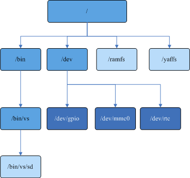

系统初始化过程中会调用los\_vfs\_init\(\)，将“/”作为root\_inode。

**文件描述符<a name="section1261532910128"></a>**

本设计中文件描述符分两种，采用动态内存数组的形式来对普通文件描述符进行管理，采用全局数组管理网络描述符，这两个数组在内存上并不连续。

-   File描述符，即普通文件描述符，其中0保留作为系统stdin标准输入、1保留作为系统stdout标准输出、2保留作为系统stderr标准错误输出。用户可以分配的文件描述符从3开始到CONFIG\_NFILE\_DESCRIPTORS－1。
-   Socket描述符，该描述符的分配从CONFIG\_NFILE\_DESCRIPTORS开始。

### 开发指导<a name="ZH-CN_TOPIC_0000002511954442"></a>

**接口说明<a name="section14759620114917"></a>**

<a name="table4255115016"></a>
<table><thead align="left"><tr id="row825515504"><th class="cellrowborder" valign="top" width="22.12%" id="mcps1.1.4.1.1"><p id="p192155118505"><a name="p192155118505"></a><a name="p192155118505"></a>头文件</p>
</th>
<th class="cellrowborder" valign="top" width="27.92%" id="mcps1.1.4.1.2"><p id="p22851205018"><a name="p22851205018"></a><a name="p22851205018"></a>接口名</p>
</th>
<th class="cellrowborder" valign="top" width="49.96%" id="mcps1.1.4.1.3"><p id="p15255114502"><a name="p15255114502"></a><a name="p15255114502"></a>描述</p>
</th>
</tr>
</thead>
<tbody><tr id="row126511503"><td class="cellrowborder" rowspan="7" valign="top" width="22.12%" headers="mcps1.1.4.1.1 "><p id="p42851195012"><a name="p42851195012"></a><a name="p42851195012"></a>open_source/incubator-nuttx/liteos/fs/include/fs/fs.h</p>
</td>
<td class="cellrowborder" valign="top" width="27.92%" headers="mcps1.1.4.1.2 "><p id="p9215515504"><a name="p9215515504"></a><a name="p9215515504"></a>register_driver</p>
</td>
<td class="cellrowborder" valign="top" width="49.96%" headers="mcps1.1.4.1.3 "><p id="p42205195017"><a name="p42205195017"></a><a name="p42205195017"></a>注册字符驱动到文件系统。</p>
</td>
</tr>
<tr id="row82105119503"><td class="cellrowborder" valign="top" headers="mcps1.1.4.1.1 "><p id="p10218515502"><a name="p10218515502"></a><a name="p10218515502"></a>unregister_driver</p>
</td>
<td class="cellrowborder" valign="top" headers="mcps1.1.4.1.2 "><p id="p32051155019"><a name="p32051155019"></a><a name="p32051155019"></a>取消字符驱动注册。</p>
</td>
</tr>
<tr id="row62751135015"><td class="cellrowborder" valign="top" headers="mcps1.1.4.1.1 "><p id="p17295165013"><a name="p17295165013"></a><a name="p17295165013"></a>register_blockdriver</p>
</td>
<td class="cellrowborder" valign="top" headers="mcps1.1.4.1.2 "><p id="p62135119507"><a name="p62135119507"></a><a name="p62135119507"></a>注册块设备驱动到文件系统。</p>
</td>
</tr>
<tr id="row82135135014"><td class="cellrowborder" valign="top" headers="mcps1.1.4.1.1 "><p id="p162105114502"><a name="p162105114502"></a><a name="p162105114502"></a>unregister_blockdriver</p>
</td>
<td class="cellrowborder" valign="top" headers="mcps1.1.4.1.2 "><p id="p02651145017"><a name="p02651145017"></a><a name="p02651145017"></a>取消块设备驱动注册。</p>
</td>
</tr>
<tr id="row1023514503"><td class="cellrowborder" valign="top" headers="mcps1.1.4.1.1 "><p id="p20285165011"><a name="p20285165011"></a><a name="p20285165011"></a>open_blockdriver</p>
</td>
<td class="cellrowborder" valign="top" headers="mcps1.1.4.1.2 "><p id="p4265125014"><a name="p4265125014"></a><a name="p4265125014"></a>打开块设备。</p>
</td>
</tr>
<tr id="row1325518505"><td class="cellrowborder" valign="top" headers="mcps1.1.4.1.1 "><p id="p11275145017"><a name="p11275145017"></a><a name="p11275145017"></a>close_blockdriver</p>
</td>
<td class="cellrowborder" valign="top" headers="mcps1.1.4.1.2 "><p id="p721051115011"><a name="p721051115011"></a><a name="p721051115011"></a>关闭块设备。</p>
</td>
</tr>
<tr id="row39653625210"><td class="cellrowborder" valign="top" headers="mcps1.1.4.1.1 "><p id="p159660645217"><a name="p159660645217"></a><a name="p159660645217"></a>find_blockdriver</p>
</td>
<td class="cellrowborder" valign="top" headers="mcps1.1.4.1.2 "><p id="p896606125217"><a name="p896606125217"></a><a name="p896606125217"></a>查找块设备。</p>
</td>
</tr>
<tr id="row99092059114918"><td class="cellrowborder" rowspan="3" valign="top" width="22.12%" headers="mcps1.1.4.1.1 "><p id="p2488184355210"><a name="p2488184355210"></a><a name="p2488184355210"></a>fs/include/los_fs.h</p>
</td>
<td class="cellrowborder" valign="top" width="27.92%" headers="mcps1.1.4.1.2 "><p id="p7220101835019"><a name="p7220101835019"></a><a name="p7220101835019"></a>chattr</p>
</td>
<td class="cellrowborder" valign="top" width="49.96%" headers="mcps1.1.4.1.3 "><p id="p32203183507"><a name="p32203183507"></a><a name="p32203183507"></a>改变文件系统中的文件属性，目前仅FAT文件系统支持，修改后的文件属性目前支持4种：F_RDO（只读）、F_HID（隐藏）、F_SYS（系统文件）、F_ARC（存档）。</p>
</td>
</tr>
<tr id="row2909155974920"><td class="cellrowborder" valign="top" headers="mcps1.1.4.1.1 "><p id="p14370222509"><a name="p14370222509"></a><a name="p14370222509"></a>ls</p>
</td>
<td class="cellrowborder" valign="top" headers="mcps1.1.4.1.2 "><p id="p74371822135014"><a name="p74371822135014"></a><a name="p74371822135014"></a>列出目录内容。</p>
</td>
</tr>
<tr id="row10909145994917"><td class="cellrowborder" valign="top" headers="mcps1.1.4.1.1 "><p id="p1525072905014"><a name="p1525072905014"></a><a name="p1525072905014"></a>rindex</p>
</td>
<td class="cellrowborder" valign="top" headers="mcps1.1.4.1.2 "><p id="p025013298507"><a name="p025013298507"></a><a name="p025013298507"></a>从指定字符串的右面开始搜索第一次出现指定字符的位置。</p>
</td>
</tr>
</tbody>
</table>

> **说明：** 
>关于文件属性：
>-   当前只支持修改FAT文件系统的文件属性，其他文件系统对只读等属性有各自的处理方式。
>-   F\_RDO（只读）、F\_HID（隐藏）、F\_SYS（系统文件）和F\_ARC（存档）这4种属性并不冲突，可以任意修改。
>-   只读属性文件/目录不允许被删除。
>-   只读属性文件/目录允许重命名。
>-   只读文件不允许以O\_CREAT、O\_TRUNC，以及有含有写权限的方式打开。
>-   在LiteOS中隐藏属性文件可见，在Windows中不可见（不显示隐藏文件属性的情况下）。
>-   在LiteOS中文件加上隐藏属性，在Windows中只能通过命令行找到（在显示/不显示隐藏文件属性的情况下，该文件在Windows中都不可见）。

**开发流程<a name="section85947282256"></a>**

推荐驱动开发人员使用VFS框架来注册/卸载设备，在应用层使用open\(\)、read\(\)操作字符设备文件来调用驱动。

1.  打开菜单，选择FileSystem ---\> Enable VFS，使能VFS。

    <a name="table06655375130"></a>
    <table><thead align="left"><tr id="row8665203751318"><th class="cellrowborder" valign="top" width="24.45%" id="mcps1.1.6.1.1"><p id="p61687296155221"><a name="p61687296155221"></a><a name="p61687296155221"></a>配置项</p>
    </th>
    <th class="cellrowborder" valign="top" width="21.91%" id="mcps1.1.6.1.2"><p id="p25007692155221"><a name="p25007692155221"></a><a name="p25007692155221"></a>含义</p>
    </th>
    <th class="cellrowborder" valign="top" width="14.549999999999999%" id="mcps1.1.6.1.3"><p id="p47081329204415"><a name="p47081329204415"></a><a name="p47081329204415"></a>取值范围</p>
    </th>
    <th class="cellrowborder" valign="top" width="14.82%" id="mcps1.1.6.1.4"><p id="p7383544155221"><a name="p7383544155221"></a><a name="p7383544155221"></a>默认值</p>
    </th>
    <th class="cellrowborder" valign="top" width="24.27%" id="mcps1.1.6.1.5"><p id="p34917797155221"><a name="p34917797155221"></a><a name="p34917797155221"></a>依赖</p>
    </th>
    </tr>
    </thead>
    <tbody><tr id="row9665837161320"><td class="cellrowborder" valign="top" width="24.45%" headers="mcps1.1.6.1.1 "><p id="p3665143710130"><a name="p3665143710130"></a><a name="p3665143710130"></a>LOSCFG_FS_VFS</p>
    </td>
    <td class="cellrowborder" valign="top" width="21.91%" headers="mcps1.1.6.1.2 "><p id="p13665737191318"><a name="p13665737191318"></a><a name="p13665737191318"></a>VFS框架的裁剪开关</p>
    </td>
    <td class="cellrowborder" valign="top" width="14.549999999999999%" headers="mcps1.1.6.1.3 "><p id="p19665193721319"><a name="p19665193721319"></a><a name="p19665193721319"></a>YES/NO</p>
    </td>
    <td class="cellrowborder" valign="top" width="14.82%" headers="mcps1.1.6.1.4 "><p id="p1866573713131"><a name="p1866573713131"></a><a name="p1866573713131"></a>YES</p>
    </td>
    <td class="cellrowborder" valign="top" width="24.27%" headers="mcps1.1.6.1.5 "><p id="p1266519378138"><a name="p1266519378138"></a><a name="p1266519378138"></a>无</p>
    </td>
    </tr>
    </tbody>
    </table>

2.  调用register\_driver\(\)、register\_blockdriver\(\)接口生成设备结点，调用mount\(\)接口生成文件系统挂载结点。生成设备节点的开发流程详见适配文件操作的“[开发指导](开发指导-148.md)”。

### 注意事项<a name="ZH-CN_TOPIC_0000002511954366"></a>

-   VFS下所有文件系统创建的目录名和文件名长度最多为255个字符，若超过则创建失败。
-   VFS层支持的文件和目录最大全路径长度为259个字符，若超过，则创建失败
-   所有文件系统中的文件名和目录名中只仅支持“-” 与“\_”两种特殊字符，使用其他特殊字符可能造成不可预知的后果，请谨慎为之。
-   VFS下的所有文件系统，在创建模式或只写模式打开文件，此时文件权限为open接口mode入参值默认为0666，因VFS下的文件系统对文件权限模式支持不全， 推荐使用0666入参。
-   VFS在优化迭代过程中，对部分POSIX接口（rename、dup、opendir等）的异常错误分支的errno返回值会有更改，以便更贴近于POSIX标准，业务在使用errno返回值时请谨慎处理。
-   对于块设备节点（例如“/dev/mmc0”），如果块设备驱动的bpos实现unlink回调函数且返回值为OK，则误调用unlink（“/dev/mmc0”）会导致块设备节点被删除和节点消失，并影响正常业务功能；如果想保持块设备节点常驻，不实现unlink回调即可。
-   ls命令会显示块设备节点文件的size，size值为块设备的容量值，如果不想显示对应的设备容量，块设备驱动的bpos不实现geometry回调函数即可。
-   VFS可以直接递归创建多级目录。
-   设备分为字符设备和块设备，为了设备上的数据安全，需挂载相应文件系统后通过文件系统接口操作数据。
-   los\_vfs\_init\(\) 只能调用一次，多次调用将会造成文件系统异常。
-   open打开一个文件时，参数O\_RDWR、O\_WRONLY、O\_RDONLY互斥，只能出现一个，若出现2个或以上作为open的参数，会出现不可预知的错误，禁止使用。
-   不建议open一个目录直接获取目录数据。如果要获取目录信息，可以调用opendir接口打开目录。
-   open\(\)、read\(\)、write\(\)等为非线程安全接口，在多线程场景下，建议使用fopen\(\)、fread\(\)、fwrite\(\)等接口。
-   挂载文件系统请严格按照手册进行，错误挂载可能损坏设备及系统。
-   挂载点必须为空目录，不能重复挂载至同一挂载点或挂载至其他挂载点下的目录或文件。
-   不要在休眠唤醒或者分散加载阶段挂载一个不存在的文件系统。
-   在unregister\_driver卸载设备之前，要确保字符设备已经正确的close，即open和close的次数要对应，否则会卸载失败。
-   在umount之前，需确保此文件系统中的所有目录及文件全部关闭，否则umount会失败。如果强制umount，可能导致包括但不限于文件系统损坏、设备损坏等问题，对此华为不承担任何责任。
-   SD卡移除前，需确保所有目录及文件已经全部关闭，并进行umount操作。如果强制拔卡，可能导致包括但不限于SD数据丢失、SD卡损坏等问题，对此华为不承担任何责任。

## FAT<a name="ZH-CN_TOPIC_0000002511954226"></a>


### 概述<a name="ZH-CN_TOPIC_0000002511954384"></a>

**基本概念<a name="section6477880682322"></a>**

FAT文件系统是File Allocation Table（文件配置表）的简称，FAT文件系统有FAT12、FAT16、FAT32。FAT文件系统将硬盘分为MBR区、DBR区、FAT区、DIR区、DATA区等5个区域。

FAT文件系统支持多种介质，特别是在可移动存储介质（U盘、SD卡、移动硬盘等）上广泛使用。而且，FAT文件系统可以使嵌入式设备和Windows、Linux等桌面系统保持很好的兼容性，方便用户管理操作文件。

LiteOS的FAT文件系统的特点有：

-   代码量和资源占用小、可裁切、支持多种物理介质。
-   与Windows、Linux等系统保持兼容。
-   支持多设备、多分区识别等功能。
-   支持硬盘多分区，可以在主分区以及逻辑分区上进行文件操作。
-   支持识别出硬盘上其他类型的文件系统，比如NTFS。
-   支持基于FAT32 的虚拟分区特性。

    当开启虚拟分区特性时，用户可通过调用虚拟分区的设置接口los\_set\_virpartparam\(\)，对特定的物理分区配置虚拟分区的数量、空间百分比大小、虚拟分区的入口名等，并会根据设置的入口名，在根目录建立对应的文件夹作为虚拟分区入口。

    -   在对应的虚拟分区内部进行操作，即视为在对应的虚拟分区内进行操作。
    -   若所有虚拟分区的空间百分比总和未达到100%，则允许在虚拟分区入口目录外进行写入操作，此时所有虚拟分区入口外部的总可写入空间，即为百分比总和的剩余空间。若所有虚拟分区的空间百分比达到了100%，则在虚拟分区入口目录外部将会以空间不足的理由，拒绝写入操作。

### 开发指导<a name="ZH-CN_TOPIC_0000002511794412"></a>

**FAT文件系统的接口说明<a name="section7969162141015"></a>**

<a name="table161271310106"></a>
<table><thead align="left"><tr id="row1212101361015"><th class="cellrowborder" valign="top" width="21.31213121312131%" id="mcps1.1.4.1.1"><p id="p1312111315109"><a name="p1312111315109"></a><a name="p1312111315109"></a>头文件</p>
</th>
<th class="cellrowborder" valign="top" width="31.453145314531454%" id="mcps1.1.4.1.2"><p id="p1912111312109"><a name="p1912111312109"></a><a name="p1912111312109"></a>接口名</p>
</th>
<th class="cellrowborder" valign="top" width="47.234723472347234%" id="mcps1.1.4.1.3"><p id="p14121113181010"><a name="p14121113181010"></a><a name="p14121113181010"></a>描述</p>
</th>
</tr>
</thead>
<tbody><tr id="row13122013121015"><td class="cellrowborder" rowspan="13" valign="top" width="21.31213121312131%" headers="mcps1.1.4.1.1 "><p id="p1567663719414"><a name="p1567663719414"></a><a name="p1567663719414"></a>fs/include/los_fs.h</p>
</td>
<td class="cellrowborder" valign="top" width="31.453145314531454%" headers="mcps1.1.4.1.2 "><p id="p2012713181015"><a name="p2012713181015"></a><a name="p2012713181015"></a>getlabel</p>
</td>
<td class="cellrowborder" valign="top" width="47.234723472347234%" headers="mcps1.1.4.1.3 "><p id="p16128139104"><a name="p16128139104"></a><a name="p16128139104"></a>获取盘符</p>
</td>
</tr>
<tr id="row1712101331017"><td class="cellrowborder" valign="top" headers="mcps1.1.4.1.1 "><p id="p14123136103"><a name="p14123136103"></a><a name="p14123136103"></a>set_label</p>
</td>
<td class="cellrowborder" valign="top" headers="mcps1.1.4.1.2 "><p id="p312101361014"><a name="p312101361014"></a><a name="p312101361014"></a>设置盘符</p>
</td>
</tr>
<tr id="row111211391019"><td class="cellrowborder" valign="top" headers="mcps1.1.4.1.1 "><p id="p11212136107"><a name="p11212136107"></a><a name="p11212136107"></a>format</p>
</td>
<td class="cellrowborder" valign="top" headers="mcps1.1.4.1.2 "><p id="p1412713131012"><a name="p1412713131012"></a><a name="p1412713131012"></a>格式化磁盘</p>
</td>
</tr>
<tr id="row9947518181615"><td class="cellrowborder" valign="top" headers="mcps1.1.4.1.1 "><p id="p1894713187169"><a name="p1894713187169"></a><a name="p1894713187169"></a>los_set_systime_status</p>
</td>
<td class="cellrowborder" valign="top" headers="mcps1.1.4.1.2 "><p id="p3947318111610"><a name="p3947318111610"></a><a name="p3947318111610"></a>设置FAT文件当前系统时间有效或无效</p>
</td>
</tr>
<tr id="row2675467511"><td class="cellrowborder" valign="top" headers="mcps1.1.4.1.1 "><p id="p1327133118256"><a name="p1327133118256"></a><a name="p1327133118256"></a>LOS_SetSyncThreadPrio</p>
</td>
<td class="cellrowborder" valign="top" headers="mcps1.1.4.1.2 "><p id="p1032743162519"><a name="p1032743162519"></a><a name="p1032743162519"></a>设置FAT文件系统缓存异步刷新任务的优先级</p>
</td>
</tr>
<tr id="row1527065218516"><td class="cellrowborder" valign="top" headers="mcps1.1.4.1.1 "><p id="p15435163442518"><a name="p15435163442518"></a><a name="p15435163442518"></a>LOS_SetSyncThreadInterval</p>
</td>
<td class="cellrowborder" valign="top" headers="mcps1.1.4.1.2 "><p id="p543514341257"><a name="p543514341257"></a><a name="p543514341257"></a>设置FAT文件系统缓存异步刷新的时间间隔</p>
</td>
</tr>
<tr id="row1826316619499"><td class="cellrowborder" valign="top" headers="mcps1.1.4.1.1 "><p id="p1126366154910"><a name="p1126366154910"></a><a name="p1126366154910"></a>LOS_GetSyncThreadInterval</p>
</td>
<td class="cellrowborder" valign="top" headers="mcps1.1.4.1.2 "><p id="p726326114914"><a name="p726326114914"></a><a name="p726326114914"></a>获取FAT文件系统缓存异步刷新的时间间隔</p>
</td>
</tr>
<tr id="row2010010497519"><td class="cellrowborder" valign="top" headers="mcps1.1.4.1.1 "><p id="p18736247152516"><a name="p18736247152516"></a><a name="p18736247152516"></a>LOS_SetDirtyRatioThreshold</p>
</td>
<td class="cellrowborder" valign="top" headers="mcps1.1.4.1.2 "><p id="p573624714259"><a name="p573624714259"></a><a name="p573624714259"></a>设置FAT文件系统缓存异步刷新的脏数据块比例阈值</p>
</td>
</tr>
<tr id="row141815661514"><td class="cellrowborder" valign="top" headers="mcps1.1.4.1.1 "><p id="p1218118631515"><a name="p1218118631515"></a><a name="p1218118631515"></a>LOS_GetDirtyRatioThreshold</p>
</td>
<td class="cellrowborder" valign="top" headers="mcps1.1.4.1.2 "><p id="p2181186201515"><a name="p2181186201515"></a><a name="p2181186201515"></a>获取FAT文件系统缓存异步刷新的脏数据块比例阈值</p>
</td>
</tr>
<tr id="row429212405016"><td class="cellrowborder" valign="top" headers="mcps1.1.4.1.1 "><p id="p3292114115010"><a name="p3292114115010"></a><a name="p3292114115010"></a>LOS_SetBlockExpireInterval</p>
</td>
<td class="cellrowborder" valign="top" headers="mcps1.1.4.1.2 "><p id="p1729284185019"><a name="p1729284185019"></a><a name="p1729284185019"></a>设置FAT文件系统块的最大过期时间间隔</p>
</td>
</tr>
<tr id="row1160311712502"><td class="cellrowborder" valign="top" headers="mcps1.1.4.1.1 "><p id="p136036717503"><a name="p136036717503"></a><a name="p136036717503"></a>LOS_GetBlockExpireInterval</p>
</td>
<td class="cellrowborder" valign="top" headers="mcps1.1.4.1.2 "><p id="p6603127115018"><a name="p6603127115018"></a><a name="p6603127115018"></a>获取FAT文件系统块的最大过期时间间隔</p>
</td>
</tr>
<tr id="row493917384716"><td class="cellrowborder" valign="top" headers="mcps1.1.4.1.1 "><p id="p6635105419716"><a name="p6635105419716"></a><a name="p6635105419716"></a>LOS_FatSetMemPool</p>
</td>
<td class="cellrowborder" valign="top" headers="mcps1.1.4.1.2 "><p id="p5939173811716"><a name="p5939173811716"></a><a name="p5939173811716"></a>设置FAT文件系统独立内存池</p>
</td>
</tr>
<tr id="row2737438716"><td class="cellrowborder" valign="top" headers="mcps1.1.4.1.1 "><p id="p240610017811"><a name="p240610017811"></a><a name="p240610017811"></a>LOS_BcacheSetMemPool</p>
</td>
<td class="cellrowborder" valign="top" headers="mcps1.1.4.1.2 "><p id="p273114310711"><a name="p273114310711"></a><a name="p273114310711"></a>设置FAT文件系统缓存独立内存池</p>
</td>
</tr>
<tr id="row653815533211"><td class="cellrowborder" rowspan="2" valign="top" width="21.31213121312131%" headers="mcps1.1.4.1.1 "><p id="p1353919543219"><a name="p1353919543219"></a><a name="p1353919543219"></a>vfs_files.h</p>
</td>
<td class="cellrowborder" valign="top" width="31.453145314531454%" headers="mcps1.1.4.1.2 "><p id="p18768181333211"><a name="p18768181333211"></a><a name="p18768181333211"></a>LOS_PartitionFormat</p>
</td>
<td class="cellrowborder" valign="top" width="47.234723472347234%" headers="mcps1.1.4.1.3 "><p id="p753911513327"><a name="p753911513327"></a><a name="p753911513327"></a>格式化磁盘，仅部分平台定制接口</p>
</td>
</tr>
<tr id="row4690172623315"><td class="cellrowborder" valign="top" headers="mcps1.1.4.1.1 "><p id="p13270628133320"><a name="p13270628133320"></a><a name="p13270628133320"></a>LOS_DiskPartition</p>
</td>
<td class="cellrowborder" valign="top" headers="mcps1.1.4.1.2 "><p id="p156907263334"><a name="p156907263334"></a><a name="p156907263334"></a>按比例创建磁盘分区，仅部分平台定制接口</p>
</td>
</tr>
</tbody>
</table>

> **说明：** 
>-   使能FAT文件系统缓存（Cache）异步刷新后，系统会创建一个任务刷Cache，线程被触发唤醒进行脏数据刷新的条件如下：
>    1.  周期性5s唤醒。
>    2.  脏数据停留时间超过3s。
>    3.  脏数据量超过50%时，触发任何一个条件，线程都会立刻把脏数据写回磁盘。
>-   在“open\_source/FatFs/source/ffconf.h”文件中可以配置FAT文件系统，其中FF\_FS\_LOCK为最多支持同时打开的文件（文件夹）数。

**虚拟分区的接口说明<a name="section1339318355214"></a>**

<a name="table11078557104122"></a>
<table><thead align="left"><tr id="row43836930104122"><th class="cellrowborder" valign="top" width="21.25%" id="mcps1.1.4.1.1"><p id="p92938388226"><a name="p92938388226"></a><a name="p92938388226"></a>头文件</p>
</th>
<th class="cellrowborder" valign="top" width="31.259999999999998%" id="mcps1.1.4.1.2"><p id="p3811615104122"><a name="p3811615104122"></a><a name="p3811615104122"></a>接口名</p>
</th>
<th class="cellrowborder" valign="top" width="47.49%" id="mcps1.1.4.1.3"><p id="p40305361104122"><a name="p40305361104122"></a><a name="p40305361104122"></a>接口功能描述</p>
</th>
</tr>
</thead>
<tbody><tr id="row25923222171958"><td class="cellrowborder" rowspan="2" valign="top" width="21.25%" headers="mcps1.1.4.1.1 "><p id="p8293153882213"><a name="p8293153882213"></a><a name="p8293153882213"></a>fs/include/los_fs.h</p>
</td>
<td class="cellrowborder" valign="top" width="31.259999999999998%" headers="mcps1.1.4.1.2 "><p id="p102412617206"><a name="p102412617206"></a><a name="p102412617206"></a>los_set_virpartparam</p>
</td>
<td class="cellrowborder" valign="top" width="47.49%" headers="mcps1.1.4.1.3 "><p id="p18775309171958"><a name="p18775309171958"></a><a name="p18775309171958"></a>设置虚拟分区的参数</p>
</td>
</tr>
<tr id="row27203935104122"><td class="cellrowborder" valign="top" headers="mcps1.1.4.1.1 "><p id="p42549504104122"><a name="p42549504104122"></a><a name="p42549504104122"></a>virstatfs</p>
</td>
<td class="cellrowborder" valign="top" headers="mcps1.1.4.1.2 "><p id="p23957801104122"><a name="p23957801104122"></a><a name="p23957801104122"></a>获取指定虚拟分区的状态</p>
</td>
</tr>
</tbody>
</table>

虚拟分区的调配结构体定义如下所示：

```
#define _MAX_ENTRYLENGTH  16 
#define _MAX_VIRVOLUMES   5

typedef struct virtual_partition_info
{
    char *devpartpath; 
    int  virpartnum;
    double virpartpercent[_MAX_VIRVOLUMES];
    char virpartname[_MAX_VIRVOLUMES][_MAX_ENTRYLENGTH + 1];
} virpartinfo;
```

<a name="table41675869161646"></a>
<table><thead align="left"><tr id="row65969368161646"><th class="cellrowborder" valign="top" width="20.73%" id="mcps1.1.4.1.1"><p id="p23790785164524"><a name="p23790785164524"></a><a name="p23790785164524"></a>成员</p>
</th>
<th class="cellrowborder" valign="top" width="22.97%" id="mcps1.1.4.1.2"><p id="p66852855164524"><a name="p66852855164524"></a><a name="p66852855164524"></a>描述</p>
</th>
<th class="cellrowborder" valign="top" width="56.3%" id="mcps1.1.4.1.3"><p id="p31187935164524"><a name="p31187935164524"></a><a name="p31187935164524"></a>注意事项</p>
</th>
</tr>
</thead>
<tbody><tr id="row46533916161949"><td class="cellrowborder" valign="top" width="20.73%" headers="mcps1.1.4.1.1 "><p id="p30800757161949"><a name="p30800757161949"></a><a name="p30800757161949"></a>devpartpath</p>
</td>
<td class="cellrowborder" valign="top" width="22.97%" headers="mcps1.1.4.1.2 "><p id="p11833417161949"><a name="p11833417161949"></a><a name="p11833417161949"></a>设备节点路径</p>
</td>
<td class="cellrowborder" valign="top" width="56.3%" headers="mcps1.1.4.1.3 "><p id="p18982721161949"><a name="p18982721161949"></a><a name="p18982721161949"></a>所选定的设备节点的名称。必须是/dev下的设备节点路径，上限是DISK_NAME。</p>
</td>
</tr>
<tr id="row30613636161646"><td class="cellrowborder" valign="top" width="20.73%" headers="mcps1.1.4.1.1 "><p id="p66349026161646"><a name="p66349026161646"></a><a name="p66349026161646"></a>virpartnum</p>
</td>
<td class="cellrowborder" valign="top" width="22.97%" headers="mcps1.1.4.1.2 "><p id="p5562024161646"><a name="p5562024161646"></a><a name="p5562024161646"></a>虚拟分区数量</p>
</td>
<td class="cellrowborder" valign="top" width="56.3%" headers="mcps1.1.4.1.3 "><p id="p47870770161646"><a name="p47870770161646"></a><a name="p47870770161646"></a>最小值为1，最大值为_MAX_VIRVOLUMES，即为5。</p>
</td>
</tr>
<tr id="row28183748161646"><td class="cellrowborder" valign="top" width="20.73%" headers="mcps1.1.4.1.1 "><p id="p28653908161646"><a name="p28653908161646"></a><a name="p28653908161646"></a>virpartpercent</p>
</td>
<td class="cellrowborder" valign="top" width="22.97%" headers="mcps1.1.4.1.2 "><p id="p39265241161646"><a name="p39265241161646"></a><a name="p39265241161646"></a>虚拟分区百分比</p>
</td>
<td class="cellrowborder" valign="top" width="56.3%" headers="mcps1.1.4.1.3 "><p id="p26367975161646"><a name="p26367975161646"></a><a name="p26367975161646"></a>总和必须大于0.00，小于等于1.00。每个成员的值必须大于0.00，小于1.00。</p>
</td>
</tr>
<tr id="row35985184161646"><td class="cellrowborder" valign="top" width="20.73%" headers="mcps1.1.4.1.1 "><p id="p9812375161646"><a name="p9812375161646"></a><a name="p9812375161646"></a>virpartname</p>
</td>
<td class="cellrowborder" valign="top" width="22.97%" headers="mcps1.1.4.1.2 "><p id="p56604901161646"><a name="p56604901161646"></a><a name="p56604901161646"></a>虚拟分区入口名</p>
</td>
<td class="cellrowborder" valign="top" width="56.3%" headers="mcps1.1.4.1.3 "><p id="p21594272161646"><a name="p21594272161646"></a><a name="p21594272161646"></a>入口名有效字符最多为_MAX_ENTRYLENGTH ，即16个字符，不得为空。传入的集合不可以有重名项。入口名不得含有非法名称字符。</p>
</td>
</tr>
</tbody>
</table>

> **须知：** 
>-   在LiteOS中，虚拟分区特性仅支持特定的单个物理分区进行，可通过调配虚拟分区参数接口设置设备节点。
>-   设置指定物理设备节点后，会对设置进行上锁，不允许再次更改设置。挂载时就会采用设置的参数进行配置。当卸载后，才会对设置进行解锁。
>-   卸载后，需要通过调配虚拟分区参数接口重新设置虚拟分区参数。
>-   当插入的物理分区中已经设置了虚拟分区，但是其配置参数与当前系统通过调配接口所设置的参数不一致时，则将按照已有的配置参数对此分区进行管理。

**虚拟分区涉及的接口行为变化<a name="section6536455293510"></a>**

开启虚拟分区特性后，部分接口的行为会在虚拟分区下有部分变化。下述这些接口的行为变化只对于已成功应用了虚拟分区特性的物理分区，对于未能应用虚拟分区的基本FAT文件系统的物理分区，以及其他的文件系统，这些接口行为不涉及变化。

下述的接口只是在执行功能上的行为针对虚拟分区有所变化，函数的调用方式、参数等均不受影响。

<a name="table4044419493815"></a>
<table><thead align="left"><tr id="row1635630393815"><th class="cellrowborder" valign="top" width="7.5200000000000005%" id="mcps1.1.5.1.1"><p id="p4547664393815"><a name="p4547664393815"></a><a name="p4547664393815"></a>序号</p>
</th>
<th class="cellrowborder" valign="top" width="14.97%" id="mcps1.1.5.1.2"><p id="p5972949693815"><a name="p5972949693815"></a><a name="p5972949693815"></a>接口名</p>
</th>
<th class="cellrowborder" valign="top" width="36.720000000000006%" id="mcps1.1.5.1.3"><p id="p625103093815"><a name="p625103093815"></a><a name="p625103093815"></a>行为变化</p>
</th>
<th class="cellrowborder" valign="top" width="40.79%" id="mcps1.1.5.1.4"><p id="p675491104611"><a name="p675491104611"></a><a name="p675491104611"></a>返回值与错误码说明</p>
</th>
</tr>
</thead>
<tbody><tr id="row5625927193815"><td class="cellrowborder" valign="top" width="7.5200000000000005%" headers="mcps1.1.5.1.1 "><p id="p125081357184517"><a name="p125081357184517"></a><a name="p125081357184517"></a>1</p>
</td>
<td class="cellrowborder" valign="top" width="14.97%" headers="mcps1.1.5.1.2 "><p id="p3507157174515"><a name="p3507157174515"></a><a name="p3507157174515"></a>mount</p>
</td>
<td class="cellrowborder" valign="top" width="36.720000000000006%" headers="mcps1.1.5.1.3 "><p id="p17507115715458"><a name="p17507115715458"></a><a name="p17507115715458"></a>挂载了基本FAT分区后，会尝试识别当前物理分区是否已经应用过虚拟分区，并尝试对该物理分区按照其配置的信息加载虚拟分区，检查并尝试修复虚拟分区入口；若当前物理分区未应用过虚拟分区并符合启动虚拟分区的条件，则会自动对该物理分区应用虚拟分区，并建立虚拟分区。</p>
</td>
<td class="cellrowborder" valign="top" width="40.79%" headers="mcps1.1.5.1.4 "><p id="p145073577453"><a name="p145073577453"></a><a name="p145073577453"></a>返回值为-1表示基本FAT分区挂载失败，此时会触发libc错误码指示发生了何种错误；</p>
<p id="p16371121954717"><a name="p16371121954717"></a><a name="p16371121954717"></a>返回值为0表示基本FAT分区挂载成功，此时错误码若为0表示虚拟分区挂载成功，若错误码为VIRERR_MODIFIED、VIRERR_CHAIN_ERR、VIRERR_OCCUPIED、VIRERR_NOTCLEAR、VIRERR_NOTFIT、VIRERR_NOPARAM表示虚拟分区挂载失败</p>
</td>
</tr>
<tr id="row21560096102546"><td class="cellrowborder" valign="top" width="7.5200000000000005%" headers="mcps1.1.5.1.1 "><p id="p1950625774516"><a name="p1950625774516"></a><a name="p1950625774516"></a>2</p>
</td>
<td class="cellrowborder" valign="top" width="14.97%" headers="mcps1.1.5.1.2 "><p id="p102751831174715"><a name="p102751831174715"></a><a name="p102751831174715"></a>format</p>
</td>
<td class="cellrowborder" valign="top" width="36.720000000000006%" headers="mcps1.1.5.1.3 "><p id="p1927553124717"><a name="p1927553124717"></a><a name="p1927553124717"></a>当FAT分区已挂载后，若格式化成为FAT32文件系统，则会在格式化完成后对该物理分区应用虚拟分区；若非FAT32文件系统，则会完成格式化操作，并清除该物理分区的虚拟分区；若FAT分区未挂载，无论何种文件系统，则均会完成格式化操作后清除该物理分区的虚拟分区。</p>
</td>
<td class="cellrowborder" valign="top" width="40.79%" headers="mcps1.1.5.1.4 "><p id="p18275113117476"><a name="p18275113117476"></a><a name="p18275113117476"></a>返回值为-1表示基本FAT分区格式化失败，此时会触发libc错误码指示发生了何种错误；</p>
<p id="p3996153814477"><a name="p3996153814477"></a><a name="p3996153814477"></a>返回值为0表示基本FAT分区格式化完成。若此时分区并未挂载，则错误码则会为VIRERR_NOTMOUNT；若格式化的分区非调配接口所设定设备节点路径，或者调配接口并未设置参数，则此时会指示VIRERR_NOPARAM。若分区已挂载，错误码为0表示应用或重新应用虚拟分区成功，或者错误码可能为VIRERR_NOTFIT。</p>
</td>
</tr>
<tr id="row244526210325"><td class="cellrowborder" valign="top" width="7.5200000000000005%" headers="mcps1.1.5.1.1 "><p id="p1335445416479"><a name="p1335445416479"></a><a name="p1335445416479"></a>3</p>
</td>
<td class="cellrowborder" valign="top" width="14.97%" headers="mcps1.1.5.1.2 "><p id="p153541754204715"><a name="p153541754204715"></a><a name="p153541754204715"></a>open</p>
</td>
<td class="cellrowborder" valign="top" width="36.720000000000006%" headers="mcps1.1.5.1.3 "><p id="p4354654104710"><a name="p4354654104710"></a><a name="p4354654104710"></a>请参阅<a href="#section198521275381">虚拟分区的兼容性</a>的说明。</p>
</td>
<td class="cellrowborder" valign="top" width="40.79%" headers="mcps1.1.5.1.4 "><p id="p1235415414714"><a name="p1235415414714"></a><a name="p1235415414714"></a>无</p>
</td>
</tr>
<tr id="row65513752103311"><td class="cellrowborder" valign="top" width="7.5200000000000005%" headers="mcps1.1.5.1.1 "><p id="p143541754124713"><a name="p143541754124713"></a><a name="p143541754124713"></a>4</p>
</td>
<td class="cellrowborder" valign="top" width="14.97%" headers="mcps1.1.5.1.2 "><p id="p43542054114712"><a name="p43542054114712"></a><a name="p43542054114712"></a>mkdir</p>
</td>
<td class="cellrowborder" valign="top" width="36.720000000000006%" headers="mcps1.1.5.1.3 "><p id="p14354165454712"><a name="p14354165454712"></a><a name="p14354165454712"></a>请参阅<a href="#section198521275381">虚拟分区的兼容性</a>的说明。</p>
</td>
<td class="cellrowborder" valign="top" width="40.79%" headers="mcps1.1.5.1.4 "><p id="p9354125444719"><a name="p9354125444719"></a><a name="p9354125444719"></a>无</p>
</td>
</tr>
<tr id="row31739794103342"><td class="cellrowborder" valign="top" width="7.5200000000000005%" headers="mcps1.1.5.1.1 "><p id="p1735475410479"><a name="p1735475410479"></a><a name="p1735475410479"></a>5</p>
</td>
<td class="cellrowborder" valign="top" width="14.97%" headers="mcps1.1.5.1.2 "><p id="p635455464715"><a name="p635455464715"></a><a name="p635455464715"></a>rmdir</p>
</td>
<td class="cellrowborder" valign="top" width="36.720000000000006%" headers="mcps1.1.5.1.3 "><p id="p135411544474"><a name="p135411544474"></a><a name="p135411544474"></a>当物理分区已经成功应用虚拟分区时，不允许删除虚拟分区入口目录。</p>
</td>
<td class="cellrowborder" valign="top" width="40.79%" headers="mcps1.1.5.1.4 "><p id="p1354125413476"><a name="p1354125413476"></a><a name="p1354125413476"></a>无</p>
</td>
</tr>
<tr id="row52617016103522"><td class="cellrowborder" valign="top" width="7.5200000000000005%" headers="mcps1.1.5.1.1 "><p id="p6354155494716"><a name="p6354155494716"></a><a name="p6354155494716"></a>6</p>
</td>
<td class="cellrowborder" valign="top" width="14.97%" headers="mcps1.1.5.1.2 "><p id="p193544547473"><a name="p193544547473"></a><a name="p193544547473"></a>remove</p>
</td>
<td class="cellrowborder" valign="top" width="36.720000000000006%" headers="mcps1.1.5.1.3 "><p id="p63543542476"><a name="p63543542476"></a><a name="p63543542476"></a>当物理分区已经成功应用虚拟分区时，不允许删除虚拟分区入口目录。</p>
</td>
<td class="cellrowborder" valign="top" width="40.79%" headers="mcps1.1.5.1.4 "><p id="p2355125414711"><a name="p2355125414711"></a><a name="p2355125414711"></a>无</p>
</td>
</tr>
<tr id="row52487658103550"><td class="cellrowborder" valign="top" width="7.5200000000000005%" headers="mcps1.1.5.1.1 "><p id="p5355354104717"><a name="p5355354104717"></a><a name="p5355354104717"></a>7</p>
</td>
<td class="cellrowborder" valign="top" width="14.97%" headers="mcps1.1.5.1.2 "><p id="p12355125404712"><a name="p12355125404712"></a><a name="p12355125404712"></a>rename</p>
</td>
<td class="cellrowborder" valign="top" width="36.720000000000006%" headers="mcps1.1.5.1.3 "><p id="p1535515484713"><a name="p1535515484713"></a><a name="p1535515484713"></a>当物理分区已经成功应用虚拟分区时，不允许重命名虚拟分区入口目录。</p>
</td>
<td class="cellrowborder" valign="top" width="40.79%" headers="mcps1.1.5.1.4 "><p id="p235513542476"><a name="p235513542476"></a><a name="p235513542476"></a>无</p>
</td>
</tr>
</tbody>
</table>

**虚拟分区的错误码<a name="section41559669155127"></a>**

应用虚拟分区发生错误，只会发生于挂载时或者格式化时。当基本FAT文件系统的对应操作完成后，进行虚拟分区的配置与应用。此时若发生某种问题或者触发某种条件，虚拟分区会将错误码传递给上层，以分辨应用虚拟分区时发生了什么情况。同时该分区将会以基本FAT文件系统进行管理，而不会在此基础上采用虚拟分区管理。

> **说明：** 
>对于挂载和格式化操作的返回值，指示的是基本FAT文件系统的成功或失败。
>-   当接口的返回值为0时，表示对应的基本FAT文件系统操作成功，此时可通过访问errno获取虚拟分区的错误码，以检查应用虚拟分区过程中是否有异常产生。
>-   当接口的返回值为-1时，表示于对应的基本FAT文件系统操作失败，此时的errno为libc的错误码，表示基本FAT操作失败的原因，不再表示虚拟分区的提示信息。

<a name="table6015294495642"></a>
<table><thead align="left"><tr id="row2267197395642"><th class="cellrowborder" valign="top" width="7.10928907109289%" id="mcps1.1.6.1.1"><p id="p1908783195642"><a name="p1908783195642"></a><a name="p1908783195642"></a>序号</p>
</th>
<th class="cellrowborder" valign="top" width="19.07809219078092%" id="mcps1.1.6.1.2"><p id="p261046995642"><a name="p261046995642"></a><a name="p261046995642"></a>定义</p>
</th>
<th class="cellrowborder" valign="top" width="15.278472152784719%" id="mcps1.1.6.1.3"><p id="p1012144095642"><a name="p1012144095642"></a><a name="p1012144095642"></a>实际数值</p>
</th>
<th class="cellrowborder" valign="top" width="26.76732326767323%" id="mcps1.1.6.1.4"><p id="p1453028795642"><a name="p1453028795642"></a><a name="p1453028795642"></a>描述</p>
</th>
<th class="cellrowborder" valign="top" width="31.76682331766823%" id="mcps1.1.6.1.5"><p id="p2753561710026"><a name="p2753561710026"></a><a name="p2753561710026"></a>触发情况</p>
</th>
</tr>
</thead>
<tbody><tr id="row6366372295642"><td class="cellrowborder" valign="top" width="7.10928907109289%" headers="mcps1.1.6.1.1 "><p id="p5648782795642"><a name="p5648782795642"></a><a name="p5648782795642"></a>1</p>
</td>
<td class="cellrowborder" valign="top" width="19.07809219078092%" headers="mcps1.1.6.1.2 "><p id="p1211123695642"><a name="p1211123695642"></a><a name="p1211123695642"></a>VIRERR_MODIFIED</p>
</td>
<td class="cellrowborder" valign="top" width="15.278472152784719%" headers="mcps1.1.6.1.3 "><p id="p4148605495642"><a name="p4148605495642"></a><a name="p4148605495642"></a>0x10000001</p>
</td>
<td class="cellrowborder" valign="top" width="26.76732326767323%" headers="mcps1.1.6.1.4 "><p id="p492720095642"><a name="p492720095642"></a><a name="p492720095642"></a>虚拟分区保留扇区信息遭到破坏</p>
</td>
<td class="cellrowborder" valign="top" width="31.76682331766823%" headers="mcps1.1.6.1.5 "><p id="p1579250110026"><a name="p1579250110026"></a><a name="p1579250110026"></a>是否被重新分区、是否调整过分区大小、或者SD卡是否曾遭到破坏。</p>
</td>
</tr>
<tr id="row4434480695642"><td class="cellrowborder" valign="top" width="7.10928907109289%" headers="mcps1.1.6.1.1 "><p id="p3515954495642"><a name="p3515954495642"></a><a name="p3515954495642"></a>2</p>
</td>
<td class="cellrowborder" valign="top" width="19.07809219078092%" headers="mcps1.1.6.1.2 "><p id="p2935083995642"><a name="p2935083995642"></a><a name="p2935083995642"></a>VIRERR_CHAIN_ERR</p>
</td>
<td class="cellrowborder" valign="top" width="15.278472152784719%" headers="mcps1.1.6.1.3 "><p id="p2860775495642"><a name="p2860775495642"></a><a name="p2860775495642"></a>0x10000002</p>
</td>
<td class="cellrowborder" valign="top" width="26.76732326767323%" headers="mcps1.1.6.1.4 "><p id="p3552674695642"><a name="p3552674695642"></a><a name="p3552674695642"></a>虚拟分区入口目录已被移出所在的虚拟分区</p>
</td>
<td class="cellrowborder" valign="top" width="31.76682331766823%" headers="mcps1.1.6.1.5 "><p id="p412423410026"><a name="p412423410026"></a><a name="p412423410026"></a>虚拟分区入口目录在其他平台上被删除后重建，有一定概率会触发该问题。</p>
</td>
</tr>
<tr id="row5130526095642"><td class="cellrowborder" valign="top" width="7.10928907109289%" headers="mcps1.1.6.1.1 "><p id="p6208537795642"><a name="p6208537795642"></a><a name="p6208537795642"></a>3</p>
</td>
<td class="cellrowborder" valign="top" width="19.07809219078092%" headers="mcps1.1.6.1.2 "><p id="p6285965595642"><a name="p6285965595642"></a><a name="p6285965595642"></a>VIRERR_OCCUPIED</p>
</td>
<td class="cellrowborder" valign="top" width="15.278472152784719%" headers="mcps1.1.6.1.3 "><p id="p5846730195642"><a name="p5846730195642"></a><a name="p5846730195642"></a>0x10000003</p>
</td>
<td class="cellrowborder" valign="top" width="26.76732326767323%" headers="mcps1.1.6.1.4 "><p id="p3823098095642"><a name="p3823098095642"></a><a name="p3823098095642"></a>虚拟分区入口被同名文件占据</p>
</td>
<td class="cellrowborder" valign="top" width="31.76682331766823%" headers="mcps1.1.6.1.5 "><p id="p6562756010026"><a name="p6562756010026"></a><a name="p6562756010026"></a>物理分区根目录有同名文件，阻碍了虚拟分区入口的创建。</p>
</td>
</tr>
<tr id="row853450895642"><td class="cellrowborder" valign="top" width="7.10928907109289%" headers="mcps1.1.6.1.1 "><p id="p2020651095642"><a name="p2020651095642"></a><a name="p2020651095642"></a>4</p>
</td>
<td class="cellrowborder" valign="top" width="19.07809219078092%" headers="mcps1.1.6.1.2 "><p id="p2611462995642"><a name="p2611462995642"></a><a name="p2611462995642"></a>VIRERR_NOTCLEAR</p>
</td>
<td class="cellrowborder" valign="top" width="15.278472152784719%" headers="mcps1.1.6.1.3 "><p id="p3491023395642"><a name="p3491023395642"></a><a name="p3491023395642"></a>0x10000004</p>
</td>
<td class="cellrowborder" valign="top" width="26.76732326767323%" headers="mcps1.1.6.1.4 "><p id="p915662595642"><a name="p915662595642"></a><a name="p915662595642"></a>物理分区非空</p>
</td>
<td class="cellrowborder" valign="top" width="31.76682331766823%" headers="mcps1.1.6.1.5 "><p id="p1423211810026"><a name="p1423211810026"></a><a name="p1423211810026"></a>在对新物理分区应用虚拟分区时，分区非空。</p>
</td>
</tr>
<tr id="row1530076695642"><td class="cellrowborder" valign="top" width="7.10928907109289%" headers="mcps1.1.6.1.1 "><p id="p3140256895642"><a name="p3140256895642"></a><a name="p3140256895642"></a>5</p>
</td>
<td class="cellrowborder" valign="top" width="19.07809219078092%" headers="mcps1.1.6.1.2 "><p id="p6058010795642"><a name="p6058010795642"></a><a name="p6058010795642"></a>VIRERR_NOTFIT</p>
</td>
<td class="cellrowborder" valign="top" width="15.278472152784719%" headers="mcps1.1.6.1.3 "><p id="p804161495642"><a name="p804161495642"></a><a name="p804161495642"></a>0x10000005</p>
</td>
<td class="cellrowborder" valign="top" width="26.76732326767323%" headers="mcps1.1.6.1.4 "><p id="p4739096995642"><a name="p4739096995642"></a><a name="p4739096995642"></a>物理分区非FAT32文件系统</p>
</td>
<td class="cellrowborder" valign="top" width="31.76682331766823%" headers="mcps1.1.6.1.5 "><p id="p1195087610026"><a name="p1195087610026"></a><a name="p1195087610026"></a>物理分区是否为FAT32文件系统。</p>
</td>
</tr>
<tr id="row2386554195642"><td class="cellrowborder" valign="top" width="7.10928907109289%" headers="mcps1.1.6.1.1 "><p id="p5406070595642"><a name="p5406070595642"></a><a name="p5406070595642"></a>6</p>
</td>
<td class="cellrowborder" valign="top" width="19.07809219078092%" headers="mcps1.1.6.1.2 "><p id="p1684095295642"><a name="p1684095295642"></a><a name="p1684095295642"></a>VIRERR_NOTMOUNT</p>
</td>
<td class="cellrowborder" valign="top" width="15.278472152784719%" headers="mcps1.1.6.1.3 "><p id="p2193989295642"><a name="p2193989295642"></a><a name="p2193989295642"></a>0x10000006</p>
</td>
<td class="cellrowborder" valign="top" width="26.76732326767323%" headers="mcps1.1.6.1.4 "><p id="p3230086195642"><a name="p3230086195642"></a><a name="p3230086195642"></a>设备未挂载</p>
</td>
<td class="cellrowborder" valign="top" width="31.76682331766823%" headers="mcps1.1.6.1.5 "><p id="p2849689910026"><a name="p2849689910026"></a><a name="p2849689910026"></a>执行格式化时设备未挂载。</p>
</td>
</tr>
<tr id="row4371453417140"><td class="cellrowborder" valign="top" width="7.10928907109289%" headers="mcps1.1.6.1.1 "><p id="p5472162502615"><a name="p5472162502615"></a><a name="p5472162502615"></a>7</p>
</td>
<td class="cellrowborder" valign="top" width="19.07809219078092%" headers="mcps1.1.6.1.2 "><p id="p7472525112615"><a name="p7472525112615"></a><a name="p7472525112615"></a>VIRERR_INTER_ERR</p>
</td>
<td class="cellrowborder" valign="top" width="15.278472152784719%" headers="mcps1.1.6.1.3 "><p id="p4472825162614"><a name="p4472825162614"></a><a name="p4472825162614"></a>0x10000007</p>
</td>
<td class="cellrowborder" valign="top" width="26.76732326767323%" headers="mcps1.1.6.1.4 "><p id="p164721525132617"><a name="p164721525132617"></a><a name="p164721525132617"></a>意外错误</p>
</td>
<td class="cellrowborder" valign="top" width="31.76682331766823%" headers="mcps1.1.6.1.5 "><p id="p144721258260"><a name="p144721258260"></a><a name="p144721258260"></a>应用虚拟分区时发生意外错误。</p>
</td>
</tr>
<tr id="row187779821729"><td class="cellrowborder" valign="top" width="7.10928907109289%" headers="mcps1.1.6.1.1 "><p id="p1247272512263"><a name="p1247272512263"></a><a name="p1247272512263"></a>8</p>
</td>
<td class="cellrowborder" valign="top" width="19.07809219078092%" headers="mcps1.1.6.1.2 "><p id="p13472142542618"><a name="p13472142542618"></a><a name="p13472142542618"></a>VIRERR_NOPARAM</p>
</td>
<td class="cellrowborder" valign="top" width="15.278472152784719%" headers="mcps1.1.6.1.3 "><p id="p1472725182612"><a name="p1472725182612"></a><a name="p1472725182612"></a>0x10000008</p>
</td>
<td class="cellrowborder" valign="top" width="26.76732326767323%" headers="mcps1.1.6.1.4 "><p id="p134721225132610"><a name="p134721225132610"></a><a name="p134721225132610"></a>未对虚拟分区进行全局配置</p>
</td>
<td class="cellrowborder" valign="top" width="31.76682331766823%" headers="mcps1.1.6.1.5 "><p id="p8472202522611"><a name="p8472202522611"></a><a name="p8472202522611"></a>在执行挂载/格式化操作之前，需要先调用调配接口。</p>
</td>
</tr>
<tr id="row247331811965"><td class="cellrowborder" valign="top" width="7.10928907109289%" headers="mcps1.1.6.1.1 "><p id="p447214254267"><a name="p447214254267"></a><a name="p447214254267"></a>9</p>
</td>
<td class="cellrowborder" valign="top" width="19.07809219078092%" headers="mcps1.1.6.1.2 "><p id="p1347222511267"><a name="p1347222511267"></a><a name="p1347222511267"></a>VIRERR_PARMLOCKED</p>
</td>
<td class="cellrowborder" valign="top" width="15.278472152784719%" headers="mcps1.1.6.1.3 "><p id="p1447262572612"><a name="p1447262572612"></a><a name="p1447262572612"></a>0x10000009</p>
</td>
<td class="cellrowborder" valign="top" width="26.76732326767323%" headers="mcps1.1.6.1.4 "><p id="p104721325142620"><a name="p104721325142620"></a><a name="p104721325142620"></a>设置已上锁</p>
</td>
<td class="cellrowborder" valign="top" width="31.76682331766823%" headers="mcps1.1.6.1.5 "><p id="p19472182518265"><a name="p19472182518265"></a><a name="p19472182518265"></a>设置已上锁，不允许再次设置。</p>
</td>
</tr>
<tr id="row484154831968"><td class="cellrowborder" valign="top" width="7.10928907109289%" headers="mcps1.1.6.1.1 "><p id="p1247232502614"><a name="p1247232502614"></a><a name="p1247232502614"></a>10</p>
</td>
<td class="cellrowborder" valign="top" width="19.07809219078092%" headers="mcps1.1.6.1.2 "><p id="p164729252261"><a name="p164729252261"></a><a name="p164729252261"></a>VIRERR_PARMNUMERR</p>
</td>
<td class="cellrowborder" valign="top" width="15.278472152784719%" headers="mcps1.1.6.1.3 "><p id="p247252522613"><a name="p247252522613"></a><a name="p247252522613"></a>0x1000000A</p>
</td>
<td class="cellrowborder" valign="top" width="26.76732326767323%" headers="mcps1.1.6.1.4 "><p id="p1547292532616"><a name="p1547292532616"></a><a name="p1547292532616"></a>设置接口VirPartNum字段错误</p>
</td>
<td class="cellrowborder" valign="top" width="31.76682331766823%" headers="mcps1.1.6.1.5 "><p id="p547272512269"><a name="p547272512269"></a><a name="p547272512269"></a>检查VirPartNum的设定值是否正确。</p>
</td>
</tr>
<tr id="row420953131969"><td class="cellrowborder" valign="top" width="7.10928907109289%" headers="mcps1.1.6.1.1 "><p id="p747272542620"><a name="p747272542620"></a><a name="p747272542620"></a>11</p>
</td>
<td class="cellrowborder" valign="top" width="19.07809219078092%" headers="mcps1.1.6.1.2 "><p id="p247232572617"><a name="p247232572617"></a><a name="p247232572617"></a>VIRERR_PARMPERCENTERR</p>
</td>
<td class="cellrowborder" valign="top" width="15.278472152784719%" headers="mcps1.1.6.1.3 "><p id="p17472112572617"><a name="p17472112572617"></a><a name="p17472112572617"></a>0x1000000B</p>
</td>
<td class="cellrowborder" valign="top" width="26.76732326767323%" headers="mcps1.1.6.1.4 "><p id="p11472925162619"><a name="p11472925162619"></a><a name="p11472925162619"></a>设置接口VirPartPercent字段错误</p>
</td>
<td class="cellrowborder" valign="top" width="31.76682331766823%" headers="mcps1.1.6.1.5 "><p id="p10472192512267"><a name="p10472192512267"></a><a name="p10472192512267"></a>检查VirPartPercent字段的值是否正确。</p>
</td>
</tr>
<tr id="row2026028119611"><td class="cellrowborder" valign="top" width="7.10928907109289%" headers="mcps1.1.6.1.1 "><p id="p10472112515261"><a name="p10472112515261"></a><a name="p10472112515261"></a>12</p>
</td>
<td class="cellrowborder" valign="top" width="19.07809219078092%" headers="mcps1.1.6.1.2 "><p id="p17472102520266"><a name="p17472102520266"></a><a name="p17472102520266"></a>VIRERR_PARMNAMEERR</p>
</td>
<td class="cellrowborder" valign="top" width="15.278472152784719%" headers="mcps1.1.6.1.3 "><p id="p1147232552616"><a name="p1147232552616"></a><a name="p1147232552616"></a>0x1000000C</p>
</td>
<td class="cellrowborder" valign="top" width="26.76732326767323%" headers="mcps1.1.6.1.4 "><p id="p74721125142612"><a name="p74721125142612"></a><a name="p74721125142612"></a>设置接口VirPartName字段错误</p>
</td>
<td class="cellrowborder" valign="top" width="31.76682331766823%" headers="mcps1.1.6.1.5 "><p id="p12472625172617"><a name="p12472625172617"></a><a name="p12472625172617"></a>检查VirPartName字段的设定是否正确。</p>
</td>
</tr>
<tr id="row5404645825529"><td class="cellrowborder" valign="top" width="7.10928907109289%" headers="mcps1.1.6.1.1 "><p id="p8472172516264"><a name="p8472172516264"></a><a name="p8472172516264"></a>13</p>
</td>
<td class="cellrowborder" valign="top" width="19.07809219078092%" headers="mcps1.1.6.1.2 "><p id="p184721425112616"><a name="p184721425112616"></a><a name="p184721425112616"></a>VIRERR_PARMDEVERR</p>
</td>
<td class="cellrowborder" valign="top" width="15.278472152784719%" headers="mcps1.1.6.1.3 "><p id="p147292562610"><a name="p147292562610"></a><a name="p147292562610"></a>0x1000000D</p>
</td>
<td class="cellrowborder" valign="top" width="26.76732326767323%" headers="mcps1.1.6.1.4 "><p id="p124729259263"><a name="p124729259263"></a><a name="p124729259263"></a>设置接口DevPartPath字段错误</p>
</td>
<td class="cellrowborder" valign="top" width="31.76682331766823%" headers="mcps1.1.6.1.5 "><p id="p19472172518264"><a name="p19472172518264"></a><a name="p19472172518264"></a>检查DevPartPath字段是否正确。</p>
</td>
</tr>
</tbody>
</table>

**虚拟分区的兼容性<a name="section198521275381"></a>**

虚拟分区特性是LiteOS独有的基于FAT的文件管理模式。在其他平台上对已经应用过虚拟分区的物理分区进行操作时，务必了解以下兼容性特征，以免使用时发生问题。

-   重新对存储介质分区、调整存储介质的大小等操作，会直接导致物理分区的虚拟分区特性失效。
-   在其他平台上对已经应用虚拟分区的物理分区建立文件夹时，需要注意：
    -   若建立的文件夹在虚拟分区入口外，且全部虚拟分区的百分比总和为100%，则下次在LiteOS中在该文件夹内不允许创建新的文件或者文件夹。

-   在其他平台上对已经应用虚拟分区的物理分区写文件时，需要注意：
    -   若写入的文件在虚拟分区入口外，且全部虚拟分区的百分比总和为100%，则下次在LiteOS中这些文件只允许以只读方式访问。
    -   若写入的文件在虚拟分区入口内，而且文件整体的簇链均在对应的虚拟分区的簇链管理范围内，则下次在LiteOS中这些文件会以正常权限访问。
    -   若写入的文件在虚拟分区入口内，而且文件整体的簇链有一部分或者整体不在虚拟分区的管理范围内，则下次在LiteOS中这些文件只允许以只读权限访问。

-   在其他平台上删除虚拟分区入口目录，会导致对应的虚拟分区意外丢失。下次在LiteOS中进行挂载时，会尝试重建丢失的虚拟分区。
    -   若删除后用户创建一个同名的文件夹，且文件夹的整体簇链均落在了对应的虚拟分区的管理范围内，则下次在LiteOS中进行挂载时，该虚拟分区入口将被正常识别。
    -   若删除后用户创建一个同名的文件夹，且整体簇链一部分或者整体落在了对应虚拟分区的管辖范围外，则下次在LiteOS中进行挂载时，会导致虚拟分区入口校验失败，拒绝此次的虚拟分区应用。

-   在其他平台上重命名虚拟分区入口目录，会导致对应的虚拟分区意外丢失。下次在LiteOS中进行挂载时，会尝试将丢失的虚拟分区重建。原有的文件不会丢失，但这些文件将不会再受到虚拟分区特性的管理，只允许以只读权限访问。

**开发流程<a name="section485291782345"></a>**

使用FAT功能，涉及以下几个步骤，其中对虚拟分区的操作为可选部分，只有在FAT使用虚拟分区功能的情况下才涉及，请根据实际业务情况选择（各步骤详细操作见下述分解）：

1.  打开菜单，进入FileSystem ---\> Enable FAT菜单，完成FAT文件系统的配置。

    <a name="table06655375130"></a>
    <table><thead align="left"><tr id="row8665203751318"><th class="cellrowborder" valign="top" width="27%" id="mcps1.1.6.1.1"><p id="p61687296155221"><a name="p61687296155221"></a><a name="p61687296155221"></a>配置项</p>
    </th>
    <th class="cellrowborder" valign="top" width="22.34%" id="mcps1.1.6.1.2"><p id="p25007692155221"><a name="p25007692155221"></a><a name="p25007692155221"></a>含义</p>
    </th>
    <th class="cellrowborder" valign="top" width="13.38%" id="mcps1.1.6.1.3"><p id="p47081329204415"><a name="p47081329204415"></a><a name="p47081329204415"></a>取值范围</p>
    </th>
    <th class="cellrowborder" valign="top" width="13.73%" id="mcps1.1.6.1.4"><p id="p7383544155221"><a name="p7383544155221"></a><a name="p7383544155221"></a>默认值</p>
    </th>
    <th class="cellrowborder" valign="top" width="23.549999999999997%" id="mcps1.1.6.1.5"><p id="p34917797155221"><a name="p34917797155221"></a><a name="p34917797155221"></a>依赖</p>
    </th>
    </tr>
    </thead>
    <tbody><tr id="row9665837161320"><td class="cellrowborder" valign="top" width="27%" headers="mcps1.1.6.1.1 "><p id="p3665143710130"><a name="p3665143710130"></a><a name="p3665143710130"></a>LOSCFG_FS_FAT</p>
    </td>
    <td class="cellrowborder" valign="top" width="22.34%" headers="mcps1.1.6.1.2 "><p id="p43336113320"><a name="p43336113320"></a><a name="p43336113320"></a>使能FAT文件系统的开关</p>
    </td>
    <td class="cellrowborder" valign="top" width="13.38%" headers="mcps1.1.6.1.3 "><p id="p19665193721319"><a name="p19665193721319"></a><a name="p19665193721319"></a>YES/NO</p>
    </td>
    <td class="cellrowborder" valign="top" width="13.73%" headers="mcps1.1.6.1.4 "><p id="p1866573713131"><a name="p1866573713131"></a><a name="p1866573713131"></a>YES</p>
    </td>
    <td class="cellrowborder" valign="top" width="23.549999999999997%" headers="mcps1.1.6.1.5 "><p id="p1266519378138"><a name="p1266519378138"></a><a name="p1266519378138"></a>LOSCFG_FS_VFS &amp;&amp; LOSCFG_DRIVER_DISK</p>
    </td>
    </tr>
    <tr id="row1660917151345"><td class="cellrowborder" valign="top" width="27%" headers="mcps1.1.6.1.1 "><p id="p3610131513341"><a name="p3610131513341"></a><a name="p3610131513341"></a>LOSCFG_FS_FAT_CACHE</p>
    </td>
    <td class="cellrowborder" valign="top" width="22.34%" headers="mcps1.1.6.1.2 "><p id="p1761071517348"><a name="p1761071517348"></a><a name="p1761071517348"></a>使能FAT文件系统缓存</p>
    </td>
    <td class="cellrowborder" valign="top" width="13.38%" headers="mcps1.1.6.1.3 "><p id="p1361015152345"><a name="p1361015152345"></a><a name="p1361015152345"></a>YES/NO</p>
    </td>
    <td class="cellrowborder" valign="top" width="13.73%" headers="mcps1.1.6.1.4 "><p id="p1161015151344"><a name="p1161015151344"></a><a name="p1161015151344"></a>YES</p>
    </td>
    <td class="cellrowborder" valign="top" width="23.549999999999997%" headers="mcps1.1.6.1.5 "><p id="p38430143516"><a name="p38430143516"></a><a name="p38430143516"></a>LOSCFG_FS_FAT</p>
    </td>
    </tr>
    <tr id="row6591621183420"><td class="cellrowborder" valign="top" width="27%" headers="mcps1.1.6.1.1 "><p id="p145992153418"><a name="p145992153418"></a><a name="p145992153418"></a>LOSCFG_FS_FAT_CACHE_SYNC_THREAD</p>
    </td>
    <td class="cellrowborder" valign="top" width="22.34%" headers="mcps1.1.6.1.2 "><p id="p205952111344"><a name="p205952111344"></a><a name="p205952111344"></a>使能FAT文件系统缓存异步刷新</p>
    </td>
    <td class="cellrowborder" valign="top" width="13.38%" headers="mcps1.1.6.1.3 "><p id="p7591721133412"><a name="p7591721133412"></a><a name="p7591721133412"></a>YES/NO</p>
    </td>
    <td class="cellrowborder" valign="top" width="13.73%" headers="mcps1.1.6.1.4 "><p id="p165982119345"><a name="p165982119345"></a><a name="p165982119345"></a>YES</p>
    </td>
    <td class="cellrowborder" valign="top" width="23.549999999999997%" headers="mcps1.1.6.1.5 "><p id="p2017243193520"><a name="p2017243193520"></a><a name="p2017243193520"></a>LOSCFG_FS_FAT_CACHE</p>
    </td>
    </tr>
    <tr id="row2105517108"><td class="cellrowborder" valign="top" width="27%" headers="mcps1.1.6.1.1 "><p id="p21015110107"><a name="p21015110107"></a><a name="p21015110107"></a>LOSCFG_FS_FAT_CACHE_PROC</p>
    </td>
    <td class="cellrowborder" valign="top" width="22.34%" headers="mcps1.1.6.1.2 "><p id="p71015514104"><a name="p71015514104"></a><a name="p71015514104"></a>使能FAT文件系统缓存统计</p>
    </td>
    <td class="cellrowborder" valign="top" width="13.38%" headers="mcps1.1.6.1.3 "><p id="p171025111013"><a name="p171025111013"></a><a name="p171025111013"></a>YES/NO</p>
    </td>
    <td class="cellrowborder" valign="top" width="13.73%" headers="mcps1.1.6.1.4 "><p id="p19108513108"><a name="p19108513108"></a><a name="p19108513108"></a>YES</p>
    </td>
    <td class="cellrowborder" valign="top" width="23.549999999999997%" headers="mcps1.1.6.1.5 "><p id="p310145141017"><a name="p310145141017"></a><a name="p310145141017"></a>LOSCFG_FS_FAT_CACHE</p>
    </td>
    </tr>
    <tr id="row1199817412611"><td class="cellrowborder" valign="top" width="27%" headers="mcps1.1.6.1.1 "><p id="p10998246614"><a name="p10998246614"></a><a name="p10998246614"></a>LOSCFG_FS_FAT_CACHE_INDEPENDENT_MEMORY_POOL</p>
    </td>
    <td class="cellrowborder" valign="top" width="22.34%" headers="mcps1.1.6.1.2 "><p id="p7998449611"><a name="p7998449611"></a><a name="p7998449611"></a>使能FAT文件系统缓存独立内存池</p>
    </td>
    <td class="cellrowborder" valign="top" width="13.38%" headers="mcps1.1.6.1.3 "><p id="p49991041618"><a name="p49991041618"></a><a name="p49991041618"></a>YES/NO</p>
    </td>
    <td class="cellrowborder" valign="top" width="13.73%" headers="mcps1.1.6.1.4 "><p id="p109991941617"><a name="p109991941617"></a><a name="p109991941617"></a>NO</p>
    </td>
    <td class="cellrowborder" valign="top" width="23.549999999999997%" headers="mcps1.1.6.1.5 "><p id="p1699913411613"><a name="p1699913411613"></a><a name="p1699913411613"></a>LOSCFG_FS_FAT_CACHE</p>
    </td>
    </tr>
    <tr id="row53792188346"><td class="cellrowborder" valign="top" width="27%" headers="mcps1.1.6.1.1 "><p id="p1237918182347"><a name="p1237918182347"></a><a name="p1237918182347"></a>LOSCFG_FS_FAT_CHINESE</p>
    </td>
    <td class="cellrowborder" valign="top" width="22.34%" headers="mcps1.1.6.1.2 "><p id="p203797181344"><a name="p203797181344"></a><a name="p203797181344"></a>使能FAT文件系统支持中文</p>
    </td>
    <td class="cellrowborder" valign="top" width="13.38%" headers="mcps1.1.6.1.3 "><p id="p8362134993712"><a name="p8362134993712"></a><a name="p8362134993712"></a>YES/NO</p>
    </td>
    <td class="cellrowborder" valign="top" width="13.73%" headers="mcps1.1.6.1.4 "><p id="p1536254910378"><a name="p1536254910378"></a><a name="p1536254910378"></a>YES</p>
    </td>
    <td class="cellrowborder" valign="top" width="23.549999999999997%" headers="mcps1.1.6.1.5 "><p id="p1048413333359"><a name="p1048413333359"></a><a name="p1048413333359"></a>LOSCFG_FS_FAT</p>
    </td>
    </tr>
    <tr id="row12727731112518"><td class="cellrowborder" valign="top" width="27%" headers="mcps1.1.6.1.1 "><p id="p27271731112511"><a name="p27271731112511"></a><a name="p27271731112511"></a>LOSCFG_FS_FAT_CHINESE_GB2312</p>
    </td>
    <td class="cellrowborder" valign="top" width="22.34%" headers="mcps1.1.6.1.2 "><p id="p8727163116253"><a name="p8727163116253"></a><a name="p8727163116253"></a>使用GB2312中文编码方式</p>
    </td>
    <td class="cellrowborder" valign="top" width="13.38%" headers="mcps1.1.6.1.3 "><p id="p6727183118251"><a name="p6727183118251"></a><a name="p6727183118251"></a>YES/NO</p>
    </td>
    <td class="cellrowborder" valign="top" width="13.73%" headers="mcps1.1.6.1.4 "><p id="p1372717318250"><a name="p1372717318250"></a><a name="p1372717318250"></a>YES</p>
    </td>
    <td class="cellrowborder" valign="top" width="23.549999999999997%" headers="mcps1.1.6.1.5 "><p id="p9727431132511"><a name="p9727431132511"></a><a name="p9727431132511"></a>LOSCFG_FS_FAT_CHINESE</p>
    </td>
    </tr>
    <tr id="row3906112752519"><td class="cellrowborder" valign="top" width="27%" headers="mcps1.1.6.1.1 "><p id="p8907162716257"><a name="p8907162716257"></a><a name="p8907162716257"></a>LOSCFG_FS_FAT_CHINESE_UTF_8</p>
    </td>
    <td class="cellrowborder" valign="top" width="22.34%" headers="mcps1.1.6.1.2 "><p id="p20907202713256"><a name="p20907202713256"></a><a name="p20907202713256"></a>使用UTF-8中文编码方式</p>
    </td>
    <td class="cellrowborder" valign="top" width="13.38%" headers="mcps1.1.6.1.3 "><p id="p129072027162518"><a name="p129072027162518"></a><a name="p129072027162518"></a>YES/NO</p>
    </td>
    <td class="cellrowborder" valign="top" width="13.73%" headers="mcps1.1.6.1.4 "><p id="p1090722718253"><a name="p1090722718253"></a><a name="p1090722718253"></a>NO</p>
    </td>
    <td class="cellrowborder" valign="top" width="23.549999999999997%" headers="mcps1.1.6.1.5 "><p id="p1290732792513"><a name="p1290732792513"></a><a name="p1290732792513"></a>LOSCFG_FS_FAT_CHINESE</p>
    </td>
    </tr>
    <tr id="row65079467919"><td class="cellrowborder" valign="top" width="27%" headers="mcps1.1.6.1.1 "><p id="p750716461293"><a name="p750716461293"></a><a name="p750716461293"></a>LOSCFG_FS_FAT_DCACHE</p>
    </td>
    <td class="cellrowborder" valign="top" width="22.34%" headers="mcps1.1.6.1.2 "><p id="p155079462911"><a name="p155079462911"></a><a name="p155079462911"></a>使能FAT文件系统目录项缓存</p>
    </td>
    <td class="cellrowborder" valign="top" width="13.38%" headers="mcps1.1.6.1.3 "><p id="p1550715461690"><a name="p1550715461690"></a><a name="p1550715461690"></a>YES/NO</p>
    </td>
    <td class="cellrowborder" valign="top" width="13.73%" headers="mcps1.1.6.1.4 "><p id="p85075462917"><a name="p85075462917"></a><a name="p85075462917"></a>YES</p>
    </td>
    <td class="cellrowborder" valign="top" width="23.549999999999997%" headers="mcps1.1.6.1.5 "><p id="p050715467916"><a name="p050715467916"></a><a name="p050715467916"></a>LOSCFG_FS_FAT</p>
    </td>
    </tr>
    <tr id="row449516561997"><td class="cellrowborder" valign="top" width="27%" headers="mcps1.1.6.1.1 "><p id="p1149535611917"><a name="p1149535611917"></a><a name="p1149535611917"></a>LOSCFG_FS_FAT_TRIM</p>
    </td>
    <td class="cellrowborder" valign="top" width="22.34%" headers="mcps1.1.6.1.2 "><p id="p549513561196"><a name="p549513561196"></a><a name="p549513561196"></a>使能FAT文件系统介质TRIM</p>
    </td>
    <td class="cellrowborder" valign="top" width="13.38%" headers="mcps1.1.6.1.3 "><p id="p8495456797"><a name="p8495456797"></a><a name="p8495456797"></a>YES/NO</p>
    </td>
    <td class="cellrowborder" valign="top" width="13.73%" headers="mcps1.1.6.1.4 "><p id="p449517561392"><a name="p449517561392"></a><a name="p449517561392"></a>YES</p>
    </td>
    <td class="cellrowborder" valign="top" width="23.549999999999997%" headers="mcps1.1.6.1.5 "><p id="p24959569916"><a name="p24959569916"></a><a name="p24959569916"></a>LOSCFG_FS_FAT</p>
    </td>
    </tr>
    <tr id="row1779011512916"><td class="cellrowborder" valign="top" width="27%" headers="mcps1.1.6.1.1 "><p id="p207902511919"><a name="p207902511919"></a><a name="p207902511919"></a>LOSCFG_FS_FAT_UNI_TRIM</p>
    </td>
    <td class="cellrowborder" valign="top" width="22.34%" headers="mcps1.1.6.1.2 "><p id="p479014511492"><a name="p479014511492"></a><a name="p479014511492"></a>使能FAT文件系统介质合并TRIM</p>
    </td>
    <td class="cellrowborder" valign="top" width="13.38%" headers="mcps1.1.6.1.3 "><p id="p579018511998"><a name="p579018511998"></a><a name="p579018511998"></a>YES/NO</p>
    </td>
    <td class="cellrowborder" valign="top" width="13.73%" headers="mcps1.1.6.1.4 "><p id="p379045112918"><a name="p379045112918"></a><a name="p379045112918"></a>YES</p>
    </td>
    <td class="cellrowborder" valign="top" width="23.549999999999997%" headers="mcps1.1.6.1.5 "><p id="p127908513916"><a name="p127908513916"></a><a name="p127908513916"></a>LOSCFG_FS_FAT</p>
    </td>
    </tr>
    <tr id="row113701942121317"><td class="cellrowborder" valign="top" width="27%" headers="mcps1.1.6.1.1 "><p id="p337134213133"><a name="p337134213133"></a><a name="p337134213133"></a>LOSCFG_FS_FAT_DIRECT_TRIM</p>
    </td>
    <td class="cellrowborder" valign="top" width="22.34%" headers="mcps1.1.6.1.2 "><p id="p14371154291310"><a name="p14371154291310"></a><a name="p14371154291310"></a>使能FAT文件系统介质直接TRIM</p>
    </td>
    <td class="cellrowborder" valign="top" width="13.38%" headers="mcps1.1.6.1.3 "><p id="p237174291315"><a name="p237174291315"></a><a name="p237174291315"></a>YES/NO</p>
    </td>
    <td class="cellrowborder" valign="top" width="13.73%" headers="mcps1.1.6.1.4 "><p id="p193710423132"><a name="p193710423132"></a><a name="p193710423132"></a>NO</p>
    </td>
    <td class="cellrowborder" valign="top" width="23.549999999999997%" headers="mcps1.1.6.1.5 "><p id="p103711942101315"><a name="p103711942101315"></a><a name="p103711942101315"></a>LOSCFG_FS_FAT</p>
    </td>
    </tr>
    <tr id="row7840102843818"><td class="cellrowborder" valign="top" width="27%" headers="mcps1.1.6.1.1 "><p id="p5840132833813"><a name="p5840132833813"></a><a name="p5840132833813"></a>LOSCFG_FS_FAT_VIRTUAL_PARTITION</p>
    </td>
    <td class="cellrowborder" valign="top" width="22.34%" headers="mcps1.1.6.1.2 "><p id="p1484092833815"><a name="p1484092833815"></a><a name="p1484092833815"></a>使能FAT文件系统支持虚拟分区</p>
    </td>
    <td class="cellrowborder" valign="top" width="13.38%" headers="mcps1.1.6.1.3 "><p id="p715012369386"><a name="p715012369386"></a><a name="p715012369386"></a>YES/NO</p>
    </td>
    <td class="cellrowborder" valign="top" width="13.73%" headers="mcps1.1.6.1.4 "><p id="p7150183613386"><a name="p7150183613386"></a><a name="p7150183613386"></a>NO</p>
    </td>
    <td class="cellrowborder" valign="top" width="23.549999999999997%" headers="mcps1.1.6.1.5 "><p id="p56911938163814"><a name="p56911938163814"></a><a name="p56911938163814"></a>LOSCFG_FS_FAT</p>
    </td>
    </tr>
    <tr id="row1824911841915"><td class="cellrowborder" valign="top" width="27%" headers="mcps1.1.6.1.1 "><p id="p446915497169"><a name="p446915497169"></a><a name="p446915497169"></a>LOSCFG_FS_FAT_FTL</p>
    </td>
    <td class="cellrowborder" valign="top" width="22.34%" headers="mcps1.1.6.1.2 "><p id="p114691249121613"><a name="p114691249121613"></a><a name="p114691249121613"></a>使能FAT文件系统运行在flash上</p>
    </td>
    <td class="cellrowborder" valign="top" width="13.38%" headers="mcps1.1.6.1.3 "><p id="p16469349131620"><a name="p16469349131620"></a><a name="p16469349131620"></a>YES/NO</p>
    </td>
    <td class="cellrowborder" valign="top" width="13.73%" headers="mcps1.1.6.1.4 "><p id="p1046944921614"><a name="p1046944921614"></a><a name="p1046944921614"></a>NO</p>
    </td>
    <td class="cellrowborder" valign="top" width="23.549999999999997%" headers="mcps1.1.6.1.5 "><p id="p1346964991612"><a name="p1346964991612"></a><a name="p1346964991612"></a>LOSCFG_FS_FAT &amp;&amp;</p>
    <p id="p1648763612208"><a name="p1648763612208"></a><a name="p1648763612208"></a>LOSCFG_DRIVERS_MTD</p>
    </td>
    </tr>
    <tr id="row419717254194"><td class="cellrowborder" valign="top" width="27%" headers="mcps1.1.6.1.1 "><p id="p13611355101618"><a name="p13611355101618"></a><a name="p13611355101618"></a>LOSCFG_FS_FAT_FTL_COMPRESS</p>
    </td>
    <td class="cellrowborder" valign="top" width="22.34%" headers="mcps1.1.6.1.2 "><p id="p36145513166"><a name="p36145513166"></a><a name="p36145513166"></a>使能FAT文件系统运行在flash上读写压缩数据。</p>
    </td>
    <td class="cellrowborder" valign="top" width="13.38%" headers="mcps1.1.6.1.3 "><p id="p361145541614"><a name="p361145541614"></a><a name="p361145541614"></a>YES/NO</p>
    </td>
    <td class="cellrowborder" valign="top" width="13.73%" headers="mcps1.1.6.1.4 "><p id="p1961655141611"><a name="p1961655141611"></a><a name="p1961655141611"></a>NO</p>
    </td>
    <td class="cellrowborder" valign="top" width="23.549999999999997%" headers="mcps1.1.6.1.5 "><p id="p96185516160"><a name="p96185516160"></a><a name="p96185516160"></a>LOSCFG_FS_FAT_FTL</p>
    </td>
    </tr>
    <tr id="row155796521563"><td class="cellrowborder" valign="top" width="27%" headers="mcps1.1.6.1.1 "><p id="p105794521463"><a name="p105794521463"></a><a name="p105794521463"></a>LOSCFG_FS_FAT_INDEPENDENT_MEMORY_POOL</p>
    </td>
    <td class="cellrowborder" valign="top" width="22.34%" headers="mcps1.1.6.1.2 "><p id="p1357916521069"><a name="p1357916521069"></a><a name="p1357916521069"></a>使能FAT文件系统独立内存池</p>
    </td>
    <td class="cellrowborder" valign="top" width="13.38%" headers="mcps1.1.6.1.3 "><p id="p1657912529616"><a name="p1657912529616"></a><a name="p1657912529616"></a>YES/NO</p>
    </td>
    <td class="cellrowborder" valign="top" width="13.73%" headers="mcps1.1.6.1.4 "><p id="p1657935215620"><a name="p1657935215620"></a><a name="p1657935215620"></a>NO</p>
    </td>
    <td class="cellrowborder" valign="top" width="23.549999999999997%" headers="mcps1.1.6.1.5 "><p id="p057916521617"><a name="p057916521617"></a><a name="p057916521617"></a>LOSCFG_FS_FAT</p>
    </td>
    </tr>
    <tr id="row9570162162716"><td class="cellrowborder" valign="top" width="27%" headers="mcps1.1.6.1.1 "><p id="p175704282711"><a name="p175704282711"></a><a name="p175704282711"></a>LOSCFG_FS_FAT_STACK_LFN</p>
    </td>
    <td class="cellrowborder" valign="top" width="22.34%" headers="mcps1.1.6.1.2 "><p id="p15570162162715"><a name="p15570162162715"></a><a name="p15570162162715"></a>LFN 512字节使用栈内存</p>
    </td>
    <td class="cellrowborder" valign="top" width="13.38%" headers="mcps1.1.6.1.3 "><p id="p357015222711"><a name="p357015222711"></a><a name="p357015222711"></a>YES/NO</p>
    </td>
    <td class="cellrowborder" valign="top" width="13.73%" headers="mcps1.1.6.1.4 "><p id="p1857016252715"><a name="p1857016252715"></a><a name="p1857016252715"></a>YES</p>
    </td>
    <td class="cellrowborder" valign="top" width="23.549999999999997%" headers="mcps1.1.6.1.5 "><p id="p25709252717"><a name="p25709252717"></a><a name="p25709252717"></a>LOSCFG_FS_FAT</p>
    </td>
    </tr>
    <tr id="row13659619278"><td class="cellrowborder" valign="top" width="27%" headers="mcps1.1.6.1.1 "><p id="p163661462274"><a name="p163661462274"></a><a name="p163661462274"></a>LOSCFG_FS_FAT_HEAP_LFN</p>
    </td>
    <td class="cellrowborder" valign="top" width="22.34%" headers="mcps1.1.6.1.2 "><p id="p2366116152717"><a name="p2366116152717"></a><a name="p2366116152717"></a>LFN 512字节使用堆内存</p>
    </td>
    <td class="cellrowborder" valign="top" width="13.38%" headers="mcps1.1.6.1.3 "><p id="p3366468278"><a name="p3366468278"></a><a name="p3366468278"></a>YES/NO</p>
    </td>
    <td class="cellrowborder" valign="top" width="13.73%" headers="mcps1.1.6.1.4 "><p id="p183664652715"><a name="p183664652715"></a><a name="p183664652715"></a>NO</p>
    </td>
    <td class="cellrowborder" valign="top" width="23.549999999999997%" headers="mcps1.1.6.1.5 "><p id="p153661067277"><a name="p153661067277"></a><a name="p153661067277"></a>LOSCFG_FS_FAT</p>
    </td>
    </tr>
    </tbody>
    </table>

    > **说明：** 
    >-   当虚拟分区特性启用后，整个LiteOS的FAT文件系统将优先采用虚拟分区特性进行管理，虚拟分区不支持FAT目录项缓存。
    >-   当启用FAT目录项缓存后，会消耗一部分内存用来缓存FAT文件系统的目录项，从而减少部分接口的再次访问耗时。
    >-   当启用FAT Trim功能后，可以有效减缓磁盘的write amplification行为，提升数据写入速率的稳定性。
    >-   当启用FTL功能后，FAT文件系统可以在Nor Flash上使用，使用add\_mtd\_partition添加分区生成spinorblk0ftlp0。
    >-   当使用format格式化设备后，mount即可得到一个干净的FAT文件系统。

2.  [制作基于FTL的FAT文件系统镜像（可选）](#section16184182812011)
3.  [识别设备](#section2702400611456)
4.  [挂载FAT文件系统](#section66721645121327)
5.  [卸载FAT文件系统](#section251035512144)
6.  [检查虚拟分区的可操作条件（可选）](#section64183334165837)
7.  [调配虚拟分区（可选）](#section18934718162041)
8.  [挂载虚拟分区（可选）](#section534657396)
9.  [卸载虚拟分区（可选）](#section36514067172137)
10. [创建虚拟分区（可选）](#section438711581219)
11. [删除虚拟分区（可选）](#section474922717221)

**制作基于FTL的FAT文件系统镜像（可选）<a name="section16184182812011"></a>**

FTL支持文件系统镜像的预制作，使用mkftl2image目录下的工具源码进行make编译，生成“mkfs.ftl”来进行制作，当修改压缩选项时，需重新生成“mkfs.ftl”。命令格式如下：mkfs.ftl \[inDir\] \[partitionSize\] \[blockSize\] \[pageSize\] \[outFile\]。

```
./mkfs.ftl appfs 0x400000 0x10000 0x200 appfs.ftl
```

<a name="table1743113371340"></a>
<table><thead align="left"><tr id="row14432137113411"><th class="cellrowborder" valign="top" width="36.230000000000004%" id="mcps1.1.3.1.1"><p id="p2432143703417"><a name="p2432143703417"></a><a name="p2432143703417"></a>参数</p>
</th>
<th class="cellrowborder" valign="top" width="63.77%" id="mcps1.1.3.1.2"><p id="p16432103716347"><a name="p16432103716347"></a><a name="p16432103716347"></a>含义</p>
</th>
</tr>
</thead>
<tbody><tr id="row743210372342"><td class="cellrowborder" valign="top" width="36.230000000000004%" headers="mcps1.1.3.1.1 "><p id="p0959219113512"><a name="p0959219113512"></a><a name="p0959219113512"></a>inDir</p>
</td>
<td class="cellrowborder" valign="top" width="63.77%" headers="mcps1.1.3.1.2 "><p id="p44570218113354"><a name="p44570218113354"></a><a name="p44570218113354"></a><span>要制作成镜像的源目录</span></p>
</td>
</tr>
<tr id="row16432163712344"><td class="cellrowborder" valign="top" width="36.230000000000004%" headers="mcps1.1.3.1.1 "><p id="p8167115218713"><a name="p8167115218713"></a><a name="p8167115218713"></a>partitionSize</p>
</td>
<td class="cellrowborder" valign="top" width="63.77%" headers="mcps1.1.3.1.2 "><p id="p13738311819"><a name="p13738311819"></a><a name="p13738311819"></a>分区大小</p>
</td>
</tr>
<tr id="row4432193718343"><td class="cellrowborder" valign="top" width="36.230000000000004%" headers="mcps1.1.3.1.1 "><p id="p79591119193510"><a name="p79591119193510"></a><a name="p79591119193510"></a>blockSize</p>
</td>
<td class="cellrowborder" valign="top" width="63.77%" headers="mcps1.1.3.1.2 "><p id="p1959319123518"><a name="p1959319123518"></a><a name="p1959319123518"></a>Flash器件的块大小</p>
</td>
</tr>
<tr id="row74321037113418"><td class="cellrowborder" valign="top" width="36.230000000000004%" headers="mcps1.1.3.1.1 "><p id="p8959819153511"><a name="p8959819153511"></a><a name="p8959819153511"></a>pageSize</p>
</td>
<td class="cellrowborder" valign="top" width="63.77%" headers="mcps1.1.3.1.2 "><p id="p151631691495"><a name="p151631691495"></a><a name="p151631691495"></a>Flash器件的页大小</p>
</td>
</tr>
<tr id="row169495440912"><td class="cellrowborder" valign="top" width="36.230000000000004%" headers="mcps1.1.3.1.1 "><p id="p1194913446911"><a name="p1194913446911"></a><a name="p1194913446911"></a>outFile</p>
</td>
<td class="cellrowborder" valign="top" width="63.77%" headers="mcps1.1.3.1.2 "><p id="p194913441797"><a name="p194913441797"></a><a name="p194913441797"></a>输出的文件系统镜像文件</p>
</td>
</tr>
</tbody>
</table>

**识别设备<a name="section2702400611456"></a>**

在“open\_source/FatFs/source/ffconf.h”文件中可以使能多分区和多设备。使能多分区后，可以操作设备上的多个分区，否则只能操作第一个分区。使能多设备后，可以将多个设备挂载成FAT文件系统。具体配置项为：

-   配置FF\_MULTI\_PARTITION为1，使能多分区功能。

-   配置FF\_VOLUMES大于1时，使能多设备功能。

系统自动识别插入的SD卡，自动注册设备节点，如下所示。其中的mmcblk0和mmcblk1为卡0和卡1，是独立的主设备，mmcblk0p0和mmcblk0p1为卡0的两个分区，mmcblk1p0为卡1的分区，这些分区可作为分区设备使用。**存在分区设备的情况下，禁止使用主设备**。

```
LiteOS# ls
Directory /dev:
acodec                  0
adec                    0
aenc                    0
ai                      0
ao                      0
console                 0
fb0                     0
hi_gpio                 0
hi_mipi                 0
hi_rtc                  0
hi_tde                  0
i2c-0                   0
i2c-1                   0
i2c-2                   0
isp_dev                 0
lcd                     0
logmpp                  0
mem                     0
mmcblk0                 0
mmcblk0p0               0
mmcblk0p1               0
mmcblk1                 0
mmcblk1p0               0
```

可以在Shell中使用partinfo命令查看设备的分区信息：

```
LiteOS # partinfo /dev/sdap0
part info :
disk id          : 3
part_id in system: 0
part no in disk  : 0
part no in mbr   : 1
part filesystem  : 0C
part dev name    : sdap0
part sec start   : 2048
part sec count   : 167794688
```

**挂载FAT文件系统<a name="section66721645121327"></a>**

调用mount\(\)函数实现设备节点的挂载。

```
ret = mount("/dev/mmcblk0p0", "/bin/vs/sd", "vfat", 0, NULL);
if (ret) {
    dprintf("mount fat filesystem err %d\n", ret);
}
```

> **说明：** 
>mount\(\)函数有五个参数：
>-   第一个参数表示设备节点。
>-   第二个参数表示挂载点。
>-   第三个参数表示文件系统类型。
>-   第四个参数表示挂载标志，默认为0。
>-   最后一个参数表示私有数据，默认为NULL。

除了在源码中调用mount\(\)函数，也可以在Shell中使用mount命令实现挂载，前面3个参数同mount\(\)函数，最后两个参数不需要设置。得到如下回应信息，表明挂载成功：

```
LiteOS# mount /dev/mmcblk0p0 /bin/vs/sd vfat
mount ok
```

**卸载FAT文件系统<a name="section251035512144"></a>**

调用umount\(\)函数卸载分区，只需要给出正确的挂载点即可。也可以在Shell中使用umount命令实现，得到如下回应信息，表明卸载成功：

```
LiteOS# umount /bin/vs/sd
umount ok
```

**检查虚拟分区的可操作条件（可选）<a name="section64183334165837"></a>**

-   对于未在LiteOS中应用过虚拟分区特性的存储设备（如SD卡、U盘、移动硬盘等）物理分区，需要保证：
    -   该物理分区为FAT32分区。
    -   该物理分区下无任何文件。

-   对于曾经在LiteOS中已经应用过虚拟分区特性的存储设备物理分区，需要保证：
    -   该物理分区下的虚拟分区入口目录没有被删除、重命名或者其他形式的破坏。
    -   该物理分区的保留扇区内数据完整。

若有任一条件不满足，则无法对该物理分区应用虚拟分区特性，只能应用常规FAT文件系统。

**调配虚拟分区（可选）<a name="section18934718162041"></a>**

虚拟分区特性针对的是某个特定场景下的物理分区，需要通过调配接口los\_set\_virpartparam\(\)指定分区设备，并设置该分区的配置参数。调配虚拟分区参数接口的主要目的是允许用户建立符合场景的虚拟分区。

系统开机后，若想应用虚拟分区特性，需要先调用los\_set\_virpartparam\(\)，对当前系统的虚拟分区数量、对应虚拟分区的关键参数进行配置。若未配置，则将导致后续虚拟分区应用失败。

-   对未在LiteOS中应用过虚拟分区特性的存储设备物理分区，在进行虚拟分区应用之前，可以通过调配接口设置需要的参数。正常情况下，当成功调配后，对该物理分区执行挂载操作，即可完成虚拟分区的应用。
-   若操作的物理分区已经应用过虚拟分区特性，只要该分区已设置的虚拟分区校验正确，则可忽略调配接口设置的参数，而无条件遵循该分区内部的参数对其管理。

**挂载虚拟分区（可选）<a name="section534657396"></a>**

在完成挂载FAT文件系统后会自动对已经挂载的分区进行虚拟分区的应用。若虚拟分区应用成功，则会启动虚拟分区对该物理分区进行管理；若虚拟分区应用失败，则会以普通FAT文件系统对该物理分区进行管理，并传出特定的错误码表明在应用虚拟分区时发生了何种错误。

虚拟分区成功挂载后，会在分区根目录下建立对应数量以及对应名称的目录，即作为虚拟分区入口。在虚拟分区入口内部创建文件，即相当于在对应的虚拟分区内创建文件。每个虚拟分区入口内的最大可用空间，即为设置的虚拟分区百分比大小。

**卸载虚拟分区（可选）<a name="section36514067172137"></a>**

卸载虚拟分区可以认为是挂载的逆过程，不再进行重复。

**创建虚拟分区（可选）<a name="section438711581219"></a>**

当对一个新物理分区应用虚拟分区时，执行挂载操作即可完成虚拟分区的创建，并且可以在LiteOS中进行重复使用。创建的虚拟分区的基本参数，以调配接口所设置的参数为准。

某些情况下，需要对某个分区重新应用虚拟分区时，可在已经挂载的分区上格式化该磁盘为FAT32文件系统。在格式化操作完成后，则会对该物理分区重新应用虚拟分区。

> **须知：** 
>执行格式化操作会导致用户数据丢失，在执行此操作时请小心。

**删除虚拟分区（可选）<a name="section474922717221"></a>**

当某些情况下，需要撤销对物理分区使用虚拟分区特性，可以在未挂载的分区上进行格式化，即可清除该分区上的虚拟分区信息。

> **须知：** 
>执行格式化操作会导致用户数据丢失，在执行此操作时请小心。

### 注意事项<a name="ZH-CN_TOPIC_0000002543394381"></a>

-   FAT文件系统中，单个文件不能大于4GB。
-   带绝对路径的文件名，除去挂载点之后的长度总和不能大于252Byte。
-   目前只支持FAT32格式，如果使用其他文件格式，需要先将介质格式化为FAT32再对接到LiteOS。
-   FAT文件系统支持的操作有：open，close，read，write，seek，sync，opendir，closedir，readdir，rewinddir，statfs，virstatfs，unlink，mkdir，rmdir，rename，stat，lstat，stat64，utime，chattr，seek64，getlabel，set\_label，format，fallocate，fallocate64，truncate，truncate64，fscheck。
-   以可写方式打开一个文件后，未close前再次打开会失败。同时打开同一文件，必须全部以只读方式打开。长时间打开一个文件，没有close时数据会丢失，必须close才能保存。
-   open打开一个文件，参数有O\_TRUNC时，会将文件中的内容清空。
-   若open未使用mode入参，则无法通过mode入参来控制文件权限。
-   目前FAT文件系统不建议open带O\_DIRECTORY属性的操作，打开目录请使用opendir\(\)。
-   FAT文件系统的读写指针没有分离，所以以O\_APPEND（追加写）方式打开文件后，读指针也在文件尾，读文件前需要用户手动置位。
-   FAT文件系统的stat及lstat函数获取的文件时间只是文件的修改时间，暂不支持获取文件创建时间和最后访问时间。微软FAT协议不支持1980年以前的时间。
-   在format操作之前，若FAT文件系统已挂载，需确保所有目录及文件已经全部关闭，否则format会失败。
-   FAT支持挂载只读属性：
    -   当mount函数的入参为MS\_RDONLY时，FAT将开启只读属性，所有带写入操作的接口（format接口除外），如write、mkdir、unlink，以及通过非O\_RDONLY属性打开的文件，将均被拒绝，并传出EACCESS错误码。
    -   当mount函数的入参为MS\_NOSYNC时，FAT不会主动将Cache的内容写回存储器件。FAT的如下接口（open、close、 unlink、rename、mkdir、rmdir、chattr、truncate）不会自动进行sync操作，虽然可以提升速度，但是需要上层主动调用sync来同步数据，否则下电可能会导致数据丢失。

-   当前Cache的默认大小为16个块，每个块256个扇区。可以在“fs/include/vfs\_config.h”文件中修改Cache的块数量CONFIG\_FS\_FAT\_BLOCK\_NUMS 和每个块的扇区数CONFIG\_FS\_FAT\_SECTOR\_PER\_BLOCK，注意CONFIG\_FS\_FAT\_SECTOR\_PER\_BLOCK必须为32的倍数，且不能大于2048。
-   当有两张SD卡插槽时，卡0和卡1不固定，先插入的为卡0，后插入的为卡1。
-   为避免SD卡使用异常和内存泄漏，在SD卡使用过程中拔卡，必须先关闭正处于打开状态的文件和目录，然后umount挂载节点。

## YAFFS2<a name="ZH-CN_TOPIC_0000002511954450"></a>


### 概述<a name="ZH-CN_TOPIC_0000002511794236"></a>

**基本概念<a name="section1851132581018"></a>**

YAFFS是Yet Another Flash File System的简称，是一种开源的、针对Nand Flash的嵌入式文件系统。在YAFFS中，最小的存储单位为page。

目前YAFFS文件系统有YAFFS和YAFFS2两个版本，主要区别在于page读写size的大小，YAFFS2可支持到2K per page，远高于YAFFS的512 bytes，因此YAFFS2能够更好地支持大容量的Nand Flash芯片。此外YAFFS2还有64bytes的SPARE区域，用于存储坏块信息、ECC校验等。

-   YAFFS2专为Nand Flash设计，适用于大容量的存储设备，同时也使得Nand Flash具有高效性和健壮性。
-   YAFFS2实现对2K per page的读写支持，同时在内存空间占用、垃圾回收速度、读写速度等方面均有大幅提升。
-   YAFFS2为文件系统提供了损耗平衡和掉电保护，保证在修改文件系统中的数据时，即使发生意外也不损坏数据。
-   LiteOS的YAFFS2文件系统支持多分区，采用双向链表结构实现。

### 开发指导<a name="ZH-CN_TOPIC_0000002511794406"></a>

**接口说明<a name="section7971144863716"></a>**

<a name="table4255115016"></a>
<table><thead align="left"><tr id="row825515504"><th class="cellrowborder" valign="top" width="20.54205420542054%" id="mcps1.1.4.1.1"><p id="p192155118505"><a name="p192155118505"></a><a name="p192155118505"></a>头文件</p>
</th>
<th class="cellrowborder" valign="top" width="27.71277127712771%" id="mcps1.1.4.1.2"><p id="p22851205018"><a name="p22851205018"></a><a name="p22851205018"></a>接口名</p>
</th>
<th class="cellrowborder" valign="top" width="51.745174517451744%" id="mcps1.1.4.1.3"><p id="p15255114502"><a name="p15255114502"></a><a name="p15255114502"></a>描述</p>
</th>
</tr>
</thead>
<tbody><tr id="row19237910382"><td class="cellrowborder" rowspan="2" valign="top" width="20.54205420542054%" headers="mcps1.1.4.1.1 "><p id="p142349203814"><a name="p142349203814"></a><a name="p142349203814"></a>fs/include/mtd_partition.h</p>
</td>
<td class="cellrowborder" valign="top" width="27.71277127712771%" headers="mcps1.1.4.1.2 "><p id="p142318910383"><a name="p142318910383"></a><a name="p142318910383"></a>add_mtd_partition</p>
</td>
<td class="cellrowborder" valign="top" width="51.745174517451744%" headers="mcps1.1.4.1.3 "><p id="p8231933817"><a name="p8231933817"></a><a name="p8231933817"></a>添加YAFFS2分区，该函数会自动为设备节点命名，对于YAFFS2，其命名规则是“/dev/nandblk”加上分区号。</p>
</td>
</tr>
<tr id="row1223444016414"><td class="cellrowborder" valign="top" headers="mcps1.1.4.1.1 "><p id="p133811237124211"><a name="p133811237124211"></a><a name="p133811237124211"></a>delete_mtd_partition</p>
</td>
<td class="cellrowborder" valign="top" headers="mcps1.1.4.1.2 "><p id="p364852011425"><a name="p364852011425"></a><a name="p364852011425"></a>删除已经卸载的分区。</p>
</td>
</tr>
</tbody>
</table>

> **说明：** 
>1.  add\_mtd\_partition添加YAFFS2分区时，系统会自动对起始地址和分区大小根据设备block大小进行对齐。该函数有四个参数：
>    -   第一个参数表示介质，支持“nand”和“spinor”。YAFFS2分区在“nand”上使用，littlefs在“spinor”上使用。
>    -   第二个参数表示分区的起始地址，以16进制的形式传入。
>    -   第三个参数表示分区大小，以16进制的形式传入。
>    -   最后一个参数表示分区号，有效值为0～19。
>2.  delete\_mtd\_partition函数有两个参数：
>    -   第一个参数是分区号。
>    -   第二个参数为介质类型，该函数与add\_mtd\_partition\(\)函数对应。

**开发流程<a name="section5388291281132"></a>**

使用LiteOS的YAFFS2文件系统，涉及以下几个步骤（各步骤详细操作见下述分解）：

1.  打开菜单，选择FileSystem ---\> Enable YAFFS2，使能YAFFS2文件系统。

    <a name="table06655375130"></a>
    <table><thead align="left"><tr id="row8665203751318"><th class="cellrowborder" valign="top" width="24.45%" id="mcps1.1.6.1.1"><p id="p61687296155221"><a name="p61687296155221"></a><a name="p61687296155221"></a>配置项</p>
    </th>
    <th class="cellrowborder" valign="top" width="21.91%" id="mcps1.1.6.1.2"><p id="p25007692155221"><a name="p25007692155221"></a><a name="p25007692155221"></a>含义</p>
    </th>
    <th class="cellrowborder" valign="top" width="14.549999999999999%" id="mcps1.1.6.1.3"><p id="p47081329204415"><a name="p47081329204415"></a><a name="p47081329204415"></a>取值范围</p>
    </th>
    <th class="cellrowborder" valign="top" width="14.82%" id="mcps1.1.6.1.4"><p id="p7383544155221"><a name="p7383544155221"></a><a name="p7383544155221"></a>默认值</p>
    </th>
    <th class="cellrowborder" valign="top" width="24.27%" id="mcps1.1.6.1.5"><p id="p34917797155221"><a name="p34917797155221"></a><a name="p34917797155221"></a>依赖</p>
    </th>
    </tr>
    </thead>
    <tbody><tr id="row9665837161320"><td class="cellrowborder" valign="top" width="24.45%" headers="mcps1.1.6.1.1 "><p id="p1270485014235"><a name="p1270485014235"></a><a name="p1270485014235"></a>LOSCFG_FS_YAFFS</p>
    </td>
    <td class="cellrowborder" valign="top" width="21.91%" headers="mcps1.1.6.1.2 "><p id="p43336113320"><a name="p43336113320"></a><a name="p43336113320"></a>使能YAFFS2的开关</p>
    </td>
    <td class="cellrowborder" valign="top" width="14.549999999999999%" headers="mcps1.1.6.1.3 "><p id="p19665193721319"><a name="p19665193721319"></a><a name="p19665193721319"></a>YES/NO</p>
    </td>
    <td class="cellrowborder" valign="top" width="14.82%" headers="mcps1.1.6.1.4 "><p id="p1866573713131"><a name="p1866573713131"></a><a name="p1866573713131"></a>YES</p>
    </td>
    <td class="cellrowborder" valign="top" width="24.27%" headers="mcps1.1.6.1.5 "><p id="p1266519378138"><a name="p1266519378138"></a><a name="p1266519378138"></a>LOSCFG_FS_VFS &amp;&amp; LOSCFG_DRIVERS_MTD_NAND</p>
    </td>
    </tr>
    </tbody>
    </table>

2.  [制作YAFFS2文件系统镜像并烧录（可选）](#section192051391330)
3.  [调用add\_mtd\_partition创建分区](#section23461645105832)
4.  [调用mount函数挂载分区](#section6239091011157)
5.  [调用umount函数卸载分区](#section61251692111359)
6.  [调用delete\_mtd\_partition函数删除分区](#section53099814111441)

**制作YAFFS2文件系统镜像并烧录（可选）<a name="section192051391330"></a>**

目前支持使用mkyaffs2image工具制作文件系统镜像，可以参考如下命令制作镜像：

```
./mkyaffs2image rootfs rootfs.yaffs2 1 2
```

<a name="table1743113371340"></a>
<table><thead align="left"><tr id="row14432137113411"><th class="cellrowborder" valign="top" width="29.56%" id="mcps1.1.3.1.1"><p id="p2432143703417"><a name="p2432143703417"></a><a name="p2432143703417"></a>参数</p>
</th>
<th class="cellrowborder" valign="top" width="70.44%" id="mcps1.1.3.1.2"><p id="p16432103716347"><a name="p16432103716347"></a><a name="p16432103716347"></a>含义</p>
</th>
</tr>
</thead>
<tbody><tr id="row743210372342"><td class="cellrowborder" valign="top" width="29.56%" headers="mcps1.1.3.1.1 "><p id="p0959219113512"><a name="p0959219113512"></a><a name="p0959219113512"></a>rootfs</p>
</td>
<td class="cellrowborder" valign="top" width="70.44%" headers="mcps1.1.3.1.2 "><p id="p44570218113354"><a name="p44570218113354"></a><a name="p44570218113354"></a><span>要制作成镜像的源目录</span></p>
</td>
</tr>
<tr id="row16432163712344"><td class="cellrowborder" valign="top" width="29.56%" headers="mcps1.1.3.1.1 "><p id="p19959191915351"><a name="p19959191915351"></a><a name="p19959191915351"></a>rootfs.yaffs2</p>
</td>
<td class="cellrowborder" valign="top" width="70.44%" headers="mcps1.1.3.1.2 "><p id="p179596199356"><a name="p179596199356"></a><a name="p179596199356"></a>镜像名称</p>
</td>
</tr>
<tr id="row4432193718343"><td class="cellrowborder" valign="top" width="29.56%" headers="mcps1.1.3.1.1 "><p id="p79591119193510"><a name="p79591119193510"></a><a name="p79591119193510"></a>1</p>
</td>
<td class="cellrowborder" valign="top" width="70.44%" headers="mcps1.1.3.1.2 "><p id="p1959319123518"><a name="p1959319123518"></a><a name="p1959319123518"></a>Nand Flash器件的页大小，1表示2KB pagesize</p>
</td>
</tr>
<tr id="row74321037113418"><td class="cellrowborder" valign="top" width="29.56%" headers="mcps1.1.3.1.1 "><p id="p8959819153511"><a name="p8959819153511"></a><a name="p8959819153511"></a>2</p>
</td>
<td class="cellrowborder" valign="top" width="70.44%" headers="mcps1.1.3.1.2 "><p id="p595961943517"><a name="p595961943517"></a><a name="p595961943517"></a>Nand Flash器件的ECC校验类型，2表示4bit/512</p>
</td>
</tr>
</tbody>
</table>

> **说明：** 
>用户可根据实际情况修改命令中参数值。

制作好镜像后，就可以烧录此镜像了。

**调用add\_mtd\_partition创建分区<a name="section23461645105832"></a>**

创建分区的示例代码如下：

```
if (ret = add_mtd_partition("nand", 0x900000, 0x200000, 0) < 0) {
    dprintf("add yaffs partition 0 failed, return %d\n", ret);
}

if (ret = add_mtd_partition("nand", 0xb00000, 0x200000, 1) < 0) {
    dprintf("add yaffs partition 1 failed, return %d\n", ret);
}
```

创建成功后，在Shell中可以使用“partition nand”命令查看Nand Flash的分区信息：

```
LiteOS# partition nand
nand partition num:0, dev name:/dev/nandblk0, mountpt:(null), startaddr:0x0900000,length:0x0200000
nand partition num:1, dev name:/dev/nandblk1, mountpt:(null), startaddr:0x0b00000,length:0x0200000
```

**调用mount函数挂载分区<a name="section6239091011157"></a>**

调用mount\(\)函数实现设备节点的挂载。

```
ret = mount("/dev/nandblk0", "/yaffs0", "yaffs", 0, NULL);
if (ret) {
    dprintf("mount yaffs err %d\n", ret);
}
```

> **说明：** 
>mount\(\)函数有五个参数：
>-   第一个参数表示设备节点，这个参数需要和add\_mtd\_partition\(\)函数对应起来。
>-   第二个参数表示挂载点。
>-   第三个参数表示文件系统类型。
>-   第四个参数表示挂载标志，默认为0。
>-   最后一个参数表示私有数据，默认为NULL。

除了在源码中调用mount\(\)函数，也可以在Shell中使用mount命令实现挂载，前面3个参数同mount\(\)函数，最后两个参数不需要给出，回显“mount ok”表明挂载成功：

```
LiteOS# mount /dev/nandblk1 /yaffs1 yaffs
mount ok
```

挂载成功后，在Shell中可以使用partition nand命令看到设备节点的挂载点信息：

```
LiteOS# partition nand
nand partition num:0, dev name:/dev/nandblk0, mountpt:/yaffs0, startaddr:0x0900000,length:0x0200000
nand partition num:1, dev name:/dev/nandblk1, mountpt:/yaffs1, startaddr:0x0b00000,length:0x0200000
```

**调用umount函数卸载分区<a name="section61251692111359"></a>**

调用umount\(\)函数卸载分区，只需要正确给出挂载点即可。这一操作也可以在Shell中使用umount命令实现，回显“umount ok”表明命令执行成功：

```
LiteOS# umount /yaffs1
umount ok

LiteOS# umount /yaffs0
umount ok
```

卸载成功后，在Shell中可以使用“partition nand”命令看到设备节点的挂载点变为空。

```
LiteOS# partition nand
nand partition num:0, dev name:/dev/nandblk0, mountpt:(null), startaddr:0x0900000,length:0x0200000
nand partition num:1, dev name:/dev/nandblk1, mountpt:(null), startaddr:0x0b00000,length:0x0200000
```

**调用delete\_mtd\_partition函数删除分区<a name="section53099814111441"></a>**

调用delete\_mtd\_partition删除分区前要卸载分区。

```
ret = delete_mtd_partition(1, "nand");
if (ret != 0) {
    printf("delte yaffs error\n");
} else {
    printf("delete yaffs ok\n");
}
```

### 注意事项<a name="ZH-CN_TOPIC_0000002543394201"></a>

-   对于YAFFS2的多分区特性，分区起始地址可以灵活配置，但分区间地址不能重叠，用户需要根据Flash使用情况，合理配置空间，防止与其它文件系统或其它不适合挂载YAFFS2文件系统的空间发生冲突。
-   最小可添加的分区为一个block大小，但是最小可挂载的分区为9个block大小（由YAFFS2特性决定），要注意区分这两个概念。
-   建议分区使用前先进行擦除操作。
-   LiteOS的YAFFS2文件系统只允许连续打开20个目录。
-   YAFFS2文件系统支持的操作有：open，close，read，write，seek，sync，dup，opendir，closedir，readdir，rewinddir，statfs，unlink，mkdir，rmdir，rename，stat，stat64，seek64。
-   open打开一个文件，参数有O\_TRUNC时，必须同时拥有写的权限，才会将文件中的内容清空。
-   YAFFS2当前不支持获取文件的atime、mtime、ctime，使用stat接口获取出来的值为0。
-   目前YAFFS2不建议open带 O\_DIRECTORY属性的操作，打开目录请使用opendir\(\)。
-   YAFFS2支持挂载只读属性，当mount函数的入参为MS\_RDONLY时，YAFFS2将开启只读属性，所有带写操作的接口，如write、mkdir、unlink，以及通过非O\_RDONLY属性打开的文件，将均被拒绝，并传出EACCES错误码。
-   open打开一个文件，o\_flags必须带有O\_RDONLY、O\_WRONLY、O\_RDWR中的一种属性，o\_flags设置的读写权限必须与创建文件时设置的mode匹配。

## LITTLEFS<a name="ZH-CN_TOPIC_0000002543354281"></a>


### 概述<a name="ZH-CN_TOPIC_0000002511794292"></a>

**基本概念<a name="section4154117153"></a>**

LITTLEFS是LITTLE File System（微型文件系统）的缩写，是一种专门为微控制器设计的故障保护文件系统，主要应用于NOR Flash闪存，其特点包括：

-   可读写。
-   提供损耗平衡。
-   提供掉电安全保护，在修改文件系统中的数据时，即使发生意外也不损坏数据。
-   内存和代码很精简，占用很少的RAM和FLASH。

LITTLEFS是基于块的文件系统，磁盘被分成大小均匀的块阵列，作为存储的逻辑单元，这些块在使用时由公共块分配器进行分配。LITTLEFS使用小日志存储元数据，并使用较大的写时复制（COW）结构存储文件数据。

LiteOS的LITTLEFS主要应用于NOR Flash闪存的文件管理，且支持多分区。

### 开发指导<a name="ZH-CN_TOPIC_0000002543394183"></a>

**接口说明<a name="section1260522614565"></a>**

<a name="table4255115016"></a>
<table><thead align="left"><tr id="row825515504"><th class="cellrowborder" valign="top" width="20.54205420542054%" id="mcps1.1.4.1.1"><p id="p192155118505"><a name="p192155118505"></a><a name="p192155118505"></a>头文件</p>
</th>
<th class="cellrowborder" valign="top" width="26.542654265426545%" id="mcps1.1.4.1.2"><p id="p22851205018"><a name="p22851205018"></a><a name="p22851205018"></a>接口名</p>
</th>
<th class="cellrowborder" valign="top" width="52.91529152915292%" id="mcps1.1.4.1.3"><p id="p15255114502"><a name="p15255114502"></a><a name="p15255114502"></a>描述</p>
</th>
</tr>
</thead>
<tbody><tr id="row19237910382"><td class="cellrowborder" rowspan="2" valign="top" width="20.54205420542054%" headers="mcps1.1.4.1.1 "><p id="p1477852131115"><a name="p1477852131115"></a><a name="p1477852131115"></a>fs/include/mtd_partition.h</p>
</td>
<td class="cellrowborder" valign="top" width="26.542654265426545%" headers="mcps1.1.4.1.2 "><p id="p142318910383"><a name="p142318910383"></a><a name="p142318910383"></a>add_mtd_partition</p>
</td>
<td class="cellrowborder" valign="top" width="52.91529152915292%" headers="mcps1.1.4.1.3 "><p id="p8231933817"><a name="p8231933817"></a><a name="p8231933817"></a>添加文件系统分区，该函数会自动为设备节点命名，对于LITTLEFS，其命名规则是“/dev/spinorblk0”。</p>
</td>
</tr>
<tr id="row1223444016414"><td class="cellrowborder" valign="top" headers="mcps1.1.4.1.1 "><p id="p133811237124211"><a name="p133811237124211"></a><a name="p133811237124211"></a>delete_mtd_partition</p>
</td>
<td class="cellrowborder" valign="top" headers="mcps1.1.4.1.2 "><p id="p364852011425"><a name="p364852011425"></a><a name="p364852011425"></a>删除已经卸载的分区。</p>
</td>
</tr>
<tr id="row1388017413575"><td class="cellrowborder" rowspan="3" valign="top" width="20.54205420542054%" headers="mcps1.1.4.1.1 "><p id="p891620515819"><a name="p891620515819"></a><a name="p891620515819"></a>open_source/musl/include/sys/mount.h</p>
<p id="p194264912378"><a name="p194264912378"></a><a name="p194264912378"></a></p>
</td>
<td class="cellrowborder" valign="top" width="26.542654265426545%" headers="mcps1.1.4.1.2 "><p id="p58801841195718"><a name="p58801841195718"></a><a name="p58801841195718"></a>mount</p>
</td>
<td class="cellrowborder" valign="top" width="52.91529152915292%" headers="mcps1.1.4.1.3 "><p id="p158811413574"><a name="p158811413574"></a><a name="p158811413574"></a>挂载文件系统。</p>
</td>
</tr>
<tr id="row932818522577"><td class="cellrowborder" valign="top" headers="mcps1.1.4.1.1 "><p id="p18328452205718"><a name="p18328452205718"></a><a name="p18328452205718"></a>umount</p>
</td>
<td class="cellrowborder" valign="top" headers="mcps1.1.4.1.2 "><p id="p1432855217576"><a name="p1432855217576"></a><a name="p1432855217576"></a>卸载文件系统。</p>
</td>
</tr>
<tr id="row54261193375"><td class="cellrowborder" valign="top" headers="mcps1.1.4.1.1 "><p id="p12697134093716"><a name="p12697134093716"></a><a name="p12697134093716"></a>umount2</p>
</td>
<td class="cellrowborder" valign="top" headers="mcps1.1.4.1.2 "><p id="p84261095371"><a name="p84261095371"></a><a name="p84261095371"></a>强制卸载文件系统，部分场景下存在内存泄露，需要重启后继续使用文件系统。</p>
</td>
</tr>
</tbody>
</table>

**开发流程<a name="section1094316117514"></a>**

1.  [使能LITTLEFS](#section3935175110219)
2.  [添加LITTLEFS分区](#section568175215448)
3.  [挂载LITTLEFS分区](#section20045735318)
4.  [卸载LITTLEFS分区](#section108261937687)
5.  [删除LITTLEFS分区](#section19623150161217)

**使能LITTLEFS<a name="section3935175110219"></a>**

打开菜单，选择FileSystem ---\> Enable LITTLEFS，使能LITTLEFS文件系统。

<a name="table06655375130"></a>
<table><thead align="left"><tr id="row8665203751318"><th class="cellrowborder" valign="top" width="19.009999999999998%" id="mcps1.1.6.1.1"><p id="p61687296155221"><a name="p61687296155221"></a><a name="p61687296155221"></a>配置项</p>
</th>
<th class="cellrowborder" valign="top" width="23.74%" id="mcps1.1.6.1.2"><p id="p25007692155221"><a name="p25007692155221"></a><a name="p25007692155221"></a>含义</p>
</th>
<th class="cellrowborder" valign="top" width="13.819999999999999%" id="mcps1.1.6.1.3"><p id="p47081329204415"><a name="p47081329204415"></a><a name="p47081329204415"></a>取值范围</p>
</th>
<th class="cellrowborder" valign="top" width="12.559999999999999%" id="mcps1.1.6.1.4"><p id="p7383544155221"><a name="p7383544155221"></a><a name="p7383544155221"></a>默认值</p>
</th>
<th class="cellrowborder" valign="top" width="30.869999999999997%" id="mcps1.1.6.1.5"><p id="p34917797155221"><a name="p34917797155221"></a><a name="p34917797155221"></a>依赖</p>
</th>
</tr>
</thead>
<tbody><tr id="row9665837161320"><td class="cellrowborder" valign="top" width="19.009999999999998%" headers="mcps1.1.6.1.1 "><p id="p3665143710130"><a name="p3665143710130"></a><a name="p3665143710130"></a>LOSCFG_FS_LITTLEFS</p>
</td>
<td class="cellrowborder" valign="top" width="23.74%" headers="mcps1.1.6.1.2 "><p id="p43336113320"><a name="p43336113320"></a><a name="p43336113320"></a>使能LITTLEFS的开关</p>
</td>
<td class="cellrowborder" valign="top" width="13.819999999999999%" headers="mcps1.1.6.1.3 "><p id="p19665193721319"><a name="p19665193721319"></a><a name="p19665193721319"></a>YES/NO</p>
</td>
<td class="cellrowborder" valign="top" width="12.559999999999999%" headers="mcps1.1.6.1.4 "><p id="p1866573713131"><a name="p1866573713131"></a><a name="p1866573713131"></a>YES</p>
</td>
<td class="cellrowborder" valign="top" width="30.869999999999997%" headers="mcps1.1.6.1.5 "><p id="p1266519378138"><a name="p1266519378138"></a><a name="p1266519378138"></a>LOSCFG_FS_VFS &amp;&amp; LOSCFG_DRIVERS_MTD_SPI_NOR</p>
</td>
</tr>
</tbody>
</table>

**添加LITTLEFS分区<a name="section568175215448"></a>**

调用add\_mtd\_partition\(\)函数添加LITTLEFS分区。

```
if (add_mtd_partition("spinor", 0x100000, 0x500000, 0) != 0) {
    dprintf("add spinor partition failed\n");
}
```

> **说明：** 
>add\_mtd\_partition\(\)添加LITTLEFS分区时，系统会自动根据设备block大小将分区起始地址和大小对齐。
>该函数有四个参数：
>-   第一个参数表示介质，支持“nand”和“spinor”。LITTLEFS分区在“spinor”上使用。
>-   第二个参数表示分区的起始地址，以16进制的形式传入。
>-   第三个参数表示分区大小，以16进制的形式传入。
>-   最后一个参数表示分区号，有效值为0\~19。

成功后，可以在Shell中使用“partition spinor”命令查看spinor flash分区信息，更多请详见“[partition](partition.md)”。

```
LiteOS# partition spinor
spinor partition num:0, dev name:/dev/spinorblk0, mountpt:(null), startaddr:0x0100000, length:0x0500000
```

**挂载LITTLEFS分区<a name="section20045735318"></a>**

调用mount\(\)函数实现设备节点的挂载。

```
ret = mount("/dev/spinorblk0", "/littlefs0", "littlefs", 0, NULL);
if (ret != 0) {
    dprintf("ERROR:mount littlefs failed\n");
}
```

> **说明：** 
>mount\(\)函数有五个参数：
>-   第一个参数表示设备节点，这个参数须与add\_mtd\_partition\(\)函数对应。
>-   第二个参数表示挂载点。
>-   第三个参数表示文件系统类型。
>-   第四个参数表示挂载标志，默认为0。
>-   最后一个参数表示私有数据，默认为NULL。

调用mount\(\)函数是否成功，可以在Shell中执行“[ls](ls.md)”查看当前根目录下的目录。

```
LiteOS# ls
Directory /:
bin                  <DIR>
dev                  <DIR>
littlefs0            <DIR>
```

挂载成功后，可以对NOR Flash进行读写操作。

**卸载LITTLEFS分区<a name="section108261937687"></a>**

调用umount\(\)函数卸载分区，只需要给出正确的挂载点即可。

```
ret = umount("/littlefs0");
if (ret != 0) {
    dprintf("umount littlefs err\n");
}
```

> **说明：** 
>umount\(\)函数只有一个“表示挂载点”的参数。

**删除LITTLEFS分区<a name="section19623150161217"></a>**

调用delete\_mtd\_partition\(\)删除已经卸载的分区。

```
delete_mtd_partition(0, "spinor");
```

> **说明：** 
>delete\_mtd\_partition\(\)函数有两个参数：
>-   第一个参数是分区号。
>-   第二个参数为介质类型，该参数与add\_mtd\_partition\(\)函数对应。

### 注意事项<a name="ZH-CN_TOPIC_0000002511954414"></a>

-   如果以O\_TRUNC方式open一个文件时，会将文件中的内容清空。
-   若open未使用mode入参，则无法通过mode入参来控制文件权限。
-   LITTLEFS文件系统的读写指针分离，以O\_APPEND（追加写）方式打开文件后，读指针在文件头，写指针在文件尾。
-   LITTLEFS文件系统用于NOR Flash，最终调用NOR Flash驱动接口，因此使用LITTLEFS文件系统之前需要保证存在NOR Flash闪存，且驱动已初始化成功（spinor\_init\(\)返回0）。
-   目前LITTLEFS文件系统支持的操作有：open，close，read，write，seek，opendir，closedir，readdir，rewinddir，unlink，mkdir，rmdir，rename，stat，stat64，seek64。
-   当前LITTLEFS读写cache的默认大小为1024Byte，可以在“fs/littlefs/include/vfs\_littlefs.h”文件中修改LFS\_CACHE\_SIZE的大小，注意必须为LFS\_MIN\_CACHE\_SIZE的倍数，且不能大于65536Byte。
-   打开文件并写入数据，若在未close的情况下rename，数据会丢失。
-   目前access操作只能判断文件是否存在，不能判断文件是否具有指定的权限。
-   目前stat操作只能获取文件名、大小、文件类型（文件或目录），无法获取文件权限。
-   目前LITTLEFS不建议open带O\_DIRECTORY属性的操作，打开目录请使用opendir\(\)。
-   若同时打开同一文件，必须全部以只读方式打开。若以可写方式同时打开一个文件并写入数据，必须close才能保存，且只保存最后一次close的数据。
-   LITTLEFS支持挂载只读属性，当mount函数的入参mountflags为MS\_RDONLY时，LITTLEFS将开启只读属性，所有带有写操作的接口，如write、mkdir、unlink，以及通过非O\_RDONLY属性打开的文件，均将被拒绝，并传出EACCESS错误码。

# 兼容接口<a name="ZH-CN_TOPIC_0000002543354259"></a>


## 概述<a name="ZH-CN_TOPIC_0000002511794312"></a>

**图 1**  兼容接口示意图<a name="fig8583153851412"></a>  
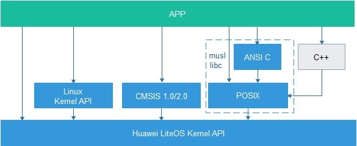

LiteOS提供了一套自有OS接口，同时也支持musl libc库、C++标准库、CMSIS接口和Linux接口。上层APP建议调用musl libc库等兼容接口，不建议直接调用LiteOS的自有OS接口。下面章节将列出LiteOS支持的兼容接口。

> **须知：** 
>LitesOS适配的libc库函数，遵循开源musl libc的实现形式，musl开源代码遵循标准C规范ISO/IEC 9899:1999和POSIX标准1003.1™-2008：作为最简单的底层库函数，内部不对指针类型参数做非空判断，由使用者保证入参的合法性。
>其中LiteOS实现的获取时间类接口都是自系统起调度算起，与接口标准定义不一致，使用时需特别注意。

## POSIX接口<a name="ZH-CN_TOPIC_0000002511794418"></a>


### POSIX支持接口<a name="ZH-CN_TOPIC_0000002543394355"></a>

LiteOS提供一套POSIX适配接口，具体的规格参见下表。

<a name="table7251821191815"></a>
<table><thead align="left"><tr id="row132381621141816"><th class="cellrowborder" valign="top" width="14.2%" id="mcps1.1.5.1.1"><p id="p4238821141818"><a name="p4238821141818"></a><a name="p4238821141818"></a>头文件</p>
</th>
<th class="cellrowborder" valign="top" width="20.810000000000002%" id="mcps1.1.5.1.2"><p id="p12238192111185"><a name="p12238192111185"></a><a name="p12238192111185"></a>接口名</p>
</th>
<th class="cellrowborder" valign="top" width="16.46%" id="mcps1.1.5.1.3"><p id="p02381021171812"><a name="p02381021171812"></a><a name="p02381021171812"></a>类型</p>
</th>
<th class="cellrowborder" valign="top" width="48.53%" id="mcps1.1.5.1.4"><p id="p1023882151811"><a name="p1023882151811"></a><a name="p1023882151811"></a>说明</p>
</th>
</tr>
</thead>
<tbody><tr id="row059428409"><td class="cellrowborder" valign="top" width="14.2%" headers="mcps1.1.5.1.1 "><p id="p78920414394"><a name="p78920414394"></a><a name="p78920414394"></a>ctype.h</p>
</td>
<td class="cellrowborder" valign="top" width="20.810000000000002%" headers="mcps1.1.5.1.2 "><p id="p14892134143918"><a name="p14892134143918"></a><a name="p14892134143918"></a>isalnum_l</p>
</td>
<td class="cellrowborder" valign="top" width="16.46%" headers="mcps1.1.5.1.3 "><p id="p18892124133917"><a name="p18892124133917"></a><a name="p18892124133917"></a>数据判断</p>
</td>
<td class="cellrowborder" valign="top" width="48.53%" headers="mcps1.1.5.1.4 "><p id="p28922413910"><a name="p28922413910"></a><a name="p28922413910"></a>判断入参是否为字母或数字</p>
</td>
</tr>
<tr id="row036910155011"><td class="cellrowborder" valign="top" width="14.2%" headers="mcps1.1.5.1.1 "><p id="p1389212418397"><a name="p1389212418397"></a><a name="p1389212418397"></a>ctype.h</p>
</td>
<td class="cellrowborder" valign="top" width="20.810000000000002%" headers="mcps1.1.5.1.2 "><p id="p98921845399"><a name="p98921845399"></a><a name="p98921845399"></a>isalpha_l</p>
</td>
<td class="cellrowborder" valign="top" width="16.46%" headers="mcps1.1.5.1.3 "><p id="p68927413391"><a name="p68927413391"></a><a name="p68927413391"></a>数据判断</p>
</td>
<td class="cellrowborder" valign="top" width="48.53%" headers="mcps1.1.5.1.4 "><p id="p138923412393"><a name="p138923412393"></a><a name="p138923412393"></a>判断入参是否为字母</p>
</td>
</tr>
<tr id="row857315181204"><td class="cellrowborder" valign="top" width="14.2%" headers="mcps1.1.5.1.1 "><p id="p138925433910"><a name="p138925433910"></a><a name="p138925433910"></a>ctype.h</p>
</td>
<td class="cellrowborder" valign="top" width="20.810000000000002%" headers="mcps1.1.5.1.2 "><p id="p17892154163916"><a name="p17892154163916"></a><a name="p17892154163916"></a>isascii</p>
</td>
<td class="cellrowborder" valign="top" width="16.46%" headers="mcps1.1.5.1.3 "><p id="p108921349391"><a name="p108921349391"></a><a name="p108921349391"></a>数据判断</p>
</td>
<td class="cellrowborder" valign="top" width="48.53%" headers="mcps1.1.5.1.4 "><p id="p989215416397"><a name="p989215416397"></a><a name="p989215416397"></a>判断入参是否为ascii码</p>
</td>
</tr>
<tr id="row6747921201"><td class="cellrowborder" valign="top" width="14.2%" headers="mcps1.1.5.1.1 "><p id="p2892154173910"><a name="p2892154173910"></a><a name="p2892154173910"></a>ctype.h</p>
</td>
<td class="cellrowborder" valign="top" width="20.810000000000002%" headers="mcps1.1.5.1.2 "><p id="p1889215411396"><a name="p1889215411396"></a><a name="p1889215411396"></a>isblank</p>
</td>
<td class="cellrowborder" valign="top" width="16.46%" headers="mcps1.1.5.1.3 "><p id="p19892134103916"><a name="p19892134103916"></a><a name="p19892134103916"></a>数据判断</p>
</td>
<td class="cellrowborder" valign="top" width="48.53%" headers="mcps1.1.5.1.4 "><p id="p1189212419394"><a name="p1189212419394"></a><a name="p1189212419394"></a>判断入参是否为空格或tab</p>
</td>
</tr>
<tr id="row74641425303"><td class="cellrowborder" valign="top" width="14.2%" headers="mcps1.1.5.1.1 "><p id="p28928483917"><a name="p28928483917"></a><a name="p28928483917"></a>ctype.h</p>
</td>
<td class="cellrowborder" valign="top" width="20.810000000000002%" headers="mcps1.1.5.1.2 "><p id="p1189219415395"><a name="p1189219415395"></a><a name="p1189219415395"></a>isblank_l</p>
</td>
<td class="cellrowborder" valign="top" width="16.46%" headers="mcps1.1.5.1.3 "><p id="p2089213443916"><a name="p2089213443916"></a><a name="p2089213443916"></a>数据判断</p>
</td>
<td class="cellrowborder" valign="top" width="48.53%" headers="mcps1.1.5.1.4 "><p id="p108921247395"><a name="p108921247395"></a><a name="p108921247395"></a>判断入参是否为空格或tab</p>
</td>
</tr>
<tr id="row2416341505"><td class="cellrowborder" valign="top" width="14.2%" headers="mcps1.1.5.1.1 "><p id="p889254123917"><a name="p889254123917"></a><a name="p889254123917"></a>ctype.h</p>
</td>
<td class="cellrowborder" valign="top" width="20.810000000000002%" headers="mcps1.1.5.1.2 "><p id="p17892545396"><a name="p17892545396"></a><a name="p17892545396"></a>iscntrl_l</p>
</td>
<td class="cellrowborder" valign="top" width="16.46%" headers="mcps1.1.5.1.3 "><p id="p689218420395"><a name="p689218420395"></a><a name="p689218420395"></a>数据判断</p>
</td>
<td class="cellrowborder" valign="top" width="48.53%" headers="mcps1.1.5.1.4 "><p id="p128928493912"><a name="p128928493912"></a><a name="p128928493912"></a>判断入参是否为控制字符</p>
</td>
</tr>
<tr id="row1615174313015"><td class="cellrowborder" valign="top" width="14.2%" headers="mcps1.1.5.1.1 "><p id="p589217413398"><a name="p589217413398"></a><a name="p589217413398"></a>ctype.h</p>
</td>
<td class="cellrowborder" valign="top" width="20.810000000000002%" headers="mcps1.1.5.1.2 "><p id="p78924453911"><a name="p78924453911"></a><a name="p78924453911"></a>isdigit_l</p>
</td>
<td class="cellrowborder" valign="top" width="16.46%" headers="mcps1.1.5.1.3 "><p id="p789219413398"><a name="p789219413398"></a><a name="p789219413398"></a>数据判断</p>
</td>
<td class="cellrowborder" valign="top" width="48.53%" headers="mcps1.1.5.1.4 "><p id="p10892649393"><a name="p10892649393"></a><a name="p10892649393"></a>判断入参是否为十进制数</p>
</td>
</tr>
<tr id="row8600165113016"><td class="cellrowborder" valign="top" width="14.2%" headers="mcps1.1.5.1.1 "><p id="p58921045396"><a name="p58921045396"></a><a name="p58921045396"></a>ctype.h</p>
</td>
<td class="cellrowborder" valign="top" width="20.810000000000002%" headers="mcps1.1.5.1.2 "><p id="p389214163912"><a name="p389214163912"></a><a name="p389214163912"></a>isgraph_l</p>
</td>
<td class="cellrowborder" valign="top" width="16.46%" headers="mcps1.1.5.1.3 "><p id="p989215483918"><a name="p989215483918"></a><a name="p989215483918"></a>数据判断</p>
</td>
<td class="cellrowborder" valign="top" width="48.53%" headers="mcps1.1.5.1.4 "><p id="p12892114153914"><a name="p12892114153914"></a><a name="p12892114153914"></a>判断入参是否有图形表示</p>
</td>
</tr>
<tr id="row68521041711"><td class="cellrowborder" valign="top" width="14.2%" headers="mcps1.1.5.1.1 "><p id="p7892549396"><a name="p7892549396"></a><a name="p7892549396"></a>ctype.h</p>
</td>
<td class="cellrowborder" valign="top" width="20.810000000000002%" headers="mcps1.1.5.1.2 "><p id="p38921420397"><a name="p38921420397"></a><a name="p38921420397"></a>islower_l</p>
</td>
<td class="cellrowborder" valign="top" width="16.46%" headers="mcps1.1.5.1.3 "><p id="p2892154113913"><a name="p2892154113913"></a><a name="p2892154113913"></a>数据判断</p>
</td>
<td class="cellrowborder" valign="top" width="48.53%" headers="mcps1.1.5.1.4 "><p id="p18929417396"><a name="p18929417396"></a><a name="p18929417396"></a>判断入参是否为小写字母</p>
</td>
</tr>
<tr id="row1799921115119"><td class="cellrowborder" valign="top" width="14.2%" headers="mcps1.1.5.1.1 "><p id="p089224173911"><a name="p089224173911"></a><a name="p089224173911"></a>ctype.h</p>
</td>
<td class="cellrowborder" valign="top" width="20.810000000000002%" headers="mcps1.1.5.1.2 "><p id="p118927453912"><a name="p118927453912"></a><a name="p118927453912"></a>isprint_l</p>
</td>
<td class="cellrowborder" valign="top" width="16.46%" headers="mcps1.1.5.1.3 "><p id="p989374153913"><a name="p989374153913"></a><a name="p989374153913"></a>数据判断</p>
</td>
<td class="cellrowborder" valign="top" width="48.53%" headers="mcps1.1.5.1.4 "><p id="p1689319416394"><a name="p1689319416394"></a><a name="p1689319416394"></a>判断入参是否可以打印</p>
</td>
</tr>
<tr id="row18915120817"><td class="cellrowborder" valign="top" width="14.2%" headers="mcps1.1.5.1.1 "><p id="p8893645398"><a name="p8893645398"></a><a name="p8893645398"></a>ctype.h</p>
</td>
<td class="cellrowborder" valign="top" width="20.810000000000002%" headers="mcps1.1.5.1.2 "><p id="p20893164193910"><a name="p20893164193910"></a><a name="p20893164193910"></a>ispunct_l</p>
</td>
<td class="cellrowborder" valign="top" width="16.46%" headers="mcps1.1.5.1.3 "><p id="p1789384133912"><a name="p1789384133912"></a><a name="p1789384133912"></a>数据判断</p>
</td>
<td class="cellrowborder" valign="top" width="48.53%" headers="mcps1.1.5.1.4 "><p id="p289317416392"><a name="p289317416392"></a><a name="p289317416392"></a>判断入参是否为标点符号</p>
</td>
</tr>
<tr id="row555018392110"><td class="cellrowborder" valign="top" width="14.2%" headers="mcps1.1.5.1.1 "><p id="p58931403916"><a name="p58931403916"></a><a name="p58931403916"></a>ctype.h</p>
</td>
<td class="cellrowborder" valign="top" width="20.810000000000002%" headers="mcps1.1.5.1.2 "><p id="p10893114163914"><a name="p10893114163914"></a><a name="p10893114163914"></a>isspace_l</p>
</td>
<td class="cellrowborder" valign="top" width="16.46%" headers="mcps1.1.5.1.3 "><p id="p98931341396"><a name="p98931341396"></a><a name="p98931341396"></a>数据判断</p>
</td>
<td class="cellrowborder" valign="top" width="48.53%" headers="mcps1.1.5.1.4 "><p id="p1089320443919"><a name="p1089320443919"></a><a name="p1089320443919"></a>判断入参是否为空格</p>
</td>
</tr>
<tr id="row5130847218"><td class="cellrowborder" valign="top" width="14.2%" headers="mcps1.1.5.1.1 "><p id="p1589316493913"><a name="p1589316493913"></a><a name="p1589316493913"></a>ctype.h</p>
</td>
<td class="cellrowborder" valign="top" width="20.810000000000002%" headers="mcps1.1.5.1.2 "><p id="p158931740397"><a name="p158931740397"></a><a name="p158931740397"></a>isupper_l</p>
</td>
<td class="cellrowborder" valign="top" width="16.46%" headers="mcps1.1.5.1.3 "><p id="p789317433916"><a name="p789317433916"></a><a name="p789317433916"></a>数据判断</p>
</td>
<td class="cellrowborder" valign="top" width="48.53%" headers="mcps1.1.5.1.4 "><p id="p12893114183910"><a name="p12893114183910"></a><a name="p12893114183910"></a>判断入参是否为大写字母</p>
</td>
</tr>
<tr id="row11431055319"><td class="cellrowborder" valign="top" width="14.2%" headers="mcps1.1.5.1.1 "><p id="p1989310473917"><a name="p1989310473917"></a><a name="p1989310473917"></a>ctype.h</p>
</td>
<td class="cellrowborder" valign="top" width="20.810000000000002%" headers="mcps1.1.5.1.2 "><p id="p13893446394"><a name="p13893446394"></a><a name="p13893446394"></a>isxdigit_l</p>
</td>
<td class="cellrowborder" valign="top" width="16.46%" headers="mcps1.1.5.1.3 "><p id="p1989314415398"><a name="p1989314415398"></a><a name="p1989314415398"></a>数据判断</p>
</td>
<td class="cellrowborder" valign="top" width="48.53%" headers="mcps1.1.5.1.4 "><p id="p18893144133916"><a name="p18893144133916"></a><a name="p18893144133916"></a>判断入参是否为十六进制数</p>
</td>
</tr>
<tr id="row341135918119"><td class="cellrowborder" valign="top" width="14.2%" headers="mcps1.1.5.1.1 "><p id="p1789311413395"><a name="p1789311413395"></a><a name="p1789311413395"></a>ctype.h</p>
</td>
<td class="cellrowborder" valign="top" width="20.810000000000002%" headers="mcps1.1.5.1.2 "><p id="p18893184133913"><a name="p18893184133913"></a><a name="p18893184133913"></a>toascii</p>
</td>
<td class="cellrowborder" valign="top" width="16.46%" headers="mcps1.1.5.1.3 "><p id="p1289319417397"><a name="p1289319417397"></a><a name="p1289319417397"></a>数据转换函数</p>
</td>
<td class="cellrowborder" valign="top" width="48.53%" headers="mcps1.1.5.1.4 "><p id="p128934413396"><a name="p128934413396"></a><a name="p128934413396"></a>将字符转换成ascii码</p>
</td>
</tr>
<tr id="row1447011156220"><td class="cellrowborder" valign="top" width="14.2%" headers="mcps1.1.5.1.1 "><p id="p88931641398"><a name="p88931641398"></a><a name="p88931641398"></a>ctype.h</p>
</td>
<td class="cellrowborder" valign="top" width="20.810000000000002%" headers="mcps1.1.5.1.2 "><p id="p48931483912"><a name="p48931483912"></a><a name="p48931483912"></a>tolower_l</p>
</td>
<td class="cellrowborder" valign="top" width="16.46%" headers="mcps1.1.5.1.3 "><p id="p168938443917"><a name="p168938443917"></a><a name="p168938443917"></a>数据转换函数</p>
</td>
<td class="cellrowborder" valign="top" width="48.53%" headers="mcps1.1.5.1.4 "><p id="p15893149390"><a name="p15893149390"></a><a name="p15893149390"></a>将大写字母转换成小写字母</p>
</td>
</tr>
<tr id="row2088412310215"><td class="cellrowborder" valign="top" width="14.2%" headers="mcps1.1.5.1.1 "><p id="p2893948393"><a name="p2893948393"></a><a name="p2893948393"></a>ctype.h</p>
</td>
<td class="cellrowborder" valign="top" width="20.810000000000002%" headers="mcps1.1.5.1.2 "><p id="p14893194143917"><a name="p14893194143917"></a><a name="p14893194143917"></a>toupper_l</p>
</td>
<td class="cellrowborder" valign="top" width="16.46%" headers="mcps1.1.5.1.3 "><p id="p4893164103920"><a name="p4893164103920"></a><a name="p4893164103920"></a>数据转换函数</p>
</td>
<td class="cellrowborder" valign="top" width="48.53%" headers="mcps1.1.5.1.4 "><p id="p089310415396"><a name="p089310415396"></a><a name="p089310415396"></a>将小写字母转换成大写字母</p>
</td>
</tr>
<tr id="row8761029726"><td class="cellrowborder" valign="top" width="14.2%" headers="mcps1.1.5.1.1 "><p id="p189364123915"><a name="p189364123915"></a><a name="p189364123915"></a>dirent.h</p>
</td>
<td class="cellrowborder" valign="top" width="20.810000000000002%" headers="mcps1.1.5.1.2 "><p id="p148931543393"><a name="p148931543393"></a><a name="p148931543393"></a>alphasort</p>
</td>
<td class="cellrowborder" valign="top" width="16.46%" headers="mcps1.1.5.1.3 "><p id="p0893747394"><a name="p0893747394"></a><a name="p0893747394"></a>目录操作</p>
</td>
<td class="cellrowborder" valign="top" width="48.53%" headers="mcps1.1.5.1.4 "><p id="p1289312413397"><a name="p1289312413397"></a><a name="p1289312413397"></a>依字母顺序排序目录结构</p>
</td>
</tr>
<tr id="row712463311219"><td class="cellrowborder" valign="top" width="14.2%" headers="mcps1.1.5.1.1 "><p id="p78933493913"><a name="p78933493913"></a><a name="p78933493913"></a>dirent.h</p>
</td>
<td class="cellrowborder" valign="top" width="20.810000000000002%" headers="mcps1.1.5.1.2 "><p id="p17893744393"><a name="p17893744393"></a><a name="p17893744393"></a>closedir</p>
</td>
<td class="cellrowborder" valign="top" width="16.46%" headers="mcps1.1.5.1.3 "><p id="p108931241391"><a name="p108931241391"></a><a name="p108931241391"></a>目录操作</p>
</td>
<td class="cellrowborder" valign="top" width="48.53%" headers="mcps1.1.5.1.4 "><p id="p58931493910"><a name="p58931493910"></a><a name="p58931493910"></a>关闭目录</p>
</td>
</tr>
<tr id="row18768173715218"><td class="cellrowborder" valign="top" width="14.2%" headers="mcps1.1.5.1.1 "><p id="p1589310453913"><a name="p1589310453913"></a><a name="p1589310453913"></a>dirent.h</p>
</td>
<td class="cellrowborder" valign="top" width="20.810000000000002%" headers="mcps1.1.5.1.2 "><p id="p15894340395"><a name="p15894340395"></a><a name="p15894340395"></a>opendir</p>
</td>
<td class="cellrowborder" valign="top" width="16.46%" headers="mcps1.1.5.1.3 "><p id="p148949423911"><a name="p148949423911"></a><a name="p148949423911"></a>目录操作</p>
</td>
<td class="cellrowborder" valign="top" width="48.53%" headers="mcps1.1.5.1.4 "><p id="p128947433916"><a name="p128947433916"></a><a name="p128947433916"></a>打开目录</p>
</td>
</tr>
<tr id="row1965214422026"><td class="cellrowborder" valign="top" width="14.2%" headers="mcps1.1.5.1.1 "><p id="p15894048395"><a name="p15894048395"></a><a name="p15894048395"></a>dirent.h</p>
</td>
<td class="cellrowborder" valign="top" width="20.810000000000002%" headers="mcps1.1.5.1.2 "><p id="p089464163912"><a name="p089464163912"></a><a name="p089464163912"></a>readdir</p>
</td>
<td class="cellrowborder" valign="top" width="16.46%" headers="mcps1.1.5.1.3 "><p id="p1789413483919"><a name="p1789413483919"></a><a name="p1789413483919"></a>目录操作</p>
</td>
<td class="cellrowborder" valign="top" width="48.53%" headers="mcps1.1.5.1.4 "><p id="p148942403918"><a name="p148942403918"></a><a name="p148942403918"></a>读取目录</p>
</td>
</tr>
<tr id="row23781056192218"><td class="cellrowborder" valign="top" width="14.2%" headers="mcps1.1.5.1.1 "><p id="p1189494123918"><a name="p1189494123918"></a><a name="p1189494123918"></a>dirent.h</p>
</td>
<td class="cellrowborder" valign="top" width="20.810000000000002%" headers="mcps1.1.5.1.2 "><p id="p138941947399"><a name="p138941947399"></a><a name="p138941947399"></a>rewinddir</p>
</td>
<td class="cellrowborder" valign="top" width="16.46%" headers="mcps1.1.5.1.3 "><p id="p13894342397"><a name="p13894342397"></a><a name="p13894342397"></a>目录操作</p>
</td>
<td class="cellrowborder" valign="top" width="48.53%" headers="mcps1.1.5.1.4 "><p id="p1989417414391"><a name="p1989417414391"></a><a name="p1989417414391"></a>重设读取目录的位置为开头位置</p>
</td>
</tr>
<tr id="row794925932217"><td class="cellrowborder" valign="top" width="14.2%" headers="mcps1.1.5.1.1 "><p id="p12894134163911"><a name="p12894134163911"></a><a name="p12894134163911"></a>dirent.h</p>
</td>
<td class="cellrowborder" valign="top" width="20.810000000000002%" headers="mcps1.1.5.1.2 "><p id="p1389413473916"><a name="p1389413473916"></a><a name="p1389413473916"></a>scandir</p>
</td>
<td class="cellrowborder" valign="top" width="16.46%" headers="mcps1.1.5.1.3 "><p id="p789418419392"><a name="p789418419392"></a><a name="p789418419392"></a>目录操作</p>
</td>
<td class="cellrowborder" valign="top" width="48.53%" headers="mcps1.1.5.1.4 "><p id="p589434183920"><a name="p589434183920"></a><a name="p589434183920"></a>扫描目录完成条件过滤</p>
</td>
</tr>
<tr id="row4545184142311"><td class="cellrowborder" valign="top" width="14.2%" headers="mcps1.1.5.1.1 "><p id="p1389410403914"><a name="p1389410403914"></a><a name="p1389410403914"></a>dirent.h</p>
</td>
<td class="cellrowborder" valign="top" width="20.810000000000002%" headers="mcps1.1.5.1.2 "><p id="p889411453919"><a name="p889411453919"></a><a name="p889411453919"></a>seekdir</p>
</td>
<td class="cellrowborder" valign="top" width="16.46%" headers="mcps1.1.5.1.3 "><p id="p38941048395"><a name="p38941048395"></a><a name="p38941048395"></a>目录操作</p>
</td>
<td class="cellrowborder" valign="top" width="48.53%" headers="mcps1.1.5.1.4 "><p id="p168944412394"><a name="p168944412394"></a><a name="p168944412394"></a>设置下回读取目录的位置</p>
</td>
</tr>
<tr id="row1535718842315"><td class="cellrowborder" valign="top" width="14.2%" headers="mcps1.1.5.1.1 "><p id="p1689484123914"><a name="p1689484123914"></a><a name="p1689484123914"></a>dirent.h</p>
</td>
<td class="cellrowborder" valign="top" width="20.810000000000002%" headers="mcps1.1.5.1.2 "><p id="p38943403911"><a name="p38943403911"></a><a name="p38943403911"></a>telldir</p>
</td>
<td class="cellrowborder" valign="top" width="16.46%" headers="mcps1.1.5.1.3 "><p id="p689424153918"><a name="p689424153918"></a><a name="p689424153918"></a>目录操作</p>
</td>
<td class="cellrowborder" valign="top" width="48.53%" headers="mcps1.1.5.1.4 "><p id="p178940463918"><a name="p178940463918"></a><a name="p178940463918"></a>取得目录流的读取位置</p>
</td>
</tr>
<tr id="row4259181917214"><td class="cellrowborder" valign="top" width="14.2%" headers="mcps1.1.5.1.1 "><p id="p1025911194218"><a name="p1025911194218"></a><a name="p1025911194218"></a>dlfcn.h</p>
</td>
<td class="cellrowborder" valign="top" width="20.810000000000002%" headers="mcps1.1.5.1.2 "><p id="p1425911902117"><a name="p1425911902117"></a><a name="p1425911902117"></a>dlclose</p>
</td>
<td class="cellrowborder" valign="top" width="16.46%" headers="mcps1.1.5.1.3 "><p id="p225917197218"><a name="p225917197218"></a><a name="p225917197218"></a>动态加载</p>
</td>
<td class="cellrowborder" valign="top" width="48.53%" headers="mcps1.1.5.1.4 "><p id="p19259191902114"><a name="p19259191902114"></a><a name="p19259191902114"></a>卸载一个模块</p>
</td>
</tr>
<tr id="row15476103082110"><td class="cellrowborder" valign="top" width="14.2%" headers="mcps1.1.5.1.1 "><p id="p1447683072113"><a name="p1447683072113"></a><a name="p1447683072113"></a>dlfcn.h</p>
</td>
<td class="cellrowborder" valign="top" width="20.810000000000002%" headers="mcps1.1.5.1.2 "><p id="p9476113012214"><a name="p9476113012214"></a><a name="p9476113012214"></a>dlopen</p>
</td>
<td class="cellrowborder" valign="top" width="16.46%" headers="mcps1.1.5.1.3 "><p id="p14766308218"><a name="p14766308218"></a><a name="p14766308218"></a>动态加载</p>
</td>
<td class="cellrowborder" valign="top" width="48.53%" headers="mcps1.1.5.1.4 "><p id="p104761530112110"><a name="p104761530112110"></a><a name="p104761530112110"></a>动态加载一个so模块</p>
</td>
</tr>
<tr id="row824042518217"><td class="cellrowborder" valign="top" width="14.2%" headers="mcps1.1.5.1.1 "><p id="p17240192572113"><a name="p17240192572113"></a><a name="p17240192572113"></a>dlfcn.h</p>
</td>
<td class="cellrowborder" valign="top" width="20.810000000000002%" headers="mcps1.1.5.1.2 "><p id="p72400252213"><a name="p72400252213"></a><a name="p72400252213"></a>dlsym</p>
</td>
<td class="cellrowborder" valign="top" width="16.46%" headers="mcps1.1.5.1.3 "><p id="p8240325152114"><a name="p8240325152114"></a><a name="p8240325152114"></a>动态加载</p>
</td>
<td class="cellrowborder" valign="top" width="48.53%" headers="mcps1.1.5.1.4 "><p id="p724016250211"><a name="p724016250211"></a><a name="p724016250211"></a>在模块或者系统符号表中查找符号</p>
</td>
</tr>
<tr id="row10817132113618"><td class="cellrowborder" valign="top" width="14.2%" headers="mcps1.1.5.1.1 "><p id="p1481862116361"><a name="p1481862116361"></a><a name="p1481862116361"></a>fcntl.h</p>
</td>
<td class="cellrowborder" valign="top" width="20.810000000000002%" headers="mcps1.1.5.1.2 "><p id="p2818152153617"><a name="p2818152153617"></a><a name="p2818152153617"></a>creat</p>
</td>
<td class="cellrowborder" valign="top" width="16.46%" headers="mcps1.1.5.1.3 "><p id="p158181221143612"><a name="p158181221143612"></a><a name="p158181221143612"></a>文件操作函数</p>
</td>
<td class="cellrowborder" valign="top" width="48.53%" headers="mcps1.1.5.1.4 "><p id="p28181621193617"><a name="p28181621193617"></a><a name="p28181621193617"></a>创建一个文件</p>
</td>
</tr>
<tr id="row090483733812"><td class="cellrowborder" valign="top" width="14.2%" headers="mcps1.1.5.1.1 "><p id="p290418378385"><a name="p290418378385"></a><a name="p290418378385"></a>fcntl.h</p>
</td>
<td class="cellrowborder" valign="top" width="20.810000000000002%" headers="mcps1.1.5.1.2 "><p id="p7904163723819"><a name="p7904163723819"></a><a name="p7904163723819"></a>fcntl</p>
</td>
<td class="cellrowborder" valign="top" width="16.46%" headers="mcps1.1.5.1.3 "><p id="p1490423773810"><a name="p1490423773810"></a><a name="p1490423773810"></a>文件操作函数</p>
</td>
<td class="cellrowborder" valign="top" width="48.53%" headers="mcps1.1.5.1.4 "><p id="p149047373387"><a name="p149047373387"></a><a name="p149047373387"></a>文件描述词操作</p>
</td>
</tr>
<tr id="row1671558183912"><td class="cellrowborder" valign="top" width="14.2%" headers="mcps1.1.5.1.1 "><p id="p7715198143917"><a name="p7715198143917"></a><a name="p7715198143917"></a>fcntl.h</p>
</td>
<td class="cellrowborder" valign="top" width="20.810000000000002%" headers="mcps1.1.5.1.2 "><p id="p1371515823919"><a name="p1371515823919"></a><a name="p1371515823919"></a>open</p>
</td>
<td class="cellrowborder" valign="top" width="16.46%" headers="mcps1.1.5.1.3 "><p id="p27151987392"><a name="p27151987392"></a><a name="p27151987392"></a>文件操作函数</p>
</td>
<td class="cellrowborder" valign="top" width="48.53%" headers="mcps1.1.5.1.4 "><p id="p971512853920"><a name="p971512853920"></a><a name="p971512853920"></a>打开文件</p>
</td>
</tr>
<tr id="row125714713366"><td class="cellrowborder" valign="top" width="14.2%" headers="mcps1.1.5.1.1 "><p id="p957479361"><a name="p957479361"></a><a name="p957479361"></a>langinfo.h</p>
</td>
<td class="cellrowborder" valign="top" width="20.810000000000002%" headers="mcps1.1.5.1.2 "><p id="p10571718363"><a name="p10571718363"></a><a name="p10571718363"></a>nl_langinfo</p>
</td>
<td class="cellrowborder" valign="top" width="16.46%" headers="mcps1.1.5.1.3 "><p id="p10575703610"><a name="p10575703610"></a><a name="p10575703610"></a>系统函数</p>
</td>
<td class="cellrowborder" valign="top" width="48.53%" headers="mcps1.1.5.1.4 "><p id="p115712793617"><a name="p115712793617"></a><a name="p115712793617"></a>返回指定的本地信息</p>
</td>
</tr>
<tr id="row821410153362"><td class="cellrowborder" valign="top" width="14.2%" headers="mcps1.1.5.1.1 "><p id="p1221451518368"><a name="p1221451518368"></a><a name="p1221451518368"></a>langinfo.h</p>
</td>
<td class="cellrowborder" valign="top" width="20.810000000000002%" headers="mcps1.1.5.1.2 "><p id="p12144157367"><a name="p12144157367"></a><a name="p12144157367"></a>nl_langinfo_l</p>
</td>
<td class="cellrowborder" valign="top" width="16.46%" headers="mcps1.1.5.1.3 "><p id="p1321481513616"><a name="p1321481513616"></a><a name="p1321481513616"></a>系统函数</p>
</td>
<td class="cellrowborder" valign="top" width="48.53%" headers="mcps1.1.5.1.4 "><p id="p112141015123618"><a name="p112141015123618"></a><a name="p112141015123618"></a>返回指定的本地信息</p>
</td>
</tr>
<tr id="row1499161814365"><td class="cellrowborder" valign="top" width="14.2%" headers="mcps1.1.5.1.1 "><p id="p1199191819369"><a name="p1199191819369"></a><a name="p1199191819369"></a>libgen.h</p>
</td>
<td class="cellrowborder" valign="top" width="20.810000000000002%" headers="mcps1.1.5.1.2 "><p id="p179915183361"><a name="p179915183361"></a><a name="p179915183361"></a>basename</p>
</td>
<td class="cellrowborder" valign="top" width="16.46%" headers="mcps1.1.5.1.3 "><p id="p1599117181365"><a name="p1599117181365"></a><a name="p1599117181365"></a>文件路径</p>
</td>
<td class="cellrowborder" valign="top" width="48.53%" headers="mcps1.1.5.1.4 "><p id="p8991151823610"><a name="p8991151823610"></a><a name="p8991151823610"></a>返回文件名</p>
</td>
</tr>
<tr id="row22381321151819"><td class="cellrowborder" valign="top" width="14.2%" headers="mcps1.1.5.1.1 "><p id="p7238121101820"><a name="p7238121101820"></a><a name="p7238121101820"></a>mqueue.h</p>
</td>
<td class="cellrowborder" valign="top" width="20.810000000000002%" headers="mcps1.1.5.1.2 "><p id="p142381621101814"><a name="p142381621101814"></a><a name="p142381621101814"></a>mq_close</p>
</td>
<td class="cellrowborder" valign="top" width="16.46%" headers="mcps1.1.5.1.3 "><p id="p1823812171817"><a name="p1823812171817"></a><a name="p1823812171817"></a>消息队列</p>
</td>
<td class="cellrowborder" valign="top" width="48.53%" headers="mcps1.1.5.1.4 "><p id="p1923802112183"><a name="p1923802112183"></a><a name="p1923802112183"></a>关闭消息队列</p>
</td>
</tr>
<tr id="row10238192131816"><td class="cellrowborder" valign="top" width="14.2%" headers="mcps1.1.5.1.1 "><p id="p323862121816"><a name="p323862121816"></a><a name="p323862121816"></a>mqueue.h</p>
</td>
<td class="cellrowborder" valign="top" width="20.810000000000002%" headers="mcps1.1.5.1.2 "><p id="p923812219182"><a name="p923812219182"></a><a name="p923812219182"></a>mq_getattr</p>
</td>
<td class="cellrowborder" valign="top" width="16.46%" headers="mcps1.1.5.1.3 "><p id="p8238121141819"><a name="p8238121141819"></a><a name="p8238121141819"></a>消息队列</p>
</td>
<td class="cellrowborder" valign="top" width="48.53%" headers="mcps1.1.5.1.4 "><p id="p1623892141819"><a name="p1623892141819"></a><a name="p1623892141819"></a>获取消息队列属性</p>
</td>
</tr>
<tr id="row32382213185"><td class="cellrowborder" valign="top" width="14.2%" headers="mcps1.1.5.1.1 "><p id="p17238221151817"><a name="p17238221151817"></a><a name="p17238221151817"></a>mqueue.h</p>
</td>
<td class="cellrowborder" valign="top" width="20.810000000000002%" headers="mcps1.1.5.1.2 "><p id="p162387216183"><a name="p162387216183"></a><a name="p162387216183"></a>mq_open</p>
</td>
<td class="cellrowborder" valign="top" width="16.46%" headers="mcps1.1.5.1.3 "><p id="p102381221161812"><a name="p102381221161812"></a><a name="p102381221161812"></a>消息队列</p>
</td>
<td class="cellrowborder" valign="top" width="48.53%" headers="mcps1.1.5.1.4 "><p id="p1623813216185"><a name="p1623813216185"></a><a name="p1623813216185"></a>打开消息队列</p>
</td>
</tr>
<tr id="row1223814210185"><td class="cellrowborder" valign="top" width="14.2%" headers="mcps1.1.5.1.1 "><p id="p1323862121815"><a name="p1323862121815"></a><a name="p1323862121815"></a>mqueue.h</p>
</td>
<td class="cellrowborder" valign="top" width="20.810000000000002%" headers="mcps1.1.5.1.2 "><p id="p1523802141813"><a name="p1523802141813"></a><a name="p1523802141813"></a>mq_receive</p>
</td>
<td class="cellrowborder" valign="top" width="16.46%" headers="mcps1.1.5.1.3 "><p id="p12381215186"><a name="p12381215186"></a><a name="p12381215186"></a>消息队列</p>
</td>
<td class="cellrowborder" valign="top" width="48.53%" headers="mcps1.1.5.1.4 "><p id="p1923816215184"><a name="p1923816215184"></a><a name="p1923816215184"></a>接受一个消息队列中的消息</p>
</td>
</tr>
<tr id="row3238122111812"><td class="cellrowborder" valign="top" width="14.2%" headers="mcps1.1.5.1.1 "><p id="p1923872171816"><a name="p1923872171816"></a><a name="p1923872171816"></a>mqueue.h</p>
</td>
<td class="cellrowborder" valign="top" width="20.810000000000002%" headers="mcps1.1.5.1.2 "><p id="p1523822111820"><a name="p1523822111820"></a><a name="p1523822111820"></a>mq_send</p>
</td>
<td class="cellrowborder" valign="top" width="16.46%" headers="mcps1.1.5.1.3 "><p id="p1423892121810"><a name="p1423892121810"></a><a name="p1423892121810"></a>消息队列</p>
</td>
<td class="cellrowborder" valign="top" width="48.53%" headers="mcps1.1.5.1.4 "><p id="p20238621101811"><a name="p20238621101811"></a><a name="p20238621101811"></a>发送一个消息到消息队列</p>
</td>
</tr>
<tr id="row16238021151810"><td class="cellrowborder" valign="top" width="14.2%" headers="mcps1.1.5.1.1 "><p id="p623852118186"><a name="p623852118186"></a><a name="p623852118186"></a>mqueue.h</p>
</td>
<td class="cellrowborder" valign="top" width="20.810000000000002%" headers="mcps1.1.5.1.2 "><p id="p1823815217185"><a name="p1823815217185"></a><a name="p1823815217185"></a>mq_setattr</p>
</td>
<td class="cellrowborder" valign="top" width="16.46%" headers="mcps1.1.5.1.3 "><p id="p923882112185"><a name="p923882112185"></a><a name="p923882112185"></a>消息队列</p>
</td>
<td class="cellrowborder" valign="top" width="48.53%" headers="mcps1.1.5.1.4 "><p id="p323832191817"><a name="p323832191817"></a><a name="p323832191817"></a>设置消息队列属性</p>
</td>
</tr>
<tr id="row523813212188"><td class="cellrowborder" valign="top" width="14.2%" headers="mcps1.1.5.1.1 "><p id="p122385217182"><a name="p122385217182"></a><a name="p122385217182"></a>mqueue.h</p>
</td>
<td class="cellrowborder" valign="top" width="20.810000000000002%" headers="mcps1.1.5.1.2 "><p id="p923814217181"><a name="p923814217181"></a><a name="p923814217181"></a>mq_timedreceive</p>
</td>
<td class="cellrowborder" valign="top" width="16.46%" headers="mcps1.1.5.1.3 "><p id="p20238142111814"><a name="p20238142111814"></a><a name="p20238142111814"></a>消息队列</p>
</td>
<td class="cellrowborder" valign="top" width="48.53%" headers="mcps1.1.5.1.4 "><p id="p5238142113188"><a name="p5238142113188"></a><a name="p5238142113188"></a>定时接收消息</p>
</td>
</tr>
<tr id="row1023852181818"><td class="cellrowborder" valign="top" width="14.2%" headers="mcps1.1.5.1.1 "><p id="p42381321181814"><a name="p42381321181814"></a><a name="p42381321181814"></a>mqueue.h</p>
</td>
<td class="cellrowborder" valign="top" width="20.810000000000002%" headers="mcps1.1.5.1.2 "><p id="p17238172141816"><a name="p17238172141816"></a><a name="p17238172141816"></a>mq_timedsend</p>
</td>
<td class="cellrowborder" valign="top" width="16.46%" headers="mcps1.1.5.1.3 "><p id="p132386217185"><a name="p132386217185"></a><a name="p132386217185"></a>消息队列</p>
</td>
<td class="cellrowborder" valign="top" width="48.53%" headers="mcps1.1.5.1.4 "><p id="p023832118183"><a name="p023832118183"></a><a name="p023832118183"></a>定时发送消息</p>
</td>
</tr>
<tr id="row16238521131810"><td class="cellrowborder" valign="top" width="14.2%" headers="mcps1.1.5.1.1 "><p id="p42381021131818"><a name="p42381021131818"></a><a name="p42381021131818"></a>mqueue.h</p>
</td>
<td class="cellrowborder" valign="top" width="20.810000000000002%" headers="mcps1.1.5.1.2 "><p id="p62381121151811"><a name="p62381121151811"></a><a name="p62381121151811"></a>mq_unlink</p>
</td>
<td class="cellrowborder" valign="top" width="16.46%" headers="mcps1.1.5.1.3 "><p id="p92382021131810"><a name="p92382021131810"></a><a name="p92382021131810"></a>消息队列</p>
</td>
<td class="cellrowborder" valign="top" width="48.53%" headers="mcps1.1.5.1.4 "><p id="p823815218181"><a name="p823815218181"></a><a name="p823815218181"></a>移除消息队列</p>
</td>
</tr>
<tr id="row17241929103513"><td class="cellrowborder" valign="top" width="14.2%" headers="mcps1.1.5.1.1 "><p id="p2896184123914"><a name="p2896184123914"></a><a name="p2896184123914"></a>net/if.h</p>
</td>
<td class="cellrowborder" valign="top" width="20.810000000000002%" headers="mcps1.1.5.1.2 "><p id="p78962453913"><a name="p78962453913"></a><a name="p78962453913"></a>if_freenameindex</p>
</td>
<td class="cellrowborder" valign="top" width="16.46%" headers="mcps1.1.5.1.3 "><p id="p1989613411393"><a name="p1989613411393"></a><a name="p1989613411393"></a>网络函数</p>
</td>
<td class="cellrowborder" valign="top" width="48.53%" headers="mcps1.1.5.1.4 "><p id="p389619433919"><a name="p389619433919"></a><a name="p389619433919"></a>通过if_nameindex()获取完毕接口名称与索引后，调用该函数以释放动态分配的内存区域</p>
</td>
</tr>
<tr id="row591534203516"><td class="cellrowborder" valign="top" width="14.2%" headers="mcps1.1.5.1.1 "><p id="p1489614103913"><a name="p1489614103913"></a><a name="p1489614103913"></a>net/if.h</p>
</td>
<td class="cellrowborder" valign="top" width="20.810000000000002%" headers="mcps1.1.5.1.2 "><p id="p489610417395"><a name="p489610417395"></a><a name="p489610417395"></a>if_indextoname</p>
</td>
<td class="cellrowborder" valign="top" width="16.46%" headers="mcps1.1.5.1.3 "><p id="p148964415397"><a name="p148964415397"></a><a name="p148964415397"></a>数据转换函数</p>
</td>
<td class="cellrowborder" valign="top" width="48.53%" headers="mcps1.1.5.1.4 "><p id="p11896344392"><a name="p11896344392"></a><a name="p11896344392"></a>将网卡序号转为网卡名</p>
</td>
</tr>
<tr id="row6358143743514"><td class="cellrowborder" valign="top" width="14.2%" headers="mcps1.1.5.1.1 "><p id="p789614413910"><a name="p789614413910"></a><a name="p789614413910"></a>net/if.h</p>
</td>
<td class="cellrowborder" valign="top" width="20.810000000000002%" headers="mcps1.1.5.1.2 "><p id="p9896154133915"><a name="p9896154133915"></a><a name="p9896154133915"></a>if_nameindex</p>
</td>
<td class="cellrowborder" valign="top" width="16.46%" headers="mcps1.1.5.1.3 "><p id="p19896194193919"><a name="p19896194193919"></a><a name="p19896194193919"></a>网络函数</p>
</td>
<td class="cellrowborder" valign="top" width="48.53%" headers="mcps1.1.5.1.4 "><p id="p3896546399"><a name="p3896546399"></a><a name="p3896546399"></a>返回动态分配的struct if_nameindex结构数组，数组中的每一个元素分别对应一个本地网络接口</p>
</td>
</tr>
<tr id="row571394118350"><td class="cellrowborder" valign="top" width="14.2%" headers="mcps1.1.5.1.1 "><p id="p118973473915"><a name="p118973473915"></a><a name="p118973473915"></a>net/if.h</p>
</td>
<td class="cellrowborder" valign="top" width="20.810000000000002%" headers="mcps1.1.5.1.2 "><p id="p1389764113915"><a name="p1389764113915"></a><a name="p1389764113915"></a>if_nametoindex</p>
</td>
<td class="cellrowborder" valign="top" width="16.46%" headers="mcps1.1.5.1.3 "><p id="p889744153919"><a name="p889744153919"></a><a name="p889744153919"></a>数据转换函数</p>
</td>
<td class="cellrowborder" valign="top" width="48.53%" headers="mcps1.1.5.1.4 "><p id="p2897349391"><a name="p2897349391"></a><a name="p2897349391"></a>将网卡名转为网卡序号</p>
</td>
</tr>
<tr id="row11739535104018"><td class="cellrowborder" valign="top" width="14.2%" headers="mcps1.1.5.1.1 "><p id="p1589794133918"><a name="p1589794133918"></a><a name="p1589794133918"></a>netdb.h</p>
</td>
<td class="cellrowborder" valign="top" width="20.810000000000002%" headers="mcps1.1.5.1.2 "><p id="p128973413916"><a name="p128973413916"></a><a name="p128973413916"></a>freeaddrinfo</p>
</td>
<td class="cellrowborder" valign="top" width="16.46%" headers="mcps1.1.5.1.3 "><p id="p3897649392"><a name="p3897649392"></a><a name="p3897649392"></a>网络函数</p>
</td>
<td class="cellrowborder" valign="top" width="48.53%" headers="mcps1.1.5.1.4 "><p id="p14897146391"><a name="p14897146391"></a><a name="p14897146391"></a>释放getaddrinfo申请的内存空间</p>
</td>
</tr>
<tr id="row1220604424018"><td class="cellrowborder" valign="top" width="14.2%" headers="mcps1.1.5.1.1 "><p id="p1089716483919"><a name="p1089716483919"></a><a name="p1089716483919"></a>netdb.h</p>
</td>
<td class="cellrowborder" valign="top" width="20.810000000000002%" headers="mcps1.1.5.1.2 "><p id="p128976417394"><a name="p128976417394"></a><a name="p128976417394"></a>getaddrinfo</p>
</td>
<td class="cellrowborder" valign="top" width="16.46%" headers="mcps1.1.5.1.3 "><p id="p389710423914"><a name="p389710423914"></a><a name="p389710423914"></a>网络函数</p>
</td>
<td class="cellrowborder" valign="top" width="48.53%" headers="mcps1.1.5.1.4 "><p id="p489712415393"><a name="p489712415393"></a><a name="p489712415393"></a>将主机名和服务名转换到socket地址</p>
</td>
</tr>
<tr id="row14598154144010"><td class="cellrowborder" valign="top" width="14.2%" headers="mcps1.1.5.1.1 "><p id="p188971433912"><a name="p188971433912"></a><a name="p188971433912"></a>netdb.h</p>
</td>
<td class="cellrowborder" valign="top" width="20.810000000000002%" headers="mcps1.1.5.1.2 "><p id="p1889710483916"><a name="p1889710483916"></a><a name="p1889710483916"></a>getnameinfo</p>
</td>
<td class="cellrowborder" valign="top" width="16.46%" headers="mcps1.1.5.1.3 "><p id="p198971246396"><a name="p198971246396"></a><a name="p198971246396"></a>网络函数</p>
</td>
<td class="cellrowborder" valign="top" width="48.53%" headers="mcps1.1.5.1.4 "><p id="p98977412397"><a name="p98977412397"></a><a name="p98977412397"></a>将socket地址转换到主机名和服务名</p>
</td>
</tr>
<tr id="row97131254155818"><td class="cellrowborder" valign="top" width="14.2%" headers="mcps1.1.5.1.1 "><p id="p1789711414391"><a name="p1789711414391"></a><a name="p1789711414391"></a>poll.h</p>
</td>
<td class="cellrowborder" valign="top" width="20.810000000000002%" headers="mcps1.1.5.1.2 "><p id="p19897194163914"><a name="p19897194163914"></a><a name="p19897194163914"></a>poll</p>
</td>
<td class="cellrowborder" valign="top" width="16.46%" headers="mcps1.1.5.1.3 "><p id="p28973473920"><a name="p28973473920"></a><a name="p28973473920"></a>文件操作函数</p>
</td>
<td class="cellrowborder" valign="top" width="48.53%" headers="mcps1.1.5.1.4 "><p id="p28976433917"><a name="p28976433917"></a><a name="p28976433917"></a>监视文件描述符</p>
</td>
</tr>
<tr id="row1323842110187"><td class="cellrowborder" valign="top" width="14.2%" headers="mcps1.1.5.1.1 "><p id="p82381621171816"><a name="p82381621171816"></a><a name="p82381621171816"></a>pthread.h</p>
</td>
<td class="cellrowborder" valign="top" width="20.810000000000002%" headers="mcps1.1.5.1.2 "><p id="p323917218181"><a name="p323917218181"></a><a name="p323917218181"></a>pthread_attr_destroy</p>
</td>
<td class="cellrowborder" valign="top" width="16.46%" headers="mcps1.1.5.1.3 "><p id="p22391521131811"><a name="p22391521131811"></a><a name="p22391521131811"></a>pthread</p>
</td>
<td class="cellrowborder" valign="top" width="48.53%" headers="mcps1.1.5.1.4 "><p id="p1623922151819"><a name="p1623922151819"></a><a name="p1623922151819"></a>删除线程的属性</p>
</td>
</tr>
<tr id="row152398216183"><td class="cellrowborder" valign="top" width="14.2%" headers="mcps1.1.5.1.1 "><p id="p132391421101816"><a name="p132391421101816"></a><a name="p132391421101816"></a>pthread.h</p>
</td>
<td class="cellrowborder" valign="top" width="20.810000000000002%" headers="mcps1.1.5.1.2 "><p id="p1239152117186"><a name="p1239152117186"></a><a name="p1239152117186"></a>pthread_attr_getdetachstate</p>
</td>
<td class="cellrowborder" valign="top" width="16.46%" headers="mcps1.1.5.1.3 "><p id="p14239221151817"><a name="p14239221151817"></a><a name="p14239221151817"></a>pthread</p>
</td>
<td class="cellrowborder" valign="top" width="48.53%" headers="mcps1.1.5.1.4 "><p id="p112392216186"><a name="p112392216186"></a><a name="p112392216186"></a>获取脱离状态的属性</p>
</td>
</tr>
<tr id="row423912191818"><td class="cellrowborder" valign="top" width="14.2%" headers="mcps1.1.5.1.1 "><p id="p12239102121819"><a name="p12239102121819"></a><a name="p12239102121819"></a>pthread.h</p>
</td>
<td class="cellrowborder" valign="top" width="20.810000000000002%" headers="mcps1.1.5.1.2 "><p id="p3239182117183"><a name="p3239182117183"></a><a name="p3239182117183"></a>pthread_attr_getinheritsched</p>
</td>
<td class="cellrowborder" valign="top" width="16.46%" headers="mcps1.1.5.1.3 "><p id="p1623972112184"><a name="p1623972112184"></a><a name="p1623972112184"></a>pthread</p>
</td>
<td class="cellrowborder" valign="top" width="48.53%" headers="mcps1.1.5.1.4 "><p id="p3239202114182"><a name="p3239202114182"></a><a name="p3239202114182"></a>获取任务调度方式</p>
</td>
</tr>
<tr id="row92395213186"><td class="cellrowborder" valign="top" width="14.2%" headers="mcps1.1.5.1.1 "><p id="p123962119183"><a name="p123962119183"></a><a name="p123962119183"></a>pthread.h</p>
</td>
<td class="cellrowborder" valign="top" width="20.810000000000002%" headers="mcps1.1.5.1.2 "><p id="p1239132117182"><a name="p1239132117182"></a><a name="p1239132117182"></a>pthread_attr_getschedparam</p>
</td>
<td class="cellrowborder" valign="top" width="16.46%" headers="mcps1.1.5.1.3 "><p id="p172399212186"><a name="p172399212186"></a><a name="p172399212186"></a>pthread</p>
</td>
<td class="cellrowborder" valign="top" width="48.53%" headers="mcps1.1.5.1.4 "><p id="p1923918211189"><a name="p1923918211189"></a><a name="p1923918211189"></a>获取任务调度参数</p>
</td>
</tr>
<tr id="row11239142191817"><td class="cellrowborder" valign="top" width="14.2%" headers="mcps1.1.5.1.1 "><p id="p7239142118182"><a name="p7239142118182"></a><a name="p7239142118182"></a>pthread.h</p>
</td>
<td class="cellrowborder" valign="top" width="20.810000000000002%" headers="mcps1.1.5.1.2 "><p id="p1623913214189"><a name="p1623913214189"></a><a name="p1623913214189"></a>pthread_attr_getschedpolicy</p>
</td>
<td class="cellrowborder" valign="top" width="16.46%" headers="mcps1.1.5.1.3 "><p id="p16239421121818"><a name="p16239421121818"></a><a name="p16239421121818"></a>pthread</p>
</td>
<td class="cellrowborder" valign="top" width="48.53%" headers="mcps1.1.5.1.4 "><p id="p1523952151817"><a name="p1523952151817"></a><a name="p1523952151817"></a>获取任务调度策略属性，目前仅支持SCHED_RR调度策略，不支持SCHED_OTHER、SCHED_FIFO</p>
</td>
</tr>
<tr id="row823913218181"><td class="cellrowborder" valign="top" width="14.2%" headers="mcps1.1.5.1.1 "><p id="p223942118182"><a name="p223942118182"></a><a name="p223942118182"></a>pthread.h</p>
</td>
<td class="cellrowborder" valign="top" width="20.810000000000002%" headers="mcps1.1.5.1.2 "><p id="p1123972116189"><a name="p1123972116189"></a><a name="p1123972116189"></a>pthread_attr_getscope</p>
</td>
<td class="cellrowborder" valign="top" width="16.46%" headers="mcps1.1.5.1.3 "><p id="p22395218186"><a name="p22395218186"></a><a name="p22395218186"></a>pthread</p>
</td>
<td class="cellrowborder" valign="top" width="48.53%" headers="mcps1.1.5.1.4 "><p id="p4239721201815"><a name="p4239721201815"></a><a name="p4239721201815"></a>获取任务范围属性，任务使用范围目前只支持PTHREAD_SCOPE_SYSTEM，不支持PTHREAD_SCOPE_PROCESS</p>
</td>
</tr>
<tr id="row8239021161811"><td class="cellrowborder" valign="top" width="14.2%" headers="mcps1.1.5.1.1 "><p id="p10239172112189"><a name="p10239172112189"></a><a name="p10239172112189"></a>pthread.h</p>
</td>
<td class="cellrowborder" valign="top" width="20.810000000000002%" headers="mcps1.1.5.1.2 "><p id="p623911215182"><a name="p623911215182"></a><a name="p623911215182"></a>pthread_attr_getstackaddr</p>
</td>
<td class="cellrowborder" valign="top" width="16.46%" headers="mcps1.1.5.1.3 "><p id="p142391721191820"><a name="p142391721191820"></a><a name="p142391721191820"></a>pthread</p>
</td>
<td class="cellrowborder" valign="top" width="48.53%" headers="mcps1.1.5.1.4 "><p id="p823920218189"><a name="p823920218189"></a><a name="p823920218189"></a>获取任务堆栈的起始地址</p>
</td>
</tr>
<tr id="row723972171811"><td class="cellrowborder" valign="top" width="14.2%" headers="mcps1.1.5.1.1 "><p id="p42391221111810"><a name="p42391221111810"></a><a name="p42391221111810"></a>pthread.h</p>
</td>
<td class="cellrowborder" valign="top" width="20.810000000000002%" headers="mcps1.1.5.1.2 "><p id="p202399217187"><a name="p202399217187"></a><a name="p202399217187"></a>pthread_attr_getstacksize</p>
</td>
<td class="cellrowborder" valign="top" width="16.46%" headers="mcps1.1.5.1.3 "><p id="p323962116188"><a name="p323962116188"></a><a name="p323962116188"></a>pthread</p>
</td>
<td class="cellrowborder" valign="top" width="48.53%" headers="mcps1.1.5.1.4 "><p id="p142391021171816"><a name="p142391021171816"></a><a name="p142391021171816"></a>获取任务属性堆栈大小</p>
</td>
</tr>
<tr id="row1623919212184"><td class="cellrowborder" valign="top" width="14.2%" headers="mcps1.1.5.1.1 "><p id="p423952118184"><a name="p423952118184"></a><a name="p423952118184"></a>pthread.h</p>
</td>
<td class="cellrowborder" valign="top" width="20.810000000000002%" headers="mcps1.1.5.1.2 "><p id="p423982161813"><a name="p423982161813"></a><a name="p423982161813"></a>pthread_attr_init</p>
</td>
<td class="cellrowborder" valign="top" width="16.46%" headers="mcps1.1.5.1.3 "><p id="p423972121817"><a name="p423972121817"></a><a name="p423972121817"></a>pthread</p>
</td>
<td class="cellrowborder" valign="top" width="48.53%" headers="mcps1.1.5.1.4 "><p id="p16239182141811"><a name="p16239182141811"></a><a name="p16239182141811"></a>初始化任务属性</p>
</td>
</tr>
<tr id="row723962110181"><td class="cellrowborder" valign="top" width="14.2%" headers="mcps1.1.5.1.1 "><p id="p223972111183"><a name="p223972111183"></a><a name="p223972111183"></a>pthread.h</p>
</td>
<td class="cellrowborder" valign="top" width="20.810000000000002%" headers="mcps1.1.5.1.2 "><p id="p82393214188"><a name="p82393214188"></a><a name="p82393214188"></a>pthread_attr_setdetachstate</p>
</td>
<td class="cellrowborder" valign="top" width="16.46%" headers="mcps1.1.5.1.3 "><p id="p52391821191819"><a name="p52391821191819"></a><a name="p52391821191819"></a>pthread</p>
</td>
<td class="cellrowborder" valign="top" width="48.53%" headers="mcps1.1.5.1.4 "><p id="p1723912116187"><a name="p1723912116187"></a><a name="p1723912116187"></a>设置任务属性分离状态</p>
</td>
</tr>
<tr id="row6239122115189"><td class="cellrowborder" valign="top" width="14.2%" headers="mcps1.1.5.1.1 "><p id="p423952117181"><a name="p423952117181"></a><a name="p423952117181"></a>pthread.h</p>
</td>
<td class="cellrowborder" valign="top" width="20.810000000000002%" headers="mcps1.1.5.1.2 "><p id="p623952171818"><a name="p623952171818"></a><a name="p623952171818"></a>pthread_attr_setinheritsched</p>
</td>
<td class="cellrowborder" valign="top" width="16.46%" headers="mcps1.1.5.1.3 "><p id="p18239122151817"><a name="p18239122151817"></a><a name="p18239122151817"></a>pthread</p>
</td>
<td class="cellrowborder" valign="top" width="48.53%" headers="mcps1.1.5.1.4 "><p id="p18239102191810"><a name="p18239102191810"></a><a name="p18239102191810"></a>设置任务调度方式</p>
</td>
</tr>
<tr id="row8239521191815"><td class="cellrowborder" valign="top" width="14.2%" headers="mcps1.1.5.1.1 "><p id="p723972114182"><a name="p723972114182"></a><a name="p723972114182"></a>pthread.h</p>
</td>
<td class="cellrowborder" valign="top" width="20.810000000000002%" headers="mcps1.1.5.1.2 "><p id="p13239162112185"><a name="p13239162112185"></a><a name="p13239162112185"></a>pthread_attr_setschedparam</p>
</td>
<td class="cellrowborder" valign="top" width="16.46%" headers="mcps1.1.5.1.3 "><p id="p023912116182"><a name="p023912116182"></a><a name="p023912116182"></a>pthread</p>
</td>
<td class="cellrowborder" valign="top" width="48.53%" headers="mcps1.1.5.1.4 "><p id="p323962181814"><a name="p323962181814"></a><a name="p323962181814"></a>设置任务调度参数，注意在LiteOS中，任务优先级的值越小，任务在系统中的优先级就越高，与标准库函数相反，且优先级仅支持0~31。注意：需要将pthread_attr_t任务属性的inheritsched字段设置为PTHREAD_EXPLICIT_SCHED，否则设置的任务调度优先级将不会生效，系统默认设置为PTHREAD_INHERIT_SCHED</p>
</td>
</tr>
<tr id="row523962114184"><td class="cellrowborder" valign="top" width="14.2%" headers="mcps1.1.5.1.1 "><p id="p6239152141816"><a name="p6239152141816"></a><a name="p6239152141816"></a>pthread.h</p>
</td>
<td class="cellrowborder" valign="top" width="20.810000000000002%" headers="mcps1.1.5.1.2 "><p id="p2239152115188"><a name="p2239152115188"></a><a name="p2239152115188"></a>pthread_attr_setschedpolicy</p>
</td>
<td class="cellrowborder" valign="top" width="16.46%" headers="mcps1.1.5.1.3 "><p id="p523911215180"><a name="p523911215180"></a><a name="p523911215180"></a>pthread</p>
</td>
<td class="cellrowborder" valign="top" width="48.53%" headers="mcps1.1.5.1.4 "><p id="p5239112115188"><a name="p5239112115188"></a><a name="p5239112115188"></a>设置任务调度策略属性，目前仅支持SCHED_RR调度策略，不支持SCHED_OTHER、SCHED_FIFO</p>
</td>
</tr>
<tr id="row723919218181"><td class="cellrowborder" valign="top" width="14.2%" headers="mcps1.1.5.1.1 "><p id="p182394214180"><a name="p182394214180"></a><a name="p182394214180"></a>pthread.h</p>
</td>
<td class="cellrowborder" valign="top" width="20.810000000000002%" headers="mcps1.1.5.1.2 "><p id="p162391321141814"><a name="p162391321141814"></a><a name="p162391321141814"></a>pthread_attr_setscope</p>
</td>
<td class="cellrowborder" valign="top" width="16.46%" headers="mcps1.1.5.1.3 "><p id="p1823962116183"><a name="p1823962116183"></a><a name="p1823962116183"></a>pthread</p>
</td>
<td class="cellrowborder" valign="top" width="48.53%" headers="mcps1.1.5.1.4 "><p id="p1239102117182"><a name="p1239102117182"></a><a name="p1239102117182"></a>设置任务范围属性，任务使用范围目前只支持PTHREAD_SCOPE_SYSTEM，不支持PTHREAD_SCOPE_PROCESS</p>
</td>
</tr>
<tr id="row12392021121818"><td class="cellrowborder" valign="top" width="14.2%" headers="mcps1.1.5.1.1 "><p id="p723952181819"><a name="p723952181819"></a><a name="p723952181819"></a>pthread.h</p>
</td>
<td class="cellrowborder" valign="top" width="20.810000000000002%" headers="mcps1.1.5.1.2 "><p id="p2239221111810"><a name="p2239221111810"></a><a name="p2239221111810"></a>pthread_attr_setstackaddr</p>
</td>
<td class="cellrowborder" valign="top" width="16.46%" headers="mcps1.1.5.1.3 "><p id="p123932181815"><a name="p123932181815"></a><a name="p123932181815"></a>pthread</p>
</td>
<td class="cellrowborder" valign="top" width="48.53%" headers="mcps1.1.5.1.4 "><p id="p8239102151811"><a name="p8239102151811"></a><a name="p8239102151811"></a>设置任务堆栈的起始地址</p>
</td>
</tr>
<tr id="row13239192131814"><td class="cellrowborder" valign="top" width="14.2%" headers="mcps1.1.5.1.1 "><p id="p7239192121815"><a name="p7239192121815"></a><a name="p7239192121815"></a>pthread.h</p>
</td>
<td class="cellrowborder" valign="top" width="20.810000000000002%" headers="mcps1.1.5.1.2 "><p id="p0239142111815"><a name="p0239142111815"></a><a name="p0239142111815"></a>pthread_attr_setstacksize</p>
</td>
<td class="cellrowborder" valign="top" width="16.46%" headers="mcps1.1.5.1.3 "><p id="p8240152110180"><a name="p8240152110180"></a><a name="p8240152110180"></a>pthread</p>
</td>
<td class="cellrowborder" valign="top" width="48.53%" headers="mcps1.1.5.1.4 "><p id="p92401821181813"><a name="p92401821181813"></a><a name="p92401821181813"></a>设置任务属性堆栈大小</p>
</td>
</tr>
<tr id="row924002113182"><td class="cellrowborder" valign="top" width="14.2%" headers="mcps1.1.5.1.1 "><p id="p11240172119186"><a name="p11240172119186"></a><a name="p11240172119186"></a>pthread.h</p>
</td>
<td class="cellrowborder" valign="top" width="20.810000000000002%" headers="mcps1.1.5.1.2 "><p id="p20240122121819"><a name="p20240122121819"></a><a name="p20240122121819"></a>pthread_cancel</p>
</td>
<td class="cellrowborder" valign="top" width="16.46%" headers="mcps1.1.5.1.3 "><p id="p8240192111186"><a name="p8240192111186"></a><a name="p8240192111186"></a>pthread</p>
</td>
<td class="cellrowborder" valign="top" width="48.53%" headers="mcps1.1.5.1.4 "><p id="p52406217183"><a name="p52406217183"></a><a name="p52406217183"></a>取消任务，仅支持先设置PTHREAD_CANCEL_ASYNCHRONOUS状态，再调用pthread_cancel取消任务</p>
</td>
</tr>
<tr id="row2240921161812"><td class="cellrowborder" valign="top" width="14.2%" headers="mcps1.1.5.1.1 "><p id="p18240721171816"><a name="p18240721171816"></a><a name="p18240721171816"></a>pthread.h</p>
</td>
<td class="cellrowborder" valign="top" width="20.810000000000002%" headers="mcps1.1.5.1.2 "><p id="p0240142111185"><a name="p0240142111185"></a><a name="p0240142111185"></a>pthread_cond_broadcast</p>
</td>
<td class="cellrowborder" valign="top" width="16.46%" headers="mcps1.1.5.1.3 "><p id="p132401212188"><a name="p132401212188"></a><a name="p132401212188"></a>pthread</p>
</td>
<td class="cellrowborder" valign="top" width="48.53%" headers="mcps1.1.5.1.4 "><p id="p11240152171815"><a name="p11240152171815"></a><a name="p11240152171815"></a>唤醒所有被阻塞在条件变量上的线程</p>
</td>
</tr>
<tr id="row02400217183"><td class="cellrowborder" valign="top" width="14.2%" headers="mcps1.1.5.1.1 "><p id="p9240192191810"><a name="p9240192191810"></a><a name="p9240192191810"></a>pthread.h</p>
</td>
<td class="cellrowborder" valign="top" width="20.810000000000002%" headers="mcps1.1.5.1.2 "><p id="p9240172101816"><a name="p9240172101816"></a><a name="p9240172101816"></a>pthread_cond_destroy</p>
</td>
<td class="cellrowborder" valign="top" width="16.46%" headers="mcps1.1.5.1.3 "><p id="p1924022112188"><a name="p1924022112188"></a><a name="p1924022112188"></a>pthread</p>
</td>
<td class="cellrowborder" valign="top" width="48.53%" headers="mcps1.1.5.1.4 "><p id="p2240202113188"><a name="p2240202113188"></a><a name="p2240202113188"></a>释放条件变量</p>
</td>
</tr>
<tr id="row624002116184"><td class="cellrowborder" valign="top" width="14.2%" headers="mcps1.1.5.1.1 "><p id="p1224022121810"><a name="p1224022121810"></a><a name="p1224022121810"></a>pthread.h</p>
</td>
<td class="cellrowborder" valign="top" width="20.810000000000002%" headers="mcps1.1.5.1.2 "><p id="p112401121201818"><a name="p112401121201818"></a><a name="p112401121201818"></a>pthread_cond_init</p>
</td>
<td class="cellrowborder" valign="top" width="16.46%" headers="mcps1.1.5.1.3 "><p id="p13240172161817"><a name="p13240172161817"></a><a name="p13240172161817"></a>pthread</p>
</td>
<td class="cellrowborder" valign="top" width="48.53%" headers="mcps1.1.5.1.4 "><p id="p192401921101812"><a name="p192401921101812"></a><a name="p192401921101812"></a>初始化条件变量</p>
</td>
</tr>
<tr id="row122401321191818"><td class="cellrowborder" valign="top" width="14.2%" headers="mcps1.1.5.1.1 "><p id="p92401215181"><a name="p92401215181"></a><a name="p92401215181"></a>pthread.h</p>
</td>
<td class="cellrowborder" valign="top" width="20.810000000000002%" headers="mcps1.1.5.1.2 "><p id="p18240172131818"><a name="p18240172131818"></a><a name="p18240172131818"></a>pthread_cond_signal</p>
</td>
<td class="cellrowborder" valign="top" width="16.46%" headers="mcps1.1.5.1.3 "><p id="p624010217185"><a name="p624010217185"></a><a name="p624010217185"></a>pthread</p>
</td>
<td class="cellrowborder" valign="top" width="48.53%" headers="mcps1.1.5.1.4 "><p id="p102401221131810"><a name="p102401221131810"></a><a name="p102401221131810"></a>释放被阻塞在条件变量上的一个线程</p>
</td>
</tr>
<tr id="row1240202110180"><td class="cellrowborder" valign="top" width="14.2%" headers="mcps1.1.5.1.1 "><p id="p4240112116181"><a name="p4240112116181"></a><a name="p4240112116181"></a>pthread.h</p>
</td>
<td class="cellrowborder" valign="top" width="20.810000000000002%" headers="mcps1.1.5.1.2 "><p id="p18240721131819"><a name="p18240721131819"></a><a name="p18240721131819"></a>pthread_cond_timedwait</p>
</td>
<td class="cellrowborder" valign="top" width="16.46%" headers="mcps1.1.5.1.3 "><p id="p924019215185"><a name="p924019215185"></a><a name="p924019215185"></a>pthread</p>
</td>
<td class="cellrowborder" valign="top" width="48.53%" headers="mcps1.1.5.1.4 "><p id="p102401821121812"><a name="p102401821121812"></a><a name="p102401821121812"></a>超时时限内等待一个条件变量，当超时等待时间为相对时间，LiteOS不能处理早已超时的情况</p>
</td>
</tr>
<tr id="row524011219184"><td class="cellrowborder" valign="top" width="14.2%" headers="mcps1.1.5.1.1 "><p id="p11240102114184"><a name="p11240102114184"></a><a name="p11240102114184"></a>pthread.h</p>
</td>
<td class="cellrowborder" valign="top" width="20.810000000000002%" headers="mcps1.1.5.1.2 "><p id="p224011210180"><a name="p224011210180"></a><a name="p224011210180"></a>pthread_cond_wait</p>
</td>
<td class="cellrowborder" valign="top" width="16.46%" headers="mcps1.1.5.1.3 "><p id="p22402216183"><a name="p22402216183"></a><a name="p22402216183"></a>pthread</p>
</td>
<td class="cellrowborder" valign="top" width="48.53%" headers="mcps1.1.5.1.4 "><p id="p2240132111187"><a name="p2240132111187"></a><a name="p2240132111187"></a>等待一个条件变量</p>
</td>
</tr>
<tr id="row172406213188"><td class="cellrowborder" valign="top" width="14.2%" headers="mcps1.1.5.1.1 "><p id="p112401721191817"><a name="p112401721191817"></a><a name="p112401721191817"></a>pthread.h</p>
</td>
<td class="cellrowborder" valign="top" width="20.810000000000002%" headers="mcps1.1.5.1.2 "><p id="p14240202141818"><a name="p14240202141818"></a><a name="p14240202141818"></a>pthread_condattr_destroy</p>
</td>
<td class="cellrowborder" valign="top" width="16.46%" headers="mcps1.1.5.1.3 "><p id="p12240182113183"><a name="p12240182113183"></a><a name="p12240182113183"></a>pthread</p>
</td>
<td class="cellrowborder" valign="top" width="48.53%" headers="mcps1.1.5.1.4 "><p id="p1824022114187"><a name="p1824022114187"></a><a name="p1824022114187"></a>删除存储并使属性对象无效</p>
</td>
</tr>
<tr id="row1724012212188"><td class="cellrowborder" valign="top" width="14.2%" headers="mcps1.1.5.1.1 "><p id="p3240162117185"><a name="p3240162117185"></a><a name="p3240162117185"></a>pthread.h</p>
</td>
<td class="cellrowborder" valign="top" width="20.810000000000002%" headers="mcps1.1.5.1.2 "><p id="p324010215184"><a name="p324010215184"></a><a name="p324010215184"></a>pthread_condattr_getclock</p>
</td>
<td class="cellrowborder" valign="top" width="16.46%" headers="mcps1.1.5.1.3 "><p id="p102401321191810"><a name="p102401321191810"></a><a name="p102401321191810"></a>pthread</p>
</td>
<td class="cellrowborder" valign="top" width="48.53%" headers="mcps1.1.5.1.4 "><p id="p1224092117188"><a name="p1224092117188"></a><a name="p1224092117188"></a>获取任务时钟</p>
</td>
</tr>
<tr id="row1924042181818"><td class="cellrowborder" valign="top" width="14.2%" headers="mcps1.1.5.1.1 "><p id="p1924072113188"><a name="p1924072113188"></a><a name="p1924072113188"></a>pthread.h</p>
</td>
<td class="cellrowborder" valign="top" width="20.810000000000002%" headers="mcps1.1.5.1.2 "><p id="p224013216187"><a name="p224013216187"></a><a name="p224013216187"></a>pthread_condattr_getpshared</p>
</td>
<td class="cellrowborder" valign="top" width="16.46%" headers="mcps1.1.5.1.3 "><p id="p5240132191810"><a name="p5240132191810"></a><a name="p5240132191810"></a>pthread</p>
</td>
<td class="cellrowborder" valign="top" width="48.53%" headers="mcps1.1.5.1.4 "><p id="p10240122151814"><a name="p10240122151814"></a><a name="p10240122151814"></a>获取条件变量属性，目前只支持获取PTHREAD_PROCESS_PRIVATE条件变量属性</p>
</td>
</tr>
<tr id="row524092119184"><td class="cellrowborder" valign="top" width="14.2%" headers="mcps1.1.5.1.1 "><p id="p624072112183"><a name="p624072112183"></a><a name="p624072112183"></a>pthread.h</p>
</td>
<td class="cellrowborder" valign="top" width="20.810000000000002%" headers="mcps1.1.5.1.2 "><p id="p1724042151820"><a name="p1724042151820"></a><a name="p1724042151820"></a>pthread_condattr_init</p>
</td>
<td class="cellrowborder" valign="top" width="16.46%" headers="mcps1.1.5.1.3 "><p id="p132409218185"><a name="p132409218185"></a><a name="p132409218185"></a>pthread</p>
</td>
<td class="cellrowborder" valign="top" width="48.53%" headers="mcps1.1.5.1.4 "><p id="p162401121191815"><a name="p162401121191815"></a><a name="p162401121191815"></a>初始化条件变量属性</p>
</td>
</tr>
<tr id="row11240142121813"><td class="cellrowborder" valign="top" width="14.2%" headers="mcps1.1.5.1.1 "><p id="p1624052110184"><a name="p1624052110184"></a><a name="p1624052110184"></a>pthread.h</p>
</td>
<td class="cellrowborder" valign="top" width="20.810000000000002%" headers="mcps1.1.5.1.2 "><p id="p142401521121820"><a name="p142401521121820"></a><a name="p142401521121820"></a>pthread_condattr_setclock</p>
</td>
<td class="cellrowborder" valign="top" width="16.46%" headers="mcps1.1.5.1.3 "><p id="p122404210189"><a name="p122404210189"></a><a name="p122404210189"></a>pthread</p>
</td>
<td class="cellrowborder" valign="top" width="48.53%" headers="mcps1.1.5.1.4 "><p id="p824042111817"><a name="p824042111817"></a><a name="p824042111817"></a>设置任务时钟，只支持CLOCK_MONOTONIC或CLOCK_REALTIME模式</p>
</td>
</tr>
<tr id="row3240321131812"><td class="cellrowborder" valign="top" width="14.2%" headers="mcps1.1.5.1.1 "><p id="p102401021101819"><a name="p102401021101819"></a><a name="p102401021101819"></a>pthread.h</p>
</td>
<td class="cellrowborder" valign="top" width="20.810000000000002%" headers="mcps1.1.5.1.2 "><p id="p112401821161815"><a name="p112401821161815"></a><a name="p112401821161815"></a>pthread_condattr_setpshared</p>
</td>
<td class="cellrowborder" valign="top" width="16.46%" headers="mcps1.1.5.1.3 "><p id="p1924042161813"><a name="p1924042161813"></a><a name="p1924042161813"></a>pthread</p>
</td>
<td class="cellrowborder" valign="top" width="48.53%" headers="mcps1.1.5.1.4 "><p id="p524020214189"><a name="p524020214189"></a><a name="p524020214189"></a>设置条件变量属性，只支持PTHREAD_PROCESS_PRIVATE属性</p>
</td>
</tr>
<tr id="row1240321181817"><td class="cellrowborder" valign="top" width="14.2%" headers="mcps1.1.5.1.1 "><p id="p1324014211187"><a name="p1324014211187"></a><a name="p1324014211187"></a>pthread.h</p>
</td>
<td class="cellrowborder" valign="top" width="20.810000000000002%" headers="mcps1.1.5.1.2 "><p id="p1424052161817"><a name="p1424052161817"></a><a name="p1424052161817"></a>pthread_create</p>
</td>
<td class="cellrowborder" valign="top" width="16.46%" headers="mcps1.1.5.1.3 "><p id="p1824012191811"><a name="p1824012191811"></a><a name="p1824012191811"></a>pthread</p>
</td>
<td class="cellrowborder" valign="top" width="48.53%" headers="mcps1.1.5.1.4 "><p id="p62411621181816"><a name="p62411621181816"></a><a name="p62411621181816"></a>创建任务</p>
</td>
</tr>
<tr id="row52411021161813"><td class="cellrowborder" valign="top" width="14.2%" headers="mcps1.1.5.1.1 "><p id="p2024122161814"><a name="p2024122161814"></a><a name="p2024122161814"></a>pthread.h</p>
</td>
<td class="cellrowborder" valign="top" width="20.810000000000002%" headers="mcps1.1.5.1.2 "><p id="p6241152131813"><a name="p6241152131813"></a><a name="p6241152131813"></a>pthread_detach</p>
</td>
<td class="cellrowborder" valign="top" width="16.46%" headers="mcps1.1.5.1.3 "><p id="p024162121812"><a name="p024162121812"></a><a name="p024162121812"></a>pthread</p>
</td>
<td class="cellrowborder" valign="top" width="48.53%" headers="mcps1.1.5.1.4 "><p id="p13241162112181"><a name="p13241162112181"></a><a name="p13241162112181"></a>分离任务</p>
</td>
</tr>
<tr id="row5241152114184"><td class="cellrowborder" valign="top" width="14.2%" headers="mcps1.1.5.1.1 "><p id="p52411621151816"><a name="p52411621151816"></a><a name="p52411621151816"></a>pthread.h</p>
</td>
<td class="cellrowborder" valign="top" width="20.810000000000002%" headers="mcps1.1.5.1.2 "><p id="p13241132121816"><a name="p13241132121816"></a><a name="p13241132121816"></a>pthread_equal</p>
</td>
<td class="cellrowborder" valign="top" width="16.46%" headers="mcps1.1.5.1.3 "><p id="p82418218184"><a name="p82418218184"></a><a name="p82418218184"></a>pthread</p>
</td>
<td class="cellrowborder" valign="top" width="48.53%" headers="mcps1.1.5.1.4 "><p id="p16241172117181"><a name="p16241172117181"></a><a name="p16241172117181"></a>判断是否为同一任务</p>
</td>
</tr>
<tr id="row17241421131819"><td class="cellrowborder" valign="top" width="14.2%" headers="mcps1.1.5.1.1 "><p id="p3241122161813"><a name="p3241122161813"></a><a name="p3241122161813"></a>pthread.h</p>
</td>
<td class="cellrowborder" valign="top" width="20.810000000000002%" headers="mcps1.1.5.1.2 "><p id="p6241421121818"><a name="p6241421121818"></a><a name="p6241421121818"></a>pthread_exit</p>
</td>
<td class="cellrowborder" valign="top" width="16.46%" headers="mcps1.1.5.1.3 "><p id="p192418213180"><a name="p192418213180"></a><a name="p192418213180"></a>pthread</p>
</td>
<td class="cellrowborder" valign="top" width="48.53%" headers="mcps1.1.5.1.4 "><p id="p19241132141814"><a name="p19241132141814"></a><a name="p19241132141814"></a>任务退出</p>
</td>
</tr>
<tr id="row18241102110185"><td class="cellrowborder" valign="top" width="14.2%" headers="mcps1.1.5.1.1 "><p id="p4241421151819"><a name="p4241421151819"></a><a name="p4241421151819"></a>pthread.h</p>
</td>
<td class="cellrowborder" valign="top" width="20.810000000000002%" headers="mcps1.1.5.1.2 "><p id="p1324112114188"><a name="p1324112114188"></a><a name="p1324112114188"></a>pthread_getschedparam</p>
</td>
<td class="cellrowborder" valign="top" width="16.46%" headers="mcps1.1.5.1.3 "><p id="p19241112111819"><a name="p19241112111819"></a><a name="p19241112111819"></a>pthread</p>
</td>
<td class="cellrowborder" valign="top" width="48.53%" headers="mcps1.1.5.1.4 "><p id="p112416215185"><a name="p112416215185"></a><a name="p112416215185"></a>获取任务优先级及调度参数，目前仅支持SCHED_RR调度策略，不支持SCHED_OTHER、SCHED_FIFO</p>
</td>
</tr>
<tr id="row224114213181"><td class="cellrowborder" valign="top" width="14.2%" headers="mcps1.1.5.1.1 "><p id="p1424132116180"><a name="p1424132116180"></a><a name="p1424132116180"></a>pthread.h</p>
</td>
<td class="cellrowborder" valign="top" width="20.810000000000002%" headers="mcps1.1.5.1.2 "><p id="p122415217182"><a name="p122415217182"></a><a name="p122415217182"></a>pthread_getspecific</p>
</td>
<td class="cellrowborder" valign="top" width="16.46%" headers="mcps1.1.5.1.3 "><p id="p172419215183"><a name="p172419215183"></a><a name="p172419215183"></a>pthread</p>
</td>
<td class="cellrowborder" valign="top" width="48.53%" headers="mcps1.1.5.1.4 "><p id="p1224142151817"><a name="p1224142151817"></a><a name="p1224142151817"></a>获取调用线程的键绑定</p>
</td>
</tr>
<tr id="row1824111219189"><td class="cellrowborder" valign="top" width="14.2%" headers="mcps1.1.5.1.1 "><p id="p4241122181817"><a name="p4241122181817"></a><a name="p4241122181817"></a>pthread.h</p>
</td>
<td class="cellrowborder" valign="top" width="20.810000000000002%" headers="mcps1.1.5.1.2 "><p id="p15241192131814"><a name="p15241192131814"></a><a name="p15241192131814"></a>pthread_join</p>
</td>
<td class="cellrowborder" valign="top" width="16.46%" headers="mcps1.1.5.1.3 "><p id="p10241142116188"><a name="p10241142116188"></a><a name="p10241142116188"></a>pthread</p>
</td>
<td class="cellrowborder" valign="top" width="48.53%" headers="mcps1.1.5.1.4 "><p id="p1824162151819"><a name="p1824162151819"></a><a name="p1824162151819"></a>阻塞任务</p>
</td>
</tr>
<tr id="row624115212187"><td class="cellrowborder" valign="top" width="14.2%" headers="mcps1.1.5.1.1 "><p id="p1624192131819"><a name="p1624192131819"></a><a name="p1624192131819"></a>pthread.h</p>
</td>
<td class="cellrowborder" valign="top" width="20.810000000000002%" headers="mcps1.1.5.1.2 "><p id="p19241172131814"><a name="p19241172131814"></a><a name="p19241172131814"></a>pthread_key_create</p>
</td>
<td class="cellrowborder" valign="top" width="16.46%" headers="mcps1.1.5.1.3 "><p id="p9241152120189"><a name="p9241152120189"></a><a name="p9241152120189"></a>pthread</p>
</td>
<td class="cellrowborder" valign="top" width="48.53%" headers="mcps1.1.5.1.4 "><p id="p162411321161812"><a name="p162411321161812"></a><a name="p162411321161812"></a>分配用于标识进程中线程特定数据的键</p>
</td>
</tr>
<tr id="row9241221131813"><td class="cellrowborder" valign="top" width="14.2%" headers="mcps1.1.5.1.1 "><p id="p324122191816"><a name="p324122191816"></a><a name="p324122191816"></a>pthread.h</p>
</td>
<td class="cellrowborder" valign="top" width="20.810000000000002%" headers="mcps1.1.5.1.2 "><p id="p9241521161813"><a name="p9241521161813"></a><a name="p9241521161813"></a>pthread_key_delete</p>
</td>
<td class="cellrowborder" valign="top" width="16.46%" headers="mcps1.1.5.1.3 "><p id="p1424111217182"><a name="p1424111217182"></a><a name="p1424111217182"></a>pthread</p>
</td>
<td class="cellrowborder" valign="top" width="48.53%" headers="mcps1.1.5.1.4 "><p id="p2241112112185"><a name="p2241112112185"></a><a name="p2241112112185"></a>销毁现有线程特定数据键</p>
</td>
</tr>
<tr id="row2241112111819"><td class="cellrowborder" valign="top" width="14.2%" headers="mcps1.1.5.1.1 "><p id="p124162151818"><a name="p124162151818"></a><a name="p124162151818"></a>pthread.h</p>
</td>
<td class="cellrowborder" valign="top" width="20.810000000000002%" headers="mcps1.1.5.1.2 "><p id="p19241182121812"><a name="p19241182121812"></a><a name="p19241182121812"></a>pthread_mutex_destroy</p>
</td>
<td class="cellrowborder" valign="top" width="16.46%" headers="mcps1.1.5.1.3 "><p id="p924119216188"><a name="p924119216188"></a><a name="p924119216188"></a>pthread</p>
</td>
<td class="cellrowborder" valign="top" width="48.53%" headers="mcps1.1.5.1.4 "><p id="p19241122111815"><a name="p19241122111815"></a><a name="p19241122111815"></a>删除互斥锁</p>
</td>
</tr>
<tr id="row132412213188"><td class="cellrowborder" valign="top" width="14.2%" headers="mcps1.1.5.1.1 "><p id="p5241122111816"><a name="p5241122111816"></a><a name="p5241122111816"></a>pthread.h</p>
</td>
<td class="cellrowborder" valign="top" width="20.810000000000002%" headers="mcps1.1.5.1.2 "><p id="p17241162114184"><a name="p17241162114184"></a><a name="p17241162114184"></a>pthread_mutex_getprioceiling</p>
</td>
<td class="cellrowborder" valign="top" width="16.46%" headers="mcps1.1.5.1.3 "><p id="p5241321181812"><a name="p5241321181812"></a><a name="p5241321181812"></a>pthread</p>
</td>
<td class="cellrowborder" valign="top" width="48.53%" headers="mcps1.1.5.1.4 "><p id="p324162110183"><a name="p324162110183"></a><a name="p324162110183"></a>获取互斥锁的优先级上限</p>
</td>
</tr>
<tr id="row624142120188"><td class="cellrowborder" valign="top" width="14.2%" headers="mcps1.1.5.1.1 "><p id="p22411721111811"><a name="p22411721111811"></a><a name="p22411721111811"></a>pthread.h</p>
</td>
<td class="cellrowborder" valign="top" width="20.810000000000002%" headers="mcps1.1.5.1.2 "><p id="p7241112117186"><a name="p7241112117186"></a><a name="p7241112117186"></a>pthread_mutex_init</p>
</td>
<td class="cellrowborder" valign="top" width="16.46%" headers="mcps1.1.5.1.3 "><p id="p142412021101815"><a name="p142412021101815"></a><a name="p142412021101815"></a>pthread</p>
</td>
<td class="cellrowborder" valign="top" width="48.53%" headers="mcps1.1.5.1.4 "><p id="p924119210185"><a name="p924119210185"></a><a name="p924119210185"></a>初始化互斥锁</p>
</td>
</tr>
<tr id="row15241132117182"><td class="cellrowborder" valign="top" width="14.2%" headers="mcps1.1.5.1.1 "><p id="p52412021151810"><a name="p52412021151810"></a><a name="p52412021151810"></a>pthread.h</p>
</td>
<td class="cellrowborder" valign="top" width="20.810000000000002%" headers="mcps1.1.5.1.2 "><p id="p1424192114182"><a name="p1424192114182"></a><a name="p1424192114182"></a>pthread_mutex_lock</p>
</td>
<td class="cellrowborder" valign="top" width="16.46%" headers="mcps1.1.5.1.3 "><p id="p1024152115183"><a name="p1024152115183"></a><a name="p1024152115183"></a>pthread</p>
</td>
<td class="cellrowborder" valign="top" width="48.53%" headers="mcps1.1.5.1.4 "><p id="p124112217186"><a name="p124112217186"></a><a name="p124112217186"></a>申请互斥锁（阻塞操作）</p>
</td>
</tr>
<tr id="row9241182111810"><td class="cellrowborder" valign="top" width="14.2%" headers="mcps1.1.5.1.1 "><p id="p4241182181811"><a name="p4241182181811"></a><a name="p4241182181811"></a>pthread.h</p>
</td>
<td class="cellrowborder" valign="top" width="20.810000000000002%" headers="mcps1.1.5.1.2 "><p id="p224132112185"><a name="p224132112185"></a><a name="p224132112185"></a>pthread_mutex_setprioceiling</p>
</td>
<td class="cellrowborder" valign="top" width="16.46%" headers="mcps1.1.5.1.3 "><p id="p2024114215182"><a name="p2024114215182"></a><a name="p2024114215182"></a>pthread</p>
</td>
<td class="cellrowborder" valign="top" width="48.53%" headers="mcps1.1.5.1.4 "><p id="p112416210182"><a name="p112416210182"></a><a name="p112416210182"></a>设置互斥锁的优先级上限</p>
</td>
</tr>
<tr id="row0241521171816"><td class="cellrowborder" valign="top" width="14.2%" headers="mcps1.1.5.1.1 "><p id="p824112120185"><a name="p824112120185"></a><a name="p824112120185"></a>pthread.h</p>
</td>
<td class="cellrowborder" valign="top" width="20.810000000000002%" headers="mcps1.1.5.1.2 "><p id="p10241122113181"><a name="p10241122113181"></a><a name="p10241122113181"></a>pthread_mutex_timedlock</p>
</td>
<td class="cellrowborder" valign="top" width="16.46%" headers="mcps1.1.5.1.3 "><p id="p1024114217189"><a name="p1024114217189"></a><a name="p1024114217189"></a>pthread</p>
</td>
<td class="cellrowborder" valign="top" width="48.53%" headers="mcps1.1.5.1.4 "><p id="p8241621101817"><a name="p8241621101817"></a><a name="p8241621101817"></a>申请互斥锁（只在设定时间内阻塞）</p>
</td>
</tr>
<tr id="row182417215189"><td class="cellrowborder" valign="top" width="14.2%" headers="mcps1.1.5.1.1 "><p id="p1224116212180"><a name="p1224116212180"></a><a name="p1224116212180"></a>pthread.h</p>
</td>
<td class="cellrowborder" valign="top" width="20.810000000000002%" headers="mcps1.1.5.1.2 "><p id="p1624182111189"><a name="p1624182111189"></a><a name="p1624182111189"></a>pthread_mutex_trylock</p>
</td>
<td class="cellrowborder" valign="top" width="16.46%" headers="mcps1.1.5.1.3 "><p id="p12411221181813"><a name="p12411221181813"></a><a name="p12411221181813"></a>pthread</p>
</td>
<td class="cellrowborder" valign="top" width="48.53%" headers="mcps1.1.5.1.4 "><p id="p18241182141811"><a name="p18241182141811"></a><a name="p18241182141811"></a>尝试申请互斥锁（非阻塞）</p>
</td>
</tr>
<tr id="row5241821191817"><td class="cellrowborder" valign="top" width="14.2%" headers="mcps1.1.5.1.1 "><p id="p7241102131812"><a name="p7241102131812"></a><a name="p7241102131812"></a>pthread.h</p>
</td>
<td class="cellrowborder" valign="top" width="20.810000000000002%" headers="mcps1.1.5.1.2 "><p id="p4241192151811"><a name="p4241192151811"></a><a name="p4241192151811"></a>pthread_mutex_unlock</p>
</td>
<td class="cellrowborder" valign="top" width="16.46%" headers="mcps1.1.5.1.3 "><p id="p17241152101818"><a name="p17241152101818"></a><a name="p17241152101818"></a>pthread</p>
</td>
<td class="cellrowborder" valign="top" width="48.53%" headers="mcps1.1.5.1.4 "><p id="p124192116188"><a name="p124192116188"></a><a name="p124192116188"></a>释放互斥锁</p>
</td>
</tr>
<tr id="row162411421121816"><td class="cellrowborder" valign="top" width="14.2%" headers="mcps1.1.5.1.1 "><p id="p112413215182"><a name="p112413215182"></a><a name="p112413215182"></a>pthread.h</p>
</td>
<td class="cellrowborder" valign="top" width="20.810000000000002%" headers="mcps1.1.5.1.2 "><p id="p20242421151816"><a name="p20242421151816"></a><a name="p20242421151816"></a>pthread_mutexattr_destroy</p>
</td>
<td class="cellrowborder" valign="top" width="16.46%" headers="mcps1.1.5.1.3 "><p id="p624282171816"><a name="p624282171816"></a><a name="p624282171816"></a>pthread</p>
</td>
<td class="cellrowborder" valign="top" width="48.53%" headers="mcps1.1.5.1.4 "><p id="p9242172111816"><a name="p9242172111816"></a><a name="p9242172111816"></a>销毁互斥锁属性对象</p>
</td>
</tr>
<tr id="row7242162131810"><td class="cellrowborder" valign="top" width="14.2%" headers="mcps1.1.5.1.1 "><p id="p1824282110189"><a name="p1824282110189"></a><a name="p1824282110189"></a>pthread.h</p>
</td>
<td class="cellrowborder" valign="top" width="20.810000000000002%" headers="mcps1.1.5.1.2 "><p id="p13242921121817"><a name="p13242921121817"></a><a name="p13242921121817"></a>pthread_mutexattr_getprioceiling</p>
</td>
<td class="cellrowborder" valign="top" width="16.46%" headers="mcps1.1.5.1.3 "><p id="p1724272171814"><a name="p1724272171814"></a><a name="p1724272171814"></a>pthread</p>
</td>
<td class="cellrowborder" valign="top" width="48.53%" headers="mcps1.1.5.1.4 "><p id="p11242102161818"><a name="p11242102161818"></a><a name="p11242102161818"></a>获取互斥锁属性的优先级上限</p>
</td>
</tr>
<tr id="row8242162111814"><td class="cellrowborder" valign="top" width="14.2%" headers="mcps1.1.5.1.1 "><p id="p1242132191819"><a name="p1242132191819"></a><a name="p1242132191819"></a>pthread.h</p>
</td>
<td class="cellrowborder" valign="top" width="20.810000000000002%" headers="mcps1.1.5.1.2 "><p id="p19242021121813"><a name="p19242021121813"></a><a name="p19242021121813"></a>pthread_mutexattr_getprotocol</p>
</td>
<td class="cellrowborder" valign="top" width="16.46%" headers="mcps1.1.5.1.3 "><p id="p424211214182"><a name="p424211214182"></a><a name="p424211214182"></a>pthread</p>
</td>
<td class="cellrowborder" valign="top" width="48.53%" headers="mcps1.1.5.1.4 "><p id="p224232141814"><a name="p224232141814"></a><a name="p224232141814"></a>获取互斥锁属性的协议属性</p>
</td>
</tr>
<tr id="row5242172117186"><td class="cellrowborder" valign="top" width="14.2%" headers="mcps1.1.5.1.1 "><p id="p224292181818"><a name="p224292181818"></a><a name="p224292181818"></a>pthread.h</p>
</td>
<td class="cellrowborder" valign="top" width="20.810000000000002%" headers="mcps1.1.5.1.2 "><p id="p1224211213181"><a name="p1224211213181"></a><a name="p1224211213181"></a>pthread_mutexattr_gettype</p>
</td>
<td class="cellrowborder" valign="top" width="16.46%" headers="mcps1.1.5.1.3 "><p id="p924242141812"><a name="p924242141812"></a><a name="p924242141812"></a>pthread</p>
</td>
<td class="cellrowborder" valign="top" width="48.53%" headers="mcps1.1.5.1.4 "><p id="p124272131814"><a name="p124272131814"></a><a name="p124272131814"></a>获取互斥锁的类型属性</p>
</td>
</tr>
<tr id="row1824262118186"><td class="cellrowborder" valign="top" width="14.2%" headers="mcps1.1.5.1.1 "><p id="p1924214214180"><a name="p1924214214180"></a><a name="p1924214214180"></a>pthread.h</p>
</td>
<td class="cellrowborder" valign="top" width="20.810000000000002%" headers="mcps1.1.5.1.2 "><p id="p3242621171814"><a name="p3242621171814"></a><a name="p3242621171814"></a>pthread_mutexattr_init</p>
</td>
<td class="cellrowborder" valign="top" width="16.46%" headers="mcps1.1.5.1.3 "><p id="p132426216183"><a name="p132426216183"></a><a name="p132426216183"></a>pthread</p>
</td>
<td class="cellrowborder" valign="top" width="48.53%" headers="mcps1.1.5.1.4 "><p id="p1524232111811"><a name="p1524232111811"></a><a name="p1524232111811"></a>初始化互斥锁属性对象</p>
</td>
</tr>
<tr id="row15242132181811"><td class="cellrowborder" valign="top" width="14.2%" headers="mcps1.1.5.1.1 "><p id="p324211211181"><a name="p324211211181"></a><a name="p324211211181"></a>pthread.h</p>
</td>
<td class="cellrowborder" valign="top" width="20.810000000000002%" headers="mcps1.1.5.1.2 "><p id="p12422211186"><a name="p12422211186"></a><a name="p12422211186"></a>pthread_mutexattr_setprioceiling</p>
</td>
<td class="cellrowborder" valign="top" width="16.46%" headers="mcps1.1.5.1.3 "><p id="p824211215182"><a name="p824211215182"></a><a name="p824211215182"></a>pthread</p>
</td>
<td class="cellrowborder" valign="top" width="48.53%" headers="mcps1.1.5.1.4 "><p id="p182421721161813"><a name="p182421721161813"></a><a name="p182421721161813"></a>设置互斥锁属性的优先级上限</p>
</td>
</tr>
<tr id="row10242142116183"><td class="cellrowborder" valign="top" width="14.2%" headers="mcps1.1.5.1.1 "><p id="p1424222141818"><a name="p1424222141818"></a><a name="p1424222141818"></a>pthread.h</p>
</td>
<td class="cellrowborder" valign="top" width="20.810000000000002%" headers="mcps1.1.5.1.2 "><p id="p13242172181812"><a name="p13242172181812"></a><a name="p13242172181812"></a>pthread_mutexattr_setprotocol</p>
</td>
<td class="cellrowborder" valign="top" width="16.46%" headers="mcps1.1.5.1.3 "><p id="p124222161818"><a name="p124222161818"></a><a name="p124222161818"></a>pthread</p>
</td>
<td class="cellrowborder" valign="top" width="48.53%" headers="mcps1.1.5.1.4 "><p id="p112421021101810"><a name="p112421021101810"></a><a name="p112421021101810"></a>设置互斥锁属性的协议属性</p>
</td>
</tr>
<tr id="row1824212117183"><td class="cellrowborder" valign="top" width="14.2%" headers="mcps1.1.5.1.1 "><p id="p142427213185"><a name="p142427213185"></a><a name="p142427213185"></a>pthread.h</p>
</td>
<td class="cellrowborder" valign="top" width="20.810000000000002%" headers="mcps1.1.5.1.2 "><p id="p3242921111817"><a name="p3242921111817"></a><a name="p3242921111817"></a>pthread_mutexattr_settype</p>
</td>
<td class="cellrowborder" valign="top" width="16.46%" headers="mcps1.1.5.1.3 "><p id="p17242142115185"><a name="p17242142115185"></a><a name="p17242142115185"></a>pthread</p>
</td>
<td class="cellrowborder" valign="top" width="48.53%" headers="mcps1.1.5.1.4 "><p id="p5242142161817"><a name="p5242142161817"></a><a name="p5242142161817"></a>设置互斥锁的类型属性</p>
</td>
</tr>
<tr id="row1624213213184"><td class="cellrowborder" valign="top" width="14.2%" headers="mcps1.1.5.1.1 "><p id="p14242221171811"><a name="p14242221171811"></a><a name="p14242221171811"></a>pthread.h</p>
</td>
<td class="cellrowborder" valign="top" width="20.810000000000002%" headers="mcps1.1.5.1.2 "><p id="p42422021161816"><a name="p42422021161816"></a><a name="p42422021161816"></a>pthread_once</p>
</td>
<td class="cellrowborder" valign="top" width="16.46%" headers="mcps1.1.5.1.3 "><p id="p142421321141820"><a name="p142421321141820"></a><a name="p142421321141820"></a>pthread</p>
</td>
<td class="cellrowborder" valign="top" width="48.53%" headers="mcps1.1.5.1.4 "><p id="p112421721131818"><a name="p112421721131818"></a><a name="p112421721131818"></a>一次性操作任务</p>
</td>
</tr>
<tr id="row172421521131812"><td class="cellrowborder" valign="top" width="14.2%" headers="mcps1.1.5.1.1 "><p id="p1324218212183"><a name="p1324218212183"></a><a name="p1324218212183"></a>pthread.h</p>
</td>
<td class="cellrowborder" valign="top" width="20.810000000000002%" headers="mcps1.1.5.1.2 "><p id="p19242112171819"><a name="p19242112171819"></a><a name="p19242112171819"></a>pthread_self</p>
</td>
<td class="cellrowborder" valign="top" width="16.46%" headers="mcps1.1.5.1.3 "><p id="p52421221151813"><a name="p52421221151813"></a><a name="p52421221151813"></a>pthread</p>
</td>
<td class="cellrowborder" valign="top" width="48.53%" headers="mcps1.1.5.1.4 "><p id="p3242521171815"><a name="p3242521171815"></a><a name="p3242521171815"></a>获取任务ID</p>
</td>
</tr>
<tr id="row42428211182"><td class="cellrowborder" valign="top" width="14.2%" headers="mcps1.1.5.1.1 "><p id="p152423215187"><a name="p152423215187"></a><a name="p152423215187"></a>pthread.h</p>
</td>
<td class="cellrowborder" valign="top" width="20.810000000000002%" headers="mcps1.1.5.1.2 "><p id="p12242182161816"><a name="p12242182161816"></a><a name="p12242182161816"></a>pthread_setcancelstate</p>
</td>
<td class="cellrowborder" valign="top" width="16.46%" headers="mcps1.1.5.1.3 "><p id="p024272116181"><a name="p024272116181"></a><a name="p024272116181"></a>pthread</p>
</td>
<td class="cellrowborder" valign="top" width="48.53%" headers="mcps1.1.5.1.4 "><p id="p18242921171810"><a name="p18242921171810"></a><a name="p18242921171810"></a>任务cancel功能开关</p>
</td>
</tr>
<tr id="row1424212214184"><td class="cellrowborder" valign="top" width="14.2%" headers="mcps1.1.5.1.1 "><p id="p19242202191818"><a name="p19242202191818"></a><a name="p19242202191818"></a>pthread.h</p>
</td>
<td class="cellrowborder" valign="top" width="20.810000000000002%" headers="mcps1.1.5.1.2 "><p id="p52421621111811"><a name="p52421621111811"></a><a name="p52421621111811"></a>pthread_setcanceltype</p>
</td>
<td class="cellrowborder" valign="top" width="16.46%" headers="mcps1.1.5.1.3 "><p id="p1242162151811"><a name="p1242162151811"></a><a name="p1242162151811"></a>pthread</p>
</td>
<td class="cellrowborder" valign="top" width="48.53%" headers="mcps1.1.5.1.4 "><p id="p8242202118181"><a name="p8242202118181"></a><a name="p8242202118181"></a>设置任务cancel类型</p>
</td>
</tr>
<tr id="row6242921121813"><td class="cellrowborder" valign="top" width="14.2%" headers="mcps1.1.5.1.1 "><p id="p1224212118183"><a name="p1224212118183"></a><a name="p1224212118183"></a>pthread.h</p>
</td>
<td class="cellrowborder" valign="top" width="20.810000000000002%" headers="mcps1.1.5.1.2 "><p id="p17242172117180"><a name="p17242172117180"></a><a name="p17242172117180"></a>pthread_setschedparam</p>
</td>
<td class="cellrowborder" valign="top" width="16.46%" headers="mcps1.1.5.1.3 "><p id="p15242132121819"><a name="p15242132121819"></a><a name="p15242132121819"></a>pthread</p>
</td>
<td class="cellrowborder" valign="top" width="48.53%" headers="mcps1.1.5.1.4 "><p id="p172421621191810"><a name="p172421621191810"></a><a name="p172421621191810"></a>设置任务优先级及调度策略，目前仅支持SCHED_RR调度策略，不支持SCHED_OTHER和SCHED_FIFO，任务优先级仅支持0~31</p>
</td>
</tr>
<tr id="row824252121810"><td class="cellrowborder" valign="top" width="14.2%" headers="mcps1.1.5.1.1 "><p id="p102428219182"><a name="p102428219182"></a><a name="p102428219182"></a>pthread.h</p>
</td>
<td class="cellrowborder" valign="top" width="20.810000000000002%" headers="mcps1.1.5.1.2 "><p id="p19242142118188"><a name="p19242142118188"></a><a name="p19242142118188"></a>pthread_setschedprio</p>
</td>
<td class="cellrowborder" valign="top" width="16.46%" headers="mcps1.1.5.1.3 "><p id="p17242162171818"><a name="p17242162171818"></a><a name="p17242162171818"></a>pthread</p>
</td>
<td class="cellrowborder" valign="top" width="48.53%" headers="mcps1.1.5.1.4 "><p id="p13242821111817"><a name="p13242821111817"></a><a name="p13242821111817"></a>设置任务优先级，任务优先级仅支持0~31</p>
</td>
</tr>
<tr id="row1924202181819"><td class="cellrowborder" valign="top" width="14.2%" headers="mcps1.1.5.1.1 "><p id="p162421521181814"><a name="p162421521181814"></a><a name="p162421521181814"></a>pthread.h</p>
</td>
<td class="cellrowborder" valign="top" width="20.810000000000002%" headers="mcps1.1.5.1.2 "><p id="p924212181817"><a name="p924212181817"></a><a name="p924212181817"></a>pthread_setspecific</p>
</td>
<td class="cellrowborder" valign="top" width="16.46%" headers="mcps1.1.5.1.3 "><p id="p62421221111817"><a name="p62421221111817"></a><a name="p62421221111817"></a>pthread</p>
</td>
<td class="cellrowborder" valign="top" width="48.53%" headers="mcps1.1.5.1.4 "><p id="p524292120188"><a name="p524292120188"></a><a name="p524292120188"></a>设置线程数据</p>
</td>
</tr>
<tr id="row3242192181819"><td class="cellrowborder" valign="top" width="14.2%" headers="mcps1.1.5.1.1 "><p id="p14242321191818"><a name="p14242321191818"></a><a name="p14242321191818"></a>pthread.h</p>
</td>
<td class="cellrowborder" valign="top" width="20.810000000000002%" headers="mcps1.1.5.1.2 "><p id="p16242121141810"><a name="p16242121141810"></a><a name="p16242121141810"></a>pthread_testcancel</p>
</td>
<td class="cellrowborder" valign="top" width="16.46%" headers="mcps1.1.5.1.3 "><p id="p142421121151818"><a name="p142421121151818"></a><a name="p142421121151818"></a>pthread</p>
</td>
<td class="cellrowborder" valign="top" width="48.53%" headers="mcps1.1.5.1.4 "><p id="p324212117183"><a name="p324212117183"></a><a name="p324212117183"></a>cancel任务</p>
</td>
</tr>
<tr id="row1224232111820"><td class="cellrowborder" valign="top" width="14.2%" headers="mcps1.1.5.1.1 "><p id="p9242421121819"><a name="p9242421121819"></a><a name="p9242421121819"></a>sched.h</p>
</td>
<td class="cellrowborder" valign="top" width="20.810000000000002%" headers="mcps1.1.5.1.2 "><p id="p1524272171819"><a name="p1524272171819"></a><a name="p1524272171819"></a>sched_get_priority_max</p>
</td>
<td class="cellrowborder" valign="top" width="16.46%" headers="mcps1.1.5.1.3 "><p id="p1242102171816"><a name="p1242102171816"></a><a name="p1242102171816"></a>调度函数</p>
</td>
<td class="cellrowborder" valign="top" width="48.53%" headers="mcps1.1.5.1.4 "><p id="p92421221151812"><a name="p92421221151812"></a><a name="p92421221151812"></a>获取系统支持的最大的优先级值</p>
</td>
</tr>
<tr id="row22425216188"><td class="cellrowborder" valign="top" width="14.2%" headers="mcps1.1.5.1.1 "><p id="p52428212181"><a name="p52428212181"></a><a name="p52428212181"></a>sched.h</p>
</td>
<td class="cellrowborder" valign="top" width="20.810000000000002%" headers="mcps1.1.5.1.2 "><p id="p6242112119182"><a name="p6242112119182"></a><a name="p6242112119182"></a>sched_get_priority_min</p>
</td>
<td class="cellrowborder" valign="top" width="16.46%" headers="mcps1.1.5.1.3 "><p id="p152425216184"><a name="p152425216184"></a><a name="p152425216184"></a>调度函数</p>
</td>
<td class="cellrowborder" valign="top" width="48.53%" headers="mcps1.1.5.1.4 "><p id="p12242192151811"><a name="p12242192151811"></a><a name="p12242192151811"></a>获取系统支持的最小的优先级值</p>
</td>
</tr>
<tr id="row1724252112187"><td class="cellrowborder" valign="top" width="14.2%" headers="mcps1.1.5.1.1 "><p id="p112425217185"><a name="p112425217185"></a><a name="p112425217185"></a>sched.h</p>
</td>
<td class="cellrowborder" valign="top" width="20.810000000000002%" headers="mcps1.1.5.1.2 "><p id="p162421321111816"><a name="p162421321111816"></a><a name="p162421321111816"></a>sched_yield</p>
</td>
<td class="cellrowborder" valign="top" width="16.46%" headers="mcps1.1.5.1.3 "><p id="p1524212115185"><a name="p1524212115185"></a><a name="p1524212115185"></a>调度函数</p>
</td>
<td class="cellrowborder" valign="top" width="48.53%" headers="mcps1.1.5.1.4 "><p id="p5242221181820"><a name="p5242221181820"></a><a name="p5242221181820"></a>使当前线程放弃占用CPU</p>
</td>
</tr>
<tr id="row12421621131812"><td class="cellrowborder" valign="top" width="14.2%" headers="mcps1.1.5.1.1 "><p id="p1024222119182"><a name="p1024222119182"></a><a name="p1024222119182"></a>semaphore.h</p>
</td>
<td class="cellrowborder" valign="top" width="20.810000000000002%" headers="mcps1.1.5.1.2 "><p id="p32421421121817"><a name="p32421421121817"></a><a name="p32421421121817"></a>sem_destroy</p>
</td>
<td class="cellrowborder" valign="top" width="16.46%" headers="mcps1.1.5.1.3 "><p id="p132422218189"><a name="p132422218189"></a><a name="p132422218189"></a>信号量</p>
</td>
<td class="cellrowborder" valign="top" width="48.53%" headers="mcps1.1.5.1.4 "><p id="p5242921141811"><a name="p5242921141811"></a><a name="p5242921141811"></a>销毁无名信号量</p>
</td>
</tr>
<tr id="row82431021111810"><td class="cellrowborder" valign="top" width="14.2%" headers="mcps1.1.5.1.1 "><p id="p12431121121811"><a name="p12431121121811"></a><a name="p12431121121811"></a>semaphore.h</p>
</td>
<td class="cellrowborder" valign="top" width="20.810000000000002%" headers="mcps1.1.5.1.2 "><p id="p62431721131820"><a name="p62431721131820"></a><a name="p62431721131820"></a>sem_getvalue</p>
</td>
<td class="cellrowborder" valign="top" width="16.46%" headers="mcps1.1.5.1.3 "><p id="p52431221141811"><a name="p52431221141811"></a><a name="p52431221141811"></a>信号量</p>
</td>
<td class="cellrowborder" valign="top" width="48.53%" headers="mcps1.1.5.1.4 "><p id="p192431218188"><a name="p192431218188"></a><a name="p192431218188"></a>获取指定信号量的值</p>
</td>
</tr>
<tr id="row924392114187"><td class="cellrowborder" valign="top" width="14.2%" headers="mcps1.1.5.1.1 "><p id="p424382112181"><a name="p424382112181"></a><a name="p424382112181"></a>semaphore.h</p>
</td>
<td class="cellrowborder" valign="top" width="20.810000000000002%" headers="mcps1.1.5.1.2 "><p id="p1424312213181"><a name="p1424312213181"></a><a name="p1424312213181"></a>sem_init</p>
</td>
<td class="cellrowborder" valign="top" width="16.46%" headers="mcps1.1.5.1.3 "><p id="p324312113181"><a name="p324312113181"></a><a name="p324312113181"></a>信号量</p>
</td>
<td class="cellrowborder" valign="top" width="48.53%" headers="mcps1.1.5.1.4 "><p id="p6243202141820"><a name="p6243202141820"></a><a name="p6243202141820"></a>初始化无名信号量</p>
</td>
</tr>
<tr id="row724362117186"><td class="cellrowborder" valign="top" width="14.2%" headers="mcps1.1.5.1.1 "><p id="p102434212184"><a name="p102434212184"></a><a name="p102434212184"></a>semaphore.h</p>
</td>
<td class="cellrowborder" valign="top" width="20.810000000000002%" headers="mcps1.1.5.1.2 "><p id="p1024310218186"><a name="p1024310218186"></a><a name="p1024310218186"></a>sem_post</p>
</td>
<td class="cellrowborder" valign="top" width="16.46%" headers="mcps1.1.5.1.3 "><p id="p1224392111182"><a name="p1224392111182"></a><a name="p1224392111182"></a>信号量</p>
</td>
<td class="cellrowborder" valign="top" width="48.53%" headers="mcps1.1.5.1.4 "><p id="p102431121121814"><a name="p102431121121814"></a><a name="p102431121121814"></a>释放一个指定的无名信号量</p>
</td>
</tr>
<tr id="row52431721131815"><td class="cellrowborder" valign="top" width="14.2%" headers="mcps1.1.5.1.1 "><p id="p19243102151819"><a name="p19243102151819"></a><a name="p19243102151819"></a>semaphore.h</p>
</td>
<td class="cellrowborder" valign="top" width="20.810000000000002%" headers="mcps1.1.5.1.2 "><p id="p22431621131819"><a name="p22431621131819"></a><a name="p22431621131819"></a>sem_timedwait</p>
</td>
<td class="cellrowborder" valign="top" width="16.46%" headers="mcps1.1.5.1.3 "><p id="p152431121171813"><a name="p152431121171813"></a><a name="p152431121171813"></a>信号量</p>
</td>
<td class="cellrowborder" valign="top" width="48.53%" headers="mcps1.1.5.1.4 "><p id="p1424318211185"><a name="p1424318211185"></a><a name="p1424318211185"></a>申请一个超时等待的无名信号量，当超时等待时间为相对时间时，LiteOS不能处理早已超时的情况</p>
</td>
</tr>
<tr id="row12436219183"><td class="cellrowborder" valign="top" width="14.2%" headers="mcps1.1.5.1.1 "><p id="p7243202116189"><a name="p7243202116189"></a><a name="p7243202116189"></a>semaphore.h</p>
</td>
<td class="cellrowborder" valign="top" width="20.810000000000002%" headers="mcps1.1.5.1.2 "><p id="p124312211186"><a name="p124312211186"></a><a name="p124312211186"></a>sem_trywait</p>
</td>
<td class="cellrowborder" valign="top" width="16.46%" headers="mcps1.1.5.1.3 "><p id="p1424392101812"><a name="p1424392101812"></a><a name="p1424392101812"></a>信号量</p>
</td>
<td class="cellrowborder" valign="top" width="48.53%" headers="mcps1.1.5.1.4 "><p id="p62431721151820"><a name="p62431721151820"></a><a name="p62431721151820"></a>尝试申请一个无名信号量</p>
</td>
</tr>
<tr id="row1824311212185"><td class="cellrowborder" valign="top" width="14.2%" headers="mcps1.1.5.1.1 "><p id="p17243122121819"><a name="p17243122121819"></a><a name="p17243122121819"></a>semaphore.h</p>
</td>
<td class="cellrowborder" valign="top" width="20.810000000000002%" headers="mcps1.1.5.1.2 "><p id="p12243202118188"><a name="p12243202118188"></a><a name="p12243202118188"></a>sem_wait</p>
</td>
<td class="cellrowborder" valign="top" width="16.46%" headers="mcps1.1.5.1.3 "><p id="p182431421191819"><a name="p182431421191819"></a><a name="p182431421191819"></a>信号量</p>
</td>
<td class="cellrowborder" valign="top" width="48.53%" headers="mcps1.1.5.1.4 "><p id="p122431421181815"><a name="p122431421181815"></a><a name="p122431421181815"></a>申请等待一个无名信号量</p>
</td>
</tr>
<tr id="row1956415914593"><td class="cellrowborder" valign="top" width="14.2%" headers="mcps1.1.5.1.1 "><p id="p1989810493914"><a name="p1989810493914"></a><a name="p1989810493914"></a>stdio.h</p>
</td>
<td class="cellrowborder" valign="top" width="20.810000000000002%" headers="mcps1.1.5.1.2 "><p id="p889818493911"><a name="p889818493911"></a><a name="p889818493911"></a>dprintf</p>
</td>
<td class="cellrowborder" valign="top" width="16.46%" headers="mcps1.1.5.1.3 "><p id="p148981943392"><a name="p148981943392"></a><a name="p148981943392"></a>标准IO操作</p>
</td>
<td class="cellrowborder" valign="top" width="48.53%" headers="mcps1.1.5.1.4 "><p id="p1089815413914"><a name="p1089815413914"></a><a name="p1089815413914"></a>打印函数</p>
</td>
</tr>
<tr id="row17727424135716"><td class="cellrowborder" valign="top" width="14.2%" headers="mcps1.1.5.1.1 "><p id="p11898164183916"><a name="p11898164183916"></a><a name="p11898164183916"></a>stdio.h</p>
</td>
<td class="cellrowborder" valign="top" width="20.810000000000002%" headers="mcps1.1.5.1.2 "><p id="p18898741390"><a name="p18898741390"></a><a name="p18898741390"></a>fdopen</p>
</td>
<td class="cellrowborder" valign="top" width="16.46%" headers="mcps1.1.5.1.3 "><p id="p198981440393"><a name="p198981440393"></a><a name="p198981440393"></a>文件操作函数</p>
</td>
<td class="cellrowborder" valign="top" width="48.53%" headers="mcps1.1.5.1.4 "><p id="p17898174123910"><a name="p17898174123910"></a><a name="p17898174123910"></a>取一个现存的文件描述符，并使一个标准的I/O流与该描述符相结合</p>
</td>
</tr>
<tr id="row141776511006"><td class="cellrowborder" valign="top" width="14.2%" headers="mcps1.1.5.1.1 "><p id="p15898444399"><a name="p15898444399"></a><a name="p15898444399"></a>stdio.h</p>
</td>
<td class="cellrowborder" valign="top" width="20.810000000000002%" headers="mcps1.1.5.1.2 "><p id="p1289814143917"><a name="p1289814143917"></a><a name="p1289814143917"></a>fileno</p>
</td>
<td class="cellrowborder" valign="top" width="16.46%" headers="mcps1.1.5.1.3 "><p id="p28989413910"><a name="p28989413910"></a><a name="p28989413910"></a>文件操作函数</p>
</td>
<td class="cellrowborder" valign="top" width="48.53%" headers="mcps1.1.5.1.4 "><p id="p1089810415394"><a name="p1089810415394"></a><a name="p1089810415394"></a>取得参数stream指定的文件流所使用的文件描述符，如果文件流已经关闭，则返回-1，并设置错误码</p>
</td>
</tr>
<tr id="row87521821924"><td class="cellrowborder" valign="top" width="14.2%" headers="mcps1.1.5.1.1 "><p id="p1089924123914"><a name="p1089924123914"></a><a name="p1089924123914"></a>stdio.h</p>
</td>
<td class="cellrowborder" valign="top" width="20.810000000000002%" headers="mcps1.1.5.1.2 "><p id="p1789934193915"><a name="p1789934193915"></a><a name="p1789934193915"></a>fseeko</p>
</td>
<td class="cellrowborder" valign="top" width="16.46%" headers="mcps1.1.5.1.3 "><p id="p1389911443915"><a name="p1389911443915"></a><a name="p1389911443915"></a>文件操作函数</p>
</td>
<td class="cellrowborder" valign="top" width="48.53%" headers="mcps1.1.5.1.4 "><p id="p1289916403912"><a name="p1289916403912"></a><a name="p1289916403912"></a>移动文件流的读写位置</p>
</td>
</tr>
<tr id="row1715230637"><td class="cellrowborder" valign="top" width="14.2%" headers="mcps1.1.5.1.1 "><p id="p789913403914"><a name="p789913403914"></a><a name="p789913403914"></a>stdio.h</p>
</td>
<td class="cellrowborder" valign="top" width="20.810000000000002%" headers="mcps1.1.5.1.2 "><p id="p789914163914"><a name="p789914163914"></a><a name="p789914163914"></a>ftello</p>
</td>
<td class="cellrowborder" valign="top" width="16.46%" headers="mcps1.1.5.1.3 "><p id="p789984103920"><a name="p789984103920"></a><a name="p789984103920"></a>文件操作函数</p>
</td>
<td class="cellrowborder" valign="top" width="48.53%" headers="mcps1.1.5.1.4 "><p id="p5899154103915"><a name="p5899154103915"></a><a name="p5899154103915"></a>获取文件流的读取位置</p>
</td>
</tr>
<tr id="row12741139141819"><td class="cellrowborder" valign="top" width="14.2%" headers="mcps1.1.5.1.1 "><p id="p1974129111812"><a name="p1974129111812"></a><a name="p1974129111812"></a>stdlib.h</p>
</td>
<td class="cellrowborder" valign="top" width="20.810000000000002%" headers="mcps1.1.5.1.2 "><p id="p1274115911188"><a name="p1274115911188"></a><a name="p1274115911188"></a>initstate</p>
</td>
<td class="cellrowborder" valign="top" width="16.46%" headers="mcps1.1.5.1.3 "><p id="p774111910182"><a name="p774111910182"></a><a name="p774111910182"></a>随机数函数</p>
</td>
<td class="cellrowborder" valign="top" width="48.53%" headers="mcps1.1.5.1.4 "><p id="p7741590187"><a name="p7741590187"></a><a name="p7741590187"></a>初始化随机数生成状态</p>
</td>
</tr>
<tr id="row199769321263"><td class="cellrowborder" valign="top" width="14.2%" headers="mcps1.1.5.1.1 "><p id="p1897611321620"><a name="p1897611321620"></a><a name="p1897611321620"></a>stdlib.h</p>
</td>
<td class="cellrowborder" valign="top" width="20.810000000000002%" headers="mcps1.1.5.1.2 "><p id="p5976183218616"><a name="p5976183218616"></a><a name="p5976183218616"></a>lrand48</p>
</td>
<td class="cellrowborder" valign="top" width="16.46%" headers="mcps1.1.5.1.3 "><p id="p12976193217614"><a name="p12976193217614"></a><a name="p12976193217614"></a>随机数函数</p>
</td>
<td class="cellrowborder" valign="top" width="48.53%" headers="mcps1.1.5.1.4 "><p id="p199761632160"><a name="p199761632160"></a><a name="p199761632160"></a>取得一个正的长整型的随机数</p>
</td>
</tr>
<tr id="row11787145817137"><td class="cellrowborder" valign="top" width="14.2%" headers="mcps1.1.5.1.1 "><p id="p16903194193914"><a name="p16903194193914"></a><a name="p16903194193914"></a>stdlib.h</p>
</td>
<td class="cellrowborder" valign="top" width="20.810000000000002%" headers="mcps1.1.5.1.2 "><p id="p18903041398"><a name="p18903041398"></a><a name="p18903041398"></a>mkstemp</p>
</td>
<td class="cellrowborder" valign="top" width="16.46%" headers="mcps1.1.5.1.3 "><p id="p09035414393"><a name="p09035414393"></a><a name="p09035414393"></a>文件处理函数</p>
</td>
<td class="cellrowborder" valign="top" width="48.53%" headers="mcps1.1.5.1.4 "><p id="p39035423910"><a name="p39035423910"></a><a name="p39035423910"></a>建立唯一的临时文件</p>
</td>
</tr>
<tr id="row3841135420814"><td class="cellrowborder" valign="top" width="14.2%" headers="mcps1.1.5.1.1 "><p id="p13841185412819"><a name="p13841185412819"></a><a name="p13841185412819"></a>stdlib.h</p>
</td>
<td class="cellrowborder" valign="top" width="20.810000000000002%" headers="mcps1.1.5.1.2 "><p id="p58411654989"><a name="p58411654989"></a><a name="p58411654989"></a>nrand48</p>
</td>
<td class="cellrowborder" valign="top" width="16.46%" headers="mcps1.1.5.1.3 "><p id="p4841165412816"><a name="p4841165412816"></a><a name="p4841165412816"></a>随机数函数</p>
</td>
<td class="cellrowborder" valign="top" width="48.53%" headers="mcps1.1.5.1.4 "><p id="p1384118549819"><a name="p1384118549819"></a><a name="p1384118549819"></a>产生正随机数</p>
</td>
</tr>
<tr id="row83171995155"><td class="cellrowborder" valign="top" width="14.2%" headers="mcps1.1.5.1.1 "><p id="p39036443918"><a name="p39036443918"></a><a name="p39036443918"></a>stdlib.h</p>
</td>
<td class="cellrowborder" valign="top" width="20.810000000000002%" headers="mcps1.1.5.1.2 "><p id="p14903154193918"><a name="p14903154193918"></a><a name="p14903154193918"></a>posix_memalign</p>
</td>
<td class="cellrowborder" valign="top" width="16.46%" headers="mcps1.1.5.1.3 "><p id="p490312483920"><a name="p490312483920"></a><a name="p490312483920"></a>内存操作</p>
</td>
<td class="cellrowborder" valign="top" width="48.53%" headers="mcps1.1.5.1.4 "><p id="p139031043396"><a name="p139031043396"></a><a name="p139031043396"></a>对齐申请内存，返回内存指针</p>
</td>
</tr>
<tr id="row9820813917"><td class="cellrowborder" valign="top" width="14.2%" headers="mcps1.1.5.1.1 "><p id="p1582051292"><a name="p1582051292"></a><a name="p1582051292"></a>stdlib.h</p>
</td>
<td class="cellrowborder" valign="top" width="20.810000000000002%" headers="mcps1.1.5.1.2 "><p id="p282011116914"><a name="p282011116914"></a><a name="p282011116914"></a>random</p>
</td>
<td class="cellrowborder" valign="top" width="16.46%" headers="mcps1.1.5.1.3 "><p id="p58201916913"><a name="p58201916913"></a><a name="p58201916913"></a>随机数函数</p>
</td>
<td class="cellrowborder" valign="top" width="48.53%" headers="mcps1.1.5.1.4 "><p id="p148209116913"><a name="p148209116913"></a><a name="p148209116913"></a>产生0~RAND_MAX范围内的随机数</p>
</td>
</tr>
<tr id="row199603512122"><td class="cellrowborder" valign="top" width="14.2%" headers="mcps1.1.5.1.1 "><p id="p1514284816555"><a name="p1514284816555"></a><a name="p1514284816555"></a>stdlib.h</p>
</td>
<td class="cellrowborder" valign="top" width="20.810000000000002%" headers="mcps1.1.5.1.2 "><p id="p7142848145518"><a name="p7142848145518"></a><a name="p7142848145518"></a>realpath</p>
</td>
<td class="cellrowborder" valign="top" width="16.46%" headers="mcps1.1.5.1.3 "><p id="p114214488555"><a name="p114214488555"></a><a name="p114214488555"></a>文件处理函数</p>
</td>
<td class="cellrowborder" valign="top" width="48.53%" headers="mcps1.1.5.1.4 "><p id="p151423484552"><a name="p151423484552"></a><a name="p151423484552"></a>相对路径转换成绝对路径，入参resolved_path的长度必须不小于PATH_MAX</p>
</td>
</tr>
<tr id="row1566114111599"><td class="cellrowborder" valign="top" width="14.2%" headers="mcps1.1.5.1.1 "><p id="p1661181112917"><a name="p1661181112917"></a><a name="p1661181112917"></a>stdlib.h</p>
</td>
<td class="cellrowborder" valign="top" width="20.810000000000002%" headers="mcps1.1.5.1.2 "><p id="p56613116919"><a name="p56613116919"></a><a name="p56613116919"></a>seed48</p>
</td>
<td class="cellrowborder" valign="top" width="16.46%" headers="mcps1.1.5.1.3 "><p id="p1661111114920"><a name="p1661111114920"></a><a name="p1661111114920"></a>随机数函数</p>
</td>
<td class="cellrowborder" valign="top" width="48.53%" headers="mcps1.1.5.1.4 "><p id="p3661711392"><a name="p3661711392"></a><a name="p3661711392"></a>设置48位随机数种子</p>
</td>
</tr>
<tr id="row28244365136"><td class="cellrowborder" valign="top" width="14.2%" headers="mcps1.1.5.1.1 "><p id="p1824636131315"><a name="p1824636131315"></a><a name="p1824636131315"></a>stdlib.h</p>
</td>
<td class="cellrowborder" valign="top" width="20.810000000000002%" headers="mcps1.1.5.1.2 "><p id="p148248360134"><a name="p148248360134"></a><a name="p148248360134"></a>setstate</p>
</td>
<td class="cellrowborder" valign="top" width="16.46%" headers="mcps1.1.5.1.3 "><p id="p9824153621319"><a name="p9824153621319"></a><a name="p9824153621319"></a>随机数函数</p>
</td>
<td class="cellrowborder" valign="top" width="48.53%" headers="mcps1.1.5.1.4 "><p id="p9824123661311"><a name="p9824123661311"></a><a name="p9824123661311"></a>设置随机数状态</p>
</td>
</tr>
<tr id="row12480135314134"><td class="cellrowborder" valign="top" width="14.2%" headers="mcps1.1.5.1.1 "><p id="p1948045341312"><a name="p1948045341312"></a><a name="p1948045341312"></a>stdlib.h</p>
</td>
<td class="cellrowborder" valign="top" width="20.810000000000002%" headers="mcps1.1.5.1.2 "><p id="p24801153181314"><a name="p24801153181314"></a><a name="p24801153181314"></a>srand48</p>
</td>
<td class="cellrowborder" valign="top" width="16.46%" headers="mcps1.1.5.1.3 "><p id="p14480653171312"><a name="p14480653171312"></a><a name="p14480653171312"></a>随机数函数</p>
</td>
<td class="cellrowborder" valign="top" width="48.53%" headers="mcps1.1.5.1.4 "><p id="p17480145318135"><a name="p17480145318135"></a><a name="p17480145318135"></a>设置48位随机数种子</p>
</td>
</tr>
<tr id="row16011858101317"><td class="cellrowborder" valign="top" width="14.2%" headers="mcps1.1.5.1.1 "><p id="p860110580139"><a name="p860110580139"></a><a name="p860110580139"></a>stdlib.h</p>
</td>
<td class="cellrowborder" valign="top" width="20.810000000000002%" headers="mcps1.1.5.1.2 "><p id="p156011583138"><a name="p156011583138"></a><a name="p156011583138"></a>srandom</p>
</td>
<td class="cellrowborder" valign="top" width="16.46%" headers="mcps1.1.5.1.3 "><p id="p1860115814138"><a name="p1860115814138"></a><a name="p1860115814138"></a>随机数函数</p>
</td>
<td class="cellrowborder" valign="top" width="48.53%" headers="mcps1.1.5.1.4 "><p id="p1260112583131"><a name="p1260112583131"></a><a name="p1260112583131"></a>产生随机数种子</p>
</td>
</tr>
<tr id="row18886111310145"><td class="cellrowborder" valign="top" width="14.2%" headers="mcps1.1.5.1.1 "><p id="p139057483911"><a name="p139057483911"></a><a name="p139057483911"></a>string.h</p>
</td>
<td class="cellrowborder" valign="top" width="20.810000000000002%" headers="mcps1.1.5.1.2 "><p id="p69051045390"><a name="p69051045390"></a><a name="p69051045390"></a>stpcpy</p>
</td>
<td class="cellrowborder" valign="top" width="16.46%" headers="mcps1.1.5.1.3 "><p id="p209051942399"><a name="p209051942399"></a><a name="p209051942399"></a>字符串处理函数</p>
</td>
<td class="cellrowborder" valign="top" width="48.53%" headers="mcps1.1.5.1.4 "><p id="p7905042397"><a name="p7905042397"></a><a name="p7905042397"></a>赋值字符串到数组</p>
</td>
</tr>
<tr id="row96641591511"><td class="cellrowborder" valign="top" width="14.2%" headers="mcps1.1.5.1.1 "><p id="p090515415393"><a name="p090515415393"></a><a name="p090515415393"></a>string.h</p>
</td>
<td class="cellrowborder" valign="top" width="20.810000000000002%" headers="mcps1.1.5.1.2 "><p id="p690518433910"><a name="p690518433910"></a><a name="p690518433910"></a>stpncpy</p>
</td>
<td class="cellrowborder" valign="top" width="16.46%" headers="mcps1.1.5.1.3 "><p id="p17905154163917"><a name="p17905154163917"></a><a name="p17905154163917"></a>字符串处理函数</p>
</td>
<td class="cellrowborder" valign="top" width="48.53%" headers="mcps1.1.5.1.4 "><p id="p290519418399"><a name="p290519418399"></a><a name="p290519418399"></a>赋值字符串到数组</p>
</td>
</tr>
<tr id="row1815633131110"><td class="cellrowborder" valign="top" width="14.2%" headers="mcps1.1.5.1.1 "><p id="p990594113910"><a name="p990594113910"></a><a name="p990594113910"></a>string.h</p>
</td>
<td class="cellrowborder" valign="top" width="20.810000000000002%" headers="mcps1.1.5.1.2 "><p id="p590519415396"><a name="p590519415396"></a><a name="p590519415396"></a>strcoll_l</p>
</td>
<td class="cellrowborder" valign="top" width="16.46%" headers="mcps1.1.5.1.3 "><p id="p2090584183910"><a name="p2090584183910"></a><a name="p2090584183910"></a>字符串处理函数</p>
</td>
<td class="cellrowborder" valign="top" width="48.53%" headers="mcps1.1.5.1.4 "><p id="p11905174133918"><a name="p11905174133918"></a><a name="p11905174133918"></a>根据 LC_COLLATE 比较字符串</p>
</td>
</tr>
<tr id="row640913317168"><td class="cellrowborder" valign="top" width="14.2%" headers="mcps1.1.5.1.1 "><p id="p890544113919"><a name="p890544113919"></a><a name="p890544113919"></a>string.h</p>
</td>
<td class="cellrowborder" valign="top" width="20.810000000000002%" headers="mcps1.1.5.1.2 "><p id="p199051348397"><a name="p199051348397"></a><a name="p199051348397"></a>strdup</p>
</td>
<td class="cellrowborder" valign="top" width="16.46%" headers="mcps1.1.5.1.3 "><p id="p109051845396"><a name="p109051845396"></a><a name="p109051845396"></a>字符串处理函数</p>
</td>
<td class="cellrowborder" valign="top" width="48.53%" headers="mcps1.1.5.1.4 "><p id="p39051433918"><a name="p39051433918"></a><a name="p39051433918"></a>拷贝字符串到新申请内存中</p>
</td>
</tr>
<tr id="row1630110430919"><td class="cellrowborder" valign="top" width="14.2%" headers="mcps1.1.5.1.1 "><p id="p090518483912"><a name="p090518483912"></a><a name="p090518483912"></a>string.h</p>
</td>
<td class="cellrowborder" valign="top" width="20.810000000000002%" headers="mcps1.1.5.1.2 "><p id="p179059412391"><a name="p179059412391"></a><a name="p179059412391"></a>strerror_l</p>
</td>
<td class="cellrowborder" valign="top" width="16.46%" headers="mcps1.1.5.1.3 "><p id="p690511423914"><a name="p690511423914"></a><a name="p690511423914"></a>字符串处理函数</p>
</td>
<td class="cellrowborder" valign="top" width="48.53%" headers="mcps1.1.5.1.4 "><p id="p14905164113920"><a name="p14905164113920"></a><a name="p14905164113920"></a>返回一个指向错误消息字符串的指针</p>
</td>
</tr>
<tr id="row104951022121718"><td class="cellrowborder" valign="top" width="14.2%" headers="mcps1.1.5.1.1 "><p id="p1590511453913"><a name="p1590511453913"></a><a name="p1590511453913"></a>string.h</p>
</td>
<td class="cellrowborder" valign="top" width="20.810000000000002%" headers="mcps1.1.5.1.2 "><p id="p1190534103913"><a name="p1190534103913"></a><a name="p1190534103913"></a>strerror_r</p>
</td>
<td class="cellrowborder" valign="top" width="16.46%" headers="mcps1.1.5.1.3 "><p id="p139051644396"><a name="p139051644396"></a><a name="p139051644396"></a>字符串处理函数</p>
</td>
<td class="cellrowborder" valign="top" width="48.53%" headers="mcps1.1.5.1.4 "><p id="p19057411395"><a name="p19057411395"></a><a name="p19057411395"></a>返回一个指向错误消息字符串的指针（可重入）</p>
</td>
</tr>
<tr id="row19284147201816"><td class="cellrowborder" valign="top" width="14.2%" headers="mcps1.1.5.1.1 "><p id="p1190612403917"><a name="p1190612403917"></a><a name="p1190612403917"></a>string.h</p>
</td>
<td class="cellrowborder" valign="top" width="20.810000000000002%" headers="mcps1.1.5.1.2 "><p id="p590654123917"><a name="p590654123917"></a><a name="p590654123917"></a>strnlen</p>
</td>
<td class="cellrowborder" valign="top" width="16.46%" headers="mcps1.1.5.1.3 "><p id="p13906641390"><a name="p13906641390"></a><a name="p13906641390"></a>字符串处理函数</p>
</td>
<td class="cellrowborder" valign="top" width="48.53%" headers="mcps1.1.5.1.4 "><p id="p69067419392"><a name="p69067419392"></a><a name="p69067419392"></a>返回字符串长度</p>
</td>
</tr>
<tr id="row0949141415197"><td class="cellrowborder" valign="top" width="14.2%" headers="mcps1.1.5.1.1 "><p id="p1290764133914"><a name="p1290764133914"></a><a name="p1290764133914"></a>string.h</p>
</td>
<td class="cellrowborder" valign="top" width="20.810000000000002%" headers="mcps1.1.5.1.2 "><p id="p109073413915"><a name="p109073413915"></a><a name="p109073413915"></a>strtok_r</p>
</td>
<td class="cellrowborder" valign="top" width="16.46%" headers="mcps1.1.5.1.3 "><p id="p3907843395"><a name="p3907843395"></a><a name="p3907843395"></a>字符串处理函数</p>
</td>
<td class="cellrowborder" valign="top" width="48.53%" headers="mcps1.1.5.1.4 "><p id="p1590715410398"><a name="p1590715410398"></a><a name="p1590715410398"></a>分割字符串</p>
</td>
</tr>
<tr id="row58013465917"><td class="cellrowborder" valign="top" width="14.2%" headers="mcps1.1.5.1.1 "><p id="p14907144143911"><a name="p14907144143911"></a><a name="p14907144143911"></a>string.h</p>
</td>
<td class="cellrowborder" valign="top" width="20.810000000000002%" headers="mcps1.1.5.1.2 "><p id="p690794183916"><a name="p690794183916"></a><a name="p690794183916"></a>strxfrm_l</p>
</td>
<td class="cellrowborder" valign="top" width="16.46%" headers="mcps1.1.5.1.3 "><p id="p7907548399"><a name="p7907548399"></a><a name="p7907548399"></a>字符串处理函数</p>
</td>
<td class="cellrowborder" valign="top" width="48.53%" headers="mcps1.1.5.1.4 "><p id="p590720414392"><a name="p590720414392"></a><a name="p590720414392"></a>根据LC_COLLATE来转换字符串src，若传入n的长度小于字符串src的长度，则不作转换，直接返回字符串src的长度</p>
</td>
</tr>
<tr id="row1551025019912"><td class="cellrowborder" valign="top" width="14.2%" headers="mcps1.1.5.1.1 "><p id="p145106503912"><a name="p145106503912"></a><a name="p145106503912"></a>strings.h</p>
</td>
<td class="cellrowborder" valign="top" width="20.810000000000002%" headers="mcps1.1.5.1.2 "><p id="p175104503913"><a name="p175104503913"></a><a name="p175104503913"></a>ffs</p>
</td>
<td class="cellrowborder" valign="top" width="16.46%" headers="mcps1.1.5.1.3 "><p id="p451011507910"><a name="p451011507910"></a><a name="p451011507910"></a>位操作函数</p>
</td>
<td class="cellrowborder" valign="top" width="48.53%" headers="mcps1.1.5.1.4 "><p id="p105102506910"><a name="p105102506910"></a><a name="p105102506910"></a>查找一个整数中的第一个置位值</p>
</td>
</tr>
<tr id="row128891355897"><td class="cellrowborder" valign="top" width="14.2%" headers="mcps1.1.5.1.1 "><p id="p390734153918"><a name="p390734153918"></a><a name="p390734153918"></a>strings.h</p>
</td>
<td class="cellrowborder" valign="top" width="20.810000000000002%" headers="mcps1.1.5.1.2 "><p id="p109073412396"><a name="p109073412396"></a><a name="p109073412396"></a>strcasecmp</p>
</td>
<td class="cellrowborder" valign="top" width="16.46%" headers="mcps1.1.5.1.3 "><p id="p169071453919"><a name="p169071453919"></a><a name="p169071453919"></a>字符串处理函数</p>
</td>
<td class="cellrowborder" valign="top" width="48.53%" headers="mcps1.1.5.1.4 "><p id="p179077411399"><a name="p179077411399"></a><a name="p179077411399"></a>字符串比较</p>
</td>
</tr>
<tr id="row126661330104"><td class="cellrowborder" valign="top" width="14.2%" headers="mcps1.1.5.1.1 "><p id="p11907154153913"><a name="p11907154153913"></a><a name="p11907154153913"></a>strings.h</p>
</td>
<td class="cellrowborder" valign="top" width="20.810000000000002%" headers="mcps1.1.5.1.2 "><p id="p1390715419393"><a name="p1390715419393"></a><a name="p1390715419393"></a>strcasecmp_l</p>
</td>
<td class="cellrowborder" valign="top" width="16.46%" headers="mcps1.1.5.1.3 "><p id="p199076411398"><a name="p199076411398"></a><a name="p199076411398"></a>字符串处理函数</p>
</td>
<td class="cellrowborder" valign="top" width="48.53%" headers="mcps1.1.5.1.4 "><p id="p1490714423916"><a name="p1490714423916"></a><a name="p1490714423916"></a>字符串比较</p>
</td>
</tr>
<tr id="row195158111013"><td class="cellrowborder" valign="top" width="14.2%" headers="mcps1.1.5.1.1 "><p id="p690712416394"><a name="p690712416394"></a><a name="p690712416394"></a>strings.h</p>
</td>
<td class="cellrowborder" valign="top" width="20.810000000000002%" headers="mcps1.1.5.1.2 "><p id="p1990716414392"><a name="p1990716414392"></a><a name="p1990716414392"></a>strncasecmp</p>
</td>
<td class="cellrowborder" valign="top" width="16.46%" headers="mcps1.1.5.1.3 "><p id="p9907194153918"><a name="p9907194153918"></a><a name="p9907194153918"></a>字符串处理函数</p>
</td>
<td class="cellrowborder" valign="top" width="48.53%" headers="mcps1.1.5.1.4 "><p id="p199079415395"><a name="p199079415395"></a><a name="p199079415395"></a>字符串比较</p>
</td>
</tr>
<tr id="row129511835723"><td class="cellrowborder" valign="top" width="14.2%" headers="mcps1.1.5.1.1 "><p id="p15907941398"><a name="p15907941398"></a><a name="p15907941398"></a>strings.h</p>
</td>
<td class="cellrowborder" valign="top" width="20.810000000000002%" headers="mcps1.1.5.1.2 "><p id="p1590718415399"><a name="p1590718415399"></a><a name="p1590718415399"></a>strncasecmp_l</p>
</td>
<td class="cellrowborder" valign="top" width="16.46%" headers="mcps1.1.5.1.3 "><p id="p69072443918"><a name="p69072443918"></a><a name="p69072443918"></a>字符串处理函数</p>
</td>
<td class="cellrowborder" valign="top" width="48.53%" headers="mcps1.1.5.1.4 "><p id="p19071542392"><a name="p19071542392"></a><a name="p19071542392"></a>字符串比较</p>
</td>
</tr>
<tr id="row8913191819574"><td class="cellrowborder" valign="top" width="14.2%" headers="mcps1.1.5.1.1 "><p id="p19913101895718"><a name="p19913101895718"></a><a name="p19913101895718"></a>sys/ioctl.h</p>
</td>
<td class="cellrowborder" valign="top" width="20.810000000000002%" headers="mcps1.1.5.1.2 "><p id="p1291361825711"><a name="p1291361825711"></a><a name="p1291361825711"></a>ioctl</p>
</td>
<td class="cellrowborder" valign="top" width="16.46%" headers="mcps1.1.5.1.3 "><p id="p1691361825715"><a name="p1691361825715"></a><a name="p1691361825715"></a>文件操作函数</p>
</td>
<td class="cellrowborder" valign="top" width="48.53%" headers="mcps1.1.5.1.4 "><p id="p119131418205713"><a name="p119131418205713"></a><a name="p119131418205713"></a>执行指定操作</p>
</td>
</tr>
<tr id="row123212213504"><td class="cellrowborder" valign="top" width="14.2%" headers="mcps1.1.5.1.1 "><p id="p28976418393"><a name="p28976418393"></a><a name="p28976418393"></a>sys/select.h</p>
</td>
<td class="cellrowborder" valign="top" width="20.810000000000002%" headers="mcps1.1.5.1.2 "><p id="p1189764103917"><a name="p1189764103917"></a><a name="p1189764103917"></a>select</p>
</td>
<td class="cellrowborder" valign="top" width="16.46%" headers="mcps1.1.5.1.3 "><p id="p88977414398"><a name="p88977414398"></a><a name="p88977414398"></a>文件操作函数</p>
</td>
<td class="cellrowborder" valign="top" width="48.53%" headers="mcps1.1.5.1.4 "><p id="p08977411399"><a name="p08977411399"></a><a name="p08977411399"></a>监视文件描述符，用户需要保证待监测的文件描述符为小于FD_SETSIZE的正值，否则可能产生不确定的行为</p>
</td>
</tr>
<tr id="row13117155174514"><td class="cellrowborder" valign="top" width="14.2%" headers="mcps1.1.5.1.1 "><p id="p68971147399"><a name="p68971147399"></a><a name="p68971147399"></a>sys/stat.h</p>
</td>
<td class="cellrowborder" valign="top" width="20.810000000000002%" headers="mcps1.1.5.1.2 "><p id="p9897134143917"><a name="p9897134143917"></a><a name="p9897134143917"></a>fstat</p>
</td>
<td class="cellrowborder" valign="top" width="16.46%" headers="mcps1.1.5.1.3 "><p id="p68979414399"><a name="p68979414399"></a><a name="p68979414399"></a>文件操作接口</p>
</td>
<td class="cellrowborder" valign="top" width="48.53%" headers="mcps1.1.5.1.4 "><p id="p7897845394"><a name="p7897845394"></a><a name="p7897845394"></a>获取文件属性</p>
</td>
</tr>
<tr id="row441475464512"><td class="cellrowborder" valign="top" width="14.2%" headers="mcps1.1.5.1.1 "><p id="p20897941399"><a name="p20897941399"></a><a name="p20897941399"></a>sys/stat.h</p>
</td>
<td class="cellrowborder" valign="top" width="20.810000000000002%" headers="mcps1.1.5.1.2 "><p id="p1289714173920"><a name="p1289714173920"></a><a name="p1289714173920"></a>lstat</p>
</td>
<td class="cellrowborder" valign="top" width="16.46%" headers="mcps1.1.5.1.3 "><p id="p1489720415393"><a name="p1489720415393"></a><a name="p1489720415393"></a>文件操作接口</p>
</td>
<td class="cellrowborder" valign="top" width="48.53%" headers="mcps1.1.5.1.4 "><p id="p178977415391"><a name="p178977415391"></a><a name="p178977415391"></a>获取文件属性</p>
</td>
</tr>
<tr id="row16945011465"><td class="cellrowborder" valign="top" width="14.2%" headers="mcps1.1.5.1.1 "><p id="p118979412392"><a name="p118979412392"></a><a name="p118979412392"></a>sys/stat.h</p>
</td>
<td class="cellrowborder" valign="top" width="20.810000000000002%" headers="mcps1.1.5.1.2 "><p id="p108971942396"><a name="p108971942396"></a><a name="p108971942396"></a>mkdir</p>
</td>
<td class="cellrowborder" valign="top" width="16.46%" headers="mcps1.1.5.1.3 "><p id="p108977420391"><a name="p108977420391"></a><a name="p108977420391"></a>目录操作接口</p>
</td>
<td class="cellrowborder" valign="top" width="48.53%" headers="mcps1.1.5.1.4 "><p id="p10897134103915"><a name="p10897134103915"></a><a name="p10897134103915"></a>创建目录</p>
</td>
</tr>
<tr id="row816413594617"><td class="cellrowborder" valign="top" width="14.2%" headers="mcps1.1.5.1.1 "><p id="p989713443910"><a name="p989713443910"></a><a name="p989713443910"></a>sys/stat.h</p>
</td>
<td class="cellrowborder" valign="top" width="20.810000000000002%" headers="mcps1.1.5.1.2 "><p id="p10897154163917"><a name="p10897154163917"></a><a name="p10897154163917"></a>stat</p>
</td>
<td class="cellrowborder" valign="top" width="16.46%" headers="mcps1.1.5.1.3 "><p id="p1189717411391"><a name="p1189717411391"></a><a name="p1189717411391"></a>文件操作接口</p>
</td>
<td class="cellrowborder" valign="top" width="48.53%" headers="mcps1.1.5.1.4 "><p id="p789784143914"><a name="p789784143914"></a><a name="p789784143914"></a>获取文件属性</p>
</td>
</tr>
<tr id="row18331089468"><td class="cellrowborder" valign="top" width="14.2%" headers="mcps1.1.5.1.1 "><p id="p10908048392"><a name="p10908048392"></a><a name="p10908048392"></a>sys/time.h</p>
</td>
<td class="cellrowborder" valign="top" width="20.810000000000002%" headers="mcps1.1.5.1.2 "><p id="p1190954183912"><a name="p1190954183912"></a><a name="p1190954183912"></a>gettimeofday</p>
</td>
<td class="cellrowborder" valign="top" width="16.46%" headers="mcps1.1.5.1.3 "><p id="p129095418393"><a name="p129095418393"></a><a name="p129095418393"></a>时间函数</p>
</td>
<td class="cellrowborder" valign="top" width="48.53%" headers="mcps1.1.5.1.4 "><p id="p29091846392"><a name="p29091846392"></a><a name="p29091846392"></a>获取当前时间，以秒和微秒的格式返回</p>
</td>
</tr>
<tr id="row115917075112"><td class="cellrowborder" valign="top" width="14.2%" headers="mcps1.1.5.1.1 "><p id="p1591024143920"><a name="p1591024143920"></a><a name="p1591024143920"></a>sys/times.h</p>
</td>
<td class="cellrowborder" valign="top" width="20.810000000000002%" headers="mcps1.1.5.1.2 "><p id="p18910648391"><a name="p18910648391"></a><a name="p18910648391"></a>times</p>
</td>
<td class="cellrowborder" valign="top" width="16.46%" headers="mcps1.1.5.1.3 "><p id="p09101483918"><a name="p09101483918"></a><a name="p09101483918"></a>时间函数</p>
</td>
<td class="cellrowborder" valign="top" width="48.53%" headers="mcps1.1.5.1.4 "><p id="p189101144396"><a name="p189101144396"></a><a name="p189101144396"></a>获取cpu tick到buff中</p>
</td>
</tr>
<tr id="row11806121495317"><td class="cellrowborder" valign="top" width="14.2%" headers="mcps1.1.5.1.1 "><p id="p391113483919"><a name="p391113483919"></a><a name="p391113483919"></a>sys/uio.h</p>
</td>
<td class="cellrowborder" valign="top" width="20.810000000000002%" headers="mcps1.1.5.1.2 "><p id="p49118413915"><a name="p49118413915"></a><a name="p49118413915"></a>readv</p>
</td>
<td class="cellrowborder" valign="top" width="16.46%" headers="mcps1.1.5.1.3 "><p id="p99111544396"><a name="p99111544396"></a><a name="p99111544396"></a>文件操作函数</p>
</td>
<td class="cellrowborder" valign="top" width="48.53%" headers="mcps1.1.5.1.4 "><p id="p19118411399"><a name="p19118411399"></a><a name="p19118411399"></a>读文件</p>
</td>
</tr>
<tr id="row19603618125316"><td class="cellrowborder" valign="top" width="14.2%" headers="mcps1.1.5.1.1 "><p id="p13911194113910"><a name="p13911194113910"></a><a name="p13911194113910"></a>sys/uio.h</p>
</td>
<td class="cellrowborder" valign="top" width="20.810000000000002%" headers="mcps1.1.5.1.2 "><p id="p59111041396"><a name="p59111041396"></a><a name="p59111041396"></a>writev</p>
</td>
<td class="cellrowborder" valign="top" width="16.46%" headers="mcps1.1.5.1.3 "><p id="p14911114193911"><a name="p14911114193911"></a><a name="p14911114193911"></a>文件操作函数</p>
</td>
<td class="cellrowborder" valign="top" width="48.53%" headers="mcps1.1.5.1.4 "><p id="p209113453914"><a name="p209113453914"></a><a name="p209113453914"></a>写文件</p>
</td>
</tr>
<tr id="row155493692811"><td class="cellrowborder" valign="top" width="14.2%" headers="mcps1.1.5.1.1 "><p id="p165483619286"><a name="p165483619286"></a><a name="p165483619286"></a>sys/utsname.h</p>
</td>
<td class="cellrowborder" valign="top" width="20.810000000000002%" headers="mcps1.1.5.1.2 "><p id="p754133612816"><a name="p754133612816"></a><a name="p754133612816"></a>uname</p>
</td>
<td class="cellrowborder" valign="top" width="16.46%" headers="mcps1.1.5.1.3 "><p id="p354133619286"><a name="p354133619286"></a><a name="p354133619286"></a>系统函数</p>
</td>
<td class="cellrowborder" valign="top" width="48.53%" headers="mcps1.1.5.1.4 "><p id="p135415365287"><a name="p135415365287"></a><a name="p135415365287"></a>获取系统信息，可配置LOSCFG_LIB_VENDORNAME选项改变返回值的nodename成员，不返回硬件标识符和域名信息</p>
</td>
</tr>
<tr id="row31301215513"><td class="cellrowborder" valign="top" width="14.2%" headers="mcps1.1.5.1.1 "><p id="p93998562534"><a name="p93998562534"></a><a name="p93998562534"></a>syslog.h</p>
</td>
<td class="cellrowborder" valign="top" width="20.810000000000002%" headers="mcps1.1.5.1.2 "><p id="p439945625315"><a name="p439945625315"></a><a name="p439945625315"></a>syslog</p>
</td>
<td class="cellrowborder" valign="top" width="16.46%" headers="mcps1.1.5.1.3 "><p id="p16399185625319"><a name="p16399185625319"></a><a name="p16399185625319"></a>系统函数</p>
</td>
<td class="cellrowborder" valign="top" width="48.53%" headers="mcps1.1.5.1.4 "><p id="p163991856135312"><a name="p163991856135312"></a><a name="p163991856135312"></a>输出系统日志，不支持第一个入参按等级输出日志</p>
</td>
</tr>
<tr id="row2053017314486"><td class="cellrowborder" valign="top" width="14.2%" headers="mcps1.1.5.1.1 "><p id="p149088416398"><a name="p149088416398"></a><a name="p149088416398"></a>time.h</p>
</td>
<td class="cellrowborder" valign="top" width="20.810000000000002%" headers="mcps1.1.5.1.2 "><p id="p39081412396"><a name="p39081412396"></a><a name="p39081412396"></a>asctime_r</p>
</td>
<td class="cellrowborder" valign="top" width="16.46%" headers="mcps1.1.5.1.3 "><p id="p17908046390"><a name="p17908046390"></a><a name="p17908046390"></a>时间函数</p>
</td>
<td class="cellrowborder" valign="top" width="48.53%" headers="mcps1.1.5.1.4 "><p id="p18908842396"><a name="p18908842396"></a><a name="p18908842396"></a>将时间和日期以字符串形式表示</p>
</td>
</tr>
<tr id="row1697318610412"><td class="cellrowborder" valign="top" width="14.2%" headers="mcps1.1.5.1.1 "><p id="p119731465414"><a name="p119731465414"></a><a name="p119731465414"></a>time.h</p>
</td>
<td class="cellrowborder" valign="top" width="20.810000000000002%" headers="mcps1.1.5.1.2 "><p id="p897336349"><a name="p897336349"></a><a name="p897336349"></a>clock_getres</p>
</td>
<td class="cellrowborder" valign="top" width="16.46%" headers="mcps1.1.5.1.3 "><p id="p17973126044"><a name="p17973126044"></a><a name="p17973126044"></a>时间函数</p>
</td>
<td class="cellrowborder" valign="top" width="48.53%" headers="mcps1.1.5.1.4 "><p id="p14973463414"><a name="p14973463414"></a><a name="p14973463414"></a>获取对应时钟类型能够提供的时间精确度</p>
</td>
</tr>
<tr id="row1042912117417"><td class="cellrowborder" valign="top" width="14.2%" headers="mcps1.1.5.1.1 "><p id="p11429511943"><a name="p11429511943"></a><a name="p11429511943"></a>time.h</p>
</td>
<td class="cellrowborder" valign="top" width="20.810000000000002%" headers="mcps1.1.5.1.2 "><p id="p142916115412"><a name="p142916115412"></a><a name="p142916115412"></a>clock_gettime</p>
</td>
<td class="cellrowborder" valign="top" width="16.46%" headers="mcps1.1.5.1.3 "><p id="p04294112410"><a name="p04294112410"></a><a name="p04294112410"></a>时间函数</p>
</td>
<td class="cellrowborder" valign="top" width="48.53%" headers="mcps1.1.5.1.4 "><p id="p942931116420"><a name="p942931116420"></a><a name="p942931116420"></a>获取指定时钟的时间</p>
</td>
</tr>
<tr id="row19799515748"><td class="cellrowborder" valign="top" width="14.2%" headers="mcps1.1.5.1.1 "><p id="p579901511417"><a name="p579901511417"></a><a name="p579901511417"></a>time.h</p>
</td>
<td class="cellrowborder" valign="top" width="20.810000000000002%" headers="mcps1.1.5.1.2 "><p id="p7799141512419"><a name="p7799141512419"></a><a name="p7799141512419"></a>clock_settime</p>
</td>
<td class="cellrowborder" valign="top" width="16.46%" headers="mcps1.1.5.1.3 "><p id="p97991615942"><a name="p97991615942"></a><a name="p97991615942"></a>时间函数</p>
</td>
<td class="cellrowborder" valign="top" width="48.53%" headers="mcps1.1.5.1.4 "><p id="p779919151043"><a name="p779919151043"></a><a name="p779919151043"></a>设置指定时钟的时间</p>
</td>
</tr>
<tr id="row629524613516"><td class="cellrowborder" valign="top" width="14.2%" headers="mcps1.1.5.1.1 "><p id="p145798328225"><a name="p145798328225"></a><a name="p145798328225"></a>time.h</p>
</td>
<td class="cellrowborder" valign="top" width="20.810000000000002%" headers="mcps1.1.5.1.2 "><p id="p15580103218229"><a name="p15580103218229"></a><a name="p15580103218229"></a>clock_nanosleep</p>
</td>
<td class="cellrowborder" valign="top" width="16.46%" headers="mcps1.1.5.1.3 "><p id="p102951146175110"><a name="p102951146175110"></a><a name="p102951146175110"></a>时间函数</p>
</td>
<td class="cellrowborder" valign="top" width="48.53%" headers="mcps1.1.5.1.4 "><p id="p8295946135115"><a name="p8295946135115"></a><a name="p8295946135115"></a>具有可指定时钟的高分辨率睡眠（但是目前只支持CLOCK_REALTIME）</p>
</td>
</tr>
<tr id="row1461244613489"><td class="cellrowborder" valign="top" width="14.2%" headers="mcps1.1.5.1.1 "><p id="p15908145394"><a name="p15908145394"></a><a name="p15908145394"></a>time.h</p>
</td>
<td class="cellrowborder" valign="top" width="20.810000000000002%" headers="mcps1.1.5.1.2 "><p id="p1790814417396"><a name="p1790814417396"></a><a name="p1790814417396"></a>ctime_r</p>
</td>
<td class="cellrowborder" valign="top" width="16.46%" headers="mcps1.1.5.1.3 "><p id="p12908114163917"><a name="p12908114163917"></a><a name="p12908114163917"></a>时间函数</p>
</td>
<td class="cellrowborder" valign="top" width="48.53%" headers="mcps1.1.5.1.4 "><p id="p29085418396"><a name="p29085418396"></a><a name="p29085418396"></a>将时间和日期以字符串形式表示</p>
</td>
</tr>
<tr id="row1212613504482"><td class="cellrowborder" valign="top" width="14.2%" headers="mcps1.1.5.1.1 "><p id="p09096410393"><a name="p09096410393"></a><a name="p09096410393"></a>time.h</p>
</td>
<td class="cellrowborder" valign="top" width="20.810000000000002%" headers="mcps1.1.5.1.2 "><p id="p59091345396"><a name="p59091345396"></a><a name="p59091345396"></a>gmtime_r</p>
</td>
<td class="cellrowborder" valign="top" width="16.46%" headers="mcps1.1.5.1.3 "><p id="p590916453918"><a name="p590916453918"></a><a name="p590916453918"></a>时间函数</p>
</td>
<td class="cellrowborder" valign="top" width="48.53%" headers="mcps1.1.5.1.4 "><p id="p13909154123913"><a name="p13909154123913"></a><a name="p13909154123913"></a>取得目前的时间和日期</p>
</td>
</tr>
<tr id="row18438753134811"><td class="cellrowborder" valign="top" width="14.2%" headers="mcps1.1.5.1.1 "><p id="p49095483918"><a name="p49095483918"></a><a name="p49095483918"></a>time.h</p>
</td>
<td class="cellrowborder" valign="top" width="20.810000000000002%" headers="mcps1.1.5.1.2 "><p id="p590912483915"><a name="p590912483915"></a><a name="p590912483915"></a>localtime_r</p>
</td>
<td class="cellrowborder" valign="top" width="16.46%" headers="mcps1.1.5.1.3 "><p id="p19909144133910"><a name="p19909144133910"></a><a name="p19909144133910"></a>时间函数</p>
</td>
<td class="cellrowborder" valign="top" width="48.53%" headers="mcps1.1.5.1.4 "><p id="p890911463911"><a name="p890911463911"></a><a name="p890911463911"></a>取得当地目前的时间和日期</p>
</td>
</tr>
<tr id="row1724372111187"><td class="cellrowborder" valign="top" width="14.2%" headers="mcps1.1.5.1.1 "><p id="p624314212183"><a name="p624314212183"></a><a name="p624314212183"></a>time.h</p>
</td>
<td class="cellrowborder" valign="top" width="20.810000000000002%" headers="mcps1.1.5.1.2 "><p id="p9243221191813"><a name="p9243221191813"></a><a name="p9243221191813"></a>nanosleep</p>
</td>
<td class="cellrowborder" valign="top" width="16.46%" headers="mcps1.1.5.1.3 "><p id="p2243202117181"><a name="p2243202117181"></a><a name="p2243202117181"></a>时间函数</p>
</td>
<td class="cellrowborder" valign="top" width="48.53%" headers="mcps1.1.5.1.4 "><p id="p22431213186"><a name="p22431213186"></a><a name="p22431213186"></a>进程以纳秒为单位休眠，但目前只支持tick（默认10ms）休眠，第二个参数不支持，且传参所设置的秒数不能大于4292秒</p>
</td>
</tr>
<tr id="row1363573363018"><td class="cellrowborder" valign="top" width="14.2%" headers="mcps1.1.5.1.1 "><p id="p10635173311301"><a name="p10635173311301"></a><a name="p10635173311301"></a>time.h</p>
</td>
<td class="cellrowborder" valign="top" width="20.810000000000002%" headers="mcps1.1.5.1.2 "><p id="p17635123363017"><a name="p17635123363017"></a><a name="p17635123363017"></a>strftime_l</p>
</td>
<td class="cellrowborder" valign="top" width="16.46%" headers="mcps1.1.5.1.3 "><p id="p563613343013"><a name="p563613343013"></a><a name="p563613343013"></a>时间函数</p>
</td>
<td class="cellrowborder" valign="top" width="48.53%" headers="mcps1.1.5.1.4 "><p id="p16361333193010"><a name="p16361333193010"></a><a name="p16361333193010"></a>格式化日期和时间，格式化字符不支持%z或%Z的格式化转换</p>
</td>
</tr>
<tr id="row187681217173117"><td class="cellrowborder" valign="top" width="14.2%" headers="mcps1.1.5.1.1 "><p id="p5768171711311"><a name="p5768171711311"></a><a name="p5768171711311"></a>time.h</p>
</td>
<td class="cellrowborder" valign="top" width="20.810000000000002%" headers="mcps1.1.5.1.2 "><p id="p1176811712319"><a name="p1176811712319"></a><a name="p1176811712319"></a>strptime</p>
</td>
<td class="cellrowborder" valign="top" width="16.46%" headers="mcps1.1.5.1.3 "><p id="p77681917193113"><a name="p77681917193113"></a><a name="p77681917193113"></a>时间函数</p>
</td>
<td class="cellrowborder" valign="top" width="48.53%" headers="mcps1.1.5.1.4 "><p id="p1376831703117"><a name="p1376831703117"></a><a name="p1376831703117"></a>按照特定时间格式将字符串转换为时间类型</p>
</td>
</tr>
<tr id="row16243182181817"><td class="cellrowborder" valign="top" width="14.2%" headers="mcps1.1.5.1.1 "><p id="p1243162119182"><a name="p1243162119182"></a><a name="p1243162119182"></a>time.h</p>
</td>
<td class="cellrowborder" valign="top" width="20.810000000000002%" headers="mcps1.1.5.1.2 "><p id="p824382121812"><a name="p824382121812"></a><a name="p824382121812"></a>timer_create</p>
</td>
<td class="cellrowborder" valign="top" width="16.46%" headers="mcps1.1.5.1.3 "><p id="p20243521171812"><a name="p20243521171812"></a><a name="p20243521171812"></a>时间函数</p>
</td>
<td class="cellrowborder" valign="top" width="48.53%" headers="mcps1.1.5.1.4 "><p id="p192432219188"><a name="p192432219188"></a><a name="p192432219188"></a>创建定时器，只支持SIGEV_THREAD在线程内处理（LiteOS有两种实现方式，在线程或者在中断中处理timer的回调函数，具体采用哪种方式由宏开关LOSCFG_BASE_CORE_SWTMR_IN_ISR控制）；clock_id只支持CLOCK_REALTIME</p>
</td>
</tr>
<tr id="row924332111811"><td class="cellrowborder" valign="top" width="14.2%" headers="mcps1.1.5.1.1 "><p id="p162439218183"><a name="p162439218183"></a><a name="p162439218183"></a>time.h</p>
</td>
<td class="cellrowborder" valign="top" width="20.810000000000002%" headers="mcps1.1.5.1.2 "><p id="p32439212185"><a name="p32439212185"></a><a name="p32439212185"></a>timer_delete</p>
</td>
<td class="cellrowborder" valign="top" width="16.46%" headers="mcps1.1.5.1.3 "><p id="p4243182121812"><a name="p4243182121812"></a><a name="p4243182121812"></a>时间函数</p>
</td>
<td class="cellrowborder" valign="top" width="48.53%" headers="mcps1.1.5.1.4 "><p id="p1424312121818"><a name="p1424312121818"></a><a name="p1424312121818"></a>删除定时器</p>
</td>
</tr>
<tr id="row132431321131820"><td class="cellrowborder" valign="top" width="14.2%" headers="mcps1.1.5.1.1 "><p id="p1324313213182"><a name="p1324313213182"></a><a name="p1324313213182"></a>time.h</p>
</td>
<td class="cellrowborder" valign="top" width="20.810000000000002%" headers="mcps1.1.5.1.2 "><p id="p13243421191817"><a name="p13243421191817"></a><a name="p13243421191817"></a>timer_getoverrun</p>
</td>
<td class="cellrowborder" valign="top" width="16.46%" headers="mcps1.1.5.1.3 "><p id="p624322151815"><a name="p624322151815"></a><a name="p624322151815"></a>时间函数</p>
</td>
<td class="cellrowborder" valign="top" width="48.53%" headers="mcps1.1.5.1.4 "><p id="p824332114189"><a name="p824332114189"></a><a name="p824332114189"></a>获取定时器超时次数</p>
</td>
</tr>
<tr id="row42431621131815"><td class="cellrowborder" valign="top" width="14.2%" headers="mcps1.1.5.1.1 "><p id="p324315217182"><a name="p324315217182"></a><a name="p324315217182"></a>time.h</p>
</td>
<td class="cellrowborder" valign="top" width="20.810000000000002%" headers="mcps1.1.5.1.2 "><p id="p724312218187"><a name="p724312218187"></a><a name="p724312218187"></a>timer_gettime</p>
</td>
<td class="cellrowborder" valign="top" width="16.46%" headers="mcps1.1.5.1.3 "><p id="p112438216183"><a name="p112438216183"></a><a name="p112438216183"></a>时间函数</p>
</td>
<td class="cellrowborder" valign="top" width="48.53%" headers="mcps1.1.5.1.4 "><p id="p192431021151817"><a name="p192431021151817"></a><a name="p192431021151817"></a>获得一个定时器剩余时间</p>
</td>
</tr>
<tr id="row162431821181814"><td class="cellrowborder" valign="top" width="14.2%" headers="mcps1.1.5.1.1 "><p id="p18243132181814"><a name="p18243132181814"></a><a name="p18243132181814"></a>time.h</p>
</td>
<td class="cellrowborder" valign="top" width="20.810000000000002%" headers="mcps1.1.5.1.2 "><p id="p152431321181817"><a name="p152431321181817"></a><a name="p152431321181817"></a>timer_settime</p>
</td>
<td class="cellrowborder" valign="top" width="16.46%" headers="mcps1.1.5.1.3 "><p id="p112431321101810"><a name="p112431321101810"></a><a name="p112431321101810"></a>时间函数</p>
</td>
<td class="cellrowborder" valign="top" width="48.53%" headers="mcps1.1.5.1.4 "><p id="p1124316213181"><a name="p1124316213181"></a><a name="p1124316213181"></a>初始化或者撤销定时器，<em id="i2651194717444"><a name="i2651194717444"></a><a name="i2651194717444"></a>it_interval</em>参数为0时，定时器使用完毕同样需要手动删除</p>
</td>
</tr>
<tr id="row167966241009"><td class="cellrowborder" valign="top" width="14.2%" headers="mcps1.1.5.1.1 "><p id="p209114411394"><a name="p209114411394"></a><a name="p209114411394"></a>unistd.h</p>
</td>
<td class="cellrowborder" valign="top" width="20.810000000000002%" headers="mcps1.1.5.1.2 "><p id="p491117420393"><a name="p491117420393"></a><a name="p491117420393"></a>access</p>
</td>
<td class="cellrowborder" valign="top" width="16.46%" headers="mcps1.1.5.1.3 "><p id="p9911647398"><a name="p9911647398"></a><a name="p9911647398"></a>文件操作函数</p>
</td>
<td class="cellrowborder" valign="top" width="48.53%" headers="mcps1.1.5.1.4 "><p id="p791111411397"><a name="p791111411397"></a><a name="p791111411397"></a>判断文件权限</p>
</td>
</tr>
<tr id="row14965428205"><td class="cellrowborder" valign="top" width="14.2%" headers="mcps1.1.5.1.1 "><p id="p891184103911"><a name="p891184103911"></a><a name="p891184103911"></a>unistd.h</p>
</td>
<td class="cellrowborder" valign="top" width="20.810000000000002%" headers="mcps1.1.5.1.2 "><p id="p179116413915"><a name="p179116413915"></a><a name="p179116413915"></a>chdir</p>
</td>
<td class="cellrowborder" valign="top" width="16.46%" headers="mcps1.1.5.1.3 "><p id="p391144143919"><a name="p391144143919"></a><a name="p391144143919"></a>目录操作接口</p>
</td>
<td class="cellrowborder" valign="top" width="48.53%" headers="mcps1.1.5.1.4 "><p id="p591116419394"><a name="p591116419394"></a><a name="p591116419394"></a>改变当前工作目录</p>
</td>
</tr>
<tr id="row18238143218015"><td class="cellrowborder" valign="top" width="14.2%" headers="mcps1.1.5.1.1 "><p id="p14911124193912"><a name="p14911124193912"></a><a name="p14911124193912"></a>unistd.h</p>
</td>
<td class="cellrowborder" valign="top" width="20.810000000000002%" headers="mcps1.1.5.1.2 "><p id="p091154123911"><a name="p091154123911"></a><a name="p091154123911"></a>close</p>
</td>
<td class="cellrowborder" valign="top" width="16.46%" headers="mcps1.1.5.1.3 "><p id="p179117410391"><a name="p179117410391"></a><a name="p179117410391"></a>文件操作接口</p>
</td>
<td class="cellrowborder" valign="top" width="48.53%" headers="mcps1.1.5.1.4 "><p id="p491117483912"><a name="p491117483912"></a><a name="p491117483912"></a>关闭文件</p>
</td>
</tr>
<tr id="row15461836007"><td class="cellrowborder" valign="top" width="14.2%" headers="mcps1.1.5.1.1 "><p id="p59116419398"><a name="p59116419398"></a><a name="p59116419398"></a>unistd.h</p>
</td>
<td class="cellrowborder" valign="top" width="20.810000000000002%" headers="mcps1.1.5.1.2 "><p id="p89111343396"><a name="p89111343396"></a><a name="p89111343396"></a>dup</p>
</td>
<td class="cellrowborder" valign="top" width="16.46%" headers="mcps1.1.5.1.3 "><p id="p29111746397"><a name="p29111746397"></a><a name="p29111746397"></a>文件操作函数</p>
</td>
<td class="cellrowborder" valign="top" width="48.53%" headers="mcps1.1.5.1.4 "><p id="p14911645396"><a name="p14911645396"></a><a name="p14911645396"></a>复制文件</p>
</td>
</tr>
<tr id="row11139104116010"><td class="cellrowborder" valign="top" width="14.2%" headers="mcps1.1.5.1.1 "><p id="p291194113910"><a name="p291194113910"></a><a name="p291194113910"></a>unistd.h</p>
</td>
<td class="cellrowborder" valign="top" width="20.810000000000002%" headers="mcps1.1.5.1.2 "><p id="p1891115433916"><a name="p1891115433916"></a><a name="p1891115433916"></a>dup2</p>
</td>
<td class="cellrowborder" valign="top" width="16.46%" headers="mcps1.1.5.1.3 "><p id="p99119415393"><a name="p99119415393"></a><a name="p99119415393"></a>文件操作函数</p>
</td>
<td class="cellrowborder" valign="top" width="48.53%" headers="mcps1.1.5.1.4 "><p id="p491118403919"><a name="p491118403919"></a><a name="p491118403919"></a>复制文件</p>
</td>
</tr>
<tr id="row1798915442014"><td class="cellrowborder" valign="top" width="14.2%" headers="mcps1.1.5.1.1 "><p id="p39114473914"><a name="p39114473914"></a><a name="p39114473914"></a>unistd.h</p>
</td>
<td class="cellrowborder" valign="top" width="20.810000000000002%" headers="mcps1.1.5.1.2 "><p id="p69111347398"><a name="p69111347398"></a><a name="p69111347398"></a>fsync</p>
</td>
<td class="cellrowborder" valign="top" width="16.46%" headers="mcps1.1.5.1.3 "><p id="p15911104103912"><a name="p15911104103912"></a><a name="p15911104103912"></a>文件操作函数</p>
</td>
<td class="cellrowborder" valign="top" width="48.53%" headers="mcps1.1.5.1.4 "><p id="p1191124133910"><a name="p1191124133910"></a><a name="p1191124133910"></a>文件同步</p>
</td>
</tr>
<tr id="row858654810018"><td class="cellrowborder" valign="top" width="14.2%" headers="mcps1.1.5.1.1 "><p id="p18911164143914"><a name="p18911164143914"></a><a name="p18911164143914"></a>unistd.h</p>
</td>
<td class="cellrowborder" valign="top" width="20.810000000000002%" headers="mcps1.1.5.1.2 "><p id="p6911134193915"><a name="p6911134193915"></a><a name="p6911134193915"></a>ftruncate</p>
</td>
<td class="cellrowborder" valign="top" width="16.46%" headers="mcps1.1.5.1.3 "><p id="p291164203910"><a name="p291164203910"></a><a name="p291164203910"></a>文件操作函数</p>
</td>
<td class="cellrowborder" valign="top" width="48.53%" headers="mcps1.1.5.1.4 "><p id="p891120403919"><a name="p891120403919"></a><a name="p891120403919"></a>改变文件大小</p>
</td>
</tr>
<tr id="row18524952701"><td class="cellrowborder" valign="top" width="14.2%" headers="mcps1.1.5.1.1 "><p id="p5911444397"><a name="p5911444397"></a><a name="p5911444397"></a>unistd.h</p>
</td>
<td class="cellrowborder" valign="top" width="20.810000000000002%" headers="mcps1.1.5.1.2 "><p id="p149115417395"><a name="p149115417395"></a><a name="p149115417395"></a>getcwd</p>
</td>
<td class="cellrowborder" valign="top" width="16.46%" headers="mcps1.1.5.1.3 "><p id="p1491144153913"><a name="p1491144153913"></a><a name="p1491144153913"></a>目录操作接口</p>
</td>
<td class="cellrowborder" valign="top" width="48.53%" headers="mcps1.1.5.1.4 "><p id="p159118420395"><a name="p159118420395"></a><a name="p159118420395"></a>获取当前工作目录</p>
</td>
</tr>
<tr id="row1953395719019"><td class="cellrowborder" valign="top" width="14.2%" headers="mcps1.1.5.1.1 "><p id="p38950483910"><a name="p38950483910"></a><a name="p38950483910"></a>unistd.h</p>
</td>
<td class="cellrowborder" valign="top" width="20.810000000000002%" headers="mcps1.1.5.1.2 "><p id="p9895943396"><a name="p9895943396"></a><a name="p9895943396"></a>getopt</p>
</td>
<td class="cellrowborder" valign="top" width="16.46%" headers="mcps1.1.5.1.3 "><p id="p11895243391"><a name="p11895243391"></a><a name="p11895243391"></a>系统函数</p>
</td>
<td class="cellrowborder" valign="top" width="48.53%" headers="mcps1.1.5.1.4 "><p id="p168957493917"><a name="p168957493917"></a><a name="p168957493917"></a>分析命令行参数</p>
</td>
</tr>
<tr id="row11589520579"><td class="cellrowborder" valign="top" width="14.2%" headers="mcps1.1.5.1.1 "><p id="p659019275719"><a name="p659019275719"></a><a name="p659019275719"></a>unistd.h</p>
</td>
<td class="cellrowborder" valign="top" width="20.810000000000002%" headers="mcps1.1.5.1.2 "><p id="p1059017214577"><a name="p1059017214577"></a><a name="p1059017214577"></a>getpid</p>
</td>
<td class="cellrowborder" valign="top" width="16.46%" headers="mcps1.1.5.1.3 "><p id="p175906213571"><a name="p175906213571"></a><a name="p175906213571"></a>系统函数</p>
</td>
<td class="cellrowborder" valign="top" width="48.53%" headers="mcps1.1.5.1.4 "><p id="p13590162145710"><a name="p13590162145710"></a><a name="p13590162145710"></a>获取任务ID</p>
</td>
</tr>
<tr id="row299524410920"><td class="cellrowborder" valign="top" width="14.2%" headers="mcps1.1.5.1.1 "><p id="p12911643398"><a name="p12911643398"></a><a name="p12911643398"></a>unistd.h</p>
</td>
<td class="cellrowborder" valign="top" width="20.810000000000002%" headers="mcps1.1.5.1.2 "><p id="p49116473916"><a name="p49116473916"></a><a name="p49116473916"></a>isatty</p>
</td>
<td class="cellrowborder" valign="top" width="16.46%" headers="mcps1.1.5.1.3 "><p id="p15912154183910"><a name="p15912154183910"></a><a name="p15912154183910"></a>文件操作函数</p>
</td>
<td class="cellrowborder" valign="top" width="48.53%" headers="mcps1.1.5.1.4 "><p id="p0912441399"><a name="p0912441399"></a><a name="p0912441399"></a>判断文件是否为终端设备</p>
</td>
</tr>
<tr id="row1757174819919"><td class="cellrowborder" valign="top" width="14.2%" headers="mcps1.1.5.1.1 "><p id="p13912194203918"><a name="p13912194203918"></a><a name="p13912194203918"></a>unistd.h</p>
</td>
<td class="cellrowborder" valign="top" width="20.810000000000002%" headers="mcps1.1.5.1.2 "><p id="p1191218453911"><a name="p1191218453911"></a><a name="p1191218453911"></a>lseek</p>
</td>
<td class="cellrowborder" valign="top" width="16.46%" headers="mcps1.1.5.1.3 "><p id="p149125417397"><a name="p149125417397"></a><a name="p149125417397"></a>文件操作函数</p>
</td>
<td class="cellrowborder" valign="top" width="48.53%" headers="mcps1.1.5.1.4 "><p id="p991213417399"><a name="p991213417399"></a><a name="p991213417399"></a>改变文件读写指针</p>
</td>
</tr>
<tr id="row113099236114"><td class="cellrowborder" valign="top" width="14.2%" headers="mcps1.1.5.1.1 "><p id="p1191224123917"><a name="p1191224123917"></a><a name="p1191224123917"></a>unistd.h</p>
</td>
<td class="cellrowborder" valign="top" width="20.810000000000002%" headers="mcps1.1.5.1.2 "><p id="p59128483913"><a name="p59128483913"></a><a name="p59128483913"></a>pread</p>
</td>
<td class="cellrowborder" valign="top" width="16.46%" headers="mcps1.1.5.1.3 "><p id="p29121743395"><a name="p29121743395"></a><a name="p29121743395"></a>文件操作函数</p>
</td>
<td class="cellrowborder" valign="top" width="48.53%" headers="mcps1.1.5.1.4 "><p id="p391215443910"><a name="p391215443910"></a><a name="p391215443910"></a>读文件</p>
</td>
</tr>
<tr id="row837630181119"><td class="cellrowborder" valign="top" width="14.2%" headers="mcps1.1.5.1.1 "><p id="p179121640397"><a name="p179121640397"></a><a name="p179121640397"></a>unistd.h</p>
</td>
<td class="cellrowborder" valign="top" width="20.810000000000002%" headers="mcps1.1.5.1.2 "><p id="p1591212483912"><a name="p1591212483912"></a><a name="p1591212483912"></a>pwrite</p>
</td>
<td class="cellrowborder" valign="top" width="16.46%" headers="mcps1.1.5.1.3 "><p id="p2091215483916"><a name="p2091215483916"></a><a name="p2091215483916"></a>文件操作函数</p>
</td>
<td class="cellrowborder" valign="top" width="48.53%" headers="mcps1.1.5.1.4 "><p id="p10912134153914"><a name="p10912134153914"></a><a name="p10912134153914"></a>写文件</p>
</td>
</tr>
<tr id="row1019533691120"><td class="cellrowborder" valign="top" width="14.2%" headers="mcps1.1.5.1.1 "><p id="p1091210414396"><a name="p1091210414396"></a><a name="p1091210414396"></a>unistd.h</p>
</td>
<td class="cellrowborder" valign="top" width="20.810000000000002%" headers="mcps1.1.5.1.2 "><p id="p129126412399"><a name="p129126412399"></a><a name="p129126412399"></a>read</p>
</td>
<td class="cellrowborder" valign="top" width="16.46%" headers="mcps1.1.5.1.3 "><p id="p791217423917"><a name="p791217423917"></a><a name="p791217423917"></a>文件操作函数</p>
</td>
<td class="cellrowborder" valign="top" width="48.53%" headers="mcps1.1.5.1.4 "><p id="p691284153920"><a name="p691284153920"></a><a name="p691284153920"></a>读文件</p>
</td>
</tr>
<tr id="row677953951114"><td class="cellrowborder" valign="top" width="14.2%" headers="mcps1.1.5.1.1 "><p id="p18912164163910"><a name="p18912164163910"></a><a name="p18912164163910"></a>unistd.h</p>
</td>
<td class="cellrowborder" valign="top" width="20.810000000000002%" headers="mcps1.1.5.1.2 "><p id="p9912154133920"><a name="p9912154133920"></a><a name="p9912154133920"></a>rmdir</p>
</td>
<td class="cellrowborder" valign="top" width="16.46%" headers="mcps1.1.5.1.3 "><p id="p10912444397"><a name="p10912444397"></a><a name="p10912444397"></a>目录操作接口</p>
</td>
<td class="cellrowborder" valign="top" width="48.53%" headers="mcps1.1.5.1.4 "><p id="p8912545399"><a name="p8912545399"></a><a name="p8912545399"></a>删除目录</p>
</td>
</tr>
<tr id="row27411425114"><td class="cellrowborder" valign="top" width="14.2%" headers="mcps1.1.5.1.1 "><p id="p17912154143915"><a name="p17912154143915"></a><a name="p17912154143915"></a>unistd.h</p>
</td>
<td class="cellrowborder" valign="top" width="20.810000000000002%" headers="mcps1.1.5.1.2 "><p id="p119121645399"><a name="p119121645399"></a><a name="p119121645399"></a>sleep</p>
</td>
<td class="cellrowborder" valign="top" width="16.46%" headers="mcps1.1.5.1.3 "><p id="p119127418399"><a name="p119127418399"></a><a name="p119127418399"></a>时间函数</p>
</td>
<td class="cellrowborder" valign="top" width="48.53%" headers="mcps1.1.5.1.4 "><p id="p1491215420399"><a name="p1491215420399"></a><a name="p1491215420399"></a>以秒为单位阻塞进程</p>
</td>
</tr>
<tr id="row184744481115"><td class="cellrowborder" valign="top" width="14.2%" headers="mcps1.1.5.1.1 "><p id="p1791254203917"><a name="p1791254203917"></a><a name="p1791254203917"></a>unistd.h</p>
</td>
<td class="cellrowborder" valign="top" width="20.810000000000002%" headers="mcps1.1.5.1.2 "><p id="p1391210463914"><a name="p1391210463914"></a><a name="p1391210463914"></a>sync</p>
</td>
<td class="cellrowborder" valign="top" width="16.46%" headers="mcps1.1.5.1.3 "><p id="p1991212453911"><a name="p1991212453911"></a><a name="p1991212453911"></a>文件操作函数</p>
</td>
<td class="cellrowborder" valign="top" width="48.53%" headers="mcps1.1.5.1.4 "><p id="p19912341397"><a name="p19912341397"></a><a name="p19912341397"></a>文件同步</p>
</td>
</tr>
<tr id="row18875913574"><td class="cellrowborder" valign="top" width="14.2%" headers="mcps1.1.5.1.1 "><p id="p178871599577"><a name="p178871599577"></a><a name="p178871599577"></a>unistd.h</p>
</td>
<td class="cellrowborder" valign="top" width="20.810000000000002%" headers="mcps1.1.5.1.2 "><p id="p12887291576"><a name="p12887291576"></a><a name="p12887291576"></a>sysconf</p>
</td>
<td class="cellrowborder" valign="top" width="16.46%" headers="mcps1.1.5.1.3 "><p id="p178878915712"><a name="p178878915712"></a><a name="p178878915712"></a>系统函数</p>
</td>
<td class="cellrowborder" valign="top" width="48.53%" headers="mcps1.1.5.1.4 "><p id="p488717916577"><a name="p488717916577"></a><a name="p488717916577"></a>获取系统参数</p>
</td>
</tr>
<tr id="row475032712137"><td class="cellrowborder" valign="top" width="14.2%" headers="mcps1.1.5.1.1 "><p id="p1575012731312"><a name="p1575012731312"></a><a name="p1575012731312"></a>unistd.h</p>
</td>
<td class="cellrowborder" valign="top" width="20.810000000000002%" headers="mcps1.1.5.1.2 "><p id="p19750102711310"><a name="p19750102711310"></a><a name="p19750102711310"></a>unlink</p>
</td>
<td class="cellrowborder" valign="top" width="16.46%" headers="mcps1.1.5.1.3 "><p id="p20750102712132"><a name="p20750102712132"></a><a name="p20750102712132"></a>文件操作函数</p>
</td>
<td class="cellrowborder" valign="top" width="48.53%" headers="mcps1.1.5.1.4 "><p id="p1675092716133"><a name="p1675092716133"></a><a name="p1675092716133"></a>删除文件</p>
</td>
</tr>
<tr id="row137808317134"><td class="cellrowborder" valign="top" width="14.2%" headers="mcps1.1.5.1.1 "><p id="p1391218453915"><a name="p1391218453915"></a><a name="p1391218453915"></a>unistd.h</p>
</td>
<td class="cellrowborder" valign="top" width="20.810000000000002%" headers="mcps1.1.5.1.2 "><p id="p59129416391"><a name="p59129416391"></a><a name="p59129416391"></a>write</p>
</td>
<td class="cellrowborder" valign="top" width="16.46%" headers="mcps1.1.5.1.3 "><p id="p49120453918"><a name="p49120453918"></a><a name="p49120453918"></a>文件操作函数</p>
</td>
<td class="cellrowborder" valign="top" width="48.53%" headers="mcps1.1.5.1.4 "><p id="p19126416396"><a name="p19126416396"></a><a name="p19126416396"></a>写文件</p>
</td>
</tr>
<tr id="row94444597264"><td class="cellrowborder" valign="top" width="14.2%" headers="mcps1.1.5.1.1 "><p id="p29127423913"><a name="p29127423913"></a><a name="p29127423913"></a>utime.h</p>
</td>
<td class="cellrowborder" valign="top" width="20.810000000000002%" headers="mcps1.1.5.1.2 "><p id="p18912154173916"><a name="p18912154173916"></a><a name="p18912154173916"></a>utime</p>
</td>
<td class="cellrowborder" valign="top" width="16.46%" headers="mcps1.1.5.1.3 "><p id="p159122411399"><a name="p159122411399"></a><a name="p159122411399"></a>文件操作函数</p>
</td>
<td class="cellrowborder" valign="top" width="48.53%" headers="mcps1.1.5.1.4 "><p id="p89121642393"><a name="p89121642393"></a><a name="p89121642393"></a>修改文件时间</p>
</td>
</tr>
<tr id="row85325615132"><td class="cellrowborder" valign="top" width="14.2%" headers="mcps1.1.5.1.1 "><p id="p79131845395"><a name="p79131845395"></a><a name="p79131845395"></a>wchar.h</p>
</td>
<td class="cellrowborder" valign="top" width="20.810000000000002%" headers="mcps1.1.5.1.2 "><p id="p991311412395"><a name="p991311412395"></a><a name="p991311412395"></a>mbsnrtowcs</p>
</td>
<td class="cellrowborder" valign="top" width="16.46%" headers="mcps1.1.5.1.3 "><p id="p29131242394"><a name="p29131242394"></a><a name="p29131242394"></a>宽字符处理函数</p>
</td>
<td class="cellrowborder" valign="top" width="48.53%" headers="mcps1.1.5.1.4 "><p id="p1191310413392"><a name="p1191310413392"></a><a name="p1191310413392"></a>多字节序列转换为宽字符（有最大长度限制）</p>
</td>
</tr>
<tr id="row1759214191318"><td class="cellrowborder" valign="top" width="14.2%" headers="mcps1.1.5.1.1 "><p id="p291434133919"><a name="p291434133919"></a><a name="p291434133919"></a>wchar.h</p>
</td>
<td class="cellrowborder" valign="top" width="20.810000000000002%" headers="mcps1.1.5.1.2 "><p id="p091418419397"><a name="p091418419397"></a><a name="p091418419397"></a>wcscoll_l</p>
</td>
<td class="cellrowborder" valign="top" width="16.46%" headers="mcps1.1.5.1.3 "><p id="p199141540395"><a name="p199141540395"></a><a name="p199141540395"></a>宽字符处理函数</p>
</td>
<td class="cellrowborder" valign="top" width="48.53%" headers="mcps1.1.5.1.4 "><p id="p1091434163919"><a name="p1091434163919"></a><a name="p1091434163919"></a>采用目前区域的字符排列次序来比较宽字符串</p>
</td>
</tr>
<tr id="row1117121751310"><td class="cellrowborder" valign="top" width="14.2%" headers="mcps1.1.5.1.1 "><p id="p1291416410390"><a name="p1291416410390"></a><a name="p1291416410390"></a>wchar.h</p>
</td>
<td class="cellrowborder" valign="top" width="20.810000000000002%" headers="mcps1.1.5.1.2 "><p id="p09141748396"><a name="p09141748396"></a><a name="p09141748396"></a>wcsnlen</p>
</td>
<td class="cellrowborder" valign="top" width="16.46%" headers="mcps1.1.5.1.3 "><p id="p189147417391"><a name="p189147417391"></a><a name="p189147417391"></a>宽字符处理函数</p>
</td>
<td class="cellrowborder" valign="top" width="48.53%" headers="mcps1.1.5.1.4 "><p id="p19145453914"><a name="p19145453914"></a><a name="p19145453914"></a>返回多字节字符的长度（有最大长度限制）</p>
</td>
</tr>
<tr id="row191936270133"><td class="cellrowborder" valign="top" width="14.2%" headers="mcps1.1.5.1.1 "><p id="p10914174123918"><a name="p10914174123918"></a><a name="p10914174123918"></a>wchar.h</p>
</td>
<td class="cellrowborder" valign="top" width="20.810000000000002%" headers="mcps1.1.5.1.2 "><p id="p13914545396"><a name="p13914545396"></a><a name="p13914545396"></a>wcsnrtombs</p>
</td>
<td class="cellrowborder" valign="top" width="16.46%" headers="mcps1.1.5.1.3 "><p id="p191474163917"><a name="p191474163917"></a><a name="p191474163917"></a>转换函数</p>
</td>
<td class="cellrowborder" valign="top" width="48.53%" headers="mcps1.1.5.1.4 "><p id="p291444113912"><a name="p291444113912"></a><a name="p291444113912"></a>把数组中存储的编码转换为多字节字符（有最大长度限制）</p>
</td>
</tr>
<tr id="row9395181820140"><td class="cellrowborder" valign="top" width="14.2%" headers="mcps1.1.5.1.1 "><p id="p89150483918"><a name="p89150483918"></a><a name="p89150483918"></a>wchar.h</p>
</td>
<td class="cellrowborder" valign="top" width="20.810000000000002%" headers="mcps1.1.5.1.2 "><p id="p1391514433920"><a name="p1391514433920"></a><a name="p1391514433920"></a>wcsxfrm_l</p>
</td>
<td class="cellrowborder" valign="top" width="16.46%" headers="mcps1.1.5.1.3 "><p id="p2915194103913"><a name="p2915194103913"></a><a name="p2915194103913"></a>宽字符处理函数</p>
</td>
<td class="cellrowborder" valign="top" width="48.53%" headers="mcps1.1.5.1.4 "><p id="p09151042391"><a name="p09151042391"></a><a name="p09151042391"></a>根据程序当前的区域选项中的LC_COLLATE来转换宽字符串的前n个字符</p>
</td>
</tr>
<tr id="row6948146309"><td class="cellrowborder" valign="top" width="14.2%" headers="mcps1.1.5.1.1 "><p id="p1791513473918"><a name="p1791513473918"></a><a name="p1791513473918"></a>wctype.h</p>
</td>
<td class="cellrowborder" valign="top" width="20.810000000000002%" headers="mcps1.1.5.1.2 "><p id="p191519433910"><a name="p191519433910"></a><a name="p191519433910"></a>iswalnum_l</p>
</td>
<td class="cellrowborder" valign="top" width="16.46%" headers="mcps1.1.5.1.3 "><p id="p09156418398"><a name="p09156418398"></a><a name="p09156418398"></a>宽字符处理函数</p>
</td>
<td class="cellrowborder" valign="top" width="48.53%" headers="mcps1.1.5.1.4 "><p id="p091520433918"><a name="p091520433918"></a><a name="p091520433918"></a>判断宽字符是否字母或数字</p>
</td>
</tr>
<tr id="row19488443015"><td class="cellrowborder" valign="top" width="14.2%" headers="mcps1.1.5.1.1 "><p id="p179155493913"><a name="p179155493913"></a><a name="p179155493913"></a>wctype.h</p>
</td>
<td class="cellrowborder" valign="top" width="20.810000000000002%" headers="mcps1.1.5.1.2 "><p id="p159157414394"><a name="p159157414394"></a><a name="p159157414394"></a>iswalpha_l</p>
</td>
<td class="cellrowborder" valign="top" width="16.46%" headers="mcps1.1.5.1.3 "><p id="p591584133910"><a name="p591584133910"></a><a name="p591584133910"></a>宽字符处理函数</p>
</td>
<td class="cellrowborder" valign="top" width="48.53%" headers="mcps1.1.5.1.4 "><p id="p119152047393"><a name="p119152047393"></a><a name="p119152047393"></a>判断宽字符是否为英文字母</p>
</td>
</tr>
<tr id="row1677055115301"><td class="cellrowborder" valign="top" width="14.2%" headers="mcps1.1.5.1.1 "><p id="p2077005123015"><a name="p2077005123015"></a><a name="p2077005123015"></a>wctype.h</p>
</td>
<td class="cellrowborder" valign="top" width="20.810000000000002%" headers="mcps1.1.5.1.2 "><p id="p177701251153018"><a name="p177701251153018"></a><a name="p177701251153018"></a>iswblank</p>
</td>
<td class="cellrowborder" valign="top" width="16.46%" headers="mcps1.1.5.1.3 "><p id="p17770175114304"><a name="p17770175114304"></a><a name="p17770175114304"></a>宽字符处理函数</p>
</td>
<td class="cellrowborder" valign="top" width="48.53%" headers="mcps1.1.5.1.4 "><p id="p10770851143014"><a name="p10770851143014"></a><a name="p10770851143014"></a>判断宽字符是否为TAB或者空格</p>
</td>
</tr>
<tr id="row1594814433012"><td class="cellrowborder" valign="top" width="14.2%" headers="mcps1.1.5.1.1 "><p id="p1291594113910"><a name="p1291594113910"></a><a name="p1291594113910"></a>wctype.h</p>
</td>
<td class="cellrowborder" valign="top" width="20.810000000000002%" headers="mcps1.1.5.1.2 "><p id="p1915134113916"><a name="p1915134113916"></a><a name="p1915134113916"></a>iswblank_l</p>
</td>
<td class="cellrowborder" valign="top" width="16.46%" headers="mcps1.1.5.1.3 "><p id="p4915154153916"><a name="p4915154153916"></a><a name="p4915154153916"></a>宽字符处理函数</p>
</td>
<td class="cellrowborder" valign="top" width="48.53%" headers="mcps1.1.5.1.4 "><p id="p69157413393"><a name="p69157413393"></a><a name="p69157413393"></a>判断宽字符是否为TAB或者空格</p>
</td>
</tr>
<tr id="row199485413304"><td class="cellrowborder" valign="top" width="14.2%" headers="mcps1.1.5.1.1 "><p id="p3915184103910"><a name="p3915184103910"></a><a name="p3915184103910"></a>wctype.h</p>
</td>
<td class="cellrowborder" valign="top" width="20.810000000000002%" headers="mcps1.1.5.1.2 "><p id="p591504143920"><a name="p591504143920"></a><a name="p591504143920"></a>iswcntrl_l</p>
</td>
<td class="cellrowborder" valign="top" width="16.46%" headers="mcps1.1.5.1.3 "><p id="p14915184163910"><a name="p14915184163910"></a><a name="p14915184163910"></a>宽字符处理函数</p>
</td>
<td class="cellrowborder" valign="top" width="48.53%" headers="mcps1.1.5.1.4 "><p id="p091512415392"><a name="p091512415392"></a><a name="p091512415392"></a>判断宽字符是否为控制字符</p>
</td>
</tr>
<tr id="row1394814453014"><td class="cellrowborder" valign="top" width="14.2%" headers="mcps1.1.5.1.1 "><p id="p16915194163916"><a name="p16915194163916"></a><a name="p16915194163916"></a>wctype.h</p>
</td>
<td class="cellrowborder" valign="top" width="20.810000000000002%" headers="mcps1.1.5.1.2 "><p id="p1591513483910"><a name="p1591513483910"></a><a name="p1591513483910"></a>iswctype_l</p>
</td>
<td class="cellrowborder" valign="top" width="16.46%" headers="mcps1.1.5.1.3 "><p id="p891584113916"><a name="p891584113916"></a><a name="p891584113916"></a>宽字符处理函数</p>
</td>
<td class="cellrowborder" valign="top" width="48.53%" headers="mcps1.1.5.1.4 "><p id="p1391511417395"><a name="p1391511417395"></a><a name="p1391511417395"></a>判断是否为宽字符类型</p>
</td>
</tr>
<tr id="row149488419303"><td class="cellrowborder" valign="top" width="14.2%" headers="mcps1.1.5.1.1 "><p id="p17915134203911"><a name="p17915134203911"></a><a name="p17915134203911"></a>wctype.h</p>
</td>
<td class="cellrowborder" valign="top" width="20.810000000000002%" headers="mcps1.1.5.1.2 "><p id="p1591513443912"><a name="p1591513443912"></a><a name="p1591513443912"></a>iswdigit_l</p>
</td>
<td class="cellrowborder" valign="top" width="16.46%" headers="mcps1.1.5.1.3 "><p id="p11915114193920"><a name="p11915114193920"></a><a name="p11915114193920"></a>宽字符处理函数</p>
</td>
<td class="cellrowborder" valign="top" width="48.53%" headers="mcps1.1.5.1.4 "><p id="p191584183911"><a name="p191584183911"></a><a name="p191584183911"></a>判断宽字符是否为阿拉伯字符0到9</p>
</td>
</tr>
<tr id="row894719423013"><td class="cellrowborder" valign="top" width="14.2%" headers="mcps1.1.5.1.1 "><p id="p09151844399"><a name="p09151844399"></a><a name="p09151844399"></a>wctype.h</p>
</td>
<td class="cellrowborder" valign="top" width="20.810000000000002%" headers="mcps1.1.5.1.2 "><p id="p1391511493918"><a name="p1391511493918"></a><a name="p1391511493918"></a>iswgraph_l</p>
</td>
<td class="cellrowborder" valign="top" width="16.46%" headers="mcps1.1.5.1.3 "><p id="p391574193919"><a name="p391574193919"></a><a name="p391574193919"></a>宽字符处理函数</p>
</td>
<td class="cellrowborder" valign="top" width="48.53%" headers="mcps1.1.5.1.4 "><p id="p1291504153915"><a name="p1291504153915"></a><a name="p1291504153915"></a>判断宽字符是否为除空格外的可打印字符</p>
</td>
</tr>
<tr id="row13947194183019"><td class="cellrowborder" valign="top" width="14.2%" headers="mcps1.1.5.1.1 "><p id="p9915134193918"><a name="p9915134193918"></a><a name="p9915134193918"></a>wctype.h</p>
</td>
<td class="cellrowborder" valign="top" width="20.810000000000002%" headers="mcps1.1.5.1.2 "><p id="p291684143917"><a name="p291684143917"></a><a name="p291684143917"></a>iswlower_l</p>
</td>
<td class="cellrowborder" valign="top" width="16.46%" headers="mcps1.1.5.1.3 "><p id="p209161744399"><a name="p209161744399"></a><a name="p209161744399"></a>宽字符处理函数</p>
</td>
<td class="cellrowborder" valign="top" width="48.53%" headers="mcps1.1.5.1.4 "><p id="p14916114183914"><a name="p14916114183914"></a><a name="p14916114183914"></a>判断宽字符是否为小写英文字母</p>
</td>
</tr>
<tr id="row129472433011"><td class="cellrowborder" valign="top" width="14.2%" headers="mcps1.1.5.1.1 "><p id="p7916245393"><a name="p7916245393"></a><a name="p7916245393"></a>wctype.h</p>
</td>
<td class="cellrowborder" valign="top" width="20.810000000000002%" headers="mcps1.1.5.1.2 "><p id="p1091616416396"><a name="p1091616416396"></a><a name="p1091616416396"></a>iswprint_l</p>
</td>
<td class="cellrowborder" valign="top" width="16.46%" headers="mcps1.1.5.1.3 "><p id="p109163403911"><a name="p109163403911"></a><a name="p109163403911"></a>宽字符处理函数</p>
</td>
<td class="cellrowborder" valign="top" width="48.53%" headers="mcps1.1.5.1.4 "><p id="p15916154123911"><a name="p15916154123911"></a><a name="p15916154123911"></a>判断宽字符是否为可打印字符</p>
</td>
</tr>
<tr id="row494718443014"><td class="cellrowborder" valign="top" width="14.2%" headers="mcps1.1.5.1.1 "><p id="p119161642393"><a name="p119161642393"></a><a name="p119161642393"></a>wctype.h</p>
</td>
<td class="cellrowborder" valign="top" width="20.810000000000002%" headers="mcps1.1.5.1.2 "><p id="p1491612418399"><a name="p1491612418399"></a><a name="p1491612418399"></a>iswpunct_l</p>
</td>
<td class="cellrowborder" valign="top" width="16.46%" headers="mcps1.1.5.1.3 "><p id="p691615414393"><a name="p691615414393"></a><a name="p691615414393"></a>宽字符处理函数</p>
</td>
<td class="cellrowborder" valign="top" width="48.53%" headers="mcps1.1.5.1.4 "><p id="p5916144396"><a name="p5916144396"></a><a name="p5916144396"></a>判断宽字符是否为标点符号或特殊符号</p>
</td>
</tr>
<tr id="row1494714113017"><td class="cellrowborder" valign="top" width="14.2%" headers="mcps1.1.5.1.1 "><p id="p6916340399"><a name="p6916340399"></a><a name="p6916340399"></a>wctype.h</p>
</td>
<td class="cellrowborder" valign="top" width="20.810000000000002%" headers="mcps1.1.5.1.2 "><p id="p7916204143915"><a name="p7916204143915"></a><a name="p7916204143915"></a>iswspace_l</p>
</td>
<td class="cellrowborder" valign="top" width="16.46%" headers="mcps1.1.5.1.3 "><p id="p1391613493915"><a name="p1391613493915"></a><a name="p1391613493915"></a>宽字符处理函数</p>
</td>
<td class="cellrowborder" valign="top" width="48.53%" headers="mcps1.1.5.1.4 "><p id="p149161947392"><a name="p149161947392"></a><a name="p149161947392"></a>判断宽字符是否为空格字符</p>
</td>
</tr>
<tr id="row17947204113017"><td class="cellrowborder" valign="top" width="14.2%" headers="mcps1.1.5.1.1 "><p id="p1491613419395"><a name="p1491613419395"></a><a name="p1491613419395"></a>wctype.h</p>
</td>
<td class="cellrowborder" valign="top" width="20.810000000000002%" headers="mcps1.1.5.1.2 "><p id="p99164420399"><a name="p99164420399"></a><a name="p99164420399"></a>iswupper_l</p>
</td>
<td class="cellrowborder" valign="top" width="16.46%" headers="mcps1.1.5.1.3 "><p id="p17916204163916"><a name="p17916204163916"></a><a name="p17916204163916"></a>宽字符处理函数</p>
</td>
<td class="cellrowborder" valign="top" width="48.53%" headers="mcps1.1.5.1.4 "><p id="p191644183911"><a name="p191644183911"></a><a name="p191644183911"></a>判断宽字符是否为大写英文字母</p>
</td>
</tr>
<tr id="row1694784203015"><td class="cellrowborder" valign="top" width="14.2%" headers="mcps1.1.5.1.1 "><p id="p169169413918"><a name="p169169413918"></a><a name="p169169413918"></a>wctype.h</p>
</td>
<td class="cellrowborder" valign="top" width="20.810000000000002%" headers="mcps1.1.5.1.2 "><p id="p14916114103918"><a name="p14916114103918"></a><a name="p14916114103918"></a>iswxdigit_l</p>
</td>
<td class="cellrowborder" valign="top" width="16.46%" headers="mcps1.1.5.1.3 "><p id="p149163483914"><a name="p149163483914"></a><a name="p149163483914"></a>宽字符处理函数</p>
</td>
<td class="cellrowborder" valign="top" width="48.53%" headers="mcps1.1.5.1.4 "><p id="p17916194203917"><a name="p17916194203917"></a><a name="p17916194203917"></a>判断宽字符是否为16进制数字</p>
</td>
</tr>
<tr id="row149473418307"><td class="cellrowborder" valign="top" width="14.2%" headers="mcps1.1.5.1.1 "><p id="p1991617473914"><a name="p1991617473914"></a><a name="p1991617473914"></a>wctype.h</p>
</td>
<td class="cellrowborder" valign="top" width="20.810000000000002%" headers="mcps1.1.5.1.2 "><p id="p691617417392"><a name="p691617417392"></a><a name="p691617417392"></a>towlower_l</p>
</td>
<td class="cellrowborder" valign="top" width="16.46%" headers="mcps1.1.5.1.3 "><p id="p591613483912"><a name="p591613483912"></a><a name="p591613483912"></a>宽字符处理函数</p>
</td>
<td class="cellrowborder" valign="top" width="48.53%" headers="mcps1.1.5.1.4 "><p id="p8916349394"><a name="p8916349394"></a><a name="p8916349394"></a>将宽字符转换成小写字母</p>
</td>
</tr>
<tr id="row18946174173015"><td class="cellrowborder" valign="top" width="14.2%" headers="mcps1.1.5.1.1 "><p id="p1591674173910"><a name="p1591674173910"></a><a name="p1591674173910"></a>wctype.h</p>
</td>
<td class="cellrowborder" valign="top" width="20.810000000000002%" headers="mcps1.1.5.1.2 "><p id="p09168410396"><a name="p09168410396"></a><a name="p09168410396"></a>towupper_l</p>
</td>
<td class="cellrowborder" valign="top" width="16.46%" headers="mcps1.1.5.1.3 "><p id="p1991634153917"><a name="p1991634153917"></a><a name="p1991634153917"></a>宽字符处理函数</p>
</td>
<td class="cellrowborder" valign="top" width="48.53%" headers="mcps1.1.5.1.4 "><p id="p129166443911"><a name="p129166443911"></a><a name="p129166443911"></a>将宽字符转换成大写字母</p>
</td>
</tr>
<tr id="row1946204133015"><td class="cellrowborder" valign="top" width="14.2%" headers="mcps1.1.5.1.1 "><p id="p189166414393"><a name="p189166414393"></a><a name="p189166414393"></a>wctype.h</p>
</td>
<td class="cellrowborder" valign="top" width="20.810000000000002%" headers="mcps1.1.5.1.2 "><p id="p19162463920"><a name="p19162463920"></a><a name="p19162463920"></a>wctype_l</p>
</td>
<td class="cellrowborder" valign="top" width="16.46%" headers="mcps1.1.5.1.3 "><p id="p991616414397"><a name="p991616414397"></a><a name="p991616414397"></a>宽字符处理函数</p>
</td>
<td class="cellrowborder" valign="top" width="48.53%" headers="mcps1.1.5.1.4 "><p id="p1591644123920"><a name="p1591644123920"></a><a name="p1591644123920"></a>判断是否为宽字符类型</p>
</td>
</tr>
</tbody>
</table>

### POSIX NP支持接口<a name="ZH-CN_TOPIC_0000002543354235"></a>

LiteOS还提供了一套POSIX NP（nonportable）适配接口，以支持部分SMP（多核）的NP接口。NP接口为非POSIX标准接口，作为POSIX接口的补充。以下接口只有在开启多核模式下可以操作亲和性，在单核模式下直接返回ENOERR。

<a name="table15187811191616"></a>
<table><thead align="left"><tr id="row51877117164"><th class="cellrowborder" valign="top" width="19.24192419241924%" id="mcps1.1.4.1.1"><p id="p18554101919162"><a name="p18554101919162"></a><a name="p18554101919162"></a>文件名</p>
</th>
<th class="cellrowborder" valign="top" width="36.293629362936294%" id="mcps1.1.4.1.2"><p id="p1555481921613"><a name="p1555481921613"></a><a name="p1555481921613"></a>接口名</p>
</th>
<th class="cellrowborder" valign="top" width="44.46444644464446%" id="mcps1.1.4.1.3"><p id="p105541119141616"><a name="p105541119141616"></a><a name="p105541119141616"></a>说明</p>
</th>
</tr>
</thead>
<tbody><tr id="row125001527111612"><td class="cellrowborder" valign="top" width="19.24192419241924%" headers="mcps1.1.4.1.1 "><p id="p8123112613163"><a name="p8123112613163"></a><a name="p8123112613163"></a>pthread.h</p>
</td>
<td class="cellrowborder" valign="top" width="36.293629362936294%" headers="mcps1.1.4.1.2 "><p id="p212332691611"><a name="p212332691611"></a><a name="p212332691611"></a>pthread_attr_setaffinity_np</p>
</td>
<td class="cellrowborder" valign="top" width="44.46444644464446%" headers="mcps1.1.4.1.3 "><p id="p121231126111611"><a name="p121231126111611"></a><a name="p121231126111611"></a>设置attr亲和性属性</p>
</td>
</tr>
<tr id="row1850032741611"><td class="cellrowborder" valign="top" width="19.24192419241924%" headers="mcps1.1.4.1.1 "><p id="p612342631618"><a name="p612342631618"></a><a name="p612342631618"></a>pthread.h</p>
</td>
<td class="cellrowborder" valign="top" width="36.293629362936294%" headers="mcps1.1.4.1.2 "><p id="p142865499328"><a name="p142865499328"></a><a name="p142865499328"></a>pthread_attr_getaffinity_np</p>
</td>
<td class="cellrowborder" valign="top" width="44.46444644464446%" headers="mcps1.1.4.1.3 "><p id="p13320230348"><a name="p13320230348"></a><a name="p13320230348"></a>获取attr亲和性属性</p>
</td>
</tr>
<tr id="row95000277165"><td class="cellrowborder" valign="top" width="19.24192419241924%" headers="mcps1.1.4.1.1 "><p id="p119713377322"><a name="p119713377322"></a><a name="p119713377322"></a>pthread.h</p>
</td>
<td class="cellrowborder" valign="top" width="36.293629362936294%" headers="mcps1.1.4.1.2 "><p id="p3123102611610"><a name="p3123102611610"></a><a name="p3123102611610"></a>pthread_setaffinity_np</p>
</td>
<td class="cellrowborder" valign="top" width="44.46444644464446%" headers="mcps1.1.4.1.3 "><p id="p112332641618"><a name="p112332641618"></a><a name="p112332641618"></a>设置pthread任务的亲和性</p>
</td>
</tr>
<tr id="row3499227101618"><td class="cellrowborder" valign="top" width="19.24192419241924%" headers="mcps1.1.4.1.1 "><p id="p5123152631619"><a name="p5123152631619"></a><a name="p5123152631619"></a>pthread.h</p>
</td>
<td class="cellrowborder" valign="top" width="36.293629362936294%" headers="mcps1.1.4.1.2 "><p id="p121231226171619"><a name="p121231226171619"></a><a name="p121231226171619"></a>pthread_getaffinity_np</p>
</td>
<td class="cellrowborder" valign="top" width="44.46444644464446%" headers="mcps1.1.4.1.3 "><p id="p112302612168"><a name="p112302612168"></a><a name="p112302612168"></a>获取pthread任务的亲和性</p>
</td>
</tr>
<tr id="row1230222513917"><td class="cellrowborder" valign="top" width="19.24192419241924%" headers="mcps1.1.4.1.1 "><p id="p1630219254399"><a name="p1630219254399"></a><a name="p1630219254399"></a>pthread.h</p>
</td>
<td class="cellrowborder" valign="top" width="36.293629362936294%" headers="mcps1.1.4.1.2 "><p id="p19302112512392"><a name="p19302112512392"></a><a name="p19302112512392"></a>pthread_setname_np</p>
</td>
<td class="cellrowborder" valign="top" width="44.46444644464446%" headers="mcps1.1.4.1.3 "><p id="p14302625183914"><a name="p14302625183914"></a><a name="p14302625183914"></a>设置线程名称</p>
</td>
</tr>
<tr id="row19504830133919"><td class="cellrowborder" valign="top" width="19.24192419241924%" headers="mcps1.1.4.1.1 "><p id="p195041730103914"><a name="p195041730103914"></a><a name="p195041730103914"></a>pthread.h</p>
</td>
<td class="cellrowborder" valign="top" width="36.293629362936294%" headers="mcps1.1.4.1.2 "><p id="p55041530123917"><a name="p55041530123917"></a><a name="p55041530123917"></a>pthread_getname_np</p>
</td>
<td class="cellrowborder" valign="top" width="44.46444644464446%" headers="mcps1.1.4.1.3 "><p id="p135041730173919"><a name="p135041730173919"></a><a name="p135041730173919"></a>获取线程名称</p>
</td>
</tr>
</tbody>
</table>

### POSIX不支持接口<a name="ZH-CN_TOPIC_0000002543394303"></a>

LiteOS的POSIX接口中，有一些未支持，具体参见下表。

<a name="table1468184223610"></a>
<table><thead align="left"><tr id="row6768114223617"><th class="cellrowborder" valign="top" width="27.51%" id="mcps1.1.3.1.1"><p id="p1768164273619"><a name="p1768164273619"></a><a name="p1768164273619"></a>头文件</p>
</th>
<th class="cellrowborder" valign="top" width="72.49%" id="mcps1.1.3.1.2"><p id="p97685429365"><a name="p97685429365"></a><a name="p97685429365"></a>接口名</p>
</th>
</tr>
</thead>
<tbody><tr id="row912952516715"><td class="cellrowborder" valign="top" width="27.51%" headers="mcps1.1.3.1.1 "><p id="p1476872454916"><a name="p1476872454916"></a><a name="p1476872454916"></a>aio.h</p>
</td>
<td class="cellrowborder" valign="top" width="72.49%" headers="mcps1.1.3.1.2 "><p id="p14768202413496"><a name="p14768202413496"></a><a name="p14768202413496"></a>aio_cancel</p>
</td>
</tr>
<tr id="row14842914719"><td class="cellrowborder" valign="top" width="27.51%" headers="mcps1.1.3.1.1 "><p id="p1876892414496"><a name="p1876892414496"></a><a name="p1876892414496"></a>aio.h</p>
</td>
<td class="cellrowborder" valign="top" width="72.49%" headers="mcps1.1.3.1.2 "><p id="p207681924124915"><a name="p207681924124915"></a><a name="p207681924124915"></a>aio_error</p>
</td>
</tr>
<tr id="row17331336370"><td class="cellrowborder" valign="top" width="27.51%" headers="mcps1.1.3.1.1 "><p id="p127681524124915"><a name="p127681524124915"></a><a name="p127681524124915"></a>aio.h</p>
</td>
<td class="cellrowborder" valign="top" width="72.49%" headers="mcps1.1.3.1.2 "><p id="p19768152419491"><a name="p19768152419491"></a><a name="p19768152419491"></a>aio_fsync</p>
</td>
</tr>
<tr id="row19451153372"><td class="cellrowborder" valign="top" width="27.51%" headers="mcps1.1.3.1.1 "><p id="p187681124194918"><a name="p187681124194918"></a><a name="p187681124194918"></a>aio.h</p>
</td>
<td class="cellrowborder" valign="top" width="72.49%" headers="mcps1.1.3.1.2 "><p id="p57681024134914"><a name="p57681024134914"></a><a name="p57681024134914"></a>aio_read</p>
</td>
</tr>
<tr id="row15708205712716"><td class="cellrowborder" valign="top" width="27.51%" headers="mcps1.1.3.1.1 "><p id="p12768824204915"><a name="p12768824204915"></a><a name="p12768824204915"></a>aio.h</p>
</td>
<td class="cellrowborder" valign="top" width="72.49%" headers="mcps1.1.3.1.2 "><p id="p3768132419498"><a name="p3768132419498"></a><a name="p3768132419498"></a>aio_return</p>
</td>
</tr>
<tr id="row1182395985"><td class="cellrowborder" valign="top" width="27.51%" headers="mcps1.1.3.1.1 "><p id="p127682024174918"><a name="p127682024174918"></a><a name="p127682024174918"></a>aio.h</p>
</td>
<td class="cellrowborder" valign="top" width="72.49%" headers="mcps1.1.3.1.2 "><p id="p97684249497"><a name="p97684249497"></a><a name="p97684249497"></a>aio_suspend</p>
</td>
</tr>
<tr id="row32652010486"><td class="cellrowborder" valign="top" width="27.51%" headers="mcps1.1.3.1.1 "><p id="p19768102415493"><a name="p19768102415493"></a><a name="p19768102415493"></a>aio.h</p>
</td>
<td class="cellrowborder" valign="top" width="72.49%" headers="mcps1.1.3.1.2 "><p id="p07681724124915"><a name="p07681724124915"></a><a name="p07681724124915"></a>aio_write</p>
</td>
</tr>
<tr id="row25611814185"><td class="cellrowborder" valign="top" width="27.51%" headers="mcps1.1.3.1.1 "><p id="p1376812494910"><a name="p1376812494910"></a><a name="p1376812494910"></a>aio.h</p>
</td>
<td class="cellrowborder" valign="top" width="72.49%" headers="mcps1.1.3.1.2 "><p id="p1376892414910"><a name="p1376892414910"></a><a name="p1376892414910"></a>lio_listio</p>
</td>
</tr>
<tr id="row111671527132413"><td class="cellrowborder" valign="top" width="27.51%" headers="mcps1.1.3.1.1 "><p id="p157691924104913"><a name="p157691924104913"></a><a name="p157691924104913"></a>dirent.h</p>
</td>
<td class="cellrowborder" valign="top" width="72.49%" headers="mcps1.1.3.1.2 "><p id="p167691124194913"><a name="p167691124194913"></a><a name="p167691124194913"></a>dirfd</p>
</td>
</tr>
<tr id="row14879032122413"><td class="cellrowborder" valign="top" width="27.51%" headers="mcps1.1.3.1.1 "><p id="p6769724124912"><a name="p6769724124912"></a><a name="p6769724124912"></a>dirent.h</p>
</td>
<td class="cellrowborder" valign="top" width="72.49%" headers="mcps1.1.3.1.2 "><p id="p1376912420491"><a name="p1376912420491"></a><a name="p1376912420491"></a>fdopendir</p>
</td>
</tr>
<tr id="row2295837102413"><td class="cellrowborder" valign="top" width="27.51%" headers="mcps1.1.3.1.1 "><p id="p776982411491"><a name="p776982411491"></a><a name="p776982411491"></a>dirent.h</p>
</td>
<td class="cellrowborder" valign="top" width="72.49%" headers="mcps1.1.3.1.2 "><p id="p19769132414911"><a name="p19769132414911"></a><a name="p19769132414911"></a>readdir_r</p>
</td>
</tr>
<tr id="row656621771912"><td class="cellrowborder" valign="top" width="27.51%" headers="mcps1.1.3.1.1 "><p id="p185666173195"><a name="p185666173195"></a><a name="p185666173195"></a>dlfcn.h</p>
</td>
<td class="cellrowborder" valign="top" width="72.49%" headers="mcps1.1.3.1.2 "><p id="p165660178191"><a name="p165660178191"></a><a name="p165660178191"></a>dlerror</p>
</td>
</tr>
<tr id="row1598442324310"><td class="cellrowborder" valign="top" width="27.51%" headers="mcps1.1.3.1.1 "><p id="p1198420236438"><a name="p1198420236438"></a><a name="p1198420236438"></a>fcntl.h</p>
</td>
<td class="cellrowborder" valign="top" width="72.49%" headers="mcps1.1.3.1.2 "><p id="p698422317435"><a name="p698422317435"></a><a name="p698422317435"></a>openat</p>
</td>
</tr>
<tr id="row166610276431"><td class="cellrowborder" valign="top" width="27.51%" headers="mcps1.1.3.1.1 "><p id="p4661202734315"><a name="p4661202734315"></a><a name="p4661202734315"></a>fcntl.h</p>
</td>
<td class="cellrowborder" valign="top" width="72.49%" headers="mcps1.1.3.1.2 "><p id="p36618276435"><a name="p36618276435"></a><a name="p36618276435"></a>posix_fadvise</p>
</td>
</tr>
<tr id="row6867213449"><td class="cellrowborder" valign="top" width="27.51%" headers="mcps1.1.3.1.1 "><p id="p88615217440"><a name="p88615217440"></a><a name="p88615217440"></a>fcntl.h</p>
</td>
<td class="cellrowborder" valign="top" width="72.49%" headers="mcps1.1.3.1.2 "><p id="p68652120444"><a name="p68652120444"></a><a name="p68652120444"></a>posix_fallocate</p>
</td>
</tr>
<tr id="row20982114105516"><td class="cellrowborder" valign="top" width="27.51%" headers="mcps1.1.3.1.1 "><p id="p998214415553"><a name="p998214415553"></a><a name="p998214415553"></a>fmtmsg.h</p>
</td>
<td class="cellrowborder" valign="top" width="72.49%" headers="mcps1.1.3.1.2 "><p id="p13982204125519"><a name="p13982204125519"></a><a name="p13982204125519"></a>fmtmsg</p>
</td>
</tr>
<tr id="row178811485611"><td class="cellrowborder" valign="top" width="27.51%" headers="mcps1.1.3.1.1 "><p id="p108871415614"><a name="p108871415614"></a><a name="p108871415614"></a>fnmatch.h</p>
</td>
<td class="cellrowborder" valign="top" width="72.49%" headers="mcps1.1.3.1.2 "><p id="p19885142561"><a name="p19885142561"></a><a name="p19885142561"></a>fnmatch</p>
</td>
</tr>
<tr id="row33764428584"><td class="cellrowborder" valign="top" width="27.51%" headers="mcps1.1.3.1.1 "><p id="p14770324154914"><a name="p14770324154914"></a><a name="p14770324154914"></a>ftw.h</p>
</td>
<td class="cellrowborder" valign="top" width="72.49%" headers="mcps1.1.3.1.2 "><p id="p11770102419495"><a name="p11770102419495"></a><a name="p11770102419495"></a>ftw</p>
</td>
</tr>
<tr id="row110147115812"><td class="cellrowborder" valign="top" width="27.51%" headers="mcps1.1.3.1.1 "><p id="p177092454913"><a name="p177092454913"></a><a name="p177092454913"></a>ftw.h</p>
</td>
<td class="cellrowborder" valign="top" width="72.49%" headers="mcps1.1.3.1.2 "><p id="p7770182454915"><a name="p7770182454915"></a><a name="p7770182454915"></a>nftw</p>
</td>
</tr>
<tr id="row198439208418"><td class="cellrowborder" valign="top" width="27.51%" headers="mcps1.1.3.1.1 "><p id="p1777018244499"><a name="p1777018244499"></a><a name="p1777018244499"></a>glob.h</p>
</td>
<td class="cellrowborder" valign="top" width="72.49%" headers="mcps1.1.3.1.2 "><p id="p577018248493"><a name="p577018248493"></a><a name="p577018248493"></a>glob</p>
</td>
</tr>
<tr id="row228832515414"><td class="cellrowborder" valign="top" width="27.51%" headers="mcps1.1.3.1.1 "><p id="p777022414914"><a name="p777022414914"></a><a name="p777022414914"></a>glob.h</p>
</td>
<td class="cellrowborder" valign="top" width="72.49%" headers="mcps1.1.3.1.2 "><p id="p37701624194918"><a name="p37701624194918"></a><a name="p37701624194918"></a>globfree</p>
</td>
</tr>
<tr id="row1380418542517"><td class="cellrowborder" valign="top" width="27.51%" headers="mcps1.1.3.1.1 "><p id="p977032417497"><a name="p977032417497"></a><a name="p977032417497"></a>grp.h</p>
</td>
<td class="cellrowborder" valign="top" width="72.49%" headers="mcps1.1.3.1.2 "><p id="p7770182464915"><a name="p7770182464915"></a><a name="p7770182464915"></a>endgrent</p>
</td>
</tr>
<tr id="row10551537670"><td class="cellrowborder" valign="top" width="27.51%" headers="mcps1.1.3.1.1 "><p id="p19770324164914"><a name="p19770324164914"></a><a name="p19770324164914"></a>grp.h</p>
</td>
<td class="cellrowborder" valign="top" width="72.49%" headers="mcps1.1.3.1.2 "><p id="p5770152484919"><a name="p5770152484919"></a><a name="p5770152484919"></a>getgrent</p>
</td>
</tr>
<tr id="row15797140977"><td class="cellrowborder" valign="top" width="27.51%" headers="mcps1.1.3.1.1 "><p id="p117711624164920"><a name="p117711624164920"></a><a name="p117711624164920"></a>grp.h</p>
</td>
<td class="cellrowborder" valign="top" width="72.49%" headers="mcps1.1.3.1.2 "><p id="p14771182494912"><a name="p14771182494912"></a><a name="p14771182494912"></a>getgrgid</p>
</td>
</tr>
<tr id="row9760847979"><td class="cellrowborder" valign="top" width="27.51%" headers="mcps1.1.3.1.1 "><p id="p777182434910"><a name="p777182434910"></a><a name="p777182434910"></a>grp.h</p>
</td>
<td class="cellrowborder" valign="top" width="72.49%" headers="mcps1.1.3.1.2 "><p id="p147711324204913"><a name="p147711324204913"></a><a name="p147711324204913"></a>getgrgid_r</p>
</td>
</tr>
<tr id="row1929145118719"><td class="cellrowborder" valign="top" width="27.51%" headers="mcps1.1.3.1.1 "><p id="p1077152444911"><a name="p1077152444911"></a><a name="p1077152444911"></a>grp.h</p>
</td>
<td class="cellrowborder" valign="top" width="72.49%" headers="mcps1.1.3.1.2 "><p id="p197711024164911"><a name="p197711024164911"></a><a name="p197711024164911"></a>getgrnam</p>
</td>
</tr>
<tr id="row2342104884"><td class="cellrowborder" valign="top" width="27.51%" headers="mcps1.1.3.1.1 "><p id="p777152418499"><a name="p777152418499"></a><a name="p777152418499"></a>grp.h</p>
</td>
<td class="cellrowborder" valign="top" width="72.49%" headers="mcps1.1.3.1.2 "><p id="p20771162404911"><a name="p20771162404911"></a><a name="p20771162404911"></a>getgrnam_r</p>
</td>
</tr>
<tr id="row15153360817"><td class="cellrowborder" valign="top" width="27.51%" headers="mcps1.1.3.1.1 "><p id="p1951516361188"><a name="p1951516361188"></a><a name="p1951516361188"></a>grp.h</p>
</td>
<td class="cellrowborder" valign="top" width="72.49%" headers="mcps1.1.3.1.2 "><p id="p195151536587"><a name="p195151536587"></a><a name="p195151536587"></a>setgrent</p>
</td>
</tr>
<tr id="row182161614153"><td class="cellrowborder" valign="top" width="27.51%" headers="mcps1.1.3.1.1 "><p id="p102171712156"><a name="p102171712156"></a><a name="p102171712156"></a>iconv.h</p>
</td>
<td class="cellrowborder" valign="top" width="72.49%" headers="mcps1.1.3.1.2 "><p id="p122175111515"><a name="p122175111515"></a><a name="p122175111515"></a>iconv</p>
</td>
</tr>
<tr id="row97081154154"><td class="cellrowborder" valign="top" width="27.51%" headers="mcps1.1.3.1.1 "><p id="p157081857157"><a name="p157081857157"></a><a name="p157081857157"></a>iconv.h</p>
</td>
<td class="cellrowborder" valign="top" width="72.49%" headers="mcps1.1.3.1.2 "><p id="p87085516155"><a name="p87085516155"></a><a name="p87085516155"></a>iconv_close</p>
</td>
</tr>
<tr id="row16822396151"><td class="cellrowborder" valign="top" width="27.51%" headers="mcps1.1.3.1.1 "><p id="p882214951515"><a name="p882214951515"></a><a name="p882214951515"></a>iconv.h</p>
</td>
<td class="cellrowborder" valign="top" width="72.49%" headers="mcps1.1.3.1.2 "><p id="p168226914150"><a name="p168226914150"></a><a name="p168226914150"></a>iconv_open</p>
</td>
</tr>
<tr id="row1410571422517"><td class="cellrowborder" valign="top" width="27.51%" headers="mcps1.1.3.1.1 "><p id="p3771122414493"><a name="p3771122414493"></a><a name="p3771122414493"></a>inttypes.h</p>
</td>
<td class="cellrowborder" valign="top" width="72.49%" headers="mcps1.1.3.1.2 "><p id="p12771162434918"><a name="p12771162434918"></a><a name="p12771162434918"></a>imaxabs</p>
</td>
</tr>
<tr id="row1721731810250"><td class="cellrowborder" valign="top" width="27.51%" headers="mcps1.1.3.1.1 "><p id="p19771182415491"><a name="p19771182415491"></a><a name="p19771182415491"></a>inttypes.h</p>
</td>
<td class="cellrowborder" valign="top" width="72.49%" headers="mcps1.1.3.1.2 "><p id="p8771152417497"><a name="p8771152417497"></a><a name="p8771152417497"></a>imaxdiv</p>
</td>
</tr>
<tr id="row5853447301"><td class="cellrowborder" valign="top" width="27.51%" headers="mcps1.1.3.1.1 "><p id="p47715247494"><a name="p47715247494"></a><a name="p47715247494"></a>libgen.h</p>
</td>
<td class="cellrowborder" valign="top" width="72.49%" headers="mcps1.1.3.1.2 "><p id="p127715248495"><a name="p127715248495"></a><a name="p127715248495"></a>dirname</p>
</td>
</tr>
<tr id="row198502031163617"><td class="cellrowborder" valign="top" width="27.51%" headers="mcps1.1.3.1.1 "><p id="p1677122444916"><a name="p1677122444916"></a><a name="p1677122444916"></a>locale.h</p>
</td>
<td class="cellrowborder" valign="top" width="72.49%" headers="mcps1.1.3.1.2 "><p id="p16771122419491"><a name="p16771122419491"></a><a name="p16771122419491"></a>duplocale</p>
</td>
</tr>
<tr id="row16565635183620"><td class="cellrowborder" valign="top" width="27.51%" headers="mcps1.1.3.1.1 "><p id="p1377172413499"><a name="p1377172413499"></a><a name="p1377172413499"></a>locale.h</p>
</td>
<td class="cellrowborder" valign="top" width="72.49%" headers="mcps1.1.3.1.2 "><p id="p16771122411495"><a name="p16771122411495"></a><a name="p16771122411495"></a>freelocale</p>
</td>
</tr>
<tr id="row955944413618"><td class="cellrowborder" valign="top" width="27.51%" headers="mcps1.1.3.1.1 "><p id="p1177162418496"><a name="p1177162418496"></a><a name="p1177162418496"></a>locale.h</p>
</td>
<td class="cellrowborder" valign="top" width="72.49%" headers="mcps1.1.3.1.2 "><p id="p0771524124918"><a name="p0771524124918"></a><a name="p0771524124918"></a>newlocale</p>
</td>
</tr>
<tr id="row517585313619"><td class="cellrowborder" valign="top" width="27.51%" headers="mcps1.1.3.1.1 "><p id="p157711245497"><a name="p157711245497"></a><a name="p157711245497"></a>locale.h</p>
</td>
<td class="cellrowborder" valign="top" width="72.49%" headers="mcps1.1.3.1.2 "><p id="p1877182464911"><a name="p1877182464911"></a><a name="p1877182464911"></a>uselocale</p>
</td>
</tr>
<tr id="row1955115262285"><td class="cellrowborder" valign="top" width="27.51%" headers="mcps1.1.3.1.1 "><p id="p07721624114910"><a name="p07721624114910"></a><a name="p07721624114910"></a>monetary.h</p>
</td>
<td class="cellrowborder" valign="top" width="72.49%" headers="mcps1.1.3.1.2 "><p id="p11772142474913"><a name="p11772142474913"></a><a name="p11772142474913"></a>strfmon</p>
</td>
</tr>
<tr id="row191331132142816"><td class="cellrowborder" valign="top" width="27.51%" headers="mcps1.1.3.1.1 "><p id="p277219242491"><a name="p277219242491"></a><a name="p277219242491"></a>monetary.h</p>
</td>
<td class="cellrowborder" valign="top" width="72.49%" headers="mcps1.1.3.1.2 "><p id="p877242413498"><a name="p877242413498"></a><a name="p877242413498"></a>strfmon_l</p>
</td>
</tr>
<tr id="row11768942133618"><td class="cellrowborder" valign="top" width="27.51%" headers="mcps1.1.3.1.1 "><p id="p976817425369"><a name="p976817425369"></a><a name="p976817425369"></a>mqueue.h</p>
</td>
<td class="cellrowborder" valign="top" width="72.49%" headers="mcps1.1.3.1.2 "><p id="p676815425363"><a name="p676815425363"></a><a name="p676815425363"></a>mq_notify</p>
</td>
</tr>
<tr id="row31938810447"><td class="cellrowborder" valign="top" width="27.51%" headers="mcps1.1.3.1.1 "><p id="p1677282417491"><a name="p1677282417491"></a><a name="p1677282417491"></a>netdb.h</p>
</td>
<td class="cellrowborder" valign="top" width="72.49%" headers="mcps1.1.3.1.2 "><p id="p177272484919"><a name="p177272484919"></a><a name="p177272484919"></a>endhostent</p>
</td>
</tr>
<tr id="row1650661311444"><td class="cellrowborder" valign="top" width="27.51%" headers="mcps1.1.3.1.1 "><p id="p187726246496"><a name="p187726246496"></a><a name="p187726246496"></a>netdb.h</p>
</td>
<td class="cellrowborder" valign="top" width="72.49%" headers="mcps1.1.3.1.2 "><p id="p1077202474919"><a name="p1077202474919"></a><a name="p1077202474919"></a>endnetent</p>
</td>
</tr>
<tr id="row15671754418"><td class="cellrowborder" valign="top" width="27.51%" headers="mcps1.1.3.1.1 "><p id="p17721224104914"><a name="p17721224104914"></a><a name="p17721224104914"></a>netdb.h</p>
</td>
<td class="cellrowborder" valign="top" width="72.49%" headers="mcps1.1.3.1.2 "><p id="p6772324184913"><a name="p6772324184913"></a><a name="p6772324184913"></a>endprotoent</p>
</td>
</tr>
<tr id="row144751620174410"><td class="cellrowborder" valign="top" width="27.51%" headers="mcps1.1.3.1.1 "><p id="p677302417495"><a name="p677302417495"></a><a name="p677302417495"></a>netdb.h</p>
</td>
<td class="cellrowborder" valign="top" width="72.49%" headers="mcps1.1.3.1.2 "><p id="p1773132464915"><a name="p1773132464915"></a><a name="p1773132464915"></a>endservent</p>
</td>
</tr>
<tr id="row23102444411"><td class="cellrowborder" valign="top" width="27.51%" headers="mcps1.1.3.1.1 "><p id="p1773024114920"><a name="p1773024114920"></a><a name="p1773024114920"></a>netdb.h</p>
</td>
<td class="cellrowborder" valign="top" width="72.49%" headers="mcps1.1.3.1.2 "><p id="p1077318249495"><a name="p1077318249495"></a><a name="p1077318249495"></a>gai_strerror</p>
</td>
</tr>
<tr id="row770074314514"><td class="cellrowborder" valign="top" width="27.51%" headers="mcps1.1.3.1.1 "><p id="p1877332454918"><a name="p1877332454918"></a><a name="p1877332454918"></a>netdb.h</p>
</td>
<td class="cellrowborder" valign="top" width="72.49%" headers="mcps1.1.3.1.2 "><p id="p477310247493"><a name="p477310247493"></a><a name="p477310247493"></a>gethostent</p>
</td>
</tr>
<tr id="row318914493455"><td class="cellrowborder" valign="top" width="27.51%" headers="mcps1.1.3.1.1 "><p id="p9773132474918"><a name="p9773132474918"></a><a name="p9773132474918"></a>netdb.h</p>
</td>
<td class="cellrowborder" valign="top" width="72.49%" headers="mcps1.1.3.1.2 "><p id="p1577312412492"><a name="p1577312412492"></a><a name="p1577312412492"></a>getnetbyaddr</p>
</td>
</tr>
<tr id="row1495155218452"><td class="cellrowborder" valign="top" width="27.51%" headers="mcps1.1.3.1.1 "><p id="p7773132454910"><a name="p7773132454910"></a><a name="p7773132454910"></a>netdb.h</p>
</td>
<td class="cellrowborder" valign="top" width="72.49%" headers="mcps1.1.3.1.2 "><p id="p167734243499"><a name="p167734243499"></a><a name="p167734243499"></a>getnetbyname</p>
</td>
</tr>
<tr id="row122292562458"><td class="cellrowborder" valign="top" width="27.51%" headers="mcps1.1.3.1.1 "><p id="p1977310245497"><a name="p1977310245497"></a><a name="p1977310245497"></a>netdb.h</p>
</td>
<td class="cellrowborder" valign="top" width="72.49%" headers="mcps1.1.3.1.2 "><p id="p0773824144913"><a name="p0773824144913"></a><a name="p0773824144913"></a>getnetent</p>
</td>
</tr>
<tr id="row1775675974517"><td class="cellrowborder" valign="top" width="27.51%" headers="mcps1.1.3.1.1 "><p id="p17736248494"><a name="p17736248494"></a><a name="p17736248494"></a>netdb.h</p>
</td>
<td class="cellrowborder" valign="top" width="72.49%" headers="mcps1.1.3.1.2 "><p id="p0773152424916"><a name="p0773152424916"></a><a name="p0773152424916"></a>getprotobyname</p>
</td>
</tr>
<tr id="row1972113204612"><td class="cellrowborder" valign="top" width="27.51%" headers="mcps1.1.3.1.1 "><p id="p207731324184918"><a name="p207731324184918"></a><a name="p207731324184918"></a>netdb.h</p>
</td>
<td class="cellrowborder" valign="top" width="72.49%" headers="mcps1.1.3.1.2 "><p id="p8773924154911"><a name="p8773924154911"></a><a name="p8773924154911"></a>getprotobynumber</p>
</td>
</tr>
<tr id="row1576216784618"><td class="cellrowborder" valign="top" width="27.51%" headers="mcps1.1.3.1.1 "><p id="p14773182484912"><a name="p14773182484912"></a><a name="p14773182484912"></a>netdb.h</p>
</td>
<td class="cellrowborder" valign="top" width="72.49%" headers="mcps1.1.3.1.2 "><p id="p2773172414914"><a name="p2773172414914"></a><a name="p2773172414914"></a>getprotoent</p>
</td>
</tr>
<tr id="row1896617111464"><td class="cellrowborder" valign="top" width="27.51%" headers="mcps1.1.3.1.1 "><p id="p10773524184920"><a name="p10773524184920"></a><a name="p10773524184920"></a>netdb.h</p>
</td>
<td class="cellrowborder" valign="top" width="72.49%" headers="mcps1.1.3.1.2 "><p id="p777312248491"><a name="p777312248491"></a><a name="p777312248491"></a>getservbyname</p>
</td>
</tr>
<tr id="row10811512476"><td class="cellrowborder" valign="top" width="27.51%" headers="mcps1.1.3.1.1 "><p id="p28118144712"><a name="p28118144712"></a><a name="p28118144712"></a>netdb.h</p>
</td>
<td class="cellrowborder" valign="top" width="72.49%" headers="mcps1.1.3.1.2 "><p id="p1681118174712"><a name="p1681118174712"></a><a name="p1681118174712"></a>getservbyport</p>
</td>
</tr>
<tr id="row193203264712"><td class="cellrowborder" valign="top" width="27.51%" headers="mcps1.1.3.1.1 "><p id="p14313212474"><a name="p14313212474"></a><a name="p14313212474"></a>netdb.h</p>
</td>
<td class="cellrowborder" valign="top" width="72.49%" headers="mcps1.1.3.1.2 "><p id="p14323214475"><a name="p14323214475"></a><a name="p14323214475"></a>getservent</p>
</td>
</tr>
<tr id="row96151737104910"><td class="cellrowborder" valign="top" width="27.51%" headers="mcps1.1.3.1.1 "><p id="p1377312411492"><a name="p1377312411492"></a><a name="p1377312411492"></a>netdb.h</p>
</td>
<td class="cellrowborder" valign="top" width="72.49%" headers="mcps1.1.3.1.2 "><p id="p3773102412492"><a name="p3773102412492"></a><a name="p3773102412492"></a>sethostent</p>
</td>
</tr>
<tr id="row134131241174916"><td class="cellrowborder" valign="top" width="27.51%" headers="mcps1.1.3.1.1 "><p id="p177382434918"><a name="p177382434918"></a><a name="p177382434918"></a>netdb.h</p>
</td>
<td class="cellrowborder" valign="top" width="72.49%" headers="mcps1.1.3.1.2 "><p id="p18773124144912"><a name="p18773124144912"></a><a name="p18773124144912"></a>setnetent</p>
</td>
</tr>
<tr id="row8519444144917"><td class="cellrowborder" valign="top" width="27.51%" headers="mcps1.1.3.1.1 "><p id="p19773122417499"><a name="p19773122417499"></a><a name="p19773122417499"></a>netdb.h</p>
</td>
<td class="cellrowborder" valign="top" width="72.49%" headers="mcps1.1.3.1.2 "><p id="p1177322415492"><a name="p1177322415492"></a><a name="p1177322415492"></a>setprotoent</p>
</td>
</tr>
<tr id="row1307204816495"><td class="cellrowborder" valign="top" width="27.51%" headers="mcps1.1.3.1.1 "><p id="p11773142434917"><a name="p11773142434917"></a><a name="p11773142434917"></a>netdb.h</p>
</td>
<td class="cellrowborder" valign="top" width="72.49%" headers="mcps1.1.3.1.2 "><p id="p6773924134913"><a name="p6773924134913"></a><a name="p6773924134913"></a>setservent</p>
</td>
</tr>
<tr id="row17259919577"><td class="cellrowborder" valign="top" width="27.51%" headers="mcps1.1.3.1.1 "><p id="p19259131155713"><a name="p19259131155713"></a><a name="p19259131155713"></a>nl_types.h</p>
</td>
<td class="cellrowborder" valign="top" width="72.49%" headers="mcps1.1.3.1.2 "><p id="p12597165714"><a name="p12597165714"></a><a name="p12597165714"></a>catclose</p>
</td>
</tr>
<tr id="row155511615712"><td class="cellrowborder" valign="top" width="27.51%" headers="mcps1.1.3.1.1 "><p id="p0551156155717"><a name="p0551156155717"></a><a name="p0551156155717"></a>nl_types.h</p>
</td>
<td class="cellrowborder" valign="top" width="72.49%" headers="mcps1.1.3.1.2 "><p id="p1755111645711"><a name="p1755111645711"></a><a name="p1755111645711"></a>catgets</p>
</td>
</tr>
<tr id="row1293810915711"><td class="cellrowborder" valign="top" width="27.51%" headers="mcps1.1.3.1.1 "><p id="p1693817975712"><a name="p1693817975712"></a><a name="p1693817975712"></a>nl_types.h</p>
</td>
<td class="cellrowborder" valign="top" width="72.49%" headers="mcps1.1.3.1.2 "><p id="p1938797578"><a name="p1938797578"></a><a name="p1938797578"></a>catopen</p>
</td>
</tr>
<tr id="row7768114263612"><td class="cellrowborder" valign="top" width="27.51%" headers="mcps1.1.3.1.1 "><p id="p576814211367"><a name="p576814211367"></a><a name="p576814211367"></a>pthread.h</p>
</td>
<td class="cellrowborder" valign="top" width="72.49%" headers="mcps1.1.3.1.2 "><p id="p16768642103619"><a name="p16768642103619"></a><a name="p16768642103619"></a>pthread_atfork</p>
</td>
</tr>
<tr id="row1076874253612"><td class="cellrowborder" valign="top" width="27.51%" headers="mcps1.1.3.1.1 "><p id="p157682042163610"><a name="p157682042163610"></a><a name="p157682042163610"></a>pthread.h</p>
</td>
<td class="cellrowborder" valign="top" width="72.49%" headers="mcps1.1.3.1.2 "><p id="p17768144212369"><a name="p17768144212369"></a><a name="p17768144212369"></a>pthread_attr_getguardsize</p>
</td>
</tr>
<tr id="row276818426364"><td class="cellrowborder" valign="top" width="27.51%" headers="mcps1.1.3.1.1 "><p id="p147681342193612"><a name="p147681342193612"></a><a name="p147681342193612"></a>pthread.h</p>
</td>
<td class="cellrowborder" valign="top" width="72.49%" headers="mcps1.1.3.1.2 "><p id="p187681423365"><a name="p187681423365"></a><a name="p187681423365"></a>pthread_attr_getstack</p>
</td>
</tr>
<tr id="row376824263612"><td class="cellrowborder" valign="top" width="27.51%" headers="mcps1.1.3.1.1 "><p id="p176824217364"><a name="p176824217364"></a><a name="p176824217364"></a>pthread.h</p>
</td>
<td class="cellrowborder" valign="top" width="72.49%" headers="mcps1.1.3.1.2 "><p id="p1276834273611"><a name="p1276834273611"></a><a name="p1276834273611"></a>pthread_attr_setguardsize</p>
</td>
</tr>
<tr id="row1576854203615"><td class="cellrowborder" valign="top" width="27.51%" headers="mcps1.1.3.1.1 "><p id="p876812426361"><a name="p876812426361"></a><a name="p876812426361"></a>pthread.h</p>
</td>
<td class="cellrowborder" valign="top" width="72.49%" headers="mcps1.1.3.1.2 "><p id="p176816427365"><a name="p176816427365"></a><a name="p176816427365"></a>pthread_attr_setstack</p>
</td>
</tr>
<tr id="row1476816420363"><td class="cellrowborder" valign="top" width="27.51%" headers="mcps1.1.3.1.1 "><p id="p14768144283611"><a name="p14768144283611"></a><a name="p14768144283611"></a>pthread.h</p>
</td>
<td class="cellrowborder" valign="top" width="72.49%" headers="mcps1.1.3.1.2 "><p id="p1276854233610"><a name="p1276854233610"></a><a name="p1276854233610"></a>pthread_barrier_destroy</p>
</td>
</tr>
<tr id="row137681442203611"><td class="cellrowborder" valign="top" width="27.51%" headers="mcps1.1.3.1.1 "><p id="p167681942143613"><a name="p167681942143613"></a><a name="p167681942143613"></a>pthread.h</p>
</td>
<td class="cellrowborder" valign="top" width="72.49%" headers="mcps1.1.3.1.2 "><p id="p876834217368"><a name="p876834217368"></a><a name="p876834217368"></a>pthread_barrier_init</p>
</td>
</tr>
<tr id="row2076804253615"><td class="cellrowborder" valign="top" width="27.51%" headers="mcps1.1.3.1.1 "><p id="p17682428367"><a name="p17682428367"></a><a name="p17682428367"></a>pthread.h</p>
</td>
<td class="cellrowborder" valign="top" width="72.49%" headers="mcps1.1.3.1.2 "><p id="p127689429365"><a name="p127689429365"></a><a name="p127689429365"></a>pthread_barrier_wait</p>
</td>
</tr>
<tr id="row77681426365"><td class="cellrowborder" valign="top" width="27.51%" headers="mcps1.1.3.1.1 "><p id="p5768542133612"><a name="p5768542133612"></a><a name="p5768542133612"></a>pthread.h</p>
</td>
<td class="cellrowborder" valign="top" width="72.49%" headers="mcps1.1.3.1.2 "><p id="p187681742123619"><a name="p187681742123619"></a><a name="p187681742123619"></a>pthread_barrierattr_destroy</p>
</td>
</tr>
<tr id="row076811421365"><td class="cellrowborder" valign="top" width="27.51%" headers="mcps1.1.3.1.1 "><p id="p176813428363"><a name="p176813428363"></a><a name="p176813428363"></a>pthread.h</p>
</td>
<td class="cellrowborder" valign="top" width="72.49%" headers="mcps1.1.3.1.2 "><p id="p1676854213361"><a name="p1676854213361"></a><a name="p1676854213361"></a>pthread_barrierattr_getpshared</p>
</td>
</tr>
<tr id="row376864273616"><td class="cellrowborder" valign="top" width="27.51%" headers="mcps1.1.3.1.1 "><p id="p1576834243610"><a name="p1576834243610"></a><a name="p1576834243610"></a>pthread.h</p>
</td>
<td class="cellrowborder" valign="top" width="72.49%" headers="mcps1.1.3.1.2 "><p id="p20768142173614"><a name="p20768142173614"></a><a name="p20768142173614"></a>pthread_barrierattr_init</p>
</td>
</tr>
<tr id="row1976894253613"><td class="cellrowborder" valign="top" width="27.51%" headers="mcps1.1.3.1.1 "><p id="p1076804215361"><a name="p1076804215361"></a><a name="p1076804215361"></a>pthread.h</p>
</td>
<td class="cellrowborder" valign="top" width="72.49%" headers="mcps1.1.3.1.2 "><p id="p376810420360"><a name="p376810420360"></a><a name="p376810420360"></a>pthread_barrierattr_setpshared</p>
</td>
</tr>
<tr id="row8611731133412"><td class="cellrowborder" valign="top" width="27.51%" headers="mcps1.1.3.1.1 "><p id="p1161263113340"><a name="p1161263113340"></a><a name="p1161263113340"></a>pthread.h</p>
</td>
<td class="cellrowborder" valign="top" width="72.49%" headers="mcps1.1.3.1.2 "><p id="p1761213103418"><a name="p1761213103418"></a><a name="p1761213103418"></a>pthread_getattr_default_np</p>
</td>
</tr>
<tr id="row061433620341"><td class="cellrowborder" valign="top" width="27.51%" headers="mcps1.1.3.1.1 "><p id="p15614183615341"><a name="p15614183615341"></a><a name="p15614183615341"></a>pthread.h</p>
</td>
<td class="cellrowborder" valign="top" width="72.49%" headers="mcps1.1.3.1.2 "><p id="p76141336123410"><a name="p76141336123410"></a><a name="p76141336123410"></a>pthread_getattr_np</p>
</td>
</tr>
<tr id="row176818425367"><td class="cellrowborder" valign="top" width="27.51%" headers="mcps1.1.3.1.1 "><p id="p2076817424369"><a name="p2076817424369"></a><a name="p2076817424369"></a>pthread.h</p>
</td>
<td class="cellrowborder" valign="top" width="72.49%" headers="mcps1.1.3.1.2 "><p id="p27681242103611"><a name="p27681242103611"></a><a name="p27681242103611"></a>pthread_getconcurrency</p>
</td>
</tr>
<tr id="row3768114213611"><td class="cellrowborder" valign="top" width="27.51%" headers="mcps1.1.3.1.1 "><p id="p57687428362"><a name="p57687428362"></a><a name="p57687428362"></a>pthread.h</p>
</td>
<td class="cellrowborder" valign="top" width="72.49%" headers="mcps1.1.3.1.2 "><p id="p97686429366"><a name="p97686429366"></a><a name="p97686429366"></a>pthread_getcpuclockid</p>
</td>
</tr>
<tr id="row1687113018238"><td class="cellrowborder" valign="top" width="27.51%" headers="mcps1.1.3.1.1 "><p id="p1668810309233"><a name="p1668810309233"></a><a name="p1668810309233"></a>pthread.h</p>
</td>
<td class="cellrowborder" valign="top" width="72.49%" headers="mcps1.1.3.1.2 "><p id="p068883012313"><a name="p068883012313"></a><a name="p068883012313"></a>pthread_getname_np</p>
</td>
</tr>
<tr id="row137681542103617"><td class="cellrowborder" valign="top" width="27.51%" headers="mcps1.1.3.1.1 "><p id="p976814215369"><a name="p976814215369"></a><a name="p976814215369"></a>pthread.h</p>
</td>
<td class="cellrowborder" valign="top" width="72.49%" headers="mcps1.1.3.1.2 "><p id="p19768124216366"><a name="p19768124216366"></a><a name="p19768124216366"></a>pthread_mutex_consistent</p>
</td>
</tr>
<tr id="row137681428361"><td class="cellrowborder" valign="top" width="27.51%" headers="mcps1.1.3.1.1 "><p id="p17768134263610"><a name="p17768134263610"></a><a name="p17768134263610"></a>pthread.h</p>
</td>
<td class="cellrowborder" valign="top" width="72.49%" headers="mcps1.1.3.1.2 "><p id="p276820424367"><a name="p276820424367"></a><a name="p276820424367"></a>pthread_mutexattr_getpshared</p>
</td>
</tr>
<tr id="row77686427368"><td class="cellrowborder" valign="top" width="27.51%" headers="mcps1.1.3.1.1 "><p id="p9768142183613"><a name="p9768142183613"></a><a name="p9768142183613"></a>pthread.h</p>
</td>
<td class="cellrowborder" valign="top" width="72.49%" headers="mcps1.1.3.1.2 "><p id="p676810421365"><a name="p676810421365"></a><a name="p676810421365"></a>pthread_mutexattr_getrobust</p>
</td>
</tr>
<tr id="row8768194213616"><td class="cellrowborder" valign="top" width="27.51%" headers="mcps1.1.3.1.1 "><p id="p6769164211362"><a name="p6769164211362"></a><a name="p6769164211362"></a>pthread.h</p>
</td>
<td class="cellrowborder" valign="top" width="72.49%" headers="mcps1.1.3.1.2 "><p id="p4769174283613"><a name="p4769174283613"></a><a name="p4769174283613"></a>pthread_mutexattr_setpshared</p>
</td>
</tr>
<tr id="row876954223610"><td class="cellrowborder" valign="top" width="27.51%" headers="mcps1.1.3.1.1 "><p id="p4769942193612"><a name="p4769942193612"></a><a name="p4769942193612"></a>pthread.h</p>
</td>
<td class="cellrowborder" valign="top" width="72.49%" headers="mcps1.1.3.1.2 "><p id="p15769194219365"><a name="p15769194219365"></a><a name="p15769194219365"></a>pthread_mutexattr_setrobust</p>
</td>
</tr>
<tr id="row17769154214367"><td class="cellrowborder" valign="top" width="27.51%" headers="mcps1.1.3.1.1 "><p id="p12769114212365"><a name="p12769114212365"></a><a name="p12769114212365"></a>pthread.h</p>
</td>
<td class="cellrowborder" valign="top" width="72.49%" headers="mcps1.1.3.1.2 "><p id="p147692421363"><a name="p147692421363"></a><a name="p147692421363"></a>pthread_rwlock_destroy</p>
</td>
</tr>
<tr id="row576916427362"><td class="cellrowborder" valign="top" width="27.51%" headers="mcps1.1.3.1.1 "><p id="p376924210369"><a name="p376924210369"></a><a name="p376924210369"></a>pthread.h</p>
</td>
<td class="cellrowborder" valign="top" width="72.49%" headers="mcps1.1.3.1.2 "><p id="p2769104211367"><a name="p2769104211367"></a><a name="p2769104211367"></a>pthread_rwlock_init</p>
</td>
</tr>
<tr id="row67691642163613"><td class="cellrowborder" valign="top" width="27.51%" headers="mcps1.1.3.1.1 "><p id="p27691542143617"><a name="p27691542143617"></a><a name="p27691542143617"></a>pthread.h</p>
</td>
<td class="cellrowborder" valign="top" width="72.49%" headers="mcps1.1.3.1.2 "><p id="p47691942113619"><a name="p47691942113619"></a><a name="p47691942113619"></a>pthread_rwlock_rdlock</p>
</td>
</tr>
<tr id="row1976904217366"><td class="cellrowborder" valign="top" width="27.51%" headers="mcps1.1.3.1.1 "><p id="p07691442113616"><a name="p07691442113616"></a><a name="p07691442113616"></a>pthread.h</p>
</td>
<td class="cellrowborder" valign="top" width="72.49%" headers="mcps1.1.3.1.2 "><p id="p476911427366"><a name="p476911427366"></a><a name="p476911427366"></a>pthread_rwlock_timedrdlock</p>
</td>
</tr>
<tr id="row1976934211362"><td class="cellrowborder" valign="top" width="27.51%" headers="mcps1.1.3.1.1 "><p id="p16769184223611"><a name="p16769184223611"></a><a name="p16769184223611"></a>pthread.h</p>
</td>
<td class="cellrowborder" valign="top" width="72.49%" headers="mcps1.1.3.1.2 "><p id="p3769144253611"><a name="p3769144253611"></a><a name="p3769144253611"></a>pthread_rwlock_timedwrlock</p>
</td>
</tr>
<tr id="row976917426365"><td class="cellrowborder" valign="top" width="27.51%" headers="mcps1.1.3.1.1 "><p id="p1776915420364"><a name="p1776915420364"></a><a name="p1776915420364"></a>pthread.h</p>
</td>
<td class="cellrowborder" valign="top" width="72.49%" headers="mcps1.1.3.1.2 "><p id="p12769104233610"><a name="p12769104233610"></a><a name="p12769104233610"></a>pthread_rwlock_tryrdlock</p>
</td>
</tr>
<tr id="row57691242193618"><td class="cellrowborder" valign="top" width="27.51%" headers="mcps1.1.3.1.1 "><p id="p97695427369"><a name="p97695427369"></a><a name="p97695427369"></a>pthread.h</p>
</td>
<td class="cellrowborder" valign="top" width="72.49%" headers="mcps1.1.3.1.2 "><p id="p18769184293610"><a name="p18769184293610"></a><a name="p18769184293610"></a>pthread_rwlock_trywrlock</p>
</td>
</tr>
<tr id="row11769124243611"><td class="cellrowborder" valign="top" width="27.51%" headers="mcps1.1.3.1.1 "><p id="p1176912425364"><a name="p1176912425364"></a><a name="p1176912425364"></a>pthread.h</p>
</td>
<td class="cellrowborder" valign="top" width="72.49%" headers="mcps1.1.3.1.2 "><p id="p7769142113615"><a name="p7769142113615"></a><a name="p7769142113615"></a>pthread_rwlock_unlock</p>
</td>
</tr>
<tr id="row2769164219364"><td class="cellrowborder" valign="top" width="27.51%" headers="mcps1.1.3.1.1 "><p id="p6769174215360"><a name="p6769174215360"></a><a name="p6769174215360"></a>pthread.h</p>
</td>
<td class="cellrowborder" valign="top" width="72.49%" headers="mcps1.1.3.1.2 "><p id="p976954210361"><a name="p976954210361"></a><a name="p976954210361"></a>pthread_rwlock_wrlock</p>
</td>
</tr>
<tr id="row7769174220362"><td class="cellrowborder" valign="top" width="27.51%" headers="mcps1.1.3.1.1 "><p id="p7769942133618"><a name="p7769942133618"></a><a name="p7769942133618"></a>pthread.h</p>
</td>
<td class="cellrowborder" valign="top" width="72.49%" headers="mcps1.1.3.1.2 "><p id="p15769342153612"><a name="p15769342153612"></a><a name="p15769342153612"></a>pthread_rwlockattr_destroy</p>
</td>
</tr>
<tr id="row11769184233615"><td class="cellrowborder" valign="top" width="27.51%" headers="mcps1.1.3.1.1 "><p id="p5769184217364"><a name="p5769184217364"></a><a name="p5769184217364"></a>pthread.h</p>
</td>
<td class="cellrowborder" valign="top" width="72.49%" headers="mcps1.1.3.1.2 "><p id="p10769104217361"><a name="p10769104217361"></a><a name="p10769104217361"></a>pthread_rwlockattr_getpshared</p>
</td>
</tr>
<tr id="row12769134214366"><td class="cellrowborder" valign="top" width="27.51%" headers="mcps1.1.3.1.1 "><p id="p776944215366"><a name="p776944215366"></a><a name="p776944215366"></a>pthread.h</p>
</td>
<td class="cellrowborder" valign="top" width="72.49%" headers="mcps1.1.3.1.2 "><p id="p8769174223612"><a name="p8769174223612"></a><a name="p8769174223612"></a>pthread_rwlockattr_init</p>
</td>
</tr>
<tr id="row15769194211362"><td class="cellrowborder" valign="top" width="27.51%" headers="mcps1.1.3.1.1 "><p id="p1576914220364"><a name="p1576914220364"></a><a name="p1576914220364"></a>pthread.h</p>
</td>
<td class="cellrowborder" valign="top" width="72.49%" headers="mcps1.1.3.1.2 "><p id="p57692423369"><a name="p57692423369"></a><a name="p57692423369"></a>pthread_rwlockattr_setpshared</p>
</td>
</tr>
<tr id="row982413249387"><td class="cellrowborder" valign="top" width="27.51%" headers="mcps1.1.3.1.1 "><p id="p108245241381"><a name="p108245241381"></a><a name="p108245241381"></a>pthread.h</p>
</td>
<td class="cellrowborder" valign="top" width="72.49%" headers="mcps1.1.3.1.2 "><p id="p5824112415383"><a name="p5824112415383"></a><a name="p5824112415383"></a>pthread_setattr_default_np</p>
</td>
</tr>
<tr id="row17769134218360"><td class="cellrowborder" valign="top" width="27.51%" headers="mcps1.1.3.1.1 "><p id="p16769842203615"><a name="p16769842203615"></a><a name="p16769842203615"></a>pthread.h</p>
</td>
<td class="cellrowborder" valign="top" width="72.49%" headers="mcps1.1.3.1.2 "><p id="p776994293616"><a name="p776994293616"></a><a name="p776994293616"></a>pthread_setconcurrency</p>
</td>
</tr>
<tr id="row16467103533910"><td class="cellrowborder" valign="top" width="27.51%" headers="mcps1.1.3.1.1 "><p id="p13467235103920"><a name="p13467235103920"></a><a name="p13467235103920"></a>pthread.h</p>
</td>
<td class="cellrowborder" valign="top" width="72.49%" headers="mcps1.1.3.1.2 "><p id="p046717355399"><a name="p046717355399"></a><a name="p046717355399"></a>pthread_setname_np</p>
</td>
</tr>
<tr id="row4769194233614"><td class="cellrowborder" valign="top" width="27.51%" headers="mcps1.1.3.1.1 "><p id="p776917426369"><a name="p776917426369"></a><a name="p776917426369"></a>pthread.h</p>
</td>
<td class="cellrowborder" valign="top" width="72.49%" headers="mcps1.1.3.1.2 "><p id="p276914219367"><a name="p276914219367"></a><a name="p276914219367"></a>pthread_spin_destroy</p>
</td>
</tr>
<tr id="row37691642123613"><td class="cellrowborder" valign="top" width="27.51%" headers="mcps1.1.3.1.1 "><p id="p18769124219365"><a name="p18769124219365"></a><a name="p18769124219365"></a>pthread.h</p>
</td>
<td class="cellrowborder" valign="top" width="72.49%" headers="mcps1.1.3.1.2 "><p id="p8769542123615"><a name="p8769542123615"></a><a name="p8769542123615"></a>pthread_spin_init</p>
</td>
</tr>
<tr id="row13769194219367"><td class="cellrowborder" valign="top" width="27.51%" headers="mcps1.1.3.1.1 "><p id="p147691742163615"><a name="p147691742163615"></a><a name="p147691742163615"></a>pthread.h</p>
</td>
<td class="cellrowborder" valign="top" width="72.49%" headers="mcps1.1.3.1.2 "><p id="p1676974293612"><a name="p1676974293612"></a><a name="p1676974293612"></a>pthread_spin_lock</p>
</td>
</tr>
<tr id="row776910428369"><td class="cellrowborder" valign="top" width="27.51%" headers="mcps1.1.3.1.1 "><p id="p776912429361"><a name="p776912429361"></a><a name="p776912429361"></a>pthread.h</p>
</td>
<td class="cellrowborder" valign="top" width="72.49%" headers="mcps1.1.3.1.2 "><p id="p19769142173613"><a name="p19769142173613"></a><a name="p19769142173613"></a>pthread_spin_trylock</p>
</td>
</tr>
<tr id="row147691742133615"><td class="cellrowborder" valign="top" width="27.51%" headers="mcps1.1.3.1.1 "><p id="p18769742113616"><a name="p18769742113616"></a><a name="p18769742113616"></a>pthread.h</p>
</td>
<td class="cellrowborder" valign="top" width="72.49%" headers="mcps1.1.3.1.2 "><p id="p17769154218365"><a name="p17769154218365"></a><a name="p17769154218365"></a>pthread_spin_unlock</p>
</td>
</tr>
<tr id="row3151202913401"><td class="cellrowborder" valign="top" width="27.51%" headers="mcps1.1.3.1.1 "><p id="p615162924012"><a name="p615162924012"></a><a name="p615162924012"></a>pthread.h</p>
</td>
<td class="cellrowborder" valign="top" width="72.49%" headers="mcps1.1.3.1.2 "><p id="p151511929134014"><a name="p151511929134014"></a><a name="p151511929134014"></a>pthread_timedjoin_np</p>
</td>
</tr>
<tr id="row486973612407"><td class="cellrowborder" valign="top" width="27.51%" headers="mcps1.1.3.1.1 "><p id="p7869636144010"><a name="p7869636144010"></a><a name="p7869636144010"></a>pthread.h</p>
</td>
<td class="cellrowborder" valign="top" width="72.49%" headers="mcps1.1.3.1.2 "><p id="p1286943614016"><a name="p1286943614016"></a><a name="p1286943614016"></a>pthread_tryjoin_np</p>
</td>
</tr>
<tr id="row2046571191618"><td class="cellrowborder" valign="top" width="27.51%" headers="mcps1.1.3.1.1 "><p id="p8773102418498"><a name="p8773102418498"></a><a name="p8773102418498"></a>pwd.h</p>
</td>
<td class="cellrowborder" valign="top" width="72.49%" headers="mcps1.1.3.1.2 "><p id="p1677382454912"><a name="p1677382454912"></a><a name="p1677382454912"></a>endpwent</p>
</td>
</tr>
<tr id="row959191420166"><td class="cellrowborder" valign="top" width="27.51%" headers="mcps1.1.3.1.1 "><p id="p127731824134910"><a name="p127731824134910"></a><a name="p127731824134910"></a>pwd.h</p>
</td>
<td class="cellrowborder" valign="top" width="72.49%" headers="mcps1.1.3.1.2 "><p id="p7773924194918"><a name="p7773924194918"></a><a name="p7773924194918"></a>getpwent</p>
</td>
</tr>
<tr id="row1053921801613"><td class="cellrowborder" valign="top" width="27.51%" headers="mcps1.1.3.1.1 "><p id="p97731824174916"><a name="p97731824174916"></a><a name="p97731824174916"></a>pwd.h</p>
</td>
<td class="cellrowborder" valign="top" width="72.49%" headers="mcps1.1.3.1.2 "><p id="p177731424144919"><a name="p177731424144919"></a><a name="p177731424144919"></a>getpwnam</p>
</td>
</tr>
<tr id="row2075019304168"><td class="cellrowborder" valign="top" width="27.51%" headers="mcps1.1.3.1.1 "><p id="p1277312244496"><a name="p1277312244496"></a><a name="p1277312244496"></a>pwd.h</p>
</td>
<td class="cellrowborder" valign="top" width="72.49%" headers="mcps1.1.3.1.2 "><p id="p157731624184919"><a name="p157731624184919"></a><a name="p157731624184919"></a>getpwnam_r</p>
</td>
</tr>
<tr id="row19271193461612"><td class="cellrowborder" valign="top" width="27.51%" headers="mcps1.1.3.1.1 "><p id="p87731224184917"><a name="p87731224184917"></a><a name="p87731224184917"></a>pwd.h</p>
</td>
<td class="cellrowborder" valign="top" width="72.49%" headers="mcps1.1.3.1.2 "><p id="p1777314247491"><a name="p1777314247491"></a><a name="p1777314247491"></a>getpwuid</p>
</td>
</tr>
<tr id="row1288918382168"><td class="cellrowborder" valign="top" width="27.51%" headers="mcps1.1.3.1.1 "><p id="p127731624164910"><a name="p127731624164910"></a><a name="p127731624164910"></a>pwd.h</p>
</td>
<td class="cellrowborder" valign="top" width="72.49%" headers="mcps1.1.3.1.2 "><p id="p107731245492"><a name="p107731245492"></a><a name="p107731245492"></a>getpwuid_r</p>
</td>
</tr>
<tr id="row0403433164"><td class="cellrowborder" valign="top" width="27.51%" headers="mcps1.1.3.1.1 "><p id="p277372454919"><a name="p277372454919"></a><a name="p277372454919"></a>pwd.h</p>
</td>
<td class="cellrowborder" valign="top" width="72.49%" headers="mcps1.1.3.1.2 "><p id="p17773124134913"><a name="p17773124134913"></a><a name="p17773124134913"></a>setpwent</p>
</td>
</tr>
<tr id="row36210161920"><td class="cellrowborder" valign="top" width="27.51%" headers="mcps1.1.3.1.1 "><p id="p15774132494920"><a name="p15774132494920"></a><a name="p15774132494920"></a>regex.h</p>
</td>
<td class="cellrowborder" valign="top" width="72.49%" headers="mcps1.1.3.1.2 "><p id="p10774192417495"><a name="p10774192417495"></a><a name="p10774192417495"></a>regcomp</p>
</td>
</tr>
<tr id="row72481531914"><td class="cellrowborder" valign="top" width="27.51%" headers="mcps1.1.3.1.1 "><p id="p177432474920"><a name="p177432474920"></a><a name="p177432474920"></a>regex.h</p>
</td>
<td class="cellrowborder" valign="top" width="72.49%" headers="mcps1.1.3.1.2 "><p id="p107741424134910"><a name="p107741424134910"></a><a name="p107741424134910"></a>regerror</p>
</td>
</tr>
<tr id="row9385159131914"><td class="cellrowborder" valign="top" width="27.51%" headers="mcps1.1.3.1.1 "><p id="p1077417243491"><a name="p1077417243491"></a><a name="p1077417243491"></a>regex.h</p>
</td>
<td class="cellrowborder" valign="top" width="72.49%" headers="mcps1.1.3.1.2 "><p id="p3774142420490"><a name="p3774142420490"></a><a name="p3774142420490"></a>regexec</p>
</td>
</tr>
<tr id="row13775101231911"><td class="cellrowborder" valign="top" width="27.51%" headers="mcps1.1.3.1.1 "><p id="p17741224124915"><a name="p17741224124915"></a><a name="p17741224124915"></a>regex.h</p>
</td>
<td class="cellrowborder" valign="top" width="72.49%" headers="mcps1.1.3.1.2 "><p id="p147741324184916"><a name="p147741324184916"></a><a name="p147741324184916"></a>regfree</p>
</td>
</tr>
<tr id="row119816349558"><td class="cellrowborder" valign="top" width="27.51%" headers="mcps1.1.3.1.1 "><p id="p1677422494917"><a name="p1677422494917"></a><a name="p1677422494917"></a>setjmp.h</p>
</td>
<td class="cellrowborder" valign="top" width="72.49%" headers="mcps1.1.3.1.2 "><p id="p27741924114910"><a name="p27741924114910"></a><a name="p27741924114910"></a>siglongjmp</p>
</td>
</tr>
<tr id="row777974317555"><td class="cellrowborder" valign="top" width="27.51%" headers="mcps1.1.3.1.1 "><p id="p7774624194918"><a name="p7774624194918"></a><a name="p7774624194918"></a>setjmp.h</p>
</td>
<td class="cellrowborder" valign="top" width="72.49%" headers="mcps1.1.3.1.2 "><p id="p197743242490"><a name="p197743242490"></a><a name="p197743242490"></a>sigsetjmp</p>
</td>
</tr>
<tr id="row17691142133616"><td class="cellrowborder" valign="top" width="27.51%" headers="mcps1.1.3.1.1 "><p id="p1076984212367"><a name="p1076984212367"></a><a name="p1076984212367"></a>sched.h</p>
</td>
<td class="cellrowborder" valign="top" width="72.49%" headers="mcps1.1.3.1.2 "><p id="p676994213618"><a name="p676994213618"></a><a name="p676994213618"></a>sched_getparam</p>
</td>
</tr>
<tr id="row13769124213367"><td class="cellrowborder" valign="top" width="27.51%" headers="mcps1.1.3.1.1 "><p id="p17769194211368"><a name="p17769194211368"></a><a name="p17769194211368"></a>sched.h</p>
</td>
<td class="cellrowborder" valign="top" width="72.49%" headers="mcps1.1.3.1.2 "><p id="p107691342113616"><a name="p107691342113616"></a><a name="p107691342113616"></a>sched_getscheduler</p>
</td>
</tr>
<tr id="row1476994233613"><td class="cellrowborder" valign="top" width="27.51%" headers="mcps1.1.3.1.1 "><p id="p176974219368"><a name="p176974219368"></a><a name="p176974219368"></a>sched.h</p>
</td>
<td class="cellrowborder" valign="top" width="72.49%" headers="mcps1.1.3.1.2 "><p id="p13769184213614"><a name="p13769184213614"></a><a name="p13769184213614"></a>sched_rr_get_interval</p>
</td>
</tr>
<tr id="row17691142143615"><td class="cellrowborder" valign="top" width="27.51%" headers="mcps1.1.3.1.1 "><p id="p177691428361"><a name="p177691428361"></a><a name="p177691428361"></a>sched.h</p>
</td>
<td class="cellrowborder" valign="top" width="72.49%" headers="mcps1.1.3.1.2 "><p id="p197697425362"><a name="p197697425362"></a><a name="p197697425362"></a>sched_setparam</p>
</td>
</tr>
<tr id="row1876916423361"><td class="cellrowborder" valign="top" width="27.51%" headers="mcps1.1.3.1.1 "><p id="p11769114263610"><a name="p11769114263610"></a><a name="p11769114263610"></a>sched.h</p>
</td>
<td class="cellrowborder" valign="top" width="72.49%" headers="mcps1.1.3.1.2 "><p id="p2076984293612"><a name="p2076984293612"></a><a name="p2076984293612"></a>sched_setscheduler</p>
</td>
</tr>
<tr id="row894183110448"><td class="cellrowborder" valign="top" width="27.51%" headers="mcps1.1.3.1.1 "><p id="p394133114443"><a name="p394133114443"></a><a name="p394133114443"></a>search.h</p>
</td>
<td class="cellrowborder" valign="top" width="72.49%" headers="mcps1.1.3.1.2 "><p id="p1694731124413"><a name="p1694731124413"></a><a name="p1694731124413"></a>hcreate</p>
</td>
</tr>
<tr id="row17912339467"><td class="cellrowborder" valign="top" width="27.51%" headers="mcps1.1.3.1.1 "><p id="p1377472414913"><a name="p1377472414913"></a><a name="p1377472414913"></a>search.h</p>
</td>
<td class="cellrowborder" valign="top" width="72.49%" headers="mcps1.1.3.1.2 "><p id="p177741324134910"><a name="p177741324134910"></a><a name="p177741324134910"></a>hdestroy</p>
</td>
</tr>
<tr id="row587316578468"><td class="cellrowborder" valign="top" width="27.51%" headers="mcps1.1.3.1.1 "><p id="p1677482424912"><a name="p1677482424912"></a><a name="p1677482424912"></a>search.h</p>
</td>
<td class="cellrowborder" valign="top" width="72.49%" headers="mcps1.1.3.1.2 "><p id="p9774132420492"><a name="p9774132420492"></a><a name="p9774132420492"></a>hsearch</p>
</td>
</tr>
<tr id="row7328111474719"><td class="cellrowborder" valign="top" width="27.51%" headers="mcps1.1.3.1.1 "><p id="p9774192410498"><a name="p9774192410498"></a><a name="p9774192410498"></a>search.h</p>
</td>
<td class="cellrowborder" valign="top" width="72.49%" headers="mcps1.1.3.1.2 "><p id="p1877412464910"><a name="p1877412464910"></a><a name="p1877412464910"></a>insque</p>
</td>
</tr>
<tr id="row18687162310473"><td class="cellrowborder" valign="top" width="27.51%" headers="mcps1.1.3.1.1 "><p id="p197741624144914"><a name="p197741624144914"></a><a name="p197741624144914"></a>search.h</p>
</td>
<td class="cellrowborder" valign="top" width="72.49%" headers="mcps1.1.3.1.2 "><p id="p5774132414915"><a name="p5774132414915"></a><a name="p5774132414915"></a>lfind</p>
</td>
</tr>
<tr id="row11791228124713"><td class="cellrowborder" valign="top" width="27.51%" headers="mcps1.1.3.1.1 "><p id="p5774112413499"><a name="p5774112413499"></a><a name="p5774112413499"></a>search.h</p>
</td>
<td class="cellrowborder" valign="top" width="72.49%" headers="mcps1.1.3.1.2 "><p id="p1477413245498"><a name="p1477413245498"></a><a name="p1477413245498"></a>lsearch</p>
</td>
</tr>
<tr id="row376520327475"><td class="cellrowborder" valign="top" width="27.51%" headers="mcps1.1.3.1.1 "><p id="p0774124154914"><a name="p0774124154914"></a><a name="p0774124154914"></a>search.h</p>
</td>
<td class="cellrowborder" valign="top" width="72.49%" headers="mcps1.1.3.1.2 "><p id="p57741224164911"><a name="p57741224164911"></a><a name="p57741224164911"></a>remque</p>
</td>
</tr>
<tr id="row3593123612477"><td class="cellrowborder" valign="top" width="27.51%" headers="mcps1.1.3.1.1 "><p id="p107740242495"><a name="p107740242495"></a><a name="p107740242495"></a>search.h</p>
</td>
<td class="cellrowborder" valign="top" width="72.49%" headers="mcps1.1.3.1.2 "><p id="p77741224174919"><a name="p77741224174919"></a><a name="p77741224174919"></a>tdelete</p>
</td>
</tr>
<tr id="row14896124304711"><td class="cellrowborder" valign="top" width="27.51%" headers="mcps1.1.3.1.1 "><p id="p10774112410495"><a name="p10774112410495"></a><a name="p10774112410495"></a>search.h</p>
</td>
<td class="cellrowborder" valign="top" width="72.49%" headers="mcps1.1.3.1.2 "><p id="p117749241494"><a name="p117749241494"></a><a name="p117749241494"></a>tfind</p>
</td>
</tr>
<tr id="row9101247144715"><td class="cellrowborder" valign="top" width="27.51%" headers="mcps1.1.3.1.1 "><p id="p07742245498"><a name="p07742245498"></a><a name="p07742245498"></a>search.h</p>
</td>
<td class="cellrowborder" valign="top" width="72.49%" headers="mcps1.1.3.1.2 "><p id="p207741824124918"><a name="p207741824124918"></a><a name="p207741824124918"></a>tsearch</p>
</td>
</tr>
<tr id="row268735017479"><td class="cellrowborder" valign="top" width="27.51%" headers="mcps1.1.3.1.1 "><p id="p3774132416498"><a name="p3774132416498"></a><a name="p3774132416498"></a>search.h</p>
</td>
<td class="cellrowborder" valign="top" width="72.49%" headers="mcps1.1.3.1.2 "><p id="p877442434912"><a name="p877442434912"></a><a name="p877442434912"></a>twalk</p>
</td>
</tr>
<tr id="row176917420365"><td class="cellrowborder" valign="top" width="27.51%" headers="mcps1.1.3.1.1 "><p id="p1676914273619"><a name="p1676914273619"></a><a name="p1676914273619"></a>semaphore.h</p>
</td>
<td class="cellrowborder" valign="top" width="72.49%" headers="mcps1.1.3.1.2 "><p id="p177699429368"><a name="p177699429368"></a><a name="p177699429368"></a>sem_close</p>
</td>
</tr>
<tr id="row157697429364"><td class="cellrowborder" valign="top" width="27.51%" headers="mcps1.1.3.1.1 "><p id="p10769542113612"><a name="p10769542113612"></a><a name="p10769542113612"></a>semaphore.h</p>
</td>
<td class="cellrowborder" valign="top" width="72.49%" headers="mcps1.1.3.1.2 "><p id="p107692042123619"><a name="p107692042123619"></a><a name="p107692042123619"></a>sem_open</p>
</td>
</tr>
<tr id="row37691542143617"><td class="cellrowborder" valign="top" width="27.51%" headers="mcps1.1.3.1.1 "><p id="p676913424363"><a name="p676913424363"></a><a name="p676913424363"></a>semaphore.h</p>
</td>
<td class="cellrowborder" valign="top" width="72.49%" headers="mcps1.1.3.1.2 "><p id="p676944273619"><a name="p676944273619"></a><a name="p676944273619"></a>sem_unlink</p>
</td>
</tr>
<tr id="row77691342143619"><td class="cellrowborder" valign="top" width="27.51%" headers="mcps1.1.3.1.1 "><p id="p1776915428362"><a name="p1776915428362"></a><a name="p1776915428362"></a>signal.h</p>
</td>
<td class="cellrowborder" valign="top" width="72.49%" headers="mcps1.1.3.1.2 "><p id="p2769642153617"><a name="p2769642153617"></a><a name="p2769642153617"></a>kill</p>
</td>
</tr>
<tr id="row19769742163613"><td class="cellrowborder" valign="top" width="27.51%" headers="mcps1.1.3.1.1 "><p id="p1676984283618"><a name="p1676984283618"></a><a name="p1676984283618"></a>signal.h</p>
</td>
<td class="cellrowborder" valign="top" width="72.49%" headers="mcps1.1.3.1.2 "><p id="p19769184243612"><a name="p19769184243612"></a><a name="p19769184243612"></a>killpg</p>
</td>
</tr>
<tr id="row577084214369"><td class="cellrowborder" valign="top" width="27.51%" headers="mcps1.1.3.1.1 "><p id="p1477019425366"><a name="p1477019425366"></a><a name="p1477019425366"></a>signal.h</p>
</td>
<td class="cellrowborder" valign="top" width="72.49%" headers="mcps1.1.3.1.2 "><p id="p17770184293616"><a name="p17770184293616"></a><a name="p17770184293616"></a>psiginfo</p>
</td>
</tr>
<tr id="row177019426361"><td class="cellrowborder" valign="top" width="27.51%" headers="mcps1.1.3.1.1 "><p id="p4770842113612"><a name="p4770842113612"></a><a name="p4770842113612"></a>signal.h</p>
</td>
<td class="cellrowborder" valign="top" width="72.49%" headers="mcps1.1.3.1.2 "><p id="p17701942103619"><a name="p17701942103619"></a><a name="p17701942103619"></a>psignal</p>
</td>
</tr>
<tr id="row57709426365"><td class="cellrowborder" valign="top" width="27.51%" headers="mcps1.1.3.1.1 "><p id="p15770144219363"><a name="p15770144219363"></a><a name="p15770144219363"></a>signal.h</p>
</td>
<td class="cellrowborder" valign="top" width="72.49%" headers="mcps1.1.3.1.2 "><p id="p14770342123616"><a name="p14770342123616"></a><a name="p14770342123616"></a>pthread_kill</p>
</td>
</tr>
<tr id="row16770242143610"><td class="cellrowborder" valign="top" width="27.51%" headers="mcps1.1.3.1.1 "><p id="p1077015423369"><a name="p1077015423369"></a><a name="p1077015423369"></a>signal.h</p>
</td>
<td class="cellrowborder" valign="top" width="72.49%" headers="mcps1.1.3.1.2 "><p id="p1377084213619"><a name="p1377084213619"></a><a name="p1377084213619"></a>pthread_sigmask</p>
</td>
</tr>
<tr id="row1377074203616"><td class="cellrowborder" valign="top" width="27.51%" headers="mcps1.1.3.1.1 "><p id="p277034219362"><a name="p277034219362"></a><a name="p277034219362"></a>signal.h</p>
</td>
<td class="cellrowborder" valign="top" width="72.49%" headers="mcps1.1.3.1.2 "><p id="p07701442103617"><a name="p07701442103617"></a><a name="p07701442103617"></a>sigaction</p>
</td>
</tr>
<tr id="row977019425363"><td class="cellrowborder" valign="top" width="27.51%" headers="mcps1.1.3.1.1 "><p id="p11770194253617"><a name="p11770194253617"></a><a name="p11770194253617"></a>signal.h</p>
</td>
<td class="cellrowborder" valign="top" width="72.49%" headers="mcps1.1.3.1.2 "><p id="p477044218369"><a name="p477044218369"></a><a name="p477044218369"></a>sigaddset</p>
</td>
</tr>
<tr id="row777014214368"><td class="cellrowborder" valign="top" width="27.51%" headers="mcps1.1.3.1.1 "><p id="p87701428363"><a name="p87701428363"></a><a name="p87701428363"></a>signal.h</p>
</td>
<td class="cellrowborder" valign="top" width="72.49%" headers="mcps1.1.3.1.2 "><p id="p6770124213617"><a name="p6770124213617"></a><a name="p6770124213617"></a>sigaltstack</p>
</td>
</tr>
<tr id="row07701542113618"><td class="cellrowborder" valign="top" width="27.51%" headers="mcps1.1.3.1.1 "><p id="p16770104233618"><a name="p16770104233618"></a><a name="p16770104233618"></a>signal.h</p>
</td>
<td class="cellrowborder" valign="top" width="72.49%" headers="mcps1.1.3.1.2 "><p id="p6770342183618"><a name="p6770342183618"></a><a name="p6770342183618"></a>sigdelset</p>
</td>
</tr>
<tr id="row11770842163612"><td class="cellrowborder" valign="top" width="27.51%" headers="mcps1.1.3.1.1 "><p id="p15770144210365"><a name="p15770144210365"></a><a name="p15770144210365"></a>signal.h</p>
</td>
<td class="cellrowborder" valign="top" width="72.49%" headers="mcps1.1.3.1.2 "><p id="p15770342133616"><a name="p15770342133616"></a><a name="p15770342133616"></a>sigemptyset</p>
</td>
</tr>
<tr id="row777034219369"><td class="cellrowborder" valign="top" width="27.51%" headers="mcps1.1.3.1.1 "><p id="p1577014283611"><a name="p1577014283611"></a><a name="p1577014283611"></a>signal.h</p>
</td>
<td class="cellrowborder" valign="top" width="72.49%" headers="mcps1.1.3.1.2 "><p id="p16770114210365"><a name="p16770114210365"></a><a name="p16770114210365"></a>sigfillset</p>
</td>
</tr>
<tr id="row377034233610"><td class="cellrowborder" valign="top" width="27.51%" headers="mcps1.1.3.1.1 "><p id="p577014212365"><a name="p577014212365"></a><a name="p577014212365"></a>signal.h</p>
</td>
<td class="cellrowborder" valign="top" width="72.49%" headers="mcps1.1.3.1.2 "><p id="p10770204216368"><a name="p10770204216368"></a><a name="p10770204216368"></a>sighold</p>
</td>
</tr>
<tr id="row377064253620"><td class="cellrowborder" valign="top" width="27.51%" headers="mcps1.1.3.1.1 "><p id="p17701642103620"><a name="p17701642103620"></a><a name="p17701642103620"></a>signal.h</p>
</td>
<td class="cellrowborder" valign="top" width="72.49%" headers="mcps1.1.3.1.2 "><p id="p11770142123613"><a name="p11770142123613"></a><a name="p11770142123613"></a>sigignore</p>
</td>
</tr>
<tr id="row7770642113612"><td class="cellrowborder" valign="top" width="27.51%" headers="mcps1.1.3.1.1 "><p id="p37701742133611"><a name="p37701742133611"></a><a name="p37701742133611"></a>signal.h</p>
</td>
<td class="cellrowborder" valign="top" width="72.49%" headers="mcps1.1.3.1.2 "><p id="p1377024212362"><a name="p1377024212362"></a><a name="p1377024212362"></a>siginterrupt</p>
</td>
</tr>
<tr id="row5770104293613"><td class="cellrowborder" valign="top" width="27.51%" headers="mcps1.1.3.1.1 "><p id="p1377064223613"><a name="p1377064223613"></a><a name="p1377064223613"></a>signal.h</p>
</td>
<td class="cellrowborder" valign="top" width="72.49%" headers="mcps1.1.3.1.2 "><p id="p2770174293611"><a name="p2770174293611"></a><a name="p2770174293611"></a>sigismember</p>
</td>
</tr>
<tr id="row1177074211362"><td class="cellrowborder" valign="top" width="27.51%" headers="mcps1.1.3.1.1 "><p id="p13770204214365"><a name="p13770204214365"></a><a name="p13770204214365"></a>signal.h</p>
</td>
<td class="cellrowborder" valign="top" width="72.49%" headers="mcps1.1.3.1.2 "><p id="p1777014263610"><a name="p1777014263610"></a><a name="p1777014263610"></a>sigpause</p>
</td>
</tr>
<tr id="row777094263610"><td class="cellrowborder" valign="top" width="27.51%" headers="mcps1.1.3.1.1 "><p id="p1577015426369"><a name="p1577015426369"></a><a name="p1577015426369"></a>signal.h</p>
</td>
<td class="cellrowborder" valign="top" width="72.49%" headers="mcps1.1.3.1.2 "><p id="p27701942193610"><a name="p27701942193610"></a><a name="p27701942193610"></a>sigpending</p>
</td>
</tr>
<tr id="row27709421362"><td class="cellrowborder" valign="top" width="27.51%" headers="mcps1.1.3.1.1 "><p id="p137708429361"><a name="p137708429361"></a><a name="p137708429361"></a>signal.h</p>
</td>
<td class="cellrowborder" valign="top" width="72.49%" headers="mcps1.1.3.1.2 "><p id="p11770742153617"><a name="p11770742153617"></a><a name="p11770742153617"></a>sigprocmask</p>
</td>
</tr>
<tr id="row4770124210368"><td class="cellrowborder" valign="top" width="27.51%" headers="mcps1.1.3.1.1 "><p id="p477044223618"><a name="p477044223618"></a><a name="p477044223618"></a>signal.h</p>
</td>
<td class="cellrowborder" valign="top" width="72.49%" headers="mcps1.1.3.1.2 "><p id="p2077054212367"><a name="p2077054212367"></a><a name="p2077054212367"></a>sigqueue</p>
</td>
</tr>
<tr id="row14770942163617"><td class="cellrowborder" valign="top" width="27.51%" headers="mcps1.1.3.1.1 "><p id="p1877024233618"><a name="p1877024233618"></a><a name="p1877024233618"></a>signal.h</p>
</td>
<td class="cellrowborder" valign="top" width="72.49%" headers="mcps1.1.3.1.2 "><p id="p17701242203612"><a name="p17701242203612"></a><a name="p17701242203612"></a>sigrelse</p>
</td>
</tr>
<tr id="row57702429366"><td class="cellrowborder" valign="top" width="27.51%" headers="mcps1.1.3.1.1 "><p id="p1977034283614"><a name="p1977034283614"></a><a name="p1977034283614"></a>signal.h</p>
</td>
<td class="cellrowborder" valign="top" width="72.49%" headers="mcps1.1.3.1.2 "><p id="p177064223618"><a name="p177064223618"></a><a name="p177064223618"></a>sigsuspend</p>
</td>
</tr>
<tr id="row67701342133618"><td class="cellrowborder" valign="top" width="27.51%" headers="mcps1.1.3.1.1 "><p id="p4770542133611"><a name="p4770542133611"></a><a name="p4770542133611"></a>signal.h</p>
</td>
<td class="cellrowborder" valign="top" width="72.49%" headers="mcps1.1.3.1.2 "><p id="p277084243610"><a name="p277084243610"></a><a name="p277084243610"></a>sigtimedwait</p>
</td>
</tr>
<tr id="row977010425361"><td class="cellrowborder" valign="top" width="27.51%" headers="mcps1.1.3.1.1 "><p id="p127701427369"><a name="p127701427369"></a><a name="p127701427369"></a>signal.h</p>
</td>
<td class="cellrowborder" valign="top" width="72.49%" headers="mcps1.1.3.1.2 "><p id="p3770194219364"><a name="p3770194219364"></a><a name="p3770194219364"></a>sigwait</p>
</td>
</tr>
<tr id="row4770242103611"><td class="cellrowborder" valign="top" width="27.51%" headers="mcps1.1.3.1.1 "><p id="p977013421363"><a name="p977013421363"></a><a name="p977013421363"></a>signal.h</p>
</td>
<td class="cellrowborder" valign="top" width="72.49%" headers="mcps1.1.3.1.2 "><p id="p377016426367"><a name="p377016426367"></a><a name="p377016426367"></a>sigwaitinfo</p>
</td>
</tr>
<tr id="row197268417399"><td class="cellrowborder" valign="top" width="27.51%" headers="mcps1.1.3.1.1 "><p id="p13775724124910"><a name="p13775724124910"></a><a name="p13775724124910"></a>spawn.h</p>
</td>
<td class="cellrowborder" valign="top" width="72.49%" headers="mcps1.1.3.1.2 "><p id="p377522444915"><a name="p377522444915"></a><a name="p377522444915"></a>posix_spawn</p>
</td>
</tr>
<tr id="row6231151312390"><td class="cellrowborder" valign="top" width="27.51%" headers="mcps1.1.3.1.1 "><p id="p127751124194917"><a name="p127751124194917"></a><a name="p127751124194917"></a>spawn.h</p>
</td>
<td class="cellrowborder" valign="top" width="72.49%" headers="mcps1.1.3.1.2 "><p id="p1177582444915"><a name="p1177582444915"></a><a name="p1177582444915"></a>posix_spawn_file_actions_addclose</p>
</td>
</tr>
<tr id="row11941131783919"><td class="cellrowborder" valign="top" width="27.51%" headers="mcps1.1.3.1.1 "><p id="p13775624204919"><a name="p13775624204919"></a><a name="p13775624204919"></a>spawn.h</p>
</td>
<td class="cellrowborder" valign="top" width="72.49%" headers="mcps1.1.3.1.2 "><p id="p777502419493"><a name="p777502419493"></a><a name="p777502419493"></a>posix_spawn_file_actions_adddup2</p>
</td>
</tr>
<tr id="row107800303397"><td class="cellrowborder" valign="top" width="27.51%" headers="mcps1.1.3.1.1 "><p id="p1077532419491"><a name="p1077532419491"></a><a name="p1077532419491"></a>spawn.h</p>
</td>
<td class="cellrowborder" valign="top" width="72.49%" headers="mcps1.1.3.1.2 "><p id="p877582444913"><a name="p877582444913"></a><a name="p877582444913"></a>posix_spawn_file_actions_addopen</p>
</td>
</tr>
<tr id="row138196347396"><td class="cellrowborder" valign="top" width="27.51%" headers="mcps1.1.3.1.1 "><p id="p67751924114917"><a name="p67751924114917"></a><a name="p67751924114917"></a>spawn.h</p>
</td>
<td class="cellrowborder" valign="top" width="72.49%" headers="mcps1.1.3.1.2 "><p id="p12775172416494"><a name="p12775172416494"></a><a name="p12775172416494"></a>posix_spawn_file_actions_destroy</p>
</td>
</tr>
<tr id="row154874386397"><td class="cellrowborder" valign="top" width="27.51%" headers="mcps1.1.3.1.1 "><p id="p877532444919"><a name="p877532444919"></a><a name="p877532444919"></a>spawn.h</p>
</td>
<td class="cellrowborder" valign="top" width="72.49%" headers="mcps1.1.3.1.2 "><p id="p977592454912"><a name="p977592454912"></a><a name="p977592454912"></a>posix_spawn_file_actions_init</p>
</td>
</tr>
<tr id="row1727844216398"><td class="cellrowborder" valign="top" width="27.51%" headers="mcps1.1.3.1.1 "><p id="p47751924124914"><a name="p47751924124914"></a><a name="p47751924124914"></a>spawn.h</p>
</td>
<td class="cellrowborder" valign="top" width="72.49%" headers="mcps1.1.3.1.2 "><p id="p67751248495"><a name="p67751248495"></a><a name="p67751248495"></a>posix_spawnattr_destroy</p>
</td>
</tr>
<tr id="row10927184573916"><td class="cellrowborder" valign="top" width="27.51%" headers="mcps1.1.3.1.1 "><p id="p167751924114918"><a name="p167751924114918"></a><a name="p167751924114918"></a>spawn.h</p>
</td>
<td class="cellrowborder" valign="top" width="72.49%" headers="mcps1.1.3.1.2 "><p id="p1577517249499"><a name="p1577517249499"></a><a name="p1577517249499"></a>posix_spawnattr_getflags</p>
</td>
</tr>
<tr id="row3979204913919"><td class="cellrowborder" valign="top" width="27.51%" headers="mcps1.1.3.1.1 "><p id="p677582418498"><a name="p677582418498"></a><a name="p677582418498"></a>spawn.h</p>
</td>
<td class="cellrowborder" valign="top" width="72.49%" headers="mcps1.1.3.1.2 "><p id="p1377519242491"><a name="p1377519242491"></a><a name="p1377519242491"></a>posix_spawnattr_getpgroup</p>
</td>
</tr>
<tr id="row140910562396"><td class="cellrowborder" valign="top" width="27.51%" headers="mcps1.1.3.1.1 "><p id="p16775102464910"><a name="p16775102464910"></a><a name="p16775102464910"></a>spawn.h</p>
</td>
<td class="cellrowborder" valign="top" width="72.49%" headers="mcps1.1.3.1.2 "><p id="p107751224134919"><a name="p107751224134919"></a><a name="p107751224134919"></a>posix_spawnattr_getschedparam</p>
</td>
</tr>
<tr id="row288565953915"><td class="cellrowborder" valign="top" width="27.51%" headers="mcps1.1.3.1.1 "><p id="p1077592416498"><a name="p1077592416498"></a><a name="p1077592416498"></a>spawn.h</p>
</td>
<td class="cellrowborder" valign="top" width="72.49%" headers="mcps1.1.3.1.2 "><p id="p12775524134913"><a name="p12775524134913"></a><a name="p12775524134913"></a>posix_spawnattr_getschedpolicy</p>
</td>
</tr>
<tr id="row22378354014"><td class="cellrowborder" valign="top" width="27.51%" headers="mcps1.1.3.1.1 "><p id="p4775102415491"><a name="p4775102415491"></a><a name="p4775102415491"></a>spawn.h</p>
</td>
<td class="cellrowborder" valign="top" width="72.49%" headers="mcps1.1.3.1.2 "><p id="p57751024114912"><a name="p57751024114912"></a><a name="p57751024114912"></a>posix_spawnattr_getsigdefault</p>
</td>
</tr>
<tr id="row412115917406"><td class="cellrowborder" valign="top" width="27.51%" headers="mcps1.1.3.1.1 "><p id="p1577522424912"><a name="p1577522424912"></a><a name="p1577522424912"></a>spawn.h</p>
</td>
<td class="cellrowborder" valign="top" width="72.49%" headers="mcps1.1.3.1.2 "><p id="p19775132414916"><a name="p19775132414916"></a><a name="p19775132414916"></a>posix_spawnattr_getsigmask</p>
</td>
</tr>
<tr id="row8540912134011"><td class="cellrowborder" valign="top" width="27.51%" headers="mcps1.1.3.1.1 "><p id="p1277519243492"><a name="p1277519243492"></a><a name="p1277519243492"></a>spawn.h</p>
</td>
<td class="cellrowborder" valign="top" width="72.49%" headers="mcps1.1.3.1.2 "><p id="p1677542414499"><a name="p1677542414499"></a><a name="p1677542414499"></a>posix_spawnattr_init</p>
</td>
</tr>
<tr id="row147801816144014"><td class="cellrowborder" valign="top" width="27.51%" headers="mcps1.1.3.1.1 "><p id="p1077510249491"><a name="p1077510249491"></a><a name="p1077510249491"></a>spawn.h</p>
</td>
<td class="cellrowborder" valign="top" width="72.49%" headers="mcps1.1.3.1.2 "><p id="p1977582484915"><a name="p1977582484915"></a><a name="p1977582484915"></a>posix_spawnattr_setflags</p>
</td>
</tr>
<tr id="row143673204405"><td class="cellrowborder" valign="top" width="27.51%" headers="mcps1.1.3.1.1 "><p id="p1677510245499"><a name="p1677510245499"></a><a name="p1677510245499"></a>spawn.h</p>
</td>
<td class="cellrowborder" valign="top" width="72.49%" headers="mcps1.1.3.1.2 "><p id="p1177572494915"><a name="p1177572494915"></a><a name="p1177572494915"></a>posix_spawnattr_setpgroup</p>
</td>
</tr>
<tr id="row15580192494015"><td class="cellrowborder" valign="top" width="27.51%" headers="mcps1.1.3.1.1 "><p id="p15775202411490"><a name="p15775202411490"></a><a name="p15775202411490"></a>spawn.h</p>
</td>
<td class="cellrowborder" valign="top" width="72.49%" headers="mcps1.1.3.1.2 "><p id="p17775142404915"><a name="p17775142404915"></a><a name="p17775142404915"></a>posix_spawnattr_setschedparam</p>
</td>
</tr>
<tr id="row87751827184011"><td class="cellrowborder" valign="top" width="27.51%" headers="mcps1.1.3.1.1 "><p id="p9775142419491"><a name="p9775142419491"></a><a name="p9775142419491"></a>spawn.h</p>
</td>
<td class="cellrowborder" valign="top" width="72.49%" headers="mcps1.1.3.1.2 "><p id="p18775142454912"><a name="p18775142454912"></a><a name="p18775142454912"></a>posix_spawnattr_setschedpolicy</p>
</td>
</tr>
<tr id="row1890153112402"><td class="cellrowborder" valign="top" width="27.51%" headers="mcps1.1.3.1.1 "><p id="p127751324184915"><a name="p127751324184915"></a><a name="p127751324184915"></a>spawn.h</p>
</td>
<td class="cellrowborder" valign="top" width="72.49%" headers="mcps1.1.3.1.2 "><p id="p15775524194910"><a name="p15775524194910"></a><a name="p15775524194910"></a>posix_spawnattr_setsigdefault</p>
</td>
</tr>
<tr id="row1017054184011"><td class="cellrowborder" valign="top" width="27.51%" headers="mcps1.1.3.1.1 "><p id="p9775162434917"><a name="p9775162434917"></a><a name="p9775162434917"></a>spawn.h</p>
</td>
<td class="cellrowborder" valign="top" width="72.49%" headers="mcps1.1.3.1.2 "><p id="p8775122410497"><a name="p8775122410497"></a><a name="p8775122410497"></a>posix_spawnattr_setsigmask</p>
</td>
</tr>
<tr id="row148717442404"><td class="cellrowborder" valign="top" width="27.51%" headers="mcps1.1.3.1.1 "><p id="p13775224114914"><a name="p13775224114914"></a><a name="p13775224114914"></a>spawn.h</p>
</td>
<td class="cellrowborder" valign="top" width="72.49%" headers="mcps1.1.3.1.2 "><p id="p577519249490"><a name="p577519249490"></a><a name="p577519249490"></a>posix_spawnp</p>
</td>
</tr>
<tr id="row280384954014"><td class="cellrowborder" valign="top" width="27.51%" headers="mcps1.1.3.1.1 "><p id="p1880344916407"><a name="p1880344916407"></a><a name="p1880344916407"></a>stdio.h</p>
</td>
<td class="cellrowborder" valign="top" width="72.49%" headers="mcps1.1.3.1.2 "><p id="p178039495403"><a name="p178039495403"></a><a name="p178039495403"></a>ctermid</p>
</td>
</tr>
<tr id="row15873175304018"><td class="cellrowborder" valign="top" width="27.51%" headers="mcps1.1.3.1.1 "><p id="p387305310401"><a name="p387305310401"></a><a name="p387305310401"></a>stdio.h</p>
</td>
<td class="cellrowborder" valign="top" width="72.49%" headers="mcps1.1.3.1.2 "><p id="p1387335394016"><a name="p1387335394016"></a><a name="p1387335394016"></a>flockfile</p>
</td>
</tr>
<tr id="row1394155714402"><td class="cellrowborder" valign="top" width="27.51%" headers="mcps1.1.3.1.1 "><p id="p6942175724013"><a name="p6942175724013"></a><a name="p6942175724013"></a>stdio.h</p>
</td>
<td class="cellrowborder" valign="top" width="72.49%" headers="mcps1.1.3.1.2 "><p id="p694215579408"><a name="p694215579408"></a><a name="p694215579408"></a>fmemopen</p>
</td>
</tr>
<tr id="row61651214417"><td class="cellrowborder" valign="top" width="27.51%" headers="mcps1.1.3.1.1 "><p id="p17165141134114"><a name="p17165141134114"></a><a name="p17165141134114"></a>stdio.h</p>
</td>
<td class="cellrowborder" valign="top" width="72.49%" headers="mcps1.1.3.1.2 "><p id="p516514184115"><a name="p516514184115"></a><a name="p516514184115"></a>ftrylockfile</p>
</td>
</tr>
<tr id="row59937494120"><td class="cellrowborder" valign="top" width="27.51%" headers="mcps1.1.3.1.1 "><p id="p10993141414"><a name="p10993141414"></a><a name="p10993141414"></a>stdio.h</p>
</td>
<td class="cellrowborder" valign="top" width="72.49%" headers="mcps1.1.3.1.2 "><p id="p109937413412"><a name="p109937413412"></a><a name="p109937413412"></a>funlockfile</p>
</td>
</tr>
<tr id="row5873149124115"><td class="cellrowborder" valign="top" width="27.51%" headers="mcps1.1.3.1.1 "><p id="p1987312914114"><a name="p1987312914114"></a><a name="p1987312914114"></a>stdio.h</p>
</td>
<td class="cellrowborder" valign="top" width="72.49%" headers="mcps1.1.3.1.2 "><p id="p3873895418"><a name="p3873895418"></a><a name="p3873895418"></a>getc_unlocked</p>
</td>
</tr>
<tr id="row7545413134114"><td class="cellrowborder" valign="top" width="27.51%" headers="mcps1.1.3.1.1 "><p id="p4545713204116"><a name="p4545713204116"></a><a name="p4545713204116"></a>stdio.h</p>
</td>
<td class="cellrowborder" valign="top" width="72.49%" headers="mcps1.1.3.1.2 "><p id="p135451113174112"><a name="p135451113174112"></a><a name="p135451113174112"></a>getchar_unlocked</p>
</td>
</tr>
<tr id="row17731133344411"><td class="cellrowborder" valign="top" width="27.51%" headers="mcps1.1.3.1.1 "><p id="p9731163310447"><a name="p9731163310447"></a><a name="p9731163310447"></a>stdio.h</p>
</td>
<td class="cellrowborder" valign="top" width="72.49%" headers="mcps1.1.3.1.2 "><p id="p77319339449"><a name="p77319339449"></a><a name="p77319339449"></a>getdelim</p>
</td>
</tr>
<tr id="row13784371443"><td class="cellrowborder" valign="top" width="27.51%" headers="mcps1.1.3.1.1 "><p id="p93783373446"><a name="p93783373446"></a><a name="p93783373446"></a>stdio.h</p>
</td>
<td class="cellrowborder" valign="top" width="72.49%" headers="mcps1.1.3.1.2 "><p id="p15378143784416"><a name="p15378143784416"></a><a name="p15378143784416"></a>getline</p>
</td>
</tr>
<tr id="row185561616104510"><td class="cellrowborder" valign="top" width="27.51%" headers="mcps1.1.3.1.1 "><p id="p3556171684511"><a name="p3556171684511"></a><a name="p3556171684511"></a>stdio.h</p>
</td>
<td class="cellrowborder" valign="top" width="72.49%" headers="mcps1.1.3.1.2 "><p id="p1355681610457"><a name="p1355681610457"></a><a name="p1355681610457"></a>open_memstream</p>
</td>
</tr>
<tr id="row29581219204512"><td class="cellrowborder" valign="top" width="27.51%" headers="mcps1.1.3.1.1 "><p id="p15958819174515"><a name="p15958819174515"></a><a name="p15958819174515"></a>stdio.h</p>
</td>
<td class="cellrowborder" valign="top" width="72.49%" headers="mcps1.1.3.1.2 "><p id="p109581119114511"><a name="p109581119114511"></a><a name="p109581119114511"></a>pclose</p>
</td>
</tr>
<tr id="row27201523184518"><td class="cellrowborder" valign="top" width="27.51%" headers="mcps1.1.3.1.1 "><p id="p7720823144513"><a name="p7720823144513"></a><a name="p7720823144513"></a>stdio.h</p>
</td>
<td class="cellrowborder" valign="top" width="72.49%" headers="mcps1.1.3.1.2 "><p id="p8720152319455"><a name="p8720152319455"></a><a name="p8720152319455"></a>popen</p>
</td>
</tr>
<tr id="row35677274458"><td class="cellrowborder" valign="top" width="27.51%" headers="mcps1.1.3.1.1 "><p id="p456711271454"><a name="p456711271454"></a><a name="p456711271454"></a>stdio.h</p>
</td>
<td class="cellrowborder" valign="top" width="72.49%" headers="mcps1.1.3.1.2 "><p id="p3567132717451"><a name="p3567132717451"></a><a name="p3567132717451"></a>putc_unlocked</p>
</td>
</tr>
<tr id="row346531184510"><td class="cellrowborder" valign="top" width="27.51%" headers="mcps1.1.3.1.1 "><p id="p144663154511"><a name="p144663154511"></a><a name="p144663154511"></a>stdio.h</p>
</td>
<td class="cellrowborder" valign="top" width="72.49%" headers="mcps1.1.3.1.2 "><p id="p7461031124520"><a name="p7461031124520"></a><a name="p7461031124520"></a>putchar_unlocked</p>
</td>
</tr>
<tr id="row17759133914520"><td class="cellrowborder" valign="top" width="27.51%" headers="mcps1.1.3.1.1 "><p id="p1675912397453"><a name="p1675912397453"></a><a name="p1675912397453"></a>stdio.h</p>
</td>
<td class="cellrowborder" valign="top" width="72.49%" headers="mcps1.1.3.1.2 "><p id="p10759133918458"><a name="p10759133918458"></a><a name="p10759133918458"></a>renameat</p>
</td>
</tr>
<tr id="row58939720471"><td class="cellrowborder" valign="top" width="27.51%" headers="mcps1.1.3.1.1 "><p id="p14893878476"><a name="p14893878476"></a><a name="p14893878476"></a>stdio.h</p>
</td>
<td class="cellrowborder" valign="top" width="72.49%" headers="mcps1.1.3.1.2 "><p id="p78937724714"><a name="p78937724714"></a><a name="p78937724714"></a>tempnam</p>
</td>
</tr>
<tr id="row12903112481910"><td class="cellrowborder" valign="top" width="27.51%" headers="mcps1.1.3.1.1 "><p id="p290313242198"><a name="p290313242198"></a><a name="p290313242198"></a>stdlib.h</p>
</td>
<td class="cellrowborder" valign="top" width="72.49%" headers="mcps1.1.3.1.2 "><p id="p890415249190"><a name="p890415249190"></a><a name="p890415249190"></a>_Exit</p>
</td>
</tr>
<tr id="row1091413582593"><td class="cellrowborder" valign="top" width="27.51%" headers="mcps1.1.3.1.1 "><p id="p79141358145911"><a name="p79141358145911"></a><a name="p79141358145911"></a>stdlib.h</p>
</td>
<td class="cellrowborder" valign="top" width="72.49%" headers="mcps1.1.3.1.2 "><p id="p8914195814596"><a name="p8914195814596"></a><a name="p8914195814596"></a>a64l</p>
</td>
</tr>
<tr id="row7604531702"><td class="cellrowborder" valign="top" width="27.51%" headers="mcps1.1.3.1.1 "><p id="p16604531403"><a name="p16604531403"></a><a name="p16604531403"></a>stdlib.h</p>
</td>
<td class="cellrowborder" valign="top" width="72.49%" headers="mcps1.1.3.1.2 "><p id="p4604132015"><a name="p4604132015"></a><a name="p4604132015"></a>drand48</p>
</td>
</tr>
<tr id="row18931962010"><td class="cellrowborder" valign="top" width="27.51%" headers="mcps1.1.3.1.1 "><p id="p1889326806"><a name="p1889326806"></a><a name="p1889326806"></a>stdlib.h</p>
</td>
<td class="cellrowborder" valign="top" width="72.49%" headers="mcps1.1.3.1.2 "><p id="p19893361019"><a name="p19893361019"></a><a name="p19893361019"></a>erand48</p>
</td>
</tr>
<tr id="row1386717504535"><td class="cellrowborder" valign="top" width="27.51%" headers="mcps1.1.3.1.1 "><p id="p186711509530"><a name="p186711509530"></a><a name="p186711509530"></a>stdlib.h</p>
</td>
<td class="cellrowborder" valign="top" width="72.49%" headers="mcps1.1.3.1.2 "><p id="p28677509537"><a name="p28677509537"></a><a name="p28677509537"></a>exit</p>
</td>
</tr>
<tr id="row492010008"><td class="cellrowborder" valign="top" width="27.51%" headers="mcps1.1.3.1.1 "><p id="p592201014011"><a name="p592201014011"></a><a name="p592201014011"></a>stdlib.h</p>
</td>
<td class="cellrowborder" valign="top" width="72.49%" headers="mcps1.1.3.1.2 "><p id="p4926101704"><a name="p4926101704"></a><a name="p4926101704"></a>getsubopt</p>
</td>
</tr>
<tr id="row510114131706"><td class="cellrowborder" valign="top" width="27.51%" headers="mcps1.1.3.1.1 "><p id="p12101111317014"><a name="p12101111317014"></a><a name="p12101111317014"></a>stdlib.h</p>
</td>
<td class="cellrowborder" valign="top" width="72.49%" headers="mcps1.1.3.1.2 "><p id="p1810117131708"><a name="p1810117131708"></a><a name="p1810117131708"></a>grantpt</p>
</td>
</tr>
<tr id="row6129131619017"><td class="cellrowborder" valign="top" width="27.51%" headers="mcps1.1.3.1.1 "><p id="p012911161404"><a name="p012911161404"></a><a name="p012911161404"></a>stdlib.h</p>
</td>
<td class="cellrowborder" valign="top" width="72.49%" headers="mcps1.1.3.1.2 "><p id="p18129191614010"><a name="p18129191614010"></a><a name="p18129191614010"></a>jrand48</p>
</td>
</tr>
<tr id="row18463019901"><td class="cellrowborder" valign="top" width="27.51%" headers="mcps1.1.3.1.1 "><p id="p946320199013"><a name="p946320199013"></a><a name="p946320199013"></a>stdlib.h</p>
</td>
<td class="cellrowborder" valign="top" width="72.49%" headers="mcps1.1.3.1.2 "><p id="p646316191016"><a name="p646316191016"></a><a name="p646316191016"></a>l64a</p>
</td>
</tr>
<tr id="row15612222401"><td class="cellrowborder" valign="top" width="27.51%" headers="mcps1.1.3.1.1 "><p id="p1961217221708"><a name="p1961217221708"></a><a name="p1961217221708"></a>stdlib.h</p>
</td>
<td class="cellrowborder" valign="top" width="72.49%" headers="mcps1.1.3.1.2 "><p id="p1661272216017"><a name="p1661272216017"></a><a name="p1661272216017"></a>lcong48</p>
</td>
</tr>
<tr id="row1623422616017"><td class="cellrowborder" valign="top" width="27.51%" headers="mcps1.1.3.1.1 "><p id="p12341626308"><a name="p12341626308"></a><a name="p12341626308"></a>stdlib.h</p>
</td>
<td class="cellrowborder" valign="top" width="72.49%" headers="mcps1.1.3.1.2 "><p id="p323415267011"><a name="p323415267011"></a><a name="p323415267011"></a>mkdtemp</p>
</td>
</tr>
<tr id="row1779013301701"><td class="cellrowborder" valign="top" width="27.51%" headers="mcps1.1.3.1.1 "><p id="p8790103017019"><a name="p8790103017019"></a><a name="p8790103017019"></a>stdlib.h</p>
</td>
<td class="cellrowborder" valign="top" width="72.49%" headers="mcps1.1.3.1.2 "><p id="p5790630709"><a name="p5790630709"></a><a name="p5790630709"></a>mrand48</p>
</td>
</tr>
<tr id="row27325342018"><td class="cellrowborder" valign="top" width="27.51%" headers="mcps1.1.3.1.1 "><p id="p18732193418015"><a name="p18732193418015"></a><a name="p18732193418015"></a>stdlib.h</p>
</td>
<td class="cellrowborder" valign="top" width="72.49%" headers="mcps1.1.3.1.2 "><p id="p873293417013"><a name="p873293417013"></a><a name="p873293417013"></a>posix_openpt</p>
</td>
</tr>
<tr id="row1810216441005"><td class="cellrowborder" valign="top" width="27.51%" headers="mcps1.1.3.1.1 "><p id="p21024441004"><a name="p21024441004"></a><a name="p21024441004"></a>stdlib.h</p>
</td>
<td class="cellrowborder" valign="top" width="72.49%" headers="mcps1.1.3.1.2 "><p id="p13102114414019"><a name="p13102114414019"></a><a name="p13102114414019"></a>ptsname</p>
</td>
</tr>
<tr id="row1135019478015"><td class="cellrowborder" valign="top" width="27.51%" headers="mcps1.1.3.1.1 "><p id="p1635020471302"><a name="p1635020471302"></a><a name="p1635020471302"></a>stdlib.h</p>
</td>
<td class="cellrowborder" valign="top" width="72.49%" headers="mcps1.1.3.1.2 "><p id="p103500478010"><a name="p103500478010"></a><a name="p103500478010"></a>putenv</p>
</td>
</tr>
<tr id="row33931141332"><td class="cellrowborder" valign="top" width="27.51%" headers="mcps1.1.3.1.1 "><p id="p83936419311"><a name="p83936419311"></a><a name="p83936419311"></a>stdlib.h</p>
</td>
<td class="cellrowborder" valign="top" width="72.49%" headers="mcps1.1.3.1.2 "><p id="p1839334339"><a name="p1839334339"></a><a name="p1839334339"></a>rand_r</p>
</td>
</tr>
<tr id="row39201971317"><td class="cellrowborder" valign="top" width="27.51%" headers="mcps1.1.3.1.1 "><p id="p5920157038"><a name="p5920157038"></a><a name="p5920157038"></a>stdlib.h</p>
</td>
<td class="cellrowborder" valign="top" width="72.49%" headers="mcps1.1.3.1.2 "><p id="p209201971234"><a name="p209201971234"></a><a name="p209201971234"></a>setenv</p>
</td>
</tr>
<tr id="row15968211534"><td class="cellrowborder" valign="top" width="27.51%" headers="mcps1.1.3.1.1 "><p id="p19968811337"><a name="p19968811337"></a><a name="p19968811337"></a>stdlib.h</p>
</td>
<td class="cellrowborder" valign="top" width="72.49%" headers="mcps1.1.3.1.2 "><p id="p7968211835"><a name="p7968211835"></a><a name="p7968211835"></a>setkey</p>
</td>
</tr>
<tr id="row928151510311"><td class="cellrowborder" valign="top" width="27.51%" headers="mcps1.1.3.1.1 "><p id="p1028117151432"><a name="p1028117151432"></a><a name="p1028117151432"></a>stdlib.h</p>
</td>
<td class="cellrowborder" valign="top" width="72.49%" headers="mcps1.1.3.1.2 "><p id="p19281131515313"><a name="p19281131515313"></a><a name="p19281131515313"></a>unlockpt</p>
</td>
</tr>
<tr id="row19178175118319"><td class="cellrowborder" valign="top" width="27.51%" headers="mcps1.1.3.1.1 "><p id="p12178125119320"><a name="p12178125119320"></a><a name="p12178125119320"></a>stdlib.h</p>
</td>
<td class="cellrowborder" valign="top" width="72.49%" headers="mcps1.1.3.1.2 "><p id="p201781951838"><a name="p201781951838"></a><a name="p201781951838"></a>unsetenv</p>
</td>
</tr>
<tr id="row135684722017"><td class="cellrowborder" valign="top" width="27.51%" headers="mcps1.1.3.1.1 "><p id="p17356447162015"><a name="p17356447162015"></a><a name="p17356447162015"></a>string.h</p>
</td>
<td class="cellrowborder" valign="top" width="72.49%" headers="mcps1.1.3.1.2 "><p id="p15356104772019"><a name="p15356104772019"></a><a name="p15356104772019"></a>memccpy</p>
</td>
</tr>
<tr id="row49126562208"><td class="cellrowborder" valign="top" width="27.51%" headers="mcps1.1.3.1.1 "><p id="p11912656122012"><a name="p11912656122012"></a><a name="p11912656122012"></a>string.h</p>
</td>
<td class="cellrowborder" valign="top" width="72.49%" headers="mcps1.1.3.1.2 "><p id="p14912756142013"><a name="p14912756142013"></a><a name="p14912756142013"></a>strndup</p>
</td>
</tr>
<tr id="row1754918092114"><td class="cellrowborder" valign="top" width="27.51%" headers="mcps1.1.3.1.1 "><p id="p1654960162116"><a name="p1654960162116"></a><a name="p1654960162116"></a>string.h</p>
</td>
<td class="cellrowborder" valign="top" width="72.49%" headers="mcps1.1.3.1.2 "><p id="p195498018215"><a name="p195498018215"></a><a name="p195498018215"></a>strsignal</p>
</td>
</tr>
<tr id="row10435137346"><td class="cellrowborder" valign="top" width="27.51%" headers="mcps1.1.3.1.1 "><p id="p1743523711418"><a name="p1743523711418"></a><a name="p1743523711418"></a>stropts.h</p>
</td>
<td class="cellrowborder" valign="top" width="72.49%" headers="mcps1.1.3.1.2 "><p id="p24355372417"><a name="p24355372417"></a><a name="p24355372417"></a>isastream</p>
</td>
</tr>
<tr id="row1019213919010"><td class="cellrowborder" valign="top" width="27.51%" headers="mcps1.1.3.1.1 "><p id="p201923396019"><a name="p201923396019"></a><a name="p201923396019"></a>sys/ipc.h</p>
</td>
<td class="cellrowborder" valign="top" width="72.49%" headers="mcps1.1.3.1.2 "><p id="p141923391002"><a name="p141923391002"></a><a name="p141923391002"></a>ftok</p>
</td>
</tr>
<tr id="row1650331018151"><td class="cellrowborder" valign="top" width="27.51%" headers="mcps1.1.3.1.1 "><p id="p15503910161516"><a name="p15503910161516"></a><a name="p15503910161516"></a>sys/mman.h</p>
</td>
<td class="cellrowborder" valign="top" width="72.49%" headers="mcps1.1.3.1.2 "><p id="p19503121051511"><a name="p19503121051511"></a><a name="p19503121051511"></a>mlock</p>
</td>
</tr>
<tr id="row11448111451520"><td class="cellrowborder" valign="top" width="27.51%" headers="mcps1.1.3.1.1 "><p id="p18448114191515"><a name="p18448114191515"></a><a name="p18448114191515"></a>sys/mman.h</p>
</td>
<td class="cellrowborder" valign="top" width="72.49%" headers="mcps1.1.3.1.2 "><p id="p174482014121516"><a name="p174482014121516"></a><a name="p174482014121516"></a>mlockall</p>
</td>
</tr>
<tr id="row17362121711516"><td class="cellrowborder" valign="top" width="27.51%" headers="mcps1.1.3.1.1 "><p id="p536391731518"><a name="p536391731518"></a><a name="p536391731518"></a>sys/mman.h</p>
</td>
<td class="cellrowborder" valign="top" width="72.49%" headers="mcps1.1.3.1.2 "><p id="p8363517171511"><a name="p8363517171511"></a><a name="p8363517171511"></a>mmap</p>
</td>
</tr>
<tr id="row187143202157"><td class="cellrowborder" valign="top" width="27.51%" headers="mcps1.1.3.1.1 "><p id="p187151420201512"><a name="p187151420201512"></a><a name="p187151420201512"></a>sys/mman.h</p>
</td>
<td class="cellrowborder" valign="top" width="72.49%" headers="mcps1.1.3.1.2 "><p id="p1971542014152"><a name="p1971542014152"></a><a name="p1971542014152"></a>mprotect</p>
</td>
</tr>
<tr id="row173862391515"><td class="cellrowborder" valign="top" width="27.51%" headers="mcps1.1.3.1.1 "><p id="p5739123151511"><a name="p5739123151511"></a><a name="p5739123151511"></a>sys/mman.h</p>
</td>
<td class="cellrowborder" valign="top" width="72.49%" headers="mcps1.1.3.1.2 "><p id="p6739223201514"><a name="p6739223201514"></a><a name="p6739223201514"></a>msync</p>
</td>
</tr>
<tr id="row119191027191517"><td class="cellrowborder" valign="top" width="27.51%" headers="mcps1.1.3.1.1 "><p id="p2919142781512"><a name="p2919142781512"></a><a name="p2919142781512"></a>sys/mman.h</p>
</td>
<td class="cellrowborder" valign="top" width="72.49%" headers="mcps1.1.3.1.2 "><p id="p4919172713154"><a name="p4919172713154"></a><a name="p4919172713154"></a>munlock</p>
</td>
</tr>
<tr id="row714113171512"><td class="cellrowborder" valign="top" width="27.51%" headers="mcps1.1.3.1.1 "><p id="p111403110153"><a name="p111403110153"></a><a name="p111403110153"></a>sys/mman.h</p>
</td>
<td class="cellrowborder" valign="top" width="72.49%" headers="mcps1.1.3.1.2 "><p id="p101413315158"><a name="p101413315158"></a><a name="p101413315158"></a>munlockall</p>
</td>
</tr>
<tr id="row943593711520"><td class="cellrowborder" valign="top" width="27.51%" headers="mcps1.1.3.1.1 "><p id="p043523711156"><a name="p043523711156"></a><a name="p043523711156"></a>sys/mman.h</p>
</td>
<td class="cellrowborder" valign="top" width="72.49%" headers="mcps1.1.3.1.2 "><p id="p17435203719158"><a name="p17435203719158"></a><a name="p17435203719158"></a>munmap</p>
</td>
</tr>
<tr id="row4272241101510"><td class="cellrowborder" valign="top" width="27.51%" headers="mcps1.1.3.1.1 "><p id="p13272441111516"><a name="p13272441111516"></a><a name="p13272441111516"></a>sys/mman.h</p>
</td>
<td class="cellrowborder" valign="top" width="72.49%" headers="mcps1.1.3.1.2 "><p id="p427284131518"><a name="p427284131518"></a><a name="p427284131518"></a>posix_madvise</p>
</td>
</tr>
<tr id="row1973638101716"><td class="cellrowborder" valign="top" width="27.51%" headers="mcps1.1.3.1.1 "><p id="p27369821714"><a name="p27369821714"></a><a name="p27369821714"></a>sys/mman.h</p>
</td>
<td class="cellrowborder" valign="top" width="72.49%" headers="mcps1.1.3.1.2 "><p id="p1373614871718"><a name="p1373614871718"></a><a name="p1373614871718"></a>shm_open</p>
</td>
</tr>
<tr id="row33700130177"><td class="cellrowborder" valign="top" width="27.51%" headers="mcps1.1.3.1.1 "><p id="p637019132171"><a name="p637019132171"></a><a name="p637019132171"></a>sys/mman.h</p>
</td>
<td class="cellrowborder" valign="top" width="72.49%" headers="mcps1.1.3.1.2 "><p id="p1037031351711"><a name="p1037031351711"></a><a name="p1037031351711"></a>shm_unlink</p>
</td>
</tr>
<tr id="row71661452142312"><td class="cellrowborder" valign="top" width="27.51%" headers="mcps1.1.3.1.1 "><p id="p416635242316"><a name="p416635242316"></a><a name="p416635242316"></a>sys/msg.h</p>
</td>
<td class="cellrowborder" valign="top" width="72.49%" headers="mcps1.1.3.1.2 "><p id="p416675216232"><a name="p416675216232"></a><a name="p416675216232"></a>msgctl</p>
</td>
</tr>
<tr id="row20468955182318"><td class="cellrowborder" valign="top" width="27.51%" headers="mcps1.1.3.1.1 "><p id="p446875516238"><a name="p446875516238"></a><a name="p446875516238"></a>sys/msg.h</p>
</td>
<td class="cellrowborder" valign="top" width="72.49%" headers="mcps1.1.3.1.2 "><p id="p18468555202318"><a name="p18468555202318"></a><a name="p18468555202318"></a>msgget</p>
</td>
</tr>
<tr id="row2836155820233"><td class="cellrowborder" valign="top" width="27.51%" headers="mcps1.1.3.1.1 "><p id="p178367583231"><a name="p178367583231"></a><a name="p178367583231"></a>sys/msg.h</p>
</td>
<td class="cellrowborder" valign="top" width="72.49%" headers="mcps1.1.3.1.2 "><p id="p108361358182314"><a name="p108361358182314"></a><a name="p108361358182314"></a>msgrcv</p>
</td>
</tr>
<tr id="row51925211245"><td class="cellrowborder" valign="top" width="27.51%" headers="mcps1.1.3.1.1 "><p id="p91922213244"><a name="p91922213244"></a><a name="p91922213244"></a>sys/msg.h</p>
</td>
<td class="cellrowborder" valign="top" width="72.49%" headers="mcps1.1.3.1.2 "><p id="p21921124247"><a name="p21921124247"></a><a name="p21921124247"></a>msgsnd</p>
</td>
</tr>
<tr id="row10234125510463"><td class="cellrowborder" valign="top" width="27.51%" headers="mcps1.1.3.1.1 "><p id="p92341855144617"><a name="p92341855144617"></a><a name="p92341855144617"></a>sys/resource.h</p>
</td>
<td class="cellrowborder" valign="top" width="72.49%" headers="mcps1.1.3.1.2 "><p id="p823410555464"><a name="p823410555464"></a><a name="p823410555464"></a>getpriority</p>
</td>
</tr>
<tr id="row2091345814612"><td class="cellrowborder" valign="top" width="27.51%" headers="mcps1.1.3.1.1 "><p id="p129132580462"><a name="p129132580462"></a><a name="p129132580462"></a>sys/resource.h</p>
</td>
<td class="cellrowborder" valign="top" width="72.49%" headers="mcps1.1.3.1.2 "><p id="p11913058184615"><a name="p11913058184615"></a><a name="p11913058184615"></a>getrlimit</p>
</td>
</tr>
<tr id="row399916119479"><td class="cellrowborder" valign="top" width="27.51%" headers="mcps1.1.3.1.1 "><p id="p15999213474"><a name="p15999213474"></a><a name="p15999213474"></a>sys/resource.h</p>
</td>
<td class="cellrowborder" valign="top" width="72.49%" headers="mcps1.1.3.1.2 "><p id="p39991810479"><a name="p39991810479"></a><a name="p39991810479"></a>getrusage</p>
</td>
</tr>
<tr id="row685214134715"><td class="cellrowborder" valign="top" width="27.51%" headers="mcps1.1.3.1.1 "><p id="p8853174124718"><a name="p8853174124718"></a><a name="p8853174124718"></a>sys/resource.h</p>
</td>
<td class="cellrowborder" valign="top" width="72.49%" headers="mcps1.1.3.1.2 "><p id="p1785317410476"><a name="p1785317410476"></a><a name="p1785317410476"></a>setpriority</p>
</td>
</tr>
<tr id="row17608108174712"><td class="cellrowborder" valign="top" width="27.51%" headers="mcps1.1.3.1.1 "><p id="p1660811817474"><a name="p1660811817474"></a><a name="p1660811817474"></a>sys/resource.h</p>
</td>
<td class="cellrowborder" valign="top" width="72.49%" headers="mcps1.1.3.1.2 "><p id="p860816818475"><a name="p860816818475"></a><a name="p860816818475"></a>setrlimit</p>
</td>
</tr>
<tr id="row4492649195615"><td class="cellrowborder" valign="top" width="27.51%" headers="mcps1.1.3.1.1 "><p id="p6492134995618"><a name="p6492134995618"></a><a name="p6492134995618"></a>sys/select.h</p>
</td>
<td class="cellrowborder" valign="top" width="72.49%" headers="mcps1.1.3.1.2 "><p id="p1349324955614"><a name="p1349324955614"></a><a name="p1349324955614"></a>pselect</p>
</td>
</tr>
<tr id="row431464516584"><td class="cellrowborder" valign="top" width="27.51%" headers="mcps1.1.3.1.1 "><p id="p2314204517586"><a name="p2314204517586"></a><a name="p2314204517586"></a>sys/sem.h</p>
</td>
<td class="cellrowborder" valign="top" width="72.49%" headers="mcps1.1.3.1.2 "><p id="p431494575815"><a name="p431494575815"></a><a name="p431494575815"></a>semctl</p>
</td>
</tr>
<tr id="row847254910582"><td class="cellrowborder" valign="top" width="27.51%" headers="mcps1.1.3.1.1 "><p id="p1447211491583"><a name="p1447211491583"></a><a name="p1447211491583"></a>sys/sem.h</p>
</td>
<td class="cellrowborder" valign="top" width="72.49%" headers="mcps1.1.3.1.2 "><p id="p947254985815"><a name="p947254985815"></a><a name="p947254985815"></a>semget</p>
</td>
</tr>
<tr id="row516515591588"><td class="cellrowborder" valign="top" width="27.51%" headers="mcps1.1.3.1.1 "><p id="p111651359135813"><a name="p111651359135813"></a><a name="p111651359135813"></a>sys/sem.h</p>
</td>
<td class="cellrowborder" valign="top" width="72.49%" headers="mcps1.1.3.1.2 "><p id="p16166659195810"><a name="p16166659195810"></a><a name="p16166659195810"></a>semop</p>
</td>
</tr>
<tr id="row65131629182110"><td class="cellrowborder" valign="top" width="27.51%" headers="mcps1.1.3.1.1 "><p id="p13513102917213"><a name="p13513102917213"></a><a name="p13513102917213"></a>sys/shm.h</p>
</td>
<td class="cellrowborder" valign="top" width="72.49%" headers="mcps1.1.3.1.2 "><p id="p351302912117"><a name="p351302912117"></a><a name="p351302912117"></a>shmat</p>
</td>
</tr>
<tr id="row942813392115"><td class="cellrowborder" valign="top" width="27.51%" headers="mcps1.1.3.1.1 "><p id="p18428933192116"><a name="p18428933192116"></a><a name="p18428933192116"></a>sys/shm.h</p>
</td>
<td class="cellrowborder" valign="top" width="72.49%" headers="mcps1.1.3.1.2 "><p id="p542812339218"><a name="p542812339218"></a><a name="p542812339218"></a>shmctl</p>
</td>
</tr>
<tr id="row649313762112"><td class="cellrowborder" valign="top" width="27.51%" headers="mcps1.1.3.1.1 "><p id="p10493337152117"><a name="p10493337152117"></a><a name="p10493337152117"></a>sys/shm.h</p>
</td>
<td class="cellrowborder" valign="top" width="72.49%" headers="mcps1.1.3.1.2 "><p id="p649313782110"><a name="p649313782110"></a><a name="p649313782110"></a>shmdt</p>
</td>
</tr>
<tr id="row1784484014214"><td class="cellrowborder" valign="top" width="27.51%" headers="mcps1.1.3.1.1 "><p id="p1844240102114"><a name="p1844240102114"></a><a name="p1844240102114"></a>sys/shm.h</p>
</td>
<td class="cellrowborder" valign="top" width="72.49%" headers="mcps1.1.3.1.2 "><p id="p1784454015211"><a name="p1784454015211"></a><a name="p1784454015211"></a>shmget</p>
</td>
</tr>
<tr id="row13247151132810"><td class="cellrowborder" valign="top" width="27.51%" headers="mcps1.1.3.1.1 "><p id="p1224791122819"><a name="p1224791122819"></a><a name="p1224791122819"></a>sys/socket.h</p>
</td>
<td class="cellrowborder" valign="top" width="72.49%" headers="mcps1.1.3.1.2 "><p id="p62471818288"><a name="p62471818288"></a><a name="p62471818288"></a>sockatmark</p>
</td>
</tr>
<tr id="row35067412812"><td class="cellrowborder" valign="top" width="27.51%" headers="mcps1.1.3.1.1 "><p id="p150734162819"><a name="p150734162819"></a><a name="p150734162819"></a>sys/socket.h</p>
</td>
<td class="cellrowborder" valign="top" width="72.49%" headers="mcps1.1.3.1.2 "><p id="p1950710417282"><a name="p1950710417282"></a><a name="p1950710417282"></a>socketpair</p>
</td>
</tr>
<tr id="row103331616105616"><td class="cellrowborder" valign="top" width="27.51%" headers="mcps1.1.3.1.1 "><p id="p1933351695611"><a name="p1933351695611"></a><a name="p1933351695611"></a>sys/stat.h</p>
</td>
<td class="cellrowborder" valign="top" width="72.49%" headers="mcps1.1.3.1.2 "><p id="p10333616205615"><a name="p10333616205615"></a><a name="p10333616205615"></a>chmod</p>
</td>
</tr>
<tr id="row1353520155613"><td class="cellrowborder" valign="top" width="27.51%" headers="mcps1.1.3.1.1 "><p id="p125392019569"><a name="p125392019569"></a><a name="p125392019569"></a>sys/stat.h</p>
</td>
<td class="cellrowborder" valign="top" width="72.49%" headers="mcps1.1.3.1.2 "><p id="p553320165611"><a name="p553320165611"></a><a name="p553320165611"></a>fchmod</p>
</td>
</tr>
<tr id="row176051823175612"><td class="cellrowborder" valign="top" width="27.51%" headers="mcps1.1.3.1.1 "><p id="p206054237560"><a name="p206054237560"></a><a name="p206054237560"></a>sys/stat.h</p>
</td>
<td class="cellrowborder" valign="top" width="72.49%" headers="mcps1.1.3.1.2 "><p id="p1360512365613"><a name="p1360512365613"></a><a name="p1360512365613"></a>fchmodat</p>
</td>
</tr>
<tr id="row95971926135615"><td class="cellrowborder" valign="top" width="27.51%" headers="mcps1.1.3.1.1 "><p id="p9598102618567"><a name="p9598102618567"></a><a name="p9598102618567"></a>sys/stat.h</p>
</td>
<td class="cellrowborder" valign="top" width="72.49%" headers="mcps1.1.3.1.2 "><p id="p9598142614563"><a name="p9598142614563"></a><a name="p9598142614563"></a>fstatat</p>
</td>
</tr>
<tr id="row6571130205616"><td class="cellrowborder" valign="top" width="27.51%" headers="mcps1.1.3.1.1 "><p id="p1357143013565"><a name="p1357143013565"></a><a name="p1357143013565"></a>sys/stat.h</p>
</td>
<td class="cellrowborder" valign="top" width="72.49%" headers="mcps1.1.3.1.2 "><p id="p13571203085619"><a name="p13571203085619"></a><a name="p13571203085619"></a>futimens</p>
</td>
</tr>
<tr id="row174717353566"><td class="cellrowborder" valign="top" width="27.51%" headers="mcps1.1.3.1.1 "><p id="p1147103595610"><a name="p1147103595610"></a><a name="p1147103595610"></a>sys/stat.h</p>
</td>
<td class="cellrowborder" valign="top" width="72.49%" headers="mcps1.1.3.1.2 "><p id="p9471535135616"><a name="p9471535135616"></a><a name="p9471535135616"></a>mkdirat</p>
</td>
</tr>
<tr id="row524533825611"><td class="cellrowborder" valign="top" width="27.51%" headers="mcps1.1.3.1.1 "><p id="p82451838125612"><a name="p82451838125612"></a><a name="p82451838125612"></a>sys/stat.h</p>
</td>
<td class="cellrowborder" valign="top" width="72.49%" headers="mcps1.1.3.1.2 "><p id="p0245143817568"><a name="p0245143817568"></a><a name="p0245143817568"></a>mkfifo</p>
</td>
</tr>
<tr id="row104812594565"><td class="cellrowborder" valign="top" width="27.51%" headers="mcps1.1.3.1.1 "><p id="p1848175975610"><a name="p1848175975610"></a><a name="p1848175975610"></a>sys/stat.h</p>
</td>
<td class="cellrowborder" valign="top" width="72.49%" headers="mcps1.1.3.1.2 "><p id="p74814596568"><a name="p74814596568"></a><a name="p74814596568"></a>mkfifoat</p>
</td>
</tr>
<tr id="row712193115718"><td class="cellrowborder" valign="top" width="27.51%" headers="mcps1.1.3.1.1 "><p id="p1712115315572"><a name="p1712115315572"></a><a name="p1712115315572"></a>sys/stat.h</p>
</td>
<td class="cellrowborder" valign="top" width="72.49%" headers="mcps1.1.3.1.2 "><p id="p61217345719"><a name="p61217345719"></a><a name="p61217345719"></a>mknod</p>
</td>
</tr>
<tr id="row1157976185715"><td class="cellrowborder" valign="top" width="27.51%" headers="mcps1.1.3.1.1 "><p id="p10579263572"><a name="p10579263572"></a><a name="p10579263572"></a>sys/stat.h</p>
</td>
<td class="cellrowborder" valign="top" width="72.49%" headers="mcps1.1.3.1.2 "><p id="p85791161573"><a name="p85791161573"></a><a name="p85791161573"></a>mknodat</p>
</td>
</tr>
<tr id="row2459816165913"><td class="cellrowborder" valign="top" width="27.51%" headers="mcps1.1.3.1.1 "><p id="p1146001619597"><a name="p1146001619597"></a><a name="p1146001619597"></a>sys/stat.h</p>
</td>
<td class="cellrowborder" valign="top" width="72.49%" headers="mcps1.1.3.1.2 "><p id="p18460191615596"><a name="p18460191615596"></a><a name="p18460191615596"></a>umask</p>
</td>
</tr>
<tr id="row6171142217591"><td class="cellrowborder" valign="top" width="27.51%" headers="mcps1.1.3.1.1 "><p id="p15171622155910"><a name="p15171622155910"></a><a name="p15171622155910"></a>sys/stat.h</p>
</td>
<td class="cellrowborder" valign="top" width="72.49%" headers="mcps1.1.3.1.2 "><p id="p2171422135917"><a name="p2171422135917"></a><a name="p2171422135917"></a>utimensat</p>
</td>
</tr>
<tr id="row17832204931210"><td class="cellrowborder" valign="top" width="27.51%" headers="mcps1.1.3.1.1 "><p id="p148322049151217"><a name="p148322049151217"></a><a name="p148322049151217"></a>sys/time.h</p>
</td>
<td class="cellrowborder" valign="top" width="72.49%" headers="mcps1.1.3.1.2 "><p id="p13832104919126"><a name="p13832104919126"></a><a name="p13832104919126"></a>getitimer</p>
</td>
</tr>
<tr id="row195628537128"><td class="cellrowborder" valign="top" width="27.51%" headers="mcps1.1.3.1.1 "><p id="p14562125341210"><a name="p14562125341210"></a><a name="p14562125341210"></a>sys/time.h</p>
</td>
<td class="cellrowborder" valign="top" width="72.49%" headers="mcps1.1.3.1.2 "><p id="p145622533120"><a name="p145622533120"></a><a name="p145622533120"></a>setitimer</p>
</td>
</tr>
<tr id="row537914631514"><td class="cellrowborder" valign="top" width="27.51%" headers="mcps1.1.3.1.1 "><p id="p537996161518"><a name="p537996161518"></a><a name="p537996161518"></a>sys/time.h</p>
</td>
<td class="cellrowborder" valign="top" width="72.49%" headers="mcps1.1.3.1.2 "><p id="p23796615157"><a name="p23796615157"></a><a name="p23796615157"></a>utimes</p>
</td>
</tr>
<tr id="row1344662418111"><td class="cellrowborder" valign="top" width="27.51%" headers="mcps1.1.3.1.1 "><p id="p1544617241610"><a name="p1544617241610"></a><a name="p1544617241610"></a>sys/wait.h</p>
</td>
<td class="cellrowborder" valign="top" width="72.49%" headers="mcps1.1.3.1.2 "><p id="p17446102418118"><a name="p17446102418118"></a><a name="p17446102418118"></a>wait</p>
</td>
</tr>
<tr id="row819216367119"><td class="cellrowborder" valign="top" width="27.51%" headers="mcps1.1.3.1.1 "><p id="p17193123613118"><a name="p17193123613118"></a><a name="p17193123613118"></a>sys/wait.h</p>
</td>
<td class="cellrowborder" valign="top" width="72.49%" headers="mcps1.1.3.1.2 "><p id="p819313366113"><a name="p819313366113"></a><a name="p819313366113"></a>waitid</p>
</td>
</tr>
<tr id="row634013581217"><td class="cellrowborder" valign="top" width="27.51%" headers="mcps1.1.3.1.1 "><p id="p1834010581111"><a name="p1834010581111"></a><a name="p1834010581111"></a>sys/wait.h</p>
</td>
<td class="cellrowborder" valign="top" width="72.49%" headers="mcps1.1.3.1.2 "><p id="p23401558012"><a name="p23401558012"></a><a name="p23401558012"></a>waitpid</p>
</td>
</tr>
<tr id="row0134754165113"><td class="cellrowborder" valign="top" width="27.51%" headers="mcps1.1.3.1.1 "><p id="p18134165420516"><a name="p18134165420516"></a><a name="p18134165420516"></a>syslog.h</p>
</td>
<td class="cellrowborder" valign="top" width="72.49%" headers="mcps1.1.3.1.2 "><p id="p1113411549519"><a name="p1113411549519"></a><a name="p1113411549519"></a>closelog</p>
</td>
</tr>
<tr id="row18431165714518"><td class="cellrowborder" valign="top" width="27.51%" headers="mcps1.1.3.1.1 "><p id="p134321257175116"><a name="p134321257175116"></a><a name="p134321257175116"></a>syslog.h</p>
</td>
<td class="cellrowborder" valign="top" width="72.49%" headers="mcps1.1.3.1.2 "><p id="p94321057125112"><a name="p94321057125112"></a><a name="p94321057125112"></a>openlog</p>
</td>
</tr>
<tr id="row17891012529"><td class="cellrowborder" valign="top" width="27.51%" headers="mcps1.1.3.1.1 "><p id="p20891312529"><a name="p20891312529"></a><a name="p20891312529"></a>syslog.h</p>
</td>
<td class="cellrowborder" valign="top" width="72.49%" headers="mcps1.1.3.1.2 "><p id="p138916185218"><a name="p138916185218"></a><a name="p138916185218"></a>setlogmask</p>
</td>
</tr>
<tr id="row111031525"><td class="cellrowborder" valign="top" width="27.51%" headers="mcps1.1.3.1.1 "><p id="p111153629"><a name="p111153629"></a><a name="p111153629"></a>termios.h</p>
</td>
<td class="cellrowborder" valign="top" width="72.49%" headers="mcps1.1.3.1.2 "><p id="p8115318215"><a name="p8115318215"></a><a name="p8115318215"></a>cfgetispeed</p>
</td>
</tr>
<tr id="row929412100215"><td class="cellrowborder" valign="top" width="27.51%" headers="mcps1.1.3.1.1 "><p id="p1829421016213"><a name="p1829421016213"></a><a name="p1829421016213"></a>termios.h</p>
</td>
<td class="cellrowborder" valign="top" width="72.49%" headers="mcps1.1.3.1.2 "><p id="p1629416106220"><a name="p1629416106220"></a><a name="p1629416106220"></a>cfgetospeed</p>
</td>
</tr>
<tr id="row197531417627"><td class="cellrowborder" valign="top" width="27.51%" headers="mcps1.1.3.1.1 "><p id="p147535177218"><a name="p147535177218"></a><a name="p147535177218"></a>termios.h</p>
</td>
<td class="cellrowborder" valign="top" width="72.49%" headers="mcps1.1.3.1.2 "><p id="p9753151710215"><a name="p9753151710215"></a><a name="p9753151710215"></a>cfsetispeed</p>
</td>
</tr>
<tr id="row115581027321"><td class="cellrowborder" valign="top" width="27.51%" headers="mcps1.1.3.1.1 "><p id="p55581827825"><a name="p55581827825"></a><a name="p55581827825"></a>termios.h</p>
</td>
<td class="cellrowborder" valign="top" width="72.49%" headers="mcps1.1.3.1.2 "><p id="p1055811271329"><a name="p1055811271329"></a><a name="p1055811271329"></a>cfsetospeed</p>
</td>
</tr>
<tr id="row762520551401"><td class="cellrowborder" valign="top" width="27.51%" headers="mcps1.1.3.1.1 "><p id="p147791724124915"><a name="p147791724124915"></a><a name="p147791724124915"></a>termios.h</p>
</td>
<td class="cellrowborder" valign="top" width="72.49%" headers="mcps1.1.3.1.2 "><p id="p1677915249492"><a name="p1677915249492"></a><a name="p1677915249492"></a>tcdrain</p>
</td>
</tr>
<tr id="row164381121112"><td class="cellrowborder" valign="top" width="27.51%" headers="mcps1.1.3.1.1 "><p id="p13779162417492"><a name="p13779162417492"></a><a name="p13779162417492"></a>termios.h</p>
</td>
<td class="cellrowborder" valign="top" width="72.49%" headers="mcps1.1.3.1.2 "><p id="p0779024194910"><a name="p0779024194910"></a><a name="p0779024194910"></a>tcflow</p>
</td>
</tr>
<tr id="row19141416711"><td class="cellrowborder" valign="top" width="27.51%" headers="mcps1.1.3.1.1 "><p id="p2077918244493"><a name="p2077918244493"></a><a name="p2077918244493"></a>termios.h</p>
</td>
<td class="cellrowborder" valign="top" width="72.49%" headers="mcps1.1.3.1.2 "><p id="p187792246496"><a name="p187792246496"></a><a name="p187792246496"></a>tcflush</p>
</td>
</tr>
<tr id="row56101191112"><td class="cellrowborder" valign="top" width="27.51%" headers="mcps1.1.3.1.1 "><p id="p6779102419498"><a name="p6779102419498"></a><a name="p6779102419498"></a>termios.h</p>
</td>
<td class="cellrowborder" valign="top" width="72.49%" headers="mcps1.1.3.1.2 "><p id="p15779124174918"><a name="p15779124174918"></a><a name="p15779124174918"></a>tcgetattr</p>
</td>
</tr>
<tr id="row1889112319111"><td class="cellrowborder" valign="top" width="27.51%" headers="mcps1.1.3.1.1 "><p id="p7779102444919"><a name="p7779102444919"></a><a name="p7779102444919"></a>termios.h</p>
</td>
<td class="cellrowborder" valign="top" width="72.49%" headers="mcps1.1.3.1.2 "><p id="p1577952414918"><a name="p1577952414918"></a><a name="p1577952414918"></a>tcgetsid</p>
</td>
</tr>
<tr id="row13333227818"><td class="cellrowborder" valign="top" width="27.51%" headers="mcps1.1.3.1.1 "><p id="p677992444917"><a name="p677992444917"></a><a name="p677992444917"></a>termios.h</p>
</td>
<td class="cellrowborder" valign="top" width="72.49%" headers="mcps1.1.3.1.2 "><p id="p1779124164916"><a name="p1779124164916"></a><a name="p1779124164916"></a>tcsendbreak</p>
</td>
</tr>
<tr id="row4755103117114"><td class="cellrowborder" valign="top" width="27.51%" headers="mcps1.1.3.1.1 "><p id="p167798249490"><a name="p167798249490"></a><a name="p167798249490"></a>termios.h</p>
</td>
<td class="cellrowborder" valign="top" width="72.49%" headers="mcps1.1.3.1.2 "><p id="p1877992411490"><a name="p1877992411490"></a><a name="p1877992411490"></a>tcsetattr</p>
</td>
</tr>
<tr id="row16571102972220"><td class="cellrowborder" valign="top" width="27.51%" headers="mcps1.1.3.1.1 "><p id="p1357202952211"><a name="p1357202952211"></a><a name="p1357202952211"></a>time.h</p>
</td>
<td class="cellrowborder" valign="top" width="72.49%" headers="mcps1.1.3.1.2 "><p id="p9572202922219"><a name="p9572202922219"></a><a name="p9572202922219"></a>clock_getcpuclockid</p>
</td>
</tr>
<tr id="row14841153532210"><td class="cellrowborder" valign="top" width="27.51%" headers="mcps1.1.3.1.1 "><p id="p17841163532214"><a name="p17841163532214"></a><a name="p17841163532214"></a>time.h</p>
</td>
<td class="cellrowborder" valign="top" width="72.49%" headers="mcps1.1.3.1.2 "><p id="p3841123522212"><a name="p3841123522212"></a><a name="p3841123522212"></a>getdate</p>
</td>
</tr>
<tr id="row1316413519389"><td class="cellrowborder" valign="top" width="27.51%" headers="mcps1.1.3.1.1 "><p id="p1016535103817"><a name="p1016535103817"></a><a name="p1016535103817"></a>time.h</p>
</td>
<td class="cellrowborder" valign="top" width="72.49%" headers="mcps1.1.3.1.2 "><p id="p181655593814"><a name="p181655593814"></a><a name="p181655593814"></a>tzset</p>
</td>
</tr>
<tr id="row759911811444"><td class="cellrowborder" valign="top" width="27.51%" headers="mcps1.1.3.1.1 "><p id="p2599171844411"><a name="p2599171844411"></a><a name="p2599171844411"></a>ulimit.h</p>
</td>
<td class="cellrowborder" valign="top" width="72.49%" headers="mcps1.1.3.1.2 "><p id="p459951824418"><a name="p459951824418"></a><a name="p459951824418"></a>ulimit</p>
</td>
</tr>
<tr id="row17716184131415"><td class="cellrowborder" valign="top" width="27.51%" headers="mcps1.1.3.1.1 "><p id="p67161841101413"><a name="p67161841101413"></a><a name="p67161841101413"></a>unistd</p>
</td>
<td class="cellrowborder" valign="top" width="72.49%" headers="mcps1.1.3.1.2 "><p id="p16716144117148"><a name="p16716144117148"></a><a name="p16716144117148"></a>_exit</p>
</td>
</tr>
<tr id="row173463216299"><td class="cellrowborder" valign="top" width="27.51%" headers="mcps1.1.3.1.1 "><p id="p16346102119291"><a name="p16346102119291"></a><a name="p16346102119291"></a>unistd.h</p>
</td>
<td class="cellrowborder" valign="top" width="72.49%" headers="mcps1.1.3.1.2 "><p id="p23461321102919"><a name="p23461321102919"></a><a name="p23461321102919"></a>alarm</p>
</td>
</tr>
<tr id="row1924993812918"><td class="cellrowborder" valign="top" width="27.51%" headers="mcps1.1.3.1.1 "><p id="p624914386294"><a name="p624914386294"></a><a name="p624914386294"></a>unistd.h</p>
</td>
<td class="cellrowborder" valign="top" width="72.49%" headers="mcps1.1.3.1.2 "><p id="p17249193812911"><a name="p17249193812911"></a><a name="p17249193812911"></a>chown</p>
</td>
</tr>
<tr id="row1323111423295"><td class="cellrowborder" valign="top" width="27.51%" headers="mcps1.1.3.1.1 "><p id="p3231742152919"><a name="p3231742152919"></a><a name="p3231742152919"></a>unistd.h</p>
</td>
<td class="cellrowborder" valign="top" width="72.49%" headers="mcps1.1.3.1.2 "><p id="p423114242918"><a name="p423114242918"></a><a name="p423114242918"></a>confstr</p>
</td>
</tr>
<tr id="row475015461296"><td class="cellrowborder" valign="top" width="27.51%" headers="mcps1.1.3.1.1 "><p id="p16750144619292"><a name="p16750144619292"></a><a name="p16750144619292"></a>unistd.h</p>
</td>
<td class="cellrowborder" valign="top" width="72.49%" headers="mcps1.1.3.1.2 "><p id="p137509469295"><a name="p137509469295"></a><a name="p137509469295"></a>crypt</p>
</td>
</tr>
<tr id="row169533496296"><td class="cellrowborder" valign="top" width="27.51%" headers="mcps1.1.3.1.1 "><p id="p189531749112912"><a name="p189531749112912"></a><a name="p189531749112912"></a>unistd.h</p>
</td>
<td class="cellrowborder" valign="top" width="72.49%" headers="mcps1.1.3.1.2 "><p id="p4953174917291"><a name="p4953174917291"></a><a name="p4953174917291"></a>ctermid</p>
</td>
</tr>
<tr id="row695855213299"><td class="cellrowborder" valign="top" width="27.51%" headers="mcps1.1.3.1.1 "><p id="p1795845219297"><a name="p1795845219297"></a><a name="p1795845219297"></a>unistd.h</p>
</td>
<td class="cellrowborder" valign="top" width="72.49%" headers="mcps1.1.3.1.2 "><p id="p095819524292"><a name="p095819524292"></a><a name="p095819524292"></a>encrypt</p>
</td>
</tr>
<tr id="row6559115619291"><td class="cellrowborder" valign="top" width="27.51%" headers="mcps1.1.3.1.1 "><p id="p13559256132915"><a name="p13559256132915"></a><a name="p13559256132915"></a>unistd.h</p>
</td>
<td class="cellrowborder" valign="top" width="72.49%" headers="mcps1.1.3.1.2 "><p id="p855905618293"><a name="p855905618293"></a><a name="p855905618293"></a>execl</p>
</td>
</tr>
<tr id="row671898113015"><td class="cellrowborder" valign="top" width="27.51%" headers="mcps1.1.3.1.1 "><p id="p1971818183015"><a name="p1971818183015"></a><a name="p1971818183015"></a>unistd.h</p>
</td>
<td class="cellrowborder" valign="top" width="72.49%" headers="mcps1.1.3.1.2 "><p id="p17180843011"><a name="p17180843011"></a><a name="p17180843011"></a>execle</p>
</td>
</tr>
<tr id="row143881012123020"><td class="cellrowborder" valign="top" width="27.51%" headers="mcps1.1.3.1.1 "><p id="p1238851293020"><a name="p1238851293020"></a><a name="p1238851293020"></a>unistd.h</p>
</td>
<td class="cellrowborder" valign="top" width="72.49%" headers="mcps1.1.3.1.2 "><p id="p10388171211307"><a name="p10388171211307"></a><a name="p10388171211307"></a>execlp</p>
</td>
</tr>
<tr id="row76711715143012"><td class="cellrowborder" valign="top" width="27.51%" headers="mcps1.1.3.1.1 "><p id="p146711515203016"><a name="p146711515203016"></a><a name="p146711515203016"></a>unistd.h</p>
</td>
<td class="cellrowborder" valign="top" width="72.49%" headers="mcps1.1.3.1.2 "><p id="p1567141519302"><a name="p1567141519302"></a><a name="p1567141519302"></a>execv</p>
</td>
</tr>
<tr id="row109771518123017"><td class="cellrowborder" valign="top" width="27.51%" headers="mcps1.1.3.1.1 "><p id="p14977151863011"><a name="p14977151863011"></a><a name="p14977151863011"></a>unistd.h</p>
</td>
<td class="cellrowborder" valign="top" width="72.49%" headers="mcps1.1.3.1.2 "><p id="p159771618143017"><a name="p159771618143017"></a><a name="p159771618143017"></a>execve</p>
</td>
</tr>
<tr id="row12570102214305"><td class="cellrowborder" valign="top" width="27.51%" headers="mcps1.1.3.1.1 "><p id="p857082283014"><a name="p857082283014"></a><a name="p857082283014"></a>unistd.h</p>
</td>
<td class="cellrowborder" valign="top" width="72.49%" headers="mcps1.1.3.1.2 "><p id="p857042243011"><a name="p857042243011"></a><a name="p857042243011"></a>execvp</p>
</td>
</tr>
<tr id="row9995173015306"><td class="cellrowborder" valign="top" width="27.51%" headers="mcps1.1.3.1.1 "><p id="p99950302309"><a name="p99950302309"></a><a name="p99950302309"></a>unistd.h</p>
</td>
<td class="cellrowborder" valign="top" width="72.49%" headers="mcps1.1.3.1.2 "><p id="p16995630123016"><a name="p16995630123016"></a><a name="p16995630123016"></a>faccessat</p>
</td>
</tr>
<tr id="row917283653016"><td class="cellrowborder" valign="top" width="27.51%" headers="mcps1.1.3.1.1 "><p id="p7172436193020"><a name="p7172436193020"></a><a name="p7172436193020"></a>unistd.h</p>
</td>
<td class="cellrowborder" valign="top" width="72.49%" headers="mcps1.1.3.1.2 "><p id="p14173836133015"><a name="p14173836133015"></a><a name="p14173836133015"></a>fchdir</p>
</td>
</tr>
<tr id="row564513973010"><td class="cellrowborder" valign="top" width="27.51%" headers="mcps1.1.3.1.1 "><p id="p206451139203010"><a name="p206451139203010"></a><a name="p206451139203010"></a>unistd.h</p>
</td>
<td class="cellrowborder" valign="top" width="72.49%" headers="mcps1.1.3.1.2 "><p id="p1164523911302"><a name="p1164523911302"></a><a name="p1164523911302"></a>fchown</p>
</td>
</tr>
<tr id="row14339174323020"><td class="cellrowborder" valign="top" width="27.51%" headers="mcps1.1.3.1.1 "><p id="p9339144363018"><a name="p9339144363018"></a><a name="p9339144363018"></a>unistd.h</p>
</td>
<td class="cellrowborder" valign="top" width="72.49%" headers="mcps1.1.3.1.2 "><p id="p433964383019"><a name="p433964383019"></a><a name="p433964383019"></a>fchownat</p>
</td>
</tr>
<tr id="row12789746113016"><td class="cellrowborder" valign="top" width="27.51%" headers="mcps1.1.3.1.1 "><p id="p678934612308"><a name="p678934612308"></a><a name="p678934612308"></a>unistd.h</p>
</td>
<td class="cellrowborder" valign="top" width="72.49%" headers="mcps1.1.3.1.2 "><p id="p18789174612300"><a name="p18789174612300"></a><a name="p18789174612300"></a>fdatasync</p>
</td>
</tr>
<tr id="row1121014108356"><td class="cellrowborder" valign="top" width="27.51%" headers="mcps1.1.3.1.1 "><p id="p1521001012356"><a name="p1521001012356"></a><a name="p1521001012356"></a>unistd.h</p>
</td>
<td class="cellrowborder" valign="top" width="72.49%" headers="mcps1.1.3.1.2 "><p id="p421071033516"><a name="p421071033516"></a><a name="p421071033516"></a>fexecve</p>
</td>
</tr>
<tr id="row33761214163519"><td class="cellrowborder" valign="top" width="27.51%" headers="mcps1.1.3.1.1 "><p id="p937712148352"><a name="p937712148352"></a><a name="p937712148352"></a>unistd.h</p>
</td>
<td class="cellrowborder" valign="top" width="72.49%" headers="mcps1.1.3.1.2 "><p id="p133771314113512"><a name="p133771314113512"></a><a name="p133771314113512"></a>fork</p>
</td>
</tr>
<tr id="row872221812354"><td class="cellrowborder" valign="top" width="27.51%" headers="mcps1.1.3.1.1 "><p id="p1572210188354"><a name="p1572210188354"></a><a name="p1572210188354"></a>unistd.h</p>
</td>
<td class="cellrowborder" valign="top" width="72.49%" headers="mcps1.1.3.1.2 "><p id="p10722111863511"><a name="p10722111863511"></a><a name="p10722111863511"></a>fpathconf</p>
</td>
</tr>
<tr id="row2553822123511"><td class="cellrowborder" valign="top" width="27.51%" headers="mcps1.1.3.1.1 "><p id="p7553122217356"><a name="p7553122217356"></a><a name="p7553122217356"></a>unistd.h</p>
</td>
<td class="cellrowborder" valign="top" width="72.49%" headers="mcps1.1.3.1.2 "><p id="p165531522113514"><a name="p165531522113514"></a><a name="p165531522113514"></a>getegid</p>
</td>
</tr>
<tr id="row14359627123519"><td class="cellrowborder" valign="top" width="27.51%" headers="mcps1.1.3.1.1 "><p id="p63591427203515"><a name="p63591427203515"></a><a name="p63591427203515"></a>unistd.h</p>
</td>
<td class="cellrowborder" valign="top" width="72.49%" headers="mcps1.1.3.1.2 "><p id="p1236112763516"><a name="p1236112763516"></a><a name="p1236112763516"></a>geteuid</p>
</td>
</tr>
<tr id="row15909231203518"><td class="cellrowborder" valign="top" width="27.51%" headers="mcps1.1.3.1.1 "><p id="p11910231173512"><a name="p11910231173512"></a><a name="p11910231173512"></a>unistd.h</p>
</td>
<td class="cellrowborder" valign="top" width="72.49%" headers="mcps1.1.3.1.2 "><p id="p1591016318352"><a name="p1591016318352"></a><a name="p1591016318352"></a>getgid</p>
</td>
</tr>
<tr id="row14383163618357"><td class="cellrowborder" valign="top" width="27.51%" headers="mcps1.1.3.1.1 "><p id="p13383736113514"><a name="p13383736113514"></a><a name="p13383736113514"></a>unistd.h</p>
</td>
<td class="cellrowborder" valign="top" width="72.49%" headers="mcps1.1.3.1.2 "><p id="p18383736153512"><a name="p18383736153512"></a><a name="p18383736153512"></a>getgroups</p>
</td>
</tr>
<tr id="row1342446355"><td class="cellrowborder" valign="top" width="27.51%" headers="mcps1.1.3.1.1 "><p id="p114204413510"><a name="p114204413510"></a><a name="p114204413510"></a>unistd.h</p>
</td>
<td class="cellrowborder" valign="top" width="72.49%" headers="mcps1.1.3.1.2 "><p id="p1241244113515"><a name="p1241244113515"></a><a name="p1241244113515"></a>gethostid</p>
</td>
</tr>
<tr id="row18424247113519"><td class="cellrowborder" valign="top" width="27.51%" headers="mcps1.1.3.1.1 "><p id="p142434783517"><a name="p142434783517"></a><a name="p142434783517"></a>unistd.h</p>
</td>
<td class="cellrowborder" valign="top" width="72.49%" headers="mcps1.1.3.1.2 "><p id="p1142554715352"><a name="p1142554715352"></a><a name="p1142554715352"></a>gethostname</p>
</td>
</tr>
<tr id="row9897115043514"><td class="cellrowborder" valign="top" width="27.51%" headers="mcps1.1.3.1.1 "><p id="p1289712506357"><a name="p1289712506357"></a><a name="p1289712506357"></a>unistd.h</p>
</td>
<td class="cellrowborder" valign="top" width="72.49%" headers="mcps1.1.3.1.2 "><p id="p11897195083515"><a name="p11897195083515"></a><a name="p11897195083515"></a>getlogin</p>
</td>
</tr>
<tr id="row12983195433520"><td class="cellrowborder" valign="top" width="27.51%" headers="mcps1.1.3.1.1 "><p id="p6983135463516"><a name="p6983135463516"></a><a name="p6983135463516"></a>unistd.h</p>
</td>
<td class="cellrowborder" valign="top" width="72.49%" headers="mcps1.1.3.1.2 "><p id="p19983205443517"><a name="p19983205443517"></a><a name="p19983205443517"></a>getlogin_r</p>
</td>
</tr>
<tr id="row1045617599359"><td class="cellrowborder" valign="top" width="27.51%" headers="mcps1.1.3.1.1 "><p id="p16456205953519"><a name="p16456205953519"></a><a name="p16456205953519"></a>unistd.h</p>
</td>
<td class="cellrowborder" valign="top" width="72.49%" headers="mcps1.1.3.1.2 "><p id="p1245615913512"><a name="p1245615913512"></a><a name="p1245615913512"></a>getpgid</p>
</td>
</tr>
<tr id="row16755101369"><td class="cellrowborder" valign="top" width="27.51%" headers="mcps1.1.3.1.1 "><p id="p36754108366"><a name="p36754108366"></a><a name="p36754108366"></a>unistd.h</p>
</td>
<td class="cellrowborder" valign="top" width="72.49%" headers="mcps1.1.3.1.2 "><p id="p96751101368"><a name="p96751101368"></a><a name="p96751101368"></a>getpgrp</p>
</td>
</tr>
<tr id="row17587914173619"><td class="cellrowborder" valign="top" width="27.51%" headers="mcps1.1.3.1.1 "><p id="p5587121443613"><a name="p5587121443613"></a><a name="p5587121443613"></a>unistd.h</p>
</td>
<td class="cellrowborder" valign="top" width="72.49%" headers="mcps1.1.3.1.2 "><p id="p55871014153613"><a name="p55871014153613"></a><a name="p55871014153613"></a>getppid</p>
</td>
</tr>
<tr id="row1212681817360"><td class="cellrowborder" valign="top" width="27.51%" headers="mcps1.1.3.1.1 "><p id="p1012641893620"><a name="p1012641893620"></a><a name="p1012641893620"></a>unistd.h</p>
</td>
<td class="cellrowborder" valign="top" width="72.49%" headers="mcps1.1.3.1.2 "><p id="p212611184368"><a name="p212611184368"></a><a name="p212611184368"></a>getsid</p>
</td>
</tr>
<tr id="row1548515218364"><td class="cellrowborder" valign="top" width="27.51%" headers="mcps1.1.3.1.1 "><p id="p11485132116364"><a name="p11485132116364"></a><a name="p11485132116364"></a>unistd.h</p>
</td>
<td class="cellrowborder" valign="top" width="72.49%" headers="mcps1.1.3.1.2 "><p id="p5485121173617"><a name="p5485121173617"></a><a name="p5485121173617"></a>getuid</p>
</td>
</tr>
<tr id="row141561721173914"><td class="cellrowborder" valign="top" width="27.51%" headers="mcps1.1.3.1.1 "><p id="p17156621123915"><a name="p17156621123915"></a><a name="p17156621123915"></a>unistd.h</p>
</td>
<td class="cellrowborder" valign="top" width="72.49%" headers="mcps1.1.3.1.2 "><p id="p101562214397"><a name="p101562214397"></a><a name="p101562214397"></a>lchown</p>
</td>
</tr>
<tr id="row177304245394"><td class="cellrowborder" valign="top" width="27.51%" headers="mcps1.1.3.1.1 "><p id="p13730162413918"><a name="p13730162413918"></a><a name="p13730162413918"></a>unistd.h</p>
</td>
<td class="cellrowborder" valign="top" width="72.49%" headers="mcps1.1.3.1.2 "><p id="p16730924153914"><a name="p16730924153914"></a><a name="p16730924153914"></a>link</p>
</td>
</tr>
<tr id="row4541192833919"><td class="cellrowborder" valign="top" width="27.51%" headers="mcps1.1.3.1.1 "><p id="p15541112815392"><a name="p15541112815392"></a><a name="p15541112815392"></a>unistd.h</p>
</td>
<td class="cellrowborder" valign="top" width="72.49%" headers="mcps1.1.3.1.2 "><p id="p1054172863914"><a name="p1054172863914"></a><a name="p1054172863914"></a>linkat</p>
</td>
</tr>
<tr id="row250310383397"><td class="cellrowborder" valign="top" width="27.51%" headers="mcps1.1.3.1.1 "><p id="p1650314384397"><a name="p1650314384397"></a><a name="p1650314384397"></a>unistd.h</p>
</td>
<td class="cellrowborder" valign="top" width="72.49%" headers="mcps1.1.3.1.2 "><p id="p14503133813910"><a name="p14503133813910"></a><a name="p14503133813910"></a>nice</p>
</td>
</tr>
<tr id="row139841142133919"><td class="cellrowborder" valign="top" width="27.51%" headers="mcps1.1.3.1.1 "><p id="p119844428397"><a name="p119844428397"></a><a name="p119844428397"></a>unistd.h</p>
</td>
<td class="cellrowborder" valign="top" width="72.49%" headers="mcps1.1.3.1.2 "><p id="p3985142103910"><a name="p3985142103910"></a><a name="p3985142103910"></a>pathconf</p>
</td>
</tr>
<tr id="row68104715398"><td class="cellrowborder" valign="top" width="27.51%" headers="mcps1.1.3.1.1 "><p id="p285476394"><a name="p285476394"></a><a name="p285476394"></a>unistd.h</p>
</td>
<td class="cellrowborder" valign="top" width="72.49%" headers="mcps1.1.3.1.2 "><p id="p1581247113912"><a name="p1581247113912"></a><a name="p1581247113912"></a>pause</p>
</td>
</tr>
<tr id="row1981005110395"><td class="cellrowborder" valign="top" width="27.51%" headers="mcps1.1.3.1.1 "><p id="p20810195112395"><a name="p20810195112395"></a><a name="p20810195112395"></a>unistd.h</p>
</td>
<td class="cellrowborder" valign="top" width="72.49%" headers="mcps1.1.3.1.2 "><p id="p148101651103910"><a name="p148101651103910"></a><a name="p148101651103910"></a>pipe</p>
</td>
</tr>
<tr id="row14426175518396"><td class="cellrowborder" valign="top" width="27.51%" headers="mcps1.1.3.1.1 "><p id="p2042613553395"><a name="p2042613553395"></a><a name="p2042613553395"></a>unistd.h</p>
</td>
<td class="cellrowborder" valign="top" width="72.49%" headers="mcps1.1.3.1.2 "><p id="p642665523914"><a name="p642665523914"></a><a name="p642665523914"></a>readlink</p>
</td>
</tr>
<tr id="row13903105913395"><td class="cellrowborder" valign="top" width="27.51%" headers="mcps1.1.3.1.1 "><p id="p1990415599393"><a name="p1990415599393"></a><a name="p1990415599393"></a>unistd.h</p>
</td>
<td class="cellrowborder" valign="top" width="72.49%" headers="mcps1.1.3.1.2 "><p id="p790435913912"><a name="p790435913912"></a><a name="p790435913912"></a>readlinkat</p>
</td>
</tr>
<tr id="row1649910414020"><td class="cellrowborder" valign="top" width="27.51%" headers="mcps1.1.3.1.1 "><p id="p184991942407"><a name="p184991942407"></a><a name="p184991942407"></a>unistd.h</p>
</td>
<td class="cellrowborder" valign="top" width="72.49%" headers="mcps1.1.3.1.2 "><p id="p1349912474010"><a name="p1349912474010"></a><a name="p1349912474010"></a>setegid</p>
</td>
</tr>
<tr id="row197501811114015"><td class="cellrowborder" valign="top" width="27.51%" headers="mcps1.1.3.1.1 "><p id="p1275071184019"><a name="p1275071184019"></a><a name="p1275071184019"></a>unistd.h</p>
</td>
<td class="cellrowborder" valign="top" width="72.49%" headers="mcps1.1.3.1.2 "><p id="p127501711134013"><a name="p127501711134013"></a><a name="p127501711134013"></a>seteuid</p>
</td>
</tr>
<tr id="row156431116174015"><td class="cellrowborder" valign="top" width="27.51%" headers="mcps1.1.3.1.1 "><p id="p2643131654013"><a name="p2643131654013"></a><a name="p2643131654013"></a>unistd.h</p>
</td>
<td class="cellrowborder" valign="top" width="72.49%" headers="mcps1.1.3.1.2 "><p id="p0643151654011"><a name="p0643151654011"></a><a name="p0643151654011"></a>setgid</p>
</td>
</tr>
<tr id="row14561202407"><td class="cellrowborder" valign="top" width="27.51%" headers="mcps1.1.3.1.1 "><p id="p9456920194015"><a name="p9456920194015"></a><a name="p9456920194015"></a>unistd.h</p>
</td>
<td class="cellrowborder" valign="top" width="72.49%" headers="mcps1.1.3.1.2 "><p id="p18456182094017"><a name="p18456182094017"></a><a name="p18456182094017"></a>setpgid</p>
</td>
</tr>
<tr id="row67641523154015"><td class="cellrowborder" valign="top" width="27.51%" headers="mcps1.1.3.1.1 "><p id="p13764102374017"><a name="p13764102374017"></a><a name="p13764102374017"></a>unistd.h</p>
</td>
<td class="cellrowborder" valign="top" width="72.49%" headers="mcps1.1.3.1.2 "><p id="p177641123144017"><a name="p177641123144017"></a><a name="p177641123144017"></a>setpgrp</p>
</td>
</tr>
<tr id="row1747242784018"><td class="cellrowborder" valign="top" width="27.51%" headers="mcps1.1.3.1.1 "><p id="p44724275404"><a name="p44724275404"></a><a name="p44724275404"></a>unistd.h</p>
</td>
<td class="cellrowborder" valign="top" width="72.49%" headers="mcps1.1.3.1.2 "><p id="p18472122717404"><a name="p18472122717404"></a><a name="p18472122717404"></a>setregid</p>
</td>
</tr>
<tr id="row1681119300406"><td class="cellrowborder" valign="top" width="27.51%" headers="mcps1.1.3.1.1 "><p id="p18811630174020"><a name="p18811630174020"></a><a name="p18811630174020"></a>unistd.h</p>
</td>
<td class="cellrowborder" valign="top" width="72.49%" headers="mcps1.1.3.1.2 "><p id="p11811193013405"><a name="p11811193013405"></a><a name="p11811193013405"></a>setreuid</p>
</td>
</tr>
<tr id="row6716553455"><td class="cellrowborder" valign="top" width="27.51%" headers="mcps1.1.3.1.1 "><p id="p271205524516"><a name="p271205524516"></a><a name="p271205524516"></a>unistd.h</p>
</td>
<td class="cellrowborder" valign="top" width="72.49%" headers="mcps1.1.3.1.2 "><p id="p1571105510455"><a name="p1571105510455"></a><a name="p1571105510455"></a>setsid</p>
</td>
</tr>
<tr id="row138754589453"><td class="cellrowborder" valign="top" width="27.51%" headers="mcps1.1.3.1.1 "><p id="p98761758124510"><a name="p98761758124510"></a><a name="p98761758124510"></a>unistd.h</p>
</td>
<td class="cellrowborder" valign="top" width="72.49%" headers="mcps1.1.3.1.2 "><p id="p4876105874513"><a name="p4876105874513"></a><a name="p4876105874513"></a>setuid</p>
</td>
</tr>
<tr id="row1350112234619"><td class="cellrowborder" valign="top" width="27.51%" headers="mcps1.1.3.1.1 "><p id="p105015211465"><a name="p105015211465"></a><a name="p105015211465"></a>unistd.h</p>
</td>
<td class="cellrowborder" valign="top" width="72.49%" headers="mcps1.1.3.1.2 "><p id="p650172124614"><a name="p650172124614"></a><a name="p650172124614"></a>swab</p>
</td>
</tr>
<tr id="row297118510466"><td class="cellrowborder" valign="top" width="27.51%" headers="mcps1.1.3.1.1 "><p id="p189712514464"><a name="p189712514464"></a><a name="p189712514464"></a>unistd.h</p>
</td>
<td class="cellrowborder" valign="top" width="72.49%" headers="mcps1.1.3.1.2 "><p id="p18971185184615"><a name="p18971185184615"></a><a name="p18971185184615"></a>symlink</p>
</td>
</tr>
<tr id="row848718108462"><td class="cellrowborder" valign="top" width="27.51%" headers="mcps1.1.3.1.1 "><p id="p2487181019461"><a name="p2487181019461"></a><a name="p2487181019461"></a>unistd.h</p>
</td>
<td class="cellrowborder" valign="top" width="72.49%" headers="mcps1.1.3.1.2 "><p id="p17487151014615"><a name="p17487151014615"></a><a name="p17487151014615"></a>symlinkat</p>
</td>
</tr>
<tr id="row1428151404611"><td class="cellrowborder" valign="top" width="27.51%" headers="mcps1.1.3.1.1 "><p id="p72815143464"><a name="p72815143464"></a><a name="p72815143464"></a>unistd.h</p>
</td>
<td class="cellrowborder" valign="top" width="72.49%" headers="mcps1.1.3.1.2 "><p id="p128114114616"><a name="p128114114616"></a><a name="p128114114616"></a>tcgetpgrp</p>
</td>
</tr>
<tr id="row038241816467"><td class="cellrowborder" valign="top" width="27.51%" headers="mcps1.1.3.1.1 "><p id="p1138210185469"><a name="p1138210185469"></a><a name="p1138210185469"></a>unistd.h</p>
</td>
<td class="cellrowborder" valign="top" width="72.49%" headers="mcps1.1.3.1.2 "><p id="p838281814614"><a name="p838281814614"></a><a name="p838281814614"></a>tcsetpgrp</p>
</td>
</tr>
<tr id="row26144213468"><td class="cellrowborder" valign="top" width="27.51%" headers="mcps1.1.3.1.1 "><p id="p061492120465"><a name="p061492120465"></a><a name="p061492120465"></a>unistd.h</p>
</td>
<td class="cellrowborder" valign="top" width="72.49%" headers="mcps1.1.3.1.2 "><p id="p18614122184610"><a name="p18614122184610"></a><a name="p18614122184610"></a>truncate</p>
</td>
</tr>
<tr id="row155518250468"><td class="cellrowborder" valign="top" width="27.51%" headers="mcps1.1.3.1.1 "><p id="p19571625114619"><a name="p19571625114619"></a><a name="p19571625114619"></a>unistd.h</p>
</td>
<td class="cellrowborder" valign="top" width="72.49%" headers="mcps1.1.3.1.2 "><p id="p55702534613"><a name="p55702534613"></a><a name="p55702534613"></a>ttyname</p>
</td>
</tr>
<tr id="row8391102820464"><td class="cellrowborder" valign="top" width="27.51%" headers="mcps1.1.3.1.1 "><p id="p13911528194613"><a name="p13911528194613"></a><a name="p13911528194613"></a>unistd.h</p>
</td>
<td class="cellrowborder" valign="top" width="72.49%" headers="mcps1.1.3.1.2 "><p id="p17391132834619"><a name="p17391132834619"></a><a name="p17391132834619"></a>ttyname_r</p>
</td>
</tr>
<tr id="row24071313468"><td class="cellrowborder" valign="top" width="27.51%" headers="mcps1.1.3.1.1 "><p id="p144081531194618"><a name="p144081531194618"></a><a name="p144081531194618"></a>unistd.h</p>
</td>
<td class="cellrowborder" valign="top" width="72.49%" headers="mcps1.1.3.1.2 "><p id="p640843194610"><a name="p640843194610"></a><a name="p640843194610"></a>unlinkat</p>
</td>
</tr>
<tr id="row1544564324617"><td class="cellrowborder" valign="top" width="27.51%" headers="mcps1.1.3.1.1 "><p id="p144564354611"><a name="p144564354611"></a><a name="p144564354611"></a>utmpx.h</p>
</td>
<td class="cellrowborder" valign="top" width="72.49%" headers="mcps1.1.3.1.2 "><p id="p1944594320468"><a name="p1944594320468"></a><a name="p1944594320468"></a>endutxent</p>
</td>
</tr>
<tr id="row103371753194619"><td class="cellrowborder" valign="top" width="27.51%" headers="mcps1.1.3.1.1 "><p id="p133715318462"><a name="p133715318462"></a><a name="p133715318462"></a>utmpx.h</p>
</td>
<td class="cellrowborder" valign="top" width="72.49%" headers="mcps1.1.3.1.2 "><p id="p533745310461"><a name="p533745310461"></a><a name="p533745310461"></a>getutxent</p>
</td>
</tr>
<tr id="row11980172418299"><td class="cellrowborder" valign="top" width="27.51%" headers="mcps1.1.3.1.1 "><p id="p1998162432919"><a name="p1998162432919"></a><a name="p1998162432919"></a>utmpx.h</p>
</td>
<td class="cellrowborder" valign="top" width="72.49%" headers="mcps1.1.3.1.2 "><p id="p179811224142914"><a name="p179811224142914"></a><a name="p179811224142914"></a>getutxid</p>
</td>
</tr>
<tr id="row995083118299"><td class="cellrowborder" valign="top" width="27.51%" headers="mcps1.1.3.1.1 "><p id="p15950153112296"><a name="p15950153112296"></a><a name="p15950153112296"></a>utmpx.h</p>
</td>
<td class="cellrowborder" valign="top" width="72.49%" headers="mcps1.1.3.1.2 "><p id="p109506318293"><a name="p109506318293"></a><a name="p109506318293"></a>getutxline</p>
</td>
</tr>
<tr id="row1756192992913"><td class="cellrowborder" valign="top" width="27.51%" headers="mcps1.1.3.1.1 "><p id="p1056132952918"><a name="p1056132952918"></a><a name="p1056132952918"></a>utmpx.h</p>
</td>
<td class="cellrowborder" valign="top" width="72.49%" headers="mcps1.1.3.1.2 "><p id="p1156182942917"><a name="p1156182942917"></a><a name="p1156182942917"></a>pututxline</p>
</td>
</tr>
<tr id="row658583592912"><td class="cellrowborder" valign="top" width="27.51%" headers="mcps1.1.3.1.1 "><p id="p1958583511296"><a name="p1958583511296"></a><a name="p1958583511296"></a>utmpx.h</p>
</td>
<td class="cellrowborder" valign="top" width="72.49%" headers="mcps1.1.3.1.2 "><p id="p1558543518290"><a name="p1558543518290"></a><a name="p1558543518290"></a>setutxent</p>
</td>
</tr>
<tr id="row759811318484"><td class="cellrowborder" valign="top" width="27.51%" headers="mcps1.1.3.1.1 "><p id="p759910136488"><a name="p759910136488"></a><a name="p759910136488"></a>wchar.h</p>
</td>
<td class="cellrowborder" valign="top" width="72.49%" headers="mcps1.1.3.1.2 "><p id="p4599181334819"><a name="p4599181334819"></a><a name="p4599181334819"></a>open_wmemstream</p>
</td>
</tr>
<tr id="row386918163480"><td class="cellrowborder" valign="top" width="27.51%" headers="mcps1.1.3.1.1 "><p id="p68691016204810"><a name="p68691016204810"></a><a name="p68691016204810"></a>wchar.h</p>
</td>
<td class="cellrowborder" valign="top" width="72.49%" headers="mcps1.1.3.1.2 "><p id="p1586941684812"><a name="p1586941684812"></a><a name="p1586941684812"></a>wcpcpy</p>
</td>
</tr>
<tr id="row4847205487"><td class="cellrowborder" valign="top" width="27.51%" headers="mcps1.1.3.1.1 "><p id="p208410209481"><a name="p208410209481"></a><a name="p208410209481"></a>wchar.h</p>
</td>
<td class="cellrowborder" valign="top" width="72.49%" headers="mcps1.1.3.1.2 "><p id="p08412019482"><a name="p08412019482"></a><a name="p08412019482"></a>wcpncpy</p>
</td>
</tr>
<tr id="row19341142364819"><td class="cellrowborder" valign="top" width="27.51%" headers="mcps1.1.3.1.1 "><p id="p23416233488"><a name="p23416233488"></a><a name="p23416233488"></a>wchar.h</p>
</td>
<td class="cellrowborder" valign="top" width="72.49%" headers="mcps1.1.3.1.2 "><p id="p19341223104815"><a name="p19341223104815"></a><a name="p19341223104815"></a>wcscasecmp</p>
</td>
</tr>
<tr id="row14181728134816"><td class="cellrowborder" valign="top" width="27.51%" headers="mcps1.1.3.1.1 "><p id="p141812824818"><a name="p141812824818"></a><a name="p141812824818"></a>wchar.h</p>
</td>
<td class="cellrowborder" valign="top" width="72.49%" headers="mcps1.1.3.1.2 "><p id="p1418112820489"><a name="p1418112820489"></a><a name="p1418112820489"></a>wcscasecmp_l</p>
</td>
</tr>
<tr id="row17658839204815"><td class="cellrowborder" valign="top" width="27.51%" headers="mcps1.1.3.1.1 "><p id="p9658339204818"><a name="p9658339204818"></a><a name="p9658339204818"></a>wchar.h</p>
</td>
<td class="cellrowborder" valign="top" width="72.49%" headers="mcps1.1.3.1.2 "><p id="p1065843912485"><a name="p1065843912485"></a><a name="p1065843912485"></a>wcsdup</p>
</td>
</tr>
<tr id="row4296645194813"><td class="cellrowborder" valign="top" width="27.51%" headers="mcps1.1.3.1.1 "><p id="p92961545144812"><a name="p92961545144812"></a><a name="p92961545144812"></a>wchar.h</p>
</td>
<td class="cellrowborder" valign="top" width="72.49%" headers="mcps1.1.3.1.2 "><p id="p6296114514815"><a name="p6296114514815"></a><a name="p6296114514815"></a>wcsncasecmp</p>
</td>
</tr>
<tr id="row2074914844810"><td class="cellrowborder" valign="top" width="27.51%" headers="mcps1.1.3.1.1 "><p id="p1474924818482"><a name="p1474924818482"></a><a name="p1474924818482"></a>wchar.h</p>
</td>
<td class="cellrowborder" valign="top" width="72.49%" headers="mcps1.1.3.1.2 "><p id="p19749164812487"><a name="p19749164812487"></a><a name="p19749164812487"></a>wcsncasecmp_l</p>
</td>
</tr>
<tr id="row206281252104815"><td class="cellrowborder" valign="top" width="27.51%" headers="mcps1.1.3.1.1 "><p id="p3629152144814"><a name="p3629152144814"></a><a name="p3629152144814"></a>wchar.h</p>
</td>
<td class="cellrowborder" valign="top" width="72.49%" headers="mcps1.1.3.1.2 "><p id="p0629115215486"><a name="p0629115215486"></a><a name="p0629115215486"></a>wcswidth</p>
</td>
</tr>
<tr id="row11903185694818"><td class="cellrowborder" valign="top" width="27.51%" headers="mcps1.1.3.1.1 "><p id="p1790465644820"><a name="p1790465644820"></a><a name="p1790465644820"></a>wchar.h</p>
</td>
<td class="cellrowborder" valign="top" width="72.49%" headers="mcps1.1.3.1.2 "><p id="p7904155611484"><a name="p7904155611484"></a><a name="p7904155611484"></a>wcwidth</p>
</td>
</tr>
<tr id="row2193724182119"><td class="cellrowborder" valign="top" width="27.51%" headers="mcps1.1.3.1.1 "><p id="p219392442113"><a name="p219392442113"></a><a name="p219392442113"></a>wctype.h</p>
</td>
<td class="cellrowborder" valign="top" width="72.49%" headers="mcps1.1.3.1.2 "><p id="p61931124132114"><a name="p61931124132114"></a><a name="p61931124132114"></a>towctrans_l</p>
</td>
</tr>
<tr id="row1240529202111"><td class="cellrowborder" valign="top" width="27.51%" headers="mcps1.1.3.1.1 "><p id="p19411829192119"><a name="p19411829192119"></a><a name="p19411829192119"></a>wctype.h</p>
</td>
<td class="cellrowborder" valign="top" width="72.49%" headers="mcps1.1.3.1.2 "><p id="p841129142111"><a name="p841129142111"></a><a name="p841129142111"></a>wctrans_l</p>
</td>
</tr>
<tr id="row4431162372413"><td class="cellrowborder" valign="top" width="27.51%" headers="mcps1.1.3.1.1 "><p id="p243112311244"><a name="p243112311244"></a><a name="p243112311244"></a>wordexp.h</p>
</td>
<td class="cellrowborder" valign="top" width="72.49%" headers="mcps1.1.3.1.2 "><p id="p44310233243"><a name="p44310233243"></a><a name="p44310233243"></a>wordexp</p>
</td>
</tr>
<tr id="row9799152752416"><td class="cellrowborder" valign="top" width="27.51%" headers="mcps1.1.3.1.1 "><p id="p18800122792413"><a name="p18800122792413"></a><a name="p18800122792413"></a>wordexp.h</p>
</td>
<td class="cellrowborder" valign="top" width="72.49%" headers="mcps1.1.3.1.2 "><p id="p580052742410"><a name="p580052742410"></a><a name="p580052742410"></a>wordfree</p>
</td>
</tr>
</tbody>
</table>

## Libc/Libm/Libmat接口<a name="ZH-CN_TOPIC_0000002543354221"></a>


### Libc支持接口<a name="ZH-CN_TOPIC_0000002511954292"></a>

LiteOS支持部分Libc接口，具体如下表所示。

<a name="table122636420399"></a>
<table><thead align="left"><tr id="row8890104103913"><th class="cellrowborder" valign="top" width="15.068493150684931%" id="mcps1.1.5.1.1"><p id="p58903433918"><a name="p58903433918"></a><a name="p58903433918"></a>头文件</p>
</th>
<th class="cellrowborder" valign="top" width="14.268573142685732%" id="mcps1.1.5.1.2"><p id="p1289012433916"><a name="p1289012433916"></a><a name="p1289012433916"></a>接口名</p>
</th>
<th class="cellrowborder" valign="top" width="18.208179182081793%" id="mcps1.1.5.1.3"><p id="p489014415396"><a name="p489014415396"></a><a name="p489014415396"></a>类型</p>
</th>
<th class="cellrowborder" valign="top" width="52.45475452454754%" id="mcps1.1.5.1.4"><p id="p089094103919"><a name="p089094103919"></a><a name="p089094103919"></a>说明</p>
</th>
</tr>
</thead>
<tbody><tr id="row20890649391"><td class="cellrowborder" valign="top" width="15.068493150684931%" headers="mcps1.1.5.1.1 "><p id="p1189019423912"><a name="p1189019423912"></a><a name="p1189019423912"></a>arpa/inet.h</p>
</td>
<td class="cellrowborder" valign="top" width="14.268573142685732%" headers="mcps1.1.5.1.2 "><p id="p48901046399"><a name="p48901046399"></a><a name="p48901046399"></a>inet_aton</p>
</td>
<td class="cellrowborder" valign="top" width="18.208179182081793%" headers="mcps1.1.5.1.3 "><p id="p1189004153916"><a name="p1189004153916"></a><a name="p1189004153916"></a>网络函数</p>
</td>
<td class="cellrowborder" valign="top" width="52.45475452454754%" headers="mcps1.1.5.1.4 "><p id="p198900415392"><a name="p198900415392"></a><a name="p198900415392"></a>转换字符串IP为数字格式，并存储在传参地址中</p>
</td>
</tr>
<tr id="row87433013547"><td class="cellrowborder" valign="top" width="15.068493150684931%" headers="mcps1.1.5.1.1 "><p id="p1174113019540"><a name="p1174113019540"></a><a name="p1174113019540"></a>arpa/inet.h</p>
</td>
<td class="cellrowborder" valign="top" width="14.268573142685732%" headers="mcps1.1.5.1.2 "><p id="p152191511115618"><a name="p152191511115618"></a><a name="p152191511115618"></a>htonl</p>
</td>
<td class="cellrowborder" valign="top" width="18.208179182081793%" headers="mcps1.1.5.1.3 "><p id="p92566595512"><a name="p92566595512"></a><a name="p92566595512"></a>网络函数</p>
</td>
<td class="cellrowborder" valign="top" width="52.45475452454754%" headers="mcps1.1.5.1.4 "><p id="p156165327561"><a name="p156165327561"></a><a name="p156165327561"></a>将主机数转换成无符号长整型的网络字节顺序</p>
</td>
</tr>
<tr id="row1123184019545"><td class="cellrowborder" valign="top" width="15.068493150684931%" headers="mcps1.1.5.1.1 "><p id="p9231114075420"><a name="p9231114075420"></a><a name="p9231114075420"></a>arpa/inet.h</p>
</td>
<td class="cellrowborder" valign="top" width="14.268573142685732%" headers="mcps1.1.5.1.2 "><p id="p122196116566"><a name="p122196116566"></a><a name="p122196116566"></a>htons</p>
</td>
<td class="cellrowborder" valign="top" width="18.208179182081793%" headers="mcps1.1.5.1.3 "><p id="p62562595512"><a name="p62562595512"></a><a name="p62562595512"></a>网络函数</p>
</td>
<td class="cellrowborder" valign="top" width="52.45475452454754%" headers="mcps1.1.5.1.4 "><p id="p3616123215616"><a name="p3616123215616"></a><a name="p3616123215616"></a>将整型变量从主机字节顺序转变成网络字节顺序</p>
</td>
</tr>
<tr id="row2750336145417"><td class="cellrowborder" valign="top" width="15.068493150684931%" headers="mcps1.1.5.1.1 "><p id="p1075013613541"><a name="p1075013613541"></a><a name="p1075013613541"></a>arpa/inet.h</p>
</td>
<td class="cellrowborder" valign="top" width="14.268573142685732%" headers="mcps1.1.5.1.2 "><p id="p8219151115612"><a name="p8219151115612"></a><a name="p8219151115612"></a>ntohl</p>
</td>
<td class="cellrowborder" valign="top" width="18.208179182081793%" headers="mcps1.1.5.1.3 "><p id="p7256155165518"><a name="p7256155165518"></a><a name="p7256155165518"></a>网络函数</p>
</td>
<td class="cellrowborder" valign="top" width="52.45475452454754%" headers="mcps1.1.5.1.4 "><p id="p7616132195611"><a name="p7616132195611"></a><a name="p7616132195611"></a>将一个无符号长整形数从网络字节顺序转换为主机字节顺序</p>
</td>
</tr>
<tr id="row34651033105415"><td class="cellrowborder" valign="top" width="15.068493150684931%" headers="mcps1.1.5.1.1 "><p id="p1746653385414"><a name="p1746653385414"></a><a name="p1746653385414"></a>arpa/inet.h</p>
</td>
<td class="cellrowborder" valign="top" width="14.268573142685732%" headers="mcps1.1.5.1.2 "><p id="p1219101135616"><a name="p1219101135616"></a><a name="p1219101135616"></a>ntohs</p>
</td>
<td class="cellrowborder" valign="top" width="18.208179182081793%" headers="mcps1.1.5.1.3 "><p id="p1846613395414"><a name="p1846613395414"></a><a name="p1846613395414"></a>网络函数</p>
</td>
<td class="cellrowborder" valign="top" width="52.45475452454754%" headers="mcps1.1.5.1.4 "><p id="p19616932205620"><a name="p19616932205620"></a><a name="p19616932205620"></a>将一个16位数由网络字节顺序转换为主机字节顺序</p>
</td>
</tr>
<tr id="row12891648393"><td class="cellrowborder" valign="top" width="15.068493150684931%" headers="mcps1.1.5.1.1 "><p id="p78922412393"><a name="p78922412393"></a><a name="p78922412393"></a>assert.h</p>
</td>
<td class="cellrowborder" valign="top" width="14.268573142685732%" headers="mcps1.1.5.1.2 "><p id="p58921248398"><a name="p58921248398"></a><a name="p58921248398"></a>assert</p>
</td>
<td class="cellrowborder" valign="top" width="18.208179182081793%" headers="mcps1.1.5.1.3 "><p id="p1289218411399"><a name="p1289218411399"></a><a name="p1289218411399"></a>诊断宏函数</p>
</td>
<td class="cellrowborder" valign="top" width="52.45475452454754%" headers="mcps1.1.5.1.4 "><p id="p1789213443913"><a name="p1789213443913"></a><a name="p1789213443913"></a>如果它的条件返回错误，则终止程序执行，用于调测</p>
</td>
</tr>
<tr id="row189214411391"><td class="cellrowborder" valign="top" width="15.068493150684931%" headers="mcps1.1.5.1.1 "><p id="p10892174143911"><a name="p10892174143911"></a><a name="p10892174143911"></a>ctype.h</p>
</td>
<td class="cellrowborder" valign="top" width="14.268573142685732%" headers="mcps1.1.5.1.2 "><p id="p289211453919"><a name="p289211453919"></a><a name="p289211453919"></a>isalnum</p>
</td>
<td class="cellrowborder" valign="top" width="18.208179182081793%" headers="mcps1.1.5.1.3 "><p id="p9892184123916"><a name="p9892184123916"></a><a name="p9892184123916"></a>数据判断</p>
</td>
<td class="cellrowborder" valign="top" width="52.45475452454754%" headers="mcps1.1.5.1.4 "><p id="p78923493915"><a name="p78923493915"></a><a name="p78923493915"></a>判断入参是否为字母或数字</p>
</td>
</tr>
<tr id="row1589264173917"><td class="cellrowborder" valign="top" width="15.068493150684931%" headers="mcps1.1.5.1.1 "><p id="p19892944395"><a name="p19892944395"></a><a name="p19892944395"></a>ctype.h</p>
</td>
<td class="cellrowborder" valign="top" width="14.268573142685732%" headers="mcps1.1.5.1.2 "><p id="p68928433916"><a name="p68928433916"></a><a name="p68928433916"></a>isalpha</p>
</td>
<td class="cellrowborder" valign="top" width="18.208179182081793%" headers="mcps1.1.5.1.3 "><p id="p489214423918"><a name="p489214423918"></a><a name="p489214423918"></a>数据判断</p>
</td>
<td class="cellrowborder" valign="top" width="52.45475452454754%" headers="mcps1.1.5.1.4 "><p id="p68921543393"><a name="p68921543393"></a><a name="p68921543393"></a>判断入参是否为字母</p>
</td>
</tr>
<tr id="row20892124133914"><td class="cellrowborder" valign="top" width="15.068493150684931%" headers="mcps1.1.5.1.1 "><p id="p1089244103917"><a name="p1089244103917"></a><a name="p1089244103917"></a>ctype.h</p>
</td>
<td class="cellrowborder" valign="top" width="14.268573142685732%" headers="mcps1.1.5.1.2 "><p id="p8892174173917"><a name="p8892174173917"></a><a name="p8892174173917"></a>iscntrl</p>
</td>
<td class="cellrowborder" valign="top" width="18.208179182081793%" headers="mcps1.1.5.1.3 "><p id="p2089244143917"><a name="p2089244143917"></a><a name="p2089244143917"></a>数据判断</p>
</td>
<td class="cellrowborder" valign="top" width="52.45475452454754%" headers="mcps1.1.5.1.4 "><p id="p1489234103919"><a name="p1489234103919"></a><a name="p1489234103919"></a>判断入参是否为控制字符</p>
</td>
</tr>
<tr id="row789215413910"><td class="cellrowborder" valign="top" width="15.068493150684931%" headers="mcps1.1.5.1.1 "><p id="p15892124153913"><a name="p15892124153913"></a><a name="p15892124153913"></a>ctype.h</p>
</td>
<td class="cellrowborder" valign="top" width="14.268573142685732%" headers="mcps1.1.5.1.2 "><p id="p2892842391"><a name="p2892842391"></a><a name="p2892842391"></a>isdigit</p>
</td>
<td class="cellrowborder" valign="top" width="18.208179182081793%" headers="mcps1.1.5.1.3 "><p id="p1789218493916"><a name="p1789218493916"></a><a name="p1789218493916"></a>数据判断</p>
</td>
<td class="cellrowborder" valign="top" width="52.45475452454754%" headers="mcps1.1.5.1.4 "><p id="p489217463915"><a name="p489217463915"></a><a name="p489217463915"></a>判断入参是否为十进制数</p>
</td>
</tr>
<tr id="row989284103917"><td class="cellrowborder" valign="top" width="15.068493150684931%" headers="mcps1.1.5.1.1 "><p id="p1689211483911"><a name="p1689211483911"></a><a name="p1689211483911"></a>ctype.h</p>
</td>
<td class="cellrowborder" valign="top" width="14.268573142685732%" headers="mcps1.1.5.1.2 "><p id="p88920423916"><a name="p88920423916"></a><a name="p88920423916"></a>isgraph</p>
</td>
<td class="cellrowborder" valign="top" width="18.208179182081793%" headers="mcps1.1.5.1.3 "><p id="p1889254133910"><a name="p1889254133910"></a><a name="p1889254133910"></a>数据判断</p>
</td>
<td class="cellrowborder" valign="top" width="52.45475452454754%" headers="mcps1.1.5.1.4 "><p id="p11892114183911"><a name="p11892114183911"></a><a name="p11892114183911"></a>判断入参是否有图形表示</p>
</td>
</tr>
<tr id="row68921142397"><td class="cellrowborder" valign="top" width="15.068493150684931%" headers="mcps1.1.5.1.1 "><p id="p5892174203913"><a name="p5892174203913"></a><a name="p5892174203913"></a>ctype.h</p>
</td>
<td class="cellrowborder" valign="top" width="14.268573142685732%" headers="mcps1.1.5.1.2 "><p id="p8892154103910"><a name="p8892154103910"></a><a name="p8892154103910"></a>islower</p>
</td>
<td class="cellrowborder" valign="top" width="18.208179182081793%" headers="mcps1.1.5.1.3 "><p id="p18892740396"><a name="p18892740396"></a><a name="p18892740396"></a>数据判断</p>
</td>
<td class="cellrowborder" valign="top" width="52.45475452454754%" headers="mcps1.1.5.1.4 "><p id="p178929419397"><a name="p178929419397"></a><a name="p178929419397"></a>判断入参是否为小写字母</p>
</td>
</tr>
<tr id="row138929423911"><td class="cellrowborder" valign="top" width="15.068493150684931%" headers="mcps1.1.5.1.1 "><p id="p1889219412393"><a name="p1889219412393"></a><a name="p1889219412393"></a>ctype.h</p>
</td>
<td class="cellrowborder" valign="top" width="14.268573142685732%" headers="mcps1.1.5.1.2 "><p id="p148921345396"><a name="p148921345396"></a><a name="p148921345396"></a>isprint</p>
</td>
<td class="cellrowborder" valign="top" width="18.208179182081793%" headers="mcps1.1.5.1.3 "><p id="p4892124163918"><a name="p4892124163918"></a><a name="p4892124163918"></a>数据判断</p>
</td>
<td class="cellrowborder" valign="top" width="52.45475452454754%" headers="mcps1.1.5.1.4 "><p id="p889274183917"><a name="p889274183917"></a><a name="p889274183917"></a>判断入参是否可以打印</p>
</td>
</tr>
<tr id="row168930433914"><td class="cellrowborder" valign="top" width="15.068493150684931%" headers="mcps1.1.5.1.1 "><p id="p168931143390"><a name="p168931143390"></a><a name="p168931143390"></a>ctype.h</p>
</td>
<td class="cellrowborder" valign="top" width="14.268573142685732%" headers="mcps1.1.5.1.2 "><p id="p18933453915"><a name="p18933453915"></a><a name="p18933453915"></a>ispunct</p>
</td>
<td class="cellrowborder" valign="top" width="18.208179182081793%" headers="mcps1.1.5.1.3 "><p id="p128931744393"><a name="p128931744393"></a><a name="p128931744393"></a>数据判断</p>
</td>
<td class="cellrowborder" valign="top" width="52.45475452454754%" headers="mcps1.1.5.1.4 "><p id="p089312416396"><a name="p089312416396"></a><a name="p089312416396"></a>判断入参是否为标点符号</p>
</td>
</tr>
<tr id="row1989374163920"><td class="cellrowborder" valign="top" width="15.068493150684931%" headers="mcps1.1.5.1.1 "><p id="p68931047391"><a name="p68931047391"></a><a name="p68931047391"></a>ctype.h</p>
</td>
<td class="cellrowborder" valign="top" width="14.268573142685732%" headers="mcps1.1.5.1.2 "><p id="p38931416392"><a name="p38931416392"></a><a name="p38931416392"></a>isspace</p>
</td>
<td class="cellrowborder" valign="top" width="18.208179182081793%" headers="mcps1.1.5.1.3 "><p id="p13893944395"><a name="p13893944395"></a><a name="p13893944395"></a>数据判断</p>
</td>
<td class="cellrowborder" valign="top" width="52.45475452454754%" headers="mcps1.1.5.1.4 "><p id="p1989320483912"><a name="p1989320483912"></a><a name="p1989320483912"></a>判断入参是否为空格</p>
</td>
</tr>
<tr id="row20893749395"><td class="cellrowborder" valign="top" width="15.068493150684931%" headers="mcps1.1.5.1.1 "><p id="p1189311413394"><a name="p1189311413394"></a><a name="p1189311413394"></a>ctype.h</p>
</td>
<td class="cellrowborder" valign="top" width="14.268573142685732%" headers="mcps1.1.5.1.2 "><p id="p15893194183913"><a name="p15893194183913"></a><a name="p15893194183913"></a>isupper</p>
</td>
<td class="cellrowborder" valign="top" width="18.208179182081793%" headers="mcps1.1.5.1.3 "><p id="p789319415394"><a name="p789319415394"></a><a name="p789319415394"></a>数据判断</p>
</td>
<td class="cellrowborder" valign="top" width="52.45475452454754%" headers="mcps1.1.5.1.4 "><p id="p489334133918"><a name="p489334133918"></a><a name="p489334133918"></a>判断入参是否为大写字母</p>
</td>
</tr>
<tr id="row138930413916"><td class="cellrowborder" valign="top" width="15.068493150684931%" headers="mcps1.1.5.1.1 "><p id="p389344143916"><a name="p389344143916"></a><a name="p389344143916"></a>ctype.h</p>
</td>
<td class="cellrowborder" valign="top" width="14.268573142685732%" headers="mcps1.1.5.1.2 "><p id="p489304143915"><a name="p489304143915"></a><a name="p489304143915"></a>isxdigit</p>
</td>
<td class="cellrowborder" valign="top" width="18.208179182081793%" headers="mcps1.1.5.1.3 "><p id="p198931244395"><a name="p198931244395"></a><a name="p198931244395"></a>数据判断</p>
</td>
<td class="cellrowborder" valign="top" width="52.45475452454754%" headers="mcps1.1.5.1.4 "><p id="p1893154123917"><a name="p1893154123917"></a><a name="p1893154123917"></a>判断入参是否为十六进制数</p>
</td>
</tr>
<tr id="row1489310417390"><td class="cellrowborder" valign="top" width="15.068493150684931%" headers="mcps1.1.5.1.1 "><p id="p158939423917"><a name="p158939423917"></a><a name="p158939423917"></a>ctype.h</p>
</td>
<td class="cellrowborder" valign="top" width="14.268573142685732%" headers="mcps1.1.5.1.2 "><p id="p12893124103912"><a name="p12893124103912"></a><a name="p12893124103912"></a>tolower</p>
</td>
<td class="cellrowborder" valign="top" width="18.208179182081793%" headers="mcps1.1.5.1.3 "><p id="p089310433911"><a name="p089310433911"></a><a name="p089310433911"></a>数据转换函数</p>
</td>
<td class="cellrowborder" valign="top" width="52.45475452454754%" headers="mcps1.1.5.1.4 "><p id="p1789334153915"><a name="p1789334153915"></a><a name="p1789334153915"></a>将大写字母转换成小写字母</p>
</td>
</tr>
<tr id="row5893154193916"><td class="cellrowborder" valign="top" width="15.068493150684931%" headers="mcps1.1.5.1.1 "><p id="p198931543392"><a name="p198931543392"></a><a name="p198931543392"></a>ctype.h</p>
</td>
<td class="cellrowborder" valign="top" width="14.268573142685732%" headers="mcps1.1.5.1.2 "><p id="p28936453915"><a name="p28936453915"></a><a name="p28936453915"></a>toupper</p>
</td>
<td class="cellrowborder" valign="top" width="18.208179182081793%" headers="mcps1.1.5.1.3 "><p id="p88931747393"><a name="p88931747393"></a><a name="p88931747393"></a>数据转换函数</p>
</td>
<td class="cellrowborder" valign="top" width="52.45475452454754%" headers="mcps1.1.5.1.4 "><p id="p78934414395"><a name="p78934414395"></a><a name="p78934414395"></a>将小写字母转换成大写字母</p>
</td>
</tr>
<tr id="row889414417396"><td class="cellrowborder" valign="top" width="15.068493150684931%" headers="mcps1.1.5.1.1 "><p id="p48945413390"><a name="p48945413390"></a><a name="p48945413390"></a>err.h</p>
</td>
<td class="cellrowborder" valign="top" width="14.268573142685732%" headers="mcps1.1.5.1.2 "><p id="p489411493916"><a name="p489411493916"></a><a name="p489411493916"></a>err</p>
</td>
<td class="cellrowborder" valign="top" width="18.208179182081793%" headers="mcps1.1.5.1.3 "><p id="p13894184103915"><a name="p13894184103915"></a><a name="p13894184103915"></a>错误提示</p>
</td>
<td class="cellrowborder" valign="top" width="52.45475452454754%" headers="mcps1.1.5.1.4 "><p id="p1089411423919"><a name="p1089411423919"></a><a name="p1089411423919"></a>输出错误信息</p>
</td>
</tr>
<tr id="row9894245399"><td class="cellrowborder" valign="top" width="15.068493150684931%" headers="mcps1.1.5.1.1 "><p id="p16894104183914"><a name="p16894104183914"></a><a name="p16894104183914"></a>err.h</p>
</td>
<td class="cellrowborder" valign="top" width="14.268573142685732%" headers="mcps1.1.5.1.2 "><p id="p789412419397"><a name="p789412419397"></a><a name="p789412419397"></a>errx</p>
</td>
<td class="cellrowborder" valign="top" width="18.208179182081793%" headers="mcps1.1.5.1.3 "><p id="p289413420393"><a name="p289413420393"></a><a name="p289413420393"></a>错误提示</p>
</td>
<td class="cellrowborder" valign="top" width="52.45475452454754%" headers="mcps1.1.5.1.4 "><p id="p98941545393"><a name="p98941545393"></a><a name="p98941545393"></a>输出错误信息</p>
</td>
</tr>
<tr id="row089419420392"><td class="cellrowborder" valign="top" width="15.068493150684931%" headers="mcps1.1.5.1.1 "><p id="p18941944395"><a name="p18941944395"></a><a name="p18941944395"></a>err.h</p>
</td>
<td class="cellrowborder" valign="top" width="14.268573142685732%" headers="mcps1.1.5.1.2 "><p id="p889414133917"><a name="p889414133917"></a><a name="p889414133917"></a>verr</p>
</td>
<td class="cellrowborder" valign="top" width="18.208179182081793%" headers="mcps1.1.5.1.3 "><p id="p118941541398"><a name="p118941541398"></a><a name="p118941541398"></a>错误提示</p>
</td>
<td class="cellrowborder" valign="top" width="52.45475452454754%" headers="mcps1.1.5.1.4 "><p id="p14894249399"><a name="p14894249399"></a><a name="p14894249399"></a>输出错误信息</p>
</td>
</tr>
<tr id="row88941245392"><td class="cellrowborder" valign="top" width="15.068493150684931%" headers="mcps1.1.5.1.1 "><p id="p11894134103919"><a name="p11894134103919"></a><a name="p11894134103919"></a>err.h</p>
</td>
<td class="cellrowborder" valign="top" width="14.268573142685732%" headers="mcps1.1.5.1.2 "><p id="p489411473919"><a name="p489411473919"></a><a name="p489411473919"></a>verrx</p>
</td>
<td class="cellrowborder" valign="top" width="18.208179182081793%" headers="mcps1.1.5.1.3 "><p id="p128941941398"><a name="p128941941398"></a><a name="p128941941398"></a>错误提示</p>
</td>
<td class="cellrowborder" valign="top" width="52.45475452454754%" headers="mcps1.1.5.1.4 "><p id="p189412493919"><a name="p189412493919"></a><a name="p189412493919"></a>输出错误信息</p>
</td>
</tr>
<tr id="row9894194123918"><td class="cellrowborder" valign="top" width="15.068493150684931%" headers="mcps1.1.5.1.1 "><p id="p989414493910"><a name="p989414493910"></a><a name="p989414493910"></a>err.h</p>
</td>
<td class="cellrowborder" valign="top" width="14.268573142685732%" headers="mcps1.1.5.1.2 "><p id="p178943415398"><a name="p178943415398"></a><a name="p178943415398"></a>vwarn</p>
</td>
<td class="cellrowborder" valign="top" width="18.208179182081793%" headers="mcps1.1.5.1.3 "><p id="p78941547399"><a name="p78941547399"></a><a name="p78941547399"></a>错误提示</p>
</td>
<td class="cellrowborder" valign="top" width="52.45475452454754%" headers="mcps1.1.5.1.4 "><p id="p1289413433920"><a name="p1289413433920"></a><a name="p1289413433920"></a>输出警告信息</p>
</td>
</tr>
<tr id="row20894134133920"><td class="cellrowborder" valign="top" width="15.068493150684931%" headers="mcps1.1.5.1.1 "><p id="p148941410399"><a name="p148941410399"></a><a name="p148941410399"></a>err.h</p>
</td>
<td class="cellrowborder" valign="top" width="14.268573142685732%" headers="mcps1.1.5.1.2 "><p id="p789564123918"><a name="p789564123918"></a><a name="p789564123918"></a>vwarnx</p>
</td>
<td class="cellrowborder" valign="top" width="18.208179182081793%" headers="mcps1.1.5.1.3 "><p id="p1489524153911"><a name="p1489524153911"></a><a name="p1489524153911"></a>错误提示</p>
</td>
<td class="cellrowborder" valign="top" width="52.45475452454754%" headers="mcps1.1.5.1.4 "><p id="p78957473912"><a name="p78957473912"></a><a name="p78957473912"></a>输出警告信息</p>
</td>
</tr>
<tr id="row138951441397"><td class="cellrowborder" valign="top" width="15.068493150684931%" headers="mcps1.1.5.1.1 "><p id="p08951049397"><a name="p08951049397"></a><a name="p08951049397"></a>err.h</p>
</td>
<td class="cellrowborder" valign="top" width="14.268573142685732%" headers="mcps1.1.5.1.2 "><p id="p1989517419392"><a name="p1989517419392"></a><a name="p1989517419392"></a>warn</p>
</td>
<td class="cellrowborder" valign="top" width="18.208179182081793%" headers="mcps1.1.5.1.3 "><p id="p118957473910"><a name="p118957473910"></a><a name="p118957473910"></a>错误提示</p>
</td>
<td class="cellrowborder" valign="top" width="52.45475452454754%" headers="mcps1.1.5.1.4 "><p id="p2895148397"><a name="p2895148397"></a><a name="p2895148397"></a>输出警告信息</p>
</td>
</tr>
<tr id="row789574183915"><td class="cellrowborder" valign="top" width="15.068493150684931%" headers="mcps1.1.5.1.1 "><p id="p1895842395"><a name="p1895842395"></a><a name="p1895842395"></a>err.h</p>
</td>
<td class="cellrowborder" valign="top" width="14.268573142685732%" headers="mcps1.1.5.1.2 "><p id="p789513411399"><a name="p789513411399"></a><a name="p789513411399"></a>warnx</p>
</td>
<td class="cellrowborder" valign="top" width="18.208179182081793%" headers="mcps1.1.5.1.3 "><p id="p5895134103920"><a name="p5895134103920"></a><a name="p5895134103920"></a>错误提示</p>
</td>
<td class="cellrowborder" valign="top" width="52.45475452454754%" headers="mcps1.1.5.1.4 "><p id="p08954415396"><a name="p08954415396"></a><a name="p08954415396"></a>输出警告信息</p>
</td>
</tr>
<tr id="row4895134103915"><td class="cellrowborder" valign="top" width="15.068493150684931%" headers="mcps1.1.5.1.1 "><p id="p138951945395"><a name="p138951945395"></a><a name="p138951945395"></a>errno.h</p>
</td>
<td class="cellrowborder" valign="top" width="14.268573142685732%" headers="mcps1.1.5.1.2 "><p id="p1389594183916"><a name="p1389594183916"></a><a name="p1389594183916"></a>errno</p>
</td>
<td class="cellrowborder" valign="top" width="18.208179182081793%" headers="mcps1.1.5.1.3 "><p id="p1289520411397"><a name="p1289520411397"></a><a name="p1289520411397"></a>错误信息</p>
</td>
<td class="cellrowborder" valign="top" width="52.45475452454754%" headers="mcps1.1.5.1.4 "><p id="p98951445397"><a name="p98951445397"></a><a name="p98951445397"></a>错误类型</p>
</td>
</tr>
<tr id="row1289518483919"><td class="cellrowborder" valign="top" width="15.068493150684931%" headers="mcps1.1.5.1.1 "><p id="p148951147394"><a name="p148951147394"></a><a name="p148951147394"></a>errno.h</p>
</td>
<td class="cellrowborder" valign="top" width="14.268573142685732%" headers="mcps1.1.5.1.2 "><p id="p11895104143913"><a name="p11895104143913"></a><a name="p11895104143913"></a>get_errno</p>
</td>
<td class="cellrowborder" valign="top" width="18.208179182081793%" headers="mcps1.1.5.1.3 "><p id="p18957443915"><a name="p18957443915"></a><a name="p18957443915"></a>错误信息</p>
</td>
<td class="cellrowborder" valign="top" width="52.45475452454754%" headers="mcps1.1.5.1.4 "><p id="p1289512443917"><a name="p1289512443917"></a><a name="p1289512443917"></a>获取错误类型</p>
</td>
</tr>
<tr id="row1889504193911"><td class="cellrowborder" valign="top" width="15.068493150684931%" headers="mcps1.1.5.1.1 "><p id="p589544163918"><a name="p589544163918"></a><a name="p589544163918"></a>errno.h</p>
</td>
<td class="cellrowborder" valign="top" width="14.268573142685732%" headers="mcps1.1.5.1.2 "><p id="p17895104193912"><a name="p17895104193912"></a><a name="p17895104193912"></a>set_errno</p>
</td>
<td class="cellrowborder" valign="top" width="18.208179182081793%" headers="mcps1.1.5.1.3 "><p id="p19895134103920"><a name="p19895134103920"></a><a name="p19895134103920"></a>错误信息</p>
</td>
<td class="cellrowborder" valign="top" width="52.45475452454754%" headers="mcps1.1.5.1.4 "><p id="p18959413911"><a name="p18959413911"></a><a name="p18959413911"></a>设置错误类型</p>
</td>
</tr>
<tr id="row168957463916"><td class="cellrowborder" valign="top" width="15.068493150684931%" headers="mcps1.1.5.1.1 "><p id="p98953413910"><a name="p98953413910"></a><a name="p98953413910"></a>fcntl.h</p>
</td>
<td class="cellrowborder" valign="top" width="14.268573142685732%" headers="mcps1.1.5.1.2 "><p id="p78951845393"><a name="p78951845393"></a><a name="p78951845393"></a>creat64</p>
</td>
<td class="cellrowborder" valign="top" width="18.208179182081793%" headers="mcps1.1.5.1.3 "><p id="p1895164163918"><a name="p1895164163918"></a><a name="p1895164163918"></a>文件操作函数</p>
</td>
<td class="cellrowborder" valign="top" width="52.45475452454754%" headers="mcps1.1.5.1.4 "><p id="p1895114153916"><a name="p1895114153916"></a><a name="p1895114153916"></a>创建一个文件（64位）</p>
</td>
</tr>
<tr id="row48951044399"><td class="cellrowborder" valign="top" width="15.068493150684931%" headers="mcps1.1.5.1.1 "><p id="p789516415397"><a name="p789516415397"></a><a name="p789516415397"></a>fcntl.h</p>
</td>
<td class="cellrowborder" valign="top" width="14.268573142685732%" headers="mcps1.1.5.1.2 "><p id="p189513463916"><a name="p189513463916"></a><a name="p189513463916"></a>fallcoate</p>
</td>
<td class="cellrowborder" valign="top" width="18.208179182081793%" headers="mcps1.1.5.1.3 "><p id="p08952433910"><a name="p08952433910"></a><a name="p08952433910"></a>文件操作函数</p>
</td>
<td class="cellrowborder" valign="top" width="52.45475452454754%" headers="mcps1.1.5.1.4 "><p id="p11895204193915"><a name="p11895204193915"></a><a name="p11895204193915"></a>为文件预分配物理空间</p>
</td>
</tr>
<tr id="row1089518419399"><td class="cellrowborder" valign="top" width="15.068493150684931%" headers="mcps1.1.5.1.1 "><p id="p178956493916"><a name="p178956493916"></a><a name="p178956493916"></a>fcntl.h</p>
</td>
<td class="cellrowborder" valign="top" width="14.268573142685732%" headers="mcps1.1.5.1.2 "><p id="p12895184143919"><a name="p12895184143919"></a><a name="p12895184143919"></a>fallcoate64</p>
</td>
<td class="cellrowborder" valign="top" width="18.208179182081793%" headers="mcps1.1.5.1.3 "><p id="p289516414396"><a name="p289516414396"></a><a name="p289516414396"></a>文件操作函数</p>
</td>
<td class="cellrowborder" valign="top" width="52.45475452454754%" headers="mcps1.1.5.1.4 "><p id="p1089574103919"><a name="p1089574103919"></a><a name="p1089574103919"></a>为文件预分配物理空间（64位）</p>
</td>
</tr>
<tr id="row8895164113911"><td class="cellrowborder" valign="top" width="15.068493150684931%" headers="mcps1.1.5.1.1 "><p id="p13895124183918"><a name="p13895124183918"></a><a name="p13895124183918"></a>fcntl.h</p>
</td>
<td class="cellrowborder" valign="top" width="14.268573142685732%" headers="mcps1.1.5.1.2 "><p id="p1889594163920"><a name="p1889594163920"></a><a name="p1889594163920"></a>open64</p>
</td>
<td class="cellrowborder" valign="top" width="18.208179182081793%" headers="mcps1.1.5.1.3 "><p id="p1895547396"><a name="p1895547396"></a><a name="p1895547396"></a>文件操作函数</p>
</td>
<td class="cellrowborder" valign="top" width="52.45475452454754%" headers="mcps1.1.5.1.4 "><p id="p138957433916"><a name="p138957433916"></a><a name="p138957433916"></a>打开文件（64位）</p>
</td>
</tr>
<tr id="row6895244395"><td class="cellrowborder" valign="top" width="15.068493150684931%" headers="mcps1.1.5.1.1 "><p id="p1589584123912"><a name="p1589584123912"></a><a name="p1589584123912"></a>ifaddrs.h</p>
</td>
<td class="cellrowborder" valign="top" width="14.268573142685732%" headers="mcps1.1.5.1.2 "><p id="p289564113916"><a name="p289564113916"></a><a name="p289564113916"></a>freeifaddrs</p>
</td>
<td class="cellrowborder" valign="top" width="18.208179182081793%" headers="mcps1.1.5.1.3 "><p id="p5895104133913"><a name="p5895104133913"></a><a name="p5895104133913"></a>网络函数</p>
</td>
<td class="cellrowborder" valign="top" width="52.45475452454754%" headers="mcps1.1.5.1.4 "><p id="p148951249398"><a name="p148951249398"></a><a name="p148951249398"></a>释放本地IP地址</p>
</td>
</tr>
<tr id="row15895444399"><td class="cellrowborder" valign="top" width="15.068493150684931%" headers="mcps1.1.5.1.1 "><p id="p12895144399"><a name="p12895144399"></a><a name="p12895144399"></a>ifaddrs.h</p>
</td>
<td class="cellrowborder" valign="top" width="14.268573142685732%" headers="mcps1.1.5.1.2 "><p id="p5895154163919"><a name="p5895154163919"></a><a name="p5895154163919"></a>getifaddrs</p>
</td>
<td class="cellrowborder" valign="top" width="18.208179182081793%" headers="mcps1.1.5.1.3 "><p id="p5895045396"><a name="p5895045396"></a><a name="p5895045396"></a>网络函数</p>
</td>
<td class="cellrowborder" valign="top" width="52.45475452454754%" headers="mcps1.1.5.1.4 "><p id="p168951945392"><a name="p168951945392"></a><a name="p168951945392"></a>获取本地IP地址</p>
</td>
</tr>
<tr id="row689517411399"><td class="cellrowborder" valign="top" width="15.068493150684931%" headers="mcps1.1.5.1.1 "><p id="p98959419392"><a name="p98959419392"></a><a name="p98959419392"></a>inttypes.h</p>
</td>
<td class="cellrowborder" valign="top" width="14.268573142685732%" headers="mcps1.1.5.1.2 "><p id="p7895114203910"><a name="p7895114203910"></a><a name="p7895114203910"></a>strtoimax</p>
</td>
<td class="cellrowborder" valign="top" width="18.208179182081793%" headers="mcps1.1.5.1.3 "><p id="p28952410395"><a name="p28952410395"></a><a name="p28952410395"></a>数据转换函数</p>
</td>
<td class="cellrowborder" valign="top" width="52.45475452454754%" headers="mcps1.1.5.1.4 "><p id="p1389564143913"><a name="p1389564143913"></a><a name="p1389564143913"></a>解析字符串中的整数值</p>
</td>
</tr>
<tr id="row168951043396"><td class="cellrowborder" valign="top" width="15.068493150684931%" headers="mcps1.1.5.1.1 "><p id="p14895945397"><a name="p14895945397"></a><a name="p14895945397"></a>inttypes.h</p>
</td>
<td class="cellrowborder" valign="top" width="14.268573142685732%" headers="mcps1.1.5.1.2 "><p id="p1389554123913"><a name="p1389554123913"></a><a name="p1389554123913"></a>strtoumax</p>
</td>
<td class="cellrowborder" valign="top" width="18.208179182081793%" headers="mcps1.1.5.1.3 "><p id="p0895124113910"><a name="p0895124113910"></a><a name="p0895124113910"></a>数据转换函数</p>
</td>
<td class="cellrowborder" valign="top" width="52.45475452454754%" headers="mcps1.1.5.1.4 "><p id="p11895945391"><a name="p11895945391"></a><a name="p11895945391"></a>解析字符串中的整数值</p>
</td>
</tr>
<tr id="row68969412391"><td class="cellrowborder" valign="top" width="15.068493150684931%" headers="mcps1.1.5.1.1 "><p id="p158961244398"><a name="p158961244398"></a><a name="p158961244398"></a>inttypes.h</p>
</td>
<td class="cellrowborder" valign="top" width="14.268573142685732%" headers="mcps1.1.5.1.2 "><p id="p1789617493920"><a name="p1789617493920"></a><a name="p1789617493920"></a>wcstoimax</p>
</td>
<td class="cellrowborder" valign="top" width="18.208179182081793%" headers="mcps1.1.5.1.3 "><p id="p168962433913"><a name="p168962433913"></a><a name="p168962433913"></a>数据转换函数</p>
</td>
<td class="cellrowborder" valign="top" width="52.45475452454754%" headers="mcps1.1.5.1.4 "><p id="p589618423918"><a name="p589618423918"></a><a name="p589618423918"></a>解析字符串中的整数值</p>
</td>
</tr>
<tr id="row8896549391"><td class="cellrowborder" valign="top" width="15.068493150684931%" headers="mcps1.1.5.1.1 "><p id="p5896843396"><a name="p5896843396"></a><a name="p5896843396"></a>inttypes.h</p>
</td>
<td class="cellrowborder" valign="top" width="14.268573142685732%" headers="mcps1.1.5.1.2 "><p id="p8896642395"><a name="p8896642395"></a><a name="p8896642395"></a>wcstoumax</p>
</td>
<td class="cellrowborder" valign="top" width="18.208179182081793%" headers="mcps1.1.5.1.3 "><p id="p128961843398"><a name="p128961843398"></a><a name="p128961843398"></a>数据转换函数</p>
</td>
<td class="cellrowborder" valign="top" width="52.45475452454754%" headers="mcps1.1.5.1.4 "><p id="p148964403915"><a name="p148964403915"></a><a name="p148964403915"></a>解析字符串中的整数值</p>
</td>
</tr>
<tr id="row128969443915"><td class="cellrowborder" valign="top" width="15.068493150684931%" headers="mcps1.1.5.1.1 "><p id="p15896148391"><a name="p15896148391"></a><a name="p15896148391"></a>locale.h</p>
</td>
<td class="cellrowborder" valign="top" width="14.268573142685732%" headers="mcps1.1.5.1.2 "><p id="p14896154123910"><a name="p14896154123910"></a><a name="p14896154123910"></a>setlocale</p>
</td>
<td class="cellrowborder" valign="top" width="18.208179182081793%" headers="mcps1.1.5.1.3 "><p id="p68968463912"><a name="p68968463912"></a><a name="p68968463912"></a>系统函数</p>
</td>
<td class="cellrowborder" valign="top" width="52.45475452454754%" headers="mcps1.1.5.1.4 "><p id="p158962473920"><a name="p158962473920"></a><a name="p158962473920"></a>设置或读取地域化信息。读取地域信息时返回C.UTF-8，因为LiteOS不支持国际化，所以设置地域信息无效。</p>
</td>
</tr>
<tr id="row108965413913"><td class="cellrowborder" valign="top" width="15.068493150684931%" headers="mcps1.1.5.1.1 "><p id="p118968415390"><a name="p118968415390"></a><a name="p118968415390"></a>malloc.h</p>
</td>
<td class="cellrowborder" valign="top" width="14.268573142685732%" headers="mcps1.1.5.1.2 "><p id="p14896144173913"><a name="p14896144173913"></a><a name="p14896144173913"></a>calloc</p>
</td>
<td class="cellrowborder" valign="top" width="18.208179182081793%" headers="mcps1.1.5.1.3 "><p id="p10896641397"><a name="p10896641397"></a><a name="p10896641397"></a>内存操作</p>
</td>
<td class="cellrowborder" valign="top" width="52.45475452454754%" headers="mcps1.1.5.1.4 "><p id="p289611410395"><a name="p289611410395"></a><a name="p289611410395"></a>申请内存，返回内存指针</p>
</td>
</tr>
<tr id="row899934664014"><td class="cellrowborder" valign="top" width="15.068493150684931%" headers="mcps1.1.5.1.1 "><p id="p1182310193413"><a name="p1182310193413"></a><a name="p1182310193413"></a>malloc.h</p>
</td>
<td class="cellrowborder" valign="top" width="14.268573142685732%" headers="mcps1.1.5.1.2 "><p id="p134459495406"><a name="p134459495406"></a><a name="p134459495406"></a>free</p>
</td>
<td class="cellrowborder" valign="top" width="18.208179182081793%" headers="mcps1.1.5.1.3 "><p id="p24466494409"><a name="p24466494409"></a><a name="p24466494409"></a>内存操作</p>
</td>
<td class="cellrowborder" valign="top" width="52.45475452454754%" headers="mcps1.1.5.1.4 "><p id="p8446124984014"><a name="p8446124984014"></a><a name="p8446124984014"></a>释放原先分配的动态内存</p>
</td>
</tr>
<tr id="row178962415392"><td class="cellrowborder" valign="top" width="15.068493150684931%" headers="mcps1.1.5.1.1 "><p id="p148962045399"><a name="p148962045399"></a><a name="p148962045399"></a>malloc.h</p>
</td>
<td class="cellrowborder" valign="top" width="14.268573142685732%" headers="mcps1.1.5.1.2 "><p id="p289664173919"><a name="p289664173919"></a><a name="p289664173919"></a>malloc</p>
</td>
<td class="cellrowborder" valign="top" width="18.208179182081793%" headers="mcps1.1.5.1.3 "><p id="p8896104153914"><a name="p8896104153914"></a><a name="p8896104153914"></a>内存操作</p>
</td>
<td class="cellrowborder" valign="top" width="52.45475452454754%" headers="mcps1.1.5.1.4 "><p id="p989620423913"><a name="p989620423913"></a><a name="p989620423913"></a>申请内存，返回内存指针</p>
</td>
</tr>
<tr id="row1489612413914"><td class="cellrowborder" valign="top" width="15.068493150684931%" headers="mcps1.1.5.1.1 "><p id="p289613493912"><a name="p289613493912"></a><a name="p289613493912"></a>malloc.h</p>
</td>
<td class="cellrowborder" valign="top" width="14.268573142685732%" headers="mcps1.1.5.1.2 "><p id="p148961843396"><a name="p148961843396"></a><a name="p148961843396"></a>memalign</p>
</td>
<td class="cellrowborder" valign="top" width="18.208179182081793%" headers="mcps1.1.5.1.3 "><p id="p118961143399"><a name="p118961143399"></a><a name="p118961143399"></a>内存操作</p>
</td>
<td class="cellrowborder" valign="top" width="52.45475452454754%" headers="mcps1.1.5.1.4 "><p id="p78961343396"><a name="p78961343396"></a><a name="p78961343396"></a>对齐申请内存，返回内存指针</p>
</td>
</tr>
<tr id="row118961346399"><td class="cellrowborder" valign="top" width="15.068493150684931%" headers="mcps1.1.5.1.1 "><p id="p78962423915"><a name="p78962423915"></a><a name="p78962423915"></a>malloc.h</p>
</td>
<td class="cellrowborder" valign="top" width="14.268573142685732%" headers="mcps1.1.5.1.2 "><p id="p58967463915"><a name="p58967463915"></a><a name="p58967463915"></a>realloc</p>
</td>
<td class="cellrowborder" valign="top" width="18.208179182081793%" headers="mcps1.1.5.1.3 "><p id="p108969433919"><a name="p108969433919"></a><a name="p108969433919"></a>内存操作</p>
</td>
<td class="cellrowborder" valign="top" width="52.45475452454754%" headers="mcps1.1.5.1.4 "><p id="p48969453914"><a name="p48969453914"></a><a name="p48969453914"></a>调整已经申请的内存，返回内存指针</p>
</td>
</tr>
<tr id="row189615443919"><td class="cellrowborder" valign="top" width="15.068493150684931%" headers="mcps1.1.5.1.1 "><p id="p789610473914"><a name="p789610473914"></a><a name="p789610473914"></a>malloc.h</p>
</td>
<td class="cellrowborder" valign="top" width="14.268573142685732%" headers="mcps1.1.5.1.2 "><p id="p208961646390"><a name="p208961646390"></a><a name="p208961646390"></a>zalloc</p>
</td>
<td class="cellrowborder" valign="top" width="18.208179182081793%" headers="mcps1.1.5.1.3 "><p id="p58964411398"><a name="p58964411398"></a><a name="p58964411398"></a>内存操作</p>
</td>
<td class="cellrowborder" valign="top" width="52.45475452454754%" headers="mcps1.1.5.1.4 "><p id="p1389624143919"><a name="p1389624143919"></a><a name="p1389624143919"></a>申请内存并清零内存区域，返回内存指针</p>
</td>
</tr>
<tr id="row12897204133910"><td class="cellrowborder" valign="top" width="15.068493150684931%" headers="mcps1.1.5.1.1 "><p id="p689710414392"><a name="p689710414392"></a><a name="p689710414392"></a>netdb.h</p>
</td>
<td class="cellrowborder" valign="top" width="14.268573142685732%" headers="mcps1.1.5.1.2 "><p id="p489713453916"><a name="p489713453916"></a><a name="p489713453916"></a>gethostbyname</p>
</td>
<td class="cellrowborder" valign="top" width="18.208179182081793%" headers="mcps1.1.5.1.3 "><p id="p148971845392"><a name="p148971845392"></a><a name="p148971845392"></a>网络函数</p>
</td>
<td class="cellrowborder" valign="top" width="52.45475452454754%" headers="mcps1.1.5.1.4 "><p id="p88979417396"><a name="p88979417396"></a><a name="p88979417396"></a>获取对应于给定主机名的主机信息</p>
</td>
</tr>
<tr id="row148976412395"><td class="cellrowborder" valign="top" width="15.068493150684931%" headers="mcps1.1.5.1.1 "><p id="p289710412393"><a name="p289710412393"></a><a name="p289710412393"></a>netdb.h</p>
</td>
<td class="cellrowborder" valign="top" width="14.268573142685732%" headers="mcps1.1.5.1.2 "><p id="p138977403910"><a name="p138977403910"></a><a name="p138977403910"></a>gethostbyname_r</p>
</td>
<td class="cellrowborder" valign="top" width="18.208179182081793%" headers="mcps1.1.5.1.3 "><p id="p7897114113912"><a name="p7897114113912"></a><a name="p7897114113912"></a>网络函数</p>
</td>
<td class="cellrowborder" valign="top" width="52.45475452454754%" headers="mcps1.1.5.1.4 "><p id="p289794123912"><a name="p289794123912"></a><a name="p289794123912"></a>获取对应于给定主机名的主机信息，可重入</p>
</td>
</tr>
<tr id="row317312218016"><td class="cellrowborder" valign="top" width="15.068493150684931%" headers="mcps1.1.5.1.1 "><p id="p0173721201"><a name="p0173721201"></a><a name="p0173721201"></a>poll.h</p>
</td>
<td class="cellrowborder" valign="top" width="14.268573142685732%" headers="mcps1.1.5.1.2 "><p id="p217322305"><a name="p217322305"></a><a name="p217322305"></a>notify_poll</p>
</td>
<td class="cellrowborder" valign="top" width="18.208179182081793%" headers="mcps1.1.5.1.3 "><p id="p6173621802"><a name="p6173621802"></a><a name="p6173621802"></a>文件操作函数</p>
</td>
<td class="cellrowborder" valign="top" width="52.45475452454754%" headers="mcps1.1.5.1.4 "><p id="p1017317210018"><a name="p1017317210018"></a><a name="p1017317210018"></a>监视文件描述符</p>
</td>
</tr>
<tr id="row8176581507"><td class="cellrowborder" valign="top" width="15.068493150684931%" headers="mcps1.1.5.1.1 "><p id="p141761683010"><a name="p141761683010"></a><a name="p141761683010"></a>poll.h</p>
</td>
<td class="cellrowborder" valign="top" width="14.268573142685732%" headers="mcps1.1.5.1.2 "><p id="p81761780018"><a name="p81761780018"></a><a name="p81761780018"></a>notify_poll_with_key</p>
</td>
<td class="cellrowborder" valign="top" width="18.208179182081793%" headers="mcps1.1.5.1.3 "><p id="p161767812014"><a name="p161767812014"></a><a name="p161767812014"></a>文件操作函数</p>
</td>
<td class="cellrowborder" valign="top" width="52.45475452454754%" headers="mcps1.1.5.1.4 "><p id="p9176181018"><a name="p9176181018"></a><a name="p9176181018"></a>监视文件描述符</p>
</td>
</tr>
<tr id="row6897124123914"><td class="cellrowborder" valign="top" width="15.068493150684931%" headers="mcps1.1.5.1.1 "><p id="p158977473913"><a name="p158977473913"></a><a name="p158977473913"></a>resolv.h</p>
</td>
<td class="cellrowborder" valign="top" width="14.268573142685732%" headers="mcps1.1.5.1.2 "><p id="p138972419391"><a name="p138972419391"></a><a name="p138972419391"></a>dn_comp</p>
</td>
<td class="cellrowborder" valign="top" width="18.208179182081793%" headers="mcps1.1.5.1.3 "><p id="p7897845395"><a name="p7897845395"></a><a name="p7897845395"></a>网络函数</p>
</td>
<td class="cellrowborder" valign="top" width="52.45475452454754%" headers="mcps1.1.5.1.4 "><p id="p98971644399"><a name="p98971644399"></a><a name="p98971644399"></a>压缩域名</p>
</td>
</tr>
<tr id="row58436329364"><td class="cellrowborder" valign="top" width="15.068493150684931%" headers="mcps1.1.5.1.1 "><p id="p931874012012"><a name="p931874012012"></a><a name="p931874012012"></a>sched.h</p>
</td>
<td class="cellrowborder" valign="top" width="14.268573142685732%" headers="mcps1.1.5.1.2 "><p id="p20319940005"><a name="p20319940005"></a><a name="p20319940005"></a>sched_getaffinity</p>
</td>
<td class="cellrowborder" valign="top" width="18.208179182081793%" headers="mcps1.1.5.1.3 "><p id="p143191040309"><a name="p143191040309"></a><a name="p143191040309"></a>调度函数</p>
</td>
<td class="cellrowborder" valign="top" width="52.45475452454754%" headers="mcps1.1.5.1.4 "><p id="p331914010017"><a name="p331914010017"></a><a name="p331914010017"></a>获取指定任务对的CPU亲和性</p>
</td>
</tr>
<tr id="row168483673612"><td class="cellrowborder" valign="top" width="15.068493150684931%" headers="mcps1.1.5.1.1 "><p id="p1060295016011"><a name="p1060295016011"></a><a name="p1060295016011"></a>sched.h</p>
</td>
<td class="cellrowborder" valign="top" width="14.268573142685732%" headers="mcps1.1.5.1.2 "><p id="p96020501602"><a name="p96020501602"></a><a name="p96020501602"></a>sched_setaffinity</p>
</td>
<td class="cellrowborder" valign="top" width="18.208179182081793%" headers="mcps1.1.5.1.3 "><p id="p0602165014018"><a name="p0602165014018"></a><a name="p0602165014018"></a>调度函数</p>
</td>
<td class="cellrowborder" valign="top" width="52.45475452454754%" headers="mcps1.1.5.1.4 "><p id="p1560212501605"><a name="p1560212501605"></a><a name="p1560212501605"></a>设置指定任务对的CPU亲和性</p>
</td>
</tr>
<tr id="row489794153912"><td class="cellrowborder" valign="top" width="15.068493150684931%" headers="mcps1.1.5.1.1 "><p id="p1289714443914"><a name="p1289714443914"></a><a name="p1289714443914"></a>setjmp.h</p>
</td>
<td class="cellrowborder" valign="top" width="14.268573142685732%" headers="mcps1.1.5.1.2 "><p id="p789754153919"><a name="p789754153919"></a><a name="p789754153919"></a>longjmp</p>
</td>
<td class="cellrowborder" valign="top" width="18.208179182081793%" headers="mcps1.1.5.1.3 "><p id="p389754123916"><a name="p389754123916"></a><a name="p389754123916"></a>系统函数</p>
</td>
<td class="cellrowborder" valign="top" width="52.45475452454754%" headers="mcps1.1.5.1.4 "><p id="p1789718433910"><a name="p1789718433910"></a><a name="p1789718433910"></a>长跳转</p>
</td>
</tr>
<tr id="row2897645391"><td class="cellrowborder" valign="top" width="15.068493150684931%" headers="mcps1.1.5.1.1 "><p id="p9897747391"><a name="p9897747391"></a><a name="p9897747391"></a>setjmp.h</p>
</td>
<td class="cellrowborder" valign="top" width="14.268573142685732%" headers="mcps1.1.5.1.2 "><p id="p98971845392"><a name="p98971845392"></a><a name="p98971845392"></a>setjmp</p>
</td>
<td class="cellrowborder" valign="top" width="18.208179182081793%" headers="mcps1.1.5.1.3 "><p id="p16897124123910"><a name="p16897124123910"></a><a name="p16897124123910"></a>系统函数</p>
</td>
<td class="cellrowborder" valign="top" width="52.45475452454754%" headers="mcps1.1.5.1.4 "><p id="p1689715417397"><a name="p1689715417397"></a><a name="p1689715417397"></a>承担非局部标号和goto作用</p>
</td>
</tr>
<tr id="row28975493917"><td class="cellrowborder" valign="top" width="15.068493150684931%" headers="mcps1.1.5.1.1 "><p id="p17897104123919"><a name="p17897104123919"></a><a name="p17897104123919"></a>stdio.h</p>
</td>
<td class="cellrowborder" valign="top" width="14.268573142685732%" headers="mcps1.1.5.1.2 "><p id="p68972423911"><a name="p68972423911"></a><a name="p68972423911"></a>asprintf</p>
</td>
<td class="cellrowborder" valign="top" width="18.208179182081793%" headers="mcps1.1.5.1.3 "><p id="p58978412393"><a name="p58978412393"></a><a name="p58978412393"></a>格式化字符串函数</p>
</td>
<td class="cellrowborder" valign="top" width="52.45475452454754%" headers="mcps1.1.5.1.4 "><p id="p12897194153917"><a name="p12897194153917"></a><a name="p12897194153917"></a>格式化字符串的复制</p>
</td>
</tr>
<tr id="row861516085413"><td class="cellrowborder" valign="top" width="15.068493150684931%" headers="mcps1.1.5.1.1 "><p id="p1061514055411"><a name="p1061514055411"></a><a name="p1061514055411"></a>stdio.h</p>
</td>
<td class="cellrowborder" valign="top" width="14.268573142685732%" headers="mcps1.1.5.1.2 "><p id="p261516013549"><a name="p261516013549"></a><a name="p261516013549"></a>clearerr</p>
</td>
<td class="cellrowborder" valign="top" width="18.208179182081793%" headers="mcps1.1.5.1.3 "><p id="p56155065418"><a name="p56155065418"></a><a name="p56155065418"></a>错误处理函数</p>
</td>
<td class="cellrowborder" valign="top" width="52.45475452454754%" headers="mcps1.1.5.1.4 "><p id="p1615100125418"><a name="p1615100125418"></a><a name="p1615100125418"></a>清除错误标志（加锁）</p>
</td>
</tr>
<tr id="row48973463915"><td class="cellrowborder" valign="top" width="15.068493150684931%" headers="mcps1.1.5.1.1 "><p id="p1389819463917"><a name="p1389819463917"></a><a name="p1389819463917"></a>stdio.h</p>
</td>
<td class="cellrowborder" valign="top" width="14.268573142685732%" headers="mcps1.1.5.1.2 "><p id="p08981545397"><a name="p08981545397"></a><a name="p08981545397"></a>clearerr_unlocked</p>
</td>
<td class="cellrowborder" valign="top" width="18.208179182081793%" headers="mcps1.1.5.1.3 "><p id="p689834123913"><a name="p689834123913"></a><a name="p689834123913"></a>错误处理函数</p>
</td>
<td class="cellrowborder" valign="top" width="52.45475452454754%" headers="mcps1.1.5.1.4 "><p id="p689815412392"><a name="p689815412392"></a><a name="p689815412392"></a>清除错误标志（不加锁）</p>
</td>
</tr>
<tr id="row289854123917"><td class="cellrowborder" valign="top" width="15.068493150684931%" headers="mcps1.1.5.1.1 "><p id="p1689815413392"><a name="p1689815413392"></a><a name="p1689815413392"></a>stdio.h</p>
</td>
<td class="cellrowborder" valign="top" width="14.268573142685732%" headers="mcps1.1.5.1.2 "><p id="p1989818473911"><a name="p1989818473911"></a><a name="p1989818473911"></a>fclose</p>
</td>
<td class="cellrowborder" valign="top" width="18.208179182081793%" headers="mcps1.1.5.1.3 "><p id="p7898343391"><a name="p7898343391"></a><a name="p7898343391"></a>文件操作函数</p>
</td>
<td class="cellrowborder" valign="top" width="52.45475452454754%" headers="mcps1.1.5.1.4 "><p id="p11898848395"><a name="p11898848395"></a><a name="p11898848395"></a>关闭文件，文件关闭后再操作，将操作失败，并且设置错误码</p>
</td>
</tr>
<tr id="row208981346392"><td class="cellrowborder" valign="top" width="15.068493150684931%" headers="mcps1.1.5.1.1 "><p id="p589874113918"><a name="p589874113918"></a><a name="p589874113918"></a>stdio.h</p>
</td>
<td class="cellrowborder" valign="top" width="14.268573142685732%" headers="mcps1.1.5.1.2 "><p id="p8898849396"><a name="p8898849396"></a><a name="p8898849396"></a>feof</p>
</td>
<td class="cellrowborder" valign="top" width="18.208179182081793%" headers="mcps1.1.5.1.3 "><p id="p1589834163915"><a name="p1589834163915"></a><a name="p1589834163915"></a>文件操作函数</p>
</td>
<td class="cellrowborder" valign="top" width="52.45475452454754%" headers="mcps1.1.5.1.4 "><p id="p1289812473912"><a name="p1289812473912"></a><a name="p1289812473912"></a>检查文件流是否读到了文件尾</p>
</td>
</tr>
<tr id="row138981144394"><td class="cellrowborder" valign="top" width="15.068493150684931%" headers="mcps1.1.5.1.1 "><p id="p18981244391"><a name="p18981244391"></a><a name="p18981244391"></a>stdio.h</p>
</td>
<td class="cellrowborder" valign="top" width="14.268573142685732%" headers="mcps1.1.5.1.2 "><p id="p589884103919"><a name="p589884103919"></a><a name="p589884103919"></a>feof_unlocked</p>
</td>
<td class="cellrowborder" valign="top" width="18.208179182081793%" headers="mcps1.1.5.1.3 "><p id="p118982453920"><a name="p118982453920"></a><a name="p118982453920"></a>文件操作函数</p>
</td>
<td class="cellrowborder" valign="top" width="52.45475452454754%" headers="mcps1.1.5.1.4 "><p id="p208989413391"><a name="p208989413391"></a><a name="p208989413391"></a>检查文件流是否读到了文件尾（不加锁）</p>
</td>
</tr>
<tr id="row148986493912"><td class="cellrowborder" valign="top" width="15.068493150684931%" headers="mcps1.1.5.1.1 "><p id="p1689884163916"><a name="p1689884163916"></a><a name="p1689884163916"></a>stdio.h</p>
</td>
<td class="cellrowborder" valign="top" width="14.268573142685732%" headers="mcps1.1.5.1.2 "><p id="p289810416396"><a name="p289810416396"></a><a name="p289810416396"></a>ferror</p>
</td>
<td class="cellrowborder" valign="top" width="18.208179182081793%" headers="mcps1.1.5.1.3 "><p id="p38987412398"><a name="p38987412398"></a><a name="p38987412398"></a>文件操作函数</p>
</td>
<td class="cellrowborder" valign="top" width="52.45475452454754%" headers="mcps1.1.5.1.4 "><p id="p889818411398"><a name="p889818411398"></a><a name="p889818411398"></a>检查文件流是否有错误</p>
</td>
</tr>
<tr id="row489884153918"><td class="cellrowborder" valign="top" width="15.068493150684931%" headers="mcps1.1.5.1.1 "><p id="p48981649391"><a name="p48981649391"></a><a name="p48981649391"></a>stdio.h</p>
</td>
<td class="cellrowborder" valign="top" width="14.268573142685732%" headers="mcps1.1.5.1.2 "><p id="p0898124103910"><a name="p0898124103910"></a><a name="p0898124103910"></a>ferror_unlocked</p>
</td>
<td class="cellrowborder" valign="top" width="18.208179182081793%" headers="mcps1.1.5.1.3 "><p id="p188984473920"><a name="p188984473920"></a><a name="p188984473920"></a>文件操作函数</p>
</td>
<td class="cellrowborder" valign="top" width="52.45475452454754%" headers="mcps1.1.5.1.4 "><p id="p489864133911"><a name="p489864133911"></a><a name="p489864133911"></a>检查文件流是否有错误（不加锁）</p>
</td>
</tr>
<tr id="row1389814123916"><td class="cellrowborder" valign="top" width="15.068493150684931%" headers="mcps1.1.5.1.1 "><p id="p38983418398"><a name="p38983418398"></a><a name="p38983418398"></a>stdio.h</p>
</td>
<td class="cellrowborder" valign="top" width="14.268573142685732%" headers="mcps1.1.5.1.2 "><p id="p889811453916"><a name="p889811453916"></a><a name="p889811453916"></a>fflush</p>
</td>
<td class="cellrowborder" valign="top" width="18.208179182081793%" headers="mcps1.1.5.1.3 "><p id="p1589819419390"><a name="p1589819419390"></a><a name="p1589819419390"></a>文件操作函数</p>
</td>
<td class="cellrowborder" valign="top" width="52.45475452454754%" headers="mcps1.1.5.1.4 "><p id="p18981147399"><a name="p18981147399"></a><a name="p18981147399"></a>更新缓冲区</p>
</td>
</tr>
<tr id="row089864183918"><td class="cellrowborder" valign="top" width="15.068493150684931%" headers="mcps1.1.5.1.1 "><p id="p1189834113913"><a name="p1189834113913"></a><a name="p1189834113913"></a>stdio.h</p>
</td>
<td class="cellrowborder" valign="top" width="14.268573142685732%" headers="mcps1.1.5.1.2 "><p id="p18981549399"><a name="p18981549399"></a><a name="p18981549399"></a>fflush_unlocked</p>
</td>
<td class="cellrowborder" valign="top" width="18.208179182081793%" headers="mcps1.1.5.1.3 "><p id="p5898124103917"><a name="p5898124103917"></a><a name="p5898124103917"></a>文件操作函数</p>
</td>
<td class="cellrowborder" valign="top" width="52.45475452454754%" headers="mcps1.1.5.1.4 "><p id="p13898154133914"><a name="p13898154133914"></a><a name="p13898154133914"></a>更新缓冲区（不加锁）</p>
</td>
</tr>
<tr id="row1689874183918"><td class="cellrowborder" valign="top" width="15.068493150684931%" headers="mcps1.1.5.1.1 "><p id="p68981645396"><a name="p68981645396"></a><a name="p68981645396"></a>stdio.h</p>
</td>
<td class="cellrowborder" valign="top" width="14.268573142685732%" headers="mcps1.1.5.1.2 "><p id="p18898184133910"><a name="p18898184133910"></a><a name="p18898184133910"></a>fgetc</p>
</td>
<td class="cellrowborder" valign="top" width="18.208179182081793%" headers="mcps1.1.5.1.3 "><p id="p1689816443913"><a name="p1689816443913"></a><a name="p1689816443913"></a>文件操作函数</p>
</td>
<td class="cellrowborder" valign="top" width="52.45475452454754%" headers="mcps1.1.5.1.4 "><p id="p98986493916"><a name="p98986493916"></a><a name="p98986493916"></a>从文件中读取一个字符</p>
</td>
</tr>
<tr id="row178987417390"><td class="cellrowborder" valign="top" width="15.068493150684931%" headers="mcps1.1.5.1.1 "><p id="p78981247396"><a name="p78981247396"></a><a name="p78981247396"></a>stdio.h</p>
</td>
<td class="cellrowborder" valign="top" width="14.268573142685732%" headers="mcps1.1.5.1.2 "><p id="p9898949392"><a name="p9898949392"></a><a name="p9898949392"></a>fgetpos</p>
</td>
<td class="cellrowborder" valign="top" width="18.208179182081793%" headers="mcps1.1.5.1.3 "><p id="p1589812415391"><a name="p1589812415391"></a><a name="p1589812415391"></a>文件操作函数</p>
</td>
<td class="cellrowborder" valign="top" width="52.45475452454754%" headers="mcps1.1.5.1.4 "><p id="p689854203911"><a name="p689854203911"></a><a name="p689854203911"></a>取得文件流的读取位置</p>
</td>
</tr>
<tr id="row5898124103915"><td class="cellrowborder" valign="top" width="15.068493150684931%" headers="mcps1.1.5.1.1 "><p id="p18989463914"><a name="p18989463914"></a><a name="p18989463914"></a>stdio.h</p>
</td>
<td class="cellrowborder" valign="top" width="14.268573142685732%" headers="mcps1.1.5.1.2 "><p id="p1898842395"><a name="p1898842395"></a><a name="p1898842395"></a>fgets</p>
</td>
<td class="cellrowborder" valign="top" width="18.208179182081793%" headers="mcps1.1.5.1.3 "><p id="p98986414398"><a name="p98986414398"></a><a name="p98986414398"></a>文件操作函数</p>
</td>
<td class="cellrowborder" valign="top" width="52.45475452454754%" headers="mcps1.1.5.1.4 "><p id="p198981841396"><a name="p198981841396"></a><a name="p198981841396"></a>从文件中读取一个字符串</p>
</td>
</tr>
<tr id="row208981147395"><td class="cellrowborder" valign="top" width="15.068493150684931%" headers="mcps1.1.5.1.1 "><p id="p1589834143916"><a name="p1589834143916"></a><a name="p1589834143916"></a>stdio.h</p>
</td>
<td class="cellrowborder" valign="top" width="14.268573142685732%" headers="mcps1.1.5.1.2 "><p id="p128984415392"><a name="p128984415392"></a><a name="p128984415392"></a>fgets_unlocked</p>
</td>
<td class="cellrowborder" valign="top" width="18.208179182081793%" headers="mcps1.1.5.1.3 "><p id="p13898047396"><a name="p13898047396"></a><a name="p13898047396"></a>文件操作函数</p>
</td>
<td class="cellrowborder" valign="top" width="52.45475452454754%" headers="mcps1.1.5.1.4 "><p id="p389874193914"><a name="p389874193914"></a><a name="p389874193914"></a>从文件中读取一个字符串（不加锁）</p>
</td>
</tr>
<tr id="row1389819493918"><td class="cellrowborder" valign="top" width="15.068493150684931%" headers="mcps1.1.5.1.1 "><p id="p789834193916"><a name="p789834193916"></a><a name="p789834193916"></a>stdio.h</p>
</td>
<td class="cellrowborder" valign="top" width="14.268573142685732%" headers="mcps1.1.5.1.2 "><p id="p78982453919"><a name="p78982453919"></a><a name="p78982453919"></a>fileno_unlocked</p>
</td>
<td class="cellrowborder" valign="top" width="18.208179182081793%" headers="mcps1.1.5.1.3 "><p id="p198982423910"><a name="p198982423910"></a><a name="p198982423910"></a>文件操作函数</p>
</td>
<td class="cellrowborder" valign="top" width="52.45475452454754%" headers="mcps1.1.5.1.4 "><p id="p28981049396"><a name="p28981049396"></a><a name="p28981049396"></a>取得参数stream指定的文件流所使用的文件描述符（不加锁），</p>
<p id="p1089810415394"><a name="p1089810415394"></a><a name="p1089810415394"></a>如果文件流已经关闭，则返回-1，并设置错误码</p>
</td>
</tr>
<tr id="row6898124173917"><td class="cellrowborder" valign="top" width="15.068493150684931%" headers="mcps1.1.5.1.1 "><p id="p1589810443915"><a name="p1589810443915"></a><a name="p1589810443915"></a>stdio.h</p>
</td>
<td class="cellrowborder" valign="top" width="14.268573142685732%" headers="mcps1.1.5.1.2 "><p id="p1689834143911"><a name="p1689834143911"></a><a name="p1689834143911"></a>fopen</p>
</td>
<td class="cellrowborder" valign="top" width="18.208179182081793%" headers="mcps1.1.5.1.3 "><p id="p38981348396"><a name="p38981348396"></a><a name="p38981348396"></a>文件操作函数</p>
</td>
<td class="cellrowborder" valign="top" width="52.45475452454754%" headers="mcps1.1.5.1.4 "><p id="p789819418397"><a name="p789819418397"></a><a name="p789819418397"></a>打开文件，不支持以rx模式打开一个文件，否则返回NULL</p>
</td>
</tr>
<tr id="row1075916527917"><td class="cellrowborder" valign="top" width="15.068493150684931%" headers="mcps1.1.5.1.1 "><p id="p1075905213910"><a name="p1075905213910"></a><a name="p1075905213910"></a>stdio.h</p>
</td>
<td class="cellrowborder" valign="top" width="14.268573142685732%" headers="mcps1.1.5.1.2 "><p id="p0759115219913"><a name="p0759115219913"></a><a name="p0759115219913"></a>fopen64</p>
</td>
<td class="cellrowborder" valign="top" width="18.208179182081793%" headers="mcps1.1.5.1.3 "><p id="p77597521994"><a name="p77597521994"></a><a name="p77597521994"></a>文件操作函数</p>
</td>
<td class="cellrowborder" valign="top" width="52.45475452454754%" headers="mcps1.1.5.1.4 "><p id="p27591552192"><a name="p27591552192"></a><a name="p27591552192"></a>打开文件（64位）</p>
</td>
</tr>
<tr id="row1289816415398"><td class="cellrowborder" valign="top" width="15.068493150684931%" headers="mcps1.1.5.1.1 "><p id="p188981340396"><a name="p188981340396"></a><a name="p188981340396"></a>stdio.h</p>
</td>
<td class="cellrowborder" valign="top" width="14.268573142685732%" headers="mcps1.1.5.1.2 "><p id="p10899144113913"><a name="p10899144113913"></a><a name="p10899144113913"></a>fprintf</p>
</td>
<td class="cellrowborder" valign="top" width="18.208179182081793%" headers="mcps1.1.5.1.3 "><p id="p148991642398"><a name="p148991642398"></a><a name="p148991642398"></a>文件操作函数</p>
</td>
<td class="cellrowborder" valign="top" width="52.45475452454754%" headers="mcps1.1.5.1.4 "><p id="p1189915423918"><a name="p1189915423918"></a><a name="p1189915423918"></a>格式化输出数据至文件</p>
</td>
</tr>
<tr id="row12899943396"><td class="cellrowborder" valign="top" width="15.068493150684931%" headers="mcps1.1.5.1.1 "><p id="p68996463914"><a name="p68996463914"></a><a name="p68996463914"></a>stdio.h</p>
</td>
<td class="cellrowborder" valign="top" width="14.268573142685732%" headers="mcps1.1.5.1.2 "><p id="p789916412392"><a name="p789916412392"></a><a name="p789916412392"></a>fputc</p>
</td>
<td class="cellrowborder" valign="top" width="18.208179182081793%" headers="mcps1.1.5.1.3 "><p id="p20899640391"><a name="p20899640391"></a><a name="p20899640391"></a>文件操作函数</p>
</td>
<td class="cellrowborder" valign="top" width="52.45475452454754%" headers="mcps1.1.5.1.4 "><p id="p1899114103910"><a name="p1899114103910"></a><a name="p1899114103910"></a>将字符写入文件流中</p>
</td>
</tr>
<tr id="row1989944113918"><td class="cellrowborder" valign="top" width="15.068493150684931%" headers="mcps1.1.5.1.1 "><p id="p17899847395"><a name="p17899847395"></a><a name="p17899847395"></a>stdio.h</p>
</td>
<td class="cellrowborder" valign="top" width="14.268573142685732%" headers="mcps1.1.5.1.2 "><p id="p189919413916"><a name="p189919413916"></a><a name="p189919413916"></a>fputs</p>
</td>
<td class="cellrowborder" valign="top" width="18.208179182081793%" headers="mcps1.1.5.1.3 "><p id="p1899246397"><a name="p1899246397"></a><a name="p1899246397"></a>文件操作函数</p>
</td>
<td class="cellrowborder" valign="top" width="52.45475452454754%" headers="mcps1.1.5.1.4 "><p id="p489916418394"><a name="p489916418394"></a><a name="p489916418394"></a>将字符串写入文件流中</p>
</td>
</tr>
<tr id="row0462223127"><td class="cellrowborder" valign="top" width="15.068493150684931%" headers="mcps1.1.5.1.1 "><p id="p13462192151216"><a name="p13462192151216"></a><a name="p13462192151216"></a>stdio.h</p>
</td>
<td class="cellrowborder" valign="top" width="14.268573142685732%" headers="mcps1.1.5.1.2 "><p id="p124621231217"><a name="p124621231217"></a><a name="p124621231217"></a>fputs_unlocked</p>
</td>
<td class="cellrowborder" valign="top" width="18.208179182081793%" headers="mcps1.1.5.1.3 "><p id="p9462229124"><a name="p9462229124"></a><a name="p9462229124"></a>文件操作函数</p>
</td>
<td class="cellrowborder" valign="top" width="52.45475452454754%" headers="mcps1.1.5.1.4 "><p id="p546215241215"><a name="p546215241215"></a><a name="p546215241215"></a>将字符串写入文件流中（不加锁）</p>
</td>
</tr>
<tr id="row8899148391"><td class="cellrowborder" valign="top" width="15.068493150684931%" headers="mcps1.1.5.1.1 "><p id="p889918410395"><a name="p889918410395"></a><a name="p889918410395"></a>stdio.h</p>
</td>
<td class="cellrowborder" valign="top" width="14.268573142685732%" headers="mcps1.1.5.1.2 "><p id="p17899154183915"><a name="p17899154183915"></a><a name="p17899154183915"></a>fread</p>
</td>
<td class="cellrowborder" valign="top" width="18.208179182081793%" headers="mcps1.1.5.1.3 "><p id="p19899144123920"><a name="p19899144123920"></a><a name="p19899144123920"></a>文件操作函数</p>
</td>
<td class="cellrowborder" valign="top" width="52.45475452454754%" headers="mcps1.1.5.1.4 "><p id="p1989914183913"><a name="p1989914183913"></a><a name="p1989914183913"></a>从文件流读取数据，读取文件的size未做对齐处理，需用户自行保证size对齐</p>
</td>
</tr>
<tr id="row18998414398"><td class="cellrowborder" valign="top" width="15.068493150684931%" headers="mcps1.1.5.1.1 "><p id="p158991745390"><a name="p158991745390"></a><a name="p158991745390"></a>stdio.h</p>
</td>
<td class="cellrowborder" valign="top" width="14.268573142685732%" headers="mcps1.1.5.1.2 "><p id="p68991742391"><a name="p68991742391"></a><a name="p68991742391"></a>fread_unlocked</p>
</td>
<td class="cellrowborder" valign="top" width="18.208179182081793%" headers="mcps1.1.5.1.3 "><p id="p389917423910"><a name="p389917423910"></a><a name="p389917423910"></a>文件操作函数</p>
</td>
<td class="cellrowborder" valign="top" width="52.45475452454754%" headers="mcps1.1.5.1.4 "><p id="p489919411396"><a name="p489919411396"></a><a name="p489919411396"></a>从文件流读取数据（不加锁）</p>
</td>
</tr>
<tr id="row289913413917"><td class="cellrowborder" valign="top" width="15.068493150684931%" headers="mcps1.1.5.1.1 "><p id="p6899649392"><a name="p6899649392"></a><a name="p6899649392"></a>stdio.h</p>
</td>
<td class="cellrowborder" valign="top" width="14.268573142685732%" headers="mcps1.1.5.1.2 "><p id="p20899945391"><a name="p20899945391"></a><a name="p20899945391"></a>freopen</p>
</td>
<td class="cellrowborder" valign="top" width="18.208179182081793%" headers="mcps1.1.5.1.3 "><p id="p6899843392"><a name="p6899843392"></a><a name="p6899843392"></a>文件操作函数</p>
</td>
<td class="cellrowborder" valign="top" width="52.45475452454754%" headers="mcps1.1.5.1.4 "><p id="p16899164163917"><a name="p16899164163917"></a><a name="p16899164163917"></a>关闭已打开的文件，按照传入的模式打开新文件后将新文件流关联到旧文件流</p>
</td>
</tr>
<tr id="row7100131615130"><td class="cellrowborder" valign="top" width="15.068493150684931%" headers="mcps1.1.5.1.1 "><p id="p10100131691313"><a name="p10100131691313"></a><a name="p10100131691313"></a>stdio.h</p>
</td>
<td class="cellrowborder" valign="top" width="14.268573142685732%" headers="mcps1.1.5.1.2 "><p id="p18100816101312"><a name="p18100816101312"></a><a name="p18100816101312"></a>freopen64</p>
</td>
<td class="cellrowborder" valign="top" width="18.208179182081793%" headers="mcps1.1.5.1.3 "><p id="p16100181611317"><a name="p16100181611317"></a><a name="p16100181611317"></a>文件操作函数</p>
</td>
<td class="cellrowborder" valign="top" width="52.45475452454754%" headers="mcps1.1.5.1.4 "><p id="p81009163131"><a name="p81009163131"></a><a name="p81009163131"></a>关闭已打开的文件，按照传入的模式打开新文件后将新文件流关联到旧文件（64位）</p>
</td>
</tr>
<tr id="row589934163917"><td class="cellrowborder" valign="top" width="15.068493150684931%" headers="mcps1.1.5.1.1 "><p id="p7899449395"><a name="p7899449395"></a><a name="p7899449395"></a>stdio.h</p>
</td>
<td class="cellrowborder" valign="top" width="14.268573142685732%" headers="mcps1.1.5.1.2 "><p id="p118991746397"><a name="p118991746397"></a><a name="p118991746397"></a>fscanf</p>
</td>
<td class="cellrowborder" valign="top" width="18.208179182081793%" headers="mcps1.1.5.1.3 "><p id="p1289914403917"><a name="p1289914403917"></a><a name="p1289914403917"></a>文件操作函数</p>
</td>
<td class="cellrowborder" valign="top" width="52.45475452454754%" headers="mcps1.1.5.1.4 "><p id="p18996423911"><a name="p18996423911"></a><a name="p18996423911"></a>读取格式化输入</p>
</td>
</tr>
<tr id="row198991047390"><td class="cellrowborder" valign="top" width="15.068493150684931%" headers="mcps1.1.5.1.1 "><p id="p2089904113911"><a name="p2089904113911"></a><a name="p2089904113911"></a>stdio.h</p>
</td>
<td class="cellrowborder" valign="top" width="14.268573142685732%" headers="mcps1.1.5.1.2 "><p id="p108990433910"><a name="p108990433910"></a><a name="p108990433910"></a>fseek</p>
</td>
<td class="cellrowborder" valign="top" width="18.208179182081793%" headers="mcps1.1.5.1.3 "><p id="p489911443911"><a name="p489911443911"></a><a name="p489911443911"></a>文件操作函数</p>
</td>
<td class="cellrowborder" valign="top" width="52.45475452454754%" headers="mcps1.1.5.1.4 "><p id="p48998493917"><a name="p48998493917"></a><a name="p48998493917"></a>移动文件流的读取位置</p>
</td>
</tr>
<tr id="row35689392144"><td class="cellrowborder" valign="top" width="15.068493150684931%" headers="mcps1.1.5.1.1 "><p id="p6568103920147"><a name="p6568103920147"></a><a name="p6568103920147"></a>stdio.h</p>
</td>
<td class="cellrowborder" valign="top" width="14.268573142685732%" headers="mcps1.1.5.1.2 "><p id="p1856873921415"><a name="p1856873921415"></a><a name="p1856873921415"></a>fseeko64</p>
</td>
<td class="cellrowborder" valign="top" width="18.208179182081793%" headers="mcps1.1.5.1.3 "><p id="p9568039171411"><a name="p9568039171411"></a><a name="p9568039171411"></a>文件操作函数</p>
</td>
<td class="cellrowborder" valign="top" width="52.45475452454754%" headers="mcps1.1.5.1.4 "><p id="p12568143991418"><a name="p12568143991418"></a><a name="p12568143991418"></a>移动文件流的读写位置（64位）</p>
</td>
</tr>
<tr id="row208999423913"><td class="cellrowborder" valign="top" width="15.068493150684931%" headers="mcps1.1.5.1.1 "><p id="p19899849397"><a name="p19899849397"></a><a name="p19899849397"></a>stdio.h</p>
</td>
<td class="cellrowborder" valign="top" width="14.268573142685732%" headers="mcps1.1.5.1.2 "><p id="p1589917410398"><a name="p1589917410398"></a><a name="p1589917410398"></a>fsetpos</p>
</td>
<td class="cellrowborder" valign="top" width="18.208179182081793%" headers="mcps1.1.5.1.3 "><p id="p88995463915"><a name="p88995463915"></a><a name="p88995463915"></a>文件操作函数</p>
</td>
<td class="cellrowborder" valign="top" width="52.45475452454754%" headers="mcps1.1.5.1.4 "><p id="p0899124133919"><a name="p0899124133919"></a><a name="p0899124133919"></a>移动文件流的读取位置</p>
</td>
</tr>
<tr id="row739311413155"><td class="cellrowborder" valign="top" width="15.068493150684931%" headers="mcps1.1.5.1.1 "><p id="p3393144121517"><a name="p3393144121517"></a><a name="p3393144121517"></a>stdio.h</p>
</td>
<td class="cellrowborder" valign="top" width="14.268573142685732%" headers="mcps1.1.5.1.2 "><p id="p6393641181513"><a name="p6393641181513"></a><a name="p6393641181513"></a>fsetpos64</p>
</td>
<td class="cellrowborder" valign="top" width="18.208179182081793%" headers="mcps1.1.5.1.3 "><p id="p1393144111516"><a name="p1393144111516"></a><a name="p1393144111516"></a>文件操作函数</p>
</td>
<td class="cellrowborder" valign="top" width="52.45475452454754%" headers="mcps1.1.5.1.4 "><p id="p139444131510"><a name="p139444131510"></a><a name="p139444131510"></a>移动文件流的读取位置（64位）</p>
</td>
</tr>
<tr id="row48990483916"><td class="cellrowborder" valign="top" width="15.068493150684931%" headers="mcps1.1.5.1.1 "><p id="p188991147398"><a name="p188991147398"></a><a name="p188991147398"></a>stdio.h</p>
</td>
<td class="cellrowborder" valign="top" width="14.268573142685732%" headers="mcps1.1.5.1.2 "><p id="p08991342395"><a name="p08991342395"></a><a name="p08991342395"></a>ftell</p>
</td>
<td class="cellrowborder" valign="top" width="18.208179182081793%" headers="mcps1.1.5.1.3 "><p id="p9899941393"><a name="p9899941393"></a><a name="p9899941393"></a>文件操作函数</p>
</td>
<td class="cellrowborder" valign="top" width="52.45475452454754%" headers="mcps1.1.5.1.4 "><p id="p17899442391"><a name="p17899442391"></a><a name="p17899442391"></a>获取文件流的读取位置</p>
</td>
</tr>
<tr id="row52641824161616"><td class="cellrowborder" valign="top" width="15.068493150684931%" headers="mcps1.1.5.1.1 "><p id="p1626422415162"><a name="p1626422415162"></a><a name="p1626422415162"></a>stdio.h</p>
</td>
<td class="cellrowborder" valign="top" width="14.268573142685732%" headers="mcps1.1.5.1.2 "><p id="p32641524141619"><a name="p32641524141619"></a><a name="p32641524141619"></a>ftello64</p>
</td>
<td class="cellrowborder" valign="top" width="18.208179182081793%" headers="mcps1.1.5.1.3 "><p id="p62649249161"><a name="p62649249161"></a><a name="p62649249161"></a>文件操作函数</p>
</td>
<td class="cellrowborder" valign="top" width="52.45475452454754%" headers="mcps1.1.5.1.4 "><p id="p4264424191619"><a name="p4264424191619"></a><a name="p4264424191619"></a>获取文件流的读取位置（64位）</p>
</td>
</tr>
<tr id="row789917420396"><td class="cellrowborder" valign="top" width="15.068493150684931%" headers="mcps1.1.5.1.1 "><p id="p198994463916"><a name="p198994463916"></a><a name="p198994463916"></a>stdio.h</p>
</td>
<td class="cellrowborder" valign="top" width="14.268573142685732%" headers="mcps1.1.5.1.2 "><p id="p1289910410398"><a name="p1289910410398"></a><a name="p1289910410398"></a>fwrite</p>
</td>
<td class="cellrowborder" valign="top" width="18.208179182081793%" headers="mcps1.1.5.1.3 "><p id="p3899345390"><a name="p3899345390"></a><a name="p3899345390"></a>文件操作函数</p>
</td>
<td class="cellrowborder" valign="top" width="52.45475452454754%" headers="mcps1.1.5.1.4 "><p id="p1489915463913"><a name="p1489915463913"></a><a name="p1489915463913"></a>将数据写入文件流，写入文件的size未做对齐处理，需用户自行保证size对齐，有入参合法性校验</p>
</td>
</tr>
<tr id="row389974163912"><td class="cellrowborder" valign="top" width="15.068493150684931%" headers="mcps1.1.5.1.1 "><p id="p28994423919"><a name="p28994423919"></a><a name="p28994423919"></a>stdio.h</p>
</td>
<td class="cellrowborder" valign="top" width="14.268573142685732%" headers="mcps1.1.5.1.2 "><p id="p1489910483912"><a name="p1489910483912"></a><a name="p1489910483912"></a>fwrite_unlocked</p>
</td>
<td class="cellrowborder" valign="top" width="18.208179182081793%" headers="mcps1.1.5.1.3 "><p id="p289917463919"><a name="p289917463919"></a><a name="p289917463919"></a>文件操作函数</p>
</td>
<td class="cellrowborder" valign="top" width="52.45475452454754%" headers="mcps1.1.5.1.4 "><p id="p158997420394"><a name="p158997420394"></a><a name="p158997420394"></a>将数据写入文件流（不加锁）</p>
</td>
</tr>
<tr id="row08991943395"><td class="cellrowborder" valign="top" width="15.068493150684931%" headers="mcps1.1.5.1.1 "><p id="p1389912483914"><a name="p1389912483914"></a><a name="p1389912483914"></a>stdio.h</p>
</td>
<td class="cellrowborder" valign="top" width="14.268573142685732%" headers="mcps1.1.5.1.2 "><p id="p889915443918"><a name="p889915443918"></a><a name="p889915443918"></a>getc</p>
</td>
<td class="cellrowborder" valign="top" width="18.208179182081793%" headers="mcps1.1.5.1.3 "><p id="p208991245392"><a name="p208991245392"></a><a name="p208991245392"></a>标准IO操作</p>
</td>
<td class="cellrowborder" valign="top" width="52.45475452454754%" headers="mcps1.1.5.1.4 "><p id="p289954153918"><a name="p289954153918"></a><a name="p289954153918"></a>由文件中读取一个字符</p>
</td>
</tr>
<tr id="row178991441394"><td class="cellrowborder" valign="top" width="15.068493150684931%" headers="mcps1.1.5.1.1 "><p id="p589918473918"><a name="p589918473918"></a><a name="p589918473918"></a>stdio.h</p>
</td>
<td class="cellrowborder" valign="top" width="14.268573142685732%" headers="mcps1.1.5.1.2 "><p id="p15899144153913"><a name="p15899144153913"></a><a name="p15899144153913"></a>getchar</p>
</td>
<td class="cellrowborder" valign="top" width="18.208179182081793%" headers="mcps1.1.5.1.3 "><p id="p689913414391"><a name="p689913414391"></a><a name="p689913414391"></a>标准IO操作</p>
</td>
<td class="cellrowborder" valign="top" width="52.45475452454754%" headers="mcps1.1.5.1.4 "><p id="p1089915483911"><a name="p1089915483911"></a><a name="p1089915483911"></a>由文件中读取一个字符</p>
</td>
</tr>
<tr id="row48992419397"><td class="cellrowborder" valign="top" width="15.068493150684931%" headers="mcps1.1.5.1.1 "><p id="p11899114153915"><a name="p11899114153915"></a><a name="p11899114153915"></a>stdio.h</p>
</td>
<td class="cellrowborder" valign="top" width="14.268573142685732%" headers="mcps1.1.5.1.2 "><p id="p1899847393"><a name="p1899847393"></a><a name="p1899847393"></a>gets</p>
</td>
<td class="cellrowborder" valign="top" width="18.208179182081793%" headers="mcps1.1.5.1.3 "><p id="p10899844398"><a name="p10899844398"></a><a name="p10899844398"></a>标准IO操作</p>
</td>
<td class="cellrowborder" valign="top" width="52.45475452454754%" headers="mcps1.1.5.1.4 "><p id="p390015473917"><a name="p390015473917"></a><a name="p390015473917"></a>由文件中读取一个字符串</p>
</td>
</tr>
<tr id="row39003414398"><td class="cellrowborder" valign="top" width="15.068493150684931%" headers="mcps1.1.5.1.1 "><p id="p109002493913"><a name="p109002493913"></a><a name="p109002493913"></a>stdio.h</p>
</td>
<td class="cellrowborder" valign="top" width="14.268573142685732%" headers="mcps1.1.5.1.2 "><p id="p09001483912"><a name="p09001483912"></a><a name="p09001483912"></a>perror</p>
</td>
<td class="cellrowborder" valign="top" width="18.208179182081793%" headers="mcps1.1.5.1.3 "><p id="p15900204163919"><a name="p15900204163919"></a><a name="p15900204163919"></a>标准IO操作</p>
</td>
<td class="cellrowborder" valign="top" width="52.45475452454754%" headers="mcps1.1.5.1.4 "><p id="p690015416397"><a name="p690015416397"></a><a name="p690015416397"></a>向标准错误流输出错误信息</p>
</td>
</tr>
<tr id="row99009414394"><td class="cellrowborder" valign="top" width="15.068493150684931%" headers="mcps1.1.5.1.1 "><p id="p189004453914"><a name="p189004453914"></a><a name="p189004453914"></a>stdio.h</p>
</td>
<td class="cellrowborder" valign="top" width="14.268573142685732%" headers="mcps1.1.5.1.2 "><p id="p09001413394"><a name="p09001413394"></a><a name="p09001413394"></a>printf</p>
</td>
<td class="cellrowborder" valign="top" width="18.208179182081793%" headers="mcps1.1.5.1.3 "><p id="p1390034123915"><a name="p1390034123915"></a><a name="p1390034123915"></a>标准IO操作</p>
</td>
<td class="cellrowborder" valign="top" width="52.45475452454754%" headers="mcps1.1.5.1.4 "><p id="p49002423918"><a name="p49002423918"></a><a name="p49002423918"></a>格式化输出数据</p>
</td>
</tr>
<tr id="row790018415393"><td class="cellrowborder" valign="top" width="15.068493150684931%" headers="mcps1.1.5.1.1 "><p id="p690013413397"><a name="p690013413397"></a><a name="p690013413397"></a>stdio.h</p>
</td>
<td class="cellrowborder" valign="top" width="14.268573142685732%" headers="mcps1.1.5.1.2 "><p id="p390084183919"><a name="p390084183919"></a><a name="p390084183919"></a>putc</p>
</td>
<td class="cellrowborder" valign="top" width="18.208179182081793%" headers="mcps1.1.5.1.3 "><p id="p19900134153919"><a name="p19900134153919"></a><a name="p19900134153919"></a>标准IO操作</p>
</td>
<td class="cellrowborder" valign="top" width="52.45475452454754%" headers="mcps1.1.5.1.4 "><p id="p179003423917"><a name="p179003423917"></a><a name="p179003423917"></a>将一指定字符写入文件</p>
</td>
</tr>
<tr id="row149001841397"><td class="cellrowborder" valign="top" width="15.068493150684931%" headers="mcps1.1.5.1.1 "><p id="p1690014123917"><a name="p1690014123917"></a><a name="p1690014123917"></a>stdio.h</p>
</td>
<td class="cellrowborder" valign="top" width="14.268573142685732%" headers="mcps1.1.5.1.2 "><p id="p790054153913"><a name="p790054153913"></a><a name="p790054153913"></a>putchar</p>
</td>
<td class="cellrowborder" valign="top" width="18.208179182081793%" headers="mcps1.1.5.1.3 "><p id="p13900184173917"><a name="p13900184173917"></a><a name="p13900184173917"></a>标准IO操作</p>
</td>
<td class="cellrowborder" valign="top" width="52.45475452454754%" headers="mcps1.1.5.1.4 "><p id="p19900547393"><a name="p19900547393"></a><a name="p19900547393"></a>将一指定字符写标准输出流</p>
</td>
</tr>
<tr id="row159001483918"><td class="cellrowborder" valign="top" width="15.068493150684931%" headers="mcps1.1.5.1.1 "><p id="p16900204113911"><a name="p16900204113911"></a><a name="p16900204113911"></a>stdio.h</p>
</td>
<td class="cellrowborder" valign="top" width="14.268573142685732%" headers="mcps1.1.5.1.2 "><p id="p890004103916"><a name="p890004103916"></a><a name="p890004103916"></a>puts</p>
</td>
<td class="cellrowborder" valign="top" width="18.208179182081793%" headers="mcps1.1.5.1.3 "><p id="p190014133918"><a name="p190014133918"></a><a name="p190014133918"></a>标准IO操作</p>
</td>
<td class="cellrowborder" valign="top" width="52.45475452454754%" headers="mcps1.1.5.1.4 "><p id="p169001414396"><a name="p169001414396"></a><a name="p169001414396"></a>将指定的字符串写到标准输出流</p>
</td>
</tr>
<tr id="row790016453913"><td class="cellrowborder" valign="top" width="15.068493150684931%" headers="mcps1.1.5.1.1 "><p id="p1790094153916"><a name="p1790094153916"></a><a name="p1790094153916"></a>stdio.h</p>
</td>
<td class="cellrowborder" valign="top" width="14.268573142685732%" headers="mcps1.1.5.1.2 "><p id="p17900346398"><a name="p17900346398"></a><a name="p17900346398"></a>putw</p>
</td>
<td class="cellrowborder" valign="top" width="18.208179182081793%" headers="mcps1.1.5.1.3 "><p id="p1690010493910"><a name="p1690010493910"></a><a name="p1690010493910"></a>标准IO操作</p>
</td>
<td class="cellrowborder" valign="top" width="52.45475452454754%" headers="mcps1.1.5.1.4 "><p id="p79009410399"><a name="p79009410399"></a><a name="p79009410399"></a>将一个整数写入文件</p>
</td>
</tr>
<tr id="row1790034143920"><td class="cellrowborder" valign="top" width="15.068493150684931%" headers="mcps1.1.5.1.1 "><p id="p89009493919"><a name="p89009493919"></a><a name="p89009493919"></a>stdio.h</p>
</td>
<td class="cellrowborder" valign="top" width="14.268573142685732%" headers="mcps1.1.5.1.2 "><p id="p119005403914"><a name="p119005403914"></a><a name="p119005403914"></a>remove</p>
</td>
<td class="cellrowborder" valign="top" width="18.208179182081793%" headers="mcps1.1.5.1.3 "><p id="p199006414396"><a name="p199006414396"></a><a name="p199006414396"></a>文件操作函数</p>
</td>
<td class="cellrowborder" valign="top" width="52.45475452454754%" headers="mcps1.1.5.1.4 "><p id="p14900104123913"><a name="p14900104123913"></a><a name="p14900104123913"></a>删除</p>
</td>
</tr>
<tr id="row109000419396"><td class="cellrowborder" valign="top" width="15.068493150684931%" headers="mcps1.1.5.1.1 "><p id="p4900043399"><a name="p4900043399"></a><a name="p4900043399"></a>stdio.h</p>
</td>
<td class="cellrowborder" valign="top" width="14.268573142685732%" headers="mcps1.1.5.1.2 "><p id="p590054133916"><a name="p590054133916"></a><a name="p590054133916"></a>rename</p>
</td>
<td class="cellrowborder" valign="top" width="18.208179182081793%" headers="mcps1.1.5.1.3 "><p id="p1590004203915"><a name="p1590004203915"></a><a name="p1590004203915"></a>文件操作函数</p>
</td>
<td class="cellrowborder" valign="top" width="52.45475452454754%" headers="mcps1.1.5.1.4 "><p id="p13900144123916"><a name="p13900144123916"></a><a name="p13900144123916"></a>重命名</p>
</td>
</tr>
<tr id="row1690018413913"><td class="cellrowborder" valign="top" width="15.068493150684931%" headers="mcps1.1.5.1.1 "><p id="p149008483914"><a name="p149008483914"></a><a name="p149008483914"></a>stdio.h</p>
</td>
<td class="cellrowborder" valign="top" width="14.268573142685732%" headers="mcps1.1.5.1.2 "><p id="p19003416394"><a name="p19003416394"></a><a name="p19003416394"></a>rewind</p>
</td>
<td class="cellrowborder" valign="top" width="18.208179182081793%" headers="mcps1.1.5.1.3 "><p id="p1490044193919"><a name="p1490044193919"></a><a name="p1490044193919"></a>文件操作函数</p>
</td>
<td class="cellrowborder" valign="top" width="52.45475452454754%" headers="mcps1.1.5.1.4 "><p id="p990015473919"><a name="p990015473919"></a><a name="p990015473919"></a>移动文件流的读取位置到起始位置</p>
</td>
</tr>
<tr id="row890074113916"><td class="cellrowborder" valign="top" width="15.068493150684931%" headers="mcps1.1.5.1.1 "><p id="p790012411396"><a name="p790012411396"></a><a name="p790012411396"></a>stdio.h</p>
</td>
<td class="cellrowborder" valign="top" width="14.268573142685732%" headers="mcps1.1.5.1.2 "><p id="p1490017420395"><a name="p1490017420395"></a><a name="p1490017420395"></a>scanf</p>
</td>
<td class="cellrowborder" valign="top" width="18.208179182081793%" headers="mcps1.1.5.1.3 "><p id="p590010414399"><a name="p590010414399"></a><a name="p590010414399"></a>格式化输入输出函数</p>
</td>
<td class="cellrowborder" valign="top" width="52.45475452454754%" headers="mcps1.1.5.1.4 "><p id="p190024193915"><a name="p190024193915"></a><a name="p190024193915"></a>格式化字符串输入</p>
</td>
</tr>
<tr id="row1190011418398"><td class="cellrowborder" valign="top" width="15.068493150684931%" headers="mcps1.1.5.1.1 "><p id="p590004183913"><a name="p590004183913"></a><a name="p590004183913"></a>stdio.h</p>
</td>
<td class="cellrowborder" valign="top" width="14.268573142685732%" headers="mcps1.1.5.1.2 "><p id="p79003433915"><a name="p79003433915"></a><a name="p79003433915"></a>setbuf</p>
</td>
<td class="cellrowborder" valign="top" width="18.208179182081793%" headers="mcps1.1.5.1.3 "><p id="p14900184193910"><a name="p14900184193910"></a><a name="p14900184193910"></a>文件操作函数</p>
</td>
<td class="cellrowborder" valign="top" width="52.45475452454754%" headers="mcps1.1.5.1.4 "><p id="p1090084153910"><a name="p1090084153910"></a><a name="p1090084153910"></a>设置文件流的缓冲区</p>
</td>
</tr>
<tr id="row169002423911"><td class="cellrowborder" valign="top" width="15.068493150684931%" headers="mcps1.1.5.1.1 "><p id="p0900124123919"><a name="p0900124123919"></a><a name="p0900124123919"></a>stdio.h</p>
</td>
<td class="cellrowborder" valign="top" width="14.268573142685732%" headers="mcps1.1.5.1.2 "><p id="p290010433917"><a name="p290010433917"></a><a name="p290010433917"></a>setbuffer</p>
</td>
<td class="cellrowborder" valign="top" width="18.208179182081793%" headers="mcps1.1.5.1.3 "><p id="p790064123915"><a name="p790064123915"></a><a name="p790064123915"></a>文件操作函数</p>
</td>
<td class="cellrowborder" valign="top" width="52.45475452454754%" headers="mcps1.1.5.1.4 "><p id="p109001147395"><a name="p109001147395"></a><a name="p109001147395"></a>设置文件流的缓冲区</p>
</td>
</tr>
<tr id="row590084173910"><td class="cellrowborder" valign="top" width="15.068493150684931%" headers="mcps1.1.5.1.1 "><p id="p19003411397"><a name="p19003411397"></a><a name="p19003411397"></a>stdio.h</p>
</td>
<td class="cellrowborder" valign="top" width="14.268573142685732%" headers="mcps1.1.5.1.2 "><p id="p179005443910"><a name="p179005443910"></a><a name="p179005443910"></a>setvbuf</p>
</td>
<td class="cellrowborder" valign="top" width="18.208179182081793%" headers="mcps1.1.5.1.3 "><p id="p0901194103912"><a name="p0901194103912"></a><a name="p0901194103912"></a>文件操作函数</p>
</td>
<td class="cellrowborder" valign="top" width="52.45475452454754%" headers="mcps1.1.5.1.4 "><p id="p89016411391"><a name="p89016411391"></a><a name="p89016411391"></a>设置文件流的缓冲区，当入参size小于0时，返回-1，并设置错误码。当入参buf为NULL，则会动态申请默认大小空间作为文件缓冲区</p>
</td>
</tr>
<tr id="row19017410397"><td class="cellrowborder" valign="top" width="15.068493150684931%" headers="mcps1.1.5.1.1 "><p id="p19019493913"><a name="p19019493913"></a><a name="p19019493913"></a>stdio.h</p>
</td>
<td class="cellrowborder" valign="top" width="14.268573142685732%" headers="mcps1.1.5.1.2 "><p id="p119018412395"><a name="p119018412395"></a><a name="p119018412395"></a>snprintf</p>
</td>
<td class="cellrowborder" valign="top" width="18.208179182081793%" headers="mcps1.1.5.1.3 "><p id="p790144133913"><a name="p790144133913"></a><a name="p790144133913"></a>格式化输入输出函数</p>
</td>
<td class="cellrowborder" valign="top" width="52.45475452454754%" headers="mcps1.1.5.1.4 "><p id="p790110418398"><a name="p790110418398"></a><a name="p790110418398"></a>格式化字符串</p>
</td>
</tr>
<tr id="row0901549391"><td class="cellrowborder" valign="top" width="15.068493150684931%" headers="mcps1.1.5.1.1 "><p id="p1790120411391"><a name="p1790120411391"></a><a name="p1790120411391"></a>stdio.h</p>
</td>
<td class="cellrowborder" valign="top" width="14.268573142685732%" headers="mcps1.1.5.1.2 "><p id="p790113433916"><a name="p790113433916"></a><a name="p790113433916"></a>sprintf</p>
</td>
<td class="cellrowborder" valign="top" width="18.208179182081793%" headers="mcps1.1.5.1.3 "><p id="p169012463919"><a name="p169012463919"></a><a name="p169012463919"></a>格式化输入输出函数</p>
</td>
<td class="cellrowborder" valign="top" width="52.45475452454754%" headers="mcps1.1.5.1.4 "><p id="p109019473911"><a name="p109019473911"></a><a name="p109019473911"></a>格式化字符串</p>
</td>
</tr>
<tr id="row12901441390"><td class="cellrowborder" valign="top" width="15.068493150684931%" headers="mcps1.1.5.1.1 "><p id="p16901154183913"><a name="p16901154183913"></a><a name="p16901154183913"></a>stdio.h</p>
</td>
<td class="cellrowborder" valign="top" width="14.268573142685732%" headers="mcps1.1.5.1.2 "><p id="p1090110416396"><a name="p1090110416396"></a><a name="p1090110416396"></a>sscanf</p>
</td>
<td class="cellrowborder" valign="top" width="18.208179182081793%" headers="mcps1.1.5.1.3 "><p id="p1390124183916"><a name="p1390124183916"></a><a name="p1390124183916"></a>格式化输入输出函数</p>
</td>
<td class="cellrowborder" valign="top" width="52.45475452454754%" headers="mcps1.1.5.1.4 "><p id="p14901194183913"><a name="p14901194183913"></a><a name="p14901194183913"></a>格式化输入字符串</p>
</td>
</tr>
<tr id="row490116453918"><td class="cellrowborder" valign="top" width="15.068493150684931%" headers="mcps1.1.5.1.1 "><p id="p29011045397"><a name="p29011045397"></a><a name="p29011045397"></a>stdio.h</p>
</td>
<td class="cellrowborder" valign="top" width="14.268573142685732%" headers="mcps1.1.5.1.2 "><p id="p1690111453918"><a name="p1690111453918"></a><a name="p1690111453918"></a>tmpnam</p>
</td>
<td class="cellrowborder" valign="top" width="18.208179182081793%" headers="mcps1.1.5.1.3 "><p id="p159015463910"><a name="p159015463910"></a><a name="p159015463910"></a>文件操作函数</p>
</td>
<td class="cellrowborder" valign="top" width="52.45475452454754%" headers="mcps1.1.5.1.4 "><p id="p490154163914"><a name="p490154163914"></a><a name="p490154163914"></a>返回指向唯一文件名的指针</p>
</td>
</tr>
<tr id="row79011648391"><td class="cellrowborder" valign="top" width="15.068493150684931%" headers="mcps1.1.5.1.1 "><p id="p39016493920"><a name="p39016493920"></a><a name="p39016493920"></a>stdio.h</p>
</td>
<td class="cellrowborder" valign="top" width="14.268573142685732%" headers="mcps1.1.5.1.2 "><p id="p129011744397"><a name="p129011744397"></a><a name="p129011744397"></a>ungetc</p>
</td>
<td class="cellrowborder" valign="top" width="18.208179182081793%" headers="mcps1.1.5.1.3 "><p id="p79011942391"><a name="p79011942391"></a><a name="p79011942391"></a>文件操作函数</p>
</td>
<td class="cellrowborder" valign="top" width="52.45475452454754%" headers="mcps1.1.5.1.4 "><p id="p109011449396"><a name="p109011449396"></a><a name="p109011449396"></a>将一指定字符写回文件流中</p>
</td>
</tr>
<tr id="row13901144173918"><td class="cellrowborder" valign="top" width="15.068493150684931%" headers="mcps1.1.5.1.1 "><p id="p1890110416396"><a name="p1890110416396"></a><a name="p1890110416396"></a>stdio.h</p>
</td>
<td class="cellrowborder" valign="top" width="14.268573142685732%" headers="mcps1.1.5.1.2 "><p id="p3901164153917"><a name="p3901164153917"></a><a name="p3901164153917"></a>vasprintf</p>
</td>
<td class="cellrowborder" valign="top" width="18.208179182081793%" headers="mcps1.1.5.1.3 "><p id="p29013483919"><a name="p29013483919"></a><a name="p29013483919"></a>格式化输入输出函数</p>
</td>
<td class="cellrowborder" valign="top" width="52.45475452454754%" headers="mcps1.1.5.1.4 "><p id="p14901542398"><a name="p14901542398"></a><a name="p14901542398"></a>格式化字符串</p>
</td>
</tr>
<tr id="row1890144103920"><td class="cellrowborder" valign="top" width="15.068493150684931%" headers="mcps1.1.5.1.1 "><p id="p1990110414394"><a name="p1990110414394"></a><a name="p1990110414394"></a>stdio.h</p>
</td>
<td class="cellrowborder" valign="top" width="14.268573142685732%" headers="mcps1.1.5.1.2 "><p id="p79017410398"><a name="p79017410398"></a><a name="p79017410398"></a>vfprintf</p>
</td>
<td class="cellrowborder" valign="top" width="18.208179182081793%" headers="mcps1.1.5.1.3 "><p id="p59018417399"><a name="p59018417399"></a><a name="p59018417399"></a>格式化输入输出函数</p>
</td>
<td class="cellrowborder" valign="top" width="52.45475452454754%" headers="mcps1.1.5.1.4 "><p id="p9901342390"><a name="p9901342390"></a><a name="p9901342390"></a>格式化输出数据至文件</p>
</td>
</tr>
<tr id="row8901114103914"><td class="cellrowborder" valign="top" width="15.068493150684931%" headers="mcps1.1.5.1.1 "><p id="p890194133913"><a name="p890194133913"></a><a name="p890194133913"></a>stdio.h</p>
</td>
<td class="cellrowborder" valign="top" width="14.268573142685732%" headers="mcps1.1.5.1.2 "><p id="p6901124193919"><a name="p6901124193919"></a><a name="p6901124193919"></a>vfscanf</p>
</td>
<td class="cellrowborder" valign="top" width="18.208179182081793%" headers="mcps1.1.5.1.3 "><p id="p109022433918"><a name="p109022433918"></a><a name="p109022433918"></a>格式化输入输出函数</p>
</td>
<td class="cellrowborder" valign="top" width="52.45475452454754%" headers="mcps1.1.5.1.4 "><p id="p1890216433919"><a name="p1890216433919"></a><a name="p1890216433919"></a>从文件流读取字符串，根据参数format转化并格式化数据</p>
</td>
</tr>
<tr id="row15902448395"><td class="cellrowborder" valign="top" width="15.068493150684931%" headers="mcps1.1.5.1.1 "><p id="p119021649392"><a name="p119021649392"></a><a name="p119021649392"></a>stdio.h</p>
</td>
<td class="cellrowborder" valign="top" width="14.268573142685732%" headers="mcps1.1.5.1.2 "><p id="p39029473911"><a name="p39029473911"></a><a name="p39029473911"></a>vprintf</p>
</td>
<td class="cellrowborder" valign="top" width="18.208179182081793%" headers="mcps1.1.5.1.3 "><p id="p090212423914"><a name="p090212423914"></a><a name="p090212423914"></a>格式化输入输出函数</p>
</td>
<td class="cellrowborder" valign="top" width="52.45475452454754%" headers="mcps1.1.5.1.4 "><p id="p790210443911"><a name="p790210443911"></a><a name="p790210443911"></a>格式化输出</p>
</td>
</tr>
<tr id="row190219411396"><td class="cellrowborder" valign="top" width="15.068493150684931%" headers="mcps1.1.5.1.1 "><p id="p1890211433919"><a name="p1890211433919"></a><a name="p1890211433919"></a>stdio.h</p>
</td>
<td class="cellrowborder" valign="top" width="14.268573142685732%" headers="mcps1.1.5.1.2 "><p id="p29021493917"><a name="p29021493917"></a><a name="p29021493917"></a>vscanf</p>
</td>
<td class="cellrowborder" valign="top" width="18.208179182081793%" headers="mcps1.1.5.1.3 "><p id="p15902154123919"><a name="p15902154123919"></a><a name="p15902154123919"></a>格式化输入输出函数</p>
</td>
<td class="cellrowborder" valign="top" width="52.45475452454754%" headers="mcps1.1.5.1.4 "><p id="p1990215403916"><a name="p1990215403916"></a><a name="p1990215403916"></a>格式化字符串输入</p>
</td>
</tr>
<tr id="row15902646391"><td class="cellrowborder" valign="top" width="15.068493150684931%" headers="mcps1.1.5.1.1 "><p id="p69021744394"><a name="p69021744394"></a><a name="p69021744394"></a>stdio.h</p>
</td>
<td class="cellrowborder" valign="top" width="14.268573142685732%" headers="mcps1.1.5.1.2 "><p id="p1990217473912"><a name="p1990217473912"></a><a name="p1990217473912"></a>vsnprintf</p>
</td>
<td class="cellrowborder" valign="top" width="18.208179182081793%" headers="mcps1.1.5.1.3 "><p id="p190217443920"><a name="p190217443920"></a><a name="p190217443920"></a>格式化输入输出函数</p>
</td>
<td class="cellrowborder" valign="top" width="52.45475452454754%" headers="mcps1.1.5.1.4 "><p id="p19027410395"><a name="p19027410395"></a><a name="p19027410395"></a>格式化字符串</p>
</td>
</tr>
<tr id="row11902194113916"><td class="cellrowborder" valign="top" width="15.068493150684931%" headers="mcps1.1.5.1.1 "><p id="p7902349390"><a name="p7902349390"></a><a name="p7902349390"></a>stdio.h</p>
</td>
<td class="cellrowborder" valign="top" width="14.268573142685732%" headers="mcps1.1.5.1.2 "><p id="p690294173918"><a name="p690294173918"></a><a name="p690294173918"></a>vsprintf</p>
</td>
<td class="cellrowborder" valign="top" width="18.208179182081793%" headers="mcps1.1.5.1.3 "><p id="p1090214163918"><a name="p1090214163918"></a><a name="p1090214163918"></a>格式化输入输出函数</p>
</td>
<td class="cellrowborder" valign="top" width="52.45475452454754%" headers="mcps1.1.5.1.4 "><p id="p79028411397"><a name="p79028411397"></a><a name="p79028411397"></a>格式化字符串</p>
</td>
</tr>
<tr id="row390218415392"><td class="cellrowborder" valign="top" width="15.068493150684931%" headers="mcps1.1.5.1.1 "><p id="p0902243398"><a name="p0902243398"></a><a name="p0902243398"></a>stdio.h</p>
</td>
<td class="cellrowborder" valign="top" width="14.268573142685732%" headers="mcps1.1.5.1.2 "><p id="p18902194123917"><a name="p18902194123917"></a><a name="p18902194123917"></a>vsscanf</p>
</td>
<td class="cellrowborder" valign="top" width="18.208179182081793%" headers="mcps1.1.5.1.3 "><p id="p1790215417393"><a name="p1790215417393"></a><a name="p1790215417393"></a>格式化输入输出函数</p>
</td>
<td class="cellrowborder" valign="top" width="52.45475452454754%" headers="mcps1.1.5.1.4 "><p id="p1290216418397"><a name="p1290216418397"></a><a name="p1290216418397"></a>格式化输入字符串</p>
</td>
</tr>
<tr id="row119023433916"><td class="cellrowborder" valign="top" width="15.068493150684931%" headers="mcps1.1.5.1.1 "><p id="p390217433911"><a name="p390217433911"></a><a name="p390217433911"></a>stdlib.h</p>
</td>
<td class="cellrowborder" valign="top" width="14.268573142685732%" headers="mcps1.1.5.1.2 "><p id="p16902124163920"><a name="p16902124163920"></a><a name="p16902124163920"></a>abort</p>
</td>
<td class="cellrowborder" valign="top" width="18.208179182081793%" headers="mcps1.1.5.1.3 "><p id="p6902849398"><a name="p6902849398"></a><a name="p6902849398"></a>系统函数</p>
</td>
<td class="cellrowborder" valign="top" width="52.45475452454754%" headers="mcps1.1.5.1.4 "><p id="p10902044392"><a name="p10902044392"></a><a name="p10902044392"></a>产生异常终止系统</p>
</td>
</tr>
<tr id="row2902134113910"><td class="cellrowborder" valign="top" width="15.068493150684931%" headers="mcps1.1.5.1.1 "><p id="p1390214417391"><a name="p1390214417391"></a><a name="p1390214417391"></a>stdlib.h</p>
</td>
<td class="cellrowborder" valign="top" width="14.268573142685732%" headers="mcps1.1.5.1.2 "><p id="p690213412395"><a name="p690213412395"></a><a name="p690213412395"></a>abs</p>
</td>
<td class="cellrowborder" valign="top" width="18.208179182081793%" headers="mcps1.1.5.1.3 "><p id="p1090294103916"><a name="p1090294103916"></a><a name="p1090294103916"></a>数学计算函数</p>
</td>
<td class="cellrowborder" valign="top" width="52.45475452454754%" headers="mcps1.1.5.1.4 "><p id="p39021144394"><a name="p39021144394"></a><a name="p39021144394"></a>求整形绝对值</p>
</td>
</tr>
<tr id="row16902174153910"><td class="cellrowborder" valign="top" width="15.068493150684931%" headers="mcps1.1.5.1.1 "><p id="p189025420399"><a name="p189025420399"></a><a name="p189025420399"></a>stdlib.h</p>
</td>
<td class="cellrowborder" valign="top" width="14.268573142685732%" headers="mcps1.1.5.1.2 "><p id="p17902144113919"><a name="p17902144113919"></a><a name="p17902144113919"></a>atof</p>
</td>
<td class="cellrowborder" valign="top" width="18.208179182081793%" headers="mcps1.1.5.1.3 "><p id="p2090210410394"><a name="p2090210410394"></a><a name="p2090210410394"></a>数据转换函数</p>
</td>
<td class="cellrowborder" valign="top" width="52.45475452454754%" headers="mcps1.1.5.1.4 "><p id="p8902104173916"><a name="p8902104173916"></a><a name="p8902104173916"></a>将字符串转换成浮点型数</p>
</td>
</tr>
<tr id="row1090214153914"><td class="cellrowborder" valign="top" width="15.068493150684931%" headers="mcps1.1.5.1.1 "><p id="p1790234113920"><a name="p1790234113920"></a><a name="p1790234113920"></a>stdlib.h</p>
</td>
<td class="cellrowborder" valign="top" width="14.268573142685732%" headers="mcps1.1.5.1.2 "><p id="p190217413399"><a name="p190217413399"></a><a name="p190217413399"></a>atoi</p>
</td>
<td class="cellrowborder" valign="top" width="18.208179182081793%" headers="mcps1.1.5.1.3 "><p id="p139021403914"><a name="p139021403914"></a><a name="p139021403914"></a>数据转换函数</p>
</td>
<td class="cellrowborder" valign="top" width="52.45475452454754%" headers="mcps1.1.5.1.4 "><p id="p11902648394"><a name="p11902648394"></a><a name="p11902648394"></a>将字符串转换成整型数</p>
</td>
</tr>
<tr id="row4902348396"><td class="cellrowborder" valign="top" width="15.068493150684931%" headers="mcps1.1.5.1.1 "><p id="p199027453917"><a name="p199027453917"></a><a name="p199027453917"></a>stdlib.h</p>
</td>
<td class="cellrowborder" valign="top" width="14.268573142685732%" headers="mcps1.1.5.1.2 "><p id="p59027423919"><a name="p59027423919"></a><a name="p59027423919"></a>atol</p>
</td>
<td class="cellrowborder" valign="top" width="18.208179182081793%" headers="mcps1.1.5.1.3 "><p id="p16902748391"><a name="p16902748391"></a><a name="p16902748391"></a>数据转换函数</p>
</td>
<td class="cellrowborder" valign="top" width="52.45475452454754%" headers="mcps1.1.5.1.4 "><p id="p290214163917"><a name="p290214163917"></a><a name="p290214163917"></a>将字符串转换成长整型数</p>
</td>
</tr>
<tr id="row890216418390"><td class="cellrowborder" valign="top" width="15.068493150684931%" headers="mcps1.1.5.1.1 "><p id="p1590213412390"><a name="p1590213412390"></a><a name="p1590213412390"></a>stdlib.h</p>
</td>
<td class="cellrowborder" valign="top" width="14.268573142685732%" headers="mcps1.1.5.1.2 "><p id="p690213415395"><a name="p690213415395"></a><a name="p690213415395"></a>atoll</p>
</td>
<td class="cellrowborder" valign="top" width="18.208179182081793%" headers="mcps1.1.5.1.3 "><p id="p179031842391"><a name="p179031842391"></a><a name="p179031842391"></a>数据转换函数</p>
</td>
<td class="cellrowborder" valign="top" width="52.45475452454754%" headers="mcps1.1.5.1.4 "><p id="p1290313412398"><a name="p1290313412398"></a><a name="p1290313412398"></a>将字符串转换成长长整型数</p>
</td>
</tr>
<tr id="row4903349393"><td class="cellrowborder" valign="top" width="15.068493150684931%" headers="mcps1.1.5.1.1 "><p id="p7903943394"><a name="p7903943394"></a><a name="p7903943394"></a>stdlib.h</p>
</td>
<td class="cellrowborder" valign="top" width="14.268573142685732%" headers="mcps1.1.5.1.2 "><p id="p79038403916"><a name="p79038403916"></a><a name="p79038403916"></a>bsearch</p>
</td>
<td class="cellrowborder" valign="top" width="18.208179182081793%" headers="mcps1.1.5.1.3 "><p id="p9903124133916"><a name="p9903124133916"></a><a name="p9903124133916"></a>数据结构函数</p>
</td>
<td class="cellrowborder" valign="top" width="52.45475452454754%" headers="mcps1.1.5.1.4 "><p id="p8903442398"><a name="p8903442398"></a><a name="p8903442398"></a>二元搜索</p>
</td>
</tr>
<tr id="row8903124153916"><td class="cellrowborder" valign="top" width="15.068493150684931%" headers="mcps1.1.5.1.1 "><p id="p5903104143914"><a name="p5903104143914"></a><a name="p5903104143914"></a>stdlib.h</p>
</td>
<td class="cellrowborder" valign="top" width="14.268573142685732%" headers="mcps1.1.5.1.2 "><p id="p490304153910"><a name="p490304153910"></a><a name="p490304153910"></a>labs</p>
</td>
<td class="cellrowborder" valign="top" width="18.208179182081793%" headers="mcps1.1.5.1.3 "><p id="p18903134183910"><a name="p18903134183910"></a><a name="p18903134183910"></a>数学计算函数</p>
</td>
<td class="cellrowborder" valign="top" width="52.45475452454754%" headers="mcps1.1.5.1.4 "><p id="p590364163917"><a name="p590364163917"></a><a name="p590364163917"></a>求长整形绝对值</p>
</td>
</tr>
<tr id="row159035414392"><td class="cellrowborder" valign="top" width="15.068493150684931%" headers="mcps1.1.5.1.1 "><p id="p1190344193914"><a name="p1190344193914"></a><a name="p1190344193914"></a>stdlib.h</p>
</td>
<td class="cellrowborder" valign="top" width="14.268573142685732%" headers="mcps1.1.5.1.2 "><p id="p0903154123912"><a name="p0903154123912"></a><a name="p0903154123912"></a>llabs</p>
</td>
<td class="cellrowborder" valign="top" width="18.208179182081793%" headers="mcps1.1.5.1.3 "><p id="p159032443916"><a name="p159032443916"></a><a name="p159032443916"></a>数学计算函数</p>
</td>
<td class="cellrowborder" valign="top" width="52.45475452454754%" headers="mcps1.1.5.1.4 "><p id="p4903746391"><a name="p4903746391"></a><a name="p4903746391"></a>求长整形绝对值</p>
</td>
</tr>
<tr id="row990312418391"><td class="cellrowborder" valign="top" width="15.068493150684931%" headers="mcps1.1.5.1.1 "><p id="p1790310453916"><a name="p1790310453916"></a><a name="p1790310453916"></a>stdlib.h</p>
</td>
<td class="cellrowborder" valign="top" width="14.268573142685732%" headers="mcps1.1.5.1.2 "><p id="p1490318420395"><a name="p1490318420395"></a><a name="p1490318420395"></a>mblen</p>
</td>
<td class="cellrowborder" valign="top" width="18.208179182081793%" headers="mcps1.1.5.1.3 "><p id="p790313463915"><a name="p790313463915"></a><a name="p790313463915"></a>多字节字符函数</p>
</td>
<td class="cellrowborder" valign="top" width="52.45475452454754%" headers="mcps1.1.5.1.4 "><p id="p4903941398"><a name="p4903941398"></a><a name="p4903941398"></a>多字节字符字符串长度</p>
</td>
</tr>
<tr id="row1690374183917"><td class="cellrowborder" valign="top" width="15.068493150684931%" headers="mcps1.1.5.1.1 "><p id="p1090319453912"><a name="p1090319453912"></a><a name="p1090319453912"></a>stdlib.h</p>
</td>
<td class="cellrowborder" valign="top" width="14.268573142685732%" headers="mcps1.1.5.1.2 "><p id="p1490312423918"><a name="p1490312423918"></a><a name="p1490312423918"></a>mbstowcs</p>
</td>
<td class="cellrowborder" valign="top" width="18.208179182081793%" headers="mcps1.1.5.1.3 "><p id="p69037483910"><a name="p69037483910"></a><a name="p69037483910"></a>多字节字符函数</p>
</td>
<td class="cellrowborder" valign="top" width="52.45475452454754%" headers="mcps1.1.5.1.4 "><p id="p4903174143911"><a name="p4903174143911"></a><a name="p4903174143911"></a>转换多字节字符串到宽字符字符串</p>
</td>
</tr>
<tr id="row99035413913"><td class="cellrowborder" valign="top" width="15.068493150684931%" headers="mcps1.1.5.1.1 "><p id="p990311417392"><a name="p990311417392"></a><a name="p990311417392"></a>stdlib.h</p>
</td>
<td class="cellrowborder" valign="top" width="14.268573142685732%" headers="mcps1.1.5.1.2 "><p id="p5903647398"><a name="p5903647398"></a><a name="p5903647398"></a>mbtowc</p>
</td>
<td class="cellrowborder" valign="top" width="18.208179182081793%" headers="mcps1.1.5.1.3 "><p id="p159036414391"><a name="p159036414391"></a><a name="p159036414391"></a>多字节字符函数</p>
</td>
<td class="cellrowborder" valign="top" width="52.45475452454754%" headers="mcps1.1.5.1.4 "><p id="p1390312419397"><a name="p1390312419397"></a><a name="p1390312419397"></a>转换多字节字符到宽字符字符</p>
</td>
</tr>
<tr id="row19033483911"><td class="cellrowborder" valign="top" width="15.068493150684931%" headers="mcps1.1.5.1.1 "><p id="p169034473919"><a name="p169034473919"></a><a name="p169034473919"></a>stdlib.h</p>
</td>
<td class="cellrowborder" valign="top" width="14.268573142685732%" headers="mcps1.1.5.1.2 "><p id="p790310411393"><a name="p790310411393"></a><a name="p790310411393"></a>mkostemps</p>
</td>
<td class="cellrowborder" valign="top" width="18.208179182081793%" headers="mcps1.1.5.1.3 "><p id="p990318417395"><a name="p990318417395"></a><a name="p990318417395"></a>文件处理函数</p>
</td>
<td class="cellrowborder" valign="top" width="52.45475452454754%" headers="mcps1.1.5.1.4 "><p id="p290319414391"><a name="p290319414391"></a><a name="p290319414391"></a>产生唯一的临时文件名</p>
</td>
</tr>
<tr id="row189031745391"><td class="cellrowborder" valign="top" width="15.068493150684931%" headers="mcps1.1.5.1.1 "><p id="p169031244391"><a name="p169031244391"></a><a name="p169031244391"></a>stdlib.h</p>
</td>
<td class="cellrowborder" valign="top" width="14.268573142685732%" headers="mcps1.1.5.1.2 "><p id="p59031347394"><a name="p59031347394"></a><a name="p59031347394"></a>mkstemps</p>
</td>
<td class="cellrowborder" valign="top" width="18.208179182081793%" headers="mcps1.1.5.1.3 "><p id="p13903744396"><a name="p13903744396"></a><a name="p13903744396"></a>文件处理函数</p>
</td>
<td class="cellrowborder" valign="top" width="52.45475452454754%" headers="mcps1.1.5.1.4 "><p id="p1390320423914"><a name="p1390320423914"></a><a name="p1390320423914"></a>建立唯一的临时文件</p>
</td>
</tr>
<tr id="row19903134143912"><td class="cellrowborder" valign="top" width="15.068493150684931%" headers="mcps1.1.5.1.1 "><p id="p19903134163910"><a name="p19903134163910"></a><a name="p19903134163910"></a>stdlib.h</p>
</td>
<td class="cellrowborder" valign="top" width="14.268573142685732%" headers="mcps1.1.5.1.2 "><p id="p179034493915"><a name="p179034493915"></a><a name="p179034493915"></a>qsort</p>
</td>
<td class="cellrowborder" valign="top" width="18.208179182081793%" headers="mcps1.1.5.1.3 "><p id="p9903164113918"><a name="p9903164113918"></a><a name="p9903164113918"></a>排序函数</p>
</td>
<td class="cellrowborder" valign="top" width="52.45475452454754%" headers="mcps1.1.5.1.4 "><p id="p149031348398"><a name="p149031348398"></a><a name="p149031348398"></a>利用快速排序法排列数组</p>
</td>
</tr>
<tr id="row136471322163011"><td class="cellrowborder" valign="top" width="15.068493150684931%" headers="mcps1.1.5.1.1 "><p id="p358013110302"><a name="p358013110302"></a><a name="p358013110302"></a>stdlib.h</p>
</td>
<td class="cellrowborder" valign="top" width="14.268573142685732%" headers="mcps1.1.5.1.2 "><p id="p36471522143013"><a name="p36471522143013"></a><a name="p36471522143013"></a>qsort_r</p>
</td>
<td class="cellrowborder" valign="top" width="18.208179182081793%" headers="mcps1.1.5.1.3 "><p id="p164702243016"><a name="p164702243016"></a><a name="p164702243016"></a>排序函数</p>
</td>
<td class="cellrowborder" valign="top" width="52.45475452454754%" headers="mcps1.1.5.1.4 "><p id="p116471622143020"><a name="p116471622143020"></a><a name="p116471622143020"></a>利用快速排序法排列数组</p>
</td>
</tr>
<tr id="row385245218179"><td class="cellrowborder" valign="top" width="15.068493150684931%" headers="mcps1.1.5.1.1 "><p id="p1637861993"><a name="p1637861993"></a><a name="p1637861993"></a>stdlib.h</p>
</td>
<td class="cellrowborder" valign="top" width="14.268573142685732%" headers="mcps1.1.5.1.2 "><p id="p863713615911"><a name="p863713615911"></a><a name="p863713615911"></a>rand</p>
</td>
<td class="cellrowborder" valign="top" width="18.208179182081793%" headers="mcps1.1.5.1.3 "><p id="p46377612918"><a name="p46377612918"></a><a name="p46377612918"></a>随机数函数</p>
</td>
<td class="cellrowborder" valign="top" width="52.45475452454754%" headers="mcps1.1.5.1.4 "><p id="p26371169912"><a name="p26371169912"></a><a name="p26371169912"></a>产生随机数</p>
</td>
</tr>
<tr id="row101949071920"><td class="cellrowborder" valign="top" width="15.068493150684931%" headers="mcps1.1.5.1.1 "><p id="p62851147141314"><a name="p62851147141314"></a><a name="p62851147141314"></a>stdlib.h</p>
</td>
<td class="cellrowborder" valign="top" width="14.268573142685732%" headers="mcps1.1.5.1.2 "><p id="p72851147111317"><a name="p72851147111317"></a><a name="p72851147111317"></a>srand</p>
</td>
<td class="cellrowborder" valign="top" width="18.208179182081793%" headers="mcps1.1.5.1.3 "><p id="p16285347161311"><a name="p16285347161311"></a><a name="p16285347161311"></a>随机数函数</p>
</td>
<td class="cellrowborder" valign="top" width="52.45475452454754%" headers="mcps1.1.5.1.4 "><p id="p142851347161319"><a name="p142851347161319"></a><a name="p142851347161319"></a>设置随机数种子</p>
</td>
</tr>
<tr id="row4904104183915"><td class="cellrowborder" valign="top" width="15.068493150684931%" headers="mcps1.1.5.1.1 "><p id="p5904947397"><a name="p5904947397"></a><a name="p5904947397"></a>stdlib.h</p>
</td>
<td class="cellrowborder" valign="top" width="14.268573142685732%" headers="mcps1.1.5.1.2 "><p id="p29041493919"><a name="p29041493919"></a><a name="p29041493919"></a>strtod</p>
</td>
<td class="cellrowborder" valign="top" width="18.208179182081793%" headers="mcps1.1.5.1.3 "><p id="p49042415392"><a name="p49042415392"></a><a name="p49042415392"></a>数据转换函数</p>
</td>
<td class="cellrowborder" valign="top" width="52.45475452454754%" headers="mcps1.1.5.1.4 "><p id="p29041842392"><a name="p29041842392"></a><a name="p29041842392"></a>将字符串转换成浮点型数</p>
</td>
</tr>
<tr id="row1590410423913"><td class="cellrowborder" valign="top" width="15.068493150684931%" headers="mcps1.1.5.1.1 "><p id="p109042410396"><a name="p109042410396"></a><a name="p109042410396"></a>stdlib.h</p>
</td>
<td class="cellrowborder" valign="top" width="14.268573142685732%" headers="mcps1.1.5.1.2 "><p id="p1690404183913"><a name="p1690404183913"></a><a name="p1690404183913"></a>strtof</p>
</td>
<td class="cellrowborder" valign="top" width="18.208179182081793%" headers="mcps1.1.5.1.3 "><p id="p190418473914"><a name="p190418473914"></a><a name="p190418473914"></a>字符串处理函数</p>
</td>
<td class="cellrowborder" valign="top" width="52.45475452454754%" headers="mcps1.1.5.1.4 "><p id="p10904164143914"><a name="p10904164143914"></a><a name="p10904164143914"></a>字符串转单精度浮点型数</p>
</td>
</tr>
<tr id="row39040433917"><td class="cellrowborder" valign="top" width="15.068493150684931%" headers="mcps1.1.5.1.1 "><p id="p89046410398"><a name="p89046410398"></a><a name="p89046410398"></a>stdlib.h</p>
</td>
<td class="cellrowborder" valign="top" width="14.268573142685732%" headers="mcps1.1.5.1.2 "><p id="p79042047395"><a name="p79042047395"></a><a name="p79042047395"></a>strtol</p>
</td>
<td class="cellrowborder" valign="top" width="18.208179182081793%" headers="mcps1.1.5.1.3 "><p id="p1990413493916"><a name="p1990413493916"></a><a name="p1990413493916"></a>数据转换函数</p>
</td>
<td class="cellrowborder" valign="top" width="52.45475452454754%" headers="mcps1.1.5.1.4 "><p id="p990416414395"><a name="p990416414395"></a><a name="p990416414395"></a>将字符串转换成长整型数</p>
</td>
</tr>
<tr id="row2904241397"><td class="cellrowborder" valign="top" width="15.068493150684931%" headers="mcps1.1.5.1.1 "><p id="p2904164163918"><a name="p2904164163918"></a><a name="p2904164163918"></a>stdlib.h</p>
</td>
<td class="cellrowborder" valign="top" width="14.268573142685732%" headers="mcps1.1.5.1.2 "><p id="p990484143913"><a name="p990484143913"></a><a name="p990484143913"></a>strtold</p>
</td>
<td class="cellrowborder" valign="top" width="18.208179182081793%" headers="mcps1.1.5.1.3 "><p id="p99041243396"><a name="p99041243396"></a><a name="p99041243396"></a>字符串处理函数</p>
</td>
<td class="cellrowborder" valign="top" width="52.45475452454754%" headers="mcps1.1.5.1.4 "><p id="p19045443912"><a name="p19045443912"></a><a name="p19045443912"></a>字符串转长双精度浮点型数</p>
</td>
</tr>
<tr id="row79042042391"><td class="cellrowborder" valign="top" width="15.068493150684931%" headers="mcps1.1.5.1.1 "><p id="p139041248398"><a name="p139041248398"></a><a name="p139041248398"></a>stdlib.h</p>
</td>
<td class="cellrowborder" valign="top" width="14.268573142685732%" headers="mcps1.1.5.1.2 "><p id="p49045473911"><a name="p49045473911"></a><a name="p49045473911"></a>strtoll</p>
</td>
<td class="cellrowborder" valign="top" width="18.208179182081793%" headers="mcps1.1.5.1.3 "><p id="p89041940392"><a name="p89041940392"></a><a name="p89041940392"></a>字符串处理函数</p>
</td>
<td class="cellrowborder" valign="top" width="52.45475452454754%" headers="mcps1.1.5.1.4 "><p id="p89047483918"><a name="p89047483918"></a><a name="p89047483918"></a>字符串转双长整型数</p>
</td>
</tr>
<tr id="row9904164173918"><td class="cellrowborder" valign="top" width="15.068493150684931%" headers="mcps1.1.5.1.1 "><p id="p7904114183918"><a name="p7904114183918"></a><a name="p7904114183918"></a>stdlib.h</p>
</td>
<td class="cellrowborder" valign="top" width="14.268573142685732%" headers="mcps1.1.5.1.2 "><p id="p16904134183917"><a name="p16904134183917"></a><a name="p16904134183917"></a>strtoul</p>
</td>
<td class="cellrowborder" valign="top" width="18.208179182081793%" headers="mcps1.1.5.1.3 "><p id="p1790414193918"><a name="p1790414193918"></a><a name="p1790414193918"></a>数据转换函数</p>
</td>
<td class="cellrowborder" valign="top" width="52.45475452454754%" headers="mcps1.1.5.1.4 "><p id="p17904346395"><a name="p17904346395"></a><a name="p17904346395"></a>将字符串转换成无符号长整型数</p>
</td>
</tr>
<tr id="row1290454183918"><td class="cellrowborder" valign="top" width="15.068493150684931%" headers="mcps1.1.5.1.1 "><p id="p290424173917"><a name="p290424173917"></a><a name="p290424173917"></a>stdlib.h</p>
</td>
<td class="cellrowborder" valign="top" width="14.268573142685732%" headers="mcps1.1.5.1.2 "><p id="p39041745399"><a name="p39041745399"></a><a name="p39041745399"></a>strtoull</p>
</td>
<td class="cellrowborder" valign="top" width="18.208179182081793%" headers="mcps1.1.5.1.3 "><p id="p790413412395"><a name="p790413412395"></a><a name="p790413412395"></a>字符串处理函数</p>
</td>
<td class="cellrowborder" valign="top" width="52.45475452454754%" headers="mcps1.1.5.1.4 "><p id="p1490416433914"><a name="p1490416433914"></a><a name="p1490416433914"></a>字符串转无符号双长整数</p>
</td>
</tr>
<tr id="row1490416410396"><td class="cellrowborder" valign="top" width="15.068493150684931%" headers="mcps1.1.5.1.1 "><p id="p69049423916"><a name="p69049423916"></a><a name="p69049423916"></a>stdlib.h</p>
</td>
<td class="cellrowborder" valign="top" width="14.268573142685732%" headers="mcps1.1.5.1.2 "><p id="p7904114103913"><a name="p7904114103913"></a><a name="p7904114103913"></a>wctomb</p>
</td>
<td class="cellrowborder" valign="top" width="18.208179182081793%" headers="mcps1.1.5.1.3 "><p id="p2904148391"><a name="p2904148391"></a><a name="p2904148391"></a>多字节字符函数</p>
</td>
<td class="cellrowborder" valign="top" width="52.45475452454754%" headers="mcps1.1.5.1.4 "><p id="p79042041394"><a name="p79042041394"></a><a name="p79042041394"></a>转换宽字符字符到多字节字符</p>
</td>
</tr>
<tr id="row39041648394"><td class="cellrowborder" valign="top" width="15.068493150684931%" headers="mcps1.1.5.1.1 "><p id="p1390474163916"><a name="p1390474163916"></a><a name="p1390474163916"></a>string.h</p>
</td>
<td class="cellrowborder" valign="top" width="14.268573142685732%" headers="mcps1.1.5.1.2 "><p id="p1390464163916"><a name="p1390464163916"></a><a name="p1390464163916"></a>memchr</p>
</td>
<td class="cellrowborder" valign="top" width="18.208179182081793%" headers="mcps1.1.5.1.3 "><p id="p9904174193911"><a name="p9904174193911"></a><a name="p9904174193911"></a>字符串处理函数</p>
</td>
<td class="cellrowborder" valign="top" width="52.45475452454754%" headers="mcps1.1.5.1.4 "><p id="p1990412433919"><a name="p1990412433919"></a><a name="p1990412433919"></a>在某一内存范围内查找一特定字符</p>
</td>
</tr>
<tr id="row990414153919"><td class="cellrowborder" valign="top" width="15.068493150684931%" headers="mcps1.1.5.1.1 "><p id="p189045413920"><a name="p189045413920"></a><a name="p189045413920"></a>string.h</p>
</td>
<td class="cellrowborder" valign="top" width="14.268573142685732%" headers="mcps1.1.5.1.2 "><p id="p17904124203920"><a name="p17904124203920"></a><a name="p17904124203920"></a>memcmp</p>
</td>
<td class="cellrowborder" valign="top" width="18.208179182081793%" headers="mcps1.1.5.1.3 "><p id="p6904124103917"><a name="p6904124103917"></a><a name="p6904124103917"></a>字符串处理函数</p>
</td>
<td class="cellrowborder" valign="top" width="52.45475452454754%" headers="mcps1.1.5.1.4 "><p id="p1190444113920"><a name="p1190444113920"></a><a name="p1190444113920"></a>比较内存内容</p>
</td>
</tr>
<tr id="row1390420420397"><td class="cellrowborder" valign="top" width="15.068493150684931%" headers="mcps1.1.5.1.1 "><p id="p390413453914"><a name="p390413453914"></a><a name="p390413453914"></a>string.h</p>
</td>
<td class="cellrowborder" valign="top" width="14.268573142685732%" headers="mcps1.1.5.1.2 "><p id="p1090410415392"><a name="p1090410415392"></a><a name="p1090410415392"></a>memcpy</p>
</td>
<td class="cellrowborder" valign="top" width="18.208179182081793%" headers="mcps1.1.5.1.3 "><p id="p290418419395"><a name="p290418419395"></a><a name="p290418419395"></a>字符串处理函数</p>
</td>
<td class="cellrowborder" valign="top" width="52.45475452454754%" headers="mcps1.1.5.1.4 "><p id="p1890410483912"><a name="p1890410483912"></a><a name="p1890410483912"></a>拷贝内存内容</p>
</td>
</tr>
<tr id="row290414193913"><td class="cellrowborder" valign="top" width="15.068493150684931%" headers="mcps1.1.5.1.1 "><p id="p5904184103910"><a name="p5904184103910"></a><a name="p5904184103910"></a>string.h</p>
</td>
<td class="cellrowborder" valign="top" width="14.268573142685732%" headers="mcps1.1.5.1.2 "><p id="p169043415390"><a name="p169043415390"></a><a name="p169043415390"></a>memmove</p>
</td>
<td class="cellrowborder" valign="top" width="18.208179182081793%" headers="mcps1.1.5.1.3 "><p id="p149041841397"><a name="p149041841397"></a><a name="p149041841397"></a>字符串处理函数</p>
</td>
<td class="cellrowborder" valign="top" width="52.45475452454754%" headers="mcps1.1.5.1.4 "><p id="p129041741393"><a name="p129041741393"></a><a name="p129041741393"></a>拷贝内存内容</p>
</td>
</tr>
<tr id="row590434193911"><td class="cellrowborder" valign="top" width="15.068493150684931%" headers="mcps1.1.5.1.1 "><p id="p49041249393"><a name="p49041249393"></a><a name="p49041249393"></a>string.h</p>
</td>
<td class="cellrowborder" valign="top" width="14.268573142685732%" headers="mcps1.1.5.1.2 "><p id="p890494113916"><a name="p890494113916"></a><a name="p890494113916"></a>memrchr</p>
</td>
<td class="cellrowborder" valign="top" width="18.208179182081793%" headers="mcps1.1.5.1.3 "><p id="p20904194183918"><a name="p20904194183918"></a><a name="p20904194183918"></a>字符串处理函数</p>
</td>
<td class="cellrowborder" valign="top" width="52.45475452454754%" headers="mcps1.1.5.1.4 "><p id="p1190424153915"><a name="p1190424153915"></a><a name="p1190424153915"></a>查找字符首次出现位置</p>
</td>
</tr>
<tr id="row69041416398"><td class="cellrowborder" valign="top" width="15.068493150684931%" headers="mcps1.1.5.1.1 "><p id="p99055493916"><a name="p99055493916"></a><a name="p99055493916"></a>string.h</p>
</td>
<td class="cellrowborder" valign="top" width="14.268573142685732%" headers="mcps1.1.5.1.2 "><p id="p139059483913"><a name="p139059483913"></a><a name="p139059483913"></a>memset</p>
</td>
<td class="cellrowborder" valign="top" width="18.208179182081793%" headers="mcps1.1.5.1.3 "><p id="p79057473918"><a name="p79057473918"></a><a name="p79057473918"></a>字符串处理函数</p>
</td>
<td class="cellrowborder" valign="top" width="52.45475452454754%" headers="mcps1.1.5.1.4 "><p id="p129059416392"><a name="p129059416392"></a><a name="p129059416392"></a>将一段内存空间填入某值</p>
</td>
</tr>
<tr id="row085564117295"><td class="cellrowborder" valign="top" width="15.068493150684931%" headers="mcps1.1.5.1.1 "><p id="p5855114115297"><a name="p5855114115297"></a><a name="p5855114115297"></a>string.h</p>
</td>
<td class="cellrowborder" valign="top" width="14.268573142685732%" headers="mcps1.1.5.1.2 "><p id="p1085544152919"><a name="p1085544152919"></a><a name="p1085544152919"></a>strcasestr</p>
</td>
<td class="cellrowborder" valign="top" width="18.208179182081793%" headers="mcps1.1.5.1.3 "><p id="p785564112919"><a name="p785564112919"></a><a name="p785564112919"></a>字符串处理函数</p>
</td>
<td class="cellrowborder" valign="top" width="52.45475452454754%" headers="mcps1.1.5.1.4 "><p id="p185518412295"><a name="p185518412295"></a><a name="p185518412295"></a>在一字符串中查找指定字符串，忽略大小写</p>
</td>
</tr>
<tr id="row59052417394"><td class="cellrowborder" valign="top" width="15.068493150684931%" headers="mcps1.1.5.1.1 "><p id="p990511453913"><a name="p990511453913"></a><a name="p990511453913"></a>string.h</p>
</td>
<td class="cellrowborder" valign="top" width="14.268573142685732%" headers="mcps1.1.5.1.2 "><p id="p29057413910"><a name="p29057413910"></a><a name="p29057413910"></a>strcat</p>
</td>
<td class="cellrowborder" valign="top" width="18.208179182081793%" headers="mcps1.1.5.1.3 "><p id="p590574133910"><a name="p590574133910"></a><a name="p590574133910"></a>字符串处理函数</p>
</td>
<td class="cellrowborder" valign="top" width="52.45475452454754%" headers="mcps1.1.5.1.4 "><p id="p1905741395"><a name="p1905741395"></a><a name="p1905741395"></a>连接两个字符串</p>
</td>
</tr>
<tr id="row149058420396"><td class="cellrowborder" valign="top" width="15.068493150684931%" headers="mcps1.1.5.1.1 "><p id="p1090518411393"><a name="p1090518411393"></a><a name="p1090518411393"></a>string.h</p>
</td>
<td class="cellrowborder" valign="top" width="14.268573142685732%" headers="mcps1.1.5.1.2 "><p id="p79055410399"><a name="p79055410399"></a><a name="p79055410399"></a>strchr</p>
</td>
<td class="cellrowborder" valign="top" width="18.208179182081793%" headers="mcps1.1.5.1.3 "><p id="p109051433917"><a name="p109051433917"></a><a name="p109051433917"></a>字符串处理函数</p>
</td>
<td class="cellrowborder" valign="top" width="52.45475452454754%" headers="mcps1.1.5.1.4 "><p id="p19052412392"><a name="p19052412392"></a><a name="p19052412392"></a>查找字符首次出现位置</p>
</td>
</tr>
<tr id="row17905546390"><td class="cellrowborder" valign="top" width="15.068493150684931%" headers="mcps1.1.5.1.1 "><p id="p59055414397"><a name="p59055414397"></a><a name="p59055414397"></a>string.h</p>
</td>
<td class="cellrowborder" valign="top" width="14.268573142685732%" headers="mcps1.1.5.1.2 "><p id="p149051742393"><a name="p149051742393"></a><a name="p149051742393"></a>strchrnul</p>
</td>
<td class="cellrowborder" valign="top" width="18.208179182081793%" headers="mcps1.1.5.1.3 "><p id="p39056453919"><a name="p39056453919"></a><a name="p39056453919"></a>字符串处理函数</p>
</td>
<td class="cellrowborder" valign="top" width="52.45475452454754%" headers="mcps1.1.5.1.4 "><p id="p1590544193913"><a name="p1590544193913"></a><a name="p1590544193913"></a>查找字符首次出现位置</p>
</td>
</tr>
<tr id="row1590510413394"><td class="cellrowborder" valign="top" width="15.068493150684931%" headers="mcps1.1.5.1.1 "><p id="p11905204173918"><a name="p11905204173918"></a><a name="p11905204173918"></a>string.h</p>
</td>
<td class="cellrowborder" valign="top" width="14.268573142685732%" headers="mcps1.1.5.1.2 "><p id="p1590517483915"><a name="p1590517483915"></a><a name="p1590517483915"></a>strcmp</p>
</td>
<td class="cellrowborder" valign="top" width="18.208179182081793%" headers="mcps1.1.5.1.3 "><p id="p29059414396"><a name="p29059414396"></a><a name="p29059414396"></a>字符串处理函数</p>
</td>
<td class="cellrowborder" valign="top" width="52.45475452454754%" headers="mcps1.1.5.1.4 "><p id="p14905543397"><a name="p14905543397"></a><a name="p14905543397"></a>比较字符串</p>
</td>
</tr>
<tr id="row1290515463918"><td class="cellrowborder" valign="top" width="15.068493150684931%" headers="mcps1.1.5.1.1 "><p id="p590519413398"><a name="p590519413398"></a><a name="p590519413398"></a>string.h</p>
</td>
<td class="cellrowborder" valign="top" width="14.268573142685732%" headers="mcps1.1.5.1.2 "><p id="p119051448399"><a name="p119051448399"></a><a name="p119051448399"></a>strcoll</p>
</td>
<td class="cellrowborder" valign="top" width="18.208179182081793%" headers="mcps1.1.5.1.3 "><p id="p8905164133915"><a name="p8905164133915"></a><a name="p8905164133915"></a>字符串处理函数</p>
</td>
<td class="cellrowborder" valign="top" width="52.45475452454754%" headers="mcps1.1.5.1.4 "><p id="p129056483914"><a name="p129056483914"></a><a name="p129056483914"></a>根据 LC_COLLATE 比较字符串</p>
</td>
</tr>
<tr id="row1490513415393"><td class="cellrowborder" valign="top" width="15.068493150684931%" headers="mcps1.1.5.1.1 "><p id="p39051647395"><a name="p39051647395"></a><a name="p39051647395"></a>string.h</p>
</td>
<td class="cellrowborder" valign="top" width="14.268573142685732%" headers="mcps1.1.5.1.2 "><p id="p169051042399"><a name="p169051042399"></a><a name="p169051042399"></a>strcpy</p>
</td>
<td class="cellrowborder" valign="top" width="18.208179182081793%" headers="mcps1.1.5.1.3 "><p id="p1090512463918"><a name="p1090512463918"></a><a name="p1090512463918"></a>字符串处理函数</p>
</td>
<td class="cellrowborder" valign="top" width="52.45475452454754%" headers="mcps1.1.5.1.4 "><p id="p5905748392"><a name="p5905748392"></a><a name="p5905748392"></a>拷贝字符串</p>
</td>
</tr>
<tr id="row16905144153911"><td class="cellrowborder" valign="top" width="15.068493150684931%" headers="mcps1.1.5.1.1 "><p id="p19054413917"><a name="p19054413917"></a><a name="p19054413917"></a>string.h</p>
</td>
<td class="cellrowborder" valign="top" width="14.268573142685732%" headers="mcps1.1.5.1.2 "><p id="p1590513413396"><a name="p1590513413396"></a><a name="p1590513413396"></a>strcspn</p>
</td>
<td class="cellrowborder" valign="top" width="18.208179182081793%" headers="mcps1.1.5.1.3 "><p id="p12905943396"><a name="p12905943396"></a><a name="p12905943396"></a>字符串处理函数</p>
</td>
<td class="cellrowborder" valign="top" width="52.45475452454754%" headers="mcps1.1.5.1.4 "><p id="p2905104113915"><a name="p2905104113915"></a><a name="p2905104113915"></a>入参1字符串中连续有几个字符都不属于入参2字符串</p>
</td>
</tr>
<tr id="row13905154163912"><td class="cellrowborder" valign="top" width="15.068493150684931%" headers="mcps1.1.5.1.1 "><p id="p790514443919"><a name="p790514443919"></a><a name="p790514443919"></a>string.h</p>
</td>
<td class="cellrowborder" valign="top" width="14.268573142685732%" headers="mcps1.1.5.1.2 "><p id="p79051642396"><a name="p79051642396"></a><a name="p79051642396"></a>strerror</p>
</td>
<td class="cellrowborder" valign="top" width="18.208179182081793%" headers="mcps1.1.5.1.3 "><p id="p9905242392"><a name="p9905242392"></a><a name="p9905242392"></a>字符串处理函数</p>
</td>
<td class="cellrowborder" valign="top" width="52.45475452454754%" headers="mcps1.1.5.1.4 "><p id="p490534193911"><a name="p490534193911"></a><a name="p490534193911"></a>返回一个指向错误消息字符串的指针</p>
</td>
</tr>
<tr id="row89055453914"><td class="cellrowborder" valign="top" width="15.068493150684931%" headers="mcps1.1.5.1.1 "><p id="p89055423917"><a name="p89055423917"></a><a name="p89055423917"></a>string.h</p>
</td>
<td class="cellrowborder" valign="top" width="14.268573142685732%" headers="mcps1.1.5.1.2 "><p id="p169051493917"><a name="p169051493917"></a><a name="p169051493917"></a>strlcpy</p>
</td>
<td class="cellrowborder" valign="top" width="18.208179182081793%" headers="mcps1.1.5.1.3 "><p id="p12905134183920"><a name="p12905134183920"></a><a name="p12905134183920"></a>字符串处理函数</p>
</td>
<td class="cellrowborder" valign="top" width="52.45475452454754%" headers="mcps1.1.5.1.4 "><p id="p179055414397"><a name="p179055414397"></a><a name="p179055414397"></a>拷贝字符串</p>
</td>
</tr>
<tr id="row1890574113912"><td class="cellrowborder" valign="top" width="15.068493150684931%" headers="mcps1.1.5.1.1 "><p id="p1090517463912"><a name="p1090517463912"></a><a name="p1090517463912"></a>string.h</p>
</td>
<td class="cellrowborder" valign="top" width="14.268573142685732%" headers="mcps1.1.5.1.2 "><p id="p129051418394"><a name="p129051418394"></a><a name="p129051418394"></a>strlen</p>
</td>
<td class="cellrowborder" valign="top" width="18.208179182081793%" headers="mcps1.1.5.1.3 "><p id="p090511411393"><a name="p090511411393"></a><a name="p090511411393"></a>字符串处理函数</p>
</td>
<td class="cellrowborder" valign="top" width="52.45475452454754%" headers="mcps1.1.5.1.4 "><p id="p139052423917"><a name="p139052423917"></a><a name="p139052423917"></a>返回字符串长度</p>
</td>
</tr>
<tr id="row89051244395"><td class="cellrowborder" valign="top" width="15.068493150684931%" headers="mcps1.1.5.1.1 "><p id="p169052414393"><a name="p169052414393"></a><a name="p169052414393"></a>string.h</p>
</td>
<td class="cellrowborder" valign="top" width="14.268573142685732%" headers="mcps1.1.5.1.2 "><p id="p1590510418392"><a name="p1590510418392"></a><a name="p1590510418392"></a>strncat</p>
</td>
<td class="cellrowborder" valign="top" width="18.208179182081793%" headers="mcps1.1.5.1.3 "><p id="p119057473919"><a name="p119057473919"></a><a name="p119057473919"></a>字符串处理函数</p>
</td>
<td class="cellrowborder" valign="top" width="52.45475452454754%" headers="mcps1.1.5.1.4 "><p id="p19905174173911"><a name="p19905174173911"></a><a name="p19905174173911"></a>连接两个字符串</p>
</td>
</tr>
<tr id="row3905746397"><td class="cellrowborder" valign="top" width="15.068493150684931%" headers="mcps1.1.5.1.1 "><p id="p89061745397"><a name="p89061745397"></a><a name="p89061745397"></a>string.h</p>
</td>
<td class="cellrowborder" valign="top" width="14.268573142685732%" headers="mcps1.1.5.1.2 "><p id="p5906124113918"><a name="p5906124113918"></a><a name="p5906124113918"></a>strncmp</p>
</td>
<td class="cellrowborder" valign="top" width="18.208179182081793%" headers="mcps1.1.5.1.3 "><p id="p1790624143917"><a name="p1790624143917"></a><a name="p1790624143917"></a>字符串处理函数</p>
</td>
<td class="cellrowborder" valign="top" width="52.45475452454754%" headers="mcps1.1.5.1.4 "><p id="p29068417397"><a name="p29068417397"></a><a name="p29068417397"></a>比较字符串</p>
</td>
</tr>
<tr id="row7906449396"><td class="cellrowborder" valign="top" width="15.068493150684931%" headers="mcps1.1.5.1.1 "><p id="p1690618463918"><a name="p1690618463918"></a><a name="p1690618463918"></a>string.h</p>
</td>
<td class="cellrowborder" valign="top" width="14.268573142685732%" headers="mcps1.1.5.1.2 "><p id="p3906114163914"><a name="p3906114163914"></a><a name="p3906114163914"></a>strncpy</p>
</td>
<td class="cellrowborder" valign="top" width="18.208179182081793%" headers="mcps1.1.5.1.3 "><p id="p790618443919"><a name="p790618443919"></a><a name="p790618443919"></a>字符串处理函数</p>
</td>
<td class="cellrowborder" valign="top" width="52.45475452454754%" headers="mcps1.1.5.1.4 "><p id="p189061246394"><a name="p189061246394"></a><a name="p189061246394"></a>拷贝字符串</p>
</td>
</tr>
<tr id="row1990615443911"><td class="cellrowborder" valign="top" width="15.068493150684931%" headers="mcps1.1.5.1.1 "><p id="p1590684103911"><a name="p1590684103911"></a><a name="p1590684103911"></a>string.h</p>
</td>
<td class="cellrowborder" valign="top" width="14.268573142685732%" headers="mcps1.1.5.1.2 "><p id="p29063416398"><a name="p29063416398"></a><a name="p29063416398"></a>strpbrk</p>
</td>
<td class="cellrowborder" valign="top" width="18.208179182081793%" headers="mcps1.1.5.1.3 "><p id="p10906154183918"><a name="p10906154183918"></a><a name="p10906154183918"></a>字符串处理函数</p>
</td>
<td class="cellrowborder" valign="top" width="52.45475452454754%" headers="mcps1.1.5.1.4 "><p id="p190664113919"><a name="p190664113919"></a><a name="p190664113919"></a>查找字符串中第一个出现的指定字符</p>
</td>
</tr>
<tr id="row59067423915"><td class="cellrowborder" valign="top" width="15.068493150684931%" headers="mcps1.1.5.1.1 "><p id="p390654113914"><a name="p390654113914"></a><a name="p390654113914"></a>string.h</p>
</td>
<td class="cellrowborder" valign="top" width="14.268573142685732%" headers="mcps1.1.5.1.2 "><p id="p390611410399"><a name="p390611410399"></a><a name="p390611410399"></a>strrchr</p>
</td>
<td class="cellrowborder" valign="top" width="18.208179182081793%" headers="mcps1.1.5.1.3 "><p id="p1290611419392"><a name="p1290611419392"></a><a name="p1290611419392"></a>字符串处理函数</p>
</td>
<td class="cellrowborder" valign="top" width="52.45475452454754%" headers="mcps1.1.5.1.4 "><p id="p1890618418398"><a name="p1890618418398"></a><a name="p1890618418398"></a>查找字符串中最后出现的指定字符</p>
</td>
</tr>
<tr id="row129064414399"><td class="cellrowborder" valign="top" width="15.068493150684931%" headers="mcps1.1.5.1.1 "><p id="p790674123910"><a name="p790674123910"></a><a name="p790674123910"></a>string.h</p>
</td>
<td class="cellrowborder" valign="top" width="14.268573142685732%" headers="mcps1.1.5.1.2 "><p id="p15906184153915"><a name="p15906184153915"></a><a name="p15906184153915"></a>strsep</p>
</td>
<td class="cellrowborder" valign="top" width="18.208179182081793%" headers="mcps1.1.5.1.3 "><p id="p189066411399"><a name="p189066411399"></a><a name="p189066411399"></a>字符串处理函数</p>
</td>
<td class="cellrowborder" valign="top" width="52.45475452454754%" headers="mcps1.1.5.1.4 "><p id="p290664133912"><a name="p290664133912"></a><a name="p290664133912"></a>分解字符串为一组字符串</p>
</td>
</tr>
<tr id="row6906145391"><td class="cellrowborder" valign="top" width="15.068493150684931%" headers="mcps1.1.5.1.1 "><p id="p119066473912"><a name="p119066473912"></a><a name="p119066473912"></a>string.h</p>
</td>
<td class="cellrowborder" valign="top" width="14.268573142685732%" headers="mcps1.1.5.1.2 "><p id="p18906341393"><a name="p18906341393"></a><a name="p18906341393"></a>strspn</p>
</td>
<td class="cellrowborder" valign="top" width="18.208179182081793%" headers="mcps1.1.5.1.3 "><p id="p20907134143911"><a name="p20907134143911"></a><a name="p20907134143911"></a>字符串处理函数</p>
</td>
<td class="cellrowborder" valign="top" width="52.45475452454754%" headers="mcps1.1.5.1.4 "><p id="p149076473915"><a name="p149076473915"></a><a name="p149076473915"></a>返回字符串中连续不含指定字符串内容的字符数</p>
</td>
</tr>
<tr id="row169070453910"><td class="cellrowborder" valign="top" width="15.068493150684931%" headers="mcps1.1.5.1.1 "><p id="p12907104153914"><a name="p12907104153914"></a><a name="p12907104153914"></a>string.h</p>
</td>
<td class="cellrowborder" valign="top" width="14.268573142685732%" headers="mcps1.1.5.1.2 "><p id="p129071841394"><a name="p129071841394"></a><a name="p129071841394"></a>strstr</p>
</td>
<td class="cellrowborder" valign="top" width="18.208179182081793%" headers="mcps1.1.5.1.3 "><p id="p149073443915"><a name="p149073443915"></a><a name="p149073443915"></a>字符串处理函数</p>
</td>
<td class="cellrowborder" valign="top" width="52.45475452454754%" headers="mcps1.1.5.1.4 "><p id="p1907340392"><a name="p1907340392"></a><a name="p1907340392"></a>在一字符串中查找指定字符串</p>
</td>
</tr>
<tr id="row790710418392"><td class="cellrowborder" valign="top" width="15.068493150684931%" headers="mcps1.1.5.1.1 "><p id="p1290714403910"><a name="p1290714403910"></a><a name="p1290714403910"></a>string.h</p>
</td>
<td class="cellrowborder" valign="top" width="14.268573142685732%" headers="mcps1.1.5.1.2 "><p id="p990715410393"><a name="p990715410393"></a><a name="p990715410393"></a>strtok</p>
</td>
<td class="cellrowborder" valign="top" width="18.208179182081793%" headers="mcps1.1.5.1.3 "><p id="p1890724103911"><a name="p1890724103911"></a><a name="p1890724103911"></a>字符串处理函数</p>
</td>
<td class="cellrowborder" valign="top" width="52.45475452454754%" headers="mcps1.1.5.1.4 "><p id="p1890712416391"><a name="p1890712416391"></a><a name="p1890712416391"></a>分割字符串</p>
</td>
</tr>
<tr id="row149071548390"><td class="cellrowborder" valign="top" width="15.068493150684931%" headers="mcps1.1.5.1.1 "><p id="p1690715493910"><a name="p1690715493910"></a><a name="p1690715493910"></a>string.h</p>
</td>
<td class="cellrowborder" valign="top" width="14.268573142685732%" headers="mcps1.1.5.1.2 "><p id="p2907194173919"><a name="p2907194173919"></a><a name="p2907194173919"></a>strxfrm</p>
</td>
<td class="cellrowborder" valign="top" width="18.208179182081793%" headers="mcps1.1.5.1.3 "><p id="p10907124123918"><a name="p10907124123918"></a><a name="p10907124123918"></a>字符串处理函数</p>
</td>
<td class="cellrowborder" valign="top" width="52.45475452454754%" headers="mcps1.1.5.1.4 "><p id="p109077493920"><a name="p109077493920"></a><a name="p109077493920"></a>根据LC_COLLATE来转换字符串src，若传入n的长度小于字符串src的长度，则不作转换，直接返回字符串src的长度</p>
</td>
</tr>
<tr id="row19075416393"><td class="cellrowborder" valign="top" width="15.068493150684931%" headers="mcps1.1.5.1.1 "><p id="p19070414393"><a name="p19070414393"></a><a name="p19070414393"></a>strings.h</p>
</td>
<td class="cellrowborder" valign="top" width="14.268573142685732%" headers="mcps1.1.5.1.2 "><p id="p11907242392"><a name="p11907242392"></a><a name="p11907242392"></a>bcmp</p>
</td>
<td class="cellrowborder" valign="top" width="18.208179182081793%" headers="mcps1.1.5.1.3 "><p id="p1890715418397"><a name="p1890715418397"></a><a name="p1890715418397"></a>内存操作</p>
</td>
<td class="cellrowborder" valign="top" width="52.45475452454754%" headers="mcps1.1.5.1.4 "><p id="p129071946396"><a name="p129071946396"></a><a name="p129071946396"></a>同memcmp</p>
</td>
</tr>
<tr id="row1690710473911"><td class="cellrowborder" valign="top" width="15.068493150684931%" headers="mcps1.1.5.1.1 "><p id="p1990713483910"><a name="p1990713483910"></a><a name="p1990713483910"></a>strings.h</p>
</td>
<td class="cellrowborder" valign="top" width="14.268573142685732%" headers="mcps1.1.5.1.2 "><p id="p1390784203912"><a name="p1390784203912"></a><a name="p1390784203912"></a>bcopy</p>
</td>
<td class="cellrowborder" valign="top" width="18.208179182081793%" headers="mcps1.1.5.1.3 "><p id="p129079416393"><a name="p129079416393"></a><a name="p129079416393"></a>内存操作</p>
</td>
<td class="cellrowborder" valign="top" width="52.45475452454754%" headers="mcps1.1.5.1.4 "><p id="p7907944399"><a name="p7907944399"></a><a name="p7907944399"></a>同memmove</p>
</td>
</tr>
<tr id="row090714473919"><td class="cellrowborder" valign="top" width="15.068493150684931%" headers="mcps1.1.5.1.1 "><p id="p39071348392"><a name="p39071348392"></a><a name="p39071348392"></a>strings.h</p>
</td>
<td class="cellrowborder" valign="top" width="14.268573142685732%" headers="mcps1.1.5.1.2 "><p id="p290764163914"><a name="p290764163914"></a><a name="p290764163914"></a>bzero</p>
</td>
<td class="cellrowborder" valign="top" width="18.208179182081793%" headers="mcps1.1.5.1.3 "><p id="p590712433912"><a name="p590712433912"></a><a name="p590712433912"></a>内存操作</p>
</td>
<td class="cellrowborder" valign="top" width="52.45475452454754%" headers="mcps1.1.5.1.4 "><p id="p199072423917"><a name="p199072423917"></a><a name="p199072423917"></a>同memset</p>
</td>
</tr>
<tr id="row1690711417399"><td class="cellrowborder" valign="top" width="15.068493150684931%" headers="mcps1.1.5.1.1 "><p id="p14907114133911"><a name="p14907114133911"></a><a name="p14907114133911"></a>strings.h</p>
</td>
<td class="cellrowborder" valign="top" width="14.268573142685732%" headers="mcps1.1.5.1.2 "><p id="p39076433914"><a name="p39076433914"></a><a name="p39076433914"></a>rindex</p>
</td>
<td class="cellrowborder" valign="top" width="18.208179182081793%" headers="mcps1.1.5.1.3 "><p id="p9907946396"><a name="p9907946396"></a><a name="p9907946396"></a>字符处理函数</p>
</td>
<td class="cellrowborder" valign="top" width="52.45475452454754%" headers="mcps1.1.5.1.4 "><p id="p69071547394"><a name="p69071547394"></a><a name="p69071547394"></a>字符处理</p>
</td>
</tr>
<tr id="row210513519192"><td class="cellrowborder" valign="top" width="15.068493150684931%" headers="mcps1.1.5.1.1 "><p id="p313994142020"><a name="p313994142020"></a><a name="p313994142020"></a>sys/mount.h</p>
</td>
<td class="cellrowborder" valign="top" width="14.268573142685732%" headers="mcps1.1.5.1.2 "><p id="p141390432017"><a name="p141390432017"></a><a name="p141390432017"></a>mount</p>
</td>
<td class="cellrowborder" valign="top" width="18.208179182081793%" headers="mcps1.1.5.1.3 "><p id="p181391143208"><a name="p181391143208"></a><a name="p181391143208"></a>文件系统操作</p>
</td>
<td class="cellrowborder" valign="top" width="52.45475452454754%" headers="mcps1.1.5.1.4 "><p id="p113920419201"><a name="p113920419201"></a><a name="p113920419201"></a>挂载文件系统</p>
</td>
</tr>
<tr id="row19707131152011"><td class="cellrowborder" valign="top" width="15.068493150684931%" headers="mcps1.1.5.1.1 "><p id="p11391549202"><a name="p11391549202"></a><a name="p11391549202"></a>sys/mount.h</p>
</td>
<td class="cellrowborder" valign="top" width="14.268573142685732%" headers="mcps1.1.5.1.2 "><p id="p2139184192016"><a name="p2139184192016"></a><a name="p2139184192016"></a>umount</p>
</td>
<td class="cellrowborder" valign="top" width="18.208179182081793%" headers="mcps1.1.5.1.3 "><p id="p51391482010"><a name="p51391482010"></a><a name="p51391482010"></a>文件系统操作</p>
</td>
<td class="cellrowborder" valign="top" width="52.45475452454754%" headers="mcps1.1.5.1.4 "><p id="p1213924162017"><a name="p1213924162017"></a><a name="p1213924162017"></a>卸载文件系统</p>
</td>
</tr>
<tr id="row1790754163917"><td class="cellrowborder" valign="top" width="15.068493150684931%" headers="mcps1.1.5.1.1 "><p id="p16907443397"><a name="p16907443397"></a><a name="p16907443397"></a>sys/prctl.h</p>
</td>
<td class="cellrowborder" valign="top" width="14.268573142685732%" headers="mcps1.1.5.1.2 "><p id="p189071444394"><a name="p189071444394"></a><a name="p189071444394"></a>prctl</p>
</td>
<td class="cellrowborder" valign="top" width="18.208179182081793%" headers="mcps1.1.5.1.3 "><p id="p169073453911"><a name="p169073453911"></a><a name="p169073453911"></a>pthread</p>
</td>
<td class="cellrowborder" valign="top" width="52.45475452454754%" headers="mcps1.1.5.1.4 "><p id="p139075415392"><a name="p139075415392"></a><a name="p139075415392"></a>线程操作，目前只支持PR_SET_NAME操作修改线程名</p>
</td>
</tr>
<tr id="row1420093574919"><td class="cellrowborder" valign="top" width="15.068493150684931%" headers="mcps1.1.5.1.1 "><p id="p8243341164717"><a name="p8243341164717"></a><a name="p8243341164717"></a>sys/stat.h</p>
</td>
<td class="cellrowborder" valign="top" width="14.268573142685732%" headers="mcps1.1.5.1.2 "><p id="p9243174113475"><a name="p9243174113475"></a><a name="p9243174113475"></a>fstat64</p>
</td>
<td class="cellrowborder" valign="top" width="18.208179182081793%" headers="mcps1.1.5.1.3 "><p id="p12438419477"><a name="p12438419477"></a><a name="p12438419477"></a>文件操作接口</p>
</td>
<td class="cellrowborder" valign="top" width="52.45475452454754%" headers="mcps1.1.5.1.4 "><p id="p13243124118475"><a name="p13243124118475"></a><a name="p13243124118475"></a>获取文件属性（64位）</p>
</td>
</tr>
<tr id="row177528301343"><td class="cellrowborder" valign="top" width="15.068493150684931%" headers="mcps1.1.5.1.1 "><p id="p133141533943"><a name="p133141533943"></a><a name="p133141533943"></a>sys/statfs.h</p>
</td>
<td class="cellrowborder" valign="top" width="14.268573142685732%" headers="mcps1.1.5.1.2 "><p id="p831493316417"><a name="p831493316417"></a><a name="p831493316417"></a>statfs</p>
</td>
<td class="cellrowborder" valign="top" width="18.208179182081793%" headers="mcps1.1.5.1.3 "><p id="p1231493319412"><a name="p1231493319412"></a><a name="p1231493319412"></a>文件操作接口</p>
</td>
<td class="cellrowborder" valign="top" width="52.45475452454754%" headers="mcps1.1.5.1.4 "><p id="p1431463312412"><a name="p1431463312412"></a><a name="p1431463312412"></a>获取文件系统属性</p>
</td>
</tr>
<tr id="row165851532166"><td class="cellrowborder" valign="top" width="15.068493150684931%" headers="mcps1.1.5.1.1 "><p id="p1058513331610"><a name="p1058513331610"></a><a name="p1058513331610"></a>sys/time.h</p>
</td>
<td class="cellrowborder" valign="top" width="14.268573142685732%" headers="mcps1.1.5.1.2 "><p id="p1858516315167"><a name="p1858516315167"></a><a name="p1858516315167"></a>adjtime</p>
</td>
<td class="cellrowborder" valign="top" width="18.208179182081793%" headers="mcps1.1.5.1.3 "><p id="p1258519315166"><a name="p1258519315166"></a><a name="p1258519315166"></a>时间函数</p>
</td>
<td class="cellrowborder" valign="top" width="52.45475452454754%" headers="mcps1.1.5.1.4 "><p id="p185852331611"><a name="p185852331611"></a><a name="p185852331611"></a>按时间值delta来微调系统时间</p>
</td>
</tr>
<tr id="row10773423785"><td class="cellrowborder" valign="top" width="15.068493150684931%" headers="mcps1.1.5.1.1 "><p id="p57731323781"><a name="p57731323781"></a><a name="p57731323781"></a>sys/time.h</p>
</td>
<td class="cellrowborder" valign="top" width="14.268573142685732%" headers="mcps1.1.5.1.2 "><p id="p37731723986"><a name="p37731723986"></a><a name="p37731723986"></a>settimeofday</p>
</td>
<td class="cellrowborder" valign="top" width="18.208179182081793%" headers="mcps1.1.5.1.3 "><p id="p127736235819"><a name="p127736235819"></a><a name="p127736235819"></a>时间函数</p>
</td>
<td class="cellrowborder" valign="top" width="52.45475452454754%" headers="mcps1.1.5.1.4 "><p id="p8773623380"><a name="p8773623380"></a><a name="p8773623380"></a>设置系统时间</p>
</td>
</tr>
<tr id="row1148251561014"><td class="cellrowborder" valign="top" width="15.068493150684931%" headers="mcps1.1.5.1.1 "><p id="p13752191519155"><a name="p13752191519155"></a><a name="p13752191519155"></a>threads.h</p>
</td>
<td class="cellrowborder" valign="top" width="14.268573142685732%" headers="mcps1.1.5.1.2 "><p id="p15753915111517"><a name="p15753915111517"></a><a name="p15753915111517"></a>tss_get</p>
</td>
<td class="cellrowborder" valign="top" width="18.208179182081793%" headers="mcps1.1.5.1.3 "><p id="p167531415141514"><a name="p167531415141514"></a><a name="p167531415141514"></a>pthread</p>
</td>
<td class="cellrowborder" valign="top" width="52.45475452454754%" headers="mcps1.1.5.1.4 "><p id="p187535159153"><a name="p187535159153"></a><a name="p187535159153"></a>获取调用线程的键绑定，同pthread_getspecific</p>
</td>
</tr>
<tr id="row49081418396"><td class="cellrowborder" valign="top" width="15.068493150684931%" headers="mcps1.1.5.1.1 "><p id="p14908124123914"><a name="p14908124123914"></a><a name="p14908124123914"></a>time.h</p>
</td>
<td class="cellrowborder" valign="top" width="14.268573142685732%" headers="mcps1.1.5.1.2 "><p id="p890818418391"><a name="p890818418391"></a><a name="p890818418391"></a>asctime</p>
</td>
<td class="cellrowborder" valign="top" width="18.208179182081793%" headers="mcps1.1.5.1.3 "><p id="p1908448391"><a name="p1908448391"></a><a name="p1908448391"></a>时间函数</p>
</td>
<td class="cellrowborder" valign="top" width="52.45475452454754%" headers="mcps1.1.5.1.4 "><p id="p109089443915"><a name="p109089443915"></a><a name="p109089443915"></a>将时间和日期以字符串形式表示</p>
</td>
</tr>
<tr id="row1995762114116"><td class="cellrowborder" valign="top" width="15.068493150684931%" headers="mcps1.1.5.1.1 "><p id="p109573215417"><a name="p109573215417"></a><a name="p109573215417"></a>time.h</p>
</td>
<td class="cellrowborder" valign="top" width="14.268573142685732%" headers="mcps1.1.5.1.2 "><p id="p1595717211414"><a name="p1595717211414"></a><a name="p1595717211414"></a>clock</p>
</td>
<td class="cellrowborder" valign="top" width="18.208179182081793%" headers="mcps1.1.5.1.3 "><p id="p695722184112"><a name="p695722184112"></a><a name="p695722184112"></a>时间函数</p>
</td>
<td class="cellrowborder" valign="top" width="52.45475452454754%" headers="mcps1.1.5.1.4 "><p id="p10957182144110"><a name="p10957182144110"></a><a name="p10957182144110"></a>获取处理器时钟所使用的时间</p>
</td>
</tr>
<tr id="row79085419393"><td class="cellrowborder" valign="top" width="15.068493150684931%" headers="mcps1.1.5.1.1 "><p id="p159081443397"><a name="p159081443397"></a><a name="p159081443397"></a>time.h</p>
</td>
<td class="cellrowborder" valign="top" width="14.268573142685732%" headers="mcps1.1.5.1.2 "><p id="p20908184143911"><a name="p20908184143911"></a><a name="p20908184143911"></a>ctime</p>
</td>
<td class="cellrowborder" valign="top" width="18.208179182081793%" headers="mcps1.1.5.1.3 "><p id="p189084423919"><a name="p189084423919"></a><a name="p189084423919"></a>时间函数</p>
</td>
<td class="cellrowborder" valign="top" width="52.45475452454754%" headers="mcps1.1.5.1.4 "><p id="p9908144203918"><a name="p9908144203918"></a><a name="p9908144203918"></a>将时间和日期以字符串形式表示</p>
</td>
</tr>
<tr id="row16908104123910"><td class="cellrowborder" valign="top" width="15.068493150684931%" headers="mcps1.1.5.1.1 "><p id="p1290894103916"><a name="p1290894103916"></a><a name="p1290894103916"></a>time.h</p>
</td>
<td class="cellrowborder" valign="top" width="14.268573142685732%" headers="mcps1.1.5.1.2 "><p id="p3908144133913"><a name="p3908144133913"></a><a name="p3908144133913"></a>difftime</p>
</td>
<td class="cellrowborder" valign="top" width="18.208179182081793%" headers="mcps1.1.5.1.3 "><p id="p159081041396"><a name="p159081041396"></a><a name="p159081041396"></a>时间函数</p>
</td>
<td class="cellrowborder" valign="top" width="52.45475452454754%" headers="mcps1.1.5.1.4 "><p id="p17908541393"><a name="p17908541393"></a><a name="p17908541393"></a>返回两个时间之间的差(秒)</p>
</td>
</tr>
<tr id="row9909184143914"><td class="cellrowborder" valign="top" width="15.068493150684931%" headers="mcps1.1.5.1.1 "><p id="p15909440395"><a name="p15909440395"></a><a name="p15909440395"></a>time.h</p>
</td>
<td class="cellrowborder" valign="top" width="14.268573142685732%" headers="mcps1.1.5.1.2 "><p id="p1390913413911"><a name="p1390913413911"></a><a name="p1390913413911"></a>gmtime</p>
</td>
<td class="cellrowborder" valign="top" width="18.208179182081793%" headers="mcps1.1.5.1.3 "><p id="p690924183913"><a name="p690924183913"></a><a name="p690924183913"></a>时间函数</p>
</td>
<td class="cellrowborder" valign="top" width="52.45475452454754%" headers="mcps1.1.5.1.4 "><p id="p19909447392"><a name="p19909447392"></a><a name="p19909447392"></a>取得目前的时间和日期</p>
</td>
</tr>
<tr id="row17909749399"><td class="cellrowborder" valign="top" width="15.068493150684931%" headers="mcps1.1.5.1.1 "><p id="p129096443914"><a name="p129096443914"></a><a name="p129096443914"></a>time.h</p>
</td>
<td class="cellrowborder" valign="top" width="14.268573142685732%" headers="mcps1.1.5.1.2 "><p id="p1090915412394"><a name="p1090915412394"></a><a name="p1090915412394"></a>localtime</p>
</td>
<td class="cellrowborder" valign="top" width="18.208179182081793%" headers="mcps1.1.5.1.3 "><p id="p59098433913"><a name="p59098433913"></a><a name="p59098433913"></a>时间函数</p>
</td>
<td class="cellrowborder" valign="top" width="52.45475452454754%" headers="mcps1.1.5.1.4 "><p id="p390919411399"><a name="p390919411399"></a><a name="p390919411399"></a>取得当地目前的时间和日期</p>
</td>
</tr>
<tr id="row39095419393"><td class="cellrowborder" valign="top" width="15.068493150684931%" headers="mcps1.1.5.1.1 "><p id="p590916420398"><a name="p590916420398"></a><a name="p590916420398"></a>time.h</p>
</td>
<td class="cellrowborder" valign="top" width="14.268573142685732%" headers="mcps1.1.5.1.2 "><p id="p1690915413399"><a name="p1690915413399"></a><a name="p1690915413399"></a>mktime</p>
</td>
<td class="cellrowborder" valign="top" width="18.208179182081793%" headers="mcps1.1.5.1.3 "><p id="p159091423911"><a name="p159091423911"></a><a name="p159091423911"></a>时间函数</p>
</td>
<td class="cellrowborder" valign="top" width="52.45475452454754%" headers="mcps1.1.5.1.4 "><p id="p190919423919"><a name="p190919423919"></a><a name="p190919423919"></a>将时间结构数据转换成经过的秒数</p>
</td>
</tr>
<tr id="row1690916493915"><td class="cellrowborder" valign="top" width="15.068493150684931%" headers="mcps1.1.5.1.1 "><p id="p1909134143910"><a name="p1909134143910"></a><a name="p1909134143910"></a>time.h</p>
</td>
<td class="cellrowborder" valign="top" width="14.268573142685732%" headers="mcps1.1.5.1.2 "><p id="p290920483916"><a name="p290920483916"></a><a name="p290920483916"></a>stime</p>
</td>
<td class="cellrowborder" valign="top" width="18.208179182081793%" headers="mcps1.1.5.1.3 "><p id="p59091248394"><a name="p59091248394"></a><a name="p59091248394"></a>时间函数</p>
</td>
<td class="cellrowborder" valign="top" width="52.45475452454754%" headers="mcps1.1.5.1.4 "><p id="p890919416391"><a name="p890919416391"></a><a name="p890919416391"></a>设置时间</p>
</td>
</tr>
<tr id="row4909134143910"><td class="cellrowborder" valign="top" width="15.068493150684931%" headers="mcps1.1.5.1.1 "><p id="p149094410399"><a name="p149094410399"></a><a name="p149094410399"></a>time.h</p>
</td>
<td class="cellrowborder" valign="top" width="14.268573142685732%" headers="mcps1.1.5.1.2 "><p id="p790916410394"><a name="p790916410394"></a><a name="p790916410394"></a>strftime</p>
</td>
<td class="cellrowborder" valign="top" width="18.208179182081793%" headers="mcps1.1.5.1.3 "><p id="p49095413395"><a name="p49095413395"></a><a name="p49095413395"></a>时间函数</p>
</td>
<td class="cellrowborder" valign="top" width="52.45475452454754%" headers="mcps1.1.5.1.4 "><p id="p89091349397"><a name="p89091349397"></a><a name="p89091349397"></a>格式化日期和时间，格式化字符不支持%z或%Z的格式化转换</p>
</td>
</tr>
<tr id="row7808857114420"><td class="cellrowborder" valign="top" width="15.068493150684931%" headers="mcps1.1.5.1.1 "><p id="p98081457194416"><a name="p98081457194416"></a><a name="p98081457194416"></a>time.h</p>
</td>
<td class="cellrowborder" valign="top" width="14.268573142685732%" headers="mcps1.1.5.1.2 "><p id="p13808957184411"><a name="p13808957184411"></a><a name="p13808957184411"></a>time</p>
</td>
<td class="cellrowborder" valign="top" width="18.208179182081793%" headers="mcps1.1.5.1.3 "><p id="p188081157174417"><a name="p188081157174417"></a><a name="p188081157174417"></a>时间函数</p>
</td>
<td class="cellrowborder" valign="top" width="52.45475452454754%" headers="mcps1.1.5.1.4 "><p id="p17808115754411"><a name="p17808115754411"></a><a name="p17808115754411"></a>获取当前的系统时间</p>
</td>
</tr>
<tr id="row19092049399"><td class="cellrowborder" valign="top" width="15.068493150684931%" headers="mcps1.1.5.1.1 "><p id="p1890911403920"><a name="p1890911403920"></a><a name="p1890911403920"></a>time64.h</p>
</td>
<td class="cellrowborder" valign="top" width="14.268573142685732%" headers="mcps1.1.5.1.2 "><p id="p9909114143918"><a name="p9909114143918"></a><a name="p9909114143918"></a>asctime64</p>
</td>
<td class="cellrowborder" valign="top" width="18.208179182081793%" headers="mcps1.1.5.1.3 "><p id="p17909144153917"><a name="p17909144153917"></a><a name="p17909144153917"></a>时间函数</p>
</td>
<td class="cellrowborder" valign="top" width="52.45475452454754%" headers="mcps1.1.5.1.4 "><p id="p1290914414391"><a name="p1290914414391"></a><a name="p1290914414391"></a>将时间和日期以字符串形式表示</p>
</td>
</tr>
<tr id="row3909346393"><td class="cellrowborder" valign="top" width="15.068493150684931%" headers="mcps1.1.5.1.1 "><p id="p209091947394"><a name="p209091947394"></a><a name="p209091947394"></a>time64.h</p>
</td>
<td class="cellrowborder" valign="top" width="14.268573142685732%" headers="mcps1.1.5.1.2 "><p id="p1590912412395"><a name="p1590912412395"></a><a name="p1590912412395"></a>asctime64_r</p>
</td>
<td class="cellrowborder" valign="top" width="18.208179182081793%" headers="mcps1.1.5.1.3 "><p id="p189091349392"><a name="p189091349392"></a><a name="p189091349392"></a>时间函数</p>
</td>
<td class="cellrowborder" valign="top" width="52.45475452454754%" headers="mcps1.1.5.1.4 "><p id="p5909174123910"><a name="p5909174123910"></a><a name="p5909174123910"></a>将时间和日期以字符串形式表示</p>
</td>
</tr>
<tr id="row99096423915"><td class="cellrowborder" valign="top" width="15.068493150684931%" headers="mcps1.1.5.1.1 "><p id="p99098423918"><a name="p99098423918"></a><a name="p99098423918"></a>time64.h</p>
</td>
<td class="cellrowborder" valign="top" width="14.268573142685732%" headers="mcps1.1.5.1.2 "><p id="p9909124173912"><a name="p9909124173912"></a><a name="p9909124173912"></a>ctime64</p>
</td>
<td class="cellrowborder" valign="top" width="18.208179182081793%" headers="mcps1.1.5.1.3 "><p id="p1890919418391"><a name="p1890919418391"></a><a name="p1890919418391"></a>时间函数</p>
</td>
<td class="cellrowborder" valign="top" width="52.45475452454754%" headers="mcps1.1.5.1.4 "><p id="p99097418397"><a name="p99097418397"></a><a name="p99097418397"></a>将时间和日期以字符串形式表示</p>
</td>
</tr>
<tr id="row5909104133919"><td class="cellrowborder" valign="top" width="15.068493150684931%" headers="mcps1.1.5.1.1 "><p id="p6909748395"><a name="p6909748395"></a><a name="p6909748395"></a>time64.h</p>
</td>
<td class="cellrowborder" valign="top" width="14.268573142685732%" headers="mcps1.1.5.1.2 "><p id="p17909540397"><a name="p17909540397"></a><a name="p17909540397"></a>ctime64_r</p>
</td>
<td class="cellrowborder" valign="top" width="18.208179182081793%" headers="mcps1.1.5.1.3 "><p id="p0909134113919"><a name="p0909134113919"></a><a name="p0909134113919"></a>时间函数</p>
</td>
<td class="cellrowborder" valign="top" width="52.45475452454754%" headers="mcps1.1.5.1.4 "><p id="p59091420390"><a name="p59091420390"></a><a name="p59091420390"></a>将时间和日期以字符串形式表示</p>
</td>
</tr>
<tr id="row790911473919"><td class="cellrowborder" valign="top" width="15.068493150684931%" headers="mcps1.1.5.1.1 "><p id="p290915413919"><a name="p290915413919"></a><a name="p290915413919"></a>time64.h</p>
</td>
<td class="cellrowborder" valign="top" width="14.268573142685732%" headers="mcps1.1.5.1.2 "><p id="p10909144193914"><a name="p10909144193914"></a><a name="p10909144193914"></a>gmtime64</p>
</td>
<td class="cellrowborder" valign="top" width="18.208179182081793%" headers="mcps1.1.5.1.3 "><p id="p29091647397"><a name="p29091647397"></a><a name="p29091647397"></a>时间函数</p>
</td>
<td class="cellrowborder" valign="top" width="52.45475452454754%" headers="mcps1.1.5.1.4 "><p id="p199095433913"><a name="p199095433913"></a><a name="p199095433913"></a>取得目前的时间和日期</p>
</td>
</tr>
<tr id="row190964183913"><td class="cellrowborder" valign="top" width="15.068493150684931%" headers="mcps1.1.5.1.1 "><p id="p691014423914"><a name="p691014423914"></a><a name="p691014423914"></a>time64.h</p>
</td>
<td class="cellrowborder" valign="top" width="14.268573142685732%" headers="mcps1.1.5.1.2 "><p id="p129101412394"><a name="p129101412394"></a><a name="p129101412394"></a>gmtime64_r</p>
</td>
<td class="cellrowborder" valign="top" width="18.208179182081793%" headers="mcps1.1.5.1.3 "><p id="p11910104103912"><a name="p11910104103912"></a><a name="p11910104103912"></a>时间函数</p>
</td>
<td class="cellrowborder" valign="top" width="52.45475452454754%" headers="mcps1.1.5.1.4 "><p id="p19106433910"><a name="p19106433910"></a><a name="p19106433910"></a>取得目前的时间和日期</p>
</td>
</tr>
<tr id="row491013413918"><td class="cellrowborder" valign="top" width="15.068493150684931%" headers="mcps1.1.5.1.1 "><p id="p1791014417394"><a name="p1791014417394"></a><a name="p1791014417394"></a>time64.h</p>
</td>
<td class="cellrowborder" valign="top" width="14.268573142685732%" headers="mcps1.1.5.1.2 "><p id="p1591094133917"><a name="p1591094133917"></a><a name="p1591094133917"></a>gettimeofday64</p>
</td>
<td class="cellrowborder" valign="top" width="18.208179182081793%" headers="mcps1.1.5.1.3 "><p id="p119107483912"><a name="p119107483912"></a><a name="p119107483912"></a>时间函数</p>
</td>
<td class="cellrowborder" valign="top" width="52.45475452454754%" headers="mcps1.1.5.1.4 "><p id="p1591014113914"><a name="p1591014113914"></a><a name="p1591014113914"></a>取得当前系统时间，LiteOS重新实现了该接口，用于在32位平台下获取2038年以后的系统时间</p>
</td>
</tr>
<tr id="row991014473918"><td class="cellrowborder" valign="top" width="15.068493150684931%" headers="mcps1.1.5.1.1 "><p id="p791044173910"><a name="p791044173910"></a><a name="p791044173910"></a>time64.h</p>
</td>
<td class="cellrowborder" valign="top" width="14.268573142685732%" headers="mcps1.1.5.1.2 "><p id="p4910746397"><a name="p4910746397"></a><a name="p4910746397"></a>localtime64</p>
</td>
<td class="cellrowborder" valign="top" width="18.208179182081793%" headers="mcps1.1.5.1.3 "><p id="p1891084193916"><a name="p1891084193916"></a><a name="p1891084193916"></a>时间函数</p>
</td>
<td class="cellrowborder" valign="top" width="52.45475452454754%" headers="mcps1.1.5.1.4 "><p id="p1691064183916"><a name="p1691064183916"></a><a name="p1691064183916"></a>取得当地目前的时间和日期</p>
</td>
</tr>
<tr id="row1891054143920"><td class="cellrowborder" valign="top" width="15.068493150684931%" headers="mcps1.1.5.1.1 "><p id="p99101463914"><a name="p99101463914"></a><a name="p99101463914"></a>time64.h</p>
</td>
<td class="cellrowborder" valign="top" width="14.268573142685732%" headers="mcps1.1.5.1.2 "><p id="p2091015453910"><a name="p2091015453910"></a><a name="p2091015453910"></a>localtime64_r</p>
</td>
<td class="cellrowborder" valign="top" width="18.208179182081793%" headers="mcps1.1.5.1.3 "><p id="p9910164103914"><a name="p9910164103914"></a><a name="p9910164103914"></a>时间函数</p>
</td>
<td class="cellrowborder" valign="top" width="52.45475452454754%" headers="mcps1.1.5.1.4 "><p id="p2091044103915"><a name="p2091044103915"></a><a name="p2091044103915"></a>取得当地目前的时间和日期</p>
</td>
</tr>
<tr id="row1910246396"><td class="cellrowborder" valign="top" width="15.068493150684931%" headers="mcps1.1.5.1.1 "><p id="p18910940396"><a name="p18910940396"></a><a name="p18910940396"></a>time64.h</p>
</td>
<td class="cellrowborder" valign="top" width="14.268573142685732%" headers="mcps1.1.5.1.2 "><p id="p10910124193916"><a name="p10910124193916"></a><a name="p10910124193916"></a>mktime64</p>
</td>
<td class="cellrowborder" valign="top" width="18.208179182081793%" headers="mcps1.1.5.1.3 "><p id="p139101413393"><a name="p139101413393"></a><a name="p139101413393"></a>时间函数</p>
</td>
<td class="cellrowborder" valign="top" width="52.45475452454754%" headers="mcps1.1.5.1.4 "><p id="p191012416398"><a name="p191012416398"></a><a name="p191012416398"></a>将时间结构数据转换成经过的秒数</p>
</td>
</tr>
<tr id="row391034153912"><td class="cellrowborder" valign="top" width="15.068493150684931%" headers="mcps1.1.5.1.1 "><p id="p12910184183913"><a name="p12910184183913"></a><a name="p12910184183913"></a>time64.h</p>
</td>
<td class="cellrowborder" valign="top" width="14.268573142685732%" headers="mcps1.1.5.1.2 "><p id="p179103416399"><a name="p179103416399"></a><a name="p179103416399"></a>settimeofday64</p>
</td>
<td class="cellrowborder" valign="top" width="18.208179182081793%" headers="mcps1.1.5.1.3 "><p id="p69108413399"><a name="p69108413399"></a><a name="p69108413399"></a>时间函数</p>
</td>
<td class="cellrowborder" valign="top" width="52.45475452454754%" headers="mcps1.1.5.1.4 "><p id="p12910124173917"><a name="p12910124173917"></a><a name="p12910124173917"></a>设置当前时间，LiteOS重新实现了该接口，用于在32位平台下设置当前系统时间为2038年以后的时间</p>
</td>
</tr>
<tr id="row99101441397"><td class="cellrowborder" valign="top" width="15.068493150684931%" headers="mcps1.1.5.1.1 "><p id="p1191016411394"><a name="p1191016411394"></a><a name="p1191016411394"></a>tzdst.h</p>
</td>
<td class="cellrowborder" valign="top" width="14.268573142685732%" headers="mcps1.1.5.1.2 "><p id="p891054143913"><a name="p891054143913"></a><a name="p891054143913"></a>settimezone</p>
</td>
<td class="cellrowborder" valign="top" width="18.208179182081793%" headers="mcps1.1.5.1.3 "><p id="p691014113918"><a name="p691014113918"></a><a name="p691014113918"></a>时间函数</p>
</td>
<td class="cellrowborder" valign="top" width="52.45475452454754%" headers="mcps1.1.5.1.4 "><p id="p10910945398"><a name="p10910945398"></a><a name="p10910945398"></a>设置时区</p>
</td>
</tr>
<tr id="row89103453914"><td class="cellrowborder" valign="top" width="15.068493150684931%" headers="mcps1.1.5.1.1 "><p id="p1991011416397"><a name="p1991011416397"></a><a name="p1991011416397"></a>tzdst.h</p>
</td>
<td class="cellrowborder" valign="top" width="14.268573142685732%" headers="mcps1.1.5.1.2 "><p id="p12910448393"><a name="p12910448393"></a><a name="p12910448393"></a>dst_disable</p>
</td>
<td class="cellrowborder" valign="top" width="18.208179182081793%" headers="mcps1.1.5.1.3 "><p id="p891012414394"><a name="p891012414394"></a><a name="p891012414394"></a>时间函数</p>
</td>
<td class="cellrowborder" valign="top" width="52.45475452454754%" headers="mcps1.1.5.1.4 "><p id="p20910184173920"><a name="p20910184173920"></a><a name="p20910184173920"></a>失能夏令时</p>
</td>
</tr>
<tr id="row1910849394"><td class="cellrowborder" valign="top" width="15.068493150684931%" headers="mcps1.1.5.1.1 "><p id="p291014413393"><a name="p291014413393"></a><a name="p291014413393"></a>tzdst.h</p>
</td>
<td class="cellrowborder" valign="top" width="14.268573142685732%" headers="mcps1.1.5.1.2 "><p id="p10910114163920"><a name="p10910114163920"></a><a name="p10910114163920"></a>dst_enable</p>
</td>
<td class="cellrowborder" valign="top" width="18.208179182081793%" headers="mcps1.1.5.1.3 "><p id="p49101143396"><a name="p49101143396"></a><a name="p49101143396"></a>时间函数</p>
</td>
<td class="cellrowborder" valign="top" width="52.45475452454754%" headers="mcps1.1.5.1.4 "><p id="p591114433914"><a name="p591114433914"></a><a name="p591114433914"></a>使能夏令时</p>
</td>
</tr>
<tr id="row17911146398"><td class="cellrowborder" valign="top" width="15.068493150684931%" headers="mcps1.1.5.1.1 "><p id="p19112046391"><a name="p19112046391"></a><a name="p19112046391"></a>tzdst.h</p>
</td>
<td class="cellrowborder" valign="top" width="14.268573142685732%" headers="mcps1.1.5.1.2 "><p id="p49116493914"><a name="p49116493914"></a><a name="p49116493914"></a>dst_inquire</p>
</td>
<td class="cellrowborder" valign="top" width="18.208179182081793%" headers="mcps1.1.5.1.3 "><p id="p79111841393"><a name="p79111841393"></a><a name="p79111841393"></a>时间函数</p>
</td>
<td class="cellrowborder" valign="top" width="52.45475452454754%" headers="mcps1.1.5.1.4 "><p id="p129116433916"><a name="p129116433916"></a><a name="p129116433916"></a>查询夏令时</p>
</td>
</tr>
<tr id="row176714616412"><td class="cellrowborder" valign="top" width="15.068493150684931%" headers="mcps1.1.5.1.1 "><p id="p86729611416"><a name="p86729611416"></a><a name="p86729611416"></a>uchar.h</p>
</td>
<td class="cellrowborder" valign="top" width="14.268573142685732%" headers="mcps1.1.5.1.2 "><p id="p15672760411"><a name="p15672760411"></a><a name="p15672760411"></a>c32rtomb</p>
</td>
<td class="cellrowborder" valign="top" width="18.208179182081793%" headers="mcps1.1.5.1.3 "><p id="p15672126174119"><a name="p15672126174119"></a><a name="p15672126174119"></a>宽字符处理函数</p>
</td>
<td class="cellrowborder" valign="top" width="52.45475452454754%" headers="mcps1.1.5.1.4 "><p id="p1667216194111"><a name="p1667216194111"></a><a name="p1667216194111"></a>将32位宽字符转换为多字节字符</p>
</td>
</tr>
<tr id="row19911946394"><td class="cellrowborder" valign="top" width="15.068493150684931%" headers="mcps1.1.5.1.1 "><p id="p1911104103910"><a name="p1911104103910"></a><a name="p1911104103910"></a>uchar.h</p>
</td>
<td class="cellrowborder" valign="top" width="14.268573142685732%" headers="mcps1.1.5.1.2 "><p id="p169112049399"><a name="p169112049399"></a><a name="p169112049399"></a>mbrtoc32</p>
</td>
<td class="cellrowborder" valign="top" width="18.208179182081793%" headers="mcps1.1.5.1.3 "><p id="p49110493919"><a name="p49110493919"></a><a name="p49110493919"></a>宽字符处理函数</p>
</td>
<td class="cellrowborder" valign="top" width="52.45475452454754%" headers="mcps1.1.5.1.4 "><p id="p11911184103916"><a name="p11911184103916"></a><a name="p11911184103916"></a>将多字节字符转换为32位宽字符</p>
</td>
</tr>
<tr id="row1688964418210"><td class="cellrowborder" valign="top" width="15.068493150684931%" headers="mcps1.1.5.1.1 "><p id="p1888944418219"><a name="p1888944418219"></a><a name="p1888944418219"></a>unistd.h</p>
</td>
<td class="cellrowborder" valign="top" width="14.268573142685732%" headers="mcps1.1.5.1.2 "><p id="p10889144412112"><a name="p10889144412112"></a><a name="p10889144412112"></a>ftruncate64</p>
</td>
<td class="cellrowborder" valign="top" width="18.208179182081793%" headers="mcps1.1.5.1.3 "><p id="p1888994462112"><a name="p1888994462112"></a><a name="p1888994462112"></a>文件操作函数</p>
</td>
<td class="cellrowborder" valign="top" width="52.45475452454754%" headers="mcps1.1.5.1.4 "><p id="p6889104482110"><a name="p6889104482110"></a><a name="p6889104482110"></a>改变文件大小</p>
</td>
</tr>
<tr id="row59111746399"><td class="cellrowborder" valign="top" width="15.068493150684931%" headers="mcps1.1.5.1.1 "><p id="p12911447397"><a name="p12911447397"></a><a name="p12911447397"></a>unistd.h</p>
</td>
<td class="cellrowborder" valign="top" width="14.268573142685732%" headers="mcps1.1.5.1.2 "><p id="p129116433911"><a name="p129116433911"></a><a name="p129116433911"></a>getentropy</p>
</td>
<td class="cellrowborder" valign="top" width="18.208179182081793%" headers="mcps1.1.5.1.3 "><p id="p1391112417399"><a name="p1391112417399"></a><a name="p1391112417399"></a>随机数函数</p>
</td>
<td class="cellrowborder" valign="top" width="52.45475452454754%" headers="mcps1.1.5.1.4 "><p id="p5911174183913"><a name="p5911174183913"></a><a name="p5911174183913"></a>获取指定长度的随机数，若硬件不能提供随机数，则返回失败</p>
</td>
</tr>
<tr id="row59111242390"><td class="cellrowborder" valign="top" width="15.068493150684931%" headers="mcps1.1.5.1.1 "><p id="p991164113913"><a name="p991164113913"></a><a name="p991164113913"></a>unistd.h</p>
</td>
<td class="cellrowborder" valign="top" width="14.268573142685732%" headers="mcps1.1.5.1.2 "><p id="p39118415393"><a name="p39118415393"></a><a name="p39118415393"></a>getpagesize</p>
</td>
<td class="cellrowborder" valign="top" width="18.208179182081793%" headers="mcps1.1.5.1.3 "><p id="p79111346398"><a name="p79111346398"></a><a name="p79111346398"></a>系统函数</p>
</td>
<td class="cellrowborder" valign="top" width="52.45475452454754%" headers="mcps1.1.5.1.4 "><p id="p39118410398"><a name="p39118410398"></a><a name="p39118410398"></a>获取页大小</p>
</td>
</tr>
<tr id="row18912104153915"><td class="cellrowborder" valign="top" width="15.068493150684931%" headers="mcps1.1.5.1.1 "><p id="p891284203913"><a name="p891284203913"></a><a name="p891284203913"></a>unistd.h</p>
</td>
<td class="cellrowborder" valign="top" width="14.268573142685732%" headers="mcps1.1.5.1.2 "><p id="p169129463916"><a name="p169129463916"></a><a name="p169129463916"></a>lseek64</p>
</td>
<td class="cellrowborder" valign="top" width="18.208179182081793%" headers="mcps1.1.5.1.3 "><p id="p4912144113920"><a name="p4912144113920"></a><a name="p4912144113920"></a>文件操作函数</p>
</td>
<td class="cellrowborder" valign="top" width="52.45475452454754%" headers="mcps1.1.5.1.4 "><p id="p149127493917"><a name="p149127493917"></a><a name="p149127493917"></a>改变文件读写指针</p>
</td>
</tr>
<tr id="row79120413397"><td class="cellrowborder" valign="top" width="15.068493150684931%" headers="mcps1.1.5.1.1 "><p id="p1191224133916"><a name="p1191224133916"></a><a name="p1191224133916"></a>unistd.h</p>
</td>
<td class="cellrowborder" valign="top" width="14.268573142685732%" headers="mcps1.1.5.1.2 "><p id="p191294133919"><a name="p191294133919"></a><a name="p191294133919"></a>pread64</p>
</td>
<td class="cellrowborder" valign="top" width="18.208179182081793%" headers="mcps1.1.5.1.3 "><p id="p991217453919"><a name="p991217453919"></a><a name="p991217453919"></a>文件操作函数</p>
</td>
<td class="cellrowborder" valign="top" width="52.45475452454754%" headers="mcps1.1.5.1.4 "><p id="p199122049390"><a name="p199122049390"></a><a name="p199122049390"></a>读文件</p>
</td>
</tr>
<tr id="row1091214411395"><td class="cellrowborder" valign="top" width="15.068493150684931%" headers="mcps1.1.5.1.1 "><p id="p1091224193914"><a name="p1091224193914"></a><a name="p1091224193914"></a>unistd.h</p>
</td>
<td class="cellrowborder" valign="top" width="14.268573142685732%" headers="mcps1.1.5.1.2 "><p id="p791264133914"><a name="p791264133914"></a><a name="p791264133914"></a>pwrite64</p>
</td>
<td class="cellrowborder" valign="top" width="18.208179182081793%" headers="mcps1.1.5.1.3 "><p id="p15912647398"><a name="p15912647398"></a><a name="p15912647398"></a>文件操作函数</p>
</td>
<td class="cellrowborder" valign="top" width="52.45475452454754%" headers="mcps1.1.5.1.4 "><p id="p491216433911"><a name="p491216433911"></a><a name="p491216433911"></a>写文件</p>
</td>
</tr>
<tr id="row6912443399"><td class="cellrowborder" valign="top" width="15.068493150684931%" headers="mcps1.1.5.1.1 "><p id="p1691204143920"><a name="p1691204143920"></a><a name="p1691204143920"></a>unistd.h</p>
</td>
<td class="cellrowborder" valign="top" width="14.268573142685732%" headers="mcps1.1.5.1.2 "><p id="p14912941394"><a name="p14912941394"></a><a name="p14912941394"></a>usleep</p>
</td>
<td class="cellrowborder" valign="top" width="18.208179182081793%" headers="mcps1.1.5.1.3 "><p id="p49121414392"><a name="p49121414392"></a><a name="p49121414392"></a>时间函数</p>
</td>
<td class="cellrowborder" valign="top" width="52.45475452454754%" headers="mcps1.1.5.1.4 "><p id="p1791274193917"><a name="p1791274193917"></a><a name="p1791274193917"></a>以微秒为单位阻塞进程</p>
</td>
</tr>
<tr id="row09121041393"><td class="cellrowborder" valign="top" width="15.068493150684931%" headers="mcps1.1.5.1.1 "><p id="p17912124113912"><a name="p17912124113912"></a><a name="p17912124113912"></a>wchar.h</p>
</td>
<td class="cellrowborder" valign="top" width="14.268573142685732%" headers="mcps1.1.5.1.2 "><p id="p59127473919"><a name="p59127473919"></a><a name="p59127473919"></a>btowc</p>
</td>
<td class="cellrowborder" valign="top" width="18.208179182081793%" headers="mcps1.1.5.1.3 "><p id="p149120412393"><a name="p149120412393"></a><a name="p149120412393"></a>宽字符处理函数</p>
</td>
<td class="cellrowborder" valign="top" width="52.45475452454754%" headers="mcps1.1.5.1.4 "><p id="p791264113917"><a name="p791264113917"></a><a name="p791264113917"></a>把单个字节转换为宽字符</p>
</td>
</tr>
<tr id="row13912847392"><td class="cellrowborder" valign="top" width="15.068493150684931%" headers="mcps1.1.5.1.1 "><p id="p1391217412398"><a name="p1391217412398"></a><a name="p1391217412398"></a>wchar.h</p>
</td>
<td class="cellrowborder" valign="top" width="14.268573142685732%" headers="mcps1.1.5.1.2 "><p id="p2912144173919"><a name="p2912144173919"></a><a name="p2912144173919"></a>fgetwc</p>
</td>
<td class="cellrowborder" valign="top" width="18.208179182081793%" headers="mcps1.1.5.1.3 "><p id="p1391219417395"><a name="p1391219417395"></a><a name="p1391219417395"></a>宽字符处理函数</p>
</td>
<td class="cellrowborder" valign="top" width="52.45475452454754%" headers="mcps1.1.5.1.4 "><p id="p14912174113919"><a name="p14912174113919"></a><a name="p14912174113919"></a>把单个字节转换为宽字符</p>
</td>
</tr>
<tr id="row891210463917"><td class="cellrowborder" valign="top" width="15.068493150684931%" headers="mcps1.1.5.1.1 "><p id="p1891284183916"><a name="p1891284183916"></a><a name="p1891284183916"></a>wchar.h</p>
</td>
<td class="cellrowborder" valign="top" width="14.268573142685732%" headers="mcps1.1.5.1.2 "><p id="p109129411396"><a name="p109129411396"></a><a name="p109129411396"></a>fgetwc_unlocked</p>
</td>
<td class="cellrowborder" valign="top" width="18.208179182081793%" headers="mcps1.1.5.1.3 "><p id="p1091294163910"><a name="p1091294163910"></a><a name="p1091294163910"></a>宽字符处理函数</p>
</td>
<td class="cellrowborder" valign="top" width="52.45475452454754%" headers="mcps1.1.5.1.4 "><p id="p39129483912"><a name="p39129483912"></a><a name="p39129483912"></a>把单个字节转换为宽字符(不加锁)</p>
</td>
</tr>
<tr id="row1691284103913"><td class="cellrowborder" valign="top" width="15.068493150684931%" headers="mcps1.1.5.1.1 "><p id="p12912154143910"><a name="p12912154143910"></a><a name="p12912154143910"></a>wchar.h</p>
</td>
<td class="cellrowborder" valign="top" width="14.268573142685732%" headers="mcps1.1.5.1.2 "><p id="p12912448395"><a name="p12912448395"></a><a name="p12912448395"></a>fputwc</p>
</td>
<td class="cellrowborder" valign="top" width="18.208179182081793%" headers="mcps1.1.5.1.3 "><p id="p3912164103911"><a name="p3912164103911"></a><a name="p3912164103911"></a>宽字符处理函数</p>
</td>
<td class="cellrowborder" valign="top" width="52.45475452454754%" headers="mcps1.1.5.1.4 "><p id="p20912174183910"><a name="p20912174183910"></a><a name="p20912174183910"></a>写入一个宽字符到文件流</p>
</td>
</tr>
<tr id="row1491254193917"><td class="cellrowborder" valign="top" width="15.068493150684931%" headers="mcps1.1.5.1.1 "><p id="p119121148393"><a name="p119121148393"></a><a name="p119121148393"></a>wchar.h</p>
</td>
<td class="cellrowborder" valign="top" width="14.268573142685732%" headers="mcps1.1.5.1.2 "><p id="p199129412395"><a name="p199129412395"></a><a name="p199129412395"></a>fputwc_unlocked</p>
</td>
<td class="cellrowborder" valign="top" width="18.208179182081793%" headers="mcps1.1.5.1.3 "><p id="p791212418395"><a name="p791212418395"></a><a name="p791212418395"></a>宽字符处理函数</p>
</td>
<td class="cellrowborder" valign="top" width="52.45475452454754%" headers="mcps1.1.5.1.4 "><p id="p11912194183910"><a name="p11912194183910"></a><a name="p11912194183910"></a>写入一个宽字符到文件流（不加锁）</p>
</td>
</tr>
<tr id="row1291315417396"><td class="cellrowborder" valign="top" width="15.068493150684931%" headers="mcps1.1.5.1.1 "><p id="p17913043392"><a name="p17913043392"></a><a name="p17913043392"></a>wchar.h</p>
</td>
<td class="cellrowborder" valign="top" width="14.268573142685732%" headers="mcps1.1.5.1.2 "><p id="p791344103918"><a name="p791344103918"></a><a name="p791344103918"></a>fwide</p>
</td>
<td class="cellrowborder" valign="top" width="18.208179182081793%" headers="mcps1.1.5.1.3 "><p id="p29131433918"><a name="p29131433918"></a><a name="p29131433918"></a>文件操作函数</p>
</td>
<td class="cellrowborder" valign="top" width="52.45475452454754%" headers="mcps1.1.5.1.4 "><p id="p99134473911"><a name="p99134473911"></a><a name="p99134473911"></a>设置查询文件流的方向</p>
</td>
</tr>
<tr id="row49133418397"><td class="cellrowborder" valign="top" width="15.068493150684931%" headers="mcps1.1.5.1.1 "><p id="p3913746396"><a name="p3913746396"></a><a name="p3913746396"></a>wchar.h</p>
</td>
<td class="cellrowborder" valign="top" width="14.268573142685732%" headers="mcps1.1.5.1.2 "><p id="p199133423920"><a name="p199133423920"></a><a name="p199133423920"></a>getwc</p>
</td>
<td class="cellrowborder" valign="top" width="18.208179182081793%" headers="mcps1.1.5.1.3 "><p id="p1291310473918"><a name="p1291310473918"></a><a name="p1291310473918"></a>宽字符处理函数</p>
</td>
<td class="cellrowborder" valign="top" width="52.45475452454754%" headers="mcps1.1.5.1.4 "><p id="p9913174183913"><a name="p9913174183913"></a><a name="p9913174183913"></a>从文件中读取一个宽字符</p>
</td>
</tr>
<tr id="row139138416391"><td class="cellrowborder" valign="top" width="15.068493150684931%" headers="mcps1.1.5.1.1 "><p id="p99135411394"><a name="p99135411394"></a><a name="p99135411394"></a>wchar.h</p>
</td>
<td class="cellrowborder" valign="top" width="14.268573142685732%" headers="mcps1.1.5.1.2 "><p id="p129131542398"><a name="p129131542398"></a><a name="p129131542398"></a>getwc_unlocked</p>
</td>
<td class="cellrowborder" valign="top" width="18.208179182081793%" headers="mcps1.1.5.1.3 "><p id="p1991315411399"><a name="p1991315411399"></a><a name="p1991315411399"></a>宽字符处理函数</p>
</td>
<td class="cellrowborder" valign="top" width="52.45475452454754%" headers="mcps1.1.5.1.4 "><p id="p1191324153918"><a name="p1191324153918"></a><a name="p1191324153918"></a>从文件中读取一个宽字符（不加锁）</p>
</td>
</tr>
<tr id="row39132415396"><td class="cellrowborder" valign="top" width="15.068493150684931%" headers="mcps1.1.5.1.1 "><p id="p29131423917"><a name="p29131423917"></a><a name="p29131423917"></a>wchar.h</p>
</td>
<td class="cellrowborder" valign="top" width="14.268573142685732%" headers="mcps1.1.5.1.2 "><p id="p791315417391"><a name="p791315417391"></a><a name="p791315417391"></a>mbrlen</p>
</td>
<td class="cellrowborder" valign="top" width="18.208179182081793%" headers="mcps1.1.5.1.3 "><p id="p1291318493917"><a name="p1291318493917"></a><a name="p1291318493917"></a>宽字符处理函数</p>
</td>
<td class="cellrowborder" valign="top" width="52.45475452454754%" headers="mcps1.1.5.1.4 "><p id="p79132433913"><a name="p79132433913"></a><a name="p79132433913"></a>返回多字节字符的长度</p>
</td>
</tr>
<tr id="row2091318453913"><td class="cellrowborder" valign="top" width="15.068493150684931%" headers="mcps1.1.5.1.1 "><p id="p291317423910"><a name="p291317423910"></a><a name="p291317423910"></a>wchar.h</p>
</td>
<td class="cellrowborder" valign="top" width="14.268573142685732%" headers="mcps1.1.5.1.2 "><p id="p159134403910"><a name="p159134403910"></a><a name="p159134403910"></a>mbrtowc</p>
</td>
<td class="cellrowborder" valign="top" width="18.208179182081793%" headers="mcps1.1.5.1.3 "><p id="p091384103911"><a name="p091384103911"></a><a name="p091384103911"></a>宽字符处理函数</p>
</td>
<td class="cellrowborder" valign="top" width="52.45475452454754%" headers="mcps1.1.5.1.4 "><p id="p6913174113914"><a name="p6913174113914"></a><a name="p6913174113914"></a>多字节序列转换为宽字符</p>
</td>
</tr>
<tr id="row9913164163911"><td class="cellrowborder" valign="top" width="15.068493150684931%" headers="mcps1.1.5.1.1 "><p id="p169135418393"><a name="p169135418393"></a><a name="p169135418393"></a>wchar.h</p>
</td>
<td class="cellrowborder" valign="top" width="14.268573142685732%" headers="mcps1.1.5.1.2 "><p id="p19913194143915"><a name="p19913194143915"></a><a name="p19913194143915"></a>mbsinit</p>
</td>
<td class="cellrowborder" valign="top" width="18.208179182081793%" headers="mcps1.1.5.1.3 "><p id="p139131342392"><a name="p139131342392"></a><a name="p139131342392"></a>宽字符处理函数</p>
</td>
<td class="cellrowborder" valign="top" width="52.45475452454754%" headers="mcps1.1.5.1.4 "><p id="p19913142393"><a name="p19913142393"></a><a name="p19913142393"></a>测试初始的转换状态</p>
</td>
</tr>
<tr id="row591384183919"><td class="cellrowborder" valign="top" width="15.068493150684931%" headers="mcps1.1.5.1.1 "><p id="p149131647397"><a name="p149131647397"></a><a name="p149131647397"></a>wchar.h</p>
</td>
<td class="cellrowborder" valign="top" width="14.268573142685732%" headers="mcps1.1.5.1.2 "><p id="p149134493920"><a name="p149134493920"></a><a name="p149134493920"></a>mbsrtowcs</p>
</td>
<td class="cellrowborder" valign="top" width="18.208179182081793%" headers="mcps1.1.5.1.3 "><p id="p169131943391"><a name="p169131943391"></a><a name="p169131943391"></a>宽字符处理函数</p>
</td>
<td class="cellrowborder" valign="top" width="52.45475452454754%" headers="mcps1.1.5.1.4 "><p id="p13913144193912"><a name="p13913144193912"></a><a name="p13913144193912"></a>多字节序列转换为宽字符</p>
</td>
</tr>
<tr id="row13914143391"><td class="cellrowborder" valign="top" width="15.068493150684931%" headers="mcps1.1.5.1.1 "><p id="p1491418419393"><a name="p1491418419393"></a><a name="p1491418419393"></a>wchar.h</p>
</td>
<td class="cellrowborder" valign="top" width="14.268573142685732%" headers="mcps1.1.5.1.2 "><p id="p5914114123916"><a name="p5914114123916"></a><a name="p5914114123916"></a>putwc</p>
</td>
<td class="cellrowborder" valign="top" width="18.208179182081793%" headers="mcps1.1.5.1.3 "><p id="p39144493917"><a name="p39144493917"></a><a name="p39144493917"></a>宽字符处理函数</p>
</td>
<td class="cellrowborder" valign="top" width="52.45475452454754%" headers="mcps1.1.5.1.4 "><p id="p791417403915"><a name="p791417403915"></a><a name="p791417403915"></a>将一指定宽字符写入文件中</p>
</td>
</tr>
<tr id="row3914164193919"><td class="cellrowborder" valign="top" width="15.068493150684931%" headers="mcps1.1.5.1.1 "><p id="p159141142391"><a name="p159141142391"></a><a name="p159141142391"></a>wchar.h</p>
</td>
<td class="cellrowborder" valign="top" width="14.268573142685732%" headers="mcps1.1.5.1.2 "><p id="p1914114133919"><a name="p1914114133919"></a><a name="p1914114133919"></a>putwc_unlocked</p>
</td>
<td class="cellrowborder" valign="top" width="18.208179182081793%" headers="mcps1.1.5.1.3 "><p id="p991416413397"><a name="p991416413397"></a><a name="p991416413397"></a>宽字符处理函数</p>
</td>
<td class="cellrowborder" valign="top" width="52.45475452454754%" headers="mcps1.1.5.1.4 "><p id="p1891416411396"><a name="p1891416411396"></a><a name="p1891416411396"></a>将一指定宽字符写入文件中（不加锁）</p>
</td>
</tr>
<tr id="row7914164113916"><td class="cellrowborder" valign="top" width="15.068493150684931%" headers="mcps1.1.5.1.1 "><p id="p199145463917"><a name="p199145463917"></a><a name="p199145463917"></a>wchar.h</p>
</td>
<td class="cellrowborder" valign="top" width="14.268573142685732%" headers="mcps1.1.5.1.2 "><p id="p12914134113919"><a name="p12914134113919"></a><a name="p12914134113919"></a>swprintf</p>
</td>
<td class="cellrowborder" valign="top" width="18.208179182081793%" headers="mcps1.1.5.1.3 "><p id="p149141743392"><a name="p149141743392"></a><a name="p149141743392"></a>格式化输入输出函数</p>
</td>
<td class="cellrowborder" valign="top" width="52.45475452454754%" headers="mcps1.1.5.1.4 "><p id="p7914147393"><a name="p7914147393"></a><a name="p7914147393"></a>格式化宽字符串</p>
</td>
</tr>
<tr id="row49142046398"><td class="cellrowborder" valign="top" width="15.068493150684931%" headers="mcps1.1.5.1.1 "><p id="p89141348399"><a name="p89141348399"></a><a name="p89141348399"></a>wchar.h</p>
</td>
<td class="cellrowborder" valign="top" width="14.268573142685732%" headers="mcps1.1.5.1.2 "><p id="p1391414493913"><a name="p1391414493913"></a><a name="p1391414493913"></a>ungetwc</p>
</td>
<td class="cellrowborder" valign="top" width="18.208179182081793%" headers="mcps1.1.5.1.3 "><p id="p4914244398"><a name="p4914244398"></a><a name="p4914244398"></a>宽字符处理函数</p>
</td>
<td class="cellrowborder" valign="top" width="52.45475452454754%" headers="mcps1.1.5.1.4 "><p id="p1291414410394"><a name="p1291414410394"></a><a name="p1291414410394"></a>将宽字符写回指定的文件流</p>
</td>
</tr>
<tr id="row3914154183914"><td class="cellrowborder" valign="top" width="15.068493150684931%" headers="mcps1.1.5.1.1 "><p id="p3914104133918"><a name="p3914104133918"></a><a name="p3914104133918"></a>wchar.h</p>
</td>
<td class="cellrowborder" valign="top" width="14.268573142685732%" headers="mcps1.1.5.1.2 "><p id="p1791411418395"><a name="p1791411418395"></a><a name="p1791411418395"></a>vfwprintf</p>
</td>
<td class="cellrowborder" valign="top" width="18.208179182081793%" headers="mcps1.1.5.1.3 "><p id="p129148403915"><a name="p129148403915"></a><a name="p129148403915"></a>格式化输入输出函数</p>
</td>
<td class="cellrowborder" valign="top" width="52.45475452454754%" headers="mcps1.1.5.1.4 "><p id="p119142433914"><a name="p119142433914"></a><a name="p119142433914"></a>格式化输出宽字符数据至文件</p>
</td>
</tr>
<tr id="row12914144193914"><td class="cellrowborder" valign="top" width="15.068493150684931%" headers="mcps1.1.5.1.1 "><p id="p1691411473915"><a name="p1691411473915"></a><a name="p1691411473915"></a>wchar.h</p>
</td>
<td class="cellrowborder" valign="top" width="14.268573142685732%" headers="mcps1.1.5.1.2 "><p id="p7914241397"><a name="p7914241397"></a><a name="p7914241397"></a>vfwscanf</p>
</td>
<td class="cellrowborder" valign="top" width="18.208179182081793%" headers="mcps1.1.5.1.3 "><p id="p591411413391"><a name="p591411413391"></a><a name="p591411413391"></a>格式化输入输出函数</p>
</td>
<td class="cellrowborder" valign="top" width="52.45475452454754%" headers="mcps1.1.5.1.4 "><p id="p1991418418393"><a name="p1991418418393"></a><a name="p1991418418393"></a>从输入流中格式化宽字符串</p>
</td>
</tr>
<tr id="row1914141395"><td class="cellrowborder" valign="top" width="15.068493150684931%" headers="mcps1.1.5.1.1 "><p id="p16914648390"><a name="p16914648390"></a><a name="p16914648390"></a>wchar.h</p>
</td>
<td class="cellrowborder" valign="top" width="14.268573142685732%" headers="mcps1.1.5.1.2 "><p id="p1991410443914"><a name="p1991410443914"></a><a name="p1991410443914"></a>vswprintf</p>
</td>
<td class="cellrowborder" valign="top" width="18.208179182081793%" headers="mcps1.1.5.1.3 "><p id="p139144415396"><a name="p139144415396"></a><a name="p139144415396"></a>格式化输入输出函数</p>
</td>
<td class="cellrowborder" valign="top" width="52.45475452454754%" headers="mcps1.1.5.1.4 "><p id="p791424103919"><a name="p791424103919"></a><a name="p791424103919"></a>格式化宽字符串</p>
</td>
</tr>
<tr id="row14914124163916"><td class="cellrowborder" valign="top" width="15.068493150684931%" headers="mcps1.1.5.1.1 "><p id="p129149412398"><a name="p129149412398"></a><a name="p129149412398"></a>wchar.h</p>
</td>
<td class="cellrowborder" valign="top" width="14.268573142685732%" headers="mcps1.1.5.1.2 "><p id="p6914144153919"><a name="p6914144153919"></a><a name="p6914144153919"></a>wcrtomb</p>
</td>
<td class="cellrowborder" valign="top" width="18.208179182081793%" headers="mcps1.1.5.1.3 "><p id="p20914184173917"><a name="p20914184173917"></a><a name="p20914184173917"></a>宽字符处理函数</p>
</td>
<td class="cellrowborder" valign="top" width="52.45475452454754%" headers="mcps1.1.5.1.4 "><p id="p19141341393"><a name="p19141341393"></a><a name="p19141341393"></a>将宽字符代码转换为字符</p>
</td>
</tr>
<tr id="row591494143916"><td class="cellrowborder" valign="top" width="15.068493150684931%" headers="mcps1.1.5.1.1 "><p id="p199144413398"><a name="p199144413398"></a><a name="p199144413398"></a>wchar.h</p>
</td>
<td class="cellrowborder" valign="top" width="14.268573142685732%" headers="mcps1.1.5.1.2 "><p id="p1791411453917"><a name="p1791411453917"></a><a name="p1791411453917"></a>wcschr</p>
</td>
<td class="cellrowborder" valign="top" width="18.208179182081793%" headers="mcps1.1.5.1.3 "><p id="p89141411394"><a name="p89141411394"></a><a name="p89141411394"></a>宽字符处理函数</p>
</td>
<td class="cellrowborder" valign="top" width="52.45475452454754%" headers="mcps1.1.5.1.4 "><p id="p391412419396"><a name="p391412419396"></a><a name="p391412419396"></a>查找宽字符串中第一个出现的指定宽字符</p>
</td>
</tr>
<tr id="row291413413914"><td class="cellrowborder" valign="top" width="15.068493150684931%" headers="mcps1.1.5.1.1 "><p id="p17914144394"><a name="p17914144394"></a><a name="p17914144394"></a>wchar.h</p>
</td>
<td class="cellrowborder" valign="top" width="14.268573142685732%" headers="mcps1.1.5.1.2 "><p id="p6914104103912"><a name="p6914104103912"></a><a name="p6914104103912"></a>wcscmp</p>
</td>
<td class="cellrowborder" valign="top" width="18.208179182081793%" headers="mcps1.1.5.1.3 "><p id="p1491464163910"><a name="p1491464163910"></a><a name="p1491464163910"></a>宽字符处理函数</p>
</td>
<td class="cellrowborder" valign="top" width="52.45475452454754%" headers="mcps1.1.5.1.4 "><p id="p19147416397"><a name="p19147416397"></a><a name="p19147416397"></a>比较宽字符串</p>
</td>
</tr>
<tr id="row49141420393"><td class="cellrowborder" valign="top" width="15.068493150684931%" headers="mcps1.1.5.1.1 "><p id="p1591414173910"><a name="p1591414173910"></a><a name="p1591414173910"></a>wchar.h</p>
</td>
<td class="cellrowborder" valign="top" width="14.268573142685732%" headers="mcps1.1.5.1.2 "><p id="p1491415443915"><a name="p1491415443915"></a><a name="p1491415443915"></a>wcscoll</p>
</td>
<td class="cellrowborder" valign="top" width="18.208179182081793%" headers="mcps1.1.5.1.3 "><p id="p159141413390"><a name="p159141413390"></a><a name="p159141413390"></a>宽字符处理函数</p>
</td>
<td class="cellrowborder" valign="top" width="52.45475452454754%" headers="mcps1.1.5.1.4 "><p id="p0914104173918"><a name="p0914104173918"></a><a name="p0914104173918"></a>采用目前区域的字符排列次序来比较宽字符串</p>
</td>
</tr>
<tr id="row391413463910"><td class="cellrowborder" valign="top" width="15.068493150684931%" headers="mcps1.1.5.1.1 "><p id="p169141041396"><a name="p169141041396"></a><a name="p169141041396"></a>wchar.h</p>
</td>
<td class="cellrowborder" valign="top" width="14.268573142685732%" headers="mcps1.1.5.1.2 "><p id="p109141747397"><a name="p109141747397"></a><a name="p109141747397"></a>wcsftime</p>
</td>
<td class="cellrowborder" valign="top" width="18.208179182081793%" headers="mcps1.1.5.1.3 "><p id="p4914144193910"><a name="p4914144193910"></a><a name="p4914144193910"></a>宽字符处理函数</p>
</td>
<td class="cellrowborder" valign="top" width="52.45475452454754%" headers="mcps1.1.5.1.4 "><p id="p49141403912"><a name="p49141403912"></a><a name="p49141403912"></a>格式化时间</p>
</td>
</tr>
<tr id="row291412415395"><td class="cellrowborder" valign="top" width="15.068493150684931%" headers="mcps1.1.5.1.1 "><p id="p891419453911"><a name="p891419453911"></a><a name="p891419453911"></a>wchar.h</p>
</td>
<td class="cellrowborder" valign="top" width="14.268573142685732%" headers="mcps1.1.5.1.2 "><p id="p29141448399"><a name="p29141448399"></a><a name="p29141448399"></a>wcsftime_l</p>
</td>
<td class="cellrowborder" valign="top" width="18.208179182081793%" headers="mcps1.1.5.1.3 "><p id="p0914841392"><a name="p0914841392"></a><a name="p0914841392"></a>宽字符处理函数</p>
</td>
<td class="cellrowborder" valign="top" width="52.45475452454754%" headers="mcps1.1.5.1.4 "><p id="p59141943397"><a name="p59141943397"></a><a name="p59141943397"></a>格式化时间</p>
</td>
</tr>
<tr id="row149145493917"><td class="cellrowborder" valign="top" width="15.068493150684931%" headers="mcps1.1.5.1.1 "><p id="p9914114163916"><a name="p9914114163916"></a><a name="p9914114163916"></a>wchar.h</p>
</td>
<td class="cellrowborder" valign="top" width="14.268573142685732%" headers="mcps1.1.5.1.2 "><p id="p391410413394"><a name="p391410413394"></a><a name="p391410413394"></a>wcslen</p>
</td>
<td class="cellrowborder" valign="top" width="18.208179182081793%" headers="mcps1.1.5.1.3 "><p id="p1791411413392"><a name="p1791411413392"></a><a name="p1791411413392"></a>宽字符处理函数</p>
</td>
<td class="cellrowborder" valign="top" width="52.45475452454754%" headers="mcps1.1.5.1.4 "><p id="p091415443912"><a name="p091415443912"></a><a name="p091415443912"></a>返回宽字符串长度</p>
</td>
</tr>
<tr id="row5914124153914"><td class="cellrowborder" valign="top" width="15.068493150684931%" headers="mcps1.1.5.1.1 "><p id="p2914244396"><a name="p2914244396"></a><a name="p2914244396"></a>wchar.h</p>
</td>
<td class="cellrowborder" valign="top" width="14.268573142685732%" headers="mcps1.1.5.1.2 "><p id="p1791410443912"><a name="p1791410443912"></a><a name="p1791410443912"></a>wcsncmp</p>
</td>
<td class="cellrowborder" valign="top" width="18.208179182081793%" headers="mcps1.1.5.1.3 "><p id="p129141643394"><a name="p129141643394"></a><a name="p129141643394"></a>宽字符处理函数</p>
</td>
<td class="cellrowborder" valign="top" width="52.45475452454754%" headers="mcps1.1.5.1.4 "><p id="p1591416416394"><a name="p1591416416394"></a><a name="p1591416416394"></a>比较两个宽字符串指定个数的字符</p>
</td>
</tr>
<tr id="row11914154133913"><td class="cellrowborder" valign="top" width="15.068493150684931%" headers="mcps1.1.5.1.1 "><p id="p1991414415395"><a name="p1991414415395"></a><a name="p1991414415395"></a>wchar.h</p>
</td>
<td class="cellrowborder" valign="top" width="14.268573142685732%" headers="mcps1.1.5.1.2 "><p id="p29141543393"><a name="p29141543393"></a><a name="p29141543393"></a>wcsncpy</p>
</td>
<td class="cellrowborder" valign="top" width="18.208179182081793%" headers="mcps1.1.5.1.3 "><p id="p391410463918"><a name="p391410463918"></a><a name="p391410463918"></a>宽字符处理函数</p>
</td>
<td class="cellrowborder" valign="top" width="52.45475452454754%" headers="mcps1.1.5.1.4 "><p id="p1191434183917"><a name="p1191434183917"></a><a name="p1191434183917"></a>复制宽字符串</p>
</td>
</tr>
<tr id="row29147415399"><td class="cellrowborder" valign="top" width="15.068493150684931%" headers="mcps1.1.5.1.1 "><p id="p159141948393"><a name="p159141948393"></a><a name="p159141948393"></a>wchar.h</p>
</td>
<td class="cellrowborder" valign="top" width="14.268573142685732%" headers="mcps1.1.5.1.2 "><p id="p1591564123915"><a name="p1591564123915"></a><a name="p1591564123915"></a>wcsrtombs</p>
</td>
<td class="cellrowborder" valign="top" width="18.208179182081793%" headers="mcps1.1.5.1.3 "><p id="p19915194203918"><a name="p19915194203918"></a><a name="p19915194203918"></a>转换函数</p>
</td>
<td class="cellrowborder" valign="top" width="52.45475452454754%" headers="mcps1.1.5.1.4 "><p id="p2915743391"><a name="p2915743391"></a><a name="p2915743391"></a>把数组中存储的编码转换为多字节字符</p>
</td>
</tr>
<tr id="row14915184203917"><td class="cellrowborder" valign="top" width="15.068493150684931%" headers="mcps1.1.5.1.1 "><p id="p17915204173919"><a name="p17915204173919"></a><a name="p17915204173919"></a>wchar.h</p>
</td>
<td class="cellrowborder" valign="top" width="14.268573142685732%" headers="mcps1.1.5.1.2 "><p id="p691513411394"><a name="p691513411394"></a><a name="p691513411394"></a>wcsstr</p>
</td>
<td class="cellrowborder" valign="top" width="18.208179182081793%" headers="mcps1.1.5.1.3 "><p id="p991513417396"><a name="p991513417396"></a><a name="p991513417396"></a>宽字符处理函数</p>
</td>
<td class="cellrowborder" valign="top" width="52.45475452454754%" headers="mcps1.1.5.1.4 "><p id="p129157433920"><a name="p129157433920"></a><a name="p129157433920"></a>在一个宽字符串中搜索另一个宽字符串</p>
</td>
</tr>
<tr id="row16915174113918"><td class="cellrowborder" valign="top" width="15.068493150684931%" headers="mcps1.1.5.1.1 "><p id="p1791516420397"><a name="p1791516420397"></a><a name="p1791516420397"></a>wchar.h</p>
</td>
<td class="cellrowborder" valign="top" width="14.268573142685732%" headers="mcps1.1.5.1.2 "><p id="p19915174103919"><a name="p19915174103919"></a><a name="p19915174103919"></a>wcstol</p>
</td>
<td class="cellrowborder" valign="top" width="18.208179182081793%" headers="mcps1.1.5.1.3 "><p id="p179158453916"><a name="p179158453916"></a><a name="p179158453916"></a>宽字符处理函数</p>
</td>
<td class="cellrowborder" valign="top" width="52.45475452454754%" headers="mcps1.1.5.1.4 "><p id="p99150417399"><a name="p99150417399"></a><a name="p99150417399"></a>将宽字符串转换为长整数</p>
</td>
</tr>
<tr id="row79158463913"><td class="cellrowborder" valign="top" width="15.068493150684931%" headers="mcps1.1.5.1.1 "><p id="p10915144133914"><a name="p10915144133914"></a><a name="p10915144133914"></a>wchar.h</p>
</td>
<td class="cellrowborder" valign="top" width="14.268573142685732%" headers="mcps1.1.5.1.2 "><p id="p109155493916"><a name="p109155493916"></a><a name="p109155493916"></a>wcstoll</p>
</td>
<td class="cellrowborder" valign="top" width="18.208179182081793%" headers="mcps1.1.5.1.3 "><p id="p149157473918"><a name="p149157473918"></a><a name="p149157473918"></a>宽字符处理函数</p>
</td>
<td class="cellrowborder" valign="top" width="52.45475452454754%" headers="mcps1.1.5.1.4 "><p id="p13915443392"><a name="p13915443392"></a><a name="p13915443392"></a>将宽字符串转换为长长整数</p>
</td>
</tr>
<tr id="row1191518411392"><td class="cellrowborder" valign="top" width="15.068493150684931%" headers="mcps1.1.5.1.1 "><p id="p119155493910"><a name="p119155493910"></a><a name="p119155493910"></a>wchar.h</p>
</td>
<td class="cellrowborder" valign="top" width="14.268573142685732%" headers="mcps1.1.5.1.2 "><p id="p89157423910"><a name="p89157423910"></a><a name="p89157423910"></a>wcstoul</p>
</td>
<td class="cellrowborder" valign="top" width="18.208179182081793%" headers="mcps1.1.5.1.3 "><p id="p391511493912"><a name="p391511493912"></a><a name="p391511493912"></a>宽字符处理函数</p>
</td>
<td class="cellrowborder" valign="top" width="52.45475452454754%" headers="mcps1.1.5.1.4 "><p id="p6915114133917"><a name="p6915114133917"></a><a name="p6915114133917"></a>将宽字符串转换为无符号长整数</p>
</td>
</tr>
<tr id="row291520412394"><td class="cellrowborder" valign="top" width="15.068493150684931%" headers="mcps1.1.5.1.1 "><p id="p091510453915"><a name="p091510453915"></a><a name="p091510453915"></a>wchar.h</p>
</td>
<td class="cellrowborder" valign="top" width="14.268573142685732%" headers="mcps1.1.5.1.2 "><p id="p891594183916"><a name="p891594183916"></a><a name="p891594183916"></a>wcstoull</p>
</td>
<td class="cellrowborder" valign="top" width="18.208179182081793%" headers="mcps1.1.5.1.3 "><p id="p79151453913"><a name="p79151453913"></a><a name="p79151453913"></a>宽字符处理函数</p>
</td>
<td class="cellrowborder" valign="top" width="52.45475452454754%" headers="mcps1.1.5.1.4 "><p id="p159151415399"><a name="p159151415399"></a><a name="p159151415399"></a>将宽字符串转换为无符号长长整数</p>
</td>
</tr>
<tr id="row1491512493917"><td class="cellrowborder" valign="top" width="15.068493150684931%" headers="mcps1.1.5.1.1 "><p id="p991512493918"><a name="p991512493918"></a><a name="p991512493918"></a>wchar.h</p>
</td>
<td class="cellrowborder" valign="top" width="14.268573142685732%" headers="mcps1.1.5.1.2 "><p id="p49154416396"><a name="p49154416396"></a><a name="p49154416396"></a>wcsxfrm</p>
</td>
<td class="cellrowborder" valign="top" width="18.208179182081793%" headers="mcps1.1.5.1.3 "><p id="p99154415390"><a name="p99154415390"></a><a name="p99154415390"></a>宽字符处理函数</p>
</td>
<td class="cellrowborder" valign="top" width="52.45475452454754%" headers="mcps1.1.5.1.4 "><p id="p109159483915"><a name="p109159483915"></a><a name="p109159483915"></a>根据程序当前的区域选项中的LC_COLLATE来转换宽字符串的前n个字符</p>
</td>
</tr>
<tr id="row1091517413391"><td class="cellrowborder" valign="top" width="15.068493150684931%" headers="mcps1.1.5.1.1 "><p id="p149157433918"><a name="p149157433918"></a><a name="p149157433918"></a>wchar.h</p>
</td>
<td class="cellrowborder" valign="top" width="14.268573142685732%" headers="mcps1.1.5.1.2 "><p id="p8915164173913"><a name="p8915164173913"></a><a name="p8915164173913"></a>wctob</p>
</td>
<td class="cellrowborder" valign="top" width="18.208179182081793%" headers="mcps1.1.5.1.3 "><p id="p59158412394"><a name="p59158412394"></a><a name="p59158412394"></a>宽字符处理函数</p>
</td>
<td class="cellrowborder" valign="top" width="52.45475452454754%" headers="mcps1.1.5.1.4 "><p id="p5915154143914"><a name="p5915154143914"></a><a name="p5915154143914"></a>把宽字符转换为单字节字符</p>
</td>
</tr>
<tr id="row591518417396"><td class="cellrowborder" valign="top" width="15.068493150684931%" headers="mcps1.1.5.1.1 "><p id="p09153410391"><a name="p09153410391"></a><a name="p09153410391"></a>wchar.h</p>
</td>
<td class="cellrowborder" valign="top" width="14.268573142685732%" headers="mcps1.1.5.1.2 "><p id="p179155423919"><a name="p179155423919"></a><a name="p179155423919"></a>wmemchr</p>
</td>
<td class="cellrowborder" valign="top" width="18.208179182081793%" headers="mcps1.1.5.1.3 "><p id="p149157420399"><a name="p149157420399"></a><a name="p149157420399"></a>宽字符处理函数</p>
</td>
<td class="cellrowborder" valign="top" width="52.45475452454754%" headers="mcps1.1.5.1.4 "><p id="p29153418393"><a name="p29153418393"></a><a name="p29153418393"></a>在一个宽字符数组中搜索</p>
</td>
</tr>
<tr id="row79152453917"><td class="cellrowborder" valign="top" width="15.068493150684931%" headers="mcps1.1.5.1.1 "><p id="p291511423916"><a name="p291511423916"></a><a name="p291511423916"></a>wchar.h</p>
</td>
<td class="cellrowborder" valign="top" width="14.268573142685732%" headers="mcps1.1.5.1.2 "><p id="p10915134193916"><a name="p10915134193916"></a><a name="p10915134193916"></a>wmemcmp</p>
</td>
<td class="cellrowborder" valign="top" width="18.208179182081793%" headers="mcps1.1.5.1.3 "><p id="p291510417398"><a name="p291510417398"></a><a name="p291510417398"></a>宽字符处理函数</p>
</td>
<td class="cellrowborder" valign="top" width="52.45475452454754%" headers="mcps1.1.5.1.4 "><p id="p691564143920"><a name="p691564143920"></a><a name="p691564143920"></a>比较两个宽字符数组</p>
</td>
</tr>
<tr id="row129156412391"><td class="cellrowborder" valign="top" width="15.068493150684931%" headers="mcps1.1.5.1.1 "><p id="p89157443918"><a name="p89157443918"></a><a name="p89157443918"></a>wchar.h</p>
</td>
<td class="cellrowborder" valign="top" width="14.268573142685732%" headers="mcps1.1.5.1.2 "><p id="p199157423914"><a name="p199157423914"></a><a name="p199157423914"></a>wmemcpy</p>
</td>
<td class="cellrowborder" valign="top" width="18.208179182081793%" headers="mcps1.1.5.1.3 "><p id="p13915164193920"><a name="p13915164193920"></a><a name="p13915164193920"></a>宽字符处理函数</p>
</td>
<td class="cellrowborder" valign="top" width="52.45475452454754%" headers="mcps1.1.5.1.4 "><p id="p2915646399"><a name="p2915646399"></a><a name="p2915646399"></a>拷贝宽字符数组</p>
</td>
</tr>
<tr id="row209156493912"><td class="cellrowborder" valign="top" width="15.068493150684931%" headers="mcps1.1.5.1.1 "><p id="p169158443918"><a name="p169158443918"></a><a name="p169158443918"></a>wchar.h</p>
</td>
<td class="cellrowborder" valign="top" width="14.268573142685732%" headers="mcps1.1.5.1.2 "><p id="p19151423912"><a name="p19151423912"></a><a name="p19151423912"></a>wmemmove</p>
</td>
<td class="cellrowborder" valign="top" width="18.208179182081793%" headers="mcps1.1.5.1.3 "><p id="p59158423913"><a name="p59158423913"></a><a name="p59158423913"></a>宽字符处理函数</p>
</td>
<td class="cellrowborder" valign="top" width="52.45475452454754%" headers="mcps1.1.5.1.4 "><p id="p891514433910"><a name="p891514433910"></a><a name="p891514433910"></a>拷贝宽字符数组</p>
</td>
</tr>
<tr id="row691517410399"><td class="cellrowborder" valign="top" width="15.068493150684931%" headers="mcps1.1.5.1.1 "><p id="p1891594193910"><a name="p1891594193910"></a><a name="p1891594193910"></a>wchar.h</p>
</td>
<td class="cellrowborder" valign="top" width="14.268573142685732%" headers="mcps1.1.5.1.2 "><p id="p1291516493910"><a name="p1291516493910"></a><a name="p1291516493910"></a>wmemset</p>
</td>
<td class="cellrowborder" valign="top" width="18.208179182081793%" headers="mcps1.1.5.1.3 "><p id="p891514203910"><a name="p891514203910"></a><a name="p891514203910"></a>宽字符处理函数</p>
</td>
<td class="cellrowborder" valign="top" width="52.45475452454754%" headers="mcps1.1.5.1.4 "><p id="p791517483911"><a name="p791517483911"></a><a name="p791517483911"></a>填充一个宽字符数组</p>
</td>
</tr>
<tr id="row6915541399"><td class="cellrowborder" valign="top" width="15.068493150684931%" headers="mcps1.1.5.1.1 "><p id="p1791513473918"><a name="p1791513473918"></a><a name="p1791513473918"></a>wctype.h</p>
</td>
<td class="cellrowborder" valign="top" width="14.268573142685732%" headers="mcps1.1.5.1.2 "><p id="p191519433910"><a name="p191519433910"></a><a name="p191519433910"></a>iswalnum</p>
</td>
<td class="cellrowborder" valign="top" width="18.208179182081793%" headers="mcps1.1.5.1.3 "><p id="p09156418398"><a name="p09156418398"></a><a name="p09156418398"></a>宽字符处理函数</p>
</td>
<td class="cellrowborder" valign="top" width="52.45475452454754%" headers="mcps1.1.5.1.4 "><p id="p091520433918"><a name="p091520433918"></a><a name="p091520433918"></a>判断宽字符是否字母或数字</p>
</td>
</tr>
<tr id="row691513412396"><td class="cellrowborder" valign="top" width="15.068493150684931%" headers="mcps1.1.5.1.1 "><p id="p179155493913"><a name="p179155493913"></a><a name="p179155493913"></a>wctype.h</p>
</td>
<td class="cellrowborder" valign="top" width="14.268573142685732%" headers="mcps1.1.5.1.2 "><p id="p159157414394"><a name="p159157414394"></a><a name="p159157414394"></a>iswalpha</p>
</td>
<td class="cellrowborder" valign="top" width="18.208179182081793%" headers="mcps1.1.5.1.3 "><p id="p591584133910"><a name="p591584133910"></a><a name="p591584133910"></a>宽字符处理函数</p>
</td>
<td class="cellrowborder" valign="top" width="52.45475452454754%" headers="mcps1.1.5.1.4 "><p id="p119152047393"><a name="p119152047393"></a><a name="p119152047393"></a>判断宽字符是否为英文字母</p>
</td>
</tr>
<tr id="row1991512411393"><td class="cellrowborder" valign="top" width="15.068493150684931%" headers="mcps1.1.5.1.1 "><p id="p3915184103910"><a name="p3915184103910"></a><a name="p3915184103910"></a>wctype.h</p>
</td>
<td class="cellrowborder" valign="top" width="14.268573142685732%" headers="mcps1.1.5.1.2 "><p id="p591504143920"><a name="p591504143920"></a><a name="p591504143920"></a>iswcntrl</p>
</td>
<td class="cellrowborder" valign="top" width="18.208179182081793%" headers="mcps1.1.5.1.3 "><p id="p14915184163910"><a name="p14915184163910"></a><a name="p14915184163910"></a>宽字符处理函数</p>
</td>
<td class="cellrowborder" valign="top" width="52.45475452454754%" headers="mcps1.1.5.1.4 "><p id="p091512415392"><a name="p091512415392"></a><a name="p091512415392"></a>判断宽字符是否为控制字符</p>
</td>
</tr>
<tr id="row69155417399"><td class="cellrowborder" valign="top" width="15.068493150684931%" headers="mcps1.1.5.1.1 "><p id="p16915194163916"><a name="p16915194163916"></a><a name="p16915194163916"></a>wctype.h</p>
</td>
<td class="cellrowborder" valign="top" width="14.268573142685732%" headers="mcps1.1.5.1.2 "><p id="p1591513483910"><a name="p1591513483910"></a><a name="p1591513483910"></a>iswctype</p>
</td>
<td class="cellrowborder" valign="top" width="18.208179182081793%" headers="mcps1.1.5.1.3 "><p id="p891584113916"><a name="p891584113916"></a><a name="p891584113916"></a>宽字符处理函数</p>
</td>
<td class="cellrowborder" valign="top" width="52.45475452454754%" headers="mcps1.1.5.1.4 "><p id="p1391511417395"><a name="p1391511417395"></a><a name="p1391511417395"></a>判断是否为宽字符类型</p>
</td>
</tr>
<tr id="row189152423913"><td class="cellrowborder" valign="top" width="15.068493150684931%" headers="mcps1.1.5.1.1 "><p id="p17915134203911"><a name="p17915134203911"></a><a name="p17915134203911"></a>wctype.h</p>
</td>
<td class="cellrowborder" valign="top" width="14.268573142685732%" headers="mcps1.1.5.1.2 "><p id="p1591513443912"><a name="p1591513443912"></a><a name="p1591513443912"></a>iswdigit</p>
</td>
<td class="cellrowborder" valign="top" width="18.208179182081793%" headers="mcps1.1.5.1.3 "><p id="p11915114193920"><a name="p11915114193920"></a><a name="p11915114193920"></a>宽字符处理函数</p>
</td>
<td class="cellrowborder" valign="top" width="52.45475452454754%" headers="mcps1.1.5.1.4 "><p id="p191584183911"><a name="p191584183911"></a><a name="p191584183911"></a>判断宽字符是否为阿拉伯字符0到9</p>
</td>
</tr>
<tr id="row191514143919"><td class="cellrowborder" valign="top" width="15.068493150684931%" headers="mcps1.1.5.1.1 "><p id="p09151844399"><a name="p09151844399"></a><a name="p09151844399"></a>wctype.h</p>
</td>
<td class="cellrowborder" valign="top" width="14.268573142685732%" headers="mcps1.1.5.1.2 "><p id="p1391511493918"><a name="p1391511493918"></a><a name="p1391511493918"></a>iswgraph</p>
</td>
<td class="cellrowborder" valign="top" width="18.208179182081793%" headers="mcps1.1.5.1.3 "><p id="p391574193919"><a name="p391574193919"></a><a name="p391574193919"></a>宽字符处理函数</p>
</td>
<td class="cellrowborder" valign="top" width="52.45475452454754%" headers="mcps1.1.5.1.4 "><p id="p1291504153915"><a name="p1291504153915"></a><a name="p1291504153915"></a>判断宽字符是否为除空格外的可打印字符</p>
</td>
</tr>
<tr id="row1915154173919"><td class="cellrowborder" valign="top" width="15.068493150684931%" headers="mcps1.1.5.1.1 "><p id="p9915134193918"><a name="p9915134193918"></a><a name="p9915134193918"></a>wctype.h</p>
</td>
<td class="cellrowborder" valign="top" width="14.268573142685732%" headers="mcps1.1.5.1.2 "><p id="p291684143917"><a name="p291684143917"></a><a name="p291684143917"></a>iswlower</p>
</td>
<td class="cellrowborder" valign="top" width="18.208179182081793%" headers="mcps1.1.5.1.3 "><p id="p209161744399"><a name="p209161744399"></a><a name="p209161744399"></a>宽字符处理函数</p>
</td>
<td class="cellrowborder" valign="top" width="52.45475452454754%" headers="mcps1.1.5.1.4 "><p id="p14916114183914"><a name="p14916114183914"></a><a name="p14916114183914"></a>判断宽字符是否为小写英文字母</p>
</td>
</tr>
<tr id="row091614423920"><td class="cellrowborder" valign="top" width="15.068493150684931%" headers="mcps1.1.5.1.1 "><p id="p7916245393"><a name="p7916245393"></a><a name="p7916245393"></a>wctype.h</p>
</td>
<td class="cellrowborder" valign="top" width="14.268573142685732%" headers="mcps1.1.5.1.2 "><p id="p1091616416396"><a name="p1091616416396"></a><a name="p1091616416396"></a>iswprint</p>
</td>
<td class="cellrowborder" valign="top" width="18.208179182081793%" headers="mcps1.1.5.1.3 "><p id="p109163403911"><a name="p109163403911"></a><a name="p109163403911"></a>宽字符处理函数</p>
</td>
<td class="cellrowborder" valign="top" width="52.45475452454754%" headers="mcps1.1.5.1.4 "><p id="p15916154123911"><a name="p15916154123911"></a><a name="p15916154123911"></a>判断宽字符是否为可打印字符</p>
</td>
</tr>
<tr id="row79161844394"><td class="cellrowborder" valign="top" width="15.068493150684931%" headers="mcps1.1.5.1.1 "><p id="p119161642393"><a name="p119161642393"></a><a name="p119161642393"></a>wctype.h</p>
</td>
<td class="cellrowborder" valign="top" width="14.268573142685732%" headers="mcps1.1.5.1.2 "><p id="p1491612418399"><a name="p1491612418399"></a><a name="p1491612418399"></a>iswpunct</p>
</td>
<td class="cellrowborder" valign="top" width="18.208179182081793%" headers="mcps1.1.5.1.3 "><p id="p691615414393"><a name="p691615414393"></a><a name="p691615414393"></a>宽字符处理函数</p>
</td>
<td class="cellrowborder" valign="top" width="52.45475452454754%" headers="mcps1.1.5.1.4 "><p id="p5916144396"><a name="p5916144396"></a><a name="p5916144396"></a>判断宽字符是否为标点符号或特殊符号</p>
</td>
</tr>
<tr id="row1491615418394"><td class="cellrowborder" valign="top" width="15.068493150684931%" headers="mcps1.1.5.1.1 "><p id="p6916340399"><a name="p6916340399"></a><a name="p6916340399"></a>wctype.h</p>
</td>
<td class="cellrowborder" valign="top" width="14.268573142685732%" headers="mcps1.1.5.1.2 "><p id="p7916204143915"><a name="p7916204143915"></a><a name="p7916204143915"></a>iswspace</p>
</td>
<td class="cellrowborder" valign="top" width="18.208179182081793%" headers="mcps1.1.5.1.3 "><p id="p1391613493915"><a name="p1391613493915"></a><a name="p1391613493915"></a>宽字符处理函数</p>
</td>
<td class="cellrowborder" valign="top" width="52.45475452454754%" headers="mcps1.1.5.1.4 "><p id="p149161947392"><a name="p149161947392"></a><a name="p149161947392"></a>判断宽字符是否为空格字符</p>
</td>
</tr>
<tr id="row17916174103917"><td class="cellrowborder" valign="top" width="15.068493150684931%" headers="mcps1.1.5.1.1 "><p id="p1491613419395"><a name="p1491613419395"></a><a name="p1491613419395"></a>wctype.h</p>
</td>
<td class="cellrowborder" valign="top" width="14.268573142685732%" headers="mcps1.1.5.1.2 "><p id="p99164420399"><a name="p99164420399"></a><a name="p99164420399"></a>iswupper</p>
</td>
<td class="cellrowborder" valign="top" width="18.208179182081793%" headers="mcps1.1.5.1.3 "><p id="p17916204163916"><a name="p17916204163916"></a><a name="p17916204163916"></a>宽字符处理函数</p>
</td>
<td class="cellrowborder" valign="top" width="52.45475452454754%" headers="mcps1.1.5.1.4 "><p id="p191644183911"><a name="p191644183911"></a><a name="p191644183911"></a>判断宽字符是否为大写英文字母</p>
</td>
</tr>
<tr id="row291613417393"><td class="cellrowborder" valign="top" width="15.068493150684931%" headers="mcps1.1.5.1.1 "><p id="p169169413918"><a name="p169169413918"></a><a name="p169169413918"></a>wctype.h</p>
</td>
<td class="cellrowborder" valign="top" width="14.268573142685732%" headers="mcps1.1.5.1.2 "><p id="p14916114103918"><a name="p14916114103918"></a><a name="p14916114103918"></a>iswxdigit</p>
</td>
<td class="cellrowborder" valign="top" width="18.208179182081793%" headers="mcps1.1.5.1.3 "><p id="p149163483914"><a name="p149163483914"></a><a name="p149163483914"></a>宽字符处理函数</p>
</td>
<td class="cellrowborder" valign="top" width="52.45475452454754%" headers="mcps1.1.5.1.4 "><p id="p17916194203917"><a name="p17916194203917"></a><a name="p17916194203917"></a>判断宽字符是否为16进制数字</p>
</td>
</tr>
<tr id="row99161043394"><td class="cellrowborder" valign="top" width="15.068493150684931%" headers="mcps1.1.5.1.1 "><p id="p1991617473914"><a name="p1991617473914"></a><a name="p1991617473914"></a>wctype.h</p>
</td>
<td class="cellrowborder" valign="top" width="14.268573142685732%" headers="mcps1.1.5.1.2 "><p id="p691617417392"><a name="p691617417392"></a><a name="p691617417392"></a>towlower</p>
</td>
<td class="cellrowborder" valign="top" width="18.208179182081793%" headers="mcps1.1.5.1.3 "><p id="p591613483912"><a name="p591613483912"></a><a name="p591613483912"></a>宽字符处理函数</p>
</td>
<td class="cellrowborder" valign="top" width="52.45475452454754%" headers="mcps1.1.5.1.4 "><p id="p8916349394"><a name="p8916349394"></a><a name="p8916349394"></a>将宽字符转换成小写字母</p>
</td>
</tr>
<tr id="row1191610453918"><td class="cellrowborder" valign="top" width="15.068493150684931%" headers="mcps1.1.5.1.1 "><p id="p1591674173910"><a name="p1591674173910"></a><a name="p1591674173910"></a>wctype.h</p>
</td>
<td class="cellrowborder" valign="top" width="14.268573142685732%" headers="mcps1.1.5.1.2 "><p id="p09168410396"><a name="p09168410396"></a><a name="p09168410396"></a>towupper</p>
</td>
<td class="cellrowborder" valign="top" width="18.208179182081793%" headers="mcps1.1.5.1.3 "><p id="p1991634153917"><a name="p1991634153917"></a><a name="p1991634153917"></a>宽字符处理函数</p>
</td>
<td class="cellrowborder" valign="top" width="52.45475452454754%" headers="mcps1.1.5.1.4 "><p id="p129166443911"><a name="p129166443911"></a><a name="p129166443911"></a>将宽字符转换成大写字母</p>
</td>
</tr>
<tr id="row189161412394"><td class="cellrowborder" valign="top" width="15.068493150684931%" headers="mcps1.1.5.1.1 "><p id="p1591616483912"><a name="p1591616483912"></a><a name="p1591616483912"></a>wctype.h</p>
</td>
<td class="cellrowborder" valign="top" width="14.268573142685732%" headers="mcps1.1.5.1.2 "><p id="p14916124183916"><a name="p14916124183916"></a><a name="p14916124183916"></a>wctype</p>
</td>
<td class="cellrowborder" valign="top" width="18.208179182081793%" headers="mcps1.1.5.1.3 "><p id="p1791611419395"><a name="p1791611419395"></a><a name="p1791611419395"></a>宽字符处理函数</p>
</td>
<td class="cellrowborder" valign="top" width="52.45475452454754%" headers="mcps1.1.5.1.4 "><p id="p149161544395"><a name="p149161544395"></a><a name="p149161544395"></a>判断是否为宽字符类型</p>
</td>
</tr>
</tbody>
</table>

### Libm支持接口<a name="ZH-CN_TOPIC_0000002511794272"></a>

LiteOS提供一套Libm开源接口，具体的规格参见下表。

> **须知：** 
>Libm不支持设置错误返回码。

<a name="table1648014104461"></a>
<table><thead align="left"><tr id="row084051074616"><th class="cellrowborder" valign="top" width="13.43%" id="mcps1.1.5.1.1"><p id="p10840201016462"><a name="p10840201016462"></a><a name="p10840201016462"></a>头文件</p>
</th>
<th class="cellrowborder" valign="top" width="15.76%" id="mcps1.1.5.1.2"><p id="p1384041019465"><a name="p1384041019465"></a><a name="p1384041019465"></a>接口名</p>
</th>
<th class="cellrowborder" valign="top" width="20.169999999999998%" id="mcps1.1.5.1.3"><p id="p1184031044618"><a name="p1184031044618"></a><a name="p1184031044618"></a>类型</p>
</th>
<th class="cellrowborder" valign="top" width="50.63999999999999%" id="mcps1.1.5.1.4"><p id="p18840210124618"><a name="p18840210124618"></a><a name="p18840210124618"></a>说明</p>
</th>
</tr>
</thead>
<tbody><tr id="row3338164132414"><td class="cellrowborder" valign="top" width="13.43%" headers="mcps1.1.5.1.1 "><p id="p173381141243"><a name="p173381141243"></a><a name="p173381141243"></a>complex.h</p>
</td>
<td class="cellrowborder" valign="top" width="15.76%" headers="mcps1.1.5.1.2 "><p id="p233811442416"><a name="p233811442416"></a><a name="p233811442416"></a>cabs</p>
</td>
<td class="cellrowborder" valign="top" width="20.169999999999998%" headers="mcps1.1.5.1.3 "><p id="p163381145248"><a name="p163381145248"></a><a name="p163381145248"></a>复数计算函数</p>
</td>
<td class="cellrowborder" valign="top" width="50.63999999999999%" headers="mcps1.1.5.1.4 "><p id="p333819413249"><a name="p333819413249"></a><a name="p333819413249"></a>计算复数的绝对值</p>
</td>
</tr>
<tr id="row1184021064618"><td class="cellrowborder" valign="top" width="13.43%" headers="mcps1.1.5.1.1 "><p id="p5840131018468"><a name="p5840131018468"></a><a name="p5840131018468"></a>math.h</p>
</td>
<td class="cellrowborder" valign="top" width="15.76%" headers="mcps1.1.5.1.2 "><p id="p11840131044617"><a name="p11840131044617"></a><a name="p11840131044617"></a>acos</p>
</td>
<td class="cellrowborder" valign="top" width="20.169999999999998%" headers="mcps1.1.5.1.3 "><p id="p188403105465"><a name="p188403105465"></a><a name="p188403105465"></a>数学计算函数</p>
</td>
<td class="cellrowborder" valign="top" width="50.63999999999999%" headers="mcps1.1.5.1.4 "><p id="p784071016465"><a name="p784071016465"></a><a name="p784071016465"></a>取反余弦函数值</p>
</td>
</tr>
<tr id="row58406101467"><td class="cellrowborder" valign="top" width="13.43%" headers="mcps1.1.5.1.1 "><p id="p1384071015461"><a name="p1384071015461"></a><a name="p1384071015461"></a>math.h</p>
</td>
<td class="cellrowborder" valign="top" width="15.76%" headers="mcps1.1.5.1.2 "><p id="p20840010114618"><a name="p20840010114618"></a><a name="p20840010114618"></a>acosf</p>
</td>
<td class="cellrowborder" valign="top" width="20.169999999999998%" headers="mcps1.1.5.1.3 "><p id="p1884091012461"><a name="p1884091012461"></a><a name="p1884091012461"></a>数学计算函数</p>
</td>
<td class="cellrowborder" valign="top" width="50.63999999999999%" headers="mcps1.1.5.1.4 "><p id="p984014100463"><a name="p984014100463"></a><a name="p984014100463"></a>求反余弦函数</p>
</td>
</tr>
<tr id="row784017104468"><td class="cellrowborder" valign="top" width="13.43%" headers="mcps1.1.5.1.1 "><p id="p108403108468"><a name="p108403108468"></a><a name="p108403108468"></a>math.h</p>
</td>
<td class="cellrowborder" valign="top" width="15.76%" headers="mcps1.1.5.1.2 "><p id="p19840810164611"><a name="p19840810164611"></a><a name="p19840810164611"></a>acosh</p>
</td>
<td class="cellrowborder" valign="top" width="20.169999999999998%" headers="mcps1.1.5.1.3 "><p id="p188406104469"><a name="p188406104469"></a><a name="p188406104469"></a>数学计算函数</p>
</td>
<td class="cellrowborder" valign="top" width="50.63999999999999%" headers="mcps1.1.5.1.4 "><p id="p15840710144615"><a name="p15840710144615"></a><a name="p15840710144615"></a>求反双曲余弦值</p>
</td>
</tr>
<tr id="row1584017106467"><td class="cellrowborder" valign="top" width="13.43%" headers="mcps1.1.5.1.1 "><p id="p17840161094615"><a name="p17840161094615"></a><a name="p17840161094615"></a>math.h</p>
</td>
<td class="cellrowborder" valign="top" width="15.76%" headers="mcps1.1.5.1.2 "><p id="p684017107467"><a name="p684017107467"></a><a name="p684017107467"></a>acoshf</p>
</td>
<td class="cellrowborder" valign="top" width="20.169999999999998%" headers="mcps1.1.5.1.3 "><p id="p5840910114613"><a name="p5840910114613"></a><a name="p5840910114613"></a>数学计算函数</p>
</td>
<td class="cellrowborder" valign="top" width="50.63999999999999%" headers="mcps1.1.5.1.4 "><p id="p6840510104611"><a name="p6840510104611"></a><a name="p6840510104611"></a>求反双曲余弦值</p>
</td>
</tr>
<tr id="row1284021034612"><td class="cellrowborder" valign="top" width="13.43%" headers="mcps1.1.5.1.1 "><p id="p198401107460"><a name="p198401107460"></a><a name="p198401107460"></a>math.h</p>
</td>
<td class="cellrowborder" valign="top" width="15.76%" headers="mcps1.1.5.1.2 "><p id="p184018100466"><a name="p184018100466"></a><a name="p184018100466"></a>acoshl</p>
</td>
<td class="cellrowborder" valign="top" width="20.169999999999998%" headers="mcps1.1.5.1.3 "><p id="p2840161074618"><a name="p2840161074618"></a><a name="p2840161074618"></a>数学计算函数</p>
</td>
<td class="cellrowborder" valign="top" width="50.63999999999999%" headers="mcps1.1.5.1.4 "><p id="p084071054612"><a name="p084071054612"></a><a name="p084071054612"></a>求反双曲余弦值</p>
</td>
</tr>
<tr id="row14840141012469"><td class="cellrowborder" valign="top" width="13.43%" headers="mcps1.1.5.1.1 "><p id="p1284091012467"><a name="p1284091012467"></a><a name="p1284091012467"></a>math.h</p>
</td>
<td class="cellrowborder" valign="top" width="15.76%" headers="mcps1.1.5.1.2 "><p id="p1784012106460"><a name="p1784012106460"></a><a name="p1784012106460"></a>acosl</p>
</td>
<td class="cellrowborder" valign="top" width="20.169999999999998%" headers="mcps1.1.5.1.3 "><p id="p5840510144611"><a name="p5840510144611"></a><a name="p5840510144611"></a>数学计算函数</p>
</td>
<td class="cellrowborder" valign="top" width="50.63999999999999%" headers="mcps1.1.5.1.4 "><p id="p4840151004618"><a name="p4840151004618"></a><a name="p4840151004618"></a>求反余弦函数</p>
</td>
</tr>
<tr id="row20840201017461"><td class="cellrowborder" valign="top" width="13.43%" headers="mcps1.1.5.1.1 "><p id="p1084011084620"><a name="p1084011084620"></a><a name="p1084011084620"></a>math.h</p>
</td>
<td class="cellrowborder" valign="top" width="15.76%" headers="mcps1.1.5.1.2 "><p id="p884011107463"><a name="p884011107463"></a><a name="p884011107463"></a>asin</p>
</td>
<td class="cellrowborder" valign="top" width="20.169999999999998%" headers="mcps1.1.5.1.3 "><p id="p1284015109467"><a name="p1284015109467"></a><a name="p1284015109467"></a>数学计算函数</p>
</td>
<td class="cellrowborder" valign="top" width="50.63999999999999%" headers="mcps1.1.5.1.4 "><p id="p13840210124618"><a name="p13840210124618"></a><a name="p13840210124618"></a>取反正弦函数值</p>
</td>
</tr>
<tr id="row1084061018461"><td class="cellrowborder" valign="top" width="13.43%" headers="mcps1.1.5.1.1 "><p id="p118401310184616"><a name="p118401310184616"></a><a name="p118401310184616"></a>math.h</p>
</td>
<td class="cellrowborder" valign="top" width="15.76%" headers="mcps1.1.5.1.2 "><p id="p18840171012463"><a name="p18840171012463"></a><a name="p18840171012463"></a>asinf</p>
</td>
<td class="cellrowborder" valign="top" width="20.169999999999998%" headers="mcps1.1.5.1.3 "><p id="p20840101014463"><a name="p20840101014463"></a><a name="p20840101014463"></a>数学计算函数</p>
</td>
<td class="cellrowborder" valign="top" width="50.63999999999999%" headers="mcps1.1.5.1.4 "><p id="p58401010144613"><a name="p58401010144613"></a><a name="p58401010144613"></a>求反正弦函数</p>
</td>
</tr>
<tr id="row12840151013469"><td class="cellrowborder" valign="top" width="13.43%" headers="mcps1.1.5.1.1 "><p id="p138401110124616"><a name="p138401110124616"></a><a name="p138401110124616"></a>math.h</p>
</td>
<td class="cellrowborder" valign="top" width="15.76%" headers="mcps1.1.5.1.2 "><p id="p118403102461"><a name="p118403102461"></a><a name="p118403102461"></a>asinh</p>
</td>
<td class="cellrowborder" valign="top" width="20.169999999999998%" headers="mcps1.1.5.1.3 "><p id="p3840510154612"><a name="p3840510154612"></a><a name="p3840510154612"></a>数学计算函数</p>
</td>
<td class="cellrowborder" valign="top" width="50.63999999999999%" headers="mcps1.1.5.1.4 "><p id="p38403103466"><a name="p38403103466"></a><a name="p38403103466"></a>求反双曲正弦值</p>
</td>
</tr>
<tr id="row128401810124611"><td class="cellrowborder" valign="top" width="13.43%" headers="mcps1.1.5.1.1 "><p id="p1840181084617"><a name="p1840181084617"></a><a name="p1840181084617"></a>math.h</p>
</td>
<td class="cellrowborder" valign="top" width="15.76%" headers="mcps1.1.5.1.2 "><p id="p18840171013463"><a name="p18840171013463"></a><a name="p18840171013463"></a>asinhf</p>
</td>
<td class="cellrowborder" valign="top" width="20.169999999999998%" headers="mcps1.1.5.1.3 "><p id="p19840191004617"><a name="p19840191004617"></a><a name="p19840191004617"></a>数学计算函数</p>
</td>
<td class="cellrowborder" valign="top" width="50.63999999999999%" headers="mcps1.1.5.1.4 "><p id="p8840191015468"><a name="p8840191015468"></a><a name="p8840191015468"></a>求反双曲正弦值</p>
</td>
</tr>
<tr id="row1984010104463"><td class="cellrowborder" valign="top" width="13.43%" headers="mcps1.1.5.1.1 "><p id="p128401010114618"><a name="p128401010114618"></a><a name="p128401010114618"></a>math.h</p>
</td>
<td class="cellrowborder" valign="top" width="15.76%" headers="mcps1.1.5.1.2 "><p id="p1084013106463"><a name="p1084013106463"></a><a name="p1084013106463"></a>asinhl</p>
</td>
<td class="cellrowborder" valign="top" width="20.169999999999998%" headers="mcps1.1.5.1.3 "><p id="p4840171010466"><a name="p4840171010466"></a><a name="p4840171010466"></a>数学计算函数</p>
</td>
<td class="cellrowborder" valign="top" width="50.63999999999999%" headers="mcps1.1.5.1.4 "><p id="p1584014106466"><a name="p1584014106466"></a><a name="p1584014106466"></a>求反双曲正弦值</p>
</td>
</tr>
<tr id="row18840111011462"><td class="cellrowborder" valign="top" width="13.43%" headers="mcps1.1.5.1.1 "><p id="p08408109467"><a name="p08408109467"></a><a name="p08408109467"></a>math.h</p>
</td>
<td class="cellrowborder" valign="top" width="15.76%" headers="mcps1.1.5.1.2 "><p id="p16840111084615"><a name="p16840111084615"></a><a name="p16840111084615"></a>asinl</p>
</td>
<td class="cellrowborder" valign="top" width="20.169999999999998%" headers="mcps1.1.5.1.3 "><p id="p584013105464"><a name="p584013105464"></a><a name="p584013105464"></a>数学计算函数</p>
</td>
<td class="cellrowborder" valign="top" width="50.63999999999999%" headers="mcps1.1.5.1.4 "><p id="p13840161018465"><a name="p13840161018465"></a><a name="p13840161018465"></a>求反正弦函数</p>
</td>
</tr>
<tr id="row10840101064620"><td class="cellrowborder" valign="top" width="13.43%" headers="mcps1.1.5.1.1 "><p id="p178401910104611"><a name="p178401910104611"></a><a name="p178401910104611"></a>math.h</p>
</td>
<td class="cellrowborder" valign="top" width="15.76%" headers="mcps1.1.5.1.2 "><p id="p19840111024612"><a name="p19840111024612"></a><a name="p19840111024612"></a>atan</p>
</td>
<td class="cellrowborder" valign="top" width="20.169999999999998%" headers="mcps1.1.5.1.3 "><p id="p1484011015468"><a name="p1484011015468"></a><a name="p1484011015468"></a>数学计算函数</p>
</td>
<td class="cellrowborder" valign="top" width="50.63999999999999%" headers="mcps1.1.5.1.4 "><p id="p1840101024614"><a name="p1840101024614"></a><a name="p1840101024614"></a>取反正切函数值</p>
</td>
</tr>
<tr id="row3840181044612"><td class="cellrowborder" valign="top" width="13.43%" headers="mcps1.1.5.1.1 "><p id="p17840121024613"><a name="p17840121024613"></a><a name="p17840121024613"></a>math.h</p>
</td>
<td class="cellrowborder" valign="top" width="15.76%" headers="mcps1.1.5.1.2 "><p id="p7840111044611"><a name="p7840111044611"></a><a name="p7840111044611"></a>atan2</p>
</td>
<td class="cellrowborder" valign="top" width="20.169999999999998%" headers="mcps1.1.5.1.3 "><p id="p1484119101464"><a name="p1484119101464"></a><a name="p1484119101464"></a>数学计算函数</p>
</td>
<td class="cellrowborder" valign="top" width="50.63999999999999%" headers="mcps1.1.5.1.4 "><p id="p88418105463"><a name="p88418105463"></a><a name="p88418105463"></a>取得反正切函数值</p>
</td>
</tr>
<tr id="row98411410134618"><td class="cellrowborder" valign="top" width="13.43%" headers="mcps1.1.5.1.1 "><p id="p10841110184616"><a name="p10841110184616"></a><a name="p10841110184616"></a>math.h</p>
</td>
<td class="cellrowborder" valign="top" width="15.76%" headers="mcps1.1.5.1.2 "><p id="p1184121074615"><a name="p1184121074615"></a><a name="p1184121074615"></a>atan2f</p>
</td>
<td class="cellrowborder" valign="top" width="20.169999999999998%" headers="mcps1.1.5.1.3 "><p id="p784110104465"><a name="p784110104465"></a><a name="p784110104465"></a>数学计算函数</p>
</td>
<td class="cellrowborder" valign="top" width="50.63999999999999%" headers="mcps1.1.5.1.4 "><p id="p1684141018467"><a name="p1684141018467"></a><a name="p1684141018467"></a>求反正切的值(以弧度表示)</p>
</td>
</tr>
<tr id="row484161019466"><td class="cellrowborder" valign="top" width="13.43%" headers="mcps1.1.5.1.1 "><p id="p584111024610"><a name="p584111024610"></a><a name="p584111024610"></a>math.h</p>
</td>
<td class="cellrowborder" valign="top" width="15.76%" headers="mcps1.1.5.1.2 "><p id="p684111108462"><a name="p684111108462"></a><a name="p684111108462"></a>atan2l</p>
</td>
<td class="cellrowborder" valign="top" width="20.169999999999998%" headers="mcps1.1.5.1.3 "><p id="p13841161019462"><a name="p13841161019462"></a><a name="p13841161019462"></a>数学计算函数</p>
</td>
<td class="cellrowborder" valign="top" width="50.63999999999999%" headers="mcps1.1.5.1.4 "><p id="p7841151084618"><a name="p7841151084618"></a><a name="p7841151084618"></a>求反正切的值(以弧度表示)</p>
</td>
</tr>
<tr id="row178411210134612"><td class="cellrowborder" valign="top" width="13.43%" headers="mcps1.1.5.1.1 "><p id="p1084119106464"><a name="p1084119106464"></a><a name="p1084119106464"></a>math.h</p>
</td>
<td class="cellrowborder" valign="top" width="15.76%" headers="mcps1.1.5.1.2 "><p id="p584141016467"><a name="p584141016467"></a><a name="p584141016467"></a>atanf</p>
</td>
<td class="cellrowborder" valign="top" width="20.169999999999998%" headers="mcps1.1.5.1.3 "><p id="p1584191018469"><a name="p1584191018469"></a><a name="p1584191018469"></a>数学计算函数</p>
</td>
<td class="cellrowborder" valign="top" width="50.63999999999999%" headers="mcps1.1.5.1.4 "><p id="p17841410194619"><a name="p17841410194619"></a><a name="p17841410194619"></a>求反正切函数</p>
</td>
</tr>
<tr id="row11841161094610"><td class="cellrowborder" valign="top" width="13.43%" headers="mcps1.1.5.1.1 "><p id="p1984131010465"><a name="p1984131010465"></a><a name="p1984131010465"></a>math.h</p>
</td>
<td class="cellrowborder" valign="top" width="15.76%" headers="mcps1.1.5.1.2 "><p id="p128411410164619"><a name="p128411410164619"></a><a name="p128411410164619"></a>atanh</p>
</td>
<td class="cellrowborder" valign="top" width="20.169999999999998%" headers="mcps1.1.5.1.3 "><p id="p1841111064620"><a name="p1841111064620"></a><a name="p1841111064620"></a>数学计算函数</p>
</td>
<td class="cellrowborder" valign="top" width="50.63999999999999%" headers="mcps1.1.5.1.4 "><p id="p1784121011468"><a name="p1784121011468"></a><a name="p1784121011468"></a>求反双曲线正切函数</p>
</td>
</tr>
<tr id="row884110107467"><td class="cellrowborder" valign="top" width="13.43%" headers="mcps1.1.5.1.1 "><p id="p13841151054619"><a name="p13841151054619"></a><a name="p13841151054619"></a>math.h</p>
</td>
<td class="cellrowborder" valign="top" width="15.76%" headers="mcps1.1.5.1.2 "><p id="p3841181074613"><a name="p3841181074613"></a><a name="p3841181074613"></a>atanhf</p>
</td>
<td class="cellrowborder" valign="top" width="20.169999999999998%" headers="mcps1.1.5.1.3 "><p id="p168412010174619"><a name="p168412010174619"></a><a name="p168412010174619"></a>数学计算函数</p>
</td>
<td class="cellrowborder" valign="top" width="50.63999999999999%" headers="mcps1.1.5.1.4 "><p id="p16841010194620"><a name="p16841010194620"></a><a name="p16841010194620"></a>求反双曲线正切函数</p>
</td>
</tr>
<tr id="row14841810194617"><td class="cellrowborder" valign="top" width="13.43%" headers="mcps1.1.5.1.1 "><p id="p88411810144611"><a name="p88411810144611"></a><a name="p88411810144611"></a>math.h</p>
</td>
<td class="cellrowborder" valign="top" width="15.76%" headers="mcps1.1.5.1.2 "><p id="p3841111020463"><a name="p3841111020463"></a><a name="p3841111020463"></a>atanhl</p>
</td>
<td class="cellrowborder" valign="top" width="20.169999999999998%" headers="mcps1.1.5.1.3 "><p id="p11841161016466"><a name="p11841161016466"></a><a name="p11841161016466"></a>数学计算函数</p>
</td>
<td class="cellrowborder" valign="top" width="50.63999999999999%" headers="mcps1.1.5.1.4 "><p id="p14841121011468"><a name="p14841121011468"></a><a name="p14841121011468"></a>求反双曲线正切函数</p>
</td>
</tr>
<tr id="row5841121014466"><td class="cellrowborder" valign="top" width="13.43%" headers="mcps1.1.5.1.1 "><p id="p11841151014615"><a name="p11841151014615"></a><a name="p11841151014615"></a>math.h</p>
</td>
<td class="cellrowborder" valign="top" width="15.76%" headers="mcps1.1.5.1.2 "><p id="p3841410144615"><a name="p3841410144615"></a><a name="p3841410144615"></a>atanl</p>
</td>
<td class="cellrowborder" valign="top" width="20.169999999999998%" headers="mcps1.1.5.1.3 "><p id="p7841151014615"><a name="p7841151014615"></a><a name="p7841151014615"></a>数学计算函数</p>
</td>
<td class="cellrowborder" valign="top" width="50.63999999999999%" headers="mcps1.1.5.1.4 "><p id="p884115107460"><a name="p884115107460"></a><a name="p884115107460"></a>求反正切函数</p>
</td>
</tr>
<tr id="row3496117175218"><td class="cellrowborder" valign="top" width="13.43%" headers="mcps1.1.5.1.1 "><p id="p449618715217"><a name="p449618715217"></a><a name="p449618715217"></a>math.h</p>
</td>
<td class="cellrowborder" valign="top" width="15.76%" headers="mcps1.1.5.1.2 "><p id="p18496147205217"><a name="p18496147205217"></a><a name="p18496147205217"></a>cbrt</p>
</td>
<td class="cellrowborder" valign="top" width="20.169999999999998%" headers="mcps1.1.5.1.3 "><p id="p12496107185217"><a name="p12496107185217"></a><a name="p12496107185217"></a>数学计算函数</p>
</td>
<td class="cellrowborder" valign="top" width="50.63999999999999%" headers="mcps1.1.5.1.4 "><p id="p124963713528"><a name="p124963713528"></a><a name="p124963713528"></a>求立方根函数</p>
</td>
</tr>
<tr id="row1547816145217"><td class="cellrowborder" valign="top" width="13.43%" headers="mcps1.1.5.1.1 "><p id="p947916175215"><a name="p947916175215"></a><a name="p947916175215"></a>math.h</p>
</td>
<td class="cellrowborder" valign="top" width="15.76%" headers="mcps1.1.5.1.2 "><p id="p5481616115213"><a name="p5481616115213"></a><a name="p5481616115213"></a>cbrtf</p>
</td>
<td class="cellrowborder" valign="top" width="20.169999999999998%" headers="mcps1.1.5.1.3 "><p id="p4486169528"><a name="p4486169528"></a><a name="p4486169528"></a>数学计算函数</p>
</td>
<td class="cellrowborder" valign="top" width="50.63999999999999%" headers="mcps1.1.5.1.4 "><p id="p124818166521"><a name="p124818166521"></a><a name="p124818166521"></a>求立方根函数</p>
</td>
</tr>
<tr id="row684117107469"><td class="cellrowborder" valign="top" width="13.43%" headers="mcps1.1.5.1.1 "><p id="p8841111019463"><a name="p8841111019463"></a><a name="p8841111019463"></a>math.h</p>
</td>
<td class="cellrowborder" valign="top" width="15.76%" headers="mcps1.1.5.1.2 "><p id="p1284161014465"><a name="p1284161014465"></a><a name="p1284161014465"></a>cbrtl</p>
</td>
<td class="cellrowborder" valign="top" width="20.169999999999998%" headers="mcps1.1.5.1.3 "><p id="p98411710134616"><a name="p98411710134616"></a><a name="p98411710134616"></a>数学计算函数</p>
</td>
<td class="cellrowborder" valign="top" width="50.63999999999999%" headers="mcps1.1.5.1.4 "><p id="p1984131064616"><a name="p1984131064616"></a><a name="p1984131064616"></a>求立方根函数</p>
</td>
</tr>
<tr id="row35944590539"><td class="cellrowborder" valign="top" width="13.43%" headers="mcps1.1.5.1.1 "><p id="p205941599535"><a name="p205941599535"></a><a name="p205941599535"></a>math.h</p>
</td>
<td class="cellrowborder" valign="top" width="15.76%" headers="mcps1.1.5.1.2 "><p id="p165941959185314"><a name="p165941959185314"></a><a name="p165941959185314"></a>ceil</p>
</td>
<td class="cellrowborder" valign="top" width="20.169999999999998%" headers="mcps1.1.5.1.3 "><p id="p859417591532"><a name="p859417591532"></a><a name="p859417591532"></a>数学计算函数</p>
</td>
<td class="cellrowborder" valign="top" width="50.63999999999999%" headers="mcps1.1.5.1.4 "><p id="p125941059135318"><a name="p125941059135318"></a><a name="p125941059135318"></a>计算最小整数值</p>
</td>
</tr>
<tr id="row18482288546"><td class="cellrowborder" valign="top" width="13.43%" headers="mcps1.1.5.1.1 "><p id="p174821811548"><a name="p174821811548"></a><a name="p174821811548"></a>math.h</p>
</td>
<td class="cellrowborder" valign="top" width="15.76%" headers="mcps1.1.5.1.2 "><p id="p1648288185417"><a name="p1648288185417"></a><a name="p1648288185417"></a>ceilf</p>
</td>
<td class="cellrowborder" valign="top" width="20.169999999999998%" headers="mcps1.1.5.1.3 "><p id="p44823813547"><a name="p44823813547"></a><a name="p44823813547"></a>数学计算函数</p>
</td>
<td class="cellrowborder" valign="top" width="50.63999999999999%" headers="mcps1.1.5.1.4 "><p id="p1348216810546"><a name="p1348216810546"></a><a name="p1348216810546"></a>计算最小整数值</p>
</td>
</tr>
<tr id="row148418102469"><td class="cellrowborder" valign="top" width="13.43%" headers="mcps1.1.5.1.1 "><p id="p1884113102469"><a name="p1884113102469"></a><a name="p1884113102469"></a>math.h</p>
</td>
<td class="cellrowborder" valign="top" width="15.76%" headers="mcps1.1.5.1.2 "><p id="p0841101044614"><a name="p0841101044614"></a><a name="p0841101044614"></a>ceill</p>
</td>
<td class="cellrowborder" valign="top" width="20.169999999999998%" headers="mcps1.1.5.1.3 "><p id="p1884121020465"><a name="p1884121020465"></a><a name="p1884121020465"></a>数学计算函数</p>
</td>
<td class="cellrowborder" valign="top" width="50.63999999999999%" headers="mcps1.1.5.1.4 "><p id="p188419101464"><a name="p188419101464"></a><a name="p188419101464"></a>计算最小整数值</p>
</td>
</tr>
<tr id="row13337225165612"><td class="cellrowborder" valign="top" width="13.43%" headers="mcps1.1.5.1.1 "><p id="p143372258566"><a name="p143372258566"></a><a name="p143372258566"></a>math.h</p>
</td>
<td class="cellrowborder" valign="top" width="15.76%" headers="mcps1.1.5.1.2 "><p id="p1337112510562"><a name="p1337112510562"></a><a name="p1337112510562"></a>copysign</p>
</td>
<td class="cellrowborder" valign="top" width="20.169999999999998%" headers="mcps1.1.5.1.3 "><p id="p433792515613"><a name="p433792515613"></a><a name="p433792515613"></a>数学计算函数</p>
</td>
<td class="cellrowborder" valign="top" width="50.63999999999999%" headers="mcps1.1.5.1.4 "><p id="p16337182516568"><a name="p16337182516568"></a><a name="p16337182516568"></a>返回x，但是符号位变为y的符号位</p>
</td>
</tr>
<tr id="row1916618360567"><td class="cellrowborder" valign="top" width="13.43%" headers="mcps1.1.5.1.1 "><p id="p1316619366569"><a name="p1316619366569"></a><a name="p1316619366569"></a>math.h</p>
</td>
<td class="cellrowborder" valign="top" width="15.76%" headers="mcps1.1.5.1.2 "><p id="p1916613619560"><a name="p1916613619560"></a><a name="p1916613619560"></a>copysignf</p>
</td>
<td class="cellrowborder" valign="top" width="20.169999999999998%" headers="mcps1.1.5.1.3 "><p id="p8166113655613"><a name="p8166113655613"></a><a name="p8166113655613"></a>数学计算函数</p>
</td>
<td class="cellrowborder" valign="top" width="50.63999999999999%" headers="mcps1.1.5.1.4 "><p id="p1166936155617"><a name="p1166936155617"></a><a name="p1166936155617"></a>返回x，但是符号位变为y的符号位</p>
</td>
</tr>
<tr id="row184171044620"><td class="cellrowborder" valign="top" width="13.43%" headers="mcps1.1.5.1.1 "><p id="p128411210194617"><a name="p128411210194617"></a><a name="p128411210194617"></a>math.h</p>
</td>
<td class="cellrowborder" valign="top" width="15.76%" headers="mcps1.1.5.1.2 "><p id="p138417101463"><a name="p138417101463"></a><a name="p138417101463"></a>copysignl</p>
</td>
<td class="cellrowborder" valign="top" width="20.169999999999998%" headers="mcps1.1.5.1.3 "><p id="p6841181015462"><a name="p6841181015462"></a><a name="p6841181015462"></a>数学计算函数</p>
</td>
<td class="cellrowborder" valign="top" width="50.63999999999999%" headers="mcps1.1.5.1.4 "><p id="p1284112101461"><a name="p1284112101461"></a><a name="p1284112101461"></a>返回x，但是符号位变为y的符号位</p>
</td>
</tr>
<tr id="row95871217582"><td class="cellrowborder" valign="top" width="13.43%" headers="mcps1.1.5.1.1 "><p id="p15871615584"><a name="p15871615584"></a><a name="p15871615584"></a>math.h</p>
</td>
<td class="cellrowborder" valign="top" width="15.76%" headers="mcps1.1.5.1.2 "><p id="p25874135811"><a name="p25874135811"></a><a name="p25874135811"></a>cos</p>
</td>
<td class="cellrowborder" valign="top" width="20.169999999999998%" headers="mcps1.1.5.1.3 "><p id="p2587210581"><a name="p2587210581"></a><a name="p2587210581"></a>数学计算函数</p>
</td>
<td class="cellrowborder" valign="top" width="50.63999999999999%" headers="mcps1.1.5.1.4 "><p id="p15587141165811"><a name="p15587141165811"></a><a name="p15587141165811"></a>求余弦函数</p>
</td>
</tr>
<tr id="row28487775815"><td class="cellrowborder" valign="top" width="13.43%" headers="mcps1.1.5.1.1 "><p id="p14848197105816"><a name="p14848197105816"></a><a name="p14848197105816"></a>math.h</p>
</td>
<td class="cellrowborder" valign="top" width="15.76%" headers="mcps1.1.5.1.2 "><p id="p884813711583"><a name="p884813711583"></a><a name="p884813711583"></a>cosf</p>
</td>
<td class="cellrowborder" valign="top" width="20.169999999999998%" headers="mcps1.1.5.1.3 "><p id="p1784811775818"><a name="p1784811775818"></a><a name="p1784811775818"></a>数学计算函数</p>
</td>
<td class="cellrowborder" valign="top" width="50.63999999999999%" headers="mcps1.1.5.1.4 "><p id="p884867175810"><a name="p884867175810"></a><a name="p884867175810"></a>求余弦函数</p>
</td>
</tr>
<tr id="row19361161217583"><td class="cellrowborder" valign="top" width="13.43%" headers="mcps1.1.5.1.1 "><p id="p13361171214580"><a name="p13361171214580"></a><a name="p13361171214580"></a>math.h</p>
</td>
<td class="cellrowborder" valign="top" width="15.76%" headers="mcps1.1.5.1.2 "><p id="p3361812175813"><a name="p3361812175813"></a><a name="p3361812175813"></a>cosh</p>
</td>
<td class="cellrowborder" valign="top" width="20.169999999999998%" headers="mcps1.1.5.1.3 "><p id="p33616129586"><a name="p33616129586"></a><a name="p33616129586"></a>数学计算函数</p>
</td>
<td class="cellrowborder" valign="top" width="50.63999999999999%" headers="mcps1.1.5.1.4 "><p id="p336116127583"><a name="p336116127583"></a><a name="p336116127583"></a>求双曲线余弦函数</p>
</td>
</tr>
<tr id="row132281716135812"><td class="cellrowborder" valign="top" width="13.43%" headers="mcps1.1.5.1.1 "><p id="p12281716165820"><a name="p12281716165820"></a><a name="p12281716165820"></a>math.h</p>
</td>
<td class="cellrowborder" valign="top" width="15.76%" headers="mcps1.1.5.1.2 "><p id="p8228191605820"><a name="p8228191605820"></a><a name="p8228191605820"></a>coshf</p>
</td>
<td class="cellrowborder" valign="top" width="20.169999999999998%" headers="mcps1.1.5.1.3 "><p id="p122282165581"><a name="p122282165581"></a><a name="p122282165581"></a>数学计算函数</p>
</td>
<td class="cellrowborder" valign="top" width="50.63999999999999%" headers="mcps1.1.5.1.4 "><p id="p2229716135814"><a name="p2229716135814"></a><a name="p2229716135814"></a>求双曲线余弦函数</p>
</td>
</tr>
<tr id="row19841121094612"><td class="cellrowborder" valign="top" width="13.43%" headers="mcps1.1.5.1.1 "><p id="p17841510164610"><a name="p17841510164610"></a><a name="p17841510164610"></a>math.h</p>
</td>
<td class="cellrowborder" valign="top" width="15.76%" headers="mcps1.1.5.1.2 "><p id="p1684161019463"><a name="p1684161019463"></a><a name="p1684161019463"></a>coshl</p>
</td>
<td class="cellrowborder" valign="top" width="20.169999999999998%" headers="mcps1.1.5.1.3 "><p id="p13841201004613"><a name="p13841201004613"></a><a name="p13841201004613"></a>数学计算函数</p>
</td>
<td class="cellrowborder" valign="top" width="50.63999999999999%" headers="mcps1.1.5.1.4 "><p id="p9841171014467"><a name="p9841171014467"></a><a name="p9841171014467"></a>求双曲线余弦函数</p>
</td>
</tr>
<tr id="row1684151011463"><td class="cellrowborder" valign="top" width="13.43%" headers="mcps1.1.5.1.1 "><p id="p78410102465"><a name="p78410102465"></a><a name="p78410102465"></a>math.h</p>
</td>
<td class="cellrowborder" valign="top" width="15.76%" headers="mcps1.1.5.1.2 "><p id="p9841810134611"><a name="p9841810134611"></a><a name="p9841810134611"></a>cosl</p>
</td>
<td class="cellrowborder" valign="top" width="20.169999999999998%" headers="mcps1.1.5.1.3 "><p id="p3841181054617"><a name="p3841181054617"></a><a name="p3841181054617"></a>数学计算函数</p>
</td>
<td class="cellrowborder" valign="top" width="50.63999999999999%" headers="mcps1.1.5.1.4 "><p id="p188411210124612"><a name="p188411210124612"></a><a name="p188411210124612"></a>求余弦函数</p>
</td>
</tr>
<tr id="row14841410184612"><td class="cellrowborder" valign="top" width="13.43%" headers="mcps1.1.5.1.1 "><p id="p684151014616"><a name="p684151014616"></a><a name="p684151014616"></a>math.h</p>
</td>
<td class="cellrowborder" valign="top" width="15.76%" headers="mcps1.1.5.1.2 "><p id="p184161016460"><a name="p184161016460"></a><a name="p184161016460"></a>drem</p>
</td>
<td class="cellrowborder" valign="top" width="20.169999999999998%" headers="mcps1.1.5.1.3 "><p id="p1984121014466"><a name="p1984121014466"></a><a name="p1984121014466"></a>数学计算函数</p>
</td>
<td class="cellrowborder" valign="top" width="50.63999999999999%" headers="mcps1.1.5.1.4 "><p id="p1484191020469"><a name="p1484191020469"></a><a name="p1484191020469"></a>求余数(double)</p>
</td>
</tr>
<tr id="row1784111103460"><td class="cellrowborder" valign="top" width="13.43%" headers="mcps1.1.5.1.1 "><p id="p148411410124610"><a name="p148411410124610"></a><a name="p148411410124610"></a>math.h</p>
</td>
<td class="cellrowborder" valign="top" width="15.76%" headers="mcps1.1.5.1.2 "><p id="p1884141034611"><a name="p1884141034611"></a><a name="p1884141034611"></a>dremf</p>
</td>
<td class="cellrowborder" valign="top" width="20.169999999999998%" headers="mcps1.1.5.1.3 "><p id="p1084113102464"><a name="p1084113102464"></a><a name="p1084113102464"></a>数学计算函数</p>
</td>
<td class="cellrowborder" valign="top" width="50.63999999999999%" headers="mcps1.1.5.1.4 "><p id="p1284131034618"><a name="p1284131034618"></a><a name="p1284131034618"></a>求余数(float)</p>
</td>
</tr>
<tr id="row68410101469"><td class="cellrowborder" valign="top" width="13.43%" headers="mcps1.1.5.1.1 "><p id="p11841191044612"><a name="p11841191044612"></a><a name="p11841191044612"></a>math.h</p>
</td>
<td class="cellrowborder" valign="top" width="15.76%" headers="mcps1.1.5.1.2 "><p id="p484161074612"><a name="p484161074612"></a><a name="p484161074612"></a>erf</p>
</td>
<td class="cellrowborder" valign="top" width="20.169999999999998%" headers="mcps1.1.5.1.3 "><p id="p158415104461"><a name="p158415104461"></a><a name="p158415104461"></a>数学计算函数</p>
</td>
<td class="cellrowborder" valign="top" width="50.63999999999999%" headers="mcps1.1.5.1.4 "><p id="p19841101017465"><a name="p19841101017465"></a><a name="p19841101017465"></a>求误差函数</p>
</td>
</tr>
<tr id="row178411310184617"><td class="cellrowborder" valign="top" width="13.43%" headers="mcps1.1.5.1.1 "><p id="p7841151074616"><a name="p7841151074616"></a><a name="p7841151074616"></a>math.h</p>
</td>
<td class="cellrowborder" valign="top" width="15.76%" headers="mcps1.1.5.1.2 "><p id="p188411910114616"><a name="p188411910114616"></a><a name="p188411910114616"></a>erfc</p>
</td>
<td class="cellrowborder" valign="top" width="20.169999999999998%" headers="mcps1.1.5.1.3 "><p id="p1841101064619"><a name="p1841101064619"></a><a name="p1841101064619"></a>数学计算函数</p>
</td>
<td class="cellrowborder" valign="top" width="50.63999999999999%" headers="mcps1.1.5.1.4 "><p id="p2841181019461"><a name="p2841181019461"></a><a name="p2841181019461"></a>求误差补函数</p>
</td>
</tr>
<tr id="row5841510124613"><td class="cellrowborder" valign="top" width="13.43%" headers="mcps1.1.5.1.1 "><p id="p5841121024613"><a name="p5841121024613"></a><a name="p5841121024613"></a>math.h</p>
</td>
<td class="cellrowborder" valign="top" width="15.76%" headers="mcps1.1.5.1.2 "><p id="p28411210164615"><a name="p28411210164615"></a><a name="p28411210164615"></a>erfcf</p>
</td>
<td class="cellrowborder" valign="top" width="20.169999999999998%" headers="mcps1.1.5.1.3 "><p id="p118411210134615"><a name="p118411210134615"></a><a name="p118411210134615"></a>数学计算函数</p>
</td>
<td class="cellrowborder" valign="top" width="50.63999999999999%" headers="mcps1.1.5.1.4 "><p id="p1284191012466"><a name="p1284191012466"></a><a name="p1284191012466"></a>求误差补函数</p>
</td>
</tr>
<tr id="row88411810114615"><td class="cellrowborder" valign="top" width="13.43%" headers="mcps1.1.5.1.1 "><p id="p1841310164613"><a name="p1841310164613"></a><a name="p1841310164613"></a>math.h</p>
</td>
<td class="cellrowborder" valign="top" width="15.76%" headers="mcps1.1.5.1.2 "><p id="p584181024614"><a name="p584181024614"></a><a name="p584181024614"></a>erfcl</p>
</td>
<td class="cellrowborder" valign="top" width="20.169999999999998%" headers="mcps1.1.5.1.3 "><p id="p14841110144615"><a name="p14841110144615"></a><a name="p14841110144615"></a>数学计算函数</p>
</td>
<td class="cellrowborder" valign="top" width="50.63999999999999%" headers="mcps1.1.5.1.4 "><p id="p284191017467"><a name="p284191017467"></a><a name="p284191017467"></a>求误差补函数</p>
</td>
</tr>
<tr id="row1484161084613"><td class="cellrowborder" valign="top" width="13.43%" headers="mcps1.1.5.1.1 "><p id="p484111019467"><a name="p484111019467"></a><a name="p484111019467"></a>math.h</p>
</td>
<td class="cellrowborder" valign="top" width="15.76%" headers="mcps1.1.5.1.2 "><p id="p16841131054616"><a name="p16841131054616"></a><a name="p16841131054616"></a>erff</p>
</td>
<td class="cellrowborder" valign="top" width="20.169999999999998%" headers="mcps1.1.5.1.3 "><p id="p14841191018467"><a name="p14841191018467"></a><a name="p14841191018467"></a>数学计算函数</p>
</td>
<td class="cellrowborder" valign="top" width="50.63999999999999%" headers="mcps1.1.5.1.4 "><p id="p178411010184610"><a name="p178411010184610"></a><a name="p178411010184610"></a>求误差函数</p>
</td>
</tr>
<tr id="row18841810124617"><td class="cellrowborder" valign="top" width="13.43%" headers="mcps1.1.5.1.1 "><p id="p5841131012469"><a name="p5841131012469"></a><a name="p5841131012469"></a>math.h</p>
</td>
<td class="cellrowborder" valign="top" width="15.76%" headers="mcps1.1.5.1.2 "><p id="p15841111019466"><a name="p15841111019466"></a><a name="p15841111019466"></a>erfl</p>
</td>
<td class="cellrowborder" valign="top" width="20.169999999999998%" headers="mcps1.1.5.1.3 "><p id="p084217107466"><a name="p084217107466"></a><a name="p084217107466"></a>数学计算函数</p>
</td>
<td class="cellrowborder" valign="top" width="50.63999999999999%" headers="mcps1.1.5.1.4 "><p id="p3842171084617"><a name="p3842171084617"></a><a name="p3842171084617"></a>求误差函数</p>
</td>
</tr>
<tr id="row3842101044610"><td class="cellrowborder" valign="top" width="13.43%" headers="mcps1.1.5.1.1 "><p id="p1684271034616"><a name="p1684271034616"></a><a name="p1684271034616"></a>math.h</p>
</td>
<td class="cellrowborder" valign="top" width="15.76%" headers="mcps1.1.5.1.2 "><p id="p1384231014614"><a name="p1384231014614"></a><a name="p1384231014614"></a>exp</p>
</td>
<td class="cellrowborder" valign="top" width="20.169999999999998%" headers="mcps1.1.5.1.3 "><p id="p48421210184611"><a name="p48421210184611"></a><a name="p48421210184611"></a>数学计算函数</p>
</td>
<td class="cellrowborder" valign="top" width="50.63999999999999%" headers="mcps1.1.5.1.4 "><p id="p108423101463"><a name="p108423101463"></a><a name="p108423101463"></a>计算指数</p>
</td>
</tr>
<tr id="row14840111213419"><td class="cellrowborder" valign="top" width="13.43%" headers="mcps1.1.5.1.1 "><p id="p1484014121742"><a name="p1484014121742"></a><a name="p1484014121742"></a>math.h</p>
</td>
<td class="cellrowborder" valign="top" width="15.76%" headers="mcps1.1.5.1.2 "><p id="p1184019127416"><a name="p1184019127416"></a><a name="p1184019127416"></a>exp10</p>
</td>
<td class="cellrowborder" valign="top" width="20.169999999999998%" headers="mcps1.1.5.1.3 "><p id="p68408126418"><a name="p68408126418"></a><a name="p68408126418"></a>数学计算函数</p>
</td>
<td class="cellrowborder" valign="top" width="50.63999999999999%" headers="mcps1.1.5.1.4 "><p id="p48401012840"><a name="p48401012840"></a><a name="p48401012840"></a>计算以10为底的x次方值</p>
</td>
</tr>
<tr id="row6842151054616"><td class="cellrowborder" valign="top" width="13.43%" headers="mcps1.1.5.1.1 "><p id="p17842121013464"><a name="p17842121013464"></a><a name="p17842121013464"></a>math.h</p>
</td>
<td class="cellrowborder" valign="top" width="15.76%" headers="mcps1.1.5.1.2 "><p id="p88424100461"><a name="p88424100461"></a><a name="p88424100461"></a>exp10l</p>
</td>
<td class="cellrowborder" valign="top" width="20.169999999999998%" headers="mcps1.1.5.1.3 "><p id="p17842710104613"><a name="p17842710104613"></a><a name="p17842710104613"></a>数学计算函数</p>
</td>
<td class="cellrowborder" valign="top" width="50.63999999999999%" headers="mcps1.1.5.1.4 "><p id="p98421910194612"><a name="p98421910194612"></a><a name="p98421910194612"></a>计算以10为底的x次方值</p>
</td>
</tr>
<tr id="row14842191015465"><td class="cellrowborder" valign="top" width="13.43%" headers="mcps1.1.5.1.1 "><p id="p1884214106463"><a name="p1884214106463"></a><a name="p1884214106463"></a>math.h</p>
</td>
<td class="cellrowborder" valign="top" width="15.76%" headers="mcps1.1.5.1.2 "><p id="p0842910134614"><a name="p0842910134614"></a><a name="p0842910134614"></a>exp2</p>
</td>
<td class="cellrowborder" valign="top" width="20.169999999999998%" headers="mcps1.1.5.1.3 "><p id="p198422100469"><a name="p198422100469"></a><a name="p198422100469"></a>数学计算函数</p>
</td>
<td class="cellrowborder" valign="top" width="50.63999999999999%" headers="mcps1.1.5.1.4 "><p id="p17842121064614"><a name="p17842121064614"></a><a name="p17842121064614"></a>计算以2为底的x次方值</p>
</td>
</tr>
<tr id="row684215108469"><td class="cellrowborder" valign="top" width="13.43%" headers="mcps1.1.5.1.1 "><p id="p178421910134616"><a name="p178421910134616"></a><a name="p178421910134616"></a>math.h</p>
</td>
<td class="cellrowborder" valign="top" width="15.76%" headers="mcps1.1.5.1.2 "><p id="p1184231024615"><a name="p1184231024615"></a><a name="p1184231024615"></a>exp2f</p>
</td>
<td class="cellrowborder" valign="top" width="20.169999999999998%" headers="mcps1.1.5.1.3 "><p id="p1084271094612"><a name="p1084271094612"></a><a name="p1084271094612"></a>数学计算函数</p>
</td>
<td class="cellrowborder" valign="top" width="50.63999999999999%" headers="mcps1.1.5.1.4 "><p id="p18842010154619"><a name="p18842010154619"></a><a name="p18842010154619"></a>计算以2为底的x次方值</p>
</td>
</tr>
<tr id="row184291034617"><td class="cellrowborder" valign="top" width="13.43%" headers="mcps1.1.5.1.1 "><p id="p13842910184620"><a name="p13842910184620"></a><a name="p13842910184620"></a>math.h</p>
</td>
<td class="cellrowborder" valign="top" width="15.76%" headers="mcps1.1.5.1.2 "><p id="p18842181015461"><a name="p18842181015461"></a><a name="p18842181015461"></a>exp2l</p>
</td>
<td class="cellrowborder" valign="top" width="20.169999999999998%" headers="mcps1.1.5.1.3 "><p id="p10842410194619"><a name="p10842410194619"></a><a name="p10842410194619"></a>数学计算函数</p>
</td>
<td class="cellrowborder" valign="top" width="50.63999999999999%" headers="mcps1.1.5.1.4 "><p id="p17842101014618"><a name="p17842101014618"></a><a name="p17842101014618"></a>计算以2为底的x次方值</p>
</td>
</tr>
<tr id="row784212108465"><td class="cellrowborder" valign="top" width="13.43%" headers="mcps1.1.5.1.1 "><p id="p13842111034616"><a name="p13842111034616"></a><a name="p13842111034616"></a>math.h</p>
</td>
<td class="cellrowborder" valign="top" width="15.76%" headers="mcps1.1.5.1.2 "><p id="p5842111024618"><a name="p5842111024618"></a><a name="p5842111024618"></a>expf</p>
</td>
<td class="cellrowborder" valign="top" width="20.169999999999998%" headers="mcps1.1.5.1.3 "><p id="p11842151018468"><a name="p11842151018468"></a><a name="p11842151018468"></a>数学计算函数</p>
</td>
<td class="cellrowborder" valign="top" width="50.63999999999999%" headers="mcps1.1.5.1.4 "><p id="p8842181034610"><a name="p8842181034610"></a><a name="p8842181034610"></a>计算以e为底的x次方值</p>
</td>
</tr>
<tr id="row9842410124617"><td class="cellrowborder" valign="top" width="13.43%" headers="mcps1.1.5.1.1 "><p id="p1284281010461"><a name="p1284281010461"></a><a name="p1284281010461"></a>math.h</p>
</td>
<td class="cellrowborder" valign="top" width="15.76%" headers="mcps1.1.5.1.2 "><p id="p7842710154613"><a name="p7842710154613"></a><a name="p7842710154613"></a>expl</p>
</td>
<td class="cellrowborder" valign="top" width="20.169999999999998%" headers="mcps1.1.5.1.3 "><p id="p38429107461"><a name="p38429107461"></a><a name="p38429107461"></a>数学计算函数</p>
</td>
<td class="cellrowborder" valign="top" width="50.63999999999999%" headers="mcps1.1.5.1.4 "><p id="p18421010134613"><a name="p18421010134613"></a><a name="p18421010134613"></a>计算以e为底的x次方值</p>
</td>
</tr>
<tr id="row68424103460"><td class="cellrowborder" valign="top" width="13.43%" headers="mcps1.1.5.1.1 "><p id="p5842191004618"><a name="p5842191004618"></a><a name="p5842191004618"></a>math.h</p>
</td>
<td class="cellrowborder" valign="top" width="15.76%" headers="mcps1.1.5.1.2 "><p id="p2842181074615"><a name="p2842181074615"></a><a name="p2842181074615"></a>expm1</p>
</td>
<td class="cellrowborder" valign="top" width="20.169999999999998%" headers="mcps1.1.5.1.3 "><p id="p2842810184619"><a name="p2842810184619"></a><a name="p2842810184619"></a>数学计算函数</p>
</td>
<td class="cellrowborder" valign="top" width="50.63999999999999%" headers="mcps1.1.5.1.4 "><p id="p13842141044614"><a name="p13842141044614"></a><a name="p13842141044614"></a>exp(x) - 1.0</p>
</td>
</tr>
<tr id="row108421610174618"><td class="cellrowborder" valign="top" width="13.43%" headers="mcps1.1.5.1.1 "><p id="p1184211100460"><a name="p1184211100460"></a><a name="p1184211100460"></a>math.h</p>
</td>
<td class="cellrowborder" valign="top" width="15.76%" headers="mcps1.1.5.1.2 "><p id="p384251084617"><a name="p384251084617"></a><a name="p384251084617"></a>expm1f</p>
</td>
<td class="cellrowborder" valign="top" width="20.169999999999998%" headers="mcps1.1.5.1.3 "><p id="p8842111017462"><a name="p8842111017462"></a><a name="p8842111017462"></a>数学计算函数</p>
</td>
<td class="cellrowborder" valign="top" width="50.63999999999999%" headers="mcps1.1.5.1.4 "><p id="p78421104467"><a name="p78421104467"></a><a name="p78421104467"></a>exp(x) - 1</p>
</td>
</tr>
<tr id="row984211102467"><td class="cellrowborder" valign="top" width="13.43%" headers="mcps1.1.5.1.1 "><p id="p4842310134618"><a name="p4842310134618"></a><a name="p4842310134618"></a>math.h</p>
</td>
<td class="cellrowborder" valign="top" width="15.76%" headers="mcps1.1.5.1.2 "><p id="p2842810144610"><a name="p2842810144610"></a><a name="p2842810144610"></a>expm1l</p>
</td>
<td class="cellrowborder" valign="top" width="20.169999999999998%" headers="mcps1.1.5.1.3 "><p id="p1684241011465"><a name="p1684241011465"></a><a name="p1684241011465"></a>数学计算函数</p>
</td>
<td class="cellrowborder" valign="top" width="50.63999999999999%" headers="mcps1.1.5.1.4 "><p id="p1184211084619"><a name="p1184211084619"></a><a name="p1184211084619"></a>exp(x) - 1</p>
</td>
</tr>
<tr id="row168421310134620"><td class="cellrowborder" valign="top" width="13.43%" headers="mcps1.1.5.1.1 "><p id="p10842910124611"><a name="p10842910124611"></a><a name="p10842910124611"></a>math.h</p>
</td>
<td class="cellrowborder" valign="top" width="15.76%" headers="mcps1.1.5.1.2 "><p id="p13842810194613"><a name="p13842810194613"></a><a name="p13842810194613"></a>fabs</p>
</td>
<td class="cellrowborder" valign="top" width="20.169999999999998%" headers="mcps1.1.5.1.3 "><p id="p17842310184611"><a name="p17842310184611"></a><a name="p17842310184611"></a>数学计算函数</p>
</td>
<td class="cellrowborder" valign="top" width="50.63999999999999%" headers="mcps1.1.5.1.4 "><p id="p158422105463"><a name="p158422105463"></a><a name="p158422105463"></a>计算浮点型数的绝对值</p>
</td>
</tr>
<tr id="row6842121034610"><td class="cellrowborder" valign="top" width="13.43%" headers="mcps1.1.5.1.1 "><p id="p18842171064615"><a name="p18842171064615"></a><a name="p18842171064615"></a>math.h</p>
</td>
<td class="cellrowborder" valign="top" width="15.76%" headers="mcps1.1.5.1.2 "><p id="p3842010204617"><a name="p3842010204617"></a><a name="p3842010204617"></a>fabsf</p>
</td>
<td class="cellrowborder" valign="top" width="20.169999999999998%" headers="mcps1.1.5.1.3 "><p id="p0842191094619"><a name="p0842191094619"></a><a name="p0842191094619"></a>数学计算函数</p>
</td>
<td class="cellrowborder" valign="top" width="50.63999999999999%" headers="mcps1.1.5.1.4 "><p id="p1984291011463"><a name="p1984291011463"></a><a name="p1984291011463"></a>求浮点数的绝对值</p>
</td>
</tr>
<tr id="row1984213102468"><td class="cellrowborder" valign="top" width="13.43%" headers="mcps1.1.5.1.1 "><p id="p3842181012468"><a name="p3842181012468"></a><a name="p3842181012468"></a>math.h</p>
</td>
<td class="cellrowborder" valign="top" width="15.76%" headers="mcps1.1.5.1.2 "><p id="p8842810124611"><a name="p8842810124611"></a><a name="p8842810124611"></a>fabsl</p>
</td>
<td class="cellrowborder" valign="top" width="20.169999999999998%" headers="mcps1.1.5.1.3 "><p id="p484221084612"><a name="p484221084612"></a><a name="p484221084612"></a>数学计算函数</p>
</td>
<td class="cellrowborder" valign="top" width="50.63999999999999%" headers="mcps1.1.5.1.4 "><p id="p15842161024610"><a name="p15842161024610"></a><a name="p15842161024610"></a>求浮点数的绝对值</p>
</td>
</tr>
<tr id="row12842410184615"><td class="cellrowborder" valign="top" width="13.43%" headers="mcps1.1.5.1.1 "><p id="p14842121011468"><a name="p14842121011468"></a><a name="p14842121011468"></a>math.h</p>
</td>
<td class="cellrowborder" valign="top" width="15.76%" headers="mcps1.1.5.1.2 "><p id="p16842410104619"><a name="p16842410104619"></a><a name="p16842410104619"></a>fdim</p>
</td>
<td class="cellrowborder" valign="top" width="20.169999999999998%" headers="mcps1.1.5.1.3 "><p id="p18420101460"><a name="p18420101460"></a><a name="p18420101460"></a>数学计算函数</p>
</td>
<td class="cellrowborder" valign="top" width="50.63999999999999%" headers="mcps1.1.5.1.4 "><p id="p118429109466"><a name="p118429109466"></a><a name="p118429109466"></a>计算入参的差值的绝对值</p>
</td>
</tr>
<tr id="row7842910164611"><td class="cellrowborder" valign="top" width="13.43%" headers="mcps1.1.5.1.1 "><p id="p984291024610"><a name="p984291024610"></a><a name="p984291024610"></a>math.h</p>
</td>
<td class="cellrowborder" valign="top" width="15.76%" headers="mcps1.1.5.1.2 "><p id="p1684214108464"><a name="p1684214108464"></a><a name="p1684214108464"></a>fdimf</p>
</td>
<td class="cellrowborder" valign="top" width="20.169999999999998%" headers="mcps1.1.5.1.3 "><p id="p10842110184615"><a name="p10842110184615"></a><a name="p10842110184615"></a>数学计算函数</p>
</td>
<td class="cellrowborder" valign="top" width="50.63999999999999%" headers="mcps1.1.5.1.4 "><p id="p28421010174614"><a name="p28421010174614"></a><a name="p28421010174614"></a>计算入参的差值的绝对值</p>
</td>
</tr>
<tr id="row16842101004614"><td class="cellrowborder" valign="top" width="13.43%" headers="mcps1.1.5.1.1 "><p id="p1384231054610"><a name="p1384231054610"></a><a name="p1384231054610"></a>math.h</p>
</td>
<td class="cellrowborder" valign="top" width="15.76%" headers="mcps1.1.5.1.2 "><p id="p11842101084616"><a name="p11842101084616"></a><a name="p11842101084616"></a>fdiml</p>
</td>
<td class="cellrowborder" valign="top" width="20.169999999999998%" headers="mcps1.1.5.1.3 "><p id="p1084241018467"><a name="p1084241018467"></a><a name="p1084241018467"></a>数学计算函数</p>
</td>
<td class="cellrowborder" valign="top" width="50.63999999999999%" headers="mcps1.1.5.1.4 "><p id="p3842910174611"><a name="p3842910174611"></a><a name="p3842910174611"></a>计算入参的差值的绝对值</p>
</td>
</tr>
<tr id="row14842310164614"><td class="cellrowborder" valign="top" width="13.43%" headers="mcps1.1.5.1.1 "><p id="p8842110204619"><a name="p8842110204619"></a><a name="p8842110204619"></a>math.h</p>
</td>
<td class="cellrowborder" valign="top" width="15.76%" headers="mcps1.1.5.1.2 "><p id="p184216104461"><a name="p184216104461"></a><a name="p184216104461"></a>finite</p>
</td>
<td class="cellrowborder" valign="top" width="20.169999999999998%" headers="mcps1.1.5.1.3 "><p id="p78421100462"><a name="p78421100462"></a><a name="p78421100462"></a>数学计算函数</p>
</td>
<td class="cellrowborder" valign="top" width="50.63999999999999%" headers="mcps1.1.5.1.4 "><p id="p14842141084615"><a name="p14842141084615"></a><a name="p14842141084615"></a>判断数据是否有效</p>
</td>
</tr>
<tr id="row158425104460"><td class="cellrowborder" valign="top" width="13.43%" headers="mcps1.1.5.1.1 "><p id="p178421010114610"><a name="p178421010114610"></a><a name="p178421010114610"></a>math.h</p>
</td>
<td class="cellrowborder" valign="top" width="15.76%" headers="mcps1.1.5.1.2 "><p id="p1984221024613"><a name="p1984221024613"></a><a name="p1984221024613"></a>finitef</p>
</td>
<td class="cellrowborder" valign="top" width="20.169999999999998%" headers="mcps1.1.5.1.3 "><p id="p1984261064615"><a name="p1984261064615"></a><a name="p1984261064615"></a>数学计算函数</p>
</td>
<td class="cellrowborder" valign="top" width="50.63999999999999%" headers="mcps1.1.5.1.4 "><p id="p484201094619"><a name="p484201094619"></a><a name="p484201094619"></a>判断数据是否有效</p>
</td>
</tr>
<tr id="row11842101019461"><td class="cellrowborder" valign="top" width="13.43%" headers="mcps1.1.5.1.1 "><p id="p19842151074615"><a name="p19842151074615"></a><a name="p19842151074615"></a>math.h</p>
</td>
<td class="cellrowborder" valign="top" width="15.76%" headers="mcps1.1.5.1.2 "><p id="p6842151013467"><a name="p6842151013467"></a><a name="p6842151013467"></a>floor</p>
</td>
<td class="cellrowborder" valign="top" width="20.169999999999998%" headers="mcps1.1.5.1.3 "><p id="p1484241084618"><a name="p1484241084618"></a><a name="p1484241084618"></a>数学计算函数</p>
</td>
<td class="cellrowborder" valign="top" width="50.63999999999999%" headers="mcps1.1.5.1.4 "><p id="p9842171017463"><a name="p9842171017463"></a><a name="p9842171017463"></a>向下取整</p>
</td>
</tr>
<tr id="row98421710124618"><td class="cellrowborder" valign="top" width="13.43%" headers="mcps1.1.5.1.1 "><p id="p684271074615"><a name="p684271074615"></a><a name="p684271074615"></a>math.h</p>
</td>
<td class="cellrowborder" valign="top" width="15.76%" headers="mcps1.1.5.1.2 "><p id="p28431910184616"><a name="p28431910184616"></a><a name="p28431910184616"></a>floorf</p>
</td>
<td class="cellrowborder" valign="top" width="20.169999999999998%" headers="mcps1.1.5.1.3 "><p id="p1843510164620"><a name="p1843510164620"></a><a name="p1843510164620"></a>数学计算函数</p>
</td>
<td class="cellrowborder" valign="top" width="50.63999999999999%" headers="mcps1.1.5.1.4 "><p id="p1843910164611"><a name="p1843910164611"></a><a name="p1843910164611"></a>向下取整</p>
</td>
</tr>
<tr id="row884321017467"><td class="cellrowborder" valign="top" width="13.43%" headers="mcps1.1.5.1.1 "><p id="p284371017466"><a name="p284371017466"></a><a name="p284371017466"></a>math.h</p>
</td>
<td class="cellrowborder" valign="top" width="15.76%" headers="mcps1.1.5.1.2 "><p id="p884371054618"><a name="p884371054618"></a><a name="p884371054618"></a>floorl</p>
</td>
<td class="cellrowborder" valign="top" width="20.169999999999998%" headers="mcps1.1.5.1.3 "><p id="p984312104465"><a name="p984312104465"></a><a name="p984312104465"></a>数学计算函数</p>
</td>
<td class="cellrowborder" valign="top" width="50.63999999999999%" headers="mcps1.1.5.1.4 "><p id="p17843121034616"><a name="p17843121034616"></a><a name="p17843121034616"></a>向下取整</p>
</td>
</tr>
<tr id="row148431410194613"><td class="cellrowborder" valign="top" width="13.43%" headers="mcps1.1.5.1.1 "><p id="p1784341054619"><a name="p1784341054619"></a><a name="p1784341054619"></a>math.h</p>
</td>
<td class="cellrowborder" valign="top" width="15.76%" headers="mcps1.1.5.1.2 "><p id="p28434108464"><a name="p28434108464"></a><a name="p28434108464"></a>fma</p>
</td>
<td class="cellrowborder" valign="top" width="20.169999999999998%" headers="mcps1.1.5.1.3 "><p id="p084318100462"><a name="p084318100462"></a><a name="p084318100462"></a>数学计算函数</p>
</td>
<td class="cellrowborder" valign="top" width="50.63999999999999%" headers="mcps1.1.5.1.4 "><p id="p1843161024614"><a name="p1843161024614"></a><a name="p1843161024614"></a>浮点运算(x &middot; y) + z</p>
</td>
</tr>
<tr id="row178431410114612"><td class="cellrowborder" valign="top" width="13.43%" headers="mcps1.1.5.1.1 "><p id="p384381011463"><a name="p384381011463"></a><a name="p384381011463"></a>math.h</p>
</td>
<td class="cellrowborder" valign="top" width="15.76%" headers="mcps1.1.5.1.2 "><p id="p20843101020466"><a name="p20843101020466"></a><a name="p20843101020466"></a>fmaf</p>
</td>
<td class="cellrowborder" valign="top" width="20.169999999999998%" headers="mcps1.1.5.1.3 "><p id="p1484361018464"><a name="p1484361018464"></a><a name="p1484361018464"></a>数学计算函数</p>
</td>
<td class="cellrowborder" valign="top" width="50.63999999999999%" headers="mcps1.1.5.1.4 "><p id="p6843610104620"><a name="p6843610104620"></a><a name="p6843610104620"></a>浮点运算(x &middot; y) + z</p>
</td>
</tr>
<tr id="row17843610124610"><td class="cellrowborder" valign="top" width="13.43%" headers="mcps1.1.5.1.1 "><p id="p17843181019462"><a name="p17843181019462"></a><a name="p17843181019462"></a>math.h</p>
</td>
<td class="cellrowborder" valign="top" width="15.76%" headers="mcps1.1.5.1.2 "><p id="p984301019463"><a name="p984301019463"></a><a name="p984301019463"></a>fmal</p>
</td>
<td class="cellrowborder" valign="top" width="20.169999999999998%" headers="mcps1.1.5.1.3 "><p id="p2084331010465"><a name="p2084331010465"></a><a name="p2084331010465"></a>数学计算函数</p>
</td>
<td class="cellrowborder" valign="top" width="50.63999999999999%" headers="mcps1.1.5.1.4 "><p id="p284310103460"><a name="p284310103460"></a><a name="p284310103460"></a>浮点运算(x &middot; y) + z</p>
</td>
</tr>
<tr id="row1784301054615"><td class="cellrowborder" valign="top" width="13.43%" headers="mcps1.1.5.1.1 "><p id="p1884317104461"><a name="p1884317104461"></a><a name="p1884317104461"></a>math.h</p>
</td>
<td class="cellrowborder" valign="top" width="15.76%" headers="mcps1.1.5.1.2 "><p id="p1484321020468"><a name="p1484321020468"></a><a name="p1484321020468"></a>fmax</p>
</td>
<td class="cellrowborder" valign="top" width="20.169999999999998%" headers="mcps1.1.5.1.3 "><p id="p1384321054620"><a name="p1384321054620"></a><a name="p1384321054620"></a>数学计算函数</p>
</td>
<td class="cellrowborder" valign="top" width="50.63999999999999%" headers="mcps1.1.5.1.4 "><p id="p184331017463"><a name="p184331017463"></a><a name="p184331017463"></a>返回两个浮点入参的较大值</p>
</td>
</tr>
<tr id="row1284341014610"><td class="cellrowborder" valign="top" width="13.43%" headers="mcps1.1.5.1.1 "><p id="p7843111011460"><a name="p7843111011460"></a><a name="p7843111011460"></a>math.h</p>
</td>
<td class="cellrowborder" valign="top" width="15.76%" headers="mcps1.1.5.1.2 "><p id="p184310107467"><a name="p184310107467"></a><a name="p184310107467"></a>fmaxf</p>
</td>
<td class="cellrowborder" valign="top" width="20.169999999999998%" headers="mcps1.1.5.1.3 "><p id="p9843101064614"><a name="p9843101064614"></a><a name="p9843101064614"></a>数学计算函数</p>
</td>
<td class="cellrowborder" valign="top" width="50.63999999999999%" headers="mcps1.1.5.1.4 "><p id="p884361074619"><a name="p884361074619"></a><a name="p884361074619"></a>返回两个浮点入参的较大值</p>
</td>
</tr>
<tr id="row18431510124613"><td class="cellrowborder" valign="top" width="13.43%" headers="mcps1.1.5.1.1 "><p id="p1584371084620"><a name="p1584371084620"></a><a name="p1584371084620"></a>math.h</p>
</td>
<td class="cellrowborder" valign="top" width="15.76%" headers="mcps1.1.5.1.2 "><p id="p1784351010467"><a name="p1784351010467"></a><a name="p1784351010467"></a>fmaxl</p>
</td>
<td class="cellrowborder" valign="top" width="20.169999999999998%" headers="mcps1.1.5.1.3 "><p id="p178434101462"><a name="p178434101462"></a><a name="p178434101462"></a>数学计算函数</p>
</td>
<td class="cellrowborder" valign="top" width="50.63999999999999%" headers="mcps1.1.5.1.4 "><p id="p148431810104615"><a name="p148431810104615"></a><a name="p148431810104615"></a>返回两个浮点入参的较大值</p>
</td>
</tr>
<tr id="row188433105468"><td class="cellrowborder" valign="top" width="13.43%" headers="mcps1.1.5.1.1 "><p id="p1984371013466"><a name="p1984371013466"></a><a name="p1984371013466"></a>math.h</p>
</td>
<td class="cellrowborder" valign="top" width="15.76%" headers="mcps1.1.5.1.2 "><p id="p88436108464"><a name="p88436108464"></a><a name="p88436108464"></a>fmin</p>
</td>
<td class="cellrowborder" valign="top" width="20.169999999999998%" headers="mcps1.1.5.1.3 "><p id="p2843131084616"><a name="p2843131084616"></a><a name="p2843131084616"></a>数学计算函数</p>
</td>
<td class="cellrowborder" valign="top" width="50.63999999999999%" headers="mcps1.1.5.1.4 "><p id="p1984351064611"><a name="p1984351064611"></a><a name="p1984351064611"></a>返回两个浮点入参的较小值</p>
</td>
</tr>
<tr id="row884315102463"><td class="cellrowborder" valign="top" width="13.43%" headers="mcps1.1.5.1.1 "><p id="p18843710174613"><a name="p18843710174613"></a><a name="p18843710174613"></a>math.h</p>
</td>
<td class="cellrowborder" valign="top" width="15.76%" headers="mcps1.1.5.1.2 "><p id="p118437105468"><a name="p118437105468"></a><a name="p118437105468"></a>fminf</p>
</td>
<td class="cellrowborder" valign="top" width="20.169999999999998%" headers="mcps1.1.5.1.3 "><p id="p19843121084613"><a name="p19843121084613"></a><a name="p19843121084613"></a>数学计算函数</p>
</td>
<td class="cellrowborder" valign="top" width="50.63999999999999%" headers="mcps1.1.5.1.4 "><p id="p12843410134610"><a name="p12843410134610"></a><a name="p12843410134610"></a>返回两个浮点入参的较小值</p>
</td>
</tr>
<tr id="row2843121014620"><td class="cellrowborder" valign="top" width="13.43%" headers="mcps1.1.5.1.1 "><p id="p384331014462"><a name="p384331014462"></a><a name="p384331014462"></a>math.h</p>
</td>
<td class="cellrowborder" valign="top" width="15.76%" headers="mcps1.1.5.1.2 "><p id="p15843141084619"><a name="p15843141084619"></a><a name="p15843141084619"></a>fminl</p>
</td>
<td class="cellrowborder" valign="top" width="20.169999999999998%" headers="mcps1.1.5.1.3 "><p id="p1884321024619"><a name="p1884321024619"></a><a name="p1884321024619"></a>数学计算函数</p>
</td>
<td class="cellrowborder" valign="top" width="50.63999999999999%" headers="mcps1.1.5.1.4 "><p id="p178431610144610"><a name="p178431610144610"></a><a name="p178431610144610"></a>返回两个浮点入参的较小值</p>
</td>
</tr>
<tr id="row1184371018464"><td class="cellrowborder" valign="top" width="13.43%" headers="mcps1.1.5.1.1 "><p id="p128431410184611"><a name="p128431410184611"></a><a name="p128431410184611"></a>math.h</p>
</td>
<td class="cellrowborder" valign="top" width="15.76%" headers="mcps1.1.5.1.2 "><p id="p18431610124617"><a name="p18431610124617"></a><a name="p18431610124617"></a>fmod</p>
</td>
<td class="cellrowborder" valign="top" width="20.169999999999998%" headers="mcps1.1.5.1.3 "><p id="p10843181010463"><a name="p10843181010463"></a><a name="p10843181010463"></a>数学计算函数</p>
</td>
<td class="cellrowborder" valign="top" width="50.63999999999999%" headers="mcps1.1.5.1.4 "><p id="p684341044614"><a name="p684341044614"></a><a name="p684341044614"></a>计算余数</p>
</td>
</tr>
<tr id="row14843610124618"><td class="cellrowborder" valign="top" width="13.43%" headers="mcps1.1.5.1.1 "><p id="p584371012461"><a name="p584371012461"></a><a name="p584371012461"></a>math.h</p>
</td>
<td class="cellrowborder" valign="top" width="15.76%" headers="mcps1.1.5.1.2 "><p id="p1843151074614"><a name="p1843151074614"></a><a name="p1843151074614"></a>fmodf</p>
</td>
<td class="cellrowborder" valign="top" width="20.169999999999998%" headers="mcps1.1.5.1.3 "><p id="p98433103461"><a name="p98433103461"></a><a name="p98433103461"></a>数学计算函数</p>
</td>
<td class="cellrowborder" valign="top" width="50.63999999999999%" headers="mcps1.1.5.1.4 "><p id="p15843110144620"><a name="p15843110144620"></a><a name="p15843110144620"></a>计算余数</p>
</td>
</tr>
<tr id="row8843410194619"><td class="cellrowborder" valign="top" width="13.43%" headers="mcps1.1.5.1.1 "><p id="p984361004613"><a name="p984361004613"></a><a name="p984361004613"></a>math.h</p>
</td>
<td class="cellrowborder" valign="top" width="15.76%" headers="mcps1.1.5.1.2 "><p id="p0843131004612"><a name="p0843131004612"></a><a name="p0843131004612"></a>fmodl</p>
</td>
<td class="cellrowborder" valign="top" width="20.169999999999998%" headers="mcps1.1.5.1.3 "><p id="p20843161017463"><a name="p20843161017463"></a><a name="p20843161017463"></a>数学计算函数</p>
</td>
<td class="cellrowborder" valign="top" width="50.63999999999999%" headers="mcps1.1.5.1.4 "><p id="p1884381018469"><a name="p1884381018469"></a><a name="p1884381018469"></a>计算余数</p>
</td>
</tr>
<tr id="row884314103463"><td class="cellrowborder" valign="top" width="13.43%" headers="mcps1.1.5.1.1 "><p id="p6843210164610"><a name="p6843210164610"></a><a name="p6843210164610"></a>math.h</p>
</td>
<td class="cellrowborder" valign="top" width="15.76%" headers="mcps1.1.5.1.2 "><p id="p28431910124619"><a name="p28431910124619"></a><a name="p28431910124619"></a>frexp</p>
</td>
<td class="cellrowborder" valign="top" width="20.169999999999998%" headers="mcps1.1.5.1.3 "><p id="p3843191064613"><a name="p3843191064613"></a><a name="p3843191064613"></a>数学计算函数</p>
</td>
<td class="cellrowborder" valign="top" width="50.63999999999999%" headers="mcps1.1.5.1.4 "><p id="p10843191044611"><a name="p10843191044611"></a><a name="p10843191044611"></a>将浮点型数分为尾数与指数</p>
</td>
</tr>
<tr id="row1184311004613"><td class="cellrowborder" valign="top" width="13.43%" headers="mcps1.1.5.1.1 "><p id="p7843131018468"><a name="p7843131018468"></a><a name="p7843131018468"></a>math.h</p>
</td>
<td class="cellrowborder" valign="top" width="15.76%" headers="mcps1.1.5.1.2 "><p id="p38431610114618"><a name="p38431610114618"></a><a name="p38431610114618"></a>frexpf</p>
</td>
<td class="cellrowborder" valign="top" width="20.169999999999998%" headers="mcps1.1.5.1.3 "><p id="p14843810154616"><a name="p14843810154616"></a><a name="p14843810154616"></a>数学计算函数</p>
</td>
<td class="cellrowborder" valign="top" width="50.63999999999999%" headers="mcps1.1.5.1.4 "><p id="p984311019469"><a name="p984311019469"></a><a name="p984311019469"></a>把浮点数分解成尾数和指数</p>
</td>
</tr>
<tr id="row168433106468"><td class="cellrowborder" valign="top" width="13.43%" headers="mcps1.1.5.1.1 "><p id="p19843810144617"><a name="p19843810144617"></a><a name="p19843810144617"></a>math.h</p>
</td>
<td class="cellrowborder" valign="top" width="15.76%" headers="mcps1.1.5.1.2 "><p id="p1984311054616"><a name="p1984311054616"></a><a name="p1984311054616"></a>frexpl</p>
</td>
<td class="cellrowborder" valign="top" width="20.169999999999998%" headers="mcps1.1.5.1.3 "><p id="p13843710204613"><a name="p13843710204613"></a><a name="p13843710204613"></a>数学计算函数</p>
</td>
<td class="cellrowborder" valign="top" width="50.63999999999999%" headers="mcps1.1.5.1.4 "><p id="p1843310184619"><a name="p1843310184619"></a><a name="p1843310184619"></a>把浮点数分解成尾数和指数</p>
</td>
</tr>
<tr id="row178439109466"><td class="cellrowborder" valign="top" width="13.43%" headers="mcps1.1.5.1.1 "><p id="p1843410104619"><a name="p1843410104619"></a><a name="p1843410104619"></a>math.h</p>
</td>
<td class="cellrowborder" valign="top" width="15.76%" headers="mcps1.1.5.1.2 "><p id="p1784361044619"><a name="p1784361044619"></a><a name="p1784361044619"></a>hypot</p>
</td>
<td class="cellrowborder" valign="top" width="20.169999999999998%" headers="mcps1.1.5.1.3 "><p id="p1984310108467"><a name="p1984310108467"></a><a name="p1984310108467"></a>数学计算函数</p>
</td>
<td class="cellrowborder" valign="top" width="50.63999999999999%" headers="mcps1.1.5.1.4 "><p id="p138438104465"><a name="p138438104465"></a><a name="p138438104465"></a>返回直角三角形斜边长度</p>
</td>
</tr>
<tr id="row1284341013466"><td class="cellrowborder" valign="top" width="13.43%" headers="mcps1.1.5.1.1 "><p id="p16843810124615"><a name="p16843810124615"></a><a name="p16843810124615"></a>math.h</p>
</td>
<td class="cellrowborder" valign="top" width="15.76%" headers="mcps1.1.5.1.2 "><p id="p1784312101465"><a name="p1784312101465"></a><a name="p1784312101465"></a>hypotf</p>
</td>
<td class="cellrowborder" valign="top" width="20.169999999999998%" headers="mcps1.1.5.1.3 "><p id="p58432109464"><a name="p58432109464"></a><a name="p58432109464"></a>数学计算函数</p>
</td>
<td class="cellrowborder" valign="top" width="50.63999999999999%" headers="mcps1.1.5.1.4 "><p id="p14843410134610"><a name="p14843410134610"></a><a name="p14843410134610"></a>返回直角三角形斜边长度</p>
</td>
</tr>
<tr id="row12843171012462"><td class="cellrowborder" valign="top" width="13.43%" headers="mcps1.1.5.1.1 "><p id="p1784361018466"><a name="p1784361018466"></a><a name="p1784361018466"></a>math.h</p>
</td>
<td class="cellrowborder" valign="top" width="15.76%" headers="mcps1.1.5.1.2 "><p id="p1184318104464"><a name="p1184318104464"></a><a name="p1184318104464"></a>hypotl</p>
</td>
<td class="cellrowborder" valign="top" width="20.169999999999998%" headers="mcps1.1.5.1.3 "><p id="p1184351016461"><a name="p1184351016461"></a><a name="p1184351016461"></a>数学计算函数</p>
</td>
<td class="cellrowborder" valign="top" width="50.63999999999999%" headers="mcps1.1.5.1.4 "><p id="p178431310114615"><a name="p178431310114615"></a><a name="p178431310114615"></a>返回直角三角形斜边长度</p>
</td>
</tr>
<tr id="row12843111014463"><td class="cellrowborder" valign="top" width="13.43%" headers="mcps1.1.5.1.1 "><p id="p38431510164620"><a name="p38431510164620"></a><a name="p38431510164620"></a>math.h</p>
</td>
<td class="cellrowborder" valign="top" width="15.76%" headers="mcps1.1.5.1.2 "><p id="p18843161044618"><a name="p18843161044618"></a><a name="p18843161044618"></a>ilogb</p>
</td>
<td class="cellrowborder" valign="top" width="20.169999999999998%" headers="mcps1.1.5.1.3 "><p id="p15844141044612"><a name="p15844141044612"></a><a name="p15844141044612"></a>数学计算函数</p>
</td>
<td class="cellrowborder" valign="top" width="50.63999999999999%" headers="mcps1.1.5.1.4 "><p id="p168441410134610"><a name="p168441410134610"></a><a name="p168441410134610"></a>与logb相同，但是返回有符号数的整数</p>
</td>
</tr>
<tr id="row2844910104620"><td class="cellrowborder" valign="top" width="13.43%" headers="mcps1.1.5.1.1 "><p id="p5844610174611"><a name="p5844610174611"></a><a name="p5844610174611"></a>math.h</p>
</td>
<td class="cellrowborder" valign="top" width="15.76%" headers="mcps1.1.5.1.2 "><p id="p17844710124616"><a name="p17844710124616"></a><a name="p17844710124616"></a>ilogbf</p>
</td>
<td class="cellrowborder" valign="top" width="20.169999999999998%" headers="mcps1.1.5.1.3 "><p id="p58443109466"><a name="p58443109466"></a><a name="p58443109466"></a>数学计算函数</p>
</td>
<td class="cellrowborder" valign="top" width="50.63999999999999%" headers="mcps1.1.5.1.4 "><p id="p7844161064611"><a name="p7844161064611"></a><a name="p7844161064611"></a>与logb相同，但是返回有符号数的整数</p>
</td>
</tr>
<tr id="row1844610104618"><td class="cellrowborder" valign="top" width="13.43%" headers="mcps1.1.5.1.1 "><p id="p5844810124614"><a name="p5844810124614"></a><a name="p5844810124614"></a>math.h</p>
</td>
<td class="cellrowborder" valign="top" width="15.76%" headers="mcps1.1.5.1.2 "><p id="p1844141015468"><a name="p1844141015468"></a><a name="p1844141015468"></a>ilogbl</p>
</td>
<td class="cellrowborder" valign="top" width="20.169999999999998%" headers="mcps1.1.5.1.3 "><p id="p284471034614"><a name="p284471034614"></a><a name="p284471034614"></a>数学计算函数</p>
</td>
<td class="cellrowborder" valign="top" width="50.63999999999999%" headers="mcps1.1.5.1.4 "><p id="p158442107468"><a name="p158442107468"></a><a name="p158442107468"></a>与logb相同，但是返回有符号数的整数</p>
</td>
</tr>
<tr id="row1684441010464"><td class="cellrowborder" valign="top" width="13.43%" headers="mcps1.1.5.1.1 "><p id="p13844141054617"><a name="p13844141054617"></a><a name="p13844141054617"></a>math.h</p>
</td>
<td class="cellrowborder" valign="top" width="15.76%" headers="mcps1.1.5.1.2 "><p id="p584420101464"><a name="p584420101464"></a><a name="p584420101464"></a>isnan</p>
</td>
<td class="cellrowborder" valign="top" width="20.169999999999998%" headers="mcps1.1.5.1.3 "><p id="p68441310124618"><a name="p68441310124618"></a><a name="p68441310124618"></a>数据判断</p>
</td>
<td class="cellrowborder" valign="top" width="50.63999999999999%" headers="mcps1.1.5.1.4 "><p id="p084421019465"><a name="p084421019465"></a><a name="p084421019465"></a>判断参数是否为不可表示的值</p>
</td>
</tr>
<tr id="row68441810194614"><td class="cellrowborder" valign="top" width="13.43%" headers="mcps1.1.5.1.1 "><p id="p6844191084619"><a name="p6844191084619"></a><a name="p6844191084619"></a>math.h</p>
</td>
<td class="cellrowborder" valign="top" width="15.76%" headers="mcps1.1.5.1.2 "><p id="p13844810134618"><a name="p13844810134618"></a><a name="p13844810134618"></a>j0</p>
</td>
<td class="cellrowborder" valign="top" width="20.169999999999998%" headers="mcps1.1.5.1.3 "><p id="p15844210104611"><a name="p15844210104611"></a><a name="p15844210104611"></a>数学计算函数</p>
</td>
<td class="cellrowborder" valign="top" width="50.63999999999999%" headers="mcps1.1.5.1.4 "><p id="p20844191094610"><a name="p20844191094610"></a><a name="p20844191094610"></a>返回x的一类0阶的Bessel函数</p>
</td>
</tr>
<tr id="row68444103460"><td class="cellrowborder" valign="top" width="13.43%" headers="mcps1.1.5.1.1 "><p id="p16844210194620"><a name="p16844210194620"></a><a name="p16844210194620"></a>math.h</p>
</td>
<td class="cellrowborder" valign="top" width="15.76%" headers="mcps1.1.5.1.2 "><p id="p884491024617"><a name="p884491024617"></a><a name="p884491024617"></a>j0f</p>
</td>
<td class="cellrowborder" valign="top" width="20.169999999999998%" headers="mcps1.1.5.1.3 "><p id="p18844191019469"><a name="p18844191019469"></a><a name="p18844191019469"></a>数学计算函数</p>
</td>
<td class="cellrowborder" valign="top" width="50.63999999999999%" headers="mcps1.1.5.1.4 "><p id="p284401014617"><a name="p284401014617"></a><a name="p284401014617"></a>返回x的一类0阶的Bessel函数</p>
</td>
</tr>
<tr id="row10844121016463"><td class="cellrowborder" valign="top" width="13.43%" headers="mcps1.1.5.1.1 "><p id="p13844910134617"><a name="p13844910134617"></a><a name="p13844910134617"></a>math.h</p>
</td>
<td class="cellrowborder" valign="top" width="15.76%" headers="mcps1.1.5.1.2 "><p id="p1384451020467"><a name="p1384451020467"></a><a name="p1384451020467"></a>j1</p>
</td>
<td class="cellrowborder" valign="top" width="20.169999999999998%" headers="mcps1.1.5.1.3 "><p id="p1184451004617"><a name="p1184451004617"></a><a name="p1184451004617"></a>数学计算函数</p>
</td>
<td class="cellrowborder" valign="top" width="50.63999999999999%" headers="mcps1.1.5.1.4 "><p id="p16844910124620"><a name="p16844910124620"></a><a name="p16844910124620"></a>返回x的一类1阶的Bessel函数</p>
</td>
</tr>
<tr id="row5844121044616"><td class="cellrowborder" valign="top" width="13.43%" headers="mcps1.1.5.1.1 "><p id="p13844710104611"><a name="p13844710104611"></a><a name="p13844710104611"></a>math.h</p>
</td>
<td class="cellrowborder" valign="top" width="15.76%" headers="mcps1.1.5.1.2 "><p id="p9844310164612"><a name="p9844310164612"></a><a name="p9844310164612"></a>j1f</p>
</td>
<td class="cellrowborder" valign="top" width="20.169999999999998%" headers="mcps1.1.5.1.3 "><p id="p5844310154616"><a name="p5844310154616"></a><a name="p5844310154616"></a>数学计算函数</p>
</td>
<td class="cellrowborder" valign="top" width="50.63999999999999%" headers="mcps1.1.5.1.4 "><p id="p12844131016468"><a name="p12844131016468"></a><a name="p12844131016468"></a>返回x的一类1阶的Bessel函数</p>
</td>
</tr>
<tr id="row19844151074616"><td class="cellrowborder" valign="top" width="13.43%" headers="mcps1.1.5.1.1 "><p id="p178441510114615"><a name="p178441510114615"></a><a name="p178441510114615"></a>math.h</p>
</td>
<td class="cellrowborder" valign="top" width="15.76%" headers="mcps1.1.5.1.2 "><p id="p3844131014617"><a name="p3844131014617"></a><a name="p3844131014617"></a>jn</p>
</td>
<td class="cellrowborder" valign="top" width="20.169999999999998%" headers="mcps1.1.5.1.3 "><p id="p5844141017466"><a name="p5844141017466"></a><a name="p5844141017466"></a>数学计算函数</p>
</td>
<td class="cellrowborder" valign="top" width="50.63999999999999%" headers="mcps1.1.5.1.4 "><p id="p1784421020467"><a name="p1784421020467"></a><a name="p1784421020467"></a>返回x的一类n阶的Bessel函数</p>
</td>
</tr>
<tr id="row1844121084611"><td class="cellrowborder" valign="top" width="13.43%" headers="mcps1.1.5.1.1 "><p id="p1384416102465"><a name="p1384416102465"></a><a name="p1384416102465"></a>math.h</p>
</td>
<td class="cellrowborder" valign="top" width="15.76%" headers="mcps1.1.5.1.2 "><p id="p108441610184612"><a name="p108441610184612"></a><a name="p108441610184612"></a>jnf</p>
</td>
<td class="cellrowborder" valign="top" width="20.169999999999998%" headers="mcps1.1.5.1.3 "><p id="p118441210184614"><a name="p118441210184614"></a><a name="p118441210184614"></a>数学计算函数</p>
</td>
<td class="cellrowborder" valign="top" width="50.63999999999999%" headers="mcps1.1.5.1.4 "><p id="p4844201016461"><a name="p4844201016461"></a><a name="p4844201016461"></a>返回x的一类n阶的Bessel函数</p>
</td>
</tr>
<tr id="row11844410194612"><td class="cellrowborder" valign="top" width="13.43%" headers="mcps1.1.5.1.1 "><p id="p88443109460"><a name="p88443109460"></a><a name="p88443109460"></a>math.h</p>
</td>
<td class="cellrowborder" valign="top" width="15.76%" headers="mcps1.1.5.1.2 "><p id="p14844610194610"><a name="p14844610194610"></a><a name="p14844610194610"></a>ldexp</p>
</td>
<td class="cellrowborder" valign="top" width="20.169999999999998%" headers="mcps1.1.5.1.3 "><p id="p384481012460"><a name="p384481012460"></a><a name="p384481012460"></a>数学计算函数</p>
</td>
<td class="cellrowborder" valign="top" width="50.63999999999999%" headers="mcps1.1.5.1.4 "><p id="p19844121044610"><a name="p19844121044610"></a><a name="p19844121044610"></a>返回x乘以2的exp次幂</p>
</td>
</tr>
<tr id="row38441610124615"><td class="cellrowborder" valign="top" width="13.43%" headers="mcps1.1.5.1.1 "><p id="p484411014619"><a name="p484411014619"></a><a name="p484411014619"></a>math.h</p>
</td>
<td class="cellrowborder" valign="top" width="15.76%" headers="mcps1.1.5.1.2 "><p id="p1784411106466"><a name="p1784411106466"></a><a name="p1784411106466"></a>ldexpf</p>
</td>
<td class="cellrowborder" valign="top" width="20.169999999999998%" headers="mcps1.1.5.1.3 "><p id="p11844181054616"><a name="p11844181054616"></a><a name="p11844181054616"></a>数学计算函数</p>
</td>
<td class="cellrowborder" valign="top" width="50.63999999999999%" headers="mcps1.1.5.1.4 "><p id="p68441110154613"><a name="p68441110154613"></a><a name="p68441110154613"></a>返回x乘以2的exp次幂</p>
</td>
</tr>
<tr id="row16844210104613"><td class="cellrowborder" valign="top" width="13.43%" headers="mcps1.1.5.1.1 "><p id="p484410103463"><a name="p484410103463"></a><a name="p484410103463"></a>math.h</p>
</td>
<td class="cellrowborder" valign="top" width="15.76%" headers="mcps1.1.5.1.2 "><p id="p17844151013464"><a name="p17844151013464"></a><a name="p17844151013464"></a>ldexpl</p>
</td>
<td class="cellrowborder" valign="top" width="20.169999999999998%" headers="mcps1.1.5.1.3 "><p id="p13844101010460"><a name="p13844101010460"></a><a name="p13844101010460"></a>数学计算函数</p>
</td>
<td class="cellrowborder" valign="top" width="50.63999999999999%" headers="mcps1.1.5.1.4 "><p id="p9844161024619"><a name="p9844161024619"></a><a name="p9844161024619"></a>返回x乘以2的exp次幂</p>
</td>
</tr>
<tr id="row28441410204620"><td class="cellrowborder" valign="top" width="13.43%" headers="mcps1.1.5.1.1 "><p id="p138445107466"><a name="p138445107466"></a><a name="p138445107466"></a>math.h</p>
</td>
<td class="cellrowborder" valign="top" width="15.76%" headers="mcps1.1.5.1.2 "><p id="p128441610104618"><a name="p128441610104618"></a><a name="p128441610104618"></a>lgamma</p>
</td>
<td class="cellrowborder" valign="top" width="20.169999999999998%" headers="mcps1.1.5.1.3 "><p id="p1384441094617"><a name="p1384441094617"></a><a name="p1384441094617"></a>数学计算函数</p>
</td>
<td class="cellrowborder" valign="top" width="50.63999999999999%" headers="mcps1.1.5.1.4 "><p id="p48442010124616"><a name="p48442010124616"></a><a name="p48442010124616"></a>返回gamma函数的绝对值的自然对数，gamma函数为：gamma (x) = integral from 0 to ∞ of t^(x-1) e^-t dt</p>
</td>
</tr>
<tr id="row284441054610"><td class="cellrowborder" valign="top" width="13.43%" headers="mcps1.1.5.1.1 "><p id="p284421004613"><a name="p284421004613"></a><a name="p284421004613"></a>math.h</p>
</td>
<td class="cellrowborder" valign="top" width="15.76%" headers="mcps1.1.5.1.2 "><p id="p128442104462"><a name="p128442104462"></a><a name="p128442104462"></a>lgamma_r</p>
</td>
<td class="cellrowborder" valign="top" width="20.169999999999998%" headers="mcps1.1.5.1.3 "><p id="p198445101464"><a name="p198445101464"></a><a name="p198445101464"></a>数学计算函数</p>
</td>
<td class="cellrowborder" valign="top" width="50.63999999999999%" headers="mcps1.1.5.1.4 "><p id="p168441210144617"><a name="p168441210144617"></a><a name="p168441210144617"></a>lgamma_r与lgamma类似，但它将中间结果的符号存储在第二个入参指向的变量中，而不是存储在全局变量中。这个接口是可重入的。</p>
</td>
</tr>
<tr id="row1844710154611"><td class="cellrowborder" valign="top" width="13.43%" headers="mcps1.1.5.1.1 "><p id="p6844710134617"><a name="p6844710134617"></a><a name="p6844710134617"></a>math.h</p>
</td>
<td class="cellrowborder" valign="top" width="15.76%" headers="mcps1.1.5.1.2 "><p id="p8844310124618"><a name="p8844310124618"></a><a name="p8844310124618"></a>lgammaf</p>
</td>
<td class="cellrowborder" valign="top" width="20.169999999999998%" headers="mcps1.1.5.1.3 "><p id="p1184431064612"><a name="p1184431064612"></a><a name="p1184431064612"></a>数学计算函数</p>
</td>
<td class="cellrowborder" valign="top" width="50.63999999999999%" headers="mcps1.1.5.1.4 "><p id="p1984416101460"><a name="p1984416101460"></a><a name="p1984416101460"></a>返回gamma函数的绝对值的自然对数，gamma函数为：gamma (x) = integral from 0 to ∞ of t^(x-1) e^-t dt</p>
</td>
</tr>
<tr id="row1784431017467"><td class="cellrowborder" valign="top" width="13.43%" headers="mcps1.1.5.1.1 "><p id="p68441810104613"><a name="p68441810104613"></a><a name="p68441810104613"></a>math.h</p>
</td>
<td class="cellrowborder" valign="top" width="15.76%" headers="mcps1.1.5.1.2 "><p id="p20844111014468"><a name="p20844111014468"></a><a name="p20844111014468"></a>lgammaf_r</p>
</td>
<td class="cellrowborder" valign="top" width="20.169999999999998%" headers="mcps1.1.5.1.3 "><p id="p7844111020468"><a name="p7844111020468"></a><a name="p7844111020468"></a>数学计算函数</p>
</td>
<td class="cellrowborder" valign="top" width="50.63999999999999%" headers="mcps1.1.5.1.4 "><p id="p084418108464"><a name="p084418108464"></a><a name="p084418108464"></a>lgamma_r与lgamma类似，但它将中间结果的符号存储在第二个入参指向的变量中，而不是存储在全局变量中。这个接口是可重入的。</p>
</td>
</tr>
<tr id="row0844141094615"><td class="cellrowborder" valign="top" width="13.43%" headers="mcps1.1.5.1.1 "><p id="p108441210194618"><a name="p108441210194618"></a><a name="p108441210194618"></a>math.h</p>
</td>
<td class="cellrowborder" valign="top" width="15.76%" headers="mcps1.1.5.1.2 "><p id="p28441710104618"><a name="p28441710104618"></a><a name="p28441710104618"></a>lgammal</p>
</td>
<td class="cellrowborder" valign="top" width="20.169999999999998%" headers="mcps1.1.5.1.3 "><p id="p1384431016467"><a name="p1384431016467"></a><a name="p1384431016467"></a>数学计算函数</p>
</td>
<td class="cellrowborder" valign="top" width="50.63999999999999%" headers="mcps1.1.5.1.4 "><p id="p10844710124617"><a name="p10844710124617"></a><a name="p10844710124617"></a>返回gamma函数的绝对值的自然对数，gamma函数为：gamma (x) = integral from 0 to ∞ of t^(x-1) e^-t dt</p>
</td>
</tr>
<tr id="row12844121012462"><td class="cellrowborder" valign="top" width="13.43%" headers="mcps1.1.5.1.1 "><p id="p188446105467"><a name="p188446105467"></a><a name="p188446105467"></a>math.h</p>
</td>
<td class="cellrowborder" valign="top" width="15.76%" headers="mcps1.1.5.1.2 "><p id="p484401034619"><a name="p484401034619"></a><a name="p484401034619"></a>lgammal_r</p>
</td>
<td class="cellrowborder" valign="top" width="20.169999999999998%" headers="mcps1.1.5.1.3 "><p id="p3844101014463"><a name="p3844101014463"></a><a name="p3844101014463"></a>数学计算函数</p>
</td>
<td class="cellrowborder" valign="top" width="50.63999999999999%" headers="mcps1.1.5.1.4 "><p id="p1484421094612"><a name="p1484421094612"></a><a name="p1484421094612"></a>lgamma_r与lgamma类似，但它将中间结果的符号存储在第二个入参指向的变量中，而不是存储在全局变量中。这个接口是可重入的。</p>
</td>
</tr>
<tr id="row19844410134611"><td class="cellrowborder" valign="top" width="13.43%" headers="mcps1.1.5.1.1 "><p id="p484491054613"><a name="p484491054613"></a><a name="p484491054613"></a>math.h</p>
</td>
<td class="cellrowborder" valign="top" width="15.76%" headers="mcps1.1.5.1.2 "><p id="p1584410105461"><a name="p1584410105461"></a><a name="p1584410105461"></a>llrint</p>
</td>
<td class="cellrowborder" valign="top" width="20.169999999999998%" headers="mcps1.1.5.1.3 "><p id="p48448102468"><a name="p48448102468"></a><a name="p48448102468"></a>数学计算函数</p>
</td>
<td class="cellrowborder" valign="top" width="50.63999999999999%" headers="mcps1.1.5.1.4 "><p id="p584451011462"><a name="p584451011462"></a><a name="p584451011462"></a>根据当前的舍入方式，将x舍入为整数值</p>
</td>
</tr>
<tr id="row11844410174610"><td class="cellrowborder" valign="top" width="13.43%" headers="mcps1.1.5.1.1 "><p id="p684419107466"><a name="p684419107466"></a><a name="p684419107466"></a>math.h</p>
</td>
<td class="cellrowborder" valign="top" width="15.76%" headers="mcps1.1.5.1.2 "><p id="p128441010164618"><a name="p128441010164618"></a><a name="p128441010164618"></a>llrintf</p>
</td>
<td class="cellrowborder" valign="top" width="20.169999999999998%" headers="mcps1.1.5.1.3 "><p id="p884513104467"><a name="p884513104467"></a><a name="p884513104467"></a>数学计算函数</p>
</td>
<td class="cellrowborder" valign="top" width="50.63999999999999%" headers="mcps1.1.5.1.4 "><p id="p158451510194614"><a name="p158451510194614"></a><a name="p158451510194614"></a>根据当前的舍入方式，将x舍入为整数值</p>
</td>
</tr>
<tr id="row108452109466"><td class="cellrowborder" valign="top" width="13.43%" headers="mcps1.1.5.1.1 "><p id="p1384510106465"><a name="p1384510106465"></a><a name="p1384510106465"></a>math.h</p>
</td>
<td class="cellrowborder" valign="top" width="15.76%" headers="mcps1.1.5.1.2 "><p id="p1384517101463"><a name="p1384517101463"></a><a name="p1384517101463"></a>llrintl</p>
</td>
<td class="cellrowborder" valign="top" width="20.169999999999998%" headers="mcps1.1.5.1.3 "><p id="p8845191019465"><a name="p8845191019465"></a><a name="p8845191019465"></a>数学计算函数</p>
</td>
<td class="cellrowborder" valign="top" width="50.63999999999999%" headers="mcps1.1.5.1.4 "><p id="p5845191044615"><a name="p5845191044615"></a><a name="p5845191044615"></a>根据当前的舍入方式，将x舍入为整数值</p>
</td>
</tr>
<tr id="row13845101024614"><td class="cellrowborder" valign="top" width="13.43%" headers="mcps1.1.5.1.1 "><p id="p15845181064610"><a name="p15845181064610"></a><a name="p15845181064610"></a>math.h</p>
</td>
<td class="cellrowborder" valign="top" width="15.76%" headers="mcps1.1.5.1.2 "><p id="p178452103460"><a name="p178452103460"></a><a name="p178452103460"></a>llround</p>
</td>
<td class="cellrowborder" valign="top" width="20.169999999999998%" headers="mcps1.1.5.1.3 "><p id="p12845141014620"><a name="p12845141014620"></a><a name="p12845141014620"></a>数学计算函数</p>
</td>
<td class="cellrowborder" valign="top" width="50.63999999999999%" headers="mcps1.1.5.1.4 "><p id="p9845141084617"><a name="p9845141084617"></a><a name="p9845141084617"></a>四舍五入为整数</p>
</td>
</tr>
<tr id="row8845171018465"><td class="cellrowborder" valign="top" width="13.43%" headers="mcps1.1.5.1.1 "><p id="p198451910204610"><a name="p198451910204610"></a><a name="p198451910204610"></a>math.h</p>
</td>
<td class="cellrowborder" valign="top" width="15.76%" headers="mcps1.1.5.1.2 "><p id="p8845131014467"><a name="p8845131014467"></a><a name="p8845131014467"></a>llroundf</p>
</td>
<td class="cellrowborder" valign="top" width="20.169999999999998%" headers="mcps1.1.5.1.3 "><p id="p1584571015461"><a name="p1584571015461"></a><a name="p1584571015461"></a>数学计算函数</p>
</td>
<td class="cellrowborder" valign="top" width="50.63999999999999%" headers="mcps1.1.5.1.4 "><p id="p20845151084617"><a name="p20845151084617"></a><a name="p20845151084617"></a>四舍五入为整数</p>
</td>
</tr>
<tr id="row6845710124619"><td class="cellrowborder" valign="top" width="13.43%" headers="mcps1.1.5.1.1 "><p id="p1684501054611"><a name="p1684501054611"></a><a name="p1684501054611"></a>math.h</p>
</td>
<td class="cellrowborder" valign="top" width="15.76%" headers="mcps1.1.5.1.2 "><p id="p13845201024612"><a name="p13845201024612"></a><a name="p13845201024612"></a>llroundl</p>
</td>
<td class="cellrowborder" valign="top" width="20.169999999999998%" headers="mcps1.1.5.1.3 "><p id="p1084591084614"><a name="p1084591084614"></a><a name="p1084591084614"></a>数学计算函数</p>
</td>
<td class="cellrowborder" valign="top" width="50.63999999999999%" headers="mcps1.1.5.1.4 "><p id="p19845191015461"><a name="p19845191015461"></a><a name="p19845191015461"></a>四舍五入为整数</p>
</td>
</tr>
<tr id="row4845131018465"><td class="cellrowborder" valign="top" width="13.43%" headers="mcps1.1.5.1.1 "><p id="p18845101013466"><a name="p18845101013466"></a><a name="p18845101013466"></a>math.h</p>
</td>
<td class="cellrowborder" valign="top" width="15.76%" headers="mcps1.1.5.1.2 "><p id="p6845131019461"><a name="p6845131019461"></a><a name="p6845131019461"></a>log</p>
</td>
<td class="cellrowborder" valign="top" width="20.169999999999998%" headers="mcps1.1.5.1.3 "><p id="p8845171074614"><a name="p8845171074614"></a><a name="p8845171074614"></a>数学计算函数</p>
</td>
<td class="cellrowborder" valign="top" width="50.63999999999999%" headers="mcps1.1.5.1.4 "><p id="p14845111017461"><a name="p14845111017461"></a><a name="p14845111017461"></a>计算以e为底的对数值</p>
</td>
</tr>
<tr id="row58458107467"><td class="cellrowborder" valign="top" width="13.43%" headers="mcps1.1.5.1.1 "><p id="p68457100461"><a name="p68457100461"></a><a name="p68457100461"></a>math.h</p>
</td>
<td class="cellrowborder" valign="top" width="15.76%" headers="mcps1.1.5.1.2 "><p id="p184551064620"><a name="p184551064620"></a><a name="p184551064620"></a>log10</p>
</td>
<td class="cellrowborder" valign="top" width="20.169999999999998%" headers="mcps1.1.5.1.3 "><p id="p11845111019469"><a name="p11845111019469"></a><a name="p11845111019469"></a>数学计算函数</p>
</td>
<td class="cellrowborder" valign="top" width="50.63999999999999%" headers="mcps1.1.5.1.4 "><p id="p1284581011469"><a name="p1284581011469"></a><a name="p1284581011469"></a>计算以10为底的对数值</p>
</td>
</tr>
<tr id="row128456103461"><td class="cellrowborder" valign="top" width="13.43%" headers="mcps1.1.5.1.1 "><p id="p20845121064610"><a name="p20845121064610"></a><a name="p20845121064610"></a>math.h</p>
</td>
<td class="cellrowborder" valign="top" width="15.76%" headers="mcps1.1.5.1.2 "><p id="p98456102462"><a name="p98456102462"></a><a name="p98456102462"></a>log10f</p>
</td>
<td class="cellrowborder" valign="top" width="20.169999999999998%" headers="mcps1.1.5.1.3 "><p id="p384517102465"><a name="p384517102465"></a><a name="p384517102465"></a>数学计算函数</p>
</td>
<td class="cellrowborder" valign="top" width="50.63999999999999%" headers="mcps1.1.5.1.4 "><p id="p118455105466"><a name="p118455105466"></a><a name="p118455105466"></a>计算以10为底的x对数值</p>
</td>
</tr>
<tr id="row1584514108466"><td class="cellrowborder" valign="top" width="13.43%" headers="mcps1.1.5.1.1 "><p id="p158457105466"><a name="p158457105466"></a><a name="p158457105466"></a>math.h</p>
</td>
<td class="cellrowborder" valign="top" width="15.76%" headers="mcps1.1.5.1.2 "><p id="p8845161016466"><a name="p8845161016466"></a><a name="p8845161016466"></a>log10l</p>
</td>
<td class="cellrowborder" valign="top" width="20.169999999999998%" headers="mcps1.1.5.1.3 "><p id="p4845610114616"><a name="p4845610114616"></a><a name="p4845610114616"></a>数学计算函数</p>
</td>
<td class="cellrowborder" valign="top" width="50.63999999999999%" headers="mcps1.1.5.1.4 "><p id="p1784551017464"><a name="p1784551017464"></a><a name="p1784551017464"></a>计算以10为底的x对数值</p>
</td>
</tr>
<tr id="row15845910154616"><td class="cellrowborder" valign="top" width="13.43%" headers="mcps1.1.5.1.1 "><p id="p10845201054613"><a name="p10845201054613"></a><a name="p10845201054613"></a>math.h</p>
</td>
<td class="cellrowborder" valign="top" width="15.76%" headers="mcps1.1.5.1.2 "><p id="p18453104461"><a name="p18453104461"></a><a name="p18453104461"></a>log1p</p>
</td>
<td class="cellrowborder" valign="top" width="20.169999999999998%" headers="mcps1.1.5.1.3 "><p id="p484571074611"><a name="p484571074611"></a><a name="p484571074611"></a>数学计算函数</p>
</td>
<td class="cellrowborder" valign="top" width="50.63999999999999%" headers="mcps1.1.5.1.4 "><p id="p17845110134618"><a name="p17845110134618"></a><a name="p17845110134618"></a>log(1+x)</p>
</td>
</tr>
<tr id="row884571044612"><td class="cellrowborder" valign="top" width="13.43%" headers="mcps1.1.5.1.1 "><p id="p20845510134617"><a name="p20845510134617"></a><a name="p20845510134617"></a>math.h</p>
</td>
<td class="cellrowborder" valign="top" width="15.76%" headers="mcps1.1.5.1.2 "><p id="p168451910164618"><a name="p168451910164618"></a><a name="p168451910164618"></a>log1pf</p>
</td>
<td class="cellrowborder" valign="top" width="20.169999999999998%" headers="mcps1.1.5.1.3 "><p id="p1584520100468"><a name="p1584520100468"></a><a name="p1584520100468"></a>数学计算函数</p>
</td>
<td class="cellrowborder" valign="top" width="50.63999999999999%" headers="mcps1.1.5.1.4 "><p id="p108451510104617"><a name="p108451510104617"></a><a name="p108451510104617"></a>log(1+x)</p>
</td>
</tr>
<tr id="row10845161016467"><td class="cellrowborder" valign="top" width="13.43%" headers="mcps1.1.5.1.1 "><p id="p15845151011467"><a name="p15845151011467"></a><a name="p15845151011467"></a>math.h</p>
</td>
<td class="cellrowborder" valign="top" width="15.76%" headers="mcps1.1.5.1.2 "><p id="p138458102460"><a name="p138458102460"></a><a name="p138458102460"></a>log1pl</p>
</td>
<td class="cellrowborder" valign="top" width="20.169999999999998%" headers="mcps1.1.5.1.3 "><p id="p084581034614"><a name="p084581034614"></a><a name="p084581034614"></a>数学计算函数</p>
</td>
<td class="cellrowborder" valign="top" width="50.63999999999999%" headers="mcps1.1.5.1.4 "><p id="p7845141064614"><a name="p7845141064614"></a><a name="p7845141064614"></a>log(1+x)</p>
</td>
</tr>
<tr id="row12845121034615"><td class="cellrowborder" valign="top" width="13.43%" headers="mcps1.1.5.1.1 "><p id="p2084521064615"><a name="p2084521064615"></a><a name="p2084521064615"></a>math.h</p>
</td>
<td class="cellrowborder" valign="top" width="15.76%" headers="mcps1.1.5.1.2 "><p id="p98457104466"><a name="p98457104466"></a><a name="p98457104466"></a>log2</p>
</td>
<td class="cellrowborder" valign="top" width="20.169999999999998%" headers="mcps1.1.5.1.3 "><p id="p38458107467"><a name="p38458107467"></a><a name="p38458107467"></a>数学计算函数</p>
</td>
<td class="cellrowborder" valign="top" width="50.63999999999999%" headers="mcps1.1.5.1.4 "><p id="p1384531054613"><a name="p1384531054613"></a><a name="p1384531054613"></a>计算以2为底的x对数值</p>
</td>
</tr>
<tr id="row884531074615"><td class="cellrowborder" valign="top" width="13.43%" headers="mcps1.1.5.1.1 "><p id="p1384519103464"><a name="p1384519103464"></a><a name="p1384519103464"></a>math.h</p>
</td>
<td class="cellrowborder" valign="top" width="15.76%" headers="mcps1.1.5.1.2 "><p id="p1784511094618"><a name="p1784511094618"></a><a name="p1784511094618"></a>log2f</p>
</td>
<td class="cellrowborder" valign="top" width="20.169999999999998%" headers="mcps1.1.5.1.3 "><p id="p384511014468"><a name="p384511014468"></a><a name="p384511014468"></a>数学计算函数</p>
</td>
<td class="cellrowborder" valign="top" width="50.63999999999999%" headers="mcps1.1.5.1.4 "><p id="p58451510154616"><a name="p58451510154616"></a><a name="p58451510154616"></a>计算以2为底的x对数值</p>
</td>
</tr>
<tr id="row8845810134617"><td class="cellrowborder" valign="top" width="13.43%" headers="mcps1.1.5.1.1 "><p id="p5845410134618"><a name="p5845410134618"></a><a name="p5845410134618"></a>math.h</p>
</td>
<td class="cellrowborder" valign="top" width="15.76%" headers="mcps1.1.5.1.2 "><p id="p1184541014617"><a name="p1184541014617"></a><a name="p1184541014617"></a>log2l</p>
</td>
<td class="cellrowborder" valign="top" width="20.169999999999998%" headers="mcps1.1.5.1.3 "><p id="p16845191016464"><a name="p16845191016464"></a><a name="p16845191016464"></a>数学计算函数</p>
</td>
<td class="cellrowborder" valign="top" width="50.63999999999999%" headers="mcps1.1.5.1.4 "><p id="p168451102465"><a name="p168451102465"></a><a name="p168451102465"></a>计算以2为底的x对数值</p>
</td>
</tr>
<tr id="row118456101462"><td class="cellrowborder" valign="top" width="13.43%" headers="mcps1.1.5.1.1 "><p id="p984551094619"><a name="p984551094619"></a><a name="p984551094619"></a>math.h</p>
</td>
<td class="cellrowborder" valign="top" width="15.76%" headers="mcps1.1.5.1.2 "><p id="p38451610134619"><a name="p38451610134619"></a><a name="p38451610134619"></a>logb</p>
</td>
<td class="cellrowborder" valign="top" width="20.169999999999998%" headers="mcps1.1.5.1.3 "><p id="p1984571054613"><a name="p1984571054613"></a><a name="p1984571054613"></a>数学计算函数</p>
</td>
<td class="cellrowborder" valign="top" width="50.63999999999999%" headers="mcps1.1.5.1.4 "><p id="p1084511020463"><a name="p1084511020463"></a><a name="p1084511020463"></a>使用FLT_RADIX作为对数的底数，返回x绝对值的对数</p>
</td>
</tr>
<tr id="row1884511034617"><td class="cellrowborder" valign="top" width="13.43%" headers="mcps1.1.5.1.1 "><p id="p1284516108461"><a name="p1284516108461"></a><a name="p1284516108461"></a>math.h</p>
</td>
<td class="cellrowborder" valign="top" width="15.76%" headers="mcps1.1.5.1.2 "><p id="p158451810104616"><a name="p158451810104616"></a><a name="p158451810104616"></a>logbf</p>
</td>
<td class="cellrowborder" valign="top" width="20.169999999999998%" headers="mcps1.1.5.1.3 "><p id="p1184517108466"><a name="p1184517108466"></a><a name="p1184517108466"></a>数学计算函数</p>
</td>
<td class="cellrowborder" valign="top" width="50.63999999999999%" headers="mcps1.1.5.1.4 "><p id="p1484541014467"><a name="p1484541014467"></a><a name="p1484541014467"></a>使用FLT_RADIX作为对数的底数，返回x绝对值的对数</p>
</td>
</tr>
<tr id="row17845310124612"><td class="cellrowborder" valign="top" width="13.43%" headers="mcps1.1.5.1.1 "><p id="p4845151084614"><a name="p4845151084614"></a><a name="p4845151084614"></a>math.h</p>
</td>
<td class="cellrowborder" valign="top" width="15.76%" headers="mcps1.1.5.1.2 "><p id="p4845161034612"><a name="p4845161034612"></a><a name="p4845161034612"></a>logbl</p>
</td>
<td class="cellrowborder" valign="top" width="20.169999999999998%" headers="mcps1.1.5.1.3 "><p id="p16845171014463"><a name="p16845171014463"></a><a name="p16845171014463"></a>数学计算函数</p>
</td>
<td class="cellrowborder" valign="top" width="50.63999999999999%" headers="mcps1.1.5.1.4 "><p id="p2845131016460"><a name="p2845131016460"></a><a name="p2845131016460"></a>使用FLT_RADIX作为对数的底数，返回x绝对值的对数</p>
</td>
</tr>
<tr id="row1084519104469"><td class="cellrowborder" valign="top" width="13.43%" headers="mcps1.1.5.1.1 "><p id="p58459103462"><a name="p58459103462"></a><a name="p58459103462"></a>math.h</p>
</td>
<td class="cellrowborder" valign="top" width="15.76%" headers="mcps1.1.5.1.2 "><p id="p7845121016462"><a name="p7845121016462"></a><a name="p7845121016462"></a>logf</p>
</td>
<td class="cellrowborder" valign="top" width="20.169999999999998%" headers="mcps1.1.5.1.3 "><p id="p15845191074620"><a name="p15845191074620"></a><a name="p15845191074620"></a>数学计算函数</p>
</td>
<td class="cellrowborder" valign="top" width="50.63999999999999%" headers="mcps1.1.5.1.4 "><p id="p16845410114619"><a name="p16845410114619"></a><a name="p16845410114619"></a>计算以e为底的x对数值</p>
</td>
</tr>
<tr id="row684521074616"><td class="cellrowborder" valign="top" width="13.43%" headers="mcps1.1.5.1.1 "><p id="p1484515102464"><a name="p1484515102464"></a><a name="p1484515102464"></a>math.h</p>
</td>
<td class="cellrowborder" valign="top" width="15.76%" headers="mcps1.1.5.1.2 "><p id="p12846210114616"><a name="p12846210114616"></a><a name="p12846210114616"></a>logl</p>
</td>
<td class="cellrowborder" valign="top" width="20.169999999999998%" headers="mcps1.1.5.1.3 "><p id="p1384612109464"><a name="p1384612109464"></a><a name="p1384612109464"></a>数学计算函数</p>
</td>
<td class="cellrowborder" valign="top" width="50.63999999999999%" headers="mcps1.1.5.1.4 "><p id="p1484621034616"><a name="p1484621034616"></a><a name="p1484621034616"></a>计算以e为底的x对数值</p>
</td>
</tr>
<tr id="row188463108469"><td class="cellrowborder" valign="top" width="13.43%" headers="mcps1.1.5.1.1 "><p id="p0846410164610"><a name="p0846410164610"></a><a name="p0846410164610"></a>math.h</p>
</td>
<td class="cellrowborder" valign="top" width="15.76%" headers="mcps1.1.5.1.2 "><p id="p208461110114615"><a name="p208461110114615"></a><a name="p208461110114615"></a>lrint</p>
</td>
<td class="cellrowborder" valign="top" width="20.169999999999998%" headers="mcps1.1.5.1.3 "><p id="p2846141012469"><a name="p2846141012469"></a><a name="p2846141012469"></a>数学计算函数</p>
</td>
<td class="cellrowborder" valign="top" width="50.63999999999999%" headers="mcps1.1.5.1.4 "><p id="p6846201014468"><a name="p6846201014468"></a><a name="p6846201014468"></a>根据当前的舍入方式，将x舍入为整数值，返回值为long int型</p>
</td>
</tr>
<tr id="row984610101468"><td class="cellrowborder" valign="top" width="13.43%" headers="mcps1.1.5.1.1 "><p id="p2084671017468"><a name="p2084671017468"></a><a name="p2084671017468"></a>math.h</p>
</td>
<td class="cellrowborder" valign="top" width="15.76%" headers="mcps1.1.5.1.2 "><p id="p198468104469"><a name="p198468104469"></a><a name="p198468104469"></a>lrintf</p>
</td>
<td class="cellrowborder" valign="top" width="20.169999999999998%" headers="mcps1.1.5.1.3 "><p id="p48469104463"><a name="p48469104463"></a><a name="p48469104463"></a>数学计算函数</p>
</td>
<td class="cellrowborder" valign="top" width="50.63999999999999%" headers="mcps1.1.5.1.4 "><p id="p684681074610"><a name="p684681074610"></a><a name="p684681074610"></a>根据当前的舍入方式，将x舍入为整数值，返回值为long int型</p>
</td>
</tr>
<tr id="row118462101460"><td class="cellrowborder" valign="top" width="13.43%" headers="mcps1.1.5.1.1 "><p id="p8846131084614"><a name="p8846131084614"></a><a name="p8846131084614"></a>math.h</p>
</td>
<td class="cellrowborder" valign="top" width="15.76%" headers="mcps1.1.5.1.2 "><p id="p13846310174613"><a name="p13846310174613"></a><a name="p13846310174613"></a>lrintl</p>
</td>
<td class="cellrowborder" valign="top" width="20.169999999999998%" headers="mcps1.1.5.1.3 "><p id="p1584614109468"><a name="p1584614109468"></a><a name="p1584614109468"></a>数学计算函数</p>
</td>
<td class="cellrowborder" valign="top" width="50.63999999999999%" headers="mcps1.1.5.1.4 "><p id="p1284631015468"><a name="p1284631015468"></a><a name="p1284631015468"></a>根据当前的舍入方式，将x舍入为整数值，返回值为long int型</p>
</td>
</tr>
<tr id="row484691084616"><td class="cellrowborder" valign="top" width="13.43%" headers="mcps1.1.5.1.1 "><p id="p2084612101466"><a name="p2084612101466"></a><a name="p2084612101466"></a>math.h</p>
</td>
<td class="cellrowborder" valign="top" width="15.76%" headers="mcps1.1.5.1.2 "><p id="p18461010184614"><a name="p18461010184614"></a><a name="p18461010184614"></a>lround</p>
</td>
<td class="cellrowborder" valign="top" width="20.169999999999998%" headers="mcps1.1.5.1.3 "><p id="p2846510194616"><a name="p2846510194616"></a><a name="p2846510194616"></a>数学计算函数</p>
</td>
<td class="cellrowborder" valign="top" width="50.63999999999999%" headers="mcps1.1.5.1.4 "><p id="p584616108467"><a name="p584616108467"></a><a name="p584616108467"></a>根据当前的舍入方式，将x舍入为整数值，返回值为long int型</p>
</td>
</tr>
<tr id="row4846131012469"><td class="cellrowborder" valign="top" width="13.43%" headers="mcps1.1.5.1.1 "><p id="p14846121010466"><a name="p14846121010466"></a><a name="p14846121010466"></a>math.h</p>
</td>
<td class="cellrowborder" valign="top" width="15.76%" headers="mcps1.1.5.1.2 "><p id="p17846210164614"><a name="p17846210164614"></a><a name="p17846210164614"></a>lroundf</p>
</td>
<td class="cellrowborder" valign="top" width="20.169999999999998%" headers="mcps1.1.5.1.3 "><p id="p984671024618"><a name="p984671024618"></a><a name="p984671024618"></a>数学计算函数</p>
</td>
<td class="cellrowborder" valign="top" width="50.63999999999999%" headers="mcps1.1.5.1.4 "><p id="p1484611094611"><a name="p1484611094611"></a><a name="p1484611094611"></a>根据当前的舍入方式，将x舍入为整数值，返回值为long int型</p>
</td>
</tr>
<tr id="row138461102461"><td class="cellrowborder" valign="top" width="13.43%" headers="mcps1.1.5.1.1 "><p id="p78461610114611"><a name="p78461610114611"></a><a name="p78461610114611"></a>math.h</p>
</td>
<td class="cellrowborder" valign="top" width="15.76%" headers="mcps1.1.5.1.2 "><p id="p16846710124618"><a name="p16846710124618"></a><a name="p16846710124618"></a>lroundl</p>
</td>
<td class="cellrowborder" valign="top" width="20.169999999999998%" headers="mcps1.1.5.1.3 "><p id="p08461110134613"><a name="p08461110134613"></a><a name="p08461110134613"></a>数学计算函数</p>
</td>
<td class="cellrowborder" valign="top" width="50.63999999999999%" headers="mcps1.1.5.1.4 "><p id="p2846121034614"><a name="p2846121034614"></a><a name="p2846121034614"></a>根据当前的舍入方式，将x舍入为整数值，返回值为long int型</p>
</td>
</tr>
<tr id="row5846191012464"><td class="cellrowborder" valign="top" width="13.43%" headers="mcps1.1.5.1.1 "><p id="p184610107461"><a name="p184610107461"></a><a name="p184610107461"></a>math.h</p>
</td>
<td class="cellrowborder" valign="top" width="15.76%" headers="mcps1.1.5.1.2 "><p id="p1184641019462"><a name="p1184641019462"></a><a name="p1184641019462"></a>modf</p>
</td>
<td class="cellrowborder" valign="top" width="20.169999999999998%" headers="mcps1.1.5.1.3 "><p id="p198461110154615"><a name="p198461110154615"></a><a name="p198461110154615"></a>数学计算函数</p>
</td>
<td class="cellrowborder" valign="top" width="50.63999999999999%" headers="mcps1.1.5.1.4 "><p id="p108469100460"><a name="p108469100460"></a><a name="p108469100460"></a>将浮点型数分解成整数与小数，返回小数部分</p>
</td>
</tr>
<tr id="row48461010104613"><td class="cellrowborder" valign="top" width="13.43%" headers="mcps1.1.5.1.1 "><p id="p9846910174610"><a name="p9846910174610"></a><a name="p9846910174610"></a>math.h</p>
</td>
<td class="cellrowborder" valign="top" width="15.76%" headers="mcps1.1.5.1.2 "><p id="p13846111014466"><a name="p13846111014466"></a><a name="p13846111014466"></a>modff</p>
</td>
<td class="cellrowborder" valign="top" width="20.169999999999998%" headers="mcps1.1.5.1.3 "><p id="p16846610194611"><a name="p16846610194611"></a><a name="p16846610194611"></a>数学计算函数</p>
</td>
<td class="cellrowborder" valign="top" width="50.63999999999999%" headers="mcps1.1.5.1.4 "><p id="p4846111064613"><a name="p4846111064613"></a><a name="p4846111064613"></a>将一个浮点值分为整数和小数部分</p>
</td>
</tr>
<tr id="row19846191010462"><td class="cellrowborder" valign="top" width="13.43%" headers="mcps1.1.5.1.1 "><p id="p1884661084610"><a name="p1884661084610"></a><a name="p1884661084610"></a>math.h</p>
</td>
<td class="cellrowborder" valign="top" width="15.76%" headers="mcps1.1.5.1.2 "><p id="p198461310104613"><a name="p198461310104613"></a><a name="p198461310104613"></a>modfl</p>
</td>
<td class="cellrowborder" valign="top" width="20.169999999999998%" headers="mcps1.1.5.1.3 "><p id="p1284616108464"><a name="p1284616108464"></a><a name="p1284616108464"></a>数学计算函数</p>
</td>
<td class="cellrowborder" valign="top" width="50.63999999999999%" headers="mcps1.1.5.1.4 "><p id="p0846191054616"><a name="p0846191054616"></a><a name="p0846191054616"></a>将一个浮点值分为整数和小数部分</p>
</td>
</tr>
<tr id="row5846410164615"><td class="cellrowborder" valign="top" width="13.43%" headers="mcps1.1.5.1.1 "><p id="p684681094619"><a name="p684681094619"></a><a name="p684681094619"></a>math.h</p>
</td>
<td class="cellrowborder" valign="top" width="15.76%" headers="mcps1.1.5.1.2 "><p id="p1184691013468"><a name="p1184691013468"></a><a name="p1184691013468"></a>nan</p>
</td>
<td class="cellrowborder" valign="top" width="20.169999999999998%" headers="mcps1.1.5.1.3 "><p id="p10846181012465"><a name="p10846181012465"></a><a name="p10846181012465"></a>数据判断</p>
</td>
<td class="cellrowborder" valign="top" width="50.63999999999999%" headers="mcps1.1.5.1.4 "><p id="p48469107462"><a name="p48469107462"></a><a name="p48469107462"></a>返回非数</p>
</td>
</tr>
<tr id="row148469102463"><td class="cellrowborder" valign="top" width="13.43%" headers="mcps1.1.5.1.1 "><p id="p9846131064619"><a name="p9846131064619"></a><a name="p9846131064619"></a>math.h</p>
</td>
<td class="cellrowborder" valign="top" width="15.76%" headers="mcps1.1.5.1.2 "><p id="p6846310194617"><a name="p6846310194617"></a><a name="p6846310194617"></a>nanf</p>
</td>
<td class="cellrowborder" valign="top" width="20.169999999999998%" headers="mcps1.1.5.1.3 "><p id="p188466109467"><a name="p188466109467"></a><a name="p188466109467"></a>数据判断</p>
</td>
<td class="cellrowborder" valign="top" width="50.63999999999999%" headers="mcps1.1.5.1.4 "><p id="p19846810134613"><a name="p19846810134613"></a><a name="p19846810134613"></a>返回非数</p>
</td>
</tr>
<tr id="row3846610124611"><td class="cellrowborder" valign="top" width="13.43%" headers="mcps1.1.5.1.1 "><p id="p38471110134615"><a name="p38471110134615"></a><a name="p38471110134615"></a>math.h</p>
</td>
<td class="cellrowborder" valign="top" width="15.76%" headers="mcps1.1.5.1.2 "><p id="p284781054614"><a name="p284781054614"></a><a name="p284781054614"></a>nanl</p>
</td>
<td class="cellrowborder" valign="top" width="20.169999999999998%" headers="mcps1.1.5.1.3 "><p id="p1784714101468"><a name="p1784714101468"></a><a name="p1784714101468"></a>数据判断</p>
</td>
<td class="cellrowborder" valign="top" width="50.63999999999999%" headers="mcps1.1.5.1.4 "><p id="p108471910134611"><a name="p108471910134611"></a><a name="p108471910134611"></a>返回非数</p>
</td>
</tr>
<tr id="row1884791094611"><td class="cellrowborder" valign="top" width="13.43%" headers="mcps1.1.5.1.1 "><p id="p7847121074614"><a name="p7847121074614"></a><a name="p7847121074614"></a>math.h</p>
</td>
<td class="cellrowborder" valign="top" width="15.76%" headers="mcps1.1.5.1.2 "><p id="p10847310104612"><a name="p10847310104612"></a><a name="p10847310104612"></a>nearbyint</p>
</td>
<td class="cellrowborder" valign="top" width="20.169999999999998%" headers="mcps1.1.5.1.3 "><p id="p12847191014466"><a name="p12847191014466"></a><a name="p12847191014466"></a>数学计算函数</p>
</td>
<td class="cellrowborder" valign="top" width="50.63999999999999%" headers="mcps1.1.5.1.4 "><p id="p118471610154611"><a name="p118471610154611"></a><a name="p118471610154611"></a>根据当前舍入模式，将x舍入为整数值</p>
</td>
</tr>
<tr id="row1084719102466"><td class="cellrowborder" valign="top" width="13.43%" headers="mcps1.1.5.1.1 "><p id="p884761017462"><a name="p884761017462"></a><a name="p884761017462"></a>math.h</p>
</td>
<td class="cellrowborder" valign="top" width="15.76%" headers="mcps1.1.5.1.2 "><p id="p5847410144612"><a name="p5847410144612"></a><a name="p5847410144612"></a>nearbyintf</p>
</td>
<td class="cellrowborder" valign="top" width="20.169999999999998%" headers="mcps1.1.5.1.3 "><p id="p284716102468"><a name="p284716102468"></a><a name="p284716102468"></a>数学计算函数</p>
</td>
<td class="cellrowborder" valign="top" width="50.63999999999999%" headers="mcps1.1.5.1.4 "><p id="p18471100468"><a name="p18471100468"></a><a name="p18471100468"></a>根据当前舍入模式，将x舍入为整数值</p>
</td>
</tr>
<tr id="row1384711102465"><td class="cellrowborder" valign="top" width="13.43%" headers="mcps1.1.5.1.1 "><p id="p178474109462"><a name="p178474109462"></a><a name="p178474109462"></a>math.h</p>
</td>
<td class="cellrowborder" valign="top" width="15.76%" headers="mcps1.1.5.1.2 "><p id="p1584741014614"><a name="p1584741014614"></a><a name="p1584741014614"></a>nearbyintl</p>
</td>
<td class="cellrowborder" valign="top" width="20.169999999999998%" headers="mcps1.1.5.1.3 "><p id="p684721044611"><a name="p684721044611"></a><a name="p684721044611"></a>数学计算函数</p>
</td>
<td class="cellrowborder" valign="top" width="50.63999999999999%" headers="mcps1.1.5.1.4 "><p id="p584721004613"><a name="p584721004613"></a><a name="p584721004613"></a>根据当前舍入模式，将x舍入为整数值</p>
</td>
</tr>
<tr id="row1684771034618"><td class="cellrowborder" valign="top" width="13.43%" headers="mcps1.1.5.1.1 "><p id="p108471107465"><a name="p108471107465"></a><a name="p108471107465"></a>math.h</p>
</td>
<td class="cellrowborder" valign="top" width="15.76%" headers="mcps1.1.5.1.2 "><p id="p68471310184617"><a name="p68471310184617"></a><a name="p68471310184617"></a>nextafter</p>
</td>
<td class="cellrowborder" valign="top" width="20.169999999999998%" headers="mcps1.1.5.1.3 "><p id="p4847710134610"><a name="p4847710134610"></a><a name="p4847710134610"></a>数学计算函数</p>
</td>
<td class="cellrowborder" valign="top" width="50.63999999999999%" headers="mcps1.1.5.1.4 "><p id="p4847010114617"><a name="p4847010114617"></a><a name="p4847010114617"></a>取两个双精度浮点数之间与第一个数相邻的浮点数，两数相等，则返回第二个数</p>
</td>
</tr>
<tr id="row1484716100467"><td class="cellrowborder" valign="top" width="13.43%" headers="mcps1.1.5.1.1 "><p id="p10847151010462"><a name="p10847151010462"></a><a name="p10847151010462"></a>math.h</p>
</td>
<td class="cellrowborder" valign="top" width="15.76%" headers="mcps1.1.5.1.2 "><p id="p1984781044616"><a name="p1984781044616"></a><a name="p1984781044616"></a>nextafterf</p>
</td>
<td class="cellrowborder" valign="top" width="20.169999999999998%" headers="mcps1.1.5.1.3 "><p id="p7847181084619"><a name="p7847181084619"></a><a name="p7847181084619"></a>数学计算函数</p>
</td>
<td class="cellrowborder" valign="top" width="50.63999999999999%" headers="mcps1.1.5.1.4 "><p id="p1184711101467"><a name="p1184711101467"></a><a name="p1184711101467"></a>取两个浮点数之间与第一个数相邻的浮点数，两数相等，则返回第二个数</p>
</td>
</tr>
<tr id="row18478100463"><td class="cellrowborder" valign="top" width="13.43%" headers="mcps1.1.5.1.1 "><p id="p168479101469"><a name="p168479101469"></a><a name="p168479101469"></a>math.h</p>
</td>
<td class="cellrowborder" valign="top" width="15.76%" headers="mcps1.1.5.1.2 "><p id="p4847710124612"><a name="p4847710124612"></a><a name="p4847710124612"></a>nextafterl</p>
</td>
<td class="cellrowborder" valign="top" width="20.169999999999998%" headers="mcps1.1.5.1.3 "><p id="p5847210174615"><a name="p5847210174615"></a><a name="p5847210174615"></a>数学计算函数</p>
</td>
<td class="cellrowborder" valign="top" width="50.63999999999999%" headers="mcps1.1.5.1.4 "><p id="p198471210124618"><a name="p198471210124618"></a><a name="p198471210124618"></a>返回x在y方向上的下一个可表示的数</p>
</td>
</tr>
<tr id="row14847191094618"><td class="cellrowborder" valign="top" width="13.43%" headers="mcps1.1.5.1.1 "><p id="p17847151018463"><a name="p17847151018463"></a><a name="p17847151018463"></a>math.h</p>
</td>
<td class="cellrowborder" valign="top" width="15.76%" headers="mcps1.1.5.1.2 "><p id="p3847121015469"><a name="p3847121015469"></a><a name="p3847121015469"></a>nexttoward</p>
</td>
<td class="cellrowborder" valign="top" width="20.169999999999998%" headers="mcps1.1.5.1.3 "><p id="p4847610144610"><a name="p4847610144610"></a><a name="p4847610144610"></a>数学计算函数</p>
</td>
<td class="cellrowborder" valign="top" width="50.63999999999999%" headers="mcps1.1.5.1.4 "><p id="p1884741019465"><a name="p1884741019465"></a><a name="p1884741019465"></a>返回x在y方向上的上一个可表示的数</p>
</td>
</tr>
<tr id="row158473101467"><td class="cellrowborder" valign="top" width="13.43%" headers="mcps1.1.5.1.1 "><p id="p184751094611"><a name="p184751094611"></a><a name="p184751094611"></a>math.h</p>
</td>
<td class="cellrowborder" valign="top" width="15.76%" headers="mcps1.1.5.1.2 "><p id="p384701014613"><a name="p384701014613"></a><a name="p384701014613"></a>nexttowardf</p>
</td>
<td class="cellrowborder" valign="top" width="20.169999999999998%" headers="mcps1.1.5.1.3 "><p id="p78471110154612"><a name="p78471110154612"></a><a name="p78471110154612"></a>数学计算函数</p>
</td>
<td class="cellrowborder" valign="top" width="50.63999999999999%" headers="mcps1.1.5.1.4 "><p id="p884715102466"><a name="p884715102466"></a><a name="p884715102466"></a>返回x在y方向上的上一个可表示的数</p>
</td>
</tr>
<tr id="row884741015468"><td class="cellrowborder" valign="top" width="13.43%" headers="mcps1.1.5.1.1 "><p id="p3847171015462"><a name="p3847171015462"></a><a name="p3847171015462"></a>math.h</p>
</td>
<td class="cellrowborder" valign="top" width="15.76%" headers="mcps1.1.5.1.2 "><p id="p2847181044617"><a name="p2847181044617"></a><a name="p2847181044617"></a>nexttowardl</p>
</td>
<td class="cellrowborder" valign="top" width="20.169999999999998%" headers="mcps1.1.5.1.3 "><p id="p20847121034618"><a name="p20847121034618"></a><a name="p20847121034618"></a>数学计算函数</p>
</td>
<td class="cellrowborder" valign="top" width="50.63999999999999%" headers="mcps1.1.5.1.4 "><p id="p1184761012464"><a name="p1184761012464"></a><a name="p1184761012464"></a>返回x在y方向上的上一个可表示的数</p>
</td>
</tr>
<tr id="row178471110124614"><td class="cellrowborder" valign="top" width="13.43%" headers="mcps1.1.5.1.1 "><p id="p13847101016461"><a name="p13847101016461"></a><a name="p13847101016461"></a>math.h</p>
</td>
<td class="cellrowborder" valign="top" width="15.76%" headers="mcps1.1.5.1.2 "><p id="p48471610194611"><a name="p48471610194611"></a><a name="p48471610194611"></a>pow</p>
</td>
<td class="cellrowborder" valign="top" width="20.169999999999998%" headers="mcps1.1.5.1.3 "><p id="p48471210104613"><a name="p48471210104613"></a><a name="p48471210104613"></a>数学计算函数</p>
</td>
<td class="cellrowborder" valign="top" width="50.63999999999999%" headers="mcps1.1.5.1.4 "><p id="p28471910194611"><a name="p28471910194611"></a><a name="p28471910194611"></a>计算次方值</p>
</td>
</tr>
<tr id="row158471610104617"><td class="cellrowborder" valign="top" width="13.43%" headers="mcps1.1.5.1.1 "><p id="p6847141020463"><a name="p6847141020463"></a><a name="p6847141020463"></a>math.h</p>
</td>
<td class="cellrowborder" valign="top" width="15.76%" headers="mcps1.1.5.1.2 "><p id="p48471710144612"><a name="p48471710144612"></a><a name="p48471710144612"></a>pow10</p>
</td>
<td class="cellrowborder" valign="top" width="20.169999999999998%" headers="mcps1.1.5.1.3 "><p id="p10847410184617"><a name="p10847410184617"></a><a name="p10847410184617"></a>数学计算函数</p>
</td>
<td class="cellrowborder" valign="top" width="50.63999999999999%" headers="mcps1.1.5.1.4 "><p id="p7847191044610"><a name="p7847191044610"></a><a name="p7847191044610"></a>计算10的x次方</p>
</td>
</tr>
<tr id="row2847171004611"><td class="cellrowborder" valign="top" width="13.43%" headers="mcps1.1.5.1.1 "><p id="p68475106463"><a name="p68475106463"></a><a name="p68475106463"></a>math.h</p>
</td>
<td class="cellrowborder" valign="top" width="15.76%" headers="mcps1.1.5.1.2 "><p id="p384711064613"><a name="p384711064613"></a><a name="p384711064613"></a>pow10f</p>
</td>
<td class="cellrowborder" valign="top" width="20.169999999999998%" headers="mcps1.1.5.1.3 "><p id="p5847161034611"><a name="p5847161034611"></a><a name="p5847161034611"></a>数学计算函数</p>
</td>
<td class="cellrowborder" valign="top" width="50.63999999999999%" headers="mcps1.1.5.1.4 "><p id="p13847710184618"><a name="p13847710184618"></a><a name="p13847710184618"></a>计算10的x次方</p>
</td>
</tr>
<tr id="row2847121014619"><td class="cellrowborder" valign="top" width="13.43%" headers="mcps1.1.5.1.1 "><p id="p784720105468"><a name="p784720105468"></a><a name="p784720105468"></a>math.h</p>
</td>
<td class="cellrowborder" valign="top" width="15.76%" headers="mcps1.1.5.1.2 "><p id="p168476106469"><a name="p168476106469"></a><a name="p168476106469"></a>pow10l</p>
</td>
<td class="cellrowborder" valign="top" width="20.169999999999998%" headers="mcps1.1.5.1.3 "><p id="p18471510104615"><a name="p18471510104615"></a><a name="p18471510104615"></a>数学计算函数</p>
</td>
<td class="cellrowborder" valign="top" width="50.63999999999999%" headers="mcps1.1.5.1.4 "><p id="p1984710102461"><a name="p1984710102461"></a><a name="p1984710102461"></a>计算10的x次方</p>
</td>
</tr>
<tr id="row9847181054610"><td class="cellrowborder" valign="top" width="13.43%" headers="mcps1.1.5.1.1 "><p id="p5847110114617"><a name="p5847110114617"></a><a name="p5847110114617"></a>math.h</p>
</td>
<td class="cellrowborder" valign="top" width="15.76%" headers="mcps1.1.5.1.2 "><p id="p138471210124613"><a name="p138471210124613"></a><a name="p138471210124613"></a>powf</p>
</td>
<td class="cellrowborder" valign="top" width="20.169999999999998%" headers="mcps1.1.5.1.3 "><p id="p148478101461"><a name="p148478101461"></a><a name="p148478101461"></a>数学计算函数</p>
</td>
<td class="cellrowborder" valign="top" width="50.63999999999999%" headers="mcps1.1.5.1.4 "><p id="p3847161018463"><a name="p3847161018463"></a><a name="p3847161018463"></a>求 x 的 y 次幂（次方）</p>
</td>
</tr>
<tr id="row188471910104610"><td class="cellrowborder" valign="top" width="13.43%" headers="mcps1.1.5.1.1 "><p id="p584741016460"><a name="p584741016460"></a><a name="p584741016460"></a>math.h</p>
</td>
<td class="cellrowborder" valign="top" width="15.76%" headers="mcps1.1.5.1.2 "><p id="p18847111012465"><a name="p18847111012465"></a><a name="p18847111012465"></a>powl</p>
</td>
<td class="cellrowborder" valign="top" width="20.169999999999998%" headers="mcps1.1.5.1.3 "><p id="p1384781094617"><a name="p1384781094617"></a><a name="p1384781094617"></a>数学计算函数</p>
</td>
<td class="cellrowborder" valign="top" width="50.63999999999999%" headers="mcps1.1.5.1.4 "><p id="p188472109460"><a name="p188472109460"></a><a name="p188472109460"></a>求 x 的 y 次幂（次方）</p>
</td>
</tr>
<tr id="row38475101463"><td class="cellrowborder" valign="top" width="13.43%" headers="mcps1.1.5.1.1 "><p id="p1847161015468"><a name="p1847161015468"></a><a name="p1847161015468"></a>math.h</p>
</td>
<td class="cellrowborder" valign="top" width="15.76%" headers="mcps1.1.5.1.2 "><p id="p584701074610"><a name="p584701074610"></a><a name="p584701074610"></a>remainder</p>
</td>
<td class="cellrowborder" valign="top" width="20.169999999999998%" headers="mcps1.1.5.1.3 "><p id="p14847710134619"><a name="p14847710134619"></a><a name="p14847710134619"></a>数学计算函数</p>
</td>
<td class="cellrowborder" valign="top" width="50.63999999999999%" headers="mcps1.1.5.1.4 "><p id="p17847191010462"><a name="p17847191010462"></a><a name="p17847191010462"></a>计算余数，舍入到最接近的整数</p>
</td>
</tr>
<tr id="row784741011464"><td class="cellrowborder" valign="top" width="13.43%" headers="mcps1.1.5.1.1 "><p id="p5847171016461"><a name="p5847171016461"></a><a name="p5847171016461"></a>math.h</p>
</td>
<td class="cellrowborder" valign="top" width="15.76%" headers="mcps1.1.5.1.2 "><p id="p1847010154618"><a name="p1847010154618"></a><a name="p1847010154618"></a>remainderf</p>
</td>
<td class="cellrowborder" valign="top" width="20.169999999999998%" headers="mcps1.1.5.1.3 "><p id="p184719109468"><a name="p184719109468"></a><a name="p184719109468"></a>数学计算函数</p>
</td>
<td class="cellrowborder" valign="top" width="50.63999999999999%" headers="mcps1.1.5.1.4 "><p id="p984719107467"><a name="p984719107467"></a><a name="p984719107467"></a>计算余数，舍入到最接近的整数</p>
</td>
</tr>
<tr id="row1284721024619"><td class="cellrowborder" valign="top" width="13.43%" headers="mcps1.1.5.1.1 "><p id="p16847111017467"><a name="p16847111017467"></a><a name="p16847111017467"></a>math.h</p>
</td>
<td class="cellrowborder" valign="top" width="15.76%" headers="mcps1.1.5.1.2 "><p id="p8847121034619"><a name="p8847121034619"></a><a name="p8847121034619"></a>remainderl</p>
</td>
<td class="cellrowborder" valign="top" width="20.169999999999998%" headers="mcps1.1.5.1.3 "><p id="p9848191054613"><a name="p9848191054613"></a><a name="p9848191054613"></a>数学计算函数</p>
</td>
<td class="cellrowborder" valign="top" width="50.63999999999999%" headers="mcps1.1.5.1.4 "><p id="p784841044610"><a name="p784841044610"></a><a name="p784841044610"></a>计算余数，舍入到最接近的整数</p>
</td>
</tr>
<tr id="row58481710194616"><td class="cellrowborder" valign="top" width="13.43%" headers="mcps1.1.5.1.1 "><p id="p48482010204612"><a name="p48482010204612"></a><a name="p48482010204612"></a>math.h</p>
</td>
<td class="cellrowborder" valign="top" width="15.76%" headers="mcps1.1.5.1.2 "><p id="p1384881015467"><a name="p1384881015467"></a><a name="p1384881015467"></a>remquo</p>
</td>
<td class="cellrowborder" valign="top" width="20.169999999999998%" headers="mcps1.1.5.1.3 "><p id="p1484891074610"><a name="p1484891074610"></a><a name="p1484891074610"></a>数学计算函数</p>
</td>
<td class="cellrowborder" valign="top" width="50.63999999999999%" headers="mcps1.1.5.1.4 "><p id="p6848151016467"><a name="p6848151016467"></a><a name="p6848151016467"></a>计算余数</p>
</td>
</tr>
<tr id="row2848111094613"><td class="cellrowborder" valign="top" width="13.43%" headers="mcps1.1.5.1.1 "><p id="p118481101463"><a name="p118481101463"></a><a name="p118481101463"></a>math.h</p>
</td>
<td class="cellrowborder" valign="top" width="15.76%" headers="mcps1.1.5.1.2 "><p id="p0848191012460"><a name="p0848191012460"></a><a name="p0848191012460"></a>remquof</p>
</td>
<td class="cellrowborder" valign="top" width="20.169999999999998%" headers="mcps1.1.5.1.3 "><p id="p12848181017469"><a name="p12848181017469"></a><a name="p12848181017469"></a>数学计算函数</p>
</td>
<td class="cellrowborder" valign="top" width="50.63999999999999%" headers="mcps1.1.5.1.4 "><p id="p178487108466"><a name="p178487108466"></a><a name="p178487108466"></a>计算余数</p>
</td>
</tr>
<tr id="row14848121012460"><td class="cellrowborder" valign="top" width="13.43%" headers="mcps1.1.5.1.1 "><p id="p9848171013467"><a name="p9848171013467"></a><a name="p9848171013467"></a>math.h</p>
</td>
<td class="cellrowborder" valign="top" width="15.76%" headers="mcps1.1.5.1.2 "><p id="p12848201010469"><a name="p12848201010469"></a><a name="p12848201010469"></a>remquol</p>
</td>
<td class="cellrowborder" valign="top" width="20.169999999999998%" headers="mcps1.1.5.1.3 "><p id="p284871074617"><a name="p284871074617"></a><a name="p284871074617"></a>数学计算函数</p>
</td>
<td class="cellrowborder" valign="top" width="50.63999999999999%" headers="mcps1.1.5.1.4 "><p id="p108481510154611"><a name="p108481510154611"></a><a name="p108481510154611"></a>计算余数</p>
</td>
</tr>
<tr id="row15848110134616"><td class="cellrowborder" valign="top" width="13.43%" headers="mcps1.1.5.1.1 "><p id="p208482107468"><a name="p208482107468"></a><a name="p208482107468"></a>math.h</p>
</td>
<td class="cellrowborder" valign="top" width="15.76%" headers="mcps1.1.5.1.2 "><p id="p1584811102466"><a name="p1584811102466"></a><a name="p1584811102466"></a>rint</p>
</td>
<td class="cellrowborder" valign="top" width="20.169999999999998%" headers="mcps1.1.5.1.3 "><p id="p184891011461"><a name="p184891011461"></a><a name="p184891011461"></a>数学计算函数</p>
</td>
<td class="cellrowborder" valign="top" width="50.63999999999999%" headers="mcps1.1.5.1.4 "><p id="p17848210184619"><a name="p17848210184619"></a><a name="p17848210184619"></a>将浮点数舍入到最接近的整数</p>
</td>
</tr>
<tr id="row184881020461"><td class="cellrowborder" valign="top" width="13.43%" headers="mcps1.1.5.1.1 "><p id="p784891084619"><a name="p784891084619"></a><a name="p784891084619"></a>math.h</p>
</td>
<td class="cellrowborder" valign="top" width="15.76%" headers="mcps1.1.5.1.2 "><p id="p084818109463"><a name="p084818109463"></a><a name="p084818109463"></a>rintf</p>
</td>
<td class="cellrowborder" valign="top" width="20.169999999999998%" headers="mcps1.1.5.1.3 "><p id="p38489108461"><a name="p38489108461"></a><a name="p38489108461"></a>数学计算函数</p>
</td>
<td class="cellrowborder" valign="top" width="50.63999999999999%" headers="mcps1.1.5.1.4 "><p id="p4848810104611"><a name="p4848810104611"></a><a name="p4848810104611"></a>将浮点数舍入到最接近的整数</p>
</td>
</tr>
<tr id="row18848171013467"><td class="cellrowborder" valign="top" width="13.43%" headers="mcps1.1.5.1.1 "><p id="p48481610144611"><a name="p48481610144611"></a><a name="p48481610144611"></a>math.h</p>
</td>
<td class="cellrowborder" valign="top" width="15.76%" headers="mcps1.1.5.1.2 "><p id="p158481510194612"><a name="p158481510194612"></a><a name="p158481510194612"></a>rintl</p>
</td>
<td class="cellrowborder" valign="top" width="20.169999999999998%" headers="mcps1.1.5.1.3 "><p id="p3848171011468"><a name="p3848171011468"></a><a name="p3848171011468"></a>数学计算函数</p>
</td>
<td class="cellrowborder" valign="top" width="50.63999999999999%" headers="mcps1.1.5.1.4 "><p id="p78489107469"><a name="p78489107469"></a><a name="p78489107469"></a>将浮点数舍入到最接近的整数</p>
</td>
</tr>
<tr id="row1084817102469"><td class="cellrowborder" valign="top" width="13.43%" headers="mcps1.1.5.1.1 "><p id="p28487103463"><a name="p28487103463"></a><a name="p28487103463"></a>math.h</p>
</td>
<td class="cellrowborder" valign="top" width="15.76%" headers="mcps1.1.5.1.2 "><p id="p148481310154613"><a name="p148481310154613"></a><a name="p148481310154613"></a>round</p>
</td>
<td class="cellrowborder" valign="top" width="20.169999999999998%" headers="mcps1.1.5.1.3 "><p id="p88481210154611"><a name="p88481210154611"></a><a name="p88481210154611"></a>数学计算函数</p>
</td>
<td class="cellrowborder" valign="top" width="50.63999999999999%" headers="mcps1.1.5.1.4 "><p id="p1484811010460"><a name="p1484811010460"></a><a name="p1484811010460"></a>返回x的四舍五入整数值</p>
</td>
</tr>
<tr id="row108481910164615"><td class="cellrowborder" valign="top" width="13.43%" headers="mcps1.1.5.1.1 "><p id="p18481910124617"><a name="p18481910124617"></a><a name="p18481910124617"></a>math.h</p>
</td>
<td class="cellrowborder" valign="top" width="15.76%" headers="mcps1.1.5.1.2 "><p id="p184821034619"><a name="p184821034619"></a><a name="p184821034619"></a>roundf</p>
</td>
<td class="cellrowborder" valign="top" width="20.169999999999998%" headers="mcps1.1.5.1.3 "><p id="p1884811012469"><a name="p1884811012469"></a><a name="p1884811012469"></a>数学计算函数</p>
</td>
<td class="cellrowborder" valign="top" width="50.63999999999999%" headers="mcps1.1.5.1.4 "><p id="p384815108466"><a name="p384815108466"></a><a name="p384815108466"></a>返回x的四舍五入整数值</p>
</td>
</tr>
<tr id="row14848181014617"><td class="cellrowborder" valign="top" width="13.43%" headers="mcps1.1.5.1.1 "><p id="p38488102462"><a name="p38488102462"></a><a name="p38488102462"></a>math.h</p>
</td>
<td class="cellrowborder" valign="top" width="15.76%" headers="mcps1.1.5.1.2 "><p id="p984811024610"><a name="p984811024610"></a><a name="p984811024610"></a>roundl</p>
</td>
<td class="cellrowborder" valign="top" width="20.169999999999998%" headers="mcps1.1.5.1.3 "><p id="p68481410174612"><a name="p68481410174612"></a><a name="p68481410174612"></a>数学计算函数</p>
</td>
<td class="cellrowborder" valign="top" width="50.63999999999999%" headers="mcps1.1.5.1.4 "><p id="p118482108466"><a name="p118482108466"></a><a name="p118482108466"></a>返回x的四舍五入整数值</p>
</td>
</tr>
<tr id="row584811020464"><td class="cellrowborder" valign="top" width="13.43%" headers="mcps1.1.5.1.1 "><p id="p5848141064612"><a name="p5848141064612"></a><a name="p5848141064612"></a>math.h</p>
</td>
<td class="cellrowborder" valign="top" width="15.76%" headers="mcps1.1.5.1.2 "><p id="p1884871014615"><a name="p1884871014615"></a><a name="p1884871014615"></a>scalb</p>
</td>
<td class="cellrowborder" valign="top" width="20.169999999999998%" headers="mcps1.1.5.1.3 "><p id="p584881016469"><a name="p584881016469"></a><a name="p584881016469"></a>数学计算函数</p>
</td>
<td class="cellrowborder" valign="top" width="50.63999999999999%" headers="mcps1.1.5.1.4 "><p id="p4848121011461"><a name="p4848121011461"></a><a name="p4848121011461"></a>返回x * 2<sup id="sup10848710194614"><a name="sup10848710194614"></a><a name="sup10848710194614"></a>exp</sup></p>
</td>
</tr>
<tr id="row284801012466"><td class="cellrowborder" valign="top" width="13.43%" headers="mcps1.1.5.1.1 "><p id="p9848141084614"><a name="p9848141084614"></a><a name="p9848141084614"></a>math.h</p>
</td>
<td class="cellrowborder" valign="top" width="15.76%" headers="mcps1.1.5.1.2 "><p id="p1984817107463"><a name="p1984817107463"></a><a name="p1984817107463"></a>scalbf</p>
</td>
<td class="cellrowborder" valign="top" width="20.169999999999998%" headers="mcps1.1.5.1.3 "><p id="p18848121016462"><a name="p18848121016462"></a><a name="p18848121016462"></a>数学计算函数</p>
</td>
<td class="cellrowborder" valign="top" width="50.63999999999999%" headers="mcps1.1.5.1.4 "><p id="p4848101064617"><a name="p4848101064617"></a><a name="p4848101064617"></a>返回x * 2<sup id="sup1784813108464"><a name="sup1784813108464"></a><a name="sup1784813108464"></a>exp</sup></p>
</td>
</tr>
<tr id="row3848151084619"><td class="cellrowborder" valign="top" width="13.43%" headers="mcps1.1.5.1.1 "><p id="p58481910114613"><a name="p58481910114613"></a><a name="p58481910114613"></a>math.h</p>
</td>
<td class="cellrowborder" valign="top" width="15.76%" headers="mcps1.1.5.1.2 "><p id="p5848101013462"><a name="p5848101013462"></a><a name="p5848101013462"></a>scalbln</p>
</td>
<td class="cellrowborder" valign="top" width="20.169999999999998%" headers="mcps1.1.5.1.3 "><p id="p128484104460"><a name="p128484104460"></a><a name="p128484104460"></a>数学计算函数</p>
</td>
<td class="cellrowborder" valign="top" width="50.63999999999999%" headers="mcps1.1.5.1.4 "><p id="p1284891015460"><a name="p1284891015460"></a><a name="p1284891015460"></a>返回x * 2<sup id="sup1084831064613"><a name="sup1084831064613"></a><a name="sup1084831064613"></a>exp</sup></p>
</td>
</tr>
<tr id="row168481110204615"><td class="cellrowborder" valign="top" width="13.43%" headers="mcps1.1.5.1.1 "><p id="p1084841034610"><a name="p1084841034610"></a><a name="p1084841034610"></a>math.h</p>
</td>
<td class="cellrowborder" valign="top" width="15.76%" headers="mcps1.1.5.1.2 "><p id="p1848710174617"><a name="p1848710174617"></a><a name="p1848710174617"></a>scalblnf</p>
</td>
<td class="cellrowborder" valign="top" width="20.169999999999998%" headers="mcps1.1.5.1.3 "><p id="p168485105465"><a name="p168485105465"></a><a name="p168485105465"></a>数学计算函数</p>
</td>
<td class="cellrowborder" valign="top" width="50.63999999999999%" headers="mcps1.1.5.1.4 "><p id="p108485102466"><a name="p108485102466"></a><a name="p108485102466"></a>返回x * 2<sup id="sup684841013467"><a name="sup684841013467"></a><a name="sup684841013467"></a>exp</sup></p>
</td>
</tr>
<tr id="row178483100469"><td class="cellrowborder" valign="top" width="13.43%" headers="mcps1.1.5.1.1 "><p id="p1084816105466"><a name="p1084816105466"></a><a name="p1084816105466"></a>math.h</p>
</td>
<td class="cellrowborder" valign="top" width="15.76%" headers="mcps1.1.5.1.2 "><p id="p12848151004616"><a name="p12848151004616"></a><a name="p12848151004616"></a>scalblnl</p>
</td>
<td class="cellrowborder" valign="top" width="20.169999999999998%" headers="mcps1.1.5.1.3 "><p id="p2848101094613"><a name="p2848101094613"></a><a name="p2848101094613"></a>数学计算函数</p>
</td>
<td class="cellrowborder" valign="top" width="50.63999999999999%" headers="mcps1.1.5.1.4 "><p id="p11848910184614"><a name="p11848910184614"></a><a name="p11848910184614"></a>返回x * 2<sup id="sup1984801054612"><a name="sup1984801054612"></a><a name="sup1984801054612"></a>exp</sup></p>
</td>
</tr>
<tr id="row19848131010469"><td class="cellrowborder" valign="top" width="13.43%" headers="mcps1.1.5.1.1 "><p id="p98481102466"><a name="p98481102466"></a><a name="p98481102466"></a>math.h</p>
</td>
<td class="cellrowborder" valign="top" width="15.76%" headers="mcps1.1.5.1.2 "><p id="p14848181017467"><a name="p14848181017467"></a><a name="p14848181017467"></a>scalbn</p>
</td>
<td class="cellrowborder" valign="top" width="20.169999999999998%" headers="mcps1.1.5.1.3 "><p id="p9848191018469"><a name="p9848191018469"></a><a name="p9848191018469"></a>数学计算函数</p>
</td>
<td class="cellrowborder" valign="top" width="50.63999999999999%" headers="mcps1.1.5.1.4 "><p id="p14848181020465"><a name="p14848181020465"></a><a name="p14848181020465"></a>返回x乘以FLT_RADIX的n次幂</p>
</td>
</tr>
<tr id="row484881013461"><td class="cellrowborder" valign="top" width="13.43%" headers="mcps1.1.5.1.1 "><p id="p18848510124610"><a name="p18848510124610"></a><a name="p18848510124610"></a>math.h</p>
</td>
<td class="cellrowborder" valign="top" width="15.76%" headers="mcps1.1.5.1.2 "><p id="p98481610144619"><a name="p98481610144619"></a><a name="p98481610144619"></a>scalbnf</p>
</td>
<td class="cellrowborder" valign="top" width="20.169999999999998%" headers="mcps1.1.5.1.3 "><p id="p188486103461"><a name="p188486103461"></a><a name="p188486103461"></a>数学计算函数</p>
</td>
<td class="cellrowborder" valign="top" width="50.63999999999999%" headers="mcps1.1.5.1.4 "><p id="p168481610104615"><a name="p168481610104615"></a><a name="p168481610104615"></a>返回x乘以FLT_RADIX的n次幂</p>
</td>
</tr>
<tr id="row984861015463"><td class="cellrowborder" valign="top" width="13.43%" headers="mcps1.1.5.1.1 "><p id="p0848510164619"><a name="p0848510164619"></a><a name="p0848510164619"></a>math.h</p>
</td>
<td class="cellrowborder" valign="top" width="15.76%" headers="mcps1.1.5.1.2 "><p id="p68481610104610"><a name="p68481610104610"></a><a name="p68481610104610"></a>scalbnl</p>
</td>
<td class="cellrowborder" valign="top" width="20.169999999999998%" headers="mcps1.1.5.1.3 "><p id="p138484105464"><a name="p138484105464"></a><a name="p138484105464"></a>数学计算函数</p>
</td>
<td class="cellrowborder" valign="top" width="50.63999999999999%" headers="mcps1.1.5.1.4 "><p id="p1084831024614"><a name="p1084831024614"></a><a name="p1084831024614"></a>返回x乘以FLT_RADIX的n次幂</p>
</td>
</tr>
<tr id="row88491610194614"><td class="cellrowborder" valign="top" width="13.43%" headers="mcps1.1.5.1.1 "><p id="p0849161018462"><a name="p0849161018462"></a><a name="p0849161018462"></a>math.h</p>
</td>
<td class="cellrowborder" valign="top" width="15.76%" headers="mcps1.1.5.1.2 "><p id="p148491410104611"><a name="p148491410104611"></a><a name="p148491410104611"></a>significand</p>
</td>
<td class="cellrowborder" valign="top" width="20.169999999999998%" headers="mcps1.1.5.1.3 "><p id="p284971011465"><a name="p284971011465"></a><a name="p284971011465"></a>数学计算函数</p>
</td>
<td class="cellrowborder" valign="top" width="50.63999999999999%" headers="mcps1.1.5.1.4 "><p id="p4849111013468"><a name="p4849111013468"></a><a name="p4849111013468"></a>返回范围[1,2)的尾数，scalb (x, (double) -ilogb (x)).</p>
</td>
</tr>
<tr id="row10849101024620"><td class="cellrowborder" valign="top" width="13.43%" headers="mcps1.1.5.1.1 "><p id="p1184919102466"><a name="p1184919102466"></a><a name="p1184919102466"></a>math.h</p>
</td>
<td class="cellrowborder" valign="top" width="15.76%" headers="mcps1.1.5.1.2 "><p id="p1384991020469"><a name="p1384991020469"></a><a name="p1384991020469"></a>significandf</p>
</td>
<td class="cellrowborder" valign="top" width="20.169999999999998%" headers="mcps1.1.5.1.3 "><p id="p1184991034620"><a name="p1184991034620"></a><a name="p1184991034620"></a>数学计算函数</p>
</td>
<td class="cellrowborder" valign="top" width="50.63999999999999%" headers="mcps1.1.5.1.4 "><p id="p88491210174612"><a name="p88491210174612"></a><a name="p88491210174612"></a>返回范围[1,2)的尾数，scalb (x, (double) -ilogb (x)).</p>
</td>
</tr>
<tr id="row38495107461"><td class="cellrowborder" valign="top" width="13.43%" headers="mcps1.1.5.1.1 "><p id="p1284981012464"><a name="p1284981012464"></a><a name="p1284981012464"></a>math.h</p>
</td>
<td class="cellrowborder" valign="top" width="15.76%" headers="mcps1.1.5.1.2 "><p id="p19849131084615"><a name="p19849131084615"></a><a name="p19849131084615"></a>sin</p>
</td>
<td class="cellrowborder" valign="top" width="20.169999999999998%" headers="mcps1.1.5.1.3 "><p id="p10849131014464"><a name="p10849131014464"></a><a name="p10849131014464"></a>数学计算函数</p>
</td>
<td class="cellrowborder" valign="top" width="50.63999999999999%" headers="mcps1.1.5.1.4 "><p id="p20849610134617"><a name="p20849610134617"></a><a name="p20849610134617"></a>取正弦函数值</p>
</td>
</tr>
<tr id="row161754362313"><td class="cellrowborder" valign="top" width="13.43%" headers="mcps1.1.5.1.1 "><p id="p1171243132311"><a name="p1171243132311"></a><a name="p1171243132311"></a>math.h</p>
</td>
<td class="cellrowborder" valign="top" width="15.76%" headers="mcps1.1.5.1.2 "><p id="p1017184314238"><a name="p1017184314238"></a><a name="p1017184314238"></a>sincos</p>
</td>
<td class="cellrowborder" valign="top" width="20.169999999999998%" headers="mcps1.1.5.1.3 "><p id="p20178433234"><a name="p20178433234"></a><a name="p20178433234"></a>数学计算函数</p>
</td>
<td class="cellrowborder" valign="top" width="50.63999999999999%" headers="mcps1.1.5.1.4 "><p id="p19171143132317"><a name="p19171143132317"></a><a name="p19171143132317"></a>取正弦余弦值</p>
</td>
</tr>
<tr id="row2917114872320"><td class="cellrowborder" valign="top" width="13.43%" headers="mcps1.1.5.1.1 "><p id="p1791744842316"><a name="p1791744842316"></a><a name="p1791744842316"></a>math.h</p>
</td>
<td class="cellrowborder" valign="top" width="15.76%" headers="mcps1.1.5.1.2 "><p id="p291724819234"><a name="p291724819234"></a><a name="p291724819234"></a>sincosf</p>
</td>
<td class="cellrowborder" valign="top" width="20.169999999999998%" headers="mcps1.1.5.1.3 "><p id="p09173480235"><a name="p09173480235"></a><a name="p09173480235"></a>数学计算函数</p>
</td>
<td class="cellrowborder" valign="top" width="50.63999999999999%" headers="mcps1.1.5.1.4 "><p id="p109171948162314"><a name="p109171948162314"></a><a name="p109171948162314"></a>取正弦余弦值</p>
</td>
</tr>
<tr id="row168491310144613"><td class="cellrowborder" valign="top" width="13.43%" headers="mcps1.1.5.1.1 "><p id="p284911018467"><a name="p284911018467"></a><a name="p284911018467"></a>math.h</p>
</td>
<td class="cellrowborder" valign="top" width="15.76%" headers="mcps1.1.5.1.2 "><p id="p8849181012469"><a name="p8849181012469"></a><a name="p8849181012469"></a>sincosl</p>
</td>
<td class="cellrowborder" valign="top" width="20.169999999999998%" headers="mcps1.1.5.1.3 "><p id="p148491810194618"><a name="p148491810194618"></a><a name="p148491810194618"></a>数学计算函数</p>
</td>
<td class="cellrowborder" valign="top" width="50.63999999999999%" headers="mcps1.1.5.1.4 "><p id="p1084981004611"><a name="p1084981004611"></a><a name="p1084981004611"></a>取正弦余弦值</p>
</td>
</tr>
<tr id="row1284921019464"><td class="cellrowborder" valign="top" width="13.43%" headers="mcps1.1.5.1.1 "><p id="p188491910204619"><a name="p188491910204619"></a><a name="p188491910204619"></a>math.h</p>
</td>
<td class="cellrowborder" valign="top" width="15.76%" headers="mcps1.1.5.1.2 "><p id="p1584961014612"><a name="p1584961014612"></a><a name="p1584961014612"></a>sinf</p>
</td>
<td class="cellrowborder" valign="top" width="20.169999999999998%" headers="mcps1.1.5.1.3 "><p id="p198492103461"><a name="p198492103461"></a><a name="p198492103461"></a>数学计算函数</p>
</td>
<td class="cellrowborder" valign="top" width="50.63999999999999%" headers="mcps1.1.5.1.4 "><p id="p084981074617"><a name="p084981074617"></a><a name="p084981074617"></a>求正弦函数</p>
</td>
</tr>
<tr id="row884991074616"><td class="cellrowborder" valign="top" width="13.43%" headers="mcps1.1.5.1.1 "><p id="p48496102464"><a name="p48496102464"></a><a name="p48496102464"></a>math.h</p>
</td>
<td class="cellrowborder" valign="top" width="15.76%" headers="mcps1.1.5.1.2 "><p id="p1984914102467"><a name="p1984914102467"></a><a name="p1984914102467"></a>sinh</p>
</td>
<td class="cellrowborder" valign="top" width="20.169999999999998%" headers="mcps1.1.5.1.3 "><p id="p1484961024610"><a name="p1484961024610"></a><a name="p1484961024610"></a>数学计算函数</p>
</td>
<td class="cellrowborder" valign="top" width="50.63999999999999%" headers="mcps1.1.5.1.4 "><p id="p684931074616"><a name="p684931074616"></a><a name="p684931074616"></a>取双曲线正弦函数值</p>
</td>
</tr>
<tr id="row0849121011466"><td class="cellrowborder" valign="top" width="13.43%" headers="mcps1.1.5.1.1 "><p id="p1584961019466"><a name="p1584961019466"></a><a name="p1584961019466"></a>math.h</p>
</td>
<td class="cellrowborder" valign="top" width="15.76%" headers="mcps1.1.5.1.2 "><p id="p1684919107468"><a name="p1684919107468"></a><a name="p1684919107468"></a>sinhf</p>
</td>
<td class="cellrowborder" valign="top" width="20.169999999999998%" headers="mcps1.1.5.1.3 "><p id="p98491910164618"><a name="p98491910164618"></a><a name="p98491910164618"></a>数学计算函数</p>
</td>
<td class="cellrowborder" valign="top" width="50.63999999999999%" headers="mcps1.1.5.1.4 "><p id="p9849111034618"><a name="p9849111034618"></a><a name="p9849111034618"></a>求双曲线正弦函数</p>
</td>
</tr>
<tr id="row1684918107469"><td class="cellrowborder" valign="top" width="13.43%" headers="mcps1.1.5.1.1 "><p id="p684916108465"><a name="p684916108465"></a><a name="p684916108465"></a>math.h</p>
</td>
<td class="cellrowborder" valign="top" width="15.76%" headers="mcps1.1.5.1.2 "><p id="p168496104461"><a name="p168496104461"></a><a name="p168496104461"></a>sinhl</p>
</td>
<td class="cellrowborder" valign="top" width="20.169999999999998%" headers="mcps1.1.5.1.3 "><p id="p1784914106465"><a name="p1784914106465"></a><a name="p1784914106465"></a>数学计算函数</p>
</td>
<td class="cellrowborder" valign="top" width="50.63999999999999%" headers="mcps1.1.5.1.4 "><p id="p118493102461"><a name="p118493102461"></a><a name="p118493102461"></a>求双曲线正弦函数</p>
</td>
</tr>
<tr id="row8849510134614"><td class="cellrowborder" valign="top" width="13.43%" headers="mcps1.1.5.1.1 "><p id="p1084951012465"><a name="p1084951012465"></a><a name="p1084951012465"></a>math.h</p>
</td>
<td class="cellrowborder" valign="top" width="15.76%" headers="mcps1.1.5.1.2 "><p id="p188493105460"><a name="p188493105460"></a><a name="p188493105460"></a>sinl</p>
</td>
<td class="cellrowborder" valign="top" width="20.169999999999998%" headers="mcps1.1.5.1.3 "><p id="p168491610194618"><a name="p168491610194618"></a><a name="p168491610194618"></a>数学计算函数</p>
</td>
<td class="cellrowborder" valign="top" width="50.63999999999999%" headers="mcps1.1.5.1.4 "><p id="p1784951013469"><a name="p1784951013469"></a><a name="p1784951013469"></a>求正弦函数</p>
</td>
</tr>
<tr id="row1084919103461"><td class="cellrowborder" valign="top" width="13.43%" headers="mcps1.1.5.1.1 "><p id="p17849310184619"><a name="p17849310184619"></a><a name="p17849310184619"></a>math.h</p>
</td>
<td class="cellrowborder" valign="top" width="15.76%" headers="mcps1.1.5.1.2 "><p id="p28491510134617"><a name="p28491510134617"></a><a name="p28491510134617"></a>sqrt</p>
</td>
<td class="cellrowborder" valign="top" width="20.169999999999998%" headers="mcps1.1.5.1.3 "><p id="p17849010164613"><a name="p17849010164613"></a><a name="p17849010164613"></a>数学计算函数</p>
</td>
<td class="cellrowborder" valign="top" width="50.63999999999999%" headers="mcps1.1.5.1.4 "><p id="p20849191019466"><a name="p20849191019466"></a><a name="p20849191019466"></a>计算平方根值</p>
</td>
</tr>
<tr id="row12849810184618"><td class="cellrowborder" valign="top" width="13.43%" headers="mcps1.1.5.1.1 "><p id="p1584915108465"><a name="p1584915108465"></a><a name="p1584915108465"></a>math.h</p>
</td>
<td class="cellrowborder" valign="top" width="15.76%" headers="mcps1.1.5.1.2 "><p id="p28491110144611"><a name="p28491110144611"></a><a name="p28491110144611"></a>sqrtf</p>
</td>
<td class="cellrowborder" valign="top" width="20.169999999999998%" headers="mcps1.1.5.1.3 "><p id="p184918106465"><a name="p184918106465"></a><a name="p184918106465"></a>数学计算函数</p>
</td>
<td class="cellrowborder" valign="top" width="50.63999999999999%" headers="mcps1.1.5.1.4 "><p id="p9849101018461"><a name="p9849101018461"></a><a name="p9849101018461"></a>计算平方根值</p>
</td>
</tr>
<tr id="row38491610154614"><td class="cellrowborder" valign="top" width="13.43%" headers="mcps1.1.5.1.1 "><p id="p11849161044617"><a name="p11849161044617"></a><a name="p11849161044617"></a>math.h</p>
</td>
<td class="cellrowborder" valign="top" width="15.76%" headers="mcps1.1.5.1.2 "><p id="p148499104468"><a name="p148499104468"></a><a name="p148499104468"></a>sqrtl</p>
</td>
<td class="cellrowborder" valign="top" width="20.169999999999998%" headers="mcps1.1.5.1.3 "><p id="p15849111013460"><a name="p15849111013460"></a><a name="p15849111013460"></a>数学计算函数</p>
</td>
<td class="cellrowborder" valign="top" width="50.63999999999999%" headers="mcps1.1.5.1.4 "><p id="p2849171016461"><a name="p2849171016461"></a><a name="p2849171016461"></a>计算平方根值</p>
</td>
</tr>
<tr id="row12849151074610"><td class="cellrowborder" valign="top" width="13.43%" headers="mcps1.1.5.1.1 "><p id="p158498106462"><a name="p158498106462"></a><a name="p158498106462"></a>math.h</p>
</td>
<td class="cellrowborder" valign="top" width="15.76%" headers="mcps1.1.5.1.2 "><p id="p9849151074619"><a name="p9849151074619"></a><a name="p9849151074619"></a>tan</p>
</td>
<td class="cellrowborder" valign="top" width="20.169999999999998%" headers="mcps1.1.5.1.3 "><p id="p138493105461"><a name="p138493105461"></a><a name="p138493105461"></a>数学计算函数</p>
</td>
<td class="cellrowborder" valign="top" width="50.63999999999999%" headers="mcps1.1.5.1.4 "><p id="p10849101084613"><a name="p10849101084613"></a><a name="p10849101084613"></a>求正切函数</p>
</td>
</tr>
<tr id="row184919106468"><td class="cellrowborder" valign="top" width="13.43%" headers="mcps1.1.5.1.1 "><p id="p484914103463"><a name="p484914103463"></a><a name="p484914103463"></a>math.h</p>
</td>
<td class="cellrowborder" valign="top" width="15.76%" headers="mcps1.1.5.1.2 "><p id="p48490103467"><a name="p48490103467"></a><a name="p48490103467"></a>tanf</p>
</td>
<td class="cellrowborder" valign="top" width="20.169999999999998%" headers="mcps1.1.5.1.3 "><p id="p10849181084611"><a name="p10849181084611"></a><a name="p10849181084611"></a>数学计算函数</p>
</td>
<td class="cellrowborder" valign="top" width="50.63999999999999%" headers="mcps1.1.5.1.4 "><p id="p14849181015468"><a name="p14849181015468"></a><a name="p14849181015468"></a>求正切函数</p>
</td>
</tr>
<tr id="row884912101460"><td class="cellrowborder" valign="top" width="13.43%" headers="mcps1.1.5.1.1 "><p id="p128491106465"><a name="p128491106465"></a><a name="p128491106465"></a>math.h</p>
</td>
<td class="cellrowborder" valign="top" width="15.76%" headers="mcps1.1.5.1.2 "><p id="p08492106463"><a name="p08492106463"></a><a name="p08492106463"></a>tanh</p>
</td>
<td class="cellrowborder" valign="top" width="20.169999999999998%" headers="mcps1.1.5.1.3 "><p id="p4849161054616"><a name="p4849161054616"></a><a name="p4849161054616"></a>数学计算函数</p>
</td>
<td class="cellrowborder" valign="top" width="50.63999999999999%" headers="mcps1.1.5.1.4 "><p id="p58491010164618"><a name="p58491010164618"></a><a name="p58491010164618"></a>取双曲线正切函数值</p>
</td>
</tr>
<tr id="row16849710184610"><td class="cellrowborder" valign="top" width="13.43%" headers="mcps1.1.5.1.1 "><p id="p8849131024612"><a name="p8849131024612"></a><a name="p8849131024612"></a>math.h</p>
</td>
<td class="cellrowborder" valign="top" width="15.76%" headers="mcps1.1.5.1.2 "><p id="p084931012467"><a name="p084931012467"></a><a name="p084931012467"></a>tanhf</p>
</td>
<td class="cellrowborder" valign="top" width="20.169999999999998%" headers="mcps1.1.5.1.3 "><p id="p1184991074615"><a name="p1184991074615"></a><a name="p1184991074615"></a>数学计算函数</p>
</td>
<td class="cellrowborder" valign="top" width="50.63999999999999%" headers="mcps1.1.5.1.4 "><p id="p78499102466"><a name="p78499102466"></a><a name="p78499102466"></a>求双曲线正切函数</p>
</td>
</tr>
<tr id="row284918103466"><td class="cellrowborder" valign="top" width="13.43%" headers="mcps1.1.5.1.1 "><p id="p188490106467"><a name="p188490106467"></a><a name="p188490106467"></a>math.h</p>
</td>
<td class="cellrowborder" valign="top" width="15.76%" headers="mcps1.1.5.1.2 "><p id="p1784910108467"><a name="p1784910108467"></a><a name="p1784910108467"></a>tanhl</p>
</td>
<td class="cellrowborder" valign="top" width="20.169999999999998%" headers="mcps1.1.5.1.3 "><p id="p1784971014611"><a name="p1784971014611"></a><a name="p1784971014611"></a>数学计算函数</p>
</td>
<td class="cellrowborder" valign="top" width="50.63999999999999%" headers="mcps1.1.5.1.4 "><p id="p17849161014618"><a name="p17849161014618"></a><a name="p17849161014618"></a>求双曲线正切函数</p>
</td>
</tr>
<tr id="row118491310194611"><td class="cellrowborder" valign="top" width="13.43%" headers="mcps1.1.5.1.1 "><p id="p78491710144618"><a name="p78491710144618"></a><a name="p78491710144618"></a>math.h</p>
</td>
<td class="cellrowborder" valign="top" width="15.76%" headers="mcps1.1.5.1.2 "><p id="p17849710114612"><a name="p17849710114612"></a><a name="p17849710114612"></a>tanl</p>
</td>
<td class="cellrowborder" valign="top" width="20.169999999999998%" headers="mcps1.1.5.1.3 "><p id="p198493103463"><a name="p198493103463"></a><a name="p198493103463"></a>数学计算函数</p>
</td>
<td class="cellrowborder" valign="top" width="50.63999999999999%" headers="mcps1.1.5.1.4 "><p id="p158497106461"><a name="p158497106461"></a><a name="p158497106461"></a>求正切函数</p>
</td>
</tr>
<tr id="row178491210174618"><td class="cellrowborder" valign="top" width="13.43%" headers="mcps1.1.5.1.1 "><p id="p9849151017461"><a name="p9849151017461"></a><a name="p9849151017461"></a>math.h</p>
</td>
<td class="cellrowborder" valign="top" width="15.76%" headers="mcps1.1.5.1.2 "><p id="p18849101012467"><a name="p18849101012467"></a><a name="p18849101012467"></a>tgamma</p>
</td>
<td class="cellrowborder" valign="top" width="20.169999999999998%" headers="mcps1.1.5.1.3 "><p id="p7850201064610"><a name="p7850201064610"></a><a name="p7850201064610"></a>数学计算函数</p>
</td>
<td class="cellrowborder" valign="top" width="50.63999999999999%" headers="mcps1.1.5.1.4 "><p id="p11850181074620"><a name="p11850181074620"></a><a name="p11850181074620"></a>参数为arg的gamma函数返回</p>
</td>
</tr>
<tr id="row8850191016463"><td class="cellrowborder" valign="top" width="13.43%" headers="mcps1.1.5.1.1 "><p id="p1585041011462"><a name="p1585041011462"></a><a name="p1585041011462"></a>math.h</p>
</td>
<td class="cellrowborder" valign="top" width="15.76%" headers="mcps1.1.5.1.2 "><p id="p138501102464"><a name="p138501102464"></a><a name="p138501102464"></a>tgammaf</p>
</td>
<td class="cellrowborder" valign="top" width="20.169999999999998%" headers="mcps1.1.5.1.3 "><p id="p9850161074613"><a name="p9850161074613"></a><a name="p9850161074613"></a>数学计算函数</p>
</td>
<td class="cellrowborder" valign="top" width="50.63999999999999%" headers="mcps1.1.5.1.4 "><p id="p118503105461"><a name="p118503105461"></a><a name="p118503105461"></a>参数为arg的gamma函数返回</p>
</td>
</tr>
<tr id="row16850101064614"><td class="cellrowborder" valign="top" width="13.43%" headers="mcps1.1.5.1.1 "><p id="p7850121024613"><a name="p7850121024613"></a><a name="p7850121024613"></a>math.h</p>
</td>
<td class="cellrowborder" valign="top" width="15.76%" headers="mcps1.1.5.1.2 "><p id="p7850121024615"><a name="p7850121024615"></a><a name="p7850121024615"></a>tgammal</p>
</td>
<td class="cellrowborder" valign="top" width="20.169999999999998%" headers="mcps1.1.5.1.3 "><p id="p2850610174613"><a name="p2850610174613"></a><a name="p2850610174613"></a>数学计算函数</p>
</td>
<td class="cellrowborder" valign="top" width="50.63999999999999%" headers="mcps1.1.5.1.4 "><p id="p68508101460"><a name="p68508101460"></a><a name="p68508101460"></a>参数为arg的gamma函数返回</p>
</td>
</tr>
<tr id="row188507106467"><td class="cellrowborder" valign="top" width="13.43%" headers="mcps1.1.5.1.1 "><p id="p13850121014613"><a name="p13850121014613"></a><a name="p13850121014613"></a>math.h</p>
</td>
<td class="cellrowborder" valign="top" width="15.76%" headers="mcps1.1.5.1.2 "><p id="p118501110204619"><a name="p118501110204619"></a><a name="p118501110204619"></a>trunc</p>
</td>
<td class="cellrowborder" valign="top" width="20.169999999999998%" headers="mcps1.1.5.1.3 "><p id="p208501710124610"><a name="p208501710124610"></a><a name="p208501710124610"></a>时间函数</p>
</td>
<td class="cellrowborder" valign="top" width="50.63999999999999%" headers="mcps1.1.5.1.4 "><p id="p19850201016467"><a name="p19850201016467"></a><a name="p19850201016467"></a>截取日期或数字，返回指定的值</p>
</td>
</tr>
<tr id="row58501510124619"><td class="cellrowborder" valign="top" width="13.43%" headers="mcps1.1.5.1.1 "><p id="p17850310154612"><a name="p17850310154612"></a><a name="p17850310154612"></a>math.h</p>
</td>
<td class="cellrowborder" valign="top" width="15.76%" headers="mcps1.1.5.1.2 "><p id="p198501710144612"><a name="p198501710144612"></a><a name="p198501710144612"></a>truncf</p>
</td>
<td class="cellrowborder" valign="top" width="20.169999999999998%" headers="mcps1.1.5.1.3 "><p id="p085061016469"><a name="p085061016469"></a><a name="p085061016469"></a>时间函数</p>
</td>
<td class="cellrowborder" valign="top" width="50.63999999999999%" headers="mcps1.1.5.1.4 "><p id="p3850181019461"><a name="p3850181019461"></a><a name="p3850181019461"></a>截取日期或数字，返回指定的值</p>
</td>
</tr>
<tr id="row7850171016464"><td class="cellrowborder" valign="top" width="13.43%" headers="mcps1.1.5.1.1 "><p id="p08506109467"><a name="p08506109467"></a><a name="p08506109467"></a>math.h</p>
</td>
<td class="cellrowborder" valign="top" width="15.76%" headers="mcps1.1.5.1.2 "><p id="p88509105461"><a name="p88509105461"></a><a name="p88509105461"></a>truncl</p>
</td>
<td class="cellrowborder" valign="top" width="20.169999999999998%" headers="mcps1.1.5.1.3 "><p id="p11850101012467"><a name="p11850101012467"></a><a name="p11850101012467"></a>时间函数</p>
</td>
<td class="cellrowborder" valign="top" width="50.63999999999999%" headers="mcps1.1.5.1.4 "><p id="p085010106465"><a name="p085010106465"></a><a name="p085010106465"></a>截取日期或数字，返回指定的值</p>
</td>
</tr>
<tr id="row2085051020469"><td class="cellrowborder" valign="top" width="13.43%" headers="mcps1.1.5.1.1 "><p id="p13850171020465"><a name="p13850171020465"></a><a name="p13850171020465"></a>math.h</p>
</td>
<td class="cellrowborder" valign="top" width="15.76%" headers="mcps1.1.5.1.2 "><p id="p9850121064617"><a name="p9850121064617"></a><a name="p9850121064617"></a>y0</p>
</td>
<td class="cellrowborder" valign="top" width="20.169999999999998%" headers="mcps1.1.5.1.3 "><p id="p585011104468"><a name="p585011104468"></a><a name="p585011104468"></a>数学计算函数</p>
</td>
<td class="cellrowborder" valign="top" width="50.63999999999999%" headers="mcps1.1.5.1.4 "><p id="p285051011464"><a name="p285051011464"></a><a name="p285051011464"></a>返回x的第二类0阶Bessel函数</p>
</td>
</tr>
<tr id="row7850191011465"><td class="cellrowborder" valign="top" width="13.43%" headers="mcps1.1.5.1.1 "><p id="p15850910174616"><a name="p15850910174616"></a><a name="p15850910174616"></a>math.h</p>
</td>
<td class="cellrowborder" valign="top" width="15.76%" headers="mcps1.1.5.1.2 "><p id="p485081064612"><a name="p485081064612"></a><a name="p485081064612"></a>y0f</p>
</td>
<td class="cellrowborder" valign="top" width="20.169999999999998%" headers="mcps1.1.5.1.3 "><p id="p2850161084612"><a name="p2850161084612"></a><a name="p2850161084612"></a>数学计算函数</p>
</td>
<td class="cellrowborder" valign="top" width="50.63999999999999%" headers="mcps1.1.5.1.4 "><p id="p785091019467"><a name="p785091019467"></a><a name="p785091019467"></a>返回x的第二类0阶Bessel函数</p>
</td>
</tr>
<tr id="row2850410194617"><td class="cellrowborder" valign="top" width="13.43%" headers="mcps1.1.5.1.1 "><p id="p9850111010467"><a name="p9850111010467"></a><a name="p9850111010467"></a>math.h</p>
</td>
<td class="cellrowborder" valign="top" width="15.76%" headers="mcps1.1.5.1.2 "><p id="p4850010174615"><a name="p4850010174615"></a><a name="p4850010174615"></a>y1</p>
</td>
<td class="cellrowborder" valign="top" width="20.169999999999998%" headers="mcps1.1.5.1.3 "><p id="p68501410104613"><a name="p68501410104613"></a><a name="p68501410104613"></a>数学计算函数</p>
</td>
<td class="cellrowborder" valign="top" width="50.63999999999999%" headers="mcps1.1.5.1.4 "><p id="p485051064614"><a name="p485051064614"></a><a name="p485051064614"></a>返回x的第二类1阶Bessel函数</p>
</td>
</tr>
<tr id="row18501102465"><td class="cellrowborder" valign="top" width="13.43%" headers="mcps1.1.5.1.1 "><p id="p9850121014466"><a name="p9850121014466"></a><a name="p9850121014466"></a>math.h</p>
</td>
<td class="cellrowborder" valign="top" width="15.76%" headers="mcps1.1.5.1.2 "><p id="p3850510124613"><a name="p3850510124613"></a><a name="p3850510124613"></a>y1f</p>
</td>
<td class="cellrowborder" valign="top" width="20.169999999999998%" headers="mcps1.1.5.1.3 "><p id="p18850161034619"><a name="p18850161034619"></a><a name="p18850161034619"></a>数学计算函数</p>
</td>
<td class="cellrowborder" valign="top" width="50.63999999999999%" headers="mcps1.1.5.1.4 "><p id="p2850151014465"><a name="p2850151014465"></a><a name="p2850151014465"></a>返回x的第二类1阶Bessel函数</p>
</td>
</tr>
<tr id="row985017103466"><td class="cellrowborder" valign="top" width="13.43%" headers="mcps1.1.5.1.1 "><p id="p48501410134613"><a name="p48501410134613"></a><a name="p48501410134613"></a>math.h</p>
</td>
<td class="cellrowborder" valign="top" width="15.76%" headers="mcps1.1.5.1.2 "><p id="p685015104461"><a name="p685015104461"></a><a name="p685015104461"></a>yn</p>
</td>
<td class="cellrowborder" valign="top" width="20.169999999999998%" headers="mcps1.1.5.1.3 "><p id="p158501310184610"><a name="p158501310184610"></a><a name="p158501310184610"></a>数学计算函数</p>
</td>
<td class="cellrowborder" valign="top" width="50.63999999999999%" headers="mcps1.1.5.1.4 "><p id="p118509104462"><a name="p118509104462"></a><a name="p118509104462"></a>返回x的第二类n阶Bessel函数</p>
</td>
</tr>
<tr id="row188501310124617"><td class="cellrowborder" valign="top" width="13.43%" headers="mcps1.1.5.1.1 "><p id="p98501010174610"><a name="p98501010174610"></a><a name="p98501010174610"></a>math.h</p>
</td>
<td class="cellrowborder" valign="top" width="15.76%" headers="mcps1.1.5.1.2 "><p id="p4850151024613"><a name="p4850151024613"></a><a name="p4850151024613"></a>ynf</p>
</td>
<td class="cellrowborder" valign="top" width="20.169999999999998%" headers="mcps1.1.5.1.3 "><p id="p98501910204613"><a name="p98501910204613"></a><a name="p98501910204613"></a>数学计算函数</p>
</td>
<td class="cellrowborder" valign="top" width="50.63999999999999%" headers="mcps1.1.5.1.4 "><p id="p158501710154617"><a name="p158501710154617"></a><a name="p158501710154617"></a>返回x的第二类n阶Bessel函数</p>
</td>
</tr>
</tbody>
</table>

### Libmat支持接口<a name="ZH-CN_TOPIC_0000002511794446"></a>

LiteOS支持部分Libmat接口，具体如下表所示。

<a name="table122636420399"></a>
<table><thead align="left"><tr id="row8890104103913"><th class="cellrowborder" valign="top" width="22.33776622337766%" id="mcps1.1.5.1.1"><p id="p58903433918"><a name="p58903433918"></a><a name="p58903433918"></a>头文件</p>
</th>
<th class="cellrowborder" valign="top" width="19.428057194280573%" id="mcps1.1.5.1.2"><p id="p1289012433916"><a name="p1289012433916"></a><a name="p1289012433916"></a>接口名</p>
</th>
<th class="cellrowborder" valign="top" width="15.158484151584842%" id="mcps1.1.5.1.3"><p id="p489014415396"><a name="p489014415396"></a><a name="p489014415396"></a>类型</p>
</th>
<th class="cellrowborder" valign="top" width="43.07569243075693%" id="mcps1.1.5.1.4"><p id="p089094103919"><a name="p089094103919"></a><a name="p089094103919"></a>说明</p>
</th>
</tr>
</thead>
<tbody><tr id="row20890649391"><td class="cellrowborder" valign="top" width="22.33776622337766%" headers="mcps1.1.5.1.1 "><p id="p1189019423912"><a name="p1189019423912"></a><a name="p1189019423912"></a>lib/libmat/libmat.h</p>
</td>
<td class="cellrowborder" valign="top" width="19.428057194280573%" headers="mcps1.1.5.1.2 "><p id="p145511154134"><a name="p145511154134"></a><a name="p145511154134"></a>matrix_inv_f32</p>
</td>
<td class="cellrowborder" valign="top" width="15.158484151584842%" headers="mcps1.1.5.1.3 "><p id="p1189004153916"><a name="p1189004153916"></a><a name="p1189004153916"></a>矩阵函数</p>
</td>
<td class="cellrowborder" valign="top" width="43.07569243075693%" headers="mcps1.1.5.1.4 "><p id="p1070135831010"><a name="p1070135831010"></a><a name="p1070135831010"></a>32位浮点矩阵乘法</p>
</td>
</tr>
<tr id="row54311640121510"><td class="cellrowborder" valign="top" width="22.33776622337766%" headers="mcps1.1.5.1.1 "><p id="p10609347141112"><a name="p10609347141112"></a><a name="p10609347141112"></a>lib/libmat/libmat.h</p>
</td>
<td class="cellrowborder" valign="top" width="19.428057194280573%" headers="mcps1.1.5.1.2 "><p id="p7783718151310"><a name="p7783718151310"></a><a name="p7783718151310"></a>matrix_inv_f64</p>
</td>
<td class="cellrowborder" valign="top" width="15.158484151584842%" headers="mcps1.1.5.1.3 "><p id="p14597153891118"><a name="p14597153891118"></a><a name="p14597153891118"></a>矩阵函数</p>
</td>
<td class="cellrowborder" valign="top" width="43.07569243075693%" headers="mcps1.1.5.1.4 "><p id="p14321140121511"><a name="p14321140121511"></a><a name="p14321140121511"></a>64位浮点矩阵乘法，</p>
</td>
</tr>
<tr id="row1968911264114"><td class="cellrowborder" valign="top" width="22.33776622337766%" headers="mcps1.1.5.1.1 "><p id="p353414485115"><a name="p353414485115"></a><a name="p353414485115"></a>lib/libmat/libmat.h</p>
</td>
<td class="cellrowborder" valign="top" width="19.428057194280573%" headers="mcps1.1.5.1.2 "><p id="p257032111310"><a name="p257032111310"></a><a name="p257032111310"></a>matrix_mul_f32</p>
</td>
<td class="cellrowborder" valign="top" width="15.158484151584842%" headers="mcps1.1.5.1.3 "><p id="p64013915112"><a name="p64013915112"></a><a name="p64013915112"></a>矩阵函数</p>
</td>
<td class="cellrowborder" valign="top" width="43.07569243075693%" headers="mcps1.1.5.1.4 "><p id="p19690826121116"><a name="p19690826121116"></a><a name="p19690826121116"></a>32位浮点矩阵求逆</p>
</td>
</tr>
<tr id="row11162163220117"><td class="cellrowborder" valign="top" width="22.33776622337766%" headers="mcps1.1.5.1.1 "><p id="p1526020498112"><a name="p1526020498112"></a><a name="p1526020498112"></a>lib/libmat/libmat.h</p>
</td>
<td class="cellrowborder" valign="top" width="19.428057194280573%" headers="mcps1.1.5.1.2 "><p id="p25491724101317"><a name="p25491724101317"></a><a name="p25491724101317"></a>matrix_mul_f64</p>
</td>
<td class="cellrowborder" valign="top" width="15.158484151584842%" headers="mcps1.1.5.1.3 "><p id="p114981139161113"><a name="p114981139161113"></a><a name="p114981139161113"></a>矩阵函数</p>
</td>
<td class="cellrowborder" valign="top" width="43.07569243075693%" headers="mcps1.1.5.1.4 "><p id="p51621132101118"><a name="p51621132101118"></a><a name="p51621132101118"></a>64位浮点矩阵求逆</p>
</td>
</tr>
</tbody>
</table>

**开发流程<a name="section584481183118"></a>**

打开菜单，进入Lib ---\> Enable lib matrix菜单，完成矩阵模块的配置。

<a name="table10687201363211"></a>
<table><thead align="left"><tr id="row15687111323213"><th class="cellrowborder" valign="top" width="20%" id="mcps1.1.6.1.1"><p id="p5687191333213"><a name="p5687191333213"></a><a name="p5687191333213"></a>配置项</p>
</th>
<th class="cellrowborder" valign="top" width="20%" id="mcps1.1.6.1.2"><p id="p76871413123218"><a name="p76871413123218"></a><a name="p76871413123218"></a>含义</p>
</th>
<th class="cellrowborder" valign="top" width="20%" id="mcps1.1.6.1.3"><p id="p9687201353211"><a name="p9687201353211"></a><a name="p9687201353211"></a>取值范围</p>
</th>
<th class="cellrowborder" valign="top" width="20%" id="mcps1.1.6.1.4"><p id="p116871213113213"><a name="p116871213113213"></a><a name="p116871213113213"></a>默认值</p>
</th>
<th class="cellrowborder" valign="top" width="20%" id="mcps1.1.6.1.5"><p id="p268718139322"><a name="p268718139322"></a><a name="p268718139322"></a>依赖</p>
</th>
</tr>
</thead>
<tbody><tr id="row868761317323"><td class="cellrowborder" valign="top" width="20%" headers="mcps1.1.6.1.1 "><p id="p13588435143316"><a name="p13588435143316"></a><a name="p13588435143316"></a>LOSCFG_LIB_LIBMAT</p>
</td>
<td class="cellrowborder" valign="top" width="20%" headers="mcps1.1.6.1.2 "><p id="p1687111313329"><a name="p1687111313329"></a><a name="p1687111313329"></a>使能矩阵库功能</p>
</td>
<td class="cellrowborder" valign="top" width="20%" headers="mcps1.1.6.1.3 "><p id="p18687131333210"><a name="p18687131333210"></a><a name="p18687131333210"></a>YES/NO</p>
</td>
<td class="cellrowborder" valign="top" width="20%" headers="mcps1.1.6.1.4 "><p id="p46871913133211"><a name="p46871913133211"></a><a name="p46871913133211"></a>NO</p>
</td>
<td class="cellrowborder" valign="top" width="20%" headers="mcps1.1.6.1.5 "><p id="p18191438817"><a name="p18191438817"></a><a name="p18191438817"></a>NULL</p>
</td>
</tr>
</tbody>
</table>

> **须知：** 
>矩阵运算：
>1.  需要用户保证入参的矩阵是存在的，行列数是自身矩阵的行列数。
>2.  未做数据溢出判断，需要用户自己确保计算结果不会溢出
>矩阵乘法：
>需要用户保证入参的结果矩阵是空矩阵。

### Libc/Libm/Libmat不支持接口<a name="ZH-CN_TOPIC_0000002543354173"></a>

LiteOS的Libc/Libm/Libmat接口中，有一些未支持，具体参见下表。

<a name="table14300122494918"></a>
<table><thead align="left"><tr id="row57681824164917"><th class="cellrowborder" valign="top" width="27.71%" id="mcps1.1.3.1.1"><p id="p2768182412491"><a name="p2768182412491"></a><a name="p2768182412491"></a>头文件</p>
</th>
<th class="cellrowborder" valign="top" width="72.28999999999999%" id="mcps1.1.3.1.2"><p id="p15768624114919"><a name="p15768624114919"></a><a name="p15768624114919"></a>接口名</p>
</th>
</tr>
</thead>
<tbody><tr id="row183111748101118"><td class="cellrowborder" valign="top" width="27.71%" headers="mcps1.1.3.1.1 "><p id="p18311174801115"><a name="p18311174801115"></a><a name="p18311174801115"></a>alloca.h</p>
</td>
<td class="cellrowborder" valign="top" width="72.28999999999999%" headers="mcps1.1.3.1.2 "><p id="p153119488118"><a name="p153119488118"></a><a name="p153119488118"></a>alloca</p>
</td>
</tr>
<tr id="row197681424124912"><td class="cellrowborder" valign="top" width="27.71%" headers="mcps1.1.3.1.1 "><p id="p476822474917"><a name="p476822474917"></a><a name="p476822474917"></a>arpa/inet.h</p>
</td>
<td class="cellrowborder" valign="top" width="72.28999999999999%" headers="mcps1.1.3.1.2 "><p id="p14768524134911"><a name="p14768524134911"></a><a name="p14768524134911"></a>inet_lnaof</p>
</td>
</tr>
<tr id="row77681524194912"><td class="cellrowborder" valign="top" width="27.71%" headers="mcps1.1.3.1.1 "><p id="p20768202413498"><a name="p20768202413498"></a><a name="p20768202413498"></a>arpa/inet.h</p>
</td>
<td class="cellrowborder" valign="top" width="72.28999999999999%" headers="mcps1.1.3.1.2 "><p id="p4768172416492"><a name="p4768172416492"></a><a name="p4768172416492"></a>inet_makeaddr</p>
</td>
</tr>
<tr id="row97682248496"><td class="cellrowborder" valign="top" width="27.71%" headers="mcps1.1.3.1.1 "><p id="p1876822410491"><a name="p1876822410491"></a><a name="p1876822410491"></a>arpa/inet.h</p>
</td>
<td class="cellrowborder" valign="top" width="72.28999999999999%" headers="mcps1.1.3.1.2 "><p id="p476852484918"><a name="p476852484918"></a><a name="p476852484918"></a>inet_netof</p>
</td>
</tr>
<tr id="row1076942454910"><td class="cellrowborder" valign="top" width="27.71%" headers="mcps1.1.3.1.1 "><p id="p1276982454920"><a name="p1276982454920"></a><a name="p1276982454920"></a>arpa/inet.h</p>
</td>
<td class="cellrowborder" valign="top" width="72.28999999999999%" headers="mcps1.1.3.1.2 "><p id="p476942410497"><a name="p476942410497"></a><a name="p476942410497"></a>inet_network</p>
</td>
</tr>
<tr id="row8488612172212"><td class="cellrowborder" valign="top" width="27.71%" headers="mcps1.1.3.1.1 "><p id="p4677174562212"><a name="p4677174562212"></a><a name="p4677174562212"></a>arpa/nameser.h</p>
</td>
<td class="cellrowborder" valign="top" width="72.28999999999999%" headers="mcps1.1.3.1.2 "><p id="p167710452229"><a name="p167710452229"></a><a name="p167710452229"></a>ns_get16</p>
</td>
</tr>
<tr id="row84588153220"><td class="cellrowborder" valign="top" width="27.71%" headers="mcps1.1.3.1.1 "><p id="p11677845132211"><a name="p11677845132211"></a><a name="p11677845132211"></a>arpa/nameser.h</p>
</td>
<td class="cellrowborder" valign="top" width="72.28999999999999%" headers="mcps1.1.3.1.2 "><p id="p1267724522216"><a name="p1267724522216"></a><a name="p1267724522216"></a>ns_get32</p>
</td>
</tr>
<tr id="row131678183227"><td class="cellrowborder" valign="top" width="27.71%" headers="mcps1.1.3.1.1 "><p id="p467714455229"><a name="p467714455229"></a><a name="p467714455229"></a>arpa/nameser.h</p>
</td>
<td class="cellrowborder" valign="top" width="72.28999999999999%" headers="mcps1.1.3.1.2 "><p id="p2677144517226"><a name="p2677144517226"></a><a name="p2677144517226"></a>ns_initparse</p>
</td>
</tr>
<tr id="row82182110221"><td class="cellrowborder" valign="top" width="27.71%" headers="mcps1.1.3.1.1 "><p id="p19677124572211"><a name="p19677124572211"></a><a name="p19677124572211"></a>arpa/nameser.h</p>
</td>
<td class="cellrowborder" valign="top" width="72.28999999999999%" headers="mcps1.1.3.1.2 "><p id="p1767754532213"><a name="p1767754532213"></a><a name="p1767754532213"></a>ns_name_uncompress</p>
</td>
</tr>
<tr id="row5188152922215"><td class="cellrowborder" valign="top" width="27.71%" headers="mcps1.1.3.1.1 "><p id="p176771452226"><a name="p176771452226"></a><a name="p176771452226"></a>arpa/nameser.h</p>
</td>
<td class="cellrowborder" valign="top" width="72.28999999999999%" headers="mcps1.1.3.1.2 "><p id="p367734592214"><a name="p367734592214"></a><a name="p367734592214"></a>ns_parserr</p>
</td>
</tr>
<tr id="row114711332112219"><td class="cellrowborder" valign="top" width="27.71%" headers="mcps1.1.3.1.1 "><p id="p176771145132218"><a name="p176771145132218"></a><a name="p176771145132218"></a>arpa/nameser.h</p>
</td>
<td class="cellrowborder" valign="top" width="72.28999999999999%" headers="mcps1.1.3.1.2 "><p id="p186773453223"><a name="p186773453223"></a><a name="p186773453223"></a>ns_put16</p>
</td>
</tr>
<tr id="row952304042215"><td class="cellrowborder" valign="top" width="27.71%" headers="mcps1.1.3.1.1 "><p id="p1867794552216"><a name="p1867794552216"></a><a name="p1867794552216"></a>arpa/nameser.h</p>
</td>
<td class="cellrowborder" valign="top" width="72.28999999999999%" headers="mcps1.1.3.1.2 "><p id="p1677445192215"><a name="p1677445192215"></a><a name="p1677445192215"></a>ns_put32</p>
</td>
</tr>
<tr id="row985824318222"><td class="cellrowborder" valign="top" width="27.71%" headers="mcps1.1.3.1.1 "><p id="p1267714572213"><a name="p1267714572213"></a><a name="p1267714572213"></a>arpa/nameser.h</p>
</td>
<td class="cellrowborder" valign="top" width="72.28999999999999%" headers="mcps1.1.3.1.2 "><p id="p3677164542211"><a name="p3677164542211"></a><a name="p3677164542211"></a>ns_skiprr</p>
</td>
</tr>
<tr id="row1069916518107"><td class="cellrowborder" valign="top" width="27.71%" headers="mcps1.1.3.1.1 "><p id="p10699195191010"><a name="p10699195191010"></a><a name="p10699195191010"></a>byteswap.h</p>
</td>
<td class="cellrowborder" valign="top" width="72.28999999999999%" headers="mcps1.1.3.1.2 "><p id="p5699195141020"><a name="p5699195141020"></a><a name="p5699195141020"></a>bswap_16</p>
</td>
</tr>
<tr id="row16156757151020"><td class="cellrowborder" valign="top" width="27.71%" headers="mcps1.1.3.1.1 "><p id="p101561157111010"><a name="p101561157111010"></a><a name="p101561157111010"></a>byteswap.h</p>
</td>
<td class="cellrowborder" valign="top" width="72.28999999999999%" headers="mcps1.1.3.1.2 "><p id="p20156165719104"><a name="p20156165719104"></a><a name="p20156165719104"></a>bswap_32</p>
</td>
</tr>
<tr id="row6781200171117"><td class="cellrowborder" valign="top" width="27.71%" headers="mcps1.1.3.1.1 "><p id="p178213019115"><a name="p178213019115"></a><a name="p178213019115"></a>byteswap.h</p>
</td>
<td class="cellrowborder" valign="top" width="72.28999999999999%" headers="mcps1.1.3.1.2 "><p id="p2782150101117"><a name="p2782150101117"></a><a name="p2782150101117"></a>bswap_64</p>
</td>
</tr>
<tr id="row1870423614319"><td class="cellrowborder" valign="top" width="27.71%" headers="mcps1.1.3.1.1 "><p id="p1570512369319"><a name="p1570512369319"></a><a name="p1570512369319"></a>complex.h</p>
</td>
<td class="cellrowborder" valign="top" width="72.28999999999999%" headers="mcps1.1.3.1.2 "><p id="p34658362333"><a name="p34658362333"></a><a name="p34658362333"></a>cabsf</p>
</td>
</tr>
<tr id="row1770889183219"><td class="cellrowborder" valign="top" width="27.71%" headers="mcps1.1.3.1.1 "><p id="p1708695326"><a name="p1708695326"></a><a name="p1708695326"></a>complex.h</p>
</td>
<td class="cellrowborder" valign="top" width="72.28999999999999%" headers="mcps1.1.3.1.2 "><p id="p1446513643317"><a name="p1446513643317"></a><a name="p1446513643317"></a>cabsl</p>
</td>
</tr>
<tr id="row686331853216"><td class="cellrowborder" valign="top" width="27.71%" headers="mcps1.1.3.1.1 "><p id="p1286451823215"><a name="p1286451823215"></a><a name="p1286451823215"></a>complex.h</p>
</td>
<td class="cellrowborder" valign="top" width="72.28999999999999%" headers="mcps1.1.3.1.2 "><p id="p3465136183315"><a name="p3465136183315"></a><a name="p3465136183315"></a>cacos</p>
</td>
</tr>
<tr id="row132212617324"><td class="cellrowborder" valign="top" width="27.71%" headers="mcps1.1.3.1.1 "><p id="p18322182633215"><a name="p18322182633215"></a><a name="p18322182633215"></a>complex.h</p>
</td>
<td class="cellrowborder" valign="top" width="72.28999999999999%" headers="mcps1.1.3.1.2 "><p id="p14657362330"><a name="p14657362330"></a><a name="p14657362330"></a>cacosf</p>
</td>
</tr>
<tr id="row11461143017325"><td class="cellrowborder" valign="top" width="27.71%" headers="mcps1.1.3.1.1 "><p id="p146113053215"><a name="p146113053215"></a><a name="p146113053215"></a>complex.h</p>
</td>
<td class="cellrowborder" valign="top" width="72.28999999999999%" headers="mcps1.1.3.1.2 "><p id="p4465133615336"><a name="p4465133615336"></a><a name="p4465133615336"></a>cacosh</p>
</td>
</tr>
<tr id="row13505193933216"><td class="cellrowborder" valign="top" width="27.71%" headers="mcps1.1.3.1.1 "><p id="p250673917321"><a name="p250673917321"></a><a name="p250673917321"></a>complex.h</p>
</td>
<td class="cellrowborder" valign="top" width="72.28999999999999%" headers="mcps1.1.3.1.2 "><p id="p10465103613314"><a name="p10465103613314"></a><a name="p10465103613314"></a>cacoshf</p>
</td>
</tr>
<tr id="row154781234173212"><td class="cellrowborder" valign="top" width="27.71%" headers="mcps1.1.3.1.1 "><p id="p1047893493211"><a name="p1047893493211"></a><a name="p1047893493211"></a>complex.h</p>
</td>
<td class="cellrowborder" valign="top" width="72.28999999999999%" headers="mcps1.1.3.1.2 "><p id="p10465103619335"><a name="p10465103619335"></a><a name="p10465103619335"></a>cacoshl</p>
</td>
</tr>
<tr id="row53001152193212"><td class="cellrowborder" valign="top" width="27.71%" headers="mcps1.1.3.1.1 "><p id="p1930085215321"><a name="p1930085215321"></a><a name="p1930085215321"></a>complex.h</p>
</td>
<td class="cellrowborder" valign="top" width="72.28999999999999%" headers="mcps1.1.3.1.2 "><p id="p134659362331"><a name="p134659362331"></a><a name="p134659362331"></a>cacosl</p>
</td>
</tr>
<tr id="row215315712323"><td class="cellrowborder" valign="top" width="27.71%" headers="mcps1.1.3.1.1 "><p id="p1515355773216"><a name="p1515355773216"></a><a name="p1515355773216"></a>complex.h</p>
</td>
<td class="cellrowborder" valign="top" width="72.28999999999999%" headers="mcps1.1.3.1.2 "><p id="p102515510362"><a name="p102515510362"></a><a name="p102515510362"></a>carg</p>
</td>
</tr>
<tr id="row10892104334"><td class="cellrowborder" valign="top" width="27.71%" headers="mcps1.1.3.1.1 "><p id="p1689220143319"><a name="p1689220143319"></a><a name="p1689220143319"></a>complex.h</p>
</td>
<td class="cellrowborder" valign="top" width="72.28999999999999%" headers="mcps1.1.3.1.2 "><p id="p22511551183612"><a name="p22511551183612"></a><a name="p22511551183612"></a>cargf</p>
</td>
</tr>
<tr id="row40144593414"><td class="cellrowborder" valign="top" width="27.71%" headers="mcps1.1.3.1.1 "><p id="p50345103415"><a name="p50345103415"></a><a name="p50345103415"></a>complex.h</p>
</td>
<td class="cellrowborder" valign="top" width="72.28999999999999%" headers="mcps1.1.3.1.2 "><p id="p182511551173611"><a name="p182511551173611"></a><a name="p182511551173611"></a>cargl</p>
</td>
</tr>
<tr id="row7487165063416"><td class="cellrowborder" valign="top" width="27.71%" headers="mcps1.1.3.1.1 "><p id="p8487185014343"><a name="p8487185014343"></a><a name="p8487185014343"></a>complex.h</p>
</td>
<td class="cellrowborder" valign="top" width="72.28999999999999%" headers="mcps1.1.3.1.2 "><p id="p42511551193611"><a name="p42511551193611"></a><a name="p42511551193611"></a>casin</p>
</td>
</tr>
<tr id="row6805454103418"><td class="cellrowborder" valign="top" width="27.71%" headers="mcps1.1.3.1.1 "><p id="p1280585417343"><a name="p1280585417343"></a><a name="p1280585417343"></a>complex.h</p>
</td>
<td class="cellrowborder" valign="top" width="72.28999999999999%" headers="mcps1.1.3.1.2 "><p id="p1725185111362"><a name="p1725185111362"></a><a name="p1725185111362"></a>casinf</p>
</td>
</tr>
<tr id="row1584620582340"><td class="cellrowborder" valign="top" width="27.71%" headers="mcps1.1.3.1.1 "><p id="p8846258183414"><a name="p8846258183414"></a><a name="p8846258183414"></a>complex.h</p>
</td>
<td class="cellrowborder" valign="top" width="72.28999999999999%" headers="mcps1.1.3.1.2 "><p id="p2025105112365"><a name="p2025105112365"></a><a name="p2025105112365"></a>casinh</p>
</td>
</tr>
<tr id="row205341219351"><td class="cellrowborder" valign="top" width="27.71%" headers="mcps1.1.3.1.1 "><p id="p19534122193513"><a name="p19534122193513"></a><a name="p19534122193513"></a>complex.h</p>
</td>
<td class="cellrowborder" valign="top" width="72.28999999999999%" headers="mcps1.1.3.1.2 "><p id="p525105183613"><a name="p525105183613"></a><a name="p525105183613"></a>casinhf</p>
</td>
</tr>
<tr id="row13895176133519"><td class="cellrowborder" valign="top" width="27.71%" headers="mcps1.1.3.1.1 "><p id="p68954683513"><a name="p68954683513"></a><a name="p68954683513"></a>complex.h</p>
</td>
<td class="cellrowborder" valign="top" width="72.28999999999999%" headers="mcps1.1.3.1.2 "><p id="p325120513368"><a name="p325120513368"></a><a name="p325120513368"></a>casinhl</p>
</td>
</tr>
<tr id="row7726110133518"><td class="cellrowborder" valign="top" width="27.71%" headers="mcps1.1.3.1.1 "><p id="p1872671017352"><a name="p1872671017352"></a><a name="p1872671017352"></a>complex.h</p>
</td>
<td class="cellrowborder" valign="top" width="72.28999999999999%" headers="mcps1.1.3.1.2 "><p id="p16251115111361"><a name="p16251115111361"></a><a name="p16251115111361"></a>casinl</p>
</td>
</tr>
<tr id="row10340315203510"><td class="cellrowborder" valign="top" width="27.71%" headers="mcps1.1.3.1.1 "><p id="p1934051583514"><a name="p1934051583514"></a><a name="p1934051583514"></a>complex.h</p>
</td>
<td class="cellrowborder" valign="top" width="72.28999999999999%" headers="mcps1.1.3.1.2 "><p id="p6251951153616"><a name="p6251951153616"></a><a name="p6251951153616"></a>catan</p>
</td>
</tr>
<tr id="row193781020123513"><td class="cellrowborder" valign="top" width="27.71%" headers="mcps1.1.3.1.1 "><p id="p11378162019353"><a name="p11378162019353"></a><a name="p11378162019353"></a>complex.h</p>
</td>
<td class="cellrowborder" valign="top" width="72.28999999999999%" headers="mcps1.1.3.1.2 "><p id="p14251851103618"><a name="p14251851103618"></a><a name="p14251851103618"></a>catanf</p>
</td>
</tr>
<tr id="row1284182553512"><td class="cellrowborder" valign="top" width="27.71%" headers="mcps1.1.3.1.1 "><p id="p1684172515357"><a name="p1684172515357"></a><a name="p1684172515357"></a>complex.h</p>
</td>
<td class="cellrowborder" valign="top" width="72.28999999999999%" headers="mcps1.1.3.1.2 "><p id="p52511151123619"><a name="p52511151123619"></a><a name="p52511151123619"></a>catanh</p>
</td>
</tr>
<tr id="row99691431113516"><td class="cellrowborder" valign="top" width="27.71%" headers="mcps1.1.3.1.1 "><p id="p69691531103510"><a name="p69691531103510"></a><a name="p69691531103510"></a>complex.h</p>
</td>
<td class="cellrowborder" valign="top" width="72.28999999999999%" headers="mcps1.1.3.1.2 "><p id="p152511251203613"><a name="p152511251203613"></a><a name="p152511251203613"></a>catanhf</p>
</td>
</tr>
<tr id="row18556143616353"><td class="cellrowborder" valign="top" width="27.71%" headers="mcps1.1.3.1.1 "><p id="p15556133613355"><a name="p15556133613355"></a><a name="p15556133613355"></a>complex.h</p>
</td>
<td class="cellrowborder" valign="top" width="72.28999999999999%" headers="mcps1.1.3.1.2 "><p id="p152521551133616"><a name="p152521551133616"></a><a name="p152521551133616"></a>catanhl</p>
</td>
</tr>
<tr id="row19600840153511"><td class="cellrowborder" valign="top" width="27.71%" headers="mcps1.1.3.1.1 "><p id="p146001440163511"><a name="p146001440163511"></a><a name="p146001440163511"></a>complex.h</p>
</td>
<td class="cellrowborder" valign="top" width="72.28999999999999%" headers="mcps1.1.3.1.2 "><p id="p625213517361"><a name="p625213517361"></a><a name="p625213517361"></a>catanl</p>
</td>
</tr>
<tr id="row1055204913512"><td class="cellrowborder" valign="top" width="27.71%" headers="mcps1.1.3.1.1 "><p id="p7551149153519"><a name="p7551149153519"></a><a name="p7551149153519"></a>complex.h</p>
</td>
<td class="cellrowborder" valign="top" width="72.28999999999999%" headers="mcps1.1.3.1.2 "><p id="p13711559133820"><a name="p13711559133820"></a><a name="p13711559133820"></a>ccos</p>
</td>
</tr>
<tr id="row5920125812354"><td class="cellrowborder" valign="top" width="27.71%" headers="mcps1.1.3.1.1 "><p id="p69206583355"><a name="p69206583355"></a><a name="p69206583355"></a>complex.h</p>
</td>
<td class="cellrowborder" valign="top" width="72.28999999999999%" headers="mcps1.1.3.1.2 "><p id="p127111559163811"><a name="p127111559163811"></a><a name="p127111559163811"></a>ccosf</p>
</td>
</tr>
<tr id="row44461154369"><td class="cellrowborder" valign="top" width="27.71%" headers="mcps1.1.3.1.1 "><p id="p114462512369"><a name="p114462512369"></a><a name="p114462512369"></a>complex.h</p>
</td>
<td class="cellrowborder" valign="top" width="72.28999999999999%" headers="mcps1.1.3.1.2 "><p id="p107119599388"><a name="p107119599388"></a><a name="p107119599388"></a>ccosh</p>
</td>
</tr>
<tr id="row12594910153618"><td class="cellrowborder" valign="top" width="27.71%" headers="mcps1.1.3.1.1 "><p id="p1459411003611"><a name="p1459411003611"></a><a name="p1459411003611"></a>complex.h</p>
</td>
<td class="cellrowborder" valign="top" width="72.28999999999999%" headers="mcps1.1.3.1.2 "><p id="p1771115903816"><a name="p1771115903816"></a><a name="p1771115903816"></a>ccoshf</p>
</td>
</tr>
<tr id="row211715123617"><td class="cellrowborder" valign="top" width="27.71%" headers="mcps1.1.3.1.1 "><p id="p16118155366"><a name="p16118155366"></a><a name="p16118155366"></a>complex.h</p>
</td>
<td class="cellrowborder" valign="top" width="72.28999999999999%" headers="mcps1.1.3.1.2 "><p id="p13711459153812"><a name="p13711459153812"></a><a name="p13711459153812"></a>ccoshl</p>
</td>
</tr>
<tr id="row127394196361"><td class="cellrowborder" valign="top" width="27.71%" headers="mcps1.1.3.1.1 "><p id="p10739181983611"><a name="p10739181983611"></a><a name="p10739181983611"></a>complex.h</p>
</td>
<td class="cellrowborder" valign="top" width="72.28999999999999%" headers="mcps1.1.3.1.2 "><p id="p1371145918389"><a name="p1371145918389"></a><a name="p1371145918389"></a>ccosl</p>
</td>
</tr>
<tr id="row19217234365"><td class="cellrowborder" valign="top" width="27.71%" headers="mcps1.1.3.1.1 "><p id="p16211235364"><a name="p16211235364"></a><a name="p16211235364"></a>complex.h</p>
</td>
<td class="cellrowborder" valign="top" width="72.28999999999999%" headers="mcps1.1.3.1.2 "><p id="p17711259133818"><a name="p17711259133818"></a><a name="p17711259133818"></a>cexp</p>
</td>
</tr>
<tr id="row724482617361"><td class="cellrowborder" valign="top" width="27.71%" headers="mcps1.1.3.1.1 "><p id="p122441626183619"><a name="p122441626183619"></a><a name="p122441626183619"></a>complex.h</p>
</td>
<td class="cellrowborder" valign="top" width="72.28999999999999%" headers="mcps1.1.3.1.2 "><p id="p10711185910385"><a name="p10711185910385"></a><a name="p10711185910385"></a>cexpf</p>
</td>
</tr>
<tr id="row11403183019368"><td class="cellrowborder" valign="top" width="27.71%" headers="mcps1.1.3.1.1 "><p id="p9403143053612"><a name="p9403143053612"></a><a name="p9403143053612"></a>complex.h</p>
</td>
<td class="cellrowborder" valign="top" width="72.28999999999999%" headers="mcps1.1.3.1.2 "><p id="p127114595384"><a name="p127114595384"></a><a name="p127114595384"></a>cexpl</p>
</td>
</tr>
<tr id="row990163313611"><td class="cellrowborder" valign="top" width="27.71%" headers="mcps1.1.3.1.1 "><p id="p1190133393620"><a name="p1190133393620"></a><a name="p1190133393620"></a>complex.h</p>
</td>
<td class="cellrowborder" valign="top" width="72.28999999999999%" headers="mcps1.1.3.1.2 "><p id="p0711115973819"><a name="p0711115973819"></a><a name="p0711115973819"></a>cimag</p>
</td>
</tr>
<tr id="row19383460374"><td class="cellrowborder" valign="top" width="27.71%" headers="mcps1.1.3.1.1 "><p id="p23811464377"><a name="p23811464377"></a><a name="p23811464377"></a>complex.h</p>
</td>
<td class="cellrowborder" valign="top" width="72.28999999999999%" headers="mcps1.1.3.1.2 "><p id="p9711135953816"><a name="p9711135953816"></a><a name="p9711135953816"></a>cimagf</p>
</td>
</tr>
<tr id="row263116490378"><td class="cellrowborder" valign="top" width="27.71%" headers="mcps1.1.3.1.1 "><p id="p8631949173718"><a name="p8631949173718"></a><a name="p8631949173718"></a>complex.h</p>
</td>
<td class="cellrowborder" valign="top" width="72.28999999999999%" headers="mcps1.1.3.1.2 "><p id="p17112594386"><a name="p17112594386"></a><a name="p17112594386"></a>cimagl</p>
</td>
</tr>
<tr id="row327711567378"><td class="cellrowborder" valign="top" width="27.71%" headers="mcps1.1.3.1.1 "><p id="p42779562372"><a name="p42779562372"></a><a name="p42779562372"></a>complex.h</p>
</td>
<td class="cellrowborder" valign="top" width="72.28999999999999%" headers="mcps1.1.3.1.2 "><p id="p371185912389"><a name="p371185912389"></a><a name="p371185912389"></a>clog</p>
</td>
</tr>
<tr id="row154678743810"><td class="cellrowborder" valign="top" width="27.71%" headers="mcps1.1.3.1.1 "><p id="p14671719385"><a name="p14671719385"></a><a name="p14671719385"></a>complex.h</p>
</td>
<td class="cellrowborder" valign="top" width="72.28999999999999%" headers="mcps1.1.3.1.2 "><p id="p871195912383"><a name="p871195912383"></a><a name="p871195912383"></a>clogf</p>
</td>
</tr>
<tr id="row184987127385"><td class="cellrowborder" valign="top" width="27.71%" headers="mcps1.1.3.1.1 "><p id="p849841212384"><a name="p849841212384"></a><a name="p849841212384"></a>complex.h</p>
</td>
<td class="cellrowborder" valign="top" width="72.28999999999999%" headers="mcps1.1.3.1.2 "><p id="p127117597380"><a name="p127117597380"></a><a name="p127117597380"></a>clogl</p>
</td>
</tr>
<tr id="row135221816143813"><td class="cellrowborder" valign="top" width="27.71%" headers="mcps1.1.3.1.1 "><p id="p18522101683820"><a name="p18522101683820"></a><a name="p18522101683820"></a>complex.h</p>
</td>
<td class="cellrowborder" valign="top" width="72.28999999999999%" headers="mcps1.1.3.1.2 "><p id="p0711165910389"><a name="p0711165910389"></a><a name="p0711165910389"></a>conj</p>
</td>
</tr>
<tr id="row1539042143814"><td class="cellrowborder" valign="top" width="27.71%" headers="mcps1.1.3.1.1 "><p id="p4390521173815"><a name="p4390521173815"></a><a name="p4390521173815"></a>complex.h</p>
</td>
<td class="cellrowborder" valign="top" width="72.28999999999999%" headers="mcps1.1.3.1.2 "><p id="p1471118593386"><a name="p1471118593386"></a><a name="p1471118593386"></a>conjf</p>
</td>
</tr>
<tr id="row8371953133818"><td class="cellrowborder" valign="top" width="27.71%" headers="mcps1.1.3.1.1 "><p id="p1037185373819"><a name="p1037185373819"></a><a name="p1037185373819"></a>complex.h</p>
</td>
<td class="cellrowborder" valign="top" width="72.28999999999999%" headers="mcps1.1.3.1.2 "><p id="p671175993813"><a name="p671175993813"></a><a name="p671175993813"></a>conjl</p>
</td>
</tr>
<tr id="row881385623817"><td class="cellrowborder" valign="top" width="27.71%" headers="mcps1.1.3.1.1 "><p id="p381365620383"><a name="p381365620383"></a><a name="p381365620383"></a>complex.h</p>
</td>
<td class="cellrowborder" valign="top" width="72.28999999999999%" headers="mcps1.1.3.1.2 "><p id="p13813125663810"><a name="p13813125663810"></a><a name="p13813125663810"></a>cpow</p>
</td>
</tr>
<tr id="row72062041204119"><td class="cellrowborder" valign="top" width="27.71%" headers="mcps1.1.3.1.1 "><p id="p18206124115418"><a name="p18206124115418"></a><a name="p18206124115418"></a>complex.h</p>
</td>
<td class="cellrowborder" valign="top" width="72.28999999999999%" headers="mcps1.1.3.1.2 "><p id="p102063413415"><a name="p102063413415"></a><a name="p102063413415"></a>cpowf</p>
</td>
</tr>
<tr id="row1976982414493"><td class="cellrowborder" valign="top" width="27.71%" headers="mcps1.1.3.1.1 "><p id="p5769182494913"><a name="p5769182494913"></a><a name="p5769182494913"></a>complex.h</p>
</td>
<td class="cellrowborder" valign="top" width="72.28999999999999%" headers="mcps1.1.3.1.2 "><p id="p20769724104912"><a name="p20769724104912"></a><a name="p20769724104912"></a>cpowl</p>
</td>
</tr>
<tr id="row4299191884211"><td class="cellrowborder" valign="top" width="27.71%" headers="mcps1.1.3.1.1 "><p id="p1529911811420"><a name="p1529911811420"></a><a name="p1529911811420"></a>complex.h</p>
</td>
<td class="cellrowborder" valign="top" width="72.28999999999999%" headers="mcps1.1.3.1.2 "><p id="p12299818154213"><a name="p12299818154213"></a><a name="p12299818154213"></a>cproj</p>
</td>
</tr>
<tr id="row1876912494917"><td class="cellrowborder" valign="top" width="27.71%" headers="mcps1.1.3.1.1 "><p id="p576932414917"><a name="p576932414917"></a><a name="p576932414917"></a>complex.h</p>
</td>
<td class="cellrowborder" valign="top" width="72.28999999999999%" headers="mcps1.1.3.1.2 "><p id="p18769172411497"><a name="p18769172411497"></a><a name="p18769172411497"></a>cprojf</p>
</td>
</tr>
<tr id="row11769152464916"><td class="cellrowborder" valign="top" width="27.71%" headers="mcps1.1.3.1.1 "><p id="p177691124134919"><a name="p177691124134919"></a><a name="p177691124134919"></a>complex.h</p>
</td>
<td class="cellrowborder" valign="top" width="72.28999999999999%" headers="mcps1.1.3.1.2 "><p id="p2769202444919"><a name="p2769202444919"></a><a name="p2769202444919"></a>cprojl</p>
</td>
</tr>
<tr id="row8490164624215"><td class="cellrowborder" valign="top" width="27.71%" headers="mcps1.1.3.1.1 "><p id="p15490546124212"><a name="p15490546124212"></a><a name="p15490546124212"></a>complex.h</p>
</td>
<td class="cellrowborder" valign="top" width="72.28999999999999%" headers="mcps1.1.3.1.2 "><p id="p15490104617426"><a name="p15490104617426"></a><a name="p15490104617426"></a>creal</p>
</td>
</tr>
<tr id="row19617493424"><td class="cellrowborder" valign="top" width="27.71%" headers="mcps1.1.3.1.1 "><p id="p17961114914425"><a name="p17961114914425"></a><a name="p17961114914425"></a>complex.h</p>
</td>
<td class="cellrowborder" valign="top" width="72.28999999999999%" headers="mcps1.1.3.1.2 "><p id="p14961144934219"><a name="p14961144934219"></a><a name="p14961144934219"></a>crealf</p>
</td>
</tr>
<tr id="row4155654134215"><td class="cellrowborder" valign="top" width="27.71%" headers="mcps1.1.3.1.1 "><p id="p11555542429"><a name="p11555542429"></a><a name="p11555542429"></a>complex.h</p>
</td>
<td class="cellrowborder" valign="top" width="72.28999999999999%" headers="mcps1.1.3.1.2 "><p id="p11155155414213"><a name="p11155155414213"></a><a name="p11155155414213"></a>creall</p>
</td>
</tr>
<tr id="row3769624104913"><td class="cellrowborder" valign="top" width="27.71%" headers="mcps1.1.3.1.1 "><p id="p7769102412495"><a name="p7769102412495"></a><a name="p7769102412495"></a>complex.h</p>
</td>
<td class="cellrowborder" valign="top" width="72.28999999999999%" headers="mcps1.1.3.1.2 "><p id="p1769192415494"><a name="p1769192415494"></a><a name="p1769192415494"></a>csin</p>
</td>
</tr>
<tr id="row876982404918"><td class="cellrowborder" valign="top" width="27.71%" headers="mcps1.1.3.1.1 "><p id="p16769122416494"><a name="p16769122416494"></a><a name="p16769122416494"></a>complex.h</p>
</td>
<td class="cellrowborder" valign="top" width="72.28999999999999%" headers="mcps1.1.3.1.2 "><p id="p8769182424916"><a name="p8769182424916"></a><a name="p8769182424916"></a>csinf</p>
</td>
</tr>
<tr id="row47697245498"><td class="cellrowborder" valign="top" width="27.71%" headers="mcps1.1.3.1.1 "><p id="p107696243491"><a name="p107696243491"></a><a name="p107696243491"></a>complex.h</p>
</td>
<td class="cellrowborder" valign="top" width="72.28999999999999%" headers="mcps1.1.3.1.2 "><p id="p157691524184910"><a name="p157691524184910"></a><a name="p157691524184910"></a>csinh</p>
</td>
</tr>
<tr id="row376914249491"><td class="cellrowborder" valign="top" width="27.71%" headers="mcps1.1.3.1.1 "><p id="p2076992412493"><a name="p2076992412493"></a><a name="p2076992412493"></a>complex.h</p>
</td>
<td class="cellrowborder" valign="top" width="72.28999999999999%" headers="mcps1.1.3.1.2 "><p id="p18769142413498"><a name="p18769142413498"></a><a name="p18769142413498"></a>csinhf</p>
</td>
</tr>
<tr id="row376942494913"><td class="cellrowborder" valign="top" width="27.71%" headers="mcps1.1.3.1.1 "><p id="p0769122411491"><a name="p0769122411491"></a><a name="p0769122411491"></a>complex.h</p>
</td>
<td class="cellrowborder" valign="top" width="72.28999999999999%" headers="mcps1.1.3.1.2 "><p id="p15769182416491"><a name="p15769182416491"></a><a name="p15769182416491"></a>csinhl</p>
</td>
</tr>
<tr id="row1076952454918"><td class="cellrowborder" valign="top" width="27.71%" headers="mcps1.1.3.1.1 "><p id="p17769324144918"><a name="p17769324144918"></a><a name="p17769324144918"></a>complex.h</p>
</td>
<td class="cellrowborder" valign="top" width="72.28999999999999%" headers="mcps1.1.3.1.2 "><p id="p17769524164910"><a name="p17769524164910"></a><a name="p17769524164910"></a>csinl</p>
</td>
</tr>
<tr id="row176911241496"><td class="cellrowborder" valign="top" width="27.71%" headers="mcps1.1.3.1.1 "><p id="p11769924154911"><a name="p11769924154911"></a><a name="p11769924154911"></a>complex.h</p>
</td>
<td class="cellrowborder" valign="top" width="72.28999999999999%" headers="mcps1.1.3.1.2 "><p id="p87691624114918"><a name="p87691624114918"></a><a name="p87691624114918"></a>csqrt</p>
</td>
</tr>
<tr id="row1769182416494"><td class="cellrowborder" valign="top" width="27.71%" headers="mcps1.1.3.1.1 "><p id="p19769192494911"><a name="p19769192494911"></a><a name="p19769192494911"></a>complex.h</p>
</td>
<td class="cellrowborder" valign="top" width="72.28999999999999%" headers="mcps1.1.3.1.2 "><p id="p47691524104919"><a name="p47691524104919"></a><a name="p47691524104919"></a>csqrtf</p>
</td>
</tr>
<tr id="row476982415496"><td class="cellrowborder" valign="top" width="27.71%" headers="mcps1.1.3.1.1 "><p id="p197698242491"><a name="p197698242491"></a><a name="p197698242491"></a>complex.h</p>
</td>
<td class="cellrowborder" valign="top" width="72.28999999999999%" headers="mcps1.1.3.1.2 "><p id="p1976962464917"><a name="p1976962464917"></a><a name="p1976962464917"></a>csqrtl</p>
</td>
</tr>
<tr id="row37691424204916"><td class="cellrowborder" valign="top" width="27.71%" headers="mcps1.1.3.1.1 "><p id="p15769724124918"><a name="p15769724124918"></a><a name="p15769724124918"></a>complex.h</p>
</td>
<td class="cellrowborder" valign="top" width="72.28999999999999%" headers="mcps1.1.3.1.2 "><p id="p1376962474913"><a name="p1376962474913"></a><a name="p1376962474913"></a>ctan</p>
</td>
</tr>
<tr id="row6769824124917"><td class="cellrowborder" valign="top" width="27.71%" headers="mcps1.1.3.1.1 "><p id="p2769724204918"><a name="p2769724204918"></a><a name="p2769724204918"></a>complex.h</p>
</td>
<td class="cellrowborder" valign="top" width="72.28999999999999%" headers="mcps1.1.3.1.2 "><p id="p11769172416491"><a name="p11769172416491"></a><a name="p11769172416491"></a>ctanf</p>
</td>
</tr>
<tr id="row20769102412490"><td class="cellrowborder" valign="top" width="27.71%" headers="mcps1.1.3.1.1 "><p id="p97691224154911"><a name="p97691224154911"></a><a name="p97691224154911"></a>complex.h</p>
</td>
<td class="cellrowborder" valign="top" width="72.28999999999999%" headers="mcps1.1.3.1.2 "><p id="p187691824104918"><a name="p187691824104918"></a><a name="p187691824104918"></a>ctanh</p>
</td>
</tr>
<tr id="row1769102414910"><td class="cellrowborder" valign="top" width="27.71%" headers="mcps1.1.3.1.1 "><p id="p4769182413491"><a name="p4769182413491"></a><a name="p4769182413491"></a>complex.h</p>
</td>
<td class="cellrowborder" valign="top" width="72.28999999999999%" headers="mcps1.1.3.1.2 "><p id="p77698244493"><a name="p77698244493"></a><a name="p77698244493"></a>ctanhf</p>
</td>
</tr>
<tr id="row1769112418498"><td class="cellrowborder" valign="top" width="27.71%" headers="mcps1.1.3.1.1 "><p id="p1776917244493"><a name="p1776917244493"></a><a name="p1776917244493"></a>complex.h</p>
</td>
<td class="cellrowborder" valign="top" width="72.28999999999999%" headers="mcps1.1.3.1.2 "><p id="p14769192404918"><a name="p14769192404918"></a><a name="p14769192404918"></a>ctanhl</p>
</td>
</tr>
<tr id="row876942474920"><td class="cellrowborder" valign="top" width="27.71%" headers="mcps1.1.3.1.1 "><p id="p1976917241491"><a name="p1976917241491"></a><a name="p1976917241491"></a>complex.h</p>
</td>
<td class="cellrowborder" valign="top" width="72.28999999999999%" headers="mcps1.1.3.1.2 "><p id="p107696245499"><a name="p107696245499"></a><a name="p107696245499"></a>ctanl</p>
</td>
</tr>
<tr id="row176972414491"><td class="cellrowborder" valign="top" width="27.71%" headers="mcps1.1.3.1.1 "><p id="p57691624164919"><a name="p57691624164919"></a><a name="p57691624164919"></a>crypt.h</p>
</td>
<td class="cellrowborder" valign="top" width="72.28999999999999%" headers="mcps1.1.3.1.2 "><p id="p676932494912"><a name="p676932494912"></a><a name="p676932494912"></a>crypt</p>
</td>
</tr>
<tr id="row14769324124915"><td class="cellrowborder" valign="top" width="27.71%" headers="mcps1.1.3.1.1 "><p id="p2076912245498"><a name="p2076912245498"></a><a name="p2076912245498"></a>crypt.h</p>
</td>
<td class="cellrowborder" valign="top" width="72.28999999999999%" headers="mcps1.1.3.1.2 "><p id="p147691624124911"><a name="p147691624124911"></a><a name="p147691624124911"></a>crypt_r</p>
</td>
</tr>
<tr id="row4769224194911"><td class="cellrowborder" valign="top" width="27.71%" headers="mcps1.1.3.1.1 "><p id="p376972411492"><a name="p376972411492"></a><a name="p376972411492"></a>dirent.h</p>
</td>
<td class="cellrowborder" valign="top" width="72.28999999999999%" headers="mcps1.1.3.1.2 "><p id="p107691424164910"><a name="p107691424164910"></a><a name="p107691424164910"></a>getdents</p>
</td>
</tr>
<tr id="row207696247492"><td class="cellrowborder" valign="top" width="27.71%" headers="mcps1.1.3.1.1 "><p id="p1076918242493"><a name="p1076918242493"></a><a name="p1076918242493"></a>dirent.h</p>
</td>
<td class="cellrowborder" valign="top" width="72.28999999999999%" headers="mcps1.1.3.1.2 "><p id="p167699241491"><a name="p167699241491"></a><a name="p167699241491"></a>versionsort</p>
</td>
</tr>
<tr id="row476932410493"><td class="cellrowborder" valign="top" width="27.71%" headers="mcps1.1.3.1.1 "><p id="p376916243496"><a name="p376916243496"></a><a name="p376916243496"></a>dlfcn.h</p>
</td>
<td class="cellrowborder" valign="top" width="72.28999999999999%" headers="mcps1.1.3.1.2 "><p id="p2076916247493"><a name="p2076916247493"></a><a name="p2076916247493"></a>dladdr</p>
</td>
</tr>
<tr id="row47691524194917"><td class="cellrowborder" valign="top" width="27.71%" headers="mcps1.1.3.1.1 "><p id="p1876917248493"><a name="p1876917248493"></a><a name="p1876917248493"></a>dlfcn.h</p>
</td>
<td class="cellrowborder" valign="top" width="72.28999999999999%" headers="mcps1.1.3.1.2 "><p id="p167691224164913"><a name="p167691224164913"></a><a name="p167691224164913"></a>dlinfo</p>
</td>
</tr>
<tr id="row1586054254614"><td class="cellrowborder" valign="top" width="27.71%" headers="mcps1.1.3.1.1 "><p id="p68602042184614"><a name="p68602042184614"></a><a name="p68602042184614"></a>fcntl.h</p>
</td>
<td class="cellrowborder" valign="top" width="72.28999999999999%" headers="mcps1.1.3.1.2 "><p id="p886019427468"><a name="p886019427468"></a><a name="p886019427468"></a>lockf</p>
</td>
</tr>
<tr id="row17707245492"><td class="cellrowborder" valign="top" width="27.71%" headers="mcps1.1.3.1.1 "><p id="p1777015248497"><a name="p1777015248497"></a><a name="p1777015248497"></a>fcntl.h</p>
</td>
<td class="cellrowborder" valign="top" width="72.28999999999999%" headers="mcps1.1.3.1.2 "><p id="p17770924124919"><a name="p17770924124919"></a><a name="p17770924124919"></a>lockf64</p>
</td>
</tr>
<tr id="row8872043154720"><td class="cellrowborder" valign="top" width="27.71%" headers="mcps1.1.3.1.1 "><p id="p68726432476"><a name="p68726432476"></a><a name="p68726432476"></a>fcntl.h</p>
</td>
<td class="cellrowborder" valign="top" width="72.28999999999999%" headers="mcps1.1.3.1.2 "><p id="p11872144311473"><a name="p11872144311473"></a><a name="p11872144311473"></a>name_to_handle_at</p>
</td>
</tr>
<tr id="row16111347114718"><td class="cellrowborder" valign="top" width="27.71%" headers="mcps1.1.3.1.1 "><p id="p11611164744715"><a name="p11611164744715"></a><a name="p11611164744715"></a>fcntl.h</p>
</td>
<td class="cellrowborder" valign="top" width="72.28999999999999%" headers="mcps1.1.3.1.2 "><p id="p1161124716472"><a name="p1161124716472"></a><a name="p1161124716472"></a>open_by_handle_at</p>
</td>
</tr>
<tr id="row13770162416493"><td class="cellrowborder" valign="top" width="27.71%" headers="mcps1.1.3.1.1 "><p id="p8770142418491"><a name="p8770142418491"></a><a name="p8770142418491"></a>fcntl.h</p>
</td>
<td class="cellrowborder" valign="top" width="72.28999999999999%" headers="mcps1.1.3.1.2 "><p id="p107706247495"><a name="p107706247495"></a><a name="p107706247495"></a>openat64</p>
</td>
</tr>
<tr id="row87701524184910"><td class="cellrowborder" valign="top" width="27.71%" headers="mcps1.1.3.1.1 "><p id="p377016243498"><a name="p377016243498"></a><a name="p377016243498"></a>fcntl.h</p>
</td>
<td class="cellrowborder" valign="top" width="72.28999999999999%" headers="mcps1.1.3.1.2 "><p id="p1177002454910"><a name="p1177002454910"></a><a name="p1177002454910"></a>posix_fadvise64</p>
</td>
</tr>
<tr id="row1777062415494"><td class="cellrowborder" valign="top" width="27.71%" headers="mcps1.1.3.1.1 "><p id="p14770102417498"><a name="p14770102417498"></a><a name="p14770102417498"></a>fcntl.h</p>
</td>
<td class="cellrowborder" valign="top" width="72.28999999999999%" headers="mcps1.1.3.1.2 "><p id="p1477015241495"><a name="p1477015241495"></a><a name="p1477015241495"></a>posix_fallocate64</p>
</td>
</tr>
<tr id="row157702242496"><td class="cellrowborder" valign="top" width="27.71%" headers="mcps1.1.3.1.1 "><p id="p16770102464912"><a name="p16770102464912"></a><a name="p16770102464912"></a>fcntl.h</p>
</td>
<td class="cellrowborder" valign="top" width="72.28999999999999%" headers="mcps1.1.3.1.2 "><p id="p1877017241490"><a name="p1877017241490"></a><a name="p1877017241490"></a>readahead</p>
</td>
</tr>
<tr id="row1577032414492"><td class="cellrowborder" valign="top" width="27.71%" headers="mcps1.1.3.1.1 "><p id="p1477020242494"><a name="p1477020242494"></a><a name="p1477020242494"></a>fcntl.h</p>
</td>
<td class="cellrowborder" valign="top" width="72.28999999999999%" headers="mcps1.1.3.1.2 "><p id="p1877016247495"><a name="p1877016247495"></a><a name="p1877016247495"></a>splice</p>
</td>
</tr>
<tr id="row177092414913"><td class="cellrowborder" valign="top" width="27.71%" headers="mcps1.1.3.1.1 "><p id="p5770024114915"><a name="p5770024114915"></a><a name="p5770024114915"></a>fcntl.h</p>
</td>
<td class="cellrowborder" valign="top" width="72.28999999999999%" headers="mcps1.1.3.1.2 "><p id="p177012415494"><a name="p177012415494"></a><a name="p177012415494"></a>sync_file_range</p>
</td>
</tr>
<tr id="row177705249497"><td class="cellrowborder" valign="top" width="27.71%" headers="mcps1.1.3.1.1 "><p id="p2770424164917"><a name="p2770424164917"></a><a name="p2770424164917"></a>fcntl.h</p>
</td>
<td class="cellrowborder" valign="top" width="72.28999999999999%" headers="mcps1.1.3.1.2 "><p id="p1777011241496"><a name="p1777011241496"></a><a name="p1777011241496"></a>tee</p>
</td>
</tr>
<tr id="row8770524194913"><td class="cellrowborder" valign="top" width="27.71%" headers="mcps1.1.3.1.1 "><p id="p277042434912"><a name="p277042434912"></a><a name="p277042434912"></a>fcntl.h</p>
</td>
<td class="cellrowborder" valign="top" width="72.28999999999999%" headers="mcps1.1.3.1.2 "><p id="p977042444917"><a name="p977042444917"></a><a name="p977042444917"></a>vmsplice</p>
</td>
</tr>
<tr id="row18831131564813"><td class="cellrowborder" valign="top" width="27.71%" headers="mcps1.1.3.1.1 "><p id="p1783131518482"><a name="p1783131518482"></a><a name="p1783131518482"></a>fenv.h</p>
</td>
<td class="cellrowborder" valign="top" width="72.28999999999999%" headers="mcps1.1.3.1.2 "><p id="p138311415184811"><a name="p138311415184811"></a><a name="p138311415184811"></a>feclearexcept</p>
</td>
</tr>
<tr id="row173031252174819"><td class="cellrowborder" valign="top" width="27.71%" headers="mcps1.1.3.1.1 "><p id="p133031552184811"><a name="p133031552184811"></a><a name="p133031552184811"></a>fenv.h</p>
</td>
<td class="cellrowborder" valign="top" width="72.28999999999999%" headers="mcps1.1.3.1.2 "><p id="p83031752134817"><a name="p83031752134817"></a><a name="p83031752134817"></a>fegetenv</p>
</td>
</tr>
<tr id="row1639615754811"><td class="cellrowborder" valign="top" width="27.71%" headers="mcps1.1.3.1.1 "><p id="p20396185710487"><a name="p20396185710487"></a><a name="p20396185710487"></a>fenv.h</p>
</td>
<td class="cellrowborder" valign="top" width="72.28999999999999%" headers="mcps1.1.3.1.2 "><p id="p143961557134816"><a name="p143961557134816"></a><a name="p143961557134816"></a>fegetexceptflag</p>
</td>
</tr>
<tr id="row125314144917"><td class="cellrowborder" valign="top" width="27.71%" headers="mcps1.1.3.1.1 "><p id="p1531161154911"><a name="p1531161154911"></a><a name="p1531161154911"></a>fenv.h</p>
</td>
<td class="cellrowborder" valign="top" width="72.28999999999999%" headers="mcps1.1.3.1.2 "><p id="p75312019493"><a name="p75312019493"></a><a name="p75312019493"></a>fegetround</p>
</td>
</tr>
<tr id="row87981210499"><td class="cellrowborder" valign="top" width="27.71%" headers="mcps1.1.3.1.1 "><p id="p37991213491"><a name="p37991213491"></a><a name="p37991213491"></a>fenv.h</p>
</td>
<td class="cellrowborder" valign="top" width="72.28999999999999%" headers="mcps1.1.3.1.2 "><p id="p779512174912"><a name="p779512174912"></a><a name="p779512174912"></a>feholdexcept</p>
</td>
</tr>
<tr id="row1271381794917"><td class="cellrowborder" valign="top" width="27.71%" headers="mcps1.1.3.1.1 "><p id="p11713201794914"><a name="p11713201794914"></a><a name="p11713201794914"></a>fenv.h</p>
</td>
<td class="cellrowborder" valign="top" width="72.28999999999999%" headers="mcps1.1.3.1.2 "><p id="p571381754919"><a name="p571381754919"></a><a name="p571381754919"></a>feraiseexcept</p>
</td>
</tr>
<tr id="row1939192334920"><td class="cellrowborder" valign="top" width="27.71%" headers="mcps1.1.3.1.1 "><p id="p1439116235493"><a name="p1439116235493"></a><a name="p1439116235493"></a>fenv.h</p>
</td>
<td class="cellrowborder" valign="top" width="72.28999999999999%" headers="mcps1.1.3.1.2 "><p id="p1439102319493"><a name="p1439102319493"></a><a name="p1439102319493"></a>fesetenv</p>
</td>
</tr>
<tr id="row10252128104911"><td class="cellrowborder" valign="top" width="27.71%" headers="mcps1.1.3.1.1 "><p id="p32528281499"><a name="p32528281499"></a><a name="p32528281499"></a>fenv.h</p>
</td>
<td class="cellrowborder" valign="top" width="72.28999999999999%" headers="mcps1.1.3.1.2 "><p id="p19252182844916"><a name="p19252182844916"></a><a name="p19252182844916"></a>fesetexceptflag</p>
</td>
</tr>
<tr id="row6480112411521"><td class="cellrowborder" valign="top" width="27.71%" headers="mcps1.1.3.1.1 "><p id="p2048118246522"><a name="p2048118246522"></a><a name="p2048118246522"></a>fenv.h</p>
</td>
<td class="cellrowborder" valign="top" width="72.28999999999999%" headers="mcps1.1.3.1.2 "><p id="p4481152411528"><a name="p4481152411528"></a><a name="p4481152411528"></a>fesetround</p>
</td>
</tr>
<tr id="row79551728145215"><td class="cellrowborder" valign="top" width="27.71%" headers="mcps1.1.3.1.1 "><p id="p1795572825219"><a name="p1795572825219"></a><a name="p1795572825219"></a>fenv.h</p>
</td>
<td class="cellrowborder" valign="top" width="72.28999999999999%" headers="mcps1.1.3.1.2 "><p id="p1995510286526"><a name="p1995510286526"></a><a name="p1995510286526"></a>fetestexcept</p>
</td>
</tr>
<tr id="row0858113215213"><td class="cellrowborder" valign="top" width="27.71%" headers="mcps1.1.3.1.1 "><p id="p185817325522"><a name="p185817325522"></a><a name="p185817325522"></a>fenv.h</p>
</td>
<td class="cellrowborder" valign="top" width="72.28999999999999%" headers="mcps1.1.3.1.2 "><p id="p0858123225211"><a name="p0858123225211"></a><a name="p0858123225211"></a>feupdateenv</p>
</td>
</tr>
<tr id="row1377082474912"><td class="cellrowborder" valign="top" width="27.71%" headers="mcps1.1.3.1.1 "><p id="p107704242493"><a name="p107704242493"></a><a name="p107704242493"></a>getopt.h</p>
</td>
<td class="cellrowborder" valign="top" width="72.28999999999999%" headers="mcps1.1.3.1.2 "><p id="p1377062412491"><a name="p1377062412491"></a><a name="p1377062412491"></a>getopt_long</p>
</td>
</tr>
<tr id="row15770924174910"><td class="cellrowborder" valign="top" width="27.71%" headers="mcps1.1.3.1.1 "><p id="p12770324134914"><a name="p12770324134914"></a><a name="p12770324134914"></a>getopt.h</p>
</td>
<td class="cellrowborder" valign="top" width="72.28999999999999%" headers="mcps1.1.3.1.2 "><p id="p1977092474910"><a name="p1977092474910"></a><a name="p1977092474910"></a>getopt_long_only</p>
</td>
</tr>
<tr id="row19771192418499"><td class="cellrowborder" valign="top" width="27.71%" headers="mcps1.1.3.1.1 "><p id="p6771112411496"><a name="p6771112411496"></a><a name="p6771112411496"></a>libintl.h</p>
</td>
<td class="cellrowborder" valign="top" width="72.28999999999999%" headers="mcps1.1.3.1.2 "><p id="p1077132415494"><a name="p1077132415494"></a><a name="p1077132415494"></a>bind_textdomain_codeset</p>
</td>
</tr>
<tr id="row1777113249499"><td class="cellrowborder" valign="top" width="27.71%" headers="mcps1.1.3.1.1 "><p id="p1077152444913"><a name="p1077152444913"></a><a name="p1077152444913"></a>libintl.h</p>
</td>
<td class="cellrowborder" valign="top" width="72.28999999999999%" headers="mcps1.1.3.1.2 "><p id="p2771624154912"><a name="p2771624154912"></a><a name="p2771624154912"></a>bindtextdomain</p>
</td>
</tr>
<tr id="row9771112420492"><td class="cellrowborder" valign="top" width="27.71%" headers="mcps1.1.3.1.1 "><p id="p6771224174918"><a name="p6771224174918"></a><a name="p6771224174918"></a>libintl.h</p>
</td>
<td class="cellrowborder" valign="top" width="72.28999999999999%" headers="mcps1.1.3.1.2 "><p id="p14771142474919"><a name="p14771142474919"></a><a name="p14771142474919"></a>dcgettext</p>
</td>
</tr>
<tr id="row107711624154915"><td class="cellrowborder" valign="top" width="27.71%" headers="mcps1.1.3.1.1 "><p id="p477162444913"><a name="p477162444913"></a><a name="p477162444913"></a>libintl.h</p>
</td>
<td class="cellrowborder" valign="top" width="72.28999999999999%" headers="mcps1.1.3.1.2 "><p id="p12771524174910"><a name="p12771524174910"></a><a name="p12771524174910"></a>dcngettext</p>
</td>
</tr>
<tr id="row11771102417492"><td class="cellrowborder" valign="top" width="27.71%" headers="mcps1.1.3.1.1 "><p id="p1477113245491"><a name="p1477113245491"></a><a name="p1477113245491"></a>libintl.h</p>
</td>
<td class="cellrowborder" valign="top" width="72.28999999999999%" headers="mcps1.1.3.1.2 "><p id="p1177112419494"><a name="p1177112419494"></a><a name="p1177112419494"></a>dgettext</p>
</td>
</tr>
<tr id="row1277142464919"><td class="cellrowborder" valign="top" width="27.71%" headers="mcps1.1.3.1.1 "><p id="p677113240499"><a name="p677113240499"></a><a name="p677113240499"></a>libintl.h</p>
</td>
<td class="cellrowborder" valign="top" width="72.28999999999999%" headers="mcps1.1.3.1.2 "><p id="p37711924184916"><a name="p37711924184916"></a><a name="p37711924184916"></a>dngettext</p>
</td>
</tr>
<tr id="row1677142416492"><td class="cellrowborder" valign="top" width="27.71%" headers="mcps1.1.3.1.1 "><p id="p577110249492"><a name="p577110249492"></a><a name="p577110249492"></a>libintl.h</p>
</td>
<td class="cellrowborder" valign="top" width="72.28999999999999%" headers="mcps1.1.3.1.2 "><p id="p14771122411496"><a name="p14771122411496"></a><a name="p14771122411496"></a>gettext</p>
</td>
</tr>
<tr id="row17771172454919"><td class="cellrowborder" valign="top" width="27.71%" headers="mcps1.1.3.1.1 "><p id="p1377162464914"><a name="p1377162464914"></a><a name="p1377162464914"></a>libintl.h</p>
</td>
<td class="cellrowborder" valign="top" width="72.28999999999999%" headers="mcps1.1.3.1.2 "><p id="p1077192464910"><a name="p1077192464910"></a><a name="p1077192464910"></a>ngettext</p>
</td>
</tr>
<tr id="row1177192434917"><td class="cellrowborder" valign="top" width="27.71%" headers="mcps1.1.3.1.1 "><p id="p2077114246498"><a name="p2077114246498"></a><a name="p2077114246498"></a>libintl.h</p>
</td>
<td class="cellrowborder" valign="top" width="72.28999999999999%" headers="mcps1.1.3.1.2 "><p id="p16771122474915"><a name="p16771122474915"></a><a name="p16771122474915"></a>textdomain</p>
</td>
</tr>
<tr id="row177713241492"><td class="cellrowborder" valign="top" width="27.71%" headers="mcps1.1.3.1.1 "><p id="p10137713153314"><a name="p10137713153314"></a><a name="p10137713153314"></a>link.h</p>
</td>
<td class="cellrowborder" valign="top" width="72.28999999999999%" headers="mcps1.1.3.1.2 "><p id="p8136171333310"><a name="p8136171333310"></a><a name="p8136171333310"></a>dl_iterate_phdr</p>
</td>
</tr>
<tr id="row117711624124916"><td class="cellrowborder" valign="top" width="27.71%" headers="mcps1.1.3.1.1 "><p id="p1377120246497"><a name="p1377120246497"></a><a name="p1377120246497"></a>locale.h</p>
</td>
<td class="cellrowborder" valign="top" width="72.28999999999999%" headers="mcps1.1.3.1.2 "><p id="p14771182434911"><a name="p14771182434911"></a><a name="p14771182434911"></a>localeconv</p>
</td>
</tr>
<tr id="row5771132413491"><td class="cellrowborder" valign="top" width="27.71%" headers="mcps1.1.3.1.1 "><p id="p18771524184911"><a name="p18771524184911"></a><a name="p18771524184911"></a>malloc.h</p>
</td>
<td class="cellrowborder" valign="top" width="72.28999999999999%" headers="mcps1.1.3.1.2 "><p id="p1777132412491"><a name="p1777132412491"></a><a name="p1777132412491"></a>malloc_usable_size</p>
</td>
</tr>
<tr id="row15771182424912"><td class="cellrowborder" valign="top" width="27.71%" headers="mcps1.1.3.1.1 "><p id="p577152417497"><a name="p577152417497"></a><a name="p577152417497"></a>malloc.h</p>
</td>
<td class="cellrowborder" valign="top" width="72.28999999999999%" headers="mcps1.1.3.1.2 "><p id="p477113246493"><a name="p477113246493"></a><a name="p477113246493"></a>valloc</p>
</td>
</tr>
<tr id="row4772824124911"><td class="cellrowborder" valign="top" width="27.71%" headers="mcps1.1.3.1.1 "><p id="p3772122414492"><a name="p3772122414492"></a><a name="p3772122414492"></a>mntent.h</p>
</td>
<td class="cellrowborder" valign="top" width="72.28999999999999%" headers="mcps1.1.3.1.2 "><p id="p677212410495"><a name="p677212410495"></a><a name="p677212410495"></a>addmntent</p>
</td>
</tr>
<tr id="row12772102454918"><td class="cellrowborder" valign="top" width="27.71%" headers="mcps1.1.3.1.1 "><p id="p177721524174910"><a name="p177721524174910"></a><a name="p177721524174910"></a>mntent.h</p>
</td>
<td class="cellrowborder" valign="top" width="72.28999999999999%" headers="mcps1.1.3.1.2 "><p id="p1177242413498"><a name="p1177242413498"></a><a name="p1177242413498"></a>endmntent</p>
</td>
</tr>
<tr id="row1977292419490"><td class="cellrowborder" valign="top" width="27.71%" headers="mcps1.1.3.1.1 "><p id="p977222404910"><a name="p977222404910"></a><a name="p977222404910"></a>mntent.h</p>
</td>
<td class="cellrowborder" valign="top" width="72.28999999999999%" headers="mcps1.1.3.1.2 "><p id="p187726242492"><a name="p187726242492"></a><a name="p187726242492"></a>getmntent</p>
</td>
</tr>
<tr id="row1177202494919"><td class="cellrowborder" valign="top" width="27.71%" headers="mcps1.1.3.1.1 "><p id="p1477219245496"><a name="p1477219245496"></a><a name="p1477219245496"></a>mntent.h</p>
</td>
<td class="cellrowborder" valign="top" width="72.28999999999999%" headers="mcps1.1.3.1.2 "><p id="p107721724114910"><a name="p107721724114910"></a><a name="p107721724114910"></a>getmntent_r</p>
</td>
</tr>
<tr id="row1077292415494"><td class="cellrowborder" valign="top" width="27.71%" headers="mcps1.1.3.1.1 "><p id="p18772142419497"><a name="p18772142419497"></a><a name="p18772142419497"></a>mntent.h</p>
</td>
<td class="cellrowborder" valign="top" width="72.28999999999999%" headers="mcps1.1.3.1.2 "><p id="p11772152412491"><a name="p11772152412491"></a><a name="p11772152412491"></a>hasmntopt</p>
</td>
</tr>
<tr id="row4772112418498"><td class="cellrowborder" valign="top" width="27.71%" headers="mcps1.1.3.1.1 "><p id="p27721524144911"><a name="p27721524144911"></a><a name="p27721524144911"></a>mntent.h</p>
</td>
<td class="cellrowborder" valign="top" width="72.28999999999999%" headers="mcps1.1.3.1.2 "><p id="p77721124144914"><a name="p77721124144914"></a><a name="p77721124144914"></a>setmntent</p>
</td>
</tr>
<tr id="row27731224194919"><td class="cellrowborder" valign="top" width="27.71%" headers="mcps1.1.3.1.1 "><p id="p187737243497"><a name="p187737243497"></a><a name="p187737243497"></a>netdb.h</p>
</td>
<td class="cellrowborder" valign="top" width="72.28999999999999%" headers="mcps1.1.3.1.2 "><p id="p977317249499"><a name="p977317249499"></a><a name="p977317249499"></a>gethostbyaddr</p>
</td>
</tr>
<tr id="row2773152416492"><td class="cellrowborder" valign="top" width="27.71%" headers="mcps1.1.3.1.1 "><p id="p8773324154915"><a name="p8773324154915"></a><a name="p8773324154915"></a>netdb.h</p>
</td>
<td class="cellrowborder" valign="top" width="72.28999999999999%" headers="mcps1.1.3.1.2 "><p id="p5773724134918"><a name="p5773724134918"></a><a name="p5773724134918"></a>gethostbyaddr_r</p>
</td>
</tr>
<tr id="row977312417498"><td class="cellrowborder" valign="top" width="27.71%" headers="mcps1.1.3.1.1 "><p id="p19773152424917"><a name="p19773152424917"></a><a name="p19773152424917"></a>netdb.h</p>
</td>
<td class="cellrowborder" valign="top" width="72.28999999999999%" headers="mcps1.1.3.1.2 "><p id="p197732024114916"><a name="p197732024114916"></a><a name="p197732024114916"></a>gethostbyname2</p>
</td>
</tr>
<tr id="row077314247492"><td class="cellrowborder" valign="top" width="27.71%" headers="mcps1.1.3.1.1 "><p id="p14773102474918"><a name="p14773102474918"></a><a name="p14773102474918"></a>netdb.h</p>
</td>
<td class="cellrowborder" valign="top" width="72.28999999999999%" headers="mcps1.1.3.1.2 "><p id="p377316245497"><a name="p377316245497"></a><a name="p377316245497"></a>gethostbyname2_r</p>
</td>
</tr>
<tr id="row2077342424915"><td class="cellrowborder" valign="top" width="27.71%" headers="mcps1.1.3.1.1 "><p id="p3773132444912"><a name="p3773132444912"></a><a name="p3773132444912"></a>netdb.h</p>
</td>
<td class="cellrowborder" valign="top" width="72.28999999999999%" headers="mcps1.1.3.1.2 "><p id="p12773132494919"><a name="p12773132494919"></a><a name="p12773132494919"></a>getservbyname_r</p>
</td>
</tr>
<tr id="row8773524134910"><td class="cellrowborder" valign="top" width="27.71%" headers="mcps1.1.3.1.1 "><p id="p1077311243499"><a name="p1077311243499"></a><a name="p1077311243499"></a>netdb.h</p>
</td>
<td class="cellrowborder" valign="top" width="72.28999999999999%" headers="mcps1.1.3.1.2 "><p id="p67730244494"><a name="p67730244494"></a><a name="p67730244494"></a>getservbyport_r</p>
</td>
</tr>
<tr id="row1277320244496"><td class="cellrowborder" valign="top" width="27.71%" headers="mcps1.1.3.1.1 "><p id="p177316247499"><a name="p177316247499"></a><a name="p177316247499"></a>netdb.h</p>
</td>
<td class="cellrowborder" valign="top" width="72.28999999999999%" headers="mcps1.1.3.1.2 "><p id="p1677312484920"><a name="p1677312484920"></a><a name="p1677312484920"></a>herror</p>
</td>
</tr>
<tr id="row17773124154913"><td class="cellrowborder" valign="top" width="27.71%" headers="mcps1.1.3.1.1 "><p id="p15773112484918"><a name="p15773112484918"></a><a name="p15773112484918"></a>netdb.h</p>
</td>
<td class="cellrowborder" valign="top" width="72.28999999999999%" headers="mcps1.1.3.1.2 "><p id="p1773324154916"><a name="p1773324154916"></a><a name="p1773324154916"></a>hstrerror</p>
</td>
</tr>
<tr id="row928513612207"><td class="cellrowborder" valign="top" width="27.71%" headers="mcps1.1.3.1.1 "><p id="p7284194219"><a name="p7284194219"></a><a name="p7284194219"></a>netinet/ether.h</p>
</td>
<td class="cellrowborder" valign="top" width="72.28999999999999%" headers="mcps1.1.3.1.2 "><p id="p13284591215"><a name="p13284591215"></a><a name="p13284591215"></a>ether_aton</p>
</td>
</tr>
<tr id="row5731153912204"><td class="cellrowborder" valign="top" width="27.71%" headers="mcps1.1.3.1.1 "><p id="p12284493213"><a name="p12284493213"></a><a name="p12284493213"></a>netinet/ether.h</p>
</td>
<td class="cellrowborder" valign="top" width="72.28999999999999%" headers="mcps1.1.3.1.2 "><p id="p13284179152111"><a name="p13284179152111"></a><a name="p13284179152111"></a>ether_aton_r</p>
</td>
</tr>
<tr id="row124143122017"><td class="cellrowborder" valign="top" width="27.71%" headers="mcps1.1.3.1.1 "><p id="p15284109172115"><a name="p15284109172115"></a><a name="p15284109172115"></a>netinet/ether.h</p>
</td>
<td class="cellrowborder" valign="top" width="72.28999999999999%" headers="mcps1.1.3.1.2 "><p id="p142845942114"><a name="p142845942114"></a><a name="p142845942114"></a>ether_hostton</p>
</td>
</tr>
<tr id="row127871947162019"><td class="cellrowborder" valign="top" width="27.71%" headers="mcps1.1.3.1.1 "><p id="p82851291216"><a name="p82851291216"></a><a name="p82851291216"></a>netinet/ether.h</p>
</td>
<td class="cellrowborder" valign="top" width="72.28999999999999%" headers="mcps1.1.3.1.2 "><p id="p928517982118"><a name="p928517982118"></a><a name="p928517982118"></a>ether_line</p>
</td>
</tr>
<tr id="row17742145110201"><td class="cellrowborder" valign="top" width="27.71%" headers="mcps1.1.3.1.1 "><p id="p828599112113"><a name="p828599112113"></a><a name="p828599112113"></a>netinet/ether.h</p>
</td>
<td class="cellrowborder" valign="top" width="72.28999999999999%" headers="mcps1.1.3.1.2 "><p id="p128512922112"><a name="p128512922112"></a><a name="p128512922112"></a>ether_ntoa</p>
</td>
</tr>
<tr id="row13831135412203"><td class="cellrowborder" valign="top" width="27.71%" headers="mcps1.1.3.1.1 "><p id="p122851494213"><a name="p122851494213"></a><a name="p122851494213"></a>netinet/ether.h</p>
</td>
<td class="cellrowborder" valign="top" width="72.28999999999999%" headers="mcps1.1.3.1.2 "><p id="p1285139172111"><a name="p1285139172111"></a><a name="p1285139172111"></a>ether_ntoa_r</p>
</td>
</tr>
<tr id="row1844375842010"><td class="cellrowborder" valign="top" width="27.71%" headers="mcps1.1.3.1.1 "><p id="p12851791213"><a name="p12851791213"></a><a name="p12851791213"></a>netinet/ether.h</p>
</td>
<td class="cellrowborder" valign="top" width="72.28999999999999%" headers="mcps1.1.3.1.2 "><p id="p192857918210"><a name="p192857918210"></a><a name="p192857918210"></a>ether_ntohost</p>
</td>
</tr>
<tr id="row188881253131012"><td class="cellrowborder" valign="top" width="27.71%" headers="mcps1.1.3.1.1 "><p id="p148885535105"><a name="p148885535105"></a><a name="p148885535105"></a>poll.h</p>
</td>
<td class="cellrowborder" valign="top" width="72.28999999999999%" headers="mcps1.1.3.1.2 "><p id="p8888115311100"><a name="p8888115311100"></a><a name="p8888115311100"></a>ppoll</p>
</td>
</tr>
<tr id="row1277382414912"><td class="cellrowborder" valign="top" width="27.71%" headers="mcps1.1.3.1.1 "><p id="p477302474911"><a name="p477302474911"></a><a name="p477302474911"></a>pty.h</p>
</td>
<td class="cellrowborder" valign="top" width="72.28999999999999%" headers="mcps1.1.3.1.2 "><p id="p1977352444917"><a name="p1977352444917"></a><a name="p1977352444917"></a>forkpty</p>
</td>
</tr>
<tr id="row147731624184915"><td class="cellrowborder" valign="top" width="27.71%" headers="mcps1.1.3.1.1 "><p id="p7773112474910"><a name="p7773112474910"></a><a name="p7773112474910"></a>pty.h</p>
</td>
<td class="cellrowborder" valign="top" width="72.28999999999999%" headers="mcps1.1.3.1.2 "><p id="p15773424194918"><a name="p15773424194918"></a><a name="p15773424194918"></a>openpty</p>
</td>
</tr>
<tr id="row95142155173"><td class="cellrowborder" valign="top" width="27.71%" headers="mcps1.1.3.1.1 "><p id="p15141815181714"><a name="p15141815181714"></a><a name="p15141815181714"></a>pwd.h</p>
</td>
<td class="cellrowborder" valign="top" width="72.28999999999999%" headers="mcps1.1.3.1.2 "><p id="p1551414152173"><a name="p1551414152173"></a><a name="p1551414152173"></a>fgetpwent</p>
</td>
</tr>
<tr id="row163981916175"><td class="cellrowborder" valign="top" width="27.71%" headers="mcps1.1.3.1.1 "><p id="p339161961720"><a name="p339161961720"></a><a name="p339161961720"></a>pwd.h</p>
</td>
<td class="cellrowborder" valign="top" width="72.28999999999999%" headers="mcps1.1.3.1.2 "><p id="p039219101719"><a name="p039219101719"></a><a name="p039219101719"></a>putpwent</p>
</td>
</tr>
<tr id="row14774132417499"><td class="cellrowborder" valign="top" width="27.71%" headers="mcps1.1.3.1.1 "><p id="p4774102494913"><a name="p4774102494913"></a><a name="p4774102494913"></a>resolv.h</p>
</td>
<td class="cellrowborder" valign="top" width="72.28999999999999%" headers="mcps1.1.3.1.2 "><p id="p377414246491"><a name="p377414246491"></a><a name="p377414246491"></a>dn_expand</p>
</td>
</tr>
<tr id="row207741424104919"><td class="cellrowborder" valign="top" width="27.71%" headers="mcps1.1.3.1.1 "><p id="p577415246492"><a name="p577415246492"></a><a name="p577415246492"></a>resolv.h</p>
</td>
<td class="cellrowborder" valign="top" width="72.28999999999999%" headers="mcps1.1.3.1.2 "><p id="p2774824104915"><a name="p2774824104915"></a><a name="p2774824104915"></a>dn_skipname</p>
</td>
</tr>
<tr id="row14774122404912"><td class="cellrowborder" valign="top" width="27.71%" headers="mcps1.1.3.1.1 "><p id="p137741124194914"><a name="p137741124194914"></a><a name="p137741124194914"></a>resolv.h</p>
</td>
<td class="cellrowborder" valign="top" width="72.28999999999999%" headers="mcps1.1.3.1.2 "><p id="p1477432418495"><a name="p1477432418495"></a><a name="p1477432418495"></a>res_init</p>
</td>
</tr>
<tr id="row14774924204918"><td class="cellrowborder" valign="top" width="27.71%" headers="mcps1.1.3.1.1 "><p id="p1977412249496"><a name="p1977412249496"></a><a name="p1977412249496"></a>resolv.h</p>
</td>
<td class="cellrowborder" valign="top" width="72.28999999999999%" headers="mcps1.1.3.1.2 "><p id="p1877402424916"><a name="p1877402424916"></a><a name="p1877402424916"></a>res_mkquery</p>
</td>
</tr>
<tr id="row277412416495"><td class="cellrowborder" valign="top" width="27.71%" headers="mcps1.1.3.1.1 "><p id="p1277462419491"><a name="p1277462419491"></a><a name="p1277462419491"></a>resolv.h</p>
</td>
<td class="cellrowborder" valign="top" width="72.28999999999999%" headers="mcps1.1.3.1.2 "><p id="p10774182414919"><a name="p10774182414919"></a><a name="p10774182414919"></a>res_query</p>
</td>
</tr>
<tr id="row577412474920"><td class="cellrowborder" valign="top" width="27.71%" headers="mcps1.1.3.1.1 "><p id="p77741924184913"><a name="p77741924184913"></a><a name="p77741924184913"></a>resolv.h</p>
</td>
<td class="cellrowborder" valign="top" width="72.28999999999999%" headers="mcps1.1.3.1.2 "><p id="p11774224114913"><a name="p11774224114913"></a><a name="p11774224114913"></a>res_querydomain</p>
</td>
</tr>
<tr id="row20774192454914"><td class="cellrowborder" valign="top" width="27.71%" headers="mcps1.1.3.1.1 "><p id="p1577482413493"><a name="p1577482413493"></a><a name="p1577482413493"></a>resolv.h</p>
</td>
<td class="cellrowborder" valign="top" width="72.28999999999999%" headers="mcps1.1.3.1.2 "><p id="p3774182416499"><a name="p3774182416499"></a><a name="p3774182416499"></a>res_search</p>
</td>
</tr>
<tr id="row17744243499"><td class="cellrowborder" valign="top" width="27.71%" headers="mcps1.1.3.1.1 "><p id="p167744242496"><a name="p167744242496"></a><a name="p167744242496"></a>resolv.h</p>
</td>
<td class="cellrowborder" valign="top" width="72.28999999999999%" headers="mcps1.1.3.1.2 "><p id="p5774424184916"><a name="p5774424184916"></a><a name="p5774424184916"></a>res_send</p>
</td>
</tr>
<tr id="row20762192493910"><td class="cellrowborder" valign="top" width="27.71%" headers="mcps1.1.3.1.1 "><p id="p1776212243391"><a name="p1776212243391"></a><a name="p1776212243391"></a>sched.h</p>
</td>
<td class="cellrowborder" valign="top" width="72.28999999999999%" headers="mcps1.1.3.1.2 "><p id="p17762224183912"><a name="p17762224183912"></a><a name="p17762224183912"></a>clone</p>
</td>
</tr>
<tr id="row151671030103913"><td class="cellrowborder" valign="top" width="27.71%" headers="mcps1.1.3.1.1 "><p id="p8167103093911"><a name="p8167103093911"></a><a name="p8167103093911"></a>sched.h</p>
</td>
<td class="cellrowborder" valign="top" width="72.28999999999999%" headers="mcps1.1.3.1.2 "><p id="p7167730203918"><a name="p7167730203918"></a><a name="p7167730203918"></a>sched_getcpu</p>
</td>
</tr>
<tr id="row15266174063917"><td class="cellrowborder" valign="top" width="27.71%" headers="mcps1.1.3.1.1 "><p id="p326618402392"><a name="p326618402392"></a><a name="p326618402392"></a>sched.h</p>
</td>
<td class="cellrowborder" valign="top" width="72.28999999999999%" headers="mcps1.1.3.1.2 "><p id="p92661240103916"><a name="p92661240103916"></a><a name="p92661240103916"></a>setns</p>
</td>
</tr>
<tr id="row948818529391"><td class="cellrowborder" valign="top" width="27.71%" headers="mcps1.1.3.1.1 "><p id="p848817527395"><a name="p848817527395"></a><a name="p848817527395"></a>sched.h</p>
</td>
<td class="cellrowborder" valign="top" width="72.28999999999999%" headers="mcps1.1.3.1.2 "><p id="p1548875223914"><a name="p1548875223914"></a><a name="p1548875223914"></a>unshare</p>
</td>
</tr>
<tr id="row6278535373"><td class="cellrowborder" valign="top" width="27.71%" headers="mcps1.1.3.1.1 "><p id="p17276537379"><a name="p17276537379"></a><a name="p17276537379"></a>search.h</p>
</td>
<td class="cellrowborder" valign="top" width="72.28999999999999%" headers="mcps1.1.3.1.2 "><p id="p12711537375"><a name="p12711537375"></a><a name="p12711537375"></a>hcreate_r</p>
</td>
</tr>
<tr id="row101071821123814"><td class="cellrowborder" valign="top" width="27.71%" headers="mcps1.1.3.1.1 "><p id="p81071211385"><a name="p81071211385"></a><a name="p81071211385"></a>search.h</p>
</td>
<td class="cellrowborder" valign="top" width="72.28999999999999%" headers="mcps1.1.3.1.2 "><p id="p71071721183817"><a name="p71071721183817"></a><a name="p71071721183817"></a>hdestroy_r</p>
</td>
</tr>
<tr id="row13594155810384"><td class="cellrowborder" valign="top" width="27.71%" headers="mcps1.1.3.1.1 "><p id="p8594175810381"><a name="p8594175810381"></a><a name="p8594175810381"></a>search.h</p>
</td>
<td class="cellrowborder" valign="top" width="72.28999999999999%" headers="mcps1.1.3.1.2 "><p id="p059445873814"><a name="p059445873814"></a><a name="p059445873814"></a>hsearch_r</p>
</td>
</tr>
<tr id="row03437326419"><td class="cellrowborder" valign="top" width="27.71%" headers="mcps1.1.3.1.1 "><p id="p834312320419"><a name="p834312320419"></a><a name="p834312320419"></a>search.h</p>
</td>
<td class="cellrowborder" valign="top" width="72.28999999999999%" headers="mcps1.1.3.1.2 "><p id="p1834373244120"><a name="p1834373244120"></a><a name="p1834373244120"></a>tdestroy</p>
</td>
</tr>
<tr id="row14774122417498"><td class="cellrowborder" valign="top" width="27.71%" headers="mcps1.1.3.1.1 "><p id="p16774724164920"><a name="p16774724164920"></a><a name="p16774724164920"></a>shadow.h</p>
</td>
<td class="cellrowborder" valign="top" width="72.28999999999999%" headers="mcps1.1.3.1.2 "><p id="p67741224174914"><a name="p67741224174914"></a><a name="p67741224174914"></a>endspent</p>
</td>
</tr>
<tr id="row1477417246498"><td class="cellrowborder" valign="top" width="27.71%" headers="mcps1.1.3.1.1 "><p id="p15774132494910"><a name="p15774132494910"></a><a name="p15774132494910"></a>shadow.h</p>
</td>
<td class="cellrowborder" valign="top" width="72.28999999999999%" headers="mcps1.1.3.1.2 "><p id="p1677413245490"><a name="p1677413245490"></a><a name="p1677413245490"></a>fgetspent</p>
</td>
</tr>
<tr id="row1377452414492"><td class="cellrowborder" valign="top" width="27.71%" headers="mcps1.1.3.1.1 "><p id="p1077412249491"><a name="p1077412249491"></a><a name="p1077412249491"></a>shadow.h</p>
</td>
<td class="cellrowborder" valign="top" width="72.28999999999999%" headers="mcps1.1.3.1.2 "><p id="p18774122412491"><a name="p18774122412491"></a><a name="p18774122412491"></a>getspent</p>
</td>
</tr>
<tr id="row2077432424917"><td class="cellrowborder" valign="top" width="27.71%" headers="mcps1.1.3.1.1 "><p id="p1577572420496"><a name="p1577572420496"></a><a name="p1577572420496"></a>shadow.h</p>
</td>
<td class="cellrowborder" valign="top" width="72.28999999999999%" headers="mcps1.1.3.1.2 "><p id="p3775112413491"><a name="p3775112413491"></a><a name="p3775112413491"></a>getspnam</p>
</td>
</tr>
<tr id="row197757243496"><td class="cellrowborder" valign="top" width="27.71%" headers="mcps1.1.3.1.1 "><p id="p577562414912"><a name="p577562414912"></a><a name="p577562414912"></a>shadow.h</p>
</td>
<td class="cellrowborder" valign="top" width="72.28999999999999%" headers="mcps1.1.3.1.2 "><p id="p377562415493"><a name="p377562415493"></a><a name="p377562415493"></a>getspnam_r</p>
</td>
</tr>
<tr id="row1677517241493"><td class="cellrowborder" valign="top" width="27.71%" headers="mcps1.1.3.1.1 "><p id="p37751524124915"><a name="p37751524124915"></a><a name="p37751524124915"></a>shadow.h</p>
</td>
<td class="cellrowborder" valign="top" width="72.28999999999999%" headers="mcps1.1.3.1.2 "><p id="p1777510244494"><a name="p1777510244494"></a><a name="p1777510244494"></a>lckpwdf</p>
</td>
</tr>
<tr id="row177753246490"><td class="cellrowborder" valign="top" width="27.71%" headers="mcps1.1.3.1.1 "><p id="p197758246496"><a name="p197758246496"></a><a name="p197758246496"></a>shadow.h</p>
</td>
<td class="cellrowborder" valign="top" width="72.28999999999999%" headers="mcps1.1.3.1.2 "><p id="p18775524124919"><a name="p18775524124919"></a><a name="p18775524124919"></a>putspent</p>
</td>
</tr>
<tr id="row97751624154920"><td class="cellrowborder" valign="top" width="27.71%" headers="mcps1.1.3.1.1 "><p id="p1777532415498"><a name="p1777532415498"></a><a name="p1777532415498"></a>shadow.h</p>
</td>
<td class="cellrowborder" valign="top" width="72.28999999999999%" headers="mcps1.1.3.1.2 "><p id="p4775162415491"><a name="p4775162415491"></a><a name="p4775162415491"></a>setspent</p>
</td>
</tr>
<tr id="row12775122414493"><td class="cellrowborder" valign="top" width="27.71%" headers="mcps1.1.3.1.1 "><p id="p13775122464920"><a name="p13775122464920"></a><a name="p13775122464920"></a>shadow.h</p>
</td>
<td class="cellrowborder" valign="top" width="72.28999999999999%" headers="mcps1.1.3.1.2 "><p id="p477582417499"><a name="p477582417499"></a><a name="p477582417499"></a>sgetspent</p>
</td>
</tr>
<tr id="row77757248494"><td class="cellrowborder" valign="top" width="27.71%" headers="mcps1.1.3.1.1 "><p id="p47751324194911"><a name="p47751324194911"></a><a name="p47751324194911"></a>shadow.h</p>
</td>
<td class="cellrowborder" valign="top" width="72.28999999999999%" headers="mcps1.1.3.1.2 "><p id="p17775424204913"><a name="p17775424204913"></a><a name="p17775424204913"></a>ulckpwdf</p>
</td>
</tr>
<tr id="row34522361214"><td class="cellrowborder" valign="top" width="27.71%" headers="mcps1.1.3.1.1 "><p id="p154520321217"><a name="p154520321217"></a><a name="p154520321217"></a>signal.h</p>
</td>
<td class="cellrowborder" valign="top" width="72.28999999999999%" headers="mcps1.1.3.1.2 "><p id="p94520314128"><a name="p94520314128"></a><a name="p94520314128"></a>raise</p>
</td>
</tr>
<tr id="row19508142585118"><td class="cellrowborder" valign="top" width="27.71%" headers="mcps1.1.3.1.1 "><p id="p18508182510518"><a name="p18508182510518"></a><a name="p18508182510518"></a>signal.h</p>
</td>
<td class="cellrowborder" valign="top" width="72.28999999999999%" headers="mcps1.1.3.1.2 "><p id="p750832518512"><a name="p750832518512"></a><a name="p750832518512"></a>sigandset</p>
</td>
</tr>
<tr id="row13169163113515"><td class="cellrowborder" valign="top" width="27.71%" headers="mcps1.1.3.1.1 "><p id="p3169153118518"><a name="p3169153118518"></a><a name="p3169153118518"></a>signal.h</p>
</td>
<td class="cellrowborder" valign="top" width="72.28999999999999%" headers="mcps1.1.3.1.2 "><p id="p41691631185110"><a name="p41691631185110"></a><a name="p41691631185110"></a>sigisemptyset</p>
</td>
</tr>
<tr id="row1646220341512"><td class="cellrowborder" valign="top" width="27.71%" headers="mcps1.1.3.1.1 "><p id="p1462434205116"><a name="p1462434205116"></a><a name="p1462434205116"></a>signal.h</p>
</td>
<td class="cellrowborder" valign="top" width="72.28999999999999%" headers="mcps1.1.3.1.2 "><p id="p3462143475111"><a name="p3462143475111"></a><a name="p3462143475111"></a>sigorset</p>
</td>
</tr>
<tr id="row9775122434913"><td class="cellrowborder" valign="top" width="27.71%" headers="mcps1.1.3.1.1 "><p id="p13775724124910"><a name="p13775724124910"></a><a name="p13775724124910"></a>spawn.h</p>
</td>
<td class="cellrowborder" valign="top" width="72.28999999999999%" headers="mcps1.1.3.1.2 "><p id="p377522444915"><a name="p377522444915"></a><a name="p377522444915"></a>posix_spawn</p>
</td>
</tr>
<tr id="row147759245495"><td class="cellrowborder" valign="top" width="27.71%" headers="mcps1.1.3.1.1 "><p id="p1877502474913"><a name="p1877502474913"></a><a name="p1877502474913"></a>spawn.h</p>
</td>
<td class="cellrowborder" valign="top" width="72.28999999999999%" headers="mcps1.1.3.1.2 "><p id="p117757249496"><a name="p117757249496"></a><a name="p117757249496"></a>posix_spawn_file_actions_addchdir_np</p>
</td>
</tr>
<tr id="row87751924154911"><td class="cellrowborder" valign="top" width="27.71%" headers="mcps1.1.3.1.1 "><p id="p127751124194917"><a name="p127751124194917"></a><a name="p127751124194917"></a>spawn.h</p>
</td>
<td class="cellrowborder" valign="top" width="72.28999999999999%" headers="mcps1.1.3.1.2 "><p id="p1177582444915"><a name="p1177582444915"></a><a name="p1177582444915"></a>posix_spawn_file_actions_addclose</p>
</td>
</tr>
<tr id="row2775122411499"><td class="cellrowborder" valign="top" width="27.71%" headers="mcps1.1.3.1.1 "><p id="p13775624204919"><a name="p13775624204919"></a><a name="p13775624204919"></a>spawn.h</p>
</td>
<td class="cellrowborder" valign="top" width="72.28999999999999%" headers="mcps1.1.3.1.2 "><p id="p777502419493"><a name="p777502419493"></a><a name="p777502419493"></a>posix_spawn_file_actions_adddup2</p>
</td>
</tr>
<tr id="row5775624114910"><td class="cellrowborder" valign="top" width="27.71%" headers="mcps1.1.3.1.1 "><p id="p97752249491"><a name="p97752249491"></a><a name="p97752249491"></a>spawn.h</p>
</td>
<td class="cellrowborder" valign="top" width="72.28999999999999%" headers="mcps1.1.3.1.2 "><p id="p27751824134913"><a name="p27751824134913"></a><a name="p27751824134913"></a>posix_spawn_file_actions_addfchdir_np</p>
</td>
</tr>
<tr id="row12775192413497"><td class="cellrowborder" valign="top" width="27.71%" headers="mcps1.1.3.1.1 "><p id="p1077532419491"><a name="p1077532419491"></a><a name="p1077532419491"></a>spawn.h</p>
</td>
<td class="cellrowborder" valign="top" width="72.28999999999999%" headers="mcps1.1.3.1.2 "><p id="p877582444913"><a name="p877582444913"></a><a name="p877582444913"></a>posix_spawn_file_actions_addopen</p>
</td>
</tr>
<tr id="row9775182454910"><td class="cellrowborder" valign="top" width="27.71%" headers="mcps1.1.3.1.1 "><p id="p67751924114917"><a name="p67751924114917"></a><a name="p67751924114917"></a>spawn.h</p>
</td>
<td class="cellrowborder" valign="top" width="72.28999999999999%" headers="mcps1.1.3.1.2 "><p id="p12775172416494"><a name="p12775172416494"></a><a name="p12775172416494"></a>posix_spawn_file_actions_destroy</p>
</td>
</tr>
<tr id="row877562414917"><td class="cellrowborder" valign="top" width="27.71%" headers="mcps1.1.3.1.1 "><p id="p877532444919"><a name="p877532444919"></a><a name="p877532444919"></a>spawn.h</p>
</td>
<td class="cellrowborder" valign="top" width="72.28999999999999%" headers="mcps1.1.3.1.2 "><p id="p977592454912"><a name="p977592454912"></a><a name="p977592454912"></a>posix_spawn_file_actions_init</p>
</td>
</tr>
<tr id="row277510245491"><td class="cellrowborder" valign="top" width="27.71%" headers="mcps1.1.3.1.1 "><p id="p47751924124914"><a name="p47751924124914"></a><a name="p47751924124914"></a>spawn.h</p>
</td>
<td class="cellrowborder" valign="top" width="72.28999999999999%" headers="mcps1.1.3.1.2 "><p id="p67751248495"><a name="p67751248495"></a><a name="p67751248495"></a>posix_spawnattr_destroy</p>
</td>
</tr>
<tr id="row27751924154914"><td class="cellrowborder" valign="top" width="27.71%" headers="mcps1.1.3.1.1 "><p id="p167751924114918"><a name="p167751924114918"></a><a name="p167751924114918"></a>spawn.h</p>
</td>
<td class="cellrowborder" valign="top" width="72.28999999999999%" headers="mcps1.1.3.1.2 "><p id="p1577517249499"><a name="p1577517249499"></a><a name="p1577517249499"></a>posix_spawnattr_getflags</p>
</td>
</tr>
<tr id="row177751247492"><td class="cellrowborder" valign="top" width="27.71%" headers="mcps1.1.3.1.1 "><p id="p677582418498"><a name="p677582418498"></a><a name="p677582418498"></a>spawn.h</p>
</td>
<td class="cellrowborder" valign="top" width="72.28999999999999%" headers="mcps1.1.3.1.2 "><p id="p1377519242491"><a name="p1377519242491"></a><a name="p1377519242491"></a>posix_spawnattr_getpgroup</p>
</td>
</tr>
<tr id="row17775112413495"><td class="cellrowborder" valign="top" width="27.71%" headers="mcps1.1.3.1.1 "><p id="p16775102464910"><a name="p16775102464910"></a><a name="p16775102464910"></a>spawn.h</p>
</td>
<td class="cellrowborder" valign="top" width="72.28999999999999%" headers="mcps1.1.3.1.2 "><p id="p107751224134919"><a name="p107751224134919"></a><a name="p107751224134919"></a>posix_spawnattr_getschedparam</p>
</td>
</tr>
<tr id="row9775192410493"><td class="cellrowborder" valign="top" width="27.71%" headers="mcps1.1.3.1.1 "><p id="p1077592416498"><a name="p1077592416498"></a><a name="p1077592416498"></a>spawn.h</p>
</td>
<td class="cellrowborder" valign="top" width="72.28999999999999%" headers="mcps1.1.3.1.2 "><p id="p12775524134913"><a name="p12775524134913"></a><a name="p12775524134913"></a>posix_spawnattr_getschedpolicy</p>
</td>
</tr>
<tr id="row277510242496"><td class="cellrowborder" valign="top" width="27.71%" headers="mcps1.1.3.1.1 "><p id="p4775102415491"><a name="p4775102415491"></a><a name="p4775102415491"></a>spawn.h</p>
</td>
<td class="cellrowborder" valign="top" width="72.28999999999999%" headers="mcps1.1.3.1.2 "><p id="p57751024114912"><a name="p57751024114912"></a><a name="p57751024114912"></a>posix_spawnattr_getsigdefault</p>
</td>
</tr>
<tr id="row977510249494"><td class="cellrowborder" valign="top" width="27.71%" headers="mcps1.1.3.1.1 "><p id="p1577522424912"><a name="p1577522424912"></a><a name="p1577522424912"></a>spawn.h</p>
</td>
<td class="cellrowborder" valign="top" width="72.28999999999999%" headers="mcps1.1.3.1.2 "><p id="p19775132414916"><a name="p19775132414916"></a><a name="p19775132414916"></a>posix_spawnattr_getsigmask</p>
</td>
</tr>
<tr id="row37751224114918"><td class="cellrowborder" valign="top" width="27.71%" headers="mcps1.1.3.1.1 "><p id="p1277519243492"><a name="p1277519243492"></a><a name="p1277519243492"></a>spawn.h</p>
</td>
<td class="cellrowborder" valign="top" width="72.28999999999999%" headers="mcps1.1.3.1.2 "><p id="p1677542414499"><a name="p1677542414499"></a><a name="p1677542414499"></a>posix_spawnattr_init</p>
</td>
</tr>
<tr id="row1077519246496"><td class="cellrowborder" valign="top" width="27.71%" headers="mcps1.1.3.1.1 "><p id="p1077510249491"><a name="p1077510249491"></a><a name="p1077510249491"></a>spawn.h</p>
</td>
<td class="cellrowborder" valign="top" width="72.28999999999999%" headers="mcps1.1.3.1.2 "><p id="p1977582484915"><a name="p1977582484915"></a><a name="p1977582484915"></a>posix_spawnattr_setflags</p>
</td>
</tr>
<tr id="row167754247497"><td class="cellrowborder" valign="top" width="27.71%" headers="mcps1.1.3.1.1 "><p id="p1677510245499"><a name="p1677510245499"></a><a name="p1677510245499"></a>spawn.h</p>
</td>
<td class="cellrowborder" valign="top" width="72.28999999999999%" headers="mcps1.1.3.1.2 "><p id="p1177572494915"><a name="p1177572494915"></a><a name="p1177572494915"></a>posix_spawnattr_setpgroup</p>
</td>
</tr>
<tr id="row157751724194911"><td class="cellrowborder" valign="top" width="27.71%" headers="mcps1.1.3.1.1 "><p id="p15775202411490"><a name="p15775202411490"></a><a name="p15775202411490"></a>spawn.h</p>
</td>
<td class="cellrowborder" valign="top" width="72.28999999999999%" headers="mcps1.1.3.1.2 "><p id="p17775142404915"><a name="p17775142404915"></a><a name="p17775142404915"></a>posix_spawnattr_setschedparam</p>
</td>
</tr>
<tr id="row13775142494916"><td class="cellrowborder" valign="top" width="27.71%" headers="mcps1.1.3.1.1 "><p id="p9775142419491"><a name="p9775142419491"></a><a name="p9775142419491"></a>spawn.h</p>
</td>
<td class="cellrowborder" valign="top" width="72.28999999999999%" headers="mcps1.1.3.1.2 "><p id="p18775142454912"><a name="p18775142454912"></a><a name="p18775142454912"></a>posix_spawnattr_setschedpolicy</p>
</td>
</tr>
<tr id="row10775324164912"><td class="cellrowborder" valign="top" width="27.71%" headers="mcps1.1.3.1.1 "><p id="p127751324184915"><a name="p127751324184915"></a><a name="p127751324184915"></a>spawn.h</p>
</td>
<td class="cellrowborder" valign="top" width="72.28999999999999%" headers="mcps1.1.3.1.2 "><p id="p15775524194910"><a name="p15775524194910"></a><a name="p15775524194910"></a>posix_spawnattr_setsigdefault</p>
</td>
</tr>
<tr id="row11775102454916"><td class="cellrowborder" valign="top" width="27.71%" headers="mcps1.1.3.1.1 "><p id="p9775162434917"><a name="p9775162434917"></a><a name="p9775162434917"></a>spawn.h</p>
</td>
<td class="cellrowborder" valign="top" width="72.28999999999999%" headers="mcps1.1.3.1.2 "><p id="p8775122410497"><a name="p8775122410497"></a><a name="p8775122410497"></a>posix_spawnattr_setsigmask</p>
</td>
</tr>
<tr id="row277512444918"><td class="cellrowborder" valign="top" width="27.71%" headers="mcps1.1.3.1.1 "><p id="p13775224114914"><a name="p13775224114914"></a><a name="p13775224114914"></a>spawn.h</p>
</td>
<td class="cellrowborder" valign="top" width="72.28999999999999%" headers="mcps1.1.3.1.2 "><p id="p577519249490"><a name="p577519249490"></a><a name="p577519249490"></a>posix_spawnp</p>
</td>
</tr>
<tr id="row6776424204912"><td class="cellrowborder" valign="top" width="27.71%" headers="mcps1.1.3.1.1 "><p id="p167761924144913"><a name="p167761924144913"></a><a name="p167761924144913"></a>stdio.h</p>
</td>
<td class="cellrowborder" valign="top" width="72.28999999999999%" headers="mcps1.1.3.1.2 "><p id="p14776424164916"><a name="p14776424164916"></a><a name="p14776424164916"></a>cuserid</p>
</td>
</tr>
<tr id="row1377612417499"><td class="cellrowborder" valign="top" width="27.71%" headers="mcps1.1.3.1.1 "><p id="p07761124114918"><a name="p07761124114918"></a><a name="p07761124114918"></a>stdio.h</p>
</td>
<td class="cellrowborder" valign="top" width="72.28999999999999%" headers="mcps1.1.3.1.2 "><p id="p57764246491"><a name="p57764246491"></a><a name="p57764246491"></a>fgetc_unlocked</p>
</td>
</tr>
<tr id="row277682412496"><td class="cellrowborder" valign="top" width="27.71%" headers="mcps1.1.3.1.1 "><p id="p19776172424915"><a name="p19776172424915"></a><a name="p19776172424915"></a>stdio.h</p>
</td>
<td class="cellrowborder" valign="top" width="72.28999999999999%" headers="mcps1.1.3.1.2 "><p id="p3776524174910"><a name="p3776524174910"></a><a name="p3776524174910"></a>fgetln</p>
</td>
</tr>
<tr id="row164218200505"><td class="cellrowborder" valign="top" width="27.71%" headers="mcps1.1.3.1.1 "><p id="p6642122016506"><a name="p6642122016506"></a><a name="p6642122016506"></a>stdio.h</p>
</td>
<td class="cellrowborder" valign="top" width="72.28999999999999%" headers="mcps1.1.3.1.2 "><p id="p13642920115011"><a name="p13642920115011"></a><a name="p13642920115011"></a>fopencookie</p>
</td>
</tr>
<tr id="row1677632412497"><td class="cellrowborder" valign="top" width="27.71%" headers="mcps1.1.3.1.1 "><p id="p37761024164917"><a name="p37761024164917"></a><a name="p37761024164917"></a>stdio.h</p>
</td>
<td class="cellrowborder" valign="top" width="72.28999999999999%" headers="mcps1.1.3.1.2 "><p id="p67761424124916"><a name="p67761424124916"></a><a name="p67761424124916"></a>fputc_unlocked</p>
</td>
</tr>
<tr id="row9776152415494"><td class="cellrowborder" valign="top" width="27.71%" headers="mcps1.1.3.1.1 "><p id="p1077672424910"><a name="p1077672424910"></a><a name="p1077672424910"></a>stdio.h</p>
</td>
<td class="cellrowborder" valign="top" width="72.28999999999999%" headers="mcps1.1.3.1.2 "><p id="p12776142464913"><a name="p12776142464913"></a><a name="p12776142464913"></a>getw</p>
</td>
</tr>
<tr id="row6776102444915"><td class="cellrowborder" valign="top" width="27.71%" headers="mcps1.1.3.1.1 "><p id="p20776202434917"><a name="p20776202434917"></a><a name="p20776202434917"></a>stdio.h</p>
</td>
<td class="cellrowborder" valign="top" width="72.28999999999999%" headers="mcps1.1.3.1.2 "><p id="p117765243495"><a name="p117765243495"></a><a name="p117765243495"></a>setlinebuf</p>
</td>
</tr>
<tr id="row87771524194919"><td class="cellrowborder" valign="top" width="27.71%" headers="mcps1.1.3.1.1 "><p id="p07771924124917"><a name="p07771924124917"></a><a name="p07771924124917"></a>stdio.h</p>
</td>
<td class="cellrowborder" valign="top" width="72.28999999999999%" headers="mcps1.1.3.1.2 "><p id="p9777132416491"><a name="p9777132416491"></a><a name="p9777132416491"></a>tmpfile</p>
</td>
</tr>
<tr id="row23022010105410"><td class="cellrowborder" valign="top" width="27.71%" headers="mcps1.1.3.1.1 "><p id="p2302810155419"><a name="p2302810155419"></a><a name="p2302810155419"></a>stdio.h</p>
</td>
<td class="cellrowborder" valign="top" width="72.28999999999999%" headers="mcps1.1.3.1.2 "><p id="p230281019549"><a name="p230281019549"></a><a name="p230281019549"></a>tmpfile64</p>
</td>
</tr>
<tr id="row1477712420490"><td class="cellrowborder" valign="top" width="27.71%" headers="mcps1.1.3.1.1 "><p id="p13777142410499"><a name="p13777142410499"></a><a name="p13777142410499"></a>stdlib.h</p>
</td>
<td class="cellrowborder" valign="top" width="72.28999999999999%" headers="mcps1.1.3.1.2 "><p id="p13777122413490"><a name="p13777122413490"></a><a name="p13777122413490"></a>aligned_alloc</p>
</td>
</tr>
<tr id="row107771124104914"><td class="cellrowborder" valign="top" width="27.71%" headers="mcps1.1.3.1.1 "><p id="p1377713245498"><a name="p1377713245498"></a><a name="p1377713245498"></a>stdlib.h</p>
</td>
<td class="cellrowborder" valign="top" width="72.28999999999999%" headers="mcps1.1.3.1.2 "><p id="p7777112484911"><a name="p7777112484911"></a><a name="p7777112484911"></a>at_quick_exit</p>
</td>
</tr>
<tr id="row977720244491"><td class="cellrowborder" valign="top" width="27.71%" headers="mcps1.1.3.1.1 "><p id="p377732415490"><a name="p377732415490"></a><a name="p377732415490"></a>stdlib.h</p>
</td>
<td class="cellrowborder" valign="top" width="72.28999999999999%" headers="mcps1.1.3.1.2 "><p id="p577713242497"><a name="p577713242497"></a><a name="p577713242497"></a>div</p>
</td>
</tr>
<tr id="row5671105162315"><td class="cellrowborder" valign="top" width="27.71%" headers="mcps1.1.3.1.1 "><p id="p9671185112238"><a name="p9671185112238"></a><a name="p9671185112238"></a>stdlib.h</p>
</td>
<td class="cellrowborder" valign="top" width="72.28999999999999%" headers="mcps1.1.3.1.2 "><p id="p126711051172313"><a name="p126711051172313"></a><a name="p126711051172313"></a>ecvt</p>
</td>
</tr>
<tr id="row09054817311"><td class="cellrowborder" valign="top" width="27.71%" headers="mcps1.1.3.1.1 "><p id="p591348163116"><a name="p591348163116"></a><a name="p591348163116"></a>stdlib.h</p>
</td>
<td class="cellrowborder" valign="top" width="72.28999999999999%" headers="mcps1.1.3.1.2 "><p id="p191848153117"><a name="p191848153117"></a><a name="p191848153117"></a>fcvt</p>
</td>
</tr>
<tr id="row16673223203211"><td class="cellrowborder" valign="top" width="27.71%" headers="mcps1.1.3.1.1 "><p id="p17674623113219"><a name="p17674623113219"></a><a name="p17674623113219"></a>stdlib.h</p>
</td>
<td class="cellrowborder" valign="top" width="72.28999999999999%" headers="mcps1.1.3.1.2 "><p id="p1667410233327"><a name="p1667410233327"></a><a name="p1667410233327"></a>gcvt</p>
</td>
</tr>
<tr id="row477752413498"><td class="cellrowborder" valign="top" width="27.71%" headers="mcps1.1.3.1.1 "><p id="p27771524164914"><a name="p27771524164914"></a><a name="p27771524164914"></a>stdlib.h</p>
</td>
<td class="cellrowborder" valign="top" width="72.28999999999999%" headers="mcps1.1.3.1.2 "><p id="p0777112416498"><a name="p0777112416498"></a><a name="p0777112416498"></a>getenv</p>
</td>
</tr>
<tr id="row16777824174913"><td class="cellrowborder" valign="top" width="27.71%" headers="mcps1.1.3.1.1 "><p id="p677715244492"><a name="p677715244492"></a><a name="p677715244492"></a>stdlib.h</p>
</td>
<td class="cellrowborder" valign="top" width="72.28999999999999%" headers="mcps1.1.3.1.2 "><p id="p9778182414915"><a name="p9778182414915"></a><a name="p9778182414915"></a>getloadavg</p>
</td>
</tr>
<tr id="row5778182494919"><td class="cellrowborder" valign="top" width="27.71%" headers="mcps1.1.3.1.1 "><p id="p1777872415499"><a name="p1777872415499"></a><a name="p1777872415499"></a>stdlib.h</p>
</td>
<td class="cellrowborder" valign="top" width="72.28999999999999%" headers="mcps1.1.3.1.2 "><p id="p577811244492"><a name="p577811244492"></a><a name="p577811244492"></a>ldiv</p>
</td>
</tr>
<tr id="row1777842424910"><td class="cellrowborder" valign="top" width="27.71%" headers="mcps1.1.3.1.1 "><p id="p77781424124919"><a name="p77781424124919"></a><a name="p77781424124919"></a>stdlib.h</p>
</td>
<td class="cellrowborder" valign="top" width="72.28999999999999%" headers="mcps1.1.3.1.2 "><p id="p27788247497"><a name="p27788247497"></a><a name="p27788247497"></a>lldiv</p>
</td>
</tr>
<tr id="row17778182414918"><td class="cellrowborder" valign="top" width="27.71%" headers="mcps1.1.3.1.1 "><p id="p5778424174914"><a name="p5778424174914"></a><a name="p5778424174914"></a>stdlib.h</p>
</td>
<td class="cellrowborder" valign="top" width="72.28999999999999%" headers="mcps1.1.3.1.2 "><p id="p1077882454913"><a name="p1077882454913"></a><a name="p1077882454913"></a>mkdtemp</p>
</td>
</tr>
<tr id="row677872444920"><td class="cellrowborder" valign="top" width="27.71%" headers="mcps1.1.3.1.1 "><p id="p1778524114911"><a name="p1778524114911"></a><a name="p1778524114911"></a>stdlib.h</p>
</td>
<td class="cellrowborder" valign="top" width="72.28999999999999%" headers="mcps1.1.3.1.2 "><p id="p1777814248496"><a name="p1777814248496"></a><a name="p1777814248496"></a>mkostemp</p>
</td>
</tr>
<tr id="row729618138495"><td class="cellrowborder" valign="top" width="27.71%" headers="mcps1.1.3.1.1 "><p id="p162961513164914"><a name="p162961513164914"></a><a name="p162961513164914"></a>stdlib.h</p>
</td>
<td class="cellrowborder" valign="top" width="72.28999999999999%" headers="mcps1.1.3.1.2 "><p id="p142961513144914"><a name="p142961513144914"></a><a name="p142961513144914"></a>ptsname_r</p>
</td>
</tr>
<tr id="row37783248499"><td class="cellrowborder" valign="top" width="27.71%" headers="mcps1.1.3.1.1 "><p id="p7778152454915"><a name="p7778152454915"></a><a name="p7778152454915"></a>stdlib.h</p>
</td>
<td class="cellrowborder" valign="top" width="72.28999999999999%" headers="mcps1.1.3.1.2 "><p id="p6778162418499"><a name="p6778162418499"></a><a name="p6778162418499"></a>quick_exit</p>
</td>
</tr>
<tr id="row321153482613"><td class="cellrowborder" valign="top" width="27.71%" headers="mcps1.1.3.1.1 "><p id="p19211534132610"><a name="p19211534132610"></a><a name="p19211534132610"></a>stdlib.h</p>
</td>
<td class="cellrowborder" valign="top" width="72.28999999999999%" headers="mcps1.1.3.1.2 "><p id="p5211103422617"><a name="p5211103422617"></a><a name="p5211103422617"></a>reallocarray</p>
</td>
</tr>
<tr id="row8778124114911"><td class="cellrowborder" valign="top" width="27.71%" headers="mcps1.1.3.1.1 "><p id="p37785246491"><a name="p37785246491"></a><a name="p37785246491"></a>stdlib.h</p>
</td>
<td class="cellrowborder" valign="top" width="72.28999999999999%" headers="mcps1.1.3.1.2 "><p id="p187786244495"><a name="p187786244495"></a><a name="p187786244495"></a>system</p>
</td>
</tr>
<tr id="row138921612315"><td class="cellrowborder" valign="top" width="27.71%" headers="mcps1.1.3.1.1 "><p id="p1438911169311"><a name="p1438911169311"></a><a name="p1438911169311"></a>stdlib.h</p>
</td>
<td class="cellrowborder" valign="top" width="72.28999999999999%" headers="mcps1.1.3.1.2 "><p id="p1938981616311"><a name="p1938981616311"></a><a name="p1938981616311"></a>tcgetwinsize</p>
</td>
</tr>
<tr id="row9831172053115"><td class="cellrowborder" valign="top" width="27.71%" headers="mcps1.1.3.1.1 "><p id="p28311720143113"><a name="p28311720143113"></a><a name="p28311720143113"></a>stdlib.h</p>
</td>
<td class="cellrowborder" valign="top" width="72.28999999999999%" headers="mcps1.1.3.1.2 "><p id="p1383114208313"><a name="p1383114208313"></a><a name="p1383114208313"></a>tcsetwinsize</p>
</td>
</tr>
<tr id="row650355915212"><td class="cellrowborder" valign="top" width="27.71%" headers="mcps1.1.3.1.1 "><p id="p1950335995211"><a name="p1950335995211"></a><a name="p1950335995211"></a>stdlib.h</p>
</td>
<td class="cellrowborder" valign="top" width="72.28999999999999%" headers="mcps1.1.3.1.2 "><p id="p2503459175210"><a name="p2503459175210"></a><a name="p2503459175210"></a>valloc</p>
</td>
</tr>
<tr id="row137787249491"><td class="cellrowborder" valign="top" width="27.71%" headers="mcps1.1.3.1.1 "><p id="p1077813246496"><a name="p1077813246496"></a><a name="p1077813246496"></a>stdlib.h</p>
</td>
<td class="cellrowborder" valign="top" width="72.28999999999999%" headers="mcps1.1.3.1.2 "><p id="p97781524154915"><a name="p97781524154915"></a><a name="p97781524154915"></a>wcstombs</p>
</td>
</tr>
<tr id="row4632155215408"><td class="cellrowborder" valign="top" width="27.71%" headers="mcps1.1.3.1.1 "><p id="p14632352134011"><a name="p14632352134011"></a><a name="p14632352134011"></a>string.h</p>
</td>
<td class="cellrowborder" valign="top" width="72.28999999999999%" headers="mcps1.1.3.1.2 "><p id="p563216522401"><a name="p563216522401"></a><a name="p563216522401"></a>explicit_bzero</p>
</td>
</tr>
<tr id="row189331518104213"><td class="cellrowborder" valign="top" width="27.71%" headers="mcps1.1.3.1.1 "><p id="p79337184420"><a name="p79337184420"></a><a name="p79337184420"></a>string.h</p>
</td>
<td class="cellrowborder" valign="top" width="72.28999999999999%" headers="mcps1.1.3.1.2 "><p id="p79331818174216"><a name="p79331818174216"></a><a name="p79331818174216"></a>memmem</p>
</td>
</tr>
<tr id="row2044171314436"><td class="cellrowborder" valign="top" width="27.71%" headers="mcps1.1.3.1.1 "><p id="p244113130437"><a name="p244113130437"></a><a name="p244113130437"></a>string.h</p>
</td>
<td class="cellrowborder" valign="top" width="72.28999999999999%" headers="mcps1.1.3.1.2 "><p id="p744117133431"><a name="p744117133431"></a><a name="p744117133431"></a>mempcpy</p>
</td>
</tr>
<tr id="row7778142412499"><td class="cellrowborder" valign="top" width="27.71%" headers="mcps1.1.3.1.1 "><p id="p177781524164916"><a name="p177781524164916"></a><a name="p177781524164916"></a>string.h</p>
</td>
<td class="cellrowborder" valign="top" width="72.28999999999999%" headers="mcps1.1.3.1.2 "><p id="p14778724184912"><a name="p14778724184912"></a><a name="p14778724184912"></a>strlcat</p>
</td>
</tr>
<tr id="row179844594310"><td class="cellrowborder" valign="top" width="27.71%" headers="mcps1.1.3.1.1 "><p id="p679910450434"><a name="p679910450434"></a><a name="p679910450434"></a>string.h</p>
</td>
<td class="cellrowborder" valign="top" width="72.28999999999999%" headers="mcps1.1.3.1.2 "><p id="p579919450437"><a name="p579919450437"></a><a name="p579919450437"></a>strverscmp</p>
</td>
</tr>
<tr id="row44961125125817"><td class="cellrowborder" valign="top" width="27.71%" headers="mcps1.1.3.1.1 "><p id="p134961257582"><a name="p134961257582"></a><a name="p134961257582"></a>strings.h</p>
</td>
<td class="cellrowborder" valign="top" width="72.28999999999999%" headers="mcps1.1.3.1.2 "><p id="p20496162514587"><a name="p20496162514587"></a><a name="p20496162514587"></a>ffsl</p>
</td>
</tr>
<tr id="row191809294588"><td class="cellrowborder" valign="top" width="27.71%" headers="mcps1.1.3.1.1 "><p id="p31808297587"><a name="p31808297587"></a><a name="p31808297587"></a>strings.h</p>
</td>
<td class="cellrowborder" valign="top" width="72.28999999999999%" headers="mcps1.1.3.1.2 "><p id="p6180132945816"><a name="p6180132945816"></a><a name="p6180132945816"></a>ffsll</p>
</td>
</tr>
<tr id="row12779112419494"><td class="cellrowborder" valign="top" width="27.71%" headers="mcps1.1.3.1.1 "><p id="p9779182413494"><a name="p9779182413494"></a><a name="p9779182413494"></a>strings.h</p>
</td>
<td class="cellrowborder" valign="top" width="72.28999999999999%" headers="mcps1.1.3.1.2 "><p id="p1677942424915"><a name="p1677942424915"></a><a name="p1677942424915"></a>index</p>
</td>
</tr>
<tr id="row13491491283"><td class="cellrowborder" valign="top" width="27.71%" headers="mcps1.1.3.1.1 "><p id="p64912094819"><a name="p64912094819"></a><a name="p64912094819"></a>sys/acct.h</p>
</td>
<td class="cellrowborder" valign="top" width="72.28999999999999%" headers="mcps1.1.3.1.2 "><p id="p1249111911813"><a name="p1249111911813"></a><a name="p1249111911813"></a>acct</p>
</td>
</tr>
<tr id="row690317341292"><td class="cellrowborder" valign="top" width="27.71%" headers="mcps1.1.3.1.1 "><p id="p1090323418915"><a name="p1090323418915"></a><a name="p1090323418915"></a>sys/auxv.h</p>
</td>
<td class="cellrowborder" valign="top" width="72.28999999999999%" headers="mcps1.1.3.1.2 "><p id="p99035349915"><a name="p99035349915"></a><a name="p99035349915"></a>getauxval</p>
</td>
</tr>
<tr id="row2586165211112"><td class="cellrowborder" valign="top" width="27.71%" headers="mcps1.1.3.1.1 "><p id="p1658620522117"><a name="p1658620522117"></a><a name="p1658620522117"></a>sys/cachectl.h</p>
</td>
<td class="cellrowborder" valign="top" width="72.28999999999999%" headers="mcps1.1.3.1.2 "><p id="p6586135231113"><a name="p6586135231113"></a><a name="p6586135231113"></a>cachectl</p>
</td>
</tr>
<tr id="row127805566117"><td class="cellrowborder" valign="top" width="27.71%" headers="mcps1.1.3.1.1 "><p id="p478014565113"><a name="p478014565113"></a><a name="p478014565113"></a>sys/cachectl.h</p>
</td>
<td class="cellrowborder" valign="top" width="72.28999999999999%" headers="mcps1.1.3.1.2 "><p id="p27801456131113"><a name="p27801456131113"></a><a name="p27801456131113"></a>cacheflush</p>
</td>
</tr>
<tr id="row688695310132"><td class="cellrowborder" valign="top" width="27.71%" headers="mcps1.1.3.1.1 "><p id="p5886155381317"><a name="p5886155381317"></a><a name="p5886155381317"></a>sys/epoll.h</p>
</td>
<td class="cellrowborder" valign="top" width="72.28999999999999%" headers="mcps1.1.3.1.2 "><p id="p11887125321312"><a name="p11887125321312"></a><a name="p11887125321312"></a>epoll_create</p>
</td>
</tr>
<tr id="row10483125711317"><td class="cellrowborder" valign="top" width="27.71%" headers="mcps1.1.3.1.1 "><p id="p17483155761311"><a name="p17483155761311"></a><a name="p17483155761311"></a>sys/epoll.h</p>
</td>
<td class="cellrowborder" valign="top" width="72.28999999999999%" headers="mcps1.1.3.1.2 "><p id="p1348325751311"><a name="p1348325751311"></a><a name="p1348325751311"></a>epoll_create1</p>
</td>
</tr>
<tr id="row3716604142"><td class="cellrowborder" valign="top" width="27.71%" headers="mcps1.1.3.1.1 "><p id="p19716160111417"><a name="p19716160111417"></a><a name="p19716160111417"></a>sys/epoll.h</p>
</td>
<td class="cellrowborder" valign="top" width="72.28999999999999%" headers="mcps1.1.3.1.2 "><p id="p16716604141"><a name="p16716604141"></a><a name="p16716604141"></a>epoll_ctl</p>
</td>
</tr>
<tr id="row122731775147"><td class="cellrowborder" valign="top" width="27.71%" headers="mcps1.1.3.1.1 "><p id="p027307141411"><a name="p027307141411"></a><a name="p027307141411"></a>sys/epoll.h</p>
</td>
<td class="cellrowborder" valign="top" width="72.28999999999999%" headers="mcps1.1.3.1.2 "><p id="p1227367181414"><a name="p1227367181414"></a><a name="p1227367181414"></a>epoll_pwait</p>
</td>
</tr>
<tr id="row155800113147"><td class="cellrowborder" valign="top" width="27.71%" headers="mcps1.1.3.1.1 "><p id="p195804110148"><a name="p195804110148"></a><a name="p195804110148"></a>sys/epoll.h</p>
</td>
<td class="cellrowborder" valign="top" width="72.28999999999999%" headers="mcps1.1.3.1.2 "><p id="p65802118141"><a name="p65802118141"></a><a name="p65802118141"></a>epoll_wait</p>
</td>
</tr>
<tr id="row1242435231718"><td class="cellrowborder" valign="top" width="27.71%" headers="mcps1.1.3.1.1 "><p id="p34253529178"><a name="p34253529178"></a><a name="p34253529178"></a>sys/eventfd.h</p>
</td>
<td class="cellrowborder" valign="top" width="72.28999999999999%" headers="mcps1.1.3.1.2 "><p id="p10425125251710"><a name="p10425125251710"></a><a name="p10425125251710"></a>eventfd</p>
</td>
</tr>
<tr id="row1753956151718"><td class="cellrowborder" valign="top" width="27.71%" headers="mcps1.1.3.1.1 "><p id="p2753256121713"><a name="p2753256121713"></a><a name="p2753256121713"></a>sys/eventfd.h</p>
</td>
<td class="cellrowborder" valign="top" width="72.28999999999999%" headers="mcps1.1.3.1.2 "><p id="p3753165611711"><a name="p3753165611711"></a><a name="p3753165611711"></a>eventfd_read</p>
</td>
</tr>
<tr id="row6996125911177"><td class="cellrowborder" valign="top" width="27.71%" headers="mcps1.1.3.1.1 "><p id="p1799625910173"><a name="p1799625910173"></a><a name="p1799625910173"></a>sys/eventfd.h</p>
</td>
<td class="cellrowborder" valign="top" width="72.28999999999999%" headers="mcps1.1.3.1.2 "><p id="p5996165931719"><a name="p5996165931719"></a><a name="p5996165931719"></a>eventfd_write</p>
</td>
</tr>
<tr id="row65744204198"><td class="cellrowborder" valign="top" width="27.71%" headers="mcps1.1.3.1.1 "><p id="p12574172016193"><a name="p12574172016193"></a><a name="p12574172016193"></a>sys/fanotify.h</p>
</td>
<td class="cellrowborder" valign="top" width="72.28999999999999%" headers="mcps1.1.3.1.2 "><p id="p12574172031918"><a name="p12574172031918"></a><a name="p12574172031918"></a>fanotify_init</p>
</td>
</tr>
<tr id="row14240630111912"><td class="cellrowborder" valign="top" width="27.71%" headers="mcps1.1.3.1.1 "><p id="p5240153019193"><a name="p5240153019193"></a><a name="p5240153019193"></a>sys/fanotify.h</p>
</td>
<td class="cellrowborder" valign="top" width="72.28999999999999%" headers="mcps1.1.3.1.2 "><p id="p142401430171914"><a name="p142401430171914"></a><a name="p142401430171914"></a>fanotify_mark</p>
</td>
</tr>
<tr id="row8991165112221"><td class="cellrowborder" valign="top" width="27.71%" headers="mcps1.1.3.1.1 "><p id="p189911151152216"><a name="p189911151152216"></a><a name="p189911151152216"></a>sys/file.h</p>
</td>
<td class="cellrowborder" valign="top" width="72.28999999999999%" headers="mcps1.1.3.1.2 "><p id="p599112516222"><a name="p599112516222"></a><a name="p599112516222"></a>flock</p>
</td>
</tr>
<tr id="row1957050142316"><td class="cellrowborder" valign="top" width="27.71%" headers="mcps1.1.3.1.1 "><p id="p1395775062318"><a name="p1395775062318"></a><a name="p1395775062318"></a>sys/fsuid.h</p>
</td>
<td class="cellrowborder" valign="top" width="72.28999999999999%" headers="mcps1.1.3.1.2 "><p id="p19571650172311"><a name="p19571650172311"></a><a name="p19571650172311"></a>setfsgid</p>
</td>
</tr>
<tr id="row6604135452314"><td class="cellrowborder" valign="top" width="27.71%" headers="mcps1.1.3.1.1 "><p id="p9604105412318"><a name="p9604105412318"></a><a name="p9604105412318"></a>sys/fsuid.h</p>
</td>
<td class="cellrowborder" valign="top" width="72.28999999999999%" headers="mcps1.1.3.1.2 "><p id="p4604155414230"><a name="p4604155414230"></a><a name="p4604155414230"></a>setfsuid</p>
</td>
</tr>
<tr id="row717315512517"><td class="cellrowborder" valign="top" width="27.71%" headers="mcps1.1.3.1.1 "><p id="p1317316559256"><a name="p1317316559256"></a><a name="p1317316559256"></a>sys/inotify.h</p>
</td>
<td class="cellrowborder" valign="top" width="72.28999999999999%" headers="mcps1.1.3.1.2 "><p id="p41731355182519"><a name="p41731355182519"></a><a name="p41731355182519"></a>inotify_add_watch</p>
</td>
</tr>
<tr id="row152374652620"><td class="cellrowborder" valign="top" width="27.71%" headers="mcps1.1.3.1.1 "><p id="p112373682613"><a name="p112373682613"></a><a name="p112373682613"></a>sys/inotify.h</p>
</td>
<td class="cellrowborder" valign="top" width="72.28999999999999%" headers="mcps1.1.3.1.2 "><p id="p423718615269"><a name="p423718615269"></a><a name="p423718615269"></a>inotify_init</p>
</td>
</tr>
<tr id="row1561171119266"><td class="cellrowborder" valign="top" width="27.71%" headers="mcps1.1.3.1.1 "><p id="p661151114263"><a name="p661151114263"></a><a name="p661151114263"></a>sys/inotify.h</p>
</td>
<td class="cellrowborder" valign="top" width="72.28999999999999%" headers="mcps1.1.3.1.2 "><p id="p761101152618"><a name="p761101152618"></a><a name="p761101152618"></a>inotify_init1</p>
</td>
</tr>
<tr id="row98613156264"><td class="cellrowborder" valign="top" width="27.71%" headers="mcps1.1.3.1.1 "><p id="p786119154263"><a name="p786119154263"></a><a name="p786119154263"></a>sys/inotify.h</p>
</td>
<td class="cellrowborder" valign="top" width="72.28999999999999%" headers="mcps1.1.3.1.2 "><p id="p186119158268"><a name="p186119158268"></a><a name="p186119158268"></a>inotify_rm_watch</p>
</td>
</tr>
<tr id="row10126239173418"><td class="cellrowborder" valign="top" width="27.71%" headers="mcps1.1.3.1.1 "><p id="p512614395347"><a name="p512614395347"></a><a name="p512614395347"></a>sys/io.h</p>
</td>
<td class="cellrowborder" valign="top" width="72.28999999999999%" headers="mcps1.1.3.1.2 "><p id="p151261139113416"><a name="p151261139113416"></a><a name="p151261139113416"></a>ioperm</p>
</td>
</tr>
<tr id="row568954293419"><td class="cellrowborder" valign="top" width="27.71%" headers="mcps1.1.3.1.1 "><p id="p468916429346"><a name="p468916429346"></a><a name="p468916429346"></a>sys/io.h</p>
</td>
<td class="cellrowborder" valign="top" width="72.28999999999999%" headers="mcps1.1.3.1.2 "><p id="p268904212348"><a name="p268904212348"></a><a name="p268904212348"></a>iopl</p>
</td>
</tr>
<tr id="row03514512112"><td class="cellrowborder" valign="top" width="27.71%" headers="mcps1.1.3.1.1 "><p id="p193517511512"><a name="p193517511512"></a><a name="p193517511512"></a>sys/klog.h</p>
</td>
<td class="cellrowborder" valign="top" width="72.28999999999999%" headers="mcps1.1.3.1.2 "><p id="p1635195112118"><a name="p1635195112118"></a><a name="p1635195112118"></a>klogctl</p>
</td>
</tr>
<tr id="row174490198410"><td class="cellrowborder" valign="top" width="27.71%" headers="mcps1.1.3.1.1 "><p id="p54492199418"><a name="p54492199418"></a><a name="p54492199418"></a>sys/membarrier.h</p>
</td>
<td class="cellrowborder" valign="top" width="72.28999999999999%" headers="mcps1.1.3.1.2 "><p id="p344914191142"><a name="p344914191142"></a><a name="p344914191142"></a>membarrier</p>
</td>
</tr>
<tr id="row2240105318112"><td class="cellrowborder" valign="top" width="27.71%" headers="mcps1.1.3.1.1 "><p id="p112401153171117"><a name="p112401153171117"></a><a name="p112401153171117"></a>sys/mman.h</p>
</td>
<td class="cellrowborder" valign="top" width="72.28999999999999%" headers="mcps1.1.3.1.2 "><p id="p9240105319117"><a name="p9240105319117"></a><a name="p9240105319117"></a>madvise</p>
</td>
</tr>
<tr id="row545053121213"><td class="cellrowborder" valign="top" width="27.71%" headers="mcps1.1.3.1.1 "><p id="p124502381215"><a name="p124502381215"></a><a name="p124502381215"></a>sys/mman.h</p>
</td>
<td class="cellrowborder" valign="top" width="72.28999999999999%" headers="mcps1.1.3.1.2 "><p id="p1945093101210"><a name="p1945093101210"></a><a name="p1945093101210"></a>memfd_create</p>
</td>
</tr>
<tr id="row16303187131211"><td class="cellrowborder" valign="top" width="27.71%" headers="mcps1.1.3.1.1 "><p id="p123036721213"><a name="p123036721213"></a><a name="p123036721213"></a>sys/mman.h</p>
</td>
<td class="cellrowborder" valign="top" width="72.28999999999999%" headers="mcps1.1.3.1.2 "><p id="p1030387201218"><a name="p1030387201218"></a><a name="p1030387201218"></a>mincore</p>
</td>
</tr>
<tr id="row91519119122"><td class="cellrowborder" valign="top" width="27.71%" headers="mcps1.1.3.1.1 "><p id="p31561115129"><a name="p31561115129"></a><a name="p31561115129"></a>sys/mman.h</p>
</td>
<td class="cellrowborder" valign="top" width="72.28999999999999%" headers="mcps1.1.3.1.2 "><p id="p81521101220"><a name="p81521101220"></a><a name="p81521101220"></a>mlock2</p>
</td>
</tr>
<tr id="row150020141120"><td class="cellrowborder" valign="top" width="27.71%" headers="mcps1.1.3.1.1 "><p id="p4500414191214"><a name="p4500414191214"></a><a name="p4500414191214"></a>sys/mman.h</p>
</td>
<td class="cellrowborder" valign="top" width="72.28999999999999%" headers="mcps1.1.3.1.2 "><p id="p45001147127"><a name="p45001147127"></a><a name="p45001147127"></a>mremap</p>
</td>
</tr>
<tr id="row665771710127"><td class="cellrowborder" valign="top" width="27.71%" headers="mcps1.1.3.1.1 "><p id="p15657131718121"><a name="p15657131718121"></a><a name="p15657131718121"></a>sys/mman.h</p>
</td>
<td class="cellrowborder" valign="top" width="72.28999999999999%" headers="mcps1.1.3.1.2 "><p id="p13657161719120"><a name="p13657161719120"></a><a name="p13657161719120"></a>remap_file_pages</p>
</td>
</tr>
<tr id="row93898230127"><td class="cellrowborder" valign="top" width="27.71%" headers="mcps1.1.3.1.1 "><p id="p1538962316121"><a name="p1538962316121"></a><a name="p1538962316121"></a>sys/mount.h</p>
</td>
<td class="cellrowborder" valign="top" width="72.28999999999999%" headers="mcps1.1.3.1.2 "><p id="p13389152310125"><a name="p13389152310125"></a><a name="p13389152310125"></a>umount2</p>
</td>
</tr>
<tr id="row17141814152917"><td class="cellrowborder" valign="top" width="27.71%" headers="mcps1.1.3.1.1 "><p id="p141411814172917"><a name="p141411814172917"></a><a name="p141411814172917"></a>sys/personality.h</p>
</td>
<td class="cellrowborder" valign="top" width="72.28999999999999%" headers="mcps1.1.3.1.2 "><p id="p714116143296"><a name="p714116143296"></a><a name="p714116143296"></a>personality</p>
</td>
</tr>
<tr id="row33051543113120"><td class="cellrowborder" valign="top" width="27.71%" headers="mcps1.1.3.1.1 "><p id="p43051443163112"><a name="p43051443163112"></a><a name="p43051443163112"></a>sys/ptrace.h</p>
</td>
<td class="cellrowborder" valign="top" width="72.28999999999999%" headers="mcps1.1.3.1.2 "><p id="p930584314315"><a name="p930584314315"></a><a name="p930584314315"></a>ptrace</p>
</td>
</tr>
<tr id="row6159191883315"><td class="cellrowborder" valign="top" width="27.71%" headers="mcps1.1.3.1.1 "><p id="p715920182339"><a name="p715920182339"></a><a name="p715920182339"></a>sys/quota.h</p>
</td>
<td class="cellrowborder" valign="top" width="72.28999999999999%" headers="mcps1.1.3.1.2 "><p id="p416011816338"><a name="p416011816338"></a><a name="p416011816338"></a>quotactl</p>
</td>
</tr>
<tr id="row1977183963418"><td class="cellrowborder" valign="top" width="27.71%" headers="mcps1.1.3.1.1 "><p id="p878153910342"><a name="p878153910342"></a><a name="p878153910342"></a>sys/random.h</p>
</td>
<td class="cellrowborder" valign="top" width="72.28999999999999%" headers="mcps1.1.3.1.2 "><p id="p1781639153416"><a name="p1781639153416"></a><a name="p1781639153416"></a>getrandom</p>
</td>
</tr>
<tr id="row1890610421422"><td class="cellrowborder" valign="top" width="27.71%" headers="mcps1.1.3.1.1 "><p id="p17907124284216"><a name="p17907124284216"></a><a name="p17907124284216"></a>sys/reboot.h</p>
</td>
<td class="cellrowborder" valign="top" width="72.28999999999999%" headers="mcps1.1.3.1.2 "><p id="p4907144234215"><a name="p4907144234215"></a><a name="p4907144234215"></a>reboot</p>
</td>
</tr>
<tr id="row1242453184619"><td class="cellrowborder" valign="top" width="27.71%" headers="mcps1.1.3.1.1 "><p id="p13424103114612"><a name="p13424103114612"></a><a name="p13424103114612"></a>sys/resource.h</p>
</td>
<td class="cellrowborder" valign="top" width="72.28999999999999%" headers="mcps1.1.3.1.2 "><p id="p1042423164614"><a name="p1042423164614"></a><a name="p1042423164614"></a>prlimit</p>
</td>
</tr>
<tr id="row0381125361813"><td class="cellrowborder" valign="top" width="27.71%" headers="mcps1.1.3.1.1 "><p id="p3381135301818"><a name="p3381135301818"></a><a name="p3381135301818"></a>sys/sem.h</p>
</td>
<td class="cellrowborder" valign="top" width="72.28999999999999%" headers="mcps1.1.3.1.2 "><p id="p238185317185"><a name="p238185317185"></a><a name="p238185317185"></a>semtimedop</p>
</td>
</tr>
<tr id="row1833975142010"><td class="cellrowborder" valign="top" width="27.71%" headers="mcps1.1.3.1.1 "><p id="p173397517208"><a name="p173397517208"></a><a name="p173397517208"></a>sys/sendfile.h</p>
</td>
<td class="cellrowborder" valign="top" width="72.28999999999999%" headers="mcps1.1.3.1.2 "><p id="p53391458201"><a name="p53391458201"></a><a name="p53391458201"></a>sendfile</p>
</td>
</tr>
<tr id="row15876146132517"><td class="cellrowborder" valign="top" width="27.71%" headers="mcps1.1.3.1.1 "><p id="p1787613652519"><a name="p1787613652519"></a><a name="p1787613652519"></a>sys/signalfd.h</p>
</td>
<td class="cellrowborder" valign="top" width="72.28999999999999%" headers="mcps1.1.3.1.2 "><p id="p178767611256"><a name="p178767611256"></a><a name="p178767611256"></a>signalfd</p>
</td>
</tr>
<tr id="row197791224184919"><td class="cellrowborder" valign="top" width="27.71%" headers="mcps1.1.3.1.1 "><p id="p117792244492"><a name="p117792244492"></a><a name="p117792244492"></a>sys/socket.h</p>
</td>
<td class="cellrowborder" valign="top" width="72.28999999999999%" headers="mcps1.1.3.1.2 "><p id="p10779824204910"><a name="p10779824204910"></a><a name="p10779824204910"></a>accept4</p>
</td>
</tr>
<tr id="row1277920240493"><td class="cellrowborder" valign="top" width="27.71%" headers="mcps1.1.3.1.1 "><p id="p1377913244492"><a name="p1377913244492"></a><a name="p1377913244492"></a>sys/socket.h</p>
</td>
<td class="cellrowborder" valign="top" width="72.28999999999999%" headers="mcps1.1.3.1.2 "><p id="p47792241498"><a name="p47792241498"></a><a name="p47792241498"></a>recvmmsg</p>
</td>
</tr>
<tr id="row127802101272"><td class="cellrowborder" valign="top" width="27.71%" headers="mcps1.1.3.1.1 "><p id="p8780410112717"><a name="p8780410112717"></a><a name="p8780410112717"></a>sys/socket.h</p>
</td>
<td class="cellrowborder" valign="top" width="72.28999999999999%" headers="mcps1.1.3.1.2 "><p id="p27817106272"><a name="p27817106272"></a><a name="p27817106272"></a>sendmmsg</p>
</td>
</tr>
<tr id="row10738173925418"><td class="cellrowborder" valign="top" width="27.71%" headers="mcps1.1.3.1.1 "><p id="p14738183985412"><a name="p14738183985412"></a><a name="p14738183985412"></a>sys/stat.h</p>
</td>
<td class="cellrowborder" valign="top" width="72.28999999999999%" headers="mcps1.1.3.1.2 "><p id="p17738173925411"><a name="p17738173925411"></a><a name="p17738173925411"></a>fstatat64</p>
</td>
</tr>
<tr id="row15274114375414"><td class="cellrowborder" valign="top" width="27.71%" headers="mcps1.1.3.1.1 "><p id="p92741043175411"><a name="p92741043175411"></a><a name="p92741043175411"></a>sys/stat.h</p>
</td>
<td class="cellrowborder" valign="top" width="72.28999999999999%" headers="mcps1.1.3.1.2 "><p id="p1027414325411"><a name="p1027414325411"></a><a name="p1027414325411"></a>lchmod</p>
</td>
</tr>
<tr id="row2630154619548"><td class="cellrowborder" valign="top" width="27.71%" headers="mcps1.1.3.1.1 "><p id="p663034635410"><a name="p663034635410"></a><a name="p663034635410"></a>sys/stat.h</p>
</td>
<td class="cellrowborder" valign="top" width="72.28999999999999%" headers="mcps1.1.3.1.2 "><p id="p12630124695415"><a name="p12630124695415"></a><a name="p12630124695415"></a>lstat64</p>
</td>
</tr>
<tr id="row156758812316"><td class="cellrowborder" valign="top" width="27.71%" headers="mcps1.1.3.1.1 "><p id="p867511812312"><a name="p867511812312"></a><a name="p867511812312"></a>sys/statfs.h</p>
</td>
<td class="cellrowborder" valign="top" width="72.28999999999999%" headers="mcps1.1.3.1.2 "><p id="p146751810319"><a name="p146751810319"></a><a name="p146751810319"></a>fstatfs</p>
</td>
</tr>
<tr id="row1264618151295"><td class="cellrowborder" valign="top" width="27.71%" headers="mcps1.1.3.1.1 "><p id="p5646101516913"><a name="p5646101516913"></a><a name="p5646101516913"></a>sys/statvfs.h</p>
</td>
<td class="cellrowborder" valign="top" width="72.28999999999999%" headers="mcps1.1.3.1.2 "><p id="p9646515691"><a name="p9646515691"></a><a name="p9646515691"></a>fstatvfs</p>
</td>
</tr>
<tr id="row869416181790"><td class="cellrowborder" valign="top" width="27.71%" headers="mcps1.1.3.1.1 "><p id="p126949186910"><a name="p126949186910"></a><a name="p126949186910"></a>sys/statvfs.h</p>
</td>
<td class="cellrowborder" valign="top" width="72.28999999999999%" headers="mcps1.1.3.1.2 "><p id="p26944185916"><a name="p26944185916"></a><a name="p26944185916"></a>statvfs</p>
</td>
</tr>
<tr id="row1410231161016"><td class="cellrowborder" valign="top" width="27.71%" headers="mcps1.1.3.1.1 "><p id="p1141053111012"><a name="p1141053111012"></a><a name="p1141053111012"></a>sys/swap.h</p>
</td>
<td class="cellrowborder" valign="top" width="72.28999999999999%" headers="mcps1.1.3.1.2 "><p id="p12410123117104"><a name="p12410123117104"></a><a name="p12410123117104"></a>swapoff</p>
</td>
</tr>
<tr id="row10295143591010"><td class="cellrowborder" valign="top" width="27.71%" headers="mcps1.1.3.1.1 "><p id="p1929573514101"><a name="p1929573514101"></a><a name="p1929573514101"></a>sys/swap.h</p>
</td>
<td class="cellrowborder" valign="top" width="72.28999999999999%" headers="mcps1.1.3.1.2 "><p id="p1929533531014"><a name="p1929533531014"></a><a name="p1929533531014"></a>swapon</p>
</td>
</tr>
<tr id="row1177982412498"><td class="cellrowborder" valign="top" width="27.71%" headers="mcps1.1.3.1.1 "><p id="p177912454910"><a name="p177912454910"></a><a name="p177912454910"></a>sys/sysinfo.h</p>
</td>
<td class="cellrowborder" valign="top" width="72.28999999999999%" headers="mcps1.1.3.1.2 "><p id="p1779122434915"><a name="p1779122434915"></a><a name="p1779122434915"></a>get_avphys_pages</p>
</td>
</tr>
<tr id="row19779624174917"><td class="cellrowborder" valign="top" width="27.71%" headers="mcps1.1.3.1.1 "><p id="p1977972404917"><a name="p1977972404917"></a><a name="p1977972404917"></a>sys/sysinfo.h</p>
</td>
<td class="cellrowborder" valign="top" width="72.28999999999999%" headers="mcps1.1.3.1.2 "><p id="p1477952474915"><a name="p1477952474915"></a><a name="p1477952474915"></a>get_nprocs</p>
</td>
</tr>
<tr id="row1779142414491"><td class="cellrowborder" valign="top" width="27.71%" headers="mcps1.1.3.1.1 "><p id="p197792241497"><a name="p197792241497"></a><a name="p197792241497"></a>sys/sysinfo.h</p>
</td>
<td class="cellrowborder" valign="top" width="72.28999999999999%" headers="mcps1.1.3.1.2 "><p id="p577922414490"><a name="p577922414490"></a><a name="p577922414490"></a>get_nprocs_conf</p>
</td>
</tr>
<tr id="row8779152414916"><td class="cellrowborder" valign="top" width="27.71%" headers="mcps1.1.3.1.1 "><p id="p167792024174911"><a name="p167792024174911"></a><a name="p167792024174911"></a>sys/sysinfo.h</p>
</td>
<td class="cellrowborder" valign="top" width="72.28999999999999%" headers="mcps1.1.3.1.2 "><p id="p9779142413492"><a name="p9779142413492"></a><a name="p9779142413492"></a>get_phys_pages</p>
</td>
</tr>
<tr id="row16779102411497"><td class="cellrowborder" valign="top" width="27.71%" headers="mcps1.1.3.1.1 "><p id="p12779192415498"><a name="p12779192415498"></a><a name="p12779192415498"></a>sys/sysinfo.h</p>
</td>
<td class="cellrowborder" valign="top" width="72.28999999999999%" headers="mcps1.1.3.1.2 "><p id="p16779152413494"><a name="p16779152413494"></a><a name="p16779152413494"></a>sysinfo</p>
</td>
</tr>
<tr id="row195513181610"><td class="cellrowborder" valign="top" width="27.71%" headers="mcps1.1.3.1.1 "><p id="p855163191613"><a name="p855163191613"></a><a name="p855163191613"></a>sys/time.h</p>
</td>
<td class="cellrowborder" valign="top" width="72.28999999999999%" headers="mcps1.1.3.1.2 "><p id="p1855738164"><a name="p1855738164"></a><a name="p1855738164"></a>futimes</p>
</td>
</tr>
<tr id="row1290646101620"><td class="cellrowborder" valign="top" width="27.71%" headers="mcps1.1.3.1.1 "><p id="p199062061160"><a name="p199062061160"></a><a name="p199062061160"></a>sys/time.h</p>
</td>
<td class="cellrowborder" valign="top" width="72.28999999999999%" headers="mcps1.1.3.1.2 "><p id="p199060612169"><a name="p199060612169"></a><a name="p199060612169"></a>futimesat</p>
</td>
</tr>
<tr id="row133810120162"><td class="cellrowborder" valign="top" width="27.71%" headers="mcps1.1.3.1.1 "><p id="p1233821271613"><a name="p1233821271613"></a><a name="p1233821271613"></a>sys/time.h</p>
</td>
<td class="cellrowborder" valign="top" width="72.28999999999999%" headers="mcps1.1.3.1.2 "><p id="p113381712161616"><a name="p113381712161616"></a><a name="p113381712161616"></a>lutimes</p>
</td>
</tr>
<tr id="row1527842171910"><td class="cellrowborder" valign="top" width="27.71%" headers="mcps1.1.3.1.1 "><p id="p1827920216197"><a name="p1827920216197"></a><a name="p1827920216197"></a>sys/timeb.h</p>
</td>
<td class="cellrowborder" valign="top" width="72.28999999999999%" headers="mcps1.1.3.1.2 "><p id="p12279102141919"><a name="p12279102141919"></a><a name="p12279102141919"></a>ftime</p>
</td>
</tr>
<tr id="row1776119412112"><td class="cellrowborder" valign="top" width="27.71%" headers="mcps1.1.3.1.1 "><p id="p1376115418219"><a name="p1376115418219"></a><a name="p1376115418219"></a>sys/timerfd.h</p>
</td>
<td class="cellrowborder" valign="top" width="72.28999999999999%" headers="mcps1.1.3.1.2 "><p id="p67619418213"><a name="p67619418213"></a><a name="p67619418213"></a>timerfd_create</p>
</td>
</tr>
<tr id="row450858172120"><td class="cellrowborder" valign="top" width="27.71%" headers="mcps1.1.3.1.1 "><p id="p1350818102116"><a name="p1350818102116"></a><a name="p1350818102116"></a>sys/timerfd.h</p>
</td>
<td class="cellrowborder" valign="top" width="72.28999999999999%" headers="mcps1.1.3.1.2 "><p id="p6508987217"><a name="p6508987217"></a><a name="p6508987217"></a>timerfd_gettime</p>
</td>
</tr>
<tr id="row1872271212212"><td class="cellrowborder" valign="top" width="27.71%" headers="mcps1.1.3.1.1 "><p id="p572211128212"><a name="p572211128212"></a><a name="p572211128212"></a>sys/timerfd.h</p>
</td>
<td class="cellrowborder" valign="top" width="72.28999999999999%" headers="mcps1.1.3.1.2 "><p id="p11722181212212"><a name="p11722181212212"></a><a name="p11722181212212"></a>timerfd_settime</p>
</td>
</tr>
<tr id="row13911164911315"><td class="cellrowborder" valign="top" width="27.71%" headers="mcps1.1.3.1.1 "><p id="p119111749191314"><a name="p119111749191314"></a><a name="p119111749191314"></a>sys/timex.h</p>
</td>
<td class="cellrowborder" valign="top" width="72.28999999999999%" headers="mcps1.1.3.1.2 "><p id="p169111849191317"><a name="p169111849191317"></a><a name="p169111849191317"></a>adjtimex</p>
</td>
</tr>
<tr id="row161829566136"><td class="cellrowborder" valign="top" width="27.71%" headers="mcps1.1.3.1.1 "><p id="p4182156101316"><a name="p4182156101316"></a><a name="p4182156101316"></a>sys/timex.h</p>
</td>
<td class="cellrowborder" valign="top" width="72.28999999999999%" headers="mcps1.1.3.1.2 "><p id="p81821356121315"><a name="p81821356121315"></a><a name="p81821356121315"></a>clock_adjtime</p>
</td>
</tr>
<tr id="row688116610552"><td class="cellrowborder" valign="top" width="27.71%" headers="mcps1.1.3.1.1 "><p id="p58816612554"><a name="p58816612554"></a><a name="p58816612554"></a>sys/uio.h</p>
</td>
<td class="cellrowborder" valign="top" width="72.28999999999999%" headers="mcps1.1.3.1.2 "><p id="p108812625518"><a name="p108812625518"></a><a name="p108812625518"></a>preadv</p>
</td>
</tr>
<tr id="row1493218935512"><td class="cellrowborder" valign="top" width="27.71%" headers="mcps1.1.3.1.1 "><p id="p1293229135514"><a name="p1293229135514"></a><a name="p1293229135514"></a>sys/uio.h</p>
</td>
<td class="cellrowborder" valign="top" width="72.28999999999999%" headers="mcps1.1.3.1.2 "><p id="p39325935514"><a name="p39325935514"></a><a name="p39325935514"></a>process_vm_readv</p>
</td>
</tr>
<tr id="row5358101314555"><td class="cellrowborder" valign="top" width="27.71%" headers="mcps1.1.3.1.1 "><p id="p53597137554"><a name="p53597137554"></a><a name="p53597137554"></a>sys/uio.h</p>
</td>
<td class="cellrowborder" valign="top" width="72.28999999999999%" headers="mcps1.1.3.1.2 "><p id="p1835941345519"><a name="p1835941345519"></a><a name="p1835941345519"></a>process_vm_writev</p>
</td>
</tr>
<tr id="row9181623165515"><td class="cellrowborder" valign="top" width="27.71%" headers="mcps1.1.3.1.1 "><p id="p91832315553"><a name="p91832315553"></a><a name="p91832315553"></a>sys/uio.h</p>
</td>
<td class="cellrowborder" valign="top" width="72.28999999999999%" headers="mcps1.1.3.1.2 "><p id="p11181423105516"><a name="p11181423105516"></a><a name="p11181423105516"></a>pwritev</p>
</td>
</tr>
<tr id="row720613393513"><td class="cellrowborder" valign="top" width="27.71%" headers="mcps1.1.3.1.1 "><p id="p16207133911515"><a name="p16207133911515"></a><a name="p16207133911515"></a>sys/wait.h</p>
</td>
<td class="cellrowborder" valign="top" width="72.28999999999999%" headers="mcps1.1.3.1.2 "><p id="p12207153913517"><a name="p12207153913517"></a><a name="p12207153913517"></a>wait3</p>
</td>
</tr>
<tr id="row1306543758"><td class="cellrowborder" valign="top" width="27.71%" headers="mcps1.1.3.1.1 "><p id="p130634310519"><a name="p130634310519"></a><a name="p130634310519"></a>sys/wait.h</p>
</td>
<td class="cellrowborder" valign="top" width="72.28999999999999%" headers="mcps1.1.3.1.2 "><p id="p11306174319514"><a name="p11306174319514"></a><a name="p11306174319514"></a>wait4</p>
</td>
</tr>
<tr id="row197011320131519"><td class="cellrowborder" valign="top" width="27.71%" headers="mcps1.1.3.1.1 "><p id="p157011320171518"><a name="p157011320171518"></a><a name="p157011320171518"></a>sys/xattr.h</p>
</td>
<td class="cellrowborder" valign="top" width="72.28999999999999%" headers="mcps1.1.3.1.2 "><p id="p147011820111517"><a name="p147011820111517"></a><a name="p147011820111517"></a>fgetxattr</p>
</td>
</tr>
<tr id="row268517227199"><td class="cellrowborder" valign="top" width="27.71%" headers="mcps1.1.3.1.1 "><p id="p1468615226196"><a name="p1468615226196"></a><a name="p1468615226196"></a>sys/xattr.h</p>
</td>
<td class="cellrowborder" valign="top" width="72.28999999999999%" headers="mcps1.1.3.1.2 "><p id="p13686172211193"><a name="p13686172211193"></a><a name="p13686172211193"></a>flistxattr</p>
</td>
</tr>
<tr id="row10922112512192"><td class="cellrowborder" valign="top" width="27.71%" headers="mcps1.1.3.1.1 "><p id="p159221225171911"><a name="p159221225171911"></a><a name="p159221225171911"></a>sys/xattr.h</p>
</td>
<td class="cellrowborder" valign="top" width="72.28999999999999%" headers="mcps1.1.3.1.2 "><p id="p692219255199"><a name="p692219255199"></a><a name="p692219255199"></a>fremovexattr</p>
</td>
</tr>
<tr id="row437112911198"><td class="cellrowborder" valign="top" width="27.71%" headers="mcps1.1.3.1.1 "><p id="p2371029181914"><a name="p2371029181914"></a><a name="p2371029181914"></a>sys/xattr.h</p>
</td>
<td class="cellrowborder" valign="top" width="72.28999999999999%" headers="mcps1.1.3.1.2 "><p id="p133712293196"><a name="p133712293196"></a><a name="p133712293196"></a>fsetxattr</p>
</td>
</tr>
<tr id="row129948335191"><td class="cellrowborder" valign="top" width="27.71%" headers="mcps1.1.3.1.1 "><p id="p1099473312198"><a name="p1099473312198"></a><a name="p1099473312198"></a>sys/xattr.h</p>
</td>
<td class="cellrowborder" valign="top" width="72.28999999999999%" headers="mcps1.1.3.1.2 "><p id="p1699563361913"><a name="p1699563361913"></a><a name="p1699563361913"></a>getxattr</p>
</td>
</tr>
<tr id="row13852237191911"><td class="cellrowborder" valign="top" width="27.71%" headers="mcps1.1.3.1.1 "><p id="p085263791914"><a name="p085263791914"></a><a name="p085263791914"></a>sys/xattr.h</p>
</td>
<td class="cellrowborder" valign="top" width="72.28999999999999%" headers="mcps1.1.3.1.2 "><p id="p0852237181917"><a name="p0852237181917"></a><a name="p0852237181917"></a>lgetxattr</p>
</td>
</tr>
<tr id="row106022422199"><td class="cellrowborder" valign="top" width="27.71%" headers="mcps1.1.3.1.1 "><p id="p1160218423199"><a name="p1160218423199"></a><a name="p1160218423199"></a>sys/xattr.h</p>
</td>
<td class="cellrowborder" valign="top" width="72.28999999999999%" headers="mcps1.1.3.1.2 "><p id="p156021942111915"><a name="p156021942111915"></a><a name="p156021942111915"></a>listxattr</p>
</td>
</tr>
<tr id="row433711473199"><td class="cellrowborder" valign="top" width="27.71%" headers="mcps1.1.3.1.1 "><p id="p133784710193"><a name="p133784710193"></a><a name="p133784710193"></a>sys/xattr.h</p>
</td>
<td class="cellrowborder" valign="top" width="72.28999999999999%" headers="mcps1.1.3.1.2 "><p id="p133371947171913"><a name="p133371947171913"></a><a name="p133371947171913"></a>llistxattr</p>
</td>
</tr>
<tr id="row69271451171914"><td class="cellrowborder" valign="top" width="27.71%" headers="mcps1.1.3.1.1 "><p id="p29271451121919"><a name="p29271451121919"></a><a name="p29271451121919"></a>sys/xattr.h</p>
</td>
<td class="cellrowborder" valign="top" width="72.28999999999999%" headers="mcps1.1.3.1.2 "><p id="p119275517197"><a name="p119275517197"></a><a name="p119275517197"></a>lremovexattr</p>
</td>
</tr>
<tr id="row694411559196"><td class="cellrowborder" valign="top" width="27.71%" headers="mcps1.1.3.1.1 "><p id="p159451455131913"><a name="p159451455131913"></a><a name="p159451455131913"></a>sys/xattr.h</p>
</td>
<td class="cellrowborder" valign="top" width="72.28999999999999%" headers="mcps1.1.3.1.2 "><p id="p6945455191918"><a name="p6945455191918"></a><a name="p6945455191918"></a>lsetxattr</p>
</td>
</tr>
<tr id="row83831059151914"><td class="cellrowborder" valign="top" width="27.71%" headers="mcps1.1.3.1.1 "><p id="p16383145914196"><a name="p16383145914196"></a><a name="p16383145914196"></a>sys/xattr.h</p>
</td>
<td class="cellrowborder" valign="top" width="72.28999999999999%" headers="mcps1.1.3.1.2 "><p id="p1638355931917"><a name="p1638355931917"></a><a name="p1638355931917"></a>removexattr</p>
</td>
</tr>
<tr id="row8984381208"><td class="cellrowborder" valign="top" width="27.71%" headers="mcps1.1.3.1.1 "><p id="p179845842011"><a name="p179845842011"></a><a name="p179845842011"></a>sys/xattr.h</p>
</td>
<td class="cellrowborder" valign="top" width="72.28999999999999%" headers="mcps1.1.3.1.2 "><p id="p11984198182014"><a name="p11984198182014"></a><a name="p11984198182014"></a>setxattr</p>
</td>
</tr>
<tr id="row19779424134916"><td class="cellrowborder" valign="top" width="27.71%" headers="mcps1.1.3.1.1 "><p id="p277962412495"><a name="p277962412495"></a><a name="p277962412495"></a>syslog.h</p>
</td>
<td class="cellrowborder" valign="top" width="72.28999999999999%" headers="mcps1.1.3.1.2 "><p id="p16779142474914"><a name="p16779142474914"></a><a name="p16779142474914"></a>vsyslog</p>
</td>
</tr>
<tr id="row74365110318"><td class="cellrowborder" valign="top" width="27.71%" headers="mcps1.1.3.1.1 "><p id="p1443105117315"><a name="p1443105117315"></a><a name="p1443105117315"></a>termios.h</p>
</td>
<td class="cellrowborder" valign="top" width="72.28999999999999%" headers="mcps1.1.3.1.2 "><p id="p543195117319"><a name="p543195117319"></a><a name="p543195117319"></a>cfmakeraw</p>
</td>
</tr>
<tr id="row0602185415319"><td class="cellrowborder" valign="top" width="27.71%" headers="mcps1.1.3.1.1 "><p id="p260213541430"><a name="p260213541430"></a><a name="p260213541430"></a>termios.h</p>
</td>
<td class="cellrowborder" valign="top" width="72.28999999999999%" headers="mcps1.1.3.1.2 "><p id="p186021454332"><a name="p186021454332"></a><a name="p186021454332"></a>cfsetspeed</p>
</td>
</tr>
<tr id="row16719846181216"><td class="cellrowborder" valign="top" width="27.71%" headers="mcps1.1.3.1.1 "><p id="p47191546121214"><a name="p47191546121214"></a><a name="p47191546121214"></a>threads.h</p>
</td>
<td class="cellrowborder" valign="top" width="72.28999999999999%" headers="mcps1.1.3.1.2 "><p id="p1771984617128"><a name="p1771984617128"></a><a name="p1771984617128"></a>call_once</p>
</td>
</tr>
<tr id="row766811513125"><td class="cellrowborder" valign="top" width="27.71%" headers="mcps1.1.3.1.1 "><p id="p13668351131210"><a name="p13668351131210"></a><a name="p13668351131210"></a>threads.h</p>
</td>
<td class="cellrowborder" valign="top" width="72.28999999999999%" headers="mcps1.1.3.1.2 "><p id="p2669151171217"><a name="p2669151171217"></a><a name="p2669151171217"></a>cnd_broadcast</p>
</td>
</tr>
<tr id="row3806554101212"><td class="cellrowborder" valign="top" width="27.71%" headers="mcps1.1.3.1.1 "><p id="p18806754111220"><a name="p18806754111220"></a><a name="p18806754111220"></a>threads.h</p>
</td>
<td class="cellrowborder" valign="top" width="72.28999999999999%" headers="mcps1.1.3.1.2 "><p id="p20806185411214"><a name="p20806185411214"></a><a name="p20806185411214"></a>cnd_destroy</p>
</td>
</tr>
<tr id="row4763185712120"><td class="cellrowborder" valign="top" width="27.71%" headers="mcps1.1.3.1.1 "><p id="p19763857121215"><a name="p19763857121215"></a><a name="p19763857121215"></a>threads.h</p>
</td>
<td class="cellrowborder" valign="top" width="72.28999999999999%" headers="mcps1.1.3.1.2 "><p id="p1376314578126"><a name="p1376314578126"></a><a name="p1376314578126"></a>cnd_init</p>
</td>
</tr>
<tr id="row189711819131"><td class="cellrowborder" valign="top" width="27.71%" headers="mcps1.1.3.1.1 "><p id="p197110841311"><a name="p197110841311"></a><a name="p197110841311"></a>threads.h</p>
</td>
<td class="cellrowborder" valign="top" width="72.28999999999999%" headers="mcps1.1.3.1.2 "><p id="p19971118141314"><a name="p19971118141314"></a><a name="p19971118141314"></a>cnd_signal</p>
</td>
</tr>
<tr id="row1265761315139"><td class="cellrowborder" valign="top" width="27.71%" headers="mcps1.1.3.1.1 "><p id="p4657141331317"><a name="p4657141331317"></a><a name="p4657141331317"></a>threads.h</p>
</td>
<td class="cellrowborder" valign="top" width="72.28999999999999%" headers="mcps1.1.3.1.2 "><p id="p12657121381312"><a name="p12657121381312"></a><a name="p12657121381312"></a>cnd_timedwait</p>
</td>
</tr>
<tr id="row19661318131319"><td class="cellrowborder" valign="top" width="27.71%" headers="mcps1.1.3.1.1 "><p id="p966418201313"><a name="p966418201313"></a><a name="p966418201313"></a>threads.h</p>
</td>
<td class="cellrowborder" valign="top" width="72.28999999999999%" headers="mcps1.1.3.1.2 "><p id="p9666185136"><a name="p9666185136"></a><a name="p9666185136"></a>cnd_wait</p>
</td>
</tr>
<tr id="row1592472261319"><td class="cellrowborder" valign="top" width="27.71%" headers="mcps1.1.3.1.1 "><p id="p14924102241313"><a name="p14924102241313"></a><a name="p14924102241313"></a>threads.h</p>
</td>
<td class="cellrowborder" valign="top" width="72.28999999999999%" headers="mcps1.1.3.1.2 "><p id="p189247226136"><a name="p189247226136"></a><a name="p189247226136"></a>mtx_destroy</p>
</td>
</tr>
<tr id="row3476132810136"><td class="cellrowborder" valign="top" width="27.71%" headers="mcps1.1.3.1.1 "><p id="p94762287136"><a name="p94762287136"></a><a name="p94762287136"></a>threads.h</p>
</td>
<td class="cellrowborder" valign="top" width="72.28999999999999%" headers="mcps1.1.3.1.2 "><p id="p847652811132"><a name="p847652811132"></a><a name="p847652811132"></a>mtx_init</p>
</td>
</tr>
<tr id="row479613291310"><td class="cellrowborder" valign="top" width="27.71%" headers="mcps1.1.3.1.1 "><p id="p1279693201314"><a name="p1279693201314"></a><a name="p1279693201314"></a>threads.h</p>
</td>
<td class="cellrowborder" valign="top" width="72.28999999999999%" headers="mcps1.1.3.1.2 "><p id="p16796432121319"><a name="p16796432121319"></a><a name="p16796432121319"></a>mtx_lock</p>
</td>
</tr>
<tr id="row141426375137"><td class="cellrowborder" valign="top" width="27.71%" headers="mcps1.1.3.1.1 "><p id="p1514243714137"><a name="p1514243714137"></a><a name="p1514243714137"></a>threads.h</p>
</td>
<td class="cellrowborder" valign="top" width="72.28999999999999%" headers="mcps1.1.3.1.2 "><p id="p414223731312"><a name="p414223731312"></a><a name="p414223731312"></a>mtx_timedlock</p>
</td>
</tr>
<tr id="row15183141181319"><td class="cellrowborder" valign="top" width="27.71%" headers="mcps1.1.3.1.1 "><p id="p19183741181314"><a name="p19183741181314"></a><a name="p19183741181314"></a>threads.h</p>
</td>
<td class="cellrowborder" valign="top" width="72.28999999999999%" headers="mcps1.1.3.1.2 "><p id="p1718364110132"><a name="p1718364110132"></a><a name="p1718364110132"></a>mtx_trylock</p>
</td>
</tr>
<tr id="row386224615138"><td class="cellrowborder" valign="top" width="27.71%" headers="mcps1.1.3.1.1 "><p id="p13862144691318"><a name="p13862144691318"></a><a name="p13862144691318"></a>threads.h</p>
</td>
<td class="cellrowborder" valign="top" width="72.28999999999999%" headers="mcps1.1.3.1.2 "><p id="p3862446141319"><a name="p3862446141319"></a><a name="p3862446141319"></a>mtx_unlock</p>
</td>
</tr>
<tr id="row19345551171310"><td class="cellrowborder" valign="top" width="27.71%" headers="mcps1.1.3.1.1 "><p id="p1345165115132"><a name="p1345165115132"></a><a name="p1345165115132"></a>threads.h</p>
</td>
<td class="cellrowborder" valign="top" width="72.28999999999999%" headers="mcps1.1.3.1.2 "><p id="p1345115115134"><a name="p1345115115134"></a><a name="p1345115115134"></a>thrd_create</p>
</td>
</tr>
<tr id="row1181165571313"><td class="cellrowborder" valign="top" width="27.71%" headers="mcps1.1.3.1.1 "><p id="p198117557131"><a name="p198117557131"></a><a name="p198117557131"></a>threads.h</p>
</td>
<td class="cellrowborder" valign="top" width="72.28999999999999%" headers="mcps1.1.3.1.2 "><p id="p138195519135"><a name="p138195519135"></a><a name="p138195519135"></a>thrd_current</p>
</td>
</tr>
<tr id="row16332158141317"><td class="cellrowborder" valign="top" width="27.71%" headers="mcps1.1.3.1.1 "><p id="p10332958171314"><a name="p10332958171314"></a><a name="p10332958171314"></a>threads.h</p>
</td>
<td class="cellrowborder" valign="top" width="72.28999999999999%" headers="mcps1.1.3.1.2 "><p id="p153321058161310"><a name="p153321058161310"></a><a name="p153321058161310"></a>thrd_detach</p>
</td>
</tr>
<tr id="row142623436167"><td class="cellrowborder" valign="top" width="27.71%" headers="mcps1.1.3.1.1 "><p id="p426210436169"><a name="p426210436169"></a><a name="p426210436169"></a>threads.h</p>
</td>
<td class="cellrowborder" valign="top" width="72.28999999999999%" headers="mcps1.1.3.1.2 "><p id="p1326234315161"><a name="p1326234315161"></a><a name="p1326234315161"></a>thrd_equal</p>
</td>
</tr>
<tr id="row1880634716168"><td class="cellrowborder" valign="top" width="27.71%" headers="mcps1.1.3.1.1 "><p id="p8806144718169"><a name="p8806144718169"></a><a name="p8806144718169"></a>threads.h</p>
</td>
<td class="cellrowborder" valign="top" width="72.28999999999999%" headers="mcps1.1.3.1.2 "><p id="p1780617479167"><a name="p1780617479167"></a><a name="p1780617479167"></a>thrd_exit</p>
</td>
</tr>
<tr id="row9679155116163"><td class="cellrowborder" valign="top" width="27.71%" headers="mcps1.1.3.1.1 "><p id="p868018518169"><a name="p868018518169"></a><a name="p868018518169"></a>threads.h</p>
</td>
<td class="cellrowborder" valign="top" width="72.28999999999999%" headers="mcps1.1.3.1.2 "><p id="p146801951111615"><a name="p146801951111615"></a><a name="p146801951111615"></a>thrd_join</p>
</td>
</tr>
<tr id="row13551175618167"><td class="cellrowborder" valign="top" width="27.71%" headers="mcps1.1.3.1.1 "><p id="p25516566166"><a name="p25516566166"></a><a name="p25516566166"></a>threads.h</p>
</td>
<td class="cellrowborder" valign="top" width="72.28999999999999%" headers="mcps1.1.3.1.2 "><p id="p3551756191616"><a name="p3551756191616"></a><a name="p3551756191616"></a>thrd_sleep</p>
</td>
</tr>
<tr id="row1623890101711"><td class="cellrowborder" valign="top" width="27.71%" headers="mcps1.1.3.1.1 "><p id="p15238160201710"><a name="p15238160201710"></a><a name="p15238160201710"></a>threads.h</p>
</td>
<td class="cellrowborder" valign="top" width="72.28999999999999%" headers="mcps1.1.3.1.2 "><p id="p82391091711"><a name="p82391091711"></a><a name="p82391091711"></a>thrd_yield</p>
</td>
</tr>
<tr id="row1086712319176"><td class="cellrowborder" valign="top" width="27.71%" headers="mcps1.1.3.1.1 "><p id="p20867183161712"><a name="p20867183161712"></a><a name="p20867183161712"></a>threads.h</p>
</td>
<td class="cellrowborder" valign="top" width="72.28999999999999%" headers="mcps1.1.3.1.2 "><p id="p9867933174"><a name="p9867933174"></a><a name="p9867933174"></a>tss_create</p>
</td>
</tr>
<tr id="row411832171817"><td class="cellrowborder" valign="top" width="27.71%" headers="mcps1.1.3.1.1 "><p id="p16118321171816"><a name="p16118321171816"></a><a name="p16118321171816"></a>threads.h</p>
</td>
<td class="cellrowborder" valign="top" width="72.28999999999999%" headers="mcps1.1.3.1.2 "><p id="p14118152181815"><a name="p14118152181815"></a><a name="p14118152181815"></a>tss_delete</p>
</td>
</tr>
<tr id="row882692411182"><td class="cellrowborder" valign="top" width="27.71%" headers="mcps1.1.3.1.1 "><p id="p1882610244183"><a name="p1882610244183"></a><a name="p1882610244183"></a>threads.h</p>
</td>
<td class="cellrowborder" valign="top" width="72.28999999999999%" headers="mcps1.1.3.1.2 "><p id="p182642431814"><a name="p182642431814"></a><a name="p182642431814"></a>tss_set</p>
</td>
</tr>
<tr id="row14780824154918"><td class="cellrowborder" valign="top" width="27.71%" headers="mcps1.1.3.1.1 "><p id="p578002424918"><a name="p578002424918"></a><a name="p578002424918"></a>time.h</p>
</td>
<td class="cellrowborder" valign="top" width="72.28999999999999%" headers="mcps1.1.3.1.2 "><p id="p278072419496"><a name="p278072419496"></a><a name="p278072419496"></a>timegm</p>
</td>
</tr>
<tr id="row137802024194914"><td class="cellrowborder" valign="top" width="27.71%" headers="mcps1.1.3.1.1 "><p id="p12780102484914"><a name="p12780102484914"></a><a name="p12780102484914"></a>time.h</p>
</td>
<td class="cellrowborder" valign="top" width="72.28999999999999%" headers="mcps1.1.3.1.2 "><p id="p19780152419496"><a name="p19780152419496"></a><a name="p19780152419496"></a>timespec_get</p>
</td>
</tr>
<tr id="row11780182404917"><td class="cellrowborder" valign="top" width="27.71%" headers="mcps1.1.3.1.1 "><p id="p378032412495"><a name="p378032412495"></a><a name="p378032412495"></a>time64.h</p>
</td>
<td class="cellrowborder" valign="top" width="72.28999999999999%" headers="mcps1.1.3.1.2 "><p id="p167801224164911"><a name="p167801224164911"></a><a name="p167801224164911"></a>timegm64</p>
</td>
</tr>
<tr id="row207801624174915"><td class="cellrowborder" valign="top" width="27.71%" headers="mcps1.1.3.1.1 "><p id="p1878019249494"><a name="p1878019249494"></a><a name="p1878019249494"></a>time64.h</p>
</td>
<td class="cellrowborder" valign="top" width="72.28999999999999%" headers="mcps1.1.3.1.2 "><p id="p5780624124913"><a name="p5780624124913"></a><a name="p5780624124913"></a>timelocal64</p>
</td>
</tr>
<tr id="row03491131163914"><td class="cellrowborder" valign="top" width="27.71%" headers="mcps1.1.3.1.1 "><p id="p153501131153913"><a name="p153501131153913"></a><a name="p153501131153913"></a>uchar.h</p>
</td>
<td class="cellrowborder" valign="top" width="72.28999999999999%" headers="mcps1.1.3.1.2 "><p id="p2350831183912"><a name="p2350831183912"></a><a name="p2350831183912"></a>c16rtomb</p>
</td>
</tr>
<tr id="row1278011249498"><td class="cellrowborder" valign="top" width="27.71%" headers="mcps1.1.3.1.1 "><p id="p1078012413494"><a name="p1078012413494"></a><a name="p1078012413494"></a>uchar.h</p>
</td>
<td class="cellrowborder" valign="top" width="72.28999999999999%" headers="mcps1.1.3.1.2 "><p id="p16780182413496"><a name="p16780182413496"></a><a name="p16780182413496"></a>mbrtoc16</p>
</td>
</tr>
<tr id="row578082412491"><td class="cellrowborder" valign="top" width="27.71%" headers="mcps1.1.3.1.1 "><p id="p0780142494919"><a name="p0780142494919"></a><a name="p0780142494919"></a>ucontext.h</p>
</td>
<td class="cellrowborder" valign="top" width="72.28999999999999%" headers="mcps1.1.3.1.2 "><p id="p10780172444920"><a name="p10780172444920"></a><a name="p10780172444920"></a>getcontext</p>
</td>
</tr>
<tr id="row1178092420498"><td class="cellrowborder" valign="top" width="27.71%" headers="mcps1.1.3.1.1 "><p id="p978022419492"><a name="p978022419492"></a><a name="p978022419492"></a>ucontext.h</p>
</td>
<td class="cellrowborder" valign="top" width="72.28999999999999%" headers="mcps1.1.3.1.2 "><p id="p1178019243493"><a name="p1178019243493"></a><a name="p1178019243493"></a>makecontext</p>
</td>
</tr>
<tr id="row157808247493"><td class="cellrowborder" valign="top" width="27.71%" headers="mcps1.1.3.1.1 "><p id="p1578022434914"><a name="p1578022434914"></a><a name="p1578022434914"></a>ucontext.h</p>
</td>
<td class="cellrowborder" valign="top" width="72.28999999999999%" headers="mcps1.1.3.1.2 "><p id="p97808247490"><a name="p97808247490"></a><a name="p97808247490"></a>setcontext</p>
</td>
</tr>
<tr id="row6780182404911"><td class="cellrowborder" valign="top" width="27.71%" headers="mcps1.1.3.1.1 "><p id="p8780162434911"><a name="p8780162434911"></a><a name="p8780162434911"></a>ucontext.h</p>
</td>
<td class="cellrowborder" valign="top" width="72.28999999999999%" headers="mcps1.1.3.1.2 "><p id="p1078012419497"><a name="p1078012419497"></a><a name="p1078012419497"></a>swapcontext</p>
</td>
</tr>
<tr id="row1060173811820"><td class="cellrowborder" valign="top" width="27.71%" headers="mcps1.1.3.1.1 "><p id="p46073813189"><a name="p46073813189"></a><a name="p46073813189"></a>unistd.h</p>
</td>
<td class="cellrowborder" valign="top" width="72.28999999999999%" headers="mcps1.1.3.1.2 "><p id="p1560193817181"><a name="p1560193817181"></a><a name="p1560193817181"></a>_Fork</p>
</td>
</tr>
<tr id="row1678152414917"><td class="cellrowborder" valign="top" width="27.71%" headers="mcps1.1.3.1.1 "><p id="p177811224104912"><a name="p177811224104912"></a><a name="p177811224104912"></a>unistd.h</p>
</td>
<td class="cellrowborder" valign="top" width="72.28999999999999%" headers="mcps1.1.3.1.2 "><p id="p778116244495"><a name="p778116244495"></a><a name="p778116244495"></a>acct</p>
</td>
</tr>
<tr id="row4781112416495"><td class="cellrowborder" valign="top" width="27.71%" headers="mcps1.1.3.1.1 "><p id="p57811524104918"><a name="p57811524104918"></a><a name="p57811524104918"></a>unistd.h</p>
</td>
<td class="cellrowborder" valign="top" width="72.28999999999999%" headers="mcps1.1.3.1.2 "><p id="p778113249493"><a name="p778113249493"></a><a name="p778113249493"></a>brk</p>
</td>
</tr>
<tr id="row27811924154915"><td class="cellrowborder" valign="top" width="27.71%" headers="mcps1.1.3.1.1 "><p id="p878182434912"><a name="p878182434912"></a><a name="p878182434912"></a>unistd.h</p>
</td>
<td class="cellrowborder" valign="top" width="72.28999999999999%" headers="mcps1.1.3.1.2 "><p id="p678132474915"><a name="p678132474915"></a><a name="p678132474915"></a>chroot</p>
</td>
</tr>
<tr id="row9922357175412"><td class="cellrowborder" valign="top" width="27.71%" headers="mcps1.1.3.1.1 "><p id="p11922195745417"><a name="p11922195745417"></a><a name="p11922195745417"></a>unistd.h</p>
</td>
<td class="cellrowborder" valign="top" width="72.28999999999999%" headers="mcps1.1.3.1.2 "><p id="p1692216573543"><a name="p1692216573543"></a><a name="p1692216573543"></a>copy_file_range</p>
</td>
</tr>
<tr id="row07811024184913"><td class="cellrowborder" valign="top" width="27.71%" headers="mcps1.1.3.1.1 "><p id="p14781132418491"><a name="p14781132418491"></a><a name="p14781132418491"></a>unistd.h</p>
</td>
<td class="cellrowborder" valign="top" width="72.28999999999999%" headers="mcps1.1.3.1.2 "><p id="p1378122434917"><a name="p1378122434917"></a><a name="p1378122434917"></a>daemon</p>
</td>
</tr>
<tr id="row15781172464914"><td class="cellrowborder" valign="top" width="27.71%" headers="mcps1.1.3.1.1 "><p id="p1278152410496"><a name="p1278152410496"></a><a name="p1278152410496"></a>unistd.h</p>
</td>
<td class="cellrowborder" valign="top" width="72.28999999999999%" headers="mcps1.1.3.1.2 "><p id="p1878112410492"><a name="p1878112410492"></a><a name="p1878112410492"></a>dup3</p>
</td>
</tr>
<tr id="row1649512273575"><td class="cellrowborder" valign="top" width="27.71%" headers="mcps1.1.3.1.1 "><p id="p17496162735716"><a name="p17496162735716"></a><a name="p17496162735716"></a>unistd.h</p>
</td>
<td class="cellrowborder" valign="top" width="72.28999999999999%" headers="mcps1.1.3.1.2 "><p id="p14496627175718"><a name="p14496627175718"></a><a name="p14496627175718"></a>eaccess</p>
</td>
</tr>
<tr id="row578122419492"><td class="cellrowborder" valign="top" width="27.71%" headers="mcps1.1.3.1.1 "><p id="p178152444920"><a name="p178152444920"></a><a name="p178152444920"></a>unistd.h</p>
</td>
<td class="cellrowborder" valign="top" width="72.28999999999999%" headers="mcps1.1.3.1.2 "><p id="p17781824124917"><a name="p17781824124917"></a><a name="p17781824124917"></a>endusershell</p>
</td>
</tr>
<tr id="row2078119242496"><td class="cellrowborder" valign="top" width="27.71%" headers="mcps1.1.3.1.1 "><p id="p1478116245493"><a name="p1478116245493"></a><a name="p1478116245493"></a>unistd.h</p>
</td>
<td class="cellrowborder" valign="top" width="72.28999999999999%" headers="mcps1.1.3.1.2 "><p id="p1478152414497"><a name="p1478152414497"></a><a name="p1478152414497"></a>execvpe</p>
</td>
</tr>
<tr id="row824275185915"><td class="cellrowborder" valign="top" width="27.71%" headers="mcps1.1.3.1.1 "><p id="p1024212515916"><a name="p1024212515916"></a><a name="p1024212515916"></a>unistd.h</p>
</td>
<td class="cellrowborder" valign="top" width="72.28999999999999%" headers="mcps1.1.3.1.2 "><p id="p224315185917"><a name="p224315185917"></a><a name="p224315185917"></a>get_current_dir_name</p>
</td>
</tr>
<tr id="row1578152464910"><td class="cellrowborder" valign="top" width="27.71%" headers="mcps1.1.3.1.1 "><p id="p117812024184914"><a name="p117812024184914"></a><a name="p117812024184914"></a>unistd.h</p>
</td>
<td class="cellrowborder" valign="top" width="72.28999999999999%" headers="mcps1.1.3.1.2 "><p id="p1781192416498"><a name="p1781192416498"></a><a name="p1781192416498"></a>getdomainname</p>
</td>
</tr>
<tr id="row97811624194910"><td class="cellrowborder" valign="top" width="27.71%" headers="mcps1.1.3.1.1 "><p id="p878117242498"><a name="p878117242498"></a><a name="p878117242498"></a>unistd.h</p>
</td>
<td class="cellrowborder" valign="top" width="72.28999999999999%" headers="mcps1.1.3.1.2 "><p id="p1781624114918"><a name="p1781624114918"></a><a name="p1781624114918"></a>getdtablesize</p>
</td>
</tr>
<tr id="row1647365919206"><td class="cellrowborder" valign="top" width="27.71%" headers="mcps1.1.3.1.1 "><p id="p94744592203"><a name="p94744592203"></a><a name="p94744592203"></a>unistd.h</p>
</td>
<td class="cellrowborder" valign="top" width="72.28999999999999%" headers="mcps1.1.3.1.2 "><p id="p3474175922016"><a name="p3474175922016"></a><a name="p3474175922016"></a>gettid</p>
</td>
</tr>
<tr id="row207822247493"><td class="cellrowborder" valign="top" width="27.71%" headers="mcps1.1.3.1.1 "><p id="p16782182414495"><a name="p16782182414495"></a><a name="p16782182414495"></a>unistd.h</p>
</td>
<td class="cellrowborder" valign="top" width="72.28999999999999%" headers="mcps1.1.3.1.2 "><p id="p1378262413494"><a name="p1378262413494"></a><a name="p1378262413494"></a>getusershell</p>
</td>
</tr>
<tr id="row1878212249497"><td class="cellrowborder" valign="top" width="27.71%" headers="mcps1.1.3.1.1 "><p id="p4782132484915"><a name="p4782132484915"></a><a name="p4782132484915"></a>unistd.h</p>
</td>
<td class="cellrowborder" valign="top" width="72.28999999999999%" headers="mcps1.1.3.1.2 "><p id="p18782182424920"><a name="p18782182424920"></a><a name="p18782182424920"></a>issetugid</p>
</td>
</tr>
<tr id="row67826246494"><td class="cellrowborder" valign="top" width="27.71%" headers="mcps1.1.3.1.1 "><p id="p197821224154912"><a name="p197821224154912"></a><a name="p197821224154912"></a>unistd.h</p>
</td>
<td class="cellrowborder" valign="top" width="72.28999999999999%" headers="mcps1.1.3.1.2 "><p id="p2782142444917"><a name="p2782142444917"></a><a name="p2782142444917"></a>pipe2</p>
</td>
</tr>
<tr id="row1078292474912"><td class="cellrowborder" valign="top" width="27.71%" headers="mcps1.1.3.1.1 "><p id="p14782224204910"><a name="p14782224204910"></a><a name="p14782224204910"></a>unistd.h</p>
</td>
<td class="cellrowborder" valign="top" width="72.28999999999999%" headers="mcps1.1.3.1.2 "><p id="p578222454912"><a name="p578222454912"></a><a name="p578222454912"></a>posix_close</p>
</td>
</tr>
<tr id="row2078242444912"><td class="cellrowborder" valign="top" width="27.71%" headers="mcps1.1.3.1.1 "><p id="p14782142418495"><a name="p14782142418495"></a><a name="p14782142418495"></a>unistd.h</p>
</td>
<td class="cellrowborder" valign="top" width="72.28999999999999%" headers="mcps1.1.3.1.2 "><p id="p4782424104913"><a name="p4782424104913"></a><a name="p4782424104913"></a>sbrk</p>
</td>
</tr>
<tr id="row57827242493"><td class="cellrowborder" valign="top" width="27.71%" headers="mcps1.1.3.1.1 "><p id="p1178220244494"><a name="p1178220244494"></a><a name="p1178220244494"></a>unistd.h</p>
</td>
<td class="cellrowborder" valign="top" width="72.28999999999999%" headers="mcps1.1.3.1.2 "><p id="p11782152474918"><a name="p11782152474918"></a><a name="p11782152474918"></a>setdomainname</p>
</td>
</tr>
<tr id="row1649764541917"><td class="cellrowborder" valign="top" width="27.71%" headers="mcps1.1.3.1.1 "><p id="p44971145161919"><a name="p44971145161919"></a><a name="p44971145161919"></a>unistd.h</p>
</td>
<td class="cellrowborder" valign="top" width="72.28999999999999%" headers="mcps1.1.3.1.2 "><p id="p1149864514195"><a name="p1149864514195"></a><a name="p1149864514195"></a>setresgid</p>
</td>
</tr>
<tr id="row1659204442010"><td class="cellrowborder" valign="top" width="27.71%" headers="mcps1.1.3.1.1 "><p id="p195932442201"><a name="p195932442201"></a><a name="p195932442201"></a>unistd.h</p>
</td>
<td class="cellrowborder" valign="top" width="72.28999999999999%" headers="mcps1.1.3.1.2 "><p id="p559354413203"><a name="p559354413203"></a><a name="p559354413203"></a>setresuid</p>
</td>
</tr>
<tr id="row117828244492"><td class="cellrowborder" valign="top" width="27.71%" headers="mcps1.1.3.1.1 "><p id="p107823249491"><a name="p107823249491"></a><a name="p107823249491"></a>unistd.h</p>
</td>
<td class="cellrowborder" valign="top" width="72.28999999999999%" headers="mcps1.1.3.1.2 "><p id="p127821924134913"><a name="p127821924134913"></a><a name="p127821924134913"></a>setusershell</p>
</td>
</tr>
<tr id="row1140782182418"><td class="cellrowborder" valign="top" width="27.71%" headers="mcps1.1.3.1.1 "><p id="p14407192117248"><a name="p14407192117248"></a><a name="p14407192117248"></a>unistd.h</p>
</td>
<td class="cellrowborder" valign="top" width="72.28999999999999%" headers="mcps1.1.3.1.2 "><p id="p1240714216247"><a name="p1240714216247"></a><a name="p1240714216247"></a>syncfs</p>
</td>
</tr>
<tr id="row1978202434911"><td class="cellrowborder" valign="top" width="27.71%" headers="mcps1.1.3.1.1 "><p id="p5783102410497"><a name="p5783102410497"></a><a name="p5783102410497"></a>unistd.h</p>
</td>
<td class="cellrowborder" valign="top" width="72.28999999999999%" headers="mcps1.1.3.1.2 "><p id="p127831224174918"><a name="p127831224174918"></a><a name="p127831224174918"></a>syscall</p>
</td>
</tr>
<tr id="row11343154372612"><td class="cellrowborder" valign="top" width="27.71%" headers="mcps1.1.3.1.1 "><p id="p1034364313264"><a name="p1034364313264"></a><a name="p1034364313264"></a>unistd.h</p>
</td>
<td class="cellrowborder" valign="top" width="72.28999999999999%" headers="mcps1.1.3.1.2 "><p id="p4344104382613"><a name="p4344104382613"></a><a name="p4344104382613"></a>truncate64</p>
</td>
</tr>
<tr id="row107831224134917"><td class="cellrowborder" valign="top" width="27.71%" headers="mcps1.1.3.1.1 "><p id="p57837244496"><a name="p57837244496"></a><a name="p57837244496"></a>unistd.h</p>
</td>
<td class="cellrowborder" valign="top" width="72.28999999999999%" headers="mcps1.1.3.1.2 "><p id="p187831724194915"><a name="p187831724194915"></a><a name="p187831724194915"></a>ualarm</p>
</td>
</tr>
<tr id="row278392454914"><td class="cellrowborder" valign="top" width="27.71%" headers="mcps1.1.3.1.1 "><p id="p1783124104915"><a name="p1783124104915"></a><a name="p1783124104915"></a>unistd.h</p>
</td>
<td class="cellrowborder" valign="top" width="72.28999999999999%" headers="mcps1.1.3.1.2 "><p id="p12783724164917"><a name="p12783724164917"></a><a name="p12783724164917"></a>vfork</p>
</td>
</tr>
<tr id="row978312249496"><td class="cellrowborder" valign="top" width="27.71%" headers="mcps1.1.3.1.1 "><p id="p10783182415499"><a name="p10783182415499"></a><a name="p10783182415499"></a>unistd.h</p>
</td>
<td class="cellrowborder" valign="top" width="72.28999999999999%" headers="mcps1.1.3.1.2 "><p id="p078316242498"><a name="p078316242498"></a><a name="p078316242498"></a>vhangup</p>
</td>
</tr>
<tr id="row157835245496"><td class="cellrowborder" valign="top" width="27.71%" headers="mcps1.1.3.1.1 "><p id="p1478322474911"><a name="p1478322474911"></a><a name="p1478322474911"></a>utmp.h</p>
</td>
<td class="cellrowborder" valign="top" width="72.28999999999999%" headers="mcps1.1.3.1.2 "><p id="p1578312454913"><a name="p1578312454913"></a><a name="p1578312454913"></a>endutent</p>
</td>
</tr>
<tr id="row18783162414916"><td class="cellrowborder" valign="top" width="27.71%" headers="mcps1.1.3.1.1 "><p id="p1378312245491"><a name="p1378312245491"></a><a name="p1378312245491"></a>utmp.h</p>
</td>
<td class="cellrowborder" valign="top" width="72.28999999999999%" headers="mcps1.1.3.1.2 "><p id="p17831624104910"><a name="p17831624104910"></a><a name="p17831624104910"></a>getutent</p>
</td>
</tr>
<tr id="row177831624144915"><td class="cellrowborder" valign="top" width="27.71%" headers="mcps1.1.3.1.1 "><p id="p12783162418493"><a name="p12783162418493"></a><a name="p12783162418493"></a>utmp.h</p>
</td>
<td class="cellrowborder" valign="top" width="72.28999999999999%" headers="mcps1.1.3.1.2 "><p id="p1783172412496"><a name="p1783172412496"></a><a name="p1783172412496"></a>getutid</p>
</td>
</tr>
<tr id="row678372414499"><td class="cellrowborder" valign="top" width="27.71%" headers="mcps1.1.3.1.1 "><p id="p1478392412496"><a name="p1478392412496"></a><a name="p1478392412496"></a>utmp.h</p>
</td>
<td class="cellrowborder" valign="top" width="72.28999999999999%" headers="mcps1.1.3.1.2 "><p id="p8783724104914"><a name="p8783724104914"></a><a name="p8783724104914"></a>getutline</p>
</td>
</tr>
<tr id="row1278372417496"><td class="cellrowborder" valign="top" width="27.71%" headers="mcps1.1.3.1.1 "><p id="p17831245492"><a name="p17831245492"></a><a name="p17831245492"></a>utmp.h</p>
</td>
<td class="cellrowborder" valign="top" width="72.28999999999999%" headers="mcps1.1.3.1.2 "><p id="p9783112418494"><a name="p9783112418494"></a><a name="p9783112418494"></a>login_tty</p>
</td>
</tr>
<tr id="row15783724164911"><td class="cellrowborder" valign="top" width="27.71%" headers="mcps1.1.3.1.1 "><p id="p2783124204915"><a name="p2783124204915"></a><a name="p2783124204915"></a>utmp.h</p>
</td>
<td class="cellrowborder" valign="top" width="72.28999999999999%" headers="mcps1.1.3.1.2 "><p id="p1978319242490"><a name="p1978319242490"></a><a name="p1978319242490"></a>pututline</p>
</td>
</tr>
<tr id="row1478312244499"><td class="cellrowborder" valign="top" width="27.71%" headers="mcps1.1.3.1.1 "><p id="p16783424164914"><a name="p16783424164914"></a><a name="p16783424164914"></a>utmp.h</p>
</td>
<td class="cellrowborder" valign="top" width="72.28999999999999%" headers="mcps1.1.3.1.2 "><p id="p67832242498"><a name="p67832242498"></a><a name="p67832242498"></a>setutent</p>
</td>
</tr>
<tr id="row478382414915"><td class="cellrowborder" valign="top" width="27.71%" headers="mcps1.1.3.1.1 "><p id="p178362419493"><a name="p178362419493"></a><a name="p178362419493"></a>utmp.h</p>
</td>
<td class="cellrowborder" valign="top" width="72.28999999999999%" headers="mcps1.1.3.1.2 "><p id="p1778322413499"><a name="p1778322413499"></a><a name="p1778322413499"></a>updwtmp</p>
</td>
</tr>
<tr id="row137836249493"><td class="cellrowborder" valign="top" width="27.71%" headers="mcps1.1.3.1.1 "><p id="p207831424104910"><a name="p207831424104910"></a><a name="p207831424104910"></a>utmp.h</p>
</td>
<td class="cellrowborder" valign="top" width="72.28999999999999%" headers="mcps1.1.3.1.2 "><p id="p178311242493"><a name="p178311242493"></a><a name="p178311242493"></a>utmpname</p>
</td>
</tr>
<tr id="row678313248499"><td class="cellrowborder" valign="top" width="27.71%" headers="mcps1.1.3.1.1 "><p id="p1478314242493"><a name="p1478314242493"></a><a name="p1478314242493"></a>utmpx.h</p>
</td>
<td class="cellrowborder" valign="top" width="72.28999999999999%" headers="mcps1.1.3.1.2 "><p id="p1783132416493"><a name="p1783132416493"></a><a name="p1783132416493"></a>updwtmpx</p>
</td>
</tr>
<tr id="row18783162418491"><td class="cellrowborder" valign="top" width="27.71%" headers="mcps1.1.3.1.1 "><p id="p12783192411494"><a name="p12783192411494"></a><a name="p12783192411494"></a>utmpx.h</p>
</td>
<td class="cellrowborder" valign="top" width="72.28999999999999%" headers="mcps1.1.3.1.2 "><p id="p0783102444912"><a name="p0783102444912"></a><a name="p0783102444912"></a>utmpxname</p>
</td>
</tr>
<tr id="row2078372410496"><td class="cellrowborder" valign="top" width="27.71%" headers="mcps1.1.3.1.1 "><p id="p1878332413495"><a name="p1878332413495"></a><a name="p1878332413495"></a>wchar.h</p>
</td>
<td class="cellrowborder" valign="top" width="72.28999999999999%" headers="mcps1.1.3.1.2 "><p id="p27831324164912"><a name="p27831324164912"></a><a name="p27831324164912"></a>fgetws</p>
</td>
</tr>
<tr id="row47711317123915"><td class="cellrowborder" valign="top" width="27.71%" headers="mcps1.1.3.1.1 "><p id="p47711817193918"><a name="p47711817193918"></a><a name="p47711817193918"></a>wchar.h</p>
</td>
<td class="cellrowborder" valign="top" width="72.28999999999999%" headers="mcps1.1.3.1.2 "><p id="p8771417103914"><a name="p8771417103914"></a><a name="p8771417103914"></a>fgetws_unlocked</p>
</td>
</tr>
<tr id="row177832243493"><td class="cellrowborder" valign="top" width="27.71%" headers="mcps1.1.3.1.1 "><p id="p6783182419492"><a name="p6783182419492"></a><a name="p6783182419492"></a>wchar.h</p>
</td>
<td class="cellrowborder" valign="top" width="72.28999999999999%" headers="mcps1.1.3.1.2 "><p id="p7783112412495"><a name="p7783112412495"></a><a name="p7783112412495"></a>fputws</p>
</td>
</tr>
<tr id="row766073683912"><td class="cellrowborder" valign="top" width="27.71%" headers="mcps1.1.3.1.1 "><p id="p46606360391"><a name="p46606360391"></a><a name="p46606360391"></a>wchar.h</p>
</td>
<td class="cellrowborder" valign="top" width="72.28999999999999%" headers="mcps1.1.3.1.2 "><p id="p6660123616398"><a name="p6660123616398"></a><a name="p6660123616398"></a>fputws_unlocked</p>
</td>
</tr>
<tr id="row18783122414918"><td class="cellrowborder" valign="top" width="27.71%" headers="mcps1.1.3.1.1 "><p id="p14783182424910"><a name="p14783182424910"></a><a name="p14783182424910"></a>wchar.h</p>
</td>
<td class="cellrowborder" valign="top" width="72.28999999999999%" headers="mcps1.1.3.1.2 "><p id="p1578322494912"><a name="p1578322494912"></a><a name="p1578322494912"></a>fwprintf</p>
</td>
</tr>
<tr id="row18783424174919"><td class="cellrowborder" valign="top" width="27.71%" headers="mcps1.1.3.1.1 "><p id="p14783924164912"><a name="p14783924164912"></a><a name="p14783924164912"></a>wchar.h</p>
</td>
<td class="cellrowborder" valign="top" width="72.28999999999999%" headers="mcps1.1.3.1.2 "><p id="p1478342417491"><a name="p1478342417491"></a><a name="p1478342417491"></a>fwscanf</p>
</td>
</tr>
<tr id="row878302454910"><td class="cellrowborder" valign="top" width="27.71%" headers="mcps1.1.3.1.1 "><p id="p1978372404913"><a name="p1978372404913"></a><a name="p1978372404913"></a>wchar.h</p>
</td>
<td class="cellrowborder" valign="top" width="72.28999999999999%" headers="mcps1.1.3.1.2 "><p id="p1678332454914"><a name="p1678332454914"></a><a name="p1678332454914"></a>getwchar</p>
</td>
</tr>
<tr id="row3149171124010"><td class="cellrowborder" valign="top" width="27.71%" headers="mcps1.1.3.1.1 "><p id="p614931134020"><a name="p614931134020"></a><a name="p614931134020"></a>wchar.h</p>
</td>
<td class="cellrowborder" valign="top" width="72.28999999999999%" headers="mcps1.1.3.1.2 "><p id="p19149121164015"><a name="p19149121164015"></a><a name="p19149121164015"></a>getwchar_unlocked</p>
</td>
</tr>
<tr id="row1478322414918"><td class="cellrowborder" valign="top" width="27.71%" headers="mcps1.1.3.1.1 "><p id="p4783824104915"><a name="p4783824104915"></a><a name="p4783824104915"></a>wchar.h</p>
</td>
<td class="cellrowborder" valign="top" width="72.28999999999999%" headers="mcps1.1.3.1.2 "><p id="p12783112410493"><a name="p12783112410493"></a><a name="p12783112410493"></a>putwchar</p>
</td>
</tr>
<tr id="row18292193004010"><td class="cellrowborder" valign="top" width="27.71%" headers="mcps1.1.3.1.1 "><p id="p729223014401"><a name="p729223014401"></a><a name="p729223014401"></a>wchar.h</p>
</td>
<td class="cellrowborder" valign="top" width="72.28999999999999%" headers="mcps1.1.3.1.2 "><p id="p1729243054012"><a name="p1729243054012"></a><a name="p1729243054012"></a>putwchar_unlocked</p>
</td>
</tr>
<tr id="row177831624174911"><td class="cellrowborder" valign="top" width="27.71%" headers="mcps1.1.3.1.1 "><p id="p1578352444912"><a name="p1578352444912"></a><a name="p1578352444912"></a>wchar.h</p>
</td>
<td class="cellrowborder" valign="top" width="72.28999999999999%" headers="mcps1.1.3.1.2 "><p id="p1278302418499"><a name="p1278302418499"></a><a name="p1278302418499"></a>swscanf</p>
</td>
</tr>
<tr id="row1978342413492"><td class="cellrowborder" valign="top" width="27.71%" headers="mcps1.1.3.1.1 "><p id="p1678362418497"><a name="p1678362418497"></a><a name="p1678362418497"></a>wchar.h</p>
</td>
<td class="cellrowborder" valign="top" width="72.28999999999999%" headers="mcps1.1.3.1.2 "><p id="p3783192418494"><a name="p3783192418494"></a><a name="p3783192418494"></a>vswscanf</p>
</td>
</tr>
<tr id="row187833243499"><td class="cellrowborder" valign="top" width="27.71%" headers="mcps1.1.3.1.1 "><p id="p0783162414916"><a name="p0783162414916"></a><a name="p0783162414916"></a>wchar.h</p>
</td>
<td class="cellrowborder" valign="top" width="72.28999999999999%" headers="mcps1.1.3.1.2 "><p id="p18783142419491"><a name="p18783142419491"></a><a name="p18783142419491"></a>vwprintf</p>
</td>
</tr>
<tr id="row1578382484910"><td class="cellrowborder" valign="top" width="27.71%" headers="mcps1.1.3.1.1 "><p id="p7783192414493"><a name="p7783192414493"></a><a name="p7783192414493"></a>wchar.h</p>
</td>
<td class="cellrowborder" valign="top" width="72.28999999999999%" headers="mcps1.1.3.1.2 "><p id="p1178411246496"><a name="p1178411246496"></a><a name="p1178411246496"></a>vwscanf</p>
</td>
</tr>
<tr id="row6784102444913"><td class="cellrowborder" valign="top" width="27.71%" headers="mcps1.1.3.1.1 "><p id="p1778422494916"><a name="p1778422494916"></a><a name="p1778422494916"></a>wchar.h</p>
</td>
<td class="cellrowborder" valign="top" width="72.28999999999999%" headers="mcps1.1.3.1.2 "><p id="p678412494910"><a name="p678412494910"></a><a name="p678412494910"></a>wcscat</p>
</td>
</tr>
<tr id="row10784132410491"><td class="cellrowborder" valign="top" width="27.71%" headers="mcps1.1.3.1.1 "><p id="p107841924184915"><a name="p107841924184915"></a><a name="p107841924184915"></a>wchar.h</p>
</td>
<td class="cellrowborder" valign="top" width="72.28999999999999%" headers="mcps1.1.3.1.2 "><p id="p1578462484919"><a name="p1578462484919"></a><a name="p1578462484919"></a>wcscpy</p>
</td>
</tr>
<tr id="row1778492424918"><td class="cellrowborder" valign="top" width="27.71%" headers="mcps1.1.3.1.1 "><p id="p1178462419491"><a name="p1178462419491"></a><a name="p1178462419491"></a>wchar.h</p>
</td>
<td class="cellrowborder" valign="top" width="72.28999999999999%" headers="mcps1.1.3.1.2 "><p id="p1678462419499"><a name="p1678462419499"></a><a name="p1678462419499"></a>wcscspn</p>
</td>
</tr>
<tr id="row5784524124916"><td class="cellrowborder" valign="top" width="27.71%" headers="mcps1.1.3.1.1 "><p id="p15784102404916"><a name="p15784102404916"></a><a name="p15784102404916"></a>wchar.h</p>
</td>
<td class="cellrowborder" valign="top" width="72.28999999999999%" headers="mcps1.1.3.1.2 "><p id="p3784724164914"><a name="p3784724164914"></a><a name="p3784724164914"></a>wcsncat</p>
</td>
</tr>
<tr id="row1978418248495"><td class="cellrowborder" valign="top" width="27.71%" headers="mcps1.1.3.1.1 "><p id="p1478472411495"><a name="p1478472411495"></a><a name="p1478472411495"></a>wchar.h</p>
</td>
<td class="cellrowborder" valign="top" width="72.28999999999999%" headers="mcps1.1.3.1.2 "><p id="p47841624124917"><a name="p47841624124917"></a><a name="p47841624124917"></a>wcspbrk</p>
</td>
</tr>
<tr id="row177840249495"><td class="cellrowborder" valign="top" width="27.71%" headers="mcps1.1.3.1.1 "><p id="p1578415248493"><a name="p1578415248493"></a><a name="p1578415248493"></a>wchar.h</p>
</td>
<td class="cellrowborder" valign="top" width="72.28999999999999%" headers="mcps1.1.3.1.2 "><p id="p378422415491"><a name="p378422415491"></a><a name="p378422415491"></a>wcsrchr</p>
</td>
</tr>
<tr id="row278422424910"><td class="cellrowborder" valign="top" width="27.71%" headers="mcps1.1.3.1.1 "><p id="p578422415492"><a name="p578422415492"></a><a name="p578422415492"></a>wchar.h</p>
</td>
<td class="cellrowborder" valign="top" width="72.28999999999999%" headers="mcps1.1.3.1.2 "><p id="p207847246493"><a name="p207847246493"></a><a name="p207847246493"></a>wcsspn</p>
</td>
</tr>
<tr id="row1678411243494"><td class="cellrowborder" valign="top" width="27.71%" headers="mcps1.1.3.1.1 "><p id="p1978417243498"><a name="p1978417243498"></a><a name="p1978417243498"></a>wchar.h</p>
</td>
<td class="cellrowborder" valign="top" width="72.28999999999999%" headers="mcps1.1.3.1.2 "><p id="p1478418245496"><a name="p1478418245496"></a><a name="p1478418245496"></a>wcstod</p>
</td>
</tr>
<tr id="row8784152415493"><td class="cellrowborder" valign="top" width="27.71%" headers="mcps1.1.3.1.1 "><p id="p1078432454913"><a name="p1078432454913"></a><a name="p1078432454913"></a>wchar.h</p>
</td>
<td class="cellrowborder" valign="top" width="72.28999999999999%" headers="mcps1.1.3.1.2 "><p id="p67848246498"><a name="p67848246498"></a><a name="p67848246498"></a>wcstof</p>
</td>
</tr>
<tr id="row1578419248494"><td class="cellrowborder" valign="top" width="27.71%" headers="mcps1.1.3.1.1 "><p id="p87846249493"><a name="p87846249493"></a><a name="p87846249493"></a>wchar.h</p>
</td>
<td class="cellrowborder" valign="top" width="72.28999999999999%" headers="mcps1.1.3.1.2 "><p id="p67842246493"><a name="p67842246493"></a><a name="p67842246493"></a>wcstok</p>
</td>
</tr>
<tr id="row7784162411493"><td class="cellrowborder" valign="top" width="27.71%" headers="mcps1.1.3.1.1 "><p id="p7784132418495"><a name="p7784132418495"></a><a name="p7784132418495"></a>wchar.h</p>
</td>
<td class="cellrowborder" valign="top" width="72.28999999999999%" headers="mcps1.1.3.1.2 "><p id="p1778432474913"><a name="p1778432474913"></a><a name="p1778432474913"></a>wcstold</p>
</td>
</tr>
<tr id="row14784724184917"><td class="cellrowborder" valign="top" width="27.71%" headers="mcps1.1.3.1.1 "><p id="p67841246491"><a name="p67841246491"></a><a name="p67841246491"></a>wchar.h</p>
</td>
<td class="cellrowborder" valign="top" width="72.28999999999999%" headers="mcps1.1.3.1.2 "><p id="p37841724104910"><a name="p37841724104910"></a><a name="p37841724104910"></a>wcswcs</p>
</td>
</tr>
<tr id="row1178417245497"><td class="cellrowborder" valign="top" width="27.71%" headers="mcps1.1.3.1.1 "><p id="p107841324164917"><a name="p107841324164917"></a><a name="p107841324164917"></a>wchar.h</p>
</td>
<td class="cellrowborder" valign="top" width="72.28999999999999%" headers="mcps1.1.3.1.2 "><p id="p578482424920"><a name="p578482424920"></a><a name="p578482424920"></a>wprintf</p>
</td>
</tr>
<tr id="row207841524114916"><td class="cellrowborder" valign="top" width="27.71%" headers="mcps1.1.3.1.1 "><p id="p87841924204914"><a name="p87841924204914"></a><a name="p87841924204914"></a>wchar.h</p>
</td>
<td class="cellrowborder" valign="top" width="72.28999999999999%" headers="mcps1.1.3.1.2 "><p id="p4784124164915"><a name="p4784124164915"></a><a name="p4784124164915"></a>wscanf</p>
</td>
</tr>
<tr id="row16784152419497"><td class="cellrowborder" valign="top" width="27.71%" headers="mcps1.1.3.1.1 "><p id="p147841524134911"><a name="p147841524134911"></a><a name="p147841524134911"></a>wctype.h</p>
</td>
<td class="cellrowborder" valign="top" width="72.28999999999999%" headers="mcps1.1.3.1.2 "><p id="p37841624174913"><a name="p37841624174913"></a><a name="p37841624174913"></a>towctrans</p>
</td>
</tr>
<tr id="row107841224174912"><td class="cellrowborder" valign="top" width="27.71%" headers="mcps1.1.3.1.1 "><p id="p9784152412495"><a name="p9784152412495"></a><a name="p9784152412495"></a>wctype.h</p>
</td>
<td class="cellrowborder" valign="top" width="72.28999999999999%" headers="mcps1.1.3.1.2 "><p id="p2078482411499"><a name="p2078482411499"></a><a name="p2078482411499"></a>wctrans</p>
</td>
</tr>
</tbody>
</table>

> **须知：** 
>自LiteOS V200R005C00版本起不再支持“stdlib.h”头文件中提供的atexit\(\)。

## CMSIS接口<a name="ZH-CN_TOPIC_0000002543394159"></a>


### CMSIS v1.0<a name="ZH-CN_TOPIC_0000002543394327"></a>

本部分简要介绍LiteOS适配CMSIS v1.0接口的情况，更多关于接口声明、入参介绍、返回值类型、接口使用条件等详细介绍，请参见《[CMSIS v1.0接口官方手册](https://www.keil.com/pack/doc/CMSIS_Dev/RTOS/html/index.html)》。


#### CMSIS v1.0适配接口<a name="ZH-CN_TOPIC_0000002511794366"></a>

LiteOS目前已支持大部分CMSIS v1.0接口，接口声明在“self\_src/compat/cmsis/cmsis\_os1.h”，接口描述详见下表。

<a name="table2444612171913"></a>
<table><thead align="left"><tr id="row124441412151917"><th class="cellrowborder" valign="top" width="23.532353235323534%" id="mcps1.1.4.1.1"><p id="p399611168192"><a name="p399611168192"></a><a name="p399611168192"></a>接口名</p>
</th>
<th class="cellrowborder" valign="top" width="23.092309230923092%" id="mcps1.1.4.1.2"><p id="p179961216161916"><a name="p179961216161916"></a><a name="p179961216161916"></a>类型</p>
</th>
<th class="cellrowborder" valign="top" width="53.375337533753374%" id="mcps1.1.4.1.3"><p id="p18996816141914"><a name="p18996816141914"></a><a name="p18996816141914"></a>描述</p>
</th>
</tr>
</thead>
<tbody><tr id="row101321307207"><td class="cellrowborder" valign="top" width="23.532353235323534%" headers="mcps1.1.4.1.1 "><p id="p41321030122016"><a name="p41321030122016"></a><a name="p41321030122016"></a>osKernelInitialize</p>
</td>
<td class="cellrowborder" valign="top" width="23.092309230923092%" headers="mcps1.1.4.1.2 "><p id="p171321930182013"><a name="p171321930182013"></a><a name="p171321930182013"></a>内核类接口</p>
</td>
<td class="cellrowborder" valign="top" width="53.375337533753374%" headers="mcps1.1.4.1.3 "><p id="p151321730112015"><a name="p151321730112015"></a><a name="p151321730112015"></a>初始化操作系统</p>
</td>
</tr>
<tr id="row109241154112116"><td class="cellrowborder" valign="top" width="23.532353235323534%" headers="mcps1.1.4.1.1 "><p id="p169241854122112"><a name="p169241854122112"></a><a name="p169241854122112"></a>osKernelStart</p>
</td>
<td class="cellrowborder" valign="top" width="23.092309230923092%" headers="mcps1.1.4.1.2 "><p id="p1892495422113"><a name="p1892495422113"></a><a name="p1892495422113"></a>内核类接口</p>
</td>
<td class="cellrowborder" valign="top" width="53.375337533753374%" headers="mcps1.1.4.1.3 "><p id="p992495492115"><a name="p992495492115"></a><a name="p992495492115"></a>启动操作系统</p>
</td>
</tr>
<tr id="row7201322313"><td class="cellrowborder" valign="top" width="23.532353235323534%" headers="mcps1.1.4.1.1 "><p id="p421313172313"><a name="p421313172313"></a><a name="p421313172313"></a>osKernelRunning</p>
</td>
<td class="cellrowborder" valign="top" width="23.092309230923092%" headers="mcps1.1.4.1.2 "><p id="p14241315233"><a name="p14241315233"></a><a name="p14241315233"></a>内核类接口</p>
</td>
<td class="cellrowborder" valign="top" width="53.375337533753374%" headers="mcps1.1.4.1.3 "><p id="p32171316236"><a name="p32171316236"></a><a name="p32171316236"></a>判断系统是否启动</p>
</td>
</tr>
<tr id="row16533112302410"><td class="cellrowborder" valign="top" width="23.532353235323534%" headers="mcps1.1.4.1.1 "><p id="p8533823162419"><a name="p8533823162419"></a><a name="p8533823162419"></a>osKernelSysTick</p>
</td>
<td class="cellrowborder" valign="top" width="23.092309230923092%" headers="mcps1.1.4.1.2 "><p id="p1853314238248"><a name="p1853314238248"></a><a name="p1853314238248"></a>内核类接口</p>
</td>
<td class="cellrowborder" valign="top" width="53.375337533753374%" headers="mcps1.1.4.1.3 "><p id="p1353342312245"><a name="p1353342312245"></a><a name="p1353342312245"></a>获取系统启动后时间（单位：tick）</p>
</td>
</tr>
<tr id="row8972173416196"><td class="cellrowborder" valign="top" width="23.532353235323534%" headers="mcps1.1.4.1.1 "><p id="p2034116332198"><a name="p2034116332198"></a><a name="p2034116332198"></a>osThreadCreate</p>
</td>
<td class="cellrowborder" valign="top" width="23.092309230923092%" headers="mcps1.1.4.1.2 "><p id="p43417338191"><a name="p43417338191"></a><a name="p43417338191"></a>任务/线程类接口</p>
</td>
<td class="cellrowborder" valign="top" width="53.375337533753374%" headers="mcps1.1.4.1.3 "><p id="p934183351915"><a name="p934183351915"></a><a name="p934183351915"></a>创建一个任务</p>
</td>
</tr>
<tr id="row1597219341198"><td class="cellrowborder" valign="top" width="23.532353235323534%" headers="mcps1.1.4.1.1 "><p id="p13341143314191"><a name="p13341143314191"></a><a name="p13341143314191"></a>osThreadGetId</p>
</td>
<td class="cellrowborder" valign="top" width="23.092309230923092%" headers="mcps1.1.4.1.2 "><p id="p1468155104211"><a name="p1468155104211"></a><a name="p1468155104211"></a>任务/线程类接口</p>
</td>
<td class="cellrowborder" valign="top" width="53.375337533753374%" headers="mcps1.1.4.1.3 "><p id="p16341163311918"><a name="p16341163311918"></a><a name="p16341163311918"></a>获取当前的任务句柄</p>
</td>
</tr>
<tr id="row169721334161913"><td class="cellrowborder" valign="top" width="23.532353235323534%" headers="mcps1.1.4.1.1 "><p id="p33411833151910"><a name="p33411833151910"></a><a name="p33411833151910"></a>osThreadTerminate</p>
</td>
<td class="cellrowborder" valign="top" width="23.092309230923092%" headers="mcps1.1.4.1.2 "><p id="p897315560427"><a name="p897315560427"></a><a name="p897315560427"></a>任务/线程类接口</p>
</td>
<td class="cellrowborder" valign="top" width="53.375337533753374%" headers="mcps1.1.4.1.3 "><p id="p113411833141914"><a name="p113411833141914"></a><a name="p113411833141914"></a>终止某个任务</p>
</td>
</tr>
<tr id="row13972133416199"><td class="cellrowborder" valign="top" width="23.532353235323534%" headers="mcps1.1.4.1.1 "><p id="p11341233141911"><a name="p11341233141911"></a><a name="p11341233141911"></a>osThreadYield</p>
</td>
<td class="cellrowborder" valign="top" width="23.092309230923092%" headers="mcps1.1.4.1.2 "><p id="p19691258124218"><a name="p19691258124218"></a><a name="p19691258124218"></a>任务/线程类接口</p>
</td>
<td class="cellrowborder" valign="top" width="53.375337533753374%" headers="mcps1.1.4.1.3 "><p id="p183411233201914"><a name="p183411233201914"></a><a name="p183411233201914"></a>切换至同优先级的就绪任务</p>
</td>
</tr>
<tr id="row1497243491910"><td class="cellrowborder" valign="top" width="23.532353235323534%" headers="mcps1.1.4.1.1 "><p id="p834113331911"><a name="p834113331911"></a><a name="p834113331911"></a>osThreadSetPriority</p>
</td>
<td class="cellrowborder" valign="top" width="23.092309230923092%" headers="mcps1.1.4.1.2 "><p id="p1223110252484"><a name="p1223110252484"></a><a name="p1223110252484"></a>任务/线程类接口</p>
</td>
<td class="cellrowborder" valign="top" width="53.375337533753374%" headers="mcps1.1.4.1.3 "><p id="p1341933181918"><a name="p1341933181918"></a><a name="p1341933181918"></a>设置任务优先级</p>
</td>
</tr>
<tr id="row597213415193"><td class="cellrowborder" valign="top" width="23.532353235323534%" headers="mcps1.1.4.1.1 "><p id="p8341433101912"><a name="p8341433101912"></a><a name="p8341433101912"></a>osThreadGetPriority</p>
</td>
<td class="cellrowborder" valign="top" width="23.092309230923092%" headers="mcps1.1.4.1.2 "><p id="p159758266482"><a name="p159758266482"></a><a name="p159758266482"></a>任务/线程类接口</p>
</td>
<td class="cellrowborder" valign="top" width="53.375337533753374%" headers="mcps1.1.4.1.3 "><p id="p23421133131915"><a name="p23421133131915"></a><a name="p23421133131915"></a>获取任务优先级</p>
</td>
</tr>
<tr id="row197263401911"><td class="cellrowborder" valign="top" width="23.532353235323534%" headers="mcps1.1.4.1.1 "><p id="p834223371919"><a name="p834223371919"></a><a name="p834223371919"></a>osDelay</p>
</td>
<td class="cellrowborder" valign="top" width="23.092309230923092%" headers="mcps1.1.4.1.2 "><p id="p1661406104916"><a name="p1661406104916"></a><a name="p1661406104916"></a>延时类接口</p>
</td>
<td class="cellrowborder" valign="top" width="53.375337533753374%" headers="mcps1.1.4.1.3 "><p id="p14342163315198"><a name="p14342163315198"></a><a name="p14342163315198"></a>任务延时处理</p>
</td>
</tr>
<tr id="row397219346193"><td class="cellrowborder" valign="top" width="23.532353235323534%" headers="mcps1.1.4.1.1 "><p id="p118111629205016"><a name="p118111629205016"></a><a name="p118111629205016"></a>osTimerCreate</p>
</td>
<td class="cellrowborder" valign="top" width="23.092309230923092%" headers="mcps1.1.4.1.2 "><p id="p1934243314192"><a name="p1934243314192"></a><a name="p1934243314192"></a>定时器类接口</p>
</td>
<td class="cellrowborder" valign="top" width="53.375337533753374%" headers="mcps1.1.4.1.3 "><p id="p534219338193"><a name="p534219338193"></a><a name="p534219338193"></a>创建定时器</p>
</td>
</tr>
<tr id="row597133421911"><td class="cellrowborder" valign="top" width="23.532353235323534%" headers="mcps1.1.4.1.1 "><p id="p1234213320193"><a name="p1234213320193"></a><a name="p1234213320193"></a>osTimerStart</p>
</td>
<td class="cellrowborder" valign="top" width="23.092309230923092%" headers="mcps1.1.4.1.2 "><p id="p1134263310194"><a name="p1134263310194"></a><a name="p1134263310194"></a>定时器类接口</p>
</td>
<td class="cellrowborder" valign="top" width="53.375337533753374%" headers="mcps1.1.4.1.3 "><p id="p12342193341912"><a name="p12342193341912"></a><a name="p12342193341912"></a>启动定时器（若定时器正在计时会先停止该定时器）</p>
</td>
</tr>
<tr id="row39711334161919"><td class="cellrowborder" valign="top" width="23.532353235323534%" headers="mcps1.1.4.1.1 "><p id="p183421033111910"><a name="p183421033111910"></a><a name="p183421033111910"></a>osTimerStop</p>
</td>
<td class="cellrowborder" valign="top" width="23.092309230923092%" headers="mcps1.1.4.1.2 "><p id="p133341241185319"><a name="p133341241185319"></a><a name="p133341241185319"></a>定时器类接口</p>
</td>
<td class="cellrowborder" valign="top" width="53.375337533753374%" headers="mcps1.1.4.1.3 "><p id="p93421133131915"><a name="p93421133131915"></a><a name="p93421133131915"></a>停止定时器</p>
</td>
</tr>
<tr id="row79710343194"><td class="cellrowborder" valign="top" width="23.532353235323534%" headers="mcps1.1.4.1.1 "><p id="p20958133205212"><a name="p20958133205212"></a><a name="p20958133205212"></a>osTimerDelete</p>
</td>
<td class="cellrowborder" valign="top" width="23.092309230923092%" headers="mcps1.1.4.1.2 "><p id="p114231242195317"><a name="p114231242195317"></a><a name="p114231242195317"></a>定时器类接口</p>
</td>
<td class="cellrowborder" valign="top" width="53.375337533753374%" headers="mcps1.1.4.1.3 "><p id="p834213330193"><a name="p834213330193"></a><a name="p834213330193"></a>删除定时器</p>
</td>
</tr>
<tr id="row142701955144014"><td class="cellrowborder" valign="top" width="23.532353235323534%" headers="mcps1.1.4.1.1 "><p id="p1527115517407"><a name="p1527115517407"></a><a name="p1527115517407"></a>osSignalSet</p>
</td>
<td class="cellrowborder" valign="top" width="23.092309230923092%" headers="mcps1.1.4.1.2 "><p id="p1227185520404"><a name="p1227185520404"></a><a name="p1227185520404"></a>信号类接口</p>
</td>
<td class="cellrowborder" valign="top" width="53.375337533753374%" headers="mcps1.1.4.1.3 "><p id="p427165512403"><a name="p427165512403"></a><a name="p427165512403"></a>设置信号</p>
</td>
</tr>
<tr id="row164462038135216"><td class="cellrowborder" valign="top" width="23.532353235323534%" headers="mcps1.1.4.1.1 "><p id="p744783885219"><a name="p744783885219"></a><a name="p744783885219"></a>osSignalClear</p>
</td>
<td class="cellrowborder" valign="top" width="23.092309230923092%" headers="mcps1.1.4.1.2 "><p id="p94474384525"><a name="p94474384525"></a><a name="p94474384525"></a>信号类接口</p>
</td>
<td class="cellrowborder" valign="top" width="53.375337533753374%" headers="mcps1.1.4.1.3 "><p id="p1844715388528"><a name="p1844715388528"></a><a name="p1844715388528"></a>清除信号</p>
</td>
</tr>
<tr id="row39881241125219"><td class="cellrowborder" valign="top" width="23.532353235323534%" headers="mcps1.1.4.1.1 "><p id="p159884417527"><a name="p159884417527"></a><a name="p159884417527"></a>osSignalWait</p>
</td>
<td class="cellrowborder" valign="top" width="23.092309230923092%" headers="mcps1.1.4.1.2 "><p id="p1988541105218"><a name="p1988541105218"></a><a name="p1988541105218"></a>信号类接口</p>
</td>
<td class="cellrowborder" valign="top" width="53.375337533753374%" headers="mcps1.1.4.1.3 "><p id="p79881841195210"><a name="p79881841195210"></a><a name="p79881841195210"></a>等待信号</p>
</td>
</tr>
<tr id="row5212647195217"><td class="cellrowborder" valign="top" width="23.532353235323534%" headers="mcps1.1.4.1.1 "><p id="p1021284745214"><a name="p1021284745214"></a><a name="p1021284745214"></a>osMutexCreate</p>
</td>
<td class="cellrowborder" valign="top" width="23.092309230923092%" headers="mcps1.1.4.1.2 "><p id="p2212104715218"><a name="p2212104715218"></a><a name="p2212104715218"></a>互斥锁类接口</p>
</td>
<td class="cellrowborder" valign="top" width="53.375337533753374%" headers="mcps1.1.4.1.3 "><p id="p1021211478529"><a name="p1021211478529"></a><a name="p1021211478529"></a>创建互斥锁</p>
</td>
</tr>
<tr id="row157080514520"><td class="cellrowborder" valign="top" width="23.532353235323534%" headers="mcps1.1.4.1.1 "><p id="p177081551155211"><a name="p177081551155211"></a><a name="p177081551155211"></a>osMutexWait</p>
</td>
<td class="cellrowborder" valign="top" width="23.092309230923092%" headers="mcps1.1.4.1.2 "><p id="p19708135114526"><a name="p19708135114526"></a><a name="p19708135114526"></a>互斥锁类接口</p>
</td>
<td class="cellrowborder" valign="top" width="53.375337533753374%" headers="mcps1.1.4.1.3 "><p id="p4708155118523"><a name="p4708155118523"></a><a name="p4708155118523"></a>获取互斥锁（在规定时间内阻塞等待）</p>
</td>
</tr>
<tr id="row561255611527"><td class="cellrowborder" valign="top" width="23.532353235323534%" headers="mcps1.1.4.1.1 "><p id="p1561235635216"><a name="p1561235635216"></a><a name="p1561235635216"></a>osMutexRelease</p>
</td>
<td class="cellrowborder" valign="top" width="23.092309230923092%" headers="mcps1.1.4.1.2 "><p id="p136121256205214"><a name="p136121256205214"></a><a name="p136121256205214"></a>互斥锁类接口</p>
</td>
<td class="cellrowborder" valign="top" width="53.375337533753374%" headers="mcps1.1.4.1.3 "><p id="p361395612526"><a name="p361395612526"></a><a name="p361395612526"></a>释放互斥锁</p>
</td>
</tr>
<tr id="row1896581395413"><td class="cellrowborder" valign="top" width="23.532353235323534%" headers="mcps1.1.4.1.1 "><p id="p896681313545"><a name="p896681313545"></a><a name="p896681313545"></a>osMutexDelete</p>
</td>
<td class="cellrowborder" valign="top" width="23.092309230923092%" headers="mcps1.1.4.1.2 "><p id="p8966913165417"><a name="p8966913165417"></a><a name="p8966913165417"></a>互斥锁类接口</p>
</td>
<td class="cellrowborder" valign="top" width="53.375337533753374%" headers="mcps1.1.4.1.3 "><p id="p16966151312548"><a name="p16966151312548"></a><a name="p16966151312548"></a>删除互斥锁</p>
</td>
</tr>
<tr id="row105318219544"><td class="cellrowborder" valign="top" width="23.532353235323534%" headers="mcps1.1.4.1.1 "><p id="p1053721205411"><a name="p1053721205411"></a><a name="p1053721205411"></a>osSemaphoreCreate</p>
</td>
<td class="cellrowborder" valign="top" width="23.092309230923092%" headers="mcps1.1.4.1.2 "><p id="p853112114544"><a name="p853112114544"></a><a name="p853112114544"></a>信号量类接口</p>
</td>
<td class="cellrowborder" valign="top" width="53.375337533753374%" headers="mcps1.1.4.1.3 "><p id="p95322112545"><a name="p95322112545"></a><a name="p95322112545"></a>创建信号量</p>
</td>
</tr>
<tr id="row1087882495419"><td class="cellrowborder" valign="top" width="23.532353235323534%" headers="mcps1.1.4.1.1 "><p id="p68789244541"><a name="p68789244541"></a><a name="p68789244541"></a>osSemaphoreWait</p>
</td>
<td class="cellrowborder" valign="top" width="23.092309230923092%" headers="mcps1.1.4.1.2 "><p id="p1079213566596"><a name="p1079213566596"></a><a name="p1079213566596"></a>信号量类接口</p>
</td>
<td class="cellrowborder" valign="top" width="53.375337533753374%" headers="mcps1.1.4.1.3 "><p id="p98789244543"><a name="p98789244543"></a><a name="p98789244543"></a>获取信号量（阻塞等待）</p>
</td>
</tr>
<tr id="row20147917155412"><td class="cellrowborder" valign="top" width="23.532353235323534%" headers="mcps1.1.4.1.1 "><p id="p1814731715410"><a name="p1814731715410"></a><a name="p1814731715410"></a>osSemaphoreRelease</p>
</td>
<td class="cellrowborder" valign="top" width="23.092309230923092%" headers="mcps1.1.4.1.2 "><p id="p944465716592"><a name="p944465716592"></a><a name="p944465716592"></a>信号量类接口</p>
</td>
<td class="cellrowborder" valign="top" width="53.375337533753374%" headers="mcps1.1.4.1.3 "><p id="p314715176548"><a name="p314715176548"></a><a name="p314715176548"></a>释放信号量</p>
</td>
</tr>
<tr id="row18879185165616"><td class="cellrowborder" valign="top" width="23.532353235323534%" headers="mcps1.1.4.1.1 "><p id="p587919518562"><a name="p587919518562"></a><a name="p587919518562"></a>osSemaphoreDelete</p>
</td>
<td class="cellrowborder" valign="top" width="23.092309230923092%" headers="mcps1.1.4.1.2 "><p id="p172046587593"><a name="p172046587593"></a><a name="p172046587593"></a>信号量类接口</p>
</td>
<td class="cellrowborder" valign="top" width="53.375337533753374%" headers="mcps1.1.4.1.3 "><p id="p1087919515564"><a name="p1087919515564"></a><a name="p1087919515564"></a>删除信号量</p>
</td>
</tr>
<tr id="row14558189125615"><td class="cellrowborder" valign="top" width="23.532353235323534%" headers="mcps1.1.4.1.1 "><p id="p11558291561"><a name="p11558291561"></a><a name="p11558291561"></a>osPoolCreate</p>
</td>
<td class="cellrowborder" valign="top" width="23.092309230923092%" headers="mcps1.1.4.1.2 "><p id="p175581092564"><a name="p175581092564"></a><a name="p175581092564"></a>块状内存类接口</p>
</td>
<td class="cellrowborder" valign="top" width="53.375337533753374%" headers="mcps1.1.4.1.3 "><p id="p655816945610"><a name="p655816945610"></a><a name="p655816945610"></a>创建块状内存池</p>
</td>
</tr>
<tr id="row49021821135618"><td class="cellrowborder" valign="top" width="23.532353235323534%" headers="mcps1.1.4.1.1 "><p id="p179024214565"><a name="p179024214565"></a><a name="p179024214565"></a>osPoolAlloc</p>
</td>
<td class="cellrowborder" valign="top" width="23.092309230923092%" headers="mcps1.1.4.1.2 "><p id="p2969101017115"><a name="p2969101017115"></a><a name="p2969101017115"></a>块状内存类接口</p>
</td>
<td class="cellrowborder" valign="top" width="53.375337533753374%" headers="mcps1.1.4.1.3 "><p id="p12902192165614"><a name="p12902192165614"></a><a name="p12902192165614"></a>申请内存</p>
</td>
</tr>
<tr id="row695819121569"><td class="cellrowborder" valign="top" width="23.532353235323534%" headers="mcps1.1.4.1.1 "><p id="p19958171213564"><a name="p19958171213564"></a><a name="p19958171213564"></a>osPoolCAlloc</p>
</td>
<td class="cellrowborder" valign="top" width="23.092309230923092%" headers="mcps1.1.4.1.2 "><p id="p1170719111617"><a name="p1170719111617"></a><a name="p1170719111617"></a>块状内存类接口</p>
</td>
<td class="cellrowborder" valign="top" width="53.375337533753374%" headers="mcps1.1.4.1.3 "><p id="p18958121215569"><a name="p18958121215569"></a><a name="p18958121215569"></a>申请内存并清零</p>
</td>
</tr>
<tr id="row3416132545618"><td class="cellrowborder" valign="top" width="23.532353235323534%" headers="mcps1.1.4.1.1 "><p id="p1041612253568"><a name="p1041612253568"></a><a name="p1041612253568"></a>osPoolFree</p>
</td>
<td class="cellrowborder" valign="top" width="23.092309230923092%" headers="mcps1.1.4.1.2 "><p id="p17131313916"><a name="p17131313916"></a><a name="p17131313916"></a>块状内存类接口</p>
</td>
<td class="cellrowborder" valign="top" width="53.375337533753374%" headers="mcps1.1.4.1.3 "><p id="p17416162585612"><a name="p17416162585612"></a><a name="p17416162585612"></a>释放内存</p>
</td>
</tr>
<tr id="row6711153318569"><td class="cellrowborder" valign="top" width="23.532353235323534%" headers="mcps1.1.4.1.1 "><p id="p1371118334562"><a name="p1371118334562"></a><a name="p1371118334562"></a>osMessageCreate</p>
</td>
<td class="cellrowborder" valign="top" width="23.092309230923092%" headers="mcps1.1.4.1.2 "><p id="p10711143317566"><a name="p10711143317566"></a><a name="p10711143317566"></a>指针消息类接口</p>
</td>
<td class="cellrowborder" valign="top" width="53.375337533753374%" headers="mcps1.1.4.1.3 "><p id="p207111133125612"><a name="p207111133125612"></a><a name="p207111133125612"></a>创建消息队列（不带内容，一般为数据指针）</p>
</td>
</tr>
<tr id="row114711730185617"><td class="cellrowborder" valign="top" width="23.532353235323534%" headers="mcps1.1.4.1.1 "><p id="p1747163011569"><a name="p1747163011569"></a><a name="p1747163011569"></a>osMessagePut</p>
</td>
<td class="cellrowborder" valign="top" width="23.092309230923092%" headers="mcps1.1.4.1.2 "><p id="p1047153020564"><a name="p1047153020564"></a><a name="p1047153020564"></a>指针消息类接口</p>
</td>
<td class="cellrowborder" valign="top" width="53.375337533753374%" headers="mcps1.1.4.1.3 "><p id="p1537916414229"><a name="p1537916414229"></a><a name="p1537916414229"></a>往消息队列里放入消息</p>
</td>
</tr>
<tr id="row15847175113570"><td class="cellrowborder" valign="top" width="23.532353235323534%" headers="mcps1.1.4.1.1 "><p id="p8848651205712"><a name="p8848651205712"></a><a name="p8848651205712"></a>osMessageGet</p>
</td>
<td class="cellrowborder" valign="top" width="23.092309230923092%" headers="mcps1.1.4.1.2 "><p id="p5848551145710"><a name="p5848551145710"></a><a name="p5848551145710"></a>指针消息类接口</p>
</td>
<td class="cellrowborder" valign="top" width="53.375337533753374%" headers="mcps1.1.4.1.3 "><p id="p171594463523"><a name="p171594463523"></a><a name="p171594463523"></a>从消息队列里获取消息</p>
</td>
</tr>
<tr id="row1096142315819"><td class="cellrowborder" valign="top" width="23.532353235323534%" headers="mcps1.1.4.1.1 "><p id="p18962232585"><a name="p18962232585"></a><a name="p18962232585"></a>osMailCreate</p>
</td>
<td class="cellrowborder" valign="top" width="23.092309230923092%" headers="mcps1.1.4.1.2 "><p id="p99632325814"><a name="p99632325814"></a><a name="p99632325814"></a>内容消息类接口</p>
</td>
<td class="cellrowborder" valign="top" width="53.375337533753374%" headers="mcps1.1.4.1.3 "><p id="p1296152375817"><a name="p1296152375817"></a><a name="p1296152375817"></a>创建消息队列（带内容，可理解为在osMessage的基础上增加块状内存创建）</p>
</td>
</tr>
<tr id="row542482611586"><td class="cellrowborder" valign="top" width="23.532353235323534%" headers="mcps1.1.4.1.1 "><p id="p17424926105812"><a name="p17424926105812"></a><a name="p17424926105812"></a>osMailAlloc</p>
</td>
<td class="cellrowborder" valign="top" width="23.092309230923092%" headers="mcps1.1.4.1.2 "><p id="p842452614585"><a name="p842452614585"></a><a name="p842452614585"></a>内容消息类接口</p>
</td>
<td class="cellrowborder" valign="top" width="53.375337533753374%" headers="mcps1.1.4.1.3 "><p id="p184243260589"><a name="p184243260589"></a><a name="p184243260589"></a>申请内存（用于存放消息内容）</p>
</td>
</tr>
<tr id="row11632729115819"><td class="cellrowborder" valign="top" width="23.532353235323534%" headers="mcps1.1.4.1.1 "><p id="p3632122905817"><a name="p3632122905817"></a><a name="p3632122905817"></a>osMailCAlloc</p>
</td>
<td class="cellrowborder" valign="top" width="23.092309230923092%" headers="mcps1.1.4.1.2 "><p id="p1663272905812"><a name="p1663272905812"></a><a name="p1663272905812"></a>内容消息类接口</p>
</td>
<td class="cellrowborder" valign="top" width="53.375337533753374%" headers="mcps1.1.4.1.3 "><p id="p5632729145817"><a name="p5632729145817"></a><a name="p5632729145817"></a>申请内存并清零（用于存放消息内容）</p>
</td>
</tr>
<tr id="row1663103515813"><td class="cellrowborder" valign="top" width="23.532353235323534%" headers="mcps1.1.4.1.1 "><p id="p8663123555816"><a name="p8663123555816"></a><a name="p8663123555816"></a>osMailPut</p>
</td>
<td class="cellrowborder" valign="top" width="23.092309230923092%" headers="mcps1.1.4.1.2 "><p id="p66639354588"><a name="p66639354588"></a><a name="p66639354588"></a>内容消息类接口</p>
</td>
<td class="cellrowborder" valign="top" width="53.375337533753374%" headers="mcps1.1.4.1.3 "><p id="p12663193575816"><a name="p12663193575816"></a><a name="p12663193575816"></a>往消息队列里放入消息</p>
</td>
</tr>
<tr id="row1544010331594"><td class="cellrowborder" valign="top" width="23.532353235323534%" headers="mcps1.1.4.1.1 "><p id="p1044003335914"><a name="p1044003335914"></a><a name="p1044003335914"></a>osMailGet</p>
</td>
<td class="cellrowborder" valign="top" width="23.092309230923092%" headers="mcps1.1.4.1.2 "><p id="p11440103325910"><a name="p11440103325910"></a><a name="p11440103325910"></a>内容消息类接口</p>
</td>
<td class="cellrowborder" valign="top" width="53.375337533753374%" headers="mcps1.1.4.1.3 "><p id="p4440143375915"><a name="p4440143375915"></a><a name="p4440143375915"></a>从消息队列里获取消息</p>
</td>
</tr>
<tr id="row15944143635914"><td class="cellrowborder" valign="top" width="23.532353235323534%" headers="mcps1.1.4.1.1 "><p id="p14944133645915"><a name="p14944133645915"></a><a name="p14944133645915"></a>osMailFree</p>
</td>
<td class="cellrowborder" valign="top" width="23.092309230923092%" headers="mcps1.1.4.1.2 "><p id="p10944236125910"><a name="p10944236125910"></a><a name="p10944236125910"></a>内容消息类接口</p>
</td>
<td class="cellrowborder" valign="top" width="53.375337533753374%" headers="mcps1.1.4.1.3 "><p id="p1294423635910"><a name="p1294423635910"></a><a name="p1294423635910"></a>释放已申请的内存</p>
</td>
</tr>
<tr id="row1640661113485"><td class="cellrowborder" valign="top" width="23.532353235323534%" headers="mcps1.1.4.1.1 "><p id="p4342183318199"><a name="p4342183318199"></a><a name="p4342183318199"></a>osWait</p>
</td>
<td class="cellrowborder" valign="top" width="23.092309230923092%" headers="mcps1.1.4.1.2 "><p id="p1270584811264"><a name="p1270584811264"></a><a name="p1270584811264"></a>延时类接口</p>
</td>
<td class="cellrowborder" valign="top" width="53.375337533753374%" headers="mcps1.1.4.1.3 "><p id="p936139204817"><a name="p936139204817"></a><a name="p936139204817"></a>等待任一信号或消息发生</p>
</td>
</tr>
</tbody>
</table>

#### CMSIS v1.0不支持接口<a name="ZH-CN_TOPIC_0000002511954362"></a>

无。

#### CMSIS v1.0标准接口适配差异<a name="ZH-CN_TOPIC_0000002511794452"></a>

考虑接口的易用性和LiteOS内部机制与CMSIS标准接口的差异，在适配CMSIS v1.0接口时，对部分接口进行了修改，详见下表。

<a name="table2444612171913"></a>
<table><thead align="left"><tr id="row124441412151917"><th class="cellrowborder" valign="top" width="23.352335233523352%" id="mcps1.1.4.1.1"><p id="p399611168192"><a name="p399611168192"></a><a name="p399611168192"></a>接口名</p>
</th>
<th class="cellrowborder" valign="top" width="22.91229122912291%" id="mcps1.1.4.1.2"><p id="p179961216161916"><a name="p179961216161916"></a><a name="p179961216161916"></a>类型</p>
</th>
<th class="cellrowborder" valign="top" width="53.73537353735374%" id="mcps1.1.4.1.3"><p id="p18996816141914"><a name="p18996816141914"></a><a name="p18996816141914"></a>描述</p>
</th>
</tr>
</thead>
<tbody><tr id="row8972173416196"><td class="cellrowborder" valign="top" width="23.352335233523352%" headers="mcps1.1.4.1.1 "><p id="p19708591458"><a name="p19708591458"></a><a name="p19708591458"></a>osTimerStart</p>
</td>
<td class="cellrowborder" valign="top" width="22.91229122912291%" headers="mcps1.1.4.1.2 "><p id="p43417338191"><a name="p43417338191"></a><a name="p43417338191"></a>定时器类接口</p>
</td>
<td class="cellrowborder" valign="top" width="53.73537353735374%" headers="mcps1.1.4.1.3 "><p id="p934183351915"><a name="p934183351915"></a><a name="p934183351915"></a>增加一种定时器类型osTimerDelay，与osTimerOnce同为单次定时器，差别在于osTimerOnce超时后会删除定时器，但osTimerDelay不会，可以通过osTimerStart重复启动。</p>
</td>
</tr>
<tr id="row1597219341198"><td class="cellrowborder" valign="top" width="23.352335233523352%" headers="mcps1.1.4.1.1 "><p id="p13341143314191"><a name="p13341143314191"></a><a name="p13341143314191"></a>osBinarySemaphoreCreate</p>
</td>
<td class="cellrowborder" valign="top" width="22.91229122912291%" headers="mcps1.1.4.1.2 "><p id="p1468155104211"><a name="p1468155104211"></a><a name="p1468155104211"></a>信号量类接口</p>
</td>
<td class="cellrowborder" valign="top" width="53.73537353735374%" headers="mcps1.1.4.1.3 "><p id="p16341163311918"><a name="p16341163311918"></a><a name="p16341163311918"></a>新增接口，用于创建二值信号量。</p>
</td>
</tr>
<tr id="row8451105413486"><td class="cellrowborder" valign="top" width="23.352335233523352%" headers="mcps1.1.4.1.1 "><p id="p9432979301"><a name="p9432979301"></a><a name="p9432979301"></a>osTimerRestart</p>
</td>
<td class="cellrowborder" valign="top" width="22.91229122912291%" headers="mcps1.1.4.1.2 "><p id="p843207113019"><a name="p843207113019"></a><a name="p843207113019"></a>定时器类接口</p>
</td>
<td class="cellrowborder" valign="top" width="53.73537353735374%" headers="mcps1.1.4.1.3 "><p id="p643317716307"><a name="p643317716307"></a><a name="p643317716307"></a>重新启动定时器。</p>
</td>
</tr>
</tbody>
</table>

CMSIS v1.0非标准接口

<a name="table17891712457"></a>
<table><thead align="left"><tr id="row578919194517"><th class="cellrowborder" valign="top" width="23.352335233523352%" id="mcps1.1.4.1.1"><p id="p1378916115458"><a name="p1378916115458"></a><a name="p1378916115458"></a>接口名</p>
</th>
<th class="cellrowborder" valign="top" width="22.91229122912291%" id="mcps1.1.4.1.2"><p id="p9789912457"><a name="p9789912457"></a><a name="p9789912457"></a>类型</p>
</th>
<th class="cellrowborder" valign="top" width="53.73537353735374%" id="mcps1.1.4.1.3"><p id="p1378911144511"><a name="p1378911144511"></a><a name="p1378911144511"></a>描述</p>
</th>
</tr>
</thead>
<tbody><tr id="row6789141194510"><td class="cellrowborder" valign="top" width="23.352335233523352%" headers="mcps1.1.4.1.1 "><p id="p1638423812457"><a name="p1638423812457"></a><a name="p1638423812457"></a>osMailClear</p>
</td>
<td class="cellrowborder" valign="top" width="22.91229122912291%" headers="mcps1.1.4.1.2 "><p id="p1678991104517"><a name="p1678991104517"></a><a name="p1678991104517"></a>内容消息类接口</p>
</td>
<td class="cellrowborder" valign="top" width="53.73537353735374%" headers="mcps1.1.4.1.3 "><p id="p778961164518"><a name="p778961164518"></a><a name="p778961164518"></a>清空指定mail内容</p>
</td>
</tr>
<tr id="row9431205034619"><td class="cellrowborder" valign="top" width="23.352335233523352%" headers="mcps1.1.4.1.1 "><p id="p1843245014468"><a name="p1843245014468"></a><a name="p1843245014468"></a>osMailDelete</p>
</td>
<td class="cellrowborder" valign="top" width="22.91229122912291%" headers="mcps1.1.4.1.2 "><p id="p2432165010467"><a name="p2432165010467"></a><a name="p2432165010467"></a>内容消息类接口</p>
</td>
<td class="cellrowborder" valign="top" width="53.73537353735374%" headers="mcps1.1.4.1.3 "><p id="p1744731624712"><a name="p1744731624712"></a><a name="p1744731624712"></a>删除指定mailQ</p>
</td>
</tr>
</tbody>
</table>

### CMSIS v2.0<a name="ZH-CN_TOPIC_0000002511794342"></a>

本部分简要介绍LiteOS适配CMSIS v2.0接口的情况，更多关于接口声明、入参介绍、返回值类型、接口使用条件等详细介绍，请参见《[CMSIS v2.0接口官方手册](https://www.keil.com/pack/doc/CMSIS_Dev/RTOS2/html/group__CMSIS__RTOS.html)》。


#### CMSIS v2.0适配接口<a name="ZH-CN_TOPIC_0000002511794304"></a>

LiteOS目前已支持大部分CMSIS v2.0接口，接口声明在“open\_source/CMSIS/CMSIS/RTOS2/Include/cmsis\_os2.h“”，接口描述详见下表。

<a name="table2444612171913"></a>
<table><thead align="left"><tr id="row124441412151917"><th class="cellrowborder" valign="top" width="23.97239723972397%" id="mcps1.1.4.1.1"><p id="p399611168192"><a name="p399611168192"></a><a name="p399611168192"></a>接口名</p>
</th>
<th class="cellrowborder" valign="top" width="22.152215221522155%" id="mcps1.1.4.1.2"><p id="p179961216161916"><a name="p179961216161916"></a><a name="p179961216161916"></a>类型</p>
</th>
<th class="cellrowborder" valign="top" width="53.87538753875387%" id="mcps1.1.4.1.3"><p id="p18996816141914"><a name="p18996816141914"></a><a name="p18996816141914"></a>描述</p>
</th>
</tr>
</thead>
<tbody><tr id="row8972173416196"><td class="cellrowborder" valign="top" width="23.97239723972397%" headers="mcps1.1.4.1.1 "><p id="p2034116332198"><a name="p2034116332198"></a><a name="p2034116332198"></a>osKernelInitialize</p>
</td>
<td class="cellrowborder" valign="top" width="22.152215221522155%" headers="mcps1.1.4.1.2 "><p id="p43417338191"><a name="p43417338191"></a><a name="p43417338191"></a>内核类接口</p>
</td>
<td class="cellrowborder" valign="top" width="53.87538753875387%" headers="mcps1.1.4.1.3 "><p id="p934183351915"><a name="p934183351915"></a><a name="p934183351915"></a>初始化操作系统</p>
</td>
</tr>
<tr id="row1597219341198"><td class="cellrowborder" valign="top" width="23.97239723972397%" headers="mcps1.1.4.1.1 "><p id="p13341143314191"><a name="p13341143314191"></a><a name="p13341143314191"></a>osKernelGetInfo</p>
</td>
<td class="cellrowborder" valign="top" width="22.152215221522155%" headers="mcps1.1.4.1.2 "><p id="p0981626153315"><a name="p0981626153315"></a><a name="p0981626153315"></a>内核类接口</p>
</td>
<td class="cellrowborder" valign="top" width="53.87538753875387%" headers="mcps1.1.4.1.3 "><p id="p16341163311918"><a name="p16341163311918"></a><a name="p16341163311918"></a>获取系统版本信息</p>
</td>
</tr>
<tr id="row169721334161913"><td class="cellrowborder" valign="top" width="23.97239723972397%" headers="mcps1.1.4.1.1 "><p id="p33411833151910"><a name="p33411833151910"></a><a name="p33411833151910"></a>osKernelGetState</p>
</td>
<td class="cellrowborder" valign="top" width="22.152215221522155%" headers="mcps1.1.4.1.2 "><p id="p897315560427"><a name="p897315560427"></a><a name="p897315560427"></a>内核类接口</p>
</td>
<td class="cellrowborder" valign="top" width="53.87538753875387%" headers="mcps1.1.4.1.3 "><p id="p113411833141914"><a name="p113411833141914"></a><a name="p113411833141914"></a>获取系统状态（具体状态可参考osThreadState_t）</p>
</td>
</tr>
<tr id="row13972133416199"><td class="cellrowborder" valign="top" width="23.97239723972397%" headers="mcps1.1.4.1.1 "><p id="p11341233141911"><a name="p11341233141911"></a><a name="p11341233141911"></a>osKernelStart</p>
</td>
<td class="cellrowborder" valign="top" width="22.152215221522155%" headers="mcps1.1.4.1.2 "><p id="p19691258124218"><a name="p19691258124218"></a><a name="p19691258124218"></a>内核类接口</p>
</td>
<td class="cellrowborder" valign="top" width="53.87538753875387%" headers="mcps1.1.4.1.3 "><p id="p183411233201914"><a name="p183411233201914"></a><a name="p183411233201914"></a>启动操作系统</p>
</td>
</tr>
<tr id="row1497243491910"><td class="cellrowborder" valign="top" width="23.97239723972397%" headers="mcps1.1.4.1.1 "><p id="p834113331911"><a name="p834113331911"></a><a name="p834113331911"></a>osKernelLock</p>
</td>
<td class="cellrowborder" valign="top" width="22.152215221522155%" headers="mcps1.1.4.1.2 "><p id="p1223110252484"><a name="p1223110252484"></a><a name="p1223110252484"></a>内核类接口</p>
</td>
<td class="cellrowborder" valign="top" width="53.87538753875387%" headers="mcps1.1.4.1.3 "><p id="p1341933181918"><a name="p1341933181918"></a><a name="p1341933181918"></a>锁内核（锁调度）</p>
</td>
</tr>
<tr id="row597213415193"><td class="cellrowborder" valign="top" width="23.97239723972397%" headers="mcps1.1.4.1.1 "><p id="p8341433101912"><a name="p8341433101912"></a><a name="p8341433101912"></a>osKernelUnlock</p>
</td>
<td class="cellrowborder" valign="top" width="22.152215221522155%" headers="mcps1.1.4.1.2 "><p id="p159758266482"><a name="p159758266482"></a><a name="p159758266482"></a>内核类接口</p>
</td>
<td class="cellrowborder" valign="top" width="53.87538753875387%" headers="mcps1.1.4.1.3 "><p id="p23421133131915"><a name="p23421133131915"></a><a name="p23421133131915"></a>解锁内核（解锁调度）</p>
</td>
</tr>
<tr id="row197263401911"><td class="cellrowborder" valign="top" width="23.97239723972397%" headers="mcps1.1.4.1.1 "><p id="p834223371919"><a name="p834223371919"></a><a name="p834223371919"></a>osKernelRestoreLock</p>
</td>
<td class="cellrowborder" valign="top" width="22.152215221522155%" headers="mcps1.1.4.1.2 "><p id="p816263520330"><a name="p816263520330"></a><a name="p816263520330"></a>内核类接口</p>
</td>
<td class="cellrowborder" valign="top" width="53.87538753875387%" headers="mcps1.1.4.1.3 "><p id="p14342163315198"><a name="p14342163315198"></a><a name="p14342163315198"></a>恢复内核锁状态</p>
</td>
</tr>
<tr id="row2097217345193"><td class="cellrowborder" valign="top" width="23.97239723972397%" headers="mcps1.1.4.1.1 "><p id="p4342183318199"><a name="p4342183318199"></a><a name="p4342183318199"></a>osKernelGetTickCount</p>
</td>
<td class="cellrowborder" valign="top" width="22.152215221522155%" headers="mcps1.1.4.1.2 "><p id="p634273371916"><a name="p634273371916"></a><a name="p634273371916"></a>内核类接口</p>
</td>
<td class="cellrowborder" valign="top" width="53.87538753875387%" headers="mcps1.1.4.1.3 "><p id="p18342123316192"><a name="p18342123316192"></a><a name="p18342123316192"></a>获取系统启动后时间（单位：tick）</p>
</td>
</tr>
<tr id="row397219346193"><td class="cellrowborder" valign="top" width="23.97239723972397%" headers="mcps1.1.4.1.1 "><p id="p118111629205016"><a name="p118111629205016"></a><a name="p118111629205016"></a>osKernelGetTickFreq</p>
</td>
<td class="cellrowborder" valign="top" width="22.152215221522155%" headers="mcps1.1.4.1.2 "><p id="p1934243314192"><a name="p1934243314192"></a><a name="p1934243314192"></a>内核类接口</p>
</td>
<td class="cellrowborder" valign="top" width="53.87538753875387%" headers="mcps1.1.4.1.3 "><p id="p534219338193"><a name="p534219338193"></a><a name="p534219338193"></a>获取每秒的tick数</p>
</td>
</tr>
<tr id="row597133421911"><td class="cellrowborder" valign="top" width="23.97239723972397%" headers="mcps1.1.4.1.1 "><p id="p09501022183114"><a name="p09501022183114"></a><a name="p09501022183114"></a>osKernelGetSysTimerCount</p>
</td>
<td class="cellrowborder" valign="top" width="22.152215221522155%" headers="mcps1.1.4.1.2 "><p id="p1134263310194"><a name="p1134263310194"></a><a name="p1134263310194"></a>内核类接口</p>
</td>
<td class="cellrowborder" valign="top" width="53.87538753875387%" headers="mcps1.1.4.1.3 "><p id="p12342193341912"><a name="p12342193341912"></a><a name="p12342193341912"></a>获取系统启动后时间（单位：cycle）</p>
</td>
</tr>
<tr id="row39711334161919"><td class="cellrowborder" valign="top" width="23.97239723972397%" headers="mcps1.1.4.1.1 "><p id="p13168153017316"><a name="p13168153017316"></a><a name="p13168153017316"></a>osKernelGetSysTimerFreq</p>
</td>
<td class="cellrowborder" valign="top" width="22.152215221522155%" headers="mcps1.1.4.1.2 "><p id="p133341241185319"><a name="p133341241185319"></a><a name="p133341241185319"></a>内核类接口</p>
</td>
<td class="cellrowborder" valign="top" width="53.87538753875387%" headers="mcps1.1.4.1.3 "><p id="p93421133131915"><a name="p93421133131915"></a><a name="p93421133131915"></a>获取每秒的CPU cycle数</p>
</td>
</tr>
<tr id="row79710343194"><td class="cellrowborder" valign="top" width="23.97239723972397%" headers="mcps1.1.4.1.1 "><p id="p15941103913317"><a name="p15941103913317"></a><a name="p15941103913317"></a>osThreadNew</p>
</td>
<td class="cellrowborder" valign="top" width="22.152215221522155%" headers="mcps1.1.4.1.2 "><p id="p114231242195317"><a name="p114231242195317"></a><a name="p114231242195317"></a>任务/线程类接口</p>
</td>
<td class="cellrowborder" valign="top" width="53.87538753875387%" headers="mcps1.1.4.1.3 "><p id="p834213330193"><a name="p834213330193"></a><a name="p834213330193"></a>创建任务</p>
</td>
</tr>
<tr id="row14901172121310"><td class="cellrowborder" valign="top" width="23.97239723972397%" headers="mcps1.1.4.1.1 "><p id="p1901202117131"><a name="p1901202117131"></a><a name="p1901202117131"></a>osThreadJoin</p>
</td>
<td class="cellrowborder" valign="top" width="22.152215221522155%" headers="mcps1.1.4.1.2 "><p id="p39011121151314"><a name="p39011121151314"></a><a name="p39011121151314"></a>任务/线程类接口</p>
</td>
<td class="cellrowborder" valign="top" width="53.87538753875387%" headers="mcps1.1.4.1.3 "><p id="p1790162120130"><a name="p1790162120130"></a><a name="p1790162120130"></a>等待指定的任务并回收任务资源（需要开启内核LOSCFG_TASK_JOINABLE配置）</p>
</td>
</tr>
<tr id="row178823181414"><td class="cellrowborder" valign="top" width="23.97239723972397%" headers="mcps1.1.4.1.1 "><p id="p16802319149"><a name="p16802319149"></a><a name="p16802319149"></a>osThreadDetach</p>
</td>
<td class="cellrowborder" valign="top" width="22.152215221522155%" headers="mcps1.1.4.1.2 "><p id="p17892321418"><a name="p17892321418"></a><a name="p17892321418"></a>任务/线程类接口</p>
</td>
<td class="cellrowborder" valign="top" width="53.87538753875387%" headers="mcps1.1.4.1.3 "><p id="p78102312146"><a name="p78102312146"></a><a name="p78102312146"></a>设置任务为detached属性（需要开启内核LOSCFG_TASK_JOINABLE配置）</p>
</td>
</tr>
<tr id="row142701955144014"><td class="cellrowborder" valign="top" width="23.97239723972397%" headers="mcps1.1.4.1.1 "><p id="p13862184233115"><a name="p13862184233115"></a><a name="p13862184233115"></a>osThreadGetName</p>
</td>
<td class="cellrowborder" valign="top" width="22.152215221522155%" headers="mcps1.1.4.1.2 "><p id="p1227185520404"><a name="p1227185520404"></a><a name="p1227185520404"></a>任务/线程类接口</p>
</td>
<td class="cellrowborder" valign="top" width="53.87538753875387%" headers="mcps1.1.4.1.3 "><p id="p427165512403"><a name="p427165512403"></a><a name="p427165512403"></a>获取任务名</p>
</td>
</tr>
<tr id="row164462038135216"><td class="cellrowborder" valign="top" width="23.97239723972397%" headers="mcps1.1.4.1.1 "><p id="p4694184633119"><a name="p4694184633119"></a><a name="p4694184633119"></a>osThreadGetId</p>
</td>
<td class="cellrowborder" valign="top" width="22.152215221522155%" headers="mcps1.1.4.1.2 "><p id="p94474384525"><a name="p94474384525"></a><a name="p94474384525"></a>任务/线程类接口</p>
</td>
<td class="cellrowborder" valign="top" width="53.87538753875387%" headers="mcps1.1.4.1.3 "><p id="p1844715388528"><a name="p1844715388528"></a><a name="p1844715388528"></a>获取任务句柄</p>
</td>
</tr>
<tr id="row39881241125219"><td class="cellrowborder" valign="top" width="23.97239723972397%" headers="mcps1.1.4.1.1 "><p id="p52351153163116"><a name="p52351153163116"></a><a name="p52351153163116"></a>osThreadGetState</p>
</td>
<td class="cellrowborder" valign="top" width="22.152215221522155%" headers="mcps1.1.4.1.2 "><p id="p1988541105218"><a name="p1988541105218"></a><a name="p1988541105218"></a>任务/线程类接口</p>
</td>
<td class="cellrowborder" valign="top" width="53.87538753875387%" headers="mcps1.1.4.1.3 "><p id="p79881841195210"><a name="p79881841195210"></a><a name="p79881841195210"></a>获取任务状态</p>
</td>
</tr>
<tr id="row5212647195217"><td class="cellrowborder" valign="top" width="23.97239723972397%" headers="mcps1.1.4.1.1 "><p id="p1021284745214"><a name="p1021284745214"></a><a name="p1021284745214"></a>osThreadGetStackSize</p>
</td>
<td class="cellrowborder" valign="top" width="22.152215221522155%" headers="mcps1.1.4.1.2 "><p id="p2212104715218"><a name="p2212104715218"></a><a name="p2212104715218"></a>任务/线程类接口</p>
</td>
<td class="cellrowborder" valign="top" width="53.87538753875387%" headers="mcps1.1.4.1.3 "><p id="p1021211478529"><a name="p1021211478529"></a><a name="p1021211478529"></a>获取任务栈大小</p>
</td>
</tr>
<tr id="row157080514520"><td class="cellrowborder" valign="top" width="23.97239723972397%" headers="mcps1.1.4.1.1 "><p id="p177081551155211"><a name="p177081551155211"></a><a name="p177081551155211"></a>osThreadGetStackSpace</p>
</td>
<td class="cellrowborder" valign="top" width="22.152215221522155%" headers="mcps1.1.4.1.2 "><p id="p19708135114526"><a name="p19708135114526"></a><a name="p19708135114526"></a>任务/线程类接口</p>
</td>
<td class="cellrowborder" valign="top" width="53.87538753875387%" headers="mcps1.1.4.1.3 "><p id="p4708155118523"><a name="p4708155118523"></a><a name="p4708155118523"></a>获取未使用过的任务栈空间</p>
</td>
</tr>
<tr id="row561255611527"><td class="cellrowborder" valign="top" width="23.97239723972397%" headers="mcps1.1.4.1.1 "><p id="p1561235635216"><a name="p1561235635216"></a><a name="p1561235635216"></a>osThreadSetPriority</p>
</td>
<td class="cellrowborder" valign="top" width="22.152215221522155%" headers="mcps1.1.4.1.2 "><p id="p136121256205214"><a name="p136121256205214"></a><a name="p136121256205214"></a>任务/线程类接口</p>
</td>
<td class="cellrowborder" valign="top" width="53.87538753875387%" headers="mcps1.1.4.1.3 "><p id="p361395612526"><a name="p361395612526"></a><a name="p361395612526"></a>设置任务优先级</p>
</td>
</tr>
<tr id="row1896581395413"><td class="cellrowborder" valign="top" width="23.97239723972397%" headers="mcps1.1.4.1.1 "><p id="p896681313545"><a name="p896681313545"></a><a name="p896681313545"></a>osThreadGetPriority</p>
</td>
<td class="cellrowborder" valign="top" width="22.152215221522155%" headers="mcps1.1.4.1.2 "><p id="p8966913165417"><a name="p8966913165417"></a><a name="p8966913165417"></a>任务/线程类接口</p>
</td>
<td class="cellrowborder" valign="top" width="53.87538753875387%" headers="mcps1.1.4.1.3 "><p id="p16966151312548"><a name="p16966151312548"></a><a name="p16966151312548"></a>获取任务优先级</p>
</td>
</tr>
<tr id="row105318219544"><td class="cellrowborder" valign="top" width="23.97239723972397%" headers="mcps1.1.4.1.1 "><p id="p4385193833316"><a name="p4385193833316"></a><a name="p4385193833316"></a>osThreadYield</p>
</td>
<td class="cellrowborder" valign="top" width="22.152215221522155%" headers="mcps1.1.4.1.2 "><p id="p853112114544"><a name="p853112114544"></a><a name="p853112114544"></a>任务/线程类接口</p>
</td>
<td class="cellrowborder" valign="top" width="53.87538753875387%" headers="mcps1.1.4.1.3 "><p id="p95322112545"><a name="p95322112545"></a><a name="p95322112545"></a>切换至同优先级的就绪任务</p>
</td>
</tr>
<tr id="row1087882495419"><td class="cellrowborder" valign="top" width="23.97239723972397%" headers="mcps1.1.4.1.1 "><p id="p68789244541"><a name="p68789244541"></a><a name="p68789244541"></a>osThreadSuspend</p>
</td>
<td class="cellrowborder" valign="top" width="22.152215221522155%" headers="mcps1.1.4.1.2 "><p id="p1079213566596"><a name="p1079213566596"></a><a name="p1079213566596"></a>任务/线程类接口</p>
</td>
<td class="cellrowborder" valign="top" width="53.87538753875387%" headers="mcps1.1.4.1.3 "><p id="p98789244543"><a name="p98789244543"></a><a name="p98789244543"></a>挂起任务（恢复前无法得到调度）</p>
</td>
</tr>
<tr id="row20147917155412"><td class="cellrowborder" valign="top" width="23.97239723972397%" headers="mcps1.1.4.1.1 "><p id="p1814731715410"><a name="p1814731715410"></a><a name="p1814731715410"></a>osThreadResume</p>
</td>
<td class="cellrowborder" valign="top" width="22.152215221522155%" headers="mcps1.1.4.1.2 "><p id="p944465716592"><a name="p944465716592"></a><a name="p944465716592"></a>任务/线程类接口</p>
</td>
<td class="cellrowborder" valign="top" width="53.87538753875387%" headers="mcps1.1.4.1.3 "><p id="p7140564358"><a name="p7140564358"></a><a name="p7140564358"></a>恢复任务</p>
</td>
</tr>
<tr id="row18879185165616"><td class="cellrowborder" valign="top" width="23.97239723972397%" headers="mcps1.1.4.1.1 "><p id="p587919518562"><a name="p587919518562"></a><a name="p587919518562"></a>osThreadTerminate</p>
</td>
<td class="cellrowborder" valign="top" width="22.152215221522155%" headers="mcps1.1.4.1.2 "><p id="p13048993410"><a name="p13048993410"></a><a name="p13048993410"></a>任务/线程类接口</p>
</td>
<td class="cellrowborder" valign="top" width="53.87538753875387%" headers="mcps1.1.4.1.3 "><p id="p1087919515564"><a name="p1087919515564"></a><a name="p1087919515564"></a>终止任务（建议不要主动终止任务）</p>
</td>
</tr>
<tr id="row14558189125615"><td class="cellrowborder" valign="top" width="23.97239723972397%" headers="mcps1.1.4.1.1 "><p id="p11558291561"><a name="p11558291561"></a><a name="p11558291561"></a>osThreadGetCount</p>
</td>
<td class="cellrowborder" valign="top" width="22.152215221522155%" headers="mcps1.1.4.1.2 "><p id="p1011617116346"><a name="p1011617116346"></a><a name="p1011617116346"></a>任务/线程类接口</p>
</td>
<td class="cellrowborder" valign="top" width="53.87538753875387%" headers="mcps1.1.4.1.3 "><p id="p655816945610"><a name="p655816945610"></a><a name="p655816945610"></a>获取已创建的任务数量</p>
</td>
</tr>
<tr id="row49021821135618"><td class="cellrowborder" valign="top" width="23.97239723972397%" headers="mcps1.1.4.1.1 "><p id="p179024214565"><a name="p179024214565"></a><a name="p179024214565"></a>osThreadFlagsSet</p>
</td>
<td class="cellrowborder" valign="top" width="22.152215221522155%" headers="mcps1.1.4.1.2 "><p id="p2969101017115"><a name="p2969101017115"></a><a name="p2969101017115"></a>任务事件类接口</p>
</td>
<td class="cellrowborder" valign="top" width="53.87538753875387%" headers="mcps1.1.4.1.3 "><p id="p12902192165614"><a name="p12902192165614"></a><a name="p12902192165614"></a>写入指定事件</p>
</td>
</tr>
<tr id="row695819121569"><td class="cellrowborder" valign="top" width="23.97239723972397%" headers="mcps1.1.4.1.1 "><p id="p19958171213564"><a name="p19958171213564"></a><a name="p19958171213564"></a>osThreadFlagsClear</p>
</td>
<td class="cellrowborder" valign="top" width="22.152215221522155%" headers="mcps1.1.4.1.2 "><p id="p3769154312138"><a name="p3769154312138"></a><a name="p3769154312138"></a>任务事件类接口</p>
</td>
<td class="cellrowborder" valign="top" width="53.87538753875387%" headers="mcps1.1.4.1.3 "><p id="p18958121215569"><a name="p18958121215569"></a><a name="p18958121215569"></a>清除指定事件</p>
</td>
</tr>
<tr id="row3416132545618"><td class="cellrowborder" valign="top" width="23.97239723972397%" headers="mcps1.1.4.1.1 "><p id="p1041612253568"><a name="p1041612253568"></a><a name="p1041612253568"></a>osThreadFlagsGet</p>
</td>
<td class="cellrowborder" valign="top" width="22.152215221522155%" headers="mcps1.1.4.1.2 "><p id="p17131313916"><a name="p17131313916"></a><a name="p17131313916"></a>任务事件类接口</p>
</td>
<td class="cellrowborder" valign="top" width="53.87538753875387%" headers="mcps1.1.4.1.3 "><p id="p17416162585612"><a name="p17416162585612"></a><a name="p17416162585612"></a>获取当前任务事件</p>
</td>
</tr>
<tr id="row6711153318569"><td class="cellrowborder" valign="top" width="23.97239723972397%" headers="mcps1.1.4.1.1 "><p id="p1371118334562"><a name="p1371118334562"></a><a name="p1371118334562"></a>osThreadFlagsWait</p>
</td>
<td class="cellrowborder" valign="top" width="22.152215221522155%" headers="mcps1.1.4.1.2 "><p id="p10711143317566"><a name="p10711143317566"></a><a name="p10711143317566"></a>任务事件类接口</p>
</td>
<td class="cellrowborder" valign="top" width="53.87538753875387%" headers="mcps1.1.4.1.3 "><p id="p207111133125612"><a name="p207111133125612"></a><a name="p207111133125612"></a>等待指定事件</p>
</td>
</tr>
<tr id="row114711730185617"><td class="cellrowborder" valign="top" width="23.97239723972397%" headers="mcps1.1.4.1.1 "><p id="p1747163011569"><a name="p1747163011569"></a><a name="p1747163011569"></a>osDelay</p>
</td>
<td class="cellrowborder" valign="top" width="22.152215221522155%" headers="mcps1.1.4.1.2 "><p id="p1047153020564"><a name="p1047153020564"></a><a name="p1047153020564"></a>延时类接口</p>
</td>
<td class="cellrowborder" valign="top" width="53.87538753875387%" headers="mcps1.1.4.1.3 "><p id="p94711030145615"><a name="p94711030145615"></a><a name="p94711030145615"></a>任务延时（单位：tick）</p>
</td>
</tr>
<tr id="row15847175113570"><td class="cellrowborder" valign="top" width="23.97239723972397%" headers="mcps1.1.4.1.1 "><p id="p8848651205712"><a name="p8848651205712"></a><a name="p8848651205712"></a>osDelayUntil</p>
</td>
<td class="cellrowborder" valign="top" width="22.152215221522155%" headers="mcps1.1.4.1.2 "><p id="p5848551145710"><a name="p5848551145710"></a><a name="p5848551145710"></a>延时类接口</p>
</td>
<td class="cellrowborder" valign="top" width="53.87538753875387%" headers="mcps1.1.4.1.3 "><p id="p6874164816912"><a name="p6874164816912"></a><a name="p6874164816912"></a>延时至某一时刻（单位：tick）</p>
</td>
</tr>
<tr id="row1096142315819"><td class="cellrowborder" valign="top" width="23.97239723972397%" headers="mcps1.1.4.1.1 "><p id="p18962232585"><a name="p18962232585"></a><a name="p18962232585"></a>osTimerNew</p>
</td>
<td class="cellrowborder" valign="top" width="22.152215221522155%" headers="mcps1.1.4.1.2 "><p id="p99632325814"><a name="p99632325814"></a><a name="p99632325814"></a>定时器类接口</p>
</td>
<td class="cellrowborder" valign="top" width="53.87538753875387%" headers="mcps1.1.4.1.3 "><p id="p1296152375817"><a name="p1296152375817"></a><a name="p1296152375817"></a>创建定时器</p>
</td>
</tr>
<tr id="row542482611586"><td class="cellrowborder" valign="top" width="23.97239723972397%" headers="mcps1.1.4.1.1 "><p id="p17424926105812"><a name="p17424926105812"></a><a name="p17424926105812"></a>osTimerGetName</p>
</td>
<td class="cellrowborder" valign="top" width="22.152215221522155%" headers="mcps1.1.4.1.2 "><p id="p842452614585"><a name="p842452614585"></a><a name="p842452614585"></a>定时器类接口</p>
</td>
<td class="cellrowborder" valign="top" width="53.87538753875387%" headers="mcps1.1.4.1.3 "><p id="p184243260589"><a name="p184243260589"></a><a name="p184243260589"></a>获取定时器名称（目前固定返回NULL）</p>
</td>
</tr>
<tr id="row11632729115819"><td class="cellrowborder" valign="top" width="23.97239723972397%" headers="mcps1.1.4.1.1 "><p id="p3632122905817"><a name="p3632122905817"></a><a name="p3632122905817"></a>osTimerStart</p>
</td>
<td class="cellrowborder" valign="top" width="22.152215221522155%" headers="mcps1.1.4.1.2 "><p id="p1663272905812"><a name="p1663272905812"></a><a name="p1663272905812"></a>定时器类接口</p>
</td>
<td class="cellrowborder" valign="top" width="53.87538753875387%" headers="mcps1.1.4.1.3 "><p id="p5632729145817"><a name="p5632729145817"></a><a name="p5632729145817"></a>启动定时器（若定时器正在计时会先停止该定时器）</p>
</td>
</tr>
<tr id="row1663103515813"><td class="cellrowborder" valign="top" width="23.97239723972397%" headers="mcps1.1.4.1.1 "><p id="p8663123555816"><a name="p8663123555816"></a><a name="p8663123555816"></a>osTimerStop</p>
</td>
<td class="cellrowborder" valign="top" width="22.152215221522155%" headers="mcps1.1.4.1.2 "><p id="p66639354588"><a name="p66639354588"></a><a name="p66639354588"></a>定时器类接口</p>
</td>
<td class="cellrowborder" valign="top" width="53.87538753875387%" headers="mcps1.1.4.1.3 "><p id="p9831926913"><a name="p9831926913"></a><a name="p9831926913"></a>停止定时器</p>
</td>
</tr>
<tr id="row11711133313313"><td class="cellrowborder" valign="top" width="23.97239723972397%" headers="mcps1.1.4.1.1 "><p id="p37111633103315"><a name="p37111633103315"></a><a name="p37111633103315"></a>osTimerIsRunning</p>
</td>
<td class="cellrowborder" valign="top" width="22.152215221522155%" headers="mcps1.1.4.1.2 "><p id="p1471114338336"><a name="p1471114338336"></a><a name="p1471114338336"></a>定时器类接口</p>
</td>
<td class="cellrowborder" valign="top" width="53.87538753875387%" headers="mcps1.1.4.1.3 "><p id="p67112033163319"><a name="p67112033163319"></a><a name="p67112033163319"></a>定时器是否在计时中</p>
</td>
</tr>
<tr id="row2754142916229"><td class="cellrowborder" valign="top" width="23.97239723972397%" headers="mcps1.1.4.1.1 "><p id="p47551829192212"><a name="p47551829192212"></a><a name="p47551829192212"></a>osTimerDelete</p>
</td>
<td class="cellrowborder" valign="top" width="22.152215221522155%" headers="mcps1.1.4.1.2 "><p id="p275592942210"><a name="p275592942210"></a><a name="p275592942210"></a>定时器类接口</p>
</td>
<td class="cellrowborder" valign="top" width="53.87538753875387%" headers="mcps1.1.4.1.3 "><p id="p1775572982216"><a name="p1775572982216"></a><a name="p1775572982216"></a>删除定时器</p>
</td>
</tr>
<tr id="row1544010331594"><td class="cellrowborder" valign="top" width="23.97239723972397%" headers="mcps1.1.4.1.1 "><p id="p1044003335914"><a name="p1044003335914"></a><a name="p1044003335914"></a>osEventFlagsNew</p>
</td>
<td class="cellrowborder" valign="top" width="22.152215221522155%" headers="mcps1.1.4.1.2 "><p id="p221885301716"><a name="p221885301716"></a><a name="p221885301716"></a>事件类接口</p>
</td>
<td class="cellrowborder" valign="top" width="53.87538753875387%" headers="mcps1.1.4.1.3 "><p id="p4440143375915"><a name="p4440143375915"></a><a name="p4440143375915"></a>创建事件（与任务事件ThreadFlags的差别在于有独立的句柄和控制块）</p>
</td>
</tr>
<tr id="row15944143635914"><td class="cellrowborder" valign="top" width="23.97239723972397%" headers="mcps1.1.4.1.1 "><p id="p14944133645915"><a name="p14944133645915"></a><a name="p14944133645915"></a>osEventFlagsGetName</p>
</td>
<td class="cellrowborder" valign="top" width="22.152215221522155%" headers="mcps1.1.4.1.2 "><p id="p9774754171716"><a name="p9774754171716"></a><a name="p9774754171716"></a>事件类接口</p>
</td>
<td class="cellrowborder" valign="top" width="53.87538753875387%" headers="mcps1.1.4.1.3 "><p id="p1294423635910"><a name="p1294423635910"></a><a name="p1294423635910"></a>获取事件名称（目前固定返回NULL）</p>
</td>
</tr>
<tr id="row157141419141011"><td class="cellrowborder" valign="top" width="23.97239723972397%" headers="mcps1.1.4.1.1 "><p id="p871414199107"><a name="p871414199107"></a><a name="p871414199107"></a>osEventFlagsSet</p>
</td>
<td class="cellrowborder" valign="top" width="22.152215221522155%" headers="mcps1.1.4.1.2 "><p id="p4715171918104"><a name="p4715171918104"></a><a name="p4715171918104"></a>事件类接口</p>
</td>
<td class="cellrowborder" valign="top" width="53.87538753875387%" headers="mcps1.1.4.1.3 "><p id="p6715101951012"><a name="p6715101951012"></a><a name="p6715101951012"></a>写入指定事件</p>
</td>
</tr>
<tr id="row148351315181017"><td class="cellrowborder" valign="top" width="23.97239723972397%" headers="mcps1.1.4.1.1 "><p id="p08365155106"><a name="p08365155106"></a><a name="p08365155106"></a>osEventFlagsClear</p>
</td>
<td class="cellrowborder" valign="top" width="22.152215221522155%" headers="mcps1.1.4.1.2 "><p id="p158364152104"><a name="p158364152104"></a><a name="p158364152104"></a>事件类接口</p>
</td>
<td class="cellrowborder" valign="top" width="53.87538753875387%" headers="mcps1.1.4.1.3 "><p id="p683620151106"><a name="p683620151106"></a><a name="p683620151106"></a>清楚指定事件</p>
</td>
</tr>
<tr id="row170614235105"><td class="cellrowborder" valign="top" width="23.97239723972397%" headers="mcps1.1.4.1.1 "><p id="p1770612321013"><a name="p1770612321013"></a><a name="p1770612321013"></a>osEventFlagsGet</p>
</td>
<td class="cellrowborder" valign="top" width="22.152215221522155%" headers="mcps1.1.4.1.2 "><p id="p770612331015"><a name="p770612331015"></a><a name="p770612331015"></a>事件类接口</p>
</td>
<td class="cellrowborder" valign="top" width="53.87538753875387%" headers="mcps1.1.4.1.3 "><p id="p16706723161012"><a name="p16706723161012"></a><a name="p16706723161012"></a>获取当前事件值</p>
</td>
</tr>
<tr id="row86661527201012"><td class="cellrowborder" valign="top" width="23.97239723972397%" headers="mcps1.1.4.1.1 "><p id="p46661127181011"><a name="p46661127181011"></a><a name="p46661127181011"></a>osEventFlagsWait</p>
</td>
<td class="cellrowborder" valign="top" width="22.152215221522155%" headers="mcps1.1.4.1.2 "><p id="p156662277104"><a name="p156662277104"></a><a name="p156662277104"></a>事件类接口</p>
</td>
<td class="cellrowborder" valign="top" width="53.87538753875387%" headers="mcps1.1.4.1.3 "><p id="p13666827151015"><a name="p13666827151015"></a><a name="p13666827151015"></a>等待指定事件</p>
</td>
</tr>
<tr id="row4818123121014"><td class="cellrowborder" valign="top" width="23.97239723972397%" headers="mcps1.1.4.1.1 "><p id="p081883115105"><a name="p081883115105"></a><a name="p081883115105"></a>osEventFlagsDelete</p>
</td>
<td class="cellrowborder" valign="top" width="22.152215221522155%" headers="mcps1.1.4.1.2 "><p id="p8818133131011"><a name="p8818133131011"></a><a name="p8818133131011"></a>事件类接口</p>
</td>
<td class="cellrowborder" valign="top" width="53.87538753875387%" headers="mcps1.1.4.1.3 "><p id="p5818123111011"><a name="p5818123111011"></a><a name="p5818123111011"></a>删除事件</p>
</td>
</tr>
<tr id="row1492213518105"><td class="cellrowborder" valign="top" width="23.97239723972397%" headers="mcps1.1.4.1.1 "><p id="p292212351108"><a name="p292212351108"></a><a name="p292212351108"></a>osMutexNew</p>
</td>
<td class="cellrowborder" valign="top" width="22.152215221522155%" headers="mcps1.1.4.1.2 "><p id="p29221135201013"><a name="p29221135201013"></a><a name="p29221135201013"></a>互斥锁类接口</p>
</td>
<td class="cellrowborder" valign="top" width="53.87538753875387%" headers="mcps1.1.4.1.3 "><p id="p092223519106"><a name="p092223519106"></a><a name="p092223519106"></a>创建互斥锁</p>
</td>
</tr>
<tr id="row19143162171810"><td class="cellrowborder" valign="top" width="23.97239723972397%" headers="mcps1.1.4.1.1 "><p id="p4144202191815"><a name="p4144202191815"></a><a name="p4144202191815"></a>osMutexGetName</p>
</td>
<td class="cellrowborder" valign="top" width="22.152215221522155%" headers="mcps1.1.4.1.2 "><p id="p1814412211183"><a name="p1814412211183"></a><a name="p1814412211183"></a>互斥锁类接口</p>
</td>
<td class="cellrowborder" valign="top" width="53.87538753875387%" headers="mcps1.1.4.1.3 "><p id="p314416241815"><a name="p314416241815"></a><a name="p314416241815"></a>获取互斥锁名称（目前固定返回NULL）</p>
</td>
</tr>
<tr id="row858166161819"><td class="cellrowborder" valign="top" width="23.97239723972397%" headers="mcps1.1.4.1.1 "><p id="p135815641814"><a name="p135815641814"></a><a name="p135815641814"></a>osMutexAcquire</p>
</td>
<td class="cellrowborder" valign="top" width="22.152215221522155%" headers="mcps1.1.4.1.2 "><p id="p16581267181"><a name="p16581267181"></a><a name="p16581267181"></a>互斥锁类接口</p>
</td>
<td class="cellrowborder" valign="top" width="53.87538753875387%" headers="mcps1.1.4.1.3 "><p id="p17581116171818"><a name="p17581116171818"></a><a name="p17581116171818"></a>获取互斥锁（阻塞等待）</p>
</td>
</tr>
<tr id="row1034111018187"><td class="cellrowborder" valign="top" width="23.97239723972397%" headers="mcps1.1.4.1.1 "><p id="p18341410131816"><a name="p18341410131816"></a><a name="p18341410131816"></a>osMutexRelease</p>
</td>
<td class="cellrowborder" valign="top" width="22.152215221522155%" headers="mcps1.1.4.1.2 "><p id="p143411210121817"><a name="p143411210121817"></a><a name="p143411210121817"></a>互斥锁类接口</p>
</td>
<td class="cellrowborder" valign="top" width="53.87538753875387%" headers="mcps1.1.4.1.3 "><p id="p13341111010189"><a name="p13341111010189"></a><a name="p13341111010189"></a>释放互斥锁</p>
</td>
</tr>
<tr id="row3500320163717"><td class="cellrowborder" valign="top" width="23.97239723972397%" headers="mcps1.1.4.1.1 "><p id="p85011020203713"><a name="p85011020203713"></a><a name="p85011020203713"></a>osMutexGetOwner</p>
</td>
<td class="cellrowborder" valign="top" width="22.152215221522155%" headers="mcps1.1.4.1.2 "><p id="p1450162053719"><a name="p1450162053719"></a><a name="p1450162053719"></a>互斥锁类接口</p>
</td>
<td class="cellrowborder" valign="top" width="53.87538753875387%" headers="mcps1.1.4.1.3 "><p id="p1350182010370"><a name="p1350182010370"></a><a name="p1350182010370"></a>获取持有该互斥锁的任务句柄</p>
</td>
</tr>
<tr id="row15884624133711"><td class="cellrowborder" valign="top" width="23.97239723972397%" headers="mcps1.1.4.1.1 "><p id="p8884182410370"><a name="p8884182410370"></a><a name="p8884182410370"></a>osMutexDelete</p>
</td>
<td class="cellrowborder" valign="top" width="22.152215221522155%" headers="mcps1.1.4.1.2 "><p id="p888419240376"><a name="p888419240376"></a><a name="p888419240376"></a>互斥锁类接口</p>
</td>
<td class="cellrowborder" valign="top" width="53.87538753875387%" headers="mcps1.1.4.1.3 "><p id="p988420245378"><a name="p988420245378"></a><a name="p988420245378"></a>删除互斥锁</p>
</td>
</tr>
<tr id="row1053312298374"><td class="cellrowborder" valign="top" width="23.97239723972397%" headers="mcps1.1.4.1.1 "><p id="p653332916374"><a name="p653332916374"></a><a name="p653332916374"></a>osSemaphoreNew</p>
</td>
<td class="cellrowborder" valign="top" width="22.152215221522155%" headers="mcps1.1.4.1.2 "><p id="p1353315291379"><a name="p1353315291379"></a><a name="p1353315291379"></a>信号量类接口</p>
</td>
<td class="cellrowborder" valign="top" width="53.87538753875387%" headers="mcps1.1.4.1.3 "><p id="p1253322993717"><a name="p1253322993717"></a><a name="p1253322993717"></a>创建信号量</p>
</td>
</tr>
<tr id="row141141253101918"><td class="cellrowborder" valign="top" width="23.97239723972397%" headers="mcps1.1.4.1.1 "><p id="p6115205315193"><a name="p6115205315193"></a><a name="p6115205315193"></a>osSemaphoreGetName</p>
</td>
<td class="cellrowborder" valign="top" width="22.152215221522155%" headers="mcps1.1.4.1.2 "><p id="p18115175312195"><a name="p18115175312195"></a><a name="p18115175312195"></a>信号量类接口</p>
</td>
<td class="cellrowborder" valign="top" width="53.87538753875387%" headers="mcps1.1.4.1.3 "><p id="p12115175361912"><a name="p12115175361912"></a><a name="p12115175361912"></a>获取信号量名称（目前固定返回NULL）</p>
</td>
</tr>
<tr id="row119461156171910"><td class="cellrowborder" valign="top" width="23.97239723972397%" headers="mcps1.1.4.1.1 "><p id="p15946256101919"><a name="p15946256101919"></a><a name="p15946256101919"></a>osSemaphoreAcquire</p>
</td>
<td class="cellrowborder" valign="top" width="22.152215221522155%" headers="mcps1.1.4.1.2 "><p id="p2946856201913"><a name="p2946856201913"></a><a name="p2946856201913"></a>信号量类接口</p>
</td>
<td class="cellrowborder" valign="top" width="53.87538753875387%" headers="mcps1.1.4.1.3 "><p id="p4946105612195"><a name="p4946105612195"></a><a name="p4946105612195"></a>获取信号量（阻塞等待）</p>
</td>
</tr>
<tr id="row5594140162014"><td class="cellrowborder" valign="top" width="23.97239723972397%" headers="mcps1.1.4.1.1 "><p id="p185944016209"><a name="p185944016209"></a><a name="p185944016209"></a>osSemaphoreRelease</p>
</td>
<td class="cellrowborder" valign="top" width="22.152215221522155%" headers="mcps1.1.4.1.2 "><p id="p259450102013"><a name="p259450102013"></a><a name="p259450102013"></a>信号量类接口</p>
</td>
<td class="cellrowborder" valign="top" width="53.87538753875387%" headers="mcps1.1.4.1.3 "><p id="p55941908206"><a name="p55941908206"></a><a name="p55941908206"></a>释放信号量</p>
</td>
</tr>
<tr id="row112544206"><td class="cellrowborder" valign="top" width="23.97239723972397%" headers="mcps1.1.4.1.1 "><p id="p19210418203"><a name="p19210418203"></a><a name="p19210418203"></a>osSemaphoreGetCount</p>
</td>
<td class="cellrowborder" valign="top" width="22.152215221522155%" headers="mcps1.1.4.1.2 "><p id="p1724420202"><a name="p1724420202"></a><a name="p1724420202"></a>信号量类接口</p>
</td>
<td class="cellrowborder" valign="top" width="53.87538753875387%" headers="mcps1.1.4.1.3 "><p id="p1721940202"><a name="p1721940202"></a><a name="p1721940202"></a>获取信号量的计数值</p>
</td>
</tr>
<tr id="row542615752015"><td class="cellrowborder" valign="top" width="23.97239723972397%" headers="mcps1.1.4.1.1 "><p id="p204274714202"><a name="p204274714202"></a><a name="p204274714202"></a>osSemaphoreDelete</p>
</td>
<td class="cellrowborder" valign="top" width="22.152215221522155%" headers="mcps1.1.4.1.2 "><p id="p184270772012"><a name="p184270772012"></a><a name="p184270772012"></a>信号量类接口</p>
</td>
<td class="cellrowborder" valign="top" width="53.87538753875387%" headers="mcps1.1.4.1.3 "><p id="p204271472203"><a name="p204271472203"></a><a name="p204271472203"></a>删除信号量</p>
</td>
</tr>
<tr id="row184981711182012"><td class="cellrowborder" valign="top" width="23.97239723972397%" headers="mcps1.1.4.1.1 "><p id="p880713912213"><a name="p880713912213"></a><a name="p880713912213"></a>osMessageQueueNew</p>
</td>
<td class="cellrowborder" valign="top" width="22.152215221522155%" headers="mcps1.1.4.1.2 "><p id="p10279202635913"><a name="p10279202635913"></a><a name="p10279202635913"></a>消息队列类接口</p>
</td>
<td class="cellrowborder" valign="top" width="53.87538753875387%" headers="mcps1.1.4.1.3 "><p id="p1149871112016"><a name="p1149871112016"></a><a name="p1149871112016"></a>创建消息队列</p>
</td>
</tr>
<tr id="row663560132214"><td class="cellrowborder" valign="top" width="23.97239723972397%" headers="mcps1.1.4.1.1 "><p id="p663520042216"><a name="p663520042216"></a><a name="p663520042216"></a>osMessageQueueGetName</p>
</td>
<td class="cellrowborder" valign="top" width="22.152215221522155%" headers="mcps1.1.4.1.2 "><p id="p13649182585910"><a name="p13649182585910"></a><a name="p13649182585910"></a>消息队列类接口</p>
</td>
<td class="cellrowborder" valign="top" width="53.87538753875387%" headers="mcps1.1.4.1.3 "><p id="p263580172219"><a name="p263580172219"></a><a name="p263580172219"></a>获取消息队列名称（目前固定返回NULL）</p>
</td>
</tr>
<tr id="row737914416227"><td class="cellrowborder" valign="top" width="23.97239723972397%" headers="mcps1.1.4.1.1 "><p id="p133791746226"><a name="p133791746226"></a><a name="p133791746226"></a>osMessageQueuePut</p>
</td>
<td class="cellrowborder" valign="top" width="22.152215221522155%" headers="mcps1.1.4.1.2 "><p id="p149431924145916"><a name="p149431924145916"></a><a name="p149431924145916"></a>消息队列类接口</p>
</td>
<td class="cellrowborder" valign="top" width="53.87538753875387%" headers="mcps1.1.4.1.3 "><p id="p1537916414229"><a name="p1537916414229"></a><a name="p1537916414229"></a>往消息队列里放入消息</p>
</td>
</tr>
<tr id="row865377162217"><td class="cellrowborder" valign="top" width="23.97239723972397%" headers="mcps1.1.4.1.1 "><p id="p365310714226"><a name="p365310714226"></a><a name="p365310714226"></a>osMessageQueueGet</p>
</td>
<td class="cellrowborder" valign="top" width="22.152215221522155%" headers="mcps1.1.4.1.2 "><p id="p32866243598"><a name="p32866243598"></a><a name="p32866243598"></a>消息队列类接口</p>
</td>
<td class="cellrowborder" valign="top" width="53.87538753875387%" headers="mcps1.1.4.1.3 "><p id="p196532079229"><a name="p196532079229"></a><a name="p196532079229"></a>从消息队列里获取消息</p>
</td>
</tr>
<tr id="row33612114227"><td class="cellrowborder" valign="top" width="23.97239723972397%" headers="mcps1.1.4.1.1 "><p id="p12361511112218"><a name="p12361511112218"></a><a name="p12361511112218"></a>osMessageQueueGetCapacity</p>
</td>
<td class="cellrowborder" valign="top" width="22.152215221522155%" headers="mcps1.1.4.1.2 "><p id="p9186142211592"><a name="p9186142211592"></a><a name="p9186142211592"></a>消息队列类接口</p>
</td>
<td class="cellrowborder" valign="top" width="53.87538753875387%" headers="mcps1.1.4.1.3 "><p id="p183610117224"><a name="p183610117224"></a><a name="p183610117224"></a>获取消息队列节点数量</p>
</td>
</tr>
<tr id="row722652417229"><td class="cellrowborder" valign="top" width="23.97239723972397%" headers="mcps1.1.4.1.1 "><p id="p9226132420228"><a name="p9226132420228"></a><a name="p9226132420228"></a>osMessageQueueGetMsgSize</p>
</td>
<td class="cellrowborder" valign="top" width="22.152215221522155%" headers="mcps1.1.4.1.2 "><p id="p3582132195913"><a name="p3582132195913"></a><a name="p3582132195913"></a>消息队列类接口</p>
</td>
<td class="cellrowborder" valign="top" width="53.87538753875387%" headers="mcps1.1.4.1.3 "><p id="p92264240226"><a name="p92264240226"></a><a name="p92264240226"></a>获取消息队列节点大小</p>
</td>
</tr>
<tr id="row017554516589"><td class="cellrowborder" valign="top" width="23.97239723972397%" headers="mcps1.1.4.1.1 "><p id="p1317519456583"><a name="p1317519456583"></a><a name="p1317519456583"></a>osMessageQueueGetCount</p>
</td>
<td class="cellrowborder" valign="top" width="22.152215221522155%" headers="mcps1.1.4.1.2 "><p id="p1131821115914"><a name="p1131821115914"></a><a name="p1131821115914"></a>消息队列类接口</p>
</td>
<td class="cellrowborder" valign="top" width="53.87538753875387%" headers="mcps1.1.4.1.3 "><p id="p1617615458582"><a name="p1617615458582"></a><a name="p1617615458582"></a>获取当前消息队列里的消息数量</p>
</td>
</tr>
<tr id="row10862048135815"><td class="cellrowborder" valign="top" width="23.97239723972397%" headers="mcps1.1.4.1.1 "><p id="p15862104814583"><a name="p15862104814583"></a><a name="p15862104814583"></a>osMessageQueueGetSpace</p>
</td>
<td class="cellrowborder" valign="top" width="22.152215221522155%" headers="mcps1.1.4.1.2 "><p id="p10343120205910"><a name="p10343120205910"></a><a name="p10343120205910"></a>消息队列类接口</p>
</td>
<td class="cellrowborder" valign="top" width="53.87538753875387%" headers="mcps1.1.4.1.3 "><p id="p786214483582"><a name="p786214483582"></a><a name="p786214483582"></a>获取当前消息队列里的剩余消息数量</p>
</td>
</tr>
<tr id="row99908516587"><td class="cellrowborder" valign="top" width="23.97239723972397%" headers="mcps1.1.4.1.1 "><p id="p16990155145813"><a name="p16990155145813"></a><a name="p16990155145813"></a>osMessageQueueDelete</p>
</td>
<td class="cellrowborder" valign="top" width="22.152215221522155%" headers="mcps1.1.4.1.2 "><p id="p7990105135810"><a name="p7990105135810"></a><a name="p7990105135810"></a>消息队列类接口</p>
</td>
<td class="cellrowborder" valign="top" width="53.87538753875387%" headers="mcps1.1.4.1.3 "><p id="p169906510580"><a name="p169906510580"></a><a name="p169906510580"></a>删除消息队列</p>
</td>
</tr>
</tbody>
</table>

#### CMSIS v2.0不支持接口<a name="ZH-CN_TOPIC_0000002543354375"></a>

CMSIS v2.0不支持接口描述如下表所示。

<a name="table2444612171913"></a>
<table><thead align="left"><tr id="row124441412151917"><th class="cellrowborder" valign="top" width="24.062406240624064%" id="mcps1.1.4.1.1"><p id="p399611168192"><a name="p399611168192"></a><a name="p399611168192"></a>接口名</p>
</th>
<th class="cellrowborder" valign="top" width="22.732273227322732%" id="mcps1.1.4.1.2"><p id="p179961216161916"><a name="p179961216161916"></a><a name="p179961216161916"></a>类型</p>
</th>
<th class="cellrowborder" valign="top" width="53.205320532053214%" id="mcps1.1.4.1.3"><p id="p18996816141914"><a name="p18996816141914"></a><a name="p18996816141914"></a>描述</p>
</th>
</tr>
</thead>
<tbody><tr id="row8972173416196"><td class="cellrowborder" valign="top" width="24.062406240624064%" headers="mcps1.1.4.1.1 "><p id="p2034116332198"><a name="p2034116332198"></a><a name="p2034116332198"></a>osKernelSuspend</p>
</td>
<td class="cellrowborder" valign="top" width="22.732273227322732%" headers="mcps1.1.4.1.2 "><p id="p43417338191"><a name="p43417338191"></a><a name="p43417338191"></a>内核类接口</p>
</td>
<td class="cellrowborder" valign="top" width="53.205320532053214%" headers="mcps1.1.4.1.3 "><p id="p934183351915"><a name="p934183351915"></a><a name="p934183351915"></a>挂起内核阻止调度，一般用于低功耗处理，目前LiteOS已提供Tickless、Runstop等低功耗机制，暂未适配该接口。</p>
</td>
</tr>
<tr id="row1597219341198"><td class="cellrowborder" valign="top" width="24.062406240624064%" headers="mcps1.1.4.1.1 "><p id="p870814282913"><a name="p870814282913"></a><a name="p870814282913"></a>osKernelResume</p>
</td>
<td class="cellrowborder" valign="top" width="22.732273227322732%" headers="mcps1.1.4.1.2 "><p id="p1468155104211"><a name="p1468155104211"></a><a name="p1468155104211"></a>内核类接口</p>
</td>
<td class="cellrowborder" valign="top" width="53.205320532053214%" headers="mcps1.1.4.1.3 "><p id="p16341163311918"><a name="p16341163311918"></a><a name="p16341163311918"></a>同osKernelSuspend描述。</p>
</td>
</tr>
<tr id="row13972133416199"><td class="cellrowborder" valign="top" width="24.062406240624064%" headers="mcps1.1.4.1.1 "><p id="p11341233141911"><a name="p11341233141911"></a><a name="p11341233141911"></a>osThreadExit</p>
</td>
<td class="cellrowborder" valign="top" width="22.732273227322732%" headers="mcps1.1.4.1.2 "><p id="p19691258124218"><a name="p19691258124218"></a><a name="p19691258124218"></a>任务/线程类接口</p>
</td>
<td class="cellrowborder" valign="top" width="53.205320532053214%" headers="mcps1.1.4.1.3 "><p id="p183411233201914"><a name="p183411233201914"></a><a name="p183411233201914"></a>LiteOS任务支持自删除，任务退出前不需要调用osThreadExit。</p>
</td>
</tr>
<tr id="row1497243491910"><td class="cellrowborder" valign="top" width="24.062406240624064%" headers="mcps1.1.4.1.1 "><p id="p145171355897"><a name="p145171355897"></a><a name="p145171355897"></a>osThreadEnumerate</p>
</td>
<td class="cellrowborder" valign="top" width="22.732273227322732%" headers="mcps1.1.4.1.2 "><p id="p1223110252484"><a name="p1223110252484"></a><a name="p1223110252484"></a>任务/线程类接口</p>
</td>
<td class="cellrowborder" valign="top" width="53.205320532053214%" headers="mcps1.1.4.1.3 "><p id="p1341933181918"><a name="p1341933181918"></a><a name="p1341933181918"></a>获取已创建的任务列表，目前未适配该接口，用户可以调用LiteOS的LOS_TaskInfoGet等维测接口获取任务状态。</p>
</td>
</tr>
<tr id="row597213415193"><td class="cellrowborder" valign="top" width="24.062406240624064%" headers="mcps1.1.4.1.1 "><p id="p467111208105"><a name="p467111208105"></a><a name="p467111208105"></a>osMemoryPoolAlloc</p>
</td>
<td class="cellrowborder" valign="top" width="22.732273227322732%" headers="mcps1.1.4.1.2 "><p id="p159758266482"><a name="p159758266482"></a><a name="p159758266482"></a>块状内存类接口</p>
</td>
<td class="cellrowborder" valign="top" width="53.205320532053214%" headers="mcps1.1.4.1.3 "><p id="p23421133131915"><a name="p23421133131915"></a><a name="p23421133131915"></a>接口需要支持超时时间内申请内存块，目前LiteOS暂未提供这种机制。</p>
</td>
</tr>
<tr id="row197263401911"><td class="cellrowborder" valign="top" width="24.062406240624064%" headers="mcps1.1.4.1.1 "><p id="p834223371919"><a name="p834223371919"></a><a name="p834223371919"></a>osMemoryPoolFree</p>
</td>
<td class="cellrowborder" valign="top" width="22.732273227322732%" headers="mcps1.1.4.1.2 "><p id="p1429685181115"><a name="p1429685181115"></a><a name="p1429685181115"></a>块状内存类接口</p>
</td>
<td class="cellrowborder" valign="top" width="53.205320532053214%" headers="mcps1.1.4.1.3 "><p id="p14342163315198"><a name="p14342163315198"></a><a name="p14342163315198"></a>由于osMemoryPoolAlloc未实现，剩余osMemPool类接口暂不实现。</p>
</td>
</tr>
<tr id="row0641910678"><td class="cellrowborder" valign="top" width="24.062406240624064%" headers="mcps1.1.4.1.1 "><p id="p1964110109712"><a name="p1964110109712"></a><a name="p1964110109712"></a>osMemoryPoolNew</p>
</td>
<td class="cellrowborder" valign="top" width="22.732273227322732%" headers="mcps1.1.4.1.2 "><p id="p264111107714"><a name="p264111107714"></a><a name="p264111107714"></a>块状内存类接口</p>
</td>
<td class="cellrowborder" valign="top" width="53.205320532053214%" headers="mcps1.1.4.1.3 "><p id="p564113101279"><a name="p564113101279"></a><a name="p564113101279"></a>由于osMemoryPoolAlloc未实现，剩余osMemPool类接口暂不实现。</p>
</td>
</tr>
<tr id="row570616441472"><td class="cellrowborder" valign="top" width="24.062406240624064%" headers="mcps1.1.4.1.1 "><p id="p1670614441278"><a name="p1670614441278"></a><a name="p1670614441278"></a>osMemoryPoolGetName</p>
</td>
<td class="cellrowborder" valign="top" width="22.732273227322732%" headers="mcps1.1.4.1.2 "><p id="p167061644479"><a name="p167061644479"></a><a name="p167061644479"></a>块状内存类接口</p>
</td>
<td class="cellrowborder" valign="top" width="53.205320532053214%" headers="mcps1.1.4.1.3 "><p id="p3706194410714"><a name="p3706194410714"></a><a name="p3706194410714"></a>由于osMemoryPoolAlloc未实现，剩余osMemPool类接口暂不实现。</p>
</td>
</tr>
<tr id="row2097217345193"><td class="cellrowborder" valign="top" width="24.062406240624064%" headers="mcps1.1.4.1.1 "><p id="p4342183318199"><a name="p4342183318199"></a><a name="p4342183318199"></a>osMemoryPoolGetCapacity</p>
</td>
<td class="cellrowborder" valign="top" width="22.732273227322732%" headers="mcps1.1.4.1.2 "><p id="p634273371916"><a name="p634273371916"></a><a name="p634273371916"></a>块状内存类接口</p>
</td>
<td class="cellrowborder" valign="top" width="53.205320532053214%" headers="mcps1.1.4.1.3 "><p id="p18342123316192"><a name="p18342123316192"></a><a name="p18342123316192"></a>由于osMemoryPoolAlloc未实现，剩余osMemPool类接口暂不实现。</p>
</td>
</tr>
<tr id="row182806364130"><td class="cellrowborder" valign="top" width="24.062406240624064%" headers="mcps1.1.4.1.1 "><p id="p4280103681311"><a name="p4280103681311"></a><a name="p4280103681311"></a>osMemoryPoolGetBlockSize</p>
</td>
<td class="cellrowborder" valign="top" width="22.732273227322732%" headers="mcps1.1.4.1.2 "><p id="p9280173631318"><a name="p9280173631318"></a><a name="p9280173631318"></a>块状内存类接口</p>
</td>
<td class="cellrowborder" valign="top" width="53.205320532053214%" headers="mcps1.1.4.1.3 "><p id="p19280203612138"><a name="p19280203612138"></a><a name="p19280203612138"></a>由于osMemoryPoolAlloc未实现，剩余osMemPool类接口暂不实现。</p>
</td>
</tr>
<tr id="row9703193914132"><td class="cellrowborder" valign="top" width="24.062406240624064%" headers="mcps1.1.4.1.1 "><p id="p9703193917132"><a name="p9703193917132"></a><a name="p9703193917132"></a>osMemoryPoolGetCount</p>
</td>
<td class="cellrowborder" valign="top" width="22.732273227322732%" headers="mcps1.1.4.1.2 "><p id="p127031939181318"><a name="p127031939181318"></a><a name="p127031939181318"></a>块状内存类接口</p>
</td>
<td class="cellrowborder" valign="top" width="53.205320532053214%" headers="mcps1.1.4.1.3 "><p id="p19703143913135"><a name="p19703143913135"></a><a name="p19703143913135"></a>由于osMemoryPoolAlloc未实现，剩余osMemPool类接口暂不实现。</p>
</td>
</tr>
<tr id="row20863114681312"><td class="cellrowborder" valign="top" width="24.062406240624064%" headers="mcps1.1.4.1.1 "><p id="p686313463133"><a name="p686313463133"></a><a name="p686313463133"></a>osMemoryPoolGetSpace</p>
</td>
<td class="cellrowborder" valign="top" width="22.732273227322732%" headers="mcps1.1.4.1.2 "><p id="p168631446131312"><a name="p168631446131312"></a><a name="p168631446131312"></a>块状内存类接口</p>
</td>
<td class="cellrowborder" valign="top" width="53.205320532053214%" headers="mcps1.1.4.1.3 "><p id="p6863134616132"><a name="p6863134616132"></a><a name="p6863134616132"></a>由于osMemoryPoolAlloc未实现，剩余osMemPool类接口暂不实现。</p>
</td>
</tr>
<tr id="row11551114316133"><td class="cellrowborder" valign="top" width="24.062406240624064%" headers="mcps1.1.4.1.1 "><p id="p855117436132"><a name="p855117436132"></a><a name="p855117436132"></a>osMemoryPoolDelete</p>
</td>
<td class="cellrowborder" valign="top" width="22.732273227322732%" headers="mcps1.1.4.1.2 "><p id="p855184311135"><a name="p855184311135"></a><a name="p855184311135"></a>块状内存类接口</p>
</td>
<td class="cellrowborder" valign="top" width="53.205320532053214%" headers="mcps1.1.4.1.3 "><p id="p14551843101314"><a name="p14551843101314"></a><a name="p14551843101314"></a>由于osMemoryPoolAlloc未实现，剩余osMemPool类接口暂不实现。</p>
</td>
</tr>
<tr id="row397219346193"><td class="cellrowborder" valign="top" width="24.062406240624064%" headers="mcps1.1.4.1.1 "><p id="p118111629205016"><a name="p118111629205016"></a><a name="p118111629205016"></a>osMessageQueueReset</p>
</td>
<td class="cellrowborder" valign="top" width="22.732273227322732%" headers="mcps1.1.4.1.2 "><p id="p1934243314192"><a name="p1934243314192"></a><a name="p1934243314192"></a>消息队列类接口</p>
</td>
<td class="cellrowborder" valign="top" width="53.205320532053214%" headers="mcps1.1.4.1.3 "><p id="p534219338193"><a name="p534219338193"></a><a name="p534219338193"></a>操作系统暂不提供清空队列接口，由用户对队列内容进行操作，避免资源泄漏或其他异常。</p>
</td>
</tr>
</tbody>
</table>

#### CMSIS v2.0标准接口适配差异<a name="ZH-CN_TOPIC_0000002543394253"></a>

考虑接口的易用性和LiteOS内部机制与CMSIS标准接口的差异，在适配CMSIS v2.0接口时，对部分接口进行了修改，详见下表。

<a name="table2444612171913"></a>
<table><thead align="left"><tr id="row124441412151917"><th class="cellrowborder" valign="top" width="23.442344234423445%" id="mcps1.1.4.1.1"><p id="p399611168192"><a name="p399611168192"></a><a name="p399611168192"></a>接口名</p>
</th>
<th class="cellrowborder" valign="top" width="23.092309230923092%" id="mcps1.1.4.1.2"><p id="p179961216161916"><a name="p179961216161916"></a><a name="p179961216161916"></a>类型</p>
</th>
<th class="cellrowborder" valign="top" width="53.465346534653456%" id="mcps1.1.4.1.3"><p id="p18996816141914"><a name="p18996816141914"></a><a name="p18996816141914"></a>描述</p>
</th>
</tr>
</thead>
<tbody><tr id="row1597219341198"><td class="cellrowborder" valign="top" width="23.442344234423445%" headers="mcps1.1.4.1.1 "><p id="p13341143314191"><a name="p13341143314191"></a><a name="p13341143314191"></a>osKernelGetTick2ms</p>
</td>
<td class="cellrowborder" valign="top" width="23.092309230923092%" headers="mcps1.1.4.1.2 "><p id="p1468155104211"><a name="p1468155104211"></a><a name="p1468155104211"></a>内核类接口</p>
</td>
<td class="cellrowborder" valign="top" width="53.465346534653456%" headers="mcps1.1.4.1.3 "><p id="p16341163311918"><a name="p16341163311918"></a><a name="p16341163311918"></a>新增接口，用于获取系统启动后时间（单位：ms）。接口声明在“compat/cmsis/cmsis_os.h”。</p>
</td>
</tr>
<tr id="row169721334161913"><td class="cellrowborder" valign="top" width="23.442344234423445%" headers="mcps1.1.4.1.1 "><p id="p33411833151910"><a name="p33411833151910"></a><a name="p33411833151910"></a>osMs2Tick</p>
</td>
<td class="cellrowborder" valign="top" width="23.092309230923092%" headers="mcps1.1.4.1.2 "><p id="p897315560427"><a name="p897315560427"></a><a name="p897315560427"></a>内核类接口</p>
</td>
<td class="cellrowborder" valign="top" width="53.465346534653456%" headers="mcps1.1.4.1.3 "><p id="p113411833141914"><a name="p113411833141914"></a><a name="p113411833141914"></a>新增接口，用于毫秒与系统Tick转换。接口声明在“compat/cmsis/cmsis_os.h”。</p>
</td>
</tr>
<tr id="row1381482963912"><td class="cellrowborder" valign="top" width="23.442344234423445%" headers="mcps1.1.4.1.1 "><p id="p1081452919398"><a name="p1081452919398"></a><a name="p1081452919398"></a>osThreadNew</p>
</td>
<td class="cellrowborder" valign="top" width="23.092309230923092%" headers="mcps1.1.4.1.2 "><p id="p28147291397"><a name="p28147291397"></a><a name="p28147291397"></a>任务/线程类接口</p>
</td>
<td class="cellrowborder" valign="top" width="53.465346534653456%" headers="mcps1.1.4.1.3 "><p id="p7814172903914"><a name="p7814172903914"></a><a name="p7814172903914"></a>优先级范围仅支持[osPriorityLow3, osPriorityHigh]。</p>
</td>
</tr>
<tr id="row15887183874020"><td class="cellrowborder" valign="top" width="23.442344234423445%" headers="mcps1.1.4.1.1 "><p id="p788753811401"><a name="p788753811401"></a><a name="p788753811401"></a>osThreadSetPriority</p>
</td>
<td class="cellrowborder" valign="top" width="23.092309230923092%" headers="mcps1.1.4.1.2 "><p id="p198871938194014"><a name="p198871938194014"></a><a name="p198871938194014"></a>任务/线程类接口</p>
</td>
<td class="cellrowborder" valign="top" width="53.465346534653456%" headers="mcps1.1.4.1.3 "><p id="p198871538124010"><a name="p198871538124010"></a><a name="p198871538124010"></a>优先级范围仅支持[osPriorityLow3, osPriorityHigh]。</p>
</td>
</tr>
</tbody>
</table>

CMSIS v2.0非标准接口

<a name="table1124058164815"></a>
<table><thead align="left"><tr id="row4240128194817"><th class="cellrowborder" valign="top" width="23.442344234423445%" id="mcps1.1.4.1.1"><p id="p4240487488"><a name="p4240487488"></a><a name="p4240487488"></a>接口名</p>
</th>
<th class="cellrowborder" valign="top" width="23.092309230923092%" id="mcps1.1.4.1.2"><p id="p424011844812"><a name="p424011844812"></a><a name="p424011844812"></a>类型</p>
</th>
<th class="cellrowborder" valign="top" width="53.465346534653456%" id="mcps1.1.4.1.3"><p id="p2240108104814"><a name="p2240108104814"></a><a name="p2240108104814"></a>描述</p>
</th>
</tr>
</thead>
<tbody><tr id="row22401788482"><td class="cellrowborder" valign="top" width="23.442344234423445%" headers="mcps1.1.4.1.1 "><p id="p1724011884811"><a name="p1724011884811"></a><a name="p1724011884811"></a>osThreadGetArgument</p>
</td>
<td class="cellrowborder" valign="top" width="23.092309230923092%" headers="mcps1.1.4.1.2 "><p id="p881835104813"><a name="p881835104813"></a><a name="p881835104813"></a>任务/线程类接口</p>
</td>
<td class="cellrowborder" valign="top" width="53.465346534653456%" headers="mcps1.1.4.1.3 "><p id="p7240882489"><a name="p7240882489"></a><a name="p7240882489"></a>获取线程参数。</p>
</td>
</tr>
<tr id="row850081124913"><td class="cellrowborder" valign="top" width="23.442344234423445%" headers="mcps1.1.4.1.1 "><p id="p8500919497"><a name="p8500919497"></a><a name="p8500919497"></a>osTimerExtNew</p>
</td>
<td class="cellrowborder" valign="top" width="23.092309230923092%" headers="mcps1.1.4.1.2 "><p id="p1650012119494"><a name="p1650012119494"></a><a name="p1650012119494"></a>定时器类接口</p>
</td>
<td class="cellrowborder" valign="top" width="53.465346534653456%" headers="mcps1.1.4.1.3 "><p id="p8888634194918"><a name="p8888634194918"></a><a name="p8888634194918"></a>创建定时器（可指定定时器是否对齐）。</p>
</td>
</tr>
</tbody>
</table>

## linux适配<a name="ZH-CN_TOPIC_0000002543354213"></a>

LiteOS目前适配的是linux-4.19.90版本。Linux适配支持裁剪，如果需要使用Linux适配功能，可以打开菜单，选择Compat ---\> Enable Linux以使能Linux适配模块。

<a name="table06655375130"></a>
<table><thead align="left"><tr id="row8665203751318"><th class="cellrowborder" valign="top" width="19.580000000000002%" id="mcps1.1.6.1.1"><p id="p61687296155221"><a name="p61687296155221"></a><a name="p61687296155221"></a>配置项</p>
</th>
<th class="cellrowborder" valign="top" width="41.92%" id="mcps1.1.6.1.2"><p id="p25007692155221"><a name="p25007692155221"></a><a name="p25007692155221"></a>含义</p>
</th>
<th class="cellrowborder" valign="top" width="13.309999999999999%" id="mcps1.1.6.1.3"><p id="p47081329204415"><a name="p47081329204415"></a><a name="p47081329204415"></a>取值范围</p>
</th>
<th class="cellrowborder" valign="top" width="12.07%" id="mcps1.1.6.1.4"><p id="p7383544155221"><a name="p7383544155221"></a><a name="p7383544155221"></a>默认值</p>
</th>
<th class="cellrowborder" valign="top" width="13.120000000000001%" id="mcps1.1.6.1.5"><p id="p34917797155221"><a name="p34917797155221"></a><a name="p34917797155221"></a>依赖</p>
</th>
</tr>
</thead>
<tbody><tr id="row9665837161320"><td class="cellrowborder" valign="top" width="19.580000000000002%" headers="mcps1.1.6.1.1 "><p id="p15897185316539"><a name="p15897185316539"></a><a name="p15897185316539"></a>LOSCFG_COMPAT_LINUX</p>
</td>
<td class="cellrowborder" valign="top" width="41.92%" headers="mcps1.1.6.1.2 "><p id="p13665737191318"><a name="p13665737191318"></a><a name="p13665737191318"></a>Linux适配模块的裁剪开关</p>
</td>
<td class="cellrowborder" valign="top" width="13.309999999999999%" headers="mcps1.1.6.1.3 "><p id="p19665193721319"><a name="p19665193721319"></a><a name="p19665193721319"></a>YES/NO</p>
</td>
<td class="cellrowborder" valign="top" width="12.07%" headers="mcps1.1.6.1.4 "><p id="p1866573713131"><a name="p1866573713131"></a><a name="p1866573713131"></a>YES</p>
</td>
<td class="cellrowborder" valign="top" width="13.120000000000001%" headers="mcps1.1.6.1.5 "><p id="p1266519378138"><a name="p1266519378138"></a><a name="p1266519378138"></a>无</p>
</td>
</tr>
</tbody>
</table>


### 完成量（completion）<a name="ZH-CN_TOPIC_0000002511794296"></a>


#### 概述<a name="ZH-CN_TOPIC_0000002511794256"></a>

**基本概念<a name="section1148538813581"></a>**

完成量（completion）是一种轻量级任务同步机制。完成量是对信号量的一种补充，Linux的信号量机制，在同一个信号量上允许并发执行up\(\)和down\(\)，在多CPU运行场景下，up\(\)可能试图访问一个不存在的信号量，为了防止这种错误，专门设计了完成量这种机制。

当一个任务需要等待另一个任务完成某操作后才能执行时，通过完成量允许被等待任务在完成指定操作后通知等待任务，从而唤醒等待任务，实现任务同步。

#### 开发指导<a name="ZH-CN_TOPIC_0000002543394177"></a>

**使用场景<a name="section8408333201621"></a>**

完成量应用于多任务同步场合，实现任务间的同步。

**功能<a name="section1270950115219"></a>**

<a name="table2263865815228"></a>
<table><thead align="left"><tr id="row5122848815228"><th class="cellrowborder" valign="top" width="15.43%" id="mcps1.1.5.1.1"><p id="p5550245220146"><a name="p5550245220146"></a><a name="p5550245220146"></a>功能分类</p>
</th>
<th class="cellrowborder" valign="top" width="20.14%" id="mcps1.1.5.1.2"><p id="p5894414915228"><a name="p5894414915228"></a><a name="p5894414915228"></a>接口名</p>
</th>
<th class="cellrowborder" valign="top" width="29.659999999999997%" id="mcps1.1.5.1.3"><p id="p974680315228"><a name="p974680315228"></a><a name="p974680315228"></a>描述</p>
</th>
<th class="cellrowborder" valign="top" width="34.77%" id="mcps1.1.5.1.4"><p id="p169543214392"><a name="p169543214392"></a><a name="p169543214392"></a>兼容性</p>
</th>
</tr>
</thead>
<tbody><tr id="row2061236815228"><td class="cellrowborder" valign="top" width="15.43%" headers="mcps1.1.5.1.1 "><p id="p5898912415228"><a name="p5898912415228"></a><a name="p5898912415228"></a>初始化完成量</p>
</td>
<td class="cellrowborder" valign="top" width="20.14%" headers="mcps1.1.5.1.2 "><p id="p1338970315228"><a name="p1338970315228"></a><a name="p1338970315228"></a>init_completion</p>
</td>
<td class="cellrowborder" valign="top" width="29.659999999999997%" headers="mcps1.1.5.1.3 "><p id="p1082419615228"><a name="p1082419615228"></a><a name="p1082419615228"></a>初始化一个完成量</p>
</td>
<td class="cellrowborder" valign="top" width="34.77%" headers="mcps1.1.5.1.4 "><p id="p9695932153916"><a name="p9695932153916"></a><a name="p9695932153916"></a>不完全兼容，如果入参为空指针会退出，不做初始化</p>
</td>
</tr>
<tr id="row162402132045"><td class="cellrowborder" rowspan="2" valign="top" width="15.43%" headers="mcps1.1.5.1.1 "><p id="p403889132045"><a name="p403889132045"></a><a name="p403889132045"></a>等待完成量</p>
</td>
<td class="cellrowborder" valign="top" width="20.14%" headers="mcps1.1.5.1.2 "><p id="p502764882045"><a name="p502764882045"></a><a name="p502764882045"></a>wait_for_completion</p>
</td>
<td class="cellrowborder" valign="top" width="29.659999999999997%" headers="mcps1.1.5.1.3 "><p id="p458637482045"><a name="p458637482045"></a><a name="p458637482045"></a>永久等待完成量</p>
</td>
<td class="cellrowborder" valign="top" width="34.77%" headers="mcps1.1.5.1.4 "><p id="p969563216391"><a name="p969563216391"></a><a name="p969563216391"></a>不完全兼容，如果入参为空指针或接口使用场景不正确会退出</p>
</td>
</tr>
<tr id="row177757820410"><td class="cellrowborder" valign="top" headers="mcps1.1.5.1.1 "><p id="p5286000120410"><a name="p5286000120410"></a><a name="p5286000120410"></a>wait_for_completion_timeout</p>
</td>
<td class="cellrowborder" valign="top" headers="mcps1.1.5.1.2 "><p id="p5380172620410"><a name="p5380172620410"></a><a name="p5380172620410"></a>超时等待完成量，超时时间单位为Tick</p>
</td>
<td class="cellrowborder" valign="top" headers="mcps1.1.5.1.3 "><p id="p13695123283918"><a name="p13695123283918"></a><a name="p13695123283918"></a>不完全兼容，接口实现中增加了非法判断，使用时请查看API参考</p>
</td>
</tr>
<tr id="row3794335120413"><td class="cellrowborder" rowspan="2" valign="top" width="15.43%" headers="mcps1.1.5.1.1 "><p id="p5351259720413"><a name="p5351259720413"></a><a name="p5351259720413"></a>唤醒等待完成量的任务</p>
</td>
<td class="cellrowborder" valign="top" width="20.14%" headers="mcps1.1.5.1.2 "><p id="p3955314020413"><a name="p3955314020413"></a><a name="p3955314020413"></a>complete</p>
</td>
<td class="cellrowborder" valign="top" width="29.659999999999997%" headers="mcps1.1.5.1.3 "><p id="p4968780420413"><a name="p4968780420413"></a><a name="p4968780420413"></a>唤醒等待该完成量的任务队列中的首个任务</p>
</td>
<td class="cellrowborder" valign="top" width="34.77%" headers="mcps1.1.5.1.4 "><p id="p66956325393"><a name="p66956325393"></a><a name="p66956325393"></a>不完全兼容，如果入参为空会退出</p>
</td>
</tr>
<tr id="row86735420416"><td class="cellrowborder" valign="top" headers="mcps1.1.5.1.1 "><p id="p5357097620416"><a name="p5357097620416"></a><a name="p5357097620416"></a>complete_all</p>
</td>
<td class="cellrowborder" valign="top" headers="mcps1.1.5.1.2 "><p id="p4428181820416"><a name="p4428181820416"></a><a name="p4428181820416"></a>唤醒所有等待该完成量的任务</p>
</td>
<td class="cellrowborder" valign="top" headers="mcps1.1.5.1.3 "><p id="p469513329396"><a name="p469513329396"></a><a name="p469513329396"></a>不完全兼容，如果入参为空会退出</p>
</td>
</tr>
</tbody>
</table>

**开发流程<a name="section1708898015240"></a>**

完成量的典型开发流程：

1.  打开菜单，选择Compat ---\> Enable Linux ---\> Enable completion，使能完成量。

    <a name="table11707103785010"></a>
    <table><thead align="left"><tr id="row1370893717507"><th class="cellrowborder" valign="top" width="37.330000000000005%" id="mcps1.1.6.1.1"><p id="p7708437125018"><a name="p7708437125018"></a><a name="p7708437125018"></a>配置项</p>
    </th>
    <th class="cellrowborder" valign="top" width="21.790000000000003%" id="mcps1.1.6.1.2"><p id="p1170817377505"><a name="p1170817377505"></a><a name="p1170817377505"></a>含义</p>
    </th>
    <th class="cellrowborder" valign="top" width="10.82%" id="mcps1.1.6.1.3"><p id="p11708103710502"><a name="p11708103710502"></a><a name="p11708103710502"></a>取值范围</p>
    </th>
    <th class="cellrowborder" valign="top" width="10.059999999999999%" id="mcps1.1.6.1.4"><p id="p5708237135020"><a name="p5708237135020"></a><a name="p5708237135020"></a>默认值</p>
    </th>
    <th class="cellrowborder" valign="top" width="20%" id="mcps1.1.6.1.5"><p id="p9708153735017"><a name="p9708153735017"></a><a name="p9708153735017"></a>依赖</p>
    </th>
    </tr>
    </thead>
    <tbody><tr id="row0708637205010"><td class="cellrowborder" valign="top" width="37.330000000000005%" headers="mcps1.1.6.1.1 "><p id="p27081537175015"><a name="p27081537175015"></a><a name="p27081537175015"></a>LOSCFG_COMPAT_LINUX_COMPLETION</p>
    </td>
    <td class="cellrowborder" valign="top" width="21.790000000000003%" headers="mcps1.1.6.1.2 "><p id="p177088376505"><a name="p177088376505"></a><a name="p177088376505"></a>使能Linux完成量</p>
    </td>
    <td class="cellrowborder" valign="top" width="10.82%" headers="mcps1.1.6.1.3 "><p id="p15708537115016"><a name="p15708537115016"></a><a name="p15708537115016"></a>YES/NO</p>
    </td>
    <td class="cellrowborder" valign="top" width="10.059999999999999%" headers="mcps1.1.6.1.4 "><p id="p1170817372506"><a name="p1170817372506"></a><a name="p1170817372506"></a>NO</p>
    </td>
    <td class="cellrowborder" valign="top" width="20%" headers="mcps1.1.6.1.5 "><p id="p7708133719507"><a name="p7708133719507"></a><a name="p7708133719507"></a>无</p>
    </td>
    </tr>
    </tbody>
    </table>

2.  初始化完成量init\_completion，该接口会创建一个完成量。
3.  等待完成量wait\_for\_completion\_timeout/wait\_for\_completion。
4.  唤醒等待完成量的任务complete/complete\_all。

#### 注意事项<a name="ZH-CN_TOPIC_0000002543394307"></a>

-   完成量类似于信号量机制，参考信号量机制“[注意事项](注意事项-30.md)”，即不能在中断中以阻塞模式（永久阻塞和定时阻塞）操作完成量，因为中断不能被阻塞。
-   需要用户保证完成量接口的完成量指针入参的合法性，即入参必须为合法的完成量指针。

#### 编程实例<a name="ZH-CN_TOPIC_0000002543394227"></a>

**实例描述<a name="section2683759314140"></a>**

示例中，任务Example\_TaskEntry创建了任务Example\_Completion。Example\_Completion等待完成量而阻塞，Example\_TaskEntry唤醒该完成量。通过打印的先后顺序可以理解完成量操作时伴随的任务切换。

1.  在任务Example\_TaskEntry中创建任务Example\_Completion，其中任务Example\_Completion优先级高于Example\_TaskEntry。
2.  在任务Example\_Completion中等待完成量，阻塞，发生任务切换，执行任务Example\_TaskEntry。
3.  在任务Example\_TaskEntry中唤醒完成量，发生任务切换，执行任务Example\_Completion。
4.  Example\_Completion得以执行，直到该任务结束。
5.  Example\_TaskEntry得以执行，直到任务结束。

**编程示例<a name="section6530267914140"></a>**

前提条件：在menuconfig菜单中已经使能Linux适配模块。

代码实现如下：

```
#include "linux/completion.h"
#include "los_task.h"

/* 任务ID */
UINT32 g_testTaskId;

/* 完成量 */
struct completion exampleCompletion;

/* 用例任务入口函数 */
VOID Example_Completion(VOID)
{
    UINT32 ret;

    /* 以超时等待方式等待完成量，超时时间为100Ticks */
    printf("Example_Completion wait completion\n");
    ret = wait_for_completion_timeout(&exampleCompletion, 100);

    if(ret == 0) {
        printf("Example_Completion, wait completion timeout\n");
    } else {
        printf("Example_Completion, wait completion success\n");
    }
    return;
}

UINT32 Example_TaskEntry(VOID)
{
    UINT32 ret;
    TSK_INIT_PARAM_S task;

    /* 完成量初始化 */
    init_completion(&exampleCompletion);

    /* 创建任务 */
    memset(&task, 0, sizeof(TSK_INIT_PARAM_S));
    task.pfnTaskEntry = (TSK_ENTRY_FUNC)Example_Completion;
    task.pcName       = "EventTsk1";
    task.uwStackSize  = LOSCFG_BASE_CORE_TSK_DEFAULT_STACK_SIZE;
    task.usTaskPrio   = 8;
    ret = LOS_TaskCreate(&g_testTaskId, &task);
    if(ret != LOS_OK) {
        printf("task create failed \n");
        return LOS_NOK;
    }

    /* 唤醒完成量 */
    printf("Example_TaskEntry complete\n");
    complete(&exampleCompletion);

    printf("Delete Task.\n");
    /* 删除任务 */
    ret = LOS_TaskDelete(g_testTaskId);
    if(ret != LOS_OK) {
        printf("task delete failed\n");
        return LOS_NOK;
    }

    return LOS_OK;
}
```

**结果验证<a name="section154336214140"></a>**

编译运行得到的结果为：

```
Example_Completion wait completion
Example_TaskEntry complete
Example_Completion, wait completion success
Delete Task.
```

### 工作队列（workqueue）<a name="ZH-CN_TOPIC_0000002511794402"></a>


#### 概述<a name="ZH-CN_TOPIC_0000002543394289"></a>

**基本概念<a name="section188697609930"></a>**

工作队列提供一种机制：任何系统模块都可以将工作项挂载到工作队列，由工作队列按照FIFO方式处理挂载在上面的工作项。

工作队列通过工作队列任务处理挂载到工作队列中的工作项。队列处理任务允许被重新调度和睡眠，从而节省系统资源。

LiteOS的工作队列机制提供了丰富的对外接口以管理工作队列。当有工作项挂载到工作队列中时，工作队列处理任务将被唤醒去处理工作队列中的工作项，直到所有工作项都被处理完，工作队列处理任务将重新进入睡眠状态。

#### 开发指导<a name="ZH-CN_TOPIC_0000002511794226"></a>

**使用场景<a name="section59676678204526"></a>**

工作队列运用在对时间要求不高的场景，原因是工作队列里的工作只有在工作队列处理任务得到运行时才能被逐一处理，而工作队列处理任务是否能被及时唤醒调度取决于其他内核任务，另外在中断里也不能调度，只有在退出中断后才能得到调度。

**功能<a name="section2836748091011"></a>**

<a name="table5888021891016"></a>
<table><thead align="left"><tr id="row4722133691016"><th class="cellrowborder" valign="top" width="12.64%" id="mcps1.1.5.1.1"><p id="p6461616991016"><a name="p6461616991016"></a><a name="p6461616991016"></a>功能分类</p>
</th>
<th class="cellrowborder" valign="top" width="20.91%" id="mcps1.1.5.1.2"><p id="p6652722091016"><a name="p6652722091016"></a><a name="p6652722091016"></a>接口名</p>
</th>
<th class="cellrowborder" valign="top" width="31.64%" id="mcps1.1.5.1.3"><p id="p1999575291016"><a name="p1999575291016"></a><a name="p1999575291016"></a>描述</p>
</th>
<th class="cellrowborder" valign="top" width="34.81%" id="mcps1.1.5.1.4"><p id="p54271556165"><a name="p54271556165"></a><a name="p54271556165"></a>兼容性</p>
</th>
</tr>
</thead>
<tbody><tr id="row1681341814118"><td class="cellrowborder" rowspan="3" valign="top" width="12.64%" headers="mcps1.1.5.1.1 "><p id="p88131618218"><a name="p88131618218"></a><a name="p88131618218"></a>创建/销毁工作队列</p>
</td>
<td class="cellrowborder" valign="top" width="20.91%" headers="mcps1.1.5.1.2 "><p id="p7814618416"><a name="p7814618416"></a><a name="p7814618416"></a>create_singlethread_workqueue</p>
</td>
<td class="cellrowborder" valign="top" width="31.64%" headers="mcps1.1.5.1.3 "><p id="p198141218414"><a name="p198141218414"></a><a name="p198141218414"></a>在当前CPU上创建一个工作队列</p>
</td>
<td class="cellrowborder" valign="top" width="34.81%" headers="mcps1.1.5.1.4 "><p id="p242712561469"><a name="p242712561469"></a><a name="p242712561469"></a>完全兼容</p>
</td>
</tr>
<tr id="row4574404091016"><td class="cellrowborder" valign="top" headers="mcps1.1.5.1.1 "><p id="p1580951591016"><a name="p1580951591016"></a><a name="p1580951591016"></a>create_workqueue</p>
</td>
<td class="cellrowborder" valign="top" headers="mcps1.1.5.1.2 "><p id="p4790720910551"><a name="p4790720910551"></a><a name="p4790720910551"></a>LiteOS只在当前CPU上创建一个工作队列，而对于多CPU场景，linux会在每个CPU上都创建一个工作队列</p>
</td>
<td class="cellrowborder" valign="top" headers="mcps1.1.5.1.3 "><p id="p18427456064"><a name="p18427456064"></a><a name="p18427456064"></a>不完全兼容</p>
</td>
</tr>
<tr id="row35634314105623"><td class="cellrowborder" valign="top" headers="mcps1.1.5.1.1 "><p id="p56565365105623"><a name="p56565365105623"></a><a name="p56565365105623"></a>destroy_workqueue</p>
</td>
<td class="cellrowborder" valign="top" headers="mcps1.1.5.1.2 "><p id="p18391853105623"><a name="p18391853105623"></a><a name="p18391853105623"></a>销毁一个工作队列</p>
</td>
<td class="cellrowborder" valign="top" headers="mcps1.1.5.1.3 "><p id="p19427956867"><a name="p19427956867"></a><a name="p19427956867"></a>完全兼容</p>
</td>
</tr>
<tr id="row2716950816743"><td class="cellrowborder" rowspan="2" valign="top" width="12.64%" headers="mcps1.1.5.1.1 "><p id="p5324651216743"><a name="p5324651216743"></a><a name="p5324651216743"></a>初始化工作</p>
</td>
<td class="cellrowborder" valign="top" width="20.91%" headers="mcps1.1.5.1.2 "><p id="p1800024116743"><a name="p1800024116743"></a><a name="p1800024116743"></a>INIT_WORK</p>
</td>
<td class="cellrowborder" valign="top" width="31.64%" headers="mcps1.1.5.1.3 "><p id="p4873345516743"><a name="p4873345516743"></a><a name="p4873345516743"></a>初始化一个工作，将该工作与指定的处理函数绑定。当该工作被执行时，就会执行这个处理函数</p>
</td>
<td class="cellrowborder" valign="top" width="34.81%" headers="mcps1.1.5.1.4 "><p id="p114278561668"><a name="p114278561668"></a><a name="p114278561668"></a>完全兼容</p>
</td>
</tr>
<tr id="row2206768216748"><td class="cellrowborder" valign="top" headers="mcps1.1.5.1.1 "><p id="p3224688716748"><a name="p3224688716748"></a><a name="p3224688716748"></a>INIT_DELAYED_WORK</p>
</td>
<td class="cellrowborder" valign="top" headers="mcps1.1.5.1.2 "><p id="p6186106016748"><a name="p6186106016748"></a><a name="p6186106016748"></a>初始化一个延迟工作，将该工作与指定的处理函数绑定，该工作将延迟一段时间后才会被执行。当该工作被执行时，就会执行这个处理函数</p>
</td>
<td class="cellrowborder" valign="top" headers="mcps1.1.5.1.3 "><p id="p184279561164"><a name="p184279561164"></a><a name="p184279561164"></a>完全兼容</p>
</td>
</tr>
<tr id="row25982040105757"><td class="cellrowborder" rowspan="4" valign="top" width="12.64%" headers="mcps1.1.5.1.1 "><p id="p24170496105757"><a name="p24170496105757"></a><a name="p24170496105757"></a>挂载工作项到工作队列</p>
</td>
<td class="cellrowborder" valign="top" width="20.91%" headers="mcps1.1.5.1.2 "><p id="p11653173105757"><a name="p11653173105757"></a><a name="p11653173105757"></a>queue_work</p>
</td>
<td class="cellrowborder" valign="top" width="31.64%" headers="mcps1.1.5.1.3 "><p id="p4382942105757"><a name="p4382942105757"></a><a name="p4382942105757"></a>挂载一个工作项到指定工作队列</p>
</td>
<td class="cellrowborder" valign="top" width="34.81%" headers="mcps1.1.5.1.4 "><p id="p242717568611"><a name="p242717568611"></a><a name="p242717568611"></a>不完全兼容，有参数非法性检查，详见API参考</p>
</td>
</tr>
<tr id="row6162614510581"><td class="cellrowborder" valign="top" headers="mcps1.1.5.1.1 "><p id="p6534287710581"><a name="p6534287710581"></a><a name="p6534287710581"></a>queue_delayed_work</p>
</td>
<td class="cellrowborder" valign="top" headers="mcps1.1.5.1.2 "><p id="p5828165710581"><a name="p5828165710581"></a><a name="p5828165710581"></a>挂载一个延迟工作项到指定工作队列</p>
</td>
<td class="cellrowborder" valign="top" headers="mcps1.1.5.1.3 "><p id="p1427256166"><a name="p1427256166"></a><a name="p1427256166"></a>不完全兼容，有参数非法性检查，详见API参考</p>
</td>
</tr>
<tr id="row2397957010584"><td class="cellrowborder" valign="top" headers="mcps1.1.5.1.1 "><p id="p2678392410584"><a name="p2678392410584"></a><a name="p2678392410584"></a>schedule_work</p>
</td>
<td class="cellrowborder" valign="top" headers="mcps1.1.5.1.2 "><p id="p2201425010584"><a name="p2201425010584"></a><a name="p2201425010584"></a>挂载一个工作项到系统默认工作队列</p>
</td>
<td class="cellrowborder" valign="top" headers="mcps1.1.5.1.3 "><p id="p18427165611618"><a name="p18427165611618"></a><a name="p18427165611618"></a>完全兼容</p>
</td>
</tr>
<tr id="row3862726111013"><td class="cellrowborder" valign="top" headers="mcps1.1.5.1.1 "><p id="p3039122511013"><a name="p3039122511013"></a><a name="p3039122511013"></a>schedule_delayed_work</p>
</td>
<td class="cellrowborder" valign="top" headers="mcps1.1.5.1.2 "><p id="p4577013311013"><a name="p4577013311013"></a><a name="p4577013311013"></a>挂载一个延迟工作项到系统默认工作队列</p>
</td>
<td class="cellrowborder" valign="top" headers="mcps1.1.5.1.3 "><p id="p144273561164"><a name="p144273561164"></a><a name="p144273561164"></a>不完全兼容，有参数非法性检查，详见API参考</p>
</td>
</tr>
<tr id="row2466361511017"><td class="cellrowborder" valign="top" width="12.64%" headers="mcps1.1.5.1.1 "><p id="p5159576111017"><a name="p5159576111017"></a><a name="p5159576111017"></a>查询工作的状态</p>
</td>
<td class="cellrowborder" valign="top" width="20.91%" headers="mcps1.1.5.1.2 "><p id="p1850712811017"><a name="p1850712811017"></a><a name="p1850712811017"></a>work_busy</p>
</td>
<td class="cellrowborder" valign="top" width="31.64%" headers="mcps1.1.5.1.3 "><p id="p2268242811017"><a name="p2268242811017"></a><a name="p2268242811017"></a>查询一个指定工作当前的状态</p>
</td>
<td class="cellrowborder" valign="top" width="34.81%" headers="mcps1.1.5.1.4 "><p id="p3427115614613"><a name="p3427115614613"></a><a name="p3427115614613"></a>不完全兼容，返回值不同，详见API参考</p>
</td>
</tr>
<tr id="row1420416384145"><td class="cellrowborder" rowspan="2" valign="top" width="12.64%" headers="mcps1.1.5.1.1 "><p id="p6232304211352"><a name="p6232304211352"></a><a name="p6232304211352"></a>执行工作</p>
</td>
<td class="cellrowborder" valign="top" width="20.91%" headers="mcps1.1.5.1.2 "><p id="p1500161611352"><a name="p1500161611352"></a><a name="p1500161611352"></a>flush_work</p>
</td>
<td class="cellrowborder" valign="top" width="31.64%" headers="mcps1.1.5.1.3 "><p id="p717135011352"><a name="p717135011352"></a><a name="p717135011352"></a>阻塞等待一个指定的非延迟工作项执行，完成后返回</p>
</td>
<td class="cellrowborder" valign="top" width="34.81%" headers="mcps1.1.5.1.4 "><p id="p1427205618618"><a name="p1427205618618"></a><a name="p1427205618618"></a>完全兼容</p>
</td>
</tr>
<tr id="row2741849711020"><td class="cellrowborder" valign="top" headers="mcps1.1.5.1.1 "><p id="p4100946011020"><a name="p4100946011020"></a><a name="p4100946011020"></a>flush_delayed_work</p>
</td>
<td class="cellrowborder" valign="top" headers="mcps1.1.5.1.2 "><p id="p3593621111255"><a name="p3593621111255"></a><a name="p3593621111255"></a>取消延迟，并阻塞等待这个工作项执行，完成后返回</p>
</td>
<td class="cellrowborder" valign="top" headers="mcps1.1.5.1.3 "><p id="p124275564611"><a name="p124275564611"></a><a name="p124275564611"></a>完全兼容</p>
</td>
</tr>
<tr id="row6614107711023"><td class="cellrowborder" rowspan="3" valign="top" width="12.64%" headers="mcps1.1.5.1.1 "><p id="p5582699211023"><a name="p5582699211023"></a><a name="p5582699211023"></a>取消工作</p>
</td>
<td class="cellrowborder" valign="top" width="20.91%" headers="mcps1.1.5.1.2 "><p id="p2569250811023"><a name="p2569250811023"></a><a name="p2569250811023"></a>cancel_delayed_work</p>
</td>
<td class="cellrowborder" valign="top" width="31.64%" headers="mcps1.1.5.1.3 "><p id="p71840011023"><a name="p71840011023"></a><a name="p71840011023"></a>取消一个延迟工作，如果有其他任务正在取消该工作，则返回失败</p>
</td>
<td class="cellrowborder" valign="top" width="34.81%" headers="mcps1.1.5.1.4 "><p id="p1427656565"><a name="p1427656565"></a><a name="p1427656565"></a>不完全兼容，返回值不同</p>
</td>
</tr>
<tr id="row2900612173218"><td class="cellrowborder" valign="top" headers="mcps1.1.5.1.1 "><p id="p9900181217322"><a name="p9900181217322"></a><a name="p9900181217322"></a>cancel_delayed_work_sync</p>
</td>
<td class="cellrowborder" valign="top" headers="mcps1.1.5.1.2 "><p id="p990015124321"><a name="p990015124321"></a><a name="p990015124321"></a>取消一个延迟工作项，须等待工作项执行结束再返回。如果有其他任务正在取消该工作，那么等待其执行完毕</p>
</td>
<td class="cellrowborder" valign="top" headers="mcps1.1.5.1.3 "><p id="p9427185617614"><a name="p9427185617614"></a><a name="p9427185617614"></a>不完全兼容，返回值不同</p>
</td>
</tr>
<tr id="row159792411352"><td class="cellrowborder" valign="top" headers="mcps1.1.5.1.1 "><p id="p3745285711355"><a name="p3745285711355"></a><a name="p3745285711355"></a>cancel_work_sync</p>
</td>
<td class="cellrowborder" valign="top" headers="mcps1.1.5.1.2 "><p id="p1378260411355"><a name="p1378260411355"></a><a name="p1378260411355"></a>取消一个工作项，须等待工作项执行结束再返回。如果有其他任务正在取消该工作，那么等待其执行完毕</p>
</td>
<td class="cellrowborder" valign="top" headers="mcps1.1.5.1.3 "><p id="p942711567614"><a name="p942711567614"></a><a name="p942711567614"></a>不完全兼容，返回值不同</p>
</td>
</tr>
</tbody>
</table>

> **说明：** 
>-   创建工作队列时，会初始化信号量，用于工作队列处理任务的睡眠和唤醒，以及初始化重要结构体并搭建工作队列链表。
>-   销毁工作队列时，系统先对资源进行加锁操作，再删除工作队列处理任务，释放信号量资源，释放内存空间等，最后解锁。
>-   有两种类型的工作：非延迟工作和延迟工作。工作可以立即得到挂载，而延迟工作需要延时指定时间后才能被挂载到工作队列中。

**开发流程<a name="section4424814591026"></a>**

工作队列的典型流程：

1.  打开菜单，选择Compat ---\> Enable Linux ---\> Enable workqueue，使能工作队列。

    <a name="table11707103785010"></a>
    <table><thead align="left"><tr id="row1370893717507"><th class="cellrowborder" valign="top" width="25.8%" id="mcps1.1.6.1.1"><p id="p7708437125018"><a name="p7708437125018"></a><a name="p7708437125018"></a>配置项</p>
    </th>
    <th class="cellrowborder" valign="top" width="22.36%" id="mcps1.1.6.1.2"><p id="p1170817377505"><a name="p1170817377505"></a><a name="p1170817377505"></a>含义</p>
    </th>
    <th class="cellrowborder" valign="top" width="12.45%" id="mcps1.1.6.1.3"><p id="p11708103710502"><a name="p11708103710502"></a><a name="p11708103710502"></a>取值范围</p>
    </th>
    <th class="cellrowborder" valign="top" width="12.989999999999998%" id="mcps1.1.6.1.4"><p id="p5708237135020"><a name="p5708237135020"></a><a name="p5708237135020"></a>默认值</p>
    </th>
    <th class="cellrowborder" valign="top" width="26.400000000000002%" id="mcps1.1.6.1.5"><p id="p9708153735017"><a name="p9708153735017"></a><a name="p9708153735017"></a>依赖</p>
    </th>
    </tr>
    </thead>
    <tbody><tr id="row0708637205010"><td class="cellrowborder" valign="top" width="25.8%" headers="mcps1.1.6.1.1 "><p id="p27081537175015"><a name="p27081537175015"></a><a name="p27081537175015"></a>LOSCFG_COMPAT_LINUX_WORKQUEUE</p>
    </td>
    <td class="cellrowborder" valign="top" width="22.36%" headers="mcps1.1.6.1.2 "><p id="p177088376505"><a name="p177088376505"></a><a name="p177088376505"></a>使能Linux工作队列</p>
    </td>
    <td class="cellrowborder" valign="top" width="12.45%" headers="mcps1.1.6.1.3 "><p id="p15708537115016"><a name="p15708537115016"></a><a name="p15708537115016"></a>YES/NO</p>
    </td>
    <td class="cellrowborder" valign="top" width="12.989999999999998%" headers="mcps1.1.6.1.4 "><p id="p1170817372506"><a name="p1170817372506"></a><a name="p1170817372506"></a>NO</p>
    </td>
    <td class="cellrowborder" valign="top" width="26.400000000000002%" headers="mcps1.1.6.1.5 "><p id="p7708133719507"><a name="p7708133719507"></a><a name="p7708133719507"></a>LOSCFG_COMPAT_LINUX_TIMER</p>
    </td>
    </tr>
    </tbody>
    </table>

2.  调用create\_workqueue接口创建工作队列。
3.  调用INIT\_WORK/INIT\_DELAYED\_WORK初始化工作。
4.  调用queue\_work/queue\_delayed\_work接口挂载工作项到工作队列。
5.  调用flush\_work/flush\_delayed\_work接口立即执行工作。
6.  调用cancel\_delayed\_work\_sync/cancel\_work\_sync接口取消工作。
7.  调用destroy\_workqueue接口删除工作队列。

#### 注意事项<a name="ZH-CN_TOPIC_0000002543394305"></a>

-   挂载到工作队列的工作项由工作队列处理任务进行处理，而任务的调度运行在时间上具有不确定性，所以对时间要求高的工作不建议使用工作队列进行处理。
-   LiteOS使用工作队列名对工作队列进行标识，所以不能存在相同名称的工作队列。
-   可以使用schedule\_work/schedule\_delayed\_work接口向系统默认的工作队列挂载工作，而不用再创建工作队列。

#### 编程实例<a name="ZH-CN_TOPIC_0000002511794396"></a>

**实例描述<a name="section50627746115910"></a>**

本实例实现如下功能：

1.  创建名称为wq\_test的工作队列。
2.  分配工作内存并且初始化工作。
3.  向工作队列中挂载工作。
4.  立即执行工作。
5.  销毁工作队列。

**编程示例<a name="section5229939115910"></a>**

前提条件：在menuconfig菜单中已经使能Linux适配模块。

代码实现如下：

```
#include "los_printf.h"
#include  "linux/workqueue.h"

static void Work_Func(struct work_struct *work)
{
    int i;
    for (i = 0; i < 2; i++) {
        dprintf("workqueue function is been called!..%d..%d..\n", i, work->work_status);
    }
}

UINT32 Example_Workqueue(VOID)
{
    struct workqueue_struct *wq;
    struct work_struct *work;
    UINT32 ret = LOS_OK;

    wq = create_workqueue("test1008");
    dprintf("create the workqueue successfully!\n\n");

    work =(struct work_struct *)malloc(sizeof(struct work_struct));
    if (!work) {
        ret = LOS_NOK;
    }
    dprintf("create work ok!\n\n");

    INIT_WORK(work, Work_Func);
    dprintf("init the work ok!\n\n");

    ret = queue_work(wq, work);
    dprintf("mount the work into workqueue successfully!\n\n");

    ret = flush_work(work);
    dprintf("flush the work ok!\n\n");

    destroy_workqueue(wq);
    dprintf("destroy the work ok!\n\n");

    return ret;
}
```

**结果验证<a name="section21002030115910"></a>**

编译运行得到的结果为：

```
create the workqueue successfully!

create work ok!

init the work ok!

mount the work into workqueue successfully!

workqueue function is been called!..0..3..
workqueue function is been called!..1..3..
flush the work ok!

destroy the work ok!
```

### 等待队列（waitqueue）<a name="ZH-CN_TOPIC_0000002511954406"></a>


#### 概述<a name="ZH-CN_TOPIC_0000002543394203"></a>

**基本概念<a name="section1425383141118"></a>**

等待队列常用于线程等待资源。

当一个线程必须获取某些资源后才能进行下一步操作，且不占用CPU资源的时候，可以将该线程放入等待队列中，然后系统会切换到其他进程，等资源准备好后再唤醒等待队列。等待队列可以概括为两种等待情况：超时等待和循环等待。

LiteOS的等待队列机制提供了丰富的对外接口以管理等待队列，可以满足linux系统等待队列的绝大多数功能。

#### 开发指导<a name="ZH-CN_TOPIC_0000002511954274"></a>

**使用场景<a name="section15781957171010"></a>**

与工作队列相比，等待队列运用在对时间要求较高的场景，尤其是超时等待机制，常见场景有：同步系统资源访问、中断底半部和异步事件通知等。

**功能<a name="section19984403316"></a>**

<a name="table614816272819"></a>
<table><thead align="left"><tr id="row71481329284"><th class="cellrowborder" valign="top" width="16.35%" id="mcps1.1.6.1.1"><p id="p614918292818"><a name="p614918292818"></a><a name="p614918292818"></a>功能分类</p>
</th>
<th class="cellrowborder" valign="top" width="20.580000000000002%" id="mcps1.1.6.1.2"><p id="p14149321285"><a name="p14149321285"></a><a name="p14149321285"></a>接口名</p>
</th>
<th class="cellrowborder" valign="top" width="20.23%" id="mcps1.1.6.1.3"><p id="p191493217282"><a name="p191493217282"></a><a name="p191493217282"></a>描述</p>
</th>
<th class="cellrowborder" valign="top" width="22.75%" id="mcps1.1.6.1.4"><p id="p614922102813"><a name="p614922102813"></a><a name="p614922102813"></a>兼容性</p>
</th>
<th class="cellrowborder" valign="top" width="20.09%" id="mcps1.1.6.1.5"><p id="p514114595612"><a name="p514114595612"></a><a name="p514114595612"></a>注意事项</p>
</th>
</tr>
</thead>
<tbody><tr id="row8149112152814"><td class="cellrowborder" rowspan="2" valign="top" width="16.35%" headers="mcps1.1.6.1.1 "><p id="p120754615337"><a name="p120754615337"></a><a name="p120754615337"></a>初始化等待队列头</p>
</td>
<td class="cellrowborder" valign="top" width="20.580000000000002%" headers="mcps1.1.6.1.2 "><p id="p1714942112811"><a name="p1714942112811"></a><a name="p1714942112811"></a>DECLARE_WAIT_QUEUE_HEAD</p>
</td>
<td class="cellrowborder" valign="top" width="20.23%" headers="mcps1.1.6.1.3 "><p id="p91498216280"><a name="p91498216280"></a><a name="p91498216280"></a>定义并初始化等待队列头</p>
</td>
<td class="cellrowborder" valign="top" width="22.75%" headers="mcps1.1.6.1.4 "><p id="p17149112142812"><a name="p17149112142812"></a><a name="p17149112142812"></a>完全兼容</p>
</td>
<td class="cellrowborder" valign="top" width="20.09%" headers="mcps1.1.6.1.5 "><p id="p131411959061"><a name="p131411959061"></a><a name="p131411959061"></a>不涉及</p>
</td>
</tr>
<tr id="row20149523282"><td class="cellrowborder" valign="top" headers="mcps1.1.6.1.1 "><p id="p114916220280"><a name="p114916220280"></a><a name="p114916220280"></a>init_waitqueue_head</p>
</td>
<td class="cellrowborder" valign="top" headers="mcps1.1.6.1.2 "><p id="p4149028281"><a name="p4149028281"></a><a name="p4149028281"></a>初始化等待队列头</p>
</td>
<td class="cellrowborder" valign="top" headers="mcps1.1.6.1.3 "><p id="p614910218289"><a name="p614910218289"></a><a name="p614910218289"></a>完全兼容</p>
</td>
<td class="cellrowborder" valign="top" headers="mcps1.1.6.1.4 "><p id="p1531110762213"><a name="p1531110762213"></a><a name="p1531110762213"></a>不涉及</p>
</td>
</tr>
<tr id="row51495211288"><td class="cellrowborder" valign="top" width="16.35%" headers="mcps1.1.6.1.1 "><p id="p7149423285"><a name="p7149423285"></a><a name="p7149423285"></a>获取等待队列合法性</p>
</td>
<td class="cellrowborder" valign="top" width="20.580000000000002%" headers="mcps1.1.6.1.2 "><p id="p1814914232814"><a name="p1814914232814"></a><a name="p1814914232814"></a>waitqueue_active</p>
</td>
<td class="cellrowborder" valign="top" width="20.23%" headers="mcps1.1.6.1.3 "><p id="p814922192810"><a name="p814922192810"></a><a name="p814922192810"></a>判断等待队列是否可用</p>
</td>
<td class="cellrowborder" valign="top" width="22.75%" headers="mcps1.1.6.1.4 "><p id="p414916215285"><a name="p414916215285"></a><a name="p414916215285"></a>完全兼容</p>
</td>
<td class="cellrowborder" valign="top" width="20.09%" headers="mcps1.1.6.1.5 "><p id="p10141145912613"><a name="p10141145912613"></a><a name="p10141145912613"></a>用户保证入参是合法指针，不能是空指针</p>
</td>
</tr>
<tr id="row13149823289"><td class="cellrowborder" rowspan="3" valign="top" width="16.35%" headers="mcps1.1.6.1.1 "><p id="p469195410361"><a name="p469195410361"></a><a name="p469195410361"></a>等待事件</p>
</td>
<td class="cellrowborder" valign="top" width="20.580000000000002%" headers="mcps1.1.6.1.2 "><p id="p191491425285"><a name="p191491425285"></a><a name="p191491425285"></a>wait_event</p>
</td>
<td class="cellrowborder" valign="top" width="20.23%" headers="mcps1.1.6.1.3 "><p id="p11149202142812"><a name="p11149202142812"></a><a name="p11149202142812"></a>等待事件</p>
</td>
<td class="cellrowborder" valign="top" width="22.75%" headers="mcps1.1.6.1.4 "><p id="p7149192122812"><a name="p7149192122812"></a><a name="p7149192122812"></a>完全兼容</p>
</td>
<td class="cellrowborder" valign="top" width="20.09%" headers="mcps1.1.6.1.5 "><p id="p12341917222"><a name="p12341917222"></a><a name="p12341917222"></a>不涉及</p>
</td>
</tr>
<tr id="row12384115152919"><td class="cellrowborder" valign="top" headers="mcps1.1.6.1.1 "><p id="p173841352299"><a name="p173841352299"></a><a name="p173841352299"></a>wait_event_interruptible</p>
</td>
<td class="cellrowborder" valign="top" headers="mcps1.1.6.1.2 "><p id="p638412520292"><a name="p638412520292"></a><a name="p638412520292"></a>等待事件</p>
</td>
<td class="cellrowborder" valign="top" headers="mcps1.1.6.1.3 "><p id="p163841251299"><a name="p163841251299"></a><a name="p163841251299"></a>不完全兼容，该事件不可被信号中断</p>
</td>
<td class="cellrowborder" valign="top" headers="mcps1.1.6.1.4 "><p id="p224516932216"><a name="p224516932216"></a><a name="p224516932216"></a>不涉及</p>
</td>
</tr>
<tr id="row17971614112910"><td class="cellrowborder" valign="top" headers="mcps1.1.6.1.1 "><p id="p99891411292"><a name="p99891411292"></a><a name="p99891411292"></a>wait_event_interruptible_timeout</p>
</td>
<td class="cellrowborder" valign="top" headers="mcps1.1.6.1.2 "><p id="p39818149292"><a name="p39818149292"></a><a name="p39818149292"></a>超时等待事件</p>
</td>
<td class="cellrowborder" valign="top" headers="mcps1.1.6.1.3 "><p id="p398131418295"><a name="p398131418295"></a><a name="p398131418295"></a>不完全兼容，该事件不可被信号中断，返回值不同，入参范围有限制，详见API参考</p>
</td>
<td class="cellrowborder" valign="top" headers="mcps1.1.6.1.4 "><p id="p1725699152218"><a name="p1725699152218"></a><a name="p1725699152218"></a>不涉及</p>
</td>
</tr>
<tr id="row16148016182910"><td class="cellrowborder" rowspan="3" valign="top" width="16.35%" headers="mcps1.1.6.1.1 "><p id="p73110308387"><a name="p73110308387"></a><a name="p73110308387"></a>唤醒事件</p>
</td>
<td class="cellrowborder" valign="top" width="20.580000000000002%" headers="mcps1.1.6.1.2 "><p id="p121481116182917"><a name="p121481116182917"></a><a name="p121481116182917"></a>wake_up_interruptible</p>
</td>
<td class="cellrowborder" valign="top" width="20.23%" headers="mcps1.1.6.1.3 "><p id="p2148616112911"><a name="p2148616112911"></a><a name="p2148616112911"></a>唤醒事件</p>
</td>
<td class="cellrowborder" valign="top" width="22.75%" headers="mcps1.1.6.1.4 "><p id="p111481016172916"><a name="p111481016172916"></a><a name="p111481016172916"></a>不完全兼容，入参合法时直接返回</p>
</td>
<td class="cellrowborder" valign="top" width="20.09%" headers="mcps1.1.6.1.5 "><p id="p18257209152215"><a name="p18257209152215"></a><a name="p18257209152215"></a>不涉及</p>
</td>
</tr>
<tr id="row148731816292"><td class="cellrowborder" valign="top" headers="mcps1.1.6.1.1 "><p id="p16871618202919"><a name="p16871618202919"></a><a name="p16871618202919"></a>wake_up_interruptible_poll</p>
</td>
<td class="cellrowborder" valign="top" headers="mcps1.1.6.1.2 "><p id="p1787201820292"><a name="p1787201820292"></a><a name="p1787201820292"></a>唤醒事件</p>
</td>
<td class="cellrowborder" valign="top" headers="mcps1.1.6.1.3 "><p id="p13879186298"><a name="p13879186298"></a><a name="p13879186298"></a>完全兼容</p>
</td>
<td class="cellrowborder" valign="top" headers="mcps1.1.6.1.4 "><p id="p142592912224"><a name="p142592912224"></a><a name="p142592912224"></a>不涉及</p>
</td>
</tr>
<tr id="row1538513267296"><td class="cellrowborder" valign="top" headers="mcps1.1.6.1.1 "><p id="p153851126182912"><a name="p153851126182912"></a><a name="p153851126182912"></a>wake_up</p>
</td>
<td class="cellrowborder" valign="top" headers="mcps1.1.6.1.2 "><p id="p10385102619293"><a name="p10385102619293"></a><a name="p10385102619293"></a>唤醒事件</p>
</td>
<td class="cellrowborder" valign="top" headers="mcps1.1.6.1.3 "><p id="p1838513263298"><a name="p1838513263298"></a><a name="p1838513263298"></a>完全兼容</p>
</td>
<td class="cellrowborder" valign="top" headers="mcps1.1.6.1.4 "><p id="p172600942213"><a name="p172600942213"></a><a name="p172600942213"></a>不涉及</p>
</td>
</tr>
</tbody>
</table>

> **说明：** 
>有两种类型的等待队列：
>-   循环等待，只有等到资源后才会退出等待。
>-   超时等待，即使未等到资源，在等待时间到达之后，也会退出等待。

**开发流程<a name="section4424814591026"></a>**

等待队列的典型开发流程：

1.  打开菜单，选择Compat ---\> Enable Linux ---\> Enable waitqueue，使能等待队列。

    <a name="table11707103785010"></a>
    <table><thead align="left"><tr id="row1370893717507"><th class="cellrowborder" valign="top" width="36.120000000000005%" id="mcps1.1.6.1.1"><p id="p7708437125018"><a name="p7708437125018"></a><a name="p7708437125018"></a>配置项</p>
    </th>
    <th class="cellrowborder" valign="top" width="18.240000000000002%" id="mcps1.1.6.1.2"><p id="p1170817377505"><a name="p1170817377505"></a><a name="p1170817377505"></a>含义</p>
    </th>
    <th class="cellrowborder" valign="top" width="11.34%" id="mcps1.1.6.1.3"><p id="p11708103710502"><a name="p11708103710502"></a><a name="p11708103710502"></a>取值范围</p>
    </th>
    <th class="cellrowborder" valign="top" width="9.11%" id="mcps1.1.6.1.4"><p id="p5708237135020"><a name="p5708237135020"></a><a name="p5708237135020"></a>默认值</p>
    </th>
    <th class="cellrowborder" valign="top" width="25.19%" id="mcps1.1.6.1.5"><p id="p9708153735017"><a name="p9708153735017"></a><a name="p9708153735017"></a>依赖</p>
    </th>
    </tr>
    </thead>
    <tbody><tr id="row0708637205010"><td class="cellrowborder" valign="top" width="36.120000000000005%" headers="mcps1.1.6.1.1 "><p id="p27081537175015"><a name="p27081537175015"></a><a name="p27081537175015"></a>LOSCFG_COMPAT_LINUX_WAITQUEUE</p>
    </td>
    <td class="cellrowborder" valign="top" width="18.240000000000002%" headers="mcps1.1.6.1.2 "><p id="p177088376505"><a name="p177088376505"></a><a name="p177088376505"></a>使能Linux等待队列</p>
    </td>
    <td class="cellrowborder" valign="top" width="11.34%" headers="mcps1.1.6.1.3 "><p id="p15708537115016"><a name="p15708537115016"></a><a name="p15708537115016"></a>YES/NO</p>
    </td>
    <td class="cellrowborder" valign="top" width="9.11%" headers="mcps1.1.6.1.4 "><p id="p1170817372506"><a name="p1170817372506"></a><a name="p1170817372506"></a>NO</p>
    </td>
    <td class="cellrowborder" valign="top" width="25.19%" headers="mcps1.1.6.1.5 "><p id="p7708133719507"><a name="p7708133719507"></a><a name="p7708133719507"></a>LOSCFG_BASE_IPC_EVENT</p>
    </td>
    </tr>
    </tbody>
    </table>

2.  调用DECLARE\_WAIT\_QUEUE\_HEAD/init\_waitqueue\_head接口初始化等待队列头。
3.  调用wait\_event/wait\_event\_interruptible/wait\_event\_interruptible\_timeout等待资源。
4.  调用wake\_up/wake\_up\_interruptible/wake\_up\_interruptible\_poll唤醒等待队列。

#### 注意事项<a name="ZH-CN_TOPIC_0000002511954354"></a>

1.  LiteOS的等待队列不支持linux内核signal打断的机制。
2.  LiteOS不支持在一个等待队列中增加多个等待项，一个等待队列中只能有一个等待项。

#### 编程实例<a name="ZH-CN_TOPIC_0000002511954214"></a>

**实例描述<a name="section85341341109"></a>**

本实例实现如下功能：

1.  定义并初始化一个等待队列头。
2.  创建一个任务，在任务中挂起事件，等待被唤醒。
3.  唤醒事件。

**编程示例<a name="section14933028201012"></a>**

前提条件：在menuconfig菜单中已经使能Linux适配模块。

代码实现如下：

```
#include "los_printf.h"
#include "los_task.h"
#include "linux/wait.h.h"

static UINT32 g_TestTaskID;
static DECLARE_WAIT_QUEUE_HEAD(g_waitQueue);
static BOOL g_condition = FALSE;

static VOID Example_Task(VOID)
{
    UINT32 timeout = 10; // 10 ticks timeout
    UINT32 ret;

    ret = wait_event_interruptible_timeout(g_waitQueue, g_condition, timeout);
    if (ret > 0) {
        g_TestCount++;
    }
}
UINT32 Example_Waitqueue(VOID)
{
    UINT32 ret;
    TSK_INIT_PARAM_S stTask = {0};

    stTask.pfnTaskEntry = (TSK_ENTRY_FUNC)Example_Task;
    stTask.usTaskPrio   = TSK_PRIOR_HI;
    stTask.pcName       = "wait_task";
    stTask.uwStackSize  = LOSCFG_BASE_CORE_TSK_MIN_STACK_SIZE;
    stTask.uwResved     = LOS_TASK_STATUS_DETACHED;

    g_TestCount = 0;

    ret = LOS_TaskCreate(&g_TestTaskID, &stTask);
    if (ret != LOS_OK) {
        printf("Example_Task create Failed!\r\n");
        return LOS_NOK;
    }

    LOS_TaskDelay(2);
    g_condition = TRUE;
    wake_up_interruptible(&g_waitQueue);
    LOS_TaskDelay(1);

    if (g_TestCount == 1) {
        printf("Wakeup succeeded!\r\n");
        return LOS_OK;
    } else {
        printf("Wakeup failed!\r\n");
        return LOS_NOK;
    }
}

```

**结果验证<a name="section1971630191017"></a>**

编译运行得到的结果为：

```
Wakeup succeeded!
```

### 中断<a name="ZH-CN_TOPIC_0000002543394291"></a>


#### 概述<a name="ZH-CN_TOPIC_0000002543394155"></a>

**基本概念<a name="section19829237154253"></a>**

Linux内核中有专门的中断函数。为提高系统使用的友好度，LiteOS基于自身的中断机制，适配了Linux中的相关中断接口。

LiteOS的中断支持：

-   中断申请
-   中断删除
-   中断使能
-   中断屏蔽
-   中断底半部（基于workqueue）

中断顶半部和底半部的概念：

-   中断处理程序耗时应尽可能短，以满足中断的快速响应，为了平衡中断处理程序的性能与工作量，将中断处理程序分解为两部分：顶半部和底半部。
-   顶半部完成尽可能少的比较紧急的任务，它往往只是简单地读取寄存器中的中断状态并清除中断标志位，即进行“登记工作”，将耗时的底半部处理程序挂到系统的底半部执行队列中去。

#### 开发指导<a name="ZH-CN_TOPIC_0000002511954378"></a>

**功能<a name="section1566848615439"></a>**

LiteOS中断模块适配的linux接口如下表，接口详细信息可以查看API参考。

<a name="table51790631141320"></a>
<table><thead align="left"><tr id="row38334328141320"><th class="cellrowborder" valign="top" width="20.39%" id="mcps1.1.4.1.1"><p id="p21797599141320"><a name="p21797599141320"></a><a name="p21797599141320"></a><strong id="b61960666141320"><a name="b61960666141320"></a><a name="b61960666141320"></a>接口名</strong></p>
</th>
<th class="cellrowborder" valign="top" width="51.68000000000001%" id="mcps1.1.4.1.2"><p id="p52758030141320"><a name="p52758030141320"></a><a name="p52758030141320"></a><strong id="b5060225141320"><a name="b5060225141320"></a><a name="b5060225141320"></a>描述</strong></p>
</th>
<th class="cellrowborder" valign="top" width="27.93%" id="mcps1.1.4.1.3"><p id="p82232015145"><a name="p82232015145"></a><a name="p82232015145"></a><strong id="b143897564406"><a name="b143897564406"></a><a name="b143897564406"></a>兼容性</strong></p>
</th>
</tr>
</thead>
<tbody><tr id="row61775481141320"><td class="cellrowborder" valign="top" width="20.39%" headers="mcps1.1.4.1.1 "><p id="p37916449195724"><a name="p37916449195724"></a><a name="p37916449195724"></a>request_irq</p>
</td>
<td class="cellrowborder" valign="top" width="51.68000000000001%" headers="mcps1.1.4.1.2 "><p id="p20597594204230"><a name="p20597594204230"></a><a name="p20597594204230"></a>申请中断，将中断处理程序注册到指定中断号对应的链表中，支持一个中断号注册多个中断处理程序</p>
</td>
<td class="cellrowborder" valign="top" width="27.93%" headers="mcps1.1.4.1.3 "><p id="p322321151413"><a name="p322321151413"></a><a name="p322321151413"></a>不完全兼容，详见API参考</p>
</td>
</tr>
<tr id="row19581813142446"><td class="cellrowborder" valign="top" width="20.39%" headers="mcps1.1.4.1.1 "><p id="p42623060142446"><a name="p42623060142446"></a><a name="p42623060142446"></a>free_irq</p>
</td>
<td class="cellrowborder" valign="top" width="51.68000000000001%" headers="mcps1.1.4.1.2 "><p id="p29915868142446"><a name="p29915868142446"></a><a name="p29915868142446"></a>删除中断</p>
</td>
<td class="cellrowborder" valign="top" width="27.93%" headers="mcps1.1.4.1.3 "><p id="p1522317111144"><a name="p1522317111144"></a><a name="p1522317111144"></a>完全兼容</p>
</td>
</tr>
<tr id="row18454580141320"><td class="cellrowborder" valign="top" width="20.39%" headers="mcps1.1.4.1.1 "><p id="p18426045141320"><a name="p18426045141320"></a><a name="p18426045141320"></a>enable_irq</p>
</td>
<td class="cellrowborder" valign="top" width="51.68000000000001%" headers="mcps1.1.4.1.2 "><p id="p53066965142013"><a name="p53066965142013"></a><a name="p53066965142013"></a>使能指定中断</p>
</td>
<td class="cellrowborder" valign="top" width="27.93%" headers="mcps1.1.4.1.3 "><p id="p822318117147"><a name="p822318117147"></a><a name="p822318117147"></a>完全兼容</p>
</td>
</tr>
<tr id="row56310728142633"><td class="cellrowborder" valign="top" width="20.39%" headers="mcps1.1.4.1.1 "><p id="p64875085142633"><a name="p64875085142633"></a><a name="p64875085142633"></a>disable_irq</p>
</td>
<td class="cellrowborder" valign="top" width="51.68000000000001%" headers="mcps1.1.4.1.2 "><p id="p20390510142633"><a name="p20390510142633"></a><a name="p20390510142633"></a>屏蔽指定中断</p>
</td>
<td class="cellrowborder" valign="top" width="27.93%" headers="mcps1.1.4.1.3 "><p id="p1822312171413"><a name="p1822312171413"></a><a name="p1822312171413"></a>完全兼容</p>
</td>
</tr>
</tbody>
</table>

> **说明：** 
>中断底半部的功能，可利用workqueue实现，在上半部中初始化一个工作项，将其添加到workqueue中，系统会在空闲时执行workqueue里的底半部，详细使能用法请查阅“[工作队列（workqueue）](工作队列（workqueue）.md)”。

**开发流程<a name="section60441269154319"></a>**

1.  打开菜单，选择Compat ---\> Enable Linux ---\> Enable irq interrupt，使能中断。

    <a name="table11707103785010"></a>
    <table><thead align="left"><tr id="row1370893717507"><th class="cellrowborder" valign="top" width="29.73%" id="mcps1.1.6.1.1"><p id="p7708437125018"><a name="p7708437125018"></a><a name="p7708437125018"></a>配置项</p>
    </th>
    <th class="cellrowborder" valign="top" width="24.63%" id="mcps1.1.6.1.2"><p id="p1170817377505"><a name="p1170817377505"></a><a name="p1170817377505"></a>含义</p>
    </th>
    <th class="cellrowborder" valign="top" width="11.34%" id="mcps1.1.6.1.3"><p id="p11708103710502"><a name="p11708103710502"></a><a name="p11708103710502"></a>取值范围</p>
    </th>
    <th class="cellrowborder" valign="top" width="9.11%" id="mcps1.1.6.1.4"><p id="p5708237135020"><a name="p5708237135020"></a><a name="p5708237135020"></a>默认值</p>
    </th>
    <th class="cellrowborder" valign="top" width="25.19%" id="mcps1.1.6.1.5"><p id="p9708153735017"><a name="p9708153735017"></a><a name="p9708153735017"></a>依赖</p>
    </th>
    </tr>
    </thead>
    <tbody><tr id="row0708637205010"><td class="cellrowborder" valign="top" width="29.73%" headers="mcps1.1.6.1.1 "><p id="p27081537175015"><a name="p27081537175015"></a><a name="p27081537175015"></a>LOSCFG_COMPAT_LINUX_IRQ</p>
    </td>
    <td class="cellrowborder" valign="top" width="24.63%" headers="mcps1.1.6.1.2 "><p id="p177088376505"><a name="p177088376505"></a><a name="p177088376505"></a>使能Linux中断</p>
    </td>
    <td class="cellrowborder" valign="top" width="11.34%" headers="mcps1.1.6.1.3 "><p id="p15708537115016"><a name="p15708537115016"></a><a name="p15708537115016"></a>YES/NO</p>
    </td>
    <td class="cellrowborder" valign="top" width="9.11%" headers="mcps1.1.6.1.4 "><p id="p1170817372506"><a name="p1170817372506"></a><a name="p1170817372506"></a>NO</p>
    </td>
    <td class="cellrowborder" valign="top" width="25.19%" headers="mcps1.1.6.1.5 "><p id="p7708133719507"><a name="p7708133719507"></a><a name="p7708133719507"></a>LOSCFG_ARCH_INTERRUPT_TAKEOVER</p>
    </td>
    </tr>
    </tbody>
    </table>

2.  调用申请中断接口request\_irq。
3.  调用disable\_irq接口屏蔽指定中断。
4.  调用enable\_irq接口使能指定中断。
5.  调用free\_irq接口删除中断。

#### 注意事项<a name="ZH-CN_TOPIC_0000002511954418"></a>

-   调用request\_irq\(\)申请中断时，中断处理程序入参要符合\(int, void\*\)标准格式。直接调用LOS\_HwiCreate\(\)创建中断时，中断处理程序入参可以为NULL。

-   中断处理程序中禁止调用request\_irq\(\)和free\_irq\(\)接口。
-   当中断ID为共享中断时，不能通过LOS\_HwiCreate\(\)创建中断，且request\_irq\(\)入参dev指针不能为NULL，应与处理程序一一对应。直接调用LOS\_HwiCreate\(\)创建的中断，不能通过free\_irq\(\)删除。

#### 编程实例<a name="ZH-CN_TOPIC_0000002543394235"></a>

**实例描述<a name="section1288182415417"></a>**

本实例实现如下功能：

1.  申请中断。
2.  删除中断。

**编程示例<a name="section35364197155457"></a>**

前提条件：

-   在menuconfig菜单中使能Linux适配模块。
-   在menuconfig菜单中配置中断使用最大数和可设置的中断优先级个数。

代码实现如下：

```
#include "los_hwi.h"
#include "linux/interrupt.h"

#define HWI_NUM_INT50 50
void Uart_Irqhandle(int irq, void *dev)
{
    printf("\nuart0:the function1 \n");
}
void Hwi_Test(void)
{
    int a = 1;
    void *dev = &a;
    unsigned long flags = 0;
    const char * name = "hwiTest";

    request_irq(HWI_NUM_INT50, Uart_Irqhandle, flags, name, dev); // 创建中断
    free_irq(HWI_NUM_INT50, dev);                                 // 删除中断
}
```

### 高精度定时器<a name="ZH-CN_TOPIC_0000002529980658"></a>


#### 概述<a name="ZH-CN_TOPIC_0000002560821193"></a>

**基本概念<a name="section2017472413188"></a>**

高精度软件定时器利用一定的硬件定时器资源，通过算法实现更高精度的软件定时器，满足了对精确时间的需求。

LiteOS高精度软件定时器设计了一套软件架构，提供了微秒级的定时精度，以满足对精确时间有迫切需求的应用程序或内核驱动。

#### 开发指导<a name="ZH-CN_TOPIC_0000002529981236"></a>

**使用场景<a name="section2017472413188"></a>**

内核软件定时器的定时精度为毫秒级别，定时精度并不高，无法满足对定时精度要求更高的场合。高精度软件定时器弥补了内核软件定时器在这方面的不足，提供了精度到达微秒级别的定时接口。

<a name="table721112071914"></a>
<table><thead align="left"><tr id="row17229142019199"><th class="cellrowborder" valign="top" width="15.590000000000002%" id="mcps1.1.4.1.1"><p id="p152291120121911"><a name="p152291120121911"></a><a name="p152291120121911"></a>接口名</p>
</th>
<th class="cellrowborder" valign="top" width="52.6%" id="mcps1.1.4.1.2"><p id="p1922922015193"><a name="p1922922015193"></a><a name="p1922922015193"></a>描述</p>
</th>
<th class="cellrowborder" valign="top" width="31.81%" id="mcps1.1.4.1.3"><p id="p3229162014195"><a name="p3229162014195"></a><a name="p3229162014195"></a>兼容性</p>
</th>
</tr>
</thead>
<tbody><tr id="row1422992012196"><td class="cellrowborder" valign="top" width="15.590000000000002%" headers="mcps1.1.4.1.1 "><p id="p1822962071911"><a name="p1822962071911"></a><a name="p1822962071911"></a>hrtimer_init</p>
</td>
<td class="cellrowborder" valign="top" width="52.6%" headers="mcps1.1.4.1.2 "><p id="p1322992011910"><a name="p1322992011910"></a><a name="p1322992011910"></a>初始化高精度软件定时器资源，这部分功能已经在内核初始化阶段实现，所以这个接口只是适配linux接口，并无实现。</p>
</td>
<td class="cellrowborder" valign="top" width="31.81%" headers="mcps1.1.4.1.3 "><p id="p822962081910"><a name="p822962081910"></a><a name="p822962081910"></a>完全兼容</p>
</td>
</tr>
<tr id="row1222972051916"><td class="cellrowborder" valign="top" width="15.590000000000002%" headers="mcps1.1.4.1.1 "><p id="p1422942015196"><a name="p1422942015196"></a><a name="p1422942015196"></a>hrtimer_create</p>
</td>
<td class="cellrowborder" valign="top" width="52.6%" headers="mcps1.1.4.1.2 "><p id="p112295209192"><a name="p112295209192"></a><a name="p112295209192"></a>创建高精度软件定时器，设置定时时间及回调函数。</p>
</td>
<td class="cellrowborder" valign="top" width="31.81%" headers="mcps1.1.4.1.3 "><p id="p02291020201912"><a name="p02291020201912"></a><a name="p02291020201912"></a>LiteOS自定义接口</p>
</td>
</tr>
<tr id="row192294206198"><td class="cellrowborder" valign="top" width="15.590000000000002%" headers="mcps1.1.4.1.1 "><p id="p17229202013199"><a name="p17229202013199"></a><a name="p17229202013199"></a>hrtimer_start</p>
</td>
<td class="cellrowborder" valign="top" width="52.6%" headers="mcps1.1.4.1.2 "><p id="p52291520181915"><a name="p52291520181915"></a><a name="p52291520181915"></a>启动高精度定时器。</p>
</td>
<td class="cellrowborder" valign="top" width="31.81%" headers="mcps1.1.4.1.3 "><p id="p9229172041910"><a name="p9229172041910"></a><a name="p9229172041910"></a>不完全兼容，返回值不同，详见API参考</p>
</td>
</tr>
<tr id="row0229112031910"><td class="cellrowborder" valign="top" width="15.590000000000002%" headers="mcps1.1.4.1.1 "><p id="p1922952091917"><a name="p1922952091917"></a><a name="p1922952091917"></a>hrtimer_cancel</p>
</td>
<td class="cellrowborder" valign="top" width="52.6%" headers="mcps1.1.4.1.2 "><p id="p922962016198"><a name="p922962016198"></a><a name="p922962016198"></a>取消还未超时的高精度定时器。</p>
</td>
<td class="cellrowborder" valign="top" width="31.81%" headers="mcps1.1.4.1.3 "><p id="p14229720191914"><a name="p14229720191914"></a><a name="p14229720191914"></a>不完全兼容，返回值不同，详见API参考</p>
</td>
</tr>
<tr id="row15229620131915"><td class="cellrowborder" valign="top" width="15.590000000000002%" headers="mcps1.1.4.1.1 "><p id="p2229142011918"><a name="p2229142011918"></a><a name="p2229142011918"></a>hrtimer_forward</p>
</td>
<td class="cellrowborder" valign="top" width="52.6%" headers="mcps1.1.4.1.2 "><p id="p12291720181913"><a name="p12291720181913"></a><a name="p12291720181913"></a>修改还未超时的高精度定时器的定时时间，重新设定超时时间。</p>
</td>
<td class="cellrowborder" valign="top" width="31.81%" headers="mcps1.1.4.1.3 "><p id="p922932017198"><a name="p922932017198"></a><a name="p922932017198"></a>不完全兼容，入参不同，详见API参考</p>
</td>
</tr>
<tr id="row11229112015193"><td class="cellrowborder" valign="top" width="15.590000000000002%" headers="mcps1.1.4.1.1 "><p id="p1222917207197"><a name="p1222917207197"></a><a name="p1222917207197"></a>hrtimer_is_queued</p>
</td>
<td class="cellrowborder" valign="top" width="52.6%" headers="mcps1.1.4.1.2 "><p id="p1022932016193"><a name="p1022932016193"></a><a name="p1022932016193"></a>如果高精度定时器已创建，则返回0，否则返回1。</p>
</td>
<td class="cellrowborder" valign="top" width="31.81%" headers="mcps1.1.4.1.3 "><p id="p12229162015193"><a name="p12229162015193"></a><a name="p12229162015193"></a>不完全兼容，返回值不同，详见API参考</p>
</td>
</tr>
</tbody>
</table>

**开发流程<a name="section9643185116194"></a>**

高精度软件定时器使用的典型流程：

1.  打开菜单，选择Compat ---\> Enable Linux ---\> Enable Linux Hrtimer，使能高精度定时器。

    <a name="table033192542012"></a>
    <table><thead align="left"><tr id="row650152592013"><th class="cellrowborder" valign="top" width="25.452545254525454%" id="mcps1.1.6.1.1"><p id="p250725122018"><a name="p250725122018"></a><a name="p250725122018"></a>配置项</p>
    </th>
    <th class="cellrowborder" valign="top" width="31.113111311131114%" id="mcps1.1.6.1.2"><p id="p165072511204"><a name="p165072511204"></a><a name="p165072511204"></a>含义</p>
    </th>
    <th class="cellrowborder" valign="top" width="11.92119211921192%" id="mcps1.1.6.1.3"><p id="p18501125172015"><a name="p18501125172015"></a><a name="p18501125172015"></a>取值范围</p>
    </th>
    <th class="cellrowborder" valign="top" width="10.781078107810782%" id="mcps1.1.6.1.4"><p id="p145019254204"><a name="p145019254204"></a><a name="p145019254204"></a>默认值</p>
    </th>
    <th class="cellrowborder" valign="top" width="20.732073207320735%" id="mcps1.1.6.1.5"><p id="p050325182019"><a name="p050325182019"></a><a name="p050325182019"></a>依赖</p>
    </th>
    </tr>
    </thead>
    <tbody><tr id="row1650152520203"><td class="cellrowborder" valign="top" width="25.452545254525454%" headers="mcps1.1.6.1.1 "><p id="p185012252205"><a name="p185012252205"></a><a name="p185012252205"></a>LOSCFG_COMPAT_LINUX_HRTIMER</p>
    </td>
    <td class="cellrowborder" valign="top" width="31.113111311131114%" headers="mcps1.1.6.1.2 "><p id="p55012532014"><a name="p55012532014"></a><a name="p55012532014"></a>使能Linux高精度定时器</p>
    </td>
    <td class="cellrowborder" valign="top" width="11.92119211921192%" headers="mcps1.1.6.1.3 "><p id="p1050182516207"><a name="p1050182516207"></a><a name="p1050182516207"></a>YES/NO</p>
    </td>
    <td class="cellrowborder" valign="top" width="10.781078107810782%" headers="mcps1.1.6.1.4 "><p id="p1550122522010"><a name="p1550122522010"></a><a name="p1550122522010"></a>YES</p>
    </td>
    <td class="cellrowborder" valign="top" width="20.732073207320735%" headers="mcps1.1.6.1.5 "><p id="p7500252205"><a name="p7500252205"></a><a name="p7500252205"></a>LOSCFG_COMPAT_LINUX</p>
    </td>
    </tr>
    </tbody>
    </table>

1.  定义一个hrtimer变量和一个ktime变量。
2.  接着根据定时时间，给ktime变量赋值，分别为sec及usec字段。
3.  然后调用hrtimer\_create接口，创建高精度定时器，设置其定时器时间及回调函数。
4.  最后调用hrtimer\_start接口，启动高精度软件定时器。
5.  调用hrtimer\_cancel与hrtimer\_forward接口取消或修改定时器的超时时间。
6.  hrtimer\_is\_queued接口辅助用户判断高精度定时器是否已经创建。

#### 注意事项<a name="ZH-CN_TOPIC_0000002529941246"></a>

-   高精度软件定时器接口涉及的hrtimer变量，需要用户提供，接口不会为其申请任何资源。
-   hrtimer\_init接口没有实现，只是适配linux接口，所以使用时可不调用。
-   目前高精度软件定时器只支持相对时间模式，不支持绝对时间模式。
-   高精度软件定时器依赖硬件，使用前需要确认硬件是否支持。
-   高精度定时器存在指令时间消耗，所以实际定时触发时间会大于设置的时间。

#### 编程实例<a name="ZH-CN_TOPIC_0000002560941187"></a>

**实例描述<a name="section9643185116194"></a>**

本实例实现如下功能：

1.  用户定义swtmr变量及time变量。
2.  调用hrtimer\_create接口创建高精度定时器，设置其定时器时间及回调函数。
3.  调用hrtimer\_start接口启动定时器。
4.  调用hrtimer\_forward接口修改定时时间，由原来的80ms修改为40ms。
5.  调用LOS\_Msleep函数使任务延迟50ms。
6.  再调用hrtimer\_cancel接口取消定时器，发现此时定时器已超时不存在了。

**编程实例<a name="section1835057162210"></a>**

前提条件：已使能高精度定时器。

代码实现如下：

```
#include "los_base.h"
#include "linux/hrtimer.h"
 
static enum hrtimer_restart Hrtimer_Func(struct hrtimer *arg)
{
    dprintf("The hrtimer is timeout!!!\n");
    return HRTIMER_NORESTART;
}
 
static UINT32 TestCase(VOID)
{
    struct hrtimer swtmr;
    union ktime time;
    union ktime interval = { 0 };
    interval.tv.sec = 0;
    interval.tv.usec = 40000;
    int ret;
 
    dprintf("----->test start<-----\n");
 
    time.tv.sec = 0;
    time.tv.usec = 80000;
    ret = hrtimer_create(&swtmr, time, Hrtimer_Func);
    if (ret == 0) {
        dprintf("Hrtimer ctreate successfully!\n");
    }
 
    ret = hrtimer_start(&swtmr, time, HRTIMER_MODE_REL);
    if (ret == 0) {
        dprintf("Hrtimer start successfully!\n");
    }
 
    ret = hrtimer_forward(&swtmr, interval);
 
    LOS_Msleep(50);
 
    ret = hrtimer_cancel(&swtmr);
    if (ret == 0) {
        dprintf("Hrtimer already timeout!\n");
    }
 
    dprintf("----->test end<-----\n");
 
    return LOS_OK;
}
```

**结果验证<a name="section185575292239"></a>**

编译运行得到的结果为：

```
----->test start<-----
Hrtimer ctreate successfully!
Hrtimer start successfully!
The hrtimer is timeout!!!
Hrtimer already timeout!
----->test end<-----
```

### linux适配接口概览<a name="ZH-CN_TOPIC_0000002511794300"></a>

LiteOS提供的linux适配接口如下表所示。

<a name="table19791142734916"></a>
<table><thead align="left"><tr id="row109721327204919"><th class="cellrowborder" valign="top" width="9.431372549019606%" id="mcps1.1.7.1.1"><p id="p997202794914"><a name="p997202794914"></a><a name="p997202794914"></a><strong id="b1397213279496"><a name="b1397213279496"></a><a name="b1397213279496"></a>序号</strong></p>
</th>
<th class="cellrowborder" valign="top" width="14.794117647058824%" id="mcps1.1.7.1.2"><p id="p4972122713495"><a name="p4972122713495"></a><a name="p4972122713495"></a><strong id="b15972192794913"><a name="b15972192794913"></a><a name="b15972192794913"></a>文件名</strong></p>
</th>
<th class="cellrowborder" valign="top" width="15.127450980392156%" id="mcps1.1.7.1.3"><p id="p697214272491"><a name="p697214272491"></a><a name="p697214272491"></a><strong id="b2972112714498"><a name="b2972112714498"></a><a name="b2972112714498"></a>接口名</strong></p>
</th>
<th class="cellrowborder" valign="top" width="20.892156862745097%" id="mcps1.1.7.1.4"><p id="p597232718499"><a name="p597232718499"></a><a name="p597232718499"></a><strong id="b1972627144911"><a name="b1972627144911"></a><a name="b1972627144911"></a>说明</strong></p>
</th>
<th class="cellrowborder" valign="top" width="24.558823529411764%" id="mcps1.1.7.1.5"><p id="p09722027104919"><a name="p09722027104919"></a><a name="p09722027104919"></a><strong id="b897212272492"><a name="b897212272492"></a><a name="b897212272492"></a>兼容性</strong></p>
</th>
<th class="cellrowborder" valign="top" width="15.196078431372548%" id="mcps1.1.7.1.6"><p id="p119728275490"><a name="p119728275490"></a><a name="p119728275490"></a><strong id="b597210278497"><a name="b597210278497"></a><a name="b597210278497"></a>注意事项</strong></p>
</th>
</tr>
</thead>
<tbody><tr id="row797272710497"><td class="cellrowborder" valign="top" width="9.431372549019606%" headers="mcps1.1.7.1.1 "><p id="p1197272734910"><a name="p1197272734910"></a><a name="p1197272734910"></a>1</p>
</td>
<td class="cellrowborder" valign="top" width="14.794117647058824%" headers="mcps1.1.7.1.2 "><p id="p159721427184919"><a name="p159721427184919"></a><a name="p159721427184919"></a>clock.h</p>
</td>
<td class="cellrowborder" valign="top" width="15.127450980392156%" headers="mcps1.1.7.1.3 "><p id="p1897210277494"><a name="p1897210277494"></a><a name="p1897210277494"></a>sched_clock</p>
</td>
<td class="cellrowborder" valign="top" width="20.892156862745097%" headers="mcps1.1.7.1.4 "><p id="p1972162784919"><a name="p1972162784919"></a><a name="p1972162784919"></a>获取系统时间</p>
</td>
<td class="cellrowborder" valign="top" width="24.558823529411764%" headers="mcps1.1.7.1.5 "><p id="p2972172712498"><a name="p2972172712498"></a><a name="p2972172712498"></a>完全兼容</p>
</td>
<td class="cellrowborder" valign="top" width="15.196078431372548%" headers="mcps1.1.7.1.6 "><p id="p4972182724910"><a name="p4972182724910"></a><a name="p4972182724910"></a>不涉及</p>
</td>
</tr>
<tr id="row13972102724914"><td class="cellrowborder" valign="top" width="9.431372549019606%" headers="mcps1.1.7.1.1 "><p id="p1997211271492"><a name="p1997211271492"></a><a name="p1997211271492"></a>2</p>
</td>
<td class="cellrowborder" valign="top" width="14.794117647058824%" headers="mcps1.1.7.1.2 "><p id="p7972132717498"><a name="p7972132717498"></a><a name="p7972132717498"></a>completion.h</p>
</td>
<td class="cellrowborder" valign="top" width="15.127450980392156%" headers="mcps1.1.7.1.3 "><p id="p189729277494"><a name="p189729277494"></a><a name="p189729277494"></a>complete</p>
</td>
<td class="cellrowborder" valign="top" width="20.892156862745097%" headers="mcps1.1.7.1.4 "><p id="p17972202713492"><a name="p17972202713492"></a><a name="p17972202713492"></a>唤醒一个等待completion的线程</p>
</td>
<td class="cellrowborder" valign="top" width="24.558823529411764%" headers="mcps1.1.7.1.5 "><p id="p1972227114916"><a name="p1972227114916"></a><a name="p1972227114916"></a>不完全兼容，如果入参为空会退出</p>
</td>
<td class="cellrowborder" valign="top" width="15.196078431372548%" headers="mcps1.1.7.1.6 "><p id="p149721627144915"><a name="p149721627144915"></a><a name="p149721627144915"></a>不涉及</p>
</td>
</tr>
<tr id="row6972727194918"><td class="cellrowborder" valign="top" width="9.431372549019606%" headers="mcps1.1.7.1.1 "><p id="p139721927124915"><a name="p139721927124915"></a><a name="p139721927124915"></a>3</p>
</td>
<td class="cellrowborder" valign="top" width="14.794117647058824%" headers="mcps1.1.7.1.2 "><p id="p9973122712492"><a name="p9973122712492"></a><a name="p9973122712492"></a>completion.h</p>
</td>
<td class="cellrowborder" valign="top" width="15.127450980392156%" headers="mcps1.1.7.1.3 "><p id="p897313276491"><a name="p897313276491"></a><a name="p897313276491"></a>complete_all</p>
</td>
<td class="cellrowborder" valign="top" width="20.892156862745097%" headers="mcps1.1.7.1.4 "><p id="p2973527194918"><a name="p2973527194918"></a><a name="p2973527194918"></a>唤醒所有等待completion的线程</p>
</td>
<td class="cellrowborder" valign="top" width="24.558823529411764%" headers="mcps1.1.7.1.5 "><p id="p1497352714912"><a name="p1497352714912"></a><a name="p1497352714912"></a>不完全兼容，如果入参为空会退出</p>
</td>
<td class="cellrowborder" valign="top" width="15.196078431372548%" headers="mcps1.1.7.1.6 "><p id="p16973142714918"><a name="p16973142714918"></a><a name="p16973142714918"></a>不涉及</p>
</td>
</tr>
<tr id="row1597310275496"><td class="cellrowborder" valign="top" width="9.431372549019606%" headers="mcps1.1.7.1.1 "><p id="p797362744916"><a name="p797362744916"></a><a name="p797362744916"></a>4</p>
</td>
<td class="cellrowborder" valign="top" width="14.794117647058824%" headers="mcps1.1.7.1.2 "><p id="p1397332764912"><a name="p1397332764912"></a><a name="p1397332764912"></a>completion.h</p>
</td>
<td class="cellrowborder" valign="top" width="15.127450980392156%" headers="mcps1.1.7.1.3 "><p id="p8973727194916"><a name="p8973727194916"></a><a name="p8973727194916"></a>init_completion</p>
</td>
<td class="cellrowborder" valign="top" width="20.892156862745097%" headers="mcps1.1.7.1.4 "><p id="p119739277497"><a name="p119739277497"></a><a name="p119739277497"></a>初始化completion结构</p>
</td>
<td class="cellrowborder" valign="top" width="24.558823529411764%" headers="mcps1.1.7.1.5 "><p id="p1597382712498"><a name="p1597382712498"></a><a name="p1597382712498"></a>不完全兼容，如果入参为空指针会退出，不做初始化</p>
</td>
<td class="cellrowborder" valign="top" width="15.196078431372548%" headers="mcps1.1.7.1.6 "><p id="p097312278490"><a name="p097312278490"></a><a name="p097312278490"></a>不涉及</p>
</td>
</tr>
<tr id="row3973627104917"><td class="cellrowborder" valign="top" width="9.431372549019606%" headers="mcps1.1.7.1.1 "><p id="p139731527174919"><a name="p139731527174919"></a><a name="p139731527174919"></a>5</p>
</td>
<td class="cellrowborder" valign="top" width="14.794117647058824%" headers="mcps1.1.7.1.2 "><p id="p119733279496"><a name="p119733279496"></a><a name="p119733279496"></a>completion.h</p>
</td>
<td class="cellrowborder" valign="top" width="15.127450980392156%" headers="mcps1.1.7.1.3 "><p id="p1297311275496"><a name="p1297311275496"></a><a name="p1297311275496"></a>wait_for_completion</p>
</td>
<td class="cellrowborder" valign="top" width="20.892156862745097%" headers="mcps1.1.7.1.4 "><p id="p89731227114919"><a name="p89731227114919"></a><a name="p89731227114919"></a>等待completion</p>
</td>
<td class="cellrowborder" valign="top" width="24.558823529411764%" headers="mcps1.1.7.1.5 "><p id="p39732027144912"><a name="p39732027144912"></a><a name="p39732027144912"></a>不完全兼容，如果入参为空指针或接口使用场景不正确会退出</p>
</td>
<td class="cellrowborder" valign="top" width="15.196078431372548%" headers="mcps1.1.7.1.6 "><p id="p20973132754913"><a name="p20973132754913"></a><a name="p20973132754913"></a>不涉及</p>
</td>
</tr>
<tr id="row2973112713493"><td class="cellrowborder" valign="top" width="9.431372549019606%" headers="mcps1.1.7.1.1 "><p id="p2973142713495"><a name="p2973142713495"></a><a name="p2973142713495"></a>6</p>
</td>
<td class="cellrowborder" valign="top" width="14.794117647058824%" headers="mcps1.1.7.1.2 "><p id="p997352724915"><a name="p997352724915"></a><a name="p997352724915"></a>completion.h</p>
</td>
<td class="cellrowborder" valign="top" width="15.127450980392156%" headers="mcps1.1.7.1.3 "><p id="p1697342714497"><a name="p1697342714497"></a><a name="p1697342714497"></a>wait_for_completion_timeout</p>
</td>
<td class="cellrowborder" valign="top" width="20.892156862745097%" headers="mcps1.1.7.1.4 "><p id="p897311276496"><a name="p897311276496"></a><a name="p897311276496"></a>等待completion，若超时则结束等待</p>
</td>
<td class="cellrowborder" valign="top" width="24.558823529411764%" headers="mcps1.1.7.1.5 "><p id="p15973172715497"><a name="p15973172715497"></a><a name="p15973172715497"></a>不完全兼容，接口实现中增加了非法判断，详见API参考</p>
</td>
<td class="cellrowborder" valign="top" width="15.196078431372548%" headers="mcps1.1.7.1.6 "><p id="p79739273496"><a name="p79739273496"></a><a name="p79739273496"></a>不涉及</p>
</td>
</tr>
<tr id="row09731527164914"><td class="cellrowborder" valign="top" width="9.431372549019606%" headers="mcps1.1.7.1.1 "><p id="p19973132716493"><a name="p19973132716493"></a><a name="p19973132716493"></a>7</p>
</td>
<td class="cellrowborder" valign="top" width="14.794117647058824%" headers="mcps1.1.7.1.2 "><p id="p89732276493"><a name="p89732276493"></a><a name="p89732276493"></a>crc32.h</p>
</td>
<td class="cellrowborder" valign="top" width="15.127450980392156%" headers="mcps1.1.7.1.3 "><p id="p199734276491"><a name="p199734276491"></a><a name="p199734276491"></a>crc32</p>
</td>
<td class="cellrowborder" valign="top" width="20.892156862745097%" headers="mcps1.1.7.1.4 "><p id="p597342774914"><a name="p597342774914"></a><a name="p597342774914"></a>计算CRC</p>
</td>
<td class="cellrowborder" valign="top" width="24.558823529411764%" headers="mcps1.1.7.1.5 "><p id="p2973172715492"><a name="p2973172715492"></a><a name="p2973172715492"></a>完全兼容</p>
</td>
<td class="cellrowborder" valign="top" width="15.196078431372548%" headers="mcps1.1.7.1.6 "><p id="p109730278490"><a name="p109730278490"></a><a name="p109730278490"></a>不涉及</p>
</td>
</tr>
<tr id="row17973327114912"><td class="cellrowborder" valign="top" width="9.431372549019606%" headers="mcps1.1.7.1.1 "><p id="p19732027174914"><a name="p19732027174914"></a><a name="p19732027174914"></a>8</p>
</td>
<td class="cellrowborder" valign="top" width="14.794117647058824%" headers="mcps1.1.7.1.2 "><p id="p1397392784920"><a name="p1397392784920"></a><a name="p1397392784920"></a>delay.h</p>
</td>
<td class="cellrowborder" valign="top" width="15.127450980392156%" headers="mcps1.1.7.1.3 "><p id="p39731927184916"><a name="p39731927184916"></a><a name="p39731927184916"></a>msleep</p>
</td>
<td class="cellrowborder" valign="top" width="20.892156862745097%" headers="mcps1.1.7.1.4 "><p id="p12973192754910"><a name="p12973192754910"></a><a name="p12973192754910"></a>延时，程序暂停若干时间（单位：ms）</p>
</td>
<td class="cellrowborder" valign="top" width="24.558823529411764%" headers="mcps1.1.7.1.5 "><p id="p129731627134918"><a name="p129731627134918"></a><a name="p129731627134918"></a>完全兼容</p>
</td>
<td class="cellrowborder" valign="top" width="15.196078431372548%" headers="mcps1.1.7.1.6 "><p id="p297312712495"><a name="p297312712495"></a><a name="p297312712495"></a>不涉及</p>
</td>
</tr>
<tr id="row1397302714495"><td class="cellrowborder" valign="top" width="9.431372549019606%" headers="mcps1.1.7.1.1 "><p id="p18973132744912"><a name="p18973132744912"></a><a name="p18973132744912"></a>9</p>
</td>
<td class="cellrowborder" valign="top" width="14.794117647058824%" headers="mcps1.1.7.1.2 "><p id="p14973152718495"><a name="p14973152718495"></a><a name="p14973152718495"></a>delay.h</p>
</td>
<td class="cellrowborder" valign="top" width="15.127450980392156%" headers="mcps1.1.7.1.3 "><p id="p1697318275492"><a name="p1697318275492"></a><a name="p1697318275492"></a>udelay</p>
</td>
<td class="cellrowborder" valign="top" width="20.892156862745097%" headers="mcps1.1.7.1.4 "><p id="p197352754910"><a name="p197352754910"></a><a name="p197352754910"></a>忙等延迟。只用于极小时间（微秒级）的延迟</p>
</td>
<td class="cellrowborder" valign="top" width="24.558823529411764%" headers="mcps1.1.7.1.5 "><p id="p159731327114919"><a name="p159731327114919"></a><a name="p159731327114919"></a>完全兼容</p>
</td>
<td class="cellrowborder" valign="top" width="15.196078431372548%" headers="mcps1.1.7.1.6 "><p id="p109735277494"><a name="p109735277494"></a><a name="p109735277494"></a>不涉及</p>
</td>
</tr>
<tr id="row13973162724918"><td class="cellrowborder" valign="top" width="9.431372549019606%" headers="mcps1.1.7.1.1 "><p id="p169731927104916"><a name="p169731927104916"></a><a name="p169731927104916"></a>10</p>
</td>
<td class="cellrowborder" valign="top" width="14.794117647058824%" headers="mcps1.1.7.1.2 "><p id="p697319279495"><a name="p697319279495"></a><a name="p697319279495"></a>delay.h</p>
</td>
<td class="cellrowborder" valign="top" width="15.127450980392156%" headers="mcps1.1.7.1.3 "><p id="p109731127154915"><a name="p109731127154915"></a><a name="p109731127154915"></a>mdelay</p>
</td>
<td class="cellrowborder" valign="top" width="20.892156862745097%" headers="mcps1.1.7.1.4 "><p id="p2973327104915"><a name="p2973327104915"></a><a name="p2973327104915"></a>忙等延迟，延迟时间单位：ms</p>
</td>
<td class="cellrowborder" valign="top" width="24.558823529411764%" headers="mcps1.1.7.1.5 "><p id="p197313274495"><a name="p197313274495"></a><a name="p197313274495"></a>完全兼容</p>
</td>
<td class="cellrowborder" valign="top" width="15.196078431372548%" headers="mcps1.1.7.1.6 "><p id="p1997318274493"><a name="p1997318274493"></a><a name="p1997318274493"></a>不涉及</p>
</td>
</tr>
<tr id="row59734279493"><td class="cellrowborder" valign="top" width="9.431372549019606%" headers="mcps1.1.7.1.1 "><p id="p1597315273498"><a name="p1597315273498"></a><a name="p1597315273498"></a>11</p>
</td>
<td class="cellrowborder" valign="top" width="14.794117647058824%" headers="mcps1.1.7.1.2 "><p id="p397314278499"><a name="p397314278499"></a><a name="p397314278499"></a>hrtimer.h</p>
</td>
<td class="cellrowborder" valign="top" width="15.127450980392156%" headers="mcps1.1.7.1.3 "><p id="p1397392718491"><a name="p1397392718491"></a><a name="p1397392718491"></a>hrtimer_cancel</p>
</td>
<td class="cellrowborder" valign="top" width="20.892156862745097%" headers="mcps1.1.7.1.4 "><p id="p17973727174917"><a name="p17973727174917"></a><a name="p17973727174917"></a>取消计时器并等待处理程序完成</p>
</td>
<td class="cellrowborder" valign="top" width="24.558823529411764%" headers="mcps1.1.7.1.5 "><p id="p497392715497"><a name="p497392715497"></a><a name="p497392715497"></a>不完全兼容，返回值不同，而且依赖平台，需要适配后才能实现，详见API参考</p>
</td>
<td class="cellrowborder" valign="top" width="15.196078431372548%" headers="mcps1.1.7.1.6 "><p id="p209731927184914"><a name="p209731927184914"></a><a name="p209731927184914"></a>不涉及</p>
</td>
</tr>
<tr id="row7973152734915"><td class="cellrowborder" valign="top" width="9.431372549019606%" headers="mcps1.1.7.1.1 "><p id="p797382794919"><a name="p797382794919"></a><a name="p797382794919"></a>12</p>
</td>
<td class="cellrowborder" valign="top" width="14.794117647058824%" headers="mcps1.1.7.1.2 "><p id="p1097322716491"><a name="p1097322716491"></a><a name="p1097322716491"></a>hrtimer.h</p>
</td>
<td class="cellrowborder" valign="top" width="15.127450980392156%" headers="mcps1.1.7.1.3 "><p id="p1973727154918"><a name="p1973727154918"></a><a name="p1973727154918"></a>hrtimer_create</p>
</td>
<td class="cellrowborder" valign="top" width="20.892156862745097%" headers="mcps1.1.7.1.4 "><p id="p1597342744915"><a name="p1597342744915"></a><a name="p1597342744915"></a>设置时间段并创建回调函数</p>
</td>
<td class="cellrowborder" valign="top" width="24.558823529411764%" headers="mcps1.1.7.1.5 "><p id="p1597392712498"><a name="p1597392712498"></a><a name="p1597392712498"></a>LiteOS自定义接口，依赖平台，需要适配后才能实现</p>
</td>
<td class="cellrowborder" valign="top" width="15.196078431372548%" headers="mcps1.1.7.1.6 "><p id="p109731027104913"><a name="p109731027104913"></a><a name="p109731027104913"></a>不涉及</p>
</td>
</tr>
<tr id="row20973227154914"><td class="cellrowborder" valign="top" width="9.431372549019606%" headers="mcps1.1.7.1.1 "><p id="p14973182718494"><a name="p14973182718494"></a><a name="p14973182718494"></a>13</p>
</td>
<td class="cellrowborder" valign="top" width="14.794117647058824%" headers="mcps1.1.7.1.2 "><p id="p1197312764915"><a name="p1197312764915"></a><a name="p1197312764915"></a>hrtimer.h</p>
</td>
<td class="cellrowborder" valign="top" width="15.127450980392156%" headers="mcps1.1.7.1.3 "><p id="p169731127134913"><a name="p169731127134913"></a><a name="p169731127134913"></a>hrtimer_forward</p>
</td>
<td class="cellrowborder" valign="top" width="20.892156862745097%" headers="mcps1.1.7.1.4 "><p id="p17973182794915"><a name="p17973182794915"></a><a name="p17973182794915"></a>转发计时器到期</p>
</td>
<td class="cellrowborder" valign="top" width="24.558823529411764%" headers="mcps1.1.7.1.5 "><p id="p129731273492"><a name="p129731273492"></a><a name="p129731273492"></a>不完全兼容，入参不同，而且依赖平台，需要适配后才能实现，详见API参考</p>
</td>
<td class="cellrowborder" valign="top" width="15.196078431372548%" headers="mcps1.1.7.1.6 "><p id="p11974122774919"><a name="p11974122774919"></a><a name="p11974122774919"></a>不涉及</p>
</td>
</tr>
<tr id="row199741427194912"><td class="cellrowborder" valign="top" width="9.431372549019606%" headers="mcps1.1.7.1.1 "><p id="p129741727144910"><a name="p129741727144910"></a><a name="p129741727144910"></a>14</p>
</td>
<td class="cellrowborder" valign="top" width="14.794117647058824%" headers="mcps1.1.7.1.2 "><p id="p7974112754919"><a name="p7974112754919"></a><a name="p7974112754919"></a>hrtimer.h</p>
</td>
<td class="cellrowborder" valign="top" width="15.127450980392156%" headers="mcps1.1.7.1.3 "><p id="p19747277495"><a name="p19747277495"></a><a name="p19747277495"></a>hrtimer_init</p>
</td>
<td class="cellrowborder" valign="top" width="20.892156862745097%" headers="mcps1.1.7.1.4 "><p id="p139741227104913"><a name="p139741227104913"></a><a name="p139741227104913"></a>将计时器初始化为给定的时钟</p>
</td>
<td class="cellrowborder" valign="top" width="24.558823529411764%" headers="mcps1.1.7.1.5 "><p id="p109745273491"><a name="p109745273491"></a><a name="p109745273491"></a>依赖平台，需要适配后才能实现</p>
</td>
<td class="cellrowborder" valign="top" width="15.196078431372548%" headers="mcps1.1.7.1.6 "><p id="p9974122718493"><a name="p9974122718493"></a><a name="p9974122718493"></a>不涉及</p>
</td>
</tr>
<tr id="row7974172715496"><td class="cellrowborder" valign="top" width="9.431372549019606%" headers="mcps1.1.7.1.1 "><p id="p17974527194918"><a name="p17974527194918"></a><a name="p17974527194918"></a>15</p>
</td>
<td class="cellrowborder" valign="top" width="14.794117647058824%" headers="mcps1.1.7.1.2 "><p id="p1297413272495"><a name="p1297413272495"></a><a name="p1297413272495"></a>hrtimer.h</p>
</td>
<td class="cellrowborder" valign="top" width="15.127450980392156%" headers="mcps1.1.7.1.3 "><p id="p89743271491"><a name="p89743271491"></a><a name="p89743271491"></a>hrtimer_is_queued</p>
</td>
<td class="cellrowborder" valign="top" width="20.892156862745097%" headers="mcps1.1.7.1.4 "><p id="p15974927194914"><a name="p15974927194914"></a><a name="p15974927194914"></a>检查计时器是否在队列之一上</p>
</td>
<td class="cellrowborder" valign="top" width="24.558823529411764%" headers="mcps1.1.7.1.5 "><p id="p1597452714492"><a name="p1597452714492"></a><a name="p1597452714492"></a>不完全兼容，返回值不同，而且依赖平台，需要适配后才能实现，详见API参考</p>
</td>
<td class="cellrowborder" valign="top" width="15.196078431372548%" headers="mcps1.1.7.1.6 "><p id="p1597482794913"><a name="p1597482794913"></a><a name="p1597482794913"></a>不涉及</p>
</td>
</tr>
<tr id="row12974327114920"><td class="cellrowborder" valign="top" width="9.431372549019606%" headers="mcps1.1.7.1.1 "><p id="p1797420276492"><a name="p1797420276492"></a><a name="p1797420276492"></a>16</p>
</td>
<td class="cellrowborder" valign="top" width="14.794117647058824%" headers="mcps1.1.7.1.2 "><p id="p797412754914"><a name="p797412754914"></a><a name="p797412754914"></a>hrtimer.h</p>
</td>
<td class="cellrowborder" valign="top" width="15.127450980392156%" headers="mcps1.1.7.1.3 "><p id="p3974142774915"><a name="p3974142774915"></a><a name="p3974142774915"></a>hrtimer_start</p>
</td>
<td class="cellrowborder" valign="top" width="20.892156862745097%" headers="mcps1.1.7.1.4 "><p id="p14975182754910"><a name="p14975182754910"></a><a name="p14975182754910"></a>（重新）在当前CPU上启动hrtimer</p>
</td>
<td class="cellrowborder" valign="top" width="24.558823529411764%" headers="mcps1.1.7.1.5 "><p id="p79751827134919"><a name="p79751827134919"></a><a name="p79751827134919"></a>不完全兼容，返回值不同，而且依赖平台，需要适配后才能实现，详见API参考</p>
</td>
<td class="cellrowborder" valign="top" width="15.196078431372548%" headers="mcps1.1.7.1.6 "><p id="p189756272495"><a name="p189756272495"></a><a name="p189756272495"></a>不涉及</p>
</td>
</tr>
<tr id="row0975172715497"><td class="cellrowborder" valign="top" width="9.431372549019606%" headers="mcps1.1.7.1.1 "><p id="p89754276497"><a name="p89754276497"></a><a name="p89754276497"></a>17</p>
</td>
<td class="cellrowborder" valign="top" width="14.794117647058824%" headers="mcps1.1.7.1.2 "><p id="p159751427134912"><a name="p159751427134912"></a><a name="p159751427134912"></a>interrupt.h</p>
</td>
<td class="cellrowborder" valign="top" width="15.127450980392156%" headers="mcps1.1.7.1.3 "><p id="p1497552704911"><a name="p1497552704911"></a><a name="p1497552704911"></a>disable_irq</p>
</td>
<td class="cellrowborder" valign="top" width="20.892156862745097%" headers="mcps1.1.7.1.4 "><p id="p69751627124918"><a name="p69751627124918"></a><a name="p69751627124918"></a>屏蔽中断</p>
</td>
<td class="cellrowborder" valign="top" width="24.558823529411764%" headers="mcps1.1.7.1.5 "><p id="p12975132719491"><a name="p12975132719491"></a><a name="p12975132719491"></a>完全兼容</p>
</td>
<td class="cellrowborder" valign="top" width="15.196078431372548%" headers="mcps1.1.7.1.6 "><p id="p15975172712494"><a name="p15975172712494"></a><a name="p15975172712494"></a>不涉及</p>
</td>
</tr>
<tr id="row197512272495"><td class="cellrowborder" valign="top" width="9.431372549019606%" headers="mcps1.1.7.1.1 "><p id="p1797511278498"><a name="p1797511278498"></a><a name="p1797511278498"></a>18</p>
</td>
<td class="cellrowborder" valign="top" width="14.794117647058824%" headers="mcps1.1.7.1.2 "><p id="p15975227174913"><a name="p15975227174913"></a><a name="p15975227174913"></a>interrupt.h</p>
</td>
<td class="cellrowborder" valign="top" width="15.127450980392156%" headers="mcps1.1.7.1.3 "><p id="p097517270491"><a name="p097517270491"></a><a name="p097517270491"></a>enable_irq</p>
</td>
<td class="cellrowborder" valign="top" width="20.892156862745097%" headers="mcps1.1.7.1.4 "><p id="p097518278490"><a name="p097518278490"></a><a name="p097518278490"></a>使能中断</p>
</td>
<td class="cellrowborder" valign="top" width="24.558823529411764%" headers="mcps1.1.7.1.5 "><p id="p189752277493"><a name="p189752277493"></a><a name="p189752277493"></a>完全兼容</p>
</td>
<td class="cellrowborder" valign="top" width="15.196078431372548%" headers="mcps1.1.7.1.6 "><p id="p11975427184919"><a name="p11975427184919"></a><a name="p11975427184919"></a>不涉及</p>
</td>
</tr>
<tr id="row17975162734910"><td class="cellrowborder" valign="top" width="9.431372549019606%" headers="mcps1.1.7.1.1 "><p id="p197562717499"><a name="p197562717499"></a><a name="p197562717499"></a>19</p>
</td>
<td class="cellrowborder" valign="top" width="14.794117647058824%" headers="mcps1.1.7.1.2 "><p id="p13975327124915"><a name="p13975327124915"></a><a name="p13975327124915"></a>interrupt.h</p>
</td>
<td class="cellrowborder" valign="top" width="15.127450980392156%" headers="mcps1.1.7.1.3 "><p id="p2975127194919"><a name="p2975127194919"></a><a name="p2975127194919"></a>free_irq</p>
</td>
<td class="cellrowborder" valign="top" width="20.892156862745097%" headers="mcps1.1.7.1.4 "><p id="p16975112734911"><a name="p16975112734911"></a><a name="p16975112734911"></a>释放中断服务</p>
</td>
<td class="cellrowborder" valign="top" width="24.558823529411764%" headers="mcps1.1.7.1.5 "><p id="p7975162713492"><a name="p7975162713492"></a><a name="p7975162713492"></a>完全兼容</p>
</td>
<td class="cellrowborder" valign="top" width="15.196078431372548%" headers="mcps1.1.7.1.6 "><p id="p1097542714493"><a name="p1097542714493"></a><a name="p1097542714493"></a>不涉及</p>
</td>
</tr>
<tr id="row1097552744911"><td class="cellrowborder" valign="top" width="9.431372549019606%" headers="mcps1.1.7.1.1 "><p id="p0975927194912"><a name="p0975927194912"></a><a name="p0975927194912"></a>20</p>
</td>
<td class="cellrowborder" valign="top" width="14.794117647058824%" headers="mcps1.1.7.1.2 "><p id="p3975727134915"><a name="p3975727134915"></a><a name="p3975727134915"></a>interrupt.h</p>
</td>
<td class="cellrowborder" valign="top" width="15.127450980392156%" headers="mcps1.1.7.1.3 "><p id="p1297592712495"><a name="p1297592712495"></a><a name="p1297592712495"></a>request_irq</p>
</td>
<td class="cellrowborder" valign="top" width="20.892156862745097%" headers="mcps1.1.7.1.4 "><p id="p397522713494"><a name="p397522713494"></a><a name="p397522713494"></a>注册中断服务</p>
</td>
<td class="cellrowborder" valign="top" width="24.558823529411764%" headers="mcps1.1.7.1.5 "><p id="p897502714918"><a name="p897502714918"></a><a name="p897502714918"></a>完全兼容</p>
</td>
<td class="cellrowborder" valign="top" width="15.196078431372548%" headers="mcps1.1.7.1.6 "><p id="p15975427174911"><a name="p15975427174911"></a><a name="p15975427174911"></a>不涉及</p>
</td>
</tr>
<tr id="row9975132714916"><td class="cellrowborder" valign="top" width="9.431372549019606%" headers="mcps1.1.7.1.1 "><p id="p1497552711499"><a name="p1497552711499"></a><a name="p1497552711499"></a>21</p>
</td>
<td class="cellrowborder" valign="top" width="14.794117647058824%" headers="mcps1.1.7.1.2 "><p id="p199751827144916"><a name="p199751827144916"></a><a name="p199751827144916"></a>io.h</p>
</td>
<td class="cellrowborder" valign="top" width="15.127450980392156%" headers="mcps1.1.7.1.3 "><p id="p1597502713490"><a name="p1597502713490"></a><a name="p1597502713490"></a>readb</p>
</td>
<td class="cellrowborder" valign="top" width="20.892156862745097%" headers="mcps1.1.7.1.4 "><p id="p1897520279491"><a name="p1897520279491"></a><a name="p1897520279491"></a>从I/O读取1字节</p>
</td>
<td class="cellrowborder" valign="top" width="24.558823529411764%" headers="mcps1.1.7.1.5 "><p id="p99751227134913"><a name="p99751227134913"></a><a name="p99751227134913"></a>完全兼容</p>
</td>
<td class="cellrowborder" valign="top" width="15.196078431372548%" headers="mcps1.1.7.1.6 "><p id="p397592714497"><a name="p397592714497"></a><a name="p397592714497"></a>不涉及</p>
</td>
</tr>
<tr id="row13975427134915"><td class="cellrowborder" valign="top" width="9.431372549019606%" headers="mcps1.1.7.1.1 "><p id="p1797522774919"><a name="p1797522774919"></a><a name="p1797522774919"></a>22</p>
</td>
<td class="cellrowborder" valign="top" width="14.794117647058824%" headers="mcps1.1.7.1.2 "><p id="p1197518274495"><a name="p1197518274495"></a><a name="p1197518274495"></a>io.h</p>
</td>
<td class="cellrowborder" valign="top" width="15.127450980392156%" headers="mcps1.1.7.1.3 "><p id="p1397592715496"><a name="p1397592715496"></a><a name="p1397592715496"></a>readl</p>
</td>
<td class="cellrowborder" valign="top" width="20.892156862745097%" headers="mcps1.1.7.1.4 "><p id="p189755271492"><a name="p189755271492"></a><a name="p189755271492"></a>从I/O读取4字节</p>
</td>
<td class="cellrowborder" valign="top" width="24.558823529411764%" headers="mcps1.1.7.1.5 "><p id="p189751927194913"><a name="p189751927194913"></a><a name="p189751927194913"></a>完全兼容</p>
</td>
<td class="cellrowborder" valign="top" width="15.196078431372548%" headers="mcps1.1.7.1.6 "><p id="p397542716492"><a name="p397542716492"></a><a name="p397542716492"></a>不涉及</p>
</td>
</tr>
<tr id="row897512713493"><td class="cellrowborder" valign="top" width="9.431372549019606%" headers="mcps1.1.7.1.1 "><p id="p39751927184916"><a name="p39751927184916"></a><a name="p39751927184916"></a>23</p>
</td>
<td class="cellrowborder" valign="top" width="14.794117647058824%" headers="mcps1.1.7.1.2 "><p id="p13975527164912"><a name="p13975527164912"></a><a name="p13975527164912"></a>io.h</p>
</td>
<td class="cellrowborder" valign="top" width="15.127450980392156%" headers="mcps1.1.7.1.3 "><p id="p997502784916"><a name="p997502784916"></a><a name="p997502784916"></a>readw</p>
</td>
<td class="cellrowborder" valign="top" width="20.892156862745097%" headers="mcps1.1.7.1.4 "><p id="p12975727134918"><a name="p12975727134918"></a><a name="p12975727134918"></a>从I/O读取2字节</p>
</td>
<td class="cellrowborder" valign="top" width="24.558823529411764%" headers="mcps1.1.7.1.5 "><p id="p10975727154914"><a name="p10975727154914"></a><a name="p10975727154914"></a>完全兼容</p>
</td>
<td class="cellrowborder" valign="top" width="15.196078431372548%" headers="mcps1.1.7.1.6 "><p id="p1297520275499"><a name="p1297520275499"></a><a name="p1297520275499"></a>不涉及</p>
</td>
</tr>
<tr id="row1297562717493"><td class="cellrowborder" valign="top" width="9.431372549019606%" headers="mcps1.1.7.1.1 "><p id="p3975527134920"><a name="p3975527134920"></a><a name="p3975527134920"></a>24</p>
</td>
<td class="cellrowborder" valign="top" width="14.794117647058824%" headers="mcps1.1.7.1.2 "><p id="p59751027114910"><a name="p59751027114910"></a><a name="p59751027114910"></a>io.h</p>
</td>
<td class="cellrowborder" valign="top" width="15.127450980392156%" headers="mcps1.1.7.1.3 "><p id="p6975132774914"><a name="p6975132774914"></a><a name="p6975132774914"></a>writeb</p>
</td>
<td class="cellrowborder" valign="top" width="20.892156862745097%" headers="mcps1.1.7.1.4 "><p id="p297512720493"><a name="p297512720493"></a><a name="p297512720493"></a>向I/O写入1字节</p>
</td>
<td class="cellrowborder" valign="top" width="24.558823529411764%" headers="mcps1.1.7.1.5 "><p id="p1297510271496"><a name="p1297510271496"></a><a name="p1297510271496"></a>完全兼容</p>
</td>
<td class="cellrowborder" valign="top" width="15.196078431372548%" headers="mcps1.1.7.1.6 "><p id="p497512754914"><a name="p497512754914"></a><a name="p497512754914"></a>不涉及</p>
</td>
</tr>
<tr id="row1697592754911"><td class="cellrowborder" valign="top" width="9.431372549019606%" headers="mcps1.1.7.1.1 "><p id="p1197582710492"><a name="p1197582710492"></a><a name="p1197582710492"></a>25</p>
</td>
<td class="cellrowborder" valign="top" width="14.794117647058824%" headers="mcps1.1.7.1.2 "><p id="p1397552712493"><a name="p1397552712493"></a><a name="p1397552712493"></a>io.h</p>
</td>
<td class="cellrowborder" valign="top" width="15.127450980392156%" headers="mcps1.1.7.1.3 "><p id="p69751727134919"><a name="p69751727134919"></a><a name="p69751727134919"></a>writel</p>
</td>
<td class="cellrowborder" valign="top" width="20.892156862745097%" headers="mcps1.1.7.1.4 "><p id="p19975162719493"><a name="p19975162719493"></a><a name="p19975162719493"></a>向I/O写入4字节</p>
</td>
<td class="cellrowborder" valign="top" width="24.558823529411764%" headers="mcps1.1.7.1.5 "><p id="p59759277493"><a name="p59759277493"></a><a name="p59759277493"></a>完全兼容</p>
</td>
<td class="cellrowborder" valign="top" width="15.196078431372548%" headers="mcps1.1.7.1.6 "><p id="p8975727104918"><a name="p8975727104918"></a><a name="p8975727104918"></a>不涉及</p>
</td>
</tr>
<tr id="row397562719498"><td class="cellrowborder" valign="top" width="9.431372549019606%" headers="mcps1.1.7.1.1 "><p id="p39755274492"><a name="p39755274492"></a><a name="p39755274492"></a>26</p>
</td>
<td class="cellrowborder" valign="top" width="14.794117647058824%" headers="mcps1.1.7.1.2 "><p id="p109751274498"><a name="p109751274498"></a><a name="p109751274498"></a>io.h</p>
</td>
<td class="cellrowborder" valign="top" width="15.127450980392156%" headers="mcps1.1.7.1.3 "><p id="p2097515271499"><a name="p2097515271499"></a><a name="p2097515271499"></a>writew</p>
</td>
<td class="cellrowborder" valign="top" width="20.892156862745097%" headers="mcps1.1.7.1.4 "><p id="p149751827134911"><a name="p149751827134911"></a><a name="p149751827134911"></a>向I/O写入2字节</p>
</td>
<td class="cellrowborder" valign="top" width="24.558823529411764%" headers="mcps1.1.7.1.5 "><p id="p1397520271499"><a name="p1397520271499"></a><a name="p1397520271499"></a>完全兼容</p>
</td>
<td class="cellrowborder" valign="top" width="15.196078431372548%" headers="mcps1.1.7.1.6 "><p id="p9975122717498"><a name="p9975122717498"></a><a name="p9975122717498"></a>不涉及</p>
</td>
</tr>
<tr id="row1897518275494"><td class="cellrowborder" valign="top" width="9.431372549019606%" headers="mcps1.1.7.1.1 "><p id="p15975162717499"><a name="p15975162717499"></a><a name="p15975162717499"></a>27</p>
</td>
<td class="cellrowborder" valign="top" width="14.794117647058824%" headers="mcps1.1.7.1.2 "><p id="p9975112724916"><a name="p9975112724916"></a><a name="p9975112724916"></a>jiffies.h</p>
</td>
<td class="cellrowborder" valign="top" width="15.127450980392156%" headers="mcps1.1.7.1.3 "><p id="p497572774913"><a name="p497572774913"></a><a name="p497572774913"></a>get_jiffies_64</p>
</td>
<td class="cellrowborder" valign="top" width="20.892156862745097%" headers="mcps1.1.7.1.4 "><p id="p697592710499"><a name="p697592710499"></a><a name="p697592710499"></a>获取自系统启动以来的滴答数</p>
</td>
<td class="cellrowborder" valign="top" width="24.558823529411764%" headers="mcps1.1.7.1.5 "><p id="p1797552754910"><a name="p1797552754910"></a><a name="p1797552754910"></a>完全兼容</p>
</td>
<td class="cellrowborder" valign="top" width="15.196078431372548%" headers="mcps1.1.7.1.6 "><p id="p16975192719493"><a name="p16975192719493"></a><a name="p16975192719493"></a>不涉及</p>
</td>
</tr>
<tr id="row159764274495"><td class="cellrowborder" valign="top" width="9.431372549019606%" headers="mcps1.1.7.1.1 "><p id="p14976112717498"><a name="p14976112717498"></a><a name="p14976112717498"></a>28</p>
</td>
<td class="cellrowborder" valign="top" width="14.794117647058824%" headers="mcps1.1.7.1.2 "><p id="p59761227174912"><a name="p59761227174912"></a><a name="p59761227174912"></a>jiffies.h</p>
</td>
<td class="cellrowborder" valign="top" width="15.127450980392156%" headers="mcps1.1.7.1.3 "><p id="p1297617271496"><a name="p1297617271496"></a><a name="p1297617271496"></a>jiffies_to_msecs</p>
</td>
<td class="cellrowborder" valign="top" width="20.892156862745097%" headers="mcps1.1.7.1.4 "><p id="p697632714492"><a name="p697632714492"></a><a name="p697632714492"></a>将滴答数转换成毫秒</p>
</td>
<td class="cellrowborder" valign="top" width="24.558823529411764%" headers="mcps1.1.7.1.5 "><p id="p297612716492"><a name="p297612716492"></a><a name="p297612716492"></a>功能完全兼容，参数范围限制</p>
</td>
<td class="cellrowborder" valign="top" width="15.196078431372548%" headers="mcps1.1.7.1.6 "><p id="p7976142713498"><a name="p7976142713498"></a><a name="p7976142713498"></a>不涉及</p>
</td>
</tr>
<tr id="row1397642734918"><td class="cellrowborder" valign="top" width="9.431372549019606%" headers="mcps1.1.7.1.1 "><p id="p1397615279497"><a name="p1397615279497"></a><a name="p1397615279497"></a>29</p>
</td>
<td class="cellrowborder" valign="top" width="14.794117647058824%" headers="mcps1.1.7.1.2 "><p id="p12976122719499"><a name="p12976122719499"></a><a name="p12976122719499"></a>jiffies.h</p>
</td>
<td class="cellrowborder" valign="top" width="15.127450980392156%" headers="mcps1.1.7.1.3 "><p id="p1297662714915"><a name="p1297662714915"></a><a name="p1297662714915"></a>msecs_to_jiffies</p>
</td>
<td class="cellrowborder" valign="top" width="20.892156862745097%" headers="mcps1.1.7.1.4 "><p id="p1397612720492"><a name="p1397612720492"></a><a name="p1397612720492"></a>将毫秒转换成滴答数</p>
</td>
<td class="cellrowborder" valign="top" width="24.558823529411764%" headers="mcps1.1.7.1.5 "><p id="p19976172774915"><a name="p19976172774915"></a><a name="p19976172774915"></a>不完全兼容，支持频率有限制</p>
</td>
<td class="cellrowborder" valign="top" width="15.196078431372548%" headers="mcps1.1.7.1.6 "><p id="p11976162713497"><a name="p11976162713497"></a><a name="p11976162713497"></a>不涉及</p>
</td>
</tr>
<tr id="row1976027134912"><td class="cellrowborder" valign="top" width="9.431372549019606%" headers="mcps1.1.7.1.1 "><p id="p99761927164911"><a name="p99761927164911"></a><a name="p99761927164911"></a>30</p>
</td>
<td class="cellrowborder" valign="top" width="14.794117647058824%" headers="mcps1.1.7.1.2 "><p id="p297612715493"><a name="p297612715493"></a><a name="p297612715493"></a>kernel.h</p>
</td>
<td class="cellrowborder" valign="top" width="15.127450980392156%" headers="mcps1.1.7.1.3 "><p id="p139769279491"><a name="p139769279491"></a><a name="p139769279491"></a>div_s64</p>
</td>
<td class="cellrowborder" valign="top" width="20.892156862745097%" headers="mcps1.1.7.1.4 "><p id="p11976172794918"><a name="p11976172794918"></a><a name="p11976172794918"></a>除法运算</p>
</td>
<td class="cellrowborder" valign="top" width="24.558823529411764%" headers="mcps1.1.7.1.5 "><p id="p10976527174917"><a name="p10976527174917"></a><a name="p10976527174917"></a>完全兼容</p>
</td>
<td class="cellrowborder" valign="top" width="15.196078431372548%" headers="mcps1.1.7.1.6 "><p id="p139761927104919"><a name="p139761927104919"></a><a name="p139761927104919"></a>不涉及</p>
</td>
</tr>
<tr id="row397612712498"><td class="cellrowborder" valign="top" width="9.431372549019606%" headers="mcps1.1.7.1.1 "><p id="p1197612714914"><a name="p1197612714914"></a><a name="p1197612714914"></a>31</p>
</td>
<td class="cellrowborder" valign="top" width="14.794117647058824%" headers="mcps1.1.7.1.2 "><p id="p159762279497"><a name="p159762279497"></a><a name="p159762279497"></a>kernel.h</p>
</td>
<td class="cellrowborder" valign="top" width="15.127450980392156%" headers="mcps1.1.7.1.3 "><p id="p119761274491"><a name="p119761274491"></a><a name="p119761274491"></a>div_s64_rem</p>
</td>
<td class="cellrowborder" valign="top" width="20.892156862745097%" headers="mcps1.1.7.1.4 "><p id="p697615276494"><a name="p697615276494"></a><a name="p697615276494"></a>除法运算</p>
</td>
<td class="cellrowborder" valign="top" width="24.558823529411764%" headers="mcps1.1.7.1.5 "><p id="p12976927184910"><a name="p12976927184910"></a><a name="p12976927184910"></a>完全兼容</p>
</td>
<td class="cellrowborder" valign="top" width="15.196078431372548%" headers="mcps1.1.7.1.6 "><p id="p1097652784917"><a name="p1097652784917"></a><a name="p1097652784917"></a>保证入参合法</p>
</td>
</tr>
<tr id="row5976827154917"><td class="cellrowborder" valign="top" width="9.431372549019606%" headers="mcps1.1.7.1.1 "><p id="p11976182715496"><a name="p11976182715496"></a><a name="p11976182715496"></a>32</p>
</td>
<td class="cellrowborder" valign="top" width="14.794117647058824%" headers="mcps1.1.7.1.2 "><p id="p197682714498"><a name="p197682714498"></a><a name="p197682714498"></a>kernel.h</p>
</td>
<td class="cellrowborder" valign="top" width="15.127450980392156%" headers="mcps1.1.7.1.3 "><p id="p1397622774916"><a name="p1397622774916"></a><a name="p1397622774916"></a>div_u64</p>
</td>
<td class="cellrowborder" valign="top" width="20.892156862745097%" headers="mcps1.1.7.1.4 "><p id="p1497616276493"><a name="p1497616276493"></a><a name="p1497616276493"></a>除法运算</p>
</td>
<td class="cellrowborder" valign="top" width="24.558823529411764%" headers="mcps1.1.7.1.5 "><p id="p1297614272495"><a name="p1297614272495"></a><a name="p1297614272495"></a>完全兼容</p>
</td>
<td class="cellrowborder" valign="top" width="15.196078431372548%" headers="mcps1.1.7.1.6 "><p id="p997611279497"><a name="p997611279497"></a><a name="p997611279497"></a>不涉及</p>
</td>
</tr>
<tr id="row14976162715492"><td class="cellrowborder" valign="top" width="9.431372549019606%" headers="mcps1.1.7.1.1 "><p id="p159761227104917"><a name="p159761227104917"></a><a name="p159761227104917"></a>33</p>
</td>
<td class="cellrowborder" valign="top" width="14.794117647058824%" headers="mcps1.1.7.1.2 "><p id="p7976172715497"><a name="p7976172715497"></a><a name="p7976172715497"></a>kernel.h</p>
</td>
<td class="cellrowborder" valign="top" width="15.127450980392156%" headers="mcps1.1.7.1.3 "><p id="p1976172716493"><a name="p1976172716493"></a><a name="p1976172716493"></a>div_u64_rem</p>
</td>
<td class="cellrowborder" valign="top" width="20.892156862745097%" headers="mcps1.1.7.1.4 "><p id="p1597617277491"><a name="p1597617277491"></a><a name="p1597617277491"></a>除法运算</p>
</td>
<td class="cellrowborder" valign="top" width="24.558823529411764%" headers="mcps1.1.7.1.5 "><p id="p1197615272498"><a name="p1197615272498"></a><a name="p1197615272498"></a>完全兼容</p>
</td>
<td class="cellrowborder" valign="top" width="15.196078431372548%" headers="mcps1.1.7.1.6 "><p id="p109761027134912"><a name="p109761027134912"></a><a name="p109761027134912"></a>保证入参合法</p>
</td>
</tr>
<tr id="row1597619277491"><td class="cellrowborder" valign="top" width="9.431372549019606%" headers="mcps1.1.7.1.1 "><p id="p1997610279499"><a name="p1997610279499"></a><a name="p1997610279499"></a>34</p>
</td>
<td class="cellrowborder" valign="top" width="14.794117647058824%" headers="mcps1.1.7.1.2 "><p id="p189763279496"><a name="p189763279496"></a><a name="p189763279496"></a>kernel.h</p>
</td>
<td class="cellrowborder" valign="top" width="15.127450980392156%" headers="mcps1.1.7.1.3 "><p id="p8976132754916"><a name="p8976132754916"></a><a name="p8976132754916"></a>div64_s64</p>
</td>
<td class="cellrowborder" valign="top" width="20.892156862745097%" headers="mcps1.1.7.1.4 "><p id="p19976427114916"><a name="p19976427114916"></a><a name="p19976427114916"></a>除法运算</p>
</td>
<td class="cellrowborder" valign="top" width="24.558823529411764%" headers="mcps1.1.7.1.5 "><p id="p2097618274499"><a name="p2097618274499"></a><a name="p2097618274499"></a>完全兼容</p>
</td>
<td class="cellrowborder" valign="top" width="15.196078431372548%" headers="mcps1.1.7.1.6 "><p id="p1497652794912"><a name="p1497652794912"></a><a name="p1497652794912"></a>不涉及</p>
</td>
</tr>
<tr id="row119761027194913"><td class="cellrowborder" valign="top" width="9.431372549019606%" headers="mcps1.1.7.1.1 "><p id="p59761827104910"><a name="p59761827104910"></a><a name="p59761827104910"></a>35</p>
</td>
<td class="cellrowborder" valign="top" width="14.794117647058824%" headers="mcps1.1.7.1.2 "><p id="p15976142724919"><a name="p15976142724919"></a><a name="p15976142724919"></a>kernel.h</p>
</td>
<td class="cellrowborder" valign="top" width="15.127450980392156%" headers="mcps1.1.7.1.3 "><p id="p9976142794915"><a name="p9976142794915"></a><a name="p9976142794915"></a>div64_u64</p>
</td>
<td class="cellrowborder" valign="top" width="20.892156862745097%" headers="mcps1.1.7.1.4 "><p id="p597642774919"><a name="p597642774919"></a><a name="p597642774919"></a>除法运算</p>
</td>
<td class="cellrowborder" valign="top" width="24.558823529411764%" headers="mcps1.1.7.1.5 "><p id="p697622714495"><a name="p697622714495"></a><a name="p697622714495"></a>完全兼容</p>
</td>
<td class="cellrowborder" valign="top" width="15.196078431372548%" headers="mcps1.1.7.1.6 "><p id="p297672714499"><a name="p297672714499"></a><a name="p297672714499"></a>不涉及</p>
</td>
</tr>
<tr id="row297652794914"><td class="cellrowborder" valign="top" width="9.431372549019606%" headers="mcps1.1.7.1.1 "><p id="p16976132720492"><a name="p16976132720492"></a><a name="p16976132720492"></a>36</p>
</td>
<td class="cellrowborder" valign="top" width="14.794117647058824%" headers="mcps1.1.7.1.2 "><p id="p4976162713497"><a name="p4976162713497"></a><a name="p4976162713497"></a>kernel.h</p>
</td>
<td class="cellrowborder" valign="top" width="15.127450980392156%" headers="mcps1.1.7.1.3 "><p id="p16976127154914"><a name="p16976127154914"></a><a name="p16976127154914"></a>div64_u64_rem</p>
</td>
<td class="cellrowborder" valign="top" width="20.892156862745097%" headers="mcps1.1.7.1.4 "><p id="p69761527144915"><a name="p69761527144915"></a><a name="p69761527144915"></a>除法运算</p>
</td>
<td class="cellrowborder" valign="top" width="24.558823529411764%" headers="mcps1.1.7.1.5 "><p id="p159761927154915"><a name="p159761927154915"></a><a name="p159761927154915"></a>完全兼容</p>
</td>
<td class="cellrowborder" valign="top" width="15.196078431372548%" headers="mcps1.1.7.1.6 "><p id="p89761327164916"><a name="p89761327164916"></a><a name="p89761327164916"></a>保证入参合法</p>
</td>
</tr>
<tr id="row1976027124916"><td class="cellrowborder" valign="top" width="9.431372549019606%" headers="mcps1.1.7.1.1 "><p id="p10976172712499"><a name="p10976172712499"></a><a name="p10976172712499"></a>37</p>
</td>
<td class="cellrowborder" valign="top" width="14.794117647058824%" headers="mcps1.1.7.1.2 "><p id="p14976152744913"><a name="p14976152744913"></a><a name="p14976152744913"></a>kernel.h</p>
</td>
<td class="cellrowborder" valign="top" width="15.127450980392156%" headers="mcps1.1.7.1.3 "><p id="p109771527204913"><a name="p109771527204913"></a><a name="p109771527204913"></a>do_div_imp</p>
</td>
<td class="cellrowborder" valign="top" width="20.892156862745097%" headers="mcps1.1.7.1.4 "><p id="p5977727164919"><a name="p5977727164919"></a><a name="p5977727164919"></a>除法运算</p>
</td>
<td class="cellrowborder" valign="top" width="24.558823529411764%" headers="mcps1.1.7.1.5 "><p id="p1197742716497"><a name="p1197742716497"></a><a name="p1197742716497"></a>完全兼容</p>
</td>
<td class="cellrowborder" valign="top" width="15.196078431372548%" headers="mcps1.1.7.1.6 "><p id="p1597712713491"><a name="p1597712713491"></a><a name="p1597712713491"></a>不涉及</p>
</td>
</tr>
<tr id="row15977427104910"><td class="cellrowborder" valign="top" width="9.431372549019606%" headers="mcps1.1.7.1.1 "><p id="p09771927194918"><a name="p09771927194918"></a><a name="p09771927194918"></a>38</p>
</td>
<td class="cellrowborder" valign="top" width="14.794117647058824%" headers="mcps1.1.7.1.2 "><p id="p1697732716497"><a name="p1697732716497"></a><a name="p1697732716497"></a>kernel.h</p>
</td>
<td class="cellrowborder" valign="top" width="15.127450980392156%" headers="mcps1.1.7.1.3 "><p id="p2977127174911"><a name="p2977127174911"></a><a name="p2977127174911"></a>do_div_s64_imp</p>
</td>
<td class="cellrowborder" valign="top" width="20.892156862745097%" headers="mcps1.1.7.1.4 "><p id="p1977152717490"><a name="p1977152717490"></a><a name="p1977152717490"></a>除法运算</p>
</td>
<td class="cellrowborder" valign="top" width="24.558823529411764%" headers="mcps1.1.7.1.5 "><p id="p10977327194910"><a name="p10977327194910"></a><a name="p10977327194910"></a>完全兼容</p>
</td>
<td class="cellrowborder" valign="top" width="15.196078431372548%" headers="mcps1.1.7.1.6 "><p id="p397722714494"><a name="p397722714494"></a><a name="p397722714494"></a>不涉及</p>
</td>
</tr>
<tr id="row99779276494"><td class="cellrowborder" valign="top" width="9.431372549019606%" headers="mcps1.1.7.1.1 "><p id="p89771727124915"><a name="p89771727124915"></a><a name="p89771727124915"></a>39</p>
</td>
<td class="cellrowborder" valign="top" width="14.794117647058824%" headers="mcps1.1.7.1.2 "><p id="p1397717279495"><a name="p1397717279495"></a><a name="p1397717279495"></a>kernel.h</p>
</td>
<td class="cellrowborder" valign="top" width="15.127450980392156%" headers="mcps1.1.7.1.3 "><p id="p1297712734917"><a name="p1297712734917"></a><a name="p1297712734917"></a>ERR_PTR</p>
</td>
<td class="cellrowborder" valign="top" width="20.892156862745097%" headers="mcps1.1.7.1.4 "><p id="p59772027174910"><a name="p59772027174910"></a><a name="p59772027174910"></a>错误码操作</p>
</td>
<td class="cellrowborder" valign="top" width="24.558823529411764%" headers="mcps1.1.7.1.5 "><p id="p1697722718494"><a name="p1697722718494"></a><a name="p1697722718494"></a>完全兼容</p>
</td>
<td class="cellrowborder" valign="top" width="15.196078431372548%" headers="mcps1.1.7.1.6 "><p id="p997713272491"><a name="p997713272491"></a><a name="p997713272491"></a>不涉及</p>
</td>
</tr>
<tr id="row39777278497"><td class="cellrowborder" valign="top" width="9.431372549019606%" headers="mcps1.1.7.1.1 "><p id="p129771827104912"><a name="p129771827104912"></a><a name="p129771827104912"></a>40</p>
</td>
<td class="cellrowborder" valign="top" width="14.794117647058824%" headers="mcps1.1.7.1.2 "><p id="p189771927114913"><a name="p189771927114913"></a><a name="p189771927114913"></a>kernel.h</p>
</td>
<td class="cellrowborder" valign="top" width="15.127450980392156%" headers="mcps1.1.7.1.3 "><p id="p3977172774917"><a name="p3977172774917"></a><a name="p3977172774917"></a>IS_ERR</p>
</td>
<td class="cellrowborder" valign="top" width="20.892156862745097%" headers="mcps1.1.7.1.4 "><p id="p6977102794910"><a name="p6977102794910"></a><a name="p6977102794910"></a>错误码判断</p>
</td>
<td class="cellrowborder" valign="top" width="24.558823529411764%" headers="mcps1.1.7.1.5 "><p id="p1197782724913"><a name="p1197782724913"></a><a name="p1197782724913"></a>完全兼容</p>
</td>
<td class="cellrowborder" valign="top" width="15.196078431372548%" headers="mcps1.1.7.1.6 "><p id="p297742714497"><a name="p297742714497"></a><a name="p297742714497"></a>不涉及</p>
</td>
</tr>
<tr id="row397752724910"><td class="cellrowborder" valign="top" width="9.431372549019606%" headers="mcps1.1.7.1.1 "><p id="p597792714490"><a name="p597792714490"></a><a name="p597792714490"></a>41</p>
</td>
<td class="cellrowborder" valign="top" width="14.794117647058824%" headers="mcps1.1.7.1.2 "><p id="p129771527184910"><a name="p129771527184910"></a><a name="p129771527184910"></a>kernel.h</p>
</td>
<td class="cellrowborder" valign="top" width="15.127450980392156%" headers="mcps1.1.7.1.3 "><p id="p1397722711496"><a name="p1397722711496"></a><a name="p1397722711496"></a>PTR_ERR</p>
</td>
<td class="cellrowborder" valign="top" width="20.892156862745097%" headers="mcps1.1.7.1.4 "><p id="p13977132724917"><a name="p13977132724917"></a><a name="p13977132724917"></a>错误码操作</p>
</td>
<td class="cellrowborder" valign="top" width="24.558823529411764%" headers="mcps1.1.7.1.5 "><p id="p1397782774918"><a name="p1397782774918"></a><a name="p1397782774918"></a>完全兼容</p>
</td>
<td class="cellrowborder" valign="top" width="15.196078431372548%" headers="mcps1.1.7.1.6 "><p id="p109772027194912"><a name="p109772027194912"></a><a name="p109772027194912"></a>不涉及</p>
</td>
</tr>
<tr id="row19977162711494"><td class="cellrowborder" valign="top" width="9.431372549019606%" headers="mcps1.1.7.1.1 "><p id="p197782764913"><a name="p197782764913"></a><a name="p197782764913"></a>42</p>
</td>
<td class="cellrowborder" valign="top" width="14.794117647058824%" headers="mcps1.1.7.1.2 "><p id="p119778278499"><a name="p119778278499"></a><a name="p119778278499"></a>list.h</p>
</td>
<td class="cellrowborder" valign="top" width="15.127450980392156%" headers="mcps1.1.7.1.3 "><p id="p199770272494"><a name="p199770272494"></a><a name="p199770272494"></a>LIST_HEAD_INIT</p>
</td>
<td class="cellrowborder" valign="top" width="20.892156862745097%" headers="mcps1.1.7.1.4 "><p id="p1977627194911"><a name="p1977627194911"></a><a name="p1977627194911"></a>初始化双链表（非指针）</p>
</td>
<td class="cellrowborder" valign="top" width="24.558823529411764%" headers="mcps1.1.7.1.5 "><p id="p5977327134913"><a name="p5977327134913"></a><a name="p5977327134913"></a>完全兼容</p>
</td>
<td class="cellrowborder" valign="top" width="15.196078431372548%" headers="mcps1.1.7.1.6 "><p id="p697772718491"><a name="p697772718491"></a><a name="p697772718491"></a>不涉及</p>
</td>
</tr>
<tr id="row1297792713499"><td class="cellrowborder" valign="top" width="9.431372549019606%" headers="mcps1.1.7.1.1 "><p id="p16977627124911"><a name="p16977627124911"></a><a name="p16977627124911"></a>43</p>
</td>
<td class="cellrowborder" valign="top" width="14.794117647058824%" headers="mcps1.1.7.1.2 "><p id="p119771827134914"><a name="p119771827134914"></a><a name="p119771827134914"></a>list.h</p>
</td>
<td class="cellrowborder" valign="top" width="15.127450980392156%" headers="mcps1.1.7.1.3 "><p id="p697712744917"><a name="p697712744917"></a><a name="p697712744917"></a>LIST_HEAD</p>
</td>
<td class="cellrowborder" valign="top" width="20.892156862745097%" headers="mcps1.1.7.1.4 "><p id="p1597702724914"><a name="p1597702724914"></a><a name="p1597702724914"></a>声明并初始化链表头</p>
</td>
<td class="cellrowborder" valign="top" width="24.558823529411764%" headers="mcps1.1.7.1.5 "><p id="p10977102716492"><a name="p10977102716492"></a><a name="p10977102716492"></a>完全兼容</p>
</td>
<td class="cellrowborder" valign="top" width="15.196078431372548%" headers="mcps1.1.7.1.6 "><p id="p397762764915"><a name="p397762764915"></a><a name="p397762764915"></a>不涉及</p>
</td>
</tr>
<tr id="row139777272492"><td class="cellrowborder" valign="top" width="9.431372549019606%" headers="mcps1.1.7.1.1 "><p id="p7977927204911"><a name="p7977927204911"></a><a name="p7977927204911"></a>44</p>
</td>
<td class="cellrowborder" valign="top" width="14.794117647058824%" headers="mcps1.1.7.1.2 "><p id="p19771727164913"><a name="p19771727164913"></a><a name="p19771727164913"></a>list.h</p>
</td>
<td class="cellrowborder" valign="top" width="15.127450980392156%" headers="mcps1.1.7.1.3 "><p id="p1977112724913"><a name="p1977112724913"></a><a name="p1977112724913"></a>INIT_LIST_HEAD</p>
</td>
<td class="cellrowborder" valign="top" width="20.892156862745097%" headers="mcps1.1.7.1.4 "><p id="p297742720493"><a name="p297742720493"></a><a name="p297742720493"></a>初始化双链表（指针）</p>
</td>
<td class="cellrowborder" valign="top" width="24.558823529411764%" headers="mcps1.1.7.1.5 "><p id="p13977827144912"><a name="p13977827144912"></a><a name="p13977827144912"></a>不完全兼容，变更为宏或内联</p>
</td>
<td class="cellrowborder" valign="top" width="15.196078431372548%" headers="mcps1.1.7.1.6 "><p id="p297722714493"><a name="p297722714493"></a><a name="p297722714493"></a>保证入参合法</p>
</td>
</tr>
<tr id="row1697719271492"><td class="cellrowborder" valign="top" width="9.431372549019606%" headers="mcps1.1.7.1.1 "><p id="p19778275494"><a name="p19778275494"></a><a name="p19778275494"></a>45</p>
</td>
<td class="cellrowborder" valign="top" width="14.794117647058824%" headers="mcps1.1.7.1.2 "><p id="p2977152712490"><a name="p2977152712490"></a><a name="p2977152712490"></a>list.h</p>
</td>
<td class="cellrowborder" valign="top" width="15.127450980392156%" headers="mcps1.1.7.1.3 "><p id="p11977827194915"><a name="p11977827194915"></a><a name="p11977827194915"></a>list_add</p>
</td>
<td class="cellrowborder" valign="top" width="20.892156862745097%" headers="mcps1.1.7.1.4 "><p id="p1397752714911"><a name="p1397752714911"></a><a name="p1397752714911"></a>在节点后添加新节点</p>
</td>
<td class="cellrowborder" valign="top" width="24.558823529411764%" headers="mcps1.1.7.1.5 "><p id="p10977227174920"><a name="p10977227174920"></a><a name="p10977227174920"></a>完全兼容</p>
</td>
<td class="cellrowborder" valign="top" width="15.196078431372548%" headers="mcps1.1.7.1.6 "><p id="p1197732794910"><a name="p1197732794910"></a><a name="p1197732794910"></a>保证入参合法</p>
</td>
</tr>
<tr id="row1977162720490"><td class="cellrowborder" valign="top" width="9.431372549019606%" headers="mcps1.1.7.1.1 "><p id="p19771027194917"><a name="p19771027194917"></a><a name="p19771027194917"></a>46</p>
</td>
<td class="cellrowborder" valign="top" width="14.794117647058824%" headers="mcps1.1.7.1.2 "><p id="p2977172794914"><a name="p2977172794914"></a><a name="p2977172794914"></a>list.h</p>
</td>
<td class="cellrowborder" valign="top" width="15.127450980392156%" headers="mcps1.1.7.1.3 "><p id="p99773274490"><a name="p99773274490"></a><a name="p99773274490"></a>list_add_tail</p>
</td>
<td class="cellrowborder" valign="top" width="20.892156862745097%" headers="mcps1.1.7.1.4 "><p id="p19771927144917"><a name="p19771927144917"></a><a name="p19771927144917"></a>在节点前添加新节点</p>
</td>
<td class="cellrowborder" valign="top" width="24.558823529411764%" headers="mcps1.1.7.1.5 "><p id="p397762715496"><a name="p397762715496"></a><a name="p397762715496"></a>完全兼容</p>
</td>
<td class="cellrowborder" valign="top" width="15.196078431372548%" headers="mcps1.1.7.1.6 "><p id="p997714271490"><a name="p997714271490"></a><a name="p997714271490"></a>保证入参合法</p>
</td>
</tr>
<tr id="row19977827204918"><td class="cellrowborder" valign="top" width="9.431372549019606%" headers="mcps1.1.7.1.1 "><p id="p18977112794919"><a name="p18977112794919"></a><a name="p18977112794919"></a>47</p>
</td>
<td class="cellrowborder" valign="top" width="14.794117647058824%" headers="mcps1.1.7.1.2 "><p id="p139771127184917"><a name="p139771127184917"></a><a name="p139771127184917"></a>list.h</p>
</td>
<td class="cellrowborder" valign="top" width="15.127450980392156%" headers="mcps1.1.7.1.3 "><p id="p69771327144910"><a name="p69771327144910"></a><a name="p69771327144910"></a>list_is_last</p>
</td>
<td class="cellrowborder" valign="top" width="20.892156862745097%" headers="mcps1.1.7.1.4 "><p id="p179771827144919"><a name="p179771827144919"></a><a name="p179771827144919"></a>判断是否为尾节点</p>
</td>
<td class="cellrowborder" valign="top" width="24.558823529411764%" headers="mcps1.1.7.1.5 "><p id="p13977152714497"><a name="p13977152714497"></a><a name="p13977152714497"></a>完全兼容</p>
</td>
<td class="cellrowborder" valign="top" width="15.196078431372548%" headers="mcps1.1.7.1.6 "><p id="p12977112704918"><a name="p12977112704918"></a><a name="p12977112704918"></a>保证入参合法</p>
</td>
</tr>
<tr id="row209771527104916"><td class="cellrowborder" valign="top" width="9.431372549019606%" headers="mcps1.1.7.1.1 "><p id="p2977152714916"><a name="p2977152714916"></a><a name="p2977152714916"></a>48</p>
</td>
<td class="cellrowborder" valign="top" width="14.794117647058824%" headers="mcps1.1.7.1.2 "><p id="p18978127154914"><a name="p18978127154914"></a><a name="p18978127154914"></a>list.h</p>
</td>
<td class="cellrowborder" valign="top" width="15.127450980392156%" headers="mcps1.1.7.1.3 "><p id="p1997815275496"><a name="p1997815275496"></a><a name="p1997815275496"></a>list_empty</p>
</td>
<td class="cellrowborder" valign="top" width="20.892156862745097%" headers="mcps1.1.7.1.4 "><p id="p4978142724920"><a name="p4978142724920"></a><a name="p4978142724920"></a>判断链表是否为空</p>
</td>
<td class="cellrowborder" valign="top" width="24.558823529411764%" headers="mcps1.1.7.1.5 "><p id="p19781127144913"><a name="p19781127144913"></a><a name="p19781127144913"></a>完全兼容</p>
</td>
<td class="cellrowborder" valign="top" width="15.196078431372548%" headers="mcps1.1.7.1.6 "><p id="p16978122724917"><a name="p16978122724917"></a><a name="p16978122724917"></a>保证入参合法</p>
</td>
</tr>
<tr id="row8978192711495"><td class="cellrowborder" valign="top" width="9.431372549019606%" headers="mcps1.1.7.1.1 "><p id="p169781327114912"><a name="p169781327114912"></a><a name="p169781327114912"></a>49</p>
</td>
<td class="cellrowborder" valign="top" width="14.794117647058824%" headers="mcps1.1.7.1.2 "><p id="p15978182784914"><a name="p15978182784914"></a><a name="p15978182784914"></a>list.h</p>
</td>
<td class="cellrowborder" valign="top" width="15.127450980392156%" headers="mcps1.1.7.1.3 "><p id="p8978192720496"><a name="p8978192720496"></a><a name="p8978192720496"></a>list_entry</p>
</td>
<td class="cellrowborder" valign="top" width="20.892156862745097%" headers="mcps1.1.7.1.4 "><p id="p597816278498"><a name="p597816278498"></a><a name="p597816278498"></a>获取结构体地址</p>
</td>
<td class="cellrowborder" valign="top" width="24.558823529411764%" headers="mcps1.1.7.1.5 "><p id="p17978142711493"><a name="p17978142711493"></a><a name="p17978142711493"></a>完全兼容</p>
</td>
<td class="cellrowborder" valign="top" width="15.196078431372548%" headers="mcps1.1.7.1.6 "><p id="p797892713493"><a name="p797892713493"></a><a name="p797892713493"></a>保证入参合法</p>
</td>
</tr>
<tr id="row097872713490"><td class="cellrowborder" valign="top" width="9.431372549019606%" headers="mcps1.1.7.1.1 "><p id="p3978202724915"><a name="p3978202724915"></a><a name="p3978202724915"></a>50</p>
</td>
<td class="cellrowborder" valign="top" width="14.794117647058824%" headers="mcps1.1.7.1.2 "><p id="p12978122711492"><a name="p12978122711492"></a><a name="p12978122711492"></a>list.h</p>
</td>
<td class="cellrowborder" valign="top" width="15.127450980392156%" headers="mcps1.1.7.1.3 "><p id="p129787279493"><a name="p129787279493"></a><a name="p129787279493"></a>list_first_entry</p>
</td>
<td class="cellrowborder" valign="top" width="20.892156862745097%" headers="mcps1.1.7.1.4 "><p id="p7978192717495"><a name="p7978192717495"></a><a name="p7978192717495"></a>获取首节点结构体指针</p>
</td>
<td class="cellrowborder" valign="top" width="24.558823529411764%" headers="mcps1.1.7.1.5 "><p id="p997812274494"><a name="p997812274494"></a><a name="p997812274494"></a>完全兼容</p>
</td>
<td class="cellrowborder" valign="top" width="15.196078431372548%" headers="mcps1.1.7.1.6 "><p id="p9978142715492"><a name="p9978142715492"></a><a name="p9978142715492"></a>保证入参合法</p>
</td>
</tr>
<tr id="row20978162714919"><td class="cellrowborder" valign="top" width="9.431372549019606%" headers="mcps1.1.7.1.1 "><p id="p99781127174912"><a name="p99781127174912"></a><a name="p99781127174912"></a>51</p>
</td>
<td class="cellrowborder" valign="top" width="14.794117647058824%" headers="mcps1.1.7.1.2 "><p id="p119782279499"><a name="p119782279499"></a><a name="p119782279499"></a>list.h</p>
</td>
<td class="cellrowborder" valign="top" width="15.127450980392156%" headers="mcps1.1.7.1.3 "><p id="p1397892716494"><a name="p1397892716494"></a><a name="p1397892716494"></a>list_for_each</p>
</td>
<td class="cellrowborder" valign="top" width="20.892156862745097%" headers="mcps1.1.7.1.4 "><p id="p7978327144910"><a name="p7978327144910"></a><a name="p7978327144910"></a>遍历链表</p>
</td>
<td class="cellrowborder" valign="top" width="24.558823529411764%" headers="mcps1.1.7.1.5 "><p id="p12978027154919"><a name="p12978027154919"></a><a name="p12978027154919"></a>完全兼容</p>
</td>
<td class="cellrowborder" valign="top" width="15.196078431372548%" headers="mcps1.1.7.1.6 "><p id="p13978192714911"><a name="p13978192714911"></a><a name="p13978192714911"></a>保证入参合法</p>
</td>
</tr>
<tr id="row1497832713493"><td class="cellrowborder" valign="top" width="9.431372549019606%" headers="mcps1.1.7.1.1 "><p id="p5978627154912"><a name="p5978627154912"></a><a name="p5978627154912"></a>52</p>
</td>
<td class="cellrowborder" valign="top" width="14.794117647058824%" headers="mcps1.1.7.1.2 "><p id="p79781827164914"><a name="p79781827164914"></a><a name="p79781827164914"></a>list.h</p>
</td>
<td class="cellrowborder" valign="top" width="15.127450980392156%" headers="mcps1.1.7.1.3 "><p id="p59781627124916"><a name="p59781627124916"></a><a name="p59781627124916"></a>list_for_each_entry</p>
</td>
<td class="cellrowborder" valign="top" width="20.892156862745097%" headers="mcps1.1.7.1.4 "><p id="p169788271490"><a name="p169788271490"></a><a name="p169788271490"></a>遍历链表获取结构体</p>
</td>
<td class="cellrowborder" valign="top" width="24.558823529411764%" headers="mcps1.1.7.1.5 "><p id="p1097862710492"><a name="p1097862710492"></a><a name="p1097862710492"></a>完全兼容</p>
</td>
<td class="cellrowborder" valign="top" width="15.196078431372548%" headers="mcps1.1.7.1.6 "><p id="p11978122715492"><a name="p11978122715492"></a><a name="p11978122715492"></a>保证入参合法</p>
</td>
</tr>
<tr id="row109781727124919"><td class="cellrowborder" valign="top" width="9.431372549019606%" headers="mcps1.1.7.1.1 "><p id="p497811273498"><a name="p497811273498"></a><a name="p497811273498"></a>53</p>
</td>
<td class="cellrowborder" valign="top" width="14.794117647058824%" headers="mcps1.1.7.1.2 "><p id="p17978627194918"><a name="p17978627194918"></a><a name="p17978627194918"></a>list.h</p>
</td>
<td class="cellrowborder" valign="top" width="15.127450980392156%" headers="mcps1.1.7.1.3 "><p id="p149781527104917"><a name="p149781527104917"></a><a name="p149781527104917"></a>list_for_each_entry_reverse</p>
</td>
<td class="cellrowborder" valign="top" width="20.892156862745097%" headers="mcps1.1.7.1.4 "><p id="p1797811275495"><a name="p1797811275495"></a><a name="p1797811275495"></a>反向遍历获取结构体</p>
</td>
<td class="cellrowborder" valign="top" width="24.558823529411764%" headers="mcps1.1.7.1.5 "><p id="p11978112712497"><a name="p11978112712497"></a><a name="p11978112712497"></a>完全兼容</p>
</td>
<td class="cellrowborder" valign="top" width="15.196078431372548%" headers="mcps1.1.7.1.6 "><p id="p79781627124916"><a name="p79781627124916"></a><a name="p79781627124916"></a>保证入参合法</p>
</td>
</tr>
<tr id="row99781427104915"><td class="cellrowborder" valign="top" width="9.431372549019606%" headers="mcps1.1.7.1.1 "><p id="p597822710492"><a name="p597822710492"></a><a name="p597822710492"></a>54</p>
</td>
<td class="cellrowborder" valign="top" width="14.794117647058824%" headers="mcps1.1.7.1.2 "><p id="p14978182794920"><a name="p14978182794920"></a><a name="p14978182794920"></a>list.h</p>
</td>
<td class="cellrowborder" valign="top" width="15.127450980392156%" headers="mcps1.1.7.1.3 "><p id="p16978192717497"><a name="p16978192717497"></a><a name="p16978192717497"></a>list_for_each_entry_safe</p>
</td>
<td class="cellrowborder" valign="top" width="20.892156862745097%" headers="mcps1.1.7.1.4 "><p id="p597817277499"><a name="p597817277499"></a><a name="p597817277499"></a>安全遍历（带删除）</p>
</td>
<td class="cellrowborder" valign="top" width="24.558823529411764%" headers="mcps1.1.7.1.5 "><p id="p5978142718493"><a name="p5978142718493"></a><a name="p5978142718493"></a>完全兼容</p>
</td>
<td class="cellrowborder" valign="top" width="15.196078431372548%" headers="mcps1.1.7.1.6 "><p id="p13978927164920"><a name="p13978927164920"></a><a name="p13978927164920"></a>保证入参合法</p>
</td>
</tr>
<tr id="row5978627134913"><td class="cellrowborder" valign="top" width="9.431372549019606%" headers="mcps1.1.7.1.1 "><p id="p49781527184916"><a name="p49781527184916"></a><a name="p49781527184916"></a>55</p>
</td>
<td class="cellrowborder" valign="top" width="14.794117647058824%" headers="mcps1.1.7.1.2 "><p id="p1497810274492"><a name="p1497810274492"></a><a name="p1497810274492"></a>list.h</p>
</td>
<td class="cellrowborder" valign="top" width="15.127450980392156%" headers="mcps1.1.7.1.3 "><p id="p4978172754915"><a name="p4978172754915"></a><a name="p4978172754915"></a>list_for_each_safe</p>
</td>
<td class="cellrowborder" valign="top" width="20.892156862745097%" headers="mcps1.1.7.1.4 "><p id="p197892712493"><a name="p197892712493"></a><a name="p197892712493"></a>安全遍历链表</p>
</td>
<td class="cellrowborder" valign="top" width="24.558823529411764%" headers="mcps1.1.7.1.5 "><p id="p9978727184912"><a name="p9978727184912"></a><a name="p9978727184912"></a>完全兼容</p>
</td>
<td class="cellrowborder" valign="top" width="15.196078431372548%" headers="mcps1.1.7.1.6 "><p id="p59791727184914"><a name="p59791727184914"></a><a name="p59791727184914"></a>保证入参合法</p>
</td>
</tr>
<tr id="row169794273497"><td class="cellrowborder" valign="top" width="9.431372549019606%" headers="mcps1.1.7.1.1 "><p id="p6979527154911"><a name="p6979527154911"></a><a name="p6979527154911"></a>56</p>
</td>
<td class="cellrowborder" valign="top" width="14.794117647058824%" headers="mcps1.1.7.1.2 "><p id="p99791227104918"><a name="p99791227104918"></a><a name="p99791227104918"></a>list.h</p>
</td>
<td class="cellrowborder" valign="top" width="15.127450980392156%" headers="mcps1.1.7.1.3 "><p id="p3979627184910"><a name="p3979627184910"></a><a name="p3979627184910"></a>list_del</p>
</td>
<td class="cellrowborder" valign="top" width="20.892156862745097%" headers="mcps1.1.7.1.4 "><p id="p997913273495"><a name="p997913273495"></a><a name="p997913273495"></a>删除节点</p>
</td>
<td class="cellrowborder" valign="top" width="24.558823529411764%" headers="mcps1.1.7.1.5 "><p id="p1197992724910"><a name="p1197992724910"></a><a name="p1197992724910"></a>完全兼容</p>
</td>
<td class="cellrowborder" valign="top" width="15.196078431372548%" headers="mcps1.1.7.1.6 "><p id="p5979102716498"><a name="p5979102716498"></a><a name="p5979102716498"></a>保证入参合法</p>
</td>
</tr>
<tr id="row097992713498"><td class="cellrowborder" valign="top" width="9.431372549019606%" headers="mcps1.1.7.1.1 "><p id="p16979102784911"><a name="p16979102784911"></a><a name="p16979102784911"></a>57</p>
</td>
<td class="cellrowborder" valign="top" width="14.794117647058824%" headers="mcps1.1.7.1.2 "><p id="p17979202710498"><a name="p17979202710498"></a><a name="p17979202710498"></a>list.h</p>
</td>
<td class="cellrowborder" valign="top" width="15.127450980392156%" headers="mcps1.1.7.1.3 "><p id="p8979227204919"><a name="p8979227204919"></a><a name="p8979227204919"></a>list_move</p>
</td>
<td class="cellrowborder" valign="top" width="20.892156862745097%" headers="mcps1.1.7.1.4 "><p id="p109795275492"><a name="p109795275492"></a><a name="p109795275492"></a>移动节点到另一链表</p>
</td>
<td class="cellrowborder" valign="top" width="24.558823529411764%" headers="mcps1.1.7.1.5 "><p id="p29791827184916"><a name="p29791827184916"></a><a name="p29791827184916"></a>完全兼容</p>
</td>
<td class="cellrowborder" valign="top" width="15.196078431372548%" headers="mcps1.1.7.1.6 "><p id="p1097982713498"><a name="p1097982713498"></a><a name="p1097982713498"></a>保证入参合法</p>
</td>
</tr>
<tr id="row2979192716497"><td class="cellrowborder" valign="top" width="9.431372549019606%" headers="mcps1.1.7.1.1 "><p id="p397916279499"><a name="p397916279499"></a><a name="p397916279499"></a>58</p>
</td>
<td class="cellrowborder" valign="top" width="14.794117647058824%" headers="mcps1.1.7.1.2 "><p id="p997982704915"><a name="p997982704915"></a><a name="p997982704915"></a>list.h</p>
</td>
<td class="cellrowborder" valign="top" width="15.127450980392156%" headers="mcps1.1.7.1.3 "><p id="p697922724915"><a name="p697922724915"></a><a name="p697922724915"></a>list_del_init</p>
</td>
<td class="cellrowborder" valign="top" width="20.892156862745097%" headers="mcps1.1.7.1.4 "><p id="p17979192714914"><a name="p17979192714914"></a><a name="p17979192714914"></a>删除并重新初始化</p>
</td>
<td class="cellrowborder" valign="top" width="24.558823529411764%" headers="mcps1.1.7.1.5 "><p id="p169791270498"><a name="p169791270498"></a><a name="p169791270498"></a>完全兼容</p>
</td>
<td class="cellrowborder" valign="top" width="15.196078431372548%" headers="mcps1.1.7.1.6 "><p id="p209791727124914"><a name="p209791727124914"></a><a name="p209791727124914"></a>保证入参合法</p>
</td>
</tr>
<tr id="row1097932794910"><td class="cellrowborder" valign="top" width="9.431372549019606%" headers="mcps1.1.7.1.1 "><p id="p5979192718497"><a name="p5979192718497"></a><a name="p5979192718497"></a>59</p>
</td>
<td class="cellrowborder" valign="top" width="14.794117647058824%" headers="mcps1.1.7.1.2 "><p id="p11979627184913"><a name="p11979627184913"></a><a name="p11979627184913"></a>platform_device.h</p>
</td>
<td class="cellrowborder" valign="top" width="15.127450980392156%" headers="mcps1.1.7.1.3 "><p id="p179791327134919"><a name="p179791327134919"></a><a name="p179791327134919"></a>platform_device_register</p>
</td>
<td class="cellrowborder" valign="top" width="20.892156862745097%" headers="mcps1.1.7.1.4 "><p id="p79791027134910"><a name="p79791027134910"></a><a name="p79791027134910"></a>注册设备</p>
</td>
<td class="cellrowborder" valign="top" width="24.558823529411764%" headers="mcps1.1.7.1.5 "><p id="p18979202774915"><a name="p18979202774915"></a><a name="p18979202774915"></a>完全兼容</p>
</td>
<td class="cellrowborder" valign="top" width="15.196078431372548%" headers="mcps1.1.7.1.6 "><p id="p1397942744920"><a name="p1397942744920"></a><a name="p1397942744920"></a>不涉及</p>
</td>
</tr>
<tr id="row1797919271493"><td class="cellrowborder" valign="top" width="9.431372549019606%" headers="mcps1.1.7.1.1 "><p id="p3979182713493"><a name="p3979182713493"></a><a name="p3979182713493"></a>60</p>
</td>
<td class="cellrowborder" valign="top" width="14.794117647058824%" headers="mcps1.1.7.1.2 "><p id="p1197972715499"><a name="p1197972715499"></a><a name="p1197972715499"></a>platform_device.h</p>
</td>
<td class="cellrowborder" valign="top" width="15.127450980392156%" headers="mcps1.1.7.1.3 "><p id="p1797992734916"><a name="p1797992734916"></a><a name="p1797992734916"></a>platform_device_unregister</p>
</td>
<td class="cellrowborder" valign="top" width="20.892156862745097%" headers="mcps1.1.7.1.4 "><p id="p497917274494"><a name="p497917274494"></a><a name="p497917274494"></a>注销设备</p>
</td>
<td class="cellrowborder" valign="top" width="24.558823529411764%" headers="mcps1.1.7.1.5 "><p id="p13979162711491"><a name="p13979162711491"></a><a name="p13979162711491"></a>完全兼容</p>
</td>
<td class="cellrowborder" valign="top" width="15.196078431372548%" headers="mcps1.1.7.1.6 "><p id="p15979162715493"><a name="p15979162715493"></a><a name="p15979162715493"></a>不涉及</p>
</td>
</tr>
<tr id="row169796270491"><td class="cellrowborder" valign="top" width="9.431372549019606%" headers="mcps1.1.7.1.1 "><p id="p2979192734918"><a name="p2979192734918"></a><a name="p2979192734918"></a>61</p>
</td>
<td class="cellrowborder" valign="top" width="14.794117647058824%" headers="mcps1.1.7.1.2 "><p id="p597972724914"><a name="p597972724914"></a><a name="p597972724914"></a>platform_device.h</p>
</td>
<td class="cellrowborder" valign="top" width="15.127450980392156%" headers="mcps1.1.7.1.3 "><p id="p179791227184917"><a name="p179791227184917"></a><a name="p179791227184917"></a>platform_driver_register</p>
</td>
<td class="cellrowborder" valign="top" width="20.892156862745097%" headers="mcps1.1.7.1.4 "><p id="p29792027174917"><a name="p29792027174917"></a><a name="p29792027174917"></a>注册驱动</p>
</td>
<td class="cellrowborder" valign="top" width="24.558823529411764%" headers="mcps1.1.7.1.5 "><p id="p16979927154914"><a name="p16979927154914"></a><a name="p16979927154914"></a>完全兼容</p>
</td>
<td class="cellrowborder" valign="top" width="15.196078431372548%" headers="mcps1.1.7.1.6 "><p id="p2097915272492"><a name="p2097915272492"></a><a name="p2097915272492"></a>不涉及</p>
</td>
</tr>
<tr id="row3979122716495"><td class="cellrowborder" valign="top" width="9.431372549019606%" headers="mcps1.1.7.1.1 "><p id="p169796270491"><a name="p169796270491"></a><a name="p169796270491"></a>62</p>
</td>
<td class="cellrowborder" valign="top" width="14.794117647058824%" headers="mcps1.1.7.1.2 "><p id="p49791327184917"><a name="p49791327184917"></a><a name="p49791327184917"></a>platform_device.h</p>
</td>
<td class="cellrowborder" valign="top" width="15.127450980392156%" headers="mcps1.1.7.1.3 "><p id="p209796278493"><a name="p209796278493"></a><a name="p209796278493"></a>platform_driver_unregister</p>
</td>
<td class="cellrowborder" valign="top" width="20.892156862745097%" headers="mcps1.1.7.1.4 "><p id="p3979142716495"><a name="p3979142716495"></a><a name="p3979142716495"></a>注销驱动</p>
</td>
<td class="cellrowborder" valign="top" width="24.558823529411764%" headers="mcps1.1.7.1.5 "><p id="p8979182717491"><a name="p8979182717491"></a><a name="p8979182717491"></a>不完全兼容，返回值不同</p>
</td>
<td class="cellrowborder" valign="top" width="15.196078431372548%" headers="mcps1.1.7.1.6 "><p id="p1497952716498"><a name="p1497952716498"></a><a name="p1497952716498"></a>不涉及</p>
</td>
</tr>
<tr id="row4979192713494"><td class="cellrowborder" valign="top" width="9.431372549019606%" headers="mcps1.1.7.1.1 "><p id="p897915274494"><a name="p897915274494"></a><a name="p897915274494"></a>63</p>
</td>
<td class="cellrowborder" valign="top" width="14.794117647058824%" headers="mcps1.1.7.1.2 "><p id="p179795272491"><a name="p179795272491"></a><a name="p179795272491"></a>platform_device.h</p>
</td>
<td class="cellrowborder" valign="top" width="15.127450980392156%" headers="mcps1.1.7.1.3 "><p id="p897982714497"><a name="p897982714497"></a><a name="p897982714497"></a>platform_get_drvdata</p>
</td>
<td class="cellrowborder" valign="top" width="20.892156862745097%" headers="mcps1.1.7.1.4 "><p id="p1997992744911"><a name="p1997992744911"></a><a name="p1997992744911"></a>获取驱动私有数据</p>
</td>
<td class="cellrowborder" valign="top" width="24.558823529411764%" headers="mcps1.1.7.1.5 "><p id="p17979112764914"><a name="p17979112764914"></a><a name="p17979112764914"></a>完全兼容</p>
</td>
<td class="cellrowborder" valign="top" width="15.196078431372548%" headers="mcps1.1.7.1.6 "><p id="p159791277497"><a name="p159791277497"></a><a name="p159791277497"></a>不涉及</p>
</td>
</tr>
<tr id="row697932714493"><td class="cellrowborder" valign="top" width="9.431372549019606%" headers="mcps1.1.7.1.1 "><p id="p129791274498"><a name="p129791274498"></a><a name="p129791274498"></a>64</p>
</td>
<td class="cellrowborder" valign="top" width="14.794117647058824%" headers="mcps1.1.7.1.2 "><p id="p14979192714490"><a name="p14979192714490"></a><a name="p14979192714490"></a>platform_device.h</p>
</td>
<td class="cellrowborder" valign="top" width="15.127450980392156%" headers="mcps1.1.7.1.3 "><p id="p16979527184916"><a name="p16979527184916"></a><a name="p16979527184916"></a>platform_get_irq</p>
</td>
<td class="cellrowborder" valign="top" width="20.892156862745097%" headers="mcps1.1.7.1.4 "><p id="p1497916275493"><a name="p1497916275493"></a><a name="p1497916275493"></a>获取设备中断号</p>
</td>
<td class="cellrowborder" valign="top" width="24.558823529411764%" headers="mcps1.1.7.1.5 "><p id="p189791527104916"><a name="p189791527104916"></a><a name="p189791527104916"></a>完全兼容</p>
</td>
<td class="cellrowborder" valign="top" width="15.196078431372548%" headers="mcps1.1.7.1.6 "><p id="p797912273497"><a name="p797912273497"></a><a name="p797912273497"></a>不涉及</p>
</td>
</tr>
<tr id="row597972794919"><td class="cellrowborder" valign="top" width="9.431372549019606%" headers="mcps1.1.7.1.1 "><p id="p1979827174911"><a name="p1979827174911"></a><a name="p1979827174911"></a>65</p>
</td>
<td class="cellrowborder" valign="top" width="14.794117647058824%" headers="mcps1.1.7.1.2 "><p id="p3980527104915"><a name="p3980527104915"></a><a name="p3980527104915"></a>platform_device.h</p>
</td>
<td class="cellrowborder" valign="top" width="15.127450980392156%" headers="mcps1.1.7.1.3 "><p id="p2980227124918"><a name="p2980227124918"></a><a name="p2980227124918"></a>platform_get_resource</p>
</td>
<td class="cellrowborder" valign="top" width="20.892156862745097%" headers="mcps1.1.7.1.4 "><p id="p199803275496"><a name="p199803275496"></a><a name="p199803275496"></a>获取设备资源</p>
</td>
<td class="cellrowborder" valign="top" width="24.558823529411764%" headers="mcps1.1.7.1.5 "><p id="p19801271493"><a name="p19801271493"></a><a name="p19801271493"></a>完全兼容</p>
</td>
<td class="cellrowborder" valign="top" width="15.196078431372548%" headers="mcps1.1.7.1.6 "><p id="p10980727164911"><a name="p10980727164911"></a><a name="p10980727164911"></a>不涉及</p>
</td>
</tr>
<tr id="row209801627134910"><td class="cellrowborder" valign="top" width="9.431372549019606%" headers="mcps1.1.7.1.1 "><p id="p998052744911"><a name="p998052744911"></a><a name="p998052744911"></a>66</p>
</td>
<td class="cellrowborder" valign="top" width="14.794117647058824%" headers="mcps1.1.7.1.2 "><p id="p14980182744914"><a name="p14980182744914"></a><a name="p14980182744914"></a>platform_device.h</p>
</td>
<td class="cellrowborder" valign="top" width="15.127450980392156%" headers="mcps1.1.7.1.3 "><p id="p15980192794917"><a name="p15980192794917"></a><a name="p15980192794917"></a>platform_ioremap_resource</p>
</td>
<td class="cellrowborder" valign="top" width="20.892156862745097%" headers="mcps1.1.7.1.4 "><p id="p18980112710492"><a name="p18980112710492"></a><a name="p18980112710492"></a>获取设备内存基址</p>
</td>
<td class="cellrowborder" valign="top" width="24.558823529411764%" headers="mcps1.1.7.1.5 "><p id="p1398092784919"><a name="p1398092784919"></a><a name="p1398092784919"></a>完全兼容</p>
</td>
<td class="cellrowborder" valign="top" width="15.196078431372548%" headers="mcps1.1.7.1.6 "><p id="p19980102716492"><a name="p19980102716492"></a><a name="p19980102716492"></a>不涉及</p>
</td>
</tr>
<tr id="row59801827174913"><td class="cellrowborder" valign="top" width="9.431372549019606%" headers="mcps1.1.7.1.1 "><p id="p119801527194912"><a name="p119801527194912"></a><a name="p119801527194912"></a>67</p>
</td>
<td class="cellrowborder" valign="top" width="14.794117647058824%" headers="mcps1.1.7.1.2 "><p id="p1198012271492"><a name="p1198012271492"></a><a name="p1198012271492"></a>platform_device.h</p>
</td>
<td class="cellrowborder" valign="top" width="15.127450980392156%" headers="mcps1.1.7.1.3 "><p id="p1898018279497"><a name="p1898018279497"></a><a name="p1898018279497"></a>platform_set_drvdata</p>
</td>
<td class="cellrowborder" valign="top" width="20.892156862745097%" headers="mcps1.1.7.1.4 "><p id="p1698062711493"><a name="p1698062711493"></a><a name="p1698062711493"></a>设置驱动私有数据</p>
</td>
<td class="cellrowborder" valign="top" width="24.558823529411764%" headers="mcps1.1.7.1.5 "><p id="p1898032714499"><a name="p1898032714499"></a><a name="p1898032714499"></a>完全兼容</p>
</td>
<td class="cellrowborder" valign="top" width="15.196078431372548%" headers="mcps1.1.7.1.6 "><p id="p14980327164911"><a name="p14980327164911"></a><a name="p14980327164911"></a>不涉及</p>
</td>
</tr>
<tr id="row398062717499"><td class="cellrowborder" valign="top" width="9.431372549019606%" headers="mcps1.1.7.1.1 "><p id="p8980202719491"><a name="p8980202719491"></a><a name="p8980202719491"></a>68</p>
</td>
<td class="cellrowborder" valign="top" width="14.794117647058824%" headers="mcps1.1.7.1.2 "><p id="p998052764912"><a name="p998052764912"></a><a name="p998052764912"></a>rtc.h</p>
</td>
<td class="cellrowborder" valign="top" width="15.127450980392156%" headers="mcps1.1.7.1.3 "><p id="p1298072774911"><a name="p1298072774911"></a><a name="p1298072774911"></a>is_leap_year</p>
</td>
<td class="cellrowborder" valign="top" width="20.892156862745097%" headers="mcps1.1.7.1.4 "><p id="p49801727144919"><a name="p49801727144919"></a><a name="p49801727144919"></a>是否是闰年</p>
</td>
<td class="cellrowborder" valign="top" width="24.558823529411764%" headers="mcps1.1.7.1.5 "><p id="p109801727154920"><a name="p109801727154920"></a><a name="p109801727154920"></a>完全兼容</p>
</td>
<td class="cellrowborder" valign="top" width="15.196078431372548%" headers="mcps1.1.7.1.6 "><p id="p1598052794912"><a name="p1598052794912"></a><a name="p1598052794912"></a>不涉及</p>
</td>
</tr>
<tr id="row198072716498"><td class="cellrowborder" valign="top" width="9.431372549019606%" headers="mcps1.1.7.1.1 "><p id="p29802271498"><a name="p29802271498"></a><a name="p29802271498"></a>69</p>
</td>
<td class="cellrowborder" valign="top" width="14.794117647058824%" headers="mcps1.1.7.1.2 "><p id="p15980132774918"><a name="p15980132774918"></a><a name="p15980132774918"></a>rtc.h</p>
</td>
<td class="cellrowborder" valign="top" width="15.127450980392156%" headers="mcps1.1.7.1.3 "><p id="p1980182717494"><a name="p1980182717494"></a><a name="p1980182717494"></a>rtc_time_to_tm</p>
</td>
<td class="cellrowborder" valign="top" width="20.892156862745097%" headers="mcps1.1.7.1.4 "><p id="p199808276497"><a name="p199808276497"></a><a name="p199808276497"></a>绝对时间转年月日</p>
</td>
<td class="cellrowborder" valign="top" width="24.558823529411764%" headers="mcps1.1.7.1.5 "><p id="p1998032710491"><a name="p1998032710491"></a><a name="p1998032710491"></a>完全兼容</p>
</td>
<td class="cellrowborder" valign="top" width="15.196078431372548%" headers="mcps1.1.7.1.6 "><p id="p198002713493"><a name="p198002713493"></a><a name="p198002713493"></a>不涉及</p>
</td>
</tr>
<tr id="row398092714496"><td class="cellrowborder" valign="top" width="9.431372549019606%" headers="mcps1.1.7.1.1 "><p id="p16980182716495"><a name="p16980182716495"></a><a name="p16980182716495"></a>70</p>
</td>
<td class="cellrowborder" valign="top" width="14.794117647058824%" headers="mcps1.1.7.1.2 "><p id="p89801275499"><a name="p89801275499"></a><a name="p89801275499"></a>rtc.h</p>
</td>
<td class="cellrowborder" valign="top" width="15.127450980392156%" headers="mcps1.1.7.1.3 "><p id="p69801627174918"><a name="p69801627174918"></a><a name="p69801627174918"></a>rtc_tm_to_time</p>
</td>
<td class="cellrowborder" valign="top" width="20.892156862745097%" headers="mcps1.1.7.1.4 "><p id="p798092734911"><a name="p798092734911"></a><a name="p798092734911"></a>年月日转绝对时间</p>
</td>
<td class="cellrowborder" valign="top" width="24.558823529411764%" headers="mcps1.1.7.1.5 "><p id="p159801927144920"><a name="p159801927144920"></a><a name="p159801927144920"></a>完全兼容</p>
</td>
<td class="cellrowborder" valign="top" width="15.196078431372548%" headers="mcps1.1.7.1.6 "><p id="p398032744919"><a name="p398032744919"></a><a name="p398032744919"></a>不涉及</p>
</td>
</tr>
<tr id="row169807271493"><td class="cellrowborder" valign="top" width="9.431372549019606%" headers="mcps1.1.7.1.1 "><p id="p1498062744914"><a name="p1498062744914"></a><a name="p1498062744914"></a>71</p>
</td>
<td class="cellrowborder" valign="top" width="14.794117647058824%" headers="mcps1.1.7.1.2 "><p id="p20980227144920"><a name="p20980227144920"></a><a name="p20980227144920"></a>rwsem.h</p>
</td>
<td class="cellrowborder" valign="top" width="15.127450980392156%" headers="mcps1.1.7.1.3 "><p id="p1698020275491"><a name="p1698020275491"></a><a name="p1698020275491"></a>DECLARE_RWSEM</p>
</td>
<td class="cellrowborder" valign="top" width="20.892156862745097%" headers="mcps1.1.7.1.4 "><p id="p17980827154915"><a name="p17980827154915"></a><a name="p17980827154915"></a>定义并初始化读写锁</p>
</td>
<td class="cellrowborder" valign="top" width="24.558823529411764%" headers="mcps1.1.7.1.5 "><p id="p12980427154919"><a name="p12980427154919"></a><a name="p12980427154919"></a>完全兼容</p>
</td>
<td class="cellrowborder" valign="top" width="15.196078431372548%" headers="mcps1.1.7.1.6 "><p id="p5980927174917"><a name="p5980927174917"></a><a name="p5980927174917"></a>不涉及</p>
</td>
</tr>
<tr id="row69801927164918"><td class="cellrowborder" valign="top" width="9.431372549019606%" headers="mcps1.1.7.1.1 "><p id="p13980112724916"><a name="p13980112724916"></a><a name="p13980112724916"></a>72</p>
</td>
<td class="cellrowborder" valign="top" width="14.794117647058824%" headers="mcps1.1.7.1.2 "><p id="p2980182710499"><a name="p2980182710499"></a><a name="p2980182710499"></a>rwsem.h</p>
</td>
<td class="cellrowborder" valign="top" width="15.127450980392156%" headers="mcps1.1.7.1.3 "><p id="p6980172712495"><a name="p6980172712495"></a><a name="p6980172712495"></a>init_rwsem</p>
</td>
<td class="cellrowborder" valign="top" width="20.892156862745097%" headers="mcps1.1.7.1.4 "><p id="p598017279491"><a name="p598017279491"></a><a name="p598017279491"></a>初始化读写锁</p>
</td>
<td class="cellrowborder" valign="top" width="24.558823529411764%" headers="mcps1.1.7.1.5 "><p id="p12980102784916"><a name="p12980102784916"></a><a name="p12980102784916"></a>完全兼容</p>
</td>
<td class="cellrowborder" valign="top" width="15.196078431372548%" headers="mcps1.1.7.1.6 "><p id="p598082724915"><a name="p598082724915"></a><a name="p598082724915"></a>不涉及</p>
</td>
</tr>
<tr id="row139801227174920"><td class="cellrowborder" valign="top" width="9.431372549019606%" headers="mcps1.1.7.1.1 "><p id="p99801627194910"><a name="p99801627194910"></a><a name="p99801627194910"></a>73</p>
</td>
<td class="cellrowborder" valign="top" width="14.794117647058824%" headers="mcps1.1.7.1.2 "><p id="p498010276496"><a name="p498010276496"></a><a name="p498010276496"></a>rwsem.h</p>
</td>
<td class="cellrowborder" valign="top" width="15.127450980392156%" headers="mcps1.1.7.1.3 "><p id="p29801227124914"><a name="p29801227124914"></a><a name="p29801227124914"></a>down_read</p>
</td>
<td class="cellrowborder" valign="top" width="20.892156862745097%" headers="mcps1.1.7.1.4 "><p id="p149801270490"><a name="p149801270490"></a><a name="p149801270490"></a>获取读锁（睡眠）</p>
</td>
<td class="cellrowborder" valign="top" width="24.558823529411764%" headers="mcps1.1.7.1.5 "><p id="p13980627154912"><a name="p13980627154912"></a><a name="p13980627154912"></a>完全兼容</p>
</td>
<td class="cellrowborder" valign="top" width="15.196078431372548%" headers="mcps1.1.7.1.6 "><p id="p198018270490"><a name="p198018270490"></a><a name="p198018270490"></a>不涉及</p>
</td>
</tr>
<tr id="row4980142711499"><td class="cellrowborder" valign="top" width="9.431372549019606%" headers="mcps1.1.7.1.1 "><p id="p199801227164918"><a name="p199801227164918"></a><a name="p199801227164918"></a>74</p>
</td>
<td class="cellrowborder" valign="top" width="14.794117647058824%" headers="mcps1.1.7.1.2 "><p id="p1198016274492"><a name="p1198016274492"></a><a name="p1198016274492"></a>rwsem.h</p>
</td>
<td class="cellrowborder" valign="top" width="15.127450980392156%" headers="mcps1.1.7.1.3 "><p id="p1498012712498"><a name="p1498012712498"></a><a name="p1498012712498"></a>down_read_trylock</p>
</td>
<td class="cellrowborder" valign="top" width="20.892156862745097%" headers="mcps1.1.7.1.4 "><p id="p598032719499"><a name="p598032719499"></a><a name="p598032719499"></a>尝试获取读锁</p>
</td>
<td class="cellrowborder" valign="top" width="24.558823529411764%" headers="mcps1.1.7.1.5 "><p id="p698082754913"><a name="p698082754913"></a><a name="p698082754913"></a>完全兼容</p>
</td>
<td class="cellrowborder" valign="top" width="15.196078431372548%" headers="mcps1.1.7.1.6 "><p id="p898018273496"><a name="p898018273496"></a><a name="p898018273496"></a>不涉及</p>
</td>
</tr>
<tr id="row8980527184914"><td class="cellrowborder" valign="top" width="9.431372549019606%" headers="mcps1.1.7.1.1 "><p id="p798020279494"><a name="p798020279494"></a><a name="p798020279494"></a>75</p>
</td>
<td class="cellrowborder" valign="top" width="14.794117647058824%" headers="mcps1.1.7.1.2 "><p id="p179816274493"><a name="p179816274493"></a><a name="p179816274493"></a>rwsem.h</p>
</td>
<td class="cellrowborder" valign="top" width="15.127450980392156%" headers="mcps1.1.7.1.3 "><p id="p1198192711495"><a name="p1198192711495"></a><a name="p1198192711495"></a>down_write</p>
</td>
<td class="cellrowborder" valign="top" width="20.892156862745097%" headers="mcps1.1.7.1.4 "><p id="p17981627114914"><a name="p17981627114914"></a><a name="p17981627114914"></a>获取写锁（睡眠）</p>
</td>
<td class="cellrowborder" valign="top" width="24.558823529411764%" headers="mcps1.1.7.1.5 "><p id="p09811327134912"><a name="p09811327134912"></a><a name="p09811327134912"></a>完全兼容</p>
</td>
<td class="cellrowborder" valign="top" width="15.196078431372548%" headers="mcps1.1.7.1.6 "><p id="p1398162754911"><a name="p1398162754911"></a><a name="p1398162754911"></a>不涉及</p>
</td>
</tr>
<tr id="row6981192711497"><td class="cellrowborder" valign="top" width="9.431372549019606%" headers="mcps1.1.7.1.1 "><p id="p898132715494"><a name="p898132715494"></a><a name="p898132715494"></a>76</p>
</td>
<td class="cellrowborder" valign="top" width="14.794117647058824%" headers="mcps1.1.7.1.2 "><p id="p8981202744912"><a name="p8981202744912"></a><a name="p8981202744912"></a>rwsem.h</p>
</td>
<td class="cellrowborder" valign="top" width="15.127450980392156%" headers="mcps1.1.7.1.3 "><p id="p1098142716495"><a name="p1098142716495"></a><a name="p1098142716495"></a>down_write_trylock</p>
</td>
<td class="cellrowborder" valign="top" width="20.892156862745097%" headers="mcps1.1.7.1.4 "><p id="p4981327104920"><a name="p4981327104920"></a><a name="p4981327104920"></a>尝试获取写锁</p>
</td>
<td class="cellrowborder" valign="top" width="24.558823529411764%" headers="mcps1.1.7.1.5 "><p id="p189811527144911"><a name="p189811527144911"></a><a name="p189811527144911"></a>完全兼容</p>
</td>
<td class="cellrowborder" valign="top" width="15.196078431372548%" headers="mcps1.1.7.1.6 "><p id="p11981142784920"><a name="p11981142784920"></a><a name="p11981142784920"></a>不涉及</p>
</td>
</tr>
<tr id="row159817278496"><td class="cellrowborder" valign="top" width="9.431372549019606%" headers="mcps1.1.7.1.1 "><p id="p1998119276496"><a name="p1998119276496"></a><a name="p1998119276496"></a>77</p>
</td>
<td class="cellrowborder" valign="top" width="14.794117647058824%" headers="mcps1.1.7.1.2 "><p id="p13981112744914"><a name="p13981112744914"></a><a name="p13981112744914"></a>rwsem.h</p>
</td>
<td class="cellrowborder" valign="top" width="15.127450980392156%" headers="mcps1.1.7.1.3 "><p id="p12981427104916"><a name="p12981427104916"></a><a name="p12981427104916"></a>up_read</p>
</td>
<td class="cellrowborder" valign="top" width="20.892156862745097%" headers="mcps1.1.7.1.4 "><p id="p6981827174912"><a name="p6981827174912"></a><a name="p6981827174912"></a>释放读锁</p>
</td>
<td class="cellrowborder" valign="top" width="24.558823529411764%" headers="mcps1.1.7.1.5 "><p id="p4981112704915"><a name="p4981112704915"></a><a name="p4981112704915"></a>完全兼容</p>
</td>
<td class="cellrowborder" valign="top" width="15.196078431372548%" headers="mcps1.1.7.1.6 "><p id="p1398162716493"><a name="p1398162716493"></a><a name="p1398162716493"></a>不涉及</p>
</td>
</tr>
<tr id="row7981152704918"><td class="cellrowborder" valign="top" width="9.431372549019606%" headers="mcps1.1.7.1.1 "><p id="p189811827134920"><a name="p189811827134920"></a><a name="p189811827134920"></a>78</p>
</td>
<td class="cellrowborder" valign="top" width="14.794117647058824%" headers="mcps1.1.7.1.2 "><p id="p7981727164910"><a name="p7981727164910"></a><a name="p7981727164910"></a>rwsem.h</p>
</td>
<td class="cellrowborder" valign="top" width="15.127450980392156%" headers="mcps1.1.7.1.3 "><p id="p69814270494"><a name="p69814270494"></a><a name="p69814270494"></a>up_write</p>
</td>
<td class="cellrowborder" valign="top" width="20.892156862745097%" headers="mcps1.1.7.1.4 "><p id="p1498172712499"><a name="p1498172712499"></a><a name="p1498172712499"></a>释放写锁</p>
</td>
<td class="cellrowborder" valign="top" width="24.558823529411764%" headers="mcps1.1.7.1.5 "><p id="p109818272494"><a name="p109818272494"></a><a name="p109818272494"></a>完全兼容</p>
</td>
<td class="cellrowborder" valign="top" width="15.196078431372548%" headers="mcps1.1.7.1.6 "><p id="p19817276496"><a name="p19817276496"></a><a name="p19817276496"></a>不涉及</p>
</td>
</tr>
<tr id="row109811127134916"><td class="cellrowborder" valign="top" width="9.431372549019606%" headers="mcps1.1.7.1.1 "><p id="p13981127124913"><a name="p13981127124913"></a><a name="p13981127124913"></a>79</p>
</td>
<td class="cellrowborder" valign="top" width="14.794117647058824%" headers="mcps1.1.7.1.2 "><p id="p5981182715494"><a name="p5981182715494"></a><a name="p5981182715494"></a>rwsem.h</p>
</td>
<td class="cellrowborder" valign="top" width="15.127450980392156%" headers="mcps1.1.7.1.3 "><p id="p1998112784918"><a name="p1998112784918"></a><a name="p1998112784918"></a>downgrade_write</p>
</td>
<td class="cellrowborder" valign="top" width="20.892156862745097%" headers="mcps1.1.7.1.4 "><p id="p49811927124919"><a name="p49811927124919"></a><a name="p49811927124919"></a>写锁降级为读锁</p>
</td>
<td class="cellrowborder" valign="top" width="24.558823529411764%" headers="mcps1.1.7.1.5 "><p id="p10981182719495"><a name="p10981182719495"></a><a name="p10981182719495"></a>完全兼容</p>
</td>
<td class="cellrowborder" valign="top" width="15.196078431372548%" headers="mcps1.1.7.1.6 "><p id="p16981132774917"><a name="p16981132774917"></a><a name="p16981132774917"></a>不涉及</p>
</td>
</tr>
<tr id="row5981182715499"><td class="cellrowborder" valign="top" width="9.431372549019606%" headers="mcps1.1.7.1.1 "><p id="p1998118274492"><a name="p1998118274492"></a><a name="p1998118274492"></a>80</p>
</td>
<td class="cellrowborder" valign="top" width="14.794117647058824%" headers="mcps1.1.7.1.2 "><p id="p1981152704917"><a name="p1981152704917"></a><a name="p1981152704917"></a>scatterlist.h</p>
</td>
<td class="cellrowborder" valign="top" width="15.127450980392156%" headers="mcps1.1.7.1.3 "><p id="p2981122794913"><a name="p2981122794913"></a><a name="p2981122794913"></a>sg_init_one</p>
</td>
<td class="cellrowborder" valign="top" width="20.892156862745097%" headers="mcps1.1.7.1.4 "><p id="p14981127184919"><a name="p14981127184919"></a><a name="p14981127184919"></a>初始化集散序列</p>
</td>
<td class="cellrowborder" valign="top" width="24.558823529411764%" headers="mcps1.1.7.1.5 "><p id="p39811227114920"><a name="p39811227114920"></a><a name="p39811227114920"></a>完全兼容</p>
</td>
<td class="cellrowborder" valign="top" width="15.196078431372548%" headers="mcps1.1.7.1.6 "><p id="p11981112714913"><a name="p11981112714913"></a><a name="p11981112714913"></a>保证入参合法</p>
</td>
</tr>
<tr id="row69811527104915"><td class="cellrowborder" valign="top" width="9.431372549019606%" headers="mcps1.1.7.1.1 "><p id="p1998152744920"><a name="p1998152744920"></a><a name="p1998152744920"></a>81</p>
</td>
<td class="cellrowborder" valign="top" width="14.794117647058824%" headers="mcps1.1.7.1.2 "><p id="p1981132794913"><a name="p1981132794913"></a><a name="p1981132794913"></a>scatterlist.h</p>
</td>
<td class="cellrowborder" valign="top" width="15.127450980392156%" headers="mcps1.1.7.1.3 "><p id="p169811327114910"><a name="p169811327114910"></a><a name="p169811327114910"></a>sg_init_table</p>
</td>
<td class="cellrowborder" valign="top" width="20.892156862745097%" headers="mcps1.1.7.1.4 "><p id="p498172754910"><a name="p498172754910"></a><a name="p498172754910"></a>初始化集散表格</p>
</td>
<td class="cellrowborder" valign="top" width="24.558823529411764%" headers="mcps1.1.7.1.5 "><p id="p14981227174915"><a name="p14981227174915"></a><a name="p14981227174915"></a>完全兼容</p>
</td>
<td class="cellrowborder" valign="top" width="15.196078431372548%" headers="mcps1.1.7.1.6 "><p id="p4981152724917"><a name="p4981152724917"></a><a name="p4981152724917"></a>保证入参合法</p>
</td>
</tr>
<tr id="row4981132717499"><td class="cellrowborder" valign="top" width="9.431372549019606%" headers="mcps1.1.7.1.1 "><p id="p998102716491"><a name="p998102716491"></a><a name="p998102716491"></a>82</p>
</td>
<td class="cellrowborder" valign="top" width="14.794117647058824%" headers="mcps1.1.7.1.2 "><p id="p1998172754918"><a name="p1998172754918"></a><a name="p1998172754918"></a>scatterlist.h</p>
</td>
<td class="cellrowborder" valign="top" width="15.127450980392156%" headers="mcps1.1.7.1.3 "><p id="p10981227144918"><a name="p10981227144918"></a><a name="p10981227144918"></a>sg_mark_end</p>
</td>
<td class="cellrowborder" valign="top" width="20.892156862745097%" headers="mcps1.1.7.1.4 "><p id="p189811279494"><a name="p189811279494"></a><a name="p189811279494"></a>标记序列结束</p>
</td>
<td class="cellrowborder" valign="top" width="24.558823529411764%" headers="mcps1.1.7.1.5 "><p id="p179811427124919"><a name="p179811427124919"></a><a name="p179811427124919"></a>完全兼容</p>
</td>
<td class="cellrowborder" valign="top" width="15.196078431372548%" headers="mcps1.1.7.1.6 "><p id="p79815270496"><a name="p79815270496"></a><a name="p79815270496"></a>保证入参合法</p>
</td>
</tr>
<tr id="row1398116276498"><td class="cellrowborder" valign="top" width="9.431372549019606%" headers="mcps1.1.7.1.1 "><p id="p6981162716491"><a name="p6981162716491"></a><a name="p6981162716491"></a>83</p>
</td>
<td class="cellrowborder" valign="top" width="14.794117647058824%" headers="mcps1.1.7.1.2 "><p id="p29811427114920"><a name="p29811427114920"></a><a name="p29811427114920"></a>scatterlist.h</p>
</td>
<td class="cellrowborder" valign="top" width="15.127450980392156%" headers="mcps1.1.7.1.3 "><p id="p798112275494"><a name="p798112275494"></a><a name="p798112275494"></a>sg_set_buf</p>
</td>
<td class="cellrowborder" valign="top" width="20.892156862745097%" headers="mcps1.1.7.1.4 "><p id="p29811227134916"><a name="p29811227134916"></a><a name="p29811227134916"></a>设置集散序列缓冲区</p>
</td>
<td class="cellrowborder" valign="top" width="24.558823529411764%" headers="mcps1.1.7.1.5 "><p id="p16981327164911"><a name="p16981327164911"></a><a name="p16981327164911"></a>完全兼容</p>
</td>
<td class="cellrowborder" valign="top" width="15.196078431372548%" headers="mcps1.1.7.1.6 "><p id="p7981122734913"><a name="p7981122734913"></a><a name="p7981122734913"></a>保证入参合法</p>
</td>
</tr>
<tr id="row99811027194911"><td class="cellrowborder" valign="top" width="9.431372549019606%" headers="mcps1.1.7.1.1 "><p id="p39811727124910"><a name="p39811727124910"></a><a name="p39811727124910"></a>84</p>
</td>
<td class="cellrowborder" valign="top" width="14.794117647058824%" headers="mcps1.1.7.1.2 "><p id="p16981132734918"><a name="p16981132734918"></a><a name="p16981132734918"></a>sched.h</p>
</td>
<td class="cellrowborder" valign="top" width="15.127450980392156%" headers="mcps1.1.7.1.3 "><p id="p14981627144911"><a name="p14981627144911"></a><a name="p14981627144911"></a>schedule_timeout</p>
</td>
<td class="cellrowborder" valign="top" width="20.892156862745097%" headers="mcps1.1.7.1.4 "><p id="p1798115276499"><a name="p1798115276499"></a><a name="p1798115276499"></a>任务延时唤醒</p>
</td>
<td class="cellrowborder" valign="top" width="24.558823529411764%" headers="mcps1.1.7.1.5 "><p id="p19981152715490"><a name="p19981152715490"></a><a name="p19981152715490"></a>完全兼容</p>
</td>
<td class="cellrowborder" valign="top" width="15.196078431372548%" headers="mcps1.1.7.1.6 "><p id="p1981152784913"><a name="p1981152784913"></a><a name="p1981152784913"></a>不涉及</p>
</td>
</tr>
<tr id="row49811827104914"><td class="cellrowborder" valign="top" width="9.431372549019606%" headers="mcps1.1.7.1.1 "><p id="p18981527104911"><a name="p18981527104911"></a><a name="p18981527104911"></a>85</p>
</td>
<td class="cellrowborder" valign="top" width="14.794117647058824%" headers="mcps1.1.7.1.2 "><p id="p198182717499"><a name="p198182717499"></a><a name="p198182717499"></a>semaphore.h</p>
</td>
<td class="cellrowborder" valign="top" width="15.127450980392156%" headers="mcps1.1.7.1.3 "><p id="p398120274493"><a name="p398120274493"></a><a name="p398120274493"></a>DEFINE_SEMAPHORE</p>
</td>
<td class="cellrowborder" valign="top" width="20.892156862745097%" headers="mcps1.1.7.1.4 "><p id="p7982927174915"><a name="p7982927174915"></a><a name="p7982927174915"></a>定义并初始化信号量</p>
</td>
<td class="cellrowborder" valign="top" width="24.558823529411764%" headers="mcps1.1.7.1.5 "><p id="p1998215276496"><a name="p1998215276496"></a><a name="p1998215276496"></a>完全兼容</p>
</td>
<td class="cellrowborder" valign="top" width="15.196078431372548%" headers="mcps1.1.7.1.6 "><p id="p139827274492"><a name="p139827274492"></a><a name="p139827274492"></a>不涉及</p>
</td>
</tr>
<tr id="row1898292715496"><td class="cellrowborder" valign="top" width="9.431372549019606%" headers="mcps1.1.7.1.1 "><p id="p1298242734911"><a name="p1298242734911"></a><a name="p1298242734911"></a>86</p>
</td>
<td class="cellrowborder" valign="top" width="14.794117647058824%" headers="mcps1.1.7.1.2 "><p id="p298272712498"><a name="p298272712498"></a><a name="p298272712498"></a>semaphore.h</p>
</td>
<td class="cellrowborder" valign="top" width="15.127450980392156%" headers="mcps1.1.7.1.3 "><p id="p179828278492"><a name="p179828278492"></a><a name="p179828278492"></a>sema_init</p>
</td>
<td class="cellrowborder" valign="top" width="20.892156862745097%" headers="mcps1.1.7.1.4 "><p id="p1982527124913"><a name="p1982527124913"></a><a name="p1982527124913"></a>动态初始化信号量</p>
</td>
<td class="cellrowborder" valign="top" width="24.558823529411764%" headers="mcps1.1.7.1.5 "><p id="p1298272784916"><a name="p1298272784916"></a><a name="p1298272784916"></a>不完全兼容，计数值有限制</p>
</td>
<td class="cellrowborder" valign="top" width="15.196078431372548%" headers="mcps1.1.7.1.6 "><p id="p698252717498"><a name="p698252717498"></a><a name="p698252717498"></a>不涉及</p>
</td>
</tr>
<tr id="row159821327134916"><td class="cellrowborder" valign="top" width="9.431372549019606%" headers="mcps1.1.7.1.1 "><p id="p1698272712494"><a name="p1698272712494"></a><a name="p1698272712494"></a>87</p>
</td>
<td class="cellrowborder" valign="top" width="14.794117647058824%" headers="mcps1.1.7.1.2 "><p id="p199821427104920"><a name="p199821427104920"></a><a name="p199821427104920"></a>semaphore.h</p>
</td>
<td class="cellrowborder" valign="top" width="15.127450980392156%" headers="mcps1.1.7.1.3 "><p id="p1982827154911"><a name="p1982827154911"></a><a name="p1982827154911"></a>down</p>
</td>
<td class="cellrowborder" valign="top" width="20.892156862745097%" headers="mcps1.1.7.1.4 "><p id="p298214275497"><a name="p298214275497"></a><a name="p298214275497"></a>获取信号量（不可唤醒睡眠）</p>
</td>
<td class="cellrowborder" valign="top" width="24.558823529411764%" headers="mcps1.1.7.1.5 "><p id="p18982152713498"><a name="p18982152713498"></a><a name="p18982152713498"></a>不完全兼容，不支持计数值&gt;1</p>
</td>
<td class="cellrowborder" valign="top" width="15.196078431372548%" headers="mcps1.1.7.1.6 "><p id="p5982112724914"><a name="p5982112724914"></a><a name="p5982112724914"></a>不涉及</p>
</td>
</tr>
<tr id="row1898215271499"><td class="cellrowborder" valign="top" width="9.431372549019606%" headers="mcps1.1.7.1.1 "><p id="p7982527164918"><a name="p7982527164918"></a><a name="p7982527164918"></a>88</p>
</td>
<td class="cellrowborder" valign="top" width="14.794117647058824%" headers="mcps1.1.7.1.2 "><p id="p1798212711499"><a name="p1798212711499"></a><a name="p1798212711499"></a>semaphore.h</p>
</td>
<td class="cellrowborder" valign="top" width="15.127450980392156%" headers="mcps1.1.7.1.3 "><p id="p89825278490"><a name="p89825278490"></a><a name="p89825278490"></a>down_interruptible</p>
</td>
<td class="cellrowborder" valign="top" width="20.892156862745097%" headers="mcps1.1.7.1.4 "><p id="p898210279499"><a name="p898210279499"></a><a name="p898210279499"></a>获取信号量（可中断睡眠）</p>
</td>
<td class="cellrowborder" valign="top" width="24.558823529411764%" headers="mcps1.1.7.1.5 "><p id="p39821827184920"><a name="p39821827184920"></a><a name="p39821827184920"></a>不完全兼容，不支持计数值&gt;1</p>
</td>
<td class="cellrowborder" valign="top" width="15.196078431372548%" headers="mcps1.1.7.1.6 "><p id="p1982152724915"><a name="p1982152724915"></a><a name="p1982152724915"></a>不涉及</p>
</td>
</tr>
<tr id="row179821227134912"><td class="cellrowborder" valign="top" width="9.431372549019606%" headers="mcps1.1.7.1.1 "><p id="p199821927154912"><a name="p199821927154912"></a><a name="p199821927154912"></a>89</p>
</td>
<td class="cellrowborder" valign="top" width="14.794117647058824%" headers="mcps1.1.7.1.2 "><p id="p1098214279498"><a name="p1098214279498"></a><a name="p1098214279498"></a>semaphore.h</p>
</td>
<td class="cellrowborder" valign="top" width="15.127450980392156%" headers="mcps1.1.7.1.3 "><p id="p6982427154911"><a name="p6982427154911"></a><a name="p6982427154911"></a>down_trylock</p>
</td>
<td class="cellrowborder" valign="top" width="20.892156862745097%" headers="mcps1.1.7.1.4 "><p id="p8982132714918"><a name="p8982132714918"></a><a name="p8982132714918"></a>尝试获取信号量</p>
</td>
<td class="cellrowborder" valign="top" width="24.558823529411764%" headers="mcps1.1.7.1.5 "><p id="p209821527174914"><a name="p209821527174914"></a><a name="p209821527174914"></a>不完全兼容，不支持计数值&gt;1</p>
</td>
<td class="cellrowborder" valign="top" width="15.196078431372548%" headers="mcps1.1.7.1.6 "><p id="p1098219276492"><a name="p1098219276492"></a><a name="p1098219276492"></a>不涉及</p>
</td>
</tr>
<tr id="row99821227104911"><td class="cellrowborder" valign="top" width="9.431372549019606%" headers="mcps1.1.7.1.1 "><p id="p0982152711495"><a name="p0982152711495"></a><a name="p0982152711495"></a>90</p>
</td>
<td class="cellrowborder" valign="top" width="14.794117647058824%" headers="mcps1.1.7.1.2 "><p id="p19821527164918"><a name="p19821527164918"></a><a name="p19821527164918"></a>semaphore.h</p>
</td>
<td class="cellrowborder" valign="top" width="15.127450980392156%" headers="mcps1.1.7.1.3 "><p id="p1298215272496"><a name="p1298215272496"></a><a name="p1298215272496"></a>up</p>
</td>
<td class="cellrowborder" valign="top" width="20.892156862745097%" headers="mcps1.1.7.1.4 "><p id="p99821627124916"><a name="p99821627124916"></a><a name="p99821627124916"></a>释放信号量</p>
</td>
<td class="cellrowborder" valign="top" width="24.558823529411764%" headers="mcps1.1.7.1.5 "><p id="p398262784915"><a name="p398262784915"></a><a name="p398262784915"></a>不完全兼容，不支持计数值&gt;1</p>
</td>
<td class="cellrowborder" valign="top" width="15.196078431372548%" headers="mcps1.1.7.1.6 "><p id="p19821727204910"><a name="p19821727204910"></a><a name="p19821727204910"></a>不涉及</p>
</td>
</tr>
<tr id="row9982102712490"><td class="cellrowborder" valign="top" width="9.431372549019606%" headers="mcps1.1.7.1.1 "><p id="p13982122714490"><a name="p13982122714490"></a><a name="p13982122714490"></a>91</p>
</td>
<td class="cellrowborder" valign="top" width="14.794117647058824%" headers="mcps1.1.7.1.2 "><p id="p898252734919"><a name="p898252734919"></a><a name="p898252734919"></a>semaphore.h</p>
</td>
<td class="cellrowborder" valign="top" width="15.127450980392156%" headers="mcps1.1.7.1.3 "><p id="p19821427124913"><a name="p19821427124913"></a><a name="p19821427124913"></a>sema_destory</p>
</td>
<td class="cellrowborder" valign="top" width="20.892156862745097%" headers="mcps1.1.7.1.4 "><p id="p29821627174911"><a name="p29821627174911"></a><a name="p29821627174911"></a>销毁信号量</p>
</td>
<td class="cellrowborder" valign="top" width="24.558823529411764%" headers="mcps1.1.7.1.5 "><p id="p69821627164912"><a name="p69821627164912"></a><a name="p69821627164912"></a>非标准接口</p>
</td>
<td class="cellrowborder" valign="top" width="15.196078431372548%" headers="mcps1.1.7.1.6 "><p id="p12982162774913"><a name="p12982162774913"></a><a name="p12982162774913"></a>不涉及</p>
</td>
</tr>
<tr id="row1098232724919"><td class="cellrowborder" valign="top" width="9.431372549019606%" headers="mcps1.1.7.1.1 "><p id="p11982627124914"><a name="p11982627124914"></a><a name="p11982627124914"></a>92</p>
</td>
<td class="cellrowborder" valign="top" width="14.794117647058824%" headers="mcps1.1.7.1.2 "><p id="p89827274498"><a name="p89827274498"></a><a name="p89827274498"></a>slab.h</p>
</td>
<td class="cellrowborder" valign="top" width="15.127450980392156%" headers="mcps1.1.7.1.3 "><p id="p15982827154910"><a name="p15982827154910"></a><a name="p15982827154910"></a>kfree</p>
</td>
<td class="cellrowborder" valign="top" width="20.892156862745097%" headers="mcps1.1.7.1.4 "><p id="p7982927144911"><a name="p7982927144911"></a><a name="p7982927144911"></a>释放内存</p>
</td>
<td class="cellrowborder" valign="top" width="24.558823529411764%" headers="mcps1.1.7.1.5 "><p id="p3983227164912"><a name="p3983227164912"></a><a name="p3983227164912"></a>完全兼容</p>
</td>
<td class="cellrowborder" valign="top" width="15.196078431372548%" headers="mcps1.1.7.1.6 "><p id="p2098392714493"><a name="p2098392714493"></a><a name="p2098392714493"></a>不涉及</p>
</td>
</tr>
<tr id="row1198319278495"><td class="cellrowborder" valign="top" width="9.431372549019606%" headers="mcps1.1.7.1.1 "><p id="p139831327164920"><a name="p139831327164920"></a><a name="p139831327164920"></a>93</p>
</td>
<td class="cellrowborder" valign="top" width="14.794117647058824%" headers="mcps1.1.7.1.2 "><p id="p15983132744919"><a name="p15983132744919"></a><a name="p15983132744919"></a>slab.h</p>
</td>
<td class="cellrowborder" valign="top" width="15.127450980392156%" headers="mcps1.1.7.1.3 "><p id="p698392724910"><a name="p698392724910"></a><a name="p698392724910"></a>kmalloc</p>
</td>
<td class="cellrowborder" valign="top" width="20.892156862745097%" headers="mcps1.1.7.1.4 "><p id="p2098362704915"><a name="p2098362704915"></a><a name="p2098362704915"></a>分配内存</p>
</td>
<td class="cellrowborder" valign="top" width="24.558823529411764%" headers="mcps1.1.7.1.5 "><p id="p11983727174911"><a name="p11983727174911"></a><a name="p11983727174911"></a>完全兼容</p>
</td>
<td class="cellrowborder" valign="top" width="15.196078431372548%" headers="mcps1.1.7.1.6 "><p id="p189832027114917"><a name="p189832027114917"></a><a name="p189832027114917"></a>不涉及</p>
</td>
</tr>
<tr id="row16983182713493"><td class="cellrowborder" valign="top" width="9.431372549019606%" headers="mcps1.1.7.1.1 "><p id="p89838274491"><a name="p89838274491"></a><a name="p89838274491"></a>94</p>
</td>
<td class="cellrowborder" valign="top" width="14.794117647058824%" headers="mcps1.1.7.1.2 "><p id="p1998382716497"><a name="p1998382716497"></a><a name="p1998382716497"></a>slab.h</p>
</td>
<td class="cellrowborder" valign="top" width="15.127450980392156%" headers="mcps1.1.7.1.3 "><p id="p1698310279495"><a name="p1698310279495"></a><a name="p1698310279495"></a>kzalloc</p>
</td>
<td class="cellrowborder" valign="top" width="20.892156862745097%" headers="mcps1.1.7.1.4 "><p id="p49839272499"><a name="p49839272499"></a><a name="p49839272499"></a>分配并清零内存</p>
</td>
<td class="cellrowborder" valign="top" width="24.558823529411764%" headers="mcps1.1.7.1.5 "><p id="p29831627164919"><a name="p29831627164919"></a><a name="p29831627164919"></a>完全兼容</p>
</td>
<td class="cellrowborder" valign="top" width="15.196078431372548%" headers="mcps1.1.7.1.6 "><p id="p5983152711495"><a name="p5983152711495"></a><a name="p5983152711495"></a>不涉及</p>
</td>
</tr>
<tr id="row198362719499"><td class="cellrowborder" valign="top" width="9.431372549019606%" headers="mcps1.1.7.1.1 "><p id="p89831227104917"><a name="p89831227104917"></a><a name="p89831227104917"></a>95</p>
</td>
<td class="cellrowborder" valign="top" width="14.794117647058824%" headers="mcps1.1.7.1.2 "><p id="p1598322713492"><a name="p1598322713492"></a><a name="p1598322713492"></a>slab.h</p>
</td>
<td class="cellrowborder" valign="top" width="15.127450980392156%" headers="mcps1.1.7.1.3 "><p id="p798362710498"><a name="p798362710498"></a><a name="p798362710498"></a>vfree</p>
</td>
<td class="cellrowborder" valign="top" width="20.892156862745097%" headers="mcps1.1.7.1.4 "><p id="p149831227164913"><a name="p149831227164913"></a><a name="p149831227164913"></a>释放虚拟内存</p>
</td>
<td class="cellrowborder" valign="top" width="24.558823529411764%" headers="mcps1.1.7.1.5 "><p id="p1498352764911"><a name="p1498352764911"></a><a name="p1498352764911"></a>完全兼容</p>
</td>
<td class="cellrowborder" valign="top" width="15.196078431372548%" headers="mcps1.1.7.1.6 "><p id="p10983122724910"><a name="p10983122724910"></a><a name="p10983122724910"></a>不涉及</p>
</td>
</tr>
<tr id="row179831027194911"><td class="cellrowborder" valign="top" width="9.431372549019606%" headers="mcps1.1.7.1.1 "><p id="p14983192712498"><a name="p14983192712498"></a><a name="p14983192712498"></a>96</p>
</td>
<td class="cellrowborder" valign="top" width="14.794117647058824%" headers="mcps1.1.7.1.2 "><p id="p129831027204917"><a name="p129831027204917"></a><a name="p129831027204917"></a>slab.h</p>
</td>
<td class="cellrowborder" valign="top" width="15.127450980392156%" headers="mcps1.1.7.1.3 "><p id="p89834271492"><a name="p89834271492"></a><a name="p89834271492"></a>vmalloc</p>
</td>
<td class="cellrowborder" valign="top" width="20.892156862745097%" headers="mcps1.1.7.1.4 "><p id="p1798362717499"><a name="p1798362717499"></a><a name="p1798362717499"></a>分配虚拟内存</p>
</td>
<td class="cellrowborder" valign="top" width="24.558823529411764%" headers="mcps1.1.7.1.5 "><p id="p139832027154910"><a name="p139832027154910"></a><a name="p139832027154910"></a>完全兼容</p>
</td>
<td class="cellrowborder" valign="top" width="15.196078431372548%" headers="mcps1.1.7.1.6 "><p id="p159831027194914"><a name="p159831027194914"></a><a name="p159831027194914"></a>不涉及</p>
</td>
</tr>
<tr id="row1998322713496"><td class="cellrowborder" valign="top" width="9.431372549019606%" headers="mcps1.1.7.1.1 "><p id="p69831627144910"><a name="p69831627144910"></a><a name="p69831627144910"></a>97</p>
</td>
<td class="cellrowborder" valign="top" width="14.794117647058824%" headers="mcps1.1.7.1.2 "><p id="p29831927104920"><a name="p29831927104920"></a><a name="p29831927104920"></a>spinlock_types.h</p>
</td>
<td class="cellrowborder" valign="top" width="15.127450980392156%" headers="mcps1.1.7.1.3 "><p id="p29839272497"><a name="p29839272497"></a><a name="p29839272497"></a>DEFINE_SPINLOCK</p>
</td>
<td class="cellrowborder" valign="top" width="20.892156862745097%" headers="mcps1.1.7.1.4 "><p id="p1998315278498"><a name="p1998315278498"></a><a name="p1998315278498"></a>定义并初始化自旋锁</p>
</td>
<td class="cellrowborder" valign="top" width="24.558823529411764%" headers="mcps1.1.7.1.5 "><p id="p69831227124913"><a name="p69831227124913"></a><a name="p69831227124913"></a>完全兼容</p>
</td>
<td class="cellrowborder" valign="top" width="15.196078431372548%" headers="mcps1.1.7.1.6 "><p id="p199831627134915"><a name="p199831627134915"></a><a name="p199831627134915"></a>不涉及</p>
</td>
</tr>
<tr id="row498311275495"><td class="cellrowborder" valign="top" width="9.431372549019606%" headers="mcps1.1.7.1.1 "><p id="p1498352715492"><a name="p1498352715492"></a><a name="p1498352715492"></a>98</p>
</td>
<td class="cellrowborder" valign="top" width="14.794117647058824%" headers="mcps1.1.7.1.2 "><p id="p159830274497"><a name="p159830274497"></a><a name="p159830274497"></a>spinlock.h</p>
</td>
<td class="cellrowborder" valign="top" width="15.127450980392156%" headers="mcps1.1.7.1.3 "><p id="p5983122717495"><a name="p5983122717495"></a><a name="p5983122717495"></a>spin_lock_init</p>
</td>
<td class="cellrowborder" valign="top" width="20.892156862745097%" headers="mcps1.1.7.1.4 "><p id="p169838279492"><a name="p169838279492"></a><a name="p169838279492"></a>动态初始化自旋锁</p>
</td>
<td class="cellrowborder" valign="top" width="24.558823529411764%" headers="mcps1.1.7.1.5 "><p id="p3983102734916"><a name="p3983102734916"></a><a name="p3983102734916"></a>完全兼容</p>
</td>
<td class="cellrowborder" valign="top" width="15.196078431372548%" headers="mcps1.1.7.1.6 "><p id="p9983192711493"><a name="p9983192711493"></a><a name="p9983192711493"></a>不涉及</p>
</td>
</tr>
<tr id="row1398332744920"><td class="cellrowborder" valign="top" width="9.431372549019606%" headers="mcps1.1.7.1.1 "><p id="p1498372715492"><a name="p1498372715492"></a><a name="p1498372715492"></a>99</p>
</td>
<td class="cellrowborder" valign="top" width="14.794117647058824%" headers="mcps1.1.7.1.2 "><p id="p798312278496"><a name="p798312278496"></a><a name="p798312278496"></a>spinlock.h</p>
</td>
<td class="cellrowborder" valign="top" width="15.127450980392156%" headers="mcps1.1.7.1.3 "><p id="p189831727144911"><a name="p189831727144911"></a><a name="p189831727144911"></a>spin_lock</p>
</td>
<td class="cellrowborder" valign="top" width="20.892156862745097%" headers="mcps1.1.7.1.4 "><p id="p8983112714494"><a name="p8983112714494"></a><a name="p8983112714494"></a>获取自旋锁</p>
</td>
<td class="cellrowborder" valign="top" width="24.558823529411764%" headers="mcps1.1.7.1.5 "><p id="p1698352784919"><a name="p1698352784919"></a><a name="p1698352784919"></a>完全兼容</p>
</td>
<td class="cellrowborder" valign="top" width="15.196078431372548%" headers="mcps1.1.7.1.6 "><p id="p89831027124914"><a name="p89831027124914"></a><a name="p89831027124914"></a>不涉及</p>
</td>
</tr>
<tr id="row1398342774918"><td class="cellrowborder" valign="top" width="9.431372549019606%" headers="mcps1.1.7.1.1 "><p id="p3983122754915"><a name="p3983122754915"></a><a name="p3983122754915"></a>100</p>
</td>
<td class="cellrowborder" valign="top" width="14.794117647058824%" headers="mcps1.1.7.1.2 "><p id="p49831927194910"><a name="p49831927194910"></a><a name="p49831927194910"></a>spinlock.h</p>
</td>
<td class="cellrowborder" valign="top" width="15.127450980392156%" headers="mcps1.1.7.1.3 "><p id="p1898352764917"><a name="p1898352764917"></a><a name="p1898352764917"></a>spin_unlock</p>
</td>
<td class="cellrowborder" valign="top" width="20.892156862745097%" headers="mcps1.1.7.1.4 "><p id="p798312279498"><a name="p798312279498"></a><a name="p798312279498"></a>释放自旋锁</p>
</td>
<td class="cellrowborder" valign="top" width="24.558823529411764%" headers="mcps1.1.7.1.5 "><p id="p1398372714499"><a name="p1398372714499"></a><a name="p1398372714499"></a>完全兼容</p>
</td>
<td class="cellrowborder" valign="top" width="15.196078431372548%" headers="mcps1.1.7.1.6 "><p id="p99833272490"><a name="p99833272490"></a><a name="p99833272490"></a>不涉及</p>
</td>
</tr>
<tr id="row39831427184918"><td class="cellrowborder" valign="top" width="9.431372549019606%" headers="mcps1.1.7.1.1 "><p id="p1098352724918"><a name="p1098352724918"></a><a name="p1098352724918"></a>101</p>
</td>
<td class="cellrowborder" valign="top" width="14.794117647058824%" headers="mcps1.1.7.1.2 "><p id="p13983182719496"><a name="p13983182719496"></a><a name="p13983182719496"></a>spinlock.h</p>
</td>
<td class="cellrowborder" valign="top" width="15.127450980392156%" headers="mcps1.1.7.1.3 "><p id="p1698332719496"><a name="p1698332719496"></a><a name="p1698332719496"></a>spin_lock_irqsave</p>
</td>
<td class="cellrowborder" valign="top" width="20.892156862745097%" headers="mcps1.1.7.1.4 "><p id="p8983727174914"><a name="p8983727174914"></a><a name="p8983727174914"></a>关中断并加锁</p>
</td>
<td class="cellrowborder" valign="top" width="24.558823529411764%" headers="mcps1.1.7.1.5 "><p id="p209841627124916"><a name="p209841627124916"></a><a name="p209841627124916"></a>完全兼容</p>
</td>
<td class="cellrowborder" valign="top" width="15.196078431372548%" headers="mcps1.1.7.1.6 "><p id="p8984112764915"><a name="p8984112764915"></a><a name="p8984112764915"></a>不涉及</p>
</td>
</tr>
<tr id="row698412717495"><td class="cellrowborder" valign="top" width="9.431372549019606%" headers="mcps1.1.7.1.1 "><p id="p398412712498"><a name="p398412712498"></a><a name="p398412712498"></a>102</p>
</td>
<td class="cellrowborder" valign="top" width="14.794117647058824%" headers="mcps1.1.7.1.2 "><p id="p39841927204911"><a name="p39841927204911"></a><a name="p39841927204911"></a>spinlock.h</p>
</td>
<td class="cellrowborder" valign="top" width="15.127450980392156%" headers="mcps1.1.7.1.3 "><p id="p1984112712498"><a name="p1984112712498"></a><a name="p1984112712498"></a>spin_unlock_irqrestore</p>
</td>
<td class="cellrowborder" valign="top" width="20.892156862745097%" headers="mcps1.1.7.1.4 "><p id="p1098462719495"><a name="p1098462719495"></a><a name="p1098462719495"></a>开中断并解锁</p>
</td>
<td class="cellrowborder" valign="top" width="24.558823529411764%" headers="mcps1.1.7.1.5 "><p id="p698452774917"><a name="p698452774917"></a><a name="p698452774917"></a>完全兼容</p>
</td>
<td class="cellrowborder" valign="top" width="15.196078431372548%" headers="mcps1.1.7.1.6 "><p id="p398472704911"><a name="p398472704911"></a><a name="p398472704911"></a>不涉及</p>
</td>
</tr>
<tr id="row119841927174912"><td class="cellrowborder" valign="top" width="9.431372549019606%" headers="mcps1.1.7.1.1 "><p id="p798472774919"><a name="p798472774919"></a><a name="p798472774919"></a>103</p>
</td>
<td class="cellrowborder" valign="top" width="14.794117647058824%" headers="mcps1.1.7.1.2 "><p id="p209848273495"><a name="p209848273495"></a><a name="p209848273495"></a>string.h</p>
</td>
<td class="cellrowborder" valign="top" width="15.127450980392156%" headers="mcps1.1.7.1.3 "><p id="p3984142764914"><a name="p3984142764914"></a><a name="p3984142764914"></a>strlcpy</p>
</td>
<td class="cellrowborder" valign="top" width="20.892156862745097%" headers="mcps1.1.7.1.4 "><p id="p398420276491"><a name="p398420276491"></a><a name="p398420276491"></a>拷贝字符串</p>
</td>
<td class="cellrowborder" valign="top" width="24.558823529411764%" headers="mcps1.1.7.1.5 "><p id="p15984152734917"><a name="p15984152734917"></a><a name="p15984152734917"></a>完全兼容</p>
</td>
<td class="cellrowborder" valign="top" width="15.196078431372548%" headers="mcps1.1.7.1.6 "><p id="p19984827184918"><a name="p19984827184918"></a><a name="p19984827184918"></a>不涉及</p>
</td>
</tr>
<tr id="row13984162724911"><td class="cellrowborder" valign="top" width="9.431372549019606%" headers="mcps1.1.7.1.1 "><p id="p10984122712499"><a name="p10984122712499"></a><a name="p10984122712499"></a>104</p>
</td>
<td class="cellrowborder" valign="top" width="14.794117647058824%" headers="mcps1.1.7.1.2 "><p id="p1698402718494"><a name="p1698402718494"></a><a name="p1698402718494"></a>timer.h</p>
</td>
<td class="cellrowborder" valign="top" width="15.127450980392156%" headers="mcps1.1.7.1.3 "><p id="p79840271494"><a name="p79840271494"></a><a name="p79840271494"></a>add_timer</p>
</td>
<td class="cellrowborder" valign="top" width="20.892156862745097%" headers="mcps1.1.7.1.4 "><p id="p398422764916"><a name="p398422764916"></a><a name="p398422764916"></a>添加定时器</p>
</td>
<td class="cellrowborder" valign="top" width="24.558823529411764%" headers="mcps1.1.7.1.5 "><p id="p69841270494"><a name="p69841270494"></a><a name="p69841270494"></a>功能完全兼容，参数有限制</p>
</td>
<td class="cellrowborder" valign="top" width="15.196078431372548%" headers="mcps1.1.7.1.6 "><p id="p169843275499"><a name="p169843275499"></a><a name="p169843275499"></a>不涉及</p>
</td>
</tr>
<tr id="row17984162754916"><td class="cellrowborder" valign="top" width="9.431372549019606%" headers="mcps1.1.7.1.1 "><p id="p1298413276492"><a name="p1298413276492"></a><a name="p1298413276492"></a>105</p>
</td>
<td class="cellrowborder" valign="top" width="14.794117647058824%" headers="mcps1.1.7.1.2 "><p id="p8984227134915"><a name="p8984227134915"></a><a name="p8984227134915"></a>timer.h</p>
</td>
<td class="cellrowborder" valign="top" width="15.127450980392156%" headers="mcps1.1.7.1.3 "><p id="p1098412713499"><a name="p1098412713499"></a><a name="p1098412713499"></a>del_timer</p>
</td>
<td class="cellrowborder" valign="top" width="20.892156862745097%" headers="mcps1.1.7.1.4 "><p id="p1984142712490"><a name="p1984142712490"></a><a name="p1984142712490"></a>删除定时器</p>
</td>
<td class="cellrowborder" valign="top" width="24.558823529411764%" headers="mcps1.1.7.1.5 "><p id="p9984427134912"><a name="p9984427134912"></a><a name="p9984427134912"></a>完全兼容</p>
</td>
<td class="cellrowborder" valign="top" width="15.196078431372548%" headers="mcps1.1.7.1.6 "><p id="p79841127194917"><a name="p79841127194917"></a><a name="p79841127194917"></a>不涉及</p>
</td>
</tr>
<tr id="row8984142724918"><td class="cellrowborder" valign="top" width="9.431372549019606%" headers="mcps1.1.7.1.1 "><p id="p9984142714917"><a name="p9984142714917"></a><a name="p9984142714917"></a>106</p>
</td>
<td class="cellrowborder" valign="top" width="14.794117647058824%" headers="mcps1.1.7.1.2 "><p id="p29845279491"><a name="p29845279491"></a><a name="p29845279491"></a>timer.h</p>
</td>
<td class="cellrowborder" valign="top" width="15.127450980392156%" headers="mcps1.1.7.1.3 "><p id="p1498422720495"><a name="p1498422720495"></a><a name="p1498422720495"></a>del_timer_sync</p>
</td>
<td class="cellrowborder" valign="top" width="20.892156862745097%" headers="mcps1.1.7.1.4 "><p id="p5984027124910"><a name="p5984027124910"></a><a name="p5984027124910"></a>同步删除定时器</p>
</td>
<td class="cellrowborder" valign="top" width="24.558823529411764%" headers="mcps1.1.7.1.5 "><p id="p1498432754914"><a name="p1498432754914"></a><a name="p1498432754914"></a>完全兼容</p>
</td>
<td class="cellrowborder" valign="top" width="15.196078431372548%" headers="mcps1.1.7.1.6 "><p id="p198419279497"><a name="p198419279497"></a><a name="p198419279497"></a>不涉及</p>
</td>
</tr>
<tr id="row4984227164919"><td class="cellrowborder" valign="top" width="9.431372549019606%" headers="mcps1.1.7.1.1 "><p id="p1198472794918"><a name="p1198472794918"></a><a name="p1198472794918"></a>107</p>
</td>
<td class="cellrowborder" valign="top" width="14.794117647058824%" headers="mcps1.1.7.1.2 "><p id="p3984172734913"><a name="p3984172734913"></a><a name="p3984172734913"></a>timer.h</p>
</td>
<td class="cellrowborder" valign="top" width="15.127450980392156%" headers="mcps1.1.7.1.3 "><p id="p12984727154910"><a name="p12984727154910"></a><a name="p12984727154910"></a>init_timer</p>
</td>
<td class="cellrowborder" valign="top" width="20.892156862745097%" headers="mcps1.1.7.1.4 "><p id="p10984162774912"><a name="p10984162774912"></a><a name="p10984162774912"></a>初始化定时器</p>
</td>
<td class="cellrowborder" valign="top" width="24.558823529411764%" headers="mcps1.1.7.1.5 "><p id="p39845275495"><a name="p39845275495"></a><a name="p39845275495"></a>完全兼容</p>
</td>
<td class="cellrowborder" valign="top" width="15.196078431372548%" headers="mcps1.1.7.1.6 "><p id="p149841227154915"><a name="p149841227154915"></a><a name="p149841227154915"></a>不涉及</p>
</td>
</tr>
<tr id="row109841327104917"><td class="cellrowborder" valign="top" width="9.431372549019606%" headers="mcps1.1.7.1.1 "><p id="p198492720493"><a name="p198492720493"></a><a name="p198492720493"></a>108</p>
</td>
<td class="cellrowborder" valign="top" width="14.794117647058824%" headers="mcps1.1.7.1.2 "><p id="p39844279493"><a name="p39844279493"></a><a name="p39844279493"></a>timer.h</p>
</td>
<td class="cellrowborder" valign="top" width="15.127450980392156%" headers="mcps1.1.7.1.3 "><p id="p198422718491"><a name="p198422718491"></a><a name="p198422718491"></a>mod_timer</p>
</td>
<td class="cellrowborder" valign="top" width="20.892156862745097%" headers="mcps1.1.7.1.4 "><p id="p1798417277491"><a name="p1798417277491"></a><a name="p1798417277491"></a>修改定时器到期时间</p>
</td>
<td class="cellrowborder" valign="top" width="24.558823529411764%" headers="mcps1.1.7.1.5 "><p id="p17984627104919"><a name="p17984627104919"></a><a name="p17984627104919"></a>完全兼容</p>
</td>
<td class="cellrowborder" valign="top" width="15.196078431372548%" headers="mcps1.1.7.1.6 "><p id="p79841327134913"><a name="p79841327134913"></a><a name="p79841327134913"></a>不涉及</p>
</td>
</tr>
<tr id="row1198492794912"><td class="cellrowborder" valign="top" width="9.431372549019606%" headers="mcps1.1.7.1.1 "><p id="p298492794916"><a name="p298492794916"></a><a name="p298492794916"></a>109</p>
</td>
<td class="cellrowborder" valign="top" width="14.794117647058824%" headers="mcps1.1.7.1.2 "><p id="p1698492734918"><a name="p1698492734918"></a><a name="p1698492734918"></a>wait.h</p>
</td>
<td class="cellrowborder" valign="top" width="15.127450980392156%" headers="mcps1.1.7.1.3 "><p id="p598462754913"><a name="p598462754913"></a><a name="p598462754913"></a>init_waitqueue_head</p>
</td>
<td class="cellrowborder" valign="top" width="20.892156862745097%" headers="mcps1.1.7.1.4 "><p id="p129841277498"><a name="p129841277498"></a><a name="p129841277498"></a>初始化等待队列头</p>
</td>
<td class="cellrowborder" valign="top" width="24.558823529411764%" headers="mcps1.1.7.1.5 "><p id="p0984192715493"><a name="p0984192715493"></a><a name="p0984192715493"></a>完全兼容</p>
</td>
<td class="cellrowborder" valign="top" width="15.196078431372548%" headers="mcps1.1.7.1.6 "><p id="p4984202712498"><a name="p4984202712498"></a><a name="p4984202712498"></a>不涉及</p>
</td>
</tr>
<tr id="row5984112719497"><td class="cellrowborder" valign="top" width="9.431372549019606%" headers="mcps1.1.7.1.1 "><p id="p179841271495"><a name="p179841271495"></a><a name="p179841271495"></a>110</p>
</td>
<td class="cellrowborder" valign="top" width="14.794117647058824%" headers="mcps1.1.7.1.2 "><p id="p098492794918"><a name="p098492794918"></a><a name="p098492794918"></a>wait.h</p>
</td>
<td class="cellrowborder" valign="top" width="15.127450980392156%" headers="mcps1.1.7.1.3 "><p id="p109846276498"><a name="p109846276498"></a><a name="p109846276498"></a>wait_event</p>
</td>
<td class="cellrowborder" valign="top" width="20.892156862745097%" headers="mcps1.1.7.1.4 "><p id="p169842271494"><a name="p169842271494"></a><a name="p169842271494"></a>等待事件</p>
</td>
<td class="cellrowborder" valign="top" width="24.558823529411764%" headers="mcps1.1.7.1.5 "><p id="p169844275492"><a name="p169844275492"></a><a name="p169844275492"></a>完全兼容</p>
</td>
<td class="cellrowborder" valign="top" width="15.196078431372548%" headers="mcps1.1.7.1.6 "><p id="p16984127194915"><a name="p16984127194915"></a><a name="p16984127194915"></a>不涉及</p>
</td>
</tr>
<tr id="row119846276494"><td class="cellrowborder" valign="top" width="9.431372549019606%" headers="mcps1.1.7.1.1 "><p id="p10984027144917"><a name="p10984027144917"></a><a name="p10984027144917"></a>111</p>
</td>
<td class="cellrowborder" valign="top" width="14.794117647058824%" headers="mcps1.1.7.1.2 "><p id="p14984102734913"><a name="p14984102734913"></a><a name="p14984102734913"></a>wait.h</p>
</td>
<td class="cellrowborder" valign="top" width="15.127450980392156%" headers="mcps1.1.7.1.3 "><p id="p149841227184910"><a name="p149841227184910"></a><a name="p149841227184910"></a>wait_event_interruptible</p>
</td>
<td class="cellrowborder" valign="top" width="20.892156862745097%" headers="mcps1.1.7.1.4 "><p id="p3984192720497"><a name="p3984192720497"></a><a name="p3984192720497"></a>可中断等待事件</p>
</td>
<td class="cellrowborder" valign="top" width="24.558823529411764%" headers="mcps1.1.7.1.5 "><p id="p898432712495"><a name="p898432712495"></a><a name="p898432712495"></a>不完全兼容，不可被信号中断</p>
</td>
<td class="cellrowborder" valign="top" width="15.196078431372548%" headers="mcps1.1.7.1.6 "><p id="p17984122714497"><a name="p17984122714497"></a><a name="p17984122714497"></a>不涉及</p>
</td>
</tr>
<tr id="row39851527144917"><td class="cellrowborder" valign="top" width="9.431372549019606%" headers="mcps1.1.7.1.1 "><p id="p10985627114913"><a name="p10985627114913"></a><a name="p10985627114913"></a>112</p>
</td>
<td class="cellrowborder" valign="top" width="14.794117647058824%" headers="mcps1.1.7.1.2 "><p id="p1098513274496"><a name="p1098513274496"></a><a name="p1098513274496"></a>wait.h</p>
</td>
<td class="cellrowborder" valign="top" width="15.127450980392156%" headers="mcps1.1.7.1.3 "><p id="p69851327114920"><a name="p69851327114920"></a><a name="p69851327114920"></a>wait_event_interruptible_timeout</p>
</td>
<td class="cellrowborder" valign="top" width="20.892156862745097%" headers="mcps1.1.7.1.4 "><p id="p798512718491"><a name="p798512718491"></a><a name="p798512718491"></a>带超时的等待事件</p>
</td>
<td class="cellrowborder" valign="top" width="24.558823529411764%" headers="mcps1.1.7.1.5 "><p id="p19985427194913"><a name="p19985427194913"></a><a name="p19985427194913"></a>不完全兼容，入参与返回值差异</p>
</td>
<td class="cellrowborder" valign="top" width="15.196078431372548%" headers="mcps1.1.7.1.6 "><p id="p109851227164915"><a name="p109851227164915"></a><a name="p109851227164915"></a>不涉及</p>
</td>
</tr>
<tr id="row169851327204913"><td class="cellrowborder" valign="top" width="9.431372549019606%" headers="mcps1.1.7.1.1 "><p id="p10985427154917"><a name="p10985427154917"></a><a name="p10985427154917"></a>113</p>
</td>
<td class="cellrowborder" valign="top" width="14.794117647058824%" headers="mcps1.1.7.1.2 "><p id="p998502714914"><a name="p998502714914"></a><a name="p998502714914"></a>wait.h</p>
</td>
<td class="cellrowborder" valign="top" width="15.127450980392156%" headers="mcps1.1.7.1.3 "><p id="p1598572713494"><a name="p1598572713494"></a><a name="p1598572713494"></a>waitqueue_active</p>
</td>
<td class="cellrowborder" valign="top" width="20.892156862745097%" headers="mcps1.1.7.1.4 "><p id="p298552784917"><a name="p298552784917"></a><a name="p298552784917"></a>检查等待队列是否活跃</p>
</td>
<td class="cellrowborder" valign="top" width="24.558823529411764%" headers="mcps1.1.7.1.5 "><p id="p149851627174913"><a name="p149851627174913"></a><a name="p149851627174913"></a>完全兼容</p>
</td>
<td class="cellrowborder" valign="top" width="15.196078431372548%" headers="mcps1.1.7.1.6 "><p id="p1398562744911"><a name="p1398562744911"></a><a name="p1398562744911"></a>不涉及</p>
</td>
</tr>
<tr id="row6985132744910"><td class="cellrowborder" valign="top" width="9.431372549019606%" headers="mcps1.1.7.1.1 "><p id="p1998514276492"><a name="p1998514276492"></a><a name="p1998514276492"></a>114</p>
</td>
<td class="cellrowborder" valign="top" width="14.794117647058824%" headers="mcps1.1.7.1.2 "><p id="p0985102774919"><a name="p0985102774919"></a><a name="p0985102774919"></a>wait.h</p>
</td>
<td class="cellrowborder" valign="top" width="15.127450980392156%" headers="mcps1.1.7.1.3 "><p id="p598532714917"><a name="p598532714917"></a><a name="p598532714917"></a>wake_up</p>
</td>
<td class="cellrowborder" valign="top" width="20.892156862745097%" headers="mcps1.1.7.1.4 "><p id="p199851927114918"><a name="p199851927114918"></a><a name="p199851927114918"></a>唤醒任务</p>
</td>
<td class="cellrowborder" valign="top" width="24.558823529411764%" headers="mcps1.1.7.1.5 "><p id="p69851327134912"><a name="p69851327134912"></a><a name="p69851327134912"></a>完全兼容</p>
</td>
<td class="cellrowborder" valign="top" width="15.196078431372548%" headers="mcps1.1.7.1.6 "><p id="p1598532718496"><a name="p1598532718496"></a><a name="p1598532718496"></a>不涉及</p>
</td>
</tr>
<tr id="row698518275496"><td class="cellrowborder" valign="top" width="9.431372549019606%" headers="mcps1.1.7.1.1 "><p id="p10985527104914"><a name="p10985527104914"></a><a name="p10985527104914"></a>115</p>
</td>
<td class="cellrowborder" valign="top" width="14.794117647058824%" headers="mcps1.1.7.1.2 "><p id="p698511273492"><a name="p698511273492"></a><a name="p698511273492"></a>wait.h</p>
</td>
<td class="cellrowborder" valign="top" width="15.127450980392156%" headers="mcps1.1.7.1.3 "><p id="p109851027104910"><a name="p109851027104910"></a><a name="p109851027104910"></a>wake_up_interruptible</p>
</td>
<td class="cellrowborder" valign="top" width="20.892156862745097%" headers="mcps1.1.7.1.4 "><p id="p159851127134918"><a name="p159851127134918"></a><a name="p159851127134918"></a>唤醒可中断任务</p>
</td>
<td class="cellrowborder" valign="top" width="24.558823529411764%" headers="mcps1.1.7.1.5 "><p id="p49851827124910"><a name="p49851827124910"></a><a name="p49851827124910"></a>不完全兼容，无signal唤醒</p>
</td>
<td class="cellrowborder" valign="top" width="15.196078431372548%" headers="mcps1.1.7.1.6 "><p id="p1598522716493"><a name="p1598522716493"></a><a name="p1598522716493"></a>不涉及</p>
</td>
</tr>
<tr id="row5985112711496"><td class="cellrowborder" valign="top" width="9.431372549019606%" headers="mcps1.1.7.1.1 "><p id="p12985102754912"><a name="p12985102754912"></a><a name="p12985102754912"></a>116</p>
</td>
<td class="cellrowborder" valign="top" width="14.794117647058824%" headers="mcps1.1.7.1.2 "><p id="p1098516272493"><a name="p1098516272493"></a><a name="p1098516272493"></a>wait.h</p>
</td>
<td class="cellrowborder" valign="top" width="15.127450980392156%" headers="mcps1.1.7.1.3 "><p id="p0985112714911"><a name="p0985112714911"></a><a name="p0985112714911"></a>wake_up_interruptible_poll</p>
</td>
<td class="cellrowborder" valign="top" width="20.892156862745097%" headers="mcps1.1.7.1.4 "><p id="p9985112710492"><a name="p9985112710492"></a><a name="p9985112710492"></a>唤醒任务</p>
</td>
<td class="cellrowborder" valign="top" width="24.558823529411764%" headers="mcps1.1.7.1.5 "><p id="p898592717495"><a name="p898592717495"></a><a name="p898592717495"></a>完全兼容</p>
</td>
<td class="cellrowborder" valign="top" width="15.196078431372548%" headers="mcps1.1.7.1.6 "><p id="p89851527194911"><a name="p89851527194911"></a><a name="p89851527194911"></a>不涉及</p>
</td>
</tr>
<tr id="row4985327164919"><td class="cellrowborder" valign="top" width="9.431372549019606%" headers="mcps1.1.7.1.1 "><p id="p13985152704918"><a name="p13985152704918"></a><a name="p13985152704918"></a>117</p>
</td>
<td class="cellrowborder" valign="top" width="14.794117647058824%" headers="mcps1.1.7.1.2 "><p id="p2985182784914"><a name="p2985182784914"></a><a name="p2985182784914"></a>wait.h</p>
</td>
<td class="cellrowborder" valign="top" width="15.127450980392156%" headers="mcps1.1.7.1.3 "><p id="p15985102719499"><a name="p15985102719499"></a><a name="p15985102719499"></a>DECLARE_WAIT_QUEUE_HEAD</p>
</td>
<td class="cellrowborder" valign="top" width="20.892156862745097%" headers="mcps1.1.7.1.4 "><p id="p179851827144916"><a name="p179851827144916"></a><a name="p179851827144916"></a>定义并初始化等待队列头</p>
</td>
<td class="cellrowborder" valign="top" width="24.558823529411764%" headers="mcps1.1.7.1.5 "><p id="p1198522714494"><a name="p1198522714494"></a><a name="p1198522714494"></a>完全兼容</p>
</td>
<td class="cellrowborder" valign="top" width="15.196078431372548%" headers="mcps1.1.7.1.6 "><p id="p798519274498"><a name="p798519274498"></a><a name="p798519274498"></a>不涉及</p>
</td>
</tr>
<tr id="row119851027174911"><td class="cellrowborder" valign="top" width="9.431372549019606%" headers="mcps1.1.7.1.1 "><p id="p19985162713492"><a name="p19985162713492"></a><a name="p19985162713492"></a>118</p>
</td>
<td class="cellrowborder" valign="top" width="14.794117647058824%" headers="mcps1.1.7.1.2 "><p id="p18985152754917"><a name="p18985152754917"></a><a name="p18985152754917"></a>workqueue.h</p>
</td>
<td class="cellrowborder" valign="top" width="15.127450980392156%" headers="mcps1.1.7.1.3 "><p id="p189851027184912"><a name="p189851027184912"></a><a name="p189851027184912"></a>cancel_delayed_work</p>
</td>
<td class="cellrowborder" valign="top" width="20.892156862745097%" headers="mcps1.1.7.1.4 "><p id="p098512754913"><a name="p098512754913"></a><a name="p098512754913"></a>取消延迟工作</p>
</td>
<td class="cellrowborder" valign="top" width="24.558823529411764%" headers="mcps1.1.7.1.5 "><p id="p15985127174910"><a name="p15985127174910"></a><a name="p15985127174910"></a>完全兼容</p>
</td>
<td class="cellrowborder" valign="top" width="15.196078431372548%" headers="mcps1.1.7.1.6 "><p id="p1698552715493"><a name="p1698552715493"></a><a name="p1698552715493"></a>不涉及</p>
</td>
</tr>
<tr id="row11985122719499"><td class="cellrowborder" valign="top" width="9.431372549019606%" headers="mcps1.1.7.1.1 "><p id="p14985172719493"><a name="p14985172719493"></a><a name="p14985172719493"></a>119</p>
</td>
<td class="cellrowborder" valign="top" width="14.794117647058824%" headers="mcps1.1.7.1.2 "><p id="p798520274499"><a name="p798520274499"></a><a name="p798520274499"></a>workqueue.h</p>
</td>
<td class="cellrowborder" valign="top" width="15.127450980392156%" headers="mcps1.1.7.1.3 "><p id="p398532724914"><a name="p398532724914"></a><a name="p398532724914"></a>cancel_delayed_work_sync</p>
</td>
<td class="cellrowborder" valign="top" width="20.892156862745097%" headers="mcps1.1.7.1.4 "><p id="p898520271497"><a name="p898520271497"></a><a name="p898520271497"></a>同步取消延迟工作</p>
</td>
<td class="cellrowborder" valign="top" width="24.558823529411764%" headers="mcps1.1.7.1.5 "><p id="p3985027144911"><a name="p3985027144911"></a><a name="p3985027144911"></a>不完全兼容，返回值逻辑有别</p>
</td>
<td class="cellrowborder" valign="top" width="15.196078431372548%" headers="mcps1.1.7.1.6 "><p id="p16985202774911"><a name="p16985202774911"></a><a name="p16985202774911"></a>不涉及</p>
</td>
</tr>
<tr id="row598582714493"><td class="cellrowborder" valign="top" width="9.431372549019606%" headers="mcps1.1.7.1.1 "><p id="p2985102794910"><a name="p2985102794910"></a><a name="p2985102794910"></a>120</p>
</td>
<td class="cellrowborder" valign="top" width="14.794117647058824%" headers="mcps1.1.7.1.2 "><p id="p14985727144915"><a name="p14985727144915"></a><a name="p14985727144915"></a>workqueue.h</p>
</td>
<td class="cellrowborder" valign="top" width="15.127450980392156%" headers="mcps1.1.7.1.3 "><p id="p1698502784915"><a name="p1698502784915"></a><a name="p1698502784915"></a>cancel_work_sync</p>
</td>
<td class="cellrowborder" valign="top" width="20.892156862745097%" headers="mcps1.1.7.1.4 "><p id="p59851527104917"><a name="p59851527104917"></a><a name="p59851527104917"></a>同步取消工作</p>
</td>
<td class="cellrowborder" valign="top" width="24.558823529411764%" headers="mcps1.1.7.1.5 "><p id="p18985132720497"><a name="p18985132720497"></a><a name="p18985132720497"></a>不完全兼容，状态判断逻辑有别</p>
</td>
<td class="cellrowborder" valign="top" width="15.196078431372548%" headers="mcps1.1.7.1.6 "><p id="p59851227134918"><a name="p59851227134918"></a><a name="p59851227134918"></a>不涉及</p>
</td>
</tr>
<tr id="row10985122754911"><td class="cellrowborder" valign="top" width="9.431372549019606%" headers="mcps1.1.7.1.1 "><p id="p169851127144916"><a name="p169851127144916"></a><a name="p169851127144916"></a>121</p>
</td>
<td class="cellrowborder" valign="top" width="14.794117647058824%" headers="mcps1.1.7.1.2 "><p id="p11985727114915"><a name="p11985727114915"></a><a name="p11985727114915"></a>workqueue.h</p>
</td>
<td class="cellrowborder" valign="top" width="15.127450980392156%" headers="mcps1.1.7.1.3 "><p id="p198511278498"><a name="p198511278498"></a><a name="p198511278498"></a>create_singlethread_workqueue</p>
</td>
<td class="cellrowborder" valign="top" width="20.892156862745097%" headers="mcps1.1.7.1.4 "><p id="p1985827104915"><a name="p1985827104915"></a><a name="p1985827104915"></a>创建单线程工作队列</p>
</td>
<td class="cellrowborder" valign="top" width="24.558823529411764%" headers="mcps1.1.7.1.5 "><p id="p398514270497"><a name="p398514270497"></a><a name="p398514270497"></a>完全兼容</p>
</td>
<td class="cellrowborder" valign="top" width="15.196078431372548%" headers="mcps1.1.7.1.6 "><p id="p198652714916"><a name="p198652714916"></a><a name="p198652714916"></a>不涉及</p>
</td>
</tr>
<tr id="row49861127164918"><td class="cellrowborder" valign="top" width="9.431372549019606%" headers="mcps1.1.7.1.1 "><p id="p598610274498"><a name="p598610274498"></a><a name="p598610274498"></a>122</p>
</td>
<td class="cellrowborder" valign="top" width="14.794117647058824%" headers="mcps1.1.7.1.2 "><p id="p198615274496"><a name="p198615274496"></a><a name="p198615274496"></a>workqueue.h</p>
</td>
<td class="cellrowborder" valign="top" width="15.127450980392156%" headers="mcps1.1.7.1.3 "><p id="p998611273494"><a name="p998611273494"></a><a name="p998611273494"></a>create_workqueue</p>
</td>
<td class="cellrowborder" valign="top" width="20.892156862745097%" headers="mcps1.1.7.1.4 "><p id="p1598672713496"><a name="p1598672713496"></a><a name="p1598672713496"></a>创建工作队列</p>
</td>
<td class="cellrowborder" valign="top" width="24.558823529411764%" headers="mcps1.1.7.1.5 "><p id="p29861327114919"><a name="p29861327114919"></a><a name="p29861327114919"></a>不完全兼容，CPU创建逻辑不同</p>
</td>
<td class="cellrowborder" valign="top" width="15.196078431372548%" headers="mcps1.1.7.1.6 "><p id="p598682715493"><a name="p598682715493"></a><a name="p598682715493"></a>不涉及</p>
</td>
</tr>
<tr id="row179862277490"><td class="cellrowborder" valign="top" width="9.431372549019606%" headers="mcps1.1.7.1.1 "><p id="p69861427154916"><a name="p69861427154916"></a><a name="p69861427154916"></a>123</p>
</td>
<td class="cellrowborder" valign="top" width="14.794117647058824%" headers="mcps1.1.7.1.2 "><p id="p5986182716491"><a name="p5986182716491"></a><a name="p5986182716491"></a>workqueue.h</p>
</td>
<td class="cellrowborder" valign="top" width="15.127450980392156%" headers="mcps1.1.7.1.3 "><p id="p39861627164910"><a name="p39861627164910"></a><a name="p39861627164910"></a>destroy_workqueue</p>
</td>
<td class="cellrowborder" valign="top" width="20.892156862745097%" headers="mcps1.1.7.1.4 "><p id="p16986927144914"><a name="p16986927144914"></a><a name="p16986927144914"></a>销毁工作队列</p>
</td>
<td class="cellrowborder" valign="top" width="24.558823529411764%" headers="mcps1.1.7.1.5 "><p id="p14986142711494"><a name="p14986142711494"></a><a name="p14986142711494"></a>不完全兼容，带参数检测</p>
</td>
<td class="cellrowborder" valign="top" width="15.196078431372548%" headers="mcps1.1.7.1.6 "><p id="p13986102718496"><a name="p13986102718496"></a><a name="p13986102718496"></a>不涉及</p>
</td>
</tr>
<tr id="row3986527144913"><td class="cellrowborder" valign="top" width="9.431372549019606%" headers="mcps1.1.7.1.1 "><p id="p20986152744918"><a name="p20986152744918"></a><a name="p20986152744918"></a>124</p>
</td>
<td class="cellrowborder" valign="top" width="14.794117647058824%" headers="mcps1.1.7.1.2 "><p id="p998612713498"><a name="p998612713498"></a><a name="p998612713498"></a>workqueue.h</p>
</td>
<td class="cellrowborder" valign="top" width="15.127450980392156%" headers="mcps1.1.7.1.3 "><p id="p159861527104920"><a name="p159861527104920"></a><a name="p159861527104920"></a>flush_delayed_work</p>
</td>
<td class="cellrowborder" valign="top" width="20.892156862745097%" headers="mcps1.1.7.1.4 "><p id="p12986112718494"><a name="p12986112718494"></a><a name="p12986112718494"></a>刷新延迟工作</p>
</td>
<td class="cellrowborder" valign="top" width="24.558823529411764%" headers="mcps1.1.7.1.5 "><p id="p398617273497"><a name="p398617273497"></a><a name="p398617273497"></a>完全兼容</p>
</td>
<td class="cellrowborder" valign="top" width="15.196078431372548%" headers="mcps1.1.7.1.6 "><p id="p1598612279496"><a name="p1598612279496"></a><a name="p1598612279496"></a>不涉及</p>
</td>
</tr>
<tr id="row17986142720492"><td class="cellrowborder" valign="top" width="9.431372549019606%" headers="mcps1.1.7.1.1 "><p id="p1898612774914"><a name="p1898612774914"></a><a name="p1898612774914"></a>125</p>
</td>
<td class="cellrowborder" valign="top" width="14.794117647058824%" headers="mcps1.1.7.1.2 "><p id="p1698652704910"><a name="p1698652704910"></a><a name="p1698652704910"></a>workqueue.h</p>
</td>
<td class="cellrowborder" valign="top" width="15.127450980392156%" headers="mcps1.1.7.1.3 "><p id="p1798672716493"><a name="p1798672716493"></a><a name="p1798672716493"></a>flush_work</p>
</td>
<td class="cellrowborder" valign="top" width="20.892156862745097%" headers="mcps1.1.7.1.4 "><p id="p10986427194915"><a name="p10986427194915"></a><a name="p10986427194915"></a>刷新工作</p>
</td>
<td class="cellrowborder" valign="top" width="24.558823529411764%" headers="mcps1.1.7.1.5 "><p id="p2098613276497"><a name="p2098613276497"></a><a name="p2098613276497"></a>完全兼容</p>
</td>
<td class="cellrowborder" valign="top" width="15.196078431372548%" headers="mcps1.1.7.1.6 "><p id="p69861927104918"><a name="p69861927104918"></a><a name="p69861927104918"></a>不涉及</p>
</td>
</tr>
<tr id="row09862274496"><td class="cellrowborder" valign="top" width="9.431372549019606%" headers="mcps1.1.7.1.1 "><p id="p139866279497"><a name="p139866279497"></a><a name="p139866279497"></a>126</p>
</td>
<td class="cellrowborder" valign="top" width="14.794117647058824%" headers="mcps1.1.7.1.2 "><p id="p7986182704914"><a name="p7986182704914"></a><a name="p7986182704914"></a>workqueue.h</p>
</td>
<td class="cellrowborder" valign="top" width="15.127450980392156%" headers="mcps1.1.7.1.3 "><p id="p149861427104912"><a name="p149861427104912"></a><a name="p149861427104912"></a>INIT_DELAYED_WORK</p>
</td>
<td class="cellrowborder" valign="top" width="20.892156862745097%" headers="mcps1.1.7.1.4 "><p id="p109861827104911"><a name="p109861827104911"></a><a name="p109861827104911"></a>初始化延迟工作项</p>
</td>
<td class="cellrowborder" valign="top" width="24.558823529411764%" headers="mcps1.1.7.1.5 "><p id="p0986102713490"><a name="p0986102713490"></a><a name="p0986102713490"></a>完全兼容</p>
</td>
<td class="cellrowborder" valign="top" width="15.196078431372548%" headers="mcps1.1.7.1.6 "><p id="p898682764919"><a name="p898682764919"></a><a name="p898682764919"></a>不涉及</p>
</td>
</tr>
<tr id="row1898662715499"><td class="cellrowborder" valign="top" width="9.431372549019606%" headers="mcps1.1.7.1.1 "><p id="p198622794917"><a name="p198622794917"></a><a name="p198622794917"></a>127</p>
</td>
<td class="cellrowborder" valign="top" width="14.794117647058824%" headers="mcps1.1.7.1.2 "><p id="p14986102794910"><a name="p14986102794910"></a><a name="p14986102794910"></a>workqueue.h</p>
</td>
<td class="cellrowborder" valign="top" width="15.127450980392156%" headers="mcps1.1.7.1.3 "><p id="p4986132717494"><a name="p4986132717494"></a><a name="p4986132717494"></a>INIT_WORK</p>
</td>
<td class="cellrowborder" valign="top" width="20.892156862745097%" headers="mcps1.1.7.1.4 "><p id="p1798642713492"><a name="p1798642713492"></a><a name="p1798642713492"></a>初始化工作项</p>
</td>
<td class="cellrowborder" valign="top" width="24.558823529411764%" headers="mcps1.1.7.1.5 "><p id="p198692720494"><a name="p198692720494"></a><a name="p198692720494"></a>完全兼容</p>
</td>
<td class="cellrowborder" valign="top" width="15.196078431372548%" headers="mcps1.1.7.1.6 "><p id="p4986182754919"><a name="p4986182754919"></a><a name="p4986182754919"></a>不涉及</p>
</td>
</tr>
<tr id="row1898662716490"><td class="cellrowborder" valign="top" width="9.431372549019606%" headers="mcps1.1.7.1.1 "><p id="p8986927174917"><a name="p8986927174917"></a><a name="p8986927174917"></a>128</p>
</td>
<td class="cellrowborder" valign="top" width="14.794117647058824%" headers="mcps1.1.7.1.2 "><p id="p398682754911"><a name="p398682754911"></a><a name="p398682754911"></a>workqueue.h</p>
</td>
<td class="cellrowborder" valign="top" width="15.127450980392156%" headers="mcps1.1.7.1.3 "><p id="p1598762764919"><a name="p1598762764919"></a><a name="p1598762764919"></a>queue_delayed_work</p>
</td>
<td class="cellrowborder" valign="top" width="20.892156862745097%" headers="mcps1.1.7.1.4 "><p id="p169872278490"><a name="p169872278490"></a><a name="p169872278490"></a>提交延迟工作项</p>
</td>
<td class="cellrowborder" valign="top" width="24.558823529411764%" headers="mcps1.1.7.1.5 "><p id="p9987172717498"><a name="p9987172717498"></a><a name="p9987172717498"></a>完全兼容</p>
</td>
<td class="cellrowborder" valign="top" width="15.196078431372548%" headers="mcps1.1.7.1.6 "><p id="p598702720499"><a name="p598702720499"></a><a name="p598702720499"></a>不涉及</p>
</td>
</tr>
<tr id="row1498762717493"><td class="cellrowborder" valign="top" width="9.431372549019606%" headers="mcps1.1.7.1.1 "><p id="p1498714277499"><a name="p1498714277499"></a><a name="p1498714277499"></a>129</p>
</td>
<td class="cellrowborder" valign="top" width="14.794117647058824%" headers="mcps1.1.7.1.2 "><p id="p99871227194917"><a name="p99871227194917"></a><a name="p99871227194917"></a>workqueue.h</p>
</td>
<td class="cellrowborder" valign="top" width="15.127450980392156%" headers="mcps1.1.7.1.3 "><p id="p298732754911"><a name="p298732754911"></a><a name="p298732754911"></a>queue_work</p>
</td>
<td class="cellrowborder" valign="top" width="20.892156862745097%" headers="mcps1.1.7.1.4 "><p id="p13987627144914"><a name="p13987627144914"></a><a name="p13987627144914"></a>提交工作项</p>
</td>
<td class="cellrowborder" valign="top" width="24.558823529411764%" headers="mcps1.1.7.1.5 "><p id="p1998772724913"><a name="p1998772724913"></a><a name="p1998772724913"></a>不完全兼容，带参数检测</p>
</td>
<td class="cellrowborder" valign="top" width="15.196078431372548%" headers="mcps1.1.7.1.6 "><p id="p1198713277498"><a name="p1198713277498"></a><a name="p1198713277498"></a>不涉及</p>
</td>
</tr>
<tr id="row098762718494"><td class="cellrowborder" valign="top" width="9.431372549019606%" headers="mcps1.1.7.1.1 "><p id="p1298715270492"><a name="p1298715270492"></a><a name="p1298715270492"></a>130</p>
</td>
<td class="cellrowborder" valign="top" width="14.794117647058824%" headers="mcps1.1.7.1.2 "><p id="p18987227164919"><a name="p18987227164919"></a><a name="p18987227164919"></a>workqueue.h</p>
</td>
<td class="cellrowborder" valign="top" width="15.127450980392156%" headers="mcps1.1.7.1.3 "><p id="p49873277496"><a name="p49873277496"></a><a name="p49873277496"></a>schedule_delayed_work</p>
</td>
<td class="cellrowborder" valign="top" width="20.892156862745097%" headers="mcps1.1.7.1.4 "><p id="p1898732718493"><a name="p1898732718493"></a><a name="p1898732718493"></a>调度延迟工作项</p>
</td>
<td class="cellrowborder" valign="top" width="24.558823529411764%" headers="mcps1.1.7.1.5 "><p id="p139878275493"><a name="p139878275493"></a><a name="p139878275493"></a>不完全兼容，带参数检测</p>
</td>
<td class="cellrowborder" valign="top" width="15.196078431372548%" headers="mcps1.1.7.1.6 "><p id="p2987327174919"><a name="p2987327174919"></a><a name="p2987327174919"></a>不涉及</p>
</td>
</tr>
<tr id="row14987927174919"><td class="cellrowborder" valign="top" width="9.431372549019606%" headers="mcps1.1.7.1.1 "><p id="p3987327114915"><a name="p3987327114915"></a><a name="p3987327114915"></a>131</p>
</td>
<td class="cellrowborder" valign="top" width="14.794117647058824%" headers="mcps1.1.7.1.2 "><p id="p1498782724916"><a name="p1498782724916"></a><a name="p1498782724916"></a>workqueue.h</p>
</td>
<td class="cellrowborder" valign="top" width="15.127450980392156%" headers="mcps1.1.7.1.3 "><p id="p6987227134915"><a name="p6987227134915"></a><a name="p6987227134915"></a>schedule_work</p>
</td>
<td class="cellrowborder" valign="top" width="20.892156862745097%" headers="mcps1.1.7.1.4 "><p id="p129871827174916"><a name="p129871827174916"></a><a name="p129871827174916"></a>调度工作项</p>
</td>
<td class="cellrowborder" valign="top" width="24.558823529411764%" headers="mcps1.1.7.1.5 "><p id="p1798742719496"><a name="p1798742719496"></a><a name="p1798742719496"></a>不完全兼容，带参数检测</p>
</td>
<td class="cellrowborder" valign="top" width="15.196078431372548%" headers="mcps1.1.7.1.6 "><p id="p1398716276492"><a name="p1398716276492"></a><a name="p1398716276492"></a>不涉及</p>
</td>
</tr>
<tr id="row7987172710497"><td class="cellrowborder" valign="top" width="9.431372549019606%" headers="mcps1.1.7.1.1 "><p id="p8987162715494"><a name="p8987162715494"></a><a name="p8987162715494"></a>132</p>
</td>
<td class="cellrowborder" valign="top" width="14.794117647058824%" headers="mcps1.1.7.1.2 "><p id="p4987142715499"><a name="p4987142715499"></a><a name="p4987142715499"></a>workqueue.h</p>
</td>
<td class="cellrowborder" valign="top" width="15.127450980392156%" headers="mcps1.1.7.1.3 "><p id="p159872027184912"><a name="p159872027184912"></a><a name="p159872027184912"></a>work_busy</p>
</td>
<td class="cellrowborder" valign="top" width="20.892156862745097%" headers="mcps1.1.7.1.4 "><p id="p1987127194912"><a name="p1987127194912"></a><a name="p1987127194912"></a>检查工作项状态</p>
</td>
<td class="cellrowborder" valign="top" width="24.558823529411764%" headers="mcps1.1.7.1.5 "><p id="p1998717271499"><a name="p1998717271499"></a><a name="p1998717271499"></a>不完全兼容，带参数检测</p>
</td>
<td class="cellrowborder" valign="top" width="15.196078431372548%" headers="mcps1.1.7.1.6 "><p id="p2098792715499"><a name="p2098792715499"></a><a name="p2098792715499"></a>不涉及</p>
</td>
</tr>
</tbody>
</table>

> **说明：** 
>完全兼容表示功能与linux一致，错误码返回值要以实际代码为准，部分兼容表示部分功能与linux一致。

### linux不支持接口概览<a name="ZH-CN_TOPIC_0000002543394399"></a>

LiteOS的linux适配接口中，有一些未支持，包括但不限于下表所示。

<a name="table456573513327"></a>
<table><thead align="left"><tr id="row4668203515328"><th class="cellrowborder" valign="top" width="15.629999999999999%" id="mcps1.1.5.1.1"><p id="p1866893513322"><a name="p1866893513322"></a><a name="p1866893513322"></a>头文件</p>
</th>
<th class="cellrowborder" valign="top" width="23.73%" id="mcps1.1.5.1.2"><p id="p1266813514328"><a name="p1266813514328"></a><a name="p1266813514328"></a>接口名</p>
</th>
<th class="cellrowborder" valign="top" width="44.66%" id="mcps1.1.5.1.3"><p id="p8668183515325"><a name="p8668183515325"></a><a name="p8668183515325"></a>说明</p>
</th>
<th class="cellrowborder" valign="top" width="15.98%" id="mcps1.1.5.1.4"><p id="p86684355324"><a name="p86684355324"></a><a name="p86684355324"></a>兼容性</p>
</th>
</tr>
</thead>
<tbody><tr id="row3315141913464"><td class="cellrowborder" valign="top" width="15.629999999999999%" headers="mcps1.1.5.1.1 "><p id="p99432205462"><a name="p99432205462"></a><a name="p99432205462"></a>bug.h</p>
</td>
<td class="cellrowborder" valign="top" width="23.73%" headers="mcps1.1.5.1.2 "><p id="p994362017468"><a name="p994362017468"></a><a name="p994362017468"></a>BUG</p>
</td>
<td class="cellrowborder" valign="top" width="44.66%" headers="mcps1.1.5.1.3 "><p id="p094382018461"><a name="p094382018461"></a><a name="p094382018461"></a>提供断言并输出信息</p>
</td>
<td class="cellrowborder" valign="top" width="15.98%" headers="mcps1.1.5.1.4 "><p id="p189431020194612"><a name="p189431020194612"></a><a name="p189431020194612"></a>不支持</p>
</td>
</tr>
<tr id="row1966873583213"><td class="cellrowborder" valign="top" width="15.629999999999999%" headers="mcps1.1.5.1.1 "><p id="p1766853553214"><a name="p1766853553214"></a><a name="p1766853553214"></a>compiler.h</p>
</td>
<td class="cellrowborder" valign="top" width="23.73%" headers="mcps1.1.5.1.2 "><p id="p36687357328"><a name="p36687357328"></a><a name="p36687357328"></a>likely</p>
</td>
<td class="cellrowborder" valign="top" width="44.66%" headers="mcps1.1.5.1.3 "><p id="p8668135193218"><a name="p8668135193218"></a><a name="p8668135193218"></a>判断语句，值为真可能性更大</p>
</td>
<td class="cellrowborder" valign="top" width="15.98%" headers="mcps1.1.5.1.4 "><p id="p166813553217"><a name="p166813553217"></a><a name="p166813553217"></a>不支持</p>
</td>
</tr>
<tr id="row76681835133210"><td class="cellrowborder" valign="top" width="15.629999999999999%" headers="mcps1.1.5.1.1 "><p id="p8669133510323"><a name="p8669133510323"></a><a name="p8669133510323"></a>compiler.h</p>
</td>
<td class="cellrowborder" valign="top" width="23.73%" headers="mcps1.1.5.1.2 "><p id="p15669535153215"><a name="p15669535153215"></a><a name="p15669535153215"></a>unlikely</p>
</td>
<td class="cellrowborder" valign="top" width="44.66%" headers="mcps1.1.5.1.3 "><p id="p1466973533214"><a name="p1466973533214"></a><a name="p1466973533214"></a>判断语句，值为假可能性更大</p>
</td>
<td class="cellrowborder" valign="top" width="15.98%" headers="mcps1.1.5.1.4 "><p id="p5669203513329"><a name="p5669203513329"></a><a name="p5669203513329"></a>不支持</p>
</td>
</tr>
<tr id="row156691835143212"><td class="cellrowborder" valign="top" width="15.629999999999999%" headers="mcps1.1.5.1.1 "><p id="p1866913358324"><a name="p1866913358324"></a><a name="p1866913358324"></a>fb.h</p>
</td>
<td class="cellrowborder" valign="top" width="23.73%" headers="mcps1.1.5.1.2 "><p id="p1766915351324"><a name="p1766915351324"></a><a name="p1766915351324"></a>fb_alloc_cmap</p>
</td>
<td class="cellrowborder" valign="top" width="44.66%" headers="mcps1.1.5.1.3 "><p id="p14669123520326"><a name="p14669123520326"></a><a name="p14669123520326"></a>分配颜色表内存空间</p>
</td>
<td class="cellrowborder" valign="top" width="15.98%" headers="mcps1.1.5.1.4 "><p id="p9669143517327"><a name="p9669143517327"></a><a name="p9669143517327"></a>不支持</p>
</td>
</tr>
<tr id="row1966943563215"><td class="cellrowborder" valign="top" width="15.629999999999999%" headers="mcps1.1.5.1.1 "><p id="p76693353321"><a name="p76693353321"></a><a name="p76693353321"></a>fb.h</p>
</td>
<td class="cellrowborder" valign="top" width="23.73%" headers="mcps1.1.5.1.2 "><p id="p186691535173211"><a name="p186691535173211"></a><a name="p186691535173211"></a>fb_cmap_to_user</p>
</td>
<td class="cellrowborder" valign="top" width="44.66%" headers="mcps1.1.5.1.3 "><p id="p156693356328"><a name="p156693356328"></a><a name="p156693356328"></a>复制颜色表</p>
</td>
<td class="cellrowborder" valign="top" width="15.98%" headers="mcps1.1.5.1.4 "><p id="p1766943516320"><a name="p1766943516320"></a><a name="p1766943516320"></a>不支持</p>
</td>
</tr>
<tr id="row156693355326"><td class="cellrowborder" valign="top" width="15.629999999999999%" headers="mcps1.1.5.1.1 "><p id="p136691935163215"><a name="p136691935163215"></a><a name="p136691935163215"></a>fb.h</p>
</td>
<td class="cellrowborder" valign="top" width="23.73%" headers="mcps1.1.5.1.2 "><p id="p16693352329"><a name="p16693352329"></a><a name="p16693352329"></a>fb_copy_cmap</p>
</td>
<td class="cellrowborder" valign="top" width="44.66%" headers="mcps1.1.5.1.3 "><p id="p766963515327"><a name="p766963515327"></a><a name="p766963515327"></a>复制颜色表</p>
</td>
<td class="cellrowborder" valign="top" width="15.98%" headers="mcps1.1.5.1.4 "><p id="p46691035153215"><a name="p46691035153215"></a><a name="p46691035153215"></a>不支持</p>
</td>
</tr>
<tr id="row666983518325"><td class="cellrowborder" valign="top" width="15.629999999999999%" headers="mcps1.1.5.1.1 "><p id="p86691235153217"><a name="p86691235153217"></a><a name="p86691235153217"></a>fb.h</p>
</td>
<td class="cellrowborder" valign="top" width="23.73%" headers="mcps1.1.5.1.2 "><p id="p146691735163212"><a name="p146691735163212"></a><a name="p146691735163212"></a>fb_dealloc_cmap</p>
</td>
<td class="cellrowborder" valign="top" width="44.66%" headers="mcps1.1.5.1.3 "><p id="p2669183517322"><a name="p2669183517322"></a><a name="p2669183517322"></a>释放颜色表内存空间</p>
</td>
<td class="cellrowborder" valign="top" width="15.98%" headers="mcps1.1.5.1.4 "><p id="p196691635163212"><a name="p196691635163212"></a><a name="p196691635163212"></a>不支持</p>
</td>
</tr>
<tr id="row166690355321"><td class="cellrowborder" valign="top" width="15.629999999999999%" headers="mcps1.1.5.1.1 "><p id="p66691935193210"><a name="p66691935193210"></a><a name="p66691935193210"></a>fb.h</p>
</td>
<td class="cellrowborder" valign="top" width="23.73%" headers="mcps1.1.5.1.2 "><p id="p11669133519322"><a name="p11669133519322"></a><a name="p11669133519322"></a>fb_default_cmap</p>
</td>
<td class="cellrowborder" valign="top" width="44.66%" headers="mcps1.1.5.1.3 "><p id="p86694355328"><a name="p86694355328"></a><a name="p86694355328"></a>设置默认颜色表</p>
</td>
<td class="cellrowborder" valign="top" width="15.98%" headers="mcps1.1.5.1.4 "><p id="p1166933573216"><a name="p1166933573216"></a><a name="p1166933573216"></a>不支持</p>
</td>
</tr>
<tr id="row5669113563215"><td class="cellrowborder" valign="top" width="15.629999999999999%" headers="mcps1.1.5.1.1 "><p id="p8669103519329"><a name="p8669103519329"></a><a name="p8669103519329"></a>fb.h</p>
</td>
<td class="cellrowborder" valign="top" width="23.73%" headers="mcps1.1.5.1.2 "><p id="p7669133553217"><a name="p7669133553217"></a><a name="p7669133553217"></a>fb_pan_display</p>
</td>
<td class="cellrowborder" valign="top" width="44.66%" headers="mcps1.1.5.1.3 "><p id="p3669193543219"><a name="p3669193543219"></a><a name="p3669193543219"></a>刷新操作屏</p>
</td>
<td class="cellrowborder" valign="top" width="15.98%" headers="mcps1.1.5.1.4 "><p id="p1466912359320"><a name="p1466912359320"></a><a name="p1466912359320"></a>不支持</p>
</td>
</tr>
<tr id="row16669193593217"><td class="cellrowborder" valign="top" width="15.629999999999999%" headers="mcps1.1.5.1.1 "><p id="p1669163511329"><a name="p1669163511329"></a><a name="p1669163511329"></a>fb.h</p>
</td>
<td class="cellrowborder" valign="top" width="23.73%" headers="mcps1.1.5.1.2 "><p id="p1466993519327"><a name="p1466993519327"></a><a name="p1466993519327"></a>fb_set_cmap</p>
</td>
<td class="cellrowborder" valign="top" width="44.66%" headers="mcps1.1.5.1.3 "><p id="p46691535113220"><a name="p46691535113220"></a><a name="p46691535113220"></a>设定颜色表</p>
</td>
<td class="cellrowborder" valign="top" width="15.98%" headers="mcps1.1.5.1.4 "><p id="p20669103563214"><a name="p20669103563214"></a><a name="p20669103563214"></a>不支持</p>
</td>
</tr>
<tr id="row196692035183213"><td class="cellrowborder" valign="top" width="15.629999999999999%" headers="mcps1.1.5.1.1 "><p id="p11669535143220"><a name="p11669535143220"></a><a name="p11669535143220"></a>fb.h</p>
</td>
<td class="cellrowborder" valign="top" width="23.73%" headers="mcps1.1.5.1.2 "><p id="p14669935143213"><a name="p14669935143213"></a><a name="p14669935143213"></a>fb_set_user_cmap</p>
</td>
<td class="cellrowborder" valign="top" width="44.66%" headers="mcps1.1.5.1.3 "><p id="p366943533218"><a name="p366943533218"></a><a name="p366943533218"></a>设定颜色表</p>
</td>
<td class="cellrowborder" valign="top" width="15.98%" headers="mcps1.1.5.1.4 "><p id="p14669335173213"><a name="p14669335173213"></a><a name="p14669335173213"></a>不支持</p>
</td>
</tr>
<tr id="row96690356326"><td class="cellrowborder" valign="top" width="15.629999999999999%" headers="mcps1.1.5.1.1 "><p id="p8669335193218"><a name="p8669335193218"></a><a name="p8669335193218"></a>fb.h</p>
</td>
<td class="cellrowborder" valign="top" width="23.73%" headers="mcps1.1.5.1.2 "><p id="p16691335113210"><a name="p16691335113210"></a><a name="p16691335113210"></a>fb_set_var</p>
</td>
<td class="cellrowborder" valign="top" width="44.66%" headers="mcps1.1.5.1.3 "><p id="p10669113514325"><a name="p10669113514325"></a><a name="p10669113514325"></a>设置fbinfo显示模式和可变参数</p>
</td>
<td class="cellrowborder" valign="top" width="15.98%" headers="mcps1.1.5.1.4 "><p id="p14669163520322"><a name="p14669163520322"></a><a name="p14669163520322"></a>不支持</p>
</td>
</tr>
<tr id="row2669635193211"><td class="cellrowborder" valign="top" width="15.629999999999999%" headers="mcps1.1.5.1.1 "><p id="p13669535173218"><a name="p13669535173218"></a><a name="p13669535173218"></a>fb.h</p>
</td>
<td class="cellrowborder" valign="top" width="23.73%" headers="mcps1.1.5.1.2 "><p id="p466910354323"><a name="p466910354323"></a><a name="p466910354323"></a>framebuffer_alloc</p>
</td>
<td class="cellrowborder" valign="top" width="44.66%" headers="mcps1.1.5.1.3 "><p id="p76691335173214"><a name="p76691335173214"></a><a name="p76691335173214"></a>向内核申请一块空间</p>
</td>
<td class="cellrowborder" valign="top" width="15.98%" headers="mcps1.1.5.1.4 "><p id="p17669193563211"><a name="p17669193563211"></a><a name="p17669193563211"></a>不支持</p>
</td>
</tr>
<tr id="row1666993512323"><td class="cellrowborder" valign="top" width="15.629999999999999%" headers="mcps1.1.5.1.1 "><p id="p166691635143219"><a name="p166691635143219"></a><a name="p166691635143219"></a>fb.h</p>
</td>
<td class="cellrowborder" valign="top" width="23.73%" headers="mcps1.1.5.1.2 "><p id="p1466963520325"><a name="p1466963520325"></a><a name="p1466963520325"></a>framebuffer_release</p>
</td>
<td class="cellrowborder" valign="top" width="44.66%" headers="mcps1.1.5.1.3 "><p id="p10669163513215"><a name="p10669163513215"></a><a name="p10669163513215"></a>向内核释放一块空间</p>
</td>
<td class="cellrowborder" valign="top" width="15.98%" headers="mcps1.1.5.1.4 "><p id="p1266953563215"><a name="p1266953563215"></a><a name="p1266953563215"></a>不支持</p>
</td>
</tr>
<tr id="row12669133519321"><td class="cellrowborder" valign="top" width="15.629999999999999%" headers="mcps1.1.5.1.1 "><p id="p17669143520323"><a name="p17669143520323"></a><a name="p17669143520323"></a>fb.h</p>
</td>
<td class="cellrowborder" valign="top" width="23.73%" headers="mcps1.1.5.1.2 "><p id="p15669103511329"><a name="p15669103511329"></a><a name="p15669103511329"></a>register_framebuffer</p>
</td>
<td class="cellrowborder" valign="top" width="44.66%" headers="mcps1.1.5.1.3 "><p id="p19669183518324"><a name="p19669183518324"></a><a name="p19669183518324"></a>将fbinfo结构注册到内核</p>
</td>
<td class="cellrowborder" valign="top" width="15.98%" headers="mcps1.1.5.1.4 "><p id="p56691935133219"><a name="p56691935133219"></a><a name="p56691935133219"></a>不支持</p>
</td>
</tr>
<tr id="row1669935173212"><td class="cellrowborder" valign="top" width="15.629999999999999%" headers="mcps1.1.5.1.1 "><p id="p0669113518329"><a name="p0669113518329"></a><a name="p0669113518329"></a>fb.h</p>
</td>
<td class="cellrowborder" valign="top" width="23.73%" headers="mcps1.1.5.1.2 "><p id="p86691235193211"><a name="p86691235193211"></a><a name="p86691235193211"></a>unregister_framebuffer</p>
</td>
<td class="cellrowborder" valign="top" width="44.66%" headers="mcps1.1.5.1.3 "><p id="p86691135193213"><a name="p86691135193213"></a><a name="p86691135193213"></a>注销fbinfo</p>
</td>
<td class="cellrowborder" valign="top" width="15.98%" headers="mcps1.1.5.1.4 "><p id="p166692355325"><a name="p166692355325"></a><a name="p166692355325"></a>不支持</p>
</td>
</tr>
<tr id="row146691735133211"><td class="cellrowborder" valign="top" width="15.629999999999999%" headers="mcps1.1.5.1.1 "><p id="p5669535173218"><a name="p5669535173218"></a><a name="p5669535173218"></a>kernel.h</p>
</td>
<td class="cellrowborder" valign="top" width="23.73%" headers="mcps1.1.5.1.2 "><p id="p06691435103211"><a name="p06691435103211"></a><a name="p06691435103211"></a>copy_from_user</p>
</td>
<td class="cellrowborder" valign="top" width="44.66%" headers="mcps1.1.5.1.3 "><p id="p1366920351321"><a name="p1366920351321"></a><a name="p1366920351321"></a>将用户空间的数据传送到内核空间</p>
</td>
<td class="cellrowborder" valign="top" width="15.98%" headers="mcps1.1.5.1.4 "><p id="p266903513323"><a name="p266903513323"></a><a name="p266903513323"></a>不支持</p>
</td>
</tr>
<tr id="row7669735123220"><td class="cellrowborder" valign="top" width="15.629999999999999%" headers="mcps1.1.5.1.1 "><p id="p16669143512323"><a name="p16669143512323"></a><a name="p16669143512323"></a>kernel.h</p>
</td>
<td class="cellrowborder" valign="top" width="23.73%" headers="mcps1.1.5.1.2 "><p id="p366920359327"><a name="p366920359327"></a><a name="p366920359327"></a>copy_to_user</p>
</td>
<td class="cellrowborder" valign="top" width="44.66%" headers="mcps1.1.5.1.3 "><p id="p1566911354326"><a name="p1566911354326"></a><a name="p1566911354326"></a>从内核区中读取数据到用户区</p>
</td>
<td class="cellrowborder" valign="top" width="15.98%" headers="mcps1.1.5.1.4 "><p id="p196691635163218"><a name="p196691635163218"></a><a name="p196691635163218"></a>不支持</p>
</td>
</tr>
<tr id="row66694357329"><td class="cellrowborder" valign="top" width="15.629999999999999%" headers="mcps1.1.5.1.1 "><p id="p366918354327"><a name="p366918354327"></a><a name="p366918354327"></a>kernel.h</p>
</td>
<td class="cellrowborder" valign="top" width="23.73%" headers="mcps1.1.5.1.2 "><p id="p1466913357325"><a name="p1466913357325"></a><a name="p1466913357325"></a>ioremap_cached</p>
</td>
<td class="cellrowborder" valign="top" width="44.66%" headers="mcps1.1.5.1.3 "><p id="p18670035103212"><a name="p18670035103212"></a><a name="p18670035103212"></a>内核虚拟地址映射</p>
</td>
<td class="cellrowborder" valign="top" width="15.98%" headers="mcps1.1.5.1.4 "><p id="p1367013358323"><a name="p1367013358323"></a><a name="p1367013358323"></a>不支持</p>
</td>
</tr>
<tr id="row66701356329"><td class="cellrowborder" valign="top" width="15.629999999999999%" headers="mcps1.1.5.1.1 "><p id="p13670133518326"><a name="p13670133518326"></a><a name="p13670133518326"></a>kernel.h</p>
</td>
<td class="cellrowborder" valign="top" width="23.73%" headers="mcps1.1.5.1.2 "><p id="p967015359324"><a name="p967015359324"></a><a name="p967015359324"></a>ioremap_nocache</p>
</td>
<td class="cellrowborder" valign="top" width="44.66%" headers="mcps1.1.5.1.3 "><p id="p967018355322"><a name="p967018355322"></a><a name="p967018355322"></a>内核虚拟地址映射</p>
</td>
<td class="cellrowborder" valign="top" width="15.98%" headers="mcps1.1.5.1.4 "><p id="p867073563218"><a name="p867073563218"></a><a name="p867073563218"></a>不支持</p>
</td>
</tr>
<tr id="row1467043512328"><td class="cellrowborder" valign="top" width="15.629999999999999%" headers="mcps1.1.5.1.1 "><p id="p14670113563217"><a name="p14670113563217"></a><a name="p14670113563217"></a>kernel.h</p>
</td>
<td class="cellrowborder" valign="top" width="23.73%" headers="mcps1.1.5.1.2 "><p id="p6670235133217"><a name="p6670235133217"></a><a name="p6670235133217"></a>iounmap</p>
</td>
<td class="cellrowborder" valign="top" width="44.66%" headers="mcps1.1.5.1.3 "><p id="p467015351324"><a name="p467015351324"></a><a name="p467015351324"></a>取消ioremap函数所做的映射</p>
</td>
<td class="cellrowborder" valign="top" width="15.98%" headers="mcps1.1.5.1.4 "><p id="p06701835173220"><a name="p06701835173220"></a><a name="p06701835173220"></a>不支持</p>
</td>
</tr>
<tr id="row1367093523213"><td class="cellrowborder" valign="top" width="15.629999999999999%" headers="mcps1.1.5.1.1 "><p id="p467019358329"><a name="p467019358329"></a><a name="p467019358329"></a>module.h</p>
</td>
<td class="cellrowborder" valign="top" width="23.73%" headers="mcps1.1.5.1.2 "><p id="p66701335173217"><a name="p66701335173217"></a><a name="p66701335173217"></a>module_put</p>
</td>
<td class="cellrowborder" valign="top" width="44.66%" headers="mcps1.1.5.1.3 "><p id="p1670035203212"><a name="p1670035203212"></a><a name="p1670035203212"></a>减少模块使用计数</p>
</td>
<td class="cellrowborder" valign="top" width="15.98%" headers="mcps1.1.5.1.4 "><p id="p14670123543210"><a name="p14670123543210"></a><a name="p14670123543210"></a>不支持</p>
</td>
</tr>
<tr id="row2067073573218"><td class="cellrowborder" valign="top" width="15.629999999999999%" headers="mcps1.1.5.1.1 "><p id="p12670103593213"><a name="p12670103593213"></a><a name="p12670103593213"></a>module.h</p>
</td>
<td class="cellrowborder" valign="top" width="23.73%" headers="mcps1.1.5.1.2 "><p id="p867053563218"><a name="p867053563218"></a><a name="p867053563218"></a>try_module_get</p>
</td>
<td class="cellrowborder" valign="top" width="44.66%" headers="mcps1.1.5.1.3 "><p id="p76701435183219"><a name="p76701435183219"></a><a name="p76701435183219"></a>增加模块使用计数</p>
</td>
<td class="cellrowborder" valign="top" width="15.98%" headers="mcps1.1.5.1.4 "><p id="p126701135123217"><a name="p126701135123217"></a><a name="p126701135123217"></a>不支持</p>
</td>
</tr>
<tr id="row18670153553214"><td class="cellrowborder" valign="top" width="15.629999999999999%" headers="mcps1.1.5.1.1 "><p id="p867023518321"><a name="p867023518321"></a><a name="p867023518321"></a>pm.h</p>
</td>
<td class="cellrowborder" valign="top" width="23.73%" headers="mcps1.1.5.1.2 "><p id="p176701635123218"><a name="p176701635123218"></a><a name="p176701635123218"></a>dpm_resume_end</p>
</td>
<td class="cellrowborder" valign="top" width="44.66%" headers="mcps1.1.5.1.3 "><p id="p0670163514324"><a name="p0670163514324"></a><a name="p0670163514324"></a>resume所有非系统设备，即执行所有注册设备的resume回调函数</p>
</td>
<td class="cellrowborder" valign="top" width="15.98%" headers="mcps1.1.5.1.4 "><p id="p0670335103213"><a name="p0670335103213"></a><a name="p0670335103213"></a>不支持</p>
</td>
</tr>
<tr id="row667073515321"><td class="cellrowborder" valign="top" width="15.629999999999999%" headers="mcps1.1.5.1.1 "><p id="p196701535193218"><a name="p196701535193218"></a><a name="p196701535193218"></a>pm.h</p>
</td>
<td class="cellrowborder" valign="top" width="23.73%" headers="mcps1.1.5.1.2 "><p id="p56701535163218"><a name="p56701535163218"></a><a name="p56701535163218"></a>dpm_suspend_start</p>
</td>
<td class="cellrowborder" valign="top" width="44.66%" headers="mcps1.1.5.1.3 "><p id="p166702358327"><a name="p166702358327"></a><a name="p166702358327"></a>suspend所有非系统设备，即调用所有注册设备的suspend回调函数</p>
</td>
<td class="cellrowborder" valign="top" width="15.98%" headers="mcps1.1.5.1.4 "><p id="p1670113512324"><a name="p1670113512324"></a><a name="p1670113512324"></a>不支持</p>
</td>
</tr>
<tr id="row18670143543219"><td class="cellrowborder" valign="top" width="15.629999999999999%" headers="mcps1.1.5.1.1 "><p id="p4670183503214"><a name="p4670183503214"></a><a name="p4670183503214"></a>sched.h</p>
</td>
<td class="cellrowborder" valign="top" width="23.73%" headers="mcps1.1.5.1.2 "><p id="p76708357329"><a name="p76708357329"></a><a name="p76708357329"></a>cond_resched</p>
</td>
<td class="cellrowborder" valign="top" width="44.66%" headers="mcps1.1.5.1.3 "><p id="p14670335163213"><a name="p14670335163213"></a><a name="p14670335163213"></a>调度一个新程序投入运行</p>
</td>
<td class="cellrowborder" valign="top" width="15.98%" headers="mcps1.1.5.1.4 "><p id="p1967011359320"><a name="p1967011359320"></a><a name="p1967011359320"></a>不支持</p>
</td>
</tr>
<tr id="row8670193511326"><td class="cellrowborder" valign="top" width="15.629999999999999%" headers="mcps1.1.5.1.1 "><p id="p06701035173213"><a name="p06701035173213"></a><a name="p06701035173213"></a>sched.h</p>
</td>
<td class="cellrowborder" valign="top" width="23.73%" headers="mcps1.1.5.1.2 "><p id="p1167063503213"><a name="p1167063503213"></a><a name="p1167063503213"></a>signal_pending</p>
</td>
<td class="cellrowborder" valign="top" width="44.66%" headers="mcps1.1.5.1.3 "><p id="p196701354320"><a name="p196701354320"></a><a name="p196701354320"></a>检查当前进程是否有信号处理</p>
</td>
<td class="cellrowborder" valign="top" width="15.98%" headers="mcps1.1.5.1.4 "><p id="p46700354326"><a name="p46700354326"></a><a name="p46700354326"></a>不支持</p>
</td>
</tr>
<tr id="row6670153583214"><td class="cellrowborder" valign="top" width="15.629999999999999%" headers="mcps1.1.5.1.1 "><p id="p136707358328"><a name="p136707358328"></a><a name="p136707358328"></a>semaphore.h</p>
</td>
<td class="cellrowborder" valign="top" width="23.73%" headers="mcps1.1.5.1.2 "><p id="p76701235183213"><a name="p76701235183213"></a><a name="p76701235183213"></a>init_MUTEX</p>
</td>
<td class="cellrowborder" valign="top" width="44.66%" headers="mcps1.1.5.1.3 "><p id="p166704356329"><a name="p166704356329"></a><a name="p166704356329"></a>初始化信号量值为1</p>
</td>
<td class="cellrowborder" valign="top" width="15.98%" headers="mcps1.1.5.1.4 "><p id="p86704359326"><a name="p86704359326"></a><a name="p86704359326"></a>不支持</p>
</td>
</tr>
<tr id="row8670123523213"><td class="cellrowborder" valign="top" width="15.629999999999999%" headers="mcps1.1.5.1.1 "><p id="p567011355322"><a name="p567011355322"></a><a name="p567011355322"></a>semaphore.h</p>
</td>
<td class="cellrowborder" valign="top" width="23.73%" headers="mcps1.1.5.1.2 "><p id="p16670203523216"><a name="p16670203523216"></a><a name="p16670203523216"></a>init_MUTEX_LOCKED</p>
</td>
<td class="cellrowborder" valign="top" width="44.66%" headers="mcps1.1.5.1.3 "><p id="p19670635143214"><a name="p19670635143214"></a><a name="p19670635143214"></a>初始化信号量值为0</p>
</td>
<td class="cellrowborder" valign="top" width="15.98%" headers="mcps1.1.5.1.4 "><p id="p2670143517327"><a name="p2670143517327"></a><a name="p2670143517327"></a>不支持</p>
</td>
</tr>
<tr id="row206703355326"><td class="cellrowborder" valign="top" width="15.629999999999999%" headers="mcps1.1.5.1.1 "><p id="p16701235123215"><a name="p16701235123215"></a><a name="p16701235123215"></a>string.h</p>
</td>
<td class="cellrowborder" valign="top" width="23.73%" headers="mcps1.1.5.1.2 "><p id="p1367033553211"><a name="p1367033553211"></a><a name="p1367033553211"></a>simple_strtol</p>
</td>
<td class="cellrowborder" valign="top" width="44.66%" headers="mcps1.1.5.1.3 "><p id="p9670123514320"><a name="p9670123514320"></a><a name="p9670123514320"></a>将一个字符串转换成unsigend long long型数据</p>
</td>
<td class="cellrowborder" valign="top" width="15.98%" headers="mcps1.1.5.1.4 "><p id="p8670335163210"><a name="p8670335163210"></a><a name="p8670335163210"></a>不支持</p>
</td>
</tr>
<tr id="row36701835163216"><td class="cellrowborder" valign="top" width="15.629999999999999%" headers="mcps1.1.5.1.1 "><p id="p3670635113214"><a name="p3670635113214"></a><a name="p3670635113214"></a>suspend.h</p>
</td>
<td class="cellrowborder" valign="top" width="23.73%" headers="mcps1.1.5.1.2 "><p id="p11670435193214"><a name="p11670435193214"></a><a name="p11670435193214"></a>pm_resume</p>
</td>
<td class="cellrowborder" valign="top" width="44.66%" headers="mcps1.1.5.1.3 "><p id="p367003563217"><a name="p367003563217"></a><a name="p367003563217"></a>用于resume系统</p>
</td>
<td class="cellrowborder" valign="top" width="15.98%" headers="mcps1.1.5.1.4 "><p id="p106704352327"><a name="p106704352327"></a><a name="p106704352327"></a>不支持</p>
</td>
</tr>
<tr id="row1067053523211"><td class="cellrowborder" valign="top" width="15.629999999999999%" headers="mcps1.1.5.1.1 "><p id="p1967083514328"><a name="p1967083514328"></a><a name="p1967083514328"></a>suspend.h</p>
</td>
<td class="cellrowborder" valign="top" width="23.73%" headers="mcps1.1.5.1.2 "><p id="p767043517322"><a name="p767043517322"></a><a name="p767043517322"></a>pm_suspend</p>
</td>
<td class="cellrowborder" valign="top" width="44.66%" headers="mcps1.1.5.1.3 "><p id="p186711535203218"><a name="p186711535203218"></a><a name="p186711535203218"></a>用于挂起系统</p>
</td>
<td class="cellrowborder" valign="top" width="15.98%" headers="mcps1.1.5.1.4 "><p id="p76711835173213"><a name="p76711835173213"></a><a name="p76711835173213"></a>不支持</p>
</td>
</tr>
<tr id="row6671153511321"><td class="cellrowborder" valign="top" width="15.629999999999999%" headers="mcps1.1.5.1.1 "><p id="p5671103593218"><a name="p5671103593218"></a><a name="p5671103593218"></a>timer.h</p>
</td>
<td class="cellrowborder" valign="top" width="23.73%" headers="mcps1.1.5.1.2 "><p id="p196716358321"><a name="p196716358321"></a><a name="p196716358321"></a>timer_pending</p>
</td>
<td class="cellrowborder" valign="top" width="44.66%" headers="mcps1.1.5.1.3 "><p id="p126716354326"><a name="p126716354326"></a><a name="p126716354326"></a>判断一个处在定时器管理队列中的定时器对象是否已经被调度执行</p>
</td>
<td class="cellrowborder" valign="top" width="15.98%" headers="mcps1.1.5.1.4 "><p id="p17671335193219"><a name="p17671335193219"></a><a name="p17671335193219"></a>不支持</p>
</td>
</tr>
<tr id="row9671163563217"><td class="cellrowborder" valign="top" width="15.629999999999999%" headers="mcps1.1.5.1.1 "><p id="p10671123513213"><a name="p10671123513213"></a><a name="p10671123513213"></a>wait.h</p>
</td>
<td class="cellrowborder" valign="top" width="23.73%" headers="mcps1.1.5.1.2 "><p id="p18671193543215"><a name="p18671193543215"></a><a name="p18671193543215"></a>add_wait_queue</p>
</td>
<td class="cellrowborder" valign="top" width="44.66%" headers="mcps1.1.5.1.3 "><p id="p146711135203214"><a name="p146711135203214"></a><a name="p146711135203214"></a>将进程插入队列尾部</p>
</td>
<td class="cellrowborder" valign="top" width="15.98%" headers="mcps1.1.5.1.4 "><p id="p167183516327"><a name="p167183516327"></a><a name="p167183516327"></a>不支持</p>
</td>
</tr>
<tr id="row567183523217"><td class="cellrowborder" valign="top" width="15.629999999999999%" headers="mcps1.1.5.1.1 "><p id="p19671163510321"><a name="p19671163510321"></a><a name="p19671163510321"></a>wait.h</p>
</td>
<td class="cellrowborder" valign="top" width="23.73%" headers="mcps1.1.5.1.2 "><p id="p176711635133213"><a name="p176711635133213"></a><a name="p176711635133213"></a>DECLARE_WAITQUEUE</p>
</td>
<td class="cellrowborder" valign="top" width="44.66%" headers="mcps1.1.5.1.3 "><p id="p16711135173219"><a name="p16711135173219"></a><a name="p16711135173219"></a>定义并初始化一个等待队列</p>
</td>
<td class="cellrowborder" valign="top" width="15.98%" headers="mcps1.1.5.1.4 "><p id="p5671163517324"><a name="p5671163517324"></a><a name="p5671163517324"></a>不支持</p>
</td>
</tr>
<tr id="row1067116351320"><td class="cellrowborder" valign="top" width="15.629999999999999%" headers="mcps1.1.5.1.1 "><p id="p56714355320"><a name="p56714355320"></a><a name="p56714355320"></a>wait.h</p>
</td>
<td class="cellrowborder" valign="top" width="23.73%" headers="mcps1.1.5.1.2 "><p id="p12671183513212"><a name="p12671183513212"></a><a name="p12671183513212"></a>remove_wait_queue</p>
</td>
<td class="cellrowborder" valign="top" width="44.66%" headers="mcps1.1.5.1.3 "><p id="p10671103510321"><a name="p10671103510321"></a><a name="p10671103510321"></a>将等待队列wait从附属的等待队列头q指向的等待队列链表中移除</p>
</td>
<td class="cellrowborder" valign="top" width="15.98%" headers="mcps1.1.5.1.4 "><p id="p1367113358329"><a name="p1367113358329"></a><a name="p1367113358329"></a>不支持</p>
</td>
</tr>
<tr id="row6671183513322"><td class="cellrowborder" valign="top" width="15.629999999999999%" headers="mcps1.1.5.1.1 "><p id="p6671635163210"><a name="p6671635163210"></a><a name="p6671635163210"></a>wakelock.h</p>
</td>
<td class="cellrowborder" valign="top" width="23.73%" headers="mcps1.1.5.1.2 "><p id="p167118355324"><a name="p167118355324"></a><a name="p167118355324"></a>wake_lock</p>
</td>
<td class="cellrowborder" valign="top" width="44.66%" headers="mcps1.1.5.1.3 "><p id="p186718359328"><a name="p186718359328"></a><a name="p186718359328"></a>激活锁</p>
</td>
<td class="cellrowborder" valign="top" width="15.98%" headers="mcps1.1.5.1.4 "><p id="p1867115357323"><a name="p1867115357323"></a><a name="p1867115357323"></a>不支持</p>
</td>
</tr>
<tr id="row7671203514324"><td class="cellrowborder" valign="top" width="15.629999999999999%" headers="mcps1.1.5.1.1 "><p id="p1367163514328"><a name="p1367163514328"></a><a name="p1367163514328"></a>wakelock.h</p>
</td>
<td class="cellrowborder" valign="top" width="23.73%" headers="mcps1.1.5.1.2 "><p id="p1671173513327"><a name="p1671173513327"></a><a name="p1671173513327"></a>wake_lock_active</p>
</td>
<td class="cellrowborder" valign="top" width="44.66%" headers="mcps1.1.5.1.3 "><p id="p16671153533211"><a name="p16671153533211"></a><a name="p16671153533211"></a>判断锁当前是否有效</p>
</td>
<td class="cellrowborder" valign="top" width="15.98%" headers="mcps1.1.5.1.4 "><p id="p18671183518321"><a name="p18671183518321"></a><a name="p18671183518321"></a>不支持</p>
</td>
</tr>
<tr id="row19671435113217"><td class="cellrowborder" valign="top" width="15.629999999999999%" headers="mcps1.1.5.1.1 "><p id="p76711435103212"><a name="p76711435103212"></a><a name="p76711435103212"></a>wakelock.h</p>
</td>
<td class="cellrowborder" valign="top" width="23.73%" headers="mcps1.1.5.1.2 "><p id="p1867113573212"><a name="p1867113573212"></a><a name="p1867113573212"></a>wake_lock_init</p>
</td>
<td class="cellrowborder" valign="top" width="44.66%" headers="mcps1.1.5.1.3 "><p id="p156713357321"><a name="p156713357321"></a><a name="p156713357321"></a>初始化一个锁</p>
</td>
<td class="cellrowborder" valign="top" width="15.98%" headers="mcps1.1.5.1.4 "><p id="p1967114351329"><a name="p1967114351329"></a><a name="p1967114351329"></a>不支持</p>
</td>
</tr>
<tr id="row116717358320"><td class="cellrowborder" valign="top" width="15.629999999999999%" headers="mcps1.1.5.1.1 "><p id="p8671153519323"><a name="p8671153519323"></a><a name="p8671153519323"></a>wakelock.h</p>
</td>
<td class="cellrowborder" valign="top" width="23.73%" headers="mcps1.1.5.1.2 "><p id="p1671173518326"><a name="p1671173518326"></a><a name="p1671173518326"></a>wake_unlock</p>
</td>
<td class="cellrowborder" valign="top" width="44.66%" headers="mcps1.1.5.1.3 "><p id="p1567143563219"><a name="p1567143563219"></a><a name="p1567143563219"></a>解锁使之成为无效锁</p>
</td>
<td class="cellrowborder" valign="top" width="15.98%" headers="mcps1.1.5.1.4 "><p id="p12671173583210"><a name="p12671173583210"></a><a name="p12671173583210"></a>不支持</p>
</td>
</tr>
</tbody>
</table>

## RT-Thread适配<a name="ZH-CN_TOPIC_0000002560235983"></a>

本部分简要介绍LiteOS适配RT-Thread v5.2.1接口的情况。


### RT-Thread适配接口<a name="ZH-CN_TOPIC_0000002528996012"></a>

<a name="table422911539274"></a>
<table><thead align="left"><tr id="row6382853142717"><th class="cellrowborder" valign="top" width="32.31%" id="mcps1.1.4.1.1"><p id="p1382135313272"><a name="p1382135313272"></a><a name="p1382135313272"></a>接口名</p>
</th>
<th class="cellrowborder" valign="top" width="21.48%" id="mcps1.1.4.1.2"><p id="p1438275372718"><a name="p1438275372718"></a><a name="p1438275372718"></a>类型</p>
</th>
<th class="cellrowborder" valign="top" width="46.21%" id="mcps1.1.4.1.3"><p id="p1438218532272"><a name="p1438218532272"></a><a name="p1438218532272"></a>描述</p>
</th>
</tr>
</thead>
<tbody><tr id="row163821753102710"><td class="cellrowborder" valign="top" width="32.31%" headers="mcps1.1.4.1.1 "><p id="p6382155332712"><a name="p6382155332712"></a><a name="p6382155332712"></a>rt_thread_init</p>
</td>
<td class="cellrowborder" valign="top" width="21.48%" headers="mcps1.1.4.1.2 "><p id="p1438212531271"><a name="p1438212531271"></a><a name="p1438212531271"></a>线程管理</p>
</td>
<td class="cellrowborder" valign="top" width="46.21%" headers="mcps1.1.4.1.3 "><p id="p53824535276"><a name="p53824535276"></a><a name="p53824535276"></a>静态初始化线程句柄及用户提供的栈空间</p>
</td>
</tr>
<tr id="row193831253152711"><td class="cellrowborder" valign="top" width="32.31%" headers="mcps1.1.4.1.1 "><p id="p638320535273"><a name="p638320535273"></a><a name="p638320535273"></a>rt_thread_create</p>
</td>
<td class="cellrowborder" valign="top" width="21.48%" headers="mcps1.1.4.1.2 "><p id="p1038320538274"><a name="p1038320538274"></a><a name="p1038320538274"></a>线程管理</p>
</td>
<td class="cellrowborder" valign="top" width="46.21%" headers="mcps1.1.4.1.3 "><p id="p16383115312719"><a name="p16383115312719"></a><a name="p16383115312719"></a>从堆中动态分配空间并创建新线程</p>
</td>
</tr>
<tr id="row14383165312275"><td class="cellrowborder" valign="top" width="32.31%" headers="mcps1.1.4.1.1 "><p id="p19383115313273"><a name="p19383115313273"></a><a name="p19383115313273"></a>rt_thread_startup</p>
</td>
<td class="cellrowborder" valign="top" width="21.48%" headers="mcps1.1.4.1.2 "><p id="p638315531278"><a name="p638315531278"></a><a name="p638315531278"></a>线程管理</p>
</td>
<td class="cellrowborder" valign="top" width="46.21%" headers="mcps1.1.4.1.3 "><p id="p173831053132712"><a name="p173831053132712"></a><a name="p173831053132712"></a>启动线程，将其加入系统的就绪队列</p>
</td>
</tr>
<tr id="row1383125316274"><td class="cellrowborder" valign="top" width="32.31%" headers="mcps1.1.4.1.1 "><p id="p638395314273"><a name="p638395314273"></a><a name="p638395314273"></a>rt_thread_detach</p>
</td>
<td class="cellrowborder" valign="top" width="21.48%" headers="mcps1.1.4.1.2 "><p id="p538310539276"><a name="p538310539276"></a><a name="p538310539276"></a>线程管理</p>
</td>
<td class="cellrowborder" valign="top" width="46.21%" headers="mcps1.1.4.1.3 "><p id="p438335382714"><a name="p438335382714"></a><a name="p438335382714"></a>脱离（卸载）一个静态定义的线程对象</p>
</td>
</tr>
<tr id="row43831953162711"><td class="cellrowborder" valign="top" width="32.31%" headers="mcps1.1.4.1.1 "><p id="p2383165332711"><a name="p2383165332711"></a><a name="p2383165332711"></a>rt_thread_delete</p>
</td>
<td class="cellrowborder" valign="top" width="21.48%" headers="mcps1.1.4.1.2 "><p id="p103832533274"><a name="p103832533274"></a><a name="p103832533274"></a>线程管理</p>
</td>
<td class="cellrowborder" valign="top" width="46.21%" headers="mcps1.1.4.1.3 "><p id="p438318535279"><a name="p438318535279"></a><a name="p438318535279"></a>彻底删除动态创建的线程并回收内存</p>
</td>
</tr>
<tr id="row33831753132719"><td class="cellrowborder" valign="top" width="32.31%" headers="mcps1.1.4.1.1 "><p id="p8383185311270"><a name="p8383185311270"></a><a name="p8383185311270"></a>rt_thread_self</p>
</td>
<td class="cellrowborder" valign="top" width="21.48%" headers="mcps1.1.4.1.2 "><p id="p1438318539274"><a name="p1438318539274"></a><a name="p1438318539274"></a>线程管理</p>
</td>
<td class="cellrowborder" valign="top" width="46.21%" headers="mcps1.1.4.1.3 "><p id="p938395313274"><a name="p938395313274"></a><a name="p938395313274"></a>获取当前正在运行的线程句柄</p>
</td>
</tr>
<tr id="row2038355362718"><td class="cellrowborder" valign="top" width="32.31%" headers="mcps1.1.4.1.1 "><p id="p23831653142711"><a name="p23831653142711"></a><a name="p23831653142711"></a>rt_thread_yield</p>
</td>
<td class="cellrowborder" valign="top" width="21.48%" headers="mcps1.1.4.1.2 "><p id="p5383053182712"><a name="p5383053182712"></a><a name="p5383053182712"></a>线程管理</p>
</td>
<td class="cellrowborder" valign="top" width="46.21%" headers="mcps1.1.4.1.3 "><p id="p1238345322713"><a name="p1238345322713"></a><a name="p1238345322713"></a>线程自愿放弃CPU，让同优先级线程运行</p>
</td>
</tr>
<tr id="row33839533273"><td class="cellrowborder" valign="top" width="32.31%" headers="mcps1.1.4.1.1 "><p id="p2383105332714"><a name="p2383105332714"></a><a name="p2383105332714"></a>rt_thread_sleep</p>
</td>
<td class="cellrowborder" valign="top" width="21.48%" headers="mcps1.1.4.1.2 "><p id="p9383155382718"><a name="p9383155382718"></a><a name="p9383155382718"></a>线程管理</p>
</td>
<td class="cellrowborder" valign="top" width="46.21%" headers="mcps1.1.4.1.3 "><p id="p15383653182710"><a name="p15383653182710"></a><a name="p15383653182710"></a>线程挂起指定的系统时钟节拍（Tick）数</p>
</td>
</tr>
<tr id="row1138325316276"><td class="cellrowborder" valign="top" width="32.31%" headers="mcps1.1.4.1.1 "><p id="p133831253192720"><a name="p133831253192720"></a><a name="p133831253192720"></a>rt_thread_delay</p>
</td>
<td class="cellrowborder" valign="top" width="21.48%" headers="mcps1.1.4.1.2 "><p id="p9383165332710"><a name="p9383165332710"></a><a name="p9383165332710"></a>线程管理</p>
</td>
<td class="cellrowborder" valign="top" width="46.21%" headers="mcps1.1.4.1.3 "><p id="p20383185392711"><a name="p20383185392711"></a><a name="p20383185392711"></a>线程延时指定节拍（功能同sleep）</p>
</td>
</tr>
<tr id="row7383125312711"><td class="cellrowborder" valign="top" width="32.31%" headers="mcps1.1.4.1.1 "><p id="p1338315312270"><a name="p1338315312270"></a><a name="p1338315312270"></a>rt_thread_mdelay</p>
</td>
<td class="cellrowborder" valign="top" width="21.48%" headers="mcps1.1.4.1.2 "><p id="p6383205342717"><a name="p6383205342717"></a><a name="p6383205342717"></a>线程管理</p>
</td>
<td class="cellrowborder" valign="top" width="46.21%" headers="mcps1.1.4.1.3 "><p id="p1338365320272"><a name="p1338365320272"></a><a name="p1338365320272"></a>线程延时指定的毫秒（ms）数</p>
</td>
</tr>
<tr id="row1383105315275"><td class="cellrowborder" valign="top" width="32.31%" headers="mcps1.1.4.1.1 "><p id="p6383253102713"><a name="p6383253102713"></a><a name="p6383253102713"></a>rt_thread_control</p>
</td>
<td class="cellrowborder" valign="top" width="21.48%" headers="mcps1.1.4.1.2 "><p id="p8383155316273"><a name="p8383155316273"></a><a name="p8383155316273"></a>线程管理</p>
</td>
<td class="cellrowborder" valign="top" width="46.21%" headers="mcps1.1.4.1.3 "><p id="p8383145352715"><a name="p8383145352715"></a><a name="p8383145352715"></a>更改或获取线程的动态运行参数</p>
</td>
</tr>
<tr id="row238375317271"><td class="cellrowborder" valign="top" width="32.31%" headers="mcps1.1.4.1.1 "><p id="p13831153172711"><a name="p13831153172711"></a><a name="p13831153172711"></a>rt_thread_suspend</p>
</td>
<td class="cellrowborder" valign="top" width="21.48%" headers="mcps1.1.4.1.2 "><p id="p938315314279"><a name="p938315314279"></a><a name="p938315314279"></a>线程管理</p>
</td>
<td class="cellrowborder" valign="top" width="46.21%" headers="mcps1.1.4.1.3 "><p id="p18383145392712"><a name="p18383145392712"></a><a name="p18383145392712"></a>将指定线程挂起，使其进入阻塞态</p>
</td>
</tr>
<tr id="row16383353142714"><td class="cellrowborder" valign="top" width="32.31%" headers="mcps1.1.4.1.1 "><p id="p1838365362718"><a name="p1838365362718"></a><a name="p1838365362718"></a>rt_thread_resume</p>
</td>
<td class="cellrowborder" valign="top" width="21.48%" headers="mcps1.1.4.1.2 "><p id="p6383135319272"><a name="p6383135319272"></a><a name="p6383135319272"></a>线程管理</p>
</td>
<td class="cellrowborder" valign="top" width="46.21%" headers="mcps1.1.4.1.3 "><p id="p11383753112711"><a name="p11383753112711"></a><a name="p11383753112711"></a>恢复被挂起的线程至就绪态</p>
</td>
</tr>
<tr id="row03831539277"><td class="cellrowborder" valign="top" width="32.31%" headers="mcps1.1.4.1.1 "><p id="p73831253112710"><a name="p73831253112710"></a><a name="p73831253112710"></a>rt_schedule</p>
</td>
<td class="cellrowborder" valign="top" width="21.48%" headers="mcps1.1.4.1.2 "><p id="p16383753132714"><a name="p16383753132714"></a><a name="p16383753132714"></a>线程管理</p>
</td>
<td class="cellrowborder" valign="top" width="46.21%" headers="mcps1.1.4.1.3 "><p id="p33831553132715"><a name="p33831553132715"></a><a name="p33831553132715"></a>强制立即执行一次系统任务调度</p>
</td>
</tr>
<tr id="row15383185311279"><td class="cellrowborder" valign="top" width="32.31%" headers="mcps1.1.4.1.1 "><p id="p438335352712"><a name="p438335352712"></a><a name="p438335352712"></a>rt_enter_critical</p>
</td>
<td class="cellrowborder" valign="top" width="21.48%" headers="mcps1.1.4.1.2 "><p id="p5383553182715"><a name="p5383553182715"></a><a name="p5383553182715"></a>线程管理</p>
</td>
<td class="cellrowborder" valign="top" width="46.21%" headers="mcps1.1.4.1.3 "><p id="p6383153202713"><a name="p6383153202713"></a><a name="p6383153202713"></a>进入临界区，锁定调度器防止线程切换</p>
</td>
</tr>
<tr id="row938325322719"><td class="cellrowborder" valign="top" width="32.31%" headers="mcps1.1.4.1.1 "><p id="p1438335310270"><a name="p1438335310270"></a><a name="p1438335310270"></a>rt_exit_critical</p>
</td>
<td class="cellrowborder" valign="top" width="21.48%" headers="mcps1.1.4.1.2 "><p id="p1838311536278"><a name="p1838311536278"></a><a name="p1838311536278"></a>线程管理</p>
</td>
<td class="cellrowborder" valign="top" width="46.21%" headers="mcps1.1.4.1.3 "><p id="p20383185362716"><a name="p20383185362716"></a><a name="p20383185362716"></a>退出临界区，解锁调度器</p>
</td>
</tr>
<tr id="row7383053102715"><td class="cellrowborder" valign="top" width="32.31%" headers="mcps1.1.4.1.1 "><p id="p133833534275"><a name="p133833534275"></a><a name="p133833534275"></a>rt_critical_level</p>
</td>
<td class="cellrowborder" valign="top" width="21.48%" headers="mcps1.1.4.1.2 "><p id="p18383135372717"><a name="p18383135372717"></a><a name="p18383135372717"></a>线程管理</p>
</td>
<td class="cellrowborder" valign="top" width="46.21%" headers="mcps1.1.4.1.3 "><p id="p14383115310279"><a name="p14383115310279"></a><a name="p14383115310279"></a>查询当前临界区嵌套的深度等级</p>
</td>
</tr>
<tr id="row12383153142714"><td class="cellrowborder" valign="top" width="32.31%" headers="mcps1.1.4.1.1 "><p id="p43831453122715"><a name="p43831453122715"></a><a name="p43831453122715"></a>rt_thread_idle_gethandler</p>
</td>
<td class="cellrowborder" valign="top" width="21.48%" headers="mcps1.1.4.1.2 "><p id="p13383115372719"><a name="p13383115372719"></a><a name="p13383115372719"></a>线程管理</p>
</td>
<td class="cellrowborder" valign="top" width="46.21%" headers="mcps1.1.4.1.3 "><p id="p11383115362720"><a name="p11383115362720"></a><a name="p11383115362720"></a>获取系统空闲线程的句柄对象</p>
</td>
</tr>
<tr id="row0383553172713"><td class="cellrowborder" valign="top" width="32.31%" headers="mcps1.1.4.1.1 "><p id="p73831253172715"><a name="p73831253172715"></a><a name="p73831253172715"></a>rt_tick_get</p>
</td>
<td class="cellrowborder" valign="top" width="21.48%" headers="mcps1.1.4.1.2 "><p id="p15383155310272"><a name="p15383155310272"></a><a name="p15383155310272"></a>时钟管理</p>
</td>
<td class="cellrowborder" valign="top" width="46.21%" headers="mcps1.1.4.1.3 "><p id="p13839538279"><a name="p13839538279"></a><a name="p13839538279"></a>获取系统自启动以来的总时钟节拍数</p>
</td>
</tr>
<tr id="row13831253132711"><td class="cellrowborder" valign="top" width="32.31%" headers="mcps1.1.4.1.1 "><p id="p153836539274"><a name="p153836539274"></a><a name="p153836539274"></a>rt_tick_increase</p>
</td>
<td class="cellrowborder" valign="top" width="21.48%" headers="mcps1.1.4.1.2 "><p id="p18383185314272"><a name="p18383185314272"></a><a name="p18383185314272"></a>时钟管理</p>
</td>
<td class="cellrowborder" valign="top" width="46.21%" headers="mcps1.1.4.1.3 "><p id="p13833531276"><a name="p13833531276"></a><a name="p13833531276"></a>增加系统Tick数（通常在时钟中断调用）</p>
</td>
</tr>
<tr id="row73839532279"><td class="cellrowborder" valign="top" width="32.31%" headers="mcps1.1.4.1.1 "><p id="p163831053122710"><a name="p163831053122710"></a><a name="p163831053122710"></a>rt_tick_from_millisecond</p>
</td>
<td class="cellrowborder" valign="top" width="21.48%" headers="mcps1.1.4.1.2 "><p id="p1638318530273"><a name="p1638318530273"></a><a name="p1638318530273"></a>时钟管理</p>
</td>
<td class="cellrowborder" valign="top" width="46.21%" headers="mcps1.1.4.1.3 "><p id="p13832536277"><a name="p13832536277"></a><a name="p13832536277"></a>将毫秒时间值换算为对应的系统节拍数</p>
</td>
</tr>
<tr id="row1838365332710"><td class="cellrowborder" valign="top" width="32.31%" headers="mcps1.1.4.1.1 "><p id="p5383165316273"><a name="p5383165316273"></a><a name="p5383165316273"></a>rt_timer_init</p>
</td>
<td class="cellrowborder" valign="top" width="21.48%" headers="mcps1.1.4.1.2 "><p id="p738355317275"><a name="p738355317275"></a><a name="p738355317275"></a>定时器管理</p>
</td>
<td class="cellrowborder" valign="top" width="46.21%" headers="mcps1.1.4.1.3 "><p id="p638345352720"><a name="p638345352720"></a><a name="p638345352720"></a>静态初始化内核定时器对象</p>
</td>
</tr>
<tr id="row53831853102713"><td class="cellrowborder" valign="top" width="32.31%" headers="mcps1.1.4.1.1 "><p id="p14383195311276"><a name="p14383195311276"></a><a name="p14383195311276"></a>rt_timer_detach</p>
</td>
<td class="cellrowborder" valign="top" width="21.48%" headers="mcps1.1.4.1.2 "><p id="p11383205312277"><a name="p11383205312277"></a><a name="p11383205312277"></a>定时器管理</p>
</td>
<td class="cellrowborder" valign="top" width="46.21%" headers="mcps1.1.4.1.3 "><p id="p13383195318271"><a name="p13383195318271"></a><a name="p13383195318271"></a>卸载静态定义的定时器对象</p>
</td>
</tr>
<tr id="row103831553142713"><td class="cellrowborder" valign="top" width="32.31%" headers="mcps1.1.4.1.1 "><p id="p738355310275"><a name="p738355310275"></a><a name="p738355310275"></a>rt_timer_create</p>
</td>
<td class="cellrowborder" valign="top" width="21.48%" headers="mcps1.1.4.1.2 "><p id="p8384165310271"><a name="p8384165310271"></a><a name="p8384165310271"></a>定时器管理</p>
</td>
<td class="cellrowborder" valign="top" width="46.21%" headers="mcps1.1.4.1.3 "><p id="p203843536271"><a name="p203843536271"></a><a name="p203843536271"></a>动态创建并初始化一个软件定时器</p>
</td>
</tr>
<tr id="row11384155315277"><td class="cellrowborder" valign="top" width="32.31%" headers="mcps1.1.4.1.1 "><p id="p1938425392717"><a name="p1938425392717"></a><a name="p1938425392717"></a>rt_timer_delete</p>
</td>
<td class="cellrowborder" valign="top" width="21.48%" headers="mcps1.1.4.1.2 "><p id="p18384205362717"><a name="p18384205362717"></a><a name="p18384205362717"></a>定时器管理</p>
</td>
<td class="cellrowborder" valign="top" width="46.21%" headers="mcps1.1.4.1.3 "><p id="p138455352714"><a name="p138455352714"></a><a name="p138455352714"></a>删除动态定时器并回收其内存空间</p>
</td>
</tr>
<tr id="row1038495342715"><td class="cellrowborder" valign="top" width="32.31%" headers="mcps1.1.4.1.1 "><p id="p138475312276"><a name="p138475312276"></a><a name="p138475312276"></a>rt_timer_start</p>
</td>
<td class="cellrowborder" valign="top" width="21.48%" headers="mcps1.1.4.1.2 "><p id="p1838485302719"><a name="p1838485302719"></a><a name="p1838485302719"></a>定时器管理</p>
</td>
<td class="cellrowborder" valign="top" width="46.21%" headers="mcps1.1.4.1.3 "><p id="p13384205311274"><a name="p13384205311274"></a><a name="p13384205311274"></a>正式启动指定的定时器计数</p>
</td>
</tr>
<tr id="row03845532272"><td class="cellrowborder" valign="top" width="32.31%" headers="mcps1.1.4.1.1 "><p id="p138419538274"><a name="p138419538274"></a><a name="p138419538274"></a>rt_timer_stop</p>
</td>
<td class="cellrowborder" valign="top" width="21.48%" headers="mcps1.1.4.1.2 "><p id="p18384115332716"><a name="p18384115332716"></a><a name="p18384115332716"></a>定时器管理</p>
</td>
<td class="cellrowborder" valign="top" width="46.21%" headers="mcps1.1.4.1.3 "><p id="p123841953202718"><a name="p123841953202718"></a><a name="p123841953202718"></a>强制停止正在运行的定时器</p>
</td>
</tr>
<tr id="row1038412533273"><td class="cellrowborder" valign="top" width="32.31%" headers="mcps1.1.4.1.1 "><p id="p20384205313270"><a name="p20384205313270"></a><a name="p20384205313270"></a>rt_timer_control</p>
</td>
<td class="cellrowborder" valign="top" width="21.48%" headers="mcps1.1.4.1.2 "><p id="p16384553162719"><a name="p16384553162719"></a><a name="p16384553162719"></a>定时器管理</p>
</td>
<td class="cellrowborder" valign="top" width="46.21%" headers="mcps1.1.4.1.3 "><p id="p5384253172716"><a name="p5384253172716"></a><a name="p5384253172716"></a>修改定时器的超时阈值或触发模式</p>
</td>
</tr>
<tr id="row1384145315279"><td class="cellrowborder" valign="top" width="32.31%" headers="mcps1.1.4.1.1 "><p id="p538435302713"><a name="p538435302713"></a><a name="p538435302713"></a>rt_interrupt_enter</p>
</td>
<td class="cellrowborder" valign="top" width="21.48%" headers="mcps1.1.4.1.2 "><p id="p838417536271"><a name="p838417536271"></a><a name="p838417536271"></a>中断管理</p>
</td>
<td class="cellrowborder" valign="top" width="46.21%" headers="mcps1.1.4.1.3 "><p id="p1384175382714"><a name="p1384175382714"></a><a name="p1384175382714"></a>中断服务函数入口标记，管理中断嵌套</p>
</td>
</tr>
<tr id="row93840537274"><td class="cellrowborder" valign="top" width="32.31%" headers="mcps1.1.4.1.1 "><p id="p73846534272"><a name="p73846534272"></a><a name="p73846534272"></a>rt_interrupt_leave</p>
</td>
<td class="cellrowborder" valign="top" width="21.48%" headers="mcps1.1.4.1.2 "><p id="p13384135372713"><a name="p13384135372713"></a><a name="p13384135372713"></a>中断管理</p>
</td>
<td class="cellrowborder" valign="top" width="46.21%" headers="mcps1.1.4.1.3 "><p id="p13841253132716"><a name="p13841253132716"></a><a name="p13841253132716"></a>中断服务函数出口标记，触发必要调度</p>
</td>
</tr>
<tr id="row93841553172717"><td class="cellrowborder" valign="top" width="32.31%" headers="mcps1.1.4.1.1 "><p id="p738455320271"><a name="p738455320271"></a><a name="p738455320271"></a>rt_interrupt_get_nest</p>
</td>
<td class="cellrowborder" valign="top" width="21.48%" headers="mcps1.1.4.1.2 "><p id="p5384195315272"><a name="p5384195315272"></a><a name="p5384195315272"></a>中断管理</p>
</td>
<td class="cellrowborder" valign="top" width="46.21%" headers="mcps1.1.4.1.3 "><p id="p1138415530274"><a name="p1138415530274"></a><a name="p1138415530274"></a>获取当前中断嵌套的总层数</p>
</td>
</tr>
<tr id="row163841853182715"><td class="cellrowborder" valign="top" width="32.31%" headers="mcps1.1.4.1.1 "><p id="p1238415537274"><a name="p1238415537274"></a><a name="p1238415537274"></a>rt_hw_interrupt_disable</p>
</td>
<td class="cellrowborder" valign="top" width="21.48%" headers="mcps1.1.4.1.2 "><p id="p19384155332714"><a name="p19384155332714"></a><a name="p19384155332714"></a>中断管理</p>
</td>
<td class="cellrowborder" valign="top" width="46.21%" headers="mcps1.1.4.1.3 "><p id="p18384115316277"><a name="p18384115316277"></a><a name="p18384115316277"></a>执行底层关中断指令，保存CPU状态</p>
</td>
</tr>
<tr id="row1038411533273"><td class="cellrowborder" valign="top" width="32.31%" headers="mcps1.1.4.1.1 "><p id="p9384105372717"><a name="p9384105372717"></a><a name="p9384105372717"></a>rt_hw_interrupt_enable</p>
</td>
<td class="cellrowborder" valign="top" width="21.48%" headers="mcps1.1.4.1.2 "><p id="p143841053152710"><a name="p143841053152710"></a><a name="p143841053152710"></a>中断管理</p>
</td>
<td class="cellrowborder" valign="top" width="46.21%" headers="mcps1.1.4.1.3 "><p id="p33841653132712"><a name="p33841653132712"></a><a name="p33841653132712"></a>执行底层开中断指令，恢复CPU状态</p>
</td>
</tr>
<tr id="row8384135315276"><td class="cellrowborder" valign="top" width="32.31%" headers="mcps1.1.4.1.1 "><p id="p138435311273"><a name="p138435311273"></a><a name="p138435311273"></a>rt_hw_interrupt_init</p>
</td>
<td class="cellrowborder" valign="top" width="21.48%" headers="mcps1.1.4.1.2 "><p id="p3384145319279"><a name="p3384145319279"></a><a name="p3384145319279"></a>中断管理</p>
</td>
<td class="cellrowborder" valign="top" width="46.21%" headers="mcps1.1.4.1.3 "><p id="p038411535277"><a name="p038411535277"></a><a name="p038411535277"></a>底层硬件中断控制器初始化</p>
</td>
</tr>
<tr id="row1938435362717"><td class="cellrowborder" valign="top" width="32.31%" headers="mcps1.1.4.1.1 "><p id="p638417536272"><a name="p638417536272"></a><a name="p638417536272"></a>rt_hw_interrupt_mask</p>
</td>
<td class="cellrowborder" valign="top" width="21.48%" headers="mcps1.1.4.1.2 "><p id="p13845531273"><a name="p13845531273"></a><a name="p13845531273"></a>中断管理</p>
</td>
<td class="cellrowborder" valign="top" width="46.21%" headers="mcps1.1.4.1.3 "><p id="p103842532279"><a name="p103842532279"></a><a name="p103842532279"></a>屏蔽指定的硬件中断源</p>
</td>
</tr>
<tr id="row1838425310272"><td class="cellrowborder" valign="top" width="32.31%" headers="mcps1.1.4.1.1 "><p id="p12384185342718"><a name="p12384185342718"></a><a name="p12384185342718"></a>rt_hw_interrupt_umask</p>
</td>
<td class="cellrowborder" valign="top" width="21.48%" headers="mcps1.1.4.1.2 "><p id="p4384115342715"><a name="p4384115342715"></a><a name="p4384115342715"></a>中断管理</p>
</td>
<td class="cellrowborder" valign="top" width="46.21%" headers="mcps1.1.4.1.3 "><p id="p838417537270"><a name="p838417537270"></a><a name="p838417537270"></a>取消屏蔽指定的硬件中断源</p>
</td>
</tr>
<tr id="row6384953102716"><td class="cellrowborder" valign="top" width="32.31%" headers="mcps1.1.4.1.1 "><p id="p638455318274"><a name="p638455318274"></a><a name="p638455318274"></a>rt_hw_interrupt_install</p>
</td>
<td class="cellrowborder" valign="top" width="21.48%" headers="mcps1.1.4.1.2 "><p id="p11384185310278"><a name="p11384185310278"></a><a name="p11384185310278"></a>中断管理</p>
</td>
<td class="cellrowborder" valign="top" width="46.21%" headers="mcps1.1.4.1.3 "><p id="p1638435317276"><a name="p1638435317276"></a><a name="p1638435317276"></a>绑定中断向量号与服务函数</p>
</td>
</tr>
<tr id="row15384053162720"><td class="cellrowborder" valign="top" width="32.31%" headers="mcps1.1.4.1.1 "><p id="p6384153112717"><a name="p6384153112717"></a><a name="p6384153112717"></a>rt_hw_interrupt_get_irq</p>
</td>
<td class="cellrowborder" valign="top" width="21.48%" headers="mcps1.1.4.1.2 "><p id="p1638411537274"><a name="p1638411537274"></a><a name="p1638411537274"></a>中断管理</p>
</td>
<td class="cellrowborder" valign="top" width="46.21%" headers="mcps1.1.4.1.3 "><p id="p1538416537279"><a name="p1538416537279"></a><a name="p1538416537279"></a>获取当前正在处理的中断号</p>
</td>
</tr>
<tr id="row1538445319275"><td class="cellrowborder" valign="top" width="32.31%" headers="mcps1.1.4.1.1 "><p id="p438415311272"><a name="p438415311272"></a><a name="p438415311272"></a>rt_hw_interrupt_ack</p>
</td>
<td class="cellrowborder" valign="top" width="21.48%" headers="mcps1.1.4.1.2 "><p id="p73841953112711"><a name="p73841953112711"></a><a name="p73841953112711"></a>中断管理</p>
</td>
<td class="cellrowborder" valign="top" width="46.21%" headers="mcps1.1.4.1.3 "><p id="p83841053112711"><a name="p83841053112711"></a><a name="p83841053112711"></a>向中断控制器发送中断确认信号</p>
</td>
</tr>
<tr id="row16384205313275"><td class="cellrowborder" valign="top" width="32.31%" headers="mcps1.1.4.1.1 "><p id="p33841353102718"><a name="p33841353102718"></a><a name="p33841353102718"></a>rt_hw_interrupt_set_pending</p>
</td>
<td class="cellrowborder" valign="top" width="21.48%" headers="mcps1.1.4.1.2 "><p id="p2384115392714"><a name="p2384115392714"></a><a name="p2384115392714"></a>中断管理</p>
</td>
<td class="cellrowborder" valign="top" width="46.21%" headers="mcps1.1.4.1.3 "><p id="p183841953122719"><a name="p183841953122719"></a><a name="p183841953122719"></a>手动设置中断挂起状态</p>
</td>
</tr>
<tr id="row17384753182712"><td class="cellrowborder" valign="top" width="32.31%" headers="mcps1.1.4.1.1 "><p id="p133841853142715"><a name="p133841853142715"></a><a name="p133841853142715"></a>rt_hw_interrupt_get_pending</p>
</td>
<td class="cellrowborder" valign="top" width="21.48%" headers="mcps1.1.4.1.2 "><p id="p193841553132718"><a name="p193841553132718"></a><a name="p193841553132718"></a>中断管理</p>
</td>
<td class="cellrowborder" valign="top" width="46.21%" headers="mcps1.1.4.1.3 "><p id="p2038415312272"><a name="p2038415312272"></a><a name="p2038415312272"></a>获取当前中断的挂起状态</p>
</td>
</tr>
<tr id="row538495316277"><td class="cellrowborder" valign="top" width="32.31%" headers="mcps1.1.4.1.1 "><p id="p03841353112718"><a name="p03841353112718"></a><a name="p03841353112718"></a>rt_hw_interrupt_clear_pending</p>
</td>
<td class="cellrowborder" valign="top" width="21.48%" headers="mcps1.1.4.1.2 "><p id="p63841053102710"><a name="p63841053102710"></a><a name="p63841053102710"></a>中断管理</p>
</td>
<td class="cellrowborder" valign="top" width="46.21%" headers="mcps1.1.4.1.3 "><p id="p338435316278"><a name="p338435316278"></a><a name="p338435316278"></a>清除指定中断的挂起标志</p>
</td>
</tr>
<tr id="row15384135312714"><td class="cellrowborder" valign="top" width="32.31%" headers="mcps1.1.4.1.1 "><p id="p138412531275"><a name="p138412531275"></a><a name="p138412531275"></a>rt_hw_interrupt_set_priority</p>
</td>
<td class="cellrowborder" valign="top" width="21.48%" headers="mcps1.1.4.1.2 "><p id="p33844532279"><a name="p33844532279"></a><a name="p33844532279"></a>中断管理</p>
</td>
<td class="cellrowborder" valign="top" width="46.21%" headers="mcps1.1.4.1.3 "><p id="p163841053162718"><a name="p163841053162718"></a><a name="p163841053162718"></a>设置特定中断源的优先级</p>
</td>
</tr>
<tr id="row1384185313277"><td class="cellrowborder" valign="top" width="32.31%" headers="mcps1.1.4.1.1 "><p id="p73843530277"><a name="p73843530277"></a><a name="p73843530277"></a>rt_hw_interrupt_get_priority</p>
</td>
<td class="cellrowborder" valign="top" width="21.48%" headers="mcps1.1.4.1.2 "><p id="p8384953192710"><a name="p8384953192710"></a><a name="p8384953192710"></a>中断管理</p>
</td>
<td class="cellrowborder" valign="top" width="46.21%" headers="mcps1.1.4.1.3 "><p id="p8384175313276"><a name="p8384175313276"></a><a name="p8384175313276"></a>获取特定中断源的优先级</p>
</td>
</tr>
<tr id="row11384175372716"><td class="cellrowborder" valign="top" width="32.31%" headers="mcps1.1.4.1.1 "><p id="p18384145362717"><a name="p18384145362717"></a><a name="p18384145362717"></a>rt_hw_interrupt_set_priority_mask</p>
</td>
<td class="cellrowborder" valign="top" width="21.48%" headers="mcps1.1.4.1.2 "><p id="p6384753132719"><a name="p6384753132719"></a><a name="p6384753132719"></a>中断管理</p>
</td>
<td class="cellrowborder" valign="top" width="46.21%" headers="mcps1.1.4.1.3 "><p id="p1838418539273"><a name="p1838418539273"></a><a name="p1838418539273"></a>设置全局中断优先级遮罩</p>
</td>
</tr>
<tr id="row738410532277"><td class="cellrowborder" valign="top" width="32.31%" headers="mcps1.1.4.1.1 "><p id="p238415392713"><a name="p238415392713"></a><a name="p238415392713"></a>rt_hw_interrupt_get_priority_mask</p>
</td>
<td class="cellrowborder" valign="top" width="21.48%" headers="mcps1.1.4.1.2 "><p id="p33851653172715"><a name="p33851653172715"></a><a name="p33851653172715"></a>中断管理</p>
</td>
<td class="cellrowborder" valign="top" width="46.21%" headers="mcps1.1.4.1.3 "><p id="p143851253162713"><a name="p143851253162713"></a><a name="p143851253162713"></a>获取全局中断优先级遮罩值</p>
</td>
</tr>
<tr id="row1838525332710"><td class="cellrowborder" valign="top" width="32.31%" headers="mcps1.1.4.1.1 "><p id="p13385153122714"><a name="p13385153122714"></a><a name="p13385153122714"></a>rt_sem_init</p>
</td>
<td class="cellrowborder" valign="top" width="21.48%" headers="mcps1.1.4.1.2 "><p id="p123851453162720"><a name="p123851453162720"></a><a name="p123851453162720"></a>信号量</p>
</td>
<td class="cellrowborder" valign="top" width="46.21%" headers="mcps1.1.4.1.3 "><p id="p2385553192712"><a name="p2385553192712"></a><a name="p2385553192712"></a>静态初始化信号量控制块</p>
</td>
</tr>
<tr id="row33859539270"><td class="cellrowborder" valign="top" width="32.31%" headers="mcps1.1.4.1.1 "><p id="p1638516538270"><a name="p1638516538270"></a><a name="p1638516538270"></a>rt_sem_detach</p>
</td>
<td class="cellrowborder" valign="top" width="21.48%" headers="mcps1.1.4.1.2 "><p id="p238595342717"><a name="p238595342717"></a><a name="p238595342717"></a>信号量</p>
</td>
<td class="cellrowborder" valign="top" width="46.21%" headers="mcps1.1.4.1.3 "><p id="p17385165318274"><a name="p17385165318274"></a><a name="p17385165318274"></a>卸载静态定义的信号量对象</p>
</td>
</tr>
<tr id="row18385155332711"><td class="cellrowborder" valign="top" width="32.31%" headers="mcps1.1.4.1.1 "><p id="p1838517532279"><a name="p1838517532279"></a><a name="p1838517532279"></a>rt_sem_create</p>
</td>
<td class="cellrowborder" valign="top" width="21.48%" headers="mcps1.1.4.1.2 "><p id="p7385125352714"><a name="p7385125352714"></a><a name="p7385125352714"></a>信号量</p>
</td>
<td class="cellrowborder" valign="top" width="46.21%" headers="mcps1.1.4.1.3 "><p id="p1738545316275"><a name="p1738545316275"></a><a name="p1738545316275"></a>动态分配并创建信号量</p>
</td>
</tr>
<tr id="row63850530279"><td class="cellrowborder" valign="top" width="32.31%" headers="mcps1.1.4.1.1 "><p id="p2385853122715"><a name="p2385853122715"></a><a name="p2385853122715"></a>rt_sem_delete</p>
</td>
<td class="cellrowborder" valign="top" width="21.48%" headers="mcps1.1.4.1.2 "><p id="p1738575332711"><a name="p1738575332711"></a><a name="p1738575332711"></a>信号量</p>
</td>
<td class="cellrowborder" valign="top" width="46.21%" headers="mcps1.1.4.1.3 "><p id="p83852538273"><a name="p83852538273"></a><a name="p83852538273"></a>销毁动态信号量并释放内存</p>
</td>
</tr>
<tr id="row4385553142716"><td class="cellrowborder" valign="top" width="32.31%" headers="mcps1.1.4.1.1 "><p id="p18385185382715"><a name="p18385185382715"></a><a name="p18385185382715"></a>rt_sem_take</p>
</td>
<td class="cellrowborder" valign="top" width="21.48%" headers="mcps1.1.4.1.2 "><p id="p83850539270"><a name="p83850539270"></a><a name="p83850539270"></a>信号量</p>
</td>
<td class="cellrowborder" valign="top" width="46.21%" headers="mcps1.1.4.1.3 "><p id="p8385053122713"><a name="p8385053122713"></a><a name="p8385053122713"></a>获取（锁定）信号量，支持阻塞</p>
</td>
</tr>
<tr id="row738515362710"><td class="cellrowborder" valign="top" width="32.31%" headers="mcps1.1.4.1.1 "><p id="p11385155342715"><a name="p11385155342715"></a><a name="p11385155342715"></a>rt_sem_trytake</p>
</td>
<td class="cellrowborder" valign="top" width="21.48%" headers="mcps1.1.4.1.2 "><p id="p11385105313278"><a name="p11385105313278"></a><a name="p11385105313278"></a>信号量</p>
</td>
<td class="cellrowborder" valign="top" width="46.21%" headers="mcps1.1.4.1.3 "><p id="p1738515372711"><a name="p1738515372711"></a><a name="p1738515372711"></a>非阻塞式尝试获取信号量</p>
</td>
</tr>
<tr id="row17385175310277"><td class="cellrowborder" valign="top" width="32.31%" headers="mcps1.1.4.1.1 "><p id="p0385195317278"><a name="p0385195317278"></a><a name="p0385195317278"></a>rt_sem_release</p>
</td>
<td class="cellrowborder" valign="top" width="21.48%" headers="mcps1.1.4.1.2 "><p id="p638555312273"><a name="p638555312273"></a><a name="p638555312273"></a>信号量</p>
</td>
<td class="cellrowborder" valign="top" width="46.21%" headers="mcps1.1.4.1.3 "><p id="p17385115312277"><a name="p17385115312277"></a><a name="p17385115312277"></a>释放信号量并唤醒等待线程</p>
</td>
</tr>
<tr id="row1738519535279"><td class="cellrowborder" valign="top" width="32.31%" headers="mcps1.1.4.1.1 "><p id="p23851953192715"><a name="p23851953192715"></a><a name="p23851953192715"></a>rt_mutex_init</p>
</td>
<td class="cellrowborder" valign="top" width="21.48%" headers="mcps1.1.4.1.2 "><p id="p1338535315276"><a name="p1338535315276"></a><a name="p1338535315276"></a>互斥量</p>
</td>
<td class="cellrowborder" valign="top" width="46.21%" headers="mcps1.1.4.1.3 "><p id="p6385185342716"><a name="p6385185342716"></a><a name="p6385185342716"></a>静态初始化互斥锁对象</p>
</td>
</tr>
<tr id="row173851553102710"><td class="cellrowborder" valign="top" width="32.31%" headers="mcps1.1.4.1.1 "><p id="p8385853202714"><a name="p8385853202714"></a><a name="p8385853202714"></a>rt_mutex_detach</p>
</td>
<td class="cellrowborder" valign="top" width="21.48%" headers="mcps1.1.4.1.2 "><p id="p12385105312279"><a name="p12385105312279"></a><a name="p12385105312279"></a>互斥量</p>
</td>
<td class="cellrowborder" valign="top" width="46.21%" headers="mcps1.1.4.1.3 "><p id="p17385953112715"><a name="p17385953112715"></a><a name="p17385953112715"></a>卸载静态定义的互斥锁</p>
</td>
</tr>
<tr id="row1738520532279"><td class="cellrowborder" valign="top" width="32.31%" headers="mcps1.1.4.1.1 "><p id="p1538517538279"><a name="p1538517538279"></a><a name="p1538517538279"></a>rt_mutex_create</p>
</td>
<td class="cellrowborder" valign="top" width="21.48%" headers="mcps1.1.4.1.2 "><p id="p1638555316276"><a name="p1638555316276"></a><a name="p1638555316276"></a>互斥量</p>
</td>
<td class="cellrowborder" valign="top" width="46.21%" headers="mcps1.1.4.1.3 "><p id="p203851053102712"><a name="p203851053102712"></a><a name="p203851053102712"></a>动态分配并创建互斥锁</p>
</td>
</tr>
<tr id="row1938515532270"><td class="cellrowborder" valign="top" width="32.31%" headers="mcps1.1.4.1.1 "><p id="p43852539275"><a name="p43852539275"></a><a name="p43852539275"></a>rt_mutex_delete</p>
</td>
<td class="cellrowborder" valign="top" width="21.48%" headers="mcps1.1.4.1.2 "><p id="p43851353152714"><a name="p43851353152714"></a><a name="p43851353152714"></a>互斥量</p>
</td>
<td class="cellrowborder" valign="top" width="46.21%" headers="mcps1.1.4.1.3 "><p id="p638595392711"><a name="p638595392711"></a><a name="p638595392711"></a>销毁动态互斥锁并释放内存</p>
</td>
</tr>
<tr id="row123852053142719"><td class="cellrowborder" valign="top" width="32.31%" headers="mcps1.1.4.1.1 "><p id="p203858535274"><a name="p203858535274"></a><a name="p203858535274"></a>rt_mutex_take</p>
</td>
<td class="cellrowborder" valign="top" width="21.48%" headers="mcps1.1.4.1.2 "><p id="p153850536274"><a name="p153850536274"></a><a name="p153850536274"></a>互斥量</p>
</td>
<td class="cellrowborder" valign="top" width="46.21%" headers="mcps1.1.4.1.3 "><p id="p6385115372712"><a name="p6385115372712"></a><a name="p6385115372712"></a>获取互斥锁，支持优先级继承</p>
</td>
</tr>
<tr id="row1638515534278"><td class="cellrowborder" valign="top" width="32.31%" headers="mcps1.1.4.1.1 "><p id="p6385953172711"><a name="p6385953172711"></a><a name="p6385953172711"></a>rt_mutex_release</p>
</td>
<td class="cellrowborder" valign="top" width="21.48%" headers="mcps1.1.4.1.2 "><p id="p5385105312718"><a name="p5385105312718"></a><a name="p5385105312718"></a>互斥量</p>
</td>
<td class="cellrowborder" valign="top" width="46.21%" headers="mcps1.1.4.1.3 "><p id="p15385185311276"><a name="p15385185311276"></a><a name="p15385185311276"></a>释放互斥锁并恢复持有者优先级</p>
</td>
</tr>
<tr id="row8385145310273"><td class="cellrowborder" valign="top" width="32.31%" headers="mcps1.1.4.1.1 "><p id="p123852053152712"><a name="p123852053152712"></a><a name="p123852053152712"></a>rt_event_init</p>
</td>
<td class="cellrowborder" valign="top" width="21.48%" headers="mcps1.1.4.1.2 "><p id="p4385205372715"><a name="p4385205372715"></a><a name="p4385205372715"></a>事件</p>
</td>
<td class="cellrowborder" valign="top" width="46.21%" headers="mcps1.1.4.1.3 "><p id="p83851453172714"><a name="p83851453172714"></a><a name="p83851453172714"></a>静态初始化多事件同步对象</p>
</td>
</tr>
<tr id="row143858534275"><td class="cellrowborder" valign="top" width="32.31%" headers="mcps1.1.4.1.1 "><p id="p938505320273"><a name="p938505320273"></a><a name="p938505320273"></a>rt_event_detach</p>
</td>
<td class="cellrowborder" valign="top" width="21.48%" headers="mcps1.1.4.1.2 "><p id="p43853531271"><a name="p43853531271"></a><a name="p43853531271"></a>事件</p>
</td>
<td class="cellrowborder" valign="top" width="46.21%" headers="mcps1.1.4.1.3 "><p id="p138555382710"><a name="p138555382710"></a><a name="p138555382710"></a>卸载静态定义的事件对象</p>
</td>
</tr>
<tr id="row1738517533279"><td class="cellrowborder" valign="top" width="32.31%" headers="mcps1.1.4.1.1 "><p id="p14385195315275"><a name="p14385195315275"></a><a name="p14385195315275"></a>rt_event_create</p>
</td>
<td class="cellrowborder" valign="top" width="21.48%" headers="mcps1.1.4.1.2 "><p id="p1238545317274"><a name="p1238545317274"></a><a name="p1238545317274"></a>事件</p>
</td>
<td class="cellrowborder" valign="top" width="46.21%" headers="mcps1.1.4.1.3 "><p id="p1738510533276"><a name="p1738510533276"></a><a name="p1738510533276"></a>动态分配并创建事件控制块</p>
</td>
</tr>
<tr id="row738516538270"><td class="cellrowborder" valign="top" width="32.31%" headers="mcps1.1.4.1.1 "><p id="p1938511535277"><a name="p1938511535277"></a><a name="p1938511535277"></a>rt_event_delete</p>
</td>
<td class="cellrowborder" valign="top" width="21.48%" headers="mcps1.1.4.1.2 "><p id="p038595352710"><a name="p038595352710"></a><a name="p038595352710"></a>事件</p>
</td>
<td class="cellrowborder" valign="top" width="46.21%" headers="mcps1.1.4.1.3 "><p id="p538535352714"><a name="p538535352714"></a><a name="p538535352714"></a>销毁动态事件对象</p>
</td>
</tr>
<tr id="row12385105314271"><td class="cellrowborder" valign="top" width="32.31%" headers="mcps1.1.4.1.1 "><p id="p73851953202714"><a name="p73851953202714"></a><a name="p73851953202714"></a>rt_event_send</p>
</td>
<td class="cellrowborder" valign="top" width="21.48%" headers="mcps1.1.4.1.2 "><p id="p438595313275"><a name="p438595313275"></a><a name="p438595313275"></a>事件</p>
</td>
<td class="cellrowborder" valign="top" width="46.21%" headers="mcps1.1.4.1.3 "><p id="p338515332720"><a name="p338515332720"></a><a name="p338515332720"></a>发送指定的事件标志位</p>
</td>
</tr>
<tr id="row1538512539278"><td class="cellrowborder" valign="top" width="32.31%" headers="mcps1.1.4.1.1 "><p id="p10385053172712"><a name="p10385053172712"></a><a name="p10385053172712"></a>rt_event_recv</p>
</td>
<td class="cellrowborder" valign="top" width="21.48%" headers="mcps1.1.4.1.2 "><p id="p183853539277"><a name="p183853539277"></a><a name="p183853539277"></a>事件</p>
</td>
<td class="cellrowborder" valign="top" width="46.21%" headers="mcps1.1.4.1.3 "><p id="p8385175332715"><a name="p8385175332715"></a><a name="p8385175332715"></a>接收事件标志，支持逻辑等待条件</p>
</td>
</tr>
<tr id="row14385105392714"><td class="cellrowborder" valign="top" width="32.31%" headers="mcps1.1.4.1.1 "><p id="p83858536276"><a name="p83858536276"></a><a name="p83858536276"></a>rt_mb_init</p>
</td>
<td class="cellrowborder" valign="top" width="21.48%" headers="mcps1.1.4.1.2 "><p id="p18385185302710"><a name="p18385185302710"></a><a name="p18385185302710"></a>邮箱</p>
</td>
<td class="cellrowborder" valign="top" width="46.21%" headers="mcps1.1.4.1.3 "><p id="p1038512531270"><a name="p1038512531270"></a><a name="p1038512531270"></a>静态初始化线程间通信邮箱</p>
</td>
</tr>
<tr id="row6385953112711"><td class="cellrowborder" valign="top" width="32.31%" headers="mcps1.1.4.1.1 "><p id="p138545332713"><a name="p138545332713"></a><a name="p138545332713"></a>rt_mb_detach</p>
</td>
<td class="cellrowborder" valign="top" width="21.48%" headers="mcps1.1.4.1.2 "><p id="p173851453122711"><a name="p173851453122711"></a><a name="p173851453122711"></a>邮箱</p>
</td>
<td class="cellrowborder" valign="top" width="46.21%" headers="mcps1.1.4.1.3 "><p id="p20385155311275"><a name="p20385155311275"></a><a name="p20385155311275"></a>卸载静态定义的邮箱对象</p>
</td>
</tr>
<tr id="row4385115318274"><td class="cellrowborder" valign="top" width="32.31%" headers="mcps1.1.4.1.1 "><p id="p143851853152720"><a name="p143851853152720"></a><a name="p143851853152720"></a>rt_mb_create</p>
</td>
<td class="cellrowborder" valign="top" width="21.48%" headers="mcps1.1.4.1.2 "><p id="p1638675372711"><a name="p1638675372711"></a><a name="p1638675372711"></a>邮箱</p>
</td>
<td class="cellrowborder" valign="top" width="46.21%" headers="mcps1.1.4.1.3 "><p id="p15386135317275"><a name="p15386135317275"></a><a name="p15386135317275"></a>动态分配并创建邮箱空间</p>
</td>
</tr>
<tr id="row7386105302714"><td class="cellrowborder" valign="top" width="32.31%" headers="mcps1.1.4.1.1 "><p id="p638685372716"><a name="p638685372716"></a><a name="p638685372716"></a>rt_mb_delete</p>
</td>
<td class="cellrowborder" valign="top" width="21.48%" headers="mcps1.1.4.1.2 "><p id="p73861753142714"><a name="p73861753142714"></a><a name="p73861753142714"></a>邮箱</p>
</td>
<td class="cellrowborder" valign="top" width="46.21%" headers="mcps1.1.4.1.3 "><p id="p4386105332710"><a name="p4386105332710"></a><a name="p4386105332710"></a>销毁动态邮箱并释放内存</p>
</td>
</tr>
<tr id="row638619536279"><td class="cellrowborder" valign="top" width="32.31%" headers="mcps1.1.4.1.1 "><p id="p1386195312271"><a name="p1386195312271"></a><a name="p1386195312271"></a>rt_mb_send</p>
</td>
<td class="cellrowborder" valign="top" width="21.48%" headers="mcps1.1.4.1.2 "><p id="p203866531274"><a name="p203866531274"></a><a name="p203866531274"></a>邮箱</p>
</td>
<td class="cellrowborder" valign="top" width="46.21%" headers="mcps1.1.4.1.3 "><p id="p183862053112719"><a name="p183862053112719"></a><a name="p183862053112719"></a>向邮箱投递一封4字节邮件</p>
</td>
</tr>
<tr id="row19386353192711"><td class="cellrowborder" valign="top" width="32.31%" headers="mcps1.1.4.1.1 "><p id="p23862534271"><a name="p23862534271"></a><a name="p23862534271"></a>rt_mb_send_wait</p>
</td>
<td class="cellrowborder" valign="top" width="21.48%" headers="mcps1.1.4.1.2 "><p id="p1738695332712"><a name="p1738695332712"></a><a name="p1738695332712"></a>邮箱</p>
</td>
<td class="cellrowborder" valign="top" width="46.21%" headers="mcps1.1.4.1.3 "><p id="p1838612539270"><a name="p1838612539270"></a><a name="p1838612539270"></a>投递邮件，支持队满时阻塞等待</p>
</td>
</tr>
<tr id="row7386953132720"><td class="cellrowborder" valign="top" width="32.31%" headers="mcps1.1.4.1.1 "><p id="p1138655319278"><a name="p1138655319278"></a><a name="p1138655319278"></a>rt_mb_recv</p>
</td>
<td class="cellrowborder" valign="top" width="21.48%" headers="mcps1.1.4.1.2 "><p id="p1438618530276"><a name="p1438618530276"></a><a name="p1438618530276"></a>邮箱</p>
</td>
<td class="cellrowborder" valign="top" width="46.21%" headers="mcps1.1.4.1.3 "><p id="p1938613539272"><a name="p1938613539272"></a><a name="p1938613539272"></a>从邮箱中读取并取出一封邮件</p>
</td>
</tr>
<tr id="row11386125342711"><td class="cellrowborder" valign="top" width="32.31%" headers="mcps1.1.4.1.1 "><p id="p6386753152715"><a name="p6386753152715"></a><a name="p6386753152715"></a>rt_mq_init</p>
</td>
<td class="cellrowborder" valign="top" width="21.48%" headers="mcps1.1.4.1.2 "><p id="p163865532279"><a name="p163865532279"></a><a name="p163865532279"></a>消息队列</p>
</td>
<td class="cellrowborder" valign="top" width="46.21%" headers="mcps1.1.4.1.3 "><p id="p63861553142713"><a name="p63861553142713"></a><a name="p63861553142713"></a>静态初始化消息队列对象</p>
</td>
</tr>
<tr id="row2386185313275"><td class="cellrowborder" valign="top" width="32.31%" headers="mcps1.1.4.1.1 "><p id="p19386105315277"><a name="p19386105315277"></a><a name="p19386105315277"></a>rt_mq_detach</p>
</td>
<td class="cellrowborder" valign="top" width="21.48%" headers="mcps1.1.4.1.2 "><p id="p1238685316274"><a name="p1238685316274"></a><a name="p1238685316274"></a>消息队列</p>
</td>
<td class="cellrowborder" valign="top" width="46.21%" headers="mcps1.1.4.1.3 "><p id="p6386753172710"><a name="p6386753172710"></a><a name="p6386753172710"></a>卸载静态定义的消息队列</p>
</td>
</tr>
<tr id="row1638611538279"><td class="cellrowborder" valign="top" width="32.31%" headers="mcps1.1.4.1.1 "><p id="p123861053182717"><a name="p123861053182717"></a><a name="p123861053182717"></a>rt_mq_create</p>
</td>
<td class="cellrowborder" valign="top" width="21.48%" headers="mcps1.1.4.1.2 "><p id="p03863530277"><a name="p03863530277"></a><a name="p03863530277"></a>消息队列</p>
</td>
<td class="cellrowborder" valign="top" width="46.21%" headers="mcps1.1.4.1.3 "><p id="p17386553172711"><a name="p17386553172711"></a><a name="p17386553172711"></a>动态分配并创建消息队列空间</p>
</td>
</tr>
<tr id="row15386195311273"><td class="cellrowborder" valign="top" width="32.31%" headers="mcps1.1.4.1.1 "><p id="p638655310277"><a name="p638655310277"></a><a name="p638655310277"></a>rt_mq_delete</p>
</td>
<td class="cellrowborder" valign="top" width="21.48%" headers="mcps1.1.4.1.2 "><p id="p0386125314278"><a name="p0386125314278"></a><a name="p0386125314278"></a>消息队列</p>
</td>
<td class="cellrowborder" valign="top" width="46.21%" headers="mcps1.1.4.1.3 "><p id="p238619539279"><a name="p238619539279"></a><a name="p238619539279"></a>销毁动态队列并释放内存</p>
</td>
</tr>
<tr id="row1538645302714"><td class="cellrowborder" valign="top" width="32.31%" headers="mcps1.1.4.1.1 "><p id="p153861653152714"><a name="p153861653152714"></a><a name="p153861653152714"></a>rt_mq_send</p>
</td>
<td class="cellrowborder" valign="top" width="21.48%" headers="mcps1.1.4.1.2 "><p id="p15386155310275"><a name="p15386155310275"></a><a name="p15386155310275"></a>消息队列</p>
</td>
<td class="cellrowborder" valign="top" width="46.21%" headers="mcps1.1.4.1.3 "><p id="p18386195372712"><a name="p18386195372712"></a><a name="p18386195372712"></a>向队列发送一条自定义长度消息</p>
</td>
</tr>
<tr id="row93868537277"><td class="cellrowborder" valign="top" width="32.31%" headers="mcps1.1.4.1.1 "><p id="p1386753142716"><a name="p1386753142716"></a><a name="p1386753142716"></a>rt_mq_send_wait</p>
</td>
<td class="cellrowborder" valign="top" width="21.48%" headers="mcps1.1.4.1.2 "><p id="p123861653152714"><a name="p123861653152714"></a><a name="p123861653152714"></a>消息队列</p>
</td>
<td class="cellrowborder" valign="top" width="46.21%" headers="mcps1.1.4.1.3 "><p id="p238675352712"><a name="p238675352712"></a><a name="p238675352712"></a>发送消息，支持队列满时限时等待</p>
</td>
</tr>
<tr id="row738605382718"><td class="cellrowborder" valign="top" width="32.31%" headers="mcps1.1.4.1.1 "><p id="p11386453172715"><a name="p11386453172715"></a><a name="p11386453172715"></a>rt_mq_urgent</p>
</td>
<td class="cellrowborder" valign="top" width="21.48%" headers="mcps1.1.4.1.2 "><p id="p43861353162711"><a name="p43861353162711"></a><a name="p43861353162711"></a>消息队列</p>
</td>
<td class="cellrowborder" valign="top" width="46.21%" headers="mcps1.1.4.1.3 "><p id="p18386165315277"><a name="p18386165315277"></a><a name="p18386165315277"></a>发送紧急消息，将其排在队首</p>
</td>
</tr>
<tr id="row2386205314271"><td class="cellrowborder" valign="top" width="32.31%" headers="mcps1.1.4.1.1 "><p id="p123861053192711"><a name="p123861053192711"></a><a name="p123861053192711"></a>rt_mq_recv</p>
</td>
<td class="cellrowborder" valign="top" width="21.48%" headers="mcps1.1.4.1.2 "><p id="p19386175362713"><a name="p19386175362713"></a><a name="p19386175362713"></a>消息队列</p>
</td>
<td class="cellrowborder" valign="top" width="46.21%" headers="mcps1.1.4.1.3 "><p id="p7386205317273"><a name="p7386205317273"></a><a name="p7386205317273"></a>从消息队列中接收一条消息内容</p>
</td>
</tr>
<tr id="row9386253102711"><td class="cellrowborder" valign="top" width="32.31%" headers="mcps1.1.4.1.1 "><p id="p1138610535277"><a name="p1138610535277"></a><a name="p1138610535277"></a>rt_malloc</p>
</td>
<td class="cellrowborder" valign="top" width="21.48%" headers="mcps1.1.4.1.2 "><p id="p2386653172716"><a name="p2386653172716"></a><a name="p2386653172716"></a>动态内存管理</p>
</td>
<td class="cellrowborder" valign="top" width="46.21%" headers="mcps1.1.4.1.3 "><p id="p138616533272"><a name="p138616533272"></a><a name="p138616533272"></a>从系统堆中分配连续内存块</p>
</td>
</tr>
<tr id="row19386453102714"><td class="cellrowborder" valign="top" width="32.31%" headers="mcps1.1.4.1.1 "><p id="p1838612531272"><a name="p1838612531272"></a><a name="p1838612531272"></a>rt_realloc</p>
</td>
<td class="cellrowborder" valign="top" width="21.48%" headers="mcps1.1.4.1.2 "><p id="p10386115302719"><a name="p10386115302719"></a><a name="p10386115302719"></a>动态内存管理</p>
</td>
<td class="cellrowborder" valign="top" width="46.21%" headers="mcps1.1.4.1.3 "><p id="p53866538272"><a name="p53866538272"></a><a name="p53866538272"></a>重新调整已分配内存块的大小</p>
</td>
</tr>
<tr id="row338610537271"><td class="cellrowborder" valign="top" width="32.31%" headers="mcps1.1.4.1.1 "><p id="p19386753102710"><a name="p19386753102710"></a><a name="p19386753102710"></a>rt_calloc</p>
</td>
<td class="cellrowborder" valign="top" width="21.48%" headers="mcps1.1.4.1.2 "><p id="p738615538272"><a name="p738615538272"></a><a name="p738615538272"></a>动态内存管理</p>
</td>
<td class="cellrowborder" valign="top" width="46.21%" headers="mcps1.1.4.1.3 "><p id="p1438685318277"><a name="p1438685318277"></a><a name="p1438685318277"></a>分配内存并自动清零数据位</p>
</td>
</tr>
<tr id="row17386195332718"><td class="cellrowborder" valign="top" width="32.31%" headers="mcps1.1.4.1.1 "><p id="p538695332716"><a name="p538695332716"></a><a name="p538695332716"></a>rt_malloc_align</p>
</td>
<td class="cellrowborder" valign="top" width="21.48%" headers="mcps1.1.4.1.2 "><p id="p5386165372718"><a name="p5386165372718"></a><a name="p5386165372718"></a>动态内存管理</p>
</td>
<td class="cellrowborder" valign="top" width="46.21%" headers="mcps1.1.4.1.3 "><p id="p1138645312273"><a name="p1138645312273"></a><a name="p1138645312273"></a>分配按指定字节对齐的内存块</p>
</td>
</tr>
<tr id="row0386205315278"><td class="cellrowborder" valign="top" width="32.31%" headers="mcps1.1.4.1.1 "><p id="p5386453182715"><a name="p5386453182715"></a><a name="p5386453182715"></a>rt_free</p>
</td>
<td class="cellrowborder" valign="top" width="21.48%" headers="mcps1.1.4.1.2 "><p id="p17386653112713"><a name="p17386653112713"></a><a name="p17386653112713"></a>动态内存管理</p>
</td>
<td class="cellrowborder" valign="top" width="46.21%" headers="mcps1.1.4.1.3 "><p id="p12386115318273"><a name="p12386115318273"></a><a name="p12386115318273"></a>释放动态分配的内存块并归还堆</p>
</td>
</tr>
<tr id="row738619537279"><td class="cellrowborder" valign="top" width="32.31%" headers="mcps1.1.4.1.1 "><p id="p1338616534274"><a name="p1338616534274"></a><a name="p1338616534274"></a>rt_free_align</p>
</td>
<td class="cellrowborder" valign="top" width="21.48%" headers="mcps1.1.4.1.2 "><p id="p6386153102713"><a name="p6386153102713"></a><a name="p6386153102713"></a>动态内存管理</p>
</td>
<td class="cellrowborder" valign="top" width="46.21%" headers="mcps1.1.4.1.3 "><p id="p73861053102718"><a name="p73861053102718"></a><a name="p73861053102718"></a>释放对齐分配的内存块</p>
</td>
</tr>
<tr id="row113862530277"><td class="cellrowborder" valign="top" width="32.31%" headers="mcps1.1.4.1.1 "><p id="p17386125314279"><a name="p17386125314279"></a><a name="p17386125314279"></a>rt_memheap_init</p>
</td>
<td class="cellrowborder" valign="top" width="21.48%" headers="mcps1.1.4.1.2 "><p id="p17386853142711"><a name="p17386853142711"></a><a name="p17386853142711"></a>动态内存管理</p>
</td>
<td class="cellrowborder" valign="top" width="46.21%" headers="mcps1.1.4.1.3 "><p id="p15386155352719"><a name="p15386155352719"></a><a name="p15386155352719"></a>初始化多个内存堆管理对象</p>
</td>
</tr>
<tr id="row15386125317270"><td class="cellrowborder" valign="top" width="32.31%" headers="mcps1.1.4.1.1 "><p id="p0386115392717"><a name="p0386115392717"></a><a name="p0386115392717"></a>rt_mp_init</p>
</td>
<td class="cellrowborder" valign="top" width="21.48%" headers="mcps1.1.4.1.2 "><p id="p938605342720"><a name="p938605342720"></a><a name="p938605342720"></a>内存池管理</p>
</td>
<td class="cellrowborder" valign="top" width="46.21%" headers="mcps1.1.4.1.3 "><p id="p838611537273"><a name="p838611537273"></a><a name="p838611537273"></a>静态初始化固定内存块池</p>
</td>
</tr>
<tr id="row1738619532277"><td class="cellrowborder" valign="top" width="32.31%" headers="mcps1.1.4.1.1 "><p id="p19386125310277"><a name="p19386125310277"></a><a name="p19386125310277"></a>rt_mp_detach</p>
</td>
<td class="cellrowborder" valign="top" width="21.48%" headers="mcps1.1.4.1.2 "><p id="p20386135312713"><a name="p20386135312713"></a><a name="p20386135312713"></a>内存池管理</p>
</td>
<td class="cellrowborder" valign="top" width="46.21%" headers="mcps1.1.4.1.3 "><p id="p18386165392714"><a name="p18386165392714"></a><a name="p18386165392714"></a>卸载静态定义的内存池</p>
</td>
</tr>
<tr id="row03867535275"><td class="cellrowborder" valign="top" width="32.31%" headers="mcps1.1.4.1.1 "><p id="p138625352717"><a name="p138625352717"></a><a name="p138625352717"></a>rt_mp_create</p>
</td>
<td class="cellrowborder" valign="top" width="21.48%" headers="mcps1.1.4.1.2 "><p id="p103861553142719"><a name="p103861553142719"></a><a name="p103861553142719"></a>内存池管理</p>
</td>
<td class="cellrowborder" valign="top" width="46.21%" headers="mcps1.1.4.1.3 "><p id="p12386253162715"><a name="p12386253162715"></a><a name="p12386253162715"></a>动态创建并分配固定内存块池</p>
</td>
</tr>
<tr id="row1138695342710"><td class="cellrowborder" valign="top" width="32.31%" headers="mcps1.1.4.1.1 "><p id="p1038745392717"><a name="p1038745392717"></a><a name="p1038745392717"></a>rt_mp_delete</p>
</td>
<td class="cellrowborder" valign="top" width="21.48%" headers="mcps1.1.4.1.2 "><p id="p338785312717"><a name="p338785312717"></a><a name="p338785312717"></a>内存池管理</p>
</td>
<td class="cellrowborder" valign="top" width="46.21%" headers="mcps1.1.4.1.3 "><p id="p10387175313270"><a name="p10387175313270"></a><a name="p10387175313270"></a>销毁动态内存池并释放资源</p>
</td>
</tr>
<tr id="row1387185310273"><td class="cellrowborder" valign="top" width="32.31%" headers="mcps1.1.4.1.1 "><p id="p7387253132714"><a name="p7387253132714"></a><a name="p7387253132714"></a>rt_mp_alloc</p>
</td>
<td class="cellrowborder" valign="top" width="21.48%" headers="mcps1.1.4.1.2 "><p id="p1538795317271"><a name="p1538795317271"></a><a name="p1538795317271"></a>内存池管理</p>
</td>
<td class="cellrowborder" valign="top" width="46.21%" headers="mcps1.1.4.1.3 "><p id="p63871453162717"><a name="p63871453162717"></a><a name="p63871453162717"></a>从内存池中申请一个固定大小的块</p>
</td>
</tr>
<tr id="row1038735352710"><td class="cellrowborder" valign="top" width="32.31%" headers="mcps1.1.4.1.1 "><p id="p1338715313278"><a name="p1338715313278"></a><a name="p1338715313278"></a>rt_mp_free</p>
</td>
<td class="cellrowborder" valign="top" width="21.48%" headers="mcps1.1.4.1.2 "><p id="p738717536270"><a name="p738717536270"></a><a name="p738717536270"></a>内存池管理</p>
</td>
<td class="cellrowborder" valign="top" width="46.21%" headers="mcps1.1.4.1.3 "><p id="p838711535271"><a name="p838711535271"></a><a name="p838711535271"></a>将内存块释放回对应的内存池</p>
</td>
</tr>
<tr id="row2038710530271"><td class="cellrowborder" valign="top" width="32.31%" headers="mcps1.1.4.1.1 "><p id="p238755311276"><a name="p238755311276"></a><a name="p238755311276"></a>rt_thread_idle_sethook</p>
</td>
<td class="cellrowborder" valign="top" width="21.48%" headers="mcps1.1.4.1.2 "><p id="p438717538279"><a name="p438717538279"></a><a name="p438717538279"></a>系统钩子</p>
</td>
<td class="cellrowborder" valign="top" width="46.21%" headers="mcps1.1.4.1.3 "><p id="p83871532275"><a name="p83871532275"></a><a name="p83871532275"></a>注册空闲线程执行时的钩子函数</p>
</td>
</tr>
<tr id="row5387165316274"><td class="cellrowborder" valign="top" width="32.31%" headers="mcps1.1.4.1.1 "><p id="p15387195322716"><a name="p15387195322716"></a><a name="p15387195322716"></a>rt_thread_idle_delhook</p>
</td>
<td class="cellrowborder" valign="top" width="21.48%" headers="mcps1.1.4.1.2 "><p id="p1038713530276"><a name="p1038713530276"></a><a name="p1038713530276"></a>系统钩子</p>
</td>
<td class="cellrowborder" valign="top" width="46.21%" headers="mcps1.1.4.1.3 "><p id="p1038712533276"><a name="p1038712533276"></a><a name="p1038712533276"></a>删除已注册的空闲线程钩子函数</p>
</td>
</tr>
<tr id="row193878534277"><td class="cellrowborder" valign="top" width="32.31%" headers="mcps1.1.4.1.1 "><p id="p0387953192717"><a name="p0387953192717"></a><a name="p0387953192717"></a>rt_interrupt_enter_sethook</p>
</td>
<td class="cellrowborder" valign="top" width="21.48%" headers="mcps1.1.4.1.2 "><p id="p1038715315274"><a name="p1038715315274"></a><a name="p1038715315274"></a>系统钩子</p>
</td>
<td class="cellrowborder" valign="top" width="46.21%" headers="mcps1.1.4.1.3 "><p id="p133872536278"><a name="p133872536278"></a><a name="p133872536278"></a>设置进入中断时的审计钩子函数</p>
</td>
</tr>
<tr id="row53871053142719"><td class="cellrowborder" valign="top" width="32.31%" headers="mcps1.1.4.1.1 "><p id="p6387253142710"><a name="p6387253142710"></a><a name="p6387253142710"></a>rt_interrupt_leave_sethook</p>
</td>
<td class="cellrowborder" valign="top" width="21.48%" headers="mcps1.1.4.1.2 "><p id="p0387185316279"><a name="p0387185316279"></a><a name="p0387185316279"></a>系统钩子</p>
</td>
<td class="cellrowborder" valign="top" width="46.21%" headers="mcps1.1.4.1.3 "><p id="p23874530275"><a name="p23874530275"></a><a name="p23874530275"></a>设置退出中断时的审计钩子函数</p>
</td>
</tr>
<tr id="row1438705362720"><td class="cellrowborder" valign="top" width="32.31%" headers="mcps1.1.4.1.1 "><p id="p83871753142711"><a name="p83871753142711"></a><a name="p83871753142711"></a>rt_malloc_sethook</p>
</td>
<td class="cellrowborder" valign="top" width="21.48%" headers="mcps1.1.4.1.2 "><p id="p19387195382720"><a name="p19387195382720"></a><a name="p19387195382720"></a>系统钩子</p>
</td>
<td class="cellrowborder" valign="top" width="46.21%" headers="mcps1.1.4.1.3 "><p id="p1238745312275"><a name="p1238745312275"></a><a name="p1238745312275"></a>设置内存分配成功的钩子函数</p>
</td>
</tr>
<tr id="row14387153112719"><td class="cellrowborder" valign="top" width="32.31%" headers="mcps1.1.4.1.1 "><p id="p23871353202711"><a name="p23871353202711"></a><a name="p23871353202711"></a>rt_free_sethook</p>
</td>
<td class="cellrowborder" valign="top" width="21.48%" headers="mcps1.1.4.1.2 "><p id="p7387135316270"><a name="p7387135316270"></a><a name="p7387135316270"></a>系统钩子</p>
</td>
<td class="cellrowborder" valign="top" width="46.21%" headers="mcps1.1.4.1.3 "><p id="p16387125317279"><a name="p16387125317279"></a><a name="p16387125317279"></a>设置内存释放成功的钩子函数</p>
</td>
</tr>
<tr id="row8387753162712"><td class="cellrowborder" valign="top" width="32.31%" headers="mcps1.1.4.1.1 "><p id="p12387253122717"><a name="p12387253122717"></a><a name="p12387253122717"></a>rt_mp_alloc_sethook</p>
</td>
<td class="cellrowborder" valign="top" width="21.48%" headers="mcps1.1.4.1.2 "><p id="p103877538271"><a name="p103877538271"></a><a name="p103877538271"></a>系统钩子</p>
</td>
<td class="cellrowborder" valign="top" width="46.21%" headers="mcps1.1.4.1.3 "><p id="p16387453142717"><a name="p16387453142717"></a><a name="p16387453142717"></a>设置从内存池分配块的钩子函数</p>
</td>
</tr>
<tr id="row938717530273"><td class="cellrowborder" valign="top" width="32.31%" headers="mcps1.1.4.1.1 "><p id="p538735311277"><a name="p538735311277"></a><a name="p538735311277"></a>rt_mp_free_sethook</p>
</td>
<td class="cellrowborder" valign="top" width="21.48%" headers="mcps1.1.4.1.2 "><p id="p13872530279"><a name="p13872530279"></a><a name="p13872530279"></a>系统钩子</p>
</td>
<td class="cellrowborder" valign="top" width="46.21%" headers="mcps1.1.4.1.3 "><p id="p18387205362716"><a name="p18387205362716"></a><a name="p18387205362716"></a>设置释放内存池块的钩子函数</p>
</td>
</tr>
<tr id="row838765310270"><td class="cellrowborder" valign="top" width="32.31%" headers="mcps1.1.4.1.1 "><p id="p173875537273"><a name="p173875537273"></a><a name="p173875537273"></a>rt_scheduler_sethook</p>
</td>
<td class="cellrowborder" valign="top" width="21.48%" headers="mcps1.1.4.1.2 "><p id="p138711530272"><a name="p138711530272"></a><a name="p138711530272"></a>系统钩子</p>
</td>
<td class="cellrowborder" valign="top" width="46.21%" headers="mcps1.1.4.1.3 "><p id="p163873535275"><a name="p163873535275"></a><a name="p163873535275"></a>设置系统任务切换的钩子函数</p>
</td>
</tr>
<tr id="row238715533272"><td class="cellrowborder" valign="top" width="32.31%" headers="mcps1.1.4.1.1 "><p id="p14387853112711"><a name="p14387853112711"></a><a name="p14387853112711"></a>rt_thread_suspend_sethook</p>
</td>
<td class="cellrowborder" valign="top" width="21.48%" headers="mcps1.1.4.1.2 "><p id="p2387135322715"><a name="p2387135322715"></a><a name="p2387135322715"></a>系统钩子</p>
</td>
<td class="cellrowborder" valign="top" width="46.21%" headers="mcps1.1.4.1.3 "><p id="p2387185322713"><a name="p2387185322713"></a><a name="p2387185322713"></a>设置线程挂起操作的钩子函数</p>
</td>
</tr>
<tr id="row16387353122715"><td class="cellrowborder" valign="top" width="32.31%" headers="mcps1.1.4.1.1 "><p id="p123871953152719"><a name="p123871953152719"></a><a name="p123871953152719"></a>rt_thread_resume_sethook</p>
</td>
<td class="cellrowborder" valign="top" width="21.48%" headers="mcps1.1.4.1.2 "><p id="p038725317274"><a name="p038725317274"></a><a name="p038725317274"></a>系统钩子</p>
</td>
<td class="cellrowborder" valign="top" width="46.21%" headers="mcps1.1.4.1.3 "><p id="p1038755312716"><a name="p1038755312716"></a><a name="p1038755312716"></a>设置线程恢复操作的钩子函数</p>
</td>
</tr>
<tr id="row5387195322712"><td class="cellrowborder" valign="top" width="32.31%" headers="mcps1.1.4.1.1 "><p id="p163873533276"><a name="p163873533276"></a><a name="p163873533276"></a>rt_thread_inited_sethook</p>
</td>
<td class="cellrowborder" valign="top" width="21.48%" headers="mcps1.1.4.1.2 "><p id="p163871537276"><a name="p163871537276"></a><a name="p163871537276"></a>系统钩子</p>
</td>
<td class="cellrowborder" valign="top" width="46.21%" headers="mcps1.1.4.1.3 "><p id="p4387253142718"><a name="p4387253142718"></a><a name="p4387253142718"></a>设置线程初始化完成的钩子函数</p>
</td>
</tr>
<tr id="row123873531278"><td class="cellrowborder" valign="top" width="32.31%" headers="mcps1.1.4.1.1 "><p id="p1838765317277"><a name="p1838765317277"></a><a name="p1838765317277"></a>rt_strstr</p>
</td>
<td class="cellrowborder" valign="top" width="21.48%" headers="mcps1.1.4.1.2 "><p id="p1038715352713"><a name="p1038715352713"></a><a name="p1038715352713"></a>字符串操作</p>
</td>
<td class="cellrowborder" valign="top" width="46.21%" headers="mcps1.1.4.1.3 "><p id="p11387185362716"><a name="p11387185362716"></a><a name="p11387185362716"></a>在字符串中查找子字符串位置</p>
</td>
</tr>
<tr id="row138765319275"><td class="cellrowborder" valign="top" width="32.31%" headers="mcps1.1.4.1.1 "><p id="p1738716535279"><a name="p1738716535279"></a><a name="p1738716535279"></a>rt_strcasecmp</p>
</td>
<td class="cellrowborder" valign="top" width="21.48%" headers="mcps1.1.4.1.2 "><p id="p12387553122711"><a name="p12387553122711"></a><a name="p12387553122711"></a>字符串操作</p>
</td>
<td class="cellrowborder" valign="top" width="46.21%" headers="mcps1.1.4.1.3 "><p id="p138715536272"><a name="p138715536272"></a><a name="p138715536272"></a>忽略大小写比较两个字符串</p>
</td>
</tr>
<tr id="row12387353182718"><td class="cellrowborder" valign="top" width="32.31%" headers="mcps1.1.4.1.1 "><p id="p33870531279"><a name="p33870531279"></a><a name="p33870531279"></a>rt_strncpy</p>
</td>
<td class="cellrowborder" valign="top" width="21.48%" headers="mcps1.1.4.1.2 "><p id="p11387175316276"><a name="p11387175316276"></a><a name="p11387175316276"></a>字符串操作</p>
</td>
<td class="cellrowborder" valign="top" width="46.21%" headers="mcps1.1.4.1.3 "><p id="p738765322712"><a name="p738765322712"></a><a name="p738765322712"></a>拷贝指定长度的字符串内容</p>
</td>
</tr>
<tr id="row5387953182715"><td class="cellrowborder" valign="top" width="32.31%" headers="mcps1.1.4.1.1 "><p id="p2038713535279"><a name="p2038713535279"></a><a name="p2038713535279"></a>rt_strncmp</p>
</td>
<td class="cellrowborder" valign="top" width="21.48%" headers="mcps1.1.4.1.2 "><p id="p33871453192712"><a name="p33871453192712"></a><a name="p33871453192712"></a>字符串操作</p>
</td>
<td class="cellrowborder" valign="top" width="46.21%" headers="mcps1.1.4.1.3 "><p id="p9387175310273"><a name="p9387175310273"></a><a name="p9387175310273"></a>比较指定长度的两个字符串</p>
</td>
</tr>
<tr id="row123879531274"><td class="cellrowborder" valign="top" width="32.31%" headers="mcps1.1.4.1.1 "><p id="p938715316276"><a name="p938715316276"></a><a name="p938715316276"></a>rt_strcmp</p>
</td>
<td class="cellrowborder" valign="top" width="21.48%" headers="mcps1.1.4.1.2 "><p id="p4387553182714"><a name="p4387553182714"></a><a name="p4387553182714"></a>字符串操作</p>
</td>
<td class="cellrowborder" valign="top" width="46.21%" headers="mcps1.1.4.1.3 "><p id="p63872053142715"><a name="p63872053142715"></a><a name="p63872053142715"></a>比较两个字符串的字面值</p>
</td>
</tr>
<tr id="row12387185318273"><td class="cellrowborder" valign="top" width="32.31%" headers="mcps1.1.4.1.1 "><p id="p19387135322715"><a name="p19387135322715"></a><a name="p19387135322715"></a>rt_strnlen</p>
</td>
<td class="cellrowborder" valign="top" width="21.48%" headers="mcps1.1.4.1.2 "><p id="p17387205315273"><a name="p17387205315273"></a><a name="p17387205315273"></a>字符串操作</p>
</td>
<td class="cellrowborder" valign="top" width="46.21%" headers="mcps1.1.4.1.3 "><p id="p23876532274"><a name="p23876532274"></a><a name="p23876532274"></a>计算指定长度限制内的字符串长度</p>
</td>
</tr>
<tr id="row17387153122716"><td class="cellrowborder" valign="top" width="32.31%" headers="mcps1.1.4.1.1 "><p id="p438715392715"><a name="p438715392715"></a><a name="p438715392715"></a>rt_strlen</p>
</td>
<td class="cellrowborder" valign="top" width="21.48%" headers="mcps1.1.4.1.2 "><p id="p163871853112718"><a name="p163871853112718"></a><a name="p163871853112718"></a>字符串操作</p>
</td>
<td class="cellrowborder" valign="top" width="46.21%" headers="mcps1.1.4.1.3 "><p id="p12387185322719"><a name="p12387185322719"></a><a name="p12387185322719"></a>计算以空字符结尾的字符串长度</p>
</td>
</tr>
<tr id="row43871953202718"><td class="cellrowborder" valign="top" width="32.31%" headers="mcps1.1.4.1.1 "><p id="p12387185322715"><a name="p12387185322715"></a><a name="p12387185322715"></a>rt_strdup</p>
</td>
<td class="cellrowborder" valign="top" width="21.48%" headers="mcps1.1.4.1.2 "><p id="p15387175314273"><a name="p15387175314273"></a><a name="p15387175314273"></a>字符串操作</p>
</td>
<td class="cellrowborder" valign="top" width="46.21%" headers="mcps1.1.4.1.3 "><p id="p173881153132719"><a name="p173881153132719"></a><a name="p173881153132719"></a>复制并动态分配一个字符串副本</p>
</td>
</tr>
<tr id="row1138818531274"><td class="cellrowborder" valign="top" width="32.31%" headers="mcps1.1.4.1.1 "><p id="p16388653142720"><a name="p16388653142720"></a><a name="p16388653142720"></a>rt_snprintf</p>
</td>
<td class="cellrowborder" valign="top" width="21.48%" headers="mcps1.1.4.1.2 "><p id="p638813531278"><a name="p638813531278"></a><a name="p638813531278"></a>字符串操作</p>
</td>
<td class="cellrowborder" valign="top" width="46.21%" headers="mcps1.1.4.1.3 "><p id="p7388175322718"><a name="p7388175322718"></a><a name="p7388175322718"></a>安全地格式化字符串至缓冲区</p>
</td>
</tr>
<tr id="row123881453152712"><td class="cellrowborder" valign="top" width="32.31%" headers="mcps1.1.4.1.1 "><p id="p113881531270"><a name="p113881531270"></a><a name="p113881531270"></a>rt_vsprintf</p>
</td>
<td class="cellrowborder" valign="top" width="21.48%" headers="mcps1.1.4.1.2 "><p id="p738818532276"><a name="p738818532276"></a><a name="p738818532276"></a>字符串操作</p>
</td>
<td class="cellrowborder" valign="top" width="46.21%" headers="mcps1.1.4.1.3 "><p id="p1538816534271"><a name="p1538816534271"></a><a name="p1538816534271"></a>使用变量参数列表格式化字符串</p>
</td>
</tr>
<tr id="row133881853122718"><td class="cellrowborder" valign="top" width="32.31%" headers="mcps1.1.4.1.1 "><p id="p238895392716"><a name="p238895392716"></a><a name="p238895392716"></a>rt_sprintf</p>
</td>
<td class="cellrowborder" valign="top" width="21.48%" headers="mcps1.1.4.1.2 "><p id="p438815382717"><a name="p438815382717"></a><a name="p438815382717"></a>字符串操作</p>
</td>
<td class="cellrowborder" valign="top" width="46.21%" headers="mcps1.1.4.1.3 "><p id="p23886534277"><a name="p23886534277"></a><a name="p23886534277"></a>格式化并打印字符串至缓冲区</p>
</td>
</tr>
<tr id="row338875310278"><td class="cellrowborder" valign="top" width="32.31%" headers="mcps1.1.4.1.1 "><p id="p8388115319279"><a name="p8388115319279"></a><a name="p8388115319279"></a>rt_memset</p>
</td>
<td class="cellrowborder" valign="top" width="21.48%" headers="mcps1.1.4.1.2 "><p id="p13889534277"><a name="p13889534277"></a><a name="p13889534277"></a>内存操作</p>
</td>
<td class="cellrowborder" valign="top" width="46.21%" headers="mcps1.1.4.1.3 "><p id="p1038875315276"><a name="p1038875315276"></a><a name="p1038875315276"></a>使用特定字节填充内存区域</p>
</td>
</tr>
<tr id="row17388553152710"><td class="cellrowborder" valign="top" width="32.31%" headers="mcps1.1.4.1.1 "><p id="p12388125318273"><a name="p12388125318273"></a><a name="p12388125318273"></a>rt_memcpy</p>
</td>
<td class="cellrowborder" valign="top" width="21.48%" headers="mcps1.1.4.1.2 "><p id="p6388953142710"><a name="p6388953142710"></a><a name="p6388953142710"></a>内存操作</p>
</td>
<td class="cellrowborder" valign="top" width="46.21%" headers="mcps1.1.4.1.3 "><p id="p8388053192718"><a name="p8388053192718"></a><a name="p8388053192718"></a>在内存区域间执行高效拷贝</p>
</td>
</tr>
<tr id="row2388105319276"><td class="cellrowborder" valign="top" width="32.31%" headers="mcps1.1.4.1.1 "><p id="p103881853162716"><a name="p103881853162716"></a><a name="p103881853162716"></a>rt_memmove</p>
</td>
<td class="cellrowborder" valign="top" width="21.48%" headers="mcps1.1.4.1.2 "><p id="p0388115318278"><a name="p0388115318278"></a><a name="p0388115318278"></a>内存操作</p>
</td>
<td class="cellrowborder" valign="top" width="46.21%" headers="mcps1.1.4.1.3 "><p id="p93885530272"><a name="p93885530272"></a><a name="p93885530272"></a>处理重叠区域的安全内存拷贝</p>
</td>
</tr>
<tr id="row1038855382712"><td class="cellrowborder" valign="top" width="32.31%" headers="mcps1.1.4.1.1 "><p id="p143881853142718"><a name="p143881853142718"></a><a name="p143881853142718"></a>rt_memcmp</p>
</td>
<td class="cellrowborder" valign="top" width="21.48%" headers="mcps1.1.4.1.2 "><p id="p1938805322712"><a name="p1938805322712"></a><a name="p1938805322712"></a>内存操作</p>
</td>
<td class="cellrowborder" valign="top" width="46.21%" headers="mcps1.1.4.1.3 "><p id="p638811532274"><a name="p638811532274"></a><a name="p638811532274"></a>比较两块内存区域的内容差异</p>
</td>
</tr>
<tr id="row138835392713"><td class="cellrowborder" valign="top" width="32.31%" headers="mcps1.1.4.1.1 "><p id="p3388165362714"><a name="p3388165362714"></a><a name="p3388165362714"></a>rt_show_version</p>
</td>
<td class="cellrowborder" valign="top" width="21.48%" headers="mcps1.1.4.1.2 "><p id="p11388653192712"><a name="p11388653192712"></a><a name="p11388653192712"></a>内核基础服务</p>
</td>
<td class="cellrowborder" valign="top" width="46.21%" headers="mcps1.1.4.1.3 "><p id="p17388155311273"><a name="p17388155311273"></a><a name="p17388155311273"></a>在控制台显示内核版本及版权信息</p>
</td>
</tr>
<tr id="row1538811534271"><td class="cellrowborder" valign="top" width="32.31%" headers="mcps1.1.4.1.1 "><p id="p9388185319270"><a name="p9388185319270"></a><a name="p9388185319270"></a>rt_console_get_device</p>
</td>
<td class="cellrowborder" valign="top" width="21.48%" headers="mcps1.1.4.1.2 "><p id="p23885530272"><a name="p23885530272"></a><a name="p23885530272"></a>内核基础服务</p>
</td>
<td class="cellrowborder" valign="top" width="46.21%" headers="mcps1.1.4.1.3 "><p id="p1638885312713"><a name="p1638885312713"></a><a name="p1638885312713"></a>获取当前控制台使用的设备句柄</p>
</td>
</tr>
<tr id="row3388135319276"><td class="cellrowborder" valign="top" width="32.31%" headers="mcps1.1.4.1.1 "><p id="p7388105322712"><a name="p7388105322712"></a><a name="p7388105322712"></a>rt_console_set_device</p>
</td>
<td class="cellrowborder" valign="top" width="21.48%" headers="mcps1.1.4.1.2 "><p id="p73881253202717"><a name="p73881253202717"></a><a name="p73881253202717"></a>内核基础服务</p>
</td>
<td class="cellrowborder" valign="top" width="46.21%" headers="mcps1.1.4.1.3 "><p id="p238825318274"><a name="p238825318274"></a><a name="p238825318274"></a>设置系统控制台使用的通信设备</p>
</td>
</tr>
<tr id="row193881353132710"><td class="cellrowborder" valign="top" width="32.31%" headers="mcps1.1.4.1.1 "><p id="p138885320279"><a name="p138885320279"></a><a name="p138885320279"></a>rt_kputs</p>
</td>
<td class="cellrowborder" valign="top" width="21.48%" headers="mcps1.1.4.1.2 "><p id="p113882053182714"><a name="p113882053182714"></a><a name="p113882053182714"></a>内核基础服务</p>
</td>
<td class="cellrowborder" valign="top" width="46.21%" headers="mcps1.1.4.1.3 "><p id="p15388125392719"><a name="p15388125392719"></a><a name="p15388125392719"></a>内核级基础字符串输出函数</p>
</td>
</tr>
<tr id="row1638815315274"><td class="cellrowborder" valign="top" width="32.31%" headers="mcps1.1.4.1.1 "><p id="p43884533271"><a name="p43884533271"></a><a name="p43884533271"></a>rt_kprintf</p>
</td>
<td class="cellrowborder" valign="top" width="21.48%" headers="mcps1.1.4.1.2 "><p id="p3388253182718"><a name="p3388253182718"></a><a name="p3388253182718"></a>内核基础服务</p>
</td>
<td class="cellrowborder" valign="top" width="46.21%" headers="mcps1.1.4.1.3 "><p id="p193884536272"><a name="p193884536272"></a><a name="p193884536272"></a>内核专用格式化打印输出函数</p>
</td>
</tr>
<tr id="row1538812535276"><td class="cellrowborder" valign="top" width="32.31%" headers="mcps1.1.4.1.1 "><p id="p1638885318273"><a name="p1638885318273"></a><a name="p1638885318273"></a>__rt_ffs</p>
</td>
<td class="cellrowborder" valign="top" width="21.48%" headers="mcps1.1.4.1.2 "><p id="p1538814539277"><a name="p1538814539277"></a><a name="p1538814539277"></a>内核基础服务</p>
</td>
<td class="cellrowborder" valign="top" width="46.21%" headers="mcps1.1.4.1.3 "><p id="p1388125318272"><a name="p1388125318272"></a><a name="p1388125318272"></a>快速查找二进制位中第一个1的位置</p>
</td>
</tr>
<tr id="row838865392716"><td class="cellrowborder" valign="top" width="32.31%" headers="mcps1.1.4.1.1 "><p id="p12388153182717"><a name="p12388153182717"></a><a name="p12388153182717"></a>rt_get_errno</p>
</td>
<td class="cellrowborder" valign="top" width="21.48%" headers="mcps1.1.4.1.2 "><p id="p1138875313277"><a name="p1138875313277"></a><a name="p1138875313277"></a>错误代码管理</p>
</td>
<td class="cellrowborder" valign="top" width="46.21%" headers="mcps1.1.4.1.3 "><p id="p183883532279"><a name="p183883532279"></a><a name="p183883532279"></a>获取当前线程最近一次发生的错误码</p>
</td>
</tr>
<tr id="row238835315274"><td class="cellrowborder" valign="top" width="32.31%" headers="mcps1.1.4.1.1 "><p id="p10388125314274"><a name="p10388125314274"></a><a name="p10388125314274"></a>rt_set_errno</p>
</td>
<td class="cellrowborder" valign="top" width="21.48%" headers="mcps1.1.4.1.2 "><p id="p2388105342714"><a name="p2388105342714"></a><a name="p2388105342714"></a>错误代码管理</p>
</td>
<td class="cellrowborder" valign="top" width="46.21%" headers="mcps1.1.4.1.3 "><p id="p183882539270"><a name="p183882539270"></a><a name="p183882539270"></a>设置当前线程的全局错误代码</p>
</td>
</tr>
<tr id="row3388145392713"><td class="cellrowborder" valign="top" width="32.31%" headers="mcps1.1.4.1.1 "><p id="p538845317271"><a name="p538845317271"></a><a name="p538845317271"></a>rt_atomic_load</p>
</td>
<td class="cellrowborder" valign="top" width="21.48%" headers="mcps1.1.4.1.2 "><p id="p63882053112716"><a name="p63882053112716"></a><a name="p63882053112716"></a>原子操作</p>
</td>
<td class="cellrowborder" valign="top" width="46.21%" headers="mcps1.1.4.1.3 "><p id="p123881533274"><a name="p123881533274"></a><a name="p123881533274"></a>执行硬件级不可中断的读取操作</p>
</td>
</tr>
<tr id="row103885536270"><td class="cellrowborder" valign="top" width="32.31%" headers="mcps1.1.4.1.1 "><p id="p14388653102719"><a name="p14388653102719"></a><a name="p14388653102719"></a>rt_atomic_store</p>
</td>
<td class="cellrowborder" valign="top" width="21.48%" headers="mcps1.1.4.1.2 "><p id="p6388253162715"><a name="p6388253162715"></a><a name="p6388253162715"></a>原子操作</p>
</td>
<td class="cellrowborder" valign="top" width="46.21%" headers="mcps1.1.4.1.3 "><p id="p838818539274"><a name="p838818539274"></a><a name="p838818539274"></a>执行硬件级不可中断的写入操作</p>
</td>
</tr>
<tr id="row73882537271"><td class="cellrowborder" valign="top" width="32.31%" headers="mcps1.1.4.1.1 "><p id="p1438820532272"><a name="p1438820532272"></a><a name="p1438820532272"></a>rt_atomic_exchange</p>
</td>
<td class="cellrowborder" valign="top" width="21.48%" headers="mcps1.1.4.1.2 "><p id="p1638805352714"><a name="p1638805352714"></a><a name="p1638805352714"></a>原子操作</p>
</td>
<td class="cellrowborder" valign="top" width="46.21%" headers="mcps1.1.4.1.3 "><p id="p103889533275"><a name="p103889533275"></a><a name="p103889533275"></a>执行硬件级不可中断的数据交换</p>
</td>
</tr>
<tr id="row738818534274"><td class="cellrowborder" valign="top" width="32.31%" headers="mcps1.1.4.1.1 "><p id="p738855322718"><a name="p738855322718"></a><a name="p738855322718"></a>rt_atomic_add</p>
</td>
<td class="cellrowborder" valign="top" width="21.48%" headers="mcps1.1.4.1.2 "><p id="p7388353152713"><a name="p7388353152713"></a><a name="p7388353152713"></a>原子操作</p>
</td>
<td class="cellrowborder" valign="top" width="46.21%" headers="mcps1.1.4.1.3 "><p id="p13881953162719"><a name="p13881953162719"></a><a name="p13881953162719"></a>执行原子加法运算</p>
</td>
</tr>
<tr id="row18388115318279"><td class="cellrowborder" valign="top" width="32.31%" headers="mcps1.1.4.1.1 "><p id="p2038818538272"><a name="p2038818538272"></a><a name="p2038818538272"></a>rt_atomic_sub</p>
</td>
<td class="cellrowborder" valign="top" width="21.48%" headers="mcps1.1.4.1.2 "><p id="p14388653112712"><a name="p14388653112712"></a><a name="p14388653112712"></a>原子操作</p>
</td>
<td class="cellrowborder" valign="top" width="46.21%" headers="mcps1.1.4.1.3 "><p id="p1738855372714"><a name="p1738855372714"></a><a name="p1738855372714"></a>执行原子减法运算</p>
</td>
</tr>
<tr id="row538885312713"><td class="cellrowborder" valign="top" width="32.31%" headers="mcps1.1.4.1.1 "><p id="p138815532272"><a name="p138815532272"></a><a name="p138815532272"></a>rt_atomic_xor</p>
</td>
<td class="cellrowborder" valign="top" width="21.48%" headers="mcps1.1.4.1.2 "><p id="p4388553102716"><a name="p4388553102716"></a><a name="p4388553102716"></a>原子操作</p>
</td>
<td class="cellrowborder" valign="top" width="46.21%" headers="mcps1.1.4.1.3 "><p id="p83881753172715"><a name="p83881753172715"></a><a name="p83881753172715"></a>执行原子异或运算</p>
</td>
</tr>
<tr id="row103884532275"><td class="cellrowborder" valign="top" width="32.31%" headers="mcps1.1.4.1.1 "><p id="p6388135352717"><a name="p6388135352717"></a><a name="p6388135352717"></a>rt_atomic_and</p>
</td>
<td class="cellrowborder" valign="top" width="21.48%" headers="mcps1.1.4.1.2 "><p id="p123881653192719"><a name="p123881653192719"></a><a name="p123881653192719"></a>原子操作</p>
</td>
<td class="cellrowborder" valign="top" width="46.21%" headers="mcps1.1.4.1.3 "><p id="p1638865312278"><a name="p1638865312278"></a><a name="p1638865312278"></a>执行原子与运算</p>
</td>
</tr>
<tr id="row133883539275"><td class="cellrowborder" valign="top" width="32.31%" headers="mcps1.1.4.1.1 "><p id="p538885317274"><a name="p538885317274"></a><a name="p538885317274"></a>rt_atomic_or</p>
</td>
<td class="cellrowborder" valign="top" width="21.48%" headers="mcps1.1.4.1.2 "><p id="p1638911537276"><a name="p1638911537276"></a><a name="p1638911537276"></a>原子操作</p>
</td>
<td class="cellrowborder" valign="top" width="46.21%" headers="mcps1.1.4.1.3 "><p id="p14389165316272"><a name="p14389165316272"></a><a name="p14389165316272"></a>执行原子或运算</p>
</td>
</tr>
<tr id="row183890538278"><td class="cellrowborder" valign="top" width="32.31%" headers="mcps1.1.4.1.1 "><p id="p13389175310271"><a name="p13389175310271"></a><a name="p13389175310271"></a>rt_atomic_flag_test_and_set</p>
</td>
<td class="cellrowborder" valign="top" width="21.48%" headers="mcps1.1.4.1.2 "><p id="p73899534271"><a name="p73899534271"></a><a name="p73899534271"></a>原子操作</p>
</td>
<td class="cellrowborder" valign="top" width="46.21%" headers="mcps1.1.4.1.3 "><p id="p638935302717"><a name="p638935302717"></a><a name="p638935302717"></a>测试并设置原子标志位</p>
</td>
</tr>
<tr id="row8389195319271"><td class="cellrowborder" valign="top" width="32.31%" headers="mcps1.1.4.1.1 "><p id="p12389115382714"><a name="p12389115382714"></a><a name="p12389115382714"></a>rt_atomic_flag_clear</p>
</td>
<td class="cellrowborder" valign="top" width="21.48%" headers="mcps1.1.4.1.2 "><p id="p8389125362711"><a name="p8389125362711"></a><a name="p8389125362711"></a>原子操作</p>
</td>
<td class="cellrowborder" valign="top" width="46.21%" headers="mcps1.1.4.1.3 "><p id="p638995317277"><a name="p638995317277"></a><a name="p638995317277"></a>清除原子标志位状态</p>
</td>
</tr>
<tr id="row1389155372714"><td class="cellrowborder" valign="top" width="32.31%" headers="mcps1.1.4.1.1 "><p id="p1938925382715"><a name="p1938925382715"></a><a name="p1938925382715"></a>rt_atomic_compare_exchange_strong</p>
</td>
<td class="cellrowborder" valign="top" width="21.48%" headers="mcps1.1.4.1.2 "><p id="p2389253172712"><a name="p2389253172712"></a><a name="p2389253172712"></a>原子操作</p>
</td>
<td class="cellrowborder" valign="top" width="46.21%" headers="mcps1.1.4.1.3 "><p id="p1638995382718"><a name="p1638995382718"></a><a name="p1638995382718"></a>强原子比较并交换操作</p>
</td>
</tr>
<tr id="row53891853102712"><td class="cellrowborder" valign="top" width="32.31%" headers="mcps1.1.4.1.1 "><p id="p10389353202710"><a name="p10389353202710"></a><a name="p10389353202710"></a>rt_wqueue_wait</p>
</td>
<td class="cellrowborder" valign="top" width="21.48%" headers="mcps1.1.4.1.2 "><p id="p938955362718"><a name="p938955362718"></a><a name="p938955362718"></a>等待队列</p>
</td>
<td class="cellrowborder" valign="top" width="46.21%" headers="mcps1.1.4.1.3 "><p id="p938965313276"><a name="p938965313276"></a><a name="p938965313276"></a>将线程挂起在指定等待队列上</p>
</td>
</tr>
<tr id="row6389145392712"><td class="cellrowborder" valign="top" width="32.31%" headers="mcps1.1.4.1.1 "><p id="p133891534272"><a name="p133891534272"></a><a name="p133891534272"></a>rt_wqueue_wakeup</p>
</td>
<td class="cellrowborder" valign="top" width="21.48%" headers="mcps1.1.4.1.2 "><p id="p1738925312270"><a name="p1738925312270"></a><a name="p1738925312270"></a>等待队列</p>
</td>
<td class="cellrowborder" valign="top" width="46.21%" headers="mcps1.1.4.1.3 "><p id="p438995392720"><a name="p438995392720"></a><a name="p438995392720"></a>唤醒等待队列上的指定线程</p>
</td>
</tr>
<tr id="row438912533273"><td class="cellrowborder" valign="top" width="32.31%" headers="mcps1.1.4.1.1 "><p id="p1838955352713"><a name="p1838955352713"></a><a name="p1838955352713"></a>rt_workqueue_destroy</p>
</td>
<td class="cellrowborder" valign="top" width="21.48%" headers="mcps1.1.4.1.2 "><p id="p13894531272"><a name="p13894531272"></a><a name="p13894531272"></a>工作队列</p>
</td>
<td class="cellrowborder" valign="top" width="46.21%" headers="mcps1.1.4.1.3 "><p id="p203891253192712"><a name="p203891253192712"></a><a name="p203891253192712"></a>销毁指定的工作队列及其线程</p>
</td>
</tr>
<tr id="row3389105312710"><td class="cellrowborder" valign="top" width="32.31%" headers="mcps1.1.4.1.1 "><p id="p5389253142717"><a name="p5389253142717"></a><a name="p5389253142717"></a>rt_workqueue_dowork</p>
</td>
<td class="cellrowborder" valign="top" width="21.48%" headers="mcps1.1.4.1.2 "><p id="p43891153112711"><a name="p43891153112711"></a><a name="p43891153112711"></a>工作队列</p>
</td>
<td class="cellrowborder" valign="top" width="46.21%" headers="mcps1.1.4.1.3 "><p id="p9389185319276"><a name="p9389185319276"></a><a name="p9389185319276"></a>立即执行工作队列中的任务项</p>
</td>
</tr>
<tr id="row7389145312277"><td class="cellrowborder" valign="top" width="32.31%" headers="mcps1.1.4.1.1 "><p id="p6389185317275"><a name="p6389185317275"></a><a name="p6389185317275"></a>rt_workqueue_cancel_work</p>
</td>
<td class="cellrowborder" valign="top" width="21.48%" headers="mcps1.1.4.1.2 "><p id="p938912533275"><a name="p938912533275"></a><a name="p938912533275"></a>工作队列</p>
</td>
<td class="cellrowborder" valign="top" width="46.21%" headers="mcps1.1.4.1.3 "><p id="p33891653192719"><a name="p33891653192719"></a><a name="p33891653192719"></a>取消尚未执行的工作任务项</p>
</td>
</tr>
<tr id="row1389185352719"><td class="cellrowborder" valign="top" width="32.31%" headers="mcps1.1.4.1.1 "><p id="p1389753132716"><a name="p1389753132716"></a><a name="p1389753132716"></a>rt_workqueue_cancel_work_sync</p>
</td>
<td class="cellrowborder" valign="top" width="21.48%" headers="mcps1.1.4.1.2 "><p id="p1438910533277"><a name="p1438910533277"></a><a name="p1438910533277"></a>工作队列</p>
</td>
<td class="cellrowborder" valign="top" width="46.21%" headers="mcps1.1.4.1.3 "><p id="p938945314277"><a name="p938945314277"></a><a name="p938945314277"></a>同步取消并等待工作项完成</p>
</td>
</tr>
<tr id="row6389115317271"><td class="cellrowborder" valign="top" width="32.31%" headers="mcps1.1.4.1.1 "><p id="p193892053162710"><a name="p193892053162710"></a><a name="p193892053162710"></a>rt_work_init</p>
</td>
<td class="cellrowborder" valign="top" width="21.48%" headers="mcps1.1.4.1.2 "><p id="p143892053182713"><a name="p143892053182713"></a><a name="p143892053182713"></a>工作队列</p>
</td>
<td class="cellrowborder" valign="top" width="46.21%" headers="mcps1.1.4.1.3 "><p id="p2389553162715"><a name="p2389553162715"></a><a name="p2389553162715"></a>初始化一个异步工作项任务</p>
</td>
</tr>
<tr id="row538955302719"><td class="cellrowborder" valign="top" width="32.31%" headers="mcps1.1.4.1.1 "><p id="p938925319274"><a name="p938925319274"></a><a name="p938925319274"></a>socket</p>
</td>
<td class="cellrowborder" valign="top" width="21.48%" headers="mcps1.1.4.1.2 "><p id="p15389753102714"><a name="p15389753102714"></a><a name="p15389753102714"></a>套接字</p>
</td>
<td class="cellrowborder" valign="top" width="46.21%" headers="mcps1.1.4.1.3 "><p id="p1238965319277"><a name="p1238965319277"></a><a name="p1238965319277"></a>创建一个兼容BSD标准的网络套接字</p>
</td>
</tr>
<tr id="row0389185319279"><td class="cellrowborder" valign="top" width="32.31%" headers="mcps1.1.4.1.1 "><p id="p11389353192712"><a name="p11389353192712"></a><a name="p11389353192712"></a>bind</p>
</td>
<td class="cellrowborder" valign="top" width="21.48%" headers="mcps1.1.4.1.2 "><p id="p1438917538270"><a name="p1438917538270"></a><a name="p1438917538270"></a>套接字</p>
</td>
<td class="cellrowborder" valign="top" width="46.21%" headers="mcps1.1.4.1.3 "><p id="p1738985314272"><a name="p1738985314272"></a><a name="p1738985314272"></a>绑定套接字至特定的地址和端口</p>
</td>
</tr>
<tr id="row18389453122718"><td class="cellrowborder" valign="top" width="32.31%" headers="mcps1.1.4.1.1 "><p id="p1338975312274"><a name="p1338975312274"></a><a name="p1338975312274"></a>listen</p>
</td>
<td class="cellrowborder" valign="top" width="21.48%" headers="mcps1.1.4.1.2 "><p id="p103891533272"><a name="p103891533272"></a><a name="p103891533272"></a>套接字</p>
</td>
<td class="cellrowborder" valign="top" width="46.21%" headers="mcps1.1.4.1.3 "><p id="p338915530271"><a name="p338915530271"></a><a name="p338915530271"></a>设置套接字进入监测状态</p>
</td>
</tr>
<tr id="row14389453142717"><td class="cellrowborder" valign="top" width="32.31%" headers="mcps1.1.4.1.1 "><p id="p3389105315271"><a name="p3389105315271"></a><a name="p3389105315271"></a>accept</p>
</td>
<td class="cellrowborder" valign="top" width="21.48%" headers="mcps1.1.4.1.2 "><p id="p3389453182716"><a name="p3389453182716"></a><a name="p3389453182716"></a>套接字</p>
</td>
<td class="cellrowborder" valign="top" width="46.21%" headers="mcps1.1.4.1.3 "><p id="p17389125342716"><a name="p17389125342716"></a><a name="p17389125342716"></a>接受一个远端套接字的连接请求</p>
</td>
</tr>
<tr id="row1338975362712"><td class="cellrowborder" valign="top" width="32.31%" headers="mcps1.1.4.1.1 "><p id="p16389175317270"><a name="p16389175317270"></a><a name="p16389175317270"></a>connect</p>
</td>
<td class="cellrowborder" valign="top" width="21.48%" headers="mcps1.1.4.1.2 "><p id="p1338920539278"><a name="p1338920539278"></a><a name="p1338920539278"></a>套接字</p>
</td>
<td class="cellrowborder" valign="top" width="46.21%" headers="mcps1.1.4.1.3 "><p id="p63893531273"><a name="p63893531273"></a><a name="p63893531273"></a>发起与远程服务器的网络连接</p>
</td>
</tr>
<tr id="row3389153132711"><td class="cellrowborder" valign="top" width="32.31%" headers="mcps1.1.4.1.1 "><p id="p1338985342715"><a name="p1338985342715"></a><a name="p1338985342715"></a>send</p>
</td>
<td class="cellrowborder" valign="top" width="21.48%" headers="mcps1.1.4.1.2 "><p id="p638995314277"><a name="p638995314277"></a><a name="p638995314277"></a>套接字</p>
</td>
<td class="cellrowborder" valign="top" width="46.21%" headers="mcps1.1.4.1.3 "><p id="p93893536274"><a name="p93893536274"></a><a name="p93893536274"></a>通过套接字发送网络数据内容</p>
</td>
</tr>
<tr id="row138914531275"><td class="cellrowborder" valign="top" width="32.31%" headers="mcps1.1.4.1.1 "><p id="p10389145352710"><a name="p10389145352710"></a><a name="p10389145352710"></a>recv</p>
</td>
<td class="cellrowborder" valign="top" width="21.48%" headers="mcps1.1.4.1.2 "><p id="p638995372719"><a name="p638995372719"></a><a name="p638995372719"></a>套接字</p>
</td>
<td class="cellrowborder" valign="top" width="46.21%" headers="mcps1.1.4.1.3 "><p id="p12389753112717"><a name="p12389753112717"></a><a name="p12389753112717"></a>从套接字中接收网络数据内容</p>
</td>
</tr>
<tr id="row1338910539277"><td class="cellrowborder" valign="top" width="32.31%" headers="mcps1.1.4.1.1 "><p id="p183890539275"><a name="p183890539275"></a><a name="p183890539275"></a>sendto</p>
</td>
<td class="cellrowborder" valign="top" width="21.48%" headers="mcps1.1.4.1.2 "><p id="p183891553182718"><a name="p183891553182718"></a><a name="p183891553182718"></a>套接字</p>
</td>
<td class="cellrowborder" valign="top" width="46.21%" headers="mcps1.1.4.1.3 "><p id="p1938975319277"><a name="p1938975319277"></a><a name="p1938975319277"></a>向指定地址发送UDP数据报文</p>
</td>
</tr>
<tr id="row193891538276"><td class="cellrowborder" valign="top" width="32.31%" headers="mcps1.1.4.1.1 "><p id="p5389115312274"><a name="p5389115312274"></a><a name="p5389115312274"></a>recvfrom</p>
</td>
<td class="cellrowborder" valign="top" width="21.48%" headers="mcps1.1.4.1.2 "><p id="p17389115362717"><a name="p17389115362717"></a><a name="p17389115362717"></a>套接字</p>
</td>
<td class="cellrowborder" valign="top" width="46.21%" headers="mcps1.1.4.1.3 "><p id="p143891653132715"><a name="p143891653132715"></a><a name="p143891653132715"></a>从指定地址接收UDP数据报文</p>
</td>
</tr>
<tr id="row1538975314275"><td class="cellrowborder" valign="top" width="32.31%" headers="mcps1.1.4.1.1 "><p id="p53899537271"><a name="p53899537271"></a><a name="p53899537271"></a>closesocket</p>
</td>
<td class="cellrowborder" valign="top" width="21.48%" headers="mcps1.1.4.1.2 "><p id="p17389053152719"><a name="p17389053152719"></a><a name="p17389053152719"></a>套接字</p>
</td>
<td class="cellrowborder" valign="top" width="46.21%" headers="mcps1.1.4.1.3 "><p id="p19389115322717"><a name="p19389115322717"></a><a name="p19389115322717"></a>关闭套接字并释放相关资源</p>
</td>
</tr>
<tr id="row7389105316274"><td class="cellrowborder" valign="top" width="32.31%" headers="mcps1.1.4.1.1 "><p id="p7389105314270"><a name="p7389105314270"></a><a name="p7389105314270"></a>shutdown</p>
</td>
<td class="cellrowborder" valign="top" width="21.48%" headers="mcps1.1.4.1.2 "><p id="p2389953152712"><a name="p2389953152712"></a><a name="p2389953152712"></a>套接字</p>
</td>
<td class="cellrowborder" valign="top" width="46.21%" headers="mcps1.1.4.1.3 "><p id="p938915314278"><a name="p938915314278"></a><a name="p938915314278"></a>断开套接字的发送或接收通道</p>
</td>
</tr>
<tr id="row4389953122718"><td class="cellrowborder" valign="top" width="32.31%" headers="mcps1.1.4.1.1 "><p id="p14389125317271"><a name="p14389125317271"></a><a name="p14389125317271"></a>setsockopt</p>
</td>
<td class="cellrowborder" valign="top" width="21.48%" headers="mcps1.1.4.1.2 "><p id="p1338975310277"><a name="p1338975310277"></a><a name="p1338975310277"></a>套接字</p>
</td>
<td class="cellrowborder" valign="top" width="46.21%" headers="mcps1.1.4.1.3 "><p id="p038919538277"><a name="p038919538277"></a><a name="p038919538277"></a>设置套接字的网络通信参数</p>
</td>
</tr>
<tr id="row43891553162712"><td class="cellrowborder" valign="top" width="32.31%" headers="mcps1.1.4.1.1 "><p id="p2390753132712"><a name="p2390753132712"></a><a name="p2390753132712"></a>getsockopt</p>
</td>
<td class="cellrowborder" valign="top" width="21.48%" headers="mcps1.1.4.1.2 "><p id="p9390155332713"><a name="p9390155332713"></a><a name="p9390155332713"></a>套接字</p>
</td>
<td class="cellrowborder" valign="top" width="46.21%" headers="mcps1.1.4.1.3 "><p id="p53901953112717"><a name="p53901953112717"></a><a name="p53901953112717"></a>获取套接字的网络通信参数</p>
</td>
</tr>
<tr id="row939025310270"><td class="cellrowborder" valign="top" width="32.31%" headers="mcps1.1.4.1.1 "><p id="p23903534277"><a name="p23903534277"></a><a name="p23903534277"></a>getpeername</p>
</td>
<td class="cellrowborder" valign="top" width="21.48%" headers="mcps1.1.4.1.2 "><p id="p839055318275"><a name="p839055318275"></a><a name="p839055318275"></a>套接字</p>
</td>
<td class="cellrowborder" valign="top" width="46.21%" headers="mcps1.1.4.1.3 "><p id="p10390115362716"><a name="p10390115362716"></a><a name="p10390115362716"></a>获取与套接字连接的对端地址</p>
</td>
</tr>
<tr id="row123907535275"><td class="cellrowborder" valign="top" width="32.31%" headers="mcps1.1.4.1.1 "><p id="p239016539277"><a name="p239016539277"></a><a name="p239016539277"></a>getsockname</p>
</td>
<td class="cellrowborder" valign="top" width="21.48%" headers="mcps1.1.4.1.2 "><p id="p123901353102715"><a name="p123901353102715"></a><a name="p123901353102715"></a>套接字</p>
</td>
<td class="cellrowborder" valign="top" width="46.21%" headers="mcps1.1.4.1.3 "><p id="p939005372711"><a name="p939005372711"></a><a name="p939005372711"></a>获取套接字本地绑定的地址</p>
</td>
</tr>
<tr id="row203901353182720"><td class="cellrowborder" valign="top" width="32.31%" headers="mcps1.1.4.1.1 "><p id="p7390165352714"><a name="p7390165352714"></a><a name="p7390165352714"></a>ioctlsocket</p>
</td>
<td class="cellrowborder" valign="top" width="21.48%" headers="mcps1.1.4.1.2 "><p id="p3390105352717"><a name="p3390105352717"></a><a name="p3390105352717"></a>套接字</p>
</td>
<td class="cellrowborder" valign="top" width="46.21%" headers="mcps1.1.4.1.3 "><p id="p15390253112712"><a name="p15390253112712"></a><a name="p15390253112712"></a>执行套接字的输入输出控制操作</p>
</td>
</tr>
<tr id="row20390145310275"><td class="cellrowborder" valign="top" width="32.31%" headers="mcps1.1.4.1.1 "><p id="p03901353132717"><a name="p03901353132717"></a><a name="p03901353132717"></a>gethostbyname</p>
</td>
<td class="cellrowborder" valign="top" width="21.48%" headers="mcps1.1.4.1.2 "><p id="p339025372714"><a name="p339025372714"></a><a name="p339025372714"></a>套接字</p>
</td>
<td class="cellrowborder" valign="top" width="46.21%" headers="mcps1.1.4.1.3 "><p id="p133904536277"><a name="p133904536277"></a><a name="p133904536277"></a>通过域名解析获取主机的 IP 地址</p>
</td>
</tr>
<tr id="row7390153162716"><td class="cellrowborder" valign="top" width="32.31%" headers="mcps1.1.4.1.1 "><p id="p10390853112717"><a name="p10390853112717"></a><a name="p10390853112717"></a>rt_ringbuffer_init</p>
</td>
<td class="cellrowborder" valign="top" width="21.48%" headers="mcps1.1.4.1.2 "><p id="p6390253142712"><a name="p6390253142712"></a><a name="p6390253142712"></a>环形缓冲区</p>
</td>
<td class="cellrowborder" valign="top" width="46.21%" headers="mcps1.1.4.1.3 "><p id="p19390105322712"><a name="p19390105322712"></a><a name="p19390105322712"></a>静态初始化环形缓冲区结构</p>
</td>
</tr>
<tr id="row039011532273"><td class="cellrowborder" valign="top" width="32.31%" headers="mcps1.1.4.1.1 "><p id="p6390053182711"><a name="p6390053182711"></a><a name="p6390053182711"></a>rt_ringbuffer_reset</p>
</td>
<td class="cellrowborder" valign="top" width="21.48%" headers="mcps1.1.4.1.2 "><p id="p1390165382715"><a name="p1390165382715"></a><a name="p1390165382715"></a>环形缓冲区</p>
</td>
<td class="cellrowborder" valign="top" width="46.21%" headers="mcps1.1.4.1.3 "><p id="p53903535274"><a name="p53903535274"></a><a name="p53903535274"></a>重置环形缓冲区，清除所有数据</p>
</td>
</tr>
<tr id="row639045362710"><td class="cellrowborder" valign="top" width="32.31%" headers="mcps1.1.4.1.1 "><p id="p6390553172712"><a name="p6390553172712"></a><a name="p6390553172712"></a>rt_ringbuffer_put</p>
</td>
<td class="cellrowborder" valign="top" width="21.48%" headers="mcps1.1.4.1.2 "><p id="p1039015332713"><a name="p1039015332713"></a><a name="p1039015332713"></a>环形缓冲区</p>
</td>
<td class="cellrowborder" valign="top" width="46.21%" headers="mcps1.1.4.1.3 "><p id="p73901533272"><a name="p73901533272"></a><a name="p73901533272"></a>向环形缓冲区压入指定数据内容</p>
</td>
</tr>
<tr id="row039013538272"><td class="cellrowborder" valign="top" width="32.31%" headers="mcps1.1.4.1.1 "><p id="p203901653192716"><a name="p203901653192716"></a><a name="p203901653192716"></a>rt_ringbuffer_put_force</p>
</td>
<td class="cellrowborder" valign="top" width="21.48%" headers="mcps1.1.4.1.2 "><p id="p133901653132712"><a name="p133901653132712"></a><a name="p133901653132712"></a>环形缓冲区</p>
</td>
<td class="cellrowborder" valign="top" width="46.21%" headers="mcps1.1.4.1.3 "><p id="p139035313277"><a name="p139035313277"></a><a name="p139035313277"></a>强制存入数据（覆盖旧数据）</p>
</td>
</tr>
<tr id="row163902537278"><td class="cellrowborder" valign="top" width="32.31%" headers="mcps1.1.4.1.1 "><p id="p15390453122711"><a name="p15390453122711"></a><a name="p15390453122711"></a>rt_ringbuffer_putchar</p>
</td>
<td class="cellrowborder" valign="top" width="21.48%" headers="mcps1.1.4.1.2 "><p id="p16390155372713"><a name="p16390155372713"></a><a name="p16390155372713"></a>环形缓冲区</p>
</td>
<td class="cellrowborder" valign="top" width="46.21%" headers="mcps1.1.4.1.3 "><p id="p5390353112716"><a name="p5390353112716"></a><a name="p5390353112716"></a>向缓冲区存入单个字符</p>
</td>
</tr>
<tr id="row43901553162710"><td class="cellrowborder" valign="top" width="32.31%" headers="mcps1.1.4.1.1 "><p id="p339075320277"><a name="p339075320277"></a><a name="p339075320277"></a>rt_ringbuffer_putchar_force</p>
</td>
<td class="cellrowborder" valign="top" width="21.48%" headers="mcps1.1.4.1.2 "><p id="p193901753192712"><a name="p193901753192712"></a><a name="p193901753192712"></a>环形缓冲区</p>
</td>
<td class="cellrowborder" valign="top" width="46.21%" headers="mcps1.1.4.1.3 "><p id="p5390115319279"><a name="p5390115319279"></a><a name="p5390115319279"></a>强制存入单个字符</p>
</td>
</tr>
<tr id="row1739055392713"><td class="cellrowborder" valign="top" width="32.31%" headers="mcps1.1.4.1.1 "><p id="p2390153102716"><a name="p2390153102716"></a><a name="p2390153102716"></a>rt_ringbuffer_get</p>
</td>
<td class="cellrowborder" valign="top" width="21.48%" headers="mcps1.1.4.1.2 "><p id="p139015532278"><a name="p139015532278"></a><a name="p139015532278"></a>环形缓冲区</p>
</td>
<td class="cellrowborder" valign="top" width="46.21%" headers="mcps1.1.4.1.3 "><p id="p7390185372710"><a name="p7390185372710"></a><a name="p7390185372710"></a>从环形缓冲区提取并读出数据</p>
</td>
</tr>
<tr id="row3390153122718"><td class="cellrowborder" valign="top" width="32.31%" headers="mcps1.1.4.1.1 "><p id="p1039055316279"><a name="p1039055316279"></a><a name="p1039055316279"></a>rt_ringbuffer_getchar</p>
</td>
<td class="cellrowborder" valign="top" width="21.48%" headers="mcps1.1.4.1.2 "><p id="p3390205318276"><a name="p3390205318276"></a><a name="p3390205318276"></a>环形缓冲区</p>
</td>
<td class="cellrowborder" valign="top" width="46.21%" headers="mcps1.1.4.1.3 "><p id="p1639095319275"><a name="p1639095319275"></a><a name="p1639095319275"></a>从缓冲区读出单个字符</p>
</td>
</tr>
<tr id="row20390105372716"><td class="cellrowborder" valign="top" width="32.31%" headers="mcps1.1.4.1.1 "><p id="p1739055382716"><a name="p1739055382716"></a><a name="p1739055382716"></a>rt_ringbuffer_data_len</p>
</td>
<td class="cellrowborder" valign="top" width="21.48%" headers="mcps1.1.4.1.2 "><p id="p16390165382715"><a name="p16390165382715"></a><a name="p16390165382715"></a>环形缓冲区</p>
</td>
<td class="cellrowborder" valign="top" width="46.21%" headers="mcps1.1.4.1.3 "><p id="p4390145312273"><a name="p4390145312273"></a><a name="p4390145312273"></a>获取缓冲区中当前已存储的数据长度</p>
</td>
</tr>
<tr id="row1039055362720"><td class="cellrowborder" valign="top" width="32.31%" headers="mcps1.1.4.1.1 "><p id="p7390165319272"><a name="p7390165319272"></a><a name="p7390165319272"></a>rt_ringbuffer_create</p>
</td>
<td class="cellrowborder" valign="top" width="21.48%" headers="mcps1.1.4.1.2 "><p id="p939010532274"><a name="p939010532274"></a><a name="p939010532274"></a>环形缓冲区</p>
</td>
<td class="cellrowborder" valign="top" width="46.21%" headers="mcps1.1.4.1.3 "><p id="p43901353182714"><a name="p43901353182714"></a><a name="p43901353182714"></a>动态创建并分配环形缓冲区空间</p>
</td>
</tr>
<tr id="row1039085315272"><td class="cellrowborder" valign="top" width="32.31%" headers="mcps1.1.4.1.1 "><p id="p1339011535274"><a name="p1339011535274"></a><a name="p1339011535274"></a>rt_ringbuffer_destroy</p>
</td>
<td class="cellrowborder" valign="top" width="21.48%" headers="mcps1.1.4.1.2 "><p id="p2390125352717"><a name="p2390125352717"></a><a name="p2390125352717"></a>环形缓冲区</p>
</td>
<td class="cellrowborder" valign="top" width="46.21%" headers="mcps1.1.4.1.3 "><p id="p83902532271"><a name="p83902532271"></a><a name="p83902532271"></a>销毁动态缓冲区并释放内存</p>
</td>
</tr>
<tr id="row2390953112712"><td class="cellrowborder" valign="top" width="32.31%" headers="mcps1.1.4.1.1 "><p id="p1439013534273"><a name="p1439013534273"></a><a name="p1439013534273"></a>rt_ringbuffer_get_size</p>
</td>
<td class="cellrowborder" valign="top" width="21.48%" headers="mcps1.1.4.1.2 "><p id="p1390165392717"><a name="p1390165392717"></a><a name="p1390165392717"></a>环形缓冲区</p>
</td>
<td class="cellrowborder" valign="top" width="46.21%" headers="mcps1.1.4.1.3 "><p id="p15390135392710"><a name="p15390135392710"></a><a name="p15390135392710"></a>获取环形缓冲区的总容量大小</p>
</td>
</tr>
<tr id="row7390105302716"><td class="cellrowborder" valign="top" width="32.31%" headers="mcps1.1.4.1.1 "><p id="p639011532273"><a name="p639011532273"></a><a name="p639011532273"></a>rt_rbb_init</p>
</td>
<td class="cellrowborder" valign="top" width="21.48%" headers="mcps1.1.4.1.2 "><p id="p1639016538273"><a name="p1639016538273"></a><a name="p1639016538273"></a>环形块状缓冲区</p>
</td>
<td class="cellrowborder" valign="top" width="46.21%" headers="mcps1.1.4.1.3 "><p id="p839010534270"><a name="p839010534270"></a><a name="p839010534270"></a>静态初始化块状缓冲区管理结构</p>
</td>
</tr>
<tr id="row8390165318272"><td class="cellrowborder" valign="top" width="32.31%" headers="mcps1.1.4.1.1 "><p id="p73901053112715"><a name="p73901053112715"></a><a name="p73901053112715"></a>rt_rbb_create</p>
</td>
<td class="cellrowborder" valign="top" width="21.48%" headers="mcps1.1.4.1.2 "><p id="p113909537277"><a name="p113909537277"></a><a name="p113909537277"></a>环形块状缓冲区</p>
</td>
<td class="cellrowborder" valign="top" width="46.21%" headers="mcps1.1.4.1.3 "><p id="p153906531276"><a name="p153906531276"></a><a name="p153906531276"></a>动态创建环形块状缓冲区对象</p>
</td>
</tr>
<tr id="row1739015372718"><td class="cellrowborder" valign="top" width="32.31%" headers="mcps1.1.4.1.1 "><p id="p133907531272"><a name="p133907531272"></a><a name="p133907531272"></a>rt_rbb_destroy</p>
</td>
<td class="cellrowborder" valign="top" width="21.48%" headers="mcps1.1.4.1.2 "><p id="p15390185314276"><a name="p15390185314276"></a><a name="p15390185314276"></a>环形块状缓冲区</p>
</td>
<td class="cellrowborder" valign="top" width="46.21%" headers="mcps1.1.4.1.3 "><p id="p439055316273"><a name="p439055316273"></a><a name="p439055316273"></a>销毁块状缓冲区并释放资源</p>
</td>
</tr>
<tr id="row1839065313272"><td class="cellrowborder" valign="top" width="32.31%" headers="mcps1.1.4.1.1 "><p id="p7390753142715"><a name="p7390753142715"></a><a name="p7390753142715"></a>rt_rbb_get_buf_size</p>
</td>
<td class="cellrowborder" valign="top" width="21.48%" headers="mcps1.1.4.1.2 "><p id="p13390453172714"><a name="p13390453172714"></a><a name="p13390453172714"></a>环形块状缓冲区</p>
</td>
<td class="cellrowborder" valign="top" width="46.21%" headers="mcps1.1.4.1.3 "><p id="p14390135312277"><a name="p14390135312277"></a><a name="p14390135312277"></a>获取块状缓冲区的内部总长度</p>
</td>
</tr>
<tr id="row1939011534272"><td class="cellrowborder" valign="top" width="32.31%" headers="mcps1.1.4.1.1 "><p id="p639012536274"><a name="p639012536274"></a><a name="p639012536274"></a>rt_rbb_blk_alloc</p>
</td>
<td class="cellrowborder" valign="top" width="21.48%" headers="mcps1.1.4.1.2 "><p id="p23901453192716"><a name="p23901453192716"></a><a name="p23901453192716"></a>环形块状缓冲区</p>
</td>
<td class="cellrowborder" valign="top" width="46.21%" headers="mcps1.1.4.1.3 "><p id="p16390145313272"><a name="p16390145313272"></a><a name="p16390145313272"></a>从缓冲区分配一个数据块句柄</p>
</td>
</tr>
<tr id="row11390753192714"><td class="cellrowborder" valign="top" width="32.31%" headers="mcps1.1.4.1.1 "><p id="p8390205392717"><a name="p8390205392717"></a><a name="p8390205392717"></a>rt_rbb_blk_put</p>
</td>
<td class="cellrowborder" valign="top" width="21.48%" headers="mcps1.1.4.1.2 "><p id="p12390125322716"><a name="p12390125322716"></a><a name="p12390125322716"></a>环形块状缓冲区</p>
</td>
<td class="cellrowborder" valign="top" width="46.21%" headers="mcps1.1.4.1.3 "><p id="p1439112533271"><a name="p1439112533271"></a><a name="p1439112533271"></a>将数据块标记为已就绪状态</p>
</td>
</tr>
<tr id="row1639135310271"><td class="cellrowborder" valign="top" width="32.31%" headers="mcps1.1.4.1.1 "><p id="p20391185310279"><a name="p20391185310279"></a><a name="p20391185310279"></a>rt_rbb_blk_get</p>
</td>
<td class="cellrowborder" valign="top" width="21.48%" headers="mcps1.1.4.1.2 "><p id="p2391105312277"><a name="p2391105312277"></a><a name="p2391105312277"></a>环形块状缓冲区</p>
</td>
<td class="cellrowborder" valign="top" width="46.21%" headers="mcps1.1.4.1.3 "><p id="p173919536278"><a name="p173919536278"></a><a name="p173919536278"></a>从缓冲区获取已就绪的数据块</p>
</td>
</tr>
<tr id="row10391125342710"><td class="cellrowborder" valign="top" width="32.31%" headers="mcps1.1.4.1.1 "><p id="p639185312273"><a name="p639185312273"></a><a name="p639185312273"></a>rt_rbb_blk_free</p>
</td>
<td class="cellrowborder" valign="top" width="21.48%" headers="mcps1.1.4.1.2 "><p id="p639155315274"><a name="p639155315274"></a><a name="p639155315274"></a>环形块状缓冲区</p>
</td>
<td class="cellrowborder" valign="top" width="46.21%" headers="mcps1.1.4.1.3 "><p id="p11391953122715"><a name="p11391953122715"></a><a name="p11391953122715"></a>释放数据块并回收缓冲区空间</p>
</td>
</tr>
<tr id="row1739185319273"><td class="cellrowborder" valign="top" width="32.31%" headers="mcps1.1.4.1.1 "><p id="p103911253122712"><a name="p103911253122712"></a><a name="p103911253122712"></a>rt_rbb_blk_queue_get</p>
</td>
<td class="cellrowborder" valign="top" width="21.48%" headers="mcps1.1.4.1.2 "><p id="p153911153162714"><a name="p153911153162714"></a><a name="p153911153162714"></a>环形块状缓冲区</p>
</td>
<td class="cellrowborder" valign="top" width="46.21%" headers="mcps1.1.4.1.3 "><p id="p439115319276"><a name="p439115319276"></a><a name="p439115319276"></a>从块队列中获取一个数据块</p>
</td>
</tr>
<tr id="row4391105318272"><td class="cellrowborder" valign="top" width="32.31%" headers="mcps1.1.4.1.1 "><p id="p10391653122710"><a name="p10391653122710"></a><a name="p10391653122710"></a>rt_rbb_blk_queue_len</p>
</td>
<td class="cellrowborder" valign="top" width="21.48%" headers="mcps1.1.4.1.2 "><p id="p1839145312275"><a name="p1839145312275"></a><a name="p1839145312275"></a>环形块状缓冲区</p>
</td>
<td class="cellrowborder" valign="top" width="46.21%" headers="mcps1.1.4.1.3 "><p id="p3391185312716"><a name="p3391185312716"></a><a name="p3391185312716"></a>获取当前队列中块的数量</p>
</td>
</tr>
<tr id="row20391185332711"><td class="cellrowborder" valign="top" width="32.31%" headers="mcps1.1.4.1.1 "><p id="p1139195392710"><a name="p1139195392710"></a><a name="p1139195392710"></a>rt_rbb_blk_queue_buf</p>
</td>
<td class="cellrowborder" valign="top" width="21.48%" headers="mcps1.1.4.1.2 "><p id="p8391453112720"><a name="p8391453112720"></a><a name="p8391453112720"></a>环形块状缓冲区</p>
</td>
<td class="cellrowborder" valign="top" width="46.21%" headers="mcps1.1.4.1.3 "><p id="p1539112537271"><a name="p1539112537271"></a><a name="p1539112537271"></a>获取块队列关联的缓冲区地址</p>
</td>
</tr>
<tr id="row1239105352716"><td class="cellrowborder" valign="top" width="32.31%" headers="mcps1.1.4.1.1 "><p id="p14391153162710"><a name="p14391153162710"></a><a name="p14391153162710"></a>rt_rbb_blk_queue_free</p>
</td>
<td class="cellrowborder" valign="top" width="21.48%" headers="mcps1.1.4.1.2 "><p id="p739105392716"><a name="p739105392716"></a><a name="p739105392716"></a>环形块状缓冲区</p>
</td>
<td class="cellrowborder" valign="top" width="46.21%" headers="mcps1.1.4.1.3 "><p id="p19391155332719"><a name="p19391155332719"></a><a name="p19391155332719"></a>释放整个块队列相关的资源</p>
</td>
</tr>
<tr id="row03911353132716"><td class="cellrowborder" valign="top" width="32.31%" headers="mcps1.1.4.1.1 "><p id="p153911535271"><a name="p153911535271"></a><a name="p153911535271"></a>rt_rbb_next_blk_queue_len</p>
</td>
<td class="cellrowborder" valign="top" width="21.48%" headers="mcps1.1.4.1.2 "><p id="p9391165312272"><a name="p9391165312272"></a><a name="p9391165312272"></a>环形块状缓冲区</p>
</td>
<td class="cellrowborder" valign="top" width="46.21%" headers="mcps1.1.4.1.3 "><p id="p53911453192710"><a name="p53911453192710"></a><a name="p53911453192710"></a>获取下一个就绪块的数据长度</p>
</td>
</tr>
<tr id="row16391185342720"><td class="cellrowborder" valign="top" width="32.31%" headers="mcps1.1.4.1.1 "><p id="p439113533273"><a name="p439113533273"></a><a name="p439113533273"></a>rt_completion_init</p>
</td>
<td class="cellrowborder" valign="top" width="21.48%" headers="mcps1.1.4.1.2 "><p id="p3391205392716"><a name="p3391205392716"></a><a name="p3391205392716"></a>完成信号量</p>
</td>
<td class="cellrowborder" valign="top" width="46.21%" headers="mcps1.1.4.1.3 "><p id="p5391135362718"><a name="p5391135362718"></a><a name="p5391135362718"></a>静态初始化单次同步完成量</p>
</td>
</tr>
<tr id="row1239115392715"><td class="cellrowborder" valign="top" width="32.31%" headers="mcps1.1.4.1.1 "><p id="p939185392718"><a name="p939185392718"></a><a name="p939185392718"></a>rt_completion_wait</p>
</td>
<td class="cellrowborder" valign="top" width="21.48%" headers="mcps1.1.4.1.2 "><p id="p1339165314273"><a name="p1339165314273"></a><a name="p1339165314273"></a>完成信号量</p>
</td>
<td class="cellrowborder" valign="top" width="46.21%" headers="mcps1.1.4.1.3 "><p id="p53911953112712"><a name="p53911953112712"></a><a name="p53911953112712"></a>阻塞线程直至收到任务完成信号</p>
</td>
</tr>
<tr id="row143911653132717"><td class="cellrowborder" valign="top" width="32.31%" headers="mcps1.1.4.1.1 "><p id="p4391145311278"><a name="p4391145311278"></a><a name="p4391145311278"></a>rt_completion_done</p>
</td>
<td class="cellrowborder" valign="top" width="21.48%" headers="mcps1.1.4.1.2 "><p id="p1391105312714"><a name="p1391105312714"></a><a name="p1391105312714"></a>完成信号量</p>
</td>
<td class="cellrowborder" valign="top" width="46.21%" headers="mcps1.1.4.1.3 "><p id="p183918538275"><a name="p183918538275"></a><a name="p183918538275"></a>发送完成信号，唤醒等待的线程</p>
</td>
</tr>
<tr id="row1139185332710"><td class="cellrowborder" valign="top" width="32.31%" headers="mcps1.1.4.1.1 "><p id="p139165310271"><a name="p139165310271"></a><a name="p139165310271"></a>rt_pipe_open</p>
</td>
<td class="cellrowborder" valign="top" width="21.48%" headers="mcps1.1.4.1.2 "><p id="p143911253162713"><a name="p143911253162713"></a><a name="p143911253162713"></a>管道</p>
</td>
<td class="cellrowborder" valign="top" width="46.21%" headers="mcps1.1.4.1.3 "><p id="p1939145322712"><a name="p1939145322712"></a><a name="p1939145322712"></a>打开指定的流式通信管道</p>
</td>
</tr>
<tr id="row1439113537273"><td class="cellrowborder" valign="top" width="32.31%" headers="mcps1.1.4.1.1 "><p id="p1439185319276"><a name="p1439185319276"></a><a name="p1439185319276"></a>rt_pipe_close</p>
</td>
<td class="cellrowborder" valign="top" width="21.48%" headers="mcps1.1.4.1.2 "><p id="p19391553182714"><a name="p19391553182714"></a><a name="p19391553182714"></a>管道</p>
</td>
<td class="cellrowborder" valign="top" width="46.21%" headers="mcps1.1.4.1.3 "><p id="p1039155318275"><a name="p1039155318275"></a><a name="p1039155318275"></a>关闭已打开的流式通信管道</p>
</td>
</tr>
<tr id="row12391125311278"><td class="cellrowborder" valign="top" width="32.31%" headers="mcps1.1.4.1.1 "><p id="p9391125322718"><a name="p9391125322718"></a><a name="p9391125322718"></a>rt_pipe_read</p>
</td>
<td class="cellrowborder" valign="top" width="21.48%" headers="mcps1.1.4.1.2 "><p id="p143912538279"><a name="p143912538279"></a><a name="p143912538279"></a>管道</p>
</td>
<td class="cellrowborder" valign="top" width="46.21%" headers="mcps1.1.4.1.3 "><p id="p1039185311276"><a name="p1039185311276"></a><a name="p1039185311276"></a>从管道中读取流式数据内容</p>
</td>
</tr>
<tr id="row4391185392712"><td class="cellrowborder" valign="top" width="32.31%" headers="mcps1.1.4.1.1 "><p id="p15391145362714"><a name="p15391145362714"></a><a name="p15391145362714"></a>rt_pipe_write</p>
</td>
<td class="cellrowborder" valign="top" width="21.48%" headers="mcps1.1.4.1.2 "><p id="p1039114531275"><a name="p1039114531275"></a><a name="p1039114531275"></a>管道</p>
</td>
<td class="cellrowborder" valign="top" width="46.21%" headers="mcps1.1.4.1.3 "><p id="p16391165310270"><a name="p16391165310270"></a><a name="p16391165310270"></a>向管道中写入流式数据内容</p>
</td>
</tr>
<tr id="row163911353192714"><td class="cellrowborder" valign="top" width="32.31%" headers="mcps1.1.4.1.1 "><p id="p1939185362716"><a name="p1939185362716"></a><a name="p1939185362716"></a>rt_pipe_create</p>
</td>
<td class="cellrowborder" valign="top" width="21.48%" headers="mcps1.1.4.1.2 "><p id="p1439111532271"><a name="p1439111532271"></a><a name="p1439111532271"></a>管道</p>
</td>
<td class="cellrowborder" valign="top" width="46.21%" headers="mcps1.1.4.1.3 "><p id="p10391175372718"><a name="p10391175372718"></a><a name="p10391175372718"></a>创建用于线程间通信的虚拟管道</p>
</td>
</tr>
<tr id="row1239185311276"><td class="cellrowborder" valign="top" width="32.31%" headers="mcps1.1.4.1.1 "><p id="p183912053112713"><a name="p183912053112713"></a><a name="p183912053112713"></a>rt_pipe_delete</p>
</td>
<td class="cellrowborder" valign="top" width="21.48%" headers="mcps1.1.4.1.2 "><p id="p103912531275"><a name="p103912531275"></a><a name="p103912531275"></a>管道</p>
</td>
<td class="cellrowborder" valign="top" width="46.21%" headers="mcps1.1.4.1.3 "><p id="p13391353182711"><a name="p13391353182711"></a><a name="p13391353182711"></a>删除指定的通信管道并释放资源</p>
</td>
</tr>
<tr id="row17391125311278"><td class="cellrowborder" valign="top" width="32.31%" headers="mcps1.1.4.1.1 "><p id="p14391153192713"><a name="p14391153192713"></a><a name="p14391153192713"></a>ulog_init</p>
</td>
<td class="cellrowborder" valign="top" width="21.48%" headers="mcps1.1.4.1.2 "><p id="p939105392710"><a name="p939105392710"></a><a name="p939105392710"></a>日志组件</p>
</td>
<td class="cellrowborder" valign="top" width="46.21%" headers="mcps1.1.4.1.3 "><p id="p9391185311274"><a name="p9391185311274"></a><a name="p9391185311274"></a>初始化ULOG日志管理框架</p>
</td>
</tr>
<tr id="row18391125310274"><td class="cellrowborder" valign="top" width="32.31%" headers="mcps1.1.4.1.1 "><p id="p18391165302711"><a name="p18391165302711"></a><a name="p18391165302711"></a>ulog_deinit</p>
</td>
<td class="cellrowborder" valign="top" width="21.48%" headers="mcps1.1.4.1.2 "><p id="p1639116537273"><a name="p1639116537273"></a><a name="p1639116537273"></a>日志组件</p>
</td>
<td class="cellrowborder" valign="top" width="46.21%" headers="mcps1.1.4.1.3 "><p id="p6391175302719"><a name="p6391175302719"></a><a name="p6391175302719"></a>反初始化并关闭日志框架</p>
</td>
</tr>
<tr id="row1039145312270"><td class="cellrowborder" valign="top" width="32.31%" headers="mcps1.1.4.1.1 "><p id="p12391105311278"><a name="p12391105311278"></a><a name="p12391105311278"></a>ulog_flush</p>
</td>
<td class="cellrowborder" valign="top" width="21.48%" headers="mcps1.1.4.1.2 "><p id="p1739125382714"><a name="p1739125382714"></a><a name="p1739125382714"></a>日志组件</p>
</td>
<td class="cellrowborder" valign="top" width="46.21%" headers="mcps1.1.4.1.3 "><p id="p173917538279"><a name="p173917538279"></a><a name="p173917538279"></a>强制刷新并输出日志缓冲区内容</p>
</td>
</tr>
<tr id="row1739110539274"><td class="cellrowborder" valign="top" width="32.31%" headers="mcps1.1.4.1.1 "><p id="p1439155332720"><a name="p1439155332720"></a><a name="p1439155332720"></a>ulog_hexdump</p>
</td>
<td class="cellrowborder" valign="top" width="21.48%" headers="mcps1.1.4.1.2 "><p id="p43911153102710"><a name="p43911153102710"></a><a name="p43911153102710"></a>日志组件</p>
</td>
<td class="cellrowborder" valign="top" width="46.21%" headers="mcps1.1.4.1.3 "><p id="p16391125318277"><a name="p16391125318277"></a><a name="p16391125318277"></a>以十六进制格式打印内存数据日志</p>
</td>
</tr>
<tr id="row10391453102714"><td class="cellrowborder" valign="top" width="32.31%" headers="mcps1.1.4.1.1 "><p id="p20391155332716"><a name="p20391155332716"></a><a name="p20391155332716"></a>ulog_raw</p>
</td>
<td class="cellrowborder" valign="top" width="21.48%" headers="mcps1.1.4.1.2 "><p id="p4391253102719"><a name="p4391253102719"></a><a name="p4391253102719"></a>日志组件</p>
</td>
<td class="cellrowborder" valign="top" width="46.21%" headers="mcps1.1.4.1.3 "><p id="p43911553102716"><a name="p43911553102716"></a><a name="p43911553102716"></a>输出不带日志头格式的原始数据</p>
</td>
</tr>
<tr id="row193911453192712"><td class="cellrowborder" valign="top" width="32.31%" headers="mcps1.1.4.1.1 "><p id="p2391115362711"><a name="p2391115362711"></a><a name="p2391115362711"></a>dlopen</p>
</td>
<td class="cellrowborder" valign="top" width="21.48%" headers="mcps1.1.4.1.2 "><p id="p18391135318273"><a name="p18391135318273"></a><a name="p18391135318273"></a>动态模块</p>
</td>
<td class="cellrowborder" valign="top" width="46.21%" headers="mcps1.1.4.1.3 "><p id="p1939165332710"><a name="p1939165332710"></a><a name="p1939165332710"></a>打开并加载一个动态库模块</p>
</td>
</tr>
<tr id="row139113532278"><td class="cellrowborder" valign="top" width="32.31%" headers="mcps1.1.4.1.1 "><p id="p20392195318274"><a name="p20392195318274"></a><a name="p20392195318274"></a>dlsym</p>
</td>
<td class="cellrowborder" valign="top" width="21.48%" headers="mcps1.1.4.1.2 "><p id="p53921953172715"><a name="p53921953172715"></a><a name="p53921953172715"></a>动态模块</p>
</td>
<td class="cellrowborder" valign="top" width="46.21%" headers="mcps1.1.4.1.3 "><p id="p1539215322711"><a name="p1539215322711"></a><a name="p1539215322711"></a>在动态库中查找特定符号的地址</p>
</td>
</tr>
<tr id="row8392195382712"><td class="cellrowborder" valign="top" width="32.31%" headers="mcps1.1.4.1.1 "><p id="p103924535277"><a name="p103924535277"></a><a name="p103924535277"></a>dlclose</p>
</td>
<td class="cellrowborder" valign="top" width="21.48%" headers="mcps1.1.4.1.2 "><p id="p939215372719"><a name="p939215372719"></a><a name="p939215372719"></a>动态模块</p>
</td>
<td class="cellrowborder" valign="top" width="46.21%" headers="mcps1.1.4.1.3 "><p id="p1439235382718"><a name="p1439235382718"></a><a name="p1439235382718"></a>关闭并卸载指定的动态库模块</p>
</td>
</tr>
<tr id="row103921953102717"><td class="cellrowborder" valign="top" width="32.31%" headers="mcps1.1.4.1.1 "><p id="p1239255319273"><a name="p1239255319273"></a><a name="p1239255319273"></a>rt_spin_unlock_irqrestore</p>
</td>
<td class="cellrowborder" valign="top" width="21.48%" headers="mcps1.1.4.1.2 "><p id="p5392153162717"><a name="p5392153162717"></a><a name="p5392153162717"></a>自旋锁与多核</p>
</td>
<td class="cellrowborder" valign="top" width="46.21%" headers="mcps1.1.4.1.3 "><p id="p23929531271"><a name="p23929531271"></a><a name="p23929531271"></a>释放自旋锁并恢复之前的中断状态</p>
</td>
</tr>
<tr id="row6392135342715"><td class="cellrowborder" valign="top" width="32.31%" headers="mcps1.1.4.1.1 "><p id="p14392135319279"><a name="p14392135319279"></a><a name="p14392135319279"></a>rt_cpu_self</p>
</td>
<td class="cellrowborder" valign="top" width="21.48%" headers="mcps1.1.4.1.2 "><p id="p9392105372720"><a name="p9392105372720"></a><a name="p9392105372720"></a>自旋锁与多核</p>
</td>
<td class="cellrowborder" valign="top" width="46.21%" headers="mcps1.1.4.1.3 "><p id="p039255312273"><a name="p039255312273"></a><a name="p039255312273"></a>获取当前执行代码的CPU核心对象</p>
</td>
</tr>
<tr id="row93921953152712"><td class="cellrowborder" valign="top" width="32.31%" headers="mcps1.1.4.1.1 "><p id="p6392115372715"><a name="p6392115372715"></a><a name="p6392115372715"></a>rt_cpu_index</p>
</td>
<td class="cellrowborder" valign="top" width="21.48%" headers="mcps1.1.4.1.2 "><p id="p19392353152710"><a name="p19392353152710"></a><a name="p19392353152710"></a>自旋锁与多核</p>
</td>
<td class="cellrowborder" valign="top" width="46.21%" headers="mcps1.1.4.1.3 "><p id="p19392155320279"><a name="p19392155320279"></a><a name="p19392155320279"></a>获取当前CPU核心的逻辑索引号</p>
</td>
</tr>
</tbody>
</table>

### RT-Thread接口适配差异<a name="ZH-CN_TOPIC_0000002529356012"></a>

考虑接口的易用性和LiteOS内部机制与RT-Thread标准接口的差异，在适配RT-Thread接口时，对部分接口进行了修改，详见下表。

<a name="table11333141542913"></a>
<table><thead align="left"><tr id="row16359131592917"><th class="cellrowborder" valign="top" width="26.21%" id="mcps1.1.4.1.1"><p id="p183591515122917"><a name="p183591515122917"></a><a name="p183591515122917"></a>接口名</p>
</th>
<th class="cellrowborder" valign="top" width="22.33%" id="mcps1.1.4.1.2"><p id="p1135901592913"><a name="p1135901592913"></a><a name="p1135901592913"></a>类型</p>
</th>
<th class="cellrowborder" valign="top" width="51.459999999999994%" id="mcps1.1.4.1.3"><p id="p3359121514292"><a name="p3359121514292"></a><a name="p3359121514292"></a>描述</p>
</th>
</tr>
</thead>
<tbody><tr id="row2035913153291"><td class="cellrowborder" valign="top" width="26.21%" headers="mcps1.1.4.1.1 "><p id="p1135991502918"><a name="p1135991502918"></a><a name="p1135991502918"></a>INIT_EXPORT</p>
</td>
<td class="cellrowborder" valign="top" width="22.33%" headers="mcps1.1.4.1.2 "><p id="p1135921519297"><a name="p1135921519297"></a><a name="p1135921519297"></a>初始化</p>
</td>
<td class="cellrowborder" valign="top" width="51.459999999999994%" headers="mcps1.1.4.1.3 "><p id="p103591415192920"><a name="p103591415192920"></a><a name="p103591415192920"></a>不支持RT-Thread自带的INIT_EXPORT，如果想系统启动自动初始化函数，可参考LiteOS的宏 LOS_SYS_INIT。</p>
</td>
</tr>
<tr id="row93591015132910"><td class="cellrowborder" valign="top" width="26.21%" headers="mcps1.1.4.1.1 "><p id="p193591915182910"><a name="p193591915182910"></a><a name="p193591915182910"></a>rt_mq_init</p>
</td>
<td class="cellrowborder" valign="top" width="22.33%" headers="mcps1.1.4.1.2 "><p id="p1735991542916"><a name="p1735991542916"></a><a name="p1735991542916"></a>消息队列</p>
</td>
<td class="cellrowborder" valign="top" width="51.459999999999994%" headers="mcps1.1.4.1.3 "><p id="p135991512297"><a name="p135991512297"></a><a name="p135991512297"></a>不支持RT_IPC_FLAG_PRIO模式。</p>
</td>
</tr>
<tr id="row173591815172920"><td class="cellrowborder" valign="top" width="26.21%" headers="mcps1.1.4.1.1 "><p id="p103591415192913"><a name="p103591415192913"></a><a name="p103591415192913"></a>rt_mq_create</p>
</td>
<td class="cellrowborder" valign="top" width="22.33%" headers="mcps1.1.4.1.2 "><p id="p143591915102912"><a name="p143591915102912"></a><a name="p143591915102912"></a>消息队列</p>
</td>
<td class="cellrowborder" valign="top" width="51.459999999999994%" headers="mcps1.1.4.1.3 "><p id="p103591815172912"><a name="p103591815172912"></a><a name="p103591815172912"></a>不支持RT_IPC_FLAG_PRIO模式。</p>
</td>
</tr>
<tr id="row153592015172919"><td class="cellrowborder" valign="top" width="26.21%" headers="mcps1.1.4.1.1 "><p id="p735918155295"><a name="p735918155295"></a><a name="p735918155295"></a>object相关接口</p>
</td>
<td class="cellrowborder" valign="top" width="22.33%" headers="mcps1.1.4.1.2 "><p id="p83591815102914"><a name="p83591815102914"></a><a name="p83591815102914"></a>object</p>
</td>
<td class="cellrowborder" valign="top" width="51.459999999999994%" headers="mcps1.1.4.1.3 "><p id="p16359215172913"><a name="p16359215172913"></a><a name="p16359215172913"></a>暂不支持。</p>
</td>
</tr>
<tr id="row203591157298"><td class="cellrowborder" valign="top" width="26.21%" headers="mcps1.1.4.1.1 "><p id="p13591515142919"><a name="p13591515142919"></a><a name="p13591515142919"></a>rt_spin_lock</p>
</td>
<td class="cellrowborder" valign="top" width="22.33%" headers="mcps1.1.4.1.2 "><p id="p7359121502919"><a name="p7359121502919"></a><a name="p7359121502919"></a>自旋锁</p>
</td>
<td class="cellrowborder" valign="top" width="51.459999999999994%" headers="mcps1.1.4.1.3 "><p id="p43591615132912"><a name="p43591615132912"></a><a name="p43591615132912"></a>使用全局锁。</p>
</td>
</tr>
<tr id="row10359815182917"><td class="cellrowborder" valign="top" width="26.21%" headers="mcps1.1.4.1.1 "><p id="p53591215162912"><a name="p53591215162912"></a><a name="p53591215162912"></a>rt_spin_unlock</p>
</td>
<td class="cellrowborder" valign="top" width="22.33%" headers="mcps1.1.4.1.2 "><p id="p9359151582917"><a name="p9359151582917"></a><a name="p9359151582917"></a>自旋锁</p>
</td>
<td class="cellrowborder" valign="top" width="51.459999999999994%" headers="mcps1.1.4.1.3 "><p id="p1035919151298"><a name="p1035919151298"></a><a name="p1035919151298"></a>使用全局锁。</p>
</td>
</tr>
<tr id="row1435951510299"><td class="cellrowborder" valign="top" width="26.21%" headers="mcps1.1.4.1.1 "><p id="p1735941518297"><a name="p1735941518297"></a><a name="p1735941518297"></a>rt_spin_lock_irqsave</p>
</td>
<td class="cellrowborder" valign="top" width="22.33%" headers="mcps1.1.4.1.2 "><p id="p1359815152914"><a name="p1359815152914"></a><a name="p1359815152914"></a>自旋锁</p>
</td>
<td class="cellrowborder" valign="top" width="51.459999999999994%" headers="mcps1.1.4.1.3 "><p id="p635941572918"><a name="p635941572918"></a><a name="p635941572918"></a>使用全局锁。</p>
</td>
</tr>
<tr id="row13592153298"><td class="cellrowborder" valign="top" width="26.21%" headers="mcps1.1.4.1.1 "><p id="p43591915132910"><a name="p43591915132910"></a><a name="p43591915132910"></a>rt_spin_unlock_irqrestore</p>
</td>
<td class="cellrowborder" valign="top" width="22.33%" headers="mcps1.1.4.1.2 "><p id="p133596152292"><a name="p133596152292"></a><a name="p133596152292"></a>自旋锁</p>
</td>
<td class="cellrowborder" valign="top" width="51.459999999999994%" headers="mcps1.1.4.1.3 "><p id="p4359131519294"><a name="p4359131519294"></a><a name="p4359131519294"></a>使用全局锁。</p>
</td>
</tr>
<tr id="row15359191592913"><td class="cellrowborder" valign="top" width="26.21%" headers="mcps1.1.4.1.1 "><p id="p4359215182920"><a name="p4359215182920"></a><a name="p4359215182920"></a>rt_cpu_self</p>
</td>
<td class="cellrowborder" valign="top" width="22.33%" headers="mcps1.1.4.1.2 "><p id="p335920151293"><a name="p335920151293"></a><a name="p335920151293"></a>自旋锁</p>
</td>
<td class="cellrowborder" valign="top" width="51.459999999999994%" headers="mcps1.1.4.1.3 "><p id="p153591115122913"><a name="p153591115122913"></a><a name="p153591115122913"></a>仅支持单核。</p>
</td>
</tr>
<tr id="row11359151515296"><td class="cellrowborder" valign="top" width="26.21%" headers="mcps1.1.4.1.1 "><p id="p63591815132911"><a name="p63591815132911"></a><a name="p63591815132911"></a>rt_workqueue_cancel_work_sync</p>
</td>
<td class="cellrowborder" valign="top" width="22.33%" headers="mcps1.1.4.1.2 "><p id="p1235910152295"><a name="p1235910152295"></a><a name="p1235910152295"></a>工作队列</p>
</td>
<td class="cellrowborder" valign="top" width="51.459999999999994%" headers="mcps1.1.4.1.3 "><p id="p735915150293"><a name="p735915150293"></a><a name="p735915150293"></a>不支持同步等待机制。</p>
</td>
</tr>
<tr id="row1235911154291"><td class="cellrowborder" valign="top" width="26.21%" headers="mcps1.1.4.1.1 "><p id="p33591115192911"><a name="p33591115192911"></a><a name="p33591115192911"></a>rt_event_init</p>
</td>
<td class="cellrowborder" valign="top" width="22.33%" headers="mcps1.1.4.1.2 "><p id="p2035941515297"><a name="p2035941515297"></a><a name="p2035941515297"></a>事件</p>
</td>
<td class="cellrowborder" valign="top" width="51.459999999999994%" headers="mcps1.1.4.1.3 "><p id="p13359815192912"><a name="p13359815192912"></a><a name="p13359815192912"></a>接口中的参数name实际并未使用。</p>
</td>
</tr>
<tr id="row17359151516290"><td class="cellrowborder" valign="top" width="26.21%" headers="mcps1.1.4.1.1 "><p id="p16359171519292"><a name="p16359171519292"></a><a name="p16359171519292"></a>rt_event_create</p>
</td>
<td class="cellrowborder" valign="top" width="22.33%" headers="mcps1.1.4.1.2 "><p id="p1135919158297"><a name="p1135919158297"></a><a name="p1135919158297"></a>事件</p>
</td>
<td class="cellrowborder" valign="top" width="51.459999999999994%" headers="mcps1.1.4.1.3 "><p id="p1435991522919"><a name="p1435991522919"></a><a name="p1435991522919"></a>接口中的参数name实际并未使用。</p>
</td>
</tr>
<tr id="row6359111513296"><td class="cellrowborder" valign="top" width="26.21%" headers="mcps1.1.4.1.1 "><p id="p15359141519296"><a name="p15359141519296"></a><a name="p15359141519296"></a>rt_timer_init</p>
</td>
<td class="cellrowborder" valign="top" width="22.33%" headers="mcps1.1.4.1.2 "><p id="p1335991542916"><a name="p1335991542916"></a><a name="p1335991542916"></a>定时器</p>
</td>
<td class="cellrowborder" valign="top" width="51.459999999999994%" headers="mcps1.1.4.1.3 "><p id="p8359715142916"><a name="p8359715142916"></a><a name="p8359715142916"></a>接口中的参数name实际并未使用。</p>
</td>
</tr>
<tr id="row23591015152911"><td class="cellrowborder" valign="top" width="26.21%" headers="mcps1.1.4.1.1 "><p id="p9359111532916"><a name="p9359111532916"></a><a name="p9359111532916"></a>rt_timer_control</p>
</td>
<td class="cellrowborder" valign="top" width="22.33%" headers="mcps1.1.4.1.2 "><p id="p73592015132918"><a name="p73592015132918"></a><a name="p73592015132918"></a>定时器</p>
</td>
<td class="cellrowborder" valign="top" width="51.459999999999994%" headers="mcps1.1.4.1.3 "><p id="p73591415152915"><a name="p73591415152915"></a><a name="p73591415152915"></a>相比原生接口，新增支持命令RT_TIMER_CTRL_GET_STATE（获取定时器状态）、RT_TIMER_CTRL_GET_REMAIN_TIME（获得软件定时器剩余Tick数）。</p>
</td>
</tr>
<tr id="row4359715182915"><td class="cellrowborder" valign="top" width="26.21%" headers="mcps1.1.4.1.1 "><p id="p9359615112918"><a name="p9359615112918"></a><a name="p9359615112918"></a>rt_sem_init</p>
</td>
<td class="cellrowborder" valign="top" width="22.33%" headers="mcps1.1.4.1.2 "><p id="p5359515132919"><a name="p5359515132919"></a><a name="p5359515132919"></a>信号量</p>
</td>
<td class="cellrowborder" valign="top" width="51.459999999999994%" headers="mcps1.1.4.1.3 "><p id="p1935981511292"><a name="p1935981511292"></a><a name="p1935981511292"></a>不支持PRIO。</p>
</td>
</tr>
<tr id="row103598159295"><td class="cellrowborder" valign="top" width="26.21%" headers="mcps1.1.4.1.1 "><p id="p2359161572917"><a name="p2359161572917"></a><a name="p2359161572917"></a>rt_sem_detach</p>
</td>
<td class="cellrowborder" valign="top" width="22.33%" headers="mcps1.1.4.1.2 "><p id="p93591215132915"><a name="p93591215132915"></a><a name="p93591215132915"></a>信号量</p>
</td>
<td class="cellrowborder" valign="top" width="51.459999999999994%" headers="mcps1.1.4.1.3 "><p id="p153590152292"><a name="p153590152292"></a><a name="p153590152292"></a>不支持PRIO。</p>
</td>
</tr>
<tr id="row123591915202911"><td class="cellrowborder" valign="top" width="26.21%" headers="mcps1.1.4.1.1 "><p id="p2035911502915"><a name="p2035911502915"></a><a name="p2035911502915"></a>rt_mq_init</p>
</td>
<td class="cellrowborder" valign="top" width="22.33%" headers="mcps1.1.4.1.2 "><p id="p20359181510294"><a name="p20359181510294"></a><a name="p20359181510294"></a>消息队列</p>
</td>
<td class="cellrowborder" valign="top" width="51.459999999999994%" headers="mcps1.1.4.1.3 "><p id="p113591715142919"><a name="p113591715142919"></a><a name="p113591715142919"></a>不支持PRIO。</p>
</td>
</tr>
<tr id="row123591515132916"><td class="cellrowborder" valign="top" width="26.21%" headers="mcps1.1.4.1.1 "><p id="p435910158294"><a name="p435910158294"></a><a name="p435910158294"></a>rt_mq_create</p>
</td>
<td class="cellrowborder" valign="top" width="22.33%" headers="mcps1.1.4.1.2 "><p id="p33591415202917"><a name="p33591415202917"></a><a name="p33591415202917"></a>消息队列</p>
</td>
<td class="cellrowborder" valign="top" width="51.459999999999994%" headers="mcps1.1.4.1.3 "><p id="p4359161512911"><a name="p4359161512911"></a><a name="p4359161512911"></a>不支持PRIO。</p>
</td>
</tr>
<tr id="row23591015192914"><td class="cellrowborder" valign="top" width="26.21%" headers="mcps1.1.4.1.1 "><p id="p193591115182912"><a name="p193591115182912"></a><a name="p193591115182912"></a>rt_mutex_init</p>
</td>
<td class="cellrowborder" valign="top" width="22.33%" headers="mcps1.1.4.1.2 "><p id="p835991592914"><a name="p835991592914"></a><a name="p835991592914"></a>互斥锁</p>
</td>
<td class="cellrowborder" valign="top" width="51.459999999999994%" headers="mcps1.1.4.1.3 "><p id="p33590151296"><a name="p33590151296"></a><a name="p33590151296"></a>接口中的参数flag实际并未使用。</p>
</td>
</tr>
<tr id="row336061562910"><td class="cellrowborder" valign="top" width="26.21%" headers="mcps1.1.4.1.1 "><p id="p5360101502917"><a name="p5360101502917"></a><a name="p5360101502917"></a>rt_mutex_create</p>
</td>
<td class="cellrowborder" valign="top" width="22.33%" headers="mcps1.1.4.1.2 "><p id="p136013150299"><a name="p136013150299"></a><a name="p136013150299"></a>互斥锁</p>
</td>
<td class="cellrowborder" valign="top" width="51.459999999999994%" headers="mcps1.1.4.1.3 "><p id="p103601015162911"><a name="p103601015162911"></a><a name="p103601015162911"></a>接口中的参数flag实际并未使用。</p>
</td>
</tr>
<tr id="row1172947135020"><td class="cellrowborder" valign="top" width="26.21%" headers="mcps1.1.4.1.1 "><p id="p17172104720503"><a name="p17172104720503"></a><a name="p17172104720503"></a>涉及任务优先级相关接口</p>
</td>
<td class="cellrowborder" valign="top" width="22.33%" headers="mcps1.1.4.1.2 "><p id="p141728476504"><a name="p141728476504"></a><a name="p141728476504"></a>任务</p>
</td>
<td class="cellrowborder" valign="top" width="51.459999999999994%" headers="mcps1.1.4.1.3 "><p id="p617214713500"><a name="p617214713500"></a><a name="p617214713500"></a>在RT-Thread里优先级级别是根据数字从大到小排序，在LiteOS里是从小到大排序。</p>
</td>
</tr>
</tbody>
</table>

## FreeRTOS适配<a name="ZH-CN_TOPIC_0000002560395975"></a>

本部分简要介绍LiteOS适配FreeRTOS v11.1.0接口的情况。


### FreeRTOS适配接口<a name="ZH-CN_TOPIC_0000002560235985"></a>

<a name="table10352831182918"></a>
<table><thead align="left"><tr id="row1052711312299"><th class="cellrowborder" valign="top" width="33.33333333333333%" id="mcps1.1.4.1.1"><p id="p15527731202915"><a name="p15527731202915"></a><a name="p15527731202915"></a><strong id="b18527831132914"><a name="b18527831132914"></a><a name="b18527831132914"></a><span>接口名</span></strong></p>
</th>
<th class="cellrowborder" valign="top" width="20.412041204120413%" id="mcps1.1.4.1.2"><p id="p25272317297"><a name="p25272317297"></a><a name="p25272317297"></a><strong id="b1552713115295"><a name="b1552713115295"></a><a name="b1552713115295"></a><span>类型</span></strong></p>
</th>
<th class="cellrowborder" valign="top" width="46.25462546254626%" id="mcps1.1.4.1.3"><p id="p155271531142910"><a name="p155271531142910"></a><a name="p155271531142910"></a><strong id="b65275317296"><a name="b65275317296"></a><a name="b65275317296"></a><span>描述</span></strong></p>
</th>
</tr>
</thead>
<tbody><tr id="row552710310292"><td class="cellrowborder" valign="top" width="33.33333333333333%" headers="mcps1.1.4.1.1 "><p id="p8527133117299"><a name="p8527133117299"></a><a name="p8527133117299"></a><span>portENTER_CRITICAL</span></p>
</td>
<td class="cellrowborder" valign="top" width="20.412041204120413%" headers="mcps1.1.4.1.2 "><p id="p85271131192919"><a name="p85271131192919"></a><a name="p85271131192919"></a><span>中断管理</span></p>
</td>
<td class="cellrowborder" valign="top" width="46.25462546254626%" headers="mcps1.1.4.1.3 "><p id="p14527153119298"><a name="p14527153119298"></a><a name="p14527153119298"></a><span>进入硬件级临界区，禁止所有可屏蔽中断</span></p>
</td>
</tr>
<tr id="row4527731102915"><td class="cellrowborder" valign="top" width="33.33333333333333%" headers="mcps1.1.4.1.1 "><p id="p3527231182912"><a name="p3527231182912"></a><a name="p3527231182912"></a><span>portEXIT_CRITICAL</span></p>
</td>
<td class="cellrowborder" valign="top" width="20.412041204120413%" headers="mcps1.1.4.1.2 "><p id="p14528133182914"><a name="p14528133182914"></a><a name="p14528133182914"></a><span>中断管理</span></p>
</td>
<td class="cellrowborder" valign="top" width="46.25462546254626%" headers="mcps1.1.4.1.3 "><p id="p5528131182911"><a name="p5528131182911"></a><a name="p5528131182911"></a><span>退出硬件级临界区，恢复中断处理</span></p>
</td>
</tr>
<tr id="row1052811315298"><td class="cellrowborder" valign="top" width="33.33333333333333%" headers="mcps1.1.4.1.1 "><p id="p1528173132919"><a name="p1528173132919"></a><a name="p1528173132919"></a><span>portCLEAR_INTERRUPT_MASK_FROM_ISR</span></p>
</td>
<td class="cellrowborder" valign="top" width="20.412041204120413%" headers="mcps1.1.4.1.2 "><p id="p452813110294"><a name="p452813110294"></a><a name="p452813110294"></a><span>中断管理</span></p>
</td>
<td class="cellrowborder" valign="top" width="46.25462546254626%" headers="mcps1.1.4.1.3 "><p id="p252863132919"><a name="p252863132919"></a><a name="p252863132919"></a><span>在中断服务函数中恢复中断遮罩状态</span></p>
</td>
</tr>
<tr id="row2528431102919"><td class="cellrowborder" valign="top" width="33.33333333333333%" headers="mcps1.1.4.1.1 "><p id="p752853132913"><a name="p752853132913"></a><a name="p752853132913"></a><span>portSET_INTERRUPT_MASK_FROM_ISR</span></p>
</td>
<td class="cellrowborder" valign="top" width="20.412041204120413%" headers="mcps1.1.4.1.2 "><p id="p115281331112917"><a name="p115281331112917"></a><a name="p115281331112917"></a><span>中断管理</span></p>
</td>
<td class="cellrowborder" valign="top" width="46.25462546254626%" headers="mcps1.1.4.1.3 "><p id="p4528831152913"><a name="p4528831152913"></a><a name="p4528831152913"></a><span>在中断服务函数中屏蔽中断并保存当前状态</span></p>
</td>
</tr>
<tr id="row13528113172911"><td class="cellrowborder" valign="top" width="33.33333333333333%" headers="mcps1.1.4.1.1 "><p id="p1152816315299"><a name="p1152816315299"></a><a name="p1152816315299"></a><span>xTaskGetTickCount</span></p>
</td>
<td class="cellrowborder" valign="top" width="20.412041204120413%" headers="mcps1.1.4.1.2 "><p id="p552853116297"><a name="p552853116297"></a><a name="p552853116297"></a><span>任务管理</span></p>
</td>
<td class="cellrowborder" valign="top" width="46.25462546254626%" headers="mcps1.1.4.1.3 "><p id="p252803118299"><a name="p252803118299"></a><a name="p252803118299"></a><span>获取系统启动后的总时钟节拍数（</span><span>Tick</span><span>）</span></p>
</td>
</tr>
<tr id="row13528183111299"><td class="cellrowborder" valign="top" width="33.33333333333333%" headers="mcps1.1.4.1.1 "><p id="p1152810319296"><a name="p1152810319296"></a><a name="p1152810319296"></a><span>xTaskGetCurrentTaskHandle</span></p>
</td>
<td class="cellrowborder" valign="top" width="20.412041204120413%" headers="mcps1.1.4.1.2 "><p id="p052813314293"><a name="p052813314293"></a><a name="p052813314293"></a><span>任务管理</span></p>
</td>
<td class="cellrowborder" valign="top" width="46.25462546254626%" headers="mcps1.1.4.1.3 "><p id="p252818311296"><a name="p252818311296"></a><a name="p252818311296"></a><span>获取当前正在运行的任务句柄</span></p>
</td>
</tr>
<tr id="row352853120292"><td class="cellrowborder" valign="top" width="33.33333333333333%" headers="mcps1.1.4.1.1 "><p id="p1952893119292"><a name="p1952893119292"></a><a name="p1952893119292"></a><span>xTaskCreate</span></p>
</td>
<td class="cellrowborder" valign="top" width="20.412041204120413%" headers="mcps1.1.4.1.2 "><p id="p165281531172915"><a name="p165281531172915"></a><a name="p165281531172915"></a><span>任务管理</span></p>
</td>
<td class="cellrowborder" valign="top" width="46.25462546254626%" headers="mcps1.1.4.1.3 "><p id="p13528153162910"><a name="p13528153162910"></a><a name="p13528153162910"></a><span>动态创建一个新任务并分配堆栈</span></p>
</td>
</tr>
<tr id="row2528143115293"><td class="cellrowborder" valign="top" width="33.33333333333333%" headers="mcps1.1.4.1.1 "><p id="p752893192918"><a name="p752893192918"></a><a name="p752893192918"></a><span>xTaskCreateStatic</span></p>
</td>
<td class="cellrowborder" valign="top" width="20.412041204120413%" headers="mcps1.1.4.1.2 "><p id="p135281731162916"><a name="p135281731162916"></a><a name="p135281731162916"></a><span>任务管理</span></p>
</td>
<td class="cellrowborder" valign="top" width="46.25462546254626%" headers="mcps1.1.4.1.3 "><p id="p6528143162910"><a name="p6528143162910"></a><a name="p6528143162910"></a><span>静态初始化任务（使用用户提供的内存）</span></p>
</td>
</tr>
<tr id="row14528173119291"><td class="cellrowborder" valign="top" width="33.33333333333333%" headers="mcps1.1.4.1.1 "><p id="p85281731182914"><a name="p85281731182914"></a><a name="p85281731182914"></a><span>vTaskDelete</span></p>
</td>
<td class="cellrowborder" valign="top" width="20.412041204120413%" headers="mcps1.1.4.1.2 "><p id="p11528831182914"><a name="p11528831182914"></a><a name="p11528831182914"></a><span>任务管理</span></p>
</td>
<td class="cellrowborder" valign="top" width="46.25462546254626%" headers="mcps1.1.4.1.3 "><p id="p852811311295"><a name="p852811311295"></a><a name="p852811311295"></a><span>删除一个任务并释放其占用的资源</span></p>
</td>
</tr>
<tr id="row19528183118293"><td class="cellrowborder" valign="top" width="33.33333333333333%" headers="mcps1.1.4.1.1 "><p id="p19528193118298"><a name="p19528193118298"></a><a name="p19528193118298"></a><span>vTaskDelay</span></p>
</td>
<td class="cellrowborder" valign="top" width="20.412041204120413%" headers="mcps1.1.4.1.2 "><p id="p18528153117297"><a name="p18528153117297"></a><a name="p18528153117297"></a><span>任务管理</span></p>
</td>
<td class="cellrowborder" valign="top" width="46.25462546254626%" headers="mcps1.1.4.1.3 "><p id="p1552811313295"><a name="p1552811313295"></a><a name="p1552811313295"></a><span>任务进入阻塞态，延时指定的时钟节拍</span></p>
</td>
</tr>
<tr id="row1528173152913"><td class="cellrowborder" valign="top" width="33.33333333333333%" headers="mcps1.1.4.1.1 "><p id="p1352812315298"><a name="p1352812315298"></a><a name="p1352812315298"></a><span>vTaskDelayUntil</span></p>
</td>
<td class="cellrowborder" valign="top" width="20.412041204120413%" headers="mcps1.1.4.1.2 "><p id="p7528103192918"><a name="p7528103192918"></a><a name="p7528103192918"></a><span>任务管理</span></p>
</td>
<td class="cellrowborder" valign="top" width="46.25462546254626%" headers="mcps1.1.4.1.3 "><p id="p852819311291"><a name="p852819311291"></a><a name="p852819311291"></a><span>任务延时至绝对时间点，用于周期性执行</span></p>
</td>
</tr>
<tr id="row0528143182913"><td class="cellrowborder" valign="top" width="33.33333333333333%" headers="mcps1.1.4.1.1 "><p id="p15280315294"><a name="p15280315294"></a><a name="p15280315294"></a><span>xTaskDelayUntil</span></p>
</td>
<td class="cellrowborder" valign="top" width="20.412041204120413%" headers="mcps1.1.4.1.2 "><p id="p1528183120298"><a name="p1528183120298"></a><a name="p1528183120298"></a><span>任务管理</span></p>
</td>
<td class="cellrowborder" valign="top" width="46.25462546254626%" headers="mcps1.1.4.1.3 "><p id="p752883192910"><a name="p752883192910"></a><a name="p752883192910"></a><span>任务延时至绝对时间点的函数变体</span></p>
</td>
</tr>
<tr id="row3528831152914"><td class="cellrowborder" valign="top" width="33.33333333333333%" headers="mcps1.1.4.1.1 "><p id="p18528173118297"><a name="p18528173118297"></a><a name="p18528173118297"></a><span>uxTaskPriorityGet</span></p>
</td>
<td class="cellrowborder" valign="top" width="20.412041204120413%" headers="mcps1.1.4.1.2 "><p id="p19528203117294"><a name="p19528203117294"></a><a name="p19528203117294"></a><span>任务管理</span></p>
</td>
<td class="cellrowborder" valign="top" width="46.25462546254626%" headers="mcps1.1.4.1.3 "><p id="p105281631112919"><a name="p105281631112919"></a><a name="p105281631112919"></a><span>获取指定任务的当前运行优先级</span></p>
</td>
</tr>
<tr id="row5528133119299"><td class="cellrowborder" valign="top" width="33.33333333333333%" headers="mcps1.1.4.1.1 "><p id="p1652819313294"><a name="p1652819313294"></a><a name="p1652819313294"></a><span>vTaskPrioritySet</span></p>
</td>
<td class="cellrowborder" valign="top" width="20.412041204120413%" headers="mcps1.1.4.1.2 "><p id="p14528173112920"><a name="p14528173112920"></a><a name="p14528173112920"></a><span>任务管理</span></p>
</td>
<td class="cellrowborder" valign="top" width="46.25462546254626%" headers="mcps1.1.4.1.3 "><p id="p1652819312292"><a name="p1652819312292"></a><a name="p1652819312292"></a><span>动态修改指定任务的运行优先级</span></p>
</td>
</tr>
<tr id="row175281314297"><td class="cellrowborder" valign="top" width="33.33333333333333%" headers="mcps1.1.4.1.1 "><p id="p952873102915"><a name="p952873102915"></a><a name="p952873102915"></a><span>vTaskSuspend</span></p>
</td>
<td class="cellrowborder" valign="top" width="20.412041204120413%" headers="mcps1.1.4.1.2 "><p id="p13528163112913"><a name="p13528163112913"></a><a name="p13528163112913"></a><span>任务管理</span></p>
</td>
<td class="cellrowborder" valign="top" width="46.25462546254626%" headers="mcps1.1.4.1.3 "><p id="p1252843172916"><a name="p1252843172916"></a><a name="p1252843172916"></a><span>挂起指定任务，使其停止运行</span></p>
</td>
</tr>
<tr id="row5528133111293"><td class="cellrowborder" valign="top" width="33.33333333333333%" headers="mcps1.1.4.1.1 "><p id="p1052813122910"><a name="p1052813122910"></a><a name="p1052813122910"></a><span>vTaskResume</span></p>
</td>
<td class="cellrowborder" valign="top" width="20.412041204120413%" headers="mcps1.1.4.1.2 "><p id="p8529731142917"><a name="p8529731142917"></a><a name="p8529731142917"></a><span>任务管理</span></p>
</td>
<td class="cellrowborder" valign="top" width="46.25462546254626%" headers="mcps1.1.4.1.3 "><p id="p252933111297"><a name="p252933111297"></a><a name="p252933111297"></a><span>恢复被挂起的任务进入就绪态</span></p>
</td>
</tr>
<tr id="row12529103118290"><td class="cellrowborder" valign="top" width="33.33333333333333%" headers="mcps1.1.4.1.1 "><p id="p8529183162915"><a name="p8529183162915"></a><a name="p8529183162915"></a><span>xTaskResumeFromISR</span></p>
</td>
<td class="cellrowborder" valign="top" width="20.412041204120413%" headers="mcps1.1.4.1.2 "><p id="p552973118296"><a name="p552973118296"></a><a name="p552973118296"></a><span>任务管理</span></p>
</td>
<td class="cellrowborder" valign="top" width="46.25462546254626%" headers="mcps1.1.4.1.3 "><p id="p16529731132917"><a name="p16529731132917"></a><a name="p16529731132917"></a><span>在中断服务函数中恢复被挂起的任务</span></p>
</td>
</tr>
<tr id="row3529123172910"><td class="cellrowborder" valign="top" width="33.33333333333333%" headers="mcps1.1.4.1.1 "><p id="p1852913319290"><a name="p1852913319290"></a><a name="p1852913319290"></a><span>xTaskAbortDelay</span></p>
</td>
<td class="cellrowborder" valign="top" width="20.412041204120413%" headers="mcps1.1.4.1.2 "><p id="p952993122914"><a name="p952993122914"></a><a name="p952993122914"></a><span>任务管理</span></p>
</td>
<td class="cellrowborder" valign="top" width="46.25462546254626%" headers="mcps1.1.4.1.3 "><p id="p1152993132918"><a name="p1152993132918"></a><a name="p1152993132918"></a><span>强制中止任务的延时或阻塞状态</span></p>
</td>
</tr>
<tr id="row1352915318299"><td class="cellrowborder" valign="top" width="33.33333333333333%" headers="mcps1.1.4.1.1 "><p id="p55294315293"><a name="p55294315293"></a><a name="p55294315293"></a><span>uxTaskPriorityGetFromISR</span></p>
</td>
<td class="cellrowborder" valign="top" width="20.412041204120413%" headers="mcps1.1.4.1.2 "><p id="p1529231132919"><a name="p1529231132919"></a><a name="p1529231132919"></a><span>任务管理</span></p>
</td>
<td class="cellrowborder" valign="top" width="46.25462546254626%" headers="mcps1.1.4.1.3 "><p id="p1852923142919"><a name="p1852923142919"></a><a name="p1852923142919"></a><span>在中断中安全获取任务的优先级</span></p>
</td>
</tr>
<tr id="row652911319297"><td class="cellrowborder" valign="top" width="33.33333333333333%" headers="mcps1.1.4.1.1 "><p id="p1552993117299"><a name="p1552993117299"></a><a name="p1552993117299"></a><span>uxTaskBasePriorityGet</span></p>
</td>
<td class="cellrowborder" valign="top" width="20.412041204120413%" headers="mcps1.1.4.1.2 "><p id="p952914318293"><a name="p952914318293"></a><a name="p952914318293"></a><span>任务管理</span></p>
</td>
<td class="cellrowborder" valign="top" width="46.25462546254626%" headers="mcps1.1.4.1.3 "><p id="p6529183112918"><a name="p6529183112918"></a><a name="p6529183112918"></a><span>获取任务的基础优先级（不受优先级继承影响）</span></p>
</td>
</tr>
<tr id="row15297316290"><td class="cellrowborder" valign="top" width="33.33333333333333%" headers="mcps1.1.4.1.1 "><p id="p1352918315293"><a name="p1352918315293"></a><a name="p1352918315293"></a><span>uxTaskBasePriorityGetFromISR</span></p>
</td>
<td class="cellrowborder" valign="top" width="20.412041204120413%" headers="mcps1.1.4.1.2 "><p id="p105299319290"><a name="p105299319290"></a><a name="p105299319290"></a><span>任务管理</span></p>
</td>
<td class="cellrowborder" valign="top" width="46.25462546254626%" headers="mcps1.1.4.1.3 "><p id="p7529123172915"><a name="p7529123172915"></a><a name="p7529123172915"></a><span>在中断中获取任务的基础优先级</span></p>
</td>
</tr>
<tr id="row552912314299"><td class="cellrowborder" valign="top" width="33.33333333333333%" headers="mcps1.1.4.1.1 "><p id="p105299311292"><a name="p105299311292"></a><a name="p105299311292"></a><span>uxTaskGetSystemState</span></p>
</td>
<td class="cellrowborder" valign="top" width="20.412041204120413%" headers="mcps1.1.4.1.2 "><p id="p14529631122916"><a name="p14529631122916"></a><a name="p14529631122916"></a><span>任务管理</span></p>
</td>
<td class="cellrowborder" valign="top" width="46.25462546254626%" headers="mcps1.1.4.1.3 "><p id="p13529113111297"><a name="p13529113111297"></a><a name="p13529113111297"></a><span>获取系统中所有任务的状态快照</span></p>
</td>
</tr>
<tr id="row205291031192913"><td class="cellrowborder" valign="top" width="33.33333333333333%" headers="mcps1.1.4.1.1 "><p id="p452963119293"><a name="p452963119293"></a><a name="p452963119293"></a><span>vTaskGetInfo</span></p>
</td>
<td class="cellrowborder" valign="top" width="20.412041204120413%" headers="mcps1.1.4.1.2 "><p id="p2052923111295"><a name="p2052923111295"></a><a name="p2052923111295"></a><span>任务管理</span></p>
</td>
<td class="cellrowborder" valign="top" width="46.25462546254626%" headers="mcps1.1.4.1.3 "><p id="p252913317293"><a name="p252913317293"></a><a name="p252913317293"></a><span>获取单个任务的详细信息</span></p>
</td>
</tr>
<tr id="row4529113118299"><td class="cellrowborder" valign="top" width="33.33333333333333%" headers="mcps1.1.4.1.1 "><p id="p7529123182919"><a name="p7529123182919"></a><a name="p7529123182919"></a><span>xTaskGetApplicationTaskTag</span></p>
</td>
<td class="cellrowborder" valign="top" width="20.412041204120413%" headers="mcps1.1.4.1.2 "><p id="p7529163120298"><a name="p7529163120298"></a><a name="p7529163120298"></a><span>任务管理</span></p>
</td>
<td class="cellrowborder" valign="top" width="46.25462546254626%" headers="mcps1.1.4.1.3 "><p id="p75297319296"><a name="p75297319296"></a><a name="p75297319296"></a><span>获取与任务关联的标签值</span></p>
</td>
</tr>
<tr id="row14529831182917"><td class="cellrowborder" valign="top" width="33.33333333333333%" headers="mcps1.1.4.1.1 "><p id="p252916315291"><a name="p252916315291"></a><a name="p252916315291"></a><span>uxTaskGetStackHighWaterMark</span></p>
</td>
<td class="cellrowborder" valign="top" width="20.412041204120413%" headers="mcps1.1.4.1.2 "><p id="p652918312299"><a name="p652918312299"></a><a name="p652918312299"></a><span>任务管理</span></p>
</td>
<td class="cellrowborder" valign="top" width="46.25462546254626%" headers="mcps1.1.4.1.3 "><p id="p17529183120292"><a name="p17529183120292"></a><a name="p17529183120292"></a><span>获取任务栈运行时的最小剩余空间</span></p>
</td>
</tr>
<tr id="row6529133111298"><td class="cellrowborder" valign="top" width="33.33333333333333%" headers="mcps1.1.4.1.1 "><p id="p155291831112910"><a name="p155291831112910"></a><a name="p155291831112910"></a><span>xTaskCallApplicationTaskHook</span></p>
</td>
<td class="cellrowborder" valign="top" width="20.412041204120413%" headers="mcps1.1.4.1.2 "><p id="p552933162915"><a name="p552933162915"></a><a name="p552933162915"></a><span>任务管理</span></p>
</td>
<td class="cellrowborder" valign="top" width="46.25462546254626%" headers="mcps1.1.4.1.3 "><p id="p052903119292"><a name="p052903119292"></a><a name="p052903119292"></a><span>调用任务关联的钩子回调函数</span></p>
</td>
</tr>
<tr id="row052973162917"><td class="cellrowborder" valign="top" width="33.33333333333333%" headers="mcps1.1.4.1.1 "><p id="p352953162916"><a name="p352953162916"></a><a name="p352953162916"></a><span>vTaskSetApplicationTag</span></p>
</td>
<td class="cellrowborder" valign="top" width="20.412041204120413%" headers="mcps1.1.4.1.2 "><p id="p5529231112916"><a name="p5529231112916"></a><a name="p5529231112916"></a><span>任务管理</span></p>
</td>
<td class="cellrowborder" valign="top" width="46.25462546254626%" headers="mcps1.1.4.1.3 "><p id="p3529931192914"><a name="p3529931192914"></a><a name="p3529931192914"></a><span>为任务分配一个应用标签值</span></p>
</td>
</tr>
<tr id="row352983115294"><td class="cellrowborder" valign="top" width="33.33333333333333%" headers="mcps1.1.4.1.1 "><p id="p17529203132913"><a name="p17529203132913"></a><a name="p17529203132913"></a><span>vTaskSetThreadLocalStoragePointer</span></p>
</td>
<td class="cellrowborder" valign="top" width="20.412041204120413%" headers="mcps1.1.4.1.2 "><p id="p1529143113290"><a name="p1529143113290"></a><a name="p1529143113290"></a><span>任务管理</span></p>
</td>
<td class="cellrowborder" valign="top" width="46.25462546254626%" headers="mcps1.1.4.1.3 "><p id="p45291631192918"><a name="p45291631192918"></a><a name="p45291631192918"></a><span>设置任务的线程本地存储（</span><span>TLS</span><span>）指针</span></p>
</td>
</tr>
<tr id="row15529163120294"><td class="cellrowborder" valign="top" width="33.33333333333333%" headers="mcps1.1.4.1.1 "><p id="p452913117291"><a name="p452913117291"></a><a name="p452913117291"></a><span>pvTaskGetThreadLocalStoragePointer</span></p>
</td>
<td class="cellrowborder" valign="top" width="20.412041204120413%" headers="mcps1.1.4.1.2 "><p id="p952983119292"><a name="p952983119292"></a><a name="p952983119292"></a><span>任务管理</span></p>
</td>
<td class="cellrowborder" valign="top" width="46.25462546254626%" headers="mcps1.1.4.1.3 "><p id="p4529133115293"><a name="p4529133115293"></a><a name="p4529133115293"></a><span>获取任务的线程本地存储（</span><span>TLS</span><span>）指针</span></p>
</td>
</tr>
<tr id="row1553016318296"><td class="cellrowborder" valign="top" width="33.33333333333333%" headers="mcps1.1.4.1.1 "><p id="p145304319294"><a name="p145304319294"></a><a name="p145304319294"></a><span>vTaskSetTimeOutState</span></p>
</td>
<td class="cellrowborder" valign="top" width="20.412041204120413%" headers="mcps1.1.4.1.2 "><p id="p1453019318299"><a name="p1453019318299"></a><a name="p1453019318299"></a><span>任务管理</span></p>
</td>
<td class="cellrowborder" valign="top" width="46.25462546254626%" headers="mcps1.1.4.1.3 "><p id="p153013315297"><a name="p153013315297"></a><a name="p153013315297"></a><span>初始化一个超时状态结构体</span></p>
</td>
</tr>
<tr id="row1253083117291"><td class="cellrowborder" valign="top" width="33.33333333333333%" headers="mcps1.1.4.1.1 "><p id="p10530193111297"><a name="p10530193111297"></a><a name="p10530193111297"></a><span>xTaskCheckForTimeOut</span></p>
</td>
<td class="cellrowborder" valign="top" width="20.412041204120413%" headers="mcps1.1.4.1.2 "><p id="p9530731192910"><a name="p9530731192910"></a><a name="p9530731192910"></a><span>任务管理</span></p>
</td>
<td class="cellrowborder" valign="top" width="46.25462546254626%" headers="mcps1.1.4.1.3 "><p id="p15530103111292"><a name="p15530103111292"></a><a name="p15530103111292"></a><span>检查任务阻塞是否已达到超时时间</span></p>
</td>
</tr>
<tr id="row85301931172914"><td class="cellrowborder" valign="top" width="33.33333333333333%" headers="mcps1.1.4.1.1 "><p id="p1553012312294"><a name="p1553012312294"></a><a name="p1553012312294"></a><span>eTaskConfirmSleepModeStatus</span></p>
</td>
<td class="cellrowborder" valign="top" width="20.412041204120413%" headers="mcps1.1.4.1.2 "><p id="p17530731142915"><a name="p17530731142915"></a><a name="p17530731142915"></a><span>任务管理</span></p>
</td>
<td class="cellrowborder" valign="top" width="46.25462546254626%" headers="mcps1.1.4.1.3 "><p id="p75301731112911"><a name="p75301731112911"></a><a name="p75301731112911"></a><span>确认系统是否可以进入低功耗睡眠模式</span></p>
</td>
</tr>
<tr id="row15301131102919"><td class="cellrowborder" valign="top" width="33.33333333333333%" headers="mcps1.1.4.1.1 "><p id="p453073113294"><a name="p453073113294"></a><a name="p453073113294"></a><span>taskYIELD</span></p>
</td>
<td class="cellrowborder" valign="top" width="20.412041204120413%" headers="mcps1.1.4.1.2 "><p id="p853012316297"><a name="p853012316297"></a><a name="p853012316297"></a><span>任务管理</span></p>
</td>
<td class="cellrowborder" valign="top" width="46.25462546254626%" headers="mcps1.1.4.1.3 "><p id="p15530193115291"><a name="p15530193115291"></a><a name="p15530193115291"></a><span>强制执行任务切换，让出</span><span>CPU</span></p>
</td>
</tr>
<tr id="row1853023113297"><td class="cellrowborder" valign="top" width="33.33333333333333%" headers="mcps1.1.4.1.1 "><p id="p3530143113293"><a name="p3530143113293"></a><a name="p3530143113293"></a><span>taskENTER_CRITICAL</span></p>
</td>
<td class="cellrowborder" valign="top" width="20.412041204120413%" headers="mcps1.1.4.1.2 "><p id="p5530173114291"><a name="p5530173114291"></a><a name="p5530173114291"></a><span>任务管理</span></p>
</td>
<td class="cellrowborder" valign="top" width="46.25462546254626%" headers="mcps1.1.4.1.3 "><p id="p7530193162911"><a name="p7530193162911"></a><a name="p7530193162911"></a><span>任务级进入临界区（锁定调度器）</span></p>
</td>
</tr>
<tr id="row75305316295"><td class="cellrowborder" valign="top" width="33.33333333333333%" headers="mcps1.1.4.1.1 "><p id="p1153016319293"><a name="p1153016319293"></a><a name="p1153016319293"></a><span>taskEXIT_CRITICAL</span></p>
</td>
<td class="cellrowborder" valign="top" width="20.412041204120413%" headers="mcps1.1.4.1.2 "><p id="p35303317296"><a name="p35303317296"></a><a name="p35303317296"></a><span>任务管理</span></p>
</td>
<td class="cellrowborder" valign="top" width="46.25462546254626%" headers="mcps1.1.4.1.3 "><p id="p175301031192918"><a name="p175301031192918"></a><a name="p175301031192918"></a><span>任务级退出临界区（解锁调度器）</span></p>
</td>
</tr>
<tr id="row8530173192918"><td class="cellrowborder" valign="top" width="33.33333333333333%" headers="mcps1.1.4.1.1 "><p id="p18530153112297"><a name="p18530153112297"></a><a name="p18530153112297"></a><span>taskENTER_CRITICAL_FROM_ISR</span></p>
</td>
<td class="cellrowborder" valign="top" width="20.412041204120413%" headers="mcps1.1.4.1.2 "><p id="p3530231152912"><a name="p3530231152912"></a><a name="p3530231152912"></a><span>任务管理</span></p>
</td>
<td class="cellrowborder" valign="top" width="46.25462546254626%" headers="mcps1.1.4.1.3 "><p id="p4530123115297"><a name="p4530123115297"></a><a name="p4530123115297"></a><span>中断级进入临界区安全接口</span></p>
</td>
</tr>
<tr id="row13530153132918"><td class="cellrowborder" valign="top" width="33.33333333333333%" headers="mcps1.1.4.1.1 "><p id="p1653083132911"><a name="p1653083132911"></a><a name="p1653083132911"></a><span>taskEXIT_CRITICAL_FROM_ISR</span></p>
</td>
<td class="cellrowborder" valign="top" width="20.412041204120413%" headers="mcps1.1.4.1.2 "><p id="p153073116293"><a name="p153073116293"></a><a name="p153073116293"></a><span>任务管理</span></p>
</td>
<td class="cellrowborder" valign="top" width="46.25462546254626%" headers="mcps1.1.4.1.3 "><p id="p853063111294"><a name="p853063111294"></a><a name="p853063111294"></a><span>中断级退出临界区安全接口</span></p>
</td>
</tr>
<tr id="row13530173192911"><td class="cellrowborder" valign="top" width="33.33333333333333%" headers="mcps1.1.4.1.1 "><p id="p195301231112915"><a name="p195301231112915"></a><a name="p195301231112915"></a><span>vTaskStartScheduler</span></p>
</td>
<td class="cellrowborder" valign="top" width="20.412041204120413%" headers="mcps1.1.4.1.2 "><p id="p7530193116294"><a name="p7530193116294"></a><a name="p7530193116294"></a><span>任务管理</span></p>
</td>
<td class="cellrowborder" valign="top" width="46.25462546254626%" headers="mcps1.1.4.1.3 "><p id="p155304311293"><a name="p155304311293"></a><a name="p155304311293"></a><span>启动任务调度器</span><span>，系统开始运行</span></p>
</td>
</tr>
<tr id="row19530193162915"><td class="cellrowborder" valign="top" width="33.33333333333333%" headers="mcps1.1.4.1.1 "><p id="p9530931112910"><a name="p9530931112910"></a><a name="p9530931112910"></a><span>vTaskEndScheduler</span></p>
</td>
<td class="cellrowborder" valign="top" width="20.412041204120413%" headers="mcps1.1.4.1.2 "><p id="p1853013132911"><a name="p1853013132911"></a><a name="p1853013132911"></a><span>任务管理</span></p>
</td>
<td class="cellrowborder" valign="top" width="46.25462546254626%" headers="mcps1.1.4.1.3 "><p id="p7530193152919"><a name="p7530193152919"></a><a name="p7530193152919"></a><span>停止任务调度器运行</span></p>
</td>
</tr>
<tr id="row653033182920"><td class="cellrowborder" valign="top" width="33.33333333333333%" headers="mcps1.1.4.1.1 "><p id="p75301731172915"><a name="p75301731172915"></a><a name="p75301731172915"></a><span>vTaskSuspendAll</span></p>
</td>
<td class="cellrowborder" valign="top" width="20.412041204120413%" headers="mcps1.1.4.1.2 "><p id="p15530183122917"><a name="p15530183122917"></a><a name="p15530183122917"></a><span>任务管理</span></p>
</td>
<td class="cellrowborder" valign="top" width="46.25462546254626%" headers="mcps1.1.4.1.3 "><p id="p45301231122915"><a name="p45301231122915"></a><a name="p45301231122915"></a><span>挂起调度器，禁止所有任务切换</span></p>
</td>
</tr>
<tr id="row453023117293"><td class="cellrowborder" valign="top" width="33.33333333333333%" headers="mcps1.1.4.1.1 "><p id="p14530731112913"><a name="p14530731112913"></a><a name="p14530731112913"></a><span>xTaskResumeAll</span></p>
</td>
<td class="cellrowborder" valign="top" width="20.412041204120413%" headers="mcps1.1.4.1.2 "><p id="p195301531172911"><a name="p195301531172911"></a><a name="p195301531172911"></a><span>任务管理</span></p>
</td>
<td class="cellrowborder" valign="top" width="46.25462546254626%" headers="mcps1.1.4.1.3 "><p id="p853019317296"><a name="p853019317296"></a><a name="p853019317296"></a><span>恢复调度器运行</span></p>
</td>
</tr>
<tr id="row6530231132914"><td class="cellrowborder" valign="top" width="33.33333333333333%" headers="mcps1.1.4.1.1 "><p id="p1753014313295"><a name="p1753014313295"></a><a name="p1753014313295"></a><span>vTaskStepTick</span></p>
</td>
<td class="cellrowborder" valign="top" width="20.412041204120413%" headers="mcps1.1.4.1.2 "><p id="p3530631192910"><a name="p3530631192910"></a><a name="p3530631192910"></a><span>任务管理</span></p>
</td>
<td class="cellrowborder" valign="top" width="46.25462546254626%" headers="mcps1.1.4.1.3 "><p id="p19530631162917"><a name="p19530631162917"></a><a name="p19530631162917"></a><span>在低功耗模式唤醒后补偿时钟节拍</span></p>
</td>
</tr>
<tr id="row5531143182912"><td class="cellrowborder" valign="top" width="33.33333333333333%" headers="mcps1.1.4.1.1 "><p id="p19531631122918"><a name="p19531631122918"></a><a name="p19531631122918"></a><span>xTaskCatchUpTicks</span></p>
</td>
<td class="cellrowborder" valign="top" width="20.412041204120413%" headers="mcps1.1.4.1.2 "><p id="p45311531122915"><a name="p45311531122915"></a><a name="p45311531122915"></a><span>任务管理</span></p>
</td>
<td class="cellrowborder" valign="top" width="46.25462546254626%" headers="mcps1.1.4.1.3 "><p id="p14531831172912"><a name="p14531831172912"></a><a name="p14531831172912"></a><span>修正缺失的系统时钟节拍数</span></p>
</td>
</tr>
<tr id="row18531103112918"><td class="cellrowborder" valign="top" width="33.33333333333333%" headers="mcps1.1.4.1.1 "><p id="p115312031152911"><a name="p115312031152911"></a><a name="p115312031152911"></a><span>xTaskNotifyGive</span></p>
</td>
<td class="cellrowborder" valign="top" width="20.412041204120413%" headers="mcps1.1.4.1.2 "><p id="p14531931162919"><a name="p14531931162919"></a><a name="p14531931162919"></a><span>任务通知</span></p>
</td>
<td class="cellrowborder" valign="top" width="46.25462546254626%" headers="mcps1.1.4.1.3 "><p id="p145311031152914"><a name="p145311031152914"></a><a name="p145311031152914"></a><span>向指定任务发送一个简单的通知（增量）</span></p>
</td>
</tr>
<tr id="row11531113162918"><td class="cellrowborder" valign="top" width="33.33333333333333%" headers="mcps1.1.4.1.1 "><p id="p3531123118293"><a name="p3531123118293"></a><a name="p3531123118293"></a><span>xTaskNotifyGiveIndexed</span></p>
</td>
<td class="cellrowborder" valign="top" width="20.412041204120413%" headers="mcps1.1.4.1.2 "><p id="p1953114315295"><a name="p1953114315295"></a><a name="p1953114315295"></a><span>任务通知</span></p>
</td>
<td class="cellrowborder" valign="top" width="46.25462546254626%" headers="mcps1.1.4.1.3 "><p id="p853118310290"><a name="p853118310290"></a><a name="p853118310290"></a><span>向指定索引的任务通知组发送通知</span></p>
</td>
</tr>
<tr id="row195313311297"><td class="cellrowborder" valign="top" width="33.33333333333333%" headers="mcps1.1.4.1.1 "><p id="p753173162914"><a name="p753173162914"></a><a name="p753173162914"></a><span>vTaskNotifyGiveFromISR</span></p>
</td>
<td class="cellrowborder" valign="top" width="20.412041204120413%" headers="mcps1.1.4.1.2 "><p id="p205319317292"><a name="p205319317292"></a><a name="p205319317292"></a><span>任务通知</span></p>
</td>
<td class="cellrowborder" valign="top" width="46.25462546254626%" headers="mcps1.1.4.1.3 "><p id="p1353103172917"><a name="p1353103172917"></a><a name="p1353103172917"></a><span>在中断中向任务发送通知（增量）</span></p>
</td>
</tr>
<tr id="row12531193114294"><td class="cellrowborder" valign="top" width="33.33333333333333%" headers="mcps1.1.4.1.1 "><p id="p16531831132912"><a name="p16531831132912"></a><a name="p16531831132912"></a><span>vTaskNotifyGiveIndexedFromISR</span></p>
</td>
<td class="cellrowborder" valign="top" width="20.412041204120413%" headers="mcps1.1.4.1.2 "><p id="p053110314296"><a name="p053110314296"></a><a name="p053110314296"></a><span>任务通知</span></p>
</td>
<td class="cellrowborder" valign="top" width="46.25462546254626%" headers="mcps1.1.4.1.3 "><p id="p185311315298"><a name="p185311315298"></a><a name="p185311315298"></a><span>在中断中向指定索引发送通知</span></p>
</td>
</tr>
<tr id="row55312031142919"><td class="cellrowborder" valign="top" width="33.33333333333333%" headers="mcps1.1.4.1.1 "><p id="p3531153117294"><a name="p3531153117294"></a><a name="p3531153117294"></a><span>ulTaskNotifyTake</span></p>
</td>
<td class="cellrowborder" valign="top" width="20.412041204120413%" headers="mcps1.1.4.1.2 "><p id="p8531203117298"><a name="p8531203117298"></a><a name="p8531203117298"></a><span>任务通知</span></p>
</td>
<td class="cellrowborder" valign="top" width="46.25462546254626%" headers="mcps1.1.4.1.3 "><p id="p9531103192918"><a name="p9531103192918"></a><a name="p9531103192918"></a><span>等待任务通知（类似轻量级信号量）</span></p>
</td>
</tr>
<tr id="row115311315295"><td class="cellrowborder" valign="top" width="33.33333333333333%" headers="mcps1.1.4.1.1 "><p id="p1353193116293"><a name="p1353193116293"></a><a name="p1353193116293"></a><span>ulTaskNotifyTakeIndexed</span></p>
</td>
<td class="cellrowborder" valign="top" width="20.412041204120413%" headers="mcps1.1.4.1.2 "><p id="p553153192911"><a name="p553153192911"></a><a name="p553153192911"></a><span>任务通知</span></p>
</td>
<td class="cellrowborder" valign="top" width="46.25462546254626%" headers="mcps1.1.4.1.3 "><p id="p75313314291"><a name="p75313314291"></a><a name="p75313314291"></a><span>等待指定索引的任务通知</span></p>
</td>
</tr>
<tr id="row155319318290"><td class="cellrowborder" valign="top" width="33.33333333333333%" headers="mcps1.1.4.1.1 "><p id="p4531931162917"><a name="p4531931162917"></a><a name="p4531931162917"></a><span>xTaskNotify</span></p>
</td>
<td class="cellrowborder" valign="top" width="20.412041204120413%" headers="mcps1.1.4.1.2 "><p id="p16531531102912"><a name="p16531531102912"></a><a name="p16531531102912"></a><span>任务通知</span></p>
</td>
<td class="cellrowborder" valign="top" width="46.25462546254626%" headers="mcps1.1.4.1.3 "><p id="p6531123152914"><a name="p6531123152914"></a><a name="p6531123152914"></a><span>向任务发送带有特定值和动作的通知</span></p>
</td>
</tr>
<tr id="row15311319298"><td class="cellrowborder" valign="top" width="33.33333333333333%" headers="mcps1.1.4.1.1 "><p id="p0531113120291"><a name="p0531113120291"></a><a name="p0531113120291"></a><span>xTaskNotifyIndexed</span></p>
</td>
<td class="cellrowborder" valign="top" width="20.412041204120413%" headers="mcps1.1.4.1.2 "><p id="p12531123132912"><a name="p12531123132912"></a><a name="p12531123132912"></a><span>任务通知</span></p>
</td>
<td class="cellrowborder" valign="top" width="46.25462546254626%" headers="mcps1.1.4.1.3 "><p id="p17531153172914"><a name="p17531153172914"></a><a name="p17531153172914"></a><span>向任务指定索引发送带值的通知</span></p>
</td>
</tr>
<tr id="row17531143117298"><td class="cellrowborder" valign="top" width="33.33333333333333%" headers="mcps1.1.4.1.1 "><p id="p853143114291"><a name="p853143114291"></a><a name="p853143114291"></a><span>xTaskNotifyAndQuery</span></p>
</td>
<td class="cellrowborder" valign="top" width="20.412041204120413%" headers="mcps1.1.4.1.2 "><p id="p2053123132917"><a name="p2053123132917"></a><a name="p2053123132917"></a><span>任务通知</span></p>
</td>
<td class="cellrowborder" valign="top" width="46.25462546254626%" headers="mcps1.1.4.1.3 "><p id="p753133132912"><a name="p753133132912"></a><a name="p753133132912"></a><span>发送通知并获取任务之前的通知状态</span></p>
</td>
</tr>
<tr id="row155313312290"><td class="cellrowborder" valign="top" width="33.33333333333333%" headers="mcps1.1.4.1.1 "><p id="p553118315297"><a name="p553118315297"></a><a name="p553118315297"></a><span>xTaskNotifyAndQueryIndexed</span></p>
</td>
<td class="cellrowborder" valign="top" width="20.412041204120413%" headers="mcps1.1.4.1.2 "><p id="p35317318295"><a name="p35317318295"></a><a name="p35317318295"></a><span>任务通知</span></p>
</td>
<td class="cellrowborder" valign="top" width="46.25462546254626%" headers="mcps1.1.4.1.3 "><p id="p15531831122914"><a name="p15531831122914"></a><a name="p15531831122914"></a><span>对指定索引发送通知并查询状态</span></p>
</td>
</tr>
<tr id="row165311031152916"><td class="cellrowborder" valign="top" width="33.33333333333333%" headers="mcps1.1.4.1.1 "><p id="p10531163111293"><a name="p10531163111293"></a><a name="p10531163111293"></a><span>xTaskNotifyAndQueryFromISR</span></p>
</td>
<td class="cellrowborder" valign="top" width="20.412041204120413%" headers="mcps1.1.4.1.2 "><p id="p13531163172916"><a name="p13531163172916"></a><a name="p13531163172916"></a><span>任务通知</span></p>
</td>
<td class="cellrowborder" valign="top" width="46.25462546254626%" headers="mcps1.1.4.1.3 "><p id="p5531193113297"><a name="p5531193113297"></a><a name="p5531193113297"></a><span>中断中发送通知并查询状态的安全接口</span></p>
</td>
</tr>
<tr id="row145311931182919"><td class="cellrowborder" valign="top" width="33.33333333333333%" headers="mcps1.1.4.1.1 "><p id="p853183113298"><a name="p853183113298"></a><a name="p853183113298"></a><span>xTaskNotifyAndQueryIndexedFromISR</span></p>
</td>
<td class="cellrowborder" valign="top" width="20.412041204120413%" headers="mcps1.1.4.1.2 "><p id="p653183192918"><a name="p653183192918"></a><a name="p653183192918"></a><span>任务通知</span></p>
</td>
<td class="cellrowborder" valign="top" width="46.25462546254626%" headers="mcps1.1.4.1.3 "><p id="p115311731132917"><a name="p115311731132917"></a><a name="p115311731132917"></a><span>中断中对指定索引发送通知并查询</span></p>
</td>
</tr>
<tr id="row1531931182914"><td class="cellrowborder" valign="top" width="33.33333333333333%" headers="mcps1.1.4.1.1 "><p id="p853111315296"><a name="p853111315296"></a><a name="p853111315296"></a><span>xTaskNotifyFromISR</span></p>
</td>
<td class="cellrowborder" valign="top" width="20.412041204120413%" headers="mcps1.1.4.1.2 "><p id="p1053163152919"><a name="p1053163152919"></a><a name="p1053163152919"></a><span>任务通知</span></p>
</td>
<td class="cellrowborder" valign="top" width="46.25462546254626%" headers="mcps1.1.4.1.3 "><p id="p16532133162910"><a name="p16532133162910"></a><a name="p16532133162910"></a><span>在中断中向任务发送带值的通知</span></p>
</td>
</tr>
<tr id="row1153213132910"><td class="cellrowborder" valign="top" width="33.33333333333333%" headers="mcps1.1.4.1.1 "><p id="p1753213119292"><a name="p1753213119292"></a><a name="p1753213119292"></a><span>xTaskNotifyIndexedFromISR</span></p>
</td>
<td class="cellrowborder" valign="top" width="20.412041204120413%" headers="mcps1.1.4.1.2 "><p id="p65328314291"><a name="p65328314291"></a><a name="p65328314291"></a><span>任务通知</span></p>
</td>
<td class="cellrowborder" valign="top" width="46.25462546254626%" headers="mcps1.1.4.1.3 "><p id="p8532123119295"><a name="p8532123119295"></a><a name="p8532123119295"></a><span>中断中对指定索引发送通知的安全接口</span></p>
</td>
</tr>
<tr id="row10532163132911"><td class="cellrowborder" valign="top" width="33.33333333333333%" headers="mcps1.1.4.1.1 "><p id="p2053263117297"><a name="p2053263117297"></a><a name="p2053263117297"></a><span>xTaskNotifyWait</span></p>
</td>
<td class="cellrowborder" valign="top" width="20.412041204120413%" headers="mcps1.1.4.1.2 "><p id="p753211319291"><a name="p753211319291"></a><a name="p753211319291"></a><span>任务通知</span></p>
</td>
<td class="cellrowborder" valign="top" width="46.25462546254626%" headers="mcps1.1.4.1.3 "><p id="p15321531152912"><a name="p15321531152912"></a><a name="p15321531152912"></a><span>阻塞等待任务通知到来</span></p>
</td>
</tr>
<tr id="row853214318299"><td class="cellrowborder" valign="top" width="33.33333333333333%" headers="mcps1.1.4.1.1 "><p id="p1753263114292"><a name="p1753263114292"></a><a name="p1753263114292"></a><span>xTaskNotifyWaitIndexed</span></p>
</td>
<td class="cellrowborder" valign="top" width="20.412041204120413%" headers="mcps1.1.4.1.2 "><p id="p10532031142913"><a name="p10532031142913"></a><a name="p10532031142913"></a><span>任务通知</span></p>
</td>
<td class="cellrowborder" valign="top" width="46.25462546254626%" headers="mcps1.1.4.1.3 "><p id="p175321231182911"><a name="p175321231182911"></a><a name="p175321231182911"></a><span>阻塞等待指定索引的任务通知</span></p>
</td>
</tr>
<tr id="row7532193152911"><td class="cellrowborder" valign="top" width="33.33333333333333%" headers="mcps1.1.4.1.1 "><p id="p1653213182920"><a name="p1653213182920"></a><a name="p1653213182920"></a><span>xTaskNotifyStateClear</span></p>
</td>
<td class="cellrowborder" valign="top" width="20.412041204120413%" headers="mcps1.1.4.1.2 "><p id="p16532173111294"><a name="p16532173111294"></a><a name="p16532173111294"></a><span>任务通知</span></p>
</td>
<td class="cellrowborder" valign="top" width="46.25462546254626%" headers="mcps1.1.4.1.3 "><p id="p1053293111293"><a name="p1053293111293"></a><a name="p1053293111293"></a><span>清除任务的通知挂起状态</span></p>
</td>
</tr>
<tr id="row353223115297"><td class="cellrowborder" valign="top" width="33.33333333333333%" headers="mcps1.1.4.1.1 "><p id="p19533163172918"><a name="p19533163172918"></a><a name="p19533163172918"></a><span>xTaskNotifyStateClearIndexed</span></p>
</td>
<td class="cellrowborder" valign="top" width="20.412041204120413%" headers="mcps1.1.4.1.2 "><p id="p15336314296"><a name="p15336314296"></a><a name="p15336314296"></a><span>任务通知</span></p>
</td>
<td class="cellrowborder" valign="top" width="46.25462546254626%" headers="mcps1.1.4.1.3 "><p id="p6533133182914"><a name="p6533133182914"></a><a name="p6533133182914"></a><span>清除指定索引的任务通知状态</span></p>
</td>
</tr>
<tr id="row15331431192911"><td class="cellrowborder" valign="top" width="33.33333333333333%" headers="mcps1.1.4.1.1 "><p id="p753363142912"><a name="p753363142912"></a><a name="p753363142912"></a><span>ulTasknotifyValueClear</span></p>
</td>
<td class="cellrowborder" valign="top" width="20.412041204120413%" headers="mcps1.1.4.1.2 "><p id="p05331731122911"><a name="p05331731122911"></a><a name="p05331731122911"></a><span>任务通知</span></p>
</td>
<td class="cellrowborder" valign="top" width="46.25462546254626%" headers="mcps1.1.4.1.3 "><p id="p10533113142919"><a name="p10533113142919"></a><a name="p10533113142919"></a><span>清除任务通知的具体数值</span></p>
</td>
</tr>
<tr id="row553315310293"><td class="cellrowborder" valign="top" width="33.33333333333333%" headers="mcps1.1.4.1.1 "><p id="p105331431162910"><a name="p105331431162910"></a><a name="p105331431162910"></a><span>ulTaskNotifyValueClearIndexed</span></p>
</td>
<td class="cellrowborder" valign="top" width="20.412041204120413%" headers="mcps1.1.4.1.2 "><p id="p053319311293"><a name="p053319311293"></a><a name="p053319311293"></a><span>任务通知</span></p>
</td>
<td class="cellrowborder" valign="top" width="46.25462546254626%" headers="mcps1.1.4.1.3 "><p id="p9533731132919"><a name="p9533731132919"></a><a name="p9533731132919"></a><span>清除指定索引的任务通知数值</span></p>
</td>
</tr>
<tr id="row155331531182917"><td class="cellrowborder" valign="top" width="33.33333333333333%" headers="mcps1.1.4.1.1 "><p id="p115335314299"><a name="p115335314299"></a><a name="p115335314299"></a><span>uxQueueMessagesWaiting</span></p>
</td>
<td class="cellrowborder" valign="top" width="20.412041204120413%" headers="mcps1.1.4.1.2 "><p id="p6533203162917"><a name="p6533203162917"></a><a name="p6533203162917"></a><span>队列管理</span></p>
</td>
<td class="cellrowborder" valign="top" width="46.25462546254626%" headers="mcps1.1.4.1.3 "><p id="p953303115298"><a name="p953303115298"></a><a name="p953303115298"></a><span>获取队列中当前存储的消息数量</span></p>
</td>
</tr>
<tr id="row175331331152915"><td class="cellrowborder" valign="top" width="33.33333333333333%" headers="mcps1.1.4.1.1 "><p id="p25335315292"><a name="p25335315292"></a><a name="p25335315292"></a><span>uxQueueMessagesWaitingFromISR</span></p>
</td>
<td class="cellrowborder" valign="top" width="20.412041204120413%" headers="mcps1.1.4.1.2 "><p id="p8533103142919"><a name="p8533103142919"></a><a name="p8533103142919"></a><span>队列管理</span></p>
</td>
<td class="cellrowborder" valign="top" width="46.25462546254626%" headers="mcps1.1.4.1.3 "><p id="p5533143110297"><a name="p5533143110297"></a><a name="p5533143110297"></a><span>在中断中获取队列消息数量</span></p>
</td>
</tr>
<tr id="row253317317295"><td class="cellrowborder" valign="top" width="33.33333333333333%" headers="mcps1.1.4.1.1 "><p id="p185331131122919"><a name="p185331131122919"></a><a name="p185331131122919"></a><span>uxQueueSpacesAvailable</span></p>
</td>
<td class="cellrowborder" valign="top" width="20.412041204120413%" headers="mcps1.1.4.1.2 "><p id="p553383118299"><a name="p553383118299"></a><a name="p553383118299"></a><span>队列管理</span></p>
</td>
<td class="cellrowborder" valign="top" width="46.25462546254626%" headers="mcps1.1.4.1.3 "><p id="p153319316293"><a name="p153319316293"></a><a name="p153319316293"></a><span>获取队列中剩余的可用空闲槽位</span></p>
</td>
</tr>
<tr id="row195331431192916"><td class="cellrowborder" valign="top" width="33.33333333333333%" headers="mcps1.1.4.1.1 "><p id="p153311313298"><a name="p153311313298"></a><a name="p153311313298"></a><span>vQueueDelete</span></p>
</td>
<td class="cellrowborder" valign="top" width="20.412041204120413%" headers="mcps1.1.4.1.2 "><p id="p15533193114297"><a name="p15533193114297"></a><a name="p15533193114297"></a><span>队列管理</span></p>
</td>
<td class="cellrowborder" valign="top" width="46.25462546254626%" headers="mcps1.1.4.1.3 "><p id="p3533173192910"><a name="p3533173192910"></a><a name="p3533173192910"></a><span>删除队列并释放相关内存</span></p>
</td>
</tr>
<tr id="row0533103110290"><td class="cellrowborder" valign="top" width="33.33333333333333%" headers="mcps1.1.4.1.1 "><p id="p1653383172913"><a name="p1653383172913"></a><a name="p1653383172913"></a><span>xQueueCreate</span></p>
</td>
<td class="cellrowborder" valign="top" width="20.412041204120413%" headers="mcps1.1.4.1.2 "><p id="p253313119290"><a name="p253313119290"></a><a name="p253313119290"></a><span>队列管理</span></p>
</td>
<td class="cellrowborder" valign="top" width="46.25462546254626%" headers="mcps1.1.4.1.3 "><p id="p7533163182910"><a name="p7533163182910"></a><a name="p7533163182910"></a><span>动态创建一个新的队列</span></p>
</td>
</tr>
<tr id="row2533031112919"><td class="cellrowborder" valign="top" width="33.33333333333333%" headers="mcps1.1.4.1.1 "><p id="p053311319293"><a name="p053311319293"></a><a name="p053311319293"></a><span>xQueueCreateStatic</span></p>
</td>
<td class="cellrowborder" valign="top" width="20.412041204120413%" headers="mcps1.1.4.1.2 "><p id="p2533133142910"><a name="p2533133142910"></a><a name="p2533133142910"></a><span>队列管理</span></p>
</td>
<td class="cellrowborder" valign="top" width="46.25462546254626%" headers="mcps1.1.4.1.3 "><p id="p1253317315292"><a name="p1253317315292"></a><a name="p1253317315292"></a><span>静态初始化一个队列</span></p>
</td>
</tr>
<tr id="row17533173112916"><td class="cellrowborder" valign="top" width="33.33333333333333%" headers="mcps1.1.4.1.1 "><p id="p8533143111294"><a name="p8533143111294"></a><a name="p8533143111294"></a><span>xQueueGetStaticBuffers</span></p>
</td>
<td class="cellrowborder" valign="top" width="20.412041204120413%" headers="mcps1.1.4.1.2 "><p id="p45339314299"><a name="p45339314299"></a><a name="p45339314299"></a><span>队列管理</span></p>
</td>
<td class="cellrowborder" valign="top" width="46.25462546254626%" headers="mcps1.1.4.1.3 "><p id="p2053317313298"><a name="p2053317313298"></a><a name="p2053317313298"></a><span>获取静态队列使用的缓冲区指针</span></p>
</td>
</tr>
<tr id="row165331231102918"><td class="cellrowborder" valign="top" width="33.33333333333333%" headers="mcps1.1.4.1.1 "><p id="p953318312291"><a name="p953318312291"></a><a name="p953318312291"></a><span>xQueueIsQueueEmptyFromISR</span></p>
</td>
<td class="cellrowborder" valign="top" width="20.412041204120413%" headers="mcps1.1.4.1.2 "><p id="p753317319293"><a name="p753317319293"></a><a name="p753317319293"></a><span>队列管理</span></p>
</td>
<td class="cellrowborder" valign="top" width="46.25462546254626%" headers="mcps1.1.4.1.3 "><p id="p95331831142918"><a name="p95331831142918"></a><a name="p95331831142918"></a><span>在中断中判断队列是否为空</span></p>
</td>
</tr>
<tr id="row953312313298"><td class="cellrowborder" valign="top" width="33.33333333333333%" headers="mcps1.1.4.1.1 "><p id="p253363113295"><a name="p253363113295"></a><a name="p253363113295"></a><span>xQueueIsQueueFullFromISR</span></p>
</td>
<td class="cellrowborder" valign="top" width="20.412041204120413%" headers="mcps1.1.4.1.2 "><p id="p353319311296"><a name="p353319311296"></a><a name="p353319311296"></a><span>队列管理</span></p>
</td>
<td class="cellrowborder" valign="top" width="46.25462546254626%" headers="mcps1.1.4.1.3 "><p id="p12533153112918"><a name="p12533153112918"></a><a name="p12533153112918"></a><span>在中断中判断队列是否已满</span></p>
</td>
</tr>
<tr id="row153343122916"><td class="cellrowborder" valign="top" width="33.33333333333333%" headers="mcps1.1.4.1.1 "><p id="p4533113132912"><a name="p4533113132912"></a><a name="p4533113132912"></a><span>xQueueOverwrite</span></p>
</td>
<td class="cellrowborder" valign="top" width="20.412041204120413%" headers="mcps1.1.4.1.2 "><p id="p19533173152919"><a name="p19533173152919"></a><a name="p19533173152919"></a><span>队列管理</span></p>
</td>
<td class="cellrowborder" valign="top" width="46.25462546254626%" headers="mcps1.1.4.1.3 "><p id="p1153312319299"><a name="p1153312319299"></a><a name="p1153312319299"></a><span>向队列写入数据（若满则覆盖旧数据）</span></p>
</td>
</tr>
<tr id="row19533143119297"><td class="cellrowborder" valign="top" width="33.33333333333333%" headers="mcps1.1.4.1.1 "><p id="p853343119296"><a name="p853343119296"></a><a name="p853343119296"></a><span>xQueueOverwriteFromISR</span></p>
</td>
<td class="cellrowborder" valign="top" width="20.412041204120413%" headers="mcps1.1.4.1.2 "><p id="p353312319292"><a name="p353312319292"></a><a name="p353312319292"></a><span>队列管理</span></p>
</td>
<td class="cellrowborder" valign="top" width="46.25462546254626%" headers="mcps1.1.4.1.3 "><p id="p1153393114294"><a name="p1153393114294"></a><a name="p1153393114294"></a><span>中断中执行覆盖写入的安全接口</span></p>
</td>
</tr>
<tr id="row8533123122915"><td class="cellrowborder" valign="top" width="33.33333333333333%" headers="mcps1.1.4.1.1 "><p id="p12533133113295"><a name="p12533133113295"></a><a name="p12533133113295"></a><span>xQueueReceive</span></p>
</td>
<td class="cellrowborder" valign="top" width="20.412041204120413%" headers="mcps1.1.4.1.2 "><p id="p1753417311298"><a name="p1753417311298"></a><a name="p1753417311298"></a><span>队列管理</span></p>
</td>
<td class="cellrowborder" valign="top" width="46.25462546254626%" headers="mcps1.1.4.1.3 "><p id="p353423112297"><a name="p353423112297"></a><a name="p353423112297"></a><span>从队列中读取并移除一个消息</span></p>
</td>
</tr>
<tr id="row7534113119292"><td class="cellrowborder" valign="top" width="33.33333333333333%" headers="mcps1.1.4.1.1 "><p id="p11534431132914"><a name="p11534431132914"></a><a name="p11534431132914"></a><span>xQueueReceiveFromISR</span></p>
</td>
<td class="cellrowborder" valign="top" width="20.412041204120413%" headers="mcps1.1.4.1.2 "><p id="p3534631172911"><a name="p3534631172911"></a><a name="p3534631172911"></a><span>队列管理</span></p>
</td>
<td class="cellrowborder" valign="top" width="46.25462546254626%" headers="mcps1.1.4.1.3 "><p id="p10534173120297"><a name="p10534173120297"></a><a name="p10534173120297"></a><span>中断中接收消息的安全接口</span></p>
</td>
</tr>
<tr id="row1653423120296"><td class="cellrowborder" valign="top" width="33.33333333333333%" headers="mcps1.1.4.1.1 "><p id="p105345317297"><a name="p105345317297"></a><a name="p105345317297"></a><span>xQueueReset</span></p>
</td>
<td class="cellrowborder" valign="top" width="20.412041204120413%" headers="mcps1.1.4.1.2 "><p id="p1153433118290"><a name="p1153433118290"></a><a name="p1153433118290"></a><span>队列管理</span></p>
</td>
<td class="cellrowborder" valign="top" width="46.25462546254626%" headers="mcps1.1.4.1.3 "><p id="p953493152910"><a name="p953493152910"></a><a name="p953493152910"></a><span>重置队列至初始空状态</span></p>
</td>
</tr>
<tr id="row153493162910"><td class="cellrowborder" valign="top" width="33.33333333333333%" headers="mcps1.1.4.1.1 "><p id="p1253483110292"><a name="p1253483110292"></a><a name="p1253483110292"></a><span>xQueueSend</span></p>
</td>
<td class="cellrowborder" valign="top" width="20.412041204120413%" headers="mcps1.1.4.1.2 "><p id="p11534143192915"><a name="p11534143192915"></a><a name="p11534143192915"></a><span>队列管理</span></p>
</td>
<td class="cellrowborder" valign="top" width="46.25462546254626%" headers="mcps1.1.4.1.3 "><p id="p553483172913"><a name="p553483172913"></a><a name="p553483172913"></a><span>向队列尾部发送一个消息</span></p>
</td>
</tr>
<tr id="row135348319292"><td class="cellrowborder" valign="top" width="33.33333333333333%" headers="mcps1.1.4.1.1 "><p id="p18534123112295"><a name="p18534123112295"></a><a name="p18534123112295"></a><span>xQueueSendFromISR</span></p>
</td>
<td class="cellrowborder" valign="top" width="20.412041204120413%" headers="mcps1.1.4.1.2 "><p id="p2534031102912"><a name="p2534031102912"></a><a name="p2534031102912"></a><span>队列管理</span></p>
</td>
<td class="cellrowborder" valign="top" width="46.25462546254626%" headers="mcps1.1.4.1.3 "><p id="p1253417317299"><a name="p1253417317299"></a><a name="p1253417317299"></a><span>中断中发送消息的安全接口</span></p>
</td>
</tr>
<tr id="row155341831122918"><td class="cellrowborder" valign="top" width="33.33333333333333%" headers="mcps1.1.4.1.1 "><p id="p25342031162918"><a name="p25342031162918"></a><a name="p25342031162918"></a><span>xQueueSendToBack</span></p>
</td>
<td class="cellrowborder" valign="top" width="20.412041204120413%" headers="mcps1.1.4.1.2 "><p id="p13534731162913"><a name="p13534731162913"></a><a name="p13534731162913"></a><span>队列管理</span></p>
</td>
<td class="cellrowborder" valign="top" width="46.25462546254626%" headers="mcps1.1.4.1.3 "><p id="p15534131152913"><a name="p15534131152913"></a><a name="p15534131152913"></a><span>向队列尾部发送消息（同</span><span>Send</span><span>）</span></p>
</td>
</tr>
<tr id="row16534163112914"><td class="cellrowborder" valign="top" width="33.33333333333333%" headers="mcps1.1.4.1.1 "><p id="p16534531132917"><a name="p16534531132917"></a><a name="p16534531132917"></a><span>xQueueSendToBackFromISR</span></p>
</td>
<td class="cellrowborder" valign="top" width="20.412041204120413%" headers="mcps1.1.4.1.2 "><p id="p175341831142911"><a name="p175341831142911"></a><a name="p175341831142911"></a><span>队列管理</span></p>
</td>
<td class="cellrowborder" valign="top" width="46.25462546254626%" headers="mcps1.1.4.1.3 "><p id="p195348319291"><a name="p195348319291"></a><a name="p195348319291"></a><span>中断中向队尾发送消息的安全接口</span></p>
</td>
</tr>
<tr id="row9534163113293"><td class="cellrowborder" valign="top" width="33.33333333333333%" headers="mcps1.1.4.1.1 "><p id="p1853413313296"><a name="p1853413313296"></a><a name="p1853413313296"></a><span>xQueueSendToFront</span></p>
</td>
<td class="cellrowborder" valign="top" width="20.412041204120413%" headers="mcps1.1.4.1.2 "><p id="p4534123142914"><a name="p4534123142914"></a><a name="p4534123142914"></a><span>队列管理</span></p>
</td>
<td class="cellrowborder" valign="top" width="46.25462546254626%" headers="mcps1.1.4.1.3 "><p id="p953415313298"><a name="p953415313298"></a><a name="p953415313298"></a><span>向队列头部发送消息（插队）</span></p>
</td>
</tr>
<tr id="row1253413314298"><td class="cellrowborder" valign="top" width="33.33333333333333%" headers="mcps1.1.4.1.1 "><p id="p453433110294"><a name="p453433110294"></a><a name="p453433110294"></a><span>xQueueSendToFrontFromISR</span></p>
</td>
<td class="cellrowborder" valign="top" width="20.412041204120413%" headers="mcps1.1.4.1.2 "><p id="p10534193192911"><a name="p10534193192911"></a><a name="p10534193192911"></a><span>队列管理</span></p>
</td>
<td class="cellrowborder" valign="top" width="46.25462546254626%" headers="mcps1.1.4.1.3 "><p id="p135342310298"><a name="p135342310298"></a><a name="p135342310298"></a><span>中断中向队头发送消息的安全接口</span></p>
</td>
</tr>
<tr id="row7534103110299"><td class="cellrowborder" valign="top" width="33.33333333333333%" headers="mcps1.1.4.1.1 "><p id="p175341831122914"><a name="p175341831122914"></a><a name="p175341831122914"></a><span>xQueueCreateSet</span></p>
</td>
<td class="cellrowborder" valign="top" width="20.412041204120413%" headers="mcps1.1.4.1.2 "><p id="p175341531112914"><a name="p175341531112914"></a><a name="p175341531112914"></a><span>队列集</span></p>
</td>
<td class="cellrowborder" valign="top" width="46.25462546254626%" headers="mcps1.1.4.1.3 "><p id="p253419312294"><a name="p253419312294"></a><a name="p253419312294"></a><span>创建一个队列集合用于监控多个对象</span></p>
</td>
</tr>
<tr id="row1853414311297"><td class="cellrowborder" valign="top" width="33.33333333333333%" headers="mcps1.1.4.1.1 "><p id="p5534831162917"><a name="p5534831162917"></a><a name="p5534831162917"></a><span>xQueueAddToSet</span></p>
</td>
<td class="cellrowborder" valign="top" width="20.412041204120413%" headers="mcps1.1.4.1.2 "><p id="p19534153116295"><a name="p19534153116295"></a><a name="p19534153116295"></a><span>队列集</span></p>
</td>
<td class="cellrowborder" valign="top" width="46.25462546254626%" headers="mcps1.1.4.1.3 "><p id="p205341631162915"><a name="p205341631162915"></a><a name="p205341631162915"></a><span>将队列或信号量添加到队列集中</span></p>
</td>
</tr>
<tr id="row1553443113295"><td class="cellrowborder" valign="top" width="33.33333333333333%" headers="mcps1.1.4.1.1 "><p id="p953411317292"><a name="p953411317292"></a><a name="p953411317292"></a><span>xQueueRemoveFromSet</span></p>
</td>
<td class="cellrowborder" valign="top" width="20.412041204120413%" headers="mcps1.1.4.1.2 "><p id="p12534193120292"><a name="p12534193120292"></a><a name="p12534193120292"></a><span>队列集</span></p>
</td>
<td class="cellrowborder" valign="top" width="46.25462546254626%" headers="mcps1.1.4.1.3 "><p id="p45341831122918"><a name="p45341831122918"></a><a name="p45341831122918"></a><span>从队列集中移除指定成员</span></p>
</td>
</tr>
<tr id="row1453423112910"><td class="cellrowborder" valign="top" width="33.33333333333333%" headers="mcps1.1.4.1.1 "><p id="p19534163115295"><a name="p19534163115295"></a><a name="p19534163115295"></a><span>xQueueSelectFromSet</span></p>
</td>
<td class="cellrowborder" valign="top" width="20.412041204120413%" headers="mcps1.1.4.1.2 "><p id="p1653433116291"><a name="p1653433116291"></a><a name="p1653433116291"></a><span>队列集</span></p>
</td>
<td class="cellrowborder" valign="top" width="46.25462546254626%" headers="mcps1.1.4.1.3 "><p id="p115341631192919"><a name="p115341631192919"></a><a name="p115341631192919"></a><span>阻塞等待队列集中有对象变为可用</span></p>
</td>
</tr>
<tr id="row9534113116298"><td class="cellrowborder" valign="top" width="33.33333333333333%" headers="mcps1.1.4.1.1 "><p id="p55341331132918"><a name="p55341331132918"></a><a name="p55341331132918"></a><span>xQueueSelectFromSetFromISR</span></p>
</td>
<td class="cellrowborder" valign="top" width="20.412041204120413%" headers="mcps1.1.4.1.2 "><p id="p13534153118291"><a name="p13534153118291"></a><a name="p13534153118291"></a><span>队列集</span></p>
</td>
<td class="cellrowborder" valign="top" width="46.25462546254626%" headers="mcps1.1.4.1.3 "><p id="p1353493115291"><a name="p1353493115291"></a><a name="p1353493115291"></a><span>中断中选择可用队列成员的安全接口</span></p>
</td>
</tr>
<tr id="row553453192911"><td class="cellrowborder" valign="top" width="33.33333333333333%" headers="mcps1.1.4.1.1 "><p id="p953418312293"><a name="p953418312293"></a><a name="p953418312293"></a><span>xStreamBufferCreate</span></p>
</td>
<td class="cellrowborder" valign="top" width="20.412041204120413%" headers="mcps1.1.4.1.2 "><p id="p653583119292"><a name="p653583119292"></a><a name="p653583119292"></a><span>流缓冲区</span></p>
</td>
<td class="cellrowborder" valign="top" width="46.25462546254626%" headers="mcps1.1.4.1.3 "><p id="p35351331112917"><a name="p35351331112917"></a><a name="p35351331112917"></a><span>动态创建用于字节流传输的缓冲区</span></p>
</td>
</tr>
<tr id="row3535153115292"><td class="cellrowborder" valign="top" width="33.33333333333333%" headers="mcps1.1.4.1.1 "><p id="p1553515312297"><a name="p1553515312297"></a><a name="p1553515312297"></a><span>xStreamBufferCreateStatic</span></p>
</td>
<td class="cellrowborder" valign="top" width="20.412041204120413%" headers="mcps1.1.4.1.2 "><p id="p17535431182920"><a name="p17535431182920"></a><a name="p17535431182920"></a><span>流缓冲区</span></p>
</td>
<td class="cellrowborder" valign="top" width="46.25462546254626%" headers="mcps1.1.4.1.3 "><p id="p35353310291"><a name="p35353310291"></a><a name="p35353310291"></a><span>静态初始化一个流缓冲区</span></p>
</td>
</tr>
<tr id="row3535163132913"><td class="cellrowborder" valign="top" width="33.33333333333333%" headers="mcps1.1.4.1.1 "><p id="p1535731102912"><a name="p1535731102912"></a><a name="p1535731102912"></a><span>xStreamBufferSend</span></p>
</td>
<td class="cellrowborder" valign="top" width="20.412041204120413%" headers="mcps1.1.4.1.2 "><p id="p16535231102912"><a name="p16535231102912"></a><a name="p16535231102912"></a><span>流缓冲区</span></p>
</td>
<td class="cellrowborder" valign="top" width="46.25462546254626%" headers="mcps1.1.4.1.3 "><p id="p17535231152918"><a name="p17535231152918"></a><a name="p17535231152918"></a><span>向流缓冲区写入字节数据</span></p>
</td>
</tr>
<tr id="row1653583111292"><td class="cellrowborder" valign="top" width="33.33333333333333%" headers="mcps1.1.4.1.1 "><p id="p95353316299"><a name="p95353316299"></a><a name="p95353316299"></a><span>xStreamBufferSendFromISR</span></p>
</td>
<td class="cellrowborder" valign="top" width="20.412041204120413%" headers="mcps1.1.4.1.2 "><p id="p153583120295"><a name="p153583120295"></a><a name="p153583120295"></a><span>流缓冲区</span></p>
</td>
<td class="cellrowborder" valign="top" width="46.25462546254626%" headers="mcps1.1.4.1.3 "><p id="p105359316299"><a name="p105359316299"></a><a name="p105359316299"></a><span>中断中写入字节流的安全接口</span></p>
</td>
</tr>
<tr id="row253512315294"><td class="cellrowborder" valign="top" width="33.33333333333333%" headers="mcps1.1.4.1.1 "><p id="p15358312294"><a name="p15358312294"></a><a name="p15358312294"></a><span>xStreamBufferReceive</span></p>
</td>
<td class="cellrowborder" valign="top" width="20.412041204120413%" headers="mcps1.1.4.1.2 "><p id="p1353583182910"><a name="p1353583182910"></a><a name="p1353583182910"></a><span>流缓冲区</span></p>
</td>
<td class="cellrowborder" valign="top" width="46.25462546254626%" headers="mcps1.1.4.1.3 "><p id="p753517317298"><a name="p753517317298"></a><a name="p753517317298"></a><span>从流缓冲区读取字节数据</span></p>
</td>
</tr>
<tr id="row16535143132915"><td class="cellrowborder" valign="top" width="33.33333333333333%" headers="mcps1.1.4.1.1 "><p id="p175351731102910"><a name="p175351731102910"></a><a name="p175351731102910"></a><span>xStreamBufferReceiveFromISR</span></p>
</td>
<td class="cellrowborder" valign="top" width="20.412041204120413%" headers="mcps1.1.4.1.2 "><p id="p165354318294"><a name="p165354318294"></a><a name="p165354318294"></a><span>流缓冲区</span></p>
</td>
<td class="cellrowborder" valign="top" width="46.25462546254626%" headers="mcps1.1.4.1.3 "><p id="p7535163102915"><a name="p7535163102915"></a><a name="p7535163102915"></a><span>中断中读取字节流的安全接口</span></p>
</td>
</tr>
<tr id="row1753533162910"><td class="cellrowborder" valign="top" width="33.33333333333333%" headers="mcps1.1.4.1.1 "><p id="p17535183192917"><a name="p17535183192917"></a><a name="p17535183192917"></a><span>vStreamBufferDelete</span></p>
</td>
<td class="cellrowborder" valign="top" width="20.412041204120413%" headers="mcps1.1.4.1.2 "><p id="p3535531182910"><a name="p3535531182910"></a><a name="p3535531182910"></a><span>流缓冲区</span></p>
</td>
<td class="cellrowborder" valign="top" width="46.25462546254626%" headers="mcps1.1.4.1.3 "><p id="p125351531192910"><a name="p125351531192910"></a><a name="p125351531192910"></a><span>删除流缓冲区并释放内存</span></p>
</td>
</tr>
<tr id="row20535123110294"><td class="cellrowborder" valign="top" width="33.33333333333333%" headers="mcps1.1.4.1.1 "><p id="p25351031102918"><a name="p25351031102918"></a><a name="p25351031102918"></a><span>xStreamBufferBytesAvailable</span></p>
</td>
<td class="cellrowborder" valign="top" width="20.412041204120413%" headers="mcps1.1.4.1.2 "><p id="p1853573102915"><a name="p1853573102915"></a><a name="p1853573102915"></a><span>流缓冲区</span></p>
</td>
<td class="cellrowborder" valign="top" width="46.25462546254626%" headers="mcps1.1.4.1.3 "><p id="p45359313291"><a name="p45359313291"></a><a name="p45359313291"></a><span>获取当前可读取的字节数</span></p>
</td>
</tr>
<tr id="row3535231122916"><td class="cellrowborder" valign="top" width="33.33333333333333%" headers="mcps1.1.4.1.1 "><p id="p55352031162912"><a name="p55352031162912"></a><a name="p55352031162912"></a><span>xStreamBufferSpacesAvailable</span></p>
</td>
<td class="cellrowborder" valign="top" width="20.412041204120413%" headers="mcps1.1.4.1.2 "><p id="p1653563102918"><a name="p1653563102918"></a><a name="p1653563102918"></a><span>流缓冲区</span></p>
</td>
<td class="cellrowborder" valign="top" width="46.25462546254626%" headers="mcps1.1.4.1.3 "><p id="p185351831152916"><a name="p185351831152916"></a><a name="p185351831152916"></a><span>获取当前可写入的空闲字节数</span></p>
</td>
</tr>
<tr id="row65351631142910"><td class="cellrowborder" valign="top" width="33.33333333333333%" headers="mcps1.1.4.1.1 "><p id="p20535183113293"><a name="p20535183113293"></a><a name="p20535183113293"></a><span>xStreamBufferSetTriggerLevel</span></p>
</td>
<td class="cellrowborder" valign="top" width="20.412041204120413%" headers="mcps1.1.4.1.2 "><p id="p195351631132910"><a name="p195351631132910"></a><a name="p195351631132910"></a><span>流缓冲区</span></p>
</td>
<td class="cellrowborder" valign="top" width="46.25462546254626%" headers="mcps1.1.4.1.3 "><p id="p4535133115290"><a name="p4535133115290"></a><a name="p4535133115290"></a><span>设置解除阻塞所需的最小字节触发量</span></p>
</td>
</tr>
<tr id="row4535231122912"><td class="cellrowborder" valign="top" width="33.33333333333333%" headers="mcps1.1.4.1.1 "><p id="p10535193110294"><a name="p10535193110294"></a><a name="p10535193110294"></a><span>xStreamBufferReset</span></p>
</td>
<td class="cellrowborder" valign="top" width="20.412041204120413%" headers="mcps1.1.4.1.2 "><p id="p35352031142914"><a name="p35352031142914"></a><a name="p35352031142914"></a><span>流缓冲区</span></p>
</td>
<td class="cellrowborder" valign="top" width="46.25462546254626%" headers="mcps1.1.4.1.3 "><p id="p653523112915"><a name="p653523112915"></a><a name="p653523112915"></a><span>清空并重置流缓冲区</span></p>
</td>
</tr>
<tr id="row353583113292"><td class="cellrowborder" valign="top" width="33.33333333333333%" headers="mcps1.1.4.1.1 "><p id="p9535231162920"><a name="p9535231162920"></a><a name="p9535231162920"></a><span>xStreamBufferResetFromISR</span></p>
</td>
<td class="cellrowborder" valign="top" width="20.412041204120413%" headers="mcps1.1.4.1.2 "><p id="p155352310291"><a name="p155352310291"></a><a name="p155352310291"></a><span>流缓冲区</span></p>
</td>
<td class="cellrowborder" valign="top" width="46.25462546254626%" headers="mcps1.1.4.1.3 "><p id="p5535431132917"><a name="p5535431132917"></a><a name="p5535431132917"></a><span>中断中重置流缓冲区的安全接口</span></p>
</td>
</tr>
<tr id="row5535153113293"><td class="cellrowborder" valign="top" width="33.33333333333333%" headers="mcps1.1.4.1.1 "><p id="p153515318294"><a name="p153515318294"></a><a name="p153515318294"></a><span>xStreamBufferIsEmpty</span></p>
</td>
<td class="cellrowborder" valign="top" width="20.412041204120413%" headers="mcps1.1.4.1.2 "><p id="p12535331132911"><a name="p12535331132911"></a><a name="p12535331132911"></a><span>流缓冲区</span></p>
</td>
<td class="cellrowborder" valign="top" width="46.25462546254626%" headers="mcps1.1.4.1.3 "><p id="p1853573112913"><a name="p1853573112913"></a><a name="p1853573112913"></a><span>判断流缓冲区是否为空</span></p>
</td>
</tr>
<tr id="row15535031132917"><td class="cellrowborder" valign="top" width="33.33333333333333%" headers="mcps1.1.4.1.1 "><p id="p10535183112911"><a name="p10535183112911"></a><a name="p10535183112911"></a><span>xStreamBufferIsFull</span></p>
</td>
<td class="cellrowborder" valign="top" width="20.412041204120413%" headers="mcps1.1.4.1.2 "><p id="p853523192910"><a name="p853523192910"></a><a name="p853523192910"></a><span>流缓冲区</span></p>
</td>
<td class="cellrowborder" valign="top" width="46.25462546254626%" headers="mcps1.1.4.1.3 "><p id="p115355319298"><a name="p115355319298"></a><a name="p115355319298"></a><span>判断流缓冲区是否已满</span></p>
</td>
</tr>
<tr id="row1453543112913"><td class="cellrowborder" valign="top" width="33.33333333333333%" headers="mcps1.1.4.1.1 "><p id="p4535631142917"><a name="p4535631142917"></a><a name="p4535631142917"></a><span>xStreamBufferGetStaticBuffers</span></p>
</td>
<td class="cellrowborder" valign="top" width="20.412041204120413%" headers="mcps1.1.4.1.2 "><p id="p14535531122918"><a name="p14535531122918"></a><a name="p14535531122918"></a><span>流缓冲区</span></p>
</td>
<td class="cellrowborder" valign="top" width="46.25462546254626%" headers="mcps1.1.4.1.3 "><p id="p153620317298"><a name="p153620317298"></a><a name="p153620317298"></a><span>获取静态流缓冲区的内部指针</span></p>
</td>
</tr>
<tr id="row165363318295"><td class="cellrowborder" valign="top" width="33.33333333333333%" headers="mcps1.1.4.1.1 "><p id="p145361631142917"><a name="p145361631142917"></a><a name="p145361631142917"></a><span>uxStreamBufferGetStreamBufferNotificationIndex</span></p>
</td>
<td class="cellrowborder" valign="top" width="20.412041204120413%" headers="mcps1.1.4.1.2 "><p id="p95366315294"><a name="p95366315294"></a><a name="p95366315294"></a><span>流缓冲区</span></p>
</td>
<td class="cellrowborder" valign="top" width="46.25462546254626%" headers="mcps1.1.4.1.3 "><p id="p1553663113290"><a name="p1553663113290"></a><a name="p1553663113290"></a><span>获取关联的任务通知索引号</span></p>
</td>
</tr>
<tr id="row155361831122918"><td class="cellrowborder" valign="top" width="33.33333333333333%" headers="mcps1.1.4.1.1 "><p id="p12536143162914"><a name="p12536143162914"></a><a name="p12536143162914"></a><span>vStreamBufferSetStreamBufferNotificationIndex</span></p>
</td>
<td class="cellrowborder" valign="top" width="20.412041204120413%" headers="mcps1.1.4.1.2 "><p id="p153614319295"><a name="p153614319295"></a><a name="p153614319295"></a><span>流缓冲区</span></p>
</td>
<td class="cellrowborder" valign="top" width="46.25462546254626%" headers="mcps1.1.4.1.3 "><p id="p165364318292"><a name="p165364318292"></a><a name="p165364318292"></a><span>设置关联的任务通知索引号</span></p>
</td>
</tr>
<tr id="row1153603119299"><td class="cellrowborder" valign="top" width="33.33333333333333%" headers="mcps1.1.4.1.1 "><p id="p1753693102914"><a name="p1753693102914"></a><a name="p1753693102914"></a><span>xStreamBatchingBufferCreate</span></p>
</td>
<td class="cellrowborder" valign="top" width="20.412041204120413%" headers="mcps1.1.4.1.2 "><p id="p11536931102912"><a name="p11536931102912"></a><a name="p11536931102912"></a><span>流缓冲区</span></p>
</td>
<td class="cellrowborder" valign="top" width="46.25462546254626%" headers="mcps1.1.4.1.3 "><p id="p7536103132910"><a name="p7536103132910"></a><a name="p7536103132910"></a><span>创建支持批处理模式的流缓冲区</span></p>
</td>
</tr>
<tr id="row753623162919"><td class="cellrowborder" valign="top" width="33.33333333333333%" headers="mcps1.1.4.1.1 "><p id="p3536103132911"><a name="p3536103132911"></a><a name="p3536103132911"></a><span>xStreamBufferSendCompletedFromISR</span></p>
</td>
<td class="cellrowborder" valign="top" width="20.412041204120413%" headers="mcps1.1.4.1.2 "><p id="p653620317296"><a name="p653620317296"></a><a name="p653620317296"></a><span>流缓冲区</span></p>
</td>
<td class="cellrowborder" valign="top" width="46.25462546254626%" headers="mcps1.1.4.1.3 "><p id="p75361231122917"><a name="p75361231122917"></a><a name="p75361231122917"></a><span>中断中标记发送完成的通知函数</span></p>
</td>
</tr>
<tr id="row8536103118296"><td class="cellrowborder" valign="top" width="33.33333333333333%" headers="mcps1.1.4.1.1 "><p id="p6536731122911"><a name="p6536731122911"></a><a name="p6536731122911"></a><span>xStreamBufferReceiveCompletedFromISR</span></p>
</td>
<td class="cellrowborder" valign="top" width="20.412041204120413%" headers="mcps1.1.4.1.2 "><p id="p853663132913"><a name="p853663132913"></a><a name="p853663132913"></a><span>流缓冲区</span></p>
</td>
<td class="cellrowborder" valign="top" width="46.25462546254626%" headers="mcps1.1.4.1.3 "><p id="p453663118299"><a name="p453663118299"></a><a name="p453663118299"></a><span>中断中标记接收完成的通知函数</span></p>
</td>
</tr>
<tr id="row18536153111293"><td class="cellrowborder" valign="top" width="33.33333333333333%" headers="mcps1.1.4.1.1 "><p id="p453663192918"><a name="p453663192918"></a><a name="p453663192918"></a><span>xStreamBatchingBufferCreateStatic</span></p>
</td>
<td class="cellrowborder" valign="top" width="20.412041204120413%" headers="mcps1.1.4.1.2 "><p id="p2053633118296"><a name="p2053633118296"></a><a name="p2053633118296"></a><span>流缓冲区</span></p>
</td>
<td class="cellrowborder" valign="top" width="46.25462546254626%" headers="mcps1.1.4.1.3 "><p id="p13536123192919"><a name="p13536123192919"></a><a name="p13536123192919"></a><span>静态创建批处理模式的流缓冲区</span></p>
</td>
</tr>
<tr id="row20536163119294"><td class="cellrowborder" valign="top" width="33.33333333333333%" headers="mcps1.1.4.1.1 "><p id="p13536123142915"><a name="p13536123142915"></a><a name="p13536123142915"></a><span>xMessageBufferCreate</span></p>
</td>
<td class="cellrowborder" valign="top" width="20.412041204120413%" headers="mcps1.1.4.1.2 "><p id="p55361031122916"><a name="p55361031122916"></a><a name="p55361031122916"></a><span>消息缓冲区</span></p>
</td>
<td class="cellrowborder" valign="top" width="46.25462546254626%" headers="mcps1.1.4.1.3 "><p id="p653614310299"><a name="p653614310299"></a><a name="p653614310299"></a><span>动态创建用于变长消息传输的缓冲区</span></p>
</td>
</tr>
<tr id="row1653616310298"><td class="cellrowborder" valign="top" width="33.33333333333333%" headers="mcps1.1.4.1.1 "><p id="p25361318294"><a name="p25361318294"></a><a name="p25361318294"></a><span>xMessageBufferCreateStatic</span></p>
</td>
<td class="cellrowborder" valign="top" width="20.412041204120413%" headers="mcps1.1.4.1.2 "><p id="p155364314293"><a name="p155364314293"></a><a name="p155364314293"></a><span>消息缓冲区</span></p>
</td>
<td class="cellrowborder" valign="top" width="46.25462546254626%" headers="mcps1.1.4.1.3 "><p id="p85361531172912"><a name="p85361531172912"></a><a name="p85361531172912"></a><span>静态初始化一个消息缓冲区</span></p>
</td>
</tr>
<tr id="row1053643116295"><td class="cellrowborder" valign="top" width="33.33333333333333%" headers="mcps1.1.4.1.1 "><p id="p6536133110294"><a name="p6536133110294"></a><a name="p6536133110294"></a><span>xMessageBufferSend</span></p>
</td>
<td class="cellrowborder" valign="top" width="20.412041204120413%" headers="mcps1.1.4.1.2 "><p id="p1753643113297"><a name="p1753643113297"></a><a name="p1753643113297"></a><span>消息缓冲区</span></p>
</td>
<td class="cellrowborder" valign="top" width="46.25462546254626%" headers="mcps1.1.4.1.3 "><p id="p55360317291"><a name="p55360317291"></a><a name="p55360317291"></a><span>向缓冲区发送一条变长消息</span></p>
</td>
</tr>
<tr id="row953653115299"><td class="cellrowborder" valign="top" width="33.33333333333333%" headers="mcps1.1.4.1.1 "><p id="p11536231172914"><a name="p11536231172914"></a><a name="p11536231172914"></a><span>xMessageBufferSendFromISR</span></p>
</td>
<td class="cellrowborder" valign="top" width="20.412041204120413%" headers="mcps1.1.4.1.2 "><p id="p1536231142917"><a name="p1536231142917"></a><a name="p1536231142917"></a><span>消息缓冲区</span></p>
</td>
<td class="cellrowborder" valign="top" width="46.25462546254626%" headers="mcps1.1.4.1.3 "><p id="p8536531162920"><a name="p8536531162920"></a><a name="p8536531162920"></a><span>中断中发送变长消息的安全接口</span></p>
</td>
</tr>
<tr id="row20536163192911"><td class="cellrowborder" valign="top" width="33.33333333333333%" headers="mcps1.1.4.1.1 "><p id="p5536183162912"><a name="p5536183162912"></a><a name="p5536183162912"></a><span>xMessageBufferReceive</span></p>
</td>
<td class="cellrowborder" valign="top" width="20.412041204120413%" headers="mcps1.1.4.1.2 "><p id="p75361312294"><a name="p75361312294"></a><a name="p75361312294"></a><span>消息缓冲区</span></p>
</td>
<td class="cellrowborder" valign="top" width="46.25462546254626%" headers="mcps1.1.4.1.3 "><p id="p1353610318291"><a name="p1353610318291"></a><a name="p1353610318291"></a><span>从缓冲区接收一条变长消息</span></p>
</td>
</tr>
<tr id="row85361531202916"><td class="cellrowborder" valign="top" width="33.33333333333333%" headers="mcps1.1.4.1.1 "><p id="p1536103113298"><a name="p1536103113298"></a><a name="p1536103113298"></a><span>xMessageBufferReceiveFromISR</span></p>
</td>
<td class="cellrowborder" valign="top" width="20.412041204120413%" headers="mcps1.1.4.1.2 "><p id="p95366313291"><a name="p95366313291"></a><a name="p95366313291"></a><span>消息缓冲区</span></p>
</td>
<td class="cellrowborder" valign="top" width="46.25462546254626%" headers="mcps1.1.4.1.3 "><p id="p353633110298"><a name="p353633110298"></a><a name="p353633110298"></a><span>中断中接收变长消息的安全接口</span></p>
</td>
</tr>
<tr id="row953633162912"><td class="cellrowborder" valign="top" width="33.33333333333333%" headers="mcps1.1.4.1.1 "><p id="p11536203172919"><a name="p11536203172919"></a><a name="p11536203172919"></a><span>vMessageBufferDelete</span></p>
</td>
<td class="cellrowborder" valign="top" width="20.412041204120413%" headers="mcps1.1.4.1.2 "><p id="p17536531192913"><a name="p17536531192913"></a><a name="p17536531192913"></a><span>消息缓冲区</span></p>
</td>
<td class="cellrowborder" valign="top" width="46.25462546254626%" headers="mcps1.1.4.1.3 "><p id="p5536173111292"><a name="p5536173111292"></a><a name="p5536173111292"></a><span>删除消息缓冲区并释放内存</span></p>
</td>
</tr>
<tr id="row2536531122910"><td class="cellrowborder" valign="top" width="33.33333333333333%" headers="mcps1.1.4.1.1 "><p id="p13536123112912"><a name="p13536123112912"></a><a name="p13536123112912"></a><span>xMessageBufferSpacesAvailable</span></p>
</td>
<td class="cellrowborder" valign="top" width="20.412041204120413%" headers="mcps1.1.4.1.2 "><p id="p13537193113297"><a name="p13537193113297"></a><a name="p13537193113297"></a><span>消息缓冲区</span></p>
</td>
<td class="cellrowborder" valign="top" width="46.25462546254626%" headers="mcps1.1.4.1.3 "><p id="p553710315296"><a name="p553710315296"></a><a name="p553710315296"></a><span>获取缓冲区剩余可用消息空间</span></p>
</td>
</tr>
<tr id="row15537143110291"><td class="cellrowborder" valign="top" width="33.33333333333333%" headers="mcps1.1.4.1.1 "><p id="p145377319293"><a name="p145377319293"></a><a name="p145377319293"></a><span>xMessageBufferReset</span></p>
</td>
<td class="cellrowborder" valign="top" width="20.412041204120413%" headers="mcps1.1.4.1.2 "><p id="p1353723112298"><a name="p1353723112298"></a><a name="p1353723112298"></a><span>消息缓冲区</span></p>
</td>
<td class="cellrowborder" valign="top" width="46.25462546254626%" headers="mcps1.1.4.1.3 "><p id="p16537331162917"><a name="p16537331162917"></a><a name="p16537331162917"></a><span>清空并重置消息缓冲区</span></p>
</td>
</tr>
<tr id="row15371231152918"><td class="cellrowborder" valign="top" width="33.33333333333333%" headers="mcps1.1.4.1.1 "><p id="p153763182916"><a name="p153763182916"></a><a name="p153763182916"></a><span>xMessageBufferResetFromISR</span></p>
</td>
<td class="cellrowborder" valign="top" width="20.412041204120413%" headers="mcps1.1.4.1.2 "><p id="p14537163102911"><a name="p14537163102911"></a><a name="p14537163102911"></a><span>消息缓冲区</span></p>
</td>
<td class="cellrowborder" valign="top" width="46.25462546254626%" headers="mcps1.1.4.1.3 "><p id="p05371331122917"><a name="p05371331122917"></a><a name="p05371331122917"></a><span>中断中重置消息缓冲区的安全接口</span></p>
</td>
</tr>
<tr id="row1653712310299"><td class="cellrowborder" valign="top" width="33.33333333333333%" headers="mcps1.1.4.1.1 "><p id="p9537133112290"><a name="p9537133112290"></a><a name="p9537133112290"></a><span>xMessageBufferIsEmpty</span></p>
</td>
<td class="cellrowborder" valign="top" width="20.412041204120413%" headers="mcps1.1.4.1.2 "><p id="p10537133114295"><a name="p10537133114295"></a><a name="p10537133114295"></a><span>消息缓冲区</span></p>
</td>
<td class="cellrowborder" valign="top" width="46.25462546254626%" headers="mcps1.1.4.1.3 "><p id="p155371931142911"><a name="p155371931142911"></a><a name="p155371931142911"></a><span>判断消息缓冲区是否为空</span></p>
</td>
</tr>
<tr id="row1453793162918"><td class="cellrowborder" valign="top" width="33.33333333333333%" headers="mcps1.1.4.1.1 "><p id="p14537153114299"><a name="p14537153114299"></a><a name="p14537153114299"></a><span>xMessageBufferIsFull</span></p>
</td>
<td class="cellrowborder" valign="top" width="20.412041204120413%" headers="mcps1.1.4.1.2 "><p id="p1653713112294"><a name="p1653713112294"></a><a name="p1653713112294"></a><span>消息缓冲区</span></p>
</td>
<td class="cellrowborder" valign="top" width="46.25462546254626%" headers="mcps1.1.4.1.3 "><p id="p10537113111296"><a name="p10537113111296"></a><a name="p10537113111296"></a><span>判断消息缓冲区是否已满</span></p>
</td>
</tr>
<tr id="row165379312299"><td class="cellrowborder" valign="top" width="33.33333333333333%" headers="mcps1.1.4.1.1 "><p id="p3537163115298"><a name="p3537163115298"></a><a name="p3537163115298"></a><span>xMessageBufferSendCompletedFromISR</span></p>
</td>
<td class="cellrowborder" valign="top" width="20.412041204120413%" headers="mcps1.1.4.1.2 "><p id="p10537131192918"><a name="p10537131192918"></a><a name="p10537131192918"></a><span>消息缓冲区</span></p>
</td>
<td class="cellrowborder" valign="top" width="46.25462546254626%" headers="mcps1.1.4.1.3 "><p id="p5537113132914"><a name="p5537113132914"></a><a name="p5537113132914"></a><span>中断中标记消息发送完成</span></p>
</td>
</tr>
<tr id="row453716318293"><td class="cellrowborder" valign="top" width="33.33333333333333%" headers="mcps1.1.4.1.1 "><p id="p7537031192919"><a name="p7537031192919"></a><a name="p7537031192919"></a><span>xMessageBufferReceiveCompletedFromISR</span></p>
</td>
<td class="cellrowborder" valign="top" width="20.412041204120413%" headers="mcps1.1.4.1.2 "><p id="p135376313291"><a name="p135376313291"></a><a name="p135376313291"></a><span>消息缓冲区</span></p>
</td>
<td class="cellrowborder" valign="top" width="46.25462546254626%" headers="mcps1.1.4.1.3 "><p id="p353714313299"><a name="p353714313299"></a><a name="p353714313299"></a><span>中断中标记消息接收完成</span></p>
</td>
</tr>
<tr id="row1537143120290"><td class="cellrowborder" valign="top" width="33.33333333333333%" headers="mcps1.1.4.1.1 "><p id="p1653718318299"><a name="p1653718318299"></a><a name="p1653718318299"></a><span>xMessageBufferGetStaticBuffers</span></p>
</td>
<td class="cellrowborder" valign="top" width="20.412041204120413%" headers="mcps1.1.4.1.2 "><p id="p553793117295"><a name="p553793117295"></a><a name="p553793117295"></a><span>消息缓冲区</span></p>
</td>
<td class="cellrowborder" valign="top" width="46.25462546254626%" headers="mcps1.1.4.1.3 "><p id="p653783112914"><a name="p653783112914"></a><a name="p653783112914"></a><span>获取静态消息缓冲区的内部指针</span></p>
</td>
</tr>
<tr id="row205370314297"><td class="cellrowborder" valign="top" width="33.33333333333333%" headers="mcps1.1.4.1.1 "><p id="p155377319290"><a name="p155377319290"></a><a name="p155377319290"></a><span>xMessageBufferSpaceAvailable</span></p>
</td>
<td class="cellrowborder" valign="top" width="20.412041204120413%" headers="mcps1.1.4.1.2 "><p id="p153793118297"><a name="p153793118297"></a><a name="p153793118297"></a><span>消息缓冲区</span></p>
</td>
<td class="cellrowborder" valign="top" width="46.25462546254626%" headers="mcps1.1.4.1.3 "><p id="p85371631102920"><a name="p85371631102920"></a><a name="p85371631102920"></a><span>获取消息缓冲区可用的字节空间</span></p>
</td>
</tr>
<tr id="row17537231122913"><td class="cellrowborder" valign="top" width="33.33333333333333%" headers="mcps1.1.4.1.1 "><p id="p1653763112291"><a name="p1653763112291"></a><a name="p1653763112291"></a><span>xSemaphoreCreateBinary</span></p>
</td>
<td class="cellrowborder" valign="top" width="20.412041204120413%" headers="mcps1.1.4.1.2 "><p id="p35371431202920"><a name="p35371431202920"></a><a name="p35371431202920"></a><span>信号量</span></p>
</td>
<td class="cellrowborder" valign="top" width="46.25462546254626%" headers="mcps1.1.4.1.3 "><p id="p125371831152920"><a name="p125371831152920"></a><a name="p125371831152920"></a><span>动态创建一个二值信号量</span></p>
</td>
</tr>
<tr id="row18537163172914"><td class="cellrowborder" valign="top" width="33.33333333333333%" headers="mcps1.1.4.1.1 "><p id="p753715316295"><a name="p753715316295"></a><a name="p753715316295"></a><span>xSemaphoreCreateBinaryStatic</span></p>
</td>
<td class="cellrowborder" valign="top" width="20.412041204120413%" headers="mcps1.1.4.1.2 "><p id="p1553763172917"><a name="p1553763172917"></a><a name="p1553763172917"></a><span>信号量</span></p>
</td>
<td class="cellrowborder" valign="top" width="46.25462546254626%" headers="mcps1.1.4.1.3 "><p id="p15537831122910"><a name="p15537831122910"></a><a name="p15537831122910"></a><span>静态创建一个二值信号量</span></p>
</td>
</tr>
<tr id="row8537133116298"><td class="cellrowborder" valign="top" width="33.33333333333333%" headers="mcps1.1.4.1.1 "><p id="p14537173122912"><a name="p14537173122912"></a><a name="p14537173122912"></a><span>vSemaphoreCreateBinary</span></p>
</td>
<td class="cellrowborder" valign="top" width="20.412041204120413%" headers="mcps1.1.4.1.2 "><p id="p18537143112914"><a name="p18537143112914"></a><a name="p18537143112914"></a><span>信号量</span></p>
</td>
<td class="cellrowborder" valign="top" width="46.25462546254626%" headers="mcps1.1.4.1.3 "><p id="p105370317293"><a name="p105370317293"></a><a name="p105370317293"></a><span>旧版本创建二值信号量的宏</span></p>
</td>
</tr>
<tr id="row1153733182913"><td class="cellrowborder" valign="top" width="33.33333333333333%" headers="mcps1.1.4.1.1 "><p id="p55375317293"><a name="p55375317293"></a><a name="p55375317293"></a><span>xSemaphoreCreateCounting</span></p>
</td>
<td class="cellrowborder" valign="top" width="20.412041204120413%" headers="mcps1.1.4.1.2 "><p id="p5537123192919"><a name="p5537123192919"></a><a name="p5537123192919"></a><span>信号量</span></p>
</td>
<td class="cellrowborder" valign="top" width="46.25462546254626%" headers="mcps1.1.4.1.3 "><p id="p2537531112916"><a name="p2537531112916"></a><a name="p2537531112916"></a><span>动态创建一个计数信号量</span></p>
</td>
</tr>
<tr id="row1653733192914"><td class="cellrowborder" valign="top" width="33.33333333333333%" headers="mcps1.1.4.1.1 "><p id="p1453793120299"><a name="p1453793120299"></a><a name="p1453793120299"></a><span>xSemaphoreCreateCountingStatic</span></p>
</td>
<td class="cellrowborder" valign="top" width="20.412041204120413%" headers="mcps1.1.4.1.2 "><p id="p05371431152919"><a name="p05371431152919"></a><a name="p05371431152919"></a><span>信号量</span></p>
</td>
<td class="cellrowborder" valign="top" width="46.25462546254626%" headers="mcps1.1.4.1.3 "><p id="p1153717314299"><a name="p1153717314299"></a><a name="p1153717314299"></a><span>静态创建一个计数信号量</span></p>
</td>
</tr>
<tr id="row16537431142916"><td class="cellrowborder" valign="top" width="33.33333333333333%" headers="mcps1.1.4.1.1 "><p id="p65381131142912"><a name="p65381131142912"></a><a name="p65381131142912"></a><span>xSemaphoreCreateMutex</span></p>
</td>
<td class="cellrowborder" valign="top" width="20.412041204120413%" headers="mcps1.1.4.1.2 "><p id="p153893120299"><a name="p153893120299"></a><a name="p153893120299"></a><span>信号量</span></p>
</td>
<td class="cellrowborder" valign="top" width="46.25462546254626%" headers="mcps1.1.4.1.3 "><p id="p20538173110295"><a name="p20538173110295"></a><a name="p20538173110295"></a><span>动态创建一个互斥锁（支持优先级继承）</span></p>
</td>
</tr>
<tr id="row453863118292"><td class="cellrowborder" valign="top" width="33.33333333333333%" headers="mcps1.1.4.1.1 "><p id="p853813117292"><a name="p853813117292"></a><a name="p853813117292"></a><span>xSemaphoreCreateMutexStatic</span></p>
</td>
<td class="cellrowborder" valign="top" width="20.412041204120413%" headers="mcps1.1.4.1.2 "><p id="p185382312295"><a name="p185382312295"></a><a name="p185382312295"></a><span>信号量</span></p>
</td>
<td class="cellrowborder" valign="top" width="46.25462546254626%" headers="mcps1.1.4.1.3 "><p id="p65381931152919"><a name="p65381931152919"></a><a name="p65381931152919"></a><span>静态创建一个互斥锁</span></p>
</td>
</tr>
<tr id="row6538231152917"><td class="cellrowborder" valign="top" width="33.33333333333333%" headers="mcps1.1.4.1.1 "><p id="p185381231142915"><a name="p185381231142915"></a><a name="p185381231142915"></a><span>xSemaphoreCreateRecursiveMutex</span></p>
</td>
<td class="cellrowborder" valign="top" width="20.412041204120413%" headers="mcps1.1.4.1.2 "><p id="p19538531142918"><a name="p19538531142918"></a><a name="p19538531142918"></a><span>信号量</span></p>
</td>
<td class="cellrowborder" valign="top" width="46.25462546254626%" headers="mcps1.1.4.1.3 "><p id="p85381531152910"><a name="p85381531152910"></a><a name="p85381531152910"></a><span>动态创建一个递归互斥锁</span></p>
</td>
</tr>
<tr id="row1953843162915"><td class="cellrowborder" valign="top" width="33.33333333333333%" headers="mcps1.1.4.1.1 "><p id="p20538123115290"><a name="p20538123115290"></a><a name="p20538123115290"></a><span>xSemaphoreCreateRecursiveMutexStatic</span></p>
</td>
<td class="cellrowborder" valign="top" width="20.412041204120413%" headers="mcps1.1.4.1.2 "><p id="p1753813112299"><a name="p1753813112299"></a><a name="p1753813112299"></a><span>信号量</span></p>
</td>
<td class="cellrowborder" valign="top" width="46.25462546254626%" headers="mcps1.1.4.1.3 "><p id="p20538731132911"><a name="p20538731132911"></a><a name="p20538731132911"></a><span>静态创建一个递归互斥锁</span></p>
</td>
</tr>
<tr id="row95384317293"><td class="cellrowborder" valign="top" width="33.33333333333333%" headers="mcps1.1.4.1.1 "><p id="p853833111291"><a name="p853833111291"></a><a name="p853833111291"></a><span>xSemaphoreGetMutexHolder</span></p>
</td>
<td class="cellrowborder" valign="top" width="20.412041204120413%" headers="mcps1.1.4.1.2 "><p id="p17538113113296"><a name="p17538113113296"></a><a name="p17538113113296"></a><span>信号量</span></p>
</td>
<td class="cellrowborder" valign="top" width="46.25462546254626%" headers="mcps1.1.4.1.3 "><p id="p18538183116295"><a name="p18538183116295"></a><a name="p18538183116295"></a><span>获取当前持有互斥锁的任务句柄</span></p>
</td>
</tr>
<tr id="row653803162919"><td class="cellrowborder" valign="top" width="33.33333333333333%" headers="mcps1.1.4.1.1 "><p id="p853893114291"><a name="p853893114291"></a><a name="p853893114291"></a><span>uxSemaphoreGetCount</span></p>
</td>
<td class="cellrowborder" valign="top" width="20.412041204120413%" headers="mcps1.1.4.1.2 "><p id="p10538731172920"><a name="p10538731172920"></a><a name="p10538731172920"></a><span>信号量</span></p>
</td>
<td class="cellrowborder" valign="top" width="46.25462546254626%" headers="mcps1.1.4.1.3 "><p id="p75381631132915"><a name="p75381631132915"></a><a name="p75381631132915"></a><span>获取信号量的当前计数值</span></p>
</td>
</tr>
<tr id="row053813120293"><td class="cellrowborder" valign="top" width="33.33333333333333%" headers="mcps1.1.4.1.1 "><p id="p1953813313296"><a name="p1953813313296"></a><a name="p1953813313296"></a><span>xSemaphoreTake</span></p>
</td>
<td class="cellrowborder" valign="top" width="20.412041204120413%" headers="mcps1.1.4.1.2 "><p id="p1553810311292"><a name="p1553810311292"></a><a name="p1553810311292"></a><span>信号量</span></p>
</td>
<td class="cellrowborder" valign="top" width="46.25462546254626%" headers="mcps1.1.4.1.3 "><p id="p18538531172910"><a name="p18538531172910"></a><a name="p18538531172910"></a><span>获取信号量</span><span>/</span><span>锁（支持阻塞等待）</span></p>
</td>
</tr>
<tr id="row1753813182910"><td class="cellrowborder" valign="top" width="33.33333333333333%" headers="mcps1.1.4.1.1 "><p id="p17538193118295"><a name="p17538193118295"></a><a name="p17538193118295"></a><span>xSemaphoreTakeFromISR</span></p>
</td>
<td class="cellrowborder" valign="top" width="20.412041204120413%" headers="mcps1.1.4.1.2 "><p id="p45381931142914"><a name="p45381931142914"></a><a name="p45381931142914"></a><span>信号量</span></p>
</td>
<td class="cellrowborder" valign="top" width="46.25462546254626%" headers="mcps1.1.4.1.3 "><p id="p1053883112297"><a name="p1053883112297"></a><a name="p1053883112297"></a><span>中断中获取信号量的安全接口</span></p>
</td>
</tr>
<tr id="row20538143102917"><td class="cellrowborder" valign="top" width="33.33333333333333%" headers="mcps1.1.4.1.1 "><p id="p2538153132912"><a name="p2538153132912"></a><a name="p2538153132912"></a><span>xSemaphoreTakeRecursive</span></p>
</td>
<td class="cellrowborder" valign="top" width="20.412041204120413%" headers="mcps1.1.4.1.2 "><p id="p16538163112913"><a name="p16538163112913"></a><a name="p16538163112913"></a><span>信号量</span></p>
</td>
<td class="cellrowborder" valign="top" width="46.25462546254626%" headers="mcps1.1.4.1.3 "><p id="p753843116299"><a name="p753843116299"></a><a name="p753843116299"></a><span>获取递归互斥锁</span></p>
</td>
</tr>
<tr id="row1553817319299"><td class="cellrowborder" valign="top" width="33.33333333333333%" headers="mcps1.1.4.1.1 "><p id="p1353883142918"><a name="p1353883142918"></a><a name="p1353883142918"></a><span>xSemaphoreGive</span></p>
</td>
<td class="cellrowborder" valign="top" width="20.412041204120413%" headers="mcps1.1.4.1.2 "><p id="p17538631162916"><a name="p17538631162916"></a><a name="p17538631162916"></a><span>信号量</span></p>
</td>
<td class="cellrowborder" valign="top" width="46.25462546254626%" headers="mcps1.1.4.1.3 "><p id="p1153883112912"><a name="p1153883112912"></a><a name="p1153883112912"></a><span>释放信号量</span><span>/</span><span>锁</span></p>
</td>
</tr>
<tr id="row5538113122910"><td class="cellrowborder" valign="top" width="33.33333333333333%" headers="mcps1.1.4.1.1 "><p id="p353833116299"><a name="p353833116299"></a><a name="p353833116299"></a><span>xSemaphoreGiveFromISR</span></p>
</td>
<td class="cellrowborder" valign="top" width="20.412041204120413%" headers="mcps1.1.4.1.2 "><p id="p115387317290"><a name="p115387317290"></a><a name="p115387317290"></a><span>信号量</span></p>
</td>
<td class="cellrowborder" valign="top" width="46.25462546254626%" headers="mcps1.1.4.1.3 "><p id="p15538143172916"><a name="p15538143172916"></a><a name="p15538143172916"></a><span>中断中释放信号量的安全接口</span></p>
</td>
</tr>
<tr id="row1953803119292"><td class="cellrowborder" valign="top" width="33.33333333333333%" headers="mcps1.1.4.1.1 "><p id="p6538163115298"><a name="p6538163115298"></a><a name="p6538163115298"></a><span>xSemaphoreGiveRecursive</span></p>
</td>
<td class="cellrowborder" valign="top" width="20.412041204120413%" headers="mcps1.1.4.1.2 "><p id="p125388313296"><a name="p125388313296"></a><a name="p125388313296"></a><span>信号量</span></p>
</td>
<td class="cellrowborder" valign="top" width="46.25462546254626%" headers="mcps1.1.4.1.3 "><p id="p45381431192919"><a name="p45381431192919"></a><a name="p45381431192919"></a><span>释放递归互斥锁</span></p>
</td>
</tr>
<tr id="row15538123112294"><td class="cellrowborder" valign="top" width="33.33333333333333%" headers="mcps1.1.4.1.1 "><p id="p1453883113291"><a name="p1453883113291"></a><a name="p1453883113291"></a><span>vSemaphoreDelete</span></p>
</td>
<td class="cellrowborder" valign="top" width="20.412041204120413%" headers="mcps1.1.4.1.2 "><p id="p16538031102912"><a name="p16538031102912"></a><a name="p16538031102912"></a><span>信号量</span></p>
</td>
<td class="cellrowborder" valign="top" width="46.25462546254626%" headers="mcps1.1.4.1.3 "><p id="p1053863132916"><a name="p1053863132916"></a><a name="p1053863132916"></a><span>删除信号量</span><span>/</span><span>锁并释放内存</span></p>
</td>
</tr>
<tr id="row145381531192915"><td class="cellrowborder" valign="top" width="33.33333333333333%" headers="mcps1.1.4.1.1 "><p id="p15538731132913"><a name="p15538731132913"></a><a name="p15538731132913"></a><span>xTimerCreate</span></p>
</td>
<td class="cellrowborder" valign="top" width="20.412041204120413%" headers="mcps1.1.4.1.2 "><p id="p5538113112292"><a name="p5538113112292"></a><a name="p5538113112292"></a><span>软件定时器</span></p>
</td>
<td class="cellrowborder" valign="top" width="46.25462546254626%" headers="mcps1.1.4.1.3 "><p id="p135381031102910"><a name="p135381031102910"></a><a name="p135381031102910"></a><span>动态创建一个软件定时器</span></p>
</td>
</tr>
<tr id="row125391031182917"><td class="cellrowborder" valign="top" width="33.33333333333333%" headers="mcps1.1.4.1.1 "><p id="p125395319292"><a name="p125395319292"></a><a name="p125395319292"></a><span>xTimerCreateStatic</span></p>
</td>
<td class="cellrowborder" valign="top" width="20.412041204120413%" headers="mcps1.1.4.1.2 "><p id="p14539103112293"><a name="p14539103112293"></a><a name="p14539103112293"></a><span>软件定时器</span></p>
</td>
<td class="cellrowborder" valign="top" width="46.25462546254626%" headers="mcps1.1.4.1.3 "><p id="p1553917313293"><a name="p1553917313293"></a><a name="p1553917313293"></a><span>静态初始化一个软件定时器</span></p>
</td>
</tr>
<tr id="row1539203112290"><td class="cellrowborder" valign="top" width="33.33333333333333%" headers="mcps1.1.4.1.1 "><p id="p175399311292"><a name="p175399311292"></a><a name="p175399311292"></a><span>xTimerIsTimerActive</span></p>
</td>
<td class="cellrowborder" valign="top" width="20.412041204120413%" headers="mcps1.1.4.1.2 "><p id="p0539153118293"><a name="p0539153118293"></a><a name="p0539153118293"></a><span>软件定时器</span></p>
</td>
<td class="cellrowborder" valign="top" width="46.25462546254626%" headers="mcps1.1.4.1.3 "><p id="p1953916317298"><a name="p1953916317298"></a><a name="p1953916317298"></a><span>判断定时器当前是否正在运行</span></p>
</td>
</tr>
<tr id="row15391131112916"><td class="cellrowborder" valign="top" width="33.33333333333333%" headers="mcps1.1.4.1.1 "><p id="p5539103111294"><a name="p5539103111294"></a><a name="p5539103111294"></a><span>xTimerStart</span></p>
</td>
<td class="cellrowborder" valign="top" width="20.412041204120413%" headers="mcps1.1.4.1.2 "><p id="p35392313298"><a name="p35392313298"></a><a name="p35392313298"></a><span>软件定时器</span></p>
</td>
<td class="cellrowborder" valign="top" width="46.25462546254626%" headers="mcps1.1.4.1.3 "><p id="p653993122918"><a name="p653993122918"></a><a name="p653993122918"></a><span>启动或重新启动定时器计数</span></p>
</td>
</tr>
<tr id="row15392317293"><td class="cellrowborder" valign="top" width="33.33333333333333%" headers="mcps1.1.4.1.1 "><p id="p1853963113291"><a name="p1853963113291"></a><a name="p1853963113291"></a><span>xTimerStartFromISR</span></p>
</td>
<td class="cellrowborder" valign="top" width="20.412041204120413%" headers="mcps1.1.4.1.2 "><p id="p1153943122919"><a name="p1153943122919"></a><a name="p1153943122919"></a><span>软件定时器</span></p>
</td>
<td class="cellrowborder" valign="top" width="46.25462546254626%" headers="mcps1.1.4.1.3 "><p id="p1539153152917"><a name="p1539153152917"></a><a name="p1539153152917"></a><span>中断中启动定时器的安全接口</span></p>
</td>
</tr>
<tr id="row10539103110297"><td class="cellrowborder" valign="top" width="33.33333333333333%" headers="mcps1.1.4.1.1 "><p id="p2539103114295"><a name="p2539103114295"></a><a name="p2539103114295"></a><span>xTimerStop</span></p>
</td>
<td class="cellrowborder" valign="top" width="20.412041204120413%" headers="mcps1.1.4.1.2 "><p id="p115391831122911"><a name="p115391831122911"></a><a name="p115391831122911"></a><span>软件定时器</span></p>
</td>
<td class="cellrowborder" valign="top" width="46.25462546254626%" headers="mcps1.1.4.1.3 "><p id="p153923111296"><a name="p153923111296"></a><a name="p153923111296"></a><span>停止定时器计数</span></p>
</td>
</tr>
<tr id="row1153920312294"><td class="cellrowborder" valign="top" width="33.33333333333333%" headers="mcps1.1.4.1.1 "><p id="p1153973172912"><a name="p1153973172912"></a><a name="p1153973172912"></a><span>xTimerStopFromISR</span></p>
</td>
<td class="cellrowborder" valign="top" width="20.412041204120413%" headers="mcps1.1.4.1.2 "><p id="p135392311292"><a name="p135392311292"></a><a name="p135392311292"></a><span>软件定时器</span></p>
</td>
<td class="cellrowborder" valign="top" width="46.25462546254626%" headers="mcps1.1.4.1.3 "><p id="p17539123182916"><a name="p17539123182916"></a><a name="p17539123182916"></a><span>中断中停止定时器的安全接口</span></p>
</td>
</tr>
<tr id="row3539103112294"><td class="cellrowborder" valign="top" width="33.33333333333333%" headers="mcps1.1.4.1.1 "><p id="p1753914315290"><a name="p1753914315290"></a><a name="p1753914315290"></a><span>xTimerChangePeriod</span></p>
</td>
<td class="cellrowborder" valign="top" width="20.412041204120413%" headers="mcps1.1.4.1.2 "><p id="p8539531172911"><a name="p8539531172911"></a><a name="p8539531172911"></a><span>软件定时器</span></p>
</td>
<td class="cellrowborder" valign="top" width="46.25462546254626%" headers="mcps1.1.4.1.3 "><p id="p2539153192917"><a name="p2539153192917"></a><a name="p2539153192917"></a><span>动态修改定时器的超时周期</span></p>
</td>
</tr>
<tr id="row8539133112915"><td class="cellrowborder" valign="top" width="33.33333333333333%" headers="mcps1.1.4.1.1 "><p id="p95392031122913"><a name="p95392031122913"></a><a name="p95392031122913"></a><span>xTimerChangePeriodFromISR</span></p>
</td>
<td class="cellrowborder" valign="top" width="20.412041204120413%" headers="mcps1.1.4.1.2 "><p id="p3539431172912"><a name="p3539431172912"></a><a name="p3539431172912"></a><span>软件定时器</span></p>
</td>
<td class="cellrowborder" valign="top" width="46.25462546254626%" headers="mcps1.1.4.1.3 "><p id="p1553916313297"><a name="p1553916313297"></a><a name="p1553916313297"></a><span>中断中修改周期的安全接口</span></p>
</td>
</tr>
<tr id="row1853911319293"><td class="cellrowborder" valign="top" width="33.33333333333333%" headers="mcps1.1.4.1.1 "><p id="p6539131162910"><a name="p6539131162910"></a><a name="p6539131162910"></a><span>xTimerDelete</span></p>
</td>
<td class="cellrowborder" valign="top" width="20.412041204120413%" headers="mcps1.1.4.1.2 "><p id="p553963152912"><a name="p553963152912"></a><a name="p553963152912"></a><span>软件定时器</span></p>
</td>
<td class="cellrowborder" valign="top" width="46.25462546254626%" headers="mcps1.1.4.1.3 "><p id="p16539131192911"><a name="p16539131192911"></a><a name="p16539131192911"></a><span>删除定时器并释放内存</span></p>
</td>
</tr>
<tr id="row175391131142912"><td class="cellrowborder" valign="top" width="33.33333333333333%" headers="mcps1.1.4.1.1 "><p id="p11539331132910"><a name="p11539331132910"></a><a name="p11539331132910"></a><span>xTimerReset</span></p>
</td>
<td class="cellrowborder" valign="top" width="20.412041204120413%" headers="mcps1.1.4.1.2 "><p id="p105391731112918"><a name="p105391731112918"></a><a name="p105391731112918"></a><span>软件定时器</span></p>
</td>
<td class="cellrowborder" valign="top" width="46.25462546254626%" headers="mcps1.1.4.1.3 "><p id="p175391631162910"><a name="p175391631162910"></a><a name="p175391631162910"></a><span>重置定时器的计数值</span></p>
</td>
</tr>
<tr id="row65391831172917"><td class="cellrowborder" valign="top" width="33.33333333333333%" headers="mcps1.1.4.1.1 "><p id="p115391831152919"><a name="p115391831152919"></a><a name="p115391831152919"></a><span>xTimerResetFromISR</span></p>
</td>
<td class="cellrowborder" valign="top" width="20.412041204120413%" headers="mcps1.1.4.1.2 "><p id="p553953142911"><a name="p553953142911"></a><a name="p553953142911"></a><span>软件定时器</span></p>
</td>
<td class="cellrowborder" valign="top" width="46.25462546254626%" headers="mcps1.1.4.1.3 "><p id="p453943111293"><a name="p453943111293"></a><a name="p453943111293"></a><span>中断中重置定时器的安全接口</span></p>
</td>
</tr>
<tr id="row1753917312297"><td class="cellrowborder" valign="top" width="33.33333333333333%" headers="mcps1.1.4.1.1 "><p id="p353973172917"><a name="p353973172917"></a><a name="p353973172917"></a><span>pvTimerGetTimerID</span></p>
</td>
<td class="cellrowborder" valign="top" width="20.412041204120413%" headers="mcps1.1.4.1.2 "><p id="p135397311299"><a name="p135397311299"></a><a name="p135397311299"></a><span>软件定时器</span></p>
</td>
<td class="cellrowborder" valign="top" width="46.25462546254626%" headers="mcps1.1.4.1.3 "><p id="p75391231122911"><a name="p75391231122911"></a><a name="p75391231122911"></a><span>获取分配给定时器的用户</span><span>ID</span><span>指针</span></p>
</td>
</tr>
<tr id="row1953993182911"><td class="cellrowborder" valign="top" width="33.33333333333333%" headers="mcps1.1.4.1.1 "><p id="p45391131122917"><a name="p45391131122917"></a><a name="p45391131122917"></a><span>vTimerSetTimerID</span></p>
</td>
<td class="cellrowborder" valign="top" width="20.412041204120413%" headers="mcps1.1.4.1.2 "><p id="p553973172911"><a name="p553973172911"></a><a name="p553973172911"></a><span>软件定时器</span></p>
</td>
<td class="cellrowborder" valign="top" width="46.25462546254626%" headers="mcps1.1.4.1.3 "><p id="p12539153182912"><a name="p12539153182912"></a><a name="p12539153182912"></a><span>设置分配给定时器的用户</span><span>ID</span><span>指针</span></p>
</td>
</tr>
<tr id="row105391131162911"><td class="cellrowborder" valign="top" width="33.33333333333333%" headers="mcps1.1.4.1.1 "><p id="p105392315291"><a name="p105392315291"></a><a name="p105392315291"></a><span>vTimerSetReloadMode</span></p>
</td>
<td class="cellrowborder" valign="top" width="20.412041204120413%" headers="mcps1.1.4.1.2 "><p id="p195397316292"><a name="p195397316292"></a><a name="p195397316292"></a><span>软件定时器</span></p>
</td>
<td class="cellrowborder" valign="top" width="46.25462546254626%" headers="mcps1.1.4.1.3 "><p id="p125394316292"><a name="p125394316292"></a><a name="p125394316292"></a><span>设置定时器模式（单次或自动重载）</span></p>
</td>
</tr>
<tr id="row854083120299"><td class="cellrowborder" valign="top" width="33.33333333333333%" headers="mcps1.1.4.1.1 "><p id="p254093117299"><a name="p254093117299"></a><a name="p254093117299"></a><span>xTimerGetTimerID</span></p>
</td>
<td class="cellrowborder" valign="top" width="20.412041204120413%" headers="mcps1.1.4.1.2 "><p id="p1554083110294"><a name="p1554083110294"></a><a name="p1554083110294"></a><span>软件定时器</span></p>
</td>
<td class="cellrowborder" valign="top" width="46.25462546254626%" headers="mcps1.1.4.1.3 "><p id="p105407318291"><a name="p105407318291"></a><a name="p105407318291"></a><span>获取定时器的</span><span>ID</span><span>值</span></p>
</td>
</tr>
<tr id="row1754023122916"><td class="cellrowborder" valign="top" width="33.33333333333333%" headers="mcps1.1.4.1.1 "><p id="p12540143132919"><a name="p12540143132919"></a><a name="p12540143132919"></a><span>xTimerGetReloadMode</span></p>
</td>
<td class="cellrowborder" valign="top" width="20.412041204120413%" headers="mcps1.1.4.1.2 "><p id="p55401331162917"><a name="p55401331162917"></a><a name="p55401331162917"></a><span>软件定时器</span></p>
</td>
<td class="cellrowborder" valign="top" width="46.25462546254626%" headers="mcps1.1.4.1.3 "><p id="p5540193172912"><a name="p5540193172912"></a><a name="p5540193172912"></a><span>获取定时器的重载模式设置</span></p>
</td>
</tr>
<tr id="row9540193118296"><td class="cellrowborder" valign="top" width="33.33333333333333%" headers="mcps1.1.4.1.1 "><p id="p1454013114299"><a name="p1454013114299"></a><a name="p1454013114299"></a><span>xTimerPendFunctionCall</span></p>
</td>
<td class="cellrowborder" valign="top" width="20.412041204120413%" headers="mcps1.1.4.1.2 "><p id="p12540123119292"><a name="p12540123119292"></a><a name="p12540123119292"></a><span>软件定时器</span></p>
</td>
<td class="cellrowborder" valign="top" width="46.25462546254626%" headers="mcps1.1.4.1.3 "><p id="p105409318293"><a name="p105409318293"></a><a name="p105409318293"></a><span>将函数推迟到定时器任务中执行</span></p>
</td>
</tr>
<tr id="row1354073132913"><td class="cellrowborder" valign="top" width="33.33333333333333%" headers="mcps1.1.4.1.1 "><p id="p19540123114297"><a name="p19540123114297"></a><a name="p19540123114297"></a><span>xTimerPendFunctionCallFromISR</span></p>
</td>
<td class="cellrowborder" valign="top" width="20.412041204120413%" headers="mcps1.1.4.1.2 "><p id="p05407310298"><a name="p05407310298"></a><a name="p05407310298"></a><span>软件定时器</span></p>
</td>
<td class="cellrowborder" valign="top" width="46.25462546254626%" headers="mcps1.1.4.1.3 "><p id="p1854012314291"><a name="p1854012314291"></a><a name="p1854012314291"></a><span>中断中推迟函数执行的安全接口</span></p>
</td>
</tr>
<tr id="row954083112297"><td class="cellrowborder" valign="top" width="33.33333333333333%" headers="mcps1.1.4.1.1 "><p id="p11540931182918"><a name="p11540931182918"></a><a name="p11540931182918"></a><span>pcTimerGetName</span></p>
</td>
<td class="cellrowborder" valign="top" width="20.412041204120413%" headers="mcps1.1.4.1.2 "><p id="p10540103120295"><a name="p10540103120295"></a><a name="p10540103120295"></a><span>软件定时器</span></p>
</td>
<td class="cellrowborder" valign="top" width="46.25462546254626%" headers="mcps1.1.4.1.3 "><p id="p254015319298"><a name="p254015319298"></a><a name="p254015319298"></a><span>获取定时器的名称字符串</span></p>
</td>
</tr>
<tr id="row954073172916"><td class="cellrowborder" valign="top" width="33.33333333333333%" headers="mcps1.1.4.1.1 "><p id="p05401531132916"><a name="p05401531132916"></a><a name="p05401531132916"></a><span>xTimerGetPeriod</span></p>
</td>
<td class="cellrowborder" valign="top" width="20.412041204120413%" headers="mcps1.1.4.1.2 "><p id="p954033120295"><a name="p954033120295"></a><a name="p954033120295"></a><span>软件定时器</span></p>
</td>
<td class="cellrowborder" valign="top" width="46.25462546254626%" headers="mcps1.1.4.1.3 "><p id="p754063116294"><a name="p754063116294"></a><a name="p754063116294"></a><span>获取定时器的周期时间</span></p>
</td>
</tr>
<tr id="row1954043142915"><td class="cellrowborder" valign="top" width="33.33333333333333%" headers="mcps1.1.4.1.1 "><p id="p954019314292"><a name="p954019314292"></a><a name="p954019314292"></a><span>xTimerGetExpiryTime</span></p>
</td>
<td class="cellrowborder" valign="top" width="20.412041204120413%" headers="mcps1.1.4.1.2 "><p id="p6540113111294"><a name="p6540113111294"></a><a name="p6540113111294"></a><span>软件定时器</span></p>
</td>
<td class="cellrowborder" valign="top" width="46.25462546254626%" headers="mcps1.1.4.1.3 "><p id="p1554083112918"><a name="p1554083112918"></a><a name="p1554083112918"></a><span>获取定时器下一次到期的时间点</span></p>
</td>
</tr>
<tr id="row45401131192914"><td class="cellrowborder" valign="top" width="33.33333333333333%" headers="mcps1.1.4.1.1 "><p id="p12540183122914"><a name="p12540183122914"></a><a name="p12540183122914"></a><span>xEventGroupCreate</span></p>
</td>
<td class="cellrowborder" valign="top" width="20.412041204120413%" headers="mcps1.1.4.1.2 "><p id="p1254073132917"><a name="p1254073132917"></a><a name="p1254073132917"></a><span>事件组</span></p>
</td>
<td class="cellrowborder" valign="top" width="46.25462546254626%" headers="mcps1.1.4.1.3 "><p id="p1554073113290"><a name="p1554073113290"></a><a name="p1554073113290"></a><span>动态创建一个事件标志组</span></p>
</td>
</tr>
<tr id="row13540431102912"><td class="cellrowborder" valign="top" width="33.33333333333333%" headers="mcps1.1.4.1.1 "><p id="p17540103182915"><a name="p17540103182915"></a><a name="p17540103182915"></a><span>xEventGroupCreateStatic</span></p>
</td>
<td class="cellrowborder" valign="top" width="20.412041204120413%" headers="mcps1.1.4.1.2 "><p id="p1954023162912"><a name="p1954023162912"></a><a name="p1954023162912"></a><span>事件组</span></p>
</td>
<td class="cellrowborder" valign="top" width="46.25462546254626%" headers="mcps1.1.4.1.3 "><p id="p135401631122913"><a name="p135401631122913"></a><a name="p135401631122913"></a><span>静态创建一个事件标志组</span></p>
</td>
</tr>
<tr id="row20540731192913"><td class="cellrowborder" valign="top" width="33.33333333333333%" headers="mcps1.1.4.1.1 "><p id="p454013122916"><a name="p454013122916"></a><a name="p454013122916"></a><span>vEventGroupDelete</span></p>
</td>
<td class="cellrowborder" valign="top" width="20.412041204120413%" headers="mcps1.1.4.1.2 "><p id="p25401031142912"><a name="p25401031142912"></a><a name="p25401031142912"></a><span>事件组</span></p>
</td>
<td class="cellrowborder" valign="top" width="46.25462546254626%" headers="mcps1.1.4.1.3 "><p id="p6540153142920"><a name="p6540153142920"></a><a name="p6540153142920"></a><span>删除事件组并释放内存</span></p>
</td>
</tr>
<tr id="row6540931142920"><td class="cellrowborder" valign="top" width="33.33333333333333%" headers="mcps1.1.4.1.1 "><p id="p75401131162914"><a name="p75401131162914"></a><a name="p75401131162914"></a><span>xEventGroupWaitBits</span></p>
</td>
<td class="cellrowborder" valign="top" width="20.412041204120413%" headers="mcps1.1.4.1.2 "><p id="p125400315296"><a name="p125400315296"></a><a name="p125400315296"></a><span>事件组</span></p>
</td>
<td class="cellrowborder" valign="top" width="46.25462546254626%" headers="mcps1.1.4.1.3 "><p id="p105401311298"><a name="p105401311298"></a><a name="p105401311298"></a><span>阻塞等待事件组中特定位的组合状态</span></p>
</td>
</tr>
<tr id="row2054083112296"><td class="cellrowborder" valign="top" width="33.33333333333333%" headers="mcps1.1.4.1.1 "><p id="p1754073122915"><a name="p1754073122915"></a><a name="p1754073122915"></a><span>xEventGroupSetBits</span></p>
</td>
<td class="cellrowborder" valign="top" width="20.412041204120413%" headers="mcps1.1.4.1.2 "><p id="p5540183122916"><a name="p5540183122916"></a><a name="p5540183122916"></a><span>事件组</span></p>
</td>
<td class="cellrowborder" valign="top" width="46.25462546254626%" headers="mcps1.1.4.1.3 "><p id="p65401531102918"><a name="p65401531102918"></a><a name="p65401531102918"></a><span>设置（置位）事件组中的特定位</span></p>
</td>
</tr>
<tr id="row9540931132913"><td class="cellrowborder" valign="top" width="33.33333333333333%" headers="mcps1.1.4.1.1 "><p id="p45407311297"><a name="p45407311297"></a><a name="p45407311297"></a><span>xEventGroupSetBitsFromISR</span></p>
</td>
<td class="cellrowborder" valign="top" width="20.412041204120413%" headers="mcps1.1.4.1.2 "><p id="p195401831132910"><a name="p195401831132910"></a><a name="p195401831132910"></a><span>事件组</span></p>
</td>
<td class="cellrowborder" valign="top" width="46.25462546254626%" headers="mcps1.1.4.1.3 "><p id="p6540193182917"><a name="p6540193182917"></a><a name="p6540193182917"></a><span>中断中设置事件位的安全接口</span></p>
</td>
</tr>
<tr id="row1054010317294"><td class="cellrowborder" valign="top" width="33.33333333333333%" headers="mcps1.1.4.1.1 "><p id="p1754023114294"><a name="p1754023114294"></a><a name="p1754023114294"></a><span>xEventGroupClearBits</span></p>
</td>
<td class="cellrowborder" valign="top" width="20.412041204120413%" headers="mcps1.1.4.1.2 "><p id="p054063172919"><a name="p054063172919"></a><a name="p054063172919"></a><span>事件组</span></p>
</td>
<td class="cellrowborder" valign="top" width="46.25462546254626%" headers="mcps1.1.4.1.3 "><p id="p205405312299"><a name="p205405312299"></a><a name="p205405312299"></a><span>清除事件组中的特定位</span></p>
</td>
</tr>
<tr id="row4540193114298"><td class="cellrowborder" valign="top" width="33.33333333333333%" headers="mcps1.1.4.1.1 "><p id="p19540103162914"><a name="p19540103162914"></a><a name="p19540103162914"></a><span>xEventGroupClearBitsFromISR</span></p>
</td>
<td class="cellrowborder" valign="top" width="20.412041204120413%" headers="mcps1.1.4.1.2 "><p id="p1541163182916"><a name="p1541163182916"></a><a name="p1541163182916"></a><span>事件组</span></p>
</td>
<td class="cellrowborder" valign="top" width="46.25462546254626%" headers="mcps1.1.4.1.3 "><p id="p2541173102913"><a name="p2541173102913"></a><a name="p2541173102913"></a><span>中断中清除事件位的安全接口</span></p>
</td>
</tr>
<tr id="row954133142913"><td class="cellrowborder" valign="top" width="33.33333333333333%" headers="mcps1.1.4.1.1 "><p id="p1541173117291"><a name="p1541173117291"></a><a name="p1541173117291"></a><span>xEventGroupGetBits</span></p>
</td>
<td class="cellrowborder" valign="top" width="20.412041204120413%" headers="mcps1.1.4.1.2 "><p id="p205419311298"><a name="p205419311298"></a><a name="p205419311298"></a><span>事件组</span></p>
</td>
<td class="cellrowborder" valign="top" width="46.25462546254626%" headers="mcps1.1.4.1.3 "><p id="p35419317299"><a name="p35419317299"></a><a name="p35419317299"></a><span>获取当前事件组的所有位标志状态</span></p>
</td>
</tr>
<tr id="row25418318290"><td class="cellrowborder" valign="top" width="33.33333333333333%" headers="mcps1.1.4.1.1 "><p id="p12541153120292"><a name="p12541153120292"></a><a name="p12541153120292"></a><span>xEventGroupGetBitsFromISR</span></p>
</td>
<td class="cellrowborder" valign="top" width="20.412041204120413%" headers="mcps1.1.4.1.2 "><p id="p154116319298"><a name="p154116319298"></a><a name="p154116319298"></a><span>事件组</span></p>
</td>
<td class="cellrowborder" valign="top" width="46.25462546254626%" headers="mcps1.1.4.1.3 "><p id="p1541531182913"><a name="p1541531182913"></a><a name="p1541531182913"></a><span>中断中获取事件位状态的安全接口</span></p>
</td>
</tr>
<tr id="row954133113293"><td class="cellrowborder" valign="top" width="33.33333333333333%" headers="mcps1.1.4.1.1 "><p id="p554193113298"><a name="p554193113298"></a><a name="p554193113298"></a><span>xEventGroupSync</span></p>
</td>
<td class="cellrowborder" valign="top" width="20.412041204120413%" headers="mcps1.1.4.1.2 "><p id="p1654114312290"><a name="p1654114312290"></a><a name="p1654114312290"></a><span>事件组</span></p>
</td>
<td class="cellrowborder" valign="top" width="46.25462546254626%" headers="mcps1.1.4.1.3 "><p id="p195413319298"><a name="p195413319298"></a><a name="p195413319298"></a><span>事件组同步（用于多个任务同步点）</span></p>
</td>
</tr>
<tr id="row175416319294"><td class="cellrowborder" valign="top" width="33.33333333333333%" headers="mcps1.1.4.1.1 "><p id="p14541031192915"><a name="p14541031192915"></a><a name="p14541031192915"></a><span>xEventGroupGetStaticBuffer</span></p>
</td>
<td class="cellrowborder" valign="top" width="20.412041204120413%" headers="mcps1.1.4.1.2 "><p id="p054103112918"><a name="p054103112918"></a><a name="p054103112918"></a><span>事件组</span></p>
</td>
<td class="cellrowborder" valign="top" width="46.25462546254626%" headers="mcps1.1.4.1.3 "><p id="p195418313294"><a name="p195418313294"></a><a name="p195418313294"></a><span>获取静态事件组的内部指针</span></p>
</td>
</tr>
<tr id="row14541143110297"><td class="cellrowborder" valign="top" width="33.33333333333333%" headers="mcps1.1.4.1.1 "><p id="p12541153172917"><a name="p12541153172917"></a><a name="p12541153172917"></a><span>pvPortMalloc</span></p>
</td>
<td class="cellrowborder" valign="top" width="20.412041204120413%" headers="mcps1.1.4.1.2 "><p id="p55411831172919"><a name="p55411831172919"></a><a name="p55411831172919"></a><span>内存管理</span></p>
</td>
<td class="cellrowborder" valign="top" width="46.25462546254626%" headers="mcps1.1.4.1.3 "><p id="p1541331152910"><a name="p1541331152910"></a><a name="p1541331152910"></a><span>内核级动态内存分配函数</span></p>
</td>
</tr>
<tr id="row15418317292"><td class="cellrowborder" valign="top" width="33.33333333333333%" headers="mcps1.1.4.1.1 "><p id="p1954153116298"><a name="p1954153116298"></a><a name="p1954153116298"></a><span>vPortFree</span></p>
</td>
<td class="cellrowborder" valign="top" width="20.412041204120413%" headers="mcps1.1.4.1.2 "><p id="p1054113122916"><a name="p1054113122916"></a><a name="p1054113122916"></a><span>内存管理</span></p>
</td>
<td class="cellrowborder" valign="top" width="46.25462546254626%" headers="mcps1.1.4.1.3 "><p id="p25411531122911"><a name="p25411531122911"></a><a name="p25411531122911"></a><span>释放由内核分配的内存块</span></p>
</td>
</tr>
</tbody>
</table>

### FreeRTOS接口适配差异<a name="ZH-CN_TOPIC_0000002528996014"></a>

考虑接口的易用性和LiteOS内部机制与FreeRTOS标准接口的差异，在适配FreeRTOS接口时，对部分接口进行了修改，详见下表。

<a name="table5681553152916"></a>
<table><thead align="left"><tr id="row669745362916"><th class="cellrowborder" valign="top" width="29.292929292929294%" id="mcps1.1.4.1.1"><p id="p26976536298"><a name="p26976536298"></a><a name="p26976536298"></a>接口名</p>
</th>
<th class="cellrowborder" valign="top" width="18.4018401840184%" id="mcps1.1.4.1.2"><p id="p669714531293"><a name="p669714531293"></a><a name="p669714531293"></a>类型</p>
</th>
<th class="cellrowborder" valign="top" width="52.3052305230523%" id="mcps1.1.4.1.3"><p id="p10697165342914"><a name="p10697165342914"></a><a name="p10697165342914"></a>描述</p>
</th>
</tr>
</thead>
<tbody><tr id="row1469712538297"><td class="cellrowborder" valign="top" width="29.292929292929294%" headers="mcps1.1.4.1.1 "><p id="p196970531299"><a name="p196970531299"></a><a name="p196970531299"></a>portSET_INTERRUPT_MASK_FROM_ISR</p>
</td>
<td class="cellrowborder" valign="top" width="18.4018401840184%" headers="mcps1.1.4.1.2 "><p id="p1169717533297"><a name="p1169717533297"></a><a name="p1169717533297"></a>中断管理</p>
</td>
<td class="cellrowborder" valign="top" width="52.3052305230523%" headers="mcps1.1.4.1.3 "><p id="p06972532297"><a name="p06972532297"></a><a name="p06972532297"></a>暂不支持按优先级屏蔽中断，该宏的效果等同于portDISABLE_INTERRUPTS。</p>
</td>
</tr>
<tr id="row469755318298"><td class="cellrowborder" valign="top" width="29.292929292929294%" headers="mcps1.1.4.1.1 "><p id="p569765311298"><a name="p569765311298"></a><a name="p569765311298"></a>xQueueAddToSet</p>
</td>
<td class="cellrowborder" valign="top" width="18.4018401840184%" headers="mcps1.1.4.1.2 "><p id="p6697125342913"><a name="p6697125342913"></a><a name="p6697125342913"></a>队列集</p>
</td>
<td class="cellrowborder" valign="top" width="52.3052305230523%" headers="mcps1.1.4.1.3 "><p id="p2697253142917"><a name="p2697253142917"></a><a name="p2697253142917"></a>当前接口新增约束：当队列不为空/互斥量被其他线程占用/信号量被其他线程持有时，无法将句柄添加到队列集。</p>
</td>
</tr>
<tr id="row5697125315297"><td class="cellrowborder" valign="top" width="29.292929292929294%" headers="mcps1.1.4.1.1 "><p id="p5698165312291"><a name="p5698165312291"></a><a name="p5698165312291"></a>xQueueRemoveFromSet</p>
</td>
<td class="cellrowborder" valign="top" width="18.4018401840184%" headers="mcps1.1.4.1.2 "><p id="p156981253162918"><a name="p156981253162918"></a><a name="p156981253162918"></a>中断管理</p>
</td>
<td class="cellrowborder" valign="top" width="52.3052305230523%" headers="mcps1.1.4.1.3 "><p id="p1369813532293"><a name="p1369813532293"></a><a name="p1369813532293"></a>当前接口约束补充说明：当队列不为空/互斥量被其他线程占用/信号量被其他线程持有时，无法将句柄从队列集移出。</p>
</td>
</tr>
<tr id="row12698175313297"><td class="cellrowborder" valign="top" width="29.292929292929294%" headers="mcps1.1.4.1.1 "><p id="p36988533290"><a name="p36988533290"></a><a name="p36988533290"></a>xQueueSelectFromSetFromISR</p>
</td>
<td class="cellrowborder" valign="top" width="18.4018401840184%" headers="mcps1.1.4.1.2 "><p id="p56982539295"><a name="p56982539295"></a><a name="p56982539295"></a>中断管理</p>
</td>
<td class="cellrowborder" valign="top" width="52.3052305230523%" headers="mcps1.1.4.1.3 "><p id="p669805318299"><a name="p669805318299"></a><a name="p669805318299"></a>xTicksToWait参数为0</p>
</td>
</tr>
<tr id="row7698453182913"><td class="cellrowborder" valign="top" width="29.292929292929294%" headers="mcps1.1.4.1.1 "><p id="p20698185314295"><a name="p20698185314295"></a><a name="p20698185314295"></a>xTimerPendFunctionCall</p>
</td>
<td class="cellrowborder" valign="top" width="18.4018401840184%" headers="mcps1.1.4.1.2 "><p id="p56985533298"><a name="p56985533298"></a><a name="p56985533298"></a>定时器</p>
</td>
<td class="cellrowborder" valign="top" width="52.3052305230523%" headers="mcps1.1.4.1.3 "><p id="p8698953192911"><a name="p8698953192911"></a><a name="p8698953192911"></a>当前接口改为同步立即执行，依赖异步与任务上下文的应用逻辑。</p>
</td>
</tr>
<tr id="row369835313293"><td class="cellrowborder" valign="top" width="29.292929292929294%" headers="mcps1.1.4.1.1 "><p id="p176981053112916"><a name="p176981053112916"></a><a name="p176981053112916"></a>vTimerSetReloadMode</p>
</td>
<td class="cellrowborder" valign="top" width="18.4018401840184%" headers="mcps1.1.4.1.2 "><p id="p14698853132917"><a name="p14698853132917"></a><a name="p14698853132917"></a>定时器</p>
</td>
<td class="cellrowborder" valign="top" width="52.3052305230523%" headers="mcps1.1.4.1.3 "><p id="p14698165312913"><a name="p14698165312913"></a><a name="p14698165312913"></a>LiteOS不支持定时器模式的更改，因此该接口不能实际修改定时器模式。</p>
</td>
</tr>
<tr id="row10698115352910"><td class="cellrowborder" valign="top" width="29.292929292929294%" headers="mcps1.1.4.1.1 "><p id="p1698653192913"><a name="p1698653192913"></a><a name="p1698653192913"></a>xSemaphoreCreateCounting</p>
</td>
<td class="cellrowborder" valign="top" width="18.4018401840184%" headers="mcps1.1.4.1.2 "><p id="p1769865314291"><a name="p1769865314291"></a><a name="p1769865314291"></a>信号量</p>
</td>
<td class="cellrowborder" valign="top" width="52.3052305230523%" headers="mcps1.1.4.1.3 "><p id="p196989538292"><a name="p196989538292"></a><a name="p196989538292"></a>FreeRTOS 中“队列长度”在这里用于设置信号量的初始计数（count），而不是最大计数。</p>
</td>
</tr>
<tr id="row851918323412"><td class="cellrowborder" valign="top" width="29.292929292929294%" headers="mcps1.1.4.1.1 "><p id="p451933216416"><a name="p451933216416"></a><a name="p451933216416"></a>xTaskGetTickCount</p>
</td>
<td class="cellrowborder" valign="top" width="18.4018401840184%" headers="mcps1.1.4.1.2 "><p id="p135193322415"><a name="p135193322415"></a><a name="p135193322415"></a>任务管理</p>
</td>
<td class="cellrowborder" valign="top" width="52.3052305230523%" headers="mcps1.1.4.1.3 "><p id="p95191232124115"><a name="p95191232124115"></a><a name="p95191232124115"></a>自系统启动开始计数,原生是任务启动调度开始计数。</p>
</td>
</tr>
<tr id="row36641313114210"><td class="cellrowborder" valign="top" width="29.292929292929294%" headers="mcps1.1.4.1.1 "><p id="p1566418138428"><a name="p1566418138428"></a><a name="p1566418138428"></a>xTaskCreate</p>
</td>
<td class="cellrowborder" valign="top" width="18.4018401840184%" headers="mcps1.1.4.1.2 "><p id="p195771057104216"><a name="p195771057104216"></a><a name="p195771057104216"></a>任务管理</p>
</td>
<td class="cellrowborder" valign="top" width="52.3052305230523%" headers="mcps1.1.4.1.3 "><p id="p9701022144318"><a name="p9701022144318"></a><a name="p9701022144318"></a>原生FreeRtos不会自动释放任务资源，当前实现会自动释放任务资源。</p>
</td>
</tr>
<tr id="row17533182494212"><td class="cellrowborder" valign="top" width="29.292929292929294%" headers="mcps1.1.4.1.1 "><p id="p6533162414429"><a name="p6533162414429"></a><a name="p6533162414429"></a>xTaskCreateStatic</p>
</td>
<td class="cellrowborder" valign="top" width="18.4018401840184%" headers="mcps1.1.4.1.2 "><p id="p18124158144218"><a name="p18124158144218"></a><a name="p18124158144218"></a>任务管理</p>
</td>
<td class="cellrowborder" valign="top" width="52.3052305230523%" headers="mcps1.1.4.1.3 "><p id="p169361414315"><a name="p169361414315"></a><a name="p169361414315"></a>原生FreeRtos不会自动释放任务资源，当前实现会自动释放任务资源。</p>
</td>
</tr>
<tr id="row18716135174210"><td class="cellrowborder" valign="top" width="29.292929292929294%" headers="mcps1.1.4.1.1 "><p id="p10716951154217"><a name="p10716951154217"></a><a name="p10716951154217"></a>通知值相关函数</p>
</td>
<td class="cellrowborder" valign="top" width="18.4018401840184%" headers="mcps1.1.4.1.2 "><p id="p16722185874211"><a name="p16722185874211"></a><a name="p16722185874211"></a>任务管理</p>
</td>
<td class="cellrowborder" valign="top" width="52.3052305230523%" headers="mcps1.1.4.1.3 "><p id="p971625174212"><a name="p971625174212"></a><a name="p971625174212"></a>原生实现是将任务阻塞，当前适配机制是将任务挂起。</p>
</td>
</tr>
</tbody>
</table>

# 驱动开发指导<a name="ZH-CN_TOPIC_0000002543354185"></a>

本章以Hi3556V200为例，使能开发者操作控制与ETH、USB2.0 DRD和SD/MMC/eMMC卡等驱动模块相连的LiteOS外围驱动设备。

> **说明：** 
>Hi3556V200/Hi3559V200无ETH模块。


## 基于驱动框架的开发指导<a name="ZH-CN_TOPIC_0000002511794400"></a>


### 概述<a name="ZH-CN_TOPIC_0000002543394161"></a>

**基本概念<a name="s367cf38ce6f149b5871db723dfde27ea"></a>**

如[图1](#f431c3d99faf544fc8a6ebcd08125fcc7)所示，驱动开发就是按一定的规格实现硬件功能并进行抽象，提供给开发者一套统一的设备访问接口，方便开发者进行上层业务开发。

-   驱动设备

    系统将所有外部设备看成是一类特殊文件，称为“设备文件”。外部设备可分为三类：

    -   字符设备：设备以字符形式发送和接收数据，不支持随机访问。
    -   块设备：利用一块系统内存作为缓冲区，以整个数据缓冲区的形式传输数据。块设备主要针对Flash等慢速设备，能避免CPU耗费过多的时间等待操作完成。
    -   网络设备：所有对网络硬件的访问都通过接口进行。接口提供一个对所有类型的网络硬件一体化的操作集合，来发送和接收基本数据。

-   驱动程序

    内核与外部设备之间的接口。驱动程序向应用程序屏蔽了硬件在实现上的细节。在应用程序看来，外部设备只是一个设备文件，使应用程序可以像操作普通文件一样来操作外部设备，如open \(\)、close \(\)、read \(\)、write \(\) 等。

-   驱动框架管理

    对驱动设备和驱动程序进行系统管理的模块。

**图 1**  基本设备驱动框架<a name="f431c3d99faf544fc8a6ebcd08125fcc7"></a>  
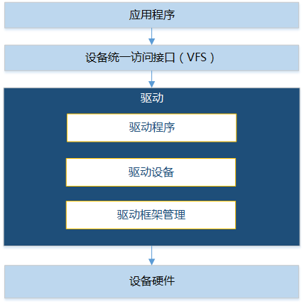

**运作机制<a name="sdd2c54eca65549d0abe154972dea424b"></a>**

驱动框架涉及到2个比较重要的数据结构LosDevice（用于描述驱动设备）和LosDriver（用于描述驱动程序）。系统中有两个全局双向链表。一个是全局设备链表，管理挂载的所有驱动设备；另一个是全局驱动链表，管理所有挂载的驱动程序。

这两种数据结构介绍如下：

-   LosDevice

    LosDevice代表一个驱动设备。结构体中重要的成员包括：

    -   const CHAR \*name：设备名，用以跟驱动配对。
    -   struct LosDriver \*driver：表示该驱动设备的驱动程序。
    -   struct LosDeviceConfig cfg：设备io起始地址、io大小及中断号配置。
    -   LOS\_DL\_LIST driverNode：对应的驱动节点，用以挂载到该驱动结构体中的deviceList上。
    -   LOS\_DL\_LIST deviceItem：该驱动设备节点，用以挂载到全局设备链表中。

-   LosDriver

    LosDriver代表一个设备驱动程序。结构体中重要的成员包括：

    -   const CHAR \*name：驱动名，用以跟设备配对。
    -   LOS\_DL\_LIST deviceList：使用当前这个驱动程序的驱动设备的双向链表。
    -   LOS\_DL\_LIST driverItem：该驱动程序节点，用以挂载到全局驱动链表里。
    -   struct LosDriverOps ops：驱动实现的操作接口，如probe、remove等。

LosDevice和LosDriver之间的关系如[图2](#fig2239348547)所示。

**图 2**  LosDevice和LosDriver的关系图<a name="fig2239348547"></a>  
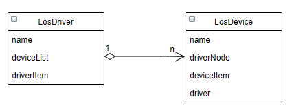

LosDriver挂在全局驱动链表下，包含了一个deviceList链表，表示这个驱动程序操作（或控制）的所有设备。

LosDevice挂在全局设备链表下，包含了一个driver指针，表示这个设备对应的设备驱动程序。

一个驱动设备只对应一个驱动程序，而一个驱动程序可以支持多个驱动设备。当对应的设备/驱动挂载的时候，会根据名字去全局驱动链表/全局设备链表中寻找已经注册的对应的驱动/设备，执行注册过程。

### 开发指导<a name="ZH-CN_TOPIC_0000002543354341"></a>

**功能<a name="s89374297992b429bb19509178b69b0fa"></a>**

LiteOS的驱动框架为用户提供下面几种功能，接口详细信息可以查看API参考。

<a name="t04b2af382e3b47b09eb24fbc1c710bd4"></a>
<table><thead align="left"><tr id="r2996f3d256e749b793a00aa67617a256"><th class="cellrowborder" valign="top" width="21.77%" id="mcps1.1.4.1.1"><p id="a923792be2142462b88232c8ac46333d7"><a name="a923792be2142462b88232c8ac46333d7"></a><a name="a923792be2142462b88232c8ac46333d7"></a>功能分类</p>
</th>
<th class="cellrowborder" valign="top" width="27.51%" id="mcps1.1.4.1.2"><p id="a46f906f43ab74ab2b12c6599b5232bfa"><a name="a46f906f43ab74ab2b12c6599b5232bfa"></a><a name="a46f906f43ab74ab2b12c6599b5232bfa"></a>接口名</p>
</th>
<th class="cellrowborder" valign="top" width="50.72%" id="mcps1.1.4.1.3"><p id="a77af1fced9c14f3ea69b2c5dc3cae5c3"><a name="a77af1fced9c14f3ea69b2c5dc3cae5c3"></a><a name="a77af1fced9c14f3ea69b2c5dc3cae5c3"></a>描述</p>
</th>
</tr>
</thead>
<tbody><tr id="row23344849155346"><td class="cellrowborder" rowspan="6" valign="top" width="21.77%" headers="mcps1.1.4.1.1 "><p id="p6315166015542"><a name="p6315166015542"></a><a name="p6315166015542"></a>操作驱动设备</p>
</td>
<td class="cellrowborder" valign="top" width="27.51%" headers="mcps1.1.4.1.2 "><p id="p11884593155346"><a name="p11884593155346"></a><a name="p11884593155346"></a>LOS_DeviceRegister</p>
</td>
<td class="cellrowborder" valign="top" width="50.72%" headers="mcps1.1.4.1.3 "><p id="p23127986155346"><a name="p23127986155346"></a><a name="p23127986155346"></a>注册一个设备，添加到全局设备链表</p>
</td>
</tr>
<tr id="r86faedb826e34b999cffa4daf9b8889a"><td class="cellrowborder" valign="top" headers="mcps1.1.4.1.1 "><p id="a7441f33b9e704f50845ba54e46f87db4"><a name="a7441f33b9e704f50845ba54e46f87db4"></a><a name="a7441f33b9e704f50845ba54e46f87db4"></a>LOS_DeviceUnregister</p>
</td>
<td class="cellrowborder" valign="top" headers="mcps1.1.4.1.2 "><p id="a84cc4c500df3484fac1e4836e094dd39"><a name="a84cc4c500df3484fac1e4836e094dd39"></a><a name="a84cc4c500df3484fac1e4836e094dd39"></a>注销一个设备，从全局设备链表中移除</p>
</td>
</tr>
<tr id="r79e6a4cb0b574bd2822e032e0a880563"><td class="cellrowborder" valign="top" headers="mcps1.1.4.1.1 "><p id="afc76427d446f4e419f39d3e1d7781709"><a name="afc76427d446f4e419f39d3e1d7781709"></a><a name="afc76427d446f4e419f39d3e1d7781709"></a>LOS_DeviceDataGet</p>
</td>
<td class="cellrowborder" valign="top" headers="mcps1.1.4.1.2 "><p id="a4bc70a09dc7649f79eada49c6c716699"><a name="a4bc70a09dc7649f79eada49c6c716699"></a><a name="a4bc70a09dc7649f79eada49c6c716699"></a>获取指定设备的私有数据</p>
</td>
</tr>
<tr id="r1c80723906bb4a52b377a47ec48d7620"><td class="cellrowborder" valign="top" headers="mcps1.1.4.1.1 "><p id="zh-cn_topic_0074610457_p324270105443"><a name="zh-cn_topic_0074610457_p324270105443"></a><a name="zh-cn_topic_0074610457_p324270105443"></a>LOS_DeviceRegBaseGet</p>
</td>
<td class="cellrowborder" valign="top" headers="mcps1.1.4.1.2 "><p id="ab0cc57a214a14b8bada15d5c3ed0b02c"><a name="ab0cc57a214a14b8bada15d5c3ed0b02c"></a><a name="ab0cc57a214a14b8bada15d5c3ed0b02c"></a>获取指定设备的io起始地址</p>
</td>
</tr>
<tr id="ra9938e3ce19549e5852af541895d5d9b"><td class="cellrowborder" valign="top" headers="mcps1.1.4.1.1 "><p id="ac897a919e5f745cf860a54cc4e1a3a8e"><a name="ac897a919e5f745cf860a54cc4e1a3a8e"></a><a name="ac897a919e5f745cf860a54cc4e1a3a8e"></a>LOS_DeviceRegSizeGet</p>
</td>
<td class="cellrowborder" valign="top" headers="mcps1.1.4.1.2 "><p id="a76587bee13d04d7dafb29b16536bc3b5"><a name="a76587bee13d04d7dafb29b16536bc3b5"></a><a name="a76587bee13d04d7dafb29b16536bc3b5"></a>获取指定设备的io大小</p>
</td>
</tr>
<tr id="re392f77390d642f78b1122ba4daa606e"><td class="cellrowborder" valign="top" headers="mcps1.1.4.1.1 "><p id="aabdb06e14dda445eab0c6202aae96c7d"><a name="aabdb06e14dda445eab0c6202aae96c7d"></a><a name="aabdb06e14dda445eab0c6202aae96c7d"></a>LOS_DeviceIrqNumGet</p>
</td>
<td class="cellrowborder" valign="top" headers="mcps1.1.4.1.2 "><p id="a87500cc68ada41428d2d58f48c0889ab"><a name="a87500cc68ada41428d2d58f48c0889ab"></a><a name="a87500cc68ada41428d2d58f48c0889ab"></a>获取指定设备的中断号</p>
</td>
</tr>
<tr id="rc6d966b29e114f33b5c8db3c4c7c4d7e"><td class="cellrowborder" rowspan="2" valign="top" width="21.77%" headers="mcps1.1.4.1.1 "><p id="aab03d0ef17554b26a48549bd33152be1"><a name="aab03d0ef17554b26a48549bd33152be1"></a><a name="aab03d0ef17554b26a48549bd33152be1"></a>注册/注销驱动程序</p>
</td>
<td class="cellrowborder" valign="top" width="27.51%" headers="mcps1.1.4.1.2 "><p id="ac307717a575749c58a1391b47ccd414b"><a name="ac307717a575749c58a1391b47ccd414b"></a><a name="ac307717a575749c58a1391b47ccd414b"></a>LOS_DriverRegister</p>
</td>
<td class="cellrowborder" valign="top" width="50.72%" headers="mcps1.1.4.1.3 "><p id="a1a0822ea835c451abd73d05609b3903e"><a name="a1a0822ea835c451abd73d05609b3903e"></a><a name="a1a0822ea835c451abd73d05609b3903e"></a>注册设备驱动程序，并和相应的设备绑定</p>
</td>
</tr>
<tr id="r02d3e9b3d9ad4b0d95de62984accd7ea"><td class="cellrowborder" valign="top" headers="mcps1.1.4.1.1 "><p id="a78e5d30f5e9d4896b40cac2f23f2e7a7"><a name="a78e5d30f5e9d4896b40cac2f23f2e7a7"></a><a name="a78e5d30f5e9d4896b40cac2f23f2e7a7"></a>LOS_DriverUnregister</p>
</td>
<td class="cellrowborder" valign="top" headers="mcps1.1.4.1.2 "><p id="ae06d15004e7a4ae398588da1dc8af616"><a name="ae06d15004e7a4ae398588da1dc8af616"></a><a name="ae06d15004e7a4ae398588da1dc8af616"></a>注销设备驱动程序</p>
</td>
</tr>
<tr id="row159361223205519"><td class="cellrowborder" rowspan="2" valign="top" width="21.77%" headers="mcps1.1.4.1.1 "><p id="p6620101325613"><a name="p6620101325613"></a><a name="p6620101325613"></a>低功耗功能</p>
</td>
<td class="cellrowborder" valign="top" width="27.51%" headers="mcps1.1.4.1.2 "><p id="p199371923135513"><a name="p199371923135513"></a><a name="p199371923135513"></a>LOS_PmSuspend</p>
</td>
<td class="cellrowborder" valign="top" width="50.72%" headers="mcps1.1.4.1.3 "><p id="p793717237559"><a name="p793717237559"></a><a name="p793717237559"></a>挂起所有设备</p>
</td>
</tr>
<tr id="row6929134920559"><td class="cellrowborder" valign="top" headers="mcps1.1.4.1.1 "><p id="p592954911554"><a name="p592954911554"></a><a name="p592954911554"></a>LOS_PmResume</p>
</td>
<td class="cellrowborder" valign="top" headers="mcps1.1.4.1.2 "><p id="p189291849155515"><a name="p189291849155515"></a><a name="p189291849155515"></a>恢复所有设备</p>
</td>
</tr>
</tbody>
</table>

**开发流程<a name="s8c51caa2d7274cd38c5e96286885f5cb"></a>**

下面以注册USB驱动为例，讲解基于驱动框架的驱动开发流程。

1.  打开菜单，选择Driver ---\> Enable Driver Base，使能驱动框架。

    <a name="table06655375130"></a>
    <table><thead align="left"><tr id="row8665203751318"><th class="cellrowborder" valign="top" width="24.1%" id="mcps1.1.6.1.1"><p id="p61687296155221"><a name="p61687296155221"></a><a name="p61687296155221"></a>配置项</p>
    </th>
    <th class="cellrowborder" valign="top" width="29.990000000000006%" id="mcps1.1.6.1.2"><p id="p25007692155221"><a name="p25007692155221"></a><a name="p25007692155221"></a>含义</p>
    </th>
    <th class="cellrowborder" valign="top" width="15.380000000000003%" id="mcps1.1.6.1.3"><p id="p47081329204415"><a name="p47081329204415"></a><a name="p47081329204415"></a>取值范围</p>
    </th>
    <th class="cellrowborder" valign="top" width="15.590000000000003%" id="mcps1.1.6.1.4"><p id="p7383544155221"><a name="p7383544155221"></a><a name="p7383544155221"></a>默认值</p>
    </th>
    <th class="cellrowborder" valign="top" width="14.940000000000003%" id="mcps1.1.6.1.5"><p id="p34917797155221"><a name="p34917797155221"></a><a name="p34917797155221"></a>依赖</p>
    </th>
    </tr>
    </thead>
    <tbody><tr id="row9665837161320"><td class="cellrowborder" valign="top" width="24.1%" headers="mcps1.1.6.1.1 "><p id="p1270485014235"><a name="p1270485014235"></a><a name="p1270485014235"></a>LOSCFG_DRIVERS_BASE</p>
    </td>
    <td class="cellrowborder" valign="top" width="29.990000000000006%" headers="mcps1.1.6.1.2 "><p id="p43336113320"><a name="p43336113320"></a><a name="p43336113320"></a>使能驱动框架的开关</p>
    </td>
    <td class="cellrowborder" valign="top" width="15.380000000000003%" headers="mcps1.1.6.1.3 "><p id="p19665193721319"><a name="p19665193721319"></a><a name="p19665193721319"></a>YES/NO</p>
    </td>
    <td class="cellrowborder" valign="top" width="15.590000000000003%" headers="mcps1.1.6.1.4 "><p id="p1866573713131"><a name="p1866573713131"></a><a name="p1866573713131"></a>YES</p>
    </td>
    <td class="cellrowborder" valign="top" width="14.940000000000003%" headers="mcps1.1.6.1.5 "><p id="p1266519378138"><a name="p1266519378138"></a><a name="p1266519378138"></a>无</p>
    </td>
    </tr>
    </tbody>
    </table>

2.  注册驱动设备。
    1.  定义USB驱动设备实例。

        ```
        struct LosDeviceRegs hiudc3_regs[] = {
            {
                .base = DWC_USB3_PORT1_BASE_ADDR,
                .size = DWC_USB3_PORT1_ADDR_OFFSET,
            },
        };
        static struct LosDevice hiudc3_device = {
            .name       = "hi_udc3",
            .id = -1,
            .cfg   = {
        
                .irqNum = NUM_HAL_INTERRUPT_USB_DEV,
        
                .numRegs = ARRAY_SIZE(hiudc3_regs),
                .regs = hiudc3_regs,
            },
        };
        ```

    2.  将驱动设备注册到全局设备链表。

        ```
        LOS_DeviceRegister(&hiudc3_device);
        ```

    3.  预加载处理。

        通过调用“linux/module.h”（在根目录“self\_src/compat/linux/include”目录下）里面的预加载挂载函数，将驱动设备注册函数挂载到系统中。当系统启动时，系统会按照挂载函数优先级遍历预加载节点，从而注册驱动设备。系统提供如下预加载挂载函数，优先级从高到低：

        ```
        pure_initcall(f)       //0
        core_initcall(f)       //1
        postcore_initcall(f)   //2
        arch_initcall(f)       //3
        subsys_initcall(f)     //4
        fs_initcall(f)         //5
        device_initcall(f)     //6
        late_initcall(f)       //7
        ```

        具体调用请参见“[编程实例](编程实例-146.md)”。

        > **须知：** 
        >执行预加载可能会影响到系统的某些功能，例如，当驱动程序初始化耗时较长时，会对快速启动（分散加载）的启动时间造成冲击。目前系统只支持优先级小于等于3的预加载函数。

3.  注册设备驱动程序。
    1.  定义USB驱动程序实例。

        ```
        static struct LosDriver hiudc3_driver = {
        	.name = "hi_udc3",
        	.ops = {
        		.probe = hiudc3_probe,
        		.remove = hiudc3_remove,
        	},
        	.pmOps = {
        		.suspend = hiudc3_suspend,
        		.resume = hiudc3_resume,
        	},
        };
        ```

        参数描述如表所示。

        <a name="table6723115317"></a>
        <table><thead align="left"><tr id="row57231633"><th class="cellrowborder" valign="top" width="28.43%" id="mcps1.1.3.1.1"><p id="p18372147637"><a name="p18372147637"></a><a name="p18372147637"></a>参数</p>
        </th>
        <th class="cellrowborder" valign="top" width="71.57%" id="mcps1.1.3.1.2"><p id="p1137207332"><a name="p1137207332"></a><a name="p1137207332"></a>描述</p>
        </th>
        </tr>
        </thead>
        <tbody><tr id="row12721614317"><td class="cellrowborder" valign="top" width="28.43%" headers="mcps1.1.3.1.1 "><p id="p791713431478"><a name="p791713431478"></a><a name="p791713431478"></a>probe</p>
        </td>
        <td class="cellrowborder" valign="top" width="71.57%" headers="mcps1.1.3.1.2 "><p id="p181919413812"><a name="p181919413812"></a><a name="p181919413812"></a>该函数参数一般用于初始化驱动程序</p>
        </td>
        </tr>
        <tr id="row1572310318"><td class="cellrowborder" valign="top" width="28.43%" headers="mcps1.1.3.1.1 "><p id="p123728717316"><a name="p123728717316"></a><a name="p123728717316"></a>remove</p>
        </td>
        <td class="cellrowborder" valign="top" width="71.57%" headers="mcps1.1.3.1.2 "><p id="p138917101087"><a name="p138917101087"></a><a name="p138917101087"></a>该函数参数一般用于去初始化驱动程序</p>
        </td>
        </tr>
        <tr id="row1472211639"><td class="cellrowborder" valign="top" width="28.43%" headers="mcps1.1.3.1.1 "><p id="p9372147338"><a name="p9372147338"></a><a name="p9372147338"></a>name</p>
        </td>
        <td class="cellrowborder" valign="top" width="71.57%" headers="mcps1.1.3.1.2 "><p id="p83017288818"><a name="p83017288818"></a><a name="p83017288818"></a>驱动程序的属性name必须和对应驱动设备的name一致</p>
        </td>
        </tr>
        <tr id="row941815561073"><td class="cellrowborder" valign="top" width="28.43%" headers="mcps1.1.3.1.1 "><p id="p10419145612713"><a name="p10419145612713"></a><a name="p10419145612713"></a>suspend/resume</p>
        </td>
        <td class="cellrowborder" valign="top" width="71.57%" headers="mcps1.1.3.1.2 "><p id="p041985614716"><a name="p041985614716"></a><a name="p041985614716"></a>用于挂起/恢复驱动设备</p>
        </td>
        </tr>
        </tbody>
        </table>

    2.  注册USB驱动程序。

        ```
        LOS_DriverRegister(&hiudc3_driver);
        ```

4.  将加载的驱动注册到文件系统。

    为方便用户使用，将驱动实例注册到文件系统，使对驱动的操作抽象为对文件的操作。具体实现请参见“[适配文件操作的驱动开发](适配文件操作的驱动开发.md)”。

### 注意事项<a name="ZH-CN_TOPIC_0000002543394283"></a>

调用预加载处理的驱动函数需要在“build/make/liteos\_tables\_ldflags.mk”中的LITEOS\_TABLES\_DRIVER\_LDFLAGS添加“-u”声明，否则可能会导致链接器优化掉驱动初始化模块，造成不可预估的错误。

```
LITEOS_TABLES_DRIVER_LDFLAGS := \
-ui2c_init \
-ugpio_init \
-uregulator_init \
-umtd_init_list \
```

### 编程实例<a name="ZH-CN_TOPIC_0000002543394209"></a>

**实例描述<a name="s1c712e15fc034d27b9eb2111a867ba70"></a>**

添加USB驱动。

**编程实例<a name="sdbce09d9d7de4425bd1653661e4ad39f"></a>**

前提条件：在menuconfig菜单中使能驱动框架。

1.  在指定开发板的“board.c”目录下定义驱动设备。

    ```
    /* 定义驱动设备实例 */
    #ifdef LOSCFG_DRIVERS_USB3_DEVICE_CONTROLLER
    struct LosDeviceRegs hiudc3_regs[] = {
        {
            .base = DWC_USB3_PORT1_BASE_ADDR,
            .size = DWC_USB3_PORT1_ADDR_OFFSET,
        },
    };
    
    static struct LosDevice hiudc3_device = {
        .name       = "hi_udc3",
        .id = -1,
        .cfg   = {
            .irqNum = NUM_HAL_INTERRUPT_USB_DEV,
            .numRegs = ARRAY_SIZE(hiudc3_regs),
            .regs = hiudc3_regs,
        },
    };
    #endif
    
    int machine_init(void)
    {
    #ifdef LOSCFG_DRIVERS_USB3_DEVICE_CONTROLLER
        (void)LOS_DeviceRegister(&hiudc3_device);
    #endif
    }
    arch_initcall(machine_init);    //预加载驱动设备注册。内核初始化执行时，会预加载驱动设备注册
    ```

2.  在“self\_src/drivers/usb/adapt\_liteos/controller/usb\_device”目录下定义USB设备驱动程序。

    ```
    /* 驱动程序实现的操作接口 */
    static int hiudc3_probe(struct LosDevice *pdev)
    {
        ……
    }
    
    static int hiudc3_remove(struct LosDevice *pdev)
    {
        ……
    }
    
    static int hiudc3_suspend(struct LosDevice *pst_dev)
    {
        ……
    }
    
    static int hiudc3_resume(struct LosDevice *pst_dev)
    {
        ……
    }
    
    /* 定义设备驱动程序实例 */
    static struct LosDriver hiudc3_driver = {
        .name = "hi_udc3",
        .ops = {
            .probe = hiudc3_probe,
            .remove = hiudc3_remove,
        },
    	.pmOps = {
            .suspend = hiudc3_suspend,
            .resume = hiudc3_resume,
        },
    };
    
    /* 初始化驱动程序，即注册驱动程序 */
    int hiudc3_init(void)
    {
        return (int)LOS_DriverRegister(&hiudc3_driver);
    }
    
    /* 注销驱动程序 */
    int hiudc3_exit(void)
    {
        return (int)LOS_DriverUnregister(&hiudc3_driver);
    }
    ```

## 适配文件操作的驱动开发<a name="ZH-CN_TOPIC_0000002511794376"></a>


### 概述<a name="ZH-CN_TOPIC_0000002511794314"></a>

**基本概念<a name="s7790c21996624bab82e21137bef5a3cb"></a>**

驱动开发就是把硬件的功能按操作系统的规格实现并抽象出来，提供给应用程序开发人员调用。

当在新的芯片上移植系统时，需要根据该芯片特性对支持的外部设备进行驱动开发。

LiteOS的驱动初始化函数主要初始化设备对应的驱动结构，提供给上层应用来注册设备驱动的控制节点。

### 开发指导<a name="ZH-CN_TOPIC_0000002511794220"></a>

**开发流程<a name="s7e1881ce88114ecb9f4959393f0d3b16"></a>**

推荐驱动开发人员使用VFS框架来注册/卸载设备驱动，基于文件系统的驱动开发主要涉及下面几步：

1.  打开菜单，选择FileSystem ---\> Enable VFS，使能VFS。

    <a name="table06655375130"></a>
    <table><thead align="left"><tr id="row8665203751318"><th class="cellrowborder" valign="top" width="18.56%" id="mcps1.1.6.1.1"><p id="p61687296155221"><a name="p61687296155221"></a><a name="p61687296155221"></a>配置项</p>
    </th>
    <th class="cellrowborder" valign="top" width="37.71%" id="mcps1.1.6.1.2"><p id="p25007692155221"><a name="p25007692155221"></a><a name="p25007692155221"></a>含义</p>
    </th>
    <th class="cellrowborder" valign="top" width="15%" id="mcps1.1.6.1.3"><p id="p47081329204415"><a name="p47081329204415"></a><a name="p47081329204415"></a>取值范围</p>
    </th>
    <th class="cellrowborder" valign="top" width="14.71%" id="mcps1.1.6.1.4"><p id="p7383544155221"><a name="p7383544155221"></a><a name="p7383544155221"></a>默认值</p>
    </th>
    <th class="cellrowborder" valign="top" width="14.02%" id="mcps1.1.6.1.5"><p id="p34917797155221"><a name="p34917797155221"></a><a name="p34917797155221"></a>依赖</p>
    </th>
    </tr>
    </thead>
    <tbody><tr id="row9665837161320"><td class="cellrowborder" valign="top" width="18.56%" headers="mcps1.1.6.1.1 "><p id="p3665143710130"><a name="p3665143710130"></a><a name="p3665143710130"></a>LOSCFG_FS_VFS</p>
    </td>
    <td class="cellrowborder" valign="top" width="37.71%" headers="mcps1.1.6.1.2 "><p id="p13665737191318"><a name="p13665737191318"></a><a name="p13665737191318"></a>VFS框架的裁剪开关</p>
    </td>
    <td class="cellrowborder" valign="top" width="15%" headers="mcps1.1.6.1.3 "><p id="p19665193721319"><a name="p19665193721319"></a><a name="p19665193721319"></a>YES/NO</p>
    </td>
    <td class="cellrowborder" valign="top" width="14.71%" headers="mcps1.1.6.1.4 "><p id="p1866573713131"><a name="p1866573713131"></a><a name="p1866573713131"></a>YES</p>
    </td>
    <td class="cellrowborder" valign="top" width="14.02%" headers="mcps1.1.6.1.5 "><p id="p1266519378138"><a name="p1266519378138"></a><a name="p1266519378138"></a>无</p>
    </td>
    </tr>
    </tbody>
    </table>

2.  [初始化驱动](#sb85add7cfac2440095b3d3da80a49a66)。
3.  [操作驱动节点](#s0a0f66e601894a3183aa1aa704a4dce9)。

**初始化驱动<a name="sb85add7cfac2440095b3d3da80a49a66"></a>**

在LiteOS上进行驱动开发的第一步，是编写驱动初始化函数。驱动初始化函数用于初始化设备所需的驱动结构，以及生成驱动的控制节点。

驱动初始化函数中需要调用设备驱动注册函数，用于注册并生成驱动节点。

```
register_driver(FAR const char *path, FAR const struct file_operations_vfs *fops, mode_t mode, FAR void *priv)
register_blockdriver(FAR const char *path, FAR const struct block_operations *bops, mode_t mode, FAR void *priv)
```

参数描述如下表所示：

<a name="table18579152951013"></a>
<table><thead align="left"><tr id="row8579229151016"><th class="cellrowborder" valign="top" width="22.720000000000002%" id="mcps1.1.3.1.1"><p id="p126782441109"><a name="p126782441109"></a><a name="p126782441109"></a>参数</p>
</th>
<th class="cellrowborder" valign="top" width="77.28%" id="mcps1.1.3.1.2"><p id="p8678184416106"><a name="p8678184416106"></a><a name="p8678184416106"></a>描述</p>
</th>
</tr>
</thead>
<tbody><tr id="row1057972971010"><td class="cellrowborder" valign="top" width="22.720000000000002%" headers="mcps1.1.3.1.1 "><p id="p196781844171010"><a name="p196781844171010"></a><a name="p196781844171010"></a>path</p>
</td>
<td class="cellrowborder" valign="top" width="77.28%" headers="mcps1.1.3.1.2 "><p id="p5678184414107"><a name="p5678184414107"></a><a name="p5678184414107"></a>驱动节点路径，应用程序可通过该路径访问到驱动节点，进而访问设备驱动提供的操作接口。</p>
</td>
</tr>
<tr id="row195791429181014"><td class="cellrowborder" valign="top" width="22.720000000000002%" headers="mcps1.1.3.1.1 "><p id="p16678144101010"><a name="p16678144101010"></a><a name="p16678144101010"></a>fops/bops</p>
</td>
<td class="cellrowborder" valign="top" width="77.28%" headers="mcps1.1.3.1.2 "><p id="p206781444171018"><a name="p206781444171018"></a><a name="p206781444171018"></a>驱动操作结构体，为应用程序提供操作函数集。fops和bops分别表示字符设备和块设备的驱动操作集。</p>
</td>
</tr>
<tr id="row20579529131016"><td class="cellrowborder" valign="top" width="22.720000000000002%" headers="mcps1.1.3.1.1 "><p id="p196789442102"><a name="p196789442102"></a><a name="p196789442102"></a>mode</p>
</td>
<td class="cellrowborder" valign="top" width="77.28%" headers="mcps1.1.3.1.2 "><p id="p106781144101015"><a name="p106781144101015"></a><a name="p106781144101015"></a>读写该驱动节点的权限，暂时无效，后续或提供支持。</p>
</td>
</tr>
<tr id="row18579162916105"><td class="cellrowborder" valign="top" width="22.720000000000002%" headers="mcps1.1.3.1.1 "><p id="p136782044191012"><a name="p136782044191012"></a><a name="p136782044191012"></a>priv</p>
</td>
<td class="cellrowborder" valign="top" width="77.28%" headers="mcps1.1.3.1.2 "><p id="p1467804417108"><a name="p1467804417108"></a><a name="p1467804417108"></a>驱动节点注册过程需要传入的参数。</p>
</td>
</tr>
</tbody>
</table>

编写完驱动初始化函数后，需要在适当的地方引导该初始化函数执行。用户可以在app\_init函数里调用已编写好的驱动初始化函数引导设备初始化。

**操作驱动节点<a name="s0a0f66e601894a3183aa1aa704a4dce9"></a>**

驱动初始化后，生成的设备驱动节点为应用提供操作设备的接口，下面以I2C设备驱动程序为例，说明用户程序与驱动操作函数的调用关系。

驱动操作函数集对于应用程序与驱动操作函数的调用关系非常重要。在编写驱动程序时，操作函数集需要实现硬件设备的各项机制，并在设备驱动注册时传入。操作函数集会成为应用程序需求的最终实现。

I2C设备驱动提供的操作函数集如下表所示：

<a name="t1569e285bfc2456da9114480255ca8d7"></a>
<table><thead align="left"><tr id="r5f4aab246a874b5cb3a1d828de7ffb0d"><th class="cellrowborder" valign="top" width="32.53%" id="mcps1.1.3.1.1"><p id="ab50f0169149b4210b5b28bc51f6fea00"><a name="ab50f0169149b4210b5b28bc51f6fea00"></a><a name="ab50f0169149b4210b5b28bc51f6fea00"></a>操作函数集</p>
</th>
<th class="cellrowborder" valign="top" width="67.47%" id="mcps1.1.3.1.2"><p id="aa92c121db0314405a13e9c0ac0ac62a1"><a name="aa92c121db0314405a13e9c0ac0ac62a1"></a><a name="aa92c121db0314405a13e9c0ac0ac62a1"></a>对应的应用层接口</p>
</th>
</tr>
</thead>
<tbody><tr id="r895f20871a1a48a8b5814ace82f24f96"><td class="cellrowborder" valign="top" width="32.53%" headers="mcps1.1.3.1.1 "><p id="af69c50f5d15d40c88b14f478c91c0a97"><a name="af69c50f5d15d40c88b14f478c91c0a97"></a><a name="af69c50f5d15d40c88b14f478c91c0a97"></a>i2cdev_open</p>
</td>
<td class="cellrowborder" valign="top" width="67.47%" headers="mcps1.1.3.1.2 "><p id="a11a86b60d76c45ea9cf87b010ae0d228"><a name="a11a86b60d76c45ea9cf87b010ae0d228"></a><a name="a11a86b60d76c45ea9cf87b010ae0d228"></a>open</p>
</td>
</tr>
<tr id="rd3b8a9bbd4294330b4b0e6e14abb6717"><td class="cellrowborder" valign="top" width="32.53%" headers="mcps1.1.3.1.1 "><p id="a136e729682fa473489b7dcfb10339242"><a name="a136e729682fa473489b7dcfb10339242"></a><a name="a136e729682fa473489b7dcfb10339242"></a>i2cdev_release</p>
</td>
<td class="cellrowborder" valign="top" width="67.47%" headers="mcps1.1.3.1.2 "><p id="aa1a6f70f38494e9dbce3f4d1bcbe06aa"><a name="aa1a6f70f38494e9dbce3f4d1bcbe06aa"></a><a name="aa1a6f70f38494e9dbce3f4d1bcbe06aa"></a>close</p>
</td>
</tr>
<tr id="r9736e1c0aacf4a898703f9b4a9c1aa27"><td class="cellrowborder" valign="top" width="32.53%" headers="mcps1.1.3.1.1 "><p id="aaf63fa01defc4241b569217e607cc75e"><a name="aaf63fa01defc4241b569217e607cc75e"></a><a name="aaf63fa01defc4241b569217e607cc75e"></a>i2cdev_read</p>
</td>
<td class="cellrowborder" valign="top" width="67.47%" headers="mcps1.1.3.1.2 "><p id="a724f12cd078d4a7b85ccb16c150c6d7c"><a name="a724f12cd078d4a7b85ccb16c150c6d7c"></a><a name="a724f12cd078d4a7b85ccb16c150c6d7c"></a>read</p>
</td>
</tr>
<tr id="r029c0feef71b438884f01c63e80f22bf"><td class="cellrowborder" valign="top" width="32.53%" headers="mcps1.1.3.1.1 "><p id="a095110ee6dd64613b2003529169eb825"><a name="a095110ee6dd64613b2003529169eb825"></a><a name="a095110ee6dd64613b2003529169eb825"></a>i2cdev_write</p>
</td>
<td class="cellrowborder" valign="top" width="67.47%" headers="mcps1.1.3.1.2 "><p id="a5648411fd762462dbb5d1064efad19b8"><a name="a5648411fd762462dbb5d1064efad19b8"></a><a name="a5648411fd762462dbb5d1064efad19b8"></a>write</p>
</td>
</tr>
<tr id="ra8822ff681ff4623b6586d1c13176056"><td class="cellrowborder" valign="top" width="32.53%" headers="mcps1.1.3.1.1 "><p id="a4a74b3756b674c148aa61303030a6699"><a name="a4a74b3756b674c148aa61303030a6699"></a><a name="a4a74b3756b674c148aa61303030a6699"></a>i2cdev_ioctl</p>
</td>
<td class="cellrowborder" valign="top" width="67.47%" headers="mcps1.1.3.1.2 "><p id="a41f9dea57fa34ab1bdafb24c07395c66"><a name="a41f9dea57fa34ab1bdafb24c07395c66"></a><a name="a41f9dea57fa34ab1bdafb24c07395c66"></a>ioctl</p>
</td>
</tr>
</tbody>
</table>

-   open操作

    应用程序打开节点文件时，系统最终会在该驱动节点注册过程中调用驱动操作函数集中的open函数。

    open函数对目标驱动设备函数结构体先进行实例化，再进行必要的初始化。在成功打开节点文件后，应用程序能够获取到对应驱动节点的文件描述符，并通过该文件描述符对驱动程序进行访问。

-   read/write操作

    read/write操作是常用的访问设备的接口。不同类型的设备与驱动提供的read/write操作的功能互有差异。对于i2c设备，应用程序通过调用read/write接口可以实现对I2C设备进行读写。

    ```
    i2cdev_read(struct file * filep, char __user *buf, size_t count)
    i2cdev_write(struct file * filep, const char __user *buf, size_t count)
    ```

    参数描述如下表所示：

    <a name="table17781428602"></a>
    <table><thead align="left"><tr id="row278228404"><th class="cellrowborder" valign="top" width="27.939999999999998%" id="mcps1.1.3.1.1"><p id="p9432123920016"><a name="p9432123920016"></a><a name="p9432123920016"></a>参数</p>
    </th>
    <th class="cellrowborder" valign="top" width="72.06%" id="mcps1.1.3.1.2"><p id="p443211391103"><a name="p443211391103"></a><a name="p443211391103"></a>描述</p>
    </th>
    </tr>
    </thead>
    <tbody><tr id="row1478162819012"><td class="cellrowborder" valign="top" width="27.939999999999998%" headers="mcps1.1.3.1.1 "><p id="p24321539801"><a name="p24321539801"></a><a name="p24321539801"></a>filep</p>
    </td>
    <td class="cellrowborder" valign="top" width="72.06%" headers="mcps1.1.3.1.2 "><p id="p134321739709"><a name="p134321739709"></a><a name="p134321739709"></a>文件描述结构体指针</p>
    </td>
    </tr>
    <tr id="row167816281605"><td class="cellrowborder" valign="top" width="27.939999999999998%" headers="mcps1.1.3.1.1 "><p id="p194323399015"><a name="p194323399015"></a><a name="p194323399015"></a>buf</p>
    </td>
    <td class="cellrowborder" valign="top" width="72.06%" headers="mcps1.1.3.1.2 "><p id="p2432239404"><a name="p2432239404"></a><a name="p2432239404"></a>读出/写入数据的缓冲区指针</p>
    </td>
    </tr>
    <tr id="row678928309"><td class="cellrowborder" valign="top" width="27.939999999999998%" headers="mcps1.1.3.1.1 "><p id="p343263913019"><a name="p343263913019"></a><a name="p343263913019"></a>count</p>
    </td>
    <td class="cellrowborder" valign="top" width="72.06%" headers="mcps1.1.3.1.2 "><p id="p154326391205"><a name="p154326391205"></a><a name="p154326391205"></a>读出/写入数据的长度</p>
    </td>
    </tr>
    </tbody>
    </table>

-   ioctl操作

    ioctl操作提供对驱动设备函数的配置管理。通过执行相应的命令，完成对设备属性的配置或访问。

    I2C设备中，使用命令I2C\_16BIT\_REG、I2C\_16BIT\_DATA与I2C\_TIMEOUT分别对应设置I2C设备的传输寄存器位宽、传输数据位宽与超时时间。

    ```
    i2cdev_ioctl(struct file *filep, int cmd, unsigned long arg)
    ```

    参数描述如下表所示：

    <a name="table6723115317"></a>
    <table><thead align="left"><tr id="row57231633"><th class="cellrowborder" valign="top" width="28.43%" id="mcps1.1.3.1.1"><p id="p18372147637"><a name="p18372147637"></a><a name="p18372147637"></a>参数</p>
    </th>
    <th class="cellrowborder" valign="top" width="71.57%" id="mcps1.1.3.1.2"><p id="p1137207332"><a name="p1137207332"></a><a name="p1137207332"></a>描述</p>
    </th>
    </tr>
    </thead>
    <tbody><tr id="row12721614317"><td class="cellrowborder" valign="top" width="28.43%" headers="mcps1.1.3.1.1 "><p id="p6372878310"><a name="p6372878310"></a><a name="p6372878310"></a>filep</p>
    </td>
    <td class="cellrowborder" valign="top" width="71.57%" headers="mcps1.1.3.1.2 "><p id="p153721377318"><a name="p153721377318"></a><a name="p153721377318"></a>文件描述结构体指针</p>
    </td>
    </tr>
    <tr id="row1572310318"><td class="cellrowborder" valign="top" width="28.43%" headers="mcps1.1.3.1.1 "><p id="p123728717316"><a name="p123728717316"></a><a name="p123728717316"></a>cmd</p>
    </td>
    <td class="cellrowborder" valign="top" width="71.57%" headers="mcps1.1.3.1.2 "><p id="p3372107833"><a name="p3372107833"></a><a name="p3372107833"></a>操作命令</p>
    </td>
    </tr>
    <tr id="row1472211639"><td class="cellrowborder" valign="top" width="28.43%" headers="mcps1.1.3.1.1 "><p id="p9372147338"><a name="p9372147338"></a><a name="p9372147338"></a>arg</p>
    </td>
    <td class="cellrowborder" valign="top" width="71.57%" headers="mcps1.1.3.1.2 "><p id="p837227730"><a name="p837227730"></a><a name="p837227730"></a>附加参数</p>
    </td>
    </tr>
    </tbody>
    </table>

-   close操作

    close操作对应着驱动操作函数集里的release函数。release函数对驱动程序的资源进行释放。

### 注意事项<a name="ZH-CN_TOPIC_0000002511794276"></a>

无。

## MMC驱动开发<a name="ZH-CN_TOPIC_0000002511794290"></a>


### 概述<a name="ZH-CN_TOPIC_0000002543394311"></a>

MMC（Multi Media Card）是 MMC协会订立、主要针对手机或平板电脑等产品的内嵌式存储器标准规格。MMC驱动用于处理对SD存储卡（Secure Digital Memory Card）和EMMC卡（Embedded Multi Media Card）的识别和读写等操作，并通过SDIO协议支持扩展外设（如蓝牙、WiFi、GPS等）。

LiteOS MMC驱动支持的设备包括TF卡、EMMC存储器和WiFi扩展外设。

-   TF（T-Flash）卡，又叫micro SD卡

    TF卡主要通过挂载为FAT文件系统实现对设备的读写操作，挂载之前首先需要完成设备的识别，也可以通过裸读写接口对TF卡进行裸读写。

    > **须知：** 
    >目前LiteOS不支持用户自定义TF卡分区。如有需要，用户需提前在PC端对TF卡做好分区操作。

-   EMMC存储器

    EMMC存储器主要通过挂载为FAT文件系统实现对设备的读写操作，挂载之前需要先调用接口自定义分区，然后进行设备的识别，也可以通过裸读写接口对EMMC存储器进行裸读写。

    支持LiteOS调度模块启动前完成MMC驱动初始化，支持系统启动前（系统资源初始化后、第一次任务调度前）和异常阶段调用MMC异常读写接口对MMC存储进行读写和格式化，需打开宏LOSCFG\_DRIVERS\_MMC\_RW\_IN\_BOOT\_AND\_EXC。

    支持在LiteOS系统全局调度器启动前完成MMC低频切高频的tuning流程，支持EMMC器件在启动前运行在200MHZ频率。

    支持RPMB（Replay Protected Memory Block）分区，通过RPMB操作接口对RPMB分区进行KEY的写入、Write Counter读取、RPMB数据区数据的读写（仅数据透传不涉及加解密），需打开宏LOSCFG\_DRIVERS\_MMC\_RPMB。

    提供发送CMD56命令的对外接口，获取EMMC存储器相关信息。

-   SDIO扩展外设

    目前支持的外围设备只有WiFi模组。设备通过WiFi模组进行通信和数据传输，设备识别前需要根据硬件要求做好管脚复用配置。

LiteOS MMC驱动模块包括协议层和控制层：

-   协议层支持SD、EMMC、SDIO协议规范。
-   控制层支持Himci和Sdhci控制器，不同的芯片平台根据硬件IP选择对应的控制器驱动。

### 开发指导<a name="ZH-CN_TOPIC_0000002543354161"></a>

**MMC设备识别<a name="zh-cn_topic_0000001158533357_section11534615115214"></a>**

LiteOS中的MMC设备分为嵌入式和非嵌入式两类：

-   嵌入式设备包括EMMC存储器和SDIO扩展外设，均不支持带电插拔。EMMC设备目前仅支持首次识别，不支持多次识别；SDIO扩展外设可以调用hisi\_sdio\_rescan接口实现对设备的卸载和加载识别（依赖于扩展外设的软件上下电）。
-   非嵌入式设备为TF卡。TF卡支持热插拔，通过线程轮询方式实现设备的动态卸载和加载。

> **须知：** 
>除SDIO扩展外设可以调用sdio\_rescan接口实现设备识别外，其他MMC设备的识别均在同一线程内实现，当存在多个MMC设备时，将根据控制器ID的顺序串行识别设备。

**驱动初始化接口<a name="zh-cn_topic_0000001158533357_section459813712569"></a>**

<a name="zh-cn_topic_0000001158533357_table1570161885615"></a>
<table><thead align="left"><tr id="zh-cn_topic_0000001158533357_row1470121817561"><th class="cellrowborder" valign="top" width="27.950000000000003%" id="mcps1.1.3.1.1"><p id="zh-cn_topic_0000001158533357_p1870111825615"><a name="zh-cn_topic_0000001158533357_p1870111825615"></a><a name="zh-cn_topic_0000001158533357_p1870111825615"></a>接口名</p>
</th>
<th class="cellrowborder" valign="top" width="72.05%" id="mcps1.1.3.1.2"><p id="zh-cn_topic_0000001158533357_p170131820568"><a name="zh-cn_topic_0000001158533357_p170131820568"></a><a name="zh-cn_topic_0000001158533357_p170131820568"></a>描述</p>
</th>
</tr>
</thead>
<tbody><tr id="zh-cn_topic_0000001158533357_row27031813562"><td class="cellrowborder" valign="top" width="27.950000000000003%" headers="mcps1.1.3.1.1 "><p id="zh-cn_topic_0000001158533357_p170161818561"><a name="zh-cn_topic_0000001158533357_p170161818561"></a><a name="zh-cn_topic_0000001158533357_p170161818561"></a>SD_MMC_Host_init</p>
</td>
<td class="cellrowborder" valign="top" width="72.05%" headers="mcps1.1.3.1.2 "><p id="zh-cn_topic_0000001158533357_p177014187561"><a name="zh-cn_topic_0000001158533357_p177014187561"></a><a name="zh-cn_topic_0000001158533357_p177014187561"></a>遍历平台所有控制器并进行初始化</p>
</td>
</tr>
<tr id="zh-cn_topic_0000001158533357_row8701189564"><td class="cellrowborder" valign="top" width="27.950000000000003%" headers="mcps1.1.3.1.1 "><p id="zh-cn_topic_0000001158533357_p370121865616"><a name="zh-cn_topic_0000001158533357_p370121865616"></a><a name="zh-cn_topic_0000001158533357_p370121865616"></a>MMC_HostInitById</p>
</td>
<td class="cellrowborder" valign="top" width="72.05%" headers="mcps1.1.3.1.2 "><p id="zh-cn_topic_0000001158533357_p1970118175615"><a name="zh-cn_topic_0000001158533357_p1970118175615"></a><a name="zh-cn_topic_0000001158533357_p1970118175615"></a>初始化平台指定控制器，控制器由入参ID确定（可减少MMC驱动初始化的整体耗时）</p>
</td>
</tr>
</tbody>
</table>

> **须知：** 
>MMC驱动初始化成功后，如果系统支持proc文件系统，会生成“proc/mci/mci\_info”节点，通过“cat proc/mci/mci\_info”可查看设备信息。此两个初始化接口不可混用，且MMC\_HostInitById调用需保证单线程调用或者时间上互斥。

**添加EMMC分区接口<a name="zh-cn_topic_0000001158533357_section1832516305599"></a>**

<a name="zh-cn_topic_0000001158533357_table13319134101818"></a>
<table><thead align="left"><tr id="zh-cn_topic_0000001158533357_row18319164191816"><th class="cellrowborder" valign="top" width="22.69226922692269%" id="mcps1.1.4.1.1"><p id="zh-cn_topic_0000001158533357_p1471620150017"><a name="zh-cn_topic_0000001158533357_p1471620150017"></a><a name="zh-cn_topic_0000001158533357_p1471620150017"></a>接口名</p>
</th>
<th class="cellrowborder" valign="top" width="23.812381238123812%" id="mcps1.1.4.1.2"><p id="zh-cn_topic_0000001158533357_p75707891812"><a name="zh-cn_topic_0000001158533357_p75707891812"></a><a name="zh-cn_topic_0000001158533357_p75707891812"></a>接口参数</p>
</th>
<th class="cellrowborder" valign="top" width="53.4953495349535%" id="mcps1.1.4.1.3"><p id="zh-cn_topic_0000001158533357_p7570138171813"><a name="zh-cn_topic_0000001158533357_p7570138171813"></a><a name="zh-cn_topic_0000001158533357_p7570138171813"></a>参数描述</p>
</th>
</tr>
</thead>
<tbody><tr id="zh-cn_topic_0000001158533357_row33195415180"><td class="cellrowborder" rowspan="3" valign="top" width="22.69226922692269%" headers="mcps1.1.4.1.1 "><p id="zh-cn_topic_0000001158533357_p16716121511015"><a name="zh-cn_topic_0000001158533357_p16716121511015"></a><a name="zh-cn_topic_0000001158533357_p16716121511015"></a>add_mmc_partition</p>
</td>
<td class="cellrowborder" valign="top" width="23.812381238123812%" headers="mcps1.1.4.1.2 "><p id="zh-cn_topic_0000001158533357_p135703841819"><a name="zh-cn_topic_0000001158533357_p135703841819"></a><a name="zh-cn_topic_0000001158533357_p135703841819"></a>struct disk_divide_info *info</p>
</td>
<td class="cellrowborder" valign="top" width="53.4953495349535%" headers="mcps1.1.4.1.3 "><p id="zh-cn_topic_0000001158533357_p12570485183"><a name="zh-cn_topic_0000001158533357_p12570485183"></a><a name="zh-cn_topic_0000001158533357_p12570485183"></a>入参，是一个设备信息结构体，这里表示EMMC的分区信息，当前只支持传入全局变量struct disk_divide_info emmc</p>
</td>
</tr>
<tr id="zh-cn_topic_0000001158533357_row43191549184"><td class="cellrowborder" valign="top" headers="mcps1.1.4.1.1 "><p id="zh-cn_topic_0000001158533357_p11570781180"><a name="zh-cn_topic_0000001158533357_p11570781180"></a><a name="zh-cn_topic_0000001158533357_p11570781180"></a>size_t sectorStart</p>
</td>
<td class="cellrowborder" valign="top" headers="mcps1.1.4.1.2 "><p id="zh-cn_topic_0000001158533357_p19570118151820"><a name="zh-cn_topic_0000001158533357_p19570118151820"></a><a name="zh-cn_topic_0000001158533357_p19570118151820"></a>入参，表示分区起始扇区</p>
</td>
</tr>
<tr id="zh-cn_topic_0000001158533357_row63190412181"><td class="cellrowborder" valign="top" headers="mcps1.1.4.1.1 "><p id="zh-cn_topic_0000001158533357_p25701816181"><a name="zh-cn_topic_0000001158533357_p25701816181"></a><a name="zh-cn_topic_0000001158533357_p25701816181"></a>size_t sectorCount</p>
</td>
<td class="cellrowborder" valign="top" headers="mcps1.1.4.1.2 "><p id="zh-cn_topic_0000001158533357_p145701484186"><a name="zh-cn_topic_0000001158533357_p145701484186"></a><a name="zh-cn_topic_0000001158533357_p145701484186"></a>入参，表示分区扇区数</p>
</td>
</tr>
</tbody>
</table>

设备信息结构体定义如下所示：

```
#define MAX_DIVIDE_PART_PER_DISK 16         // 每个设备可支持的最大逻辑分区个数
#define MAX_PRIMARY_PART_PER_DISK 4         // 每个设备可支持的最大主分区个数

struct disk_divide_info{
    UINT64   sector_count;                  // 分区块个数
    UINT32   part_count;                    // 分区号
    UINT32   sector_size;                   // 分区大小
    struct partition_info part[MAX_DIVIDE_PART_PER_DISK + MAX_PRIMARY_PART_PER_DISK];  // 分区信息结构体
};
```

**裸读写接口<a name="zh-cn_topic_0000001158533357_section513612461154"></a>**

-   TF卡裸读写接口说明

    <a name="zh-cn_topic_0000001158533357_table728716301241"></a>
    <table><thead align="left"><tr id="zh-cn_topic_0000001158533357_row14287430122412"><th class="cellrowborder" valign="top" width="21.62%" id="mcps1.1.4.1.1"><p id="zh-cn_topic_0000001158533357_p5380146468"><a name="zh-cn_topic_0000001158533357_p5380146468"></a><a name="zh-cn_topic_0000001158533357_p5380146468"></a>接口名</p>
    </th>
    <th class="cellrowborder" valign="top" width="22.759999999999998%" id="mcps1.1.4.1.2"><p id="zh-cn_topic_0000001158533357_p723419241118"><a name="zh-cn_topic_0000001158533357_p723419241118"></a><a name="zh-cn_topic_0000001158533357_p723419241118"></a>接口参数</p>
    </th>
    <th class="cellrowborder" valign="top" width="55.620000000000005%" id="mcps1.1.4.1.3"><p id="zh-cn_topic_0000001158533357_p10234132461117"><a name="zh-cn_topic_0000001158533357_p10234132461117"></a><a name="zh-cn_topic_0000001158533357_p10234132461117"></a>参数描述</p>
    </th>
    </tr>
    </thead>
    <tbody><tr id="zh-cn_topic_0000001158533357_row19287230112419"><td class="cellrowborder" rowspan="4" valign="top" width="21.62%" headers="mcps1.1.4.1.1 "><p id="zh-cn_topic_0000001158533357_p1988155810101"><a name="zh-cn_topic_0000001158533357_p1988155810101"></a><a name="zh-cn_topic_0000001158533357_p1988155810101"></a>mmc_direct_write</p>
    <p id="zh-cn_topic_0000001158533357_p9814111220112"><a name="zh-cn_topic_0000001158533357_p9814111220112"></a><a name="zh-cn_topic_0000001158533357_p9814111220112"></a>mmc_direct_read</p>
    </td>
    <td class="cellrowborder" valign="top" width="22.759999999999998%" headers="mcps1.1.4.1.2 "><p id="zh-cn_topic_0000001158533357_p127817421105"><a name="zh-cn_topic_0000001158533357_p127817421105"></a><a name="zh-cn_topic_0000001158533357_p127817421105"></a>uint32_t host_idx</p>
    </td>
    <td class="cellrowborder" valign="top" width="55.620000000000005%" headers="mcps1.1.4.1.3 "><p id="zh-cn_topic_0000001158533357_p105681355245"><a name="zh-cn_topic_0000001158533357_p105681355245"></a><a name="zh-cn_topic_0000001158533357_p105681355245"></a>入参，表示TF卡所在的控制器编号</p>
    </td>
    </tr>
    <tr id="zh-cn_topic_0000001158533357_row928723012413"><td class="cellrowborder" valign="top" headers="mcps1.1.4.1.1 "><p id="zh-cn_topic_0000001158533357_p11590145315107"><a name="zh-cn_topic_0000001158533357_p11590145315107"></a><a name="zh-cn_topic_0000001158533357_p11590145315107"></a>char * buffer</p>
    </td>
    <td class="cellrowborder" valign="top" headers="mcps1.1.4.1.2 "><p id="zh-cn_topic_0000001158533357_p17569193522415"><a name="zh-cn_topic_0000001158533357_p17569193522415"></a><a name="zh-cn_topic_0000001158533357_p17569193522415"></a>入参，表示读写数据保存的buffer地址（以CACHE_ALIGNED_SIZE对齐）</p>
    </td>
    </tr>
    <tr id="zh-cn_topic_0000001158533357_row9287830202411"><td class="cellrowborder" valign="top" headers="mcps1.1.4.1.1 "><p id="zh-cn_topic_0000001158533357_p75691735162419"><a name="zh-cn_topic_0000001158533357_p75691735162419"></a><a name="zh-cn_topic_0000001158533357_p75691735162419"></a>uint32_t start_sector</p>
    </td>
    <td class="cellrowborder" valign="top" headers="mcps1.1.4.1.2 "><p id="zh-cn_topic_0000001158533357_p18569153552420"><a name="zh-cn_topic_0000001158533357_p18569153552420"></a><a name="zh-cn_topic_0000001158533357_p18569153552420"></a>入参，表示读写的起始块地址</p>
    </td>
    </tr>
    <tr id="zh-cn_topic_0000001158533357_row192878308246"><td class="cellrowborder" valign="top" headers="mcps1.1.4.1.1 "><p id="zh-cn_topic_0000001158533357_p1256943512419"><a name="zh-cn_topic_0000001158533357_p1256943512419"></a><a name="zh-cn_topic_0000001158533357_p1256943512419"></a>uint32_t nsectors</p>
    </td>
    <td class="cellrowborder" valign="top" headers="mcps1.1.4.1.2 "><p id="zh-cn_topic_0000001158533357_p1856923515247"><a name="zh-cn_topic_0000001158533357_p1856923515247"></a><a name="zh-cn_topic_0000001158533357_p1856923515247"></a>入参，表示读写的块数量</p>
    </td>
    </tr>
    </tbody>
    </table>

-   EMMC裸读写接口说明

    <a name="zh-cn_topic_0000001158533357_table16103112714238"></a>
    <table><thead align="left"><tr id="zh-cn_topic_0000001158533357_row110302752311"><th class="cellrowborder" valign="top" width="21.902190219021904%" id="mcps1.1.4.1.1"><p id="zh-cn_topic_0000001158533357_p66091437137"><a name="zh-cn_topic_0000001158533357_p66091437137"></a><a name="zh-cn_topic_0000001158533357_p66091437137"></a>接口名</p>
    </th>
    <th class="cellrowborder" valign="top" width="22.38223822382238%" id="mcps1.1.4.1.2"><p id="zh-cn_topic_0000001158533357_p060953121315"><a name="zh-cn_topic_0000001158533357_p060953121315"></a><a name="zh-cn_topic_0000001158533357_p060953121315"></a>接口参数</p>
    </th>
    <th class="cellrowborder" valign="top" width="55.71557155715572%" id="mcps1.1.4.1.3"><p id="zh-cn_topic_0000001158533357_p96091351318"><a name="zh-cn_topic_0000001158533357_p96091351318"></a><a name="zh-cn_topic_0000001158533357_p96091351318"></a>参数描述</p>
    </th>
    </tr>
    </thead>
    <tbody><tr id="zh-cn_topic_0000001158533357_row210312713231"><td class="cellrowborder" rowspan="3" valign="top" width="21.902190219021904%" headers="mcps1.1.4.1.1 "><p id="zh-cn_topic_0000001158533357_p11379191812139"><a name="zh-cn_topic_0000001158533357_p11379191812139"></a><a name="zh-cn_topic_0000001158533357_p11379191812139"></a>emmc_raw_write</p>
    <p id="zh-cn_topic_0000001158533357_p53104237133"><a name="zh-cn_topic_0000001158533357_p53104237133"></a><a name="zh-cn_topic_0000001158533357_p53104237133"></a>emmc_raw_read</p>
    </td>
    <td class="cellrowborder" valign="top" width="22.38223822382238%" headers="mcps1.1.4.1.2 "><p id="zh-cn_topic_0000001158533357_p632911011136"><a name="zh-cn_topic_0000001158533357_p632911011136"></a><a name="zh-cn_topic_0000001158533357_p632911011136"></a>char * buffer</p>
    </td>
    <td class="cellrowborder" valign="top" width="55.71557155715572%" headers="mcps1.1.4.1.3 "><p id="zh-cn_topic_0000001158533357_p1371453318233"><a name="zh-cn_topic_0000001158533357_p1371453318233"></a><a name="zh-cn_topic_0000001158533357_p1371453318233"></a>入参，表示读写数据保存的buffer地址（以CACHE_ALIGNED_SIZE对齐）</p>
    </td>
    </tr>
    <tr id="zh-cn_topic_0000001158533357_row17103172732317"><td class="cellrowborder" valign="top" headers="mcps1.1.4.1.1 "><p id="zh-cn_topic_0000001158533357_p53294019131"><a name="zh-cn_topic_0000001158533357_p53294019131"></a><a name="zh-cn_topic_0000001158533357_p53294019131"></a>uint32_t start_sector</p>
    </td>
    <td class="cellrowborder" valign="top" headers="mcps1.1.4.1.2 "><p id="zh-cn_topic_0000001158533357_p12714143311236"><a name="zh-cn_topic_0000001158533357_p12714143311236"></a><a name="zh-cn_topic_0000001158533357_p12714143311236"></a>入参，表示读写的起始块</p>
    </td>
    </tr>
    <tr id="zh-cn_topic_0000001158533357_row131031275234"><td class="cellrowborder" valign="top" headers="mcps1.1.4.1.1 "><p id="zh-cn_topic_0000001158533357_p113298011310"><a name="zh-cn_topic_0000001158533357_p113298011310"></a><a name="zh-cn_topic_0000001158533357_p113298011310"></a>uint32_t nsectors</p>
    </td>
    <td class="cellrowborder" valign="top" headers="mcps1.1.4.1.2 "><p id="zh-cn_topic_0000001158533357_p571453310235"><a name="zh-cn_topic_0000001158533357_p571453310235"></a><a name="zh-cn_topic_0000001158533357_p571453310235"></a>入参，表示读写的块数量</p>
    </td>
    </tr>
    </tbody>
    </table>

-   MMC系统启动前和异常中读写/初始化接口说明

    <a name="table13102112612117"></a>
    <table><thead align="left"><tr id="row15102172617212"><th class="cellrowborder" valign="top" width="23.54%" id="mcps1.1.4.1.1"><p id="p510211267219"><a name="p510211267219"></a><a name="p510211267219"></a>接口名</p>
    </th>
    <th class="cellrowborder" valign="top" width="20.84%" id="mcps1.1.4.1.2"><p id="p1210202613214"><a name="p1210202613214"></a><a name="p1210202613214"></a>接口参数</p>
    </th>
    <th class="cellrowborder" valign="top" width="55.620000000000005%" id="mcps1.1.4.1.3"><p id="p181021826162113"><a name="p181021826162113"></a><a name="p181021826162113"></a>参数描述</p>
    </th>
    </tr>
    </thead>
    <tbody><tr id="row510252610212"><td class="cellrowborder" rowspan="4" valign="top" width="23.54%" headers="mcps1.1.4.1.1 "><p id="p1623818517215"><a name="p1623818517215"></a><a name="p1623818517215"></a>mmc_write_in_exception</p>
    <p id="p2102142612119"><a name="p2102142612119"></a><a name="p2102142612119"></a>mmc_read_in_exception</p>
    </td>
    <td class="cellrowborder" valign="top" width="20.84%" headers="mcps1.1.4.1.2 "><p id="p161029261216"><a name="p161029261216"></a><a name="p161029261216"></a>uint32_t host_idx</p>
    </td>
    <td class="cellrowborder" valign="top" width="55.620000000000005%" headers="mcps1.1.4.1.3 "><p id="p19102112611215"><a name="p19102112611215"></a><a name="p19102112611215"></a>入参，表示mmc设备所在的控制器编号（支持TF卡与EMMC）</p>
    </td>
    </tr>
    <tr id="row161021426182111"><td class="cellrowborder" valign="top" headers="mcps1.1.4.1.1 "><p id="p1810292615218"><a name="p1810292615218"></a><a name="p1810292615218"></a>char * buffer</p>
    </td>
    <td class="cellrowborder" valign="top" headers="mcps1.1.4.1.2 "><p id="p10102926142117"><a name="p10102926142117"></a><a name="p10102926142117"></a>入参，表示读写数据保存的buffer地址（以CACHE_ALIGNED_SIZE对齐）</p>
    </td>
    </tr>
    <tr id="row14102526162111"><td class="cellrowborder" valign="top" headers="mcps1.1.4.1.1 "><p id="p1710272622117"><a name="p1710272622117"></a><a name="p1710272622117"></a>uint32_t start_sector</p>
    </td>
    <td class="cellrowborder" valign="top" headers="mcps1.1.4.1.2 "><p id="p20102826162119"><a name="p20102826162119"></a><a name="p20102826162119"></a>入参，表示读写的起始块地址</p>
    </td>
    </tr>
    <tr id="row1310272619211"><td class="cellrowborder" valign="top" headers="mcps1.1.4.1.1 "><p id="p2102152610217"><a name="p2102152610217"></a><a name="p2102152610217"></a>uint32_t nsectors</p>
    </td>
    <td class="cellrowborder" valign="top" headers="mcps1.1.4.1.2 "><p id="p131021626122119"><a name="p131021626122119"></a><a name="p131021626122119"></a>入参，表示读写的块数量</p>
    </td>
    </tr>
    <tr id="row1019813139126"><td class="cellrowborder" rowspan="3" valign="top" width="23.54%" headers="mcps1.1.4.1.1 "><p id="p1519981321219"><a name="p1519981321219"></a><a name="p1519981321219"></a>mmc_earse_in_exception</p>
    </td>
    <td class="cellrowborder" valign="top" width="20.84%" headers="mcps1.1.4.1.2 "><p id="p6590885133"><a name="p6590885133"></a><a name="p6590885133"></a>uint32_t host_idx</p>
    </td>
    <td class="cellrowborder" valign="top" width="55.620000000000005%" headers="mcps1.1.4.1.3 "><p id="p11199613201216"><a name="p11199613201216"></a><a name="p11199613201216"></a>入参，表示mmc设备所在的控制器编号</p>
    </td>
    </tr>
    <tr id="row18701815171313"><td class="cellrowborder" valign="top" headers="mcps1.1.4.1.1 "><p id="p5870101519133"><a name="p5870101519133"></a><a name="p5870101519133"></a>uint32_t start_sector</p>
    </td>
    <td class="cellrowborder" valign="top" headers="mcps1.1.4.1.2 "><p id="p787021519134"><a name="p787021519134"></a><a name="p787021519134"></a>入参，表示要格式化的起始块地址</p>
    </td>
    </tr>
    <tr id="row1661813193131"><td class="cellrowborder" valign="top" headers="mcps1.1.4.1.1 "><p id="p16618161915137"><a name="p16618161915137"></a><a name="p16618161915137"></a>uint32_t nsectors</p>
    </td>
    <td class="cellrowborder" valign="top" headers="mcps1.1.4.1.2 "><p id="p261831911132"><a name="p261831911132"></a><a name="p261831911132"></a>入参，表示要格式化的块数量</p>
    </td>
    </tr>
    </tbody>
    </table>

    > **须知：** 
    >MMC异常（中断）上下文读写接口支持TF卡与EMMC但不支持SDIO设备，不推荐在非异常（中断）中调用，在调用前用户需保证系统不处于MMC逻辑执行流程中，否则可能会导致接口读写失败。

**RPMB接口<a name="section269842863810"></a>**

RPMB数据帧结构体

```
typedef struct {
    uint8_t padding[RPMB_PADING_LEN];
    uint8_t mac_key[RPMB_MAC_KEY_LEN];
    uint8_t data[RPMB_DATA_LEN];
    uint8_t rand[RPMB_RAND_LEN];
    uint32_t write_cnt;
    uint16_t address;
    uint16_t block_cnt;
    uint16_t op_result;
    uint16_t req_resp;
} rpmb_data_t;
```

RPMB分区操作接口

<a name="table12384112973319"></a>
<table><thead align="left"><tr id="row138562915330"><th class="cellrowborder" valign="top" width="13.421342134213424%" id="mcps1.1.4.1.1"><p id="p1038592919339"><a name="p1038592919339"></a><a name="p1038592919339"></a>接口名</p>
</th>
<th class="cellrowborder" valign="top" width="16.96169616961696%" id="mcps1.1.4.1.2"><p id="p438522913338"><a name="p438522913338"></a><a name="p438522913338"></a>接口参数</p>
</th>
<th class="cellrowborder" valign="top" width="69.61696169616962%" id="mcps1.1.4.1.3"><p id="p143852296339"><a name="p143852296339"></a><a name="p143852296339"></a>参数描述</p>
</th>
</tr>
</thead>
<tbody><tr id="row8385112993314"><td class="cellrowborder" rowspan="3" valign="top" width="13.421342134213424%" headers="mcps1.1.4.1.1 "><p id="p17385192912332"><a name="p17385192912332"></a><a name="p17385192912332"></a>mmc_rpmb_operate</p>
</td>
<td class="cellrowborder" valign="top" width="16.96169616961696%" headers="mcps1.1.4.1.2 "><p id="p183853292339"><a name="p183853292339"></a><a name="p183853292339"></a>uint32_t index</p>
</td>
<td class="cellrowborder" valign="top" width="69.61696169616962%" headers="mcps1.1.4.1.3 "><p id="p538515298332"><a name="p538515298332"></a><a name="p538515298332"></a>入参，表示MMC设备所在的控制器编号</p>
</td>
</tr>
<tr id="row44314362463"><td class="cellrowborder" valign="top" headers="mcps1.1.4.1.1 "><p id="p1644173694619"><a name="p1644173694619"></a><a name="p1644173694619"></a>uint32_t operType</p>
</td>
<td class="cellrowborder" valign="top" headers="mcps1.1.4.1.2 "><p id="p124413619462"><a name="p124413619462"></a><a name="p124413619462"></a>入参，对RPMB分区的操作类型，支持四种操作类型设置key（RPMB_SET_KEY）、获取Write Counter（RPMB_READ_WRITE_COUNTER）、写数据（RPMB_WRITE_DATA）、读数据（RPMB_READ_DATA）</p>
</td>
</tr>
<tr id="row163692391462"><td class="cellrowborder" valign="top" headers="mcps1.1.4.1.1 "><p id="p1836993913465"><a name="p1836993913465"></a><a name="p1836993913465"></a>void *buf</p>
</td>
<td class="cellrowborder" valign="top" headers="mcps1.1.4.1.2 "><p id="p1370173919468"><a name="p1370173919468"></a><a name="p1370173919468"></a>入/出参，RPMB数据帧结构体</p>
</td>
</tr>
</tbody>
</table>

**发送CMD56命令接口<a name="section18174630145416"></a>**

<a name="table754919319555"></a>
<table><thead align="left"><tr id="row135503310556"><th class="cellrowborder" valign="top" width="13.071307130713073%" id="mcps1.1.4.1.1"><p id="p9550838553"><a name="p9550838553"></a><a name="p9550838553"></a>接口名</p>
</th>
<th class="cellrowborder" valign="top" width="21.172117211721172%" id="mcps1.1.4.1.2"><p id="p75501531554"><a name="p75501531554"></a><a name="p75501531554"></a>接口参数</p>
</th>
<th class="cellrowborder" valign="top" width="65.75657565756575%" id="mcps1.1.4.1.3"><p id="p755017315557"><a name="p755017315557"></a><a name="p755017315557"></a>参数描述</p>
</th>
</tr>
</thead>
<tbody><tr id="row855013345511"><td class="cellrowborder" rowspan="3" valign="top" width="13.071307130713073%" headers="mcps1.1.4.1.1 "><p id="p75506335510"><a name="p75506335510"></a><a name="p75506335510"></a>mmc_general_cmd</p>
</td>
<td class="cellrowborder" valign="top" width="21.172117211721172%" headers="mcps1.1.4.1.2 "><p id="p1455017315516"><a name="p1455017315516"></a><a name="p1455017315516"></a>uint32_t index</p>
</td>
<td class="cellrowborder" valign="top" width="65.75657565756575%" headers="mcps1.1.4.1.3 "><p id="p655017316552"><a name="p655017316552"></a><a name="p655017316552"></a>入参，表示MMC设备所在的控制器编号。</p>
</td>
</tr>
<tr id="row755017312552"><td class="cellrowborder" valign="top" headers="mcps1.1.4.1.1 "><p id="p1455017313557"><a name="p1455017313557"></a><a name="p1455017313557"></a>uint32_t arg</p>
</td>
<td class="cellrowborder" valign="top" headers="mcps1.1.4.1.2 "><p id="p45507365514"><a name="p45507365514"></a><a name="p45507365514"></a>入参，与eMMC厂家有关，不同厂家参数不同。</p>
</td>
</tr>
<tr id="row11550832557"><td class="cellrowborder" valign="top" headers="mcps1.1.4.1.1 "><p id="p355019315559"><a name="p355019315559"></a><a name="p355019315559"></a>unsigned char *buffer</p>
</td>
<td class="cellrowborder" valign="top" headers="mcps1.1.4.1.2 "><p id="p2550143105512"><a name="p2550143105512"></a><a name="p2550143105512"></a>出参，返回eMMC设备的健康信息、厂家信息。</p>
</td>
</tr>
</tbody>
</table>

**SDIO接口<a name="zh-cn_topic_0000001158533357_section285517236147"></a>**

LiteOS提供了一套完整的SDIO对外接口，包括发送命令、收发数据等。SDIO扩展外设通过调用这套接口实现对扩展外设的操作。

<a name="zh-cn_topic_0000001158533357_table3165134253017"></a>
<table><thead align="left"><tr id="zh-cn_topic_0000001158533357_row1116564215302"><th class="cellrowborder" valign="top" width="25.869999999999997%" id="mcps1.1.3.1.1"><p id="zh-cn_topic_0000001158533357_p209770574306"><a name="zh-cn_topic_0000001158533357_p209770574306"></a><a name="zh-cn_topic_0000001158533357_p209770574306"></a>接口名</p>
</th>
<th class="cellrowborder" valign="top" width="74.13%" id="mcps1.1.3.1.2"><p id="zh-cn_topic_0000001158533357_p119771577303"><a name="zh-cn_topic_0000001158533357_p119771577303"></a><a name="zh-cn_topic_0000001158533357_p119771577303"></a>描述</p>
</th>
</tr>
</thead>
<tbody><tr id="zh-cn_topic_0000001158533357_row816544220305"><td class="cellrowborder" valign="top" width="25.869999999999997%" headers="mcps1.1.3.1.1 "><p id="zh-cn_topic_0000001158533357_p7977657173018"><a name="zh-cn_topic_0000001158533357_p7977657173018"></a><a name="zh-cn_topic_0000001158533357_p7977657173018"></a>sdio_get_func</p>
</td>
<td class="cellrowborder" valign="top" width="74.13%" headers="mcps1.1.3.1.2 "><p id="zh-cn_topic_0000001158533357_p697735711302"><a name="zh-cn_topic_0000001158533357_p697735711302"></a><a name="zh-cn_topic_0000001158533357_p697735711302"></a>获得一个sdio_func，此sdio_func在SDIO设备识别后产生，通过func号、厂商ID、设备ID（此三个参数根据SDIO外设获得）唯一标识。</p>
</td>
</tr>
<tr id="zh-cn_topic_0000001158533357_row191651642163017"><td class="cellrowborder" valign="top" width="25.869999999999997%" headers="mcps1.1.3.1.1 "><p id="zh-cn_topic_0000001158533357_p39771357133010"><a name="zh-cn_topic_0000001158533357_p39771357133010"></a><a name="zh-cn_topic_0000001158533357_p39771357133010"></a>sdio_en_func</p>
</td>
<td class="cellrowborder" valign="top" width="74.13%" headers="mcps1.1.3.1.2 "><p id="zh-cn_topic_0000001158533357_p197745720308"><a name="zh-cn_topic_0000001158533357_p197745720308"></a><a name="zh-cn_topic_0000001158533357_p197745720308"></a>使能，该接口通过CMD52命令写0x2地址实现。</p>
</td>
</tr>
<tr id="zh-cn_topic_0000001158533357_row1816584211309"><td class="cellrowborder" valign="top" width="25.869999999999997%" headers="mcps1.1.3.1.1 "><p id="zh-cn_topic_0000001158533357_p18977165716305"><a name="zh-cn_topic_0000001158533357_p18977165716305"></a><a name="zh-cn_topic_0000001158533357_p18977165716305"></a>sdio_dis_func</p>
</td>
<td class="cellrowborder" valign="top" width="74.13%" headers="mcps1.1.3.1.2 "><p id="zh-cn_topic_0000001158533357_p1297745711302"><a name="zh-cn_topic_0000001158533357_p1297745711302"></a><a name="zh-cn_topic_0000001158533357_p1297745711302"></a>禁止指定的sdio_func，该接口通过CMD52命令写0x2地址实现。</p>
</td>
</tr>
<tr id="zh-cn_topic_0000001158533357_row1716544233010"><td class="cellrowborder" valign="top" width="25.869999999999997%" headers="mcps1.1.3.1.1 "><p id="zh-cn_topic_0000001158533357_p1797745753014"><a name="zh-cn_topic_0000001158533357_p1797745753014"></a><a name="zh-cn_topic_0000001158533357_p1797745753014"></a>sdio_require_irq</p>
</td>
<td class="cellrowborder" valign="top" width="74.13%" headers="mcps1.1.3.1.2 "><p id="zh-cn_topic_0000001158533357_p2977057153016"><a name="zh-cn_topic_0000001158533357_p2977057153016"></a><a name="zh-cn_topic_0000001158533357_p2977057153016"></a>给指定的sdio_func注册SDIO中断处理函数，该中断处理函数需要用户自行实现，函数类型定义为：void (sdio_irq_handler_t)(struct sdio_func *)。</p>
</td>
</tr>
<tr id="zh-cn_topic_0000001158533357_row15165144293020"><td class="cellrowborder" valign="top" width="25.869999999999997%" headers="mcps1.1.3.1.1 "><p id="zh-cn_topic_0000001158533357_p14977125783020"><a name="zh-cn_topic_0000001158533357_p14977125783020"></a><a name="zh-cn_topic_0000001158533357_p14977125783020"></a>sdio_release_irq</p>
</td>
<td class="cellrowborder" valign="top" width="74.13%" headers="mcps1.1.3.1.2 "><p id="zh-cn_topic_0000001158533357_p1097712576303"><a name="zh-cn_topic_0000001158533357_p1097712576303"></a><a name="zh-cn_topic_0000001158533357_p1097712576303"></a>释放指定sdio_func中注册的SDIO中断处理函数。</p>
</td>
</tr>
<tr id="zh-cn_topic_0000001158533357_row1516520429306"><td class="cellrowborder" valign="top" width="25.869999999999997%" headers="mcps1.1.3.1.1 "><p id="zh-cn_topic_0000001158533357_p597785713302"><a name="zh-cn_topic_0000001158533357_p597785713302"></a><a name="zh-cn_topic_0000001158533357_p597785713302"></a>sdio_read_byte</p>
</td>
<td class="cellrowborder" valign="top" width="74.13%" headers="mcps1.1.3.1.2 "><p id="zh-cn_topic_0000001158533357_p1597735733018"><a name="zh-cn_topic_0000001158533357_p1597735733018"></a><a name="zh-cn_topic_0000001158533357_p1597735733018"></a>从指定sdio_func的指定地址addr读取一字节数据，并返回读取的数据。</p>
</td>
</tr>
<tr id="zh-cn_topic_0000001158533357_row316612422307"><td class="cellrowborder" valign="top" width="25.869999999999997%" headers="mcps1.1.3.1.1 "><p id="zh-cn_topic_0000001158533357_p18977175710304"><a name="zh-cn_topic_0000001158533357_p18977175710304"></a><a name="zh-cn_topic_0000001158533357_p18977175710304"></a>sdio_read_byte_ext</p>
</td>
<td class="cellrowborder" valign="top" width="74.13%" headers="mcps1.1.3.1.2 "><p id="zh-cn_topic_0000001158533357_p19771157163013"><a name="zh-cn_topic_0000001158533357_p19771157163013"></a><a name="zh-cn_topic_0000001158533357_p19771157163013"></a>从指定sdio_func的指定地址addr读取一字节数据，添加入参in到CMD参数中（暂不支持），并返回读取的数据。</p>
</td>
</tr>
<tr id="zh-cn_topic_0000001158533357_row131661842103017"><td class="cellrowborder" valign="top" width="25.869999999999997%" headers="mcps1.1.3.1.1 "><p id="zh-cn_topic_0000001158533357_p17977557103010"><a name="zh-cn_topic_0000001158533357_p17977557103010"></a><a name="zh-cn_topic_0000001158533357_p17977557103010"></a>sdio_read_incr_block</p>
</td>
<td class="cellrowborder" valign="top" width="74.13%" headers="mcps1.1.3.1.2 "><p id="zh-cn_topic_0000001158533357_p15973123472610"><a name="zh-cn_topic_0000001158533357_p15973123472610"></a><a name="zh-cn_topic_0000001158533357_p15973123472610"></a>从指定sdio_func的指定地址addr读取指定长度的数据到内存指定地址dst中，读取时设备地址会依次增长（比如设备的内存地址）。</p>
<p id="zh-cn_topic_0000001158533357_p69771657183014"><a name="zh-cn_topic_0000001158533357_p69771657183014"></a><a name="zh-cn_topic_0000001158533357_p69771657183014"></a>该接口通过CMD53命令实现。</p>
</td>
</tr>
<tr id="zh-cn_topic_0000001158533357_row716684223018"><td class="cellrowborder" valign="top" width="25.869999999999997%" headers="mcps1.1.3.1.1 "><p id="zh-cn_topic_0000001158533357_p14977195783015"><a name="zh-cn_topic_0000001158533357_p14977195783015"></a><a name="zh-cn_topic_0000001158533357_p14977195783015"></a>sdio_read_fifo_block</p>
</td>
<td class="cellrowborder" valign="top" width="74.13%" headers="mcps1.1.3.1.2 "><p id="zh-cn_topic_0000001158533357_p1497182562712"><a name="zh-cn_topic_0000001158533357_p1497182562712"></a><a name="zh-cn_topic_0000001158533357_p1497182562712"></a>从指定sdio_func的指定地址addr读取指定长度的数据到内存指定地址dst中，读取时设备地址固定不变（比如设备的FIFO）。</p>
<p id="zh-cn_topic_0000001158533357_p6497172532714"><a name="zh-cn_topic_0000001158533357_p6497172532714"></a><a name="zh-cn_topic_0000001158533357_p6497172532714"></a>该接口通过CMD53命令实现。</p>
</td>
</tr>
<tr id="zh-cn_topic_0000001158533357_row1416674273011"><td class="cellrowborder" valign="top" width="25.869999999999997%" headers="mcps1.1.3.1.1 "><p id="zh-cn_topic_0000001158533357_p3977115703010"><a name="zh-cn_topic_0000001158533357_p3977115703010"></a><a name="zh-cn_topic_0000001158533357_p3977115703010"></a>sdio_write_incr_block</p>
</td>
<td class="cellrowborder" valign="top" width="74.13%" headers="mcps1.1.3.1.2 "><p id="zh-cn_topic_0000001158533357_p1497795793017"><a name="zh-cn_topic_0000001158533357_p1497795793017"></a><a name="zh-cn_topic_0000001158533357_p1497795793017"></a>将指定地址src中size长度的数据写入指定sdio_func的指定地址addr中，写入时设备地址会依次增长（比如设备的内存地址）。</p>
<p id="zh-cn_topic_0000001158533357_p897715576308"><a name="zh-cn_topic_0000001158533357_p897715576308"></a><a name="zh-cn_topic_0000001158533357_p897715576308"></a>该接口通过CMD53命令实现。</p>
</td>
</tr>
<tr id="zh-cn_topic_0000001158533357_row416674216309"><td class="cellrowborder" valign="top" width="25.869999999999997%" headers="mcps1.1.3.1.1 "><p id="zh-cn_topic_0000001158533357_p697718579305"><a name="zh-cn_topic_0000001158533357_p697718579305"></a><a name="zh-cn_topic_0000001158533357_p697718579305"></a>sdio_write_fifo_block</p>
</td>
<td class="cellrowborder" valign="top" width="74.13%" headers="mcps1.1.3.1.2 "><p id="zh-cn_topic_0000001158533357_p19772057143010"><a name="zh-cn_topic_0000001158533357_p19772057143010"></a><a name="zh-cn_topic_0000001158533357_p19772057143010"></a>将指定地址src中size长度的数据写入指定sdio_func的指定地址addr中，写入时设备地址固定不变（比如设备的FIFO）。</p>
<p id="zh-cn_topic_0000001158533357_p515361619303"><a name="zh-cn_topic_0000001158533357_p515361619303"></a><a name="zh-cn_topic_0000001158533357_p515361619303"></a>该接口通过CMD53命令实现。</p>
</td>
</tr>
<tr id="zh-cn_topic_0000001158533357_row191661842193013"><td class="cellrowborder" valign="top" width="25.869999999999997%" headers="mcps1.1.3.1.1 "><p id="zh-cn_topic_0000001158533357_p1897765763011"><a name="zh-cn_topic_0000001158533357_p1897765763011"></a><a name="zh-cn_topic_0000001158533357_p1897765763011"></a>sdio_write_byte</p>
</td>
<td class="cellrowborder" valign="top" width="74.13%" headers="mcps1.1.3.1.2 "><p id="zh-cn_topic_0000001158533357_p197835703011"><a name="zh-cn_topic_0000001158533357_p197835703011"></a><a name="zh-cn_topic_0000001158533357_p197835703011"></a>将一字节数据写入指定sdio_func的指定地址addr，该接口通过CMD52命令实现。</p>
</td>
</tr>
<tr id="zh-cn_topic_0000001158533357_row91666426309"><td class="cellrowborder" valign="top" width="25.869999999999997%" headers="mcps1.1.3.1.1 "><p id="zh-cn_topic_0000001158533357_p1197816576304"><a name="zh-cn_topic_0000001158533357_p1197816576304"></a><a name="zh-cn_topic_0000001158533357_p1197816576304"></a>sdio_write_byte_raw</p>
</td>
<td class="cellrowborder" valign="top" width="74.13%" headers="mcps1.1.3.1.2 "><p id="zh-cn_topic_0000001158533357_p6978195793018"><a name="zh-cn_topic_0000001158533357_p6978195793018"></a><a name="zh-cn_topic_0000001158533357_p6978195793018"></a>将一字节数据写入指定sdio_func的指定地址addr，写完后读回（设置RAW Flag），该接口通过CMD52命令实现。</p>
</td>
</tr>
<tr id="zh-cn_topic_0000001158533357_row916634219307"><td class="cellrowborder" valign="top" width="25.869999999999997%" headers="mcps1.1.3.1.1 "><p id="zh-cn_topic_0000001158533357_p5978657173018"><a name="zh-cn_topic_0000001158533357_p5978657173018"></a><a name="zh-cn_topic_0000001158533357_p5978657173018"></a>sdio_func0_read_byte</p>
</td>
<td class="cellrowborder" valign="top" width="74.13%" headers="mcps1.1.3.1.2 "><p id="zh-cn_topic_0000001158533357_p119781957173020"><a name="zh-cn_topic_0000001158533357_p119781957173020"></a><a name="zh-cn_topic_0000001158533357_p119781957173020"></a>从设备指定地址addr读取一字节数据，并返回读取的数据，该接口通过CMD52命令读取func0实现。</p>
</td>
</tr>
<tr id="zh-cn_topic_0000001158533357_row12166124243018"><td class="cellrowborder" valign="top" width="25.869999999999997%" headers="mcps1.1.3.1.1 "><p id="zh-cn_topic_0000001158533357_p1897815773018"><a name="zh-cn_topic_0000001158533357_p1897815773018"></a><a name="zh-cn_topic_0000001158533357_p1897815773018"></a>sdio_func0_write_byte</p>
</td>
<td class="cellrowborder" valign="top" width="74.13%" headers="mcps1.1.3.1.2 "><p id="zh-cn_topic_0000001158533357_p297814571307"><a name="zh-cn_topic_0000001158533357_p297814571307"></a><a name="zh-cn_topic_0000001158533357_p297814571307"></a>写入一字节数据到设备指定地址addr，该接口通过CMD52命令写入func0实现。</p>
</td>
</tr>
<tr id="zh-cn_topic_0000001158533357_row1316634253010"><td class="cellrowborder" valign="top" width="25.869999999999997%" headers="mcps1.1.3.1.1 "><p id="zh-cn_topic_0000001158533357_p1797805753018"><a name="zh-cn_topic_0000001158533357_p1797805753018"></a><a name="zh-cn_topic_0000001158533357_p1797805753018"></a>sdio_set_cur_blk_size</p>
</td>
<td class="cellrowborder" valign="top" width="74.13%" headers="mcps1.1.3.1.2 "><p id="zh-cn_topic_0000001158533357_p997812575301"><a name="zh-cn_topic_0000001158533357_p997812575301"></a><a name="zh-cn_topic_0000001158533357_p997812575301"></a>配置SDIO当前块大小，此块小大不应大于512Byte。</p>
</td>
</tr>
<tr id="zh-cn_topic_0000001158533357_row4509155215574"><td class="cellrowborder" valign="top" width="25.869999999999997%" headers="mcps1.1.3.1.1 "><p id="zh-cn_topic_0000001158533357_p16179604587"><a name="zh-cn_topic_0000001158533357_p16179604587"></a><a name="zh-cn_topic_0000001158533357_p16179604587"></a>sdio_rescan</p>
</td>
<td class="cellrowborder" valign="top" width="74.13%" headers="mcps1.1.3.1.2 "><p id="zh-cn_topic_0000001158533357_p1416065115572"><a name="zh-cn_topic_0000001158533357_p1416065115572"></a><a name="zh-cn_topic_0000001158533357_p1416065115572"></a>SDIO设备重新识别，实际执行操作为设备卸载和加载。</p>
</td>
</tr>
<tr id="zh-cn_topic_0000001158533357_row8872163615211"><td class="cellrowborder" valign="top" width="25.869999999999997%" headers="mcps1.1.3.1.1 "><p id="zh-cn_topic_0000001158533357_p855111455213"><a name="zh-cn_topic_0000001158533357_p855111455213"></a><a name="zh-cn_topic_0000001158533357_p855111455213"></a>sdio_reset_comm</p>
</td>
<td class="cellrowborder" valign="top" width="74.13%" headers="mcps1.1.3.1.2 "><p id="zh-cn_topic_0000001158533357_p1260083519216"><a name="zh-cn_topic_0000001158533357_p1260083519216"></a><a name="zh-cn_topic_0000001158533357_p1260083519216"></a>reset SDIO设备。</p>
</td>
</tr>
</tbody>
</table>

LiteOS基于控制器能力，提供数据的离散模式传输，并提供了一套专门的读写接口。SDIO扩展外设通过调用这套接口实现离散传输，即可以将多块buffer数据一次性发送或者一次性读取数据到多块buffer，以减少多块数据传输场景下的数据拷贝，提升数据传输性能。

<a name="zh-cn_topic_0000001158533357_table1942315476315"></a>
<table><thead align="left"><tr id="zh-cn_topic_0000001158533357_row24231347163119"><th class="cellrowborder" valign="top" width="26.669999999999998%" id="mcps1.1.3.1.1"><p id="zh-cn_topic_0000001158533357_p749985510316"><a name="zh-cn_topic_0000001158533357_p749985510316"></a><a name="zh-cn_topic_0000001158533357_p749985510316"></a>接口名</p>
</th>
<th class="cellrowborder" valign="top" width="73.33%" id="mcps1.1.3.1.2"><p id="zh-cn_topic_0000001158533357_p1149914553312"><a name="zh-cn_topic_0000001158533357_p1149914553312"></a><a name="zh-cn_topic_0000001158533357_p1149914553312"></a>描述</p>
</th>
</tr>
</thead>
<tbody><tr id="zh-cn_topic_0000001158533357_row10423114712315"><td class="cellrowborder" valign="top" width="26.669999999999998%" headers="mcps1.1.3.1.1 "><p id="zh-cn_topic_0000001158533357_p18499165512311"><a name="zh-cn_topic_0000001158533357_p18499165512311"></a><a name="zh-cn_topic_0000001158533357_p18499165512311"></a>sdio_readv_incr_block</p>
</td>
<td class="cellrowborder" valign="top" width="73.33%" headers="mcps1.1.3.1.2 "><p id="zh-cn_topic_0000001158533357_p14499135515318"><a name="zh-cn_topic_0000001158533357_p14499135515318"></a><a name="zh-cn_topic_0000001158533357_p14499135515318"></a>从指定sdio_func的指定地址addr读取数据，读取的数据长度和保存地址由入参struct mmc_sg *sg指定，sg中的数据个数由入参sg_nums决定，读取时设备地址会依次增长（比如设备的内存地址）。</p>
<p id="zh-cn_topic_0000001158533357_p1749985515313"><a name="zh-cn_topic_0000001158533357_p1749985515313"></a><a name="zh-cn_topic_0000001158533357_p1749985515313"></a>该接口通过CMD53命令实现。</p>
</td>
</tr>
<tr id="zh-cn_topic_0000001158533357_row9423154753112"><td class="cellrowborder" valign="top" width="26.669999999999998%" headers="mcps1.1.3.1.1 "><p id="zh-cn_topic_0000001158533357_p104991555193118"><a name="zh-cn_topic_0000001158533357_p104991555193118"></a><a name="zh-cn_topic_0000001158533357_p104991555193118"></a>sdio_readv_fifo_block</p>
</td>
<td class="cellrowborder" valign="top" width="73.33%" headers="mcps1.1.3.1.2 "><p id="zh-cn_topic_0000001158533357_p7499355113118"><a name="zh-cn_topic_0000001158533357_p7499355113118"></a><a name="zh-cn_topic_0000001158533357_p7499355113118"></a>从指定sdio_func的指定地址addr读取数据，读取的数据长度和保存地址由入参struct mmc_sg *sg指定，sg中的数据个数由入参sg_nums决定，读取时设备地址固定不变（比如设备的FIFO）。</p>
<p id="zh-cn_topic_0000001158533357_p1438163615614"><a name="zh-cn_topic_0000001158533357_p1438163615614"></a><a name="zh-cn_topic_0000001158533357_p1438163615614"></a>该接口通过CMD53命令实现。</p>
</td>
</tr>
<tr id="zh-cn_topic_0000001158533357_row142316476319"><td class="cellrowborder" valign="top" width="26.669999999999998%" headers="mcps1.1.3.1.1 "><p id="zh-cn_topic_0000001158533357_p2499955193112"><a name="zh-cn_topic_0000001158533357_p2499955193112"></a><a name="zh-cn_topic_0000001158533357_p2499955193112"></a>sdio_writev_incr_block</p>
</td>
<td class="cellrowborder" valign="top" width="73.33%" headers="mcps1.1.3.1.2 "><p id="zh-cn_topic_0000001158533357_p44996554318"><a name="zh-cn_topic_0000001158533357_p44996554318"></a><a name="zh-cn_topic_0000001158533357_p44996554318"></a>将入参struct mmc_sg *sg中的数据写入指定sdio_func的指定地址addr，sg中提供数据地址和长度，sg中的数据个数由入参sg_nums决定，写入时设备地址会依次增长（比如设备的内存地址）。</p>
<p id="zh-cn_topic_0000001158533357_p1249985517316"><a name="zh-cn_topic_0000001158533357_p1249985517316"></a><a name="zh-cn_topic_0000001158533357_p1249985517316"></a>该接口通过CMD53命令实现。</p>
</td>
</tr>
<tr id="zh-cn_topic_0000001158533357_row442344743115"><td class="cellrowborder" valign="top" width="26.669999999999998%" headers="mcps1.1.3.1.1 "><p id="zh-cn_topic_0000001158533357_p13499195518310"><a name="zh-cn_topic_0000001158533357_p13499195518310"></a><a name="zh-cn_topic_0000001158533357_p13499195518310"></a>sdio_writev_fifo_block</p>
</td>
<td class="cellrowborder" valign="top" width="73.33%" headers="mcps1.1.3.1.2 "><p id="zh-cn_topic_0000001158533357_p3298143016594"><a name="zh-cn_topic_0000001158533357_p3298143016594"></a><a name="zh-cn_topic_0000001158533357_p3298143016594"></a>将入参struct mmc_sg *sg中的数据写入指定sdio_func的指定地址addr，sg中提供数据地址和长度，sg中的数据个数由入参sg_nums决定，写入时设备地址固定不变（比如设备的FIFO）。</p>
<p id="zh-cn_topic_0000001158533357_p1298530145916"><a name="zh-cn_topic_0000001158533357_p1298530145916"></a><a name="zh-cn_topic_0000001158533357_p1298530145916"></a>该接口通过CMD53命令实现。</p>
</td>
</tr>
</tbody>
</table>

mmc\_sg结构体如下所示：

```
struct mmc_sg {
    size_t length;  // 数据长度，不能大于buffer的内存空间大小
    void *data;     // buffer地址，必须cache line对齐，其指向的buffer内存空间大小也必须cache line对齐
};
```

**EMMC存储器开发流程<a name="zh-cn_topic_0000001158533357_section167813173613"></a>**

1.  添加EMMC分区

    ```
    size_t part0_start_sector = 16 * (0x100000/512);
    size_t part0_count_sector = 1024 * (0x100000/512);
    extern struct disk_divide_info emmc;
    add_mmc_partition(&emmc, part0_start_sector, part0_count_sector);  
    ```

2.  初始化驱动

    ```
    MMC_HostInitById(emmc_host_id);
    ```

    > **说明：** 
    >emmc\_host\_id为EMMC存储器对应的控制器编号。
    >emmc介质识别成功后会生成“/dev/mmcblkxPy”的节点，供文件系统挂载。（x是设备ID，一般是0或者1，y是分区ID，由设备分区个数决定，从0开始）。

3.  设备识别后，读写设备
    1.  裸读写

        调用EMMC裸读写接口进行读写。

    2.  挂载为FAT文件系统进行读写

        ```
        mount("/dev/mmcblk0p0", "/sd", "vfat", 0, NULL);
        ```

        挂载后可通过文件系统标准接口对设备进行读写等操作。

        > **说明：** 
        >请根据实际情况传入“/dev/mmcblk0p0”为EMMC存储器被识别后注册的设备名。

**TF卡开发流程<a name="zh-cn_topic_0000001158533357_section29696525717"></a>**

1.  初始化驱动

    ```
    MMC_HostInitById(sd_host_id);
    ```

    > **说明：** 
    >sd\_host\_id为TF卡对应的控制器编号。插入sd卡并识别成功后会生成“/dev/mmcblkxPy”的节点，供文件系统挂载。其中，x是设备ID，一般是0或者1，y是分区ID，由设备分区个数决定，从0开始。

2.  设备识别后，读写设备
    1.  裸读写

        调用TF卡裸读写接口进行读写。

    2.  挂载为FAT文件系统读写

        ```
        mount("/dev/mmcblk0p0", "/sd", "vfat", 0, NULL);
        ```

        挂载后可通过文件系统标准接口对介质进行读写等操作。

        > **说明：** 
        >“/dev/mmcblk0p0”为TF卡被识别后注册的设备名，请根据实际情况传入。

**SDIO扩展外设开发流程<a name="zh-cn_topic_0000001158533357_section168541326997"></a>**

1.  管脚复用

    配置IO寄存器，配置对应SDIO外围设备的CLK、CMD、DATA0、DATA1、DATA2、DATA3管脚寄存器。

2.  初始化驱动

    ```
    MMC_HostInitById(sdio_host_id);
    ```

    > **说明：** 
    >sdio\_host\_id为SDIO扩展外设对应的控制器编号。SDIO wifi设备识别成功后会生成“/dev/sdio0”的节点。

3.  设备识别后获取func并使能func

    ```
    struct sdio_func* func;
    func = sdio_get_func(func_num,  manf_id, device_id);
    sdio_en_func(func);
    ```

4.  设置当前block size

    ```
    sdio_set_cur_blk_size(func, blk_size);
    ```

5.  注册中断处理函数

    ```
    void handler_sample(struct sdio_func *func)
    {
        dprintf(“%s,%d func:0x%x\n”,__FUNCTION__,__LINE__,func);
        return;
    }
    sdio_require_irq(func, handler_sample);
    ```

后续就可以通过SDIO对外读写接口进行读写等操作了。

### 注意事项<a name="ZH-CN_TOPIC_0000002511954260"></a>

-   正常操作过程中需要遵守的事项：
    -   保证卡的金属片与卡槽硬件接触充分良好（如果接触不好，会出现检测错误或读写数据错误），测试薄的MMC卡时，必要时可以用手按住卡槽的通讯端测试。

    -   读写过程中异常拔卡，驱动会直接卸载设备节点。在该场景下，用户必须释放正在操作的资源（比如打开的文件、目录等资源），并且对挂载点进行umount操作。否则，会造成资源泄漏或挂载点不能再次挂载。

    -   SDIO外设业务调用sdio\_require\_irq注册中断后，在设备卸载前必须保证调用sdio\_release\_irq接口释放中断和相关资源，否则可能导致系统异常。
    -   EMMC存储器进行驱动初始化前必须先进行添加分区，否则会导致设备识别时无法获取分区，设备识别后不支持动态添加和删除分区。
    -   EMMC存储器挂载为FAT文件系统前需将dev设备格式化，否则可能导致挂载失败。
    -   SDIO扩展外设进行驱动初始化前必须先进行管脚复用配置，否则会导致设备无法识别。

-   被禁止的操作：
    -   读写SD卡时不要拔卡，否则会打印一些异常信息，并且可能会导致卡中文件或文件系统被破坏。

    -   格式化SD卡时禁止拔卡，否则可能会造成SD卡永久性损坏。

    -   上电状态下严禁拔掉SDIO扩展外设，否则可能会造成SDIO扩展外设或者硬件单板损坏。

-   不同平台控制器对应的介质可能不同，关于控制器编号与所支持的介质类型，请参考各芯片平台用户指南文档中关于EMMC/SD/SDIO控制器的章节。

## USB驱动开发<a name="ZH-CN_TOPIC_0000002511954312"></a>


### 概述<a name="ZH-CN_TOPIC_0000002511954344"></a>

USB（Universal Serial Bus，通用串行总线）是一个外部总线标准，用于规范电脑与外部设备的连接和通讯。LiteOS USB驱动主要包含协议层、Composite层和控制器驱动三部分。

-   协议层

    协议层是设备具体实现层，支持上层业务通过USB口进行数据收发。

-   Composite层

    Composite（复合设备）层连接协议层与控制器驱动，支持具体协议的加载、卸载及设备枚举过程。Composite作为虚拟设备，其他USB设备都需要挂载在Composite设备下面。由于Composite层封装了与控制端口交互的处理流程，USB设备只需要向Composite层注册相应的处理函数，具体协议的加载和设备枚举过程由Composite层执行。

-   控制器驱动

    控制器驱动与硬件交互，主要支持数据收发和端口控制。

**图 1**  USB驱动基本框架<a name="fig167818491228"></a>  
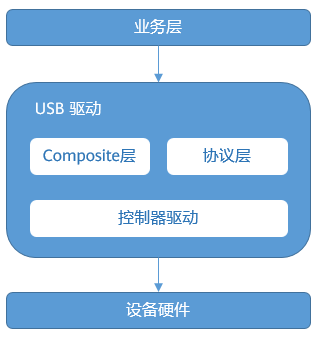

**运作机制<a name="zh-cn_topic_0000001111953766_section1154170125012"></a>**

USB协议驱动加载和数据收发主要流程如下：

1.  USB驱动加载

    USB设备驱动的加载通过Composite层封装统一的处理流程，由Composite调用具体协议的加载函数进行驱动程序的加载。待设备与主机通过USB线建立连接后，Composite层统一处理与主机之间的枚举过程，通过协议层注册的处理函数，进行端口申请和协议私有数据初始化。

2.  USB数据收发

    USB设备加载成功后，业务层通过协议层进行数据收发，协议层直接调用控制器驱动提供的端口控制接口进行端口数据收发处理。

### 开发指导<a name="ZH-CN_TOPIC_0000002543394181"></a>


#### 功能<a name="ZH-CN_TOPIC_0000002543354227"></a>

**功能<a name="zh-cn_topic_0000001158521617_section13923153913293"></a>**

Hi35xx的USB功能支持Device模式，具体协议及功能参见下表。

<a name="zh-cn_topic_0000001158521617_table1424mcpsimp"></a>
<table><thead align="left"><tr id="zh-cn_topic_0000001158521617_row1431mcpsimp"><th class="cellrowborder" valign="top" width="23.23%" id="mcps1.1.4.1.1"><p id="zh-cn_topic_0000001158521617_p1433mcpsimp"><a name="zh-cn_topic_0000001158521617_p1433mcpsimp"></a><a name="zh-cn_topic_0000001158521617_p1433mcpsimp"></a>功能</p>
</th>
<th class="cellrowborder" valign="top" width="26.26%" id="mcps1.1.4.1.2"><p id="zh-cn_topic_0000001158521617_p1435mcpsimp"><a name="zh-cn_topic_0000001158521617_p1435mcpsimp"></a><a name="zh-cn_topic_0000001158521617_p1435mcpsimp"></a>描述</p>
</th>
<th class="cellrowborder" valign="top" width="50.51%" id="mcps1.1.4.1.3"><p id="zh-cn_topic_0000001158521617_p1437mcpsimp"><a name="zh-cn_topic_0000001158521617_p1437mcpsimp"></a><a name="zh-cn_topic_0000001158521617_p1437mcpsimp"></a>使用说明</p>
</th>
</tr>
</thead>
<tbody><tr id="zh-cn_topic_0000001158521617_row1439mcpsimp"><td class="cellrowborder" valign="top" width="23.23%" headers="mcps1.1.4.1.1 "><p id="zh-cn_topic_0000001158521617_p1441mcpsimp"><a name="zh-cn_topic_0000001158521617_p1441mcpsimp"></a><a name="zh-cn_topic_0000001158521617_p1441mcpsimp"></a>Device U盘</p>
</td>
<td class="cellrowborder" valign="top" width="26.26%" headers="mcps1.1.4.1.2 "><p id="zh-cn_topic_0000001158521617_p1443mcpsimp"><a name="zh-cn_topic_0000001158521617_p1443mcpsimp"></a><a name="zh-cn_topic_0000001158521617_p1443mcpsimp"></a>支持将挂载到系统的SD卡/MMC介质当做U盘，供USB Host端进行读写访问等操作。</p>
</td>
<td class="cellrowborder" valign="top" width="50.51%" headers="mcps1.1.4.1.3 "><a name="zh-cn_topic_0000001158521617_ul1445mcpsimp"></a><a name="zh-cn_topic_0000001158521617_ul1445mcpsimp"></a><ul id="zh-cn_topic_0000001158521617_ul1445mcpsimp"><li>支持SD卡虚拟成U盘</li><li>支持EMMC和RAM介质虚拟成U盘</li><li>支持EMMC介质指定分区挂载识别</li><li>支持ftl文件系统虚拟成U盘</li><li>支持PC上右键盘符对U盘进行格式化、弹出等操作</li></ul>
</td>
</tr>
<tr id="zh-cn_topic_0000001158521617_row1450mcpsimp"><td class="cellrowborder" valign="top" width="23.23%" headers="mcps1.1.4.1.1 "><p id="zh-cn_topic_0000001158521617_p1452mcpsimp"><a name="zh-cn_topic_0000001158521617_p1452mcpsimp"></a><a name="zh-cn_topic_0000001158521617_p1452mcpsimp"></a>UVC(USB Video Class)</p>
</td>
<td class="cellrowborder" valign="top" width="26.26%" headers="mcps1.1.4.1.2 "><p id="zh-cn_topic_0000001158521617_p1454mcpsimp"><a name="zh-cn_topic_0000001158521617_p1454mcpsimp"></a><a name="zh-cn_topic_0000001158521617_p1454mcpsimp"></a>支持通过USB口进行视频数据的发送。</p>
</td>
<td class="cellrowborder" valign="top" width="50.51%" headers="mcps1.1.4.1.3 "><a name="zh-cn_topic_0000001158521617_ul1456mcpsimp"></a><a name="zh-cn_topic_0000001158521617_ul1456mcpsimp"></a><ul id="zh-cn_topic_0000001158521617_ul1456mcpsimp"><li>支持安卓机顶盒UVC扩展命令</li><li>支持的视频规格：<p id="p1832179173810"><a name="p1832179173810"></a><a name="p1832179173810"></a>格式：H.265/H.264/MJPEG/YUYV/NV12/NV21</p>
<p id="p1777141363819"><a name="p1777141363819"></a><a name="p1777141363819"></a>分辨率@帧率：1920×1080@30fps、1280×720@30fps、640×480@30fps、640×360@30fps、352×288@30fps、320×240@30fps、176×144@30fps</p>
</li></ul>
</td>
</tr>
<tr id="zh-cn_topic_0000001158521617_row1461mcpsimp"><td class="cellrowborder" valign="top" width="23.23%" headers="mcps1.1.4.1.1 "><p id="zh-cn_topic_0000001158521617_p1463mcpsimp"><a name="zh-cn_topic_0000001158521617_p1463mcpsimp"></a><a name="zh-cn_topic_0000001158521617_p1463mcpsimp"></a>UAC(USB Audio Class)</p>
</td>
<td class="cellrowborder" valign="top" width="26.26%" headers="mcps1.1.4.1.2 "><p id="zh-cn_topic_0000001158521617_p1465mcpsimp"><a name="zh-cn_topic_0000001158521617_p1465mcpsimp"></a><a name="zh-cn_topic_0000001158521617_p1465mcpsimp"></a>支持通过USB口进行音频数据的发送和接收。</p>
</td>
<td class="cellrowborder" valign="top" width="50.51%" headers="mcps1.1.4.1.3 "><a name="zh-cn_topic_0000001158521617_ul1467mcpsimp"></a><a name="zh-cn_topic_0000001158521617_ul1467mcpsimp"></a><ul id="zh-cn_topic_0000001158521617_ul1467mcpsimp"><li>不支持USB3.0</li><li>支持的PCM规格：48K、32K 、16K、8K</li><li>支持的位深和声道数：16bit/1ch、24bit/1ch、24bit/2ch、24bit/4ch</li><li>支持麦克风功能和扬声器功能</li><li>支持UAC1.0和UAC2.0</li></ul>
</td>
</tr>
<tr id="zh-cn_topic_0000001158521617_row1470mcpsimp"><td class="cellrowborder" valign="top" width="23.23%" headers="mcps1.1.4.1.1 "><p id="zh-cn_topic_0000001158521617_p1472mcpsimp"><a name="zh-cn_topic_0000001158521617_p1472mcpsimp"></a><a name="zh-cn_topic_0000001158521617_p1472mcpsimp"></a>UAV(UVC&amp;UAC)</p>
</td>
<td class="cellrowborder" valign="top" width="26.26%" headers="mcps1.1.4.1.2 "><p id="zh-cn_topic_0000001158521617_p1474mcpsimp"><a name="zh-cn_topic_0000001158521617_p1474mcpsimp"></a><a name="zh-cn_topic_0000001158521617_p1474mcpsimp"></a>支持通过USB口进行音视频数据的发送。</p>
</td>
<td class="cellrowborder" valign="top" width="50.51%" headers="mcps1.1.4.1.3 "><a name="zh-cn_topic_0000001158521617_ul1476mcpsimp"></a><a name="zh-cn_topic_0000001158521617_ul1476mcpsimp"></a><ul id="zh-cn_topic_0000001158521617_ul1476mcpsimp"><li>不支持USB3.0</li><li>支持的规格参见UVC、UAC规格</li><li>不支持UAC1.0扬声器功能和UAC2.0</li></ul>
</td>
</tr>
<tr id="zh-cn_topic_0000001158521617_row1479mcpsimp"><td class="cellrowborder" valign="top" width="23.23%" headers="mcps1.1.4.1.1 "><p id="zh-cn_topic_0000001158521617_p1481mcpsimp"><a name="zh-cn_topic_0000001158521617_p1481mcpsimp"></a><a name="zh-cn_topic_0000001158521617_p1481mcpsimp"></a>DFU(Device Firmware Upgrade)</p>
</td>
<td class="cellrowborder" valign="top" width="26.26%" headers="mcps1.1.4.1.2 "><p id="zh-cn_topic_0000001158521617_p1483mcpsimp"><a name="zh-cn_topic_0000001158521617_p1483mcpsimp"></a><a name="zh-cn_topic_0000001158521617_p1483mcpsimp"></a>支持通过USB口对固件的升级，对接Host端DFU协议。</p>
</td>
<td class="cellrowborder" valign="top" width="50.51%" headers="mcps1.1.4.1.3 "><a name="zh-cn_topic_0000001158521617_ul1485mcpsimp"></a><a name="zh-cn_topic_0000001158521617_ul1485mcpsimp"></a><ul id="zh-cn_topic_0000001158521617_ul1485mcpsimp"><li>不支持USB3.0</li><li>支持PC升级</li><li>支持安卓机顶盒升级</li><li>支持升级状态查询</li></ul>
</td>
</tr>
<tr id="zh-cn_topic_0000001158521617_row1490mcpsimp"><td class="cellrowborder" valign="top" width="23.23%" headers="mcps1.1.4.1.1 "><p id="zh-cn_topic_0000001158521617_p1492mcpsimp"><a name="zh-cn_topic_0000001158521617_p1492mcpsimp"></a><a name="zh-cn_topic_0000001158521617_p1492mcpsimp"></a>HID(Human Interface Device)</p>
</td>
<td class="cellrowborder" valign="top" width="26.26%" headers="mcps1.1.4.1.2 "><p id="zh-cn_topic_0000001158521617_p1494mcpsimp"><a name="zh-cn_topic_0000001158521617_p1494mcpsimp"></a><a name="zh-cn_topic_0000001158521617_p1494mcpsimp"></a>支持通过USB口对HID设备的数据进行接收和发送。</p>
</td>
<td class="cellrowborder" valign="top" width="50.51%" headers="mcps1.1.4.1.3 "><a name="zh-cn_topic_0000001158521617_ul1496mcpsimp"></a><a name="zh-cn_topic_0000001158521617_ul1496mcpsimp"></a><ul id="zh-cn_topic_0000001158521617_ul1496mcpsimp"><li>不支持USB3.0</li><li>不支持启动接口和启动协议</li><li>支持USB鼠标、键盘和带有鼠标功能的键盘设备功能</li><li>支持报告描述符动态可配置</li></ul>
</td>
</tr>
<tr id="zh-cn_topic_0000001158521617_row1501mcpsimp"><td class="cellrowborder" valign="top" width="23.23%" headers="mcps1.1.4.1.1 "><p id="zh-cn_topic_0000001158521617_p1503mcpsimp"><a name="zh-cn_topic_0000001158521617_p1503mcpsimp"></a><a name="zh-cn_topic_0000001158521617_p1503mcpsimp"></a>虚拟网口</p>
</td>
<td class="cellrowborder" valign="top" width="26.26%" headers="mcps1.1.4.1.2 "><p id="zh-cn_topic_0000001158521617_p1505mcpsimp"><a name="zh-cn_topic_0000001158521617_p1505mcpsimp"></a><a name="zh-cn_topic_0000001158521617_p1505mcpsimp"></a>支持通过USB口进行网络数据的收发，模拟网口的功能。</p>
</td>
<td class="cellrowborder" valign="top" width="50.51%" headers="mcps1.1.4.1.3 "><a name="ul1323413417253"></a><a name="ul1323413417253"></a><ul id="ul1323413417253"><li>不支持二层套接字设置</li><li>支持RNDIS协议网络传输</li><li>支持ECM协议网络传输</li></ul>
</td>
</tr>
<tr id="zh-cn_topic_0000001158521617_row1508mcpsimp"><td class="cellrowborder" valign="top" width="23.23%" headers="mcps1.1.4.1.1 "><p id="zh-cn_topic_0000001158521617_p1510mcpsimp"><a name="zh-cn_topic_0000001158521617_p1510mcpsimp"></a><a name="zh-cn_topic_0000001158521617_p1510mcpsimp"></a>虚拟串口</p>
</td>
<td class="cellrowborder" valign="top" width="26.26%" headers="mcps1.1.4.1.2 "><p id="zh-cn_topic_0000001158521617_p1512mcpsimp"><a name="zh-cn_topic_0000001158521617_p1512mcpsimp"></a><a name="zh-cn_topic_0000001158521617_p1512mcpsimp"></a>支持通过USB口进行串行通信，模拟串口的功能。</p>
</td>
<td class="cellrowborder" valign="top" width="50.51%" headers="mcps1.1.4.1.3 "><p id="zh-cn_topic_0000001158521617_p1514mcpsimp"><a name="zh-cn_topic_0000001158521617_p1514mcpsimp"></a><a name="zh-cn_topic_0000001158521617_p1514mcpsimp"></a>支持调测功能</p>
</td>
</tr>
<tr id="zh-cn_topic_0000001158521617_row1515mcpsimp"><td class="cellrowborder" valign="top" width="23.23%" headers="mcps1.1.4.1.1 "><p id="zh-cn_topic_0000001158521617_p1517mcpsimp"><a name="zh-cn_topic_0000001158521617_p1517mcpsimp"></a><a name="zh-cn_topic_0000001158521617_p1517mcpsimp"></a>复合设备 (虚拟网口&amp;虚拟串口)</p>
</td>
<td class="cellrowborder" valign="top" width="26.26%" headers="mcps1.1.4.1.2 "><p id="zh-cn_topic_0000001158521617_p1519mcpsimp"><a name="zh-cn_topic_0000001158521617_p1519mcpsimp"></a><a name="zh-cn_topic_0000001158521617_p1519mcpsimp"></a>支持基于USB口同时模拟网口和串口的功能。</p>
</td>
<td class="cellrowborder" valign="top" width="50.51%" headers="mcps1.1.4.1.3 "><a name="zh-cn_topic_0000001158521617_ul1521mcpsimp"></a><a name="zh-cn_topic_0000001158521617_ul1521mcpsimp"></a><ul id="zh-cn_topic_0000001158521617_ul1521mcpsimp"><li>支持调测功能</li><li>不支持二层套接字设置</li></ul>
</td>
</tr>
<tr id="row1546719198292"><td class="cellrowborder" valign="top" width="23.23%" headers="mcps1.1.4.1.1 "><p id="p1646801915296"><a name="p1646801915296"></a><a name="p1646801915296"></a>UAC&amp;HID复合设备</p>
</td>
<td class="cellrowborder" valign="top" width="26.26%" headers="mcps1.1.4.1.2 "><p id="p1946871972916"><a name="p1946871972916"></a><a name="p1946871972916"></a>支持通过USB口进行音频数据、HID数据的发送和接收。</p>
</td>
<td class="cellrowborder" valign="top" width="50.51%" headers="mcps1.1.4.1.3 "><a name="ul9506113815376"></a><a name="ul9506113815376"></a><ul id="ul9506113815376"><li>不支持USB3.0</li><li>支持的规格参见UAC、HID规格</li><li>支持UAC1.0麦克风、扬声器功能和HID键盘、鼠标功能</li><li>不支持UAC2.0</li></ul>
</td>
</tr>
</tbody>
</table>

> **说明：** 
>USB3.0 Device对接USB2.0 Host时，由于设备侧硬件限制不支持降速，无法识别。

LiteOS USB驱动由于受芯片硬件资源限制，支持的规格也不尽相同，详细请参见下表所示。

<a name="zh-cn_topic_0000001158521617__Toc534313347"></a>
<table><thead align="left"><tr id="zh-cn_topic_0000001158521617_row1599mcpsimp"><th class="cellrowborder" valign="top" width="14.097180563887221%" id="mcps1.1.13.1.1"><p id="zh-cn_topic_0000001158521617_p7530151214711"><a name="zh-cn_topic_0000001158521617_p7530151214711"></a><a name="zh-cn_topic_0000001158521617_p7530151214711"></a>芯片平台</p>
</th>
<th class="cellrowborder" valign="top" width="6.25874825034993%" id="mcps1.1.13.1.2"><p id="zh-cn_topic_0000001158521617_p1601mcpsimp"><a name="zh-cn_topic_0000001158521617_p1601mcpsimp"></a><a name="zh-cn_topic_0000001158521617_p1601mcpsimp"></a>U 盘</p>
</th>
<th class="cellrowborder" valign="top" width="5.548890221955609%" id="mcps1.1.13.1.3"><p id="zh-cn_topic_0000001158521617_p1603mcpsimp"><a name="zh-cn_topic_0000001158521617_p1603mcpsimp"></a><a name="zh-cn_topic_0000001158521617_p1603mcpsimp"></a>UVC</p>
</th>
<th class="cellrowborder" valign="top" width="6.08878224355129%" id="mcps1.1.13.1.4"><p id="zh-cn_topic_0000001158521617_p1605mcpsimp"><a name="zh-cn_topic_0000001158521617_p1605mcpsimp"></a><a name="zh-cn_topic_0000001158521617_p1605mcpsimp"></a>UAC</p>
</th>
<th class="cellrowborder" valign="top" width="5.978804239152169%" id="mcps1.1.13.1.5"><p id="zh-cn_topic_0000001158521617_p1607mcpsimp"><a name="zh-cn_topic_0000001158521617_p1607mcpsimp"></a><a name="zh-cn_topic_0000001158521617_p1607mcpsimp"></a>UAV</p>
</th>
<th class="cellrowborder" valign="top" width="5.858828234353129%" id="mcps1.1.13.1.6"><p id="zh-cn_topic_0000001158521617_p1609mcpsimp"><a name="zh-cn_topic_0000001158521617_p1609mcpsimp"></a><a name="zh-cn_topic_0000001158521617_p1609mcpsimp"></a>DFU</p>
</th>
<th class="cellrowborder" valign="top" width="6.09878024395121%" id="mcps1.1.13.1.7"><p id="zh-cn_topic_0000001158521617_p1611mcpsimp"><a name="zh-cn_topic_0000001158521617_p1611mcpsimp"></a><a name="zh-cn_topic_0000001158521617_p1611mcpsimp"></a>HID</p>
</th>
<th class="cellrowborder" valign="top" width="9.668066386722655%" id="mcps1.1.13.1.8"><p id="zh-cn_topic_0000001158521617_p1613mcpsimp"><a name="zh-cn_topic_0000001158521617_p1613mcpsimp"></a><a name="zh-cn_topic_0000001158521617_p1613mcpsimp"></a>虚拟串口</p>
</th>
<th class="cellrowborder" valign="top" width="11.347730453909218%" id="mcps1.1.13.1.9"><p id="zh-cn_topic_0000001158521617_p1615mcpsimp"><a name="zh-cn_topic_0000001158521617_p1615mcpsimp"></a><a name="zh-cn_topic_0000001158521617_p1615mcpsimp"></a>虚拟网口RNDIS</p>
</th>
<th class="cellrowborder" valign="top" width="9.978004399120175%" id="mcps1.1.13.1.10"><p id="p87021222881"><a name="p87021222881"></a><a name="p87021222881"></a>虚拟网口</p>
<p id="p159383514812"><a name="p159383514812"></a><a name="p159383514812"></a>ECM</p>
</th>
<th class="cellrowborder" valign="top" width="12.11757648470306%" id="mcps1.1.13.1.11"><p id="zh-cn_topic_0000001158521617_p1617mcpsimp"><a name="zh-cn_topic_0000001158521617_p1617mcpsimp"></a><a name="zh-cn_topic_0000001158521617_p1617mcpsimp"></a>复合设备</p>
<p id="p10165152318163"><a name="p10165152318163"></a><a name="p10165152318163"></a>SER_RNDIS和SER_ECM</p>
</th>
<th class="cellrowborder" valign="top" width="6.958608278344331%" id="mcps1.1.13.1.12"><p id="p106154410418"><a name="p106154410418"></a><a name="p106154410418"></a>UAC&amp;HID</p>
</th>
</tr>
</thead>
<tbody><tr id="zh-cn_topic_0000001158521617_row1618mcpsimp"><td class="cellrowborder" valign="top" width="14.097180563887221%" headers="mcps1.1.13.1.1 "><p id="zh-cn_topic_0000001158521617_p1620mcpsimp"><a name="zh-cn_topic_0000001158521617_p1620mcpsimp"></a><a name="zh-cn_topic_0000001158521617_p1620mcpsimp"></a>Hi3516DV300 (USB2.0)</p>
</td>
<td class="cellrowborder" valign="top" width="6.25874825034993%" headers="mcps1.1.13.1.2 "><p id="zh-cn_topic_0000001158521617_p1622mcpsimp"><a name="zh-cn_topic_0000001158521617_p1622mcpsimp"></a><a name="zh-cn_topic_0000001158521617_p1622mcpsimp"></a>√</p>
</td>
<td class="cellrowborder" valign="top" width="5.548890221955609%" headers="mcps1.1.13.1.3 "><p id="zh-cn_topic_0000001158521617_p1624mcpsimp"><a name="zh-cn_topic_0000001158521617_p1624mcpsimp"></a><a name="zh-cn_topic_0000001158521617_p1624mcpsimp"></a>√</p>
</td>
<td class="cellrowborder" valign="top" width="6.08878224355129%" headers="mcps1.1.13.1.4 "><p id="zh-cn_topic_0000001158521617_p1626mcpsimp"><a name="zh-cn_topic_0000001158521617_p1626mcpsimp"></a><a name="zh-cn_topic_0000001158521617_p1626mcpsimp"></a>√</p>
</td>
<td class="cellrowborder" valign="top" width="5.978804239152169%" headers="mcps1.1.13.1.5 "><p id="zh-cn_topic_0000001158521617_p1628mcpsimp"><a name="zh-cn_topic_0000001158521617_p1628mcpsimp"></a><a name="zh-cn_topic_0000001158521617_p1628mcpsimp"></a>√</p>
</td>
<td class="cellrowborder" valign="top" width="5.858828234353129%" headers="mcps1.1.13.1.6 "><p id="zh-cn_topic_0000001158521617_p1630mcpsimp"><a name="zh-cn_topic_0000001158521617_p1630mcpsimp"></a><a name="zh-cn_topic_0000001158521617_p1630mcpsimp"></a>√</p>
</td>
<td class="cellrowborder" valign="top" width="6.09878024395121%" headers="mcps1.1.13.1.7 "><p id="zh-cn_topic_0000001158521617_p1632mcpsimp"><a name="zh-cn_topic_0000001158521617_p1632mcpsimp"></a><a name="zh-cn_topic_0000001158521617_p1632mcpsimp"></a>√</p>
</td>
<td class="cellrowborder" valign="top" width="9.668066386722655%" headers="mcps1.1.13.1.8 "><p id="zh-cn_topic_0000001158521617_p1634mcpsimp"><a name="zh-cn_topic_0000001158521617_p1634mcpsimp"></a><a name="zh-cn_topic_0000001158521617_p1634mcpsimp"></a>√</p>
</td>
<td class="cellrowborder" valign="top" width="11.347730453909218%" headers="mcps1.1.13.1.9 "><p id="zh-cn_topic_0000001158521617_p1636mcpsimp"><a name="zh-cn_topic_0000001158521617_p1636mcpsimp"></a><a name="zh-cn_topic_0000001158521617_p1636mcpsimp"></a>√</p>
</td>
<td class="cellrowborder" valign="top" width="9.978004399120175%" headers="mcps1.1.13.1.10 ">&nbsp;&nbsp;</td>
<td class="cellrowborder" valign="top" width="12.11757648470306%" headers="mcps1.1.13.1.11 "><p id="zh-cn_topic_0000001158521617_p1638mcpsimp"><a name="zh-cn_topic_0000001158521617_p1638mcpsimp"></a><a name="zh-cn_topic_0000001158521617_p1638mcpsimp"></a>√</p>
</td>
<td class="cellrowborder" valign="top" width="6.958608278344331%" headers="mcps1.1.13.1.12 "><p id="p26104454113"><a name="p26104454113"></a><a name="p26104454113"></a>√</p>
</td>
</tr>
</tbody>
</table>

> **说明：** 
>Hi3516DV300/Hi3556V200/Hi3559V200的USB2.0口，是基于USB3.0的控制器操作的，编译时需要选择3.0的控制器。

#### 配置USB模块的内存<a name="ZH-CN_TOPIC_0000002543354219"></a>

USB模块的正常运行需要一段uncached内存，所以需要单独为USB模块配置内存。

配置内存可通过定义以下函数实现：

```
void board_config(void)
{
    g_sys_mem_addr_end = 0x88000000;
    g_usb_mem_addr_start = g_sys_mem_addr_end;
    g_usb_mem_size = 0x100000;
}
```

> **须知：** 
>-   不可以修改void board\_config\(void\)的声明，若应用层不定义void board\_config\(void\)函数，LiteOS会按默认值分配OS可见内存大小。建议根据实际情况自行定义。
>-   g\_sys\_mem\_addr\_end配置的是OS可见内存的结束位置。
>-   g\_usb\_mem\_addr\_start配置的是USB内存的起始位置。
>-   g\_usb\_mem\_size配置的是USB内存的大小。
>-   若系统完全不支持USB相关功能，则可以将g\_usb\_mem\_addr\_start和g\_usb\_mem\_size配置为0。

#### 动态切换USB协议<a name="ZH-CN_TOPIC_0000002511794346"></a>

动态切换时，先调用usb\_deinit卸载当前使用的协议，再通过usb\_init重新加载待切换的协议。

部分协议使用中不支持卸载（如：DFU、UVC、Camera、HID），需要先停用当前业务后再调用usb\_deinit卸载。

#### 模块编译<a name="ZH-CN_TOPIC_0000002511954374"></a>

USB驱动的源码路径为drivers/usb。用户在LiteOS根目录下执行make即可编译出对应的USB模块库。编译成功后，会在“out/<platform\>/lib”目录下生成名为“libusb\_base.a”、“libusb\_device.a”的库文件，目录中的platform为具体的平台名。

[图1](#fig653025965111)是LiteOS中USB驱动menuconfig配置项截图，在“Driver”配置项下，可以通过选中“Enable USB”开启 USB 驱动功能。

**图 1**  USB驱动menuconfig配置<a name="fig653025965111"></a>  
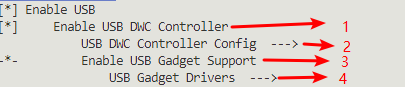

**Device端<a name="zh-cn_topic_0000001158521619_section1625195823210"></a>**

配置项如为[图1](#fig653025965111)所示的1\~4，对应描述如下：

-   1表示是否打开USB驱动Device功能。
-   2表示Device控制器种类，分别有Dwc2.0和3.0（可视具体板子的 USB 口类别而定）。
-   3表示是否开启Device模式下的USB协议功能。
-   4表示Device模式下的具体USB协议功能，支持的USB协议如下，menuconfig配置项如[图2](#fig659124262511)所示：

    -   Device U盘
    -   UVC
    -   UAC
    -   Camera（UVC&UAC）
    -   DFU升级
    -   虚拟串口
    -   虚拟网口ECM
    -   虚拟网口RNDIS
    -   复合设备（虚拟串口&虚拟网口）
    -   HID
    -   UAC&HID复合设备

    **图 2**  USB驱动Device端配置<a name="fig659124262511"></a>  
    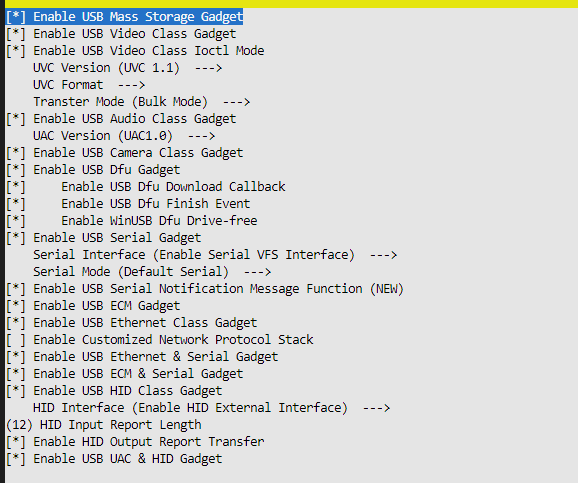

> **须知：** 
>初始化Device模式也是调用usb\_init\(DEVICE, xxx\) ，根据业务诉求开启需要的协议，也可以全部开启。另外，依赖的外围组件也需要提前加载好，具体参见“[Device端](Device端.md)”的编程实例。

### 编程实例<a name="ZH-CN_TOPIC_0000002511794330"></a>


#### Device端<a name="ZH-CN_TOPIC_0000002511954242"></a>


##### Device虚拟U盘<a name="ZH-CN_TOPIC_0000002543394265"></a>

**初始化<a name="zh-cn_topic_0000001158566737_section2368259319"></a>**

在初始化函数中初始化SD卡驱动和USB驱动：

```
SD_MMC_Host_init();
usbd_set_device_info(DEV_MASS, &str_manufacturer, &str_product, &str_serial_number, dev_id);
usb_init(DEVICE, DEV_MASS);   // dtype设置为DEV_MASS
```

> **说明：** 
>-   在多卡情况下（系统同时挂载2张卡及以上），USB2.0 Device默认绑定第一张卡设备节点，例如同时存在“/dev/mmcblk0p0”，“/dev/mmcblk1p0”时，USB2.0 Device会绑定“/dev/mmcblk0p0”，因此Host端通过USB口只能访问到一张SD/MMC卡。
>-   USB2.0 Device连接Host端后，Host端可以通过USB端口访问到系统存储介质的文件。在Host端访问存储介质过程中，系统端请勿对MMC/SD Card存储介质进行读写、格式化等操作，避免Host端访问存储介质异常。
>-   Device U盘对接PC进行格式化时，仅支持Windows PC进行快速格式化操作，请勿使用Windows PC的一般格式化操作或Linux的高级格式化命令，避免对分区信息进行修改，导致Device卸载虚拟U盘后mount失败。如果进行了此操作，mount失败后可重新format存储介质来解决。
>-   目前虚拟U盘支持的存储介质有4种，分别是：SD卡、MMC、RAM、FTL spi\_nor。初始化流程一致，在加载USB之前，都需要先将对应介质的文件系统初始化，确保“dev/”目录下有可供虚拟U盘读写的节点。

**注册Device U盘回调函数<a name="zh-cn_topic_0000001158566737_section5711512448"></a>**

应用层通过fmass\_register\_notify\(void\(\*notify\)\(void\* context, int status\), void\* context\)函数注册notify回调，驱动会在识别到接入和拔出Host端时调用此回调函数，从而实现DeviceU盘拔插相关的处理。

请在USB模块初始化后，立马调用fmass\_register\_notify\(\)实现Device回调函数的注册。

> **须知：** 
>Notify回调函数中，在USB Device链接的情况下，需通过fmass\_partition\_startup\(\)将需要被PC端识别的SD卡分区节点启动，并且保证其接口传进来的设备节点是存在的，如果不存在，就默认将“/dev/mmcblk0p0”虚拟化为U盘，若“/dev/mmcblk0p0”节点不存在，则会失败。

**开启额外串口<a name="section728111271546"></a>**

开启LOSCFG\_DRIVERS\_USB\_MASS\_STORAGE\_EXT\_SER\_FUNC，即可在虚拟U盘的基础上额外增加串口的功能。当前支持配置为单串口和双串口。

**注意事项<a name="zh-cn_topic_0000001158566737_section12536387510"></a>**

-   在正常操作过程中需要遵守的事项：
    -   Device U盘将SD卡交由USB Host处理，因此在Device U盘被Host端识别后，会通过回调函数通知APP软件模块，APP必须将所有录像抓拍等操作SD卡的业务停下，并umount SD卡分区，待USB Host离线后再mount和恢复相关业务。
    -   USB Host端进行读写访问时，不要拔出单板的SD/MMC卡，否则会打印一些异常信息，并且可能会导致卡住文件或文件系统被破坏。

-   在操作过程中出现异常时的操作：

    若拔出Device U盘后，再极其快速地插入Device U盘，可能会导致Host端检测不到U盘，因为单板Device U盘的检测注册/注销过程需要一定的时间。

**编程示例<a name="zh-cn_topic_0000001158566737_section152522281762"></a>**

```
extern int fmass_register_notify(void(*notify)(void* context, int status), void* context);
extern int fmass_partition_startup(char* path);
void fmass_app_notify(void* conext, int status)
{
    char *path = "/dev/mmcblk0p0";
    if(status == 1)/*usb device connect*/
    {
        /* 停止录像抓拍等对/dev/mmcblk0p0分区的读写操作，并umount该分区 */
        fmass_partition_startup(path);    // startup fmass access partition
    }
    else
    {
        /* mount该分区,并通知其它模块该分区可以进行读写操作 */
    }
}
void app_init()
{
    uint32_t ret;
    int handle;

    const char manufacturer[38] = {
        'H', 0, 'i', 0, 'S', 0, 'i', 0, 'l', 0, 'i', 0, 'c', 0, 'o', 0, 'n', 0,
        '(', 0, 'S', 0, 'h', 0, 'a', 0, 'n', 0, 'g', 0, 'h', 0, 'a', 0, 'i', 0, ')', 0
    };
    struct device_string str_manufacturer = {
        .str = manufacturer,
        .len = 38
    };

    const char product[18] = {
        'U', 0, 'S', 0, 'B', 0, 'D', 0, 'E', 0, 'V', 0, 'I', 0,
        'C', 0, 'E', 0
    };
    struct device_string str_product = {
        .str = product,
        .len = 18
    };

    const char serial[16] = {
        '2', 0, '0', 0, '2', 0, '0', 0, '0', 0, '6', 0, '2', 0,
        '4', 0
    };
    struct device_string str_serial_number = {
        .str = serial,
        .len = 16
    };

    struct device_id dev_id = {
        .vendor_id = 0x3361,
        .product_id = 0x0108,
        .release_num = 0x0318
    };

    SD_MMC_Host_init();

    g_usb_mem_addr_start= g_sys_mem_addr_end;
    g_usb_mem_size= 0x40000; //recommend 256K nonCache for usb

    ret = usbd_set_device_info(DEV_MASS, &str_manufacturer, &str_product, &str_serial_number, dev_id);
    if (ret != 0) {
        dprintf("set fail!\n");
        return;
    }
    
    ret = usb_init(DEVICE, DEV_MASS);  // usb_init must after SD_MMC_Host_init
    if(ret != 0) {
        dprintf("usb init failed!\n");
        return;
    }
    handle = fmass_register_notify(fmass_app_notify,NULL);
    if (handle == -1) {
        return;
    }
}
```

**内存中Fat32文件系统虚拟为U盘<a name="zh-cn_topic_0000001158566737_section1093014511813"></a>**

1.  制作FAT格式的文件系统镜像（以Ubuntu系统为例）。
    1.  制作FAT格式磁盘镜像。

        ```
        mkfs.fat -s 64 -S 512 -f 2 -n "Internal SD" -F 32 -C usbdisk.tmp 2048
        ```

        其中2048表示磁盘空间大小，单位是KB。

    2.  挂载FAT格式磁盘镜像。

        ```
        mount -o loop -t vfat usbdisk.tmp test/
        ```

        其中test为挂载目录。

    3.  在test目录下存放所需文件，然后将文件同步到磁盘。

        ```
        sync test/
        ```

    4.  卸载磁盘镜像。

        ```
        umount test/
        ```

    5.  制作文件系统镜像。

        ```
        dd if=usbdisk.tmp of=udisk.img bs=1024 count=2048
        ```

        将“usbdisk.tmp”前面2MB的内容制作为文件系统镜像“udisk.img“”。

2.  将制作好的文件系统镜像下载到flash上。

    将“udisk.img”文件放到指定路径FAT\_PART\_IMAGE\_PATH（“/littlefs/udisk.img”）。

3.  调用ram\_mass\_storage\_init接口注册RAM\_DEV\_NAME（/dev/uram）设备节点。
4.  调用fmass\_register\_notify接口指定设备节点“/dev/uram”虚拟为U盘。
5.  调用usbd\_set\_device\_info和usb\_init接口加载虚拟U盘协议。

    > **须知：** 
    >本次制作的文件系统镜像申请的是2M容量，请根据实际业务需求调整容量大小，除了需要制定特定容量的文件系统镜像之外，还要修改对应的FAT\_PART\_SIZE大小。

##### Device UVC<a name="ZH-CN_TOPIC_0000002511794298"></a>

Device UVC支持UVC1.0协议和UVC1.1协议版本的切换，打开菜单，进入Driver ---\> Enable USB ---\> Enable USB DWC Controller ---\> Enable USB Gadget Support ---\> USB Gadget Drivers ---\> UVC Version可选择UVC1.0或UVC1.1版本。当前默认为UVC1.1协议，切换为UVC1.0可支持Windows xp系统，增加兼容性。

**操作指导<a name="zh-cn_topic_0000001158521631_section1822055133413"></a>**

1.  UVC上层应用在USB初始前设置UVC传输能力集，开启VI，打开UVC设备。
2.  就绪后，等待底层UVC连接，启动VPSS和VENC编码并传输码流数据，直至UVC通道断开。
3.  切换新码流格式时，应用须先关闭前一次编码并清空缓存，再启动编码。

**操作示例<a name="zh-cn_topic_0000001158521631_section113017485329"></a>**

-   **方式1：直接调用device uvc相关接口控制数据传输。**

1.  通过fuvc\_frame\_descriptors\_get接口设置UVC传输能力集（含：编码格式、分辨率和帧率）。
2.  在初始化函数中调用usbd\_set\_device\_info和usb\_init接口实现USB驱动注册。

    ```
    usbd_set_device_info(DEV_UVC, &str_manufacturer, &str_product, &str_serial_number, dev_id);
    usb_init(DEVICE, DEV_UVC);     // dtype设置为DEV_UVC
    ```

3.  开启VI后，调用uvc\_open\_device打开UVC设备，需指定分辨率和帧率。
4.  通过uvc\_wait\_host等待板端与USB主机侧连接成功。
5.  启动VPSS和VENC编码后，通过uvc\_recv\_pack开始执行视频数据传输。
6.  通过uvc\_video\_stop停止视频数据传输，可调用uvc\_close\_device关闭USB设备。

-   **方式2：打开device uvc注册的设备节点，并通过系统调用控制数据传输。**

1.  在初始化函数中调用usbd\_set\_device\_info和usb\_init接口实现USB驱动注册。

    ```
    usbd_set_device_info(DEV_UVC, &str_manufacturer, &str_product, &str_serial_number, dev_id);
    usb_init(DEVICE, DEV_UVC);     // dtype设置为DEV_UVC
    ```

2.  开启VI后，调用open打开UVC设备节点“/dev/usb\_uvc-0”，并通过调用select函数监视设备连接情况。
3.  当板端与USB主机侧连接成功并可以开始传输数据时，select系统调用能够接收到来自host端的消息，此时调用ioctl接口发送VIDIOC\_DQEVENT命令，并提供结构体struct usbd\_uvc\_video\_event来接收数据。根据接收的数据将视频的分辨率、帧率等信息发送给VPSS和VENC。
4.  启动VPSS和VENC编码后，通过uvc\_recv\_pack开始执行视频数据传输。同时通过系统调用ioctl发送VIDIOC\_STREAMON命令通知USB设备可以开始进行数据传输。
5.  通过调用VIDIOC\_STREAMOFF可以停止视频传输，再通过系统调用close关闭USB设备。

> **须知：** 
>方式1与方式2都有打开设备的操作，分别是直接调用接口uvc\_open\_device和调用系统接口open。当同时使用这两个接口时，只能打开一次设备，后调用的接口将无法打开设备且其各种操作都将失效。

##### Device UAC<a name="ZH-CN_TOPIC_0000002511954266"></a>

UAC的数据处理流程，麦克风业务具体步骤如下：

1.  <a name="zh-cn_topic_0000001158521635_li12336155093519"></a>在初始化函数中调用usbd\_set\_device\_info和usb\_init接口实现USB驱动注册。

    ```
    usbd_set_device_info(DEV_UAC, str_manufacturer, str_product, str_serial_number, dev_id);
    usb_init(DEVICE, DEV_UAC);      // dtype设置为DEV_UAC
    ```

2.  <a name="zh-cn_topic_0000001158521635_li8336175011352"></a>开启VI后，通过uac\_wait\_host等待板端与USB。
3.  <a name="li13876112144214"></a>通过fuac\_get\_opts接口获取当前Device UAC与Host协商的采样率、声道数和位深信息，计算每次要发送的音频长度和需要缓存的音频个数。
4.  通过[3](#li13876112144214)计算出的数值，调用fuac\_reqbuf\_init接口初始化UAC内存池。
5.  <a name="li258324718444"></a>启动VPSS和VENC编码前调用fuac\_reqbuf\_get接口获取空闲buf，把编码后的音频填充到此buf。
6.  <a name="zh-cn_topic_0000001158521635_li3336165003519"></a>填充完的buf，通过调用fuac\_send\_message发送音频数据给Host，此后[5](#li258324718444)和[6](#zh-cn_topic_0000001158521635_li3336165003519)往复循环执行。
7.  结束音频传输时，把[5](#li258324718444)中已获取的空闲buf，通过调用fuac\_send\_message接口，全部归还给USB，然后调用fuac\_reqbuf\_deinit接口释放UAC内存池。
8.  调用usb\_deinit接口卸载协议，注意卸载协议前必须保证UAC内存池的所有buf全部归还给USB层，否则会卸载失败。

扬声器业务具体步骤如下：

1.  和麦克风业务中的[1](#zh-cn_topic_0000001158521635_li12336155093519)、[2](#zh-cn_topic_0000001158521635_li8336175011352)一样，依次实行加载UAC协议。
2.  通过fuac\_get\_opts接口获取当前Device UAC与Host协商的采样率、声道数和位深信息，计算每次要接收的音频长度。
3.  调用fuac\_receive\_message接收Host下发的音频数据。
4.  停止调用fuac\_receive\_message接口，即停止音频数据传输。
5.  调用usb\_deinit接口卸载协议。

##### Device UAV（Camera）<a name="ZH-CN_TOPIC_0000002511794270"></a>

UAV是同时支持UAC、UVC，相关操作流程，参见上面UVC、UAC使用示例。区别在于初始化时，传入的协议类型：

```
usbd_set_device_info(DEV_CAMERA, &str_manufacturer, &str_product, &str_serial_number, dev_id);
usb_init(DEVICE, DEV_CAMERA);   // dtype设置为 DEV_CAMERA
```

##### Device虚拟串口<a name="ZH-CN_TOPIC_0000002511954342"></a>

虚拟串口配置说明如下：

<a name="table307549115016"></a>
<table><thead align="left"><tr id="row6708500315016"><th class="cellrowborder" valign="top" width="33.08669133086692%" id="mcps1.1.6.1.1"><p id="p1839509215016"><a name="p1839509215016"></a><a name="p1839509215016"></a>配置项</p>
</th>
<th class="cellrowborder" valign="top" width="22.307769223077692%" id="mcps1.1.6.1.2"><p id="p1360747715016"><a name="p1360747715016"></a><a name="p1360747715016"></a>含义</p>
</th>
<th class="cellrowborder" valign="top" width="13.288671132886712%" id="mcps1.1.6.1.3"><p id="p2846381815016"><a name="p2846381815016"></a><a name="p2846381815016"></a>取值范围</p>
</th>
<th class="cellrowborder" valign="top" width="10.578942105789421%" id="mcps1.1.6.1.4"><p id="p2386789915016"><a name="p2386789915016"></a><a name="p2386789915016"></a>默认值</p>
</th>
<th class="cellrowborder" valign="top" width="20.73792620737926%" id="mcps1.1.6.1.5"><p id="p5425169815016"><a name="p5425169815016"></a><a name="p5425169815016"></a>依赖</p>
</th>
</tr>
</thead>
<tbody><tr id="row2853386715016"><td class="cellrowborder" valign="top" width="33.08669133086692%" headers="mcps1.1.6.1.1 "><p id="p88551044102511"><a name="p88551044102511"></a><a name="p88551044102511"></a>LOSCFG_DRIVERS_USB_SERIAL_VFS_INTERFACE</p>
</td>
<td class="cellrowborder" valign="top" width="22.307769223077692%" headers="mcps1.1.6.1.2 "><p id="p4478011915016"><a name="p4478011915016"></a><a name="p4478011915016"></a>使能VFS的读写接口控制虚拟串口的读写和ioctl</p>
</td>
<td class="cellrowborder" valign="top" width="13.288671132886712%" headers="mcps1.1.6.1.3 "><p id="p5143025815447"><a name="p5143025815447"></a><a name="p5143025815447"></a>YES/NO</p>
</td>
<td class="cellrowborder" valign="top" width="10.578942105789421%" headers="mcps1.1.6.1.4 "><p id="p6686734915016"><a name="p6686734915016"></a><a name="p6686734915016"></a>YES</p>
</td>
<td class="cellrowborder" valign="top" width="20.73792620737926%" headers="mcps1.1.6.1.5 "><p id="p22471755182617"><a name="p22471755182617"></a><a name="p22471755182617"></a>LOSCFG_FS_VFS</p>
</td>
</tr>
<tr id="row15729155514413"><td class="cellrowborder" valign="top" width="33.08669133086692%" headers="mcps1.1.6.1.1 "><p id="p486713410272"><a name="p486713410272"></a><a name="p486713410272"></a>LOSCFG_DRIVERS_USB_SERIAL_FUNC_INTERFACE</p>
</td>
<td class="cellrowborder" valign="top" width="22.307769223077692%" headers="mcps1.1.6.1.2 "><p id="p17815771273"><a name="p17815771273"></a><a name="p17815771273"></a>使能对外接口控制虚拟串口读写和ioctl</p>
</td>
<td class="cellrowborder" valign="top" width="13.288671132886712%" headers="mcps1.1.6.1.3 "><p id="p57293551241"><a name="p57293551241"></a><a name="p57293551241"></a>YES/NO</p>
</td>
<td class="cellrowborder" valign="top" width="10.578942105789421%" headers="mcps1.1.6.1.4 "><p id="p82611040192713"><a name="p82611040192713"></a><a name="p82611040192713"></a>NO</p>
</td>
<td class="cellrowborder" valign="top" width="20.73792620737926%" headers="mcps1.1.6.1.5 "><p id="p1392216534274"><a name="p1392216534274"></a><a name="p1392216534274"></a>无</p>
</td>
</tr>
<tr id="row65851552164"><td class="cellrowborder" valign="top" width="33.08669133086692%" headers="mcps1.1.6.1.1 "><p id="p195851952663"><a name="p195851952663"></a><a name="p195851952663"></a>LOSCFG_DRIVERS_USB_SERIAL_GADGET_DEFAULT</p>
</td>
<td class="cellrowborder" valign="top" width="22.307769223077692%" headers="mcps1.1.6.1.2 "><p id="p15585252968"><a name="p15585252968"></a><a name="p15585252968"></a>使能默认单串口</p>
</td>
<td class="cellrowborder" valign="top" width="13.288671132886712%" headers="mcps1.1.6.1.3 "><p id="p205856521362"><a name="p205856521362"></a><a name="p205856521362"></a>YES/NO</p>
</td>
<td class="cellrowborder" valign="top" width="10.578942105789421%" headers="mcps1.1.6.1.4 "><p id="p10585652567"><a name="p10585652567"></a><a name="p10585652567"></a>YES</p>
</td>
<td class="cellrowborder" valign="top" width="20.73792620737926%" headers="mcps1.1.6.1.5 "><p id="p758514524618"><a name="p758514524618"></a><a name="p758514524618"></a>无</p>
</td>
</tr>
<tr id="row4465140515016"><td class="cellrowborder" valign="top" width="33.08669133086692%" headers="mcps1.1.6.1.1 "><p id="p5547821915016"><a name="p5547821915016"></a><a name="p5547821915016"></a>LOSCFG_DRIVERS_USB_SERIAL_GADGET_MULT</p>
</td>
<td class="cellrowborder" valign="top" width="22.307769223077692%" headers="mcps1.1.6.1.2 "><p id="p6455075115016"><a name="p6455075115016"></a><a name="p6455075115016"></a>使能多串口</p>
</td>
<td class="cellrowborder" valign="top" width="13.288671132886712%" headers="mcps1.1.6.1.3 "><p id="p6122837215016"><a name="p6122837215016"></a><a name="p6122837215016"></a>YES/NO</p>
</td>
<td class="cellrowborder" valign="top" width="10.578942105789421%" headers="mcps1.1.6.1.4 "><p id="p6055112215016"><a name="p6055112215016"></a><a name="p6055112215016"></a>NO</p>
</td>
<td class="cellrowborder" valign="top" width="20.73792620737926%" headers="mcps1.1.6.1.5 "><p id="p569382415016"><a name="p569382415016"></a><a name="p569382415016"></a>无</p>
</td>
</tr>
<tr id="row179809201138"><td class="cellrowborder" valign="top" width="33.08669133086692%" headers="mcps1.1.6.1.1 "><p id="p89819203131"><a name="p89819203131"></a><a name="p89819203131"></a>LOSCFG_DRIVERS_USB_SERIAL_COUNT</p>
</td>
<td class="cellrowborder" valign="top" width="22.307769223077692%" headers="mcps1.1.6.1.2 "><p id="p129811206139"><a name="p129811206139"></a><a name="p129811206139"></a>多串口使能时，设置串口具体数量</p>
</td>
<td class="cellrowborder" valign="top" width="13.288671132886712%" headers="mcps1.1.6.1.3 "><p id="p198102019135"><a name="p198102019135"></a><a name="p198102019135"></a>2-3</p>
</td>
<td class="cellrowborder" valign="top" width="10.578942105789421%" headers="mcps1.1.6.1.4 "><p id="p12981192018139"><a name="p12981192018139"></a><a name="p12981192018139"></a>2</p>
</td>
<td class="cellrowborder" valign="top" width="20.73792620737926%" headers="mcps1.1.6.1.5 "><p id="p1098152010139"><a name="p1098152010139"></a><a name="p1098152010139"></a>LOSCFG_DRIVERS_USB_SERIAL_GADGET_MULT</p>
</td>
</tr>
<tr id="row1345014211687"><td class="cellrowborder" valign="top" width="33.08669133086692%" headers="mcps1.1.6.1.1 "><p id="p645115211811"><a name="p645115211811"></a><a name="p645115211811"></a>LOSCFG_DRIVERS_USB_SERIAL_NOTIFICATION_FUNC</p>
</td>
<td class="cellrowborder" valign="top" width="22.307769223077692%" headers="mcps1.1.6.1.2 "><p id="p12344152718304"><a name="p12344152718304"></a><a name="p12344152718304"></a>使能串口通知功能（开启中断端点）</p>
</td>
<td class="cellrowborder" valign="top" width="13.288671132886712%" headers="mcps1.1.6.1.3 "><p id="p195798497307"><a name="p195798497307"></a><a name="p195798497307"></a>YES/NO</p>
</td>
<td class="cellrowborder" valign="top" width="10.578942105789421%" headers="mcps1.1.6.1.4 "><p id="p1645119211387"><a name="p1645119211387"></a><a name="p1645119211387"></a>YES</p>
</td>
<td class="cellrowborder" valign="top" width="20.73792620737926%" headers="mcps1.1.6.1.5 "><p id="p245192110814"><a name="p245192110814"></a><a name="p245192110814"></a>无</p>
</td>
</tr>
</tbody>
</table>

**操作示例<a name="section7235192719222"></a>**

-   方式一：初始化虚拟串口后，通过VFS 接口打开串口节点，并使用read、write、ioctl等接口控制串口。

    当系统支持文件系统时，以下就是依赖文件系统的虚拟串口的初始化和使用流程：

    在初始化函数中调用以下接口实现USB驱动注册：

    ```
    usbd_set_device_info(DEV_SERIAL, &str_manufacturer, &str_product, &str_serial_number, dev_id);
    usb_init(DEVICE, DEV_SERIAL);
    ```

    若需要基于USB虚拟的串口进行shell通信交互与调试信息打印，需要再进行console、Shell等与串口有依赖关系的模块初始化。

    ```
    virtual_serial_init("/dev/ttyGS0");
    system_console_init("/dev/serial");
    ```

    若单板端写数据发送到USB主机，则直接调用write接口；若单板端读取从USB主机发来的数据，open串口后先调用ioctl接口，然后再调用read接口，ioctl用法如下：

    ```
    ioctl(fd, CONSOLE_CMD_RD_BLOCK_SERIAL, 1);
    ```

    > **须知：** 
    >-   虚拟串口功能不能与Uart串口同时使用。
    >-   如果有对节点的多次open操作，需要在卸载前执行相同次数close操作，才能保证协议卸载时成功，否则会出现不可预知的错误。
    >-   虚拟串口最大支持读写4096Byte数据。
    >-   单串口模式下初始化后，在dev目录下会生成/dev/ttyGS0节点，在双串口模式下初始化后，在dev目录下会生成/dev/ttyGS0节点和/dev/ttyGS1节点。

-   方式二：直接调用非VFS模块的对外接口控制虚拟串口

    当系统不支持文件系统时，虚拟串口和shell暂不兼容，初始化虚拟串口之后，需要调用usb\_serial\_ioctl接口，使虚拟串口可以正常读。用法如下：

    ```
    usbd_set_device_info(DEV_SERIAL, &str_manufacturer, &str_product, &str_serial_number, dev_id);
    usb_init(DEVICE, DEV_SERIAL);
    usb_serial_ioctl(0,CONSOLE_CMD_RD_BLOCK_SERIAL, 1); // index参数默认使用0，当开启双串口时，可以选0或1。
    ```

    然后根据业务需要调用usb\_serial\_read和usb\_serial\_write对虚拟串口进行读写操作。

    > **须知：** 
    >非VFS模式的虚拟串口，使用对外接口时，入参index默认使用0，当仅支持一个虚拟串口时，只能用0，当开启双串口时，可以选0或1。

**Host端如何识别串口<a name="section848244144812"></a>**

如果Host端为Windows PC，那么首先在PC端放置驱动文件“linux-cdc-acm.inf”，该文件在发布包中的路径：01.software/pc/usb\_tools。

通过USB数据线将单板与Host端相连，PC端会自动加载驱动，第一次一般会失败，需要自行安装驱动，方法为：

1.  右击计算机，进入管理界面。
2.  打开设备管理器。
3.  点开其他设备，会看到Gadget Serial\(COMx\)，双击。
4.  打开驱动程序界面，点击更新驱动程序，进入浏览计算机以查找驱动程序软件\(R\)。
5.  把路径指向驱动文件“linux-cdc-acm.inf”所在的目录，点击下一步，计算机会自动进行安装驱动程序，安装成功后，关闭界面。

    > **须知：** 
    >-   “01. software/pc/usb\_tools”目录下有“linux-cdc-acm.inf”文件，通常Win7无法自动加载虚拟串口驱动，需要手动加载；Win10通常会自动加载虚拟串口驱动，无需手动加载。
    >-   如果安装串口驱动失败，则需要修改“linux-cdc-acm.inf“文件，在\[DeviceList\]和\[DeviceList.NTamd64\]里添加“USB\\VID\_3361&PID\_0102&REV\_0318”，其中3361对应的是VID，0102对应的是PID，0318对应的是设备版本号，这3组数字是通过调用usbd\_set\_device\_info接口来设置，请根据实际设备进行修改，需要和设置值保持一致。

    单板端重新上电启动，在PC端就可以作为真正的串口来使用。

##### Device虚拟网口RNDIS<a name="ZH-CN_TOPIC_0000002543354355"></a>

RNDIS目前可以不依赖lwip，支持对接不同的网络协议栈。RNDIS初始化方式分为两种。

第一种就是在开启了LWIP配置项后，步骤如下：

1.  在初始化函数中调用以下接口实现TCP/IP协议栈初始化和USB驱动注册。

    ```
    tcpip_init(NULL, NULL);   // TCP/IP协议栈初始化
    usbd_set_device_info(DEV_ETHERNET, &str_manufacturer, &str_product, &str_serial_number, dev_id);
    usb_init(DEVICE, DEV_ETHERNET);
    ```

2.  USB虚拟网口默认未配置IP地址，请根据网络规划自行配置IP地址。
3.  如果host端为Windows 7或者Windows10，那么首先在PC端放置linux.inf驱动文件，见发布包路径：01.software/pc/usb\_tools。然后修改“linux.inf”驱动文件，在\[RndisDevices.NTx86\]、\[RndisDevices.NTamd64\]和\[RndisDevices.NTia64\]添加“USB\\VID\_3361&PID\_0102&REV\_0318”，其中3361对应的是VID，0102对应的是PID，0318对应的是设备版本号，这3组数字是通过调用usbd\_set\_device\_info接口来设置，请根据实际设备进行修改，要和设置值保持一致。
4.  通过USB数据线将单板与Host端相连。
    -   如果Host端为windows7系统，通常自动加载驱动，一般会失败，需要自行安装驱动，具体操作为：
        1.  右击计算机，进入管理界面。
        2.  打开设备管理器。
        3.  点开其他设备，会看到“Linux USB Ethernet/RNDIS Gadget \#3“”，双击。
        4.  打开驱动程序界面，点击更新驱动程序，进入浏览计算机以查找驱动程序软件\(R\)。
        5.  把路径指向“linux.inf”所在的目录，点击下一步，计算机会自动进行安装驱动程序，安装成功后，关闭界面。

    -   如果Host端为Windows10系统，通常会误识别为虚拟串口，需要手动更新驱动，具体操作为：
        1.  右击计算机，进入管理界面。
        2.  打开设备管理器。
        3.  点开端口设备，会看到USB串行设备（COMX）。
        4.  打开驱动程序界面，点击更新驱动程序，进入浏览计算机以查找驱动程序软件（R）。
        5.  把路径指向“linux.inf”所在的目录，点击下一步，计算机会自动进行安装驱动程序，安装成功后，会生成虚拟网口设备，对应虚拟串口设备消失，关闭界面。如果安装过程中提示第三方INF不包含数字签名信息，此关闭方法可在网上搜索，此处不再赘述。

5.  在单板端，配置IP并添加路由。
6.  当单板和PC通过USB数据线相连时，会在PC端生成USB网络节点，具体位置：打开网络和共享中心---\>更改适配器设置---\>Linux USB Ethernet /RNDIS Gadget \#x。
7.  建立网桥：

    1.  右键“Linux USB E thernet /RNDIS Gadget \#x”节点，点击添加到桥选项；
    2.  PC端连接大网的本地连接节点右键，选择添加到桥选项；
    3.  等待网桥建立完成，如[图1](#zh-cn_topic_0000001158521641_fig1522513401380)所示。

    **图 1**  成功建立网桥<a name="zh-cn_topic_0000001158521641_fig1522513401380"></a>  
    

    此时在单板端，能正常访问大网，可作为真正的网口操作使用。

> **须知：** 
>-   在Win10 PC桥接网络，若网桥无法获取到IP地址时，请确定一下桥接顺序，桥接时请先选择物理网卡，再选择虚拟网卡，然后桥接。若配置网桥失败，请单击确定，然后**再选择物理网卡右键添加到桥（这个步骤很重要）**，因为造成配置网桥失败的原因就是物理网卡没有添加到桥。
>-   当访问桥接的网络环境时需要权限，若出现能ping通IP地址但ping不通网关和服务器的问题，请排查单板端的MAC地址（IP和MAC地址有关联性）。

第二种初始化RNDIS的方式，就是在关闭LWIP的情况下，对接其他网络协议栈，步骤如下：

1.  在初始化函数中进行USB驱动注册之前，需要调用RNDIS初始化其他网络协议栈钩子的函数。

    ```
    struct usb_eth_operations
    {
      void (*eth_register)(void);// 加载时调用，注册网卡
      void (*eth_unregister)(void);// 卸载时调用，注销网卡
      void (*eth_link_change)(bool connected);// 连接状态改变时调用，通知网络协议栈断连状态
      void (*eth_rx)(const uint8_t *buf, uint32_t buflen);// 收到数据时调用，将数据传入网络协议栈
    };// 此结构体定义在f_eth.h头文件中，需要包含此头文件
    ```

    创建struct usb\_eth\_operations类型ops，并使用其他网络协议栈api实现上述四个功能类型的函数，并将对应函数赋值给ops的各个函数指针成员。然后调用feth\_init\_ops函数初始化RNDIS内部的对应函数。

    ```
    // 默认其他网络协议栈已经实现相应函数指针，参考self_src/drivers/usb/gadget/usbd_eth_common.c文件中lwip实现对应函数指针的方式
    struct usb_eth_operations ops;
    ops.eth_register = other_net_reg;
    ops.eth_unregister = other_net_unreg;
    ops.eth_link_change = other_net_link;
    ops.eth_rx = other_net_rx;
    if (feth_init_ops(&ops) != 0) {
        dprintf("RNDIS init ops faild.\n");
        return;
    }
    dprintf("RNDIS init ops success.\n");// 执行到这里说明已经初始化RNDIS与网络协议栈对接的钩子
    ```

2.  调用以下接口进行USB驱动注册。

    ```
    usbd_set_device_info(DEV_ETHERNET, &str_manufacturer, &str_product, &str_serial_number, dev_id);
    usb_init(DEVICE, DEV_ETHERNET);
    ```

3.  至此已完成RNDIS的加载，其他网络协议栈需要发送数据到host，则调用feth\_send\_data接口即可。

    ```
    feth_send_data(buf, ETH_SEND_BUF);// 在需要处直接调用发送接口发送即可
    ```

4.  与host对接后，如何识别问题，参照第一种RNDIS初始化方式中的方法即可。

> **须知：** 
>当没开启lwip时，要求用feth\_init\_ops函数注册钩子函数，来对接一个网络协议栈，若没有注册钩子函数，RNDIS在加载后，只是一个无任何网络通信功能的虚拟网口，无法解析接收到的网络数据，也无法发送符合网络协议的网络数据。同时，RNDIS虽然也可以直接调用发送接口发送数据，但由于无法自己构造符合网络协议的网络数据，在host端将无任何反应。

##### Device虚拟网口ECM<a name="ZH-CN_TOPIC_0000002511954388"></a>

虚拟网口ECM和虚拟网口RNDIS的加载过程是一样的，在与host对接之前的初始化加载流程可以参考RNDIS的加载过程，其中需要调整的代码如下，只是入参有区别，其他与RNDIS一致。

```
usbd_set_device_info(DEV_ECM, &str_manufacturer, &str_product, &str_serial_number, dev_id);
usb_init(DEVICE, DEV_ECM);
```

> **须知：** 
>-   ECM对接的host是linux，要求linux开启支持ECM虚拟网口的配置。
>-   ECM对接linux之后，需要先在linux系统中将对应网卡设置IP地址，然后再设置device端的ECM网卡IP地址，否则device端设置IP会失败。
>-   ECM对接网络协议层的方式也与RNDIS一致，可以参考RNDIS。

##### Device复合设备（串口&网口）<a name="ZH-CN_TOPIC_0000002543354319"></a>

复合设备支持单串口与网口复合以及双串口与网口复合，在配置项里，打开串口与网口复合的配置项后，默认是单串口与网口复合，若要双串口与网口复合，需要在串口模式中选择双串口即可。

以上两种复合设备的初始化过程一样，具体过程如下：

```
tcpip_init(NULL, NULL);       // TCP/IP协议栈初始化
usbd_set_device_info(DEV_SER_ETH, &str_manufacturer, &str_product, &str_serial_number, dev_id);
usb_init(DEVICE, DEV_SER_ETH);
virtual_serial_init("/dev/ttyGS0");
system_console_init("/dev/serial");
```

复合设备中串口和网口的使用同上面“[Device虚拟串口](Device虚拟串口.md)”和”[Device虚拟网口RNDIS](Device虚拟网口RNDIS.md)”使用示例。

> **须知：** 
>-   虚拟串口功能不能与UART串口同时使用。
>-   由于网口分为RNDIS网口和ECM网口，复合设备初始化的区别在于传入的设备枚举值不同，RNDIS与串口复合时，传入DEV\_SER\_ETH；ECM与串口复合时，传入DEV\_SER\_ECM。最终生成的复合设备，用法上与单个的串口或者网口用法一致，可以参考虚拟串口和虚拟网口的介绍

##### Device DFU<a name="ZH-CN_TOPIC_0000002511954252"></a>

目前DFU支持两种升级方式，默认使用方式一。

-   方式一：通过分配足够大的空间来保存升级文件。
-   方式二：无需分配足够大的空间，边下载边处理数据。

方式一的升级步骤如下：

1.  在初始化函数中调用以下接口实现USB驱动注册。

    ```
    usbd_set_device_info(DEV_DFU, &str_manufacturer, &str_product, &str_serial_number, dev_id);
    usb_init(DEVICE, DEV_DFU);
    ```

2.  升级开始前，调用usb\_dfu\_init\_env\_entities接口设置升级接口类型及环境变量。
3.  调用usb\_dfu\_update\_status，等待升级事件。
4.  等到有升级事件后，调用usb\_dfu\_update\_size\_get获取升级文件大小，并对升级文件进行必要的校验，检查升级文件是否携带后缀字段（校验和、标志等关键字），如携带后缀比对校验和。
5.  根据上述升级文件大小，为DFU缓存升级文件提供足够的内存空间，通过usb\_dfu\_read获取实际升级文件。
6.  获取到实际升级文件后，即可对固件执行升级动作，写入指定Flash地址段。
7.  最后需要调用usb\_dfu\_free\_entities接口释放相关资源。

    > **说明：** 
    >给升级的文件提供足够的内存空间主要与厂商提供的升级镜像大小有关，请预留足够的升级的空间。

方式二的升级步骤如下：

1.  在初始化函数中调用以下接口来实现USB驱动注册。

    ```
    usbd_set_device_info(DEV_DFU, &str_manufacturer, &str_product, &str_serial_number, dev_id);
    usb_init(DEVICE, DEV_DFU);
    ```

2.  业务层需要自行实现弱函数usb\_dfu\_download\_callback，该函数会在“控制传输完成回调函数”里被调用，将host端传来的数据作为入参传入该弱函数，在业务层直接处理每次传输进来的升级数据。

    ```
    void usb_dfu_download_callback(constuint8_t *buf, uint32_t len);  // 弱函数usb_dfu_download_callback的声明
    ```

3.  最后调用usb\_dfu\_wait\_transmit\_finish函数，等待传输完成。

    > **说明：** 
    >弱函数usb\_dfu\_download\_callback在中断里被调用，故自行实现的处理数据的代码中，不可使用引起调度的函数，如mutex锁的使用；
    >由于是边下载边升级，升级过程中需要确保USB中断不受影响，建议升级过程中关闭其他可能影响USB中断的模块或功能。

##### Device HID<a name="ZH-CN_TOPIC_0000002543354373"></a>

HID上层应用在USB初始化之前，先调用usbd\_set\_device\_info接口来设置厂商ID、产品ID、设备序列号以及字符串信息，然后调用hid\_report\_descriptor\_info或者hid\_add\_report\_descriptor接口来配置报告描述符信息，让USB主机识别为具体的HID设备，如键盘、鼠标、带有鼠标功能的键盘等

**操作示例<a name="section151681152122516"></a>**

-   方式1：打开Device HID注册的设备节点，通过调用VFS模块的接口进行HID数据流传输。

1.  调用usbd\_set\_device\_info和hid\_report\_descriptor\_info接口来填充各个描述符信息。
2.  在初始化函数中调用usb\_init接口实现USB驱动注册。

    ```
    usb_init(DEVICE, DEV_HID); // dtype设置为 DEV_HID
    ```

3.  在上层应用中，调用open函数来打开指定的HID设备。

    ```
    fd = open("/dev/hid", O_RDWR, 0);
    ```

4.  在上层应用中，按报告描述符规定的INPUT数据格式写到write函数中的入参buffer，长度也是按报告描述符规定的INPUT长度。若报告描述符定义了OUTPUT项目，则调用read函数去读取USB主机发给设备的数据，读取的大小是按报告描述符规定的OUTPUT长度，若要提高任务执行效率，可以调用poll机制，两者区别是read是永久阻塞模式，而poll机制是定时阻塞模式。
5.  数据传输结束之后，若不使用设备，便调用close函数关闭设备。

-   方式2：直接调用非VFS模块的对外接口进行HID数据流传输。

1.  调用usbd\_set\_device\_info和hid\_add\_report\_descriptor接口来填充各个描述符信息。
2.  在初始化函数中调用usb\_init接口实现USB驱动注册。

    ```
    usb_init(DEVICE, DEV_HID); // dtype设置为 DEV_HID
    ```

3.  在上层应用中，按报告描述符规定的INPUT数据格式和长度信息，调用fhid\_send\_data接口发送HID数据。若报告描述符定义了OUTPUT项目，则调用fhid\_recv\_data接口去读取USB主机发给设备的数据，读取的HID数据长度与报告描述符规定的OUTPUT长度一致。

> **须知：** 
>-   hid\_report\_descriptor\_info接口只能设置一个Report，并和VFS模块的接口配套使用；hid\_add\_report\_descriptor接口可以最多设置两个Report（循环调用接口进行设置，设置前需要配置LOSCFG\_DRIVERS\_USB\_HID\_REPORT\_MAP\_NUM），并和非VFS模块的接口配套使用。这两种方式不允许混用。如果需要重新设置Report，则需要加载并卸载Device HID协议才能设置。
>-   如果报告描述符中没有Report ID项目（鼠标或者键盘报告表），默认的ID值是0，在数据传输过程中，第一个字节不需要填充0，若定义一个以上的Report ID（带有鼠标功能的键盘报告表），此时在传输报表中的第一个字节填充相应的Report ID，输入报表、输出报表与特征报表可以分享同一个Report ID。
>-   如果设置的报告描述符含有Output Report特性，则需要打开LOSCFG\_DRIVERS\_USB\_HID\_OUTPUT\_REPORT配置才能进行Output传输，当USB主机发给设备数据的时候，建议及时把数据读走，否则USB主机第二次发来的数据会覆盖第一次的数据。
>-   若调用了open函数，此时无法卸载协议，只有调用close函数，才能卸载协议。当前Device HID只允许open一次，再次open就会失败。
>-   上层应用中调用VFS模块的read和write接口或者非VFS模块的fhid\_send\_data和fhid\_recv\_data接口时，请确保传进来的buffer和len大小要一致，否则会造成发送或者读取的数据有误。在进行数据流传输前需要配置LOSCFG\_DRIVERS\_USB\_HID\_INPUT\_REPORT\_LEN，即发送hid数据的最大长度，该值必须要做对齐操作，否则会出现数据传输错误，当前对齐策略有两种，
>    1.  如果传输的内存是non-cache属性，该值必须满足四字节对齐；
>    2.  如果传输的内存是cache属性，该值必须满足USB\_CACHE\_ALIGN\_SIZE对齐。
>-   USB2.0控制器支持通过SOF中断发送hid数据（需打开配置项LOSCFG\_DRIVERS\_USB\_HID\_POLLING\_REPORTS），在高速模式下其中断是每隔125μs上报，其回调弱函数void usb\_sof\_intr\_callback\(void\)需要在业务层实现具体操作，该接口操作时间不能超过125μs，否则会影响传输速率和其他中断操作。
>-   方式1和方式2不能同时使用，若使用方式1，需要打开VFS模块功能。HID业务运行过程中，不允许卸载HID协议，必须要停止应用层的业务操作后，才能卸载协议。
>-   方式1和方式2的接收HID数据接口只能在任务中调用，不能在中断回调调用，发送HID数据接口可以在中断回调调用。

##### Device UAC&HID&串口复合设备<a name="ZH-CN_TOPIC_0000002511954218"></a>

UAC&HID&串口复合设备是最多同时支持麦克风、扬声器、键盘和鼠标、串口功能，扬声器功能可以在配置项里打开或者关闭，而键盘和鼠标功能则是通过调用hid\_report\_descriptor\_info或者hid\_add\_report\_descriptor接口来配置报告描述符信息。相关操作流程，参见上面UAC、HID使用示例。区别在于初始化时，传入的协议类型：

```
usbd_set_device_info(DEV_UAC_HID, &str_manufacturer, &str_product, &str_serial_number, dev_id);
usb_init(DEVICE, DEV_UAC_HID);   // dtype设置为 DEV_UAC_HID
```

串口功能可裁剪，默认关闭。通过打开LOSCFG\_DRIVERS\_USB\_UAC\_HID\_EXT\_SER\_FUNC可开启额外的单串口功能。

### API参考<a name="ZH-CN_TOPIC_0000002543394211"></a>

该功能模块提供以下接口：

<a name="zh-cn_topic_0000001158681639_table169941150413"></a>
<table><thead align="left"><tr id="zh-cn_topic_0000001158681639_row29951150116"><th class="cellrowborder" valign="top" width="32.98%" id="mcps1.1.3.1.1"><p id="zh-cn_topic_0000001158681639_p1712213612210"><a name="zh-cn_topic_0000001158681639_p1712213612210"></a><a name="zh-cn_topic_0000001158681639_p1712213612210"></a>接口名</p>
</th>
<th class="cellrowborder" valign="top" width="67.02%" id="mcps1.1.3.1.2"><p id="zh-cn_topic_0000001158681639_p18122068215"><a name="zh-cn_topic_0000001158681639_p18122068215"></a><a name="zh-cn_topic_0000001158681639_p18122068215"></a>描述</p>
</th>
</tr>
</thead>
<tbody><tr id="zh-cn_topic_0000001158681639_row1699512506110"><td class="cellrowborder" valign="top" width="32.98%" headers="mcps1.1.3.1.1 "><p id="zh-cn_topic_0000001158681639_p41221764219"><a name="zh-cn_topic_0000001158681639_p41221764219"></a><a name="zh-cn_topic_0000001158681639_p41221764219"></a><a href="usbd_set_device_info.md">usbd_set_device_info</a></p>
</td>
<td class="cellrowborder" valign="top" width="67.02%" headers="mcps1.1.3.1.2 "><p id="zh-cn_topic_0000001158681639_p181221461024"><a name="zh-cn_topic_0000001158681639_p181221461024"></a><a name="zh-cn_topic_0000001158681639_p181221461024"></a>设置device设备的VID、PID、设备版本号和厂商、产品、序列号字符串信息。</p>
</td>
</tr>
<tr id="zh-cn_topic_0000001158681639_row1999517503113"><td class="cellrowborder" valign="top" width="32.98%" headers="mcps1.1.3.1.1 "><p id="zh-cn_topic_0000001158681639_p81221061423"><a name="zh-cn_topic_0000001158681639_p81221061423"></a><a name="zh-cn_topic_0000001158681639_p81221061423"></a><a href="usb_init.md">usb_init</a></p>
</td>
<td class="cellrowborder" valign="top" width="67.02%" headers="mcps1.1.3.1.2 "><p id="zh-cn_topic_0000001158681639_p312312612217"><a name="zh-cn_topic_0000001158681639_p312312612217"></a><a name="zh-cn_topic_0000001158681639_p312312612217"></a>初始化USB模块。</p>
</td>
</tr>
<tr id="zh-cn_topic_0000001158681639_row2995850017"><td class="cellrowborder" valign="top" width="32.98%" headers="mcps1.1.3.1.1 "><p id="zh-cn_topic_0000001158681639_p812313614216"><a name="zh-cn_topic_0000001158681639_p812313614216"></a><a name="zh-cn_topic_0000001158681639_p812313614216"></a><a href="usb_deinit.md">usb_deinit</a></p>
</td>
<td class="cellrowborder" valign="top" width="67.02%" headers="mcps1.1.3.1.2 "><p id="zh-cn_topic_0000001158681639_p2123661820"><a name="zh-cn_topic_0000001158681639_p2123661820"></a><a name="zh-cn_topic_0000001158681639_p2123661820"></a>卸载USB模块。</p>
</td>
</tr>
<tr id="row1846703612416"><td class="cellrowborder" valign="top" width="32.98%" headers="mcps1.1.3.1.1 "><p id="p174671836146"><a name="p174671836146"></a><a name="p174671836146"></a><a href="usb_is_devicemode.md">usb_is_devicemode</a></p>
</td>
<td class="cellrowborder" valign="top" width="67.02%" headers="mcps1.1.3.1.2 "><p id="p194671336941"><a name="p194671336941"></a><a name="p194671336941"></a>判断当前USB Device是否已连接USB Host。</p>
</td>
</tr>
<tr id="row17431181018383"><td class="cellrowborder" valign="top" width="32.98%" headers="mcps1.1.3.1.1 "><p id="p18432910123819"><a name="p18432910123819"></a><a name="p18432910123819"></a><a href="usb_device_is_host_suspended.md">usb_device_is_host_suspended</a></p>
</td>
<td class="cellrowborder" valign="top" width="67.02%" headers="mcps1.1.3.1.2 "><p id="p11432910133812"><a name="p11432910133812"></a><a name="p11432910133812"></a>检测USB Host是否进入休眠状态。</p>
</td>
</tr>
<tr id="row18179161718384"><td class="cellrowborder" valign="top" width="32.98%" headers="mcps1.1.3.1.1 "><p id="p51796173381"><a name="p51796173381"></a><a name="p51796173381"></a><a href="usb_device_remote_wakeup.md">usb_device_remote_wakeup</a></p>
</td>
<td class="cellrowborder" valign="top" width="67.02%" headers="mcps1.1.3.1.2 "><p id="p2017931714388"><a name="p2017931714388"></a><a name="p2017931714388"></a>远程唤醒已进入休眠状态的USB Host</p>
</td>
</tr>
<tr id="zh-cn_topic_0000001158681639_row11995135012113"><td class="cellrowborder" valign="top" width="32.98%" headers="mcps1.1.3.1.1 "><p id="zh-cn_topic_0000001158681639_p1512315613213"><a name="zh-cn_topic_0000001158681639_p1512315613213"></a><a name="zh-cn_topic_0000001158681639_p1512315613213"></a><a href="fmass_register_notify.md">fmass_register_notify</a></p>
</td>
<td class="cellrowborder" valign="top" width="67.02%" headers="mcps1.1.3.1.2 "><p id="zh-cn_topic_0000001158681639_p101231161723"><a name="zh-cn_topic_0000001158681639_p101231161723"></a><a name="zh-cn_topic_0000001158681639_p101231161723"></a>注册Device notify回调函数。</p>
</td>
</tr>
<tr id="zh-cn_topic_0000001158681639_row899519501711"><td class="cellrowborder" valign="top" width="32.98%" headers="mcps1.1.3.1.1 "><p id="zh-cn_topic_0000001158681639_p4123196224"><a name="zh-cn_topic_0000001158681639_p4123196224"></a><a name="zh-cn_topic_0000001158681639_p4123196224"></a><a href="fmass_unregister_notify.md">fmass_unregister_notify</a></p>
</td>
<td class="cellrowborder" valign="top" width="67.02%" headers="mcps1.1.3.1.2 "><p id="zh-cn_topic_0000001158681639_p201231766213"><a name="zh-cn_topic_0000001158681639_p201231766213"></a><a name="zh-cn_topic_0000001158681639_p201231766213"></a>注销Device notify回调函数。</p>
</td>
</tr>
<tr id="zh-cn_topic_0000001158681639_row6995195016115"><td class="cellrowborder" valign="top" width="32.98%" headers="mcps1.1.3.1.1 "><p id="zh-cn_topic_0000001158681639_p6123767216"><a name="zh-cn_topic_0000001158681639_p6123767216"></a><a name="zh-cn_topic_0000001158681639_p6123767216"></a><a href="fmass_partition_startup.md">fmass_partition_startup</a></p>
</td>
<td class="cellrowborder" valign="top" width="67.02%" headers="mcps1.1.3.1.2 "><p id="zh-cn_topic_0000001158681639_p121231364216"><a name="zh-cn_topic_0000001158681639_p121231364216"></a><a name="zh-cn_topic_0000001158681639_p121231364216"></a>启动被PC端识别的SD卡、MMC介质或RAM介质分区节点。</p>
</td>
</tr>
<tr id="zh-cn_topic_0000001158681639_row14995185011111"><td class="cellrowborder" valign="top" width="32.98%" headers="mcps1.1.3.1.1 "><p id="zh-cn_topic_0000001158681639_p612396123"><a name="zh-cn_topic_0000001158681639_p612396123"></a><a name="zh-cn_topic_0000001158681639_p612396123"></a><a href="ram_mass_storage_init.md">ram_mass_storage_init</a></p>
</td>
<td class="cellrowborder" valign="top" width="67.02%" headers="mcps1.1.3.1.2 "><p id="zh-cn_topic_0000001158681639_p11231961628"><a name="zh-cn_topic_0000001158681639_p11231961628"></a><a name="zh-cn_topic_0000001158681639_p11231961628"></a>使能Fat32文件系统镜像内存映射，并注册/dev/uram设备节点。</p>
</td>
</tr>
<tr id="zh-cn_topic_0000001158681639_row56115018220"><td class="cellrowborder" valign="top" width="32.98%" headers="mcps1.1.3.1.1 "><p id="zh-cn_topic_0000001158681639_p5123566216"><a name="zh-cn_topic_0000001158681639_p5123566216"></a><a name="zh-cn_topic_0000001158681639_p5123566216"></a><a href="ram_mass_storage_deinit.md">ram_mass_storage_deinit</a></p>
</td>
<td class="cellrowborder" valign="top" width="67.02%" headers="mcps1.1.3.1.2 "><p id="zh-cn_topic_0000001158681639_p41232068211"><a name="zh-cn_topic_0000001158681639_p41232068211"></a><a name="zh-cn_topic_0000001158681639_p41232068211"></a>非使能Fat32文件系统镜像内存映射。</p>
</td>
</tr>
<tr id="zh-cn_topic_0000001158681639_row136114018219"><td class="cellrowborder" valign="top" width="32.98%" headers="mcps1.1.3.1.1 "><p id="zh-cn_topic_0000001158681639_p8123961926"><a name="zh-cn_topic_0000001158681639_p8123961926"></a><a name="zh-cn_topic_0000001158681639_p8123961926"></a><a href="fuvc_frame_descriptors_get.md">fuvc_frame_descriptors_get</a></p>
</td>
<td class="cellrowborder" valign="top" width="67.02%" headers="mcps1.1.3.1.2 "><p id="zh-cn_topic_0000001158681639_p4123164217"><a name="zh-cn_topic_0000001158681639_p4123164217"></a><a name="zh-cn_topic_0000001158681639_p4123164217"></a>设置UVC设备视频传输能力集。</p>
</td>
</tr>
<tr id="zh-cn_topic_0000001158681639_row1061308210"><td class="cellrowborder" valign="top" width="32.98%" headers="mcps1.1.3.1.1 "><p id="zh-cn_topic_0000001158681639_p12123961321"><a name="zh-cn_topic_0000001158681639_p12123961321"></a><a name="zh-cn_topic_0000001158681639_p12123961321"></a><a href="uvc_open_device.md">uvc_open_device</a></p>
</td>
<td class="cellrowborder" valign="top" width="67.02%" headers="mcps1.1.3.1.2 "><p id="zh-cn_topic_0000001158681639_p9123176823"><a name="zh-cn_topic_0000001158681639_p9123176823"></a><a name="zh-cn_topic_0000001158681639_p9123176823"></a>打开UVC设备。</p>
</td>
</tr>
<tr id="zh-cn_topic_0000001158681639_row1962901421"><td class="cellrowborder" valign="top" width="32.98%" headers="mcps1.1.3.1.1 "><p id="zh-cn_topic_0000001158681639_p81231161122"><a name="zh-cn_topic_0000001158681639_p81231161122"></a><a name="zh-cn_topic_0000001158681639_p81231161122"></a><a href="uvc_close_device.md">uvc_close_device</a></p>
</td>
<td class="cellrowborder" valign="top" width="67.02%" headers="mcps1.1.3.1.2 "><p id="zh-cn_topic_0000001158681639_p121231361420"><a name="zh-cn_topic_0000001158681639_p121231361420"></a><a name="zh-cn_topic_0000001158681639_p121231361420"></a>关闭UVC设备。</p>
</td>
</tr>
<tr id="zh-cn_topic_0000001158681639_row156260326"><td class="cellrowborder" valign="top" width="32.98%" headers="mcps1.1.3.1.1 "><p id="zh-cn_topic_0000001158681639_p7123261626"><a name="zh-cn_topic_0000001158681639_p7123261626"></a><a name="zh-cn_topic_0000001158681639_p7123261626"></a><a href="uvc_wait_host.md">uvc_wait_host</a></p>
</td>
<td class="cellrowborder" valign="top" width="67.02%" headers="mcps1.1.3.1.2 "><p id="zh-cn_topic_0000001158681639_p212316929"><a name="zh-cn_topic_0000001158681639_p212316929"></a><a name="zh-cn_topic_0000001158681639_p212316929"></a>UVC等待USB HOST连接。</p>
</td>
</tr>
<tr id="row1152581011810"><td class="cellrowborder" valign="top" width="32.98%" headers="mcps1.1.3.1.1 "><p id="p55264104181"><a name="p55264104181"></a><a name="p55264104181"></a><a href="uvc_get_state.md">uvc_get_state</a></p>
</td>
<td class="cellrowborder" valign="top" width="67.02%" headers="mcps1.1.3.1.2 "><p id="p1752611108188"><a name="p1752611108188"></a><a name="p1752611108188"></a>获取UVC设备的运行状态。</p>
</td>
</tr>
<tr id="zh-cn_topic_0000001158681639_row4621902026"><td class="cellrowborder" valign="top" width="32.98%" headers="mcps1.1.3.1.1 "><p id="zh-cn_topic_0000001158681639_p12232132072418"><a name="zh-cn_topic_0000001158681639_p12232132072418"></a><a name="zh-cn_topic_0000001158681639_p12232132072418"></a><a href="uvc_recv_pack.md">uvc_recv_pack</a></p>
</td>
<td class="cellrowborder" valign="top" width="67.02%" headers="mcps1.1.3.1.2 "><p id="zh-cn_topic_0000001158681639_p171231661128"><a name="zh-cn_topic_0000001158681639_p171231661128"></a><a name="zh-cn_topic_0000001158681639_p171231661128"></a>启动UVC的视频数据传输，拷贝方式。</p>
</td>
</tr>
<tr id="zh-cn_topic_0000001158681639_row41801341822"><td class="cellrowborder" valign="top" width="32.98%" headers="mcps1.1.3.1.1 "><p id="zh-cn_topic_0000001158681639_p1112316612217"><a name="zh-cn_topic_0000001158681639_p1112316612217"></a><a name="zh-cn_topic_0000001158681639_p1112316612217"></a><a href="uvc_video_stop.md">uvc_video_stop</a></p>
</td>
<td class="cellrowborder" valign="top" width="67.02%" headers="mcps1.1.3.1.2 "><p id="zh-cn_topic_0000001158681639_p212320618210"><a name="zh-cn_topic_0000001158681639_p212320618210"></a><a name="zh-cn_topic_0000001158681639_p212320618210"></a>停止UVC视频传输。</p>
</td>
</tr>
<tr id="zh-cn_topic_0000001158681639_row191801349210"><td class="cellrowborder" valign="top" width="32.98%" headers="mcps1.1.3.1.1 "><p id="zh-cn_topic_0000001158681639_p61231661020"><a name="zh-cn_topic_0000001158681639_p61231661020"></a><a name="zh-cn_topic_0000001158681639_p61231661020"></a><a href="uvc_format_info_get.md">uvc_format_info_get</a></p>
</td>
<td class="cellrowborder" valign="top" width="67.02%" headers="mcps1.1.3.1.2 "><p id="zh-cn_topic_0000001158681639_p8123165217"><a name="zh-cn_topic_0000001158681639_p8123165217"></a><a name="zh-cn_topic_0000001158681639_p8123165217"></a>获取新码流格式详细信息。</p>
</td>
</tr>
<tr id="zh-cn_topic_0000001158681639_row81801641227"><td class="cellrowborder" valign="top" width="32.98%" headers="mcps1.1.3.1.1 "><p id="zh-cn_topic_0000001158681639_p181239618216"><a name="zh-cn_topic_0000001158681639_p181239618216"></a><a name="zh-cn_topic_0000001158681639_p181239618216"></a><a href="uvc_format_status_check.md">uvc_format_status_check</a></p>
</td>
<td class="cellrowborder" valign="top" width="67.02%" headers="mcps1.1.3.1.2 "><p id="zh-cn_topic_0000001158681639_p21231468210"><a name="zh-cn_topic_0000001158681639_p21231468210"></a><a name="zh-cn_topic_0000001158681639_p21231468210"></a>码流格式切换事件。</p>
</td>
</tr>
<tr id="zh-cn_topic_0000001158681639_row41807418211"><td class="cellrowborder" valign="top" width="32.98%" headers="mcps1.1.3.1.1 "><p id="zh-cn_topic_0000001158681639_p11231561224"><a name="zh-cn_topic_0000001158681639_p11231561224"></a><a name="zh-cn_topic_0000001158681639_p11231561224"></a><a href="hi_camera_register_cmd.md">hi_camera_register_cmd</a></p>
</td>
<td class="cellrowborder" valign="top" width="67.02%" headers="mcps1.1.3.1.2 "><p id="zh-cn_topic_0000001158681639_p12123361922"><a name="zh-cn_topic_0000001158681639_p12123361922"></a><a name="zh-cn_topic_0000001158681639_p12123361922"></a>应用注册UVC扩展命令，提供底层驱动调用。</p>
</td>
</tr>
<tr id="zh-cn_topic_0000001158681639_row131801741628"><td class="cellrowborder" valign="top" width="32.98%" headers="mcps1.1.3.1.1 "><p id="zh-cn_topic_0000001158681639_p112311610214"><a name="zh-cn_topic_0000001158681639_p112311610214"></a><a name="zh-cn_topic_0000001158681639_p112311610214"></a><a href="uac_wait_host.md">uac_wait_host</a></p>
</td>
<td class="cellrowborder" valign="top" width="67.02%" headers="mcps1.1.3.1.2 "><p id="zh-cn_topic_0000001158681639_p1512366823"><a name="zh-cn_topic_0000001158681639_p1512366823"></a><a name="zh-cn_topic_0000001158681639_p1512366823"></a>UAC等待USB HOST连接。</p>
</td>
</tr>
<tr id="row330152582714"><td class="cellrowborder" valign="top" width="32.98%" headers="mcps1.1.3.1.1 "><p id="p117110502510"><a name="p117110502510"></a><a name="p117110502510"></a><a href="fuac_reqbuf_init.md">fuac_reqbuf_init</a></p>
</td>
<td class="cellrowborder" valign="top" width="67.02%" headers="mcps1.1.3.1.2 "><p id="p43182516273"><a name="p43182516273"></a><a name="p43182516273"></a>初始化UAC（音频）内存池。</p>
</td>
</tr>
<tr id="row5809333102714"><td class="cellrowborder" valign="top" width="32.98%" headers="mcps1.1.3.1.1 "><p id="p158098335278"><a name="p158098335278"></a><a name="p158098335278"></a><a href="fuac_reqbuf_deinit.md">fuac_reqbuf_deinit</a></p>
</td>
<td class="cellrowborder" valign="top" width="67.02%" headers="mcps1.1.3.1.2 "><p id="p380919331276"><a name="p380919331276"></a><a name="p380919331276"></a>释放UAC（音频）内存池。</p>
</td>
</tr>
<tr id="row770183915278"><td class="cellrowborder" valign="top" width="32.98%" headers="mcps1.1.3.1.1 "><p id="p1570103912271"><a name="p1570103912271"></a><a name="p1570103912271"></a><a href="fuac_reqbuf_get.md">fuac_reqbuf_get</a></p>
</td>
<td class="cellrowborder" valign="top" width="67.02%" headers="mcps1.1.3.1.2 "><p id="p47011393275"><a name="p47011393275"></a><a name="p47011393275"></a>获取空闲的UAC（音频）内存。</p>
</td>
</tr>
<tr id="zh-cn_topic_0000001158681639_row1118034721"><td class="cellrowborder" valign="top" width="32.98%" headers="mcps1.1.3.1.1 "><p id="zh-cn_topic_0000001158681639_p31231161724"><a name="zh-cn_topic_0000001158681639_p31231161724"></a><a name="zh-cn_topic_0000001158681639_p31231161724"></a><a href="fuac_send_message.md">fuac_send_message</a></p>
</td>
<td class="cellrowborder" valign="top" width="67.02%" headers="mcps1.1.3.1.2 "><p id="zh-cn_topic_0000001158681639_p8123468217"><a name="zh-cn_topic_0000001158681639_p8123468217"></a><a name="zh-cn_topic_0000001158681639_p8123468217"></a>音频数据传输。</p>
</td>
</tr>
<tr id="row96696518182"><td class="cellrowborder" valign="top" width="32.98%" headers="mcps1.1.3.1.1 "><p id="p26691551171820"><a name="p26691551171820"></a><a name="p26691551171820"></a><a href="fuac_receive_message.md">fuac_receive_message</a></p>
</td>
<td class="cellrowborder" valign="top" width="67.02%" headers="mcps1.1.3.1.2 "><p id="p3669125191814"><a name="p3669125191814"></a><a name="p3669125191814"></a>音频数据传输接收。</p>
</td>
</tr>
<tr id="zh-cn_topic_0000001158681639_row197563216433"><td class="cellrowborder" valign="top" width="32.98%" headers="mcps1.1.3.1.1 "><p id="zh-cn_topic_0000001158681639_p147561229438"><a name="zh-cn_topic_0000001158681639_p147561229438"></a><a name="zh-cn_topic_0000001158681639_p147561229438"></a><a href="fuac_opts_set.md">fuac_opts_set</a></p>
</td>
<td class="cellrowborder" valign="top" width="67.02%" headers="mcps1.1.3.1.2 "><p id="zh-cn_topic_0000001158681639_p19756102184313"><a name="zh-cn_topic_0000001158681639_p19756102184313"></a><a name="zh-cn_topic_0000001158681639_p19756102184313"></a>设置uac1.0音频参数，包括通道数等。</p>
</td>
</tr>
<tr id="row2607637191814"><td class="cellrowborder" valign="top" width="32.98%" headers="mcps1.1.3.1.1 "><p id="p14607137191811"><a name="p14607137191811"></a><a name="p14607137191811"></a><a href="fuac_get_opts.md">fuac_get_opts</a></p>
</td>
<td class="cellrowborder" valign="top" width="67.02%" headers="mcps1.1.3.1.2 "><p id="p760713373185"><a name="p760713373185"></a><a name="p760713373185"></a>获取uac1.0音频参数，包括通道数等。</p>
</td>
</tr>
<tr id="zh-cn_topic_0000001158681639_row1359705316426"><td class="cellrowborder" valign="top" width="32.98%" headers="mcps1.1.3.1.1 "><p id="zh-cn_topic_0000001158681639_p7597145334216"><a name="zh-cn_topic_0000001158681639_p7597145334216"></a><a name="zh-cn_topic_0000001158681639_p7597145334216"></a><a href="fuac_rate_get.md">fuac_rate_get</a></p>
</td>
<td class="cellrowborder" valign="top" width="67.02%" headers="mcps1.1.3.1.2 "><p id="zh-cn_topic_0000001158681639_p19597153114216"><a name="zh-cn_topic_0000001158681639_p19597153114216"></a><a name="zh-cn_topic_0000001158681639_p19597153114216"></a>获取uac1.0音频采样率。</p>
</td>
</tr>
<tr id="zh-cn_topic_0000001158681639_row17312059124213"><td class="cellrowborder" valign="top" width="32.98%" headers="mcps1.1.3.1.1 "><p id="zh-cn_topic_0000001158681639_p3731559104210"><a name="zh-cn_topic_0000001158681639_p3731559104210"></a><a name="zh-cn_topic_0000001158681639_p3731559104210"></a><a href="fuac2_get_opts.md">fuac2_get_opts</a></p>
</td>
<td class="cellrowborder" valign="top" width="67.02%" headers="mcps1.1.3.1.2 "><p id="zh-cn_topic_0000001158681639_p973113595423"><a name="zh-cn_topic_0000001158681639_p973113595423"></a><a name="zh-cn_topic_0000001158681639_p973113595423"></a>获取音频2.0协议的参数，包括通道数等。</p>
</td>
</tr>
<tr id="zh-cn_topic_0000001158681639_row001457174218"><td class="cellrowborder" valign="top" width="32.98%" headers="mcps1.1.3.1.1 "><p id="zh-cn_topic_0000001158681639_p160125718422"><a name="zh-cn_topic_0000001158681639_p160125718422"></a><a name="zh-cn_topic_0000001158681639_p160125718422"></a><a href="fuac2_set_opts.md">fuac2_set_opts</a></p>
</td>
<td class="cellrowborder" valign="top" width="67.02%" headers="mcps1.1.3.1.2 "><p id="zh-cn_topic_0000001158681639_p190185713424"><a name="zh-cn_topic_0000001158681639_p190185713424"></a><a name="zh-cn_topic_0000001158681639_p190185713424"></a>设置音频2.0协议的参数，包括通道数等。</p>
</td>
</tr>
<tr id="zh-cn_topic_0000001158681639_row18180842027"><td class="cellrowborder" valign="top" width="32.98%" headers="mcps1.1.3.1.1 "><p id="zh-cn_topic_0000001158681639_p1512311614219"><a name="zh-cn_topic_0000001158681639_p1512311614219"></a><a name="zh-cn_topic_0000001158681639_p1512311614219"></a><a href="usb_dfu_init_env_entities.md">usb_dfu_init_env_entities</a></p>
</td>
<td class="cellrowborder" valign="top" width="67.02%" headers="mcps1.1.3.1.2 "><p id="zh-cn_topic_0000001158681639_p6123661026"><a name="zh-cn_topic_0000001158681639_p6123661026"></a><a name="zh-cn_topic_0000001158681639_p6123661026"></a>初始化配置DFU接口功能，以及配置环境变量。</p>
</td>
</tr>
<tr id="zh-cn_topic_0000001158681639_row7180114923"><td class="cellrowborder" valign="top" width="32.98%" headers="mcps1.1.3.1.1 "><p id="zh-cn_topic_0000001158681639_p81234617219"><a name="zh-cn_topic_0000001158681639_p81234617219"></a><a name="zh-cn_topic_0000001158681639_p81234617219"></a><a href="usb_dfu_update_status.md">usb_dfu_update_status</a></p>
</td>
<td class="cellrowborder" valign="top" width="67.02%" headers="mcps1.1.3.1.2 "><p id="zh-cn_topic_0000001158681639_p01235618212"><a name="zh-cn_topic_0000001158681639_p01235618212"></a><a name="zh-cn_topic_0000001158681639_p01235618212"></a>获取升级事件。</p>
</td>
</tr>
<tr id="zh-cn_topic_0000001158681639_row19181243211"><td class="cellrowborder" valign="top" width="32.98%" headers="mcps1.1.3.1.1 "><p id="zh-cn_topic_0000001158681639_p7123261929"><a name="zh-cn_topic_0000001158681639_p7123261929"></a><a name="zh-cn_topic_0000001158681639_p7123261929"></a><a href="usb_dfu_update_size_get.md">usb_dfu_update_size_get</a></p>
</td>
<td class="cellrowborder" valign="top" width="67.02%" headers="mcps1.1.3.1.2 "><p id="zh-cn_topic_0000001158681639_p7123167210"><a name="zh-cn_topic_0000001158681639_p7123167210"></a><a name="zh-cn_topic_0000001158681639_p7123167210"></a>获取升级文件实际大小。</p>
</td>
</tr>
<tr id="zh-cn_topic_0000001158681639_row4181154124"><td class="cellrowborder" valign="top" width="32.98%" headers="mcps1.1.3.1.1 "><p id="zh-cn_topic_0000001158681639_p131231861026"><a name="zh-cn_topic_0000001158681639_p131231861026"></a><a name="zh-cn_topic_0000001158681639_p131231861026"></a><a href="usb_dfu_get_entity.md">usb_dfu_get_entity</a></p>
</td>
<td class="cellrowborder" valign="top" width="67.02%" headers="mcps1.1.3.1.2 "><p id="zh-cn_topic_0000001158681639_p171231061723"><a name="zh-cn_topic_0000001158681639_p171231061723"></a><a name="zh-cn_topic_0000001158681639_p171231061723"></a>获取DFU列表中指定的DFU结构体变量。</p>
</td>
</tr>
<tr id="zh-cn_topic_0000001158681639_row101811541425"><td class="cellrowborder" valign="top" width="32.98%" headers="mcps1.1.3.1.1 "><p id="zh-cn_topic_0000001158681639_p512312619220"><a name="zh-cn_topic_0000001158681639_p512312619220"></a><a name="zh-cn_topic_0000001158681639_p512312619220"></a><a href="usb_dfu_read.md">usb_dfu_read</a></p>
</td>
<td class="cellrowborder" valign="top" width="67.02%" headers="mcps1.1.3.1.2 "><p id="zh-cn_topic_0000001158681639_p12123965210"><a name="zh-cn_topic_0000001158681639_p12123965210"></a><a name="zh-cn_topic_0000001158681639_p12123965210"></a>获取指定DFU列表中的一定大小的缓冲数据。</p>
</td>
</tr>
<tr id="row382119406277"><td class="cellrowborder" valign="top" width="32.98%" headers="mcps1.1.3.1.1 "><p id="p6821114012720"><a name="p6821114012720"></a><a name="p6821114012720"></a><a href="usb_dfu_free_entities.md">usb_dfu_free_entities</a></p>
</td>
<td class="cellrowborder" valign="top" width="67.02%" headers="mcps1.1.3.1.2 "><p id="p48211840122713"><a name="p48211840122713"></a><a name="p48211840122713"></a>释放DFU相关资源。</p>
</td>
</tr>
<tr id="row14712165311295"><td class="cellrowborder" valign="top" width="32.98%" headers="mcps1.1.3.1.1 "><p id="p187121053182920"><a name="p187121053182920"></a><a name="p187121053182920"></a><a href="usb_dfu_wait_transmit_finish.md">usb_dfu_wait_transmit_finish</a></p>
</td>
<td class="cellrowborder" valign="top" width="67.02%" headers="mcps1.1.3.1.2 "><p id="p87125534295"><a name="p87125534295"></a><a name="p87125534295"></a>等待DFU传输完成。</p>
</td>
</tr>
<tr id="zh-cn_topic_0000001158681639_row1818144228"><td class="cellrowborder" valign="top" width="32.98%" headers="mcps1.1.3.1.1 "><p id="zh-cn_topic_0000001158681639_p212366825"><a name="zh-cn_topic_0000001158681639_p212366825"></a><a name="zh-cn_topic_0000001158681639_p212366825"></a><a href="hid_report_descriptor_info.md">hid_report_descriptor_info</a></p>
</td>
<td class="cellrowborder" valign="top" width="67.02%" headers="mcps1.1.3.1.2 "><p id="zh-cn_topic_0000001158681639_p11123367217"><a name="zh-cn_topic_0000001158681639_p11123367217"></a><a name="zh-cn_topic_0000001158681639_p11123367217"></a>配置报告描述符信息，设置报告数据格式和功能。</p>
</td>
</tr>
<tr id="row7386112714392"><td class="cellrowborder" valign="top" width="32.98%" headers="mcps1.1.3.1.1 "><p id="p338722717390"><a name="p338722717390"></a><a name="p338722717390"></a><a href="hid_add_report_descriptor.md">hid_add_report_descriptor</a></p>
</td>
<td class="cellrowborder" valign="top" width="67.02%" headers="mcps1.1.3.1.2 "><p id="p538713273396"><a name="p538713273396"></a><a name="p538713273396"></a>配置多个报告表描述符，设置报告表数据格式、功能和接口协议</p>
</td>
</tr>
<tr id="row0440181417414"><td class="cellrowborder" valign="top" width="32.98%" headers="mcps1.1.3.1.1 "><p id="p844011141545"><a name="p844011141545"></a><a name="p844011141545"></a><a href="fhid_send_data.md">fhid_send_data</a></p>
</td>
<td class="cellrowborder" valign="top" width="67.02%" headers="mcps1.1.3.1.2 "><p id="p64401114949"><a name="p64401114949"></a><a name="p64401114949"></a>HID数据传输发送。</p>
</td>
</tr>
<tr id="row105606231849"><td class="cellrowborder" valign="top" width="32.98%" headers="mcps1.1.3.1.1 "><p id="p356092315418"><a name="p356092315418"></a><a name="p356092315418"></a><a href="fhid_recv_data.md">fhid_recv_data</a></p>
</td>
<td class="cellrowborder" valign="top" width="67.02%" headers="mcps1.1.3.1.2 "><p id="p14560423549"><a name="p14560423549"></a><a name="p14560423549"></a>HID数据传输接收。</p>
</td>
</tr>
<tr id="row1830481219496"><td class="cellrowborder" valign="top" width="32.98%" headers="mcps1.1.3.1.1 "><p id="p122411652481"><a name="p122411652481"></a><a name="p122411652481"></a><a href="uvc_get_frame_buf.md">uvc_get_frame_buf</a></p>
</td>
<td class="cellrowborder" valign="top" width="67.02%" headers="mcps1.1.3.1.2 "><p id="p1624118512489"><a name="p1624118512489"></a><a name="p1624118512489"></a>获取帧缓冲区的地址（自研接口）。</p>
</td>
</tr>
<tr id="row12191194274"><td class="cellrowborder" valign="top" width="32.98%" headers="mcps1.1.3.1.1 "><p id="p820129152713"><a name="p820129152713"></a><a name="p820129152713"></a><a href="usb_serial_ioctl.md">usb_serial_ioctl</a></p>
</td>
<td class="cellrowborder" valign="top" width="67.02%" headers="mcps1.1.3.1.2 "><p id="p1720898275"><a name="p1720898275"></a><a name="p1720898275"></a>往USB虚拟串口发送ioctl命令。</p>
</td>
</tr>
<tr id="row53211813132720"><td class="cellrowborder" valign="top" width="32.98%" headers="mcps1.1.3.1.1 "><p id="p15322141312276"><a name="p15322141312276"></a><a name="p15322141312276"></a><a href="usb_serial_read.md">usb_serial_read</a></p>
</td>
<td class="cellrowborder" valign="top" width="67.02%" headers="mcps1.1.3.1.2 "><p id="p18322113132717"><a name="p18322113132717"></a><a name="p18322113132717"></a>读取主机往USB虚拟串口发送的数据。</p>
</td>
</tr>
<tr id="row9386121718275"><td class="cellrowborder" valign="top" width="32.98%" headers="mcps1.1.3.1.1 "><p id="p193869172276"><a name="p193869172276"></a><a name="p193869172276"></a><a href="usb_serial_write.md">usb_serial_write</a></p>
</td>
<td class="cellrowborder" valign="top" width="67.02%" headers="mcps1.1.3.1.2 "><p id="p12386917192714"><a name="p12386917192714"></a><a name="p12386917192714"></a>往USB虚拟串口发送数据。</p>
</td>
</tr>
<tr id="row8292165388"><td class="cellrowborder" valign="top" width="32.98%" headers="mcps1.1.3.1.1 "><p id="p1330181633811"><a name="p1330181633811"></a><a name="p1330181633811"></a><a href="feth_send_data.md">feth_send_data</a></p>
</td>
<td class="cellrowborder" valign="top" width="67.02%" headers="mcps1.1.3.1.2 "><p id="p17301116103815"><a name="p17301116103815"></a><a name="p17301116103815"></a>往USB虚拟网口发送的数据。</p>
</td>
</tr>
<tr id="row154211719103818"><td class="cellrowborder" valign="top" width="32.98%" headers="mcps1.1.3.1.1 "><p id="p17422419143813"><a name="p17422419143813"></a><a name="p17422419143813"></a><a href="feth_init_ops.md">feth_init_ops</a></p>
</td>
<td class="cellrowborder" valign="top" width="67.02%" headers="mcps1.1.3.1.2 "><p id="p84221196382"><a name="p84221196382"></a><a name="p84221196382"></a>初始化USB虚拟网口与网络协议栈对接的钩子。</p>
</td>
</tr>
<tr id="row12362141662610"><td class="cellrowborder" valign="top" width="32.98%" headers="mcps1.1.3.1.1 "><p id="p2362816162616"><a name="p2362816162616"></a><a name="p2362816162616"></a><a href="feth_change_connect_status.md">feth_change_connect_status</a></p>
</td>
<td class="cellrowborder" valign="top" width="67.02%" headers="mcps1.1.3.1.2 "><p id="p123621165265"><a name="p123621165265"></a><a name="p123621165265"></a>控制虚拟网口断连重连接口</p>
</td>
</tr>
</tbody>
</table>


#### usbd\_set\_device\_info<a name="ZH-CN_TOPIC_0000002543354361"></a>

【描述】

设置device设备的VID、PID、设备版本号和厂商、产品、序列号字符串信息。

【语法】

```
uint32_t usbd_set_device_info(device_type dtype,
                          const struct device_string *str_manufacturer,
                          const struct device_string *str_product,
                          const struct device_string *str_serial_number,
                          struct device_id dev_id);
```

【参数】

<a name="zh-cn_topic_0000001111721792_table2551mcpsimp"></a>
<table><thead align="left"><tr id="zh-cn_topic_0000001111721792_row2557mcpsimp"><th class="cellrowborder" valign="top" width="20.66%" id="mcps1.1.4.1.1"><p id="zh-cn_topic_0000001111721792_p2559mcpsimp"><a name="zh-cn_topic_0000001111721792_p2559mcpsimp"></a><a name="zh-cn_topic_0000001111721792_p2559mcpsimp"></a>参数名称</p>
</th>
<th class="cellrowborder" valign="top" width="63.12%" id="mcps1.1.4.1.2"><p id="zh-cn_topic_0000001111721792_p2561mcpsimp"><a name="zh-cn_topic_0000001111721792_p2561mcpsimp"></a><a name="zh-cn_topic_0000001111721792_p2561mcpsimp"></a>描述</p>
</th>
<th class="cellrowborder" valign="top" width="16.220000000000002%" id="mcps1.1.4.1.3"><p id="zh-cn_topic_0000001111721792_p2563mcpsimp"><a name="zh-cn_topic_0000001111721792_p2563mcpsimp"></a><a name="zh-cn_topic_0000001111721792_p2563mcpsimp"></a>输入/输出</p>
</th>
</tr>
</thead>
<tbody><tr id="zh-cn_topic_0000001111721792_row2565mcpsimp"><td class="cellrowborder" valign="top" width="20.66%" headers="mcps1.1.4.1.1 "><p id="zh-cn_topic_0000001111721792_p2567mcpsimp"><a name="zh-cn_topic_0000001111721792_p2567mcpsimp"></a><a name="zh-cn_topic_0000001111721792_p2567mcpsimp"></a>dtype</p>
</td>
<td class="cellrowborder" valign="top" width="63.12%" headers="mcps1.1.4.1.2 "><p id="p19209202672117"><a name="p19209202672117"></a><a name="p19209202672117"></a>device 类型：</p>
<a name="ul97231836172519"></a><a name="ul97231836172519"></a><ul id="ul97231836172519"><li>DEV_SERIAL，虚拟串口。</li><li>DEV_ETHERNET，虚拟网口。</li><li>DEV_SER_ETH，复合设备（串口&amp;网口）。</li><li>DEV_DFU，USB固件升级。</li><li>DEV_MASS，虚拟U盘。</li><li>DEV_UVC，USB视频传输。</li><li>DEV_UAC，USB音频传输。</li><li>DEV_CAMERA，USB摄像头。</li><li>DEV_HID，USB HID设备输入。</li><li>DEV_UAC_HID，USB UAC&amp;HID复合设备</li></ul>
</td>
<td class="cellrowborder" valign="top" width="16.220000000000002%" headers="mcps1.1.4.1.3 "><p id="zh-cn_topic_0000001111721792_p2579mcpsimp"><a name="zh-cn_topic_0000001111721792_p2579mcpsimp"></a><a name="zh-cn_topic_0000001111721792_p2579mcpsimp"></a>输入</p>
</td>
</tr>
<tr id="zh-cn_topic_0000001111721792_row2580mcpsimp"><td class="cellrowborder" valign="top" width="20.66%" headers="mcps1.1.4.1.1 "><p id="zh-cn_topic_0000001111721792_p2582mcpsimp"><a name="zh-cn_topic_0000001111721792_p2582mcpsimp"></a><a name="zh-cn_topic_0000001111721792_p2582mcpsimp"></a>str_manufacturer</p>
</td>
<td class="cellrowborder" valign="top" width="63.12%" headers="mcps1.1.4.1.2 "><p id="zh-cn_topic_0000001111721792_p2584mcpsimp"><a name="zh-cn_topic_0000001111721792_p2584mcpsimp"></a><a name="zh-cn_topic_0000001111721792_p2584mcpsimp"></a>厂商字符串信息，结构体第一个成员变量是字符串指针，第二个成员变量是字符串的总长度。</p>
</td>
<td class="cellrowborder" valign="top" width="16.220000000000002%" headers="mcps1.1.4.1.3 "><p id="zh-cn_topic_0000001111721792_p2586mcpsimp"><a name="zh-cn_topic_0000001111721792_p2586mcpsimp"></a><a name="zh-cn_topic_0000001111721792_p2586mcpsimp"></a>输入</p>
</td>
</tr>
<tr id="zh-cn_topic_0000001111721792_row2587mcpsimp"><td class="cellrowborder" valign="top" width="20.66%" headers="mcps1.1.4.1.1 "><p id="zh-cn_topic_0000001111721792_p2589mcpsimp"><a name="zh-cn_topic_0000001111721792_p2589mcpsimp"></a><a name="zh-cn_topic_0000001111721792_p2589mcpsimp"></a>str_product</p>
</td>
<td class="cellrowborder" valign="top" width="63.12%" headers="mcps1.1.4.1.2 "><p id="zh-cn_topic_0000001111721792_p2591mcpsimp"><a name="zh-cn_topic_0000001111721792_p2591mcpsimp"></a><a name="zh-cn_topic_0000001111721792_p2591mcpsimp"></a>产品字符串信息，结构体成员同上。</p>
</td>
<td class="cellrowborder" valign="top" width="16.220000000000002%" headers="mcps1.1.4.1.3 "><p id="zh-cn_topic_0000001111721792_p2593mcpsimp"><a name="zh-cn_topic_0000001111721792_p2593mcpsimp"></a><a name="zh-cn_topic_0000001111721792_p2593mcpsimp"></a>输入</p>
</td>
</tr>
<tr id="zh-cn_topic_0000001111721792_row2594mcpsimp"><td class="cellrowborder" valign="top" width="20.66%" headers="mcps1.1.4.1.1 "><p id="zh-cn_topic_0000001111721792_p2596mcpsimp"><a name="zh-cn_topic_0000001111721792_p2596mcpsimp"></a><a name="zh-cn_topic_0000001111721792_p2596mcpsimp"></a>str_serial_number</p>
</td>
<td class="cellrowborder" valign="top" width="63.12%" headers="mcps1.1.4.1.2 "><p id="zh-cn_topic_0000001111721792_p2598mcpsimp"><a name="zh-cn_topic_0000001111721792_p2598mcpsimp"></a><a name="zh-cn_topic_0000001111721792_p2598mcpsimp"></a>产品序列号字符串信息，结构体成员同上。</p>
</td>
<td class="cellrowborder" valign="top" width="16.220000000000002%" headers="mcps1.1.4.1.3 "><p id="zh-cn_topic_0000001111721792_p2600mcpsimp"><a name="zh-cn_topic_0000001111721792_p2600mcpsimp"></a><a name="zh-cn_topic_0000001111721792_p2600mcpsimp"></a>输入</p>
</td>
</tr>
<tr id="zh-cn_topic_0000001111721792_row2601mcpsimp"><td class="cellrowborder" valign="top" width="20.66%" headers="mcps1.1.4.1.1 "><p id="zh-cn_topic_0000001111721792_p2603mcpsimp"><a name="zh-cn_topic_0000001111721792_p2603mcpsimp"></a><a name="zh-cn_topic_0000001111721792_p2603mcpsimp"></a>dev_id</p>
</td>
<td class="cellrowborder" valign="top" width="63.12%" headers="mcps1.1.4.1.2 "><p id="zh-cn_topic_0000001111721792_p2605mcpsimp"><a name="zh-cn_topic_0000001111721792_p2605mcpsimp"></a><a name="zh-cn_topic_0000001111721792_p2605mcpsimp"></a>设备ID号，结构体第一个成员变量是VID（厂商ID号），第二个成员变量是PID（产品ID号），第三个成员变量是release_num，即设备版本号。</p>
</td>
<td class="cellrowborder" valign="top" width="16.220000000000002%" headers="mcps1.1.4.1.3 "><p id="zh-cn_topic_0000001111721792_p2607mcpsimp"><a name="zh-cn_topic_0000001111721792_p2607mcpsimp"></a><a name="zh-cn_topic_0000001111721792_p2607mcpsimp"></a>输入</p>
</td>
</tr>
</tbody>
</table>

【返回值】

<a name="zh-cn_topic_0000001111721792_table2609mcpsimp"></a>
<table><thead align="left"><tr id="zh-cn_topic_0000001111721792_row2614mcpsimp"><th class="cellrowborder" valign="top" width="20.84%" id="mcps1.1.3.1.1"><p id="zh-cn_topic_0000001111721792_p2616mcpsimp"><a name="zh-cn_topic_0000001111721792_p2616mcpsimp"></a><a name="zh-cn_topic_0000001111721792_p2616mcpsimp"></a>返回值</p>
</th>
<th class="cellrowborder" valign="top" width="79.16%" id="mcps1.1.3.1.2"><p id="zh-cn_topic_0000001111721792_p2618mcpsimp"><a name="zh-cn_topic_0000001111721792_p2618mcpsimp"></a><a name="zh-cn_topic_0000001111721792_p2618mcpsimp"></a>描述</p>
</th>
</tr>
</thead>
<tbody><tr id="zh-cn_topic_0000001111721792_row2620mcpsimp"><td class="cellrowborder" valign="top" width="20.84%" headers="mcps1.1.3.1.1 "><p id="zh-cn_topic_0000001111721792_p2622mcpsimp"><a name="zh-cn_topic_0000001111721792_p2622mcpsimp"></a><a name="zh-cn_topic_0000001111721792_p2622mcpsimp"></a>LOS_OK</p>
</td>
<td class="cellrowborder" valign="top" width="79.16%" headers="mcps1.1.3.1.2 "><p id="zh-cn_topic_0000001111721792_p2624mcpsimp"><a name="zh-cn_topic_0000001111721792_p2624mcpsimp"></a><a name="zh-cn_topic_0000001111721792_p2624mcpsimp"></a>成功</p>
</td>
</tr>
<tr id="zh-cn_topic_0000001111721792_row2625mcpsimp"><td class="cellrowborder" valign="top" width="20.84%" headers="mcps1.1.3.1.1 "><p id="zh-cn_topic_0000001111721792_p2627mcpsimp"><a name="zh-cn_topic_0000001111721792_p2627mcpsimp"></a><a name="zh-cn_topic_0000001111721792_p2627mcpsimp"></a>LOS_NOK</p>
</td>
<td class="cellrowborder" valign="top" width="79.16%" headers="mcps1.1.3.1.2 "><p id="zh-cn_topic_0000001111721792_p2629mcpsimp"><a name="zh-cn_topic_0000001111721792_p2629mcpsimp"></a><a name="zh-cn_topic_0000001111721792_p2629mcpsimp"></a>失败</p>
</td>
</tr>
</tbody>
</table>

【需求】

-   头文件：usb\_init.h
-   库文件：libusb\_base.a

【注意】

-   厂商ID号不可随意设置，需向USB协会申请，产品ID号和设备版本号可根据实际产品进行设置，如果同一个单板切换为不同的USB设备需要更换PID号，否则USB主机识别到的设备驱动会有问题。
-   字符串长度要和字符串大小一致，且长度范围2～252，传入的入参长度必须是偶数，否则USB主机无法识别字符串信息。

【举例】

> **须知：** 
>以下示例仅供参考，不可直接使用，特别是VID号，请务必修改为客户自己的厂商信息。

```
const char manufacturer[38] = {
    'H', 0, 'i', 0, 'S', 0, 'i', 0, 'l', 0, 'i', 0, 'c', 0, 'o', 0, 'n', 0,
    '(', 0, 'S', 0, 'h', 0, 'a', 0, 'n', 0, 'g', 0, 'h', 0, 'a', 0, 'i', 0, ')', 0 
};
struct device_string str_manufacturer = {
    .str = manufacturer,
    .len = 38
};
 
const char product[18] = {
    'U', 0, 'S', 0, 'B', 0, 'D', 0, 'E', 0, 'V', 0, 'I', 0,
    'C', 0, 'E', 0
};
struct device_string str_product = {
    .str = product,
    .len = 18
};
 
const char serial[16] = {
    '2', 0, '0', 0, '2', 0, '0', 0, '0', 0, '6', 0, '2', 0,
    '4', 0
};
struct device_string str_serial_number = {
    .str = serial,
    .len = 16
};
struct device_id dev_id = {
    .vendor_id = 0x3361,
    .product_id = 0x0102,
    .release_num = 0x0318
};
 
uint32_t ret;
ret = usbd_set_device_info(DEV_UVC, &str_manufacturer, &str_product, &str_serial_number, dev_id);
if (ret != 0) {
    dprintf("set fail!\n");
}
```

【相关主题】

无。

#### usb\_init<a name="ZH-CN_TOPIC_0000002511954350"></a>

【描述】

初始化USB模块。

【语法】

```
uint32_t usb_init(controller_type ctype, device_type dtype);
```

【参数】

<a name="zh-cn_topic_0000001158521653_table468mcpsimp"></a>
<table><thead align="left"><tr id="zh-cn_topic_0000001158521653_row474mcpsimp"><th class="cellrowborder" valign="top" width="18.44%" id="mcps1.1.4.1.1"><p id="zh-cn_topic_0000001158521653_p476mcpsimp"><a name="zh-cn_topic_0000001158521653_p476mcpsimp"></a><a name="zh-cn_topic_0000001158521653_p476mcpsimp"></a>参数名称</p>
</th>
<th class="cellrowborder" valign="top" width="63.739999999999995%" id="mcps1.1.4.1.2"><p id="zh-cn_topic_0000001158521653_p478mcpsimp"><a name="zh-cn_topic_0000001158521653_p478mcpsimp"></a><a name="zh-cn_topic_0000001158521653_p478mcpsimp"></a>描述</p>
</th>
<th class="cellrowborder" valign="top" width="17.82%" id="mcps1.1.4.1.3"><p id="zh-cn_topic_0000001158521653_p480mcpsimp"><a name="zh-cn_topic_0000001158521653_p480mcpsimp"></a><a name="zh-cn_topic_0000001158521653_p480mcpsimp"></a>输入/输出</p>
</th>
</tr>
</thead>
<tbody><tr id="zh-cn_topic_0000001158521653_row482mcpsimp"><td class="cellrowborder" valign="top" width="18.44%" headers="mcps1.1.4.1.1 "><p id="zh-cn_topic_0000001158521653_p484mcpsimp"><a name="zh-cn_topic_0000001158521653_p484mcpsimp"></a><a name="zh-cn_topic_0000001158521653_p484mcpsimp"></a>ctype</p>
</td>
<td class="cellrowborder" valign="top" width="63.739999999999995%" headers="mcps1.1.4.1.2 "><p id="zh-cn_topic_0000001158521653_p486mcpsimp"><a name="zh-cn_topic_0000001158521653_p486mcpsimp"></a><a name="zh-cn_topic_0000001158521653_p486mcpsimp"></a>枚举类型，描述了usb是host类型或device类型：</p>
<a name="zh-cn_topic_0000001158521653_ul17483185813125"></a><a name="zh-cn_topic_0000001158521653_ul17483185813125"></a><ul id="zh-cn_topic_0000001158521653_ul17483185813125"><li>HOST表示host类型。</li><li>DEVICE表示device类型。</li></ul>
</td>
<td class="cellrowborder" valign="top" width="17.82%" headers="mcps1.1.4.1.3 "><p id="zh-cn_topic_0000001158521653_p490mcpsimp"><a name="zh-cn_topic_0000001158521653_p490mcpsimp"></a><a name="zh-cn_topic_0000001158521653_p490mcpsimp"></a>输入</p>
</td>
</tr>
<tr id="zh-cn_topic_0000001158521653_row491mcpsimp"><td class="cellrowborder" valign="top" width="18.44%" headers="mcps1.1.4.1.1 "><p id="zh-cn_topic_0000001158521653_p493mcpsimp"><a name="zh-cn_topic_0000001158521653_p493mcpsimp"></a><a name="zh-cn_topic_0000001158521653_p493mcpsimp"></a>dtype</p>
</td>
<td class="cellrowborder" valign="top" width="63.739999999999995%" headers="mcps1.1.4.1.2 "><p id="zh-cn_topic_0000001158521653_p495mcpsimp"><a name="zh-cn_topic_0000001158521653_p495mcpsimp"></a><a name="zh-cn_topic_0000001158521653_p495mcpsimp"></a>枚举类型，</p>
<a name="zh-cn_topic_0000001158521653_ul10427910111310"></a><a name="zh-cn_topic_0000001158521653_ul10427910111310"></a><ul id="zh-cn_topic_0000001158521653_ul10427910111310"><li>作为host模式时，该入参无效，传入0。</li><li>作为device时，表示device类型：<a name="zh-cn_topic_0000001158521653_ul965952731314"></a><a name="zh-cn_topic_0000001158521653_ul965952731314"></a><ul id="zh-cn_topic_0000001158521653_ul965952731314"><li>DEV_SERIAL，虚拟串口。</li><li>DEV_ETHERNET，虚拟网口。</li><li>DEV_SER_ETH，复合设备（串口&amp;网口）。</li><li>DEV_DFU，USB固件升级。</li><li>DEV_MASS，虚拟U盘。</li><li>DEV_UVC，USB视频传输。</li><li>DEV_UAC，USB音频传输。</li><li>DEV_CAMERA，USB摄像头。</li><li>DEV_HID，USB HID设备输入。</li><li>DEV_UAC_HID，USB UAC&amp;HID复合设备。</li></ul>
</li></ul>
</td>
<td class="cellrowborder" valign="top" width="17.82%" headers="mcps1.1.4.1.3 "><p id="zh-cn_topic_0000001158521653_p508mcpsimp"><a name="zh-cn_topic_0000001158521653_p508mcpsimp"></a><a name="zh-cn_topic_0000001158521653_p508mcpsimp"></a>输入</p>
</td>
</tr>
</tbody>
</table>

【返回值】

<a name="zh-cn_topic_0000001158521653_table510mcpsimp"></a>
<table><thead align="left"><tr id="zh-cn_topic_0000001158521653_row515mcpsimp"><th class="cellrowborder" valign="top" width="21.75%" id="mcps1.1.3.1.1"><p id="zh-cn_topic_0000001158521653_p517mcpsimp"><a name="zh-cn_topic_0000001158521653_p517mcpsimp"></a><a name="zh-cn_topic_0000001158521653_p517mcpsimp"></a>返回值</p>
</th>
<th class="cellrowborder" valign="top" width="78.25%" id="mcps1.1.3.1.2"><p id="zh-cn_topic_0000001158521653_p519mcpsimp"><a name="zh-cn_topic_0000001158521653_p519mcpsimp"></a><a name="zh-cn_topic_0000001158521653_p519mcpsimp"></a>描述</p>
</th>
</tr>
</thead>
<tbody><tr id="zh-cn_topic_0000001158521653_row521mcpsimp"><td class="cellrowborder" valign="top" width="21.75%" headers="mcps1.1.3.1.1 "><p id="zh-cn_topic_0000001158521653_p523mcpsimp"><a name="zh-cn_topic_0000001158521653_p523mcpsimp"></a><a name="zh-cn_topic_0000001158521653_p523mcpsimp"></a>LOS_OK</p>
</td>
<td class="cellrowborder" valign="top" width="78.25%" headers="mcps1.1.3.1.2 "><p id="zh-cn_topic_0000001158521653_p525mcpsimp"><a name="zh-cn_topic_0000001158521653_p525mcpsimp"></a><a name="zh-cn_topic_0000001158521653_p525mcpsimp"></a>成功。</p>
</td>
</tr>
<tr id="zh-cn_topic_0000001158521653_row526mcpsimp"><td class="cellrowborder" valign="top" width="21.75%" headers="mcps1.1.3.1.1 "><p id="zh-cn_topic_0000001158521653_p528mcpsimp"><a name="zh-cn_topic_0000001158521653_p528mcpsimp"></a><a name="zh-cn_topic_0000001158521653_p528mcpsimp"></a>LOS_NOK</p>
</td>
<td class="cellrowborder" valign="top" width="78.25%" headers="mcps1.1.3.1.2 "><p id="zh-cn_topic_0000001158521653_p530mcpsimp"><a name="zh-cn_topic_0000001158521653_p530mcpsimp"></a><a name="zh-cn_topic_0000001158521653_p530mcpsimp"></a>失败。</p>
</td>
</tr>
</tbody>
</table>

【需求】

-   头文件：usb\_init.h
-   库文件：libusb\_base.a

【注意】

-   USB各协议使用时与其他模块的依赖关系，参考“[编程实例](编程实例-155.md)”。
-   不支持重复执行，切换协议需要调用usb\_deinit卸载当前协议。

【举例】

参考“[编程实例](编程实例-155.md)”。

【相关主题】

[usb\_deinit](#usb_deinit)

#### usb\_deinit<a name="ZH-CN_TOPIC_0000002543354367"></a>

【描述】

卸载USB模块。

【语法】

```
uint32_t usb_deinit(void);
```

【参数】

无

【返回值】

<a name="zh-cn_topic_0000001111881688_table2829mcpsimp"></a>
<table><thead align="left"><tr id="zh-cn_topic_0000001111881688_row2834mcpsimp"><th class="cellrowborder" valign="top" width="22.56%" id="mcps1.1.3.1.1"><p id="zh-cn_topic_0000001111881688_p2836mcpsimp"><a name="zh-cn_topic_0000001111881688_p2836mcpsimp"></a><a name="zh-cn_topic_0000001111881688_p2836mcpsimp"></a>返回值</p>
</th>
<th class="cellrowborder" valign="top" width="77.44%" id="mcps1.1.3.1.2"><p id="zh-cn_topic_0000001111881688_p2838mcpsimp"><a name="zh-cn_topic_0000001111881688_p2838mcpsimp"></a><a name="zh-cn_topic_0000001111881688_p2838mcpsimp"></a>描述</p>
</th>
</tr>
</thead>
<tbody><tr id="zh-cn_topic_0000001111881688_row2840mcpsimp"><td class="cellrowborder" valign="top" width="22.56%" headers="mcps1.1.3.1.1 "><p id="zh-cn_topic_0000001111881688_p2842mcpsimp"><a name="zh-cn_topic_0000001111881688_p2842mcpsimp"></a><a name="zh-cn_topic_0000001111881688_p2842mcpsimp"></a>LOS_OK</p>
</td>
<td class="cellrowborder" valign="top" width="77.44%" headers="mcps1.1.3.1.2 "><p id="zh-cn_topic_0000001111881688_p2844mcpsimp"><a name="zh-cn_topic_0000001111881688_p2844mcpsimp"></a><a name="zh-cn_topic_0000001111881688_p2844mcpsimp"></a>成功。</p>
</td>
</tr>
<tr id="zh-cn_topic_0000001111881688_row2845mcpsimp"><td class="cellrowborder" valign="top" width="22.56%" headers="mcps1.1.3.1.1 "><p id="zh-cn_topic_0000001111881688_p2847mcpsimp"><a name="zh-cn_topic_0000001111881688_p2847mcpsimp"></a><a name="zh-cn_topic_0000001111881688_p2847mcpsimp"></a>LOS_NOK</p>
</td>
<td class="cellrowborder" valign="top" width="77.44%" headers="mcps1.1.3.1.2 "><p id="zh-cn_topic_0000001111881688_p2849mcpsimp"><a name="zh-cn_topic_0000001111881688_p2849mcpsimp"></a><a name="zh-cn_topic_0000001111881688_p2849mcpsimp"></a>失败。</p>
</td>
</tr>
</tbody>
</table>

【需求】

-   头文件：usb\_init.h
-   库文件：libusb\_base.a

【注意】

无

【举例】

参考“[编程实例](编程实例-155.md)”。

【相关主题】

[usb\_init](#usb_init)

#### usb\_is\_devicemode<a name="ZH-CN_TOPIC_0000002511954460"></a>

【描述】

判断当前USB Device是否已连接USB Host。

【语法】

```
bool usb_is_devicemode(void);
```

【参数】

无。

【返回值】

<a name="zh-cn_topic_0000001111881688_table2829mcpsimp"></a>
<table><thead align="left"><tr id="zh-cn_topic_0000001111881688_row2834mcpsimp"><th class="cellrowborder" valign="top" width="22.56%" id="mcps1.1.3.1.1"><p id="zh-cn_topic_0000001111881688_p2836mcpsimp"><a name="zh-cn_topic_0000001111881688_p2836mcpsimp"></a><a name="zh-cn_topic_0000001111881688_p2836mcpsimp"></a>返回值</p>
</th>
<th class="cellrowborder" valign="top" width="77.44%" id="mcps1.1.3.1.2"><p id="zh-cn_topic_0000001111881688_p2838mcpsimp"><a name="zh-cn_topic_0000001111881688_p2838mcpsimp"></a><a name="zh-cn_topic_0000001111881688_p2838mcpsimp"></a>描述</p>
</th>
</tr>
</thead>
<tbody><tr id="zh-cn_topic_0000001111881688_row2840mcpsimp"><td class="cellrowborder" valign="top" width="22.56%" headers="mcps1.1.3.1.1 "><p id="zh-cn_topic_0000001111881688_p2842mcpsimp"><a name="zh-cn_topic_0000001111881688_p2842mcpsimp"></a><a name="zh-cn_topic_0000001111881688_p2842mcpsimp"></a>TRUE</p>
</td>
<td class="cellrowborder" valign="top" width="77.44%" headers="mcps1.1.3.1.2 "><p id="zh-cn_topic_0000001111881688_p2844mcpsimp"><a name="zh-cn_topic_0000001111881688_p2844mcpsimp"></a><a name="zh-cn_topic_0000001111881688_p2844mcpsimp"></a>当前USB Device已连接USB Host。</p>
</td>
</tr>
<tr id="zh-cn_topic_0000001111881688_row2845mcpsimp"><td class="cellrowborder" valign="top" width="22.56%" headers="mcps1.1.3.1.1 "><p id="zh-cn_topic_0000001111881688_p2847mcpsimp"><a name="zh-cn_topic_0000001111881688_p2847mcpsimp"></a><a name="zh-cn_topic_0000001111881688_p2847mcpsimp"></a>FALSE</p>
</td>
<td class="cellrowborder" valign="top" width="77.44%" headers="mcps1.1.3.1.2 "><p id="p4127106111010"><a name="p4127106111010"></a><a name="p4127106111010"></a>当前USB Device未连接USB Host。</p>
</td>
</tr>
</tbody>
</table>

【需求】

-   头文件：usb\_init.h
-   库文件：libusb\_base.a

【注意】

此接口要在加载USB Device协议后再去调用。

【举例】

无。

【相关主题】

无。

#### usb\_device\_is\_host\_suspended<a name="ZH-CN_TOPIC_0000002543354309"></a>

【描述】

检测USB Host是否进入休眠状态。

【语法】

```
bool usb_device_is_host_suspended(void);
```

【参数】

无。

【返回值】

<a name="zh-cn_topic_0000001111881688_table2829mcpsimp"></a>
<table><thead align="left"><tr id="zh-cn_topic_0000001111881688_row2834mcpsimp"><th class="cellrowborder" valign="top" width="22.56%" id="mcps1.1.3.1.1"><p id="zh-cn_topic_0000001111881688_p2836mcpsimp"><a name="zh-cn_topic_0000001111881688_p2836mcpsimp"></a><a name="zh-cn_topic_0000001111881688_p2836mcpsimp"></a>返回值</p>
</th>
<th class="cellrowborder" valign="top" width="77.44%" id="mcps1.1.3.1.2"><p id="zh-cn_topic_0000001111881688_p2838mcpsimp"><a name="zh-cn_topic_0000001111881688_p2838mcpsimp"></a><a name="zh-cn_topic_0000001111881688_p2838mcpsimp"></a>描述</p>
</th>
</tr>
</thead>
<tbody><tr id="zh-cn_topic_0000001111881688_row2840mcpsimp"><td class="cellrowborder" valign="top" width="22.56%" headers="mcps1.1.3.1.1 "><p id="zh-cn_topic_0000001111881688_p2842mcpsimp"><a name="zh-cn_topic_0000001111881688_p2842mcpsimp"></a><a name="zh-cn_topic_0000001111881688_p2842mcpsimp"></a>true</p>
</td>
<td class="cellrowborder" valign="top" width="77.44%" headers="mcps1.1.3.1.2 "><p id="zh-cn_topic_0000001111881688_p2844mcpsimp"><a name="zh-cn_topic_0000001111881688_p2844mcpsimp"></a><a name="zh-cn_topic_0000001111881688_p2844mcpsimp"></a>当前USB Host已进入休眠状态。</p>
</td>
</tr>
<tr id="zh-cn_topic_0000001111881688_row2845mcpsimp"><td class="cellrowborder" valign="top" width="22.56%" headers="mcps1.1.3.1.1 "><p id="zh-cn_topic_0000001111881688_p2847mcpsimp"><a name="zh-cn_topic_0000001111881688_p2847mcpsimp"></a><a name="zh-cn_topic_0000001111881688_p2847mcpsimp"></a>false</p>
</td>
<td class="cellrowborder" valign="top" width="77.44%" headers="mcps1.1.3.1.2 "><p id="p4127106111010"><a name="p4127106111010"></a><a name="p4127106111010"></a>当前USB Host不在休眠状态。</p>
</td>
</tr>
</tbody>
</table>

【需求】

-   头文件：usb\_init.h
-   库文件：libusb\_base.a

【注意】

此接口要在加载USB2.0 控制器后再去调用。

【举例】

无

【相关主题】

[usb\_device\_remote\_wakeup](#usb_device_remote_wakeup)

#### usb\_device\_remote\_wakeup<a name="ZH-CN_TOPIC_0000002543394361"></a>

【描述】

远程唤醒已进入休眠状态的USB Host。

【语法】

```
int usb_device_remote_wakeup(void);
```

【参数】

无。

【返回值】

<a name="zh-cn_topic_0000001111881688_table2829mcpsimp"></a>
<table><thead align="left"><tr id="zh-cn_topic_0000001111881688_row2834mcpsimp"><th class="cellrowborder" valign="top" width="22.56%" id="mcps1.1.3.1.1"><p id="zh-cn_topic_0000001111881688_p2836mcpsimp"><a name="zh-cn_topic_0000001111881688_p2836mcpsimp"></a><a name="zh-cn_topic_0000001111881688_p2836mcpsimp"></a>返回值</p>
</th>
<th class="cellrowborder" valign="top" width="77.44%" id="mcps1.1.3.1.2"><p id="zh-cn_topic_0000001111881688_p2838mcpsimp"><a name="zh-cn_topic_0000001111881688_p2838mcpsimp"></a><a name="zh-cn_topic_0000001111881688_p2838mcpsimp"></a>描述</p>
</th>
</tr>
</thead>
<tbody><tr id="zh-cn_topic_0000001111881688_row2840mcpsimp"><td class="cellrowborder" valign="top" width="22.56%" headers="mcps1.1.3.1.1 "><p id="zh-cn_topic_0000001111881688_p2842mcpsimp"><a name="zh-cn_topic_0000001111881688_p2842mcpsimp"></a><a name="zh-cn_topic_0000001111881688_p2842mcpsimp"></a>0</p>
</td>
<td class="cellrowborder" valign="top" width="77.44%" headers="mcps1.1.3.1.2 "><p id="zh-cn_topic_0000001111881688_p2844mcpsimp"><a name="zh-cn_topic_0000001111881688_p2844mcpsimp"></a><a name="zh-cn_topic_0000001111881688_p2844mcpsimp"></a>表示远程唤醒操作成功。</p>
</td>
</tr>
<tr id="zh-cn_topic_0000001111881688_row2845mcpsimp"><td class="cellrowborder" valign="top" width="22.56%" headers="mcps1.1.3.1.1 "><p id="zh-cn_topic_0000001111881688_p2847mcpsimp"><a name="zh-cn_topic_0000001111881688_p2847mcpsimp"></a><a name="zh-cn_topic_0000001111881688_p2847mcpsimp"></a>-1</p>
</td>
<td class="cellrowborder" valign="top" width="77.44%" headers="mcps1.1.3.1.2 "><p id="p184373301015"><a name="p184373301015"></a><a name="p184373301015"></a>表示远程唤醒操作失败。</p>
</td>
</tr>
</tbody>
</table>

【需求】

-   头文件：usb\_init.h
-   库文件：libusb\_base.a

【注意】

此接口要在加载USB2.0 控制器后再去调用。

【举例】

无

【相关主题】

[usb\_device\_is\_host\_suspended](#usb_device_is_host_suspended)

#### fmass\_register\_notify<a name="ZH-CN_TOPIC_0000002511794432"></a>

【描述】

注册Device notify回调函数。

【语法】

```
int fmass_register_notify(void (*notify)(void *context, int status), void *context);
```

【参数】

<a name="zh-cn_topic_0000001158681641_table2090mcpsimp"></a>
<table><thead align="left"><tr id="zh-cn_topic_0000001158681641_row2096mcpsimp"><th class="cellrowborder" valign="top" width="19.25%" id="mcps1.1.4.1.1"><p id="zh-cn_topic_0000001158681641_p2098mcpsimp"><a name="zh-cn_topic_0000001158681641_p2098mcpsimp"></a><a name="zh-cn_topic_0000001158681641_p2098mcpsimp"></a>参数名称</p>
</th>
<th class="cellrowborder" valign="top" width="62.03999999999999%" id="mcps1.1.4.1.2"><p id="zh-cn_topic_0000001158681641_p2100mcpsimp"><a name="zh-cn_topic_0000001158681641_p2100mcpsimp"></a><a name="zh-cn_topic_0000001158681641_p2100mcpsimp"></a>描述</p>
</th>
<th class="cellrowborder" valign="top" width="18.709999999999997%" id="mcps1.1.4.1.3"><p id="zh-cn_topic_0000001158681641_p2102mcpsimp"><a name="zh-cn_topic_0000001158681641_p2102mcpsimp"></a><a name="zh-cn_topic_0000001158681641_p2102mcpsimp"></a>输入/输出</p>
</th>
</tr>
</thead>
<tbody><tr id="zh-cn_topic_0000001158681641_row2104mcpsimp"><td class="cellrowborder" valign="top" width="19.25%" headers="mcps1.1.4.1.1 "><p xml:lang="sv-SE" id="zh-cn_topic_0000001158681641_p2106mcpsimp"><a name="zh-cn_topic_0000001158681641_p2106mcpsimp"></a><a name="zh-cn_topic_0000001158681641_p2106mcpsimp"></a>notify</p>
</td>
<td class="cellrowborder" valign="top" width="62.03999999999999%" headers="mcps1.1.4.1.2 "><p id="zh-cn_topic_0000001158681641_p2108mcpsimp"><a name="zh-cn_topic_0000001158681641_p2108mcpsimp"></a><a name="zh-cn_topic_0000001158681641_p2108mcpsimp"></a>Notify回调函数指针。</p>
</td>
<td class="cellrowborder" valign="top" width="18.709999999999997%" headers="mcps1.1.4.1.3 "><p id="zh-cn_topic_0000001158681641_p2110mcpsimp"><a name="zh-cn_topic_0000001158681641_p2110mcpsimp"></a><a name="zh-cn_topic_0000001158681641_p2110mcpsimp"></a>输入</p>
</td>
</tr>
<tr id="zh-cn_topic_0000001158681641_row2111mcpsimp"><td class="cellrowborder" valign="top" width="19.25%" headers="mcps1.1.4.1.1 "><p xml:lang="sv-SE" id="zh-cn_topic_0000001158681641_p2113mcpsimp"><a name="zh-cn_topic_0000001158681641_p2113mcpsimp"></a><a name="zh-cn_topic_0000001158681641_p2113mcpsimp"></a>context</p>
</td>
<td class="cellrowborder" valign="top" width="62.03999999999999%" headers="mcps1.1.4.1.2 "><p id="zh-cn_topic_0000001158681641_p2115mcpsimp"><a name="zh-cn_topic_0000001158681641_p2115mcpsimp"></a><a name="zh-cn_topic_0000001158681641_p2115mcpsimp"></a>需要传入Notify回调函数的私有数据指针，该指针会传入给Notify回调函数的context。</p>
</td>
<td class="cellrowborder" valign="top" width="18.709999999999997%" headers="mcps1.1.4.1.3 "><p id="zh-cn_topic_0000001158681641_p2118mcpsimp"><a name="zh-cn_topic_0000001158681641_p2118mcpsimp"></a><a name="zh-cn_topic_0000001158681641_p2118mcpsimp"></a>输入</p>
</td>
</tr>
</tbody>
</table>

【返回值】

<a name="zh-cn_topic_0000001158681641_table2120mcpsimp"></a>
<table><thead align="left"><tr id="zh-cn_topic_0000001158681641_row2125mcpsimp"><th class="cellrowborder" valign="top" width="37.1%" id="mcps1.1.3.1.1"><p id="zh-cn_topic_0000001158681641_p2127mcpsimp"><a name="zh-cn_topic_0000001158681641_p2127mcpsimp"></a><a name="zh-cn_topic_0000001158681641_p2127mcpsimp"></a>返回值</p>
</th>
<th class="cellrowborder" valign="top" width="62.9%" id="mcps1.1.3.1.2"><p id="zh-cn_topic_0000001158681641_p2129mcpsimp"><a name="zh-cn_topic_0000001158681641_p2129mcpsimp"></a><a name="zh-cn_topic_0000001158681641_p2129mcpsimp"></a>描述</p>
</th>
</tr>
</thead>
<tbody><tr id="zh-cn_topic_0000001158681641_row2131mcpsimp"><td class="cellrowborder" valign="top" width="37.1%" headers="mcps1.1.3.1.1 "><p id="zh-cn_topic_0000001158681641_p2133mcpsimp"><a name="zh-cn_topic_0000001158681641_p2133mcpsimp"></a><a name="zh-cn_topic_0000001158681641_p2133mcpsimp"></a>0 ～ MAX_NOFIFY_NUM-1</p>
</td>
<td class="cellrowborder" valign="top" width="62.9%" headers="mcps1.1.3.1.2 "><p id="zh-cn_topic_0000001158681641_p2135mcpsimp"><a name="zh-cn_topic_0000001158681641_p2135mcpsimp"></a><a name="zh-cn_topic_0000001158681641_p2135mcpsimp"></a>成功。</p>
</td>
</tr>
<tr id="zh-cn_topic_0000001158681641_row2136mcpsimp"><td class="cellrowborder" valign="top" width="37.1%" headers="mcps1.1.3.1.1 "><p id="zh-cn_topic_0000001158681641_p2138mcpsimp"><a name="zh-cn_topic_0000001158681641_p2138mcpsimp"></a><a name="zh-cn_topic_0000001158681641_p2138mcpsimp"></a>-1</p>
</td>
<td class="cellrowborder" valign="top" width="62.9%" headers="mcps1.1.3.1.2 "><p id="zh-cn_topic_0000001158681641_p2140mcpsimp"><a name="zh-cn_topic_0000001158681641_p2140mcpsimp"></a><a name="zh-cn_topic_0000001158681641_p2140mcpsimp"></a>失败。</p>
</td>
</tr>
</tbody>
</table>

【需求】

-   头文件：f\_mass\_storage.h
-   库文件：libusb\_base.a

【注意】

允许注册多个notify回调函数，USB2.0 Device拔插事件发生时驱动会调用每一个notify函数。

【举例】

参考[编程实例](编程实例-155.md)。

【相关主题】

-   [fmass\_partition\_startup](#fmass_partition_startup)
-   [fmass\_unregister\_notify](#fmass_unregister_notify)

#### fmass\_unregister\_notify<a name="ZH-CN_TOPIC_0000002543354229"></a>

【描述】

注销Device notify回调函数。

【语法】

```
int fmass_unregister_notify(int handle);
```

【参数】

<a name="zh-cn_topic_0000001111721794_table2309mcpsimp"></a>
<table><thead align="left"><tr id="zh-cn_topic_0000001111721794_row2315mcpsimp"><th class="cellrowborder" valign="top" width="19.61%" id="mcps1.1.4.1.1"><p id="zh-cn_topic_0000001111721794_p2317mcpsimp"><a name="zh-cn_topic_0000001111721794_p2317mcpsimp"></a><a name="zh-cn_topic_0000001111721794_p2317mcpsimp"></a>参数名称</p>
</th>
<th class="cellrowborder" valign="top" width="60.650000000000006%" id="mcps1.1.4.1.2"><p id="zh-cn_topic_0000001111721794_p2319mcpsimp"><a name="zh-cn_topic_0000001111721794_p2319mcpsimp"></a><a name="zh-cn_topic_0000001111721794_p2319mcpsimp"></a>描述</p>
</th>
<th class="cellrowborder" valign="top" width="19.74%" id="mcps1.1.4.1.3"><p id="zh-cn_topic_0000001111721794_p2321mcpsimp"><a name="zh-cn_topic_0000001111721794_p2321mcpsimp"></a><a name="zh-cn_topic_0000001111721794_p2321mcpsimp"></a>输入/输出</p>
</th>
</tr>
</thead>
<tbody><tr id="zh-cn_topic_0000001111721794_row2323mcpsimp"><td class="cellrowborder" valign="top" width="19.61%" headers="mcps1.1.4.1.1 "><p xml:lang="sv-SE" id="zh-cn_topic_0000001111721794_p2325mcpsimp"><a name="zh-cn_topic_0000001111721794_p2325mcpsimp"></a><a name="zh-cn_topic_0000001111721794_p2325mcpsimp"></a>handle</p>
</td>
<td class="cellrowborder" valign="top" width="60.650000000000006%" headers="mcps1.1.4.1.2 "><p id="zh-cn_topic_0000001111721794_p2327mcpsimp"><a name="zh-cn_topic_0000001111721794_p2327mcpsimp"></a><a name="zh-cn_topic_0000001111721794_p2327mcpsimp"></a>fmass_register_notify返回的句柄值。</p>
</td>
<td class="cellrowborder" valign="top" width="19.74%" headers="mcps1.1.4.1.3 "><p id="zh-cn_topic_0000001111721794_p2329mcpsimp"><a name="zh-cn_topic_0000001111721794_p2329mcpsimp"></a><a name="zh-cn_topic_0000001111721794_p2329mcpsimp"></a>输入</p>
</td>
</tr>
</tbody>
</table>

【返回值】

<a name="zh-cn_topic_0000001111721794_table2331mcpsimp"></a>
<table><thead align="left"><tr id="zh-cn_topic_0000001111721794_row2336mcpsimp"><th class="cellrowborder" valign="top" width="19.52%" id="mcps1.1.3.1.1"><p id="zh-cn_topic_0000001111721794_p2338mcpsimp"><a name="zh-cn_topic_0000001111721794_p2338mcpsimp"></a><a name="zh-cn_topic_0000001111721794_p2338mcpsimp"></a>返回值</p>
</th>
<th class="cellrowborder" valign="top" width="80.47999999999999%" id="mcps1.1.3.1.2"><p id="zh-cn_topic_0000001111721794_p2340mcpsimp"><a name="zh-cn_topic_0000001111721794_p2340mcpsimp"></a><a name="zh-cn_topic_0000001111721794_p2340mcpsimp"></a>描述</p>
</th>
</tr>
</thead>
<tbody><tr id="zh-cn_topic_0000001111721794_row2342mcpsimp"><td class="cellrowborder" valign="top" width="19.52%" headers="mcps1.1.3.1.1 "><p id="zh-cn_topic_0000001111721794_p2344mcpsimp"><a name="zh-cn_topic_0000001111721794_p2344mcpsimp"></a><a name="zh-cn_topic_0000001111721794_p2344mcpsimp"></a>0</p>
</td>
<td class="cellrowborder" valign="top" width="80.47999999999999%" headers="mcps1.1.3.1.2 "><p id="zh-cn_topic_0000001111721794_p2346mcpsimp"><a name="zh-cn_topic_0000001111721794_p2346mcpsimp"></a><a name="zh-cn_topic_0000001111721794_p2346mcpsimp"></a>成功。</p>
</td>
</tr>
<tr id="zh-cn_topic_0000001111721794_row2347mcpsimp"><td class="cellrowborder" valign="top" width="19.52%" headers="mcps1.1.3.1.1 "><p id="zh-cn_topic_0000001111721794_p2349mcpsimp"><a name="zh-cn_topic_0000001111721794_p2349mcpsimp"></a><a name="zh-cn_topic_0000001111721794_p2349mcpsimp"></a>-1</p>
</td>
<td class="cellrowborder" valign="top" width="80.47999999999999%" headers="mcps1.1.3.1.2 "><p id="zh-cn_topic_0000001111721794_p2351mcpsimp"><a name="zh-cn_topic_0000001111721794_p2351mcpsimp"></a><a name="zh-cn_topic_0000001111721794_p2351mcpsimp"></a>失败。</p>
</td>
</tr>
</tbody>
</table>

【需求】

-   头文件：f\_mass\_storage.h
-   库文件：libusb\_base.a

【注意】

无

【举例】

参考“[编程实例](编程实例-155.md)”。

【相关主题】

[fmass\_register\_notify](#fmass_register_notify)

#### fmass\_partition\_startup<a name="ZH-CN_TOPIC_0000002511954386"></a>

【描述】

启动被PC端识别的SD卡、MMC介质或RAM介质分区节点。

【语法】

```
int fmass_partition_startup(const char *path);
```

【参数】

<a name="zh-cn_topic_0000001158521655_table730mcpsimp"></a>
<table><thead align="left"><tr id="zh-cn_topic_0000001158521655_row736mcpsimp"><th class="cellrowborder" valign="top" width="19.790000000000003%" id="mcps1.1.4.1.1"><p id="zh-cn_topic_0000001158521655_p738mcpsimp"><a name="zh-cn_topic_0000001158521655_p738mcpsimp"></a><a name="zh-cn_topic_0000001158521655_p738mcpsimp"></a>参数名称</p>
</th>
<th class="cellrowborder" valign="top" width="62.03000000000001%" id="mcps1.1.4.1.2"><p id="zh-cn_topic_0000001158521655_p740mcpsimp"><a name="zh-cn_topic_0000001158521655_p740mcpsimp"></a><a name="zh-cn_topic_0000001158521655_p740mcpsimp"></a>描述</p>
</th>
<th class="cellrowborder" valign="top" width="18.180000000000003%" id="mcps1.1.4.1.3"><p id="zh-cn_topic_0000001158521655_p742mcpsimp"><a name="zh-cn_topic_0000001158521655_p742mcpsimp"></a><a name="zh-cn_topic_0000001158521655_p742mcpsimp"></a>输入/输出</p>
</th>
</tr>
</thead>
<tbody><tr id="zh-cn_topic_0000001158521655_row744mcpsimp"><td class="cellrowborder" valign="top" width="19.790000000000003%" headers="mcps1.1.4.1.1 "><p xml:lang="sv-SE" id="zh-cn_topic_0000001158521655_p746mcpsimp"><a name="zh-cn_topic_0000001158521655_p746mcpsimp"></a><a name="zh-cn_topic_0000001158521655_p746mcpsimp"></a>path</p>
</td>
<td class="cellrowborder" valign="top" width="62.03000000000001%" headers="mcps1.1.4.1.2 "><p id="zh-cn_topic_0000001158521655_p748mcpsimp"><a name="zh-cn_topic_0000001158521655_p748mcpsimp"></a><a name="zh-cn_topic_0000001158521655_p748mcpsimp"></a>SD卡、MMC介质或RAM介质分区节点，该设备节点必须是有效的。</p>
</td>
<td class="cellrowborder" valign="top" width="18.180000000000003%" headers="mcps1.1.4.1.3 "><p id="zh-cn_topic_0000001158521655_p750mcpsimp"><a name="zh-cn_topic_0000001158521655_p750mcpsimp"></a><a name="zh-cn_topic_0000001158521655_p750mcpsimp"></a>输入</p>
</td>
</tr>
</tbody>
</table>

【返回值】

<a name="zh-cn_topic_0000001158521655_table752mcpsimp"></a>
<table><thead align="left"><tr id="zh-cn_topic_0000001158521655_row757mcpsimp"><th class="cellrowborder" valign="top" width="21.97%" id="mcps1.1.3.1.1"><p id="zh-cn_topic_0000001158521655_p759mcpsimp"><a name="zh-cn_topic_0000001158521655_p759mcpsimp"></a><a name="zh-cn_topic_0000001158521655_p759mcpsimp"></a>返回值</p>
</th>
<th class="cellrowborder" valign="top" width="78.03%" id="mcps1.1.3.1.2"><p id="zh-cn_topic_0000001158521655_p761mcpsimp"><a name="zh-cn_topic_0000001158521655_p761mcpsimp"></a><a name="zh-cn_topic_0000001158521655_p761mcpsimp"></a>描述</p>
</th>
</tr>
</thead>
<tbody><tr id="zh-cn_topic_0000001158521655_row763mcpsimp"><td class="cellrowborder" valign="top" width="21.97%" headers="mcps1.1.3.1.1 "><p id="zh-cn_topic_0000001158521655_p765mcpsimp"><a name="zh-cn_topic_0000001158521655_p765mcpsimp"></a><a name="zh-cn_topic_0000001158521655_p765mcpsimp"></a>0</p>
</td>
<td class="cellrowborder" valign="top" width="78.03%" headers="mcps1.1.3.1.2 "><p id="zh-cn_topic_0000001158521655_p767mcpsimp"><a name="zh-cn_topic_0000001158521655_p767mcpsimp"></a><a name="zh-cn_topic_0000001158521655_p767mcpsimp"></a>成功。</p>
</td>
</tr>
<tr id="zh-cn_topic_0000001158521655_row768mcpsimp"><td class="cellrowborder" valign="top" width="21.97%" headers="mcps1.1.3.1.1 "><p id="zh-cn_topic_0000001158521655_p770mcpsimp"><a name="zh-cn_topic_0000001158521655_p770mcpsimp"></a><a name="zh-cn_topic_0000001158521655_p770mcpsimp"></a>-1</p>
</td>
<td class="cellrowborder" valign="top" width="78.03%" headers="mcps1.1.3.1.2 "><p id="zh-cn_topic_0000001158521655_p772mcpsimp"><a name="zh-cn_topic_0000001158521655_p772mcpsimp"></a><a name="zh-cn_topic_0000001158521655_p772mcpsimp"></a>失败。</p>
</td>
</tr>
</tbody>
</table>

【需求】

-   头文件：f\_mass\_storage.h
-   库文件：libusb\_base.a

【注意】

无

【举例】

参考[编程实例](编程实例-155.md)。

【相关主题】

[fmass\_register\_notify](#fmass_register_notify)

#### ram\_mass\_storage\_init<a name="ZH-CN_TOPIC_0000002543354359"></a>

【描述】

使能FAT32文件系统镜像内存映射，并注册/dev/uram设备节点。

【语法】

```
int ram_mass_storage_init(void);
```

【参数】

无

【返回值】

<a name="zh-cn_topic_0000001111881690_table1155mcpsimp"></a>
<table><thead align="left"><tr id="zh-cn_topic_0000001111881690_row1160mcpsimp"><th class="cellrowborder" valign="top" width="20.43%" id="mcps1.1.3.1.1"><p id="zh-cn_topic_0000001111881690_p1162mcpsimp"><a name="zh-cn_topic_0000001111881690_p1162mcpsimp"></a><a name="zh-cn_topic_0000001111881690_p1162mcpsimp"></a>返回值</p>
</th>
<th class="cellrowborder" valign="top" width="79.57%" id="mcps1.1.3.1.2"><p id="zh-cn_topic_0000001111881690_p1164mcpsimp"><a name="zh-cn_topic_0000001111881690_p1164mcpsimp"></a><a name="zh-cn_topic_0000001111881690_p1164mcpsimp"></a>描述</p>
</th>
</tr>
</thead>
<tbody><tr id="zh-cn_topic_0000001111881690_row1166mcpsimp"><td class="cellrowborder" valign="top" width="20.43%" headers="mcps1.1.3.1.1 "><p id="zh-cn_topic_0000001111881690_p1168mcpsimp"><a name="zh-cn_topic_0000001111881690_p1168mcpsimp"></a><a name="zh-cn_topic_0000001111881690_p1168mcpsimp"></a>0</p>
</td>
<td class="cellrowborder" valign="top" width="79.57%" headers="mcps1.1.3.1.2 "><p id="zh-cn_topic_0000001111881690_p1170mcpsimp"><a name="zh-cn_topic_0000001111881690_p1170mcpsimp"></a><a name="zh-cn_topic_0000001111881690_p1170mcpsimp"></a>成功。</p>
</td>
</tr>
<tr id="zh-cn_topic_0000001111881690_row1171mcpsimp"><td class="cellrowborder" valign="top" width="20.43%" headers="mcps1.1.3.1.1 "><p id="zh-cn_topic_0000001111881690_p1173mcpsimp"><a name="zh-cn_topic_0000001111881690_p1173mcpsimp"></a><a name="zh-cn_topic_0000001111881690_p1173mcpsimp"></a>-1</p>
</td>
<td class="cellrowborder" valign="top" width="79.57%" headers="mcps1.1.3.1.2 "><p id="zh-cn_topic_0000001111881690_p1175mcpsimp"><a name="zh-cn_topic_0000001111881690_p1175mcpsimp"></a><a name="zh-cn_topic_0000001111881690_p1175mcpsimp"></a>失败。</p>
</td>
</tr>
</tbody>
</table>

【需求】

-   头文件：f\_mass\_storage\_ram.h
-   库文件：libusb\_base.a

【注意】

无。

【举例】

参考“[编程实例](编程实例-155.md)”。

【相关主题】

[ram\_mass\_storage\_deinit](#ram_mass_storage_deinit)

#### ram\_mass\_storage\_deinit<a name="ZH-CN_TOPIC_0000002511954380"></a>

【描述】

禁用FAT32文件系统镜像的内存映射。

【语法】

```
int ram_mass_storage_deinit(void);
```

【参数】

无。

【返回值】

<a name="zh-cn_topic_0000001158681643_table2042mcpsimp"></a>
<table><thead align="left"><tr id="zh-cn_topic_0000001158681643_row2047mcpsimp"><th class="cellrowborder" valign="top" width="22.400000000000002%" id="mcps1.1.3.1.1"><p id="zh-cn_topic_0000001158681643_p2049mcpsimp"><a name="zh-cn_topic_0000001158681643_p2049mcpsimp"></a><a name="zh-cn_topic_0000001158681643_p2049mcpsimp"></a>返回值</p>
</th>
<th class="cellrowborder" valign="top" width="77.60000000000001%" id="mcps1.1.3.1.2"><p id="zh-cn_topic_0000001158681643_p2051mcpsimp"><a name="zh-cn_topic_0000001158681643_p2051mcpsimp"></a><a name="zh-cn_topic_0000001158681643_p2051mcpsimp"></a>描述</p>
</th>
</tr>
</thead>
<tbody><tr id="zh-cn_topic_0000001158681643_row2053mcpsimp"><td class="cellrowborder" valign="top" width="22.400000000000002%" headers="mcps1.1.3.1.1 "><p id="zh-cn_topic_0000001158681643_p2055mcpsimp"><a name="zh-cn_topic_0000001158681643_p2055mcpsimp"></a><a name="zh-cn_topic_0000001158681643_p2055mcpsimp"></a>0</p>
</td>
<td class="cellrowborder" valign="top" width="77.60000000000001%" headers="mcps1.1.3.1.2 "><p id="zh-cn_topic_0000001158681643_p2057mcpsimp"><a name="zh-cn_topic_0000001158681643_p2057mcpsimp"></a><a name="zh-cn_topic_0000001158681643_p2057mcpsimp"></a>成功。</p>
</td>
</tr>
<tr id="zh-cn_topic_0000001158681643_row2058mcpsimp"><td class="cellrowborder" valign="top" width="22.400000000000002%" headers="mcps1.1.3.1.1 "><p id="zh-cn_topic_0000001158681643_p2060mcpsimp"><a name="zh-cn_topic_0000001158681643_p2060mcpsimp"></a><a name="zh-cn_topic_0000001158681643_p2060mcpsimp"></a>-1</p>
</td>
<td class="cellrowborder" valign="top" width="77.60000000000001%" headers="mcps1.1.3.1.2 "><p id="zh-cn_topic_0000001158681643_p2062mcpsimp"><a name="zh-cn_topic_0000001158681643_p2062mcpsimp"></a><a name="zh-cn_topic_0000001158681643_p2062mcpsimp"></a>失败。</p>
</td>
</tr>
</tbody>
</table>

【需求】

-   头文件：f\_mass\_storage\_ram.h
-   库文件：libusb\_base.a

【注意】

无

【举例】

参考“[编程实例](编程实例-155.md)”。

【相关主题】

[ram\_mass\_storage\_init](#ram_mass_storage_init)

#### fuvc\_frame\_descriptors\_get<a name="ZH-CN_TOPIC_0000002511794352"></a>

【描述】

设置UVC设备视频传输能力集。

【语法】

```
void fuvc_frame_descriptors_get(const struct fuvc_format_info *format_info, uint32_t frames_count);
```

【参数】

<a name="zh-cn_topic_0000001111721796_table2264mcpsimp"></a>
<table><thead align="left"><tr id="zh-cn_topic_0000001111721796_row2270mcpsimp"><th class="cellrowborder" valign="top" width="19.52%" id="mcps1.1.4.1.1"><p id="zh-cn_topic_0000001111721796_p2272mcpsimp"><a name="zh-cn_topic_0000001111721796_p2272mcpsimp"></a><a name="zh-cn_topic_0000001111721796_p2272mcpsimp"></a>参数名称</p>
</th>
<th class="cellrowborder" valign="top" width="62.53999999999999%" id="mcps1.1.4.1.2"><p id="zh-cn_topic_0000001111721796_p2274mcpsimp"><a name="zh-cn_topic_0000001111721796_p2274mcpsimp"></a><a name="zh-cn_topic_0000001111721796_p2274mcpsimp"></a>描述</p>
</th>
<th class="cellrowborder" valign="top" width="17.94%" id="mcps1.1.4.1.3"><p id="zh-cn_topic_0000001111721796_p2276mcpsimp"><a name="zh-cn_topic_0000001111721796_p2276mcpsimp"></a><a name="zh-cn_topic_0000001111721796_p2276mcpsimp"></a>输入/输出</p>
</th>
</tr>
</thead>
<tbody><tr id="zh-cn_topic_0000001111721796_row2278mcpsimp"><td class="cellrowborder" valign="top" width="19.52%" headers="mcps1.1.4.1.1 "><p id="zh-cn_topic_0000001111721796_p2280mcpsimp"><a name="zh-cn_topic_0000001111721796_p2280mcpsimp"></a><a name="zh-cn_topic_0000001111721796_p2280mcpsimp"></a>format_info</p>
</td>
<td class="cellrowborder" valign="top" width="62.53999999999999%" headers="mcps1.1.4.1.2 "><p id="zh-cn_topic_0000001111721796_p2282mcpsimp"><a name="zh-cn_topic_0000001111721796_p2282mcpsimp"></a><a name="zh-cn_topic_0000001111721796_p2282mcpsimp"></a>UVC支持的视频码流格式以及分辨率。</p>
</td>
<td class="cellrowborder" valign="top" width="17.94%" headers="mcps1.1.4.1.3 "><p id="zh-cn_topic_0000001111721796_p2284mcpsimp"><a name="zh-cn_topic_0000001111721796_p2284mcpsimp"></a><a name="zh-cn_topic_0000001111721796_p2284mcpsimp"></a>输入</p>
</td>
</tr>
<tr id="zh-cn_topic_0000001111721796_row757459152816"><td class="cellrowborder" valign="top" width="19.52%" headers="mcps1.1.4.1.1 "><p id="zh-cn_topic_0000001111721796_p13571659182815"><a name="zh-cn_topic_0000001111721796_p13571659182815"></a><a name="zh-cn_topic_0000001111721796_p13571659182815"></a>frames_count</p>
</td>
<td class="cellrowborder" valign="top" width="62.53999999999999%" headers="mcps1.1.4.1.2 "><p id="zh-cn_topic_0000001111721796_p20573596282"><a name="zh-cn_topic_0000001111721796_p20573596282"></a><a name="zh-cn_topic_0000001111721796_p20573596282"></a>视频格式对应的分辨率的总个数。</p>
</td>
<td class="cellrowborder" valign="top" width="17.94%" headers="mcps1.1.4.1.3 "><p id="zh-cn_topic_0000001111721796_p957195916289"><a name="zh-cn_topic_0000001111721796_p957195916289"></a><a name="zh-cn_topic_0000001111721796_p957195916289"></a>输入</p>
</td>
</tr>
</tbody>
</table>

【返回值】

无。

【需求】

-   头文件：f\_uvc.h
-   库文件：libusb\_base.a

【注意】

参考“[编程实例](编程实例-155.md)”。

【举例】

参考“[编程实例](编程实例-155.md)”。

【相关主题】

无

#### uvc\_open\_device<a name="ZH-CN_TOPIC_0000002511954424"></a>

【描述】

打开UVC设备。

【语法】

```
int uvc_open_device(uvc_t *hdl, const struct uvc_open_param *param);
```

【参数】

<a name="zh-cn_topic_0000001158521657_table2447mcpsimp"></a>
<table><thead align="left"><tr id="zh-cn_topic_0000001158521657_row2453mcpsimp"><th class="cellrowborder" valign="top" width="18.529999999999998%" id="mcps1.1.4.1.1"><p id="zh-cn_topic_0000001158521657_p2455mcpsimp"><a name="zh-cn_topic_0000001158521657_p2455mcpsimp"></a><a name="zh-cn_topic_0000001158521657_p2455mcpsimp"></a>参数名称</p>
</th>
<th class="cellrowborder" valign="top" width="64.14%" id="mcps1.1.4.1.2"><p id="zh-cn_topic_0000001158521657_p2457mcpsimp"><a name="zh-cn_topic_0000001158521657_p2457mcpsimp"></a><a name="zh-cn_topic_0000001158521657_p2457mcpsimp"></a>描述</p>
</th>
<th class="cellrowborder" valign="top" width="17.330000000000002%" id="mcps1.1.4.1.3"><p id="zh-cn_topic_0000001158521657_p2459mcpsimp"><a name="zh-cn_topic_0000001158521657_p2459mcpsimp"></a><a name="zh-cn_topic_0000001158521657_p2459mcpsimp"></a>输入/输出</p>
</th>
</tr>
</thead>
<tbody><tr id="zh-cn_topic_0000001158521657_row2461mcpsimp"><td class="cellrowborder" valign="top" width="18.529999999999998%" headers="mcps1.1.4.1.1 "><p id="zh-cn_topic_0000001158521657_p2463mcpsimp"><a name="zh-cn_topic_0000001158521657_p2463mcpsimp"></a><a name="zh-cn_topic_0000001158521657_p2463mcpsimp"></a>hdl</p>
</td>
<td class="cellrowborder" valign="top" width="64.14%" headers="mcps1.1.4.1.2 "><p id="zh-cn_topic_0000001158521657_p2465mcpsimp"><a name="zh-cn_topic_0000001158521657_p2465mcpsimp"></a><a name="zh-cn_topic_0000001158521657_p2465mcpsimp"></a>用于存储UVC设备句柄。</p>
</td>
<td class="cellrowborder" valign="top" width="17.330000000000002%" headers="mcps1.1.4.1.3 "><p id="zh-cn_topic_0000001158521657_p2467mcpsimp"><a name="zh-cn_topic_0000001158521657_p2467mcpsimp"></a><a name="zh-cn_topic_0000001158521657_p2467mcpsimp"></a>输出</p>
</td>
</tr>
<tr id="zh-cn_topic_0000001158521657_row2468mcpsimp"><td class="cellrowborder" valign="top" width="18.529999999999998%" headers="mcps1.1.4.1.1 "><p id="zh-cn_topic_0000001158521657_p2470mcpsimp"><a name="zh-cn_topic_0000001158521657_p2470mcpsimp"></a><a name="zh-cn_topic_0000001158521657_p2470mcpsimp"></a>param</p>
</td>
<td class="cellrowborder" valign="top" width="64.14%" headers="mcps1.1.4.1.2 "><p id="zh-cn_topic_0000001158521657_p2472mcpsimp"><a name="zh-cn_topic_0000001158521657_p2472mcpsimp"></a><a name="zh-cn_topic_0000001158521657_p2472mcpsimp"></a>打开UVC设备的初始能力，使用中根据实际需求可变化修改。</p>
</td>
<td class="cellrowborder" valign="top" width="17.330000000000002%" headers="mcps1.1.4.1.3 "><p id="zh-cn_topic_0000001158521657_p2474mcpsimp"><a name="zh-cn_topic_0000001158521657_p2474mcpsimp"></a><a name="zh-cn_topic_0000001158521657_p2474mcpsimp"></a>输入</p>
</td>
</tr>
</tbody>
</table>

【返回值】

<a name="zh-cn_topic_0000001158521657_table2476mcpsimp"></a>
<table><thead align="left"><tr id="zh-cn_topic_0000001158521657_row2481mcpsimp"><th class="cellrowborder" valign="top" width="42.58%" id="mcps1.1.3.1.1"><p id="zh-cn_topic_0000001158521657_p2483mcpsimp"><a name="zh-cn_topic_0000001158521657_p2483mcpsimp"></a><a name="zh-cn_topic_0000001158521657_p2483mcpsimp"></a>返回值</p>
</th>
<th class="cellrowborder" valign="top" width="57.42%" id="mcps1.1.3.1.2"><p id="zh-cn_topic_0000001158521657_p2485mcpsimp"><a name="zh-cn_topic_0000001158521657_p2485mcpsimp"></a><a name="zh-cn_topic_0000001158521657_p2485mcpsimp"></a>描述</p>
</th>
</tr>
</thead>
<tbody><tr id="zh-cn_topic_0000001158521657_row2487mcpsimp"><td class="cellrowborder" valign="top" width="42.58%" headers="mcps1.1.3.1.1 "><p id="zh-cn_topic_0000001158521657_p2489mcpsimp"><a name="zh-cn_topic_0000001158521657_p2489mcpsimp"></a><a name="zh-cn_topic_0000001158521657_p2489mcpsimp"></a>UVC_OK</p>
</td>
<td class="cellrowborder" valign="top" width="57.42%" headers="mcps1.1.3.1.2 "><p id="zh-cn_topic_0000001158521657_p2491mcpsimp"><a name="zh-cn_topic_0000001158521657_p2491mcpsimp"></a><a name="zh-cn_topic_0000001158521657_p2491mcpsimp"></a>成功。</p>
</td>
</tr>
<tr id="zh-cn_topic_0000001158521657_row2492mcpsimp"><td class="cellrowborder" valign="top" width="42.58%" headers="mcps1.1.3.1.1 "><p id="zh-cn_topic_0000001158521657_p2494mcpsimp"><a name="zh-cn_topic_0000001158521657_p2494mcpsimp"></a><a name="zh-cn_topic_0000001158521657_p2494mcpsimp"></a>UVC_ERROR_NOMATCH</p>
</td>
<td class="cellrowborder" valign="top" width="57.42%" headers="mcps1.1.3.1.2 "><p id="zh-cn_topic_0000001158521657_p2496mcpsimp"><a name="zh-cn_topic_0000001158521657_p2496mcpsimp"></a><a name="zh-cn_topic_0000001158521657_p2496mcpsimp"></a>UVC状态不匹配。</p>
</td>
</tr>
<tr id="zh-cn_topic_0000001158521657_row2497mcpsimp"><td class="cellrowborder" valign="top" width="42.58%" headers="mcps1.1.3.1.1 "><p id="zh-cn_topic_0000001158521657_p2499mcpsimp"><a name="zh-cn_topic_0000001158521657_p2499mcpsimp"></a><a name="zh-cn_topic_0000001158521657_p2499mcpsimp"></a>UVC_ERROR_HANDLE</p>
</td>
<td class="cellrowborder" valign="top" width="57.42%" headers="mcps1.1.3.1.2 "><p id="zh-cn_topic_0000001158521657_p2501mcpsimp"><a name="zh-cn_topic_0000001158521657_p2501mcpsimp"></a><a name="zh-cn_topic_0000001158521657_p2501mcpsimp"></a>UVC句柄无效。</p>
</td>
</tr>
<tr id="zh-cn_topic_0000001158521657_row2502mcpsimp"><td class="cellrowborder" valign="top" width="42.58%" headers="mcps1.1.3.1.1 "><p id="zh-cn_topic_0000001158521657_p2504mcpsimp"><a name="zh-cn_topic_0000001158521657_p2504mcpsimp"></a><a name="zh-cn_topic_0000001158521657_p2504mcpsimp"></a>UVC_ERROR_PTR</p>
</td>
<td class="cellrowborder" valign="top" width="57.42%" headers="mcps1.1.3.1.2 "><p id="zh-cn_topic_0000001158521657_p2506mcpsimp"><a name="zh-cn_topic_0000001158521657_p2506mcpsimp"></a><a name="zh-cn_topic_0000001158521657_p2506mcpsimp"></a>指针非法。</p>
</td>
</tr>
<tr id="zh-cn_topic_0000001158521657_row2507mcpsimp"><td class="cellrowborder" valign="top" width="42.58%" headers="mcps1.1.3.1.1 "><p id="zh-cn_topic_0000001158521657_p2509mcpsimp"><a name="zh-cn_topic_0000001158521657_p2509mcpsimp"></a><a name="zh-cn_topic_0000001158521657_p2509mcpsimp"></a>UVC_ERROR_MEMORY</p>
</td>
<td class="cellrowborder" valign="top" width="57.42%" headers="mcps1.1.3.1.2 "><p id="zh-cn_topic_0000001158521657_p2511mcpsimp"><a name="zh-cn_topic_0000001158521657_p2511mcpsimp"></a><a name="zh-cn_topic_0000001158521657_p2511mcpsimp"></a>内存不足。</p>
</td>
</tr>
<tr id="zh-cn_topic_0000001158521657_row2512mcpsimp"><td class="cellrowborder" valign="top" width="42.58%" headers="mcps1.1.3.1.1 "><p id="zh-cn_topic_0000001158521657_p2514mcpsimp"><a name="zh-cn_topic_0000001158521657_p2514mcpsimp"></a><a name="zh-cn_topic_0000001158521657_p2514mcpsimp"></a>UVC_ERROR_VALUE</p>
</td>
<td class="cellrowborder" valign="top" width="57.42%" headers="mcps1.1.3.1.2 "><p id="zh-cn_topic_0000001158521657_p2516mcpsimp"><a name="zh-cn_topic_0000001158521657_p2516mcpsimp"></a><a name="zh-cn_topic_0000001158521657_p2516mcpsimp"></a>取值非法。</p>
</td>
</tr>
</tbody>
</table>

【需求】

-   头文件：f\_uvc.h
-   库文件：libusb\_base.a

【注意】

参考“[编程实例](编程实例-155.md)”。

【举例】

参考“[编程实例](编程实例-155.md)”。

【相关主题】

[uvc\_close\_device](#uvc_close_device)

#### uvc\_close\_device<a name="ZH-CN_TOPIC_0000002543394339"></a>

【描述】

关闭UVC设备。

【语法】

```
int uvc_close_device(uvc_t hdl);
```

【参数】

<a name="zh-cn_topic_0000001111881692_table2164mcpsimp"></a>
<table><thead align="left"><tr id="zh-cn_topic_0000001111881692_row2170mcpsimp"><th class="cellrowborder" valign="top" width="19.07%" id="mcps1.1.4.1.1"><p id="zh-cn_topic_0000001111881692_p2172mcpsimp"><a name="zh-cn_topic_0000001111881692_p2172mcpsimp"></a><a name="zh-cn_topic_0000001111881692_p2172mcpsimp"></a>参数名称</p>
</th>
<th class="cellrowborder" valign="top" width="60.870000000000005%" id="mcps1.1.4.1.2"><p id="zh-cn_topic_0000001111881692_p2174mcpsimp"><a name="zh-cn_topic_0000001111881692_p2174mcpsimp"></a><a name="zh-cn_topic_0000001111881692_p2174mcpsimp"></a>描述</p>
</th>
<th class="cellrowborder" valign="top" width="20.06%" id="mcps1.1.4.1.3"><p id="zh-cn_topic_0000001111881692_p2176mcpsimp"><a name="zh-cn_topic_0000001111881692_p2176mcpsimp"></a><a name="zh-cn_topic_0000001111881692_p2176mcpsimp"></a>输入/输出</p>
</th>
</tr>
</thead>
<tbody><tr id="zh-cn_topic_0000001111881692_row2178mcpsimp"><td class="cellrowborder" valign="top" width="19.07%" headers="mcps1.1.4.1.1 "><p id="zh-cn_topic_0000001111881692_p2180mcpsimp"><a name="zh-cn_topic_0000001111881692_p2180mcpsimp"></a><a name="zh-cn_topic_0000001111881692_p2180mcpsimp"></a>hdl</p>
</td>
<td class="cellrowborder" valign="top" width="60.870000000000005%" headers="mcps1.1.4.1.2 "><p id="zh-cn_topic_0000001111881692_p2182mcpsimp"><a name="zh-cn_topic_0000001111881692_p2182mcpsimp"></a><a name="zh-cn_topic_0000001111881692_p2182mcpsimp"></a>用于存储UVC设备句柄。</p>
</td>
<td class="cellrowborder" valign="top" width="20.06%" headers="mcps1.1.4.1.3 "><p id="zh-cn_topic_0000001111881692_p2184mcpsimp"><a name="zh-cn_topic_0000001111881692_p2184mcpsimp"></a><a name="zh-cn_topic_0000001111881692_p2184mcpsimp"></a>输入</p>
</td>
</tr>
</tbody>
</table>

【返回值】

<a name="zh-cn_topic_0000001111881692_table2186mcpsimp"></a>
<table><thead align="left"><tr id="zh-cn_topic_0000001111881692_row2191mcpsimp"><th class="cellrowborder" valign="top" width="28.349999999999998%" id="mcps1.1.3.1.1"><p id="zh-cn_topic_0000001111881692_p2193mcpsimp"><a name="zh-cn_topic_0000001111881692_p2193mcpsimp"></a><a name="zh-cn_topic_0000001111881692_p2193mcpsimp"></a>返回值</p>
</th>
<th class="cellrowborder" valign="top" width="71.65%" id="mcps1.1.3.1.2"><p id="zh-cn_topic_0000001111881692_p2195mcpsimp"><a name="zh-cn_topic_0000001111881692_p2195mcpsimp"></a><a name="zh-cn_topic_0000001111881692_p2195mcpsimp"></a>描述</p>
</th>
</tr>
</thead>
<tbody><tr id="zh-cn_topic_0000001111881692_row2197mcpsimp"><td class="cellrowborder" valign="top" width="28.349999999999998%" headers="mcps1.1.3.1.1 "><p id="zh-cn_topic_0000001111881692_p2199mcpsimp"><a name="zh-cn_topic_0000001111881692_p2199mcpsimp"></a><a name="zh-cn_topic_0000001111881692_p2199mcpsimp"></a>UVC_OK</p>
</td>
<td class="cellrowborder" valign="top" width="71.65%" headers="mcps1.1.3.1.2 "><p id="zh-cn_topic_0000001111881692_p2201mcpsimp"><a name="zh-cn_topic_0000001111881692_p2201mcpsimp"></a><a name="zh-cn_topic_0000001111881692_p2201mcpsimp"></a>成功。</p>
</td>
</tr>
<tr id="zh-cn_topic_0000001111881692_row2202mcpsimp"><td class="cellrowborder" valign="top" width="28.349999999999998%" headers="mcps1.1.3.1.1 "><p id="zh-cn_topic_0000001111881692_p2204mcpsimp"><a name="zh-cn_topic_0000001111881692_p2204mcpsimp"></a><a name="zh-cn_topic_0000001111881692_p2204mcpsimp"></a>UVC_ERROR_FATAL</p>
</td>
<td class="cellrowborder" valign="top" width="71.65%" headers="mcps1.1.3.1.2 "><p id="zh-cn_topic_0000001111881692_p2206mcpsimp"><a name="zh-cn_topic_0000001111881692_p2206mcpsimp"></a><a name="zh-cn_topic_0000001111881692_p2206mcpsimp"></a>致命错误。</p>
</td>
</tr>
</tbody>
</table>

【需求】

-   头文件：f\_uvc.h
-   库文件：libusb\_base.a

【注意】

参考“[编程实例](编程实例-155.md)”。

【举例】

参考“[编程实例](编程实例-155.md)”。

【相关主题】

[uvc\_open\_device](#uvc_open_device)

#### uvc\_wait\_host<a name="ZH-CN_TOPIC_0000002543394401"></a>

【描述】

等待USB HOST连接。

【语法】

```
int uvc_wait_host(uvc_t hdl, int wait_option, int *connected);
```

【参数】

<a name="zh-cn_topic_0000001158681645_table1242mcpsimp"></a>
<table><thead align="left"><tr id="zh-cn_topic_0000001158681645_row1248mcpsimp"><th class="cellrowborder" valign="top" width="20.95%" id="mcps1.1.4.1.1"><p id="zh-cn_topic_0000001158681645_p1250mcpsimp"><a name="zh-cn_topic_0000001158681645_p1250mcpsimp"></a><a name="zh-cn_topic_0000001158681645_p1250mcpsimp"></a>参数名称</p>
</th>
<th class="cellrowborder" valign="top" width="59.98%" id="mcps1.1.4.1.2"><p id="zh-cn_topic_0000001158681645_p1252mcpsimp"><a name="zh-cn_topic_0000001158681645_p1252mcpsimp"></a><a name="zh-cn_topic_0000001158681645_p1252mcpsimp"></a>描述</p>
</th>
<th class="cellrowborder" valign="top" width="19.07%" id="mcps1.1.4.1.3"><p id="zh-cn_topic_0000001158681645_p1254mcpsimp"><a name="zh-cn_topic_0000001158681645_p1254mcpsimp"></a><a name="zh-cn_topic_0000001158681645_p1254mcpsimp"></a>输入/输出</p>
</th>
</tr>
</thead>
<tbody><tr id="zh-cn_topic_0000001158681645_row1256mcpsimp"><td class="cellrowborder" valign="top" width="20.95%" headers="mcps1.1.4.1.1 "><p id="zh-cn_topic_0000001158681645_p1258mcpsimp"><a name="zh-cn_topic_0000001158681645_p1258mcpsimp"></a><a name="zh-cn_topic_0000001158681645_p1258mcpsimp"></a>hdl</p>
</td>
<td class="cellrowborder" valign="top" width="59.98%" headers="mcps1.1.4.1.2 "><p id="zh-cn_topic_0000001158681645_p1260mcpsimp"><a name="zh-cn_topic_0000001158681645_p1260mcpsimp"></a><a name="zh-cn_topic_0000001158681645_p1260mcpsimp"></a>UVC设备句柄。</p>
</td>
<td class="cellrowborder" valign="top" width="19.07%" headers="mcps1.1.4.1.3 "><p id="zh-cn_topic_0000001158681645_p1262mcpsimp"><a name="zh-cn_topic_0000001158681645_p1262mcpsimp"></a><a name="zh-cn_topic_0000001158681645_p1262mcpsimp"></a>输入</p>
</td>
</tr>
<tr id="zh-cn_topic_0000001158681645_row1263mcpsimp"><td class="cellrowborder" valign="top" width="20.95%" headers="mcps1.1.4.1.1 "><p id="zh-cn_topic_0000001158681645_p1265mcpsimp"><a name="zh-cn_topic_0000001158681645_p1265mcpsimp"></a><a name="zh-cn_topic_0000001158681645_p1265mcpsimp"></a>wait_option</p>
</td>
<td class="cellrowborder" valign="top" width="59.98%" headers="mcps1.1.4.1.2 "><p id="zh-cn_topic_0000001158681645_p1267mcpsimp"><a name="zh-cn_topic_0000001158681645_p1267mcpsimp"></a><a name="zh-cn_topic_0000001158681645_p1267mcpsimp"></a>等待连接时的状态：</p>
<a name="zh-cn_topic_0000001158681645_ul415982210537"></a><a name="zh-cn_topic_0000001158681645_ul415982210537"></a><ul id="zh-cn_topic_0000001158681645_ul415982210537"><li>UVC_WAIT_HOST_NOP：立即返回当前状态；</li><li>UVC_WAIT_HOST_FOREVER：阻塞，直至连接再返回。</li></ul>
</td>
<td class="cellrowborder" valign="top" width="19.07%" headers="mcps1.1.4.1.3 "><p id="zh-cn_topic_0000001158681645_p1271mcpsimp"><a name="zh-cn_topic_0000001158681645_p1271mcpsimp"></a><a name="zh-cn_topic_0000001158681645_p1271mcpsimp"></a>输入</p>
</td>
</tr>
<tr id="zh-cn_topic_0000001158681645_row1272mcpsimp"><td class="cellrowborder" valign="top" width="20.95%" headers="mcps1.1.4.1.1 "><p id="zh-cn_topic_0000001158681645_p1274mcpsimp"><a name="zh-cn_topic_0000001158681645_p1274mcpsimp"></a><a name="zh-cn_topic_0000001158681645_p1274mcpsimp"></a>connected</p>
</td>
<td class="cellrowborder" valign="top" width="59.98%" headers="mcps1.1.4.1.2 "><p id="zh-cn_topic_0000001158681645_p1276mcpsimp"><a name="zh-cn_topic_0000001158681645_p1276mcpsimp"></a><a name="zh-cn_topic_0000001158681645_p1276mcpsimp"></a>当前连接状态：</p>
<a name="zh-cn_topic_0000001158681645_ul19554173445316"></a><a name="zh-cn_topic_0000001158681645_ul19554173445316"></a><ul id="zh-cn_topic_0000001158681645_ul19554173445316"><li>0：未连接；</li><li>1：已连接。</li></ul>
</td>
<td class="cellrowborder" valign="top" width="19.07%" headers="mcps1.1.4.1.3 "><p id="zh-cn_topic_0000001158681645_p1280mcpsimp"><a name="zh-cn_topic_0000001158681645_p1280mcpsimp"></a><a name="zh-cn_topic_0000001158681645_p1280mcpsimp"></a>输出</p>
</td>
</tr>
</tbody>
</table>

【返回值】

<a name="zh-cn_topic_0000001158681645_table1282mcpsimp"></a>
<table><thead align="left"><tr id="zh-cn_topic_0000001158681645_row1287mcpsimp"><th class="cellrowborder" valign="top" width="32.99%" id="mcps1.1.3.1.1"><p id="zh-cn_topic_0000001158681645_p1289mcpsimp"><a name="zh-cn_topic_0000001158681645_p1289mcpsimp"></a><a name="zh-cn_topic_0000001158681645_p1289mcpsimp"></a>返回值</p>
</th>
<th class="cellrowborder" valign="top" width="67.01%" id="mcps1.1.3.1.2"><p id="zh-cn_topic_0000001158681645_p1291mcpsimp"><a name="zh-cn_topic_0000001158681645_p1291mcpsimp"></a><a name="zh-cn_topic_0000001158681645_p1291mcpsimp"></a>描述</p>
</th>
</tr>
</thead>
<tbody><tr id="zh-cn_topic_0000001158681645_row1293mcpsimp"><td class="cellrowborder" valign="top" width="32.99%" headers="mcps1.1.3.1.1 "><p id="zh-cn_topic_0000001158681645_p1295mcpsimp"><a name="zh-cn_topic_0000001158681645_p1295mcpsimp"></a><a name="zh-cn_topic_0000001158681645_p1295mcpsimp"></a>UVC_OK</p>
</td>
<td class="cellrowborder" valign="top" width="67.01%" headers="mcps1.1.3.1.2 "><p id="zh-cn_topic_0000001158681645_p1297mcpsimp"><a name="zh-cn_topic_0000001158681645_p1297mcpsimp"></a><a name="zh-cn_topic_0000001158681645_p1297mcpsimp"></a>成功。</p>
</td>
</tr>
<tr id="zh-cn_topic_0000001158681645_row1298mcpsimp"><td class="cellrowborder" valign="top" width="32.99%" headers="mcps1.1.3.1.1 "><p id="zh-cn_topic_0000001158681645_p1300mcpsimp"><a name="zh-cn_topic_0000001158681645_p1300mcpsimp"></a><a name="zh-cn_topic_0000001158681645_p1300mcpsimp"></a>UVC_ERROR_NOMATCH</p>
</td>
<td class="cellrowborder" valign="top" width="67.01%" headers="mcps1.1.3.1.2 "><p id="zh-cn_topic_0000001158681645_p1302mcpsimp"><a name="zh-cn_topic_0000001158681645_p1302mcpsimp"></a><a name="zh-cn_topic_0000001158681645_p1302mcpsimp"></a>UVC状态不匹配。</p>
</td>
</tr>
<tr id="zh-cn_topic_0000001158681645_row1303mcpsimp"><td class="cellrowborder" valign="top" width="32.99%" headers="mcps1.1.3.1.1 "><p id="zh-cn_topic_0000001158681645_p1305mcpsimp"><a name="zh-cn_topic_0000001158681645_p1305mcpsimp"></a><a name="zh-cn_topic_0000001158681645_p1305mcpsimp"></a>UVC_ERROR_HANDLE</p>
</td>
<td class="cellrowborder" valign="top" width="67.01%" headers="mcps1.1.3.1.2 "><p id="zh-cn_topic_0000001158681645_p1307mcpsimp"><a name="zh-cn_topic_0000001158681645_p1307mcpsimp"></a><a name="zh-cn_topic_0000001158681645_p1307mcpsimp"></a>UVC句柄无效。</p>
</td>
</tr>
<tr id="zh-cn_topic_0000001158681645_row1308mcpsimp"><td class="cellrowborder" valign="top" width="32.99%" headers="mcps1.1.3.1.1 "><p id="zh-cn_topic_0000001158681645_p1310mcpsimp"><a name="zh-cn_topic_0000001158681645_p1310mcpsimp"></a><a name="zh-cn_topic_0000001158681645_p1310mcpsimp"></a>UVC_ERROR_PTR</p>
</td>
<td class="cellrowborder" valign="top" width="67.01%" headers="mcps1.1.3.1.2 "><p id="zh-cn_topic_0000001158681645_p1312mcpsimp"><a name="zh-cn_topic_0000001158681645_p1312mcpsimp"></a><a name="zh-cn_topic_0000001158681645_p1312mcpsimp"></a>指针非法。</p>
</td>
</tr>
<tr id="zh-cn_topic_0000001158681645_row1313mcpsimp"><td class="cellrowborder" valign="top" width="32.99%" headers="mcps1.1.3.1.1 "><p id="zh-cn_topic_0000001158681645_p1315mcpsimp"><a name="zh-cn_topic_0000001158681645_p1315mcpsimp"></a><a name="zh-cn_topic_0000001158681645_p1315mcpsimp"></a>UVC_ERROR_VALUE</p>
</td>
<td class="cellrowborder" valign="top" width="67.01%" headers="mcps1.1.3.1.2 "><p id="zh-cn_topic_0000001158681645_p1317mcpsimp"><a name="zh-cn_topic_0000001158681645_p1317mcpsimp"></a><a name="zh-cn_topic_0000001158681645_p1317mcpsimp"></a>取值非法。</p>
</td>
</tr>
</tbody>
</table>

【需求】

-   头文件：f\_uvc.h
-   库文件：libusb\_base.a

【注意】

参考“[编程实例](编程实例-155.md)”。

【举例】

参考“[编程实例](编程实例-155.md)”。

【相关主题】

[uvc\_close\_device](#uvc_close_device)

#### uvc\_get\_state<a name="ZH-CN_TOPIC_0000002543394309"></a>

【描述】

获取UVC设备的运行状态。

【语法】

```
int uvc_get_state(uvc_t hdl, uint32_t *state);
```

【参数】

<a name="zh-cn_topic_0000001111721798_table1012mcpsimp"></a>
<table><thead align="left"><tr id="zh-cn_topic_0000001111721798_row1018mcpsimp"><th class="cellrowborder" valign="top" width="18.17%" id="mcps1.1.4.1.1"><p id="zh-cn_topic_0000001111721798_p1020mcpsimp"><a name="zh-cn_topic_0000001111721798_p1020mcpsimp"></a><a name="zh-cn_topic_0000001111721798_p1020mcpsimp"></a>参数名称</p>
</th>
<th class="cellrowborder" valign="top" width="64.82%" id="mcps1.1.4.1.2"><p id="zh-cn_topic_0000001111721798_p1022mcpsimp"><a name="zh-cn_topic_0000001111721798_p1022mcpsimp"></a><a name="zh-cn_topic_0000001111721798_p1022mcpsimp"></a>描述</p>
</th>
<th class="cellrowborder" valign="top" width="17.01%" id="mcps1.1.4.1.3"><p id="zh-cn_topic_0000001111721798_p1024mcpsimp"><a name="zh-cn_topic_0000001111721798_p1024mcpsimp"></a><a name="zh-cn_topic_0000001111721798_p1024mcpsimp"></a>输入/输出</p>
</th>
</tr>
</thead>
<tbody><tr id="row35174815514"><td class="cellrowborder" valign="top" width="18.17%" headers="mcps1.1.4.1.1 "><p id="p10513489556"><a name="p10513489556"></a><a name="p10513489556"></a>hdl</p>
</td>
<td class="cellrowborder" valign="top" width="64.82%" headers="mcps1.1.4.1.2 "><p id="p451748115520"><a name="p451748115520"></a><a name="p451748115520"></a>UVC设备句柄。</p>
</td>
<td class="cellrowborder" valign="top" width="17.01%" headers="mcps1.1.4.1.3 "><p id="p85194815511"><a name="p85194815511"></a><a name="p85194815511"></a>输入</p>
</td>
</tr>
<tr id="zh-cn_topic_0000001111721798_row1026mcpsimp"><td class="cellrowborder" valign="top" width="18.17%" headers="mcps1.1.4.1.1 "><p id="zh-cn_topic_0000001111721798_p1028mcpsimp"><a name="zh-cn_topic_0000001111721798_p1028mcpsimp"></a><a name="zh-cn_topic_0000001111721798_p1028mcpsimp"></a>state</p>
</td>
<td class="cellrowborder" valign="top" width="64.82%" headers="mcps1.1.4.1.2 "><p id="zh-cn_topic_0000001111721798_p1030mcpsimp"><a name="zh-cn_topic_0000001111721798_p1030mcpsimp"></a><a name="zh-cn_topic_0000001111721798_p1030mcpsimp"></a>UVC设备运行状态：</p>
<a name="zh-cn_topic_0000001158681645_ul19554173445316"></a><a name="zh-cn_topic_0000001158681645_ul19554173445316"></a><ul id="zh-cn_topic_0000001158681645_ul19554173445316"><li>UVC_STATE_IDLE：空闲状态；</li><li>UVC_STATE_CONN：连接状态；</li><li>UVC_STATE_CLOSE：关闭状态。</li></ul>
</td>
<td class="cellrowborder" valign="top" width="17.01%" headers="mcps1.1.4.1.3 "><p id="zh-cn_topic_0000001111721798_p1032mcpsimp"><a name="zh-cn_topic_0000001111721798_p1032mcpsimp"></a><a name="zh-cn_topic_0000001111721798_p1032mcpsimp"></a>输出</p>
</td>
</tr>
</tbody>
</table>

【返回值】

<a name="zh-cn_topic_0000001111721798_table1055mcpsimp"></a>
<table><thead align="left"><tr id="zh-cn_topic_0000001111721798_row1060mcpsimp"><th class="cellrowborder" valign="top" width="30.240000000000002%" id="mcps1.1.3.1.1"><p id="zh-cn_topic_0000001111721798_p1062mcpsimp"><a name="zh-cn_topic_0000001111721798_p1062mcpsimp"></a><a name="zh-cn_topic_0000001111721798_p1062mcpsimp"></a>返回值</p>
</th>
<th class="cellrowborder" valign="top" width="69.76%" id="mcps1.1.3.1.2"><p id="zh-cn_topic_0000001111721798_p1064mcpsimp"><a name="zh-cn_topic_0000001111721798_p1064mcpsimp"></a><a name="zh-cn_topic_0000001111721798_p1064mcpsimp"></a>描述</p>
</th>
</tr>
</thead>
<tbody><tr id="zh-cn_topic_0000001111721798_row1066mcpsimp"><td class="cellrowborder" valign="top" width="30.240000000000002%" headers="mcps1.1.3.1.1 "><p id="zh-cn_topic_0000001111721798_p1068mcpsimp"><a name="zh-cn_topic_0000001111721798_p1068mcpsimp"></a><a name="zh-cn_topic_0000001111721798_p1068mcpsimp"></a>UVC_OK</p>
</td>
<td class="cellrowborder" valign="top" width="69.76%" headers="mcps1.1.3.1.2 "><p id="zh-cn_topic_0000001111721798_p1070mcpsimp"><a name="zh-cn_topic_0000001111721798_p1070mcpsimp"></a><a name="zh-cn_topic_0000001111721798_p1070mcpsimp"></a>成功。</p>
</td>
</tr>
<tr id="zh-cn_topic_0000001111721798_row1076mcpsimp"><td class="cellrowborder" valign="top" width="30.240000000000002%" headers="mcps1.1.3.1.1 "><p id="zh-cn_topic_0000001111721798_p1078mcpsimp"><a name="zh-cn_topic_0000001111721798_p1078mcpsimp"></a><a name="zh-cn_topic_0000001111721798_p1078mcpsimp"></a>UVC_ERROR_HANDLE</p>
</td>
<td class="cellrowborder" valign="top" width="69.76%" headers="mcps1.1.3.1.2 "><p id="zh-cn_topic_0000001111721798_p1080mcpsimp"><a name="zh-cn_topic_0000001111721798_p1080mcpsimp"></a><a name="zh-cn_topic_0000001111721798_p1080mcpsimp"></a>UVC句柄无效。</p>
</td>
</tr>
<tr id="zh-cn_topic_0000001111721798_row1081mcpsimp"><td class="cellrowborder" valign="top" width="30.240000000000002%" headers="mcps1.1.3.1.1 "><p id="zh-cn_topic_0000001111721798_p1083mcpsimp"><a name="zh-cn_topic_0000001111721798_p1083mcpsimp"></a><a name="zh-cn_topic_0000001111721798_p1083mcpsimp"></a>UVC_ERROR_PTR</p>
</td>
<td class="cellrowborder" valign="top" width="69.76%" headers="mcps1.1.3.1.2 "><p id="zh-cn_topic_0000001111721798_p1085mcpsimp"><a name="zh-cn_topic_0000001111721798_p1085mcpsimp"></a><a name="zh-cn_topic_0000001111721798_p1085mcpsimp"></a>指针非法。</p>
</td>
</tr>
<tr id="row1699216293216"><td class="cellrowborder" valign="top" width="30.240000000000002%" headers="mcps1.1.3.1.1 "><p id="p159922295220"><a name="p159922295220"></a><a name="p159922295220"></a>UVC_ERROR_VALUE</p>
</td>
<td class="cellrowborder" valign="top" width="69.76%" headers="mcps1.1.3.1.2 "><p id="p14992132915212"><a name="p14992132915212"></a><a name="p14992132915212"></a>取值非法。</p>
</td>
</tr>
</tbody>
</table>

【需求】

-   头文件：f\_uvc.h
-   库文件：libusb\_base.a

【注意】

无。

【举例】

无。

【相关主题】

无。

#### uvc\_recv\_pack<a name="ZH-CN_TOPIC_0000002543394287"></a>

【描述】

UVC零拷贝模式发送数据包。

【语法】

```
int uvc_recv_pack(const struct uvc_pack *pack);
```

【参数】

<a name="zh-cn_topic_0000001111721798_table1012mcpsimp"></a>
<table><thead align="left"><tr id="zh-cn_topic_0000001111721798_row1018mcpsimp"><th class="cellrowborder" valign="top" width="18.17%" id="mcps1.1.4.1.1"><p id="zh-cn_topic_0000001111721798_p1020mcpsimp"><a name="zh-cn_topic_0000001111721798_p1020mcpsimp"></a><a name="zh-cn_topic_0000001111721798_p1020mcpsimp"></a>参数名称</p>
</th>
<th class="cellrowborder" valign="top" width="64.82%" id="mcps1.1.4.1.2"><p id="zh-cn_topic_0000001111721798_p1022mcpsimp"><a name="zh-cn_topic_0000001111721798_p1022mcpsimp"></a><a name="zh-cn_topic_0000001111721798_p1022mcpsimp"></a>描述</p>
</th>
<th class="cellrowborder" valign="top" width="17.01%" id="mcps1.1.4.1.3"><p id="zh-cn_topic_0000001111721798_p1024mcpsimp"><a name="zh-cn_topic_0000001111721798_p1024mcpsimp"></a><a name="zh-cn_topic_0000001111721798_p1024mcpsimp"></a>输入/输出</p>
</th>
</tr>
</thead>
<tbody><tr id="zh-cn_topic_0000001111721798_row1026mcpsimp"><td class="cellrowborder" valign="top" width="18.17%" headers="mcps1.1.4.1.1 "><p id="zh-cn_topic_0000001111721798_p1028mcpsimp"><a name="zh-cn_topic_0000001111721798_p1028mcpsimp"></a><a name="zh-cn_topic_0000001111721798_p1028mcpsimp"></a>pack</p>
</td>
<td class="cellrowborder" valign="top" width="64.82%" headers="mcps1.1.4.1.2 "><p id="zh-cn_topic_0000001111721798_p1030mcpsimp"><a name="zh-cn_topic_0000001111721798_p1030mcpsimp"></a><a name="zh-cn_topic_0000001111721798_p1030mcpsimp"></a>指向UVC数据包的指针。</p>
</td>
<td class="cellrowborder" valign="top" width="17.01%" headers="mcps1.1.4.1.3 "><p id="zh-cn_topic_0000001111721798_p1032mcpsimp"><a name="zh-cn_topic_0000001111721798_p1032mcpsimp"></a><a name="zh-cn_topic_0000001111721798_p1032mcpsimp"></a>输入</p>
</td>
</tr>
</tbody>
</table>

【返回值】

<a name="zh-cn_topic_0000001111721798_table1055mcpsimp"></a>
<table><thead align="left"><tr id="zh-cn_topic_0000001111721798_row1060mcpsimp"><th class="cellrowborder" valign="top" width="25.779999999999998%" id="mcps1.1.3.1.1"><p id="zh-cn_topic_0000001111721798_p1062mcpsimp"><a name="zh-cn_topic_0000001111721798_p1062mcpsimp"></a><a name="zh-cn_topic_0000001111721798_p1062mcpsimp"></a>返回值</p>
</th>
<th class="cellrowborder" valign="top" width="74.22%" id="mcps1.1.3.1.2"><p id="zh-cn_topic_0000001111721798_p1064mcpsimp"><a name="zh-cn_topic_0000001111721798_p1064mcpsimp"></a><a name="zh-cn_topic_0000001111721798_p1064mcpsimp"></a>描述</p>
</th>
</tr>
</thead>
<tbody><tr id="zh-cn_topic_0000001111721798_row1066mcpsimp"><td class="cellrowborder" valign="top" width="25.779999999999998%" headers="mcps1.1.3.1.1 "><p id="zh-cn_topic_0000001111721798_p1068mcpsimp"><a name="zh-cn_topic_0000001111721798_p1068mcpsimp"></a><a name="zh-cn_topic_0000001111721798_p1068mcpsimp"></a>UVC_OK</p>
</td>
<td class="cellrowborder" valign="top" width="74.22%" headers="mcps1.1.3.1.2 "><p id="zh-cn_topic_0000001111721798_p1070mcpsimp"><a name="zh-cn_topic_0000001111721798_p1070mcpsimp"></a><a name="zh-cn_topic_0000001111721798_p1070mcpsimp"></a>成功。</p>
</td>
</tr>
<tr id="zh-cn_topic_0000001111721798_row1071mcpsimp"><td class="cellrowborder" valign="top" width="25.779999999999998%" headers="mcps1.1.3.1.1 "><p id="zh-cn_topic_0000001111721798_p105902015162111"><a name="zh-cn_topic_0000001111721798_p105902015162111"></a><a name="zh-cn_topic_0000001111721798_p105902015162111"></a>UVC_ERROR_MEMORY</p>
</td>
<td class="cellrowborder" valign="top" width="74.22%" headers="mcps1.1.3.1.2 "><p id="zh-cn_topic_0000001111721798_p122888206216"><a name="zh-cn_topic_0000001111721798_p122888206216"></a><a name="zh-cn_topic_0000001111721798_p122888206216"></a>内存申请失败。</p>
</td>
</tr>
<tr id="zh-cn_topic_0000001111721798_row1076mcpsimp"><td class="cellrowborder" valign="top" width="25.779999999999998%" headers="mcps1.1.3.1.1 "><p id="zh-cn_topic_0000001111721798_p1078mcpsimp"><a name="zh-cn_topic_0000001111721798_p1078mcpsimp"></a><a name="zh-cn_topic_0000001111721798_p1078mcpsimp"></a>UVC_ERROR_HANDLE</p>
</td>
<td class="cellrowborder" valign="top" width="74.22%" headers="mcps1.1.3.1.2 "><p id="zh-cn_topic_0000001111721798_p1080mcpsimp"><a name="zh-cn_topic_0000001111721798_p1080mcpsimp"></a><a name="zh-cn_topic_0000001111721798_p1080mcpsimp"></a>UVC句柄无效。</p>
</td>
</tr>
<tr id="zh-cn_topic_0000001111721798_row1081mcpsimp"><td class="cellrowborder" valign="top" width="25.779999999999998%" headers="mcps1.1.3.1.1 "><p id="zh-cn_topic_0000001111721798_p1083mcpsimp"><a name="zh-cn_topic_0000001111721798_p1083mcpsimp"></a><a name="zh-cn_topic_0000001111721798_p1083mcpsimp"></a>UVC_ERROR_PTR</p>
</td>
<td class="cellrowborder" valign="top" width="74.22%" headers="mcps1.1.3.1.2 "><p id="zh-cn_topic_0000001111721798_p1085mcpsimp"><a name="zh-cn_topic_0000001111721798_p1085mcpsimp"></a><a name="zh-cn_topic_0000001111721798_p1085mcpsimp"></a>指针非法。</p>
</td>
</tr>
</tbody>
</table>

【需求】

-   头文件：f\_uvc.h
-   库文件：libusb\_base.a

【注意】

参考“[编程实例](编程实例-155.md)”。

【举例】

参考“[编程实例](编程实例-155.md)”。

【相关主题】

[uvc\_video\_stop](#uvc_video_stop)

#### uvc\_video\_stop<a name="ZH-CN_TOPIC_0000002543394239"></a>

【描述】

停止UVC视频传输。

【语法】

```
int uvc_video_stop(uvc_t hdl);
```

【参数】

<a name="zh-cn_topic_0000001111881694_table2369mcpsimp"></a>
<table><thead align="left"><tr id="zh-cn_topic_0000001111881694_row2375mcpsimp"><th class="cellrowborder" valign="top" width="18.26%" id="mcps1.1.4.1.1"><p id="zh-cn_topic_0000001111881694_p2377mcpsimp"><a name="zh-cn_topic_0000001111881694_p2377mcpsimp"></a><a name="zh-cn_topic_0000001111881694_p2377mcpsimp"></a>参数名称</p>
</th>
<th class="cellrowborder" valign="top" width="63.83%" id="mcps1.1.4.1.2"><p id="zh-cn_topic_0000001111881694_p2379mcpsimp"><a name="zh-cn_topic_0000001111881694_p2379mcpsimp"></a><a name="zh-cn_topic_0000001111881694_p2379mcpsimp"></a>描述</p>
</th>
<th class="cellrowborder" valign="top" width="17.91%" id="mcps1.1.4.1.3"><p id="zh-cn_topic_0000001111881694_p2381mcpsimp"><a name="zh-cn_topic_0000001111881694_p2381mcpsimp"></a><a name="zh-cn_topic_0000001111881694_p2381mcpsimp"></a>输入/输出</p>
</th>
</tr>
</thead>
<tbody><tr id="zh-cn_topic_0000001111881694_row2383mcpsimp"><td class="cellrowborder" valign="top" width="18.26%" headers="mcps1.1.4.1.1 "><p id="zh-cn_topic_0000001111881694_p2385mcpsimp"><a name="zh-cn_topic_0000001111881694_p2385mcpsimp"></a><a name="zh-cn_topic_0000001111881694_p2385mcpsimp"></a>hdl</p>
</td>
<td class="cellrowborder" valign="top" width="63.83%" headers="mcps1.1.4.1.2 "><p id="zh-cn_topic_0000001111881694_p2387mcpsimp"><a name="zh-cn_topic_0000001111881694_p2387mcpsimp"></a><a name="zh-cn_topic_0000001111881694_p2387mcpsimp"></a>UVC设备句柄。</p>
</td>
<td class="cellrowborder" valign="top" width="17.91%" headers="mcps1.1.4.1.3 "><p id="zh-cn_topic_0000001111881694_p2389mcpsimp"><a name="zh-cn_topic_0000001111881694_p2389mcpsimp"></a><a name="zh-cn_topic_0000001111881694_p2389mcpsimp"></a>输入</p>
</td>
</tr>
</tbody>
</table>

【返回值】

<a name="zh-cn_topic_0000001111881694_table2391mcpsimp"></a>
<table><thead align="left"><tr id="zh-cn_topic_0000001111881694_row2396mcpsimp"><th class="cellrowborder" valign="top" width="33.97%" id="mcps1.1.3.1.1"><p id="zh-cn_topic_0000001111881694_p2398mcpsimp"><a name="zh-cn_topic_0000001111881694_p2398mcpsimp"></a><a name="zh-cn_topic_0000001111881694_p2398mcpsimp"></a>返回值</p>
</th>
<th class="cellrowborder" valign="top" width="66.03%" id="mcps1.1.3.1.2"><p id="zh-cn_topic_0000001111881694_p2400mcpsimp"><a name="zh-cn_topic_0000001111881694_p2400mcpsimp"></a><a name="zh-cn_topic_0000001111881694_p2400mcpsimp"></a>描述</p>
</th>
</tr>
</thead>
<tbody><tr id="zh-cn_topic_0000001111881694_row2402mcpsimp"><td class="cellrowborder" valign="top" width="33.97%" headers="mcps1.1.3.1.1 "><p id="zh-cn_topic_0000001111881694_p2404mcpsimp"><a name="zh-cn_topic_0000001111881694_p2404mcpsimp"></a><a name="zh-cn_topic_0000001111881694_p2404mcpsimp"></a>UVC_OK</p>
</td>
<td class="cellrowborder" valign="top" width="66.03%" headers="mcps1.1.3.1.2 "><p id="zh-cn_topic_0000001111881694_p2406mcpsimp"><a name="zh-cn_topic_0000001111881694_p2406mcpsimp"></a><a name="zh-cn_topic_0000001111881694_p2406mcpsimp"></a>成功。</p>
</td>
</tr>
<tr id="zh-cn_topic_0000001111881694_row2407mcpsimp"><td class="cellrowborder" valign="top" width="33.97%" headers="mcps1.1.3.1.1 "><p id="zh-cn_topic_0000001111881694_p2409mcpsimp"><a name="zh-cn_topic_0000001111881694_p2409mcpsimp"></a><a name="zh-cn_topic_0000001111881694_p2409mcpsimp"></a>UVC_ERROR_NOMATCH</p>
</td>
<td class="cellrowborder" valign="top" width="66.03%" headers="mcps1.1.3.1.2 "><p id="zh-cn_topic_0000001111881694_p2411mcpsimp"><a name="zh-cn_topic_0000001111881694_p2411mcpsimp"></a><a name="zh-cn_topic_0000001111881694_p2411mcpsimp"></a>UVC状态不匹配。</p>
</td>
</tr>
<tr id="zh-cn_topic_0000001111881694_row2412mcpsimp"><td class="cellrowborder" valign="top" width="33.97%" headers="mcps1.1.3.1.1 "><p id="zh-cn_topic_0000001111881694_p2414mcpsimp"><a name="zh-cn_topic_0000001111881694_p2414mcpsimp"></a><a name="zh-cn_topic_0000001111881694_p2414mcpsimp"></a>UVC_ERROR_HANDLE</p>
</td>
<td class="cellrowborder" valign="top" width="66.03%" headers="mcps1.1.3.1.2 "><p id="zh-cn_topic_0000001111881694_p2416mcpsimp"><a name="zh-cn_topic_0000001111881694_p2416mcpsimp"></a><a name="zh-cn_topic_0000001111881694_p2416mcpsimp"></a>UVC句柄无效。</p>
</td>
</tr>
<tr id="zh-cn_topic_0000001111881694_row2417mcpsimp"><td class="cellrowborder" valign="top" width="33.97%" headers="mcps1.1.3.1.1 "><p id="zh-cn_topic_0000001111881694_p2419mcpsimp"><a name="zh-cn_topic_0000001111881694_p2419mcpsimp"></a><a name="zh-cn_topic_0000001111881694_p2419mcpsimp"></a>UVC_ERROR_PTR</p>
</td>
<td class="cellrowborder" valign="top" width="66.03%" headers="mcps1.1.3.1.2 "><p id="zh-cn_topic_0000001111881694_p2421mcpsimp"><a name="zh-cn_topic_0000001111881694_p2421mcpsimp"></a><a name="zh-cn_topic_0000001111881694_p2421mcpsimp"></a>指针非法。</p>
</td>
</tr>
<tr id="zh-cn_topic_0000001111881694_row2422mcpsimp"><td class="cellrowborder" valign="top" width="33.97%" headers="mcps1.1.3.1.1 "><p id="zh-cn_topic_0000001111881694_p2424mcpsimp"><a name="zh-cn_topic_0000001111881694_p2424mcpsimp"></a><a name="zh-cn_topic_0000001111881694_p2424mcpsimp"></a>UVC_ERROR_VALUE</p>
</td>
<td class="cellrowborder" valign="top" width="66.03%" headers="mcps1.1.3.1.2 "><p id="zh-cn_topic_0000001111881694_p2426mcpsimp"><a name="zh-cn_topic_0000001111881694_p2426mcpsimp"></a><a name="zh-cn_topic_0000001111881694_p2426mcpsimp"></a>取值非法。</p>
</td>
</tr>
</tbody>
</table>

【需求】

-   头文件：f\_uvc.h
-   库文件：libusb\_base.a

【注意】

参考“[编程实例](编程实例-155.md)”。

【举例】

参考“[编程实例](编程实例-155.md)”。

【相关主题】

[uvc\_recv\_pack](#uvc_recv_pack)

#### uvc\_format\_info\_get<a name="ZH-CN_TOPIC_0000002511954306"></a>

【描述】

获取新码流格式详细信息。

【语法】

```
int uvc_format_info_get(struct uvc_format_info *info);
```

【参数】

<a name="zh-cn_topic_0000001158681647_table1700mcpsimp"></a>
<table><thead align="left"><tr id="zh-cn_topic_0000001158681647_row1706mcpsimp"><th class="cellrowborder" valign="top" width="18.62%" id="mcps1.1.4.1.1"><p id="zh-cn_topic_0000001158681647_p1708mcpsimp"><a name="zh-cn_topic_0000001158681647_p1708mcpsimp"></a><a name="zh-cn_topic_0000001158681647_p1708mcpsimp"></a>参数名称</p>
</th>
<th class="cellrowborder" valign="top" width="62.580000000000005%" id="mcps1.1.4.1.2"><p id="zh-cn_topic_0000001158681647_p1710mcpsimp"><a name="zh-cn_topic_0000001158681647_p1710mcpsimp"></a><a name="zh-cn_topic_0000001158681647_p1710mcpsimp"></a>描述</p>
</th>
<th class="cellrowborder" valign="top" width="18.8%" id="mcps1.1.4.1.3"><p id="zh-cn_topic_0000001158681647_p1712mcpsimp"><a name="zh-cn_topic_0000001158681647_p1712mcpsimp"></a><a name="zh-cn_topic_0000001158681647_p1712mcpsimp"></a>输入/输出</p>
</th>
</tr>
</thead>
<tbody><tr id="zh-cn_topic_0000001158681647_row1714mcpsimp"><td class="cellrowborder" valign="top" width="18.62%" headers="mcps1.1.4.1.1 "><p id="zh-cn_topic_0000001158681647_p1716mcpsimp"><a name="zh-cn_topic_0000001158681647_p1716mcpsimp"></a><a name="zh-cn_topic_0000001158681647_p1716mcpsimp"></a>info</p>
</td>
<td class="cellrowborder" valign="top" width="62.580000000000005%" headers="mcps1.1.4.1.2 "><pre class="codeblock" id="codeblock6602125010523"><a name="codeblock6602125010523"></a><a name="codeblock6602125010523"></a>struct uvc_format_info{
    uint32_t width;  // 分辨率，宽
    uint32_t height; // 分辨率，高
    uint32_t format; // 码流格式
    uint32_t status; // 1-格式切换中；0-切换完成
} __attribute__((packed));</pre>
</td>
<td class="cellrowborder" valign="top" width="18.8%" headers="mcps1.1.4.1.3 "><p id="zh-cn_topic_0000001158681647_p1725mcpsimp"><a name="zh-cn_topic_0000001158681647_p1725mcpsimp"></a><a name="zh-cn_topic_0000001158681647_p1725mcpsimp"></a>输出</p>
</td>
</tr>
</tbody>
</table>

【返回值】

<a name="zh-cn_topic_0000001158681647_table1727mcpsimp"></a>
<table><thead align="left"><tr id="zh-cn_topic_0000001158681647_row1732mcpsimp"><th class="cellrowborder" valign="top" width="33.03%" id="mcps1.1.3.1.1"><p id="zh-cn_topic_0000001158681647_p1734mcpsimp"><a name="zh-cn_topic_0000001158681647_p1734mcpsimp"></a><a name="zh-cn_topic_0000001158681647_p1734mcpsimp"></a>返回值</p>
</th>
<th class="cellrowborder" valign="top" width="66.97%" id="mcps1.1.3.1.2"><p id="zh-cn_topic_0000001158681647_p1736mcpsimp"><a name="zh-cn_topic_0000001158681647_p1736mcpsimp"></a><a name="zh-cn_topic_0000001158681647_p1736mcpsimp"></a>描述</p>
</th>
</tr>
</thead>
<tbody><tr id="zh-cn_topic_0000001158681647_row1738mcpsimp"><td class="cellrowborder" valign="top" width="33.03%" headers="mcps1.1.3.1.1 "><p id="zh-cn_topic_0000001158681647_p1740mcpsimp"><a name="zh-cn_topic_0000001158681647_p1740mcpsimp"></a><a name="zh-cn_topic_0000001158681647_p1740mcpsimp"></a>UVC_OK</p>
</td>
<td class="cellrowborder" valign="top" width="66.97%" headers="mcps1.1.3.1.2 "><p id="zh-cn_topic_0000001158681647_p1742mcpsimp"><a name="zh-cn_topic_0000001158681647_p1742mcpsimp"></a><a name="zh-cn_topic_0000001158681647_p1742mcpsimp"></a>成功。</p>
</td>
</tr>
<tr id="zh-cn_topic_0000001158681647_row1743mcpsimp"><td class="cellrowborder" valign="top" width="33.03%" headers="mcps1.1.3.1.1 "><p id="zh-cn_topic_0000001158681647_p1745mcpsimp"><a name="zh-cn_topic_0000001158681647_p1745mcpsimp"></a><a name="zh-cn_topic_0000001158681647_p1745mcpsimp"></a>UVC_ERROR_NOMATCH</p>
</td>
<td class="cellrowborder" valign="top" width="66.97%" headers="mcps1.1.3.1.2 "><p id="zh-cn_topic_0000001158681647_p1747mcpsimp"><a name="zh-cn_topic_0000001158681647_p1747mcpsimp"></a><a name="zh-cn_topic_0000001158681647_p1747mcpsimp"></a>UVC状态不匹配。</p>
</td>
</tr>
<tr id="zh-cn_topic_0000001158681647_row1748mcpsimp"><td class="cellrowborder" valign="top" width="33.03%" headers="mcps1.1.3.1.1 "><p id="zh-cn_topic_0000001158681647_p1750mcpsimp"><a name="zh-cn_topic_0000001158681647_p1750mcpsimp"></a><a name="zh-cn_topic_0000001158681647_p1750mcpsimp"></a>UVC_ERROR_PTR</p>
</td>
<td class="cellrowborder" valign="top" width="66.97%" headers="mcps1.1.3.1.2 "><p id="zh-cn_topic_0000001158681647_p1752mcpsimp"><a name="zh-cn_topic_0000001158681647_p1752mcpsimp"></a><a name="zh-cn_topic_0000001158681647_p1752mcpsimp"></a>指针非法。</p>
</td>
</tr>
<tr id="row19569105310415"><td class="cellrowborder" valign="top" width="33.03%" headers="mcps1.1.3.1.1 "><p id="p1556910536410"><a name="p1556910536410"></a><a name="p1556910536410"></a>UVC_ERROR_FATAL</p>
</td>
<td class="cellrowborder" valign="top" width="66.97%" headers="mcps1.1.3.1.2 "><p id="p19569125394113"><a name="p19569125394113"></a><a name="p19569125394113"></a>致命错误。</p>
</td>
</tr>
</tbody>
</table>

【需求】

-   头文件：f\_uvc.h
-   库文件：libusb\_base.a

【注意】

无。

【举例】

无。

【相关主题】

[uvc\_format\_status\_check](#uvc_format_status_check)

#### uvc\_format\_status\_check<a name="ZH-CN_TOPIC_0000002543354159"></a>

【描述】

码流格式切换事件。

【语法】

```
enum format_switch_status uvc_format_status_check(void);
```

【参数】

无。

【返回值】

<a name="zh-cn_topic_0000001111721800_table966mcpsimp"></a>
<table><thead align="left"><tr id="zh-cn_topic_0000001111721800_row971mcpsimp"><th class="cellrowborder" valign="top" width="37.12%" id="mcps1.1.3.1.1"><p id="zh-cn_topic_0000001111721800_p973mcpsimp"><a name="zh-cn_topic_0000001111721800_p973mcpsimp"></a><a name="zh-cn_topic_0000001111721800_p973mcpsimp"></a>返回值</p>
</th>
<th class="cellrowborder" valign="top" width="62.88%" id="mcps1.1.3.1.2"><p id="zh-cn_topic_0000001111721800_p975mcpsimp"><a name="zh-cn_topic_0000001111721800_p975mcpsimp"></a><a name="zh-cn_topic_0000001111721800_p975mcpsimp"></a>描述</p>
</th>
</tr>
</thead>
<tbody><tr id="zh-cn_topic_0000001111721800_row977mcpsimp"><td class="cellrowborder" valign="top" width="37.12%" headers="mcps1.1.3.1.1 "><p id="zh-cn_topic_0000001111721800_p979mcpsimp"><a name="zh-cn_topic_0000001111721800_p979mcpsimp"></a><a name="zh-cn_topic_0000001111721800_p979mcpsimp"></a>FORMAT_SWITCH_FINISH</p>
</td>
<td class="cellrowborder" valign="top" width="62.88%" headers="mcps1.1.3.1.2 "><p id="zh-cn_topic_0000001111721800_p981mcpsimp"><a name="zh-cn_topic_0000001111721800_p981mcpsimp"></a><a name="zh-cn_topic_0000001111721800_p981mcpsimp"></a>格式切换完成。</p>
</td>
</tr>
<tr id="zh-cn_topic_0000001111721800_row982mcpsimp"><td class="cellrowborder" valign="top" width="37.12%" headers="mcps1.1.3.1.1 "><p id="zh-cn_topic_0000001111721800_p984mcpsimp"><a name="zh-cn_topic_0000001111721800_p984mcpsimp"></a><a name="zh-cn_topic_0000001111721800_p984mcpsimp"></a>FORMAT_SWITCH_PENDING</p>
</td>
<td class="cellrowborder" valign="top" width="62.88%" headers="mcps1.1.3.1.2 "><p id="zh-cn_topic_0000001111721800_p986mcpsimp"><a name="zh-cn_topic_0000001111721800_p986mcpsimp"></a><a name="zh-cn_topic_0000001111721800_p986mcpsimp"></a>格式切换中。</p>
</td>
</tr>
</tbody>
</table>

【需求】

-   头文件：f\_uvc.h
-   库文件：libusb\_base.a

【注意】

无。

【举例】

无。

【相关主题】

[uvc\_format\_info\_get](#uvc_format_info_get)

#### hi\_camera\_register\_cmd<a name="ZH-CN_TOPIC_0000002543354349"></a>

【描述】

应用注册UVC扩展命令，提供底层驱动调用。

【语法】

```
int hi_camera_register_cmd(const struct uvc_camera_cmd *cmd);
```

【参数】

<a name="zh-cn_topic_0000001158521661_table1967mcpsimp"></a>
<table><thead align="left"><tr id="zh-cn_topic_0000001158521661_row1973mcpsimp"><th class="cellrowborder" valign="top" width="19.79%" id="mcps1.1.4.1.1"><p id="zh-cn_topic_0000001158521661_p1975mcpsimp"><a name="zh-cn_topic_0000001158521661_p1975mcpsimp"></a><a name="zh-cn_topic_0000001158521661_p1975mcpsimp"></a>参数名称</p>
</th>
<th class="cellrowborder" valign="top" width="59.260000000000005%" id="mcps1.1.4.1.2"><p id="zh-cn_topic_0000001158521661_p1977mcpsimp"><a name="zh-cn_topic_0000001158521661_p1977mcpsimp"></a><a name="zh-cn_topic_0000001158521661_p1977mcpsimp"></a>描述</p>
</th>
<th class="cellrowborder" valign="top" width="20.95%" id="mcps1.1.4.1.3"><p id="zh-cn_topic_0000001158521661_p1979mcpsimp"><a name="zh-cn_topic_0000001158521661_p1979mcpsimp"></a><a name="zh-cn_topic_0000001158521661_p1979mcpsimp"></a>输入/输出</p>
</th>
</tr>
</thead>
<tbody><tr id="zh-cn_topic_0000001158521661_row1981mcpsimp"><td class="cellrowborder" valign="top" width="19.79%" headers="mcps1.1.4.1.1 "><p id="zh-cn_topic_0000001158521661_p1983mcpsimp"><a name="zh-cn_topic_0000001158521661_p1983mcpsimp"></a><a name="zh-cn_topic_0000001158521661_p1983mcpsimp"></a>cmd</p>
</td>
<td class="cellrowborder" valign="top" width="59.260000000000005%" headers="mcps1.1.4.1.2 "><p id="zh-cn_topic_0000001158521661_p1985mcpsimp"><a name="zh-cn_topic_0000001158521661_p1985mcpsimp"></a><a name="zh-cn_topic_0000001158521661_p1985mcpsimp"></a>UVC扩展命令：</p>
<pre class="screen" id="zh-cn_topic_0000001158521661_screen10179156404"><a name="zh-cn_topic_0000001158521661_screen10179156404"></a><a name="zh-cn_topic_0000001158521661_screen10179156404"></a>struct uvc_camera_cmd {
    uint32_t id;        // 事件码
    uint8_t name[32]; // 名称
    camera_control_func uvc_control_func;
    // 处理函数指针信息的数组
};</pre>
<pre class="screen" id="zh-cn_topic_0000001158521661_screen3524182915010"><a name="zh-cn_topic_0000001158521661_screen3524182915010"></a><a name="zh-cn_topic_0000001158521661_screen3524182915010"></a>typedef uint32_t (*camera_control_func)(void *buf, uint32_t len, uint32_t event_id, uint32_t cmd_type);</pre>
</td>
<td class="cellrowborder" valign="top" width="20.95%" headers="mcps1.1.4.1.3 "><p id="zh-cn_topic_0000001158521661_p1994mcpsimp"><a name="zh-cn_topic_0000001158521661_p1994mcpsimp"></a><a name="zh-cn_topic_0000001158521661_p1994mcpsimp"></a>输入</p>
</td>
</tr>
</tbody>
</table>

【返回值】

<a name="zh-cn_topic_0000001158521661_table1996mcpsimp"></a>
<table><thead align="left"><tr id="zh-cn_topic_0000001158521661_row2001mcpsimp"><th class="cellrowborder" valign="top" width="24.62%" id="mcps1.1.3.1.1"><p id="zh-cn_topic_0000001158521661_p2003mcpsimp"><a name="zh-cn_topic_0000001158521661_p2003mcpsimp"></a><a name="zh-cn_topic_0000001158521661_p2003mcpsimp"></a>返回值</p>
</th>
<th class="cellrowborder" valign="top" width="75.38%" id="mcps1.1.3.1.2"><p id="zh-cn_topic_0000001158521661_p2005mcpsimp"><a name="zh-cn_topic_0000001158521661_p2005mcpsimp"></a><a name="zh-cn_topic_0000001158521661_p2005mcpsimp"></a>描述</p>
</th>
</tr>
</thead>
<tbody><tr id="zh-cn_topic_0000001158521661_row2007mcpsimp"><td class="cellrowborder" valign="top" width="24.62%" headers="mcps1.1.3.1.1 "><p id="zh-cn_topic_0000001158521661_p2009mcpsimp"><a name="zh-cn_topic_0000001158521661_p2009mcpsimp"></a><a name="zh-cn_topic_0000001158521661_p2009mcpsimp"></a>0</p>
</td>
<td class="cellrowborder" valign="top" width="75.38%" headers="mcps1.1.3.1.2 "><p id="zh-cn_topic_0000001158521661_p2011mcpsimp"><a name="zh-cn_topic_0000001158521661_p2011mcpsimp"></a><a name="zh-cn_topic_0000001158521661_p2011mcpsimp"></a>成功</p>
</td>
</tr>
<tr id="zh-cn_topic_0000001158521661_row2012mcpsimp"><td class="cellrowborder" valign="top" width="24.62%" headers="mcps1.1.3.1.1 "><p id="zh-cn_topic_0000001158521661_p2014mcpsimp"><a name="zh-cn_topic_0000001158521661_p2014mcpsimp"></a><a name="zh-cn_topic_0000001158521661_p2014mcpsimp"></a>-1</p>
</td>
<td class="cellrowborder" valign="top" width="75.38%" headers="mcps1.1.3.1.2 "><p id="zh-cn_topic_0000001158521661_p2016mcpsimp"><a name="zh-cn_topic_0000001158521661_p2016mcpsimp"></a><a name="zh-cn_topic_0000001158521661_p2016mcpsimp"></a>失败</p>
</td>
</tr>
</tbody>
</table>

【需求】

-   头文件：f\_uvc.h
-   库文件：libusb\_base.a

【注意】

无。

【举例】

无。

【相关主题】

无。

#### uac\_wait\_host<a name="ZH-CN_TOPIC_0000002511794280"></a>

【描述】

等待USB HOST连接。

【语法】

```
int uac_wait_host(int wait_option);
```

【参数】

<a name="zh-cn_topic_0000001111881696_table1838mcpsimp"></a>
<table><thead align="left"><tr id="zh-cn_topic_0000001111881696_row1844mcpsimp"><th class="cellrowborder" valign="top" width="20.41%" id="mcps1.1.4.1.1"><p id="zh-cn_topic_0000001111881696_p1846mcpsimp"><a name="zh-cn_topic_0000001111881696_p1846mcpsimp"></a><a name="zh-cn_topic_0000001111881696_p1846mcpsimp"></a>参数名称</p>
</th>
<th class="cellrowborder" valign="top" width="60.88%" id="mcps1.1.4.1.2"><p id="zh-cn_topic_0000001111881696_p1848mcpsimp"><a name="zh-cn_topic_0000001111881696_p1848mcpsimp"></a><a name="zh-cn_topic_0000001111881696_p1848mcpsimp"></a>描述</p>
</th>
<th class="cellrowborder" valign="top" width="18.709999999999997%" id="mcps1.1.4.1.3"><p id="zh-cn_topic_0000001111881696_p1850mcpsimp"><a name="zh-cn_topic_0000001111881696_p1850mcpsimp"></a><a name="zh-cn_topic_0000001111881696_p1850mcpsimp"></a>输入/输出</p>
</th>
</tr>
</thead>
<tbody><tr id="zh-cn_topic_0000001111881696_row1852mcpsimp"><td class="cellrowborder" valign="top" width="20.41%" headers="mcps1.1.4.1.1 "><p id="zh-cn_topic_0000001111881696_p1854mcpsimp"><a name="zh-cn_topic_0000001111881696_p1854mcpsimp"></a><a name="zh-cn_topic_0000001111881696_p1854mcpsimp"></a>wait_option</p>
</td>
<td class="cellrowborder" valign="top" width="60.88%" headers="mcps1.1.4.1.2 "><p id="zh-cn_topic_0000001111881696_p1856mcpsimp"><a name="zh-cn_topic_0000001111881696_p1856mcpsimp"></a><a name="zh-cn_topic_0000001111881696_p1856mcpsimp"></a>等待连接时的状态：</p>
<a name="zh-cn_topic_0000001111881696_ul61517318111"></a><a name="zh-cn_topic_0000001111881696_ul61517318111"></a><ul id="zh-cn_topic_0000001111881696_ul61517318111"><li>UAC_WAIT_HOST_NOP：立即返回当前状态；</li><li>UAC_WAIT_HOST_FOREVER：阻塞，直至连接再返回。</li></ul>
</td>
<td class="cellrowborder" valign="top" width="18.709999999999997%" headers="mcps1.1.4.1.3 "><p id="zh-cn_topic_0000001111881696_p1860mcpsimp"><a name="zh-cn_topic_0000001111881696_p1860mcpsimp"></a><a name="zh-cn_topic_0000001111881696_p1860mcpsimp"></a>输入</p>
</td>
</tr>
</tbody>
</table>

【返回值】

<a name="zh-cn_topic_0000001111881696_table1862mcpsimp"></a>
<table><thead align="left"><tr id="zh-cn_topic_0000001111881696_row1867mcpsimp"><th class="cellrowborder" valign="top" width="32.25%" id="mcps1.1.3.1.1"><p id="zh-cn_topic_0000001111881696_p1869mcpsimp"><a name="zh-cn_topic_0000001111881696_p1869mcpsimp"></a><a name="zh-cn_topic_0000001111881696_p1869mcpsimp"></a>返回值</p>
</th>
<th class="cellrowborder" valign="top" width="67.75%" id="mcps1.1.3.1.2"><p id="zh-cn_topic_0000001111881696_p1871mcpsimp"><a name="zh-cn_topic_0000001111881696_p1871mcpsimp"></a><a name="zh-cn_topic_0000001111881696_p1871mcpsimp"></a>描述</p>
</th>
</tr>
</thead>
<tbody><tr id="zh-cn_topic_0000001111881696_row1873mcpsimp"><td class="cellrowborder" valign="top" width="32.25%" headers="mcps1.1.3.1.1 "><p id="zh-cn_topic_0000001111881696_p1875mcpsimp"><a name="zh-cn_topic_0000001111881696_p1875mcpsimp"></a><a name="zh-cn_topic_0000001111881696_p1875mcpsimp"></a>UAC_OK</p>
</td>
<td class="cellrowborder" valign="top" width="67.75%" headers="mcps1.1.3.1.2 "><p id="zh-cn_topic_0000001111881696_p1877mcpsimp"><a name="zh-cn_topic_0000001111881696_p1877mcpsimp"></a><a name="zh-cn_topic_0000001111881696_p1877mcpsimp"></a>成功。</p>
</td>
</tr>
<tr id="zh-cn_topic_0000001111881696_row1878mcpsimp"><td class="cellrowborder" valign="top" width="32.25%" headers="mcps1.1.3.1.1 "><p id="zh-cn_topic_0000001111881696_p1880mcpsimp"><a name="zh-cn_topic_0000001111881696_p1880mcpsimp"></a><a name="zh-cn_topic_0000001111881696_p1880mcpsimp"></a>UAC_ERROR_NOMATCH</p>
</td>
<td class="cellrowborder" valign="top" width="67.75%" headers="mcps1.1.3.1.2 "><p id="zh-cn_topic_0000001111881696_p1882mcpsimp"><a name="zh-cn_topic_0000001111881696_p1882mcpsimp"></a><a name="zh-cn_topic_0000001111881696_p1882mcpsimp"></a>状态不匹配。</p>
</td>
</tr>
<tr id="zh-cn_topic_0000001111881696_row1883mcpsimp"><td class="cellrowborder" valign="top" width="32.25%" headers="mcps1.1.3.1.1 "><p id="zh-cn_topic_0000001111881696_p1885mcpsimp"><a name="zh-cn_topic_0000001111881696_p1885mcpsimp"></a><a name="zh-cn_topic_0000001111881696_p1885mcpsimp"></a>UAC_ERROR_PTR</p>
</td>
<td class="cellrowborder" valign="top" width="67.75%" headers="mcps1.1.3.1.2 "><p id="zh-cn_topic_0000001111881696_p1887mcpsimp"><a name="zh-cn_topic_0000001111881696_p1887mcpsimp"></a><a name="zh-cn_topic_0000001111881696_p1887mcpsimp"></a>指针非法。</p>
</td>
</tr>
<tr id="zh-cn_topic_0000001111881696_row1888mcpsimp"><td class="cellrowborder" valign="top" width="32.25%" headers="mcps1.1.3.1.1 "><p id="zh-cn_topic_0000001111881696_p1890mcpsimp"><a name="zh-cn_topic_0000001111881696_p1890mcpsimp"></a><a name="zh-cn_topic_0000001111881696_p1890mcpsimp"></a>UAC_ERROR_VALUE</p>
</td>
<td class="cellrowborder" valign="top" width="67.75%" headers="mcps1.1.3.1.2 "><p id="zh-cn_topic_0000001111881696_p1892mcpsimp"><a name="zh-cn_topic_0000001111881696_p1892mcpsimp"></a><a name="zh-cn_topic_0000001111881696_p1892mcpsimp"></a>参数非法。</p>
</td>
</tr>
</tbody>
</table>

【需求】

-   头文件：f\_uac.h
-   库文件：libusb\_device.a

【注意】

无。

【举例】

无。

【相关主题】

[fuac\_send\_message](#fuac_send_message)

#### fuac\_reqbuf\_init<a name="ZH-CN_TOPIC_0000002511794278"></a>

【描述】

初始化UAC（音频）内存池。

【语法】

```
int fuac_reqbuf_init(uint32_t buf_count, uint32_t data_len);
```

【参数】

<a name="zh-cn_topic_0000001158681649_table647mcpsimp"></a>
<table><thead align="left"><tr id="zh-cn_topic_0000001158681649_row653mcpsimp"><th class="cellrowborder" valign="top" width="20.23%" id="mcps1.1.4.1.1"><p id="zh-cn_topic_0000001158681649_p655mcpsimp"><a name="zh-cn_topic_0000001158681649_p655mcpsimp"></a><a name="zh-cn_topic_0000001158681649_p655mcpsimp"></a>参数名称</p>
</th>
<th class="cellrowborder" valign="top" width="60.79%" id="mcps1.1.4.1.2"><p id="zh-cn_topic_0000001158681649_p657mcpsimp"><a name="zh-cn_topic_0000001158681649_p657mcpsimp"></a><a name="zh-cn_topic_0000001158681649_p657mcpsimp"></a>描述</p>
</th>
<th class="cellrowborder" valign="top" width="18.98%" id="mcps1.1.4.1.3"><p id="zh-cn_topic_0000001158681649_p659mcpsimp"><a name="zh-cn_topic_0000001158681649_p659mcpsimp"></a><a name="zh-cn_topic_0000001158681649_p659mcpsimp"></a>输入/输出</p>
</th>
</tr>
</thead>
<tbody><tr id="zh-cn_topic_0000001158681649_row661mcpsimp"><td class="cellrowborder" valign="top" width="20.23%" headers="mcps1.1.4.1.1 "><p id="zh-cn_topic_0000001158681649_p663mcpsimp"><a name="zh-cn_topic_0000001158681649_p663mcpsimp"></a><a name="zh-cn_topic_0000001158681649_p663mcpsimp"></a>buf_count</p>
</td>
<td class="cellrowborder" valign="top" width="60.79%" headers="mcps1.1.4.1.2 "><p id="p1311974211294"><a name="p1311974211294"></a><a name="p1311974211294"></a>音频内存缓存的个数。</p>
</td>
<td class="cellrowborder" valign="top" width="18.98%" headers="mcps1.1.4.1.3 "><p id="zh-cn_topic_0000001158681649_p667mcpsimp"><a name="zh-cn_topic_0000001158681649_p667mcpsimp"></a><a name="zh-cn_topic_0000001158681649_p667mcpsimp"></a>输入</p>
</td>
</tr>
<tr id="zh-cn_topic_0000001158681649_row668mcpsimp"><td class="cellrowborder" valign="top" width="20.23%" headers="mcps1.1.4.1.1 "><p id="p19898132810299"><a name="p19898132810299"></a><a name="p19898132810299"></a>data_len</p>
</td>
<td class="cellrowborder" valign="top" width="60.79%" headers="mcps1.1.4.1.2 "><p id="zh-cn_topic_0000001158681649_p672mcpsimp"><a name="zh-cn_topic_0000001158681649_p672mcpsimp"></a><a name="zh-cn_topic_0000001158681649_p672mcpsimp"></a>每个音频内存的长度。</p>
</td>
<td class="cellrowborder" valign="top" width="18.98%" headers="mcps1.1.4.1.3 "><p id="zh-cn_topic_0000001158681649_p674mcpsimp"><a name="zh-cn_topic_0000001158681649_p674mcpsimp"></a><a name="zh-cn_topic_0000001158681649_p674mcpsimp"></a>输入</p>
</td>
</tr>
</tbody>
</table>

【返回值】

<a name="zh-cn_topic_0000001158681649_table676mcpsimp"></a>
<table><thead align="left"><tr id="zh-cn_topic_0000001158681649_row681mcpsimp"><th class="cellrowborder" valign="top" width="35.35%" id="mcps1.1.3.1.1"><p id="zh-cn_topic_0000001158681649_p683mcpsimp"><a name="zh-cn_topic_0000001158681649_p683mcpsimp"></a><a name="zh-cn_topic_0000001158681649_p683mcpsimp"></a>返回值</p>
</th>
<th class="cellrowborder" valign="top" width="64.64999999999999%" id="mcps1.1.3.1.2"><p id="zh-cn_topic_0000001158681649_p685mcpsimp"><a name="zh-cn_topic_0000001158681649_p685mcpsimp"></a><a name="zh-cn_topic_0000001158681649_p685mcpsimp"></a>描述</p>
</th>
</tr>
</thead>
<tbody><tr id="zh-cn_topic_0000001158681649_row687mcpsimp"><td class="cellrowborder" valign="top" width="35.35%" headers="mcps1.1.3.1.1 "><p id="zh-cn_topic_0000001158681649_p689mcpsimp"><a name="zh-cn_topic_0000001158681649_p689mcpsimp"></a><a name="zh-cn_topic_0000001158681649_p689mcpsimp"></a>UAC_OK</p>
</td>
<td class="cellrowborder" valign="top" width="64.64999999999999%" headers="mcps1.1.3.1.2 "><p id="zh-cn_topic_0000001158681649_p691mcpsimp"><a name="zh-cn_topic_0000001158681649_p691mcpsimp"></a><a name="zh-cn_topic_0000001158681649_p691mcpsimp"></a>成功。</p>
</td>
</tr>
<tr id="zh-cn_topic_0000001158681649_row692mcpsimp"><td class="cellrowborder" valign="top" width="35.35%" headers="mcps1.1.3.1.1 "><p id="zh-cn_topic_0000001158681649_p694mcpsimp"><a name="zh-cn_topic_0000001158681649_p694mcpsimp"></a><a name="zh-cn_topic_0000001158681649_p694mcpsimp"></a>UAC_ERROR_MEMORY</p>
</td>
<td class="cellrowborder" valign="top" width="64.64999999999999%" headers="mcps1.1.3.1.2 "><p id="zh-cn_topic_0000001158681649_p696mcpsimp"><a name="zh-cn_topic_0000001158681649_p696mcpsimp"></a><a name="zh-cn_topic_0000001158681649_p696mcpsimp"></a>内存不足。</p>
</td>
</tr>
<tr id="zh-cn_topic_0000001158681649_row697mcpsimp"><td class="cellrowborder" valign="top" width="35.35%" headers="mcps1.1.3.1.1 "><p id="zh-cn_topic_0000001158681649_p699mcpsimp"><a name="zh-cn_topic_0000001158681649_p699mcpsimp"></a><a name="zh-cn_topic_0000001158681649_p699mcpsimp"></a>UAC_ERROR_PTR</p>
</td>
<td class="cellrowborder" valign="top" width="64.64999999999999%" headers="mcps1.1.3.1.2 "><p id="zh-cn_topic_0000001158681649_p701mcpsimp"><a name="zh-cn_topic_0000001158681649_p701mcpsimp"></a><a name="zh-cn_topic_0000001158681649_p701mcpsimp"></a>参数非法。</p>
</td>
</tr>
<tr id="row119647463448"><td class="cellrowborder" valign="top" width="35.35%" headers="mcps1.1.3.1.1 "><p id="p399012522523"><a name="p399012522523"></a><a name="p399012522523"></a>UAC_ERROR_VALUE</p>
</td>
<td class="cellrowborder" valign="top" width="64.64999999999999%" headers="mcps1.1.3.1.2 "><p id="p11964154617449"><a name="p11964154617449"></a><a name="p11964154617449"></a>不正确的值。</p>
</td>
</tr>
</tbody>
</table>

【需求】

-   头文件：f\_uac.h
-   库文件：libusb\_device.a

【注意】

不能重复初始化，已初始化的内存池必须先调用释放接口再去初始化。

【举例】

无。

【相关主题】

[fuac\_reqbuf\_deinit](#fuac_reqbuf_deinit)

#### fuac\_reqbuf\_deinit<a name="ZH-CN_TOPIC_0000002543394301"></a>

【描述】

释放UAC（音频）内存池。

【语法】

```
int fuac_reqbuf_deinit(void);
```

【参数】

无。

【返回值】

<a name="zh-cn_topic_0000001158681649_table676mcpsimp"></a>
<table><thead align="left"><tr id="zh-cn_topic_0000001158681649_row681mcpsimp"><th class="cellrowborder" valign="top" width="31.61%" id="mcps1.1.3.1.1"><p id="zh-cn_topic_0000001158681649_p683mcpsimp"><a name="zh-cn_topic_0000001158681649_p683mcpsimp"></a><a name="zh-cn_topic_0000001158681649_p683mcpsimp"></a>返回值</p>
</th>
<th class="cellrowborder" valign="top" width="68.39%" id="mcps1.1.3.1.2"><p id="zh-cn_topic_0000001158681649_p685mcpsimp"><a name="zh-cn_topic_0000001158681649_p685mcpsimp"></a><a name="zh-cn_topic_0000001158681649_p685mcpsimp"></a>描述</p>
</th>
</tr>
</thead>
<tbody><tr id="zh-cn_topic_0000001158681649_row687mcpsimp"><td class="cellrowborder" valign="top" width="31.61%" headers="mcps1.1.3.1.1 "><p id="zh-cn_topic_0000001158681649_p689mcpsimp"><a name="zh-cn_topic_0000001158681649_p689mcpsimp"></a><a name="zh-cn_topic_0000001158681649_p689mcpsimp"></a>UAC_OK</p>
</td>
<td class="cellrowborder" valign="top" width="68.39%" headers="mcps1.1.3.1.2 "><p id="zh-cn_topic_0000001158681649_p691mcpsimp"><a name="zh-cn_topic_0000001158681649_p691mcpsimp"></a><a name="zh-cn_topic_0000001158681649_p691mcpsimp"></a>成功。</p>
</td>
</tr>
<tr id="row119647463448"><td class="cellrowborder" valign="top" width="31.61%" headers="mcps1.1.3.1.1 "><p id="p399012522523"><a name="p399012522523"></a><a name="p399012522523"></a>UAC_ERROR_VALUE</p>
</td>
<td class="cellrowborder" valign="top" width="68.39%" headers="mcps1.1.3.1.2 "><p id="p11964154617449"><a name="p11964154617449"></a><a name="p11964154617449"></a>不正确的值。</p>
</td>
</tr>
</tbody>
</table>

【需求】

-   头文件：f\_uac.h
-   库文件：libusb\_device.a

【注意】

释放之前必须先把申请到的内存全部归还给USB层，才能去释放，否则失败。一旦出现采样率或者声道数或者位深出现切换，则必须要释放内存然后重新初始化内存池。

【举例】

无。

【相关主题】

[fuac\_reqbuf\_init](#fuac_reqbuf_init)

#### fuac\_reqbuf\_get<a name="ZH-CN_TOPIC_0000002511954454"></a>

【描述】

获取空闲的UAC（音频）内存。

【语法】

```
uint8_t *fuac_reqbuf_get(uint32_t *buf_index);
```

【参数】

<a name="zh-cn_topic_0000001158681649_table647mcpsimp"></a>
<table><thead align="left"><tr id="zh-cn_topic_0000001158681649_row653mcpsimp"><th class="cellrowborder" valign="top" width="20.23%" id="mcps1.1.4.1.1"><p id="zh-cn_topic_0000001158681649_p655mcpsimp"><a name="zh-cn_topic_0000001158681649_p655mcpsimp"></a><a name="zh-cn_topic_0000001158681649_p655mcpsimp"></a>参数名称</p>
</th>
<th class="cellrowborder" valign="top" width="60.79%" id="mcps1.1.4.1.2"><p id="zh-cn_topic_0000001158681649_p657mcpsimp"><a name="zh-cn_topic_0000001158681649_p657mcpsimp"></a><a name="zh-cn_topic_0000001158681649_p657mcpsimp"></a>描述</p>
</th>
<th class="cellrowborder" valign="top" width="18.98%" id="mcps1.1.4.1.3"><p id="zh-cn_topic_0000001158681649_p659mcpsimp"><a name="zh-cn_topic_0000001158681649_p659mcpsimp"></a><a name="zh-cn_topic_0000001158681649_p659mcpsimp"></a>输入/输出</p>
</th>
</tr>
</thead>
<tbody><tr id="zh-cn_topic_0000001158681649_row661mcpsimp"><td class="cellrowborder" valign="top" width="20.23%" headers="mcps1.1.4.1.1 "><p id="zh-cn_topic_0000001158681649_p663mcpsimp"><a name="zh-cn_topic_0000001158681649_p663mcpsimp"></a><a name="zh-cn_topic_0000001158681649_p663mcpsimp"></a>buf_index</p>
</td>
<td class="cellrowborder" valign="top" width="60.79%" headers="mcps1.1.4.1.2 "><p id="zh-cn_topic_0000001158681649_p665mcpsimp"><a name="zh-cn_topic_0000001158681649_p665mcpsimp"></a><a name="zh-cn_topic_0000001158681649_p665mcpsimp"></a>获取到音频内存对应的索引。</p>
</td>
<td class="cellrowborder" valign="top" width="18.98%" headers="mcps1.1.4.1.3 "><p id="zh-cn_topic_0000001158681649_p667mcpsimp"><a name="zh-cn_topic_0000001158681649_p667mcpsimp"></a><a name="zh-cn_topic_0000001158681649_p667mcpsimp"></a>输出</p>
</td>
</tr>
</tbody>
</table>

【返回值】

<a name="zh-cn_topic_0000001158681649_table676mcpsimp"></a>
<table><thead align="left"><tr id="zh-cn_topic_0000001158681649_row681mcpsimp"><th class="cellrowborder" valign="top" width="28.65%" id="mcps1.1.3.1.1"><p id="zh-cn_topic_0000001158681649_p683mcpsimp"><a name="zh-cn_topic_0000001158681649_p683mcpsimp"></a><a name="zh-cn_topic_0000001158681649_p683mcpsimp"></a>返回值</p>
</th>
<th class="cellrowborder" valign="top" width="71.35000000000001%" id="mcps1.1.3.1.2"><p id="zh-cn_topic_0000001158681649_p685mcpsimp"><a name="zh-cn_topic_0000001158681649_p685mcpsimp"></a><a name="zh-cn_topic_0000001158681649_p685mcpsimp"></a>描述</p>
</th>
</tr>
</thead>
<tbody><tr id="zh-cn_topic_0000001158681649_row687mcpsimp"><td class="cellrowborder" valign="top" width="28.65%" headers="mcps1.1.3.1.1 "><p id="zh-cn_topic_0000001158681649_p689mcpsimp"><a name="zh-cn_topic_0000001158681649_p689mcpsimp"></a><a name="zh-cn_topic_0000001158681649_p689mcpsimp"></a>UINTPTR</p>
</td>
<td class="cellrowborder" valign="top" width="71.35000000000001%" headers="mcps1.1.3.1.2 "><p id="zh-cn_topic_0000001158681649_p691mcpsimp"><a name="zh-cn_topic_0000001158681649_p691mcpsimp"></a><a name="zh-cn_topic_0000001158681649_p691mcpsimp"></a>音频内存对应的地址。</p>
</td>
</tr>
<tr id="zh-cn_topic_0000001158681649_row692mcpsimp"><td class="cellrowborder" valign="top" width="28.65%" headers="mcps1.1.3.1.1 "><p id="zh-cn_topic_0000001158681649_p694mcpsimp"><a name="zh-cn_topic_0000001158681649_p694mcpsimp"></a><a name="zh-cn_topic_0000001158681649_p694mcpsimp"></a>NULL</p>
</td>
<td class="cellrowborder" valign="top" width="71.35000000000001%" headers="mcps1.1.3.1.2 "><p id="zh-cn_topic_0000001158681649_p696mcpsimp"><a name="zh-cn_topic_0000001158681649_p696mcpsimp"></a><a name="zh-cn_topic_0000001158681649_p696mcpsimp"></a>空指针。</p>
</td>
</tr>
</tbody>
</table>

【需求】

-   头文件：f\_uac.h
-   库文件：libusb\_device.a

【注意】

不使用音频内存时，必须调用fuac\_send\_message接口，把获取到的内存归还给USB。

【举例】

无。

【相关主题】

[fuac\_send\_message](#fuac_send_message)

#### fuac\_send\_message<a name="ZH-CN_TOPIC_0000002511954284"></a>

【描述】

音频数据传输发送。

【语法】

```
int fuac_send_message(const uint8_t *buf, uint32_t len, uint32_t buf_index);
```

【参数】

<a name="zh-cn_topic_0000001158681649_table647mcpsimp"></a>
<table><thead align="left"><tr id="zh-cn_topic_0000001158681649_row653mcpsimp"><th class="cellrowborder" valign="top" width="20.23%" id="mcps1.1.4.1.1"><p id="zh-cn_topic_0000001158681649_p655mcpsimp"><a name="zh-cn_topic_0000001158681649_p655mcpsimp"></a><a name="zh-cn_topic_0000001158681649_p655mcpsimp"></a>参数名称</p>
</th>
<th class="cellrowborder" valign="top" width="60.79%" id="mcps1.1.4.1.2"><p id="zh-cn_topic_0000001158681649_p657mcpsimp"><a name="zh-cn_topic_0000001158681649_p657mcpsimp"></a><a name="zh-cn_topic_0000001158681649_p657mcpsimp"></a>描述</p>
</th>
<th class="cellrowborder" valign="top" width="18.98%" id="mcps1.1.4.1.3"><p id="zh-cn_topic_0000001158681649_p659mcpsimp"><a name="zh-cn_topic_0000001158681649_p659mcpsimp"></a><a name="zh-cn_topic_0000001158681649_p659mcpsimp"></a>输入/输出</p>
</th>
</tr>
</thead>
<tbody><tr id="zh-cn_topic_0000001158681649_row661mcpsimp"><td class="cellrowborder" valign="top" width="20.23%" headers="mcps1.1.4.1.1 "><p id="zh-cn_topic_0000001158681649_p663mcpsimp"><a name="zh-cn_topic_0000001158681649_p663mcpsimp"></a><a name="zh-cn_topic_0000001158681649_p663mcpsimp"></a>buf</p>
</td>
<td class="cellrowborder" valign="top" width="60.79%" headers="mcps1.1.4.1.2 "><p id="zh-cn_topic_0000001158681649_p665mcpsimp"><a name="zh-cn_topic_0000001158681649_p665mcpsimp"></a><a name="zh-cn_topic_0000001158681649_p665mcpsimp"></a>待传输的音频数据。</p>
</td>
<td class="cellrowborder" valign="top" width="18.98%" headers="mcps1.1.4.1.3 "><p id="zh-cn_topic_0000001158681649_p667mcpsimp"><a name="zh-cn_topic_0000001158681649_p667mcpsimp"></a><a name="zh-cn_topic_0000001158681649_p667mcpsimp"></a>输入</p>
</td>
</tr>
<tr id="zh-cn_topic_0000001158681649_row668mcpsimp"><td class="cellrowborder" valign="top" width="20.23%" headers="mcps1.1.4.1.1 "><p id="zh-cn_topic_0000001158681649_p670mcpsimp"><a name="zh-cn_topic_0000001158681649_p670mcpsimp"></a><a name="zh-cn_topic_0000001158681649_p670mcpsimp"></a>len</p>
</td>
<td class="cellrowborder" valign="top" width="60.79%" headers="mcps1.1.4.1.2 "><p id="zh-cn_topic_0000001158681649_p672mcpsimp"><a name="zh-cn_topic_0000001158681649_p672mcpsimp"></a><a name="zh-cn_topic_0000001158681649_p672mcpsimp"></a>待传输的音频数据长度。</p>
</td>
<td class="cellrowborder" valign="top" width="18.98%" headers="mcps1.1.4.1.3 "><p id="zh-cn_topic_0000001158681649_p674mcpsimp"><a name="zh-cn_topic_0000001158681649_p674mcpsimp"></a><a name="zh-cn_topic_0000001158681649_p674mcpsimp"></a>输入</p>
</td>
</tr>
<tr id="row10546058162316"><td class="cellrowborder" valign="top" width="20.23%" headers="mcps1.1.4.1.1 "><p id="p654695892312"><a name="p654695892312"></a><a name="p654695892312"></a>buf_index</p>
</td>
<td class="cellrowborder" valign="top" width="60.79%" headers="mcps1.1.4.1.2 "><p id="p1954605814237"><a name="p1954605814237"></a><a name="p1954605814237"></a>待传输的音频数据buf的索引号。</p>
</td>
<td class="cellrowborder" valign="top" width="18.98%" headers="mcps1.1.4.1.3 "><p id="p12546458152312"><a name="p12546458152312"></a><a name="p12546458152312"></a>输入</p>
</td>
</tr>
</tbody>
</table>

【返回值】

<a name="zh-cn_topic_0000001158681649_table676mcpsimp"></a>
<table><thead align="left"><tr id="zh-cn_topic_0000001158681649_row681mcpsimp"><th class="cellrowborder" valign="top" width="31.480000000000004%" id="mcps1.1.3.1.1"><p id="zh-cn_topic_0000001158681649_p683mcpsimp"><a name="zh-cn_topic_0000001158681649_p683mcpsimp"></a><a name="zh-cn_topic_0000001158681649_p683mcpsimp"></a>返回值</p>
</th>
<th class="cellrowborder" valign="top" width="68.52000000000001%" id="mcps1.1.3.1.2"><p id="zh-cn_topic_0000001158681649_p685mcpsimp"><a name="zh-cn_topic_0000001158681649_p685mcpsimp"></a><a name="zh-cn_topic_0000001158681649_p685mcpsimp"></a>描述</p>
</th>
</tr>
</thead>
<tbody><tr id="zh-cn_topic_0000001158681649_row687mcpsimp"><td class="cellrowborder" valign="top" width="31.480000000000004%" headers="mcps1.1.3.1.1 "><p id="zh-cn_topic_0000001158681649_p689mcpsimp"><a name="zh-cn_topic_0000001158681649_p689mcpsimp"></a><a name="zh-cn_topic_0000001158681649_p689mcpsimp"></a>UAC_OK</p>
</td>
<td class="cellrowborder" valign="top" width="68.52000000000001%" headers="mcps1.1.3.1.2 "><p id="zh-cn_topic_0000001158681649_p691mcpsimp"><a name="zh-cn_topic_0000001158681649_p691mcpsimp"></a><a name="zh-cn_topic_0000001158681649_p691mcpsimp"></a>成功</p>
</td>
</tr>
<tr id="zh-cn_topic_0000001158681649_row697mcpsimp"><td class="cellrowborder" valign="top" width="31.480000000000004%" headers="mcps1.1.3.1.1 "><p id="zh-cn_topic_0000001158681649_p699mcpsimp"><a name="zh-cn_topic_0000001158681649_p699mcpsimp"></a><a name="zh-cn_topic_0000001158681649_p699mcpsimp"></a>UAC_ERROR_PTR</p>
</td>
<td class="cellrowborder" valign="top" width="68.52000000000001%" headers="mcps1.1.3.1.2 "><p id="zh-cn_topic_0000001158681649_p701mcpsimp"><a name="zh-cn_topic_0000001158681649_p701mcpsimp"></a><a name="zh-cn_topic_0000001158681649_p701mcpsimp"></a>指针非法</p>
</td>
</tr>
<tr id="row119647463448"><td class="cellrowborder" valign="top" width="31.480000000000004%" headers="mcps1.1.3.1.1 "><p id="p69647461441"><a name="p69647461441"></a><a name="p69647461441"></a>UAC_ERROR_VALUE</p>
</td>
<td class="cellrowborder" valign="top" width="68.52000000000001%" headers="mcps1.1.3.1.2 "><p id="p11964154617449"><a name="p11964154617449"></a><a name="p11964154617449"></a>不正确的值</p>
</td>
</tr>
</tbody>
</table>

【需求】

-   头文件：f\_uac.h
-   库文件：libusb\_device.a

【注意】

入参buf\_index是通过调用fuac\_reqbuf\_get接口返回值的buf\_index。fuac\_reqbuf\_get和fuac\_send\_message接口一一对应，顺序申请和顺序发送，不要乱序发送，否则Host出现声音不正常。

【举例】

无。

【相关主题】

[fuac\_reqbuf\_get](#fuac_reqbuf_get)

#### fuac\_receive\_message<a name="ZH-CN_TOPIC_0000002543354141"></a>

【描述】

音频数据传输接收。

【语法】

```
int fuac_receive_message(void *buf, int len, int timeout);
```

【参数】

<a name="zh-cn_topic_0000001158681649_table647mcpsimp"></a>
<table><thead align="left"><tr id="zh-cn_topic_0000001158681649_row653mcpsimp"><th class="cellrowborder" valign="top" width="20.23%" id="mcps1.1.4.1.1"><p id="zh-cn_topic_0000001158681649_p655mcpsimp"><a name="zh-cn_topic_0000001158681649_p655mcpsimp"></a><a name="zh-cn_topic_0000001158681649_p655mcpsimp"></a>参数名称</p>
</th>
<th class="cellrowborder" valign="top" width="60.79%" id="mcps1.1.4.1.2"><p id="zh-cn_topic_0000001158681649_p657mcpsimp"><a name="zh-cn_topic_0000001158681649_p657mcpsimp"></a><a name="zh-cn_topic_0000001158681649_p657mcpsimp"></a>描述</p>
</th>
<th class="cellrowborder" valign="top" width="18.98%" id="mcps1.1.4.1.3"><p id="zh-cn_topic_0000001158681649_p659mcpsimp"><a name="zh-cn_topic_0000001158681649_p659mcpsimp"></a><a name="zh-cn_topic_0000001158681649_p659mcpsimp"></a>输入/输出</p>
</th>
</tr>
</thead>
<tbody><tr id="zh-cn_topic_0000001158681649_row661mcpsimp"><td class="cellrowborder" valign="top" width="20.23%" headers="mcps1.1.4.1.1 "><p id="zh-cn_topic_0000001158681649_p663mcpsimp"><a name="zh-cn_topic_0000001158681649_p663mcpsimp"></a><a name="zh-cn_topic_0000001158681649_p663mcpsimp"></a>buf</p>
</td>
<td class="cellrowborder" valign="top" width="60.79%" headers="mcps1.1.4.1.2 "><p id="zh-cn_topic_0000001158681649_p665mcpsimp"><a name="zh-cn_topic_0000001158681649_p665mcpsimp"></a><a name="zh-cn_topic_0000001158681649_p665mcpsimp"></a>待接收的音频数据缓存。</p>
</td>
<td class="cellrowborder" valign="top" width="18.98%" headers="mcps1.1.4.1.3 "><p id="zh-cn_topic_0000001158681649_p667mcpsimp"><a name="zh-cn_topic_0000001158681649_p667mcpsimp"></a><a name="zh-cn_topic_0000001158681649_p667mcpsimp"></a>输入</p>
</td>
</tr>
<tr id="zh-cn_topic_0000001158681649_row668mcpsimp"><td class="cellrowborder" valign="top" width="20.23%" headers="mcps1.1.4.1.1 "><p id="zh-cn_topic_0000001158681649_p670mcpsimp"><a name="zh-cn_topic_0000001158681649_p670mcpsimp"></a><a name="zh-cn_topic_0000001158681649_p670mcpsimp"></a>len</p>
</td>
<td class="cellrowborder" valign="top" width="60.79%" headers="mcps1.1.4.1.2 "><p id="zh-cn_topic_0000001158681649_p672mcpsimp"><a name="zh-cn_topic_0000001158681649_p672mcpsimp"></a><a name="zh-cn_topic_0000001158681649_p672mcpsimp"></a>接收音频数据缓存大小。</p>
</td>
<td class="cellrowborder" valign="top" width="18.98%" headers="mcps1.1.4.1.3 "><p id="zh-cn_topic_0000001158681649_p674mcpsimp"><a name="zh-cn_topic_0000001158681649_p674mcpsimp"></a><a name="zh-cn_topic_0000001158681649_p674mcpsimp"></a>输入</p>
</td>
</tr>
<tr id="row7513755162"><td class="cellrowborder" valign="top" width="20.23%" headers="mcps1.1.4.1.1 "><p id="p165136571612"><a name="p165136571612"></a><a name="p165136571612"></a>timeout</p>
</td>
<td class="cellrowborder" valign="top" width="60.79%" headers="mcps1.1.4.1.2 "><p id="p351315141610"><a name="p351315141610"></a><a name="p351315141610"></a>接收音频数据的超时时间。</p>
</td>
<td class="cellrowborder" valign="top" width="18.98%" headers="mcps1.1.4.1.3 "><p id="p2513959168"><a name="p2513959168"></a><a name="p2513959168"></a>输入</p>
</td>
</tr>
</tbody>
</table>

【返回值】

<a name="zh-cn_topic_0000001158681649_table676mcpsimp"></a>
<table><thead align="left"><tr id="zh-cn_topic_0000001158681649_row681mcpsimp"><th class="cellrowborder" valign="top" width="37.72%" id="mcps1.1.3.1.1"><p id="zh-cn_topic_0000001158681649_p683mcpsimp"><a name="zh-cn_topic_0000001158681649_p683mcpsimp"></a><a name="zh-cn_topic_0000001158681649_p683mcpsimp"></a>返回值</p>
</th>
<th class="cellrowborder" valign="top" width="62.28%" id="mcps1.1.3.1.2"><p id="zh-cn_topic_0000001158681649_p685mcpsimp"><a name="zh-cn_topic_0000001158681649_p685mcpsimp"></a><a name="zh-cn_topic_0000001158681649_p685mcpsimp"></a>描述</p>
</th>
</tr>
</thead>
<tbody><tr id="zh-cn_topic_0000001158681649_row687mcpsimp"><td class="cellrowborder" valign="top" width="37.72%" headers="mcps1.1.3.1.1 "><p id="zh-cn_topic_0000001158681649_p689mcpsimp"><a name="zh-cn_topic_0000001158681649_p689mcpsimp"></a><a name="zh-cn_topic_0000001158681649_p689mcpsimp"></a>int</p>
</td>
<td class="cellrowborder" valign="top" width="62.28%" headers="mcps1.1.3.1.2 "><p id="zh-cn_topic_0000001158681649_p691mcpsimp"><a name="zh-cn_topic_0000001158681649_p691mcpsimp"></a><a name="zh-cn_topic_0000001158681649_p691mcpsimp"></a>接收音频数据的实际大小。</p>
</td>
</tr>
<tr id="zh-cn_topic_0000001158681649_row692mcpsimp"><td class="cellrowborder" valign="top" width="37.72%" headers="mcps1.1.3.1.1 "><p id="zh-cn_topic_0000001158681649_p694mcpsimp"><a name="zh-cn_topic_0000001158681649_p694mcpsimp"></a><a name="zh-cn_topic_0000001158681649_p694mcpsimp"></a>-UAC_ERROR_MEMORY</p>
</td>
<td class="cellrowborder" valign="top" width="62.28%" headers="mcps1.1.3.1.2 "><p id="zh-cn_topic_0000001158681649_p696mcpsimp"><a name="zh-cn_topic_0000001158681649_p696mcpsimp"></a><a name="zh-cn_topic_0000001158681649_p696mcpsimp"></a>内存不足。</p>
</td>
</tr>
<tr id="zh-cn_topic_0000001158681649_row697mcpsimp"><td class="cellrowborder" valign="top" width="37.72%" headers="mcps1.1.3.1.1 "><p id="zh-cn_topic_0000001158681649_p699mcpsimp"><a name="zh-cn_topic_0000001158681649_p699mcpsimp"></a><a name="zh-cn_topic_0000001158681649_p699mcpsimp"></a>-UAC_ERROR_PTR</p>
</td>
<td class="cellrowborder" valign="top" width="62.28%" headers="mcps1.1.3.1.2 "><p id="zh-cn_topic_0000001158681649_p701mcpsimp"><a name="zh-cn_topic_0000001158681649_p701mcpsimp"></a><a name="zh-cn_topic_0000001158681649_p701mcpsimp"></a>指针非法。</p>
</td>
</tr>
<tr id="row119647463448"><td class="cellrowborder" valign="top" width="37.72%" headers="mcps1.1.3.1.1 "><p id="p69647461441"><a name="p69647461441"></a><a name="p69647461441"></a>-UAC_ERROR_DISCONNECT</p>
</td>
<td class="cellrowborder" valign="top" width="62.28%" headers="mcps1.1.3.1.2 "><p id="p11964154617449"><a name="p11964154617449"></a><a name="p11964154617449"></a>设备已断开。</p>
</td>
</tr>
<tr id="row712710413189"><td class="cellrowborder" valign="top" width="37.72%" headers="mcps1.1.3.1.1 "><p id="p12128124171814"><a name="p12128124171814"></a><a name="p12128124171814"></a>-UAC_ERROR_TIMEOUT</p>
</td>
<td class="cellrowborder" valign="top" width="62.28%" headers="mcps1.1.3.1.2 "><p id="p1812874171815"><a name="p1812874171815"></a><a name="p1812874171815"></a>等待超时。</p>
</td>
</tr>
<tr id="row9411174110207"><td class="cellrowborder" valign="top" width="37.72%" headers="mcps1.1.3.1.1 "><p id="p16411241172018"><a name="p16411241172018"></a><a name="p16411241172018"></a>-UAC_ERROR_EVENT</p>
</td>
<td class="cellrowborder" valign="top" width="62.28%" headers="mcps1.1.3.1.2 "><p id="p741112414209"><a name="p741112414209"></a><a name="p741112414209"></a>错误事件。</p>
</td>
</tr>
</tbody>
</table>

【需求】

-   头文件：f\_uac.h
-   库文件：libusb\_device.a

【注意】

无。

【举例】

无。

【相关主题】

无。

#### fuac\_opts\_set<a name="ZH-CN_TOPIC_0000002511954436"></a>

【描述】

设置UAC1.0音频参数。

【语法】

```
int fuac_opts_set(const struct uac_opts *opts);
```

【参数】

<a name="zh-cn_topic_0000001214769575_table389mcpsimp"></a>
<table><thead align="left"><tr id="zh-cn_topic_0000001214769575_row395mcpsimp"><th class="cellrowborder" valign="top" width="19.52%" id="mcps1.1.4.1.1"><p id="zh-cn_topic_0000001214769575_p397mcpsimp"><a name="zh-cn_topic_0000001214769575_p397mcpsimp"></a><a name="zh-cn_topic_0000001214769575_p397mcpsimp"></a>参数名称</p>
</th>
<th class="cellrowborder" valign="top" width="60.870000000000005%" id="mcps1.1.4.1.2"><p id="zh-cn_topic_0000001214769575_p399mcpsimp"><a name="zh-cn_topic_0000001214769575_p399mcpsimp"></a><a name="zh-cn_topic_0000001214769575_p399mcpsimp"></a>描述</p>
</th>
<th class="cellrowborder" valign="top" width="19.61%" id="mcps1.1.4.1.3"><p id="zh-cn_topic_0000001214769575_p401mcpsimp"><a name="zh-cn_topic_0000001214769575_p401mcpsimp"></a><a name="zh-cn_topic_0000001214769575_p401mcpsimp"></a>输入/输出</p>
</th>
</tr>
</thead>
<tbody><tr id="zh-cn_topic_0000001214769575_row403mcpsimp"><td class="cellrowborder" valign="top" width="19.52%" headers="mcps1.1.4.1.1 "><p id="zh-cn_topic_0000001214769575_p1565515541291"><a name="zh-cn_topic_0000001214769575_p1565515541291"></a><a name="zh-cn_topic_0000001214769575_p1565515541291"></a>opts</p>
</td>
<td class="cellrowborder" valign="top" width="60.870000000000005%" headers="mcps1.1.4.1.2 "><p id="zh-cn_topic_0000001214769575_p10219131153020"><a name="zh-cn_topic_0000001214769575_p10219131153020"></a><a name="zh-cn_topic_0000001214769575_p10219131153020"></a>音频参数结构体。</p>
</td>
<td class="cellrowborder" valign="top" width="19.61%" headers="mcps1.1.4.1.3 "><p id="zh-cn_topic_0000001214769575_p409mcpsimp"><a name="zh-cn_topic_0000001214769575_p409mcpsimp"></a><a name="zh-cn_topic_0000001214769575_p409mcpsimp"></a>输入</p>
</td>
</tr>
</tbody>
</table>

【返回值】

<a name="zh-cn_topic_0000001214769575_table425mcpsimp"></a>
<table><thead align="left"><tr id="zh-cn_topic_0000001214769575_row430mcpsimp"><th class="cellrowborder" valign="top" width="26.41%" id="mcps1.1.3.1.1"><p id="zh-cn_topic_0000001214769575_p432mcpsimp"><a name="zh-cn_topic_0000001214769575_p432mcpsimp"></a><a name="zh-cn_topic_0000001214769575_p432mcpsimp"></a>返回值</p>
</th>
<th class="cellrowborder" valign="top" width="73.59%" id="mcps1.1.3.1.2"><p id="zh-cn_topic_0000001214769575_p434mcpsimp"><a name="zh-cn_topic_0000001214769575_p434mcpsimp"></a><a name="zh-cn_topic_0000001214769575_p434mcpsimp"></a>描述</p>
</th>
</tr>
</thead>
<tbody><tr id="zh-cn_topic_0000001214769575_row436mcpsimp"><td class="cellrowborder" valign="top" width="26.41%" headers="mcps1.1.3.1.1 "><p id="zh-cn_topic_0000001214769575_p438mcpsimp"><a name="zh-cn_topic_0000001214769575_p438mcpsimp"></a><a name="zh-cn_topic_0000001214769575_p438mcpsimp"></a>0</p>
</td>
<td class="cellrowborder" valign="top" width="73.59%" headers="mcps1.1.3.1.2 "><p id="zh-cn_topic_0000001214769575_p440mcpsimp"><a name="zh-cn_topic_0000001214769575_p440mcpsimp"></a><a name="zh-cn_topic_0000001214769575_p440mcpsimp"></a>成功。</p>
</td>
</tr>
<tr id="zh-cn_topic_0000001214769575_row441mcpsimp"><td class="cellrowborder" valign="top" width="26.41%" headers="mcps1.1.3.1.1 "><p id="zh-cn_topic_0000001214769575_p495961718302"><a name="zh-cn_topic_0000001214769575_p495961718302"></a><a name="zh-cn_topic_0000001214769575_p495961718302"></a>-1</p>
</td>
<td class="cellrowborder" valign="top" width="73.59%" headers="mcps1.1.3.1.2 "><p id="zh-cn_topic_0000001214769575_p144991225308"><a name="zh-cn_topic_0000001214769575_p144991225308"></a><a name="zh-cn_topic_0000001214769575_p144991225308"></a>空指针。</p>
</td>
</tr>
</tbody>
</table>

【需求】

-   头文件：f\_uac.h
-   库文件：libusb\_device.a

【注意】

无。

【举例】

无。

【相关主题】

[fuac\_get\_opts](#fuac_get_opts)

#### fuac\_get\_opts<a name="ZH-CN_TOPIC_0000002543394357"></a>

【描述】

获取UAC1.0音频参数。

【语法】

```
int fuac_get_opts(struct uac_opts *opts);
```

【参数】

<a name="zh-cn_topic_0000001214769575_table389mcpsimp"></a>
<table><thead align="left"><tr id="zh-cn_topic_0000001214769575_row395mcpsimp"><th class="cellrowborder" valign="top" width="19.52%" id="mcps1.1.4.1.1"><p id="zh-cn_topic_0000001214769575_p397mcpsimp"><a name="zh-cn_topic_0000001214769575_p397mcpsimp"></a><a name="zh-cn_topic_0000001214769575_p397mcpsimp"></a>参数名称</p>
</th>
<th class="cellrowborder" valign="top" width="60.870000000000005%" id="mcps1.1.4.1.2"><p id="zh-cn_topic_0000001214769575_p399mcpsimp"><a name="zh-cn_topic_0000001214769575_p399mcpsimp"></a><a name="zh-cn_topic_0000001214769575_p399mcpsimp"></a>描述</p>
</th>
<th class="cellrowborder" valign="top" width="19.61%" id="mcps1.1.4.1.3"><p id="zh-cn_topic_0000001214769575_p401mcpsimp"><a name="zh-cn_topic_0000001214769575_p401mcpsimp"></a><a name="zh-cn_topic_0000001214769575_p401mcpsimp"></a>输入/输出</p>
</th>
</tr>
</thead>
<tbody><tr id="zh-cn_topic_0000001214769575_row403mcpsimp"><td class="cellrowborder" valign="top" width="19.52%" headers="mcps1.1.4.1.1 "><p id="zh-cn_topic_0000001214769575_p1565515541291"><a name="zh-cn_topic_0000001214769575_p1565515541291"></a><a name="zh-cn_topic_0000001214769575_p1565515541291"></a>opts</p>
</td>
<td class="cellrowborder" valign="top" width="60.870000000000005%" headers="mcps1.1.4.1.2 "><p id="zh-cn_topic_0000001214769575_p10219131153020"><a name="zh-cn_topic_0000001214769575_p10219131153020"></a><a name="zh-cn_topic_0000001214769575_p10219131153020"></a>音频参数结构体。</p>
</td>
<td class="cellrowborder" valign="top" width="19.61%" headers="mcps1.1.4.1.3 "><p id="zh-cn_topic_0000001214769575_p409mcpsimp"><a name="zh-cn_topic_0000001214769575_p409mcpsimp"></a><a name="zh-cn_topic_0000001214769575_p409mcpsimp"></a>输出</p>
</td>
</tr>
</tbody>
</table>

【返回值】

<a name="zh-cn_topic_0000001214769575_table425mcpsimp"></a>
<table><thead align="left"><tr id="zh-cn_topic_0000001214769575_row430mcpsimp"><th class="cellrowborder" valign="top" width="33.58%" id="mcps1.1.3.1.1"><p id="zh-cn_topic_0000001214769575_p432mcpsimp"><a name="zh-cn_topic_0000001214769575_p432mcpsimp"></a><a name="zh-cn_topic_0000001214769575_p432mcpsimp"></a>返回值</p>
</th>
<th class="cellrowborder" valign="top" width="66.42%" id="mcps1.1.3.1.2"><p id="zh-cn_topic_0000001214769575_p434mcpsimp"><a name="zh-cn_topic_0000001214769575_p434mcpsimp"></a><a name="zh-cn_topic_0000001214769575_p434mcpsimp"></a>描述</p>
</th>
</tr>
</thead>
<tbody><tr id="zh-cn_topic_0000001214769575_row436mcpsimp"><td class="cellrowborder" valign="top" width="33.58%" headers="mcps1.1.3.1.1 "><p id="zh-cn_topic_0000001214769575_p438mcpsimp"><a name="zh-cn_topic_0000001214769575_p438mcpsimp"></a><a name="zh-cn_topic_0000001214769575_p438mcpsimp"></a>0</p>
</td>
<td class="cellrowborder" valign="top" width="66.42%" headers="mcps1.1.3.1.2 "><p id="zh-cn_topic_0000001214769575_p440mcpsimp"><a name="zh-cn_topic_0000001214769575_p440mcpsimp"></a><a name="zh-cn_topic_0000001214769575_p440mcpsimp"></a>成功。</p>
</td>
</tr>
<tr id="zh-cn_topic_0000001214769575_row441mcpsimp"><td class="cellrowborder" valign="top" width="33.58%" headers="mcps1.1.3.1.1 "><p id="zh-cn_topic_0000001214769575_p495961718302"><a name="zh-cn_topic_0000001214769575_p495961718302"></a><a name="zh-cn_topic_0000001214769575_p495961718302"></a>-UAC_ERROR_PTR</p>
</td>
<td class="cellrowborder" valign="top" width="66.42%" headers="mcps1.1.3.1.2 "><p id="zh-cn_topic_0000001214769575_p144991225308"><a name="zh-cn_topic_0000001214769575_p144991225308"></a><a name="zh-cn_topic_0000001214769575_p144991225308"></a>指针非法。</p>
</td>
</tr>
</tbody>
</table>

【需求】

-   头文件：f\_uac.h
-   库文件：libusb\_device.a

【注意】

无。

【举例】

无。

【相关主题】

[fuac\_opts\_set](#fuac_opts_set)

#### fuac\_rate\_get<a name="ZH-CN_TOPIC_0000002511794266"></a>

【描述】

获取uac1.0音频采样率。

【语法】

```
uint32_t fuac_rate_get(void);
```

【参数】

无

【返回值】

<a name="zh-cn_topic_0000001214528103_table425mcpsimp"></a>
<table><thead align="left"><tr id="zh-cn_topic_0000001214528103_row430mcpsimp"><th class="cellrowborder" valign="top" width="26.41%" id="mcps1.1.3.1.1"><p id="zh-cn_topic_0000001214528103_p432mcpsimp"><a name="zh-cn_topic_0000001214528103_p432mcpsimp"></a><a name="zh-cn_topic_0000001214528103_p432mcpsimp"></a>返回值</p>
</th>
<th class="cellrowborder" valign="top" width="73.59%" id="mcps1.1.3.1.2"><p id="zh-cn_topic_0000001214528103_p434mcpsimp"><a name="zh-cn_topic_0000001214528103_p434mcpsimp"></a><a name="zh-cn_topic_0000001214528103_p434mcpsimp"></a>描述</p>
</th>
</tr>
</thead>
<tbody><tr id="zh-cn_topic_0000001214528103_row176161110153013"><td class="cellrowborder" valign="top" width="26.41%" headers="mcps1.1.3.1.1 "><p id="zh-cn_topic_0000001214528103_p584394013352"><a name="zh-cn_topic_0000001214528103_p584394013352"></a><a name="zh-cn_topic_0000001214528103_p584394013352"></a>uint32_t类型数值</p>
</td>
<td class="cellrowborder" valign="top" width="73.59%" headers="mcps1.1.3.1.2 "><p id="zh-cn_topic_0000001214528103_p76160103306"><a name="zh-cn_topic_0000001214528103_p76160103306"></a><a name="zh-cn_topic_0000001214528103_p76160103306"></a>UAC1.0当前音频采样率。</p>
</td>
</tr>
</tbody>
</table>

【需求】

-   头文件：f\_uac.h
-   库文件：libusb\_device.a

【注意】

无。

【举例】

无。

【相关主题】

无。

#### fuac2\_get\_opts<a name="ZH-CN_TOPIC_0000002511794340"></a>

【描述】

获取音频2.0协议的参数，包括通道数等。

【语法】

```
int fuac2_get_opts(struct uac2_opts *opts);
```

【参数】

<a name="zh-cn_topic_0000001169209686_table389mcpsimp"></a>
<table><thead align="left"><tr id="zh-cn_topic_0000001169209686_row395mcpsimp"><th class="cellrowborder" valign="top" width="19.52%" id="mcps1.1.4.1.1"><p id="zh-cn_topic_0000001169209686_p397mcpsimp"><a name="zh-cn_topic_0000001169209686_p397mcpsimp"></a><a name="zh-cn_topic_0000001169209686_p397mcpsimp"></a>参数名称</p>
</th>
<th class="cellrowborder" valign="top" width="60.870000000000005%" id="mcps1.1.4.1.2"><p id="zh-cn_topic_0000001169209686_p399mcpsimp"><a name="zh-cn_topic_0000001169209686_p399mcpsimp"></a><a name="zh-cn_topic_0000001169209686_p399mcpsimp"></a>描述</p>
</th>
<th class="cellrowborder" valign="top" width="19.61%" id="mcps1.1.4.1.3"><p id="zh-cn_topic_0000001169209686_p401mcpsimp"><a name="zh-cn_topic_0000001169209686_p401mcpsimp"></a><a name="zh-cn_topic_0000001169209686_p401mcpsimp"></a>输入/输出</p>
</th>
</tr>
</thead>
<tbody><tr id="zh-cn_topic_0000001169209686_row403mcpsimp"><td class="cellrowborder" valign="top" width="19.52%" headers="mcps1.1.4.1.1 "><p id="zh-cn_topic_0000001169209686_p1565515541291"><a name="zh-cn_topic_0000001169209686_p1565515541291"></a><a name="zh-cn_topic_0000001169209686_p1565515541291"></a>opts</p>
</td>
<td class="cellrowborder" valign="top" width="60.870000000000005%" headers="mcps1.1.4.1.2 "><p id="zh-cn_topic_0000001169209686_p144681329113613"><a name="zh-cn_topic_0000001169209686_p144681329113613"></a><a name="zh-cn_topic_0000001169209686_p144681329113613"></a>当前的音频参数结构体。</p>
</td>
<td class="cellrowborder" valign="top" width="19.61%" headers="mcps1.1.4.1.3 "><p id="zh-cn_topic_0000001169209686_p409mcpsimp"><a name="zh-cn_topic_0000001169209686_p409mcpsimp"></a><a name="zh-cn_topic_0000001169209686_p409mcpsimp"></a>输出</p>
</td>
</tr>
</tbody>
</table>

【返回值】

<a name="zh-cn_topic_0000001169209686_table425mcpsimp"></a>
<table><thead align="left"><tr id="zh-cn_topic_0000001169209686_row430mcpsimp"><th class="cellrowborder" valign="top" width="29.87%" id="mcps1.1.3.1.1"><p id="zh-cn_topic_0000001169209686_p432mcpsimp"><a name="zh-cn_topic_0000001169209686_p432mcpsimp"></a><a name="zh-cn_topic_0000001169209686_p432mcpsimp"></a>返回值</p>
</th>
<th class="cellrowborder" valign="top" width="70.13000000000001%" id="mcps1.1.3.1.2"><p id="zh-cn_topic_0000001169209686_p434mcpsimp"><a name="zh-cn_topic_0000001169209686_p434mcpsimp"></a><a name="zh-cn_topic_0000001169209686_p434mcpsimp"></a>描述</p>
</th>
</tr>
</thead>
<tbody><tr id="zh-cn_topic_0000001169209686_row436mcpsimp"><td class="cellrowborder" valign="top" width="29.87%" headers="mcps1.1.3.1.1 "><p id="zh-cn_topic_0000001169209686_p438mcpsimp"><a name="zh-cn_topic_0000001169209686_p438mcpsimp"></a><a name="zh-cn_topic_0000001169209686_p438mcpsimp"></a>0</p>
</td>
<td class="cellrowborder" valign="top" width="70.13000000000001%" headers="mcps1.1.3.1.2 "><p id="zh-cn_topic_0000001169209686_p440mcpsimp"><a name="zh-cn_topic_0000001169209686_p440mcpsimp"></a><a name="zh-cn_topic_0000001169209686_p440mcpsimp"></a>成功。</p>
</td>
</tr>
<tr id="zh-cn_topic_0000001169209686_row441mcpsimp"><td class="cellrowborder" valign="top" width="29.87%" headers="mcps1.1.3.1.1 "><p id="zh-cn_topic_0000001169209686_p495961718302"><a name="zh-cn_topic_0000001169209686_p495961718302"></a><a name="zh-cn_topic_0000001169209686_p495961718302"></a>-UAC_ERROR_PTR</p>
</td>
<td class="cellrowborder" valign="top" width="70.13000000000001%" headers="mcps1.1.3.1.2 "><p id="zh-cn_topic_0000001169209686_p144991225308"><a name="zh-cn_topic_0000001169209686_p144991225308"></a><a name="zh-cn_topic_0000001169209686_p144991225308"></a>空指针。</p>
</td>
</tr>
</tbody>
</table>

【需求】

-   头文件：f\_uac.h
-   库文件：libusb\_device.a

【注意】

无。

【举例】

无。

【相关主题】

[fuac2\_set\_opts](#fuac2_set_opts)

#### fuac2\_set\_opts<a name="ZH-CN_TOPIC_0000002511954330"></a>

【描述】

设置UAC2.0音频参数。

【语法】

```
int fuac2_set_opts(const struct uac2_opts *opts);
```

【参数】

<a name="zh-cn_topic_0000001214889533_table389mcpsimp"></a>
<table><thead align="left"><tr id="zh-cn_topic_0000001214889533_row395mcpsimp"><th class="cellrowborder" valign="top" width="19.52%" id="mcps1.1.4.1.1"><p id="zh-cn_topic_0000001214889533_p397mcpsimp"><a name="zh-cn_topic_0000001214889533_p397mcpsimp"></a><a name="zh-cn_topic_0000001214889533_p397mcpsimp"></a>参数名称</p>
</th>
<th class="cellrowborder" valign="top" width="60.870000000000005%" id="mcps1.1.4.1.2"><p id="zh-cn_topic_0000001214889533_p399mcpsimp"><a name="zh-cn_topic_0000001214889533_p399mcpsimp"></a><a name="zh-cn_topic_0000001214889533_p399mcpsimp"></a>描述</p>
</th>
<th class="cellrowborder" valign="top" width="19.61%" id="mcps1.1.4.1.3"><p id="zh-cn_topic_0000001214889533_p401mcpsimp"><a name="zh-cn_topic_0000001214889533_p401mcpsimp"></a><a name="zh-cn_topic_0000001214889533_p401mcpsimp"></a>输入/输出</p>
</th>
</tr>
</thead>
<tbody><tr id="zh-cn_topic_0000001214889533_row403mcpsimp"><td class="cellrowborder" valign="top" width="19.52%" headers="mcps1.1.4.1.1 "><p id="zh-cn_topic_0000001214889533_p1565515541291"><a name="zh-cn_topic_0000001214889533_p1565515541291"></a><a name="zh-cn_topic_0000001214889533_p1565515541291"></a>opts</p>
</td>
<td class="cellrowborder" valign="top" width="60.870000000000005%" headers="mcps1.1.4.1.2 "><p id="zh-cn_topic_0000001214889533_p10219131153020"><a name="zh-cn_topic_0000001214889533_p10219131153020"></a><a name="zh-cn_topic_0000001214889533_p10219131153020"></a>音频参数结构体。</p>
</td>
<td class="cellrowborder" valign="top" width="19.61%" headers="mcps1.1.4.1.3 "><p id="zh-cn_topic_0000001214889533_p409mcpsimp"><a name="zh-cn_topic_0000001214889533_p409mcpsimp"></a><a name="zh-cn_topic_0000001214889533_p409mcpsimp"></a>输入</p>
</td>
</tr>
</tbody>
</table>

【返回值】

<a name="zh-cn_topic_0000001214889533_table425mcpsimp"></a>
<table><thead align="left"><tr id="zh-cn_topic_0000001214889533_row430mcpsimp"><th class="cellrowborder" valign="top" width="33.739999999999995%" id="mcps1.1.3.1.1"><p id="zh-cn_topic_0000001214889533_p432mcpsimp"><a name="zh-cn_topic_0000001214889533_p432mcpsimp"></a><a name="zh-cn_topic_0000001214889533_p432mcpsimp"></a>返回值</p>
</th>
<th class="cellrowborder" valign="top" width="66.25999999999999%" id="mcps1.1.3.1.2"><p id="zh-cn_topic_0000001214889533_p434mcpsimp"><a name="zh-cn_topic_0000001214889533_p434mcpsimp"></a><a name="zh-cn_topic_0000001214889533_p434mcpsimp"></a>描述</p>
</th>
</tr>
</thead>
<tbody><tr id="zh-cn_topic_0000001214889533_row436mcpsimp"><td class="cellrowborder" valign="top" width="33.739999999999995%" headers="mcps1.1.3.1.1 "><p id="zh-cn_topic_0000001214889533_p438mcpsimp"><a name="zh-cn_topic_0000001214889533_p438mcpsimp"></a><a name="zh-cn_topic_0000001214889533_p438mcpsimp"></a>0</p>
</td>
<td class="cellrowborder" valign="top" width="66.25999999999999%" headers="mcps1.1.3.1.2 "><p id="zh-cn_topic_0000001214889533_p440mcpsimp"><a name="zh-cn_topic_0000001214889533_p440mcpsimp"></a><a name="zh-cn_topic_0000001214889533_p440mcpsimp"></a>成功。</p>
</td>
</tr>
<tr id="zh-cn_topic_0000001214889533_row441mcpsimp"><td class="cellrowborder" valign="top" width="33.739999999999995%" headers="mcps1.1.3.1.1 "><p id="zh-cn_topic_0000001214889533_p495961718302"><a name="zh-cn_topic_0000001214889533_p495961718302"></a><a name="zh-cn_topic_0000001214889533_p495961718302"></a>-UAC_ERROR_PTR</p>
</td>
<td class="cellrowborder" valign="top" width="66.25999999999999%" headers="mcps1.1.3.1.2 "><p id="zh-cn_topic_0000001214889533_p144991225308"><a name="zh-cn_topic_0000001214889533_p144991225308"></a><a name="zh-cn_topic_0000001214889533_p144991225308"></a>空指针。</p>
</td>
</tr>
<tr id="zh-cn_topic_0000001214889533_row176161110153013"><td class="cellrowborder" valign="top" width="33.739999999999995%" headers="mcps1.1.3.1.1 "><p id="zh-cn_topic_0000001214889533_p146161710133016"><a name="zh-cn_topic_0000001214889533_p146161710133016"></a><a name="zh-cn_topic_0000001214889533_p146161710133016"></a>-UAC_ERROR_VALUE</p>
</td>
<td class="cellrowborder" valign="top" width="66.25999999999999%" headers="mcps1.1.3.1.2 "><p id="zh-cn_topic_0000001214889533_p76160103306"><a name="zh-cn_topic_0000001214889533_p76160103306"></a><a name="zh-cn_topic_0000001214889533_p76160103306"></a>不支持的参数设置。</p>
</td>
</tr>
</tbody>
</table>

【需求】

-   头文件：f\_uac.h
-   库文件：libusb\_device.a

【注意】

无。

【举例】

无。

【相关主题】

[fuac2\_get\_opts](#fuac2_get_opts)

#### usb\_dfu\_init\_env\_entities<a name="ZH-CN_TOPIC_0000002543354157"></a>

【描述】

初始化配置DFU接口功能，配置环境变量（目前只支持RAM）。

【语法】

```
int usb_dfu_init_env_entities(const char *type, char *envstr, const char *devstr);
```

【参数】

<a name="zh-cn_topic_0000001111721802_table389mcpsimp"></a>
<table><thead align="left"><tr id="zh-cn_topic_0000001111721802_row395mcpsimp"><th class="cellrowborder" valign="top" width="19.52%" id="mcps1.1.4.1.1"><p id="zh-cn_topic_0000001111721802_p397mcpsimp"><a name="zh-cn_topic_0000001111721802_p397mcpsimp"></a><a name="zh-cn_topic_0000001111721802_p397mcpsimp"></a>参数名称</p>
</th>
<th class="cellrowborder" valign="top" width="60.870000000000005%" id="mcps1.1.4.1.2"><p id="zh-cn_topic_0000001111721802_p399mcpsimp"><a name="zh-cn_topic_0000001111721802_p399mcpsimp"></a><a name="zh-cn_topic_0000001111721802_p399mcpsimp"></a>描述</p>
</th>
<th class="cellrowborder" valign="top" width="19.61%" id="mcps1.1.4.1.3"><p id="zh-cn_topic_0000001111721802_p401mcpsimp"><a name="zh-cn_topic_0000001111721802_p401mcpsimp"></a><a name="zh-cn_topic_0000001111721802_p401mcpsimp"></a>输入/输出</p>
</th>
</tr>
</thead>
<tbody><tr id="zh-cn_topic_0000001111721802_row403mcpsimp"><td class="cellrowborder" valign="top" width="19.52%" headers="mcps1.1.4.1.1 "><p id="zh-cn_topic_0000001111721802_p405mcpsimp"><a name="zh-cn_topic_0000001111721802_p405mcpsimp"></a><a name="zh-cn_topic_0000001111721802_p405mcpsimp"></a>type</p>
</td>
<td class="cellrowborder" valign="top" width="60.870000000000005%" headers="mcps1.1.4.1.2 "><p id="zh-cn_topic_0000001111721802_p407mcpsimp"><a name="zh-cn_topic_0000001111721802_p407mcpsimp"></a><a name="zh-cn_topic_0000001111721802_p407mcpsimp"></a>DFU功能，只支持RAM。</p>
</td>
<td class="cellrowborder" valign="top" width="19.61%" headers="mcps1.1.4.1.3 "><p id="zh-cn_topic_0000001111721802_p409mcpsimp"><a name="zh-cn_topic_0000001111721802_p409mcpsimp"></a><a name="zh-cn_topic_0000001111721802_p409mcpsimp"></a>输入</p>
</td>
</tr>
<tr id="zh-cn_topic_0000001111721802_row410mcpsimp"><td class="cellrowborder" valign="top" width="19.52%" headers="mcps1.1.4.1.1 "><p id="zh-cn_topic_0000001111721802_p412mcpsimp"><a name="zh-cn_topic_0000001111721802_p412mcpsimp"></a><a name="zh-cn_topic_0000001111721802_p412mcpsimp"></a>envstr</p>
</td>
<td class="cellrowborder" valign="top" width="60.870000000000005%" headers="mcps1.1.4.1.2 "><p id="zh-cn_topic_0000001111721802_p414mcpsimp"><a name="zh-cn_topic_0000001111721802_p414mcpsimp"></a><a name="zh-cn_topic_0000001111721802_p414mcpsimp"></a>DFU环境参数。</p>
</td>
<td class="cellrowborder" valign="top" width="19.61%" headers="mcps1.1.4.1.3 "><p id="zh-cn_topic_0000001111721802_p416mcpsimp"><a name="zh-cn_topic_0000001111721802_p416mcpsimp"></a><a name="zh-cn_topic_0000001111721802_p416mcpsimp"></a>输入</p>
</td>
</tr>
<tr id="zh-cn_topic_0000001111721802_row417mcpsimp"><td class="cellrowborder" valign="top" width="19.52%" headers="mcps1.1.4.1.1 "><p id="zh-cn_topic_0000001111721802_p419mcpsimp"><a name="zh-cn_topic_0000001111721802_p419mcpsimp"></a><a name="zh-cn_topic_0000001111721802_p419mcpsimp"></a>devstr</p>
</td>
<td class="cellrowborder" valign="top" width="60.870000000000005%" headers="mcps1.1.4.1.2 "><p id="zh-cn_topic_0000001111721802_p421mcpsimp"><a name="zh-cn_topic_0000001111721802_p421mcpsimp"></a><a name="zh-cn_topic_0000001111721802_p421mcpsimp"></a>未使用。</p>
</td>
<td class="cellrowborder" valign="top" width="19.61%" headers="mcps1.1.4.1.3 "><p id="zh-cn_topic_0000001111721802_p423mcpsimp"><a name="zh-cn_topic_0000001111721802_p423mcpsimp"></a><a name="zh-cn_topic_0000001111721802_p423mcpsimp"></a>输入</p>
</td>
</tr>
</tbody>
</table>

【返回值】

<a name="zh-cn_topic_0000001111721802_table425mcpsimp"></a>
<table><thead align="left"><tr id="zh-cn_topic_0000001111721802_row430mcpsimp"><th class="cellrowborder" valign="top" width="26.41%" id="mcps1.1.3.1.1"><p id="zh-cn_topic_0000001111721802_p432mcpsimp"><a name="zh-cn_topic_0000001111721802_p432mcpsimp"></a><a name="zh-cn_topic_0000001111721802_p432mcpsimp"></a>返回值</p>
</th>
<th class="cellrowborder" valign="top" width="73.59%" id="mcps1.1.3.1.2"><p id="zh-cn_topic_0000001111721802_p434mcpsimp"><a name="zh-cn_topic_0000001111721802_p434mcpsimp"></a><a name="zh-cn_topic_0000001111721802_p434mcpsimp"></a>描述</p>
</th>
</tr>
</thead>
<tbody><tr id="zh-cn_topic_0000001111721802_row436mcpsimp"><td class="cellrowborder" valign="top" width="26.41%" headers="mcps1.1.3.1.1 "><p id="zh-cn_topic_0000001111721802_p438mcpsimp"><a name="zh-cn_topic_0000001111721802_p438mcpsimp"></a><a name="zh-cn_topic_0000001111721802_p438mcpsimp"></a>0</p>
</td>
<td class="cellrowborder" valign="top" width="73.59%" headers="mcps1.1.3.1.2 "><p id="zh-cn_topic_0000001111721802_p440mcpsimp"><a name="zh-cn_topic_0000001111721802_p440mcpsimp"></a><a name="zh-cn_topic_0000001111721802_p440mcpsimp"></a>成功。</p>
</td>
</tr>
<tr id="zh-cn_topic_0000001111721802_row441mcpsimp"><td class="cellrowborder" valign="top" width="26.41%" headers="mcps1.1.3.1.1 "><p id="zh-cn_topic_0000001111721802_p443mcpsimp"><a name="zh-cn_topic_0000001111721802_p443mcpsimp"></a><a name="zh-cn_topic_0000001111721802_p443mcpsimp"></a>-1</p>
</td>
<td class="cellrowborder" valign="top" width="73.59%" headers="mcps1.1.3.1.2 "><p id="zh-cn_topic_0000001111721802_p445mcpsimp"><a name="zh-cn_topic_0000001111721802_p445mcpsimp"></a><a name="zh-cn_topic_0000001111721802_p445mcpsimp"></a>失败。</p>
</td>
</tr>
</tbody>
</table>

【需求】

-   头文件：f\_dfu.h
-   库文件：libusb\_device.a

【注意】

无。

【举例】

无。

【相关主题】

无。

#### usb\_dfu\_update\_status<a name="ZH-CN_TOPIC_0000002511794260"></a>

【描述】

获取升级事件。

【语法】

```
uint32_t usb_dfu_update_status(void);
```

【参数】

无。

【返回值】

<a name="zh-cn_topic_0000001158521663_table1112mcpsimp"></a>
<table><thead align="left"><tr id="zh-cn_topic_0000001158521663_row1117mcpsimp"><th class="cellrowborder" valign="top" width="25.96%" id="mcps1.1.3.1.1"><p id="zh-cn_topic_0000001158521663_p1119mcpsimp"><a name="zh-cn_topic_0000001158521663_p1119mcpsimp"></a><a name="zh-cn_topic_0000001158521663_p1119mcpsimp"></a>返回值</p>
</th>
<th class="cellrowborder" valign="top" width="74.03999999999999%" id="mcps1.1.3.1.2"><p id="zh-cn_topic_0000001158521663_p1121mcpsimp"><a name="zh-cn_topic_0000001158521663_p1121mcpsimp"></a><a name="zh-cn_topic_0000001158521663_p1121mcpsimp"></a>描述</p>
</th>
</tr>
</thead>
<tbody><tr id="zh-cn_topic_0000001158521663_row1123mcpsimp"><td class="cellrowborder" valign="top" width="25.96%" headers="mcps1.1.3.1.1 "><p id="zh-cn_topic_0000001158521663_p1125mcpsimp"><a name="zh-cn_topic_0000001158521663_p1125mcpsimp"></a><a name="zh-cn_topic_0000001158521663_p1125mcpsimp"></a>0</p>
</td>
<td class="cellrowborder" valign="top" width="74.03999999999999%" headers="mcps1.1.3.1.2 "><p id="zh-cn_topic_0000001158521663_p1127mcpsimp"><a name="zh-cn_topic_0000001158521663_p1127mcpsimp"></a><a name="zh-cn_topic_0000001158521663_p1127mcpsimp"></a>未启动升级。</p>
</td>
</tr>
<tr id="zh-cn_topic_0000001158521663_row1128mcpsimp"><td class="cellrowborder" valign="top" width="25.96%" headers="mcps1.1.3.1.1 "><p id="zh-cn_topic_0000001158521663_p1130mcpsimp"><a name="zh-cn_topic_0000001158521663_p1130mcpsimp"></a><a name="zh-cn_topic_0000001158521663_p1130mcpsimp"></a>1</p>
</td>
<td class="cellrowborder" valign="top" width="74.03999999999999%" headers="mcps1.1.3.1.2 "><p id="zh-cn_topic_0000001158521663_p1132mcpsimp"><a name="zh-cn_topic_0000001158521663_p1132mcpsimp"></a><a name="zh-cn_topic_0000001158521663_p1132mcpsimp"></a>升级中。</p>
</td>
</tr>
</tbody>
</table>

【需求】

-   头文件：f\_dfu.h
-   库文件：libusb\_device.a

【注意】

无。

【举例】

无。

【相关主题】

无。

#### usb\_dfu\_update\_size\_get<a name="ZH-CN_TOPIC_0000002543354267"></a>

【描述】

获取升级文件实际大小。

【语法】

```
uint64_t *usb_dfu_update_size_get(void);
```

【参数】

无。

【返回值】

<a name="zh-cn_topic_0000001111881698_table2232mcpsimp"></a>
<table><thead align="left"><tr id="zh-cn_topic_0000001111881698_row2237mcpsimp"><th class="cellrowborder" valign="top" width="29.189999999999998%" id="mcps1.1.3.1.1"><p id="zh-cn_topic_0000001111881698_p2239mcpsimp"><a name="zh-cn_topic_0000001111881698_p2239mcpsimp"></a><a name="zh-cn_topic_0000001111881698_p2239mcpsimp"></a>返回值</p>
</th>
<th class="cellrowborder" valign="top" width="70.81%" id="mcps1.1.3.1.2"><p id="zh-cn_topic_0000001111881698_p2241mcpsimp"><a name="zh-cn_topic_0000001111881698_p2241mcpsimp"></a><a name="zh-cn_topic_0000001111881698_p2241mcpsimp"></a>描述</p>
</th>
</tr>
</thead>
<tbody><tr id="zh-cn_topic_0000001111881698_row2243mcpsimp"><td class="cellrowborder" valign="top" width="29.189999999999998%" headers="mcps1.1.3.1.1 "><p id="zh-cn_topic_0000001111881698_p2245mcpsimp"><a name="zh-cn_topic_0000001111881698_p2245mcpsimp"></a><a name="zh-cn_topic_0000001111881698_p2245mcpsimp"></a>uint64_t *</p>
</td>
<td class="cellrowborder" valign="top" width="70.81%" headers="mcps1.1.3.1.2 "><p id="zh-cn_topic_0000001111881698_p2247mcpsimp"><a name="zh-cn_topic_0000001111881698_p2247mcpsimp"></a><a name="zh-cn_topic_0000001111881698_p2247mcpsimp"></a>升级文件实际大小的保存地址。</p>
</td>
</tr>
</tbody>
</table>

【需求】

-   头文件：f\_dfu.h
-   库文件：libusb\_device.a

【注意】

无。

【举例】

无。

【相关主题】

无。

#### usb\_dfu\_get\_entity<a name="ZH-CN_TOPIC_0000002511794326"></a>

【描述】

获取列表中指定的DFU结构体变量。

【语法】

```
struct usb_dfu_entity *usb_dfu_get_entity(int alter);
```

【参数】

<a name="zh-cn_topic_0000001158681651_table2766mcpsimp"></a>
<table><thead align="left"><tr id="zh-cn_topic_0000001158681651_row2772mcpsimp"><th class="cellrowborder" valign="top" width="18.89%" id="mcps1.1.4.1.1"><p id="zh-cn_topic_0000001158681651_p2774mcpsimp"><a name="zh-cn_topic_0000001158681651_p2774mcpsimp"></a><a name="zh-cn_topic_0000001158681651_p2774mcpsimp"></a>参数名称</p>
</th>
<th class="cellrowborder" valign="top" width="64.1%" id="mcps1.1.4.1.2"><p id="zh-cn_topic_0000001158681651_p2776mcpsimp"><a name="zh-cn_topic_0000001158681651_p2776mcpsimp"></a><a name="zh-cn_topic_0000001158681651_p2776mcpsimp"></a>描述</p>
</th>
<th class="cellrowborder" valign="top" width="17.01%" id="mcps1.1.4.1.3"><p id="zh-cn_topic_0000001158681651_p2778mcpsimp"><a name="zh-cn_topic_0000001158681651_p2778mcpsimp"></a><a name="zh-cn_topic_0000001158681651_p2778mcpsimp"></a>输入/输出</p>
</th>
</tr>
</thead>
<tbody><tr id="zh-cn_topic_0000001158681651_row2780mcpsimp"><td class="cellrowborder" valign="top" width="18.89%" headers="mcps1.1.4.1.1 "><p id="zh-cn_topic_0000001158681651_p2782mcpsimp"><a name="zh-cn_topic_0000001158681651_p2782mcpsimp"></a><a name="zh-cn_topic_0000001158681651_p2782mcpsimp"></a>alter</p>
</td>
<td class="cellrowborder" valign="top" width="64.1%" headers="mcps1.1.4.1.2 "><p id="zh-cn_topic_0000001158681651_p2784mcpsimp"><a name="zh-cn_topic_0000001158681651_p2784mcpsimp"></a><a name="zh-cn_topic_0000001158681651_p2784mcpsimp"></a>获取列表中存储变量的序列号。</p>
</td>
<td class="cellrowborder" valign="top" width="17.01%" headers="mcps1.1.4.1.3 "><p id="zh-cn_topic_0000001158681651_p2786mcpsimp"><a name="zh-cn_topic_0000001158681651_p2786mcpsimp"></a><a name="zh-cn_topic_0000001158681651_p2786mcpsimp"></a>输入</p>
</td>
</tr>
</tbody>
</table>

【返回值】

<a name="zh-cn_topic_0000001158681651_table2788mcpsimp"></a>
<table><thead align="left"><tr id="zh-cn_topic_0000001158681651_row2793mcpsimp"><th class="cellrowborder" valign="top" width="27.66%" id="mcps1.1.3.1.1"><p id="zh-cn_topic_0000001158681651_p2795mcpsimp"><a name="zh-cn_topic_0000001158681651_p2795mcpsimp"></a><a name="zh-cn_topic_0000001158681651_p2795mcpsimp"></a>返回值</p>
</th>
<th class="cellrowborder" valign="top" width="72.34%" id="mcps1.1.3.1.2"><p id="zh-cn_topic_0000001158681651_p2797mcpsimp"><a name="zh-cn_topic_0000001158681651_p2797mcpsimp"></a><a name="zh-cn_topic_0000001158681651_p2797mcpsimp"></a>描述</p>
</th>
</tr>
</thead>
<tbody><tr id="zh-cn_topic_0000001158681651_row2799mcpsimp"><td class="cellrowborder" valign="top" width="27.66%" headers="mcps1.1.3.1.1 "><p id="zh-cn_topic_0000001158681651_p2801mcpsimp"><a name="zh-cn_topic_0000001158681651_p2801mcpsimp"></a><a name="zh-cn_topic_0000001158681651_p2801mcpsimp"></a>struct usb_dfu_entity *</p>
</td>
<td class="cellrowborder" valign="top" width="72.34%" headers="mcps1.1.3.1.2 "><p id="zh-cn_topic_0000001158681651_p2803mcpsimp"><a name="zh-cn_topic_0000001158681651_p2803mcpsimp"></a><a name="zh-cn_topic_0000001158681651_p2803mcpsimp"></a>DFU结构体变量，存储当前使用的DFU各个参数值，参见结构体声明。</p>
</td>
</tr>
</tbody>
</table>

【需求】

-   头文件：f\_dfu.h
-   库文件：libusb\_device.a

【注意】

无。

【举例】

无。

【相关主题】

无。

#### usb\_dfu\_read<a name="ZH-CN_TOPIC_0000002543354249"></a>

【描述】

获取指定DFU列表中的一定大小的缓冲数据。

【语法】

```
int usb_dfu_read(struct usb_dfu_entity *dfu, void *buf, int size, uint32_t blk_seq_num);
```

【参数】

<a name="zh-cn_topic_0000001111721804_table552mcpsimp"></a>
<table><thead align="left"><tr id="zh-cn_topic_0000001111721804_row558mcpsimp"><th class="cellrowborder" valign="top" width="21.490000000000002%" id="mcps1.1.4.1.1"><p id="zh-cn_topic_0000001111721804_p560mcpsimp"><a name="zh-cn_topic_0000001111721804_p560mcpsimp"></a><a name="zh-cn_topic_0000001111721804_p560mcpsimp"></a>参数名称</p>
</th>
<th class="cellrowborder" valign="top" width="62.480000000000004%" id="mcps1.1.4.1.2"><p id="zh-cn_topic_0000001111721804_p562mcpsimp"><a name="zh-cn_topic_0000001111721804_p562mcpsimp"></a><a name="zh-cn_topic_0000001111721804_p562mcpsimp"></a>描述</p>
</th>
<th class="cellrowborder" valign="top" width="16.03%" id="mcps1.1.4.1.3"><p id="zh-cn_topic_0000001111721804_p564mcpsimp"><a name="zh-cn_topic_0000001111721804_p564mcpsimp"></a><a name="zh-cn_topic_0000001111721804_p564mcpsimp"></a>输入/输出</p>
</th>
</tr>
</thead>
<tbody><tr id="zh-cn_topic_0000001111721804_row566mcpsimp"><td class="cellrowborder" valign="top" width="21.490000000000002%" headers="mcps1.1.4.1.1 "><p id="zh-cn_topic_0000001111721804_p568mcpsimp"><a name="zh-cn_topic_0000001111721804_p568mcpsimp"></a><a name="zh-cn_topic_0000001111721804_p568mcpsimp"></a>dfu</p>
</td>
<td class="cellrowborder" valign="top" width="62.480000000000004%" headers="mcps1.1.4.1.2 "><p id="zh-cn_topic_0000001111721804_p570mcpsimp"><a name="zh-cn_topic_0000001111721804_p570mcpsimp"></a><a name="zh-cn_topic_0000001111721804_p570mcpsimp"></a>获取缓冲数据所在的DFU列表结构信息，通过usb_dfu_get_entity获取。</p>
</td>
<td class="cellrowborder" valign="top" width="16.03%" headers="mcps1.1.4.1.3 "><p id="zh-cn_topic_0000001111721804_p572mcpsimp"><a name="zh-cn_topic_0000001111721804_p572mcpsimp"></a><a name="zh-cn_topic_0000001111721804_p572mcpsimp"></a>输入</p>
</td>
</tr>
<tr id="zh-cn_topic_0000001111721804_row573mcpsimp"><td class="cellrowborder" valign="top" width="21.490000000000002%" headers="mcps1.1.4.1.1 "><p id="zh-cn_topic_0000001111721804_p575mcpsimp"><a name="zh-cn_topic_0000001111721804_p575mcpsimp"></a><a name="zh-cn_topic_0000001111721804_p575mcpsimp"></a>buf</p>
</td>
<td class="cellrowborder" valign="top" width="62.480000000000004%" headers="mcps1.1.4.1.2 "><p id="zh-cn_topic_0000001111721804_p577mcpsimp"><a name="zh-cn_topic_0000001111721804_p577mcpsimp"></a><a name="zh-cn_topic_0000001111721804_p577mcpsimp"></a>接收缓存buffer。</p>
</td>
<td class="cellrowborder" valign="top" width="16.03%" headers="mcps1.1.4.1.3 "><p id="zh-cn_topic_0000001111721804_p579mcpsimp"><a name="zh-cn_topic_0000001111721804_p579mcpsimp"></a><a name="zh-cn_topic_0000001111721804_p579mcpsimp"></a>输入</p>
</td>
</tr>
<tr id="zh-cn_topic_0000001111721804_row580mcpsimp"><td class="cellrowborder" valign="top" width="21.490000000000002%" headers="mcps1.1.4.1.1 "><p id="zh-cn_topic_0000001111721804_p582mcpsimp"><a name="zh-cn_topic_0000001111721804_p582mcpsimp"></a><a name="zh-cn_topic_0000001111721804_p582mcpsimp"></a>size</p>
</td>
<td class="cellrowborder" valign="top" width="62.480000000000004%" headers="mcps1.1.4.1.2 "><p id="zh-cn_topic_0000001111721804_p584mcpsimp"><a name="zh-cn_topic_0000001111721804_p584mcpsimp"></a><a name="zh-cn_topic_0000001111721804_p584mcpsimp"></a>接收数据大小。</p>
</td>
<td class="cellrowborder" valign="top" width="16.03%" headers="mcps1.1.4.1.3 "><p id="zh-cn_topic_0000001111721804_p586mcpsimp"><a name="zh-cn_topic_0000001111721804_p586mcpsimp"></a><a name="zh-cn_topic_0000001111721804_p586mcpsimp"></a>输入</p>
</td>
</tr>
<tr id="zh-cn_topic_0000001111721804_row587mcpsimp"><td class="cellrowborder" valign="top" width="21.490000000000002%" headers="mcps1.1.4.1.1 "><p id="zh-cn_topic_0000001111721804_p589mcpsimp"><a name="zh-cn_topic_0000001111721804_p589mcpsimp"></a><a name="zh-cn_topic_0000001111721804_p589mcpsimp"></a>blk_seq_num</p>
</td>
<td class="cellrowborder" valign="top" width="62.480000000000004%" headers="mcps1.1.4.1.2 "><p id="zh-cn_topic_0000001111721804_p591mcpsimp"><a name="zh-cn_topic_0000001111721804_p591mcpsimp"></a><a name="zh-cn_topic_0000001111721804_p591mcpsimp"></a>获取的次数计数，须是连续自增值。</p>
</td>
<td class="cellrowborder" valign="top" width="16.03%" headers="mcps1.1.4.1.3 "><p id="zh-cn_topic_0000001111721804_p593mcpsimp"><a name="zh-cn_topic_0000001111721804_p593mcpsimp"></a><a name="zh-cn_topic_0000001111721804_p593mcpsimp"></a>输入</p>
</td>
</tr>
</tbody>
</table>

【返回值】

<a name="zh-cn_topic_0000001111721804_table595mcpsimp"></a>
<table><thead align="left"><tr id="zh-cn_topic_0000001111721804_row600mcpsimp"><th class="cellrowborder" valign="top" width="24.169999999999998%" id="mcps1.1.3.1.1"><p id="zh-cn_topic_0000001111721804_p602mcpsimp"><a name="zh-cn_topic_0000001111721804_p602mcpsimp"></a><a name="zh-cn_topic_0000001111721804_p602mcpsimp"></a>返回值</p>
</th>
<th class="cellrowborder" valign="top" width="75.83%" id="mcps1.1.3.1.2"><p id="zh-cn_topic_0000001111721804_p604mcpsimp"><a name="zh-cn_topic_0000001111721804_p604mcpsimp"></a><a name="zh-cn_topic_0000001111721804_p604mcpsimp"></a>描述</p>
</th>
</tr>
</thead>
<tbody><tr id="zh-cn_topic_0000001111721804_row606mcpsimp"><td class="cellrowborder" valign="top" width="24.169999999999998%" headers="mcps1.1.3.1.1 "><p id="zh-cn_topic_0000001111721804_p608mcpsimp"><a name="zh-cn_topic_0000001111721804_p608mcpsimp"></a><a name="zh-cn_topic_0000001111721804_p608mcpsimp"></a>int</p>
</td>
<td class="cellrowborder" valign="top" width="75.83%" headers="mcps1.1.3.1.2 "><p id="zh-cn_topic_0000001111721804_p610mcpsimp"><a name="zh-cn_topic_0000001111721804_p610mcpsimp"></a><a name="zh-cn_topic_0000001111721804_p610mcpsimp"></a>获取到的数据实际长度。</p>
</td>
</tr>
</tbody>
</table>

【需求】

-   头文件：f\_dfu.h
-   库文件：libusb\_device.a

【注意】

无。

【举例】

无。

【相关主题】

无。

#### usb\_dfu\_free\_entities<a name="ZH-CN_TOPIC_0000002511954288"></a>

【描述】

释放DFU相关资源。

【语法】

```
void usb_dfu_free_entities(void)
```

【参数】

无。

【返回值】

无。

【需求】

-   头文件：f\_dfu.h
-   库文件：libusb\_device.a

【注意】

无。

【举例】

无。

【相关主题】

无。

#### usb\_dfu\_wait\_transmit\_finish<a name="ZH-CN_TOPIC_0000002543394167"></a>

【描述】

等待DFU传输完成。

【语法】

```
int usb_dfu_wait_transmit_finish(uint32_t timeout);
```

【参数】

<a name="zh-cn_topic_0000001158521665_table1772mcpsimp"></a>
<table><thead align="left"><tr id="zh-cn_topic_0000001158521665_row1778mcpsimp"><th class="cellrowborder" valign="top" width="18.800000000000004%" id="mcps1.1.4.1.1"><p id="zh-cn_topic_0000001158521665_p1780mcpsimp"><a name="zh-cn_topic_0000001158521665_p1780mcpsimp"></a><a name="zh-cn_topic_0000001158521665_p1780mcpsimp"></a>参数名称</p>
</th>
<th class="cellrowborder" valign="top" width="61.91000000000001%" id="mcps1.1.4.1.2"><p id="zh-cn_topic_0000001158521665_p1782mcpsimp"><a name="zh-cn_topic_0000001158521665_p1782mcpsimp"></a><a name="zh-cn_topic_0000001158521665_p1782mcpsimp"></a>描述</p>
</th>
<th class="cellrowborder" valign="top" width="19.290000000000003%" id="mcps1.1.4.1.3"><p id="zh-cn_topic_0000001158521665_p1784mcpsimp"><a name="zh-cn_topic_0000001158521665_p1784mcpsimp"></a><a name="zh-cn_topic_0000001158521665_p1784mcpsimp"></a>输入/输出</p>
</th>
</tr>
</thead>
<tbody><tr id="zh-cn_topic_0000001158521665_row1786mcpsimp"><td class="cellrowborder" valign="top" width="18.800000000000004%" headers="mcps1.1.4.1.1 "><p id="zh-cn_topic_0000001158521665_p1788mcpsimp"><a name="zh-cn_topic_0000001158521665_p1788mcpsimp"></a><a name="zh-cn_topic_0000001158521665_p1788mcpsimp"></a>timeout</p>
</td>
<td class="cellrowborder" valign="top" width="61.91000000000001%" headers="mcps1.1.4.1.2 "><p id="p131541521201411"><a name="p131541521201411"></a><a name="p131541521201411"></a>等待超时时间。</p>
</td>
<td class="cellrowborder" valign="top" width="19.290000000000003%" headers="mcps1.1.4.1.3 "><p id="zh-cn_topic_0000001158521665_p1792mcpsimp"><a name="zh-cn_topic_0000001158521665_p1792mcpsimp"></a><a name="zh-cn_topic_0000001158521665_p1792mcpsimp"></a>输入</p>
</td>
</tr>
</tbody>
</table>

【返回值】

<a name="zh-cn_topic_0000001158521665_table1801mcpsimp"></a>
<table><thead align="left"><tr id="zh-cn_topic_0000001158521665_row1806mcpsimp"><th class="cellrowborder" valign="top" width="22.38%" id="mcps1.1.3.1.1"><p id="zh-cn_topic_0000001158521665_p1808mcpsimp"><a name="zh-cn_topic_0000001158521665_p1808mcpsimp"></a><a name="zh-cn_topic_0000001158521665_p1808mcpsimp"></a>返回值</p>
</th>
<th class="cellrowborder" valign="top" width="77.62%" id="mcps1.1.3.1.2"><p id="zh-cn_topic_0000001158521665_p1810mcpsimp"><a name="zh-cn_topic_0000001158521665_p1810mcpsimp"></a><a name="zh-cn_topic_0000001158521665_p1810mcpsimp"></a>描述</p>
</th>
</tr>
</thead>
<tbody><tr id="zh-cn_topic_0000001158521665_row1812mcpsimp"><td class="cellrowborder" valign="top" width="22.38%" headers="mcps1.1.3.1.1 "><p id="zh-cn_topic_0000001158521665_p1814mcpsimp"><a name="zh-cn_topic_0000001158521665_p1814mcpsimp"></a><a name="zh-cn_topic_0000001158521665_p1814mcpsimp"></a>0</p>
</td>
<td class="cellrowborder" valign="top" width="77.62%" headers="mcps1.1.3.1.2 "><p id="p2927142881514"><a name="p2927142881514"></a><a name="p2927142881514"></a>传输未完成。</p>
</td>
</tr>
<tr id="zh-cn_topic_0000001158521665_row1817mcpsimp"><td class="cellrowborder" valign="top" width="22.38%" headers="mcps1.1.3.1.1 "><p id="zh-cn_topic_0000001158521665_p1819mcpsimp"><a name="zh-cn_topic_0000001158521665_p1819mcpsimp"></a><a name="zh-cn_topic_0000001158521665_p1819mcpsimp"></a>-1</p>
</td>
<td class="cellrowborder" valign="top" width="77.62%" headers="mcps1.1.3.1.2 "><p id="zh-cn_topic_0000001158521665_p1821mcpsimp"><a name="zh-cn_topic_0000001158521665_p1821mcpsimp"></a><a name="zh-cn_topic_0000001158521665_p1821mcpsimp"></a>协议未加载或传输错误。</p>
</td>
</tr>
<tr id="row412915131511"><td class="cellrowborder" valign="top" width="22.38%" headers="mcps1.1.3.1.1 "><p id="p3121615191510"><a name="p3121615191510"></a><a name="p3121615191510"></a>1</p>
</td>
<td class="cellrowborder" valign="top" width="77.62%" headers="mcps1.1.3.1.2 "><p id="p1012715121515"><a name="p1012715121515"></a><a name="p1012715121515"></a>传输完成。</p>
</td>
</tr>
</tbody>
</table>

【需求】

-   头文件：f\_dfu.h
-   库文件：libusb\_device.a

【注意】

无。

【举例】

无。

【相关主题】

无。

#### hid\_report\_descriptor\_info<a name="ZH-CN_TOPIC_0000002543394373"></a>

【描述】

配置报告描述符信息，设置报告数据格式和功能。

【语法】

```
int hid_report_descriptor_info(const void *report_desc, size_t report_desc_len);
```

【参数】

<a name="zh-cn_topic_0000001158521665_table1772mcpsimp"></a>
<table><thead align="left"><tr id="zh-cn_topic_0000001158521665_row1778mcpsimp"><th class="cellrowborder" valign="top" width="21.15%" id="mcps1.1.4.1.1"><p id="zh-cn_topic_0000001158521665_p1780mcpsimp"><a name="zh-cn_topic_0000001158521665_p1780mcpsimp"></a><a name="zh-cn_topic_0000001158521665_p1780mcpsimp"></a>参数名称</p>
</th>
<th class="cellrowborder" valign="top" width="59.56%" id="mcps1.1.4.1.2"><p id="zh-cn_topic_0000001158521665_p1782mcpsimp"><a name="zh-cn_topic_0000001158521665_p1782mcpsimp"></a><a name="zh-cn_topic_0000001158521665_p1782mcpsimp"></a>描述</p>
</th>
<th class="cellrowborder" valign="top" width="19.29%" id="mcps1.1.4.1.3"><p id="zh-cn_topic_0000001158521665_p1784mcpsimp"><a name="zh-cn_topic_0000001158521665_p1784mcpsimp"></a><a name="zh-cn_topic_0000001158521665_p1784mcpsimp"></a>输入/输出</p>
</th>
</tr>
</thead>
<tbody><tr id="zh-cn_topic_0000001158521665_row1786mcpsimp"><td class="cellrowborder" valign="top" width="21.15%" headers="mcps1.1.4.1.1 "><p id="zh-cn_topic_0000001158521665_p1788mcpsimp"><a name="zh-cn_topic_0000001158521665_p1788mcpsimp"></a><a name="zh-cn_topic_0000001158521665_p1788mcpsimp"></a>report_desc</p>
</td>
<td class="cellrowborder" valign="top" width="59.56%" headers="mcps1.1.4.1.2 "><p id="zh-cn_topic_0000001158521665_p1790mcpsimp"><a name="zh-cn_topic_0000001158521665_p1790mcpsimp"></a><a name="zh-cn_topic_0000001158521665_p1790mcpsimp"></a>报告描述符信息。</p>
</td>
<td class="cellrowborder" valign="top" width="19.29%" headers="mcps1.1.4.1.3 "><p id="zh-cn_topic_0000001158521665_p1792mcpsimp"><a name="zh-cn_topic_0000001158521665_p1792mcpsimp"></a><a name="zh-cn_topic_0000001158521665_p1792mcpsimp"></a>输入</p>
</td>
</tr>
<tr id="zh-cn_topic_0000001158521665_row1793mcpsimp"><td class="cellrowborder" valign="top" width="21.15%" headers="mcps1.1.4.1.1 "><p id="zh-cn_topic_0000001158521665_p1795mcpsimp"><a name="zh-cn_topic_0000001158521665_p1795mcpsimp"></a><a name="zh-cn_topic_0000001158521665_p1795mcpsimp"></a>report_desc_len</p>
</td>
<td class="cellrowborder" valign="top" width="59.56%" headers="mcps1.1.4.1.2 "><p id="zh-cn_topic_0000001158521665_p1797mcpsimp"><a name="zh-cn_topic_0000001158521665_p1797mcpsimp"></a><a name="zh-cn_topic_0000001158521665_p1797mcpsimp"></a>报告描述符总大小。</p>
</td>
<td class="cellrowborder" valign="top" width="19.29%" headers="mcps1.1.4.1.3 "><p id="zh-cn_topic_0000001158521665_p1799mcpsimp"><a name="zh-cn_topic_0000001158521665_p1799mcpsimp"></a><a name="zh-cn_topic_0000001158521665_p1799mcpsimp"></a>输入</p>
</td>
</tr>
</tbody>
</table>

【返回值】

<a name="zh-cn_topic_0000001158521665_table1801mcpsimp"></a>
<table><thead align="left"><tr id="zh-cn_topic_0000001158521665_row1806mcpsimp"><th class="cellrowborder" valign="top" width="22.38%" id="mcps1.1.3.1.1"><p id="zh-cn_topic_0000001158521665_p1808mcpsimp"><a name="zh-cn_topic_0000001158521665_p1808mcpsimp"></a><a name="zh-cn_topic_0000001158521665_p1808mcpsimp"></a>返回值</p>
</th>
<th class="cellrowborder" valign="top" width="77.62%" id="mcps1.1.3.1.2"><p id="zh-cn_topic_0000001158521665_p1810mcpsimp"><a name="zh-cn_topic_0000001158521665_p1810mcpsimp"></a><a name="zh-cn_topic_0000001158521665_p1810mcpsimp"></a>描述</p>
</th>
</tr>
</thead>
<tbody><tr id="zh-cn_topic_0000001158521665_row1812mcpsimp"><td class="cellrowborder" valign="top" width="22.38%" headers="mcps1.1.3.1.1 "><p id="zh-cn_topic_0000001158521665_p1814mcpsimp"><a name="zh-cn_topic_0000001158521665_p1814mcpsimp"></a><a name="zh-cn_topic_0000001158521665_p1814mcpsimp"></a>0</p>
</td>
<td class="cellrowborder" valign="top" width="77.62%" headers="mcps1.1.3.1.2 "><p id="zh-cn_topic_0000001158521665_p1816mcpsimp"><a name="zh-cn_topic_0000001158521665_p1816mcpsimp"></a><a name="zh-cn_topic_0000001158521665_p1816mcpsimp"></a>成功。</p>
</td>
</tr>
<tr id="zh-cn_topic_0000001158521665_row1817mcpsimp"><td class="cellrowborder" valign="top" width="22.38%" headers="mcps1.1.3.1.1 "><p id="zh-cn_topic_0000001158521665_p1819mcpsimp"><a name="zh-cn_topic_0000001158521665_p1819mcpsimp"></a><a name="zh-cn_topic_0000001158521665_p1819mcpsimp"></a>-1</p>
</td>
<td class="cellrowborder" valign="top" width="77.62%" headers="mcps1.1.3.1.2 "><p id="zh-cn_topic_0000001158521665_p1821mcpsimp"><a name="zh-cn_topic_0000001158521665_p1821mcpsimp"></a><a name="zh-cn_topic_0000001158521665_p1821mcpsimp"></a>失败。</p>
</td>
</tr>
</tbody>
</table>

【需求】

-   头文件：f\_hid.h
-   库文件：libusb\_device.a

【注意】

报告描述符的定义要遵循标准HID协议，与VFS模块接口配套使用。

【举例】

请参考HID官方文档：《Device Class Definition for Human interface Devices》和《HID Usage Tables》。

【相关主题】

无。

#### hid\_add\_report\_descriptor<a name="ZH-CN_TOPIC_0000002511794408"></a>

【描述】

配置多个报告表描述符，设置报告表数据格式、功能和接口协议。

【语法】

```
int hid_add_report_descriptor(const uint8_t *report_desc, size_t report_desc_len, uint8_t protocol);
```

【参数】

<a name="zh-cn_topic_0000001158521665_table1772mcpsimp"></a>
<table><thead align="left"><tr id="zh-cn_topic_0000001158521665_row1778mcpsimp"><th class="cellrowborder" valign="top" width="18.800000000000004%" id="mcps1.1.4.1.1"><p id="zh-cn_topic_0000001158521665_p1780mcpsimp"><a name="zh-cn_topic_0000001158521665_p1780mcpsimp"></a><a name="zh-cn_topic_0000001158521665_p1780mcpsimp"></a>参数名称</p>
</th>
<th class="cellrowborder" valign="top" width="61.91000000000001%" id="mcps1.1.4.1.2"><p id="zh-cn_topic_0000001158521665_p1782mcpsimp"><a name="zh-cn_topic_0000001158521665_p1782mcpsimp"></a><a name="zh-cn_topic_0000001158521665_p1782mcpsimp"></a>描述</p>
</th>
<th class="cellrowborder" valign="top" width="19.290000000000003%" id="mcps1.1.4.1.3"><p id="zh-cn_topic_0000001158521665_p1784mcpsimp"><a name="zh-cn_topic_0000001158521665_p1784mcpsimp"></a><a name="zh-cn_topic_0000001158521665_p1784mcpsimp"></a>输入/输出</p>
</th>
</tr>
</thead>
<tbody><tr id="zh-cn_topic_0000001158521665_row1786mcpsimp"><td class="cellrowborder" valign="top" width="18.800000000000004%" headers="mcps1.1.4.1.1 "><p id="zh-cn_topic_0000001158521665_p1788mcpsimp"><a name="zh-cn_topic_0000001158521665_p1788mcpsimp"></a><a name="zh-cn_topic_0000001158521665_p1788mcpsimp"></a>report_desc</p>
</td>
<td class="cellrowborder" valign="top" width="61.91000000000001%" headers="mcps1.1.4.1.2 "><p id="zh-cn_topic_0000001158521665_p1790mcpsimp"><a name="zh-cn_topic_0000001158521665_p1790mcpsimp"></a><a name="zh-cn_topic_0000001158521665_p1790mcpsimp"></a>报告描述符信息。</p>
</td>
<td class="cellrowborder" valign="top" width="19.290000000000003%" headers="mcps1.1.4.1.3 "><p id="zh-cn_topic_0000001158521665_p1792mcpsimp"><a name="zh-cn_topic_0000001158521665_p1792mcpsimp"></a><a name="zh-cn_topic_0000001158521665_p1792mcpsimp"></a>输入</p>
</td>
</tr>
<tr id="zh-cn_topic_0000001158521665_row1793mcpsimp"><td class="cellrowborder" valign="top" width="18.800000000000004%" headers="mcps1.1.4.1.1 "><p id="p12621657122817"><a name="p12621657122817"></a><a name="p12621657122817"></a>report_desc_len</p>
</td>
<td class="cellrowborder" valign="top" width="61.91000000000001%" headers="mcps1.1.4.1.2 "><p id="zh-cn_topic_0000001158521665_p1797mcpsimp"><a name="zh-cn_topic_0000001158521665_p1797mcpsimp"></a><a name="zh-cn_topic_0000001158521665_p1797mcpsimp"></a>报告描述符总大小。</p>
</td>
<td class="cellrowborder" valign="top" width="19.290000000000003%" headers="mcps1.1.4.1.3 "><p id="zh-cn_topic_0000001158521665_p1799mcpsimp"><a name="zh-cn_topic_0000001158521665_p1799mcpsimp"></a><a name="zh-cn_topic_0000001158521665_p1799mcpsimp"></a>输入</p>
</td>
</tr>
<tr id="row747247132910"><td class="cellrowborder" valign="top" width="18.800000000000004%" headers="mcps1.1.4.1.1 "><p id="p164736720299"><a name="p164736720299"></a><a name="p164736720299"></a>protocol</p>
</td>
<td class="cellrowborder" valign="top" width="61.91000000000001%" headers="mcps1.1.4.1.2 "><p id="p194736792914"><a name="p194736792914"></a><a name="p194736792914"></a>默认值为0，如果需要支持启动接口，需要传入1或者2，1为键盘；2为鼠标。</p>
</td>
<td class="cellrowborder" valign="top" width="19.290000000000003%" headers="mcps1.1.4.1.3 "><p id="p9473207142914"><a name="p9473207142914"></a><a name="p9473207142914"></a>输入</p>
</td>
</tr>
</tbody>
</table>

【返回值】

<a name="zh-cn_topic_0000001158521665_table1801mcpsimp"></a>
<table><thead align="left"><tr id="zh-cn_topic_0000001158521665_row1806mcpsimp"><th class="cellrowborder" valign="top" width="22.38%" id="mcps1.1.3.1.1"><p id="zh-cn_topic_0000001158521665_p1808mcpsimp"><a name="zh-cn_topic_0000001158521665_p1808mcpsimp"></a><a name="zh-cn_topic_0000001158521665_p1808mcpsimp"></a>返回值</p>
</th>
<th class="cellrowborder" valign="top" width="77.62%" id="mcps1.1.3.1.2"><p id="zh-cn_topic_0000001158521665_p1810mcpsimp"><a name="zh-cn_topic_0000001158521665_p1810mcpsimp"></a><a name="zh-cn_topic_0000001158521665_p1810mcpsimp"></a>描述</p>
</th>
</tr>
</thead>
<tbody><tr id="zh-cn_topic_0000001158521665_row1812mcpsimp"><td class="cellrowborder" valign="top" width="22.38%" headers="mcps1.1.3.1.1 "><p id="zh-cn_topic_0000001158521665_p1814mcpsimp"><a name="zh-cn_topic_0000001158521665_p1814mcpsimp"></a><a name="zh-cn_topic_0000001158521665_p1814mcpsimp"></a>report_index</p>
</td>
<td class="cellrowborder" valign="top" width="77.62%" headers="mcps1.1.3.1.2 "><p id="zh-cn_topic_0000001158521665_p1816mcpsimp"><a name="zh-cn_topic_0000001158521665_p1816mcpsimp"></a><a name="zh-cn_topic_0000001158521665_p1816mcpsimp"></a>成功（对应的报表索引值）。</p>
</td>
</tr>
<tr id="zh-cn_topic_0000001158521665_row1817mcpsimp"><td class="cellrowborder" valign="top" width="22.38%" headers="mcps1.1.3.1.1 "><p id="zh-cn_topic_0000001158521665_p1819mcpsimp"><a name="zh-cn_topic_0000001158521665_p1819mcpsimp"></a><a name="zh-cn_topic_0000001158521665_p1819mcpsimp"></a>-1</p>
</td>
<td class="cellrowborder" valign="top" width="77.62%" headers="mcps1.1.3.1.2 "><p id="zh-cn_topic_0000001158521665_p1821mcpsimp"><a name="zh-cn_topic_0000001158521665_p1821mcpsimp"></a><a name="zh-cn_topic_0000001158521665_p1821mcpsimp"></a>失败。</p>
</td>
</tr>
</tbody>
</table>

【需求】

-   头文件：f\_hid.h
-   库文件：libusb\_device.a

【注意】

报告描述符的定义要遵循标准HID协议，与fhid\_send\_data和fhid\_recv\_data接口配套使用。

【举例】

请参考HID官方文档：《Device Class Definition for Human interface Devices》和《HID Usage Tables》。

【相关主题】

无。

#### fhid\_send\_data<a name="ZH-CN_TOPIC_0000002543354297"></a>

【描述】

HID数据传输发送。

【语法】

```
ssize_t fhid_send_data (uint8_t report_index, const char *buf, size_t buflen);
```

【参数】

<a name="table1765317326419"></a>
<table><thead align="left"><tr id="row1465383210414"><th class="cellrowborder" valign="top" width="18.800000000000004%" id="mcps1.1.4.1.1"><p id="p46531032184115"><a name="p46531032184115"></a><a name="p46531032184115"></a>参数名称</p>
</th>
<th class="cellrowborder" valign="top" width="61.91000000000001%" id="mcps1.1.4.1.2"><p id="p2653203224117"><a name="p2653203224117"></a><a name="p2653203224117"></a>描述</p>
</th>
<th class="cellrowborder" valign="top" width="19.290000000000003%" id="mcps1.1.4.1.3"><p id="p3653432134114"><a name="p3653432134114"></a><a name="p3653432134114"></a>输入/输出</p>
</th>
</tr>
</thead>
<tbody><tr id="row18297141394510"><td class="cellrowborder" valign="top" width="18.800000000000004%" headers="mcps1.1.4.1.1 "><p id="p18298111354513"><a name="p18298111354513"></a><a name="p18298111354513"></a>report_index</p>
</td>
<td class="cellrowborder" valign="top" width="61.91000000000001%" headers="mcps1.1.4.1.2 "><p id="p1929821319458"><a name="p1929821319458"></a><a name="p1929821319458"></a>报表索引值，通过hid_add_report_descriptor接口返回值得到。</p>
</td>
<td class="cellrowborder" valign="top" width="19.290000000000003%" headers="mcps1.1.4.1.3 "><p id="p1329861315455"><a name="p1329861315455"></a><a name="p1329861315455"></a>输入</p>
</td>
</tr>
<tr id="row11654123274118"><td class="cellrowborder" valign="top" width="18.800000000000004%" headers="mcps1.1.4.1.1 "><p id="p16654732194113"><a name="p16654732194113"></a><a name="p16654732194113"></a>buf</p>
</td>
<td class="cellrowborder" valign="top" width="61.91000000000001%" headers="mcps1.1.4.1.2 "><p id="p196542325411"><a name="p196542325411"></a><a name="p196542325411"></a>需要发送的HID数据。</p>
</td>
<td class="cellrowborder" valign="top" width="19.290000000000003%" headers="mcps1.1.4.1.3 "><p id="p1165463212418"><a name="p1165463212418"></a><a name="p1165463212418"></a>输入</p>
</td>
</tr>
<tr id="row8654123213412"><td class="cellrowborder" valign="top" width="18.800000000000004%" headers="mcps1.1.4.1.1 "><p id="p5423192354612"><a name="p5423192354612"></a><a name="p5423192354612"></a>buflen</p>
</td>
<td class="cellrowborder" valign="top" width="61.91000000000001%" headers="mcps1.1.4.1.2 "><p id="p17654173211414"><a name="p17654173211414"></a><a name="p17654173211414"></a>HID数据的总大小。</p>
</td>
<td class="cellrowborder" valign="top" width="19.290000000000003%" headers="mcps1.1.4.1.3 "><p id="p5654133214112"><a name="p5654133214112"></a><a name="p5654133214112"></a>输入</p>
</td>
</tr>
</tbody>
</table>

【返回值】

<a name="table1654232184118"></a>
<table><thead align="left"><tr id="row66542032184111"><th class="cellrowborder" valign="top" width="22.38%" id="mcps1.1.3.1.1"><p id="p665415323417"><a name="p665415323417"></a><a name="p665415323417"></a>返回值</p>
</th>
<th class="cellrowborder" valign="top" width="77.62%" id="mcps1.1.3.1.2"><p id="p136541632154111"><a name="p136541632154111"></a><a name="p136541632154111"></a>描述</p>
</th>
</tr>
</thead>
<tbody><tr id="row1965415320413"><td class="cellrowborder" valign="top" width="22.38%" headers="mcps1.1.3.1.1 "><p id="p13318237204714"><a name="p13318237204714"></a><a name="p13318237204714"></a>ssize_t</p>
</td>
<td class="cellrowborder" valign="top" width="77.62%" headers="mcps1.1.3.1.2 "><p id="p6654133254110"><a name="p6654133254110"></a><a name="p6654133254110"></a>已发送HID数据的实际大小。</p>
</td>
</tr>
<tr id="row1965420325418"><td class="cellrowborder" valign="top" width="22.38%" headers="mcps1.1.3.1.1 "><p id="p665413216414"><a name="p665413216414"></a><a name="p665413216414"></a>-1</p>
</td>
<td class="cellrowborder" valign="top" width="77.62%" headers="mcps1.1.3.1.2 "><p id="p126541132124117"><a name="p126541132124117"></a><a name="p126541132124117"></a>失败。</p>
</td>
</tr>
</tbody>
</table>

【需求】

-   头文件：f\_hid.h
-   库文件：libusb\_device.a

【注意】

无。

【举例】

无。

【相关主题】

无。

#### fhid\_recv\_data<a name="ZH-CN_TOPIC_0000002511794228"></a>

【描述】

HID数据传输接收。

【语法】

```
ssize_t fhid_recv_data(uint8_t report_index, char *buf, size_t buflen);
```

【参数】

<a name="table78571123115318"></a>
<table><thead align="left"><tr id="row8858723165314"><th class="cellrowborder" valign="top" width="18.800000000000004%" id="mcps1.1.4.1.1"><p id="p7858202315314"><a name="p7858202315314"></a><a name="p7858202315314"></a>参数名称</p>
</th>
<th class="cellrowborder" valign="top" width="61.91000000000001%" id="mcps1.1.4.1.2"><p id="p1485892385312"><a name="p1485892385312"></a><a name="p1485892385312"></a>描述</p>
</th>
<th class="cellrowborder" valign="top" width="19.290000000000003%" id="mcps1.1.4.1.3"><p id="p178587233531"><a name="p178587233531"></a><a name="p178587233531"></a>输入/输出</p>
</th>
</tr>
</thead>
<tbody><tr id="row1568823414616"><td class="cellrowborder" valign="top" width="18.800000000000004%" headers="mcps1.1.4.1.1 "><p id="p18298111354513"><a name="p18298111354513"></a><a name="p18298111354513"></a>report_index</p>
</td>
<td class="cellrowborder" valign="top" width="61.91000000000001%" headers="mcps1.1.4.1.2 "><p id="p1929821319458"><a name="p1929821319458"></a><a name="p1929821319458"></a>报表索引值，通过hid_add_report_descriptor接口返回值得到。</p>
</td>
<td class="cellrowborder" valign="top" width="19.290000000000003%" headers="mcps1.1.4.1.3 "><p id="p1329861315455"><a name="p1329861315455"></a><a name="p1329861315455"></a>输入</p>
</td>
</tr>
<tr id="row9858172345317"><td class="cellrowborder" valign="top" width="18.800000000000004%" headers="mcps1.1.4.1.1 "><p id="p485812235532"><a name="p485812235532"></a><a name="p485812235532"></a>buf</p>
</td>
<td class="cellrowborder" valign="top" width="61.91000000000001%" headers="mcps1.1.4.1.2 "><p id="p68581231530"><a name="p68581231530"></a><a name="p68581231530"></a>需要接收HID数据的缓存。</p>
</td>
<td class="cellrowborder" valign="top" width="19.290000000000003%" headers="mcps1.1.4.1.3 "><p id="p11858112395318"><a name="p11858112395318"></a><a name="p11858112395318"></a>输入</p>
</td>
</tr>
<tr id="row18584231530"><td class="cellrowborder" valign="top" width="18.800000000000004%" headers="mcps1.1.4.1.1 "><p id="p1985813232532"><a name="p1985813232532"></a><a name="p1985813232532"></a>buflen</p>
</td>
<td class="cellrowborder" valign="top" width="61.91000000000001%" headers="mcps1.1.4.1.2 "><p id="p181838403548"><a name="p181838403548"></a><a name="p181838403548"></a>接收HID数据缓存的长度。</p>
</td>
<td class="cellrowborder" valign="top" width="19.290000000000003%" headers="mcps1.1.4.1.3 "><p id="p1485815237536"><a name="p1485815237536"></a><a name="p1485815237536"></a>输入</p>
</td>
</tr>
</tbody>
</table>

【返回值】

<a name="table68588236532"></a>
<table><thead align="left"><tr id="row785862365315"><th class="cellrowborder" valign="top" width="22.38%" id="mcps1.1.3.1.1"><p id="p14858223165317"><a name="p14858223165317"></a><a name="p14858223165317"></a>返回值</p>
</th>
<th class="cellrowborder" valign="top" width="77.62%" id="mcps1.1.3.1.2"><p id="p18858723105310"><a name="p18858723105310"></a><a name="p18858723105310"></a>描述</p>
</th>
</tr>
</thead>
<tbody><tr id="row98581223195312"><td class="cellrowborder" valign="top" width="22.38%" headers="mcps1.1.3.1.1 "><p id="p385810231532"><a name="p385810231532"></a><a name="p385810231532"></a>ssize_t</p>
</td>
<td class="cellrowborder" valign="top" width="77.62%" headers="mcps1.1.3.1.2 "><p id="p1585832305311"><a name="p1585832305311"></a><a name="p1585832305311"></a>获取到的数据实际长度。</p>
</td>
</tr>
<tr id="row168581123145311"><td class="cellrowborder" valign="top" width="22.38%" headers="mcps1.1.3.1.1 "><p id="p1085813236539"><a name="p1085813236539"></a><a name="p1085813236539"></a>-1</p>
</td>
<td class="cellrowborder" valign="top" width="77.62%" headers="mcps1.1.3.1.2 "><p id="p785815234532"><a name="p785815234532"></a><a name="p785815234532"></a>失败。</p>
</td>
</tr>
</tbody>
</table>

【需求】

-   头文件：f\_hid.h
-   库文件：libusb\_device.a

【注意】

由于此接口存在读数据阻塞机制，所以只能在任务中调用接口，不能在中断回调调用。

【举例】

无。

【相关主题】

无。

#### uvc\_get\_frame\_buf<a name="ZH-CN_TOPIC_0000002511794386"></a>

【描述】

获取帧缓冲区的地址。

【语法】

```
uint8_t *uvc_get_frame_buf(struct file *filep, uint32_t index, uint32_t offset);
```

【参数】

<a name="table82133255612"></a>
<table><thead align="left"><tr id="row142203215619"><th class="cellrowborder" valign="top" width="18.800000000000004%" id="mcps1.1.4.1.1"><p id="p3263218565"><a name="p3263218565"></a><a name="p3263218565"></a>参数名称</p>
</th>
<th class="cellrowborder" valign="top" width="61.91000000000001%" id="mcps1.1.4.1.2"><p id="p62332185610"><a name="p62332185610"></a><a name="p62332185610"></a>描述</p>
</th>
<th class="cellrowborder" valign="top" width="19.290000000000003%" id="mcps1.1.4.1.3"><p id="p3213218562"><a name="p3213218562"></a><a name="p3213218562"></a>输入/输出</p>
</th>
</tr>
</thead>
<tbody><tr id="row321832205614"><td class="cellrowborder" valign="top" width="18.800000000000004%" headers="mcps1.1.4.1.1 "><p id="p521132205617"><a name="p521132205617"></a><a name="p521132205617"></a>filep</p>
</td>
<td class="cellrowborder" valign="top" width="61.91000000000001%" headers="mcps1.1.4.1.2 "><p id="p19213285612"><a name="p19213285612"></a><a name="p19213285612"></a>字符设备文件句柄，通过文件描述符fd进行获取。</p>
</td>
<td class="cellrowborder" valign="top" width="19.290000000000003%" headers="mcps1.1.4.1.3 "><p id="p10273215561"><a name="p10273215561"></a><a name="p10273215561"></a>输入</p>
</td>
</tr>
<tr id="row6216328564"><td class="cellrowborder" valign="top" width="18.800000000000004%" headers="mcps1.1.4.1.1 "><p id="p5233211563"><a name="p5233211563"></a><a name="p5233211563"></a>index</p>
</td>
<td class="cellrowborder" valign="top" width="61.91000000000001%" headers="mcps1.1.4.1.2 "><p id="p42632185616"><a name="p42632185616"></a><a name="p42632185616"></a>当前缓存帧的索引号。</p>
</td>
<td class="cellrowborder" valign="top" width="19.290000000000003%" headers="mcps1.1.4.1.3 "><p id="p2293245616"><a name="p2293245616"></a><a name="p2293245616"></a>输入</p>
</td>
</tr>
<tr id="row182732115616"><td class="cellrowborder" valign="top" width="18.800000000000004%" headers="mcps1.1.4.1.1 "><p id="p13141192017588"><a name="p13141192017588"></a><a name="p13141192017588"></a>offset</p>
</td>
<td class="cellrowborder" valign="top" width="61.91000000000001%" headers="mcps1.1.4.1.2 "><p id="p6217329563"><a name="p6217329563"></a><a name="p6217329563"></a>帧数据内容的起点，通过VIDIOC_QUERYBUF查询申请。</p>
</td>
<td class="cellrowborder" valign="top" width="19.290000000000003%" headers="mcps1.1.4.1.3 "><p id="p931232115618"><a name="p931232115618"></a><a name="p931232115618"></a>输入</p>
</td>
</tr>
</tbody>
</table>

【返回值】

<a name="table93183214568"></a>
<table><thead align="left"><tr id="row93113245613"><th class="cellrowborder" valign="top" width="22.38%" id="mcps1.1.3.1.1"><p id="p113183216560"><a name="p113183216560"></a><a name="p113183216560"></a>返回值</p>
</th>
<th class="cellrowborder" valign="top" width="77.62%" id="mcps1.1.3.1.2"><p id="p631732125619"><a name="p631732125619"></a><a name="p631732125619"></a>描述</p>
</th>
</tr>
</thead>
<tbody><tr id="row123173295615"><td class="cellrowborder" valign="top" width="22.38%" headers="mcps1.1.3.1.1 "><p id="p35828513019"><a name="p35828513019"></a><a name="p35828513019"></a>uint8_t *</p>
</td>
<td class="cellrowborder" valign="top" width="77.62%" headers="mcps1.1.3.1.2 "><p id="p20313323568"><a name="p20313323568"></a><a name="p20313323568"></a>返回帧缓冲区的地址。</p>
</td>
</tr>
</tbody>
</table>

【需求】

-   头文件：usb\_v4l2.h
-   库文件：libusb\_base.a

【注意】

无。

【举例】

无。

【相关主题】

无。

#### usb\_serial\_ioctl<a name="ZH-CN_TOPIC_0000002543394393"></a>

【描述】

往USB虚拟串口发送ioctl命令。

【语法】

```
int usb_serial_ioctl(uint32_t index, int cmd, unsigned long arg);
```

【参数】

<a name="table1765317326419"></a>
<table><thead align="left"><tr id="row1465383210414"><th class="cellrowborder" valign="top" width="18.800000000000004%" id="mcps1.1.4.1.1"><p id="p46531032184115"><a name="p46531032184115"></a><a name="p46531032184115"></a>参数名称</p>
</th>
<th class="cellrowborder" valign="top" width="61.91000000000001%" id="mcps1.1.4.1.2"><p id="p2653203224117"><a name="p2653203224117"></a><a name="p2653203224117"></a>描述</p>
</th>
<th class="cellrowborder" valign="top" width="19.290000000000003%" id="mcps1.1.4.1.3"><p id="p3653432134114"><a name="p3653432134114"></a><a name="p3653432134114"></a>输入/输出</p>
</th>
</tr>
</thead>
<tbody><tr id="row18297141394510"><td class="cellrowborder" valign="top" width="18.800000000000004%" headers="mcps1.1.4.1.1 "><p id="p18298111354513"><a name="p18298111354513"></a><a name="p18298111354513"></a>index</p>
</td>
<td class="cellrowborder" valign="top" width="61.91000000000001%" headers="mcps1.1.4.1.2 "><p id="p10129101194911"><a name="p10129101194911"></a><a name="p10129101194911"></a>虚拟串口索引，单串口时只能是0，双串口时可以输入0或1。</p>
</td>
<td class="cellrowborder" valign="top" width="19.290000000000003%" headers="mcps1.1.4.1.3 "><p id="p1329861315455"><a name="p1329861315455"></a><a name="p1329861315455"></a>输入</p>
</td>
</tr>
<tr id="row11654123274118"><td class="cellrowborder" valign="top" width="18.800000000000004%" headers="mcps1.1.4.1.1 "><p id="p88931817123519"><a name="p88931817123519"></a><a name="p88931817123519"></a>cmd</p>
</td>
<td class="cellrowborder" valign="top" width="61.91000000000001%" headers="mcps1.1.4.1.2 "><p id="p1810137112815"><a name="p1810137112815"></a><a name="p1810137112815"></a>待发送命令，目前只支持值为0x104的命令，发送后此命令后可以控制read接口是否挂起等待的读。</p>
</td>
<td class="cellrowborder" valign="top" width="19.290000000000003%" headers="mcps1.1.4.1.3 "><p id="p1165463212418"><a name="p1165463212418"></a><a name="p1165463212418"></a>输入</p>
</td>
</tr>
<tr id="row8654123213412"><td class="cellrowborder" valign="top" width="18.800000000000004%" headers="mcps1.1.4.1.1 "><p id="p2811202114356"><a name="p2811202114356"></a><a name="p2811202114356"></a>arg</p>
</td>
<td class="cellrowborder" valign="top" width="61.91000000000001%" headers="mcps1.1.4.1.2 "><p id="p1252210823810"><a name="p1252210823810"></a><a name="p1252210823810"></a>发送命令附带对应的参数，值为0x104命令附带的参数值，目前可以传入0和非0数，非0为控制读接口挂起等待读取数据；传0则是不挂起等待的读取数据。</p>
</td>
<td class="cellrowborder" valign="top" width="19.290000000000003%" headers="mcps1.1.4.1.3 "><p id="p5654133214112"><a name="p5654133214112"></a><a name="p5654133214112"></a>输入</p>
</td>
</tr>
</tbody>
</table>

【返回值】

<a name="table1654232184118"></a>
<table><thead align="left"><tr id="row66542032184111"><th class="cellrowborder" valign="top" width="22.38%" id="mcps1.1.3.1.1"><p id="p665415323417"><a name="p665415323417"></a><a name="p665415323417"></a>返回值</p>
</th>
<th class="cellrowborder" valign="top" width="77.62%" id="mcps1.1.3.1.2"><p id="p136541632154111"><a name="p136541632154111"></a><a name="p136541632154111"></a>描述</p>
</th>
</tr>
</thead>
<tbody><tr id="row1965415320413"><td class="cellrowborder" valign="top" width="22.38%" headers="mcps1.1.3.1.1 "><p id="p4488113294417"><a name="p4488113294417"></a><a name="p4488113294417"></a>0</p>
</td>
<td class="cellrowborder" valign="top" width="77.62%" headers="mcps1.1.3.1.2 "><p id="p1875874444415"><a name="p1875874444415"></a><a name="p1875874444415"></a>发送命令成功。</p>
</td>
</tr>
<tr id="row1965420325418"><td class="cellrowborder" valign="top" width="22.38%" headers="mcps1.1.3.1.1 "><p id="p665413216414"><a name="p665413216414"></a><a name="p665413216414"></a>-25</p>
</td>
<td class="cellrowborder" valign="top" width="77.62%" headers="mcps1.1.3.1.2 "><p id="p126541132124117"><a name="p126541132124117"></a><a name="p126541132124117"></a>入参cmd为未知命令。</p>
</td>
</tr>
<tr id="row71245252306"><td class="cellrowborder" valign="top" width="22.38%" headers="mcps1.1.3.1.1 "><p id="p912422519303"><a name="p912422519303"></a><a name="p912422519303"></a>-22</p>
</td>
<td class="cellrowborder" valign="top" width="77.62%" headers="mcps1.1.3.1.2 "><p id="p71241525133020"><a name="p71241525133020"></a><a name="p71241525133020"></a>USB虚拟串口正在卸载或者入参索引无效。</p>
</td>
</tr>
</tbody>
</table>

【需求】

-   头文件：usbd\_acm.h
-   库文件：libusb\_device.a

【注意】

无

【举例】

usb\_serial\_ioctl\(0, 0x104, 1\); // 建议使用值为0x104的宏表示cmd命令，最后一个入参传1，表示控制虚拟串口读取数据时，等待挂起，直到接收到数据为止

usb\_serial\_ioctl\(0, 0x104, 0\); // 最后一个入参传0，表示控制虚拟串口调用读接口读取数据时，不管有没有收到数据，立即返回读结果

【相关主题】

无。

#### usb\_serial\_read<a name="ZH-CN_TOPIC_0000002543394237"></a>

【描述】

读取来自主机往USB虚拟串口发送的数据。

【语法】

```
ssize_t usb_serial_read(uint32_t index, char *buffer, size_t buflen);
```

【参数】

<a name="table1765317326419"></a>
<table><thead align="left"><tr id="row1465383210414"><th class="cellrowborder" valign="top" width="18.800000000000004%" id="mcps1.1.4.1.1"><p id="p46531032184115"><a name="p46531032184115"></a><a name="p46531032184115"></a>参数名称</p>
</th>
<th class="cellrowborder" valign="top" width="61.91000000000001%" id="mcps1.1.4.1.2"><p id="p2653203224117"><a name="p2653203224117"></a><a name="p2653203224117"></a>描述</p>
</th>
<th class="cellrowborder" valign="top" width="19.290000000000003%" id="mcps1.1.4.1.3"><p id="p3653432134114"><a name="p3653432134114"></a><a name="p3653432134114"></a>输入/输出</p>
</th>
</tr>
</thead>
<tbody><tr id="row18297141394510"><td class="cellrowborder" valign="top" width="18.800000000000004%" headers="mcps1.1.4.1.1 "><p id="p18298111354513"><a name="p18298111354513"></a><a name="p18298111354513"></a>index</p>
</td>
<td class="cellrowborder" valign="top" width="61.91000000000001%" headers="mcps1.1.4.1.2 "><p id="p10129101194911"><a name="p10129101194911"></a><a name="p10129101194911"></a>虚拟串口索引，单串口时只能是0，双串口时可以输入0或1。</p>
</td>
<td class="cellrowborder" valign="top" width="19.290000000000003%" headers="mcps1.1.4.1.3 "><p id="p1329861315455"><a name="p1329861315455"></a><a name="p1329861315455"></a>输入</p>
</td>
</tr>
<tr id="row11654123274118"><td class="cellrowborder" valign="top" width="18.800000000000004%" headers="mcps1.1.4.1.1 "><p id="p16654732194113"><a name="p16654732194113"></a><a name="p16654732194113"></a>buffer</p>
</td>
<td class="cellrowborder" valign="top" width="61.91000000000001%" headers="mcps1.1.4.1.2 "><p id="p1810137112815"><a name="p1810137112815"></a><a name="p1810137112815"></a>需要接收串口数据的缓存。</p>
</td>
<td class="cellrowborder" valign="top" width="19.290000000000003%" headers="mcps1.1.4.1.3 "><p id="p1165463212418"><a name="p1165463212418"></a><a name="p1165463212418"></a>输入</p>
</td>
</tr>
<tr id="row8654123213412"><td class="cellrowborder" valign="top" width="18.800000000000004%" headers="mcps1.1.4.1.1 "><p id="p5423192354612"><a name="p5423192354612"></a><a name="p5423192354612"></a>buflen</p>
</td>
<td class="cellrowborder" valign="top" width="61.91000000000001%" headers="mcps1.1.4.1.2 "><p id="p51815481285"><a name="p51815481285"></a><a name="p51815481285"></a>接收到的串口数据的缓存长度。</p>
</td>
<td class="cellrowborder" valign="top" width="19.290000000000003%" headers="mcps1.1.4.1.3 "><p id="p5654133214112"><a name="p5654133214112"></a><a name="p5654133214112"></a>输入</p>
</td>
</tr>
</tbody>
</table>

【返回值】

<a name="table1654232184118"></a>
<table><thead align="left"><tr id="row66542032184111"><th class="cellrowborder" valign="top" width="22.38%" id="mcps1.1.3.1.1"><p id="p665415323417"><a name="p665415323417"></a><a name="p665415323417"></a>返回值</p>
</th>
<th class="cellrowborder" valign="top" width="77.62%" id="mcps1.1.3.1.2"><p id="p136541632154111"><a name="p136541632154111"></a><a name="p136541632154111"></a>描述</p>
</th>
</tr>
</thead>
<tbody><tr id="row1965415320413"><td class="cellrowborder" valign="top" width="22.38%" headers="mcps1.1.3.1.1 "><p id="p13318237204714"><a name="p13318237204714"></a><a name="p13318237204714"></a>ssize_t</p>
</td>
<td class="cellrowborder" valign="top" width="77.62%" headers="mcps1.1.3.1.2 "><p id="p6654133254110"><a name="p6654133254110"></a><a name="p6654133254110"></a>已接收串口数据的缓存的实际大小。</p>
</td>
</tr>
<tr id="row1965420325418"><td class="cellrowborder" valign="top" width="22.38%" headers="mcps1.1.3.1.1 "><p id="p665413216414"><a name="p665413216414"></a><a name="p665413216414"></a>-1</p>
</td>
<td class="cellrowborder" valign="top" width="77.62%" headers="mcps1.1.3.1.2 "><p id="p126541132124117"><a name="p126541132124117"></a><a name="p126541132124117"></a>接收失败。</p>
</td>
</tr>
<tr id="row71245252306"><td class="cellrowborder" valign="top" width="22.38%" headers="mcps1.1.3.1.1 "><p id="p912422519303"><a name="p912422519303"></a><a name="p912422519303"></a>-22</p>
</td>
<td class="cellrowborder" valign="top" width="77.62%" headers="mcps1.1.3.1.2 "><p id="p71241525133020"><a name="p71241525133020"></a><a name="p71241525133020"></a>入参有误。</p>
</td>
</tr>
</tbody>
</table>

【需求】

-   头文件：usbd\_acm.h
-   库文件：libusb\_device.a

【注意】

无。

【举例】

无。

【相关主题】

无。

#### usb\_serial\_write<a name="ZH-CN_TOPIC_0000002543394151"></a>

【描述】

往USB虚拟串口发送的数据。

【语法】

```
ssize_t usb_serial_write(uint32_t index, const char *buffer, size_t buflen);
```

【参数】

<a name="table1765317326419"></a>
<table><thead align="left"><tr id="row1465383210414"><th class="cellrowborder" valign="top" width="18.800000000000004%" id="mcps1.1.4.1.1"><p id="p46531032184115"><a name="p46531032184115"></a><a name="p46531032184115"></a>参数名称</p>
</th>
<th class="cellrowborder" valign="top" width="61.91000000000001%" id="mcps1.1.4.1.2"><p id="p2653203224117"><a name="p2653203224117"></a><a name="p2653203224117"></a>描述</p>
</th>
<th class="cellrowborder" valign="top" width="19.290000000000003%" id="mcps1.1.4.1.3"><p id="p3653432134114"><a name="p3653432134114"></a><a name="p3653432134114"></a>输入/输出</p>
</th>
</tr>
</thead>
<tbody><tr id="row18297141394510"><td class="cellrowborder" valign="top" width="18.800000000000004%" headers="mcps1.1.4.1.1 "><p id="p18298111354513"><a name="p18298111354513"></a><a name="p18298111354513"></a>index</p>
</td>
<td class="cellrowborder" valign="top" width="61.91000000000001%" headers="mcps1.1.4.1.2 "><p id="p10129101194911"><a name="p10129101194911"></a><a name="p10129101194911"></a>虚拟串口索引，单串口时只能是0，双串口时可以输入0或1。</p>
</td>
<td class="cellrowborder" valign="top" width="19.290000000000003%" headers="mcps1.1.4.1.3 "><p id="p1329861315455"><a name="p1329861315455"></a><a name="p1329861315455"></a>输入</p>
</td>
</tr>
<tr id="row11654123274118"><td class="cellrowborder" valign="top" width="18.800000000000004%" headers="mcps1.1.4.1.1 "><p id="p16654732194113"><a name="p16654732194113"></a><a name="p16654732194113"></a>buffer</p>
</td>
<td class="cellrowborder" valign="top" width="61.91000000000001%" headers="mcps1.1.4.1.2 "><p id="p1810137112815"><a name="p1810137112815"></a><a name="p1810137112815"></a>需要发送的USB虚拟串口数据。</p>
</td>
<td class="cellrowborder" valign="top" width="19.290000000000003%" headers="mcps1.1.4.1.3 "><p id="p1165463212418"><a name="p1165463212418"></a><a name="p1165463212418"></a>输入</p>
</td>
</tr>
<tr id="row8654123213412"><td class="cellrowborder" valign="top" width="18.800000000000004%" headers="mcps1.1.4.1.1 "><p id="p5423192354612"><a name="p5423192354612"></a><a name="p5423192354612"></a>buflen</p>
</td>
<td class="cellrowborder" valign="top" width="61.91000000000001%" headers="mcps1.1.4.1.2 "><p id="p51815481285"><a name="p51815481285"></a><a name="p51815481285"></a>已发送的USB虚拟串口数据大小。</p>
</td>
<td class="cellrowborder" valign="top" width="19.290000000000003%" headers="mcps1.1.4.1.3 "><p id="p5654133214112"><a name="p5654133214112"></a><a name="p5654133214112"></a>输入</p>
</td>
</tr>
</tbody>
</table>

【返回值】

<a name="table1654232184118"></a>
<table><thead align="left"><tr id="row66542032184111"><th class="cellrowborder" valign="top" width="22.38%" id="mcps1.1.3.1.1"><p id="p665415323417"><a name="p665415323417"></a><a name="p665415323417"></a>返回值</p>
</th>
<th class="cellrowborder" valign="top" width="77.62%" id="mcps1.1.3.1.2"><p id="p136541632154111"><a name="p136541632154111"></a><a name="p136541632154111"></a>描述</p>
</th>
</tr>
</thead>
<tbody><tr id="row1965415320413"><td class="cellrowborder" valign="top" width="22.38%" headers="mcps1.1.3.1.1 "><p id="p13318237204714"><a name="p13318237204714"></a><a name="p13318237204714"></a>ssize_t</p>
</td>
<td class="cellrowborder" valign="top" width="77.62%" headers="mcps1.1.3.1.2 "><p id="p6654133254110"><a name="p6654133254110"></a><a name="p6654133254110"></a>已发送USB虚拟串口数据大小。</p>
</td>
</tr>
<tr id="row1965420325418"><td class="cellrowborder" valign="top" width="22.38%" headers="mcps1.1.3.1.1 "><p id="p665413216414"><a name="p665413216414"></a><a name="p665413216414"></a>-1</p>
</td>
<td class="cellrowborder" valign="top" width="77.62%" headers="mcps1.1.3.1.2 "><p id="p126541132124117"><a name="p126541132124117"></a><a name="p126541132124117"></a>发送失败。</p>
</td>
</tr>
<tr id="row14110204212618"><td class="cellrowborder" valign="top" width="22.38%" headers="mcps1.1.3.1.1 "><p id="p6110134219269"><a name="p6110134219269"></a><a name="p6110134219269"></a>-22</p>
</td>
<td class="cellrowborder" valign="top" width="77.62%" headers="mcps1.1.3.1.2 "><p id="p41109425269"><a name="p41109425269"></a><a name="p41109425269"></a>入参有误。</p>
</td>
</tr>
</tbody>
</table>

【需求】

-   头文件：usbd\_acm.h
-   库文件：libusb\_device.a

【注意】

无。

【举例】

无。

【相关主题】

无。

#### feth\_send\_data<a name="ZH-CN_TOPIC_0000002511954434"></a>

【描述】

往USB虚拟网口发送的数据。

【语法】

```
void feth_send_data(const uint8_t *buf, uint32_t buflen);
```

【参数】

<a name="table1765317326419"></a>
<table><thead align="left"><tr id="row1465383210414"><th class="cellrowborder" valign="top" width="18.800000000000004%" id="mcps1.1.4.1.1"><p id="p46531032184115"><a name="p46531032184115"></a><a name="p46531032184115"></a>参数名称</p>
</th>
<th class="cellrowborder" valign="top" width="61.91000000000001%" id="mcps1.1.4.1.2"><p id="p2653203224117"><a name="p2653203224117"></a><a name="p2653203224117"></a>描述</p>
</th>
<th class="cellrowborder" valign="top" width="19.290000000000003%" id="mcps1.1.4.1.3"><p id="p3653432134114"><a name="p3653432134114"></a><a name="p3653432134114"></a>输入/输出</p>
</th>
</tr>
</thead>
<tbody><tr id="row11654123274118"><td class="cellrowborder" valign="top" width="18.800000000000004%" headers="mcps1.1.4.1.1 "><p id="p13763182492816"><a name="p13763182492816"></a><a name="p13763182492816"></a>buf</p>
</td>
<td class="cellrowborder" valign="top" width="61.91000000000001%" headers="mcps1.1.4.1.2 "><p id="p1810137112815"><a name="p1810137112815"></a><a name="p1810137112815"></a>需要发送给host网络数据。</p>
</td>
<td class="cellrowborder" valign="top" width="19.290000000000003%" headers="mcps1.1.4.1.3 "><p id="p1165463212418"><a name="p1165463212418"></a><a name="p1165463212418"></a>输入</p>
</td>
</tr>
<tr id="row8654123213412"><td class="cellrowborder" valign="top" width="18.800000000000004%" headers="mcps1.1.4.1.1 "><p id="p5423192354612"><a name="p5423192354612"></a><a name="p5423192354612"></a>buflen</p>
</td>
<td class="cellrowborder" valign="top" width="61.91000000000001%" headers="mcps1.1.4.1.2 "><p id="p2064412385295"><a name="p2064412385295"></a><a name="p2064412385295"></a>需要发送给host网络数据长度。</p>
</td>
<td class="cellrowborder" valign="top" width="19.290000000000003%" headers="mcps1.1.4.1.3 "><p id="p5654133214112"><a name="p5654133214112"></a><a name="p5654133214112"></a>输入</p>
</td>
</tr>
</tbody>
</table>

【返回值】

无。

【需求】

-   头文件：f\_eth.h
-   库文件：libusb\_device.a

【注意】

无。

【举例】

无。

【相关主题】

无。

#### feth\_init\_ops<a name="ZH-CN_TOPIC_0000002543394191"></a>

【描述】

初始化USB虚拟网口与网络协议栈对接的钩子。

【语法】

```
int feth_init_ops(struct usb_eth_operations* ops);
```

【参数】

<a name="table1765317326419"></a>
<table><thead align="left"><tr id="row1465383210414"><th class="cellrowborder" valign="top" width="18.800000000000004%" id="mcps1.1.4.1.1"><p id="p46531032184115"><a name="p46531032184115"></a><a name="p46531032184115"></a>参数名称</p>
</th>
<th class="cellrowborder" valign="top" width="61.91000000000001%" id="mcps1.1.4.1.2"><p id="p2653203224117"><a name="p2653203224117"></a><a name="p2653203224117"></a>描述</p>
</th>
<th class="cellrowborder" valign="top" width="19.290000000000003%" id="mcps1.1.4.1.3"><p id="p3653432134114"><a name="p3653432134114"></a><a name="p3653432134114"></a>输入/输出</p>
</th>
</tr>
</thead>
<tbody><tr id="row18297141394510"><td class="cellrowborder" valign="top" width="18.800000000000004%" headers="mcps1.1.4.1.1 "><p id="p18298111354513"><a name="p18298111354513"></a><a name="p18298111354513"></a>ops</p>
</td>
<td class="cellrowborder" valign="top" width="61.91000000000001%" headers="mcps1.1.4.1.2 "><p id="p108442410312"><a name="p108442410312"></a><a name="p108442410312"></a>与网络协议栈对接函数指针结构体。</p>
</td>
<td class="cellrowborder" valign="top" width="19.290000000000003%" headers="mcps1.1.4.1.3 "><p id="p1329861315455"><a name="p1329861315455"></a><a name="p1329861315455"></a>输入</p>
</td>
</tr>
</tbody>
</table>

【返回值】

<a name="table1654232184118"></a>
<table><thead align="left"><tr id="row66542032184111"><th class="cellrowborder" valign="top" width="22.38%" id="mcps1.1.3.1.1"><p id="p665415323417"><a name="p665415323417"></a><a name="p665415323417"></a>返回值</p>
</th>
<th class="cellrowborder" valign="top" width="77.62%" id="mcps1.1.3.1.2"><p id="p136541632154111"><a name="p136541632154111"></a><a name="p136541632154111"></a>描述</p>
</th>
</tr>
</thead>
<tbody><tr id="row1965415320413"><td class="cellrowborder" valign="top" width="22.38%" headers="mcps1.1.3.1.1 "><p id="p13318237204714"><a name="p13318237204714"></a><a name="p13318237204714"></a>0</p>
</td>
<td class="cellrowborder" valign="top" width="77.62%" headers="mcps1.1.3.1.2 "><p id="p6654133254110"><a name="p6654133254110"></a><a name="p6654133254110"></a>初始化成功。</p>
</td>
</tr>
<tr id="row1965420325418"><td class="cellrowborder" valign="top" width="22.38%" headers="mcps1.1.3.1.1 "><p id="p665413216414"><a name="p665413216414"></a><a name="p665413216414"></a>-1</p>
</td>
<td class="cellrowborder" valign="top" width="77.62%" headers="mcps1.1.3.1.2 "><p id="p126541132124117"><a name="p126541132124117"></a><a name="p126541132124117"></a>初始化失败。</p>
</td>
</tr>
</tbody>
</table>

【需求】

-   头文件：f\_eth.h
-   库文件：libusb\_device.a

【注意】

无。

【举例】

无。

【相关主题】

无。

#### feth\_change\_connect\_status<a name="ZH-CN_TOPIC_0000002543354365"></a>

【描述】

控制虚拟网口断连重连接口。

【语法】

```
void feth_change_connect_status(bool connect);
```

【参数】

<a name="table1765317326419"></a>
<table><thead align="left"><tr id="row1465383210414"><th class="cellrowborder" valign="top" width="18.800000000000004%" id="mcps1.1.4.1.1"><p id="p46531032184115"><a name="p46531032184115"></a><a name="p46531032184115"></a>参数名称</p>
</th>
<th class="cellrowborder" valign="top" width="61.91000000000001%" id="mcps1.1.4.1.2"><p id="p2653203224117"><a name="p2653203224117"></a><a name="p2653203224117"></a>描述</p>
</th>
<th class="cellrowborder" valign="top" width="19.290000000000003%" id="mcps1.1.4.1.3"><p id="p3653432134114"><a name="p3653432134114"></a><a name="p3653432134114"></a>输入/输出</p>
</th>
</tr>
</thead>
<tbody><tr id="row18297141394510"><td class="cellrowborder" valign="top" width="18.800000000000004%" headers="mcps1.1.4.1.1 "><p id="p1528065051714"><a name="p1528065051714"></a><a name="p1528065051714"></a>connect</p>
</td>
<td class="cellrowborder" valign="top" width="61.91000000000001%" headers="mcps1.1.4.1.2 "><p id="p17129133161819"><a name="p17129133161819"></a><a name="p17129133161819"></a>设置虚拟网口断开或连接的参数，true表示连接，false表示断开。</p>
</td>
<td class="cellrowborder" valign="top" width="19.290000000000003%" headers="mcps1.1.4.1.3 "><p id="p1329861315455"><a name="p1329861315455"></a><a name="p1329861315455"></a>输入</p>
</td>
</tr>
</tbody>
</table>

【返回值】

无。

【需求】

-   头文件：f\_eth.h
-   库文件：libusb\_device.a

【注意】

此接口只是通知host，虚拟网口需要断开或连接，至于host端有没有真的将虚拟网口断开或连接，属于host的行为，device端并不知晓。

【举例】

无。

【相关主题】

无。

## UART驱动开发<a name="ZH-CN_TOPIC_0000002511794302"></a>


### 概述<a name="ZH-CN_TOPIC_0000002511794424"></a>

UART（Universal Asynchronous Receiver/Transmitter，通用异步收发传输器），在嵌入式设计中，UART用来与PC进行通信，包括与监控调试器和其它器件，如EEPROM通信。

Huawei\_LiteOS UART驱动模块的基本框架包括文件适配层、驱动抽象层、驱动实现层。

-   文件适配层：采用LOSCFG\_FS\_VFS管控，可裁剪，提供通过文件方式控制uart。
-   驱动抽象层：提供对外接口，提供通过struct LosDevice设备文件方式控制uart。
-   驱动实现层：uart控制器硬件实现层，不提供对外接口。

**图 1**  UART驱动基本框架<a name="fig781472821619"></a>  
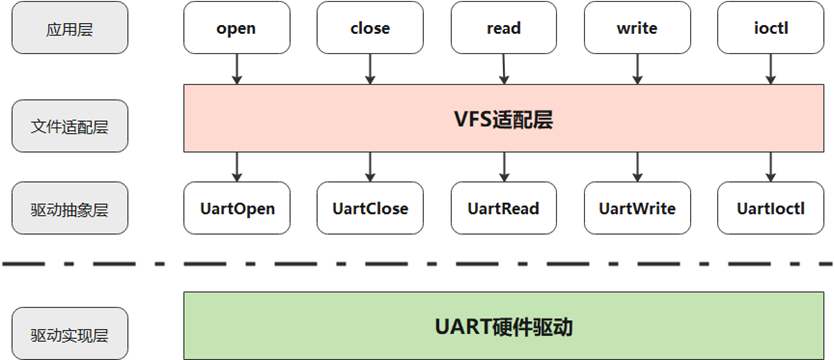

**运作机制<a name="section15524124212321"></a>**

UART驱动主要开发流程如下：

1.  UART驱动加载：

    UART驱动的加载由驱动抽象层提供加载接口，系统在启动过程中注册驱动。

2.  UART设备加载：

    UART设备由系统根据需要及实际情况进行加载。

3.  UART数据收发：

    驱动抽象层提供裸读写接口，文件适配层提供VFS文件方式读写。

### 开发指导<a name="ZH-CN_TOPIC_0000002511794430"></a>


#### 裸读写UART<a name="ZH-CN_TOPIC_0000002511794262"></a>

UART驱动抽象层提供如下的接口：

<a name="table633719329167"></a>
<table><thead align="left"><tr id="row1533716326164"><th class="cellrowborder" valign="top" width="53%" id="mcps1.1.3.1.1"><p id="p15337532101612"><a name="p15337532101612"></a><a name="p15337532101612"></a>接口名</p>
</th>
<th class="cellrowborder" valign="top" width="47%" id="mcps1.1.3.1.2"><p id="p2033718326165"><a name="p2033718326165"></a><a name="p2033718326165"></a>描述</p>
</th>
</tr>
</thead>
<tbody><tr id="row2337133219167"><td class="cellrowborder" valign="top" width="53%" headers="mcps1.1.3.1.1 "><p id="p63371232121612"><a name="p63371232121612"></a><a name="p63371232121612"></a>struct LosDevice *UartDevGetByPort(int num)</p>
</td>
<td class="cellrowborder" valign="top" width="47%" headers="mcps1.1.3.1.2 "><p id="p11337332161610"><a name="p11337332161610"></a><a name="p11337332161610"></a>通过串口号获取UART设备。</p>
</td>
</tr>
<tr id="row18337432161616"><td class="cellrowborder" valign="top" width="53%" headers="mcps1.1.3.1.1 "><p id="p123371232121614"><a name="p123371232121614"></a><a name="p123371232121614"></a>int UartOpen(struct LosDevice *dev)</p>
</td>
<td class="cellrowborder" valign="top" width="47%" headers="mcps1.1.3.1.2 "><p id="p18337193217164"><a name="p18337193217164"></a><a name="p18337193217164"></a>打开指定的UART设备。</p>
</td>
</tr>
<tr id="row163371332141619"><td class="cellrowborder" valign="top" width="53%" headers="mcps1.1.3.1.1 "><p id="p13337193211615"><a name="p13337193211615"></a><a name="p13337193211615"></a>int UartClose(struct LosDevice *dev)</p>
</td>
<td class="cellrowborder" valign="top" width="47%" headers="mcps1.1.3.1.2 "><p id="p14337103281617"><a name="p14337103281617"></a><a name="p14337103281617"></a>关闭指定的UART设备。</p>
</td>
</tr>
<tr id="row23372321169"><td class="cellrowborder" valign="top" width="53%" headers="mcps1.1.3.1.1 "><p id="p2033718324168"><a name="p2033718324168"></a><a name="p2033718324168"></a>ssize_t UartRead(struct LosDevice *dev, char *buf, size_t count)</p>
</td>
<td class="cellrowborder" valign="top" width="47%" headers="mcps1.1.3.1.2 "><p id="p1333783213166"><a name="p1333783213166"></a><a name="p1333783213166"></a>读取指定的UART设备的数据。</p>
</td>
</tr>
<tr id="row7337932151611"><td class="cellrowborder" valign="top" width="53%" headers="mcps1.1.3.1.1 "><p id="p4337113214161"><a name="p4337113214161"></a><a name="p4337113214161"></a>ssize_t UartWrite(struct LosDevice *dev, const char *buf, size_t count)</p>
</td>
<td class="cellrowborder" valign="top" width="47%" headers="mcps1.1.3.1.2 "><p id="p7337832141620"><a name="p7337832141620"></a><a name="p7337832141620"></a>向指定的UART设备写数据。</p>
</td>
</tr>
<tr id="row633763291617"><td class="cellrowborder" valign="top" width="53%" headers="mcps1.1.3.1.1 "><p id="p103371332181615"><a name="p103371332181615"></a><a name="p103371332181615"></a>int UartIoctl(struct LosDevice *dev, int cmd, unsigned long arg)</p>
</td>
<td class="cellrowborder" valign="top" width="47%" headers="mcps1.1.3.1.2 "><p id="p14337113217162"><a name="p14337113217162"></a><a name="p14337113217162"></a>控制指定的UART设备（具体支持的控制方式由UART控制器的驱动实现层提供）。</p>
</td>
</tr>
<tr id="row17558115210205"><td class="cellrowborder" valign="top" width="53%" headers="mcps1.1.3.1.1 "><p id="p18558185242014"><a name="p18558185242014"></a><a name="p18558185242014"></a>int UartSuspend(struct LosDevice *dev)</p>
</td>
<td class="cellrowborder" valign="top" width="47%" headers="mcps1.1.3.1.2 "><p id="p3558145242015"><a name="p3558145242015"></a><a name="p3558145242015"></a>挂起指定的UART设备。</p>
</td>
</tr>
<tr id="row137142018172118"><td class="cellrowborder" valign="top" width="53%" headers="mcps1.1.3.1.1 "><p id="p187141618122116"><a name="p187141618122116"></a><a name="p187141618122116"></a>int UartResume(struct LosDevice *dev)</p>
</td>
<td class="cellrowborder" valign="top" width="47%" headers="mcps1.1.3.1.2 "><p id="p14714118182114"><a name="p14714118182114"></a><a name="p14714118182114"></a>恢复指定的UART设备。</p>
</td>
</tr>
<tr id="row775912362289"><td class="cellrowborder" valign="top" width="53%" headers="mcps1.1.3.1.1 "><p id="p1375933618284"><a name="p1375933618284"></a><a name="p1375933618284"></a>VOID UartEarlyInit(VOID);</p>
</td>
<td class="cellrowborder" valign="top" width="47%" headers="mcps1.1.3.1.2 "><p id="p118421121335"><a name="p118421121335"></a><a name="p118421121335"></a>串口初始化。</p>
</td>
</tr>
<tr id="row680220439286"><td class="cellrowborder" valign="top" width="53%" headers="mcps1.1.3.1.1 "><p id="p4802154342812"><a name="p4802154342812"></a><a name="p4802154342812"></a>VOID UartPuts(const CHAR *s, UINT32 len, BOOL isLock);</p>
</td>
<td class="cellrowborder" valign="top" width="47%" headers="mcps1.1.3.1.2 "><p id="p1480294392815"><a name="p1480294392815"></a><a name="p1480294392815"></a>串口输出（系统默认）。</p>
</td>
</tr>
<tr id="row1817834018284"><td class="cellrowborder" valign="top" width="53%" headers="mcps1.1.3.1.1 "><p id="p1017810403289"><a name="p1017810403289"></a><a name="p1017810403289"></a>VOID UartPutsReg(UINTPTR regBase, const CHAR *s, UINT32 len, BOOL isLock);</p>
</td>
<td class="cellrowborder" valign="top" width="47%" headers="mcps1.1.3.1.2 "><p id="p1094402818363"><a name="p1094402818363"></a><a name="p1094402818363"></a>串口输出（用户指定基地址）。</p>
</td>
</tr>
</tbody>
</table>

#### 文件方式读写UART<a name="ZH-CN_TOPIC_0000002543394317"></a>

参考“[VFS](VFS.md)”，支持open、close、read、write、ioctl操作。

#### 模块配置<a name="ZH-CN_TOPIC_0000002511954394"></a>

打开菜单，进入Driver → Uart Type菜单，完成UART模块的配置。

<a name="table648144042712"></a>
<table><thead align="left"><tr id="row11481124022712"><th class="cellrowborder" valign="top" width="29.92%" id="mcps1.1.6.1.1"><p id="p448154011270"><a name="p448154011270"></a><a name="p448154011270"></a>配置项</p>
</th>
<th class="cellrowborder" valign="top" width="26.529999999999998%" id="mcps1.1.6.1.2"><p id="p348234062713"><a name="p348234062713"></a><a name="p348234062713"></a>描述</p>
</th>
<th class="cellrowborder" valign="top" width="12.53%" id="mcps1.1.6.1.3"><p id="p74821740172717"><a name="p74821740172717"></a><a name="p74821740172717"></a>取值范围</p>
</th>
<th class="cellrowborder" valign="top" width="8.63%" id="mcps1.1.6.1.4"><p id="p1348234082710"><a name="p1348234082710"></a><a name="p1348234082710"></a>默认值</p>
</th>
<th class="cellrowborder" valign="top" width="22.39%" id="mcps1.1.6.1.5"><p id="p048264010276"><a name="p048264010276"></a><a name="p048264010276"></a>依赖</p>
</th>
</tr>
</thead>
<tbody><tr id="row44821440122711"><td class="cellrowborder" valign="top" width="29.92%" headers="mcps1.1.6.1.1 "><p id="p5482240192715"><a name="p5482240192715"></a><a name="p5482240192715"></a>LOSCFG_DRIVERS_SIMPLE_UART</p>
</td>
<td class="cellrowborder" valign="top" width="26.529999999999998%" headers="mcps1.1.6.1.2 "><p id="p7482154012717"><a name="p7482154012717"></a><a name="p7482154012717"></a>简单的UART，只支持输出。</p>
</td>
<td class="cellrowborder" valign="top" width="12.53%" headers="mcps1.1.6.1.3 "><p id="p14821440162711"><a name="p14821440162711"></a><a name="p14821440162711"></a>YES/NO</p>
</td>
<td class="cellrowborder" valign="top" width="8.63%" headers="mcps1.1.6.1.4 "><p id="p3482204012271"><a name="p3482204012271"></a><a name="p3482204012271"></a>YES</p>
</td>
<td class="cellrowborder" valign="top" width="22.39%" headers="mcps1.1.6.1.5 "><p id="p1348244022710"><a name="p1348244022710"></a><a name="p1348244022710"></a>无</p>
</td>
</tr>
<tr id="row3482114011279"><td class="cellrowborder" valign="top" width="29.92%" headers="mcps1.1.6.1.1 "><p id="p048234072720"><a name="p048234072720"></a><a name="p048234072720"></a>LOSCFG_DRIVERS_UART</p>
</td>
<td class="cellrowborder" valign="top" width="26.529999999999998%" headers="mcps1.1.6.1.2 "><p id="p15482340192714"><a name="p15482340192714"></a><a name="p15482340192714"></a>完整的UART，支持输入输出。</p>
</td>
<td class="cellrowborder" valign="top" width="12.53%" headers="mcps1.1.6.1.3 "><p id="p12482164019271"><a name="p12482164019271"></a><a name="p12482164019271"></a>YES/NO</p>
</td>
<td class="cellrowborder" valign="top" width="8.63%" headers="mcps1.1.6.1.4 "><p id="p248214022719"><a name="p248214022719"></a><a name="p248214022719"></a>NO</p>
</td>
<td class="cellrowborder" valign="top" width="22.39%" headers="mcps1.1.6.1.5 "><p id="p174821740142712"><a name="p174821740142712"></a><a name="p174821740142712"></a>LOSCFG_DRIVERS_BASE</p>
</td>
</tr>
</tbody>
</table>

进入Driver → Main Uart Driver菜单，选择用于串口输出的默认串口驱动，可以选择如下配置：

<a name="table183125371893"></a>
<table><thead align="left"><tr id="row1631263710915"><th class="cellrowborder" valign="top" width="34.59345934593459%" id="mcps1.1.4.1.1"><p id="p1591264018911"><a name="p1591264018911"></a><a name="p1591264018911"></a>配置项</p>
</th>
<th class="cellrowborder" valign="top" width="34.153415341534156%" id="mcps1.1.4.1.2"><p id="p646264218915"><a name="p646264218915"></a><a name="p646264218915"></a>描述</p>
</th>
<th class="cellrowborder" valign="top" width="31.253125312531253%" id="mcps1.1.4.1.3"><p id="p17947451917"><a name="p17947451917"></a><a name="p17947451917"></a>依赖</p>
</th>
</tr>
</thead>
<tbody><tr id="row2312937898"><td class="cellrowborder" valign="top" width="34.59345934593459%" headers="mcps1.1.4.1.1 "><p id="p155782919105"><a name="p155782919105"></a><a name="p155782919105"></a>LOSCFG_DRIVERS_UART_MAIN_ARM_PL011</p>
</td>
<td class="cellrowborder" valign="top" width="34.153415341534156%" headers="mcps1.1.4.1.2 "><p id="p9710162418104"><a name="p9710162418104"></a><a name="p9710162418104"></a>使用ARM PL011作为默认串口</p>
</td>
<td class="cellrowborder" valign="top" width="31.253125312531253%" headers="mcps1.1.4.1.3 "><p id="p196111417161012"><a name="p196111417161012"></a><a name="p196111417161012"></a>LOSCFG_DRIVERS_UART_ARM_PL011</p>
</td>
</tr>
<tr id="row12312203715913"><td class="cellrowborder" valign="top" width="34.59345934593459%" headers="mcps1.1.4.1.1 "><p id="p12091371013"><a name="p12091371013"></a><a name="p12091371013"></a>LOSCFG_DRIVERS_UART_MAIN_HQ_UART</p>
</td>
<td class="cellrowborder" valign="top" width="34.153415341534156%" headers="mcps1.1.4.1.2 "><p id="p13436103815105"><a name="p13436103815105"></a><a name="p13436103815105"></a>使用HQ UART系列作为默认串口</p>
</td>
<td class="cellrowborder" valign="top" width="31.253125312531253%" headers="mcps1.1.4.1.3 "><p id="p293691910109"><a name="p293691910109"></a><a name="p293691910109"></a>LOSCFG_DRIVERS_UART_HQ_UART</p>
</td>
</tr>
<tr id="row153121037597"><td class="cellrowborder" valign="top" width="34.59345934593459%" headers="mcps1.1.4.1.1 "><p id="p155131015111011"><a name="p155131015111011"></a><a name="p155131015111011"></a>LOSCFG_DRIVERS_UART_MAIN_VUART_RPQ</p>
</td>
<td class="cellrowborder" valign="top" width="34.153415341534156%" headers="mcps1.1.4.1.2 "><p id="p12928113821017"><a name="p12928113821017"></a><a name="p12928113821017"></a>使用虚拟UART作为默认串口</p>
</td>
<td class="cellrowborder" valign="top" width="31.253125312531253%" headers="mcps1.1.4.1.3 "><p id="p1221312229103"><a name="p1221312229103"></a><a name="p1221312229103"></a>LOSCFG_DRIVERS_UART_VUART_RPQ</p>
</td>
</tr>
</tbody>
</table>

### 编程实例<a name="ZH-CN_TOPIC_0000002511794258"></a>


#### simple uart<a name="ZH-CN_TOPIC_0000002543354379"></a>

使能LOSCFG\_DRIVERS\_SIMPLE\_UART，simple uart只支持输出。

#### general uart<a name="ZH-CN_TOPIC_0000002511954300"></a>

使能LOSCFG\_DRIVERS\_UART，general uart既支持输出，也支持输入。


##### 裸读写UART<a name="ZH-CN_TOPIC_0000002511954438"></a>

**实例描述<a name="section793218575114"></a>**

1.  通过串口号获取UART设备。
2.  打开串口。
3.  写串口。
4.  挂起串口。
5.  恢复串口。
6.  关闭串口。

**编程示例<a name="section199518012522"></a>**

```
#define BUF_SIZE 100

UINT32 TestCase(VOID)
{
    struct LosDevice *uartDev = NULL;
    int ret;
    ssize_t rtRet;
    char dataBuf[BUF_SIZE] = {"test uart\n"};

    uartDev = UartDevGetByPort(0);
    if (uartDev == NULL) {
        return LOS_NOK;
    }

    ret = UartOpen(uartDev);
    if (ret != 0) {
        return LOS_NOK;
    }

    rtRet = UartWrite(uartDev, dataBuf, BUF_SIZE);
    if (rtRet <= 0) {
        goto OUT_CLOSE;
    }

    ret = UartSuspend(uartDev);
    if (ret != 0) {
        goto OUT_CLOSE;
    }

    ret = UartResume(uartDev);
    if (ret != 0) {
        goto OUT_CLOSE;
    }

    ret = UartClose(uartDev);
    if (ret != 0) {
        return LOS_NOK;
    }

    return LOS_OK;

OUT_CLOSE:
    (VOID)UartClose(uartDev);
    return LOS_NOK;
}
```

##### 文件读写UART<a name="ZH-CN_TOPIC_0000002543354339"></a>

**实例描述<a name="section89818137128"></a>**

1.  使能LOSCFG\_FS\_VFS。
2.  打开串口。
3.  写串口。
4.  挂起串口。
5.  恢复串口。
6.  关闭串口。

**编程示例<a name="section489295395319"></a>**

```
#define BUF_SIZE 100
#define UART_DEV_PATH      "/dev/uartdev-0"

UINT32 TestCase(VOID)
{
    int ret;
    int fd;
    char dataBuf[BUF_SIZE] = {"test uart\n"};
    ssize_t writeLen;

    fd = open(UART_DEV_PATH, O_RDWR);
    if (fd == -1) {
        return LOS_NOK;
    }

    writeLen = write(fd, dataBuf, BUF_SIZE);
    if (writeLen <= 0) {
        goto OUT_CLOSE;
    }

    ret = ioctl(fd, Pl011_IOCTL_SUSPEND, 0);
    if (ret != 0) {
        goto OUT_CLOSE;
    }

    ret = ioctl(fd, Pl011_IOCTL_RESUME, 0);
    if (ret != 0) {
        goto OUT_CLOSE;
    }

    ret = close(fd);
    if (ret != 0) {
        return LOS_NOK;
    }

    return LOS_OK;

OUT_CLOSE:
    (VOID)close(fd);
    return LOS_NOK;
}
```

# 配置工具<a name="ZH-CN_TOPIC_0000002543354149"></a>


## 概述<a name="ZH-CN_TOPIC_0000002511794456"></a>

LiteOS使用Kconfig文件配置系统。所用的Kconfig语言是一种菜单配置语言，config.in和Kconfig都由该语言编写而成。LiteOS使用python kconfiglib来解析、展示Kconfig文件。解析Kconfig文件后，会在根目录下生成/更新“.config”文件，同时在开发板的include文件夹下生成“menuconfig.h”。使用menuconfig前，需要先安装python和kconfiglib。

## 安装工具<a name="ZH-CN_TOPIC_0000002543394363"></a>

-   安装python 2.7/3.2+。

    下面以python3.10为例介绍安装方法。

    -   命令行方式安装：

        ```
        sudo apt-get install python3.10
        ```

    -   源码包编译安装：
        1.  通过官网下载[python源码包](https://www.python.org/ftp/python/3.10.2/Python-3.10.2.tgz)。
        2.  解压源码包。

            参考如下命令完成解压，将压缩包名替换为实际下载的源码包名：

            ```
            tar -xf Python-3.10.2.tgz
            ```

        3.  检查依赖。

            解压后进入到目录中，执行“./configure”命令以检查编译与安装python所需的依赖：

            ```
            cd Python-3.10.2
            ./configure
            ```

            如果没有报错就继续下一步操作，如果存在报错就根据提示安装依赖。

        4.  编译&安装python。

            ```
            sudo make
            sudo make install
            ```

        5.  检查python版本并正确链接python命令。

            ```
            python --version
            ```

            如果显示的不是刚刚安装的python版本，则需要执行以下命令来正确链接python命令。

            1.  获取python目录，例如对于python 3.10.2，执行如下命令。

                ```
                which python3.10
                ```

            2.  链接python命令到刚刚安装的python包。

                将以下命令中的“python3.10-path“替换为“which python3.10”命令执行后的回显路径：

                ```
                cd /usr/bin
                sudo rm python3 && sudo ln -s "python3.10-path" python3
                sudo rm python && sudo ln -s python3 python
                
                ```

            3.  再次检查python版本。

                ```
                python --version
                python3 --version
                ```

-   安装pip包管理工具。

    如果pip命令不存在，可以下载pip源码包进行安装。pip依赖setuptools，如果setuptools不存在，也需要安装。

    -   命令行方式安装：

        ```
        sudo apt-get install python3-setuptools python3-pip -y
        sudo pip3 install --upgrade pip
        ```

    -   源码包方式安装：
        1.  安装setuptools。

            点击[setuptools源代码包下载地址](https://pypi.org/project/setuptools/)，可以参考下面的命令进行安装：

            ```
            sudo unzip setuptools-50.3.2.zip
            cd setuptools
            sudo python setup.py install
            ```

            > **须知：** 
            >setuptools最新版本不支持python 2.7，如果使用python 2.7，请下载[setuptools 45.0.0版本](https://pypi.org/project/setuptools/45.0.0/#files)以支持python 2.7。

        2.  安装pip。

            点击[pip源代码包下载地址](https://pypi.org/project/pip/)，可以参考下面的命令进行安装：

            ```
            sudo tar -xf pip-20.2.4.tar.gz
            cd pip-20.2.4
            sudo python setup.py install
            ```

-   安装kconfiglib库。
    -   对于服务器可以联网的情况。

        可以直接使用如下命令安装kconfiglib：

        ```
        sudo pip install kconfiglib
        ```

    -   对于服务器不能联网的情况。

        可以采用离线的方式安装。首先在其他能联网的环境上[下载kconfiglib](https://pypi.org/project/kconfiglib/#files)，可以下载kconfiglib的wheel文件“kconfiglib-14.1.0-py2.py3-none-any.whl”或源代码文件“kconfiglib-14.1.0.tar.gz”，这里以14.1.0版本为例。

        1.  wheel文件的安装，可以参考如下命令：

            ```
            sudo pip install kconfiglib-14.1.0-py2.py3-none-any.whl
            ```

        2.  源代码文件的安装，可以参考如下命令：

            ```
            sudo tar -zxvf kconfiglib-14.1.0.tar.gz
            cd kconfiglib-14.1.0
            sudo python setup.py install
            ```

## 使用指导<a name="ZH-CN_TOPIC_0000002543394321"></a>

使用menuconfig配置工具前，请确保已经安装编译LiteOS的交叉编译器工具链，并加入环境变量。

为满足不同的使用场景，配置工具支持下述命令。根据使用场景，在根目录下执行下述其中一个命令即可。在执行命令前，先根据开发板拷贝“self\_src/tools/build/config/”目录下的默认配置文件“$\{platform\}.config”到根目录，并重命名为“.config”。除了“.config”文件外，还有一个重要的配置文件“build/menuconfig/config.in”文件（该文件包含了各个模块的Kconfig文件）。“.config”文件决定了各个配置项的默认值，“config.in”文件决定了展示图形化界面的配置项。

## 打开menuconfig菜单<a name="ZH-CN_TOPIC_0000002511794210"></a>

在LiteOS根目录下执行“make menuconfig”命令或者“./build/build\_cmake.sh menuconfig”会展示图形化配置界面，用户可以根据需要自行裁剪模块或者修改设置。执行完保存菜单退出，该命令会更新根目录下“.config”文件。

menuconfig的使用方式，主要包括：

-   上下键：选择不同的行，即移动到不同的选项上。
-   空格键/回车：用于开启或关闭选项。
    1.  开启选项：对应的选项前面会显示“ \[ \* \]“，括号里面有一个星号，表示已经开启该选项。
    2.  关闭选项：对应的选项前面只显示中括号“\[  \]”, 括号里面是空。
    3.  如果选项后面有三个短横线加上一个右箭头，即---\>，表示此项下面还有子选项，输入空格键/回车后可以进入子菜单。

-   ESC键：返回上一级菜单，或退出menuconfig并提示保存。

-   问号? ：展示配置项的帮助信息。
-   斜线/ :  进入搜索配置项界面，支持配置项的搜索。
-   字母F：进入帮助模式，在界面下方会显示配置项的帮助信息，再次输入字母F可以退出此模式。
-   字母C：进入name模式，在此模式下，会显示配置项对应的宏定义开关，再次输入字母C可以退出此模式。
-   字母A：进入all模式，在此模式下，会展开显示菜单中的所有子选项，再次输入字母A可以退出此模式。
-   字母S : 保存配置项。
-   字母Q：退出menuconfig并提示保存。

> **说明：** 
>-   以上字母，不区分大小写。
>-   可以通过斜线/进入搜索界面，在输入栏中输入要搜索的配置项宏定义，例如搜索“LOSCFG\_BASE\_IPC\_SEM”，输入该宏定义后，会自动联系出匹配到此关键字的配置项，选中所需要的配置项，按回车键即可进入。
>    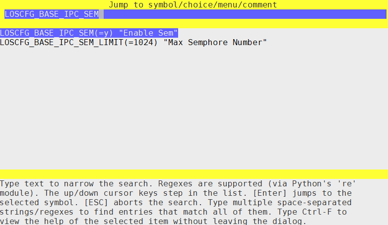

## 保存savemenuconfig菜单<a name="ZH-CN_TOPIC_0000002543354245"></a>

对于Make编译工具：在LiteOS根目录下执行“make savemenuconfig”命令会解析根目录下的“.config”文件，并在对应的LiteOS开发板工程的子目录include下生成“menuconfig.h”文件。

对于CMake编译工具：在LiteOS根目录下执行“./build/build\_cmake.sh savemenuconfig”会解析根目录下的“.config”文件，并在对应的LiteOS开发板工程的子目录“buildcmakeout/xxx/”目录下生成“menuconfig.h”文件。

## make defconfig<a name="ZH-CN_TOPIC_0000002543394409"></a>

在LiteOS根目录下执行“make defconfig”命令会解析根目录下的“.config”文件（cmake当前不支持该功能），使所有的配置项尽可能使用其默认配置，并更新“.config”，同时在对应的LiteOS开发板工程的子目录include下生成“menuconfig.h”。

## make allyesconfig<a name="ZH-CN_TOPIC_0000002511954416"></a>

在LiteOS根目录下执行“make allyesconfig”命令会解析根目录下的“.config”文件（cmake当前不支持该功能），使所有的配置项尽可能使能，即设置为Y，并更新“.config”，同时在对应的LiteOS开发板工程的子目录include下生成“menuconfig.h”。

## make allnoconfig<a name="ZH-CN_TOPIC_0000002511954272"></a>

在LiteOS根目录下执行“make allnoconfig”命令会解析根目录下的“.config”文件（cmake当前不支持该功能），使所有的配置项尽可能禁用，即设置为“is not set”，并更新“.config”，同时在对应的LiteOS开发板工程的子目录include下生成“menuconfig.h”。

## 配置项说明<a name="ZH-CN_TOPIC_0000002543354215"></a>


### 配置项简介<a name="ZH-CN_TOPIC_0000002511954250"></a>

运行“make menuconfig”，进入LiteOS Configuration主界面，目前有Compiler、Targets、Kernel、Debug、SSP等选项。下面对Compiler，Targets和SSP选项进行介绍，其余选项在各个模块章节中均有介绍，这里不再赘述。

### Compiler配置<a name="ZH-CN_TOPIC_0000002543354289"></a>

Compiler选项中包含了两个子菜单：Compiler交叉编译器工具链和Optimize Option编译优化选项。

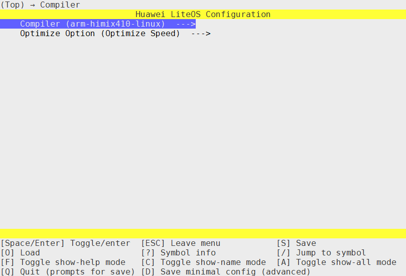

-   现有多种交叉编译器可选：包括“arm-himix410-linux”和“arm-none-eabi-”等，请选择实际使用的编译器。
-   有三种编译优化选项可选：Optimize None（不做编译优化）、Optimize Speed（优化编译速度）和Optimize Size（优化编译体积）。

### Targets配置<a name="ZH-CN_TOPIC_0000002543354207"></a>

Targets选项中包含Family（产品）、Board（芯片）、Enable Floating Pointer Unit（使能浮点数）、Enable Access Permission Control（使能访问权限控制）。

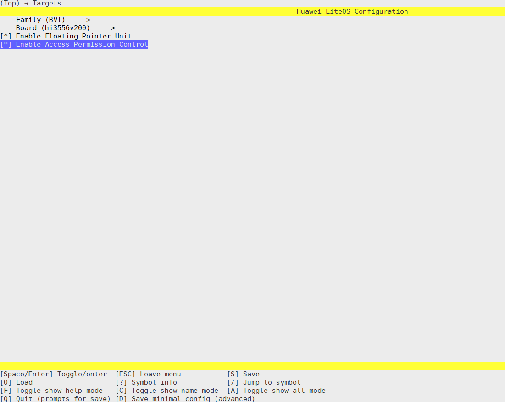

-   Family：选择产品，其中BVT、DPT、AIOT等都是产品名，SECRET是保密项目，QEMU和STM32是LiteOS内部使用的。
-   Board：选择具体芯片，目前支持Hi3161、Hi3372、Hi3322，Hi1A21等。
-   Enable Access Permission Control：使能访问权限控制，可以根据不同架构使能对应的内存管理单元，包含RiscV下的PMP。

**配置项描述<a name="section5828165914413"></a>**

打开菜单，进入Targets菜单，相关配置项介绍如下，可根据配置项名称搜到其具体所在位置。

<a name="table4672191322515"></a>
<table><thead align="left"><tr id="row1367271362515"><th class="cellrowborder" valign="top" width="25.369999999999997%" id="mcps1.1.6.1.1"><p id="p2672141310259"><a name="p2672141310259"></a><a name="p2672141310259"></a>配置项</p>
</th>
<th class="cellrowborder" valign="top" width="37.43%" id="mcps1.1.6.1.2"><p id="p06727132259"><a name="p06727132259"></a><a name="p06727132259"></a>含义</p>
</th>
<th class="cellrowborder" valign="top" width="12.01%" id="mcps1.1.6.1.3"><p id="p56723138253"><a name="p56723138253"></a><a name="p56723138253"></a>取值范围</p>
</th>
<th class="cellrowborder" valign="top" width="13.020000000000001%" id="mcps1.1.6.1.4"><p id="p16726137252"><a name="p16726137252"></a><a name="p16726137252"></a>默认值</p>
</th>
<th class="cellrowborder" valign="top" width="12.17%" id="mcps1.1.6.1.5"><p id="p1367231318251"><a name="p1367231318251"></a><a name="p1367231318251"></a>架构</p>
</th>
</tr>
</thead>
<tbody><tr id="row186720138253"><td class="cellrowborder" valign="top" width="25.369999999999997%" headers="mcps1.1.6.1.1 "><p id="p15456015216"><a name="p15456015216"></a><a name="p15456015216"></a>LOSCFG_ARCH_SECURE_MONITOR_MODE</p>
</td>
<td class="cellrowborder" valign="top" width="37.43%" headers="mcps1.1.6.1.2 "><p id="p654550192119"><a name="p654550192119"></a><a name="p654550192119"></a>令OS处于EL3运行</p>
</td>
<td class="cellrowborder" valign="top" width="12.01%" headers="mcps1.1.6.1.3 "><p id="p454560162112"><a name="p454560162112"></a><a name="p454560162112"></a>YES/NO</p>
</td>
<td class="cellrowborder" valign="top" width="13.020000000000001%" headers="mcps1.1.6.1.4 "><p id="p14545507211"><a name="p14545507211"></a><a name="p14545507211"></a>NO</p>
</td>
<td class="cellrowborder" rowspan="4" valign="top" width="12.17%" headers="mcps1.1.6.1.5 "><p id="p16514123419572"><a name="p16514123419572"></a><a name="p16514123419572"></a>ARM64</p>
</td>
</tr>
<tr id="row11673513102514"><td class="cellrowborder" valign="top" headers="mcps1.1.6.1.1 "><p id="p17813191592220"><a name="p17813191592220"></a><a name="p17813191592220"></a>LOSCFG_ARCH_NON_SECURE_OS_MODE</p>
</td>
<td class="cellrowborder" valign="top" headers="mcps1.1.6.1.2 "><p id="p33750772113"><a name="p33750772113"></a><a name="p33750772113"></a>令OS处于非安全Guest OS模式下运行（EL1-NS）</p>
</td>
<td class="cellrowborder" valign="top" headers="mcps1.1.6.1.3 "><p id="p7375147192110"><a name="p7375147192110"></a><a name="p7375147192110"></a>YES/NO</p>
</td>
<td class="cellrowborder" valign="top" headers="mcps1.1.6.1.4 "><p id="p1137516716213"><a name="p1137516716213"></a><a name="p1137516716213"></a>NO</p>
</td>
</tr>
<tr id="row4673171302510"><td class="cellrowborder" valign="top" headers="mcps1.1.6.1.1 "><p id="p613119547224"><a name="p613119547224"></a><a name="p613119547224"></a>LOSCFG_ARCH_SECURE_OS_MODE</p>
</td>
<td class="cellrowborder" valign="top" headers="mcps1.1.6.1.2 "><p id="p208915310216"><a name="p208915310216"></a><a name="p208915310216"></a>令OS处于安全Guest OS模式下运行（EL1-S）</p>
</td>
<td class="cellrowborder" valign="top" headers="mcps1.1.6.1.3 "><p id="p5891331211"><a name="p5891331211"></a><a name="p5891331211"></a>YES/NO</p>
</td>
<td class="cellrowborder" valign="top" headers="mcps1.1.6.1.4 "><p id="p88912312213"><a name="p88912312213"></a><a name="p88912312213"></a>NO</p>
</td>
</tr>
<tr id="row2825043175717"><td class="cellrowborder" valign="top" headers="mcps1.1.6.1.1 "><p id="p36864875713"><a name="p36864875713"></a><a name="p36864875713"></a>LOSCFG_ARCH_ARM_AARCH64_LSE_ATOMIC</p>
</td>
<td class="cellrowborder" valign="top" headers="mcps1.1.6.1.2 "><p id="p116814835720"><a name="p116814835720"></a><a name="p116814835720"></a>使能ARMv8.1-LSE Atomic指令集扩展</p>
</td>
<td class="cellrowborder" valign="top" headers="mcps1.1.6.1.3 "><p id="p5681548175716"><a name="p5681548175716"></a><a name="p5681548175716"></a>YES/NO</p>
</td>
<td class="cellrowborder" valign="top" headers="mcps1.1.6.1.4 "><p id="p1268174815574"><a name="p1268174815574"></a><a name="p1268174815574"></a>YES</p>
</td>
</tr>
<tr id="row1288213171115"><td class="cellrowborder" valign="top" width="25.369999999999997%" headers="mcps1.1.6.1.1 "><p id="p788213171818"><a name="p788213171818"></a><a name="p788213171818"></a>LOSCFG_ARCH_ARM_SVE2</p>
</td>
<td class="cellrowborder" valign="top" width="37.43%" headers="mcps1.1.6.1.2 "><p id="p15882717017"><a name="p15882717017"></a><a name="p15882717017"></a>使能ARMv8.2 SVE并行化功能</p>
</td>
<td class="cellrowborder" valign="top" width="12.01%" headers="mcps1.1.6.1.3 "><p id="p888219175114"><a name="p888219175114"></a><a name="p888219175114"></a>YES/NO</p>
</td>
<td class="cellrowborder" valign="top" width="13.020000000000001%" headers="mcps1.1.6.1.4 "><p id="p088211171618"><a name="p088211171618"></a><a name="p088211171618"></a>NO</p>
</td>
<td class="cellrowborder" valign="top" width="12.17%" headers="mcps1.1.6.1.5 "><p id="p788216172119"><a name="p788216172119"></a><a name="p788216172119"></a>ARM64</p>
</td>
</tr>
</tbody>
</table>

> **须知：** 
>OS运行模式需要target进行适配，具体可以使用的模式以交付的模式为准。

### SSP配置<a name="ZH-CN_TOPIC_0000002511954204"></a>

选择“Stack Smashing Protector \(SSP\) Compiler Feature”选项，该选项可以打开和关闭堆栈保护功能。

-   -fno-stack-protector：关闭堆栈保护。
-   -fstack-protector：启用堆栈保护，若C或C++函数的局部变量中含有字符（char）数组（数组大小大于等于4个字节的字符数组），并且不会被优化掉，编译器会为函数插入保护代码。
-   -fstack-protector-strong：启用堆栈保护，若C或C++函数中有数组定义并且不会被优化掉，或者存在局部变量的地址引用时，编译器会为函数插入保护代码（默认选项）。
-   -fstack-protector-all：为所有C或C++函数插入保护代码，相比上一个，可能会大幅增加性能开销。

    推荐使用“-fstack-protector”选项，在兼顾性能的同时，增强了安全性。

-   ArchStackGuardInit：liteos值提供伪随机数金丝雀值，需要厂商适配真随机，以保证安全性。

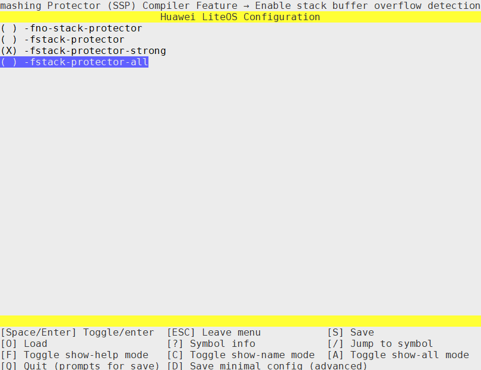

> **须知：** 
>LiteOS提供弱函数ArchStackGuardInit，采用伪随机数方式初始化“\_\_stack\_chk\_guard”，如果用户需要达到真随机数，需重定义ArchStackGuardInit。另外部分架构没有随机种子，无法达成伪随机数，因此，用户必须自行验证“\_\_stack\_chk\_guard”的随机性。

### NX配置<a name="ZH-CN_TOPIC_0000002511954392"></a>

“Enable Data Sec NX Feature”选项可以打开和关闭数据段不可执行功能。

-   选择该选项建议配合使用系统提供的链接脚本，不使用系统链接脚本时需要参考系统链接脚本编写私有链接脚本。
-   该选项只在支持MMU的架构上起效，不支持MMU的架构请在初始化过程中自行实现NX。

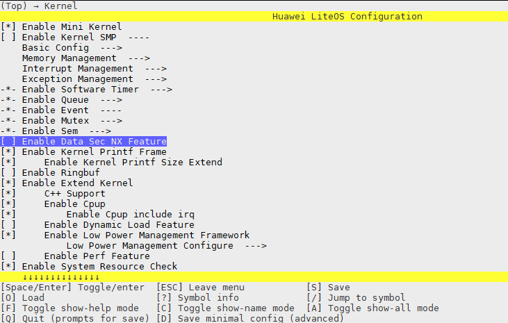

# 可维可测<a name="ZH-CN_TOPIC_0000002511794306"></a>


## Shell<a name="ZH-CN_TOPIC_0000002511794384"></a>


### 概述<a name="ZH-CN_TOPIC_0000002511954200"></a>

**基本概念<a name="section62024452101623"></a>**

LiteOS提供Shell命令行，它能够以命令行交互的方式访问操作系统的功能或服务：它接收并解析用户输入的命令，并处理操作系统的输出结果。

**LiteOS Shell<a name="section189461456194614"></a>**

LiteOS提供的Shell作为在线调试工具，支持常用的基本调试功能，包含系统、文件、网络、动态加载和Trace等相关命令。同时LiteOS的Shell可以根据需求新增定制命令。

-   系统相关命令：可以查询系统任务、内核信号量、系统软件定时器、CPU占用率、当前中断等相关信息，详见“[系统命令参考](系统命令参考.md)”。
-   文件相关命令：除了支持基本的ls、cd等功能外，还支持sync。sync用来同步缓存数据（文件系统的数据）到SD卡或Flash中，详见“[文件命令参考](文件命令参考.md)”。
-   动态加载相关命令：加载obj文件或so文件，并通过查找已加载obj或so的函数地址，直接调用相关函数，同时用户也可以卸载obj文件或so文件。
-   Trace相关命令：可以开启/停止Trace、设置Trace事件、输出Trace缓冲区数据等，详见“[Trace命令参考](Trace命令参考.md)”。

### 开发指导<a name="ZH-CN_TOPIC_0000002543394337"></a>

**使用场景<a name="section51151648213255"></a>**

Shell命令可以通过串口，Telnet或者自定义工具输入。新增定制的命令，需重新编译链接后才能执行。

**功能<a name="section22370004105841"></a>**

1.  LiteOS提供的Shell命令参见后面“[系统命令参考](系统命令参考.md)”章节。
2.  LiteOS的Shell模块为用户提供下面几个接口，接口详细信息可以查看API参考。

    <a name="table5999158320325"></a>
    <table><thead align="left"><tr id="row2323990220325"><th class="cellrowborder" valign="top" width="20.712071207120715%" id="mcps1.1.4.1.1"><p id="p1748969020325"><a name="p1748969020325"></a><a name="p1748969020325"></a>功能分类</p>
    </th>
    <th class="cellrowborder" valign="top" width="24.602460246024602%" id="mcps1.1.4.1.2"><p id="p5025139720325"><a name="p5025139720325"></a><a name="p5025139720325"></a>接口名</p>
    </th>
    <th class="cellrowborder" valign="top" width="54.68546854685468%" id="mcps1.1.4.1.3"><p id="p2204176620325"><a name="p2204176620325"></a><a name="p2204176620325"></a>描述</p>
    </th>
    </tr>
    </thead>
    <tbody><tr id="row1839119416414"><td class="cellrowborder" rowspan="2" valign="top" width="20.712071207120715%" headers="mcps1.1.4.1.1 "><p id="p695912961416"><a name="p695912961416"></a><a name="p695912961416"></a>注册命令</p>
    </td>
    <td class="cellrowborder" valign="top" width="24.602460246024602%" headers="mcps1.1.4.1.2 "><p id="p14457102619145"><a name="p14457102619145"></a><a name="p14457102619145"></a>SHELLCMD_ENTRY</p>
    </td>
    <td class="cellrowborder" valign="top" width="54.68546854685468%" headers="mcps1.1.4.1.3 "><p id="p17391204116414"><a name="p17391204116414"></a><a name="p17391204116414"></a>静态注册命令</p>
    </td>
    </tr>
    <tr id="row795992971416"><td class="cellrowborder" valign="top" headers="mcps1.1.4.1.1 "><p id="p5959329101415"><a name="p5959329101415"></a><a name="p5959329101415"></a>osCmdReg</p>
    </td>
    <td class="cellrowborder" valign="top" headers="mcps1.1.4.1.2 "><p id="p1959192991411"><a name="p1959192991411"></a><a name="p1959192991411"></a>动态注册命令</p>
    </td>
    </tr>
    </tbody>
    </table>

    > **说明：** 
    >静态注册命令方式一般用于注册系统常用命令，动态注册命令方式一般用于注册用户命令。
    >静态注册命令有5个入参，动态注册命令有4个入参。下面除去第一个入参是静态注册独有的，剩余的四个入参两个注册命令是一致的。
    >-   第一个入参：命令变量名，用于设置链接选项（“build/make/liteos\_tables\_ldflags.mk”的LITEOS\_TABLES\_LDFLAGS变量）。例如变量名为ls\_shellcmd，链接选项就应该设置为：LITEOS\_TABLES\_LDFLAGS += -uls\_shellcmd。这个入参是静态注册独有的，动态注册中没有这个入参。
    >-   第二个入参：命令类型，目前支持两种命令类型。
    >    -   CMD\_TYPE\_EX：不支持标准命令参数输入，会把用户填写的命令关键字屏蔽掉。例如：输入“ls /ramfs”，传入给命令处理函数的参数只有“/ramfs”，对应于命令处理函数中的argv\[0\]，而ls命令关键字并不会被传入。
    >    -   CMD\_TYPE\_STD：支持的标准命令参数输入，所有输入的字符都会通过命令解析后被传入。例如：输入“ls /ramfs”，“ls”和“/ramfs”都会被传入命令处理函数，分别对应于命令处理函数中的argv\[0\]和argv\[1\]。
    >-   第三个入参：命令关键字，是命令处理函数在Shell中对应的名称。**命令关键字必须唯一**，即两个不同的命令项不能有相同的命令关键字，否则只会执行其中一个。Shell在执行用户命令时，如果存在多个命令关键字相同的命令，只会执行在“help”命令中排在最前面的那个。
    >-   第四个入参：命令处理函数的入参最大个数。
    >    -   静态注册命令暂不支持设置。
    >    -   动态注册命令支持设置不超过32的入参最大个数，或者设置为XARGS（其在代码中被定义为0xFFFFFFFF）表示不限制参数个数。
    >-   第五个入参：命令处理函数名，即在Shell中执行命令时被调用的函数。

**配置项<a name="section1161804935819"></a>**

打开menuconfig，进入Debug ---\> Enable a Debug Version ---\> Enable Shell菜单，完成Shell的配置。

<a name="table1813095045911"></a>
<table><thead align="left"><tr id="row1913095035911"><th class="cellrowborder" valign="top" width="25.25%" id="mcps1.1.6.1.1"><p id="p17130175013598"><a name="p17130175013598"></a><a name="p17130175013598"></a>配置项</p>
</th>
<th class="cellrowborder" valign="top" width="27.939999999999998%" id="mcps1.1.6.1.2"><p id="p313019506593"><a name="p313019506593"></a><a name="p313019506593"></a>含义</p>
</th>
<th class="cellrowborder" valign="top" width="13.26%" id="mcps1.1.6.1.3"><p id="p10130105012592"><a name="p10130105012592"></a><a name="p10130105012592"></a>取值范围</p>
</th>
<th class="cellrowborder" valign="top" width="10.83%" id="mcps1.1.6.1.4"><p id="p7130205019593"><a name="p7130205019593"></a><a name="p7130205019593"></a>默认值</p>
</th>
<th class="cellrowborder" valign="top" width="22.720000000000002%" id="mcps1.1.6.1.5"><p id="p25049101933"><a name="p25049101933"></a><a name="p25049101933"></a>依赖</p>
</th>
</tr>
</thead>
<tbody><tr id="row101311250135920"><td class="cellrowborder" valign="top" width="25.25%" headers="mcps1.1.6.1.1 "><p id="p81312050105917"><a name="p81312050105917"></a><a name="p81312050105917"></a>LOSCFG_SHELL</p>
</td>
<td class="cellrowborder" valign="top" width="27.939999999999998%" headers="mcps1.1.6.1.2 "><p id="p1213185095911"><a name="p1213185095911"></a><a name="p1213185095911"></a>Shell功能的裁剪开关</p>
</td>
<td class="cellrowborder" valign="top" width="13.26%" headers="mcps1.1.6.1.3 "><p id="p171317509593"><a name="p171317509593"></a><a name="p171317509593"></a>YES/NO</p>
</td>
<td class="cellrowborder" valign="top" width="10.83%" headers="mcps1.1.6.1.4 "><p id="p0131165014591"><a name="p0131165014591"></a><a name="p0131165014591"></a>YES</p>
</td>
<td class="cellrowborder" valign="top" width="22.720000000000002%" headers="mcps1.1.6.1.5 "><p id="p8504141016310"><a name="p8504141016310"></a><a name="p8504141016310"></a>LOSCFG_DEBUG_VERSION(=y)  &amp;&amp; LOSCFG_DRIVERS_UART(=y)</p>
</td>
</tr>
<tr id="row3131175017594"><td class="cellrowborder" valign="top" width="25.25%" headers="mcps1.1.6.1.1 "><p id="p111311850165920"><a name="p111311850165920"></a><a name="p111311850165920"></a>LOSCFG_SHELL_CONSOLE（开源版本无该配置项）</p>
</td>
<td class="cellrowborder" valign="top" width="27.939999999999998%" headers="mcps1.1.6.1.2 "><p id="p713115085919"><a name="p713115085919"></a><a name="p713115085919"></a>设置Shell直接与Console交互</p>
</td>
<td class="cellrowborder" valign="top" width="13.26%" headers="mcps1.1.6.1.3 "><p id="p1313195018593"><a name="p1313195018593"></a><a name="p1313195018593"></a>YES/NO</p>
</td>
<td class="cellrowborder" valign="top" width="10.83%" headers="mcps1.1.6.1.4 "><p id="p3131650135913"><a name="p3131650135913"></a><a name="p3131650135913"></a>YES</p>
</td>
<td class="cellrowborder" valign="top" width="22.720000000000002%" headers="mcps1.1.6.1.5 "><p id="p135047101932"><a name="p135047101932"></a><a name="p135047101932"></a>LOSCFG_SHELL(=y)</p>
</td>
</tr>
<tr id="row2131650135914"><td class="cellrowborder" valign="top" width="25.25%" headers="mcps1.1.6.1.1 "><p id="p11311150125915"><a name="p11311150125915"></a><a name="p11311150125915"></a>LOSCFG_SHELL_UART</p>
</td>
<td class="cellrowborder" valign="top" width="27.939999999999998%" headers="mcps1.1.6.1.2 "><p id="p3131115095911"><a name="p3131115095911"></a><a name="p3131115095911"></a>设置Shell直接与uart驱动交互</p>
</td>
<td class="cellrowborder" valign="top" width="13.26%" headers="mcps1.1.6.1.3 "><p id="p1613195015917"><a name="p1613195015917"></a><a name="p1613195015917"></a>YES/NO</p>
</td>
<td class="cellrowborder" valign="top" width="10.83%" headers="mcps1.1.6.1.4 "><p id="p1513145015916"><a name="p1513145015916"></a><a name="p1513145015916"></a>NO</p>
</td>
<td class="cellrowborder" valign="top" width="22.720000000000002%" headers="mcps1.1.6.1.5 "><p id="p14504141014319"><a name="p14504141014319"></a><a name="p14504141014319"></a>LOSCFG_DRIVERS_UART(=y)</p>
</td>
</tr>
<tr id="row18786113111210"><td class="cellrowborder" valign="top" width="25.25%" headers="mcps1.1.6.1.1 "><p id="p127869310124"><a name="p127869310124"></a><a name="p127869310124"></a>LOSCFG_SHELL_VENDOR</p>
</td>
<td class="cellrowborder" valign="top" width="27.939999999999998%" headers="mcps1.1.6.1.2 "><p id="p3786143118124"><a name="p3786143118124"></a><a name="p3786143118124"></a>设置Shell使用自定义方式交互</p>
</td>
<td class="cellrowborder" valign="top" width="13.26%" headers="mcps1.1.6.1.3 "><p id="p878623161214"><a name="p878623161214"></a><a name="p878623161214"></a>YES/NO</p>
</td>
<td class="cellrowborder" valign="top" width="10.83%" headers="mcps1.1.6.1.4 "><p id="p97868310123"><a name="p97868310123"></a><a name="p97868310123"></a>NO</p>
</td>
<td class="cellrowborder" valign="top" width="22.720000000000002%" headers="mcps1.1.6.1.5 "><p id="p8786183114120"><a name="p8786183114120"></a><a name="p8786183114120"></a>LOSCFG_SHELL(=y)</p>
</td>
</tr>
</tbody>
</table>

**新增命令开发流程<a name="section16774813105841"></a>**

下面以注册系统命令ls为例，介绍新增Shell命令的典型开发流程。

1.  定义Shell命令处理函数。

    Shell命令处理函数用于处理注册的命令。例如定义一个命令处理函数osShellCmdLs，处理ls命令，并在头文件中声明命令处理函数原型。

    ```
    int osShellCmdLs(int argc, const char **argv);
    ```

    > **须知：** 
    >命令处理函数的参数与C语言中main函数的参数类似，包括两个入参：
    >-   argc：Shell命令的参数个数。个数中是否包括命令关键字，和注册命令时的命令类型有关。
    >-   argv：为指针数组，每个元素指向一个字符串，该字符串就是执行shell命令时传入命令处理函数的参数。参数中是否包括命令关键字，和注册命令时的命令类型有关。

2.  注册命令。

    有静态注册命令和系统运行时动态注册命令两种注册方式。

    -   静态注册ls命令：

        ```
        #include "shcmd.h"
        SHELLCMD_ENTRY(ls_shellcmd, CMD_TYPE_EX, "ls", XARGS, (CMD_CBK_FUNC)osShellCmdLs);
        ```

    -   动态注册ls命令：

        ```
        #include "shell.h"
        osCmdReg(CMD_TYPE_EX, "ls", XARGS, (CMD_CBK_FUNC)osShellCmdLs);
        ```

3.  对于静态注册命令方式，在“build/make/liteos\_tables\_ldflags.mk”中设置链接选项（LITEOS\_TABLES\_LDFLAGS变量）。
4.  打开菜单使能Shell，详见[配置项](#section1161804935819)。
5.  编译烧录系统后，可以执行新增的Shell命令。

### 注意事项<a name="ZH-CN_TOPIC_0000002511954256"></a>

-   默认模式下支持英文输入。如果在UTF8格式下输入了中文字符，只能通过回退三次来删除。
-   支持Shell命令、文件名及目录名的Tab键联想补全，若有多个匹配项则补全共同字符，并打印多个匹配项。对于过多的匹配项（打印多于24行），将会进行打印询问（Display all num possibilities?（y/n）），可输入y选择全部打印，或输入n退出打印，选择全部打印并打印超过24行后，会进行“--More--”提示，此时回车键继续打印，q键退出（支持Ctrl+c退出\)。
-   不建议使用Shell命令操作“/dev”目录下的设备文件，可能会引起不可预知的结果。
-   Shell属于调测功能，默认配置为关闭，正式商用产品中禁止使用该功能。
-   免责声明：华为不承担在正式商用产品中使用该功能的任何风险。

### 静态注册编程实例<a name="ZH-CN_TOPIC_0000002511794436"></a>

**实例描述<a name="section12652506102830"></a>**

本实例演示如何使用静态注册命令方式新增一个名为test的Shell命令。编译工具以Make为例介绍 。

1.  定义一个新增命令所要调用的命令处理函数cmd\_test。
2.  使用SHELLCMD\_ENTRY函数添加新增命令项。
3.  在liteos\_tables\_ldflags.mk中添加链接该新增命令项参数。
4.  打开菜单使能Shell。
5.  重新编译代码后运行。

**编程示例<a name="section15395384102858"></a>**

1.  定义命令所要调用的命令处理函数cmd\_test：

    ```
    #include "shell.h"
    #include "shcmd.h"
    
    int cmd_test(void)
    {
        printf("hello everybody!\n");
        return 0;
    }
    ```

2.  添加新增命令项：

    ```
    SHELLCMD_ENTRY(test_shellcmd, CMD_TYPE_EX, "test", 0, (CMD_CBK_FUNC)cmd_test);
    ```

3.  在链接选项中添加链接该新增命令项参数:

    在“build/make/liteos\_tables\_ldflags.mk”中LITEOS\_TABLES\_LDFLAGS项下添加“-utest\_shellcmd”。

4.  打开菜单使能Shell，即设置LOSCFG\_SHELL=y。
5.  重新编译代码：

    ```
    make clean;make
    ```

**结果验证<a name="section6553141911578"></a>**

烧录新系统镜像后，重启系统。使用help命令查看当前系统中所有注册的命令，可以看到test命令已经注册。

### 动态注册编程实例<a name="ZH-CN_TOPIC_0000002511794246"></a>

**实例描述<a name="section34072723104457"></a>**

本实例演示如何使用动态注册命令方式新增一个名为test的Shell命令。编译工具以Make为例介绍 。

1.  定义一个新增命令所要调用的命令处理函数cmd\_test。
2.  使用osCmdReg函数添加新增命令项。
3.  打开菜单使能Shell。
4.  重新编译代码后运行。

**编程示例<a name="section10666408193750"></a>**

1.  定义命令所要调用的命令处理函数cmd\_test：

    ```
    #include "shell.h"
    #include "shcmd.h"
    
    int cmd_test(void)
    {
        printf("hello everybody!\n");
        return 0;
    }
    ```

2.  在app\_init函数中调用osCmdReg函数动态注册命令：

    ```
    void app_init(void)
    {
         ....
         ....
         osCmdReg(CMD_TYPE_EX, "test", 0,(CMD_CBK_FUNC)cmd_test);
         ....
    }
    ```

3.  打开菜单使能Shell，即设置LOSCFG\_SHELL=y。
4.  重新编译代码：

    ```
    make clean;make
    ```

**结果验证<a name="section6553141911578"></a>**

烧录新系统镜像后，重启系统。使用help命令查看当前系统中所有注册的命令，可以看到test命令已经注册。

### 系统命令参考<a name="ZH-CN_TOPIC_0000002511954282"></a>


#### 使能系统命令<a name="ZH-CN_TOPIC_0000002543354303"></a>

使用Shell中的系统命令前，需要打开menuconfig使能Shell，详见“[配置项](开发指导-162.md#section1161804935819)”。

#### help<a name="ZH-CN_TOPIC_0000002543354345"></a>

**命令功能<a name="section54470097115514"></a>**

help命令用于显示当前操作系统内所有的Shell命令。

**命令格式<a name="section47362124115514"></a>**

help

**使用实例<a name="section19975367115514"></a>**

举例：输入“help”。

**输出说明<a name="section66528011115514"></a>**

执行help，输出当前系统内的所有Shell命令：

```
LiteOS # help
*******************shell commands:*************************

cpup          date          dlock         dmesg         free          help          hwi
log           memcheck      mutex         queue         sem           stack         swtmr
systeminfo    task          uname         watch
```

#### date<a name="ZH-CN_TOPIC_0000002511794450"></a>

**命令功能<a name="section676257315176"></a>**

date命令用于查询及设置系统时间。

**命令格式<a name="section3096931815176"></a>**

date

date  --help

date  +Format

date  -s  YY/MM/DD

date  -s  hh:mm:ss

date  -r  Filename（开源版本暂不支持该命令）

**参数说明<a name="section2805486115176"></a>**

<a name="table5785124015176"></a>
<table><thead align="left"><tr id="row3935748315176"><th class="cellrowborder" valign="top" width="21.099999999999998%" id="mcps1.1.4.1.1"><p id="p3383958815176"><a name="p3383958815176"></a><a name="p3383958815176"></a>参数</p>
</th>
<th class="cellrowborder" valign="top" width="49.69%" id="mcps1.1.4.1.2"><p id="p5665211315176"><a name="p5665211315176"></a><a name="p5665211315176"></a>参数说明</p>
</th>
<th class="cellrowborder" valign="top" width="29.21%" id="mcps1.1.4.1.3"><p id="p2541845915176"><a name="p2541845915176"></a><a name="p2541845915176"></a>取值范围</p>
</th>
</tr>
</thead>
<tbody><tr id="row4562928915176"><td class="cellrowborder" valign="top" width="21.099999999999998%" headers="mcps1.1.4.1.1 "><p id="p26790210135033"><a name="p26790210135033"></a><a name="p26790210135033"></a>--help</p>
</td>
<td class="cellrowborder" valign="top" width="49.69%" headers="mcps1.1.4.1.2 "><p id="p59863311135138"><a name="p59863311135138"></a><a name="p59863311135138"></a>使用帮助</p>
</td>
<td class="cellrowborder" valign="top" width="29.21%" headers="mcps1.1.4.1.3 "><p id="p2930806135233"><a name="p2930806135233"></a><a name="p2930806135233"></a>N/A</p>
</td>
</tr>
<tr id="row62510682135012"><td class="cellrowborder" valign="top" width="21.099999999999998%" headers="mcps1.1.4.1.1 "><p id="p4092812213513"><a name="p4092812213513"></a><a name="p4092812213513"></a>+Format</p>
</td>
<td class="cellrowborder" valign="top" width="49.69%" headers="mcps1.1.4.1.2 "><p id="p62477151135146"><a name="p62477151135146"></a><a name="p62477151135146"></a>根据Format格式打印时间</p>
</td>
<td class="cellrowborder" valign="top" width="29.21%" headers="mcps1.1.4.1.3 "><p id="p50435944135242"><a name="p50435944135242"></a><a name="p50435944135242"></a>--help中列出的占位符</p>
</td>
</tr>
<tr id="row5365911213508"><td class="cellrowborder" valign="top" width="21.099999999999998%" headers="mcps1.1.4.1.1 "><p id="p60074205135110"><a name="p60074205135110"></a><a name="p60074205135110"></a>-s YY/MM/DD</p>
</td>
<td class="cellrowborder" valign="top" width="49.69%" headers="mcps1.1.4.1.2 "><p id="p32125931135151"><a name="p32125931135151"></a><a name="p32125931135151"></a>设置系统时间，用“/”分割的年月日</p>
</td>
<td class="cellrowborder" valign="top" width="29.21%" headers="mcps1.1.4.1.3 "><p id="p25441007135232"><a name="p25441007135232"></a><a name="p25441007135232"></a>&gt;= 1970/01/01</p>
</td>
</tr>
<tr id="row3084225516144"><td class="cellrowborder" valign="top" width="21.099999999999998%" headers="mcps1.1.4.1.1 "><p id="p1519475816144"><a name="p1519475816144"></a><a name="p1519475816144"></a>-s  hh:mm:ss</p>
</td>
<td class="cellrowborder" valign="top" width="49.69%" headers="mcps1.1.4.1.2 "><p id="p973195117445"><a name="p973195117445"></a><a name="p973195117445"></a>设置系统时间，用“:”分割的时分秒</p>
</td>
<td class="cellrowborder" valign="top" width="29.21%" headers="mcps1.1.4.1.3 "><p id="p24727246446"><a name="p24727246446"></a><a name="p24727246446"></a>N/A</p>
</td>
</tr>
<tr id="row34574578134959"><td class="cellrowborder" valign="top" width="21.099999999999998%" headers="mcps1.1.4.1.1 "><p id="p36895963135128"><a name="p36895963135128"></a><a name="p36895963135128"></a>-r Filename</p>
</td>
<td class="cellrowborder" valign="top" width="49.69%" headers="mcps1.1.4.1.2 "><p id="p51178271135217"><a name="p51178271135217"></a><a name="p51178271135217"></a>查询指定文件的修改时间，需要使能LOSCFG_FS_VFS</p>
</td>
<td class="cellrowborder" valign="top" width="29.21%" headers="mcps1.1.4.1.3 "><p id="p40075877135229"><a name="p40075877135229"></a><a name="p40075877135229"></a>N/A</p>
</td>
</tr>
</tbody>
</table>

**使用指南<a name="section338301615176"></a>**

-   该命令依赖于LOSCFG\_SHELL\_EXTENDED\_CMDS，该宏开关可在menuconfig菜单项中开启“Enable Shell Ext CMDs”使能。

    ```
    Debug  ---> Enable a Debug Version ---> Enable Shell ---> Enable Shell Ext CMDs
    ```

-   date参数缺省时，默认显示当前系统时间。
-   --help、+Format、-s、-r不能混合使用。

**使用实例<a name="section4315602815176"></a>**

举例：

输入“date +%Y--%m--%d”。

**输出说明<a name="section1440763015176"></a>**

执行“date +%Y--%m--%d”，按其指定格式打印当前系统时间：

```
LiteOS # date +%Y--%m--%d
2021--01--20
```

#### uname<a name="ZH-CN_TOPIC_0000002511794318"></a>

**命令功能<a name="section676257315176"></a>**

uname命令用于显示操作系统的名称、系统编译时间、版本信息等。

**命令格式<a name="section3096931815176"></a>**

uname \[_-a _|_ -s _|_ -t  _|_ -v_   |  _--help_\]

**参数说明<a name="section2805486115176"></a>**

<a name="table6399415210235"></a>
<table><thead align="left"><tr id="row2195413910235"><th class="cellrowborder" valign="top" width="26.71%" id="mcps1.1.3.1.1"><p id="p3345482910235"><a name="p3345482910235"></a><a name="p3345482910235"></a>参数</p>
</th>
<th class="cellrowborder" valign="top" width="73.29%" id="mcps1.1.3.1.2"><p id="p2548661510235"><a name="p2548661510235"></a><a name="p2548661510235"></a>参数说明</p>
</th>
</tr>
</thead>
<tbody><tr id="row2024022710334"><td class="cellrowborder" valign="top" width="26.71%" headers="mcps1.1.3.1.1 "><p id="p2884569610334"><a name="p2884569610334"></a><a name="p2884569610334"></a>-a</p>
</td>
<td class="cellrowborder" valign="top" width="73.29%" headers="mcps1.1.3.1.2 "><p id="p5480005810334"><a name="p5480005810334"></a><a name="p5480005810334"></a>显示全部信息。</p>
</td>
</tr>
<tr id="row1433513210347"><td class="cellrowborder" valign="top" width="26.71%" headers="mcps1.1.3.1.1 "><p id="p2029506910347"><a name="p2029506910347"></a><a name="p2029506910347"></a>-s</p>
</td>
<td class="cellrowborder" valign="top" width="73.29%" headers="mcps1.1.3.1.2 "><p id="p3328793110347"><a name="p3328793110347"></a><a name="p3328793110347"></a>显示操作系统名称。</p>
</td>
</tr>
<tr id="row16746104474820"><td class="cellrowborder" valign="top" width="26.71%" headers="mcps1.1.3.1.1 "><p id="p881511410342"><a name="p881511410342"></a><a name="p881511410342"></a>-t</p>
</td>
<td class="cellrowborder" valign="top" width="73.29%" headers="mcps1.1.3.1.2 "><p id="p4293562710342"><a name="p4293562710342"></a><a name="p4293562710342"></a><span>显示系统的编译时间</span>。</p>
</td>
</tr>
<tr id="row4950562210235"><td class="cellrowborder" valign="top" width="26.71%" headers="mcps1.1.3.1.1 "><p id="p5053240910235"><a name="p5053240910235"></a><a name="p5053240910235"></a>-v</p>
</td>
<td class="cellrowborder" valign="top" width="73.29%" headers="mcps1.1.3.1.2 "><p id="p438626391033"><a name="p438626391033"></a><a name="p438626391033"></a>显示版本信息。</p>
</td>
</tr>
<tr id="row3930805314256"><td class="cellrowborder" valign="top" width="26.71%" headers="mcps1.1.3.1.1 "><p id="p2983571114256"><a name="p2983571114256"></a><a name="p2983571114256"></a>--help</p>
</td>
<td class="cellrowborder" valign="top" width="73.29%" headers="mcps1.1.3.1.2 "><p id="p77354614256"><a name="p77354614256"></a><a name="p77354614256"></a>显示uname命令的帮助信息。</p>
</td>
</tr>
</tbody>
</table>

**使用指南<a name="section338301615176"></a>**

-   参数缺省时，默认显示操作系统名称。
-   uname的参数不能混合使用。

**使用实例<a name="section4315602815176"></a>**

举例：

输入“uname -a”。

**输出说明<a name="section1440763015176"></a>**

执行“uname -a”，获取系统信息：

```
LiteOS # uname -a
LiteOS V200R002C00SPC050B011 LiteOS 3.2.2 Mar 30 2019 16:09:28
```

#### task<a name="ZH-CN_TOPIC_0000002511794356"></a>

**命令功能<a name="section676257315176"></a>**

task命令用于查询系统任务信息。

**命令格式<a name="section3096931815176"></a>**

task_ _\[_ID_\]

**参数说明<a name="section2805486115176"></a>**

<a name="table5785124015176"></a>
<table><thead align="left"><tr id="row3935748315176"><th class="cellrowborder" valign="top" width="21.099999999999998%" id="mcps1.1.4.1.1"><p id="p3383958815176"><a name="p3383958815176"></a><a name="p3383958815176"></a>参数</p>
</th>
<th class="cellrowborder" valign="top" width="52.32%" id="mcps1.1.4.1.2"><p id="p5665211315176"><a name="p5665211315176"></a><a name="p5665211315176"></a>参数说明</p>
</th>
<th class="cellrowborder" valign="top" width="26.58%" id="mcps1.1.4.1.3"><p id="p2541845915176"><a name="p2541845915176"></a><a name="p2541845915176"></a>取值范围</p>
</th>
</tr>
</thead>
<tbody><tr id="row4562928915176"><td class="cellrowborder" valign="top" width="21.099999999999998%" headers="mcps1.1.4.1.1 "><p id="p498493215176"><a name="p498493215176"></a><a name="p498493215176"></a>ID</p>
</td>
<td class="cellrowborder" valign="top" width="52.32%" headers="mcps1.1.4.1.2 "><p id="p112632315176"><a name="p112632315176"></a><a name="p112632315176"></a>任务ID号，输入形式以十进制表示或十六进制表示皆可。</p>
</td>
<td class="cellrowborder" valign="top" width="26.58%" headers="mcps1.1.4.1.3 "><p id="p26357138173040"><a name="p26357138173040"></a><a name="p26357138173040"></a>[0, 0xFFFFFFFF]</p>
</td>
</tr>
</tbody>
</table>

**使用指南<a name="section338301615176"></a>**

-   参数缺省时，默认打印全部运行任务信息。
-   task后加ID，当ID参数在\[0, 64\]范围内时，返回指定ID号任务的任务名、任务ID、任务的调用栈信息（最大支持15层调用栈），其他取值时返回参数错误的提示。如果指定ID号对应的任务未创建，则提示。
-   如果在task命令中，发现任务是Invalid状态，请确保pthread\_create创建函数时有进行如下操作之一，否则资源无法正常回收。
    -   选择的是阻塞模式应该调用pthread\_join\(\)函数。
    -   选择的是非阻塞模式应该调用pthread\_detach\(\)函数。
    -   如果不想调用前面两个接口，就需要设置pthread\_attr\_t状态为PTHREAD\_STATE\_DETACHED，将attr参数传入pthread\_create，此设置和调用pthread\_detach函数一样，都是非阻塞模式。

**使用实例<a name="section4315602815176"></a>**

举例1：输入“task  6”。

举例2：输入“task”。

**输出说明<a name="section1440763015176"></a>**

执行“task 0xb”，查询ID号为b的任务信息：

```
LiteOS # task 0xb
TaskName = SerialEntryTask
TaskId = 0xb
*******backtrace begin*******
traceback 0 -- lr = 0x1d804    fp = 0xa86bc
traceback 1 -- lr = 0x1da40    fp = 0xa86e4
traceback 2 -- lr = 0x20154    fp = 0xa86fc
traceback 3 -- lr = 0x258e4    fp = 0xa8714
traceback 4 -- lr = 0x242f4    fp = 0xa872c
traceback 5 -- lr = 0x123e4    fp = 0xa8754
traceback 6 -- lr = 0x2a9d8    fp = 0xb0b0b0b
```

执行“task”，查询所有任务信息：

```
LiteOS # task
Name          TaskEntryAddr    TID   Priority  Status     StackSize  WaterLine  StackPoint  TopOfStack EventMask SemID  CPUUSE  CPUUSE10s  CPUUSE1s MEMUSE
----          ------------     ---   -------   --------   ---------  --------   ----------  ---------- -------  -----  -------  ---------  ------  -------
Swt_Task          0x40002770   0x0    0        QueuePend  0x6000     0x2cc     0x4015a318  0x401544e8  0x0      0xffff    0.0       0.0     0.0     0
IdleCore000       0x40002dc8   0x1    31       Ready      0x400      0x15c     0x4015a7f4  0x4015a550  0x0      0xffff   98.6      98.2    99.9     0
system_wq         0x400b80fc   0x3    1        Pend       0x6000     0x244     0x40166928  0x40160ab8  0x1      0xffff    0.0       0.0     0.0     0
SerialShellTask   0x40090158   0x5    9        Running    0x3000     0x55c     0x40174918  0x40171e70  0xfff    0xffff    1.2       1.7     0.0     48
SerialEntryTask   0x4008fe30   0x6    9        Pend       0x1000      0x2c4    0x40175c78  0x40174e88  0x1      0xffff    0.0       0.0     0.0     72
```

> **说明：** 
>-   输出项说明：
>    -   Name：任务名。
>    -   TID：任务ID。
>    -   Priority：任务的优先级。
>    -   Status：任务当前的状态。
>    -   StackSize：任务栈大小。
>    -   WaterLine：该任务栈已经被使用的内存大小。
>    -   StackPoint：任务栈指针，表示栈的起始地址。
>    -   TopOfStack：栈顶的地址。
>    -   EventMask：当前任务的事件掩码，没有使用事件，则默认任务事件掩码为0（如果任务中使用多个事件，则显示的是最近使用的事件掩码）。
>    -   SemID：当前任务拥有的信号量ID，没有使用信号量，则默认0xFFFF（如果任务中使用了多个信号量，则显示的是最近使用的信号量ID）。
>    -   CPUUSE：系统启动以来的CPU占用率。
>    -   CPUUSE10s：系统最近10秒的CPU占用率。
>    -   CPUUSE1s：系统最近1秒的CPU占用率。
>    -   MEMUSE：截止到当前时间，任务所申请的内存大小，以字节为单位显示。MEMUSE仅针对系统内存池进行统计，不包括中断中处理的内存和任务启动之前的内存。
>        任务申请内存，MEMUSE会增加，任务释放内存，MEMUSE会减小，所以MEMUSE会有正值和负值的情况。
>        1.  MEMUSE为0：说明该任务没有申请内存，或者申请的内存和释放的内存相同。
>        2.  MEMUSE为正值：说明该任务中有内存未释放。
>        3.  MEMUSE为负值：说明该任务释放的内存大于申请的内存。
>-   系统任务说明（LiteOS系统初始任务有以下几种）：
>    -   Swt\_Task：软件定时器任务，用于处理软件定时器超时回调函数。
>    -   IdleCore000：系统空闲时执行的任务。
>    -   system\_wq：系统默认工作队列处理任务。
>    -   SerialEntryTask：从底层buf读取用户的输入，初步解析命令，例如tab补全，方向键等。
>    -   SerialShellTask：接收命令后进一步解析，并查找匹配的命令处理函数，进行调用。
>-   任务状态说明：
>    -   Ready：任务处于就绪状态。
>    -   Pend：任务处于阻塞状态。
>    -   PendTime：阻塞的任务处于等待超时状态。
>    -   Suspend：任务处于挂起状态。
>    -   Running：该任务正在运行。
>    -   Delay：任务处于延时等待状态。
>    -   SuspendTime：挂起的任务处于等待超时状态。
>    -   Invalid：非上述任务状态。

#### free<a name="ZH-CN_TOPIC_0000002543394223"></a>

**命令功能<a name="section3397848916315"></a>**

free命令可显示系统内存的使用情况，同时显示系统的text段、data段、rodata段、bss段大小。

**命令格式<a name="section714782516315"></a>**

free \[_-k  _|  _-m_\]

**参数说明<a name="section2432543416315"></a>**

<a name="table2420316616315"></a>
<table><thead align="left"><tr id="row335408816315"><th class="cellrowborder" valign="top" width="21.099999999999998%" id="mcps1.1.4.1.1"><p id="p324569116315"><a name="p324569116315"></a><a name="p324569116315"></a>参数</p>
</th>
<th class="cellrowborder" valign="top" width="52.32%" id="mcps1.1.4.1.2"><p id="p6157439016315"><a name="p6157439016315"></a><a name="p6157439016315"></a>参数说明</p>
</th>
<th class="cellrowborder" valign="top" width="26.58%" id="mcps1.1.4.1.3"><p id="p2146969816315"><a name="p2146969816315"></a><a name="p2146969816315"></a>取值范围</p>
</th>
</tr>
</thead>
<tbody><tr id="row6132397416315"><td class="cellrowborder" valign="top" width="21.099999999999998%" headers="mcps1.1.4.1.1 "><p id="p118602716315"><a name="p118602716315"></a><a name="p118602716315"></a>无参数</p>
</td>
<td class="cellrowborder" valign="top" width="52.32%" headers="mcps1.1.4.1.2 "><p id="p2618439793551"><a name="p2618439793551"></a><a name="p2618439793551"></a>以Byte为单位显示。</p>
</td>
<td class="cellrowborder" valign="top" width="26.58%" headers="mcps1.1.4.1.3 "><p id="p5350974593540"><a name="p5350974593540"></a><a name="p5350974593540"></a>N/A</p>
</td>
</tr>
<tr id="row1524302995233"><td class="cellrowborder" valign="top" width="21.099999999999998%" headers="mcps1.1.4.1.1 "><p id="p2672584595233"><a name="p2672584595233"></a><a name="p2672584595233"></a>-k</p>
</td>
<td class="cellrowborder" valign="top" width="52.32%" headers="mcps1.1.4.1.2 "><p id="p1730981795233"><a name="p1730981795233"></a><a name="p1730981795233"></a>以KByte为单位显示。</p>
</td>
<td class="cellrowborder" valign="top" width="26.58%" headers="mcps1.1.4.1.3 "><p id="p5991793095233"><a name="p5991793095233"></a><a name="p5991793095233"></a>N/A</p>
</td>
</tr>
<tr id="row48438219540"><td class="cellrowborder" valign="top" width="21.099999999999998%" headers="mcps1.1.4.1.1 "><p id="p568052339540"><a name="p568052339540"></a><a name="p568052339540"></a>-m</p>
</td>
<td class="cellrowborder" valign="top" width="52.32%" headers="mcps1.1.4.1.2 "><p id="p378211249540"><a name="p378211249540"></a><a name="p378211249540"></a>以MByte为单位显示。</p>
</td>
<td class="cellrowborder" valign="top" width="26.58%" headers="mcps1.1.4.1.3 "><p id="p436122419540"><a name="p436122419540"></a><a name="p436122419540"></a>N/A</p>
</td>
</tr>
</tbody>
</table>

**使用指南<a name="section2177154516315"></a>**

-   输入free显示内存使用情况，total表示系统动态内存池的总大小，used表示已使用的内存大小，free表示空闲的内存大小。text表示代码段大小，data表示数据段大小，rodata表示只读数据段大小，bss表示未初始化全局变量占用的内存大小。
-   free命令能够以三种单位来显示内存使用情况，包括Byte、KByte和MByte。

**使用实例<a name="section367785216315"></a>**

举例：

分别输入“free”、“free -k”、“free -m”。

**输出说明<a name="section6390849316315"></a>**

以三种单位显示内存使用情况的输出：

```
LiteOS # free

        total        used          free
Mem:    117631744    31826864      85804880

        text         data          rodata        bss
Mem:    4116480      423656        1204224       6659316

LiteOS # free -k

        total        used          free
Mem:    114874       31080         83793

        text         data          rodata        bss
Mem:    4020         423           1176         6503

LiteOS # free -m

        total        used          free
Mem:    112          30            81

        text         data          rodata        bss
Mem:    3            0             1             6
```

#### memcheck<a name="ZH-CN_TOPIC_0000002543394299"></a>

**命令功能<a name="section4476907513433"></a>**

检查动态申请的内存块是否完整，是否存在内存越界造成的节点损坏。

**命令格式<a name="section2174806813433"></a>**

memcheck

**使用指南<a name="section3280846113433"></a>**

-   打开内存完整性检查开关。
    -   目前只有bestfit内存管理算法支持该命令，需要使能LOSCFG\_KERNEL\_MEM\_BESTFIT。

        ```
        Kernel ---> Memory Management ---> Dynamic Memory Management Algorithm ---> bestfit
        ```

    -   该命令依赖于LOSCFG\_BASE\_MEM\_NODE\_INTEGRITY\_CHECK，使用时需要在菜单项中开启“Enable integrity check or not”。

        ```
        Debug  ---> Enable a Debug Version ---> Enable MEM Debug ---> Enable integrity check or not
        ```

-   当内存池所有节点完整时，输出“memcheck over, all passed!”。
-   当内存池存在节点不完整时，输出被损坏节点的内存块信息。

**使用实例<a name="section2661303313433"></a>**

举例：

输入“memcheck”。

**输出说明<a name="section036810911200"></a>**

-   没有内存越界时，执行“memcheck”输出内容如下：

    ```
    LiteOS # memcheck
    system memcheck over, all passed!
    ```

-   发生内存越界时，执行“memcheck”输出内容如下：

    ```
    LiteOS # memcheck
    [ERR][OsMemIntegrityCheck], 1145, memory check error!
    freeNodeInfo.pstPrev:(nil) is out of legal mem range[0x80353540, 0x84000000]
    
    broken node head: (nil)  (nil)  (nil)  0x0, pre node head: 0x7fc6a31b  0x8  0x80395ccc  0x80000110
    
    ---------------------------------------------
     dump mem tmpNode:0x80395df4 ~ 0x80395e34
    
     0x80395df4 :00000000 00000000 00000000 00000000
     0x80395e04 :cacacaca cacacaca cacacaca cacacaca
     0x80395e14 :cacacaca cacacaca cacacaca cacacaca
     0x80395e24 :cacacaca cacacaca cacacaca cacacaca
    
    ---------------------------------------------
     dump mem :0x80395db4 ~ tmpNode:0x80395df4
    
     0x80395db4 :00000000 00000000 00000000 00000000
     0x80395dc4 :00000000 00000000 00000000 00000000
     0x80395dd4 :00000000 00000000 00000000 00000000
     0x80395de4 :00000000 00000000 00000000 00000000
    
    ---------------------------------------------
    cur node: 0x80395df4
    pre node: 0x80395ce4
    pre node was allocated by task:SerialShellTask
    cpu0 is in exc.
    cpu1 is running.
    excType:software interrupt
    taskName = SerialShellTask
    taskId = 8
    task stackSize = 12288
    system mem addr = 0x80353540
    excBuffAddr pc = 0x80210b78
    excBuffAddr lr = 0x80210b7c
    excBuffAddr sp = 0x803b2d50
    excBuffAddr fp = 0x80280368
    R0         = 0x59
    R1         = 0x600101d3
    R2         = 0x0
    R3         = 0x8027a300
    R4         = 0x1
    R5         = 0xa0010113
    R6         = 0x80395e04
    R7         = 0x80317254
    R8         = 0x803b2de4
    R9         = 0x4
    R10        = 0x803afca4
    R11        = 0x80280368
    R12        = 0x1
    CPSR       = 0x600101d3
    ```

    以上各关键输出项含义如下：

    -   “mem check error”，表示检测到了内存节点被破坏。
    -   “cur node：”，表示该节点内存被踩，并打印内存地址。
    -   “pre node：”，表示被踩节点前面的节点，并打印节点地址。
    -   “pre node was allocated by task:SerialShellTask”，表示在SerialShellTask任务中发生了踩内存。
    -   “taskName”和“taskId”，分别表示发生异常的任务名和任务ID。

#### memused<a name="ZH-CN_TOPIC_0000002511954326"></a>

**命令功能<a name="section4476907513433"></a>**

memused命令用于查看当前系统used节点中保存的函数调用栈LR信息。通过分析数据可检测内存泄露问题。

**命令格式<a name="section2174806813433"></a>**

memused

**使用指南<a name="section3280846113433"></a>**

打开menuconfig菜单开启内存泄漏检测。

-   目前只有bestfit内存管理算法支持该功能，需要使能LOSCFG\_KERNEL\_MEM\_BESTFIT。

    ```
    Kernel ---> Memory Management ---> Dynamic Memory Management Algorithm ---> bestfit
    ```

-   该命令依赖于LOSCFG\_MEM\_LEAKCHECK，可以在菜单项中开启“Enable Function call stack of Mem operation recorded”：

    ```
    Debug  ---> Enable a Debug Version ---> Enable MEM Debug ---> Enable Function call stack of Mem operation recorded
    ```

    开启该菜单项后，会在内存操作时，将函数调用关系LR记录到内存节点中，若相同调用栈的内存节点随时间增长而不断增多，则可能存在内存泄露，通过LR可以追溯内存申请的位置。重点关注LR重复的节点。

    > **须知：** 
    >此配置打开时，会影响内存占用和内存操作性能，因此仅在检测内存泄露问题时打开。

**使用实例<a name="section2661303313433"></a>**

举例：

输入“memused”。

**输出说明<a name="section643948713433"></a>**

```
LiteOS # memused
node         LR[0]       LR[1]       LR[2]
0x802d79e4:  0x8011d740  0x8011a990  0x00000000
0x802daa0c:  0x8011d5ec  0x8011d740  0x8011a990
0x802dca28:  0x8006e6f4  0x8006e824  0x8011d5ec
0x802e2a48:  0x8014daac  0x8014db4c  0x800f6da0
0x802e8a68:  0x8011d274  0x8011d654  0x8011d740
0x802e8a94:  0x8014daac  0x8014db4c  0x8011d494
0x802eeab4:  0x8011d4e0  0x8011d658  0x8011d740
0x802f4ad4:  0x8015326c  0x80152a20  0x800702bc
0x802f4b48:  0x8015326c  0x80152a20  0x800702bc
0x802f4bac:  0x801504d8  0x801505d8  0x80150834
0x802f4c08:  0x801504d8  0x801505d8  0x80150834
0x802f4c74:  0x801504d8  0x801505d8  0x80150834
0x802f4e08:  0x801504d8  0x801505d8  0x80150834
0x802f4e60:  0x801030e8  0x801504d8  0x801505d8
0x802f4e88:  0x80103114  0x801504d8  0x801505d8
0x802f4eb4:  0x801504d8  0x801505d8  0x80150834
0x802f4f7c:  0x801504d8  0x801505d8  0x80150834
0x802f5044:  0x801504d8  0x801505d8  0x80150834
0x802f510c:  0x800702bc  0x80118f24  0x00000000
```

#### hwi<a name="ZH-CN_TOPIC_0000002511794442"></a>

**命令功能<a name="section52746037103926"></a>**

hwi命令用于查询当前中断信息。

**命令格式<a name="section65591119103926"></a>**

hwi

hwi status all

hwi status hwiNum \[devId\]

**参数说明<a name="section16968026085"></a>**

<a name="table5785124015176"></a>
<table><thead align="left"><tr id="row3935748315176"><th class="cellrowborder" valign="top" width="21.099999999999998%" id="mcps1.1.4.1.1"><p id="p3383958815176"><a name="p3383958815176"></a><a name="p3383958815176"></a>参数</p>
</th>
<th class="cellrowborder" valign="top" width="52.32%" id="mcps1.1.4.1.2"><p id="p5665211315176"><a name="p5665211315176"></a><a name="p5665211315176"></a>参数说明</p>
</th>
<th class="cellrowborder" valign="top" width="26.58%" id="mcps1.1.4.1.3"><p id="p2541845915176"><a name="p2541845915176"></a><a name="p2541845915176"></a>取值范围</p>
</th>
</tr>
</thead>
<tbody><tr id="row4562928915176"><td class="cellrowborder" valign="top" width="21.099999999999998%" headers="mcps1.1.4.1.1 "><p id="p498493215176"><a name="p498493215176"></a><a name="p498493215176"></a>status all</p>
</td>
<td class="cellrowborder" valign="top" width="52.32%" headers="mcps1.1.4.1.2 "><p id="p4200868294541"><a name="p4200868294541"></a><a name="p4200868294541"></a>打印所有已创建的中断状态。</p>
</td>
<td class="cellrowborder" valign="top" width="26.58%" headers="mcps1.1.4.1.3 "><p id="p1578335115176"><a name="p1578335115176"></a><a name="p1578335115176"></a>无</p>
</td>
</tr>
<tr id="row121091657996"><td class="cellrowborder" valign="top" width="21.099999999999998%" headers="mcps1.1.4.1.1 "><p id="p14109165713915"><a name="p14109165713915"></a><a name="p14109165713915"></a>hwiNum</p>
</td>
<td class="cellrowborder" valign="top" width="52.32%" headers="mcps1.1.4.1.2 "><p id="p11109857291"><a name="p11109857291"></a><a name="p11109857291"></a>中断号，十进制。</p>
</td>
<td class="cellrowborder" valign="top" width="26.58%" headers="mcps1.1.4.1.3 "><p id="p13847877128"><a name="p13847877128"></a><a name="p13847877128"></a>[0,0xFFFFFFFF]</p>
</td>
</tr>
<tr id="row3105135619108"><td class="cellrowborder" valign="top" width="21.099999999999998%" headers="mcps1.1.4.1.1 "><p id="p1210555611018"><a name="p1210555611018"></a><a name="p1210555611018"></a>devId</p>
</td>
<td class="cellrowborder" valign="top" width="52.32%" headers="mcps1.1.4.1.2 "><p id="p11105145615102"><a name="p11105145615102"></a><a name="p11105145615102"></a>共享中断设备号，十六进制，缺省时表示查询的中断为非共享中断。</p>
</td>
<td class="cellrowborder" valign="top" width="26.58%" headers="mcps1.1.4.1.3 "><p id="p6282159131215"><a name="p6282159131215"></a><a name="p6282159131215"></a>[0,0xFFFFFFFF]</p>
</td>
</tr>
</tbody>
</table>

**使用指南<a name="section7497889103926"></a>**

-   使能hwi命令，在菜单项打开宏开关LOSCFG\_DEBUG\_HWI：

    ```
    Debug ---> Enable a Debug Version ---> Enable Debug LiteOS Kernel Resource ---> Enable Hwi Debugging
    ```

-   输入“hwi”即显示当前中断号、中断次数及注册中断名称。
-   输入“hwi status all”显示当前所有已创建中断的状态。
-   输入“hwi status hwiNum \[devId\]”查询特定的中断状态；共享中断需要devId参数，非共享中断不需要参数devId。
-   若打开宏开关LOSCFG\_CPUP\_INCLUDE\_IRQ，hwi命令还会显示各个中断的处理时间（cycles）、CPU占用率以及中断类型。该宏开关可在菜单项中开启“Enable Cpup include irq”使能：

    ```
    Kernel ---> Enable Extend Kernel ---> Enable Cpup ---> Enable Cpup include irq
    ```

    关于该宏开关更详细的介绍，参见CPU占用率“[开发流程](开发指导-91.md#section5280239320811)”。

**使用实例<a name="section30143519103926"></a>**

举例：

输入“hwi”。

输入“hwi status hwiNum devId”。

输入“hwi status hwiNum”。

输入“hwi status all”。

**输出说明<a name="section30027462103926"></a>**

1.  输入“hwi”，显示中断信息（LOSCFG\_CPUP\_INCLUDE\_IRQ关闭）。

    ```
    LiteOS # hwi
    InterruptNo     Count     Name
    35:             1364:
    36:             0:
    40:             79:       uart_pl011
    ```

2.  输入“hwi”，显示中断信息（LOSCFG\_CPUP\_INCLUDE\_IRQ打开）。

    ```
    LiteOS # hwi
    InterruptNo Count   Name   CYCLECOST  CPUUSE CPUUSE10s CPUUSE1s mode
            3:  1333            122       0.0    0.0       0.0    normal
            4:  0               0         0.0    0.0       0.0    normal
            5:  59   uart_pl011 305       0.0    0.0       0.0    normal
           12:  96      ETH     131       0.0    0.0       0.0    normal
    ```

3.  输入“hwi status 3 0x1”，显示中断号3，设备号0x1共享中断的状态。

    ```
    LiteOS # hwi status 3 0x1
    InterruptNo     DevId   Priority    Affinity    Created     Enable      Pending
    -----------     -----   --------    --------    -------     ------      -------
    3               0x1     20          0x0         0           1           0
    ```

4.  输入“hwi status 3”，显示中断号3的非共享中断的状态。

    ```
    LiteOS # hwi status 3
    InterruptNo     DevId   Priority    Affinity    Created     Enable      Pending
    -----------     -----   --------    --------    -------     ------      -------
    3               0x0     20          0x0         0           1           0
    ```

5.  输入“hwi status all”，显示所有已创建中断的状态。

    ```
    LiteOS # hwi status all
    InterruptNo     DevId   Priority    Affinity    Created     Enable      Pending
    -----------     -----   --------    --------    -------     ------      -------
    0               0x0     20          0x0         1           1           0
    1               0x0     20          0x0         1           1           0
    2               0x0     20          0x0         1           1           0
    30              0x0     20          0x0         1           1           0
    33              0x0     0           0x1         1           1           0
    ```

#### queue<a name="ZH-CN_TOPIC_0000002543394323"></a>

**命令功能<a name="section19486104612152"></a>**

queue命令用于查看队列的使用情况。

**命令格式<a name="section34866463157"></a>**

queue

**使用指南<a name="section1248674618158"></a>**

该命令依赖于LOSCFG\_DEBUG\_QUEUE，该宏开关可在菜单项中开启“Enable Queue Debugging”使能。

```
Debug ---> Enable a Debug Version ---> Enable Debug LiteOS Kernel Resource ---> Enable Queue Debugging
```

**使用实例<a name="section9486124621512"></a>**

举例：

输入“queue”。

**输出说明<a name="section32094119157"></a>**

执行“queue”后得到队列的使用情况：

```
LiteOS # queue
used queues information:
Queue ID <0x0> may leak, queue len is 0x10, readable cnt:0x0, writeable cnt:0x10, TaskEntry of creator:0x0x80007d5, Latest operation time: 0x614271
```

以上各输出项含义如下：

<a name="table1143112346254"></a>
<table><thead align="left"><tr id="row164311534172517"><th class="cellrowborder" valign="top" width="35.949999999999996%" id="mcps1.1.3.1.1"><p id="p74311634102516"><a name="p74311634102516"></a><a name="p74311634102516"></a>输出项</p>
</th>
<th class="cellrowborder" valign="top" width="64.05%" id="mcps1.1.3.1.2"><p id="p74315345255"><a name="p74315345255"></a><a name="p74315345255"></a>说明</p>
</th>
</tr>
</thead>
<tbody><tr id="row1943119343252"><td class="cellrowborder" valign="top" width="35.949999999999996%" headers="mcps1.1.3.1.1 "><p id="p1343173482517"><a name="p1343173482517"></a><a name="p1343173482517"></a>Queue ID</p>
</td>
<td class="cellrowborder" valign="top" width="64.05%" headers="mcps1.1.3.1.2 "><p id="p8431113432510"><a name="p8431113432510"></a><a name="p8431113432510"></a>队列编号。</p>
</td>
</tr>
<tr id="row743117346255"><td class="cellrowborder" valign="top" width="35.949999999999996%" headers="mcps1.1.3.1.1 "><p id="p1943133412253"><a name="p1943133412253"></a><a name="p1943133412253"></a>queue len</p>
</td>
<td class="cellrowborder" valign="top" width="64.05%" headers="mcps1.1.3.1.2 "><p id="p1143117348255"><a name="p1143117348255"></a><a name="p1143117348255"></a>队列消息节点个数。</p>
</td>
</tr>
<tr id="row1343115342257"><td class="cellrowborder" valign="top" width="35.949999999999996%" headers="mcps1.1.3.1.1 "><p id="p17431133413251"><a name="p17431133413251"></a><a name="p17431133413251"></a>readable cnt</p>
</td>
<td class="cellrowborder" valign="top" width="64.05%" headers="mcps1.1.3.1.2 "><p id="p1943153415252"><a name="p1943153415252"></a><a name="p1943153415252"></a>队列中可读的消息个数。</p>
</td>
</tr>
<tr id="row1143153418252"><td class="cellrowborder" valign="top" width="35.949999999999996%" headers="mcps1.1.3.1.1 "><p id="p184321634142517"><a name="p184321634142517"></a><a name="p184321634142517"></a>writeable cnt</p>
</td>
<td class="cellrowborder" valign="top" width="64.05%" headers="mcps1.1.3.1.2 "><p id="p154323346259"><a name="p154323346259"></a><a name="p154323346259"></a>队列中可写的消息个数。</p>
</td>
</tr>
<tr id="row1432834142514"><td class="cellrowborder" valign="top" width="35.949999999999996%" headers="mcps1.1.3.1.1 "><p id="p12432103415257"><a name="p12432103415257"></a><a name="p12432103415257"></a>TaskEntry of creator</p>
</td>
<td class="cellrowborder" valign="top" width="64.05%" headers="mcps1.1.3.1.2 "><p id="p14432153432518"><a name="p14432153432518"></a><a name="p14432153432518"></a>创建队列的接口地址。</p>
</td>
</tr>
<tr id="row12432103422513"><td class="cellrowborder" valign="top" width="35.949999999999996%" headers="mcps1.1.3.1.1 "><p id="p14432134152510"><a name="p14432134152510"></a><a name="p14432134152510"></a>Latest operation time</p>
</td>
<td class="cellrowborder" valign="top" width="64.05%" headers="mcps1.1.3.1.2 "><p id="p10432133410255"><a name="p10432133410255"></a><a name="p10432133410255"></a>队列最后操作时间。</p>
</td>
</tr>
</tbody>
</table>

#### sem<a name="ZH-CN_TOPIC_0000002511954276"></a>

**命令功能<a name="section676257315176"></a>**

sem命令用于查询系统内核信号量的相关信息。

**命令格式<a name="section3096931815176"></a>**

sem \[_ID_\]

sem fulldata

**参数说明<a name="section2805486115176"></a>**

<a name="table5785124015176"></a>
<table><thead align="left"><tr id="row3935748315176"><th class="cellrowborder" valign="top" width="21.099999999999998%" id="mcps1.1.4.1.1"><p id="p3383958815176"><a name="p3383958815176"></a><a name="p3383958815176"></a>参数</p>
</th>
<th class="cellrowborder" valign="top" width="52.32%" id="mcps1.1.4.1.2"><p id="p5665211315176"><a name="p5665211315176"></a><a name="p5665211315176"></a>参数说明</p>
</th>
<th class="cellrowborder" valign="top" width="26.58%" id="mcps1.1.4.1.3"><p id="p2541845915176"><a name="p2541845915176"></a><a name="p2541845915176"></a>取值范围</p>
</th>
</tr>
</thead>
<tbody><tr id="row4562928915176"><td class="cellrowborder" valign="top" width="21.099999999999998%" headers="mcps1.1.4.1.1 "><p id="p498493215176"><a name="p498493215176"></a><a name="p498493215176"></a>ID</p>
</td>
<td class="cellrowborder" valign="top" width="52.32%" headers="mcps1.1.4.1.2 "><p id="p112632315176"><a name="p112632315176"></a><a name="p112632315176"></a>信号量ID号，输入形式以十进制表示或十六进制表示皆可。</p>
</td>
<td class="cellrowborder" valign="top" width="26.58%" headers="mcps1.1.4.1.3 "><p id="p55594668143150"><a name="p55594668143150"></a><a name="p55594668143150"></a>[0, 0xFFFFFFFF]</p>
</td>
</tr>
<tr id="row1166922524814"><td class="cellrowborder" valign="top" width="21.099999999999998%" headers="mcps1.1.4.1.1 "><p id="p26701425154813"><a name="p26701425154813"></a><a name="p26701425154813"></a>fulldata</p>
</td>
<td class="cellrowborder" valign="top" width="52.32%" headers="mcps1.1.4.1.2 "><p id="p3769105924816"><a name="p3769105924816"></a><a name="p3769105924816"></a>查询所有在用的信号量信息，打印信息包括如下：SemID、Count、Original Count、Creater (TaskEntry)、Last Access Time</p>
</td>
<td class="cellrowborder" valign="top" width="26.58%" headers="mcps1.1.4.1.3 "><p id="p5670132534810"><a name="p5670132534810"></a><a name="p5670132534810"></a>N/A</p>
</td>
</tr>
</tbody>
</table>

**使用指南<a name="section338301615176"></a>**

-   参数缺省时，显示所有信号量的使用数及信号量总数。
-   sem后加ID，当ID参数在\[0, 1023\]范围内时，返回指定ID号的信号量使用数（如果指定ID号的信号量未被使用则提示），其他取值时返回参数错误的提示。
-   sem的参数ID和fulldata不可以混用。
-   参数fulldata依赖LOSCFG\_DEBUG\_SEMAPHORE，该宏开关可在菜单项中开启“Enable Semaphore Debugging”使能。

    ```
    Debug  ---> Enable a Debug Version ---> Enable Debug LiteOS Kernel Resource ---> Enable Semaphore Debugging
    ```

**使用实例<a name="section4315602815176"></a>**

举例1：输入“sem 1”。

举例2：输入“sem”和“sem fulldata”。

**输出说明<a name="section1440763015176"></a>**

执行“sem 1”，查询指令结果：

```
LiteOS # sem 1
   SemID       Count
   ----------  -----
   0x00000001      0x1
No task is pended on this semphore!
```

执行“sem”和“sem fulldata”，查询所有在用的信号量信息：

```
LiteOS # sem
   SemID       Count
   ----------  -----
   0x00000000  1
   SemID       Count
   ----------  -----
   0x00000001  1
   SemID       Count
   ----------  -----
   0x00000002  1
   SemUsingNum   : 3

LiteOS # sem fulldata
Used Semaphore List:
   SemID   Count   OriginalCout   Creater(TaskEntry)   LastAccessTime
   ------  -----   ------------   -----------------    --------------
   0x2     0x1     0x1            0x80164d70           0x3
   0x0     0x1     0x1            0x0                  0x3
   0x1     0x1     0x1            0x0                  0x3
```

#### mutex<a name="ZH-CN_TOPIC_0000002511794422"></a>

**命令功能<a name="section676257315176"></a>**

mutex命令用于查看互斥锁的使用情况。

**命令格式<a name="section3096931815176"></a>**

mutex

**使用指南<a name="section338301615176"></a>**

该命令依赖于LOSCFG\_DEBUG\_MUTEX，该宏开关可在菜单项中开启“Enable Mutex Debugging”使能。

```
Debug  ---> Enable a Debug Version ---> Enable Debug LiteOS Kernel Resource ---> Enable Mutex Debugging
```

**使用实例<a name="section4315602815176"></a>**

举例：

输入“mutex”。

**输出说明<a name="section1440763015176"></a>**

执行“mutex”输出互斥锁使用情况：

```
LiteOS # mutex
used mutexs information: 
Mutex ID <0x0> may leak, Owner is null, TaskEntry of creator: 0x8000711,Latest operation time: 0x0
```

以上各主要输出项含义如下：

<a name="table19425104971413"></a>
<table><thead align="left"><tr id="row1642516498147"><th class="cellrowborder" valign="top" width="32.18%" id="mcps1.1.3.1.1"><p id="p1942554916149"><a name="p1942554916149"></a><a name="p1942554916149"></a>输出项</p>
</th>
<th class="cellrowborder" valign="top" width="67.82000000000001%" id="mcps1.1.3.1.2"><p id="p7425164971412"><a name="p7425164971412"></a><a name="p7425164971412"></a>说明</p>
</th>
</tr>
</thead>
<tbody><tr id="row1342544911142"><td class="cellrowborder" valign="top" width="32.18%" headers="mcps1.1.3.1.1 "><p id="p1842514918146"><a name="p1842514918146"></a><a name="p1842514918146"></a>Mutex ID</p>
</td>
<td class="cellrowborder" valign="top" width="67.82000000000001%" headers="mcps1.1.3.1.2 "><p id="p194251949131420"><a name="p194251949131420"></a><a name="p194251949131420"></a>锁序号。</p>
</td>
</tr>
<tr id="row11425749151413"><td class="cellrowborder" valign="top" width="32.18%" headers="mcps1.1.3.1.1 "><p id="p542514919149"><a name="p542514919149"></a><a name="p542514919149"></a>TaskEntry of creator</p>
</td>
<td class="cellrowborder" valign="top" width="67.82000000000001%" headers="mcps1.1.3.1.2 "><p id="p54252497145"><a name="p54252497145"></a><a name="p54252497145"></a>创建锁的接口地址。</p>
</td>
</tr>
<tr id="row1242544961414"><td class="cellrowborder" valign="top" width="32.18%" headers="mcps1.1.3.1.1 "><p id="p1342584916141"><a name="p1342584916141"></a><a name="p1342584916141"></a>Latest operation time</p>
</td>
<td class="cellrowborder" valign="top" width="67.82000000000001%" headers="mcps1.1.3.1.2 "><p id="p8425349171413"><a name="p8425349171413"></a><a name="p8425349171413"></a>任务最后调度时间。</p>
</td>
</tr>
</tbody>
</table>

#### swtmr<a name="ZH-CN_TOPIC_0000002543394251"></a>

**命令功能<a name="section676257315176"></a>**

swtmr命令用于查询系统软件定时器的相关信息。

**命令格式<a name="section3096931815176"></a>**

swtmr \[_ID_\]

**参数说明<a name="section2805486115176"></a>**

<a name="table5785124015176"></a>
<table><thead align="left"><tr id="row3935748315176"><th class="cellrowborder" valign="top" width="21.099999999999998%" id="mcps1.1.4.1.1"><p id="p3383958815176"><a name="p3383958815176"></a><a name="p3383958815176"></a>参数</p>
</th>
<th class="cellrowborder" valign="top" width="52.32%" id="mcps1.1.4.1.2"><p id="p5665211315176"><a name="p5665211315176"></a><a name="p5665211315176"></a>参数说明</p>
</th>
<th class="cellrowborder" valign="top" width="26.58%" id="mcps1.1.4.1.3"><p id="p2541845915176"><a name="p2541845915176"></a><a name="p2541845915176"></a>取值范围</p>
</th>
</tr>
</thead>
<tbody><tr id="row4562928915176"><td class="cellrowborder" valign="top" width="21.099999999999998%" headers="mcps1.1.4.1.1 "><p id="p498493215176"><a name="p498493215176"></a><a name="p498493215176"></a>ID</p>
</td>
<td class="cellrowborder" valign="top" width="52.32%" headers="mcps1.1.4.1.2 "><p id="p112632315176"><a name="p112632315176"></a><a name="p112632315176"></a>软件定时器ID号，输入形式以十进制表示或十六进制表示皆可。</p>
</td>
<td class="cellrowborder" valign="top" width="26.58%" headers="mcps1.1.4.1.3 "><p id="p1578335115176"><a name="p1578335115176"></a><a name="p1578335115176"></a>[0,0xFFFFFFFF]</p>
</td>
</tr>
</tbody>
</table>

**使用指南<a name="section338301615176"></a>**

-   使能swtmr命令，在菜单项打开宏开关LOSCFG\_DEBUG\_SWTMR：

    ```
    Debug ---> Enable a Debug Version ---> Enable Debug LiteOS Kernel Resource ---> Enable Swtmr Debugging
    ```

-   参数缺省时，默认显示所有软件定时器的相关信息。
-   swtmr后加ID号时，当ID在\[0, 当前软件定时器个数－1\]范围内时，返回对应ID的软件定时器的相关信息，其他取值时返回错误提示。

**使用实例<a name="section4315602815176"></a>**

举例：

输入“swtmr”和“swtmr 0”。

**输出说明<a name="section1440763015176"></a>**

执行“swtmr”查询软件定时器相关信息，输出如下：

```
LiteOS # swtmr

SwTmrID     State    Mode    Interval  Arg         handlerAddr
----------  -------  ------- --------- ----------  --------
0x00000000  Ticking  Period   1000     0x00000000  0x800442d
```

执行“swtmr 0”查询ID为0的软件定时器信息，输出如下：

```
LiteOS # swtmr 0

SwTmrID     State    Mode    Interval  Arg         handlerAddr
----------  -------  ------- --------- ----------  --------
0x00000000  Ticking  Period   1000     0x00000000  0x800442d
```

<a name="table14887020151220"></a>
<table><thead align="left"><tr id="row42043184151220"><th class="cellrowborder" valign="top" width="28.38%" id="mcps1.1.3.1.1"><p id="p47839586151220"><a name="p47839586151220"></a><a name="p47839586151220"></a>输出项</p>
</th>
<th class="cellrowborder" valign="top" width="71.61999999999999%" id="mcps1.1.3.1.2"><p id="p49801239151220"><a name="p49801239151220"></a><a name="p49801239151220"></a>说明</p>
</th>
</tr>
</thead>
<tbody><tr id="row45557973151220"><td class="cellrowborder" valign="top" width="28.38%" headers="mcps1.1.3.1.1 "><p id="p66317162151220"><a name="p66317162151220"></a><a name="p66317162151220"></a>SwTmrID</p>
</td>
<td class="cellrowborder" valign="top" width="71.61999999999999%" headers="mcps1.1.3.1.2 "><p id="p2981019151220"><a name="p2981019151220"></a><a name="p2981019151220"></a>软件定时器ID。</p>
</td>
</tr>
<tr id="row26829178151220"><td class="cellrowborder" valign="top" width="28.38%" headers="mcps1.1.3.1.1 "><p id="p25679842151220"><a name="p25679842151220"></a><a name="p25679842151220"></a>State</p>
</td>
<td class="cellrowborder" valign="top" width="71.61999999999999%" headers="mcps1.1.3.1.2 "><p id="p66801306151220"><a name="p66801306151220"></a><a name="p66801306151220"></a>软件定时器状态。</p>
</td>
</tr>
<tr id="row64340843151220"><td class="cellrowborder" valign="top" width="28.38%" headers="mcps1.1.3.1.1 "><p id="p44225823151220"><a name="p44225823151220"></a><a name="p44225823151220"></a>Mode</p>
</td>
<td class="cellrowborder" valign="top" width="71.61999999999999%" headers="mcps1.1.3.1.2 "><p id="p25521911151220"><a name="p25521911151220"></a><a name="p25521911151220"></a>软件定时器模式。</p>
</td>
</tr>
<tr id="row28370612151220"><td class="cellrowborder" valign="top" width="28.38%" headers="mcps1.1.3.1.1 "><p id="p16318270151220"><a name="p16318270151220"></a><a name="p16318270151220"></a>Interval</p>
</td>
<td class="cellrowborder" valign="top" width="71.61999999999999%" headers="mcps1.1.3.1.2 "><p id="p46711521151220"><a name="p46711521151220"></a><a name="p46711521151220"></a>软件定时器使用的Tick数。</p>
</td>
</tr>
<tr id="row47480058152310"><td class="cellrowborder" valign="top" width="28.38%" headers="mcps1.1.3.1.1 "><p id="p20679490152310"><a name="p20679490152310"></a><a name="p20679490152310"></a>Arg</p>
</td>
<td class="cellrowborder" valign="top" width="71.61999999999999%" headers="mcps1.1.3.1.2 "><p id="p64426007152310"><a name="p64426007152310"></a><a name="p64426007152310"></a>传入的参数。</p>
</td>
</tr>
<tr id="row8527264152328"><td class="cellrowborder" valign="top" width="28.38%" headers="mcps1.1.3.1.1 "><p id="p19619792152328"><a name="p19619792152328"></a><a name="p19619792152328"></a>handlerAddr</p>
</td>
<td class="cellrowborder" valign="top" width="71.61999999999999%" headers="mcps1.1.3.1.2 "><p id="p45699300152328"><a name="p45699300152328"></a><a name="p45699300152328"></a>回调函数的地址。</p>
</td>
</tr>
</tbody>
</table>

#### systeminfo<a name="ZH-CN_TOPIC_0000002511954310"></a>

**命令功能<a name="section31007017114432"></a>**

systeminfo命令用于显示当前操作系统的资源使用情况，包括任务、信号量、互斥锁、队列、软件定时器等。

对于信号量、互斥锁、队列和软件定时器，如果在系统镜像中已经裁剪了这些模块，那么说明系统没有使用这些资源，该命令也就不会显示这些资源的情况。

**命令格式<a name="section55537546114432"></a>**

systeminfo

**使用实例<a name="section63149349114432"></a>**

举例：

输入“systeminfo”。

**输出说明<a name="section66303639114432"></a>**

执行“systeminfo”查看系统资源使用情况，输出如下：

```
LiteOS # systeminfo

   Module    Used      Total
--------------------------------
   Task      5         16
   Sem       0         20
   Mutex     1         20
   Queue     1         10
   SwTmr     1         16
```

以上各输出项含义如下：

<a name="table66720985141632"></a>
<table><thead align="left"><tr id="row47392211141632"><th class="cellrowborder" valign="top" width="25.790000000000003%" id="mcps1.1.3.1.1"><p id="p13563887141632"><a name="p13563887141632"></a><a name="p13563887141632"></a>输出项</p>
</th>
<th class="cellrowborder" valign="top" width="74.21%" id="mcps1.1.3.1.2"><p id="p24933059141632"><a name="p24933059141632"></a><a name="p24933059141632"></a>说明</p>
</th>
</tr>
</thead>
<tbody><tr id="row6311928141632"><td class="cellrowborder" valign="top" width="25.790000000000003%" headers="mcps1.1.3.1.1 "><p id="p41504182141632"><a name="p41504182141632"></a><a name="p41504182141632"></a>Module</p>
</td>
<td class="cellrowborder" valign="top" width="74.21%" headers="mcps1.1.3.1.2 "><p id="p6395556141632"><a name="p6395556141632"></a><a name="p6395556141632"></a>模块名称。</p>
</td>
</tr>
<tr id="row57560004141632"><td class="cellrowborder" valign="top" width="25.790000000000003%" headers="mcps1.1.3.1.1 "><p id="p31848766141632"><a name="p31848766141632"></a><a name="p31848766141632"></a>Used</p>
</td>
<td class="cellrowborder" valign="top" width="74.21%" headers="mcps1.1.3.1.2 "><p id="p29613244141632"><a name="p29613244141632"></a><a name="p29613244141632"></a>当前使用量。</p>
</td>
</tr>
<tr id="row65192608141632"><td class="cellrowborder" valign="top" width="25.790000000000003%" headers="mcps1.1.3.1.1 "><p id="p46109920141632"><a name="p46109920141632"></a><a name="p46109920141632"></a>Total</p>
</td>
<td class="cellrowborder" valign="top" width="74.21%" headers="mcps1.1.3.1.2 "><p id="p43916057141632"><a name="p43916057141632"></a><a name="p43916057141632"></a>最大可用量。</p>
</td>
</tr>
</tbody>
</table>

#### log<a name="ZH-CN_TOPIC_0000002543394153"></a>

**命令功能<a name="section676257315176"></a>**

log命令用于修改&查询系统的日志打印等级。

**命令格式<a name="section3096931815176"></a>**

log level \[_levelNum_\]

**参数说明<a name="section2805486115176"></a>**

<a name="table5785124015176"></a>
<table><thead align="left"><tr id="row3935748315176"><th class="cellrowborder" valign="top" width="21.099999999999998%" id="mcps1.1.4.1.1"><p id="p3383958815176"><a name="p3383958815176"></a><a name="p3383958815176"></a>参数</p>
</th>
<th class="cellrowborder" valign="top" width="52.32%" id="mcps1.1.4.1.2"><p id="p5665211315176"><a name="p5665211315176"></a><a name="p5665211315176"></a>参数说明</p>
</th>
<th class="cellrowborder" valign="top" width="26.58%" id="mcps1.1.4.1.3"><p id="p2541845915176"><a name="p2541845915176"></a><a name="p2541845915176"></a>取值范围</p>
</th>
</tr>
</thead>
<tbody><tr id="row4562928915176"><td class="cellrowborder" valign="top" width="21.099999999999998%" headers="mcps1.1.4.1.1 "><p id="p498493215176"><a name="p498493215176"></a><a name="p498493215176"></a>levelNum</p>
</td>
<td class="cellrowborder" valign="top" width="52.32%" headers="mcps1.1.4.1.2 "><p id="p4200868294541"><a name="p4200868294541"></a><a name="p4200868294541"></a>设置日志打印等级。</p>
</td>
<td class="cellrowborder" valign="top" width="26.58%" headers="mcps1.1.4.1.3 "><p id="p1578335115176"><a name="p1578335115176"></a><a name="p1578335115176"></a>[0x0，0x5]</p>
</td>
</tr>
</tbody>
</table>

> **须知：** 
>log命令的帮助信息中还显示了另外两个参数module和path，但当前暂不支持这两个参数。

**使用指南<a name="section338301615176"></a>**

-   该命令依赖于LOSCFG\_SHELL\_LK，可在菜单项中开启“Enable Shell lk”使能。

    ```
    Debug  ---> Enable a Debug Version ---> Enable Shell ---> Enable Shell lK
    ```

-   log level命令用于设置系统的日志打印等级，包括6个等级。

    TRACE\_EMG = 0

    TRACE\_COMMOM = 1

    TRACE\_ERROR = 2

    TRACE\_WARN = 3

    TRACE\_INFO = 4

    TRACE\_DEBUG = 5

-   若log level命令不加levelNum参数，则提示命令的使用方法。

**使用实例<a name="section4315602815176"></a>**

举例：

输入“log level 4”。

**输出说明<a name="section1440763015176"></a>**

执行“log level 4”，设置系统的日志打印等级为INFO级别：

```
LiteOS # log level 4
Set current log level INFO
```

#### dmesg<a name="ZH-CN_TOPIC_0000002543354395"></a>

**命令功能<a name="section676257315176"></a>**

dmesg命令用于控制内核dmesg缓存区。

**命令格式<a name="section3096931815176"></a>**

dmesg

dmesg \[_-c | -C | -D | -E | -L | -U_\]

dmesg -s <size\>

dmesg -l <level\>

dmesg \> file（开源版本暂不支持该命令）

**参数说明<a name="section2805486115176"></a>**

<a name="table5785124015176"></a>
<table><thead align="left"><tr id="row3935748315176"><th class="cellrowborder" valign="top" width="21.099999999999998%" id="mcps1.1.4.1.1"><p id="p3383958815176"><a name="p3383958815176"></a><a name="p3383958815176"></a>参数</p>
</th>
<th class="cellrowborder" valign="top" width="52.32%" id="mcps1.1.4.1.2"><p id="p5665211315176"><a name="p5665211315176"></a><a name="p5665211315176"></a>参数说明</p>
</th>
<th class="cellrowborder" valign="top" width="26.58%" id="mcps1.1.4.1.3"><p id="p2541845915176"><a name="p2541845915176"></a><a name="p2541845915176"></a>取值范围</p>
</th>
</tr>
</thead>
<tbody><tr id="row4562928915176"><td class="cellrowborder" valign="top" width="21.099999999999998%" headers="mcps1.1.4.1.1 "><p id="p1372611313571"><a name="p1372611313571"></a><a name="p1372611313571"></a>-c</p>
</td>
<td class="cellrowborder" valign="top" width="52.32%" headers="mcps1.1.4.1.2 "><p id="p54798368135752"><a name="p54798368135752"></a><a name="p54798368135752"></a>打印缓存区内容并清空缓存区，此打印不受-D、-L影响。</p>
</td>
<td class="cellrowborder" valign="top" width="26.58%" headers="mcps1.1.4.1.3 "><p id="p37568760135854"><a name="p37568760135854"></a><a name="p37568760135854"></a>N/A</p>
</td>
</tr>
<tr id="row66475217135624"><td class="cellrowborder" valign="top" width="21.099999999999998%" headers="mcps1.1.4.1.1 "><p id="p5732809813576"><a name="p5732809813576"></a><a name="p5732809813576"></a>-C</p>
</td>
<td class="cellrowborder" valign="top" width="52.32%" headers="mcps1.1.4.1.2 "><p id="p9520387135757"><a name="p9520387135757"></a><a name="p9520387135757"></a>清空缓存区。</p>
</td>
<td class="cellrowborder" valign="top" width="26.58%" headers="mcps1.1.4.1.3 "><p id="p24983852135855"><a name="p24983852135855"></a><a name="p24983852135855"></a>N/A</p>
</td>
</tr>
<tr id="row36164603135634"><td class="cellrowborder" valign="top" width="21.099999999999998%" headers="mcps1.1.4.1.1 "><p id="p4536317135711"><a name="p4536317135711"></a><a name="p4536317135711"></a>-D | -E</p>
</td>
<td class="cellrowborder" valign="top" width="52.32%" headers="mcps1.1.4.1.2 "><p id="p1648427813582"><a name="p1648427813582"></a><a name="p1648427813582"></a>关闭/开启控制台打印，开源版本暂不支持该参数。</p>
</td>
<td class="cellrowborder" valign="top" width="26.58%" headers="mcps1.1.4.1.3 "><p id="p44556568135855"><a name="p44556568135855"></a><a name="p44556568135855"></a>N/A</p>
</td>
</tr>
<tr id="row4216085135652"><td class="cellrowborder" valign="top" width="21.099999999999998%" headers="mcps1.1.4.1.1 "><p id="p37180986135715"><a name="p37180986135715"></a><a name="p37180986135715"></a>-L | -U</p>
</td>
<td class="cellrowborder" valign="top" width="52.32%" headers="mcps1.1.4.1.2 "><p id="p684484513587"><a name="p684484513587"></a><a name="p684484513587"></a>关闭/开启串口打印，开源版本暂不支持该参数。</p>
</td>
<td class="cellrowborder" valign="top" width="26.58%" headers="mcps1.1.4.1.3 "><p id="p48457616135856"><a name="p48457616135856"></a><a name="p48457616135856"></a>N/A</p>
</td>
</tr>
<tr id="row64205653135648"><td class="cellrowborder" valign="top" width="21.099999999999998%" headers="mcps1.1.4.1.1 "><p id="p9261965135720"><a name="p9261965135720"></a><a name="p9261965135720"></a>-s &lt;size&gt;</p>
</td>
<td class="cellrowborder" valign="top" width="52.32%" headers="mcps1.1.4.1.2 "><p id="p865461135812"><a name="p865461135812"></a><a name="p865461135812"></a>设置缓存区大小。</p>
</td>
<td class="cellrowborder" valign="top" width="26.58%" headers="mcps1.1.4.1.3 "><p id="p30040610135857"><a name="p30040610135857"></a><a name="p30040610135857"></a>0-4294967279（0 - 0xffffffef）</p>
</td>
</tr>
<tr id="row30833787135638"><td class="cellrowborder" valign="top" width="21.099999999999998%" headers="mcps1.1.4.1.1 "><p id="p19379370135731"><a name="p19379370135731"></a><a name="p19379370135731"></a>-l &lt;level&gt;</p>
</td>
<td class="cellrowborder" valign="top" width="52.32%" headers="mcps1.1.4.1.2 "><p id="p32254578135822"><a name="p32254578135822"></a><a name="p32254578135822"></a>设置缓存区的日志打印等级。</p>
</td>
<td class="cellrowborder" valign="top" width="26.58%" headers="mcps1.1.4.1.3 "><p id="p64022719135858"><a name="p64022719135858"></a><a name="p64022719135858"></a>0 -- 5</p>
</td>
</tr>
<tr id="row32039995135619"><td class="cellrowborder" valign="top" width="21.099999999999998%" headers="mcps1.1.4.1.1 "><p id="p30224331135741"><a name="p30224331135741"></a><a name="p30224331135741"></a>&gt; file</p>
</td>
<td class="cellrowborder" valign="top" width="52.32%" headers="mcps1.1.4.1.2 "><p id="p32052248135832"><a name="p32052248135832"></a><a name="p32052248135832"></a>将缓存区内容写入文件，开源版本暂不支持该参数。</p>
</td>
<td class="cellrowborder" valign="top" width="26.58%" headers="mcps1.1.4.1.3 "><p id="p5490711413590"><a name="p5490711413590"></a><a name="p5490711413590"></a>N/A</p>
</td>
</tr>
</tbody>
</table>

> **须知：** 
>1.  写入文件需确保已挂载文件系统。
>2.  关闭串口打印会影响Shell使用，建议先连接Telnet再尝试关闭串口。

**使用指南<a name="section338301615176"></a>**

-   该命令依赖于LOSCFG\_SHELL\_DMESG，使用时可在菜单项中开启“Enable Shell dmesg”。

    ```
    Debug  ---> Enable a Debug Version---> Enable Shell---> Enable Shell dmesg
    ```

-   参数缺省时，默认打印缓存区内容。
-   各参数均不能混合使用。

**使用实例<a name="section4315602815176"></a>**

举例：

输入“dmesg”后，接着输入“dmesg  -C”和“dmesg”。

**输出说明<a name="section1440763015176"></a>**

第一次执行“dmesg”后，可以看到输出了缓存区内容。接着执行“dmesg  -C”清空缓存区内容，紧接着再次执行“dmesg”可以看到之前缓存区中的内容已经被清空：

```
LiteOS # dmesg

LiteOS # log level 4
Set current log level INFO
LiteOS # dmesg

LiteOS # dmesg -C
LiteOS # dmesg

LiteOS # dmesg

```

> **须知：** 
>“dmesg  -C”是日志维测命令，只支持串口输出，不支持通过console输出到其他输出端口（Telnet、USB等）。

#### stack<a name="ZH-CN_TOPIC_0000002543394353"></a>

**命令功能<a name="section54470097115514"></a>**

stack命令用于显示当前操作系统内所有栈的信息。

**命令格式<a name="section47362124115514"></a>**

stack

**使用指南<a name="section11139120115514"></a>**

该功能默认开启。

**使用实例<a name="section19975367115514"></a>**

举例：

输入“stack”。

**输出说明<a name="section66528011115514"></a>**

执行“stack”命令查看系统内所有栈的信息：

```
LiteOS # stack

 stack name    cpu id     stack addr     total size   used size
 ----------    ------     ---------      --------     --------
  udf_stack      3        0x3c800        0x28         0x0   
  udf_stack      2        0x3c828        0x28         0x0   
  udf_stack      1        0x3c850        0x28         0x0   
  udf_stack      0        0x3c878        0x28         0x0   
  abt_stack      3        0x3c8a0        0x28         0x0   
  abt_stack      2        0x3c8c8        0x28         0x0   
  abt_stack      1        0x3c8f0        0x28         0x0   
  abt_stack      0        0x3c918        0x28         0x0   
  fiq_stack      3        0x3ca40        0x40         0x0   
  fiq_stack      2        0x3ca80        0x40         0x0   
  fiq_stack      1        0x3cac0        0x40         0x0   
  fiq_stack      0        0x3cb00        0x40         0x0   
  svc_stack      3        0x3cb40        0x2000       0x524 
  svc_stack      2        0x3eb40        0x2000       0x524 
  svc_stack      1        0x40b40        0x2000       0x524 
  svc_stack      0        0x42b40        0x2000       0x528 
  irq_stack      3        0x3c940        0x40         0x0   
  irq_stack      2        0x3c980        0x40         0x0   
  irq_stack      1        0x3c9c0        0x40         0x0   
  irq_stack      0        0x3ca00        0x40         0x0   
  exc_stack      3        0x44b40        0x1000       0x0   
  exc_stack      2        0x45b40        0x1000       0x0   
  exc_stack      1        0x46b40        0x1000       0x0   
  exc_stack      0        0x47b40        0x1000       0x0
```

> **须知：** 
>stack是异常维测命令，只支持串口输出，不支持通过console输出到其他输出端口（USB等）。

#### cpup<a name="ZH-CN_TOPIC_0000002511954198"></a>

**命令功能<a name="section676257315176"></a>**

cpup命令用于查询系统CPU的占用率，并以百分比显示占用率。

**命令格式<a name="section3096931815176"></a>**

cpup \[_mode_\] \[_taskID_\]

**参数说明<a name="section2805486115176"></a>**

<a name="table5785124015176"></a>
<table><thead align="left"><tr id="row3935748315176"><th class="cellrowborder" valign="top" width="21.099999999999998%" id="mcps1.1.4.1.1"><p id="p3383958815176"><a name="p3383958815176"></a><a name="p3383958815176"></a>参数</p>
</th>
<th class="cellrowborder" valign="top" width="52.32%" id="mcps1.1.4.1.2"><p id="p5665211315176"><a name="p5665211315176"></a><a name="p5665211315176"></a>参数说明</p>
</th>
<th class="cellrowborder" valign="top" width="26.58%" id="mcps1.1.4.1.3"><p id="p2541845915176"><a name="p2541845915176"></a><a name="p2541845915176"></a>取值范围</p>
</th>
</tr>
</thead>
<tbody><tr id="row4562928915176"><td class="cellrowborder" valign="top" width="21.099999999999998%" headers="mcps1.1.4.1.1 "><p id="p498493215176"><a name="p498493215176"></a><a name="p498493215176"></a>mode</p>
</td>
<td class="cellrowborder" valign="top" width="52.32%" headers="mcps1.1.4.1.2 "><a name="ul11870718153533"></a><a name="ul11870718153533"></a><ul id="ul11870718153533"><li>缺省：显示系统<span>最近</span>10s的CPU占用率</li><li>0：显示系统<span>最近</span>10s的CPU占用率</li><li>1：显示系统<span>最近</span>1s的CPU占用率</li><li>其他数字：显示系统启动至今总的CPU占用率</li></ul>
</td>
<td class="cellrowborder" valign="top" width="26.58%" headers="mcps1.1.4.1.3 "><p id="p31410743143155"><a name="p31410743143155"></a><a name="p31410743143155"></a>[0,0xFFFF]</p>
<p id="p14261236143155"><a name="p14261236143155"></a><a name="p14261236143155"></a>或0xFFFFFFFF</p>
</td>
</tr>
<tr id="row3741643292421"><td class="cellrowborder" valign="top" width="21.099999999999998%" headers="mcps1.1.4.1.1 "><p id="p120357692421"><a name="p120357692421"></a><a name="p120357692421"></a>taskID</p>
</td>
<td class="cellrowborder" valign="top" width="52.32%" headers="mcps1.1.4.1.2 "><p id="p3038082892421"><a name="p3038082892421"></a><a name="p3038082892421"></a>任务ID号</p>
</td>
<td class="cellrowborder" valign="top" width="26.58%" headers="mcps1.1.4.1.3 "><p id="p56026989173356"><a name="p56026989173356"></a><a name="p56026989173356"></a>[0,0xFFFF]</p>
<p id="p34480858173356"><a name="p34480858173356"></a><a name="p34480858173356"></a>或0xFFFFFFFF</p>
</td>
</tr>
</tbody>
</table>

**使用指南<a name="section338301615176"></a>**

-   参数缺省时，显示系统最近10s的CPU占用率。
-   只输入一个参数时，该参数为mode，显示系统相应时间的CPU占用率。
-   输入两个参数时，第一个参数为mode，第二个参数为taskID，显示指定任务ID的任务在相应时间的CPU占用率。
-   该功能需要使能CPU占用率模块，菜单路径为：

    ```
    Kernel ---> Enable Extend Kernel ---> Enable Cpup
    ```

    想更多的了解CPU占用率模块，参见“[CPU占用率](CPU占用率.md)”。

**使用实例<a name="section4315602815176"></a>**

举例：

输入“cpup 1 1”。

**输出说明<a name="section1440763015176"></a>**

执行“cpup 1 1”，显示ID为1的任务最近1s的CPU占用率：

```
LiteOS # cpup 1 1
TaskId 1 CpuUsage in 1s: 78.7
```

#### watch<a name="ZH-CN_TOPIC_0000002511954304"></a>

**命令功能<a name="section81771101235"></a>**

watch命令用于周期性监测一个命令的运行结果。

**命令格式<a name="section3096931815176"></a>**

watch \[_-c | -n | -t | --count | --interval | -no-title_\] <command\>

watch --over

**参数说明<a name="section2805486115176"></a>**

<a name="table5785124015176"></a>
<table><thead align="left"><tr id="row3935748315176"><th class="cellrowborder" valign="top" width="20%" id="mcps1.1.5.1.1"><p id="p3383958815176"><a name="p3383958815176"></a><a name="p3383958815176"></a>参数</p>
</th>
<th class="cellrowborder" valign="top" width="37.93%" id="mcps1.1.5.1.2"><p id="p5665211315176"><a name="p5665211315176"></a><a name="p5665211315176"></a>参数说明</p>
</th>
<th class="cellrowborder" valign="top" width="20.87%" id="mcps1.1.5.1.3"><p id="p2541845915176"><a name="p2541845915176"></a><a name="p2541845915176"></a>缺省值</p>
</th>
<th class="cellrowborder" valign="top" width="21.2%" id="mcps1.1.5.1.4"><p id="p203381426300"><a name="p203381426300"></a><a name="p203381426300"></a>取值范围</p>
</th>
</tr>
</thead>
<tbody><tr id="row4562928915176"><td class="cellrowborder" valign="top" width="20%" headers="mcps1.1.5.1.1 "><p id="p1372611313571"><a name="p1372611313571"></a><a name="p1372611313571"></a>-c | --count</p>
</td>
<td class="cellrowborder" valign="top" width="37.93%" headers="mcps1.1.5.1.2 "><p id="p54798368135752"><a name="p54798368135752"></a><a name="p54798368135752"></a>命令执行的总次数</p>
</td>
<td class="cellrowborder" valign="top" width="20.87%" headers="mcps1.1.5.1.3 "><p id="p37568760135854"><a name="p37568760135854"></a><a name="p37568760135854"></a>0xFFFFFF</p>
</td>
<td class="cellrowborder" valign="top" width="21.2%" headers="mcps1.1.5.1.4 "><p id="p912819366300"><a name="p912819366300"></a><a name="p912819366300"></a>（0, 0xFFFFFF]</p>
</td>
</tr>
<tr id="row66475217135624"><td class="cellrowborder" valign="top" width="20%" headers="mcps1.1.5.1.1 "><p id="p5732809813576"><a name="p5732809813576"></a><a name="p5732809813576"></a>-n | --interval</p>
</td>
<td class="cellrowborder" valign="top" width="37.93%" headers="mcps1.1.5.1.2 "><p id="p9520387135757"><a name="p9520387135757"></a><a name="p9520387135757"></a>命令周期性执行的时间间隔（s）</p>
</td>
<td class="cellrowborder" valign="top" width="20.87%" headers="mcps1.1.5.1.3 "><p id="p24983852135855"><a name="p24983852135855"></a><a name="p24983852135855"></a>1s</p>
</td>
<td class="cellrowborder" valign="top" width="21.2%" headers="mcps1.1.5.1.4 "><p id="p712813663012"><a name="p712813663012"></a><a name="p712813663012"></a>（0, 0xFFFFFF]</p>
</td>
</tr>
<tr id="row36164603135634"><td class="cellrowborder" valign="top" width="20%" headers="mcps1.1.5.1.1 "><p id="p4536317135711"><a name="p4536317135711"></a><a name="p4536317135711"></a>-t | -no-title</p>
</td>
<td class="cellrowborder" valign="top" width="37.93%" headers="mcps1.1.5.1.2 "><p id="p1648427813582"><a name="p1648427813582"></a><a name="p1648427813582"></a>关闭顶端的时间显示</p>
</td>
<td class="cellrowborder" valign="top" width="20.87%" headers="mcps1.1.5.1.3 "><p id="p44556568135855"><a name="p44556568135855"></a><a name="p44556568135855"></a>N/A</p>
</td>
<td class="cellrowborder" valign="top" width="21.2%" headers="mcps1.1.5.1.4 "><p id="p1612803653010"><a name="p1612803653010"></a><a name="p1612803653010"></a>N/A</p>
</td>
</tr>
<tr id="row618245316529"><td class="cellrowborder" valign="top" width="20%" headers="mcps1.1.5.1.1 "><p id="p37180986135715"><a name="p37180986135715"></a><a name="p37180986135715"></a>command</p>
</td>
<td class="cellrowborder" valign="top" width="37.93%" headers="mcps1.1.5.1.2 "><p id="p684484513587"><a name="p684484513587"></a><a name="p684484513587"></a>需要监测的Shell命令</p>
</td>
<td class="cellrowborder" valign="top" width="20.87%" headers="mcps1.1.5.1.3 "><p id="p48457616135856"><a name="p48457616135856"></a><a name="p48457616135856"></a>N/A</p>
</td>
<td class="cellrowborder" valign="top" width="21.2%" headers="mcps1.1.5.1.4 "><p id="p61281736133017"><a name="p61281736133017"></a><a name="p61281736133017"></a>N/A</p>
</td>
</tr>
<tr id="row94889542563"><td class="cellrowborder" valign="top" width="20%" headers="mcps1.1.5.1.1 "><p id="p53382769174642"><a name="p53382769174642"></a><a name="p53382769174642"></a>--over</p>
</td>
<td class="cellrowborder" valign="top" width="37.93%" headers="mcps1.1.5.1.2 "><p id="p29037021174642"><a name="p29037021174642"></a><a name="p29037021174642"></a>关闭当前的监测</p>
</td>
<td class="cellrowborder" valign="top" width="20.87%" headers="mcps1.1.5.1.3 "><p id="p3188461174642"><a name="p3188461174642"></a><a name="p3188461174642"></a>N/A</p>
</td>
<td class="cellrowborder" valign="top" width="21.2%" headers="mcps1.1.5.1.4 "><p id="p56938761174642"><a name="p56938761174642"></a><a name="p56938761174642"></a>N/A</p>
</td>
</tr>
</tbody>
</table>

**使用指南<a name="section11917418145516"></a>**

-   该命令依赖于LOSCFG\_SHELL\_EXTENDED\_CMDS，该宏开关可在菜单项中开启“Enable Shell Ext CMDs”使能。

    ```
    Debug  ---> Enable a Debug Version ---> Enable Shell ---> Enable Shell Ext CMDs
    ```

-   command参数必须是Shell命令，对于非Shell命令，会有错误提示“command is not fount”。
-   如果要监测命令，command是必填参数。
-   --over参数不能与其他参数混合使用。

**使用实例<a name="section4315602815176"></a>**

举例1：输入“watch -c 5 task 1”。

举例2：在不需要watch命令监测的情况下，执行“watch --over”。

**输出说明<a name="section3262608195524"></a>**

每个周期间隔1秒的执行“task 1”命令，共执行5次，watch命令监测到的结果如下所示：

```
LiteOS # watch -c 3 task 1

LiteOS # Thu Jan  1 16:26:26 1970

TaskName = Swt_Task
TaskId = 0x1
*******backtrace begin*******
traceback 1 -- lr = 0x08004006 -- fp = 0x0800045e
traceback 2 -- lr = 0x08004000 -- fp = 0x0800194c
traceback 3 -- lr = 0x080040da -- fp = 0x08003e50
traceback 4 -- lr = 0x080015c2 -- fp = 0x080040a8
traceback 5 -- lr = 0x0800396e -- fp = 0x08001598

Thu Jan  1 16:26:27 1970

TaskName = Swt_Task
TaskId = 0x1
*******backtrace begin*******
traceback 1 -- lr = 0x08004006 -- fp = 0x0800045e
traceback 2 -- lr = 0x08004000 -- fp = 0x0800194c
traceback 3 -- lr = 0x080040da -- fp = 0x08003e50
traceback 4 -- lr = 0x080015c2 -- fp = 0x080040a8
traceback 5 -- lr = 0x0800396e -- fp = 0x08001598

Thu Jan  1 16:26:28 1970

TaskName = Swt_Task
TaskId = 0x1
*******backtrace begin*******
traceback 1 -- lr = 0x08004006 -- fp = 0x0800045e
traceback 2 -- lr = 0x08004000 -- fp = 0x0800194c
traceback 3 -- lr = 0x080040da -- fp = 0x08003e50
traceback 4 -- lr = 0x080015c2 -- fp = 0x080040a8
traceback 5 -- lr = 0x0800396e -- fp = 0x08001598
```

#### schedstatstart<a name="ZH-CN_TOPIC_0000002543354151"></a>

**命令功能<a name="section81771101235"></a>**

schedstatstart命令用于开启调度统计功能。

**命令格式<a name="section3096931815176"></a>**

schedstatstart

**使用指南<a name="section10542191921216"></a>**

-   目前该功能仅支持有浮点运算的平台，且该命令依赖于LOSCFG\_DEBUG\_SCHED\_STATISTICS，该宏开关可在菜单项中开启“Enable Scheduler Statistics Debugging”使能。

    Debug ---\> Enable a Debug Version ---\> Enable DebugLiteOS Kernel Resource ---\> Enable Scheduler Statistics Debugging。

-   schedstatstart、schedstatstop和schedstatinfo等3个命令一起配套使用。

**使用实例<a name="section1958365121310"></a>**

举例：输入“schedstatstart”。

**输出说明<a name="section1637711561414"></a>**

查看“[输出说明](调度统计.md#section85734144813)”。

#### schedstatstop<a name="ZH-CN_TOPIC_0000002543354371"></a>

**命令功能<a name="section20994433191411"></a>**

schedstatstop命令用于关闭调度统计功能，并输出各个CPU的调度统计信息。

**命令格式<a name="section2818334121412"></a>**

schedstatstop

**使用指南<a name="section136997356147"></a>**

同“[使用指南](schedstatstart.md#section10542191921216)”。

**使用实例<a name="section79131536141411"></a>**

举例：输入“schedstatstop”。

**输出说明<a name="section172908395144"></a>**

查看“[输出说明](调度统计.md#section85734144813)”。

#### schedstatinfo<a name="ZH-CN_TOPIC_0000002543354193"></a>

**命令功能<a name="section1351105561711"></a>**

schedstatinfo命令用于输出各个任务的CPU调度统计信息。

**命令格式<a name="section1587413559171"></a>**

schedstatinfo

**使用指南<a name="section9602756201720"></a>**

同“[使用指南](schedstatstart.md#section10542191921216)”。

**使用实例<a name="section1497457101719"></a>**

举例：

输入“schedstatinfo”。

**输出说明<a name="section6233358111714"></a>**

查看“[输出说明](调度统计.md#section85734144813)”。

### 文件命令参考<a name="ZH-CN_TOPIC_0000002511794334"></a>


#### 使能文件系统命令<a name="ZH-CN_TOPIC_0000002543354203"></a>

使用Shell中的文件命令前，需要打开menuconfig菜单使能Shell，详见“[配置项](开发指导-162.md#section1161804935819)”。

#### cd<a name="ZH-CN_TOPIC_0000002543354317"></a>

**命令功能<a name="section676257315176"></a>**

cd命令用于改变当前目录。

**命令格式<a name="section3096931815176"></a>**

cd \[_path_\]

**参数说明<a name="section2805486115176"></a>**

<a name="table5785124015176"></a>
<table><thead align="left"><tr id="row3935748315176"><th class="cellrowborder" valign="top" width="21.099999999999998%" id="mcps1.1.4.1.1"><p id="p3383958815176"><a name="p3383958815176"></a><a name="p3383958815176"></a>参数</p>
</th>
<th class="cellrowborder" valign="top" width="30.78%" id="mcps1.1.4.1.2"><p id="p5665211315176"><a name="p5665211315176"></a><a name="p5665211315176"></a>参数说明</p>
</th>
<th class="cellrowborder" valign="top" width="48.120000000000005%" id="mcps1.1.4.1.3"><p id="p2541845915176"><a name="p2541845915176"></a><a name="p2541845915176"></a>取值范围</p>
</th>
</tr>
</thead>
<tbody><tr id="row4562928915176"><td class="cellrowborder" valign="top" width="21.099999999999998%" headers="mcps1.1.4.1.1 "><p id="p498493215176"><a name="p498493215176"></a><a name="p498493215176"></a>path</p>
</td>
<td class="cellrowborder" valign="top" width="30.78%" headers="mcps1.1.4.1.2 "><p id="p112632315176"><a name="p112632315176"></a><a name="p112632315176"></a>目的目录。</p>
</td>
<td class="cellrowborder" valign="top" width="48.120000000000005%" headers="mcps1.1.4.1.3 "><p id="p44501859173721"><a name="p44501859173721"></a><a name="p44501859173721"></a>用户必须具有目的目录的可执行权限。</p>
</td>
</tr>
</tbody>
</table>

**使用指南<a name="section338301615176"></a>**

-   未指定目录参数时，会跳转至根目录。
-   cd后加目录时，跳转至该目录。
-   目录以 /（斜杠）开头时，表示根目录。
-   .（点）表示当前目录。
-   ..（点点）表示父目录。

**使用实例<a name="section4315602815176"></a>**

举例：

输入“cd ..”。

**输出说明<a name="section1440763015176"></a>**

**图 1**  显示结果如下<a name="fig2616739015176"></a>  
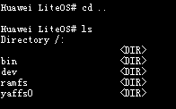

#### pwd<a name="ZH-CN_TOPIC_0000002543394157"></a>

**命令功能<a name="section53777413103259"></a>**

pwd命令用于显示当前路径。

**命令格式<a name="section925636103244"></a>**

pwd

**使用指南<a name="section59716164103244"></a>**

pwd 命令将当前目录的全路径名称（从根目录开始的绝对路径）写入标准输出。全部目录使用 /（斜线）分隔，第一个 / 表示根目录，最后一个目录是当前目录。

**使用实例<a name="section11667957103244"></a>**

举例：

输入“pwd”。

**输出说明<a name="section50224462103244"></a>**

**图 1**  查看当前路径<a name="fig41649620103244"></a>  


#### mkdir<a name="ZH-CN_TOPIC_0000002543394269"></a>

**命令功能<a name="section40463725111011"></a>**

mkdir命令用于创建一个目录。

**命令格式<a name="section37264765111011"></a>**

mkdir <dir\>

**参数说明<a name="section54033199111011"></a>**

<a name="table14613036111011"></a>
<table><thead align="left"><tr id="row19382697111011"><th class="cellrowborder" valign="top" width="21.099999999999998%" id="mcps1.1.4.1.1"><p id="p26494602111011"><a name="p26494602111011"></a><a name="p26494602111011"></a>参数</p>
</th>
<th class="cellrowborder" valign="top" width="52.32%" id="mcps1.1.4.1.2"><p id="p65688049111011"><a name="p65688049111011"></a><a name="p65688049111011"></a>参数说明</p>
</th>
<th class="cellrowborder" valign="top" width="26.58%" id="mcps1.1.4.1.3"><p id="p19131715111011"><a name="p19131715111011"></a><a name="p19131715111011"></a>取值范围</p>
</th>
</tr>
</thead>
<tbody><tr id="row6165098111011"><td class="cellrowborder" valign="top" width="21.099999999999998%" headers="mcps1.1.4.1.1 "><p id="p29610958111011"><a name="p29610958111011"></a><a name="p29610958111011"></a>dir</p>
</td>
<td class="cellrowborder" valign="top" width="52.32%" headers="mcps1.1.4.1.2 "><p id="p49677398111011"><a name="p49677398111011"></a><a name="p49677398111011"></a>需要创建的目录。</p>
</td>
<td class="cellrowborder" valign="top" width="26.58%" headers="mcps1.1.4.1.3 "><p id="p43145925111011"><a name="p43145925111011"></a><a name="p43145925111011"></a>N/A</p>
</td>
</tr>
</tbody>
</table>

**使用指南<a name="section52769012111011"></a>**

-   mkdir后加所需要创建的目录名，则将在当前目录下创建目录。
-   mkdir后加带路径的目录名，则将在指定路径下创建目录。

**使用实例<a name="section2861444111011"></a>**

举例：

输入“mkdir share”。

**输出说明<a name="section5618098111011"></a>**

**图 1**  在当前目录下创建share目录<a name="fig58041059112429"></a>  


#### rmdir<a name="ZH-CN_TOPIC_0000002511954360"></a>

**命令功能<a name="section3989834516312"></a>**

rmdir命令用于删除指定的目录。

**命令格式<a name="section2775577016312"></a>**

rmdir <dir\>

**参数说明<a name="section1780469016312"></a>**

<a name="table3289375716312"></a>
<table><thead align="left"><tr id="row321455216312"><th class="cellrowborder" valign="top" width="21.099999999999998%" id="mcps1.1.4.1.1"><p id="p5905219316312"><a name="p5905219316312"></a><a name="p5905219316312"></a>参数</p>
</th>
<th class="cellrowborder" valign="top" width="52.32%" id="mcps1.1.4.1.2"><p id="p1849833416312"><a name="p1849833416312"></a><a name="p1849833416312"></a>参数说明</p>
</th>
<th class="cellrowborder" valign="top" width="26.58%" id="mcps1.1.4.1.3"><p id="p2197010416312"><a name="p2197010416312"></a><a name="p2197010416312"></a>取值范围</p>
</th>
</tr>
</thead>
<tbody><tr id="row3474799016312"><td class="cellrowborder" valign="top" width="21.099999999999998%" headers="mcps1.1.4.1.1 "><p id="p2014652091132"><a name="p2014652091132"></a><a name="p2014652091132"></a>dir</p>
</td>
<td class="cellrowborder" valign="top" width="52.32%" headers="mcps1.1.4.1.2 "><p id="p845913791139"><a name="p845913791139"></a><a name="p845913791139"></a>要删除的目录，该目录必须为空目录。</p>
</td>
<td class="cellrowborder" valign="top" width="26.58%" headers="mcps1.1.4.1.3 "><p id="p609387179120"><a name="p609387179120"></a><a name="p609387179120"></a>N/A</p>
</td>
</tr>
</tbody>
</table>

**使用指南<a name="section14886116312"></a>**

-   rmdir命令只能用来删除目录。
-   rmdir一次只能删除一个目录。
-   rmdir只能删除空目录。

**使用实例<a name="section4163728916312"></a>**

举例：输入“rmdir dir”。

**输出说明<a name="section2037772316312"></a>**

**图 1**  删除一个名为dir的目录<a name="fig1766685292244"></a>  
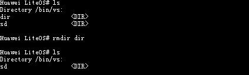

#### rm<a name="ZH-CN_TOPIC_0000002543394187"></a>

**命令功能<a name="section27278452163058"></a>**

rm命令用于删除文件或者非空目录。

**命令格式<a name="section21767833163058"></a>**

rm -r <dir\>

rm_ _<file\>

**参数说明<a name="section32743949163058"></a>**

<a name="table35014231163058"></a>
<table><thead align="left"><tr id="row1183466163058"><th class="cellrowborder" valign="top" width="22.42%" id="mcps1.1.4.1.1"><p id="p28751891163058"><a name="p28751891163058"></a><a name="p28751891163058"></a>参数</p>
</th>
<th class="cellrowborder" valign="top" width="51.190000000000005%" id="mcps1.1.4.1.2"><p id="p47201796163058"><a name="p47201796163058"></a><a name="p47201796163058"></a>参数说明</p>
</th>
<th class="cellrowborder" valign="top" width="26.39%" id="mcps1.1.4.1.3"><p id="p65249126163058"><a name="p65249126163058"></a><a name="p65249126163058"></a>取值范围</p>
</th>
</tr>
</thead>
<tbody><tr id="row50687840163058"><td class="cellrowborder" valign="top" width="22.42%" headers="mcps1.1.4.1.1 "><p id="p12074395163058"><a name="p12074395163058"></a><a name="p12074395163058"></a>-r &lt;dir&gt;</p>
</td>
<td class="cellrowborder" valign="top" width="51.190000000000005%" headers="mcps1.1.4.1.2 "><p id="p10973239163058"><a name="p10973239163058"></a><a name="p10973239163058"></a>dir为要删除的目录，支持删除非空目录和空目录。</p>
</td>
<td class="cellrowborder" valign="top" width="26.39%" headers="mcps1.1.4.1.3 "><p id="p13536735163058"><a name="p13536735163058"></a><a name="p13536735163058"></a>N/A</p>
</td>
</tr>
<tr id="row25799037143936"><td class="cellrowborder" valign="top" width="22.42%" headers="mcps1.1.4.1.1 "><p id="p30864746143936"><a name="p30864746143936"></a><a name="p30864746143936"></a>file</p>
</td>
<td class="cellrowborder" valign="top" width="51.190000000000005%" headers="mcps1.1.4.1.2 "><p id="p17016475143936"><a name="p17016475143936"></a><a name="p17016475143936"></a>要删除文件。</p>
</td>
<td class="cellrowborder" valign="top" width="26.39%" headers="mcps1.1.4.1.3 "><p id="p36157266143936"><a name="p36157266143936"></a><a name="p36157266143936"></a>N/A</p>
</td>
</tr>
</tbody>
</table>

**使用指南<a name="section54721754163058"></a>**

-   rm命令一次只能删除一个文件。
-   rm -r命令可以删除非空目录。

> **须知：** 
>如果使用rm删除系统关键资源（例如/dev），会造成系统死机等未知影响，需慎重使用该命令。

**使用实例<a name="section32875621163058"></a>**

举例：

1.  输入“rm 1.c”。
2.  输入“rm -r dir”。

**输出说明<a name="section8463980163058"></a>**

**图 1**  用rm命令删除文件1.c<a name="fig7985432144853"></a>  
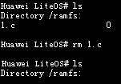

**图 2**  用rm -r删除目录dir<a name="fig54151803144925"></a>  
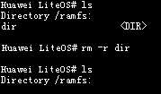

#### touch<a name="ZH-CN_TOPIC_0000002543354237"></a>

**命令功能<a name="section8534636163041"></a>**

touch命令用于在当前目录下创建一个空文件。

**命令格式<a name="section47734351163041"></a>**

touch <filename\>

**参数说明<a name="section26299140163041"></a>**

<a name="table49855628163041"></a>
<table><thead align="left"><tr id="row65286481163041"><th class="cellrowborder" valign="top" width="21.099999999999998%" id="mcps1.1.4.1.1"><p id="p53713622163041"><a name="p53713622163041"></a><a name="p53713622163041"></a>参数</p>
</th>
<th class="cellrowborder" valign="top" width="52.32%" id="mcps1.1.4.1.2"><p id="p55836111163041"><a name="p55836111163041"></a><a name="p55836111163041"></a>参数说明</p>
</th>
<th class="cellrowborder" valign="top" width="26.58%" id="mcps1.1.4.1.3"><p id="p26431141163041"><a name="p26431141163041"></a><a name="p26431141163041"></a>取值范围</p>
</th>
</tr>
</thead>
<tbody><tr id="row60547647163041"><td class="cellrowborder" valign="top" width="21.099999999999998%" headers="mcps1.1.4.1.1 "><p id="p5412357163041"><a name="p5412357163041"></a><a name="p5412357163041"></a>filename</p>
</td>
<td class="cellrowborder" valign="top" width="52.32%" headers="mcps1.1.4.1.2 "><p id="p35747809163041"><a name="p35747809163041"></a><a name="p35747809163041"></a>需要创建的文件。</p>
</td>
<td class="cellrowborder" valign="top" width="26.58%" headers="mcps1.1.4.1.3 "><p id="p43438392165927"><a name="p43438392165927"></a><a name="p43438392165927"></a>N/A</p>
</td>
</tr>
</tbody>
</table>

**使用指南<a name="section30171036163041"></a>**

-   touch命令创建的空文件，其默认权限为可读写。
-   touch命令一次只能创建一个文件。
-   touch命令操作已存在的文件会成功，不会更新时间戳。

> **须知：** 
>在系统重要资源路径下使用touch命令创建文件，会对系统造成死机等未知影响，如在“/dev”路径下执行“touch uartdev-0”，会产生系统卡死现象。

**使用实例<a name="section54776946163041"></a>**

举例：

输入“touch file.c”。

**输出说明<a name="section2619942163041"></a>**

**图 1**  在当前目录下创建一个名为file.c的文件<a name="fig27793623171333"></a>  
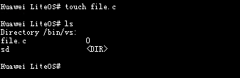

#### cp<a name="ZH-CN_TOPIC_0000002543394285"></a>

**命令功能<a name="section676257315176"></a>**

cp命令用于拷贝文件，创建一份副本。

**命令格式<a name="section3096931815176"></a>**

cp <source path\> <dest path\>

**参数说明<a name="section2805486115176"></a>**

<a name="table5785124015176"></a>
<table><thead align="left"><tr id="row3935748315176"><th class="cellrowborder" valign="top" width="21.099999999999998%" id="mcps1.1.4.1.1"><p id="p3383958815176"><a name="p3383958815176"></a><a name="p3383958815176"></a>参数</p>
</th>
<th class="cellrowborder" valign="top" width="31.55%" id="mcps1.1.4.1.2"><p id="p5665211315176"><a name="p5665211315176"></a><a name="p5665211315176"></a>参数说明</p>
</th>
<th class="cellrowborder" valign="top" width="47.349999999999994%" id="mcps1.1.4.1.3"><p id="p2541845915176"><a name="p2541845915176"></a><a name="p2541845915176"></a>取值范围</p>
</th>
</tr>
</thead>
<tbody><tr id="row4562928915176"><td class="cellrowborder" valign="top" width="21.099999999999998%" headers="mcps1.1.4.1.1 "><p id="p498493215176"><a name="p498493215176"></a><a name="p498493215176"></a>source path</p>
</td>
<td class="cellrowborder" valign="top" width="31.55%" headers="mcps1.1.4.1.2 "><p id="p112632315176"><a name="p112632315176"></a><a name="p112632315176"></a>源文件。</p>
</td>
<td class="cellrowborder" valign="top" width="47.349999999999994%" headers="mcps1.1.4.1.3 "><p id="p44501859173721"><a name="p44501859173721"></a><a name="p44501859173721"></a>目前只支持文件，不支持目录。</p>
</td>
</tr>
<tr id="row20866380142125"><td class="cellrowborder" valign="top" width="21.099999999999998%" headers="mcps1.1.4.1.1 "><p id="p12455180142125"><a name="p12455180142125"></a><a name="p12455180142125"></a>dest path</p>
</td>
<td class="cellrowborder" valign="top" width="31.55%" headers="mcps1.1.4.1.2 "><p id="p2236632142125"><a name="p2236632142125"></a><a name="p2236632142125"></a>目的路径。</p>
</td>
<td class="cellrowborder" valign="top" width="47.349999999999994%" headers="mcps1.1.4.1.3 "><p id="p54661298172121"><a name="p54661298172121"></a><a name="p54661298172121"></a>支持目录以及文件。</p>
</td>
</tr>
</tbody>
</table>

**使用指南<a name="section338301615176"></a>**

-   同一路径下，源文件与目的文件不能重名。
-   源文件必须存在，且不为目录。
-   源文件路径支持“\*”和“？”通配符，“\*”代表任意多个字符，“？”代表任意单个字符。目的路径不支持通配符。当源文件路径可匹配多个文件时，目的路径必须为目录。
-   目的路径为目录时，该目录必须存在。此时目的文件以源文件名进行命名。
-   目的路径为文件时，所在目录必须存在。目的文件名就是目的路径中指定的文件名。
-   目前不支持多文件拷贝。参数大于2个时，只对前2个参数进行操作。
-   目的文件不存在时创建新文件，已存在则覆盖。

> **须知：** 
>拷贝系统重要资源文件时，会造成死机等重大未知影响，如拷贝“/dev/uartdev-0”文件时，会产生系统卡死现象。

**使用实例<a name="section4315602815176"></a>**

举例：

输入“cp 100HSCAM/FILE0087.MP4 .”。

**输出说明<a name="section1440763015176"></a>**

**图 1**  显示结果如下<a name="fig2616739015176"></a>  
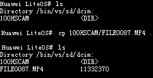

#### dd<a name="ZH-CN_TOPIC_0000002543354209"></a>

**命令功能<a name="section8534636163041"></a>**

dd命令用于文件读写性能统计。

**命令格式<a name="section47734351163041"></a>**

dd file=\[_PATHNAME_\] mode=\[_OPS_\] bs=\[_SIZE_\] count=\[_N_\]

**参数说明<a name="section26299140163041"></a>**

<a name="table49855628163041"></a>
<table><thead align="left"><tr id="row65286481163041"><th class="cellrowborder" valign="top" width="21.099999999999998%" id="mcps1.1.4.1.1"><p id="p53713622163041"><a name="p53713622163041"></a><a name="p53713622163041"></a>参数</p>
</th>
<th class="cellrowborder" valign="top" width="52.32%" id="mcps1.1.4.1.2"><p id="p55836111163041"><a name="p55836111163041"></a><a name="p55836111163041"></a>参数说明</p>
</th>
<th class="cellrowborder" valign="top" width="26.58%" id="mcps1.1.4.1.3"><p id="p26431141163041"><a name="p26431141163041"></a><a name="p26431141163041"></a>取值范围</p>
</th>
</tr>
</thead>
<tbody><tr id="row60547647163041"><td class="cellrowborder" valign="top" width="21.099999999999998%" headers="mcps1.1.4.1.1 "><p id="p5412357163041"><a name="p5412357163041"></a><a name="p5412357163041"></a>PATHNAME</p>
</td>
<td class="cellrowborder" valign="top" width="52.32%" headers="mcps1.1.4.1.2 "><p id="p35747809163041"><a name="p35747809163041"></a><a name="p35747809163041"></a>带文件路径的文件名。</p>
</td>
<td class="cellrowborder" valign="top" width="26.58%" headers="mcps1.1.4.1.3 "><p id="p43438392165927"><a name="p43438392165927"></a><a name="p43438392165927"></a>非空</p>
</td>
</tr>
<tr id="row13468121816475"><td class="cellrowborder" valign="top" width="21.099999999999998%" headers="mcps1.1.4.1.1 "><p id="p5468218104713"><a name="p5468218104713"></a><a name="p5468218104713"></a>OPS</p>
</td>
<td class="cellrowborder" valign="top" width="52.32%" headers="mcps1.1.4.1.2 "><p id="p34681618164712"><a name="p34681618164712"></a><a name="p34681618164712"></a>要测试的文件操作类型，包括读/写，取值1表示读，2表示写。</p>
</td>
<td class="cellrowborder" valign="top" width="26.58%" headers="mcps1.1.4.1.3 "><p id="p246881814712"><a name="p246881814712"></a><a name="p246881814712"></a>[1, 2]</p>
</td>
</tr>
<tr id="row13925192214478"><td class="cellrowborder" valign="top" width="21.099999999999998%" headers="mcps1.1.4.1.1 "><p id="p189261222104710"><a name="p189261222104710"></a><a name="p189261222104710"></a>SIZE</p>
</td>
<td class="cellrowborder" valign="top" width="52.32%" headers="mcps1.1.4.1.2 "><p id="p1926322164716"><a name="p1926322164716"></a><a name="p1926322164716"></a>一次读/写的block字节数。</p>
</td>
<td class="cellrowborder" valign="top" width="26.58%" headers="mcps1.1.4.1.3 "><p id="p6926172216472"><a name="p6926172216472"></a><a name="p6926172216472"></a>[0, 0xFFFFFFFF]</p>
</td>
</tr>
<tr id="row280891664818"><td class="cellrowborder" valign="top" width="21.099999999999998%" headers="mcps1.1.4.1.1 "><p id="p9809101644812"><a name="p9809101644812"></a><a name="p9809101644812"></a>N</p>
</td>
<td class="cellrowborder" valign="top" width="52.32%" headers="mcps1.1.4.1.2 "><p id="p1080910164485"><a name="p1080910164485"></a><a name="p1080910164485"></a>读/写的block个数。</p>
</td>
<td class="cellrowborder" valign="top" width="26.58%" headers="mcps1.1.4.1.3 "><p id="p180941624818"><a name="p180941624818"></a><a name="p180941624818"></a>[0, 0xFFFFFFFF]</p>
</td>
</tr>
</tbody>
</table>

**使用指南<a name="section30171036163041"></a>**

1.  dd命令可并发执行，一条dd命令对应一个线程，因此可以进行多线程的读写测试。
2.  dd命令测试较大的文件读写时，存在耗时较长的情况，可能不会立即输出性能结果，这是正常现象。
3.  bs字段和count字段可以不指定，系统将使用缺省值LOSCFG\_DD\_DEFAULT\_BS 1024、LOSCFG\_DD\_DEFAULT\_CNT 1。
4.  bs字段的SIZE不宜过大，系统将申请SIZE大小的动态内存，过大的SIZE会导致内存申请失败，导致dd命令无法正常执行。
5.  dd流程中仅会执行open、read/write、close操作，用户需自行保证操作dd前已正确挂载对应的文件系统，如有其他操作也需用户自行执行。

**使用实例<a name="section54776946163041"></a>**

举例，测试文件写性能如下：

dd file=/app/sd/testfile mode=2 bs=32768 count=32768

**输出说明<a name="section2619942163041"></a>**

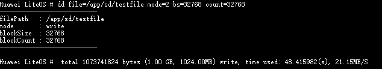

输出写入文件的总字节数、总耗时以及速率。

#### ls<a name="ZH-CN_TOPIC_0000002511794438"></a>

**命令功能<a name="section676257315176"></a>**

ls命令用于显示当前目录的内容。

**命令格式<a name="section3096931815176"></a>**

ls \[_path_\]

**参数说明<a name="section2805486115176"></a>**

<a name="table2827908616233"></a>
<table><thead align="left"><tr id="row1061475516233"><th class="cellrowborder" valign="top" width="21.099999999999998%" id="mcps1.1.4.1.1"><p id="p5448884016233"><a name="p5448884016233"></a><a name="p5448884016233"></a>参数</p>
</th>
<th class="cellrowborder" valign="top" width="52.32%" id="mcps1.1.4.1.2"><p id="p5151990516233"><a name="p5151990516233"></a><a name="p5151990516233"></a>参数说明</p>
</th>
<th class="cellrowborder" valign="top" width="26.58%" id="mcps1.1.4.1.3"><p id="p1236277516233"><a name="p1236277516233"></a><a name="p1236277516233"></a>取值范围</p>
</th>
</tr>
</thead>
<tbody><tr id="row6186068916233"><td class="cellrowborder" valign="top" width="21.099999999999998%" headers="mcps1.1.4.1.1 "><p id="p4465989516233"><a name="p4465989516233"></a><a name="p4465989516233"></a>path</p>
</td>
<td class="cellrowborder" valign="top" width="52.32%" headers="mcps1.1.4.1.2 "><a name="ul1018642014358"></a><a name="ul1018642014358"></a><ul id="ul1018642014358"><li>为空时，显示当前目录的内容。</li><li>为无效文件名时，显示失败，提示：No such directory。</li><li>为有效目录路径时，显示对应目录下的内容。</li></ul>
</td>
<td class="cellrowborder" valign="top" width="26.58%" headers="mcps1.1.4.1.3 "><a name="ol698187173615"></a><a name="ol698187173615"></a><ol id="ol698187173615"><li>空；</li><li>有效目录路径。</li></ol>
</td>
</tr>
</tbody>
</table>

**使用指南<a name="section338301615176"></a>**

-   ls可以显示文件的大小。
-   proc下ls无法统计文件大小，显示为0。

**使用实例<a name="section4315602815176"></a>**

举例：

输入“ls”。

**输出说明<a name="section1440763015176"></a>**

**图 1**  查看当前系统路径下的内容显示<a name="fig2616739015176"></a>  
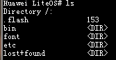

#### cat<a name="ZH-CN_TOPIC_0000002543354197"></a>

**命令功能<a name="section676257315176"></a>**

cat用于显示文本文件的内容。

**命令格式<a name="section3096931815176"></a>**

cat <pathname\>

**参数说明<a name="section2805486115176"></a>**

<a name="table60251303162617"></a>
<table><thead align="left"><tr id="row26605759162617"><th class="cellrowborder" valign="top" width="21.099999999999998%" id="mcps1.1.4.1.1"><p id="p7582834162617"><a name="p7582834162617"></a><a name="p7582834162617"></a>参数</p>
</th>
<th class="cellrowborder" valign="top" width="52.32%" id="mcps1.1.4.1.2"><p id="p10229855162617"><a name="p10229855162617"></a><a name="p10229855162617"></a>参数说明</p>
</th>
<th class="cellrowborder" valign="top" width="26.58%" id="mcps1.1.4.1.3"><p id="p23311916162617"><a name="p23311916162617"></a><a name="p23311916162617"></a>取值范围</p>
</th>
</tr>
</thead>
<tbody><tr id="row9217025162617"><td class="cellrowborder" valign="top" width="21.099999999999998%" headers="mcps1.1.4.1.1 "><p id="p8381575162617"><a name="p8381575162617"></a><a name="p8381575162617"></a>pathname</p>
</td>
<td class="cellrowborder" valign="top" width="52.32%" headers="mcps1.1.4.1.2 "><p id="p7818981162617"><a name="p7818981162617"></a><a name="p7818981162617"></a>带文件路径的文件名，如果文件在当前路径下，可以直接输入文件名。</p>
</td>
<td class="cellrowborder" valign="top" width="26.58%" headers="mcps1.1.4.1.3 "><p id="p29357764162617"><a name="p29357764162617"></a><a name="p29357764162617"></a>已存在的文件。</p>
</td>
</tr>
</tbody>
</table>

**使用实例<a name="section4315602815176"></a>**

举例：

输入“cat w“”。

**输出说明<a name="section1440763015176"></a>**

**图 1**  查看w文件的信息<a name="fig65471551513"></a>  
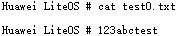

#### lsfd<a name="ZH-CN_TOPIC_0000002543394241"></a>

**命令功能<a name="se1ad2c8850f24263b57732d820b71fd6"></a>**

lsfd命令用于显示当前已经打开的文件描述符及对应的文件名。

**命令格式<a name="sb37f94a6be4e433586da8315e1502158"></a>**

lsfd

**使用指南<a name="s292535ce2f0641aebaadeaf22c5c7d28"></a>**

lsfd命令显示当前已经打开文件的fd号以及文件的名字。

**使用实例<a name="s8526caa34926480f90cc5a00b1dd9b43"></a>**

举例：

输入“lsfd”。

**输出说明<a name="s792b6283d4c144eebb8c78535cdaad51"></a>**

```
LiteOS # lsfd
   fd    filename
    3   /dev/shell
```

#### format<a name="ZH-CN_TOPIC_0000002511954420"></a>

**命令功能<a name="section4489394910486"></a>**

format命令用于格式化磁盘。

**命令格式<a name="section4567231610486"></a>**

format <dev\_inodename\> <sectors\> <option\> \[_label_\]

**参数说明<a name="section912211710486"></a>**

<a name="table69401910486"></a>
<table><thead align="left"><tr id="row4477913210486"><th class="cellrowborder" valign="top" width="26.040000000000003%" id="mcps1.1.3.1.1"><p id="p323109110486"><a name="p323109110486"></a><a name="p323109110486"></a>参数</p>
</th>
<th class="cellrowborder" valign="top" width="73.96000000000001%" id="mcps1.1.3.1.2"><p id="p6039184710486"><a name="p6039184710486"></a><a name="p6039184710486"></a>参数说明</p>
</th>
</tr>
</thead>
<tbody><tr id="row5990143910486"><td class="cellrowborder" valign="top" width="26.040000000000003%" headers="mcps1.1.3.1.1 "><p id="p2017840410486"><a name="p2017840410486"></a><a name="p2017840410486"></a>dev_inodename</p>
</td>
<td class="cellrowborder" valign="top" width="73.96000000000001%" headers="mcps1.1.3.1.2 "><p id="p2383801310486"><a name="p2383801310486"></a><a name="p2383801310486"></a>要格式化的设备名。</p>
</td>
</tr>
<tr id="row1321552910486"><td class="cellrowborder" valign="top" width="26.040000000000003%" headers="mcps1.1.3.1.1 "><p id="p6382490810486"><a name="p6382490810486"></a><a name="p6382490810486"></a>sectors</p>
</td>
<td class="cellrowborder" valign="top" width="73.96000000000001%" headers="mcps1.1.3.1.2 "><p id="p42617219205650"><a name="p42617219205650"></a><a name="p42617219205650"></a>分配的单元内存或扇区大小，取值必须为2的幂数，FAT32下最大值为128，取其他值表示自动选择合适的簇大小。不同size的分区，可用的簇大小范围不同。</p>
</td>
</tr>
<tr id="row54102760102346"><td class="cellrowborder" valign="top" width="26.040000000000003%" headers="mcps1.1.3.1.1 "><p id="p20247476102346"><a name="p20247476102346"></a><a name="p20247476102346"></a>option</p>
</td>
<td class="cellrowborder" valign="top" width="73.96000000000001%" headers="mcps1.1.3.1.2 "><div class="p" id="p29432827102346"><a name="p29432827102346"></a><a name="p29432827102346"></a>格式化选项，用于选择文件系统的类型，有如下几种参数可供选择：<a name="ul4160908910336"></a><a name="ul4160908910336"></a><ul id="ul4160908910336"><li>0x01：FMT_FAT</li><li>0x02：FMT_FAT32</li><li>0x07：FMT_ANY</li><li>0x08：FMT_ERASE（USB不支持该选项）</li></ul>
</div>
<p id="p178814103324"><a name="p178814103324"></a><a name="p178814103324"></a>传入其他值皆为非法，将由系统自动选择格式化方式。若格式化U盘时低格位为1，会出现错误打印。</p>
</td>
</tr>
<tr id="row15323738102351"><td class="cellrowborder" valign="top" width="26.040000000000003%" headers="mcps1.1.3.1.1 "><p id="p33263275102351"><a name="p33263275102351"></a><a name="p33263275102351"></a>label（可选参数）</p>
</td>
<td class="cellrowborder" valign="top" width="73.96000000000001%" headers="mcps1.1.3.1.2 "><p id="p9970756102351"><a name="p9970756102351"></a><a name="p9970756102351"></a>该参数为可选参数，输入值应为字符串，用来指定卷标名。当输入字符串“null”时，则把之前设置的卷标名清空。</p>
</td>
</tr>
</tbody>
</table>

**使用指南<a name="section343197610486"></a>**

-   format指令用于格式化磁盘，设备名可以在dev目录下查找。format时必须安装存储卡。
-   format只能格式化U盘、SD卡和EMMC卡，无法格式化Nand Flash和Nor Flash。
-   sectors参数必须传入合法值，传入非法参数可能引发异常。

**使用实例<a name="section5313296410486"></a>**

举例：

输入“format /dev/mmcblk0p0 128 2”。

**输出说明<a name="section1211681010486"></a>**

```
LiteOS # format /dev/mmcblk0p0 128 2
Format to FAT32, 128 sectors per cluster.
format /dev/mmcblk0p0 Success
```

#### mount<a name="ZH-CN_TOPIC_0000002511794316"></a>

**命令功能<a name="section1416249311104"></a>**

mount命令用于将设备挂载到指定目录。

**命令格式<a name="section5680165011104"></a>**

mount <device\> <path\> <name\>

**参数说明<a name="section223424111104"></a>**

<a name="table4675586011104"></a>
<table><thead align="left"><tr id="row6362441811104"><th class="cellrowborder" valign="top" width="21.099999999999998%" id="mcps1.1.4.1.1"><p id="p5330420111104"><a name="p5330420111104"></a><a name="p5330420111104"></a>参数</p>
</th>
<th class="cellrowborder" valign="top" width="52.32%" id="mcps1.1.4.1.2"><p id="p2267304511104"><a name="p2267304511104"></a><a name="p2267304511104"></a>参数说明</p>
</th>
<th class="cellrowborder" valign="top" width="26.58%" id="mcps1.1.4.1.3"><p id="p2457739011104"><a name="p2457739011104"></a><a name="p2457739011104"></a>取值范围</p>
</th>
</tr>
</thead>
<tbody><tr id="row48488937114559"><td class="cellrowborder" valign="top" width="21.099999999999998%" headers="mcps1.1.4.1.1 "><p id="p33747254114559"><a name="p33747254114559"></a><a name="p33747254114559"></a>device</p>
</td>
<td class="cellrowborder" valign="top" width="52.32%" headers="mcps1.1.4.1.2 "><p id="p49173020114559"><a name="p49173020114559"></a><a name="p49173020114559"></a>要挂载的设备。</p>
</td>
<td class="cellrowborder" valign="top" width="26.58%" headers="mcps1.1.4.1.3 "><p id="p23591683114559"><a name="p23591683114559"></a><a name="p23591683114559"></a>系统拥有的设备。</p>
</td>
</tr>
<tr id="row4461157911104"><td class="cellrowborder" valign="top" width="21.099999999999998%" headers="mcps1.1.4.1.1 "><p id="p5676816511104"><a name="p5676816511104"></a><a name="p5676816511104"></a>path</p>
</td>
<td class="cellrowborder" valign="top" width="52.32%" headers="mcps1.1.4.1.2 "><p id="p3481864311104"><a name="p3481864311104"></a><a name="p3481864311104"></a>设备要挂载到的目录，用户必须具有该目录的可执行权限。</p>
</td>
<td class="cellrowborder" valign="top" width="26.58%" headers="mcps1.1.4.1.3 "><p id="p1564054311104"><a name="p1564054311104"></a><a name="p1564054311104"></a>N/A</p>
</td>
</tr>
<tr id="row46211726114613"><td class="cellrowborder" valign="top" width="21.099999999999998%" headers="mcps1.1.4.1.1 "><p id="p13252351114613"><a name="p13252351114613"></a><a name="p13252351114613"></a>name</p>
</td>
<td class="cellrowborder" valign="top" width="52.32%" headers="mcps1.1.4.1.2 "><p id="p66807550114613"><a name="p66807550114613"></a><a name="p66807550114613"></a>要挂载的文件系统类型。</p>
</td>
<td class="cellrowborder" valign="top" width="26.58%" headers="mcps1.1.4.1.3 "><p id="p42702502114613"><a name="p42702502114613"></a><a name="p42702502114613"></a>vfat，yaffs，ramfs，nfs，procfs，romfs</p>
</td>
</tr>
</tbody>
</table>

**使用指南<a name="section654716511104"></a>**

mount后加需要挂载的设备信息、指定目录以及设备文件格式，就能成功挂载文件系统到指定目录。

**使用实例<a name="section627887311104"></a>**

举例：

输入“mount  /dev/mmc0 /bin/vs/sd vfat”。

**输出说明<a name="section1389578011104"></a>**

将“/dev/mmc0”以VFAT文件系统类型挂载到“/bin/vs/sd”目录。

```
LiteOS # mount /dev/mmc0 /bin/vs/sd vfat
mount ok
```

#### umount<a name="ZH-CN_TOPIC_0000002511954216"></a>

**命令功能<a name="section3772787311108"></a>**

umount命令用于卸载已经挂载的文件系统。

**命令格式<a name="section5609421311108"></a>**

umount <dir\>

**参数说明<a name="section2338330711108"></a>**

<a name="table1499971111108"></a>
<table><thead align="left"><tr id="row2312928011108"><th class="cellrowborder" valign="top" width="21.87%" id="mcps1.1.4.1.1"><p id="p6153241011108"><a name="p6153241011108"></a><a name="p6153241011108"></a>参数</p>
</th>
<th class="cellrowborder" valign="top" width="43.39%" id="mcps1.1.4.1.2"><p id="p1806930411108"><a name="p1806930411108"></a><a name="p1806930411108"></a>参数说明</p>
</th>
<th class="cellrowborder" valign="top" width="34.74%" id="mcps1.1.4.1.3"><p id="p5432752311108"><a name="p5432752311108"></a><a name="p5432752311108"></a>取值范围</p>
</th>
</tr>
</thead>
<tbody><tr id="row3845321811108"><td class="cellrowborder" valign="top" width="21.87%" headers="mcps1.1.4.1.1 "><p id="p2770294211108"><a name="p2770294211108"></a><a name="p2770294211108"></a>dir</p>
</td>
<td class="cellrowborder" valign="top" width="43.39%" headers="mcps1.1.4.1.2 "><p id="p2934579011108"><a name="p2934579011108"></a><a name="p2934579011108"></a>需要卸载的文件系统对应的挂载目录。</p>
</td>
<td class="cellrowborder" valign="top" width="34.74%" headers="mcps1.1.4.1.3 "><p id="p5246227311108"><a name="p5246227311108"></a><a name="p5246227311108"></a>系统已挂载的文件系统的目录。</p>
</td>
</tr>
</tbody>
</table>

**使用指南<a name="section29810088122055"></a>**

umount后加上需要卸载的文件系统对应的挂载目录，即将指定文件系统卸载。

**使用实例<a name="section3250676311108"></a>**

举例：

输入“umount /bin/vs/sd”。

**输出说明<a name="section800180511108"></a>**

将挂载在“/bin/vs/sd”目录上的文件系统卸载。

```
LiteOS # umount /bin/vs/sd
umount ok
```

#### partinfo<a name="ZH-CN_TOPIC_0000002543354295"></a>

**命令功能<a name="section3507310415275"></a>**

partinfo命令用于查看系统识别的硬盘、U盘和SD卡的分区信息。

**命令格式<a name="section6692475915275"></a>**

partinfo <dev\_inodename\>

**参数说明<a name="section44392615275"></a>**

<a name="table3595808515275"></a>
<table><thead align="left"><tr id="row1479093015275"><th class="cellrowborder" valign="top" width="22.23%" id="mcps1.1.4.1.1"><p id="p5721468215275"><a name="p5721468215275"></a><a name="p5721468215275"></a>参数</p>
</th>
<th class="cellrowborder" valign="top" width="35.64%" id="mcps1.1.4.1.2"><p id="p387767915275"><a name="p387767915275"></a><a name="p387767915275"></a>参数说明</p>
</th>
<th class="cellrowborder" valign="top" width="42.13%" id="mcps1.1.4.1.3"><p id="p4565656815275"><a name="p4565656815275"></a><a name="p4565656815275"></a>取值范围</p>
</th>
</tr>
</thead>
<tbody><tr id="row719452615275"><td class="cellrowborder" valign="top" width="22.23%" headers="mcps1.1.4.1.1 "><p id="p4699559152713"><a name="p4699559152713"></a><a name="p4699559152713"></a>dev_inodename</p>
</td>
<td class="cellrowborder" valign="top" width="35.64%" headers="mcps1.1.4.1.2 "><p id="p26617559152713"><a name="p26617559152713"></a><a name="p26617559152713"></a>要查看的分区名。</p>
</td>
<td class="cellrowborder" valign="top" width="42.13%" headers="mcps1.1.4.1.3 "><p id="p16637860152713"><a name="p16637860152713"></a><a name="p16637860152713"></a>合法的分区名。</p>
</td>
</tr>
</tbody>
</table>

**使用实例<a name="section4001979815275"></a>**

举例：

输入“partinfo /dev/sdap0”。

**输出说明<a name="section26959292194448"></a>**

```
LiteOS # partinfo /dev/sdap0
part info :
disk id          : 3
part_id in system: 0
part no in disk  : 0
part no in mbr   : 1
part filesystem  : 0C
part dev name    : sdap0
part sec start   : 2048
part sec count   : 167794688
```

#### partition<a name="ZH-CN_TOPIC_0000002543354233"></a>

**命令功能<a name="section2151919117751"></a>**

partition命令用于查看Flash分区信息。

**命令格式<a name="section5112550917751"></a>**

partition <nand | spinor\>

**参数说明<a name="section1795431417751"></a>**

<a name="table4501332417751"></a>
<table><thead align="left"><tr id="row1955018917751"><th class="cellrowborder" valign="top" width="21.099999999999998%" id="mcps1.1.4.1.1"><p id="p4006147217751"><a name="p4006147217751"></a><a name="p4006147217751"></a>参数</p>
</th>
<th class="cellrowborder" valign="top" width="52.32%" id="mcps1.1.4.1.2"><p id="p2375380817751"><a name="p2375380817751"></a><a name="p2375380817751"></a>参数说明</p>
</th>
<th class="cellrowborder" valign="top" width="26.58%" id="mcps1.1.4.1.3"><p id="p4501027617751"><a name="p4501027617751"></a><a name="p4501027617751"></a>取值范围</p>
</th>
</tr>
</thead>
<tbody><tr id="row2195373317751"><td class="cellrowborder" valign="top" width="21.099999999999998%" headers="mcps1.1.4.1.1 "><p id="p3342191417751"><a name="p3342191417751"></a><a name="p3342191417751"></a>nand</p>
</td>
<td class="cellrowborder" valign="top" width="52.32%" headers="mcps1.1.4.1.2 "><p id="p2282049117751"><a name="p2282049117751"></a><a name="p2282049117751"></a>显示Nand Flash分区信息。</p>
</td>
<td class="cellrowborder" valign="top" width="26.58%" headers="mcps1.1.4.1.3 "><p id="p3652051417751"><a name="p3652051417751"></a><a name="p3652051417751"></a>N/A</p>
</td>
</tr>
<tr id="row51387623171114"><td class="cellrowborder" valign="top" width="21.099999999999998%" headers="mcps1.1.4.1.1 "><p id="p1647931171114"><a name="p1647931171114"></a><a name="p1647931171114"></a>spinor</p>
</td>
<td class="cellrowborder" valign="top" width="52.32%" headers="mcps1.1.4.1.2 "><p id="p66373616171114"><a name="p66373616171114"></a><a name="p66373616171114"></a>显示Spinor Flash分区信息。</p>
</td>
<td class="cellrowborder" valign="top" width="26.58%" headers="mcps1.1.4.1.3 "><p id="p7553838171114"><a name="p7553838171114"></a><a name="p7553838171114"></a>N/A</p>
</td>
</tr>
</tbody>
</table>

**使用指南<a name="section6024917017751"></a>**

-   当使能YAFFS文件系统时才可以查看Nand Flash分区信息。
-   当使能JFFS或ROMFS文件系统时才可以查看Spinor Flash分区信息。

**使用实例<a name="section1104974317751"></a>**

举例：

输入partition nand。

**输出说明<a name="section219933217751"></a>**

查看Nand Flash统分区信息。

```
LiteOS # partition nand
nand partition num:0, blkdev name:/dev/nandblk0, mountpt:/yaffs0, startaddr:0x00e00000, length:0x00200000
```

#### statfs<a name="ZH-CN_TOPIC_0000002543394297"></a>

**命令功能<a name="section12701761192913"></a>**

statfs命令用于打印文件系统的信息，如该文件系统类型、总大小、可用大小等信息。

**命令格式<a name="section65669766192913"></a>**

statfs <directory\>

**参数说明<a name="section49687437192913"></a>**

<a name="table31194646194410"></a>
<table><thead align="left"><tr id="row24146062194410"><th class="cellrowborder" valign="top" width="21.45214521452145%" id="mcps1.1.4.1.1"><p id="p18657823194421"><a name="p18657823194421"></a><a name="p18657823194421"></a>参数</p>
</th>
<th class="cellrowborder" valign="top" width="35.64356435643564%" id="mcps1.1.4.1.2"><p id="p34888686194421"><a name="p34888686194421"></a><a name="p34888686194421"></a>参数说明</p>
</th>
<th class="cellrowborder" valign="top" width="42.9042904290429%" id="mcps1.1.4.1.3"><p id="p7411342194421"><a name="p7411342194421"></a><a name="p7411342194421"></a>取值范围</p>
</th>
</tr>
</thead>
<tbody><tr id="row4667745194410"><td class="cellrowborder" valign="top" width="21.45214521452145%" headers="mcps1.1.4.1.1 "><p id="p42543085194410"><a name="p42543085194410"></a><a name="p42543085194410"></a>directory</p>
</td>
<td class="cellrowborder" valign="top" width="35.64356435643564%" headers="mcps1.1.4.1.2 "><p id="p23437894194410"><a name="p23437894194410"></a><a name="p23437894194410"></a>文件系统的挂载路径。</p>
</td>
<td class="cellrowborder" valign="top" width="42.9042904290429%" headers="mcps1.1.4.1.3 "><p id="p19421267194410"><a name="p19421267194410"></a><a name="p19421267194410"></a>必须是存在的文件系统，并且其支持statfs命令。</p>
</td>
</tr>
</tbody>
</table>

**使用指南<a name="section58452768192913"></a>**

打印信息因文件系统而异。

**使用实例<a name="section34404499192913"></a>**

以YAFFS文件系统为例：

输入“statfs /yaffs0”。

**输出说明<a name="section49273739192913"></a>**

```
statfs got:
f_type         = 1497497427
cluster_size   = 2048
total_clusters = 704
free_clusters  = 640
avail_clusters = 640
f_namelen      = 255

/yaffs0
total size: 9830400 Bytes
free  size: 5890048 Bytes
```

#### virstatfs<a name="ZH-CN_TOPIC_0000002543354181"></a>

**命令功能<a name="section531338194151"></a>**

virstatfs命令用于打印虚拟分区下文件系统的信息，如总大小、可用大小等信息。

**命令格式<a name="section1338511694318"></a>**

virstatfs_ _<directory\>

**参数说明<a name="section467136694347"></a>**

<a name="table31194646194410"></a>
<table><thead align="left"><tr id="row24146062194410"><th class="cellrowborder" valign="top" width="21.45214521452145%" id="mcps1.1.4.1.1"><p id="p18657823194421"><a name="p18657823194421"></a><a name="p18657823194421"></a>参数</p>
</th>
<th class="cellrowborder" valign="top" width="45.58455845584558%" id="mcps1.1.4.1.2"><p id="p34888686194421"><a name="p34888686194421"></a><a name="p34888686194421"></a>参数说明</p>
</th>
<th class="cellrowborder" valign="top" width="32.96329632963296%" id="mcps1.1.4.1.3"><p id="p7411342194421"><a name="p7411342194421"></a><a name="p7411342194421"></a>取值范围</p>
</th>
</tr>
</thead>
<tbody><tr id="row4667745194410"><td class="cellrowborder" valign="top" width="21.45214521452145%" headers="mcps1.1.4.1.1 "><p id="p42543085194410"><a name="p42543085194410"></a><a name="p42543085194410"></a>directory</p>
</td>
<td class="cellrowborder" valign="top" width="45.58455845584558%" headers="mcps1.1.4.1.2 "><p id="p23437894194410"><a name="p23437894194410"></a><a name="p23437894194410"></a>虚拟分区入口目录的路径或者其子路径。</p>
</td>
<td class="cellrowborder" valign="top" width="32.96329632963296%" headers="mcps1.1.4.1.3 "><p id="p19421267194410"><a name="p19421267194410"></a><a name="p19421267194410"></a>N/A</p>
</td>
</tr>
</tbody>
</table>

**使用指南<a name="section1870481994924"></a>**

-   virstatfs命令只有开启了虚拟分区特性时才有效（LOSCFG\_FS\_FAT\_VIRTUAL\_PARTITION=y）。
-   virstatfs的输入路径，必须是已经成功应用虚拟分区的物理分区上的虚拟分区入口目录，或者其子目录。如果输入路径是该物理分区的根目录，或者该物理分区未成功应用虚拟分区特性，或者路径指向非FAT32文件系统分区，virstatfs命令均会被拒绝执行。
-   关于虚拟分区特性，详见FAT开发指导中“[虚拟分区的接口说明](开发指导-113.md#section1339318355214)”和“[开发流程](开发指导-113.md#section485291782345)”。

**使用实例<a name="section116941510027"></a>**

举例：

输入“virstatfs /bin/vs/sd/virpart0”。

**输出说明<a name="section353748331023"></a>**

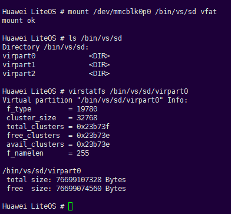

#### sync<a name="ZH-CN_TOPIC_0000002511794238"></a>

**命令功能<a name="section925108316319"></a>**

sync命令用于同步缓存数据（FAT文件系统中的数据）到SD卡。

**命令格式<a name="section3315319916319"></a>**

sync

**使用指南<a name="section4971367516319"></a>**

-   sync命令用来刷新缓存，当没有SD卡插入时不进行操作，有SD卡插入时缓存信息会同步到SD卡。成功时无显示信息。
-   使用sync命令前，需要使能FAT文件系统，即设置LOSCFG\_FS\_FAT = y。

**使用实例<a name="section5118186316319"></a>**

举例：

输入“sync”，有SD卡时同步到SD卡，无SD卡时不操作。

**输出说明<a name="section6615880216319"></a>**

无。

#### writeproc<a name="ZH-CN_TOPIC_0000002543394295"></a>

**命令功能<a name="section3507310415275"></a>**

writeproc命令用于向proc文件系统中的文件写入内容。

**命令格式<a name="section6692475915275"></a>**

writeproc <val\> <operational mark\> <path\>

**参数说明<a name="section44392615275"></a>**

<a name="table3595808515275"></a>
<table><thead align="left"><tr id="row1479093015275"><th class="cellrowborder" valign="top" width="22.23%" id="mcps1.1.4.1.1"><p id="p5721468215275"><a name="p5721468215275"></a><a name="p5721468215275"></a>参数</p>
</th>
<th class="cellrowborder" valign="top" width="51.190000000000005%" id="mcps1.1.4.1.2"><p id="p387767915275"><a name="p387767915275"></a><a name="p387767915275"></a>参数说明</p>
</th>
<th class="cellrowborder" valign="top" width="26.58%" id="mcps1.1.4.1.3"><p id="p4565656815275"><a name="p4565656815275"></a><a name="p4565656815275"></a>取值范围</p>
</th>
</tr>
</thead>
<tbody><tr id="row719452615275"><td class="cellrowborder" valign="top" width="22.23%" headers="mcps1.1.4.1.1 "><p id="p4699559152713"><a name="p4699559152713"></a><a name="p4699559152713"></a>val</p>
</td>
<td class="cellrowborder" valign="top" width="51.190000000000005%" headers="mcps1.1.4.1.2 "><p id="p26617559152713"><a name="p26617559152713"></a><a name="p26617559152713"></a>要写入文件的内容。</p>
</td>
<td class="cellrowborder" valign="top" width="26.58%" headers="mcps1.1.4.1.3 "><p id="p16637860152713"><a name="p16637860152713"></a><a name="p16637860152713"></a>字符串。</p>
</td>
</tr>
<tr id="row19810974153654"><td class="cellrowborder" valign="top" width="22.23%" headers="mcps1.1.4.1.1 "><p id="p61185050153654"><a name="p61185050153654"></a><a name="p61185050153654"></a>operational mark</p>
</td>
<td class="cellrowborder" valign="top" width="51.190000000000005%" headers="mcps1.1.4.1.2 "><p id="p57041978153654"><a name="p57041978153654"></a><a name="p57041978153654"></a>操作符，当操作符为“&gt;&gt;”时，表示将内容追加写到指定的文件。</p>
</td>
<td class="cellrowborder" valign="top" width="26.58%" headers="mcps1.1.4.1.3 "><p id="p56997478153654"><a name="p56997478153654"></a><a name="p56997478153654"></a>目前只允许“&gt;&gt;”。</p>
</td>
</tr>
<tr id="row16988758153658"><td class="cellrowborder" valign="top" width="22.23%" headers="mcps1.1.4.1.1 "><p id="p33912192153658"><a name="p33912192153658"></a><a name="p33912192153658"></a>path</p>
</td>
<td class="cellrowborder" valign="top" width="51.190000000000005%" headers="mcps1.1.4.1.2 "><p id="p62533059153658"><a name="p62533059153658"></a><a name="p62533059153658"></a>将要写入内容的文件。</p>
</td>
<td class="cellrowborder" valign="top" width="26.58%" headers="mcps1.1.4.1.3 "><p id="p32012998153658"><a name="p32012998153658"></a><a name="p32012998153658"></a>必须为带绝对路径的文件。</p>
</td>
</tr>
</tbody>
</table>

**使用指南<a name="section5167708215275"></a>**

-   writeproc用于将指定内容写入proc文件系统中的文件，该文件必须是已经存在的文件，也可以是非用户创建的文件。
-   当操作符为“\>\>”，同时文件存在时，将指定内容写入该文件。
-   使用writeproc命令前，需要使能PROC文件系统，即设置LOSCFG\_FS\_PROC = y。

**使用实例<a name="section4001979815275"></a>**

举例：

输入“writeproc 'sys=2' \>\> /proc/umap/logmpp”。

**输出说明<a name="section4918617715275"></a>**

**图 1**  修改logmpp中的sys等级<a name="fig6680055114347"></a>  


### Trace命令参考<a name="ZH-CN_TOPIC_0000002543354283"></a>


#### 使能Trace命令<a name="ZH-CN_TOPIC_0000002511794392"></a>

使用Shell中的Trace命令前，需要先打开menuconfig菜单使能Shell，详见“[配置项](开发指导-162.md#section1161804935819)”。

同时配置Trace模块，详见Trace开发流程中的“[开发指导](开发指导-95.md)”，下文中的“离线模式”在menuconfig中的菜单项为：Kernel ---\> Enable Extend Kernel ---\> Enable Trace Feature ---\> Trace work mode ---\> Offline mode”。关于Trace模块的详细介绍，详见“[Trace](Trace.md)”。

#### trace\_mask<a name="ZH-CN_TOPIC_0000002543354329"></a>

**命令功能<a name="section10402133119271"></a>**

设置事件过滤掩码。

**命令格式<a name="section1540317311276"></a>**

trace\_mask \[_MASK_\]

**参数说明<a name="section15404163152711"></a>**

<a name="table3405133110275"></a>
<table><thead align="left"><tr id="row15441103117273"><th class="cellrowborder" valign="top" width="21.21%" id="mcps1.1.4.1.1"><p id="p11441173111271"><a name="p11441173111271"></a><a name="p11441173111271"></a>参数</p>
</th>
<th class="cellrowborder" valign="top" width="52.53%" id="mcps1.1.4.1.2"><p id="p1544113192712"><a name="p1544113192712"></a><a name="p1544113192712"></a>参数说明</p>
</th>
<th class="cellrowborder" valign="top" width="26.26%" id="mcps1.1.4.1.3"><p id="p044143172712"><a name="p044143172712"></a><a name="p044143172712"></a>取值范围</p>
</th>
</tr>
</thead>
<tbody><tr id="row14411231172720"><td class="cellrowborder" valign="top" width="21.21%" headers="mcps1.1.4.1.1 "><p id="p444143110271"><a name="p444143110271"></a><a name="p444143110271"></a>MASK</p>
</td>
<td class="cellrowborder" valign="top" width="52.53%" headers="mcps1.1.4.1.2 "><p id="p5441731112718"><a name="p5441731112718"></a><a name="p5441731112718"></a>Trace事件掩码。</p>
</td>
<td class="cellrowborder" valign="top" width="26.26%" headers="mcps1.1.4.1.3 "><p id="p04411831102714"><a name="p04411831102714"></a><a name="p04411831102714"></a>[0, 0xFFFFFFFF]</p>
</td>
</tr>
</tbody>
</table>

**使用指南<a name="section94114312274"></a>**

-   如果不设置事件掩码，或者执行该命令时参数缺省，则默认仅开启任务和中断事件记录。
-   trace\_mask后加MASK，则开启对应模块的事件记录。
-   具体的模块掩码MASK参见“los\_trace.h”中定义的LOS\_TRACE\_MASK。

**使用实例<a name="section241120310279"></a>**

举例：

1.  输入“trace\_mask 0”
2.  输入“trace\_mask 0xFFFFFFFF”

**输出说明<a name="section241133182710"></a>**

执行“trace\_mask 0”，设置所有模块的事件都不记录，命令执行成功后，不会输出信息。

```
LiteOS # trace_mask 0

LiteOS #
```

执行“trace\_mask 0xFFFFFFFF”，设置所有模块的事件都进行记录，命令执行成功后，不会输出信息。

```
LiteOS # trace_mask 0xFFFFFFFF

LiteOS #
```

#### trace\_start<a name="ZH-CN_TOPIC_0000002543394213"></a>

**命令功能<a name="section6500174111146"></a>**

开启Trace。

**命令格式<a name="section34231251181618"></a>**

trace\_start

**使用指南<a name="section251085812180"></a>**

输入“trace\_start”即开启系统Trace功能，离线模式下会记录系统发生的事件并保存在指定buffer中。

**使用实例<a name="section114351330161914"></a>**

举例：开启系统Trace功能，输入“trace\_start”。

**输出说明<a name="section1938174917199"></a>**

在离线模式下，成功执行“trace\_start”命令后，不会输出信息。

```
LiteOS # trace_start

LiteOS #
```

#### trace\_stop<a name="ZH-CN_TOPIC_0000002511794362"></a>

**命令功能<a name="section17526123413257"></a>**

停止Trace。

**命令格式<a name="section552812341251"></a>**

trace\_stop

**使用指南<a name="section179441524172614"></a>**

输入“trace\_stop”即终止系统Trace功能， 停止记录事件。

**使用实例<a name="section86836914276"></a>**

举例：停止系统Trace功能，输入“trace\_stop”。

**输出说明<a name="section12684890271"></a>**

成功执行“trace\_stop”命令后，不会输出信息。

```
LiteOS # trace_stop

LiteOS #
```

#### trace\_dump<a name="ZH-CN_TOPIC_0000002511794404"></a>

**命令功能<a name="section7773833153212"></a>**

在离线模式下，dump出Trace buffer的信息。

**命令格式<a name="section2077511334327"></a>**

trace\_dump \[1 | 0\]

**参数说明<a name="section9775433103218"></a>**

<a name="table10776033163211"></a>
<table><thead align="left"><tr id="row158021233133214"><th class="cellrowborder" valign="top" width="21.21%" id="mcps1.1.4.1.1"><p id="p20802193343210"><a name="p20802193343210"></a><a name="p20802193343210"></a>参数</p>
</th>
<th class="cellrowborder" valign="top" width="52.53%" id="mcps1.1.4.1.2"><p id="p18802143316321"><a name="p18802143316321"></a><a name="p18802143316321"></a>参数说明</p>
</th>
<th class="cellrowborder" valign="top" width="26.26%" id="mcps1.1.4.1.3"><p id="p08021933163212"><a name="p08021933163212"></a><a name="p08021933163212"></a>取值范围</p>
</th>
</tr>
</thead>
<tbody><tr id="row10802833103220"><td class="cellrowborder" valign="top" width="21.21%" headers="mcps1.1.4.1.1 "><p id="p780213331320"><a name="p780213331320"></a><a name="p780213331320"></a>1</p>
</td>
<td class="cellrowborder" valign="top" width="52.53%" headers="mcps1.1.4.1.2 "><p id="p1802103363218"><a name="p1802103363218"></a><a name="p1802103363218"></a>将Trace数据输出到客户端。</p>
</td>
<td class="cellrowborder" valign="top" width="26.26%" headers="mcps1.1.4.1.3 "><p id="p10802133193216"><a name="p10802133193216"></a><a name="p10802133193216"></a>NA</p>
</td>
</tr>
<tr id="row8575573349"><td class="cellrowborder" valign="top" width="21.21%" headers="mcps1.1.4.1.1 "><p id="p35759717344"><a name="p35759717344"></a><a name="p35759717344"></a>0</p>
</td>
<td class="cellrowborder" valign="top" width="52.53%" headers="mcps1.1.4.1.2 "><p id="p95757710347"><a name="p95757710347"></a><a name="p95757710347"></a>将Trace数据格式化打印。</p>
</td>
<td class="cellrowborder" valign="top" width="26.26%" headers="mcps1.1.4.1.3 "><p id="p12575127113419"><a name="p12575127113419"></a><a name="p12575127113419"></a>NA</p>
</td>
</tr>
</tbody>
</table>

**使用指南<a name="section1278343333217"></a>**

-   只能在离线模式下使用trace\_dump命令。
-   参数缺省时将格式化打印Trace数据。
-   trace\_dump命令打印的是trace\_start和trace\_stop之间的数据，所以需要先执行trace\_stop停止Trace后，再执行trace\_dump打印Trace buffer的信息。

**使用实例<a name="section1783163315326"></a>**

举例：

输入“trace\_dump”。

**输出说明<a name="section11783733183215"></a>**

执行“trace\_dump”命令，格式化打印缓存中的数据。

```
LiteOS # trace_dump
*******TraceInfo begin*******
clockFreq = 180000000
CurEvtIndex = 19
Index   Time(cycles)      EventType      CurTask   Identity      params    
0       0x7da8da5180      0x45           0x5       0x2           0x9          0x20         0x1f
1       0x7dde8c6980      0x45           0x2       0x5           0x1f         0x4          0x9
2       0x7e1431df20      0x45           0x5       0x2           0x9          0x20         0x1f
3       0x7e49e3f720      0x45           0x2       0x5           0x1f         0x4          0x9
4       0x7e7f896cc0      0x45           0x5       0x2           0x9          0x20         0x1f
5       0x7eb53b84c0      0x45           0x2       0x5           0x1f         0x4          0x9
6       0x7eeae0fa60      0x45           0x5       0x2           0x9          0x20         0x1f
7       0x7f20931260      0x45           0x2       0x5           0x1f         0x4          0x9
8       0x7f56388800      0x45           0x5       0x2           0x9          0x20         0x1f
9       0x7f8beaa000      0x45           0x2       0x5           0x1f         0x4          0x9
10      0x7fc19015a0      0x45           0x5       0x2           0x9          0x20         0x1f
11      0x7ff7422da0      0x45           0x2       0x5           0x1f         0x4          0x9
12      0x802ce7a340      0x45           0x5       0x2           0x9          0x20         0x1f
13      0x806299bb40      0x45           0x2       0x5           0x1f         0x4          0x9
14      0x80983f30e0      0x45           0x5       0x2           0x9          0x20         0x1f
15      0x80cdf148e0      0x45           0x2       0x5           0x1f         0x4          0x9
……
24      0x6c560a8d00      0x24           0x2       0x2d          0x0          0x0          0x0
25      0x6c8baf7600      0x25           0x2       0x2d          0x0          0x0          0x0
……
36      0x71fe6f2000      0x24           0x2       0x2d          0x0          0x0          0x0
37      0x7234140900      0x25           0x2       0x2d          0x0          0x0          0x0
38      0x7269c20250      0x45           0x2       0x1           0x1f         0x4          0x0
39      0x734055a650      0x45           0x1       0x2           0x0          0x8          0x1f
40      0x7380b52450      0x45           0x2       0x1           0x1f         0x4          0x0
……
48      0x77a6d3b300      0x24           0x2       0x2d          0x0          0x0          0x0 
49      0x77dc789c00      0x25           0x2       0x2d          0x0          0x0          0x0
50      0x7812269550      0x45           0x2       0x1           0x1f         0x4          0x0
……
*******TraceInfo end*******
```

#### trace\_reset<a name="ZH-CN_TOPIC_0000002511954410"></a>

**命令功能<a name="section58681152124117"></a>**

在离线模式下，清除Trace buffer中的事件数据。

**命令格式<a name="section1870125219419"></a>**

trace\_reset

**使用指南<a name="section12879652184110"></a>**

只能在离线模式下使用trace\_reset命令。

**使用实例<a name="section1880105211413"></a>**

举例：

输入“trace\_reset”。

**输出说明<a name="section488018528415"></a>**

执行“trace\_reset”，清除事件数据：

```
LiteOS # trace_reset

LiteOS #
```

## 调度统计<a name="ZH-CN_TOPIC_0000002511794286"></a>

**功能说明<a name="section15719185416470"></a>**

LiteOS提供调度统计维测功能，该功能用于统计CPU的一些调度信息，包括idle任务启动时间、idle任务运行时长、调度切换次数、中断次数、核间迁移次数（多核）等。

**使用方法<a name="section2071256204815"></a>**

1.  在菜单项中使能Debug ---\> Enable a Debug Version ---\> Enable DebugLiteOS Kernel Resource ---\> Enable Scheduler Statistics Debugging，可以开启调度统计维测功能（仅支持有浮点运算功能的平台）。
2.  输入shell命令schedstatstart，开启调度统计功能。
3.  输入shell命令schedstatstop，关闭调度统计功能，系统将输出各个CPU的调度统计信息。
4.  输入shell命令schedstatinfo，系统将输出各个任务的CPU调度统计信息。

**注意事项<a name="section7672188125113"></a>**

shell指令执行顺序：schedstatstart -\> schedstatstop -\> schedstatinfo。

**输出说明<a name="section85734144813"></a>**

-   调用schedstatstart后系统输出如下图所示：

    

-   调用schedstatstop后系统输出如下图所示：

    

    参数描述如下表所示：

    <a name="table04461657151218"></a>
    <table><thead align="left"><tr id="row19446135791213"><th class="cellrowborder" valign="top" width="33.7%" id="mcps1.1.3.1.1"><p id="p34461757151211"><a name="p34461757151211"></a><a name="p34461757151211"></a>参数</p>
    </th>
    <th class="cellrowborder" valign="top" width="66.3%" id="mcps1.1.3.1.2"><p id="p174461557161212"><a name="p174461557161212"></a><a name="p174461557161212"></a>描述</p>
    </th>
    </tr>
    </thead>
    <tbody><tr id="row15446105721214"><td class="cellrowborder" valign="top" width="33.7%" headers="mcps1.1.3.1.1 "><p id="p2446957181219"><a name="p2446957181219"></a><a name="p2446957181219"></a>Passed Time</p>
    </td>
    <td class="cellrowborder" valign="top" width="66.3%" headers="mcps1.1.3.1.2 "><p id="p844612572123"><a name="p844612572123"></a><a name="p844612572123"></a>调度统计功能运行时长。</p>
    </td>
    </tr>
    <tr id="row1944617579121"><td class="cellrowborder" valign="top" width="33.7%" headers="mcps1.1.3.1.1 "><p id="p444635761216"><a name="p444635761216"></a><a name="p444635761216"></a>CPU</p>
    </td>
    <td class="cellrowborder" valign="top" width="66.3%" headers="mcps1.1.3.1.2 "><p id="p944655714127"><a name="p944655714127"></a><a name="p944655714127"></a>CPU ID。</p>
    </td>
    </tr>
    <tr id="row14446205719120"><td class="cellrowborder" valign="top" width="33.7%" headers="mcps1.1.3.1.1 "><p id="p1944625712124"><a name="p1944625712124"></a><a name="p1944625712124"></a>Idle(%)</p>
    </td>
    <td class="cellrowborder" valign="top" width="66.3%" headers="mcps1.1.3.1.2 "><p id="p154461357111211"><a name="p154461357111211"></a><a name="p154461357111211"></a>Idle任务运行时长百分比。</p>
    </td>
    </tr>
    <tr id="row7446135712126"><td class="cellrowborder" valign="top" width="33.7%" headers="mcps1.1.3.1.1 "><p id="p194464579124"><a name="p194464579124"></a><a name="p194464579124"></a>ContextSwitch</p>
    </td>
    <td class="cellrowborder" valign="top" width="66.3%" headers="mcps1.1.3.1.2 "><p id="p8447115721210"><a name="p8447115721210"></a><a name="p8447115721210"></a>任务调度切换次数。</p>
    </td>
    </tr>
    <tr id="row14471857101212"><td class="cellrowborder" valign="top" width="33.7%" headers="mcps1.1.3.1.1 "><p id="p104471357121216"><a name="p104471357121216"></a><a name="p104471357121216"></a>HwiNum</p>
    </td>
    <td class="cellrowborder" valign="top" width="66.3%" headers="mcps1.1.3.1.2 "><p id="p1544765714129"><a name="p1544765714129"></a><a name="p1544765714129"></a>中断触发次数。</p>
    </td>
    </tr>
    <tr id="row1544785731213"><td class="cellrowborder" valign="top" width="33.7%" headers="mcps1.1.3.1.1 "><p id="p14472057161214"><a name="p14472057161214"></a><a name="p14472057161214"></a>Avg Pri</p>
    </td>
    <td class="cellrowborder" valign="top" width="66.3%" headers="mcps1.1.3.1.2 "><p id="p744775719122"><a name="p744775719122"></a><a name="p744775719122"></a>切入任务不为idle任务的任务优先级平均值。</p>
    </td>
    </tr>
    <tr id="row9447357121218"><td class="cellrowborder" valign="top" width="33.7%" headers="mcps1.1.3.1.1 "><p id="p44476573123"><a name="p44476573123"></a><a name="p44476573123"></a>HiTask(%)</p>
    </td>
    <td class="cellrowborder" valign="top" width="66.3%" headers="mcps1.1.3.1.2 "><p id="p134472057161220"><a name="p134472057161220"></a><a name="p134472057161220"></a>高优先级任务运行时长所占百分比，定义优先级小于16为高优先级。</p>
    </td>
    </tr>
    <tr id="row744716575125"><td class="cellrowborder" valign="top" width="33.7%" headers="mcps1.1.3.1.1 "><p id="p13447657201217"><a name="p13447657201217"></a><a name="p13447657201217"></a>HiTask SwiNum</p>
    </td>
    <td class="cellrowborder" valign="top" width="66.3%" headers="mcps1.1.3.1.2 "><p id="p5447957191219"><a name="p5447957191219"></a><a name="p5447957191219"></a>切入新任务为高优先级的切换次数，定义优先级小于16为高优先级。</p>
    </td>
    </tr>
    <tr id="row6447165721215"><td class="cellrowborder" valign="top" width="33.7%" headers="mcps1.1.3.1.1 "><p id="p1744735751215"><a name="p1744735751215"></a><a name="p1744735751215"></a>HiTask P(ms)</p>
    </td>
    <td class="cellrowborder" valign="top" width="66.3%" headers="mcps1.1.3.1.2 "><p id="p164477575123"><a name="p164477575123"></a><a name="p164477575123"></a>高优先级任务运行的平均时长，定义优先级小于16为高优先级。</p>
    </td>
    </tr>
    <tr id="row1244715578128"><td class="cellrowborder" valign="top" width="33.7%" headers="mcps1.1.3.1.1 "><p id="p0447357151217"><a name="p0447357151217"></a><a name="p0447357151217"></a>MP Hwi</p>
    </td>
    <td class="cellrowborder" valign="top" width="66.3%" headers="mcps1.1.3.1.2 "><p id="p9447157111216"><a name="p9447157111216"></a><a name="p9447157111216"></a>核间中断触发次数，仅用于多核。</p>
    </td>
    </tr>
    <tr id="row164471574127"><td class="cellrowborder" valign="top" width="33.7%" headers="mcps1.1.3.1.1 "><p id="p12447957181216"><a name="p12447957181216"></a><a name="p12447957181216"></a>MGR</p>
    </td>
    <td class="cellrowborder" valign="top" width="66.3%" headers="mcps1.1.3.1.2 "><p id="p244745731212"><a name="p244745731212"></a><a name="p244745731212"></a>核间迁移次数，仅用于多核。</p>
    </td>
    </tr>
    </tbody>
    </table>

-   调用schedstatinfo后系统输出如下图所示：

    

    参数描述如下表所示：

    <a name="table872608131312"></a>
    <table><thead align="left"><tr id="row672614831314"><th class="cellrowborder" valign="top" width="37.05%" id="mcps1.1.3.1.1"><p id="p137266811314"><a name="p137266811314"></a><a name="p137266811314"></a>参数</p>
    </th>
    <th class="cellrowborder" valign="top" width="62.949999999999996%" id="mcps1.1.3.1.2"><p id="p1772614811319"><a name="p1772614811319"></a><a name="p1772614811319"></a>描述</p>
    </th>
    </tr>
    </thead>
    <tbody><tr id="row3726187130"><td class="cellrowborder" valign="top" width="37.05%" headers="mcps1.1.3.1.1 "><p id="p1726148101318"><a name="p1726148101318"></a><a name="p1726148101318"></a>Passed Time</p>
    </td>
    <td class="cellrowborder" valign="top" width="62.949999999999996%" headers="mcps1.1.3.1.2 "><p id="p4726198101319"><a name="p4726198101319"></a><a name="p4726198101319"></a>调度统计功能运行时长。</p>
    </td>
    </tr>
    <tr id="row1372608141313"><td class="cellrowborder" valign="top" width="37.05%" headers="mcps1.1.3.1.1 "><p id="p37265815133"><a name="p37265815133"></a><a name="p37265815133"></a>Task</p>
    </td>
    <td class="cellrowborder" valign="top" width="62.949999999999996%" headers="mcps1.1.3.1.2 "><p id="p117267819132"><a name="p117267819132"></a><a name="p117267819132"></a>任务名称。</p>
    </td>
    </tr>
    <tr id="row1472612861313"><td class="cellrowborder" valign="top" width="37.05%" headers="mcps1.1.3.1.1 "><p id="p07273861316"><a name="p07273861316"></a><a name="p07273861316"></a>TID</p>
    </td>
    <td class="cellrowborder" valign="top" width="62.949999999999996%" headers="mcps1.1.3.1.2 "><p id="p137271283131"><a name="p137271283131"></a><a name="p137271283131"></a>任务ID。</p>
    </td>
    </tr>
    <tr id="row12727780137"><td class="cellrowborder" valign="top" width="37.05%" headers="mcps1.1.3.1.1 "><p id="p137271586135"><a name="p137271586135"></a><a name="p137271586135"></a>Total Time</p>
    </td>
    <td class="cellrowborder" valign="top" width="62.949999999999996%" headers="mcps1.1.3.1.2 "><p id="p772719813139"><a name="p772719813139"></a><a name="p772719813139"></a>所有CPU的任务运行时长。</p>
    </td>
    </tr>
    <tr id="row27275819139"><td class="cellrowborder" valign="top" width="37.05%" headers="mcps1.1.3.1.1 "><p id="p1872710818133"><a name="p1872710818133"></a><a name="p1872710818133"></a>Total CST</p>
    </td>
    <td class="cellrowborder" valign="top" width="62.949999999999996%" headers="mcps1.1.3.1.2 "><p id="p872719851316"><a name="p872719851316"></a><a name="p872719851316"></a>所有CPU任务上下文切换次数。</p>
    </td>
    </tr>
    <tr id="row17727381131"><td class="cellrowborder" valign="top" width="37.05%" headers="mcps1.1.3.1.1 "><p id="p272758171318"><a name="p272758171318"></a><a name="p272758171318"></a>Total MGR</p>
    </td>
    <td class="cellrowborder" valign="top" width="62.949999999999996%" headers="mcps1.1.3.1.2 "><p id="p1072711812136"><a name="p1072711812136"></a><a name="p1072711812136"></a>所有CPU的核间迁移次数，仅用于多核。</p>
    </td>
    </tr>
    <tr id="row167276871316"><td class="cellrowborder" valign="top" width="37.05%" headers="mcps1.1.3.1.1 "><p id="p1072778171319"><a name="p1072778171319"></a><a name="p1072778171319"></a>CPU</p>
    </td>
    <td class="cellrowborder" valign="top" width="62.949999999999996%" headers="mcps1.1.3.1.2 "><p id="p1372768111320"><a name="p1372768111320"></a><a name="p1372768111320"></a>任务运行的CPU ID。</p>
    </td>
    </tr>
    <tr id="row1772714815137"><td class="cellrowborder" valign="top" width="37.05%" headers="mcps1.1.3.1.1 "><p id="p177273831311"><a name="p177273831311"></a><a name="p177273831311"></a>Time</p>
    </td>
    <td class="cellrowborder" valign="top" width="62.949999999999996%" headers="mcps1.1.3.1.2 "><p id="p572717820136"><a name="p572717820136"></a><a name="p572717820136"></a>任务在某个CPU上的运行时长。</p>
    </td>
    </tr>
    <tr id="row127278861313"><td class="cellrowborder" valign="top" width="37.05%" headers="mcps1.1.3.1.1 "><p id="p672717819132"><a name="p672717819132"></a><a name="p672717819132"></a>CST</p>
    </td>
    <td class="cellrowborder" valign="top" width="62.949999999999996%" headers="mcps1.1.3.1.2 "><p id="p1172718816133"><a name="p1172718816133"></a><a name="p1172718816133"></a>任务在某个CPU上的上下文切换次数。</p>
    </td>
    </tr>
    <tr id="row1172717817138"><td class="cellrowborder" valign="top" width="37.05%" headers="mcps1.1.3.1.1 "><p id="p6727178141312"><a name="p6727178141312"></a><a name="p6727178141312"></a>MGR</p>
    </td>
    <td class="cellrowborder" valign="top" width="62.949999999999996%" headers="mcps1.1.3.1.2 "><p id="p1072712816131"><a name="p1072712816131"></a><a name="p1072712816131"></a>任务在某个CPU上的核间迁移次数，仅用于多核。</p>
    </td>
    </tr>
    </tbody>
    </table>

## 内存调测方法<a name="ZH-CN_TOPIC_0000002543394233"></a>


### 概述<a name="ZH-CN_TOPIC_0000002511794360"></a>

LiteOS提供内存维测功能，在菜单项中使能Debug  ---\> Enable a Debug Version ---\> Enable MEM Debug，可以开启内存维测。

开启内存维测后，在LOS\_MemFree和LOS\_MemRealloc接口中会根据链表关系对目标节点及前后节点进行合法性校验，若检测到异常则立即挂起系统并抛出异常。除此之外，还提供了内存维测子功能，各功能可以独立使能，详见后续章节。

### 多内存池机制<a name="ZH-CN_TOPIC_0000002543394263"></a>

**使用场景<a name="section43996196164637"></a>**

系统中使用多个动态内存池时，需对各内存池进行管理和使用情况统计。

**功能说明<a name="section46400139155028"></a>**

系统内存机制中通过链表实现对多个内存池的管理。内存池需回收时可调用对应接口进行去初始化。

通过多内存池机制，可以获取系统各个内存池的信息和使用情况，也可以检测内存池空间分配交叉情况，当系统两个内存池空间交叉时，第二个内存池会初始化失败，并给出空间交叉的提示信息。

<a name="table17171164165"></a>
<table><thead align="left"><tr id="row31169589163114"><th class="cellrowborder" valign="top" width="21.97%" id="mcps1.1.4.1.1"><p id="p41708771163114"><a name="p41708771163114"></a><a name="p41708771163114"></a>功能分类</p>
</th>
<th class="cellrowborder" valign="top" width="19.75%" id="mcps1.1.4.1.2"><p id="p22967294163114"><a name="p22967294163114"></a><a name="p22967294163114"></a>接口名</p>
</th>
<th class="cellrowborder" valign="top" width="58.28%" id="mcps1.1.4.1.3"><p id="p48411501163114"><a name="p48411501163114"></a><a name="p48411501163114"></a>描述</p>
</th>
</tr>
</thead>
<tbody><tr id="row29017497163114"><td class="cellrowborder" valign="top" width="21.97%" headers="mcps1.1.4.1.1 "><p id="p1607017163114"><a name="p1607017163114"></a><a name="p1607017163114"></a>初始化内存池</p>
</td>
<td class="cellrowborder" valign="top" width="19.75%" headers="mcps1.1.4.1.2 "><p id="p63059525163114"><a name="p63059525163114"></a><a name="p63059525163114"></a>LOS_MemInit</p>
</td>
<td class="cellrowborder" valign="top" width="58.28%" headers="mcps1.1.4.1.3 "><p id="p7547926163114"><a name="p7547926163114"></a><a name="p7547926163114"></a>初始化一块指定的动态内存池，大小为size。</p>
</td>
</tr>
<tr id="row566665491512"><td class="cellrowborder" valign="top" width="21.97%" headers="mcps1.1.4.1.1 "><p id="p5634586991512"><a name="p5634586991512"></a><a name="p5634586991512"></a>删除内存池</p>
</td>
<td class="cellrowborder" valign="top" width="19.75%" headers="mcps1.1.4.1.2 "><p id="p61270991512"><a name="p61270991512"></a><a name="p61270991512"></a>LOS_MemDeInit</p>
</td>
<td class="cellrowborder" valign="top" width="58.28%" headers="mcps1.1.4.1.3 "><p id="p4962945391512"><a name="p4962945391512"></a><a name="p4962945391512"></a>删除指定内存池，仅打开LOSCFG_MEM_MUL_POOL时有效。</p>
</td>
</tr>
<tr id="row131382579613"><td class="cellrowborder" valign="top" width="21.97%" headers="mcps1.1.4.1.1 "><p id="p2077919553615"><a name="p2077919553615"></a><a name="p2077919553615"></a>显示系统内存池</p>
</td>
<td class="cellrowborder" valign="top" width="19.75%" headers="mcps1.1.4.1.2 "><p id="p9779255064"><a name="p9779255064"></a><a name="p9779255064"></a>LOS_MemPoolList</p>
</td>
<td class="cellrowborder" valign="top" width="58.28%" headers="mcps1.1.4.1.3 "><p id="p2077919551963"><a name="p2077919551963"></a><a name="p2077919551963"></a>打印系统中已初始化的所有内存池，包括内存池的起始地址、内存池大小、空闲内存总大小、已使用内存总大小、最大的空闲内存块大小、空闲内存块数量、已使用的内存块数量，仅打开LOSCFG_MEM_MUL_POOL时有效。</p>
</td>
</tr>
</tbody>
</table>

**使用方法<a name="section300741316138"></a>**

1.  打开菜单开启多内存池机制。

    功能依赖于LOSCFG\_MEM\_MUL\_POOL，使用时在菜单项中开启“Enable Memory multi-pool control”：

    ```
    Debug  ---> Enable a Debug Version---> Enable MEM Debug---> Enable Memory multi-pool control
    ```

2.  调用LOS\_MemInit接口进行内存池初始化，内存池回收时调用LOS\_MemDeInit接口进行去初始化。
3.  调用LOS\_MemInfoGet获取指定内存池的信息和使用情况。
4.  调用LOS\_MemPoolList获取系统所有内存池信息和使用情况。

**注意事项<a name="section4175643316212"></a>**

-   初始化内存池时，需保证各内存池空间无交叉，若交叉则会导致初始化失败。
-   malloc/free系列接口默认从OS系统内存池申请和释放内存，其它内存池的操作必须调用LiteOS内存接口（LOS\_MemAlloc等），不能调用malloc/free系列接口及其相关封装接口。
-   内存池回收必须调用LOS\_MemDeInit接口去初始化（回收前需确保池中内存块均已释放），否则二次初始化该内存池空间会失败，导致该内存池不能被重新使用。
-   内存池大小需根据业务实际情况合理分配。

**编程实例<a name="section74785714338"></a>**

```
void test(void)
{
    UINT32 ret = 0;
    UINT32 size = 0x100000;

    VOID *poolAddr1 = LOS_MemAlloc(OS_SYS_MEM_ADDR, size);
    ret = LOS_MemInit(poolAddr1, size);
    if (ret != 0) {
        PRINTK("LOS_MemInit failed\n");
        return;
    }

    VOID *poolAddr2 = LOS_MemAlloc(OS_SYS_MEM_ADDR, size);
    ret = LOS_MemInit(poolAddr2, size);
    if (ret != 0) {
        PRINTK("LOS_MemInit failed\n");
        return;
    }

    PRINTK("\n********step1 list the mem poll\n");
    LOS_MemPoolList();

    LOS_MemDeInit(poolAddr1);
    if (ret != 0) {
        PRINTK("LOS_MemDeInit failed\n");
        return;
    }

    PRINTK("\n********step2 list the mem poll\n");
    LOS_MemPoolList();

    LOS_MemDeInit(poolAddr2);
    if (ret != 0) {
        PRINTK("LOS_MemDeInit failed\n");
        return;
    } 

    PRINTK("\n********step3 list the mem poll\n");
    LOS_MemPoolList(); 
}
```

log：

```
********step1 list the mem poll
pool0 :
pool addr          pool size    used size     free size    max free node size   used node num     free node num
---------------    --------     -------       --------     --------------       -------------      ------------
0x8017b2c0         0x100000     0x2e1fc       0xd1d20      0xd1d20              0x2b               0x1            
pool1 :
pool addr          pool size    used size     free size    max free node size   used node num     free node num
---------------    --------     -------       --------     --------------       -------------      ------------
0x8027b2c0         0x7d84d40    0x7070c8      0x767db94    0x767db94            0x1026             0x1            
pool2 :
pool addr          pool size    used size     free size    max free node size   used node num     free node num
---------------    --------     -------       --------     --------------       -------------      ------------
0x8078244c         0x100000     0x10          0xfff0c      0xfff0c              0x1                0x1            
pool3 :
pool addr          pool size    used size     free size    max free node size   used node num     free node num
---------------    --------     -------       --------     --------------       -------------      ------------
0x8088245c         0x100000     0x10          0xfff0c      0xfff0c              0x1                0x1            

********step2 list the mem poll
pool0 :
pool addr          pool size    used size     free size    max free node size   used node num     free node num
---------------    --------     -------       --------     --------------       -------------      ------------
0x8017b2c0         0x100000     0x2e1fc       0xd1d20      0xd1d20              0x2b               0x1            
pool1 :
pool addr          pool size    used size     free size    max free node size   used node num     free node num
---------------    --------     -------       --------     --------------       -------------      ------------
0x8027b2c0         0x7d84d40    0x7070c8      0x767db94    0x767db94            0x1026             0x1            
pool2 :
pool addr          pool size    used size     free size    max free node size   used node num     free node num
---------------    --------     -------       --------     --------------       -------------      ------------
0x8088245c         0x100000     0x10          0xfff0c      0xfff0c              0x1                0x1            

********step3 list the mem poll
pool0 :
pool addr          pool size    used size     free size    max free node size   used node num     free node num
---------------    --------     -------       --------     --------------       -------------      ------------
0x8017b2c0         0x100000     0x2e1fc       0xd1d20      0xd1d20              0x2b               0x1            
pool1 :
pool addr          pool size    used size     free size    max free node size   used node num     free node num
---------------    --------     -------       --------     --------------       -------------      ------------
0x8027b2c0         0x7d84d40    0x7070c8      0x767db94    0x767db94            0x1026             0x1   
```

### 内存合法性检查<a name="ZH-CN_TOPIC_0000002511954358"></a>

**使用场景<a name="section112041842161114"></a>**

业务发生踩内存导致内存节点控制头被踩，长时间后才触发业务异常，业务逻辑复杂，难以定位发生踩内存的位置。

**功能说明<a name="section46400139155028"></a>**

开启该功能后，在动态内存申请接口中增加内存合法性检查，对动态内存池中所有节点控制头的合法性进行检查，若已发生动态内存节点被踩，及时触发异常，输出error信息，缩小问题定位范围。

**使用方法<a name="section300741316138"></a>**

1.  打开菜单开启内存合法性检查。

    功能依赖LOSCFG\_BASE\_MEM\_NODE\_INTEGRITY\_CHECK，使用时在菜单项中开启“Enable integrity check or not”：

    ```
    Debug  ---> Enable a Debug Version ---> Enable MEM Debug ---> Enable integrity check or not
    ```

2.  发生踩内存后，下一次内存申请操作即触发异常，并给出被踩节点和前一节点信息，可初步分析定位是否是前一节点越界踩内存。踩内存发生范围为上一次内存申请和此次内存申请之间。检测到节点被踩会主动Panic并打印异常信息。

**注意事项<a name="section4175643316212"></a>**

该功能开启时，系统内存申请操作的性能下降明显，建议仅在定位问题时开启，默认关闭。

**踩内存问题定位实例<a name="section18827202214589"></a>**

通过构造超出内存长度的memset操作，构造越界踩内存，造成内存节点损坏，构造代码如下：

```
VOID SampleFunc(VOID *p)
{
    memset(p, 0, 0x110); // 超出长度的memset,设置踩内存场景
}

UINT32 Test(UINT32 argc, CHAR **args)
{
    void *p1, *p2;

    p1 = LOS_MemAlloc((void*)OS_SYS_MEM_ADDR, 0x100);
    p2 = LOS_MemAlloc((void*)OS_SYS_MEM_ADDR, 0x100);
    dprintf("p1 = %p, p2 = %p \n", p1, p2);
    SampleFunc(p1); // 因为p1和p2相邻，当memset的长度超过p1的内存大小，就会越界踩到p2内存

    LOS_MemFree(OS_SYS_MEM_ADDR, (void *)p1);
    LOS_MemFree(OS_SYS_MEM_ADDR, (void *)p2);
    return 0;
}
```

执行上述代码后，执行Shell命令“memcheck”，其输出内容如下：


从上图可以看到打印了错误信息。

-   标记2所指“cur node：0x11b1ac”表示该节点内存被踩，“pre node：0x11b09c”表示被踩节点前面的节点。标记3所示“pre node was allocated by task:app\_Task”表示在app\_Task任务中发生了踩内存。
-   标记1打印的是p1和p2内存的起始地址，“p2 = 0x11b1bc”，减去控制头大小0x10，即p2-0x10=0x11b1ac，就是cur node打印出的地址，即p2内存被踩。从代码可以看到p1和p2是两个相邻的节点（这也可以从打印的p1和p2地址看出来，即p1+p1的size+控制头大小=p2，0x11b0ac+0x100+0x10=0x11b1bc），所以“pre node：0x11b09c”应该就是p1的地址，从标记1获取p1地址为“p1 = 0x11b0ac”，即pre node加上控制头大小0x10（0x11b09c+0x10=0x11b0ac）。

### 内存size检查<a name="ZH-CN_TOPIC_0000002511794440"></a>

**使用场景<a name="section38699997192621"></a>**

memset和memcpy操作动态内存，发生越界踩内存问题。

**功能说明<a name="section46400139155028"></a>**

对于memset和memcpy操作，当入参为动态内存节点时，增加对内存节点实际大小与入参指定大小的检查，若指定大小大于节点实际大小时，输出error信息，并且取消该次memset或memcpy操作，所以能够防止操作越界。动态内存越界场景下，可开启该功能定位问题。

<a name="table6587685163114"></a>
<table><thead align="left"><tr id="row8355205704514"><th class="cellrowborder" valign="top" width="34.86%" id="mcps1.1.3.1.1"><p id="a2dffaf83b2894662b99e38092a81f4c0"><a name="a2dffaf83b2894662b99e38092a81f4c0"></a><a name="a2dffaf83b2894662b99e38092a81f4c0"></a>接口名</p>
</th>
<th class="cellrowborder" valign="top" width="65.14%" id="mcps1.1.3.1.2"><p id="a78e2e39f5b894c1d9e717315aceb9aeb"><a name="a78e2e39f5b894c1d9e717315aceb9aeb"></a><a name="a78e2e39f5b894c1d9e717315aceb9aeb"></a>描述</p>
</th>
</tr>
</thead>
<tbody><tr id="row10513314151950"><td class="cellrowborder" valign="top" width="34.86%" headers="mcps1.1.3.1.1 "><p id="p663627871946"><a name="p663627871946"></a><a name="p663627871946"></a>LOS_MemCheckLevelSet</p>
</td>
<td class="cellrowborder" valign="top" width="65.14%" headers="mcps1.1.3.1.2 "><p id="p66766791946"><a name="p66766791946"></a><a name="p66766791946"></a>设置内存检查级别。</p>
</td>
</tr>
<tr id="row57717782151954"><td class="cellrowborder" valign="top" width="34.86%" headers="mcps1.1.3.1.1 "><p id="p591081821946"><a name="p591081821946"></a><a name="p591081821946"></a>LOS_MemCheckLevelGet</p>
</td>
<td class="cellrowborder" valign="top" width="65.14%" headers="mcps1.1.3.1.2 "><p id="p230334311946"><a name="p230334311946"></a><a name="p230334311946"></a>获取内存检查级别。</p>
</td>
</tr>
<tr id="row193316438483"><td class="cellrowborder" valign="top" width="34.86%" headers="mcps1.1.3.1.1 "><p id="p846713011116"><a name="p846713011116"></a><a name="p846713011116"></a>LOS_MemNodeSizeCheck</p>
</td>
<td class="cellrowborder" valign="top" width="65.14%" headers="mcps1.1.3.1.2 "><p id="p104671930316"><a name="p104671930316"></a><a name="p104671930316"></a>获取指定内存块的总大小和可用大小。</p>
</td>
</tr>
</tbody>
</table>

**错误码<a name="section1881784174416"></a>**

<a name="table6015294495642"></a>
<table><thead align="left"><tr id="row2267197395642"><th class="cellrowborder" valign="top" width="7.5200000000000005%" id="mcps1.1.6.1.1"><p id="p1908783195642"><a name="p1908783195642"></a><a name="p1908783195642"></a>序号</p>
</th>
<th class="cellrowborder" valign="top" width="29.03%" id="mcps1.1.6.1.2"><p id="p261046995642"><a name="p261046995642"></a><a name="p261046995642"></a>定义</p>
</th>
<th class="cellrowborder" valign="top" width="11.57%" id="mcps1.1.6.1.3"><p id="p1012144095642"><a name="p1012144095642"></a><a name="p1012144095642"></a>实际数值</p>
</th>
<th class="cellrowborder" valign="top" width="21.69%" id="mcps1.1.6.1.4"><p id="p1453028795642"><a name="p1453028795642"></a><a name="p1453028795642"></a>描述</p>
</th>
<th class="cellrowborder" valign="top" width="30.19%" id="mcps1.1.6.1.5"><p id="p2753561710026"><a name="p2753561710026"></a><a name="p2753561710026"></a>参考解决方案</p>
</th>
</tr>
</thead>
<tbody><tr id="row6366372295642"><td class="cellrowborder" valign="top" width="7.5200000000000005%" headers="mcps1.1.6.1.1 "><p id="p5648782795642"><a name="p5648782795642"></a><a name="p5648782795642"></a>1</p>
</td>
<td class="cellrowborder" valign="top" width="29.03%" headers="mcps1.1.6.1.2 "><p id="p261116438345"><a name="p261116438345"></a><a name="p261116438345"></a>LOS_ERRNO_MEMCHECK_PARA_NULL</p>
</td>
<td class="cellrowborder" valign="top" width="11.57%" headers="mcps1.1.6.1.3 "><p id="p660114510360"><a name="p660114510360"></a><a name="p660114510360"></a>0x02000101</p>
</td>
<td class="cellrowborder" valign="top" width="21.69%" headers="mcps1.1.6.1.4 "><p id="p165631814114010"><a name="p165631814114010"></a><a name="p165631814114010"></a>LOS_MemNodeSizeCheck的入参中存在空指针。</p>
</td>
<td class="cellrowborder" valign="top" width="30.19%" headers="mcps1.1.6.1.5 "><p id="p54251328201810"><a name="p54251328201810"></a><a name="p54251328201810"></a>传入有效指针。</p>
</td>
</tr>
<tr id="row18396131112373"><td class="cellrowborder" valign="top" width="7.5200000000000005%" headers="mcps1.1.6.1.1 "><p id="p163971911103714"><a name="p163971911103714"></a><a name="p163971911103714"></a>2</p>
</td>
<td class="cellrowborder" valign="top" width="29.03%" headers="mcps1.1.6.1.2 "><p id="p15397191113710"><a name="p15397191113710"></a><a name="p15397191113710"></a>LOS_ERRNO_MEMCHECK_OUTSIDE</p>
</td>
<td class="cellrowborder" valign="top" width="11.57%" headers="mcps1.1.6.1.3 "><p id="p739751114372"><a name="p739751114372"></a><a name="p739751114372"></a>0x02000102</p>
</td>
<td class="cellrowborder" valign="top" width="21.69%" headers="mcps1.1.6.1.4 "><p id="p193971711193717"><a name="p193971711193717"></a><a name="p193971711193717"></a>内存地址不在合法范围内。</p>
</td>
<td class="cellrowborder" valign="top" width="30.19%" headers="mcps1.1.6.1.5 "><p id="p4397811113714"><a name="p4397811113714"></a><a name="p4397811113714"></a>输入内存地址本身不在内存管理范围之内，不做处理。</p>
</td>
</tr>
<tr id="row1077061733719"><td class="cellrowborder" valign="top" width="7.5200000000000005%" headers="mcps1.1.6.1.1 "><p id="p10770111716371"><a name="p10770111716371"></a><a name="p10770111716371"></a>3</p>
</td>
<td class="cellrowborder" valign="top" width="29.03%" headers="mcps1.1.6.1.2 "><p id="p177703178376"><a name="p177703178376"></a><a name="p177703178376"></a>LOS_ERRNO_MEMCHECK_NO_HEAD</p>
</td>
<td class="cellrowborder" valign="top" width="11.57%" headers="mcps1.1.6.1.3 "><p id="p7770191743713"><a name="p7770191743713"></a><a name="p7770191743713"></a>0x02000103</p>
</td>
<td class="cellrowborder" valign="top" width="21.69%" headers="mcps1.1.6.1.4 "><p id="p5770101743720"><a name="p5770101743720"></a><a name="p5770101743720"></a>内存地址已经被释放或者是野指针。</p>
</td>
<td class="cellrowborder" valign="top" width="30.19%" headers="mcps1.1.6.1.5 "><p id="p187701217163712"><a name="p187701217163712"></a><a name="p187701217163712"></a>检查传入的内存地址，保证该地址是有效地址。</p>
</td>
</tr>
<tr id="row1577222415378"><td class="cellrowborder" valign="top" width="7.5200000000000005%" headers="mcps1.1.6.1.1 "><p id="p1477282433715"><a name="p1477282433715"></a><a name="p1477282433715"></a>4</p>
</td>
<td class="cellrowborder" valign="top" width="29.03%" headers="mcps1.1.6.1.2 "><p id="p1677242453718"><a name="p1677242453718"></a><a name="p1677242453718"></a>LOS_ERRNO_MEMCHECK_WRONG_LEVEL</p>
</td>
<td class="cellrowborder" valign="top" width="11.57%" headers="mcps1.1.6.1.3 "><p id="p18772162443714"><a name="p18772162443714"></a><a name="p18772162443714"></a>0x02000104</p>
</td>
<td class="cellrowborder" valign="top" width="21.69%" headers="mcps1.1.6.1.4 "><p id="p18772142493717"><a name="p18772142493717"></a><a name="p18772142493717"></a>内存检测等级不合法。</p>
</td>
<td class="cellrowborder" valign="top" width="30.19%" headers="mcps1.1.6.1.5 "><p id="p1177210244376"><a name="p1177210244376"></a><a name="p1177210244376"></a>通过LOS_MemCheckLevelGet检查等级，并通过LOS_MemCheckLevelSet来配置合法的等级。</p>
</td>
</tr>
<tr id="row126753302374"><td class="cellrowborder" valign="top" width="7.5200000000000005%" headers="mcps1.1.6.1.1 "><p id="p18675193014379"><a name="p18675193014379"></a><a name="p18675193014379"></a>5</p>
</td>
<td class="cellrowborder" valign="top" width="29.03%" headers="mcps1.1.6.1.2 "><p id="p7675163011372"><a name="p7675163011372"></a><a name="p7675163011372"></a>LOS_ERRNO_MEMCHECK_DISABLED</p>
</td>
<td class="cellrowborder" valign="top" width="11.57%" headers="mcps1.1.6.1.3 "><p id="p967513014372"><a name="p967513014372"></a><a name="p967513014372"></a>0x02000105</p>
</td>
<td class="cellrowborder" valign="top" width="21.69%" headers="mcps1.1.6.1.4 "><p id="p19675530163715"><a name="p19675530163715"></a><a name="p19675530163715"></a>内存检测被关闭。</p>
</td>
<td class="cellrowborder" valign="top" width="30.19%" headers="mcps1.1.6.1.5 "><p id="p186751830193715"><a name="p186751830193715"></a><a name="p186751830193715"></a>通过LOS_MemCheckLevelSet使能内存检测。</p>
</td>
</tr>
</tbody>
</table>

> **须知：** 
>错误码定义见“[错误码简介](开发指导-17.md#section29852515161)”。8～15位代表的所属模块为动态内存模块，值为0x01。

**使用方法<a name="section300741316138"></a>**

打开菜单开启内存size检查：

-   目前只有bestfit内存管理算法支持该功能，所以需要使能LOSCFG\_KERNEL\_MEM\_BESTFIT。

    ```
    Kernel ---> Memory Management ---> Dynamic Memory Management Algorithm ---> bestfit
    ```

-   同时该功能依赖于LOSCFG\_BASE\_MEM\_NODE\_SIZE\_CHECK，该宏开关可以通过在菜单项中开启“Enable size check or not”使能。

    ```
    Debug  ---> Enable a Debug Version ---> Enable MEM Debug ---> Enable size check or not
    ```

**注意事项<a name="section4175643316212"></a>**

开启该功能后，memset和memcpy性能下降，建议仅在需要定位越界问题时开启，默认关闭。

**内存越界问题定位实例<a name="section93997248518"></a>**

通过构造超出内存长度的memset和memcpy操作，构造越界踩内存问题，构造代码如下：

```
VOID test(VOID)
{
    UINT32 size = 0x100;

    VOID *poolAddr1 = LOS_MemAlloc((VOID *)OS_SYS_MEM_ADDR, size);
    if (poolAddr1 == NULL) {
        PRINTK("malloc poolAddr1 failed\n");
        return;
    } else {
        PRINTK("malloc poolAddr1 %p successed\n", poolAddr1);
    }

    VOID *poolAddr2 = LOS_MemAlloc((VOID *)OS_SYS_MEM_ADDR, size);
    if (poolAddr2 == NULL) {
        PRINTK("malloc poolAddr2 failed\n");
        return;
    } else {
        PRINTK("malloc poolAddr2 %p successed\n", poolAddr2);
    }

    LOS_MemCheckLevelSet(LOS_MEM_CHECK_LEVEL_LOW);      // 开启对memset和memcpy的长度检测

    PRINTK("memset poolAddr1 overflow\n"); 
    memset(poolAddr1, 0x10, size * 2);                  // 超出长度的memset
    PRINTK("memset poolAddr1\n"); 
    memset(poolAddr1, 0x10, size);                      // 合理长度的memset

    PRINTK("memcpy poolAddr2 overflow\n"); 
    memcpy(poolAddr2, poolAddr1, size * 2);            // 超出长度的memcpy

    PRINTK("memcpy poolAddr2\n"); 
    memcpy(poolAddr2, poolAddr1, size);                // 合理长度的memcpy

    LOS_MemCheckLevelSet(LOS_MEM_CHECK_LEVEL_DISABLE); // 关闭对memset和memcpy的长度检测

    LOS_MemFree((VOID *)OS_SYS_MEM_ADDR, (VOID *)poolAddr1);
    LOS_MemFree((VOID *)OS_SYS_MEM_ADDR, (VOID *)poolAddr2);

    return 0;
}
```

log：

```
malloc poolAddr1 0x80349514 successed
malloc poolAddr2 0x80349624 successed
LOS_MemCheckLevelSet: LOS_MEM_CHECK_LEVEL_LOW
memset poolAddr1 overflow
[ERR] ---------------------------------------------
memset: dst inode availSize is not enough availSize = 0x100, memcpy length = 0x200
runTask->taskName = osMain
runTask->taskId = 64
*******backtrace begin*******
traceback 0 -- lr = 0x80209798    fp = 0x802c6930
traceback 1 -- lr = 0x80210fc4    fp = 0x802c6954
traceback 2 -- lr = 0x8020194c    fp = 0x802c6994
traceback 3 -- lr = 0x80201448    fp = 0x802c699c
traceback 4 -- lr = 0x802012fc    fp = 0x0
[ERR] ---------------------------------------------
memset poolAddr1
memcpy poolAddr2 overflow
[ERR] ---------------------------------------------
memcpy: dst inode availSize is not enough availSize = 0x100, memcpy length = 0x200
runTask->taskName = osMain
runTask->taskId = 64
*******backtrace begin*******
traceback 0 -- lr = 0x80209798    fp = 0x802c6930
traceback 1 -- lr = 0x8020dbc4    fp = 0x802c6954
traceback 2 -- lr = 0x8020194c    fp = 0x802c6994
traceback 3 -- lr = 0x80201448    fp = 0x802c699c
traceback 4 -- lr = 0x802012fc    fp = 0x0
[ERR] ---------------------------------------------
memcpy poolAddr2
```

由于开启size检测，非法的memset和memcpy操作被取消，输出error信息。“runTask-\>taskName = osMain”显示了该非法操作发生在osMain函数中，并打印寄存器lr和fp的值。此时可以打开编译后生成的 .asm反汇编文件，默认生成在“RTOS\_Lite/out/<platform\>”目录下，其中的platform为具体的平台名，通过对比“寄存器lr”的值，查看函数的嵌套调用。

### 内存泄露检测<a name="ZH-CN_TOPIC_0000002511794336"></a>

**使用场景<a name="section20752180194244"></a>**

业务运行中发生内存泄露，业务逻辑复杂或者长时间运行才出现。

**功能说明<a name="section46400139155028"></a>**

申请内存和释放内存时，在内存节点控制头中记录函数调用栈，发生内存泄露时，通过分析used节点信息，可定位疑似内存泄露的位置。

**使用方法<a name="section300741316138"></a>**

多层栈回溯：

1.  打开菜单开启内存泄漏检测。
    -   目前只有bestfit内存管理算法支持该功能，需要使能LOSCFG\_KERNEL\_MEM\_BESTFIT。

        ```
        Kernel ---> Memory Management ---> Dynamic Memory Management Algorithm ---> bestfit
        ```

    -   同时该功能依赖于LOSCFG\_MEM\_LEAKCHECK，可以在菜单项中选择“Enable Function call stack of Mem operation recorded”开启该宏开关：

        ```
        Debug  ---> Enable a Debug Version ---> Enable MEM Debug ---> Enable Function call stack of Mem operation recorded
        ```

2.  配置调用栈回溯信息菜单配置路径：

    ```
    Debug  ---> Enable a Debug Version ---> Enable MEM Debug ---> Enable Function call stack of Mem operation recorded
    ```

    -   LOSCFG\_MEM\_OMIT\_LR\_CNT：调用栈回溯忽略层级，默认配置为2。
    -   LOSCFG\_MEM\_RECORD\_LR\_CNT：调用栈回溯记录个数，默认配置为3。

    默认配置下，获取0\~2层LR信息，忽略第0和第1两层（调用封装接口的节点0层和1层LR信息相同），记录第2层。

3.  使用Shell命令“memused”获取used节点数据。

    系统稳定运行后，若used节点个数随时间一直增加，极大可能存在内存泄露，对数据进行对比分析，重点关注LR重复的节点是否存在内存泄露，泄漏点可通过LR信息进行回溯查找。

    打印log信息如下，memused命令说明详见“[memused](memused.md)”：

    ```
    LiteOS # memused
    node         LR[0]       LR[1]       LR[2]
    0x802d7b34:  0x8006d86c  0x8011c604  0x8011c758
    0x802dab6c:  0x8006d16c  0x8006d8a0  0x8011c604
    ```

基于任务的内存节点统计：

1.  打开菜单开启LOSCFG\_MEM\_DFX\_SHOW\_CALLER\_RA宏。

    ```
    Kernel ---> Memory Management ---> Enable Memory Task Usage Statistics ---> Enable Show where MemAlloc function is called
    ```

    目前bestfit和bestfit\_little内存管理算法都支持该功能。

2.  使用Shell命令“task\_mem”获取used节点数据。

    打印log信息如下：

    ```
    HuaWei LiteOS # task_mem
    ========== pool info ==========
    pool addr          pool size    used size     free size    max free node size   used node num     free node num      UsageWaterLine
    ---------------    --------     -------       --------     --------------       -------------      ------------      ------------
    0x114770           0x7eb890     0x5c68        0x7e5ae8     0x7e5ae8             0x9                0x1                0x5fd0         
    ========== [all task heap] pool start: 0x114770 ==========
    Task:Swt_Task(taskId=00) malloc details:
    Current total pool alloc size=0 Bytes
    Current total slab alloc size=400 Bytes
    Current total node cost size=0 Bytes
     
    Task:IdleCore000(taskId=01) malloc details:
    callerRA=0x00101d50 : totalSize=00018528 Bytes, blockCount= 3
    callerRA=0x00106e36 : totalSize=00000604 Bytes, blockCount= 1
    callerRA=0x00108172 : totalSize=00002068 Bytes, blockCount= 1
    callerRA=0x001031a2 : totalSize=00002456 Bytes, blockCount= 4
    Current total pool alloc size=23656 Bytes
    Current total slab alloc size=0 Bytes
    Current total node cost size=180 Bytes
    ```

3.  分析定位

    callerRA: 内存申请调用者。

    totalSize: 调用者申请的总size大小。

    blockCount：调用者申请的内存块个数。

    定位思路：多次执行taskmem命令，重点排查size和count一直在递增的callerRA；

    如果callerRA指向用户自己封装的user\_defined\_malloc接口，则在user\_defined\_malloc前后加上callerRA统计打点，示例如下：

    ```
    #include "los_memory.h"
     
    void *user_defined_malloc(size)
    {
        LOS_SaveCallerRa((uintptr_t)__builtin_return_address(0));
    /* 函数主体
         ......
    */
        LOS_ResetCallerRa();
    }
    ```

    再次编译运行后，可以通过命令查看调用user\_defined\_malloc函数的上层函数callerRA，由此找到内存泄漏点。

**注意事项<a name="section4175643316212"></a>**

上述功能开启时会增加系统内存占用，影响内存操作性能，建议仅在定位问题时开启，默认关闭。

多层栈回溯内存占用size = 内存节点个数 \* （LOSCFG\_MEM\_RECORD\_LR\_CNT - LOSCFG\_MEM\_OMIT\_LR\_CNT）\* sizeof\(指针\)。

基于任务的内存节点统计内存占用size = 内存节点个数 \* sizeof\(unsigned int\)。

### 内存重复释放检测<a name="ZH-CN_TOPIC_0000002529267262"></a>

**使用场景<a name="section415583312468"></a>**

业务运行中出现内存重复释放，业务逻辑复杂或者长时间运行才出现。

**功能说明<a name="section6855144464613"></a>**

释放内存时，在内存节点控制头中记录函数调用栈，发生内存泄露时，通过分析节点信息调用栈信息，可定位内存重复释放的位置。

**使用方法<a name="section635685394611"></a>**

打开LOSCFG\_MEM\_DFX\_DOUBLE\_FREE\_CHECK宏

```
Kernel ---> Memory Management ---> Enable check mem double free check by record function called address
```

目前bestfit和bestfit\_little内存管理算法都支持该功能。

当发生内存重复释放时，会打印log信息：（当开启LOSCFG\_MEM\_DEBUG时，系统会因为重复释放挂死）

```
Memory double free detected!
Current running taskId = 3, taskName = app_Task.
Memory first free function addr = 0x0x100860.
Memory double free function addr = 0x0x101710.
```

## 任务间通信调测方法<a name="ZH-CN_TOPIC_0000002511794212"></a>


### 队列调测方法<a name="ZH-CN_TOPIC_0000002511954318"></a>

**功能说明<a name="section134371754620"></a>**

队列是一种生产者消费者模型，生产者生产消息放入队列，等待被消费者使用。如果队列已满，生产者被挂起，如果队列已空，消费者被挂起。LiteOS中使用队列传递消息时，可以设置超时时间，队列的主要作用是实现任务间的异步通信。通过Shell命令“queue”或者使用OsShellCmdQueueInfoGe函数可以查看队列的使用情况。

**使用方法<a name="section2139162615315"></a>**

“queue”命令和OsShellCmdQueueInfoGe函数依赖LOSCFG\_DEBUG\_QUEUE，使用时需要在menuconfig中开启“Enable Queue Debugging”。

```
Debug ---> Enable a Debug Version ---> Enable MMC Debug ---> Enable mmc dma descriptors dump
```

**使用实例<a name="section124462912419"></a>**

在Shell窗口中执行命令“queue”或者直接在任务中使用OsShellCmdQueueInfoGet函数，打印系统中的队列信息如下：


其输出项的含义见“[队列](队列.md)”，调试过程中主要使用上图中的标识项“TaskEntry of creator”，即创建队列的接口函数地址（0x100830）。在.asm反汇编文件（make编译默认在“LiteOS/Huawei\_LiteOS/out/<platform\>”目录下，CMake编译默认在产品对应的目录下， 其中的platform为具体的平台名）中找到该地址，可以看到创建队列的函数名，比如这里的app\_init（0x100830），见下图。


### 死锁检测机制<a name="ZH-CN_TOPIC_0000002511794234"></a>

**功能说明<a name="section46418711245"></a>**

在许多应用中进程需要以独占的方式访问资源，当操作系统允许多个进程并发执行时可能会出现进程永远被阻塞现象，如两个进程分别等待对方所占的资源，于是两者都不能执行而处于永远等待状态，此现象称为死锁。死锁检测模块支持自旋锁、互斥锁、 二值信号量和线程锁（pthread mutex）四种类型锁的死锁，以及重复上锁、错误释放和锁的深度溢出的检测。

**使用方法<a name="section104865185441"></a>**

打开菜单，进入Debug ---\> Enable a Debug Version ---\> Enable Debug LiteOS Kernel Resource ---\> Enable Lockdep Debugging菜单， 完成死锁检测模块的配置。

<a name="table5759122110303"></a>
<table><thead align="left"><tr id="row167591121193012"><th class="cellrowborder" valign="top" width="26.75%" id="mcps1.1.6.1.1"><p id="p9759142119301"><a name="p9759142119301"></a><a name="p9759142119301"></a>配置项</p>
</th>
<th class="cellrowborder" valign="top" width="24.349999999999998%" id="mcps1.1.6.1.2"><p id="p1575932117309"><a name="p1575932117309"></a><a name="p1575932117309"></a>含义</p>
</th>
<th class="cellrowborder" valign="top" width="9.93%" id="mcps1.1.6.1.3"><p id="p14759202110306"><a name="p14759202110306"></a><a name="p14759202110306"></a>取值范围</p>
</th>
<th class="cellrowborder" valign="top" width="8.51%" id="mcps1.1.6.1.4"><p id="p137595217301"><a name="p137595217301"></a><a name="p137595217301"></a>默认值</p>
</th>
<th class="cellrowborder" valign="top" width="30.459999999999997%" id="mcps1.1.6.1.5"><p id="p8759202103010"><a name="p8759202103010"></a><a name="p8759202103010"></a>依赖</p>
</th>
</tr>
</thead>
<tbody><tr id="row17759192111306"><td class="cellrowborder" valign="top" width="26.75%" headers="mcps1.1.6.1.1 "><p id="p154435318187"><a name="p154435318187"></a><a name="p154435318187"></a>LOSCFG_KERNEL_LOCKDEP</p>
</td>
<td class="cellrowborder" valign="top" width="24.349999999999998%" headers="mcps1.1.6.1.2 "><p id="p75955569559"><a name="p75955569559"></a><a name="p75955569559"></a>使能死锁检测功能。</p>
</td>
<td class="cellrowborder" valign="top" width="9.93%" headers="mcps1.1.6.1.3 "><p id="p27365915346"><a name="p27365915346"></a><a name="p27365915346"></a>YES/NO</p>
</td>
<td class="cellrowborder" valign="top" width="8.51%" headers="mcps1.1.6.1.4 "><p id="p176062112304"><a name="p176062112304"></a><a name="p176062112304"></a>NO</p>
</td>
<td class="cellrowborder" valign="top" width="30.459999999999997%" headers="mcps1.1.6.1.5 "><p id="p576015215306"><a name="p576015215306"></a><a name="p576015215306"></a>LOSCFG_KERNEL_MEM_ALLOC</p>
</td>
</tr>
<tr id="row376019212301"><td class="cellrowborder" valign="top" width="26.75%" headers="mcps1.1.6.1.1 "><p id="p597585815181"><a name="p597585815181"></a><a name="p597585815181"></a>LOSCFG_KERNEL_SPINDEP</p>
</td>
<td class="cellrowborder" valign="top" width="24.349999999999998%" headers="mcps1.1.6.1.2 "><p id="p361315395614"><a name="p361315395614"></a><a name="p361315395614"></a>使能自旋锁死锁检测。</p>
</td>
<td class="cellrowborder" valign="top" width="9.93%" headers="mcps1.1.6.1.3 "><p id="p52943263518"><a name="p52943263518"></a><a name="p52943263518"></a>YES/NO</p>
</td>
<td class="cellrowborder" valign="top" width="8.51%" headers="mcps1.1.6.1.4 "><p id="p5760102120305"><a name="p5760102120305"></a><a name="p5760102120305"></a>NO</p>
</td>
<td class="cellrowborder" valign="top" width="30.459999999999997%" headers="mcps1.1.6.1.5 "><p id="p5378528141920"><a name="p5378528141920"></a><a name="p5378528141920"></a>LOSCFG_KERNEL_SMP</p>
</td>
</tr>
<tr id="row376072153016"><td class="cellrowborder" valign="top" width="26.75%" headers="mcps1.1.6.1.1 "><p id="p7787183610334"><a name="p7787183610334"></a><a name="p7787183610334"></a>LOSCFG_KERNEL_MUXDEP</p>
</td>
<td class="cellrowborder" valign="top" width="24.349999999999998%" headers="mcps1.1.6.1.2 "><p id="p137601921123013"><a name="p137601921123013"></a><a name="p137601921123013"></a>使能互斥锁死锁检测。</p>
</td>
<td class="cellrowborder" valign="top" width="9.93%" headers="mcps1.1.6.1.3 "><p id="p20256411354"><a name="p20256411354"></a><a name="p20256411354"></a>YES/NO</p>
</td>
<td class="cellrowborder" valign="top" width="8.51%" headers="mcps1.1.6.1.4 "><p id="p0385428353"><a name="p0385428353"></a><a name="p0385428353"></a>NO</p>
</td>
<td class="cellrowborder" valign="top" width="30.459999999999997%" headers="mcps1.1.6.1.5 "><p id="p7950131011110"><a name="p7950131011110"></a><a name="p7950131011110"></a>LOSCFG_BASE_IPC_MUX</p>
</td>
</tr>
<tr id="row1916515217424"><td class="cellrowborder" valign="top" width="26.75%" headers="mcps1.1.6.1.1 "><p id="p19166852154218"><a name="p19166852154218"></a><a name="p19166852154218"></a>LOSCFG_KERNEL_SEMDEP</p>
</td>
<td class="cellrowborder" valign="top" width="24.349999999999998%" headers="mcps1.1.6.1.2 "><p id="p1166125224216"><a name="p1166125224216"></a><a name="p1166125224216"></a>使能二值信号量死锁检测。</p>
</td>
<td class="cellrowborder" valign="top" width="9.93%" headers="mcps1.1.6.1.3 "><p id="p1916645224213"><a name="p1916645224213"></a><a name="p1916645224213"></a>YES/NO</p>
</td>
<td class="cellrowborder" valign="top" width="8.51%" headers="mcps1.1.6.1.4 "><p id="p18166145213425"><a name="p18166145213425"></a><a name="p18166145213425"></a>NO</p>
</td>
<td class="cellrowborder" valign="top" width="30.459999999999997%" headers="mcps1.1.6.1.5 "><p id="p12166155244212"><a name="p12166155244212"></a><a name="p12166155244212"></a>LOSCFG_BASE_IPC_SEM</p>
</td>
</tr>
<tr id="row9870105919427"><td class="cellrowborder" valign="top" width="26.75%" headers="mcps1.1.6.1.1 "><p id="p18708591426"><a name="p18708591426"></a><a name="p18708591426"></a>LOSCFG_PTHREAD_MUXDEP</p>
</td>
<td class="cellrowborder" valign="top" width="24.349999999999998%" headers="mcps1.1.6.1.2 "><p id="p58701059154218"><a name="p58701059154218"></a><a name="p58701059154218"></a>使能线程锁死锁检测。</p>
</td>
<td class="cellrowborder" valign="top" width="9.93%" headers="mcps1.1.6.1.3 "><p id="p153521019102117"><a name="p153521019102117"></a><a name="p153521019102117"></a>YES/NO</p>
</td>
<td class="cellrowborder" valign="top" width="8.51%" headers="mcps1.1.6.1.4 "><p id="p12200142402112"><a name="p12200142402112"></a><a name="p12200142402112"></a>NO</p>
</td>
<td class="cellrowborder" valign="top" width="30.459999999999997%" headers="mcps1.1.6.1.5 "><p id="p8189558228"><a name="p8189558228"></a><a name="p8189558228"></a>LOSCFG_COMPAT_POSIX</p>
</td>
</tr>
</tbody>
</table>

**自旋锁定位实例<a name="section73091461817"></a>**

1.  打开自旋锁检测后，检测到死锁时会打印死锁信息，死锁检测的打印信息示例如[图1](#fig84571458203211)所示。

    **图 1**  死锁模块打印信息<a name="fig84571458203211"></a>  
    

2.  复制request addr的值（本例中为0x471d2），在系统镜像的.asm反汇编文件（make编译默认在“LiteOS/Huawei\_LiteOS/out/<platform\>”目录下，CMake编译默认在产品对应的目录下， 其中的platform为具体的平台名）中找到相应的地址，如[图2](#fig72744110334)所示，即可定位到调用的位置及调用函数（本例中为Task\_B）。

    **图 2**  反汇编文件中找到对应地址<a name="fig72744110334"></a>  
    

3.  根据[图1](#fig84571458203211)中第二个蓝框的自旋锁，通过代码逻辑找到另一个任务持有该锁的情况，再结合代码，调整spinlock调用的时序，从而解决死锁问题。

> **须知：** 
>自旋锁死锁一般发生在某个CPU卡住、任务不再发生调度时。若不开启自旋锁死锁检查，可以使用JLink等调试工具halt住CPU或者触发看门狗异常，查看PC值是否为自旋锁代码，以此确定是否发生了自旋锁死锁。

**互斥锁死锁定位实例<a name="section48030327141646"></a>**

构造ABBA互斥锁死锁场景，具体如下：

有两个任务，分别为Task\_A和Task\_B，同时系统中还存在其他系统默认初始任务。在任务Task\_A中依次申请Mutex1和Mutex0，Task\_B任务依次申请Mutex1和Mutex0, 构成两个任务ABBA死锁场景。

代码如下：

```
#include "los_mux.h"

static UINT32 mutexTest[2];
UINT32 g_TestTaskID01, g_TestTaskID02;

static VOID Task_A(VOID)
{
    UINT32  ret;
    ret = LOS_MuxPend(mutexTest[0], LOS_WAIT_FOREVER);
    if (ret == LOS_OK) {
        dprintf("%s pend muxid %d\n", __func__, mutexTest[0]);
    }

    LOS_TaskDelay(0x2);

    ret = LOS_MuxPend(mutexTest[1], 6000); // 定时阻塞模式 6000tick
    if (ret == LOS_ERRNO_MUX_TIMEOUT) {
        dprintf("%s pend muxid %d\n", __func__, mutexTest[1]);
    }

    return;
}

static VOID Task_B(VOID)
{
    UINT32  ret;
    ret = LOS_MuxPend(mutexTest[1], LOS_WAIT_FOREVER);
    if (ret == LOS_OK) {
        dprintf("%s pend muxid %d\n", __func__, mutexTest[1]);
    }
    LOS_TaskDelay(0x2);
    ret = LOS_MuxPend(mutexTest[0], 6000); // 定时阻塞模式 6000tick
    if (ret == LOS_ERRNO_MUX_TIMEOUT) {
        dprintf("%s pend muxid %d\n", __func__, mutexTest[0]);
    }
    return;
}

UINT32 mutexDeadlock(VOID)
{
    UINT32 ret;
    TSK_INIT_PARAM_S stTask1 = {0};
    stTask1.pfnTaskEntry = (TSK_ENTRY_FUNC)Task_A;
    stTask1.uwStackSize  = LOSCFG_BASE_CORE_TSK_MIN_STACK_SIZE;
    stTask1.pcName       = "Task_A";
    stTask1.usTaskPrio   = 9;

    TSK_INIT_PARAM_S stTask2 = {0};
    stTask2.pfnTaskEntry = (TSK_ENTRY_FUNC)Task_B;
    stTask2.uwStackSize  = LOSCFG_BASE_CORE_TSK_MIN_STACK_SIZE;
    stTask2.pcName       = "Task_B";
    stTask2.usTaskPrio   = 9;

    ret = LOS_MuxCreate(&mutexTest[0]);
    ret |= LOS_MuxCreate(&mutexTest[1]);
    if (ret != LOS_OK) {
        PRINT_ERR("create mutex error %u\n", ret);
    }

    ret = LOS_TaskCreate(&g_TestTaskID01, &stTask1);
    ret |= LOS_TaskCreate(&g_TestTaskID02, &stTask2);
        if (ret != LOS_OK) {
        PRINT_ERR("create task error %u\n", ret);
    }

    LOS_TaskDelay(3000); // 任务休眠3000Ticks 

    ret = LOS_MuxDelete(mutexTest[0]);
    ret = LOS_MuxDelete(mutexTest[1]);

    LOS_TaskDelete(g_TestTaskID01);
    LOS_TaskDelete(g_TestTaskID02);
    return LOS_OK;
}
```

针对以上场景出现的问题，根据日志分析即可，具体操作步骤如下：

**注：详细流程可参考自旋锁定位实例。**

1.  根据dump信息，可以看出任务Task\_A与Task\_B发生死锁,。
2.  在.asm反汇编文件中，找到相应的任务函数，定位到互斥锁的pend位置及调用的接口。
3.  根据上下文确认死锁原因，并调整申请锁的时序。

## 异常交互<a name="ZH-CN_TOPIC_0000002511794434"></a>

**使用场景<a name="section10138163141413"></a>**

操作系统对运行期间发生异常时，用户可以使用Shell命令进一步定位异常原因，查看系统状态。

**功能说明<a name="section13598163943816"></a>**

系统发生异常时，保留Shell基础交互功能。

**配置项<a name="section375524412310"></a>**

<a name="table1775524422318"></a>
<table><thead align="left"><tr id="row1975511446237"><th class="cellrowborder" valign="top" width="21.29%" id="mcps1.1.6.1.1"><p id="p9755194412312"><a name="p9755194412312"></a><a name="p9755194412312"></a>配置项</p>
</th>
<th class="cellrowborder" valign="top" width="18.35%" id="mcps1.1.6.1.2"><p id="p14755444132310"><a name="p14755444132310"></a><a name="p14755444132310"></a>含义</p>
</th>
<th class="cellrowborder" valign="top" width="12.33%" id="mcps1.1.6.1.3"><p id="p1975564422318"><a name="p1975564422318"></a><a name="p1975564422318"></a>取值范围</p>
</th>
<th class="cellrowborder" valign="top" width="11.360000000000001%" id="mcps1.1.6.1.4"><p id="p17550445235"><a name="p17550445235"></a><a name="p17550445235"></a>默认值</p>
</th>
<th class="cellrowborder" valign="top" width="36.67%" id="mcps1.1.6.1.5"><p id="p9755184411237"><a name="p9755184411237"></a><a name="p9755184411237"></a>依赖</p>
</th>
</tr>
</thead>
<tbody><tr id="row07551144122318"><td class="cellrowborder" valign="top" width="21.29%" headers="mcps1.1.6.1.1 "><p id="p17755144419237"><a name="p17755144419237"></a><a name="p17755144419237"></a>LOSCFG_EXC_INTERACTION</p>
</td>
<td class="cellrowborder" valign="top" width="18.35%" headers="mcps1.1.6.1.2 "><p id="p375574415234"><a name="p375574415234"></a><a name="p375574415234"></a>异常交互功能的裁剪开关</p>
</td>
<td class="cellrowborder" valign="top" width="12.33%" headers="mcps1.1.6.1.3 "><p id="p157551244132316"><a name="p157551244132316"></a><a name="p157551244132316"></a>YES/NO</p>
</td>
<td class="cellrowborder" valign="top" width="11.360000000000001%" headers="mcps1.1.6.1.4 "><p id="p2075514412315"><a name="p2075514412315"></a><a name="p2075514412315"></a>NO</p>
</td>
<td class="cellrowborder" valign="top" width="36.67%" headers="mcps1.1.6.1.5 "><p id="p187553449231"><a name="p187553449231"></a><a name="p187553449231"></a>LOSCFG_SHELL &amp;&amp; LOSCFG_KERNEL_CONSOLE</p>
</td>
</tr>
</tbody>
</table>

**使用方法<a name="section18127185261820"></a>**

1.  打开菜单开启异常交互功能。

    该功能需要配置LOSCFG\_EXC\_INTERACTION=y，默认处于关闭状态。若关闭该选项，则异常交互失效。

    开启该宏开关的菜单项为：

    ```
    Debug ---> Enable a Debug Version ---> Enable Shell ---> Enable exc interaction
    ```

2.  输入“help”，查看当前支持的Shell命令。

**注意事项<a name="section7672188125113"></a>**

-   系统异常时，异常交互功能只会使能串口中断、其他中断都会被关闭；用户创建的任务也会被删除，只保留异常交互所使用的基本任务。
-   异常交互属于调测功能，默认配置为关闭，正式商用产品中禁止使用该功能。
-   免责声明：华为不承担在正式商用产品中使用该功能的任何风险。

## 低功耗调测方法<a name="ZH-CN_TOPIC_0000002543394377"></a>


### 低功耗调测使能<a name="ZH-CN_TOPIC_0000002511794248"></a>

LiteOS提供低功耗维测功能，在菜单项中使能Debug  ---\> Enable a Debug Version ---\> Enable Debug LiteOS Kernel Resource---\>Enable Lowpower Sleep Debugging，可以开启低功耗维测。使能低功耗维测先使能低功耗框架需要先打开menuconfig菜单使能Shell，详见“[配置项](开发指导-162.md#section1161804935819)”；同时启用低功耗框架，详见“[低功耗框架](低功耗框架.md)”。该功能仅供用户开发阶段使用，正式版本商用前请关闭此功能。

### 系统状态信息查询<a name="ZH-CN_TOPIC_0000002511954322"></a>

**功能说明<a name="section14325182619299"></a>**

系统状态信息查询命令会打印出中断、定时器和任务的详细信息。阻止任务深睡事件查询、系统休眠唤醒打点命令配合该命令使用，方便用户定位。系统状态信息查询命令效果可参考系统命令hwi、swtmr、task，详见“[系统命令参考](系统命令参考.md)”。

**使用方法<a name="section15589219193011"></a>**

输入命令“pm sysinfo”。


**注意事项<a name="section1998833220493"></a>**

打印中断与定时器信息，应先支持系统命令hwi、swtmr。详见“[系统命令参考](系统命令参考.md)”。

### 低功耗动态开关<a name="ZH-CN_TOPIC_0000002543394281"></a>

**功能说明<a name="section172161124512"></a>**

低功耗动态开关支持手动打开、关闭、状态查询功能，默认处于打开状态。

**使用方法<a name="section1513074611511"></a>**

1.  打开低功耗动态开关：lpm enable。
2.  关闭低功耗动态开关：lpm disable。
3.  查询低功耗动态开关的状态：lpm status。

**注意事项<a name="section10106171314524"></a>**

无。

### 阻止系统深睡事件查询<a name="ZH-CN_TOPIC_0000002543354269"></a>

**功能说明<a name="section125828512530"></a>**

阻止系统深睡事件是指用户钩子getSleepMode返回深睡模式，但是系统经判断无法进入深睡的事件。阻止系统深睡的原因可能是距离定时器或任务到期剩余的时间达不到深睡要求的最低时间阈值、任务投票阻止等。

**使用方法<a name="section73311914135312"></a>**

1.  开机以来阻止系统深睡事件查询命令：lpm blockinfo cpuid。cpuid指的是具体的CPU号。
2.  阻止系统深睡事件统计信息清空命令：lpm resetblockinfo cpuid。

示例：

从下图中可以得到以下信息：

-   0核task id为3的任务阻止系统深睡2次，任务地址为0x8008ced。
-   0核swtmr id为2的定时任务阻止系统深睡1次，定时器任务地址为0x800fc91。
-   Normal，3）、（Light，3）、（Deep，3）三个投票各阻碍一次深睡。


**注意事项<a name="section8978333185310"></a>**

-   当前只支持单核，因此cpuid当前只能为0，即“lpm blockinfo 0”或者“lpm resetblockinfo 0”。
-   统计信息根据定时器id或者任务id记录，任务或定时器销毁与创建可能存在id相同的情况，会被统计到一起，用户应避免此场景。如：某a时刻任务A id为8，执行完后销毁，阻止深睡3次；经过一段时间，任务B被创建，id同样为8，阻止深睡2次；那么统计信息中type为task，id为8的阻碍次数为3次，handler为任务B的handler。
-   被阻碍一次深睡会统计此刻所有的不满足深睡条件的因素。

### 系统休眠唤醒打点<a name="ZH-CN_TOPIC_0000002543394199"></a>

**功能说明<a name="section933443545215"></a>**

系统休眠唤醒打点功能会对Normal、Light、Deep模式下的睡眠时戳信息进行统计。单项信息依次为cpu号、睡眠模式、睡眠开始时刻、睡眠结束时刻，实际睡眠时间，被唤醒的中断。默认记录条数为10条，深睡时唤醒中断为固定值4294967295。

**使用方法<a name="section1856715811529"></a>**

1.  系统休眠唤醒打点查询命令：lpm timestamp cpuid。cpuid指的是具体的CPU号。
2.  修改最大记录条数可通过配置LOSCFG\_LOWPOWER\_RECORD\_COUNT实现，最大值为1000。

示例：


**注意事项<a name="section444214278557"></a>**

-   当前只支持单核，因此cpuid当前只能为0，即“lpm timestamp 0”。
-   系统休眠唤醒打点统计的是实际睡眠时戳信息。如上图中用户配置浅睡时间为100，实际浅睡时间为99。

## 魔法键使用方法<a name="ZH-CN_TOPIC_0000002543394207"></a>

**使用场景<a name="section10138163141413"></a>**

系统未输出挂死相关信息，但是无响应时，可以通过魔法键查看中断是否有响应。在中断有响应的情况下，可以通过魔法键查看task信息中 的CPUP（CPU占用率），找到是哪个任务长时间占用CPU导致系统其他任务无响应（一般为比较高优先级任务一直抢占CPU，导致低优先级任务无响应）。

**功能说明<a name="section13598163943816"></a>**

在UART中断和USB转虚拟串口中断中，嵌入魔法键检查功能，对特殊按键进行识别，输出相关信息。

**使用方法<a name="section104865185441"></a>**

1.  打开菜单开启魔法键功能。

    该功能需要配置LOSCFG\_ENABLE\_MAGICKEY=y，默认处于关闭状态，若关闭该选项，则魔法键失效，开启该宏开关的菜单项为：

    ```
    Debug ---> Enable MAGIC KEY
    ```

    > **说明：** 
    >可以在menuconfig中光标移动到该选项上，输入“？”，查看帮助信息：
    >```
    >Answer Y to enable LiteOS Magic key.
    >  ctrl + r : Magic key check switch;
    >  ctrl + z : Show all magic op key;
    >  ctrl + t : Show task information;
    >  ctrl + p : System panic;
    >  ctrl + e : Check system memory pool.
    >```

2.  输入“Ctrl + r ” 键，打开或者关闭魔法键检测功能。

    在连接UART或者USB转虚拟串口的情况下，输入“Ctrl + r ” 键，打开魔法键检测功能，输出“Magic key on”；再输入一次后，则关闭魔法键检测功能，输出“Magic key off”。魔法键功能如下：

    -   Ctrl + z：帮助键，输出相关魔法键简单介绍。
    -   Ctrl + t：输出任务相关信息。
    -   Ctrl + p：系统主动进入panic，输出panic相关信息后，系统会挂住。
    -   Ctrl + e：系统进行简单的内存池完整性检查，检查发现错误则输出相关错误信息，检查正常则输出“system memcheck over, all passed!”。

**注意事项<a name="section7672188125113"></a>**

魔法键检测功能打开情况下，如果需要通过UART或者USB转虚拟串口输入特殊字符需避免与魔法键值重复，否则魔法键会被误触发，而原有设计功能可能出现错误。

## 栈估算工具使用方法<a name="ZH-CN_TOPIC_0000002543394371"></a>

**使用场景<a name="section12541939162518"></a>**

对于内存资源受限的嵌入式设备，可以使用栈估算工具分析任务栈，达到精确使用栈空间的目的。

-   创建任务为任务设置任务栈大小时，可以使用栈估算工具分析任务栈，达到精确设置任务栈大小的目的。
-   系统划分内存设置中断栈大小时，可以使用栈估算工具分析中断栈，达到精确设置中断栈大小的目的。
-   可以使用栈估算工具分析任务栈溢出问题。

**功能说明<a name="section97441334132514"></a>**

栈估算工具是基于python语言开发的函数栈静态分析工具，是一款离线工具。通过解析反汇编文件，计算得到任务运行中栈空间使用的最大值，为设置任务栈大小、栈溢出分析、栈内存优化等场景，提供静态分析的数据参考。同时栈估算工具还提供递归函数告警和函数调用关系树展示功能。

**工具运作机制<a name="section588273711342"></a>**

栈估算工具逐行解析反汇编文件，将跳转指令转化为函数调用关系，开栈指令解析为函数栈局部空间开销，最终使用深度优先搜索，遍历任务入口函数及其调用的所有子函数，得到任务栈内存使用的峰值。

**使用方法<a name="section463163812418"></a>**

栈估算工具名为“stackusage.py”，使用工具前，可以通过“python3 stackusage.py –h”命令查看帮助信息。栈估算工具支持python3.6及以上版本。如果没有安装python3.6及以上版本，可以参见官网[python安装文档](https://docs.python.org/3.8/using/unix.html#on-linux)完成安装。


1.  生成反汇编文件（可选）。

    如果没有反汇编文件，可以通过elf文件生成，例如有“Huawei\_LiteOS.elf”文件，可以参考如下命令生成名为“Huawei\_LiteOS.asm”的反汇编文件：

    ```
    arm-none-eabi-objdump -d Huawei_LiteOS.elf > Huawei_LiteOS.asm
    ```

2.  修改配置文件（可选）。

    统计错误分支中的异常处理方法的栈开销，有时是无意义的。因此栈估算工具支持可选地忽略部分断言函数、异常分支处理函数、打印函数等，在统计过程中会将他们的栈开销设置为0。

    在修改“cfg/config.ini”文件时，将统计时需要忽略的函数，添加至“Ignore\_function”行末尾，如有多个函数可以以空格隔开。工具执行时将自动解析配置文件。

    

3.  <a name="li1497820716467"></a>运行栈估算工具。

    例如反汇编文件为“Huawei\_LiteOS.asm”，想要使用工具估算OsIdleTask任务的任务栈大小，可以参考如下命令运行工具：

    ```
    python3 stackusage.py -sp -t OsIdleTask -out Huawei_LiteOS.asm 
    ```

    执行上面的命令后，其输出如下图所示：

    

    工具输出结果分为四部分：函数调用关系配置文件提示、递归函数告警、计算结果输出、调用关系树状图。调用关系树状图中，显示了任务的调用关系，以及每一层调用函数栈的最大开销和局部栈开销，并以“\*Rec”标记对递归调用的函数进行提示，以“\*Ignore”标记对忽略统计的函数进行提示。

4.  标注函数指针（可选）。

    工具将无法自动解析的函数调用关系，保存至“cfg/config.ini”配置文件中。以下图为例，表示在LOS\_LkPrint方法和OsIdleTask任务入口函数中，存在无法自动解析的函数调用关系，需要用户手动将方法中调用的函数名添加到“Remarks\_here”行末尾，如果有多个函数则以空格隔开，如果没有需要添加的函数则标注为NULL。

    

    完成函数调用关系配置文件的编辑后，需要按步骤2重新运行工具，以获取更新后的计算结果，此时配置文件中添加的函数调用关系已添加进调用关系树中。

5.  计算任务栈大小。

    从工具输出结果中可以看到估算的任务栈大小，比如[3](#li1497820716467)显示的OsIdleTask任务栈为476Byte，由于设定任务栈时需要增加任务栈初始化开销和任务切换寄存器压栈开销（建议增加300Byte的开销），所以OsIdleTask的最终任务栈大小计算为776Byte。

6.  估算中断栈（可选）。

    栈估算工具无法自动识别或解析中断入口函数和中断回调函数，用户需要在“cfg/config.ini”配置文件中手动配置，配置格式如下，Interrupt\_entry表示中断入口，Interrupt\_isr表示中断回调函数，冒号后面需要增加中断号、中断回调函数入口。

    

    执行下面的命令，可以进行中断栈估算：

    ```
    python3 stackusage.py -irq -out Huawei_LiteOS.asm 
    ```

    估算结果如下：

    

    中断入口栈开销72Byte，中断号58的回调函数在所有配置的中断号里栈开销最大，为372Byte，所以总共的中断栈开销是444Byte。

**工具命令<a name="section44076341295"></a>**

<a name="table194075341098"></a>
<table><thead align="left"><tr id="row5407113420913"><th class="cellrowborder" valign="top" width="17.97%" id="mcps1.1.3.1.1"><p id="p19407234691"><a name="p19407234691"></a><a name="p19407234691"></a>命令</p>
</th>
<th class="cellrowborder" valign="top" width="82.03%" id="mcps1.1.3.1.2"><p id="p1940715344914"><a name="p1940715344914"></a><a name="p1940715344914"></a>功能</p>
</th>
</tr>
</thead>
<tbody><tr id="row1340753412919"><td class="cellrowborder" valign="top" width="17.97%" headers="mcps1.1.3.1.1 "><p id="p740713341591"><a name="p740713341591"></a><a name="p740713341591"></a>-h, --help</p>
</td>
<td class="cellrowborder" valign="top" width="82.03%" headers="mcps1.1.3.1.2 "><p id="p11407834596"><a name="p11407834596"></a><a name="p11407834596"></a>查看帮助信息。</p>
</td>
</tr>
<tr id="row5407153412914"><td class="cellrowborder" valign="top" width="17.97%" headers="mcps1.1.3.1.1 "><p id="p74078341190"><a name="p74078341190"></a><a name="p74078341190"></a>-m N</p>
</td>
<td class="cellrowborder" valign="top" width="82.03%" headers="mcps1.1.3.1.2 "><p id="p11407133416913"><a name="p11407133416913"></a><a name="p11407133416913"></a>统计模式，可配置的模式N有以下三种：</p>
<p id="p154079342911"><a name="p154079342911"></a><a name="p154079342911"></a>0：仅分析汇编代码；</p>
<p id="p7407113419913"><a name="p7407113419913"></a><a name="p7407113419913"></a>1：分析源代码行号；</p>
<p id="p14079342916"><a name="p14079342916"></a><a name="p14079342916"></a>2：分析反汇编文件中的源代码。</p>
</td>
</tr>
<tr id="row6407143415920"><td class="cellrowborder" valign="top" width="17.97%" headers="mcps1.1.3.1.1 "><p id="p640710342915"><a name="p640710342915"></a><a name="p640710342915"></a>-sp</p>
</td>
<td class="cellrowborder" valign="top" width="82.03%" headers="mcps1.1.3.1.2 "><p id="p940703420917"><a name="p940703420917"></a><a name="p940703420917"></a>分析指定的任务条目，如果不标明-sp，将会统计所有函数。</p>
</td>
</tr>
<tr id="row1940715348915"><td class="cellrowborder" valign="top" width="17.97%" headers="mcps1.1.3.1.1 "><p id="p18407173412917"><a name="p18407173412917"></a><a name="p18407173412917"></a>-t taskEntry</p>
</td>
<td class="cellrowborder" valign="top" width="82.03%" headers="mcps1.1.3.1.2 "><p id="p240713347913"><a name="p240713347913"></a><a name="p240713347913"></a>指定任务入口taskEntry，默认值为OsIdleTASK，如果没有指定-sp， 本命令将会被忽略。</p>
</td>
</tr>
<tr id="row94074344919"><td class="cellrowborder" valign="top" width="17.97%" headers="mcps1.1.3.1.1 "><p id="p440716342911"><a name="p440716342911"></a><a name="p440716342911"></a>-out</p>
</td>
<td class="cellrowborder" valign="top" width="82.03%" headers="mcps1.1.3.1.2 "><p id="p5407434796"><a name="p5407434796"></a><a name="p5407434796"></a>将估算结果输出到界面。</p>
</td>
</tr>
<tr id="row1840716348910"><td class="cellrowborder" valign="top" width="17.97%" headers="mcps1.1.3.1.1 "><p id="p14407183417914"><a name="p14407183417914"></a><a name="p14407183417914"></a>-j</p>
</td>
<td class="cellrowborder" valign="top" width="82.03%" headers="mcps1.1.3.1.2 "><p id="p1640719341596"><a name="p1640719341596"></a><a name="p1640719341596"></a>将估算结果输出到JSON文件中。</p>
</td>
</tr>
<tr id="row1340711341595"><td class="cellrowborder" valign="top" width="17.97%" headers="mcps1.1.3.1.1 "><p id="p10407183411914"><a name="p10407183411914"></a><a name="p10407183411914"></a>-r N</p>
</td>
<td class="cellrowborder" valign="top" width="82.03%" headers="mcps1.1.3.1.2 "><p id="p340743412910"><a name="p340743412910"></a><a name="p340743412910"></a>指定递归函数的递归层数N，默认为1。</p>
</td>
</tr>
<tr id="row18407634393"><td class="cellrowborder" valign="top" width="17.97%" headers="mcps1.1.3.1.1 "><p id="p134072034891"><a name="p134072034891"></a><a name="p134072034891"></a>-irq</p>
</td>
<td class="cellrowborder" valign="top" width="82.03%" headers="mcps1.1.3.1.2 "><p id="p740713341892"><a name="p740713341892"></a><a name="p740713341892"></a>统计中断栈。如果设置了本命令，将只统计中断栈。</p>
</td>
</tr>
</tbody>
</table>

**注意事项<a name="section6455015112217"></a>**

-   由于基于静态的反汇编文件解析的函数调用关系，无法准确获取到动态赋值的函数指针取值，因此缺失函数调用关系，可能导致计算偏差。使用时请补全函数指针配置文件中的指针取值，以得到更准确的计算结果。
-   由于静态解析时无法确定递归函数的递归深度，工具默认以调用深度为1进行统计。如果需要设置递归深度值，可在使用工具时增加“-r”入参设置。
-   解析结果需要增加任务栈初始化开销和任务切换时寄存器压栈开销。这些开销一般与系统可使用的寄存器数量相关，建议增加300Byte的开销。
-   栈估算工具支持解析ARM指令集和RISC-V指令集的反汇编文件，不支持其他指令集。
-   由于中断栈随着中断嵌套的深度增加而增加，而中断嵌套又与设置的中断优先级、系统运行的实际情况有关，因此栈估算工具无法静态地估算中断嵌套情景的栈开销。栈估算工具支持用户配置多个中断回调函数入口，统计结束后会给出一个最大的中断栈开销，用户可根据实际业务可能的嵌套情况，参考最大中断栈开销去设置中断栈大小。

## 调试案例<a name="ZH-CN_TOPIC_0000002543354199"></a>


### 踩内存定位方法<a name="ZH-CN_TOPIC_0000002543394383"></a>


#### 异常信息定位踩内存方法<a name="ZH-CN_TOPIC_0000002511954408"></a>

通过异常信息定位问题，参见异常接管的“[编程实例](编程实例-15.md)”。

#### 内存合法性检查定位踩内存方法<a name="ZH-CN_TOPIC_0000002543394369"></a>

通过内存合法性检查定位问题，参见“[内存合法性检查](内存合法性检查.md)”。

#### 内存size检查定位踩内存方法<a name="ZH-CN_TOPIC_0000002543354187"></a>

通过内存size检查定位问题，参见“[内存size检查](内存size检查.md)”。

#### 全局变量踩内存定位方法<a name="ZH-CN_TOPIC_0000002511794202"></a>

调试过程中，发现一个全局变量只在一处赋值为0，但使用时打印发现变成一个非零异常值，大概率是该全局变量被踩。

如果已知一个全局变量被踩内存，可在“LiteOS/Huawei\_LiteOS/out/<platform\>/.map”文件中找到该全局变量所在的地址。注意该地址前面最近被使用的变量，排查是否前面变量操作不当引发踩内存，比如对该前面变量进行memcpy，memset操作时越界，溢出覆盖了当前全局变量。

这里列举一个测试的例子，在文件中定义了两全局变量，并且初始化。

```
UINT32 g_uwEraseMap[16] = {0};
UINT32 g_uwEraseCount = 0;
```

在.map文件中可以找到这些全局变量在bss段对应的位置。


若g\_uwEraseMap被踩，在“.map”文件中找到其地址，再查找该地址前面的变量，即g\_uwEraseCount。特别注意分析g\_uwEraseCount变量的使用情况，观察是否存在某处，对变量g\_uwEraseCount进行了越界操作。

#### task状态判断是否踩内存<a name="ZH-CN_TOPIC_0000002511794252"></a>

Shell命令“[task](task.md)”，可以查看当前系统所有任务的状态。命令输出的stackSize、WaterLine、StackPoint、Top0fStack信息，可以作为判断任务栈是否踩内存的指标。

这里举例说明如何通过task命令判断是否踩内存，如下图所示，有一任务名为shellTask。


StackSize = 0x3000（创建该任务时分配的栈大小）

WaterLine = 0x2810（水线，目前为止该任务栈已经被使用的内存大小）

StackPoint = 0x80d10084 （任务栈指针， 指向该任务当前的地址）

Top0fStack = 0x80d0d768（栈顶）

MaxStackPoint = Top0fStack + StackSize = 0x80d10768（得到该任务栈最大的可访问地址）

-   若WaterLine \> StackSize，则说明该任务踩内存。
-   若StackPoint \> MaxStackPoint 或 StackPoint < Top0fStack，则说明该任务踩内存。

#### Trigger定位踩内存方法<a name="ZH-CN_TOPIC_0000002560204373"></a>

Trigger方法主要用于定位固定地址踩踏的问题，如全局变量，已知被踩地址，可以快速找出被谁踩。

<a name="table8562135895616"></a>
<table><thead align="left"><tr id="row15562125816562"><th class="cellrowborder" valign="top" width="24.312431243124312%" id="mcps1.1.4.1.1"><p id="p175621158195619"><a name="p175621158195619"></a><a name="p175621158195619"></a>功能分类</p>
</th>
<th class="cellrowborder" valign="top" width="26.58265826582658%" id="mcps1.1.4.1.2"><p id="p256215816564"><a name="p256215816564"></a><a name="p256215816564"></a>接口名</p>
</th>
<th class="cellrowborder" valign="top" width="49.104910491049104%" id="mcps1.1.4.1.3"><p id="p1056316587566"><a name="p1056316587566"></a><a name="p1056316587566"></a>描述</p>
</th>
</tr>
</thead>
<tbody><tr id="row14563558135616"><td class="cellrowborder" valign="top" width="24.312431243124312%" headers="mcps1.1.4.1.1 "><p id="p956395815568"><a name="p956395815568"></a><a name="p956395815568"></a>根据提供的地址及范围配置保护</p>
</td>
<td class="cellrowborder" valign="top" width="26.58265826582658%" headers="mcps1.1.4.1.2 "><p id="p2936162405819"><a name="p2936162405819"></a><a name="p2936162405819"></a>ArchProtectionSetAddrRo</p>
</td>
<td class="cellrowborder" valign="top" width="49.104910491049104%" headers="mcps1.1.4.1.3 "><p id="p4761247191312"><a name="p4761247191312"></a><a name="p4761247191312"></a>参数说明：</p>
<p id="p10152141161313"><a name="p10152141161313"></a><a name="p10152141161313"></a>addr：被保护范围的起始地址，当size为4时，addr需要4字节对齐；</p>
<p id="p96982353585"><a name="p96982353585"></a><a name="p96982353585"></a>size：被保护范围的大小。</p>
<p id="p19698335195819"><a name="p19698335195819"></a><a name="p19698335195819"></a>当调用ArchProtectionSetAddrRo(0x100000, 4)时，被保护的地址范围为 [0x100000, 0x100003] 共4Byte。</p>
</td>
</tr>
<tr id="row7563205812566"><td class="cellrowborder" valign="top" width="24.312431243124312%" headers="mcps1.1.4.1.1 "><p id="p1256405875616"><a name="p1256405875616"></a><a name="p1256405875616"></a>取消指定索引的trigger的保护</p>
</td>
<td class="cellrowborder" valign="top" width="26.58265826582658%" headers="mcps1.1.4.1.2 "><p id="p1714173017585"><a name="p1714173017585"></a><a name="p1714173017585"></a>ArchProtectionUnSetAddrRo</p>
</td>
<td class="cellrowborder" valign="top" width="49.104910491049104%" headers="mcps1.1.4.1.3 "><p id="p186147110140"><a name="p186147110140"></a><a name="p186147110140"></a>参数说明：</p>
<p id="p10288164245812"><a name="p10288164245812"></a><a name="p10288164245812"></a>index：trigger索引，取值范围为[0, 3]，当index == 0xffffffff时，标识取消所有trigger保护。</p>
</td>
</tr>
</tbody>
</table>

**使用方法<a name="section541771913596"></a>**

1.  打开菜单LOSCFG\_TRIGGER\_ENABLE宏。

    ```
    Targets ---> Enable Access Memory trigger.
    ```

2.  使用API来保护被踩地址。

    ```
    UINT32 ret = ArchProtectionSetAddrRo(0x1405ca4, 4);
    ```

    对地址写后会触发如下打印：

    

    其中：

    -   task\_name：写被保护地址的任务；
    -   mepc：写被保护地址的指令地址，可从反汇编文件中找到对应代码所在行和函数；
    -   caller：最近一层函数调用栈；
    -   diff\_addr：被踩的地址；
    -   new\_val：被踩地址被写入的新值；
    -   old\_val：被踩地址的旧值。

**注意事项<a name="section73999292597"></a>**

当前方案基于LiteOS内核设计，仅针对RISCV核且LiteOS内核没有开启LOSCFG\_ARCH\_RISCV\_INT\_AUTO\_STACK特性。方案支持的平台为LINX131、LINX132、LINX170以及LINX-1XX\_TEE。

# LiteOS Kernel启动流程<a name="ZH-CN_TOPIC_0000002511794320"></a>

**图 1**  LiteOS Kernel启动流程<a name="fig1827392318231"></a>  


[图1](#fig1827392318231)为系统启动流程，部分模块的初始化会在模块宏开启时才生效，用户可以选择是否创建app任务（app\_init），菜单配置路径为：

Debug ---\> Enable TestSuite or AppInit ---\> Choose TestSuite or AppInit 菜单。

LOSCFG\_APPINIT\_TESTSUIT开启后可以选择创建app或testsuite任务，如果不开启，则认为app和testsuite任务都不创建。

# 平台兼容性适配修改要点<a name="ZH-CN_TOPIC_0000002543394351"></a>

**差异对比<a name="section2315611145724"></a>**

在32位与64位模式下，涉及的主要差异点在于各个不同类型的数据位宽，开发过程中需要关注，详细如下表所示：

<a name="table688364914581"></a>
<table><thead align="left"><tr id="row188453014581"><th class="cellrowborder" valign="top" width="33.12331233123312%" id="mcps1.1.4.1.1"><p id="p3492289214587"><a name="p3492289214587"></a><a name="p3492289214587"></a><strong id="b4587057214587"><a name="b4587057214587"></a><a name="b4587057214587"></a>Programming type</strong></p>
</th>
<th class="cellrowborder" valign="top" width="33.54335433543354%" id="mcps1.1.4.1.2"><p id="p2452883614587"><a name="p2452883614587"></a><a name="p2452883614587"></a><strong id="b1943293314587"><a name="b1943293314587"></a><a name="b1943293314587"></a>Size in A32</strong></p>
</th>
<th class="cellrowborder" valign="top" width="33.33333333333333%" id="mcps1.1.4.1.3"><p id="p3056376914587"><a name="p3056376914587"></a><a name="p3056376914587"></a><strong id="b663846914587"><a name="b663846914587"></a><a name="b663846914587"></a>Size in A64-LP64</strong></p>
</th>
</tr>
</thead>
<tbody><tr id="row3179426914581"><td class="cellrowborder" valign="top" width="33.12331233123312%" headers="mcps1.1.4.1.1 "><p id="p33940485145839"><a name="p33940485145839"></a><a name="p33940485145839"></a><strong id="b2925957115948"><a name="b2925957115948"></a><a name="b2925957115948"></a>char</strong></p>
</td>
<td class="cellrowborder" valign="top" width="33.54335433543354%" headers="mcps1.1.4.1.2 "><p id="p46551716145839"><a name="p46551716145839"></a><a name="p46551716145839"></a>8bit</p>
</td>
<td class="cellrowborder" valign="top" width="33.33333333333333%" headers="mcps1.1.4.1.3 "><p id="p12592688145839"><a name="p12592688145839"></a><a name="p12592688145839"></a>8bit</p>
</td>
</tr>
<tr id="row3847798214581"><td class="cellrowborder" valign="top" width="33.12331233123312%" headers="mcps1.1.4.1.1 "><p id="p53264117145839"><a name="p53264117145839"></a><a name="p53264117145839"></a><strong id="b1590771915950"><a name="b1590771915950"></a><a name="b1590771915950"></a>short</strong></p>
</td>
<td class="cellrowborder" valign="top" width="33.54335433543354%" headers="mcps1.1.4.1.2 "><p id="p40618460145839"><a name="p40618460145839"></a><a name="p40618460145839"></a>16bit</p>
</td>
<td class="cellrowborder" valign="top" width="33.33333333333333%" headers="mcps1.1.4.1.3 "><p id="p1760969145839"><a name="p1760969145839"></a><a name="p1760969145839"></a>16bit</p>
</td>
</tr>
<tr id="row5083636314581"><td class="cellrowborder" valign="top" width="33.12331233123312%" headers="mcps1.1.4.1.1 "><p id="p8678510145839"><a name="p8678510145839"></a><a name="p8678510145839"></a><strong id="b2740848215953"><a name="b2740848215953"></a><a name="b2740848215953"></a>int</strong></p>
</td>
<td class="cellrowborder" valign="top" width="33.54335433543354%" headers="mcps1.1.4.1.2 "><p id="p18400860145839"><a name="p18400860145839"></a><a name="p18400860145839"></a>32bit</p>
</td>
<td class="cellrowborder" valign="top" width="33.33333333333333%" headers="mcps1.1.4.1.3 "><p id="p14074667145839"><a name="p14074667145839"></a><a name="p14074667145839"></a>32bit</p>
</td>
</tr>
<tr id="row4753029114581"><td class="cellrowborder" valign="top" width="33.12331233123312%" headers="mcps1.1.4.1.1 "><p id="p59885167145839"><a name="p59885167145839"></a><a name="p59885167145839"></a><strong id="b3103351115954"><a name="b3103351115954"></a><a name="b3103351115954"></a>int *(pointer)</strong></p>
</td>
<td class="cellrowborder" valign="top" width="33.54335433543354%" headers="mcps1.1.4.1.2 "><p id="p35525155145839"><a name="p35525155145839"></a><a name="p35525155145839"></a>32bit</p>
</td>
<td class="cellrowborder" valign="top" width="33.33333333333333%" headers="mcps1.1.4.1.3 "><p id="p58965332145839"><a name="p58965332145839"></a><a name="p58965332145839"></a>64bit</p>
</td>
</tr>
<tr id="row208324514581"><td class="cellrowborder" valign="top" width="33.12331233123312%" headers="mcps1.1.4.1.1 "><p id="p36054775145839"><a name="p36054775145839"></a><a name="p36054775145839"></a><strong id="b1471597715957"><a name="b1471597715957"></a><a name="b1471597715957"></a>long</strong></p>
</td>
<td class="cellrowborder" valign="top" width="33.54335433543354%" headers="mcps1.1.4.1.2 "><p id="p44365619145839"><a name="p44365619145839"></a><a name="p44365619145839"></a>32bit</p>
</td>
<td class="cellrowborder" valign="top" width="33.33333333333333%" headers="mcps1.1.4.1.3 "><p id="p36845382145839"><a name="p36845382145839"></a><a name="p36845382145839"></a>64bit</p>
</td>
</tr>
<tr id="row8614770145823"><td class="cellrowborder" valign="top" width="33.12331233123312%" headers="mcps1.1.4.1.1 "><p id="p16738312145839"><a name="p16738312145839"></a><a name="p16738312145839"></a><strong id="b1930658215107"><a name="b1930658215107"></a><a name="b1930658215107"></a>long long</strong></p>
</td>
<td class="cellrowborder" valign="top" width="33.54335433543354%" headers="mcps1.1.4.1.2 "><p id="p55525259145839"><a name="p55525259145839"></a><a name="p55525259145839"></a>64bit</p>
</td>
<td class="cellrowborder" valign="top" width="33.33333333333333%" headers="mcps1.1.4.1.3 "><p id="p1252096145839"><a name="p1252096145839"></a><a name="p1252096145839"></a>64bit</p>
</td>
</tr>
<tr id="row20887035145827"><td class="cellrowborder" valign="top" width="33.12331233123312%" headers="mcps1.1.4.1.1 "><p id="p40362912145839"><a name="p40362912145839"></a><a name="p40362912145839"></a><strong id="b27721896145839"><a name="b27721896145839"></a><a name="b27721896145839"></a>float</strong></p>
</td>
<td class="cellrowborder" valign="top" width="33.54335433543354%" headers="mcps1.1.4.1.2 "><p id="p30881066145839"><a name="p30881066145839"></a><a name="p30881066145839"></a>32bit</p>
</td>
<td class="cellrowborder" valign="top" width="33.33333333333333%" headers="mcps1.1.4.1.3 "><p id="p18338433145839"><a name="p18338433145839"></a><a name="p18338433145839"></a>32bit</p>
</td>
</tr>
<tr id="row4206716014581"><td class="cellrowborder" valign="top" width="33.12331233123312%" headers="mcps1.1.4.1.1 "><p id="p14054337145839"><a name="p14054337145839"></a><a name="p14054337145839"></a><strong id="b59380173145839"><a name="b59380173145839"></a><a name="b59380173145839"></a>double</strong></p>
</td>
<td class="cellrowborder" valign="top" width="33.54335433543354%" headers="mcps1.1.4.1.2 "><p id="p45064722145839"><a name="p45064722145839"></a><a name="p45064722145839"></a>64bit</p>
</td>
<td class="cellrowborder" valign="top" width="33.33333333333333%" headers="mcps1.1.4.1.3 "><p id="p26363851145839"><a name="p26363851145839"></a><a name="p26363851145839"></a>64bit</p>
</td>
</tr>
<tr id="row65789221145818"><td class="cellrowborder" valign="top" width="33.12331233123312%" headers="mcps1.1.4.1.1 "><p id="p26112618145839"><a name="p26112618145839"></a><a name="p26112618145839"></a><strong id="b1549034151022"><a name="b1549034151022"></a><a name="b1549034151022"></a>size_t</strong></p>
</td>
<td class="cellrowborder" valign="top" width="33.54335433543354%" headers="mcps1.1.4.1.2 "><p id="p44290113145839"><a name="p44290113145839"></a><a name="p44290113145839"></a>32bit</p>
</td>
<td class="cellrowborder" valign="top" width="33.33333333333333%" headers="mcps1.1.4.1.3 "><p id="p30729437145839"><a name="p30729437145839"></a><a name="p30729437145839"></a>64bit</p>
</td>
</tr>
</tbody>
</table>

LiteOS的64位编译器使用的是LP64指令模式，从上表可以看出，指针、long和size\_t类型都升级为64bit。

在64位模式下，相比于32位模式，由于位宽的差异会导致一些使用上的差异，请参考如下7个修改要点，对应用代码做相关差异性的检查。

**修改要点<a name="section1913809115318"></a>**

1.  指针的处理。

    指针不建议强转成非指针类型，如long、int等非指针数据类型。指针可以强转成其他类型的指针和void\*，但64位的编译器会报出告警，需要消除掉。

    > **须知：** 
    >也不建议指针用于数学计算时临时强转成unsigned long或int，可以转换成char\* 然后再加或减常数。

2.  long都要修改为int。

    除非涉及到内核公共模块，long都要修改为int，不要使用long以及相关强转。

    > **须知：** 
    >在某些64bit编程规范中，严格禁止使用long类型。否则很容易出错。

3.  仔细检查一切有关int、long、指针的赋值和比较语句。

    虽然原则上不允许使用long，但存在引用的数据类型是Kernel内部原生定义为long的情况。这样在不能修改内部原生数据定义的情况下，需要注意检查引用处。

    在新的编译器中，数据类型会按照如下规则自动转换：

    **int + long = long**

    **unsigned + signed = unsigned**

    在这种原则下，下列代码：

    ```
    long long a;
    int b;
    unsigned int c;
    b = -2;
    c = 1;
    a = b + c;
    ```

    a的值是0x00000000FFFFFFFF， 而不是-1。原因是b+c是unsigned+signed，结果是个无符号数，再转成long long，只能在前面填充0。而如下代码：

    ```
    long long a;
    int b;
    unsigned int c;
    b = -2;
    c = 1;
    a = (long long) b + c;
    ```

    a的结果就是0xFFFFFFFFFFFFFFFF，因为b转为long后就是0xFFFFFFFFFFFFFFFE，与unsigned int c相加，就是上述结果。

4.  要在常量表达式中指定数据类型。

    如果想将一个常量作为64位来使用，必须清楚地在数值后跟上ll或者LL，否则，编译器有可能把它当作int来对待。例如下面这个函数：

    ```
    long long SetBitN(long long value, unsigned bitNum)
    { 
        long long mask; 
        mask = 1 << bitNum; 
        return value | mask; 
    }
    ```

    在64位下乍一看以为没问题，但其实1被当成int型处理了， 如果bitNum为超过32的数，实际无效，超过的部分会被截断，结果就是0。必须这样写：

    ```
    long long SetBitN(long long value, unsigned bitNum)
    { 
        long long mask; 
        mask = 1LL << bitNum; 
        return value | mask; 
    }
    ```

    另外再举例，以下两种操作会导致指针的高32比特被清0。

    ```
    （void*）((long long)p & ~(16 - 1))
    （void*）((long long)p & ~(alain - 1)) /* alain为u32 */
    ```

    可以修改成：

    ```
    （void*）((long long)p & ~((long long)16 - 1))
    （void*）((long long)p & ~((long long)alain - 1)) /* alain为u32 */
    ```

    也可以采用如下定义规避：

    ```
    1LL // (long long) 
    1ULL // (unsigned long long)
    ```

5.  格式化输入输出问题及解决办法。

    与32位系统相比，64位系统会有如下问题：

    -   32位系统可以用%x打印指针，但在64位系统会有截断问题。

        解决办法：指针的输入输出需要用%p。

    -   32位系统上，使用%d来打印int或long类型的值，但是在64位平台上会截断。

        解决办法：long的输入输出需要用%ld。

    关于size\_t类型：在32bit平台上，它的原形是unsigned int，而在64bit平台上，它的原形是unsigned long。这导致使用printf等函数时，无论使用%u或者%llu打印都会报warning。目前可采用%lu打印方式，规避该问题。

    输入的时候，注意buffer的长度，在64位下发生变化了，确保buffer的长度足够：

    ```
    char * buf[9];
    int a = 0;
    Sprint(buf, "%p", &a);
    ```

    上述代码在32bit模式下是正确的，一个指针的值是0xC0001A38，输入后是8个字符。在64bit模式下，长度是16个字符。

6.  最大数、无效数的宏定义。

    特别注意代码中有无引用相关最大数，无效数的宏定义，在64bit下可能已经发生变化，如：

    ```
    #define BYTES_IN_WORD 4
    #define INVALID_DMA_ADDRESS 0xffffffff
    ```

    这些是否在64bit下还是无效或最大，需要注意，如：

    ```
    size_t count = BIG_NUMBER; 
    for (unsigned int index = 0; index != count; index++)
    ………
    ```

    size\_t是64位的，而index是32位的，所以上边的循环会一直循环下去。

7.  检查union中成员变量大小。

    union中成员变量大小要一致，32、64位差异可能会导致原union中的某些成员变量变大，各成员变量平衡被打破。检查各联合体，确保联合体内各成员变量大小一致。

    如下示例是一个常见的开源代码包，可在ILP32却不可在LP64环境下运行。代码假定长度为2的unsigned short数组，占用了与long同样的空间，可这在LP64平台上却不正确。

    ```
    union{
        unsigned long bytes;
        unsigned short len[2];
    } size;
    ```

    正确的方法是检查是否对结构体有特殊的应用，如果有，那么需要在所有代码中仔细检查联合体，以确认所有的数据成员在LP64中都为同等长度。

**优化建议<a name="section5257370720126"></a>**

1.  数据类型方面。
    -   如果确定涉及到64bit计算和存储则定义为long long类型。如果32bit够用的话，数据类型建议使用int或unsigned int，以减少内存。不允许定义long类型。
    -   类型定义使用体系结构无关的类型定义：u32，u16，u64，s16，s32，s64。

2.  结构体定义：将最常用的数据字段都定义在一起相邻位置，这样便于一次取到Cache中，提升运行性能和效率。
3.  由于对齐方式变为8字节了，结构体的排放方式需要注意新的对齐方式。

    ```
    struct MyStruct
    {
        bool m_bool;
        char *m_pointer;
        int m_int;
    };
    ```

    如上所示，结构体bool和char\*之间会填充4个字节，故需要修改结构体排布方式，以节约内存使用，如下：

    ```
    struct MyStructOpt
    {
        char *m_pointer;
        int m_int;
        bool m_bool;
    };
    ```

**其他建议<a name="section50430174211"></a>**

1.  关于非对齐操作

    不同芯片平台对不同介质的非对齐操作支持程度不一致。在使用非对齐操作前，请确认目标平台是否支持以非对齐方式访问。

2.  关于联合和位域的使用

    C语言标准中未定义联合和位域的比特序。在编译时，联合和位域的比特序由编译器实现决定。建议在程序开发中减少联合和位域的使用。

