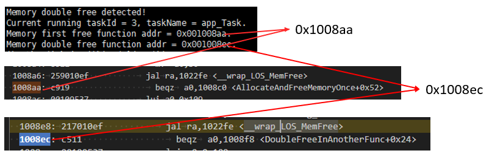
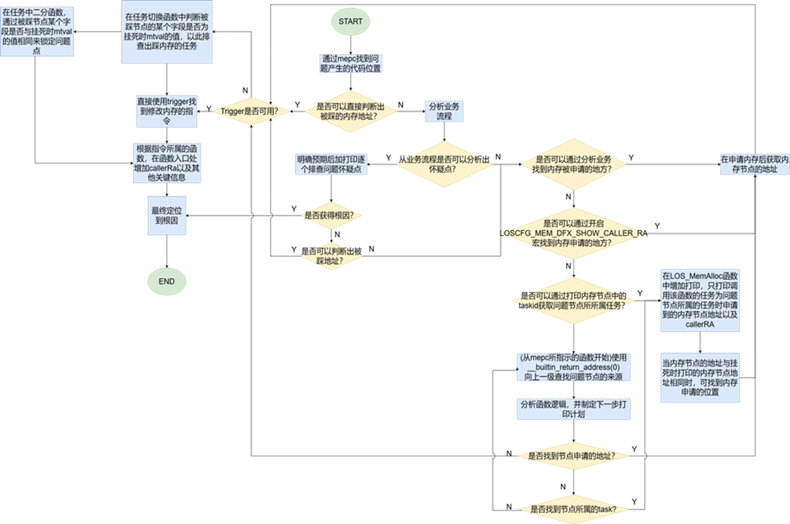
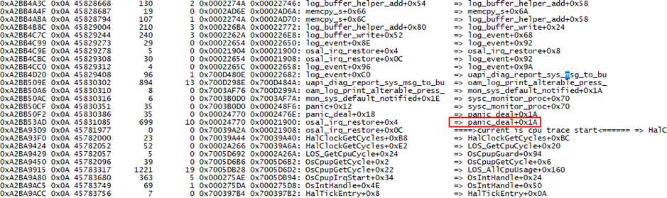
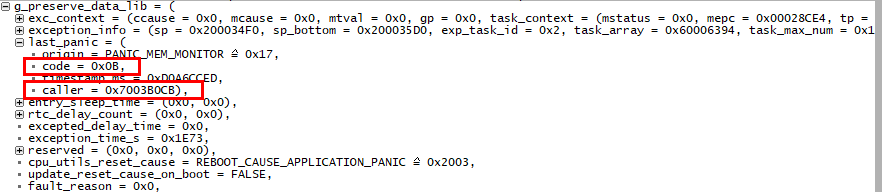
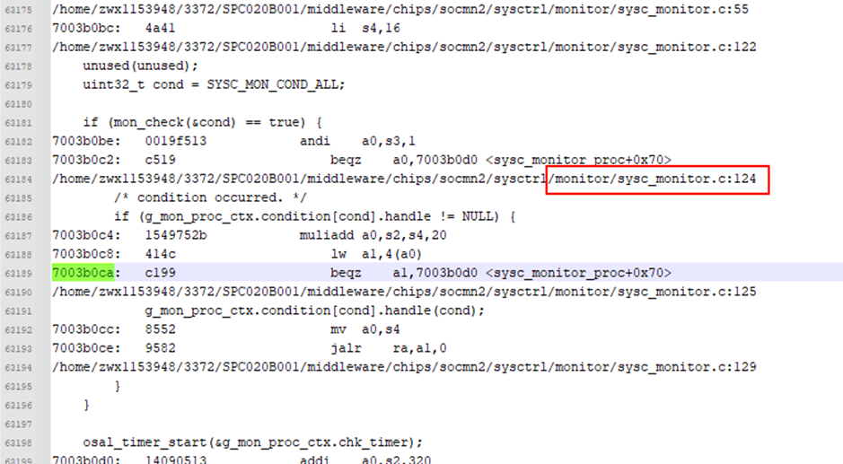

# 前言

**概述**

本文档详细的描述了LiteOS结合日志信息定位死机问题的方法和思路。

**读者对象**

本文档主要适用于LiteOS的开发者。

本文档主要适用于以下对象：

-   软件开发工程师
-   技术支持工程师

**符号约定**

在本文中可能出现下列标志，它们所代表的含义如下。

<table><thead align="left"><tr id="row1530720816410"><th class="cellrowborder" valign="top" width="20.580000000000002%" id="mcps1.1.3.1.1">
<strong id="b2136615816410">符号</strong>

</th>
<th class="cellrowborder" valign="top" width="79.42%" id="mcps1.1.3.1.2">
<strong id="b5941558116410">说明</strong>

</th>
</tr>
</thead>
<tbody><tr id="row1372280416410"><td class="cellrowborder" valign="top" width="20.580000000000002%" headers="mcps1.1.3.1.1 ">

</td>
<td class="cellrowborder" valign="top" width="79.42%" headers="mcps1.1.3.1.2 ">
表示如不避免则将会导致死亡或严重伤害的具有高等级风险的危害。

</td>
</tr>
<tr id="row466863216410"><td class="cellrowborder" valign="top" width="20.580000000000002%" headers="mcps1.1.3.1.1 ">

</td>
<td class="cellrowborder" valign="top" width="79.42%" headers="mcps1.1.3.1.2 ">
表示如不避免则可能导致死亡或严重伤害的具有中等级风险的危害。

</td>
</tr>
<tr id="row123863216410"><td class="cellrowborder" valign="top" width="20.580000000000002%" headers="mcps1.1.3.1.1 ">

</td>
<td class="cellrowborder" valign="top" width="79.42%" headers="mcps1.1.3.1.2 ">
表示如不避免则可能导致轻微或中度伤害的具有低等级风险的危害。

</td>
</tr>
<tr id="row5786682116410"><td class="cellrowborder" valign="top" width="20.580000000000002%" headers="mcps1.1.3.1.1 ">

</td>
<td class="cellrowborder" valign="top" width="79.42%" headers="mcps1.1.3.1.2 ">
用于传递设备或环境安全警示信息。如不避免则可能会导致设备损坏、数据丢失、设备性能降低或其它不可预知的结果。

“须知”不涉及人身伤害。

</td>
</tr>
<tr id="row2856923116410"><td class="cellrowborder" valign="top" width="20.580000000000002%" headers="mcps1.1.3.1.1 ">

</td>
<td class="cellrowborder" valign="top" width="79.42%" headers="mcps1.1.3.1.2 ">
对正文中重点信息的补充说明。

“说明”不是安全警示信息，不涉及人身、设备及环境伤害信息。

</td>
</tr>
</tbody>
</table>

**修改记录**

<table><thead align="left"><tr id="row2942532716410"><th class="cellrowborder" valign="top" width="20.72%" id="mcps1.1.4.1.1">
<strong id="b5687322716410">文档版本</strong>

</th>
<th class="cellrowborder" valign="top" width="26.119999999999997%" id="mcps1.1.4.1.2">
<strong id="b5800814916410">发布日期</strong>

</th>
<th class="cellrowborder" valign="top" width="53.16%" id="mcps1.1.4.1.3">
<strong id="b3316380216410">修改说明</strong>

</th>
</tr>
</thead>
<tbody><tr id="row5947359616410"><td class="cellrowborder" valign="top" width="20.72%" headers="mcps1.1.4.1.1 ">
01

</td>
<td class="cellrowborder" valign="top" width="26.119999999999997%" headers="mcps1.1.4.1.2 ">
2026-03-17

</td>
<td class="cellrowborder" valign="top" width="53.16%" headers="mcps1.1.4.1.3 ">
第一次正式版本发布。

</td>
</tr>
</tbody>
</table>

# 概述

## 背景

在嵌入式系统中，多任务并发、资源竞争、内存管理异常、硬件驱动缺陷或配置不当等因素，系统死机问题频发，FBB-RTOS采用单进程设计且未启用MMU机制，物理内存全局可见的特性在提升效率的同时，也使得非法内存操作更易导致系统级崩溃。相较于Android/Linux等具备完善DFX工具链和日志系统的操作系统，FBB-RTOS的异常诊断面临更大挑战，死机问题往往难以快速定位，尤其是死机发生并非第一现场时，问题排查效率低。

本文旨在系统化梳理FBB-RTOS现有DFX能力及通用诊断方法，为研发团队提供结构化的问题排查思路。需要特别说明的是：

-   死机问题通常与具体业务场景深度耦合。
-   当前文档仅覆盖现有DFX工具的使用方法。
-   内容将随DFX能力增强持续更新。

## 死机日志解读

在FBB-RTOS运行过程中，系统发生死机时会输出关键日志信息，这些日志包含异常类型、错误地址、寄存器状态等关键调试数据。正确解读这些日志信息是定位死机根因的关键步骤。系统死机时常见日志及含义注解如下：

<table><tbody><tr id="row992mcpsimp"><td class="cellrowborder" valign="top" width="100%">
<strong id="b2123156153619">Instruction access fault      //①异常类型：如取指异常、Stack overflow、PMP access fault等</strong>

<strong id="b1112835613615">Memory map region access fault</strong>

task:app_Task            <strong id="b163071328374"> //②产生异常的任务名</strong>

thrdPid:0x3              <strong id="b1691825153718"> //③产生异常的任务id</strong>

type:0x1

nestCnt:1               <strong id="b3657105374">  //④异常嵌套层数，&gt;1表示在异常处理中发生了异常重入</strong>

phase:Task

ccause:0x1

mcause:0x1

<strong id="b193118331376">mtval:0xfffffffffe </strong>         <strong id="b871961433714">//⑤异常时访问的内存地址</strong>

gp:0x110004

mstatus:0x1880

<strong id="b914218413375">mepc:0xfffffffffe </strong>        <strong id="b162811923113719"> //⑥异常时正在执行的指令地址（可反查到异常相对应代码）</strong>

<strong id="b1935011453379">ra:0x1161a8 </strong>           <strong id="b1838284993715"> //⑦异常时异常指令所属父函数的下一条指令地址（反查到函数）</strong>

sp:0x103930           <strong id="b1896715220376"> //⑧异常时任务或者中断的栈指针</strong>

tp:0xfc631c8

t0:0x103875

t1:0xa

t2:0x11012000

s0:0x3

s1:0x119338

</td>
</tr>
</tbody>
</table>

注：根据指令地址反查是指代在elf文件中搜索该地址，会与代码段中某行汇编的地址一样，例：

反查mepc:0x115df4，在elf中搜索115df4，说明异常时正在执行的指令为sw a0,0\(a1\)。

<table><tbody><tr id="row1021mcpsimp"><td class="cellrowborder" valign="top" width="100%">
00115dd8 &lt;app_init&gt;:

115dc: 717d addi sp,sp,-16

115de0: c606 sw ra,12(sp)

115de4: 00108b2a051f l.li a0,108b2a &lt;g_xRegsMap+0x56c&gt;

115de8: 7f0000ef jal ra,101196

115dec: 12345678051f l.li a0,12345678 &lt;__heap_end+0x12225678&gt;

115df0: 018005b7 lui a1,0x1800

<strong id="b961497103819">115df4: c188 sw a0,0(a1)</strong>

115df8: 40b2 lw ra,12(sp)

</td>
</tr>
</tbody>
</table>

## 整体思路

综合历史问题处理经验，总结出FBB-RTOS死机问题的主要原因分布如下：

-   内存踩踏引起的Load/Store access fault
-   栈溢出（stack overflow）
-   取指异常（Instruction access fault）
-   看门狗超时（Watchdog Timeout）
-   Out Of Memory
-   Panic
-   非法内存访问：包括访问保留内存（Store/AMO access fault）、PMP保护内存（PMP access fault）
-   内存布局非对齐（Unaligned memory layout）
-   死锁（Dead Lock）
-   非对齐访问（Unaligned Access）

后续章节将通过典型问题案例，系统性覆盖上述各类异常，结合真实场景提供定位思路与解决方案，帮助开发者快速识别问题根源，高效修复系统异常。

针对死机问题的故障定位，可采用分层递进的分析方法，具体实施步骤如下：

-   **根据异常类型溯源**

    死机日志中的异常类型信息是FBB-RTOS通过解析mcause、ccause等硬件异常寄存器生成，直接反映了触发死机的硬件级或者系统级异常事件。分析时应：

    优先锁定日志中记录的异常类型（如取指异常、栈溢出等），明确最直接的异常诱因。

    根据异常类型分析可能的原因（如取指异常的原因可能为函数指针异常或者代码段异常）。

    针对可能的原因逐个排查分析。

-   **排查异常上下文代码逻辑**

    分析关键寄存器值ra、mepc、mtval可以分别获得死机时正在执行的具体函数、具体哪条汇编指令及操作的内存地址，可排查分析异常上下文代码逻辑。

-   **使用DFX工具进行动态诊断**

    当常规分析无法定位时，可启用DFX机制，开启内核调试配置（如backtrace、内存访问监控trigger等）重新编译后复现问题，获取更详尽的运行时数据。

# 死机问题定位指南

常见关键异常信息及其对应的直接死机原因如下表所示，后文将逐个展开详细说明。

<table><thead align="left"><tr id="row773mcpsimp"><th class="cellrowborder" valign="top" width="45%" id="mcps1.1.3.1.1">
<strong id="b776mcpsimp">关键异常信息</strong>

</th>
<th class="cellrowborder" valign="top" width="55.00000000000001%" id="mcps1.1.3.1.2">
<strong id="b779mcpsimp">死机原因</strong>

</th>
</tr>
</thead>
<tbody><tr id="row780mcpsimp"><td class="cellrowborder" valign="top" width="45%" headers="mcps1.1.3.1.1 ">
Stack overflow

</td>
<td class="cellrowborder" valign="top" width="55.00000000000001%" headers="mcps1.1.3.1.2 ">
栈溢出

</td>
</tr>
<tr id="row785mcpsimp"><td class="cellrowborder" valign="top" width="45%" headers="mcps1.1.3.1.1 ">
Instruction access fault

</td>
<td class="cellrowborder" valign="top" width="55.00000000000001%" headers="mcps1.1.3.1.2 ">
取指异常

</td>
</tr>
<tr id="row790mcpsimp"><td class="cellrowborder" valign="top" width="45%" headers="mcps1.1.3.1.1 ">
Oops:NMI

</td>
<td class="cellrowborder" valign="top" width="55.00000000000001%" headers="mcps1.1.3.1.2 ">
狗超时

</td>
</tr>
<tr id="row795mcpsimp"><td class="cellrowborder" valign="top" width="45%" headers="mcps1.1.3.1.1 ">
Panic

</td>
<td class="cellrowborder" valign="top" width="55.00000000000001%" headers="mcps1.1.3.1.2 ">
主动Panic

</td>
</tr>
<tr id="row800mcpsimp"><td class="cellrowborder" valign="top" width="45%" headers="mcps1.1.3.1.1 ">
PMP access fault

</td>
<td class="cellrowborder" valign="top" width="55.00000000000001%" headers="mcps1.1.3.1.2 ">
访问PMP保护的地址

</td>
</tr>
<tr id="row805mcpsimp"><td class="cellrowborder" valign="top" width="45%" headers="mcps1.1.3.1.1 ">
Store/AMO access fault

</td>
<td class="cellrowborder" valign="top" width="55.00000000000001%" headers="mcps1.1.3.1.2 ">
访问保留内存

</td>
</tr>
<tr id="row810mcpsimp"><td class="cellrowborder" valign="top" width="45%" headers="mcps1.1.3.1.1 ">
Dead lock

</td>
<td class="cellrowborder" valign="top" width="55.00000000000001%" headers="mcps1.1.3.1.2 ">
死锁

</td>
</tr>
<tr id="row815mcpsimp"><td class="cellrowborder" valign="top" width="45%" headers="mcps1.1.3.1.1 ">
Load/Store address misaligned

</td>
<td class="cellrowborder" valign="top" width="55.00000000000001%" headers="mcps1.1.3.1.2 ">
非对齐访问

</td>
</tr>
</tbody>
</table>

## 栈溢出

### 问题识别

FBB-RTOS默认开启栈溢出检测，检测方法分为魔术字检测和硬件栈检测。

-   魔术字检测原理：在栈顶填充4字节（32位）的魔术字，任务切换时，软件会检查魔术字是否被改写，若魔术字被修改，则判定为栈溢出。
-   硬件栈检测原理：部分芯片提供栈限制寄存器，任务切换或中断时，系统会将新任务的栈顶指针写入栈限制寄存器，芯片硬件会自动检测栈指针SP是否越界。

    检测到栈溢出时系统会挂死，并在异常类型中输出stack overflow。例：

    
    <table><tbody><tr id="row1343mcpsimp"><td class="cellrowborder" valign="top" width="100%">
[2025-10-30 21:47:07] CURRENT task ID: <strong id="b1546192413818">Task_A:9 stack overflow!</strong>

    </td>
    </tr>
    </tbody>
    </table>

### 原因分析

-   **过大的局部变量**：在函数内定义超大数组或复杂结构体。

-   **栈空间分配不足**：**未预留安全余量**，即任务栈大小设置时，未考虑最坏执行路径的栈需求（如异常处理分支）。

### 问题定位

**定位方法**

1.  **线程识别**：通过系统日志中的任务名称和任务ID（task ID:）可确定发生栈溢出的具体线程。
2.  **使用静态估算工具**：利用栈估算工具估算任务/函数的栈使用峰值，识别栈消耗过大的函数（如含大型局部变量的函数），结合task命令查看任务栈当前配置的大小，确定是函数栈开销过大亦或是配置不合理。工具使用方法参见LiteOS开发指南（不足：对函数指针调用链的分析存在误差）。

**参考案例**

<table><tbody><tr id="row1365mcpsimp"><td class="cellrowborder" valign="top" width="100%">
[2025-10-30 21:47:07] CURRENT task ID: <strong id="b811043433810">Task_A:9 stack overflow!</strong>

[2025-10-30 21:47:07] B

[2025-10-30 21:47:41] breakpoint

[2025-10-30 21:47:41] Not available

[2025-10-30 21:47:41] APP&gt;exception:42

[2025-10-30 21:47:41] task:Task_A

[2025-10-30 21:47:41] thrdPid:0x9

[2025-10-30 21:47:41] type:0x42

[2025-10-30 21:47:41] nestCnt:1

[2025-10-30 21:47:41] phase:Task

[2025-10-30 21:47:41] ccause:0x73616870

[2025-10-30 21:47:41] mcause:0x61543a65

[2025-10-30 21:47:41] mtval:0xaab73

[2025-10-30 21:47:41] gp:0x0

[2025-10-30 21:47:41] mstatus:0x0

[2025-10-30 21:47:41] mepc:0x0

[2025-10-30 21:47:41] ra:0x37df6

[2025-10-30 21:47:41] sp:0x0

</td>
</tr>
</tbody>
</table>

-   根据日志中的“stack overflow”可确认是栈溢出问题。
-   根据日志中的"task ID: Task\_A:9"可确认发生栈溢出任务为Task\_A。
-   根据task命令获知栈大小为默认值，过小，调整栈大小后解决。

## 取指异常

### 问题识别

取指异常（Instruction Fetch Exception）通常发生在CPU尝试从非法或不可执行的内存地址读取指令，异常类型为Instruction access fault。例：

<table><tbody><tr id="row583mcpsimp"><td class="cellrowborder" valign="top" width="100%">
<strong id="b24221343183817">Instruction access fault</strong>

<strong id="b134231643143818">Memory map region access fault</strong>

</td>
</tr>
</tbody>
</table>

### 原因分析

-   **使用空指针/野指针**：当函数指针为空或者未初始化/未赋值时，函数指针值为随机值。

-   **代码段被踩**：程序和数据放置在相邻内存区域，当写数据操作发生越界时（memcpy/memset）会造成代码区被重写。

-   **代码段未拷贝**：设备启动时通常会从外部存储介质中读取代码，当启动时未将代码段拷贝到对应的ram中会造成代码段不存在。

-   **链接脚本配置问题：**链接脚本支持配置多个代码段，当将A代码段链接到B代码段时，会导致代码段搬移到错误代码段。

### 问题定位

**定位方法**

-   **排查函数指针**：根据mtval、ra定位异常代码上下文，排查异常是否由函数指针导致，若是则检查函数指针是否为空指针、野指针。

-   **排查链接脚本：**检查异常函数所在代码段是否有拷贝动作，若有则检查链接脚本，查看拷贝的源地址、目的地址是否符合预期。

-   **排查代码段拷贝**：比较异常函数运行地址的内存值是否与反汇编中函数的第一条指令值相同，若不同则排查代码段被踩或者代码段未拷贝/错拷贝。

-   **代码段监测**：利用PMP将异常函数所在代码段配置为RX权限，监测代码段是否被踩。

**参考案例**

<table><tbody><tr id="row1145mcpsimp"><td class="cellrowborder" valign="top" width="100%">
<strong id="b1879317113919">Instruction access fault            // 异常信息</strong>

<strong id="b479518115391">Memory map region access fault    // 异常信息</strong>

task:app_Task

thrdPid:0x3

type:0x1

nestCnt:1

phase:Task

ccause:0x1

mcause:0x1

mtval:0xfffffffffe

gp:0x110004

mstatus:0x1880

<strong id="b15431112403913">mepc:0xfffffffffe                // 访问的异常指令</strong>

<strong id="b44311224113917">ra:0x1161a8                   // 父函数</strong>

sp:0x103930

tp:0xfc631c8

t0:0x103875

t1:0xa

t2:0x11012000

s0:0x3

s1:0x119338

</td>
</tr>
</tbody>
</table>

-   定位异常函数：根据ra的值0x807556，在反汇编文件中定位当前正在执行的函数。

    
    <table><tbody><tr id="row1174mcpsimp"><td class="cellrowborder" valign="top" width="100%">
__attribute__((weak)) void app_init(void)

    
{

    
fn_test_t fn = (fn_test_t)(UINT32 *)<strong id="b13407183515393">0xffffffff</strong>;

    
fn();

    
}

    </td>
    </tr>
    </tbody>
    </table>

-   确认函数内有函数指针调用，且函数指针异常。

## 看门狗超时

### 问题识别

FBB-RTOS运行时需要定期喂狗（重置定时器），若未按时喂狗，看门狗计时器溢出，会产生NMI异常，并在异常类型中输出Oops:NMI。例：

<table><tbody><tr id="row569mcpsimp"><td class="cellrowborder" valign="top" width="100%">
try to enter wfi

<strong id="b61751044183917">Oops:NMI</strong>

task:pm_suspend_task

thrdPid:0x6

</td>
</tr>
</tbody>
</table>

### 原因分析

-   **CPU资源被占用**
    -   CPU资源被中断和高优先级任务占用，具体原因包括：
        1.  **中断处理过长**：中断处理时间过长或者中断无法正常退出。
        2.  **中断风暴**：某个外设产生大量中断，导致CPU忙于处理中断。
        3.  **高优先级任务异常**：某个高优先级任务由于bug而一直运行\(比如进入死循环\)，导致低优先级的喂狗任务永远得不到时间片。

    -   **高优先级任务一直在抢占CPU**：系统负载过高，轮不到喂狗任务。

-   **喂狗任务调度异常**
    -   **任务参数错误**：喂狗任务周期大于看门狗超时阈值。
    -   **任务被误删除**：错误的API调用误删除喂狗任务。
    -   **调度器故障**：任务调度异常。

### 问题定位

**定位方法**

-   **初步分析**

    根据MEPC查找反汇编，排查分析异常上下文代码逻辑。

-   **问题分析**

    分析看门狗超时问题，需重点考察系统挂死前关键时间段内（即喂狗超时窗口期内）的任务（含中断）调度和执行情况，具体可从以下三个维度进行分析：

    1.  **CPU空闲状态检查：**若存在CPU idle时段，则表明喂狗任务调度出现异常。
    2.  **任务CPU占用分析：**若发现某个任务CPU占用显著异常，则可能是该任务陷入死循环或逻辑错误。
    3.  **系统负载评估：**若出现频繁任务切换且CPU利用率持续满载，则是系统整体负载过高导致喂狗任务无法及时调度。

    上述三个维度的信息可通过系统提供的DFX工具trace或者调度统计获取，trace和调度统计具体使用方法可分别参考《LiteOS 开发指南》的“Trace”章节和“调度统计”章节内容。。

-   **针对CPU占用异常高任务的诊断方法**

    若发现某任务CPU占用率异常高，需获取其完整调用栈以精确定位问题代码，可以打开系统的backtrace功能并在NMI异常中补充输出所有任务的调用栈。

**参考案例**

<table><tbody><tr id="row852mcpsimp"><td class="cellrowborder" valign="top" width="100%">
[APP][00026106]:[INFO app_pm_suspend-&gt;15]:app_pm_suspend

pm_suspend.

try to enter wfi

<strong id="b1190115313914">Oops:NMI</strong>

task:pm_suspend_task

thrdPid:0x6

type:0xc

nestCnt:0

phase:1

ccause:0x2

mcause:0x8000000c

mtval:0x0

gp:0x7720572a

mstatus:0x1880

<strong id="b122301928404">mepc:0x1182c4</strong>

ra:0x1182bc

sp:0x103920

</td>
</tr>
</tbody>
</table>

根据mepc的值0x1182c4，查看反汇编

<table><tbody><tr id="row876mcpsimp"><td class="cellrowborder" valign="top" width="100%">
001182C0 &lt;wfi_loop&gt;:

1182c0: 10500073	   wfi

<strong id="b778210136409">1182c4: bff5	            j 1182c0 &lt;wfi_loop&gt;</strong>

1182c6: bfcd	            j 1182b8 &lt;drv_pm_suspend+0x76&gt;

</td>
</tr>
</tbody>
</table>

找到对应代码：

<table><tbody><tr id="row887mcpsimp"><td class="cellrowborder" valign="top" width="100%">
while (1)  {

pm_printk("try to enter wfi\n");

asm volatile("fence\n\r"

"wfi_loop:\n\r"

"wfi\n\r"

"j wfi_loop\n\r");

}

</td>
</tr>
</tbody>
</table>

说明系统进入低功耗/待机，此时只有中断才能唤醒，分析中断间隔，发现中断频率小于喂狗时间，引起狗超时重启，属于调度异常范畴。

## Panic

### 问题识别

软件主动Panic是系统针对不可恢复或严重违反系统规则时采取的主动终止机制，系统会输出详细的错误诊断信息，主要包括以下关键内容：

-   **错误描述：**panic的原因（如“ASSERT ERROR!  at xxx.c:123”）。
-   **当前运行任务上下文：**当前任务名称、任务ID、寄存器值。

### 原因分析

-   **断言：**LOS\_ASSERT\(expr\)宏在条件不满足时触发，通常指示程序逻辑错误或系统状态异常。

-   **LOS\_Panic：**LOS\_Panic\(\)函数在检测到关键系统异常时调用，如重复内存释放、堆内存头被踩踏。

### 问题定位

1.  **定位方法**

-   **初步定位Panic源头**

    若日志包含文件名和行号，直接查看对应源码，确认问题位置。

    搜索代码中的打印信息或结合mepc（PC寄存器值）定位挂死代码行。

    若为断言失败，检查断言表达式，分析为何不成立（如空指针、越界、非法状态等）。

-   **根据LOS\_PANIC原因深入排查**

    根据LOS\_PANIC原因如重复内存释放、堆内存头被踩踏等参考相对应章节分析方法。

**参考案例**

**例1：断言失败**

<table><tbody><tr id="row4111133155716"><td class="cellrowborder" valign="top" width="100%">
<strong id="b63758254407">ASSERT ERROR! los_cpup.c, 378, OsCpupGetCycle</strong>

task:CpupGuardCreator

thrdPid:0x0

type:0x2

nestCnt:1

phase:1

ccause:0x0

mcause:0x0

mtval:0x0

gp:0x0

mstatus:0x0

mepc:0x0

ra:0xd

sp:0x0

</td>
</tr>
</tbody>
</table>

根据上述异常打印信息可知：

异常位置：los\_cpup.c第378行。

断言条件：LOS\_ASSERT\(cycles \>= g\_startCycles\)。

直接原因：系统检测到cycles值小于g\_startCycles，违反预期逻辑。

**例2：LOS\_PANIC示例**

<table><tbody><tr id="row238mcpsimp"><td class="cellrowborder" valign="top" width="100%">
The node:0x112270 is not used!

task:app_Task

thrdPid:0x3

type:0xb

nestCnt:1

phase:1

ccause:0x0

mcause:0xb

mtval:0x0

gp:0x10ff00

mstatus:0x1800

<strong id="b9978233124011">mepc:0x1008fe</strong>

ra:0x1008fe

sp:0x111690

</td>
</tr>
</tbody>
</table>

异常位置定位：根据mepc的值在反汇编文件反查代码段或者在源码中搜索打印信息找到Panic源头LOS\_PANIC\("The node:%p is not used!\\n", node\)。

## 访问PMP保护内存

### 问题识别

系统配置PMP后，将根据PMP的配置对总线的取指、数据访问、数据存储进行权限校验，若校验不通过则上报异常（正在执行的取指、数据访问、数据存储操作不被执行），异常信息中会输出PMP access fault，同时异常类型还会明确指出异常操作的类型。

-   Instruction access fault // 异常操作为“取指”
-   Load access fault// 异常操作为“Load”
-   Store/AMO access fault // 异常操作为“Store”

例：

<table><tbody><tr id="row598mcpsimp"><td class="cellrowborder" valign="top" width="100%">
Instruction access fault

<strong id="b042254110402">PMP access fault</strong>

</td>
</tr>
</tbody>
</table>

### 原因分析

-   操作和权限不匹配，若存在以下几种情况将上报PMP异常，其中×表示上报异常：

    
    <table><thead align="left"><tr id="row1430mcpsimp"><th class="cellrowborder" valign="top" width="25%" id="mcps1.1.5.1.1">
操作/权限

    </th>
    <th class="cellrowborder" valign="top" width="25%" id="mcps1.1.5.1.2">
R

    </th>
    <th class="cellrowborder" valign="top" width="25%" id="mcps1.1.5.1.3">
W

    </th>
    <th class="cellrowborder" valign="top" width="25%" id="mcps1.1.5.1.4">
X

    </th>
    </tr>
    </thead>
    <tbody><tr id="row1439mcpsimp"><td class="cellrowborder" valign="top" width="25%" headers="mcps1.1.5.1.1 ">
取指

    </td>
    <td class="cellrowborder" valign="top" width="25%" headers="mcps1.1.5.1.2 ">
×

    </td>
    <td class="cellrowborder" valign="top" width="25%" headers="mcps1.1.5.1.3 ">
×

    </td>
    <td class="cellrowborder" valign="top" width="25%" headers="mcps1.1.5.1.4 ">&nbsp;&nbsp;</td>
    </tr>
    <tr id="row1447mcpsimp"><td class="cellrowborder" valign="top" width="25%" headers="mcps1.1.5.1.1 ">
Load

    </td>
    <td class="cellrowborder" valign="top" width="25%" headers="mcps1.1.5.1.2 ">&nbsp;&nbsp;</td>
    <td class="cellrowborder" valign="top" width="25%" headers="mcps1.1.5.1.3 ">
×

    </td>
    <td class="cellrowborder" valign="top" width="25%" headers="mcps1.1.5.1.4 ">
×

    </td>
    </tr>
    <tr id="row1455mcpsimp"><td class="cellrowborder" valign="top" width="25%" headers="mcps1.1.5.1.1 ">
Store

    </td>
    <td class="cellrowborder" valign="top" width="25%" headers="mcps1.1.5.1.2 ">
×

    </td>
    <td class="cellrowborder" valign="top" width="25%" headers="mcps1.1.5.1.3 ">&nbsp;&nbsp;</td>
    <td class="cellrowborder" valign="top" width="25%" headers="mcps1.1.5.1.4 ">
×

    </td>
    </tr>
    </tbody>
    </table>

-   如下场景下也会触发PMP异常。

    跨PMP区间的操作，如：读取4bytes数据，前2bytes在A region，后2bytes在B region。

    PMP entry≥1，访存未匹配任何PMP entry。

### 问题定位

**定位方法**

-   **通过mepc定位异常指令地址**

    根据mepc寄存器值，确认异常发生时CPU试图执行的指令地址。

-   **通过mtval确认异常访问地址**

    根据mtval确认异常发生时访问的内存地址（用于Load/Store异常）或指令地址（用于取指异常）。

-   **若异常地址/指令符合内存布局预期检查PMP配置**

    若异常指令地址或访问地址符合系统内存布局（如位于合法代码段、数据段、堆栈等），则优先检查PMP（物理内存保护）配置是否正确。

-   **若异常指令（取指）不符合预期参考**“[取指异常](取指异常.md)”章节。
-   **若异常指令为访问非PMP配置内存区间参考踩内存章节定位。**

**参考案例**

<table><tbody><tr id="row695mcpsimp"><td class="cellrowborder" valign="top" width="100%">
Instruction access fault

<strong id="b299825324017">PMP access fault</strong>

APP exception:1

task: at

thrdPid:0xb

type:0x1

nestCnt:1

phase:Task

ccause:0x7

mcause:0x38000001

<strong id="b18352026419">mtval:0x22082444</strong>

gp:0x10017bed

mstatus:0x80207880

<strong id="b1679825124119">mepc:0x22082444</strong>

ra:0x2b09e

sp:0x1003f5e0

</td>
</tr>
</tbody>
</table>

-   异常地址定位：根据mepc可知异常访问的地址为0x22082444，通过mtval确认被保护的地址也为0x22082444，说明该地址并未配置可执行权限，但系统却希望从该地址取指。
-   排查PMP权限配置：排查代码中对该内存的PMP配置，根据业务需求确认PMP权限是否配置合理。

    
    <table><tbody><tr id="row720mcpsimp"><td class="cellrowborder" valign="top" width="100%">
pmpRegion.accPermission.readAcc = E_MEM_RD_ACC_RD;

    
pmpRegion.accPermission.writeAcc = E_MEM_WR_ACC_NON_WR;

    
pmpRegion.accPermission.executeAcc = E_MEM_EX_ACC_NON_EX;

    
pmpRegion.memAttr = MEM_ATTR_DEV_NON_BUF;

    
pmpRegion.blocked = FALSE;

    
pmpRegion.ucaAddressMatch = PMP_RGN_ADDR_MATCH_NAPOT;

    
/* Configure nonsecure pagetable */

    
pmpRegion.ucNumber = PMP_REGION_NS_PAGE_TABLE_START;

    
pmpRegion.uwBaseAddress = pt-&gt;nonsec.baseAddr;

    
pmpRegion.uwRegionSize = pt-&gt;nonsec.tableSize;

    
pmpRegion.sectl = SEC_CONTROl_NOSECURE_NONMMU;

    
ret = ArchProtectionRegionSet(&amp;pmpRegion);

    
if (ret != LOS_OK) {

    
PRINT_ERR("ArchProtectionRegionSet failed!!", _FUNCTION_, __LINE__, ret);

    
return LOS_NOK;

    
}

    </td>
    </tr>
    </tbody>
    </table>

## 访问保留内存

### 问题识别

预留的地址空间在被访问时会触发异常，异常信息中的含有Store/AMO access fault且没有PMP access fault。

例：

<table><tbody><tr id="row264mcpsimp"><td class="cellrowborder" valign="top" width="100%">
<strong id="b14631327134112">Store/AMO access fault      // 异常信息</strong>

AXIM error response

</td>
</tr>
</tbody>
</table>

### 原因分析

系统访问了预留地址空间。

### 问题定位

**定位方法**

-   **通过mtval定位异常访问地址并验证合法性**。

    通过mtval可锁定异常发生时CPU尝试访问的内存地址。结合系统提供的地址空间分配表确认该地址是否属于保留地址。若非保留地址，排查该地址是否满足内存对齐要求，针对 LINX 核架构。

    lw / sw（32位加载/存储）：地址必须为4字节对齐（即地址末尾为0x00、0x04、0x08等）。

    lh / sh（16 位加载/存储）：地址必须为2字节对齐（即地址末尾为0x00、0x02等）。

-   **通过mepc定位异常指令地址并反查反汇编，定位异常源码**。

**参考案例**

<table><tbody><tr id="row288mcpsimp"><td class="cellrowborder" valign="top" width="100%">
<strong id="b12704113564117">Store/AMO access fault      // 异常信息</strong>

<strong id="b5705193534116">AXIM error response        // 异常信息</strong>

task:app_Task

thrdPid:0x3

type:0x7

nestCnt:1

phase:Task

ccause:0x2

mcause:0x7

mtval:0x18000000          // 异常访问的地址

gp:0x110004

mstatus:0x1880

mepc:0x115df8            // 触发异常的指令地址

ra:0x11687c

sp:0x103910

</td>
</tr>
</tbody>
</table>

-   根据mtval可以锁定异常访问的内存地址为0x1800000，确认为保留内存地址。
-   根据mepc反查反汇编文件可知问题代码所在行。

    
    <table><tbody><tr id="row312mcpsimp"><td class="cellrowborder" valign="top" width="100%">
00115dd8 &lt;app_init&gt;:

    
115dc: 717d addi sp,sp,-16

    
115de0: c606 sw ra,12(sp)

    
115de4: 00108b2a051f l.li a0,108b2a &lt;g_xRegsMap+0x56c&gt;

    
115de8: 7f0000ef jal ra,101196

    
115dec: 12345678051f l.li a0,12345678 &lt;__heap_end+0x12225678&gt;

    
115df0: 018005b7 lui a1,0x1800

    
<strong id="b107671951174114">115df4: c188 sw a0,0(a1)</strong>

    
115df8: 40b2 lw ra,12(sp)

    
115dfc: 6141 addi sp,sp,16

    
115e00: bdd9 j 100890 &lt;tc_mem_013_7&gt;

    </td>
    </tr>
    </tbody>
    </table>

<table><tbody><tr id="row329mcpsimp"><td class="cellrowborder" valign="top" width="100%">
__attribute__((weak)) void app_init(void)

{

UINT32 t = 0x1800000;

*(UINT32 *)t = 0x12345678;

}

</td>
</tr>
</tbody>
</table>

## 死锁

### 问题识别

FBB-RTOS提供了死锁检测DFX特性，支持自旋锁、互斥锁、二值信号量和线程锁四种类型锁的死锁，以及重复上锁、错误释放和锁的深度溢出的检测。相关内核配置如下：

<table><thead align="left"><tr id="row110mcpsimp"><th class="cellrowborder" valign="top" width="35%" id="mcps1.1.5.1.1">
配置项

</th>
<th class="cellrowborder" valign="top" width="24%" id="mcps1.1.5.1.2">
含义

</th>
<th class="cellrowborder" valign="top" width="9%" id="mcps1.1.5.1.3">
默认值

</th>
<th class="cellrowborder" valign="top" width="32%" id="mcps1.1.5.1.4">
依赖

</th>
</tr>
</thead>
<tbody><tr id="row119mcpsimp"><td class="cellrowborder" valign="top" width="35%" headers="mcps1.1.5.1.1 ">
LOSCFG_KERNEL_LOCKDEP

</td>
<td class="cellrowborder" valign="top" width="24%" headers="mcps1.1.5.1.2 ">
使能死锁检测

</td>
<td class="cellrowborder" valign="top" width="9%" headers="mcps1.1.5.1.3 ">
N

</td>
<td class="cellrowborder" valign="top" width="32%" headers="mcps1.1.5.1.4 ">
LOSCFG_KERNEL_MEM_ALLOC

</td>
</tr>
<tr id="row128mcpsimp"><td class="cellrowborder" valign="top" width="35%" headers="mcps1.1.5.1.1 ">
LOSCFG_KERNEL_SPINDEP

</td>
<td class="cellrowborder" valign="top" width="24%" headers="mcps1.1.5.1.2 ">
使能自旋锁死锁检测

</td>
<td class="cellrowborder" valign="top" width="9%" headers="mcps1.1.5.1.3 ">
N

</td>
<td class="cellrowborder" valign="top" width="32%" headers="mcps1.1.5.1.4 ">
LOSCFG_KERNEL_SMP

</td>
</tr>
<tr id="row137mcpsimp"><td class="cellrowborder" valign="top" width="35%" headers="mcps1.1.5.1.1 ">
LOSCFG_KERNEL_MUXDEP

</td>
<td class="cellrowborder" valign="top" width="24%" headers="mcps1.1.5.1.2 ">
使能互斥锁死锁检测

</td>
<td class="cellrowborder" valign="top" width="9%" headers="mcps1.1.5.1.3 ">
N

</td>
<td class="cellrowborder" valign="top" width="32%" headers="mcps1.1.5.1.4 ">
LOSCFG_BASE_IPC_MUX

</td>
</tr>
<tr id="row146mcpsimp"><td class="cellrowborder" valign="top" width="35%" headers="mcps1.1.5.1.1 ">
LOSCFG_KERNEL_SEMDEP

</td>
<td class="cellrowborder" valign="top" width="24%" headers="mcps1.1.5.1.2 ">
使能二值信号量死锁检测

</td>
<td class="cellrowborder" valign="top" width="9%" headers="mcps1.1.5.1.3 ">
N

</td>
<td class="cellrowborder" valign="top" width="32%" headers="mcps1.1.5.1.4 ">
LOSCFG_BASE_IPC_SEM

</td>
</tr>
<tr id="row155mcpsimp"><td class="cellrowborder" valign="top" width="35%" headers="mcps1.1.5.1.1 ">
LOSCFG_PTHREAD_MUXDEP

</td>
<td class="cellrowborder" valign="top" width="24%" headers="mcps1.1.5.1.2 ">
使能线程锁死锁检测

</td>
<td class="cellrowborder" valign="top" width="9%" headers="mcps1.1.5.1.3 ">
N

</td>
<td class="cellrowborder" valign="top" width="32%" headers="mcps1.1.5.1.4 ">
LOSCFG_COMPAT_POSIX

</td>
</tr>
</tbody>
</table>

若相关内核配置被使能，检测到死锁时会挂死，异常信息中会输出dead lock。例：

<table><tbody><tr id="row169mcpsimp"><td class="cellrowborder" valign="top" width="100%">
[2025-11-17 11:20:49] lockdep check failed

[2025-11-17 11:20:49] error type   : <strong id="b532141334212">dead lock</strong>

[2025-11-17 11:20:49] request addr : 0x47262

[2025-11-17 11:20:49] task name    : Task_B

</td>
</tr>
</tbody>
</table>

### 原因分析

两个任务分别等待对方所占的资源。

### 问题定位

**定位方法**

**反查请求地址定位异常锁函数：**将触发异常的request addr值复制至系统镜像的反汇编文件中，通过地址定位至具体代码行，即可识别是哪个锁函数在执行过程中发生异常。

注：request addr反查结果通常指向具体的锁函数入口，若任务中存在多个同类锁，可通过锁ID 进行进一步区分，以精确定位具体锁对象。

**参考案例**

<table><tbody><tr id="row915mcpsimp"><td class="cellrowborder" valign="top" width="100%">
[2025-11-17 11:20:49] app_init start ok

[2025-11-17 11:20:49] Task_A pend muxid 31

[2025-11-17 11:20:49] Task_B pend muxid 32

[2025-11-17 11:20:49] APP|thread_main start

[2025-11-17 11:20:49] lockdep check failed

[2025-11-17 11:20:49] <strong id="b12781025144220">error type   : dead lock</strong>

[2025-11-17 11:20:49] <strong id="b17117129154215">request addr : 0x47262</strong>

[2025-11-17 11:20:49] <strong id="b1158293224216">task name    : Task_B</strong>

[2025-11-17 11:20:49] task id      : 8

[2025-11-17 11:20:49] cpu num      : 0

[2025-11-17 11:20:49] start dumping lockdep information

[2025-11-17 11:20:49] [0] <strong id="b1617114013428">Mutex ID: 0032</strong>

[2025-11-17 11:20:49] [1] <strong id="b1482154415420">Mutex ID: 0031 &lt;-- now</strong>

[2025-11-17 11:20:49] task name    : Task_A

[2025-11-17 11:20:49] task id      : 7

[2025-11-17 11:20:49] cpu num      : 0

[2025-11-17 11:20:49] start dumping lockdep information

[2025-11-17 11:20:49] [0] <strong id="b11352195213428">Mutex ID: 0031</strong>

[2025-11-17 11:20:49] [1] <strong id="b16295155624216">Mutex ID: 0032 &lt;-- now</strong>

[2025-11-17 11:20:49] runTask-&gt;taskName = Task_B

[2025-11-17 11:20:49] runTask-&gt;taskId = 8

[2025-11-17 11:20:49] fp:0x10021010

</td>
</tr>
</tbody>
</table>

-   根据异常信息可知任务Task\_A与Task\_B发生死锁，Task\_B持有0032的锁申请0031的锁，Task\_A持有0031的锁申请0032的锁；
-   根据request addr的值（本例中为0x47262），在系统镜像的反汇编文件中找到该地址，可确定具体的锁函数LOS\_MuxPend，进一步定位到Task A调用互斥锁位置。

    
    <table><tbody><tr id="row946mcpsimp"><td class="cellrowborder" valign="top" width="100%">
000253da &lt;Task_A&gt;:

    
253da: 40 99        	c.push	{ra,s0-s1}, -16

    
253dc: 00 08        	addi	s0, sp, 16

    
253de: 37 d5 01 20  	lui	a0, 131101

    
253e2: 93 04 c5 ed  	addi	s1, a0, -292

    
253e6: c8 44        	lw	a0, 12(s1)

    
253e8: fd 55        	addi	a1, zero, -1

    
<strong id="b10190314194317">253ea: ef 10 12 60  	jal	ra, 0x471ea &lt;LOS_MuxPend&gt;</strong>

    
253ee: 11 e9        	bne	a0, zero, 0x25402 &lt;Task_A+0x28&gt;

    
253f0: d0 44        	lw	a2, 12(s1)

    
253f2: 55 65        	lui	a0, 21

    
253f4: 13 05 75 e8  	addi	a0, a0, -377

    
253f8: d1 65        	lui	a1, 20

    
253fa: 93 85 45 fe  	addi	a1, a1, -28

    
253fe: ef 20 c2 1c  	jal	ra, 0x475ca &lt;dprintf&gt;

    
25402: 09 45        	addi	a0, zero, 2

    
25404: ef 10 52 2a  	jal	ra, 0x46ea8 &lt;LOS_Msleep&gt;

    
25408: 88 48        	lw	a0, 16(s1)

    
2540a: fd 55        	addi	a1, zero, -1

    
<strong id="b15278104215430">2540c: ef 10 f2 5d  	jal	ra, 0x471ea &lt;LOS_MuxPend&gt;</strong>

    
……..

    
000471ea &lt;LOS_MuxPend&gt;:

    
471ea: c0 9b        	c.push	{ra,s0-s6}, -32

    
471ec: 00 10        	addi	s0, sp, 32

    
471ee: 2a 8b        	add	s6, a0, zero

    
471f0: 28 91        	c.zext.h	a0, a0

    
……..

    
4724e: 63 0d 55 03  	beq	a0, s5, 0x47288 &lt;LOS_MuxPend+0x9e&gt;

    
47252: 5a 85        	add	a0, s6, zero

    
47254: ef e0 9f c5  	jal	ra, 0x45eac &lt;OsMuxLockDepGet&gt;

    
47258: aa 85        	add	a1, a0, zero

    
4725a: 01 45        	addi	a0, zero, 0

    
4725c: 5a 86        	add	a2, s6, zero

    
4725e: ef e0 9f dd  	jal	ra, 0x46036 &lt;OsLockDepCheckIn&gt;

    
<strong id="b1465410551431">47262: 52 85        	add	a0, s4, zero</strong>

    
47264: db 55 c5 00  	lhu.u	a1, 12(a0)

    
47268: 9d c5        	beq	a1, zero, 0x47296 &lt;LOS_MuxPend+0xac&gt;

    
4726a: 63 85 09 04  	beq	s3, zero, 0x472b4 &lt;LOS_MuxPend+0xca&gt;

    </td>
    </tr>
    </tbody>
    </table>

## 非对齐访问

### 问题识别

内存对齐访问要求：访问数据时，其物理地址必须是该数据类型字节宽度的整数倍。

32位数据（如uint32\_t、float）：地址必须是4的倍数（如0x0000、0x0004、0x0008）；

16位数据（如uint16\_t）：地址必须是2的倍数；

8位数据（如uint8\_t）：地址可为任意值（无需对齐）。

非对齐访问即违反上述规则的访问行为，当程序尝试从非对齐地址加载或存储数据时，硬件会触发异常，死机日志中会出现关键字“Load address misaligned”或者“Store/AMO address misaligned”。例：

<table><tbody><tr id="row186mcpsimp"><td class="cellrowborder" valign="top" width="100%">
[2025-10-30 21:47:41] <strong id="b735514124410">Load address misaligned</strong>

</td>
</tr>
</tbody>
</table>

### 原因分析

-   **核心原因**

    内存访问模型与硬件对齐要求不匹配，芯片不支持非对齐访问，而软件未考虑。常出现在代码移植至新平台后突然崩溃的场景中，尤其在客户自研芯片架构上更为突出。

-   **典型场景**
    -   **结构体填充与对齐控制：**编译器默认会对结构体成员进行内存对齐填充，以提升访问效率。若使用 \#pragma pack\(1\) 等指令强制取消对齐，再直接访问结构体内成员，易引发非对齐访问。
    -   **指针类型转换：**将char\*或void\*指针强制转换为更严格对齐类型的指针（如int\*、float\*），并解引用，极易导致非对齐访问。
    -   **网络协议包/二进制文件解析**：在网络通信或文件解析场景中，常将原始字节缓冲区（char\[\]）直接映射为结构体指针。若协议定义的数据域本身未对齐，或解析时未考虑对齐，将导致非对齐访问。

### 问题定位

**定位方法**

根据mepc（PC寄存器值）即可定位非对齐访问引起挂死的代码行。

**参考案例**

<table><tbody><tr id="row1300mcpsimp"><td class="cellrowborder" valign="top" width="100%">
DOORBELL_VERSION = 20231205_V0.0001_test1

[app_main:903] p = 0x4886440

[app_main:907] p1 = 0x4886441

==================================================exception_analyze==================================================

CPU0 run addr = 0x403de7e

!!! cpu 1 exception_analyze: DEBUG_MSG = 0x0, DEBUG_PRP_NUM = 0xffffffff DSPCON=e00

R0: 42312a6

R1: 4224043

R2: 38d

R3: 0

R4: 4224043

R5: 42234e0

R6: 4886441

R7: 422b1f2

R8: 423128d

R9: 46d9e90

R10: 10101010

R11: 11111111

R12: 12121212

R13: 13131313

R14: 14141414

R15: 15151515

icfg: 7010280

psr: 0

rets: 0x40937c2

rete: 0x0

retx: 0x0

reti: 0x4000e32

usp: 489680c, ssp: 42eee68 sp: 42eee68

</td>
</tr>
</tbody>
</table>

适配J客户时由于非对齐访问产生了上述挂死，该场景属于FBB-RTOS适配其他厂商的芯片，芯片不支持非对齐访问。（客户自己提供的打印信息未指示当前的异常类型）

解决方案：非对齐访问操作转化为按照单个字节去操作。

## 其他异常

当系统异常日志与代码上下文无法直接定位根本原因，或通过上文提供的分析手段仅能锁定到某个变量、内存块或资源异常时，通常需怀疑发生了内存踩踏、内存不足或者内存布局非对齐问题。此类异常没有固定的异常类型，同时异常发生时往往非第一现场，导致问题定位困难。针对此类异常，FBB-RTOS提供了相应的DFX工具，能精准定位高频内存异常问题，包括动态分配内存越界、固定区域内存踩踏、指针重复释放引起的飞踩、内存泄露。

### 踩内存

#### 原因分析

发生踩内存类问题时，第一现场通常不会挂死，直到访问到被踩的内容时，通常才出现异常，出现系统死机、变量异常值、数据传输错误、业务预期结果异常、任务异常挂起或者退出、指令无效、内存合法性校验失败等问题。

踩内存的根本原因在于数组溢出、动态内存溢出、飞踩、重复释放等。

#### 问题定位

**定位方法**

当前FBB-RTOS系统提供的DFX能力，主要解决踩内存的以下三类典型问题：

-   固定踩内存（每次踩踏都是同一片内存或者踩踏固定的变量）

    通过trigger监控固定区域的读写操作，捕获踩内存的第一现场，首先确定被踩的内存地址，然后使能LOSCFG\_TRIGGER\_ENABLE内核配置，使用trigger进行监控。目前提供了两种使用方式：

    方式一（推荐）：针对没有适配命令行的产品，可以直接调用trigger接口。

    
    <table><tbody><tr id="row391mcpsimp"><td class="cellrowborder" valign="top" width="100%">
UINT32 ArchProtectionSetAddrRo(UINT32 addr, UINT32 size)

    
函数说明：根据提供的地址及范围配置保护；

    
参数说明：

    
addr: 被保护范围的起始地址，当size为4时，addr需要4对齐；

    
size: 被保护范围的大小；

    
使用举例：

    
ArchProtectionSetAddrRo(0x100000, 4)：被保护的地址范围为[0x100000, 0x100003]共4bytes；

    
************************************************************************************

    
UINT32 ArchProtectionUnSetAddrRo(UINT32 index)

    
函数说明：取消指定索引trigger的保护

    
参数说明：index: trigger索引，取值范围为[0, 3]，index == 0xffffffff标识取消所有trigger保护。

    </td>
    </tr>
    </tbody>
    </table>

    方式二：在命令行使用命令

    
    <table><tbody><tr id="row409mcpsimp"><td class="cellrowborder" valign="top" width="100%">
trigger set addr size

    
命令说明：设置一个trigger，保护addr地址开始的size个字节

    
Example：trigger set 0x1405ca4 4 表示保护从0x1405ca4地址开始的4个字节

    
注：设置trigger完成后，打印当前的trigger信息

    
************************************************************************************

    
trigger unset

    
命令说明：移出当前的trigger

    
Example：trigger unset

    </td>
    </tr>
    </tbody>
    </table>

-   堆越界踩内存头

    利用FBB\_RTOS提供的DFX工具确定被踩内存结点，然后根据被踩内存结点中的taskId等信息进行定位。具体操作方法参考LiteOS开发指南8.3.3章节。

-   内存重复释放

    利用FBB\_RTOS提供的DFX工具确定重复释放指令，然后通过反汇编文件确定问题函数，并使用callerRA等信息逐步定位。

    具体步骤为：

    使能LOSCFG\_MEM\_DFX\_DOUBLE\_FREE\_CHECK内核配置。

    添加编译选项重新编译运行。

    
    <table><tbody><tr id="row432mcpsimp"><td class="cellrowborder" valign="top" width="100%">
# 添加编译选项

    
# target_standard_sw21_application_template    linkflags添加编译选项

    
'linkflags': [

    
'-Wl,--wrap=LOS_MemFree'

    
],

    </td>
    </tr>
    </tbody>
    </table>

    根据打印信息结合反汇编文件可以确定重复free函数的调用点。

    

    详细使用方法和介绍参考《LiteOS 开发指南》的“内存重复释放检测”章节。

    其他飞踩等问题当前并没有特别好的手段，主要通过结合异常点业务代码做进一步分析，详细分析思路参考下图。

    

**参考案例**

例1（堆越界踩内存头）：

<table><tbody><tr id="row451mcpsimp"><td class="cellrowborder" valign="top" width="100%">
<strong id="b1565573020455">The node:0x1137b4 has been damaged!</strong>

<strong id="b665613010459">node:0x1137b4 has been damaged! pre node:0x11379c，pre node CallerRA：0x100864</strong>

task:app_Task

thrdPid:0x3

type:0xb

nestCnt:1

phase:1

ccause:0x0

mcause:0xb

mtval:0x0

gp:0x10fda0

mstatus:0x1800

mepc:0x1008ae

ra:0x1008ae

sp:0x113540

X4 :0x0

X5 :0xffffd8f0

X6 :0x1134bb

X7 :0xa

X8 :0x113670

X9 :0x1137cc

X10:0x11359c

X11:0x40e5f3e4

X12:0x24

X13:0x1

</td>
</tr>
</tbody>
</table>

通过关键信息打印 The node:0x1137b4 has been damaged确定是堆内存被踩踏，通常是前序节点越界才会踩踏后序节点的内存头，直接通过前序节点prenode的callerRA信息确定相邻前序节点申请者，进一步通过反汇编查找callerRA地址，确定到代码行即可。

例2（通过trigger定位踩固定区域）：

异常信息如下：

<table><tbody><tr id="row485mcpsimp"><td class="cellrowborder" valign="top" width="100%">
ptr_node:0x11cfdc

task:app_Task

thrdId:0x3

type:0x5

phase:1

ccause:0x0

mcause:0x0

mtval:0xababeffc

gp:0x115c50

mstatus:0x1800

<strong id="b1116264134513">mepc:0x102ee0</strong>

ra:0x2ed4

sp:0x11a170

</td>
</tr>
</tbody>
</table>

-   通过mepc: 0x102ee0找到异常发生时所运行的函数。

    
    <table><tbody><tr id="row506mcpsimp"><td class="cellrowborder" valign="top" width="100%">
00102eac &lt;OsMemFreeNode&gt;:

    
102eac: 713d addi sp,sp,-32

    
102eae: ce06 sw ra,28(sp)

    
102eb0: cc22 sw s0,24(sp)

    
102eb2: ca26 sw s1,20(sp)

    
102eb4: c84a sw s2,16(sp)

    
102eb6: c64e sw s3,12(sp)

    
102eb8: 84aa mv s1,a0

    
102eba: 3fffffff099f l.li s3,3fffffff &lt;_heap_end+0x3fedffff&gt;

    
102ec0: 4554 lw a3,12(a0)

    
102ec2: 00455603 lhu a2,4(a0)

    
102ec6: 05c58913 addi s2,a1,92

    
102eca: 00858513 addi a0,a1,8

    
102ece: 0136f5b3 and a1,a3,s3

    
102ed2: 2ca9 jal ra,10312c

    
102ed4: 44c8 lw a0,12(s1)

    
102ed6: 4480 lw s0,8(s1)

    
102ed8: 013575b3 and a1,a0,s3

    
102edc: c4cc sw a1,12(s1)

    
102ede: cc2d beqz s0,102f58 &lt;OsMemFreeNode+0xac&gt;

    
<strong id="b158478541455">102ee0: 4448 lw a0,12(s0)</strong>

    </td>
    </tr>
    </tbody>
    </table>

-   发现异常指令是一条load操作，并且基地址存放在s0寄存器中，结合异常信息，发现s0寄存器是一个异常地址（0xababeff2）。
-   结合代码和反汇编，发现异常指令处是从结构体中取某一字段时异常，因此怀疑结构体被踩。

    
    <table><tbody><tr id="row535mcpsimp"><td class="cellrowborder" valign="top" width="100%">
if ((<strong id="b13880675464">node-&gt;selfNode.preNode != NULL</strong>) &amp;&amp;

    
!OS_MEM_NODE_GET_USED_FLAG(node-&gt;selfNode.preNode-&gt;selfNode.sizeAndFlag)) {

    
LosMemDynNode *preNode = node-&gt;selfNode.preNode;

    
OsMemMergeNode(node);

    
nextNode = OS_MEM_NEXT_NODE(preNode);

    
if (!OS_MEM_NODE_GET_USED_FLAG(nextNode-&gt;selfNode.sizeAndFlag)) {

    
OsMemListDelete(&amp;nextNode-&gt;selfNode.freeNodeInfo, firstNode);

    
OsMemMergeNode(nextNode);

    
}

    </td>
    </tr>
    </tbody>
    </table>

-   由于被踩节点是一个动态申请的内存节点，因此通过使能CallerRA记录能力，记录内存节点申请的顶层函数地址，并在第3步中红框位置前增加打印，把内存节点的CallerRA打印出来。
-   结合CallerRA，找到内存节点申请的函数，并在申请到节点后使用Trigger将节点监控起来。

    
    <table><tbody><tr id="row552mcpsimp"><td class="cellrowborder" valign="top" width="100%">
ArchProtectionSetAddrRo(node_addr, 4);

    </td>
    </tr>
    </tbody>
    </table>

-   再次触发异常时，通过mepc可以得知踩内存的凶手为0x299f8。

    
    <table><tbody><tr id="row560mcpsimp"><td class="cellrowborder" valign="top" width="100%">
task name: osMain, mepc: <strong id="b9651202574616">0x299f8</strong>, caller: 0x2666e, diff addr: 0Ox22130304, old val: Ox0001254d, new val: 0xababeff2

    </td>
    </tr>
    </tbody>
    </table>

### Out Of Memory\(oom\)

#### 原因分析

-   内存泄漏

    通常发生在函数反复被多次调用，函数内动态申请的内存未释放，内存泄露量随时间累积到一定程度，最终耗尽系统内存，触发系统异常挂死。

-   申请内存过大

    当程序尝试分配一块大内存，而系统提供的内存不足，内存分配函数可能会返回失败，未准确处理此类异常触发程序崩溃。

#### 问题定位

**定位方法**

-   检查待申请内存大小是否符合业务预期

    若申请大小异常大，则需确认是否为业务逻辑错误或误操作。

    若申请大小合理，则需进一步排查是否存在内存泄露或系统内存资源不足。

-   查看当前内存状态

    若freesize < 申请量，则是内存耗尽，需进一步确认是内存泄露还是堆总大小不够。

    若freesize \> 申请量，但某个特定mem pool内存不足，可结合业务诉求调整对应mem pool内存大小。

    若freesize \> 申请量，且maxfreeNodeSize < 申请量，可能为内存泄露或者碎片化。

-   内存泄露定位流程

    使能LOSCFG\_MEM\_DFX\_SHOW\_CALLER\_RA内核配置，重新编译系统，启用内存泄露追踪功能。具体参考LiteOS开发指南8.4章节。

    在系统运行期间，多次执行task\_mem命令，查看内存节点的使用情况，关注相同callerRA（调用栈返回地址）的内存节点数量是否持续增长，若增长，则表明存在内存泄露，结合callerRA确认泄露点。

-   内存碎片定位与优化

    碎片化程度评估：通过LOS\_MemFragInfo接口获取各内存块大小区间内的空闲块数量，若小内存空闲块数量多则碎片化严重。

    碎片化优化策略：根据业务申请频次与大小，优化slab配置；高频申请/释放的业务模块独立使用内存池，降低碎片化影响。

-   若内存状态均正常可考虑内存小型化优化。

**参考案例**

-   解析dump文件可知当前PC所指的位置为panic\_deal，死机原因原因在g\_preserve\_data\_lib中，死机原因code = 0x0B。

    

    

    -   基于caller反查反汇编文件可知异常上下文为sysc\_monitor.c的124行。

    

-   错误码0xB的含义REBOOT\_CAUSE\_MON\_MEM\_ALMOST\_EMPTY，即死机原因内存不足。结合业务侧代码逻辑分析很大概率存在内存泄漏，排查任务的内存使用情况，发现已使用的内存大小一直增加，基本坐实为内存泄露导致的oom，使用FBB-RTOS提供的内存泄露DFX工具定位到问题代码。

    
    <table><tbody><tr id="row641mcpsimp"><td class="cellrowborder" valign="top" width="100%">
ID:11 Name:transmit, Priority:20, Status:8, Stack size:3072, Top stack:0x20013100, Heap Curr used:0, Heap Peak used:0

    
ID:12 Name:ux_task, Priority:10, Status:8, Stack size:8192, Top stack:0x20013d20, Heap Curr used:7240, Heap Peak used:7884

    
ID:12 Name:ux_task, Priority:10, Status:8, Stack size:8192, Top stack:0x20013d20, Heap Curr used:7332, Heap Peak used:7988

    
ID:12 Name:ux_task, Priority:10, Status:8, Stack size:8192, Top stack:0x20013d20, Heap Curr used:7424, Heap Peak used:8076

    
ID:12 Name:ux_task, Priority:10, Status:8, Stack size:8192, Top stack:0x20013d20, Heap Curr used:7516, Heap Peak used:8160

    
ID:12 Name:ux_task, Priority:10, Status:8, Stack size:8192, Top stack:0x20013d20, Heap Curr used:7608, Heap Peak used:8260

    
ID:12 Name:ux_task, Priority:10, Status:8, Stack size:8192, Top stack:0x20013d20, Heap Curr used:7700, Heap Peak used:8352

    
ID:12 Name:ux_task, Priority:10, Status:8, Stack size:8192, Top stack:0x20013d20, Heap Curr used:7792, Heap Peak used:8444

    
ID:12 Name:ux_task, Priority:10, Status:8, Stack size:8192, Top stack:0x20013d20, Heap Curr used:7884, Heap Peak used:8536

    
ID:12 Name:ux_task, Priority:10, Status:8, Stack size:8192, Top stack:0x20013d20, Heap Curr used:7976, Heap Peak used:8628

    
ID:12 Name:ux_task, Priority:10, Status:8, Stack size:8192, Top stack:0x20013d20, Heap Curr used:8068, Heap Peak used:8720

    
ID:12 Name:ux_task, Priority:10, Status:8, Stack size:8192, Top stack:0x20013d20, Heap Curr used:8160, Heap Peak used:8812

    
ID:12 Name:ux_task, Priority:10, Status:8, Stack size:8192, Top stack:0x20013d20, Heap Curr used:8252, Heap Peak used:8904

    
ID:12 Name:ux_task, Priority:10, Status:8, Stack size:8192, Top stack:0x20013d20, Heap Curr used:8344, Heap Peak used:8996

    
ID:12 Name:ux_task, Priority:10, Status:8, Stack size:8192, Top stack:0x20013d20, Heap Curr used:8436, Heap Peak used:9264

    
ID:12 Name:ux_task, Priority:10, Status:8, Stack size:8192, Top stack:0x20013d20, Heap Curr used:8528, Heap Peak used:9264

    
ID:12 Name:ux_task, Priority:10, Status:8, Stack size:8192, Top stack:0x20013d20, Heap Curr used:8620, Heap Peak used:9272

    
ID:12 Name:ux_task, Priority:10, Status:8, Stack size:8192, Top stack:0x20013d20, Heap Curr used:8712, Heap Peak used:9364

    
ID:12 Name:ux_task, Priority:10, Status:8, Stack size:8192, Top stack:0x20013d20, Heap Curr used:8804, Heap Peak used:9456

    
ID:12 Name:ux_task, Priority:10, Status:8, Stack size:8192, Top stack:0x20013d20, Heap Curr used:8896, Heap Peak used:9548

    
ID:12 Name:ux_task, Priority:10, Status:8, Stack size:8192, Top stack:0x20013d20, Heap Curr used:8988, Heap Peak used:9640

    
ID:12 Name:ux_task, Priority:10, Status:8, Stack size:8192, Top stack:0x20013d20, Heap Curr used:9080, Heap Peak used:9732

    </td>
    </tr>
    </tbody>
    </table>

### 内存布局非对齐

#### 原因分析

该场景下产生异常的主要原因是链接脚本的错误配置。

#### 问题定位与解决

**定位方法**

-   启动阶段异常优先检查链接脚本与内存布局。

    若系统异常发生在启动阶段，应首先排查链接脚本中各段（section）是否满足内存对齐要求，若满足对齐要求，使用工具dump RAM中的代码/数据段，验证其是否与链接脚本预期一致。

-   任务创建阶段异常优先检查栈起始地址对齐。

    若异常发生在任务创建过程中，优先通过任务创建接口的返回值判断。

-   结构体字段读取异常优先检查动态内存节点对齐。

    若异常发生在读取动态分配结构体字段时，且已排除内存踩踏等破坏性写入，优先通过打印方式将内存头结点地址打印出来，检查内存地址是否满足4bytes对齐。

**参考案例**

-   使用LOS\_MemTaskIdGet函数获取一个指针所属的task，返回异常（ret != taskID）。

    
    <table><tbody><tr id="row1055mcpsimp"><td class="cellrowborder" valign="top" width="100%">
static UINT32 testcase(VOID)

    
{

    
UINT32 ret;

    
UINT32 size = 0x100;

    
void *p = NULL;

    
ret = LOS_MemTaskIdGet(p);

    
ICUNIT_ASSERT_EQUAL(ret, OS_INVALID, ret);

    
p = LOS_MemAlloc(OS_SYS_MEM_ADDR, size);

    
printf("p:%p\n", p);

    
ICUNIT_ASSERT_NOT_EQUAL(p, NULL, p);

    
<strong id="b01390116485">ret = LOS_MemTaskIdGet(p);   // 异常产生点</strong>

    
ICUNIT_ASSERT_EQUAL(ret, OsCurrTaskGet()-&gt;taskId, ret);

    
ret = LOS_MemFree(OS_SYS_MEM_ADDR, p);

    
ICUNIT_ASSERT_EQUAL(ret, LOS_OK, ret);

    
size = 0x1;

    
p = LOS_MemAlloc(OS_SYS_MEM_ADDR, size);

    
printf("p:%p\n", p);

    
ICUNIT_ASSERT_NOT_EQUAL(p, NULL, p);

    
}

    </td>
    </tr>
    </tbody>
    </table>

-   增加打印，遍历内存节点时，出现大量非对齐内存节点（内存节点至少应该是2bytes对齐）。

    
    <table><tbody><tr id="row1082mcpsimp"><td class="cellrowborder" valign="top" width="100%">
[XTS_I] ====&gt; ts [liteos_memory] start

    
[XTS_I] ---&gt; tc [IT_LOS_MEM_043] start

    
[ERR] input ptr is out of system memory range

    
p:0x117f59        // 异常内存地址，非对齐

    
tmpNode:0x116b59

    
tmpNode:0x116e01

    
tmpNode:0x117069

    
tmpNode:0x1172ad

    
tmpNode:0x1174e1

    
tmpNode:0x117cfl

    
tmpNode:0x117f49

    
[XIS_E][testcase:46] ret=1

    
[XIS_E][testcase:46] [step0: NULL] Check [(ret) == (0)] failed, errno = 0x78740002

    </td>
    </tr>
    </tbody>
    </table>

-   检查ld文件，发现堆的起始位置未进行对齐处理，引起内存池异常。

    
    <table><tbody><tr id="row1103mcpsimp"><td class="cellrowborder" valign="top" width="100%">
.bss : ALIGN(0x20) {

    
__bss_start = .;

    
*(.bss .bss.* .sbss* .gnu.linkonce.b.* COMMON)

    
__bss_end = .;

    
<strong id="b311652624816">. = ALIGN(0x10);  // 添加对齐</strong>

    
__heap_start = .;

    
} &gt; SRAM_DATA

    
__heap_end = ORIGIN(SRAM_DATA) + LENGTH(SRAM_DATA);

    
__startup_stack = __heap_end - 0x20;

    
__heap_size = __heap_end - __heap_start;

    
. = ALIGN(0x10);

    
__end = .;

    </td>
    </tr>
    </tbody>
    </table>

## 总结

<table><thead align="left"><tr id="row1190mcpsimp"><th class="cellrowborder" valign="top" width="18.81%" id="mcps1.1.4.1.1">
<strong id="b1193mcpsimp">关键异常信息</strong>

</th>
<th class="cellrowborder" valign="top" width="15.840000000000002%" id="mcps1.1.4.1.2">
<strong id="b1196mcpsimp">死机原因</strong>

</th>
<th class="cellrowborder" valign="top" width="65.35%" id="mcps1.1.4.1.3">
<strong id="b1199mcpsimp">根因排查步骤</strong>

</th>
</tr>
</thead>
<tbody><tr id="row1200mcpsimp"><td class="cellrowborder" valign="top" width="18.81%" headers="mcps1.1.4.1.1 ">
Stack overflow

</td>
<td class="cellrowborder" valign="top" width="15.840000000000002%" headers="mcps1.1.4.1.2 ">
栈溢出

</td>
<td class="cellrowborder" valign="top" width="65.35%" headers="mcps1.1.4.1.3 ">
通过日志中的任务名称和任务ID（task ID:）可确定发生栈溢出的具体线程，再结合栈估算工具调整栈大小或者整改代码。

</td>
</tr>
<tr id="row1208mcpsimp"><td class="cellrowborder" valign="top" width="18.81%" headers="mcps1.1.4.1.1 ">
Instruction access fault

</td>
<td class="cellrowborder" valign="top" width="15.840000000000002%" headers="mcps1.1.4.1.2 ">
取指异常

</td>
<td class="cellrowborder" valign="top" width="65.35%" headers="mcps1.1.4.1.3 "><ol id="ol1214mcpsimp"><li>根据mtval、ra定位异常代码上下文，排查函数指针。</li><li>检查函数所在代码段是否有拷贝动作，若有则排查链接脚本。</li><li>排查代码段是否被踩，可通过PMP机制定位。</li></ol>
</td>
</tr>
<tr id="row1218mcpsimp"><td class="cellrowborder" valign="top" width="18.81%" headers="mcps1.1.4.1.1 ">
Oops:NMI

</td>
<td class="cellrowborder" valign="top" width="15.840000000000002%" headers="mcps1.1.4.1.2 ">
狗超时

</td>
<td class="cellrowborder" valign="top" width="65.35%" headers="mcps1.1.4.1.3 ">
根据超时前trace记录的调度信息、CPU占用信息和异常时所有任务的调用栈即可确定原因。

</td>
</tr>
<tr id="row1226mcpsimp"><td class="cellrowborder" valign="top" width="18.81%" headers="mcps1.1.4.1.1 ">
Panic

</td>
<td class="cellrowborder" valign="top" width="15.840000000000002%" headers="mcps1.1.4.1.2 ">
主动Panic

</td>
<td class="cellrowborder" valign="top" width="65.35%" headers="mcps1.1.4.1.3 "><ol id="ol1232mcpsimp"><li>若打印中含文件名和行号，则可直接确认源码位置。</li><li>若断言失败，则检查断言表达式为何不成立。</li><li>搜索代码打印信息或根据mepc可定位挂死代码行。</li></ol>
</td>
</tr>
<tr id="row1236mcpsimp"><td class="cellrowborder" valign="top" width="18.81%" headers="mcps1.1.4.1.1 ">
PMP access fault

</td>
<td class="cellrowborder" valign="top" width="15.840000000000002%" headers="mcps1.1.4.1.2 ">
访问PMP保护的地址

</td>
<td class="cellrowborder" valign="top" width="65.35%" headers="mcps1.1.4.1.3 "><ol id="ol1242mcpsimp"><li>根据mepc、mtval可知权限异常的内存地址，排查PMP配置。</li><li>若为取指问题参考取指异常章节定位。</li><li>若为访问非PMP配置内存区间参考踩内存章节定位。</li></ol>
</td>
</tr>
<tr id="row1246mcpsimp"><td class="cellrowborder" valign="top" width="18.81%" headers="mcps1.1.4.1.1 ">
Store/AMO access fault

</td>
<td class="cellrowborder" valign="top" width="15.840000000000002%" headers="mcps1.1.4.1.2 ">
访问保留内存

</td>
<td class="cellrowborder" valign="top" width="65.35%" headers="mcps1.1.4.1.3 "><ol id="ol1252mcpsimp"><li>根据mtval定位异常访问地址并验证合法性。</li><li>通过mepc定位异常指令地址并反反汇编，定位异常源码。</li></ol>
</td>
</tr>
<tr id="row1255mcpsimp"><td class="cellrowborder" valign="top" width="18.81%" headers="mcps1.1.4.1.1 ">
Dead lock

</td>
<td class="cellrowborder" valign="top" width="15.840000000000002%" headers="mcps1.1.4.1.2 ">
死锁

</td>
<td class="cellrowborder" valign="top" width="65.35%" headers="mcps1.1.4.1.3 ">
反查请求地址定位异常锁函数。

</td>
</tr>
<tr id="row1263mcpsimp"><td class="cellrowborder" valign="top" width="18.81%" headers="mcps1.1.4.1.1 ">
Load/Store address misaligned

</td>
<td class="cellrowborder" valign="top" width="15.840000000000002%" headers="mcps1.1.4.1.2 ">
非对齐访问

</td>
<td class="cellrowborder" valign="top" width="65.35%" headers="mcps1.1.4.1.3 ">
根据mepc即可定位非对齐访问引起挂死的代码行。

</td>
</tr>
<tr id="row1271mcpsimp"><td class="cellrowborder" valign="top" width="18.81%" headers="mcps1.1.4.1.1 ">
-

</td>
<td class="cellrowborder" valign="top" width="15.840000000000002%" headers="mcps1.1.4.1.2 ">
踩内存、OOM、内存布局非对齐

</td>
<td class="cellrowborder" valign="top" width="65.35%" headers="mcps1.1.4.1.3 "><ol id="ol1276mcpsimp"><li>确认怀疑点后，利用现有DFX工具排查。</li><li>结合业务逻辑分析。</li></ol>
</td>
</tr>
</tbody>
</table>

