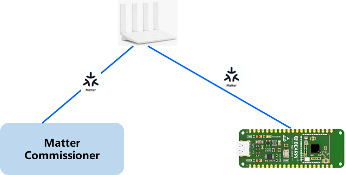
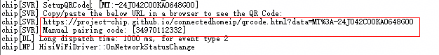
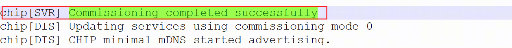
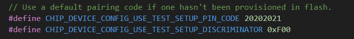

# 前言

**概述**

本文档主要介绍Matter在WS63V100开发验证操作步骤及使用注意事项等，为软件开发和测试人员在本芯片开发验证Matter提供必要的指导。

> **说明：** 
>本文以WS63V100描述为例进行描述。

**产品版本**

与本文档相对应的产品版本如下。

<table><thead align="left"><tr id="row116mcpsimp"><th class="cellrowborder" valign="top" width="32%" id="mcps1.1.3.1.1">
产品名称

</th>
<th class="cellrowborder" valign="top" width="68%" id="mcps1.1.3.1.2">
产品版本

</th>
</tr>
</thead>
<tbody><tr id="row122mcpsimp"><td class="cellrowborder" valign="top" width="32%" headers="mcps1.1.3.1.1 ">
WS63

</td>
<td class="cellrowborder" valign="top" width="68%" headers="mcps1.1.3.1.2 ">
V100

</td>
</tr>
</tbody>
</table>

**读者对象**

本文档主要适用于以下工程师：

-   技术支持工程师
-   软件开发工程师

**符号约定**

在本文中可能出现下列标志，它们所代表的含义如下。

<table><thead align="left"><tr id="row1530720816410"><th class="cellrowborder" valign="top" width="20.580000000000002%" id="mcps1.1.3.1.1">
<strong id="b2136615816410">符号</strong>

</th>
<th class="cellrowborder" valign="top" width="79.42%" id="mcps1.1.3.1.2">
<strong id="b5941558116410">说明</strong>

</th>
</tr>
</thead>
<tbody><tr id="row1372280416410"><td class="cellrowborder" valign="top" width="20.580000000000002%" headers="mcps1.1.3.1.1 ">

</td>
<td class="cellrowborder" valign="top" width="79.42%" headers="mcps1.1.3.1.2 ">
表示如不避免则将会导致死亡或严重伤害的具有高等级风险的危害。

</td>
</tr>
<tr id="row466863216410"><td class="cellrowborder" valign="top" width="20.580000000000002%" headers="mcps1.1.3.1.1 ">

</td>
<td class="cellrowborder" valign="top" width="79.42%" headers="mcps1.1.3.1.2 ">
表示如不避免则可能导致死亡或严重伤害的具有中等级风险的危害。

</td>
</tr>
<tr id="row123863216410"><td class="cellrowborder" valign="top" width="20.580000000000002%" headers="mcps1.1.3.1.1 ">

</td>
<td class="cellrowborder" valign="top" width="79.42%" headers="mcps1.1.3.1.2 ">
表示如不避免则可能导致轻微或中度伤害的具有低等级风险的危害。

</td>
</tr>
<tr id="row5786682116410"><td class="cellrowborder" valign="top" width="20.580000000000002%" headers="mcps1.1.3.1.1 ">

</td>
<td class="cellrowborder" valign="top" width="79.42%" headers="mcps1.1.3.1.2 ">
用于传递设备或环境安全警示信息。如不避免则可能会导致设备损坏、数据丢失、设备性能降低或其它不可预知的结果。

“须知”不涉及人身伤害。

</td>
</tr>
<tr id="row2856923116410"><td class="cellrowborder" valign="top" width="20.580000000000002%" headers="mcps1.1.3.1.1 ">

</td>
<td class="cellrowborder" valign="top" width="79.42%" headers="mcps1.1.3.1.2 ">
对正文中重点信息的补充说明。

“说明”不是安全警示信息，不涉及人身、设备及环境伤害信息。

</td>
</tr>
</tbody>
</table>

**修改记录**

<table><thead align="left"><tr id="row2942532716410"><th class="cellrowborder" valign="top" width="20.72%" id="mcps1.1.4.1.1">
<strong id="b5687322716410">文档版本</strong>

</th>
<th class="cellrowborder" valign="top" width="26.119999999999997%" id="mcps1.1.4.1.2">
<strong id="b5800814916410">发布日期</strong>

</th>
<th class="cellrowborder" valign="top" width="53.16%" id="mcps1.1.4.1.3">
<strong id="b3316380216410">修改说明</strong>

</th>
</tr>
</thead>
<tbody><tr id="row5947359616410"><td class="cellrowborder" valign="top" width="20.72%" headers="mcps1.1.4.1.1 ">
01

</td>
<td class="cellrowborder" valign="top" width="26.119999999999997%" headers="mcps1.1.4.1.2 ">
2026-03-20

</td>
<td class="cellrowborder" valign="top" width="53.16%" headers="mcps1.1.4.1.3 ">
第一次正式版本发布。

</td>
</tr>
</tbody>
</table>

# Matter概述

## Matter简介

Matter由CSA\(Connectivity Standards Alliance，连接标准联盟\)的工作组开发，是一个统一的开源应用层连接标准，旨在使开发人员和设备制造商能够连接并构建可靠、安全的生态系统，提高联网家庭设备之间的兼容性。它采用经市场验证的技术，使用互联网协议（IP），兼容Thread 和 Wi-Fi网络传输。

Matter技术包含了三份规格书，分别是：

-   Matter Core Specification：核心标准是主要标准，定义了Matter协议架构、安全通信机制、配网流程、数据模型等Matter技术内容。
-   Matter Application Cluster Specification：目前支持的Matter产品应用相关的cluster的详细定义。
-   Matter Device Library Specification：目前支持的Matter设备类型的具体定义，比如设备需要满足的cluster。

它们都可以在CSA官网下载。

> **说明：** 
>Matter标准文档下载地址：[https://csa-iot.org/developer-resource/specifications-download-request/](https://csa-iot.org/developer-resource/specifications-download-request/)

## Matter解决方案

本SDK集成了Matter SDK，可以作为Matter Device设备通过Matter Commissioner配网后连接到Matter控制器并由其控制。支持基于SDK开发丰富的Device设备，如灯泡、开关、传感器、恒温器、百叶窗、门锁等。当前方案中提供智能灯具DEMO，供开发者参考。

当前SDK默认支持的Matter SDK版本和标准：Matter 1.4.2。

# 开发环境搭建

## 开发环境说明

-   Matter开发环境：Ubuntu 22.04 LTS
-   Matter SDK：需要从社区下载Matter 1.4.2版本，放到SDK matter目录下。

目录说明：

本SDK matter组件位于：

middleware/services/matter

matter代码目录结构如下：

├── adapter   // 适配代码目录

│   ├── config   // 本芯片matter代码构建配置目录

│   │   └── hisilicon

│   │       ├── mbedtls

│   │       └── toolchain

│   ├── examples   // 本芯片matter DEMO样例示例代码目录

│   │   ├── lighting-app

│   │   │   └── hisilicon

│   │   │       └── main

│   │   │           └── include

│   │   └── platform

│   │       └── hisilicon

│   │           ├── common

│   │           └── ota

│   └── src   // 本芯片平台matter适配核心代码目录

│       └── platform

│

└── patch // 原生代码修改补丁

## Matter开发环境搭建步骤

1.  编译开发服务器环境依赖安装。

    sudo apt-get install git gcc g++ pkg-config cmake libssl-dev libdbus-1-dev \\

    libglib2.0-dev libavahi-client-dev ninja-build python3-venv python3-dev \\

    python3-pip unzip libgirepository1.0-dev libcairo2-dev libreadline-dev default-jre

2.  官网下载Matter SDK 1.4.2版本到SDK matter目录（Matter适配代码位于SDK目录: middleware/services/matter）

    Matter SDK下载方法：git clone --recurse-submodules  [https://github.com/project-chip/connectedhomeip.git](https://github.com/project-chip/connectedhomeip.git)  -b v1.4.2-branch

3.  将Matter芯片移植适配代码patch合入到Matter SDK。

    执行脚本：hisi\_matter\_patch.sh

    脚本位于“middleware/services/matter”目录下。

4.  安装Matter编译依赖环境。

    进入目录：middleware/services/matter/connectedhomeip

    执行脚本：scripts/activate.sh

5.  配置mbedtls路径（如果不使用SDK自带的mbedtls，需要执行此步骤；如果使用SDK自带的mbedtls，忽略此步）。

    将middleware/services/matter/libMatter.mk文件中的以下mbedtls路径改为真正使用的开源mbedtls路径。

    INCLUDES += -I$\(BASEDIR\)/open\_source/mbedtls/mbedtls\_v3.6.0/include

    INCLUDES += -I$\(BASEDIR\)/open\_source/mbedtls/mbedtls\_v3.6.0/include/psa

6.  在源码根目录下执行Matter编译命令。

    命令：python3 -u build.py -c ws63-liteos-matter

    编译生成结果在output目录:output/ws63/fwpkg/ws63-liteos-matter/ws63-liteos-matter\_all.fwpkg

Matter详细编译构建环境参考官方指南：[https://project-chip.github.io/connectedhomeip-doc/guides/BUILDING.html](https://project-chip.github.io/connectedhomeip-doc/guides/BUILDING.html)

# 测试验证

## 测试验证说明

Matter应用sample默认支持light app，支持led灯的开和关操作，使用light app来验证Matter SDK本芯片集成适配。

Matter配网图如[图1](#fig12869218103212)所示。

**图 1**  Matter测试组网图  

matter commisioner可以是支持matter的手机，以及matter官方提供的调试工具chip-tool等。

### Matter测试验证方法

Matter测试验证支持下列方式：

1.  使用Matter生态设备配网（如Apple Home, Google Home，三方Matter App如涂鸦智能App等）。
2.  使用测试工具chip-tool。

### Matter证书烧写

本芯片Matter解决方案SDK预制了测试证书，Matter连接配网前需要烧写证书。烧写方法：

串口工具输入AT命令： AT+MATTERPROVISION

注：该测试证书仅供开发调试使用，不支持商用产品使用。

## 使用Matter生态设备配网

以Apple Home为例，测试时支持扫码配对或手工输入配对码进行配对。

开发测试阶段，二维码及手工配对码会在Matter设备启动时打印到串口。

使用Apple Home生态配网Matter设备，详细可以参考Apple官网操作说明：[https://support.apple.com/zh-cn/102135](https://support.apple.com/zh-cn/102135)

配网成功过程，设备端串口有如下关键日志。

## 使用chip-tool测试验证

chip-tool 是一个linux工具，可用于配对测试matter设备，工具详细介绍及使用说明可以参考官方文档：

[https://project-chip.github.io/connectedhomeip-doc/development\_controllers/chip-tool/chip\_tool\_guide.html](https://project-chip.github.io/connectedhomeip-doc/development_controllers/chip-tool/chip_tool_guide.html)

### 配对命令

./chip-tool pairing ble-wifi <node\_id\> <ssid\> <password\> <pin\_code\> <discriminator\>

在这个命令中：

<node\_id\> ：用户自定义的被配对设备的ID

<ssid\> 和 <password\> ：给被配对设备设置的wifi和密码

<pin\_cod\> 和 <discriminator\> ：针对被配对设备的密钥

参考板Matter配网示例：

chip-tool pairing ble-wifi 0x7238  ssid  password  20202021 3840

pin\_code和discriminator默认值在配置文件中修改和查看,如下：

文件路径：middleware/services/matter/connectedhomeip/src/platform/hisilicon/CHIPDevicePlatformConfig.h

可以使用AT命令快速查看pin code和鉴别码discriminator

命令：AT+MATTERSHOW，串口中打印设备配置信息，查看pin code和 discriminator对应字段的值

### 控制 onoff

./chip-tool onoff toggle <node\_id\> <endpoint\_id\>

在这个命令中：

<node\_id\> 是被控制设备的ID

<endpoint\_id\> 是实现了onoff cluster的endpoint的ID

Matter方案参考应用控制灯开关：

灯打开：chip-tool onoff on 0x7238 1

灯关闭：chip-tool onoff off 0x7238 1

chip-tool详细使用说明可参考官方文档：

[https://project-chip.github.io/connectedhomeip-doc/development\_controllers/chip-tool/chip\_tool\_guide.html](https://project-chip.github.io/connectedhomeip-doc/development_controllers/chip-tool/chip_tool_guide.html)

### Matter OTA测试验证

在树莓派中使用 chip-ota-provider-app模拟provider。另开启一个新的树莓派终端来作为commissioner，在这个新的commissioner终端中，既要和前一个终端模拟出的provider 配网，又要和设备进行配网，使二者都在同一个Fabric网络中。 provider配网完毕后, commissioner终端需要配置provider的ACL访问权限，随后通知设备有一个provider已经存在，然后开始OTA升级。

-   **OTA镜像制作**

    _src/app/ota\_image\_tool.py create -v 0xDEAD -p 0xBEEF -vn 2 -vs "2.0" -da sha256 firmware.bin firmware.ota_

    参数说明：

    -v: vid， vendor id

    -p: pid, product id

    -vn: 软件版本号

    -vs: 字符串格式的软件版本号

    _firmware.bin_：为Matter OTA脚本输入镜像，使用FOTA镜像作为输入

    _firmware.ota_: 为Matter OTA脚本输出镜像，即下文中的_ws63.firmware.ota_

-   **启动OTA provider并添加到matter网络**

    在终端1中执行命令启动OTA provider：

    _chip-ota-provider-app -f  ws63.firmware.ota_

    在终端2将provider添加到matter网络：

    _chip-tool pairing onnetwork 1 20202021_

    注：这里的nodeid是1， 配网成功后，chiptool使用此nodeid作为句柄控制它。

-   **配置OTA provider的ACL权限**

    _chip-tool accesscontrol write acl '\[\{"fabricIndex": 1, "privilege": 5, "authMode": 2, "subjects": \[112233\], "targets": null\}, \{"fabricIndex": 1, "privilege": 3, "authMode": 2, "subjects": null, "targets": null\}\]' 1 0_

    注：在 Matter OTA过程中，配置ACL（Access Control List，访问控制列表）是为了确保只有被授权的节点能够对OTA Provider（固件提供者）发送命令和进行操作。ACL 是一种安全机制，用于管理和强制执行对节点Endpoint及其相关Cluster实例的访问权限规则。

-   **ws63设备添加到Matter网络**

    _chip-tool pairing ble-wifi 0x7238  ssid  password  20202021 3840_

-   **启动Matter OTA升级**

    _chip-tool otasoftwareupdaterequestor announce-otaprovider <ota\_provider\_node\_id\> 0 0 0 <device\_node\_id\> 0_

    如：chip-tool otasoftwareupdaterequestor announce-otaprovider 1 0 0 0 0x7238 0

    参数说明：

    Provider Node ID：配网chip-ota-provider-app时输入的1

    Provider Vendor ID：测试时直接输入0

    Announcement Reason：测试时直接输入0

    Provider Endpoint ID：通常在Endpoint 0

    Requestor Node ID：配网Matter设备时输入的_0x7238_

    Requestor Endpoint ID：通常在Endpoint 0

### TH测试

为了简化Matter设备的测试和认证过程，连接标准联盟开发了一套标准化的测试工具，即Matter Test Harness。随着Matter发展至V1.5版本，Matter的测试工具Test Harness也在同步更新，目前联盟已经不再提供完整的最新Test Harness镜像文件，而是完全开源，可以在GitHub上获取代码自行安装。

详细可参考官方文档：[https://matter.cn/development/test-harness](https://matter.cn/development/test-harness)

# 常用开发调试命令

## 常用开发调试命令

### 烧写证书

命令：AT+MATTERPROVISION

作用：Matter参考设备默认没有证书，需要通过此命令烧写测试证书

备注：烧写完成后需重启设备；客户侧若自行实现证书烧写工具，需保证证书和密钥存储在NV区域中，对应的keyId如下：

证书声明DC：0x6002

设备证书DAC：0x6003

中间证书PAI：0x6004

DAC私钥：0x6005

DAC公钥：0x6028

### 显示Matter配置信息

命令：AT+MATTERSHOW

作用：显示Matter设备配置信息，如pin code、鉴别码等。

### 查看单板网络ip信息

命令：AT+IFCFG

作用：查看单板网络信息，设备是否接入到路由热点，是否正确分配到IP地址。

### PING命令

-   命令：AT+PING

    作用：测试IPV4网络连接。

    示例：AT+PING=192.168.3.1   执行ping 192.168.3.1

-   命令：AT+PING6

    作用：测试IPV6网络连接。

    示例：AT+PING6=2001:a:b:c:d:e:f:b

### 查看系统信息

命令：AT+SYSINFO

作用：查看系统所有线程状态，如优先级，堆栈状态，内存、CPU使用状态，方便查看和定位问题

