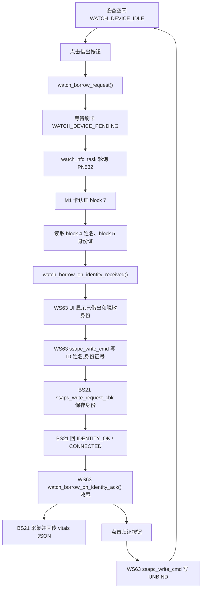

# st7796s_ft6336u 功能流程指南

本文档说明 `st7796s_ft6336u` 当前的设备借出、PN532/M1 读卡、身份脱敏显示、WS63 与 BS21 `sle_1vn` 对接流程。

## 1. 当前实现范围

- 设备列表扫描并添加 BS21 设备，目标广播名格式为 `watch-xx`。
- 点击空闲设备的借出按钮后，设备进入 `WATCH_DEVICE_PENDING`，UI 显示 `waiting card`。
- NFC 后台任务只在存在待借出设备时轮询 PN532/M1 卡。
- 读到 M1 卡后，认证第 1 扇区，读取姓名和身份证号。
- WS63 本地 UI 立即显示借出人姓名和脱敏身份证号，设备状态改为 `WATCH_DEVICE_BORROWED`。
- WS63 作为 SSAP client，通过 `ssapc_write_cmd()` 向 BS21 server 写入完整身份。
- BS21 收到 `ID:姓名,身份证号` 后保存身份，并回传 `IDENTITY_OK` / `CONNECTED:姓名,身份证号`。
- WS63 收到 BS21 确认后收尾本次借出上下文。
- 点击已借出设备按钮时，WS63 向 BS21 写入 `UNBIND`，并清空本地借出信息。
- BS21 完成测量后，可通过 notify/indicate 把 JSON 报告回传给 WS63，WS63 再转 MQTT 队列。

## 2. 相关文件

| 文件 | 作用 |
| --- | --- |
| `m1_pn532.h` | PN532/M1 卡底层接口定义 |
| `m1_pn532.c` | PN532 软件 I2C、寻卡、认证、读块、M1 数据解析 |
| `watch_nfc_task.h` | NFC 任务启动接口 |
| `watch_nfc_task.c` | PN532 初始化、待借出时轮询 M1 卡、读取身份并上报 |
| `watch_borrow.h` | 借出流程对外接口 |
| `watch_borrow.c` | 借出、归还、等待刷卡状态、身份证脱敏、BS21 确认处理 |
| `watch_ui.c` | 设备列表、扫描弹窗、借出按钮、借出人信息显示 |
| `watch_model.h/.c` | 保存设备、扫描结果、借出人姓名和脱敏身份证号 |
| `sle_watch_server.h/.c` | SLE server + client，对 BS21 写入身份/解绑并接收回包 |
| `watch_app.c` | 启动 SLE、WiFi、NFC 后台任务 |
| `CMakeLists.txt` | 编译 PN532、NFC、借出流程源文件 |
| `Kconfig` | LCD、触摸和 PN532 引脚/轮询配置 |

## 3. 启动流程

系统入口仍然只有一个：

```c
app_run(st7796s_ft6336u_entry);
```

`display.c` 创建 LCD/触摸/LVGL 主任务后调用：

```c
watch_app_start();
```

`watch_app.c` 依次启动：

```c
sle_watch_server_start();
wifi_task_start(NULL, NULL);
watch_nfc_task_start();
```

注意：M1 示例包里的 `m1_app.c` 没有原样接入，因为它也有 `app_run()`，会和屏幕工程入口冲突。本工程只复用 `m1_pn532.c/.h` 的真实读卡能力。

## 4. PN532 引脚配置

LCD 与触摸已占用的主要引脚：

| 模块 | 引脚 |
| --- | --- |
| ST7796S SPI | SCK=7, MOSI=9, CS=10, DC=6, RST=3, BL=8 |
| FT6336U I2C | SDA=15, SCL=16, RST=12 |

当前生成配置中 PN532 使用：

| 配置项 | 当前生成值 | 含义 |
| --- | ---: | --- |
| `CONFIG_M1_PN532_SOFT_I2C_SCL_PIN` | 2 | PN532 软件 I2C SCL |
| `CONFIG_M1_PN532_SOFT_I2C_SDA_PIN` | 14 | PN532 软件 I2C SDA |
| `CONFIG_M1_PN532_SOFT_I2C_DELAY_US` | 5 | 软件 I2C 半周期延时 |
| `CONFIG_M1_PN532_POLL_INTERVAL_MS` | 500 | 轮询间隔 |

`Kconfig` 默认值可能和已保存的 menuconfig 不同，最终以 `src/output/ws63/acore/ws63-liteos-app/mconfig.h` 或 `ws63_liteos_app.config` 里生成的值为准。

## 5. M1 卡数据格式

当前读卡任务沿用 M1 示例包的数据格式：

| 数据 | 位置 | 格式 |
| --- | --- | --- |
| 姓名 | block 4 起 | UTF-8，`0xFF` 填充 |
| 身份证号 | block 5 | 18 位数字 BCD/解析格式 |
| 认证块 | block 7 | 第 1 扇区 trailer |
| Key A | block 7 | 优先 `88 88 88 88 88 88`，失败后尝试 `FF FF FF FF FF FF` |

读卡链路：

```c
m1_pn532_poll_card(&card);
m1_pn532_auth_key_a_with_key(&card, 7, key);
m1_pn532_read_block(4, name_block);
m1_pn532_read_block(5, id_block);
m1_unpack_name_blocks(...);
m1_unpack_id_block(...);
watch_borrow_on_identity_received(name, id_number);
```

如果卡内身份证最后一位可能为 `X`，或身份证以 ASCII 明文存储，需要继续调整 `m1_unpack_id_block()` 的解析规则。

## 6. 借出主流程

### 6.1 点击借出

用户在设备列表点击空闲设备按钮后：

```c
watch_borrow_request(device_index);
```

该函数会检查设备是否存在、是否在线、是否空闲。通过后：

- 设备状态改为 `WATCH_DEVICE_PENDING`。
- `borrower` 显示为 `waiting card`。
- `watch_borrow_is_waiting_card()` 返回 `1`。
- NFC 任务开始轮询 PN532。

### 6.2 PN532 读卡

NFC 任务常驻运行，但只有待借出上下文存在时才读卡。读到身份后调用：

```c
watch_borrow_on_identity_received(name, id_number);
```

该函数会：

- 将身份证号脱敏，只保留后 4 位。
- 把设备状态从 `WATCH_DEVICE_PENDING` 改为 `WATCH_DEVICE_BORROWED`。
- UI 显示借出人姓名和脱敏身份证号。
- 保存完整姓名和身份证号，准备通过 SLE 发给 BS21。
- 调用 `sle_watch_send_identity_to_device()`。

### 6.3 WS63 写入身份到 BS21

BS21 `sle_1vn` 是 SLE server，等待 `ssaps_write_request_cbk()`。因此 WS63 不能只用 server notify，而必须作为 SSAP client 对 BS21 property 写入。

WS63 当前流程：

```text
SLE connected
  -> 如果已配对，直接 ssapc_exchange_info_req()
  -> 如果未配对，先 sle_pair_remote_device()
  -> pair complete 后 ssapc_exchange_info_req()
  -> 发现 BS21 service 0x060B
  -> 发现 BS21 property 0x1122
  -> 保存 property handle
```

身份下发：

```c
sle_watch_send_identity_to_device(device_index, name, id_number);
```

实际 payload：

```text
ID:姓名,身份证号
```

实际发送接口：

```c
ssapc_write_cmd(client_id, conn_id, &param);
```

如果服务发现尚未拿到 property handle，会临时使用 fallback handle `17`，和现有 SLE 示例保持一致。串口会打印：

```text
[SLE] ssapc write cmd device=... conn=... handle=... len=... ret=...
```

BS21 收到后应打印：

```text
[sle 1vn server] write_request len:...
[sle 1vn server] ===== NFC Identity Stored =====
```

### 6.4 BS21 确认回包

BS21 当前会回传两类确认：

```text
IDENTITY_OK
CONNECTED:姓名,身份证号
```

WS63 两种都兼容。收到后调用：

```c
watch_borrow_on_identity_ack(name, id_number);
```

`IDENTITY_OK` 没有姓名和身份证字段，WS63 会沿用本地刚读到的身份上下文。`CONNECTED:` 带完整字段，WS63 会再同步一次姓名和脱敏身份证号。

### 6.5 BS21 测量 JSON 回传

BS21 完成分段测量后，通过 server notify/indicate 发 JSON 给 WS63：

```json
{
  "deviceId": "watch_01",
  "type": "vitals",
  "complete": true,
  "receivedMask": 15,
  "requiredMask": 15,
  "data": {
    "name": "姓名",
    "phone": "",
    "idCard": "身份证号",
    "height": "160 cm",
    "weight": "55 kg",
    "bmi": "21.5",
    "bloodPressure": "120/80 mmHg",
    "fastingBloodGlucose": "5.2 mmol/L"
  }
}
```

WS63 在 SSAP client notification/indication 回调中，如果 payload 以 `{` 开头，会写入 `g_mqtt_msg_queue`，交给原 MQTT/server 链路处理。

## 7. 身份证显示规则

完整身份证号不直接显示在 WS63 设备列表上。

```c
watch_borrow_make_masked_id(id_number, out, out_len);
```

显示规则：

```text
完整身份证号: 110101199001011234
显示结果: ******1234
```

本地 UI 只保存脱敏身份证号；SLE 链路目前仍按 BS21 协议发送完整身份证号。如果后续要求链路也加密，需要在 `sle_watch_send_identity_to_device()` 前增加加密、签名或 token 化。

## 8. 归还/解绑流程

点击已借出设备按钮：

```c
watch_borrow_return(device_index);
```

WS63 写入：

```text
UNBIND
```

随后本地立即：

- 设备状态恢复为 `WATCH_DEVICE_IDLE`。
- 清空 `borrower`。
- 清空 `borrower_id`。
- 如果当前还有待刷卡上下文，则取消等待。

BS21 收到后清空身份，并回传：

```text
UNBOUND
```

WS63 收到后记录 `device unbound` 日志。

## 9. 完整状态图



## 10. 调试判断表

| 现象 | 含义 | 优先检查 |
| --- | --- | --- |
| WS63 显示 `PN532 probe failed` | PN532 没初始化成功 | VCC/GND、I2C 模式、SCL/SDA、上拉、电平 |
| `I2C level before probe: scl=0` | SCL 被拉低 | 引脚冲突、PN532 未上电、线接反、外设占用 |
| WS63 UI 显示 `waiting card` | 借出流程已进入待刷卡 | 此时应刷 M1 卡 |
| WS63 打印 `identity read OK` | M1 身份读取成功 | 下一步看 SLE write |
| WS63 打印 `identity send failed` | 身份未发出 | 设备是否在线、conn valid、`ssapc write cmd ret` |
| WS63 打印 `ssapc write cmd ... ret=0x0` | 写命令已发出 | 下一步看 BS21 write_request |
| BS21 无 `write_request` | 未真正写到 BS21 server | property handle、配对/发现流程、连接对象 |
| BS21 有 `write_request` 但无 `NFC Identity Stored` | payload 格式不对 | 必须以 `ID:` 开头 |
| BS21 有身份但 WS63 未确认 | 回包未被 WS63 收到 | BS21 notify/indicate、WS63 client 回调 |
| BS21 有完整 JSON 但 WS63/MQTT 无结果 | JSON 回传链路问题 | WS63 是否收到 `{...}`，`g_mqtt_msg_queue` 是否创建 |

## 11. 编译说明

当前 `CMakeLists.txt` 已加入：

```cmake
"${CMAKE_CURRENT_SOURCE_DIR}/m1_pn532.c"
"${CMAKE_CURRENT_SOURCE_DIR}/watch_nfc_task.c"
"${CMAKE_CURRENT_SOURCE_DIR}/watch_borrow.c"
```

本次流程修改重点在 `sle_watch_server.c`：

- 增加 SSAP client 回调。
- 连接/配对完成后发现 BS21 service/property。
- 身份和解绑改为 `ssapc_write_cmd()` 写入 BS21。
- `conn_id == 0` 不再被当成未连接，改用 `g_device_conn_valid[]` 判断。
- 兼容 BS21 的 `IDENTITY_OK` 和 `CONNECTED:` 两种确认。

你前面说明由你本地编译，因此这里没有执行完整构建。若编译报错，把错误日志发出来后继续按具体报错修。
